# 标准制图分类

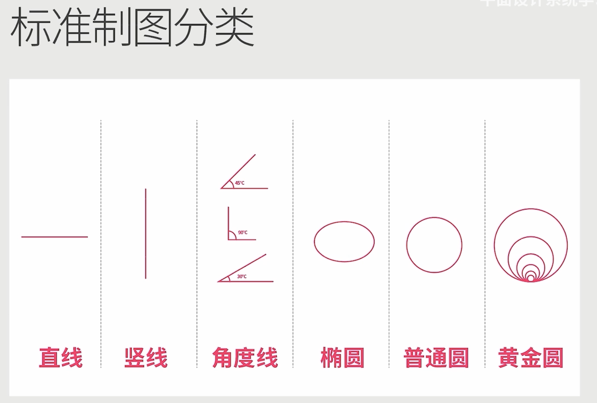

  

# Logo的制作步骤

### 1. 画线稿
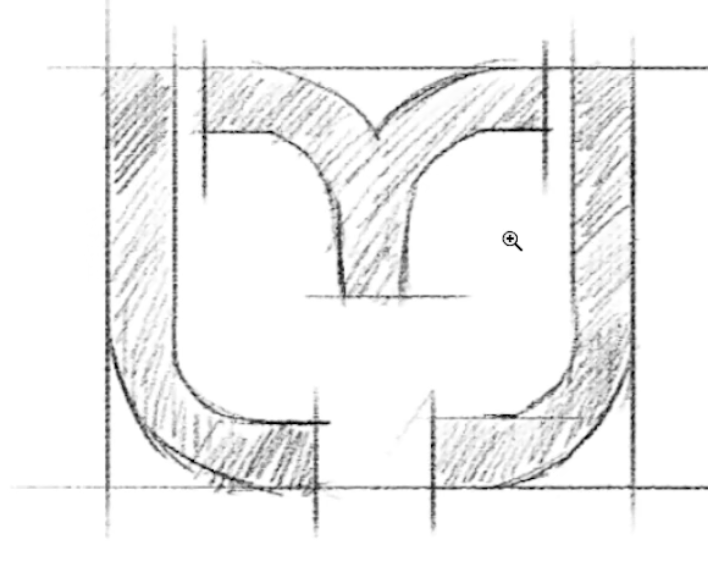

 

### 2. 绘制网格
**1. 画正方形**

 

**2. 将 正方形 分割为 50 x 50 的网格**  
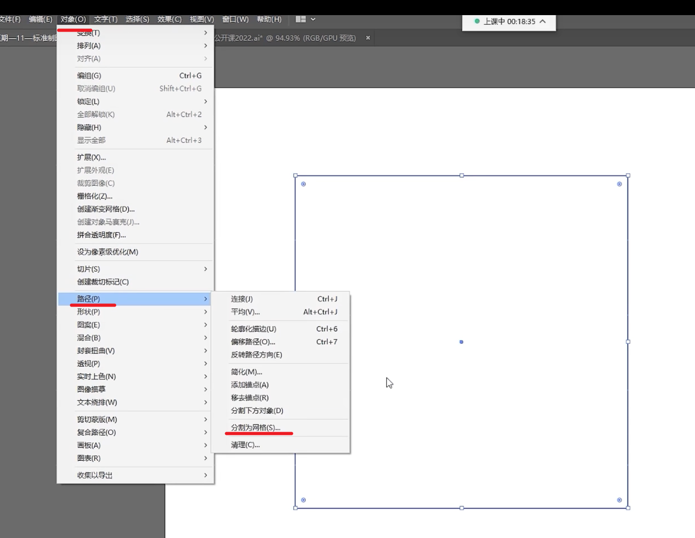  
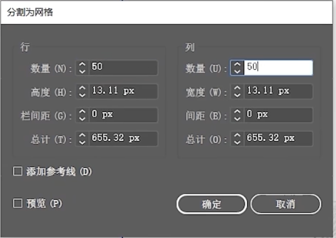  

 

**3. 调整网格的线粗和透明度**

 

**4. 将线稿放到网格的上方**

 

**5. 找到线稿中的最小单位**  
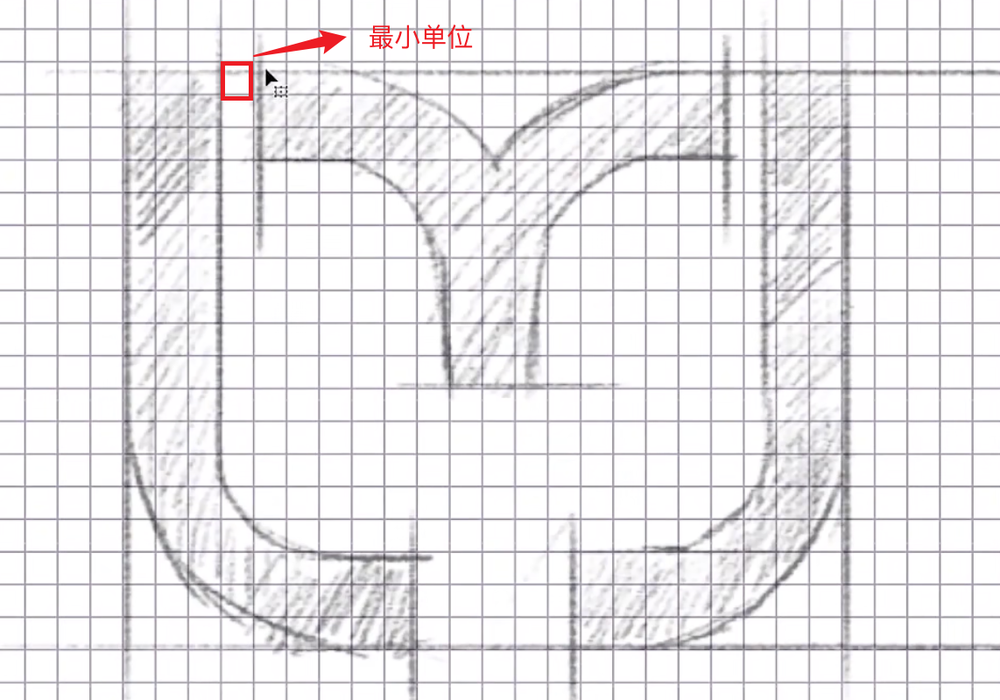

 

**6. 使用线段(描边面板3pt)来画图形**    
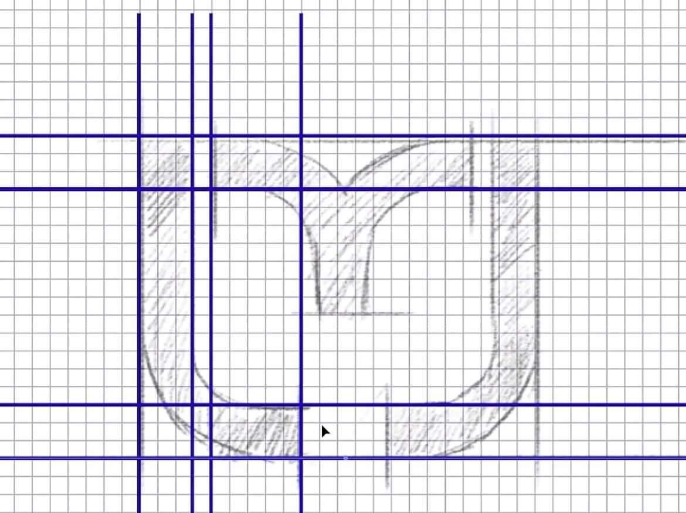

 

**7. 处理线稿的原型折角**  
使用 圆形 工具画圆, 弧度的位置应该和线宽一致, 比如线宽为3 ((外圆 - 内圆) / 2 = 3)

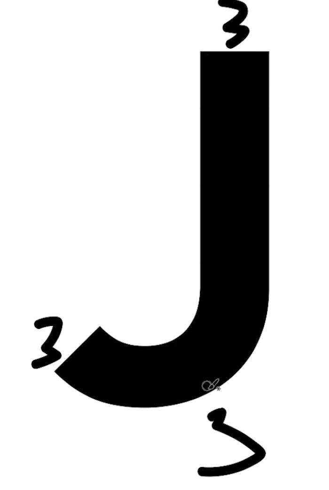

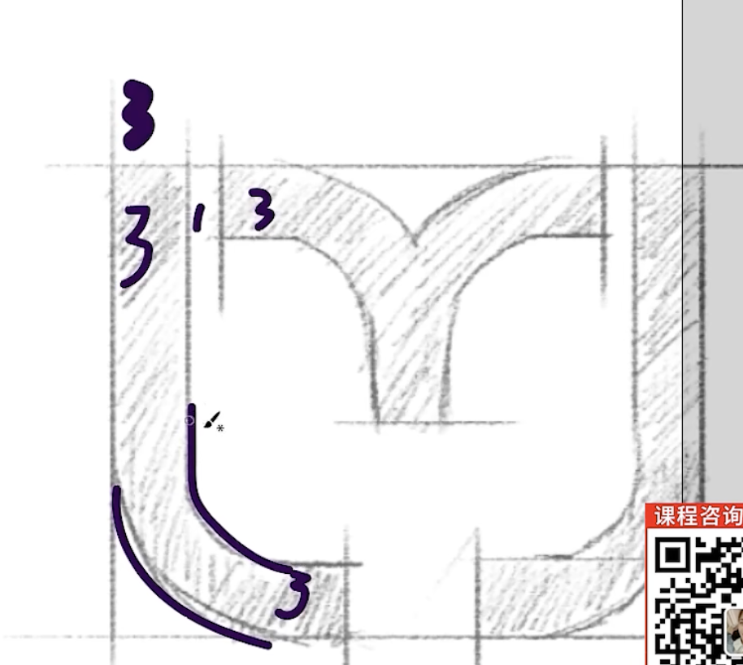 

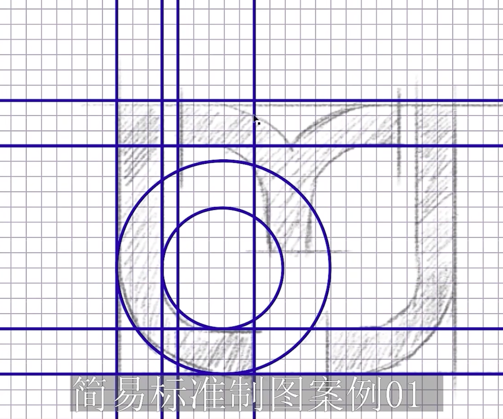 

 

**8. 将画好的图像 使用 形状生成器工具 将线段闭合 然后将需要的部分组合, 画出logo**  

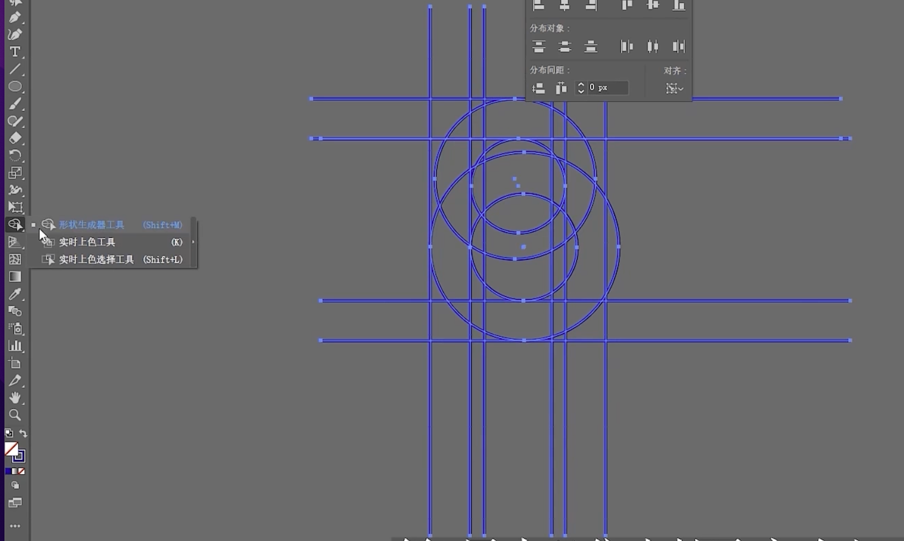    
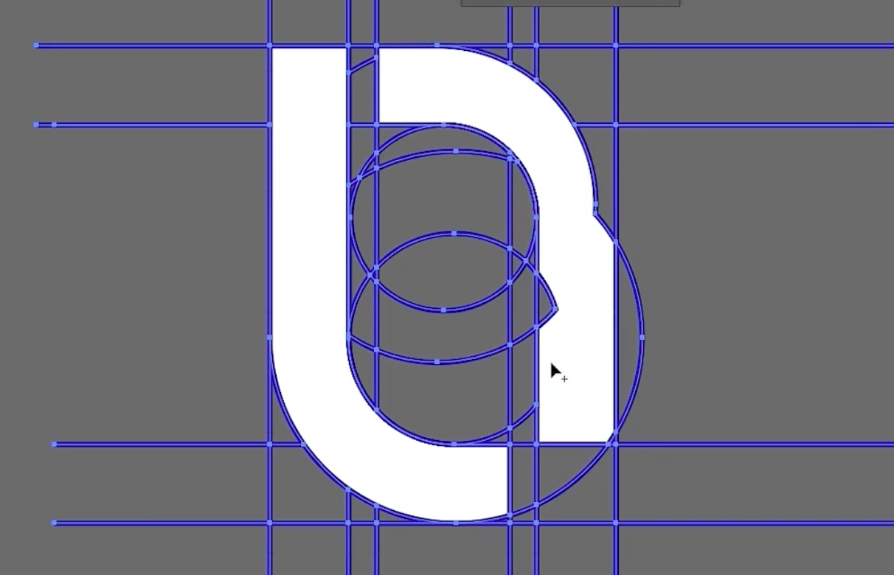

 

**9. 调整线段 和 logo的透明度**  
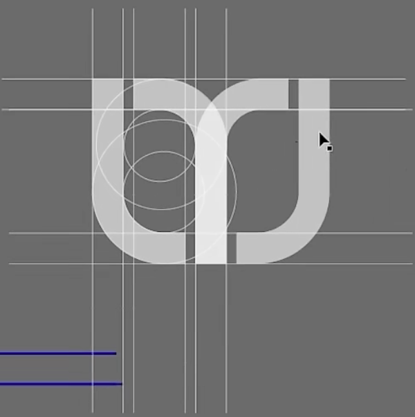

 

**10. 进行标注**  
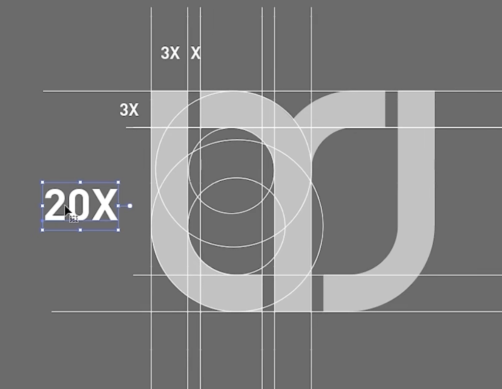

  

# 特殊线稿: 弧形logo 的 标准制图
比如下面的图 本身不是那么规则, 同时有不同的弧度, 这种图形的标准制图应该怎么处理

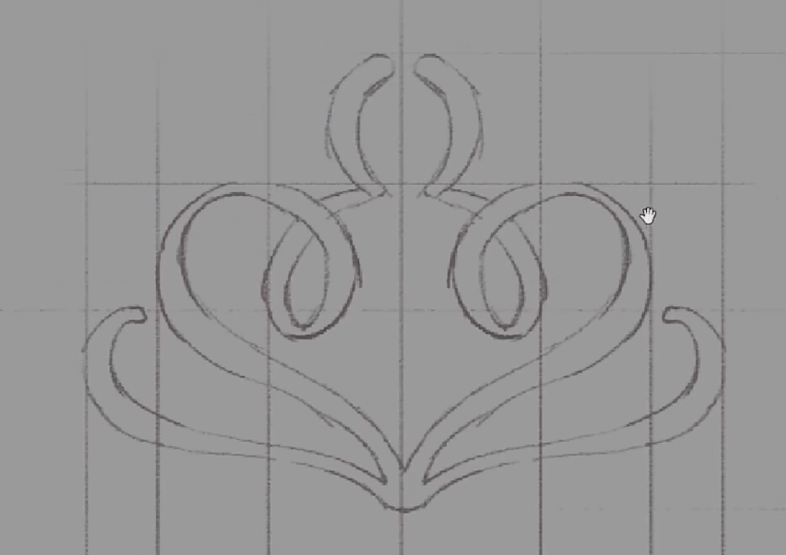

 

### 标准制图的方式:
我们可以画圆形

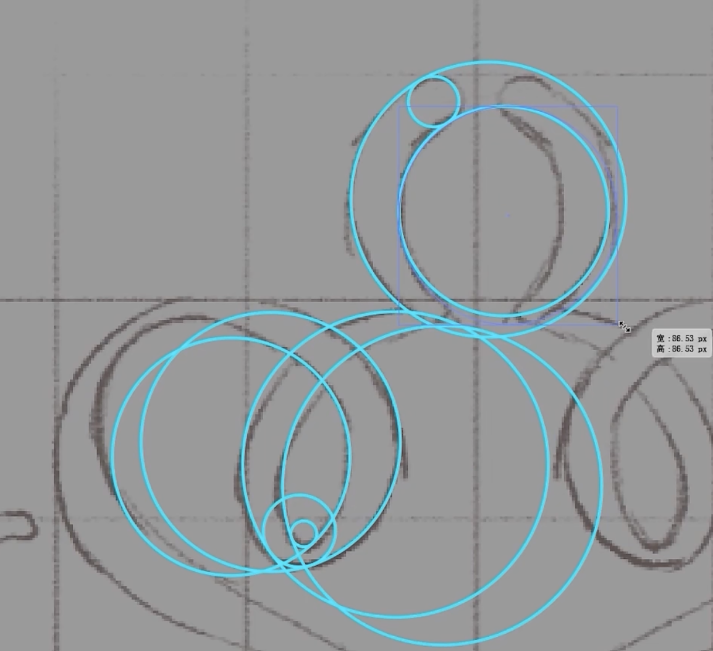

 

### 要点: 怎么保证 大圆 和 小圆 完全相切
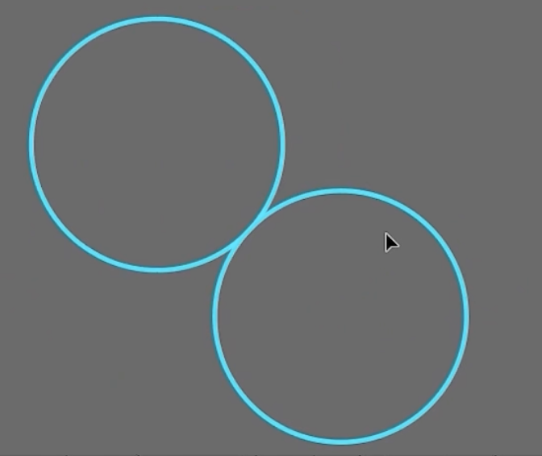

使用插件: **ai路径对象相切圆(SubScribe)** 插件

安装 插件后 就会有下图中的选项

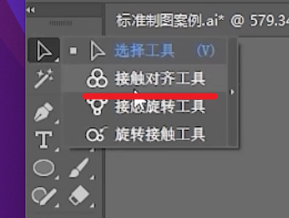

