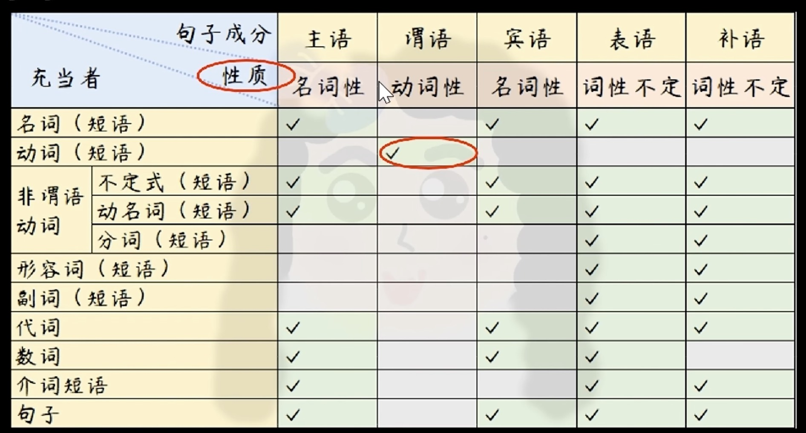
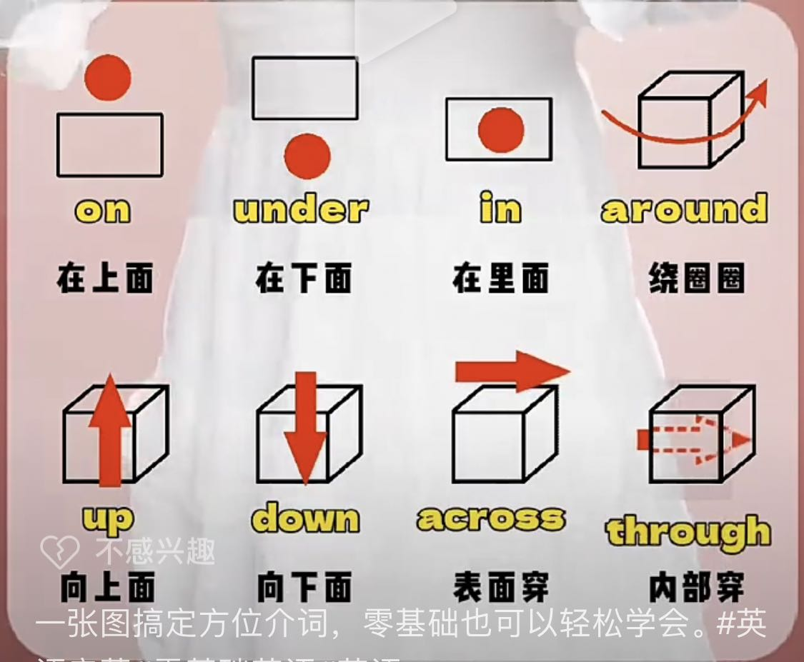
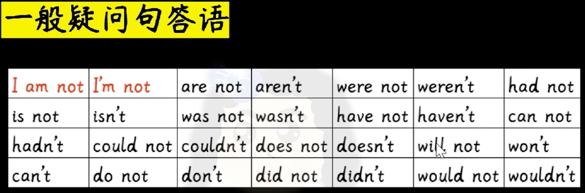
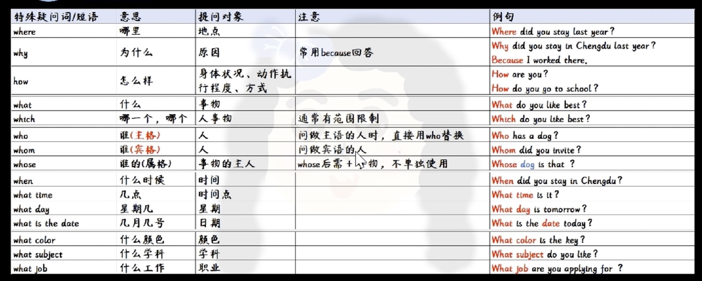
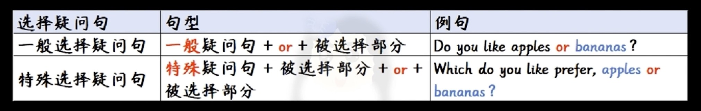

# 语法名词解析:
```s
# 资源
https://pan.baidu.com/s/1d23hKktAKpMvw8eqvrjdjg?pwd=n3zz%C2%A0%20%E4%BD%9C%E8%80%85%EF%BC%9A%E7%BF%A1%E7%BF%A0%E5%AE%AB%E7%8C%AB%E7%8C%AB%20https://www.bilibili.com/read/cv27875986/%20%E5%87%BA%E5%A4%84%EF%BC%9Abilibili#list/path=%2Fsharelink2594357619-933292127798263%2F%E6%96%B0%E6%A6%82%E5%BF%B5%E8%8B%B1%E8%AF%AD&parentPath=%2Fsharelink2594357619-933292127798263
```

<br><br>

## 句子成份充当表


<br><br>

# 句子成份解析

<br><br>

## 名词:
名词是指 人 或 物 的名称
- 人的名字
- 职业称呼
- 物品名称
- 地名
- 抽象概念 的名词: 勇气, 举止

<br>

### 名词短语
名词经常和其他词连用 形成 名词短语
- the man (那个人)
- the woman next door (隔壁的女人)
- that tall building (那座高楼)

<br>

### 名词的基本用法
1. 充当动词的 执行者
2. 做动词的 直接宾语
3. 做动词的 间接宾语
4. 做介词的 宾语
```s
# 我在《中国日报》上看到了这件事
I read about it in the China Daily /ˈdeɪli/.
```
5. 做 be, seem 等 系动词 的表语
6. 做同位语

<br>

### 复合名词
英语中有许多名词是由两个或两个以上的部分组合而成的 这种名词叫做复合名词
- classroom 教室
- childhood 童年
- son-in-law 女婿
- stick-in-the-mud 老顽固

<br>

### 复合名词 四种构成形式
1. 名词 + 名词
```s
a cupboard 碗柜
a keyboard 键盘
```

2. 形容词 + 名词
```s
a greenhouse 温室
```

3. 动名词 + 名词
```s
drinking water 饮用水
```

4. 名词 + 动名词
```s
horse-riding 骑马
```

<br>

### 名词的分类
名词大致可以分为两类
1. 专有名词
2. 普通名词

<br>

**专有名词:**  
指特定的 人, 地方, 事物 或 概念

这些人 地方 事物 或 概念 **实际上被认为是 独一无二 的**

**专有名词的开头字母要大写, 前面一般不用 冠词**

<br>

**专有名词分类:**  
1. 人名
2. 称呼: Mum
3. 地名
4. 月份, 星期, 节日, 季节等

未完

<br><br>

## 主语:
主语是 句子陈述的对象 或 句子中执行动作的主体

```s
You hit me
```

打这个动作的执行者是you, you就是主语

```s
I am your father
```

陈述的对象是 I, I就是主语

```s
# 听起来很糟糕
That sounds terrible
```

陈述的对象是 That, That就是主语

<br>

### 主语的位置
它通常位于 **句首** 和 **谓语** 之前

<br>

### 主语的充当者: 名词性的词, 短语, 句子
1. 具有名词性的词 和 短语
2. 不定式
  - 它当主语的时候 会出现主语不在句首的情况
3. 动名词
4. 代词
5. 数词
6. 介词短语
7. 句子 等

<br>

**具有名词性的词 和 短语:**  
下面的例子中的主语为 is前面的 My favorite teacher, 我的 和 最喜欢的 都是用来限定老师的 这个部分具有名词性
```s
# 我最喜欢的老师是Yajian
# favorite /ˈfeɪvərɪt/ adj 最受喜爱的
My favorite teacher is Yajian
```

```s
# 穷人是永远不会接受他们奴隶的命运
accept /əkˈsept/
fate /feɪt/
slavery /ˈsleɪvəri/
The poor will never accept the fate of slavery
```

句首的 ``The poor`` 穷人 是主语 poor是贫穷的形容词, 形容词本身不具有名词性, 不能做主语, 但是 **定冠词 + 形容词** 将形容词名词化了, **The poor 是穷人的意思**

<br>

**不定式 和 不定式短语** 也有名词性 可以充当主语
```s
# 保持健康是重要的
# important /ɪmˈpɔːt(ə)nt/ adj 重要的, 重大的
It's important to keep fit
```

陈述的对象是保持健康 ``to keep fit``, 所以句子的主语是 保持健康

这个主语就没有在 句首 和 谓语 之前了 但是句首的 it 也是主语, 这里的it叫做**形式主语**, 因为它没有说明什么是重要的, 它相当于后面的 ``to keep it`` 的替身, 而后面的不定式部分才是主语 

```s
# 和他人分享你的日常生活 是一种爱的表达
share /ʃeə/
expression /ɪkˈspreʃ(ə)n/
To share your daily life with others is an expression of love
```

be动词前面的是主语, 这一个部分是主语

<br>

此外**动名词**也可以做主语, 直接只用read动词做主语是不行的

```s
Reading is fun
```

<br>

**代词**也具有名词性, 爱这个动作的执行者是我 I是一个人称代词

```s
I love you
```

```s
# 他们两是学生
Both of them are students
```

陈述的对象是 both, 也就是 两者 做主语 它是一个代词 但具有名词性

<br>

**数词**也可以充当主语

```s
Ten divided by two equals five
```

<br>

**介词短语**也可以充当主语
```s
# 6点 - 7点 适合我
Between six and seven will suit me
```

主语是 Between six and seven 这个介词短语部分

<br>

**句子**也可以充当主语
```s
# 他昨天去了哪里 这是一个秘密
Where he went yesterday is a secret
```

``Where he went yesterday`` 这个句子部分整体充当主语

<br><br>

## 谓语
谓语 是陈述**主语的 动作 或 状态 的部分**, 用来说明主语是
- 做什么的
- 是什么
- 怎么样

当然谓语不仅仅只能用动词来体现, 比如

```s
You hit me
```

hit实义动词 用来说明主语的动作, 说明主语在进行 **打** 这个动作, 

```s
# 你是爹, 表示主语是什么
I am your father

# 听起来很糟糕, 描述主语怎么样
That sounds terrible
```

上面的两个例句是用来说明主语的状态

- You hit me: 实义动词 充当的谓语
- I am your father: 系 + 表 结构 充当谓语
- sounds terrible: 感官系动词 + 表 也是系表结构 充当谓语

<br>

### 谓语 的作用
谓语对 **主语的** 动作 或 状态 进行陈述 或 说明的部分, 也就是指出主语 **做什么 是什么 怎么样**

谓语要用具有 动词性的词汇 或 短语来充当

<br>

### 可以充当 谓语 的部分
根据 谓语的结构 可以将谓语部分分为
1. 简单谓语
2. 复合谓语


<br>

**简单谓语: 动词 或 动词性 短语**
```s
# loves 实义动词 单个动词 充当谓语
Yajian loves me.

# Yajian昨晚熬夜很晚: stayed up是具有动词性的短语 短语动词也可充当谓语
Yajian stayed up late yesterday.
```

<br>

**复合谓语:**  
充当谓语的部分包含 不只一个动词 或者 包含别的句的成份

复合谓语结构一般有如下4种结构 充当谓语部分
1. 系动词 + 表语
2. 某些动词 + 不定式
3. 情态动词 + 动词原形
4. 助动词 + 动词原形

<br>

**系动词 + 表语:**  
```s
# 这鱼闻起来很臭。
# 系动词 + 表语: 感官系动词 + 表语bad 整体充当句子中的谓语成份
The fish smells bad

# 我对所有种类的书都感兴趣
# am interested 系动词 + 表语 整体用来充当谓语
I am interested in all kinds of books
```

<br>

**2. 需要搭配不定式的动词 to do 和 它后面的不定式整体充当谓语**
```s
# 老板决定聘用他
# 决定做某事 decide to do
The boss decided to employ him

# 我想回家
# 想做某事 want to do
I want to go home
```

<br>

**3. 情态动词 + 动词原形 充当谓语部分**
```s
# Yajian能帮你
Yajian can help you

You must eat more
```

<br>

**4. 助动词 + 动词原形 充当谓语部分**
```s
# 的确喜欢你
Yajian does like you
```

<br>

### 总结
- 具有实义动词的 都是用来说明 主语的动作的 (做什么)
- 系表结构说明主语的状态 (是什么, 怎么样)

<br><br>
　　
## 宾语
宾语 是**动作, 行为的 对象 / 承受者**, 它常位于 及物动词 或 介词 之后

```s
# hit 及物动词 
# me 宾语
You hit me

# 我不想谈论它
# about 介词
# it 宾语
I don't want to talk about it
```

<br>

### 宾语的充当者
宾语的充当者 和 主语 一样是 **名词性的词** **名词短语** 或者是 **句子**

1. 具有名词性的词 和 短语
2. 不定式
3. 动名词
4. 代词
5. 数词
6. 句子 等

```s
# 名词短词充当宾语
# 没有太多时间吃午饭
# have 及物动词
# much time(名词短语) 宾语
You do not have much time for lunch


# 名词充当宾语
# 我真的喜欢她的裙子
# like 及物动词
# the skirt(名词) 宾语
I really like the skirt there.

  
# 不定式充当宾语
# 我想玩电脑游戏
# want 及物动词
# to play computer Games(不定式) 宾语
I want to play computer Games


# 动名词充当宾语
# 我喜欢在家读书
# enjoy 及物动词
# reading(read的动名词形式) 宾语
I enjoy reading at home


# 代词充当宾语
# 这是我的新包, 我每天都带它去学校
# take 及物动词
# it 宾语
This is my new bag, and I take it to school every day


# 数词充当宾语
# 看看这些要求 再写两个
# write 及物动词
# two 宾语
Look at the requests and write two more


# 句子充当宾语
# 没有人能够真正的知道你的感受 
# know 及物动词
# how you feel 宾语
No one can really know how you feel
```

<br>

### 宾语的分类
根据 宾语 在句子中的使用情况 宾语可以分为
1. 单宾语: 及物动词后 或 介词后 只有一个宾语
2. 双宾语 (间接宾语, 直接宾语): 及物动词后 或 介词后 有二个宾语
3. 复合宾语 (宾语 + 宾补)
```s
# 单宾语
# 你应该在晚饭之前完成 家庭作业
# finish 及物动词
# homework 宾语
# before 介词
# dinner 宾语
# 我们能看到 动词 和 介词 后面都只跟了一个宾语 它们都是单宾语
You should finish homework before dinner


# 双宾语
# gave 及物动词 后面跟了两个宾语
# me 间接宾语(人)
# an English book 直接宾语(物)
# 在双宾语的场合下, 表示人的部分都是间接宾语, 物都是直接宾语
Yajian gave me an English book


# 复合宾语
# 二胡是中国的小提琴
# call 及物动词
# erhu 宾语
# Chinese violin 宾语补足语
# 在复合宾语中无论是缺少 宾语 还是 宾补 都会让整个句子变得不完整
Many western people call erhu the "Chinese violin"
```

<br><br>

## 宾格
指的是 名词 或 代词 在句子中作为宾语时的形式 **宾语通常是动词或介词的作用对象, 即受动作影响的对象**

也就是说 名词或代词 在作为宾语出现的时候 要使用 其宾格
```s
# 我看见他
I see him.
```

上面的句子中, "him" 是代词 "he" 的宾格形式, 作为动词 "see" 的宾语

<br><br>

## 定语
用来修饰(说明) 名词 或 代词 的 **品质与特征** (都可以翻译为 ``...的`` 么)

比如 形 + 名, 中文中 ``金色的十月``, 金色的 说明 十月 的特征, 其中 ``金色的`` 这个形容词就是名词 ``十月`` 的 **定语**

比如 形 + 代,  中文中 ``乐于助人的她``, 乐于助人的 说明 她 的品质, ``乐于助人`` 就是 ``她`` 的定语

比如 我买了一本余华写的有趣的书 我们看中文翻译 能发现修饰书的修饰词有两个
1. 余华写的 written by YuHua
2. 有趣的 interesting
```s
# bought /bɔːt/ 是 buy 的过去形式
I bought an interesting book written by YuHua
```

它们都是 书(book) 的定语, 其中 book 前面的定语叫做 **前置定语**, 后面的叫做 **后置定语**, 所以定语的充当者分为两种, 前置定语 和 后置定语

<br>

### 定语的充当者: 前置定语
1. 名词性的词 或 短语
  - 名词 (短语)
  ```s
  # 就是因为下雨 运动会延迟了
  # sports 运动 它是个名词 来修饰 meet 做meet的前置定语
  Just because the rain, the sports meet was put off.

  # 我想在暑假的时候去中国远足
  # summer 夏天 它是名词 来修饰 holiday 做 holiday 的前置定语
  I want to go hiking in China over the summer holiday
  ```
  - 数词
  ```s
  # 只有大约两千米
  # two 数词 做 kilometers 的前置定语
  It's only about two kilometers
  ```

2. 形容词性的词 或 短语
  - 形容词
  ```s
  # 我住在一个嘈杂的社区
  # noisy 形容词 做 前置定语
  I live in a noisy neighborhood
  ```
  - 动名词
  ```s
  # 跑步队做的很好
  # running 是 run 的动名词 做 前置定语
  The running team did well
  ```
  - 分词
  ```s
  # 他们可以去爬山 与 唱歌的鸟儿共享新鲜空气
  # singing 是 sing 的现在分词 作为前置定语修饰 birds
  The can go climbing to share fresh air with the singing birds
  ```
  - 名词所有格 (它也有形容词性)
  ```s
  # 那是李明的爷爷
  That is LiMing's grandpa
  ```
  - 代词 (物主代词)
  ```s
  # 那是我给我的孩子的礼物
  # 物主代词 my 做 前置定语
  It's present for one of my children
  ```

<br>

### 定语的充当者: 后置定语
1. 不定式 (短语)
```s
# 上个月我有一个机会去参观长城
# 不定式 to visit the Great Wall 做后置定语修饰 chance 机会
I had a chance to visit the Great Wall last month
```

2. 介词短语
```s
# 他坐在窗户旁边的桌子旁
# near the window 介词短语 做后置定语修饰 table
He sat at the table near the window
```

3. 句子做后置定语
```s
# 有很多你可以做的事情
# you can do 这个句子 充当 后置定语 修饰 things
There are a lot of things you can do
```

4. 形容词性的词 或 短语 或 句子
  - 分词
  ```s
  # 圣诞颂歌是查尔斯写的一部短篇小说
  # written by Charles Dickens 过去分词做后置定语修饰 novel
  A christmas Carol is a famous short novel written by Charles Dickens
  ```
  - 形容词 (充当后置定语时, 通常用在不定代词的后面)
  ```s
  # 今天没有人缺席
  # absent /ˈæbsənt/ 缺席的 形容词做后置定语修饰 nobody
  There is nobody absent today 
  ```
  - 副词
  ```s
  # 这的孩子都爱阅读
  # here副词做后置定语children
  Many children here love reading
  ```

<br><br>

## 状语
什么叫做状语? 状语是 时间 地点 这样总结也没有错

比如, 上周天我在公园, 兴奋地唱英文歌

我们想想, 这个兴奋地 是我 还是歌 还是唱的时候的状态

是跟唱的状态有关系吧, 唱是不是谓语, 所以 **状语是跟谓语(动作)有关系的**, 也就是说状语表示的是动作的状态

<br>

### 状语表示
**行为发生的** 时间, 地点, 目的, 方式, 原因, 条件, 结果, 比较, 让步 等意义

<br>

### 充当者
状语由 副词, 介词短语, 不定式, 分词, 从句 来充当

<br>

### 解释:

我们看下 下面的主谓宾结构句

```s
# 我非常喜欢她
I like her very much
```

主语: I

谓语: like

宾语: her

very much 是用来表示喜欢的程度的, 它就是 **状语**

我们刚学英语的时候, 就是喜欢按照中文的顺序 将 **我非常喜欢她** 翻译为下面的错误方式
```s
# very 状语
I very like her ❎
```

如果 上面的表达方式是错误的 但下面句子的表达又是对的呢?
```s
# really 状语
I really like her ✅
```

明明都是主谓宾的结构, 中间都加了 very 和 really 状语, 下面的却是正确的呢?

<br>

**答疑: 这是特殊情况**  

我们先看特殊情况的规则

- 如果状语是由单个的表示 **频率** 和 **程度** 的副词充当状语时, 不管它是 修饰句子 还是 修饰动词, 通常位于 **实义动词之前**

- 如果句子中还有 助动词 和 情态动词 的话 要放在 助动词 和 情态动词 之后, **如果还有实义动词的话, 要放在实义动词之前**
```s
# always at home 放在了 be动词的后面, always频度副词作为状语
He is always at home

# 他已经吃了午饭了
# already 程度副词做状语 放在了助动词 has 后面 实义动词 had 之前
He has already had his lunch
```

<br>

接下来我们看下 这两句话
```s
# very 状语
I very like her ❎


# really 状语
I really like her ✅
```

really是单个的表示 程度 或 频度 的副词, 它充当的是状语成份, 修饰的实义动词 所以它应该放在 动词之前

但是 very 也是单个的表示程度的副词, 修饰的也是动词like 为什么就不对了呢? **它是特殊中的特殊**

very不能用来修饰动词(像 "like" 这样表示喜好、情感的动词, 通常需要用 "really" 或 "very much" 来表示程度) 所以它不能放在动词的前面

而 very mush 这种短语是放在句尾的, 这样就可以了
  
<br>

### 状语的意义
它是用来修饰 **动词**, **形容词**, **副词** 或 **句子**

比如
```s
# 她学习很努力
# 状语修饰 动词
# hard 做状语 来修饰 动词 studies
She studies hard

# 我非常的累
# 状语修饰 形容词
# very 做状语 来修饰 tired
I am very tired

# 雨下的很大
# 状语修饰 副词
# pretty 做状语 来修饰 副词hard, 这里的副词hard也是一个状语 hard修饰前面的动词 rained
It rained pretty hard

# 我每天都去健身房
# 状语修饰句子
# every day 做状语 修饰前面的句子 I go to the gym
I go to the gym every day
```

<br>

### 状语的分类
根据状语的功能 我们可以将状语分为下面的 10类

- 时间状语
```s
# 当我在农村的时候 从农民那儿学到了很多
# when I lived in the countryside 时间状语 (表示的是时间)
I learned a lot from the peasants when I lived in the countryside
```

- 程度状语
```s
# 我几乎忘记了他承诺过什么
# nearly 程度状语 几乎 表示程度
I nearly forgot what he had promised
```

- 比较状语
```s
# 第二课不像第一课那样难
# so difficult as 和...一样难 在做比较 
# 比较状语
Lesson Two is not so difficult as Lesson one
```

- 目的状语
```s
# 他们出发的早 为了能够准时的到达
# so that they might arrive on time 目的状语 (为了能够准时达到 这里表示的目的)
They set out early so that they might arrive on time
```

- 方式状语
```s
# 你应该按我教你的方式做作业
# as I taught you 方式状语 (按照我教你的方式 表示方式)
You should do the homework as I taught you
```

- 伴随状语
```s
# 她面带微笑的在门口迎接我
# With a smile on her face 脸上带着微笑
# 伴随状语 (强调前后两个动作是同时发生的 具有关联性)
With a smile on her face, she greeted me at the door
```

- 原因状语
```s
# 他不得不参加一个会议 所以他不回家
# because she has to attend a meetting 原因状语 表示原因
She will not go home because she has to attend a meetting
```

- 条件状语
```s
# 如果你努力学习英语, 你的英语就会很好
# 如果... 讲的是条件
# If you work hard at English 条件状语
If you work hard at English, you will do well in English
```

- 地点状语
```s
# 学生在教室里做他们的家庭作业
# in the classroom 地点状语
The students are doing their homework in the classroom
```
- 结果状语
```s
# 他学习很努力以至于他很快就追上了别人
# that he caught up with the others very much 结果状语 (他很快就追上了别人 这部分是他努力后的结果)
He studied so hard that he caught up with the others very much
```


- 让步状语
```s
# 昨天虽然他病了 但是还是去上学了
# though he was ill 让步状语 (虽然他病了)
He went to school yesterday though he was ill
```

<br>

### 状语的充当者
我们听的最多的就是 **副词做状语**, 如果准确点说的话应该是 副词性的词, 短语 或 句子

- 副词(短语)
```s
# 我通常在 6点 起床
# usually 频度副词 做状语 修饰句子
I usually get up at six

# 我们可以到大自然当中去 一起研究昆虫 
# outside 副词 做状语 修饰 修饰go
# together 副词 修饰 study
We can go outside to the nature and study insects together
```

- 数词
```s
# 我先给妹妹讲了许多有趣的故事
# first 基数词做状语 修饰 I told my sister many funny stories
In the evening, I told my sister many funny stories first
```

- 形容词(短语)
```s
# 孩子们回到家又累又饿
# tired and hungry 形容词短语作伴随状语 修饰名词children
The children came home, tired and hungry
```

- 介词短语
```s
# 请晚上 上这儿来
# in the evening 介词短语充当时间状语修饰 前面的部分
Please come here in the evening

# 他用红笔写字
# with a red pencil 用红笔 介词短语 充当方式状语 修饰动词 wrote
He wrote with a red pencil
```

- 名词(短语)
```s
# 我今早去了农村
# this morning 名词短语充当时间状语 修饰前面的部分
I went to the countryside this morning
```

- 不定式(短语)
```s
# 美猴王用金箍棒来对付坏人
# To fight bad people 不定式充当目的状语来修饰后面的句子
To fight bad people, the Monkey Kings uses a magic stick
```

- 句子
```s
# 我到那就给你写信
# as soon as I get there 句子做时间状语
I'll write to you as soon as I get there
```

- 分词(短语)
```s
# reading a novel 现在分词短语充当伴随状语
He sat there reading a novel
```

<br>

### 状语的位置
**一般情况:**  
- 修饰 动词: 放在被修饰的词之后
```s
# laughed /lɑːft/ v 笑
# 他开心的大笑
# happily 状语 修饰动词, 状语部分放在动词后
He laughed happily
```

- 修饰 形容词 / 副词: 放在它们的前面
```s
# 他在演讲当中表现的非常地出色
# incredibly /ɪnˈkredəbli/ adv 难以置信地；非常地
# incredibly 修饰副词 well, 放在well的前面
He performed incredibly well in the speech


# very 作为状语 修饰形容词 happy
I am very happy
```

- 修饰 句子: 通常放在句末, 如果要强调状语的内容时 就将状语放在句首
```s
# 幸运的是, 这场意外里没有孩子受伤
# Luckily 状语 修饰后面的句子
Luckily, none of the children were injured in the accident

# in Chengdu 地点状语
# in 2022 时间状语
# 当时间状语 和 地点状语 同时出现的时候 地点状语 要在 时间状语 的 前面
I worked in Chengdu in 2022
```

- 构成的短语一般放在句尾
```s
I like her very much
```

<br><br>

## 副词
是用来修饰 动词、形容词、其他副词, 或整个句子的一种词

副词可以提供关于动作发生的 方式、时间、地点、频率、程度 等信息

<br>

**修饰动词: 描述动作如何进行**  
副词可以放在动词后面、前面, 或者两者之间, 一般会放在动词的后面 (叫 行前动后)

- 动词前面 (通常是**频率副词**, 如 "always", "often", "never") 
```s
She always smiles. (她总是微笑) 
We never go there. (我们从不去那里) 
```

- 动词后面 (**方式、程度等副词**) 
```s
She runs quickly. (她跑得很快) 
He worked hard. (他努力工作) 

I love you
I love you very much
I love you awfully

I swim well (我有用游的很好)
I know him well (我很了解他)
```

- 动词中间 (**助动词**和主要动词之间) 
```s
He can easily solve the problem. (他能轻松解决问题) 
```

<br>

**修饰形容词: 加强或削弱形容词的程度**  
```s
He is very tall. (他非常高) 

# 修饰形容词的时候 放在形容词前
I am          tired
I am very     tired
I am so       tired
I am too      tired
I am awfully  tired
```

<br>

**修饰其他副词: 加强或削弱另一个副词的程度**  
```s
# quite 修饰副词 beautifully
She sings quite beautifully. (她唱得相当好听) 
```

<br>

**修饰整个句子: 表达对整个句子的态度或连接前后内容**  
```s
Then, we went home. (然后, 我们回家了) 
```

<br><br>

## 介词
介词和介 是 媒介 的意思

常常介于两个不相关的词的中间, 使这两个不相关的词产生关系

比如 桌子下面的一头猪
```s
a pig under the desk
```

under 就是 介词, 它介于 猪 和 桌子 之间, 这样它就使名词猪和桌子产生了空间性的关系

比如 我8点开会
```s
I had a meeting at 8 o'clock
```

at 就是 介词, 介于 开会 和 8点之间, 这样它就使开会这个动作和8点这个名词 产生了时间上的关系

比如 因为看到了钩子, 她笑了
```s
She smiled for seeing her dog
```

for 它介于 笑 和 看到 之间 这样它就使笑和看到这两个动作 产生了因果上的关系

<br>

### 要点:
通过上面的示例我们能看到 **介词后只能跟名词或动名词这样的名词性的结构**

用来表示名词、代词 或 短语 与 句中其他部分 的关系的词, 介词通常用来表达时间、地点、方向、方式等概念

<br>

### 介词的作用:
介词常用于引出介词短语

<br>

### 介词短语的构成: 介词 + 名词 或 代词:
介词 通常放在 名词 或 代词 的前面 组成介词短语

**介词短语在句中充当状语、定语等**, 表明名词或代词与其他词的关系

<br>

### 常见的介词类型和例子:
**表示地点或方向的介词:**  

- in: 表示在某个空间内部
```s
The keys are in the drawer. (钥匙在抽屉里)
```

- on: 表示在某个表面上
```s
The book is on the table. (书在桌子上)
```

- at: 表示具体地点或位置
```s
She is at the door. (她在门口)
```

- to: 表示方向, 往某处
```s
He is going to school. (他去学校)
```

<br>

**表示时间的介词:**  
- at: 用于具体时间点
```s
The meeting is at 3 PM. (会议在下午3点)
```

- on: 用于具体的某天或日期
```s
We will meet on Monday. (我们周一见)
```

- in: 用于较长的时间段, 如月份、年份、季节等
```s
She was born in 1990. (她出生于1990年)
```

<br>

**表示方式或工具的介词:**  
- by: 表示方式、手段
```s
She travels by car. (她坐车旅行)
```

- with: 表示使用某种工具或手段
```s
He cut the paper with scissors. (他用剪刀剪纸)
```

<br>

**表示原因或目的的介词:**  
- for: 表示目的、原因
```s
This gift is for you. (这份礼物是给你的)
```

- because of: 表示原因
```s
The flight was delayed because of the weather. (航班因天气延误)
```

<br>

### 技巧: 方位介词的记忆方式


<br><br>

## 表语
表语是**描述或解释主语的部分**, 通常由名词或形容词组成, 跟随在系动词之后 例如, 在句子 "She is a teacher" 中, "a teacher" 是表语

<br><br>

## 系动词
系动词是用来**连接主语与表语的动词**, 常见的系动词有 "be动词" (am, is, are, was, were) 和感觉类动词如 "seem," "become," "appear" 等 例如, 在句子 "She is happy" 中, "is" 是系动词

<br>

### be动词
Be动词是英语中最常用的动词之一, 用来表示 **存在**、**状态** 或 **身份**

1. 表示存在: 说明某物或某人存在
```s
There is a book on the table.
 (桌子上有一本书) 
```

2. 表示身份: 说明主语的身份或职业
```s
She is a doctor.
 (她是一名医生) 
```

3. 表示状态: 描述主语的状态、特质或感觉
```s
He is tired.
 (他很累) 
```
6. 用于进行时: 当表示动作正在发生时, be动词与现在分词 (动词+ing) 搭配使用, 构成现在进行时或过去进行时
```s
She is running.
 (她正在跑步) 
```

7. 用于被动语态: be动词与过去分词搭配, 构成被动语态
```s
The car was repaired yesterday.
 (这辆车昨天被修理了) 
```

<br>

### Be动词的时态
Be动词的具体形式会根据主语的不同以及句子的时态变化而改变

**1. 现在时:**  
- am: 用于第一人称单数 (I)
```s
I am a student
```

- is: 用于第三人称单数 (he, she, it)
```s
She is happy
```

- are: 用于第二人称单数和复数 (you) 以及所有复数 (we, they) 
```s
You are my friend.

They are students
```

<br>

**2. 过去时**  
- was(am / is): 用于第一人称单数和第三人称单数 (I, he, she, it) 
```s
# 他累了
He was tired.
```

- were(are): 用于第二人称单数、复数 (you) 和其他复数 (we, they) 
```s
# 我们在公园
We were at the park
```

<br>

**3. 将来时 (用 will be 来构成)**  
```s
# 他们明天会来
They will be here tomorrow.
```

<br>

### be动词的缩写情况:
be动词往往会和别的词进行缩写

**和 主语 进行缩写:**
- I am -> I'm
- You are -> you're /jʊə(r)/ 右儿
- He is -> He's /hiːz/
- She is -> She's /ʃiːz/
- It is -> It's
- We are -> We're /wɪə(r)/
- They are -> They're /ðeə(r)/

**和 not 进行缩写 (not的o去掉使用'来代替)**
- I am not -> I'm not (am 和 not 不会产生缩写)
- You are not
  - You're not
  - You aren't /ɑːnt/

- He is not
  - He's not
  - He isn't /ˈɪz(ə)nt/

- She is not
  - She's not
  - She isn't

- It is not
  - It's not
  - It isn't

- We are not
  - We're not
  - We aren't

- They are not
  - they're not
  - they aren't

<br><br>

## 动词的分类
动词表示一种 行为

英文中经常将动词分为两种
1. 及物动词 (vt)
2. 不及物动词 (vi)

及: 有 跟随 携带 的意思  
物: 物体

所以及物动词的理解方式为, 该类型的动词后面会跟随 或 携带一个物体, 而不及物动词则是该类型的动词后面不跟随或携带一个物体

回顾: **宾语为 动作的承受者**

<br>

### **注意:**
英文中一个句子 一般只会出现一个动词 同时 至少有一个动词

<br>

### 及物动词 transitive: 需要宾语 (他动词)
及物动词是指需要一个或多个宾语来完成句子意思的动词, **这个动词的动作必须传递给某个对象(宾语)**才能完整表达意义

<br>

**结构: 主语 + 及物动词 + 宾语:**   
```s
# 动词 bought 是及物动词, 宾语 a car 是动作的 接受者 承受者
I bought a car. (我买了一辆车)

# 动词 loves 是及物动词, 宾语 music 是动作的 接受者 承受者
She loves music. (她喜欢音乐)
```

<br>

### 不及物动词 intransitive: 不需要宾语 (自动词)
不及物动词不需要宾语来完成句子的意思 它们自身就可以表达完整的意思, 动作没有明确的接受者

<br>

**结构: 主语 + 不及物动词:**  
```s
# 动词 sleeps 是不及物动词, 没有宾语
He sleeps. (他睡觉)

# 动词 arrived 是不及物动词, 没有宾语
They arrived. (他们到了)

I walk

I run

I must go

# here 不是宾语 而是地点状语
Please come here
```

常见不及物动词: walk(走路) sleep(睡觉), arrive(到达), run(跑步), cry(哭), laugh(笑)

**注意:**  
Look 是不及物动词 所以不能直接接宾语 me 也就是被看的对象, 所以我们要知道一个动词到底是及物还是不及物 才能更好的使用它

我们会在 Look 后面加一个介词 at, ``Look at me please``

<br>

serve 是及物动词, 当我们表达为人民服务的时候 不是 ``serve for the people``, 因为它是及物动词 所以正确的表达方式时, 不需要加介词for, 而是: ``serve the people``

<br><br>

## 代词概括

### 代词分类:
代词就是用来 **代替名词** 的词 (帮助避免重复使用相同的名词), 比如
1. 你 他 -> 人称代词
2. 这个 那个 -> 指示代词

它分如下的几类

<br>

### 人称代词
用于代替人或事物的名词, 表示说话者、听话者以及第三方
1. 主格(主语位置): 
  - I,  you,  he,   she,  it, we, they

2. 宾格(宾语位置): 
  - me, you,  him,  her,  it, us, them /ðem/

<br>

### 物主代词
表示所有权或所属关系
1. **形容词性物主代词:**
  - my, your, his, her, its, our, their /ðeə/

2. **名词性物主代词(独立使用):**
  - mine /maɪn/, yours /jɔːz/, his, hers /hɜːz/, ours /ˈaʊəz/, theirs /ðeəz/
```s
This book is mine
```

<br>

### 指示代词: 
用于指代特定的人或事物
- this /ðɪs/
- that /ðæt/
- these /ðiːz/
- those /ðəʊz/
```s
This is my car.
```

<br>

### 疑问代词:
用于引导疑问句, 表示对某人的提问
- who
- whom
- whose
- what
- which

```s
Who are you talking to?
```

### 不定代词:
用于指代不特定的人或事物
- some
- any
- someone
- anyone
- something
- nothing
- everything
- etc
```s
Someone left their bag here.
```

### 反身代词:
表示动作的承受者与动作的发出者**是同一人或物**
- myself
- yourself
- himself
- herself
- itself
- ourselves
- yourselves
- themselves

```s
# 她做饭时割伤了自己
She cut herself while cooking
```

<br>

### 形容词性物主代词 的使用
它们在句子中**放在名词前面**, 用来说明该名词属于谁

- my    我的
- your  你的
- his   他的
- her   她的
- its   它的
- our   我们的
- your  你们的
- their 他/她/它们的

<br>

### 使用方式1: 形容词性物主代词 + 名词
表达这个名词的归属
```s
# 她是我姐姐
# 这里要使用 my 而不是 I, 因为我们要说清楚是谁的姐姐, 这时我们就要使用 my 这种形容词性的 物主代词
she is my sister

# 我的书在桌子上
# 这些词的作用是修饰后面的名词, 表达这个名词的归属
My book is on the table.
```

<br>

### 使用方式2: 形容词性物主代词的性质 **不能单独使用**
我们想想如果我们想表达 **这是我的**, 怎么说? 使用 ``this is my`` ?

上面的是错误的表达

**性质:**  
在一个句子中 如果我们使用了 形容词性物主代词的性质, 则我们**需要保证它的后面必须接名词**

```s
this is my car
```

<br>

### 使用方式3: its
我们要注意的是 ``its 不等于 it's``, 但发音一致 /its/

- its: 是 形容词性物主代词
- it's: 是 代词it 和 动词is 的缩写

<br>

### 注意: 
形容词性物主代词 不能决定 一句话中 be动词的形式的
```s
My name is Robert

Is your name Robert?
```

尽管我们将 my 换成了 your, 但也不意味着我们要将 is 换成 are

因为 your name 仍然是第三人称单数, 同时, 形容词性物主代词 不能决定 一句话中 be动词的形式的

<br>

### 代词的主格与宾格对照
|主格 (主语) |宾格 (宾语) |
|:--|:--|
|I|me|
|you|you|
|he|him|
|she|her|
|it|it|
|we|us|
|they|them|
|who|whom|

<br><br>

## 助动词 相关介绍
助动词在英语中用于帮助表达 时态、语态、语气 和 否定

常见的助动词如下:
- Do
- Does /dʌz/
- Did /dɪd/

这些助动词主要用于构成 疑问句、否定句 和 强调句。

<br>

### Do:
Do一般用于 **含有实义动词的一般疑问句中**, 当主语为 **我, 你, 我们, 他们** (第一人称、第二人称、复数主语) 时, 使用 Do
Do用于一般现在时, 主语为第一人称、第二人称以及复数主语时。
```s
Do you like coffee?

Do we have enough time? (我们有足够的时间吗？)
```

<br>

**扩展: 复数主语**  
多于一个的人或事物的主语。

也就是说, 当主语是复数形式时, 表示多个个体。例如, "we" (我们)、"they" (他们/它们)、以及复数名词(如"dogs" 或"students")都属于复数主语。

<br>

### Does:
用于一般现在时 的 含有实义动词的一般疑问句中, 主语为第三人称单数时
```s
Does she like coffee?
```

<br>

### Did:
用于一般过去时, **适用于所有主语**, 也就是说过去时的时候 无论主语是什么情况都要选择 Did

```s
Did they finish their homework?
```

<br>

### 注意事项:
助动词后接的是动词原形: **当使用 do、does 或 did 时, 动词必须恢复为原形**

因为时态都在助动词上体现了

```s
She does not like me (不是 likes)
Did they go (不是 went)
```

<br>

### Be动词 (am, is, are, was, were)
Be动词 既可以作为实义动词 (表状态) 也可以作为助动词 (构成进行时态或被动语态)

<br>

**am/is/are:**  
用于 一般现在时 或 现在进行时。
```s
She is a teacher. (实义动词) 

She is working. (助动词, 构成进行时态) 
```

<br>

**was/were:**  
用于一般过去时或过去进行时。

```s
They were students. (实义动词) 

They were studying. (助动词, 构成进行时态) 
```

<br>

### Have /hæv/ | Has /hæz/ | Had /hæd/
Have 作为助动词, **用于构成完成时态**

<br>

**Have:**  
用于现在完成时, 适用于第一人称、第二人称以及复数主语。

```s
They have finished their work.
```

<br>

**Has:**  
用于现在完成时, 主语为第三人称单数时。

```s
She has finished her work.
```

<br>

**Had:**  
用于过去完成时, 适用于所有主语。
```s
They had already left when I arrived.
```

<br>

**注意事项:**  
助动词加过去分词: 当使用 have、has 或 had 时, 后面的动词必须用过去分词形式。
```s
She has eaten (不是 eats), They had gone (不是 went)
```

<br>

**扩展: 完成时 和 过去时的区别**  
```s
过去时(Past Simple)
  过去时用于表达在过去某个具体时间发生的动作或状态, 通常与明确的过去时间点相关。这个动作已经完成, 不再与现在有任何联系。与现在无关。

过去时 结构: 主语 + 动词过去式

过去时 使用情况
  表示过去某个具体时间发生的动作或事件。
  常常与时间状语(如 yesterday, last week, in 2000 等)连用。

过去时 例子:
  I visited Japan last year.(我去年去了日本。)
  She called me yesterday.(她昨天给我打电话了。)

---

现在完成时(Present Perfect)
  完成时强调过去的动作与现在的联系。
  它不仅表示动作已经发生, 还表明这个动作对现在的某种影响或结果, 或者是经历的一部分。完成时常常暗示动作与现在有关联, 时间点通常不明确或不重要。

完成时 使用情况:
  动作发生在过去, 但结果或影响持续到现在。
  表示从过去某个时间开始, 动作一直持续到现在, 或可能还会继续。
  不强调具体的时间, 时间是不确定的, 或时间与现在有关。

完成时 例子:
  I have visited Paris.(我去过巴黎。)

动作虽然发生在过去, 但强调的是结果或影响仍然持续到现在。比如说, "我去过巴黎"强调的是"去巴黎"的经历, 而不关注具体的时间。

主要区别总结：
过去时：描述过去某一明确时间的动作或状态, 已结束, 与现在无关。
  具体时间：通常和过去某个具体时间点有关(如 last year, yesterday)。

完成时：描述过去发生的动作, 但对现在有影响, 或者是强调某种经历。具体时间点通常不重要, 重要的是结果或经历对现在的作用。
  强调结果或经历：动作的结果影响现在, 或者作为过去的经验存在。


I ate breakfast this morning.(我今天早上吃了早餐。)——这是过去时, 说明动作已经结束, 时间是明确的。

I have eaten breakfast.(我已经吃过早餐了。)——这是完成时, 说明我已经吃了, 现在不需要再吃早餐了, 强调对现在的影响。
```

<br>

### 情态动词 (Modal Verbs)
情态动词用于表达能力、可能性、许可、义务等。

常见的情态动词有: 

**Can:**  
表示能力或可能性。
```s
She can swim.
```

<br>

**Could /kʊd/:**  
表示过去的能力或现在的可能性 (较为委婉)
```s
He could run fast when he was young.
```

<br>

**May:**  
表示可能性或请求许可。
```s
It may rain tomorrow.
```

<br>

**Might:**  
表示较小的可能性或更为委婉的请求。
```s
She might come later.
```

<br>

**Must:**  
表示强烈的义务或推测。
```s
You must finish your homework.
```

<br>

**Shall / Should:**  
表示建议或未来 (shall 用于第一人称)
```s
I shall return.
You should go to the doctor.
```

<br>

**Will / Would:**  
表示将来或假设 (would 较为委婉)
```s
She will call you later.

Would you like some tea?
```

<br>

**注意事项:**  
情态动词后加动词原形: **情态动词后面的动词保持原形**
```s
She can swim (不是 swims)
You should go (不是 went)
```

<br>

### 其他助动词
**Shall:**  
用于第一人称时表示将来或决心, 多用于正式场合。
```s
Shall we begin the meeting?
```

**Will:**  
表示未来的动作或决心。
```s
He will finish the task.
```

**Ought to:**  
表示义务或建议。
```s
You ought to apologize.
```

<br><br>

## 英语句子结构
英语的句子结构一共有3大类
1. 简单句
2. 并列句
3. 从句 (复合句)

<br>

### 简单句的句型结构
1. 主 + 谓
2. 主 + 谓 + 宾
3. 主 + 谓 + 宾 + 宾
4. 主 + 谓 + 宾 + 宾补
5. 主 + 系 + 表

```s
主语: 亚当
谓语: 夏娃
宾语: 亚当 和 夏娃 的孩子
宾补: 孩子的孩子 (它是对宾语的补充和说明)

系动词: 二婚老婆
表语: 亚当 和 二婚老婆 生的孩子
```

<br>

### 主谓宾 和 主系表

**主谓宾:**  
主语I 是发出Love这个动作的人, 而宾语是承担主语动作的授受者
```s
I  love you
主  谓   宾
```

<br>

**主系表:**  
主系表结构中, **并没有主语发出的动作**, 主系表结构主要是表达主语的状态 或 特征, 其中 主语 和 表语 之间要使用 系动词进行连接

1. 主: 主语
2. 系(联系动词): 连接 主语 与 表语 的动词
3. 表: 描述 或 解释 主语的部分 (状态)
```s
She is beautiful
```

<br>

**如何判断他们:**  
我们在判断该句子是主系表还是主谓宾的话, 我们可以找句子中是否有动词, 如果有动词则是主谓相关的结构, 如果句子中有系动词则是主系表结构

<br><br>

## 陈述句
用来陈述一个 **事实(客观事实)** 或者 说话人的 **看法(主观意愿)** 的句型

```s
# 事实
Liu yifei is beautiful.

# 看法
Yajian is beautiful
```

<br>

### 陈述句中的两种类型
1. 肯定句
2. 否定句

<br><br>

## 肯定句
对事物做出肯定判断的句子

<br>

### 根据动词的不同主要分为4种
1. 主语 + 实义动词 + ...
```s
实义动词并非总是动词原形 实义动词需要根据主语来决定 是否使用第三人称单数
```

2. 主语 + 助动词 + ...

3. 主语 + be动词 + ...

4. 主语 + 情态动词 + ...

```s
# like 实义动词 
I like Yajian
He likes Yajian


# do的用法在这里表示强调
I do like Yajian
# 助动词have与follow的过去分词构成完成时
I have followed Yajian for 3 year


# be动词
Yajian is beautiful


# can 情态动词
Yajian can play the guitar
```

我们要分清肯定句的类型 有助于我们正确的将其变为否定句

<br><br>

## 主谓宾 (主语 + 实义动词 + ...) 结构的陈述句
它主要体现 什么人(什么物) 干什么

```s
I like toothpick
```

<br>

**主语:**  
主语就是句子中的主体, 用来告诉我们这个句子中主要讲的是什么人 或 什么物

1. 它是句子主体
2. 它是动作的发出者
3. 通常处于句首, 动词前

<br>

**谓语:**  
句子的核心, 通常是动词, 表示主语所做的动作或状态, 这个动作是由主语发出的, 主语对动作有控制权

谓: 本身有 说, 告诉的意思

1. 它说明主语的 行为动作 或 所处的状态

2. 它是由 **动词** 或 **动词短语** 来充当的
  - 当谓语后面有宾语, 且谓语由动词充当的时候 这个动词必须是及物动词
  - 如果谓语是不及物动词的话, 该动词就需要帮手 构成动词短语 比如 ``I listen to music`` listen是不及物动词 所以它搭配了一个介词to 它们俩一起充当谓语 也就是 ``listen to`` 是谓语 music是听这个动作的对象 **这里也说明了宾语为什么可以位于介词后**

3. 谓语通常在主语的后面

<br>

**宾语:**  
是接受动作的对象, 通常是名词、代词或名词短语

比如上面 toothpick 是接受喜欢的对象

1. 它是动作 或 行为作用的对象
2. 通常处于 动词 或 介词 之后 ``I listen to music``

<br>

```s
# 我说英语
I speak English

I have a book

# 你做作业
You do homework

I like apples

She is reading a book.

# 及物动词
He eats a sandwich

# 不及物动词
She sleeps
```

<br>

### 当主语为 第三人称单数 的情况: 动词变复数
第三人称单数指的是单个的他 (he) 、她 (she) 、它 (it) 或某个特定的人、事物。

在这种情况下, **谓语动词通常需要加 -s 或 -es。相当于复数形式**
- 加 -s: 对于大多数动词, 例如 play → plays。
- 加 -es: 对于以 -sh、-ch、-x、-o 结尾的动词, 例如 wash → washes, teach → teaches, go → goes。

```s
He plays soccer. (他踢足球) 

She likes chocolate. (她喜欢巧克力) 

It rains a lot in spring. (春天经常下雨) 
```

<br>

### 当主语为 复数 的情况 (包括 I, you, we, they): 动词原形
复数主语指的是多个对象, 如 I (我) 、you (你) 、we (我们) 、they (他们) 等。在这种情况下, 谓语动词保持原形, 不加 -s。

**不论主语是复数或第一、第二人称, 动词都使用原形。**

```s
We play soccer. (我们踢足球) 

They like chocolate. (他们喜欢巧克力) 

You work hard. (你努力工作) 
```

<br><br>

## 主 + 谓 + 宾(间接宾语) + 宾(直接宾语) 
1. **直接宾语:** 是动作的承受者, 直接受动词影响 比如在句子  "You give me a book " 中, a book 就是直接宾语, 因为 "书 "是 "给 "的对象

2. **间接宾语:** 是指动作的接收者或受益者, 表示动作所涉及的人或物, **而动作本身并不是直接作用于它** 间接宾语通常出现在涉及 "给予 "或 "转移 "类的动词后, **表示动作的接收方**

<br>

### 要点:
1. 只有代词 放在宾语的位置时 需要使用其宾格形式, 普通名词并没有宾格形式
```s
He gives me a gift.

I give him a coat.
```

2. **主语是第三人称单数的时候 动词要变成第三人称单数形式** (和名词复数形式的变法基本相同)
  - 一般直接加 s
  - 看发音 以 /s/ /z/ /ʃ/ /ʒ/ /tʃ/ /dʒ/结尾 + es /iz/ (如 **s、x、sh、ch** 等音)
  - 看结尾 辅音 + y 的时候, 去掉y变成ies
  - 看结尾 o 的时候, 直接加es
  - 特殊情况: have -> has
```s
She reads a book
```

3. 主语 + 谓语 + 间接宾语(给谁 给予的对象) + 直接宾语(给的东西) **给了谁什么东西**
```s
He gives me a gift.
```

<br>

### 主 + 谓 + 宾(间接宾语) + 宾(直接宾语) 可以修改为 主 + 谓 + 宾(直接宾语) + to + 宾(间接宾语)
如果我们想把间接宾语放在直接宾语之后, 就需要使用介词 to 或 for

在使用  "to " 或  "for " 时, 后面的代词需要使用宾格

```s
He gives a gift to me

He gives a gift for me
```

<br>

### 示例: 双宾语
```s
Give me some glasses
```

me 和 some glasses 都是宾语, 双宾语现象, 在英文中有相当一部分动词是可以接两个宾语的
- me 是被给的
- some glasses 是 give 这个过程中 被传递的

<br>

**常用的能接双宾语的动词:**  
- teach: 教 vt
  - teach you English

- write: 写 vt
  - write him a letter (给他写封信)

- read: 阅读 vt
  - read me this letter (给我读读这封信)

- send: 发送 vt
  - send her an e-mail (给她发封电子邮件)

- offer: 提供 vt
  - offer you a job (给你提供一份工作)

- post: 邮递 vt
  - post him a letter (把这封信寄给他)

- sell: 卖 vt
  - sell her a new car (卖给她一辆新车)

<br>

**疑问:**  
为什么上面的例句的翻译 都带有方向性, 动词本身能体现方向性么?

我们上面的动词有 read, write, send等, 这些动词本身并不直接包含 方向性, **但是通过句子结构可以体现出方向性**

这个方向性是由 **动词** 和 **它的间接宾语** 之间的关系来表达的, 而不是动词本身具有方向性

比如上面的结构中有
- 直接宾语: 动作作用的对象, 比如 信件, 书 等等 通常都是物品
- 间接宾语: **动作的接收者/承受者**, 比如 我 他 等等 通常都是人

```s
write him a letter

write: 写 (动作本身没有方向性)
him: 给他 (方向性: 动作的接收者, 也就是写给谁)
a letter: 一封信 (动作的对象)
```

<br>

### 练习: 翻译下面的句子
翻译下面的句子

下面句子的结构为 ``动 + 代 + 名`` 我们可以将它看成公式就好了

英文中一个句子里一般只会有一个动词, 在我们翻译下面的句子时, 我们选择的动词一般都是在该句子中最重要的
```s
# 给她带来一些花吧 (带来为最重要的)
Bring her some flowers /ˈflaʊəz/

# 给我讲个英语故事吧
Tell me an English story

# 把那本书递给我
Hand me that book

# 给我买一朵花吧
Buy me a flower


# 把那本书给我拿过来, 让我看一看
# 我
Hand me that book and see it

# 老师
Show me that book

# GPT
Bring me that book and let me take a look.
Bring me: 表示 "拿过来 "
let me take a look: 让我看一看, 这比  "see it " 更自然。
```

<br><br>

## 结构句: 主 + 谓 + 宾 + 宾补
```s
She makes me happy
```
 
我们先去掉 宾语补足语 的部分 句子就变成了 ``She makes me`` 她让我, 她让我怎么样啊? 我们需要一个补足语, 她让我开心

宾补的作用就是补充说明宾语的, 所以它通常在宾语的寿面

<br><br>

## 否定句
含有否定词的句子就是否定句 否定词 not

<br>

### 一般否定 变形方式:
**助动词** 和 **be动词** 和 **情态动词** **后** 直接加 ``not``
```s
I do not like Yajian
I have not followed Yajian for 3 year

Yajian is not beautiful

Yajian can not play the guitar
```

<br>

**实义动词** **前面** 加上 ``don't`` / ``doesn't`` / ``didn't``
- 主语是 第一人称(I, we)、第二人称(you), 或 复数主语(they, we), 则使用 ``don't``
- 主语是 第三人称单数 则使用 ``doesn't``
- 时态为过去时, 无论主语什么情况 都使用 ``didn't``
```s
I don't like Yajian

You do homework. (你做作业) 
You do not (don't) do homework. (你不做作业) 

They play football. (他们踢足球) 
They do not (don't) play football. (他们不踢足球) 

He likes coffee. (他喜欢咖啡) 
He does not (doesn't) like coffee. (他不喜欢咖啡) 
```

<br>

**注意:**  
当陈述句变为否定句时, 无论主语是什么形态, **实义动词都需要恢复为 原形**  

因为助动词 "do" (包括 "does" 和 "did") 承担了时态和主语人称的变化, 而实义动词不需要再变形
```s
He didn't like Yajian when he was young
He doesn't like Yajian
```

<br>

### 全部否定 / 部分否定 变形方式:
- 一般否定 你**没有**给我投币
- 全部否定 你们**都没有**给我投币
- 部分否定 **不是**你们**所有**人都投了币

<br>

**全部否定** 主要是通过类似下面这些具有全部否定的意义的词体现
- never
- no
- neither
- none
- nobody
- nothing
```s
# 全部否定: 我从不带钱在身上
I never carry much money on me

I have no money
```

<br>

**部分否定** 主要是通过类似下面这些否了但没有完全否定的词来体现
- seldom
- hardly
```s
We were seldom satisfied with ourselves

We can hardly be really happy
```

<br><br>

## 扩展: 代词 some 和 any
some 通常用在 肯定句 中, any用在否定 或 疑问句中, 所以当句子中有some的时候, 该句子变成否定或一般疑问句的时候 需要将 some -> any
```s
陈述句: There are some apples on the table.
一般疑问句: Are there any apples on the table?
```

在变为特殊疑问句的时候, 如果提问时带有特定的期望或建议, 比如你期待得到肯定回答, 或者在提出请求时, some 可以保持不变。
```s
Would you like some coffee? (在提供或建议时用 some) 
```

<br><br>

# 疑问句
用来提问的, 根据提问的语气不同 主要划分为4种类型
1. 一般疑问句
2. 特殊疑问句
3. 选择疑问句
4. 反意疑问句

<br><br>

## 一般疑问句
它只有两个答案 使用 yes or no 来进行回答

<br>

### 一般疑问句种类
1. be动词 + 主语 + 表语 + ...?
2. 助动词 + 主语 + 动词原形 + ...?
3. 助动词 + 主语 + 分词 + ...?
4. 情态动词 + 主语 + 动词原形 + ...?

<br>

### 陈述句 -> 一般疑问句
```s
# 主语 + be动词 结构: 我40岁了
I am forty years old

# 主语 + 实义动词 结构: 我有两个孩子
I have two kids

# 主语 + 助动词 结构: 我已经离婚两年了 (have做助动词的时候没有实际意思)
I have been divorced for two years

# 主语 + 情态动词 结构: 我能赚点小钱
I can make some money by myself
```

<br>

### 变 一般疑问句 的要点: 3提4变
下面我们将上述的4种类型的陈述句 放在一起总结下 变成一般疑问句的技巧

<br>

**3提: be动词, 助动词, 情态动词 提到句首, 其它句子成份顺序不变**  
- 主系表结构句: 句中的 be动词 提到句首

- 主谓(实义动词)结构句: 含有实义动词的陈述句 要变成一般疑问的时候, 我们需要在原句中添加助动词(do / did / does) 并且需要将其提到句首 **动词要变回原形**
  - 时态为 现在时 主语是 **第一人称** 或 **第二人称** 或 **复数** 使用 ``do``
  - 时态为 现在时 主语是 **第三人称单数** 使用 ``does`` 
  - 时态为 过去时 主语是 **第一, 二, 三 和 单复数** 都用 ``did``

**1变: 首字母大写**  
将提到句首的 单词首字母大写

**2变: 人称**  
- 第一人称 需要变成 第二人称 I -> you
  - 主系表结构中 如果主语变化be动词也要随之变化, 比如 ``Am I -> Are you``, 因为 ``I`` 变成了 ``you``, 那么be动词就要由 ``am -> are``

**3变: some变any**  

**4变: 句号变问号**  

```s
# be动词提到句首
Are you forty years old?

# 这里的have是实义动词 所以我们选择do助动词
Do you have two kids?

# 这里的have是助动词
Have you been divorced for two years?

# 情态动词提到句首 some -> any
Can you make any money by myself?
```

<br>

### 含有实义动词的 一般疑问句 变形方式
当我们将 主谓宾 结构句变成一般疑问句时, **我们需要使用助动词 do** 也就是说一旦有具体的动作的时候我们需要使用do, **一旦有动词我们需要用Do来进行提问**

助动词do 没有具体的含义, 仅仅是让句子结构变的完整

1. 首先将 do 放在句首
2. 句子中**其它结构顺序不变**
```s
Do you speak English?

Do you have a book?

# 句子成份顺序不变, 直接在句首加Do
You do homework.
Do you do homework.
```

<br>

**回答:**  
```s
Yes, I do
No, I do not (don't)
```

<br>

**在第三人称单数的疑问句中使用"does":**  
如果主语是第三人称单数 (he, she, it), 需要使用 "does", 而且动词保持原形 (不加 -s)

```s
陈述句: He speaks English. (他会说英语) 
疑问句: Does he speak English? (他会说英语吗？) 

陈述句: It rains a lot here. (这里经常下雨) 
疑问句: Does it rain a lot here? (这里经常下雨吗？) 
```

<br>

### 主语是第三人称的情况
**陈述句:**  
```s
She is forty years old.

She has two kids.

She has been divorced for two years.

She can make some money by herself.
```

<br>

**一般疑问句:**  
```s
Is she forty years old?

# 主语是第三人称单数 选择助动词 does
# 实义动词需要变回原形 has -> have
Does she have two kids?

Has she been divorced for two years?

# some -> any
Can she make any money by herself?
```

<br>

### 一般疑问句的回答
用什么问 用什么答



```s
Are you forty years old?
Yes, I am
No I am not

Do you have two kids?
Yes, she does
No, she does not

Have you been divorced for two years?
Yes, she has
No, she has not

Can you make any money by myself?
Yes, she can
No, she can not
```

<br>

### 特殊情况: 含否定词的一般疑问句
如 你不认识Yajian么? 回答: 对啊, 不认识 (回答语中的是和否不一致了)

**问句的时候: 将句首的部分变为否定形式就可以**  
```s
Don't you know Yajian?

# 对啊, 不认识 (前后都使用否定)
No, I don't

# 不, 认识 (前后都使用肯定)
Yes, I do
```

<br>

### 特殊情况: 委婉的一般疑问句
如 你能够给我一个赞么?

```s
Would / Could you please give me a thumb?

# 肯定回答
Sure / Of course / Certainly / No problem

# 否定回答
Sorry, I can't / I'm sorry, but...
```

<br><br>

## 特殊疑问句
特殊疑问句是由 **特殊疑问词** 引导的疑问句, 用来询问具体的人或事

<br>

### 特殊疑问句的回答
它更像一个开放性的问题, 每个人的答案都不一样
```s
Who is your favorite teacher?
```

<br>

### 特殊疑问句的结构: 特殊疑问词 + 一般疑问句 语序
```s
# 我去年待在成都
I stayed in Chengdu last year
```

先上上面的句子变成一般疑问句

上面的句子是 ``主语 + 实义动词 + ...`` 的结构, 因为有实义动词 所以我们变成一般疑问句的时候 需要助动词 因为是过去时态 所以使用 Did, 然后动词变回原形
```s
Did you stay in Chengdu last year?
```

<br>

### 变形步骤
1. 选择特殊疑问词, 放在句首

2. 如果提问的 **宾语** 或 **表语部分** 则去掉原句中要提问的部分 将原句变成一般疑问句 接在 特殊疑问词后

3. 如果提问的 **主语部分** 则去掉原句中要提问的部分 不需要将原句变为一般疑问句, 直接将原句接在特殊疑问词后

<br>

### 对 地点 进行提问:
```s
Where did you stay last year?
```

<br>

### 对 时间 进行提问:
```s
When did you stay in Chengdu?
```
<br>

### 对 原因 进行提问:
因为句子中没有出现原因, 所以没有要省略的地方, 直接用why加上一般疑问句即可
```s
Why did you stay in Chengdu last year?

# 回答通常需要使用 because 
Because I worked there
```

<br>

### 对 主语 进行提问:
因为对主语进行提问, 我们不需要将原句变为一般疑问句, **直接使用特殊疑问词 Who 替换掉 原句中主语部分即可**

**例句:**
```s
# 我和我的姐姐待在成都
I stayed in Chengdu with my sister.
```

```s
Who stayed in Chengdu with your sister?
```

<br>

**例句:**  
```s
He has a dog.
```

**对 主语 进行提问:**  
```s
Who has a dog?
```

<br>

### 对 宾语 进行提问:

**例句:**  
```s
I invited him
```

1. 选择特殊疑问词
2. 将原句变为一般疑问句
  1. 看时态 人称选择助动词
  2. 将动词恢复原形
3. 变为 特殊疑问词 + 一般疑问句 的形式
```s
Who did you invite?

# Whom 也 who 的 宾格形式
# 当被问的这个人 him 在句子中做宾语的时候 提问使用 whom, 被问的人做主语的时候只能用who
Whom did you invite? 
```

<br>

### 对 物主(my) 进行提问:

**例句: 主系表**  
```s
This is my bag.
```

1. 选择 whose
2. 原句变成一般疑问句
3. 去掉my
4. 将 bag 放到 whose 的后面
```s
Whose bag is this?
```

<br>

### 对 名词 进行提问:

**例句: 主谓宾**  
```s
I like apples best
```

1. 选择特殊疑问词 What
2. 因为提问的宾语部分 则需要将原句变为一般疑问句
3. 因为是 ``主 + 实义动词 + ...`` 所以选择使用助动词 do
4. 变成一般疑问句
5. 变为 特殊疑问词 + 一般疑问句 的形式
```s
What do you like best?
```

<br>

### 对 时间 进行提问 例句:
```s
What time is it?  回答几点
What day is tomorrow?  回答星期几
What is the date today? 回答日期
When can I see you? 回答 比较随意 什么时候
```

<br>

### 对 形容词 / 方式 / 行为的程度 进行提问

**例句:**  
```s
I am fine
```

对 fine 的部分进行提问 我们选择疑问词 ``How``

**How:**  
用来询问 **身体状态 / 方式 / 行为的程度**

```s
How are you?
```

<br>

**对 方式 提问:**
```s
I go to school by bike
```

```s
How do you go to school?
```

<br>

**对 程度 提问:**
```s
How do you love me?

# 天气怎么样?
How is the weather?
What is the weather like?

It's sunny / windy / rainy / cloudy
```

<br>

**How来可以跟其它的词搭配使用:**  
- How long (时间 / 物体长度)
- How often (频率)
  - Once a week
    - 一次 once, 两次 twice, 三次或以上 "基数词 + times: five times"
  - 总是 always
  - 几乎是 almost always
  - 通常 usually
  - 经常 often
  - 有时 sometimes
  - 几乎不 hardly every / seldom
  - 从不 never
- how much (多少 数量(问不可数名词的数量) / 价格)
- how many (多少 数量(问可数名词的数量))
- how soon (多久 时间)
- how far (多远 举例)
- how old (年龄)
- how fast (多快 速度)

<br>

### 含有实义动词的 特殊疑问句 变形方式
针对动词的特殊疑问句, 我们需要使用 do 或 does 来构成疑问句

**步骤:**  
1. 根据你想要询问的信息选择疑问词: 
  - What: 询问事物或动作
  - Where: 询问地点
  - When: 询问时间
  - Why: 询问原因
  - How: 询问方式或程度

2. 如果针对的是 句子中主语进行提问 句首放上合适的疑问词, 然后去掉原句中的主语部分, 其它成份顺序不变
```s
She reads a book.
Who reads a book?
```

3. 如果针对的是 句子中宾语进行提问 句首放上合适的疑问词, 将原句修改为一般疑问句, 动词恢复原形 (当主语是第三人称单数的时候 我们要选择 does)
```s
She reads a book.
What does she read?
```

<br>

**练习:**  
```s
You do homework

# 谁做作业? 当对主语进行提问的时候 不用变成一般疑问句 在陈述句中直接加
Who does homework? (主语是第三人称的时候)

# 你做什么? 对宾语部分进行提问
# 1. 选择疑问词 2. 疑问句放到句首 3. 变成一般疑问句
What do you do?

# 你为什么做作业 (我们在句子末尾空白地方假想一个原因 这个原因用why代替, 将why放到一般疑问句句首)
Why do you do homework?

# 你为什么不做作业
# You do not do homework
# Do not you do homework?
Why do not you do homework?


# 主语是第三人称单数 所以动词要变成复数形式
She reads books.

# 特殊疑问句
What does she read?

They play soccer.
Where do they play soccer? (他们在哪里踢足球？) 

I eat breakfast at 8 a.m.
When do you eat breakfast? (你什么时候吃早餐？) 
```

<br>

### 特殊疑问词表



<br><br>

## 选择疑问句
会在问句中提供选项, 答案是选项之一 或者 都喜欢 或者 都不喜欢

```s
Do you like Yajian or Mr. Wang
```



<br><br>

## 反意疑问句
就是在说完一个事之后, 再问一下, 比如记得一键三连 好么?
```s
# Yajian很漂亮 不是么?
Yajian is beautiful, isn't she?
```

<br><br>

## 主系表 结构句 (静态句型)
静态句型 也概括了主系表结构句的使用范围, 当我们在生活中要表达一些静态的事物的时候 也就是要描述人的事物性状的时候 我们会使用主系表结构

<br>

### 结构: 主语 + 联系动词 + 表语
1. 主语: 一句话中所谈论的中心, 一般在陈述句中主语是放在最前面的
2. 联系动词: 连接 主语 与 表语 的动词
3. 表语: 联系动词后面的部分都是表语(形容词 名词等), 用来表明主语的 特征, 性质, 状态, 身份

```s
this is your handbag

that is your car

# is tall 用来表明 he 的特征
he is tall

# is a teacher 用来表明he的身份
he is a teacher

# is beautiful 用来表明 she 的性质
she is beautiful

i am sorry

# is busy 用来表明 he 的状态
he is busy
```

<br>

**联系动词的意思:**  
be动词表达 人 或 事物 的性状(**身份, 性质, 特征, 状态**)等

我们不能将 be动词 的部分 单纯的翻译为 **是**, 我们在汉语中很难找到一个词的意思 和 be动词 相互对应


<br><br>

## 名词 and 名词
... 和 ...

```s
my coat and my umbrella please
```

<br><br>

## 祈使句
表示 请求, 建议, 劝告, 命令

<br>

### 祈使句一般有两种形式:
1. 带动词的祈使句
```s
come in
sit down
stand up
```

2. 不带动词的祈使句
```s
my coat and my umbrella please
```

<br>

### 技巧: 当我们想要什么的时候, 直接使用下面的句型
```s
... please

a newspaper please
```  

<br>

### 作用:
祈使句用来表示 命令, 请求, 建议 等

1. 表示命令: 动词原形 + ...
```s
Shut the door
```

2. 表示请求: please + 动词原形 + ...
```s
Please give me it
```

3. 表示建议: Let's + 动词原形 + ...
```s
Let's go, ok?
```

<br><br>

## 肯定句 与 否定句

### 肯定句: 主语 + 动词 + 其他成份
肯定句用于表达肯定的事实、状态或动作 它通常没有否定词, 直接陈述某事的发生或存在

```s
She is a teacher
```

<br>

### 否定句:
否定句用于表达否定的事实、状态或动作, **通常使用否定词 "not" 来构成**

在肯定句的基础上我们加上 否定词 就变成了 否定句

<br>

**结构1: 对于 系动词 或 情态动词 (is, am, are, can, will, have)**  
```s
主语 + 系动词/情态动词 + not + 其他成份
```

```s
She is not a teacher
```

<br>

**结构2: 对于一般动词**  
一般动词也就是实义动词, 我们需要借助助动词
```s
主语 + 助动词 (如 do/does/did) + not + 动词原形 + 其他成份
```
```s
I do not like coffee
```

<br><br>

## 怎么区分 一般疑问句 还是 特殊疑问句
```s
您吃饭了么?

您吃的是什么?

地上的钱包是你的么?

你能借我两个钱么?
```

<br>

### 如何区分?
我们看回答方式

一般疑问句可以直接使用 yes 或 no 来回答, 否则的话 就是 特殊疑问句(不能直接用yes-no来回答)

<br><br>

## 一般疑问句 (yes-no question /ˈkwestʃən/) (Be动词 + 主语 + 其他部分)
英语中的一般疑问句是通过调整原句子中的语序, 来将 肯定句 变为 一般疑问句

<br>

### 作用
用于询问

<br>

### 构成: 肯定句中的 be动词 拿到句首 (动词 + 主语 = Are you)
当句子中有 be动词(am, is, are, was, were) 的时候, 将be动词 提到句首 (**be动词 和 主语 互换位置**), 就是一般疑问句

注意语境中的词汇, 比如 my -> your

```s
# 肯定句
This is my handbag

# 一般疑问句
Is this your handbag?

Are you

# This shirt 是一个整体 作为主语
This shirt is Tom's

Is this shirt Tom's
```

<br>

### 一般疑问句回答: Be动词的疑问句回答
一般疑问句的回答只有两种 yes or no

当问题使用 be动词时, 回答中继续使用相同的 be 动词
```s
yes, it is
no, it is not (isn’t)

Are you a student
Yes, I am. / No, I’m not.

Is this Miss Sophie Dupont?
Yes, she is
```

<br><br>

## 特殊疑问句 (wh- question)

### 使用场景:
当我们对一件事情中 某部分的信息 **未知** 的时候, 我们想知道 才会使用 疑问句
```s
疑问句是干什么用的?

问问题的!

为什么要问问题?

当有不知道的才会去问
```

<br>

### 构成: 
肯定句变成特殊疑问句 需要经历4个步骤

**例如: 你的名字是什么?:**  
```s
# 肯定句: 主系表结构句
# 主语: Your name
# be动词: is
# 表语: Bob
Your name is Bob
```

1. 找到 肯定句中 被提问的部分, 删掉 (表语部分 Bob)

2. 根据句意 **选择 最合适的 特殊疑问词** (What)

3. 将我们选择的特殊疑问词 **放在句首**

4. 该特殊疑问句 有如下两种情况
  1. 如果 **不是** 针对肯定句的 主语 提问时, **将句子中的助动词 或 系动词 放在主语前**
  ```s
  上面的示例Your name is Bob中 我们是针对 表语部分 进行提供, 而不是针对主语部分 your name 进行提问 这种情况下 将句子中的is放在主语前
  ```
  2. 如果 **是** 针对肯定句的 主语 提问时, 动词不需要放在句子中的最前面, **句子中所有成份保持原位不动** (技巧: 原成份不变, 将主语部分替换成特殊疑问词 he is my teacher -> who is my teacher)

<br>

**示例4-1: 你的名字是什么?**  
```s
# 肯定句: 主系表结构句
# 主语: Your name
# be动词: is
# 表语: Bob
Your name is Bob

# 1. 找到肯定句中被提问的部分 删掉
Your name is

# 2. 选择合适的特殊疑问词 放在句首
What your name is

# 3. 如果 不是 针对句子中的 主语 提问的话, 我们将句子中的动词放在主语前
What is your name?
```

<br>

**示例4-2: 谁是Bob?**  
这里我们提问的部分 或者说 不知道的部分 **是主语部分**, 也就是针对主语部分进行提问

```s
# 肯定句: 主系表结构句
Your name is Bob

# 1. 找到肯定句中被提问的部分 删掉, 主语部分是未知信息
is Bob

# 2. 选择合适的特殊疑问词 放在句首
# 3. 如果 是 针对句子中的 主语 提问的话 句子中的各个成份原位不动 (Who就是主语部分)
Who is Bob?
```

<br>

**注意:**  
尽可能的不要单独的记成 特殊疑问句的构成为: ``特殊疑问词 + 一般疑问句 (动词 + 主语) 的形式``

因为实际上, 上面的语法构成不能涵盖所有的情况

<br>

**练习:**  
```s
He is my teacher

# 他是谁: 我们针对的是 表语部分进行提问
# 1. 找到要提问的部分 删掉 my teacher
# 2. 选择合适的特殊疑问词, 放在句首 Who
# 3. 如果针对表语部分提问, 将句子中的动词放在主语前
Who is he?


# 谁是我的老师: 我们针对的是 主语部分进行提问
# 1. 找到要提问的部分 删掉 he
# 2. 选择合适的特殊疑问词, 放在句首 Who
# 3. 如果针对主语部分提问, 句子中所有成份保持原位不动
Who is my teacher


# 我的书在哪里: 
# 1. 找到要提问的部分 删掉 on the table
My book is on the table
# 选择合适的特殊疑问词, 放在句首 Where
# 如果针对表语部分提问, 将句子中的动词放在主语前
Where is my book?


# 谁的书在桌子上
What is on the table


# 你是什么国籍?
You are French.
What nationnality are you?

# 谁是法国人
# Who 也是 第三人称 单数形式 所以要 are -> is
Who is French?
```

<br>

### 扩展: What nationnality
像 What 和 Which 这样的疑问词后面 经常会直接跟一个名词, **以明确询问的类别或对象**

- **What + 名词:** What 后面可以接一个名词, 表示对某一类事物的询问
```s
What color do you like? (你喜欢什么颜色？)
What food do you prefer? (你更喜欢什么食物？)
What nationality are you? (你是什么国籍？)
```

- **Which + 名词:** Which 后面接名词时, 通常表示从限定的几个选项中进行选择
```s
Which book do you want to read? (你想读哪本书？)
Which car is yours? (哪辆车是你的？)
```

<br>

- **Whose + 名词:** 谁的, 用来询问某物的所有者, 通常紧跟着一个名词
```s
Whose book is this? (这是谁的书？)
Whose car did you borrow? (你借了谁的车？)
```

- **How + 形容词/名词:** 可以和形容词、名词结合, 用来询问数量、程度、时间等
```s
# How much + 不可数名词: 询问数量或价格
How much money do you have? (你有多少钱？)
How much sugar do you need? (你需要多少糖？)

# How many + 可数名词: 询问数量
How many books are there? (这里有多少本书？)
How many people came to the party? (有多少人来参加聚会？)

# How far + 名词: 询问距离
How far is the school from here? (学校离这里有多远？)

# How long + 名词: 询问时间长度
How long is the movie? (这部电影多长时间？)

# How old + 名词: 用来询问年龄或某物的存在时间  多大年纪, 多久
How old is your brother? (你的兄弟多大了？)
```

- **What kind of + 名词:** 什么种类的, 询问某物的种类或性质
```s
What kind of music do you like? (你喜欢什么类型的音乐？)
What kind of car do you drive? (你开什么车？)
```

- **What time + 名词:** 什么时候, 用来询问时间点
```s
What time is the meeting? (会议是什么时候？)
What time does the train leave? (火车几点出发？)
```

- **What type of + 名词:** 什么类型, 类似于 "What kind of", 询问某物的类别
```s
What type of computer do you use? (你用什么类型的电脑？)
What type of movies do you enjoy? (你喜欢什么类型的电影？)
```

<br>

### 扩展: 特殊疑问词
用于引导特殊疑问句的词, 通常用来提出具体问题

- What: 提问事物、行为或信息 翻译: 什么

- Who: 提问某个人, 翻译: 谁

- Whom: 提问动作的接受者, 翻译: 谁 (宾格)

- Whose: 提问所属关系, 翻译: 谁的

- Which: 从有限的选项中提问, 翻译: 哪一个, 哪一些

- When: 什么时候, 翻译: 提问时间

- Where: 提问地点, 翻译: 哪里

- Why: 提问原因或理由, 翻译: 为什么

- How: 提问方式、状态或程度, 翻译: 怎么, 如何

- How much: 提问数量或金额, 翻译: 多少(用于不可数名词)
  - How much water do you need? (你需要多少水？)

- How many: 提问数量, 翻译: 多少(用于可数名词)
  - How many books do you have? (你有多少本书？)

- How long: 提问时间长度, 翻译: 多久, 多长时间

- How far: 提问距离, 翻译: 多远

- How often: 提问动作发生的频率, 翻译: 多久一次, 频率

<br><br>

## 冠词
冠词就是帽子, 我们会带在名词的头上

也就是 冠词是带在 名词 头上的帽子, 没有 **特殊情况** 不能摘帽子

```s
# 一辆好车
a nice car

a big house

a good name
```

<br>

### 冠词
一共就3个

1. a /ə/: 一个, 一间, 一台 (一个 a 全都能搞定)
2. an /æn/
3. the /ðə; ði/: 这, 那, 这些, 那些 (**它可以接在复数名词前**)
  - the student 这/那 个学生
  - the students 这些/那些 学生们

<br>

### 冠词分类
定冠词 (the) 和不定冠词 (a 或 an) 的使用取决于你要表达的具体性和上下文

<br>

**定冠词 the: 已经确定的, 已经知道的**  
1. 特指已知的事物: 当 说话者 和 听话者 **都知道或之前提到过的具体事物**

2. 唯一性: 指的是世界上唯一的事物或某个领域中特指的唯一事物

3. 特定群体: 用于指代特定的群体或类别
```s
The rich often have different problems compared to the poor.
```

4. 地理名词: 如山脉、河流、海洋、国家 (以复数形式或包含"the"的形式出现) 、一些城市 (如The Hague) 

<br>

我们**知道这个和尚的信息时**, 使用 定冠词
```s
# 那个和尚叫Jack
The monk is Jack
```

<br>

**不定冠词 a / an: 不确定的, 不知道的**  
1. 泛指不特定的事物: 当说话者提到的事物不是特指的, 而**是任何一个**
```s
I need a pen. (任何一支笔)
```

2. 首次提到的事物: 当你第一次提到某物时, 用不定冠词
```s
I bought a book. The book is on the table now.
```

3. 单数可数名词: 用于单数的可数名词前面, 表示其中的一个
```s
She is reading a novel.
```

4. **以元音发音**开头的单词前用"an", **以辅音发音**开头的单词前用"a"
```s
an egg
an orange
an hour
```

我们不知道这个和尚 **长什么样 叫什么 从哪来 我们什么都不知道, 使用不定冠词**
```s
# 那有一个和尚
There is a monk
```

<br>

### 什么时候不使用 the
我们通过 0 - 10 这10个数字 来记忆关于什么时候不加 the 的规则

- 0: 数字零 像皮球 **所有球类都不加**
```s
play the football  ❎
paly football  ✅
```

- 1 和 2: 数字1 和 2, 合在一起是12 **下面的都不加**
  - **12个月**
  - **12星座**
  - **12属性**
```s
in the May ❎
in May  ✅
```

- 3: 3餐不加the
- 4: 4季不加the
```s
have the lunch  ❎
have lunch  ✅

in the Winter  ❎
in Winter  ✅
```

- 5 和 6: 5颜6色都不加
```s
in the red ❎
in red  ✅
```

- 7: 7天一周, 7个大洲, 7大行星(除了地球)
```s
on the Mars ❎
on Mars  ✅
```

- 8: 8百诸侯是国家, 国家, 语言 都不加
```s
in the China ❎
in China  ✅

speak the English ❎
speak English  ✅
```

- 9: 95至尊是身份, 身份头衔都不加
```s
the Doctor Zhao ❎
Doctor Zhao  ✅
```

- 10: 十一国庆是节日, 中外节日都不加
```s
# 国庆节
on the National Day ❎
on National Day  ✅
```

<br>

### 总结:
初次出现, 不了解, 不确定 用 不定冠词 a / an

再次出现, 了解了, 确定了 用 定冠词 the

```s
There is a man

The man is in the room
```

<br>

### 特殊情况:
1. 下面情况下可以不使用冠词, 当我们提及, **国籍**, **国家(简写)**, **人名**, **城市名** 的时候 不需要加冠词
```s
I am in China

She is Chinese
```

2. 冠词和指示代词 (如 this, that, these, those) 不能同时使用
```s
正确: That book is interesting.
错误: The that book is interesting.
```

<br><br>

## 如何介绍自己 或 别人

### 固定句型
```s
# 这是 xxx
This is _____
Nice to meet you / Good see you

# 详细介绍 某人的情况
She is ___
She is German
```

<br><br>

## 代词: 人称代词
人称代词 就是我们经常说的 你 我 他

<br>

### 人称代词 分类
**1. 第一人称: (主格 / 宾格)**
- 我: (I / me)
- 我们: (we / us)
```s
we /wi/ (噘嘴元唇发音)
```

<br>

**2. 第二人称: (主格 / 宾格 一样)**
- 你: (you / you)
- 你们: (you / you)

<br>

**3. 第三人称: (主格 / 宾格)**
- 他: (he / him)
- 她: (she / her)
- 它: (it / it)
- 他们/她们/它们: (they / them)
```s
they /ðeɪ/ (咬舌音深处舌头发音)
them /them/ (逮母)
```

```s
I   you   he    she   it    we    you   they
me  you   him   her   it    us    you   them
```

<br>

### 主格 和 宾格 的作用

**陈述句:**  
肯定句 和 否定句 都是陈述句

- 动词 **前面** 使用 **人称代词** 时 要使用 **主格** 的形式
- 动词 **后面** 使用 **人称代词** 时 要使用 **宾格** 的形式

<br><br>

## How are you?

### 回答
1. Fine / Very well. Thank you, and you 很好
2. Not bad. 一般吧
3. Very bad. / Terrible /ˈterəb(ə)l/ 很糟糕

<br>

### 构成
```s
# is
How ___ your father?

# is
How ___ Lucy?

# are
How ___ they?
```

<br><br>

## 形容词 在句子中的 位置
1. 放在名词的前面 (跟国语中的使用方式一样)
```s
It is a blue car.
```

2. 在主系表结构中, 形容词可以放在be动词的后面 **单独做表语**
```s
# 这辆汽车式蓝色的
The car is blue
```

<br><br>

## 名词所有格
名词所有格是指 这个名词 是谁的, 也就是 所属 的概念

是一种表示所有权或归属关系的语法形式, 通常用来说明某物或某人的归属 通过改变名词的形式, 表明该名词与另一个名词之间的所属或拥有关系

<br>

### 名词所有格的种类: x 的 x 作为定语成份
名词所有格一般有两种形式: 
1. 带撇号的所有格
2. 介词 "of" 的所有格

<br>

### 's 的发音: 检索 (关于 复数s 和 名词所有格's 的发音)
- **发 /s/ 的情况:** 当名词以 **清辅音** 发音 结尾时 -s 发 /s/
- **发 /z/ 的情况:** 当名词以 **浊辅音** 或 **元音** 发音 's发音为 ``/iz/``
  - Jones /dʒoʊnz/ zhou zi
  - Jones's /dʒoʊnz + iz/ zhou zei zi

<br>

### 带撇号的所有格: 名词 's + 名词**  
这种形式通常通过在 名词后面 加 ``'s`` 来表示
```s
John's book (约翰的书)
```

<br>

**使用场景:**  
作定语的名词是有生命的时候, 往往采用 ``名词 's`` 的形式

<br>

**注意情况1: 名词本身以s结尾 且 发音为/z/**   
名词 以s结尾 且 该s发音为/z/的时候 我们写法有两种
```s
# 全部加上 's
Tomas's book

or

# 只加 '
Tomas' book

Jones's car
```

<br>

**注意情况2: 复数名词的所有格**   
名词 以s结尾的复数形式, 该情况下 要删掉s
```s
# /ˈtiːtʃə(r)z/ + /iz/ = zeizi
The students' teacher (学生们的老师)

# /dɒɡz/ + /iz/ = zeizi
The dogs' owner (狗的主人)

The teachers' reading-room

# /bɔɪz/ + /iz/ = zeizi
The boys' teacher
```

<br>

但是, 如果复数名词不以 s 结尾, 加 ``'s``
```s
Children's toys (孩子们的玩具)

Men's shoes (男人们的鞋)
```

<br>

**注意情况3: 名词1's + 名词2**  
当名词2在一句话中 重复出现, 那么我们可以将名词2删掉
```s
This shirt is Tim's shirt.

This shirt is Tim's.
```

<br>

### 名词所有格: of结构 (被定语限定的词 of 定语)
这是我们村庄的一张照片
```s
This is a photograph of our village
```

上面的句子 我们说的很别扭 因为它是倒装句
- ``This is`` 这是 还好
- 村庄的一张照片 我们却要使用这样的表达方式 ``a photograph of our village`` 倒装的

上面的结构是 名词所有格中的 **of结构** 这个知识点跟我们的汉语表达语系有一定的差异
- ``Mary's`` room 这种表达方式很好记, 因为 定语放在了被限定的词的前面 (定语前置)
- a photograph ``of our village`` 这种表达方式叫做 (定语后置)

<br>

**使用场景:**  
作定语的名词是无生命 或 比较复杂的短语 的时候, 往往采用 ``of结构``

<br>

**结构: 被定语限定的词 of 定语**  
- 表示无生命物体的所有权: **of 的后面是所有者**
```s
The color of the car (车的颜色)

The title of the book (书的标题)
```

<br>

**练习:**  
```s
# 这个房间的窗户 是开着的
The window of this room is open

# 这本书的名字很长
The name of This book is very lang

# 我喜欢这两汽车的颜色
I like the color of this car

# 这本书的封皮是旧的
The cover of this book is old
```

<br>

### 整体中的部分 some of them
上面的句子看起来很像 名词所有格 的形式, 但是它不是, 因为名词所有格要求有名词, 但是上面的句子中 并没有任何名词的成分 所以它不是

它是表示整体中的部分
```s
# 他们中的一部分正走进公园
Some of them are going into the park
```

也就说 我们以后想表达 整体中的部分的时候 就使用 ``部分 of 整体`` 这样的结构

```s
# 我们中有三个人是法国人
Three of us are French

# 他们中有一位是新学生
One of them is a new student

# 这些学生中很多都是来自于中国
Many of the students come from China

# 这些汽车有一半是红色的
half of the cars are red
```

<br><br>

## What color is your __
你的xx是什么颜色的?

<br><br>

## Come and see her
过来看看

<br>

### v1 and v2
表示两个动作(动作短语)连续发生

```s
# 过来见见我妈
Come and meet my mon

# 过来将这件事做一下
Come and do it
```

<br><br>

## 倒装结构: Here + 主语 + 动词
**在这** 我们一般翻译为 ``It is here``, 但实际上的说法是 ``Here it is``, 因为英语中 习惯将 ``here`` ``there`` 拿到句首

```s
# 我在这
I am here -> Here I am (西方人的表达习惯)

# 他在这
He is here -> Here he is (西方人的表达习惯)

# 咱开始吧
Here we go
```

<br><br>

## 名词的数

### 从 数 的角度, 将 名词 划分为 如下3类
1. 可数名词 (c)
2. 不可数名词 (u)
3. 既是可数又是不可数

<br>

### 可数名词 (c)
这个名词是可以数出来的, 是有数量的, 比如
- 书: 一本, 二本
- 人: 一个, 二个
- 笔: 一只, 两只
- 车: 一辆, 两辆

```s
book
teacher
car
house
man
table
pen

# 特殊单词
cloud 云
biscuit /ˈbɪskɪt/ 饼干
```

<br>

### 不可数名词 (u)
很多名词是不可数的, 没有数量, 比如
- 水
- 风
- 空气

```s
water
air
rain
snow
tea
coffee
milk

# 特殊单词
paper 纸
chocolate 巧克力
```

<br>

### 既是可数又是不可数
该类型的词汇 需要自己记忆

glass /ɡlɑːs/ 它有两个意思
- 玻璃: 不可数 (u)
- 玻璃杯: 可数 (c)

beauty /beauty/ 它有两个意思
- 美: 不可数 (u)
- 美人: 可数 (c)

<br>

### 为什么要记忆 可数 不可数
因为 可数 和 不可数 在复数上的体现不同

我们只有知道名词是可数还是不可数之后, 才能知道当名词体现为复数的时候 是否需要在名词后加 ``s``

<br>

**可数的情况:**  
当一个单词是可数名词时, 当数量发生变化 表示二个以上的时候, 我们会在名词后面加上 ``s``, 表示该单词是复数形式

比如 book (c)
- 一本书: one book
- 二本书: two books
- 三本书: three books

<br>

**不可数的情况:**  
不可数名词 没有复数的变化

比如 water (u)

- 水: water
- 一些水: some water

<br>

### 可数名词的复数变化
1. 直接加 s
2. 听发音 /s/ /z/ /ʃ/ /ʒ/ /tʃ/ /dʒ/结尾 + es /iz/
3. 看结尾 f 或 fe 结尾, 去掉f或fe 变 ves /vz/ 乌滋
4. 看拼写 辅音 + y, 去掉y 变 ies /iz/
5. 看结尾 o
  - 辅音 + o 加 es /z/
  - 元音 + o 加 s /z/

<br>

**情况1: 一般 可数名词后 + s**  
这种情况下 s 的发音 看下面的规则
```s
car -> cars /kɑːz/
book -> books /bʊks/
teacher -> teachers /ˈtiːtʃə(r)z/
pen -> pens /penz/
student -> students /ˈstjʊdnts/
door -> doors /dɔːz/
```  

<br>

**情况2: 可数名词的发音是以 /s/ /z/ /ʃ/ /ʒ/ /tʃ/ /dʒ/结尾 + es /iz/ (如 **s、x、sh、ch** 等音)**  
这类名词以 e 结尾的时候, 直接加s
```s
box /bɒks/ -> boxes /ˈbɒksɪz/

buzz /bʌz/ -> buzzes /bʌzɪz/

dish /dɪʃ/ -> dishes /ˈdɪʃɪz/

garage /ˈɡærɑːʒ/ -> garages /ˈɡærɑːʒɪz/ 贼子

watch /wɒtʃ/ -> watches /ˈwɒtʃɪz/

bridge /brɪdʒ/ -> bridges /ˈbrɪdʒɪz/

# 土豆 并不是 发 /iz/ 而是发 /z/
potato -> potatoes /pəˈteɪtəʊz/
```  

<br>

**情况3: 可数名词的 拼写 是以字母 f 或 fe 结尾, 去掉f或fe 变 ves /vz/ 乌滋**  
```s
leaf /liːf/ -> leaves /liːvz/
thief /θiːf/ -> thieves /θiːvz/
shelf /ʃelf/ -> shelves /shelves/
loaf /ləʊf/ -> loaves /ləʊvz/
knife /naɪf/ -> knives /naɪvz/
life /laɪf/ -> lives /laɪvz/
wife /waɪf/ -> wives /waɪvz/
housewife /ˈhaʊswaɪf/ -> housewives /ˈhaʊswaɪvz/
```

特殊情况1: 有些名词是以 f 或 fe 结尾, 但其复数形式为 f 或 fe 后直接加s
```s
roof /ruːf/ -> roofs /ruːfs/
chief /tʃiːf/ -> chiefs /tʃiːfs/
belief /bɪˈliːf/ -> beliefs /bɪˈliːfs/
```

特殊情况2: 有些名词的复数形式 既可以去掉f或fe加ves 也可以直接在f或fe后加s
```s
scarf /skɑːf/ -> scarves / scarfs

hoof /huːf/ -> hooves / hoofs
```

<br>

**情况4: 可数名词的 拼写 是以 辅音 + y 结尾, 去掉y变成 ies /iz/**  
```s
city /ˈsɪti/ -> cities /ˈsɪtɪz/
lady /ˈleɪdi/ -> ladies /ˈleɪdɪz/
baby /ˈbeɪbi/ -> babies /ˈbeɪbiz/
party /ˈpɑːti/ -> parties /ˈpɑːtiz/
family /ˈfæməli/ -> families /ˈfæmɪlɪz/
nationality /ˌnæʃəˈnæləti/ -> nationalities /ˌnæʃəˈnælɪtiz/
```

<br>

**情况5: 以元音字母 o 结尾的 可数名词: 发音都是/z/**  
1. 以 辅音 + o 结尾: 在 o 的后面 + es **/z/**
```s
tomato /təˈmɑːtəʊ/ -> tomatoes /təˈmɑːtəʊz/

potato /pəˈteɪtəʊ/ -> potatoes /pəˈteɪtəʊz/

hero /ˈhɪərəʊ/ -> heroes /ˈhɪərəʊz/
```

2. 以 元音 + o 结尾: 在 o 的后面 + s **/z/**
```s
zoo /zuː/ -> zoos /zuːz/

bamboo /ˌbæmˈbuː/ -> bamboos /ˌbæmˈbuːz/

radio /ˈreɪdiəʊ/ -> radios /ˈreɪdiəʊz/

video /ˈvɪdiəʊ/ -> videos /ˈvɪdiəʊz/
```

<br>

**情况6: 缩写一般 + s:**  
有些单词会以缩写出现的时候, 缩写单词后 直接加 s

一个单词是加 s 还是 es, 我们要看单词的全拼, 全拼才是标准, 下面的两个单词的全拼是加s的, **所以缩写要跟着全拼走** 也加s
```s
# photo为缩写
photo (photograph /ˈfəʊtəɡrɑːf/) -> photos

kilo (kilogram /ˈkɪləɡræm/) -> kilos
```

<br>

**情况7: 外来词往往直接 + s**  
需要特殊记忆
```s
# piano 意大利语
piano /piˈænəʊ/ -> pianos /pɪˈænəʊz/

# 
tobacco /təˈbækəʊ/ -> tobaccos /təˈbækəʊz/
```

<br>

**情况8: 变内部的元音:**  
英文中有些名词的复数形式 即不加s es ves 而是有些独特变化, **需要特殊记忆**
```s
man /mæn/ -> men /men/

# 好特殊啊
woman /ˈwʊmən/ -> women /ˈwɪmɪn/

foot /fʊt/ -> feet /fiːt/

tooth /tuːθ/ -> teeth /tiːθ/
```

<br>

**情况9: 特殊单词**  
```s
child /tʃaɪld/ -> children /ˈtʃɪldrən/
```

<br>

### 关于 复数s 和 名词所有格's 的发音: 一致
1. **发 /z/ 的情况:** 当名词以 **浊辅音** 或 **元音** 发音 结尾时 -s 发 /z/
```s
浊辅音指的是发音时声带震动的音, 如 /b/、/d/、/g/、/v/、/m/、/n/, 元音包括 a、e、i、o、u

dogs(/dɒgz/): /g/ 是浊辅音, -s 发 /z/
beds(/bɛdz/): /d/ 是浊辅音, -s 发 /z/
trees(/triːz/): /iː/ 是元音, -s 发 /z/
```

2. **发 /s/ 的情况:** 当名词以 **清辅音** 发音 结尾时 -s 发 /s/
```s
清辅音指的是发音时声带不震动的音, 如 /p/、/t/、/k/、/f/、/θ/(th 的清音)

cats(/kæts/): /t/ 是清辅音, -s 发 /s/
books(/bʊks/): /k/ 是清辅音, -s 发 /s/
laughs(/læfs/): /f/ 是清辅音, -s 发 /s/
```

3. **发 /ts/ 的情况:** 当名词 发音 以 /t/ + s 的时候, 发 /ts/
```s
cats
hats
shirts
skirts
```

4. **发 /dz/ 的情况:** 当名词 发音 以 /d/ + s 的时候, 发 /dz/
```s
beds
friends
birds
hands
```

5. **发 /ɪz/ 或 /əz/ 的情况:** 当名词以 发音 是 /s/、/z/、/ʃ/、/ʒ/、/tʃ/、/dʒ/(如 **s、x、sh、ch** 等音)结尾时 -s 发 /ɪz/ 或 /əz/, 形成一个额外的音节

```s
dishes(/ˈdɪʃɪz/): 结尾是 /ʃ/, -s 发 /ɪz/
watches(/ˈwɒtʃɪz/): 结尾是 /tʃ/, -s 发 /ɪz/
roses(/ˈrəʊzɪz/): 结尾是 /z/, -s 发 /ɪz/
```

<br><br>

## fine: 形容词
单纯的翻译为: 好 或者 当认同对方观点的时候 也使用fine

- 天气好: fine / nice / lovely (good不能用在天气上)
  - It's a fine day
  - It's a nice day
  - It's a lovely day

<br><br>

## What are their jobs?
他们的工作是什么

之前我们学过 你的工作是什么? ``What is your job?`` 现在变成了 全复数

当我们要将一个句子变成复数形式需要考虑下面的成份的一致性
1. 代词
2. 动词
3. 名词

```s
This is my name.
These are their names.

That is her car.
Those are our cars.

He is an assitant.
They are assitants.

Who is the young girl.
Who are the young girls.

What is your job?
What are their jobs?

He is a tourist.
They are tourists.
```

<br>

### 单数名词 + is
```s
Her passport is green
```

<br>

### 复数名词 + are
```s
The men are keyboard operators
```

<br><br>

## How do you do?
使用场合非常的正式, 翻译为: 幸会

<br>

### 回答
```s
How do you do?
How do you do!
```

<br><br>

## 介词: in 和 on 和 with
in 和 on 都是常见的介词

- in: 通常指在某个 **内部** 或 **范围内** 的状态 适用于表示较大的时间段(如年份、月份、季节)

- on: 则指在某个**表面上** 或 **某个具体的时间点** (如具体的日子或日期)

<br>

### in
用来表示在某个空间, 时间, 或者 范围之内

**表示 位置(空间):**  
用于指示某个物体或人位于一个封闭或有边界的 **空间里**
```s
The keys are in the drawer. (钥匙在抽屉里)

She is in the car. (她在车里)
```

<br>

**表示时间: 类似 时间+に**  
用于**较长的时间段**, 如年、月、季节等
```s
born /bɔːn/ 出生
I was born in 1990. (我出生于1990年)

We will meet in the afternoon. (我们将在下午见面)
```

<br>

**表示范围:**  
```s
He is an expert in mathematics. (他是数学方面的专家)

The book is written in English. (这本书是用英语写的)
```

<br>

### on
通常表示某个物体接触到另一个物体的表面, 或 在某个**确切的时间点**

<br>

**表示位置(表面上):**  
指物体位于另一个 **物体的表面**
```s
The book is on the table. (书在桌子上)

He put the picture on the wall. (他把画挂在墙上)
```

<br>

**表示时间:**  
用于 **具体的日子或日期**
```s
We will meet on Monday. (我们周一见面)

The meeting is on September 5th. (会议在9月5日)
```

<br>

**表示状态:**  
```s
He is on the phone. (他正在打电话)

She is on a trip. (她在旅行)
```

<br>

### 理解:

**一个人在树上:**  
- on the tree 长在树上
- in the tree 在树上 (动词或人不是在树上长着的 比如爬上去 风挂上去的)

```s
# 我们会以为是 on the tree
There is a man on the tree. ❎

There is a man in the tree. ✅
```

<br>

**一个人在飞机 火车 轮船上:**  
一般在飞机 火车 轮船 公共汽车上 我们**习惯用 介词 on**
```s
# 我们会以为是 in 因为我们会感觉在这里交通工具的里面
He is in the plane / train / ship  ❎
He is on the plane / train / ship  ✅
```

<br>

**墙上有窗户:**  
跟墙搭配的时候, 当事物是镶在墙里的使用 in, 在墙的表面使用on
```s
There is a window on the wall.  ❎
There is a window in the wall.  ✅
```

<br>

### with /wɪð/ 介词
介词在句子中通常用来说明 名词、代词 或 动词 之间的关系

"with" 连接名词或代词, 表示某种关系, 例如伴随、工具、方式、状态等

<br>

**注意:**  
with是一个介词, 我们在使用with的时候需要注意, 它的前面一定要有动词的出现

也就是说 **动词的后面才能使用介词**(一个句子中不能没有动词)

比如 我们举一个错误的例子, **该例句中没有动词**
```s
# 错误表达
The desk near the window
# 修改
The desk is near the window

# 错误表达: 没有动词
She with her friends
# 修改
She is with her friends
```

<br>

**使用方式1: 表示 伴随、和某人或某物在一起 (翻译: 和、与、跟)**
"With" 用来表示某人或某物和另一方一起出现, 或参与同一件事情
```s
She went to the party with her friends. (她和朋友一起去参加了聚会)

I always carry my phone with me. (我总是带着手机)
```

<br>

**使用方式2: 表示使用某种工具或方式 (翻译: 用、以、通过)**  
"With" 可以表示用某种工具、材料或方式来做某事
```s
He cut the paper with scissors. (他用剪刀剪纸)

She writes with a pen. (她用钢笔写字)
```

<br>

**使用方式3: 表示特征、状态或附加条件 (翻译: 带有、具有)**  
"With" 可以用来描述某人或某物的特征、状态, 或者它具有的某种附加条件
```s
# with a hat 是介词短语 用来修饰名词 The man
The man with a hat is my uncle. (那个戴着帽子的人是我叔叔)
```

<br>

**使用方式4: 表示原因或结果 (翻译: 因为、由于)**  
"With" 也可以用来表示因某事而发生的情况
```s
He was trembling with fear. (他因为害怕而发抖)

She smiled with happiness. (她因为开心而微笑)
```

<br>

**使用方式5: 表示支持或反对的关系 (翻译: 支持、与...一致)**  
"With" 可以用来表示站在某人的一边或反对的关系
```s
I’m with you on this decision. (我在这个决定上支持你)
Are you with us or against us? (你支持我们还是反对我们？)
```

<br>

**使用方式6: 表示同样的行动或状态**  
有时候 "with" 表示两方同时进行某个行动或状态
```s
The kids were running with excitement. (孩子们兴奋地跑着)
```

<br>

### 类似日语中的
具体取决于上下文

<br>

**表示伴随关系(和...一起): 类似 と 的用法**  
"With" 用来表示伴随某人或某物, 与日语中的助词 "と" 对应
```s
# 她和她的朋友去了公园
She went to the park with her friends

彼女は友達と公園に行った
```

<br>

**表示工具、方式(用...): 类似 と 的用法**  
"With" 表示使用某种工具、手段时, 对应日语中的 "で" 或 "を使って"

```s
# 他用剪刀裁纸
He cut the paper with scissors

彼はハサミで紙を切った
```

<br>

**表示特征、状态(带有...):**  
当 "with" 表示带有某种特征或状态时, 日语可以用 "を持った" 或 "の" 表达

```s
# 戴帽子的那个人是我叔叔
The man with a hat is my uncle.

帽子をかぶった男性は私のおじです
```

<br>

**表示原因或状态(因为...):**  
当 "with" 表示原因或状态时, 日语可以用 "で"、"によって" 来表示因果关系

```s
# 他吓得浑身发抖
He was trembling with fear.

彼は恐怖で震えていた
```

<br><br>

## There be 句型

<br>

### There /ðeə(r)/
- adv 那里, 在那里; 在那边; 在那点上
- int 你瞧
- n 那个地方

<br>

### 构成: There + be + 主语 (名词)
```s
There's /ðeə(r)z/
```

我们看到结构中, 主语在最后, 而我们到现在为止看到的陈述句, 主语都是放在前面的, 这是英文的表达习惯, 我们记住这个结构就可以

<br>

**There:**  
There be 句型中的 There, 我们不要给它翻译成 那里, 我们只需要记住 There be 就可以 当成是习惯性的表达

<br>

**be:**  
be动词的意思是灵活多变的, 很多时候我们可以翻译成 是, 但很多情况下我们没有办法翻译, 但是这个句型中的be动词 一般翻译为: **表示存在**

<br>

**There be no + 主语:**  
没有 / 不存在  

<br>

### be动词的形式
am is are 它们的使用 取决于 主语

- 当主语为 第二人称 或者 **复数** 的时候 需要使用 are
- 当主语为 **第三人称单数 (包含可数名词)** 或者 **不可数名词** 的时候 需要使用 is
```s
# 要想人不知除非己莫为
# 主语: a witness 它是可数名词单数 所以使用 is
There is a witness everywhere

# spots复数 所以使用 are
There are spots in the sun
```

<br>

**注意1: am**  
在There be句型中不会出现

<br>

**注意2: There be的就近原则**  
如果主语部分有若干部分 且 性质都不一样时, **be动词的形式 取决于 离他最近的名词的性质**

```s
# some ink 不可数名词
# 我们发现主语不是一个事物 而是3个 并且事物的性质都不一样, 有 单数 复数 不可数
There ___(be) two books, one pen and some ink

答案: are, 因为 two books 是复数形式 所以使用 are
```

<br>

### 使用场景: にある・いる
某地 **存在** 某人或某物的时候 使用该句型

There be 句型用来表示 有什么, 关于有这个词 有两种感觉
- 我有很多钱: 这些钱是归我所有的 我拥有这些钱
- 街上有很多车: 车不是街的, 它想表达的是这些车在街上

所以这里的 有 有两种状态
1. 拥有: Have
2. 存在

而 There be 句型 则是用来诠释 2 也就是存在的


<br>

### 示例:
```s
# 桌子上有一个本书
# on the table 是地点状语
There is a book on the table

# 书包里面有一个钢笔
There is a pen in my bag

# 教室里面有一个学生
There is a student in the classroom

# 我心里有一个人
There is one in my heart

There is a cooker in the kitchen
  # there 是可以移动到句子的最末端的 从而说出我们感觉正常的句子
  A cooker is in the kitchen there
```

<br>

### 更丰富的例句: 更地道的英文
```s
# traffic /ˈtræfɪk/ 路上行驶的车辆, 交通
# jam /dʒæm/ 果酱; 堵塞, 拥挤; 麻烦
# traffic jam 交通堵塞
# road /rəʊd/ 公路

# 主语: a traffic jam
# 地点: on the road 在路上
# There be 句型本身是用来表示 某地存在某物, 但是 它在这里还可以用来陈述主语的状态
# 马路上堵车 (马路上存在着交通堵车的现象)
There is a traffic jam on the road


# cell phone 手机
# power 能力, 力量; 电力
# 我手机没电了 (手上里不存在能量 所以使用There be句型)
There is no power in my cell phone


# truth /truːθ/ 事实, 真相, 真理, 实际情况
# wine /waɪn/ 葡萄酒
# 酒后吐真言(葡萄酒里有事实)
There is truth in wine


# like 介词 像 like home 像家
# place 地点 no place 
# 哪好也不如家好 或者 金窝银窝不如自己狗窝 (不存在一个地方像家一样)
There is no place like home


# everywhere adv 每一个地方, 到处, 随处
# witness /ˈwɪtnəs/ n 目击者; 证人
# 要想人不知除非己莫为(到处都是目击者)
There is a witness everywhere


# royal /ˈrɔɪəl/ 皇家的, 一流的(最好的)
# way n 路; 方式, 方法
# learning /ˈlɜːnɪŋ/ 学习；知识, 学问
# to 表示动作的方向
# 书山有路勤为径学海无涯苦作舟(不存在最好的方法通往学习)
There is no royal way to learning


# Where: 暂且翻译为 无论在哪里
# will n /wɪl/ 毅力
# 有志者事竟成 (无论在哪里 只要有一个毅力 就有方法)
Where there is a will, there is a way


# fire /ˈfaɪə/ 火
# without /wɪˈðaʊt/ prep 没有
# 无风不起浪 (如果没有火的话 就不存在烟)
There is no smoke without fire


# ears /ɪəz/
# 隔墙有耳
There are ears on the other side of the wall


# but 但是
# better 比较好
# best 最好
# 没有最好 只有更好 (不存在最好的东西 但是 有更好的)
There is no best but better


# spots /spɒts/ 点, 斑点 (空间平面上的点)
# 人无完人 (在太阳里面有很多点)
There are spots in the sun
```

<br><br>

## What is the matter with you?
你怎么了?

当我们看到别人不适, 不舒服的时候 或者 有什么状况的时候 进行疑问

<br>

### with
这里的 with 是 **预习: with** 里面说到的 使用方式3: 表示特征、状态或**附加条件** (翻译: 带有、具有)

"with" 用来说明 "matter" (问题、情况)与 "you" 之间的关系, 表示问题是与 "you" 有关的 

所以它是在表达与某人(或某事物)相关联的状态或情况, 这里的 "with" 是用于描述问题与某人相关的状态

<br>

### Are you all right now?
现在还好么?

<br><br>

## 表示方位的词 的 注意点
表示方位的词通常都是介词 

我们学过 left right top bottom 这些都是方向的词, 但它们不是介词 而是名词

但是名词不能不表达方位, 我们需要找一个介词 将它们构成短语, 这才能表示方位

```s
# 桌子在右边
The desk is on the right

The bed is on the left

# 桌子在屋子的中间
The desk is in the middle of the room
```

<br><br>

## What must I do

### 变形
```s
What must I do / say / read / clean ...?

Where must I go / live / stay ...?

Who must I meet / love / care ...?

Which must I like / take / find ...?
```

<br><br>

## 时态
我们之前说过 英文句子的特点

1. 英文句子中 都需要有一个动词
2. 英文句子中 最多只能出现一个动词
3. 英文句子中 每写一个句子 必然有时态的表现

我们中国语中也有时态 但是没有英文中多, 英文中一共有16个时态, 而且中国人平时说话的时候很少使用时态 我们是通过上下文和语言环境来判断这个动作发生的时间

<br>

### 什么是时态
时态包括 "时间" 和 "体" / "状态"

时态就是表达 **动作发生的时间** (过去发生, 将来发生, 现在发生?)

当我们谈论到时态的时候 我们一定是在谈论 **动词的部分**
```s
主语 + 动词 + 其它成份
```

英文中每个时态的实际使用 并不像它字面意思体现的那么简单, 比如现在进行时, 仅仅是表示现在正在发生的事儿, 现在进行时还可以表示将来, 甚至于在特殊情况下表达过去发生的动作

<br>

|时间|状态|
|:--|:--|
|过去|一般|
|现在|进行|
|将来|完成|

时间中的任何一条 和 状态中的任何一条 组合在一起 就是一种时态

<br>

### 时间 的种类
- 过去
- 现在
- 将来
- 过去将来

**过去将来 解析:**  

**表示从过去的某个时间点来看，"将来" 会发生的事情**

这意味着当你在过去时说话时，你提到的是当时未来可能会发生的事情，尽管从现在的角度来看，那已经是过去的了。

比如 我小时候想成为老师 这里就是过去将来

"小时候"是过去

而"将来成为老师"是在那个过去时间里看向未来的事情。这就叫 "过去将来"。

```s
# 当我还是个孩子时，我以为我将来会成为一名老师
When I was a child, I thought I would become a teacher.
```

<br>

### 状态 的种类
- 一般: 习惯 和 一般 的动作
- 进行: 动作进行中
- 完成: 动作已完成

<br>

**一般时态:**  
用来表示常规的、习惯性的或事实性的动作，通常不会强调动作正在进行或者已经完成

- 一般现在时 描述习惯或事实
```s
I eat breakfast every day.（我每天吃早餐）
```

- 一般过去时 描述过去的某个时间发生的事情
```s
I ate breakfast yesterday.（我昨天吃了早餐）
```

- 一般将来时 表示未来将要发生的事情
```s
I will eat breakfast tomorrow.（我明天会吃早餐）
```

<br>

**进行时态:**  
强调动作在某个特定时间点正在进行。常用 “be + 动词-ing” 的形式。

- 现在进行时 描述现在正在发生的动作
```s
I am eating breakfast now.（我现在正在吃早餐）
```

- 过去进行时 描述过去某个时间正在进行的动作
```s
I was eating breakfast when you called.（你打电话时，我正在吃早餐）
```

- 将来进行时 描述将来某个时间将会正在进行的动作。
```s
I will be eating breakfast at 8 a.m. tomorrow.（明天早上8点我将会正在吃早餐）
```

<br>

**完成时态:**  
强调动作已经完成，或者与某个时间或其他动作相关联。常用 “have + 过去分词” 的形式。

- 现在完成时 表示动作已经完成，但与现在相关联
```s
I have eaten breakfast.（我已经吃过早餐了）
```

- 过去完成时 表示某个动作在过去的另一个动作之前完成。
```s
I had eaten breakfast before you arrived.（在你到之前，我已经吃过早餐了）
```

- 将来完成时 表示某个动作将在未来的某个时间点之前完成
```s
I will have eaten breakfast by 9 a.m. tomorrow.（明天早上9点之前我会吃完早餐）
```

<br><br>

## 时态: 现在进行时
现在进行时 
- 表达 现在正在发生的事儿(动作) 
- 表达 一段时间内正在做的事情 比如最近我在学习新概念一册, 这里的最近就是比较长的一段时间 可能有2到3个月

还有其它的表达方式

<br>

### 中国语的影响: 时态不严谨
我们正在睡的很香, 突然手机响了 响了半天, 我们非常困顿的样子 把手机关了 翻过身接着睡, 可是手机又响了 我们会生气的接起电话 问 谁打的电话呀 对方是朋友 朋友问你干什么呢?

```s
# 你干什么呢
What are you doing?

# 我正睡觉呢?
I am sleeping ❎
```

一个人正在睡觉的时候, 可能说话么? 这根本是不能发生的

因此 我们国语虽然是有时态, 但是表达上却不是那么严谨

<br>

### 现在进行时: 基本功能/用法 目前正在发生的动作
这也是我们熟知的一种用法

<br>

### 现在进行时的结构: 主语 am / is / are 动词ing
英文中陈述句, 无论是主系表 还是主谓宾 英文中所有陈述句的句式都是一样的
```s
主语 + 动词
```

从这个角度讲 英文是比较工整的, **当我们需要把一个句子变成现在进行时的话, 步骤如下**

1. 首先在动词的前面 视主语的具体形式 我们要**加上相应的be动词**
```s
主语 + |am / is / are| + 动词
```

2. 然后在 **动词的后面 加上ing**
```s
主语 am / is / are 动词ing
```

**总结: 只要是写 现在进行时的结构 必须要有 be动词 和 动词后面的ing**

<br>

### 现在进行时中的 am / is / are: 仅仅是必不可少的一个结构 无具体意思
之前我们接触过它们
1. 主系表 结构中 我们习惯翻译为 是
2. There be结构中 我们使用它们表示 存在

在现在进行时中的 am / is / are **是不需要翻译成汉语的** 它们没有意思 **它是现在进行时中 必不可少的一个结构 仅此而已**

真说用处的话, 是帮助完成 疑问句 否定句 的句式变化

<br>

### 动词如何 加 ing (动词ing: 动词的现在分词)
大致有三种情况

**情况1: 动词后 直接加 ing /ɪŋ/**  
```s
walk /wɔːk/ walking /ˈwɔːkɪŋ/

read reading /ˈriːdɪŋ/

see seeing /ˈsiːɪŋ/

go going /ˈɡəʊɪŋ/
```

<br>

**情况2: 看单词拼写 动词以不发音的字母e结尾, 去掉e再加ing**  
```s
# e不发音
come /kʌm/ coming

make making

smoke smoking
```

<br>

**情况3: 看单词拼写 拼写是以 辅音 + 1个元音 + 1个辅音 (辅元辅)结尾, 同时该元音字母在单词中处于重读音节, 此时双写结尾的辅音字母再加ing**  
也就是该单词的拼写 最后一个字母是辅音字母, 倒数第二个字母为元音字母, 倒数第三个字母为辅音字母, 同时倒数第二个元音字母**处于重读音节**

当是上面的情况时, 我们将最后的辅音字母再写一遍之后 再加ing

```s
sit /sɪt/ sitting

run /rʌn/ running

swim /swɪm/ swimming /ˈswɪmɪŋ/

# 最后一个e处于重读音节
regret /rɪˈɡret/ regretting /rɪˈɡretɪŋ/
```

<br>

### 练习:
```s
I watch TV
# 我正在看电视
I am watching TV

We clean the room
We are cleaning the room

She play the guitar /ɡɪˈtɑː(r)/
She is playing /playing/ the guitar

He type a letter
He is typing a letter

They swim in the river
They are swimming in the river
```

<br>

### 现在进行时: 肯定句

**结构: 主语 + be动词 + 动词ing**  

```s
She is watching TV

They are swimming in the river
```

<br>

### 现在进行时: 否定句

**结构: 主语 + be动词 + not + 动词ing**  

```s
She is not watching TV

They are not swimming in the river
```

<br>

### 现在进行时: 一般疑问句

**结构: be动词 + 主语 + 动词ing**  

```s
Is she watching TV
Yes, she is
No, she is not


Are they are swimming in the river
Yes, they are
No, they are not
```

<br>

### 现在进行时: 特殊疑问句

**结构:**  
- 如果我们提问的是主语, 那么我们直接选择特殊疑问词 替换到 原句中的主语部分, 原句中的其它成份顺序不变
```s
# 谁正在看电视
Who is watching TV
```

- 如果我们提问的 非主语部分, 首先我们选择特殊疑问词, 然后将原句变为一般疑问句, 然后组成 特殊疑问词 + 一般疑问句 的结构
```s
# 她正在干什么? 提问 watching TV
What is she doing?
```

**为什么要使用 doing**, 因为我们不知道她的具体行为是在看电视 还是在喝茶 我们就可以使用一个特别笼统的 do (类似する) 表示做, 来代替不知道的动作

如果不加 doing, 直接问 "What is she?" 就变成问她的身份, 而不是她在做什么。因此, doing 是必不可少的, 用来表示动作正在进行中。

<br>

**练习:**  
```s
They are swimming in the river

# 谁正在河里游泳
Who is swimming in the river?

# 在哪游泳
Where are they swiming?

# 他们在干什么?
What are they doing?

She is reading a book
What is she reading?

# 你们在谈论什么?
What are you talking about?

# 你正在找什么?
What are you looking for?
I am looking for my keys.（我在找我的钥匙）

# 能再说一遍么?
I beg your pardon?
```

**具有 Who 特殊疑问词 的 特殊疑问句后要将 are -> is?**, 
因为 who 作为特殊疑问代词 英文中是这样规定的, 如果who作为主语部分, 那么它等同于 he she it, 也就是视who依然为第三人称单数形式, 所以who对应的be动词为is


因为 who 在这里作为主语, 通常被视为单数形式, 尽管它指代复数的人。

<br><br>

## What about
它是一个固定的搭配

表示 **询问 xxx**, 或者 **征求别人的意见**

<br>

### 询问 xxx 的示例
```s
What about the dog?
The dog is in the garden, too
# 它正在跑过那片草地
It is running acorss the garden
# 它正在追逐一只猫
It is running after a cat

# 我想喝杯咖啡
I would like a cup of coffee.
# 你呢?
What about you?

I am a teacher
What about you?
```

<br>

### 征求意见的 示例
```s
What about this dress?
```

<br><br>

## 如何描述天气
英语中在对天气进行描述的时候, 主语会使用 ``It`` 而不是 ``weather /ˈweðə(r)/``

<br>

### 描述天气的固定句型: It's + adj + 时间
```s
# 今天天气很好
It is a fine today

# 春天天气很糟糕
It is bad in spring

# 夏天天气很好
It is nice in summer

# 北京今天是阴天
It is cloudy in Beijing today
```

<br>

### 仿写练习:
今天的天气真好 天空中飘着几朵白云, 但是阳光灿烂, Lucy和她的男朋友在一块儿, 他们正在开车 Lucy正在看一只漂亮的小鸟 小鸟正在从天上飞过, 一些人从天桥上走过, 他们很忙

```s
It is nice today

They are some clouds in the sky

But, the sun is shining

Lucy is with her boyfriend together

They are driving

Lucy is looking at a beautiful bird 

The bird is flying in the sky 

Some people are going over the bridge

hey are busy
```

<br><br>

## 英语的人称顺序

### 情景1: 单数人称 顺序
当三个人称同时出现的时候 这三个人称还是单数的时候, 使用顺序为

**第二人称在前面, 第三人称在中间, 第一人称在最后**

```s
# 你 他 我 必须将教室打扫干净
You, he and I must clean up the classroom 
```

<br>

### 情景2: 复数人称 顺序

**第一人称在前面, 第二人称在中间, 第三人称在最后**

```s
# 你 他 我 必须将教室打扫干净
We, you and they must clean up the classroom
```

<br>

### 情景3: 在承认错误的时候

**第一人称在前面, 第二人称在中间, 第三人称在最后**
```s
I, you and he are sorry for being late
We, you and they are sorry for being late
```

<br><br>

## 扩展: be动词
be为动词原形形态, 除了原形还有7种常见的分身形态

be动词它本身表达 **存在** 或 **成为** 或 **处于某种状态** 的意思

1. 现在时第一人称单数: am
2. 现在时第三人称单数: is
3. 现在时第二人称 和 复数: are
4. 过去时第一人称 和 第三人称: was
5. 过去时第二人称 和 复数: were
6. 现在分词: being
7. 过去分词: been

<br>

### be动词的两大主要用法
be动词既可以做为 系动词 也可以做 助动词

<br>

**1. 当作为 系动词 的时候**  
作为系动词的时候 常出现在 主 + 系 + 表 结构中

这里的系动词是连接主语和表语, 来表示主语的身份, 性质, 状态等

当人称或时态发生变化的时候 be动词的形态也要做出相应的改变

```s
I am a teacher
You are a teacher
He is a teacher
I was a teacher 我曾经是一个老师
```

<br>

**1. 当作为 助动词 的时候**  
- 用法1 进行时态: be动词 + 现在分词
```s
# 现在进行时
I am watching TV

# 过去进行时
I was watching TV at this time yesterday 昨天的这个时候, 我正在看电视

# 将来进行时
I will be watching TV at this time tomorrow 明天的这个时候 我会正在看电视
```

- 用法2 被动语态: be动词 + 及物动词的过去分词
```s
# 这桌子是被他造出来的
The desk is made by him
```

<br><br>

## 时态: 一般将来时
- 时间角度: 将来
- 状态: 一般

<br>

### 一般将来时 的作用
表示一种计划 或 打算, 也就是现在对未来的打算

当我们预先计划 或 打算 做一件事的时候, 比如
1. 我准备今晚游泳
2. 我打算明天去理发

<br>

### 一般将来时: 句型结构 be + going to + 动词原形 + ...
**要点:**  
- be动词: is / am / are
- going to后 要接动词原形 (不能加ing 不能加s)

```s
# 我打算周末去逛街 (逛街 go shopping)
I am going to go shopping this weekend

# 他打算把旧车卖了买辆新的
He is going to sell his old car, and buy a new car
```

<br>

### be going to 的简写形式 be gonna
going to 换成 gonna
```s
# gonna /ˈɡənə/ 搁ne
I am gonna be happy this year
# be 是 be动词的原形
I am going to be happy this year

I'm gonna eat dinner. 我打算吃晚餐
She's gonna call you. 她会打电话给你
```

<br>

### 延伸句型: be going to do
### 延伸句型: be going to be + (adj / n / prep 非动词的词性)
只要 going to 的后面是非动词的时候, 我们**必须在其他的结构前加上 be**
```s
# 我打算下周开始忙起来了
# 因为 忙 是形容词 它前面需要加上 be
I am going to be busy next week


# 他计划这周呆在家里
# 呆在家里是介词短语 所以它的前面要加上 be
He is going to be at home on this weekend


# 这个孩子打算以后成为医生
This kid is going to be a doctor
```

<br>

### 一般将来时 疑问句
be动词提前

```s
I am going to swim tomorrow
Are you going to swim tomorrow?

She is going to go shopping this weekend
Is she going to go shopping this weekend?
```

<br>

### 一般将来时 否定句
在be动词的后面加not

```s
I am not going to swim tomorrow
She is not going to go shopping this weekend
```

<br>

### 一般将来时 特殊疑问句
在be动词的后面加not

```s
She is going to go shopping this weekend
What is she going to do this weekend
```

<br><br>

## 介词: for
它表达的意思非常的多

<br>

### 为了
为了...某人而...
```s
It is for you
```

<br>

### 对于某人来说
```s
# 英语对它来说很简单
English is very easy for her

# 数学对于我来说非常难
Math is very difficult for me
```

<br>

### 表原因
在句子中可以使用for表示原因
```s
What are you sorry for?

What are you happy for?
  I'm happy for my friends and family. 我为我的朋友和家人感到开心
  I'm happy for the beautiful weather today. 我为今天的好天气感到开心

What are you busy for? 你最近都在忙什么
```

<br>

### 长达
表示一件事情长达一段时间
```s
I study Yoga for two years 我学瑜伽已经有两年了
```

<br><br>

## 37课文
```s
# 你正在忙着呢
You are woking hard

What are you going to do now?
I am going to paint it

What color are you going to paint it?

# 主语 I
# 谓语 paint
# 宾语 it (bookcase)
# am going to 帮助构成时态的部分 这个部分和 paint 一起做谓语
# pink 宾补 因为 it 已经可以完成整个句子的含义了, 而pink是形容词 作用是对宾语的补充和说明的作用
I am going to paint it pink
```

<br>

### 宾补: 对宾语的补充和说明, 使句子更加的简洁
比如我们翻译一个句子 

我发现那屋子是黑的
```s
I find the room is dark ❎(99课前的情况下算错)
```

因为一个句子中只有一个动词, 但是上面的句子中出现了两个动词
- is
- find

而我们通过 宾补 可以使用一个非常简洁的方式将上面的句子呈现出来
```s
# 主 谓 宾 宾补
I find the room dark
```

<br>

### 例句:
```s
# 我们必须让屋子暖和点
We must keep the room warm

# 大家务必保持教室的干净
We must keep the classroom clean
```