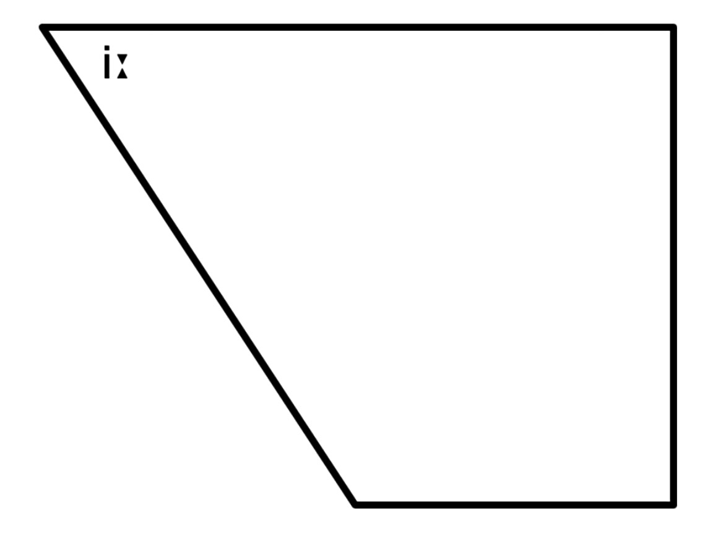
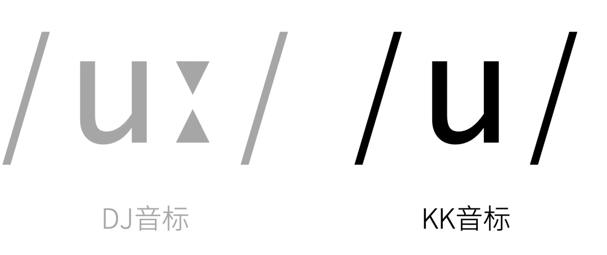
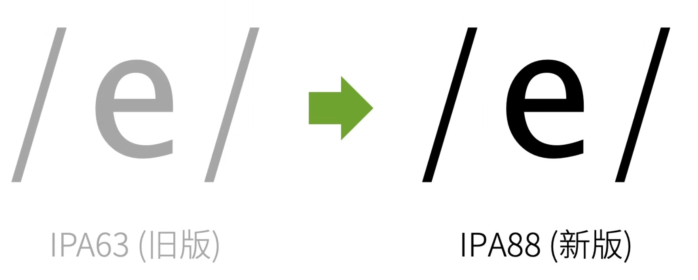

# 48个音标

### 元音
- 单元音
  - 前元音: /iː/  /i/   /e/   /æ/
  - 中元音:       /ɜː/  /ə/   /ʌ/
  - 后元音: /uː/	/ʊ/   /ɔː/	/ɒ/   /ɑː/


- 双元音
  - 开合双元音	/ei/	/ai/	/ɔi/	/aʊ/	/əʊ/
  - 集中双元音	/iə/	/eə/	/ʊə/

<br>

### 辅音
  - 爆破音
    - 清辅音	/p/	/t/	/k/	 	 
    - 浊辅音	/b/	/d/	/ɡ/	 	 
  - 摩擦音
    - 清辅音	/f/	/s/	/ʃ/	/θ/	/h/
    - 浊辅音	/v/	/z/	/ʒ/	/ð/	/r/
  - 破擦音
    - 清辅音    /tʃ/  /tr/	/ts/	 	 
    - 浊辅音    /dʒ/  /dr/  /dz/	 	 
  - 鼻音
    - (浊辅音)  /m/   /n/   /ŋ/	 	 
  - 舌则音
    - (浊辅音)  /l/
  - 半元音
    - (浊辅音)  /j/   /w/

<br><br>

# 自然拼读法则

### 优点1: 看到单词能朗读出来
例如 cat, 我们看到这个单词就能读出来, 就是利用自然拼读法则中的发音 就能直接读出来

<br>

### 优点2: 听到一个单词就要 会读 会写
例如 /kʌt/ -> cut

我们知道 c -> /k/, t -> /t/, u -> /ʌ/

<br>

### 自然拼读法则的问题1:
元音字母在自然拼读法则中 特别的困难, 辅音字母特别的简单

**元音字母:**  
Aa, Ee, Ii, Oo, Uu

元音字母放在单词中的发音 为元音音标

元音字母一共有5个, 而元音音标一共有20个, 这样的话 字母a就会有4种不同的发音, 但是比较夸张的是 光a这个字母放在单词中它的发音不仅仅是4种

<br>

**元音a的发音 (不全):**  
1. cat /æ/
2. pardon /ɑː/
3. watch /ɔː/
4. umbrell /ə/
5. name /ei/
6. coat /əʊ/
7. please /iː/

这样一个元音a就有这么多发音, 当我们想判断元音字母具体发什么音的时候, 我们就要学习音标了

<br>

**辅音字母:**  
26个英文字母中 - 除了 5个元音字母 剩下的都是辅音字母

辅音字母放在单词中的发音 为辅音音标

辅音字母一共有21个, 辅音音标则有24个, 几乎是一一对应的

<br>

### 自然拼读法则的问题2:
单词越长 拼读的困难度成指数上升

因为 元音发音特别多, a就有7个发音, 比如 t`e`n`a`c`iou`s 这个单词5个元音字母都包括了, 这样每个元音字母就可能发7种音 这样就会有35种发音的可能

<br>

### 自然拼读法则的问题3:
重音 和 音节 比较难确定

<br><br>

## 字母中的发音
- G: 即 (dʒ 和 i, 声音趋向于i)
- J: 贼 (dʒ 和 e, 声音趋向于e)

<br><br>

## 自然法则发音:
元音字母的发音比较复杂, 我们下面主要关注 21 个辅音字母的发音

汉语中我们拼读拼音的时候, 比如 李(li) 这是 一声母 一韵母 合起来拼的

英文中则需要按照 **一辅一元, 前辅后元** 原则 进行拼读, 如果发音 从元音开始 或者 没有一辅一元的规律时, 则需要各读各的

<br>

前面是26个字母 后面是音标发音

- A: 元音特殊
  - /æ/   (bag)

- B: /b/  (book, handbag number)

- C:
  - /k/: 通常情况 (come, coat, car)
  - /s/: 特殊情况 当字母c的后面有 ``i``, ``e``, ``y`` 会发 /s/, 如 (city, cell phone, cyber name)

- D: /d/  (handbag, daughter, dog)

- E: 元音特殊
  - /e/   (egg)

- F:
  - /f/   (father, five)
  - /v/   (of)

- G: /ɡ/    (good, handbag, green)

- H: /h/    (hat, hot, house)

- I: 元音特殊
  - /i/     (city, big)

- J: /dʒ/   (job, just, japan)

- K: /k/    (thank, key, book)

- L: /l/    (look, blue, lazy, small)
  - 当 /l/ 可以进行拼读的时候 发 了
  - 当 /l/ 结尾 或者 它的后面也是辅音 没有办法拼读的时候 发 欧

- M: 
  - 当它后面有元音和它进行拼读的时候 读 么, /m/ (my, man, much)
  - 当它后面没有办法进行拼读的时候 比如辅音的时候 读 鼻音 m (climb)

- N:
  - 当它后面有元音和它进行拼读的时候 读 ne, /n/ (not, no)
  - 当它后面没有办法进行拼读的时候 比如辅音的时候 读 鼻音 n (man, town)

- O: 元音特殊
  - /ə/     (policeman)
  - /əʊ/    (hostess)
  - /ɔ/     (lot, orange, nod)
  - /ʌ/     (come)

- P: /p/    (pardon, pen, pencil)

- Q: /kw/   (quick, queen, qu一般都呈整体出现)

- R: /r/    (前 red, read, 后 放在元音后面 用儿化音读 sir, pardon, car, 读 弱)

- S: 
  - /s/    (sir, this, yes)
  - /z/    (is, please, his)
  
- T: /t/   (fat, hot)

- U: 元音特殊
  - /ʌ/   (cup, but, cut)

- V: /v/   (very, five, drive)

- W: /w/   (what, watch, well)

- X: /ks/  (box, six, next)

- Y: /j/   (y开头的时候读 j, yes, you, yellow)

- Z: /z/   (lazy, zoo, zero)

<br>

### 字母组合发音
- th /θ/ /ð/

- oa; ow /əʊ/

- au; or; aw /ɔː/

- oo /ʊ/

- ff; ph结尾 /f/

- ee; ei /iː/

- ur /ɜ/

- ir
  - /ɜː/
  - /ə/
  - /aɪ/

- er /ə/

- ar结尾 /ə/

- se结尾 /s/ /z/

- air /eə/

- ou /aʊ/

- or
  - /ɜː/ work /wɜːk/

- aw /ɔː/ awfully /ˈɔːfli/

- qu
  - /kw/ 阔
  - /k/ mosquito /məˈskiːtəʊ/

- igh /aɪ/

- ck /k/

- wh
  - /w/ (what)
  - /h/ (who)

- tch /tʃ/ t不发音

- gh
  - 当 gh 字母出现在 元音 后, 通常不发音 (daughter, light, night, right, high)
  - 当 gh 在单词 末尾 的时候, 通常发 /f/ (enough /ɪˈnʌf/, tough /tʌf/)
  - 当 gh 在单词 开头 的时候, 通常发 /g/ (ghost /ɡoʊst/)

- ph: 打头 或 结尾的时候 发 /f/, 比如 photograph

- ss
  - /ʃ/
  - /s/

- ia /ə/

- ge
  - 一般来说 发 /dʒ/ /ʒ/
  - /dʒə/ refrigerator

- 以y结尾 /i/

- ea /e/

- oe /uː/ shoe

- kn /n/ 当k和n连在一起的时候 k 是不发音的

- ttle /tl/ 偷

- tchen /tʃɪn/ 称, kitchen, 其中 tch 中的 t 是不发音的

- ch /tʃ/

- ture /tʃə(r)/ picture

- sy /zi/ noisy

- ugh结尾 /f/ laugh /lɑːf/ enough /ɪˈnʌf/

- ter
  - 有时候发 /tə/ 的音 yesterday /ˈjestədeɪ/
  - 有时候发 /tr/ 的音 interest /ˈɪntrəst/

<br>

### 特殊情况:
1. 当一个单词中有 元音(i, a, o, u) 和 单词末尾是e的时候, e是不发音的, 元音发字母本身的音
```s
bike
kite
nice /naɪs/

take /teɪk/
name
fate

nose /nəʊz/
hope /həʊp/

cute /kjuːt/
```

<br><br>

## 音标发音:
- i: **yi~**, 开口很小, 舌面上台, 非常靠近硬腭 舌面不要与硬腭接触, 发音的时候 不要圆唇, 嘴角要向两侧拉伸, 带点微笑的感觉

- i **(四川话一二一的一)**, 舌头需上抬, 但不要过于靠近硬腭 无需圆唇, 嘴巴只需要放松微张

- uː **wu~**, 开口很小, 需圆唇, 不用噘嘴, 完全按照 呜 来读

- ʊ **类似短音 u, 但还是有区别 有点类似 ue**, 需圆唇, 但只需微微圆唇

- e **挨**, 不需要圆唇

- ɜː **饿~ 4声**, 不需要圆唇

- ə **额, 轻声**, 不需要圆唇, 嘴巴自然张开, 唇和舌都自然放松, 轻吐一口气, 让声带振动 这种最放松状态下发出来的音就是中央元音

- ʌ **啊, 但要清脆一些**

- ɔː **哦~**, 需要圆唇, 发音高于 /ɔ/ 凹

- ɒ **凹**

- æ **啊**, 嘴张大, 保证嘴角也向两侧拉伸

- ɑː **啊~**, 无需圆唇, 开口较大(但不咧嘴 嘴角不往两边伸展)

- ei **A~**

- ɔɪ **凹诶(依), 有点发ɪ的音**

- aɪ **爱挨(依)**

- aʊ **啊呜**

- əʊ **饿欧, 比较接近 欧**

- ʊə **呜饿, 这个饿的部分要清音读**

- eə 挨饿

- ɪə **也二也, 也饿**

- p 
  - 送气(p后有元音) **破**
  - 不送气(p前有字母s) **拨**
  - 无声除阻(p + 辅音) 

- b **拨**

- t 
  - 送气(t + 元音) **特**
  - 不送气(s + t) **的**
  - 无声除阻(t + 某些辅音)

- d **的**

- k 
  - 送气(k + 元音) **磕**
  - 送气(s + k) **哥**
  - 无声除阻

- g **哥**

- m 
  - 如果 /m/ 在元音前, 则和 妈 的声母(拼音m) 一样, 双唇闭拢, 舌头平方在口腔里, 气流从鼻腔中通过 声带振动 发 目 的音
  - 如果 /m/ 在元音后, 和在元音前相似, 双唇闭拢, 轻微通过鼻子出气, 声带振动通常更弱

- n **嗯**
  - 如果 /n/ 在元音前, 则和 拿 的声母(拼音n) 一样, 双唇自然分开, 舌端抵住上齿龈 气流从鼻腔中通过, 声带振动
  - 如果 /n/ 在元音后 (an en in on un), 和在元音前相似, 舌尖抵住上齿龈, 轻微通过鼻子出气, 声带振动通常更弱

- ŋ **昂**

- f **fu**

- v **wu**

- s **撕**, 上下牙齿基本闭合, 舌尖接近上齿龈, 舌面两侧接触上齿龈, 让气流通过上下齿的齿缝, 声带不震动 

- z **滋** 

- θ **撕**, 舌尖在上下齿之间(被轻轻咬住)发/s/的音

- ð **ri**, 舌尖在上下齿之间(被轻轻咬住)发/z/的音, 有点像ri

- ʃ **翘舌 撕**, 上下牙齿不闭合, **舌尖要接近上齿龈, 舌尖靠后**, 气流从舌头, 硬腭 和 上齿龈的缝隙中通过, 产生摩擦音, 声带不震动, 类似翘舌版的 /s/

- ʒ **翘舌 ri**

- tʃ **吃**

- dʒ **知**

- h **喝**

- w **喔**

- r **弱**

- j **爷(一声)**

- l
  - **了(一声)**
  - **舌尖抵住上齿后面的软肉发 欧 的音**

- ts **次(四声)**

- dz **资(一声)**

- tr **戳**

- dr **桌**

<br><br>

## 音标
音标体系, 权威的有三种
1. KK: 美式音标
2. DJ: 英式音标 (新概念) 推荐
3. IPA: 国际音标 (词典中的音标)

<br>

**DJ英式音标(旧版):**  
.jpg)

<br>

**DJ英式音标(新版):**  
.jpg)

<br>

**KK美式音标:**  
在 台湾 地区使用较多  


<br>

### 英语国际音标表 (IPA)
- 单元音
  - 短元音:   /i/   /ə/   /ɔ/   /u/   /ʌ/   /e/   /æ/ 
  - 长元音:   /iː/  /əː/  /ɔː/  /uː/  /ɑː/

- 双元音:     /ei/  /ai/  /ɔi/  /aʊ/  /əʊ/  /iə/	/eə/	/ʊə/

- 辅音:
  - 清辅音:   /p/  /t/  /k/  /f/  /θ/  /s/  /ʃ/  /tʃ/  /ts/  /tr/
  - 浊辅音:   /b/  /d/  /ɡ/  /v/  /ð/  /z/  /ʒ/  /dʒ/  /dz/  /dr/

- 其它辅音:   /h/  /m/  /n/  /ŋ/  /l/  /r/  /j/  /w/

<br><br>

## 注意
如果是**读英音**, 单词拼写中即使出现了字母r, 单词内的元音也 **不会** 变成 **r化元音**

如果是读美音, 只有单词内部出现字母r, 才有可能出现r化元音

```s
dear
fear
here
beer
cheer
idea  # 因为单词中没有r, 所以即使我们读美音, 也不要带儿化音
```

<br><br>

## 元音音标
元音是发音过程中气流通过口腔时不受阻碍的音

区分各个元音的三要素
1. 舌位的前后
2. 舌位的高低
3. 嘴唇的 圆唇度

**舌位:**  
发音时 舌面隆起的最高点在口腔中的位置


<br>

**元音图:**  
按照舌位的前后高低和圆唇度 可以把英语中不同的元音, 画在元音图上


<br>

### /iː/
读音类似: yi~, 长元音

设为前, 高 它和拼音i的发音基本一致




这是个舌位前, 高 的元音, 开口很小, 舌面上台, 非常靠近硬腭, 注意它是元音 所以舌面不要与硬腭接触, 否则就成了辅音


发音的时候 不要圆唇, 嘴角要向两侧拉伸, 带点微笑的感觉

```s
me
please
teacher
meet
see
bee
```

**DJ和KK的对比:**  


KK音标中没有长音符号 KK音标里元音的时长视具体所在单词的情况而定

<br>

### /i/ /I/
读音类似: 读 挨 (四川话一二一的一), 并写作 /I/, 短元音

它是DJ音标中的短元音, 在老版本的DJ音标中 (IPA63) 中, 写成小写的i 这样的写法会误导人 这个音和DJ音标的长音 /iː/ 舌位相同, 只不过是短促一点而已, 但实际上 这两个音不止时长不同, 舌位也不同


它是一个舌位前高的元音, 但相对于/iː/来说, 更低, 更后, 舌头上方空间更大


舌头需上抬, 但不要过于靠近硬腭, 和/iː/一样, 无需圆唇, 嘴巴只需要放松微张


另外 /I/ 的发音要比 /iː/ 更放松, 也就是舌头和口腔肌肉不如发 /iː/ 时那么用力, 嘴角不像 /iː/ 那样向两侧拉伸


从 /iː/ 到 /I/ 大概就像是 脸上渐渐失去微笑的感觉, /I/不是将/iː/短着读, 两者的舌位和口型都是不一样的

```s
miss
big
is
it
this
```

读这个音最怕的错误就是将 /iː/ 短着读, 那样就会舌位过高, 即舌头离硬腭太近, 所以发这个音的时候, 舌位要降低, 离开硬腭更多

另外一个常见错误, 把 /I/ 发音为 /e/ 或者是 拼音 ei

**DJ和KK的对比:**  

 
<br>

### /uː/
读音类似, wu~, 有点带鱼的感觉, 长元音, 它也有短的版本 /u/ 但区别于/ʊ/哦, 它们是不一样的

```s
too
food
loose
```

<br>

**DJ新旧对比:**  
一样  


<br>

**发音诀窍:**  


舌位后, 高, 开口很小, 需圆唇, 不用噘嘴

<br>

**错误:**  
完全按照 呜 来读, 唇形太凸, 太圆

<br>

**DJ和KK的对比:**  


<br>

### /ʊ/ 
读音类似, ue, 这两个字母分别发 轻 短 音之后, 连在一起读出来的感觉, 短元音

```s
book
look
good
```

这个 ʊ 并不是小写 u 它是从希腊字母演变过来的

<br>

**DJ新旧对比:**  


<br>

**发音诀窍:**  


舌位后, 高 的元音, 相对于uː来说更低, 更前, 舌头上方空间更大, 需圆唇, 但只需微微圆唇 发音要比uː更放松 也就是舌头和口腔肌肉不如发 uː 时那么用力

<br>

**错误:**  
请注意, ʊ 并不是将 uː 短着读 两者的舌位和口型都是不一样的

另外普通话中没有这个音, 很容易发出 wu 的音, 唇形过于突出, 过于圆, 舌头和口腔肌肉过于紧张

<br>

**DJ和KK的对比:**  


<br>

### /e/ 
读音类似, 挨, 单元音

```s
bed
get
pet
let
met
set
```

<br>

**DJ新旧对比:**  


<br>

**发音诀窍:**  


舌位前, 中高的元音, 舌位比/iː/低, 开口比 iː 大, 舌头上方的空间更大, 发这个音的时候不需要圆唇

这个音在普通话中也有, 但是几乎不以单独元音出现 而是出现在某些韵母的结尾, 也(ye) 月(yue)

<br>

**错误:**  
会将该音发成 爱 ai, 这个ai是一个双元音 和 单元音 e 有本质的区别

<br>

**DJ和KK的对比:**  


<br>

### /ɜː/ 
读音类似, 饿~ 4声, 长元音
 
```s
her
person
learn
```

<br>

**DJ新旧对比:**  


<br>

**发音诀窍:**  


舌位前后高低都基本在中间的元音, 发这个音不需要圆唇, 听上去有点像我们普通话中的 饿, 但实际上 拼音e实际上是国际音标中 ɤ, 舌位比ɜː高一些, 后一些

<br>

**错误:**  
尽量不要用 饿 来直接取代它, 否则舌位会过高 过后

<br>

**DJ和KK的对比:**  


<br>

### /ə/
读音类似: 额, 轻声, 短元音

嘴微张, 放松
```s
about
problem
easily
memory
```

<br>

**DJ新旧对比:**  


<br>

**发音诀窍:**  
  


舌位前后高低都基本在中间的元音, 所以它叫做中央元音

发这个音不需要圆唇, 嘴巴自然张开, 唇和舌都自然放松, 轻吐一口气, 让声带振动 这种最放松状态下发出来的音就是中央元音

如果将它重读(舌头和口腔肌肉紧张) 并读足时长 就变成了 ɜː 的发音

```s
the [ðə]
her [hɜː]
```

英语中的所有元音字母(以及半元音字母y) 都有可能发中央元音, ə 的音  


它是英语中出现频率最高的音, 因为很多非重读音节里的元音都会 弱化 为中央元音, 英语之所以会出现元音弱化现象, 从根本上说是为了让说话者在不需要强调某个音时用它代替 说白了就是为了在某个音上减少所花时间时, 把那个音弱化成一个 默认音

具体来说在英美人士日常说话中, 很多本没有 ə 的单词 在句中 元音都会变为 ə 比如
i can try to do it, 其中
- can不读作/kæn/
- to不读作/tu:/
- it不读作/it/

而是
- can不读作/kən/
- to不读作/tə/
- it不读作/ət/

<br>

**错误:**  
尽量不要用 饿 来直接取代它, 否则舌位会过高 过后

<br>

**DJ和KK的对比:**  


<br>

### /ʌ/
读音类似: 啊, 但要清脆一些 短元音

```s
but
hut
must
```

<br>

**DJ新旧对比:**  


<br>

**发音诀窍:**  


英美发音不同

- 英音: 舌位稍稍低于中央元音 ə
- 美音: 舌位和中央元音区别很小 

发这个音不需要圆唇, 发英音的时候 我们只需要将 '啊' 舌位往上移动一点点就可以, 发美音的时候, 只需要再把舌位多往上移动一点


<br>

**DJ和KK的对比:**  


<br>

### /ɔː/
读音类似: 哦~ 长元音

```s
caught
bought
law
```

<br>

**DJ新旧对比:**  


<br>

**发音诀窍:**  


这是一个舌位后, 中高的元音, 需要圆唇

<br>

**DJ和KK的对比:**  


<br>

### /ɒ/
读音类似: 凹 舌位靠后 短元音

```s
top
hot
lot
```

<br>

**DJ新旧对比:**  


老版中就是 /ɔ/, 这样很容易让人意味 /ɒ/ 是将 /ɔː/ 短着读, 但实际上 这个音的舌位低于 /ɔː/

<br>

**发音诀窍:**  


这个音的舌位低于 /ɔː/, 这是一个舌位低 后 的元音


 
传统(旧)的/ɒ/的发音和/ɑː/是基本一致的 它们之间最大的区别就是 前者/ɒ/发音需要圆唇 后者/ɑː/无需圆唇

而现代英音中/ɒ/的舌位稍稍向上进行了迁移


<br>

### /æ/
读音类似: 啊, 清脆 舌位上下居中, 短元音

```s
bad [bæd]
fat [fæt]
pat
```

<br>

**DJ新旧对比:**  


<br>

**发音诀窍:**  


这是一个舌位前, 较低的元音 比 /e/ 更低, 但比 /a/(啊) 更高, 注意 /a/ 不是和它很像的 /ɑ/, 这个/a/只出现在双元音里 舌位很前 很低 我们可以通过 /a/ 这个最前最低的舌位, 来找到 /æ/ 的舌位

发 /æ/ 的音, 我们要把嘴张大, 保证嘴角也向两侧拉伸

找到 /a/ 这个音的舌位后, 再往 /e/ 的舌位调整


即把舌位朝/e/的方向上移, 我们移动到一半的位置的时候 就是 /æ/ 的舌位, 所以我们可以将 /æ/ 想象成 /a/和/e/ 之间的音


<br>

**错误:**  
很多人会错误的使用 "爱" "啊" 来代替

<br>

**DJ和KK的对比:**  


<br>

### /ɑː/
读音类似: 啊~, 舌根在后面 长元音

```s
father
fast
glass
```

注意 ɑ 和 小写字母 a 是不同的, 在DJ和国际音标中 它们代表不同的音  


<br>

**DJ新旧对比:**  


<br>

**发音诀窍:**  


它是一个舌位低 后的元音, 无需圆唇, 开口较大(但不咧嘴 嘴角不往两边伸展), 这个音和我们 "啊" 比较相似 但不完全相同


我们普通话中的 "啊" 舌位更加的靠前

<br>

**DJ和KK的对比:**  


<br>

### /ei/
读音类似: A~ 舌位靠前, 双元音

```s
make
date
cake
```

<br>

**DJ新旧对比:**  


<br>

**发音诀窍:**  


它是双元音 说明它有两个元音的特质, 具体表现在发音过程中舌位的变化, 即发音的时候从 /e/ 的舌位(往往是更高一点的舌位) 自然平滑的往 /I/ 的舌位方向移动, 起始音更重


ei的起始音嘴角更向两侧拉伸

<br>

**DJ和KK的对比:**  


<br>

### /ɔɪ/
读音类似: 凹诶(依), 有点发ɪ的音, 但是更加接近依的音, 双元音

```s
boy
toy
soy
```

<br>

**DJ新旧对比:**  


<br>

**发音诀窍:**  


我们很容易误读成 /ɔe/, 还是发``依``比较接近

<br>

**DJ和KK的对比:**  


<br>

### /aɪ/
读音类似: 爱挨(依), 有点发ɪ的音, 但是更加接近依的音, 双元音

```s
bike
nice
time
```

<br>

**DJ新旧对比:**  


<br>

**发音诀窍:**  

  
发音的时候 从比 /a/ 靠后一点点的舌位, 自然平滑的往 /I/ 的舌位方向移动, 起始音更重

<br>

**DJ和KK的对比:**  


<br>

### /aʊ/
读音类似: 啊呜, 双元音
 
```s
how
cow
allow
```

<br>

**DJ新旧对比:**  


<br>

**发音诀窍:**    
  

  
发音的时候 从比 /a/ 靠后一点点的舌位, 自然平滑的往 /ʊ/ 的舌位方向移动, 起始音更重


起始位嘴角更向两侧拉伸

<br>

**DJ和KK的对比:**  


<br>

### /əʊ/(为英音注音时使用) /oʊ/(为美音注音时使用)
读音类似: 饿欧, 比较接近 欧, 舌位从中间开始, 双元音
 
```s
open [əʊpən] [oʊpən]
hope  
post
```

<br>

**DJ新旧对比:**  


<br>

**发音诀窍:**    

  
从中央元音 /ə/ 的舌位 自然平滑地往 /ʊ/的舌位方向移动, 起始音更重, 圆唇

<br>

**DJ和KK的对比:**  


<br>

### /ʊə/
读音类似: 呜饿, 这个饿的部分要清音读, 双元音
 
```s
tour
poor
moor
```

<br>

**DJ新旧对比:**  


<br>

**发音诀窍:**    

  
从 /ʊ/ 的舌位, 自然平滑的往/ə/的舌位方向移动, 起始音更重

<br>

**DJ和KK的对比:**  


<br>

### /eə/
读音类似: 挨饿, 双元音
 
```s
hair
pair
chair
fare
care
dare
```

<br>

**DJ新旧对比:**  


<br>

**发音诀窍:**    

  
从 /e/ 的舌位, 自然平滑的往/ə/的舌位方向移动, 起始音更重

**英音**中包含 /eə/ 的词, 基本上在这个音的后面都有字母r, 所以这个元音在**美音**中会变成 ``r化元音``

<br>

**DJ和KK的对比:**  


<br>

### /ɪə/
读音类似: 也二也, 也饿, 双元音
 
```s
dear
fear
beer
cheer
idea
```

<br>

**DJ新旧对比:**  


<br>

**发音诀窍:**    

  
从 /ɪ/ 的舌位, 自然平滑的往/ə/的舌位方向移动, 起始音更重

<br>

**错误:**  
我们经常会将 /ɪ/ 读成, 依, 将 /ə/ 读成 饿

如果是读英音, 单词拼写中即使出现了字母r, 单词内的元音不也会变成 r化元音

<br>

**DJ和KK的对比:**  


<br><br>

## 辅音音标
辅音是发音过程中气流在 全部时间 或 一部分时间 被阻碍所发出的音

从辅音阻碍气流的这一个角度 可以将辅音发音分成3个阶段 
1. 成阻: 气流被阻塞
2. 持阻: 气流持续向外冲, 但仍被阻塞
3. 除阻: 阻塞被去除, 气流冲出

<br>

### 成阻: 气流被阻塞


比如普通话的 菠 的声母(辅音) b, b的成阻阶段就是把气流阻塞在闭拢的双唇后

<br>

### 持阻: 气流持续向外冲, 但仍被阻塞


比如普通话的 菠 的声母(辅音) b, b的持阻阶段就是维持双唇闭拢, 但扔向外吐气(从而形成气压)

<br>

### 除阻: 阻塞被去除, 气流冲出


比如普通话的 菠 的声母(辅音) b, b的持阻阶段就是双唇张开, 释放气流

<br>

### 影响辅音的三要素
1. 清浊
2. 调音部位
3. 调音方式

<br>

### 清浊
清音 和 浊音 的概念, 咱们在说人类发音过程的时候提到过
1. 清音: 发音时 声带不振动的音
2. 浊音: 发音时, 需要振动声带

影响辅音的第一个要素就是发辅音的时候, 声带是否振动

声带不振动, 则是清辅音, 声带振动, 则是浊辅音

我们可以理解为, 双唇闭拢阻塞气流时, 声带就已经开始振动了

<br>

**扩展: 汉语中理论上是没有清浊对立的**  
这里要说下, 汉语中理论上是没有清浊对立的, 拼音中的 b p d t g k 这些声母就是辅音 怎么可能不需要振动声带呢?

我们在说 菠bo 的时候, 发出的一前一后的两个音 即辅音声母b后接元音韵母o, 粗略的说 前一个辅音不需要振动声带 后一个元音才需要振动声带

<br>

### 调音部位 (发音部位)
就是在发辅音的时候, 阻碍气流所用到的主要发音器官, 比如 /b/ 这个浊辅音, 主要靠双唇阻碍气流 所以调音部位就是 双唇

双唇的后面是牙齿, 如果上牙齿轻咬住下唇, 阻碍气流, 咱们就能发出普通话 "夫f" 这个音, 所以拼音f的调音部位就是唇齿

再往后, 还有齿龈, 齿龈的后方(齿龈后), 硬腭, 软腭, 小舌, 声门, 这些发音器官都可以作为调音部位


<br>

### 调音方式 (发音方式 / 发音方法)
它就是辅音的发音方式, 就是辅音发音的整体过程

拿拼音b和英语/b/来举例, 发这两个音时, 是完全阻塞气流, 通过这种方式提高气压 之后突然释放气流, 发生响声

所以这种在成阻时完全阻塞气流, 再释放而发出的音 一般被称作 塞音 或 爆破音

如果我们不完全阻塞气流, 而是让气流持续通过一个发音器官形成通道 比如普通话 撕 si 的声母s, 就使用舌尖和牙齿形成一个缝隙, 让气流通过 从而发出响声 用这样的调音方式发出的音叫做 摩擦音

比如普通话 呢n 的声母需要我们把气流送入鼻腔才能发出 这种调音方式发出的音为鼻音

其它的调音方式还有
- 颤音
- 闪音
- 近音
- 边近音

<br><br>

### /p/ /b/
- /p/: 清音 破 (清声 不振动声带 不具体发出响声)
- /b/: 浊音 拨 (振动声带发出响声)

```s
peak
pet
pig

beak
bed
big
```

<br>

**DJ新旧对比:**  


<br>

**发音诀窍: /p/**    
/p/: 清辅音, 请完成的进行 成阻 持阻 除阻 的三个阶段 然后发爆破音
- 调音方式: 爆破音 
- 调音部位: 双唇

/p/在英语中有3种主要情况

1. 送气 (送气的时候为/p/): 如果单词中字母p后有元音, 比如peak /pi:k/ 这样的字母p在除阻时会有较强烈的向外气流释放 这样的音叫做 送气辅音

2. 不送气 (不送气的时候为/b/): 比如p前有字母s, speak /spi:k/ 这样的字母p对应的/p/通常是一个不送气辅音, **这种情况下的 /p/ 要发 /b/**, **英语p在字母s的后面会被浊化**(不准确), 虽然该情况下的p会被浊化, 但只是读音上的变化 而不是真正的浊辅音

3. 无声除阻: 如果单词中的字母p后紧跟某些辅音的时候 **p + 辅音**, **字母p所对应的/p/在除阻时只有很微弱的气流释放**, 甚至不释放气流, 以至于听不见 换句话说就是在除阻阶段让之前的持阻阶段产生的气流的压力降为0却无响声, **具体变现在往往只做口型 却听不见声音** 比如下面的单词中字母p对应是听不见的音, **即没有声音的爆发音(无声除阻)**, 国内人分的再细点 (不完全爆破: 能听见一点点声音, 和 失去爆破: 全完听不见声音)
  1. trapdoor /ˈtræpdɔː(r)/
  2. help me /help mi/

上面说的 送气辅音 和 不送气辅音 这里的不送气并不是说真的没有气流释放 而是说 **不送气辅音并没有像送气辅音那样在除阻阶段有强烈的气流释放**

<br>

当我们看到/p/的时候 往往并不能确认它是送气 还是不送气 还是无声除阻 如果确切想知道或标注音位变体 就需要用到国际音标IPA


上面的``[]`` 就是国际音标中的 严式注音, 标注的是音位变体, 国际音标中会使用``//`` 宽式注音 标注的是音位

<br>

**扩展: 音位 和 音位变体**  
上面 字母p 有 送气 / 不送气 / 无声除阻 三种在英语中常见的情况 而他们都可以用音标 /p/ 来表示

这种情况我们可以说 同一个``音位``上有不同的``音位变体``, 也叫做同位异音

我们学习的音标都是在标注的音位, 而不是音位下可能出现的音位变体

英语音标里有个别音标指代的音位有多个常见音位变体 这样的情况不多, 主要以辅音中的爆破音为主, 而元音的常见音位变体则很少, 主要包括元音延长 和 元音鼻音化

<br>

**发音诀窍: /b/**    
/b/: 浊辅音, 发浊音的时候需要振动声带

理论上英语的 /b/ 是浊辅音, 但是现实中 因为受地区口音, 个人习惯的语境的影响, 母语人士往往也会把/b/发成清辅音

在快速语流中或者词首时, 像是 ``bye`` 的开头往往就是清辅音

而元音后的 /b/ 多半是浊辅音, 比如 abide /əbaid/

<br>

### /t/ /d/
- /t/: 清音 特 (清声 不振动声带 不具体发出响声)
- /d/: 浊音 的 (振动声带发出响声)

```s
tip
tea
test

dip
deep
desk
```

<br>

**DJ新旧对比:**  


<br>

**发音诀窍: /t/**    
/t/: 清辅音, 请完成的进行 成阻 持阻 除阻 的三个阶段 然后发爆破音
- 调音方式: 爆破音 
- 调音部位: 舌和上齿龈


之前我们说了 /p/ 有音位变体的情况
1. 送气: p后有元音
2. 不送气: p前有字母s
3. 无声除阻: p + 辅音

而 /t/ 的音位变体的情况更多 也就是说t, 在英语中有很多种不同的发音

1. 送气: t + 元音, 也就是字母t后面有元音, 如 top, 这种情况下字母t所对应的音标/t/ 就是送气音 /t/ 

2. 不送气: s + t, 也就是t前有字母s, 如 stop, 这种情况下字母t所对应的音标/t/ 就是不送气音 /d/

3. 无声除阻: t + 某些辅音, 如果t后紧跟某些辅音的时候 字母t所对应的就是无声除阻(失去爆破/不完全爆破), 如 setback, forget me

4. 闪音: t在非重度音节, 在美音中元音之间的字母t在非重读读音节中通常发 闪音, 如 water, better, a lot of, 发闪音时, **让舌尖向上卷起 在上齿龈处轻轻一弹, 即瞬间阻塞气流并立即释放, 像是一个过渡的音**, 注意在美音中是闪音, 但是在标准英音中还是送气音
  

5. 喉塞音: 在英国的某些口音(方言)中 字母t往往被读作 喉塞音, **喉塞音是用声门阻住气流 像是把声音卡在喉咙里**, water, better, a lot of, 其实就是阻住发音, 停顿一下, 比如我们说 西安的时候 也会 西和安 之间停顿下, 不然就发成 先 了  


6. 鼻音除阻: /t/ + /n/, **如果字母t后跟鼻音/n/, 那么/t/的除阻可以直接和鼻音衔接上 即把气流释放入鼻腔**, 如 eaten, button, certain, **注意这样的鼻除阻是可以 但非必须, 鼻音除阻往往出现在口语中**

7. 边音除阻: 和鼻音除阻类似, **如果字母t后跟边音/l/, 那么/t/的除阻可以直接和边音衔接上 即把气流通过舌两侧释放**, 如 spotless, butler, little, kettle

8. 省略: /n/ + /t/, 在美音中, 鼻音/n/之后的字母t往往听不见 比如 winter, interview, 必过在标准英音中还是会将t正常的发出来的

<br>

**发音诀窍: /d/**    
浊辅音, 发音的时候需要振动声带, 它也有几个变体

1. 无声除阻: landmine
2. 闪音: medal
3. 鼻音除阻: sudden
4. 边音除阻: badly

<br>

### /k/ /g/
- /k/: 清音 磕 (清声 不振动声带 不具体发出响声)
- /g/: 浊音 哥 (振动声带发出响声)

```s
kit
kate
cup

git
gate
gut
```

<br>

**DJ新旧对比:**  


<br>

**发音诀窍: /k/**    
/t/: 清辅音, 请完成的进行 成阻 持阻 除阻 的三个阶段 然后发爆破音
- 调音方式: 爆破音 
- 调音部位: 软腭


<br>

和 /p/ 相似, /k/也有三个主要的音位变体
1. 送气: k + 元音, 如果单词中字母k后有元音, 如 kite, 这样的字母k所对应的/k/ 就是送气/k/
2. 不送气: s + k, 如果k前有字母s, 比如 sky 这样的字母k所对应的/k/ 就发不送气音 /g/
3. 无声除阻: k + 某些辅音, 如果字母k后紧跟某些辅音时, 字母k对应无声除阻(不完全爆破 或 失去爆破), 如: doctor, make dinner

<br>

**发音诀窍: /g/**    
浊辅音, 发音的时候需要振动声带

<br>

### /m/ /n/ /ŋ/
- /m/: 浊辅音 目 (鼻音)
- /n/: 浊辅音 嗯 (鼻音)
- /ŋ/: 浊辅音 昂 (鼻音)

```s
sum
sun
sung
```

<br>

**DJ新旧对比:**  


<br>

**发音诀窍: /m/**    
/m/: 浊辅音
- 调音方式: 鼻音 (气流要从鼻腔中通过)
- 调音部位: 双唇

1. 如果 /m/ 在元音前, 则和 妈 的声母(拼音m) 一样, 双唇闭拢, 舌头平方在口腔里, 气流从鼻腔中通过 声带振动

2. 如果 /m/ 在元音后, 和在元音前相似, 双唇闭拢, 轻微通过鼻子出气, 声带振动通常更弱

<br>

**发音诀窍: /n/**    
/n/: 浊辅音
- 调音方式: 鼻音 (气流要从鼻腔中通过)
- 调音部位: 上齿龈

在发 /n/ 这个音时, 舌尖及舌前部边缘要抵住上齿龈(和上齿背交界处)

1. 如果 /n/ 在元音前, 则和 拿 的声母(拼音n) 一样, 双唇自然分开, 舌端抵住上齿龈 气流从鼻腔中通过, 声带振动

2. 如果 /n/ 在元音后 (an en in on un), 和在元音前相似, 舌尖抵住上齿龈, 轻微通过鼻子出气, 声带振动通常更弱

<br>

**发音诀窍: /ŋ/**    
/ŋ/: 浊辅音
- 调音方式: 鼻音 (气流要从鼻腔中通过)
- 调音部位: 软腭

在发 /ŋ/ 这个音时, 需要用舌后端抵住软腭

我们普通话中有前鼻音和后鼻音 也是类似的道理 但是普通话中的后鼻音往往没有英语中那么清晰明显

发英语/ŋ/要确保舌根抵住软腭, 在发完/ŋ/后, 舌根下降离开软腭时有 除阻 的感觉并伴随轻微的/g/声, 这是因为/ŋ/和/g/的调音部位一样

如果有除阻动作的同时声带还未停止振动 那么除阻阶段两者听上去就很像 比如 sing

<br>

### /f/ /v/
- /f/: 清音 fu (清声 不振动声带 不具体发出响声, 像是吹气)
- /v/: 浊音 wu (振动声带发出响声, 振动的wu)

```s
fat
fit
ferry

valley
visit
very
```

<br>

**DJ新旧对比:**  


<br>

**发音诀窍: /f/**    
/f/: 清辅音, 请完成的进行 成阻 持阻 除阻
- 调音方式: 擦音 
- 调音部位: 上齿 和 下唇

/f/的发音 和 中文普通话 夫 的声母f一样, 上齿轻轻接触下唇 气流向外通过唇齿之间 声带不振动

<br>

**发音诀窍: /v/**    
浊辅音, 和 /f/ 的区别仅仅在于在发音的时候, 声带发生振动

<br>

### /s/ /z/
- /s/: 清音 撕 (清声 不振动声带 不具体发出响声, 像蛇叫)
- /z/: 浊音 滋 (振动声带发出响声, 振动的滋, 像电流)

```s
sip
soon

zip
zoom
zoo
```

<br>

**DJ新旧对比:**  


<br>

**发音诀窍: /s/**    
/s/: 清辅音, 请完成的进行 成阻 持阻 除阻 的三个阶段
- 调音方式: 擦音 
- 调音部位: 上齿龈

/s/的发音 和 中文普通话 撕 的声母s一样, **上下牙齿基本闭合**, 舌尖接近上齿龈, 舌面两侧接触上齿龈, 让气流通过上下齿的齿缝, 声带不震动 

<br>

**发音诀窍: /z/**    
浊辅音, 和 /s/ 的区别仅仅在于在发音的时候, 声带发生振动, 我们可以把/z/想象成声带振动版的/s/

<br>

**注意:**  
英语中很多单词中的字母s, 其实是``/z/``而不是``/s/``

```s
is
his
whose
```

也包括大多数复数
```s
apples
names
```

<br>

### /θ/ /ð/
- /θ/: 清音 撕 (清声 不振动声带 不具体发出响声, 舌尖在上下齿之间(被轻轻咬住)发/s/的音)
- /ð/: 浊音 ri (振动声带发出响声, 振动的ri, 舌尖在上下齿之间(被轻轻咬住)发/z/的音, 有点像ri)

```s
three
thin
thank

there
that
those
```

<br>

**DJ新旧对比:**  


<br>

**发音诀窍: /θ/**    
如果我们在 /s/ /z/ 上发音没有问题的话, 那么我们稍加练习 这两个音也没有问题

/θ/: 清辅音, 请完成的进行 成阻 持阻 除阻 的三个阶段
- 调音方式: 擦音 
- 调音部位: 牙齿

发音时, 舌尖不在上下牙齿后方, **而是在上下齿之间(被轻轻咬住)**, 让气流通过舌尖和牙齿的缝隙向外冲出, 声带不震动 保持舌位发/s/的音

我们可以将 /θ/ 的发音 想象成 /s/ 的大舌头版本

<br>

**发音诀窍: /ð/**    
浊辅音, 和 /θ/ 的区别仅仅在于在发音的时候, 声带发生振动, 我们可以把/ð/想象成声带振动版的/θ/, 也就是 **舌尖被上下齿轻轻咬住 发/z/的音 (有点发ri的音)**

<br>

**注意:**  
这两个音的最常见错误就是把它们当做 /s/ 和 /z/ 来读

<br>

### /ʃ/ /ʒ/
- /ʃ/: 清音 翘舌 撕 (清声 不振动声带 不具体发出响声)
- /ʒ/: 浊音 翘舌 ri (振动声带发出响声, 振动的ri), 在拼读的时候为什么感觉应该用 z 来拼读

```s
mesh
fresh
leash

measure
pleasure
decision
```

<br>

**DJ新旧对比:**  


<br>

**发音诀窍: /ʃ/**    
/ʃ/: 清辅音, 请完成的进行 成阻 持阻 除阻 的三个阶段
- 调音方式: 擦音 
- 调音部位: 齿龈后

发音时, 上下牙齿不闭合, **舌尖要接近上齿龈, 舌尖靠后**, 气流从舌头, 硬腭 和 上齿龈的缝隙中通过, 产生摩擦音, 声带不震动, 类似翘舌版的 /s/


和我们普通话 史 的声母sh 非常像

<br>

**发音诀窍: /ʒ/**    
浊辅音, 和 /ʃ/ 的区别仅仅在于在发音的时候, 声带发生振动, 我们可以把/ʒ/想象成声带振动版的/ʃ/, 发 振动版的 日 的音, 区别在于/ʒ/更贴近齿龈后, 气流有摩擦的感觉

<br>

### /tʃ/ /dʒ/
- /tʃ/: 清音 吃, 轻声发 吃 的音 (清声 不振动声带 不具体发出响声)
- /dʒ/: 浊音 知, 嘴型和/tʃ/一样 (振动声带发出响声)

```s
chuck
chop
choke
catch

jug
job
joke
page
```

<br>

**DJ新旧对比:**  


<br>

**发音诀窍: /tʃ/**    
/tʃ/: 清辅音, 请完成的进行 成阻 持阻 除阻 的三个阶段
- 调音方式: 塞擦音 (阻塞+摩擦)
- 调音部位: 齿龈后

可以理解为 t 和 ʃ, 塞音和擦音混合在一起 发出的音, 摆出发ʃ的嘴型 然后舌头做t 同时将气流推出去

/tʃ/和我们普通话 吃 的声母ch相似 区别在于, 咱们的ch在发音的时候相对于 /tʃ/ 调音部分更后一点, 我们可以理解为更卷舌


<br>

**发音诀窍: /dʒ/**    
浊辅音, 和 /tʃ/ 的区别仅仅在于在发音的时候, 声带发生振动, 嘴型和/tʃ/是一模一样的 但是要震动声带, 发 知 的音

<br>

### /h/
/h/: 清音 喝(清声 不振动声带 不具体发出响声)

```s
hat
hot
high
```

<br>

**DJ新旧对比:**  


<br>

**发音诀窍: /h/**    
/h/: 清辅音, 请完成的进行 成阻 持阻 除阻 的三个阶段
- 调音方式: 擦音
- 调音部位: 声门

发这个音只需要让气流通过声门(即两瓣声带的间隙), 不需其它器官的参与


<br>

### /w/
/w/: 浊辅音 喔 (振动声带 发出响声)

```s
was
why
wide
```

<br>

**DJ新旧对比:**  


<br>

**发音诀窍: /h/**    
/h/: 浊辅音
- 调音方式: 擦音
- 调音部位: 唇 和 软腭 (它们都要影响气流)


发这个音只需要让气流通过声门(即两瓣声带的间隙), 不需其它器官的参与

双唇圈起 向外凸出, 发音时一般会有动态的扩张 舌后端也往软腭的方向抬, 保持一定高度, 调音器官不用靠的很近


<br>

### /r/

```s
rat
red
read
```

<br>

**DJ新旧对比:**  


<br>

**发音诀窍: /r/**    
这个音标在英语中代表两种常见的发音 也就是说 有两个音位

1. 齿龈近音: /r/ + 元音, 如 right, 这时它是 **浊辅音**
  - 调音方式: 擦音
  - 调音部位: 上齿龈
  - 发音: 发音时, 圆唇, 舌头后卷抬向上齿龈, 气流从舌头和上齿龈之间通过, 但不至于近到形成气流湍流, 可以理解为不产生强烈的 摩擦感
  - 

2. 儿化: 元音 + /r/
  - 在英音中, 当字母r出现在元音之后的时候 一般不发音或读作中央元音 /ə/, 如 car, 不会有儿化音 音标以什么结尾就直接读那个发音
  - 在美音中, 当字母r出现在元音之后的时候 字母r在美音中往往会让之前的元音成为 r化元音

<br>

### /j/
/j/: 浊辅音 爷(一声) (振动声带 发出响声)

```s
yes /jes/
```

<br>

**DJ新旧对比:**  


<br>

**发音诀窍: /j/**    
/j/: 浊辅音
- 调音方式: 近音
- 调音部位: 硬腭 

发音时 舌头往上抬向硬腭, 气流从舌面和硬腭之间通过, 但不至于近到形成气流湍流 可以理解为不产生强烈的 摩擦感


<br>

### /l/
/l/: 浊辅音 了(一声) (振动声带 发出响声)

```s
lack
lake
all
```

<br>

**DJ新旧对比:**  


<br>

**发音诀窍: /l/**    
它有3种常见发音, 也就是说 音位有3个
1. 清晰L, /l/ + 元音: 如 light 的开头, 它叫做 清晰舌边音, 这时的l为浊辅音
  - 调音方式: 边音(舌边音)
  - 调音部位: 上齿龈
  - 发音: 舌尖抵在上门牙后面凸起的龈肉, 舌头两侧比舌尖低, 气流从舌头两侧通过, 声带振动
  - 

2. 模糊L, /l/后无元音: 如果/l/后没有元音, 或者说 元音 + /l/, 如: hole, 尤其是在单词结尾时, 这时俗称 模糊舌边音, 舌尖抵在上门牙后面凸起的龈肉, 舌头两侧比舌尖低, 气流从舌头两侧通过, 在舌头位置不变的情况下 舌头后部往后收, 类似发o的感觉(口型), **舌尖抵在上门牙后面凸起的龈肉 振动声带发 欧 的音**
  - 
  - 技巧: 

3. 不发音L: 不少英语单词里的字母l根本不发音, 如 calm /kɑːm/, 不发音L在英语的外来语中较常见

<br>

### /ts/ /dz/
- /ts/: 清辅音 次(四声) (不振动声带)
- /dz/: 浊辅音 资(一声) (振动声带 发出响声)

和 /tʃ/ /dʒ/ 相比, /ts/ /dz/ 为平舌, /tʃ/ /dʒ/ 为翘舌

```s
bats
dates
kites

bands
deeds
kids
```

<br>

### /tr/ /dr/
- /tr/: 清辅音 戳 (不振动声带)
- /dr/: 浊辅音 桌 (振动声带 发出响声)

```s
trip
true
tree

drip
drew
```