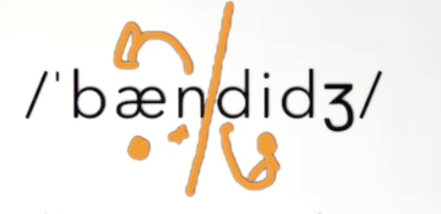

## 音节
### 如何找到音节
**1. 首先找到该单词中 有多少个元音音标, 就有几个音节**, 如 ``/'bændidʒ/``

æ 和 i 就是 元音音标

<br>

**2. 查看找出的元音音标之间的辅音**  
1. 元音音标之间有 **两个辅音** 的情况, 如 ``/'bændidʒ/`` n 和 d 就是 辅音音标
  - n和前一个元音音标æ组合, d和后一个元音音标i组合
  - 也就是说两个元音音标中间有两个辅音音标的话, 则就是一面一个
  - 

2. 元音音标之间有 **一个辅音** 的情况, 如 ``/'græmə/`` m就是辅音音标 根据习惯我们会将该辅音音标给后面的

3. 依次检查元音音标之间的辅音情况, 如 ``/'hʌnimuːn/``,  ``/'hʌ ni muːn/``
  - ʌ 和 i 之间为 n, 符合一个辅音的情况 给后面 ni
  - i 和 uː 之间为 m, 符合一个辅音的情况 给后面 muː

4. 只有 **一个元音** 的情况, 如 ``/'fræŋk/``
  1. 找到该元音
  2. 将元音前的音标拼读在一起, 做右往左拼 也就是先拼读 ``ræ``

5. 元音音标之间有 **三个辅音** 的情况. /skʌlptə/, ʌ 和 ə 之间有三个辅音 lpt, 这种情况下 其实有固定的分法, 大部分的情况下
  - 离元音音标近的辅音 会拼读在一起 ʌl tə, 只剩下中间的p, 这时我们发现p无论是给前还是给后, 发音几乎是保持一致的

<br>

**3. 根据元音音标之间的辅音 将 ``/'bændidʒ/`` 分为了两个部分 ``/'bæn didʒ/`` 所以该单词现在就是两个音节**

**4. 重音符号 本身就相当于一条斜线**, 所以我们这是不用管 第一个元音 和 第二个元音之间如何划分了  


<br><br>

## 重音
### 1. 重音符号在第一个音节前
重音符号紧挨着的后面的音节, 读起来 声调要高一点, 后面一个音节低一点

<br>

### 2. 只有一个音节的单词 本身就重读 

<br>

### 3. 重音符号在第二个音节前 /ig'zɔːstʃən/
```s
ig   zɔːs  tʃən
    +----+
    |    |
----+    + ----
```
