# Golang
数据的处理 和 大并发方面 Golang很有优势

<br>

## 学习方向:
1. 区块链研发工程师
2. Go服务器端 / 游戏软件工程师
3. Golang分布式 / 云计算软件工程师

<br><br>

## vscode : Go
go文件是以 ``.go`` 结尾的文件

<br><br>

## 构建Go的开发环境
类似java的jdk, go的开发环境叫做 sdk

<br>

### 安装方式1:
通过下面的网址下载 go的安装包
```s
https://go.dev/doc/install

https://go.dev/dl/
```

<br>

### 安装方式2: 使用 homebrew 来进行安装
```s
brew install go

# 查看go的版本
go version
```

<br><br>

## 配置环境变量
1. mac 不需要配置go的环境变量
2. windows 需要配置 不然只能在/go/bin下才能使用go命令

<br>

### 查看环境变量
下载后默认的gopath 它可以理解为go的工作空间 我们自己写的代码 和 网上下载的第三方包 还有源码编译后生成的可执行文件 都统统放在这个工作空间下面

```s
go env


# 使用 brew 下载go的路径
GOPATH='/Users/sam/go'
GOROOT='/opt/homebrew/Cellar/go/1.21.6/libexec'

# 使用下载安装包的路径
GOPATH='/Users/sam/go'
GOROOT='/usr/local/go'
```

<br>

### 创建 go 的工作空间
我们在输出内容中 要关注gopath, 我们使用如下的命令创建go的工作目录
```s
# -p 如果父级目录不存在则一起创建
mkdir -p $GOPATH/{pkg,bin,src}
```

手动创建得了

<br>

### 配置 go 的配置文件
```s
go env
```

我们观察 GOPROXY 的值, 它就相当于我们经常配置的镜像

```s
GOPROXY='https://proxy.golang.org,direct'
```

<br>

### 修改env文件的命令:
```s
go env -w GOPROXY=值
``` 

<br>

### 下载vscode跟go相关的插件
1. 修改 $HOME/go 下的权限
```s
# $HOME/go == $GOPATH
sudo chmod -R 777 $HOME/go
```

2. 下载go插件
3. ctrl + shift + p 安装所有插件
```s
go: install/Update Tools
```

<br>

### 如何修改GOPATH

**1. 如果shell是bash解释器**  
在家目录下创建(或打开) .bash_profile 文件
```s
vi ~/.bash_profile
```

添加如下的代码, $HOME 代表当前用户的家目录
```s
export GOPATH=$HOME/goWorkspace
```

执行 .bash_profile 文件
```s
source ~/.bash_profile
```

<br>

**2. 如果shell是zsh解释器**  
在家目录下创建(或打开) .bash_profile 文件
```s
vi ~/.bash_profile
```

添加如下的代码, $HOME 代表当前用户的家目录
```s
export GOPATH=$HOME/goWorkspace
```

在家目录下创建 .zshrc 文件
```s
vi ~/.zshrc
```

添加如下代码
```s
source ~/.bash_profile
```

执行 .zshrc 文件
```s
source ~/.zshrc
```

<br><br>

## 测试
我们需要在go的工作目录下创建项目

<br>

### 在 $GOPATH 下创建 go文件
```s
User/sam/go
  | - bin
  | - src
    | - main
  | - pkg
  - hello.go
```

main下创建go文件
```go
package main

import "fmt"

func main() {
	fmt.Println("hello world")
}
```

```s
go run demo.go
```

<br>

### 疑问?
我们写go项目 一定在 $GOPATH 下写么? 不用

<br><br>

# Go的基本目录结构
我们在任何的盘符下创建文件夹

```s
# go的工作空间
| - goWorkerSpace  # vscode 打开这个目录
  # 源码相关
  | - src
    # go真实的项目
    | - project01
      # 相当于 package 包的概念 里面存放 go 代码
      | - main
    # go真实的项目
    | - project02


| - src
  | - 包
    | - 代码文件夹
      - 代码文件
```

<br>

### package 关键字
它是用来声明主程序所在包, 主程序的包名应该为 main

一般编译器会自动将文件作为程序的包名, 如果主程序的包名不叫main的话, 我们在程序中要将 ``package xxx -> package main``

不然就会报如下的错误
```s
package command-line-arguments is not a main package
```

<br><br>

# hello world

### 要点:
1. 首行声明文件所在的包, 每个go文件必须有归属的包 (java的时候就将文件放在包里面)

2. import引入程序中需要用到的包

3. main函数为入口函数

```go
// 做 包的声明, 当前所在的包叫做 main
package main

// 导包
import "fmt"

// 写主函数
func main() {
	// 使用 fmt 模块下的 输出函数
	fmt.Println("hello golang")
}
```

<br>

### 编译:
我们写好的go文件需要进行编译, 编译好后, 会生成二进制执行文件
- windows -> .exe
- mac -> 看不出后缀

```s
# 进入到go文件所在的目录后 运行
go build 文件名.后缀

go build -o 想起的可执行文件名 go文件名.go


# windows
go build -o hello.exe demo01.go
```

<br>

### 执行:
我们要执行编译好的可执行文件 来执行go文件中的内容
```s
# mac 执行方式
./demo01 

# windows 执行方式
demo01.exe
```

<br>

### 编译 + 执行
该命令可以直接帮我们编译 + 执行 go的源文件, **该方式我们拿不到可执行文件**
```s
go run 文件.go
```

<br>

### 总结:
上面的两种执行方式有区别

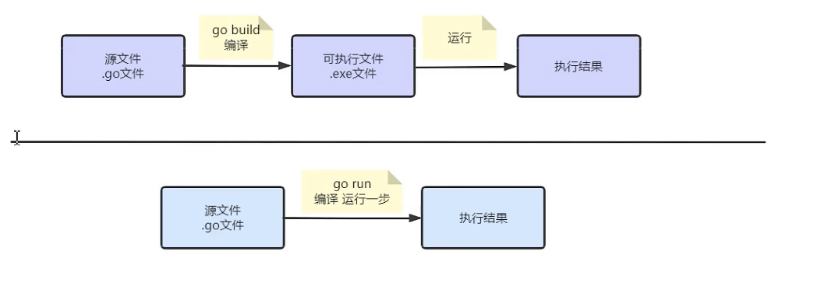

<br>

1. 源代码在编译后 会生成可执行文件, 编译器会将程序运行依赖的库文件包含在可执行文件中, 所以可执行文件比go文件大了很多

2. 如果我们先编译生成了可执行文件, 那么我们可以将该可执行文件拷贝到没有go的开发环境的机器上, 仍然可以运行

3. 如果要使用go run来运行程序, 则所在电脑必须有go的开发环境 否则无法执行

<br><br>

# 注意事项
1. 源文件以 ``.go`` 作为扩展名

2. 程序的执行入口是 main 函数

3. 变量名严格区分大小写

4. 方法是由一条条语句构成, 每个语句后不需要分号 (go会自动加)

5. go编译器是一行行进行编译的 因此我们一行就写一条语句 不能把多条语句写在同一行, 否则报错
```go
fmt.Println("hello golang")fmt.Println("hello golang")
```

6. 定义的变量 或者 import的包 如果没有使用到 代码不能编译通过, **多余东西不要写**

7. 括号都是成对出现的

<br><br>

# 注释:
go中的注释有两种
- ctrl + /: ``//``
- shift + alt + a: ``/* */``

<br><br>

# 代码风格:
1. 运算符两边留空白
2. 推荐行注释
3. 方法中的花括号 不要换行, 下面的风格报错
```go
func main()
{
  ...
}
```
4. 一行超过80个字符 建议换行

<br>

### 格式化命令
```s
# 用来查看格式化后的样子
gofmt go文件


# 将格式化后的样子 写入到go文件中 一般用这个命令做格式化
gofmt -w go文件
```

<br><br>

# API:
go语法提供了大量的标准库, api也就是这些标准库的使用文档
```s
# 官网
https://golang.org

# 中文
https://studygolang.com/pkgdoc
```

<br><br>

# 变量:
Go是强类型语言, 变量都有其对应的类型

<br>

变量相当于内存中一个 **数据存储空间** 的表示

**内存空间:**  
```s
age
+------+
|  18  |  类型: int (标识空间大小)
+------+
```

<br>

变量的使用步骤:
1. 声明
2. 赋值
3. 使用

<br>

### 变量的声明 与 使用:
使用 var 关键字 来声明变量

**方式1: 使用 var 声明变量**  
```go
var 变量名 变量类型
变量名 = 值
```

<br>

**方式2: 变量的初始化**  
```go
var 变量名 变量类型 = 值
```

<br>

**方式3: 省略变量类型, 自动推断**  
```go
var 变量名 = 值
```

<br>

**方式4: 省略var, 并使用:=运算符**  
使用如下方式进行赋值 是声明变量并赋值的简写形式, 叫做 短变量声明

使用 := 操作符可以同时声明变量并赋值，而不需要显式地使用 var 关键字。Go编译器会自动推断变量的类型。

这种短变量声明形式通常用于函数内部，而在函数外部，你可能会使用 var 关键字显式声明变量并指定类型。

```go
变量 := 值
```

<br>

**方式5: 声明多个变量**  
```go
var 变量名1, 变量名2, 变量名3 变量类型 = 值1, 值2, 值3

// 声明多个变量: 统一类型
var num1, num2, num3 int = 1, 2, 3
fmt.Println(num1, num2, num3)


// 声明多个变量: 使用短声明
 变量名1, 变量名2, 变量名3 := 值1, 值2, 值3

name, age, sex := "sam", 18, "男"
fmt.Println(name, age, sex)


// 使用var + 类型 标准形式
var (
  name, sex string
  age       int
)
name, age, sex = "sam", 18, "男"
fmt.Println(name, age, sex)

var (
  // 也可以在这里赋值
  name, sex string = "sam", "男"
  age       int    = 18
)
fmt.Println(name, age, sex)
```

<br>

```go
// /Sam/Demo/GOPROJECT/src/PROJECT01/package02/demo01/main.go

// main.go所在的包名为package02, 但是主程序所在的包名应该叫 main, 所以这里要修改为 main
package main

import "fmt"

func main() {
	// 1. 变量的声明
	var age int

	// 2. 变量的赋值
	age = 18

	// 3. 变量的使用 (逗号表示字符串的拼接)
	fmt.Println("age = ", age)
}
```

<br>

### 注意点:
1. 变量不可重复声明

2. 值的类型 和 变量的类型 必须匹配
```go
// 报错: 变量为int, 但值为浮点数 (不像java会截断)
var num int = 12.56
```

3. 声明变量 指明变量的默认值 但赋值时, 输出变量时会输出该变量对应类型的默认值

<br>

### 变量的4种使用形式:
```go
package main

import "fmt"

func main() {
	// 第一种使用形式: 变量的初始化
	var num int = 18
	fmt.Println(num)

	// 第二种使用形式: 仅声明, 仅声明未赋值的时候输出 默认值
	var num2 int
	fmt.Println(num2)  // 0

	// 第三种使用形式: 末明确指明变量类型, 会自动类型推断
	var num3 = 10
	fmt.Println(num3)

	// 第四种使用形式: 省略var, 并使用 := 来赋值, 会自动类型推断
	num4 := 5
	fmt.Println(num4)
}
```

<br><br>

## 全局变量 和 局部变量

<br>

### 局部变量:
定义在函数内部的变量

<br>

### 全局变量:
定义在函数外部的变量

<br>

```go
// 全局变量
var (
  name = "sam"
  age = 18
)

func main() {
  // 局部变量
  var sex = "男"

  fmt.Println(name, age, sex)
}
```

<br><br>

# 进制 和 进制转换

### 十进制
逢十进一

我们使用 0 - 9 来表示数字, 当遇到10的时候 进位1, 前位使用0代替

```s
 0
 1
 2
 3
 4
 5
 6
 7
 8
 9
10  # 进位1, 各位使用0占位
```

<br>

### 八进制
逢八进一

我们使用 0 - 7 来表示数字, 当遇到8的时候 进位1, 前位使用0代替

```s
 0
 1
 2
 3
 4
 5
 6
 7
10  # 进位1, 各位使用0占位
11  # 9
12
13
14
15
16
17
20  # 进位1, 各位使用0占位
```

<br>

### 十六进制
逢十六进一

我们使用 0 - 9 A - F 来表示数字, 当遇到16的时候进位1, 前位使用0代替

```s
 0
 1
 2
 3
 4
 5
 6
 7
 8
 9
 A
 B
 C
 D
 E
 F
10  # 16 逢十六进一了
11
```

<br>

### 2进制 -> 10进制
```s
1 1 0 1

# 相当于 从右手边开始 
1 * 2^0 +
0 * 2^1 +
1 * 2^2 +
1 * 2^3
```

<br>

**8进制 -> 10进制:**  
每位 * 8^n 进行加法运算

```s
# 8进制的16, 从右手边开始
16

6 * 8^0 +
1 * 8^1
6 + 8 = 14
```

<br>

### 10进制 -> 2进制
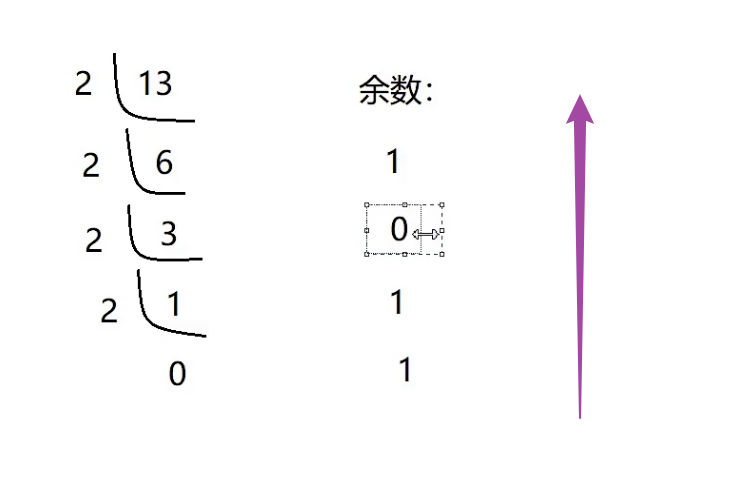

1. 13 % 2 取余数
2. 那上一步的商继续 % 2, 如果商为0的时候 停止
3. 取余数的逆
```s
13 % 2 = 1
6 % 2 = 0
3 % 2 = 1
1 % 2 = 1  # 1 除以 2 商0 余数为被除数本身

1101
```

**10进制 -> 8进制:**  
% 8

```s
# 10进制的14 -> 8进制
14 % 8 = 商 1 余 6
1 % 8 = 商 0 余 1

# 10进制的14转换为8进制为 16
16
```

<br><br>

# fmt 包
fmt包提供了用于 格式化输入 和 输出 的功能

<br>

### **<font color='#C2185B'>Println</font>**
用于打印一行文本，并在行尾添加换行符 ``\n``

它可以接受多个参数，**会以空格分隔它们**，并在最后输出换行符。


<br>

### **<font color='#C2185B'>Printf</font>**
用于格式化输出

它**使用格式化字符串来指定输出的格式**，占位符会被后面提供的实际值替换，并输出到控制台

- %T: 输出值的类型
- %+v: 在结构体类型中，会包含字段名

- %s: 字符串占位符
- %q: 带双引号的字符串
- %c: 字符（Unicode码点）

- %t: 布尔

- %d: 整数占位符, 10 进制整数占位符
- %b: 整数占位符, 2 进制整数占位符
- %x: 整数占位符, 16 进制整数占位符
- %o: 整数占位符, 8 进制整数占位符

- %f: 浮点数占位符, 默认格式的浮点数。
- %e, %E: 浮点数占位符, 科学计数法表示的浮点数，分别使用小写和大写字母。
- %g, %G: 浮点数占位符, 根据情况选择 %f 或 %e，分别使用小写和大写字母。

- %p: 指针占位符, 指针的十六进制表示

<br>

**技巧: 输出变量的类型**  
```go
fmt.Printf("num的类型为: %T", num)
```

<br><br>

# 扩展: 查看变量占用的字节

### **<font color='#C2185B'>len(变量)</font>**
变量为 字符串: **返回字符串中的字节数**（不是字符数）  
由于 Go 中的字符串是以字节存储的，因此 len() 函数返回的是字符串占用的字节数
```go
str := "Hello, 世界"
fmt.Println(len(str))  // 输出 13
```

<br>

变量为 数组和切片: 返回元素的数量

<br>

变量为 映射: 返回键值对的数量

<br>

变量为 通道: 返回通道中当前排队的元素数量

<br>

### **<font color='#C2185B'>unsafe.Sizeof(变量)</font>**
unsafe.Sizeof 函数返回一个类型的大小（以字节为单位）

```go
import (
	"fmt"
	"unsafe"
)

var name = "sam"

// 16
fmt.Println(unsafe.Sizeof(name))
```

而字符串在Go中并不是直存类型 它是一个结构体类型

```go
type StringHeader struct {
  Data uintptr
  Len int
}
```

在64位系统上 uintptr 和 int 都是8字节, 加起来就是16

<br>

name 是一个字符串，而字符串在 Go 中实际上是一个结构体，包含指向底层数据的指针、长度和容量等信息。

字符串的内部结构可能包含以下几个字段：
- 指针字段（8字节）： 指向字符串底层数据的指针。
- 长度字段（8字节）： 记录字符串的长度。
- 容量字段（8字节）： 记录字符串的容量。

至于为什么我之前的回答中提到字符串变量占用的内存大小是 24 字节，这是因为字符串变量除了存储 StringHeader 结构体外，还包含了一个指向底层数据的指针。

所以，总的来说，字符串变量的大小为 StringHeader 结构体大小（16 字节）加上指向底层数据的指针的大小（8 字节），即总共是 24 字节。

这种情况下，unsafe.Sizeof(name) 返回的是字符串变量 name 本身的大小，而 len(name) 返回的是字符串的长度，也就是 StringHeader 结构体中的 Len 字段。

<br><br>

# 变量的数据类型

### 基本数据类型
- 数值型
  - 整数类型
    - int
    - int8
    - int16
    - int32
    - int64
    - uint
    - uint8
    - uint16
    - uint32
    - uint64
    - byte

  - 浮点类型
    - float32
    - float64

- 字符型 (byte, 没有单独的字符型, 使用byte来保存单个字母字符)

- 布尔型 (bool)

- 字符串 (string)

<br>

### 复杂数据类型(派生数据类型)
- 指针
- 数组
- 结构体
- 管道
- 函数
- 切片
- 接口
- map

<br>

### 默认值
在 Go 语言中，局部变量的默认值会被初始化为零值。

全局变量和包级别的变量会被初始化为它们对应类型的零值。

零值是一种默认的、基本的零初始状态，它可以确保变量在创建后即使没有显式赋值，也具有可预测的值。

<br>

**基本数据类型:**  
- 整数类型（int）：0
- 浮点数类型（float32 和 float64）：0.0
- 布尔类型（bool）：false
- 字符串类型（string）：空字符串（""）

<br>

**复杂数据类型:**  
- 复数类型（complex64 和 complex128）：complex128 类型的默认值为 0 + 0i，即实部和虚部都为0的复数。

- 指针类型（pointer）：nil（表示空指针）

- 切片类型（slice）：nil（表示空切片）

- 映射类型（map）：nil（表示空映射）

- 通道类型（channel）：nil（表示未初始化的通道）

- 接口类型（interface）：nil（表示空接口）

- 数组类型（array）：数组的元素类型决定了默认值。例如，整数数组的默认值是由元素类型的默认值构成的数组。

<br><br>

## 数值类型: 整数类型
用于存放整数数值的 如 10, -55, 600 等

它分为有符号和无符号两种
- int: 有符号
- uint: 无符号

当我们定义的整数类型 存放的值**超过其类型的表数范围时**, 会报错
```go
var num int8 = 23  // OK
var num int8 = 256  // ERR: constant 256 overflows int8
```

<br>

### 有符号整数类型
8 表示 8位

<br>

|类型|有无符号|占用存储空间|表数范围|
|:--|:--|:--|:--|
|int8|有|1字节|-2^7 ~ 2^7-1 (-128 ~ 127)|
|int16|有|2字节|-2^15 ~ 2^15-1 (-32768 ~ 32767)|
|int32|有|4字节|-2^31 ~ 2^31-1 (-2147483648 ~ 2147483647)|
|int64|有|8字节|-2^63 ~ 2^63-1|

<br>

### 无符号整数类型
符号位 不再表示符号了 而是实实在在的占了一位

<br>

|类型|有无符号|占用存储空间|表数范围|
|:--|:--|:--|:--|
|uint8|无|1字节|0 ~ 255|
|uint16|无|2字节|0 ~ 2^16-1|
|uint32|无|4字节|0 ~ 2^32-1|
|uint64|无|8字节|0 ~ 2^64-1|

<br>

### 其它整数类型
int 和 unit 占用的存储空间是按照系统的存储位数
- int: 32:4, 64:8
- unint: 32:4, 64:8

<br>

|类型|有无符号|占用存储空间|表数范围|
|:--|:--|:--|:--|
|int|有|32位系统 占4字节, 64位系统 占8字节|-2^31 ~ 2^31 - 1, -2^63 ~ 2^63 - 1|
|uint|无|32位系统 占4字节, 64位系统 占8字节|0 ~ 2^32 - 1, 0 ~ 2^64 - 1|
|rune|有|等价int32|-2^31 ~ 2^31-1|
|byte|无|等价uint8|0 ~ 255|

<br>

### 总结
这么多整数类型 使用的时候 该如何选择?

**golang整数类型默认声明为 int 类型**

<br>

golang程序中整型变量在使用时, 遵守保小不保大的原则, 即: **在保证程序正确运行下, 尽量使用占用空间小的数据类型**

```go
// 表示学生的年龄
var age uint = 18

// byte === uint8
var age byte = 18
```

<br><br>

## 数值类型: 浮点类型 float32 64
用于存放小数值的 比如 3.14, -3.14 等, **但有精度损失的问题**

<br>

### go中浮点类型一共有两种:
这两种类型占用的字节 也就是存储空间跟操作系统无关的

```s
# 底层存储:
符号位 + 指数位 + 尾数位
```

- float32: 4字节 -3.403E38 ~ 3.403E38
- float64: 8字节 -1.798E308 ~ 1.798E308

<br>

### 示例:
```go
var num = 3.14  // 3.14

// 科学计数法: 314 * 10^-2 -> 减2个0
var num2 = 314e-2  // 3.14

// 科学计数法: 314 * 10^2 -> 加2个0
var num3 = 314e+2  // 31400
fmt.Println(num, num2, num3)
```

<br>

### 精度问题: float64
浮点数可能会有精度的损失, float64位的精度稍微更加精确些, 建议使用 float64, 同时它也是**go中的浮点数的默认类型**
```go
var num1 float32 = 256.000000916
// 256

var num2 float64 = 256.000000916
// 256.000000916

fmt.Println(num, num2)
```

<br><br>

## 数值类型: 字符类型 byte (uint8)
其它的java中有单独的 字符类型 char

go中没有专门的字符类型, 如果要存储单个字符 (字母), 一般使用 byte 来保存, **使用单引号包裹起来的单个字符**

字符类型本质上就是一个整数, 输出字符类型的变量的时候会将对应的码点进行输出

变量中保存的是 ascii码点
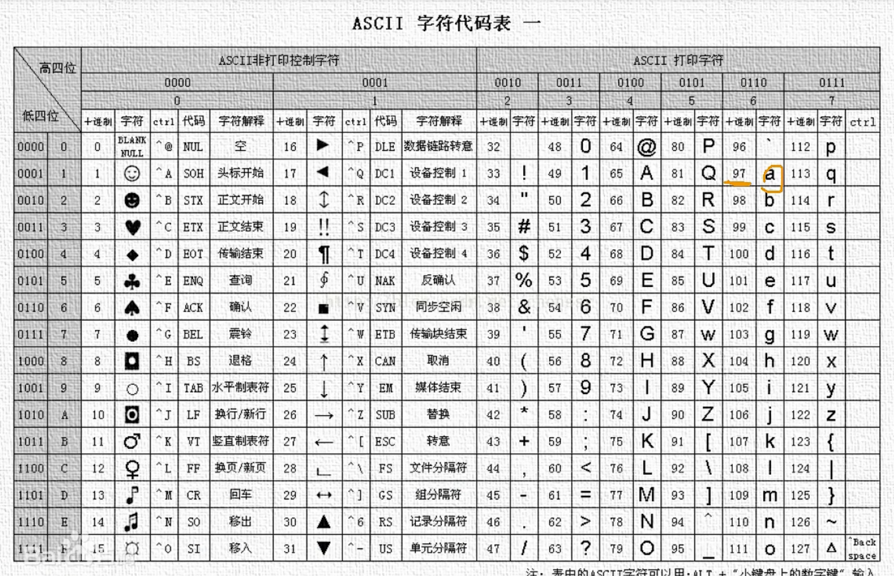

```go
// 使用 byte 声明类型, 使用 '' 单引号 包裹数据
var c1 byte = 'a'  
fmt.Println(c1) // 97
fmt.Printf("%T", c1)  // uint8 (也相当于byte)
```

<br>

### 注意: 汉字的情况
汉字 底层对应的是 Unicode码点

go中在声明字符类型的时候 默认使用 int32 类型
```go
var c2 = '中'  // 20013
```

<br>

### 总结:
go语言中所有字符类型底层对应的是 unicode码点 (ascii为unicode的前128位) **所以go中字符对应使用的为unicode字符集, 更具体的说是utf-8 编码方案**

<br>

### 技巧: 输出字符型变量存储的字符
上面我们输出 字符类型 的时候 输出的都是 码点, 我现在想输出具体的字符 可以使用格式化输出 %c

```go
var c1 = '中'
fmt.Printf("%c", c1)
```

<br><br>

## 字符类型: 转移字符
我们使用 ``\`` 作为转移字符, 将后面的字母表示为特殊含义, 比如 ``\b``, 就是退格(删除键)

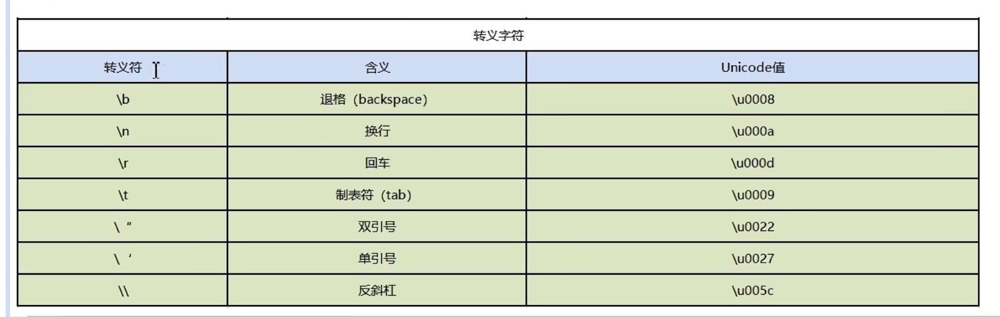

<br>

```go
fmt.Println("aaa\nbbb")
```

- ``\b``: 退格, 光标退一个位置, 重新输入, 后续输入就会替换原有的字符
- ``\r``: 回车, 光标移动回到本行行首, 重新输入, 后续输入就会替换原有的字符
- ``\n``: 换行
- ``\t``: 制表符, 每8位为一个区间

<br><br>

## 数据类型: 布尔类型 bool
布尔类型 bool, 布尔类型数据只允许取值 true 或 false

布尔类型占 1个字节

布尔类型适于逻辑运算, 一般用于程序流程控制

```go
var flag bool = true
```

<br><br>

## 数据类型: 字符串 string
go语言中将字符串划分到 基本数据类型 中

字符串就是一串固定长度的字符链接起来的字符序列

```go
// 字符串形式1:
var str string = "你好"

// 字符串形式2: 反引号, 字符串中有特殊字符的时候 空格 引号 等
var str string = `
  这里的内容会原样输出 包括格式
`
```

<br>

### 字符串的特性
**1. 字符串是不可变的**  
指的是字符串一定定义好 其中的字符的值不能改变

```go
var str string = "abc"
str = "def"  // 这是可以的 相当于我们修改了 str 的引用

// 字符串的不可变性 体现在 字符串中的某个字符是不允许被修改的
str[0] = 'x'  // 报错
```

<br>

### 字符串的拼接
使用 + 运算符 进行字符串拼接
```go
var str string = "abc" + "def"

// 注意: 当我们字符串拼接换行的时候 +号保留在上一行
var str string = "abc" +
"def"
```

<br><br>

## 基本数据类型: 默认值
- 整数类型: 0
- 浮点类型: 0 (输出的时候 不是0.0)
- 浮点类型: false
- 字符串类型: "" 空串

<br><br>

## 基本数据类型: 类型转换
go语言中 不同类型的变量之间赋值时, **需要显式转换**, 并且只有显式转换(强制转换)

<br>

### 语法:
- T: 表示数据类型
- V: 表示需要转换的变量
```go
T(V)
```

<br>

```go
var n int = 100

// 将 int -> float32
var f float32 = float32(n)

// n的类型仍然是int, 强制类型转换不影响n本身


var n1 int32 = 12
var n2 int64 = n1 + 30  // 报错

// n1 + 30 还是一个int32 在转换的时候, 我们要显示转换
var n2 int64 = int64(n1) + 30
```

一定要匹配等号左右的数据类型

<br>

**注意:**  
强制类型转换并不影响n本身, n仍然是int类型的100, 上面的转换只是将 n 中的值 转换为 float32 保存在f变量中

<br>

### 示例:
```go
var n1 int64 = 12
var n2 int8 = int8(n1) + 127

fmt.Println(n2) // -117

/*
int8(n1) 将 n1 转换为 int8 类型，然后再加上 127。  
由于 int8 类型的范围是 -128 到 127，加上 127 可能导致溢出。

在 int8 类型的溢出时，Go 语言采用的是溢出截断，即超出 int8 范围的部分会被截断。这会导致循环，即从最小值开始重新计数。
*/


var n1 int64 = 12
var n2 int8 = int8(n1) + 128

fmt.Println(n2) // 报错

/*
128上来就超过 int8 的范围了
*/
```

<br>

### 要点:
int64类型 -> int8类型: 截断, 将表数范围大的类型 转换为 表数范围小的类型, 会出现数据溢出 (Go 语言采用的是溢出截断)

<br><br>

## 类型转换: 基本数据类型 <-> string

### 基本数据类型 -> string
有两种方式
1. 使用 ``fmt.Sprintf("%参数", 表达式)``
2. 使用 ``strconv包`` 的函数

<br>

### 方式1: 
### **<font color='#C2185B'>fmt.Sprintf("%参数", 表达式)</font>**
根据参数(转换格式)生成格式化的字符串 **并返回该字符串**

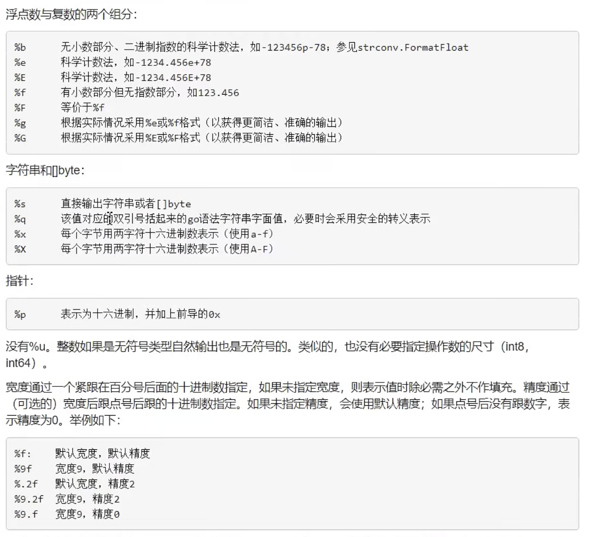

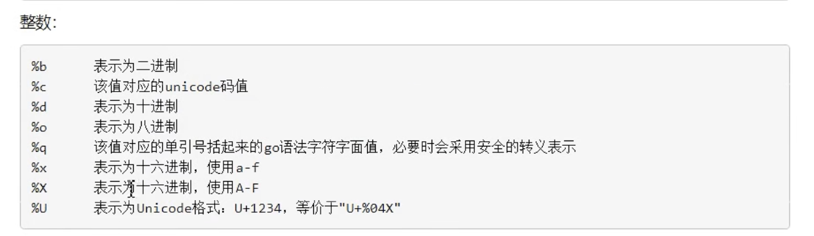

```go
var n1 int = 19

/*
  传入 %d: 十进制

  将 n1 按照十进制进行转换 (字面值19按照10进制的形式)
*/
var s1 string = fmt.Sprintf("%d", n1)
fmt.Println(s1)  // 19

fmt.Printf("s1对应的类型为: %T, 对应的值为: %v", s1, s1)


var n2 float32 = 3.14
// 参数要传入 小数格式
var s2 string = fmt.Sprintf("%f", n2)


var n3 bool = false
// 参数要传入 布尔格式
var s3 string = fmt.Sprintf("%t", n3)


var n4 byte = 'a'
// 参数要传入 字符格式
var s4 string = fmt.Sprintf("%c", n4)
```

<br>

### 方式2: strconv 字符串转换的包
老师说不如上面的方式常用

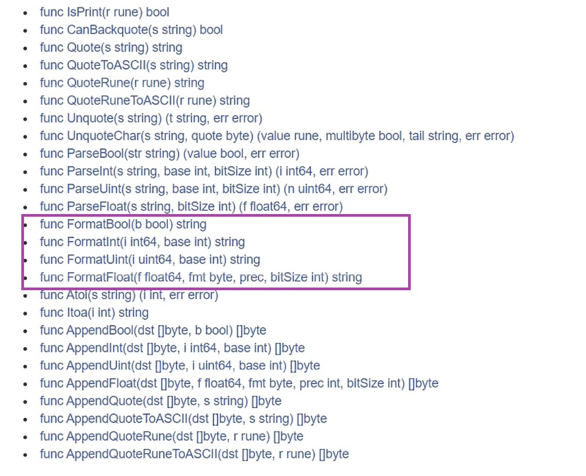

<br>

### **<font color='#C2185B'>strconv.FormatInt(i int64, base int) string</font>**

- 参数1: int64类型的值 要转换的值
- 参数2: 希望转换为 什么进制

```go
package main

import (
	"fmt"
	"strconv"
)

func main() {
	var n1 int = 19

  // 需要转换 int64 类型
	var s1 string = strconv.FormatInt(int64(n1), 10)
	fmt.Printf("s1的类型为: %T, s1的值为: %q \n", s1, s1)
  // s1的类型为: string, s1的值为: "19"
}
```

<br>

### **<font color='#C2185B'>strconv.FormatFloat(f float64, fmt byte, prec, bitSize int) string</font>**
- 参数1: float64类型的值 要转换的值
- 参数2: 字符类型
  - f: 表示 10进制 的格式
  - b: 表示 2进制 的格式
- 参数3: 保留小数点后面9位
- 参数4: 表示当前小数为什么类型

```go
var n2 float64 = 3.14
var s2 string = strconv.FormatFloat(n2, 'f', 9, 64)
fmt.Printf("s2的类型为: %T, s2的值为: %q \n", s2, s2)
// s2的类型为: string, s2的值为: "3.140000000" 
```

<br>

### **<font color='#C2185B'>strconv.FormatBool(b bool) string</font>**
 
```go
var b1 bool = false
var s3 string = strconv.FormatBool(b1)
fmt.Printf("s3的类型为: %T, s3的值为: %q \n", s3, s3)
```

<br>

### string -> 基本数据类型
使用 strconv包 下的函数  


<br>

### **<font color='#C2185B'>ParseBool(s string)</font>**
将字符串转换为bool

**返回值:**  
返回值有2个, 一般我们只关注返回值1

1. value bool, 转换后的值
2. err error, 可能出现的错误

```go
var s1 string = "true"

// 声明两个返回值的变量
var result bool
var err error

// 接收两个返回值
result, err = strconv.ParseBool(s1)

fmt.Printf("b1的类型为: %T, b1的值为: %v \n", result, result)
fmt.Println(err)
// b1的类型为: bool, b1的值为: true 
// <nil>


// 一般会这么利用
if err != nil {
  fmt.Println("解析错误:", err)
} else {
  fmt.Printf("解析结果：%v\n", result)
}


// 这么写也可以
s1 := "true"
// 使用短声明 自动推导类型
result, err := strconv.ParseBool(s1)


// 也可以忽略err返回值
var b bool
b, _ = strconv.ParseBool(s1)
```

<br>

### **<font color='#C2185B'>ParseInt(s string, base int, bitSize int)</font>**
将字符串转换为 int64

- 参数1: 要转换的字符串
- 参数2: 要转换的字符串的进制
- 参数3: 要转换成的类型

```go
var s1 string = "19"

// 转换为 int64 类型
var result, _ = strconv.ParseInt(s1, 10, 64)

fmt.Printf("result的类型为: %T, result的值为: %v \n", result, result)
// result的类型为: int64, result的值为: 19
```

<br>

### **<font color='#C2185B'>ParseFloat(s string, bitSize int)</font>**

- 参数1: 要转换的字符串
- 参数2: 要转换成的类型 32 / 64

```go
var s1 string = "3.14"
var result, _ = strconv.ParseFloat(s1, 64)
fmt.Printf("result的类型为: %T, result的值为: %v \n", result, result)
```

<br>

### 注意:
当我们的字符串类型 往 对应类型转的时候, **如果不是有效字符串**, 则转换**结果对应类型的默认值**

```go
// 字符串为 3.14
var s1 string = "golang"

var result, _ = strconv.ParseBool(s1)
// false

var result, _ = strconv.ParseInt(s1, 10, 64)
// 0
```

所以 string向基本数据类型转换的时候, 一定要确保string类型能够转换成有效的数据类型 否则最后得到的结果就是按照结果对应类型的默认值输出

<br><br>

# 复杂数据类型: 指针
c当中的指针会涉及到指针的运算 所以很麻烦, go当中没有指针的运算 它只是一些简单的操作, 比如通过指针找变量, 通过变量找指针, 所以go语言的指针很简单

<br>

### 基本数据类型 和 内存的对应关系
下面的代码在内存中长什么样?
```go
var age int = 18
```

<br>

go会为age变量开辟一个内层空间, 这个空间中存放着18这个数值
```s
    +------+
age |  18  |
    +------+
        ↘ 空间地址值: &age -> 0x14000010070
```

现在 18 这个数是放到了上面的空间中 对于这个空间来说会有一个地址, 我们可以通过下面的语法输出 这个空间的地址

<br>

### **<font color='#C2185B'>&变量</font>**  
将变量对应空间的地址 使用该方式进行表述, **16进制的数字**

<br>

```go
var age int = 18

fmt.Println(&age)  // 0x14000010070
```

<br><br>

## 指针变量:

### 定义 指针变量
```go
var age int = 18

// 下面这行代码什么意思?
var ptr *int = &age
```

- var: 声明一个变量
- ptr: 指针的变量的名字
- *int: ptr对应的类型, 它是一个指针类型 可以理解为 它是指向int类型的指针
- &age: age变量的空间的地址, 它作为ptr的变量的值

<br>

```s
    +------+
age |  18  |
    +------+
        ↘ 空间地址值: &age -> 0x14000010070


    +-----------------+
ptr |  0x14000010070  |
    +-----------------+
        ↘ 空间地址值: &ptr -> 0x1400004e020
```

既然 ptr 内部存放着 age空间的地址值, 那么我们就能通过这个地址值找到 18

那么如果我们输出 ptr 的时候, 得到的是地址? 还是 18?, **地址!**

```go
var age int = 18

var ptr *int = &age

fmt.Println(&age, &age)
// 0x14000010070 0x14000010070
```

ptr本身也有一块内存空间, 这个本身的内存空间也是有地址的, 也就是说只要是空间都对应有地址值

<br>

### 通过 指针 获取它指向的数据

### **<font color='#C2185B'>*指针变量</font>**  
这种方式就是拿到 该指针指向的真实的值

```go
var age int = 18

var ptr *int = &age

fmt.Println(*ptr)  // 18
```

<br>

### 总结
指针就是内存地址, 通过内存地址 可以得到对应的值

- ``&变量``: 获取变量的内存空间地址
- ``*指针变量``: 获取指针通过地址值 指向的真实的数据
- 通过指针 我们可以修改 指针所指向的数据

<br><br>

## 指针的细节
### 1. 可以 通过指针 改变 指向值
```go
var age int = 18

// 输出 age 变量中的值
fmt.Println(age) // 18

// 通过 指针 操作 age 中保存的值
var agePtr *int = &age
*agePtr = 20

// 再次输出 age 发现 它里面的值被修改了
fmt.Println(age) // 20
```

<br>

**疑问:**  
我们通过变量修改值, 和通过指针变量修改值 有什么区别?

在Go语言中，通过直接赋值和通过指针来修改变量的值有一些区别，主要涉及到
1. 变量的作用域
2. 数据拷贝

<br>

```go
var age int = 10
age = 20
```

这种方式直接修改了变量 age 的值。在这个例子中，age 是一个局部变量，直接通过赋值操作修改了它的值。

```go
var age int = 10
var ageptr *int = &age
*ageptr = 20
```

这种方式通过指针 ageptr 修改了变量 age 的值。在这个例子中，age 是一个局部变量，ageptr 是一个指向 age 的指针。通过 *ageptr = 20 的操作，实际上是通过指针修改了 age 的值。

<br>

**区别1: 作用域**  
- 直接赋值方式可以在同一作用域内修改变量的值
- 通过指针方式可以在 **更广泛的作用域内** 通过传递指针来修改变量的值

<br>

**区别2: 数据拷贝**  
- 直接赋值方式在修改变量时 直接对变量进行操作，不涉及指针和数据拷贝。
- 通过指针方式通过指针间接地修改变量的值，涉及指针的解引用操作。

<br>

**区别3: 引用和传递**  
通过指针方式可以用于引用和传递变量的地址，从而实现在不同作用域内修改同一变量的值

<br>

### 2. 指针变量接收的一定是地址值
接收的不是地址值的时候 会报错

<br>

### 3. 指针变量的地址不可以不匹配
```go
var num int = 10

// num类型为int, 则它的指针类型不可以是 *float32
var numptr *float32 = &num  // 报错
```

<br>

### 4. 基本数据类型(值类型) 都有对应的指针类型 形式为 ``*基本数据类型``
比如 ``int -> *int``, ``float32 -> *float32``

<br><br>

# 标识符
变量 方法等 只要是起名字的地址 就是标识符, var age, 这个age就是标识符

<br>

### 注意:
**1. ``_``**  
在go中是一个特殊的标识符, 称为空标识符, 它代表任何其他的标识符, **单独使用的时候 它对应的值会被忽略** (比如, 忽略某个返回值)

```go
import (
  "fmt"
  _"strconv"  // 这个包就会被忽略
)
```

所以 ``_`` 一般被作为占位符使用, **不能单独作为标识符使用**

<br>

**2. int float32等不算是保留关键字**  
```go
// 可以但不推荐
var int int = 10
```

<br>

**3. 标识符不建议使用中文**

<br>

### 关键字 和 预定义标识符
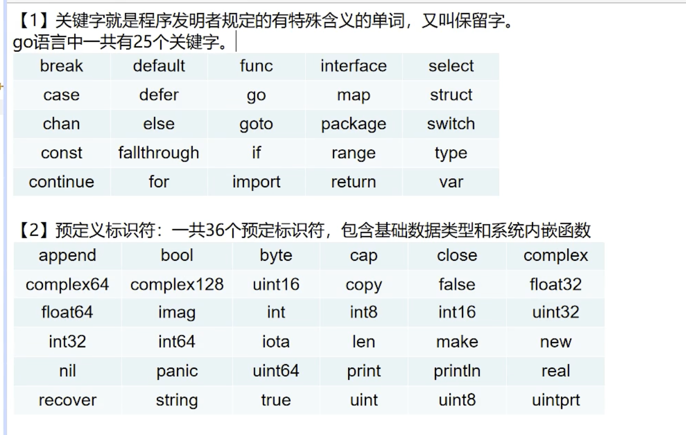

<br><br>

## 起名规则

### 包名:
尽量保持package的名字和目录保持一致, 尽量采取有意义的包名, 简短, 有意义 包名不要和标准库冲突

<br>

**package main:**  
首行 package main 的原因

main包时一个程序的入口, **也就是main函数所在的包建议定义为main包**

如果入口函数所在的包 没有定义为main包, 那么就不能得到可执行文件

<br>

如果我们的程序在如下的路径中
```s
| - GOPROJECT
  | - src
    | - PROJECT01
      | - package02
        | - demo01
          - main.go # 入口文件
```

我们在 main.go 文件中 写了如下的代码

```go
package main  // 声明为 main 包, 程序的入口包

import (
	"fmt"
)

func main() {
	var age int = 18
	fmt.Println(age) // 18
}
```

<br>

上面的代码 我们在首行使用了 ``package main`` 然后我们再执行 ``go build`` 之后 会生成一个可执行文件

但是如果我们不将这个文件定义为 ``package main`` 包, 比如我们起个 abc
```go
package abc  // 这里

import (
	"fmt"
)

func main() {
	var age int = 18
	fmt.Println(age) // 18
}
```

这时我们执行 go run 会报错, 不能运行一个没有main的包
```s
go run: cannot run non-main package
```

也就是说 我们程序的入口放在了 ``abc`` 这个包下, 但是go要求入口文件要放在main包下, 所以我们没有放到main包下的时候 直接就报错了

我们要是执行 ``go build`` 的话, 也不会生成可执行文件, 只有放到main包下 才会生成一个可执行文件

<br>

**疑问:**  
我知道了 有入口函数的文件 必须声明为 main 包, 不然会报错 同时也没有可执行文件

但是这条规则又告诉我们, 包名尽量要和目录保持一致 这怎么办?

<br>

有入口函数的文件的目录声明为 main 目录
```s

```

或者这么定义目录的完成结构是不是也行
```s
| - PROJECT01
  | - src
    | - gocode
      | - main
        | - 其它目录结构
        | - 其它目录结构
        - main.go
    | resource
```

<br>

### 变量 函数 常量:
使用 驼峰法

- 如果变量名 函数名 常量名 **首字母大写**, 则可以被其他的包访问 (类似java的public)
- 如果**首字母小写**, 则只能在本包中使用 (类似java的private)

<br>

**go中利用变量名首字母大小写的特性, 来说变量的访问权限的控制**

<br>

### 示例: 如何访问别的包中声明好的 变量 或者 函数
**1. 将 GOPATH 修改为 我们的工作目录**  
因为读其它包中的变量都是从 ``$GOPATH/src/`` 开始计算的, 所以正常我们的文件都是要放在 ``$GOPATH`` 工作空间里面的

<br>

**2. 示例**  
比如我们在 main包/main.go 文件在 读取 test包/test.go 中声明的变量
```s
| - GOPROJECT  # 我们要将 GOPATH 指向 GOPROJECT
  | - src
    | - gocode
      | - main
        - main.go
      | - test
        - test.go
```

```go
// test包下的 test.go 文件
package test
// 大写字母开头声明 public 权限的变量
var StudNo int = 1
```

```go
// main包下的 main.go 文件
package main

// $GOPATG/src 的部分不写
import (
	"gocode/test/test.go"
	"fmt"
)

func main() {
	var num = 10
	fmt.Println(num)

	// 我们在这里 访问 /test/test.go 中声明的变量 StudNo
	fmt.Println(test.StudNo)
}
```

<br>

### 注意
import导入语句通常放在文件开头包声明语句的下面

导入的包名需要使用双引号包裹起来

**包名是从 $GOPATH/src/ 后开始计算的, 使用 / 进行路径分隔**

<br><br>

# 运算符
go语言中运算符有6种

1. 算术运算符
2. 赋值运算符
3. 关系运算符
4. 逻辑运算符: ``&&``, ``||``, ``!``
5. 位运算符: ``&``, ``|``, ``^``
6. 其它运算符: ``*``, ``&``

<br>

### 算术运算符

**+号的要点:**  
1. 表示 整数
2. 表示 相加操作
3. 表示 字符串的拼接
```go
var s1 string = "abc" + "def"
```

<br>

**-号的要点:**  
```go
fmt.Println(10 / 3)  // 两个 int型 结果为整数类型 3
fmt.Println(10.0 / 3)  // 两个 float型 结果为浮点类型 3.333333335
```

<br>

**%号的要点:**  
1. 取模的等价公式: ``a % b = a - a / b * b``
```s
# 10 / 3 取商 为 3
10 % 3 = 10 - 10 / 3 * 3
```

2. 结果是正数还是负数 和 被除数 相同 (第一个操作数)

<br>

**++, --要点:**   
go中的++ --的使用非常的简单, 只能单独使用, 且**只有后++**, 不能参与到运算中, 跟java不一样

```go
var a int = 10
a++
fmt.Println(a)
```

<br>

### 关系运算符
关系运算符中没有 ``===``, ``!==``

<br>

### 逻辑运算符
**逻辑或:**  
两个要去长城, 两个人只要有一个人说去 结果就是去, 两个人都不去, 结果才是不去

<br>

只要第一个表达式的结果是false, 后面的表达式就不用运算了, 直接就是false

<br>

**逻辑与:**  
两个要去长城, 两个人只要有一个人说不去 结果就是不去, 两个人都去, 结果才是去

<br>

只要第一个表达式的结果是true, 后面的表达式就不用运算了, 直接就是true

<br><br>

# 运算符的优先级
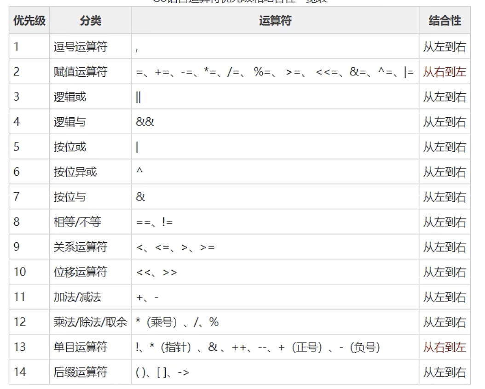

为了提高优先级, 可以加 ``()``

<br><br>

# 获取用户终端输入
在编程中, 需要接收用户输入的数据, 就可以使用键盘输入语句来获取  

我们有如下的两个api 可以完成获取用户的键盘录入, 一般会使用第一个

<br>

### **<font color='#C2185B'>fmt.Scanln(a ...interface{})</font>**
我们输入数据的时候, **只有输入换行的时候** 数据才真正的被录入

参数1, 我们使用传入的变量, 接收录入的结果, **注意: 我们传入的是变量对应的地址值**

<br>

**返回值:**  
返回值有两个, 可以接收 可以不接收
1. n int:
2. err error:

<br>

**要点:**   
为什么我们在调用 fmt.Scanln 的时候, 要传入 变量的引用 &age

因为 ``fmt.Scanln(result)`` 这个函数需要我们传入一个变量, 用户输入的结果会存放在变量中

为什么要传入变量的引用, 我们可以这么理解

js中, 如果我们给函数传入一个基本数据类型变量a, 那么即使我们在函数中修改了a对应的值, 它也不会影响到函数外的a 因为值传递就是copy

但是go中我们可以通过变脸的引用 修改变量中的值, 这样我们在函数内修改基本数据类型变量a, 也会影响到函数外的变量

```go
func main() {
	// 实现功能: 键盘录入学生的年龄, 姓名, 成绩, 是否为 vip

	var name string
	var age int
	var score float32
	var isVip bool

	// 使用 Scanln 实现 获取用户键盘录入
	fmt.Println("请录入学生的年龄:")

	// 为什么传入 age 的地址?
	// 在Scanln函数中, 对地址中的值进行改变的时候, 实际外面的age就会被影响
	fmt.Scanln(&age)

	fmt.Println()
	fmt.Println("请录入学生的姓名:")
	fmt.Scanln(&name)

	fmt.Println()
	fmt.Println("请录入学生的成绩:")
	fmt.Scanln(&score)

	fmt.Println()
	fmt.Println("请录入学生是否为Vip:")
	fmt.Scanln(&isVip)

	// 将上面的数据 在控制台打印输出
	fmt.Println()
	fmt.Printf("学生: %v, 年龄: %v, 成绩: %v, Vip: %v", name, age, score, isVip)
}
```

<br>

### **<font color='#C2185B'>Scanf(format string, a ...interface{})</font>**
- 参数1: 传入指定的格式, 我们从键盘录入数据的时候 是按照指定格式录入的
- 参数2: 录入的数据 都会被传入的参数2所接收, 需要传入变量的引用

<br>

**返回值:**  
返回值有两个
1. n int:
2. err error:

<br>

```go
var name string
var age int
var score float32
var isVip bool

fmt.Scanf("%d %s %f %t", &age, &name, &score, %isVip)
```

<br><br>

# 流程控制
流程控制语句是用来控制程序中各语句执行顺序的语句, 可以把语句组合成能完成一定功能的小逻辑模块

<br>

### 控制语句的分类
1. 顺序
2. 选择
3. 循环

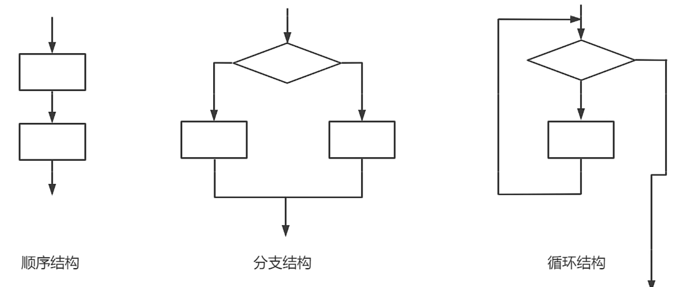

<br><br>

## 分支结构: if

### 语法:
```go
// if
if 条件表达式 {
  ...逻辑代码
}


// if ... else
if 条件表达式 {
  ...逻辑代码
} else {
  ...逻辑代码
}


// if ... else if ... else
if 条件表达式 {
  ...逻辑代码
} else if 条件表达式 {
  ...逻辑代码
} else {
  ...逻辑代码
}
```

<br>

### 要点:
1. 条件表达式左右(), 可以不写, go中也不推荐我们写
2. 条件表达式左右一定要有空格
3. 花括号是必须写的 即使只有一行代码

4. if后面可以并列的加入变量的定义
```go
// 不能使用var来定义
if var count = 20; count < 30 {
		
}

// 可以使用短声明来声明变量
if count := 20; count < 30 {
		
}
```

5. else 不能换行, 必须 ``} else {`` 紧接着

<br>

### 示例:

```go
var count = 30

if count < 50 {
  fmt.Println("存量不足")
}


// 直接在if后面定义变量
if count := 20; count < 30 {
  fmt.Println("存量不足")
}
```

<br>

## 分支结构: switch

### 语法:
switch后面的表达式会依次和case后面的值进行比较, 比较成功的话, 就会执行对应的语句块
```go
switch 表达式 {
  case 值1, 值2, ...
    语句块1
  case 值3, 值4, ...
    语句块2
  // default的位置可以是任意的, 但默认放在最后
  default:
    语句块
}
```

<br>

### 示例:
```go
var score int = 87

switch score / 10 {
case 10:
  fmt.Println("您的等级为A级")
case 9:
  fmt.Println("您的等级为A级")
case 8:
  fmt.Println("您的等级为B级")
case 7:
  fmt.Println("您的等级为B级")
default:
  fmt.Println("您的等级为C级")
}
```

<br>

### 要点
1. switch后是一个表达式 (即: 常量值, 变量, 一个有返回值的函数都行)

2. case后的各个值的数据类型, 必须和switch的表达式数据类型一致
```go
var a int32 = 87
var b int64 = 100

// switch后面的表达式的类型为 int32, case后面表达式的类型为 int64, 类型不一致则报错
switch a {
case b:
  fmt.Println("您的等级为A级")
}
```

3. case后面可以带多个表达式, 使用逗号间隔, 比如 case 表达式1, 表达式2 (这里和js java不一样)
```go
var score int = 87

switch score / 10 {
  // 意味着 10 11 12 都会走到该分支中
  case 10, 11, 12:
    fmt.Println("您的等级为A级")
}
```

4. case后面的值如果是常量值(字面量), 则要求不能重复
```go
// 写了两个 10 分支 是不行的
case 10:
  fmt.Println("您的等级为A级")
case 10:
  fmt.Println("您的等级为A级")
```

5. case后面不需要带break, 程序匹配到一个case后就会执行对应的代码块, 然后退出switch 如果一个都匹配不到 则执行default

6. default不是必须的, default的位置可以是任意的

7. switch后也可以不带表达式 当做if分支来使用
```go
var score int = 87

switch  {
  case score > 60:
    fmt.Println("您的等级为A级")
}
```

8. switch后也可以直接声明定义个变量并以分号结束 不推荐
```go
// 声明变量的时候 后面必须以;号结尾
switch b := 10; {
  case b > 6:
    fmt.Println("您的等级为A级")
}
```

9. switch穿透 利用fallthrough关键字, 如果在case语句块后增加fallthrough, 则会继续执行下一个case
```go
var score int = 87

switch score / 10 {
case 10:
  fmt.Println("您的等级为A级")
case 9:
  fmt.Println("您的等级为A级")

case 8:
  fmt.Println("您的等级为B级")
  fallthrough  // 它只穿透下面的一个分支 只穿透一层
case 7:
  fmt.Println("您的等级为B级")

default:
  fmt.Println("您的等级为C级")
}
```

<br><br>

# 循环结构: for
go中只有for循环这一种使用方式

<br>

### 语法:
```go
for (初始表达式; 布尔表达式(条件判断); 迭代因子) {
  循环体;
}

// 使用 短声明 来初始化 i
for i := 1; i < 5; i++ {
  
}
```

<br>

**注意:**  
1. for循环中初始表达式, 需要使用 短声明 的形式声明i, 不能使用var

2. for循环实际就是让程序员写代码的效率高了, 底层该怎么执行还是怎么执行, 仍然是我们写了100遍代码, 底层效率没有提高

<br>

### 要点:
1. for循环的格式很灵活
```go
i := 1
for i < 5 {
  fmt.Println('你好 golang')
  i++
}
```

2. 死循环
```go
for {
  ...循环体
}

for ;; {
  ...循环体
}
```

<br><br>

## for循环: 遍历 数组, 切片, 字符串, map, 通道
for range结构是go语言中特有的一种迭代结构, 在许多情况下非常有用, 它可以遍历上面的各种结构

<br>

### **<font color='#C2185B'>for...range...</font>**
使用 ``:=`` 来进行分割, 后面为 ``range 集合``, 前面能解构出 ``key, value``
```go
for key, value := range 集合 {

}
```

<br>

### 遍历字符串
```go
var str = "hello,world"

// 原始for
for i := 0; i < len(str); i++ {
  // 使用 fmt.Printf 输出每个字符, 使用fmt.Println会输出字符对应的码点
  fmt.Printf("%c \n", str[i])
}
```

<br>

**问题:**  
for循环是按照字节来遍历, 如果我们遍历的字符串中有中文的话, 输出的会是乱码

```go
var str = "hello,world 你好"

// 原始for
for i := 0; i < len(str); i++ {
  // 乱码
  fmt.Printf("%c \n", str[i])
}
```

<br>

### 使用 for ... range ... 遍历字符串
它是按照字符 (或者理解为 按照 item) 进行遍历
```go
for index, value := range str {
  fmt.Printf("索引: %d, 对应的值为: %c \n", index, value)
}

/*
索引: 0, 对应的值为: h 
索引: 1, 对应的值为: e 
索引: 2, 对应的值为: l 
索引: 3, 对应的值为: l 
索引: 4, 对应的值为: o 
索引: 5, 对应的值为: , 
索引: 6, 对应的值为: w 
索引: 7, 对应的值为: o 
索引: 8, 对应的值为: r 
索引: 9, 对应的值为: l 
索引: 10, 对应的值为: d 
索引: 11, 对应的值为: 你 
索引: 14, 对应的值为: 好
*/
```

我们发现
- ``你`` 的索引是 11
- ``好`` 的索引是 14

说明中文占了3个字节, 取的是一个字节中首位的索引

<br><br>

## 关键字: break
break关键字可以使用在 循环 和 switch 结构中

<br>

### switch中的break
每个case分支后其实都有break才结束当前的分支, go中不用显示的使用

<br>

### for中的break
它用于退出当前的循环, 结束的是离break最近的循环

<br>

### 示例: 求 1 - 100 的和, 当和第一次超过300的时候, 停止程序
```go
var sum = 0
var i = 1
for {
  if sum >= 300 {
    break
  }

  sum += i
  i++
}


// 写法2:
for i := 1; i <= 100; i++ {
  if sum >= 300 {
    break
  }

  sum += i
}

fmt.Println(sum)
```

<br>

### 使用 break 结束当前循环
当我们使用break结束双层for的时候, 它停止的是内层的循环的当次循环, 外层的循环没有停止

我们能发现, i == 2 的这次大循环 没有执行, 紧接着执行的 i == 3 这次循环
```go
for i := 1; i <=5; i++ {
  for j := 2; j <=4; j++ {

    if i == 2 && j == 2 {
      break
    }

  }
}
```

<br>

### 给for循环加 标签, 使用break结束指定的循环
```go
for i := 1; i <=5; i++ {

  label:
  for j := 2; j <=4; j++ {

    if i == 2 && j == 2 {
      break label
    }

  }
}
```

<br><br>

## 关键字: continue
结束本次循环, 继续下一次循环

<br>

### 输出 1 - 100 中被6整除的数
```go
for i := 1; i <= 100; i++ {
  if i % 6 != 0 {
    continue
  }

  fmt.Println(i)
}
```

<br>

### 要点:
1. continue 结束的是离它最近的那层循环
2. continue label, 跳过label指定的循环

<br><br>

## 关键字: goto
goto语句可以无条件的转移到程序中指定的行, 比如当满足什么样的条件后, 程序由第10行 跳到第20行

goto语句通常与条件语句配合使用, 可以用来实现条件的转移

在go中一般不建议使用goto语句, 以免造成程序流程的混乱

<br>

**跳转到label指定的行**
```go
fmt.Println("hello 1")
fmt.Println("hello 2")
goto label
fmt.Println("hello 3")
fmt.Println("hello 4")

label:
fmt.Println("hello 5")
fmt.Println("hello 6")
/*
  hello 1
  hello 2
  hello 5
  hello 6
*/
```

<br>

## 关键字: return
return可以用在 for, 方法, 函数中

<br>

### for 中的 return
for外层的输出语句 不会被输出, 遇到return后, 当前的函数会被终止

```go
for i := 1; i < 5; i++ {
  fmt.Println(i)

  if (i == 2) {
    return
  }
}

fmt.Println("这句会执行么")
```

<br><br>

# 函数:
为了提高代码的复用, 减少代码的冗余, 提高代码的维护性, 我们会使用函数

函数就是为完成某一个功能的程序指令(语句)的集合, 称为函数

<br>

### 函数的定义
使用 关键字 func 来声明函数
```go
func 函数名 (形参1 类型1, 形参2 类型2 ...) (返回值类型列表) {

  执行语句...

  return 返回值列表
}
```

<br>

### 函数的调用
```go
函数名(实参列表)
```

<br>

### 要点:
1. 函数不能声明在 main函数 中, 因为函数和函数是并列关系

2. 返回值类型列表 只有一个类型的时候 不用写()

3. 函数返回值类型列表 要和 返回值列表 的 顺序 和 个数 保持一致

4. 函数返回值
  1. 如果函数没有返回值, 不用声明 返回值类型列表, 不用写return
  2. 如果函数有返回值, 则需要声明 返回值类型列表 和 return, return多个返回值时使用 ``,`` 进行分割

5. 函数名
  1. 首字母大写 该函数可以被本包文件和其它包文件使用 类似 public
  2. 首字母小写 该函数只能被本包文件使用, 类似private

```go
func main() {

	var num1 = 10
	var num2 = 20

  // 调用函数 获取返回值
	// var result := getSum(num1, num2)

  // 还可以利用短生命
  result := getSum(num1, num2)

	fmt.Println(result)

  // 调用函数 进行输出
	sendMsg("hello, world")

}

// 有一个返回值的函数
func getSum(num int, num2 int) int {
	return num + num2
}

// 仅输出 无返回值的函数
func sendMsg(msg string) {
	fmt.Println(msg)
}
```

<br>

### 利用函数 交换两个数
如果我们如下的方法声明的函数 是没有办法做到交互两个值的
```go
func main() {

	var num1 = 10
	var num2 = 20

	changeNum(num1, num2)
	fmt.Println(num1, num2)
}

// 因为 我们传递的是值本身, 不是值的引用
func changeNum(num1 int, num2 int) {
	var temp = 0
	temp = num1
	num1 = num2
	num2 = temp
}
```

<br>

**解析:**  
我们的go程序在执行的时候都会申请一个内存空间 然后会对这块内存进行逻辑上的划分

它会划分3个区域
1. 栈
2. 堆
3. 代码区

<br>

栈中通常放基本数据类型
```s
go语言中 它有一个编译器的逃离分析 很可能基本数据类型不在栈里面
```

堆中通常放引用数据类型 (复杂数据类型)

代码区用来存放代码本身

<br>

go会在栈中为每个函数开辟一个栈帧, 也就是为函数单独申请一个空间 这个空间专门用来存放函数中的变量

```s
栈 (基本数据类型)
+-----------------------+
|                       |

  main函数栈帧
  +----------------+
  |                |
          +-----+
    num1: |     |
          +-----+

          +-----+
    num2: |     |
  |       +-----+  |
  +----------------+


  changeNum函数栈帧
  +----------------+
  |                |
          +-----+
    temp: |     |
          +-----+

          +-----+
    num1: |     |
          +-----+

          +-----+
    num2: |     |
  |       +-----+  |
  +----------------+

|                      |
+----------------------+
```

我们能看到因为是值传递, num1 num2 分别在不同的栈帧中, changeNum改变的只是changeNum栈帧中的变量 和 main 中的num1 和 num2 不发生任何关系

<br>

当函数执行结束后, go会销毁该函数对应的栈帧 (栈中关于这个函数独有的空间)

<br>

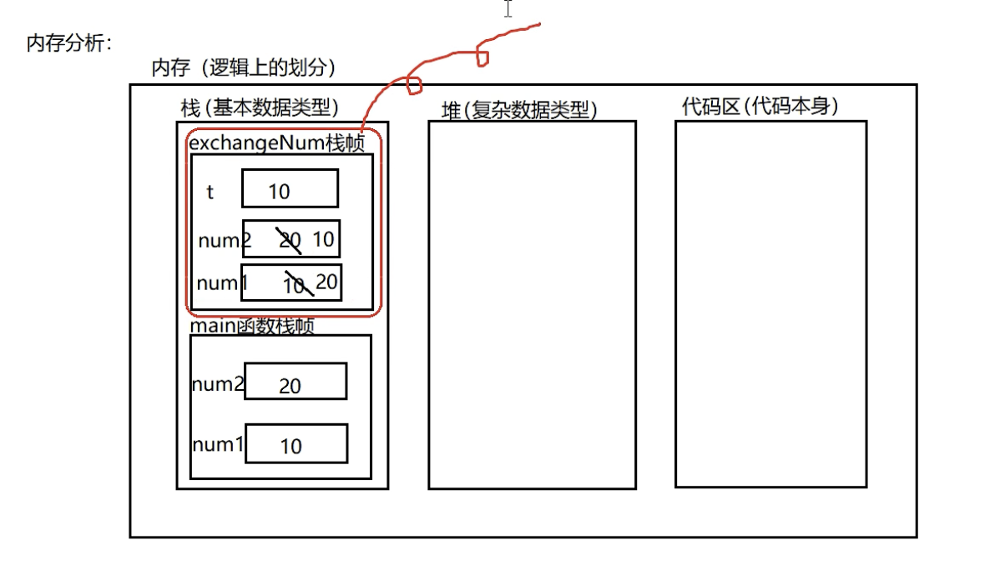

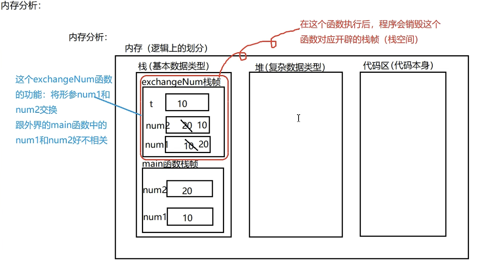

<br>

**修改上面的函数:**  
```go
func changeNum(num1 *int, num2 *int) {
	*num1, *num2 = *num2, *num1
}

func main() {

	var num1 = 10
	var num2 = 20

	changeNum(&num1, &num2)

	fmt.Println(num1, num2)  // 20 10
}
```

<br>

### 函数特点: go函数不支持重载
重载是说 函数名相同, 形参列表不同 它们之间就构成重载

```go
func demo(num int) {

}

// 编译会报错:
func demo(num int, num2 int) {

}
```

<br>

### 函数特点: 参数支持可变参数
可变参数会被当做一个切片来处理 (可以理解为数组)

<br>

**格式:**   
```go
func 函数名(args ...参数类型) {

}
``` 

<br>

1. 传递 同类型 的可变参数
```go
func main() {

	demo(1, 2)
}

func demo(args ...int) {
	for index, value := range args {
		fmt.Println(index, value)
	}
}
```

<br>

2. 传递 不同类型 的可变参数, **使用 interface{} 类型**, interface{} 是一种特殊的数据类型，被称为空接口。空接口可以表示任意类型的值
```go
func demo(values ...interface{}) {
  for _, value := range values {
    fmt.Println(value)
  }
}

func demo() {
  printValues(1, "Hello", 3.14, true)
}
```

<br>

### 函数特点: 值传递
基本数据类型 和 数组 默认都是值传递 即进行值拷贝, 在函数内修改, 不会影响到原来的值

```go
func main() {

	var num int = 10
	demo(num)

	fmt.Println(num)
}

func demo(num int) {
	num = 20
}
```

我们想在demo中利用num变量修改 函数外部的num, 但发现如上述的写法是不行的

<br>

### 函数特点: 引用传递
以值传递方式的数据类型, 如果希望在函数内的变量能修改函数外的变量, 可以传入变量的&地址

函数内以指针的方式操作变量, 从效果来看类似引用传递

``*num`` 通过地址值 找到了 main函数中num变量中的值

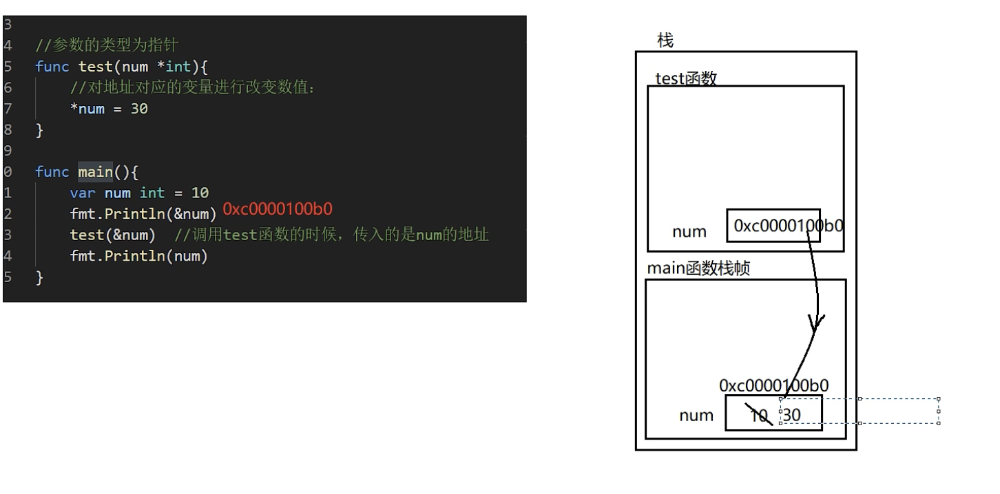

<br>

```go
func main() {

	var num int = 10
  // 传入 num 的引用
	demo(&num)

	fmt.Println(num)
}


// num为指针类型, 通过 *num 可以访问 和 修改 指针所指向的值
func demo(num *int) {

  // 20是int类型, *num也是指向内存里面的值, 将这个值修改为20
  // *num 相当于 通过地址 找到了 外层函数num变量中保存的那个值
	*num = 20
}
```

<br>

### 函数特点: 函数也是数据类型中的一种
在go中, 函数也是一种数据类型, 可以赋值给一个变量, 则该变量就是一个函数类型的变量了

通过该变量可以对函数进行调用

<br>

### 函数类型的声明方式:
- 无参无返回值函数类型: func()
- 有参无返回值函数类型: func(int)
- 有参有返回值函数类型: func(int) int

```go
func main() {

  // 使用 短声明 声明变量接收函数
	a := demo
	a(1)

	fmt.Printf("a的数据类型 %T, 函数的数据类型 %T", a, demo)
	// func(), func()
  // func(int) int, func(int) int
}

func demo(num int) int {
	fmt.Println("demo")
	return num
}

// ------

func main() {

  // 使用var声明变量接收函数
	var fn func() = demo
	fn()
}

func demo() {
	fmt.Println("demo")
}
```

<br>

**技巧: 函数可以作为形参**   
函数既然是一种数据类型, 因此在go中, **函数可以作为形参**, 并且调用, 把函数本身当做一种数据类型

```go
func main() {
	openPannel(open)
}

func open() {
	fmt.Println("打开抽屉")
}

func openPannel(action func()) {
	action()
}
```

<br>

### 函数特点: 支持对返回值进行命名

**传统写法:**  
要求 返回值 和 返回值类型列表, 顺序要一一对应
```go
// 求两个数的 和 和 差
func getResult(num1 int, num2 int) (int, int) {
	sum := num1 + num2
	sub := num1 - num2

	return sum, sub
}
```

<br>

**返回值命名:**  
```go
func getResult(num1 int, num2 int) (sum int, sub int) {
	sum := num1 + num2
	sub := num1 - num2

  // 这时返回值和返回值列表 的顺序 就不用一一对应了
	return sub, sum
}
```

<br><br>

# 类型别名: type
相当于给一个类型起了一个别名

<br>

### 语法:
```go
type 自定义类型名 数据类型
```

```go
// 类型叫 myInt, 其类型为 int
type myInt int

// 后续我们可以使用我们自定义的类型
var num myInt = 1
```

<br>

### 注意: 自定义类型也是一种类型, 不同类型之间不能互相赋值
```go
// 自定义类型
type myInt int
var num myInt = 1

var num2 int = 2

// 不能将 int 赋值给 myInt 类型, 类型不符
num = num2  // 报错
```

<br>

**技巧: 类型转换**  
```go
type myInt int
var num1 myInt = 1

var num2 int = 2

// num1 = num2  // 报错 类型不符

// 类型转换: 将 int 转换为 myInt 保持类型一致
num1 = myInt(num2)

fmt.Println(num1)  // 正常输出 2
``` 

<br><br>

# 包的概念

### 使用包的原因:
1. 我们不可能把所有的函数放在同一个源文件中, 可以分门别类的把函数放在不同的源文件中
```s
| - src
  | - gocode
    | - utils  # 工具函数 供其他文件使用
      - util.go

    | - main
      - main.go
```
```go
// util.go

package utils

import (
  "fmt"
)

// 首字母大写提供访问权限
func GetConn() {
  fmt.Println("获取链接")
}
```
```go
// main.go

// package 进行包的声明, 建议包的声明这个包和所在的文件夹同名
package main

import (
  "fmt"

  // 导入 GetConn 函数所在的包 不用写 $GOPATH/src/ 的部分, 最后不用加 /
  "gocode/utils"
)

// main包时程序的入口包, 一般main函数会放在这个包下
func main() {
  fmt.Println("main函数执行")

  // 调用 utils 中的 GetConn
  utils.GetConn()
}
```

2. 解决同名问题, 两个人都想定义一个同名函数, 在同一个文件中是不可以定义相同名字的函数的, 此时可以用包来区分

<br>

### 包要点: 
```s
https://www.bilibili.com/video/BV1ee411173m/?p=63&spm_id_from=pageDriver&vd_source=66d9d28ceb1490c7b37726323336322b
```

<br>

1. package进行包的声明, 建议 包的声明和包所在的文件夹同名

2. main包是程序的入口包, main函数会在这个包下

3. 打包语法
```s
package 包名
```

4. 引入包语法
```s
import "包路径"  # 省略 $GOPATH/src/ 部分
```

5. 多个包导入 使用 ``import ()`` 语法

6. 调用包中的函数的时候, 需要在前面带上包名, 相当于命名空间

7. 首字母大写, 提升访问权限

8. 一个包下不能有重复的函数, 定义在不同的.go文件中也不行

9. 包名 和 文件夹的名字 可以不一样
```s
| - utils
  - textUtil.go

# textUtil.go
package aaa  # 正常是需要叫 utils 的

# 别的文件导入
import "gocode/utils"
# 调用 textUtil 中的函数, 通过 包名 aaa 调用
aaa.xxx()
```

10. 一个目录下的同级文件归属一个包, textUtils 和 util 都在同一个包下
```s
| - gocode
  | - utils # 注意: 该目录下的所有文件的 的 package 包名, 包名要一致
    - textUtils.go  
    - util.go
```

11. 包其实就是一个文件夹, 在程序层面相同package 包名的源文件组成代码模块, 一个目录被作为包, 该目录下的所有文件都想象成装到了对象中(命名空间)

12. 可以给包起别名, 起别名后, 原来的包名就不能使用了
```go
import (
  "fmt"
  // demo 就是别名
  demo "gocode/utils"
)

// 通过别名调用包中函数, utils包名就不能再用了
demo.xxx()
```

<br><br>

# init函数
它是初始化函数, 可以用来进行一些初始化操作, 每个源文件都可以包含一个init函数, **该函数会在main函数执行前, 被go运行框架调用**

```go
package main

import (
	"fmt"
)

// init 先于 main 函数执行
func init() {
	fmt.Println("init函数被执行了")
}

func main() {
	fmt.Println("main函数被执行了")
}
```

<br>

### 全局变量定义 和 init函数 和 main函数的执行流程
上面的3种情况的执行顺序如下

1. 全局变量定义
2. init函数
3. main函数

```go
package main

import (
	"fmt"
)

// 全局变量
var num int = setNum()

func setNum() int {
	fmt.Println("setNum函数被执行了")
	return 10
}

// init
func init() {
	fmt.Println("init函数被执行了")
}

// main
func main() {
	fmt.Println("main函数被执行了")
}

/*
  输出顺序
    1. setNum函数被执行了
    2. init函数被执行了
    3. main函数被执行了
*/
```

<br>

### 多个源文件都有init函数的时候, 如何执行?
main所依赖的包中的函数会优先执行, main包是最后执行的

main.go文件会先收集该文件中的依赖, 然后再执行main.go中的代码


```s
| - demo
  | - utils
    - util.go
  - main.go
```

```go
// util
package utils

import "fmt"

var Age int
var Sex string
var Name string

// 定义一个 init函数对变量进行初始化赋值
func init() {
  fmt.Println("utils包 中的 init 函数执行了")
  Age = 18
  Sex = "男"
  Name = "Sam"
}
```

```go
// util
package main

import (
  "fmt"
  "gocode/demo/utils"
)

// 定义一个 init函数对变量进行初始化赋值
func init() {
  fmt.Println("main包 中的 init 函数执行了")
}

func main() {
  fmt.Println("main函数执行了", utils.Age)
}
```

<br><br>

# 匿名函数
go支持匿名函数, 如果我们某个函数只是希望使用一次, 可以考虑使用匿名函数

<br>

### 匿名函数使用方式
1. 在定义匿名函数的时候 就直接调用了 这种方式匿名函数只能调用一次

2. 将倪敏该函数赋值给一个变量, 通过变量来调用

```go
// 使用形式1: 相当于 (function() { ... })()
res := func(num1 int, num2 int) int {
  return num1 + num2
}(1, 2)


// 使用形式2: 相当于 let fn = function() { ... }
fn := func(num1 int, num2 int) int {
  return num1 + num2
}

result := fn(1, 2)

fmt.Println(result)
```

<br>

### 如何让匿名函数全局内有效
上面匿名函数的定义方式 都是在main函数内部, 那如何定义一个全局可用的匿名函数

```go
var fn = func(num1 int, num2 int) int {
	return num1 + num2
}

func main() {
	fmt.Println(fn(1, 2))
}
```

<br><br>

# 闭包
闭包就是一个函数和其相关的引用环境组合的一个整体

<br>

```go
func main() {
	fn := getSum()

	fmt.Println(fn(10)) // 20
	fmt.Println(fn(10)) // 30
}

// getSum的返回值为函数, 类型 func (int) int
func getSum() func(int) int {

	// 这个区域就是闭包, sum的值被共享了
	var sum int = 10

	// 返回一个匿名函数 外部变量接收的时候传递的参数 会传递给num
	return func(num int) int {
		sum += num

		return sum
	}
}
```

上面的案例中, 闭包就是内部函数引用了外层函数内的变量, 这就形成了闭包

<br>

### 闭包的本质
闭包的本质依旧是一个匿名函数, 只是这个函数引入外界的变量/参数

**匿名函数中引用的那个变量会一直保存在内存中, 可以一直使用**

<br>

### 闭包的特点:
1. 返回的是一个匿名函数, 但是这个匿名函数引用到函数外的变量, 因此这个匿名函数和这个变量形成了一个整体, 构成了闭包

2. 闭包中使用的变量 会一直保存在内存中, 所以会一直使用, **意味着闭包不可滥用 (对内存消耗大)**

<br>

### 不使用闭包可以么?
利用指针类型
```go
var sum = 0

func main() {
	add(&sum, 1)
	add(&sum, 5)

	fmt.Println(sum)
}

func add(sum *int, val int) {
	*sum += val
}
```

<br><br>

# 关键字: defer
在函数中, 程序员经常需要创建资源, **为了再函数执行完毕后, 及时的释放资源** go的设计者提供了defer关键字

<br>

### defer
在go中, 程序遇到defer关键字, 不会立即执行defer后的语句, 而是要将defer后的语句 压入defer栈(单独存放defer的栈)中 重而继续执行函数后面的语句

```go
// 压入栈 不立即执行
defer fmt.Println("num1 = ", num1)

// 优先执行后面的语句
...后面的语句
```

<br>

### 验证:
```go
func main() {
	fmt.Println("执行结果: ", add(1, 2))
}

func add(num1 int, num2 int) int {

	// 遇到 defer 压入栈
	defer fmt.Println("num1 = ", num1)
	defer fmt.Println("num2 = ", num2)
  // 弹出栈的时候 倒序执行

	var sum int = num1 + num2
	fmt.Println("sum = ", sum)

	return sum
}

/*
sum =  3
num2 =  2
num1 =  1
执行结果:  3
*/
```

1. 调用 add
2. 遇到 defer 将后面的代码压入栈
3. 遇到 defer 将后面的代码压入栈
```s
| fmt.Println("num2 = ", num2) |
| fmt.Println("num1 = ", num1) |
+------------------------------+
```
4. 执行后续代码, 后续代码执行完毕后, 弹defer栈

<br>

所以输出结果为
1. ``"sum = ", sum``
2. 弹出栈顶 ``"num2 = ", num2``
3. 继续出栈 ``"num1 = ", num1``
4. ``"执行结果: ", add(1, 2)``

<br>

**注意:**  
```go
func add(num1 int, num2 int) int {

	// 遇到 defer 压入栈
	defer fmt.Println("num1 = ", num1)
	defer fmt.Println("num2 = ", num2)
  // 弹出栈的时候 倒序执行

  num1 += 90  // num1: 91
  num2 += 50  // num2: 52

	var sum int = num1 + num2
	fmt.Println("sum = ", sum)

	return sum
}

/*
sum =  3
num2 =  2
num1 =  1
执行结果:  3
*/
```

defer, 虽然导致 defer栈中的逻辑在函数末尾执行, 但是压入栈的时候, 会将当时对应 或者 绑定的值 或者 当时压入栈时的记录 同时压入栈中

正常我们理解 defer栈中的逻辑既然在函数的末尾执行, 那么理所应当的应该输出函数前面所得到的结果

也就是理所应当的输出
- num1: 91
- num2: 52

但是我们发现输出的还是如下的内容, 也就是defer所在行时的值 
- num2 =  2
- num1 =  1

**也就是说 遇到defer关键字, 会将后面的代码语句压入栈中 同时也会将相关的值同时拷贝入栈, 不会随着函数后面的变化而变化**

<br>

### 总结:
在Go语言中，当使用defer关键字时，它不仅会推迟函数的执行，还会立即计算并保存传递给defer调用的函数的参数。

这意味着即使在defer调用之后对这些参数的值进行了更改，推迟执行的函数仍将接收到它们被推迟时的参数值。

```go
defer fmt.Println("num1 = ", num1)
defer fmt.Println("num2 = ", num2)
```

当遇到这两个defer语句时，num1和num2的当前值（即1和2）被立即保存为defer调用的参数。

因此，尽管在之后的代码中num1和num2的值被修改为91和52，但是推迟执行的fmt.Println函数将使用它们被推迟时的原始值，即1和2。

<br>

### defer 应用场景
比如我们想关闭某个使用的资源, 在使用的时候直接随手defer

因为defer有延迟执行机制(函数执行完毕再执行defer压入栈的语句), 所以你用完随手写了关闭, 比较省心

<br>

主要用于简化函数中的资源管理和错误处理。以下是一些常见的使用场景：

<br>

**1. 关闭文件句柄**  
当打开一个文件进行操作时，可以使用defer来确保文件正确关闭，无论函数执行过程中是否发生了错误。

```go
f, err := os.Open("filename")
if err != nil {
    // 错误处理
}
defer f.Close() // 无论函数如何退出，文件都会被关闭

// 执行文件操作
```

<br>

**2. 释放资源**  
defer可用于确保其他类型的资源被释放，比如网络连接、数据库连接、互斥锁释放等。

```go
lock.Lock()
defer lock.Unlock()

// 执行临界区代码
```

<br>

**3. 延迟执行代码**  
```go
defer fmt.Println("Function is exiting")
// 函数主体代码

```

<br>

**4. 错误处理和恢复**   
defer可以与recover函数配合使用，来捕获和处理panic，防止程序崩溃。
```go
defer func() {
    if r := recover(); r != nil {
        fmt.Println("Recovered from error:", r)
    }
}()
// 可能引发panic的代码
```

<br>

**5. 事务管理**    
在数据库操作中，可以用defer来处理事务的提交或回滚。
```go
tx, err := db.Begin()
if err != nil {
    // 错误处理
}
defer tx.Rollback() // 如果提交成功，则Rollback是无操作的

// 数据库操作

if err := tx.Commit(); err != nil {
    // 错误处理
}
```

<br>

### defer的工作机制: 类似finaly
defer语句能够有效地释放资源的原因在于它的工作机制：当在函数中遇到defer语句时，该语句指定的函数会被推迟到包含它的函数执行完毕时调用。

**这意味着无论包含它的函数是正常结束还是由于错误而提前退出，defer指定的函数总是会被执行**。这为资源管理提供了一种非常方便且安全的方式。

在处理诸如文件操作、网络连接、数据库连接等需要显式释放的资源时，通常需要确保在操作完成后释放这些资源，以避免资源泄露。

如果这些释放操作散布在函数的多个出口，不仅代码复杂，而且容易出错。

使用defer可以将释放资源的操作与资源的获取操作放在一起，这样无论函数如何退出，资源释放操作都能得到保证执行，从而确保资源被适时释放。

<br><br>

# 字符串函数 (预定义函数)

### **<font color='#C2185B'>len(str)</font>**
统计字符串的长度, 按**字节**进行统计, 一个中文占3个字符

<br>

**参数:**  
- 传入数组, 返回元素的数量
- 传入数组指针, 返回*数组中元素的数量 (值为nil的时候 panic)
- 传入切片, 映射, 返回切片 映射中元素的数量, 如参数为nil, len(v)即为0
- 传入通道, 通道缓存中队列(未读取元素的数量), 如参数为nil, len(v)即为0

<br>

**返回值: int**  
返回多少个字节

```go
func main() {
	str := "golang你好"
	fmt.Println(len(str))  // 12, 你好占6个字节
}
```

<br>

### **<font color='#C2185B'>r:=[]rune(str)</font>**
字符串遍历

这种方式是将字符串转成切片, 然后对切片进行遍历

- ``[]rune(str)``: 类型转换 转换为切片
- r: 用来接收切片的变量

后续我们可以使用普通for来遍历r

```go
// 方式1: 普通for不行 因为它是按照字节来遍历 有乱码


// 方式2: for range
str := "golang你好"

for index, value := range str {
  fmt.Printf("index: %d, value: %c \n", index, value)
}
/*
index: 0, value: g 
index: 1, value: o 
index: 2, value: l 
index: 3, value: a 
index: 4, value: n 
index: 5, value: g 
index: 6, value: 你  中文的索引是 字节出现的首位
index: 9, value: 好 
*/


// 方式3: 将 字符串转换为 切片
str := "golang你好"

// []rune(str) 相当于 字符串通过类型转换 变成 切片
r := []rune(str)

// 使用普通for来对切片进行遍历
for i := 0; i < len(r); i++ {
  // 输出切片上每个位置对应的字符
  fmt.Printf("字符: %c \n", r[i])
}

/*
字符: g 
字符: o 
字符: l 
字符: a 
字符: n 
字符: g 
字符: 你 
字符: 好 
*/
```

<br>

### **<font color='#C2185B'>n,err := strconv.Atoi("66")</font>**
字符串转整数 to i 转换int

不是数字型的字符串 则会有err

```go
str := "123"
num, _ := strconv.Atoi(str)

fmt.Println(num)


str := "haha"
num, err := strconv.Atoi(str)

fmt.Println(num, err)
// 0
// strconv.Atoi: parsing "haha": invalid syntax
```

<br>

### **<font color='#C2185B'>str = strconv.Itoa(6887)</font>**
整数转字符串 to a 转换 string

<br>

### **<font color='#C2185B'>string.Count("javaandgolang", "a")</font>**
strings包下的函数

统计子串在字符串中出现的次数

**返回值: int**

```go
str := "haha"

count := strings.Count(str, "a")
fmt.Println(count)
```

<br>

### **<font color='#C2185B'>strings.Contains("javaandgolang", "go")</font>**
查找子串是否在指定的字符串中

**返回值: bool**

<br>

### **<font color='#C2185B'>strings.EqualFold("go", "Go")</font>**
不区分大小写的字符串比较

如果区分小大写的比较使用 ``==``

**返回值: bool**

<br>

### **<font color='#C2185B'>strings.Index("javaandgolang", "a")</font>**
返回子串在字符串第一次出现的索引值, 如果没有返回 -1

```go
str := "haha"

index := strings.Index(str, "a")
fmt.Println(index)
```

<br>

### **<font color='#C2185B'>strings.Replace("goandjavagogo", "go", "golang", n)</font>**

- 参数1: 字符串
- 参数2: 要替换什么
- 参数3: 替换成什么
- 参数4: 替换几个, 如果 n = -1 表示全部替换, 替换两个n就是2

<br>

### **<font color='#C2185B'>strings.Split("go-python-java", "-")</font>**
按照指定的某个字符, 为分割标识, 将一个字符串拆分成字符串数组

<br>

### **<font color='#C2185B'>strings.ToLower("GO")</font>**
### **<font color='#C2185B'>strings.ToUpper("go")</font>**
将字符串的字母进行大小写的转换

<br>

### **<font color='#C2185B'>strings.TrimSpace("  go and java   ")</font>**
将字符串左右两边的空格去掉

<br>

### **<font color='#C2185B'>strings.Trim("~golang~", "~")</font>**
将字符串左右两边指定的字符去掉

<br>

### **<font color='#C2185B'>string.TrimRight("~golang~", "~")</font>**
### **<font color='#C2185B'>string.TrimLeft("~golang~", "~")</font>**
将字符串左边或右边的指定字符去掉

<br>

### **<font color='#C2185B'>strings.HasPrefix("http://...", "http")</font>**
### **<font color='#C2185B'>strings.HasSuffix("http://...", "jsp")</font>**
判断字符串是否以指定的字符串开头 或 结束

<br><br>

# 日期 时间 函数
当我们使用 日期 和 时间 函数的时候 需要导入 ``time`` 包

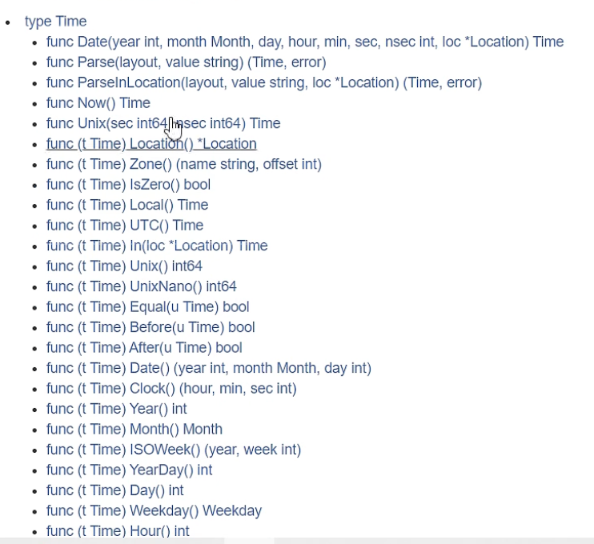

<br>

### 返回 日期时间 对象 方式1:
### **<font color='#C2185B'>time.Now()</font>**
获取当前的日期时间

<br>

**类型:**  
```s
time.Time
``` 

<br>

**返回值: Time类型的结构体**  
结构体相当于类吧, 返回的就是类的实例对象, 它身上有很多的方法 
```s
2024-01-26 21:45:58.97874 +0900 JST m=+0.000574376


2024-01-26:
日期部分，格式为年-月-日

21:45:58.97874:
时间部分，格式为小时:分钟:秒.纳秒

+0900:
时区偏移量，表示比协调世界时（UTC）快9小时。这个值会根据您所在的时区而有所不同。

JST:
时区的缩写，这里指的是日本标准时间（Japan Standard Time）

m=+0.000574376: 
这是 Go 语言特有的表示，表示从程序开始运行到调用 time.Now() 时刻的持续时间（monotonic clock reading）。

m=+ 后面的数字是自程序启动以来经过的秒数。这个值用于测量和比较相对时间，避免因系统时钟调整导致的问题。
```

<br>

### 返回 日期时间 对象 方式2:
### **<font color='#C2185B'>time.Date(2024, time.January, 26, 0, 0, 0, 0, time.UTC)</font>**
根据指定的年、月、日、小时、分钟、秒、纳秒和时区创建时间

time.Date() 是 Go 语言中的一个函数，用于创建一个 time.Time 类型的值。这个函数的参数个数是固定的。具体来说，time.Date() 需要以下参数：

- year：年份（int 类型）
- month：月份（time.Month 类型，实际上是 int）
- day：日期（int 类型）
- hour：小时（int 类型）
- min：分钟（int 类型）
- sec：秒数（int 类型）
- nsec：纳秒（int 类型）
- loc：时区（*time.Location 类型）

所以，time.Date() 函数总共需要 8 个参数。每个参数都必须提供，以便准确地构造一个 time.Time 对象。例如：

返回值：time.Time 结构体

```go
t := time.Date(2024, time.January, 26, 15, 4, 5, 0, time.UTC)
```

<br><br>

## Now() 返回的Time类型对象身上的方法
Time实例对象 下面称之为 t

```go
func main() {
	fmt.Println()
	var t = time.Now()
	fmt.Printf("t的类型: %T, 值为: %v \n", t, t)

	var d = t.Day()
	fmt.Printf("d的类型: %T, 值为: %v \n", d, d)
}
```

<br>

### **<font color='#C2185B'>t.Year()</font>**
返回时间点对应的年份

返回值类型: int

<br>

### **<font color='#C2185B'>t.Month()</font>**
返回时间点对应的那一年的第几月

返回值类型: time.Month, 是个英文单词 (February)

```go
int(t.Month())  // 2, 是数字的2月
```

<br>

### **<font color='#C2185B'>t.YearDay()</font>**
返回时间点对应的那一年的第几天, 平年的返回值范围``[1,365]``, 闰年``[1,366]``

返回值类型: int

<br>

### **<font color='#C2185B'>t.Day()</font>**
返回时间点对应那一月的第几日

返回值类型: int

<br>

### **<font color='#C2185B'>t.Weekday()</font>**
返回时间点对应那一周的周几

返回值类型: int

<br>

### **<font color='#C2185B'>t.Hour()</font>**
返回时间点对应那一天的第几小时, 范围 0 ~ 23

返回值类型: int

<br>

### **<font color='#C2185B'>t.Minute()</font>**
返回时间点对应那一小时的第几分钟, 范围 0 ~ 59

返回值类型: int

<br>

### **<font color='#C2185B'>t.Second()</font>**
返回时间点对应那一分钟的第几秒, 范围 0 ~ 59

返回值类型: int


<br>

### **<font color='#C2185B'>t.Nanosecond()</font>**
返回时间点对应那一秒钟内的纳秒偏移量, 范围 0 ~ 999999999

返回值类型: int

<br><br>

## 日期的格式化
将日期对象以年月日时分秒 按照格式 输出为 字符串

<br>

### **<font color='#C2185B'>fmt.Sprintf()</font>**
Sprintf()函数可以指定格式后, 接收字符串类型的返回值

```go
var datestr = fmt.Sprintf("%d-%d-%d %d:%d:%d", t.Year(), t.Month(), t.Day(), t.Hour(), t.Minute(), t.Second())
```

<br>

### **<font color='#C2185B'>t.Format("")</font>**
参数为 指定格式的字符串, 作为模版使用

格式字符串必须使用 ``2006-01-02 15:04:05`` 来指示格式, 中间的``-``和``:``可以随意替换 **但是数字是固定的**

返回值: string

```go
now := time.Now()

// 打印出完整的时间，例如 "2024-01-26 21:45:58"
fmt.Println(now.Format("2006-01-02 15:04:05"))

// 只打印出日期，例如 "2024-01-26"
fmt.Println(now.Format("2006-01-02"))

// 只打印出时间，例如 "21:45:58"
fmt.Println(now.Format("15:04:05"))

// 使用12小时格式，例如 "09:45 PM"
fmt.Println(now.Format("03:04 PM"))

// 带有星期和月份的完整格式，例如 "Saturday, January 26, 2024"
fmt.Println(now.Format("Monday, January 2, 2006"))

// 自定义格式，例如 "Jan-02-2006"
fmt.Println(now.Format("Jan-02-2006"))
/*
2024-01-26 22:20:42
2024-01-26
22:20:42
10:20 PM
Friday, January 26, 2024
Jan-26-2024
*/
```

<br>

### 解析:
解析时间字符串

### **<font color='#C2185B'>time.Parse("2006-01-02", "2024-01-26")</font>**
参数：格式字符串（layout），时间字符串（value）。

返回值：time.Time 结构体和可能的错误

```go
t, err := time.Parse("2006-01-02", "2024-01-26")
```

<br><br>

## 时间的减法 和 加法

### **<font color='#C2185B'>Add(duration)</font>**
给时间添加持续时间。

参数: time.Duration

返回值: 新的 time.Time 结构体

```go
tomorrow := now.Add(24 * time.Hour)
```

<br>

### **<font color='#C2185B'>Sub(t)</font>**
计算两个时间点之间的差异

参数：另一个时间点（time.Time）

返回值：time.Duration 表示两个时间点的差异

```go
duration := now.Sub(otherTime)
```

<br><br>

# 预定义函数(内置函数)
不用导包可以直接使用的函数, 这些函数在 builtin 包下, 可以直接使用

<br>

### **<font color='#C2185B'>new(类型)</font>**
分配内存, 主要用来分配值类型 (int, float, bool, string, 数组 和 结构体)

- 参数: 类型 而非值, 我们传入的是具体的类型 比如是int类型 还是 float32类型

- 返回值: 返回值为指针, 该类型的新分配的**零值**的指针, 比如我们传入参数为int类型, 那么返回值就是 *int, 指针指向的值为0

<br>

```go
// new的返回值为对应类型的指针*int
num := new(int)

fmt.Printf("
  num的类型: %T,
  num的值为: %v,  // 指针位置存放的是地址
  num的地址为 %v,  // 指针的地址
  num指针指向的值为: %v \n", 
  num, num, &num, *num
)

// num的地址使用 &num 来获取
// 指针指向的值使用 *num 来获取

/*
  num的类型: *int,
  num的值为: 0x14000110018,
  num的地址为 0x14000116018,
  num指针指向的值为: 0
*/
```

```s
# num是指针类型 有它自己的内存空间
# num指针里面存放的是地址值
# 我们可以通过&num来获取num指针本身的地址值

      &num: 0x14000116018
     +---------------+
num  | 0x14000110018 |
     +---------------+
        ↘
        # 存放的 0x14000110018 指向了一块空间
        +---+
        | 0 |
        +---+
        0x14000110018
```

<br>

**疑问?**  
数组和结构体 属于值类型?  

在 Go 语言中，数组和结构体确实都属于值类型。这意味着当它们被赋值给一个新的变量或者作为参数传递给函数时，**实际上会进行值的复制**


**数组**, 在 Go 中，数组是一个固定长度的序列，其中所有元素具有相同的类型。**当一个数组赋值给另一个数组时，会复制所有元素。**
```go
var a = [3]int{1, 2, 3}
var b = a  // 完整复制 a 的内容到 b
b[0] = 4
// 此时 a[0] 仍然是 1，因为 a 和 b 是不同的数组
```

<br>

**结构体**, 结构体是一种将多个不同类型的数据项组合在一起的复合数据类型。和数组一样，当一个结构体赋值给另一个结构体时，其值也会被完整地复制

```go
type Point struct {
    X, Y int
}

var p1 = Point{1, 2}
var p2 = p1  // 完整复制 p1 的内容到 p2
p2.X = 3
// 此时 p1.X 仍然是 1，因为 p1 和 p2 是不同的结构体实例
```

<br>

### **<font color='#C2185B'>make(Type, size IntergerType) Type</font>**
分配内存, 主要用来分配引用类型 (指针, slice切片, map, 管道chan, interface等)

内建函数make分配并初始化一个类型为切片, 映射, 或通道的对象

其第一个参数为类型 而为值

make的返回类型与其参数相同, 而非指向它的指针, 其具体结果取决于具体的类型

- 切片: size指定了其长度, 该切片的容量等于其长度, 切片支持第二个整数实参可用来指定不同的容量, 它必须补小于其长度, 因此 make([]int, 0, 10) 会分配一个长度为0, 容量为10的切片

- 映射: 初始分配的创建取决于size, 但产生的映射长度为0, size可以省略, 这种情况下就会分配一个小的起始大小

- 通道: 通道的缓存根据指定的缓存容量初始化, 若size为0或被省略, 该信道即为无缓存

<br><br>

# 错误处理 (异常处理)

我们先看下 下面的代码

```go
func main() {
	test()  // panic: runtime error: integer divide by zero
	fmt.Println("下面的逻辑")
}

func test() {
	num1 := 10
	num2 := 0

	result := num1 / num2
	// 10 / 0
	fmt.Println(result) //会报错的
}
```

由于 test() 函数的执行 引发了报错 程序恐慌被中止, ``下面的逻辑`` 并没有运行

<br>

### 如何捕获异常?
go中追加代码的优雅 它没有使用 ``try catch finally`` 的机制, 而是使用 ``defer + recover`` 的机制来处理错误

<br>

### recover函数
recover 函数是一个内建函数，它的作用是拦截并恢复一个协程（goroutine）中的 panic。

当程序触发了 panic（类似于其他语言中的异常），正常的程序流程会立即中断，然后 Go 运行时会开始沿着调用栈向上逐层寻找 panic 的处理代码。

recover 函数只有在延迟（defer）函数中调用才有效。它会终止 panic 的继续传播过程，恢复正常的程序执行，并返回传递给 panic 的错误值

<br>

### defer + recover 捕获异常
**格式为:**
1. defer关键字 + 匿名立即执行函数
2. 立即执行函数内 调用 recover() 函数
  - 如果 捕获到异常 该函数返回 err错误对象
  - 如果 未捕获到异常 该函数返回零值 nil
```go
func test() {
  defer func() {
    err := recover()

    if err != nil {
      fmt.Println("捕获到了错误", err)
    }
  } ()

  // 后面都是函数的正常逻辑
}
```

<br>

**解析:**  
因为 defer 关键字 后面的逻辑会被压入 defer栈中 等到函数内其余逻辑执行完毕后 再执行

recover()可以捕获到异常, defer会将捕获逻辑 放程序最后执行 所以这个组合可以捕获到异常

好处就是 它是固定的写法 就写在函数内上方就可以, 不像try catch 我们需要将一部分逻辑放在try中 一部分逻辑放在catch中

<br>

### 示例代码
```go
func main() {
	test() // panic: runtime error: integer divide by zero
	fmt.Println("下面的逻辑")
}

func test() {
	// 利用 defer + recover 来捕获错误
	defer func() {
		// 调用 recover内置函数 来捕获可能发生的错误
		err := recover()
		// 如果没有捕获到错误 recover函数的返回零值 nil
		// 如果捕获到错误 recover函数的返回错误对象

		if err != nil {
			fmt.Println("打印错误信息: ", err)
		}
	}()

	num1 := 10
	num2 := 0

	result := num1 / num2
	// 10 / 0
	fmt.Println(result) //会报错的
}
```

<br><br>

## 自定义错误: 手动抛出异常

### **<font color='#C2185B'>func New(text string) error</font>**
该函数位于 errors 包下

创建自定义错误对象, 我们传入一个字符串, 返回一个错误对象

**返回值:**  
err error

<br>

下面的代码 如果 num2 为 0, 则抛出自定义错误, 因为return了, 所以程序不会往下执行

如果 num2 不为 0, 则正常执行, test() 的返回值为 ``<nil>``

```go
func main() {
	err := test()

	// 说明 test 程序中抛出了异常
	if err != nil {
		fmt.Println("自定义错误: ", err)
	}

  // 后续代码正常执行, 上面也算是捕获到异常了, 程序不会被迫中止
	fmt.Println("main函数中的后续代码")
}

func test() error {
	num1 := 10
	num2 := 2

	if num2 == 0 {
		// 抛出自定义错误
		return errors.New("除数不能为0哦")
	}

	fmt.Println("test内部后续逻辑")

	result := num1 / num2
	fmt.Println(result)

	// 如果没有错误我们就返回一个零值 (相当于undefind)
	return nil
}

/*
test内部后续逻辑
5
main函数中的后续代码
*/
```

<br>

### 报错 - 程序终止
上面的代码属于我们将异常捕获了, 程序不会报错 会继续执行后续的代码

但是有些时候 程序报错了 我们希望程序终止, 因为出错了后 后续代码没有必要执行, **我们需要手动调用 panic函数**

<br>

### **<font color='#C2185B'>func panic(传入一个错误)</font>**
该函数可以停止当前程序的执行, 我们调用该函数的话, 程序就被停止了 后续代码就不执行了

相当于我们在js中手动抛出一个异常, 整个程序被终止 后续逻辑不执行
```js
function test() {
  console.log('test')
  throw "异常"
  console.log('test后续逻辑')
}
test()

console.log('script中的后续逻辑')

/*
test
Uncaught 异常
*/
```

<br>

```go
func main() {
	err := test()

	// 说明 test 程序中抛出了异常
	if err != nil {
		fmt.Println("自定义错误: ", err)

    // 手动调用 panic 中止程序执行
    panic(err)
	}

	fmt.Println("main函数中的后续代码")
}

func test() error {
	num1 := 10
	num2 := 2

	if num2 == 0 {
		return errors.New("除数不能为0哦")
	}

	fmt.Println("test内部后续逻辑")

	result := num1 / num2
	fmt.Println(result)

	return nil
}
```

<br><br>

# 数组 (值类型)
在 Go 中，数组是一个固定长度的序列，其中所有元素具有相同的类型。**当一个数组赋值给另一个数组时，会复制所有元素。**

```go
var a = [3]int{1, 2, 3}
var b = a  // 完整复制 a 的内容到 b
b[0] = 4
// 此时 a[0] 仍然是 1，因为 a 和 b 是不同的数组
```

<br>

### 创建数组:
```go

[元素个数]数组类型

[元素个数]数组类型 {元素}
```

<br>

**声明方式1:**  
```go
var scores [5]int
scores[0] = 95
```

<br>

**声明方式2:**   
变量后面的类型可以不写
```go
var scores [5]int = [5]int{95, 91, 39, 60, 21}
// 输出 scores: [95 91 39 60 21]
// 数组类型: [5]int;
// 数组长度: 5 
```

<br>

**声明方式3: 数组长度可以不指定**   
根据元素的个数确定
```go
var scores = [...]int{95, 91, 39, 60, 21}
```

<br>

**声明方式4: 初始化时就指定下标位置的值**   
```go
// 下标2的位置为66
var scores = [...]int{2: 66, 0: 33, 1: 99}
```

<br>

**类型:**  
``[5]int``

<br>

### 数组的长度
数组的长度就是length, 数组成员的个数, 它比最大下标值大1
```go
len(数组)
```

<br>

### 练习: 求平均成绩
```go
func main() {
	var scores = [5]int{95, 91, 39, 60, 21}
	var sum = 0

  // 参数1: index
  // 参数2: 数组成员
	for _, value := range scores {
		sum += value
	}

	fmt.Println("平均成绩: ", sum/len(scores))
}
```

<br>

### 扩展: 零值
在 Go 语言中，零值是指当变量被声明但没有显式初始化时，**系统自动赋予的默认值**, 这个零值取决于变量的类型

- 数值类型的零值是 0
- 布尔类型的零值是 false
- 指针类型的零值是 nil
- 字符串类型的零值是空字符串 ""

零值的主要目的是确保每个变量在使用前都有一个合理的默认值，从而避免出现未定义或未知的状态。

<br>


### 数组的默认值
在 Go 语言中，当你声明一个数组而没有显式地初始化它，数组的元素会被自动初始化为其类型的零值（zero value）。


1. 整型（int, int8, int16, int32, int64, uint, uint8, uint16, uint32, uint64, uintptr）：零值是 0。

2. 浮点型（float32, float64）：零值是 0.0。

3. 布尔型（bool）：零值是 false。

4. 字符串（string）：零值是空字符串 ""。

5. 指针、切片、映射、通道、接口、函数类型：零值是 nil。

6. 结构体（struct）：每个成员都会被初始化为其类型的零值。

**数组：数组的每个元素都会被初始化为其元素类型的零值。**

<br>

### 数组的遍历:
```go
func main() {
	var scores [5]int

	for i := 0; i < len(scores); i++ {
		fmt.Printf("请输入第 %d 个学生的成绩:", i+1)

		// 键盘录入, 传递引用
		fmt.Scanln(&scores[i])
	}

	fmt.Println("arr中的成绩为: ", scores)
}
```

**遍历数组的方式:**
1. 普通for循环
2. 键值循环 ``for index, value := range arr``

<br>

### 数组的特点
Go中的数组属于值类型, 在默认情况下是值传递, 因此会进行值拷贝
```go
func main() {
	var arr1 = [...]int{1, 2, 3}
  // 将 arr1 赋值给 arr2
	var arr2 = arr1

  // 修改arr2中第一个元素对应的值, 看看是否会影响到arr1
	arr2[0] = 100


  // 结果: 我们修改了arr2中第一个元素的值, 并不影响arr1中的第一个元素的值
	fmt.Println("arr1中第一个元素的值为: ", arr1[0])  // 1
	fmt.Println("arr2中第一个元素的值为: ", arr2[0])  // 100
}
```

<br>

**内存解析:**  
数组的内存都是放在栈中

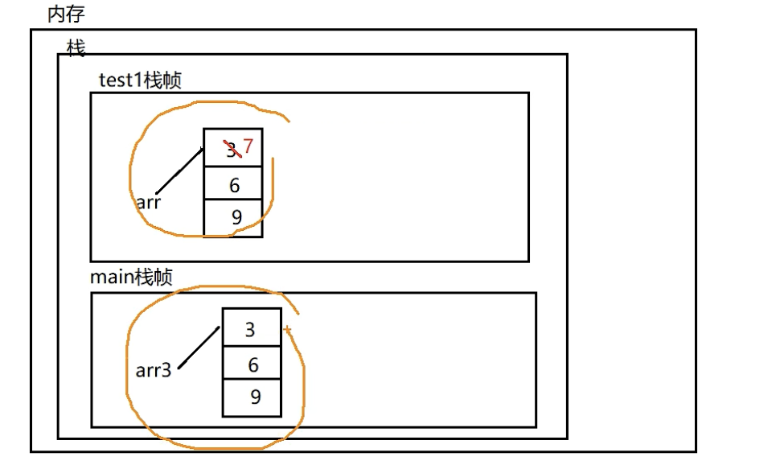

<br>

如果想在其它函数中去修改原来的数组, 可以使用引用传递的方式(指针)

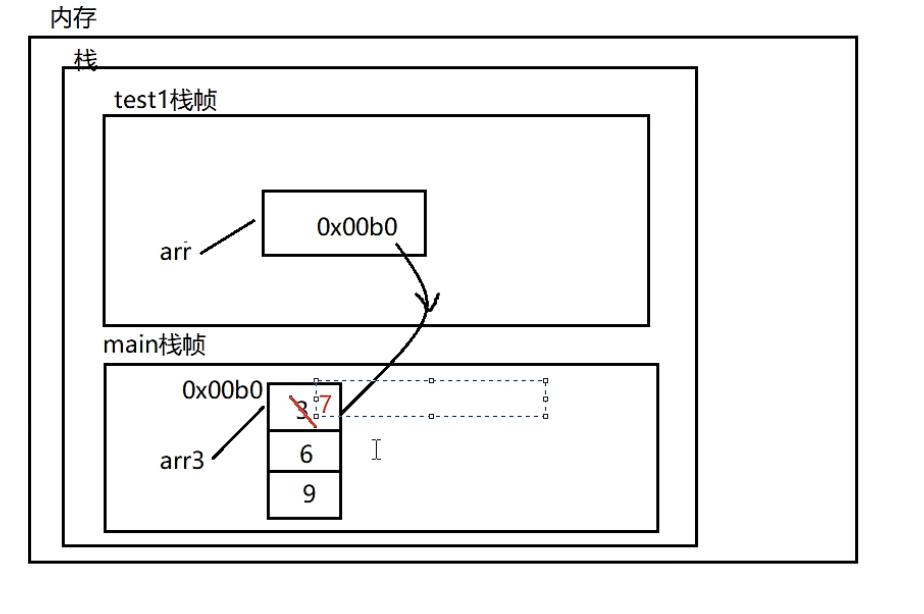

```go

func main() {
	var arr1 = [...]int{1, 2, 3}

  // 传入地址值
	updArr(&arr1)

	fmt.Println("arr1中第一个元素的值为: ", arr1[0])
}

// 类型前面加*
func updArr(arr *[3]int) {
  // 要使用括号
  // 使用 *arr 通过地址值找到对应空间
	(*arr)[0] = 100
}
```

<br><br>

## 数组: 内存分析
```go
var arr [3]int
```

<br>

### 要点:

1. 数组的长度为数组的一部分, 因为数组的类型为 ``[3]int`` 长度属于类型的一部分

2. 创建 ``[3]int`` 长度为3, int类型的数组, 该数组就相当于连续开辟了3个内存空间, **每块空间都会对应有一个地址值**, 且每个成员的空间占用的大小取决于它们的类型, 比如int8 一个各自占1个字节, int16一个格子占2个字节
```go
var scores = [5]int{95, 91, 39, 60, 21}

for i := 0; i < len(scores); i++ {
  // 输出每个成员所处空间的地址值
  fmt.Printf("成员 %d 的地址值为: %v \n", i, &scores[i])
}

/*
每个成员都有自己的空间地址
成员 0 的地址值为: 0x1400012a000 
成员 1 的地址值为: 0x1400012a008 
成员 2 的地址值为: 0x1400012a010 
成员 3 的地址值为: 0x1400012a018 
成员 4 的地址值为: 0x1400012a020 
*/
```

3. 数组的3个空间有一一对应的下标, 下标从0开始

4. arr变量指向数组第一个成员空间所在的地址 (取数组arr变量中存储的地址值, 使用格式化输出 参数``%p``)
```go
fmt.Printf("arr的地址值为: %p \n", &scores)
// arr的地址值为: 0x140000ac000
```

5. 数组在声明后, 有默认值, 其值根据数组的类型不同对应的默认值也不同

6. 直接输出 arr变量, 其值为 ``[元素 元素 元素]`` 的格式

7. 赋值操作的时候, 先通过地址值找到成员对应对的空间, 然后修改里面的数据

```s
# int类型数组的零值为 0
        +-----+
arr   0 |  0  | # 0x1400012a000
        +-----+
      1 |  0  |
        +-----+
      2 |  0  |
        +-----+

# arr中的地址: 0x1400012a000
```

<br><br>

## 数组: 二维数组

### 定义方式:
```go
// 两个成员, 每个成员中又是一个长度为3的数组
var arr [2][3]int16
// [[0,0,0], [0,0,0]]
```

```go
var arr = [2][3]int16{{1, 2, 3}, {4, 5, 6}}
// [[1 2 3] [4 5 6]]
```

<br>

### 二维数组的遍历:
```go
func main() {
	var arr = [2][3]int{{1, 2, 3}, {4, 5, 6}}

	for index, _arr := range arr {
		for _, v := range _arr {
			fmt.Printf("第 %d 个数组的元素为: %d \n", index+1, v)
		}
	}
}
```

<br><br>

# 切片 (slice)
数组的特点是我们一旦定义数组 就要给数组一个明确的长度 也就是说数组的长度是不可变的 有些刻板 所以它在go中并不是那么的常见

而切片是一种建立在数组类型之上的抽象, **它构建在数组之上**, 且提供更加强大的能力和便捷, **切片是对数组一个连续片段的引用**

所以切片是一个引用类型, **这个片段可以是整个数组, 或者是由起始和终止索引标识的一些项的子集**, 切片提供了一个相关数据的动态窗口

类似 ArrayList 是动态数组

<br>

**注意:**  
终止索引标识的项不包括在切片内 (不包含终止索引)

<br>

### 切片的作用
切片其实就是数组的动态引用 或者是 数组数据的动态窗口, 所以修改切片的话, 会影响元数组

<br>

**1. 动态大小:**  
与数组相比，切片的长度是不固定的，可以根据需要动态增长或缩减。

<br>

**2. 高效操作:**  
切片可以高效地访问数组的子序列，而不需要复制数据。

**3. 灵活性:**  
切片可以作为数组的“视图”使用，非常适合处理动态数据集。

<br>

### 创建切片
切片既然是对数组的封装 所以切片的创建离不开数组

**1. 基于数组 创建切片**  
创建的切片的元素 和 长度 容量都和数组一致, 注意不指定长度
```go
s := []int { 1, 2, 3, 4, 5 }
```

<br>

**2. 使用 make 函数创建指定长度的空切片**   
创建的切片具有默认值, 为其类型对应的零值

```go
s := make([]int, 10)
```

<br>

**3. 基于数组 创建一个指定部分的切片**
不包含结束索引
```go
var arr = [6]int{1, 2, 3, 4, 5, 6}

// 1. 创建 跟数组一样的切片
var s = arr[:]


// 2. 创建 从指定索引开始 到 最后 的切片
var s = arr[1:]


// 3. 创建 从0开始 到 指定位置 的切片
var s = arr[:3]


// 4. 创建 从指定索引 到 结束索引 的部分切片
var s = arr[1:3]
```

<br>

### 切片的类型:
```go
[]T

var s []int
```

<br>

### 切片的遍历
1. 普通for
2. 键值循环

```go
var s = []int{1, 2, 3, 4, 5}

// 1. 普通for
for i := 0; i < len(s); i++ {
  fmt.Println(s[i])
}

// 2. 键值循环
for _, value := range s {
  fmt.Println(value)
}
```

<br>

### 切片要点:
1. 切片定义后不可以直接使用, 需要让其引用到一个数组, 或者 make一个空间供切片使用
```go
// 创建一个slice类型的变量
var s []int

s[0] = 1
fmt.Println(s)
// 报错: panic: runtime error: index out of range [0] with length 0

/*
原因:
  因为您尝试在一个未初始化的切片 s 上进行索引赋值。
  在 Go 语言中，切片在声明后默认为 nil
  
  它没有分配任何内存空间，因此无法直接在特定索引处赋值。

  var s []int 声明了一个 int 类型的空切片 s，但它没有初始化，所以它的长度和容量都是 0。
  
  当您尝试通过 s[0] = 1 对其进行赋值时，您实际上是在尝试访问一个不存在的索引，这导致了运行时错误。
*/
```

2. 切片使用不能越界, 跟数组越界一样, 切片也有越界报错

3. 切片可以继续被切片

4. 切片可以动态增长
```go

```

<br>

### 切片的相关api

### **<font color='#C2185B'>make(切片类型, 切片长度, ``[可选容量]``)</font>**
创建一个新的, 空的, 可指定长度的切片

可以指定切片的长度和可选的容量。如果只指定长度，那么容量默认与长度相同。

make方法在底层帮我们创建了一个数组, 该数组对外不可见, 这个数组我们访问不到, 要通过切片去间接的访问这个数组

```go
s := make([]int, 5)  // 创建长度为 5 的切片
fmt.Println(s)  // [0 0 0 0 0]
```

<br>

### **<font color='#C2185B'>append(切片, 元素1, ...)</font>** 
向切片添加新元素

```go
var s = []int{1, 2, 3, 4, 5, 6}

// 将返回的新切片 交给s
s = append(s, 10, 11)

fmt.Println(s)


// 扩展运算符的应用: 将一个切片添加到另一个切片中
var s1 = []int{1, 2, 3, 4, 5, 6}
var s2 = []int{11, 12, 13}
s1 = append(s1, s2...)
```

<br>

append并不是在切片上追加, s底层会对应一个数组 它并不是在底层数组上追加一个4 5

它底层在追加元素的时候, 创建一个新的数组(扩容) 会将老数组的元素一个个的复制到新的数组中, 然后再向新数组的末尾追加4和5

所以 append 之后 它底层对应的数组是新的, 所以append会返回一个新数组的切片, 也就是不会影响到老切片

<br>

### **<font color='#C2185B'>copy(目标切片, 源切片)</font>**  
复制切片的元素到另一个切片中

底层就是将 src底层数组中的内容 复制到 dst底层数组中去

1. src 和 dst 具有不同的地址值, 类似深拷贝
2. 操作一个切片中的元素不会影响到另一个切片中的元素, 因为src和dst中底层数组是不一样的
```go
var src = []int{1, 2, 3, 4, 5, 6}
// 创建一个和src一样长度的空切片
var dst = make([]int, len(src))

// 调用 copy 将 src 复制到 dst 中
copy(dst, src)

fmt.Println(dst) // [1 2 3 4 5 6]

// 验证两个切片的地址值 是否一样
fmt.Printf("src的地址值为: %p \n", &src) // 0x140000b8018
fmt.Printf("dst的地址值为: %p \n", &dst) // 0x140000b8030

// 验证操作一个切片的话 是否会影响另一个切片
dst[0] = 100

fmt.Println("src", src) // [1 2 3 4 5 6]
fmt.Println("dst", dst) // [100 2 3 4 5 6]
```

<br>

**技巧:**  
```go
// 部分复制
src := []int{1, 2, 3, 4}
dst := make([]int, 2)
n := copy(dst, src)
fmt.Println(dst, n)  // 输出: [1 2] 2


// 源和目标重叠
s := []int{1, 2, 3, 4, 5}
copy(s[1:], s[2:])
fmt.Println(s)  // 输出: [1 3 4 5 5]


// 使用 copy 来删除元素：
s := []int{1, 2, 3, 4, 5}

// 删除索引为 2 的元素
copy(s[2:], s[3:])
s = s[:len(s)-1]
fmt.Println(s)  // 输出: [1 2 4 5]
// 这里，copy 用于将 s[3:]（元素 4, 5）向前移动一位，覆盖掉 s[2:]（原本是元素 3, 4, 5），然后通过调整切片长度来删除最后一个元素。
```

<br>

### **<font color='#C2185B'>len(切片)</font>**   
获取 切片 中元素的个数

<br>

### **<font color='#C2185B'>cap(切片)</font>**  
获取 切片 的 容量

类似java中ArrayList在底层扩容的逻辑, 在某些时候 容量会为数组长度的2倍 还是1.5倍

```go
// 定义一个数组
var arr = [6]int{1, 2, 3, 4, 5, 6}
var arrSlice []int = arr[1:3]


fmt.Println("arrSlice: ", arrSlice, len(arrSlice)) // 元素个数 2 
fmt.Println("arrSlice: ", arrSlice, cap(arrSlice)) // 容量 5
```

<br>

### 扩展:
在 Go 语言中，切片没有内建的 push, pop, shift, unshift, slice, splice 等方法

1. Push (向切片末尾添加元素)
```go
s := []int{1, 2, 3}
s = append(s, 4)  // Push 4 to the slice
```

2. Pop (移除切片末尾的元素)
```go
s := []int{1, 2, 3}
lastElement := s[len(s)-1]
s = s[:len(s)-1]  // Pop the last element
```

3. Shift (移除切片开头的元素)
```go
s := []int{1, 2, 3}
firstElement := s[0]
s = s[1:]  // Shift the first element
```

4. Unshift (向切片开头添加元素)
```go
s := []int{1, 2, 3}
s = append([]int{0}, s...)  // Unshift 0 to the slice
```

5. Slice (切片)
```go
s := []int{1, 2, 3, 4, 5}
subSlice := s[1:3]  // Creates a slice of s from index 1 to 2
```

6. Splice (移除或替换切片中的元素)
```go
s := []int{1, 2, 3, 4}

// 移除或替换切片中的元素
// ... 相当于扩展运算符
s = append(s[:1], s[2:]...)  // Removes the element at index 1


// 替换切片中的元素
s := []int{1, 2, 3, 4}
s = append(s[:1], append([]int{5}, s[2:]...)...)  // Replaces the element at index 1 with 5
```

<br>

### 扩展: 将字符串 转换为 切片
我们要了解如下的内容

1. 切片的类型为 []T
2. rune 它是 int32 的别名, 用来表示一个unicode码点, 意味着 rune 类型可以存储任何unicode字符的代码点
3. 字符串切片分为
  1. []byte: 字节切片
  2. []rune: 字符切片

4. 我们可以通过 类型转换, 将字符串转换为 切片

```go
str := "hello, 世界"
runes := []rune(str)

for i, r := range runes {
  fmt.Printf("%d: %c [%d]\n", i, r, r)
}
```

<br>

**[]byte 和 []rune 的区别:**  

在 Go 语言中，[]byte 和 []rune 是两种不同的切片类型，它们在处理字符串时有着重要的区别：

**1. ``[]byte`` 类型**  
表示的是字节切片

它直接反映了字符串的字节级表示。在 UTF-8 编码（Go 的默认字符串编码方式）中，一个字符（尤其是非 ASCII 字符）可能由多个字节组成。

用于需要操作原始字节数据时，比如在处理二进制数据、读写文件的字节流、网络数据传输等场景。

**字节操作不总是安全的用于直接处理文本，因为一个 UTF-8 编码的字符可能跨越多个字节。**

<br>

**2. []rune 类型**  
rune 是 int32 的别名，用于表示一个 Unicode 码点。

[]rune 表示的是 Unicode 码点的切片。

它反映了字符串的字符级表示，更适用于需要字符级处理的文本操作，如处理国际化文本、字符串的遍历、字符计数等场景。

在 []rune 中，无论字符占多少字节，每个 Unicode 字符都表示为一个单独的 rune。这使得处理多字节字符（例如中文、日文、韩文、表情符号等）变得更加安全和方便。

<br><br>

## 切片: 内存分析
```go
var arr = [6]int {1,2,3,4,5,6}

var s = arr[1:3]
```

<br>

### s切片的底层包含了3个部分
1. 指向底层数组的指针
2. 切片的长度
3. 切片的容量

arrSlice虽然分为了3个部分 但它不是数组类型, 而是一个结构体
```s
# arrSlice 为 arr[1:3] -> [2,3]
          +------------------+
arrSlice  | 数组下标1对应的地址 |  # 存放底层数组的指针 (地址)
          +------------------+
          |  2  |  # 存放切片的长度
          +-----+
          |  5  |  # 存放切片的容量
          +-----+

# arrSlice 通过地址值 找到数组下标1的位置 切两个长度

        +-----+
arr   0 |  1  |
        +-----+
      1 |  2  |  # 切片元素
        +-----+
      2 |  3  |  # 切片元素
        +-----+
      3 |  4  |
        +-----+
      4 |  5  |
        +-----+
      5 |  6  |
        +-----+
```

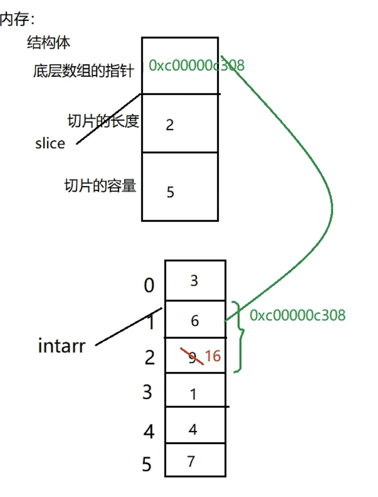

<br><br>

# 映射: map
map是go语言中内置的一种类型, 它用来存储键值对, 通过key我们可以获取value, 类似HashMap

<br>

### 创建Map

**map类型的声明:**  
1. key的类型部分要使用``[]``进行包裹

2. 如果我们只对map进行声明的话, 没有具体赋值的话, go这时不会为map分配内存空间, 我们必须通过 make函数 进行初始化, 初始化后才会分配空间, 也就是仅声明不够 必须配合make对map进行初始化
```go
var 变量 [key的类型]value的类型

var m [string]bool
```

<br>

**通过make函数, 初始化map: let obj = {}**   
**<font color='#C2185B'>make(map的类型, [size])</font>**  
我们使用make创建map的时候, 可以不传入第二个参数

第二个参数只是给 Go 运行时，表明您预计将有多少元素存储在 map 中，以便运行时可以优化其内部数据结构的初始分配大小。

实际上，map 可以持续增长以容纳更多元素，不受这个初始 size 的限制。

如果我们不传入第二个参数则Go 运行时使用默认的分配策略
```go
// 我们创建的这个map 可以存放10个键值对
var m = make(map[string]bool, 10)

m := make(map[string]bool)
```

<br>

**字面量的方式创建map: 相当于 let obj = { name: 'sam' }**  
```go
// map[string]int 类型部分
// 装值的对象: {"one": 1, "two": 2}
m := map[string]int{"one": 1, "two": 2}


var obj = map[string]interface{}{
  "name": "sam",
  "age":  18,
}

fmt.Println(obj)
// map[age:18 name:sam]
```

<br>

**嵌套的map:**   
```go
var obj = map[string]map[string]string{
  "person": {
    "name": "sam",
  },
}

fmt.Println(obj["person"]["name"])
``` 

<br>

### 注意:  
1. key的部分如果是字符串的话 一定要使用``""``进行包裹
2. 最后一组键值对后面也要有``,``
3. map中的key和value是无序的, 并不是按照我们添加kv的顺序进行存储的
4. 如果key部分重复的话, 后面的会将前面的进行覆盖

<br>

### 技巧: 存储任意类型的数据
上面我们在声明map的类型的时候 是这么写的 ``map[string]string`` 这就意味着我们创建的map中只能存储key是string类型, value是string类型的数据

正常来说我们map中存储的数据类型也会有任意的情况, 比如我们想存储姓名和年龄 这时候我们就要使用 空接口 ``interface{}`` 去定义map的类型

```go
var obj = map[string]interface{}{
  "name": "sam",
  "age":  30,
}
```


<br>

### key 和 value 的类型
它们可以是如下的类型
- bool
- 数值类型
- 字符串
- 指针
- channel

还可以是只包含前面几个类型的接口 结构体 数组, 通常key使用int或者string类型, value的部分通常为数字, string, map, 结构体

<br>

**注意: key部分的类型不能是如下的类型**  
1. slice 切片
2. map 映射
3. func 函数

<br>

### 常用 API:

**添加/修改 元素:**  
go中没有点语法, key部分是字符串的话 必须使用引号
```go
m["key"] = value
```

<br>

**读取元素:**  
1. 如果读取的key不存在 则返回值为 nil
2. 读取元素的返回值 其实有两个 一个是对应的值 另一个是bool类型的标识
```go
value := m["key"]

name, ok := obj["name"]
// 如果我们map中没有name, 则name的值为 nil, ok的值为false
```

<br>

**删除元素:**  
如果传入的key不存在 也不会报错
```go
delete(m, "key")
```

<br>

**清空map:**  
1. 将我们已经创建的map指向一个新的map, 老的map则会被gc回收
2. 遍历map, 组个删除

<br>

**检查元素是否存在:**  
```go
value, ok := m["key"]
if ok {
  // 键存在
}
```

<br>

**获取map中键值对的数量:**  
```go
var obj = map[string]interface{}{
  "name": "sam",
  "age":  18,
}

fmt.Println(len(obj))  // 2
```


<br>

**遍历map: 键值遍历**  
```go
for key, value := range m {
  fmt.Println(key, value)
}
```

<br>

### 要点1:
尝试读取 map 中不存在的键时，会返回该类型的零值 (默认值)。例如，对于 ``map[string]int``，如果键不存在，返回 0。

<br>

### 要点2:
标准的 map 在 Go 中不是并发安全的。如果需要在多个协程中访问同一个 map，应使用 sync.Mutex 或 sync.RWMutex 来保证安全，或者使用 sync.Map。

<br>

### 要点3: 
map 中的元素是无序的，每次遍历 map 时元素的顺序可能不同。

<br>

### 要点4: 
与切片不同，你无法指定 map 的容量。当 map 增长到足够大时，它会自动重新分配更大的存储空间。

<br>

### 要点5: 
不可用作函数参数的键, map 的键必须是可比较的类型，因此，像切片和函数等不可比较类型不能作为 map 的键。

<br>

### 要点6: 
**无法直接修改 map 中嵌套的结构体字段。需要先将结构体值完整地取出来，修改后再放回 map。**

在 Go 语言中，当你在 map 中存储结构体时，不能直接修改该结构体中的字段。

因为当你从 map 中检索一个元素时，实际上你得到的是该元素的副本，而不是直接引用。

因此，要修改 map 中的结构体字段，你需要先将整个结构体从 map 中取出来，对其进行修改，然后再将其放回 map。

假设有一个结构体 Person 和一个将字符串映射到 Person 的 map
```go
type Person struct {
  Name string
  Age  int
}

people := make(map[string]Person)
people["alice"] = Person{Name: "Alice", Age: 25}
```

现在，如果你想修改名为 "alice" 的 Person 的年龄，你不能直接这样做：
```go
// 错误的尝试：直接修改 map 中的结构体字段
people["alice"].Age = 26  // 这行代码会编译错误
```

上面的代码会导致编译错误，因为 ``people["alice"]`` 返回的 Person 是一个值副本，不能直接在其上进行修改。

<br>

**正确的做法是：**
1. 从 map 中取出 Person 结构体。
2. 修改这个结构体的字段。
3. 将修改后的结构体放回 map。

```go
p := people["alice"] // 从 map 中取出结构体
p.Age = 26           // 修改结构体的字段
people["alice"] = p  // 将修改后的结构体放回 map
```

<br><br>

# 面向对象: 结构体
go语言的面向对象和传统语言的面向对象不太一样 因为go中没有类的概念, 它是通过 结构体(类似类) 来代替面向对象中的类的概念, 并且go对面向对象做了很多的简化 它的面向对象的纯度是不高的 (去掉了oop语言中的方法的重载, 构造函数, 隐藏this等)

go仍然有面向对象编程的 继承, 封装, 多态的特性, 只是实现方式和oop语言不一样

<br><br>

## 结构体:
万事万物皆对象, 对象中通用的部分, 我们会提取成一个类, 这是java中的概念, 但是这里的概念也可以放到结构体中的

<br>

### 创建结构体:
1. 属性名大写, 结构体外部可以访问该属性
2. 多个属性名之后 不同逗号
3. 如果属性未赋值 则属性的值为零值
```go
// 声明结构体
type 结构体名 struct {
  属性名 类型
  属性名 类型
}

// 创建实例对象
var 实例变量名 结构体类型
```

```go
// 定义老师的结构体 (类似类)
type Teacher struct {
	Name   string
	Age    int
	School string
}

func main() {
  // 实例对象的声明
	var t Teacher

	fmt.Println("t: ", t)
  // t:  { 0 }

	t.Name = "sam"
	t.Age = 18
	t.School = "东北师范"
	fmt.Println("t: ", t)
  // t:  {sam 18 东北师范}
}
```

<br>

### 实例对象的创建方式1:
```go
// 声明 结构体 类型的变量
var t Teacher

// 通过实例对象赋值
t.Name = "sam"
```

<br>

### 实例对象的创建方式2:
直接初始化 实例对象
```go
var t = Teacher{
  Name:   "sam",
  Age:    18,
  School: "东北师范",
}
```

<br>

### 实例对象的创建方式3:
不通过 kv 的形式初始化, 而是通过属性定义的顺序进行初始化

```go
var t = Teacher{"sam", 18, "东北师范"}
```

<br>

### 实例对象的创建方式4: 使用new创建, 返回的是结构体的指针
表达式 ``var t *Teacher = new(Teacher)`` 创建了一个指向 Teacher 类型的新实例的指针

并将这个指针赋值给变量 t。这里的 new(Teacher) 调用会分配内存空间给 Teacher 类型的新实例，并返回一个指向这个新分配的内存空间的指针

简单来说，new(Teacher) 做了两件事：
1. 分配内存：为 Teacher 类型的实例分配足够的内存
2. 返回指针：返回一个指向这个新分配内存的指针

```go
// t是指针 它指向一个地址
var t *Teacher = new(Teacher)

// t指向一个地址 就是new创建的实例对象的空间地址吧, 我们要是给地址对应的内容进行赋值的话, 其实是给地址指向的内容的具体字段进行赋值
(*t).Name = "sam" // *的作用是根据地址取值

// go的简化赋值方式, 我们可以直接通过 t.Age 来进行赋值
t.Age = 18  // 底层其实还是 (*t).Age 赋值的

fmt.Println(*t)
```

<br>

### 实例对象的创建方式5: 返回的是结构体的指针
```go
var t *Teacher = &Teacher{}
t.Name = "sam"
t.Age = 18

fmt.Println(*t)


// 下面也是可以的
var t *Teacher = &Teacher{
  Name: "sam",
}

var t *Teacher = &Teacher{"sam", 18, "东北师范"}
```

<br>

### 结构体之间的转换:
结构体之间是可以进行转换的

1. 当我们自定义的结构体 和 其它结构体进行转换的时候 两个结构体内部的字段(字段名, 个数, 类型)必须完全相同

```go
// 人类的结构体
type Person struct {
	Name string
}

// 老师的结构体
type Teacher struct {
	Name string
}

func main() {

	// 声明变量
	var p Person
	var t Teacher

	// 报错: 两个类型直接赋值是不可以的
	p = t

  // 方法: 我们可以在满足上述的条件下 进行强转
  p = Person(t)
}
```

<br>

2. 结构体进行type重新定义(相当于起别名), go认为是新的数据类型, 但是互相之间可以强转

```go
type Person struct {
	Name string
}

// 相当于给Person起了一个别名, 但是go也认为是新的数据类型, 互相之间进行转换的时候 需要强转
type P Person
```

<br><br>

## 结构体: 内存分析
结构体属于**值类型**, 值类型的话 说明t直接指向一个内存空间

引用类型是引用类型变量指向一个地址, 地址再指向另外一块空间, 而值类型是直接指向一个内存空间
```s
t   +------------------+
    | Name: ""         |
    | Age: 0           |
    | School: ""       |
    +------------------+
```

<br><br>

## 结构体: 方法
方法是作用在指定的数据类型上, 和指定的数据类型绑定, 因此自定义类型, 都可以有方法, 而不仅仅是struct

**数据类型绑定方法**


### 结构体的方法的定义形式:
结构体的方法 定义在结构体的外侧, 理解为 结构体 和 方法 绑定在一起

```go
// 定义 A 结构体
type A struct {
  Num int
}

// 定义 A 结构体的方法
func (a A) test() {
  fmt.Println(a.Num)
}
```

- (a A): 相当于 结构体 和 test函数 进行绑定, test方法中可以通过 a变量调用结构体中的字段

- test: 方法名

<br>

### 方法的调用:
创建的a实例, 在调用方法的时候 会传入到 ``(a A)`` 的位置, 这样方法内可以通过a变量获取到结构体中的字段


```go
// 1. 创建结构体实例
var a A

// 2. 通过 a实例 调用结构体中的方法
a.test()
```

<br>

### 示例:
**结构体的方法必须通过结构体实例来调用**
```go
// Student结构体
type Student struct {
	Name string
	Age  int
}

// Student结构体的方法
// (stud Student) 这样就意味着 方法和结构体 绑定在一起
func (stud Student) speak() {
	fmt.Printf("学生 %v 的责任就是学习, 它今年 %d 岁了", stud.Name, stud.Age)
  // 学生 sam 的责任就是学习, 它今年 18 岁了
}


func main() {

	// 创建 Student结构体 的实例对象
	var s = Student{"sam", 18}
	s.speak()
}
```

<br>

### 注意:
```go
func (a A) test() { }

// 声明结构体类型的实例对象
var a A
a.test()
```

上面说在调用test方法的时候, 我们会创建 结构体实例对象, 我们会通过 ``对象.test()``的方式调用方法

在调用的时候 a实例对象会传入到方法中 被 ``(a A)`` 接收, 所以方法内部可以通过变量a输出 结构体中的字段
```go
    a.test()
     ↘
func (a A) test() { }
```

但是这里的传递是 值传递(结构体都是值传递), 我们传入到方法中的a, 是结构体实例对象的副本, a中有结构体中所有的数据, 但是传入test方法的a, 是副本

也就意味着, 我们我们在test方法中 通过a修改 结构体A中的数据, **仅仅是在函数内部修改副本的数据**

```go
type Student struct {
	Name string
	Age  int
}

// Student结构体的方法
func (stud Student) speak() {
  // 副本的数据被修改了
	stud.Name = "erin"
  fmt.Println(stud.Name)  // erin
}


func main() {

	// 创建 Student结构体 的实例对象
	var s = Student{"sam", 18}
	s.speak()
  fmt.Println(s.Name)  // sam, 外面还是sam, 方法内只是修改了副本中的数据
}
```

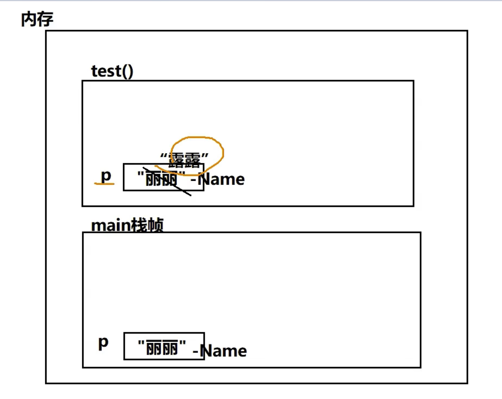

<br>

**结构体指针:**  
如果我们就希望在方法内, 改变结构体的值, 可以通过结构体指针的方式来处理
```go
type Student struct {
	Name string
	Age  int
}

// 这里的变量定义为 指针类型
func (stud *Student) speak() {
	(*stud).Name = "erin"
}


func main() {

	var s = Student{"sam", 18}
  // 调用 speak 的时候 需要使用指针类型去调用 s传入到方法中, 我们传进去的需要是 地址 所以我们使用 (&s)
	(&s).speak()
}


// 简写方式: 省略掉 (&s) (*stud) 的部分
type Student struct {
	Name string
	Age  int
}

func (stud *Student) speak() {
	stud.Age = 20
	fmt.Println("方法内部输出 stud", stud)
}

func main() {
	var s = Student{"sam", 18}
	s.speak()

	fmt.Println("输出s实例对象中的字段信息", s)
}
```

<br>

### 方法的要点: 基本数据类型 也可以绑定方法
go中的方法作用在指定的数据类型上, 和指定的数据类型绑定, 因此自定义类型都可以有方法, 而不仅仅是struct, **比如int float32都可以有自己的方法**

上面我们给方法绑定的类型都是结构体, 实际上我们还可以给int等数据类型绑定方法

1. 给 基本数据类型 起 类型别名, 方便我们绑定方法
2. 通过 i.printInteger() 这时就将i对应的值传递到方法中了
3. int也是值传递 如果想更改则需要使用指针类型 ``(i *integer)``
```go
func (i *integer) printInteger() {
	*i = 30
}
```

```go
// 1. 给 int 类型 起类型别名
type integer int

// 2. 给该方法绑定 integer 类型
func (i integer) printInteger() {
	fmt.Println(i)
}

func main() {
	// 3. 创建实例对象
	var i integer = 20
	
	// 4. 调用方法
	i.printInteger()
}
```

<br>

### 方法的访问范围控制规则
和函数是一样的 方法名首字母小写, 只能在本包访问, 方法首字母大写, 可以在本包和其它包访问

<br>

### 相当于java中子类的重写toString
如果一个类型实现了String()方法, 则我们在调用 ``fmt.Println()`` 的时候默认会调用这个变量的String()进行输出

```go
type Student struct {
	Name string
	Age  int
}

// 给 Student 结构体绑定 String方法, String方法大写在其它包下可以使用
func (stud *Student) String() string {
	// 对我们传入进来的stud进行展示
	return fmt.Sprintf("Name = %v, Age = %v", stud.Name, stud.Age)
}

func main() {
	var s = Student{"sam", 18}

	// 传入地址, 如果绑定了String方法就会自动调用
	fmt.Println(&s)
}


// 不使用指针也可以
```

<br>

### 函数 和 方法的区别
1. 方法需要绑定指定的数据类型
2. 函数不需要绑定数据类型
```go
// 跟2无关 也看看
type Student struct {
	Name string
	Age  int
}

// 参数为结构体, 它的性质就是值拷贝
func changeAttr(s Student) {
	// 这里修改不会影响到外面
	s.Name = "xxx"
}

func main() {
	var s = Student{"sam", 18}

  // 调用函数
	changeAttr(s)

	fmt.Println(s)
}

```

3. 调用的方式不一样, 方法必须通过对象来调用

4. 对于方法来说接收者为值类型, 可以传入指针类型, 接收者为指针类型, 可以传入值类型, **结论看绑定位置的声明的类型** (而函数不可以, 函数参数是什么类型, 我们就要传入对应的类型)
```go
type Student struct {
	Name string
}

// 定义方法: 绑定的结构体为值类型
func (s Student) test() {
	fmt.Println(s.Name)
}

func main() {
	var s = Student{"sam"}

	// 调用方法: 虽然绑定的结构体声明的是值类型, 我们故意传入指针类型
	(&s).test()  // 没有报错正常输出
}

// 注意: 虽然我们传入的是指针类型, 但是实际上传递的还是按照值传递的形式
```

<br>

### 结构体目录管理
我们跨包创建结构体实例
```s
| - src
  | - gocode
    | - main
      - main.go
    | - model  # 相当于 pojo 里面定义结构体
      - student.go
```

```go
// student.go
package model

// 结构体首字母要大写
type Student struct {
  Name string
}
```

```go
// main.go
package main

// 导入包 导到model
import "gocode/model"

func main() {
  // 带上 model
  var s model.Student = model.Student {"sam"}

  s := model.Student {"sam"}
}
```

<br>

### 技巧: 
上面结构体定义在model目录下, 这时结构体的名的首字母必须要大写 这样别的目录下才能访问到

**那可以不可以 我结构体的名字就是小写, 也希望跨包能访问呢?**  
可以! 工厂模式 (专门解决结构体首字母小写还可以跨包访问的问题)

```go
// student.go
package model

// 结构体首字母小写
type student struct {
  Name string
}

// 工厂模式: 返回一个指针
func NewStudent(name string) *student {
  // 返回一个地址值
  return &Student {name}
}
```

```go
// main.go
package main

// 导入包 导到model
import "gocode/model"

func main() {
  s := model.NewStudent("sam")
  fmt.Println(*s)
}
```

<br><br>

# 面相对象: 封装
面相对象有三个特点 继承, 封装, 多态, 学习go的时候 不会要go的封装和java进行比较, go中将面向对象的特性做了简化 所以不适合进行参照

<br>

### go中实现封装
1. 建议将结构体, 字段(属性) 的首字母小写(这样则其他包不能使用, 类似private, 实际开发不小写也行, 因为封装并没有那么严格)

2. 给结构体所在包提供一个工厂模式的函数, 函数名首字母大写 (类似一个构造函数)

3. 为结构体提供一个首字母大写的get set方法 (类似其它语言的public) 用于对属性判断进行赋值
```go
func (结构体名 结构体类型) SetXxx(参数列表) {
  // 加入数据验证的业务逻辑
  结构体名.Age = 参数
}

func (结构体名 结构体类型) GetXxx() (返回值列表) {
  return 结构体名.字段
}
```

<br>

### 封装 Student 结构体
```go
// 定义结构体: 如果结构体首字母小写的话 要提供工厂函数
type Student struct {
  // 小写: 其它包不能进行访问 需要提供get set方法
	name string
}

// 定义 name 属性的 Set方法, 绑定结构体的类型为指针类型
func (s *Student) SetName(name string) {
	s.name = name
}

// 定义 name 属性的 Get方法, , 绑定结构体的类型为指针类型, 返回一个指针类型 (地址值)
func (s *Student) GetName() *string {
	return &s.name
}

func main() {

	s := Student{"sam"}

	s.SetName("erin")
	fmt.Println(s)

	// 返回的是一个指针, 是不是就意味着 我通过它也能修改结构体中的数据?
	name := s.GetName()
	fmt.Println(*name)

  // 通过地址值修改结构体中的数据
	*name = "nn"
	fmt.Println(s)

}
```

<br><br>

# 面相对象: 继承

### 继承的思想
怎么实现继承的呢? 下面的图中可以看到, 我们在Cat 和 Dog结构体中加入Animal的匿名结构体, 这样就可以在Cat和Dog中获取到父类中的属性和方法了

<br>

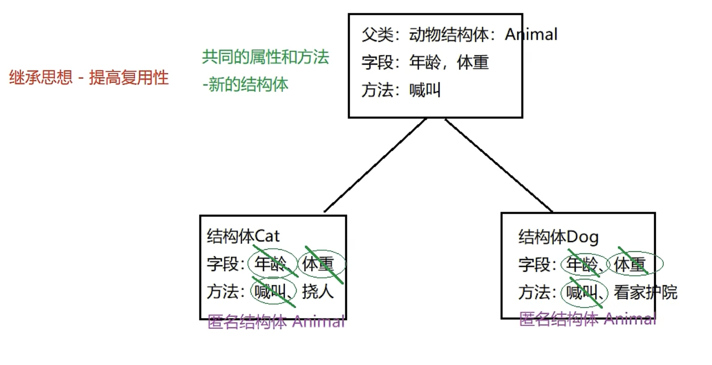

<br>

### Go中的继承
当多个结构体存在相同的属性(字段)和方法的时候, 可以从这些结构体中抽象出父类结构体

在该结构体中定义这些相同的属性和方法, 其它的结构体不需要重新定义这些属性和方法, **只需要嵌套一个匿名结构体即可**

这就是说go中, 如果一个struct嵌套了另一个匿名结构体, 那么这个结构体可以直接访问匿名结构体中的字段和方法, 从而实现了竭诚

<br>


