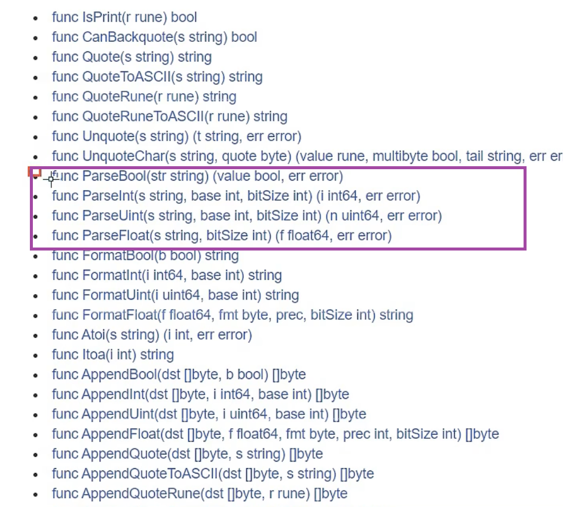

# Golang
数据的处理 和 大并发方面 Golang很有优势

go语言是编译型语言, 它是需要将代码都写完后交给编译器 将代码编译成2进制文件交给计算机运行

而解释型语言, js则是写完代码后交给解释器, 解释器不会生成2进制文件交给计算机运行 解释器会读一行交给计算机一行

<br>

- 编译器: 全文翻译
	- "java": 它是不是编译型语言比较有争议, 从拿到了class文件来说 它确实是需要编译, 但是它并不是直接生成2进制文件, 而是class文件还需要交给jvm运行来说又不是
	- c
	- c++
	- go

- 解释器: 实时翻译
	- js
	- py

<br>

## 学习方向:
1. 区块链研发工程师
2. Go服务器端 / 游戏软件工程师
3. Golang分布式 / 云计算软件工程师

<br><br>

## vscode : Go
go文件是以 ``.go`` 结尾的文件

<br><br>

## 构建Go的开发环境
类似java的jdk, go的开发环境叫做 sdk

<br>

### 安装方式1:
通过下面的网址下载 go的安装包
```s
https://go.dev/doc/install

https://go.dev/dl/
```

<br>

### 安装方式2: 使用 homebrew 来进行安装
```s
brew install go

# 查看go的版本
go version  # go1.21.6
```

<br><br>

## 配置环境变量
1. mac 不需要配置go的环境变量
```s
# 配置方式: 配置到bin 比如bin在如下的目录
export PATH=/usr/local/go/bin:$PATH
```

2. windows 需要配置 不然只能在/go/bin下才能使用go命令

<br>

### 查看环境变量
下载后默认的gopath(它可以理解为go的工作空间) 我们自己写的代码 和 网上下载的第三方包 还有源码编译后生成的可执行文件 都统统放在这个工作空间下面

使用 ``$GOPATH`` 可以直接引用到工作空间哦

```s
go env


# 使用 brew 下载go的路径
GOPATH='/Users/sam/go'
GOROOT='/opt/homebrew/Cellar/go/1.21.6/libexec'

# 使用下载安装包的路径
GOPATH='/Users/sam/go'
GOROOT='/usr/local/go'
```

<br><br>

## 创建 go 的工作空间
当然我们也可以不使用默认的工作空间, 我们可以创建一个任意的目录 比如
```s
/Users/Sam/GolangProjects/
```

<br>

但是我们创建的目录下 必须要有3个文件夹
- bin: 通过 ``go install`` 命令编译入口文件后, 生成的可执行文件就会放在该目录下

- pkg: 通过 ``go install`` 命令编译``utils/util.go``后, 生成的包文件就会放在该目录下
```s
包文件不是可执行程序, 是公共的类库, 需要交给别人 让别人引入使用
```

- src: 放go代码和依赖, 项目都要放在src下
```s
| - src
	| - 外卖项目
		| - main包
			- main.go
	| - 商城项目2
		| - main包
			- main.go
```

<br>

我们在输出内容中 要关注gopath, 我们使用如下的命令创建go的工作目录
```s
# 创建3个文件夹, 比如我们的工作空间就在$GOPATH下的话 使用如下的命令, -p 如果父级目录不存在则一起创建
mkdir -p $GOPATH/{pkg,bin,src}
```

<br>

### 配置环境变量
如果我们使用的工作空间不是默认的话, 我们在创建完工作空间后 要告诉GO

```s
# 指向go的安装目录 我们以后可以通过GOROOT找到安装目录在哪
export GOROOT=/usr/local/go

# 指向go的工作空间
export GOPATH=/Users/Sam/GolangProjects

# 指向go的bin目录, 编译项目后, 项目就会自动存放到该目录
export GOBIN=/Users/Sam/GolangProjects/bin
```

<br>

### 注意:
使用 export 定义的变量都是临时的, 终端关闭后就需要重新配置

<br>

### 环境变量的持久化:
我们需要编辑 ``.bash_profile`` 文件 用户的配置文件

我们将上面的环境变量都写到该文件下

<br>

### 方式:
我们拿修改 GOPATH 来举例

<br>

**1. 如果shell是bash解释器**  
在家目录下创建(或打开) .bash_profile 文件
```s
vi ~/.bash_profile
```

添加如下的代码, $HOME 代表当前用户的家目录
```s
export GOPATH=$HOME/goWorkspace
```

执行 .bash_profile 文件
```s
source ~/.bash_profile
```

<br>

**2. 如果shell是zsh解释器**  
在家目录下创建(或打开) .bash_profile 文件
```s
vi ~/.bash_profile
```

添加如下的代码, $HOME 代表当前用户的家目录
```s
export GOPATH=$HOME/goWorkspace
```

在家目录下创建 .zshrc 文件
```s
vi ~/.zshrc
```

添加如下代码
```s
source ~/.bash_profile
```

执行 .zshrc 文件
```s
source ~/.zshrc
```

<br>

### 配置 go 的配置文件
通过下面的方式 修改的是go的配置文件, 而上面的方式是修改用户的配置文件, 都可以吧
```s
go env
```

我们观察 GOPROXY 的值, 它就相当于我们经常配置的npm镜像

```s
GOPROXY='https://proxy.golang.org,direct'
```

<br>

### 修改env文件的命令:
```s
go env -w GOPROXY=值
``` 

<br><br>

## 测试
我们需要在go的工作目录下创建项目

<br>

### 在 $GOPATH (工作空间下) 下创建 go项目
```s
| - User/sam/go
  | - bin
  | - pkg
  | - src
    | - 项目名
			| - main包
				- main.go
```

<br>

main下创建go文件
```go
package main

import "fmt"

func main() {
	fmt.Println("hello world")
}
```

```s
go run demo.go
```

<br>

### 疑问?
我们写go项目 一定在 $GOPATH 下写么? 不用

<br><br>

# Go的基本目录结构
我们在任何的盘符下创建文件夹

```s
# go的工作空间
| - goWorkerSpace  # vscode 打开这个目录
  # 源码相关
  | - src
    # go真实的项目
    | - project01
      # 相当于 package 包的概念 里面存放 go 代码
      | - main
				- main.go
    # go真实的项目
    | - project02


| - src
  | - 项目
		| - 包
			- 代码文件等
```

<br>

### package 关键字
它是用来声明主程序所在包, 主程序的包名应该为 main

一般编译器会自动将文件作为程序的包名, 如果主程序的包名不叫main的话, 我们在程序中要将 ``package xxx -> package main``

不然就会报如下的错误
```s
package command-line-arguments is not a main package
```

<br><br>

# hello world

### 要点:
1. 首行声明文件所在的包, 每个go文件必须有归属的包 (java的时候就将文件放在包里面)

2. import引入程序中需要用到的包

3. main函数为入口函数

```go
// 做 包的声明, 当前所在的包叫做 main
package main

// 导包
import "fmt"

// 写主函数
func main() {
	// 使用 fmt 模块下的 输出函数
	fmt.Println("hello golang")
}
```

<br>

### 运行方式

### 方式1: 编译 运行 分开
该方式运行项目代码 相当于手动编译并生成一个可执行文件, 然后手动运行可执行文件

<br>

**编译:**  
我们写好的go文件需要进行编译, 编译好后, 会生成二进制执行文件

- windows -> .exe
- mac -> 看不到后缀

编译后的可执行文件会在 当前目录下

```s
# 进入到go文件所在的目录后 运行
go build 文件名.后缀

go build -o 要起的可执行文件名 go文件名.go
# go build -o 要起的可执行文件名  // 这样也行


# windows
go build -o hello.exe demo01.go
```

<br>

**执行:**  
我们要执行编译好的可执行文件 来执行go文件中的内容
```s
# mac 执行方式
./demo01 

# windows 执行方式
demo01.exe
```

<br>

### 方式2: 编译 和 执行 一起
该命令可以直接帮我们编译 + 执行 go的源文件, **该方式我们拿不到可执行文件**
```s
go run 文件.go
```

内部会先编译并将编译后的文件放在系统的临时目录, 然后再自动执行

<br>

### 方式3: 
```s
go install
```

该方式即可以编译我们的可执行文件(入口文件), 也可以编译我们的包文件比如 ``utils/util.go``

包文件 和 可执行文件 会被自动放到对应的目录下
- pkg
- bin

该方式可生成可执行文件 和 包文件, 并且会将编译后的文件放在 pkg 或 bin 目录下

<br>

### 总结:
上面的两种执行方式有区别


<br>

1. 源代码在编译后 会生成可执行文件, 编译器会将程序运行依赖的库文件包含在可执行文件中, 所以可执行文件比go文件大了很多

2. 如果我们先编译生成了可执行文件, 那么我们可以将该可执行文件拷贝到没有go的开发环境的机器上, 仍然可以运行

3. 如果要使用go run来运行程序, 则所在电脑必须有go的开发环境 否则无法执行

<br><br>

# 注意事项
1. 源文件以 ``.go`` 作为扩展名

2. 程序的执行入口是 main 函数

3. 变量名严格区分大小写

4. 方法是由一条条语句构成, 每个语句后不需要分号 (go会自动加)

5. go编译器是一行行进行编译的 因此我们一行就写一条语句 不能把多条语句写在同一行, 否则报错
```go
fmt.Println("hello golang")fmt.Println("hello golang")
```

6. 定义的变量 或者 import的包 如果没有使用到 代码不能编译通过, **多余东西不要写**

7. 括号都是成对出现的

<br><br>

# 开发工具: VsCode
编辑器

<br>

### 下载vscode跟go相关的插件
1. 修改 $HOME/go 下的权限
```s
sudo chmod -R 777 $HOME/go
```

2. 下载go插件

3. ctrl + shift + p 安装所有插件
```s
go: install/Update Tools
```

<br><br>

# 开发工具: Goland
IDE集成开发环境

<br>

### IDE激活码网址
```s
http://lookdiv.com/code

https://www.jianshu.com/p/0cbc707d20d2
```

<br>

### IDE配置


<br>

### IDE打开项目的时候
我们打开的是工作空间中 ``src/项目目录``

<br><br>

# 注释:
go中的注释有两种
- ctrl + /: ``//``
- shift + alt + a: ``/* */``

<br><br>

# 代码风格:
1. 运算符两边留空白
2. 推荐行注释
3. 方法中的花括号 不要换行, 下面的风格报错
```go
func main()
{
  ...
}
```
4. 一行超过80个字符 建议换行

<br>

### 格式化命令
```s
# 用来查看格式化后的样子
gofmt go文件


# 将格式化后的样子 写入到go文件中 一般用这个命令做格式化
gofmt -w go文件
```

<br><br>

# API:
go语法提供了大量的标准库, api也就是这些标准库的使用文档
```s
# 官网
https://golang.org

# 中文
https://studygolang.com/pkgdoc
```

<br><br>

# 包管理
包管理指的就是知道项目中文件和文件 文件和文件夹之间的关系

<br>

### 总结:
1. 一个文件夹就是一个包

2. 一个文件夹(包)中可以创建多个文件

3. 在同一个包(同一个文件夹)下的文件中, 必须指定 ``包名称`` 且 同一个文件夹下文件的包名必须相同
```s
| - src
	| - 项目
		| - 包 main
			- a.go
			- b.go
```

<br>

其中 a 和 b 文件都在同一个目录内, a 和 b 文件声明的包名必须相同, 一般都是所处的文件夹的名字
```go
// a文件
package main

// b文件
package main
```

当然包名不叫文件夹的名字也可以

<br>

### 包的分类
go项目中的文件夹(包) 分为了两类
1. main包
2. 非main包

<br>

**main包:**  
如果在main包下, main包下必须有一个文件中有一个 main函数 相当于入口文件

如果有main包 且有main函数, 则编译的时候就会生成可执行文件

如果没有项目中没有main包, 我们build的时候就不会生成可执行文件, 而是可以生成一个包文件

<br>

**非main包:**  
相当于别的文件夹, 用于管理项目中的文件

<br>

### 同包下文件要点:
文件在同包(同文件夹)下, 且package指定的包名相同, 文件中调用其它文件中的函数 不用导包 直接调用即可

```s
| - GOPRO
	| - main
		- main.go
		- util.go
```
```go
package main

import "fmt"

func main() {
	fmt.Println("hello golang")

	// 直接可以调用 Add 不用导包
	Add()
}
```

如果不行的话, 需要进行如下的配置, 小臭虫旁边的配置项按钮


<br>

### 不同包下的要点:
不同包中的文件, 互相调用当中的方法时, 需要导包
```s
| - GOPRO
	| - main
		- main.go
	| - utils
		- util.go
```

我们在main中调用util中的方法时, 需要导包, IDE中默认路径是从 IDE项目名开始的

IDE中可以直接输入 ``文件夹名.`` 会自动导入和智能提示

```go
package main

import (
	"GOPRO/utils"
	"fmt"
)

func main() {
	fmt.Println("hello golang")
	utils.Add()
}
```

<br><br>

# 输出:
我们想在终端中输出内容 方式有两种
- 内置函数
	- print
	- println
- fmt包
	- fmt.print
	- fmt.println

推荐使用fmt包下的输出功能, 因为go官方说未来版本中很可能没有上面的内置函数

<br>

### 扩展:
进程中有 stdin / stdout / stderr

它们就是 标准输入 和 标准输出 和 标准错误

在进程中出现要输出的内容, 应该将其放在标准输出中再进行展示, 如果有错误 则应该放在标准错误中展示

而我们使用上面的内置函数进行输出内容的时候, 它是会去从 stderr 中进行展示, 而不是 stdout

所以不建议使用内置函数

<br><br>

# 变量:
Go是强类型语言, 变量都有其对应的类型

<br>

变量相当于内存中一个 **数据存储空间** 的表示

**内存空间:**  
```s
age
+------+
|  18  |  类型: int (标识空间大小)
+------+
```

<br>

**变量的使用步骤:**
1. 声明
2. 赋值
3. 使用

<br>

### 变量的声明 与 使用:
1. 使用 var 关键字 来声明变量

2. 当变量只声明未赋值, 则该变量拥有默认值(零值)

3. 变量在同一作用域内不能重复声明

<br>

**方式1: 使用 var 声明变量**   
声明变量 和 为变量赋值 分开进行
```go
// 声明
var 变量名 变量类型

// 赋值
变量名 = 值
```

<br>

**方式2: 变量的初始化**  
```go
var 变量名 变量类型 = 值
```

<br>

**方式3: 省略变量类型, 自动推断**  
```go
var 变量名 = 值
```

<br>

**方式4: 省略var, 并使用 ``:=`` 运算符**  
使用如下方式进行赋值 是声明变量并赋值的简写形式, 叫做 短变量声明

使用 ``:=`` 操作符可以同时声明变量并赋值, 而不需要显式地使用 ``var`` 关键字。Go编译器会自动推断变量的类型。

这种短变量声明形式通常用于函数内部, 而在函数外部, 你可能会使用 var 关键字显式声明变量并指定类型。

```go
变量 := 值
```

<br>

**方式5: 声明多个变量**  
```go
var 变量名1, 变量名2, 变量名3 变量类型 = 值1, 值2, 值3

var (
	变量名 类型 = 值
	变量名 类型 = 值
)

// 声明多个变量: 同一类型
var num1, num2, num3 int = 1, 2, 3
fmt.Println(num1, num2, num3)


// 声明多个变量: 不同类型
var (
  name, sex string  // 不用,号哦
  age       int
)
name, age, sex = "sam", 18, "男"
fmt.Println(name, age, sex)

var (
  // 也可以在这里赋值
  name, sex string = "sam", "男"
  age       int    = 18
)
fmt.Println(name, age, sex)


// 声明多个变量: 使用短声明
变量名1, 变量名2, 变量名3 := 值1, 值2, 值3

name, age, sex := "sam", 18, "男"
fmt.Println(name, age, sex)
```

<br>

**短声明注意:**   
短声明只能声明局部变量 也就是只能在函数内部使用, 不用作为全局变量使用 

<br>

```go
// /Sam/Demo/GOPROJECT/src/PROJECT01/package02/demo01/main.go
package main

import "fmt"

func main() {
	// 1. 变量的声明
	var age int

	// 2. 变量的赋值
	age = 18

	// 3. 变量的使用 (逗号表示字符串的拼接)
	fmt.Println("age = ", age)
}
```

<br>

### 注意点:
值的类型 和 变量的类型 必须匹配
```go
// 报错: 变量为int, 但值为浮点数 (不像java会截断)
var num int = 12.56
```

<br>

### 变量的4种使用形式:
```go
package main

import "fmt"

func main() {
	// 第一种使用形式: 变量的初始化
	var num int = 18
	fmt.Println(num)

	// 第二种使用形式: 仅声明, 仅声明未赋值的时候输出 默认值
	var num2 int
	fmt.Println(num2)  // 0

	// 第三种使用形式: 末明确指明变量类型, 会自动类型推断
	var num3 = 10
	fmt.Println(num3)

	// 第四种使用形式: 省略var, 并使用 := 来赋值, 会自动类型推断
	num4 := 5
	fmt.Println(num4)
}
```

<br>

### 匿名变量: ``_``
匿名变量在使用多重赋值的时候, 如果**想要忽略某个值**, 可以使用它

匿名变量不占用命名空间, 不会分配内存, 所以匿名变量之间不存在重复声明

```go
func demo() (int, string) {
	return 1, "sam"
}

num, _ = demo()
```

<br><br>

# 常量
常量使用 ``const`` 关键字来定义

常量是恒定不变的值, 多用于定义程序运行期间不会改变的那些值, 我们可以直接将 ``var`` 替换成 ``const`` 即可 **但要注意常量必须进行初始化**(赋值)

```go
const NAME = "sam"

const (
	NAME = "sam"
	AGE = 18
)
```

<br>

### 特殊
const同时声明多个常量的时候, 如果省略了值则表示和上面一行的值相同

```go
const (
	N1 = 1
	N2
	N3
)

// N2 和 N3 的值和 N1 一样
```

<br>

### const + iota
iota是golang语言的常量计数器, **只能在常量的表达式中使用**

当我们将 const 定义的变量 赋值为 ``iota`` 时, 则该变量的值为0

const中每新增一行常量声明将iota计数一次(自增长) 

**iota可以理解为 const 语句块中的索引**

<br>

```go
const (
	N = iota
	N2
	N3
	N4
)

fmt.Println(N, N2, N3, N4)
// 0 1 2 3


// 使用 _ 跳过一个值
const (
	N = iota
	_
	N3
	N4
)

fmt.Println(N, N3, N4)
// 0 2 3


// 跳过
const (
	N = iota  // 0
	N2 = 100  // 100
	N3 = iota // 2
	N4        // 3
)


// 多个iota定义在一行
// 只要出现一次 iota 就开始计数, 如果好几个常量写在一行需要垂直理解, 上下才是递增, 不要看左右
const (
	N1, N2 = iota + 1, iota + 2 // 1 2
	N3, N4  // 2 3
	N5, N6  // 3 4
)
```

<br><br>

## 全局变量 和 局部变量

### 局部变量:
定义在函数内部的变量

<br>

### 全局变量:
定义在函数外部的变量

<br>

```go
// 全局变量
var (
  name = "sam"
  age = 18
)

func main() {
  // 局部变量
  var sex = "男"

  fmt.Println(name, age, sex)
}
```

<br><br>

# 进制 和 进制转换

### 十进制
逢十进一

我们使用 0 - 9 来表示数字, 当遇到10的时候 进位1, 前位使用0代替

```s
 0
 1
 2
 3
 4
 5
 6
 7
 8
 9
10  # 进位1, 各位使用0占位
```

<br>

### 八进制
逢八进一

我们使用 0 - 7 来表示数字, 当遇到8的时候 进位1, 前位使用0代替

```s
 0
 1
 2
 3
 4
 5
 6
 7
10  # 进位1, 各位使用0占位
11  # 9
12
13
14
15
16
17
20  # 进位1, 各位使用0占位
```

<br>

### 十六进制
逢十六进一

我们使用 0 - 9 A - F 来表示数字, 当遇到16的时候进位1, 前位使用0代替

```s
 0
 1
 2
 3
 4
 5
 6
 7
 8
 9
 A
 B
 C
 D
 E
 F
10  # 16 逢十六进一了
11
```

<br>

### 2进制 -> 10进制
```s
1 1 0 1

# 相当于 从右手边开始 
1 * 2^0 +
0 * 2^1 +
1 * 2^2 +
1 * 2^3
```

<br>

**8进制 -> 10进制:**  
每位 * 8^n 进行加法运算

```s
# 8进制的16, 从右手边开始
16

6 * 8^0 +
1 * 8^1
6 + 8 = 14
```

<br>

### 10进制 -> 2进制


1. 13 % 2 取余数
2. 那上一步的商继续 % 2, 如果商为0的时候 停止
3. 取余数的逆
```s
13 % 2 = 1
6 % 2 = 0
3 % 2 = 1
1 % 2 = 1  # 1 除以 2 商0 余数为被除数本身

1101
```

**10进制 -> 8进制:**  
% 8

```s
# 10进制的14 -> 8进制
14 % 8 = 商 1 余 6
1 % 8 = 商 0 余 1

# 10进制的14转换为8进制为 16
16
```

<br><br>

# fmt 包
fmt包提供了用于 格式化输入 和 输出 的功能

<br>

### **<font color='#C2185B'>Println()</font>**
用于打印一行文本, 并在行尾添加换行符 ``\n``

它可以接受多个参数, **会以空格分隔它们**, 并在最后输出换行符。

<br>

### **<font color='#C2185B'>Printf()</font>**
用于格式化输出

它**使用格式化字符串来指定输出的格式**, 占位符会被后面提供的实际值替换, 并输出到控制台

- %T: 输出值的类型
- %+v: 在结构体类型中, 会包含字段名

- %s: 字符串占位符
- %q: 带双引号的字符串
- %c: 字符(Unicode码点)

- %t: 布尔

- %d: 整数占位符, 10 进制整数占位符
```s
%02d : 当前为不足2位的时候 拿0来补
```

- %b: 整数占位符, 2 进制整数占位符
- %x: 整数占位符, 16 进制整数占位符
- %o: 整数占位符, 8 进制整数占位符

- %f: 浮点数占位符, 默认格式的浮点数 (四舍五入只保留6位小数点)  
```s
%.2f : 表示保留2位小数
```

- %e, %E: 浮点数占位符, 科学计数法表示的浮点数, 分别使用小写和大写字母。
- %g, %G: 浮点数占位符, 根据情况选择 %f 或 %e, 分别使用小写和大写字母。

- %p: 指针占位符, 指针的十六进制表示

<br>

**技巧: 输出变量的类型**  
```go
fmt.Printf("num的类型为: %T", num)
```

<br><br>

# 扩展: 查看变量占用的字节

### **<font color='#C2185B'>len(变量)</font>**
变量为 字符串

**返回字符串所占的字节数**(不是字符数)

由于 Go 中的字符串是以字节存储的, 因此 ``len()`` 函数返回的是字符串占用的字节数
```go
str := "Hello, 世界"
fmt.Println(len(str))  // 输出 13
```

- 实参为 数组和切片: 返回元素的数量
- 实参为 映射: 返回键值对的数量
- 实参为 通道: 返回通道中当前排队的元素数量

<br>

### **<font color='#C2185B'>unsafe.Sizeof(变量)</font>**
``unsafe.Sizeof`` 函数返回一个类型的大小(以字节为单位), 1个字节占8位bit

<br>

**注意:**  
该方法没有办法查看string类型所占的存储空间, 不管都长的字符串使用该方法输出 返回的都是16(返回的是结构体占用的空间大小)

```go
import (
	"fmt"
	"unsafe"
)

var name = "sam"

// 16
fmt.Println(unsafe.Sizeof(name))
```

而字符串在Go中并不是直存类型 它是一个结构体类型 + 指针

```go
type StringHeader struct {
  Data uintptr
  Len int
}
```

在64位系统上 uintptr 和 int 都是8字节, 加起来就是16, 也就是无论我们的字符串多大, **使用 SizeOf 方法输出的都是 16**

<br>

name 是一个字符串, 而字符串在 Go 中实际上是一个结构体, 包含指向底层数据的指针、长度和容量等信息。

字符串的内部结构可能包含以下几个字段: 
- 指针字段(8字节): 指向字符串底层数据的指针。
- 长度字段(8字节): 记录字符串的长度。
- 容量字段(8字节): 记录字符串的容量。

至于为什么我之前的回答中提到字符串变量占用的内存大小是 24 字节, 这是因为字符串变量除了存储 StringHeader 结构体外, 还包含了一个指向底层数据的指针。

所以, 总的来说, 字符串变量的大小为 StringHeader 结构体大小(16 字节)加上指向底层数据的指针的大小(8字节), 即总共是 24 字节。

这种情况下, ``unsafe.Sizeof(name)`` 返回的是字符串变量 name 本身的大小, 而 ``len(name)`` 返回的是字符串的长度, 也就是 StringHeader 结构体中的 Len 字段。

<br><br>

# 变量的数据类型

### 基本数据类型
- 数值型
  - 整数类型
    - int
    - int8
    - int16
    - int32
    - int64
    - uint
    - uint8
    - uint16
    - uint32
    - uint64
    - byte

  - 浮点类型
    - float32
    - float64

- 字符型 (byte, 没有单独的字符型, 使用byte来保存单个字母字符)

- 布尔型 (bool)

- 字符串 (string)

<br>

### 复杂数据类型(派生数据类型)
- 数组
- 结构体
- 指针
- 管道
- 函数
- 切片
- 接口
- map

<br>

### 默认值
在 Go 语言中, 局部变量的默认值会被初始化为零值。

全局变量和包级别的变量会被初始化为它们对应类型的零值。

零值是一种默认的、基本的零初始状态, 它可以确保变量在创建后即使没有显式赋值, 也具有可预测的值。

<br>

**基本数据类型:**  
- 整数类型(int): 0
- 浮点数类型(float32 和 float64): 0.0
- 布尔类型(bool): false
- 字符串类型(string): 空字符串("")

<br>

**复杂数据类型:**  
- 复数类型(complex64 和 complex128): complex128 类型的默认值为 0 + 0i, 即实部和虚部都为0的复数。

- 指针类型(pointer): nil(表示空指针)

- 切片类型(slice): nil(表示空切片)

- 映射类型(map): nil(表示空映射)

- 通道类型(channel): nil(表示未初始化的通道)

- 接口类型(interface): nil(表示空接口)

- 数组类型(array): 数组的元素类型决定了默认值。例如, 整数数组的默认值是由元素类型的默认值构成的数组。

<br><br>

## 数值类型: 整数类型
用于存放整数数值的 如 10, -55, 600 等

它分为有符号和无符号两种
- int: 有符号
- uint: 无符号

当我们定义的整数类型 存放的值**超过其类型的表数范围时**, 会报错
```go
var num int8 = 23  // OK
var num int8 = 256  // ERR: constant 256 overflows int8
```

<br>

### 有符号整数类型
8 表示 8位

<br>

|类型|有无符号|占用存储空间|表数范围|
|:--|:--|:--|:--|
|int8|有|1字节|-2^7 ~ 2^7-1 (-128 ~ 127)|
|int16|有|2字节|-2^15 ~ 2^15-1 (-32768 ~ 32767)|
|int32|有|4字节|-2^31 ~ 2^31-1 (-2147483648 ~ 2147483647)|
|int64|有|8字节|-2^63 ~ 2^63-1|

<br>

### 无符号整数类型
符号位 不再表示符号了 而是实实在在的占了一位

<br>

|类型|有无符号|占用存储空间|表数范围|
|:--|:--|:--|:--|
|uint8|无|1字节|0 ~ 255|
|uint16|无|2字节|0 ~ 2^16-1|
|uint32|无|4字节|0 ~ 2^32-1|
|uint64|无|8字节|0 ~ 2^64-1|

<br>

### 特殊整数类型
int 和 unit 占用的存储空间是按照系统的存储位数
- int: 32:4, 64:8
- unint: 32:4, 64:8
- uintptr: 无符号整型, 用于存放一个指针 32:4, 64:8

<br>

|类型|有无符号|占用存储空间|表数范围|
|:--|:--|:--|:--|
|int|有|32位系统 占4字节, 64位系统 占8字节|-2^31 ~ 2^31 - 1, -2^63 ~ 2^63 - 1|
|uint|无|32位系统 占4字节, 64位系统 占8字节|0 ~ 2^32 - 1, 0 ~ 2^64 - 1|
|rune|有|等价int32|-2^31 ~ 2^31-1|
|byte|无|等价uint8|0 ~ 255|

<br>

### 总结
这么多整数类型 使用的时候 该如何选择?

**golang整数类型默认声明为 int 类型**

<br>

golang程序中整型变量在使用时, 遵守保小不保大的原则, 即:

**在保证程序正确运行下, 尽量使用占用空间小的数据类型**

```go
// 表示学生的年龄
var age uint = 18

// byte === uint8
var age byte = 18
```

<br><br>

## 数值类型: 浮点类型 float32 64
用于存放小数值的 比如 3.14, -3.14 等, **但有精度损失的问题**

<br>

### go中浮点类型一共有两种:
这两种类型占用的字节 也就是存储空间跟操作系统无关的

```s
# 底层存储:
符号位 + 指数位 + 尾数位
```

- float32: 4字节 -3.403E38 ~ 3.403E38 (常量: **math.MaxFloat32**)
- float64: 8字节 -1.798E308 ~ 1.798E308 (常量: **math.MaxFloat64**)

<br>

### 示例:
```go
var num = 3.14  // 3.14

// 科学计数法: 314 * 10^-2 -> 减2个0
var num2 = 314e-2  // 3.14

// 科学计数法: 314 * 10^2 -> 加2个0
var num3 = 314e+2  // 31400
fmt.Println(num, num2, num3)
```

<br>

### 精度问题: float64
浮点数可能会有精度的损失, float64位的精度稍微更加精确些, 建议使用 float64, 同时它也是**go中的浮点数的默认类型**
```go
var num1 float32 = 256.000000916
// 256

var num2 float64 = 256.000000916
// 256.000000916

fmt.Println(num, num2)
```

<br>

**精度丢失演示:**  
这是典型2进制浮点数精度损失问题, 在定长条件下, 二进制小数 和 十进制小数互转可能有精度损失
```go
var d float64 = 1129.6
d * 100  // 112959.999999999999

m1 := 8.2
m2 := 3.8

m1 - m2  // 期望4.4 结果为 4.399999999999999
```

<br>

**解决方式: 第三方包**  
```s
https://github.com/shopspring/decimal
```

1. 下载
	- 下载到全局
	- 下载到当前包

2. 引入
```go
import (
	"github.com/shopspring/decimal"
)
```

3. 使用
```go
var num1 float64 = 3.1
var num2 float64 = 4.2
res := decimal.NewFromFloat(num1).Add(decimal.NewFromFloat(num2))
```

<br><br>

## 数值类型: 字符类型 byte (uint8)
其它的java中有单独的 字符类型 char

go中没有专门的字符类型, 如果要存储单个字符 (字母), 一般使用 byte 来保存, **使用单引号包裹起来的单个字符**

字符类型本质上就是一个整数, 输出字符类型的变量的时候会将对应的码点进行输出

变量中保存的是 ascii码点


```go
// 使用 byte 声明类型, 使用 '' 单引号 包裹数据
var c1 byte = 'a'  
fmt.Println(c1) // 97
fmt.Printf("%T", c1)  // uint8 (也相当于byte)
```

<br>

### 注意: 汉字的情况
汉字 底层对应的是 Unicode码点

go中在声明字符类型的时候 默认使用 int32 类型
```go
var c2 = '中'  // 20013
```

<br>

### 字符串通过下标输出的是字符对应的码点
```go
str := "this is str"
fmt.Println(str[0])  // 116
```

<br>

### 将字符串 转成 字符切片
```go
str := "this is str"
strs := []byte(str)
fmt.Println(strs)
// [116 104 105 115 32 105 115 32 115 116 114]
```

<br>

### 总结:
go语言中所有字符类型底层对应的是 unicode码点 (ascii为unicode的前128位) **所以go中字符对应使用的为unicode字符集, 更具体的说是utf-8 编码方案**

<br>

### rune类型
- byte (uint8) 代表了一个 ascii 码的一个字符
- rune 代表了一个 utf-8 的字符

**当需要处理中文, 日文或者其他复合字符的时候 则需要用到rune类型**

**它也兼容byte类型的数据哦**

rune类型实际上是一个int32, go使用了特殊的rune类型来处理 unicode 让基于unicode的文本处理更为方便 也可以使用 byte型进行默认字符串处理, 性能和扩展性都有照顾

<br>

### 技巧: 输出字符型变量存储的字符
上面我们输出 字符类型 的时候 输出的都是 码点, 我现在想输出具体的字符 可以使用格式化输出 ``%c``

```go
var c1 = '中'
fmt.Printf("%c", c1)  // 中
```

<br>

### 技巧: 修改字符串
要修改字符串的话, 需要先将其转成 []rune 或者 []byte 类型, 完成后再转换为 string

无论哪种转换都会重新分配内存, 并复制字节数组

1. 如果字符串中全是 字母 我们就用 []byte
2. 如果字符串中有 汉字 我们就用 []rune
```go
str1 := "big"
// 转成切片
byteStr1 := []byte(str1)
// 修改
byteStr1[0] = 'a'
// 转回string
fmt.Println(string(byteStr1)) // aig


str2 := "你好hello"
byteStr2 := []rune(str2)
byteStr2[0] = '哈'
fmt.Println(string(byteStr2)) // 哈好hello
```

<br><br>

## 字符类型: 转义字符
我们使用 ``\`` 作为转义字符, 将后面的字母表示为特殊含义, 比如 ``\b``, 就是退格(删除键)


<br>

```go
fmt.Println("aaa\nbbb")
```

- ``\b``: 退格, 光标退一个位置, 重新输入, 后续输入就会替换原有的字符
- ``\r``: 回车, 光标移动回到本行行首, 重新输入, 后续输入就会替换原有的字符
- ``\n``: 换行
- ``\t``: 制表符, 每8位为一个区间

<br><br>

## 数据类型: 布尔类型 bool
布尔类型 bool, 布尔类型数据只允许取值 true 或 false

布尔类型占 1个字节

布尔类型适于逻辑运算, 一般用于程序流程控制

布尔型变量的默认值为 false

go中不允许将整型强制转换为 布尔型

布尔型无法参与数值运算, 也无法与其它类型进行转换

```go
var flag bool = true
```

<br><br>

## 数据类型: 字符串 string
go语言中将字符串划分到 基本数据类型 中

字符串就是一串固定长度的字符链接起来的字符序列

```go
// 字符串形式1:
var str string = "你好"

// 字符串形式2: 反引号, 字符串中有特殊字符的时候 空格 引号 等
var str string = `
  这里的内容会原样输出 包括格式
`
```

<br>

### 字符串的特性
**1. 字符串是不可变的**  
指的是字符串一定定义好 其中的字符的值不能改变

```go
var str string = "abc"
str = "def"  // 这是可以的 相当于我们修改了 str 的引用

// 字符串的不可变性 体现在 字符串中的某个字符是不允许被修改的
str[0] = 'x'  // 报错
```

<br>

### 字符串的拼接
**方式1:**  
使用 ``+`` 运算符 进行字符串拼接
```go
var str string = "abc" + "def"

// 注意: 当我们字符串拼接换行的时候 +号保留在上一行
var str string = "abc" +
"def"
```

<br>

**方式2:**  
使用 ``fmt.Sprintf()`` 进行拼接
```go
str1 := "字符串1"
str2 := "字符串2"

res := fmt.Sprintf("%v %v", str1, str2)
```

<br>

### 输出字符串的字符个数
**方式1:**  
使用 ``for range`` 
```go
str := "this中国"
count := 0
for range str {
	count++
}

fmt.Println(count)  // 6
```

<br>

**使用: utf8.RuneCountInString(s)**  
```go
str := "this中国"
fmt.Println(utf8.RuneCountInString(str))
```


<br><br>

## 基本数据类型: 默认值
- 整数类型: 0
- 浮点类型: 0 (输出的时候 不是0.0)
- 浮点类型: false
- 字符串类型: "" 空串

<br><br>

## 基本数据类型: 类型转换
go语言中 不同类型的变量之间赋值时, **需要显式转换**, 并且只有显式转换(强制转换)

<br>

### 语法:
- T: 表示数据类型
- V: 表示需要转换的变量
```go
T(V)
```

<br>

```go
var n int = 100

// 将 int -> float32
var f float32 = float32(n)

// n的类型仍然是int, 强制类型转换不影响n本身


var n1 int32 = 12
var n2 int64 = n1 + 30  // 报错

// n1 + 30 还是一个int32 在转换的时候, 我们要显示转换
var n2 int64 = int64(n1) + 30
```

一定要匹配等号左右的数据类型

<br>

**注意:**  
强制类型转换并不影响n本身, n仍然是int类型的100, 上面的转换只是将 n 中的值 转换为 float32 保存在f变量中

<br>

### 示例:
```go
var n1 int64 = 12
var n2 int8 = int8(n1) + 127

fmt.Println(n2) // -117

/*
int8(n1) 将 n1 转换为 int8 类型, 然后再加上 127。  
由于 int8 类型的范围是 -128 到 127, 加上 127 可能导致溢出。

在 int8 类型的溢出时, Go 语言采用的是溢出截断, 即超出 int8 范围的部分会被截断。这会导致循环, 即从最小值开始重新计数。
*/


var n1 int64 = 12
var n2 int8 = int8(n1) + 128

fmt.Println(n2) // 报错

/*
128上来就超过 int8 的范围了
*/
```

<br>

### 要点:
int64类型 -> int8类型 (**高向低转**): 截断, 将表数范围大的类型 转换为 表数范围小的类型, 会出现数据溢出 (Go 语言采用的是溢出截断)

**建议:**  
1. int - int: 建议低类型往高类型上转换
2. float - int: 建议整型往浮点型转

<br>

### 主要:
string(int) 这样将int转换为字符串的方式 不可以 原因下面说明

因为 string() 函数并不是用来将数字直接转换成其对应的字符串表示的

<br><br>

## 类型转换: 基本数据类型 <-> string

### 基本数据类型 -> string
有两种方式
1. 使用 ``fmt.Sprintf("%参数", 表达式)``
2. 使用 ``strconv包`` 的函数

<br>

### 方式1: 
### **<font color='#C2185B'>fmt.Sprintf("%参数", 表达式)</font>**
根据参数(转换格式)生成格式化的字符串 **并返回该字符串**


```go
var n1 int = 19

/*
  传入 %d: 十进制
  将 n1 按照十进制进行转换 (字面值19按照10进制的形式)
*/
var s1 string = fmt.Sprintf("%d", n1)
fmt.Println(s1)  // 19

fmt.Printf("s1对应的类型为: %T, 对应的值为: %v", s1, s1)


var n2 float32 = 3.14
// 参数要传入 小数格式
var s2 string = fmt.Sprintf("%f", n2)


var n3 bool = false
// 参数要传入 布尔格式
var s3 string = fmt.Sprintf("%t", n3)


var n4 byte = 'a'
// 参数要传入 字符格式
var s4 string = fmt.Sprintf("%c", n4)
```

<br>

### 方式2: strconv 字符串转换的包
这个包可以双向转换
1. 将 string -> 基本数据类型
2. 将 基本数据类型 -> string

老师说不如上面的方式常用


<br>

### **<font color='#C2185B'>strconv.FormatInt(i int64, base int) string</font>**
将 int 转换为 string

- 参数1: int64类型的值 要转换的值
- 参数2: 希望转换为 什么进制

```go
package main

import (
	"fmt"
	"strconv"
)

func main() {
	var n1 int = 19

  // 需要转换 int64 类型
	var s1 string = strconv.FormatInt(int64(n1), 10)
	fmt.Printf("s1的类型为: %T, s1的值为: %q \n", s1, s1)
  // s1的类型为: string, s1的值为: "19"
}
```

<br>

**注意:**  
我们将 int64 转换为 string, 不能使用 ``string(int类型数字)`` 的方式 比如 ``string(time.Now().Unix())`` 是不行的

因为

time.Now().Unix() 返回的是一个 int64 类型的值

**因为 string() 函数并不是用来将数字直接转换成其对应的字符串表示的**

在 Go 中，使用 string() 函数进行转换**实际上是将一个整数值解释为 Unicode 码点**

**然后生成一个对应该码点字符的字符串**，这通常不是你想要的结果。


<br>

### **<font color='#C2185B'>strconv.FormatFloat(f float64, fmt byte, prec, bitSize int) string</font>**
- 参数1: float64类型的值 要转换的值
- 参数2: 字符类型
  - f: 表示 10进制 的格式
  - b: 表示 2进制 的格式
- 参数3: 保留小数点后面9位
- 参数4: 表示要将 float64 类型的 f 参数按照多少位的精度进行格式化。
```s
这个参数的值可以是 32 或者 64，分别对应 float32 和 float64 类型的精度。

这意味着即使 f 参数的类型是 float64，通过设置 bitSize 为 32，你也可以按照 float32 类型的精度来格式化这个浮点数。

主要体现在

精度控制：
它指定了浮点数在转换为字符串时使用的最大精度。
对于 float32（当 bitSize 设置为 32），最多可以表示大约 7 位十进制数的精度；而对于 float64（当 bitSize 设置为 64），最多可以表示大约 15 位十进制数的精度。这个精度限制包括了整数部分和小数部分。

舍入行为：
当浮点数转换为字符串表示时，bitSize 参数影响了舍入到最接近的精度时的行为。

例如，一个非常接近于 0.3 但稍微大一点的 float64 值，如果按 float32 的精度（bitSize 为 32）来格式化，可能会得到 "0.3"（因为 float32 的精度较低）。

而如果按 float64 的精度（bitSize 为 64）来格式化，可能会得到 "0.30000000000000004"，因为 float64 提供了更高的精度。
```

```go
var n2 float64 = 3.14
var s2 string = strconv.FormatFloat(n2, 'f', 9, 64)
fmt.Printf("s2的类型为: %T, s2的值为: %q \n", s2, s2)
// s2的类型为: string, s2的值为: "3.140000000" 
```

<br>

### **<font color='#C2185B'>strconv.FormatBool(b bool) string</font>**
将 bool 转换为 string
 
```go
var b1 bool = false
var s3 string = strconv.FormatBool(b1)
fmt.Printf("s3的类型为: %T, s3的值为: %q \n", s3, s3)
```

### **<font color='#C2185B'>strconv.FormatUint(i uint64, base int) string</font>**
将 字符 转换为 string

<br>

### string -> 基本数据类型
使用 strconv包 下的函数  



<br>

### **<font color='#C2185B'>ParseBool(s string)</font>**
将字符串转换为bool

**返回值:**  
返回值有2个, 一般我们只关注返回值1

1. value bool, 转换后的值
2. err error, 可能出现的错误

```go
var s1 string = "true"

// 声明两个返回值的变量
var result bool
var err error

// 接收两个返回值
result, err = strconv.ParseBool(s1)

fmt.Printf("b1的类型为: %T, b1的值为: %v \n", result, result)
fmt.Println(err)
// b1的类型为: bool, b1的值为: true 
// <nil>


// 一般会这么利用
if err != nil {
  fmt.Println("解析错误:", err)
} else {
  fmt.Printf("解析结果: %v\n", result)
}


// 这么写也可以
s1 := "true"
// 使用短声明 自动推导类型
result, err := strconv.ParseBool(s1)


// 也可以忽略err返回值
var b bool
b, _ = strconv.ParseBool(s1)
```

<br>

### **<font color='#C2185B'>ParseInt(s string, base int, bitSize int)</font>**
将字符串转换为 int64

- 参数1: 要转换的字符串
- 参数2: 要转换的字符串的进制
- 参数3: 要转换成的类型

```go
var s1 string = "19"

// 转换为 int64 类型
var result, _ = strconv.ParseInt(s1, 10, 64)

fmt.Printf("result的类型为: %T, result的值为: %v \n", result, result)
// result的类型为: int64, result的值为: 19
```

<br>

### **<font color='#C2185B'>ParseFloat(s string, bitSize int)</font>**

- 参数1: 要转换的字符串
- 参数2: 要转换成的类型 32 / 64

```go
var s1 string = "3.14"
var result, _ = strconv.ParseFloat(s1, 64)
fmt.Printf("result的类型为: %T, result的值为: %v \n", result, result)
```

<br>

### 注意:
当我们的字符串类型 往 对应类型转的时候, **如果不是有效字符串**, 则转换**结果对应类型的默认值**

转换失败 返回 零值

```go
// 字符串为 3.14
var s1 string = "golang"

var result, _ = strconv.ParseBool(s1)
// false

var result, _ = strconv.ParseInt(s1, 10, 64)
// 0
```

所以 string向基本数据类型转换的时候, 一定要确保string类型能够转换成有效的数据类型 否则最后得到的结果就是按照结果对应类型的默认值输出

<br><br>

# 复杂数据类型: 指针
指针变量也是引用数据类型, 不能直接使用

<br>

### 变量:
变量是用来存储数据的, **变量的本质是给存储数据的内存地址起了一个好记的名字**

比如我们定义了一个变量
```go
a := 10
```

这个时候可以直接通过 a 这个变量来读取内存中保存的10这个值, 但在计算机底层**a这个变量其实对应了一个内存地址**

<br>


上面我们创建了一个普通的变量 ``var a int = 10``, 在计算机底层 a 这个变量对应了一个内存地址 ``0x0001``, **a相当于内存地址的别名**

```go
var a int = 10
fmt.Printf("a的值: %v, a的类型: %T, a的地址: %p", a, a, &a)
```

- a的值: 10
- a的类型: int
- a的内存地址: 0x1400000e0c0

<br>

### 指针:
指针也是一个变量, 但它是一种特殊的变量, 它**存储的数据**不是一个普通的值, **而是一个变量的内存地址**

上面我们
1. 定义了一个普通变量 ``var a int = 10``
2. 定义了一个指针变量 ``var p *int = &a`` 它存储的是变量a的地址, 这个p就是指针变量, 它的类型就是指针类型, **指针的值为另一个变量的地址**, p的值是a对应的内存地址

<br>

```go
var a int = 10
var p *int = &a

fmt.Printf("a的值: %v, a的类型: %T, a的地址: %p \n", a, a, &a)
// a的值: 10
// a的类型: int
// a的地址: 0x14000110018 

fmt.Printf("p的值: %v, p的类型: %T, p的地址: %p", p, p, &p)
// p的值: 0x14000110018
// p的类型: *int
// p的地址: 0x1400
```

上面我们能看到
- p中保存的值: 为a变量的地址
- p的类型: 为 ``*int`` 指针类型
- p的地址: 0x1400 (指针变量也有自己的地址)

<br>

### 总结:
指针也是一个变量, 只不过它是一个特殊的变量, 它存储的不是普通的值, 而是另外一个变量的内存地址

<br>

c当中的指针会涉及到指针的运算 所以很麻烦, go当中没有指针的运算 它只是一些简单的操作, 比如通过指针找变量, 通过变量找指针, 所以go语言的指针很简单

<br>

### 指针地址 和 指针类型
**每个变量在运行时都拥有一个地址, 这个地址代表变量在内存中的位置**

**取地址操作: ``&``**  
在go语言中使用 ``&`` 字符放在变量前面对变量进行取地址操作

go语言中值类型都对应的指针类型
- int
- float
- bool
- string
- array
- struct

```go
ptr := &v
```
- v: 代表被取地址的变量 类型为 T
- ptr: 用于接收地址的变量, ptr的类型就为 *T, 称做T的指针类型, *代表指针

<br>

### 基本数据类型 和 内存的对应关系
下面的代码在内存中长什么样?
```go
var age int = 18
```

<br>

go会为age变量开辟一个内层空间, 这个空间中存放着18这个数值
```s
    +------+
age |  18  |
    +------+
        ↘ 空间地址值: &age -> 0x14000010070
```

现在 18 这个数是放到了上面的空间中 对于这个空间来说会有一个地址, 我们可以通过下面的语法输出 这个空间的地址

<br>

### **<font color='#C2185B'>&变量</font>**  
将变量对应空间的地址 使用该方式进行表述, **16进制的数字**

<br>

```go
var age int = 18

fmt.Println(&age)  // 0x14000010070
```

<br><br>

## 指针变量:

### 定义 指针变量
```go
var age int = 18

// 下面这行代码什么意思?
var ptr *int = &age
```

- var: 声明一个变量
- ptr: 指针的变量的名字
- *int: ptr对应的类型, 它是一个指针类型 可以理解为 它是指向int类型的指针
- &age: age变量的空间的地址, 它作为ptr的变量的值

<br>

**总结:**  
变量的类型是  ``*类型`` 赋值的时候 我们要传递 ``&变量``, 也就是说 我们将变量的地址 传递给 ``*类型``的变量, 这样 ``ptr`` 就可以通过地址 访问到 ``age`` 中存储的具体的值

<br>

```s
    +------+
age |  18  |
    +------+
        ↘ 空间地址值: &age -> 0x14000010070


    +-----------------+
ptr |  0x14000010070  |
    +-----------------+
        ↘ 空间地址值: &ptr -> 0x1400004e020
```

既然 ptr 内部存放着 age空间的地址值, 那么我们就能通过这个地址值找到 18

那么如果我们输出 ptr 的时候, 得到的是地址? 还是 18?, **地址!**

```go
var age int = 18

var ptr *int = &age

fmt.Println(&age) // &符号在取age的地址 0x1400009c018
fmt.Println(ptr)  // 地址 0x1400009c018

fmt.Println(*ptr) // 通过地址寻到的值, 18
```

ptr本身也有一块内存空间, 这个本身的内存空间也是有地址的, **也就是说只要是空间都对应有地址值**

<br>

### 通过 指针 获取它指向的数据

### **<font color='#C2185B'>``*指针变量``</font>**  
这种方式就是取出 该指针指向的真实的值

```go
var age int = 18

var ptr *int = &age

fmt.Println(*ptr)  // 18
```

<br>

### 总结
指针变量中保存的是另一个变量的内存地址, 通过内存地址 可以得到对应的值

- ``&变量``: 获取变量对应的内存空间地址
- ``*指针变量``: 获取 指针通过地址值指向的真实的数据

通过指针 我们可以修改 指针所指向的数据

<br><br>

## 指针的细节

### 1. 可以 通过指针 改变 指向值
也就是说我们修改值的方式由原来的通过变量直接修改值, 现在还可以通过该变量的指针变量修改值

**相当于我们将值类型修改为引用数据类型了**
```go
var age int = 18

// 输出 age 变量中的值
fmt.Println(age) // 18

// 通过 指针 操作 age 中保存的值
var agePtr *int = &age
*agePtr = 20

// 再次输出 age 发现 它里面的值被修改了
fmt.Println(age) // 20


// 通过指针变量修改基本数据类型的值
func setX(x int) {
	x = 10
}

func setX2(x *int) {
	*x = 10
}

func main() {
	var x = 5
	setX(x)
	fmt.Println(x)  // 5

	setX2(&x)
	fmt.Println(x)  // 10
}
```

<br>

**疑问:**  
我们 通过变量修改值 和 通过指针变量修改值 有什么区别?

在Go语言中, 通过直接赋值和通过指针来修改变量的值有一些区别, 主要涉及到
1. 变量的作用域
2. 数据拷贝

<br>

```go
var age int = 10
age = 20
```

这种方式直接修改了变量 age 的值。在这个例子中, age 是一个局部变量, 直接通过赋值操作修改了它的值。

```go
var age int = 10
var ageptr *int = &age
*ageptr = 20
```

这种方式通过指针 ageptr 修改了变量 age 的值。在这个例子中, age 是一个局部变量, ageptr 是一个指向 age 的指针。通过 ``*ageptr = 20`` 的操作, 实际上是通过指针修改了 age 的值。

<br>

**区别1: 作用域**  
- 直接赋值方式可以在同一作用域内修改变量的值
- 通过指针方式可以在 **更广泛的作用域内** 通过传递指针来修改变量的值

<br>

**区别2: 数据拷贝**  
- 直接赋值方式在修改变量时 直接对变量进行操作, 不涉及指针和数据拷贝。
- 通过指针方式通过指针间接地修改变量的值, 涉及指针的解引用操作。

<br>

**区别3: 引用和传递**  
通过指针方式可以用于引用和传递变量的地址, 从而实现在不同作用域内修改同一变量的值

<br>

### 2. 指针变量 接收的一定是地址值
接收的不是地址值的时候 会报错

<br>

### 3. 指针变量的地址不可以不匹配
```go
var num int = 10

// num类型为int, 则它的指针类型不可以是 *float32
var numptr *float32 = &num  // 报错
```

<br>

### 4. 基本数据类型(值类型) 都有对应的指针类型 形式为 ``*基本数据类型``
比如 ``int -> *int``, ``float32 -> *float32``

<br><br>

# 标识符
变量 方法等 只要是起名字的地址 就是标识符, var age, 这个age就是标识符

<br>

### 注意:
**1. ``_``**  
在go中是一个特殊的标识符, 称为空标识符, 它代表任何其他的标识符, **单独使用的时候 它对应的值会被忽略** (比如, 忽略某个返回值)

```go
import (
  "fmt"
  _"strconv"  // 这个包就会被忽略
)
```

所以 ``_`` 一般被作为占位符使用, **不能单独作为标识符使用**

<br>

**2. int float32等不算是保留关键字**  
```go
// 可以但不推荐
var int int = 10
```

<br>

**3. 标识符不建议使用中文**

<br>

### 关键字 和 预定义标识符


<br><br>

## 起名规则

### 包名:
尽量保持package的名字和目录保持一致, 尽量采取有意义的包名, 简短, 有意义 包名不要和标准库冲突

<br>

**package main:**  
首行 package main 的原因

main包时一个程序的入口, **也就是main函数所在的包建议定义为main包**

如果入口函数所在的包 没有定义为main包, 那么就不能得到可执行文件

<br>

如果我们的程序在如下的路径中
```s
| - GOPROJECT
  | - src
    | - PROJECT01
      | - package02
        | - demo01
          - main.go # 入口文件
```

我们在 main.go 文件中 写了如下的代码

```go
package main  // 声明为 main 包, 程序的入口包

import (
	"fmt"
)

func main() {
	var age int = 18
	fmt.Println(age) // 18
}
```

<br>

上面的代码 我们在首行使用了 ``package main`` 然后我们再执行 ``go build`` 之后 会生成一个可执行文件

但是如果我们不将这个文件定义为 ``package main`` 包, 比如我们起个 abc
```go
package abc  // 这里

import (
	"fmt"
)

func main() {
	var age int = 18
	fmt.Println(age) // 18
}
```

这时我们执行 go run 会报错, 不能运行一个没有main的包
```s
go run: cannot run non-main package
```

也就是说 我们程序的入口放在了 ``abc`` 这个包下, 但是go要求入口文件要放在main包下, 所以我们没有放到main包下的时候 直接就报错了

我们要是执行 ``go build`` 的话, 也不会生成可执行文件, 只有放到main包下 才会生成一个可执行文件

<br>

**疑问:**  
我知道了 有入口函数的文件 必须声明为 main 包, 不然会报错 同时也没有可执行文件

但是这条规则又告诉我们, 包名尽量要和目录保持一致 这怎么办?

<br>

有入口函数的文件的目录声明为 main 目录 或者这么定义目录的完成结构是不是也行
```s
| - PROJECT01
  | - src
    | - gocode
      | - main
        | - 其它目录结构
        | - 其它目录结构
        - main.go
    | resource
```

<br>

### 变量 函数 常量:
使用 驼峰法

- 如果变量名 函数名 常量名 **首字母大写**, 则可以被其他的包访问 (类似java的public)
- 如果**首字母小写**, 则只能在本包中使用 (类似java的private)

<br>

**go中利用变量名首字母大小写的特性, 来决定变量的访问权限**

<br>

### 示例: 如何访问别的包中声明好的 变量 或者 函数
**1. 将 GOPATH 修改为 我们的工作目录**  
因为读其它包中的变量都是从 ``$GOPATH/src/`` 开始计算的, 所以正常我们的文件都是要放在 ``$GOPATH`` 工作空间里面的

<br>

**2. 示例**  
比如我们在 main包/main.go 文件在 读取 test包/test.go 中声明的变量
```s
| - GOPROJECT  # 我们要将 GOPATH 指向 GOPROJECT
  | - src
    | - gocode
      | - main
        - main.go
      | - test
        - test.go
```

```go
// test包下的 test.go 文件
package test
// 大写字母开头声明 public 权限的变量
var StudNo int = 1
```

```go
// main包下的 main.go 文件
package main

// $GOPATG/src 的部分不写
import (
	"gocode/test/test.go"
	"fmt"
)

func main() {
	var num = 10
	fmt.Println(num)

	// 我们在这里 访问 /test/test.go 中声明的变量 StudNo
	fmt.Println(test.StudNo)
}
```

<br>

### 注意
import导入语句通常放在文件开头包声明语句的下面

导入的包名需要使用双引号包裹起来

**包名是从 $GOPATH/src/ 后开始计算的, 使用 / 进行路径分隔**

<br><br>

# 运算符
go语言中运算符有6种

1. 算术运算符
2. 赋值运算符
3. 关系运算符
4. 逻辑运算符: ``&&``, ``||``, ``!``
5. 位运算符: ``&``, ``|``, ``^``
6. 其它运算符: ``*``, ``&``

<br>

### 算术运算符

**+号的要点:**  
1. 表示 整数
2. 表示 相加操作
3. 表示 字符串的拼接
```go
var s1 string = "abc" + "def"
```

<br>

**-号的要点:**  
```go
fmt.Println(10 / 3)  // 两个 int型 结果为整数类型 3
fmt.Println(10.0 / 3)  // 两个 float型 结果为浮点类型 3.333333335
```

<br>

**%号的要点:**  
1. 取模的等价公式: ``a % b = a - a / b * b``
```s
# 10 / 3 取商 为 3
10 % 3 = 10 - 10 / 3 * 3
```

2. 结果是正数还是负数 和 被除数 相同 (第一个操作数)

<br>

**++ 和 -- 的要点:**   
go中的``++`` ``--``的使用非常的简单, 只能单独使用, 且**只有后++**, 不能参与到运算中, 跟java不一样

```go
var a int = 10
a++
fmt.Println(a)
```

<br>

### 关系运算符
关系运算符中没有 ``===``, ``!==``

<br>

### 逻辑运算符
**逻辑或:**  
两个要去长城, 两个人只要有一个人说去 结果就是去, 两个人都不去, 结果才是不去

<br>

只要第一个表达式的结果是false, 后面的表达式就不用运算了, 直接就是false

<br>

**逻辑与:**  
两个要去长城, 两个人只要有一个人说不去 结果就是不去, 两个人都去, 结果才是去

<br>

只要第一个表达式的结果是true, 后面的表达式就不用运算了, 直接就是true

<br><br>

# 运算符的优先级


为了提高优先级, 可以加 ``()``

<br><br>

# 获取用户终端输入
在编程中, 需要接收用户输入的数据, 就可以使用键盘输入语句来获取  

我们有如下的两个api 可以完成获取用户的键盘录入, 一般会使用第一个

<br>

### **<font color='#C2185B'>fmt.Scanln(a ...interface{})</font>**
我们输入数据的时候, **只有输入换行的时候** 数据才真正的被录入

<br>

**参数:**  
我们使用传入的变量, 接收录入的结果, **注意, 我们传入的是变量对应的地址值**

<br>

**返回值:**  
返回值有两个, 可以接收 可以不接收
1. n int:
2. err error:

<br>

**要点:**   
为什么我们在调用 fmt.Scanln 的时候, 要传入 变量的引用 ``&age``

因为 ``fmt.Scanln(result)`` 这个函数需要我们传入一个变量, 用户输入的结果会存放在变量中

为什么要传入变量的引用, 我们可以这么理解

js中, 如果我们给函数传入一个基本数据类型变量a, 那么即使我们在函数中修改了a对应的值, 它也不会影响到函数外的a 因为值传递就是copy

但是go中我们可以通过变量的引用 修改变量中的值, 这样我们在函数内修改基本数据类型变量a, 也会影响到函数外的变量

```go
func main() {
	// 实现功能: 键盘录入学生的年龄, 姓名, 成绩, 是否为 vip

	var name string
	var age int
	var score float32
	var isVip bool

	// 使用 Scanln 实现 获取用户键盘录入
	fmt.Println("请录入学生的年龄:")

	// 为什么传入 age 的地址?
	// 在Scanln函数中, 对地址中的值进行改变的时候, 实际外面的age就会被影响
	fmt.Scanln(&age)

	fmt.Println()
	fmt.Println("请录入学生的姓名:")
	fmt.Scanln(&name)

	fmt.Println()
	fmt.Println("请录入学生的成绩:")
	fmt.Scanln(&score)

	fmt.Println()
	fmt.Println("请录入学生是否为Vip:")
	fmt.Scanln(&isVip)

	// 将上面的数据 在控制台打印输出
	fmt.Println()
	fmt.Printf("学生: %v, 年龄: %v, 成绩: %v, Vip: %v", name, age, score, isVip)
}
```

<br>

### **<font color='#C2185B'>Scanf(format string, a ...interface{})</font>**
- 参数1: 传入指定的格式, 我们从键盘录入数据的时候 是按照指定格式录入的
- 参数2: 录入的数据 都会被传入的参数2所接收, 需要传入变量的引用

<br>

**返回值:**  
返回值有两个
1. n int:
2. err error:

<br>

```go
var name string
var age int
var score float32
var isVip bool

fmt.Scanf("%d %s %f %t", &age, &name, &score, %isVip)
```

<br><br>

# 流程控制
流程控制语句是用来控制程序中各语句执行顺序的语句, 可以把语句组合成能完成一定功能的小逻辑模块

<br>

### 控制语句的分类
1. 顺序
2. 选择
3. 循环


<br><br>

## 分支结构: if

### 语法:
```go
// if
if 条件表达式 {
  ...逻辑代码
}


// if ... else
if 条件表达式 {
  ...逻辑代码
} else {
  ...逻辑代码
}


// if ... else if ... else
if 条件表达式 {
  ...逻辑代码
} else if 条件表达式 {
  ...逻辑代码
} else {
  ...逻辑代码
}
```

<br>

### 语法格式2:
```go
if 局部变量初始化; 条件判断 {

}

if count := 20; count < 30 {
		
}
```

1. **count为局部变量**, 只能在花括号内部使用, 不同于方式1中我们会将count声明在if结构上面, 那时的count为全局变量

2. 我们在使用语法格式2的时候, 只能使用短声明的方式, 不能使用var来定义局部变量count

3. 局部变量的声明后面必须以``;``结尾

<br>

### 注意点:
1. 条件表达式左右(), 可以不写, go中也不推荐我们写
2. 条件表达式左右一定要有空格
3. **花括号是必须写的** 即使只有一行代码
4. else 不能换行, 必须 ``} else {`` 紧接着

<br>

### 示例:

```go
var count = 30

if count < 50 {
  fmt.Println("存量不足")
}


// 直接在if后面定义变量
if count := 20; count < 30 {
  fmt.Println("存量不足")
}
```

<br>

## 分支结构: switch

### 语法:
switch后面的表达式会依次和case后面的值进行比较, 比较成功的话, 就会执行对应的语句块

值1, 值2 和 表达式之间的关系是 ``||`` 的关系, 满足值1 或 值2 都可以匹配到
```go
switch 表达式 {
  case 值1, 值2: ...
    语句块1
  case 值3: ...
    语句块2
  // default的位置可以是任意的, 但默认放在最后
  default:
    语句块
}
```

<br>

### 示例:
```go
var score int = 87

switch score / 10 {
case 10:
  fmt.Println("您的等级为A级")
case 9:
  fmt.Println("您的等级为A级")
case 8:
  fmt.Println("您的等级为B级")
case 7:
  fmt.Println("您的等级为B级")
default:
  fmt.Println("您的等级为C级")
}
```

<br>

### 要点
1. switch后是一个表达式 (即: 常量值, 变量, 一个有返回值的函数都行)

2. case后的各个值的数据类型, 必须和switch的表达式数据类型一致
```go
var a int32 = 87
var b int64 = 100

// switch后面的表达式的类型为 int32, case后面表达式的类型为 int64, 类型不一致则报错
switch a {
	case b:
		fmt.Println("您的等级为A级")
}
```

3. case后面可以带多个表达式, 使用逗号间隔, 比如 case 表达式1, 表达式2 (这里和js java不一样)
```go
var score int = 87

switch score / 10 {
  // 意味着 10 11 12 都会走到该分支中
  case 10, 11, 12:
    fmt.Println("您的等级为A级")
}
```

4. case后面的值如果是常量值(字面量), 则要求不能重复
```go
// 写了两个 10 分支 是不行的
case 10:
  fmt.Println("您的等级为A级")
case 10:
  fmt.Println("您的等级为A级")
```

5. case后面不需要带break, 程序匹配到一个case后就会执行对应的代码块, 然后退出switch 如果一个都匹配不到 则执行default

6. default不是必须的, default的位置可以是任意的

7. switch后也可以不带表达式 当做if分支来使用
```go
var score int = 87

switch  {
  case score > 60:
    fmt.Println("您的等级为A级")
}
```

8. switch后也可以直接声明定义个变量并以分号结束 不推荐, 使用该方式声明的变量为局部变量
```go
// 声明变量的时候 后面必须以;号结尾
switch b := 10; {
  case b > 6:
    fmt.Println("您的等级为A级")
}
```

9. switch穿透 利用fallthrough关键字, 如果在case语句块后增加fallthrough, 则会继续执行下一个case
```go
var score int = 87

switch score / 10 {
case 10:
  fmt.Println("您的等级为A级")
case 9:
  fmt.Println("您的等级为A级")

case 8:
  fmt.Println("您的等级为B级")
  fallthrough  // 它只穿透下面的一个分支 只穿透一层
case 7:
  fmt.Println("您的等级为B级")

default:
  fmt.Println("您的等级为C级")
}
```

<br><br>

# 循环结构: for
go中只有for循环这一种使用方式

<br>

### 语法:
```go
// 条件表达式 == 循环条件判断
for (初始表达式; 条件表达式; 迭代因子) {
  循环体;
}

// 使用 短声明 来初始化 i
for i := 1; i < 5; i++ {
  
}
```

<br>

**注意:**  
1. for循环中初始表达式, 需要使用 ``短声明`` 的形式声明i, 不能使用var

2. for循环实际就是让程序员写代码的效率高了, 底层该怎么执行还是怎么执行, 仍然是我们写了100遍代码, 底层效率没有提高

<br>

### 要点:
1. for循环的格式很灵活
```go
// 将 i 提为 全局变量
i := 1
for i < 5 {
  fmt.Println(i)
  i++
}


// 仅提出i的话 i的原位置要使用 ;
i := 1
for ; i < 5; i++ {
	fmt.Println(i)
}
```

2. 死循环
```go
for {
  ...循环体
}

for ;; {
  ...循环体
}
```

<br><br>

## for ... range ...: 遍历 数组, 切片, 字符串, map, 通道
``for range``结构是go语言中特有的一种迭代结构, 在许多情况下非常有用, 它可以遍历上面的各种结构

<br>

### **<font color='#C2185B'>for...range...</font>**
使用 ``:=`` 来进行分割, 后面为 ``range 集合``, 前面能解构出 ``key, value``
```go
for key, value := range 集合 {

}
```

<br>

### 遍历字符串
```go
var str = "hello,world"

// 原始for
for i := 0; i < len(str); i++ {
  // 使用 fmt.Printf 输出每个字符, 使用fmt.Println会输出字符对应的码点
  fmt.Printf("%c \n", str[i])
}
```

<br>

**注意:**  
for循环是按照字节来遍历, 如果我们遍历的字符串中有中文的话, 输出的会是乱码

```go
var str = "hello,world 你好"

// 原始for
for i := 0; i < len(str); i++ {
  // 乱码
  fmt.Printf("%c \n", str[i])
}
```

<br>

### 使用 for ... range ... 遍历字符串
它是按照字符 (或者理解为 按照 item) 进行遍历
```go
var str = "hello,world 你好"

for index, value := range str {
  fmt.Printf("索引: %d, 对应的值为: %c \n", index, value)
}

/*
索引: 0, 对应的值为: h 
索引: 1, 对应的值为: e 
索引: 2, 对应的值为: l 
索引: 3, 对应的值为: l 
索引: 4, 对应的值为: o 
索引: 5, 对应的值为: , 
索引: 6, 对应的值为: w 
索引: 7, 对应的值为: o 
索引: 8, 对应的值为: r 
索引: 9, 对应的值为: l 
索引: 10, 对应的值为: d 
索引: 11, 对应的值为: 你 
索引: 14, 对应的值为: 好
*/
```

我们发现
- ``你`` 的 index 是 11
- ``好`` 的 index 是 14

说明中文占了3个字节, 取的是一个字节中首位的索引

<br><br>

## 关键字: break
break关键字可以使用在 for 和 switch 结构中

<br>

### switch中的break
每个case分支后其实都有break才结束当前的分支, 但go中不用显示的使用

<br>

### for中的break
它用于**退出当前的循环**, 结束的是离break最近的循环

<br>

### 示例: 求 1 - 100 的和, 当和第一次超过300的时候, 停止程序
```go
var sum = 0
var i = 1
for {
  if sum >= 300 {
    break
  }

  sum += i
  i++
}


// 写法2:
for i := 1; i <= 100; i++ {
  if sum >= 300 {
    break
  }

  sum += i
}

fmt.Println(sum)
```

<br>

### 使用 break 结束当前循环
当我们使用break结束双层for的时候, 它停止的是内层的循环的当次循环, 外层的循环没有停止

我们能发现, ``i == 2`` 的这次大循环 没有执行, 紧接着执行的 ``i == 3`` 这次循环
```go
for i := 1; i <=5; i++ {
  for j := 2; j <=4; j++ {

    if i == 2 && j == 2 {
      break
    }

  }
}
```

<br>

### 给for循环加 标签, 使用break结束指定的循环
```go
for i := 1; i <=5; i++ {

  label:
  for j := 2; j <=4; j++ {

    if i == 2 && j == 2 {
      break label
    }

  }
}
```

<br><br>

## 关键字: continue
结束本次循环, 继续下一次循环

<br>

### 输出 1 - 100 中被6整除的数
```go
for i := 1; i <= 100; i++ {
  if i % 6 != 0 {
    continue
  }

  fmt.Println(i)
}
```

<br>

### 要点:
1. continue 结束的是离它最近的那层循环
2. continue label, 跳过label指定的循环

<br><br>

## 关键字: goto
goto语句可以无条件的转义到程序中指定的行, 比如当满足什么样的条件后, 程序由第10行 跳到第20行

goto语句通常与条件语句配合使用, 可以用来实现条件的转义

在go中一般不建议使用goto语句, 以免造成程序流程的混乱

<br>

**跳转到label指定的行**
```go
fmt.Println("hello 1")
fmt.Println("hello 2")
goto label
fmt.Println("hello 3")
fmt.Println("hello 4")

label:
fmt.Println("hello 5")
fmt.Println("hello 6")
/*
  hello 1
  hello 2
  hello 5
  hello 6
*/
```

<br>

## 关键字: return
``return``可以用在 for, 方法, 函数中

<br>

### for 中的 return
for外层的输出语句 不会被输出, 遇到return后, 当前的函数会被终止

```go
for i := 1; i < 5; i++ {
  fmt.Println(i)

  if (i == 2) {
    return
  }
}

fmt.Println("这句会执行么")
```

<br><br>

# 函数:
为了提高代码的复用, 减少代码的冗余, 提高代码的维护性, 我们会使用函数

函数就是为完成某一个功能的程序指令(语句)的集合, 称为函数

<br>

### 函数的定义
使用 关键字 ``func`` 来声明函数
```go
func 函数名(形参1 类型1, 形参2 类型2 ...) (返回值类型列表) {

  执行语句...

  return 返回值列表
}
```

<br>

**形参的简写:**  
如果多个形参的类型相同, 可以共同定义一个类型
```go
func 函数名(形参1, 形参2, 共同类型) (返回值类型列表) {

  执行语句...

  return 返回值列表
}

func demo(a, b int) int {
	...
}
```

<br>

### 函数的调用
```go
函数名(实参列表)
```

<br>

### 要点:
- 函数不能声明在 main函数 中, 因为函数和函数是并列关系

- 返回值类型列表 只有一个类型的时候 不用写()

- 函数返回值类型列表 要和 返回值列表 的 顺序 和 个数 保持一致

- 函数返回值
  - 如果函数没有返回值, 不用声明 返回值类型列表, 不用写return
	- 如果函数有返回值, 则需要声明 返回值类型列表 和 return, return多个返回值时使用 ``,`` 进行分割

- 函数名
	- 首字母大写 该函数可以被本包文件和其它包文件使用 类似 public
	- 首字母小写 该函数只能被本包文件使用, 类似private

```go
func main() {

	var num1 = 10
	var num2 = 20

  // 调用函数 获取返回值
	// var result := getSum(num1, num2)

  // 还可以利用短生命
  result := getSum(num1, num2)

	fmt.Println(result)

  // 调用函数 进行输出
	sendMsg("hello, world")

}

// 有一个返回值的函数
func getSum(num int, num2 int) int {
	return num + num2
}

// 仅输出 无返回值的函数
func sendMsg(msg string) {
	fmt.Println(msg)
}
```

<br>

### 利用函数 交换两个数
如果我们如下的方法声明的函数 是没有办法做到交互两个值的
```go
func main() {

	var num1 = 10
	var num2 = 20

	changeNum(num1, num2)
	fmt.Println(num1, num2)
}

// 因为 我们传递的是值本身, 不是值的引用
func changeNum(num1 int, num2 int) {
	var temp = 0
	temp = num1
	num1 = num2
	num2 = temp
}
```

<br>

**解析:**  
我们的go程序在执行的时候都会申请一个内存空间 然后会对这块内存进行逻辑上的划分

它会划分3个区域
1. 栈
2. 堆
3. 代码区

<br>

栈中通常放基本数据类型
```s
go语言中 它有一个编译器的逃离分析 很可能基本数据类型不在栈里面
```

堆中通常放引用数据类型 (复杂数据类型)

代码区用来存放代码本身

<br>

go会在栈中为每个函数开辟一个栈帧, 也就是为函数单独申请一个空间 这个空间专门用来存放函数中的变量

```s
栈 (基本数据类型)
+-----------------------+
|                       |

  main函数栈帧
  +----------------+
  |                |
          +-----+
    num1: |     |
          +-----+

          +-----+
    num2: |     |
  |       +-----+  |
  +----------------+


  changeNum函数栈帧
  +----------------+
  |                |
          +-----+
    temp: |     |
          +-----+

          +-----+
    num1: |     |
          +-----+

          +-----+
    num2: |     |
  |       +-----+  |
  +----------------+

|                      |
+----------------------+
```

我们能看到因为是值传递, num1 num2 分别在不同的栈帧中, changeNum改变的只是changeNum栈帧中的变量 和 main 中的num1 和 num2 不发生任何关系

<br>

当函数执行结束后, go会销毁该函数对应的栈帧 (栈中关于这个函数独有的空间)

<br>


<br>

**修改上面的函数:**  
```go
func changeNum(num1 *int, num2 *int) {
	*num1, *num2 = *num2, *num1
}

func main() {

	var num1 = 10
	var num2 = 20

	changeNum(&num1, &num2)

	fmt.Println(num1, num2)  // 20 10
}
```

<br>

### 函数特点: go函数不支持重载
重载是说 函数名相同, 形参列表不同 它们之间就构成重载

```go
func demo(num int) {

}

// 编译会报错:
func demo(num int, num2 int) {

}
```

<br>

### 函数特点: 参数支持可变参数
可变参数会被当做一个**切片**来处理 (可以理解为数组), 同样可变参数要放在形参列表的末尾

<br>

**格式:**   
js中的...也是放在前面, 但是go是放在类型的前面, sass是放在后面
```go
func 函数名(args ...参数类型) {

}
``` 

<br>

1. 传递 同类型 的可变参数
```go
func main() {

	demo(1, 2)
}

func demo(args ...int) {
	for index, value := range args {
		fmt.Println(index, value)
	}
}
```

<br>

2. 传递 不同类型 的可变参数, **使用 interface{} 类型**, interface{} 是一种特殊的数据类型, 被称为空接口。空接口可以表示任意类型的值
```go
func demo(values ...interface{}) {
  for _, value := range values {
    fmt.Println(value)
  }
}

func demo() {
  printValues(1, "Hello", 3.14, true)
}
```

<br>

### 函数特点: 值传递
基本数据类型 和 数组, 结构体, 默认都是值传递 即进行值拷贝, 在函数内修改, 不会影响到原来的值

```go
func main() {

	var num int = 10
	demo(num)

	fmt.Println(num)
}

func demo(num int) {
	num = 20
}
```

我们想在demo中利用num变量修改 函数外部的num, 但发现如上述的写法是不行的

<br>

### 函数特点: 引用传递
以值传递方式的数据类型, 如果希望在函数内的变量能修改函数外的变量
- 形参声明为 ``*基本数据类型`` 指针类型
- 实参传递 ``&地址``

函数内以指针的方式操作变量, 从效果来看类似引用传递

``*num`` 通过地址值 找到了 main函数中num变量中的值


<br>

```go
func main() {

	var num int = 10
  // 传入 num 的引用
	demo(&num)

	fmt.Println(num)
}


// num为指针类型, 通过 *num 可以访问 和 修改 指针所指向的值
func demo(num *int) {

  // 20是int类型, *num也是指向内存里面的值, 将这个值修改为20
  // *num 相当于 通过地址 找到了 外层函数num变量中保存的那个值
	*num = 20
}
```

<br>

### 函数特点: 函数也是数据类型中的一种
在go中, 函数也是一种数据类型, 可以赋值给一个变量, 则该变量就是一个函数类型的变量了 通过该变量可以对函数进行调用

<br>

### 函数类型的声明方式:
- 无参无返回值函数类型: ``func()``
- 有参无返回值函数类型: ``func(int)``
- 有参有返回值函数类型: ``func(int) int``

```go
func main() {

  // 使用 短声明 声明变量接收函数
	a := demo
	a(1)

	fmt.Printf("a的数据类型 %T, 函数的数据类型 %T", a, demo)
	// func(), func()
  // func(int) int, func(int) int
}

func demo(num int) int {
	fmt.Println("demo")
	return num
}

// ------

func main() {

  // 使用var声明变量接收函数
	var fn func() = demo
	fn()
}

func demo() {
	fmt.Println("demo")
}
```

<br>

### 技巧: 函数作为形参
函数既然是一种数据类型, 因此在go中, **函数可以作为形参**, 并且调用, 把函数本身当做一种数据类型

```go
func main() {
	openPannel(open)
}

func open() {
	fmt.Println("打开抽屉")
}

// func(): 无参 无返回值 的类型定义方式
func openPannel(action func()) {
	action()
}
```

<br>

### 技巧: 函数作为返回值
```go
type calc func(int, int) int

func do(o string) calc {
	switch o {
		case "+":
			return add
		case "-":
			return sub
		case "*": 
			return func(x, y int) int {
				return x * y
			}
		default:
		  return nil
	}
}

var fn = do("+")
fn(1, 2)
```

<br>

### 函数特点: 支持对返回值进行命名
go中的函数可以返回多个返回值

<br>

**传统写法:**  
要求 返回值 和 返回值类型列表, 顺序要一一对应
```go
// 求两个数的 和 和 差
func getResult(num1 int, num2 int) (int, int) {
	sum := num1 + num2
	sub := num1 - num2

	return sum, sub
}
```

<br>

**返回值命名:**  
返回值列表中声明了 sum 和 sub 两个变量, 这两个变量在函数体内是可一件的, **就好像这些变量在返回值列表处进行了声明**
```go
func getResult(num1 int, num2 int) (sum int, sub int) {
	sum = num1 + num2
	sub = num1 - num2

  // 这时返回值和返回值列表 的顺序 就不用一一对应了
	return sub, sum
}
```

<br>

### 定义函数类型
我们使用 type关键字 来定义一个函数类型 (这里跟给函数定义ts类型很像)

```go
type 函数类型名 函数签名

type calc func(int, int) int
```

上面的函数接收两个int型的参数, 并返回一个int类型的返回值, 简单的来说 凡是满足这个条件的函数 **都是 calc类型 的函数**

比如下面的 add 和 sub 都是 calc类型 的函数

```go
func add(x, y int) int { ... }
func sub(x, y int) int { ... }

// 声明 calc类型 变量
var fn calc

// 将 add 赋值给 fn, 当赋值的时候 add必须满足 calc 类型
fn = add

fmt.Printf("fn的类型为: %T", fn)
// fn的类型为: main.clac
```

这时我们输出 fn 的类型是 ``main.calc``

如果我们使用类型推导的方式 声明的fn2 的类型是什么? ``func(int, int) int``
```go
func add(num1, num2 int) int {
	return num1 + num2
}
func main() {
	fn2 := add
	fmt.Printf("fn2的类型为: %T", fn2)
}
// fn2的类型为: func(int, int) int
```

<br><br>

# 类型别名: type
相当于给一个类型起了一个别名

<br>

### 语法:
```go
type 自定义类型名 数据类型
```

```go
// 类型叫 myInt, 其类型为 int
type myInt int

// 后续我们可以使用我们自定义的类型
var num myInt = 1
```

<br>

### 注意: 自定义类型也是一种类型, 不同类型之间不能互相赋值
```go
// 自定义类型
type myInt int
var num myInt = 1

var num2 int = 2

// 不能将 int 赋值给 myInt 类型, 类型不符
num = num2  // 报错
```

<br>

**技巧: 类型转换**  
```go
type myInt int
var num1 myInt = 1

var num2 int = 2

// num1 = num2  // 报错 类型不符

// 类型转换: 将 int 转换为 myInt 保持类型一致
num1 = myInt(num2)

fmt.Println(num1)  // 正常输出 2
``` 

<br><br>

# 包的概念

### 使用包的原因:
1. 我们不可能把所有的函数放在同一个源文件中, 可以分门别类的把函数放在不同的源文件中
```s
| - src
  | - gocode
    | - utils  # 工具函数 供其他文件使用
      - util.go

    | - main
      - main.go
```
```go
// util.go

package utils

import (
  "fmt"
)

// 首字母大写提供访问权限
func GetConn() {
  fmt.Println("获取链接")
}
```
```go
// main.go

// package 进行包的声明, 建议包的声明这个包和所在的文件夹同名
package main

import (
  "fmt"

  // 导入 GetConn 函数所在的包 不用写 $GOPATH/src/ 的部分, 最后不用加 /
  "gocode/utils"
)

// main包时程序的入口包, 一般main函数会放在这个包下
func main() {
  fmt.Println("main函数执行")

  // 调用 utils 中的 GetConn
  utils.GetConn()
}
```

2. 解决同名问题, 两个人都想定义一个同名函数, 在同一个文件中是不可以定义相同名字的函数的, 此时可以用包来区分

<br>

### 包要点: 
```s
https://www.bilibili.com/video/BV1ee411173m/?p=63&spm_id_from=pageDriver&vd_source=66d9d28ceb1490c7b37726323336322b
```

<br>

1. package进行包的声明, 建议 包的声明和包所在的文件夹同名

2. main包是程序的入口包, main函数会在这个包下

3. 打包语法
```s
package 包名
```

4. 引入包语法
```s
import "包路径"  # 省略 $GOPATH/src/ 部分
```

5. 多个包导入 使用 ``import ()`` 语法

6. 调用包中的函数的时候, 需要在前面带上包名, 相当于命名空间

7. 首字母大写, 提升访问权限

8. 一个包下不能有重复的函数, 定义在不同的.go文件中也不行

9. 包名 和 文件夹的名字 可以不一样
```s
| - utils
  - textUtil.go

# textUtil.go
package aaa  # 正常是需要叫 utils 的

# 别的文件导入
import "gocode/utils"
# 调用 textUtil 中的函数, 通过 包名 aaa 调用
aaa.xxx()
```

10. 一个目录下的同级文件归属一个包, textUtils 和 util 都在同一个包下
```s
| - gocode
  | - utils # 注意: 该目录下的所有文件的 的 package 包名, 包名要一致
    - textUtils.go  
    - util.go
```

11. 包其实就是一个文件夹, 在程序层面向同package 包名的源文件组成代码模块, 一个目录被作为包, 该目录下的所有文件都想象成装到了对象中(命名空间)

12. 可以给包起别名, 起别名后, 原来的包名就不能使用了
```go
import (
  "fmt"
  // demo 就是别名
  demo "gocode/utils"
)

// 通过别名调用包中函数, utils包名就不能再用了
demo.xxx()
```

<br><br>

# init函数
它是初始化函数, 可以用来进行一些初始化操作, 每个源文件都可以包含一个init函数, **该函数会在main函数执行前, 被go运行框架调用**

相当于生命周期, **不由我们自己调用**

```go
package main

import (
	"fmt"
)

// init 先于 main 函数执行
func init() {
	fmt.Println("init函数被执行了")
}

func main() {
	fmt.Println("main函数被执行了")
}
```

<br>

### 全局变量定义 和 init函数 和 main函数的执行流程
上面的3种情况的执行顺序如下

1. 全局变量定义
2. init函数
3. main函数

```go
package main

import (
	"fmt"
)

// 全局变量
var num int = setNum()

func setNum() int {
	fmt.Println("setNum函数被执行了")
	return 10
}

// init
func init() {
	fmt.Println("init函数被执行了")
}

// main
func main() {
	fmt.Println("main函数被执行了")
}

/*
  输出顺序
    1. setNum函数被执行了
    2. init函数被执行了
    3. main函数被执行了
*/
```

<br>

### 多个源文件都有init函数的时候, 如何执行?
main所依赖的包中的函数会优先执行, main包是最后执行的

main.go文件会先收集该文件中的依赖, 然后再执行main.go中的代码, **也就是最后导入的包中的init函数会先执行**


```s
| - demo
  | - utils
    - util.go
  - main.go
```

```go
// util
package utils

import "fmt"

var Age int
var Sex string
var Name string

// 定义一个 init函数对变量进行初始化赋值
func init() {
  fmt.Println("utils包 中的 init 函数执行了")
  Age = 18
  Sex = "男"
  Name = "Sam"
}
```

```go
// util
package main

import (
  "fmt"
  "gocode/demo/utils"
)

// 定义一个 init函数对变量进行初始化赋值
func init() {
  fmt.Println("main包 中的 init 函数执行了")
}

func main() {
  fmt.Println("main函数执行了", utils.Age)
}
```

<br><br>

# 匿名函数
go支持匿名函数, 如果我们某个函数只是希望使用一次, 可以考虑使用匿名函数

<br>

函数中没有办法声明另一个函数, 但是函数中可以使用匿名函数

<br>

### 匿名函数使用方式
1. 在定义匿名函数的时候就**直接调用**了 这种方式匿名函数只能调用一次

2. 将匿名函数赋值给一个变量, 通过变量来调用

```go
// 使用形式1: 相当于 (function() { ... })()
res := func(num1 int, num2 int) int {
  return num1 + num2
}(1, 2)


// 使用形式2: 相当于 let fn = function() { ... }
fn := func(num1 int, num2 int) int {
  return num1 + num2
}

result := fn(1, 2)

fmt.Println(result)
```

<br>

### 如何让匿名函数全局内有效
上面匿名函数的定义方式 都是在main函数内部, 那如何定义一个全局可用的匿名函数

```go
var fn = func(num1 int, num2 int) int {
	return num1 + num2
}

func main() {
	fmt.Println(fn(1, 2))
}
```

<br><br>

# 递归

### 练习
1. 传入1个整数, 递归打印1~给定数字之内的所有整数
```go
func getSum(num int) {
	if num <= 0 {
		return
	}
	fmt.Println("num的值为:", num)
	num--
	getSum(num)
}

func main() {
	getSum(10)
}
```

2. 递归实现1~100的和
```go
func getSum(num int) int {
	// 首先检查基准情况（n == 1），如果满足，则返回1，因为1到1的和就是1本身
	if num == 1 {
		return 1
	}
	// 如果不满足基准情况，函数会调用自身，传入n-1作为参数，并将返回的结果与n相加。
	return num + getSum(num-1)
}
```

3. 递归实现5的阶乘
```go
// factorial 函数递归计算阶乘
func factorial(n int) int {
	// 基准情况
	if n == 0 {
		return 1
	}
	// 递归步骤
	return n * factorial(n-1)
}
```


<br><br>
 
# 闭包
闭包可以理解成 **定义在一个函数内部的函数**

在本质上闭包是将函数内部和函数外部连接起来的桥梁, 或者说是函数和其引用环境的组合体

1. 闭包是指有权访问另一个函数作用域找那个的变量的函数
2. 创建闭包的常见的方式就是在一个函数内部创建另一个函数, 通过另一个函数访问这个函数的局部变量

<br>

### 为什么要使用闭包
**全局变量的特点:**
1. 常驻内存
2. 污染全局

<br>

**局部变量的特点:**
1. 不常驻内存
2. 不污染全局

<br>

**闭包:**
1. 可以让一个变量 常驻内存
2. 可以让一个变量 不污染全局

<br>

### 注意:
由于闭包里作用域返回的局部变量资源不会被立即销毁回收, 所以可能会占用更多的内存, 过渡使用闭包会导致性能下降

建议在非常有必要的时候才使用闭包

<br>

```go
func main() {
	fn := getSum()

	fmt.Println(fn(10)) // 20
	fmt.Println(fn(10)) // 30
}

// getSum的返回值为函数, 类型 func (int) int
func getSum() func(int) int {

	// 这个区域就是闭包, sum的值被共享了
	var sum int = 10

	// 返回一个匿名函数 外部变量接收的时候传递的参数 会传递给num
	return func(num int) int {
		sum += num

		return sum
	}
}
```

上面的案例中, 闭包就是内部函数引用了外层函数内的变量, 这就形成了闭包

<br>

### 闭包的本质
闭包的本质依旧是一个匿名函数, 只是这个函数引入外界的变量/参数

**匿名函数中引用的那个变量会一直保存在内存中, 可以一直使用**

<br>

### 闭包的特点:
1. 返回的是一个匿名函数, 但是这个匿名函数引用到函数外的变量, 因此这个匿名函数和这个变量形成了一个整体, 构成了闭包

2. 闭包中使用的变量 会一直保存在内存中, 所以会一直使用, **意味着闭包不可滥用 (对内存消耗大)**

<br>

### 不使用闭包可以么?
利用指针类型
```go
var sum = 0

func main() {
	add(&sum, 1)
	add(&sum, 5)

	fmt.Println(sum)
}

func add(sum *int, val int) {
	*sum += val
}
```

<br><br>

# 关键字: defer
在函数中, 程序员经常需要创建资源, **为了在函数执行完毕后, 及时的释放资源** go的设计者提供了defer关键字\

defer语句会将其后面跟随的语句进行延迟处理, 在defer归属的函数即将返回时, 将延迟处理的语句按defer定义的逆序进行执行

也就是说 先被defer的语句最后被执行, 最后被defer的语句 最先被执行

<br>

### defer
在go中, 程序遇到defer关键字, 不会立即执行defer后的语句, 而是要将defer后的语句 压入defer栈(单独存放defer的栈)中 重而继续执行函数后面的语句

```go
func main() {
	// 压入栈 不立即执行
	defer fmt.Println("num1 = ", num1)

	// 优先执行后面的语句
	...后面的语句
}
```

<br>

### 验证:
```go
func main() {
	fmt.Println("执行结果: ", add(1, 2))
}

func add(num1 int, num2 int) int {

	// 遇到 defer 压入栈
	defer fmt.Println("num1 = ", num1)
	defer fmt.Println("num2 = ", num2)
  // 弹出栈的时候 倒序执行

	var sum int = num1 + num2
	fmt.Println("sum = ", sum)

	return sum
}

/*
sum =  3
num2 =  2
num1 =  1
执行结果:  3
*/
```

1. 调用 add
2. 遇到 defer 将后面的代码压入栈
3. 遇到 defer 将后面的代码压入栈
```s
| fmt.Println("num2 = ", num2) |
| fmt.Println("num1 = ", num1) |
+------------------------------+
```
4. 执行后续代码, 后续代码执行完毕后, 弹defer栈

<br>

所以输出结果为
1. ``"sum = ", sum``
2. 弹出栈顶 ``"num2 = ", num2``
3. 继续出栈 ``"num1 = ", num1``
4. ``"执行结果: ", add(1, 2)``

<br>

**注意:**  
```go
func add(num1 int, num2 int) int {

	// 遇到 defer 压入栈
	defer fmt.Println("num1 = ", num1)
	defer fmt.Println("num2 = ", num2)
  // 弹出栈的时候 倒序执行

  num1 += 90  // num1: 91
  num2 += 50  // num2: 52

	var sum int = num1 + num2
	fmt.Println("sum = ", sum)

	return sum
}

/*
sum =  3
num2 =  2
num1 =  1
执行结果:  3
*/
```

defer, 虽然导致 defer栈中的逻辑在函数末尾执行, 但是压入栈的时候, 会将当时对应 或者 绑定的值 或者 当时压入栈时的记录 同时压入栈中

正常我们理解 defer栈中的逻辑既然在函数的末尾执行, 那么理所应当的应该输出函数前面所得到的结果

也就是理所应当的输出
- num1: 91
- num2: 52

但是我们发现输出的还是如下的内容, 也就是defer所在行时的值 
- num2 =  2
- num1 =  1

**也就是说 遇到defer关键字, 会将后面的代码语句压入栈中 同时也会将相关的值同时拷贝入栈, 不会随着函数后面的变化而变化**

<br>

### 总结:
在Go语言中, 当使用defer关键字时, 它不仅会推迟函数的执行, 还会立即计算并保存传递给defer调用的函数的参数。

这意味着即使在defer调用之后对这些参数的值进行了更改, 推迟执行的函数仍将接收到它们被推迟时的参数值。

```go
defer fmt.Println("num1 = ", num1)
defer fmt.Println("num2 = ", num2)
```

当遇到这两个defer语句时, num1和num2的当前值(即1和2)被立即保存为defer调用的参数。

因此, 尽管在之后的代码中num1和num2的值被修改为91和52, 但是推迟执行的fmt.Println函数将使用它们被推迟时的原始值, 即1和2。

<br>

### defer 应用场景
比如我们想关闭某个使用的资源, 在使用的时候直接随手defer

因为defer有延迟执行机制(函数执行完毕再执行defer压入栈的语句), 所以你用完随手写了关闭, 比较省心

<br>

主要用于简化函数中的资源管理和错误处理。以下是一些常见的使用场景: 

<br>

**1. 关闭文件句柄**  
当打开一个文件进行操作时, 可以使用defer来确保文件正确关闭, 无论函数执行过程中是否发生了错误。

```go
f, err := os.Open("filename")
if err != nil {
    // 错误处理
}
defer f.Close() // 无论函数如何退出, 文件都会被关闭

// 执行文件操作
```

<br>

**2. 释放资源**  
defer可用于确保其他类型的资源被释放, 比如网络连接、数据库连接、互斥锁释放等。

```go
lock.Lock()
defer lock.Unlock()

// 执行临界区代码
```

<br>

**3. 延迟执行代码**  
```go
defer fmt.Println("Function is exiting")
// 函数主体代码

```

<br>

**4. 错误处理和恢复**   
defer可以与recover函数配合使用, 来捕获和处理panic, 防止程序崩溃。
```go
defer func() {
	if r := recover(); r != nil {
		fmt.Println("Recovered from error:", r)
	}
}()
// 可能引发panic的代码
```

<br>

**5. 事务管理**    
在数据库操作中, 可以用defer来处理事务的提交或回滚。
```go
tx, err := db.Begin()
if err != nil {
	// 错误处理
}
defer tx.Rollback() // 如果提交成功, 则Rollback是无操作的

// 数据库操作

if err := tx.Commit(); err != nil {
	// 错误处理
}
```

<br>

### defer要点: 匿名返回值 和 命名返回值
**1. 匿名返回值:**  
```go
func fn() int {
	var a int
	defer func() {
		a++
	}()

	return a
}
// 0
```

1. 当``return a``的时候 首先确定返回值, 此时a的值是0
2. 这个返回值(0)被复制到一个不可见的返回位置
3. 接下来, defer函数执行 a的值增加到1, 但是这个增加不影响已经复制出去的返回值, **因为返回值是在defer执行之前就确定的**, **defer在return后执行**
4. 函数return的是复制过程中确定的值 ``0``

<br>

**2. 命名返回值:** 
```go
func fn() (a int) {
	defer func() {
		a++
	}()
	return a
}
// 1
```

1. 这里 a 是一个命名返回值, **它在函数作用域内全局有效**
2. 当执行 ``return a`` 的时候, a的当前值被视为返回值, 但与匿名返回值不同的是, 这个返回值并不是立即复制到一个不可见的位置, 相反, **a本身就是返回值位置**
3. defer函数随后执行，增加a的值。因为在这种情况下，a直接就是返回值，defer中对a的修改会影响最终的返回值。
4. 因此，当函数返回时，返回的是defer执行后a的值，即1。

<br>

**总结:**  
命名返回值提供了更多的灵活性，**允许在函数退出前直接修改返回值**

<br>

### defer执行时机
在go语言的函数中 return语句在底层并不是原子操作, 它分为如下两步
```s
1. 给返回值赋值
				<- defer的执行时机
2. 执行return指令
```

**而defer语句执行的时机就在返回值赋值操作后, RET指令执行前**


<br>

### defer要点: defer注册要延迟执行的函数的死后, 该函数所有的参数都需要确定其值
在使用defer关键字延迟执行一个函数时，该函数的所有参数会在defer语句被执行的那一刻立即被求值和固定下来，而不是在实际调用延迟函数时才求值
```go
func printValue(v int) {
    fmt.Println(v)
}

func main() {
	a := 10
	defer printValue(a)
	a = 20
}
```

上面讲了

<br>

### defer的工作机制: 类似 finally
defer语句能够有效地释放资源的原因在于它的工作机制: 当在函数中遇到defer语句时, 该语句指定的函数会被推迟到包含它的函数执行完毕时调用。

**这意味着无论包含它的函数是正常结束还是由于错误而提前退出, defer指定的函数总是会被执行**。这为资源管理提供了一种非常方便且安全的方式。

在处理诸如文件操作、网络连接、数据库连接等需要显式释放的资源时, 通常需要确保在操作完成后释放这些资源, 以避免资源泄露。

如果这些释放操作散布在函数的多个出口, 不仅代码复杂, 而且容易出错。

使用defer可以将释放资源的操作与资源的获取操作放在一起, 这样无论函数如何退出, 资源释放操作都能得到保证执行, 从而确保资源被适时释放。

<br>

### 技巧: 如果有一组逻辑要延迟执行
可以将该组逻辑放在匿名执行函数中 使用defer标识
```go
func fn() {
	fmt.Println("开始")
	defer func() {
		fmt.Println("1逻辑")
		fmt.Println("2逻辑")
	}()
	fmt.Println("结束")
}

// 开始
// 结束
// 1逻辑
// 2逻辑
```

<br><br>

# 字符串函数 (预定义函数)

### **<font color='#C2185B'>len(str)</font>**
统计字符串的长度, 按**字节**进行统计, 一个中文占3个字节

<br>

**参数:**  
- 传入数组, 返回元素的数量
- 传入数组指针, 返回*数组中元素的数量 (值为nil的时候 panic)
- 传入切片, 映射, 返回切片 映射中元素的数量, 如参数为nil, len(v)即为0
- 传入通道, 通道缓存中队列(未读取元素的数量), 如参数为nil, len(v)即为0

<br>

**返回值: int**  
返回多少个字节

```go
func main() {
	str := "golang你好"
	fmt.Println(len(str))  // 12, 你好占6个字节
}
```

<br>

### **<font color='#C2185B'>r:=[]rune(str)</font>**
字符串遍历

这种方式是将字符串转成切片, 然后对切片进行遍历

- ``[]rune(str)``: 类型转换 转换为切片
- r: 用来接收切片的变量

后续我们可以使用普通for来遍历r

```go
// 方式1: 普通for不行 因为它是按照字节来遍历 有乱码


// 方式2: for range
str := "golang你好"

for index, value := range str {
  fmt.Printf("index: %d, value: %c \n", index, value)
}
/*
index: 0, value: g 
index: 1, value: o 
index: 2, value: l 
index: 3, value: a 
index: 4, value: n 
index: 5, value: g 
index: 6, value: 你  中文的索引是 字节出现的首位
index: 9, value: 好 
*/


// 方式3: 将 字符串转换为 切片
str := "golang你好"

// []rune(str) 相当于 字符串通过类型转换 变成 切片
r := []rune(str)

// 使用普通for来对切片进行遍历
for i := 0; i < len(r); i++ {
  // 输出切片上每个位置对应的字符
  fmt.Printf("字符: %c \n", r[i])
}

/*
字符: g 
字符: o 
字符: l 
字符: a 
字符: n 
字符: g 
字符: 你 
字符: 好 
*/
```

<br>

### **<font color='#C2185B'>n,err := strconv.Atoi("66")</font>**
字符串转整数 to i 转换int

不是数字型的字符串 则会有err

```go
str := "123"
num, _ := strconv.Atoi(str)

fmt.Println(num)


str := "haha"
num, err := strconv.Atoi(str)

fmt.Println(num, err)
// 0
// strconv.Atoi: parsing "haha": invalid syntax
```

<br>

### **<font color='#C2185B'>str = strconv.Itoa(6887)</font>**
整数转字符串 to a 转换 string

<br>

### **<font color='#C2185B'>strings.Count("javaandgolang", "a")</font>**
strings包下的函数

统计子串在字符串中出现的次数

**返回值: int**

```go
str := "haha"

count := strings.Count(str, "a")
fmt.Println(count)
```

<br>

### **<font color='#C2185B'>strings.Contains("javaandgolang", "go")</font>**
查找子串是否在指定的字符串中

**返回值: bool**

<br>

### **<font color='#C2185B'>strings.EqualFold("go", "Go")</font>**
不区分大小写的字符串比较

如果区分小大写的比较使用 ``==``

**返回值: bool**

<br>

### **<font color='#C2185B'>strings.Index("javaandgolang", "a")</font>**
返回子串在字符串第一次出现的索引值, 如果没有返回 -1

```go
str := "haha"

index := strings.Index(str, "a")
fmt.Println(index)
```

<br>

### **<font color='#C2185B'>strings.LastIndex("javaandgolang", "a")</font>**
字符串中 子串 出现的位置 (正数倒拿), 如果没有返回 -1

<br>

### **<font color='#C2185B'>strings.Replace("goandjavagogo", "go", "golang", n)</font>**

- 参数1: 字符串
- 参数2: 要替换什么
- 参数3: 替换成什么
- 参数4: 替换几个, 如果 ``n = -1`` 表示全部替换, 替换两个n就是2

<br>

### **<font color='#C2185B'>strings.Split("go-python-java", "-")</font>**
按照指定的某个字符, 为分割标识, 将一个字符串**拆分成字符串切片**

```go
str := "123-123"
strs := strings.Split(str, "-")

fmt.Println(strs)
// [123 123]
```

<br>

### **<font color='#C2185B'>strings.Join(strs []string, "-")</font>**
将字符串切片 按照分隔符 转换为 字符串

<br>

### **<font color='#C2185B'>strings.ToLower("GO")</font>**
### **<font color='#C2185B'>strings.ToUpper("go")</font>**
将字符串的字母进行大小写的转换

<br>

### **<font color='#C2185B'>strings.TrimSpace("  go and java   ")</font>**
将字符串左右两边的空格去掉

<br>

### **<font color='#C2185B'>strings.Trim("~golang~", "~")</font>**
将字符串左右两边指定的字符去掉

<br>

### **<font color='#C2185B'>strings.TrimRight("~golang~", "~")</font>**
### **<font color='#C2185B'>strings.TrimLeft("~golang~", "~")</font>**
将字符串左边或右边的指定字符去掉

<br>

### **<font color='#C2185B'>strings.HasPrefix("http://...", "http")</font>**
### **<font color='#C2185B'>strings.HasSuffix("http://...", "jsp")</font>**
判断字符串是否以指定的字符串开头 或 结束

<br>

### **<font color='#C2185B'>strings.Contains("字符串", "子字符串")</font>**
检查字符串中是否包含子串

<br><br>

# 日期 时间 函数
当我们使用 日期 和 时间 函数的时候 需要导入 ``time`` 包


<br>

### 返回 日期时间 对象 方式1:
### **<font color='#C2185B'>time.Now()</font>**
获取当前的 **日期时间对象**

对象身上有很多的方法

<br>

**类型:**  
```s
time.Time
``` 

<br>

**返回值: Time类型的结构体**  
结构体相当于类吧, 返回的就是类的实例对象, 它身上有很多的方法 
```s
2024-01-26 21:45:58.97874 +0900 JST m=+0.000574376


2024-01-26:
日期部分, 格式为年-月-日

21:45:58.97874:
时间部分, 格式为小时:分钟:秒.纳秒

+0900:
时区偏移量, 表示比协调世界时(UTC)快9小时。这个值会根据您所在的时区而有所不同。

JST:
时区的缩写, 这里指的是日本标准时间(Japan Standard Time)

m=+0.000574376: 
这是 Go 语言特有的表示, 表示从程序开始运行到调用 time.Now() 时刻的持续时间(monotonic clock reading)。

m=+ 后面的数字是自程序启动以来经过的秒数。这个值用于测量和比较相对时间, 避免因系统时钟调整导致的问题。
```

<br>

### 返回 日期时间 对象 方式2:
### **<font color='#C2185B'>time.Date(2024, time.January, 26, 0, 0, 0, 0, time.UTC)</font>**
根据指定的年、月、日、小时、分钟、秒、纳秒和时区创建时间

time.Date() 是 Go 语言中的一个函数, 用于创建一个 time.Time 类型的值。这个函数的参数个数是固定的。具体来说, time.Date() 需要以下参数: 

- year: 年份(int 类型)
- month: 月份(time.Month 类型, 实际上是 int)
- day: 日期(int 类型)
- hour: 小时(int 类型)
- min: 分钟(int 类型)
- sec: 秒数(int 类型)
- nsec: 纳秒(int 类型)
- loc: 时区(*time.Location 类型)

所以, time.Date() 函数总共需要 8 个参数。每个参数都必须提供, 以便准确地构造一个 time.Time 对象。例如: 

返回值: time.Time 结构体

```go
t := time.Date(2024, time.January, 26, 15, 4, 5, 0, time.UTC)
```

<br><br>

## time.Now() 返回的Time类型对象身上的方法
Time实例对象 下面称之为 t

```go
func main() {
	fmt.Println()
	var t = time.Now()
	fmt.Printf("t的类型: %T, 值为: %v \n", t, t)

	var d = t.Day()
	fmt.Printf("d的类型: %T, 值为: %v \n", d, d)
}
```

<br>

### **<font color='#C2185B'>t.Year()</font>**
返回时间点对应的年份

返回值类型: int

<br>

### **<font color='#C2185B'>t.Month()</font>**
返回时间点对应的那一年的第几月

返回值类型: time.Month, 是个英文单词 (February)

```go
int(t.Month())  // 2, 是数字的2月
```

<br>

### **<font color='#C2185B'>t.YearDay()</font>**
返回时间点对应的那一年的第几天, 平年的返回值范围``[1,365]``, 闰年``[1,366]``

返回值类型: int

<br>

### **<font color='#C2185B'>t.Day()</font>**
返回时间点对应那一月的第几日

返回值类型: int

<br>

### **<font color='#C2185B'>t.Weekday()</font>**
返回时间点对应那一周的周几

返回值类型: int

<br>

### **<font color='#C2185B'>t.Hour()</font>**
返回时间点对应那一天的第几小时, 范围 0 ~ 23

返回值类型: int

<br>

### **<font color='#C2185B'>t.Minute()</font>**
返回时间点对应那一小时的第几分钟, 范围 0 ~ 59

返回值类型: int

<br>

### **<font color='#C2185B'>t.Second()</font>**
返回时间点对应那一分钟的第几秒, 范围 0 ~ 59

返回值类型: int


<br>

### **<font color='#C2185B'>t.Nanosecond()</font>**
返回时间点对应那一秒钟内的纳秒偏移量, 范围 0 ~ 999999999

返回值类型: int

<br>

### 获取时间戳
### **<font color='#C2185B'>t.Unix()</font>**
返回一个表示当前时间的Unix时间戳，单位是**秒**

返回值类型: int

```go
var t = time.Now()
ut := t.Unix()
fmt.Printf("时间戳为: %d, 它的类型为: %T \n", ut, ut)

// 时间戳为: 1707745779, 它的类型为: int64
```

<br>

### **<font color='#C2185B'>t.UnixMilli()</font>**
返回一个表示当前时间的Unix时间戳，单位是**毫秒**

<br>

### **<font color='#C2185B'>t.UnixNano()</font>**
返回一个表示当前时间的Unix时间戳，单位是**纳秒**

<br><br>

## 日期的格式化
将日期对象以年月日时分秒 按照格式 输出为 字符串

<br>

### **<font color='#C2185B'>fmt.Sprintf()</font>**
Sprintf()函数可以指定格式后, 接收字符串类型的返回值

返回值格式化后的字符串

```go
var datestr = fmt.Sprintf("%d-%d-%d %d:%d:%d", t.Year(), t.Month(), t.Day(), t.Hour(), t.Minute(), t.Second())
```

<br>

### **<font color='#C2185B'>t.Format("")</font>**
参数为 指定格式的字符串, 作为模版使用

格式字符串必须使用 ``2006-01-02 15:04:05`` 来指示格式, 中间的``-``和``:``可以随意替换 **但是数字是固定的**

不同于其他的语言, 其它语言在设置格式化模版的时候为 ``yy-MM-dd`` 而go中不同

- 2006: 表示 年 相当于 yy
- 01: 表示 月
- 02: 表示 日
- 15: 表示 时 (03为12小时制, 15为24小时制)
- 04: 表示 分
- 05: 表示 秒

返回值: string

```go
now := time.Now()

// 打印出完整的时间, 例如 "2024-01-26 21:45:58"
fmt.Println(now.Format("2006-01-02 15:04:05"))

// 只打印出日期, 例如 "2024-01-26"
fmt.Println(now.Format("2006-01-02"))

// 只打印出时间, 例如 "21:45:58"
fmt.Println(now.Format("15:04:05"))

// 使用12小时格式, 例如 "09:45 PM"
fmt.Println(now.Format("03:04 PM"))

// 带有星期和月份的完整格式, 例如 "Saturday, January 26, 2024"
fmt.Println(now.Format("Monday, January 2, 2006"))

// 自定义格式, 例如 "Jan-02-2006"
fmt.Println(now.Format("Jan-02-2006"))
/*
2024-01-26 22:20:42
2024-01-26
22:20:42
10:20 PM
Friday, January 26, 2024
Jan-26-2024
*/
```

<br>

### 解析:
解析时间字符串

<br>

### **<font color='#C2185B'>time.Parse("2006-01-02", "2024-01-26")</font>**
参数: 格式字符串(layout), 时间字符串(value)。

返回值: time.Time 结构体和可能的错误

```go
t, err := time.Parse("2006-01-02", "2024-01-26")
```

<br>

### 根据时间戳 将其 转换为 时间对象
### **<font color='#C2185B'>time.Unix(int64(时间戳), 0)</font>**
将 时间戳 转换为 time对象

- 参数1: int64类型, 秒的时间戳
- 参数2: int64类型, 纳秒的时间戳

将秒的时间戳转换为time对象, 参数2传入0, 将纳秒的时间戳转换为time对象, 参数1传入0

**返回值: int64类型**

```go
var t = time.Now()
// 获取时间戳
ut := t.Unix()

// 将时间戳 -> time对象
to := time.Unix(ut, 0)
```

<br>

### 将日期类型的字符串 转换为 时间戳
### **<font color='#C2185B'>time.ParseInLocation(?, ?, ?) (time.Time, error)</font>**

- 参数1: string 格式化模版
- 参数2: string 要转换的字符串
- 参数3: 时区 time.Local
	- time.Local: 基于本地时区 根据运行程序的系统环境自动确定的本地时区
	- time.UTC: 使用这个值可以确保无论程序在何处运行，解析的时间都是基于UTC的
	- 自定义时区: 
	```s
	你还可以通过
		time.LoadLocation(name string)
	函数加载一个自定义的时区。
	
	这个函数的name参数是一个时区名称，比如
		"America/New_York"
		"Europe/Paris"
	等。
	
	LoadLocation会尝试从本地时区数据库中加载指定的时区信息。如果成功，它会返回一个*time.Location，你可以将这个返回值作为ParseInLocation的第三个参数。

	location, _ := time.LoadLocation("America/New_York")
	newYorkTime, _ := time.ParseInLocation(layout, timeStr, location)
	```

```go
str := "2020-04-26 15:35:05"

// 注意: 模版要和上面字符串的格式一致
template := "2006-01-02 15:04:05"
to, _ := time.ParseInLocation(template, str, time.Local)

fmt.Println(to)
// 2020-04-26 15:35:05 +0900 JST
```

<br><br>

## 日期间隔常量
time.Duration 是time包定义的一个类型 它代表两个时间点之间经过的时间, 以纳秒为单位

time.Duration的常量定义了方便使用的时间单位，这些单位是基于纳秒的倍数。

time.Duration表示一段时间间隔, 可表示的最长时间段大约为290年

```go
package time

const (
	Nanosecond  Duration = 1
	// Microsecond（微秒）是1000纳秒
	Microsecond          = 1000 * Nanosecond
	// Millisecond（毫秒）是1000微秒
	Millisecond          = 1000 * Microsecond
	// Second（秒）是1000毫秒。
	Second               = 1000 * Millisecond
	// Minute（分钟）是60秒。
	Minute               = 60 * Second
	// Hour（小时）是60分钟。
	Hour                 = 60 * Minute
)

// 表示1小时30分钟
1*time.Hour + 30*time.Minute
```

<br><br>

## 时间操作函数: 时间的减法 和 加法

### **<font color='#C2185B'>func(t Time) Add(d Duration) Time</font>**
给时间添加持续时间。

参数: time.Duration

返回值: 新的 time.Time 结构体

```go
t := time.Now()
tomorrow := t.Add(24 * time.Hour)
```

<br>

### **<font color='#C2185B'>func(t Time) Sub(u Time) Duration</font>**
求两个时间之间的差值

参数: 另一个时间点(time.Time)

返回值: time.Duration 表示两个时间点的差异

返回一个时间段t-u, 如果结果超出了Duration可以表示的最大值/最小值, 将返回最大值/最小值

要获取时间点 t-d(d为duration) 可以使用 ``t.Add(-d)``

```go
duration := now.Sub(otherTime)
```

<br>

### **<font color='#C2185B'>func(t Time) Equal(u Time) bool</font>**
判断两个时间是否相同, 会考虑时区的影响

因此不同时区标准的时间也可以正确的比较, 本方法和用 ``t==u`` 不同, 这种方法还会比较地点和时区信息

<br><br>

# 定时器
golang中实现定时器的方式很多

<br>

### 方式1:
使用 time.NewTicker(时间间隔) 来设置定时器

```go
// 1. 获取 ticker 对象, 传入每隔多长时间执行任务
ticker := time.NewTicker(time.Second)

// 2. 循环遍历 ticker.C 只会返回value (当前时间)
for t := range ticker.C {
	fmt.Println("t", t)
	// 2024-02-12 23:20:06.733662 +0900 JST m=+14.001176085
}
```

1. 定时器是一个死循环, 每隔1秒执行一次循环体
2. range循环只能接收到一个参数t, 它是每秒的时间
3. 停止循环使用 ``ticker.Stop()`` 配合break

```go
// ticker.C 是通道
for _ = range ticker.C {
	n--
	fmt.Println(n)
	if n == 0 {
		ticker.Stop()  // 从内存中终止定时器执行
		break
	}
}
```

<br>

### 方式2:
使用 ``time.Sleep(time.Second)`` 配合死循环 来实现定时器

每个1秒, 

```go
for {
	time.Sleep(time.Second)
	// 每隔1秒钟执行一次任务
}
```

<br><br>

# 预定义函数(内置函数)
不用导包可以直接使用的函数, 这些函数在 builtin 包下, 可以直接使用

我们先说下如下两个函数, 它们涉及到给引用数据类型分配内存空间的问题
- new
- make

**在go中所有的引用数据类型, 必须在分配内存空间后 才能使用(初始化)**, 也就是说如下的写法是错的
```go
// 1. 仅声明了变量的类型
var userInf map[string]string
// 2. 直接使用
userInf["name"] = "sam"

// 报错: panic: assignment to entry in nil map
fmt.Println(userInf)
```

在go中对于引用类型的变量, **我们在使用的时候不仅要声明它, 还要为它分配内存空间**, 否则我们的值就没有办法存储

而对于值类型的声明不需要分配内存空间, 是因为它们在声明的时候已经默认分配好了内存空间

要分配内存的话我们就要使用 new 和 make 两个函数

<br>

### **<font color='#C2185B'>func new(类型) *Type</font>**
我们主要使用 new 函数, 来得到一个类型的指针, 并且该指针对应的值为该类型的零值

我们仅声明一个指针类型变量, 直接通过 ``*指针变量`` 对其进行赋值的时候 也会报错的 我们**通过new函数来为指针分配内存**
```go
// 仅声明
var a *int
// 直接使用
*a = 100

fmt.Println(*a)
// panic: runtime error: invalid memory address or nil pointer dereference
```

<br>

new主要用来给值类型 (int, float, bool, string, 数组 和 结构体), 分配内存

- 参数: 类型 而非值, 我们传入的是具体的类型 比如是int类型 还是 float32类型

- 返回值: 返回值为指针, 该类型的新分配的**零值**的指针, 比如我们传入参数为int类型, 那么返回值就是 ``*int``, 指针指向的值为0

<br>

```go
// new的返回值为对应类型的指针*int, 也就是说 numPtr变量的类型为指针类型 并且它有了内存
var numPtr = new(int)
fmt.Printf("numPtr的值为: %v, numPtr的类型为: %T, numPtr的地址为: %p, numPtr真实的值为: %v \n", numPtr, numPtr, &numPtr, *numPtr)

/*
	numPtr的值为: 0x14000110018
	numPtr的类型为: *int
	numPtr的地址为: 0x14000116018
	numPtr真实的值为: 0
*/

var num = 100
numPtr = &num
fmt.Printf("numPtr的值为: %v, numPtr的类型为: %T, numPtr的地址为: %p, numPtr真实的值为: %v \n", numPtr, numPtr, &numPtr, *numPtr)
/*
	numPtr的值为: 0x14000110020
	numPtr的类型为: *int
	numPtr的地址为: 0x14000116018
	numPtr真实的值为: 100
*/
```

```s
# num是指针类型 有它自己的内存空间
# num指针里面存放的是地址值
# 我们可以通过&num来获取num指针本身的地址值

         &numPtr: 0x14000116018
        +---------------+
numPtr  | 0x14000110018 |
        +---------------+
					↘
					# 存放的 0x14000110018 指向了一块空间
					+---+
					| 0 |
					+---+
					0x14000110018
```

<br>

### 疑问? 
数组和结构体 属于值类型?  

在 Go 语言中, 数组和结构体确实都属于值类型。这意味着当它们被赋值给一个新的变量或者作为参数传递给函数时, **实际上会进行值的复制**


**数组**, 在 Go 中, 数组是一个固定长度的序列, 其中所有元素具有相同的类型。**当一个数组赋值给另一个数组时, 会复制所有元素。**
```go
var a = [3]int{1, 2, 3}
var b = a  // 完整复制 a 的内容到 b
b[0] = 4
// 此时 a[0] 仍然是 1, 因为 a 和 b 是不同的数组
```

<br>

**结构体**, 结构体是一种将多个不同类型的数据项组合在一起的复合数据类型。和数组一样, 当一个结构体赋值给另一个结构体时, 其值也会被完整地复制

```go
type Point struct {
    X, Y int
}

var p1 = Point{1, 2}
var p2 = p1  // 完整复制 p1 的内容到 p2
p2.X = 3
// 此时 p1.X 仍然是 1, 因为 p1 和 p2 是不同的结构体实例
```

<br>

### **<font color='#C2185B'>make(Type, size IntergerType) Type</font>**  
make也是用于内存分配的, 区别于new, 它只用于下面的数据结构为其分配内存
- 切片
- map
- 管道 等

make的返回类型就是这三个类型本身, 而不是他们的指针类型, 因为这三种类型就是引用类型, 所以没有必要返回他们的指针了

我们在使用上面的3种结构的时候 都需要使用make进行初始化, 然后才可以对它们进行操作

<br>

- 参数1: 结构的类型
- 参数2: size数量
- 参数3: 容量

<br>

make的返回类型与其参数相同, 而非指向它的指针, 其具体结果取决于具体的类型

- 切片: size指定了其长度, 该切片的容量等于其长度, 切片支持第二个整数实参可用来指定不同的容量, 它必须补小于其长度, 因此 make([]int, 0, 10) 会分配一个长度为0, 容量为10的切片
```go
var arr []int
// 直接使用会报错
arr[0] = 1


// 正确做法
var arr []int
// 分配空间后 才能使用
arr = make([]int, 5)

arr[0] = 1

fmt.Println(arr)
```

- 映射: 初始分配的创建取决于size, 但产生的映射长度为0, size可以省略, 这种情况下就会分配一个小的起始大小
```go
var map1 = make(map[string]string)
```

- 通道: 通道的缓存根据指定的缓存容量初始化, 若size为0或被省略, 该信道即为无缓存

<br><br>

# 错误处理 (异常处理)

我们先看下 下面的代码

```go
func main() {
	test()  // panic: runtime error: integer divide by zero
	fmt.Println("下面的逻辑")
}

func test() {
	num1 := 10
	num2 := 0

	result := num1 / num2
	// 10 / 0
	fmt.Println(result) //会报错的
}
```

由于 test() 函数的执行 引发了报错 程序恐慌被中止, ``下面的逻辑`` 并没有运行

<br>

### 如何捕获异常?
go中追加代码的优雅 它没有使用 ``try catch finally`` 的机制, 而是使用 ``defer + recover`` 的机制来处理错误

<br>

### recover函数
recover 函数是一个内建函数, 它的作用是拦截并恢复一个协程(goroutine)中的 panic。

当程序触发了 panic(类似于其他语言中的异常), 正常的程序流程会立即中断, 然后 Go 运行时会开始沿着调用栈向上逐层寻找 panic 的处理代码。

recover 函数只有在延迟(defer)函数中调用才有效。它会终止 panic 的继续传播过程, 恢复正常的程序执行, 并返回传递给 panic 的错误值

<br>

### defer + recover 捕获程序恐慌
**格式为:**
- defer关键字 + 匿名立即执行函数
- 立即执行函数内 调用 recover() 函数
  - 如果 捕获到异常 该函数返回 err错误对象
  - 如果 未捕获到异常 该函数返回零值 nil
```go
func test() {
  defer func() {
    err := recover()

    if err != nil {
      fmt.Println("捕获到了错误", err)
    }
  } ()

  // 后面都是函数的正常逻辑
}
```

<br>

**解析:**  
因为 defer 关键字 后面的逻辑会被压入 defer栈中 等到函数内其余逻辑执行完毕后 再执行

recover()可以捕获到异常, defer会将捕获逻辑 放程序最后执行 所以这个组合可以捕获到异常

好处就是 它是固定的写法 就写在函数内上方就可以, 不像try catch 我们需要将一部分逻辑放在try中 一部分逻辑放在catch中

<br>

### 总结:
1. panic: 用于抛出异常
2. recover: 用于获取go中或者panic中抛出的异常

<br>

### 示例代码
```go
func main() {
	test() // panic: runtime error: integer divide by zero
	fmt.Println("下面的逻辑")
}

func test() {
	// 利用 defer + recover 来捕获错误
	defer func() {
		// 调用 recover内置函数 来捕获可能发生的错误
		err := recover()
		// 如果没有捕获到错误 recover函数的返回零值 nil
		// 如果捕获到错误 recover函数的返回错误对象

		if err != nil {
			fmt.Println("打印错误信息: ", err)
		}
	}()

	num1 := 10
	num2 := 0

	result := num1 / num2
	// 10 / 0
	fmt.Println(result) //会报错的
}
```

<br><br>

## 自定义错误: 手动抛出异常状态值
我们会使用下面的函数去手动抛出一个**异常状态值**, ``errors.New(msg string)``

<br>

### 需要理解:
**js:**  
或者说需要理解的是, js中我们 ``throw "异常"``, 我们手动抛出的异常, 当我们不使用 try...catch来处理这个异常的时候, **会导致程序中止**

<br>

**go:**  
在Go语言中, **使用 errors.New 并不是抛出异常, 而是简单返回一个错误值。**

Go语言的错误处理机制与许多其他编程语言中的异常处理机制有所不同。**在Go中, 错误被视为普通的值, 用于表示函数调用的错误状态。**, 这意味着错误需要通过显式的错误检查来处理(if判断), 而不是通过异常捕获机制。

在下面要说的案例中, test函数中使用``errors.New``来返回一个错误时, 你实际上是在创建一个实现了error接口的值, 并将这个值返回给调用者。

调用者（在这个例子中是main函数）负责检查这个错误值是否存在, 并据此做出相应的处理。

在下面的例子中, main函数正确地检查了test函数的返回值, 并且当发现错误存在时, 它打印出了相应的错误信息。

这就是为什么程序没有在test函数中终止执行。在test函数中返回错误后, main函数中的错误检查逻辑成功捕获并处理了这个错误, 然后程序继续执行了main函数中的后续代码。

**总结来说, Go中使用errors.New返回错误并不会导致程序中止, 而是需要调用者通过检查返回的错误值来决定如何处理这个错误。**

这是Go语言设计中的一部分, 旨在鼓励显式的错误处理, 而不是依赖于异常和捕获机制来控制程序流。

<br>

### **<font color='#C2185B'>func New(msg string) error</font>**
该函数位于 errors 包下

创建自定义错误对象, 我们传入一个字符串, 返回一个错误对象

**返回值:**  
err error

<br>

下面的代码 如果 num2 为 0, 则抛出自定义错误, 因为return了, 并返回了一个错误值, 供外面调用者检查使用, 所以程序不会往下执行

如果 num2 不为 0, 则正常执行, test() 的返回值为 ``<nil>``

```go
func main() {
	// test函数返回一个错误值, 供我们使用if判断来检查错误
	err := test()

	// 说明 test 程序中抛出了错误值
	if err != nil {
		fmt.Println("自定义错误: ", err)
	}

  // test()返回只是返回了错误状态值, errors.New 并不会导致程序中止
	fmt.Println("main函数中的后续代码")
}

func test() error {
	num1 := 10
	num2 := 2

	if num2 == 0 {
		// 抛出自定义错误值
		return errors.New("除数不能为0哦")
	}

	fmt.Println("test内部后续逻辑")

	result := num1 / num2
	fmt.Println(result)

	// 如果没有错误我们就返回一个零值 (相当于undefind)
	return nil
}

/*
test内部后续逻辑
5
main函数中的后续代码
*/
```

<br>

### 报错 - 程序终止
上面的代码中, test函数返回了一个错误状态值, 可是Go中返回错误状态值并不会导致程序中止, 而是需要调用者通过检查返回的错误值来决定如何处理这个错误。

但是有些时候 我们捕获到了test函数函数中返回的错误状态值这时我们希望程序终止, 因为出错了后 后续代码没有必要执行, **这时我们需要手动调用 panic函数**

<br>

### **<font color='#C2185B'>func panic(传入一个错误)</font>**
该函数可以停止当前程序的执行, 我们调用该函数的话, **程序就被停止了 后续代码就不执行了**

相当于我们在js中手动抛出一个异常, 整个程序被终止 后续逻辑不执行
```js
function test() {
  console.log('test')
  throw "异常"
  console.log('test后续逻辑')
}
test()

console.log('script中的后续逻辑')

/*
test
Uncaught 异常
*/
```

<br>

```go
func main() {
	err := test()

	if err != nil {
		fmt.Println("自定义错误: ", err)

    // 手动调用 panic 中止程序执行
    panic(err)
	}

	fmt.Println("main函数中的后续代码")
}

func test() error {
	num1 := 10
	num2 := 2

	if num2 == 0 {
		return errors.New("除数不能为0哦")
	}

	fmt.Println("test内部后续逻辑")

	result := num1 / num2
	fmt.Println(result)

	return nil
}
```

<br><br>

# 数组 (值类型)
在 Go 中, 数组是一个固定长度的序列, 其中所有元素具有相同的类型。**当一个数组赋值给另一个数组时, 会复制所有元素。**

```go
var a = [3]int{1, 2, 3}
var b = a  // 完整复制 a 的内容到 b
b[0] = 4
// 此时 a[0] 仍然是 1, 因为 a 和 b 是不同的数组
```

<br>

### 创建数组:
```go
var 变量名 [元素个数]数组类型

var 变量名 [元素个数]数组类型 = [元素个数]数组类型 {元素}
```

<br>

**声明方式1:**  
声明 和 赋值 分开
```go
var scores [5]int
scores[0] = 95
```

<br>

**声明方式2:**   
声明 和 赋值 一起
```go
// 左侧变量后面的类型可以不写
var scores [5]int = [5]int{95, 91, 39, 60, 21}
// 输出 scores: [95 91 39 60 21]
// 数组类型: [5]int;
// 数组长度: 5 

var scores = [5]int{95, 91, 39, 60, 21}

scores := [5]int{95, 91, 39, 60, 21}
```

<br>

**声明方式3: 数组长度可以不指定**   
根据元素的个数确定, 让编译器根据初始值的个数自行推断数组的长度, 只是让我们不用数了, 数组的长度仍然是不可以变的
```go
var scores = [...]int{95, 91, 39, 60, 21}
```

<br>

**声明方式4: 初始化时就指定下标位置的值**   
```go
// 下标2的位置为66
var scores = [...]int{2: 66, 0: 33, 1: 99}
```

<br>

### 要点:
1. ``[元素个数]数组类型`` 这个部分是数组的类型, **也就是说数组的长度也是类型中的一部分**, ``[5]int`` 和 ``[6]int`` 这是两个不同类型的数组

2. **数组中元素之间是使用空格进行分割的** 而不是``,``

3. 当我们声明数组 未进行初始化的时候 里面元素的值为零值

4. 数组的下标从0开始

<br>

### 数组的长度
数组的长度就是length, 数组成员的个数, 它比最大下标值大1
```go
len(数组)

// 汉字数组 len返回的也是元素的个数
strs := [3]string{"中", "国", "人"}
fmt.Println(len(strs))  // 3
```

<br>

### 练习: 求平均成绩
```go
func main() {
	var scores = [5]int{95, 91, 39, 60, 21}
	var sum = 0

  // 参数1: index
  // 参数2: 数组成员
	for _, value := range scores {
		sum += value
	}

	fmt.Println("平均成绩: ", sum/len(scores))
}
```

<br>

### 扩展: 零值
在 Go 语言中, 零值是指当变量被声明但没有显式初始化时, **系统自动赋予的默认值**, 这个零值取决于变量的类型

- 数值类型的零值是 0
- 布尔类型的零值是 false
- 指针类型的零值是 nil
- 字符串类型的零值是 空字符串 ""

零值的主要目的是确保每个变量在使用前都有一个合理的默认值, 从而避免出现未定义或未知的状态。

<br>


### 数组的默认值
在 Go 语言中, 当你声明一个数组而没有显式地初始化它, 数组的元素会被自动初始化为其类型的零值(zero value)。


1. 整型(int, int8, int16, int32, int64, uint, uint8, uint16, uint32, uint64, uintptr): 零值是 0。

2. 浮点型(float32, float64): 零值是 0.0。

3. 布尔型(bool): 零值是 false。

4. 字符串(string): 零值是空字符串 ""。

5. 指针、切片、映射、通道、接口、函数类型: 零值是 nil。

6. 结构体(struct): 每个成员都会被初始化为其类型的零值。

**数组: 数组的每个元素都会被初始化为其元素类型的零值。**

<br>

### 数组的遍历:
```go
func main() {
	var scores [5]int

	for i := 0; i < len(scores); i++ {
		fmt.Printf("请输入第 %d 个学生的成绩:", i+1)

		// 键盘录入, 传递引用
		fmt.Scanln(&scores[i])
	}

	fmt.Println("arr中的成绩为: ", scores)
}
```

**遍历数组的方式:**
1. 普通for循环
2. 键值循环 ``for index, value := range arr``

<br>

### 数组的特点: 
golang中 基本数据类型 和 数组 都是值类型

既然是值类型, 那么当我们将数组1赋值给数组2之后, 修改数组1中元素的值, 是不会影响到数组2的


<br>
 
也就是说数组在赋值和传参的时候会复制整个数组, 因此改变副本的值 不会改变本身的值

(引用数组类型则是当我们改变副本的值的时候 会影响到本身的值)
```go
func main() {
	var arr1 = [...]int{1, 2, 3}
  // 将 arr1 赋值给 arr2
	var arr2 = arr1

  // 修改arr2中第一个元素对应的值, 看看是否会影响到arr1
	arr2[0] = 100


  // 结果: 我们修改了arr2中第一个元素的值, 并不影响arr1中的第一个元素的值
	fmt.Println("arr1中第一个元素的值为: ", arr1[0])  // 1
	fmt.Println("arr2中第一个元素的值为: ", arr2[0])  // 100
}
```

<br>

**内存解析:**  
数组的内存都是放在栈中


<br>

如果想在其它函数中去修改原来的数组, 可以使用引用传递的方式(指针)


```go

func main() {
	var arr1 = [...]int{1, 2, 3}

  // 传入地址值
	updArr(&arr1)

	fmt.Println("arr1中第一个元素的值为: ", arr1[0])
}

// 类型前面加*
func updArr(arr *[3]int) {
  // 要使用括号
  // 使用 *arr 通过地址值找到对应空间
	(*arr)[0] = 100
}
```

<br>

### 引用数据类型浅析:


我们在赋值的时候, 如果是引用类型 我们赋过去的是地址值
```go
// 定义切片 (引用类型)
var arr1 = []int {1,2,3}
var arr2 = arr1

// 修改arr中元素对应的值
arr1[0] = 11

fmt.Println(arr2)
```

<br><br>

## 数组: 内存分析
```go
var arr [3]int
```

<br>

### 要点:

1. 数组的长度为数组的一部分, 因为数组的类型为 ``[3]int`` 长度属于类型的一部分

2. 创建 ``[3]int`` 长度为3, int类型的数组, 该数组就相当于连续开辟了3个内存空间, **每块空间都会对应有一个地址值**, 且每个成员的空间占用的大小取决于它们的类型, 比如int8 一个各自占1个字节, int16一个格子占2个字节
```go
var scores = [5]int{95, 91, 39, 60, 21}

for i := 0; i < len(scores); i++ {
  // 输出每个成员所处空间的地址值
  fmt.Printf("成员 %d 的地址值为: %v \n", i, &scores[i])
}

/*
每个成员都有自己的空间地址
成员 0 的地址值为: 0x1400012a000 
成员 1 的地址值为: 0x1400012a008 
成员 2 的地址值为: 0x1400012a010 
成员 3 的地址值为: 0x1400012a018 
成员 4 的地址值为: 0x1400012a020 
*/
```

3. 数组的3个空间有一一对应的下标, 下标从0开始

4. arr变量指向数组第一个成员空间所在的地址 (取数组arr变量中存储的地址值, 使用格式化输出 参数``%p``)
```go
fmt.Printf("arr的地址值为: %p \n", &scores)
// arr的地址值为: 0x140000ac000
```

5. 数组在声明后, 有默认值, 其值根据数组的类型不同对应的默认值也不同

6. 直接输出 arr变量, 其值为 ``[元素 元素 元素]`` 的格式

7. 赋值操作的时候, 先通过地址值找到成员对应对的空间, 然后修改里面的数据

```s
# int类型数组的零值为 0
        +-----+
arr   0 |  0  | # 0x1400012a000
        +-----+
      1 |  0  |
        +-----+
      2 |  0  |
        +-----+

# arr中的地址: 0x1400012a000
```

<br><br>

## 数组: 二维数组

### 定义方式:
```go
// 两个成员, 每个成员中又是一个长度为3的数组
var arr [2][3]int16
// [[0 0 0] [0 0 0]]
```

```go
var arr = [2][3]int16{
	{1, 2, 3},
	{4, 5, 6},
}
// [[1 2 3] [4 5 6]]
```

<br>

### 长度推导方式:
只有第一层可以使用 ... 来让编译器推导数组的长度
```go
arr := [...][2]string {
	{"a", "b"},
	{"c", "d"},
}
```

<br>

### 注意:
二维数组中的元素项后面必须以 ``,`` 结尾

<br>

### 二维数组的遍历:
```go
func main() {
	var arr = [2][3]int{{1, 2, 3}, {4, 5, 6}}

	for index, _arr := range arr {
		for _, v := range _arr {
			fmt.Printf("第 %d 个数组的元素为: %d \n", index+1, v)
		}
	}
}
```

<br><br>

## 扩展: nil
当我们声明了一个变量 但却还没有赋值的时候, golang中会自动给变量赋值一个默认的零值

引用类型的话 它的默认值就是 nil

<br><br>

# 切片 (slice)
切片是一个拥有相同类型元素的可变长度的序列, 它是基于数组类型做的一层封装, 非常的灵活 支持自动扩容

切片是一个 **引用类型**, 它内部结构包含
1. 地址
2. 长度
3. 容量

<br>

数组的特点是我们一旦定义数组 就要给数组一个明确的长度 也就是说数组的长度是不可变的 有些刻板 所以它在go中并不是那么的常见

而切片是一种建立在数组类型之上的抽象, **它构建在数组之上**, 且提供更加强大的能力和便捷, **切片是对数组一个连续片段的引用**

所以切片是一个引用类型, **这个片段可以是整个数组, 或者是由起始和终止索引标识的一些项的子集**, 切片提供了一个相关数据的动态窗口

类似 ArrayList 是动态数组

<br>

**注意:**  
终止索引标识的项不包括在切片内 (不包含终止索引)

<br>

### 切片的作用
切片其实就是数组的动态引用 或者是 数组数据的动态窗口, **所以修改切片的话 会影响元数组**

<br>

**1. 动态大小:**  
与数组相比, 切片的长度是不固定的, 可以根据需要动态增长或缩减。

<br>

**2. 高效操作:**  
切片可以高效地访问数组的子序列, 而不需要复制数据。

<br>

**3. 灵活性:**  
切片可以作为数组的"视图"使用, 非常适合处理动态数据集。

<br>

### 创建切片
切片既然是对数组的封装 所以切片的创建离不开数组

<br>

**注意: 只声明的切片是不能使用的**   
我们仅仅是声明了一个切片, 在输出arr的时候 会输出一个 ``[]``, ``[]``在go中就意味着 ``nil``

切片在只声明后 它的默认值就是 nil
```go
var arr []int

// 下面的使用方式会报错
// arr[0] = 1

fmt.Println(arr)  // []
fmt.Println(arr == nil)  // true
```

<br>

**方式1: 初始化切片时, 指定切片元素**   
注意切片类型里面没有长度
```go
s := []int { 1, 2, 3, 4, 5 }
```

<br>

**2. 使用 make 函数创建指定长度的空切片**   
创建的切片具有默认值, 为其类型对应的零值 (nil), 注意make方法在创建切片的时候 是**必须传递参数2的**

**<font color='#C2185B'>make([]T, size, [cap])</font>**
切片是引用数组类型, 当我们修改切片副本的时候会影响到当前的切片, 如果我们期望改变一个切片副本的时候 不影响当前的切片, 就要使用到切片的复制, 这时就要用到make函数来创建切片
```go
// 仅声明一个切片 这时切片的长度和容量都是0
var s []int
fmt.Printf("%v -- %v -- %v", s, len(s), cap(s))
// [] -- 0 -- 0

// 不能使用如下方式为上面定义的s切片进行扩容
// s[0] = 1

// 我们可以使用 append 来为切片进行扩容
var s []int
// 也就是给底层的长度为0的数组, 换为扩容后的新数组
s = append(s, 1, 2)
fmt.Println(s) // [1 2]

// ------


s := make([]int, 10)
// 即使我们指定切片的长度为0 我们也可以往切片中追加数字
s1 := make([]int, 0)


// append 在切片的末尾追加元素
arr := make([]int, 10)
// 往 切片末尾 追加元素1
arr = append(arr, 1)
// 修改切片中第一个元素
arr[0] = 10

fmt.Println(arr)
// [10 0 0 0 0 0 0 0 0 0 1]
```

<br>

**3. 基于数组 创建一个指定部分的切片**
不包含结束索引

```go
// 创建一个数组
var arr = [6]int{1, 2, 3, 4, 5, 6}

// 1. 创建 跟数组一样的切片
var s = arr[:]


// 2. 创建 从指定索引开始 到 最后 的切片
var s = arr[1:]


// 3. 创建 从0开始 到 指定位置 的切片
var s = arr[:3]


// 4. 创建 从指定索引 到 结束索引 的部分切片
var s = arr[1:3]
```

<br>

**4. 基于切片 创建一个指定部分的切片**  
```go
// 创建字符串切片
s := []string{"北京", "上海", "广州"}
// 基于 s切片 创建b切片
b := s[:]

// 修改 b切片中的元素 会影响到 s切片
b[0] = "白山"
fmt.Println(s)  // [白山 上海 广州]
fmt.Println(b)  // [白山 上海 广州]
``` 

<br>

### 切片的类型:
```go
[]T

var s []int
```

<br>

### 切片的遍历
1. 普通for
2. 键值循环

```go
var s = []int{1, 2, 3, 4, 5}

// 1. 普通for
for i := 0; i < len(s); i++ {
  fmt.Println(s[i])
}

// 2. 键值循环
for _, value := range s {
  fmt.Println(value)
}
```

<br>

### 切片的长度和容量
切片拥有自己的长度和容量, 我们可以通过
- 使用内置的``len()``函数求长度 (切片的长度就是它所包含的元素个数)
- 使用内置的 ``cap()``函数求切片的容量 (切片的容量是从它的第一个元素开始数, 到其底层数组元素末尾的个数)

```go
arr := []int{2, 3, 5, 7, 11, 13}

fmt.Printf("切片的长度: %d, 切片的容量: %d \n", len(arr), cap(arr))
// 切片的长度: 6, 切片的容量: 6 

s := arr[2:]
fmt.Printf("切片的长度: %d, 切片的容量: %d \n", len(s), cap(s))
// 切片的长度: 4, 切片的容量: 4 

b := arr[1:3]
fmt.Printf("切片的长度: %d, 切片的容量: %d \n", len(b), cap(b))
// 切片的长度: 2, 切片的容量: 5 
```

<br>

上面的案例中
1. 切片的长度就是 切片中元素的个数
2. 切片的容量就是从切片的第一个元素开始, 到它**底层数组(就是arr)**末尾的元素个数
```go
                1  2
							  ↓  ↓
arr := []int{2, 3, 5, 7, 11, 13}
b := arr[1:3]

// 底层容量从3开始数到arr末尾13 一共是5个
```

<br>

### 切片的本质
切片的本质就是对底层数组的封装, 它包含了3个信息
1. 底层数组的指针
2. 切片的长度(len)
3. 切片的容量(cap)


<br>

### 切片要点:
1. 切片声明后不可以直接使用, 需要让其引用到一个数组, 或者 make一个空间供切片使用
```go
// 创建一个slice类型的变量
var s []int

s[0] = 1
fmt.Println(s)
// 报错: panic: runtime error: index out of range [0] with length 0

/*
原因:
  因为您尝试在一个未初始化的切片 s 上进行索引赋值。
  在 Go 语言中, 切片在声明后默认为 nil
  
  它没有分配任何内存空间, 因此无法直接在特定索引处赋值。

  var s []int 声明了一个 int 类型的空切片 s, 但它没有初始化, 所以它的长度和容量都是 0。
  
  当您尝试通过 s[0] = 1 对其进行赋值时, 您实际上是在尝试访问一个不存在的索引, 这导致了运行时错误。
*/
```

2. 切片使用不能越界, 跟数组越界一样, 切片也有越界报错

3. 切片可以继续被切片

4. **切片可以动态增长**, append方法直接调用
```go
s1 := make([]int, 0)
s1 = append(s1, 1)
s1 = append(s1, 2)
```

<br>

### 切片的相关api

### **<font color='#C2185B'>make(切片类型, 切片长度, ``[可选容量]``)</font>**
创建一个新的, 空的, 可指定长度的切片

可以指定切片的长度和可选的容量。如果只指定长度, 那么**容量默认与长度相同**

make方法在底层帮我们创建了一个数组, 该数组对外不可见, 这个数组我们访问不到, 要通过切片去间接的访问这个数组

```go
s := make([]int, 5)  // 创建长度为 5 的切片
fmt.Println(s)  // [0 0 0 0 0]
```

<br>

### **<font color='#C2185B'>append(切片, 元素1, ...)</font>** 
向切片添加新元素, 注意它是直接使用的, 不是通过变量调用的

它会返回一个新的切片

```go
var s = []int{1, 2, 3, 4, 5, 6}

// 将返回的新切片 交给s
s = append(s, 10, 11)

fmt.Println(s)


// 扩展运算符的应用: 将一个切片添加到另一个切片中
var s1 = []int{1, 2, 3, 4, 5, 6}
var s2 = []int{11, 12, 13}
s1 = append(s1, s2...)
```

<br>

append并不是在切片上追加, s底层会对应一个数组 它并不是在底层数组上追加一个4 5

它底层在追加元素的时候, 创建一个新的数组(扩容) 会将老数组的元素一个个的复制到新的数组中, 然后再向新数组的末尾追加4和5

所以 append 之后 它底层对应的数组是新的, 所以append会返回一个新数组的切片, 也就是不会影响到老切片

<br>

**切片的扩容策略:**  


1. 如果新申请容量(cap)大于2倍的旧容量, 最终容量就是新申请的容量
2. 如果旧切片的长度小于1024, 则最终容量就是旧容量的两倍
3. 如果旧切片长度大于等于1024, 则最终容量从旧容量开始循环增加原来的1/4, 直到最终容量大于等于新申请的容量
4. 如果最终容量计算值溢出, 则最终容量就是新申请容量

需要注意的是切片扩容还会根据切片中元素的类型不同而做不同的处理, 比如 int 和 string类型的处理方式就不一样

<br>

### **<font color='#C2185B'>copy(目标切片, 源切片)</font>**  
复制切片的元素到另一个切片中

底层就是将 src底层数组中的内容 复制到 dst底层数组中去

1. src 和 dst 具有不同的地址值, 类似深拷贝
2. 操作一个切片中的元素不会影响到另一个切片中的元素, 因为src和dst中底层数组是不一样的
```go
var src = []int{1, 2, 3, 4, 5, 6}

// 使用make创建一个和src一样长度的空切片
var dst = make([]int, len(src))

// 调用 copy 将 src 复制到 dst 中
copy(dst, src)

fmt.Println(dst) // [1 2 3 4 5 6]

// 验证两个切片的地址值 是否一样
fmt.Printf("src的地址值为: %p \n", &src) // 0x140000b8018
fmt.Printf("dst的地址值为: %p \n", &dst) // 0x140000b8030

// 验证操作一个切片的话 是否会影响另一个切片
dst[0] = 100

fmt.Println("src", src) // [1 2 3 4 5 6]
fmt.Println("dst", dst) // [100 2 3 4 5 6]
```

<br>

**技巧:**  
```go
// 部分复制
src := []int{1, 2, 3, 4}
dst := make([]int, 2)
n := copy(dst, src)
fmt.Println(dst, n)  // 输出: [1 2] 2


// 源和目标重叠
s := []int{1, 2, 3, 4, 5}
copy(s[1:], s[2:])
fmt.Println(s)  // 输出: [1 3 4 5 5]


// 使用 copy 来删除元素: 
s := []int{1, 2, 3, 4, 5}

// 删除索引为 2 的元素
copy(s[2:], s[3:])
s = s[:len(s)-1]
fmt.Println(s)  // 输出: [1 2 4 5]
// 这里, copy 用于将 s[3:](元素 4, 5)向前移动一位, 覆盖掉 s[2:](原本是元素 3, 4, 5), 然后通过调整切片长度来删除最后一个元素。
```

<br>

### **<font color='#C2185B'>切片...</font>**   
扩展运算符

js在前面, go在后面

<br>

### **<font color='#C2185B'>len(切片)</font>**   
获取 切片 中元素的个数

<br>

### **<font color='#C2185B'>cap(切片)</font>**  
获取 切片 的 容量

类似java中ArrayList在底层扩容的逻辑, 在某些时候 容量会为数组长度的2倍 还是1.5倍

```go
// 定义一个数组
var arr = [6]int{1, 2, 3, 4, 5, 6}
var arrSlice []int = arr[1:3]


fmt.Println("arrSlice: ", arrSlice, len(arrSlice)) // 元素个数 2 
fmt.Println("arrSlice: ", arrSlice, cap(arrSlice)) // 容量 5
```

<br>

### 从切片中删除元素
go中并没有提供删除切片中元素的方法 我们可以通过 ``append + 切片再切片`` 删除切片中的元素

```go
// 我们要删除 元素3
a := []int {1,2,3,4,5,6,7}

// 使用切片再切片的功能跳过 元素3
a = append(a[:2], a[3:]...)
```

<br>

### 扩展:
在 Go 语言中, 切片没有内建的 push, pop, shift, unshift, slice, splice 等方法

1. Push (向切片末尾添加元素)
```go
s := []int{1, 2, 3}
s = append(s, 4)  // Push 4 to the slice
```

2. Pop (移除切片末尾的元素)
```go
s := []int{1, 2, 3}
lastElement := s[len(s)-1]
s = s[:len(s)-1]  // Pop the last element
```

3. Shift (移除切片开头的元素)
```go
s := []int{1, 2, 3}
firstElement := s[0]
s = s[1:]  // Shift the first element
```

4. Unshift (向切片开头添加元素)
```go
s := []int{1, 2, 3}
s = append([]int{0}, s...)  // Unshift 0 to the slice
```

5. Slice (切片)
```go
s := []int{1, 2, 3, 4, 5}
subSlice := s[1:3]  // Creates a slice of s from index 1 to 2
```

6. Splice (移除或替换切片中的元素)
```go
s := []int{1, 2, 3, 4}

// 移除或替换切片中的元素
// ... 相当于扩展运算符
s = append(s[:1], s[2:]...)  // Removes the element at index 1


// 替换切片中的元素
s := []int{1, 2, 3, 4}
s = append(s[:1], append([]int{5}, s[2:]...)...)  // Replaces the element at index 1 with 5
```

<br>

### 扩展: 将字符串 转换为 切片
我们要了解如下的内容

- 切片的类型为 []T

- rune 它是 int32 的别名, 用来表示一个unicode码点, 意味着 rune 类型可以存储任何unicode字符的代码点

- 字符串切片分为
	- []byte: 字节切片
	- []rune: 字符切片

- 我们可以通过 类型转换, 将字符串转换为 切片

```go
str := "hello, 世界"
runes := []rune(str)

for i, r := range runes {
  fmt.Printf("%d: %c [%d]\n", i, r, r)
}
```

<br>

**[]byte 和 []rune 的区别:**  

在 Go 语言中, []byte 和 []rune 是两种不同的切片类型, 它们在处理字符串时有着重要的区别: 

**1. ``[]byte`` 类型**  
表示的是字节切片

它直接反映了字符串的字节级表示。在 UTF-8 编码(Go 的默认字符串编码方式)中, 一个字符(尤其是非 ASCII 字符)可能由多个字节组成。

用于需要操作原始字节数据时, 比如在处理二进制数据、读写文件的字节流、网络数据传输等场景。

**字节操作不总是安全的用于直接处理文本, 因为一个 UTF-8 编码的字符可能跨越多个字节。**

<br>

**2. []rune 类型**  
rune 是 int32 的别名, 用于表示一个 Unicode 码点。

[]rune 表示的是 Unicode 码点的切片。

它反映了字符串的字符级表示, 更适用于需要字符级处理的文本操作, 如处理国际化文本、字符串的遍历、字符计数等场景。

在 []rune 中, 无论字符占多少字节, 每个 Unicode 字符都表示为一个单独的 rune。这使得处理多字节字符(例如中文、日文、韩文、表情符号等)变得更加安全和方便。

<br><br>

## 切片: 内存分析
```go
var arr = [6]int {1,2,3,4,5,6}

var s = arr[1:3]
```

<br>

### s切片的底层包含了3个部分
1. 指向底层数组的指针
2. 切片的长度
3. 切片的容量

arrSlice虽然分为了3个部分 但它不是数组类型, 而是一个结构体
```s
# arrSlice 为 arr[1:3] -> [2,3]
          +------------------+
arrSlice  | 数组下标1对应的地址 |  # 存放底层数组的指针 (地址)
          +------------------+
          |  2  |  # 存放切片的长度
          +-----+
          |  5  |  # 存放切片的容量
          +-----+

# arrSlice 通过地址值 找到数组下标1的位置 切两个长度

        +-----+
arr   0 |  1  |
        +-----+
      1 |  2  |  # 切片元素
        +-----+
      2 |  3  |  # 切片元素
        +-----+
      3 |  4  |
        +-----+
      4 |  5  |
        +-----+
      5 |  6  |
        +-----+
```


<br><br>

# 切片的排序

### 选择排序
从小到大的排序

通过比较, 首选选出最小的数放在第一个位置上, 然后在其余的数中选出 次小数 放在第二个位置上, 依次类推 直到所有数成为有序的序列 

遍历数组，每次遍历找到最小（或最大）元素，将其放到排序序列的起始位置，然后从剩余未排序元素中继续寻找最小（或最大）元素，放到已排序序列的末尾。

1. 在未排序序列中找到最小（大）元素，存放到排序序列的起始位置。
2. 再从剩余未排序元素中继续寻找最小（大）元素，然后放到已排序序列的末尾。
3. 重复第二步，直到所有元素均排序完毕。

```go
var arr = []int{9, 8, 7, 6, 5, 4}

for i := 0; i < len(arr); i++ {
	for j := i + 1; j < len(arr); j++ {
		// 小数在前面 当 9 > 8 的时候 交换它们的位置
		if arr[i] > arr[j] {
			temp := arr[i]
			arr[i] = arr[j]
			arr[j] = temp
		}
	}
}

fmt.Println(arr)
```

<br>

### 冒泡排序
重复遍历要排序的数列，一次比较两个元素，如果它们的顺序错误就把它们交换过来。遍历数列的工作是重复进行的，直到没有再需要交换的元素，这意味着数列已经排序完成。

1. 比较相邻的元素。如果第一个比第二个大，就交换它们两个。
2. 对每一对相邻元素做同样的工作，从开始第一对到结尾的最后一对。这步做完后，最后的元素会是最大的数。
3. 针对所有的元素重复以上的步骤，除了最后一个。
3. 持续每次对越来越少的元素重复上面的步骤，直到没有任何一对数字需要比较。

```go
var arr = []int{9, 8, 7, 6, 5, 4}

for i := 0; i < len(arr); i++ {
	for j := 0; j < len(arr)-1-i; j++ {
		if arr[j] > arr[j+1] {
			temp := arr[j]
			arr[j] = arr[j+1]
			arr[j+1] = temp
		}
	}
}
```

<br><br>

# sort包
对于int float64 和 string 数组或者是切片的排序, go分别提供了 
- sort.Ints()
- sort.Float64s()
- sort.Strings()

默认都是从小到大的排序

<br>

### 升序

```go
var arr = []int{9, 8, 7, 6, 5, 4}

sort.Ints(arr)

fmt.Println(arr)  // [4 5 6 7 8 9]
```

<br>

### 降序
首先调用 ``sort.Sort()`` 实参传入 ``sort.Reverse()`` 实参传入
- sort.IntSlice(切片)
- sort.Float64Slice(切片)
- sort.StringsSlice(切片)

```go
var arr = []int{4, 5, 6, 7, 8, 9}
sort.Sort(sort.Reverse(sort.IntSlice(arr)))
fmt.Println(arr)
// [9 8 7 6 5 4]
```


<br><br>

# 映射: map
map为无序的基于kv的数据结构, 为引用数据类型, **必须初始化才能使用**

map是go语言中内置的一种类型, 它用来存储键值对, 通过key我们可以获取value, 类似HashMap

<br>

### 创建Map

**map类型的声明:**  
1. key的类型部分要使用``[]``进行包裹

2. 如果我们只对map进行声明的话, 没有具体赋值的话, go这时不会为map分配内存空间, 我们必须通过 make函数 进行初始化, 初始化后才会分配空间, 也就是仅声明不够 必须配合make对map进行初始化
```go
var 变量 [key的类型]value的类型

var m [string]bool
```

<br>

### 方式1: 通过 make函数 初始化 map
类似声明一个空对象,  ``let obj = {}``, 后续通过 ``obj[key]=v`` 的方式追加元素

<br>

**<font color='#C2185B'>make([k类型]v类型, [size])</font>**  
我们使用make创建map的时候, **可以不传入第二个参数**

第二个参数只是给 Go 运行时, 表明您预计将有多少元素存储在 map 中, 以便运行时可以优化其内部数据结构的初始分配大小。

实际上, map 可以持续增长以容纳更多元素, 不受这个初始 size 的限制。

如果我们不传入第二个参数则Go 运行时使用默认的分配策略
```go
// 我们创建的这个map 可以存放10个键值对
var m = make(map[string]bool, 10)

m := make(map[string]bool)
```

<br>

### 方式2: 声明map的同时初始化
相当于 ``let obj = { name: 'sam' }``
```go
// map[string]int 类型部分
// 装值的对象: {"one": 1, "two": 2}
m := map[string]int{"one": 1, "two": 2}


// v为任意类型: interface{}
var obj = map[string]interface{}{
  "name": "sam",
  "age":  18,
}

fmt.Println(obj)
// map[age:18 name:sam]
```

<br>

### 嵌套的map:
```go
var obj = map[string]map[string]string{
  "person": {
    "name": "sam",
  },
}

fmt.Println(obj["person"]["name"])
``` 

<br>

### 注意:  
1. key的部分如果是字符串的话 一定要使用``""``进行包裹
2. 最后一组键值对后面也要有``,``
3. map中的key和value是无序的, 并不是按照我们添加kv的顺序进行存储的
4. 如果key部分重复的话, 后面的会将前面的进行覆盖

<br>

### 技巧: 存储任意类型的数据
上面我们在声明map的类型的时候 是这么写的 ``map[string]string`` 这就意味着我们创建的map中只能存储key是string类型, value是string类型的数据

正常来说我们map中存储的数据类型也会有任意的情况, 比如我们想存储姓名和年龄 这时候我们就要使用 空接口 ``interface{}`` 去定义map的类型

```go
var obj = map[string]interface{}{
  "name": "sam",
  "age":  30,
}
```

<br>

### key 和 value 的类型
它们可以是如下的类型
- bool
- 数值类型
- 字符串
- 指针
- channel

还可以是只包含前面几个类型的接口 结构体 数组, 通常key使用int或者string类型, value的部分通常为数字, string, map, 结构体

<br>

**注意: key部分的类型不能是如下的类型**  
1. slice 切片
2. map 映射
3. func 函数

<br>

### 常用 API:

**添加/修改 元素:**  
go中没有点语法, key部分是字符串的话 必须使用引号
```go
m["key"] = value
```

<br>

**读取元素:**  
1. 如果读取的key不存在 则返回值为v类型所对应的零值
2. 读取元素的返回值 其实有两个 一个是对应的值 另一个是bool类型的标识
```go
value := m["key"]

name, ok := obj["name"]
// 如果我们map中没有name, 则name的值为零值, ok的值为false
```

<br>

**删除元素:**  
如果传入的key不存在 也不会报错
```go
delete(m, "key")
```

<br>

**清空map:**  
1. 将我们已经创建的map指向一个新的map, 老的map则会被gc回收
2. 遍历map, 组个删除
```go
// 重新分配: 通过重新给map分配一个新的空map来清空原有的map
m := map[string]int{"a": 1, "b": 2}
m = make(map[string]int) // 清空map


// 遍历删除: 删除每一个键值对
m := map[string]int{"a": 1, "b": 2}
for k := range m {
	delete(m, k)
}
```

<br>

**检查元素是否存在:**  
```go
value, ok := m["key"]
if ok {
  // 键存在
}
```

<br>

**获取map中键值对的数量:**  
```go
var obj = map[string]interface{}{
  "name": "sam",
  "age":  18,
}

fmt.Println(len(obj))  // 2
```


<br>

**遍历map: 键值遍历**  
```go
for key, value := range m {
  fmt.Println(key, value)
}
```

<br>

### 要点1:
尝试读取 map 中不存在的键时, 会返回该类型的零值 (默认值)。例如, 对于 ``map[string]int``, 如果键不存在, 返回 0。

<br>

### 要点2:
标准的 map 在 Go 中不是并发安全的。如果需要在多个协程中访问同一个 map, 应使用 sync.Mutex 或 sync.RWMutex 来保证安全, 或者使用 sync.Map。

<br>

### 要点3: 
map 中的元素是无序的, 每次遍历 map 时元素的顺序可能不同。

<br>

### 要点4: 
与切片不同, 你无法指定 map 的容量。当 map 增长到足够大时, 它会自动重新分配更大的存储空间。

<br>

### 要点5: 
不可用作函数参数的键, map 的键必须是可比较的类型, 因此, 像切片和函数等不可比较类型不能作为 map 的键。

<br>

### 要点6: 
**无法直接修改 map 中嵌套的结构体字段。需要先将结构体值完整地取出来, 修改后再放回 map。**

在 Go 语言中, 当你在 map 中存储结构体时, 不能直接修改该结构体中的字段。

因为当你从 map 中检索一个元素时, 实际上你得到的是该元素的副本, 而不是直接引用。

因此, 要修改 map 中的结构体字段, 你需要先将整个结构体从 map 中取出来, 对其进行修改, 然后再将其放回 map。

假设有一个结构体 Person 和一个将字符串映射到 Person 的 map
```go
type Person struct {
  Name string
  Age  int
}

people := make(map[string]Person)
people["alice"] = Person{Name: "Alice", Age: 25}
```

现在, 如果你想修改名为 "alice" 的 Person 的年龄, 你不能直接这样做: 
```go
// 错误的尝试: 直接修改 map 中的结构体字段
people["alice"].Age = 26  // 这行代码会编译错误
```

上面的代码会导致编译错误, 因为 ``people["alice"]`` 返回的 Person 是一个值副本, 不能直接在其上进行修改。

<br>

**正确的做法是:**  
1. 从 map 中取出 Person 结构体。
2. 修改这个结构体的字段。
3. 将修改后的结构体放回 map。

```go
p := people["alice"] // 从 map 中取出结构体
p.Age = 26           // 修改结构体的字段
people["alice"] = p  // 将修改后的结构体放回 map
```

<br>

### 示例: map类型的切片
```go
// 切片中的元素为map
userInfo := make([]map[string]string, 5)
fmt.Println("userInfo", userInfo)
// [map[] map[] map[] map[] map[]]

// 验证: 元素map并没有经过make()初始化, 它的默认值应该为nil
fmt.Println(userInfo[0] == nil) // true

// 为map元素通过make()函数进行初始化
if userInfo[0] == nil {
	userInfo[0] = make(map[string]string)
	userInfo[0]["name"] = "sam"
	userInfo[0]["age"] = "20"
}

fmt.Println("userInfo", userInfo)
/*
	userInfo [
		map[age:20 name:sam]
		map[]
		map[]
		map[]
		map[]
	]
*/


// 利用循环为map进行初始化
for index, _ := range userInfo {
	if userInfo[index] == nil {
		userInfo[index] = make(map[string]string)
	}
}

userInfo[0]["name"] = "sam"
userInfo[0]["age"] = "18"
userInfo[1]["name"] = "erin"
userInfo[1]["age"] = "18"

fmt.Println(userInfo)
```

<br>

### 示例: map的排序
```go
m := make(map[int]int)
m[10] = 100
m[1] = 15
m[8] = 20
m[9] = 17

fmt.Println(m)
// map[1:15 8:20 9:17 10:100]
```

我们发现我们存放在map中元素的顺序 并不是按照写代码时的顺序来的, 那如果我们**期望按照key位升序 输出kv怎么办**

<br>

1. 获取到map中的key
2. 将key放在切片中
3. 对keys进行升序排序
4. 遍历切片, 获取切片中的key对应的value
```go
m := make(map[int]int)
m[10] = 100
m[1] = 15
m[8] = 20
m[9] = 17

// 如果初始化切片的时候定义为4, 则会出现[0 0 0 0 1 8 9 10] 的情况
keys := make([]int, 0)
for key, _ := range m {
	keys = append(keys, key)
}

// 对切片进行降序排序
sort.Sort(sort.Reverse(sort.IntSlice(keys)))
fmt.Println(keys) // [10 9 8 1]

// 根据切片中的key 输出m中对应的值
for _, value := range keys {
	fmt.Printf("key: %d, value: %d \n", value, m[value])
}
```

<br>

### 示例: 统计字符串中每个单词出现的次数
```go
str := "how do you do"
// 1. 将 字符串 拆分成 单词
words := strings.Split(str, " ")
// []string: [how do you do]

// 2. 创建一个map key为单词, 值为次数
m := make(map[string]int)
for _, word := range words {
	_, ok := m[word]
	if !ok {
		m[word] = 1
	} else {
		m[word]++
	}
}

fmt.Println(m)


// 还可以这样, 因为int的零值为0
m := make(map[string]int)
for _, word := range words {
	m[word]++
}
// map[do:2 how:1 you:1]

```

<br><br>

# 复习: 自定义类型 & 类型别名

### 自定义类型
当我们输出变量a的类型的时候 它是 ``main.myInt``
```go
type 自定义类型名 类型

type myInt int

var a myInt = 10
fmt.Printf("a的值: %d, a的类型: %T \n", a, a)
// main.myInt
```

<br>

### 类型别名
这样 myInt 就是 int类型, 相当于我们给int类型起了一个别名

当我们输出变量b的类型的时候 它是 ``float64``, 也就是说使用类型别名输出变量的类型后, 还是以前的类型
```go
type myFloat64 = float64

var b myFloat64 = 12.3
fmt.Printf("b的值: %f, b的类型: %T \n", b, b)
// float64
```

<br><br>

# 面向对象: 结构体
go语言的面向对象和传统语言的面向对象不太一样 因为go中没有类的概念, 它是通过 结构体(类似类) 来代替面向对象中的类的概念, 并且go对面向对象做了很多的简化 它的面向对象的纯度是不高的 (去掉了oop语言中的方法的重载, 构造函数, 隐藏this等)

go仍然有面向对象编程的 继承, 封装, 多态的特性, 只是实现方式和oop语言不一样

<br><br>

## 结构体:
万事万物皆对象, 对象中通用的部分, 我们会提取成一个类, 这是java中的概念, 但是这里的概念也可以放到结构体中的

go中没有类的概念, go中的结构体和其它语言中的 **类** 有点相似, 和其他面向对象语言中的类相比, go中的结构体具有更高的扩展性和灵活性

<br>

### 创建结构体:
我们定义结构体使用 ``type关键字 + struct关键字`` 来定义

1. 属性名大写, 结构体外部可以访问该属性
2. 多个属性名之后 不需要逗号
3. 如果属性未赋值 则属性的值为零值
4. 结构体名 在同一个包内不能重复
5. 字段名 在结构体内必须唯一
```go
// 声明结构体
type 结构体名 struct {
  属性名 类型
  属性名 类型
}

// 创建实例对象
var 实例变量名 结构体类型
```

```go
// 定义老师的结构体 (类似类)
type Teacher struct {
	Name   string
	Age    int
	School string
}

func main() {
  // 实例对象的声明
	var t Teacher

	fmt.Println("t: ", t)
  // t:  { 0 }

	t.Name = "sam"
	t.Age = 18
	t.School = "东北师范"
	fmt.Println("t: ", t)
  // t:  {sam 18 东北师范}
}
```

<br>

### 实例化方式1:
当我们实例化后 才会给结构体分配内存

```go
// 实例化: 声明 结构体 类型的变量
var t Teacher

// 通过实例对象赋值
t.Name = "sam"
```

<br>

### 实例化方式2:
直接初始化 实例对象
```go
var t = Teacher{
  Name:   "sam",
  Age:    18,
  School: "东北师范",
}
```

<br>

### 实例化方式3:
不通过 kv 的形式初始化, 而是通过属性定义的顺序进行初始化

```go
var t = Teacher{"sam", 18, "东北师范"}
```

<br>

### 实例化方式4: 使用new创建, 返回的是结构体的指针
``var t *Teacher = new(Teacher)`` 

new函数为结构体分配了内存空间, 并返回该结构体对应的指针, 创建了一个指向 Teacher 类型的新实例的指针

并将这个指针赋值给变量 t。这里的 new(Teacher) 调用会分配内存空间给 Teacher 类型的新实例, 并返回一个指向这个新分配的内存空间的指针

简单来说, new(Teacher) 做了两件事: 
1. 分配内存: 为 Teacher 类型的实例分配足够的内存
2. 返回指针: 返回一个指向这个新分配内存的指针

```go
// t是指针 它指向一个地址
var t *Teacher = new(Teacher)

// t指向一个地址 就是new创建的实例对象的空间地址吧, 我们要是给地址对应的内容进行赋值的话, 其实是给地址指向的内容的具体字段进行赋值
(*t).Name = "sam" // *的作用是根据地址取值

// go的简化赋值方式, 我们可以直接通过 t.Age 来进行赋值
t.Age = 18  // 底层其实还是 (*t).Age 赋值的

fmt.Println(*t)
```

既然是指针就会不出现下面的问题, 通过函数修改p里面的数据, 发现不能影响到函数外 我们在函数内部修改的是副本
```go
type Person struct {
	Name string
	Age  int
}

func updStruct(p Person) {
	p.Name = "erin"
	p.Age = 19
}

func main() {
	// 实例化普通的结构体
	var p Person
	p.Name = "sam"
	p.Age = 18

	fmt.Printf("p: %#v \n", p)
	// p: main.Person{Name:"sam", Age:18}
	updStruct(p)
	fmt.Printf("p: %#v \n", p)
	// p: main.Person{Name:"sam", Age:18} 
}
```

如果我们传入的是指针的话, 我们修改的就是p中的数据
```go
type Person struct {
	Name string
	Age  int
}

// 形参定义为指针 p接收的是地址值
func updStruct(p *Person) {
	p.Name = "erin"
	p.Age = 19
}

func main() {
	var p = new(Person)
	p.Name = "sam"
	p.Age = 18

	fmt.Printf("p: %#v \n", p)
	// p: main.Person{Name:"sam", Age:18}

	// p变量本身是指针类型 它里面存的就是地址, 我们可以直接传入 不用&p
	updStruct(p)

	fmt.Printf("p: %#v \n", p)
	// p: &main.Person{Name:"erin", Age:19} 
}
```

<br>

### 实例化方式5: 返回的是结构体的指针 (这个比较好吧)
我们可以通过返回的指针来进行赋值 这样会直接影响到结构体内部的值
```go
var t *Teacher = &Teacher{}
t.Name = "sam"
t.Age = 18

fmt.Println(*t)


// 下面也是可以的
var t *Teacher = &Teacher{
  Name: "sam",
}

var t *Teacher = &Teacher{"sam", 18, "东北师范"}
```

<br>

### 结构体中有切片和map
```go
type Person struct {
	// 这里仅仅是声明了变量, map 和 slice 结构要想使用的话 需要先分配空间
	hobby []string
	info  map[string]string
}

func main() {
	var p Person
	// 结构体中 hobby 是切片类型, 仅仅是声明 但未分配内存空间 所以我们在给hobby进行赋值的时候 要先分配空间
	p.hobby = make([]string, 5)
	p.hobby[0] = "写代码"
	
	// info是map类型 同理 需要先为map分配空间
	p.info = make(map[string]string)
	p.info["name"] = "sam"
}
```

<br>

### 输出结构体
- ``fmt.printf("%v")``: {张三 20 男}, 只输出结构体中的v的部分
- ``fmt.printf("%#v")``: main.Person{name: "张三"}, 输出结构体的详细信息, kv

<br>

### 结构体之间的转换:
结构体之间是可以进行转换的

1. 当我们自定义的结构体 和 其它结构体进行转换的时候 两个结构体内部的字段(字段名, 个数, 类型)必须完全相同

```go
// 人类的结构体
type Person struct {
	Name string
}

// 老师的结构体
type Teacher struct {
	Name string
}

func main() {

	// 声明变量
	var p Person
	var t Teacher

	// 报错: 两个类型直接赋值是不可以的
	p = t

  // 方法: 我们可以在满足上述的条件下 进行强转
  p = Person(t)
}
```

<br>

2. 结构体进行type重新定义(相当于起别名), go认为是新的数据类型, 但是互相之间可以强转

```go
type Person struct {
	Name string
}

// 相当于给Person起了一个别名, 但是go也认为是新的数据类型, 互相之间进行转换的时候 需要强转
type P Person
```

<br><br>

## 结构体: 内存分析
结构体属于**值类型**, 值类型的话 说明t直接指向一个内存空间

引用类型是引用类型变量指向一个地址, 地址再指向另外一块空间, 而值类型是直接指向一个内存空间
```s
t   +------------------+
    | Name: ""         |
    | Age: 0           |
    | School: ""       |
    +------------------+
```

<br><br>

## 结构体: 方法
方法是作用在指定的数据类型上, 和指定的数据类型绑定, 因此自定义类型, 都可以有方法, 而不仅仅是struct

**数据类型绑定方法**

<br>

### 结构体的方法的定义形式:
结构体的方法 定义在结构体的外侧, 理解为 结构体 和 方法 绑定在一起

接收者的概念相当于其它语言中的 ``this``
```go
func (接收者变量 接收者类型) 方法名(参数列表) (返回值列表) {
	方法体
}
```

- 接收者变量: 接收者中的参数变量名在命名的时候, 官方建议为类型名第一个字母小写, 而不是this

- 接收者类型: 接收者类型和参数类似, 可以是指针类型 和 非指针类型

<br>

```go
// 定义 A 结构体
type A struct {
  Num int
}

// 定义 A 结构体的方法
func (a A) test() {
  fmt.Println(a.Num)
}
```

- (a A): 相当于 结构体 和 test函数 进行绑定, test方法中可以通过a变量调用结构体中的字段, **变量a相当于js的this**
- test: 方法名

<br>

### 方法的调用:
创建的a实例, 在调用方法的时候 会传入到 ``(a A)`` 的位置, 这样方法内可以通过a变量获取到结构体中的字段


```go
// 1. 创建结构体实例
var a A

// 2. 通过 a实例 调用结构体中的方法
a.test()
```

<br>

### 示例:
**结构体的方法必须通过结构体实例来调用**
```go
// Student结构体
type Student struct {
	Name string
	Age  int
}

// Student结构体的方法
// (stud Student) 这样就意味着 方法和结构体 绑定在一起
func (stud Student) speak() {
	fmt.Printf("学生 %v 的责任就是学习, 它今年 %d 岁了", stud.Name, stud.Age)
  // 学生 sam 的责任就是学习, 它今年 18 岁了
}


func main() {

	// 创建 Student结构体 的实例对象
	var s = Student{"sam", 18}
	s.speak()
}
```

<br>

### 注意:
```go
func (a A) test() { }

// 声明结构体类型的实例对象
var a A
a.test()
```

上面说在调用test方法的时候, 我们会创建 结构体实例对象, 我们会通过 ``对象.test()``的方式调用方法

在调用的时候 a实例对象会传入到方法中 被 ``(a A)`` 接收, 所以方法内部可以通过变量a输出 结构体中的字段
```go
    a.test()
     ↘
func (a A) test() { }
```

但是这里的传递是 **值传递**(结构体都是值传递), 我们传入到方法中的a, 是结构体实例对象的副本, a中有结构体中所有的数据, 但是传入test方法的a, 是副本

也就意味着, 我们我们在test方法中 通过a修改 结构体A中的数据, **仅仅是在函数内部修改副本的数据**

```go
type Student struct {
	Name string
	Age  int
}

// Student结构体的方法
func (stud Student) speak() {
  // 副本的数据被修改了
	stud.Name = "erin"
  fmt.Println(stud.Name)  // erin
}


func main() {

	// 创建 Student结构体 的实例对象
	var s = Student{"sam", 18}
	s.speak()
  fmt.Println(s.Name)  // sam, 外面还是sam, 方法内只是修改了副本中的数据
}
```


<br>

**结构体指针:**  
如果我们就希望在方法内, 改变结构体的值, 可以通过结构体指针的方式来处理
```go
type Student struct {
	Name string
	Age  int
}

// 这里的变量定义为 指针类型
func (stud *Student) speak() {
	(*stud).Name = "erin"
}


func main() {

	var s = Student{"sam", 18}
  // 调用 speak 的时候 需要使用指针类型去调用 s传入到方法中, 我们传进去的需要是 地址 所以我们使用 (&s)
	(&s).speak()
}


// 简写方式: 省略掉 (&s) (*stud) 的部分
type Student struct {
	Name string
	Age  int
}

func (stud *Student) speak() {
	stud.Age = 20
	fmt.Println("方法内部输出 stud", stud)
}

func main() {
	var s = Student{"sam", 18}
	s.speak()

	fmt.Println("输出s实例对象中的字段信息", s)
}
```

<br>

### 方法的要点: 自定义类型也可以绑定方法
go中的方法作用在指定的数据类型上, 和指定的数据类型绑定, 因此自定义类型都可以有方法, 而不仅仅是struct, **比如int float32都可以有自己的方法**

上面我们给方法绑定的类型都是结构体, 实际上我们还可以给int等数据类型绑定方法

1. 给 基本数据类型 起 自定义类型, 方便我们绑定方法
2. 通过 ``i.printInteger()`` 这时就将i对应的值传递到方法中了
3. int也是值传递 如果想更改则需要使用指针类型 ``(i *integer)``
```go
func (i *integer) printInteger() {
	*i = 30
}
```

```go
// 1. 给 int 类型 起类型别名
type integer int

// 2. 给该方法绑定 integer 类型
func (i integer) printInteger() {
	fmt.Println(i)
}

func main() {
	// 3. 创建实例对象
	var i integer = 20
	
	// 4. 调用方法
	i.printInteger()
}
```

<br>

**注意:**  
我们只能给自己包中定义的类型 写方法

<br>

### 方法的访问范围控制规则
和函数是一样的 方法名首字母小写, 只能在本包访问, 方法首字母大写, 可以在本包和其它包访问

<br>

### 相当于java中子类的重写toString
如果一个类型实现了String()方法, 则我们在调用 ``fmt.Println()`` 的时候默认会调用这个变量的String()进行输出

```go
type Student struct {
	Name string
	Age  int
}

// 给 Student 结构体绑定 String方法, String方法大写在其它包下可以使用
func (stud *Student) String() string {
	// 对我们传入进来的stud进行展示
	return fmt.Sprintf("Name = %v, Age = %v", stud.Name, stud.Age)
}

func main() {
	var s = Student{"sam", 18}

	// 传入地址, 如果绑定了String方法就会自动调用
	fmt.Println(&s)
}


// 不使用指针也可以
```

<br>

### 函数 和 方法的区别
1. 方法需要绑定指定的数据类型
2. 函数不需要绑定数据类型
```go
// 跟2无关 也看看
type Student struct {
	Name string
	Age  int
}

// 参数为结构体, 它的性质就是值拷贝
func changeAttr(s Student) {
	// 这里修改不会影响到外面
	s.Name = "xxx"
}

func main() {
	var s = Student{"sam", 18}

  // 调用函数
	changeAttr(s)

	fmt.Println(s)
}

```

3. 调用的方式不一样, 方法必须通过对象来调用

4. 对于方法来说接收者为值类型, 可以传入指针类型, 接收者为指针类型, 可以传入值类型, **结论看绑定位置的声明的类型** (而函数不可以, 函数参数是什么类型, 我们就要传入对应的类型)
```go
type Student struct {
	Name string
}

// 定义方法: 绑定的结构体为值类型
func (s Student) test() {
	fmt.Println(s.Name)
}

func main() {
	var s = Student{"sam"}

	// 调用方法: 虽然绑定的结构体声明的是值类型, 我们故意传入指针类型
	(&s).test()  // 没有报错正常输出
}

// 注意: 虽然我们传入的是指针类型, 但是实际上传递的还是按照值传递的形式
```

<br>

### 结构体目录管理
我们跨包创建结构体实例
```s
| - src
  | - gocode
    | - main
      - main.go
    | - model  # 相当于 pojo 里面定义结构体
      - student.go
```

```go
// student.go
package model

// 结构体首字母要大写
type Student struct {
  Name string
}
```

```go
// main.go
package main

// 导入包 导到model
import "gocode/model"

func main() {
  // 带上 model
  var s model.Student = model.Student {"sam"}

  s := model.Student {"sam"}
}
```

<br>

### 技巧: 
上面结构体定义在model目录下, 这时结构体的名的首字母必须要大写 这样别的目录下才能访问到

**那可以不可以 我结构体的名字就是小写, 也希望跨包能访问呢?**  
可以! 工厂模式 (专门解决结构体首字母小写还可以跨包访问的问题)

```go
// student.go
package model

// 结构体首字母小写
type student struct {
  Name string
}

// 工厂模式: 返回一个指针
func NewStudent(name string) *student {
  // 返回一个地址值
  return &Student {name}
}
```

```go
// main.go
package main

// 导入包 导到model
import "gocode/model"

func main() {
  s := model.NewStudent("sam")
  fmt.Println(*s)
}
```

<br><br>

# 面向对象: 封装
面向对象有三个特点 继承, 封装, 多态, 学习go的时候 不会要go的封装和java进行比较, go中将面向对象的特性做了简化 所以不适合进行参照

<br>

### go中实现封装
1. 建议将结构体, 字段(属性) 的首字母小写(这样则其他包不能使用, 类似private, 实际开发不小写也行, 因为封装并没有那么严格)

2. 给结构体所在包提供一个工厂模式的函数, 函数名首字母大写 (类似一个构造函数)

3. 为结构体提供一个首字母大写的get set方法 (类似其它语言的public) 用于对属性判断进行赋值
```go
func (结构体名 结构体类型) SetXxx(参数列表) {
  // 加入数据验证的业务逻辑
  结构体名.Age = 参数
}

func (结构体名 结构体类型) GetXxx() (返回值列表) {
  return 结构体名.字段
}
```

<br>

### 封装 Student 结构体
```go
// 定义结构体: 如果结构体首字母小写的话 要提供工厂函数
type Student struct {
  // 小写: 其它包不能进行访问 需要提供get set方法
	name string
}

// 定义 name 属性的 Set方法, 绑定结构体的类型为指针类型
func (s *Student) SetName(name string) {
	s.name = name
}

// 定义 name 属性的 Get方法, , 绑定结构体的类型为指针类型, 返回一个指针类型 (地址值)
func (s *Student) GetName() *string {
	return &s.name
}

func main() {

	s := Student{"sam"}

	s.SetName("erin")
	fmt.Println(s)

	// 返回的是一个指针, 是不是就意味着 我通过它也能修改结构体中的数据?
	name := s.GetName()
	fmt.Println(*name)

  // 通过地址值修改结构体中的数据
	*name = "nn"
	fmt.Println(s)

}
```

<br><br>

# 面向对象: 继承

### 继承的思想
怎么实现继承的呢? 下面的图中可以看到, 我们在Cat 和 Dog结构体中加入Animal的匿名结构体, 这样就可以在Cat和Dog中获取到父类中的属性和方法了

<br>


<br>

### 结构体的匿名字段
结构体允许其成员字段在声明时没有字段名只有类型, 这种没有名字的字段就成为匿名字段
```go
type Person struct {
	string
	int
}

func main() {
	p1 := Person{ "sam", 18 }
	fmt.Printf("%#v", p1)
	// main.Person{string:"sam", int:18}
}
```

上面在声明结构体的时候**没有字段名**, 所以实例化的时候我们不知道sam是姓名还是年龄, 所以上面上面定义结构体的方式不推荐, 但是在嵌套的结构体中

<br>

**注意:**  
匿名结构体中 字段必须是唯一的, 也就是上面结构体中不能有两个 ``string``

<br>

### 嵌套的结构体:
结构体中一个字段的值为一个结构体
```go
type Address struct {
	Name  string
	Phone string
	City  string
}

type User struct {
	Username string
	Password string
	// User结构体中嵌套了Address结构体
	Address Address
}

func main() {
	var u User
	u.Username = "sam"
	u.Password = "123456"
	// 为内部Address结构体进行赋值
	u.Address.Name = "刘"
	u.Address.Phone = "18698712060"
	u.Address.City = "大连"
}

/*
main.User{
	Username:"sam", 
	Password:"123456", 
	Address:main.Address{
		Name:"刘", 
		Phone:"18698712060", 
		City:"连"
	}
}
*/
```

上面的结构体我们还可以写成

```go
type Address struct {
	Name  string
	Phone string
	City  string
}

type User struct {
	Username string
	Password string
	
	// 只写结构体的类型
	Address
}
```

也就是将结构体中的字段, 写成匿名的形式, **结构体的匿名字段**, 这就是下面说的继承的相关知识点

但我们也要知道在一个结构体中嵌套另外一个结构体, 并不一定叫继承, 它就相当于一个结构体中有一个字段是另一个结构体

<br>

### Go中的继承
当多个结构体存在相同的属性(字段)和方法的时候, 可以从这些结构体中抽象出父类结构体

在该结构体中定义这些相同的属性和方法, 其它的结构体不需要重新定义这些属性和方法, **只需要嵌套一个匿名结构体即可**
```go
type Cat struct {

	// 继承Animal, 加入匿名结构体 (不用给Animal指定变量名) 就这么写
	Animal
}
```

这就是说go中, 如果一个struct嵌套了另一个匿名结构体, 那么这个结构体可以直接访问匿名结构体中的字段和方法, 从而实现了继承

<br>

### 实现继承
结构体的继承, 就是通过嵌套的结构体来实现的
```go
// ----- Animal 结构体相关 -----
type Animal struct {
	age    int
	weight float32
}

func (animal *Animal) shout() {
	fmt.Println("喊叫")
}

func (animal *Animal) showInfo() {
	fmt.Printf("动物的年龄: %v, 动物的体重: %v \n", animal.age, animal.weight)
}

// ----- Animal 结构体相关 -----

// ----- Cat 结构体相关 -----
type Cat struct {

	// 继承Animal, 加入匿名结构体 (不用给Animal指定变量名)
	Animal
}

// Cat的特有方法
func (cat *Cat) scratch() {
	fmt.Println("小猫挠人")
}

// ----- Cat 结构体相关 -----

func main() {
	// cat为指针类型
	cat := &Cat{}

  // 完整写法:
  cat.Animal.age = 5
  cat.Animal.weight = 3.0
  cat.Animal.showInfo()
	cat.Animal.shout()


  // 简化写法:
	// 赋值
	cat.age = 5
	cat.weight = 3.0

	// 父类中的方法 (子类未重写)
	cat.showInfo()

	// 子类中特有方法
	cat.scratch()

	// 调用子类重写后的方法
	cat.shout()

	// 通过匿名结构体名调用父类中的被重写方法
	cat.Animal.shout()
}
```

<br>

**为cat类中的Animal进行初始化的方式:**  
```go
var c = Cat {
	Animal: Animal{
		age: 5,
		weight: 3.0
	}
}
```

<br>

**cat类中的Animal为指针类型:**  
```go
type Cat struct {
	*Animal
}

var c = Cat {
	Animal: &Animal{
		age: 5,
		weight: 3.0
	}
}
```

<br>

**注意:**  
当子类和父类具有同样的属性名的时候, 同时具有同名方法
```go
type Animal struct {
	age    int
}
func (animal *Animal) showInfo() {
	fmt.Printf("动物的年龄: %v, 动物的体重: %v \n", animal.age, animal.weight)
}

type Cat struct {
	age    int
}
func (cat *Cat) showInfo() {
	fmt.Printf("动物的年龄: %v, 动物的体重: %v \n", cat.age, cat.weight)
}
```

如果我们通过 ``cat.age = 10`` 进行赋值, 这时我们是给子类中的age字段进行了赋值, 父类Animal中age是没有值的

如果我们调用了 ``cat.showInfo()`` 我们能输出 cat 的年龄是10  

如果我们调用了 ``cat.Animal.showInfo()`` 因为我们并没有给父类中的age进行赋值, 所以这时``Animal.showInfo``中输出的是 Animal结构体中的age 它这时没有值 所以是零值

<br>

### 继承的要点:
1. 结构体可以使用嵌套匿名结构体中所有的字段和方法, 即使嵌套结构体中的字段和方法的首字母是小写的 也可以使用

2. 匿名结构体字段访问可以简化
```go
cat.Animal.age = 5
// 简写
cat.age = 5
```

3. 当结构体和匿名结构体有相同的字段或者方法的时候, 编译器采用就近原则访问(先从Cat找没有则从嵌入的结构体Animal中找), 如果希望访问匿名结构体(父类)的字段和方法, 可通过匿名结构体名来区分
```go
// 调用子类重写后的方法
cat.shout()

// 通过匿名结构体名调用父类中的被重写方法
cat.Animal.shout()
```

4. **go中支持多继承**, 如一个结构体嵌套了多个匿名结构体, 那么该结构体可以直接访问嵌套匿名结构体中的字段和方法, 从而实现了多重继承 (为了保证代码的简洁性, 不建议使用)
```go
type A struct {}
type B struct {}
type C struct {
  A
  B
}

// 实例化 并给A和B结构体也初始化
c := C{ A{10, "aaa"}, B{20, "bbb"} }
```

5. 如嵌入的匿名结构体有相同的字段名或方法名的时候 则在访问的时候 需要通过匿名结构体类型名来区分

6. 结构体的匿名字段也可以是基本数据类型, 比如我们下面定义了一个 int的匿名字段
```go
type A struct {}
type B struct {}
type C struct {
  A
  B
  int
}

c := C{A{...}, B{...}, 20}
// 输出 int匿名结构体对应的值
fmt.Println(c.int)
```

7. 嵌套匿名结构体后, 也可以在创建结构体变量(实例)时, 直接指定各个匿名结构体字段的值
```go
type A struct {}
type B struct {}
type C struct {
  A
  B
  int
}

c := C{A{...}, B{...}, 20}
```

8. 嵌入匿名结构体的指针也是可以的
```go
type A struct {}
type B struct {}
type C struct {
  *A
  *B
  int
}

c := C{&A{...}, &B{...}, 20}
*c.A
*c.B
```

9. 结构体中的字段可以是另一个结构体类型 (组合模式), 相当于Java类中定义了另一个Java类的对象

<br><br>

# 结构体 和 Json 相互转换

### json的基本格式
```go
{
	"key": "value"
}
```

<br>

### 序列化 和 反序列化
- json序列化是指把结构体数据转化成json格式的字符串
- json反序列化是指把json数据转换成go中的结构体对象

golang中的序列化和反序列化主要通过 ``encoding/json`` 包中的
- json.Marshal()
- json.Unmarshal()

<br>

### 要点:
我们要想将结构体转换为json的话, **结构体中的字段必须是公有的也就是说字段名的首字母必须是大写**

如果是小写, 则该属性不会被赋值 或者说被忽略

<br>

### **<font color='#C2185B'>json.Marshal(v interface{}) ([]byte, error)</font>**
序列化

参数为空接口, 也就是说我们可以传入任意类型的数据, 比如 map, slice, struct 等

**返回值:**  
[]byte, **可以使用string(T)强转成字符串**

<br>

```go
type User struct {
	Name string
	Age  int
}

func main() {
	u := User{"sam", 18}
	fmt.Printf("%#v \n", u)
	// main.User{Name:"sam", Age:18}

	// 1. 将 结构体对象 转换成 JSON对象
	userJsonBytes, _ := json.Marshal(u)
	// 2. 将[]byte类型的切片转换为string
	jsonStr := string(userJsonBytes)
	fmt.Println("jsonStr", jsonStr)
	// {"Name":"sam","Age":18} 
}
```

<br>

### **<font color='#C2185B'>json.Unmarshal(data []byte, v interface{}) error</font>**
反序列化

1. 将 json字符串 转换为 byte类型的切片
2. 参数2要传入 json字符串转成哪个结构体对象实例**的地址**

```go
// 将 json字符串转回结构体
// 1. 准备一个json字符串
var str = `{"Name":"sam","Age":20}`
// 2. 实例化 User, 参数2使用, 将json字符串中的值赋值到实例化后的对象中
var user User
// 3. 将字符串转成byte数组
// 4. 传入 user实例的地址
json.Unmarshal([]byte(str), &user)
fmt.Printf("%#v \n", user)
```

<br>

### 结构体标签 Tag
上面我们转换为的json当中的属性名首字母是大写的, 如果我们期望是小写的怎么办?

**这时我们就可以用到结构体标签来解决这个问题**

Tag是结构体的元信息, 可以在运行的时候通过反射的机制读取出来, Tag在结构体字段的后方定义, 由一对反引号包裹起来 具体的格式如下

```go
`key:"value1" key:"value2"`
```

结构体tag由一个或多个键值对组成, 键与值使用冒号分隔, 值用双引号括起来, **同一个结构体字段可以设置多个键值对tag**, 不同的键值对之间使用空格分隔

<br>

我们可以通过指定 tag 来实现json序列化该字段的时候key是什么

<br>

**示例:**  
名为json的可以是固定的 表示json后 json里面的key是什么
```go
type User struct {
	// 不能全大写, 否则转换为属性名会丢失
	ID int `json:"id"`
	Gender string `json:"gender"`
}

func main() {
	u := User{"sam", 18}
	// 序列化
	v, _ := json.Marshal(u)
	userstr := string(v)
	fmt.Println(userstr)
	// {"id":"sam","age":18}
}
```

<br>

**注意:**  
为结构体编写Tag时, 必须严格遵守键值对的原则, 结构体标签的解析代码的容错能力很差, 一旦格式写错, 编译和运行时都不会提示任何错误, 通过反射也无法正确取值, **例如不要在key和value之间添加空格**, 错误示例**`key: "value1"`**

<br>

### 嵌套结构体 和 json 之间的互相转换
```go
// 学生结构体
type Student struct {
	Id   int    `json:"id"`
	Name string `json:"name"`
}

// 班级结构体, 班级中可以放好多的学生
type Class struct {
	Title    string
	Students []Student
}

func main() {
	// 1. 实例化 class
	c := Class{
		Title: "一班",
		// 切片要先分配空间, 参数2可以设置0 但后续要使用append来添加数据
		Students: make([]Student, 2),
	}

	// 2. 实例化两个学生
	s1 := Student{1, "sam"}
	s2 := Student{2, "erin"}
	// 3. 将两个学生添加到Students切片中
	c.Students[0] = s1
	c.Students[1] = s2

	fmt.Printf("%#v \n", c)
	/*
		main.Class{
			Title:"一班",
			Students:[]main.Student{
				maiStudent{ID:1, Name:"sam"},
				main.Student{ID:2, Name:"erin"}
			}
		}
	*/

	// 将嵌套结构体进行序列化
	v, err := json.Marshal(c)
	if err != nil {
		fmt.Println("err", err)
	} else {
		cstr := string(v)
		fmt.Println(cstr)
	}
	/*
		{
			"Title":"一班",
			"Students":[
				{"id":1,"name":"sam"}"id":2,"name":"erin"}
			]
		}
	*/
}
```

<br>

```go
var c2 = &Class{}
json.Unmarshal([]byte(cstr), c2)
fmt.Printf("%#v \n", *c2)
```

<br><br>

# 接口
接口就是在代码中定义某种规范 规则, **让其它的结构体**, 去实现具体的接口, go中具备接口的特性它不用显式的实现接口

golang中的接口是一种抽象数据类型, go中接口定义了对象的行为规范, 只定义规范不实现, 接口中定义的规范由具体的对象来实现

在go中
**<font color='#C2185B'>接口 (interface) 是一种类型</font>**, 是一种抽象类型

<br>

接口是一组method的集合, go中的接口不能包含任何变量

在go中接口中的所有方法都没有方法体, 接口定义了一个对象的行为规范, 不需要显式的实现接口, **只需要一个变量含有接口类型中的所有方法, 那么这个变量就实现了该接口**

<br>

### 接口的定义
接口中的抽象方法 不需要有方法体
```go
type 接口名 interface {
	方法名(形参列表) 返回值列表

  // 无参数无返回值: 接口中的方法是抽象方法, 这些方法就算是规则和规范
	sayHello()
	sayName(string) string
}
```

go中的接口, 真的像定义了标准然后挂墙上放着, 不用显式明确的使用什么关键字去实现接口

**只要是结构体中定义了接口中的方法, 就算实现了该接口**

<br>

**注意:**  
1. 接口方法名首字母大写: 这个方法可以被接口所在的包之外的文件的访问
2. 接口中抽象方法的**形参列表和返回值列表无需变量名**, 可以只声明类型

<br>

### 接口名的命名建议
go的接口在命名的时候 一般会在单词后面添加er, 如有写操作的接口叫 Writer

<br>

### 实现接口
如果接口里面有方法的话, 必须要通过 **结构体** 或 **自定义类型** 来实现接口

只要结构体中有接口中的**全部方法**就算 实现了该接口

如下的结构体只是定义了方法, 该方法名和接口中的抽象方法名一致 就算是实现了该接口
```go
// 定义结构体
type Phone struct {
	Name string
}

// 实现接口
func (p Phone) start() {
	fmt.Println("开机")
}
func (p Phone) stop() {
	fmt.Println("关机")
}

func main() {
	// go中接口就是一种类型
	var usb Usber
	usb = Phone{"iphone15promax"}
	usb.start()
}
```

<br>

### 接口的应用
```go
// 接口: 定义规则 定义规范 定义某种能力
type SayHello interface {
	// 接口中的方法是抽象方法
	sayHello()
}


// 结构体: 中国人
type Chinese struct {
	Name string
}

// 实现接口: 就是创建了接口中的同名方法 给出具体的方法体
func (c Chinese) sayHello() {
	fmt.Println("你好")
}


// 结构体: 美国人
type American struct {
	Name string
}

// 实现接口: 就是创建了接口中的同名方法 给出具体的方法体
func (a American) sayHello() {
	fmt.Println("hi")
}


// 定义函数: 专门用来各国人打招呼的函数, 参数为具备实现了SayHello接口中抽象方法的结构体对象
func greet(p SayHello) {
	p.sayHello()
}

func main() {
	greet(Chinese{"sam"})
	greet(American{"sam"})
}
```

<br>

### 总结:
1. 接口中可以定义一组方法, 但不需要实现, 不需要方法体, 并且接口中不能包含任何变量, 当有结构体要实现接口的时候 再根据具体情况把这些方法具体的实现出来

2. 实现接口要实现所有的方法是才可以

3. go中不需要显式的实现接口 比如使用类似java中的 implement 关键字值, go中的实现接口是基于方法的, 不是基于接口的, 比如 A接口中有ab方法, B接口中有ab方法, C结构体实现了ab方法, 那么可以说C结构体实现了A接口, 也可以说C结构体实现了B接口

4. 接口目的是为了定义规范, 具体由别人来实现即可

<br>

### 空接口
golang中的接口可以不定义任何方法, 没有定义任何方法的接口就是空接口

**空接口表示没有任何约束, 因此任何类型变量都可以实现空接口**

空接口在实际项目中用的非常多的, **用空接口可以表示任意数据烈性**

定义一个表示任意数据类型的变量的时候, 该变量就可以声明为 ``interface{}`` 空接口类型

```go
// 定义空接口: 里面没有任何抽象方法的接口就是空接口
type Emptyer interface{}

func main() {
	// 定义接口类型变量
	var e Emptyer

	// 定义字符串
	str := "字符串"

	// 将str赋值给e, 相当于多态 也可以说是让字符串实现a这个接口
	e = str
	fmt.Printf("%v -- %T \n", e, e)
	// 字符串 -- string

	i := 20
	e = i
	fmt.Printf("%v -- %T \n", e, e)
	// 20 -- int


	// 空接口可以直接当做类型来使用
	var v interface{}
}
```

<br>

### 空接口细节
我们定义了一个map, 值为任意类型(空接口), 我们在值里面存了一个string类型的切片 和 一个结构体

当我们获取到hobby对应的切片的时候, 想通过下标获取到切片中的元素时报错了

当我们获取到结构体, 输出结构体中的字段的时候也报错了

```go
type Address struct {
	Name  string
	Phone int
}

func main() {
	userInfo := make(map[string]interface{})

	userInfo["username"] = "sam"
	userInfo["age"] = 18

	// map中存一个切片
	userInfo["hobby"] = []string{"睡觉", "吃饭"}

	// map中存一个结构体
	address := Address{"sam", 18698712060}
	userInfo["address"] = address

	fmt.Println(userInfo["hobby"])
	// 直接输出没有问题: [睡觉 吃饭]

	fmt.Println(userInfo["address"])
	// 直接输出没有问题: {sam 18698712060}

	// 我想输出 hobby切片中的 吃饭 为什么会报错
	fmt.Println(userInfo["hobby"][1])
	// invalid operation: cannot index userInfo["hobby"] (map index expression of type interface{})

	// 我想输出 address结构体中的Phone字段 为什么会报错
	fmt.Println(userInfo["address"].Phone)
	// userInfo["address"].Phone undefined (type interface{} has no field or method Phone)
}
```

<br>

**原因:**  
如果我们将切片和map赋值给空接口的时候 我们没有办法获取到里面的值

如果我们想要获取的话 **必须配合类型断言**

```go
userInfo := make(map[string]interface{})

userInfo["username"] = "sam"
userInfo["age"] = 18

// map中存一个切片
userInfo["hobby"] = []string{"睡觉", "吃饭"}

// map中存一个结构体
address := Address{"sam", 18698712060}
userInfo["address"] = address


if hobby, ok := userInfo["hobby"].([]string); ok {
	fmt.Println(hobby[1])
}

if addr, ok := userInfo["address"].(Address); ok {
	fmt.Println(addr.Phone)
}
```

<br>

### 总结:
空接口中如果存放的是引用类型的数据 我们需要使用断言, 断言成功后才能使用

<br><br>

## 类型断言
我们上面知道了空接口可以表示任意的数据类型, 但是有的时候我们就**想知道空接口中的类型到底是什么类型** 这个时候我们就可以使用 **类型断言**

一个接口的值(简称接口值)是由一个具体类型和具体类型的值两个部分组成的, 这两个部分分别称为接口的
- 动态类型
- 动态值

断言是go语言中的一个语法, 判断一个变量是否是属于某个类型, 类似instanceof, 判断变量是否是该类型的实例

<br>

### 语法格式:
判断 变量 是否属于 (类型)

- 如果属于该类型 则会将该变量转成该类型, 并保存到value中(这时value就是表示新类型的变量), ok中存储的就是true

- 如果断言失败, 则ok里面存储的就是false, value中存储的为断言类型的零值
```go
x.(T)

// value为转换成某个类型后的变量
value, ok = 空接口的变量.(结构体或者是某个类型)
```

- x: 表示类型为 ``interface{}`` 的变量
- T: 表示断言x可能是的类型

该语法返回两个参数
- 参数1: **x转换为T类型后的变量**
- 参数2: 布尔值 若为true则表示断言成功 false表示断言失败

<br>

### 简单示例:
```go
var a interface{}

// 让字符串实现该接口
a = true

// 使用 类型断言 看a是否为字符串
str, ok := a.(int)
if ok {
	fmt.Println(str)
} else {
	fmt.Println("断言失败")
}

// 返回的str不用可以注释掉, 我们断言成功后使用a也是一样的
a = true

_, ok := a.(int)
if ok {
	fmt.Println(a)
} else {
	fmt.Println("断言失败")
}
```

<br>

### 示例:
```go
// 接口: 定义规则 定义规范 定义某种能力
type SayHello interface {
	sayHello()
}

// 结构体: 中国人
type Chinese struct {
	Name string
}

// 实现接口:
func (c Chinese) sayHello() {
	fmt.Println("你好")
}

// 特有方法
func (c Chinese) uniqueMethod() {
	fmt.Println("uniqueMethod")
}

// -------

// 结构体: 美国人
type American struct {
	Name string
}

// 实现接口:
func (a American) sayHello() {
	fmt.Println("hi")
}

// 定义函数: 多态形参
func greet(p SayHello) {
	/*
		中国人的结构体中有特有方法
		而 这里的p可以代表中国人实例 和 美国人实例

		如果我们要调用中国人实例的特有的方法的时候 为了方式报错我们要判断
	*/

	// 判断 p 是否属于 某类型
	value, ok := p.(Chinese)
	// fmt.Println(value) // {sam} | {}
	// fmt.Println(ok)    // true | false

	if ok {
    // ok的时候, value是Chinese的实例, 可以调用特有的方法
		value.uniqueMethod()
	} else {
    // 如果不是的话 意味着 p 为 美国人实例
		p.sayHello()
	}
}

func main() {
	greet(Chinese{"sam"})
}
```

<br>

### 扩展: if 语法
if语句可以包含一个可选的初始化语句, **该语句在判断条件之前执行**, 格式如下
```go
if 变量初始化语句; 条件表达式 {
  ...
}
```

变量初始化语句, 通常用于局部变量的声明和初始化, 这种写法的一个好处是它能限制变量的作用域到if语句块内

这样有助于防止变量污染到外部作用不

<br>

```go
func greet(p SayHello) {
  // value ok 的初始化 放到if的后面
  if value, ok := p.(Chinese); ok {
		value.uniqueMethod()
	} else {
		p.sayHello()
	}
}
```

<br>

### type switch的基本用法
type switch是go语言中一种特殊的switch语句, 它比较的是类型而不是具体的值

它判断某个接口变量的类型, 然后根据具体类型再做相应的处理

<br>

### **<font color='#C2185B'>switch 变量.(type) {}</font>**
type是go中的一个关键字, 该语法的作用就是用来判断 变量的类型是什么

```go
func greet(p SayHello) {
  switch p.(type) {
    case Chinese:
      // 将p转成Chinese类型
      ch := p.(Chinese)
      ch.uniqueMethod()
    case American:
      // 将p转成American类型
      a := p.(American)
      a.uniqueMethod()
  }
}


func justifyType(x interface{}) {
	switch v := x.(type) {
		case string:
			...
		case int:
			...
		case bool:
			...
		default:
			...
	}
}
```

<br>

### 结构体值接收者 和 指针接收者 实现接口的区别
这里说的接收者是指 在给结构体绑定方法的时候, this的部分是如下的两种情况
- 值类型
- 指针类型

<br>

**值接收者:**   
如果结构体中的方法是值接收者, 那么实例化后的结构体值类型和结构体指针类型都可以赋值给接口变量

```go
type Phone struct {
	Name string
}

// 值接收者
func (p Phone) start() {
	fmt.Println("start", p.Name)
}
// 值接收者
func (p Phone) stop() {
	fmt.Println("stop", p.Name)
}

func main() {
	// 实例化 值类型 结构体实例
	var p1 = Phone{"iphone"}
	// 实例化 指针类型 结构体实例
	var p2 = &Phone{"xiaomi"}

	// 声明接口型变量
	// 让值类型接收者 实现 接口Usber接口
	var u1 Usber
	u1 = p1
	u1.start()

	// 让指针类型接收者 实现 接口Usber接口
	var u2 Usber
	u2 = p2
	u2.start()
}
```

<br>

**指针接收者:**   
如果结构体中的方法是指针接收者, 那么实例化后的结构体指针类型都可以赋值给接口变量, **结构体值类型没有办法赋值给接口变量**

也就是说 实例化对象的地址 赋值给指针接收者
```go
type Usber interface {
	start()
	stop()
}

type Phone struct {
	Name string
}
// 指针接收者
func (p *Phone) start() {
	fmt.Println("start", p.Name)
}
// 指针接收者
func (p *Phone) stop() {
	fmt.Println("stop", p.Name)
}

func main() {
	// 实例化 值类型 结构体实例
	var p1 = Phone{"iphone"}
	// 实例化 指针类型 结构体实例
	var p2 = &Phone{"xiaomi"}

	// 声明接口型变量
	// 让值类型接收者 实现 接口Usber接口
	var u1 Usber
	u1 = p1  // 报错!!!!!!!!!!!!!!
	u1.start()

	// 让指针类型接收者 实现 接口Usber接口
	var u2 Usber
	u2 = p2
	u2.start()
}
```

<br>

### 接口的要点:
1. 接口本身不能创建实例, 但是它可以指向一个实现了该接口的自定义类型的变量
```go
type SayHello interface {
	sayHello()
}

// 结构体: 中国人
type Chinese struct {
	Name string
}

// 实现接口中的方法
func (c Chinese) sayHello() {
	fmt.Println("你好")
}

// 创建 Chinese结构体实例
c := Chinese{"sam"}


// 将实现了接口的实例对象赋值给接口的引用是可以的
var s SayHello = c
```

2. 只要是自定义数据类型, 就可以实现接口 不仅仅是结构体类型
```go
// 自定义类型
type integer int
// 实现了 SayHello 接口
func (i integer) sayHello() {
  ...
}

var i integer = 10
var s SayHello = i 
s.sayHello()
```

3. 一个自定义类型可以实现多个接口

4. 一个接口可以继承多个别的接口, 这时如果要实现这个接口, 要实现所有接口中的全部的方法
```go
type AInterface interface {
  a()
}
type BInterface interface {
  b()
}

// C接口 继承 A接口 和 B接口
type CInterface interface {
  AInterface
  BInterface
  c()
}
```

5. interface类型默认是一个指针(引用类型, **接口是引用类型**), 如果没有对interface初始化就使用 那么会输出nil

6. 空接口没有任何方法, 所以可以理解为所有类型都实现了空接口, 也可以理解为我们可以把任何类型的变量赋值给空接口
```go
type T interface {}

var t T = 任何类型都可以赋值给空接口

// interface{} 就是一个空接口的类型
var t interface{} = 任何类型都可以赋值给空接口

var num float32 = 9.3
var t interface{} = num
// 输出t 会输出 9.3
```

<br><br>

# 面向对象: 多态
在go中多态是通过接口来实现的, 可以按照统一的接口来调用不同的实现, 这时接口变量就呈现不同的形态

<br>

### 多态的示例:
```go
// 接口: 定义规则 定义规范 定义某种能力
type SayHello interface {
	// 接口中的方法是抽象方法
	sayHello()
}


// 结构体: 中国人
type Chinese struct {
	Name string
}

// 实现接口: 就是创建了接口中的同名方法 给出具体的方法体
func (c Chinese) sayHello() {
	fmt.Println("你好")
}


// 结构体: 美国人
type American struct {
	Name string
}

// 实现接口: 就是创建了接口中的同名方法 给出具体的方法体
func (a American) sayHello() {
	fmt.Println("hi")
}


// 多态的体现
// 定义函数: 专门用来各国人打招呼的函数, 参数为具备实现了SayHello接口中抽象方法的结构体对象
func greet(p SayHello) {
	p.sayHello()
}

func main() {
	greet(Chinese{"sam"})
	greet(American{"sam"})
}
```

<br>

### 多态数组
一个数组中如果要装不同的结构体, 我们可以定义一个接口, 让结构体实现该接口

然后我们给变量声明为该接口类型
```go
// 定义 SayHello 接口数组, 里面存放American Chinese结构体
var arr [2]SayHello
arr[0] = American{"sam"}
arr[1] = Chinese{"sam"}
```

<br>

换句话说就是前面我们想在数组中放不同的数据类型, 这就是将数组声明为空接口类型么
```go
// 数组
var arr = [2]interface{}{1, "sam"}

// 切片
var anySlice []interface{}

anySlice = append(anySlice, 42)         // 整数
anySlice = append(anySlice, "hello")    // 字符串
anySlice = append(anySlice, struct{}{}) // 结构体
```

<br><br>

# os包: 常用api

### **<font color='#C2185B'>os.Create</font>**
创建文件

```go
file, err := os.Create("example.txt")
if err != nil {
    log.Fatal(err)
}
defer file.Close()
```

<br>

### **<font color='#C2185B'>os.Getwd</font>**
获取当前工作目录

```go
dir, err := os.Getwd()
if err != nil {
    log.Fatal(err)
}
fmt.Println(dir)
```

<br>

### **<font color='#C2185B'>os.Chdir</font>**
更改工作目录

```go
err := os.Chdir("/tmp")
if err != nil {
    log.Fatal(err)
}
```

<br>

### **<font color='#C2185B'>os.Getenv</font>**
读取环境变量 

```go
value := os.Getenv("PATH")
fmt.Println(value)
```

<br>

### **<font color='#C2185B'>os.Setenv</font>**
设置环境变量

```go
err := os.Setenv("NAME", "value")
if err != nil {
    log.Fatal(err)
}
```

<br>

### **<font color='#C2185B'>os.Environ</font>**
列出所有环境变量

```go
for _, env := range os.Environ() {
    fmt.Println(env)
}
```

<br>

### **<font color='#C2185B'>os/exec.Command</font>**
执行外部命令

```go
import "os/exec"

cmd := exec.Command("ls", "-l")
output, err := cmd.CombinedOutput()
if err != nil {
    log.Fatal(err)
}
fmt.Println(string(output))
```

<br><br>

# 文件操作
文件是保存数据的地方, 是数据源的一种, 比如我们经常使用的word txt jpg 都是文件 文件最主要的作用就是保存数据, 它可以保存图片 视频 声音等

<br>

### 文件操作的包 os
os包下的File结构体封装了对文件的所有操作 


<br><br>

## 打开文件 和 关闭文件

### 打开文件 (只读)
打开文件返回的file对象, 就是java中的端点的概念

端点就是java中表示从哪读 或 写到哪去, 使用File对象来体现的, file对象就是调用os.Open方法的返回值

<br>

### **<font color='#C2185B'>func Open(name string) (file *File, err error)</font>** 

- 参数name: 文件路径
	- 绝对路径
	- 相对路径

- 返回值:
  - **文件File结构体的指针**
  - 是否打开成功, 如果没有错误err会返回空值 nil

<br>

### 关闭文件
它是结构体的方法

### **<font color='#C2185B'>func (f *File) Close() error</font>**
使文件不能用于读写, 它返回可能出现的错误

<br>

### File对象身上的方法
我们通过 Open() 方法 打开一个文件后, 会返回一个File结构体, 如下就是它身上的方法


<br>

### 文件的打开 和 关闭的操作
```go
import (
	"fmt"
	"os"
)

func main() {
	// 1. 打开文件
	file, err := os.Open("./test.txt")
	// 有错误的情况
	if err != nil {
		fmt.Println("文件打开出错: ", err)
	}

	// file为指针类型 直接输出是文件地址
	fmt.Println(file) // &{0x14000064180}

	// 2. 关闭文件
	err2 := file.Close()
	if err2 != nil {
		fmt.Println("文件关闭失败: ", err2)
	}
}
```

<br><br>

## 读取完毕的标识
当我们文件读取完毕后, go会抛出一个异常 所以我们在循环读取文件内容的时候 退出循环可以用如下的方式
```go
if err == io.EOF {
	break
}
```

<br><br>

# io:
上面我们仅仅是将文件打开 和 关闭, 我们通过File结构体只能操作文件表面的东西, 比如文件的属性 和 文件的长度等

并没有对文件的内容进行操作, 如果需要对文件的内容进行操作的话, 我们就需要使用io流

io流就是文件和go程序之间沟通的桥梁, **我们站在程序的角度看是输入还是输出**


<br>

## 读取文件

### 方式1: Open()打开文件后, 通过返回的file对象调用下面的方法
### **<font color='#C2185B'>文件对象.Read(b []byte) (n int, err error)</font>**

**参数:**  
``b []byte`` 相当于小推车, 我们每次读取的数据都会放在这个切片中

<br>

**返回值:**  
- n int: 读取的字节数
- err: 错误信息 

```go
func main() {
	file, err := os.Open("./test.txt")
	if err != nil {
		fmt.Println("打开文件失败", err)
		return
	}

	// 操作文件 start

	// 读取文件内容
	// 相当于每次读取128字节
	var dataCar = make([]byte, 128)
	var content = make([]byte, 128)
	for {
		_, err := file.Read(dataCar)

		// 读取文件完毕
		if err == io.EOF {
			break
		}

		if err != nil {
			fmt.Println("读取文件失败", err)
			return
		}

		// 每次循环将读取的到内容放到content切片中
		content = append(content, dataCar[:n]...)
	}

	// 查看读取到的结果
	fmt.Println("内容为: ", string(content))

	// 操作文件 end

	// 文件打开后 必须要关闭文件
	defer file.Close()
}
```

<br>

**注意:**  
``dataCar[:n]``的意思是, 当最后一次读取不满128字节的时候, 读到多少拿多少

<br>

### 方式2: 通过 bufio 读取文件 (适合大文件读取)
1. 使用 Open() 方法打开文件 获取到 文件对象File
2. 使用 bufio.NewReader(file) 获取 可读流 reader
3. 通过 reader对象身上的方法读取文件

<br>

我们会使用带缓冲的流进行读取, 它底层有一个小车默认的字节长度为 4096, 它会按批次读取每次读4096

我们会使用 ``bufio.NewReader()`` 我们调用该函数的时候会返回一个流, 返回的流中有 reader.ReadString 函数 

<br>

**注意: 我们需要手写关闭文件的逻辑**    
但是该方法中 并没有将文件的 Open 和 Close 封装到函数中, 所以我们要自己写 Open 和 Close 的逻辑

<br>


<br>

### **<font color='#C2185B'>func NewReader(端点 file对象) *Reader</font>**
创建 可读流

传入端点, 端点就是java中表示从哪读 或 写到哪去, 使用File对象来体现的, file对象就是调用os.Open方法的返回值

<br>

### **<font color='#C2185B'>func (b *Reader) ReadString(分割符 byte) (line String, err error)</font>**
返回的**可读流**身上的方法

用于从输入源中读取数据直到遇到指定的分隔符算是一次读取

<br>

**参数:**  
byte类型, 指定了读取操作应该停止的分隔符。通常, 如果你想按行读取, 可以使用换行符 ``'\n'`` 作为分隔符。

<br>

**返回值:**  
- 第一个返回值是一个字符串, 包含了从当前位置读取的数据, 直到(并包括)分隔符。如果在遇到分隔符之前读取器遇到了错误, 则返回的字符串只包含到错误发生位置为止的数据

- 第二个返回值是一个 error 类型, 用于指示读取过程中是否遇到了错误。常见的错误包括 EOF(文件结束), 在这种情况下, 如果有可读的数据, 它会作为第一个返回值返回, 同时 error 也会返回 EOF。

```go
func main() {
	file, err := os.Open("./test.txt")
	if err != nil {
		fmt.Println("打开文件失败", err)
		return
	}

	// 创建可读流
	reader := bufio.NewReader(file)
	content := ""
	for {
		line, err := reader.ReadString('\n')
		// 退出条件
		if err == io.EOF {
			// 进入到这里就是最后一轮 我们要将最后一轮的数据 也追加到content中
			content += line
			break
		}
		if err != nil {
			fmt.Println("读取文件失败", err)
			return
		}

		// 将返回的一行内容, 追加到content字符串中
		content += line
	}

	fmt.Println(content)

	defer file.Close()
}
```

**注意:**  
使用该方式的时候 在进入到 ``err == io.EOF`` 这里的时候 说明是最后一轮 我们要将最后一轮的数据 也追加到content中
```go
if err == io.EOF {
	content += line
	break
}
```

<br>

### 方式3: 通过os包下的 ReadFile 函数进行读取
该方式会一次性的将整个文件读入到内存中, 所以适用于文件不大的情况

<br>

### **<font color='#C2185B'>func ReadFile(filename string) ([]byte, error)</font>**
使用os包下的 ReadFile 来读取文件内容 该函数中封装了 Open 和 Close 方法

os.ReadFile 适用于读取整个文件的情况。如果您需要更复杂的文件读取操作(例如分块读取、按行读取等), 则可能需要结合使用 os.Open、bufio.NewReader 等函数。

- 参数: 文件路径
- 返回值: 
  - byte切片
  - 是否读取成功, 成功的话 error中保存的是 nil

该方法将打开和关闭操作封装到了该函数内部, 所以我们**不需要进行 Open/Close 操作**

<br>

```go
func main() {
	contentBytes, err := os.ReadFile("./test.txt")
	if err != nil {
		fmt.Println("文件读取失败", err)
		return
	}
	fmt.Println(string(contentBytes))
}
```

<br><br>

## 写入文件
我们可以将程序中的内容写入到文件中

<br>

### 打开文件: 获取file端点
我们这里使用 ``os.OpenFile`` 函数打开文件

<br>

**扩展: os.Open 和 os.OpenFile 的区别**  
都是用于打开文件的函数, 但它们在功能上有所不同, 主要体现在灵活性和用途上

- os.Open: 用于以只读模式打开文件

- os.OpenFile: 提供了更多的功能和灵活性, 允许指定更多的选项, 如文件的打开模式(只读、只写、读写等)和权限设置

<br>

### **<font color='#C2185B'>func OpenFile(name string, flag int, perm FileMode) (file *File, err error)</font>**
打开文件, 获取文件端点

- 参数:
  - 文件的路径
  - 打开模式
  - 权限控制 (linux系统下生效, windows下设置无效), ``s := os.FileMode(0666).String()``, 输出s能看到 rwx 那些

<br>

**参数2 打开模式:**  
我们可以指定一种或多种模式, 不同的模式使用 ``|`` 进行拼接

一般参数2会指定为: 以读写模式打开文件 文件不存在则创建
```go
os.O_CREATE|O_RDWR
```

**参数3: 一般为 0666**  
文件权限 一个八进制数
r: 4, w: 2, x:1

<br>

下面这些常量可以组合使用, 比如 ``os.O_CREATE|os.O_WRONLY`` 表示以只写模式打开文件, 如果文件不存在则创建它。

使用这些常量的目的是提供灵活的文件操作方式, 比如创建文件、追加内容、同步写入等。
```go
const (
  // O_RDONLY 以只读模式打开文件
  O_RDONLY int = syscall.O_RDONLY // 只读模式打开

  // O_WRONLY 以只写模式打开文件
  O_WRONLY int = syscall.O_WRONLY // 只写模式打开

  // O_RDWR 以读写模式打开文件
  O_RDWR int = syscall.O_RDWR // 读写模式打开

  // O_APPEND 在写入时将数据追加到文件尾部
  O_APPEND int = syscall.O_APPEND // 写操作时将数据追加到文件尾部

  // O_CREATE 如果不存在, 则创建新文件
  O_CREATE int = syscall.O_CREAT // 如果文件不存在, 此选项将创建文件

  // O_EXCL 与O_CREATE配合使用, 文件必须不存在
  O_EXCL int = syscall.O_EXCL // 与 O_CREATE 一起使用, 确保文件不存在

  // O_SYNC 以同步I/O方式打开
  O_SYNC int = syscall.O_SYNC // 以同步 I/O 的方式打开文件, 确保写入的数据直接同步到硬盘

  // O_TRUNC 如果可能, 打开时清空文件
  O_TRUNC int = syscall.O_TRUNC // 如果文件已存在, 打开时将文件长度截断为 0
)
``` 

- O_WRONLY: 只写
- O_RDONLY: 只读
- O_CREATE: 不存在则创建文件
- O_RDWR: 读写
- O_TRUNC: 清空, 会将文件进行清空
- O_APPEND: 追加


<br>

**示例:**  
在这个示例中, os.OpenFile 用于以读写模式打开文件, 如果文件不存在, 则会创建该文件。权限 0666 表示文件所有者、所属组和其他用户都可以读写文件。
```go
// 打开一个文件用于读写, 如果文件不存在则创建它, 文件权限设置为 0666
file, err := os.OpenFile("filename.txt", os.O_RDWR|os.O_CREATE, 0666)
if err != nil {
  // 错误处理
  log.Fatal(err)
}
// 记得关闭文件
defer file.Close()
```

<br>

### 向文件写入数据
上面我们通过 os.OpenFile() 打开了文件, 获取到了文件端点 (往哪里写) 接下来我们看看向文件写入数据的几种方式

<br>

### 方式1: 通过 File对象身上的 Write() 方法
### **<font color='#C2185B'>文件对象.Write([]byte(str))</font>**
向文件写入字节切片数据

<br>

### **<font color='#C2185B'>文件对象.WriteString("直接写入字符串数据")</font>**
向文件写入字符串数据

<br>

### 注意:
1. 不要忘记关闭文件
2. 记事本中的换行必须是 ``\r\n``

<br>

```go
func main() {
	file, err := os.OpenFile("./dst.txt", os.O_RDWR|os.O_APPEND|os.O_CREATE, 0666)
	
	defer file.Close()

	if err != nil {
		fmt.Println("文件打开")
	}

	// 向文件中写入内容
	content := "我是新的文件内容"
	file.Write([]byte(content))
}
```


<br>

### 方式2: 通过 bufio 包下的 NewWriter 创建可写流

### **<font color='#C2185B'>func NewWriter(文件端点) *Writer</font>**
创建可写流

**返回值:**  
可写流对象

<br>

### **<font color='#C2185B'>func (b *Writer) WriteString(s string) (int, error)</font>**
**可写流对象身上的方法** 传入要写的内容

会将内容写入到缓存中 等待被刷新到文件中

<br>

### **<font color='#C2185B'>可写流.Flush()</font>**
向文件写入数据后 我们要刷新缓冲区 内容才会被真实的写入到文件中

<br>

### 示例:
```go
func main() {

	// 1. 打开文件: 端点 写到哪里, 如果文件不存在则直接创建
	file, err := os.OpenFile("./test.txt", os.O_RDWR|os.O_APPEND|os.O_CREATE, 0666)

	if err != nil {
		fmt.Println("文件打开失败", err)
		return
	}

	// 2. 关闭文件
	defer file.Close()

	// 3. 写入文件
	writer := bufio.NewWriter(file)

	// 4. 写入内容 (写入的内容在缓冲区保存)
	for i := 0; i < 5; i++ {
		writer.WriteString("你好, 世界 \n")
	}

	// 5. 刷新缓冲区 (真实的写入到文件中)
	writer.Flush()

	// ------

	// 读取数据
	content, _ := os.ReadFile("./test.txt")
	fmt.Println(string(content))
}
```

<br>

### 方式3: 通过os包下的 WriteFile 函数进行读取
### **<font color='#C2185B'>os.WriteFile("./dst.txt", []byte(content), 0666)</font>**
文件不存在则会直接创建

```go
func main() {
	content := "我是文件的内容"
	os.WriteFile("./dst.txt", []byte(content), 0666)
}
```

<br>

### 文件的复制
**方式1: os.ReadFile & os.writeFile**  
媒体文件也可以哦
```go
func main() {
	bytes, err := os.ReadFile("./test.txt")
	if err != nil {
		fmt.Println("文件读取失败")
		return
	}

	err2 := os.WriteFile("./test2.txt", bytes, 0666)
	if err2 != nil {
		fmt.Println("文件写入失败")
		return
	}

	fmt.Println("文件复制成功")
}
```

<br>

**方式2: 可读可写流**  
```go
import (
	"bufio"
	"fmt"
	"io"
	"os"
)

func main() {

	// 1. 打开文件: 端点 写到哪里, 如果文件不存在则直接创建
	srcFile, srcErr := os.Open("./test.txt")

	if srcErr != nil {
		fmt.Println("文件打开失败", srcErr)
		return
	}

	dstFile, dstErr := os.OpenFile("./demo.txt", os.O_RDWR|os.O_APPEND|os.O_CREATE, 0666)

	if dstErr != nil {
		fmt.Println("文件打开失败", dstErr)
		return
	}

	// 2. 关闭文件
	defer srcFile.Close()
	defer dstFile.Close()

	// 3. 创建可读流 和 可写流
	reader := bufio.NewReader(srcFile)
	writer := bufio.NewWriter(dstFile)

	// 4. 读取写入操作
	for {
		line, err := reader.ReadString('\n')
		writer.WriteString(line)

		if err == io.EOF {
			break
		}
	}

	// 5. 刷新缓冲区 (真实的写入到文件中)
	writer.Flush()

	// ------

	// 读取数据
	content, _ := os.ReadFile("./demo.txt")
	fmt.Println(string(content))
}
```

<br>

### 老师的示例:
使用的是我们上面没学的 **WriteFile**


<br>

### 创建文件夹(目录)
### **<font color='#C2185B'>os.Mkdir("./dir", 0666) err</font>**
创建文件夹, 不用接收err

如果目录已经存在 则会抛出异常

<br>

### **<font color='#C2185B'>os.MkdirAll("dir1/dir2/dir3", 0666) err</font>**
一次创建多层目录

<br>

### 删除文件或目文件目录
### **<font color='#C2185B'>os.Remove("test.txt") err</font>**
删除文件或文件目录, 不带后缀就是删除目录

如果目录不存在 会报错

<br>

### **<font color='#C2185B'>os.RemoveAll("./dir") err</font>**
一次删除多个目录, 通过删除根目录 里面的子目录也没有了 包括里面的文件也没有了

如果目录不存在 不会做任何操作

<br>

### 文件重命名
### **<font color='#C2185B'>os.Rename("./test.txt", "./test2.txt") err</font>**

<br><br>

# 概念:

### 程序:
为了完成特定的任务, 用某种语言编写的一组指令的集合, 是一段静态的代码 (程序是静态的)

<br>

### 进程:
一旦程序运行起来, 程序一次执行过程就会产生一个进程, 也就是程序运行起来为它分配内存和cpu资源后就会产生进程

在内存中会为每个进程分配不同的内存区域 (进程是动态) 是一个动的过程

<br>

**进程的生命周期:**  
有它自身的产生, 存在 和 消亡的过程

具体的说有5种状态
1. 初始态
2. 执行态
3. 等待状态
4. 就绪状态
5. 终止状态

<br>

### 线程:
进程可进一步细化为线程, 是一个程序内部的一条执行路径, 若一个进程同一时间并行执行多个线程, 就是支持多线程的

一个程序运行起来就是一个进程, 一个进程中可以有多个线程 就好比一个进程中有多个任务

比如360管家, 我们打开后它有
- 我的电脑
- 木马查杀
- 电脑清理
- 系统修复 等

当我们点击各个任务的时候 它们都可以同步进行, 这就是一个进程下面的各个线程

<br>

**真正的多线程:**  
多线程就是说在一个进程中有多个任务可以同时执行就叫做多线程 但是我们想这多个任务是如何同时进行的 

程序中线程的调度是靠 **cpu** 进行调度的

当我们打开360的多个模块后, 我们认为的感受到的是 我的电脑 木马查杀, 电脑清理 在同时进行

但是如果就是一个cpu的话 它是分时间片来进行切换的, 它可以以极快的速度在多个模块之间来回切换 如果切换速度特别快的话 我们也会感觉是多个模块在同时执行 在并发执行

**如果我们想真正的实现多线程的话 必须有多个cpu, 一个cpu执行一个线程 这才是真正的多线程**

<br>

### 并发: 并发要抢
多个线程同时竞争一个位置, 竞争到的才可以执行, 每个时间段只有一个线程在执行


<br>

### 并行:
多个线程可以同时执行, 每一个时间段, 可以有多个线程同时执行


<br>

### 总结:
通俗的讲
- 多线程程序在 **单核cpu** 上运行就是 **并发**
- 多线程程序在 **多核cpu** 上运行就是 **并行**

如果线程数大于cpu核数, 则多线程程序在多个cpu上运行既有并行又有并发

<br><br>

# 协程:
go中的主线程 (可以理解为线程/也可以理解为进程), 在一个go程序的主线程上可以起多个**协程**, go中多协程可以实现并行或者并发

协程可以理解为**用户级线程**, 这是对内核透明的, 也就是系统并不知道有协程的存在, 完全由用户自己的程序进行调度的

golang的一大特色就是从语言层面原生支持协程, **在函数或者方法前面加上go关键字即可开启一个协程**

<br>

**协程要工作的话 必须有一个主线程, 在主线程上我们再开启协程** 协程挂载到主线程下的

<br>

### 优势:
go中每个协程默认占用内存远比java c的线程少, os线程一般都有固定的栈内存(2mb左右)

一个协程占用内存非常的小, 只有2kb, 多协程切换调度开销方面远比线程要少, 这也是为什么大公司使用go的原因之一

<br>

### 协程 (goroutine)
又叫做微线程 纤程, 协程是一种用户态的轻量级线程

<br>

### 作用:
在执行A函数的时候, 可以随时中断, 去执行B函数, 然后中断继续执行A函数(可以自动切换)

这一切换过程并不是函数调用(没有调用语句) 过程就像多线程, 然而协程中只有一个线程在执行 (协程的本质就是个单线程, 协程是在单线程里面的, 一个线程中有多个协程)

协程是函数层面的

<br>

**扩展:**  
Go 语言的协程(goroutine)是 Go 的核心特性之一, 使得并发编程变得非常简单和高效。在 Go 中, 协程是比线程更轻量级的执行单元。由 Go 运行时(runtime)管理, 而不是直接由操作系统管理, 这使得它们在创建和销毁时更加高效, 也使得在它们之间切换时开销更小。

对于单线程下, 我们不可避免程序中出现io操作, 但如果我们能在自己的程序中(即用户程序级别, 而非操作系统级别)控制单线程下的多个任务能在一个任务遇到io阻塞的时候

就将寄存器上下文和栈保存到某个地方, 然后切换到另外一个任务去计算, 在任务切回来的时候, 恢复先前保存的寄存器上下文和栈

这样就保证了该线程能够最大限度的处于就绪状态 即随时都可以被cpu执行的状态, 相当于我们在用户程序级别将自己的io操作最大限度的隐藏起来, 从而可以迷惑操作系统

让其看到该线程好像是一致计算 io比较少, 从而会更多的将cpu的执行权限分配给我们的县城 (线程是cpu控制的, 而协程是程序自身控制的, 属于程序级别的切换, 操作系统完全感知不到 因而更加的轻量级)

<br><br>

## 协程的使用:
我们在主线程中开启一个协程 该协程每个1秒输出一次 hello, goroutine, 在主线程中也每隔一秒输出 hello, mainthread, 输出10次后 退成程序

要求主线程和协程同时执行 (并发操作, 交替输出的效果)

<br>

### 阻塞1秒:
### **<font color='#C2185B'>time.Sleep(time.Second * 1)</font>**
使用time包下的Sleep方法, 阻塞1秒

- 如果是1秒的话, * 1 可以不用写
- 如果是2秒的话, * 2

<br>

### 协程的要点:
我们将要在协程中要做的事情放到一个函数里, 这个函数就相当于协程

当我们使用 go关键字 调用函数的时候, 就开启了一个协程并执行函数

开启协程后 它会和主线程中的逻辑 **交替执行**

<br>

```go
go 函数()
```

<br>

### 代码部分:
协程和主线程中的逻辑 谁上谁下没有关系, 它们是并行执行的

```go
import (
	"fmt"
	"time"
)

// 主线程:
func main() {
	// 使用 go 关键字 用 goroutineTest 函数 开启协程
	go goroutineTest() // 开启协程后 协程和主线程中的代码就会 交替执行

	for i := 1; i <= 10; i++ {
		fmt.Println("hello mainthread: ", i)
		time.Sleep(time.Second * 1)
	}
}

// 协程是函数级别(程序层面的) 所以我们将协程要做的事情放在一个函数中
func goroutineTest() {
	for i := 1; i <= 10; i++ {
		fmt.Println("hello goroutine: ", i)

		// 阻塞一秒: * 1 可以不写, 2秒就 * 2
		time.Sleep(time.Second * 1)
	}
}

/*
hello mainthread:  1
hello goroutine:  1
hello goroutine:  2
hello mainthread:  2
hello goroutine:  3
hello mainthread:  3
hello mainthread:  4
hello goroutine:  4
hello goroutine:  5
hello mainthread:  5
hello mainthread:  6
hello goroutine:  6
hello goroutine:  7
hello mainthread:  7
hello mainthread:  8
hello goroutine:  8
hello goroutine:  9
hello mainthread:  9
hello mainthread:  10
hello goroutine:  10
*/
```

<br>

### 主线程 和 协程的示意图:
我们的整个程序是从主线程开始的, 协程也是依托于主线程的


<br>

这里有一个规则叫做 **主死从随(同生共死)**

但主线程执行结束的时候, 如果协程中的逻辑还没有执行完, 但协程也会跟着死掉

<br>

**注意:**  
会优先执行一次主线程逻辑 然后再再开始执行协程逻辑 比如下面的情况协程中的逻辑并没有执行 因为主线程 唰的一下 执行结束了

```go
func main() {
	go func () {
		fmt.Println("协程逻辑")
	}()

	// 因为主线程中没有逻辑 唰 的一下 执行结束了 为了避免这点 我们可以延长下主线程的时间
	time.Sleep(time.Second * 2)
}
```

<br><br>

## 协程: 启动多个协程
利用匿名函数在main函数中启动多个协程

**协程是并发执行**, 所以多个协程是并发执行的时候 则不不一定是按照 12345 的顺序输出, 顺序可能是乱的

```go
func main() {
	go func () {
		// 协程...
		// 协程...
		// 协程...
	}()
}
```

<br>

### 示例:
下面我们将协程的代码放到了for循环中, 我们可能会输出6, 因为循环在主线程中, 下面的12345每个协程都共享主线程中的数据

主线程中的i是变化的, 当协程抢到i的时候 可能第一个协程和第三个协程抢到了i, 这时i是3 则第一个协程和第三个协程则输出3

当最后一个退出循环的时候 i 的值是6, 协程抢到的可能就是6

这里要说的是 **协程和主线程也是并列执行的**, 主线程中当前的变量是变化的时候, 协程抢到什么就输出什么 不是说for都跑完了i是6了, 协程才拿到6再输出, 它们两个是并列执行的

```go
import (
	"fmt"
	"time"
)

// 主线程:
func main() {
	// 匿名函数 执行多个协程
	for i := 1; i <= 5; i++ {
		// 使用 go
		go func() {
			fmt.Println("协程", i)  // 可能出现6
		}()
	}

	// 防止主线程瞬间结束 睡2秒
	time.Sleep(time.Second * 2)
}
```

<br>

### 主线程 向 协程 传递数据
当我们将数据传入到协程中的时候, 协程拿到什么就会输出什么, 而不会是多个协程去抢外层的i

如果是多个协程抢的话, i就在那, 多个协程抢到什么就输出什么, 但是如果是将i传递到协程中, 则协程输出的就是传递进来的i, 协程就是被动的
```go
// 主线程:
func main() {
	// 匿名函数 执行多个协程
	for i := 1; i <= 5; i++ {
		// 将 i 传递到 协程中
		go func(n int) {
			fmt.Println("协程", n)
		}(i)
	}

	// 防止主线程瞬间结束 睡2秒
	time.Sleep(time.Second * 2)
}

/*
正确的结果:
	协程 1
	协程 4
	协程 5
	协程 2
	协程 3
*/
```

<br><br>

## 协程: 使用 WaitGroup 控制协程退出
上面我们说了主线程 和 协程之间是 主死从随 的规则, 当主线程结束后 协程中的代码也挂了

上面的代码中 为了防止主线程快速执行完毕(主线程中没有逻辑), 使用了Sleep强制的延长了主线程的时间, 如果不睡2秒的话, 主线程会快速结束, 导致协程中的代码没有办法输出

但是这里存在的问题就是 我睡几秒合适?
- 睡多了 导致协程执行完了 主线程还需要等待
- 睡少了 导致协程中的逻辑 没有输出完整

```go
func main() {

	go func(n int) {
		fmt.Println("协程")
	}(i)

	// 防止主线程瞬间结束 睡2秒
	time.Sleep(time.Second * 2)
}
```

<br>

我们的目标是, **当子协程中的逻辑结束后, 主线程再自动结束**

这里我们就需要使用 **WaitGroup** 来完成, 它主要解决的就是 主线程会在子协程结束后自动结束的

我们**可以将WaitGroup当做是计数器**

WaitGroup用于等待一组线程的结束
- 父线程调用Add方法来设定应等待的线程的数量
- 每个被等待的线程在结束时应调用Done方法
- 主线程里可以调用Wait方法阻塞Wait方法, 阻塞至所有线程结束

<br>

**简单的说**
1. 父线程调用Add, 相当于给 WaitGroup计数器+1
2. 子协程结束后调用Done, 相当于让 WaitGroup计数器-1
3. 父线程调用Wait, 它会等待 WaitGroup计数器 归0 时 自动结束

<br>

### WaitGroup所在的包
sync

该包下存在一个 WaitGroup 结构体, 它当中有3个方法, 结构体中的方法都是通过结构体的实例进行调用的


<br>

### **<font color='#C2185B'>func (wg *WaitGroup) Add(delta int)</font>**
该方法向内部计数加上 delta, delta可以是负数
- 如果内部计数器变为0 Wait方法阻塞等待的所有线程都会释放
- 如果计数器小于0, 方法panic

注意 Add加上正数的调用应在Wait之前, 否则Wait可能只会等待很少的线程, 一般来说本方法应在创建新的线程 或者 其它应等待的事件之间调用

不传参数 wg.Add() 默认+1

<br>

### **<font color='#C2185B'>func (wg *WaitGroup) Done()</font>**
Done方法减少 WaitGroup 计数器的值, 应在线程的最后执行

<br>

### **<font color='#C2185B'>func (wg *WaitGroup) Wait()</font>**
该方法阻塞直到 WaitGroup 计数器减为0

<br>

### WaitGroup的使用:
```go
import (
	"fmt"
	"sync"
	"time"
)

// 协程
func worker(id int, wg *sync.WaitGroup) {

	// 在函数返回时调用 Done() 方法
	defer wg.Done() 

	fmt.Printf("Worker %d starting\n", id)
	time.Sleep(time.Second) // 模拟耗时操作
	fmt.Printf("Worker %d done\n", id)
}


// 主线程
func main() {
	// 声明一个 WaitGroup
	var wg sync.WaitGroup


	// 可以在最开始就知道协程的个数的话, 我们可以直接在外侧加5
	// wg.Add(5)

	for i := 1; i <= 5; i++ {

		// 在执行协程代码前, 为每个 goroutine 增加计数, 每次加1
		wg.Add(1) 

		// 启动一个 worker 协程
		go worker(i, &wg)
	}

	// 主线程一直阻塞, 等待所有协程完成 (计数器减为0)
	wg.Wait()
	fmt.Println("All workers completed")
}
```

<br>

### 练习: 统计 1-100的数字中哪些是素数
 
**for循环实现:**  
```go
// 开始的时间戳
start := time.Now().UnixMilli()
for i := 2; i < 120000; i++ {
	flag := true
	for j := 2; j < i; j++ {
		if i%j == 0 {
			// 不是素数
			flag = false
			break
		}
	}

	if flag {
		// 是素数
		//fmt.Println(i, "是素数")
	}
}
// 结束的时间戳
end := time.Now().UnixMilli()

fmt.Println(end - start)  // 564毫秒
```

**协程实现:**  
```go
var wg sync.WaitGroup

// 每个协程负责3万
func calcGoroutine(n int) {
	defer wg.Done()
	for i := (n-1)*30000 + 1; i <= n*30000; i++ {
		flag := true
		// for j := 2; j <= int(math.Sqrt(float64(i))); j++
		for j := 2; j < i; j++ {
			if i%j == 0 {
				// 不是素数
				flag = false
				break
			}
		}

		if flag {
			// 是素数
			//fmt.Println(i, "是素数")
		}
	}
}

func main() {
	start := time.Now().UnixMilli()
	for i := 1; i <= 4; i++ {
		wg.Add(1)
		go calcGoroutine(i)
	}
	wg.Wait()
	fmt.Println(time.Now().UnixMilli() - start)  // 226
}
```

<br><br>

## 设置 go并行运行的时候占用的cpu数量
go运行的时候调度器使用 GOMAXPROCS 参数来确定需要使用多少个os线程来同时执行go代码, 默认值是机器上的cpu核心数

例如一个8核的机器上, 调度器会把go代码同时调度到8个os线程上

go语言中可以通过 ``runtime.GOMAXPROCS()`` 函数**设置当前程序并发时占用的cpu核心数**

go1.5版本之前, 默认使用一个cpu(单核执行), 1.5之后 默认使用全部的cpu逻辑核心数

```go
func main() {
	// 获取当前计算机上面的cpu个数
	cpuNum := runtime.NumCPU()

	// 设置使用多个cpu
	runtime.GOMAXPROCS(cpuNum - 1)
}
```

```go
func main() {
	fmt.Println(runtime.NumCPU())
	// 10
}
```

<br><br>

## 协程: 操作共享数据

### 案例: 多个协程操作同一个数据
```go
import (
	"fmt"
	"sync"
)

// 定义全局变量
var sum int // 初始值默认为0

// 对 num 进行 +1
func worker(wg *sync.WaitGroup) {
	// 计数器减1
	defer wg.Done()
	for i := 0; i <= 1000; i++ {
		sum += i
	}
}

// 对 num 进行 -1
func worker2(wg *sync.WaitGroup) {
	defer wg.Done()

	for i := 0; i <= 1000; i++ {
		sum -= i
	}
}

func main() {
	var wg sync.WaitGroup
	wg.Add(2)

	go worker(&wg)
	go worker2(&wg)

	// 等待所有协程结束后, 再结束主线程
	wg.Wait()

	// 输出全局的num: 理论上我们最后输出sum应该是0, 无论怎么交替执行
	fmt.Println(sum) // 每次的结果不一样
}
```

<br>

上面的代码中我们创建了两个协程, 一个对全局的sum进行+1, 一个对全局的sum进行-1, 操作

我们开启执行了两个协程, 理论上来说, 因为无论两个协程怎么交替执行, 最终的结果应该0

<br>

### 图解: 为其中的一种可能性
add(worker)协程中的主要逻辑为 ``sum = sum + 1``, 该协程中的逻辑为
1. 获取 sum 的值
2. 将 sum 的值进行 +1 操作
3. 将 +1操作 的结果 赋值回 sum

<br>

sub(worker2)协程中的主要逻辑为 ``sum = sum - 1``, 该协程中的逻辑为
1. 获取 sum 的值
2. 将 sum 的值进行 -1 操作
3. 将 -1操作 的结果 赋值回 sum

<br>

- 如果Add协程中能按顺序执行完1-2-3, 那么sum的结果为1
- 如果Sub协程中能按顺序执行完1-2-3, 那么sum的结果为0


<br>

但现在的问题是这两个协程中的1-2-3逻辑是交替执行的, 不一定哪个部分就出错了, 可能按照下面的属性执行的


<br><br>

## 使用 互斥锁 同步协程
如果多个协程操作同一数据, 因为协程之间是并发执行, 协程中的逻辑也可能是穿插执行的 所以很可能出现争抢资源的现象 所以最终我们拿到的数据就是错误的数据

所以我们希望有一个机制, **确保一个协程在执行逻辑的时候 另外的协程不执行**

go中提供了锁的机制, 想想Java中锁(上厕所)的说法

<br>

### 演示:
比如下面的代码, 我们期望的是并行执行20个协程, 让它们操作count的值, 使其count递增到20

但是下面的代码由于是并行的执行, 所以**极有可能在同一个时间段两个协程操作count, 出现了数据竞争的问题**

我们按照下面的操作步骤使其暴露问题
1. 使用 ``go build -race main.go`` 编译文件 (启用数据竞争检测器)
2. 执行2进制文件

我们会发现报错了 data racethe count is: 6

```go
var count = 0
var wg sync.WaitGroup

func sumProcess() {
	defer wg.Done()
	count++
	fmt.Println("count is: ", count)
	time.Sleep(time.Second)
}
func main() {
	for i := 0; i < 20; i++ {
		wg.Add(1)
		go sumProcess()
	}

	wg.Wait()
}
```

我们为了解决上面的问题, 可以给程序进行加锁, 我们想同一时刻只能有一个协程去操作count

<br>

### 互斥锁
是传统并发编程中对共享资源进行访问控制的主要手段, 它由标准库sync中的Mutex结构体类型标识

<br>

### 互斥锁所在的包
互斥我用你不用, 你用我不用 的锁, **一般用于写操作**

互斥锁的包 **sync**

该包下有 ``Mutex`` 结构体, 当中有两个方法
- Lock()
- Unlock()

Lock()加锁, Unlock()解锁, 加锁后, 便不能再次对其进行加锁, 直到解锁后 才能再次加锁

适用于读写不确定场景, 即读写次数没有明显的区别

<br>

### **<font color='#C2185B'>func (m *Mutex) Lock()</font>**

<br>

### **<font color='#C2185B'>func (m *Mutex) UnLock()</font>**

<br>

### 互斥锁的使用
1. 全局声明互斥锁变量, 保证使用的是同一把锁
```go
var lock sync.Mutex
```

2. 在 **操作共享数据前** 上锁 ``lock.Lock()``

3. 在 **操作共享数据后** 解锁 ``lock.Unlock()``

```go
// 上锁位置1:
func increment() {
	lock.Lock()         // 在访问共享资源前加锁
	counter++           // 安全地操作共享资源
	lock.Unlock()       // 操作完成后解锁
}


// 2. 上锁位置2: 包多包少的问题
func increment() {
	lock.Lock()         // 在函数开始的位置
	...                 // 中间逻辑
	lock.Unlock()       // 在函数结束的位置
}
```

<br>

```go
package main

import (
	"fmt"
	"sync"
)

// 定义全局变量
var sum int // 初始值默认为0

// 声明锁, 保证协程使用的是同一把锁
var lock sync.Mutex

// 对 num 进行 +1
func worker(wg *sync.WaitGroup) {
	defer wg.Done()
	for i := 0; i <= 1000; i++ {
		// 操作共享数据前 上锁
		lock.Lock()
		sum += i
		// 操作共享数据后 解锁
		lock.Unlock()
	}
}

// 对 num 进行 -1
func worker2(wg *sync.WaitGroup) {
	defer wg.Done()

	for i := 0; i <= 1000; i++ {
		// 操作共享数据前 上锁
		lock.Lock()
		sum -= i
		// 操作共享数据后 解锁
		lock.Unlock()
	}
}

func main() {
	var wg sync.WaitGroup
	wg.Add(2)

	go worker(&wg)
	go worker2(&wg)

	wg.Wait()

	fmt.Println(sum)
}
```

<br><br>

## 协程: 读写锁
golang的 sync包下实现了两种锁
- Mutex (互斥锁)
- RWMutex (读写锁)

互斥锁的性能和效率相对来说比较低, 如果我们操作共享数据对共享数据进行同步难免都会加锁 同步就意味着效率低

<br>

### 使用读写锁的场景
比如双11, 我们**读数据的时候肯定是多一些**, **写数据的时候就相对少了些**
- 访问网站: 1000万人同时并发访问网站
- 提交订单: 100万人同时对数据库进行写操作的时候 比如同时抢一个商品 提交订单的时候 我们只让一个人进行操作

这时我们就可以使用读写锁

<br>

### 和互斥锁的区别
如果使用了互斥锁就意味着读数据的时候也要加锁, 一旦并发量比较大, 10000个协程9999个都是读的, 这时我们读的协程也加锁, 就会导致剩下的协程都在等待 来来回回的效率就很低

读写锁的性能比较高, **如果是读多写少的场景**, 我们就应该使用读写锁

因为程序中大多数的时候都是读多写少, 而读写锁常用于读次数远远多于写次数的场景

<br>

### 读写锁作用
读写锁, 在读的时候 数据之间不产生影响, 写和读的时候才会产生影响

读写锁可以让多个读操作并发, 同时读取, 但是对于写操作是完全互斥的, **也就是说当一个协程进行写操作的时候, 其他协程既不能进行读操作, 也不能进行写操作**

<br>

### 读写锁的使用
使用方式和互斥锁一样呢, 只不过是在读的协程中上读的锁, 在写的协程中上写的锁

这样在并发读的时候 不会有任何的影响 可以并发的读, 但是在写操作的时候 就会对共享数据进行上锁, 这时 其它的协程既不能读共享数据 也不能修改共享数据

<br>

- 读的锁: lock.RLock()
- 关闭读锁: lock.RUnlock()

- 写的锁: lock.Lock()
- 关闭写锁: lock.Unlock()

<br>

```go
// 声明 读写锁
var lock sync.RWMutex

// 读数据的协程
func read(wg *sync.WaitGroup) {
	defer wg.Done()

	// 读的时候 虽然加了锁, 但是只是读的话 该锁不会产生影响 只有读写同时操作的时候才会有影响
	lock.RLock()

	fmt.Println("开始读数据")
	time.Sleep(time.Second)
	fmt.Println("读数据成功")

	lock.RUnlock()
}

// 写数据的协程
func write(wg *sync.WaitGroup) {
	defer wg.Done()

	// Lock()默认就是写的锁
	lock.Lock()

	// 在写的时候 锁生效, 读的时候可以并发读
	fmt.Println("开始写数据")
	time.Sleep(time.Second * 5)
	fmt.Println("写数据成功")

	lock.Unlock()
}

func main() {
	var wg sync.WaitGroup
	wg.Add(1)

	// 创建读多写少的场景: 读的时候并发执行
	for i := 1; i <= 5; i++ {
		wg.Add(1)
		go read(&wg)
	}

	// 写的时候会同步阻塞
	go write(&wg)

	wg.Wait()
}
```

<br><br>

# 管道:
**管道是**go语言在语言级别上提供的**协程之间的通信方式**  

我们可以使用 channel 在多个 协程 之间传递消息, 如果说 协程 是go程序并发的执行体, channel就是它们之间的连接

**channel是可以让一个协程发送特定值到另一个协程的通信机制**

go语言的并发模型是csp, 提倡通过通信共享内存 而不是 通过共享内存而实现通信

**go语言中的管道是一种特殊的类型**, 管道像一个传送带或者队列, 先入先出的规则, 保证收发数据的顺序

每一个管道都是一个具体的类型的管道, 也就是声明 channel 的时候需要为其指定元素类型

<br>

它的本质是一种数据结构 (队列), 管道中的数据是先进先出的

它自身线程安全, **多协程访问的时候吗不需要加锁**, channel本身就是线程安全的

管道是有类型的, 一个string的管道只能存放string类型的数据, 我们使用 chan 关键字来声明管道 后面要紧跟管道中元素的类型 ``var c chan int``

<br>

### 大致说明:
比如我们在一个主线程中可以定义多个协程, 我们即将要说的管道就是让协程来操作的, 多个协程可能会访问管道中的数据 (管道本身是线程安全的)

多个协程操作同一个管道的时候 不会发生资源竞争的问题


<br>

### 管道的作用:
管道是一种特殊的类型, **用于在不同的协程之间安全的传递数据**

管道可以被想象成一个数据传输的通道, 一个协程可以通过管道发送数据, 而另一个协程可以从管道接收数据

<br>

### 定义管道:
- channelName 是你给管道的名字。
- chan 是关键字，用于指定变量类型为管道。
- DataType 是管道中传输的数据类型。


**管道是引用类型:**  
在使用管道的时候必须初始化后, 才能向管道写入数据, 也就是说make后管道才能使用

```go
var channelName chan DataType

// 例如，声明一个传输int类型数据的管道
var myChannel chan int
```

<br>

**管道的要点:**  
既然管道是引用数据类型, 它就需要被分配内存后才能往里面写入数据 所以 **还需要使用 make 对管道进行初始化**

<br>

### **<font color='#C2185B'>ch := make(chan int, [size int])</font>**  
对管道进行初始化操作, 第二个参数可以省略

使用make函数创建管道（channel）时，可以选择传递第二个参数，也可以不传递。

这第二个参数用于指定管道的容量，即管道可以存储的元素数量。

- 如果不传递第二个参数，则创建的是一个无缓冲管道
- 如果传递了第二个参数（必须是一个非负整数），则创建的是一个有缓冲的管道。

<br>

```go
// 无缓冲管道
ch := make(chan int)

// 有缓冲管道
ch := make(chan int, 4)
```

<br>

- 发送操作: **存数据**
- 接收操作: **取数据**

<br>

**无缓冲管道:**  
当你使用无缓冲管道时，每次发送操作（向管道中存数据）都需要直到有相应的接收操作（从管道中取数据）发生时才能完成。

这意味着如果你尝试向管道发送一个数据项，这个发送操作会阻塞当前的goroutine，直到另一个goroutine从这个管道中接收数据。

这种机制确保了在数据被发送和接收的瞬间，发送和接收goroutine是同步的。

因此，如果管道是无缓冲的，你在尝试向管道中发送第二个数据之前，必须有另一个goroutine从管道中接收了第一个数据，否则发送第二个数据的操作会阻塞。

**无缓冲管道确保了发送和接收是同步进行的。**

<br>

**有缓冲管道:**  
有缓冲管道则有所不同。当你创建一个有缓冲的管道时，你为它指定了一个容量。发送操作（向管道中存数据）在缓冲区未满时不会阻塞。

你可以连续地向管道发送数据，直到填满缓冲区。只有当缓冲区满时，尝试再次发送数据才会导致发送操作阻塞，直到有足够的空间由于接收操作(取数据)释放出来。

这意味着如果你有一个缓冲区大小为N的管道，你可以在没有任何接收操作发生的情况下向管道中发送最多N个数据。但是，一旦填满缓冲区，再次尝试发送数据就会阻塞，直到有数据被接收（从管道中取出），为新数据腾出空间。

<br>

**阻塞本身不会导致程序错误或运行时异常**。它是协程同步和通信的一种方式，允许协程在没有数据处理时等待，而不是占用CPU资源。

<br>

### 有 无 缓冲管道的使用场景

**无缓冲管道:**  
用于goroutine之间的**同步通信**

当需要确保某一操作完成后才执行另一操作时非常有用，因为它们之间的通信是同步的。

<br>

**有缓冲管道:**  
适用于控制并发量，比如限制正在执行的goroutine的数量。

当你想允许一定程度的并行处理而不立即阻塞发送操作时，有缓冲的管道是一个好选择。

有助于减少硬同步要求对性能的影响，尤其是在生产者和消费者速率不一致时。

<br>

选择无缓冲管道还是有缓冲管道取决于具体的应用场景，以及你对goroutine间同步或异步执行流程的需求。

<br>

### 管道的类型
它是引用数据类型, 也就是当我们将ch1 赋值给 ch2 之后, 我们通过ch2修改通道中的数据, 会影响到ch1
```go
chan int
```

<br>

### 向 管道中 存数据
管道是队列, 从队尾进, 从队头出

```go
管道变量 <- 数据

// 往管道中存放第一个数据
intChan <- 10

// 往管道中存放第二个数据
num := 20
intChan <- num
```

<br>

**注意:**  
1. 我们不能往管道中存放大于管道容量的数据
2. 但从管道中取出一个数据后, 管道中就相当于有了一个空, 这时还可以继续往管道里面存

<br>

**管道中实际元素的数量:**   
```go
len(管道变量)
```

<br>

**管道的容量:**   
```go
cap(管道变量)
```

<br>

### 从 管道中 取数据
取数据的时候是先进先出, 取的都是先加入的值, 都是取队首的值, 管道并没有索引一说

```go
// 取值方式1:
val1 := <-intChan

// 取值方式2:
val2, ok := <-intChan

// 取值方式3:直接消费掉, 不赋值给任何变量
<-intChan

fmt.Println("val1", val1)  // 10
fmt.Println("val2", val2)  // 20
```

- ok是可选接收的
- 如果管道中有数据, 则val是数据, ok为true
- 如果管道被关闭并且没有剩余数据, val为零值, ok 为 false

<br>

**注意:**  
在取数据的时候, 取一个就没一个

在没有使用协程的情况下, 如果管道的数据已经全部取出, 那么再取就会报错
```s
fatal error: all goroutines are asleep - deadlock!
```

<br>

### 管道的关闭
使用 builtin 包下的 Close 方法关闭管道

当管道关闭后 就**不能**再向管道**写**数据了, 但是仍然**可以**从该管道中**读**数据

<br>

### **<font color='#C2185B'>func close(管道变量)</font>**
内建函数close关闭管道, 该函数直接调用

关闭管道后, 管道中的数据是可读不可写

```go
close(intChan)
```

<br>

### 示例: 无缓冲管道 相关
我们在给管道变量使用 make函数 分配内存的时候, 可以不指定第二个参数 这样创建出来的管道就是 无缓存的管道

```go
ch := make(chan int)
ch <- 1

fmt.Println(len(ch))
// fatal error: all goroutines are asleep - deadlock!
```

但是当我们往里面存数据的时候 会报错死锁的错误

<br>

**原因:**  
因为我们声明的管道是没有容量的, 这时**必须有另外一个协程并发的从管道中取数据**  我们才能使用 无缓冲管道

您尝试向 ch 发送一个整数值 1，但是因为没有并发的接收操作，这个发送操作就阻塞了。

因为您的代码是在同一个 goroutine（Go 语言的轻量级线程）中执行的，而且没有其他的 goroutine 来接收这个值，所以程序就陷入了死锁

<br>

**解决方式:**  
可以使用 有缓冲管道 也就是我们指定第二个参数

或者

我们创建另外一个协程 在另外一个协程中从这个管道中取数据 这样也不会阻塞

<br>

**代码:**  
如下的代码就可以使用 无缓冲管道
```go
ch := make(chan int)
// 注意点: 解释在外面
// ch <- 1
go func() {
	v, _ := <-ch
	fmt.Println(v)
}()

ch <- 1
fmt.Println(len(ch))
```

注意点的位置的解释说明: 如果我们将往管道中写入数据的操作写在协程代码调用前 仍然会发生错误

具体来说，当主 goroutine 尝试向通道 ch 中发送值 1 时，因为这是一个无缓冲通道，发送操作需要等待另一个 goroutine 同时准备好接收这个值。

**然而，在存储数据操作之后，您才创建了取数据的 goroutine。**

这意味着，发送操作会无限期地等待，而接收 goroutine 永远不会启动，因为主 goroutine 已经在发送操作上阻塞了。Go 运行时检测到这种情况，认为这是一个死锁，因为没有任何 goroutine 能够继续执行，程序因此崩溃。

<br>

### 示例: 简单示例
```go
ch := make(chan int, 1)
ch <- 10
fmt.Println(len(ch)) // 1

// 取值到v中
v := <-ch

// 还可以这么写 只取值 但是不赋值给任何变量, 相当于直接消费掉一个只
// <- ch

fmt.Println(v) // 10

// 取完值后 管道为空
fmt.Println(len(ch)) // 0

// 取完后管道空了, 就可以再存了
ch <- 20
fmt.Println(len(ch)) // 1
```

<br>

### 示例: 管道的关闭
```go
func main() {
	// 声明管道类型的变量
	var intChan chan int

	// 对管道进行初始化操作, 初始化为有缓冲的管道
	intChan = make(chan int, 3)

	fmt.Println("intChan", intChan)
	// 0x14000100060: 说明管道是引用类型的数据

	// 向管道中存放数据: 管道容量为3, 意味着我们可以在管道中存放3个数据
	intChan <- 10
	num := 20
	intChan <- num

	// 验证管道的长度:
	fmt.Printf("管道的实际长度: %v, 管道的容量是: %v \n", len(intChan), cap(intChan))
	// 管道的实际长度: 2, 管道的容量是: 3

	res1 := <-intChan
	res2 := <-intChan

	fmt.Println("res1", res1) // 10
	fmt.Println("res2", res2) // 20

	// 关闭管道
	close(intChan)
}
```

<br>

### 管道的阻塞
阻塞有下面的情况 下面的错误信息是死锁, 理解为go告诉你有程序一直等待 处于阻塞状态

1. 当管道中放不下数据的时候就会出现阻塞
```go
ch := make(chan int, 1)
ch <- 10
ch <- 20
// fatal error: all goroutines are asleep - deadlock!
```

2. 在没有别的协程下, 如果我们的数据已经全部取出了, 再取就会报错
```go
ch := make(chan int, 2)
ch <- 10
ch <- 20

<-ch
<-ch
<-ch
// fatal error: all goroutines are asleep - deadlock!
```

<br>

### 管道的遍历
管道支持 for - range 的方法对管道进行遍历

``for - range`` 在遍历管道的时候, 并不是管道中有多少数据 遍历多少次, 不像js中的``for of``

for - range 在遍历管道的时候 类似死循环, 如果管道中没有数据, 则循环会一直取 等到有新的数据发送, 也就是说循环会一直处于阻塞状态

<br>

而关闭管道的操作, 则相当于通知for-range管道中没有数据会被放入你不用等了

<br>

for - range在遍历管道中的数据时有两种情况

**情况1:**  
在遍历时, 如果没有协程参与的时候
- 如果管道没有关闭, 则会出现deadlock错误
- 如果管道已经关闭, 则会正常的遍历数据

<br>

**情况2: 有其它协程参与**  
在遍历管道时, 如果有协程参与的时候, **并不要求管道必须关闭后才能进行遍历** 

实际上 for range 可以在管道开放时开始遍历, 它会持续从管道中取数据, 直到管道被关闭, 关闭管道是为了通知for range循环没有更多的数据将被发送至管道, 这时for range循环才会结束 

如果管道不被关闭 for range循环会一直等待新的数据发送至管道, 这也就意味着for range循环会因为等待而阻塞, 而不是报错

<br>

**1. 如果通道开放且未关闭**    
for range循环会从通道接收数据，当通道中没有数据时，**循环会阻塞等待通道中新的数据到来**。

如果通道一直没有关闭，且没有新的数据发送，这个循环就会一直处于阻塞状态。

<br>

**2. 如果通道关闭:**  
一旦通道关闭，for range循环会继续接收通道中剩余的数据，直到通道为空。当通道中的数据被接收完毕后，循环自然结束

<br>

### 要点:
- **在遍历管道时只有value部分**, 没有index部分

- **遍历管道属于消费了数据**, 再遍历后我们再从管道中取数据 会是零值

<br>

### 示例:
```go
func main() {
	ch := make(chan int, 5)

	// 向管道中存数据
	for i := 1; i <= cap(ch); i++ {
		ch <- i
	}
	// 存储完数据后需要关闭管道, 不然使用for range遍历的时候会造成死锁现象
	close(ch)

	// 遍历: 遍历管道的时候 只有value 没有index
	for value := range ch {
		fmt.Printf("数据的val: %v \n", value)
	}

	// 验证: 循环也是消费数据 查看循环后 管道中元素的数据量
	fmt.Println(len(ch)) // 0

	// 验证: 遍历 影响取数据么, 影响, 遍历属于消费了管道中的数据, 后续再取的话就是零值 且 ok 为false
	res, ok := <-ch
	fmt.Println("数据取出的第一个值", res, ok) // 0 false
}
```

<br>

### 普通for循环可以遍历管道么?
1. 同样可以遍历管道
2. 使用普通for遍历之前不用关闭管道
```go
ch := make(chan int, 5)

// 向管道中存数据
for i := 1; i <= cap(ch); i++ {
	ch <- i
}

// close(ch) 不用关闭管道
 
// 使用循环从管道中取数据
for i := 1; i <= cap(ch); i++ {
	fmt.Println(<-ch)
}

// 验证: 循环也是消费数据 查看循环后 管道中元素的数据量
fmt.Println(len(ch)) // 0
```

<br>

**总结:**  
当我们不想关闭管道的时候 我们可以通过普通for来进行遍历

<br><br>

## 协程 & 管道

### 案例1:
1. 开启一个writeData协程, 向管道中写入50个整数
2. 开启一个readData协程, 从管道中读取writeData写入的数据

<br>

**要求:**    
writeData 和 readData 操作的是同一个管道, 主线程需要等待writeData和readData协程都完成工作才能退出

<br>

**要点:**  
1. 管道是引用数据类型, 我们可以直接将其当做是参数, 因为是引用类型, 所以通过传参在函数内部可以修改全局中的管道

2. 既然是协程他们没有先后顺序, 都是并发执行的

```go
package main

var wg sync.WaitGroup
var ch chan int

func main() {

	ch := make(chan int, 50)

	wg.Add(2)

	go writeData(ch)
	go readData(ch)

	wg.Wait()
}

// 管道本身就是引用数据类型 不需要定义为 ch *chan int
func writeData(ch chan int) {
	defer wg.Done()
	for i := 1; i <= 50; i++ {
		ch <- i
		fmt.Println("---> 写入的数据: ", i)
		time.Sleep(time.Second)
	}

	// 写完后关闭管道, 这样读的协程就可以正常遍历
	close(ch)
}

func readData(ch chan int) {
	defer wg.Done()
	for val := range ch {
		fmt.Println("消费i的值为: ", val)
		time.Sleep(time.Second)
	}
}
```

<br>

### 案例2: 协程互相配合, 判断素数 输出素数
1. 程序开始

2. 一边, putNum()协程负责向 **intChan** 管道中存储数据 ``1 - 120000``, putNum()方法执行结束后 intChan管道关闭

3. 一边, primeNum()协程负责 判断 **intChan** 管道中的数据 是否是素数 将统计好的素数放到 **primeChan** 里面

4. 一边, printPrime()协程负责 输出 **primeChan** 管道中的素数

5. 声明 exitChan 管道, 存放标识primeChan退出的条件 (由于primeChan需要调用多次 我们不好判断什么时候关闭primeChan, 所以每个primeChan执行完毕后给exitChan中存放一个标识)

6. exitFn()协程 判断关闭primeChan的协程程序

7. 主程序关闭

```go
package main

import (
	"fmt"
	"sync"
)

var wg = sync.WaitGroup{}

// 协程: 生成 1 - 120000 数字的协程
func putNum(intChan chan int) {
	defer wg.Done()
	for i := 2; i < 120000; i++ {
		intChan <- i
	}

	// 这里的关闭管道 并不是告诉 primeNum协程中的for-range管道关闭可以进行遍历了
	// 而是for-range在有别的协程参与的情况下 不需要等管道关闭 就可以进行遍历 这时close的作用是告诉for-range可以结束循环了
	close(intChan)
}

// 协程: 生成 判断 intChan 管道中数字是否是素数的协程 (消费者)
func primeNum(intChan chan int, primeChan chan int, exitChan chan bool) {
	defer wg.Done()
	// 因为并发执行 上面的协程存数据 这里我们取数据 判断是否是素数 如果是则将结果放在 primeChan中
	for num := range intChan {
		flag := true
		for i := 2; i < num; i++ {
			if num%i == 0 {
				flag = false
				break
			}
		}

		if flag {
			// 是素数 则存放到primeChan管道中
			primeChan <- num
		}
	}

	// 当该协程执行完完毕后 将结束标识存放到 exitChan 中
	exitChan <- true
}

// 协程: 输出素数的协程
func printNum(primeChan chan int) {
	defer wg.Done()
	for v := range primeChan {
		fmt.Println("[素数管道中的]: ", v)
	}
}

func main() {
	// 声明 存放 1 - 120000 数字的 管道
	// 容量为1000, 因为一边存一边取 1000够了
	intChan := make(chan int, 1000)

	//声明 存放素数的管道
	primeChan := make(chan int, 1000)

	// 存放 primeNum协程 执行完毕后的标识管道 (16个协程 会有16个标识), 用于判断合适关闭primeChan, 只有关闭primeChan后 printNum协程才能输出素数
	exitChan := make(chan bool, 16)

	wg.Add(1)
	// 开启 存数字 的协程
	go putNum(intChan)

	// 循环创建多协程 用于判断 intChan 管道中的数字是否是素数 如果是则将其存放到 primeChan 中
	for i := 0; i < 16; i++ {
		wg.Add(1)
		go primeNum(intChan, primeChan, exitChan)
	}

	// 输出primeChan管道中的素数
	wg.Add(1)
	go printNum(primeChan)

	// 判断exitChan是否存满值
	wg.Add(1)
	go func() {
		defer wg.Done()
		// 普通for不需要该通道关闭
		for i := 0; i < 16; i++ {
			<-exitChan
		}
		// 因为取16次, 即使该协程取的快, 判断素数的协程执行的慢 该协程也会等待判断素数的协程往exitChan中存数据 到这里一定会是存完16个标识的所以这时我们再关闭 primeChan
		close(primeChan)
	}()
	wg.Wait()
	fmt.Println("主线程结束")
}
```

<br><br>

# 单向管道: 只读 & 只写 管道
我们上面声明的管道默认是双向的 也就是**管道默认就是可读可写**

有的时候我们会将管道作为参数在多个任务函数间传递, 很多时候我们在不同的任务函数中使用管道都会对其进行限制

比如限制管道在函数中 只能存数据 或 只能取数据, 而声明只读还是只写, 只需要再 ```chan``` 关键字的前后 追加``<-`` 即可

- ``chan<- int`` 写
- ``<-chan int`` 读


<br>

### 创建 只写 管道
```go
// 只写管道: 创建方式1
var wch1 chan<- int
wch1 = make(chan<- int, 2)
// 双向管道隐式转换为只写管道
// wch1 = make(chan int, 2)
wch1 <- 1
wch1 <- 2

// 只写管道: 创建方式2
wch2 := make(chan<- int, 3)
wch2 <- 3
wch2 <- 5
wch2 <- 6

fmt.Println(len(wch1)) // 2
fmt.Println(len(wch2)) // 3

// 如果从只写管道中读取数据 会报错
// num := <-wch
```

<br>

### 注意: 如下的写法也是可以的
```go
// 声明为只写管道
var wch3 chan<- int

// make函数中我们传入的并不是 chan<- int
wch3 = make(chan int, 3)
wch3 <- 3
```

我们能看到我们在make里面并没有写 ``chan<- int``, 而是写了 ``chan int``

因为 ``wch3 = make(chan int, 3)`` 我们创建了一个普通的管道并赋值给了 wch3 这是可以的

go中允许将一个双向管道 ``chan int`` 隐式转换为 只写 或 只读的管道

但是反之则不行, 也就是不能将一个只读 或 只写 的管道转回双向管道

<br>

### 创建 只读 管道
```go
var rch <-chan int
rch = make(<-chan int, 3)
```

<br>

### 疑问?
我们创建了一个只读管道, 但里面又没有数据, 读啥? 有意义么?

我们直接在代码中创建一个只读管道而不提供数据写入的途径视乎没有实际的用途

这是因为我无法直接向这个管道中写入数据(因为它是只读的), 也无法从中读取数据(因为没有数据)

然而这样的声明和初始化在某些上下文中是有用的

<br>

**举例:**  
我们上面做过一个 一个协程写数据 一个协程读数据的案例
```go
package main

var wg sync.WaitGroup
var ch chan int

func main() {

	ch := make(chan int, 50)

	wg.Add(2)

	go writeData(ch)
	go readData(ch)

	wg.Wait()
}

// 管道本身就是引用数据类型 不需要定义为 ch *chan int
func writeData(ch chan int) {
	defer wg.Done()
	for i := 1; i <= 50; i++ {
		ch <- i
		fmt.Println("---> 写入的数据: ", i)
		time.Sleep(time.Second)
	}

	// 写完后关闭管道, 这样读的协程就可以正常遍历
	close(ch)
}

func readData(ch chan int) {
	defer wg.Done()
	for val := range ch {
		fmt.Println("消费i的值为: ", val)
		time.Sleep(time.Second)
	}
}
```

上面是代码, 接下来我们可以改造成这样
1. 声明一个双向管道 ch
2. 写数据的协程中 ch 声明为 只写管道 ch chan<- int
3. 读数据的协程中 ch 声明为 只读管道 ch chan<- int

这样的好处就是 我们利用了双向管道可以进行隐式转换的功能, 这样

- 在只写的协程中 它就只能往管道中写数据, 不能干别的事情
- 在只读的协程中 它就只能往管道中读数据, 不能干别的事情
```go
package main

var wg sync.WaitGroup
var ch chan int

func main() {

	// 声明一个双向管道
	ch := make(chan int, 50)

	wg.Add(2)

	go writeData(ch)
	go readData(ch)

	wg.Wait()
}


// 写数据的协程中 ch 声明为只写管道
func writeData(ch chan<- int) {
	defer wg.Done()
	for i := 1; i <= 50; i++ {
		ch <- i
		fmt.Println("---> 写入的数据: ", i)
		time.Sleep(time.Second)
	}

	close(ch)
}

// 读数据的协程中 ch 声明为只读管道
func readData(ch <-chan int) {
	defer wg.Done()
	for val := range ch {
		fmt.Println("消费i的值为: ", val)
		time.Sleep(time.Second)
	}
}
```


<br>

**使用场景1:**  
在实际的并发编程中, 只读管道通常用于接收数据, 我们可能会在一个协程中向管道写入数据, 而在另一个协程中或主线程中声明一个只读管道来接收数据

这种情况下，只读管道的作用就体现出来了，它能够保证数据的安全性，确保数据只能被读取而不能被意外写入。

**假设有一个函数负责生成数据，并通过一个只写管道发送数据；**

**另一个函数负责接收这些数据，并通过一个只读管道接收数据进行处理。**

这种设计模式能够清晰地定义数据流向和访问权限，提高代码的可读性和安全性。

```go
package main

import (
	"fmt"
)

// generateData 函数负责生成数据，并通过只写通道发送数据
func generateData(send chan<- int) {
	for i := 1; i <= 5; i++ {
		send <- i
	}
	close(send) // 发送完毕后关闭通道
}

// processData 函数负责接收数据，并通过只读通道接收数据进行处理
func processData(receive <-chan int) {
	for value := range receive {
		fmt.Println("Received:", value)
	}
}

func main() {
	// 创建一个双向管道
	ch := make(chan int, 5)

	// 将双向管道转换为只写和只读，分别传递给生成和处理函数
	go generateData(ch)
	processData(ch)

	// 注意：这里没有使用并发去调用 processData，因为示例为了简化理解而同步执行。
	// 在实际应用中，您可能会用 go processData(ch) 来并发处理数据。
}
```


<br>

**使用场景2: 作为函数的参数**  
在设计API或库时，如果某个函数只需要从一个管道读取数据，那么将这个参数声明为只读管道可以明确这一意图，避免误用。这样的设计可以让API的使用者清楚地知道这个函数的用途，同时也使得函数实现更加安全，因为它不可能向这个管道写入数据。

```go
func processData(rch <-chan int) {
	for data := range rch {
		fmt.Println(data)
	}
}
```

<br><br>

## 管道: 扩展 死锁（deadlock）
当Go运行时（runtime）检测到没有活跃的goroutine能够继续执行或者所有的goroutine都处于等待状态时（比如等待channel的操作、WaitGroup的等待等），它会认为程序陷入了死锁状态

**因为没有任何可能的动作可以被执行来让程序继续向前推进。**此时，Go运行时会抛出一个fatal error，提示deadlock。

Go语言运行时对协程（goroutine）死锁情况的检测机制。在Go程序中，协程是并发执行的最小单位，它们相互独立，可以处理不同的任务，比如读写数据、执行计算等。协程之间通常会通过通道（channel）来通信和同步。

**当所有协程都处于等待状态，并且没有任何协程能够继续执行或者被唤醒继续执行时，就会发生死锁。**

换句话说，如果所有的协程都在等待一些永远不会发生的事件（例如，从一个空的通道读取数据，但没有其他协程会向该通道写入数据），那么程序就无法继续向前进展。

在这种情况下，Go运行时会检测到死锁，并报告一个运行时错误，通常是“fatal error: all goroutines are asleep - deadlock!”，然后程序会异常终止。

<br><br>

## 管道: 管道的阻塞问题
上面我们在举例的过程中, 都是 写的协程 和 读的协程 操作同一个管道

- 一个协程 向 管道中 写
- 一个协程 从 管道中 读

<br>

### 管道阻塞的情况
当管道只写入数据, 没有读取, 就会出现阻塞

比如下面的代码, 我们只往管道中写数据, 并没有读 就出现了 阻塞的情况(死锁的情况)
```s
fatal error: all goroutines are asleep - deadlock!
```

<br>

**报错原因:**  
问题并不在于您尝试向channel写入第11个数据（实际上，由于channel的容量是10，且您只写入了10个数据，所以并没有超出容量），而是因为在writeData函数执行完毕后：

1. 主goroutine通过wg.Wait()等待其他goroutine完成，但由于readData goroutine被注释掉了，没有其他goroutine会从channel读取数据。

2. 由于没有读取操作，writeData goroutine完成了它的工作并退出，这时主goroutine是唯一运行的goroutine，并且它在等待一个永远不会发生的事件（wg.Done()被两次调用以匹配wg.Add(2)），因为只有一个goroutine被启动和完成了。

这就是为什么会出现死锁错误。Go运行时检测到主goroutine（实际上是程序中唯一等待的goroutine）在等待一个永远不会到来的信号（因为预期的第二个wg.Done()永远不会被调用），因此报告了死锁错误。

简而言之，**错误发生的原因是由于您的程序在等待一个从不会发生的事件**（在这种情况下是第二个goroutine完成它的工作），而不是因为尝试进行超出channel容量的写入。

<br>

```go
func main() {

	ch := make(chan int, 10)

	wg.Add(2)

	go writeData(ch)

	wg.Wait()
}

// 写的协程
func writeData(ch chan int) {
	defer wg.Done()
	for i := 1; i <= 10; i++ {
		ch <- i
		fmt.Println("---> 写入的数据: ", i)
	}

	close(ch)
}
```

<br>

- 像上面只写不读就会出现管道阻塞的情况
- 而读写频率不一致, 写的快, 读的慢, 也不会发生阻塞

<br><br>

## 扩展: 管道阻塞的特性
在Go语言中，从管道（channel）中读取数据是一个阻塞操作。

**如果管道中没有数据可读，读取操作会阻塞，直到有数据被发送到管道。**

同样，从管道中写数据也是一个阻塞操作，如果管道满了（对于有缓冲的管道），写数据的操作会阻塞，直到管道中有空间。

<br>

**总结:**  
管道的读写都是阻塞的操作
- 读: 需要等管道中有数据
- 写: 如果管道满了 则阻塞

<br>

### 读取数据阻塞的演示:
读取数据的时候 如果管道中没有数据 则会阻塞

```go
func main() {
	// 创建 int类型 管道
	intChannel := make(chan int, 1)
	// 往 intChannel 添加数据的协程
	go func() {
		time.Sleep(time.Second)
		intChannel <- 1
	}()

	// 创建 string类型 管道
	stringChannel := make(chan string, 1)
	// 往 stringChannel 添加数据的协程
	go func() {
		time.Sleep(time.Second * 2)
		stringChannel <- "sam"
	}()

	// 从 intChannel 中取数据
	fmt.Println(<-intChannel)

	/*
	   现象:

	   	由于intChannel的读取操作发生在向管道写入数据之后（因为写入操作前有time.Sleep(time.Second)暂停），读取操作不需要等待——管道中已经有数据。
			
			所以，在这个特定的情况下，从intChannel读取数据实际上并不会阻塞，因为当执行到读取操作时，数据已经被发送到管道中了。

	   	然而，如果你尝试从一个空的管道中读取数据，且没有任何goroutine向其发送数据，或者发送数据的操作还没开始（例如，在发送前的time.Sleep还没有结束），那么读取操作将会阻塞。

	   	在你的例子中，读取操作实际上不会阻塞，因为当你尝试从intChannel读取数据时，由于之前的time.Sleep(time.Second)调用，数据已经准备好了。

	   	注意：对于stringChannel的处理并没有出现在代码中对其进行读取的部分。如果你尝试从stringChannel读取，类似的逻辑也适用，即读取操作会等待2秒，直到有数据被写入stringChannel。

	   	简而言之，在你的代码示例中，从intChannel读取数据时不会阻塞，因为读取操作发生在数据已经被成功发送到管道之后。对于stringChannel，尽管没有展示读取操作，但如果你尝试读取，它将等待2秒直到数据被发送到管道。
	*/
}
```

<br><br>

## 管道: select功能
在我们的程序中可能有多个管道 select功能帮助我们选择哪个管道进行操作

select功能主要是解决多个管道的选择问题, 也可以叫做多路复用, **可以从多个管道中随机公平的选择一个来执行**

<br>

### 使用场景:
在某些场景下我们需要同时从多个管道中接收数据, 这个时候就可以用到go中给我们提供的select多路复用

通常情况下通道在取数据的时候, 如果没有数据可以取就会发生阻塞

比如说下面的代码来实现从多个管道中取数据的时候就会发生阻塞
```go
// 死循环 一直从管道中取数据
for {
	data := <-ch1
}
```

<br>

**那当我们想同时从多个管道中获取数据怎么做?**


<br>

### select功能的使用
select的使用类似于 switch...case 语句, 它有一系列的case分支 和一个默认分支 

每个case会对应一个管道的通信(接收或发送)的过程

select会一直等待, 直到某个case的通信操作完成时, 就会执行case分支 对应的语句

**当我们期望从多个管道中 (((并行))) 的操作管道中的数据的时候, 可以使用 select功能**

<br>

### 示例: 定义两个管道, **并行** 从管道中读取数据
select功能可以让我们选择操作哪个管道 上面有两个管道
- intChannel
- stringChannel

select可以让我们随机公平的从上面的两个管道中选择一个

<br>

### 语法: select ... case ...
select中的case不是从上到下依次判断 匹配后执行, 而是下面的**两个case都是并行的**

它会从两个case中随机公平的选择其中一个管道中获取或写入数据, 无条件的2选1, 选择谁不一定

如果所有的管道都获取完毕 或 阻塞的话, 就会执行default

但是 intChannel 睡1秒, stringChannel 睡2秒, 所以select case一定会选择 intChannel 来输出, 取一个阻塞少的通道来执行
```go
func main() {
	// 创建 int类型 管道
	intChannel := make(chan int, 1)
	// 往 intChannel 添加数据的协程
	go func() {
		time.Sleep(time.Second)
		intChannel <- 1
	}()

	// 创建 string类型 管道
	stringChannel := make(chan string, 1)
	// 往 stringChannel 添加数据的协程
	go func() {
		time.Sleep(time.Second * 2)
		stringChannel <- "sam"
	}()

	// 使用 select ... case 来获取数据
	select {
		case v:= <-intChannel:
			fmt.Println("从 intChannel 中读取的数据为: ", v)
		case v:= <-stringChannel:
			fmt.Println("从 stringChannel 中读取的数据为: ", v)

		// 如果上面的通道都被阻塞 select就会等其中的一个阻塞完毕, 但是我们加入default的话, 如果上面的通道被阻塞的期间 我们就会选择default中的逻辑来执行
		default:
			fmt.Println("上面两个都得等, 先执行我吧")
	}
}
```

<br>

### 要点:
- case后面必须进行的是io操作(取值也是io操作), 不能是等值, 随机去选择一个io操作

- default防止select被阻塞住, 加入default (可选)

<br>

### default的执行时机
default会在intChan和stringChan都没有数据可读时被执行

**因为select语句会等待直到其中一个case可以运行, 如果没有任何一个case可以运行, 则会执行default分支**

<br>

### select多路复用一般是结合 for 循环使用的
for循环是死循环, 每次循环的时候 select case 它会随机的从 intChan 或者是 stringChan 进行读取数据

直到数据都读取完毕后 就会执行default, default中加上return结束循环

关于是否一定要加上 return，这取决于你的需求。

在这个特定的例子中，加上 return 会导致函数退出，这意味着如果你希望在读取完所有通道中的数据后退出循环并继续执行后续的代码，这样做是合适的。

如果你移除 return，那么一旦执行到 default 分支，程序会继续循环执行 select 语句，可能会导致频繁地打印 "所有的数据都获取完毕" 而没有实际的等待或阻塞，这在大多数情况下可能并不是你想要的效果。

<br>

**大地老师代码:**   
大地老师说使用select获取channel中的数据的时候不需要关闭管道, 使用for-range的时候需要close, 但是使用select的时候进行close会导致死循环
```go
// 需求: 定义两个管道, 并行从管道中读取数据
intChan := make(chan int, 10)
for i := 0; i < 10; i++ {
	intChan <- i
}
// close(intChan)  // 不需要关闭

stringChan := make(chan string, 5)
for i := 0; i < 5; i++ {
	stringChan <- fmt.Sprintf("数据%d", i)
}

// 死循环 + select多路复用
for {
	select {
	case v := <-intChan:
		fmt.Println(v)
		time.Sleep(time.Millisecond * 50)
	case s := <-stringChan:
		fmt.Println(s)
		time.Sleep(time.Millisecond * 50)
	default:
		fmt.Println("所有的数据都获取完毕")
		return
	}
}
```

<br>

**chatgpt代码:**  
```go
// 需求: 定义两个管道, 并行从管道中读取数据
package main

import (
	"fmt"
)

func main() {
	intChan := make(chan int, 10)
	for i := 0; i < 10; i++ {
		intChan <- i
	}
	close(intChan) // 关闭通道，表示没有更多的数据会被发送到这个通道

	stringChan := make(chan string, 10)
	for i := 0; i < 10; i++ {
		stringChan <- fmt.Sprintf("数据%d", i)
	}
	close(stringChan) // 同上

	for {
		select {
		case v, ok := <-intChan:
			if !ok {
				intChan = nil // 通道关闭后将其置为nil，防止select再次选中
			} else {
				fmt.Println(v)
			}
		case s, ok := <-stringChan:
			if !ok {
				stringChan = nil // 同上
			} else {
				fmt.Println(s)
			}
		}
		if intChan == nil && stringChan == nil {
			fmt.Println("所有的数据都获取完毕")
			return // 当所有通道都处理完毕，退出循环
		}
	}
}

```

通过关闭通道并检查 ok 来判断通道是否已经关闭。

如果通道关闭，则将对应的通道变量设置为 nil，这样 select 就不会再次尝试从该通道读取数据。

这样可以有效地控制循环退出的时机，而不仅仅是依靠 default 分支。

<br><br>

## 协程: 多个协程中 其中一个发生panic
如果我们有多个协程在工作, 其中一个协程出现panic, 导致程序崩溃

我们可以利用 defer + recover 捕获panic进行处理, 即使协程出现问题, 主线程仍然不受影响可以继续执行

<br>

### 示例:
下面的代码 由于其中一个协程中报错 程序panic被终止
```go
var wg sync.WaitGroup

// 输出数字
func printNum() {
	for i := 1; i <= 10; i++ {
		fmt.Println("---> 输出结果为: ", i)
	}
	wg.Done()
}

// 除法操作
func devide() {
	num1 := 10
	num2 := 0

	fmt.Println("除法操作的结果为: ", num1/num2)
	wg.Done()
}

func main() {

	wg.Add(2)

	go printNum()
	go devide()

	wg.Wait()
}
```

```s
panic: runtime error: integer divide by zero
```

<br>

### 解决方式:
1. defer + recover **写在各个协程中**
2. 为了避免 ``wg.Done()`` 因为报错不执行, 我们也将其 使用 ``defer wg.Done()`` 来处理
```go
var wg sync.WaitGroup

// 输出数字
func printNum() {
	defer wg.Done()
	defer func() {
		err := recover()
		if err != nil {
			fmt.Println("报错原因: ", err)
		}
	}()

	for i := 1; i <= 10; i++ {
		fmt.Println("---> 输出结果为: ", i)
	}
}

// 除法操作
func devide() {
	defer wg.Done()
	defer func() {
		err := recover()
		if err != nil {
			fmt.Println("报错原因: ", err)
		}
	}()

	num1 := 10
	num2 := 0

	fmt.Println("除法操作的结果为: ", num1/num2)
}

func main() {
	wg.Add(2)

	go printNum()
	go devide()

	wg.Wait()
}
```

<br><br>

# 网路编程
通信两个重要的要素 IP + PORT, 它用来找到某个机器中的每个应用


<br>

### 7层模型
我们实际在使用的时候 用的是 TCP/IP 协议


<br>

### TCP协议


<br>

### UDP协议


<br><br>

## 网络编程: 
我们要做的网络编程的函数和方法 都在 ``net`` 包下

<br>

### 创建客户端

### **<font color='#C2185B'>func Dial(指定协议, 服务器的ip和port) (Conn, error)</font>**
客户端使用该方法 与 指定服务器进行连接

- 如果连接成功返回链接
- 如果连接失败返回error

<br>

```go
package main

import (
	"fmt"
	"net"
)

func main() {
	fmt.Println("客户端启动...")

	// 创建 客户端 和 服务器 的 链接对象
	conn, err := net.Dial("tcp", "127.0.0.1:8888")

	if err != nil {
		fmt.Println("客户端链接失败: ", err)
		return
	}

	fmt.Println("客户端链接成功, 链接对象为: ", conn)
	// &{{0x140000c0000}}
}
```


<br>


### 创建服务器

### **<font color='#C2185B'>func Listen(指定协议, 服务器监听的ip和port) (Listener, error)</font>**
服务器端使用该方法 监听一个端口

**返回值: Listener**  
它是一个接口 该接口中定义了如下的方法


<br>

主要使用
- Addr() Addr: 返回该接口的网络地址

- Accept() (c Conn, err error): 等待并返回下一个链接到该接口的链接

- Close() error: 关闭该接口, 并使任何阻塞的Accept操作都会不再阻塞并返回错误

<br>

**Accept()方法的返回值 Conn:**  
该方法返回的是 客户端 和 服务器连接成功后的链接对象

的返回值.png)

- Read(): 从链接中读数据
- Write(): 往链接中写数据
- Close(): 关闭该次连接
- LocalAddr() Addr: 返回本地网络地址
- RemoteAddr() Addr: 返回远端网络地址

<br>

**Addr结构体:**  


- NetWork: string 网络名
- String(): string 字符串格式的地址 (ip port)

<br>

```go
package main

import (
	"fmt"
	"net"
)

func main() {
	fmt.Println("服务器端启动...")

	// 监听指定的IP和端口
	listen, err := net.Listen("tcp", "127.0.0.1:8888")
	if err != nil {
		fmt.Println("监听失败, 错误为: ", err)
		return
	}

	// 监听成功后
	// 循环等待客户端的连接, 一旦连接成功后, 获取客户端的该次连接
	for {
		conn, clientErr := listen.Accept()
		if clientErr != nil {
			fmt.Println("等待客户端的链接失败, 错误为: ", clientErr)
		} else {
			// 客户端的链接成功, 获取链接内容
			fmt.Println("等待客户端的链接成功, 链接对象为: ", conn)
			// &{{0x14000134080}}

			fmt.Println("等待客户端的链接成功, 该次连接的客户端信息为: ", conn.RemoteAddr().String())
			// 127.0.0.1:61481
		}
	}
}
```

<br>

### 案例: 客户端 向 服务器 发送单行数据
```go
// 客户端
package main

import (
	"bufio"
	"fmt"
	"net"
	"os"
)

func main() {
	fmt.Println("客户端启动...")

	// 创建 客户端 和 服务器 的 链接对象
	conn, err := net.Dial("tcp", "127.0.0.1:8888")

	if err != nil {
		fmt.Println("客户端链接失败: ", err)
		return
	}

	fmt.Println("客户端链接成功, 链接对象为: ", conn)

	// 通过终端输入内容
	reader := bufio.NewReader(os.Stdin)
	// 从终端读取一行用户输入的信息
	content, _ := reader.ReadString('\n')
	// 将内容发送给服务器
	n, _ := conn.Write([]byte(content))
	// n 是发送了多少数据
	fmt.Println("东段数据通过客户端发送成功 一共发送了字节", n)
}
```

```go
// 服务器端
package main

import (
	"fmt"
	"net"
)

func main() {
	fmt.Println("服务器端启动...")

	// 监听指定的IP和端口
	listen, err := net.Listen("tcp", "127.0.0.1:8888")
	if err != nil {
		fmt.Println("监听失败, 错误为: ", err)
		return
	}

	// 监听成功后
	// 循环等待客户端的连接, 一旦连接成功后, 获取客户端的该次连接
	for {
		conn, clientErr := listen.Accept()
		if clientErr != nil {
			fmt.Println("等待客户端的链接失败, 错误为: ", clientErr)
		} else {
			// 客户端的链接成功, 获取链接内容
			fmt.Println("等待客户端的链接成功, 链接对象为: ", conn)
			// &{{0x14000134080}}

			fmt.Println("等待客户端的链接成功, 该次连接的客户端信息为: ", conn.RemoteAddr().String())
			// 127.0.0.1:61481
		}

		// 准备一个协程, 协程处理客户端的服务请求
		// 不同客户端的请求, 链接conn对象是不一样的
		go process(conn)
	}
}

func process(conn net.Conn) {
	// 链接用完一定要关闭
	defer conn.Close()

	for {
		// 创建一个切片 将读取的数据 都放在切片中
		buf := make([]byte, 1024)

		// 从 conn链接中读取数据
		n, err := conn.Read(buf)
		// 这里一定要加
		if err != nil {
			return
		}
		// n为读了多少字节

		// 将读取的内容在服务器端输出, 我们只读到n
		fmt.Println(string(buf[0:n]))
	}
}
```

<br><br>

# 反射
有的时候我们需要写一个函数, 这个函数有能力统一处理各种值类型, 而这些类型可能无法共享同一个接口 也可能是布局未知, 也有可能这个类型在我们设计函数的时候还不存在, 这个时候我们就可以使用反射

反射是指在程序运行期间对程序本身进行访问和修改的能力

正常情况下程序在编译时 变量被转换为内存地址 变量名不会被编译器写入到可执行部分, 在运行程序时 程序无法获取自身的信息

支持反射的语言可以在程序编译期将变量的反射信息 如
- 字段名称
- 类型信息
- 结构体信息

等, 整合到可执行文件中, 并给程序提供接口访问反射信息, 这样就可以在程序运行期获取类型的反射信息, 并且有能力修改它们

<br>

### 反射可以做什么?
1. 反射可以在运行时动态的获取变量的各种信息 比如变量的类型, 类别等信息

2. 如果变量是结构体, 还可以获取到结构体本身的信息(包括结构体的字段和方法)

3. 通过反射, 可以修改变量的值, 可以调用关联的方法

4. 把结构体序列化成json字符串, 自定义结构体Tab标签的时候就用到了反射

5. 后期说到的orm框架就使用到了反射技术

<br>

### 反射需要的包:
使用反射需要 ``import "reflect"``

<br>

### 变量的两个部分
go语言中变量是分为两部分的
1. 类型信息: 预先定义好的元信息
2. 值信息: 程序运行过程中可动态变化的

在go语言的反射机制中, 任何接口值都由一个 **具体类型** 和 **具体类型的值** 两部分组成

任何接口值在反射中都可以理解为由如下的两个部分组成
1. reflect.Type
2. reflect.Value

并且reflect包提供了如下的两个函数来获取任意对象的 Value 和 Type
1. reflect.TypeOf 函数: **获取任意值的类型部分的信息对象**
2. reflect.ValueOf 函数: **获取任意值的值部分的信息对象**

<br><br>

## 类型部分 元信息:  
### **<font color='#C2185B'>reflect.TypeOf(变量名)</font>**  
获取给定变量的 类型对象

在go语言中, 使用 reflect.TypeOf函数可以接受任意interface{}参数, **可以获取任意值的类型对象**

**程序通过类型对象可以访问任意值的类型信息**

<br>

**返回值:**  
reflect.Type类型, **它是一个结构体类型**

```go
type Type interface {
	// Kind返回该接口的具体分类
	Kind() Kind
	// Name返回该类型在自身包内的类型名，如果是未命名类型会返回""
	Name() string
	// PkgPath返回类型的包路径，即明确指定包的import路径，如"encoding/base64"
	// 如果类型为内建类型(string, error)或未命名类型(*T, struct{}, []int)，会返回""
	PkgPath() string
	// 返回类型的字符串表示。该字符串可能会使用短包名（如用base64代替"encoding/base64"）
	// 也不保证每个类型的字符串表示不同。如果要比较两个类型是否相等，请直接用Type类型比较。
	String() string
	// 返回要保存一个该类型的值需要多少字节；类似unsafe.Sizeof
	Size() uintptr
	// 返回当从内存中申请一个该类型值时，会对齐的字节数
	Align() int
	// 返回当该类型作为结构体的字段时，会对齐的字节数
	FieldAlign() int
	// 如果该类型实现了u代表的接口，会返回真
	Implements(u Type) bool
	// 如果该类型的值可以直接赋值给u代表的类型，返回真
	AssignableTo(u Type) bool
	// 如该类型的值可以转换为u代表的类型，返回真
	ConvertibleTo(u Type) bool
	// 返回该类型的字位数。如果该类型的Kind不是Int、Uint、Float或Complex，会panic
	Bits() int
	// 返回array类型的长度，如非数组类型将panic
	Len() int
	// 返回该类型的元素类型，如果该类型的Kind不是Array、Chan、Map、Ptr或Slice，会panic
	Elem() Type
	// 返回map类型的键的类型。如非映射类型将panic
	Key() Type
	// 返回一个channel类型的方向，如非通道类型将会panic
	ChanDir() ChanDir
	// 返回struct类型的字段数（匿名字段算作一个字段），如非结构体类型将panic
	NumField() int
	// 返回struct类型的第i个字段的类型，如非结构体或者i不在[0, NumField())内将会panic
	Field(i int) StructField
	// 返回索引序列指定的嵌套字段的类型，
	// 等价于用索引中每个值链式调用本方法，如非结构体将会panic
	FieldByIndex(index []int) StructField
	// 返回该类型名为name的字段（会查找匿名字段及其子字段），
	// 布尔值说明是否找到，如非结构体将panic
	FieldByName(name string) (StructField, bool)
	// 返回该类型第一个字段名满足函数match的字段，布尔值说明是否找到，如非结构体将会panic
	FieldByNameFunc(match func(string) bool) (StructField, bool)
	// 如果函数类型的最后一个输入参数是"..."形式的参数，IsVariadic返回真
	// 如果这样，t.In(t.NumIn() - 1)返回参数的隐式的实际类型（声明类型的切片）
	// 如非函数类型将panic
	IsVariadic() bool
	// 返回func类型的参数个数，如果不是函数，将会panic
	NumIn() int
	// 返回func类型的第i个参数的类型，如非函数或者i不在[0, NumIn())内将会panic
	In(i int) Type
	// 返回func类型的返回值个数，如果不是函数，将会panic
	NumOut() int
	// 返回func类型的第i个返回值的类型，如非函数或者i不在[0, NumOut())内将会panic
	Out(i int) Type
	// 返回该类型的方法集中方法的数目
	// 匿名字段的方法会被计算；主体类型的方法会屏蔽匿名字段的同名方法；
	// 匿名字段导致的歧义方法会滤除
	NumMethod() int
	// 返回该类型方法集中的第i个方法，i不在[0, NumMethod())范围内时，将导致panic
	// 对非接口类型T或*T，返回值的Type字段和Func字段描述方法的未绑定函数状态
	// 对接口类型，返回值的Type字段描述方法的签名，Func字段为nil
	Method(int) Method
	// 根据方法名返回该类型方法集中的方法，使用一个布尔值说明是否发现该方法
	// 对非接口类型T或*T，返回值的Type字段和Func字段描述方法的未绑定函数状态
	// 对接口类型，返回值的Type字段描述方法的签名，Func字段为nil
	MethodByName(string) (Method, bool)
	// 内含隐藏或非导出方法
}
```

<br>

**示例:**  
typeInfo 变量存储的是 对应类型的元信息
```go
func getTypeInf(x interface{}) {
	typeInfo := reflect.TypeOf(x)
	fmt.Printf("typeInf的值为: %v, typeInf的类型为: %T \n", typeInfo, typeInfo)
}

// 自定义类型
type myInt int

// 结构体类型
type Person struct {
	Name string
	Age  int
}

func main() {
	var num int = 10
	var floatNum float64 = 12.3
	var flag bool = true
	var str string = "hello"

	// 自定义类型
	var customType myInt = 20
	// 基本类型结构体实例
	var p1 = Person{"sam", 18}
	// 指针类型实例
	var p2 = &Person{"erin", 18}

	// 定义数组
	var arr = [5]int{1, 2, 3, 4, 5}
	// 定义切片
	var arrSlice = []int{1, 2, 3, 4, 5}
	// 定义map
	var obj = make(map[string]string)
	obj["username"] = "sam"

	getTypeInf(num)
	/*
		typeInf的值为: int, typeInf的类型为: *reflect.rtype
		Name:  int
		Kind:  int
	*/

	getTypeInf(floatNum)
	/*
		typeInf的值为: float64, typeInf的类型为: *reflect.rtype
		Name:  float64
		Kind:  float64

	*/

	getTypeInf(flag)
	/*
		typeInf的值为: bool, typeInf的类型为: *reflect.rtype
		Name:  bool
		Kind:  bool
	*/

	getTypeInf(str)
	/*
		typeInf的值为: string, typeInf的类型为: *reflect.rtype
		Name:  string
		Kind:  string
	*/

	getTypeInf(customType)
	/*
		typeInf的值为: main.myInt, typeInf的类型为: *reflect.rtype
		Name:  myInt
		Kind:  int
	*/

	getTypeInf(p1)
	/*
		typeInf的值为: main.Person, typeInf的类型为: *reflect.rtype
		Name:  Person
		Kind:  struct
	*/

	getTypeInf(p2)
	/*
		typeInf的值为: main.Person, typeInf的类型为: *reflect.rtype
		Name:  Person
		Kind:  ptr
	*/

	getTypeInf(arr)
	/*
		typeInf的值为: [5]int, typeInf的类型为: *reflect.rtype
		Name:
		Kind:  array
	*/

	getTypeInf(arrSlice)
	/*
		typeInf的值为: []int, typeInf的类型为: *reflect.rtype
		Name:
		Kind:  slice
	*/

	getTypeInf(obj)
	/*
		typeInf的值为: map[string]string, typeInf的类型为: *reflect.rtype
		Name:
		Kind:  map
	*/
}
```

<br>

### 返回的 类型元信息对象 中常用方法
```go
typeInfo := reflect.TypeOf(x)
```

下面说的都是通过 typeInfo 类型对象进行调用的

<br>

### 类型元信息对象 的分类
在反射中关于 **类型对象** 还划分为两种
1. 类型 (Type)
2. 种类 (Kind)

因为go语言中我们可以使用 type 关键字构造很多自定义类型, 而**种类(Kind)** 就是指**底层的类型**

但在反射中当需要区分指针 结构体等大品种的类型时, 就需要用到**种类(Kind)**

就比如我们创建了一个 ``type myInt int``
- 输出 Name(): 对应的为 myInt
- 输出 Kind(): 对应的为 int

<br>

**基本数据类型的种类:**  
就是基础数据类型那些 int float64 等

比较特殊的有

- 自定义类型:  
```go
Name:  myInt
Kind:  int
```

- 结构体类型:  
```go
Name:  Person
Kind:  struct
```

- 指针类型:
```go
Name:  Person / *int
Kind:  ptr
```

- 数组类型: Name为空
```go
Name: 
Kind:  array
```

- 切片类型: Name为空
```go
Name: 
Kind:  slice
```

- map类型: Name为空
```go
Name: 
Kind:  map
```

<br>

**注意:**  
反射中像数组 切片 map 指针等类型的变量 它们的Name都返回空

所以Name不太常用

<br>

### **<font color='#C2185B'>typeInfo.Name()</font>**
获取类型对象中 类型名

<br>

### **<font color='#C2185B'>typeInfo.Kind()</font>**
获取类型对象中 种类名

<br>

### 扩展: Kind枚举
```go
const (
	Invalid Kind = iota
	Bool
	Int
	Int8
	Int16
	Int32
	Int64
	Uint
	Uint8
	Uint16
	Uint32
	Uint64
	Uintptr
	Float32
	Float64
	Complex64
	Complex128
	Array  // 数组
	Chan   // 通道
	Func	 // 函数
	Interface		// 接口
	Map	 	 // 映射
	Ptr		 // 指针
	Slice	 // 切片
	String		// 字符串
	Struct    // 结构体
	UnsafePointer		// 底层指针
)
```

以下是一些常量值
- reflect.Bool
- reflect.Int, reflect.Int8, reflect.Int16, reflect.- Int32, reflect.Int64
- reflect.Uint, reflect.Uint8, reflect.Uint16, reflect.- Uint32, reflect.Uint64, reflect.Uintptr
- reflect.Float32, reflect.Float64
- reflect.Complex64, reflect.Complex128
- reflect.Array
- reflect.Chan
- reflect.Func
- reflect.Interface
- reflect.Map
- reflect.Ptr
- reflect.Slice
- reflect.String
- reflect.Struct
- reflect.UnsafePointer

<br><br>

## 值部分 元信息:  

### **<font color='#C2185B'>reflect.ValueOf(变量名)</font>**  
获取变量的值对象

返回的值对象中包含了原始值的值信息, reflect.Value与原始值之间可以互相转换

<br>

**返回值:**  
reflect.Value类型

它是一个结构体类型, 通过该返回值可以获取到关于该变量的很多信息

```go
type Value
func ValueOf(i interface{}) Value
func Zero(typ Type) Value
func New(typ Type) Value
func NewAt(typ Type, p unsafe.Pointer) Value
func Indirect(v Value) Value
func MakeSlice(typ Type, len, cap int) Value
func MakeMap(typ Type) Value
func MakeChan(typ Type, buffer int) Value
func MakeFunc(typ Type, fn func(args []Value) (results []Value)) Value
func Append(s Value, x ...Value) Value
func AppendSlice(s, t Value) Value
func (v Value) IsValid() bool
func (v Value) IsNil() bool
func (v Value) Kind() Kind
func (v Value) Type() Type
func (v Value) Convert(t Type) Value
func (v Value) Elem() Value
func (v Value) Bool() bool
func (v Value) Int() int64
func (v Value) OverflowInt(x int64) bool
func (v Value) Uint() uint64
func (v Value) OverflowUint(x uint64) bool
func (v Value) Float() float64
func (v Value) OverflowFloat(x float64) bool
func (v Value) Complex() complex128
func (v Value) OverflowComplex(x complex128) bool
func (v Value) Bytes() []byte
func (v Value) String() string
func (v Value) Pointer() uintptr
func (v Value) InterfaceData() [2]uintptr
func (v Value) Slice(i, j int) Value
func (v Value) Slice3(i, j, k int) Value
func (v Value) Cap() int
func (v Value) Len() int
func (v Value) Index(i int) Value
func (v Value) MapIndex(key Value) Value
func (v Value) MapKeys() []Value
func (v Value) NumField() int
func (v Value) Field(i int) Value
func (v Value) FieldByIndex(index []int) Value
func (v Value) FieldByName(name string) Value
func (v Value) FieldByNameFunc(match func(string) bool) Value
func (v Value) Recv() (x Value, ok bool)
func (v Value) TryRecv() (x Value, ok bool)
func (v Value) Send(x Value)
func (v Value) TrySend(x Value) bool
func (v Value) Close()
func (v Value) Call(in []Value) []Value
func (v Value) CallSlice(in []Value) []Value
func (v Value) NumMethod() int
func (v Value) Method(i int) Value
func (v Value) MethodByName(name string) Value
func (v Value) CanAddr() bool
func (v Value) Addr() Value
func (v Value) UnsafeAddr() uintptr
func (v Value) CanInterface() bool
func (v Value) Interface() (i interface{})
func (v Value) CanSet() bool
func (v Value) SetBool(x bool)
func (v Value) SetInt(x int64)
func (v Value) SetUint(x uint64)
func (v Value) SetFloat(x float64)
func (v Value) SetComplex(x complex128)
func (v Value) SetBytes(x []byte)
func (v Value) SetString(x string)
func (v Value) SetPointer(x unsafe.Pointer)
func (v Value) SetCap(n int)
func (v Value) SetLen(n int)
func (v Value) SetMapIndex(key, val Value)
func (v Value) Set(x Value)
func Copy(dst, src Value) int
func DeepEqual(a1, a2 interface{}) bool
```
<br>

### 原始值 和 reflect.Value对象 之间转换的方法
之前我们要是有一个函数的参数类型声明为空接口的话, 在对形参进行操作的时候必须使用断言

```go
func demo(x interface{}) int {
	return x + 10
}
```

上面的代码会报错, 因为10是int类型, x是空接口类型 类型不一致导致报错

**断言实现:**  
```go
func demo(x interface{}) int{
	v, _ := x.(int)
	return v + 10
}
```

<br>

**反射实现:**  
现在我们还可以通过反射来实现, 我们利用反射获取到形参的值对象, **再将值对象转换为原始值**

```go
func demo(x interface{}) int64 {
	valueInf := reflect.ValueOf(x)
	return 10 + valueInf.Int()
}
```

<br>

**值对象 -> 原始值:**  
- ``valueInf.Interface() interface{}``: 将值对象转换为 空接口类型返回, 可以通过类型断言转换为指定类型

- ``valueInf.Int() int64``
- ``valueInf.Uint() uint64``
- ``valueInf.Float() float64``
- ``valueInf.Bool() bool``
- ``valueInf.Bytes() []bytes``: 将值以字节数组 []bytes 类型返回
- ``valueInf.String() string``

```go
func getValueInf(x interface{}) {
	typeInf := reflect.TypeOf(x)
	valueInf := reflect.ValueOf(x)

	// 根据 typeInf.Kind() 和 reflect.Int, reflect.Int64 进行匹配
	switch typeInf.Kind() {
	case reflect.Int, reflect.Int64:
		fmt.Printf("值为: %v, 类型为: %T \n", valueInf.Int(), valueInf.Int())
	case reflect.Float64:
		fmt.Printf("值为: %v, 类型为: %T \n", valueInf.Float(), valueInf.Float())
	case reflect.Bool:
		fmt.Printf("值为: %v, 类型为: %T \n", valueInf.Bool(), valueInf.Bool())
	case reflect.String:
		fmt.Printf("值为: %v, 类型为: %T \n", valueInf.String(), valueInf.String())
	}
}

func main() {
	var num int = 10
	var num64 int64 = 20
	var str string = "hello"
	var flag bool = true

	getValueInf(num)
	// 值为: 10, 类型为: int64
	getValueInf(num64)
	// 值为: 20, 类型为: int64
	getValueInf(str)
	// 值为: hello, 类型为: string
	getValueInf(flag)
	// 值为: true, 类型为: bool
}
```

<br><br>

### 返回的 值对象 中常用方法
```go
valueInfo := reflect.valueOf(x)
```

下面说的都是通过 valueInfo 类型对象进行调用的

<br>

### **<font color='#C2185B'>valueInfo.Kind()</font>**
返回值对象对应的种类

<br><br>

## 反射: 对 基本数据类型 的反射

### 繁琐的使用方式:
TypeOf 和 ValueOf API中写着它的参数类型是空接口类型, 我们利用了函数参数的多态的性质, 在函数中进行测试
```go
import (
	"fmt"
	"reflect"
)

// 因为 reflect.TypeOf() 需要传入一个空接口类型的变量 所以我们借助函数来完成
func getVariableInfoByReflect(param interface{}) {
	// 1. 调用 TypeOf 函数, 返回 reflect.Type 类型对象
	keyType := reflect.TypeOf(param)

	fmt.Println("keyType", keyType)
	// 虽然直接输出 int, 但keyType里面有很多方法, 相当于我们输出对象 但是它调用了toString()

	// 2. 调用 ValueOf 函数, 返回 reflect.Value 类型对象
	valueType := reflect.ValueOf(param)

	fmt.Println("valueType", valueType)
	// 虽然直接输出 100, 但valueType里面有很多方法, 相当于我们输出对象 但是它调用了toString()
}

func main() {

	// 定义 基本数据类型 int
	var num int = 100

	getVariableInfoByReflect(num)

}
```

<br>


<br>

### 简洁方式: 
因为是参数形式是空接口, 我们利用多态, 可以直接将变量传入
```go
// 定义 基本数据类型 int
var num int = 100

// 直接传入变量就可以
keyType := reflect.TypeOf(num)

fmt.Printf("keyType的类型为: %T, keyType的toString()表现形式为: %v \n", keyType, keyType)
// keyType的类型为: *reflect.rtype, keyType的toString()表现形式为: int
```

<br><br>

## 反射: 对 结构体 的反射
```go
type Person struct {
	Name string
	Age  int
}

func (p Person) sayHello() {
	fmt.Println("my name is ", p.Name)
}

func main() {

	// 实例化Person
	p := Person{"sam", 18}

	// 测试:
	keyType := reflect.TypeOf(p)
	fmt.Println("keyType: ", keyType)
	// main.Person

	valueType := reflect.ValueOf(p)
	fmt.Println("valueType: ", valueType)
	// {sam 18}

	// 将 valueType 转成 空接口, 然后利用断言获取真实的值
	res := valueType.Interface()
	val, ok := res.(Person)

	if ok {
		fmt.Println(val.Name)
		val.sayHello()
	}
}
```
	
<br>

## 反射: 获取变量的类别
变量的类别和变量的类型是有区别的
- 类别: Kind -> 比如 Person结构体的类别为 struct
- 类型: Type -> 比如 Person结构体的类型为 Person

<br>

**获取变量的类别的方式有两种:**  
1. reflect.Type.Kind()
2. reflect.Value.Kind()

<br>

**获取变量的类型的方式:**  
- reflect.TypeOf(p): 默认会输出包含包名的完整类型名称
- reflect.TypeOf(p).Name(): 不含包名的类型


<br>

### Kind的值是常量值
```go
const (
	Invalid Kind = iota
	Bool
	Int
	Int8
	Int16
	Int32
	Int64
	Uint
	Uint8
	Uint16
	Uint32
	Uint64
	Uintptr
	Float32
	Float64
	Complex64
	Complex128
	Array
	Chan
	Func
	Interface
	Map
	Ptr
	Slice
	String
	Struct
	UnsafePointer
)
```

<br>

### 示例:
通过反射返回的对象身上的 ``Kind()`` 方法
```go
type Person struct {
	Name string
	Age  int
}

func (p Person) sayHello() {
	fmt.Println("my name is ", p.Name)
}

func main() {

	// 实例化Person
	p := Person{"sam", 18}


	// 获取变量的类别的方式1:
	pKind := reflect.TypeOf(p).Kind()
	fmt.Println("p的类别为: ", pKind) // struct

	fmt.Println(reflect.TypeOf(p))


	// 获取变量的类别的方式2:
	pKind2 := reflect.ValueOf(p).Kind()
	fmt.Println("p的类别为: ", pKind2) // struct


	// 获取变量的类型的方式
	fmt.Println(reflect.TypeOf(p))
	// main.Person

	// 调用 Name() 方法去掉 包名
	fmt.Println(reflect.TypeOf(p).Name())
	// Person
}
```

<br><br>

## 反射: 通过反射修改变量的值

### 修改步骤:
1. 要通过反射修改变量的值部分或者类型部分的时候, 那么我们在调用 TypeOf 或者 ValueOf 的时候, **需要传入变量的地址**, 如 ``vinf := reflect.ValueOf(&num)``

2. 通过 ``vinf.Elem().SetInt(newNum)`` 来进行修改

<br>

因为通过反射直接修改变量值**需要变量的可寻址性（可修改性）**，而直接传递变量给reflect.ValueOf方法时得到的reflect.Value是不能被修改的。

<br>

### 修改基本数据类型的值
1. 使用num的指针调用(传入变量的地址) reflect.ValueOf
2. 使用reflect.Value的 **Elem()方法** 获取指向的值
3. 通过 SetXxx 的方法 进行修改

想要在函数中通过反射修改变量的值, 需要注意函数参数传递的是值拷贝 所以必须传递变量地址值才能修改变量值

而反射中使用专有的**Elem()方法来获取指针对应的值**

也就是说我们传入的是地址, 后续都需要通过 Elem() 来做接下来的操作, 比较像vue中的 ``.value``

```go
// 示例1:
var num int = 10
// 传入 num 的地址
vinf := reflect.ValueOf(&num)

var newNum int64 = 20
// 通过 Elem() 方法 获取指针对应的值 再进行设置
vinf.Elem().SetInt(newNum)
fmt.Println(num)


// 示例2:
func main() {

	var num int = 100

	// 1. 通过反射 获取 基本变量 值的部分, 因为要修改所以传入引用
	valueOfNum := reflect.ValueOf(&num)

	// 2. 确保是指针后，使用Elem获取指针指向的变量的Value对象
	valueOfNumElem := valueOfNum.Elem()

	// 3. 通过指针指向的对象调用 SetXxx 方法
	valueOfNumElem.SetInt(200)

	fmt.Println(num)
}
```

<br>

### 设置值的相关方法
- func (v Value) SetInt(x int64)
- func (v Value) SetUint(x uint64)
- func (v Value) SetB ool(x bool)
- func (v Value) SetFloat(x float64)
- func (v Value) SetBytes(x []byte)
- func (v Value) SetString(x string)
- func (v Value) SetPointer(x unsafe.Pointer)
- func (v Value) SetCap(n int)
- func (v Value) SetLen(n int)
- func (v Value) Set(x Value)

<br><br>

# 反射: 通过反射操作 结构体的属性和方法
这里我们在创建反射对象的时候, 最好传入结构体的地址值

```go
p := Person{"sam", 18}
valueOfPerson := reflect.ValueOf(&p)
```

因为它在统计结构体中方法的数量的时候, reflect只计算那些绑定到类型指针的方法，而不是绑定到类型的值本身的方法。

<br>

### 与结构体相关的方法
任意值通过 reflect.TypeOf() 获取反射对象信息后, 如果它的类型是结构体, 可以通过反射值对象(reflect.Type)的NumField和Field方法获得结构体成员的详细信息

<br><br>

## 获取 字段类型部分的对象 相关
首先我们要获取到 结构体中 所有类型部分的信息
```go
tInf := reflect.TypeOf(x)
```

其次我们会从 tInf 中通过下面的方法, 获取到**具体的某个字段的类型部分的反射对象**

TypeOf提供了方法的静态视图，包括方法的名称(Name)、类型(Type)，以及是否可导出(PkgPath)等信息。

<br>

如下的方法**返回值是 字段 对应的 结构体**, 也就是说的字段的反射对象, 既然它是结构体, 那么它里面就有很多的方法

例如我们调用 ``Field(0)``方法返回的内容如下
```go
nameByFieldMethod := tInf.Field(0)
fmt.Printf("该字段的值为: %#v, 该字段的类型为: %T \n", nameByFieldMethod, nameByFieldMethod)

reflect.StructField{
	Name:"Name", 
	PkgPath:"", 
	Treflect.rtype(0x1026275a0), 
	Tag:"json:\"name\"", 
	Offset: 0x0, 
	Index:[]int{0}, 
	Anonymous:false
},
```

```go
type Person struct {
	Name string `json:"name"`
	Age  int    `json:"age"`
}

// get方法
func (p Person) GetInf() string {
	inf := fmt.Sprintf("姓名为: %v, 年龄为: %v \n", p.Name, p.Age)

	return inf
}

// set方法
func (p *Person) setInfo(name string, age int) {
	p.Name = name
	p.Age = age
}

func getStructField(x interface{}) {
	// 1. 判断参数是否为结构体
	tInf := reflect.TypeOf(x)
	// 如果我们传入的是指针那么它的原始类型为ptr 我们要判断指针的底层类型是否为结构体
	if tInf.Kind() != reflect.Struct && tInf.Elem().Kind() != reflect.Struct {
		fmt.Println("传入的参数不是结构体")
		return
	}

	tInf 为字段类型部分的反射对象...
}
```

<br>

### 注意:
通过 字段类型部分的反射对象 获取到的都是字段类型部分的信息

<br>

### **<font color='#C2185B'>类型变量.NumField() int</font>**
通过类型变量(TypeOf) 返回结构体内部的字段数量

```go
tInf.NumField()  // 2
```

<br>

### **<font color='#C2185B'>类型变量.Field(i int) StructField</font>**
根据索引, 返回索引对应的结构体 字段对象

适合用在for循环中 因为应用到了索引

```go
tInf.Field(0)
```

<br>

### **<font color='#C2185B'>类型变量.FieldByName(name string) (StructField, bool)</font>**
根据传入的字段名 找到该字段对象

返回值bool, 标识着该属性是否能通过反射获取到

```go
// 注意: 它的返回值有两个
tInf.FieldByName("Name")
```

<br>

### **<font color='#C2185B'>类型变量.FieldByIndex(index []int]) StructField</font>**
多层成员访问时, 根据[]int提供的每个结构体的字段索引, 返回字段对象

<br>

### 返回的 字段结构体 中的常用属性
通过上面的方法 我们能获取到 字段对象 (字段结构体/字段反射对象)

接下来的方法都是通过 **字段对象** 来进行调用的

- ``字段对象.Name string``: 获取字段的名字
- ``字段对象.Index []int``: 用于Type.FieldByIndex时的索引切片
- ``字段对象.Type``: 字段的类型
- ``字段对象.Tag StructTag``: 字段的标签
- ``字段对象.Offset uintptr``: 字段在结构体中的字节偏移量
- ``字段对象.PkgPath string``: pkgpath是非导出字段的包路径, 对导出字段该字段为""
- ``字段对象.Anonymous bool``: 是否为匿名字段

```go
type Person struct {
	Name string `json:"name" form:"username"`
	Age  int    `json:"age"`
}

tInf := reflect.TypeOf(x)
nameByFieldMethod := tInf.Field(0)

fmt.Println("字段名: ", nameByFieldMethod.Name)  // Name

fmt.Println("字段类型: ", nameByFieldMethod.Type)  // string

fmt.Println("字段所在索引: ", nameByFieldMethod.Index) // [0]

fmt.Println("字段的Tag标签: ", nameByFieldMethod.Tag.Get("json"))  // name
fmt.Println("字段的Tag标签: ", nameByFieldMethod.Tag.Get("form"))  // username
```

<br><br>

## 反射: 获取 结构体中字段值部分 的反射对象
获取的就是 **值部分(值变量)** 的反射对象

获取的就是 结构体中所有值部分的信息
```go
vInf := reflect.ValueOf(x)
```

<br>

### 通过 值变量 获取字段
通过值变量获取字段的方式, 和通过类型变量获取字段的方式一样

下面的方法都是通过 **值变量** 来进行调用的

<br>

### **<font color='#C2185B'>func (v Value) NumField() int</font>**

<br>

### **<font color='#C2185B'>func (v Value) Field(i int) Value</font>**

<br>

### **<font color='#C2185B'>func (v Value) FieldByIndex(index []int) Value</font>**

<br>

### **<font color='#C2185B'>func (v Value) FieldByName(name string) Value</font>**

```go
vT := vInf.FieldByName("Name")
fmt.Println(vT)  // sam
```

**返回值类型:**  
reflect.Value

它身上有很多的方法

<br>

### 总结:
```go
// 获取 字段 的 类型部分 反射对象
t := reflect.TypeOf(字段)
// 获取 字段 的 值部分 反射对象
v := reflect.ValueOf(字段)

// 获取字段的类型
t.Field(0).Type
// 获取字段名称
t.Field(0).Name
// 获取字段对应的值
t.Field(0)
```

<br>

### 注意: 当我们对值部分进行操作的时候, 要给ValueOf()函数传入变量对应的地址
```go
// 1. 传入变量的地址
vInf := reflect.ValueOf(&p)
// 2. 后续都通过 值变量.Elem() 来进行操作, 获取对应字段 修改啊 都是
vInf.Elem()
```

**为什么需要 Elem()??**  
下面给出了解答  

<br><br>

## 扩展: 反射中的 Addr() 和 Elem() 方法
``Addr()`` 和 ``Elem()`` 都是 reflect.Value类型的方法, 用于在反射变量中访问变量的不同方面, 用途和应用场景也不一样

<br>

### 要点:
**当我们对值部分进行操作的时候**, 为什么要给ValueOf()函数传入变量对应的地址??

当我们通过反射 ``ValueOf()`` 获取到 reflect.Value类型 的时候, 这时我们获取的``reflect.Value``是**原始对象的拷贝, 你不能直接修改它**

我们有两种方法可以用来进行修改

1. 通过 ``Addr()`` 获取值对应的地址, 通过地址来对值进行修改, 这个部分相当于 ``*num = 12``
```go
p := reflect.ValueOf(&x)
e := p.Elem() // 获取指针指向的元素

// 通过Addr()获取地址的反射值，通过Interface()转换为interface{}，最后转换为一个指向int的指针
addr := e.Addr().Interface().(*int) // 获取指针地址并转换为*int类型

*addr = 44 
```

2. 通过 ``Elem()`` 方法修改变量的值, 它提供了直接访问和修改这个值的能力


<br>

### 不常用
### **<font color='#C2185B'>reflect.ValueOf(v).Addr()</font>**  
用于获取变量(v, eg: v是一个结构体变量)的**地址**

返回 v 的地址的 reflect.Value

这对于需要通过反射修改变量的场景非常有用, 因为通常需要变量的地址来修改它的值

<br>

**返回值:**  
表示原始变量的指针

<br>

**使用场景:**  
当你想要通过反射来修改一个变量的值时，你首先需要获取到这个变量的地址（指针），然后通过这个地址来修改变量的值。

这通常在你有一个值类型的reflect.Value（例如结构体、基础数据类型等），并且你想要修改这个值的内部状态时使用。

在许多情况下，**您可以直接使用Elem()方法来修改变量的值，而不需要使用Addr()。**

这是因为当您通过反射操作指针指向的值时，Elem()提供了直接访问和修改这个值的能力。

Addr()方法主要用于**当您需要变量的地址进行某些操作时，比如需要将地址转换为某个特定的指针类型以便直接操作。**

<br>

### **<font color='#C2185B'>reflect.ValueOf(&v).Elem()</font>**
传入变量的地址

用于获取一个指针、数组、切片、map或通道reflect.Value的元素类型

简而言之，Elem()用于**从包装的指针或复合数据类型中解引用或提取值。**

<br>

**返回值:**  
reflect.Value类型，表示原始变量指向的元素或包含的值

<br>

**使用场景:**  
当你有一个指针类型的reflect.Value，并且你想要操作这个指针指向的实际元素时，你会使用Elem()方法。

这通常用在你需要访问或修改指针所指向的值时。

同样地，如果你处理的是数组、切片、map或通道类型的reflect.Value，Elem()用于访问它们的元素或内容。

```go
var x int = 10
vx := reflect.ValueOf(&x) // 获取x的指针的反射值
vx.Elem().SetInt(20)      // 通过Elem()获取指针指向的值，并设置新值
```

<br>

### 综合示例:
```go
package main

import (
	"fmt"
	"reflect"
)

type Person struct {
	Name string
	Age  int
}

func main() {
	p := Person{Name: "John", Age: 30}
	fmt.Println("Before:", p)

	// 反射获取Person实例的Value表示
	v := reflect.ValueOf(&p) // 注意，这里我们传递的是指向p的指针

	// 因为我们传递的是指针，所以我们需要使用Elem()来获取指针指向的值
	vp := v.Elem()

	// 获取Name字段并设置新值
	fName := vp.FieldByName("Name")
	if fName.IsValid() && fName.CanSet() {
		if fName.Kind() == reflect.String {
			fName.SetString("Alice")
		}
	}

	// 直接使用Addr()获取Age字段的地址，然后修改它
	fAge := vp.FieldByName("Age")
	if fAge.IsValid() && fAge.CanAddr() { // 检查是否可以获取地址
		agePtr := fAge.Addr().Interface().(*int) // Addr()返回reflect.Value，Interface()将其转换为interface{}，然后我们将interface{}转换为*int
		*agePtr = 35 // 通过指针修改Age的值
	}

	fmt.Println("After:", p)
}
```

<br><br>

## 反射: 获取 方法 相关
```go
// Person结构体
type Person struct {
	Name string `json:"name"`
	Age  int    `json:"age"`
}

// get方法
func (p Person) GetInf() string {
	inf := fmt.Sprintf("姓名为: %v, 年龄为: %v \n", p.Name, p.Age)

	return inf
}

// set方法
func (p *Person) setInfo(name string, age int) {
	p.Name = name
	p.Age = age
}

func getStructMethod(x interface{}) {
	// 判断传入的是否是结构体
	t := reflect.TypeOf(x)
	v := reflect.ValueOf(x)

	if t.Kind() != reflect.Struct && t.Elem().Kind() != reflect.Struct {
		fmt.Println("传入的参数类型不是一个结构体")
		return
	}
}

func main() {
	// 实例化
	p := Person{"sam", 18}

}
```

<br>

上面的代码我们
1. 我们判断了传入函数中的参数是否是一个结构体
2. 我们获取了结构体实例中的 **所有 类型部分** 的反射对象 t
3. 我们获取了结构体实例中的 **所有 值部分** 的反射对象 v

后续我们会通过传入具体的字段名, 分别获取该字段名对应的
- 类型部分 (类型变量)  ``t := reflect.TypeOf(x)``
- 值部分 (值变量)  ``v := reflect.ValueOf(x)``

<br>


### **<font color='#C2185B'>类型变量.NumMethod() int</font>**
返回结构体内部的方法的数量

**注意:**  
1. NumMethod只会计数那些公开 **(即首字母大写)** 的方法。

2. NumMethod只会计数方法的接收者类型(this部分)为值类型接收者的方法 **也就是 (p *Person) 的方法不会被计入**

这是因为在Go中，只有公开的方法和字段可以被外部包访问，反射也遵循这样的规则。

```go
methodCount := t.NumMethod()
fmt.Println("方法的数量为: ", methodCount)
```

**总结:**  
如果方法的接收者类型为值类型, 则NumMethod()方法只会统计 值类型的方法 不会统计接收者类型为指针类型的方法

我们如果需要统计接收者类型为值类型 和 指针类型的方法的话, 可以通过下面的方式获取 结构体中字段类型部分的变量 t
```go
// 传入地址
t := reflect.TypeOf(&x)
```

这样 t.NumMethod() 就会统计 接收者为值类型 和 指针类型的方法, **因为接收者类型为指针类型的时候 可以包含值类型和指针类型**


<br>

### **<font color='#C2185B'>类型变量.Method(i int) reflect.Method</font>**
通过传如方法所在的索引, 获取结构体中对应索引的方法**类型部分**的信息

通过类型的反射对象（reflect.Type）调用Method方法时，你获取的是一个reflect.Method结构

这个结构包含了关于方法的信息，如
1. 方法的名称
2. 类型等

**但并不直接代表一个可调用的方法实例**

<br>

**参数i:**  
结构体中的方法们 会有一个序号, 类似下标, 但是它不是按照方法的声明顺序, 而是**按照方法首字母的ascii码的顺序进行排列的**

比如我们有 a b 两个方法, a方法就是1, b方法就是2 

<br>

**返回值:**   
reflect.Method

```go
tM := t.Method(0)
// 获取方法类型部分的信息
fmt.Println("方法名: ", tM.Name)
fmt.Println("方法名: ", tM.Type)
```

<br>

### **<font color='#C2185B'>值变量.Method(i int) reflect.Method</font>**
通过传如方法所在的索引, 获取结构体中对应索引的方法**值部分**的信息

通过值的反射对象（reflect.Value）调用Method方法时，你获得的是一个reflect.Value类型的值, **它代表的是具体的方法实例**

**这个返回的reflect.Value可以被调用**，类似于一个函数指针或者闭包。

<br>

**返回值:**   
reflect.Value

<br>

### **<font color='#C2185B'>类型变量.MethodByName(methodName string) (Method, bool)</font>**
根据方法名 获取方法的类型部分的反射对象
```go
tM, _ := t.MethodByName("SetInfo")
```

<br>

**注意:**  
如果类型变量的获取方式为 ``t := reflect.TypeOf(x)`` x不是地址的使用, 接收者为指针类型的方法, 没有办法获取

<br>

### **<font color='#C2185B'>值变量.MethodByName(methodName string) Value</font>**
根据方法名 获取方法的值部分的反射对象, 方法实例 可以调用
```go
vM := v.MethodByName("SetInfo")
```

<br>

**注意:**  
如果值变量的获取方式为 ``v := reflect.ValueOf(x)`` x不是地址的使用, 接收者为指针类型的方法, 没有办法获取

当我们传入地址的时候就可以获取了 ``v := reflect.ValueOf(&x)``

<br>

### 执行方法:
获取方法的 类型部分 意义不是很大, 我们想要的是方法值的部分(方法的实例) 因为我们要调用方法

- 类型变量.MethodByName() 意义不大
- 值变量.MethodByName() 有用, 它是方法实例

<br>

1. 通过 ``值变量.MethodByName()`` 获取到 方法值部分(方法实例)
2. 通过 ``方法实例.Call()`` 的方式来调用方法

<br>

### **<font color='#C2185B'>方法实例.Call(arguments []reflect.Value)</font>**
调用方法

- 当调用空参方法的时候需要传入 nil
- 当调用有参的方法的时候 需要传入 ``[]reflect.Value`` 类型的切片

<br>

**返回值:**   
``[]reflect.Value `` 调用Call方法后, 结构体中的方法的返回值就会被装入到``[]reflect.Value ``中

<br>

**示例: 调用结构体中 接收者类型为值类型 无参方法**  
```go
func getStructMethod(x interface{}) {
	v := reflect.ValueOf(x)

	// 获取方法, 执行方法
	// 调用接收者类型为值类型的方法: GetInfo
	method := v.MethodByName("GetInfo")

	// 调用空参方法
	returnValue := method.Call(nil)
	fmt.Println("返回值为: ", returnValue)
	// [字符串]

	// 将 reflect.Value -> 字符串
	fmt.Println(returnValue[0].String())
}

p := Person{"sam", 18}
getStructMethod(p)  // 值类型的时候我们传入的是值类型的p
```

<br>

**示例: 调用结构体中 接收者类型为指针类型 有参方法**  
修改的时候要点
1. ``v := reflect.ValueOf(&x)``: 要传入地址
2. ``reflect.ValueOf(20)``: 可以返回 Value 类型的数据
3. 要组织 ``[]reflect.Value`` 类型的参数列表

```go
func getStructMethod(x interface{}) {
	v := reflect.ValueOf(x)

	// 组织参数列表
	var arguments []reflect.Value
	arguments = append(arguments, reflect.ValueOf("erin"))
	arguments = append(arguments, reflect.ValueOf(20))
	// 获取 SetInfo 方法实例
	method := v.MethodByName("SetInfo")
	// 指定方法传入参数
	method.Call(arguments)

	// 通过get方法输出下 p 中的值
	info := v.MethodByName("GetInfo").Call(nil)
	fmt.Println("info", info)
}

func main() {
	// 实例化
	p := Person{"sam", 18}

	// 传入的是 地址
	getStructMethod(&p)
}
```

<br>

**chatGPT的参考代码:**  
看看就行 里面有没有可以借鉴的
```go
method := valueOfPerson.Addr().MethodByName("PrintInfo")

// 调用空参方法
if method.IsValid() {
	method.Call(nil)
} else {
	fmt.Println("Method not found or not valid")
}


// 调用有参方法
// 创建参数切片
var arguments []reflect.Value
arguments = append(arguments, reflect.ValueOf(10))
arguments = append(arguments, reflect.ValueOf(20))

result := method.Call(arguments)
// result 为返回值
result[0].Int()
```

```go
package main

import (
	"fmt"
	"reflect"
)

type Person struct {
	Name string
	Age  int
}

func (p *Person) UpdateName(newName string) {
	p.Name = newName
}

func main() {
	p := Person{"Sam", 18}
	fmt.Println("Before:", p.Name) // 输出当前的名字

	// 获取p的反射值的指针
	valueOfPerson := reflect.ValueOf(&p)

	// 确保这是一个指针，然后取其元素
	if valueOfPerson.Kind() == reflect.Ptr {
		valueOfPerson = valueOfPerson.Elem()
	}

	// 调用UpdateName方法
	methodName := "UpdateName"
	arguments := []reflect.Value{reflect.ValueOf("Alex")}
	
	method := valueOfPerson.MethodByName(methodName)
	if method.IsValid() {
			method.Call(arguments)
	} else {
		fmt.Println("Method not found:", methodName)
		return
	}

	fmt.Println("After:", p.Name) // 输出更新后的名字
}
```

<br><br>

## 反射: 修改结构体的字段的值
当我们做修改的时候 我们一定要传入地址

Elem()方法是 reflect.Value 身上的方法 注意

```go
func main() {

	p := Person{"sam", 18}

	// 获取值部分的反射对象, 传入指针
	valueOfPerson := reflect.ValueOf(&p)

	// 既然传入的是指针则我们获取指针对应的具体对象
	valueOfPerson = valueOfPerson.Elem()

	name := valueOfPerson.FieldByName("Name")
	name.SetString("erin")

	fmt.Println(p)
}
```

<br><br>

# 泛型:
泛型即开发过程中**编写适用于所有类型的模版**, 只有在具体使用的时候才能确定其真正的类型

<br>

### 作用 和 应用场景
1. 增加代码的复用, 从同类型的复用到不同类型的代码复用
2. 应用不同类型间代码复用的场景, 即不同类型需要写相同的处理逻辑时, 最适合使用泛型

<br>

### 泛型的限制
1. 匿名结构体 与 匿名函数 不支持泛型
2. 不支持类型断言
3. 不支持泛型方法, 只能通过receiver来实现方法的泛型处理
4. ~后的类型必须为基本类型, 不能为接口类型
```s
# ~表示 该类型 和 该类型的所有延伸类型
uint8 | ~int64 # int64类型 和 所有int64的延伸类型

# 如下就属于 int64 的延伸类型 
type myInt64 int64
```

<br><br>

## 泛型的使用
泛型只有go版本在1.18以上的时候才能支持

<br>

### 泛型函数
```go
func 函数名[T 泛型类型] (形参列表) (返回值列表) {
	...函数体
}

func getMaxNum[T int | float64](a T, b T) T {

}
```

**要点:**  
1. 函数名后面使用``[]`` 声明泛型变量, 并约束泛型的类型
2. 支持联合类型的写法
3. 支持any的写法 ``[T any]``

<br>

**注意:**  
当泛型的类型为指针类型的时候, ``[T *int | *float64]`` 为了避免编辑器误认为是乘法, 所以我们推荐如下的写法 使用 ``interface{}`` 包裹
```go
func getMaxNum[T interface{*int | *float64}](a T, b T) T {

}
```

<br>

**示例:**  
```go
func getMaxNum[T int | float64](num T, num2 T) T {
	if num > num2 {
		return num
	}

	return num2
}
```

<br>

**调用泛型函数:**  
```go
// 自动推断
getMaxNum(a, b)

// 显示指明泛型的类型
getMaxNum[int](a, b)
```

<br>

### 使用接口约束泛型
接口在1.18之后额外增加了功能, 比如我们接口在之前的讲解中, 就是定义一种规范, 当全部实现接口中的方法后, 就说明结构体实现了该接口

```go
// 接口之前的作用
type Demo interface {
	get() int
	set(num int)
}
```

1.18之后我们可以使用泛型来约束类型

**定义一个类型约束，约束类型T必须是这里列出的任意一种类型**

```go
// 定义demo的泛型类型
type Demo interface {
	// 并集的写法
	unit8 | int32 | float64 | ~int64
}

func test[T Demo] demo(num T) T {

}
```

<br>

### go的内置类型约束 comparable
该类型用来判断两个数是否相等

comparable是一个类型约束（type constraint），用于限制类型参数（Type Parameters）必须满足某些条件。

comparable是一个内置的接口类型，它用于指示类型参数T必须是可比较的

这意味着你可以使用比较运算符（如==和!=）来比较这种类型的两个值。

它接受两个类型为T的参数a和b，其中T是一个可比较的类型。

这意味着a和b可以是任何可以进行相等性比较的类型，如基础类型（int、float64、string等）、结构体等，只要这些类型支持==和!=操作。函数的返回类型是bool

一般的 数字 和 字符串, 也就是参数必须实现了comparable

```go
func areEqual[T comparable](a, b T) bool {
	return a == b
}

func main() {
	fmt.Println(areEqual(1, 1)) // 输出: true
	fmt.Println(areEqual("hello", "world")) // 输出: false
	fmt.Println(areEqual([]byte{1, 2, 3}, []byte{1, 2, 3})) // 编译错误，因为切片不是comparable
}
```

<br>

**注意:**  
尽管comparable允许类型参数T是可比较的，但并非所有类型都可比较。

例如，切片（slices）、映射（maps）和函数类型是不可比较的，因此不能用作满足comparable约束的类型参数。尝试使用这些不可比较的类型将导致编译时错误

<br>

### 泛型结构体
```go
type 结构体名[T 泛型类型] struct {

}

type Box[T any] struct {
	Content T
}
// 指明泛型类型
intBox := Box[int]{Content: 123}
```

<br>

### 泛型接口
泛型接口只能是约束泛型的类型, 而不能用作变量的类型

```go
type 接口名[泛型声明处] interface {

}

type GetKey[T comparable] interface {

}
```

<br>

### 示例: 集合 转 列表
```go
type user struct {
	ID int64
	Name string
	Age uint8
}

type address struct {
	ID int64
	Province string
	City string
}

func mapToList[K comparable, T any](mp map[K]T) []T {
	// 泛型只要是定义了 就可以当做一个已知的类型来使用
	list := make([]T, len(mp))

	var i int
	for _, data := range mp {
		list[i] = data
		i++
	}
}
```