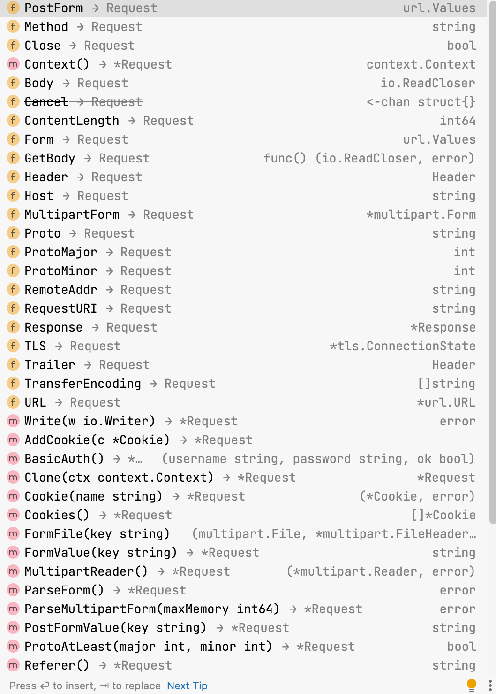
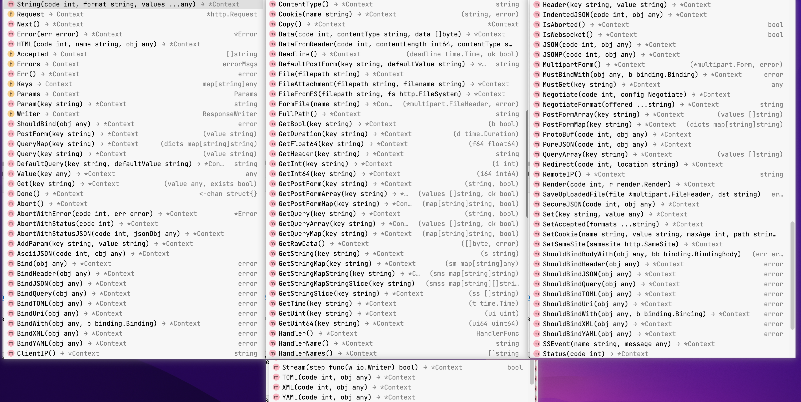
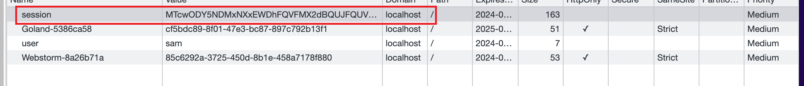
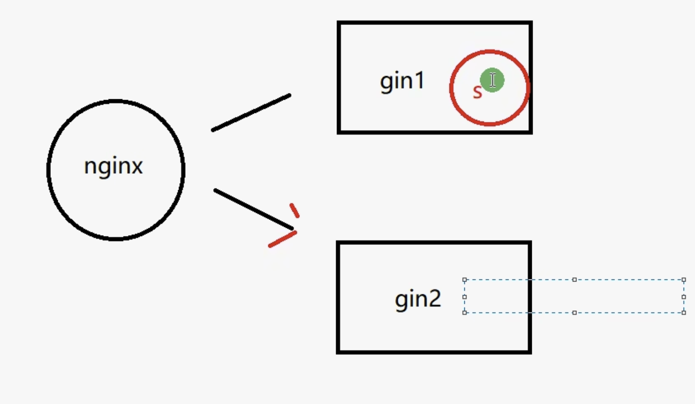

# Gin
它是一个go编写的轻量级的http web框架, 运行速度非常快

Gin最擅长的就是api接口的高并发, 如果项目的规模不大, 业务相对简单, 也可以用gin

Gin是一个用Go语言编写的Web框架，专门**用于快速构建高性能的HTTP服务端程序**。

Gin提供了一套简洁有效的工具来快速开发Web应用或API服务，包括路由、中间件支持、请求处理、响应处理等功能。

使用Gin，你可以很容易地创建RESTful的API接口，处理不同类型的HTTP请求（如GET、POST、PUT、DELETE等），并以JSON或其他格式返回数据。此外，Gin还支持为路由设置中间件，允许在处理请求前后执行特定的代码，这在实现诸如日志记录、用户身份验证、数据校验等功能时非常有用。

<br>

### 官网:
```s
https://gin-gonic.com/zh-cn
```

<br>

### 安装
**1. 进入到项目根目录下, 执行如下命令**
最新的Go版本要求项目必须在模块模式下执行下面的操作
```go
// go get -u是用来更新和安装Go包的命令
go get -u github.com/gin-gonic/gin
```

<br>

**2. 引入到项目main包中**
```go
package main
import "github.com/gin-gonic/gin"
```

<br>

**3. 可选, 如果使用诸如 http.StatusOK 之类的常量，则需要引入net/http 包**  
```go
import "net/http"
```

<br>

**2xx:**    
- http.StatusOK (200)：请求成功。
- http.StatusCreated (201)：请求成功并且服务器创建了新的资源。
- http.StatusAccepted (202)：服务器已接受请求，但尚未处理。
- http.StatusNoContent (204)：服务器成功处理了请求，但没有返回任何内容。

<br>

**3xx:**  
- http.StatusMovedPermanently (301)：请求的网页已永久移动到新位置。
- http.StatusFound (302)：服务器目前从不同位置的网页响应请求，但请求者应继续使用原有位置来进行后续的请求。
- http.StatusSeeOther (303)：对于请求的响应可以在另一个 URI 上找到。
- http.StatusTemporaryRedirect (307)：请求的资源临时从不同的 URI 响应请求。

<br>

**4xx:**    
- http.StatusBadRequest (400)：服务器无法理解请求的格式。
- http.StatusUnauthorized (401)：请求未经授权。
- http.StatusForbidden (403)：服务器拒绝请求。
- http.StatusNotFound (404)：服务器找不到给定的资源；文档不存在。
- http.StatusMethodNotAllowed (405)：不允许使用请求行中指定的方法。

<br>

**5xx:**    
- http.StatusInternalServerError (500)：服务器遇到错误，无法完成请求。
- http.StatusNotImplemented (501)：服务器不支持请求的功能，无法完成请求。
- http.StatusBadGateway (502)：服务器作为网关或代理，从上游服务器收到无效响应。
- http.StatusServiceUnavailable (503)：由于临时的服务器维护或过载，服务器当前无法处理请求。
- http.StatusGatewayTimeout (504)：服务器作为网关或代理，但是没有及时从上游服务器收到请求。

<br>

### 代码示例:
1. router: 相当于nodejs中的 app
2. ``router := gin.Default()`` 相当于 ``app = express()``
3. ``ctx`` 相当于 koa 中的 ``ctx``
4. ``router.Run()`` 可以传入参数 指定监听的端口号
5. router 的变量可以起成 app, router, server 都可以

```go
package main

import "github.com/gin-gonic/gin"

func main() {
	// 创建默认的路由引擎, 返回router对象
	router := gin.Default()

	// Get请求, 匹配到路径后 触发回调
	router.GET("/", func(ctx *gin.Context) {
		// 给浏览器返回字符串
		// 1. 状态码
		// 2. format string: 跟printf的 %v 一样
		// 3. values ...interface{}
		ctx.String(200, "%v", "返回给浏览器的内容")
	})

	// 启动web服务: 监听端口
	// router.Run("127.0.0.1:3333")
	// router.Run(":3333")
	router.Run() // 默认监听8080
}
```

<br>

### 配置服务器的热加载
所谓的热加载就是当我们对代码进行修改的时候, 程序能自动重新加载并执行

go中的热加载需要借助第三方的工具 

1. 项目(模块根目录)执行如下命令, 下载
```s
# 首先 安装的二进制文件默认放置在 $GOPATH/bin 目录下，或者 $GOBIN 目录
go install github.com/pilu/fresh@latest

# 然后
go get github.com/pilu/fresh
```

2. 使用 ``fresh`` 命令替代 ``go run main.go``
```s
fresh
```

我们运行该命令之后会在根目录下创建 tmp目录

<br>

**配置文件: 可选**  
如果你的项目不需要特别的配置，fresh **将会使用默认设置**

在项目根目录创建一个名为 ``runner.conf`` 的文件，来配置 fresh 的行为

```s
root:              .
tmp_path:          ./tmp
build_name:        runner-build
build_log:         runner-build-errors.log
valid_ext:         .go, .tpl, .tmpl, .html
build_delay:       600
colors:            true
log_color_main:    cyan
log_color_build:   yellow
log_color_runner:  green
log_color_watcher: magenta
log_color_app:
```

<br>

### RESTful
- GET(select): 从服务器取出资源
- POST(create): 在服务器新建一个资源
- PUT(update): 在服务器更新资源
- DELETE(delete): 从服务器删除资源

<br><br>

## 服务器 向 浏览器 响应数据
ctx是接口方法中回调的参数 ``ctx *gin.Context``

<br>

### 响应 字符串
### **<font color='#C2185B'>ctx.String(状态码 int, 占位符 string, 内容 interface{})</font>**
```go
ctx.String(200, "%v", "返回给浏览器的内容")

// 这样也可以
ctx.String(200, "返回给浏览器的内容")
```

ctx.String(200, "内容")，虽然第二个参数名为 format，但如果你不提供任何 values 参数（**即不需要替换格式字符串中的占位符**）

Gin 会将这个 format 参数当作普通的字符串内容处理，直接发送给客户端。

<br>

### 响应 JSON
### **<font color='#C2185B'>ctx.JSON(状态码 int, 内容 interface{})</font>**

**响应字符串:**  
```go
router.GET("/", func(ctx *gin.Context) {
  ctx.JSON(200, "响应JSON数据")
})
```

<br>

**响应Map:**  
```go
router.GET("/", func(ctx *gin.Context) {
  // 响应个map
  res := make(map[string]interface{})
  res["code"] = 200
  res["message"] = "OK"
  res["data"] = map[string]interface{}{
    "username": "sam",
    "age": 18,
  }
  ctx.JSON(200, res)
  // 客户端呈现: {"code":200,"data":{"age":18,"username":"sam"},"message":"OK"}
})
```

<br>

**技巧: <font color='#C2185B'>gin.H{k:v}</font>**  
上面我们自己声明了一个map
```go
map[string]interface{}{
  k: v
}
```

gin中给我们提供了一个 ``gin.H{k:v}`` 它就是一个map, 相当于``map[string]interface{}``的简写
```go
router.GET("/", func(ctx *gin.Context) {
  res := gin.H{
    "code":    200,
    "message": "OK",
    "data": gin.H{
      "username": "sam",
      "age":      19,
    },
  }
  ctx.JSON(200, res)
})
```

<br>

**响应结构体:**  
```go
type User struct {
	UserName string `json:"username"`
	Age      int    `json:"age"`
}

func main() {
	// 创建默认的路由引擎, 返回router对象 (相当于创建服务器实例 app)
	router := gin.Default()

	// Get请求, 匹配到路径后 触发回调
	router.GET("/", func(ctx *gin.Context) {
		u := User{"sam", 18}
		ctx.JSON(200, u)
	})

	// 启动web服务: 监听端口
	router.Run() // 默认监听8080
}
```

<br>

### 响应 JSONP
前端需要在url上携带query参数
```s
localhost:8080/demo?callback=xxx
```

当我们定义了一个支持jsonp的接口的时候
- 如果前台请求没有携带``?callback=xxx``参数的话, 则就是一个响应JSON格式数据的接口
- 如果前台请求携带``?callback=xxx``参数的话, 则数据就会通过实参的方式传递给xxx, 自动调用 ``xxx(数据)``

<br>

### **<font color='#C2185B'>ctx.JSONP(状态码 int, 内容 interface{})</font>**

```go
router.GET("/jsonp", func(ctx *gin.Context) {
  u := User{"sam", 18}
  ctx.JSONP(200, u)
})

// 如果前台传递了callback参数 则 xxx({"username":"sam","age":18});
```

<br>

### 响应 xml数据

### **<font color='#C2185B'>ctx.XML(状态码 int, 内容 interface{})</font>**
```go
router.GET("/xml", func(ctx *gin.Context) {
  ctx.XML(200, gin.H{
    "username": "sam",
  })
})
```

客户端显示
```xml
<map>
<SCRIPT id="allow-copy_script">(function agent() { let unlock = false document.addEventListener('allow_copy', (event) => { unlock = event.detail.unlock }) const copyEvents = [ 'copy', 'cut', 'contextmenu', 'selectstart', 'mousedown', 'mouseup', 'mousemove', 'keydown', 'keypress', 'keyup', ] const rejectOtherHandlers = (e) => { if (unlock) { e.stopPropagation() if (e.stopImmediatePropagation) e.stopImmediatePropagation() } } copyEvents.forEach((evt) => { document.documentElement.addEventListener(evt, rejectOtherHandlers, { capture: true, }) }) })()</SCRIPT>
<link type="text/css" rel="stylesheet" id="dark-mode-custom-link"/>
<link type="text/css" rel="stylesheet" id="dark-mode-general-link"/>
<style lang="en" type="text/css" id="dark-mode-custom-style"/>
<style lang="en" type="text/css" id="dark-mode-native-style"/>
<style lang="en" type="text/css" id="dark-mode-native-sheet"/>
<script/>

<!-- 这里相当于map中的kv -->
<username>sam</username>

</map>
```

<br>

### 响应 html
相当于在后台定义了 html模版 (类似 nodejs中的 template-art 模版) 我们可以将后台的数据插入到html模版中

1. 根目录下创建 views 目录, 用于存放html文件
```s
| - views
  - index.html
```

2. 插值语法 ``{{.key}}``, 通过该语法获取后台传递到模版中的数据

3. 配置html模版读取的目录
```go
// 创建默认的路由引擎, 返回router对象 (相当于创建服务器实例 app)
router := gin.Default()

// 配置html读取目录
router.LoadHTMLGlob("views/*")
```

4. **<font color='#C2185B'>ctx.HTML(状态码 int, html模版名称 string, 数据 interface{})</font>** 向前台响应渲染后的html文件

```go
router.GET("/html", func(ctx *gin.Context) {
  // 我们将要填入到html模版中的数据 组织成一个对象
  templateData := gin.H{
    "title": "我是标题",
  }
  ctx.HTML(200, "index.html", templateData)
})
```

<br><br>

# 前台携带参数到后台

## get请求: 后台获取 url参数
```s
/user?uid=1
```

### **<font color='#C2185B'>ctx.Query(key string)</font>**
通过 url参数中的key 获取对应的值

<br>


**返回值:**  
string

```go
uid := ctx.Query("uid")
fmt.Printf("uid: %v, 类型为%T", uid, uid)
```

<br>

### **<font color='#C2185B'>ctx.DefaultQuery(key string, defaultVal string)</font>**
通过 url参数中的key 获取对应的值, 如果key没有对应的值, 则返回我们设定的默认值

<br>


**返回值:**  
string

```go
uid := ctx.DefaultQuery("uid", "1")
fmt.Printf("uid: %v, 类型为%T", uid, uid)
// uid: 1, 类型为string
```

<br><br>

## get请求: 动态参数
```s
/user/1
```

<br>

### **<font color='#C2185B'>ctx.Param(key string)</font>**
1. 我们在街口地址上声明变量
```go
router.GET("/client/home/:uid", func(ctx *gin.Context) {
		uid := ctx.Param("uid")
		fmt.Println("uid: ", uid)
		
    ...
	})
```

2. 通过 接口地址上的变量, 作为key传入该方法中获取对应的值

<br><br>

## 配置允许跨域
**1. 定义中间件函数:**  
1. 返回值为 ``gin.HandlerFunc`` 类型函数
2. 函数内部返回一个函数
```go
func CORSMiddleware() gin.HandlerFunc {
	return func(c *gin.Context) {
		c.Writer.Header().Set("Access-Control-Allow-Origin", "*")
		c.Writer.Header().Set("Access-Control-Allow-Credentials", "true")
		c.Writer.Header().Set("Access-Control-Allow-Headers", "Content-Type, Content-Length, Accept-Encoding, X-CSRF-Token, Authorization, accept, origin, Cache-Control, X-Requested-With")
		c.Writer.Header().Set("Access-Control-Allow-Methods", "POST, OPTIONS, GET, PUT, DELETE")

		if c.Request.Method == "OPTIONS" {
			c.AbortWithStatus(http.StatusNoContent)
			return
		}

		c.Next()
	}
}
```

<br>

**2. 使用 ``router.Use(中间件函数调用())`` 注册中间件**
```go
router := gin.Default()

// 使用CORS中间件
router.Use(CORSMiddleware())
```

<br><br>

## post请求: 获取form表单数据
gin中我们使用如下的方法 不仅仅能获取到普通的表单提交, 还可以获取到multipart/form-data形式 (formdata)的数据

不用配置中间件 直接使用如下的方法就可以

<br>

### **<font color='#C2185B'>ctx.PostForm(key string) string</font>**
PostForm方法用于直接获取POST请求中表单数据的值。如果表单中不存在该字段，则返回空字符串。

```go
router.POST("/form_post", func(c *gin.Context) {
  // 直接通过PostForm获取"name"字段的值
  name := c.PostForm("name")

  c.JSON(200, gin.H{
    "name": name,
  })
})
```

<br>

### **<font color='#C2185B'>ctx.DefaultPostForm(key string, defaultVal string) string</font>**
如果指定字段没有值的话, 会返回默认值

<br>

### **<font color='#C2185B'>ctx.GetPostForm(key string) string, bool</font>**
它会返回两个值：字段的值以及一个布尔值，该布尔值表明请求中是否存在该字段。
```go
func main() {
  router := gin.Default()

  router.POST("/form_post", func(c *gin.Context) {
    // 使用GetPostForm尝试获取"name"字段的值
    name, ok := c.GetPostForm("name")

    if !ok {
      // 如果"name"字段不存在，返回错误信息
      c.JSON(400, gin.H{"error": "name field is required"})
      return
    }

    c.JSON(200, gin.H{
      "name": name,
    })
  })

  router.Run(":8080")
}

```

<br>

### 示例:
**前台代码:**  
1. 普通表单的情况
```html
<form action="/client/form" method="post">
  用户名: <input type="text" name="username" /> <br>
  <input type="submit" value="提交">
</form>
```

2. ajax的情况
```js
const btn = document.querySelector("button");
btn.addEventListener("click", async () => {
  const formData = new FormData();
  formData.append("id", "123");

  try {
    const res = await fetch("http://localhost:8080/client/form", {
      method: "POST",
      body: formData, // 直接发送formData对象
      // 不设置Content-Type，让浏览器自动处理
    });
    const data = await res.json();
    console.log("data", data);
  } catch (error) {
    console.error("Error:", error);
  }
});
```

<br>

**后台代码:**  
```go
package main

import (
	"fmt"
	"github.com/gin-gonic/gin"
	"html/template"
	"net/http"
	"time"
)

type User struct {
	UserName string `json:"username"`
	Age      int    `json:"age"`
}

// 定义模版中要使用的函数
func UnixToTime(timestamp int64) string {
	t := time.Unix(timestamp, 0)
	fmt.Println(t)
	return t.Format("2006-01-02 15:04:05")
}

// 配置中间件函数
func CORSMiddleware() gin.HandlerFunc {
	return func(c *gin.Context) {
		c.Writer.Header().Set("Access-Control-Allow-Origin", "*")
		c.Writer.Header().Set("Access-Control-Allow-Credentials", "true")
		c.Writer.Header().Set("Access-Control-Allow-Headers", "Content-Type, Content-Length, Accept-Encoding, X-CSRF-Token, Authorization, accept, origin, Cache-Control, X-Requested-With")
		c.Writer.Header().Set("Access-Control-Allow-Methods", "POST, OPTIONS, GET, PUT, DELETE")

		if c.Request.Method == "OPTIONS" {
			c.AbortWithStatus(http.StatusNoContent)
			return
		}

		c.Next()
	}
}

func main() {
	router := gin.Default()

	// 注册函数: 向模版暴露定义的函数
	router.SetFuncMap(template.FuncMap{
		"UnixToTime": UnixToTime,
	})

	// 配置静态服务
	// 静态文件目录
	router.Static("/static", "./static")
	router.LoadHTMLGlob("views/**/*")

	// 注册中间件
	router.Use(CORSMiddleware())

	router.GET("/client/home", func(ctx *gin.Context) {
		// 响应
		templateData := gin.H{
			"title": "前台页面标题",
			"count": 2,
			"arr":   [0]string{},
			"stemp": time.Now().Unix(),
		}
		ctx.HTML(200, "client/index.html", templateData)
	})

	router.POST("client/form", func(ctx *gin.Context) {
		id := ctx.PostForm("id")

    ctx.JSON(200, gin.H{
			"data": id,
		})
	})

	// 启动web服务: 监听端口
	router.Run() // 默认监听8080
}
```

<br>

## 如何将get post传递的数据 绑定到结构体

**1. 定义结构体:**  
1. 字段名要大写
2. json用来控制json序列化后的字段名
3. form需要跟前台提交表单时的字段名一样 (比如和input.name设置的值一致)
```go
// 定义结构体 将请求的数据绑定到 结构体 中
type User struct {
	UserName string `json:"username" form:"username"`
	PassWord string `json:"password" form:"password"`
}
```

**2. 接口方法中调用如下的方法将参数绑定到结构体中**  
**<font color='#C2185B'>ctx.ShouldBind(&结构体) err</font>**  
将请求参数自动封装到 给定的结构体 中

```go
router.POST("client/form", func(ctx *gin.Context) {
  // 实例化结构体 (指针类型)
  user := &User{}

  // 必须传入引用
  if err := ctx.ShouldBind(&user); err == nil {
    ctx.JSON(200, gin.H{
      "data": user,
    })
  } else {
    ctx.JSON(200, gin.H{
      "err": err.Error(),
    })
  }
})
```

<br><br>

## post请求: 获取前台传递的xml数据
在api开发中, 我们经常会用到json或者xml作为数据交互的格式, 这个时候我们可以在 gin 中的使用如下的方法获取数据

xml数据格式, 在支付宝和微信 支付成功后 会给服务器post数据 这时post的数据的格式就是xml

<br>

### **<font color='#C2185B'>ctx.GetRawData()</font>**
它用于从 HTTP 请求中获取原始的请求体数据。

这个方法**返回一个 []byte 类型的切片**，表示请求体的原始数据，以及一个错误对象，如果获取过程中出现错误。

<br>

**使用场景:**  
获取JSON、**XML** 或其他自定义格式  

需要使用 ctx.GetRawData() 来获取原始的请求体数据，然后根据需要进行解析。

- 解析 xml 使用: ``xml.Unmarshal() err``方法**将[]byte解析成xml**
  - 参数1: ctx.GetRawData() 方法返回的数据切片
  - 参数2: 要绑定到哪个结构体中的引用

```go
// 注意: xml tag 指定的字段 必须和 xml的标签名一致
type Article struct {
  Title string `json:"title" xml:"title"`
  Content string `json:"content" xml:"content"`
}

func main() {
  r := gin.Default()

  r.POST("/data", func(c *gin.Context) {
    // 获取原始请求体数据 从 ctx.Request.Body 中读取请求数据
    data, err := c.GetRawData()
    if err != nil {
      c.JSON(http.StatusBadRequest, gin.H{"error": "Cannot get raw data"})
      return
    }


    // 假设请求体是字符串，直接打印出来
    fmt.Println(string(data))


    // 如果请求体是xml则通过如下api解析xml, 并将kv绑定到结构体中
    // 实例化结构体
    article := &Article{}
    if err := xml.Unmarshal(data, &article); err == nil {
      c.JSON(http.StatusOK, article)
    } else {
      c.JSON(http.StatusBadRequest, err.Error())
    }


    // 这里可以根据需要对data进行进一步处理，例如解析JSON等
    c.String(http.StatusOK, "Received")
  })

  r.Run(":8080")
}
```

<br><br>

## Request对象 和 Response对象

### Request对象
在gin框架中 我们可以如下的方式获取到 请求对象
```go
ctx.Request
```

**ctx.Request身上的方法:**  


<br>

### Response对象
gin框架中我们不能像拿请求对象那样获取到响应对象, 要使用响应对象的功能的话, 都是通过ctx来调用对应的方法实现的, 例如

1. 设置响应http状态码
```go
ctx.Status(code int)
```

2. 设置一个响应头
```go
ctx.Header(key, value string)
```

<br>

如果需要再中间件或其他地方访问或修改已经设置的响应头或准备发送的响应体, 可能需要直接操作
```go
// 它是http.ResponseWriter
ctx.Writer.Header().Set(key, value string)

// 写入响应体
ctx.Writer.Write([]byte)
```

一旦开始写入响应体(即调用Write方法或gin的任何发送响应体的方法). http状态码和响应头也会随之发送 之后我们不能再修改他们

**因此正确的做法是先设置所有的响应头和状态码, 最后再写入响应体**

<br>

**ctx身上的方法:**  
因为没有响应对象, 跟响应相关的功能都在ctx对象身上 我们看看有什么功能



<br><br>

## 提取/抽离 路由(接口方法)
上面我们在所有的接口方法 都写在了 main.go 文件中, 这样很不方便

在go中我们可以通过 ``router.Group()`` 方法对路由进行分组

<br>

### **<font color='#C2185B'>router.Group(接口前缀 string)</font>**
router.Group() 方法用于创建一个路由组。路由组允许你共享相同的路由前缀和中间件，这使得路由和中间件的管理变得更加模块化和清晰。

<br>

### 简单示例:
```go
package main

import (
    "github.com/gin-gonic/gin"
)

func main() {
  router := gin.Default()

  // 创建一个路由组，所有的路由都将以"/api"作为前缀
  apiGroup := router.Group("/api")
  {
    // 注册路由到路由组
    apiGroup.GET("/users", getUsersHandler)
    apiGroup.GET("/posts", getPostsHandler)
  }

  // 启动服务器
  router.Run(":8080")
}

func getUsersHandler(c *gin.Context) {
  // 处理获取用户的逻辑
  c.JSON(200, gin.H{"message": "Getting users"})
}

func getPostsHandler(c *gin.Context) {
  // 处理获取帖子的逻辑
  c.JSON(200, gin.H{"message": "Getting posts"})
}


// aip组处理中间件
apiGroup.Use(authMiddleware)
```

<br>

### 整理项目中的路由
```go
package main

import (
	"fmt"
	"github.com/gin-gonic/gin"
	"html/template"
	"net/http"
	"time"
)

// 定义模版中要使用的函数
func UnixToTime(timestamp int64) string {
	t := time.Unix(timestamp, 0)
	fmt.Println(t)
	return t.Format("2006-01-02 15:04:05")
}

// 配置中间件函数
func CORSMiddleware() gin.HandlerFunc {
	return func(c *gin.Context) {
		c.Writer.Header().Set("Access-Control-Allow-Origin", "*")
		c.Writer.Header().Set("Access-Control-Allow-Credentials", "true")
		c.Writer.Header().Set("Access-Control-Allow-Headers", "Content-Type, Content-Length, Accept-Encoding, X-CSRF-Token, Authorization, accept, origin, Cache-Control, X-Requested-With")
		c.Writer.Header().Set("Access-Control-Allow-Methods", "POST, OPTIONS, GET, PUT, DELETE")

		if c.Request.Method == "OPTIONS" {
			c.AbortWithStatus(http.StatusNoContent)
			return
		}

		c.Next()
	}
}

// 定义结构体 将请求的数据绑定到 结构体 中
type User struct {
	UserName string `json:"username" form:"username"`
	PassWord string `json:"password" form:"password"`
}

func main() {
	router := gin.Default()

	// 注册函数: 向模版暴露定义的函数
	router.SetFuncMap(template.FuncMap{
		"UnixToTime": UnixToTime,
	})

	// 配置静态服务
	// 静态文件目录
	router.Static("/static", "./static")
	router.LoadHTMLGlob("views/**/*")

	// 注册中间件
	router.Use(CORSMiddleware())
	// 传入路由前缀
	rootGroup := router.Group("/")
	{
		rootGroup.GET("/", func(ctx *gin.Context) {
			templateData := gin.H{
				"title": "首页",
			}
			ctx.HTML(200, "root.html", templateData)
		})
		rootGroup.GET("/home", func(ctx *gin.Context) {
			templateData := gin.H{
				"title": "HomePage",
			}
			ctx.HTML(200, "root.html", templateData)
		})
	}

	// 前台页面路由组
	clientGroup := router.Group("/client")
	{
		clientGroup.GET("/home", func(ctx *gin.Context) {
			// 响应
			templateData := gin.H{
				"title": "前台页面标题",
				"count": 2,
				"arr":   [0]string{},
				"stemp": time.Now().Unix(),
			}
			ctx.HTML(200, "client/index.html", templateData)
		})

		clientGroup.POST("/form", func(ctx *gin.Context) {
			// 实例化结构体 (指针类型)
			user := &User{}
			// 必须传入引用

			if err := ctx.ShouldBind(&user); err == nil {
				ctx.JSON(200, gin.H{
					"data": user,
				})
			} else {
				ctx.JSON(200, gin.H{
					"err": err.Error(),
				})
			}
		})
	}


  // 后台页面路由组
	serverGroup := router.Group("/server")
	{
		serverGroup.GET("/home", func(ctx *gin.Context) {
			templateData := gin.H{
				"title": "后台页面标题",
			}
			ctx.HTML(200, "server/index.html", templateData)
		})
	}

	// 启动web服务: 监听端口
	router.Run() // 默认监听8080
}
```

<br>

### 将分组的路由单独抽离成一个文件
```s
| - GOPRO
  | - routes
    - clientRoutes.go
    - serverRoutes.go

  | - views
  - main.go
```

**1. 我们在 clientRoutes.go 文件中声明初始化client这套api接口方法的函数**  
注意 函数的参数 要接收main.go中的router 它的类型是 ``*gin.Engine``
```go
func ClientRoutesInit(router *gin.Engine) {
	clientGroup := router.Group("/client")
	{
		clientGroup.GET("/home", func(ctx *gin.Context) {
			// 响应
			templateData := gin.H{
				"title": "前台页面标题",
				"count": 2,
				"arr":   [0]string{},
				"stemp": time.Now().Unix(),
			}
			ctx.HTML(200, "client/index.html", templateData)
		})

		clientGroup.POST("/form", func(ctx *gin.Context) {
			// 实例化结构体 (指针类型)
			user := &User{}
			// 必须传入引用

			if err := ctx.ShouldBind(&user); err == nil {
				ctx.JSON(200, gin.H{
					"data": user,
				})
			} else {
				ctx.JSON(200, gin.H{
					"err": err.Error(),
				})
			}
		})
	}
}
```

2. 在main.go中调用初始化路由的函数 并传入router
```go
func main() {
	router := gin.Default()

	// 注册函数: 向模版暴露定义的函数
	router.SetFuncMap(template.FuncMap{
		"UnixToTime": UnixToTime,
	})

	// 配置静态服务
	// 静态文件目录
	router.Static("/static", "./static")
	router.LoadHTMLGlob("views/**/*")

	// 注册中间件
	router.Use(CORSMiddleware())

	// 调用client路由组的初始化方法
	routes.ClientRoutesInit(router)
	routes.ServerRoutesInit(router)
	
	// 启动web服务: 监听端口
	router.Run() // 默认监听8080
}
```

<br><br>

## 对接口方法的回调进行分组管理
上面我们讲了如何把路由提取成单独的一个文件, 而每个路由接口方法, 都有一个回调

上一些项目中 路由文件只是用来配置路由, 具体的业务逻辑(回调)也会抽离出去放到控制器中

**目录结构:**  
我们追加一个 controller 目录
```s
| - GOPRO
  | - views
  | - static
  | - routes
  | - controller
    | - client  # 每一套路由接口 对应一套控制器
    | - server
```

我们那 ``clientRoutes.go`` 文件来举例子 现在这个路由文件中的内容如下
```go
package routes

import (
	"github.com/gin-gonic/gin"
	"time"
)

// 定义结构体 将请求的数据绑定到 结构体 中
type User struct {
	UserName string `json:"username" form:"username"`
	PassWord string `json:"password" form:"password"`
}

// 参数: router 类型 *gin.Engine
func ClientRoutesInit(router *gin.Engine) {
	clientGroup := router.Group("/client")
	{
		clientGroup.GET("/home", func(ctx *gin.Context) {
			// 响应
			templateData := gin.H{
				"title": "前台页面标题",
				"count": 2,
				"arr":   [0]string{},
				"stemp": time.Now().Unix(),
			}
			ctx.HTML(200, "client/index.html", templateData)
		})

		clientGroup.POST("/form", func(ctx *gin.Context) {
			// 实例化结构体 (指针类型)
			user := &User{}
			// 必须传入引用

			if err := ctx.ShouldBind(&user); err == nil {
				ctx.JSON(200, gin.H{
					"data": user,
				})
			} else {
				ctx.JSON(200, gin.H{
					"err": err.Error(),
				})
			}
		})
	}
}
```

我们能看到这个路由文件中有两个接口方法
1. /client/home 对应的接口方法
2. /client/form 对应的接口方法

我们在 controller 目录中创建
1. homeController
2. formController

<br>

**homeController:**  
它是 /client/home 模块的各个接口方法, 其中 ``getHomePage`` 用于处理获取首页的请求
```go
package client

import (
	"github.com/gin-gonic/gin"
	"time"
)

func GetHomePage(ctx *gin.Context) {
	// 渲染 前台页面
	templateData := gin.H{
		"title": "前台页面标题",
		"count": 2,
		"arr":   [0]string{},
		"stemp": time.Now().Unix(),
	}
	ctx.HTML(200, "client/index.html", templateData)
}
```


<br>

**formController:**  
它是 /client/ form 模块的各个接口方法, 其中 ``userLogin`` 用于处理用户登录的请求

```go
package client

import "github.com/gin-gonic/gin"

type User struct {
	UserName string `json:"username" form:"username"`
	PassWord string `json:"password" form:"password"`
}

func UserLogin(ctx *gin.Context) {
	username := ctx.PostForm("username")
	password := ctx.PostForm("password")

	// 验证用户名和密码
	if username != "admin" || password != "123456" {
		ctx.JSON(200, gin.H{
			"code": 0,
			"msg":  "用户名或密码错误",
			"data": nil,
		})
		return
	}
	// 如果登录成功后将用户名密码保存到结构体中返回
	user := &User{}
	if err := ctx.ShouldBind(&user); err == nil {
		ctx.JSON(200, gin.H{
			"code": 1,
			"msg":  "登录成功",
			"data": user,
		})
	} else {
		ctx.JSON(500, gin.H{
			"code": 2,
			"msg":  err.Error(),
			"data": nil,
		})
	}
}
```

<br>

我们上面定义完接口方法的回调了 接下来我们在路由文件中引入回调
**clientRoutes.go路由文件:**  
```go
package routes

import (
	"GOPRO/controller/client"
	"github.com/gin-gonic/gin"
)

// 参数: router 类型 *gin.Engine
func ClientRoutesInit(router *gin.Engine) {
	clientGroup := router.Group("/client")
	{
		// 获取首页的接口
		clientGroup.GET("/home", client.GetHomePage)
		// 处理登录请求的接口
		clientGroup.POST("/form", client.UserLogin)
	}
}
```

<br>

### 优化: 我们将接口方法 绑定在结构体上
将接口方法的回调绑定在结构体上，即采用面向对象的方式来组织代码，在使用Gin这样的Web框架进行Web应用开发时，带来了以下好处

**1. 封装性**  
通过将相关的请求处理逻辑封装在一个结构体中，你可以把数据和操作这些数据的方法组织在一起。这有助于数据隐藏和封装，使得代码更加模块化，从而更容易维护和扩展。

<br>

**2. 代码组织**  
当应用程序变得复杂时，可能会有大量的路由和对应的处理函数。通过将这些处理函数作为结构体的方法，可以根据资源或功能模块来组织代码，使得项目的结构更加清晰。

例如，所有与用户相关的处理函数都可以放在UserController结构体中，订单相关的处理函数放在OrderController中，这样查找和理解代码变得更加容易。

<br>

**3. 重用性**  
绑定在结构体上的方法可以访问该结构体的字段。

<br>

这意味着你**可以在结构体中定义一些共享资源（如数据库连接、配置信息等）**，然后在结构体的方法中直接使用这些资源，从而避免了在每个处理函数中重复传递这些资源。

<br>

**4. 依赖注入**  
面向对象的方式更容易实现依赖注入。

你可以在创建控制器实例时，将所需的依赖（如服务、数据库访问对象等）通过构造函数或者某种形式的设置方法注入。

这样做的好处是，可以降低组件间的耦合度，提高代码的可测试性。

<br>

### 封装到结构体中的好处示例:
假设你需要为UserController添加一个新的依赖，例如用户服务UserService，用于处理与用户相关的业务逻辑。你可以这样设计UserController
```go
type UserController struct {
    userService UserService
}

// 相当于 UserController 的构造函数, 它会返回一个注入userService依赖的实例对象
func NewUserController(userService UserService) *UserController {
  return &UserController{
    userService: userService,
  }
}

func (u *UserController) UserLogin(ctx *gin.Context) {
  // 使用u.userService处理业务逻辑...
}
```

<br>

**NewUserController的作用:**  
充当构造函数的角色

其主要作用是初始化并返回一个UserController的实例。比如需要对结构体进行一些预配置或依赖注入时

它相当于 UserController **的构造函数**, 它会返回一个注入userService依赖的实例对象

<br>

**homeController:**  
```go
package client

import (
	"github.com/gin-gonic/gin"
	"time"
)

// Home模块的控制器结构体
type HomeController struct {
}

// 接口方法的回调 作为 HomeController 的方法
func (h HomeController) GetHomePage(ctx *gin.Context) {
	// 渲染 前台页面
	templateData := gin.H{
		"title": "前台页面标题",
		"count": 2,
		"arr":   [0]string{},
		"stemp": time.Now().Unix(),
	}
	ctx.HTML(200, "client/index.html", templateData)
}
```

<br>

**formController:**  
```go
package client

import (
	"fmt"
	"github.com/gin-gonic/gin"
)

type User struct {
	UserName string `json:"username" form:"username"`
	PassWord string `json:"password" form:"password"`
}

// 用户登录模块的控制器结构体
type UserController struct {
}

// 接口方法的回调 作为 UserController 的方法
func (u UserController) UserLogin(ctx *gin.Context) {
	username := ctx.PostForm("username")
	password := ctx.PostForm("password")

	if username != "admin" || password != "123456" {
		fmt.Println("进入了if判断")
		ctx.JSON(200, gin.H{
			"code": 0,
			"msg":  "用户名或密码错误",
			"data": nil,
		})
		return
	}
	user := &User{}
	if err := ctx.ShouldBind(&user); err == nil {
		ctx.JSON(200, gin.H{
			"code": 1,
			"msg":  "登录成功",
			"data": user,
		})
	} else {
		ctx.JSON(500, gin.H{
			"code": 2,
			"msg":  err.Error(),
			"data": nil,
		})
	}
}
```

<br>

### 路由文件中使用优化后的controller
```go
package routes

import (
	"GOPRO/controller/client"
	"github.com/gin-gonic/gin"
)

// 参数: router 类型 *gin.Engine
func ClientRoutesInit(router *gin.Engine) {
	clientGroup := router.Group("/client")
	{
		// 获取首页的接口
		clientGroup.GET("/home", client.HomeController{}.GetHomePage)

		// 处理登录请求的接口
		clientGroup.POST("/form", client.UserController{}.UserLogin)
	}
}
```

<br><br>

## 控制器的继承
我们上面完成了什么?
1. 将路由逻辑 提取到路由文件中
2. 将路由文件中的接口方法回调 抽离到controller中
3. 将接口方法回调绑定在结构体上

既然是结构体 那就意味着结构体可以实现继承 

<br>

**目录结构:**  
```s
| - controller
  | - client
    - baseController.go # 新建
    - homeController.go
    - formController.go
```

我们创建了 baseController 它们**同处一个包下 所以互相之间是可以调用的**

<br>

**baseController:**  
该文件中定义了通用的返回成功 和 失败时的方法

首先,  
``success(ctx *gin.Context, data interface{})``, 如果我们这么定义success方法的话, 我们要想给success传入data, 那么必须在调用success的时候传入两个参数 ctx 和 data

**go中并没有函数形参的默认值的说法** ``success(ctx,data)`` 但是我不想每次调用success的时候还要传入ctx 所以我们在BaseController结构体中声明了一个Ctx字段

**注意: 这里只是声明了 并没有赋值, 我们在别的接口方法中 首先就要给它赋值 不然没有办法使用**

<br>

其次,  
接收者的类型都是指针类型
```go
package client

import "github.com/gin-gonic/gin"

type BaseController struct {
	Ctx *gin.Context
}

func (b *BaseController) Success(data interface{}) {
	b.Ctx.JSON(200, gin.H{
		"code": 1,
		"msg":  "OK",
		"data": data,
	})
}
func (b *BaseController) Error() {
	b.Ctx.JSON(200, gin.H{
		"code": 2,
		"msg":  "ERR",
		"data": nil,
	})
}

```

<br>

**formController:**  
该控制器中我们继承 BaseController, 这样该文件的结构体中就可以调用通用的方法了

```go
package client

import (
	"fmt"
	"github.com/gin-gonic/gin"
)

type User struct {
	UserName string `json:"username" form:"username"`
	PassWord string `json:"password" form:"password"`
}

type UserController struct {
	BaseController
}

func (u UserController) UserLogin(ctx *gin.Context) {

  // 首行的位置 我们要给父类中的Ctx赋值
	u.Ctx = ctx

	username := ctx.PostForm("username")
	password := ctx.PostForm("password")

	if username != "admin" || password != "123456" {
		fmt.Println("进入了if判断")
		ctx.JSON(200, gin.H{
			"code": 0,
			"msg":  "用户名或密码错误",
			"data": nil,
		})
		return
	}
	user := &User{}
	if err := ctx.ShouldBind(&user); err == nil {

    // 调用 父类中的通用方法 传入数据
		u.Success(user)
	} else {
    // 调用 父类中的通用方法 传入数据
		u.Error()
	}
}
```

<br><br>

# 中间件
gin框架允许开发者在处理请求的过程中, 加入用户自己的狗子(hook
)函数, 这个钩子函数就叫做中间件

中间件适合处理一些公共的业务逻辑, 比如
1. 登录认证
2. 权限校验
3. 数据分页
4. 记录日志
5. 耗时统计 等

通俗的讲, 中间件就是匹配路由前和匹配路由后执行的一系列操作

<br>

### 路由中间件
gin中中间件是一个函数, 配置路由的时候可以传递多个func回调函数, **最后一个func回调函数前面触发的方法都可以称为中间件**

```go
router.GET("/home",
  func(c *gin.Context) {}  // 路由中间件
  func(c *gin.Context) {}  // 路由中间件
  func(c *gin.Context) {}  // 路由中间件
  func(c *gin.Context) {}
)
```

<br>

### 示例:
我们在访问``/``接口之前 我们输出 "欢迎光临"
```go
router.GET(
  "/",
  // 这个回调就属于中间件
  func(ctx *gin.Context) {
    fmt.Println("欢迎光临")
  },
  func(ctx *gin.Context) {
    ctx.HTML(200, "client/index.html", nil)
  }
)
```

**抽离中间件函数到外部:**  
```go
func PrintInfoMiddleWare(ctx *gin.Context) {
	fmt.Println("欢迎光临")
}

router.GET(
  "/",
  // 这个回调就属于中间件
  PrintInfoMiddleWare,
  func(ctx *gin.Context) {
    ctx.HTML(200, "client/index.html", nil)
  }
)
```
<br>

### 中间件函数中的 Next() 方法
```go
ctx.Next()
```

<br>

它的作用就是 **调用该请求的剩余处理程序** 

1. 允许请求继续向后传递，执行后续注册的中间件以及最终的路由处理函数

2. 在 ctx.Next() 调用点之后的代码，会在所有后续的中间件以及路由处理函数执行完毕后执行。这允许你进行一些清理工作或者收集执行后的状态。

中间件中我们可以不显示的调用 ``ctx.Next()`` 方法 **Gin 会自动处理这种情况，让请求流程继续，确保路由处理函数被调用**

<br>

### Next() 的执行逻辑如下
比如我们有这样的代码
```go
func PrintInfoMiddleWare(ctx *gin.Context) {
	fmt.Println("----- 路由中间件: Next()方法执行前 -----")
	ctx.Next()
	fmt.Println("----- 路由中间件: Next()方法执行后 -----")
}

router.GET(
  "/",
  // 这个回调就属于中间件
  PrintInfoMiddleWare,
  func(ctx *gin.Context) {
    fmt.Println("----- 首页接口方法回调 -----")
    ctx.HTML(200, "client/index.html", nil)
  })
```

我们能看到 接口回调之前 有 路由中间件, 路由中间件中还调用了 Next() 方法 它的执行逻辑为
1. 执行Next()方法之前的逻辑
2. 因为调用了Next()放执行下一个中间件(接口方法)
3. 当接口方法执行完后 执行Next()方法之后的逻辑

```s
# 输出结果
----- 路由中间件: Next()方法执行前 -----
----- 首页接口方法回调 -----
----- 路由中间件: Next()方法执行后 -----
```

<br>

### 示例: 我们看看接口方法的执行时间
1. 匹配路由前 记录时间
2. 执行路由后 记录时间
```go
func PrintInfoMiddleWare(ctx *gin.Context) {
	fmt.Println("----- 路由中间件: Next()方法执行前 -----")
	start := time.Now().UnixMilli()
	ctx.Next()
	fmt.Println("----- 路由中间件: Next()方法执行后 -----")
	fmt.Println(time.Now().UnixMilli() - start)  // 2
}
```

<br>

### 多个中间件的执行流程
```go
func MiddleWare1(ctx *gin.Context) {
	fmt.Println("----- MiddleWare1 中间件: Next()方法执行前 -----")
	ctx.Next()
	fmt.Println("----- MiddleWare1 中间件: Next()方法执行后 -----")
}
func MiddleWare2(ctx *gin.Context) {
	fmt.Println("----- MiddleWare2 中间件: Next()方法执行前 -----")
	ctx.Next()
	fmt.Println("----- MiddleWare2 中间件: Next()方法执行后 -----")
}
func MiddleWare3(ctx *gin.Context) {
	fmt.Println("----- MiddleWare3 中间件: Next()方法执行前 -----")
	ctx.Next()
	fmt.Println("----- MiddleWare3 中间件: Next()方法执行后 -----")
}

router.GET(
  "/",

  MiddleWare1,
  MiddleWare2,
  MiddleWare3,

  // 接口方法
  func(ctx *gin.Context) {
    fmt.Println("----- 首页接口方法回调 -----")
    ctx.HTML(200, "client/index.html", nil)
  })
```

回去的时候从后往前执行其它中间件中的Next()方法后的逻辑, **洋葱模型**
```s
----- MiddleWare1 中间件: Next()方法执行前 -----
----- MiddleWare2 中间件: Next()方法执行前 -----
----- MiddleWare3 中间件: Next()方法执行前 -----

----- 首页接口方法回调 -----

----- MiddleWare3 中间件: Next()方法执行后 -----
----- MiddleWare2 中间件: Next()方法执行后 -----
----- MiddleWare1 中间件: Next()方法执行后 -----
```

<br>

### 中间件函数中的 Abort() 方法
```go
ctx.Abort()
```

表示终止调用该请求的剩余处理请求

<br>

上面我们说了Next()是执行剩余处理请求, **而当我们调用了 ctx.Abort()之后 它会不执行下一个中间件了**

```go
func PrintInfoMiddleWare(ctx *gin.Context) {
	fmt.Println("----- 路由中间件: Next()方法执行前 -----")
  
	ctx.Abort()

	fmt.Println("----- 路由中间件: Next()方法执行后 -----")
}

router.GET(
  "/",
  // 这个回调就属于中间件
  PrintInfoMiddleWare,
  func(ctx *gin.Context) {
    fmt.Println("----- 首页接口方法回调 -----")
    ctx.HTML(200, "client/index.html", nil)
  })
```

上面我们调用了 Abort() 所以它不会执行接口回调了 直接终止, 而是执行返回执行 ``fmt.Println("----- 路由中间件: Next()方法执行后 -----")``

<br><br>

## 全局中间件
上面我们介绍了 路由中间件, 它是配置在接口回调前面的

<br>

### 全局中间件的配置流程
全局中间件不是写在路由回调的前面

1. 定义中间件函数
2. 使用 router.use() 方法注册中间件函数

```go
func MiddleWare1(ctx *gin.Context) {
	fmt.Println("----- MiddleWare1 中间件: Next()方法执行前 -----")
	ctx.Next()
	fmt.Println("----- MiddleWare1 中间件: Next()方法执行后 -----")
}
func MiddleWare2(ctx *gin.Context) {
	fmt.Println("----- MiddleWare2 中间件: Next()方法执行前 -----")
	ctx.Next()
	fmt.Println("----- MiddleWare2 中间件: Next()方法执行后 -----")
}
func MiddleWare3(ctx *gin.Context) {
	fmt.Println("----- MiddleWare3 中间件: Next()方法执行前 -----")
	ctx.Next()
	fmt.Println("----- MiddleWare3 中间件: Next()方法执行后 -----")
}


func main() {
  router := gin.Default()

	// 注册函数: 向模版暴露定义的函数
	router.SetFuncMap(template.FuncMap{
		"UnixToTime": UnixToTime,
	})

	// 配置静态服务: 静态文件目录
	router.Static("/static", "./static")
	router.LoadHTMLGlob("views/**/*")

	// 注册全局中间件
	router.Use(MiddleWare1, MiddleWare2, MiddleWare3)
}
```

<br>

### 要点
``router.Use()`` 中我们能传入的必须是 ``gin.HandlerFunc`` 类型的函数

而我们定义的具有ctx *gin.Context形参的函数 本身就属于``gin.HandlerFunc`` 类型的函数
```go
func MiddleWare1(ctx *gin.Context) {
	...
}
```

所以我们可以直接放在 ``router.Use(MiddleWare1)``

<br>

我们还有另外一种写法
```go
func CORSMiddleware() gin.HandlerFunc {
	return func(c *gin.Context) {
		c.Writer.Header().Set("Access-Control-Allow-Origin", "*")
		c.Writer.Header().Set("Access-Control-Allow-Credentials", "true")
		c.Writer.Header().Set("Access-Control-Allow-Headers", "Content-Type, Content-Length, Accept-Encoding, X-CSRF-Token, Authorization, accept, origin, Cache-Control, X-Requested-With")
		c.Writer.Header().Set("Access-Control-Allow-Methods", "POST, OPTIONS, GET, PUT, DELETE")

		if c.Request.Method == "OPTIONS" {
			c.AbortWithStatus(http.StatusNoContent)
			return
		}

		c.Next()
	}
}

router.Use(CORSMiddleware())
```

上面的函数内部返回了一个函数, 返回的函数类型为 ``gin.HandlerFunc``

这种情况 CORSMiddleware 函数使用了一个不同的模式：它是一个工厂函数，返回一个符合 gin.HandlerFunc 类型的函数。

这种方式提供了更多的灵活性，因为你可以在中间件函数被实际返回之前执行一些初始化操作或配置（尽管在你的示例中并没有这样做）

<br>

### 全局中间件的执行流程
和上面讲路由中间件的时候的执行流程一致

<br><br>

## 路由分组: 配置中间件
下面是我们的路由文件, 我们可以在如下的两个位置 配置中间件, 2选1即可
```go
func ClientRoutesInit(router *gin.Engine) {

  // 方式1: 在接口前缀的后面, 追加中间件函数
	clientGroup := router.Group("/client", 配置中间件函数的位置1)

  // 方式2: 通过路由分组对象身上的Use方法
  clientGroup.Use(配置中间件函数的位置2)
	{
		// 获取首页的接口
		clientGroup.GET("/home", client.HomeController{}.GetHomePage)
		// 处理登录请求的接口
		clientGroup.POST("/form", client.UserController{}.UserLogin)
	}
}
```

<br>

### 抽离中间件函数到文件中
```s
| - GOPRO
  | - routes
  | - middlewares
    - initMiddleWare.go
```

**initMiddleWare.go:**  
```go
package middlewares

import (
	"fmt"
	"github.com/gin-gonic/gin"
)

func MiddleWare1(ctx *gin.Context) {
	fmt.Println("----- 我是路由分组中间件 -----")
}
```

然后我们在路由文件中引入中间件函数, **如下的中间件只会在 clientGroup 下所有的接口方法前执行**
```go
package routes

import (
	"GOPRO/controller/client"
	"GOPRO/middlewares"
	"github.com/gin-gonic/gin"
)

// 参数: router 类型 *gin.Engine
func ClientRoutesInit(router *gin.Engine) {

  // 参数2的位置使用中间件
	clientGroup := router.Group("/client", middlewares.MiddleWare1)
	{
		// 获取首页的接口
		clientGroup.GET("/home", client.HomeController{}.GetHomePage)
		// 处理登录请求的接口
		clientGroup.POST("/form", client.UserController{}.UserLogin)
	}
}
```

<br><br>

## Controller 和 中间件之间共享数据
比如路由执行前, 会走中间件的逻辑, 那么我们在中间件函数中设置一个数据, 我们期望在路由接口回调中读取该数据

<br>

### **<font color='#C2185B'>ctx.Set(k string, v any)</font>**
ctx这里左右共享域, 我们往共享域中存数据

<br>

### **<font color='#C2185B'>ctxs.Get(k string) (value any, exists bool)</font>**
从ctx共享域中 获取key对应的数据

<br>

**返回值:**
1. 空接口类型的数据
2. key对应的值是否存在的 bool类型

```go
// 中间件函数
func MiddleWare1(ctx *gin.Context) {
	fmt.Println("----- 我是路由分组中间件 -----")

	// 中间件中设置数据
	ctx.Set("age", 18)
}

// -----

// 接口回调
func (h HomeController) GetHomePage(ctx *gin.Context) {

	// 获取 中间件函数中 存在ctx域中的数据
	age, _ := ctx.Get("age")

	// Get返回的age是空接口类型, 在使用的时候需要断言
	_age, ok := age.(int)
	if ok {
		fmt.Printf("%v, %T", _age, _age)
		// 18, int
	}

}
```

<br>

### ctx的存储限制
ctx.Get和ctx.Set是用于在请求的上下文中存储和检索数据的方法。

这两个方法通常用于在处理HTTP请求的不同阶段之间传递数据。由于Gin是基于中间件的架构，这种方式特别**适用于在中间件或处理函数之间共享数据**

<br>

**使用场景:**  
1. 身份验证和授权:  
在中间件中验证用户的身份，并将用户信息或权限设置到上下文中，以便后续处理函数可以根据用户信息进行逻辑处理。

2. 请求跟踪:  
在中间件中生成一个请求ID并设置到上下文中，用于日志记录和跟踪请求处理的全过程。

3. 共享数据:  
在处理链的早期阶段计算或检索的数据，可以设置到上下文中，供后续处理步骤使用，避免重复计算或检索。

<br>

**限制:**  
1. 作用范围:  
ctx.Set和ctx.Get存储和获取的数据**只在单个请求的生命周期内有效**。每个请求都有自己的上下文，所以设置的数据不会影响到其他请求。这里的“一次请求”指的是从客户端发送请求到服务器，并由服务器处理并返回响应的完整周期。在这个周期内，设置的数据只对当前请求可见，对其他请求

2. 类型安全:  
这两个方法使用interface{}来存储和检索任意类型的数据，这意味着**在使用时需要类型断言**。如果类型断言失败，可能会导致运行时错误。因此，使用时需要小心处理类型断言。

3. 并发安全:  
Gin的上下文对象本身是并发安全的，可以在处理请求的多个Goroutine中安全使用。但是，如果你存储的数据类型本身不是并发安全的，那么你需要自己确保对这些数据的并发访问是安全的

<br><br>

## 路由router对象创建的方式
我们在 main.go 文件中 是通过如下的方法创建的路由
```go
func main() {
	router := gin.Default()
}
```

通过 ``gin.Default()`` 创建的路由 默认会有如下的两个中间件
- Logger(): 日志
- Recovery(): 抛出panic

```go
func Default() {
  debugPrintWARNINGDefault()
  engine := New()
  engine.Use(Logger(), Recovery())
  return engine
}
```

如果我们不想使用上述的中间件 可以通过``gin.New()``的方式创建路由对象
```go
func Default() {
  debugPrintWARNINGDefault()
  engine := gin.New()
  engine.Use(Logger(), Recovery())
  return engine
}
```

<br><br>

## 中间件: 使用 协程
当我们在中间件中 或者 接口回调 中启动新的协程的时候, **不能使用原始的上下文(ctx *gin.Context) 必须使用其只读副本(ctx.Copy())**

```go
router.GET("/test", func(ctx *gin.Context) {
  // 获取 ctx 的副本
  _ctx := ctx.Copy()

  // 启动一个协程
  go func() {
    time.Sleep(time.Second * 5)

    // 协程中需要使用 ctx 的话, 需要使用副本
    fmt.Println("请求路径为:", _ctx.Request.URL.Path)
    // /test
  }()

  ctx.String(200, "首页")
})
```

<br>

### 注意:
1. **协程是非阻塞的** (先拿异步理解下), 协程是并行执行的, **虽然上面协程中需要花费5秒, 但是并不影响 响应用户**

2. gin中我们不用使用 wg.Wait 等待协程结束, 因为gin的主线程是永远不会自己结束, 它会一直等(因为是服务器么)

<br><br>

# 抽离: 工具包
```s
| - GOPRO
  | - utils
    - util.go
```

```go
package utils

import (
	"fmt"
	"time"
)

func Add() {
	fmt.Println(1 + 2)
}

func UnixToTime(timestamp int64) string {
	t := time.Unix(timestamp, 0)
	fmt.Println(t)
	return t.Format("2006-01-02 15:04:05")
}

func DateToUnix(str string) int64 {
	template := "2006-01-02 15:04:05"
	t, err := time.ParseInLocation(template, str, time.Local)
	if err != nil {
		return 0
	}
	return t.Unix()
}

func GetUnix() int64 {
	return time.Now().Unix()
}

func GetDate() string {
	template := "2006-01-02 15:04:05"
	return time.Now().Format(template)
}

func GetDay() string {
	template := "2006-01-02"
	return time.Now().Format(template)
}
```

<br><br>

# Gin: Model(MVC中的Model层)
如果我们的应用非常简单的话, 我们可以在Controller里面处理常见的业务逻辑

但是我们有一个功能项在多个控制器, 或者多个模版里面复用的话, 那我们就可以把公共的功能单独抽取出来作为一个模块(Model)

Model是逐步抽象的过程, 一般我们会在Model里面封装一些公共的方法让不同的Controller使用, 也可以在Model中实现和数据库打交道

<br>

### MVC架构
我们简单的回顾下

- M: Module - 模型
- V: View - 视图
- C: Controller - 控制器

在Web开发中，Model、View、Controller（MVC）模式是一种常见的架构模式，用于将应用程序分解为三个主要组成部分，以实现关注点分离。

<br>

### 层级之间的通信:
1. view传送指令到controller
2. controller完成业务逻辑后 要求 model 改变状态
3. model将新的数据发送到view 用户得到反馈

<br>

### Model层:
模型分为很多种
- pojo(vo): pojo就是比较简单的模型, **它作为数据的载体**, 我们将数据库的一条记录封装为一个POJO对象(值对象)

- bo/service层: 业务模型组件

- dao/数据访问对象: 有数据访问层组件

<br>

### 区分 业务对象 和 数据访问对象
**1. DAO中的方法都是单精度的方法**  
单精度(细粒度): **一个方法只考虑一个操作**(一件事情), 比如 insert() 就只执行插入操作

<br>

**2. BO(service)中的方法都是业务方法**  
**实际的业务是比较复杂的** 因此业务方法的粒度是比较粗的, 也就是粗粒度方法

比如, 注册功能属于业务功能 也就是说注册这个方法属于业务方法 

业务方法中包含了多个DAO方法 也就是说注册这个业务功能需要通过多个DAO方法的组合调用 从而完成这个注册的功能 如

1. 检查用户名是否已经注册: 需要调用dao中查询操作

2. 向用户表中新增一条新用户记录: 需要调用dao中的insert操作

3. 向用户积分表新增一条记录(新用户默认初始化积分100): 需要调用dao中的insert操作

4. 向系统消息表新增一条记录(某某用户注册了 需要根据通讯录信息向他的联系人推送): 需要调用dao中的insert操作

5. 向系统日志表新增一条记录(某某用户在某IP某年某月某秒注册): 需要调用dao中的insert操作

一个注册功能是一个业务功能是比较复杂的

<br>

### 注意:
因为我们是学习阶段 该阶段中项目的体积和功能都特别的简单 我们可能会觉得业务层的方法特别简单 感觉和DAO层差不多, 但是真正的企业级项目 业务层的方法是比较复杂的 不是简单的对DAO层的调用

<br>

### 总结: Model层
它里面涵盖了
1. bean
2. service
3. dao

<br><br>

# Gin文件上传:

## 文件上传相关API:

### **<font color='#C2185B'>ctx.FormFile(key string) (file, err)</font>**

**返回值:**  
返回值有两个
1. file, 它的类型是 *multipart.FileHeader
2. err, 它的类型是 error

<br>

**File对象身上的属性:**  
1. file.Filename string
2. file.Size int64
3. file.Header textproto.MIMEHeader
4. file.open() (file, err)

<br>

### **<font color='#C2185B'>ctx.SaveUploadFile(file *multipart.FileHeader, dst string) err</font>**
将上传的文件保存到指定目录

<br>

### 路径拼接

### **<font color='#C2185B'>path.Join("路径1", file.Filename)</font>**
中间使用,进行链接, 拼出一个路径

Join将任意数量的路径元素连接到单个路径中，并用斜杠分隔它们。空元素将被忽略。结果是Cleaned。但是，如果参数列表为空或其所有元素为空，Join将返回一个空字符串。

```go
// 这句代码是在 控制器目录里面的 但是所有文件都是引入到main.go中执行的 所以 ./static 就是从main.go开始计算的 
dst := path.Join("./static", file.Filename)


// 获取项目根目录
cwd, err := os.Getwd()
if err != nil {
  panic(err)
}

// cwd: GOPRO根目录
dst := path.Join(cwd, "./satic", file.Filename)
```

<br>

### 前台代码
```html
<form action="/client/form" method="post" enctype="multipart/form-data">
  用户名: <input type="text" name="username" /> <br>
  密&emsp;码: <input type="text" name="password" /> <br>
  文&emsp;件: <input type="file" name="file">
  <input type="submit" value="提交">
</form>
```

<br>

### 单文件上传
```go
func (u UserController) UserLogin(ctx *gin.Context) {
	u.Ctx = ctx

	file, fileErr := ctx.FormFile("file")

	if fileErr != nil {
		fmt.Println("文件上传失败")
		u.Error()
		return
	}

	dst := path.Join("./static", file.Filename)

	ctx.SaveUploadedFile(file, dst)
	ctx.String(200, "文件上传成功")
}
```

<br>

### 多文件上传

**不同文件名的多文件上传:**  
```html
<form
  action="/client/form"
  method="post"
  enctype="multipart/form-data"
>

  头&emsp;像1: <input type="file" name="file1">
  头&emsp;像2: <input type="file" name="file2">

  <input type="submit" value="提交">
</form>
```

```go
func (u UserController) UserLogin(ctx *gin.Context) {
	u.Ctx = ctx

	file1, _ := ctx.FormFile("file1")
	file2, _ := ctx.FormFile("file2")

	dst1 := path.Join("./static", file1.Filename)
	dst2 := path.Join("./static", file2.Filename)

	ctx.SaveUploadedFile(file1, dst1)
	ctx.SaveUploadedFile(file2, dst2)

	ctx.String(200, "%v", "文件上传成功")
}
```

<br>

**相同文件名称的多文件上传:**  

**<font color='#C2185B'>ctx.MultipartForm()</font>**
用来获取前台表单中的所有字段数据

<br>

**返回值类型:**  
1. ``*multipart.Form``
2. ``err``

返回值1是一个 Form结构体 该结构体中有两个属性和一个方法 这两个属性分别对应的是一个map
```go
// File字段: 表单中的key 和 表单中的值, 值会放在File切片中
1. File: map[string][]*multipart.FileHeader

// 普通字段: 表单中的key 和 表单中的值, 值会放在切片中
2. Value: map[string][]string

// 方法
3. RemoveAll() err
```

```go
/*
  &multipart.Form{
  Value:
    // key: string, value: []string
    map[string][]string{
      "username":[]string{"sam"}
    }, 
File:
  // key: string, value: []*multipart.FileHeader
  map[string][]*multipart.FileHeader{
    "file1":
        []*multipart.FileHeader{(*multipart.FileHeader)(0x140000800c0)}, 
    "file2":
        []*multipart.FileHeader{(*multipart.FileHeader)(0x140001a8780)}}}
*multipart.Form
*/
```

<br>

**前台代码:**  
文件1 和 文件2 的name相同, 就意味着我们将文件上传到了 file数组中
```html
<form action="/client/form" method="post" enctype="multipart/form-data">
  用户名: <input type="text" name="username">
  <br>
  文&emsp;件1: <input type="file" name="file">
  <br>
  文&emsp;件2: <input type="file" name="file">
  <br>
  <input type="submit" value="提交">
</form>
```

<br>

**后台代码:**  
```go
func (u UserController) UserLogin(ctx *gin.Context) {
	u.Ctx = ctx

	formdata, _ := ctx.MultipartForm()

	// Value中存储着普通字段, 值会保存在key对应的切片中
	username := formdata.Value["username"][0]
	fmt.Printf("%v, %T", username, username)

	// 先获取 file字段对应的 []file切片
	files := formdata.File["file"]

	// 循环遍历 []file切片
	for _, file := range files {
		dst := path.Join("./static", file.Filename)
		ctx.SaveUploadedFile(file, dst)
	}

	ctx.String(200, "%v", "文件上传成功")
}
``` 

<br><br>

## path模块: 常用api
### **<font color='#C2185B'>path.join(...paths)</font>**
用于连接所有给定的路径片段，使用平台特定的分隔符作为定界符，然后规范化生成的路径

<br>

### **<font color='#C2185B'>path.basename(path[, ext])</font>**
返回路径的最后一部分，实际上是从路径字符串中**获取文件名**。可选的 ext 参数可以用于去除文件扩展名。

<br>

### **<font color='#C2185B'>path.dirname(path)</font>**
返回路径中代表**目录的部分**，即去除文件名后的路径

<br>

### **<font color='#C2185B'>path.extname(path)</font>**
返回路径中**文件的扩展名**，从最后一个出现的.字符到字符串的末尾

<br>

### **<font color='#C2185B'>path.parse(path)</font>**
返回一个对象，其属性表示 path 的元素（根目录、目录、基本名称、扩展名、名称）。

<br><br>

## 文件上传: 按照日期存储文件
上面的文件上传有问题
1. 同名文件会有 新文件覆盖旧文件的问题
2. 我们期望在static下, 可以按照日期创建目录, 里面放对应的图片
```s
| - static
  | - 20211101
  | - 20211102
```

这样当上传的图片很多的时候 我们就可以对图片按照日期进行分组

<br>

### 流程
1. 获取上传的文件
2. 获取后缀名 判断类型是否正确 jpg png gif
3. 创建图片保存目录 /static/20200623
4. 生成文件名称 和 文件目录
5. 执行上传

<br>

### 要点:

```go
func (u UserController) UserLogin(ctx *gin.Context) {
	u.Ctx = ctx

	// 获取文件
	file, err := ctx.FormFile("file")
	if err == nil {
		// 获取文件的后缀名 参数: path string  返回值: string
		extName := path.Ext(file.Filename)

		// 允许上传的图片类型
		allowExtMap := map[string]bool{
			".jpg": true,
			".png": true,
			".gif": true,
		}

		// 判断 extName 是否在 Map 中, ok表示对应的后缀是否存在
		if _, ok := allowExtMap[extName]; !ok {
			// ctx.Redirect()
			// 如果不存在 则返回响应
			ctx.String(200, "上传文件后缀不符合要求")
			return
		}

		// 合法的情况

		// 创建图片的保存的目录
		date := time.Now().Format("20060102")

		dir := path.Join("./static", date)
		// MkdirAll如果要创建的目录存在什么都不会做, 如果不存在则创建目录

		// 这么创建的文件目录 mac提示没有权限
		err := os.MkdirAll(dir, 0666)
		// 方式1: 修改为0755
		// 方式2: 使用api修改权限
		// os.Chmod(dir, 0777)
		if err != nil {
			ctx.String(200, "创建文件目录失败")
			return
		}

		// 文件名: 时间戳 + 后缀名
    // 这里不能 string(time.Now().Unix()) 这样写, 因为string是将int型数字解释成unicode码点 然后转换为字符串 所以时间戳是没有意义的int
		filename := strconv.FormatInt(time.Now().Unix(), 10) + extName

		// 上传文件
		dst := path.Join(dir, filename)
		ctx.SaveUploadedFile(file, dst)

		ctx.String(200, "上传文件成功")
	} else {
		ctx.String(200, "上传文件失败")
	}
}
```

<br><br>

# Gin: cookie
http是无状态的协议, 简单的说, 当你浏览了一个页面, 然后转到同一个网站的另一个页面, 服务器无法认识到这是同一个浏览器在访问同一个网站 每一次的访问, 都是没有任何关系的

如果我们要实现多个页面之间的共享数据的话 我们就可以使用 cookie 或者 session 实现

<br>

### cookie
它是存储于访问者计算机的浏览器中, 可以让我们用同一个浏览器访问同一个域名的时候共享数据

**cookie能实现的功能:**  
1. 保持用户登录状态
2. 保存用户浏览的历史记录
3. 猜你喜欢, 智能推荐
4. 电商网站的加入购物车

<br><br>

## 设置 和 获取 cookie

### 获取cookie
### **<font color='#C2185B'>ctx.Cookie("key") string</font>**
通过指定的key 获取cookie

**返回值:**  
1. cookie: string
2. err: error

**err的情况:**  
Cookie不存在, 如果请求的HTTP头中没有名为"user"的cookie，ctx.Cookie("user")会返回一个错误。这是最常见的情况，意味着客户端没有发送这个cookie，可能是因为它从未被设置，或者已经过期被浏览器删除了。

<br>

### 设置 cookie
### **<font color='#C2185B'>ctx.SetCookie(name, value string, maxAge int, path, domain string, secure, httpOnly bool)</font>**

<br>

**name:** cookie的key  

类型: string 

作用: 设置Cookie的名称。这是一个标识符，用于在客户端（如Web浏览器）存储和检索Cookie的值。


**value:** cookie的value

类型: string

作用: 设置Cookie的值。这是存储在客户端的实际数据，与名称对应。

<br>

**maxAge:** 过期时间 秒   

类型: int  

作用: 设置Cookie的最大存活时间（以秒为单位）。
- 如果设置为0，表示Cookie会在浏览器关闭时失效。
- 如果设置为负数，Cookie会立即删除。
- 正数则表示Cookie存活的具体秒数。
- 不想设置存活时间, 传递nil

<br>

**path:** cookie生效的路径 默认是``/``, 表示当前网站都有效

类型: string

作用: 设置Cookie的路径。  
这个路径指定了哪些URL可以访问这个Cookie。
- 如果设置为"/"，则对整个网站有效。
- 如果设置为特定路径，如"/admin"，则只有以该路径开头的页面可以访问该Cookie。

<br>

**domain:** cookie的路径的域 (本地调试配置成localhost, 正式上线配置成域名)

类型: string

作用: 设置Cookie的域。这定义了哪些域名下的页面可以读取这个Cookie。通常用于跨域名共享Cookie。

<br>

**secure:**  
类型: bool  

cookie是否只有在https下才生效 (当设置为true的时候 )http下是无效的

<br>

**httpOnly:**  
设置的true 那么cookie只有在后端才能操作 js是无法读取到cookie 防止xss攻击产生

```go
// /home接口存储cookie
ctx.SetCookie("user", "sam", 3600, "/", "localhost", false, false)

// /form接口获取cookie
ctx.Get("usename")
```

<br>

### 示例:
```go
cookie, err := ctx.Cookie("user")

// 如果尝试获取的cookie不存在，则会将cookie的值设置为"NotSet"
if err != nil {
  cookie = "NotSet"
  ctx.SetCookie("user", "empty", 3600, "/", "localhost", false, false)
}
```

<br>

### 删除cookie
```go
ctx.SetCookie("user", "sam", -1, "/", "localhost", false, false)
```

<br><br>

## cookie: 多个2级域名共享cookie
我们希望 a.itying.com 和 b.itying.com 这两个网站之间可以共享cookie

比如 我们希望用户在 a.itying.com 登录后, b.itying.com上也可以登录

<br>

### 域名解析
我们将域名解析到 a.itying.com 上, 这里我们需要修改本地的hosts文件
```s
127.0.0.1 a.itying.com
127.0.0.1 b.itying.com
```

解析后 我们通过 a.itying.com 访问网站 就会访问到 127.0.0.1

<br>

### 实现方式
我们在通过 ``ctx.SetCookie`` 方法设置cookie的时候, 将domain参数设置为 ``.itying.com``

这样就表示让``.itying.com``的所有二级域名都共享cookie

```go
ctx.SetCookie("username", "张三", 3600, "/", ".itying.com", false, false)
```

<br><br>

# Gin: session
session是另一种记录客户状态的机制, 不同的是 cookie保存在客户端浏览器中, 而session保存在服务器上

<br>

### session的工作流程
当客户端浏览器第一次访问服务器并发送请求的时候, 服务器会创建一个session对象, 生成一个类似于key value的键值对

然后将value保存在服务器, 将key(cookie)返回到浏览器, 浏览器下次访问的时候会携带key(cookie), 找到对应的session(value)

<br>

### Gin中没有继承session
我们需要使用 第三方 中间件

```s
https://github.com/gin-contrib/sessions
```

<br>

### gin-contrib/sessions中间件支持的存储引擎: 
可以将session存储到哪里

1. cookie (存储到本地服务器)
2. memstore
3. redis
4. memcached
5. mongodb

<br><br>

## gin-contrib/sessions中间件的使用
gorilla/sessions包来创建一个基于cookie的会话存储，并且通过Gin的中间件机制来使其在整个应用程序中可用。

<br>

### 下载
**方式1:**  
我们直接在项目里面import中间件, 因为我们的项目是基于go mod来管理的, 它会自动下载

```go
package main

// 只需要引入
import (
  "github.com/gin-contrib/sessions"
  "github.com/gin-contrib/sessions/cookie"

  "github.com/gin-gonic/gin"
)
```

<br>

**方式2:**  
根目录下使用如下命令下载中间件
```s
go get github.com/gin-contrib/sessions
```

<br>

### 基于cookie的存储
**main.go文件中配置session**
```go
package main

import (
	"github.com/gin-contrib/sessions"
	"github.com/gin-contrib/sessions/cookie"
	"github.com/gin-gonic/gin"

	"html/template"
	"net/http"
	"time"
)

func main() {
	router := gin.Default()

	router.Static("/static", "./static")
	router.LoadHTMLGlob("views/**/*")

	// 配置session中间件
	store := cookie.NewStore([]byte("secret"))
	router.Use(sessions.Sessions("session", store))

	routes.ClientRoutesInit(router)
	routes.ServerRoutesInit(router)

	router.Run()
}
```

<br>

### **<font color='#C2185B'>store := cookie.NewStore([]byte("secret"))</font>**
创建了一个新的cookie存储引擎 (它利用客户端的cookie来保存会话数据)

cookie.NewStore函数接受一个或多个字节切片作为参数，这些字节切片用作加密密钥来保护cookie数据。

在实际应用中，你应该使用一个强随机生成的密钥，而不是简单的字符串如"secret"

**secret 相当于密钥**

<br>

### **<font color='#C2185B'>router.Use(sessions.Sessions("session", store))</font>**
将上面创建的cookie存储添加到Gin的中间件中, 这样就可以在整个应用程序的路由中使用会话了

sessions.Sessions函数接受两个参数
1. 会话的名称
2. 创建的会话存储(上面)

会话的名称设置为"session"，这意味着在客户端的cookie中，会话数据将存储在名为"session"的cookie中

**这里面的会话名称就相当于 java中的 JSESSIONID**



<br>

### 设置session
```go
func (h HomeController) GetHomePage(ctx *gin.Context) {


	// 获取 session 对象
	session := sessions.Default(ctx)
	// 设置
	session.Set("username", "erin")
	// 保存
	session.Save()


	templateData := gin.H{
		"title": "前台页面标题",
		"count": 2,
		"arr":   [0]string{},
		"stemp": time.Now().Unix(),
	}
	ctx.HTML(200, "client/index.html", templateData)
}
```

<br>

### 获取session
我们不管在哪个接口方法中获取或设置session, 都需要先获取session对象

```go
func (u UserController) UserLogin(ctx *gin.Context) {
	u.Ctx = ctx

	// 获取session对象
	session := sessions.Default(ctx)

	// Get方法返回空接口类型数据
	_username := session.Get("usename")
	// 断言使用
	username, ok := _username.(string)

	if !ok {
    // 处理错误，因为_username不是一个字符串或者键"username"不存在
		ctx.String(200, "...")
		return
	}

	fmt.Println("username", username)
}
```

<br>

### session的过期时间等配置
session是基于cookie的
```go
session.Options(sessions.Options{
	MaxAge: 3600 * 6
})

session.Set(...)
```

<br><br>

## 分布式session的问题


在分布式的场景下就会有上面的问题

我们nginx进行负载均衡, 它的后面有两台gin的服务器, 当用户第一次访问到gin1的时候 我们在gin1上设置了session, 当第二次被负载均衡到gin2的时候, 这台服务器上就没有session了, 这时就获取不到了

<br>

这时我们就有必须将session保存到数据库中, 也就是如果我们上面那样设置session, 在分布式场景中就没有办法使用了

<br>

**这时我们需要将session保存到别的地方, 比如redis数据库**  

<br>

### 如何将session保存到redis中
用户访问服务器的时候 我们将session保存到redis中 这样不管nginx转发给谁 都可以拿到session了


当我们如下配置后, 我们通过session来存储的时候, 就会自动将类似JSESSIONID的东西(key)保存到redis中

数据仍然在服务器, 但是key在redis中
	
```go
// 
package main

import (
	// 1. import 导入redis需要的包
  "github.com/gin-contrib/sessions"
  "github.com/gin-contrib/sessions/redis"
  "github.com/gin-gonic/gin"
)

func main() {
  r := gin.Default()

	// 2. 配置存储引擎和中间件 这里是redis.new了
	// 10: 表示链接数
	// localhost:6379是redis的地址
  store, _ := redis.NewStore(10, "tcp", "localhost:6379", "", []byte("secret"))
  r.Use(sessions.Sessions("mysession", store))


  r.GET("/incr", func(c *gin.Context) {

		// 获取session对象
    session := sessions.Default(c)

    var count int
    v := session.Get("count")
    if v == nil {
      count = 0
    } else {
      count = v.(int)
      count++
    }

		// 设置session
    session.Set("count", count)
    session.Save()
	
    c.JSON(200, gin.H{"count": count})
  })
  r.Run(":8000")
}
```

<br><br>

# Gin: 配置文件
go-ini官网介绍 它是最强大 最方便 最流行的 go语言ini文件操作库

<br>

### 官网:
```s
https://github.com/go-ini/ini

https://ini.unknwon.io
```

<br>

### 问题:
上面的所有配置都是写在了go源码中, 那如果我们要是修改数据库的配置的话, 那么我们还需要
1. 修改源码
2. 重新编译
3. 重新发布

那有没有种办法, 我们的应用已经都发布了, 还可以修改数据库的地址呢?

这里我们就有必要将数据库的连接配置等 放在配置文件里面(类似java中的 ``application.properties``)

这样我们后续修改各种配置的话, 直接修改配置文件就可以了

<br>

### 下载 go-ini 模块
它不光只能设置 .ini 的配置文件, 还可以操作``.cnf``, ``.gitconfig`` 等等

根目录下载
```s
go get gopkg.in/ini.v1
```

<br>

### 使用方式
1. 根目录下创建如下文件目录
```s
| - GOPRO
	| - conf
		- app.ini
```

2. 写配置文件
```s
# 根配置: Section("").Key() 获取
app_name = demo
log_level = DEBUG

# 块配置: Section("块名").Key() 获取
[mysql]
ip = 127.0.0.1
port = 3306
user = root
password = admin666
database = demo
```

3. 引入到项目中 和 使用
```go
package main

import (
	"GOPRO/routes"
	"GOPRO/utils"
	"fmt"
	"github.com/gin-contrib/sessions"
	"github.com/gin-contrib/sessions/cookie"
	"github.com/gin-gonic/gin"
	"gopkg.in/ini.v1"
	"html/template"
	"net/http"
	"os"
)

func main() {
	router := gin.Default()

	router.SetFuncMap(template.FuncMap{
		"UnixToTime": utils.UnixToTime,
	})

	router.Static("/static", "./static")
	router.LoadHTMLGlob("views/**/*")

	store := cookie.NewStore([]byte("secret"))
	router.Use(sessions.Sessions("session", store))

	router.Use(CORSMiddleware())

	routes.ClientRoutesInit(router)
	routes.ServerRoutesInit(router)

	// ----- 读取配置文件 start -----

	config, err := ini.Load("./conf/app.ini")
	if err != nil {
		fmt.Printf("Fail to read file: %v", err)
		os.Exit(1)
	}

	// 获取 配置文件中 根配置: Section("")
	appName := config.Section("").Key("app_name").String()
	fmt.Println("app_name", appName)

	// 获取 配置文件中 块配置: Section("mysql")
	user := config.Section("mysql").Key("user").String()
	fmt.Println("user", user)

	// ----- 读取配置文件 end -----

	// 启动web服务: 监听端口
	router.Run() // 默认监听8080
}
```

<br>

### 向配置文件中写入数据
```go
// main.go

// 写入
config.Section("").Key("app_mode").SetValue("production")
// 保存
config.SaveTo("./conf/app.ini")
```

<br>

### 使用配置文件配置 数据库
```go
package utils

// 参考 https://github.com/go-sql-driver/mysql#dsn-data-source-name 获取详情
import (
	"fmt"
	"gopkg.in/ini.v1"
	"gorm.io/driver/mysql"
	"gorm.io/gorm"
	"os"
)

// 全局声明 DB 对象
var DB *gorm.DB
var err error

// 和数据库建立连接
// 当在其它模块中引入了 utils 模版后 就会自动和数据库建立连接
func init() {

	config, err := ini.Load("./conf/app.ini")
	if err != nil {
		fmt.Printf("Fail to read file: %v", err)
		os.Exit(1)
	}

	user := config.Section("mysql").Key("user").String()

	password := config.Section("mysql").Key("password").String()

	ip := config.Section("mysql").Key("ip").String()

	port := config.Section("mysql").Key("port").String()

	database := config.Section("mysql").Key("database").String()

	url := fmt.Sprintf("%v:%v@tcp(%v:%v)/%v?charset=utf8mb4&parseTime=True&loc=Local", user, password, ip, port, database)

	//dsn := "root:admin666@tcp(127.0.0.1:3306)/demo?charset=utf8mb4&parseTime=True&loc=Local"

	// 获取db 数据库对象
	//DB, err = gorm.Open(mysql.Open(dsn), &gorm.Config{})
	DB, err = gorm.Open(mysql.Open(url), &gorm.Config{})
}
```
