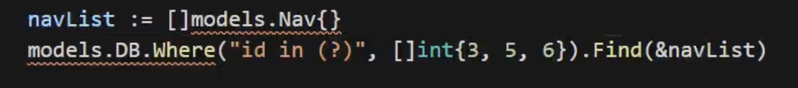
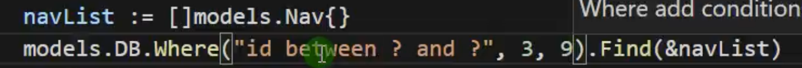

# Gorm
gorm是go的一个orm框架, 简单的说 orm就是通过实例对象的语法, 完成关系型数据库的操作的技术 是 对象 - 关系映射 的缩写

使用orm框架可以让我们更方便的操作数据库, 它支持的官方的数据库类型有
- mysql
- postgreSql
- sqlite
- sqlServer

<br>

### 官网文档:
```s
https://gorm.io/zh_CN/docs/index.html
```

<br>

### 1. 下载
根目录下在 gorm 和 mysql 的驱动
```go
go get -u gorm.io/gorm
go get -u gorm.io/driver/mysql
```

<br>

### 2. 引入到项目
为了让各个Controller中都可以使用DB对象, 所以我们将初始化数据库的操作放在了 utils包下
```s
| - GOPRO
  | - utils
    - dbUtil.go
```

并在 dbUtil.go 的init方法中, 初始化数据库, 这样当我们引入utils包的时候 会自动初始化数据库 获取到DB对象
```s
# 参考
https://github.com/go-sql-driver/mysql#dsn-data-source-name 获取详情
```

```go
package utils

// 1. 引入所需要的包
import (
	"gorm.io/driver/mysql"
	"gorm.io/gorm"
)

// 2. 全局声明 DB 对象
var DB *gorm.DB
var err error

// 3. 和数据库建立连接
func init() {

  // 修改 用户名 密码 端口 数据库名
	dsn := "root:admin666@tcp(127.0.0.1:3306)/demo?charset=utf8mb4&parseTime=True&loc=Local"

	// 获取db 数据库对象
	DB, err = gorm.Open(mysql.Open(dsn), &gorm.Config{
    // 可选:
    QueryFields: true, // 打印sql
  })
}
```

<br>

### 3. 创建数据表对应的 bean
```s
| - GOPRO
  | - bean
    - user.go
```
```go
package bean

import "time"

// 结构体名声明为 User 单数, 则默认操作的是数据库中表名为 users 复数的表
type User struct {
	Id       int  `json:"id"` // 这样就小写了
	Username string
	Age      byte
	Email    string
	// 数据库表中_的字段 - go中修改为驼峰
	AddTime time.Time
}

// 如果需要让该结构体 和 数据库中的表明对应起来的话, 则使用下面的方法
func (User) TableName() string {
	// 让结构体 User <-> gin_users 数据表对应起来
	return "gin_users"
}
```

<br>

**要点1:**  
结构体名声明为 User 单数, 则默认操作的是数据库中表名为 users 复数的表

**默认情况表明是结构体名称的复数形式**, 如果我们的结构体名称定义为User, 则表示这个bean默认操作的是users表

<br>

**要点2:**  
数据库表中``xx_yy``的字段 - go中修改为驼峰``xxYy``

<br>

**要点3:**  
如果需要让该结构体 和 数据库中的表明对应起来的话, 则需要给结构体绑定 ``TableName`` 方法

<br>

**要点4:**  
结构体的名称必须首字母大写, 并和数据表名对应, eg:

- 表名为 user 结构体定义为 User
- 表名为 atricle_cate 结构体名称定义为 AtricleCate

<br>

### controller控制器中操作数据库
首先我们要拿到 utils 模块当中的 DB 对象, 然后通过 DB 对象身上的方法来操作数据库
```go
package client

import (
	"GOPRO/bean"
	"GOPRO/utils"
	"github.com/gin-gonic/gin"
)

type GormController struct {
	BaseController
}

// 查询操作
func (g GormController) GetUserPage(ctx *gin.Context) {

	// 查询 gin_users 表中的数据
	// 1. 实例化 User 对象列表
	userList := []bean.User{}

	// 2. 获取操作数据库的DB对象, 调用它身上的方法 查询数据
	utils.DB.Find(&userList) // 查询所有数据

	templateData := gin.H{
		"title": "Gorm测试页面",
		"data":  userList,
	}

	ctx.HTML(200, "client/gorm.html", templateData)
}

// 添加用户接口
func (g GormController) SaveUser(ctx *gin.Context) {
	user := bean.User{
		Username: "laoye",
		Age:      30,
		Email:    "laoye@gamil.com",
		AddTime:  time.Now(),
	}

	// 新增数据
	utils.DB.Create(&user)
	ctx.String(200, "新增数据成功")
}

// 删除用户接口
func (g GormController) DeleteUser(ctx *gin.Context) {
	id := ctx.Param("id")
	_id, _ := strconv.ParseInt(id, 10, 64)

	// 创建空的user实例
	user := bean.User{}
	utils.DB.Where("id = ?", int(_id)).Delete(&user)
	ctx.String(200, "删除用户成功")
}

// 修改用户接口
func (g GormController) UpdateUser(ctx *gin.Context) {
	id := ctx.Param("id")
	_id, _ := strconv.ParseInt(id, 10, 64)

	// 实例化User用户, 指定ID, 这样下面通过Find查询 查询到的就是指定的User
	user := bean.User{}

	utils.DB.Model(&user).Where("id = ?", int(_id)).Update("username", "测试姓名2")

	ctx.String(200, "修改数据成功")
}

```

<br><br>

# GROM: API

## 删除

### 删除一条数据
### **<font color='#C2185B'>DB.Delete(&user)</font>**
这个user中要包含id

```go
func (g GormController) DeleteUser(ctx *gin.Context) {
	id := ctx.Param("id")
	_id, _ := strconv.ParseInt(id, 10, 64)

	// 根据指定id创建user
	user := bean.User{
		Id: int(_id),
	}
  // 传入有id的user对象, 进行删除
	utils.DB.Delete(&user)
	ctx.String(200, "删除用户成功")
}
```

<br>

### 根据条件删除数据
```go
func (g GormController) DeleteUser(ctx *gin.Context) {
	id := ctx.Param("id")
	_id, _ := strconv.ParseInt(id, 10, 64)

	// 创建空的user实例
	user := bean.User{}
	utils.DB.Where("id = ?", int(_id)).Delete(&user)
	ctx.String(200, "删除用户成功")
}
```

<br><br>

## 修改

### 修改 方式1: Save方法 修改所有字段
### **<font color='#C2185B'>DB.Save(&bean)</font>**
save方法是一个组合函数。 
- 如果保存值不包含主键，它将执行 Create
- 否则它将执行 Update (**修改所有字段**)

也就是说有id才是修改

```go
func (g GormController) UpdateUser(ctx *gin.Context) {
	id := ctx.Param("id")
	_id, _ := strconv.ParseInt(id, 10, 64)

  // 获取 id 对应的 User
	// 实例化User用户, 指定ID, 这样下面通过Find查询 查询到的就是指定的User
	user := bean.User{
		Id: int(_id),
	}
	utils.DB.Find(&user)

	// 修改数据:
	user.Age = 55
	user.Username = "测试姓名1"

	// 调用Save方法保存user实例中的所有数据
	utils.DB.Save(&user)

	ctx.String(200, "修改数据成功")
}
```

<br>

### 修改 方式2: 修改指定的字段
推荐方式1, 先查询再修改
```go
func (g GormController) UpdateUser(ctx *gin.Context) {
	id := ctx.Param("id")
	_id, _ := strconv.ParseInt(id, 10, 64)

	// 实例化User用户
	user := bean.User{}

	utils.DB.Model(&user).Where("id = ?", int(_id)).Update("username", "测试姓名2")

	ctx.String(200, "修改数据成功")
}


// 更新多个字段的示例
// 根据 `struct` 更新属性，只会更新非零值的字段
db.Model(&user).Updates(User{Name: "hello", Age: 18, Active: false})
// UPDATE users SET name='hello', age=18, updated_at = '2013-11-17 21:34:10' WHERE id = 111;
```

<br>

## 添加
### 添加一条记录
### **<font color='#C2185B'>DB.Create(&bean)</font>**
```go
user := User{Name: "Jinzhu", Age: 18, Birthday: time.Now()}

result := db.Create(&user) // 通过数据的指针来创建

user.ID             // 返回插入数据的主键
result.Error        // 返回 error
result.RowsAffected // 返回插入记录的条数
```
<br>

### 添加多条记录
```go
users := []*User{
  User{Name: "Jinzhu", Age: 18, Birthday: time.Now()},
  User{Name: "Jackson", Age: 19, Birthday: time.Now()},
}

result := db.Create(users) // 传递切片以插入多行数据

result.Error        // 返回 error
result.RowsAffected // 返回插入记录的条数
```

<br><br>

## 查询
在使用这些方法时，建议检查result.Error来确定查询是否成功。例如：
```go
if result.Error != nil {
    if errors.Is(result.Error, gorm.ErrRecordNotFound) {
        // 处理未找到记录的情况
    } else {
        // 处理其他错误
    }
}

```

<br>

### 查询第一条数据
### **<font color='#C2185B'>DB.First(&bean)</font>**
将查询出来的数据放入到 &bean 中

用于查询单条数据。它将查询结果映射到单个对象中。默认情况下，First会按主键顺序获取第一条记录。如果你只需要获取一条特定记录，使用First是合适的。
```go
// 获取第一条记录（主键升序）
db.First(&user)
// SELECT * FROM users ORDER BY id LIMIT 1;

var user User
result := db.Where("name = ?", "John").First(&user)
```

<br>

### 查询一条数据
### **<font color='#C2185B'>DB.Take(&bean)</font>**
```go
// 获取一条记录，没有指定排序字段
db.Take(&user)
// SELECT * FROM users LIMIT 1;
```

<br>

### 查询最后一条数据
### **<font color='#C2185B'>DB.Last(&bean)</font>**
```go
// 获取最后一条记录（主键降序）
db.Last(&user)
// SELECT * FROM users ORDER BY id DESC LIMIT 1;
```

<br>

### 根据主键检索
```go
db.First(&user, 10)
// SELECT * FROM users WHERE id = 10;
```

<br>

### 检索全部对象
### **<font color='#C2185B'>DB.Find(&bean)</font>**
```go
result := db.Find(&users)
// SELECT * FROM users;
```

用于查询多条数据。它将查询结果映射到一个切片中。

<br>

当您使用Find方法并传入一个结构体指针时，GORM通常会将查询结果映射到这个结构体中。

虽然Find主要用于检索多条记录（并期望传入的是切片的指针），但如果查询条件导致数据库只返回一条记录，GORM也能成功地将这条记录映射到您提供的单个结构体实例中。

<br>

### 条件查询
### **<font color='#C2185B'>DB.Where("name = ?", "jinzhu").First(&user)</font>**
```go
// Get first matched record
db.Where("name = ?", "jinzhu").First(&user)
// SELECT * FROM users WHERE name = 'jinzhu' ORDER BY id LIMIT 1;

// Get all matched records
db.Where("name <> ?", "jinzhu").Find(&users)
// SELECT * FROM users WHERE name <> 'jinzhu';

// IN
db.Where("name IN ?", []string{"jinzhu", "jinzhu 2"}).Find(&users)
// SELECT * FROM users WHERE name IN ('jinzhu','jinzhu 2');

// LIKE
db.Where("name LIKE ?", "%jin%").Find(&users)
// SELECT * FROM users WHERE name LIKE '%jin%';

// AND
db.Where("name = ? AND age >= ?", "jinzhu", "22").Find(&users)
// SELECT * FROM users WHERE name = 'jinzhu' AND age >= 22;

// Time
db.Where("updated_at > ?", lastWeek).Find(&users)
// SELECT * FROM users WHERE updated_at > '2000-01-01 00:00:00';

// BETWEEN
db.Where("created_at BETWEEN ? AND ?", lastWeek, today).Find(&users)
// SELECT * FROM users WHERE created_at BETWEEN '2000-01-01 00:00:00' AND '2000-01-08 00:00:00';
```

<br>

### 示例:
**1. id大于3的数据**  


<br>

**2. id>3andid<9的数据**    


<br>

**3. 使用in查询id在356中的数据**   


<br>

**4. 使用like查询标题里面包含会的内容**  


<br>

**5. 查询id在3和0之间的数据使用betweenand**  


<br>

**6. 查询id=3或者=2的数据**  


<br>

**7. 查询id=3或者=2的数据**  


<br>

**8. 使用select指定返回的字段**  
使用该方式的时候 比如我们查询了 name age 两个字段, 那么我们不能用原有的User结构体, 而是需要重新定义一个只包含 name 和 age 两个字段的结构体


上面的NavJson结构体就是只包含 id 和 title 两个字段的**临时结构体** 用于接收查询结果

当然如果除了name和age两个字段外, 结构体的其它字段是零值也没有关系的话, 我们也可以传入原有的结构体  

<br>

**9. order排序limitoffset**   


<br>

**10. 分页**  


<br>

**11. count统计数量**  


<br>

**12. 使用原生sql删除user表中的一条数据**   


<br>

**13. 使用原生sql修改user表中的一条数据**   


<br>

**14. 使用原生sql查询user表中的所有数据**   


<br>

**15. 统计user表的数量, 返回唯一值**   


<br><br>

# 关联查询
```s
https://www.bilibili.com/video/BV1XY4y1t76G/?p=72&spm_id_from=pageDriver&vd_source=66d9d28ceb1490c7b37726323336322b
```

<br><br>

## 一对一 和 一对多
文章表 和 分类表

这两张表之间的关系:
- 从文章表角度讲: 一篇文章对应一个分类 文章表 和 分类表 属于 一对一的关系

- 从分类表角度来讲: 一个分类下有多篇文章, 分类表 和 文章表 属于 一对多的关系

<br>

### 文章结构体 和 分类表结构体


<br>

### 体现一对一的方式
查询文章的时候 获取该文章对应的分类信息

所以我们在文章表中声明一个分类表的结构体类型


这样我们的文章和分类就建立了关联关系

<br>

**重写外键:**  


<br>

### 根据文章和它对应的分类信息


<br>

### 体现一对多的方式
分类表 和 文章表就是一对多的关系

我们查询分类的时候 获取该分类下面的文章 我们怎么配置?

我们在 分类表对应的结构体中声明文章表的字段(列表)


<br>

### 获取分类时拿到该分类下面的文章


<br>

### 补充:


<br><br>

## 多对多


学生表 和 选课表 之间就是多对多的关系, 为了体现多对多的关系我们还需要一张 学生选课表(中间表)

<br>

### 学生表


<br>

### 选课表


<br>

### 学生选课表


<br>

### 多对多查询: 查询学生信息的时候展示学生选课的信息
查询学生的时候, 那么我们就在学生表里面进行配置

**配置关联:**


<br>

**查询学生信息的时候展示学生选课的信息:**  


<br>

### 多对多查询: 查询课程被哪些学生选修了
查询课程的时候, 获取选修学生的信息

我们需要在课程结构体中配置关联


<br>

**查询课程被哪些学生选修了:**  


<br>

### 过滤关联表中的数据
```go
models.DB.Preload("Student").Find(&lessonList)
```

上面使用``Preload("Student")``加载学生信息的时候, 加载的是全部的学生信息, 比如张三被开除了, 我们在查询课程被哪些学生选修的时候 去掉张三 怎么做?

我们可以在 ``Preload("Student", "过程条件")``


<br>

### Preload的自定义
上面我们使用 Preload 来加载学生表中的数据, 加载数据时是正序还是倒序 我们也可以进行指定

比如 查看课程被哪些学生选修, 要求学生id倒序输出

<br>

我们在调用``Preload("Student", 传入回调)``

<br>

**查询:**  


<br><br>

# gorm: 事务
事务处理可以用来维护数据库的完整性, **保证批量的sql语句要么全执行, 要么全部执行**

<br>

### 禁用默认事务
gorm中默认是开启事务的

为了确保平数据的一致性, gorm会在事务里面执行写入操作(创建, 更新, 删除), 如果项目中不需要使用事务, **我们可以在初始化的时候禁用它, 这将获得大约30%的性能提升**

我们在连接数据库的时候就可以配置禁用事务

```go
package utils

// 参考 https://github.com/go-sql-driver/mysql#dsn-data-source-name 获取详情
import (
	"gorm.io/driver/mysql"
	"gorm.io/gorm"
)

// 全局声明 DB 对象
var DB *gorm.DB
var err error

func init() {

	dsn := "root:admin666@tcp(127.0.0.1:3306)/demo?charset=utf8mb4&parseTime=True&loc=Local"

	// 获取db 数据库对象
	DB, err = gorm.Open(mysql.Open(dsn), &gorm.Config{
    // 禁用事务
    SkipDefaultTransaction: true,
  })
}

```

<br>

### 手动事务示例:
```go
// 开始事务
tx := db.Begin()

// 在事务中执行一些 db 操作（从这里开始，您应该使用 'tx' 而不是 'db'）
tx.Create(...)

// ...

// 遇到错误时回滚事务
tx.Rollback()

// 否则，提交事务
tx.Commit()
```

<br>

### 示例:
下面的代码要是使用的话 需要修改
```go
func (g GormController) UpdateUser(ctx *gin.Context) {
  // 再唠叨一下，事务一旦开始，你就应该使用 tx 处理数据
  tx := db.Begin()
  defer func() {
    if r := recover(); r != nil {
      tx.Rollback()
    }
  }()

  if err := tx.Error; err != nil {
    return err
  }

  // 张三给李四转账
  u1 := models.Bank{Id: 1}
  tx.Find(&u1)
  u1.Balance = u1.Balance - 100
  if err := tx.Save(&u1).Error; err != nil {
    tx.Rollback()
  }

  // 李四的账户中增加100
  u2 := models.Bank{Id: 2}
  tx.Find(&u2)
  u2.Balance = u2.Balance + 100
  if err := tx.Save(&u2).Error; err != nil {
    tx.Rollback()
  }

  tx.Commit()

  ctx.String(200, "转账成功")
}
```

<br><br>


