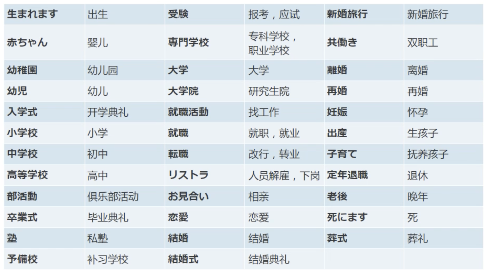

# 惯用短语
### 気に入りました  (いりました)  
喜欢 一般都是使用过去时

気に入りました是感情的表达方式, 喜欢什么 看中什么, **感情所指向的对象**, 跟形容词一样使用 **が**

```s
この赤いカバンが きに入りましたから、これを買います
```

- 好き表达的喜欢是 持续性 长期性 的 (爱好)  
- きに入りました表示的是 第一次见到某物的时候, 喜欢上, 中意的意思

<br>

**注意:**  
用于朋友熟人之间, 面对长辈上级时 不能使用

<br>

### ちょっと見せてください
请让我看下

<br>

### あとで、写真も見てくださいませんか
过会照片也要请您过目

**てくださいませんか:**  
它是 てください 的礼貌用语

它是使用否定疑问句的形式 来委婉的向对方提出某个请求, 翻译: 您能为我做这件事情么?

使用场景就是将 てください 替换成 てくださいませんか

```s
# 能请您使用传真将日程表传给我么?
スケジュール表をファクスで送ってくださいませんか
```

<br>

### お金を下ろします
取钱

下ろします 是卸货, 将什么东西从上面取下来, 也表示把钱从银行中取出来

<br>

### もう
1. 当 もう 后面接的是 过去时态的时候 翻译为 已经
2. 当 もう 后面接的是 将来时态的时候 翻译为 马上, 即将
```s
# 现在就回家么
もう帰りますか？
```

<br>

### 睡眠をとります
获取足够的睡眠, 保证睡眠质量

<br>

### 〜を　Aさんに　伝えます
将...转告给谁

<br>

### 会社・学校を 休みます
请假

<br>

### 医者さんに薬を出してもらいたい
想让大夫给我开药

<br>

### お大事に
お大事にしてください 是完整的说法, 该语句只能对生病或受伤的人表示关心的时候使用

对身体健康的人不能使用

<br><br>

### 打电话的方法
```s
1. 自报姓名
もしもし、こちらは森ですが

2. 确认对方的姓名或公司
そちらはおのさんのお宅ですか

3. 说明要找的人
みどりさん　お願いします

4. 之后的谈话
```

<br><br>

# 特殊动词
动词因活用的不同分为3类

**1. 动1 或 五段动词:**  
去掉ます后的最后一个假名位于 い 段的动词

<br>

**2. 动2 或 一段动词:**  
去掉ます后的最后一个假名位于 え 段的动词

这部分动词中有一小部分去掉ます后的最后一个假名仍然位于 い 段

<br>

**3. 动3 或 サ变动词:**
- します
- 来ます

<br>

### 长的像动1的动2
- 起きます
- 見ます
- 借ります
- 降ります

<br><br>

# 单词:  
声  こえ  
  声, 声音, 嗓音 (通过声带震动发出的声音)  

音  おと  
  声, 声音 (普通的声音)

空気  くうき  
  空气, 气氛(引申义, 相当于: 雰囲気)  
  - 空気を読む (体会下气氛) 
  - 緊張の空気 (紧张的氛围) 

パイロット  
  飞行员  

タイムサービス  
  限时销售  

新春セール  
  新年甩卖  

お買い得  おかいどく  
  您买得划算  

割引  わりびき  
  打折, 折扣
  - 割る + 引く: 割る是除法, 引く是拽走, 3割引, 相当于我们将整体分成10份, 我们拽走3份, 还剩7份, 所以就是7折 (3割引 = 10 - 3 = 7折 == 30%off)

成る  なる  (自动词, 五段)  
  变成, 成为  

開く  あく  (自动词, 五段)  
  开, 打开 
  - 我们把门打开 (ドアを開ける)
  - 门开着 (ドアが開く)

似合う  にあう  (自, 五段动词)
  合适, 适合  
  - この洋服がAさんに似合います

シンプル　　  
  简单, 朴素  

間も無く  まもなく  
  不久, 不多时, 即将, 后面多接将来时 (多使用在比较正式的场合)  

もうすぐ　　  
  马上, 将要, 快要 (以现在的时间为节点的将来) 

更に  さらに  
  - 更加, 愈发, **更进一步在原有的基础上加深, 补充** (多使用在比较正式的场合, 表现的更加的郑重礼貌, 很正式的说法)  
  - 一点也不 (更に、思い出せない 一点也想不起来)

もっと  
  更加, 更, 在某种程度上可以跟 更に 互换

できるだけ  
  尽量地, 尽可能地  

まとめて  
  汇总, 汇集  

今から  いまから  
  从现在开始  

品物  しなもの  
  商品, 物品, 东西  

初心者・上級者   しょしん・じょうきゅう  
  跟熟练度相关的话, 会使用 初 中 上 来表达
  - 初学者
  - 熟练者  

高級  こうきゅう  
  高, 高级, 上等 (跟 物品 质量相关的话 会使用 高 中 低)  

コース(course)    
  路线, 跑道, 课程  

触る  さわる (自动词, 五段)
  触摸, 接触
  - 物 **に** 触る  

脱ぐ  ぬぐ  
  脱, 摘掉 (脱帽子, 脱鞋, 脱上衣)  

転ぶ  ころぶ (自动词, 五段)  
  跌倒, 滚动  

滑る  すべる (自动词, 五段)  
  滑, 滑到
  - 氷の上を滑る (滑 表示一个移动性的行为, 所以助词使用 を)
  - 口が滑る (说漏了)  

乾く・渇く  かわく (自动词, 五段)  
  渴, 干渴, 渴望　(形容水份的蒸发)
  - 喉が渇きました
  - 着物が乾きました

治る  なおる (自动词, 五段)  
  病医好, 痊愈  

呼ぶ  よぶ (他动词, 五段)  
  喊, 叫, 招呼  
  - 救急車を呼ぶ

返す  かえす (他动词, 五段)  
  归还, 返回
  - 早くお金を返してください  

手伝う  てつだう (他动词, 五段)  
  帮忙, 帮助
  - Aさん　**に** 掃除を手伝う (帮谁, 谁后面使用 に)

運ぶ  はこぶ (他动词, 五段)  
  搬运, 运送
  机を隣の 部屋 **に** 運ぶ　 (搬到哪里, 落脚点 使用 に)

無・失・亡 くす  なくす (他动词, 五段)  
  没 / 失去 / 死亡  
  - 財布を　無くしました (把 钱包 弄丢了 他动词)
  - 人为的变化 無くしました
  - 自然的变化 なくなる

落とす  おとす (他动词, 五段)  
  使...落下, 降低
  - 風呂を落とす (排洗澡水)
  - スピードを落とす
  - 声を落とす

落ちる  おちる (自动词, 一段) 　
  当我们强调结果 或 状态的时候, 我们使用的就是自动词, 掉下来了  

置く  おく (他动词, 五段)  
  放, 搁, 置
  - 本を机の上に置く  

忘れる  わすれる (他动词, 一段)  
  忘记, 忘掉
  - 傘を　電車に　忘れました  

慌てる  あわてる (自动词, 一段)  
  惊慌, 慌张
  - 彼が慌てて 出かけました  (て形用法 伴随状态: 伴随着慌慌张张的状态 出门了)

捨てる  すてる (他动词, 一段)  
  扔掉, 抛弃
  - ゴミを捨てる
  - ゴミを出す (出す是由里向外的给出, 这句强调的是把垃圾拿到外面去) 

払う  はらう (他动词, 五段)  
  付钱  

立つ  たつ (自动词, 五段)  
  站, 站立
  - ここに立つ (人的落脚点 使用助词 に)  

残業する  ざんぎょうする (自动词, サ変)  
  加班  

心配する  しんぱいする (自动词, 一段)  
  担心, 不安  
  - 心配 (名詞・自他・ナ形・サ変)
    - 雨が心配です
    - 〜に心配をかける
    - 心配なこと

本当  ほんとん (名詞・ナ形)  
  真的  

早く  はやく  
  早早地, 快快地  

やっと　　
  好不容易, 终于 (它强调的是我经历了艰苦的奋斗 和 努力, 最终怎么样了)

大分  だいぶ  
  很, 相当地 (它的后面都接变化的表达)
  - 大分　上手に　なった

先に  さきに  
  以往, 以前, **在...前面** 
  - お先に失礼します (在你们之前 我先撤了) 

汉字  假名  
  解释  

汉字  假名  
  解释  

汉字  假名  
  解释  

汉字  假名  
  解释  

汉字  假名  
  解释  

汉字  假名  
  解释  

汉字  假名  
  解释  

汉字  假名  
  解释  

汉字  假名  
  解释  

汉字  假名  
  解释  

汉字  假名  
  解释  

洋服  ようふく  
  西服 (西式服装)  

連絡する  れんらくする  
  联系
  - 〜と　連絡する
  - 〜に　連絡する　　

ほしい  (形1)  
  想要  

立派  りっぱ  (形2)  
  美观, 漂亮, 杰出, 可以形容 人 和 物
  - 彼は　もう　立派な　先生です

お汁粉  おしるこ  
  小吃: 年糕小豆汤  

初詣  はつもうで  
  新年后首次去寺庙参拜的事情  

初夢  はつゆめ  
  一年中的第一场梦, 在日本梦见 富士山 鹰 茄子 会比较好
  - 富士　ー　無事
  - 鷹　ー　高い
  - なす　ー　ことを成す

相手  あいて  
  对方, 对象
  - 話し相手
  - 結婚相手
  - 遊び相手 (玩伴)
  - あいての目をちゃんと　見てくださいね (说话的时候, 好好的看着对方的眼睛)
    

今度  こんど  
  这回; 下次  

横  よこ  
  旁边, 侧面  
  与　となり　都是 旁边的意思, 区别:  
  - となり: 指的是紧挨着的旁边
  - よこ: 只要是横向的旁边都可以使用它

ユニーク  (な形容词)  
  独特的, 唯一的  

派手  はで  (な形容词)  
  华丽的, 耀眼的, 花哨  
  由于日本人比较质谱, 所以这个词带有一些贬义

地味  じみ  (な形容词)  
  朴素, 质朴 (有点过于朴素 甚至有点土)  
  这个词也带有一些贬义, 在日本如果一个女人不讲究自己的外表, 就会被称为 地味女, 土包子

厳重  げんじゅう  
  森严, 严格  

無理  むり  
  勉强, 超过了自己承受的极限  
    高い車を買いましたね、ええ、ちょっと無理をしました

操作  そうさ  
  操作, 操纵  
    機械を操作します

持ちます  もちます  
  有, 拥有, 持有  

知ります  しります  
  认识, 知道, 了解;  
  - **知ります** 该词表示 **获取浅层的信息**, 多用于 认识某个人, 知道某件事情, 获取有关某件事情的信息当我们获得这件事情的信息后就算知道了这件事情, 它所获取或知道的信息只是比较浅层的 仅仅是知道   
  - **わかります** 该词表示 深入理解其内涵并掌握, 它主要表达的是理解的意思, 也就是不仅仅是知道而且掌握了这个信息  
  - **总结** 比如我们对于一个人的认识 可以从 しります 到 わかります 
  ```s
  # 我认识 田中
  私は　田中さんを　知ってます
              ↑

  # 我比谁都了解 田中
  私は　田中さんのことが　誰よりも　わかってます
                   ↑
  ```

長い  ながい・短い　みじかい    
  它们既可以表达长度的长短, 也可以表达时间上的长短  

軽い  かるい  
  轻巧, 轻, 轻松, 轻微  
  它的本意是指重量上的轻, 但它也可以引申出  
    - 气氛很轻松   
    - 人的性格比较轻浮  
    - 程度上的轻微

形  かたち  
  造型, 形状, 形式  

入場料  にゅうじょうりょう  
  门票, 入场费  
  - 收费: ゆうりょう
  - 手续费: 手数料
  - 运费: 送料
  - 使用费: 使用料

間違い  まちがい (名词)   
  错误, 失误, 它是由(間違います)去掉ます后 转而得到的名词
  - 間違いがありますよ (有错误哦)

役人  やくにん  
  政府的工作人员  

喫煙席  きつえんせき  
  允许吸烟的席位 (与之相对的为: 禁煙　きんえん)  

クーラー  
  空调, 冷气  

気  き  
  精神, 意识  
  注意, 小心, 留神: 気をつけます   
  急性子: 気が短い  
  慢性子: 気が長い  

入ります  はいります  
  进入, 加入  
    部屋に入ります 进入房间
    大学に入ります 升入大学

止めます  とめます  
  停, 制止  
    車を止めます  停车

熱  ねつ  
  发烧, 体温, 热度    
  发烧: 熱があります(倾向于表示状态)・熱がでます(倾向于表示变化)

熱い  あつい  
  (触觉上的) 烫, 热  

暖・温かい  あたたかい  
  温かい: 热乎, 温暖   (触觉上的温暖, 心灵上的温暖)  
  暖かい: 天气温暖 

打ち合わせ  うちあわせ  
  事先商量, 碰头, 商洽  

申します  もうします  
  是, 说, 讲, 告诉 (自谦语)  

伝えます  つたえます  
  说, 传达, 转告  
    あとで、その件を　課長に　伝えます  

記事　きじ  
  报道

角　かど  
  拐角 (街的拐角 或者 桌子的拐角)

駅前　えきまえ  
  车站前的一带, 并不单纯指站前 车站附近 (车站的正前方: 駅の前)

通ります　とおります  (他动词)
  一般用于经过某地, 通过, 经过  
    (この電車は渋谷を通りますか) 这辆电车经过涉谷么

渡ります　わたります  (他动词)
  渡过的意思, 一般用于过桥 过马路, 过(桥, 河), 穿过(马路)

すぎます  
  一般用于表示经过某地而不做停留, 过
    (電車は東京駅を過ぎました)

出ます　でます  
  一般表示从某个空间的内部往外移动, 离开, 另外有 出去 出来, 出现 出席 的意思

出かけます　でかけます  
  一般用于离开家或离开公司 外出办事 外出, 出门

開けます　あけます  (他动词)
  开, 打开, 开启

閉めます　しめます  (他动词)
  关, 关闭

つけます  (他动词)
  所有的打开电器 给电器接通电源, 都可以用它, 开(灯)

消します　けします  (他动词)  
  关(灯), 关电器, 消除, 去除

見せます　みせます  (他动词)  
  给 ~ 看, 出示  
    (地図をおのさんに見せます) 把 ~ 给谁看

降ります　おります  (他动词)  
  下车 下山

居酒屋　いざかや  
  酒馆

どのぐらい・どれぐらい  
  多久, 多少钱  
    いえから　会社まで　どのぐらい　かかりますか　　　
      電車で１時間ぐらい　かかります　　
    修理はどのぐらい　かかりますか
      ２万円かかります

切ります　きります  
  剪, 切, 割  
    かみを切ります

遊びます　あそびます　(自动词)  
  玩, 玩耍
    (公園で　子供と遊びます)
    (ゲームを遊びます　x)　因为它是自动词

昼　ひる  
  白天, 中午

ガレージ　　
  车库, 汽车房  

引き出す  
  拉出来

葉書　はがき  
  明信片

えはがき  
  美术明信片 (带图案的明信片)  
    (友達に葉書を出しました)

降ります　ふります  (自动词)
  只能用于自然现象, 表示 下雨 下雪 降雨 降雪

だいすき (2类形容词)
  非常喜欢 

季節　きせつ　シーズン (season)  
  季节  

また  
  又, 再

きに入りました  (いりました)  
  喜欢

迷います  
  本意为迷路, 还可以 引申为 犹豫, 难以决定  
    ホテルで迷いました

あし(脚, 足)  
  汉字写作 脚 的时候, 表示 腿  leg   
  汉字写作 足 的时候, 表示 脚  foot

旅館　りょかん  
  传统的榻榻米酒店

ホテル  
  有床的西式酒店

下手　へた  
  不高明, **水平**低, 水平的问题

苦手　にがて   
  不善于 不擅长  
  在日语中我们表达不喜欢什么的时候, 一般不会直接说 きらい, 而是会用 **にがて** 它在日常生活中表达不太喜欢的意思  
    我不太喜欢吃鱼 (私は魚が苦手です、李さんが苦手です)

ちょうど  
  正好, ちょうどいいです

**紅葉　もみじ(音读)  こうよう(训读)**  
  红叶, もみじ专指枫叶, こうよう指变红的叶子 (广义上黄色 褐色的叶子也叫こうよう)  
  こうようします 树叶变红  

通り　とおり  
  大街 (通ります 去掉ます得来), 指的是公共汽车经过的道路, 大街  

通ります とおります  
  通过, 经过  

街　まち  
  城市, 街道

浴衣　ゆかた  
  浴衣(出浴后贴身穿的), 夏季和服, 跟和服的区别为ゆかた里面没有衬衣

お湯　おゆ  
  只要是热的水 都可以用来表示

しおからい　塩辛い  しょっぱい (常用于口语对话中)  
  咸

広い　ひろい (面积上的)  
  广阔, 宽敞

狭い　せまい (面积上的)  
  狭窄

大きい (尺寸上的)    
  大

小さい (尺寸上的)    
  小

洋食　ようしょく  
  外国菜, 法国菜, 意大利菜 等

和食　わしょく  
  日本菜 寿司 生鱼片 等

わかりました  
  知道了 表示已经理解了对方说的信息   
  好的 表示承诺, 接下对方交代的任务

の件  
  有关 ... 的事

届きます とどきます  (自动词1)  
  送达, 送到, 寄到
    メールが届きました (刚刚收到一条短信)
    ファクスが届きました (传真发到了目的地)
```s
届きます: 站在两个视角 它所表达的含义也是不同的

1. 发送者视角:
  通常表示"送达", 即某物被送达到了某个地方
  例如 "ファクスが届きました" 表示 "传真已经发到了目的地"。

2. 接收者视角:
  通常表示"收到", 即某人接收到了某物, 例如 "メールが届きました" 表示 "收到了一封邮件"。
```

出します  
  寄信, 发出, 送出, 提出 (把什么东西发出去)  
    メールを出します 发邮件  
    申込書を出します 提出提交申请  

貸します　かします  
  借出, 借给 (借出去 借给别人)  
    我借钱给朋友 (私は　友達に　お金を　貸します)  

借ります　かります   
  借, 借进 (借进来 向别人借, 借进来的意思)  
    我向朋友借钱 (私は　友達に　お金を　借ります)  
  租借  
    租房子 (へやを借ります)

習います　ならいます    
  学习, 学习某项技能技艺 强调通过模仿或反复的操练 最后达到熟能生巧 熟练的状态 从而掌握的技能   
    学跳舞: ダンスを　習います  

勉強します　べんきょうします   
  学习, 强调的是学习的过程中 需要付出一定的努力 需要忍耐在学习过程中的痛苦 强调的是整个的忍耐付出的过程, 有点强调过程

お金　おかね   
  这里 お 的用法 不是对钱(お金) 茶(お茶) 粥(お粥)　表示敬意 而是使自己的措辞更加的优美有礼, 这里的 お 叫做美化语

名前　なまえ  
  姓名 (它可以指人的全名, 也可以指除了姓之外的名字部分)

苗字・名字   
  姓氏(不是名字的意思, 指的是姓, EG: 森　健太郎, 苗字指的是 森 的部分) 

したの名前  
  名字的部分 (EG: 森　健太郎, したの名前指的是 健太郎 的部分)    
  在日本人之间的交往的时候 不会直呼 したの名前, 一般都是以 **姓氏 + 桑**

住所　じゅうしょ   
  住址 (不是住所的意思)

送ります　おくります     
  寄   
  发送 (EG: 发送邮件 メールを送ります)

作ります　つくります  
  做 (EG: 交朋友 友達を作ります)

小麦粉　こむぎこ   
  面粉

読みます　よみます  
  关于文字阅读相关的时候 使用

ユニット  
  单元

すみません  
  对不起 抱歉(礼貌性的道歉 比如要撞到, 但没撞到的时候)  
  打扰了, 请问 (开场白)  
  谢谢(麻烦到别人, 别人为我们做了事)  
  不好意思  

ごめんない  
  抱歉 (真的做错了事情)  

日本 にっぽん・にほん  
  日本

こちらこそ  
  表示自己才属于对方所说的那种情况 (我这边才是)  

学科 がっか  
  专业  

知り合い しりあい  
  相识 熟人

生 なま
  实时, 新鲜, 比如 なま放送(直播)  

出迎え でむかえ  
  出去迎接

机　つくえ  
  书桌

テーブル  
  餐桌

鍵　かぎ  
  钥匙, **关键**

どうぞ  
  您请便  
  请收下  
  吃吧

売り場　うりば  
  专柜, 柜台, 出售处

いま　居間   
  客厅 起居室

猫派　ねこは  

犬派　いぬは  

げっすいきん　月水金: 周一三五  

かもくど　火木土: 周二四六

どにち　土日: 周六七

ばん: 晚上 (日落到睡觉前)

よる: 晚上, 夜里, 夜晚 (日落到日出, 整个夜晚, 到深夜是使用よる表示)

夜中 よなか: 半夜

今: (名词)现在 (副词, 当做为副词使用的时候表示)刚刚, 方才; 即将

今を生きる: 活在当下

せんせい: 老师 (带有敬意 一般不用在自己的身上, 如 私は日本語の教師です)

いえ: 家 (特指建筑物)

うち: 家 (特指家庭)

道草: 绕弯

まっすぐ: 直接

手法: 方法  

確立(自动词):  确立 确定  

妥協: 妥协 和解。  

ポーリング: 轮询  

リアルタイム: 实时  

バリデーション: 验证  

肉薄: 逼近 迫近  

読み込ませます: 加载  

キロバイト: kb  

ベーシック: basic 基本的  

復旧：恢复 修复  

アルゴリズム: 算法  

想定: 假设  

引っ張る: 拉取  

ダイアログボックス: 对话框  

クロスドメイン: 跨域  

ひとまず: 姑且 暂且  

ベイグラント: vagrant  

バーチャル: 虚拟 virtual  

リファレンス: reference 参考；依据；参考文献。  

トピック: 话题, 题目, 论题。  

呼び出し: 调用  

留意: 注意  

ツールキット: 工具包  

ケース: 案件  

取得: 获取  

適用する: 应用 适用  

セット： 集合  

オンプレミス: 企业内部  

アクセス ポイント: 接入点  

エンドポイント: 端点  

接続: 链接  

適切: 合适 恰当  

祖先: 父类  そせん  

一意: いちい　唯一  

識別: 识别 しきべつ  

読み取る: 计算机: 识别 正常: 理解 看明白  

応答: 响应  

一致: 一致   

スケーラビリティ: 可扩展性  

あらゆる: 所有的, 一切的。可想象的；可想像的；可能的  

データレイク: 数据池 数据仓库  

復元: 恢复 ふくげん  

アーカイブ: 存档 保存 保存的数据长期不会删除  

エンタープライズアプリケーション: 企业级应用  

ミッションクリティカル: 关键任务  

レイテンシー: 延迟  

セットアップ: setup 组装, 设置  

受け取る: 获取 取得  

見積もる: 估计预计  

スキーマ: 原理图 设计图  

かつ: 且 &&  

か: 或者   

自体: 本身  

実情: 实际情况, 真情, 实情。  

くっつける: 把粘上,把贴上　使靠近,使挨上　拉拢,　撮合,促成  

模様: 样子 情况 外观  

仕組み: 机制 构造 结构  

意図: 故意 企图 打算   

なんらかの方式: 某种方法   

付与: 赋予 赋给  

照合: 对照 对证 对比 核对  

いち早く: 尽快的 快速的

セット: 设置  

追い切れる: 没有追到这里  そこまでソース追いきれませんでした 

サマリ表示: 概括图  

<br><br>

# 1 - 10 的数字
1. 一种是依据汉字发音的数法
```s
いち　に　さん　し　ご　...
```

2. 日本独特的数法
```s
ひ　ふ　み　よ　いつ　む　なな　や　ここ　とお

ひとつ
ふたつ
みっつ
よっつ
いつつ
むっつ
ななつ
やっつ
ここのつ
とお
```

<br><br>

# 月份读法
- 4月: し  
- 7月: しち  
- 9月: く  

<br><br>

# 日期读法
- 1: ついたち
- 2: ふつか
- 3: みっか
- 4: よっか
- 5: いつか
- 6: むいか
- 7: なのか
- 8: ようか
- 9: ここのか
- 10: とうか
- 14: じゅうよっか
- 20: はつか
- 24: にじゅうよっか

<br><br>

# 小时 读法
- 4: よじ

<br><br>

# 分钟 读法
- 1: いっぷん
- 3: さんぷん
- 4: よんぷん
- 6: ろっぷん
- 8: はっぷん
- 10: じゅっぷん

<br><br>

# 量词

### 人 (にん・じん・ひと)
人

```s
ひとり
ふたり
さんにん
```

<br>

### 台 (だい)　　
**机械 或 车辆, 电器**, 车, 机动车, 电脑, 电视机, 电冰箱 等

<br>

### 枚 (まい)
**薄平物品**, 纸, 盘子, 邮票, 衬衫等

<br>

### 着 (ちゃく)
**整套的衣服**, 或者 比较厚的衣服

<br>

### 冊 (さつ)
书, 笔记本

<br>

### 歳 (さつ)
年龄

<br>

### 歳・才 (さつ)
年龄

<br>

### 回 (かい)
次数

<br>

### 個 (こ)
- **立体的物品**: 鸡蛋, 饭团子, 水果, 球等  
- **空容器或器皿**: 箱子, 盒子, 空罐儿, 玻璃杯等  
- **概念性的和抽象的事物**: 密码等

```s
いっこ
にこ
さんこ
よんこ
ごこ
ろっこ
ななこ
はっこ
きゅうこ
じゅっこ
```

<br>

### 本 (ほん)
**细长物品**: 筷子, 瓶, 铅笔, 伞, 香蕉, 黄瓜等

```s
いっぽん
にほん
さんぼん
よんほん
ごほん
ろっぽん
ななほん
はっぽん
きゅうほん
じゅっぽん

なんぼん
```

<br>

### 杯 (はい)
**容器内的饮料**: 茶, 咖啡, 啤酒等

```s
いっぱい
にはい
さんばい
よんはい
ごはい
ろっぱい
ななはい
はっぱい
きゅうはい
じゅっぱい

なんばい
```

<br>

### 匹 (ひき)
**小动物**: 猫, 狗, 昆虫, 鱼等

<br>

### 頭 (とう)
**大动物**: 牛, 马, 象等

<br>

### 羽 (わ)
**兔子**, 鸟

<br>

### 番 (ばん)
顺序

<br>
  
### 足 (そく)
**成对物品**: 鞋, 袜子 等

<br>

### つ
- 可以用来属 1 ~ 9岁的年龄
- 立体的物品: 橘子, 帽子等
- 抽象的事物: 谜, 选项等

**つ 不用于10以上的数字**

<br>

### 跟费用相关的词
没有太多的区别 我们使用一个记一个吧

- 費: 为了某个特点的目的 必须支付的金钱, 需要提前预备的金钱 使用它
  - 会費
  - 生活費
  - 交通費
  - 光熱費

- 料: 当我们有偿的使用什么东西, 或者参加某个活动需要支付的费用
  - 入場料
  - 使用料

- 代: 购买某个商品 用金钱去交换某样东西 用金钱交换有偿服务的时候 使用它
  - 電気代
  - 水道代
  - タクシー代

<br>

### 普通人的各个阶段


<br>