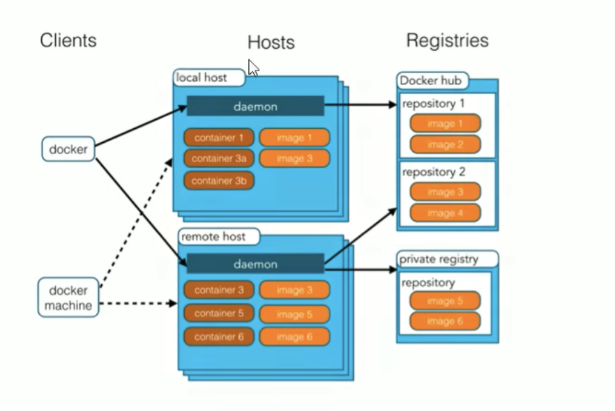
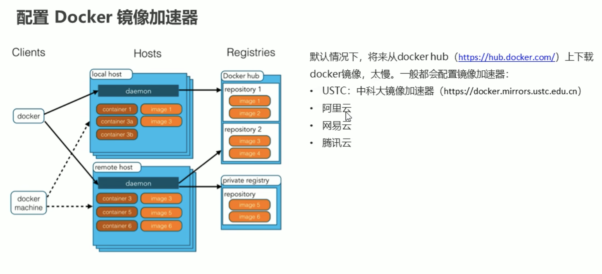
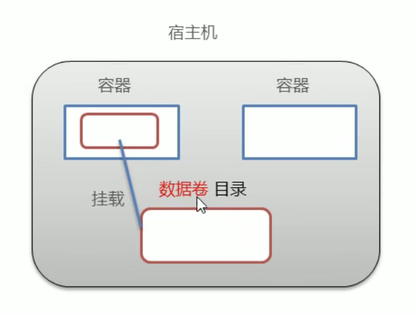
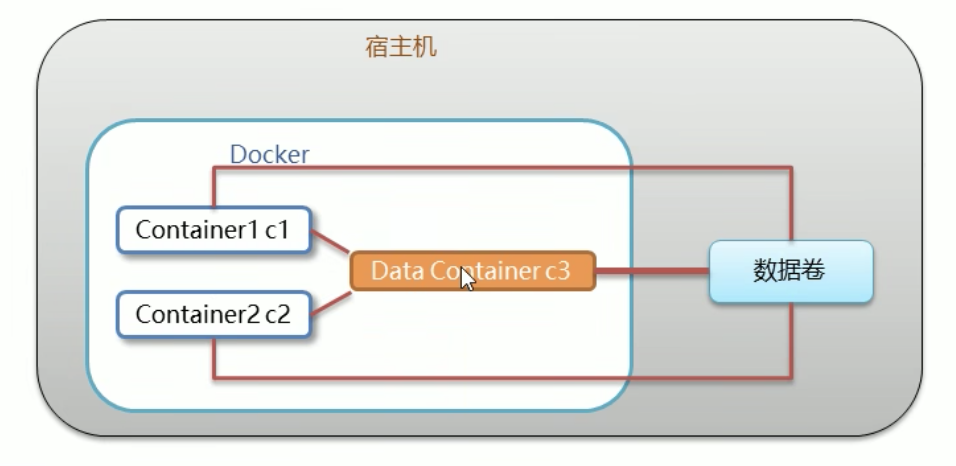
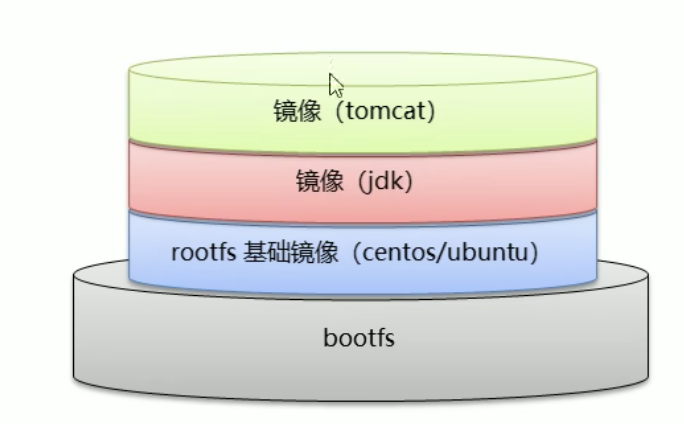
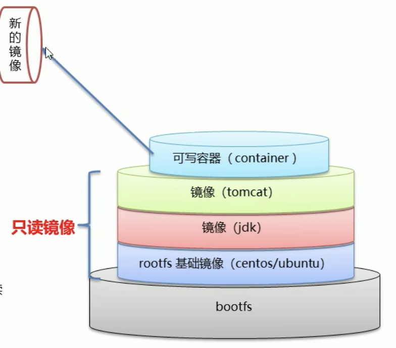
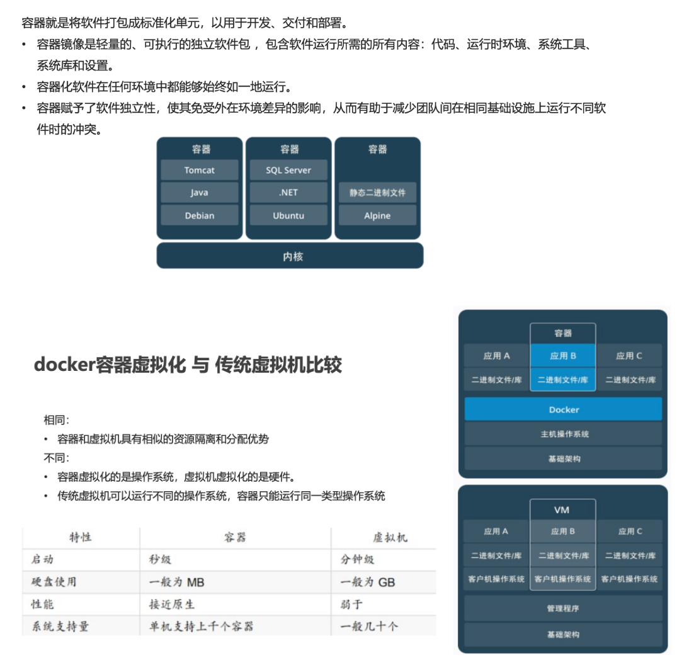

# Docker

## 概念
Docker是一个开源的应用容器引擎, 基于Go语言实现, 它可以让开发者打包他们的应用以及依赖包到一个轻量级可移植的容器中 然后发布到任何流行的Linux机器上

**规避环境不同所带来的问题**

<br><br>

## 安装 Docker
```s
https://www.docker.com/
```

<br>

我安装的是桌面版, 安装并启动后就可以通过终端来输入docker的命令

<br>

### 查看Docker版本
```s
# 只展示docker版本
docker -v

# 展示详情
docker version
```

<br>

### 测试 拉取镜像 运行容器 动作
测试拉取镜像, 运行容器是否存在问题
```s
docker run hello-world
```

<br><br>

## Docker架构



<br>

### Dock一共分为3个部分
1. 客户端: Clients

2. Docker核心: Hosts
  - localhost
  - remotehost

3. 仓库: Registries

<br>

**Localhost本机:**  
当我们在电脑中安装Docker后, Docker会以Daemon(守护进程: 后台运行的进程)的形式存在

守护进程有了之后就相当于Docker安装成功了, **在守护进程中包含了两部分内容**

<br>

- image: 镜像  
Docker镜像, 就相当于一个root文件系统, 比如官方镜像Ubuntu就包含了一套Ubuntu最小系统的root文件系统

- container: 容器  
镜像是静态定义 容器是镜像运行时的实体, 容器可以被创建 启动 停止 删除 暂停等

<br>

### 镜像 和 容器 之间的关系
相当于Java中 类 和 对象 的关系, 面相对象中我们
- 通过类可以创建对象
- 一个类可以创建很多对象

<br>

同样, 容器(对象)就是根据镜像文件(类)创建出来的动态实例

<br>

### 仓库
仓库分为两种, 用来保存镜像文件

- **Docker官方提供的仓库**  
仓库中有很多的镜像文件, 我们以后就是拉取镜像文件使用

- **私有仓库**  
搭建自己的私服

<br>

### Docker客户端
通过客户端我们操作Docker的命令, 客户端会发送命令给守护进程, **Docker一启动守护进程就启动起来了**

<br><br>

## 配置Docker镜像加速器
```s
https://www.bilibili.com/video/BV1CJ411T7BK/?p=5&spm_id_from=pageDriver&vd_source=66d9d28ceb1490c7b37726323336322b
```

<br>



<br><br>

# Docker命令
我们这个部分会将3部分的命令
1. 操作 Docker服务(守护进程)的命令 (开启 关闭等)
2. 操作 image 命令
3. 操作 container 命令

<br><br>

## Docker服务相关命令
下面讲解的命令是基于CentOS7的命令

电脑上的Mac是基于Desktop Docker来管理的, 所以相关的启动 停止等服务可以通过客户端来完成, 如果通过命令行来完成可能会造成客户端不能正常的工作

<br>

### 启动 Docker 服务
```s
systemctl start docker
```

<br>

### 停止 Docker 服务
```s
systemctl stop docker
```

<br>

### 重启 Docker 服务
```s
systemctl restart docker
```

<br>

### 查看 Docker 服务状态
```s
systemctl status docker

sudo launchctl list | grep docker
```

<br>

### 开机启动 Docker 服务
```s
systemctl enable docker
```

<br><br>

## Docker镜像相关命令
镜像指的就是 image 文件, 我们会对镜像做添加 删除 下载等

<br>

镜像其实就是我们常见的软件, 镜像就是把软件和软件所需要的运行环境打包到一个镜像文件中

将来通过镜像文件 创建出来对应的容器 容器一旦有了之后 这些软件就自动的有了

<br>

### 查看本地有哪些镜像文件
```s
# 查看所有镜像列表
docker images

# 查看所有镜像id
docker images -q
```

<br>

### 搜索镜像
```s
docker search <image>

# 搜索redis, 其中我们可以通过 [OFFICIAL] 列来查看是否是官方维护的镜像, 标识为 [OK] 就是 官方维护的镜像
docker search redis
```

<br>

### 拉取镜像
在拉取镜像的时候 我们可能需要指定版本, 但是具体有没有该版本我们都要去 ``hub.docker.com`` 网站, 去搜索查看

搜索到的镜像后面有 [OFFICIAL IMAGE] 就是官方维护的, 点击该镜像后 我们可以查看 [DESCRIPTION] 的位置 里面会列出指定镜像的版本

```s
docker pull <image>

# 指定镜像的版本 
docker pull <image>:3.2

docker pull redis:3.2
```

<br>

### 删除本地镜像文件
```s
docker rmi <image>

# 通过版本删除镜像
docker rmi redis:5.0

# 通过ID删除镜像 docker images 来查看
docker rmi <IMAGE_ID>


# 删除所有镜像, 将docker images -q命令执行的结果当做参数给docker rmi
docker rmi `docker images -q`
```

<br>

### 将容器保存为新的镜像
```s
docker commit <container> <image>
```

<br>

### 将本地镜像推送到Docker Hub上
```s
docker push <image>
```

<br>

### 为指定的镜像打标签
```s
docker tag <source_image> <target_image>
```

<br>

### 在指定的目录下构建镜像
```s
docker build <directory>
```

<br><br>

## Docker容器相关命令
容器是由镜像文件运行出来的实例

我们下面看下如何通过镜像创建出容器, 并且操作容器

<br>

### 查看 正在运行 的容器
```s
docker ps

# 查看 所有的容器
docker ps -a

# 查看 所有容器id
docker ps -aq
```

<br>

### 创建 并 启动 指定镜像的容器
根据指定的镜像 创建并启动一个容器

<br>

**参数:**  
- -i: 保持容器一直运行  
容器没有客户端连接容器就会自动关闭 加了-i该容器就会一直运行

- t: 创建交互式容器, 给容器分配一个伪终端  
创建容器后会马上进入容器, 并且通过exit退出容器后 容器会马上关闭

- d: 创建守护式容器, 后台运行创建容器  
创建容器后不会马上进入容器, 我们需要通过命令才能进入容器, 并且通过exit退出容器后 容器不会自动关闭

- --name=名字: 给容器起一个名字
  - name参数有两个-
  - name参数后面可以跟= 或者跟空格 都可以

- --rm: 在容器停止运行后自动删除容器

- --restart=always: 
```
--restart=always 是在使用 docker run 命令创建容器时指定的一个参数，它的作用是在容器退出时自动重启容器。

具体来说，当 Docker 容器异常退出或停止时，Docker 引擎会自动重新启动该容器。

该参数适用于需要在宿主机重启后自动启动的服务或应用程序。
例如，如果你在 Docker 容器中运行了一个 Web 服务器或数据库服务，那么你希望它们在宿主机重启后能够自动重启以保证服务的持续可用性。

需要注意的是，使用 --restart=always 参数启动的容器将无法使用 docker stop 命令停止，因为该命令会立即将容器停止并退出。

要停止使用该参数启动的容器，需要使用 docker rm -f 命令强制删除容器。

因此，在使用该参数时需要小心，确保在停止容器前进行必要的备份和数据存储。
```

- image: 指定一个镜像名称 根据该镜像创建容器
- /bin/bash: 进入容器后初始化指令 [可选, 不写也行] 
相当于我们打开一个shell窗口

```s
docker run <image>

# 创建容器 并马上进入容器
docker run -it --name=c1 centos:7 /bin/bash

# 创建容器 不进入容器 (所以不用指定 /bin/bash)
docker run -id --name=c2 centos:7


# --rm 容器停止后自动删除容器
docker run -it --rm --name rabbitmq -p 5672:5672 -p 15672:15672 rabbitmq:3.11-management
```

<br>

当我们执行完上述的命令后 我们会发现终端已经进入到容器里的
```s
[root@localhost ~]
↓
[root@e59d888da /]
```

进入到容器后 我们能发现 容器内就是一个Linux系统, **所以说容器就是 软件的环境 和 软件本身**

<br>

**通过 -it 创建容器的特点:**  
1. 创建容器后 马上进入容器
2. exit退出容器后 马上关闭容器

<br>

**通过 -id 创建容器的特点:**  
1. 创建容器后 不会进入容器
2. exit退出容器后 不会关闭容器, 我们需要执行 ``docker stop <container>``

<br>

### 退出容器
```s
exit
```

<br>

### 进入容器

**参数**  
- container: 指定进入哪个容器

```s
docker exec <container> <command>

# 加上 -it 表示一直运行且分配一个终端
docker exec -it c2 /bin/bash
```

<br>

**总结:**  
使用 ``-it`` 参数进入的容器 退出容器后 容器不会关闭

<br>

### 启动容器
我们通过 ``docker ps -a`` 可以查看所有的容器, 我们观察status列 可以看到容器的 up 和 exited 状态
- up: 启动状态
- exited: 停止状态
```s
docker start <container>

docker start c2
```

<br>

### 停止容器
```s
docker stop <container>

docker stop c2
```

<br>

### 重启指定的容器
```s
docker restart <container>
```

<br>

### 删除指定的容器
注意: 开启的容器是不能删除的

```s
docker rm <容器名称>
docker rm <容器ID>

docker rm c2
docker rm c1 c2 c3


# 删除所有的容器 
docker rm `docker ps -aq`
```

<br>

### 查看指定容器的详细信息
```s
docker inspect <container>

# 下面的配置项中记录着 数据卷的绑定信息
HostConfig: {
  Binds: [
    "/root/data:/root/data_container"
  ]
}
```

<br>

### 查看指定容器的日志
```s
docker logs <container>
```

<br><br>

# Docker容器的数据卷

### 思考1:
Docker容器删除后 在容器中产生的数据还在么?

比如我们安装了一个Mysql的容器 我们在里面存储了一些数据, 这时有些情况容器可能意外的挂了, 这种情况下我们只能将容器删掉 再重新的通过mysql镜像创建一个新的容器

这时我们刚才往mysql中添加的数据还在么? 当然不在了! **因为容器对象都删除了**

<br>

**数据卷的解决方案:**  
Docker容器删除后, 容器中对应的目录就不见了, 但是数据卷目录还是存在的

**解决了容器数据的持久化**

<br>

### 思考2:
Docker容器和外部机器可以直接交换文件吗? 不能！  
外部机器是没有办法和容器直接交换文件的 网络不互通

<br>

**数据卷的解决方案:**  
外部机器先将数据传输到数据卷

<br>

### 思考3:
容器之间想要进行数据交互 可以么?

一个宿主机中有好几个容器 容器和容器之间可以加你选哪个数据交换么? 

<br>

**数据卷的解决方案:**  
一个数据卷绑定容器A和容器B中的目录, 间接通过数据卷来进行交互

<br>

## 数据卷概念
数据卷是宿主机中的一个目录 或 文件

我们在宿主机中创建一个目录, 然后我们在容器中也创建一个目录

我们将容器中的目录 和 宿主机中的目录 绑定起来, **这时宿主机的目录 就叫做数据卷**



<br>

### 作用:
在数据卷的目录中做的操作, 容器中绑定的目录也会同时生效

在容器中绑定的目录中做的操作, 宿主机中的数据卷目录也会同时发生变化

<br>

**特点:**
1. **当容器目录和数据卷目录绑定后**, 对方的修改会**立即同步**
2. 一个数据卷可以被多个容器同时挂着(绑定)
3. 一个容器也可以挂着多个数据卷

<br>

**作用:**  
1. 容器数据的持久化
2. 外部机器和容器间的通信
3. 容器之间的数据交换

<br><br>

## 配置数据卷
配置数据卷是比较简单的 只需要在创建启动容器时 使用 ``-v`` 参数 设置数据卷

```s
# 将容器中的目录 和 宿主机中的目录映射起来
docker run ... -v 宿主机目录(文件):容器内目录(文件)
```

<br>

**注意:**  
1. 目录必须是绝对路径, 不能以 ./ 开头
2. 如果目录不存在 会自动创建
3. 可以挂着多个数据卷

<br>

### 绑定数据卷 操作:
```s
# 下载一个centos7镜像
docker pull centos:7


# 查看本地镜像
docker ps -a


# 根据镜像创建并启动容器, 使用-it启动容器后进入容器
# 并绑定数据卷, 本机的/root/data和容器中的/root/data_container绑定
docker -it --name=centos1 -v /root/data:/root/data_container centos:7 /bash/bin
```

<br>

**一个容器挂着多个数据卷 演示:**  
c2容器挂着了两个数据卷

```s
# 输入 \ 可以换行
docker run -it --name=centos2 \
# 容器绑定第一个数据卷目录
-v /root/data2:/root/data2 \
# 容器绑定第二个数据卷目录
-v /root/data3:/root/data3 \
centos:7
```

<br>

**两个容器挂载同一个数据卷, 实现两个容器之间的数据交互:**  
```s
# 启动第一个容器, 并且c1容器挂着了 宿主机中的data数据卷
docker run -it --name=c1 -v /root/data:/root/data centos:7


# 启动第二个容器, 并且c2容器挂着了 宿主机中的data数据卷
docker run -it --name=c2 -v /root/data:/root/data centos:7
```

<br><br>

## 数据卷容器:

### 思考: 多容器进行数据交换
根据上面的知识 我们可以让多容器挂着宿主机中同一个数据卷目录

<br>

**问题:**  
操作有些麻烦, 如果容器多的情况下 我们要每一个容器都要设置一个数据卷目录, 对于数据卷的保存 持久化 恢复都比较麻烦

<br>

**解决方法:**  
我们使用 Docker提供的数据卷容器

<br>

### 图解:


我们的Docker中有两个容器c1 和 c2 它们之间要进行数据的交换

我们再创建一个容器 data container c3

c3和c1 c2本质没有任何的区别都是容器, 只不过c3挂载了数据卷

这时 c1 和 c2 分别挂载到 c3 这个容器上

当我们完成了这个操作后就相当于 c1 c2 也挂载到了数据卷上

因为 c1 c2 c3 都挂载到同一个数据卷上 也就意味着  c1 c2 c3 之间可以进行数据传输通信

即使c3出问题了 c1 c2 仍然可以通过数据卷来进行通信

**这里的c3就是数据卷容器**

<br>

### 配置 数据卷容器
1. 创建启动c3数据卷容器 使用 ``-v /volume`` 参数设置数据卷 (volume部分可以自己定义名字)
```s
# -v /volume 是容器目录, 并没有指定数据卷目录
# 使用 -v /volume 参数后 docker会在宿主机上自动分配一个目录当做数据卷
docker run -it --name=c3 -v /volume centos:7 /bin/bash


# 我们可以通过 docker inspect c3 来查看docker自动为我们分配的数据卷目录在哪
Mounts: [
  {
    # 宿主机中的目录
    Source: "/var/lib/docker/volume/asdfasfd/_data",
    # 容器中的目录
    Destination: "/volume"
  }
]
```

2. 创建启动c1 c2容器, 使用 ``--volumes-from 数据卷容器名`` 参数设置数据卷
```s
# c1 和 c3 相互绑定
docker run -it --name=c1 --volumes-from c3 centos:7 /bin/bash

# c2 和 c3 相互绑定
docker run -it --name=c2 --volumes-from c3 centos:7 /bin/bash
```

通过上面的设置后 c1 c2 c3 就挂载到一个数据卷上面了

<br><br>

# Docker应用部署
应用部署就是在Docker上安装软件, 比如安装Tomcat Mysql Nginx等

之前我们在Linux中安装Mysql Redis等软件的操作是非常的麻烦的

但是我们使用docker后我们的安装会非常的简洁

<br>

## 部署Mysql:
在Docker容器中部署Mysql, 并通过外部的客户端操作Mysql数据库

<br>

### 问题:
我们会使用 navicat 操操作 mysql 但是有一个问题, 就是外部机器和容器之间是不互通的

不互通的话 怎么才能访问mysql服务暴露出来的端口呢?

<br>

### 分析:
宿主机中有一个容器, 容器内的网络服务和外部机器不能直接通信

比如我们在容器中安装了一个mysql, 这个mysql的端口号是3306 我们的外部机器想访问容器中的3306, **直接访问是访问不了的**

但是外部机器可以访问宿主机, 我们的宿主机和容器之间是可以通信的

<br>

**解决方式: 端口映射**  
这时我们可以将容器中mysql 3306端口 和 宿主机的3307端口做映射起来

**映射后我们可以让外部机器访问3307端口**, 就相当于访问到容器内部的3306端口了

<br>

### 步骤:
1. 搜索mysql镜像
2. 拉取mysql镜像
3. 根据镜像启动容器
4. 操作容器中的myql

<br>

### 操作步骤:
**1. 所搜mysql镜像**
```s
docker search mysql
```

<br>

**2. 拉取mysql镜像**
```s
docker pull mysql:5.6
```

<br>

**3. 创建容器 设置端口映射 目录映射**

**参数:**
- -p: **端口映射参数** 3307:3306  
将容器的 3306 端口映射到宿主机的 3307 端口 (**一般宿主机的端口和容器内的端口保持一致**)

- -v $PWD/conf:/etc/mysql/conf.d  
将宿主机当前目录下的 conf/my.cnf 挂载到容器的 /etc/mysql/my.cnf。配置目录

- -v $PWD/logs:/logs  
将宿主机当前目录下的 logs 目录挂载到容器的 /logs。日志目录

- -v $PWD/data:/var/lib/mysql  
将宿主机当前目录下的data目录挂载到容器的 /var/lib/mysql 。数据目录

- -e MYSQL_ROOT_PASSWORD=123456  
初始化 root 用户的密码。

```s
# 在家用户下创建一个mysql目录
mkdir ~/mysql

# 进入到mysql目录中
cd ~/mysql


docker run -id \
-p 3307:3306 \
--name=c_mysql \
# $PWD: 当前的路径 因为我们进入到了mysql目录 $PWD就相当于 /root/mysql
# conf.d: mysql镜像启动后 这个目录会自动存在
-v $PWD/conf:/etc/mysql/conf.d \
-v $PWD/logs:/logs \
# mysql数据文件的目录
-v $PWD/data:/var/lib/mysql \
# -e: env的意思 使用mysql的环境变量设置密码
-e MYSQL_ROOT_PASSWORD=123456 \
# 镜像信息
mysql:5.6 /bin/bash


# 如果启动不了mysql 我们在上面的命令上追加
-- privileged=tre
# privileged=tre 可以使Docker容器拥有主机操作系统的特权级别, 这意味着容器可以执行更多的操作
```

<br>

**进入到mysql容器内, 登录mysql**
```s
# 进入到mysql容器内
docker exec -it c_mysql /bin/bash


# 登录mysql
mysql -uroot -p
```

<br><br>

## 部署Tomcat:

**参数:**  
- -p 8080:8080 将容器的8080端口映射到主机的8080端口
- -v $PWD:/usr/local/tomcat/webapps 将主机中当前目录挂载到容器的webapps

```s
# 搜索
docker search tomcat

# 拉取
docker pull tomcat

# 宿主机上创建目录
# 在/root目录下创建tomcat目录用于存储tomcat数据信息
mkdir ~/tomcat
cd ~/tomcat


# 创建容器
docker run -id --name=c_tomcat \
-p 8080:8080 \
-v $PWD:/usr/local/tomcat/webapps \
tomcat 
```

<br><br>

## 部署Nginx:

**参数:**   
- -p 80:80 将容器的 80端口映射到宿主机的 80 端口。

- -v $PWD/conf/nginx.conf:/etc/nginx/nginx.conf 将主机当前目录下的 /conf/nginx.conf 挂载到容器的 :/etc/nginx/nginx.conf。配置目录

- -v $PWD/logs:/var/log/nginx 将主机当前目录下的 logs 目录挂载到容器的/var/log/nginx。日志目录


```s
# 搜索
docker search nginx

# 拉取
docker pull nginx


# 在/root目录下创建nginx目录用于存储nginx数据信息
mkdir ~/nginx
cd ~/nginx

mkdir conf

cd conf

# 在~/nginx/conf/下创建nginx.conf文件,粘贴下面内容
vim nginx.conf


# 如下的conf文件的配置配置, 该文件要提前准备好
user  nginx;
worker_processes  1;

error_log  /var/log/nginx/error.log warn;
pid        /var/run/nginx.pid;


events {
    worker_connections  1024;
}


http {
    include       /etc/nginx/mime.types;
    default_type  application/octet-stream;

    log_format  main  '$remote_addr - $remote_user [$time_local] "$request" '
                      '$status $body_bytes_sent "$http_referer" '
                      '"$http_user_agent" "$http_x_forwarded_for"';

    access_log  /var/log/nginx/access.log  main;

    sendfile        on;
    #tcp_nopush     on;

    keepalive_timeout  65;

    #gzip  on;

    include /etc/nginx/conf.d/*.conf;
}


# 创建容器
docker run -id --name=c_nginx \
# 端口映射
-p 80:80 \
# nginx.conf 的映射 该文件要提前准备好 
-v $PWD/conf/nginx.conf:/etc/nginx/nginx.conf \
-v $PWD/logs:/var/log/nginx \
-v $PWD/html:/usr/share/nginx/html \
nginx
```

<br><br>

## 部署Redis:

```s
docker search redis

docker pull redis:5.0

docker run -id --name=c_redis -p 6379:6379 redis:5.0

# mac下启动redis客户端的命令不一样哦
./redis-cli.exe -h 192.168.149.135 -p 6379
```

<br><br>

# Dockerfile

## Docker镜像的原理

### 思考

1. Docker镜像本质是什么?  
分层文件系统

2. Docker中一个centos镜像为什么只有200mb, 而一个centos操作系统的iso文件要几个G  
因为复用 它复用了宿主机的rootfs 和 bootfs

3. Docker中一个Tomcat镜像为什么有500MB, 而一个Tomcat安装包只有70MB  
因为Tomcat只是我们用户看到的镜像 其实Tomcat还要依赖于它的下层镜像jdk, 还有基础镜像centos 加在一起就大了

<br>

### 操作系统组成部分
如下的内容 组成 一个操作系统

1. 进程调度 子系统
2. 进程通信 子系统
3. 内存管理 子系统
4. 设备管理 子系统
5. **文件管理 子系统**
6. 网络通信 子系统
7. 作业控制 子系统

<br>

### Linux的 文件管理 系统
Docker是基于Linux学习和安装的, 我们说说Linux的文件管理系统

Linux文件系统分为两个部分组成 (fs: file system)
1. bootfs
2. rootfs

<br>

**bootfs:**  
它包含两个部分 bootloader(引导加载程序) 和 kernel(内核)

<br>

**rootfs:**  
root文件系统 包含的就是典型的Linux系统中的 /dev, /proc, /bin, /etc等标准目录和文件

<br>

不同的Linux发行版 bootfs基本一样, 而rootfs不同, 如ubuntu, centos等

<br>

### Docker镜像
它是由特殊的文件系统叠加而成(如下的两层叠加而成) 解释如下:



<br>

**第一层:**
最底端是bootfs并使用宿主机的bootfs

就是说我们启动一个Linux的操作系统 我们在上面安装了一个docker, Linux系统在启动的时候会将内核加载到内存中

docker镜像也是要启动操作系统的东西 这个时候它也需要加载bootfs也就是需要加载内核, 但是它不用再加载了它会使用宿主机的内核, 所以docker容器启动非常快 (做了复用的操作)

<br>

**第二层:**  
第二层是root文件系统rootfs, 称为base image(基础镜像)

<br>

**第三层以上:**  
再往上可以叠加其他的镜像文件, 比如在基础镜像上再次叠加一个jdk镜像, 再在jdk镜像上叠加tomcat镜像

<br>

比如我们下载Tomcat的时候 首先它会看有没有jdk 没有的话就先下jdk, 而jdk又依赖于基础镜像 所以又会下载基础镜像

如上图中 我们就可以将这个镜像称之为 Tomcat的镜像, 这三部分也称之为只读镜像

<br>

### 蛋糕式的叠加的优势: 复用
叠加的操作叫做统一文件系统, 能够将不同的层整合成一个文件系统 为这些层提供了一个统一的视角

这样就隐藏了很多层的存在 在用户的角度看来 只存在一个文件系统

一个镜像可以放在另一个镜像的上面 位于下面的镜像称之为**父镜像**, 最底部的镜像称为**基础镜像**

<br>

### 什么叫只读镜像?
我们可以看到 tomcat jdk 基础镜像 被标识为只读镜像, 为什么叫只读镜像?

只读镜像不能修改 改了后别人就没有办法复用了 **但是当我就想改Tomcat镜像怎么办?**

<br>

当从一个镜像启动容器时, **Docker会在最顶层加载一个读写文件系统作为容器**

也就是说我们**要修改Tomcat镜像的话** 那就启动容器改吧, docker会根据tomcat镜像搞一个Tomcat容器, 我们可以**在Tomcat容器做修改**

修改完后我们将这个 Tomcat容器 搞成一个 **新的镜像**

这个新的镜像就相当于修改了Tomcat镜像后的镜像

<br>



<br><br>

## Docker如何制作镜像
1. 容器 可以转成 镜像
2. dockerfile

<br>

### 容器转成镜像
转后的镜像的作用相当于保存容器的修改, 并且镜像是可以交给别人用的

比如我们在Tomcat中部署了应用 然后我们将其转成镜像 然后我们将镜像交给测试人员

测试人员将镜像还原成容器就可以直接测试了

<br>

```s
# 不指定版本 默认就是 latest
docker commit 容器id 镜像名称:版本号

# 转好的镜像 可以通过如下命令查看
docker images
```

<br>

**注意:**  
当我们的容器有数据卷(也就是挂载了目录)的时候, 我们将该容器转成镜像时, 挂载的目录是不会被写入到镜像中的 (也就死数据卷不会生效的)

**但是我们可以重新挂载**

<br>

### 镜像转成压缩文件
镜像是不能直接传输的 但是我们可以将镜像转成压缩文件, 使用压缩文件传输

```s
docker save -o 压缩文件名称 镜像名称:版本号

docker save -o itheima.tar itheima_tomcat:1.0

# 通过如下命令查看压缩文件 压缩文件就在当前目录下
ll
```

<br>

### 压缩文件还原成镜像
测试人员拿到压缩文件后还原成镜像

```
docker load -i 压缩文件名称

docker load -i itheima.tar
```

<br><br>

## Dockfile概念
Dockerfile是用来制作Docker镜像的文件, 它是一个文本文件 它包含了一条条的指令

```s
# 基于什么镜像
FROM centos:7


# 作者信息
MAINTAINER itheima
# 执行指令
RUN yum install -y vim

# 执行Linux命令
CMD ["/bin/bash"]
```

每一条指令构建一层镜像, 它基于一个基础镜像 最终构建出一个新的镜像

对于开发人员来说 可以为开发团队提供一个完全一致的开发环境

对于测试人员来说 可以直接拿开发时所构建的镜像或者通过dockerfile文件构建一个新的镜像开始工作

对于运维人员, 在部署时 可以实现应用的无缝移植

通过dockerfile就可以统一开发 测试 运维的环境

<br>

### Dochub网址:
```s
https://hub.docker.com
```

<br>

我们看看centos:7的dockerfile是怎么写的

```dockerfile
# scratch 空镜像
FROM scratch
# 将centos-7-x86_64-docker.tar.xz压缩包添加到当前的根目录下
ADD centos-7-x86_64-docker.tar.xz /

# 说明性的信息
LABEL \
    org.label-schema.schema-version="1.0" \
    org.label-schema.name="CentOS Base Image" \
    org.label-schema.vendor="CentOS" \
    org.label-schema.license="GPLv2" \
    org.label-schema.build-date="20201113" \
    org.opencontainers.image.title="CentOS Base Image" \
    org.opencontainers.image.vendor="CentOS" \
    org.opencontainers.image.licenses="GPL-2.0-only" \
    org.opencontainers.image.created="2020-11-13 00:00:00+00:00"

# 当我们通过镜像构建容器 一启动的时候 默认会执行/bin/bash
CMD ["/bin/bash"]
```

<br>

我们看看 nginx 的 dockerfile 是怎么写的
```dockerfile
# 基于一个镜像
FROM debian:bullseye-slim

LABEL maintainer="NGINX Docker Maintainers <docker-maint@nginx.com>"

# ENV用于设置环境变量
ENV NGINX_VERSION   1.23.4
ENV NJS_VERSION     0.7.11
ENV PKG_RELEASE     1~bullseye

# RUN执行指令
RUN set -x \
...

COPY docker-entrypoint.sh /
COPY 10-listen-on-ipv6-by-default.sh /docker-entrypoint.d
COPY 20-envsubst-on-templates.sh /docker-entrypoint.d
COPY 30-tune-worker-processes.sh /docker-entrypoint.d
ENTRYPOINT ["/docker-entrypoint.sh"]

# 暴露80端口
EXPOSE 80

STOPSIGNAL SIGQUIT

# 启动nginx
CMD ["nginx", "-g", "daemon off;"]
```

<br>

### Dockerfile 关键字
**关键字为大写**

|关键字|作用|备注|
|:--|:--|:--|
|FROM|指定父镜像|指定dockerfile基于那个image构建|
|MAINTAINER|作者信息|用来标明这个dockerfile谁写的|
|LABEL|标签|用来标明dockerfile的标签 可以使用Label代替Maintainer 最终都是在docker image基本信息中可以查看|
|RUN|容器创建过程中执行的命令|执行一段命令 默认是/bin/sh 格式: RUN command 或者 RUN ["command" , "param1","param2"]|
|CMD|容器启动时执行的命令|提供启动容器时候的默认命令 和ENTRYPOINT配合使用.格式 CMD command param1 param2 或者 CMD ["command" , "param1","param2"]|
|ENTRYPOINT|入口|一般在制作一些执行就关闭的容器中会使用|
|COPY|复制文件|build的时候复制文件到image中, 它可以添加本地文件, 但是它不会自动解压缩|
|ADD|添加文件|build的时候添加文件到image中 不仅仅局限于当前build上下文 它可以添加远程文件(服务), 它添加的过程中可以解压缩|
|ENV|环境变量|指定build时候的环境变量 可以在启动的容器的时候 通过-e覆盖 格式ENV name=value|
|ARG|构建参数|构建参数 只在构建的时候使用的参数 如果有ENV 那么ENV的相同名字的值始终覆盖arg的参数|
|VOLUME|定义外部可以挂载的数据卷|指定build的image那些目录可以启动的时候挂载到文件系统中 启动容器的时候使用 -v 绑定 格式 VOLUME ["目录"]|
|EXPOSE|暴露端口|定义容器运行的时候监听的端口 启动容器的使用-p来绑定暴露端口 格式: EXPOSE 8080 或者 EXPOSE 8080/udp|
|WORKDIR|工作目录|当我们进入到容器内部 停留的位置, 指定容器内部的工作目录 如果没有创建则自动创建 如果指定/ 使用的是绝对地址 如果不是/开头那么是在上一条workdir的路径的相对路径|
|USER|指定执行用户|指定build或者启动的时候 用户 在RUN CMD ENTRYPONT执行的时候的用户|
|HEALTHCHECK|健康检查|指定监测当前容器的健康监测的命令 基本上没用 因为很多时候 应用本身有健康监测机制|
|ONBUILD|触发器|当存在ONBUILD关键字的镜像作为基础镜像的时候 当执行FROM完成之后 会执行 ONBUILD的命令 但是不影响当前镜像 用处也不怎么大|
|STOPSIGNAL|发送信号量到宿主机|该STOPSIGNAL指令设置将发送到容器的系统调用信号以退出。|
|SHELL|指定执行脚本的shell|指定RUN CMD ENTRYPOINT 执行命令的时候 使用的shell|

<br><br>

## Dockerfile部署SpringBoot项目
定义dockerfile 发布springboot项目, 比如我们有一个springboot项目 我们要将它发布到docker容器中

<br>

### 步骤:
1. 将springboot项目打包
  - maven - package
  - target目录下找到jar包

2. 将jar包上传到Linux上

3. 将jar包移动到我们定义好的 docker_files 目录
```s
mv springboot-hello.jar ./docker_files/
```

4. 编写dockerfile 将jar包添加到镜像中

<br>

### 编写Dockerfile文件
1. 定义父镜像: FORM java:8
```s
# 我们可以提前下好该镜像 避免整体下载镜像的时候慢 不下也不是不行
docker pull java:8
```

2. 定义作者信息: 
```s
MAINTAINER itheima <itheima@itcast.cn>
```

3. 将jar包添加到容器: 
```s
# 这里的名字要写完成 这里只是示例, app.jar是更名
ADD springboot.jar app.jar
```

4. 定义容器启动执行命令: 
```s
CMD java -jar app.jar
```

<br>

**文件整体内容:**  
每一行命令构建一层
```s
vim springboot_dockerfile
```
```dockerfile
FROM java:8
MAINTAINER itheima <itheima@itcast.cn>
ADD HelloDocker-0.0.1-SNAPSHOT.jar app.jar
CMD java -jar app.jar
```

<br>

### 通过dockerfile配置文件构建一个镜像 

**参数:**  
- -f: 指定 dockerfile文件 的路径
- -t: 设置新的镜像的名称和版本
- .: 表示寻址路径, 在 docker build 命令中, 如果你不指定构建上下文路径, 则默认构建上下文路径为当前目录, 也就是可以省略 .。
```
表示构建上下文的路径, 也就是告诉 Docker 命令在当前目录下查找 Dockerfile 和相关的构建上下文文件。

构建上下文包括 Dockerfile 和构建镜像所需的其他文件和目录, 例如应用程序代码、配置文件等。

在构建镜像时, Docker 客户端会将构建上下文发送到 Docker 引擎, Docker 引擎在构建镜像时使用这些文件来构建镜像。

当使用 . 作为构建上下文路径时, Docker 客户端将当前目录下的所有文件和子目录打包, 并将其发送到 Docker 引擎。

在 Dockerfile 中使用相对路径时, 这些文件和子目录可以通过 Dockerfile 中的相对路径访问到。

在你的命令中, . 表示构建上下文路径为当前目录。并且 -f 参数指定了 Dockerfile 的路径, -t 参数指定了构建完成后的镜像名称。
```

<br>

```s
# dockerfile文件的路径
docker build -f dockerfile文件路径 -t 镜像名称:版本 .

docker build -f ./springboot_dockerfile -t app .
```

<br>

### 查看我们制作好的镜像
```
docker images
```

<br>

### 创建并启动容器
```
docker run -id -p 8080:8080 app
```

<br><br>

## 案例: 
自定义centos7镜像, 要求进入容器后的工作目录为 /usr, 并且我们自定义的centos7镜像中是可以使用vim的

<br>

### 实现步骤
1. 编辑dockerfile文件
```s
vim centos_dockerfile  
```
```dockerfile
# 定义父镜像, 我们在它的基础上做修改
FROM centos:7
MAINTAINER itheima<itheima@itcast.cn>
# -y: 自动yes
RUN yum install -y vim
WORKDIR /usr
CMD /bin/bash
```

2. 构建镜像
```
docker build -f centos_dockerfile -t itheima_centos:1 .
```

3. 创建并启动容器
```s
docker run -it --name=c5 itheima_centos:1
```

<br>

### 扩展:
我想基于centos:7镜像来做一个新的镜像, 新的镜像中我想部署 redis mysql nginx

**如下仅供参考**  

```dockerfile
FROM centos:7

# 安装 Redis
RUN yum install -y epel-release && \
    yum update -y && \
    yum install -y redis && \
    yum clean all && \
    rm -rf /var/cache/yum

# 安装 MySQL
RUN yum install -y https://dev.mysql.com/get/mysql80-community-release-el7-3.noarch.rpm && \
    yum install -y mysql-community-server && \
    systemctl enable mysqld && \
    systemctl start mysqld && \
    mysqladmin -u root password "your_password" && \
    yum clean all && \
    rm -rf /var/cache/yum

# 安装 Nginx
RUN yum install -y nginx && \
    yum clean all && \
    rm -rf /var/cache/yum

# 设置环境变量
ENV LANG en_US.UTF-8
ENV LC_ALL en_US.UTF-8

# 暴露 Redis 和 Nginx 端口
EXPOSE 6379
EXPOSE 80

# 启动 Redis 和 Nginx
CMD ["redis-server"]
CMD ["nginx", "-g", "daemon off;"]
```

<br><br>

# Docker服务编排
微服务架构的应用系统中一般包含若干个微服务, 每个微服务一般都会部署多个实例(高可用)

如果每个微服务都要手动启停 维护的工作量会很大

<br>

也就是说我们以后的项目可能会部署在docker里面 但是我们的项目有好多个 不仅有我们自己写的项目 还有mysql tomcat redis这些应用软件

<br>

**工作步骤:**  
1. 要从dockerfile build image 或者去 dockerhub拉取image
2. 创建多个container
3. 要管理这些container(启动停止删除等)

<br>

上面的问题要想解决的话 需要用到服务编排

<br>

### 服务编排:
按照一定的业务规则**批量管理容器**

如我们写一个文件 可以一次性的创建好多个容器, 同时会按照我们定义的规则来创建和管理

这里就需要用到 docker compose 工具

<br><br>

## Docker Compose
它是一个编排多容器分布式部署的工具, 提供命令集 管理容器化应用的完整开发周期, 包括服务构建 启动 和 停止 

<br>

### 示例步骤:
1. 通过 dockerfile 定义运行环境镜像
2. 使用 docker-compose.yml 定义组成应用的各服务  
比如我们按顺序 和 规则 编排10个服务

3. 运行 docker-compose up 启动应用  
一次性的启动10个服务

<br><br>

## Docker Compose的安装和使用

### 安装
Compose目前已经完全支持Linux、Mac OS和Windows, 在我们安装Compose之前, 需要先安装Docker。

下面我 们以编译好的二进制包方式安装在Linux系统中。 
```s
# 这是安装的1.22.0的版本
curl -L https://github.com/docker/compose/releases/download/1.22.0/docker-compose-`uname -s`-`uname -m` -o /usr/local/bin/docker-compose
```

<br>

**Linux安装指定版本的docker-compose:**  
如下网站可以查看可用版本
```
https://github.com/docker/compose/releases
```

```s
# 如下的chatgpt给出的命令, 我们要将 <VERSION> 处 替换成指定版本
sudo curl -L "https://github.com/docker/compose/releases/download/<VERSION>/docker-compose-$(uname -s)-$(uname -m)" -o /usr/local/bin/docker-compose

# 设置权限
sudo chmod +x /usr/local/bin/docker-compose
```

<br>

**MacOs下安装docker-compose:**  
```
brew install docker-compose
```

<br>

### 设置文件可执行权限 
```
chmod +x /usr/local/bin/docker-compose
```

<br>

### 查看版本信息 
```s
docker-compose -v

# 可能是如下命令
docker compose version
docker-compose version
```

<br>

### 卸载Docker Compose
```s
# 二进制包方式安装的, 删除二进制文件即可
rm /usr/local/bin/docker-compose
```

<br>

### 示例: 使用docker compose编排nginx+springboot项目
上面我们制作了一个app镜像里面部署了springboot的项目 之前我们都是通过app镜像来启动一个容器 来访问springboot的项目

将来的时候我们会通过nginx反向代理访问springboot的项目

<br>

这样的话我们就需要启动好几个容器, 比如我们要启动
- nginx
- app
- redis
- mysql

<br>

这里就出现一个问题 就是我们要启动很多容器 和 管理容器, 这时我们就可以写一个docker-compose文件, 通过它将上述的容器一次性的全部都创建出来 就非常的方便了

<br>

**需求:**  
我们启动app nginx容器 通过nginx的方向代理访问app

<br>

1. 创建docker-compose目录, 便于管理docker-compose.yml文件
```s
mkdir ~/docker-compose
cd ~/docker-compose
```

2. 编写 docker-compose.yml 文件, (vim docker-compose.yml)
```s 
# docker-compose的版本
version: '3'
# services中指明我们要起哪些容器
services:
  # 这里的名字可以自定义
  nginx:
    # 通过nginx镜像启动容器
    image: nginx
    ports:
      - 80:80
    # 当前的nginx可以访问到app
    links:
      - app
    # 数据卷 可以设置多个数据卷 如果有多个那就有多个-
    volumes:
      - ./nginx/conf.d:/etc/nginx/conf.d
  # 这里的名字可以自定义
  app:
    image: app
    # 暴露端口
    expose:
      - "8080"
```

3. 设置nginx的反向代理, 创建./nginx/conf.d目录
```s
mkdir -p ./nginx/conf.d
```

4. 在./nginx/conf.d目录下 编写itheima.conf文件
```s
server {
    listen 80;
    access_log off;

    location / {
        # 这里的app就是上面yml配置文件中links指定的app
        proxy_pass http://app:8080;
    }
}
```

5. 在~/docker-compose 目录下 使用docker-compose 启动容器
```s
docker-compose up

# 有可能是这个
docker compose up

# -d 是后台启动
```

<br><br>

# Docker私有仓库
就跟Maven一样, 我们会搭建Maven的私服 在公司内部使用 

Docker也是一样我们可以搭建一个私有仓库管理我们自己的镜像

<br>

Docker官方的Docker hub是一个用于管理公共镜像的仓库, 我们可以从上面拉取镜像到本地 也可以把我们的镜像推上去

但是有的时候我们的服务器无法访问互联网, 或者你不希望将自己的镜像放到公网中 那么我们就需要搭建自己的私有仓库来存储和管理自己的镜像

<br><br>

### 搭建私有仓库
私有仓库也是一个镜像 所以我们要先拉取私有仓库的镜像, 再通过它创建私有仓库的容器

**注意:**  
私有仓库的服务器和我们使用的服务器是分开的 不在一起的

<br>

```s
# 1、拉取私有仓库镜像 
docker pull registry


# 2、启动私有仓库容器, 私有仓库的端口是5000
docker run -id --name=registry -p 5000:5000 registry


# 3、打开浏览器 输入地址http://私有仓库服务器ip:5000/v2/_catalog, 看到{"repositories":[]} 表示私有仓库 搭建成功


# 4、修改daemon.json   
vim /etc/docker/daemon.json    

# 在上述文件中添加一个key, 保存退出。此步用于让 docker 信任私有仓库地址；注意将私有仓库服务器ip修改为自己私有仓库服务器真实ip 
{"insecure-registries": ["私有仓库服务器ip:5000"]} 


# 5、重启docker 服务 
systemctl restart docker

# 6. 启动私有仓库容器
docker start registry
```

<br>

### 将镜像上传至私有仓库
```s
# 1、标记镜像为私有仓库的镜像     
# 私有仓库服务器IP:5000/centos:7 部分就是一个名字
docker tag centos:7 私有仓库服务器IP:5000/centos:7
 
# 2、上传标记的镜像     
docker push 私有仓库服务器IP:5000/centos:7
```

<br>

### 从私有仓库拉取镜像
```s
# 拉取镜像 
docker pull 私有仓库服务器ip:5000/centos:7
```

<br><br>

# Docker容器化虚拟化与传统虚拟机比较

