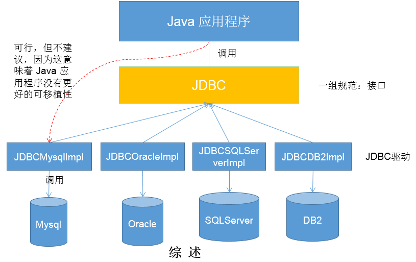

# 软件架构概述

### B/S 架构:
浏览器 <-> 服务器

浏览器的优势在于可移植性 因为都是网页 移植性更高

<br>

### C/S 架构:
客户端 <-> 服务器

客户端比如手机上的app, 客户端的弊端在于软件的更新, 只有app进行更新后才能看到最新的活动

<br><br>

# JavaWeb的技术体系

   

<br><br>

# JDBC概述

<br>

## 数据的持久化:
以前我们说的对象 数组 集合等存储数据的结构都是内存层面的 不能达到数据的持久化

**把数据保存到可掉电式存储设备中以供之后使用**。大多数情况下, 特别是企业级应用, **数据持久化意味着将内存中的数据保存到硬盘**上加以"固化" **而持久化的实现过程大多通过各种关系数据库来完成**

<br>

持久化的主要应用是将内存中的数据存储在
- 关系型数据库
- 磁盘文件
- XML数据文件

<br>


<br>

### 数据持久化的方式: 
在Java中, 数据库存取技术可分为如下几类: 

1. **JDBC**直接访问数据库

2. JDO(Java Data Object)技术, 它也是对JDBC的封装

3. **第三方O/R工具**, 如Hibernate, Mybatis 等

**JDBC是java访问数据库的基石**, JDO, Hibernate, MyBatis等只是更好的封装了JDBC。

<br><br>

## JDBC介绍
JDBC(Java Database Connectivity)是一个**独立于特定数据库管理系统, 通用的SQL数据库存取和操作的公共接口**(一组API)

定义了用来访问数据库的标准Java类库,(**java.sql,javax.sql**)使用这些类库可以以一种**标准**的方法, 方便地访问数据库资源。

<br>

**JDBC是Sun公司提供一套用于数据库操作的接口, java程序员只需要面向这套接口编程即可。**

**不同的数据库厂商, 需要针对这套接口, 提供不同实现。不同的实现的集合, 即为不同数据库的驱动。**

<br>

### 使用 Java 直接操作数据库:
如果没有JDBC 那么java程序访问数据库是这样的 这样也行 但是可移植性差

```java
          Java程序
    ↗     ↗     ↖       ↖
Mysql  Oracle  SQLServer  DB2
```

- mysql插入一条数据库: 命令是 insert
- Oracle插入一条数据库: 命令是 add

一样的目的 但是每个数据库的类型不一样命令细节等却不一样 这时候我们用java程序去操作一个具体的数据库是很痛苦的一件事情 最起码 你要知道所有数据库的基本语法

同时如果更换数据库的话, 我们又会涉及到代码的移植 也很痛苦 移植性很差

<br>

### 使用 JDBC 操作数据库:
我们在真正的操作数据库的时候 并不是使用Java直接操作数据库 可以使用了 JDBC 这套标准

JDBC不是跟某一个具体的数据库深度耦合的 或者说JDBC不是用来专门操作某个数据库的

JDBC是通用的操作数据库的接口 是一种规范 规定了如何使用java程序操作数据库的规范

为了让程序员在操作数据库的时候有统一的规范, 我们不必须了解每一个数据库的操作数据的细节

所以定义了JDBC这套标准 标准规范了要是想用Java程序操作数据库, **不同的数据库都是一套操作方式** 如我们不管向哪种数据库添加数据 方法都是 add()

这样我们只要记住一套API就可以操作不同数据库, 这套接口帮我们屏蔽了大量的底层操作

但是具体的 add() 方法怎么实现将数据添加到数据库的, Sun公司是没有办法写明的, 所以 add() 在接口中是抽象的方法

**抽象方法的的实现, 不同的数据库厂商会提供实现, 不同数据库厂商提供的实现 就叫做驱动**

<br>



``` 
            Java程序

              ↓   调用

            JDBC  ←  一组规范: 接口

    ↗     ↗     ↖       ↖

  驱动    驱动       驱动    驱动   -> JDBCImpl
                                    ↗
  ↓       ↓         ↓      ↓      ↗
                                ↗
Mysql  Oracle  SQLServer  DB2
```

<br>

**驱动:**  
驱动就是各个数据库厂商来编写的 厂商去提供各个接口的实现类 实现类中需要将接口中的抽象方法进行重写 这套实现类的集合封装在一起 就是各个厂商的驱动

<br>

JDBC是sun公司提供一套用于数据库操作的接口, java程序员只需要**面向这套接口编程**即可。

不同的数据库厂商, 需要针对这套接口, 提供不同实现。
**不同的实现的集合, 即为不同数据库的驱动**

<br><br>

# JDBC介绍程序的编写步骤

### 1. 导入 java.sql 包
目的就是将JDBC的接口标准导进来, 这里因为已经有JDK相关的API了我们创建的工程里面有 所以不同导入了

<br>

### 2. 加载并注册驱动程序
目的: JDBC是一套接口, 接口中关于操作数据库的方法的实现, 是各个数据库厂商来提供的 这套实现的集合就是驱动

比如我们要操作 mysql 就要加载mysql的驱动, 我们要使用 oracle 就要加载oracle的驱动

我们要加载对应的驱动

<br>

**注意:**  
sql server 和 mysql oracle 的驱动加载还有区别

- sql server: JDBC-ODBC桥方式 建立数据源ODBC  
```java
ODBC: 是微软提供的一套操作不同数据库的一套api
微软的逻辑是 java - jdbc - odbc - 各个数据库

但是我们绕过odbc通过jdbc连接数据库也还ok的
```

- mysql: 纯JAVA驱动方式(附加相应产商提供的驱动)

<br>

### 3. 创建 Connection 对象
**作用:**  
创建 Connection 对象 用于获取对数据库的连接

<br>

我们要是想操作数据库, 肯定要先连接数据库

比如我通过navicate操作数据库的时候, 需要先连接数据库 要输入
- root
- password
- port

而现在我们是通过 java程序连接数据库, 所以首先要创建Connection对象 

怎么叫连接上了 就是我拿到了一个连接对象 这个对象是非空的就表示我获取到了连接 拿到连接后对数据表进行增删改查的操作

<br>

### 4. 创建 Statement 对象 
**作用:**  
创建 Statement 对象, 用于对数据进行 增删改查 的操作  
Statement对象会执行sql语句, 进行操作数据库

<br>

**注意:**  
实际开发中我们创建的是 **PreparedStatement** 对象

<br>

我们在获取到数据库的连接后, 可以对数据表进行增删改查的操作了, 这里我们就使用 Statement 对象来完成对数据库操作

<br>

### 5. 执行 sql 语句
上面我们通过创建的 Statement 对象, 来操作数据库了, 操作数据库有两种情况

<br>

**查询:**  
我们使用 Statement对象执行sql, 查询数据库后会返回 **ResultSet对象(结果集)**

<br>

**增删改:**  
我们使用 Statement对象执行sql, 对数据表进行更新的操作 这里不涉及到操作 **ResultSet对象(结果集)**

<br>

### 6. 关闭资源 & 结束
- 关闭 Statement 对象
- 关闭 Connection 对象

<br><br>

## Driver接口
JDK中已经包含了操作JDBC的API, 其中有一个接口 就是用来获取连接的 它就是 Driver接口

既然 Driver 是接口 那么我们就要使用 Driver接口的实现类对象

Driver接口是sun公司定义的 我们要提供Driver接口的实现类对象 **这个实现类对象 是各个厂商(mysql db2等)根据Driver接口自己开发的实现类** 这些实现类的集合也叫做**驱动**

<br>
 
### Driver位置:
它是Sun公司定义的API, 我们在JDK中可以直接导入使用该接口
```java
import java.sql.Driver;
```

<br>

### Driver的实例化:
Dirver接口是Sun公司提供的, 该接口的实现类须依靠数据库厂商提供的驱动来进行实例化

所以我们在进行 Driver的实例化 之前要先加载 mysql驱动, 也就是先下载mysql的驱动 然后将下载下来的jar包导入工程中

导入后 我们就可以调用mysql提供的实现类实例化 Driver接口了

```java
import java.sql.Driver;
import java.sql.SQLException;

// 下载mysql驱动并安装后, 通过它创建Driver实现类对象
Driver driver = new com.mysql.jdbc.Driver();
```

<br>

### Driver接口中的抽象方法:
不管我们要连接哪个数据库, 我们只需要调用 实现类对象.connect() 就可以获取对数据库的连接了

<br>

### **<font color="#C2185B">connect(String url, Properties info)</font>**  
用于创建数据库连接对象, 就是连接数据库

<br>

<font color="#C2185B">后续我们会使用DriverManager类代替Driver接口, 那么获取Connection对象的方法 也会使用DriverManager类中的方法 但大体上参数的使用方式没有发生变化</font>

<br>

**<font color="#C2185B">参数1: String url</font>**  
作用: 通过 url 的形式 指明我们要连接哪个数据库

url是统一资源定位符 用于定位互联网上的一个资源 **现在我们要定位的就是要连接哪个数据库**  

<br>

类似我们在通过navicat登录的时候 会输入哪个主机地址下的 哪个端口下的 哪个数据库名

现在我们没有可视化界面 但是可以**通过url的方式告诉我们要连哪个数据库** 就像我们输入百度地址 看百度哪个页面是一样的

<br>

**<font color="#C2185B">url的书写规则:</font>**    
JDBC URL的标准由3个部分组成 各个部分间用冒号分隔
```s
jdbc:mysql://主机名称:mysql服务端口号/数据库名称?参数=值&参数=值
```

<br>

**url的三个部分:**
```s
协议:子协议://ip:port/databaseName?k=v

jdbc:mysql://ip:port/databaseName?k=v
```

- jbdc: 协议  
jdbc的协议就是jdbc

- mysql: 子协议  
子协议用于标识一个数据库驱动程序, 我们要操作mysql就是mysql

- ip: 也叫做子名称  
是一种标识数据库的方法, 不同的数据库对应的子协议也不同, 作用给定位数据库提供信息, 参数用的

<br>

**常用的url参数部分:**  
当报 ``java.sql.SQLNonTransientConnectionException`` 错误的时候 我们可以尝试下第 2 和 3 个 url
```s
# 设置数据库服务器的字符集
jdbc:mysql://localhost:3306/数据库名?useUnicode=true&characterEncoding=utf8


# 设置了字符集 ssl 时区
url=jdbc:mysql://localhost:3306/数据库名?useUnicode=true&characterEncoding=utf8&useSSL=false&serverTimezone=GMT


# 设置了字符集 ssl 时区 批处理
jdbc:mysql://localhost:3306/数据库名?useUnicode=true&characterEncoding=utf8&useSSL=false&serverTimezone=GMT&rewriteBatchedStatements=true
```

<br>

我们一般可能会指定如下的参数:

**情况1: 通过url指定数据库的用户名和密码**  
```s
jdbc:mysql://localhost:3306/atguigu?user=root&password=123456
```

<br>

**情况2: 指定数据库服务器的字符集**  
如果JDBC程序与服务器端的字符集不一致, 结果集可能会导致乱码, 那么可以通过参数指定服务器端的字符集
```s
jdbc:mysql://localhost:3306/atguigu?useUnicode=true&characterEncoding=utf8
```

<br>

**情况3: 指定时区**  
当我们jdbc的驱动为比较高的版本的时候 可能会遇到数据库和系统时区差异引起的问题

报错: the server time zone ... 这时我们就可以设置下时区 如下的两种方式都可以

- serverTimezone=UTC
- serverTimezone=GMT

```s
jdbc:mysql://localhost:3306/atguigu?serverTimezone=UTC%2B8

# %2B 是 +
```
时区的概念: serverTimezone=UTC  

<br>

**UTC是国际时:**  
UTC+8就是国际时加八小时, 是东八区时间, 是北京时间 

在设定时区的时候, 如果设定serverTimezone=UTC, 会比中国时间早8个小时 所以可以设置为 +8, url中+号要修改为 ``%2B`` 不然会解析为空

+9就是日本时间呗?

我们还可以使用预定义国家的时区字符串
- 中国: Asia/Shanghai or Asia/Hongkon
- 日本: Asia/Tokyo

<br>

**情况4: ssh连接**  
ssl是一种验证机制, 如果用户的传输不是通过SSL的方式, 那么其在网络中数据都是以明文进行传输的, 而这给别有用心的人带来了可乘之机。

如今发布的高版本的Mysql都需要设置SSL  
JDBC的版本与MySQL的版本不兼容, 而MySQL在高版本需要指明是否进行SSL连接。(true/false), 如果不设置, 会出现如下报错。

警告: establishing ssl connection without server ... 
```s
jdbc:mysql://localhost:3306/test?useSSL=false
```

<br>

**情况5: 批处理, mysql8.0默认支持**  
但是默认mysql是不支持batch的(批处理) 我们需要同一个参数 让mysql开启批处理的支持

- mysql5.1.7的驱动不支持
- mysql5.1.37的驱动支持

```sql
jdbc:mysql://localhost:3306/test?rewriteBatchedStatements=true
```

<br>

**注意:**  
上述介绍的几种参数都可以搭配使用

<br>

**扩展: 不同数据库的连接url**  
- Oracle:
```s
jdbc:oracle:thin:@ip地址:1521:orcl(实例)
```

- Mysql:
```s
jdbc:mysql://ip地址:3306/数据库?参数名=参数值&参数名=参数值
```

- SqlServer:
```s
jdbc:sqlserver://ip地址:1433(端口号);DataBaseName=数据库;[userid=用户名;password=密码;Pooling=true|false;]
```

- SyBase:
```s
jdbc:sybase:Tds:localhost:5007/数据库
```

- DB2:
```s
jdbc:db2://127.0.0.1:50000/dbnames
```


<br>

**<font color="#C2185B">参数2: Properties info</font>**  
参数2是一个Properties对象, 用于显示的设置数据库的用户名和密码

我们通过 ``setProperty("k", "v")`` 的方式, 为对象中添加 用户名和密码

```java
Properties info = new Properties();
info.setProperty("user", "root");
info.setProperty("password", "qwer6666");
```

<br>

**注意: key的部分是固定的**  
用户名就是固定的 user  
密码就是固定的 password


<br>

**返回值:**  
Connection

<br>

**异常:**  
SQLException

```java
import java.sql.Driver;
import java.sql.Connection;

@Test
  public void test1() throws SQLException {

    // 下载mysql驱动并安装后, 通过它创建Driver实现类对象
    Driver driver = new com.mysql.jdbc.Driver();

    // 提供密码和用户名
    Properties info = new Properties();
    info.setProperty("user", "root");
    info.setProperty("password", "");

    // 通过url指明连接的数据库
    String url = "jdbc:mysql://localhost:3306/test";

    driver.connect(url, info);

    // 输出验证是否连接成功
    System.out.println(driver);
    // com.mysql.jdbc.Driver@2893de87
  }
```

<br>

### 对应厂商驱动的安装:
我们要提供Driver接口的实现类, 而实现类又是各个厂商编写的驱动 那必然我们要下载对应数据库的驱动

这里我们要注意, 我们使用的mysql8 那么我们就要下载mysql8的驱动 使用的mysql5 那么我们就要下载mysql5的驱动

<br>

下载驱动完成后(就是一个jar包)
1. 在工程下(Module)创建一个lib文件夹 跟src同级
```java
| - Module
  | - src
  | - lib  // 创建个lib
```

2. 然后把下载好的jar包放入 lib文件夹下 并 add as lib ...

<br>

**resource资源库:**  
我们自己的 resource资源库 里面有老师提供的jar包
- mysql-connector-java-5.1.37-bin.jar (新)
- mysql-connector-java-5.1.7-bin.jar  (旧)

旧和新可能在批量插入上有些区别, 具体的区别后期我们回来再更新

<br>

**我们将jar包 add as lib... 后:**  
我们可以找到 mysql提供的Driver接口的实现类:

```java
| - com.mysql.jdbc
  - Driver
```

<br>

**Driver实现类的实例化:**  
```java
// 多态:
Driver driver = new com.mysql.jdbc.Driver;
```

<br>

**注意:**
mysql 5 和 mysql 8 这两个版本的驱动中的实现类位置不同

- mysql5: com.mysql.jdbc.Driver, 实例化方式
```java
Driver driver = new new com.mysql.jdbc.Driver();
```

<br>

- mysql8: com.mysql.cj.jdbc.Driver, 实例化方式
```java
Driver driver = new new com.mysql.cj.jdbc.Driver();
```

<br>

同时 我们在配置文件中 driverClassName 也不一样
```js
// mysql5
driverClassName=com.mysql.jdbc.Driver

// mysql8
driverClassName=com.mysql.cj.jdbc.Driver
```

<br><br>

# 获取数据库连接
上面我们介绍了 
- Driver接口
- 加载数据库厂商的驱动
- 创建Driver接口的实现类对象
- Driver接口中的connect()抽象方法

<br>

下面我们看看 如何使用JDBC来连接一个数据库, 也就是创建 Connection 对象的几种方式

下面说明的几种方式也是一个一一迭代的过程, 我们会使用最终版

<br>

## 方式1:
1. 根据 mysql提供的Driver实现类 创建实现类的对象
2. 调用JDBC的Driver接口中定义好的 connect() 方法 传入url, properties对象作为参数 连接数据库

<br>


### 1. 提供 Driver 的具体实现类对象
```java
// mysql8
Driver driver = new com.mysql.cj.jdbc.Driver();

// mysql5: 注意包名部分不同
Driver driver = new com.mysql.jdbc.Driver();
```

<br>

### 调用 **<font color="#C2185B">connect(String url, Properites info)</font>** 方法获取连接

<br>

**完整代码:**
```java
import org.junit.Test;

import java.sql.Connection;
import java.sql.Driver;
import java.sql.SQLException;
import java.util.Properties;

@Test
public void testConnection1() throws SQLException {
  
  // 提供mysql实现类对象
  Driver driver = new com.mysql.cj.jdbc.Driver();

  // url参数: ssl 和 时区
  String url = "jdbc:mysql://localhost:3306/test?useUnicode=true&characterEncoding=UTF-8&useSSL=false&serverTimezone=UTC";

  // info对象: 封装用户名和密码
  Properties info = new Properties();
  info.setProperty("user", "root");
  info.setProperty("password", "qwer6666");

  // 创建 Connection 对象
  Connection connection = driver.connect(url, info);
  System.out.println(connection);
}
```

<br><br>

## 方式2: 对上迭代

### 迭代原因:
我们写的java程序是面向接口编程的 我们希望有更好的可移植性 那就期望在代码中不要出现第三方的api

比如方式1中的代码就是第三方特有的api
```java
Driver driver = new com.mysql.cj.jdbc.Driver();
```

这是我们不想看到的 我们期望我们的代码**有更好的可移植性** 比如我们想切换到Oracle最好能很顺畅的切换过去

<br>

**那怎么获取mysql的Driver接口的实现类对象呢？反射!!** 

<br>

### 代码实现:
我们通过反射来创建 Driver接口的实现类对象

**1. 通过反射获取mysql Driver实现类的运行时类**  
相当于当Driver类被加载到内存中的时候, 我们获取它的运行时类

```java
// 全类名
Class clazz = Class.forName("com.mysql.cj.jdbc.Driver")
```

<br>

**2. clazz.newInstance()**  
创建Driver类的运行时类的对象, 返回值是Object我们要强转成Driver

<br>

```java
@Test
public void testConnection2() throws Exception {

// 反射: 获取 Driver 运行时类
Class clazz = Class.forName("com.mysql.cj.jdbc.Driver");

// 创建对应运行时类的对象
Driver driver = (Driver)clazz.newInstance();
/*
  JDK11
  Driver driver = (Driver) clazz.getDeclaredConstructor().newInstance();
*/


// 提供要连接的数据库
String url = "jdbc:mysql://localhost:3306/test?useUnicode=true&characterEncoding=UTF-8&useSSL=false&serverTimezone=UTC";


// 提供连接需要的用户名和密码
Properties info = new Properties();
info.setProperty("user", "root");
info.setProperty("password", "qwer6666");


// 获取连接
Connection connection = driver.connect(url, info);
System.out.println(connection);
}
```

<br><br>

## 方式3: 对上迭代 -> DriverManager类

### 迭代原因:
使用 **DriverManager类** 替换 **mysql厂商提供Driver接口实现类**

上面我们是通过 实例化mysql提供的Driver实现类 创建的数据库连接, 这里我们要替换成 通过 DriverManager 来实现注册驱动 和 创建连接

DriverManager是sun公司提供的具体的类 不是一个接口, 我们获取连接的操作 **更习惯使用 DriverManager 来操作**

```java
java.sql.DriverManager
```

<br>

### DriverManager类
我们使用 DriverManager类 来替换掉 mysql厂商提供Driver接口实现类, 那么对应的Driver接口获取连接的方法 也会替换为 DriverManager类 中的方法

<br>

### DriverManager类中获取 Connection 对象的方法:
1. 反射创建mysql接口提供的实现类对象
2. 通过 DriverManager 注册驱动, 传入driver实现类对象
2. 通过 DriverManager 获取数据库连接, 提供url user pwd

<br>

**<font color="#C2185B">registerDriver(Driver driver)</font>**  
注册驱动

静态方法, 通过 DriverManager 来进行调用  

<br>

**参数:**  
对应数据库的驱动的实现类对象

<br>

**<font color="#C2185B">getConnection(String url, String user, String password)</font>**  
获取数据库连接

静态方法, 通过 DriverManager 来进行调用  

**返回值:**  
Connection

<br>

### 代码实现:
**1. 利用反射 创建mysql厂商提供的实现类对象**
```java
Class clazz = Class.forName("com.mysql.cj.jdbc.Driver");
Driver driver = (Driver)clazz.newInstance();
```

<br>

**2. 通过 DriverManager 注册驱动**
```java
DriverManager.registerDriver(driver);
```

<br>

**3. 提供连接数据库所需的基本信息**
```java
String url = "jdbc:mysql://localhost:3306/test?useUnicode=true&characterEncoding=UTF-8&useSSL=false&serverTimezone=UTC";
String user = "root";
String password = "qwer6666";
```

<br>

**4. 获取数据库连接**
```java
Connection connection = DriverManager.getConnection(url, user, password);
```

<br>

**完整代码:**  
```java
@Test
public void testConnection3() throws Exception {

// 1. 获取 Driver 实现类对象
Class clazz = Class.forName("com.mysql.cj.jdbc.Driver");
Driver driver = (Driver)clazz.newInstance();
/*
  Driver driver = (Driver) clazz.getDeclaredConstructor().newInstance();
*/


// 2. 提供连接数据库所需要的基本信息
String url = "jdbc:mysql://localhost:3306/test?useUnicode=true&characterEncoding=UTF-8&useSSL=false&serverTimezone=UTC";
String user = "root";
String password = "qwer6666";


// 3. 注册驱动
DriverManager.registerDriver(driver);


// 4. 获取连接
Connection connection = DriverManager.getConnection(url, user, password);

System.out.println(connection);
}
```

<br><br>

## 方式4: 对上迭代 -> API层面上的优化

### 迭代原因:
代码跟方式3一样, 区别
1. 只使用反射加载了mysql的Driver的运行时类
2. 没有通过clazz创建对应的运行时类对象
3. 没有使用 registerDriver() 方法注册驱动

<br>

**为什么不用注册驱动呢？**  
```java
Class.forName("com.mysql.cj.jdbc.Driver");
```

这行代码 相当于把 Driver 加载到内存中了 我们观察了下 Driver 类的源码发现 该类中有下面的静态代码块

```java
static {
try {
  java.sql.DriverManager.registerDriver(new Driver())
} catch(SQLException E) {
  throw new RuntimeException("Can't register driver!")
}
}
```

静态代码块中在类加载的时候一起执行了注册的功能, 也就是说类一加载自动注册了

<br>

### 代码实现:
1. 反射加载mysql提供的Driver实现类
2. 通过 ``DriverManager.getConnection(url, user, password)`` 创建数据库连接

就两步了

```java
@Test
public void testConnection4() throws Exception {
// 1. 提供连接数据库所需要的基本信息
String url = "jdbc:mysql://localhost:3306/test?useUnicode=true&characterEncoding=UTF-8&useSSL=false&serverTimezone=UTC";
String user = "root";
String password = "qwer6666";


// 2. 获取 Driver 实现类对象
Class.forName("com.mysql.cj.jdbc.Driver");

// 相较于方式3 可以省略如下的操作
/*
  Driver driver = (Driver)clazz.newInstance();
  DriverManager.registerDriver(driver);
*/

// 3. 获取连接
Connection connection = DriverManager.getConnection(url, user, password);

System.out.println(connection);
}
```

<br>

### 扩展:
然后 我们发现 我们还可以省略这行代码
```java
Class.forName("com.mysql.cj.jdbc.Driver");
```

就是加载也不用了 代码就变成 直接通过DriverManager 调用获取连接的方法 getConnection() 也可以

```java
public void testConnection4() throws Exception {
// 1. 提供连接数据库所需要的基本信息
String url = "jdbc:mysql://localhost:3306/test?useUnicode=true&characterEncoding=UTF-8&useSSL=false&serverTimezone=UTC";
String user = "root";
String password = "qwer6666";

// 2. 获取连接
Connection connection = DriverManager.getConnection(url, user, password);

System.out.println(connection);
}
```

因为我们将 mysql 驱动加载到类路径 add as lib 后 自动帮我们加载该类了 所以可以省 但是 ...

**不要省略 因为 mysql 好用 别的数据库并不好用**

<br><br>

## 方式5: 对上迭代 -> 最终版

### 整理步骤:
1. 数据库信息写在配置文件中 module/src

2. 通过反射 getResourceAsStream() + Properties() 读取配置文件中的信息
- ClassLoader.getSystemClassLoader().getResourceAsStream(path)
- 当前类.class.getClassLoader().getResourceAsStream(path)

3. Class.forName(配置文件中的driverClass) 

4. DriverManager.getConnection()

<br>

### 迭代原因:
数据库的配置信息 放在配置文件中

<br>

**配置文件:**  
<font color="#C2185B">将 配置文件 放在 src 下</font>, 因为放在工程下的话 配置文件在部署到Tomcat服务器时候 文件就缺失了 不会帮我们部署过去

```
| - src
- jdbc.properties
```

<br>

**内容:**  
如果数据库的密码为空, 我们可以不在配置文件中配置password, getConnection() 获取连接的时候 我们传入一个 null 就可以

1. user
2. password
3. url
4. driverClass

<br>

配置文件中的 ``书写顺序`` 和 ``key`` 无所谓, 因为我们读取的是key对应的value, 但是配置文件中不要有空格

```s
user=root
password=qwer6666
url=jdbc:mysql://localhost:3306/test?useUnicode=true&characterEncoding=UTF-8&useSSL=false&serverTimezone=UTC
driverClass=com.mysql.cj.jdbc.Driver
```

<br>

**回顾: 读取配置文件的方式**  
1. **通过当前类的运行时类实例**的类的加载器, 加载配置文件 返回字节输入流
2. 调用 properties.load(is) 方法
3. 调用 properties 的api获取配置文件中的值


```java
@Test
public void testConnection5() throws Exception {

// 读取配置文件中的信息
// 通过当前类的运行时类实例的一系列方法, 注意配置文件要放在 module/src 下
InputStream is = ConnectionTest.class.getClassLoader().getResourceAsStream("jdbc.properties");

Properties properties = new Properties();
properties.load(is);

String user = properties.getProperty("user");
String password = properties.getProperty("password");
String url = properties.getProperty("url");
String driverClass = properties.getProperty("driverClass");


// 加载并注册驱动
Class.forName(driverClass);


// 获取连接: 数据库密码为空可以传入 null
Connection connection = DriverManager.getConnection(url, user, password);
System.out.println(connection);
}
```

<br>

### 方式5的优势:
1. 当我们不是要连接mysql的时候 我们只需要修改 配置文件就可以了 也就是我们实现了**数据和代码的分离** 也是实现了解耦

2. 如果需要修改配置文件信息 可以避免程序重新打包 

当我们把程序写完后 真正要部署到Tomcat服务器上 我们需要将java代码打包到jar文件 

将编译后的程序部署到服务器上 如果我们要对获取连接中的某个参数 要进行修改的话 就要修改源代码 就意味着我们的java要重新打包 

而我们的properties文件 打包的时候还是单独以一个文件的形式进行存储 所以我们要是修改参数 只需要替换properties文件就可以 

<br>

### 关闭连接:
### <font color="#C2185B">connection.close()</font>
我们在操作完数据库后记得关闭连接

```sql
try {
  if(connection != null) connection.close();
} catch (SQLException e) {
  e.printStackTrace();
}
```

<br><br>

# 操作数据库选择哪个对象?

当我们获取数据库连接后, 也就是创建 connection 对象后, 便会通过 connection **向数据库服务器发送命令 和 sql 语句** 并接受数据库服务器返回的结果

在 java.sql 包中有 **3个接口** 分别定义了对数据库的调用的不同方式 **用来发送sql语句**

1. Statement
2. PreparedStatement
3. CallableStatement

<br>

它们都是通过 connection.对应的方法 获取下面3个接口的实例对象:

<br>

**Statement:**  
用于执行静态 SQL 语句并返回它所生成结果的对象。

<br>

**PrepatedStatement: 开发中使用它**  
SQL 语句**被预编译并存储在此对象中**, 可以使用此对象多次高效地执行该语句。

它是 Statement接口的子接口

<br>

**CallableStatement:**  
用于执行 SQL 存储过程

<br>


<br><br>

## 演示 statement对象 的弊端: sql注入的问题

<br>

### 示例:
我们数据库中有一个 user 表

``` 
user  password  balance
aa    123456    1000
bb    654321    1000
cc    abcd      2000
dd    abcder    3000
```

<br>

我们有一个User类是一个JavaBean, 用来承装一条记录

<br>

**需求:**  
我们在java层面输入用户名和密码 如果正确的情况下 你告诉我登录成功 如果我们要是输入错误 告诉我们登录失败

```java
@Test
public void testLogin() {
Scanner scan = new Scanner(System.in);

System.out.print("用户名: ");

// 为了演示 这里要改成nextLine() next()的话 只要是空格也算获取数据结束 而 nextLine() 只把换行当做获取数据的结束
String userName = scan.nextLine();

System.out.print("密   码: ");
String password = scan.nextLine();


// 查询语句 注意 sql引号拼接的问题 这就是拼串操作 麻烦！
String sql = "SELECT user,password FROM user_table WHERE USER = '" + userName + "' AND PASSWORD = '" + password + "'";

// User.class 返回的对象的类型
User user = get(sql, User.class);

if (user != null) {
  System.out.println("登陆成功!");
} else {
  System.out.println("用户名或密码错误！");
}
}
```

<br>

### 弊端:
1. 需要用变量 和 sql语句进行拼接
2. sql注入的问题

<br>

### sql注入:
在**用户名和密码输入不正确的情况下** 我们也可以对数据库进行恶意操作(也就是用户名和密码不对 也能登录成功)

SQL 注入是利用某些系统没有对用户输入的数据进行充分的检查, 而在用户输入数据中注入非法的 SQL 语句段或命令, 从而利用系统的 SQL 引擎完成恶意行为的做法。

<br>

上面代码中 本身我们 sql 语句的逻辑是: 
```sql
-- and 且的关系
SELECT user, password 
FROM user_table 
WHERE user = '' and password = ''
```

<br>

现在我们拼一个串
```sql
SELECT user, password 
FROM user_table 
WHERE user = '1' or ' and password = '=1 or '1' = '1'
```

<br>

现在我们输入如下的用户名和密码时会登录成功
- 用户名: 1' or  
- 密码: =1 or '1' = '1


```sql
where
    1' or   ← 用户名
      ↓
user = ' '

and

    =1 or '1' = '1
          ↓
password = ' '


-- 过滤条件变成了 or, 而条件的最后 '1' = '1' 是恒成立的
where user = '1' or ' and password = '=1 or '1' = '1'
```

<br>

以上就是sql注入 明明写的不对但是还是登录成功了 究其原因 就是我们使用了 Statement

<br>

### 如何避免出现sql注入:
只要用 PreparedStatement 取代 Statement 就可以了

比如花多少钱弄个学历 就是利用数据库的漏洞 把我们的数据强行的塞进去

但是网站也是有备份的 定期会清理数据 回滚一下 我们的数据也有可能被清掉了 也就是说只有一段时间是好用的

<br><br>

# PreparedStatement 的使用 
上面的操作中我们获取到了数据库的连接, 接下来我们就需要在Java层面写sql语句 通过 PreparedStatement 对象将sql语句发送到数据库中去做执行 

操作数据库我们使用 **PreparedStatement**

``` 
Driver代表数据库驱动
↓

Connection代表数据库连接
↓

PreparedStatement预编译的Statement
    ↙             ↘
  增删改          查询
                  ↓
          ResultSet代表查询结果
```

<br>

## PreparedStatement对象的使用:
使用 PreparedStatement 对象对数据库进行如下的操作
- insert
- delete
- update
- select

增删改操作: 完成后是不需要有什么返回的 相当于 void  
查询操作: 一定是有返回的

<br>

### **<font color="#C2185B">connection.preparedStatement(String sql)</font>**
通过连接对象调用方法 返回一个 **进行了预编译的sql语句的**PreparedStatement实例对象

预编译:  
在我们生成preparedStatement实例对象的时候, 内部就预编译了sql就也是携带了我们要做的事情

我们创建该对象的时候需要传入sql, 也就是对数据库的操作

<br>

**参数:**  
String sql: sql语句, 也就是我们需要对数据库干什么

sql语句中关于添加的数据, 可以使用占位符
```java
String sql = "insert into customers (name, email, birth) values(?,?,?)";
```

后续我们要通过 preparedStatement实例对象身上的方法来填充占位符

<br>

**扩展:**  
```java
// 该方法还有一系列的重载方法
1. String sql, int autoGeneratedKeys
2. String sql, int[] columnIndexs
// Concurrency: 并发性, 同时发生
3. String sql, int resultSetType, int resultSetConcurrency
4. String sql, String[] columnNames
```

<br>

**返回值:**  
PreparedStatement

<br>

```java
// 添加数据的sql
String sql = "insert into customers (name, email, birth) values(?,?,?)";
PreparedStatement ps = connection.prepareStatement(sql);
```

<br><br>

## ps对象的使用
上面我们可以获取到 PreparedStatement的实例对象 ps 后, 我们调用ps身上的方法来操作数据库, 比如增删改查

<br>

### 数据库 & Java 数据类型对照
我们需要在Java层面将数据, 存储到数据库, 数据都有数据类型, 所以我们也要考虑 数据库类型和Java层面中数据类型的对应关系

<br>

|java类型|sql类型|
|:--|:--|
|boolean|bit|
|byte|tinyint|
|short|smallint|
|int|integer|
|long|bigint|
|String|char varchar longvarchar|
|byte array|binary varbinary|
|java.sql.Date|date|
|java.sql.Time|time|
|java.sql.Timestamp|timestamp|

<br>

**注意:**  
数据库的Blob类型 在java中 没有对应的类型, 比如有个视频4个g java不能拿个属性去对接4个g吧, 但可以是个file

<br>

### **<font color="#C2185B">ps.setXxx(int index, String val)</font>**
用于向含有占位符?的sql语句中的指定位置添加数据, 需要注意数据库中字段的类型

**相当于完善 带有占位符的sql语句**

<br>

**注意字段类型:**
比如数据库中是如下的字段信息
```
name          email         birth
varchar(15)   varchar(50)   date
```

然后我们通过 setXxx() 方法时, 就要调用对应的方法, 比如我们添加一个字符串则调用 setString() 方法

<br>

每为占位符添加一个数据, 就要调用一次 setXxx() 方法

<br>

**参数:**  
**int index:**   
占位符的位置, 我们往第几个?添加数据   
注意: 跟数据库交互的索引都是从1开始

<br>

**String val:**  
添加的值

<br>

**方法扩展:**  
- ps.setObject()   -- 通用
- ps.setDate()
- ps.setArray()
- ps.setString()
- ps.setAsciiStream()
- ps.setBinaryStream()
- ps.setBlob()
- ps.setBytes()
- ps.setCharacterStream()
- ps.setClob()
- ps.setDouble()
- ps.setFloat()
- ps.setInt()
- ps.setLong()

<br>

```java
ps.setString(1, "哪吒");
ps.setString(2, "nezha@email.com");

// 添加date类型, 也就是我们要将 String格式的生日转为date类型传入到数据库中
SimpleDateFormat sdf = new SimpleDateFormat("yyyy-MM-dd");

// 返回的是 util.Date, 我们可以利用毫秒数转换成sql.Date
java.util.Date date = sdf.parse("1985-10-02");

// 向date类型的?添加数据
ps.setDate(3, new java.sql.Date(date.getTime()))
```

<br>

### **<font color="#C2185B">ps.execute()</font>**
通过 ps 对象, 执行sql语句  
上面我们通过 ps.setXxx() 完善了带占位符?的sql, 接下来我们就要执行该sql

<br>

**要点:**  
该方法 可以执行任何sql语句, 不分什么操作

<br>

**返回值:**  
boolean

- true: 当返回结果集的时候为true, 如查询操作 
- false: 没有结果集的时候为false, 如增删改操作

<br>

### **<font color="#C2185B">ps.executeUpdate()</font>**
通过 ps 对象, 执行sql语句

**要点:**  
该方法用于 增删改 会响应行数据的操作, **也就是必须是DML的操作**

<br>

**返回值:**
int: 指定操作影响的行数

对于 create table 和 drop table 等不操作行的语句, 返回0

返回0也相当于 增删改 操作失败了

<br>

### **<font color="#C2185B">ps.close()</font>**
关闭资源, 我们要关闭 ps connection, 使用 try catch 就不要使用 throws 了

```java
finally {
  try {
    if(ps != null) ps.close();
  } catch (SQLException e) {
    e.printStackTrace();
  }
  try {
    if(connection != null) connection.close();
  } catch (SQLException e) {
    e.printStackTrace();
  }
}
```

<br>

### PreparedStatement DDL
上面我们使用 PreparedStatement 都是 DML 操作
比如增删改 没有返回结果集的操作

其实 DDL 操作也可以使用 PreparedStatement 对象, 跟我们的增删改一样 只是换下sql就可以了

<br>

### 举例:  
我们向 customers 表添加一条记录, 该表id字段自增

```java
@Test
public void test1() throws SQLException, ClassNotFoundException, NoSuchMethodException, InvocationTargetException, InstantiationException, IllegalAccessException, IOException, ParseException {

  // 将配置文件读入到内存
  InputStream is = ClassLoader.getSystemClassLoader().getResourceAsStream("jdbc.properties");

  // 将输入流加载到Properties对象中, 方便我们获取文件中的value
  Properties info = new Properties();
  info.load(is);

  // 获取数据库连接的信息
  String user = info.getProperty("user");
  String url = info.getProperty("url");
  String driverClass = info.getProperty("driverClass");

  // 获取mysql的Driver对象
  Class.forName(driverClass);

  // 获取数据库连接
  Connection connection = DriverManager.getConnection(url, user, null);

  // 获取 PreparedStatement 对象 操作数据库, 传入带占位符的sql
  String sql = "insert into customers (name, email, birth) values (?, ? ,?)";
  PreparedStatement ps = connection.prepareStatement(sql);

  // 完善sql语句: 向对应位置的占位符添加数据
  ps.setString(1, "sam");
  ps.setString(2, "sam@email.com");

  // 将字符串格式的日期转为sql.Date对象存入数据库
  SimpleDateFormat sdf = new SimpleDateFormat("yyyy-MM-dd");
  Date date = sdf.parse("1985-10-02");
  ps.setDate(3, new java.sql.Date(date.getTime()));


  // 执行完善后的sql
  boolean execute = ps.execute();
  System.out.println("execute: " + execute);

  // 关闭资源
  ps.close();
  connection.close();

}
```

<br>

**try catch关闭资源版:**  
```java
@Test
public void testInsert() {
  Connection connection = null;
  PreparedStatement ps = null;
  try {
    // 1. 获取数据库连接
    InputStream is = PreparedStatementUpdateTest.class.getClassLoader().getResourceAsStream("jdbc.properties");
    // 下面这行代码也能获取 系统类加载器
    // InputStream is = ClassLoader.getSystemClassLoader().getResourceAsStream("jdbc.properties");

    Properties properties = new Properties();
    properties.load(is);

    String user = properties.getProperty("user");
    String password = properties.getProperty("password");
    String url = properties.getProperty("url");
    String driverClass = properties.getProperty("driverClass");

    Class.forName(driverClass);
    connection = DriverManager.getConnection(url, user, password);


    String sql = "insert into customers(name,email,birth)values(?,?,?)";
    ps = connection.prepareStatement(sql);


    ps.setString(1, "哪吒");
    ps.setString(2, "nezha@gmail.com");
    SimpleDateFormat sdf = new SimpleDateFormat("yyyy-MM-dd");
    java.util.Date date = sdf.parse("1000-01-01");
    ps.setDate(3, new Date(date.getTime()));


    // 4. 执行操作
    ps.execute();

    
  } catch (Exception e) {
    e.printStackTrace();
  } finally {
    // 5. 资源关闭 PreparedStatement 和 connection 都要关 涉及到资源的关闭 我们就不要throws了
    try {
      if(ps != null) ps.close();
    } catch (SQLException e) {
      e.printStackTrace();
    }
    try {
      if(connection != null) connection.close();
    } catch (SQLException e) {
      e.printStackTrace();
    }
  }
}
```

<br><br>

## 封装数据库连接和关闭操作
我们不管说 增加 修改 删除 不管哪个操作 有几件事情是一定要做的
1. 先要获取连接
2. 中间是增删改查的操作
3. 关闭连接

我们把 1 3 封装到一个方法当中 抽离到一个工具类中, 工具类中的方法我们都定义为静态方法

<br>

### 需要的包:
```java
import java.io.IOException;
import java.io.InputStream;
import java.sql.Connection;
import java.sql.DriverManager;
import java.sql.PreparedStatement;
import java.sql.SQLException;
import java.util.Properties;
```

<br>

### 获取连接的方法:
```java
// 获取数据库连接:
public static Connection getConnection(String path) throws Exception {

  InputStream is = ClassLoader.getSystemClassLoader().getResourceAsStream(path);
  Properties info = new Properties();
  info.load(is);

  String user = info.getProperty("user");
  String password = info.getProperty("password");
  String url = info.getProperty("url");
  String driverClass = info.getProperty("driverClass");

  Class.forName(driverClass);
  Connection connection = DriverManager.getConnection(url, user, null);

  return connection;
}
```

<br>

### 关闭连接的方法:
1. 根据传入的资源, 关闭他们
2. PreparedStatement 要导入 java.sql.PreparedStatement 而不是mysql的, 我们要导入接口类型
3. 因为PreparedStatement是Statement的子接口 我们可以写的大一些 定义为父接口类型

```java
// 关闭连接
public static void closeResource(Connection conn, PreparedStatement ps) {
  try {
    if(ps != null) ps.close();
  } catch (SQLException e) {
    e.printStackTrace();
  }
  try {
    if(conn != null) conn.close();
  } catch (SQLException e) {
    e.printStackTrace();
  }
}
```

<br><br>

# PrearedStatement 增删改 操作
下面我们使用 PrearedStatement 完成 增删改等操作

<br>

## 修改: 修改 customers表 中的一条记录

<br>

### JDBC操作数据库的5个步骤
1. 获取数据库连接
2. 创建preparedStatement对象 传入sql
3. 完善sql
4. 执行sql
5. 关闭资源

```java
String sql = "update customers set name = ? where id = ?";

PreparedStatement ps = connection.prepareStatement(sql);
```

<br>

**完整代码:**
```java
@Test
public void test2() {

  // 获取数据库连接
  Connection connection = null;
  PreparedStatement ps = null;
  try {
    connection = JDBCUtils.getConnection("jbdc.properties");

    // 获取 ps 对象
    String sql = "update customers set name = ? where id = ?";
    ps = connection.prepareStatement(sql);

    // 完善sql
    ps.setObject(1, "erin");
    ps.setObject(2, 19);

    // 执行sql
    ps.execute();
  } catch (Exception e) {
    e.printStackTrace();
  } finally {
    // 关闭数据库连接
    JDBCUtils.closeResource(connection, ps);
  }
}
```

<br><br>

## 封装通用的 增删改 操作 update()
我们上面发现 操作数据库的过程中 主要就是 sql 语句的部分不一样, 所以我们可以封装一个通用的方法来处理增删改操作

<br>

### **<font color="#C2185B">update(String sql, Object ... args)</font>**
用于做数据库进行增删改的操作

该方法用于对数据库的一次增删改操作, 方法内部获取数据库的连接 使用完毕后关闭资源

<br>

**分析:**  
我们需要在sql语句中填入占位符, 每条sql语句的占位符根据需求不同, 占位符的数量也不同, 但有一点一致

占位符的数量 = 可变形参的长度

<br>

比如:
```java
String sql = "update customers set name = ? where id = ?"

update(sql, "erin", 19)
```

所以方法内部我们可以遍历args, 为占位符进行赋值操作, 参数有几个我们就setXxx()几次 

<br>

**要点:**
1. 遍历为占位符赋值的时候 记住 索引 + 1
2. 往update()方法中传参时注意顺序
3. 参数类型都可以统一成 Object
4. 在update()方法中获取connection和关闭connection
5. 封装的update()方法对不同的表也是可以的, 因为表是通过sql指定的, sql是外部传入的

```java
// update(): 最数据库的一次增删改操作, 方法内部获取数据库的连接 使用完毕后关闭资源
public int update(String sql, Object ... args) {

  PreparedStatement ps = null;
  Connection connection = null;

  try {
    // 获取连接:
    connection = JDBCUtils.getConnection("jdbc.properties");
    ps = connection.prepareStatement(sql);

    // 变量参数列表为占位符赋值 完善sql
    for(int i = 0; i < args.length; i++) {
      ps.setObject(i + 1, args[i]);
    }

    // 执行sql: 返回增删改影响的行数
    return ps.executeUpdate();

  } catch (Exception e) {
    e.printStackTrace();
  } finally {
    // 关闭资源
    JDBCUtils.closeResource(connection, ps);
  }

  // 返回0 表示操作失败
  return 0;
}
```

<br><br>

# PrearedStatement 查询 操作
整体来说套路跟增删改差不多, 但是查询的话 还要处理查询到的结果 因为查询结果会有结果集 

也就是说我们通过ps做查询操作的时候, 最后会返回一个结果集, 体现在Java层面返回的就是 ResultSet

我们要知道的是 **如何处理ResultSet**

<br>

### 要点:
Java中讲究万事万物皆对象, 那结果集中的一条记录对应的就是Java层面的一个对象, **我们会将查询到的结果封装为一个类的对象**

<br><br>

### 通过 ps 对象, 获取查询的结果集
### **<font color="#C2185B">ps.executeQuery()</font>**
通过 preparedStatement 对象调用 executeQuery()方法, 返回查询的结果集

<br>

**返回值:**  
ResultSet    
resultSet也是资源 也需要关闭

```java
ResultSet resultSet = ps.executeQuery();
```

<br>

### 获取结果集中的数据
我们查询的结果在 ResultSet 的对象中, 所以我们要通过 ResultSet 的 API 获取结果集中的数据

因为返回的一条记录中有多个字段, 我们分别要获取字段中过的值, ResultSet给我们提供了对应的api

<br>

### **<font color="#C2185B">resultSet.next()</font>**
判断判断结果集中下一条是否有记录, **默认指针在第一条记录的上面**, 判断后指针会下移

<br>

**返回值: boolean**  
- 如果为true则说明下面有元素, 指针自动下移
- 如果为false则说明下面没有元素, 指针不下移, 直接结束

<br>

**作用:**  
1. 判断结果集的下一条是否有记录
2. 指针下移

<br>

**注意:**  
好像必须调用该方法 不然获取数据的时候会报错

因为要指针移动到第一条数据上, 指向该条数据 然后才能调用API获取数据

<br>

查询一条数据:
```java
if(resultSet.next()) { ... }
```

<br>

查询多条数据:
```java
while(resultSet.next()) { ... }
```

<br>

### **<font color="#C2185B">resultSet.getXxx(int index 或者 String columnLabel)</font>**
根据指定的索引, 返回对应类型的数据, 索引的位置就要看你读取的是哪个字段的数据

``` 
id    name    email   birth
1       2       3       4
```
update 表名
<br>

**注意:**  
索引从1开始

<br>

**参数:**  
int index: 根据索引获取字段对应的值  
String 列的别名(字段名): 根据字段名获取对应的值

<br>

**方法扩展:**  
- resultSet.getObject(index or columnLabel)   -- 通用
- resultSet.getDate(index or columnLabel)
- resultSet.getArray(index or columnLabel)
- resultSet.getString(index or columnLabel)
- resultSet.getAsciiStream(index or columnLabel)
- resultSet.getBinaryStream(index or columnLabel)
- resultSet.getBlob(index or columnLabel)
- resultSet.getBytes(index or columnLabel)
- resultSet.getCharacterStream(index or columnLabel)
- resultSet.getClob(index or columnLabel)
- resultSet.getDouble(index or columnLabel)
- resultSet.getFloat(index or columnLabel)
- resultSet.getInt(index or columnLabel)
- resultSet.getLong(index or columnLabel)

<br>

```java
// 处理结果集: 这步好像是必须的
// 先判断 有没有下一条数据, 然后获取当前这条记录中的各个字段的值
if(resultSet.next()) {

  int id = resultSet.getInt(1);
  String name = resultSet.getString(2);
  String email = resultSet.getString(3);
  // 是sql下的Date
  java.sql.Date birth = resultSet.getDate(4);
}

// 没有查询到东西
```

<br>

### 处理结果集中每个字段的数据:
上面我们从结果集中拿到了 每个字段的数据 现在我们处理这些数据

在Java中万事万物皆对象, 我们习惯将一条记录看做是一个对象, 而记录中的各个字段则是对象中过的属性

- 表中有什么字段 类中就对应有什么属性
- 表中是什么类型 类中的属性就对应什么类型

我们将这些属性封装成一个对象, 也就是将每一个属性封装到java对象中, 我们需要被每一张表创建一个JaveBean的类

<br>

ORM映射的概念:
- 一个数据表 对应 一个java类
- 表中的一条记录 对应 java类中的一个对象
- 表中的一个字段 对应 java类中的一个属性

<br>

customers表 -> Customer类  

<br>

### 封装 JavaBean 要点:
1. Java类中属性类型 和 数据库表中的字段类型 要一一匹配 如: date类型都是sql.Date

2. Java类中属性名应该为驼峰, 数据表中的字段名 可以通过别名的方式 指明为驼峰, **目的 Java类中的属性名和数据库表中的字段名 要一一匹配**

```sql
-- 字段别名
select order_name orderName from orders
```

<br>

```java
package com.sam.bean;

// sql类型的数据
import java.sql.Date;

public class Customer {
   private int id;
   private String name;
   private String email;

   // 这里和数据库的Date类型对接 也是 java.sql.Date
   private Date birth;

  public Customer() {
  }

  public Customer(int id, String name, String email, Date birth) {
    this.id = id;
    this.name = name;
    this.email = email;
    this.birth = birth;
  }

  public int getId() {
    return id;
  }

  public void setId(int id) {
    this.id = id;
  }

  public String getName() {
    return name;
  }

  public void setName(String name) {
    this.name = name;
  }

  public String getEmail() {
    return email;
  }

  public void setEmail(String email) {
    this.email = email;
  }

  public Date getBirth() {
    return birth;
  }

  public void setBirth(Date birth) {
    this.birth = birth;
  }

  @Override
  public String toString() {
    return "Customer{" +
        "id=" + id +
        ", name='" + name + '\'' +
        ", email='" + email + '\'' +
        ", birth=" + birth +
        '}';
  }
}
```

<br>

然后我们将查询到的各个字段的值, 调用JavaBean的构造器封装成一个对象

<br>

### 需求:
查询 customers 表中 id 为 19 的 客户数据

<br>

**原始方式, 没有使用我们封装过的JDBCUtils**
```java
@Test
public void test5() throws Exception {
  // 读取配置文件
  InputStream is = ClassLoader.getSystemClassLoader().getResourceAsStream("jdbc.properties");
  Properties info = new Properties();
  info.load(is);

  String user = info.getProperty("user");
  String url = info.getProperty("url");
  String driverClass = info.getProperty("driverClass");

  // 获取数据库连接
  Class.forName(driverClass);
  Connection connection = DriverManager.getConnection(url, user, null);

  // 获取 preparedStatement 对象 发送sql
  String sql = "select id, name, email, birth from customers where id = ?";
  PreparedStatement ps = connection.prepareStatement(sql);

  // 完善 sql
  ps.setObject(1, 19);

  // 执行sql返回结果集
  ResultSet resultSet = ps.executeQuery();

  // 判断是否有记录: 这步好像是必须的不写会报错
  if(resultSet.next()) {
    System.out.println("resultSet: " + resultSet);

    // 获取结果集中的数据
    int id = (int) resultSet.getObject("id");
    String name = (String) resultSet.getObject("name");
    String email = (String) resultSet.getObject("email");
    java.sql.Date date = (java.sql.Date) resultSet.getObject("birth");

    // 调用构造器 将数据封装为一个对象
    Customer customer = new Customer(id, name, email, date);
    System.out.println(customer);
  }
  
  // 关闭资源
  if(resultSet != null) resultSet.close();
  if(ps != null) ps.close();
  if(connection != null) connection.close();
}
```

<br>

**改成 try catch 的形式:**
```java
@Test
public void testQuery1() {
  Connection connection = null;
  PreparedStatement ps = null;
  ResultSet resultSet = null;
  try {
    connection = JDBCUtils.getConnection();

    String sql = "select id, name, email, birth from customers where id = ?";
    ps = connection.prepareStatement(sql);

    // 补充 占位符
    ps.setObject(1, 1);

    // 调用ps对象的 执行并返回结果集的方法
    resultSet = ps.executeQuery();

    // 处理结果集
    if(resultSet.next()) {
      int id = resultSet.getInt(1);
      String name = resultSet.getString(2);
      String email = resultSet.getString(3);
      // 是sql下的Date
      Date birth = resultSet.getDate(4);


      // 处理数据的方式1: 保存到数组中
      // Object[] data = new Object[] {id, name, email, birth};


      // 处理数据的方式2: 保存到对象中(封装到类的对象中)
      Customer customer = new Customer(id, name, email, birth);
      System.out.println(customer);
    }
  } catch (Exception e) {
    e.printStackTrace();
  } finally {
    // 关闭资源
    JDBCUtils.closeResource(connection, ps, resultSet);
  }
}
```

<br><br>

# 封装 某一张表的 通用的 查询操作

<br>

## 封装 queryForcustomers(String sql, Object ...args) 方法
查询customers表的操作

<br>

### 分析:
**查询不同字段的问题:**  
调用 queryForcustomers() 的时候 需要传入sql, sql是方法外部定义的, 所以我们在定义sql的时候可以指定不同的查询字段

<br>

**sql中的占位符赋值:**  
我们写几个? 就意味着我们会传入几个参数, 我们可以变量args为占位符进行赋值

同时要注意我们传参的顺序, 及其类型的问题

<br>

**拿到结果集后, 我们需要调用几次 getObject():**  
我们查询几个字段, 就需要调用几次 getObject()

我们可以通过获取结果集的元数据, 来获取结果集中的总列数, 拿到总列数后 我们循环调用 getObject()

目的将结果集中的每个字段的数据拿出来 封装到一个Java对象中

<br>

**通过结果集的元数据, 获取字段名和字段值:**  
我们根据结果集的总列数 循环获取字段的值, 同时我们还获取到字段对应的列名

<br>

**反射为对象赋值:**  
获取Customer运行时类, 然后根据属性名获取类中的指定属性, 调用属性的set()方法为属性进行赋值

<br>

### 结果集的元数据:
跟结果集相关的信息都被封装到 结果集的元数据中, 我们调用对应的方法 获取

<br>

### **<font color="#C2185B">resultSet.getMetaData()</font>**  
获取 结果集 的元数据对象, 元数据是用来修饰结果集的数据

我们可以通过该对象, 获取结果集中指定列的信息 和 总列数 如

- 获取结果集中的总列数
- 指定列的列名
- 指定列的别名

<br>

**返回值:**   
ResultSetMetaData rsmd

<br>

### **<font color="#C2185B">rsmd.getColumnCount()</font>**  
获取 结果集 的**总列数**

**返回值:**  
int

<br>

### **<font color="#C2185B">rsmd.getColumnName(int column)</font>**  
获取结果集中 指定列 的 **字段名**

**返回值:**  
String

<br>

### **<font color="#C2185B">rsmd.getColumnLabel(int column)</font>**  
获取结果集中 指定列 的 **字段别名**  
当没有给表指定别名的时候 检索结果就是列名 **所以这个方法通用**

**返回值:**  
String

<br>

### 代码部分:
我们看看我们自定义的 查询一张表 的数据的通用方法中 要完成什么样的逻辑

1. 获取数据库连接

2. 获取 PreparedStatement 传入 sql 拿到 ps 对象 执行sql

3. 遍历补充占位符 完善sql

4. 执行sql, 拿到返回的结果集

5. 获取结果集的元数据, 获取结果集的字段名 和 总列数

6. 通过反射, 将拿到的数据 封装成一个对象  
这里我们不是利用构造器将查询到的数据传入封装成一个对象
    而是调用空参构造器, 先实例化一个对象, 通过对象的set方法来进行赋值
    因为不一定能有对应的构造器, 比如JavaBean中有4个属性的构造器, 但我们就查询3个字段, 这怎么封装

<br>

**代码部分:**
```java
//  测试方法:
@Test
public void test6() throws Exception {

  String sql = "select id, name, email, birth from customers where id = ?";

  Customer customer = queryForCustomers(sql, 1);
  System.out.println(customer);
}


// 查询一张表的通用操作
public Customer queryForCustomers(String sql, Object ... args) throws Exception {

  // 获取连接
  Connection connection = JDBCUtils.getConnection("jdbc.properties");

  // 外界提供带占位符的sql语句 和 具体数据
  PreparedStatement ps = connection.prepareStatement(sql);

  // 循环为占位符赋值
  for(int i = 0; i < args.length; i++) {
    ps.setObject(i + 1, args[i]);
  }

  // 执行sql 拿到结果集:
  ResultSet resultSet = ps.executeQuery();

  // 拿到结果集的元数据: 获取列的别名 和 总列数, 有多少列 我们获取几个字段的数据
  ResultSetMetaData metaData = resultSet.getMetaData();

  // 结果集的总列数
  int count = metaData.getColumnCount();

  // 如果有数据 再执行如下的逻辑
  if(resultSet.next()) {

    // 先创建一个表对应的类, Customer类的对象, 利用set()为对象中的属性进行赋值, 我们放在if中表示有数据的情况下再创建对象
    Customer customer = new Customer();

    // 遍历指定的列数, 获取结果集中的数据
    for(int i = 0; i < count; i++) {
      // 获取结果集中每个字段对应的字段名
      String columnLabel = metaData.getColumnLabel(i + 1);

      // 获取结果集中每个字段的值
      Object columnValue = resultSet.getObject(i + 1);
      System.out.println("columnLabel:" + columnLabel);
      System.out.println("columnValue:" + columnValue);
      System.out.println("ColumnClassName:" + metaData.getColumnClassName(i+1));

      // 反射: 给customer对象的指定属性 赋值为指定的值
      // 获取运行时类的指定属性
      Field field = Customer.class.getDeclaredField(columnLabel);
      // 该属性可能是私有的 我们设置可以访问
      field.setAccessible(true);
      // 给指定对象(customer)的指定属性进行赋值
      field.set(customer, columnValue);
    }

    return customer;
  }

  // 关闭资源
  JDBCUtils.closeResource(connection, ps, resultSet);

  // 没结果的时候 return null
  return null;
}
```

<br><br>

### 练习: 针对 order 表 通用的 查询操作
看看 表中的字段 的类型 好用来定义JavaBean中属性的类型
```sql
CREATE TABLE `order` (
  `order_id` int NOT NULL AUTO_INCREMENT,
  `order_name` varchar(20) DEFAULT NULL,
  `order_date` date DEFAULT NULL,
  PRIMARY KEY (`order_id`)
) ENGINE=InnoDB AUTO_INCREMENT=5 DEFAULT CHARSET=gb2312
```

<br>

### 要点:
1. Java类中属性类型 和 数据表中类型要保持一致
2. Java类中属性的名字 和 数据表中字段的名字要保持一致 (数据表中的字段名使用别民的方式修改为驼峰)

```sql
-- order_name -> orderName
String sql = "select order_id orderId, order_name orderName, order_date orderDate from `order` where order_id = ?";
```

```java
package com.sam.preparedstatement;

import com.sam.bean.Customer;
import com.sam.bean.Order;
import com.sam.utils.JDBCUtils;
import org.junit.Test;

import java.lang.reflect.Field;
import java.sql.Connection;
import java.sql.PreparedStatement;
import java.sql.ResultSet;
import java.sql.ResultSetMetaData;

public class OrdersForQuery {

@Test
public void testQueryForOrder() {
  String sql = "select order_id, order_name, order_date from `order` where order_id = ?";
  Order order = queryForOrder(sql, 1);
  System.out.println(order);
}

public Order queryForOrder(String sql, Object ...args) {

  Connection connection = null;
  PreparedStatement ps = null;
  ResultSet rs = null;
  try {
    // 获取数据库连接
    connection = JDBCUtils.getConnection();

    // 获取preparedStatement对象
    ps = connection.prepareStatement(sql);

    // 完善sql
    for(int i=0; i<args.length; i++) {
      ps.setObject(i + 1, args[i]);
    }

    // 执行sql 返回结果集
    rs = ps.executeQuery();
    
    // 获取结果集的元数据
    ResultSetMetaData rsmd = rs.getMetaData();

    // 获取结果集的总列数
    int columnCount = rsmd.getColumnCount();

    // 查询一条记录 所以使用if判断下一条数据是否存在
    if(rs.next()) {

      // 创建 Order对象
      Order order = new Order();

      // 遍历结果集获取字段的key value
      for(int i=0; i<columnCount; i++) {
        Object columnValue = rs.getObject(i + 1);
        String columnName = rsmd.getColumnLabel(i + 1);

        // 通过反射为order赋值
        Field field = Order.class.getDeclaredField(columnName);
        field.setAccessible(true);
        field.set(order, columnValue);
      }

      return order;
    }
  } catch (Exception e) {
    e.printStackTrace();
  } finally {
    // 关闭资源
    JDBCUtils.closeResource(connection, ps, rs);
  }

  // 没有结果返回null
  return null;
}
```

<br><br>

## 图解查询操作的流程
上面我们完成了 针对同一个表的 **不同字段** 的查询操作

**回顾:**  
我们利用了 结果集的元数据
- rsmd.getColumnCount() 获取了要查几个字段, 列数
- resultSet.getObject(int index) 获取字段对应的值
- rsmd.getColumnLabel(int index) 获取字段对应的别名

- 创建对象, 为了体现通用的方式, 我们利用反射 先创建了空的对象, 然后给对象进行赋值

```java

  emps
+-------+
|   表  |   ->  select id, name from emps
+-------+          ↓
                ResultSet
            +--------------+
            | id  |  name  |
            +--------------+
            | 1   |  sam   | -> 一行记录
            +--------------+
                    ↓
      我们想将这一行数据封装为Java对象
                    ↓
  所以我们创建了一个和 emps表 对应的 Emp对象
                    ↓
          public Class Emp { 
            属性类型 = 字段类型
            属性名 = 字段名(别名)
          }
                    ↓
    借助反射, 给 Emp 对象的指定属性进行赋值


// 我们想将 ResultSet -> Java对象 涉及到如下的api:

// 获取结果集的列数
int count = rsmd.getColumnCount();

// 获取字段对应的值
Object columnValue = resultSet.getObject(int index) 

// 获取字段对应的别名
String columnName = rsmd.getColumnLabel(int index) 


// 反射: api
Field field = Order.class.getDeclaredField(columnName);
field.setAccessible(true);
field.set(order, columnValue);
```

<br><br>

# 实现 针对不同表的通用 查询操作: 泛型方法
描述: 查询一条数据, 获取一个对象

<br>

## 方法的返回值
比如我们会封装一个 getInstance() 让他返回一个跟表对应的 实例对象 比如

- 针对 customers表 -> Customer类, 该方法会返回一个 Customer对象
- 针对 order表 -> Order类, 该方法会返回一个 Order对象

不同的表返回的对象也不同, 所以方法的返回值我们声明为泛型

```java
public <T> T getInstance(String sql, Object ... args) {

}
```

<br>

### 方法的形参列表
我们看看还需要哪些参数
- ``Class<T>`` clazz: 创建哪一个类的对象, 如, Order.class
- sql: 必须的
- args: 必须的 填充占位符的参数

<br>

**clazz:**  
- 如果我们操作 Order表, 则通过反射创建的是 Order类的对象
- 如果我们操作 Customers表, 则通过反射创建的是 Customer类的对象

我们操作哪张表返回的就是哪个类的对象, 同时对象的创建 也是通过反射来完成的

**<font color="#C2185B">T t = clazz.newInstance()</font>**  

<br>

拿到运行时类的对象后 我们就可以通过反射 给t对象进行赋值了, 也就是将我们的查询结果封装到该对象中去

```java
public <T> T getInstance(Class<T> clazz, String sql, Object ... args) {

}
```

<br>

**完成代码:**
```java
// 测试
@Test
public void test8() throws Exception {
  String sql = "select id, name, email, birth from customers where id = ?";
  Customer customer = getInstance(Customer.class, sql, 1);
  System.out.println(customer);
}

// 泛型方法: 针对多张表的通用的查询操作, 不使用JDBCUtils
public <T> T getInstance(Class<T> clazz, String sql, Object ... args) throws Exception {

  // 获取数据库连接
  InputStream is = ClassLoader.getSystemClassLoader().getResourceAsStream("jdbc.properties");
  Properties info = new Properties();
  info.load(is);

  String user = info.getProperty("user");
  String url = info.getProperty("url");
  String driverClass = info.getProperty("driverClass");

  // 注册驱动
  Class.forName(driverClass);
  Connection connection = DriverManager.getConnection(url, user, null);

  // 获取ps
  PreparedStatement ps = connection.prepareStatement(sql);
  // 完善sql
  for(int i = 0; i < args.length; i++) {
    ps.setObject(i+1, args[i]);
  }

  // 执行sql 拿到结果集
  ResultSet resultSet = ps.executeQuery();

  // 获取结果集的元数据
  ResultSetMetaData metaData = resultSet.getMetaData();

  // 指针下移到数据, 判断是否有数据
  if(resultSet.next()) {

    // 创建表对应的对象 customers -> Customer
    T t = clazz.getDeclaredConstructor().newInstance();

    // 获取结果集的总列数
    int count = metaData.getColumnCount();

    // 遍历获取一条记录中的各个字段
    for(int i = 0; i < count; i++) {
      // 获取 字段名
      String columnLabel = metaData.getColumnLabel(i + 1);
      // 获取 字段值
      Object columnValue = resultSet.getObject(i + 1);

      // 通过运行时类的实例对象clazz 利用columnLabel找对对象中的指定属性为其赋值
      Field field = clazz.getDeclaredField(columnLabel);
      field.setAccessible(true);
      field.set(t, columnValue);
    }

    return t;
  }

  if(resultSet != null) resultSet.close();
  if(ps != null) ps.close();
  if(connection != null) connection.close();

  // 没进入if说明没有数据 则返回null
  return null;
}
```

<br><br> 

# 实现 针对不同表的通用 查询操作: 泛型方法
描述: 查询多条数据, 获取多个对象, 返回的是集合

<br>

## 分析:
上面一系列的方法中 我们使用的都是 if(rs.next()) 这是如果有数据(一条数据)的情况下 我们执行 { 逻辑 }

现在 我们要使用 while 来进行多条数据的逻辑

```java
// 当没有数据的时候 就是false
if(rs.next()) -> while(rs.next()) 
```

<br>

**返回值: ``List<T>``**  
循环内部我们每封装一个对象, 就将该对象添加到集合中, 最后统一返回该集合

我们在 while循环的外面 创建一个 list 结合

<br>

**没有查询到结果的情况:**  
1. 抛异常了 会直接走到 return null
2. 可能是没查到数据 那么返回list, 但list里面没有数据 它的 size() == 0

```java
@Test
public void testGetForList() {
  String sql = "select id, name, email, birth from customers where id < ?";

  List<Customer> list = getForList(Customer.class, sql, 12);

  // lamda表达式
  list.forEach(System.out :: println);
}


public <T> List<T> getForList(Class<T> clazz, String sql, Object ...args) {
  Connection connection = null;
  PreparedStatement ps = null;
  ResultSet rs = null;
  ArrayList<T> list = null;

  try {
    // 获取连接
    connection = JDBCUtils.getConnection();
    // 预编译sql
    ps = connection.prepareStatement(sql);

    // 填充占位符
    for(int i=0; i<args.length; i++) {
      ps.setObject(i+1, args[i]);
    }

    // 执行并获取结果集
    rs = ps.executeQuery();

    // 获取列数
    ResultSetMetaData rsmd = rs.getMetaData();
    int columnCount = rsmd.getColumnCount();

    // 创建一个承装对象的结合
    list = new ArrayList<>();


    // 多条记录
    while(rs.next()) {

      // 循环中 每次都创建一个t对象
      T t = clazz.newInstance();

      // 通过 for 将t对象的所有的属性都附上值了
      for(int i=0; i<columnCount; i++) {
        String columnLabel = rsmd.getColumnLabel(i + 1);
        Object columnValue = rs.getObject(i + 1);

        Field field = clazz.getDeclaredField(columnLabel);
        field.setAccessible(true);
        field.set(t, columnValue);
      }

      // 把对象添加到集合中
      list.add(t);
    }

    // while循环结束后 返回集合
    return list;

  } catch (Exception e) {
    e.printStackTrace();
  } finally {
    JDBCUtils.closeResource(connection, ps, rs);
  }

  return null;
}
```

<br><br>

# PreparedStatement 如何解决 sql注入的问题
我们在上面封装sql的时候 都会使用占位符 而不是将sql语句写死
```java
// 有占位符
String sql = "select id, name, email, birth from customers where id < ?";


// 写死
String sql = "select id, name, email, birth from customers where id < 12";
```

占位符的使用 就是PreparedStatement才有的
Statement没有 正因为Statement没有才会有sql注入的问题

那为什么 PreparedStatement 这么写不会有sql注入的问题呢？

<br>

### 原理: 
核心点就是占位符起到了很大的作用

PreparedStatement是预编译 就是说 当我们上面定义完sql并把sql丢到里面 生成ps的时候

```java
String sql = "select id, name, email, birth from customers where id < ?";

ps = connection.prepareStatement(sql);
```

ps里面的sql就执行过了 预编译了 它会把 ? 的地方空不来 相当于挖了一个坑 但是sql语句的其它结构都是确定的 

原本是 & 编译后还是 & 的关系, 是 | 就是 | 的关系 不会因为我们拼串传入恶意代码 就能改变这样的关系

所以 PreparedStatement 比 Statement 更加的安全

<br>

### PreparedStatement 其它优点:
**1. 可以操作Blob类型的数据**   
比如 图片 视频 因为 是一个 ? 占位符 所以我们可以拿一个流的方式去填充, 要是普通的sql语句 想往里面写一个流不现实

<br>

**2. 可以实现更高效的批量插入**  
Statement因为sql是写死的 没有? 所以我们要写1万条sql 并且 都有校验功能 所以也需要校验1万次

PreparedStatement 当预编译的时候 就有校验的功能 因为结构都是固定的 只是 ？ 的部分不一样 当预编译的时候 它已经校验完了 只校验了一遍 剩下的我们就是往里丢数据就可以了 所以更加的高效

<br><br>

# JDBC小结

## 两种思想:

**1. 面向接口编程的思想**   
对于java程序员来讲 我们只需要面向jdbc这套接口编程就可以了 我们代码里面不会出现第三方的api

我们在定义方法的时候 声明的都是 sql.接口 而不是具体的第三方的api

这样就是面向接口编程 而切具有很好的移植性

比如下面的代码
getConnection()返回的其实是mysql厂商提供的实现类对象, 但是我们声明的类型是接口类型

利用了多态 在执行的时候执行的是mysql厂商实现类中重写的方法, 规避了代码中出现第三方api的硬编码形式
```java
Connection conn = JDBCUtils.getConnection()
```

<br>

**2. ORM的思想**  
- 一个数据表 对应 一个java类
- 表中的一条记录对应java类的一个对象
- 表中的一个字段对应java类的一个属性

sql是需要结合列名和表的属性名来写 注意起别名

<br><br>

## 练习

### 需求1: 
从控制台向数据库的表 customers 中插入一条数据 

```
|cust_id|cust_name|email|birth|photo|
```

<br>

### 要点: 
根据 自定义 update() 的返回值 来判断是否添加数据成功 我们用到了 ps.executeUpdate() 方法

```java
package com.sam.exer;

import com.sam.utils.JDBCUtils;
import org.junit.Test;

import java.sql.Connection;
import java.sql.PreparedStatement;
import java.util.Scanner;

// 课后练习1:
public class Exer1 {

  public static void main(String[] args) {

    Exer1 exer1 = new Exer1();


    // 控制台输入
    Scanner scanner = new Scanner(System.in);
    System.out.print("请输入用户名: ");
    String name = scanner.next();

    System.out.print("请输入邮箱: ");
    String email = scanner.next();

    System.out.print("请输入生日: ");
    // 生日也是字符串类型 但是有隐式的转换 1992-09-08 注意格式
    String birth = scanner.next();


    String sql = "insert into customers(name, email, birth) values(?,?,?)";
    // 自己封装的update()方法
    int insertCount = exer1.update(sql, name, email, birth);

    if(insertCount > 0) {
      System.out.println("添加成功");
    } else {
      System.out.println("添加失败");
    }
  }


  @Test
  public void testInsert() {
    // 使用测试方法 测逻辑 控制台不能使用 scanner 
  }


  public int update(String sql, Object ...args) {
    Connection connection = null;
    PreparedStatement ps = null;
    try {
      connection = JDBCUtils.getConnection();
      ps = connection.prepareStatement(sql);

      for(int i = 0; i < args.length; i++) {
        ps.setObject(i + 1, args[i]);
      }

      // ps.execute();
      return ps.executeUpdate();

    } catch (Exception e) {
      e.printStackTrace();
    } finally {
      JDBCUtils.closeResource(connection, ps);
    }

    return 0;
  }
}

```

<br><br>

### 需求2:
创建数据库表 examstudent 表结构如下
```sql
create table examstudent (
  FlowId int primary key auto_increment,
  Type int,
  IDCard varchar(15),
  ExamCard varchar(15),
  StudentName varchar(20),
  Localtion varchar(20),
  Grade int
)

-- 添加数据
insert into examstudent 
  (FlowId, Type, IDCard, ExamCard, StudentName, Localtion, Grade)
values 
  (1,4,32132545,235245245,'张峰', '郑州', 85)
```

<br>

在 examstudent 表中 插入一个新的student信息

```java
public static void main(String[] args) {

  Exer2 exer2 = new Exer2();

  Scanner scanner = new Scanner(System.in);
  System.out.print("4级 / 6级: ");
  int type = scanner.nextInt();

  System.out.print("身份证号: ");
  String IDCard = scanner.next();

  System.out.print("准考证号: ");
  String examCard = scanner.next();

  System.out.print("学生姓名: ");
  String studentName = scanner.next();

  System.out.print("所在城市: ");
  String location = scanner.next();

  System.out.print("考试成绩: ");
  int grade = scanner.nextInt();

  String sql = "insert into examstudent(type, IDCard, examCard, studentName, location, grade) values(?,?,?,?,?,?)";
  
  int insertCount = exer2.update(sql, type, IDCard, examCard, studentName, location, grade);

  if(insertCount > 0) {
    System.out.println("添加成功");
  } else {
    System.out.println("添加失败");
  }
}
```

<br>

### 需求3: 
创建一个java程序 输入身份证号 或 准考证号 可以查询到学生的基本信息

<br>

**思路:**  
我们查询出来的是一个学生的信息 我们可以封装为一个学生的对象 JavaBean

<br>

**要点:**
1. flowId可以不设置set() 意思就是不建议修改 流水号
2. 其实就是根据用户输入的号码去查询数据库
3. 我们查询到的是一一条记录 所以可以封装为一个 javabean对象

<br>

**Student的Javabean**
```java
package com.sam.bean;

public class Student {
  private int flowId;   // 流水号
  private int type;     // 考试类型
  private String IDCard;    // 身份证号
  private String examCard;  // 准考证
  private String name;      // 姓名
  private String location;  // 城市
  private int grade;        // 成绩

  public Student() {
  }

  public Student(int flowId, int type, String IDCard, String examCard, String name, String location, int grade) {
    this.flowId = flowId;
    this.type = type;
    this.IDCard = IDCard;
    this.examCard = examCard;
    this.name = name;
    this.location = location;
    this.grade = grade;
  }

  public int getFlowId() {
    return flowId;
  }

  public void setFlowId(int flowId) {
    this.flowId = flowId;
  }

  public int getType() {
    return type;
  }

  public void setType(int type) {
    this.type = type;
  }

  public String getIDCard() {
    return IDCard;
  }

  public void setIDCard(String IDCard) {
    this.IDCard = IDCard;
  }

  public String getExamCard() {
    return examCard;
  }

  public void setExamCard(String examCard) {
    this.examCard = examCard;
  }

  public String getName() {
    return name;
  }

  public void setName(String name) {
    this.name = name;
  }

  public String getLocation() {
    return location;
  }

  public void setLocation(String location) {
    this.location = location;
  }

  public int getGrade() {
    return grade;
  }

  public void setGrade(int grade) {
    this.grade = grade;
  }

  @Override
  public String toString() {
    return "Student{" +
        "flowId=" + flowId +
        ", type=" + type +
        ", IDCard='" + IDCard + '\'' +
        ", examCard='" + examCard + '\'' +
        ", name='" + name + '\'' +
        ", location='" + location + '\'' +
        ", grade=" + grade +
        '}';
  }
}

```

<br>

**逻辑部分:**
```java
// 我们查询出来的是一个学生的信息 我们可以封装为一个学生的对象
public static void main(String[] args) throws Exception {

  System.out.println("请选择你要输入的类型: ");
  System.out.println("a. 准考证号 ");
  System.out.println("b. 身份证号 ");

  Exer2 exer2 = new Exer2();
  Scanner scanner = new Scanner(System.in);
  String selection = scanner.next();

  if("a".equalsIgnoreCase(selection)) {
    System.out.println("请输入准考证号: ");

    // 拿到准考证号 查询数据库
    String examCard = scanner.next();

    // mysql中不区分大小写 表中的字段名可以不区分大小写 但是别名一定要和javabean中属性名保持一致
    String sql = "select FlowID flowId, Type type, IDCard, ExamCard examCard, StudentName name, Location location, Grade grade from examstudent where examCard = ?";

    Student student = exer2.getInstance(Student.class, sql, examCard);

    System.out.println(student);

    // 这里还可以根据 查询到的结果 是不是 null 做判断输出
  } else if("b".equalsIgnoreCase(selection)) {

  } else {
    System.out.println("您的输入有误, 请重新进入程序");
  }
}


public <T> T getInstance(Class<T> clazz, String sql, Object ...args) throws Exception {

  // 获取连接
  Connection connection = JDBCUtils.getConnection();
  // 预编译sql
  PreparedStatement ps = connection.prepareStatement(sql);

  // 填充占位符
  for(int i=0; i<args.length; i++) {
    ps.setObject(i+1, args[i]);
  }

  // 执行并获取结果集
  ResultSet rs = ps.executeQuery();

  // 获取列数
  ResultSetMetaData rsmd = rs.getMetaData();
  int columnCount = rsmd.getColumnCount();

  // 一条数据
  if(rs.next()) {

    // **问题**: 我们创建的不知道是哪个类的对象
    // Order order = new Order();
    T t = clazz.newInstance();

    for(int i=0; i<columnCount; i++) {
      String columnLabel = rsmd.getColumnLabel(i + 1);
      Object columnValue = rs.getObject(i + 1);

      // 这里是clazz 因为clazz相当于Order 而t相当于order对象 不一样的
      Field field = clazz.getDeclaredField(columnLabel);
      field.setAccessible(true);
      field.set(t, columnValue);
    }
    return t;
  }

  JDBCUtils.closeResource(connection, ps, rs);
  return null;
}
```

<br>

### 需求4: 完成学生信息的删除功能

**方式1:**  
我们先利用准考证号查到这个学生 然后根据查询结果做判断 如果查到这个学生 那么再次与数据库交互 做删除的逻辑 但这样我们相当于**与数据库进行了两次交互**

```java
public static void main(String[] args) throws Exception {
  Exer2 exer2 = new Exer2();

  System.out.println("请输入学生的考号: ");
  Scanner scanner = new Scanner(System.in);
  String examCard = scanner.next();

  // 查询指定准考证号的学生
  String sql = "select FlowID flowId, Type type, IDCard, ExamCard examCard, StudentName name, Location location, Grade grade from examstudent where examCard = ?";
  Student student = exer2.getInstance(Student.class, sql, examCard);

  if(student != null) {
    String sql2 = "delete from examstudent where examCard = ?";
    int i = exer2.update(sql2, examCard);
    if(i > 0) System.out.println("删除成功");
  } else {
    System.out.println("查无此人");
  }
}
```

<br>

**方式2:**  
我们可以直接就调用 update() 方法 有这个人就删除 没有就默默的结束 没有必要还要先去查询 

```java
public static void main(String[] args) throws Exception {
  Exer2 exer2 = new Exer2();

  System.out.println("请输入学生的考号: ");
  Scanner scanner = new Scanner(System.in);
  String examCard = scanner.next();

  String sql = "delete from examstudent where examCard = ?";

  int i = exer2.update(sql, examCard);
  if(i > 0) {
    System.out.println("删除成功");
  } else {
    System.out.println("查无此人");
  }
}
```

<br><br>

# PreparedStatement 实现 操作Blob类型的数据
在我们的示例test数据库中的 customers 表中有一个字段 叫做photo 该字段的类型是 mediumblob

<br>

### mysql blob 类型:
mysql中blob是一个二进制大型对象 是一个可以存储大量数据的容器 它能容纳不同大小的数据

插入blob类型的数据必须使用 PreparedStatement 因为Blob类型的数据 无法使用字符串拼接写的

mysql的4中blob类型(除了在存储的最大信息量上不同外 没有其它的不同)

<br>

|类型|大小(字节)|
|:--|:--|
|TinyBlob|最大 255|
|Blob|最大 65k|
|MediumBlob|最大 16m|
|LongBlob|最大 4g|

<br>

实际使用中根据需要存入的数据大小定义不同的blob类型

<br>

**注意:**  
如果存储的文件过大 数据库的性能会下降

<br><br>

## 使用 PreparedStatement 插入 blob类型数据:
做法跟我们向表中插入一条记录是一样的, 只不过这条记录中有一个字段时 blob字段

<br>

### 要点: 
**1. insert into 表(photo) value(?)**  
我们往blob字段中添加一条数据, 所有使用占位符, 占位

**2. 完善占位符的时候, 我们使用 ps.setBlob(index, InputStream)**  
我们将图片读入到内存中, 字节输入流, 我们把字节输入流通过该方法 完善到 sql 中

<br>

### API:
### **<font color="#C2185B">ps.setBlob(int index, InputStream is)</font>**
为指定位置的占位符赋 blob类型的数据

<br>

**参数2:**  
InputStream, 我们对文件的内容都是以流的方式传输的

```java
// Test下 相对路径应该是module
FileInputStream is = new FileInputStream(new File("pic.jpg"));

ps.setBlob(4, is);
```

<br>

**代码部分:**
```java
public void testInsert() throws Exception {
  
  Connection connection = JDBCUtils.getConnection();

  String sql = "insert into customers(name, email, birth, photo) values(?,?,?,?)";
  PreparedStatement ps = connection.prepareStatement(sql);

  ps.setObject(1, "琳琳");
  ps.setObject(2, "linlin@gmail.com");
  ps.setObject(3, "1986-10-22");

  // 将图片读到内存中, 以流的方式添加到占位符的指定位置
  FileInputStream is = new FileInputStream(new File("pic.jpg"));
  ps.setBlob(4, is);

  // 执行sql
  ps.execute();

  JDBCUtils.closeResource(connection, ps);
}
```

<br><br>

## 使用 PreparedStatement 查询 blob类型数据:

<br>

### 流程回顾
1. 获取连接
2. 获取 ps 对象
3. 完善sql
4. 执行sql拿到结果集
5. 指针下移到数据, 读取blob类型的数据
6. 将 blob类型的数据 转为 is
7. 将 is 写到本地文件中

<br>

得到结果集后 我们要知道 photo字段是二进制的大对象 不可能封装到 javabean中

也就是说我们要把 能封装到javabean中的 封装为对象 blob字段单独处理 比如以流的形式 保存到本地之类的

<br>

### **<font color="#C2185B">blob对象.getBinaryStream()</font>**
返回的是一个inputStream流 可以将图片以流的形式读到内存中

<br>

**返回值:**  
InputStream

<br>

### 代码部分: 
```java
public void testQuery() throws Exception {
  // 获取连接
  Connection connection = JDBCUtils.getConnection();

  // 获取 ps 对象
  String sql = "select id, name, email, birth, photo from customers where id = ?";
  PreparedStatement ps = connection.prepareStatement(sql);

  // 完善sql
  ps.setObject(1, 21);

  // 执行sql 拿到结果集
  ResultSet rs = ps.executeQuery();


  // 指针下移到数据的位置
  if(rs.next()) {
   
    // 读取前3个字段的数据 将其封装为一个对象
    int id = rs.getInt(1);
    String name = rs.getString(2);
    String email = rs.getString(3);
    Date birth = rs.getDate(4);
    // 还可以写列名
    // Date birth = rs.getDate("birth");


    // 调用构造器封装成对象
    Customer customer = new Customer(id, name, email, birth);
    System.out.println(customer);


    // 读取blob字段的数据
    Blob photo = rs.getBlob("photo");

    // 将blob字段转为 InputStream
    InputStream is = photo.getBinaryStream();

    // 写到本地的文件中
    FileOutputStream fos = new FileOutputStream("dog.jpg");

    byte[] buf = new byte[1024];
    int len;
    while ((len = is.read(buf)) != -1) {
      fos.write(buf, 0, len);
    }

    is.close();
    fos.close();
  }

  JDBCUtils.closeResource(connection, ps, rs);
}
```

<br>

### 报错: packet for query is too large 
我们上面的案例中 photo字段 声明的是 mediumblob (16m)

但是我们发向当我们把一个 1m 的图片上传到数据库都会报错, 虽然我们的类型是mediumblob 16m 但是还有一个**packet**的限制 packet默认是1m 

所以我们要修改下配置文件 这样大于1m的数据我们才能添加成功
- window: my.ini
- mac: sudo vim /etc/my.cnf

**max_allowed_packet=16M**  
上面这就 放到配置文件的最后一行就可以

```s
https://blog.csdn.net/u011146511/article/details/107381451
```

<br><br>

# preparedstatement 实现 批量插入数据的操作
下面我们开说下 preparedstatement 如何实现批量操作

<br>

## 概述:
对于我们在操作数据库中的表来说有两种操作
- insert
- delete
- update
- select

其中 update & delete 天然就有 批量操作的效果

<br>

这节中我们主要说下 insert 插入操作, 以前在学数据库的时候一种方式是一条条的添加 这样的话可能有些慢 接下来看看**如何批量添加**

<br>

### 需求:
我们在数据库中造一个表 并要插入2万条数据 看看花多少时间

```sql
create table goods(
	id int PRIMARY KEY auto_increment,
	`name` varchar(25)
);

select count(*) from goods;
```

<br><br>

## 批量操作有两种方式
- Statement (废弃)
- PreparedStatement

<br>

### 方式1: 使用 Statement
一个废弃的方式 写写看看 涨涨见识, 循环添加数据
```java
Connection conn = JDBCUtils.getConnection();
Statement st = conn.createStatement();

for(int i=1; i<=20000; i++) {
  String sql = "insert into goods(name) values('name_" + i + "')";

  // 效率低的原因, sql放在里面了 每插入一次都要生成一次sql, 里面每一次都要校验sql
  st.execute(sql)
}
```

<br>

### 方式2: 使用 preparedstatement
```java
@Test
public void testInsert1() throws Exception {

  // 获取连接
  Connection connection = JDBCUtils.getConnection();
  
  /*
    这里sql放在for循环的外面了 大家统一用的都是一个模块 只是占位符不同而已 从内存的角度来说 sql 就一份

    另外这毕竟是一个sql语句 sql语句在数据库执行的时候会进行校验 这个sql会被缓存下来 我们只需要填充占位符的部分就可以了
  */
  String sql = "insert into goods(name)values(?)";

  PreparedStatement ps = connection.prepareStatement(sql);


  for(int i=1; i<=20000; i++) {
    // 只有一个占位符 所以是1
    ps.setObject(1, "name_" + i);

    // 每插入一条数据执行一次 20000次
    ps.execute();
  }

  JDBCUtils.closeResource(connection, ps);
}
```

<br><br>

## preparedstatement: Batch系列 实现批处理
上面我们使用 preparedstatement 是通过for循环的方式 一条条的往里插入数据

也是对上面for循环插入数据的一种优化方法

<br><br>

## 优化方式1:

### 优化角度: 减少跟磁盘IO的次数

**联想:**  
我们在学 io流 的时候, 需要读取字节流中的数据, 我们使用的是 read() 空参方法, 这是一个个的读

后面我们使用的是 read(buf) 我们实现了可以一次读一波, 同时减少了跟磁盘的IO

<br>

```java
for(int i=1; i<=20000; i++) {
  // 填充占位符
  ps.setObject(1, "name_" + i);
  ps.execute();
}
```

我们再来看看上面代码的逻辑 每次循环 ps.execute(); 我们都跟数据库交互一次 相当于跟数据库io了20000次 所以整个逻辑执行的效率不是太高

<br>

那能不能不要每次填充完占位符就执行 **攒一波执行一次** 这也是我们要提升效率的一个方面

<br>

### **<font color="#C2185B">ps.addBatch()</font>**
"攒" sql, 执行该方法会将 ps 中的sql **攒到一个地方**

<br>

### **<font color="#C2185B">ps.executeBatch()</font>**
执行 攒够 的sql, 执行该方法会将 攒起来的sql 执行

<br>

### **<font color="#C2185B">ps.clearBatch</font>**
执行完毕后 要清空batch, executeBatch()执行后, **要将那个地方清空**, 供下一下波使用

<br>


### 注意:
使用 batch系列的方法时, mysql默认是不支持batch的(批处理) 我们需要在url上添加一个参数 让mysql开启批处理的支持

```s
?rewriteBatchedStatements=true 

url=jdbc:mysql://localhost:3306/test?useUnicode=true&characterEncoding=UTF-8&useSSL=false&serverTimezone=UTC&rewriteBatchedStatements=true 
```

<br>

```java
@Test
public void testInsert2() throws Exception {
  Connection connection = JDBCUtils.getConnection();
  String sql = "insert into goods(name)values(?)";
  PreparedStatement ps = connection.prepareStatement(sql);


  // 循环
  for(int i=1; i<=20000; i++) {
    ps.setObject(1, "name_" + i);

    // 当我们填充完占位符后不要马上执行
    // ps.execute();

    // 1. "攒" sql
    ps.addBatch();

    // 攒够500 每隔500次执行一遍
    if(i % 500 == 0) {
      // 2. 执行 攒够 的sql
      ps.executeBatch();

      // 3. 执行完毕后 要清空batch
      ps.clearBatch();
    }
  }

  JDBCUtils.closeResource(connection, ps);
}
```

<br><br>

## 优化方式2:

### 优化角度: 数据库的DML自动提交的问题
上面的代码中 当我们执行了 ``ps.executeBatch()`` 后 相当于我们将这一波的数据都执行 insert 了, 这一波数据要写入数据库还是要花一定的时间的

那我们是不是可以这样

我们关闭 DML操作的自动提交, 当我们所有的数据都插入后, 手动的再commit写入数据库

这也是我们优化的角度

<br>

### API:

### **<font color="#C2185B">connection.setAutoCommit(false)</font>**  
通过数据库连接对象, 关闭DML操作的自动提交功能

<br>

### **<font color="#C2185B">connection.commit()</font>**  
手动commit 让我们的执行真正的写入数据库


```java
@Test
public void testInsert3() throws Exception {
  Connection connection = JDBCUtils.getConnection();

  // 设置不允许自动提交数据
  connection.setAutoCommit(false);


  String sql = "insert into goods(name)values(?)";
  PreparedStatement ps = connection.prepareStatement(sql);

  for(int i=1; i<=20000; i++) {
    ps.setObject(1, "name_" + i);

    ps.addBatch();

    if(i % 500 == 0) {
      ps.executeBatch();
      ps.clearBatch();
    }
  }


  // 统一提交所有数据(2万条)
  connection.commit();


  JDBCUtils.closeResource(connection, ps);
}
```

<br><br>

# PreparedStatement vs Statement
代码的可读性和可维护性

<br>

### PreparedStatement 能最大可能提高性能:
DBServer会对**预编译**语句提供性能优化。

因为预编译语句有可能被重复调用, 所以语句在被DBServer的编译器编译后的执行代码被缓存下来, 

那么下次调用时只要是相同的预编译语句就不需要编译, 只要将参数直接传入编译过的语句执行代码中就会得到执行。


在statement语句中,即使是相同操作但因为数据内容不一样, 所以整个语句本身不能匹配, 没有缓存语句的意义 

事实是没有数据库会对普通语句编译后的执行代码缓存。这样 每执行一次都要对传入的语句编译一次。(语法检查, 语义检查, 翻译成二进制命令, 缓存)

<br>

PreparedStatement 可以防止 SQL 注入 

<br>

### Statement操作数据表存在弊端:
**问题一: 存在拼串操作, 繁琐**  
**问题二: 存在SQL注入问题**

SQL 注入是利用某些系统没有对用户输入的数据进行充分的检查, 而在用户输入数据中注入非法的 SQL 语句段或命令(如: SELECT user, password FROM user_table WHERE user='a' OR 1 = ' AND password = ' OR '1' = '1') , 从而利用系统的 SQL 引擎完成恶意行为的做法。

对于 Java 而言, 要防范 SQL 注入, 只要用 PreparedStatement(从Statement扩展而来) 取代 Statement 就可以了。

<br><br>

# 什么时候 try catch 什么时候 throws

上面的部分里面我们创建了 ``JDBCUtils.getConnection()`` 用于获取一个连接, 该方法中我们选择使用的 throws 将错误抛出去了

**为什么不用 try catch?**  
我们想想如果我们在 getConnection() 里面使用了 try catch 那就意味着 错误在 getConnection()里面就被解决了

外面调用的时候, 即使报错了, 调用者也不知道 代码还可以继续往下跑
```java
Connection connection = JDBCUtils.getConnection()

// 如果 JDBCUtils里面catch住了 代码会走到下面的 我们再通过 connection调用方法, 则就会报空指针异常
connection.preparedStatement()
```

程序在JDBCUtils里面出问题了 我们再往下走也没有意义了 所以我们不使用try catch的原因

<br>

### 我们使用throws场景:
我们在整个的操作中先后要执行好几个方法 每一个方法中可能都会出现一些异常 **建议这几个方法中的异常都throws**

```java
method1
------
|    |   - throws
------


method2
------
|    |   - throws
------


method3
------
|    |   - throws
------

  ↓

+---------+
| method1 |
| method2 | 
| method3 |
+---------+
    ↘ 
      我们在一个大的方法中统一try catch
```

这样能保证其中的method1方法出现异常后 我们可以直接到 catch这 后面的两个方法就不执行了

因为这3个方法都是递进操作的 前一个出问题了 后面本身也不应该执行的

所以我们就不要在这几个方法中try catch 要是我们使用 try catch的话 异常被我们catch住了 就没有办法通知外面了

我们的JDBCUtils.getConnect()也是这个逻辑 该方法里面选择throws 然后在测试方式里面 统一使用try catch来操作

<br><br>

# 数据库的事务

## 导入
我们先来观察个问题 test数据库下的user_table表:
```
user    password    balance
AA      123456      1000
BB      654321      1000
CC      abcd        2000
DD      abcde       3000
```

<br>

其中 AA 和 BB 的balance各是1000 现在我们要做一个操作 AA -> BB 转账100, 这里涉及到两个Update操作

- 修改这条记录: AA -> update  1000 - 100
- 修改这条记录: BB -> update  1000 + 100

这里我们说 AA的update操作 和 BB的update操作 要作为整体出现 要么它们都执行(转账成功) 要么就都别执行(转账失败) 不能分开, 不要出现, AA把钱扣了 BB还没有收到, **这就是我们要说明的事务的问题**

<br>

### 使用上面封装的 update() 方法 说明事务的问题:
**封装的 update() 方法**
```java
public int update(String sql, Object ... args) {

  PreparedStatement ps = null;
  Connection connection = null;

  try {
    // 获取连接:
    connection = JDBCUtils.getConnection("jdbc.properties");
    // 创建 ps 对象
    ps = connection.prepareStatement(sql);

    // 变量参数列表为占位符赋值 完善sql
    for(int i = 0; i < args.length; i++) {
      ps.setObject(i + 1, args[i]);
    }

    // 执行sql: 返回增删改影响的行数
    return ps.executeUpdate();

  } catch (Exception e) {
    e.printStackTrace();
  } finally {
    // 关闭资源
    JDBCUtils.closeResource(connection, ps);
  }

  // 返回0 表示操作失败
  return 0;
}
```

<br>

**使用封装的update()方法显示事务问题:**  
下面就是转账的逻辑 但是我们要保证两个update操作**要么都执行 要么都不执行**  

**这就是事务 以及 事务的处理原则**
```java
@Test
public void testUpdate() {

  // AA记录 - 100
  String sqlAA = "update user_table set balance = balance - 100 where user = ?";
  update(sqlAA, "AA");

  // 模拟网络异常: 算数异常
  System.out.println(10 / 0);

  // BB记录 + 100
  String sqlBB = "update user_table set balance = balance + 100 where user = ?";
  update(sqlBB, "BB");

  System.out.println("转账成功");
}
```

<br>

上面我们模拟了下网络异常, 我们查看结果:  
1. AA执行了update操作 -100 变成了 900
2. 然后碰到了异常 后续的程序终止
3. BB还是1000 没增

<br>

现实中假如我们要是输入卡号不正确出现的异常, 转出去的钱还会打回来, 也就是说即使我们 AA记录的update()对应的操作执行了 **但要回滚一下, 保证AA的钱还能再回来**

<br><br>

## 数据库事务介绍:

### 概念:
事务是 **一组逻辑操作单元**, 使数据从一种状态变换到另一种状态。


**一组逻辑操作单元:**  
一行或多行DML操作, 也就是增删改的操作, 比如我们上面的转账的例子中涉及到了AA和BB两个的DML操作的 就两个DML操作就构成了一个事务

比如  
AA -> BB 转账100   
CC -> DD 转账100

上述的情况就是两条事务, 一组事务应该是 连续的 有关联 的一组操作

<br>

**使数据从一种状态变换到另一种状态**  
AA 1000 -> 900  
BB 1000 -> 1100


<br>

### 事务处理的原则:
保证所有事务都作为一个工作单元来执行, 即使出现了故障, 都不能改变这种执行方式。当在一个事务中执行多个操作时

- 要么所有的事务都**被提交(commit)**, 那么这些修改就永久地保存下来；

- 要么数据库管理系统将放弃所作的所有修改, 整个事务**回滚(rollback)**到最初状态。

<be>

**<font color="#C2185B">一个事务中的DML操作要么都执行 要么都不执行</font>**

<br>

结合上面说的 我们看看转账的示例的代码 怎么进行事务的处理

```java
@Test
public void testUpdate() {

  // 部分1
  String sqlAA = "update user_table set balance = balance - 100 where user = ?";
  update(sqlAA, "AA");
  
  // 模拟网络异常 导致转账在这失败
  System.out.println(10 / 0);


  // 部分2
  String sqlBB = "update user_table set balance = balance + 100 where user = ?";
  update(sqlBB, "BB");

  System.out.println("转账成功");
}
```

AA 给 BB 转账 上面的 部分1 和 部分2 构成了一个事物 它们应该要么都执行成功, 要么都失败

<br>

所以我们看下上面的代码, 当出现模拟网络异常报错的时候, 部分1的操作能不能回滚? 很难

<br>

我们在说数据库的时候也说过 **回滚也是回滚到最近的一次commit之后**

```java

  < - 回滚到这里, 那么我们对部分1的操作就撤销了 OK

部分1: update() 操作

网络错误: 

部分2: update() 操作

```

<br>

当发生 网络错误 的时候, 部分1的update()操作可以进行回滚, 那么我们就要确保 部分1的update()操作执行后不要提交

一旦部分1的update()操作后有了提交的动作, 那么即使我们后续进行rollback操作, 那么也回滚不到 部分1的update()操作之前了

```java
// 错误演示
部分1: update() 操作

  // 标记A
  < - 一旦这里进行了提交, 则部分1的操作就撤销不了了

网络错误: 

部分2: update() 操作

  后续我们即使回滚也只能回滚到 标记A 处 - >

```

<br>

**因为:**  
既然数据一旦提交 就不能回滚了 提交相当于写入到了数据库, 写入的部分是不能进行回滚操作的

<br>

### 那哪些操作会导致数据的自动提交？

**1. DDL操作:**  
一旦执行 都会自动提交(设置 set autocommit 也没有用)

<br>

**2. DML操作:**    
默认情况下 一旦执行 就会自动提交, 当我们设置 ``set autocommit = false`` 则会取消DML操作的自动提交

<br>

**3. 默认关闭连接的时 会自动提交数据:**  
比如我们关闭了自动提交, 然后我们连续的做了很多的DML操作, 期间一直没有提交, **但当我们关闭连接的时候 上面的操作都会提交**

<br>

### 结论:
我们要保证回滚成功, 说明上面的3条都不能做

**1. 应对 DDL操作:**  
我们上面的事务逻辑中没有涉及到 DDL 操作

<br>

**2. 应对 DML操作:**   
我们要保证, 在获取连接后, 设置下 ``set autocommit = false`` 这样所有的DML操作执行后不会自动提交

等逻辑完成后我们手动 ``connection.commit()``

<br>

**3. 应对 默认关闭连接的时 会自动提交数据:**  
```java
public int update(String sql, Object ... args) {

  // 1. 获取连接

  // 2. 其它操作

  // 3. 关闭连接
}
```

<br>

上面我们说了 当关闭连接的时候 也会自动执行提交, 所以我们要确保在 update() 里面不要关闭连接, 因为一关闭连接就自动提交了 自动提交了也意味着 我们回滚不了了

**相当于我们要用一个连接来完成 AA-100 BB+100 两个DML的操作**

```java
// 我们转账的逻辑中涉及到了两个update()操作

// 部分1: update()
-----------   获取数据库连接
     |
-----------
|    |    |   对AA做了update操作
-----------
     |
-----------   关闭数据库连接


// 部分2: update()
-----------   获取数据库连接
     |
-----------
|    |    |   对BB做了update操作
-----------
     |
-----------   关闭数据库连接

// 只要我们一关闭连接 数据就被提交了, 则我们回滚也只会回滚到 部分1的update()之后
```

<br>

我们应该修改为如下的图示, 我们先获取连接, 然后对AA进行DML操作, 操作后连接不要关闭, 在同一个连接中我们再对BB做DML操作, 最后统一关闭连接

也就是我们**使用一个连接将两个事串起来**, 一旦我们出现了异常 因为连接没有关闭, 也就是没有提交 我们可以考虑回滚到最初的状态

```java
-----------   获取数据库连接
     |
-----------
|    |    |   对AA做了update操作
-----------
     |
-----------
|    |    |   对BB做了update操作
-----------
     |
-----------   关闭数据库连接
```

<br>

### 要点:
1. 获取连接后 要设置取消自动提交
2. 一组逻辑结束后 我们手动提交
3. 我们要保证一组逻辑在一个连接中完成

<br><br>

## 修改update(): 考虑上事务

### 原来的 update() 方法
```java
public int update(String sql, Object ... args) {

  PreparedStatement ps = null;
  Connection connection = null;

  try {
    // 获取连接:
    connection = JDBCUtils.getConnection("jdbc.properties");
    // 创建 ps 对象
    ps = connection.prepareStatement(sql);

    // 变量参数列表为占位符赋值 完善sql
    for(int i = 0; i < args.length; i++) {
      ps.setObject(i + 1, args[i]);
    }

    // 执行sql: 返回增删改影响的行数
    return ps.executeUpdate();

  } catch (Exception e) {
    e.printStackTrace();
  } finally {
    // 关闭资源
    JDBCUtils.closeResource(connection, ps);
  }

  // 返回0 表示操作失败
  return 0;
}
```

<br>

### 修改: update()
也就是说现在的 update() 方法中, **仅是使用 ps对象执行sql的逻辑 没有其它了**

1. **移除:** update中原有的获取连接的逻辑 改为通过形参**将连接传递进来**

2. **不要关闭数据库连接**

```java
public int update(Connection connection, String sql, Object ... args) {

  PreparedStatement ps = null;

  try {
    
    // 使用传递进来的 connection 创建 ps 对象
    ps = connection.prepareStatement(sql);

    // 完善sql
    for(int i = 0; i < args.length; i++) {
      ps.setObject(i + 1, args[i]);
    }

    // 执行sql
    return ps.executeUpdate();

  } catch (Exception e) {
    e.printStackTrace();
  } finally {

    // 不要关闭 connection
    JDBCUtils.closeResource(null, ps);
  }

  // 返回0 表示操作失败
  return 0;
}
```

<br>

### 使用 新update()方法, 处理转账示例:

**要点1:**  
update()方法内部 不创建 connection 由外部创建好 connection 后传入到方法中

<br>

**要点2:**  
update()方法外, 创建connection后 要设置取消自动提交的功能
```java
Connection connection = JDBCUtils.getConnection("jdbc.properties");

connection.setAutoCommit(false);
```

<br>

**要点3:**  
update()方法内部, 仅关闭ps资源, 不要关闭connection资源

方法内部创建了什么就关什么, 不是方法内部创建的你也不要关 很正常

<br>

**要点4:**  
update()方法内部仅剩了执行sql的逻辑, 没有其它

<br>

**要点5:**  
在update()方法外部, 在整个转账逻辑结束收我们手动提交

<br>

**要点6:**  
在update()方法外部, 在catch()中, 也就是当出现异常的情况我们手动 ``connection.rollback()``

<br>

**建议:**  
上面我们在一组事务逻辑中的最后(转账成功后) 将connection进行了关闭, 若此时 Connection 没有被关闭, 还可能被重复使用, 则需要恢复其自动提交状态 setAutoCommit(true)。

因为后面我们要讲数据库连接池技术, 连接池的意思是有一个池子里面已经有很多的连接了, 对于事务来说 我们不用自己创建连接了 而是从连接池里面拿

整个一组事务完成后, 我们也选择了connection.close()但实际上 该连接没有关 而是将连接还回了连接池里了,

如果我们从池子里取出一个连接后 将其设置为取消自动提交了, 当我们将该连接再次的还回连接池的时候 该连接仍然是 false 的

万一另外一个事物又从里面取到了该连接, 仍然是false的连接, 这样就不好了 

所以我们在关闭连接之前 记得将其改回默认值 true

```java
finally {
  connection.setAutoCommit(true)
  JDBCUtils.closeResource(connection, null);
}
```

<br>

**扩展API:**   
**<font color="#C2185B">connection.setAutoCommit(false)</font>**  
取消自动提交

<br>

**<font color="#C2185B">connection.getAutoCommit()</font>**  
查看是否设置成功 返回值 boolean

<br>

**<font color="#C2185B">cconnection.commit()</font>**  
手动提交

<br>

**<font color="#C2185B">connection.rollback()</font>**  
手动回滚, 该方法有异常

<br>

**整体思路演示代码:**
```java
@Test
public void test() {
  // 创建数据库连接
  Connection connection = null;

  try {
    connection = JDBCUtils.getConnection("jdbc.properties");

    // 关闭自动提交
    connection.setAutoCommit(false);


    // DML操作 ...
    update(connection, sqlAA, "AA");
    // DML操作 ...
    update(connection, sqlBB, "BB");
    // DML操作 ...
    update(connection, sqlCC, "CC");

    System.out.println("转账成功");
    
    // 转账成功后 手动提交
    connection.commit();

  } catch (Exception e) {
    e.printStackTrace();

    // rollback()有异常 需再次try catch
    connection.rollback();

  } finally {
    // 关闭 connection
    JDBCUtils.closeResource(connection, null);
  }
}
```

<br>

**修改后的update()**
```java
public int update(Connection connection, String sql, Object ... args) {

  // 创建ps
  PreparedStatement ps = null;
  try {
    ps = connection.prepareStatement(sql);
    for(int i = 0; i < args.length; i++) {
      ps.setObject(i+1, args[i]);
    }

    // 执行sql
    return ps.executeUpdate();

  } catch (SQLException e) {
    e.printStackTrace();
  } finally {
    // 关闭资源
    JDBCUtils.closeResource(null, ps);
  }

  return 0;
}
```

<br>

**测试代码:**
```java
@Test
public void test() {

  Connection connection = null;

  try {
    // update()方法之间准备好连接
    connection = JDBCUtils.getConnection("jdbc.properties");

    // 关闭DML操作的自动提交功能
    connection.setAutoCommit(false);
    // 查看是否关闭了自动提交的功能
    System.out.println(connection.getAutoCommit());


    // 将创建的 connection, 两个DML操作都使用的事同一个连接
    // 先执行部分1的DML操作
    String sqlAA = "update user_table set balance = balance - 100 where user = ?";
    update(connection, sqlAA, "AA");


    // 模拟网络异常
    System.out.println(10 / 0);


    // 先执行部分2的DML操作
    String sqlBB = "update user_table set balance = balance + 100 where user = ?";
    update(connection, sqlBB, "BB");

    System.out.println("转账成功");


    // 转账成功后 手动提交
    connection.commit();

  } catch (Exception e) {
    e.printStackTrace();

    // 当出现异常的时候 我们回滚数据
    try {
      connection.rollback();
    } catch (SQLException ex) {
      ex.printStackTrace();
    }

  } finally {

    // 修改会默认状态 有异常使用 try catch
    connection.setAutoCommit(true)

    // 关闭 connection 因为 ps 在 update() 内部关掉了
    JDBCUtils.closeResource(connection, null);
  }

}
```

<br><br>

# 事务的ACID属性 - 4大属性
当我们以后设置事务的时候, 主要设置的是事务的隔离级别, 隔离级别涉及到隔离性 隔离性就是下面我们要讲的4个属性之一

<br><br>

### 1. 原子性(Atomicity):
原子性是指事务是一个不可分割的工作单位, **事务中的操作要么都发生, 要么都不发生** 

比如上面的转账操作

<br>

### 2. 一致性(Consistency):
事务必须使数据库从一个一致性状态变换到另外一个一致性状态。

比如AA,BB开始都是1000, 经过了两个DML操作后AA少了100, BB多了100, 但总和仍然是2000

<br>

### 3. 持久性(Durability):
持久性是指一个事物一旦被提交 它对数据库中的数据的改变就是永久的, 接下来的其他操作和数据库故障不应该对其有任何影响

就跟commit()操作一样, 一旦提交后就不能回滚了

<br>

### 4. 隔离性(Isolation):
事务的隔离性是指一个事务的执行不能被其他事务干扰, 即一个事务内部的操作及使用的数据对并发的其他事务是隔离的, **并发执行的各个事务之间不能互相干扰**

隔离性类似于java基础中的多线程 我们操作共享数据的时候 有说到线程的安全问题 一个线程还没有操作完共享数据 另外一个线程就来操作了 就会导致数据的安全性问题 当时我们说要使用同步机制来解决线程安全问题

隔离性有些类似 比如我们现在有一张表 现在好几个用户都用权限操作这张表 都有可能进行DML操作 当一个用户还没有操作完呢 别的事务就过来了 **这时候就需要保证我们的操作要具有一定的隔离性** 在数据库中的高并发场景下 这是很常见的

那能不能在我操作的时候 使用类似同步方法将数据表锁起来？ 类似同步监视器一样, 但是锁起来的话 隔离性特别好但是并发性就极差了 一个事务在操作 其它的事务都要等着

所以在数据库这块 我们对隔离性 **提供了4种隔离的级别**

<br><br>

### 数据库的并发产生的问题:
对于同时运行的多个事务, 当这些事务访问数据库中相同的数据时, **如果没有采取必要的隔离机制**, 就会导致各种**并发问题**:

- 脏读
- 不可重复读
- 幻读

<br>

我们可以把下面的 T1 T2 理解为两个线程

<br>

### 问题1: **脏读**  
在 MySQL 中，“脏读”（Dirty Read）是指一个事务读取了另一个事务尚未提交的数据。因为数据尚未提交，所以这些数据可能会被回滚，这意味着第一个事务读取到的数据可能是无效的或不一致的

<br>

对于两个事务 T1, T2

T1读取了已经被T2更新 但还**没有被提交**的字段。

之后, 若 T2 回滚, **T1读取的内容就是临时且无效的**

<br>

**脏读的场景:**  
1. 事务A修改了一些数据，但还没有提交
2. 事务B读取了这些尚未提交的数据
3. 事务A回滚了这些修改
4. 事务B此时读取的数据就是“脏数据”，因为这些数据实际上从未被正式提交

<br>

比如:  

- T1读了表中的一个字段A 比如是1
- T2对表中的T1读取的字段A进行了修改 1 -> 2

T2虽然修改了该字段 但是T2还没有提交 也就是2是临时的 但是T1在读的时候 还把2读出来了

这种T1将T2修改后的字段数据(临时的因为T2没有提交)读出来的情况 叫做脏读

因为这种没有提交的数据是不应该被读到的 **这种脏读情况一定是要解决的**

所以没有一个数据库使用隔离级别1 (read uncommitted 读未提交的数据)

<br>

### 问题2: **不可重复读**  
“不可重复读”（Non-repeatable Read）是指在同一个事务中，**两次读取相同的数据行，却得到了不同的结果**。

不可重复读通常发生在“读已提交”（Read Committed）或更低的隔离级别，因为在这些隔离级别下，允许其他事务在当前事务的两次读取之间提交修改。

<br>

**不可重复读的场景:**  
1. 事务A在时间点T1读取了一行数据。
2. 事务B在时间点T2（T2 > T1）修改并提交了这行数据。
3. 事务A在时间点T3（T3 > T2）再次读取同一行数据。
4. 事务A在T1和T3两次读取的结果不一致，这就是不可重复读。

<br>

对于两个事务T1, T2

T1 读取了一个字段, 然后 T2 **更新**了该字段。之后, T1再次读取同一个字段, 值就不同了。

因为T1重复读了两次值却不一样了 这就种情况就是不可重复读

<br>

我们有一张表 表中有一个数据 为1

- T1读表中的这个数据 将1读取出来了
- T2对表中的数据进行了修改 1 -> 2, **T2还提交了这次修改** 

提交之后按理说数据库就应该写入了, T1假如还没有关闭事务 当没有关闭事务再去读的时候 发现原来是1 现在变成2了

有点类似于我们在购物网站买商品 库存为1 **然后我们的连接还没有断开的情况下 我们刷新了页面** 发现库存从1变成100了 说白了后台增加库存了 我们会想怎么两次数据不一样了

**这种不一样的情况称之为不可重复读**

<br>

这种情况不挺正常么 **所以我们在使用数据库的时候 都没有解决不可重复读 我们认为这个事儿是正常的**

<br>

隔离级别3(repeatable read) 就解决了不可重复读, 解决了是什么效果?

表中有条数据是1

T1读取了表中的这个数据, T2将数据修改为2 T2还commit了 然后数据库写入了 彻底变成了2

**T1事务没有关闭的时候** 重新再查 还是1 只要在事务内T1查询都是1 除非我们关闭事务 重新再开新的事务了 再去查 查到的才是2

也就是说 **只要T1还在事务中 我们还占用了对表的操作 即使别人提交commit了 我们再查还是1**

保证我们两次查询的时候都是一个数

<br>

### 问题3: **幻读**  
在 MySQL 中，“幻读”（Phantom Read）是指在同一个事务中，两个相同的查询返回了不同的结果集，因为在这两个查询之间，有其他事务插入或删除了数据行。

幻读与不可重复读的区别在于，幻读关注的是查询结果集的行数变化，而不可重复读关注的是同一行数据的变化。

<br>

对于两个事务T1, T2

T1 从一个表中读取了一个字段, 然后 T2 在该表中**插入**了一些新的行。

之后, 如果 T1 再次读取同一个表, 就会多出几行。

<br>

T1查询了一张表中有10条数据, T2对这张表进行插入操作 插入了5条

T1再去查发现变成15条了 跟出现了幻觉一样 这就是幻读

隔离级别4(serializable)把幻读也解决了, **其实我们觉得 不可重复读和幻读都是正常的**

- 不可重复度 针对 update 操作
- 幻读 针对 insert 操作

<br>

### 数据库事务的隔离性:
数据库系统必须具有隔离并发运行各个事务的能力, 使它们不会相互影响, 避免各种并发问题。

一个事务与其他事务隔离的程度称为隔离级别。数据库规定了多种事务隔离级别, 不同隔离级别对应不同的干扰程度, **隔离级别越高, 数据一致性就越好, 但并发性越弱。**

<br>

### 总结:
**我们只需要解决脏读就可以了** 别的事务没有提交的数据不要读取 读取到也不合适 因为它是临时的数据 因为别的事务随时可能回滚 毕竟没有提交 所以最好不要让用户看到脏读的数据

<br><br>

## 4种隔离性的级别: 
4种隔离级别针对它想解决的问题不一样, 4种隔离级别是用来解决数据库并发时的3个问题

- 脏读
- 不可重复读
- 幻读

<br>

|隔离级别|描述|
|:--|:--|
|read uncommitted<br>读未提交数据|允许事务读取未被其它事务提交的变更 脏读 不可重复读和幻读的问题都会出现|
|read committed<br>读已提交数据|只允许事务读取已经被其它事务提交的变成 可以避免脏读 但不可重复度和幻读问题仍然可能出现|
|repeatable read<br>可重复读|确保事务可以多次从一个字段中读取相同的值 在这个事务持续期间 禁止其他事务对这个字段进行更新 可以避免脏读和不可重复读 但幻读的问题仍然存在|
|serializable<br>串行化|确保事务可以从一个表中读取相同的行 在这个事务持续期间 禁止其他事务对该表执行插入 更新 和 删除操作 所有并发问题都可以避免 但性能十分低下|

<br>

上面表中 越往下并发性越差, 一致性越好

<br>

### 1. read uncommitted(读未提交数据):
数据库并发问题的3个问题 一个都没有解决

<br>

### 2. read committed(读已提交数据): -- 推荐
该级别解决了 脏读的问题

只有提交后的数据 我们才能读, 没有提交的数据我们是不能读的

<br>

### 3. repeatable read(可重复读)
该级别解决了 脏读 和 不可重复读的问题, 但幻读的问题仍然存在

<br>

### 4. serializable(串行化):
该级别解决了 上面的3种问题(脏读, 幻读, 不可重复读)

相当于多线程中的同步, 本来多个事务可以并行执行, 但是设置为串行化的话, 相当于解决一个事务后 才可以解决下一个事务, 同步

<br>

### 总结:
解决的问题越多, 从一致性的角度上来说越好 但是并发性就会越差, 性能就会差

<br>

一般我们不会选1 4级别 我们会从2 3当中选, 我们会选择2, 因为我们保证解决脏读的问题就可以

<br>

### Oracle 支持的 2 种事务隔离级别:
虽然我们规范了4种隔离级别 但是 Oracle 只支持两种
- read committed: Oracle默认的隔离级别, 解决脏读的问题

- serializable: 串行化

<br>

### Mysql 支持 4 种事务隔离级别:
mysql的默认的事务隔离级别是 repeatable read

该级别解决了 脏读 和 不可重复读的问题, 而我们期望的是仅解决脏读问题就可以了

<br><br>

# 在MySql中设置隔离级别
每启动一个 mysql 程序, 就会获得一个单独的数据库连接

每个数据库连接都有一个全局变量 ``@@tx_isolation``, 表示当前的事务隔离级别。

1. read uncommitted(读未提交数据)
2. read committed(读已提交数据)
3. repeatable read(可重复读)
4. serializable(串行化)

<br>

### 查看当前的隔离级别:
```sql
SELECT @@tx_isolation;
```

<br>

### 设置 当前连接 的隔离级别: 
```sql
-- level 后面接 隔离级别
set transaction isolation level read committed;
```

### 设置 数据库系统 的全局的隔离级别: 
```sql
-- level 后面接 隔离级别
set global transaction isolation level read committed;
```

<br>

**注意:**
1. 设置完后要关闭当前数据库的连接 再连接
2. 重启服务器后 我们设置的全局隔离级别也会恢复到默认, 一般来说数据库服务器不会重启 一旦重启很多配置要重新做

<br><br>

### 扩展: DCL操作

### 数据库中 创建一个新的用户:
```sql
create user 用户名 identified by '密码';

-- 示例:
create user tom identified by 'abc123';
```

<br>

### 给新创建的用户分配权限:
我们要通过 root用户 给其他用户设置权限
```sql
-- 将 select,insert,delete,update 操作 atguigudb.* 数据库下所有的表 的权限 给 tom@localhost
grant select,insert,delete,update on atguigudb.* to tom@localhost identified by 'abc123'; 


-- 全部权限的设置方式
-- 授予通过网络方式登录的tom用户, 对所有库所有表的全部权限, 密码设为abc123.
grant all privileges on *.* to tom@'%'  identified by 'abc123'; 
```

<br>

### 小黑屏保证事务不会断开
我们可以设置 ``set autocommit = false``  这样事务就处于不会关闭的状态

**因为:**  
在命令行执行 commit 操作 一提交 相当于一次事务就结束了 也就是说在数据库中 **一条语句的查询就是一次事务**

<br><br>

# Java层面设置数据库的隔离级别:

### **<font color="#C2185B">connection.getTransactionIsolation()</font>**
查询当前数据库的隔离级别

**返回值:**  
int

```java
Connection connection = JDBCUtils.getConnection();

// 查询当前数据库的隔离级别
int isolation = connection.getTransactionIsolation();

System.out.println(isolation);
// 这台电脑的隔离级别是 4
```

<br>

### **<font color="#C2185B">connection.setTransactionIsolation(Connection.TRANSACTION_READ_COMMITTED)</font>**
设置数据库的隔离级别

假如我们当前数据库的隔离级别是3, 这里我们用代码修改为2 修改的是当前的链接

- read uncomitted -- 1
- read committed -- 2
- serializable -- 8
- repeatable read -- 4

<br>

**参数:**  
int型的值 或者 常量值

<br><br>

## 考虑事务: 修改通用的查询操作 返回一条记录
修改为考虑事务的版本很简单, **只需要将连接通过形参传入就可以**

```java
// 形参增加一个 Connection connection
public <T> T getInstance(Connection connection, Class<T> clazz, String sql, Object ...args) {

  PreparedStatement ps = null;
  ResultSet rs = null;

  try {
    // 创建ps对象, 预编译sql
    ps = connection.prepareStatement(sql);

    // 填充占位符
    for(int i=0; i<args.length; i++) {
      ps.setObject(i+1, args[i]);
    }

    // 执行并获取结果集
    rs = ps.executeQuery();

    // 获取元数据, 获取列数
    ResultSetMetaData rsmd = rs.getMetaData();
    int columnCount = rsmd.getColumnCount();

    // 指针下移到数据
    if(rs.next()) {

      T t = clazz.newInstance();

      // 从结果集中获取 key value
      for(int i=0; i<columnCount; i++) {
        String columnLabel = rsmd.getColumnLabel(i + 1);
        Object columnValue = rs.getObject(i + 1);

        // 通过反射给t设置属性
        Field field = clazz.getDeclaredField(columnLabel);
        field.setAccessible(true);
        field.set(t, columnValue);
      }
      return t;
    }
  } catch (Exception e) {
    e.printStackTrace();
  } finally {

    // 不要关闭 connection 连接
    JDBCUtils.closeResource(null, ps, rs);
  }

  return null;
}
```

<br>

### 开始演示:
我们当前的数据库的隔离级别是 我们创建了两个测试方法 这两个测试方法相当于两个线程 用来负责针对同一张表的同一条数据进行 查询 和 修改

```java
// 演示一条事务
@Test
public void testTransactionSelect() {

}
// 演示另一条事务
@Test
public void testTransactionUpdate() {

}
```

<br>

**测试代码:**
```java
// 演示一条事务
@Test
public void testTransactionSelect() throws Exception {

  // 创建链接
  Connection connection = JDBCUtils.getConnection();

  // 禁止自动提交 保证我们的查询在事务中 保证当前事务没有断
  connection.setAutoCommit(false);


  // 查询当前数据库的隔离级别
  int isolation = connection.getTransactionIsolation();
  System.out.println(isolation);


  // 将创建的连接传入 getInstance()
  String sql = "select user, password, balance from user_table where user = ?";
  User user = getInstance(connection, User.class, sql, "CC");

  System.out.println(user);
}


// 演示另一条事务
@Test
public void testTransactionUpdate() throws Exception {
  // 更新操作
  Connection connection = JDBCUtils.getConnection();

  connection.setTransactionIsolation(Connection.TRANSACTION_READ_COMMITTED);
  // 禁止自动提交 保证我们的查询在事务中 保证当前事务没有断
  connection.setAutoCommit(false);

  String sql = "update user_table set balance = ? where user = ?";
  update(connection, sql, 5000, "CC");


  // 睡15秒
  Thread.sleep(15000);

  System.out.println("修改结束");
}
```

<br><br>

# 提供操作数据表的 DAO: data base access object
我们在书城项目的时候还没有涉及到框架 也就是说这个部门的操作都是基于JDBC来连接数据库, 我们会将各种查询数据库的方法 封装成DAO

<br>

## DAO类的相关类的创建汇总

我们创建的习惯为如下:

1. 创建一个包

2. 首先提供一个 **BaseDAO 的Java类**, 该类封装了针对数据表的通用操作

3. 然后针对操作不同的表, 我们要创建具体表的DAO接口 如 **CustomerDAO 接口**

4. 然后创建 具体表的实现类, **继承BaseDAO并实现CustomerDAO接口**

<br>

## BaseDAO:
基础的DAO 这个DAO主要作为父类出现的

**作用:**
封装了针对数据表的通用操作 也就是**考虑到事务后的**
- 增
- 删
- 改
- 查

<br>

### BaseDAO中的常用方法
我们会在BaseDAO中 定义如下的方法:

- update() 增删改
- query() 查询一条记录
- queryList() 查询多条记录 返回集合
- getValue() 特殊要求, 如表中有多少条记录

<br>

### 1. update() 增删改操作:
1. 参数:
  - connection: 考虑到事务, 数据库连接由外部提供
  - sql
  - args

2. 调用 update() 方法时, 外部创建 connection, 并在外部设置好 setAutoCommit = false 然后传入

3. update() 方法内部 仅是对sql的操作

4. update() 方法内部 仅关闭ps资源

5. update() 方法内部 使用 try catch 处理

6. update() 方法外部 在DML操作的最后 手动提交

7. update() 方法外部 catch里面做 rollback

8. update() 方法外部 关闭 connection 之前 setAutoCommit = true


```java
public int update(Connection connection, String sql, Object ...args) {
  PreparedStatement ps = null;
  try {
    ps = connection.prepareStatement(sql);
    for(int i=0; i<args.length; i++) {
      ps.setObject(i + 1, args[i]);
    }

    return ps.executeUpdate();
  } catch (SQLException e) {
    e.printStackTrace();
  } finally {
    JDBCUtils.closeResource(null, ps);
  }

  return 0;
}
```

<br>

### 2. query()  查询操作 查询一个对象:

1. 参数:
  - connection: 考虑到事务, 数据库连接由外部提供
  - clazz: 返回哪个类的对象
  - sql
  - args

```java
// 包含事务: 查询一条记录 返回一个对象
public <T> T getInstance(Connection connection, Class<T> clazz, String sql, Object ...args) {
  PreparedStatement ps = null;
  ResultSet rs = null;
  try {
    ps = connection.prepareStatement(sql);
    for(int i=0; i<args.length; i++) {
      ps.setObject(i + 1, args[i]);
    }

    rs = ps.executeQuery();
    ResultSetMetaData rsmd = rs.getMetaData();

    int columnCount = rsmd.getColumnCount();
    if(rs.next()) {
      T t = clazz.newInstance();

      for (int i=0; i<columnCount; i++) {
        String columnLabel = rsmd.getColumnLabel(i+1);
        Object columnValue = rs.getObject(i+1);

        Field field = clazz.getDeclaredField(columnLabel);
        field.setAccessible(true);
        field.set(t, columnValue);
      }
      return t;
    }
  } catch (Exception e) {
    e.printStackTrace();
  } finally {
    JDBCUtils.closeResource(null, ps, rs);
  }
  return null;
}
```

<br>

### 3. queryList()  查询操作 查询多个个对象:
```java
// 包含事务: 查询多条记录 返回多条记录构成的集合
public <T> List<T> getForList(Connection connection, Class<T> clazz, String sql, Object ...args) {
  PreparedStatement ps = null;
  ResultSet rs = null;
  ArrayList<T> list = null;

  try {
    // 预编译sql
    ps = connection.prepareStatement(sql);

    // 填充占位符
    for(int i=0; i<args.length; i++) {
      ps.setObject(i+1, args[i]);
    }

    // 执行并获取结果集
    rs = ps.executeQuery();

    // 获取列数
    ResultSetMetaData rsmd = rs.getMetaData();
    int columnCount = rsmd.getColumnCount();

    // 创建一个承装对象的结合
    list = new ArrayList<>();


    // 多条记录
    while(rs.next()) {
      // 循环中 每次都创建一个t对象
      T t = clazz.newInstance();

      // 通过 for 将t对象的所有的属性都附上值了
      for(int i=0; i<columnCount; i++) {
        String columnLabel = rsmd.getColumnLabel(i + 1);
        Object columnValue = rs.getObject(i + 1);

        Field field = clazz.getDeclaredField(columnLabel);
        field.setAccessible(true);
        field.set(t, columnValue);
      }

      // 把对象添加到集合中
      list.add(t);
    }

    // while循环结束后
    return list;

  } catch (Exception e) {
    e.printStackTrace();
  } finally {
    JDBCUtils.closeResource(null, ps, rs);
  }

  return null;
}
```

<br>

### 4. 返回表中有多少条数据呀 类似组函数的特殊需求:
比如:
- select count(*) from ...
- select Max(*) from ...

<br>

**要点:** 
1. 返回值类型 void:  
因为是通用的父类 我们定义的方法 也不知道子类到底要获取什么

2. 该方法是一个泛型方法

3. 我们只会查询出一条数据, 所以在获取到结果集中的数据后 直接强转返回 ``return (E)rs.getObject(1);``

```java
// 先定义为 void 因为是通用的父类 我们定义的方法 也不知道子类到底要获取什么

// 不写 void 写什么? 比如count(*) 返回值是int Max(date) 返回值是个日期 不确定 所以我们使用泛型

public <E> E getValue(Connection connection, String sql, Object ...args) {

  PreparedStatement ps = null;
  ResultSet rs = null;
  try {
    ps = connection.prepareStatement(sql);
    for (int i=0; i<args.length; i++) {
      ps.setObject(i+1, args[i]);
    }

    rs = ps.executeQuery();
    // 对于特殊需求的来讲 我们只会查出来一列数据 比如 count(*)
    if(rs.next()) {
      // 得到这一列数据 需要强转下
      return (E)rs.getObject(1);
    }
  } catch (SQLException e) {
    e.printStackTrace();
  } finally {
    JDBCUtils.closeResource(null, ps, rs);
  }

  return null;
}
```

<br>

### BaseDAO的作用
**让其它类继承使用**, 内部封装了对数据库的通过的增删改查的操作

BaseDAO就写完了 回头我们不会造这个类的对象 它的作用只是给我们提供通用的方法 既然不造对象 

所以我们可以**把BaseDAO设置为抽象类** 虽然里面没有抽象方法 但是表示就是不能造对象了

<br>

**JBDCUtils类的完整代码:** 
```java
package com.sam.utils;

import java.io.InputStream;
import java.sql.*;
import java.util.Properties;

public class JDBCUtils {

  // 获取数据库连接
  public static Connection getConnection() throws Exception {

    // 获取配置文件
    InputStream is = ClassLoader.getSystemClassLoader().getResourceAsStream("jdbc.properties");
    Properties info = new Properties();
    info.load(is);

    String url = info.getProperty("url");
    String user = info.getProperty("user");
    String password = info.getProperty("password");
    String driverClass = info.getProperty("driverClass");

    // 注册驱动
    Class.forName(driverClass);

    // 获取连接
    Connection connection = DriverManager.getConnection(url, user, null);

    // 返回链接
    return connection;
  }


  // 关闭连接
  public static void closeResource(Connection connection) {
    try {
      if(connection != null) connection.close();
    } catch (SQLException e) {
      e.printStackTrace();
    }
  }

  public static void closeResource(PreparedStatement ps) {
    try {
      if(ps != null) ps.close();
    } catch (SQLException e) {
      e.printStackTrace();
    }
  }

  public static void closeResource(Connection connection, PreparedStatement ps) {
    try {
      if(connection != null) connection.close();
    } catch (SQLException e) {
      e.printStackTrace();
    }

    try {
      if(ps != null) ps.close();
    } catch (SQLException e) {
      e.printStackTrace();
    }
  }

  public static void closeResource(PreparedStatement ps, ResultSet rs) {
    try {
      if(rs != null) rs.close();
    } catch (SQLException e) {
      e.printStackTrace();
    }

    try {
      if(ps != null) ps.close();
    } catch (SQLException e) {
      e.printStackTrace();
    }
  }
}

```

<br>

**BaseDAO类的完整代码:**
```java
package com.sam.dao;

import com.sam.utils.JDBCUtils;

import java.lang.reflect.Field;
import java.sql.*;
import java.util.ArrayList;
import java.util.List;

public abstract class BaseDAO {

  // 增删改方法:
  public int update(Connection connection, String sql, Object ... args) {

    PreparedStatement ps = null;

    try {
      // 创建 ps 对象
      ps = connection.prepareStatement(sql);

      // 完善sql
      for(int i = 0; i < args.length; i++) {
        ps.setObject(i + 1, args[i]);
      }

      // 执行sql
      return ps.executeUpdate();

    } catch (SQLException e) {
      e.printStackTrace();
    } finally {
      // 关闭 ps 资源
      JDBCUtils.closeResource(ps);
    }

    return 0;
  }


  // 查询一个对象
  public <T> T query(Connection connection, Class<T> clazz, String sql, Object ... args) {

    // 创建 ps 对象
    PreparedStatement ps = null;
    try {
      ps = connection.prepareStatement(sql);

      // 完善sql
      for(int i = 0; i < args.length; i++) {
        ps.setObject(i + 1, args[i]);
      }

      // 执行sql 拿到结果集
      ResultSet resultSet = ps.executeQuery();

      // 拿到结果集元数据
      ResultSetMetaData metaData = resultSet.getMetaData();

      // 拿到结果集总列数
      int count = metaData.getColumnCount();

      // 指针下移
      if(resultSet.next()) {

        // 创建对象
        T t = clazz.getDeclaredConstructor().newInstance();

        // 遍历获取 key value
        for(int i = 0; i < count; i++) {

          // 获取列名
          String columnLabel = metaData.getColumnLabel(i + 1);

          // 获取列值
          Object columnValue = resultSet.getObject(i + 1);

          // 反射给t进行赋值
          Field field = clazz.getDeclaredField(columnLabel);
          field.setAccessible(true);
          field.set(t, columnValue);
        }

        return t;
      }
    } catch (Exception e) {
      e.printStackTrace();
    } finally {
      // 关闭资源
      JDBCUtils.closeResource(ps);
    }

    return null;
  }


  // 查询多个对象
  public <T> List<T> queryList(Connection connection, Class<T> clazz, String sql, Object ... args) {

    PreparedStatement ps = null;
    ResultSet resultSet = null;
    try {

      // 创建 ps 对象
      ps = connection.prepareStatement(sql);

      // 完善sql
      for(int i = 0; i < args.length; i++) {
        ps.setObject(i + 1, args[i]);
      }

      // 执行sql 拿到结果集
      resultSet = ps.executeQuery();

      // 拿到结果集元数据
      ResultSetMetaData metaData = resultSet.getMetaData();

      // 拿到结果集总列数
      int count = metaData.getColumnCount();

      // 创建集合
      ArrayList<T> list = new ArrayList<>();

      // 循环移动指针 如果没有下一条数据 则next()返回false 退出循环
      while(resultSet.next()) {

        // 创建对象
        T t = clazz.getDeclaredConstructor().newInstance();

        // 遍历获取 key value
        for(int i = 0; i < count; i++) {

          // 获取列名
          String columnLabel = metaData.getColumnLabel(i + 1);

          // 获取列值
          Object columnValue = resultSet.getObject(i + 1);

          // 反射给t进行赋值
          Field field = clazz.getDeclaredField(columnLabel);
          field.setAccessible(true);
          field.set(t, columnValue);
        }

        list.add(t);
      }

      // 返回一个list
      return list;

    } catch (Exception e) {
      e.printStackTrace();
    } finally {
      // 关闭资源
      JDBCUtils.closeResource(ps, resultSet);
    }

    return null;
  }


  // 查询单个的值: 泛型方法
  public <T> T getValue(Connection connection, String sql, Object ... args ) {

    PreparedStatement ps = null;
    ResultSet resultSet = null;
    try {
      // 获取 ps
      ps = connection.prepareStatement(sql);
      // 完善sql
      for(int i = 0; i < args.length; i++) {
        ps.setObject(i + 1, args[i]);
      }

      // 拿到结果集
      resultSet = ps.executeQuery();

      // 指针下移
      if(resultSet.next()) {

        // count(*) 聚合函数 只有一条数据 获取我们获取的只有一个字段
        return (T) resultSet.getObject(1);
      }
    } catch (SQLException e) {
      e.printStackTrace();
    } finally {
      JDBCUtils.closeResource(ps, resultSet);
    }

    return null;
  }
}
```

<br>

**注意: count(*)**
我们上面还定义了一个 返回一列数据的方法 getValue 比如我们会想返回表中一共有多少条数据 count(*)  
count(*) 返回值的类型是 long 型 

<br><br>

## CustomerDAO 具体表的接口
上面我们创建了BaseDAO 它只是用来提供基本的方法

而具针对于具体的表(Customer表 Order表) 我们提供具体的DAO 而具体的DAO中我们使用的是 BaseDAO 中的增删改查的方法

既然是具体的DAO 按说我们直接new一个class 让它直接继承BaseDAO就可以了

但是我们从后续的逻辑上来看的话 我们可以让代码的结构更加的规范一些 **我们先造一个接口**, 接口是定义一种规范的

<br>

### CustomerDAO接口:
每一个具体的表 都应该有一个相对应的接口

比如我们有 customers表 那么就应该有 customerDAO接口

<br>

### 该接口的作用:
该接口的作用是定义 针对与Customer表 我们**具体要进行什么样的操作**, 内部提供一些抽象方法

既然接口中定义的是针对于customers表的常用操作 **每张表的操作可能都不一样** 

主要是看我们做的项目在浏览器端我们需要呈现哪些特殊的值 **有什么样的述求 我们在接口中就规范对应的功能**

接口中的抽象方法, 在后续实现类实现之后, 我们还是调用的BaseDAO中的方法来完成的逻辑

<br>

比如针对customer表我们就想提供如下的功能:

1. 将 一个对象(一条数据) 添加到数据库中

2. 根据指定的id删除表中的一条记录

3. 把指定id的记录 修改为新的对象  
比如Java层面新创建了一个对象, 然后我们将数据库中指定id的记录, 修改为我们创建的新对象, 或者说id也不用传了 我们封装的对象中有id属性

4. 查询 根据指定的id查询 得到对应的Customer对象  


5. 查询表中的所有记录

6. 查询表中有多少条记录  
注意: **我们拿的是Long来接收count(*)** 因为表中的记录可能非常的多

7. 返回数据表中最大的生日  
注意: 数据库返回的是sql下的Date, 2010 和 1986 我们说的最大就是比数 

<br>

### CustomerDAO接口中的代码: 

**要点:**  
1. 每一次查询我属于一条事务 所以我们每一个操作都将 connection 传递进去, 因为一个连接可能要做好几个事儿 以一个事务出现的

2. 外面利用connection对象来进行关闭自动commit commit提交 以及rollback回滚等逻辑

3. 我们定义的抽象方法的参数, 都是特制的 或者说 区别于BaseDAO中对应方法声明的形参, 比如id

```java
package com.sam.dao;

import com.sam.bean.Customer;

import java.sql.Connection;
import java.sql.Date;
import java.util.List;

public interface CustomerDao {
  // 插入一条数据 将customer对象添加到数据库中
  void insert(Connection connection, Customer customer);

  // 根据指定的id删除表中的一条记录
  void deleteById(Connection connection, int id);

  // 针对内存中的customer对象 修改数据表中对应的记录, customer对象内部有id属性 根据这个找
  void update(Connection connection, Customer customer);

  // 查询 根据指定的id查询 得到对应的Customer对象
  Customer getCustomerById(Connection connection, int id);

  // 查询表中的所有记录
  List<Customer> getAll(Connection connection);

  // 查询表中有多少条记录
  Long getCount(Connection connection);

  // 返回数据表中最大的生日: 返回的是sql.Date
  Date getMaxBirth(Connection connection);
}

```

<br><br>

## CustomerDAOImpl实现类:
接口创建完了 我们要提供该接口的具体的实现类了
CustomerDAOImpl

同时我们要让CustomerDAOImpl继承BaseDAO实现CustomerDAO接口

这样实现类中就有了BaseDAO中定义的与数据库进行交互的方法 根据CustomerDAO接口中定义的功能, 我们使用BaseDAO给我们提供的方法 去完成接口中定义的具体逻辑

该实现类中需要完成的逻辑是 写具体的代码完成对应的功能 比如我们需要提供具体的sql语句等 然后调用该实现类方法的人只需要传入参数(不需要提供sql语句)就能完成功能

<br>

### 要点:
我们创建的 CustomerDAOImpl实现类, 最后也是需要创建这个实现类的对象, 从而调用它里面的方法

当真正调用方法的时候 再传入连接(事务相关), 和 接口中指明的参数

```java
package com.sam.dao;

import com.sam.bean.Customer;

import java.sql.Connection;
import java.sql.Date;
import java.util.List;

public class CustomerDAOImpl extends BaseDAO implements CustomerDao {

  @Override
  public void insert(Connection connection, Customer customer) {

    // 提供sql
    String sql = "insert into customers(name, email, birth) values(?,?,?)";

    // 调用 BaseDAO中的方法, 提供数据
    update(connection, sql, customer.getName(), customer.getEmail(), customer.getBirth());

  }

  @Override
  public void deleteById(Connection connection, int id) {
    String sql = "delete from customers where id = ?";
    update(connection, sql, id);
  }


  // 根据id修改数据库中指定的记录
  @Override
  public void update(Connection connection, Customer customer) {
    String sql = "update customers set name = ?, email = ?, birth = ? where id = ?";
    update(connection, sql, customer.getName(), customer.getEmail(), customer.getBirth(), customer.getId());
  }

  @Override
  public Customer getCustomerById(Connection connection, int id) {
    String sql = "select id, name, email, birth from customers where id = ?";
    Customer customer = getInstance(connection, Customer.class, sql, id);
    return customer;
  }

  @Override
  public List<Customer> getAll(Connection connection) {
    String sql = "select id, name. email, birth from customers";
    List<Customer> list = getForList(connection, Customer.class, sql);
    return list;
  }

  @Override
  public Long getCount(Connection connection) {
    String sql = "select count(*) from customers";
    return getValue(connection, sql);
  }

  @Override
  public Date getMaxBirth(Connection connection) {
    String sql = "select max(birth) from customers";
    return getValue(connection, sql);
  }
}
```

上面虽然写完了 但是我们还要进行测试

<br>

### 总结:
- BaseDAO: BaseDAO中是通用的方法
```java
query(Connection connection, String sql, Object ... args)
```

- CustomerDAO: 定义针对表的具体的操作
```java
queryById(Connection connection, int id)
```

- CustomerDAOImpl:  对接口中的抽象方法, 写具体的实现
  - 将接口中抽象方法定义的形参, 传入到BaseDAO中的通用方法内
  - 调用通用方法, **缺什么参数补什么参数**
```java
queryById(Connection connection, int id) {

  // connection: 实现类对象调用的时候 从外部传入

  // 补充: 特定的sql语句
  String sql = "select * from customers where id = ?";

  return query(connection, sql, id)
}
```

<br><br>

# CustomerDAOImpl的单元测试
com.sam.dao.junit 
在这里测试下 CustomerDAOImpl 里面的方法 

```java
package com.sam.dao.junit;

import com.sam.bean.Customer;
import com.sam.dao.CustomerDAOImpl;
import com.sam.utils.JDBCUtils;
import org.junit.Test;

import java.sql.Connection;
import java.sql.Date;
import java.util.List;

public class CustomerImplTest {

  // 我们要测 impl 类中的方法 需要先提供实现类的对象
  CustomerDAOImpl dao = new CustomerDAOImpl();

  @Test
  public void testInsert() {
    Connection connection = null;

    try {
      connection = JDBCUtils.getConnection();
      // id是自增长的 我们传递个1 也没用 但是传递null不行
      Customer customer = new Customer(1, "who", "who@gmail.com", new Date(5235262626L));

      dao.insert(connection, customer);
      System.out.println("添加成功");

    } catch (Exception e) {
      e.printStackTrace();
    } finally {
      JDBCUtils.closeResource(connection, null);
    }
  }


  @Test
  public void testDeleteById() {
    Connection connection = null;

    try {
      connection = JDBCUtils.getConnection();

      dao.deleteById(connection, 22);
      System.out.println("删除成功");

    } catch (Exception e) {
      e.printStackTrace();

    } finally {
      JDBCUtils.closeResource(connection, null);
    }
  }


  @Test
  public void testUpdate() {
    Connection connection = null;

    try {
      connection = JDBCUtils.getConnection();

      // 修改是要根据id修改 这时候对象中的id就要指定
      Customer customer = new Customer(18, "贝多芬", "beiduofen@gamil.com", new Date(34532543L));

      dao.update(connection, customer);
      System.out.println("修改成功");

    } catch (Exception e) {
      e.printStackTrace();
    } finally {
      JDBCUtils.closeResource(connection, null);
    }
  }


  @Test
  public void testGetCustomerById() {
    Connection connection = null;

    try {
      connection = JDBCUtils.getConnection();
      Customer customer = dao.getCustomerById(connection, 19);
      System.out.println(customer);
    } catch (Exception e) {
      e.printStackTrace();
    } finally {
      JDBCUtils.closeResource(connection, null);
    }
  }


  @Test
  public void testGetAll() {
    Connection connection = null;

    try {
      connection = JDBCUtils.getConnection();
      List<Customer> list = dao.getAll(connection);
      list.forEach(System.out :: println);
    } catch (Exception e) {
      e.printStackTrace();
    } finally {
      JDBCUtils.closeResource(connection, null);
    }
  }


  @Test
  public void testGetCount() {
    Connection connection = null;

    try {
      connection = JDBCUtils.getConnection();
      Long count = dao.getCount(connection);
      System.out.println(count);

    } catch (Exception e) {
      e.printStackTrace();
    } finally {
      JDBCUtils.closeResource(connection, null);
    }
  }


  @Test
  public void testGetMaxBirth() {
    Connection connection = null;

    try {
      connection = JDBCUtils.getConnection();

      Date maxBirth = dao.getMaxBirth(connection);
      System.out.println(maxBirth); 
      // 2014-01-17
      
    } catch (Exception e) {
      e.printStackTrace();
    } finally {
      JDBCUtils.closeResource(connection, null);
    }
  }
}

```

<br><br>

# 优化BaseDAO, CustomerDAO, CustomerDAOImpl


## 概述:
我们先看 CustomerDAOImpl 的 getCustomerById() 我们发现我们竟然传递了一个 *Customer.class*

<br>

```java
@Override
public Customer getCustomerById(Connection connection, int id) {
  String sql = "select id, name, email, birth from customers where id = ?";

  // 这里我们传入了 Customer.class
  Customer customer = getInstance(connection, Customer.class, sql, id);

  return customer;
}
```

<br>

因为我们要操作customers表 又因为我们就在CustomerDAOImpl的实现类里面 所以这个参数就没有意义 因为在customer的实现类里面 用户也不可能写别的表 所以我们不想传递这个参数 **优化掉**

<br>

## 优化:

### 复习: 如何获取 子类的父类的泛型
```java
// 1. 拿到Person对应的运行时类对象, 方法很多 还可以是 person.getClass()
Class clazz = Person.class;

// 2. 通过 clazz 获取带泛型的父类
Type genericSuperclass = clazz.getGenericSuperclass();

// 3. 将 Type 强转为 ParameterizedType
ParameterizedType paramType = (ParameterizedType)genericSuperclass;


// 4. 通过 paramType 对象调用方法() 获取泛型参数数组
Type[] actualTypeArguments = paramType.getActualTypeArguments();

// 5. actualTypeArguments数组中的第一个就是 父类的泛型, 父类的泛型也是一种类型
System.out.println(actualTypeArguments[0]);
    // 注意前面有个class: class java.lang.String

```

<br>

### 1. 将 BaseDAO 涉及成泛型类
我们在继承BaseDAO的时候指明泛型的类型
```java
public abstract class BaseDAO<T> { ... }
```

<br>

### 2. 在 CustomerDAOImple 继承 BaseDAO 的时候 指明操作的是哪张表
```java
public class CustomerDAOImple extends BaseDAO<Customer> implements CustomerDAO  { ... }
```

<br>

### 3. 修改 BaseDAO 中的逻辑

**目的:**  
在使用BaseDAO中的查询方法时, 需要传递 clazz 参数 当我们使用了 泛型类``BaseDAO<T>`` 和 定义 CustomerDAO接口后, 这个参数的传递就没有意义了 所以想优化掉它 
```java
public <T> T query(Connection connection, Class<T> clazz, String sql, Object ... args) { ... }
```

<br>

BaseDAO的子类很多, 因为操作不同的表就会有不同的子类 比如:

- 操作 Customer表, 则 ``CustomerDAOImple extends BaseDAO<Customer>``, 我们要创建的就是Customer类的对象, clazz就是Customer

- 操作 Order表, 则 ``OrderDAOImple extends BaseDAO<Order>``, 我们要创建的就是Order类的对象, clazz就是Order

也就是说 我们创建哪个实现类, clazz就是这个实现类的父类的泛型
```java
                获取这个子类
                    ↓
public class CustomerDAOImple extends 

 的父类    的泛型
   ↓        ↓
BaseDAO <Customer> implements CustomerDAO  { ... }
```

<br>

所以 我们如下的优化
- 不通过 ``query(Class<T> clazz)`` 形参, 指明我们要创建哪个类的对象

- 通过 获取当前类的父类的泛型的形式, 指明我们要创建哪个类的对象

<br>

**实现:**  
我们通过 this 来解决 当前类 的概念

**this: 指代父类的子类对象**    

我们在父类中使用了this, 则子类继承了父类后, this就相当于子类的实例对象

那我们就可以在BaseDAO中定义 clazz属性, 然后利用下面的几个功能完成赋值的逻辑

- 代码块: 因为赋值要写多行逻辑
- this: 实现类的对象
- 反射: 获取子类的父类的泛型为clazz赋值

```java
// 声明为泛型类
public abstract class BaseDAO<T> {

  // 声明 clazz 属性
  Class<T> clazz = null


  /*
    1. 代码块中赋值

    2. this就是子类的实例对象, 实例化CustomerDAOImpl的话, this就是CustomerDAOImpl

    3. getClass()获取它的运行时类的一种方式
  */
  {
    // 获取this的带泛型的父类
    ParameterizedType paramType = (ParameterizedType) this.getClass().getGenericSuperclass()

    // 拿到父类的泛型的数组
    Type[] actualTypeArguments = paramType.getActualTypeArguments();

    // 拿到数组中的第一个元素 强转为 Class<T>
    clazz = (Class<T>) actualTypeArguments[0];
  }
}
```

<br>

如上操作后 BaseDAO 中的 clazz 属性就是动态的了, 它的子类是CustomerDAOImpl, 那么clazz就是Customer

<br>

**最后:**  
去掉 query() queryList() 泛型方法前的 ``<T>`` 因为我们已经不需要泛型方法了, 而是通过BaseDAO中 clazz 实例属性来确定 clazz是谁

```java
// 去掉了泛型方法中 <T> 定义泛型的部分
public T query(Connection connection, String sql, Object ...args) {
    PreparedStatement ps = null;
    ResultSet rs = null;
    try {
      ps = connection.prepareStatement(sql);
      for(int i=0; i<args.length; i++) {
        ps.setObject(i + 1, args[i]);
      }

      rs = ps.executeQuery();
      ResultSetMetaData rsmd = rs.getMetaData();

      int columnCount = rsmd.getColumnCount();
      if(rs.next()) {

        // 这里的clazz是BaseDAO中的实例属性
        T t = clazz.newInstance();

        for (int i=0; i<columnCount; i++) {
          String columnLabel = rsmd.getColumnLabel(i+1);
          Object columnValue = rs.getObject(i+1);

          Field field = clazz.getDeclaredField(columnLabel);
          field.setAccessible(true);
          field.set(t, columnValue);
        }
        return t;
      }
    } catch (Exception e) {
      e.printStackTrace();
    } finally {
      JDBCUtils.closeResource(null, ps, rs);
    }
    return null;
  }
```

<br>

### 优化后的BaseDAO:
```java
package com.sam.dao_optimize;

import com.sam.utils.JDBCUtils;

import java.lang.reflect.Field;
import java.lang.reflect.ParameterizedType;
import java.lang.reflect.Type;
import java.sql.*;
import java.util.ArrayList;
import java.util.List;

public abstract class BaseDAO<T>  {

  private Class<T> clazz = null;

  // 在造子类对象的时候 构造器 和 代码块就会被执行
  {
    // 通过this 它指代子类对象, 获取子类的带泛型的父类
    Type genericSuperclass = this.getClass().getGenericSuperclass();

    // 我们做下强转
    ParameterizedType paramType = (ParameterizedType) genericSuperclass;

    // 该方法用于获取父类的泛型参数 泛型可能会有多个 所以返回的是一个数组
    Type[] actualTypeArguments = paramType.getActualTypeArguments();

    // 获取了泛型的第一个参数 也就是 BaseDAO<Customer> 中的 Customer
    clazz = (Class<T>) actualTypeArguments[0];
  }

  // 包含事务: 增删改
  public int update(Connection connection, String sql, Object ...args) {
    PreparedStatement ps = null;
    try {
      ps = connection.prepareStatement(sql);
      for(int i=0; i<args.length; i++) {
        ps.setObject(i + 1, args[i]);
      }

      return ps.executeUpdate();
    } catch (SQLException e) {
      e.printStackTrace();
    } finally {
      JDBCUtils.closeResource(null, ps);
    }

    return 0;
  }


  // 包含事务: 查询一条记录 返回一个对象
  public T getInstance(Connection connection, String sql, Object ...args) {
    PreparedStatement ps = null;
    ResultSet rs = null;
    try {
      ps = connection.prepareStatement(sql);
      for(int i=0; i<args.length; i++) {
        ps.setObject(i + 1, args[i]);
      }

      rs = ps.executeQuery();
      ResultSetMetaData rsmd = rs.getMetaData();

      int columnCount = rsmd.getColumnCount();
      if(rs.next()) {
        T t = clazz.newInstance();

        for (int i=0; i<columnCount; i++) {
          String columnLabel = rsmd.getColumnLabel(i+1);
          Object columnValue = rs.getObject(i+1);

          Field field = clazz.getDeclaredField(columnLabel);
          field.setAccessible(true);
          field.set(t, columnValue);
        }
        return t;
      }
    } catch (Exception e) {
      e.printStackTrace();
    } finally {
      JDBCUtils.closeResource(null, ps, rs);
    }
    return null;
  }

  // 包含事务: 查询多条记录 返回多条记录构成的集合
  public List<T> getForList(Connection connection, String sql, Object ...args) {
    PreparedStatement ps = null;
    ResultSet rs = null;
    ArrayList<T> list = null;

    try {
      // 预编译sql
      ps = connection.prepareStatement(sql);

      // 填充占位符
      for(int i=0; i<args.length; i++) {
        ps.setObject(i+1, args[i]);
      }

      // 执行并获取结果集
      rs = ps.executeQuery();

      // 获取列数
      ResultSetMetaData rsmd = rs.getMetaData();
      int columnCount = rsmd.getColumnCount();

      // 创建一个承装对象的结合
      list = new ArrayList<>();


      // 多条记录
      while(rs.next()) {
        // 循环中 每次都创建一个t对象
        T t = clazz.newInstance();

        // 通过 for 将t对象的所有的属性都附上值了
        for(int i=0; i<columnCount; i++) {
          String columnLabel = rsmd.getColumnLabel(i + 1);
          Object columnValue = rs.getObject(i + 1);

          Field field = clazz.getDeclaredField(columnLabel);
          field.setAccessible(true);
          field.set(t, columnValue);
        }

        // 把对象添加到集合中
        list.add(t);
      }

      // while循环结束后
      return list;

    } catch (Exception e) {
      e.printStackTrace();
    } finally {
      JDBCUtils.closeResource(null, ps, rs);
    }

    return null;
  }


  public <E> E getValue(Connection connection, String sql, Object ...args) {

    PreparedStatement ps = null;
    ResultSet rs = null;
    try {
      ps = connection.prepareStatement(sql);
      for (int i=0; i<args.length; i++) {
        ps.setObject(i+1, args[i]);
      }

      rs = ps.executeQuery();
      // 对于特殊需求的来讲 我们只会查出来一列数据 比如 count(*)
      if(rs.next()) {
        // 得到这一列数据 需要强转下
        return (E)rs.getObject(1);
      }
    } catch (SQLException e) {
      e.printStackTrace();
    } finally {
      JDBCUtils.closeResource(null, ps, rs);
    }

    return null;
  }
}

```

### 优化后的CustomerDAOImpl:
```java
package com.sam.dao_optimize;

import com.sam.bean.Customer;

import java.sql.Connection;
import java.sql.Date;
import java.util.List;

public class CustomerDAOImpl extends BaseDAO<Customer> implements CustomerDao {
  @Override
  public void insert(Connection connection, Customer customer) {
    String sql = "insert into customers(name, email, birth) values(?,?,?)";
    // BaseDAO中的方法
    update(connection, sql, customer.getName(), customer.getEmail(), customer.getBirth());
  }

  @Override
  public void deleteById(Connection connection, int id) {
    String sql = "delete from customers where id = ?";
    update(connection, sql, id);
  }

  @Override
  public void update(Connection connection, Customer customer) {
    String sql = "update customers set name = ?, email = ?, birth = ? where id = ?";
    update(connection, sql, customer.getName(), customer.getEmail(), customer.getBirth(), customer.getId());
  }

  @Override
  public Customer getCustomerById(Connection connection, int id) {
    String sql = "select id, name, email, birth from customers where id = ?";
    Customer customer = getInstance(connection, sql, id);
    return customer;
  }

  @Override
  public List<Customer> getAll(Connection connection) {
    String sql = "select id, name, email, birth from customers";
    List<Customer> list = getForList(connection, sql);
    return list;
  }

  @Override
  public Long getCount(Connection connection) {
    String sql = "select count(*) from customers";
    return getValue(connection, sql);
  }

  @Override
  public Date getMaxBirth(Connection connection) {
    String sql = "select max(birth) from customers";
    return getValue(connection, sql);
  }
}

```

<br><br>

# 数据库连接池 技术
这个章节主要讲的就是 获取数据库的连接

只不过上面的连接都是我们手动获取的, 而真正的开放中, 我们会使用数据库连接池技术

<br><br>

## JDBC数据库连接池的必要性
在使用开发基于数据库的web程序时, 传统的模式基本是按以下步骤: 　　

1. 在主程序(如servlet, beans)中建立数据库连接
2. 进行sql操作
3. 断开数据库连接

<br>

### 问题:
上面的连接如果是自己创建的话 是能够完成对数据库的连接 但是这种模式开发, 存在的问题:

1. **普通的JDBC数据库连接使用 DriverManager 来获取**, 每次向数据库建立连接的时候都要将 Connection 加载到内存中, 再验证用户名和密码(得花费0.05s～1s的时间)。需要数据库连接的时候, 就向数据库要求一个, 执行完成后再断开连接。这样的方式将会消耗大量的资源和时间。**数据库的连接资源并没有得到很好的重复利用** 若同时有几百人甚至几千人在线, 频繁的进行数据库连接操作将占用很多的系统资源, 严重的甚至会造成服务器的崩溃。

<br>

2. **对于每一次数据库连接, 使用完后都得断开** 否则, 如果程序出现异常而未能关闭, 将会导致数据库系统中的内存泄漏, 最终将导致重启数据库。  

```
何为Java的内存泄漏？

c里面的内存泄漏是说将指针弄丢了 指针没了 就不能去调用指针指向的对象了 c里面是我们主动回收内存的 指针没了 我们就找不到该对象了 就没有办法主动回收了 所以导致的内存泄漏

java里面的内存泄漏是指内存中有对象 但是不能被回收 这就是内存泄漏 

上面是说连接的问题 连接对象一致没有被关闭 导致一直存在 所以产生的内存泄漏的问题
``` 
 
<br>

3. **这种开发不能控制被创建的连接对象数**, 系统资源会被毫无顾及的分配出去, 如连接过多, 也可能导致内存泄漏, 服务器崩溃。 

``` 
服务器再强大也有一个上限 有一个峰值, 一旦超出上限应该怎么处理呢 

超出上限后 如果还有人访问 就不让他获取连接了 这样服务器就不会出现崩溃和重启的问题
  
但是我们没有一个很好的管理 只要用户去请求 服务器就去创建 即使超出服务器的负载能力 就会崩溃
```

<br>

### 数据库连接池的基本思想: 
就是为数据库连接建立一个“缓冲池"。**预先在缓冲池中放入一定数量的连接**, 当需要建立数据库连接时, 只需从“缓冲池"中取出一个, **使用完毕之后再放回去。**

<br>

### 数据库连接池负责:
**数据库连接池**负责分配, 管理和释放数据库连接, 它**允许应用程序重复使用一个现有的数据库连接, 而不是重新建立一个**。

数据库连接池在初始化时将创建一定数量的数据库连接放到连接池中, 这些数据库连接的数量是由**最小数据库连接数来设定**的。

无论这些数据库连接是否被使用, 连接池都将一直保证至少拥有这么多的连接数量。

连接池的**最大数据库连接数量**限定了这个连接池能占有的最大连接数, 当应用程序向连接池请求的连接数超过最大连接数量时, 这些请求将被加入到等待队列中。

```java
// 假设数据库连接池中只提供了4个连接
    conn1 free

        conn2 free -> busy

            conn3 free
            
                conn4 free
```

java程序从连接池中拿到连接 该连接的状态就从free变成busy 也就是说我们可以有4个程序一人拿一个 

假设峰值就只有4个 如果第5个程序来了 它就要等着 当有一个连接从busy变成free 这时候第5个程序再去拿着这个连接去做操作数据库

当我们用完一个连接后做close操作 conn的状态就会有busy变成free

我们以前自己创建的连接做close操作叫做释放内存空间 相当于我们将数据库连接释放掉了

对于数据库连接池来讲只是将conn的状态由busy改为free **连接会还到连接池中供其它的java程序使用**

<br>

### 数据库连接池技术的优点:
**1. 资源重用**  
由于数据库连接得以重用, 避免了频繁创建, 释放连接引起的大量性能开销。在减少系统消耗的基础上, 另一方面也增加了系统运行环境的平稳性。

<br>

**2. 更快的系统反应速度**  
数据库连接池在初始化过程中, 往往已经创建了若干数据库连接置于连接池中备用。此时连接的初始化工作均已完成。对于业务请求处理而言, 直接利用现有可用连接, 避免了数据库连接初始化和释放过程的时间开销, 从而减少了系统的响应时间

<br>

**3. 新的资源分配手段**  
对于多应用共享同一数据库的系统而言, 可在应用层通过数据库连接池的配置, 实现某一应用最大可用数据库连接数的限制, 避免某一应用独占所有的数据库资源

<br>

**4. 统一的连接管理, 避免数据库连接泄漏**  
在较为完善的数据库连接池实现中, 可根据预先的占用超时设定, 强制回收被占用连接, 从而避免了常规数据库连接操作中可能出现的资源泄露

<br>

## 多种开源的数据库连接池:
JDBC 的数据库连接池使用 javax.sql.DataSource 来表示, DataSource 只是一个接口, 该接口通常由服务器(Weblogic, WebSphere, Tomcat)提供实现, 也有一些开源组织提供实现: 

<br>

**DBCP**   
是Apache提供的数据库连接池。**tomcat 服务器自带dbcp数据库连接池 速度相对c3p0较快**, 但因自身存在BUG, Hibernate3已不再提供支持。
``` 
速度快 不稳定 bug
```

<br>

**C3P0**   
是一个开源组织提供的一个数据库连接池, **速度相对较慢, 稳定性还可以。** hibernate官方推荐使用
``` 
稳定 但是速度差
```

<br>

**Proxool:**  
是sourceforge下的一个开源项目数据库连接池, 有监控连接池状态的功能, **稳定性较c3p0差一点**

<br>

**BoneCP:**  
是一个开源组织提供的数据库连接池, 速度快

<br>

**Druid**   
是阿里提供的数据库连接池, 据说是集DBCP, C3P0, Proxool 优点于一身的数据库连接池, 但是速度不确定是否有BoneCP快

``` 
主流 既兼顾的稳定性 同时来兼顾了效率
```

<br><br>

### DataSource接口:
我们要想连接, 也要使用 **sun公司定义的 DateSource接口**

通常被称为数据源, 它包含连接池和连接池管理两个部分, 习惯上也经常把 DataSource 称为连接池

有很多厂商为该接口提供了具体的实现类

<br>

### DataSource作用:
DataSource用来取代DriverManager来获取Connection获取速度快, 同时可以大幅度提高数据库访问速度。

**特别注意:**   
数据源和数据库连接不同, 数据源无需创建多个, 它是产生数据库连接的工厂, 因此**整个应用只需要一个数据源即可。**

当数据库访问结束后, 程序还是像以前一样关闭数据库连接: conn.close(); 但conn.close()并没有关闭数据库的物理连接, 它仅仅把数据库连接释放, 归还给了数据库连接池。

<br><br>

### 下载对应厂商的 jar 包
sun公司定义的DataSource接口, 不同的厂商提供了该接口的实现类, 所以我们对应要下载 不同厂商提供的实现 也就是需要下面 jar 包

<br>

### 总结:
之前我们获取连接都是通过 ``DriverManager.getConnection()`` 方法来直接获取连接

<br>

现在我们通过 ``连接池对象.getConnection()`` 方法来获取连接

使用连接池的优点上面已经说明, 我们只是使用连接池的方式代替DriverManager

<br><br>

# C3P0数据库连接池
C3P0是第三方提供的, 那我们使用它的时候, 就需要引入Jar包

<br>

## 引入 jar 包:

**资源名:**  
c3p0-0.9.1.2.jar

<br>

下载好jar包后, 我们将其放入到 ``Module/lib`` 目录中, 并 add as lib ...

<br>

**jar包的说明文档:**  
jar包中的doc里面有index.html文件 就是用来说明这个jar怎么用的 同时这个index.html中也是说明文档 比如

- 连接池的初始的连接数量 
- 峰值 
- 最大 
- 最小的数据库连接数量 
- 最大的空闲时间 等

<br>

## 使用C3P0连接池获取连接的两种方式:

### 方式1: 

**1. 获取C3P0连接池:**  
得到连接池对象, ComboPooledDataSource也就是 DataSource接口的具体的实现类了

通过创建实现类对象, 获取到连接池
```java
ComboPooledDataSource cpds = new ComboPooledDataSource();
```

<br>

**2. 配置连接数据库的信息:**  
拿到连接池对象 cpds 后
```java
cpds.setDriverClass( "com.mysql.cj.jdbc.Driver" );
cpds.setJdbcUrl( "jdbc:mysql://localhost:3306/test?useUnicode=true&characterEncoding=UTF-8&useSSL=false&serverTimezone=UTC" );
cpds.setUser("root");
cpds.setPassword("qwer6666");
```

<br>

**3. 可以通过 cpds 对连接池进行设置:**  
通过 cpds 设置相关的参数 对数据库连接池进行管理

具体的设置可以在index.html文件中查找, 都是通过 setXxxx() 方法设置

```java
cpds.setInitialPoolSize(10);
```

<br>

**4. 获取连接:**
```java
Connection connection = cpds.getConnection();
System.out.println(connection);
```

<br>

### **<font color="#C2185B">DataSources.destroy(cpds)</font>**
销毁C3P0数据库连接池, 一般情况下我们是不会关闭连接池的

<br>

**方式1完整代码:**  
```java
package com.sam.connection;

import com.mchange.v2.c3p0.ComboPooledDataSource;
import org.junit.Test;

import java.beans.PropertyVetoException;
import java.sql.Connection;
import java.sql.SQLException;

public class C3P0Test {
  @Test
  public void testGetConnection() throws PropertyVetoException, SQLException {

    // 获取C3P0数据库连接池
    ComboPooledDataSource cpds = new ComboPooledDataSource();

    // 这里相当于 我们写的properties文件
    cpds.setDriverClass( "com.mysql.cj.jdbc.Driver" );
    cpds.setJdbcUrl( "jdbc:mysql://localhost:3306/test?useUnicode=true&characterEncoding=UTF-8&useSSL=false&serverTimezone=UTC" );
    cpds.setUser("root");
    cpds.setPassword("qwer6666");

    // Appendix A: Configuration Properties
    cpds.setInitialPoolSize(10);

    // 通过 cpds 获取连接
    Connection connection = cpds.getConnection();

    System.out.println(connection);
  }
}
```

<br>

### 方式2: 配置文件方式
方式1我们将连接数据库的信息都写在代码中了, 这是我们不提倡的

**注意:**  
配置文件中的数据库的4个基本信息 要求使用 C3P0 预定义的
- user
- password
- jdbcUrl
- driverClass

<br>

**C3P0的配置文件: c3p0-config.xml**  
我们将配置信息写入到xml文件中, 文件名必须是: **c3p0-config.xml**  

当我们定义的是 xml配置文件时, 它会自动读取配置文件中的内容

配置文件不是必须是xml, Properties也可以, 但是需要我们自己读取配置文件中的内容吧

<br>

**C3P0的配置文件存放位置:**  
Module/src下, 创建 c3p0-config.xml

<br>

**官方下的xml模板:**  
我们就是在这个的基础上 修改我们自己的配置, 因为这个配置文件是c3p0自动去读 

<br>

**注意:**  
``<property name="checkoutTimeout">``, 这里的name必须要人家定义好的 不能自己所以更改

<br>

**模版:**  
```xml
<?xml version="1.0" encoding="UTF-8"?>

<c3p0-config>
  <!-- 
    指定配置的文件名 通过该名字 java层面好进行调用 
  -->
  <named-config name="c3p0Test">

    <!-- 提供获取连接的4个基本信息 -->
    <property name="driverClass">com.mysql.cj.jdbc.Driver</property>

    <!-- 这里注意: & -> &amp; -->
    <property name="jdbcUrl">jdbc:mysql://localhost:3306/test?useUnicode=true&amp;characterEncoding=UTF-8&amp;useSSL=false&amp;serverTimezone=UTC</property>
    <property name="user">root</property>
    <property name="password">qwer6666</property>

    <!-- 
      进行数据库连接管理的基本信息

      当数据库连接池中的连接数不够时 c3p0一次性向数据库服务器申请的连接数 
   -->
    <property name="acquireIncrement">5</property>

    <!-- c3p0数据库连接池中初始化时的连接数 -->
    <property name="initialPoolSize">10</property>

    <!-- c3p0数据库连接池维护的最少连接数 -->
    <property name="minPoolSize">10</property>

    <!-- c3p0数据库连接池维护的最多连接数 -->
    <property name="maxPoolSize">100</property>

    <!--
      c3p0数据库连接池最多维护的statement的个数
      拿到连接接下来我们要传递 sql 语句 我们就需要用到statement 通过它我们传输sql语句并且执行 这里最多维护50个
   -->
    <property name="maxStatements">50</property>

    <!-- 
      每一个连接最多可以使用的statement的个数
    -->
    <property name="maxStatementsPerConnection">5</property>
  </named-config>
</c3p0-config>
```

<br>

在配置好文件后 我们java层面就可以根据文件来获取连接池对象了

<br>

**Java层面根据配置文件获取数据库连接池的代码:**  

1. ``new ComboPooledDataSource("c3p0Test")`` 创建连接池对象的时候传入, 配置文件中下面定义的name的值, 也是我们配置信息的 name 值 (不是配置文件的名字)

```xml
<named-config name="c3p0Test">
```

<br>

2. 直接通过连接对象.getConnection()

```java
@Test
public void testGetConnection2() throws SQLException {

  // 指定xml配置文件 然后获取 c3p0连接池
  ComboPooledDataSource cpds = new ComboPooledDataSource("c3p0Test");
  Connection connection = cpds.getConnection();
  System.out.println(connection);
}
```

<br><br>

## 使用 C3P0 重构JDBCUtils 获取连接的方法

### 要点:
数据库连接池 只有一个 所以我们将连接池对象 声明为类中的一个 **static 属性**

如果我们放在方法中 那么每次调用方法都会new一个连接池 而我们放到外面是静态的 别的地方在调用方法的时候 我们用的都是唯一的 cpds 对象

**池子不用造很多 一个就够**

```java
package com.sam.utils;
import com.mchange.v2.c3p0.ComboPooledDataSource;

import java.io.InputStream;
import java.sql.*;
import java.util.Properties;

public class JDBCUtils {

  // 声明 静态属性: 连接池对象 并直接做初始化
  private static ComboPooledDataSource cpds = new ComboPooledDataSource("c3p0Test");


  // 使用c3p0数据库连接池技术
  public static Connection getConnection() throws Exception {
    
    Connection connection = cpds.getConnection();

    return connection;
  }

  // 关闭资源的方法没有改

}

```

<br><br>

## DBCP数据库连接池的两种实现方式:

### 引入 Jar 包
我们需要引入下面的两个jar包, 它们之间有依赖关系
- commons-dbcp-1.4.jar
- commons-pool-1.5.5.jar

<br>

### 方式1: 
不管是 DBCP 还是 C3P0, 我们都是通过 DataSource接口的实现类对象 来创建连接池对象

当我们导入 DBCP jar包后 我们可以看到DataSource接口多了很多的实现类, 比如我们在DataSource上 ``ctrl+options+b`` 能到看 **commons.dbcp** 有一个实现类 **BasicDataSource**

所以我们可以通过 **BasicDataSource** 实现类来创建 DBCP连接池对象

```java
@Test
public void testGetConnection() {
  // source就是连接池对象
  BasicDataSource source = new BasicDataSource();
}
```

<br>

**注意:**  
source的类型可以声明为 DataSource 接口类型, 但是我们还是要声明为 BasicDataSource 类型

因为我们要使用 BasicDataSource 中的API 

<br>

### DBCP连接池对象的配置属性:
我们可以通过上面获取的 连接池对象 source 来 通过如下的 api 设置连接池对象的属性  
在jar包中还是由 index.html 文件 这个文件就告诉我们该jar包的使用方式

<br>

### **<font color="#C2185B">source.setXxx()</font>**
用于配置连接池的信息 

<br>

**可用属性:**  

**initialSize:**   
连接池启动时创建的饿初始化连接数量 默认值0

<br>

**maxActive:**  
连接池中可同时连接的最大连接数 默认值8   
**调整为20** 高峰单机器在20并发左右, 自己根据应用场景定

<br>

**maxIdle:**  
连接池中最大的空闲的连接数 默认为8个 超过的空闲连接将被释放 如果设置为负数表示不限制

maxIdle不能设置太小, 因为假如在高负载的情况下, 连接的打开时间比关闭的时间快, 会引起连接池中idle的个数 上升超过maxIdle, 而造成频繁的连接销毁和创建, 类似于jvm参数中的Xmx设置

<br>

**minIdle:**  
连接池中最小的空闲的连接数 默认为0 低于这个数量会被创建新的连接 **调整为5**

该参数越接近maxIdle, 性能越好, 因为连接的创建和销毁, 都是需要消耗资源的；但是不能太大, 因为在机器很空闲的时候, 也会创建低于minidle个数的连接, 类似于jvm参数中的Xmn设置

<br>

**maxWait:**  
最大等待时间 当没有可用连接时 连接池等待连接释放的最大时间 超过该时间限制会抛出异常

如果设置-1表示无限等待(默认为无限, **调整为60000ms**, 避免因线程池不够用, 而导致请求被无限制挂起

<br>

**poolPreparedStatements:**  
开启池的prepared 默认是false 默认是false **不用调整** 经过测试 开启后的性能没有关闭的好

<br>

**maxOpenPreparedStatements:**  
开启池的prepared后的同时最大连接数 默认无限制 **不用配置**

<br>

**minEvictableIdleTimeMillis:**  
连接池中连接 在时间段内一直空闲 被逐出连接池的时间

<br>

**removeAbandonedTimeout:**  
超过时间限制 回收没有用的连接 默认为 300 **调整到180**

<br>

**removeAbandoned:**  
超过removeAbandonedTimeout时间后 是否进行没用连接的回收 默认为false **调整为true**

<br>

**方式1的代码演示:**
```java
@Test
public void testGetConnection() throws SQLException {
  // 创建了 DBCP 数据库连接池
  BasicDataSource source = new BasicDataSource();

  // 设置基本信息
  source.setDriverClassName("com.mysql.cj.jdbc.Driver");
  source.setUrl("jdbc:mysql://localhost:3306/test?useUnicode=true&characterEncoding=UTF-8&useSSL=false&serverTimezone=UTC");
  source.setUsername("root");
  source.setPassword("qwer6666");

  // 设置其它涉及数据库连接池管理的相关属性 查看文档
  source.setInitialSize(10);
  source.setMaxActive(10);

  Connection connection = source.getConnection();
  System.out.println(connection);
}
```

<br>

### 方式2: 使用配置文件
使用配置文件的方式, 我们要使用工厂类 (BasicDataSourceFactory) 创建数据库连接池对象

我们在 Module/src 下创建 properties 文件

我们需要自己使用流的方式读取配置文件中的内容

<br>

**注意:**  
配置文件中的数据库的4个基本信息 要求使用 DBCP 预定义的
- username
- password
- url
- driverClassName

<br>

### **<font color="#C2185B">BasicDataSourceFactory.createDataSource(Properties prop)</font>**
获取连接池

<br>

**参数:**  
Properties 我们要使用Properties读取配置文件后 ``prop.load(is)`` 将 prop 对象传入

<br>

**返回值:**  
BasicDataSource

```java
@Test
public void testGetConnection2() throws Exception {
  //
  Properties prop = new Properties();
  // 获取配置文件的方式1:
  // InputStream is = ClassLoader.getSystemClassLoader().getResourceAsStream("dbcp.properties");

  // 获取配置文件的方式2: 注意这里是以工程下 所以前面要加上 src/
  FileInputStream is = new FileInputStream(new File("src/dbcp.properties"));

  prop.load(is);

  DataSource source = BasicDataSourceFactory.createDataSource(prop);

  Connection connection = source.getConnection();
  System.out.println(connection);
}
```

<br><br>

## 使用 DBCP 重构JDBCUtils 获取连接的方法

### 要点:
1. 数据库连接池 只有一个 所以我们将连接池对象 声明为类中的一个 **static 属性**

2. 然后我们需要使用 Properties 读取配置文件为 source 进行赋值, 因为语句有多行 我们选择静态代码块

3. 类中声明的对象的类型是sql下的DataSource接口类型 最好不要直接写第三方的API

```java
public class JDBCUtils {

  private static DataSource source;

  // 静态代码随着类的加载而加 载 就只执行一次 相当于对上面source进行赋值
  static {

    // 静态代码块中的异常使用 try catch 处理
    try {
      Properties prop = new Properties();
      FileInputStream is = new FileInputStream(new File("src/dbcp.properties"));
      prop.load(is);

      // 创建一个dbcp连接池
      source = BasicDataSourceFactory.createDataSource(prop);
    } catch (Exception e) {
      e.printStackTrace();
    }
  }

  // 使用 DBCP 技术获取连接池
  public static Connection getConnection2() throws Exception {
    Connection connection = source.getConnection();
    return connection;
  }
}
```

<br><br>

## Druid(德鲁伊)数据库连接池的两种实现方式:
Druid是阿里巴巴开源平台上一个数据库连接池实现, 它结合了C3P0, DBCP, Proxool等DB池的优点, 同时加入了日志监控, 可以很好的监控DB池连接和SQL的执行情况, 可以说是针对监控而生的DB连接池, **可以说是目前最好的连接池之一**

<br>

### 引入 Jar 包
在jar包中查看index.html文件 查看使用方式

**jar包名:**  
druid-1.1.10.jar

<br>

### Druid连接池对象的配置属性:

**name:**  
配置这个属性的意义在于, 如果存在多个数据源, 监控的时候可以通过名字来区分开来。
如果没有配置, 将会生成一个名字, 格式是: "DataSource-" +   System.identityHashCode(this)

<br>

**url:**  
连接数据库的url, 不同数据库不一样。例如: 
- mysql:  jdbc:mysql://10.20.153.104:3306/druid2
- oracle: jdbc:oracle:thin:@10.20.149.85:1521:ocnauto

<br>

**username:**  
连接数据库的用户名 

<br>

**password:**  
连接数据库的密码。如果你不希望密码直接写在配置文件中, 可以使用ConfigFilter。  
详细看这里: ``<https://github.com/alibaba/druid/wiki/%E4%BD%BF%E7%94%A8ConfigFilter>``

<br>

**driverClassName:**  
根据url自动识别 这一项可配可不配, 如果不配置druid会根据url自动识别dbType, 然后选择相应的driverClassName(建议配置下)

<br>

**initialSize:**  
默认值 0  
初始化时建立物理连接的个数。初始化发生在显示调用init方法, 或者第一次getConnection时

<br>

**maxActive:**  
默认值 8   
最大连接池数量

<br>

**maxIdle:**  
默认值 8  
**已经不再使用, 配置了也没效果**

<br>

**minIdle:**  
最小连接池数量

<br>

**maxWait:**  
获取连接时最大等待时间, 单位毫秒。配置了maxWait之后, 缺省启用公平锁, 并发效率会有所下降, 如果需要可以通过配置useUnfairLock属性为true使用非公平锁。

<br>

**poolPreparedStatements:**  
默认值好 false  
是否缓存preparedStatement, 也就是PSCache。PSCache对支持游标的数据库性能提升巨大, 比如说oracle。**在mysql下建议关闭**

<br>

**maxOpenPreparedStatements:**  
默认值 -1  
要启用PSCache, 必须配置大于0, 当大于0时, poolPreparedStatements自动触发修改为true。  
在Druid中, 不会存在Oracle下PSCache占用内存过多的问题, 可以把这个数值配置大一些, 比如说100

<br>

**validationQuery:**  
用来检测连接是否有效的sql, 要求是一个查询语句。  
如果validationQuery为null, testOnBorrow, testOnReturn, testWhileIdle都不会其作用。

<br>

**testOnBorrow:**  
默认值 true  
申请连接时执行validationQuery检测连接是否有效, *做了这个配置会降低性能。*
  
<br>

**testOnReturn:**  
默认值 false  
归还连接时执行validationQuery检测连接是否有效, 做了这个配置会降低性能

<br>

**testWhileIdle:**  
默认值 false  
建议配置为true, 不影响性能, 并且保证安全性。

申请连接的时候检测, 如果空闲时间大于timeBetweenEvictionRunsMillis, 执行validationQuery检测连接是否有效。

<br>

**timeBetweenEvictionRunsMillis:**  
有两个含义:  
- Destroy线程会检测连接的间隔时间
- testWhileIdle的判断依据, 详细看testWhileIdle属性的说明

<br>

**numTestsPerEvictionRun:**  
不再使用, 一个DruidDataSource只支持一个EvictionRun

<br>

**minEvictableIdleTimeMillis:**  
连接池中连接, 在时间段内一直空闲, 被逐出连接池的时间

<br>

**connectionInitSqls:**  
物理连接初始化的时候执行的sql

<br>

**exceptionSorter:**  
根据dbType自动识别 当数据库抛出一些不可恢复的异常时, 抛弃连接

<br>

**filters:**  
属性类型是字符串, 通过别名的方式配置扩展插件,   
常用的插件有: 监控统计用的filter:stat日志用的filter:log4j防御sql注入的filter:wall

<br>

**proxyFilters:**  
类型是List, 如果同时配置了filters和proxyFilters, 是组合关系, 并非替换关系


### 方式1:
通过下面的方法 获取连接池 调用set方法 设置 跟DBCP 完全一样

<br>

### **<font color="#C2185B">new DruidDataSource()</font>**
创建连接池

<br>

### 方式2: 使用配置文件
使用配置文件的方式, 我们要使用工厂类 (DruidDataSourceFactory) 创建数据库连接池对象

我们在 Module/src 下创建 properties 文件

我们需要自己使用流的方式读取配置文件中的内容

<br>

**注意:**  
配置文件中的key, 都要使用 Druid 中预定义的键名, 其中密码为空可以不写或者写``password=``

- username
- password
- driverClassName
- url

<br>


### **<font color="#C2185B">DruidDataSourceFactory.createDataSource(Properties prop)</font>**
获取连接池

<br>

**参数:**  
Properties 我们要使用Properties读取配置文件后 ``prop.load(is)`` 将 prop 对象传入

<br>

**返回值:**  
DruidDataSource

<br>

**代码部分:**  
只要我们没有使用 厂商实现类提供的方法, 我们就可以将 source 的类型声明为 DataSource接口类型
```java
@Test
public void getConnection() throws Exception {

  // 读取配置文件
  Properties prop = new Properties();
  InputStream is = ClassLoader.getSystemClassLoader().getResourceAsStream("druid.properties");
  prop.load(is);

  // 创建 连接池
  DataSource source = DruidDataSourceFactory.createDataSource(prop);

  // 获取连接
  Connection connection = source.getConnection();
  System.out.println(connection);
}
```

<br><br>

## 使用 Druid 重构JDBCUtils 获取连接的方法

```java
public class JDBCUtils {

  // 将连接池声明在类中 static
  private static DataSource source;

  // 赋值
  static {
    try {
      Properties prop = new Properties();
      InputStream is = ClassLoader.getSystemClassLoader().getResourceAsStream("druid.properties");
      prop.load(is);
      // 创建 连接池
      source = DruidDataSourceFactory.createDataSource(prop);
    } catch (Exception e) {
      e.printStackTrace();
    }
  }

  // 使用 Druid 技术获取连接池
  public static Connection getConnection() throws Exception {
    Connection connection = source.getConnection();
    return connection;
  }

}

```

<br><br>
 
# Apache-DBUtils 
Apache下有一个 **DBUtils的jar包** 这个jar包也能实现CRUD的操作

<br>

上面我们使用 数据库连接池 替换掉了我们通过 DriverManager创建数据库连接的方式

<br>

而 Apache-DBUtile 是用来替换 PreparedStatement 操作数据库的

<br>

而且 Apache-DBUtile 的源码跟我们上面自己使用 preparedStatement 实现的方式是一样的

也就是说开发中我们确实使用的 preparedStatement 但是有人将其封装成一套工具类, 我们拿现成的使用就可以了

<br>

类似数组 和 ArrayList 的关系, 数组很麻烦, 后面有人封装了ArrayList

<br><br>

## Apache-DBUtils简介:
commons-dbutils 是 Apache 组织提供的一个开源 JDBC工具类库, 它是对JDBC的简单封装, 学习成本极低, 并且使用dbutils能极大简化jdbc编码的工作量, 同时也不会影响程序的性能。

<br>

**相关API:**  
- org.apache.commons.dbutils.QueryRunner
- org.apache.commons.dbutils.ResultSetHandler
- org.apache.commons.dbutils.DbUtils (工具类)

<br>

### 使用方式:
当我们导入该包后, 它内部通过的API就可以供我们完成增删改查的操作了

<br>

**导包:**  
commons-dbutils-1.3.jar

<br>

**文档:**  
使用方式查看api文档 在jar包中的 index.html 中

<br><br>

## 使用 DBUtils 完成操作数据库的操作: QueryRunner
我们会使用 QueryRunner 类来完成操作数据库的操作

<br>

### 实例化 QueryRunner
```java
QueryRunner runner = new QueryRunner()
```

我们拿到 runner 对象后, 调用它身上的方法, 来完成增删改查的操作

- runner.update()
- runner.query()

<br>

### **<font color="#C2185B">runner.update()</font>** 
update()方法 主要完成
- 增
- 删
- 改 操作

我们如果考虑到一组事务的话 可以选择 **1** 传入一个 Connecttion

我们如果不需要考虑一组事务 一个查询单独就是一个事务, 我们可以选择 **2**

<br>

**返回值:**  
int: 表示影响了几条记录

<br>

**重载方法:**  
1. **update(Connecttion conn, String sql, Object ...args)**

2. **update(String sql, Object ...args)**

3. update(Connecttion conn, String sql, Object param)
4. update(Connecttion conn, String sql,)
5. update(String sql)
6. update(String sql, Object param)

<br>

### 演示带事务的 插入操作:
带事务的操作就是我们要传入connection链接, 另外
删 和 改 跟插入是一样的 区别就是sql语句不一样
```java
@Test
public void test() {

  // 数据库连接池: 获取数据库连接
  Connection connection = null;
  try {
    connection = JDBCUtils.getDataSourceConnection();

    // 创建 runner 对象 操作数据库
    QueryRunner runner = new QueryRunner();

    // 提供sql
    String sql = "insert into customers (name, email, birth) values (?, ?, ?)";

    // 调用update()方法传入参数
    int i = runner.update(connection, sql, "小白", "xiaobai@email.com", "2020-12-01");

    // 输出返回值
    System.out.println("i" + i);


  } catch (Exception e) {
    e.printStackTrace();
  } finally {
    // 关闭连接
    JDBCUtils.closeResource(connection);
  }

}
```

<br>

### **<font color="#C2185B">runner.query()</font>** 
查询操作

<br>

**重载方法:**

**考虑事务:**  
**<font color="#C2185B">query(Connection conn, String sql, ResultSetHandler``<T>`` rsh, Object ...args)</font>**   

<br>

**没有考虑事务:**  
**<font color="#C2185B">query(String sql, ResultSetHandler``<T>`` rsh, Object param)</font>**   

<br>

我们需要注意下参数位置:

<br>

**参数:**  
``ResultSetHandler<T>接口`` 结果集的处理器  

用于指定怎么处理返回的数据, 它是一个接口 **我们只能传入该接口的实现类**

<br>

**结果集的处理器:**  
因为结果集返回的情况不一样 为了对应多种情况 我们创建了这个接口 下面提供了各种实现类 来应对我们的实际需求

比如:
- 返回一个对象: 选择 ``BeanHandler<T>``

- 返回对象构成的结合: 选择 ``BeanListHandler<T>``

- 返回一个Map: 选择 MapHandler

- 返回Map集合: 选择 MapListHandler

- 返回一个特殊的值: 选择 ScalarHandler

<br>

**ResultSetHandler接口的实现类:**  
- ArrayHandler
- ArrayListHandler

- ``BeanHandler<T>``
- ``BeanListHandler<T>``

- MapHandler
- MapListHandler

- AbstractKeyedHandler
- AbstractListHandler

- ColumnListHandler
- KeyedHandler
- ScalarHandler

<br>

**``BeanHandler<T>``: 查询结果1条 -> 封装成一个对象**  

**使用方式:**  
**<font color="#C2185B">BeanHandler``<Customer>`` handler = new BeanHandler<>(Customer.class);</font>**   
用于封装表中的一条记录
我们创建 BeanHandler 的对象时, 指明泛型, 这样创建的就是我们指定的那个类的对象

<br>

**参数:**    
我们需要传入 JavaBean的类型 

<br>

**返回值:**  
具体的一个对象(泛型指明的)

```java
// 提供 连接
connection = JDBCUtils.getDataSourceConnection();

// 创建 runner 对象 操作数据库
QueryRunner runner = new QueryRunner();

// 提供sql
String sql = "select * from customers where id = ?";

// 提供 BeanHandler, 指明泛型和类型
BeanHandler<Customer> handler = new BeanHandler<>(Customer.class);

Customer customer = runner.query(connection, sql, handler, 2);

System.out.println(customer);
```

<br>

**``BeanListHandler<T>``: 查询结果多条 -> 封装成对象集合**  

**使用方式:**  
**<font color="#C2185B">BeanListHandler``<Customer>`` handler = new BeanHandler<>(Customer.class);</font>**   
用于封装表中的多条记录构成的集合

我们还是需要指明泛型和类的类型

<br>

**参数:**    
我们需要传入 JavaBean的类型 

<br>

**返回值:**  
具体的对象集合(泛型指明的)

```java
// 提供 连接
connection = JDBCUtils.getDataSourceConnection();

// 创建 runner 对象 操作数据库
QueryRunner runner = new QueryRunner();

// 提供sql
String sql = "select * from customers where id < ?";

// 提供 BeanListHandler, 指明泛型和类型
BeanListHandler<Customer> handler = new BeanListHandler<>(Customer.class);
      
List<Customer> list = runner.query(connection, sql, handler, 20);

list.forEach(System.out::println);
```

<br>

**ArrayHandler: 查询结果1条 -> 对象中的各个属性会放在数组中**  

**使用方式:**  
**<font color="#C2185B">ArrayHandler handler = new ArrayHandler();</font>**   
将查询到的一条记录, 该记录的各个值, 会存放到数组红

``[1, 汪峰, wf@126.com, 2010-02-02, null]``

<br>

**参数:**    
没有泛型, 不用传递参数

<br>

**返回值:**  
Object[]

<br>

```java
connection = JDBCUtils.getDataSourceConnection();

// 创建 runner 对象 操作数据库
QueryRunner runner = new QueryRunner();

// 提供sql
String sql = "select * from customers where id = ?";

ArrayHandler handler = new ArrayHandler();

Object[] res = runner.query(connection, sql, handler, 1);

String s = Arrays.toString(res);
System.out.println(s);
// [1, 汪峰, wf@126.com, 2010-02-02, null]
```

<br>

**ArrayListHandler: 查询结果多条 -> 返回一个多个对象构成的集合, 集合每一个元素是对象属性构成的数组**  

**使用方式:**  
**<font color="#C2185B">ArrayListHandler handler = new ArrayListHandler();</font>**   
将查询到的多条记录, 返回到一个集合中

```java
[1, 汪峰, wf@126.com, 2010-02-02, null]
[2, 王菲, wangf@163.com, 1988-12-26, null]
[3, 林志玲, linzl@gmail.com, 1984-06-12, null]
```

<br>

**参数:**    
没有泛型, 不用传递参数

<br>

**返回值:**  
``List<Object[]> list``

```java
connection = JDBCUtils.getDataSourceConnection();

// 创建 runner 对象 操作数据库
QueryRunner runner = new QueryRunner();

// 提供sql
String sql = "select * from customers where id < ?";

ArrayListHandler handler = new ArrayListHandler();

List<Object[]> list = runner.query(connection, sql, handler, 10);

for (Object[] obj : list) {
  String s = Arrays.toString(obj);
  System.out.println(s);
}
/*
[1, 汪峰, wf@126.com, 2010-02-02, null]
[2, 王菲, wangf@163.com, 1988-12-26, null]
[3, 林志玲, linzl@gmail.com, 1984-06-12, null]
*/
```

<br>

**MapHandler: 查询结果1条 -> 返回的是一个类似js对象 {key:value}**  

**使用方式:**  
**<font color="#C2185B">MapHandler handler = new MapHandler();</font>**   
将一个对象中的数据, 只用map对象的方式来呈现, 将字段以及相应字段的值作为map中的key value

{{key: value}} == {{字段名: 字段值}} == {{id: 5}}
 
<br>

**参数:**    
没有泛型, 不用传递参数

<br>

**返回值:**  
``Map<String, Object> map``

```java
@Test
public void testQuery3() throws Exception {
  QueryRunner runner = new QueryRunner();
  Connection connection = JDBCUtils.getConnection3();
  String sql = "select id, name, email, birth from customers where id = ?";

  // BeanListHandler 返回多个对象的集合
  MapHandler handler = new MapHandler();

  Map<String, Object> map = runner.query(connection, sql, handler, 23);

  System.out.println(map);
  // {name=蔡徐坤, birth=1997-09-08, id=23, email=cxk@gmail.com}

}
```

<br>


**MapHandler: 查询结果多条 -> 返回的是一个类似js对象数组 每一个元素为是一个map**  

**使用方式:**  
**<font color="#C2185B">MapListHandler listHandler = new MapListHandler()</font>**   
查询到的每一条记录类似js中的对象, 返回的结果是一个List
 
<br>

**参数:**    
没有泛型, 不用传递参数

<br>

**返回值:**  
``List<Map<String, Object>> list``

```java
@Test
public void testQuery4() throws Exception {
  QueryRunner runner = new QueryRunner();
  Connection connection = JDBCUtils.getConnection3();
  String sql = "select id, name, email, birth from customers where id < ?";

  // BeanListHandler 返回多个对象的集合
  MapListHandler listHandler = new MapListHandler();

  List<Map<String, Object>> list = runner.query(connection, sql, listHandler, 23);

  list.forEach(System.out :: println);
}
```

<br>

**ScalarHandler: 查询特殊的值**  

**使用方式:**  
**<font color="#C2185B">ScalarHandler handler = new ScalarHandler()</font>**   
查询一列中的某个值 或者是 聚合函数的结果, 比如我们返回 count(*) max(birth) 等

<br>

**返回值:**  
long

```java
@Test
public void testQuery5() throws Exception {
  QueryRunner runner = new QueryRunner();
  Connection connection = JDBCUtils.getConnection3();
  String sql = "select count(*) from customers";

  // 查询这个表中的总记录数
  ScalarHandler handler = new ScalarHandler();

  // 返回值是Object 我们需要强转
  Long query = (Long) runner.query(connection, sql, handler);

  System.out.println(query);
}
```

<br><br>

## 自定义ResultSetHandler的实现类 完成查询操作
我们上面使用的都是预定义的 ResultSetHandler 的实现类

当上面的实现类不能满足我们的需求时, **我们可以自己创建一个 ResultSetHandler的实现类**

<br>

### 步骤:

**步骤1:**   
我们以 匿名实现类的方式 创建ResultSetHandler接口的实现类

<br>

**步骤2:**   
重写 ResultSetHandler接口 中的抽象方法 handle, 该方法中我们能从形参中接收到 resultSet 结果集

<br>

**步骤3:**  
抽象方法中return的结果就作为query()方法返回的结果

<br>

### 要点:
ResultSetHandler接口带泛型, 我们可以指明泛型, 我们要操作具体的哪一个类
```java
// 注意泛型的位置
ResultSetHandler<Customer> handler = new ResultSetHandler<Customer>() { ... }
```

<br>

**完整代码:**  
```java
@Test
public void testQuery6() throws Exception {

  QueryRunner runner = new QueryRunner();
  Connection connection = JDBCUtils.getConnection3();

  String sql = "select id, name, email, birth from customers where id = ?";
  
  // 匿名实现类的方式, 创建 ResultSetHandler 接口的实现类, 注意前后泛型
  ResultSetHandler<Customer> handler = new ResultSetHandler<Customer>() {

    @Override
    public Customer handle(ResultSet rs) throws SQLException {

      if(rs.next()) {
        int id = rs.getInt("id");
        String name = rs.getString("name");
        String email = rs.getString("email");
        Date birth = rs.getDate("birth");

        return new Customer(id, name, email, birth);
      }

      return null;
    }
  };

  Customer customer = runner.query(connection, sql, handler, "23");

  System.out.println(customer);
}
```

<br><br>

# QueryRunner 封装的 BaseDAO
```java
/**
 * 定义一个用来被继承的对数据库进行基本操作的Dao
 * 
 * @author HanYanBing
 *
 * @param <T>
 */
public abstract class BaseDao<T> {

  // 使用 QueryRunner 代替 PreparedStatement 对象 完成操作数据库的操作
	private QueryRunner queryRunner = new QueryRunner();


	// 通过获取实现类对象的父类的泛型的方式 动态指定 创建的哪个类的对象
  Class<T> clazz = null;
  {
    ParameterizedType parameterizedType = (ParameterizedType) this.getClass().getGenericSuperclass();
    Type[] arguments = parameterizedType.getActualTypeArguments();
    clazz = (Class<T>) arguments[0];
  }

	/**
	 * 通用的增删改操作
	 * 
	 * @param sql
	 * @param params
	 * @return
	 */
	public int update(Connection conn,String sql, Object... params) {
		int count = 0;
		try {
			count = queryRunner.update(conn, sql, params);
		} catch (SQLException e) {
			e.printStackTrace();
		} 
		return count;
	}

	/**
	 * 获取一个对象
	 * 
	 * @param sql
	 * @param params
	 * @return
	 */
	public T getBean(Connection conn,String sql, Object... params) {
		T t = null;
		try {
			t = queryRunner.query(conn, sql, new BeanHandler<T>(type), params);
		} catch (SQLException e) {
			e.printStackTrace();
		} 
		return t;
	}

	/**
	 * 获取所有对象
	 * 
	 * @param sql
	 * @param params
	 * @return
	 */
	public List<T> getBeanList(Connection conn,String sql, Object... params) {
		List<T> list = null;
		try {
			list = queryRunner.query(conn, sql, new BeanListHandler<T>(type), params);
		} catch (SQLException e) {
			e.printStackTrace();
		} 
		return list;
	}

	/**
	 * 获取一个但一值得方法, 专门用来执行像 select count(*)...这样的sql语句
	 * 
	 * @param sql
	 * @param params
	 * @return
	 */
	public Object getValue(Connection conn,String sql, Object... params) {
		Object count = null;
		try {
			// 调用queryRunner的query方法获取一个单一的值
			count = queryRunner.query(conn, sql, new ScalarHandler<>(), params);
		} catch (SQLException e) {
			e.printStackTrace();
		} 
		return count;
	}
}
```

<br><br>

# DBUtils类关闭资源的操作
我们导入的 Apache-DBUtils jar包中有一个类 就叫做DBUtils

使用 dbutils.jar 中提供的 DbUtils 工具类 实现资源的关闭

<br>

### **<font color="#C2185B">DbUtils.close(资源)<font>**
该方法关闭资源时 需要使用 try catch 解决异常

<br>

```java
public static void closeResource2(Connection connection, Statement ps, ResultSet rs) {
  try {
    DbUtils.close(connection);
  } catch (SQLException e) {
    e.printStackTrace();
  }
  try {
    DbUtils.close(ps);
  } catch (SQLException e) {
    e.printStackTrace();
  }
  try {
    DbUtils.close(rs);
  } catch (SQLException e) {
    e.printStackTrace();
  }
}
```

<br>

### **<font color="#C2185B">DbUtils.closeQuietly(资源)<font>**
这个方式也是资源关闭 不用try catch

```java
public static void closeResource2(Connection connection, Statement ps, ResultSet rs) {
  DbUtils.closeQuietly(connection);
  DbUtils.closeQuietly(ps);
  DbUtils.closeQuietly(rs);
}
```

<br>