# 激活码网址
```s
http://exception.site/essay/how-to-free-use-intellij-idea-2019-3
https://www.oracle.com/java/technologies/javase/JDK11-archive-downloads.html
```

<br><br>

# 程序猿编程社区 -- 回复 -- idea
```
erin.ryuurin@gmail.com
Xl5467426!
```

<br><br>

# 补充知识

<br>

## java中 if(!str) 不能这么判断
```java
// java: 一元运算符 '!' 的操作数类型int错误
if(!str) {
  System.out.println(i);
} else {
  System.out.println("没值");
}
```

<br><br>

## swing框架
图形界面 JavaGUI, 图形界面编程 可以操作系统窗口

<br><br>

## JVM
这个也要看 这里提供了内存的结构

<br><br>

## Java Number类
Number 是一个抽象类, 也是一个超类(即父类)
Number 类属于 java.lang 包, 所有的包装类(如 Double、Float、Byte、Short、Integer 以及 Long)都是抽象类 Number 的子类 

Number 类定义了一些抽象方法, 以各种不同数字格式返回对象的值

<br>

**<font color="#C2185B">byte byteValue()</font>**  
返回 byte 类型的值

**<font color="#C2185B">double doubleValue()</font>**  
返回 double 类型的值

<br>

**<font color="#C2185B">float floatValue()</font>**  
返回 float 类型的值

<br>

**<font color="#C2185B">int intValue()</font>**  
返回 int 类型的值

<br>

**<font color="#C2185B">long longValue()</font>**  
返回 long 类型的值

<br>

**<font color="#C2185B">short shortValue()</font>**  
返回 short 类型的值

<br>

抽象类不能直接实例化, 而是必须实例化其具体的子类 
```java
Number num = new Double(12.5);
```

<br><br>

# BigDecimal的运算
我们可以将数据定义成此类型 该类型中可以进行 加减乘除绝对值等函数方法

**<font color="#C2185B">BigDecimal的实例化</font>**  
**<font color="#C2185B">new BigDecimal(数值)</font>**  
我们传入的数值 必须也是一个BigDecimal的类型
参数:
1. 纯数字
2. 字符串型的数字

得到的double类型的数字小数位特别的长

<br>

**<font color="#C2185B">BigDecimal.valueOf(数值)</font>**  
这样获取到的数值就2位小数

<br>

**<font color="#C2185B">通过 BigDecimal 的对象可以调用 对应的加减乘除等方法</font>**  
**<font color="#C2185B">num.add(bd对象)</font>**  
加法运算

<br>

**<font color="#C2185B">num.subtract(bd对象)</font>**  
减法运算

<br>

**<font color="#C2185B">num.multiply(bd对象)</font>**  
乘法运算

<br>

**<font color="#C2185B">num.divide(bd对象)</font>**  
除法运算

<br>

**<font color="#C2185B">num.abs(bd对象)</font>**  
绝对值运算

```java
BigDecimal num1 = new BigDecimal(1);
BigDecimal add = num1.add(new BigDecimal(2));
System.out.println(add);
```

<br><br>

# java学习路线
```
java基础
  - javaweb
    - 常用框架技术
      - 微服务开发
        - 分布式高级
          - 项目实战
```

<br>

这个视频下方的链接里面 有完整的学习视频 
```
https://www.bilibili.com/video/BV1Rq4y1G7WL?from=search&seid=12422859657765526209&spm_id_from=333.337.0.0
```

<br>

视频的学习路线
```
https://www.bilibili.com/read/cv5216534?spm_id_from=333.788.b_636f6d6d656e74.7
```

<br>

javascript 数据结构与算法
```
https://www.bilibili.com/video/BV1x7411L7Q7?from=search&seid=12134091894926563791&spm_id_from=333.337.0.0
```

<br>

java 数据结构与算法
```
https://www.bilibili.com/video/BV1E4411H73v?from=search&seid=5591420206587441709&spm_id_from=333.337.0.0
```

<br>

### Java基础部分:

**mysql**  
```
https://www.bilibili.com/video/BV1iq4y1u7vj?from=search&seid=5669396497179590778&spm_id_from=333.337.0.0
```

<br>

**jdbc**  
```
https://www.bilibili.com/video/BV1eJ411c7rf?spm_id_from=333.788.b_636f6d6d656e74.9
```

<br>

**javaweb部分**  
```
https://www.bilibili.com/video/BV1Y7411K7zz
```

<br>

**常用框架**  
- maven   怎么把项目搭建 架构出来 1天  
- spring5
```
https://www.bilibili.com/video/BV1Vf4y127N5 5天
```

<br>

- springMVC 开发网页应用的
```
https://www.bilibili.com/video/BV1Ry4y1574R 3天
```

<br>

- mybaits3  操作数据库的 4天 原理扩展等视频可以跳过
- mybaits plus

<br>

- ssm整合
```
https://www.bilibili.com/video/BV17W411g7zP
```

<br>

**微服务开发**  
- linux
```
https://www.bilibili.com/video/BV11W411T7jR
```

<br>

- redis6最新版
- redis经典版
- springBoot2  
原理先不用听 我们要用起来后才知道原理 场景整合先不用管
```
https://www.bilibili.com/video/BV19K4y1L7MT
```

- springCould 只听入门
- 尚筹网

<br>

**分布式高级(为了面试长见识)**  
- git gitee github
- zookeeper
- docker
- elasticSearch
- 谷粒学院

<br>

**项目实战**  
- 谷粒商城 大型分布式电商项目 40天

<br><br>

1. 大数据 运维 前端了解
2. docker k8s云平台熟悉
3. 各种技术深入理解
4. 掌握多门语言更佳

<br><br>

# hello world
- 将 java 代码 编写到扩展名为 .java 的文件中
- 通过 javac 命令对象该文件进行编译

<br>

### 格式:
```
javac Java文件名.后缀名
```

<br>

**将文件编译为字节码文件:**   
语法不对就会编译不通过
```java
javac demo.java
// .java文件会被编译成 字节码文件(.class文件)
```

此命令在 java文件存放于根目录的时候有用

<br>

**执行字节码文件:**   
通过 java 命令对生成的class文件进行运行 , 不要.class后缀  
此命令在 java文件存放于根目录的时候有用
```
java 字节码文件名(类名)
```

<br>

**代码演示:**  
```js
class Demo {
  public static void main(String[] args) {
    System.out.println("Hello, world");
  }
}
```  
```java
javac demo.java
java Demo     // 这里没有后缀名 .class
```

<br>

### 注意: 
**1. classpath的问题**  
当我们使用 ``java Demo`` 去执行这个.class字节码文件的时候 可能会提示操作 找不到或无法加载主类 Demo  
这可能是我们配置过classpath 我们可能在网上看过 除了配置path环境变量之外还要配置classpath 但是我们不用配置classpath   
classpath就是.class字节码文件的path 如果我们配置了classpath就意味着 我们输入java Demo 命令的时候 会去classpath里面找 而实际上我们的字节码文件可能在别的位置上 所以会报错 默认会在当前路径下找 .class 文件

<br>

**2. java文件里面单词严格区别大小写**  

<br>

**3. java文件里面执行语句后都要有分号**  
```js 
System.out.println("Hello, world");
```

<br>

**4. 一个源文件中是可以声明多个class类的 但是最多只能有一个类可以被声明为 public 的**  
public 权限修饰符 用来修改这个类的权限大小 同时 public关键字 在修饰类的时候只能加在 *类名和java文件名同名的类前* 类名和原文件名必须相同 文件名为demo 那么 public 只能加在 demo类 前 

```java
// 我们的文件是 Demo public只能在家 demo 类前
public class demo { }
```

<br>

**5. 程序的入口是main()方法  格式是固定的**  

```java 
class Hello {
  // main()方法
  public static void main(String[] args) {

  }
}
```

<br>

**6. 输出语句**   
**<font color="#C2185B">System.out.println("")</font>**  

该语法会在语句输出后 换行  先输出后换行
```java 
System.out.println()    // 里面什么也不写的话 就是代表换行
```

<br>

**<font color="#C2185B">System.out.print("")</font>**  
该语法不会换行

<br>

**<font color="#C2185B">System.currentTimeMillis()</font>**  
返回值: long型 的毫秒数

跟 console.time 一样可以用来测试程序的性能

```java 
long start = System.currentTimeMillis();
```

<br>

**7. 每一条执行语句都以分号结尾**  
技巧: 从右往左看 除了 } 结尾的 剩下的都要以分号结尾

<br>

### 编译过程:
编译以后 会生成一个或多个字节码文件 有几个类就会有几个字节码文件 

*内部类也会生成字节码文件*

字节码文件的文件名与java原文件中的类名相同

<br><br>

# java特性

**面向对象性:**  

两个要素: 类 对象  
三个特征: 封装 继承 多态

<br>

**健壮性:**  
去除了c语言中的指针 有了自动的垃圾回收机制

<br>

**跨平台性:**  
功劳归功于  JVM 我们现在使用的虚拟机是 hotspot

<br><br>

# 注释
用于注解说明解释程序的文字就是注释
java中的注释类型

**<font color="#C2185B">单行注释  //</font>**  

<br>

**<font color="#C2185B">多行注释  /* */</font>**  
多行注释是不能嵌套使用的

<br>

**<font color="#C2185B">文档注释 ``/** */``</font>**  
注释内容可以被JDK提供的工具 javadoc 所解析 生成一套以网页文件形式体现的该程序的说明文档

<br>

**要点:**
1. javadoc 解析的类 类前要加上 public
2. javadoc 只能解析 文档注释标记起来的内容

```java
/**  
  文档注释
  @author: sam
  @version: v1.0
  
  这是我的第一个程序
*/
public class Demo { ... }
```

<br>

### 文档注释执行命令:
```
javac -d 文件名字 -author -version 文件名.java
```

<br>

生成的文件夹会在当前目录:
```
-author -version

对应着

@author @version
```

<br>

**当我们使用 文档注释给方法添加指明参数的含义的时候**  
在调用方法的时候 就会有入参提示

<br><br>

# 关键字 和 保留字

## 关键字

<br>

**定义:**  
被java语言赋予了特殊的含义 用作专门用途的字符串

<br>

**特点:**  
关键字中所有字母都为小写

<br>

**网址:**  
```
https://docs.oracle.com/javase/tutorial/java/nutsandbolts/_keyword.html
```

<br>

**用于定义数据类型的关键字**  
``` 
class     interface     enum      byte      short
int       long          float     double   char
boolean   void
```

<br>

**用于定义流程控制的关键字**  
```
if      else    switch    case    default
while   do      for       break   continue
return
```

<br>

**用于定义访问权限修饰符的关键字**  
```
private   protected   public
```

<br>

**用于定义类 函数 变量修饰符的关键字**  
```
abstract    final   static    synchronized
```

<br>

**用于定义类与类之间关系的关键字**  
```
extends   implements
```

<br>

**用于定义建立实例及引用实例 判断实例的关键字**  
```
new     this      super     instanceof
```

<br>

**用于包的关键字**  
```
package   import
```

<br>

**其他修饰符关键字**  
```
native    strictfp    transjent   volatile    assert
```

<br>

**用于定义数据类型值的字面值**    
下面的三个不算关键字 但还可以当做关注字
```
true    false   null
```

<br><br>

## 保留字
现有java版本尚未使用 但以后版本可能会作为关键字使用 自己命名标识符时要避免使用这些保留字
```
goto const 等
```

<br><br>

# 标识符
java对各种变量 方法 和 类等要素命名时使用的 字符序列(单词) 被称为标识符  
总的来说 *凡是自己可以起名字的地方都叫做标识符*

<br>

## 定义合法标识符规则
1. 26个英文字母大小写 0-9 _ $ 组成
2. 数字不可以开头
3. 不可以使用关键字和保留字 但能包含关键字和保留字
4. java中严格区分大小写 长度无限制
5. 标识符不能包含空格


## 命名规范
### 包名:
多单词组成时所有字母都小写
```
xxxyyyzzz
```

<br>

### 类名 接口名:
大驼峰
```
XxxYyyZzz
```

<br>

### 变量名 方法名:
小驼峰
```
xxxYyyZzz
```

<br>

### 常量名:
所有字母都大写, 多单词时每个单词用下划线连接
```
XXX_YYY_ZZZ
```

<br>

**注意:**  
如果不遵守如上的规则 编译可以通过 编译能通过 运行也没有问题 但建议遵守
 
<br><br>

# 变量

### 变量的概念:
内存中的一个存储区域 该区域的数据可以在 **同一类型范围内** 不断变化, **只能在同类型的值之间进行相互的赋值**  

变量是程序中最基本的存储单元 包含变量类型 变量名 存储的值 3个部分

```java
变量类型 变量名 = 存储的值
```

<br>

### 变量的作用:
用在内存中保存数据 数据是保存在内存中的

<br>

### 使用变量的注意:
**1. java中每个变量必须 先声明 后使用**    
运行时报错 是因为内存中出现了问题 编译不过 是我们在编辑器上写的代码有某种问题

<br>

**2. 使用变量名来访问这块区域的数据**  

<br>

**3. 变量的作用域: 其定义所在的一对{ }内**  

<br>

**4. 变量只有在其作用域内才有效**  

<br>

**5. 同一个作用域内 不能定义重名的变量**  

```java

public class Demo {

  // 这个区域叫类中

  public static void main(String[] args) {

    // 这个区域叫方法内

    // 整型
    int myNum = 666;
      
    // 或者还可以这么写
    int myAge;
    myAge = 18;
  }
}
```

**6. 方法中的变量必须要赋值后才能使用**  
```java
public static void main(String[] args) {
  int num;
  System.out.println(num);  // 报错 编译不过
}
```

<br>

**注意:**  
1. 变量必须要赋初始值
2. 变量必须先声明后使用 注意书写顺序
3. 变量有作用域 在作用域内有效
4. 同一个作用域内 不能声明同名变量
5. 方法内 声明变量 和 赋值 是可以分开的 但是类中的时候 它们是不可以分开的

<br>

如下: 编译时报错, 方法中的变量必须要赋值后使用

```java 
int myAge;
// 错误: 可能尚未初始化变量myAge
System.out.println(myAge);    
```

<br>

## 变量的类型 --- 按照类型区分
数据类型分为两类

<br>

### 基本数据类型:
- 整数类型(byte / short / int / long)  存储空间是从小到大来的
- 浮点类型(float / double)
- 字符型(char)
- 布尔型(boolean)

<br>

### 引用数据类型:
- 类(class)  
java里字符串String **它是一个 类 的类型** 也就是引用类型

- 接口(interface)
- 数组([])

<br>

## 变量的类型 --- 按照在类中声明的位置区分

<br>

### 成员变量:
在 *方法体外 类体内* 声明的变量

<br>

### 局部变量:
在 *方法体内* 声明的变量 局部变量必须初始化

```          
              实例变量 -- 不以static修饰
      成员变量
              类变量   -- 以static修饰

所有变量

              形参(方法 构造器中定义的变量)

      局部变量 方法局部变量 (在方法内定义) 
        
              代码块局部变量 (在代码块内定义)
```

<br>

**注意:**  
两者在初始化*值方面的异同*

同:都有生命周期  
异:局部变量除形参外 需显示初始化

<br><br>

## 基本数据类型

### 四种整数类型:
我们是按照有符号位计算 

|类型|占用存储空间|表数范围|
|:---|:---|:---|
|byte|1字节|-128 ~ 127|
|short|2字节|-2^15 ~ 2^15-1(32768)|
|int|4字节|-2^31 ~ 2^31-1(约21亿)|
|long|8字节|-2^63 ~ 2^63-1|

<br>

### 四种类型 数字的位数:
- byte: 百, 3位, xxx
- short: 万, 5位, xx,xxx
- int: 十亿, 10位, x,xxx,xxx,xxx
- long: 万亿+, 19位, x,xxx,xxx,xxx,xxx,xxx,xxx

<br><br>

## 整型
表示整数的 正负都可以 java中定义了4种整型 它们的区别就是 **占用的空间不一样**   
java各整数类型有固定的 *表数范围* 和 *字段长度*  不受具体os(操作系统)的影响 以保证java程序的可移植性

<br>

### 记忆:
**<font color="#C2185B">java的整型变量默认为int型</font>**  

<br>

### byte(字节):
```
byte: 1字节=8bit 
```

从存储上讲byte是最小的单位 1bit里面可以存0 或 1(两种情况), 一共8个bit位 所以byte一共有2^8=256种组合方式   
所以一个byte能表示256个数 0 ~ 255, 但是这么表示就没有负数了 所以就是-128 ~ 127 加起来就是256

<br>

### short:
```
short: 2字节
```

它是byte的两倍 也就是 2^16, 那我们也分一半 就变成了 -2^15 ~ 2^15-1  -1是因为还有一个0

<br>

### int: 
```
int: 4字节, 约可存储21亿
```

<br>

### long:
```
long: 8字节
```

**声明long型常量必须加  l 或 L**  
在使用long型的时候 必须以小写l 或者 大写L结尾

```java
long num = 345223L;    // 输出结果不会带有L
```

<br>

**注意:**  
在定义long型的时候, 如果我们没有在值的末尾添加L 相当于我们赋值了一个int的值 然后通过自动提升转换为long型

java程序中变量通常声明为int 除非不足以表示较大的数 才用long

<br>

**示例:**   
```java 
byte b1 = 12;
byte b2 = -128;

// 编译不通过 超出了表数范围 (-128 ~ 127)
b2 = 128;

// 声明long型变量 必须以"l" or "L"结尾
long b3 = 234234234L;     // 234234234

System.out.println(b1);
System.out.println(b2);
System.out.println(b3);
```

<br><br>

## 浮点型
通俗的讲就是带有小数点, 也就是浮点型必须有小数点
与整数类型类似 

java浮点类型也有固定的表数范围和字段长度 不受具体操作系统的影响

<br>

|类型|占用存储空间|表数范围|
|:---|:---|:---|
|单精度float|4字节|-3.403E38 ~ 3.403E38|
|双精度double|8字节|-1.798E308 ~ 1.798E308|

**这里的E指的是10 - E38 -> 10^38**  

<br>

**疑问?**  
为什么单精度float为4字节, int型也是4个字节, 为什么float的表数范围比int和long还要大且还能表示小数点?

<br>

**解答:**  
上面我们说的是整型, 我们说的一个数就是一个数, 但是对于float 和 double来讲 它是分为了两个部分 一部分表示具体的数值是多少 另一个部分表示10的多少次幂 所以浮点型的表数范围比较大

|一部分|一部分|
|:--:|:--:|
|具体的数值|10的多少次幂|

<br>

但是又因为浮点型还能表示小数点 但本身float和double的空间有限所以精度就不是很高 所以会有取舍  
当我们做金融类的项目的时候 要求有精度非常高的计算的时候 还不能 float 和 double 我们要使用 BigInteger

<br>

### 浮点型常量有两种表示形式:

**十进制数形式:**  
```
-5.12   512.0f    .512(必须有小数点)
```

<br>

**科学计数法形式:**  
```
-5.12e2   512E2   100E-2
```

<br>

### float: 
单精度 尾数可以精确到 **7位有效数字(保留7位小数)** 很多情况下精度很难满足需求

- float存储数据量不仅少 精度也有限
- float表示数值的范围比long还大

<br>

**注意:**  
声明 float型常量 结尾必须加 "f" 或 "F"

<br>

### double:
双精度 精度是float的两倍 **可以保留14位小数** 通常采用此类型, double存储数据量不仅多 精度也高

**通常定义浮点型变量时 使用 double型**  

```java 
double b4 = 11.03;

// 定义float型时  变量要以 F 结尾
float d5 = 12.4F;
```

<br>

精度指的就是小数位

<br><br>

## char字符类型(只能声明一个字符)
char型数据用来表示通常意义上的 1字符(2字节)

<br>

### char:  
**作用:**  
声明一个字符

<br>

**空间大小:**  
1个字符 = 2个字节, char型会占用16个bit

<br>

**char字符类型的定义方式:**  
通过 char型 定义的变量 只能定义一个字符, **值使用单引号包裹**  

当为char型变量赋值数字的时候, 则该数字表示 unicode 编码

```java
char 变量 = '单个字符'
```

```java 
char c1 = 'a'

// 这里不能写两个 因为这相当于两个字符
c1 = 'AB'   
```

<br>

**注意:**  
**1.**  
比如我们要是想定义 "张三" 这时候就不能使用char型 而是要使用字符串型

<br>

**2.**  
java中的所有字符都使用unicode编码 **故一个字符可以存储一个字母 一个汉字或者其它书面语的一个字符** 因为是unicode编码所以每一个字符都会对应一个数字

```java
// 当我们给char型变量赋值为数字的时候 这时候的1相当于unicode编码 
char a = 1

// 我们输出的是 字符型的 A
System.out.println(a);  // A
```

<br>

**3.**  
char型里面必须要有值 为空报错  
单引号('')括起来的单个字符 但是内部有且只能放一个 少了多了都不行 
```java 
char a = '';     // 报错
char a = ' ';    // 这可以
```

<br>

**示例:**  
```java
char c1 = 'a';
char c2 = '中';
char c3 = '9';
```

<br>

**<font color="#C2185B">特殊情况1:</font>**   
char字符类型的值可以定义为转义字符
```java
// 将n转义为了制表符
char c4 = '\n';
```

<br>

**<font color="#C2185B">特殊情况2:</font>**  
char字符类型的值可以定义Unicode值   
```java
// 代表一个十六进制整数 底层输出一个数的时候 也对应一个字符
char c5 = '\u0043'
```

<br>
  
**<font color="#C2185B">特殊情况3:</font>**  
char字符类型的值可以进行运算, 每一个字符都会通过asc2码对应着一个数字 比如
```
a -> 97  (计算机在存储的时将97转为2进制存储)
```

所以我们每一个字符都会对应着一个数字码 这个数字码可以做运算处理

<br>

```java 
// char型的变量 对应着 unicode 码
char str = 'a';  // 97
int num = 10;

// char 和 int做运算我们定义的字节那个做类型 既然是int那就是数字正常的相加运算
int res = str + num;
System.out.println(res);      // 107


char str = 'A';
System.out.println(str + 0);  // 65
```

<br>

**控制台输出乱码:**   
命令行默认是使用系统的编码格式解析的 比如我们中国电脑的系统默认格式为gbk

当我们将编码格式改为utf-8的时候 打印中文的时候可能会出现乱码  

我们要保证 写入 和 读取 时候的字符集是同一个

<br>

|转义字符|说明|
|:---|:---|
|\b|退格键|
|\n|换行符|
|\r|回车符|
|\t|制表符|
|``\"``|双引号|
|``\'``|单引号|
|``\\``|反斜线|

<br><br>

### 基本数据类型 -- 布尔型
布尔型只能有两个值
```java
boolean b1 = true;
```

<br>

**场景:**  
常常在条件判断 循环结构中使用

```java 
boolean b1 = true
if(b1) {
  System.out.println("你就不能参\'单身派对\'了")
} else {
  System.out.println("你有女朋友了")
}
```

<br>

**注意:**  
我们在用js的时候 经常会写如下的逻辑  
定义一个布尔型的变量 用于控制输出 还会利用 ! 等符号来进行bool类型之间的转换

<br>

**下面的情况是可以的**  
```java
boolean flag = true;
if(!flag) System.out.println("我会不会输出");
```

<br>

**注意: 互相赋值问题**  
java是强类型语言 只有同类型之间数据之间才能相互赋值

既然连赋值都会报错 所以更谈不上 下面还想通过 ! 来进行转换了, 比如下面我们对 Object类型的变量进行了 !运算 (**它只能对布尔类型的值进行运算**)
```java
Object flag = null;

// !flag这里会报错 因为 ! 只能用在boolean类型上面
if(!flag) System.out.println("我会不会输出");
```

<br>

所以 我们只能通过 这样的形式 判断是否为null
```java
if(flag == null) { ... }
```

<br>

```java
// 报错 因为我们定义的是bool类型 但是我们赋值了一个字符串
boolean flag = "";
if(!flag) System.out.println("我会不会输出");


// 报错 因为我们定义的是bool类型 但是我们赋值了一个null
boolean flag = null;
if(!flag) System.out.println("我会不会输出");
```

<br>

**注意:**  
boolean类型不可以转换为其它的数据类型

<br><br>

## 输出变量的类型
js中常常都会有 typeof 方法 用于监测这个变量的数据类型

java中是通过 获取实例对象后调用 getClass() 方法查看该实例对象的父类

<br>

**注意:**  
基本数据类型没有属性和方法 要是想调用 getClass() 要通过其包装类来完成逻辑

```java
public void showType(Object o) {
  System.out.println(o.getClass().getName())
}
```

<br>

**示例:**  
```java
public void test1() {
  // 将基本数据类型包装成对象
  Integer integer = new Integer(10);

  System.out.println(integer.getClass());
  // class java.lang.Integer

  System.out.println(integer.getClass().getName());
  // java.lang.Integer
}
```

<br><br>

# 基本数据类型转换
我们下面说的运算包括 运算 和 赋值, 也就是说赋值也是运算的一种情况

下面的部分只是讨论7种基本数据类型之间的运算 是不包含boolean类型的
```
boolean 不能与其它类型进行运算 因为它只有true 和 false

java中 true 就是 true false 就是 false  
不能像js那样可以转换为 0 1
  
所以下面中 我们所提到的 自动类型提升 不包括 布尔型
```

<br>

## 自动类型提升
```
容量小的 -> 容量大的

容量: 表示数的范围的大和小
```

<br>

### 定义:
容量小的类型 自动转换为 容量大的数据类型

有多种类型的数据混合运算时 **系统首先自动将所有数据转换成容量最大的那种数据类型 然后在进行计算**  

当表数范围小 和 表数范围大 的变量进行运算的时候 结果自动提升为表数范围大的类型(比如一个byte 一个int 那么计算结果要取int 或 以上)

当它们进行运算的时候 结果 的类型就是int 因为类型会自动提升到 表数范围大的类型上

<br>

**注意:**  
这里的容量大小指的是 表示数的范围的大和小, 而不是内存谁占几个字节

比如:  
float的容量就要大于long的容量, 这里不能看 long是8个字节 而 float是4个字节 我们看的是表数范围 也就是也可以表示的数字的范围

<br>

**数据类型按容量大小排序为:**  
```java 
byte
char   -- int -- long -- float -- double
short
```

<br>

**示例:**  
```java
byte b1 = 10;
short s1 = 20;

// 报错 提示需要定义int行的变量来接收结果
short res = b1 + s1;
```

<br>

**注意:**  
byte, char, short 相互之间做运算的话 结果的类型都应该取 int

```java  
byte b1 = 2;
int i1 = 13;

// 计算结果为int型的res
int res = b1 + i1;
System.out.println(res);  // 15


// 也可以定义 long 来接收
long res = b1 + i1;     // 15

// 也可以定义 float 来接收
float res = b1 + i1;    // 15.0  结果会补个0
```

<br>

一个表数范围小的类型 赋值给 表数范围大的类型 也没有问题
```java 
short num = 1;
double number = num;
```

<br>

**注意:**  
1. 自动类型提升 不包括 布尔型
2. byte short char 之间不会相互转换 他们三者在计算时首先转换为int类型
``` 
byte    ↘
short     →   int
char    ↗
```

3. boolean类型不能与其它数据类型运算 结果就是拼串

<br>

当把任何基本数据类型的值 和 字符串(String)进行连接运算时(+) 基本数据类型的值将自动转化为字符串(String)类型

<br><br>

## 强制类型转换
```
容量大的 -> 容量小的
```

<br>

强制类型转换是自动类型提升的逆运算, 将 容量大的数据类型 转换为 容量小的数据类型

正常来说两个基本类型变量间运算的时候, 容量小的会自动提升为容量大的数据类型, 但是我们有的时候就希望 <font color="#C2185B">运算后的结果的类型是容量小的那个类型</font>

<br>

**场景:**  
比如数据库中会存放很多的表 有一张用户的表中的数据有10万条 

我们使sql查询这个表有多少条记录 它会返回一个值 默认情况下 我们查询这个表的数据有多少 它会返回一个long型的结果(它怕int装不下)

但是我们在java里面就想拿int去接收这个数 这时候就需要将long型强制转换为int型 这时候我们就需要使用 **强转符**  

<br><br>

### <font color="#C2185B">强制转换符: ()</font>

**使用方式:**  
```java
// 比如 double 转 int 那么下方()里都是int
要转成的类型 变量 = (要转成的类型)变量
```

```java
// 目标 我们定义一个double类型的变量 就用int来接收
double num = 12.3;

// 使用强转符 内部指定要强制转换为什么类型
int number = (int)num;

// 我们使用的是int来接收 int是整型 所以是12 即使num是12.9 接收后也是12, 这种现象叫做截断
System.out.println(number);    // 12
```

<br>

### 注意: 损失精度
在强转的时候可能会损失精度
```java
double num = 12.3;
int number = (int)num;  // 12
```

<br>

### 思考:
下面这种情况也算精度损失 至于为什么是-128等到2进制的时候我们再来看

```java
int i = 128;
byte b = (byte)i

System.out.println(b)   // -128

// 127    1111 1111
// 128  1 0000 0000
```

<br>

### 扩展:
**1.**  
通常 字符串不能直接转换为基本类型 但通过基本类型对应的包装类则可以实现把字符串转换为基本类型
```java
String a = "43"; 
int i = Integet.parseInt(a);
```

<br>

**2.long类型的值不加L的情况:**  
上面说了定义 long型 变量的时候 数值的后面要加上L 但是有的时候 我们在编译 long型 变量的时候 后面不加L 能编译也不报错

```java
long i = 123333;
```

结尾没加L 这是这个123333就会被认为是int型 int型赋值给long 相当于自动类型提升了

当 123333 这个部分要是超出int的表数范围就会报错 报错原因为过大的整数 也就是超过了 int 的表数范围 这时候我们就要加上L

<br>

**3.float型一定要加F 不然编译都会不通过:**  
浮点型的数值默认是double类型, 整型的数值默认是int类型

```java
// 这里不加F的话 12.3会默认为double 这时double转为float就会报错了, 上面是 int 转为 long 属于自动提升
float f = 12.3; 
```

<br>

**4.整型的常量默认类型是int型, 浮点型的常量默认类型为double型:**   
单独的一个数字就认为是常量
```java
// 定义一个byte
byte num = 12;
byte res = num + 1    // 报错

// 正确的为:
int res = num + 1
```

我们定义了一个byte 然后让它 + 1  然后我们试着用byte型变量去接收 就会提示错误

上面的1我们看做是一个常量 不像是变量可以不断的变化值 对于整型的常量来将默认的是int型

<br><br>

## 扩展

<br>

### int -> char
int类型转char类型，将数字加一个‘0’，并强制类型转换为char即可。
```java
int num = 9;
char c = (char)(num + '0');
```

<br>

### char -> int
char类型装int类型，将字符减一个‘0’即可。
```java
char cnum = '3';
int num = cnum - '0';
```

<br><br>

# 引用数据类型: String(字符串类)
String定义的数值使用 "" 包裹 不是单引号 这里要跟char型区分开

<br>

## 使用方式
使用方式 与 基本数据类型一致, 字符串一堆字符char型的数据组成的串

```java
String 变量 = "值"
```

<br>

**示例:**  
```java
// 下面的情况都可以
String str = "hello";
String str = "a";
String str = "";

System.out.println(str);
System.out.println("hello");    // 这里相当于输出的是一个常量
```

<br>

## String 和 8种基本数据类型 之间的运算
String可以和8种基本数据类型做运算(包括 boolean) 且运算只能是 + (连接运算 拼串)

相当于跟其它类型的结果拼接成字符串(拼接的结果的类型也是 String )

```java
String str = "学号";
int num = 1001;

// 只能是连接运算 同时接受变量的类型也是 String
String info = str + num;

System.out.println(info);
```

我们在程序中怎么判断 + 是字符串的连接 还是运算的+  
我们就看 + 的前后有没有String, 如果前后有String 则就是连接 如果前后没有String 则就是运算

<br>

### 练习:

**示例1:**  
char型做运算的时候会对应 ASCII码 所以会是正常的数字 也就是说单引号 '' 就代表了char型

```java 
System.out.println("* *");
    // * *

// 如果使用单引号输出* 没什么好说的
System.out.println('*');
    // *

// 但是如果单引号的* 进行了运算 那么结果会是数字
System.out.println('*' + 1);
    // 43  因为*的ASC码对应着42

System.out.println('*' + '\t' + '*');
    // 93  char对应ASCII码 会做运算

System.out.println('*' + "\t" + '*');
    // * *  

System.out.println('*' + ('\t' + "*")); 
    // * *

System.out.println('*' + '\t' + "*");
    // 51*
```

<br>

**示例2:**  
3.5f float数值最后的f 只是用作于标识 实际结果 和 运算都是没有f的情况下进行的, 在做字符串拼接的时候 f也是没有的
```java
String str1 = 4
    // 编译报错

String str2 = 3.5f + ""
    // "3.5"
```

<br><br>

# 不同进制表示的方式
所有数字在计算机底层都以 二进制 形式存在, 二进制默认占64位 第64位是符号位

int型是4字节  
1字节(byte)是8位(bit) int型的总长度就是32位, 二进制默认为64位 相当于两个int 一个long

<br>

二进制的整数有如下的三种形式:

<br>

## 整数的四种进制表示方式
逢x进位

<br>

**1. 二进制(binary): 0, 1**  
满2进1  
以0b 或 0B 开头

<br>

**2. 十进制(decimal): 0-9**  
满10进1

<br>

**3. 八进制(octal): 0-7**  
满8进1  
以数字0开头表示, 到7再加1就是 10 了, 因为要进位

<br>

**4. 十六进制(hex): 0-9 and A-F**  
满16进1  
以0x或0X开头表示, 此处的A-F不区分大小写  
如: 0x21AF + 1 = 0X21B0

```java
// 打印结果都是10进制


int num1 = 0b110;
  // 0b开头  是2进制    6

int num2 = 110;
  // 110

int num3 = 0127;
  // 0开头   是8进制    87

int num4 = 0x110A;
  // 0x开头  是16进制   4362
```

<br>

## 2进制 -> 10进制 的转换

### 正数情况:
我们拿 byte 来演示(int的话无非就是更长一些)
```java
128  64  32  16   8   4   2   1

2^7 2^6 2^5 2^4 2^3 2^2 2^1 2^0
--- --- --- --- --- --- --- --- 
  0   0   0   0   0   0   0   0
```

<br>

如2进制 110 为 6
```java
                    2^2 2^1 2^0
--- --- --- --- --- --- --- --- 
  0   0   0   0   0   1   1   0

4 + 2 + 0 = 6
```

<br>

### 负数情况:

**<font color="#C2185B">符号位:</font>**  
一个2进制的数的最高位(最左侧的位数) 称之为符号位

byte的最高位就是 从右往左 第8位  
int的最高位就是  从右往左 第32位

该符号位 如果是0 就表示正数  
该符号位 如果是1 就表示负数

```java
符号位
---   --- --- --- --- --- --- --- 
  0     0   0   0   0   0   0   0


符号位
---   --- --- --- --- --- --- --- 
  1     0   0   0   0   0   0   0
```

<br>

当符号位为1的时候, 该数就是一个负数, 我们来看下下面的例子
```java
// 2进制的1110为10进制的14
1110 -> 14

// 那我们将最高位设置为1, 结果是-14么?
10001110
```


**不是!!!**  

<br>

### 2进制整数有如下的3种形式:
只要我们提到2进制的时候 都会提到3个码

- 原码
- 反码
- 补码

**对于正数来说:**  
原码 反码 补码 都相同

<br>

**对于负数来说:**  
情况就会稍微复杂一些 

当我们将一个正数的最高位改为1, 该数则是一个负数, 这个二进制的负数就是原码

```java
0000 1110 -> 14

1000 1110 -> -14的原码
```

<br>

**<font color="#C2185B">原码:</font>**   
将一个正数的符号位改为1, 结果就是该数负数的原码
```java
0000 1110 -> +14

1000 1110 -> -14的原码
```

<br>

**<font color="#C2185B">反码:</font>**  
除了符号位之外 各个位取反, 结果就是该负数的反码
```java
0000 1110 -> +14

// -14的原码
1000 1110

// -14的反码
1111 0001
```

<br>

**<font color="#C2185B">补码</font>**  
反码的基础上加1
```java
// -14的反码
1111 0001  
      + 1 


// -14的补码
1111 0010
```

<br>

### 总结
计算机的底层都以补码的形式保存所有的整数(正负都一样)

正数存14, 因为3码合一所以是:   
**0000 1110**  

负数存-14, 因为是以补码的形式存储所以是:   
**1111 0010**  

我们主要看的就是 补码, 原码和反码的作用就是推出补码

负数在计算即底层使用正数的补码保存的 没办法通过输出的 或者计算器查看一个正数的负数

<br>

### 扩展:
输出一个数字的二进制
```java
BigInteger num = new BigInteger("14")
System.out.println(num.toString(2));
```

<br>

### 练习:

**10111011, 这是10进制的几？**  
首先这一定是补码 计算机存就是补码, 所以默认就是补码 其它两码没有用

<br>

**推算:**  
```java
// 补码 - 1 得到 反码 
10111011 - 1 = 10111010

// 然后除了符号位取反 得到原码, 最高位不用计算
10111010 -> 11000101 = -69
```

<br>

**思考:**  
我们上面遇到了一个问题 int的128强转为byte, 为什么是-128  
```java
int i = 128;
byte b = (byte)i

System.out.println(b)   // -128
```

<br>

首先 byte 最大的表数为: 127
```java
0111 1111
```

我们可以得到 -127
```java
+127  01111111
-127  11111111  原码
-127  10000000  反码
-127  10000001  补码  底层-127 就是这样
```

-128长啥样 -127-1 就是 -128呗
```java
10000001 - 1 = 10000000 底层-128的样子
```

int是32位的 我们强制转换为byte后就剩 1000 0000了 然后这个输出后就是-128

1000 0000在int里面1不是符号位 而转换为byte后就变成符号位了

<br><br>

## 10进制 -> 2进制 的转换
**除2取余的逆, 直到余数为0**  
这个数除以2得到的商继续除以2 看余数的部分

<br>

### 示例:13的2进制是多少？
```java
13 / 2 = 商6余1

6 / 2  = 商3余0
 
3 / 2 =  商1余1

// 一个数除以另一个数,要是比另一个数小的话,商为0,余数就是它自己
1 / 2 =  商0余1    
      
// 从下往上看 0不算 取逆: 1101
0 / 2 =  商0余0
```

<br><br>

## 2 8 10 16进制之间怎么转换？
进制之间是如何转换的, 我们上面直到了 2 -> 10 互相的转换, 我们可以拿2进制当中间值 如果想将10进制转换为16进制 我们可以先将10进制转换为2进制 然后再进行后续的操作

<br>

### 二进制 和 八进制 十六进制之间的转换:
八进制恰好是二进制的三次幂   
十六进制是二进制的四次幂

<br>

**<font color="#C2185B">2进制 -> 8进制:</font>**  
将 2进制 每3位 组合在一起 利用2进制的算法算出一个数字 将结果相加即可


```java
000 000 011 101 001

          3   5   1

// 八进制就是0351
```

<br>

**<font color="#C2185B">2进制 -> 16进制:</font>**  
将 2进制 每4位 组合在一起 利用2进制的算法算出一个数字 将结果相加即可


```java
0000 0000 1110 1001

             E    9

// 十六进制就是 0xE9
```

<br>

**<font color="#C2185B">8进制 -> 2进制</font>**  
08进制就拿出每一位数字 利用2进制算出结果 拼接在一起
```java
0357

3: 用2进制算出的 001
5: 用2进制算出的 101
7: 用2进制算出的 111

011 101 111
```

<br>

**<font color="#C2185B">16进制 -> 2进制</font>**  
08进制就拿出每一位数字 利用2进制算出结果 拼接在一起
```java
0x3AF

3: 用2进制算出的 0011
A: 用2进制算出的 1010
F: 用2进制算出的 1111

001110101111
```

<br>

**进制之间的互相转换思路:**  
上面我们了解了 二进制和十进制之间的转换 那我们再知道二进制和八进制 和 十六进制之间如何转换

我们再在这几个进制之间转换的时候 就可以通过二进制过渡下再得到结果 

<br>

**包装类中有很多进制互相转换的方式:**  
```java
static String

// 8进制
toOctalString(int i)

// 16进制
toHexString(int i)

// 2进制
toBinaryString(int i)
```

<br><br>

# 运算符:
运算符是一种特殊的符号 用以表示数据的运算 赋值 和 比较等
1. 算术运算符
2. 赋值运算符
3. 比较运算符 或者叫 关系运算符
4. 逻辑运算符
5. 位运算符(开发的时候用的比较少)
6. 三元运算符

<br>

## 算术运算符
这个部分很常见 我们下面先拿除法来举例子

<br>

### 除法 /:
12 / 5  
除法简单说理解就是将一个数分成几份

<br>

### 要点:
**int型在除不尽的时候 小数部分会省略**  
```java
int num1 = 12;
int num2 = 5;

int res = num1 / num2;
    // 2

int res = num1 / num2 * num2;
    // 10
```
  
<br>

**思考:**  
12 / 5 我们就想得到比较精确地结果应该怎么做？

我们定义一个double型 接收 两个int型的结果可以么? -- 不行！！  

**右侧运算优先:**  
num1 / num2 的结果已经是int型的2了 然后赋值给double 所以是2.0

```java
double res = 12 / 5;
    // 2.0
```

<br>

**方法1:**  
既然优先右侧的运算 那么我们就在重点放在右侧的运算上 在右侧将一个数值转为double类型
  
先利用 + 将num2的结果转为浮点型结果 然后num1 与 浮点型进行运算结果会类型提升到double型

```java
double res = 12 / (5 + 0.0);
System.out.println(res);
```

<br>

**方法2:**  
利用强制类型转换 得到我们想要得结果 转换哪边都没有关系
```java
// 两个num 任意转一个就可以
double res = (double)num1 / num2;

// 这样不可以
double res = (double)(num1 / num2);
```

<br><br>

### 取模 %:
结果的符号与被模数相同

符号: - 还是 +  
被模数: m % n, m就是被模数

```java 
int m = -12
int n = 5

// m是负数 结果就是负数
int res = m % n     // -2
```

<br>

**技巧:**  
a % b 的结果是 0 到 b - 1  
比如 12 % 5 结果不会超过5 为 0 ~ 4

```java
a % 1 的结果肯定是0 

1. 因为不可能超过1 
2. 任何数/1都会除尽
```

<br><br>

### ++n | n++
对于n 来说不管是++n 还是n++ 都是自增1

**<font color="#C2185B">自增1 不会改变它原本变量的数据类型</font>**  

<br>

**++n:**  
先运算后取值, 先自增1 然后再运算(=也是运算哦)

<br>

**n++:**  
先取值后运算, 先运算(=也是运算哦) 然后再自增1

<br>

不管是++n 还是 n++ 都表示变量自增1  
区别是 它们在涉及到运算的时候 是先自增 还是先运算

```java 
int a = 10;

// 前++是先运算 ++自增下 变成11后 再进行赋值运算 将11赋值给b
int b = ++a;
System.out.println("a = " + a + ", b = " + b);
    // 11 11


int a1 = 10;

// 后++先运算 也就是先进行赋值运算将10给b 然后a再自增1
int b1 = a1++;

System.out.println("a1 = " + a1 + ", b1 = " + b1); 
    // 11 10 
```

<br>

**注意:**   
基本数据类型 再与 常量数字进行运算时 会因为转型的问题报错

我们在使用的时候可能会出现这种情况, 定义一个short型变量10 然后让它变成11
```java 
short a = 10;

// 右侧是int型的了
a = a + 1;
```

<br>

**编译报错:**  
常量1会被当成整型int 这样运算右侧的结果会类型自动提升为int 再将结果赋值给原先的 short型的a就会编译报错

<br>

**解决方式1: 强转**  
```java 
a = (short)(a + 1);
```

<br>

**解决方式2: 自增**  
数字自增1 自增运算不会改变原本数据的数据类型
```java
short a = 10;
a++;
System.out.println(a);
```

<br>

**思考:**  
假如我们定义一个byte 127 让这个变量自增 结果会怎么样

```java
byte a = 127;
a++;

System.out.println(a);
    // -128
```

01111111...   127 正数 除了符号位是0 其余位是1 然后 +1  进位

10000000...   符号位为1 其余是0 就是 -128 呗

<br>

### 练习:
随意给出一个整数 打印显示它的个位数 十位数 百位数的值

**格式:**  
数字 xxx 的情况如下
```
个位数: 
十位数: 
百位数: 
```

<br>

**例如:**  
数字 153 的情况如下:
```
个位数: 3
十位数: 5
百位数: 1
```

<br>

```java
int num = 187;

// 获取百位
int bai = num / 100;

// 获取十位的方式1
int shi = num % 100 / 10;

// 获取十位的方式2
int shi = num / 10 % 10;      


// 获取个位
int ge = num % 10;
```

<br>

**百位逻辑:**  
```java
187 / 100 = 1.87 int 取整 1
```

**十位逻辑:**  
```java
// %100 拿到87
187 % 100 = 87

// 87 / 10 int 取整就是8
87 / 10
```

**个位逻辑:**  
```java
// 除以10 商18 余7
187 % 10 = 7
```

<br><br>

### 赋值 =:
<font color="#C2185B">=的前后 数据的类型必须一致</font>

当 = 两则数据类型不一致的时候 考虑
- 自动类型转换
- 强制类型转换

<br>

支持连续赋值, 先分别定义 再连续赋值
```java
// 先定义
int num, num1;

// 再连续复制
num = num1 = 10;


// 同时定义多个变量(共用一个类型)
int num = 10, num2 = 20;
```

<br>

### 扩展赋值运算符: += -= *= /= %=
<font color="#C2185B">该方式不会改变数据本身的类型</font>

<font color="#C2185B">先拿到原本的变量值</font> 然后再进行运算

```java 
int num = 10;

// 先拿到原本的变量值 10
num += 2;   // num = num + 2  
    // 12

num %= 2;   // num = num % 2  
    // 0

-----

// 之前我们知道 如果这样写的话会 编译不通过 解决方式 或者用int接收 或者 强转为short
short num = 10;
num = num + 2;    // 因为2被看成一个int
    

// 我们还可以这样: 这样编译可以使用+=因为这样写不会改变原类型
short num = 10;
num += 2;       
```

在开发中 如果希望变量实现+2的操作 有几种方法 int = 10;
```java
// 1
num = num + 2;

// 2 (推荐 因为不会改变数据类型) int的时候感觉不出来 当不是int类型的时候 一定是这种方式是最好的
num += 2; 
```

<br>

### 练习:
```java 
int i = 1;

// *=不会改变原变量的类型 所以还是int 结果是0
i *= 0.1;
    
System.out.println(i);
    // 0
```

```java 
int n = 2;
int m = 3;
n *= m++;

// m++ 是先进行赋值 *= 运算 3 * 2 然后m本身再++
System.out.println(n)
    // 6

System.out.println(m)
    // 4
```

```java 
int n = 10;

n += (n++) + (++n);

// 上面的式子可以写成, 我们会先拿到n为10, 然后再算 n++ ++n 10 12
n = n + ((n++) + (++n))

System.out.println(n);  // 32
```

<br><br>

## 比较运算符
比较运算符的结果都是boolean型 要么是true 要么是false

<br>

### == != < > <= >= instanceof:

**<font color="#C2185B">对象 instanceof 类</font>**  
检查对象是否是类的实例

```java 
"hello" instanceof String    // true
```

<br>

**错误的写法演示:**  
```java
boolean b1 = false
boolean b2 = true

System.out.println(b2 == b1)

// 这个过程有两步 首先是赋值 然后是输出b2
System.out.println(b2 = b1)
```

<br><br>

## 逻辑运算符
逻辑运算符<font color="#C2185B">只适用布尔类型的变量</font>, 在高一的时候 都会将集合的概念 或 且 非

- 或: 都行的意思 
- 且: 必须都满足 取交集的意思
- 非: 就是取补集的意思


&    逻辑与  
&&   短路与

|    逻辑或  
||   短路或

！    逻辑非  
^    逻辑异或

<br>

### 要点:
**符号的两侧都是 boolean 类型**  
逻辑运算符只适用于布尔类型的变量

<br>

### ^:逻辑异或
符号两边的boolean结果不一致的时候 为true 否则为false

当 a 和 b 相同的时候 结果是 false  
当 a 和 b 不同的时候 结果是 true

```java 
// 我希望 a 和 b 它们是异(不一样) 当不一样的结果的时候 运算结果就是true
a = true
b = true
a ^ b    // false
```

<br>

### 短路的概念:
这里扩展一下高中的物理概念
```java
// 当我们合上开关的时候 小灯泡会亮
---- x -----
|           |
------ ↗ ---


// 这种情况下 即使我们合上开关 小灯泡也不会亮 因为线路绕过小灯泡了
  ↗ → → ↘
-↗-- x --↘--
|           |
------ ↗ ---
```

<br>

结合上面的知识点 我们再看看 false && true, 
如果第一个值为false 相当于绕过了第二个值

<br>

### & 和 &&
只有前后都是true的时候结果才是true, 有一个false结果就是false

```java 
boolean b = false;
int num = 10;
if(b && (num++ > 0)) { ... }
```

<br>
当做短路运算的时候:  
当符号左边是true的时候 & &&都会执行符号右边的运算

当符号左边是false的时候  
- & 会执行符号右边的运算  
- && 不会执行符号右边的运算

结合js中的知识点 && 中 如果条件1为true 会检查条件2

<br>

### 示例:
```java
boolean b = true;
b = false;
int num = 10;

if(b & (num++ > 0)) {
  System.out.println("我现在在北京");
} else {
  System.out.println("我现在在南京");
}

// 单& 会执行条件2 所以num的值会增加
System.out.println(num);  // 11

------

boolean b1 = true;
b1 = false;
int num1 = 10;

if(b1 && (num1++ > 0)) {
  System.out.println("我现在在北京");
} else {
  System.out.println("我现在在南京");
}

// 双&& 会短路 不会执行条件2 所以num的值不会增加
System.out.println(num);  // 10
```

<br>

### 总结:

<br>

**相同点:**  
我们不管使用的是单& 还是双&& 运算结果都是相同的 都是只有条件1 条件2都满足的时候才会是true

<br>

**不同点:**  
当符号左边是false的时候, &会继续执行右边条件2的运算, &&就不再执行符号右边条件2的运算了

<br>

### | 和 ||
找true的 如果左边是false 则会检查条件2
```java 
boolean b = false;
int num = 10;
if(b | (num++ > 0)) 
if(b1 || (num++ > 0)) 

// b 和 b1 都是false 所以整体结果是什么 都要看条件2的


boolean b = true;
int num = 10;
if(b | (num++ > 0)) 
if(b1 || (num++ > 0)) 

// b 和 b1 都是true | 还会看条件2的 但是短路|| 就不会看条件2了 因为已经是true了
```

<br>

### 结论:

<br>

**相同点:**  
| 与 || 的运算结果相同  
当符号左边是false的时候, 二者都会执行符号右边的运算

<br>

**不同点:**  
当符号左边是true的时候, 单|会继续执行右边条件2的运算, 双||就不再执行符号右边条件2的运算了

**参考js资料:**  
如果第一个表达式的值为真, 则返回表达式1  
如果第一个表达式的值为假, 则返回表达式2

<br>

### 总结:
上面的是 单 还是 双 都没有区别 但是在开发的时候 我们选择单还是双呢？

我们在开发的时候 优先使用短路的 也就是 双 && 和 ||

<br>

### 练习:
**1.**   
```java
// 虽然是条件 但是程序还是运行这里了 所以相应在输出的时候 值也会发生变化, 只是走不走大括号里面的逻辑 是要看条件是否成立
if(条件这里是否会运行 或者说 是否会影响到结果) { ... }
```

```java 
int x = 1;
int y = 1;

//x++ 是1 1 == 2, &不管前面是什么后面的逻辑都会走
if(x++ == 2 & ++y ==2) {
  x = 7;
}

System.out.println(x + ", " +  y);
    // 2 2
```

<br>

**2.**  
```java
if(条件里面的运算是会运行的 会影响到其它的变量) { ... }
```

```java 
boolean x = true;
boolean y = false;

short z = 42;

if((z++ == 42) && (y = true)) z++;
if((x = false) || (++z == 45)) z++;

System.out.println("z= " + z);
```

**解析:**  
```java
if((z++ == 42) && (y = true)) z++;
```

z++是旧值是42, 44 == 42 -- true  
y被修改为  --  true

所以 z++ 也会执行 这里 z++包括条件里面的 一共是2次 到这里z为44

<br>

```java
if((x = false) || (++z == 45)) z++;
```

x为false会看条件2 ++z是新值 45 条件2里等式成立 会运行最后的z++, 所以结果是46

<br><br>

## 位运算符
**位运算不会影响到原数据(如果没有赋值回去的话)**  

位运算符操作的都是数值类型 且都为整数

<br>

### 左移: <<
num << n, 相当于 num * 2^n

左移也是有限度的 当左移到最高位为1的时候, 就会变成负数, 32位int << 26 的时候是最大的 当 << 27的时候就会变成负数

<br>

**示例:**  
```java
3 << 2 = 12

3 * 2^2 = 12
```

<br>

**左移的原理:**  
32位int
被移除的高位丢弃 空缺位补0
```java
// 该数为21
  0000 0000 0000 0000 0000 0000 0001 0101

// 进行左移两位, 多出来的高位丢弃 该数为84
0000 0000 0000 0000 0000 0000 0001 010100

// 21 << 2 = 21 * 2^2 = 84
```

<br>

### 右移: >>
num >> n, 相当于 num / 2^n 

**示例:**  
```java
3 >> 1 = 1

3 / 2 = 1

 
20 >> 2 = 5

20 / 2^2 = 5
```

<br>

**右移的原理:**  
32位int
被移除的高位丢弃 空缺位补0
```java
// 该数为21
0000 0000 0000 0000 0000 0000 0001 0101

// 进行右移两位, 高位补0 右侧多出来的被舍弃 该数为5
  0000 0000 0000 0000 0000 0000 0001 0101


21 >> 2 = 21 / 4 = 5
```

被移位的二进制  
最高位是0 右移后 空缺位补0 右移多出来的会被舍弃
最高位是1 右移后 空缺位补1 右移多出来的会被舍弃

<br>

### 无符号右移: >>>
num >>> n, 相当于 num / 2^n 
被移位二进制最高位无论是0 或者 1 空缺位都用0补

如果负数 >>> 右移后 因为会拿0补位 则会变成正数

<br>

**示例:**  
```java
3 >>> 1 = 1

3 / 2 = 1
```

<br>

### 与运算: &
该运算需要把数字转为2进制之后再进行运算

6 & 3 = 2 **找11的 11=1 其余为0**, 00也是0
```java
// 将 6 和 3 转为 2进制后进行运算
110
011
010

// 二进制位进行 & 运算 只有 1&1时 结果是1  否则是0
```

<br>

**扩展:**  
二进制是从0开始的
```java
0000 // 是0
0001 // 是1
```

<br>

### 或运算: |
该运算需要把数字转为2进制之后再进行运算

6 | 3 = 7 **找00的 00=0 其余为1**  
```java
110
011
111

// 二进制位进行 | 运算 只有 0|0时 结果是0 否则是1
```

<br>

### 异或运算: ^
该运算需要把数字转为2进制之后再进行运算

6 ^ 3 = 5 **找不同的 不同为1 相同为0**  
```java 
110
011
101 
```

<br>

**技巧:**  
相同二进制位进行 ^ 运算 结果是0  1^1=0    0^0=0

不相同二进制位进行 ^ 运算 结果是 1^0=1    0^1=1

<br>

### 取反运算: ~
该运算需要把数字转为2进制之后再进行运算

**包括符号位在内各位取反**  

~6 = -7
```java
// 该数为6
0000 0000 0000 0000 0000 0000 0000 0110
1111 1111 1111 1111 1111 1111 1111 1001
```

正数取反 各二进制码按补码各位取反  
负数取反 各二进制码按补码各位取反


<br>

### 总结:
位运算是直接对 *整数的二进制*进行的运算  
位运算操作的都是数值 而其结果也是一个数值

这里注意是对 整数 的二进制 没有对小数 也就是浮点型的数字进行左右移动的

负数也适用于这个规律

什么叫在一定范围内呢？ 我们现在是依次左移 但是假如移动到最高位也就是符号位由原来的0变为1了 也就是说由原来的正数变为负数了 那就有问题了

<br>

### 练习:
int num1 = 10; int num2 = 20;
实现 num1 和 num2 的交换

<br>

**场景1:**  
购买火车票的时候 我们点击按钮可以互换地址
``` 
北京 -- 唐山
唐山 -- 北京
```

<br>

**场景2:**  
2. 数字排序 1 5 4 2 3 排成 1 2 3 4 5  
这里少不了交换变量位置的值 比如5 和 3交换一下

<br>

**方式1:**  
最通用的方式: 定义一个临时变量
```java
// 技巧: 每一行最后一个变量 是下一行的开头
int temp = num1;
num1 = num2;
num2 = temp;
```

<br>

**方式2:**  
相加操作

<br>

**理解举例:**  
有两个岛分别站了一个人 甲乙, 岛周围全是水, 水里有鳄鱼
```
  甲   乙
  ↓    ↓
  □    □
```

甲乙要交换地方

做法 甲 跳到 乙的脖子上 让乙跳到甲的位置上 然后甲再蹦到乙的位置上

```java
// 甲 跳到 乙的脖子上
       甲
       乙
       ↓
  □    □


// 让乙跳到甲的位置上
  甲
  乙
  ↓
  □    □


// 然后甲再蹦到乙的位置上
  乙   甲
  ↓    ↓
  □    □
```

用代码来实现乙蹦到甲的脖子上就是 两个数相加

<br>

```java 
// 甲
int num1 = 10;

// 乙
int num2 = 20;

// 乙跳到了甲的脖子上 这个动作就是相加 甲的值为30
num1 = num1 + num2;   

// 我们目的是交换数值 num1为总重量 那么我们减去num2 得到的就是num1的重量 我们赋值给num 相当于交换位置
num2 = num1 - num2;   
    // num2 = 10 这时候num1还是30

// num1是30总重量 - num2 就是num1本身的重量 我们赋值给num1
num1 = num1 - num2;   
    // 30 - 10 = 20  num1 = 20
```

<br>

**好处:**  
不用定义临时变量

<br>

**弊端:**  
两数相加超过本身变量的存储范围 对于数值型的可以用 非数值型的不好用 也就是说有数据类型的限制

<br>

**方式3:**  
利用 ^运算符

两个数之间进行异或运算再进行异或运算其中的一个数 结果是另一个数

只适用于数值型 不会有超过本身变量的存储范围

```java
0000 1101    m = 13
0000 0101    n = 5     ^
0000 1000    // ^运算的结果为8


// 让上面的结果 再与 n = 5 进行 ^运算
0000 1000   8
0000 0101   5   ^
0000 1101   // ^运算的结果为13
```

也就是说, n ^ m = k, k ^ m = n   
让k再继续异或其中的一个数 比如我们用k ^ n 结果就变成m了

m = k^n = (m^n)^n

n ^ m 得到的结果 ^ n 得到的结果就是 m  
就是两个数异或运算再异或一个数结果就是另一个数 (变过去异或再变回来)

<br>

**具体实现步骤:**  
```java 
int num1 = 10;
int num2 = 20;

// 1. 我们将第一次的异或运算的结果保存
num1 = num1^num2;

// num1是两个数 ^ 的结果 我们再用该结果 ^ num2 做运算 得到的就是 num1 我们将num1的值交给 num2 实现交换
num2 = num1^num2;

// 3. 这时候num1还是我们上面保存的结果 这时我们再 ^ num2, 这个num2保存的是num1的值 我们做运算后得到的是num2的值赋值给num1
num1 = num1^num2;
```

<br><br>

## 三元运算符
```java
// 条件表达式的结果必须是 boolean
(条件表达式) ? 表达式1 : 表达式2
```

当条件表达式为true的时候  则执行表达式1  
当条件表达式为false的时候 则执行表达式2

<br>

### 注意:
接收三元运算的结果的变量类型 **该类型必须是能够统一表达式1 和 表达式2 的类型**  

也就是说 表达式1 和 表达式2 的部分 必须用统一出来一个类型 当表达式1和表达式2的类型不一致的时候 编译器会报错

<br>

表达式1 和 表达式2 为同种类型 这样接收结果的类型也跟它们一样
```java 
int m = 12;
int n = 5;
int max = (m > n) ? m : n;

// n m 都是int 接收它们结果的类型也是int
```

或者接收结果为能统一它们的类型
```java 
int m = 12;
int n = 5;
double num = (m > n) ? 2 : 1.0

// 因为num要么就是int 要么就是double 我们要将num定义成能够接收它们两个的类型
```

<br>

下面的情况就不行 这样怎么定义类型接收呢？ **没办法统一**  
```java
(m > n) ? "n大" : 2   // 报错
```

<br>

### 总结:
要么我们定义变量的类型是能接收 条件1 和 条件2 的类型  
要么我们 条件1 和 条件2 的类型可以统一

<br>

### 三元运算符 与 if-else 的区别:
1. 三元运算符可简化if-else语句
2. 三元运算符要求必须返回一个结果
3. if后的代码块可以有多个语句

<br>

### 三元表达式的嵌套:
```java
// 第二个结构要加上 ( )
String max = (m > n) 
  ? "m大"
  : (
    (m == n) 
      ? "m n相等" 
      : "n"
  )
```

<br>

### 三元表达式没有办法根据表达式输出不同的语句:
```java
int sex = 1;

// 这样是不行的
sex == 1
  ? System.out.println("男");
  : System.out.println("女");

// 修改:
int sex = 1;
String info = null;
info = sex == 1
  ? "男"
  : "女";
System.out.println(info);
```

<br>

### 练习:
获取三个数的最大值

```java 
// 获取两个整数的最大值
int n1 = 12;
int n2 = 5;
int n3 = -43;

int max = (n1 > n2) 
  ? ((n1 > n3) ? n1 : n3) 
  : ((n2 > n3) ? n2 : n3);
```

<br>

**注意:**  
开发的时候这样不好 觉得很帅 但不是真的帅 以后改哪都不敢下手

<br>

**代码帅的定义:**  
1. 效率高 这点是基于算法的改良
2. 上面的3行代码整成一行了 感觉帅了 但是是让可读性变差了 效率并没有提高 大家还看不懂

<br>

### 结论:
凡是可以使用三元运算符的地方都可以改写成if else
```java 
if(m > n) {
  System.out.println(m)
} else {
  System.out.println(n)
}
```

<br>

**反过来, 能用if else的一定能改成三元么?**  
不是

三元运算符的结构简单 接收变量的类型还有限制 if else比较灵活

<br><br>

# 运算符的优先级
运算符有不同的优先级 所谓优先级就是表达式运算中的运算顺序

如下表 上一行运算符总是优先于下一行

只有下面的3种运算符是从右向左运算的
- 单目运算符 
- 三元运算符 
- 赋值运算符

``` 
    . () {} ; ,

R -> L:
    ++ -- ~ !(data type)

L -> R:  
    * / %

L -> R:
    + -

L -> R:   
    << >> >>>

L -> R:  
    < > <= >= instanceof

L -> R: 
    == !=

L -> R: 
    &

L -> R:
    ^

L -> R:  
    |

L -> R:
    &&

L -> R:
    ||


R -> L:
    ? :

R -> L:
  =  *=  /=  %=  +=  -=  <<=  >>=  >>>=  &=  ^=  =
```

<br><br>

## 阶段总结

### 比较运算符的相关总结:

**1. String类型的数据之间不能比较大小, 可能只能比较其内容是否相同**  

<br>

**2. < >== <== 只能使用在数值类型的数据之间**  

<br>

**3. == 不仅可以使用在数值类型的数据之间 还可以使用在是他的引用类型之间**  

<br>

**示例:**  
```java 
// 1000 2000 是余额
Account acct1 = new Account(1000)
Account acct2 = new Account(2000)

// 这时候比较的是 两个账户是不是同一个账户 比较的是地址值
acct1 == acct2;   
```

<br>

### 位运算练习:使用程序求一个 0-255 范围内的整数的十六进制:
我们拿 60 来说, 60的16进制是 3C

0-255其实就是 1111 1111 剩下的位都是0

<br>

**方式1: 自动实现**  
```java
// 将 60 转换为 2进制
String str = Integer.toBinaryString(60)
    // 111100 

// 将 60 转换为 16进制
String str = Integer.toHexString(60)
```

<br>

**方式2: 手动实现**  
如果我们拿到60的2进制 怎么才能转换到16进制? 4位一组得到一个值是么
```java
0011 1100
   3    C
```

<br>

**思路:**  
我们首先要取出 0011 1100 末尾的4位数
```java
int i1 = 60;

// 取出最低的4位
int i2 = i1 & 15    // 1100

// 得到的就是 1100
0011 1100
0000 1111
```

上面我们得到的 i2 为 1100, 我们要拿到16进制的显示结果 如果利用三元来进行 判断

```java
// i2如果比9小 那么就得到9 如果比9大 则利用三元拿到 16进制对应的数字 

// 当 i2 为 10 的时候 就是 0 + A = 0 + 65 = 65 = A

// 当 i2 为 11 的时候 就是 1 + A = 1 + 65 = 66 = B
String j = (i2 > 9) ? (char)(i2-10 + 'A') + "" : i2 + "";
```

上面我们操作了 0011 1100 的末4位, 还有 0011 是么 我们利用 >>> 4 将这4为移动到末尾 然后再通过 & 15 得到 0011 
```java
int temp = i1 >>> 4
i2 = temp & 15

String k = (i2 > 9) ? (char)(i2-10 + 'A') + "" : i2 + "";

System.out.println(k + "" + j)
```

只有当我们关心右移是代表/2的时候 才用>> 只是想右移拿0补 目的只是为了取数 那就 ``>>>``

<br><br>

# 程序流程控制
流程控制语句是用来控制程序中各语句执行顺序的语句 
可以把语句组合成能完成一定功能的小逻辑模块

其流程控制方式采用结构化程序设计中规定的三种基本流程结构

1. 顺序结构
2. 分支结构
3. 循环结构 

<br>

**顺序结构:**  
程序从上到下逐行的执行 中间没有任何判断和跳转

<br>

**分支结构:**  
根据条件 选择性的执行某段代码  
有 if else 和 switch case 两种分支语句

<br>

**循环结构:**  
根据循环条件 重复性的执行某段代码  
有 while do for 三种循环语句  

JDK提供了forEach循环 方便的遍历集合 数组元素

<br><br>

## 分支结构 if else
这个语法分成了3种情况用于应对实际的需求

<br>

### 情况1:
```java
if(条件表达式) { 
  ...
}
```

如果条件表达式为true 则执行 花括号内部的代码逻辑

如果条件表达式为false 则跳过 花括号内部的代码逻辑 往下执行(不考虑大括号内部代码)

``` 
条件表达式 
    ↓      ↘
  true    faflse
    ↓        ↓
执行代码块    ↓
    ↓     ↙
    ↓   ↙
if块之外的代码逻辑
```        

<br>

```java
int heartBeats = 78;

if(heartBeats < 60 || heartBeats > 100) {
  System.out.println("您需要做进一步的检查");
}

System.out.println("检查结束");
```

<br>

### 情况2:
二选一执行

```java
if(条件表达式) { 
  
} else { 
  
}
```

如果条件表达式为true 则执行if后的逻辑   
如果条件表达式为false 则执行else后的逻辑

该分支语句一定会在两个条件中选择一个执行  
一条分支执行完毕后 接下来顺序往下执行

``` 
    条件表达式
  ↙          ↘
true        false
  ↓           ↓
  ↓           ↓
  ↓  →  ↓  ←  ↓
        ↓
```

<br>

```java
int age = 18;
if(age < 18) {
  System.out.println("你还可以看动画片");
} else {
  System.out.println("你要工作了");
}
```

<br>

### 情况3:
多选一

```java
if(条件表达式1) { 

} else if(条件表达式2) { 
  
} else{

}
```

选择符合条件的其中一条执行大括号内部的语句 然后接着往下执行  
**匹配一个条件执行完毕后 直接会跳出分支结构**  

<br>

```java
int age = 18;
if(age < 0) {
  System.out.println("您输入的数据非法");

} else if(age < 18) {
  System.out.println("青少年时期");

} else {
  System.out.println("您该工作了");
}
```

<br>

### if-else 使用的说明:
1. 条件表达式必须是布尔表达式(关系表达式 或 逻辑表达式) 布尔变量

2. 语句块只有一条执行语句的时候 一对{}可以省略 但建议保留

3. if else语句结构 根据需要可以嵌套使用

4. 当if else结构是 多选一 的时候 最后的else是可选的 根据需要可以省略

5. **当多个条件是 互斥 关系的时候**   条件判断语句以及执行语句间顺序无所谓

6. **当多个条件是 包含 关系的时候**   "小上大下 / 子上父下"

<br><br>

# 扩展: Scanner的应用:
创建scanner的实例对象后 调用scanner对象的方法 会要求用户在控制台输入信息 同时该方法也能获取到用户的输入信息

<br>

**作用:通过键盘输入 拿到值:**  
通过键盘获取不同类型的变量(值) 需要使用 Scanner类, 该类用于通过键盘获取值

<br>

### 具体的使用方式:

**1. 导包:**  
我们想在代码中使用 Scanner 类 这个类在另外一个包下 我们需要将这个类导进来, 导包操作要写在 Demo类声明的上方

```java
import java.util.Scanner;
```

<br>

**2. Scanner的实例化**   
创建Scanner对象
```java
// System.in: 从键盘输入
Scanner scan = new Scanner(System.in);
``` 

该操作在main方法内部 main()是一个入口 我希望一上来就执行所以放在了这里

<br>

**3. 调用 Scanner 类的相关方法 来获取指定类型的变量**  
在Scanner类下有很多的功能 也就是方法 其中有一个方法叫做 nextInt() 读取一个int型的值

调用该方法 会等待用户输入 没有输入的话 会阻塞程序运行
```java 
// 导包
import java.util.Scanner;

class Demo {
  public static void main(String[] args) {
    
    Scanner scan = new Scanner(System.in);

    // 执行完这行代码后 
    // 会要求用户在控制台上输入 不然会阻塞下面程序的执行
    int num = scan.nextInt();
    System.out.println(num);
  }
}
```
我们还可以获取别的类型的值 也是需要查 Scanner 类中对应的方法

<br>

**4. 关闭 scanner**  
```java
scanner.close()
```  

<br>

### scanner对象的方法:

**获取String型数据:**  
```java
// 字符串型
next() or nextLine()
```

<br>

**获取基本数据类型的输入值:**  
```java
nextByte()
nextInt();
nextDouble()
nextFloat()
nextLong()
nextBoolean()
```

<br>

```java
// 导包
import java.util.Scanner;

class Demo {
  public static void main(String[] args) {

    Scanner scan = new Scanner(System.in);

    // 获取String类型
    System.out.println("请输入你的姓名: ");
    String name = scan.next();
    System.out.println(name);

    // 获取int类型
    System.out.println("请输入你的年龄: ");
    int age = scan.nextInt();
    System.out.println(age);

    // 获取double类型
    System.out.println("请输入你的体重: ");
    double weight = scan.nextDouble();
    System.out.println(weight);

    // 获取boolean类型
    System.out.println("你是否相中我了呢?(true/false): ");
    boolean isLove = scan.nextBoolean();
    System.out.println(isLove);

    // 对于char型的获取 Scanner 没有提供相关的方法 只能够获取一个字符串  假如我们就想定义一个char型变量
    // 可以使用字符串提供的 charAt() 方法 提取指定位置的字符
    char genderChar = gender.charAt(0)
  }
}
```

当用户输入和我们定义接收的类型不相符的时候就会报错 程序过程当中一旦出现异常就会终止

<br>

**<font color="#C2185B">字符串.charAt(index)</font>**  
返回一个字符型的值 获取字符串中指定位置的字符

<br>

**返回类型: char**  

```java
String str = "hello";

// 返回的是字符类型的值
char str2 = str.charAt(0);
System.out.println(str2); // h
```

<br>

**注意:**  
需要根据相应的方法 来输入指定类型的值 如果输入的数据类型与要求的类型不匹配的时候  

会报异常 **inputMissMatchException** 导致程序终止

<br>

### 练习:
岳小鹏参加java考试 他和父亲岳不群达成承诺

- 如果成绩为100 奖励一辆bmw
- 如果成绩为(80, 99]时 奖励一台iphone(左开右闭 不包括80 包括99)
- 如果成绩为[60, 80]时 奖励一个ipad
- 其它时 什么奖励也没有 

请从键盘输入岳小鹏的期末成绩 并加以判断

```java 
import java.util.Scanner; 

class Demo {
  public static void main(String[] args) {

    Scanner scan = new Scanner(System.in);
    System.out.println("请输入岳小鹏的期末成绩: (0-100)");
    int score = scan.nextInt();

    if(score == 100) {
      System.out.println("奖励一辆BMW");
    } else if(score > 88 && score <= 99) {
      System.out.println("奖励一台iphone");
    } else if(score >= 60 && score <= 80) {
      System.out.println("奖励一个ipad");
    } else {
      System.out.println("什么也没有");
    }
  }
}
```

<br>

### 总结:
1. else的逻辑是可选的 可以不写

2. if else if 只要有一个逻辑匹配上了 就会跳出整个结构

3. 如果多个条件表达式之间没有交集的关系时 哪个判断和执行语句声明在上面还是下面 无所谓

4. 如果多个条件表达式之间有交集的关系时 需要根据实际情况考虑清楚应该将哪个结构声明在上面

5. 如果多个条件表达式之间有包含的关系时 通常情况下 需要将范围小的声明在范围大的上面 否则范围小的就没有机会执行了

```java
score > 60  // 它的范围就大
score > 80  // 它的范围就小

// 所以80应该放在上面
```

<br>

### 练习2:
编写程序: 由键盘输入三个正数分别存入变量num1 num2 num3中 并对它们进行排序(使用if else) 并且从小到大输出

```java 
import java.util.Scanner; 
class Demo {
  public static void main(String[] args) {

    Scanner scan = new Scanner(System.in);
    System.out.println("请输入第一个整数: ");
    int num1 = scan.nextInt();

    System.out.println("请输入第二个整数: ");
    int num2 = scan.nextInt();

    System.out.println("请输入第三个整数: ");
    int num3 = scan.nextInt();

    if(num1 > num2) {

      // 比较num3是否比大的还要大
      if(num3 > num1) {
        System.out.println(num2 + " > " + num1 + " > " + num3);

        // 比较num3是否比小的还要小
      } else if (num3 < num2) {
        System.out.println(num3 + " > " + num2 + " > " + num1);

        // 剩下的情况就是在中间了
      } else {
        System.out.println(num2 + " > " + num3 + " > " + num1);
      }

      // 现在就是num2大的情况 我们再拿num3来进行比较
    } else {
      if(num3 > num2) {
        System.out.println(num1 + " > " + num2 + " > " + num3);
      } else if(num3 < num1) {
        System.out.println(num3 + " > " + num1 + " > " + num2);
      } else {
        System.out.println(num1 + " > " + num3 + " > " + num2);
      }
    }
  }
}


// 第二种
if(num1 > num2 && num1 > num3) {
  if(num2 > num3) {
    System.out.println(num1 + ">" + num2 + ">" + num3);
  } else {
    System.out.println(num1 + ">" + num3 + ">" + num2);
  }
} else if(num2 > num1 && num2 > num3) {
  if(num1 > num3) {
    System.out.println(num2 + ">" + num1 + ">" + num3);
  } else {
    System.out.println(num2 + ">" + num3 + ">" + num1);
  }
} else if(num3 > num2 && num3 > num1) {
  if(num2 > num1) {
    System.out.println(num3 + ">" + num2 + ">" + num1);
  } else {
    System.out.println(num3 + ">" + num1 + ">" + num2);
  }
}
```

### 注意:
**else也有就近原则** 当配对关系不明确的时候 **else就会和最近的if进行配对**  
```java 
if(x > 2) 
  if(y > 2)   // 下面的 else 会和这个if配对
    System.out.println()  

else {
  这个else和谁配对? 最外围的if没有 { }
}
```

<br>

### 练习3:
我家狗狗5岁了 5岁的狗相当于人类多大呢？

狗的前两年 每一年相当于人类的10.5岁 之后每增加一年就增加4岁 那么5岁的狗相当于人类多少年龄呢？

应该是 10.5 + 10.5 + 4 + 4 + 4 = 33岁

编写一个程序 获取用户输入的狗的年龄 通过程序显示其相当于人类的年龄

如果用户输入负数 请显一个提示信息

```java 
import java.util.Scanner; 
class Demo {
  public static void main(String[] args) {

    Scanner scan = new Scanner(System.in);
    int age = scan.nextInt();

    if(age < 0) {
      System.out.println("请输入正确的年龄");
    } else {
      if(age > 0 && age <= 2) {
        System.out.println("狗狗的年龄为: " + age * 10.5 + "岁");
      } else {
        System.out.println("狗狗的年龄为: " + (2*10.5 + (age - 2) * 4) + "岁");
      }
    }
  }
}
```

<br>

### 练习4:
假设你想开发一个玩彩票的游戏 程序随机地产生一个两位数的彩票 提示用户输入一个两位数 然后按照下面的规则判定用户是否能赢

1. 如果用户输入的数匹配彩票的实际顺序 奖金10000
2. 如果用户输入的所有数字匹配彩票的所有数字 但顺序不一致 奖金3000
3. 如果用户输入一个数字仅满足顺序情况下匹配彩票的一个数字 奖金1000
4. 如果用户输入一个数字仅满足非顺序情况下匹配彩票的一个数字 奖金500
5. 如果用户输入的数字没有匹配任何一个数字 则彩票作废

<br>

**<font color="#C2185B">随机数: Math.random()</font>**  
该方法会返回 0.0 ~ 1.0 之间的数  

<br>

**返回类型:**  
double型

```java
// [0.0 - 100.0)
Math.random() * 100
```

<br>

上面的题里要求的是2位数 所以我们不能乘以100 我们乘以90 再加上10
```java
Math.random()*90  // [0.0, 90.0)
```

然后+10 就会变成[10.0, 100.0)

```java
(int)(Math.random() * 90 + 10)
```

<br>

### 公式:
后面的减去前面的+1 +前面的
```java  
// [a, b]: 
(int)(Math.random() * (b - a + 1) + a)
```

<br>

```java
public static void main(String[] args) {
  int value = (int)(Math.random() * 90 + 10);
  System.out.println(value);
}
```

<br><br> 

# switch case 结构 分支语句2

### 结构:
switch后面的表达式的值会依次跟case后面的值进行==匹配

```java
// 该表达式不是条件表达式(不是布尔类型的)
switch(表达式) {

  // case 只能声明常量 不能声明范围 如 num > 10 不行
  case 变量1:
    语句;
    break;
  case 变量2:
    语句;
    break;

  // 类似 else 上面的都没有匹配上的话 我们会执行default
  default:
    语句;
    break;
}
```

<br>

### 要点:
- break关键字为可选  
根据实际情况 一旦执行到此关键字就跳出当前结构, 如果不加break则 后面不会再进入判断而会执行后面所有的内容, 直到遇到break

- switch(表达式) **不是条件表达式**  
    ```
    Java中
    条件表达式代表它是布尔类型的 
    switch后面的表达式不是条件表达式
    ```

- default关键字的位置不是固定的 它可以放到任意位置  
就是说default后面最好也有break 如果default的位置在其他位置的情况下

    ```java 
    int num = 3

    default: 
      System.out.println("zero");
    case 1:
      System.out.println("zero");
      break;
    ```

进入执行程序后还是先看case有没有匹配上的 没有的话走default  
但是default后面没有break 所以还会执行 case1后面的语句 case后面的语句有break 停止

<br>

**switch的表达式只能是下面的6种类型之一:**  
整型, 枚举, 字符串

- 1. byte
- 2. short
- 3. char
- 4. int
- 5. 枚举类型 (JDK5.0新增)  
因为枚举类的对象是有限的 确定的 常量
- 6. String类型 (JDK7.0新增)

<br>

### 注意:
- switch表达式里面没有double类型

- switch和 if else 不一样的地方是 一旦if else匹配上其中的一个都 就会跳出整个结构 而switch case 当没有break的时候 一旦匹配上条件后并不会跳出 而是会接着执行其它case结构中的执行语句  直到遇到break关键字 或者 到程序结束为止

<br>

当多个case后的执行语句一样的时候我们可以考虑合并操作
```java
case 0:
case 1:
case 2:
case 3:
  System.out.println("不及格");
  break;
```

<br>

```java
class Demo {

  public static void main(String[] args) {
  

  /*
    注意:
    switch后面的表达式对数据类型有要求 
    1. 不能放浮点型
    2. 不能放布尔型
  */
    int num = 0;    

    switch(num) {
      case 0:
        System.out.println("zero");
      case 1:
        System.out.println("one");
      default:
        System.out.println("default");
    }
  }
}

// 要想执行多选一的话 我们要加上break关键字
```

<br>

### 练习:
使用 switch 把小写类型的 char型转为大写 只转换 a b c d e 其他的输出 other

提示: 
```java
String word = scan.next();
char c = word.charAt(0);
switch(c) {
  case 'a':
    sout("A");
    break;
  case 'b':
    sout("B");
    break;
  default: 
    sout("other")
    break;
}
```

<br>

对学生成绩大于60分的 输出合格 低于60分的输出 不合格
```java 
class Demo {
  public static void main(String[] args) {
    int score = 78;
    switch(score/10) {  // 让情况减少  

      // 我们还可以除以60 结果是int 所以结果为0就是不及格 为1就是及格
      case 0:
        System.out.println("不及格");
        break;

      case 1:
        System.out.println("及格");
        break;
    }
  }
}
```

<br>

编写程序 从键盘上输入2019年的 month 和 day 要求通过程序输出输入的日期为2019年的第几天

思路: 比如 2月 15日 那就1月的31 + 15呗
```java 
import java.util.Scanner;
class Demo {
  public static void main(String[] args) {

    Scanner scan = new Scanner(System.in);
    System.out.println("请输入2019年的月份: ");
    int month = scan.nextInt();

    System.out.println("请输入该月的某一天: ");
    int day = scan.nextInt();

    // 定义一个变量 保存总天数
    int num = 0;
    switch(month) {

      // 我们倒着写 从12月份开始写 然后不写break 然后程序就会执行下面的逻辑 把 = 改成 +=
      case 3:
        num += 28;
      case 2:
        num += 31;
      case 1:
        num += day;
    }
  }
}
```

<br>

从键盘分别输入 年 月 日 判断这一天是当年的第几天

<br>

**注意:**  
判断一年是否试试闰年的标准: 以下两条满足一条即可
- 可以被4整除 但不可被100整除
- 可以被400整除

```java
Scanner sanner = new Scanner(System.in)
System.out.println("请输入year: ")
int year = scanner.nextInt()

System.out.println("请输入month: ")
int month = scanner.nextInt()

System.out.println("请输入day: ")
int day = scanner.nextInt()


int sumDays = 0

switch(month) {
  case 12:
    sumDays += 30;
  case 11:
    sumDays += 31;
  case 10:
    sumDays += 30;
  case 9:
    sumDays += 31;
  case 8:
    sumDays += 31;
  case 7:
    sumDays += 30;
  case 6:
    sumDays += 31;
  case 5:
    sumDays += 30;
  case 4:
    sumDays += 30;
  case 3:

    if((year % 4 == 0 && year % 100 != 0) || (year % 400 == 0)) {
      sumDays += 29;
    } else {
      sumDays += 28;
    }
    
  case 2:
    sumDays += 31;
  case 1:
    sumDays += day;
}
```

<br>

### 总结:
1. 凡是可以使用switch case的结构都可以转换为if-else 反之不成立

2. switch(表达式) 表达式的要求:  
基本数据类型 string 枚举类 但不包括浮点型 

3. 当我们写分支结构时 既可以用if else又可以用switch case 优先使用switch case情况过多除外 switch的实行效率稍高

<br><br>

# 循环结构 和 for循环的理解
在某些条件满足的情况下 反复执行特定代码的功能

循环语句分类:
- for
- while
- do while

<br>

### 循环语句的四个组成部分:
1. 初始化部分
2. 循环条件部分 -- boolean类型
3. 循环体部分
4. 迭代部分

<br>

### for循环的结构:
当不满足②循环条件的时候就会自动退出循环
```java
for(①; ②; ④) {
  ③
}


// 死循环
for(;;) {
  ③
}
```

<br>

### 执行过程:
- ①先是初始化的部分 (只执行一次)

- ②再对循环条件进行判断 看它是否满足进入循环的条件 如果不满足直接退出循环结构

- ③如果满足循环条件 则进入循环体部分执行循环逻辑, 然后进入迭代部分④ 迭代后再次进入②进行判断 

- 如果还满足则循环执行循环体内部逻辑, 如果不满足②循环条件则退出循环结构

```java
// 初始化阶段:
① - ② - ③ - ④

// 迭代阶段
② - ③ - ④
```


<br>

### 示例:
```java 
class Demo {
  public static void main(String[] args) {

    for(int i=0; i<5; i++) { 
      System.out.println("输出for结构");
    }

    for(int i=0; i<5; i++) { 
      System.out.println("输出for结构");
    }

  }
}
```

<br>

**思考:**  
上面有两个for循环结构 同时都使用了 i 冲突么？
不冲突 因为它们有各自的作用域 属于定义在了 循环体中 在for循环外部 访问不到 i

<br>

**break:**  
可以应用到for循环中 用来退出循环操作

<br>

### 练习:
1. 初始化部分放在了外面
2. 1;2;3 这三个部分中都可以加入其它的语句 其它语句同时也会得到执行

3. 如果 3 中有多条语句的话 中间要使用,分割

```java 
int n = 1;
for(
  System.out.println("A"); 
  n < 3; 
  System.out.println("C"), n++
) {
  System.out.println(" B");
}

// 输出结果 ABCBCBC
```

<br>

**总结:**  
for循环的条件部分和if条件部分一样都能够得到执行 所以当中也能写逻辑

也就是说每个部分都可以写代码 通过每次变化都是以各个部分为整体变化

<br>

### 练习2:
遍历100以内的偶数 输出所有偶数的和 输出偶数的个数

```java 
  class Demo {
    public static void main(String[] args) {

      int num = 0;
      int odd = 0;

      for(int i=0; i<100; i++) {
        if(i % 2 == 0) {
          System.out.println(i);
 
          num += i;
          odd++;      // or
        }
      }

      // 整个循环结束以后 告诉我结果是多少
      System.out.println(num);
      System.out.println("偶数的个数为: " + odd);
    }
  }
```

<br>

### 练习3:
编写程序从1循环到150 并在每行打印一个值 另外在每个3的倍数行上打印出 "foo",  在每个5的倍数行上打印"biz" 在每个7的倍数航上打印输出"baz"
``` 
1
2
3 foo
4
5 biz
6
7 baz
```

<br>

**错误的思路:**  
这里我使用了else if的结构 因为else if是多选一 当次i的结果只会进入其中的一个分支判断结构

我们的例子中 有些数字既能被3整除 又能被 5 7 整除 所以我们要是使用else if的话 当有符合多个情况的数字的时候 只能打印出一种
```java 
if(i % 3 == 0) {
  System.out.println(i + " foo");
} else if(i % 5 == 0) {
  System.out.println(i + " biz");
} else if(i % 7 == 0) {
  System.out.println(i + " baz");
} else if(i % 3 == 0 || i % 5 == 0 || i % 7 == 0) {
  System.out.println(i + " foo biz baz");
} else {
  System.out.println(i);
}
```

所以我们要使用if 独立判断 当次的循环逻辑 会依次的进入到 其它的if中

<br>

**要点:**  
**1.**   
我们要使用 ``System.out.print`` 方法 输出结果的一部分 

当次循环的最后再使用 System.out.println来换行

<br>

**2.**   
比如当次是x 先是print输出 x 然后继续使用if判断 符合输出 foo

这时当次一行的结果就是 x foo
然后进入其它的if判断 如果符合if 当次当行输出 biz

这时当次一行的结果就是 x foo biz 因为我们使用的是print

最后的时候我们要使用 println 换行

```java 
for(int i=1; i<=150; i++) {
  // 1. 先输出 i 
  System.out.print(i + "  ");
  
  // 2. 如果当次循环符合其它情况就输出 if 中的语句 不能写 else if
  if(i % 3 == 0) {
    System.out.print("foo ");
  }

  if(i % 5 == 0) {
    System.out.print("biz ");
  }

  if(i % 7 == 0) {
    System.out.print("baz ");
  }

  System.out.println();
}
```

<br>

### 练习4:
输入两个正整数m n 求其最大公约数 和 最小公倍数
比如 12 和 20的最大公约数是4 最小公倍数是60

### 前置理解:

**约数:**   
能被目标数除尽的数 叫约数 
比目标数小 
```
12的约数有: 1 2 3 4 6 12
```

<br>

**倍数:**  
除以目标数能除尽的
比目标数大 
```
12的倍数有: 12 24 36
```

<br>

**公约数:**  
即是你的约数 也是我的约数 就叫做公约数
```
12 20的公约数 既能被12除尽 又能被20除尽的数 1 2 4
```

<br>

**思路:**  
约数代码上的体现:   
m 除以一个数(i)等于 0, i这个数就是约数

倍数代码上的体现:  
i 除以 m 等于0, 这个i就是m的倍数

比如我们有两个数 m n 当有下面的逻辑关系的时候就说明 i 是 m n 的公约数 了
```java
m % i == 0 && n % i == 0
```

<br>

### <font color="#C2185B">公约数:</font>
考虑i的取值范围:

约数:
约数不能比n m当中最小的数还大  
我们拿到n m当中最小的数

比如 12 的约数 1 2 3 4 6 12 约数不会比12本身还要大, i的取值范围就应该是1 - 12

<br>

**怎么求最大的公约数?**  
上面 i 的取值范围知道了是1 - 12 那么i的取值可以从12开始往前 依次拿每一个数当做n m的除数 看看能否除尽一旦除以 它就是n m的最大公约数 

从右往左

<br>

**要点:**  
要加break 因为我们是从后往前去匹配 第一个匹配到的就是最大的公约数 所以要break下

<br>

### <font color="#C2185B">公倍数</font>
考虑i的取值范围:  

公倍数(i) 肯定不能比 12 20(n, m)还小 所以肯定大于20 -- 20 ~ ？

？ 是多少呢 我们定为 n * m 虽然肯定不是最大公倍数 但是它一定能保证是n 和 m的倍数

所以i的取值范围就是 12 ~ 12 X 20 然后我们开始进行判断

```java
import java.util.Scanner;
class Demo {
  public static void main(String[] args) {


Scanner scan = new Scanner(System.in);
System.out.println("请输入第一个正整数: ");
int m = scan.nextInt();

System.out.println("请输入第二个正整数: ");
int n = scan.nextInt();

/*
- 公约数
- 1. 
  m % i == 0 && n % i == 0 这个条件只能保证 i 是约数 
  但是不能保证这个i是最大的约数

- 2. 怎么保证 约数i是最大的公约数
  约数的范围是12 那我就拿着 1 - 12 这个范围的数字 依次去除n m
  12 11 10 从后往前的除 一旦发现一个能除尽就说明这个数是最大的公约数

- 3. i的范围是多少呢
  约数不能比这个数本身还大 公约数不能比12 20这个12还要大
  i的范围就是 i不能超过12 
  i的范围就是 1 - 12
*/

// 获取两个数中最小的数
int min = (m > n) ? n : m;

// 方法1: 定义一个最大公约数
int maxY = 0;

/*
  因为我们要从12依次往前去判断 所以初始值是12, 每次要--

  循环条件是什么(到什么时候停)？

  正常我们循环5次的话是 i<5 现在是倒着的 我们要到1停 那就是 i >= 1呗
*/

for(int i=min; i >= 1; i--) {
  if(m % i == 0 && n % i == 0) {

    // i为所有的公约数
    // System.out.println(i);


    // 方式2: 直接使用break关键字 因为我们是从后往前去输出 匹配到的第一个一定是最大的公约数 所以匹配到一个就使用break
    break;


    // 方法1: 使用外部变量进行判断赋值
    if(i > maxY) {
      maxY = i;
    }
  }
}
System.out.println("最大公约数为: " + maxY);


/*
- 公倍数
- 1. 
  公倍数肯定不能比12 20小 所以肯定是>=20 所以i的值就是从两个数中的较大的数开始 

  开始的数是20 那结束的数是多少？  
  12 x 20 两个数相乘肯定是这两个数的倍数 但肯定不是最小公倍数 这样i的范围就能确定下来
  20 - 12x20

- 2. 范围确定了 那就从20开始循环判断 只要i能除尽n m i就是最小公倍数
*/

// 公倍数:
int max = (n > m) ? n : m;

for(int i = max; i < n * m; i++) {
  if(i % n == 0 && i % m == 0) {
    System.out.println("最小公倍数为: " + i);
    break;
  }
}
}}
```

<br><br>

# while循环
循环结构的四要素
1. 初始化条件
2. 循环条件     -- boolean类型
3. 循环体
4. 迭代条件

通常情况下 循环结束都是因为 2 中循环条件返回false了

<br>

### while结构:
```java
①
while(②) {
  ③
  ④ // 迭代不要忘记 
}
```

<br>

**注意:**  
写while循环千万不要丢了迭代条件 一旦丢了 就可能导致死循环

<br>

### 执行过程:
```java
① -- ② --　③ --　④
② --　③ --　④ ...
``` 

```java
// 遍历100以内的所有偶数
class Demo {
  public static void main(String[] args) {
    int num = 0;
    while(num < 100) {
      if(num % 2 == 0) {
        System.out.println(num);
      }
      num++;
    }
  }
}
```

<br>

### for while 区别:
for循环和while循环是可以相互转换的

<br>

**初始化条件的位置不同:**  
- for循环的时候是局部变量   
- while循环的时候是全局变量

<br><br>

# do while 循环
至少也会执行一次循环体

<br>

### 循环结构的四要素
1. 初始化条件
2. 循环条件  -- boolean类型
3. 循环体
4. 迭代条件

<br>

### do while 结构:
上来先走依次逻辑 然后再判断条件
```java
①
do {
  ③   // 至少也会执行依次循环体
  ④   // 注意要迭代
}while(②)
```

<br>

### 执行过程:
```java
① --　③ --　④ -- ② -- ③ --　④ ...
```

```java 
class Demo {
  public static void main(String[] args) {

    // 遍历100以内的偶数
    int num = 1; 
    do {
      System.out.println(num);
      num++;
    } while (num < 100);
  }

}
```

<br>

### while退出循环:
使用 break

<br>

### 练习:
从键盘读入个数不确定的整数 并输出输入的正数和负数的个数 当用户输入为0时结束程序

一般涉及到循环就要知道 循环结构中的4个部分

- 循环次数: 这道题我们判断不出来要循环多少次
- 循环终止的条件: 输入 0 的时候

<br>

### 技巧:
最简单 无限 循环格式: 
- while(true) 
- for(;;)

无限循环存在的原因是并不知道循环多少次 需要根据循环体内部某些条件来控制循环的结束

```java 
import java.util.Scanner;
class Demo {
  public static void main(String[] args) {
    Scanner scan = new Scanner(System.in);

    // 定义正数 和 负数
    int z = 0;
    int f = 0;

    // while(1 = 1)
    while(true) {
      // 这步相当于初始化条件
      int num = scan.nextInt();
      
      if(num > 0) {
        z++;
      } else if(num < 0) {
        f++;

      // 一旦是0的时候 执行break 跳出循环
      } else {    
        break;
      }
    }

    // 跳出循环后 输出 正负数的个数
    System.out.println(z);
    System.out.println(f);
  }
}
```

<br>

### 总结:
结束循环有几种方式
1. 循环条件部分返回false
2. 在循环体中 执行break

<br><br>

# 嵌套循环
将一个循环结构A声明在另一个循环结构B的循环体中, 就构成了嵌套循环

```
for B
  for A
```

在开发中嵌套循环一般不会超出3层

外层循环: B  
内层循环: A

<br>

### 要点:
1. 内层循环结构遍历一遍 只相当于外层循环 循环体执行了一次
    ``` 
    假设外层循环需要执行m次 
    内层循环需要执行n次 
    此时内层循环的循环体一共执行了 n * m 次
    ```

2. 外层循环控制行数 内层循环控制列数

<br>

```
*****  
*****  
*****  
*****  
*****  
```

上面的输出 我们就分为两个部分 之前我们考虑问题的时候 都是整体去考虑 i 和 j 中间的关系 怎么去关联

其实我们可以想的简单一些, 我们将 6行 和 一行5星 分成两个部分

6行 就是一个for

一行5星 也是一个for 我们先就看怎么输出一行5星 实现它了后 再将这个部分整体的放到 输出6行的for中

```java 
class Demo {
  public static void main(String[] args) {
    // 输出4行6星
    for(int i=0; i<4; i++) {
      
      for(int j=0; j<6; j++) {
        System.out.print("*");
      }
      System.out.println();
    }
}
```

<br>

### 练习: 打印 正三角形
``` 
*
**  
***  
****  
*****  
```

<br>

**我的思路:**  
外层循环是:   
控制行数的 那么i=0 i<5 则是5行

内层循环是:  
用来控制输出的每行中的个数 那每行输出多少呢？

**j 随着 i 的变化而变化**  

<br>

**方式1:**  
我们发现第一行i为0 输出1个 第二行i为1 输出2个星 那就是 ``j < i + 1``

<br>

**方式2:**  
每行输出多少跟几个行相等 ``j <= i``  
第一行输出1个  
第二行输出2个

```java
for(int i=1; i<=5; i++) {
  for(int j=1; j<=i; j++) {
    System.out.print("*");
  }
  System.out.println();
}

// or

for(int i=0; i<5; i++) {
  for(int j=0; j<i+1; j++) {
    System.out.print("*");
  }
  System.out.println();
}
``` 

<br>

### 练习: 打印 倒三角形

<br>

**技巧1:**  
在找规律的时候 我们可以将两个数相加 然后用总和减去其中的一个变量

<br>

**技巧2:**  
还可以用两个变量相乘得到一个范围(这是突然想起上面的求最小公倍数的案例了)

``` java
// 规律 i + j = 5 换句话说 j = 5 - i
*****   0  5    
****    1  4
***     2  3
**      3  2  
*       4  1
```

```java 
for(int i=0; i<5; i++) {
  for(int j=0; j<5-i; j++) {
    System.out.print("*");
  }
  System.out.println();
}
```

<br>

### 练习: 打印 菱形
``` 
      *
     * *
    * * * 
   * * * *
  * * * * *
   * * * *
    * * *
     * *
      *
```

<br>

**思路:**  
分成两段打印 先打印 ``*****`` 上面的部分 因为上下两部分的规律不一样

外层for循环是控制行数
内层for1控制输出 空格
内层for2控制输出 *

```java 
// 上半部分
for(int i=0; i<5; i++) {

  // 输出空格
  for(int j=0; j<4 - i; j++) {
    System.out.print(" ");
  }

  // 输出星号
  for(int k=0; k<i + 1; k++) {
    System.out.print("* ");
  }

  System.out.println();
}

// 下半部分 偏左平行四边形
for(int i=0; i<4; i++) {

  // 输出空格
  for(int j=0; j<i + 1; j++) {
    System.out.print(" ");
  }

  // 输出星号
  for(int k=0; k<4 - i; k++) {
    System.out.print("* ");
  }

  System.out.println();
}
```

<br>

### 练习: 99乘法表
```java
for(int i = 1; i <= 9; i++) {
  for(int j = 1; j <= i; j++) {
    System.out.print(i + " * " + j + " = " + (i * j) + "\t");
  }

  System.out.println();
}

/*
1 * 1 = 1	
2 * 1 = 2	2 * 2 = 4	
3 * 1 = 3	3 * 2 = 6	3 * 3 = 9	
*/
```

<br>

### 练习: 100以内的所有质数

**质数:**  
只能被1和自身整除的自然数(约数里面只有1和它本身 比如7 约数为1, 7)

质数在很多地方都有使用 因为质数的特性就是不能再分了

<br>

**取值范围:**  
除了1 和 这个数本身的数 比如 7 那就是 2 - 6
我们取这个范围的数跟 n 相除 如果能除尽则说明不是质数

<br>

**取值范围就是 2 ~ n - 1**  

<br>

**方式1:**  
flag变量放在外面 做为全局变量使用 这时候 每一次内层循环结束后 都要讲flag设置为初始值

```java 
// 标识i是否被j除尽过 一旦除尽 就修改其值
boolean flag = true;

// 遍历100以内的自然数
for(int i = 2; i <= 100; i++) { 

  // i / j
  for(int j = 2; j < i; j++) {  

    // 如果 i % j == 0 说明这个数一定不是一个质数 因为我们的取值范围就是 2 ~ n-1 如果这里还有==0能除尽的 那就说明它一定不是质数

    // i % j != 0 这个数是质数么？ 得除完 也就是 i 得把所有的j 都除一遍 才能确定是不是一个质数 一次搞不定 比如 9 

    // 9 / 2 不等于0 但是接下来 9 / 3 是不是就能除尽了 所以9不是一个质数
    if(i % j == 0) {
      flag = false;
    }
  }

  // 内层 for 循环结束了 我们再判断 flag 如果为true 说明这部分的i就没有进去过 这些没进去过的就是质数

  if(flag == true) {
    System.out.println("质数为: " + i);
  }

  // 重置 flag 
  // 因为到4的时候 flag为false flag再就没有被修改回初始值 然后 4 之后就不会再被打印
  flag = true;
}


// 自己做的
Scanner scanner = new Scanner(System.in);
int num = scanner.nextInt();
boolean flag = false;

for(int i = 2; i < num; i++) {
  if(num % i == 0) {
    flag = true;
    break;
  }
}

if(flag) System.out.println(num + "不是一个质数");
else System.out.println(num + "是一个质数");
```

<br>

**方式2:**  
flag变量放在外层循环的里面 这样每一次循环的时候 都会有自己的flag
```java 
for(int i = 2; i <= 100; i++) {

  // 放在内层循环的里面 每次会自动重置
  boolean flag = true;

  for(int j = 2; j < i; j++) {

    if(i % j == 0) {
      flag = false;
    }
  }

  if(flag == true) {
    System.out.println("质数为: " + i);
  }
}
```

<br>

**方式3:**    
当 i % j == 0 的时候 我们直接开始下一轮 看看3 是不是质数
```java 
label:for(int i = 2; i <= 10000; i++) {
  for(int j = 2; j <= Math.sqrt(i); j++) {
    if(i % j == 0) {
      continue label;
    }
  }

  // 能执行到此步骤的都是质数
  System...
}
```

<br>

**优化1: break**  
只对本身是非质数的自然数是有效的, 比如97 那么2 - 96 的数仍然还要计算

<br>

**<font color="#C2185B">System.currentTimeMillis()</font>**  
```java
long time = System.currentTimeMillis();
```

```java 
long start = System.currentTimeMillis();

for(int i = 2; i <= 100000; i++) {
  boolean flag = true;
  for(int j = 2; j < i; j++) {
    if(i % j == 0) {
      flag = false;
      break;
    }
  }

  if(flag == true) {
    System.out.println("质数为: " + i);
  }
  flag = true;
}

long end = System.currentTimeMillis();
System.out.println(end - start);
```

<br>

**优化2: 开方**  
对本身是质数的自然数是有效的
注意要加上等于 j <=
```java
for(int j = 2; j <= Math.sqrt(i); j++)
```

<br>

**优化3:**  
偶数肯定不是质数 我们可以把偶数抽离出来 只去判断奇数

<br>

**<font color="#C2185B">完数:</font>**   
一个数如果恰好等于它的因子之和 这个数就成为完数
例如:
```
6 = 1 + 2 + 3
```

编程找出1000以内的所有完数 (因子: 除去这个数本身的其它约束)
```java 
public static void main(String[] args) {

  int factor = 0;

  for(int i = 1; i <= 1000; i++) {

    // 还可以是 j<=i/2
    for(int j = 1; j < i; j++) {  
          
      // 进去下面的条件就说明它是因子
      if(i % j == 0) {
        factor += j;
      }
    }

    if(i == factor) {
      System.out.println(i);
    }

    // 重置 factor
    factor = 0;
  }

}
```

<br><br>

# 特殊关键字的使用
### break:
使用在switch case 和 循环结构中

**作用:**  
结束当前循环

<br>

### continue:
只使用在循环结构中

<br>

**作用:**  
结束当次循环

<br>

**注意:**  
1. break 和 continue 的后面不能加其它的执行语句
2. break默认情况下 会跳出包裹此关键字最近的一层循环
```java 
for(int i=1: i<=4; i++) {
  for(int j=1: j<=10; j++) {
    if(j % 4 == 0) {
      break;
    }
    System.out.print(j)
  }
  System.out.println()
}

// 123
// 123
// 123

// 因为到4的时候就会结束内层循环 所以每次都是打印到123
```

3. continue也是跳出包裹此关键字的当次循环

<br>

### 如何让 break 和 coutinue 跳出指定的for循环?
在for循环的前面 打一个标记 标记: -- break 标记;
```java 
label: for(int i=1: i<=4; i++) {
  for(int j=1: j<=10; j++) {
    if(j % 4 == 0) {
      break label;
    }
    System.out.print(j)
  }
  System.out.println()
}
```

<br><br>

# 家庭记账软件
模拟实现一个基于文本界面的 家庭记账软件
主要设计以下的知识点
1. 变量的定义
2. 基本数据类型的使用
3. 循环语句
4. 分支语句
5. 方法声明 调用 和 返回值的接收
6. 简单的屏幕输出格式控制

``` 
运行项目后显示的用户界面

1. 收支明细
2. 登记收入
3. 登记支出
4. 退出

请选择(1-4): 
```

<br>

**需求说明:**  
假设家庭其实的生活基本金为10000元  

每次登记收入后 收入的金额应累加到基本金上 并记录本次收入明细 以便后续的查询

每次登记支出后 支出的金额应从基本金中扣除 并记录本次支出明细 以便后续的查询

查询收支明细时 将显示所有的收入 支出明细列表

<br><br>

# 数组:
数组是<font color="#C2185B">多个相同类型的数据</font> 按一定顺序排列的集合 它是数据结构中最基本的一种数据结构

并使用一个名字命名 并通过编号的方式对这些数据进行统一的管理

<br>

### 扩展:
数组 和 类 一方面可以看做是并列的结构(我们并没有看到数组需要继承谁), 一方面也可以将数组看做是一个特殊的类 也可以看做是数组继承了Object(参数是Object类型的 我们传入数组是也可以的)

<br>

### 数据结构:
- 数据与数据之间的逻辑关系:   
  - 集合 
  - 一对一  
  - 一对多 
  - 多对多

- 数据的存储结构:  
  - 线性表: 刻画一对一
    - 顺序表: 数组
    - 链表
    - 栈
    - 队列

  - 树型结构: 刻画一对多
    - 二叉树

  - 图形结构: 刻画多对多

<br>

**树型结构的应用场景:**  
数据库的索引 索引能够让我们的查询速度更快 我们就可以利用树形结构来搭建 比如B树 或 B+树 使其检索的速度更快

<br>

### 算法:
应用数据结构最简单的两种体现

- 排序算法
- 搜索算法

<br>

### 数组的常见概念:
- 数组名
- 下标
- 元素
- 数组的长度

数组本身是 **引用数据类型** 而数组中的元素可以是任何数据类型 包括基本数据类型 和 引用数据类型

创建数组对象会在内存中开辟 **一整块连续的空间** 而数组名中引用的是这块连续空间的首地址

数组中一块连续的空间 不会有断开的地方 不连续的叫做链表 通过地址找到下一个表

<br>

<font color="#C2185B">数组的长度一旦确定 就不能修改</font>

长度一旦确定 就不能修改 比如我做着做着发现还想在数组中增加的元素 在后面补补 不行补不了 因为数组是连续的 有可能我们补的空间被别人占用着

<br>

<font color="#C2185B">通过下标的方式调用指定位置的元素 速度很快</font>

<br>

### 数组的分类:
**按照维度:**  
- 一维数组
- 二维数组 ...

<br>

**按照元素的数据类型分:**   
基本数据类型元素的数组 引用数据类型元素的数组(即对象数组)

<br><br>

# 一维数组的初始化

## 一维数组的声明和初始化
数组的初始化 分为 **静态初始化** 和 **动态初始化**  

数组是引用类型的数据 在创建数组的时候 需要使用 new 关键字 (相当于创建一个对象)

<br>

### 静态初始化:
数组的初始化和数组元素的赋值操作同时进行

<br>

**语法:**  
```java
type[] arrName = new type[]{item, item...}

// eg:
int[] ids = new int[]{1, 2, 3};
```

<br>

### 动态初始化:
数组的初始化和数组元素的赋值操作分开进行, 先创建 赋值的动作放在别的逻辑中执行

<br>

**语法:**  
```java
type[] arrName = new type[length]

// eg:
String[] names = new String[5]
```

<br>

**注意:**  
不管是静态初始化 还是 动态初始化 *一旦数组初始化完成 数组的长度就确定了* 长度一旦确定就不能修改

也就是说 我们创建了一个长度为5的数组 然后我们要存7个数据 那没有办法 只能再创建一个长度为7的数组 然后把数据一个个的复制进来

<br><br>

## 如何调用数组的指定位置的元素
java中通过 **索引** 来给数组的元素赋值 或者 调用元素

```java
String[] names = new String[5];
names[0] = "sam";
names[1] = "erin";
names[2] = "nn";
```  

<br>

**注意:**  
这里注意 我们只能写到0 - 4 再给下标5添加数据的时候 在java中是不行的

数组的长度是5 但是我们只添加了3个元素 那么其余的两个元素为**null** 因为是String类型的数组

``` 
这里跟js不一样 js中是undefined
```  

<br><br>

## 如何获取数组的长度
数组的下标是从0开始 到数组的长度-1结束

### 属性:
length
``` 
System.out.println(arr.length);
```

<br><br>

## 如何遍历数组
```java 
String[] names = new String[5];

for(int i=0; i<names.length; i++) {
  System.out.println(names[i]);
}
```

<br><br>

## 数组元素的默认初始化值
当我们做动态初始化 没有给数组的元素指定值 该元素会有默认值

该初始化值是系统在给我们分配空间的时候<font color="#C2185B">自动指定的值</font>

```java 
// 该数组 我们并没有给元素指定 值
int[] arr = new int[6];

for(int i=0; i<arr.length; i++) {
  System.out.println(arr[i]);     // 0 int类型的数组的默认值
}
```

<br>

### 数组的默认初始化值:

**整型数组初始化值: 0**  

```java
// 初始化值
int[] arr = new int[6]

int[]     0
byte[]    0
short[]   0
long[]    0

int[] arr = new int[5];
for(int i = 0; i < arr.length; i++) {
  System.out.println(arr[i]); // 0
}
```

<br>

**浮点型数组初始化值: 0.0**  
```java
float[] arr = new float[6]
```

<br>

**char型数组初始化值: 0**  
0(ASCII码) 或 '\u0000' 而非 '0'    
控制台会显示不出来 像是空格 但它不是真正的空格 它就是一个 ASCII码的值
```java
char[] arr = new char[3]
if(arr[0] == 0) {
  System.out.println("能输出么?") // 能
}
```

<br>

**boolean型数组初始化值: false**  
在底层 false 就是0, 
```java
boolean[] bool = new boolean[2];
System.out.println(bool[0]);    // false
```

<br>

**String型数组初始化值: null**  
所有的引用类型的初始值都为 null, 引用类型的变量 要么就是null 要么就是地址值
```java
String[] arr = new String[6]
```

<br><br>

## 数组的内存解析
数组在内存中是怎么分配结构的?

<br>

### 内存的简化结构:
先说下常用的结构 
- 栈(stack)
- 堆(heap)
- 方法区(method area)

<br>

### stack栈:
栈是一个从下至上的结构 线性的放数据

stack中存放着一般是局部变量(一般方法中的变量都是局部变量)

后添加的在上面 当整个方法结束后 会释放变量 变量依次从栈顶弹出 也就是说 <font color="#C2185B">栈结构是先进后出</font>

``` 
--------        
| 数据4 |
| 数据3 |
| 数据2 |
| 数据1 |
--------
```

<br>

### heap堆:
堆中存放的数据是new出来的结构 比如 对象 和 数组  
new出来的东西在堆里面
```
----------------------
|                     |
|                     |
|                     |
|                     |
----------------------
```

<br>

### method area:
方法区里面除了常量池 和 静态域之外 还有类加载的信息  
静态域里存放着静态的变量  
```
方法区:
----------------------------------
|    常量池         静态域         |
|   ---------     -------------  |
|   |       |     |           |  |
|   |       |     |           |  |
|   |       |     |           |  |
|   ---------     -------------  |
|                                |
|   类加载信息                     |
----------------------------------
```

- 字符串 就放在了 常量池
- static 就放在了 静态域

<br>

### 示例: 一维数组的内存解析
通过代码我们看看下列的两种情况在内存中是如何分配 和 解析的

<br>

**情况1: 静态初始化**  
```java
int[] arr = new int[] {1, 2, 3};


// 类型推断
int[] arr = {1, 2, 3};
```

<br>

**1.**  
```java
int[] arr
```
放在main方法中的变量都是局部变量 局部变量都会在 栈结构 中, 我们在栈结构中 放入arr变量

<br>

**2.**  
```java
new int[]{1,2,3}
```
只要是new出来的都是在 堆结构 中, 而且这个数组的长度是3 所以在堆结构中创建一个 长度为3且连续的存储的结构 <font color="#C2185B">并赋上元素的初始值</font>

<br>

**3.**  
栈中的arr变量 和 堆中的数组对象是通过 地址值 链接在一起的

堆结构中的 □-□-□ 会有一个 首地址值(第一个元素的地址值)

首地址值通常是用一个16进制的数(0x开头)来表示 我们会把这个地址值赋值给 栈空间 中的arr

```
栈空间         堆空间

             0x33ab
               ↓
arr: 0x33ab -> □-□-□
```

栈空间中的arr变量 通过地址值 就能找到堆空间中的数组了

<br>

**4.**  
然后开始对堆空间中的数组进行赋值 将默认值替换掉
```java
{1,2,3}
```

<br>

**情况2: 动态初始化**  
```java
String[] arr = new String[4];

arr[1] = "刘德华";
arr[2] = "张学友";

arr = new String[3];
```

**1.**  
该arr会在 栈空间中声明一个变量 arr
```java
String[] arr
```

<br>

**2.**   
然后会在堆空间中开启一个长度为4且连续的数组
```java
new String[4];
```

<br>

**3.**  
堆空间中的数组会有一个首地址值 将首地址值赋值给栈空间中的arr

arr通过首地址值指向堆空间中数组的实体 并赋元素初始值 null

<br>

**4.**  
通过下标的找到堆空间的数组中的 第2 3个元素进行赋值
```java
arr[1] = "刘德华";
arr[2] = "张学友";
```

<br>

**5.**  
arr又指向了一个新的数组, 因为我们又new了 所以在堆空间中会有新的对象 也有了新的地址值 我们将新的地址值重新给了 arr 变量
```java
arr = new String[3];
```

<br>

**6.**  
原本的数组会触发垃圾回收(垃圾回收使用了 引用技术算法) 

<br>

### 注意:
数组一旦初始化 其长度就是确定的 且一旦长度确定 就不可以修改, 如果有超过数组长度的数据要存储 则需要造一个新的数组

因为我们申请数组 系统会分配一个连续存储的空间, 当要往数组的后面追加元素的时候 是不行的 因为后面的空间可能被别人使用着 就不能往后扩

<br>

### 垃圾回收:

**引用计数算法:**  
判断下堆空间中的数组是否还有栈空间的引用指过来 

现在发现栈空间没有引用指向这个数组 就意味着它不会再次被调用了 那就会被当做是垃圾 然后被回收 该垃圾会在一个不确定的时间被回收掉

最后 整个main方法执行完毕后 局部变量都会没有了 依次会从栈顶弹出

变量弹出后 堆空间中的数组没有变量指向它 它也会被当做垃圾被回收掉

所以main方法执行完后 栈 和 堆 都会被清空掉

<br>

### 练习:
升景坊单间短期出租4个月 550一个月(水电煤公摊 网费35) 空调 卫生间 厨房齐全

屋内均是it行业人士 喜欢安静 所以要求出租者最好是同行 或者 刚毕业的年轻人 爱干净 安静
```java 
package src.com;
public class Demo {
  public static void main(String[] args) {
    
    int[] arr = new int[]{8, 2, 1, 0, 3};
    int[] index = new int[]{2, 0, 3, 2, 4, 0, 1, 3, 2, 3, 3};

    String tel = "";

    for(int i=0; i<index.length; i++) {
      tel += arr[index[i]];
    }

    System.out.println("联系方式: " + tel);
  }
}

// 联系方式: 18013820100
```

<br>

### 练习2:
从键盘读入学生成绩 找出最高分 并输出学生成绩等级

成绩 >= 最高分 - 10  -- 等级为A  
成绩 >= 最高分 - 20  -- 等级为B  
成绩 >= 最高分 - 30  -- 等级为C  
其余 等级为D

<br>

**提示:**  
先读入学生人数 根据人数创建 int数组 存放学生成绩

<br>

**要点:**  
1. Scanner效果是让用户输入数据 在控制台中 然后我们用变量来接收数据

2. if else if 范围大的放在下面 范围小的放在上面

```java 
package src.com;

import java.util.Scanner;
public class Demo {
  public static void main(String[] args) {

    int max = 0;
    Scanner scan = new Scanner(System.in);

    System.out.println("请输入学生人数");
    // 用户与控制台交互效果 让用户输入数据
    int count = scan.nextInt();

    // 根据学生个数创建数组
    int[] arr = new int[count];

    // 给数组的元素赋值
    System.out.println("请依次输入"+count+"名学生的成绩");
    for(int i=0; i<arr.length; i++) {
      arr[i] = scan.nextInt();
      if(arr[i] > max) {

        // 获取数组中的最大值
        max = arr[i];
      }
    }

    for(int i=0; i<arr.length; i++) {
      // 范围小的放在上面 范围大的放在下面
      if(arr[i] >= max - 10) {
        System.out.println("成绩为" + arr[i] + " -- 对应等级是: A");
      } else if(arr[i] >= max - 20) {
        System.out.println("成绩为" + arr[i] + " -- 对应等级是: B");
      } else if(arr[i] >= max - 30) {
        System.out.println("成绩为" + arr[i] + " -- 对应等级是: C");
      } else {
        System.out.println("成绩为" + arr[i] + " -- 对应等级是: D");
      }
    }
  }
}
```

<br><br>

# 多维数组的使用
数组属于引用数据类型 数组的元素也可以是引用数据类型  
java语言里提供了支持多维数组的语法  

如果说可以把一维数组当成几何中的线性图形 那么二维数组就相当于一个表格 像右图excel中的表格一样

``` 
姓名    联系电话
sam    18698712060
```

<br>

**二维数组的理解:**  
我们可以看成是  
一维数组arr1又作为另一个一维数组arr2的元素而存在
```
arr: □ - □ - □ - □ - □
     ↓
     □
     |
     □
     |
     □
```

<br>

### 应用场景:
既然老师说二维数组就是像excel表格那样 姓名 和 电话 一一对应 而姓名和电话又各自是一个数组

然后我们就能用同一个index 获取对应位置的一组数据了
``` 
name    tel
sam     186

name[0] : tel[0]
```

<br>

**其实从数组底层的运行机制来看 其实没有多维数组:**  

本质上看arr还是一个一维数组 只不过arr中的每一个元素又是一个一维数组

或者准确点说 每一个arr中的元素 <font color="#C2185B">存放在另一个数组的地址值</font>
``` 
--- 栈结构 ---      --- 堆结构 ---
                      □-□  □-□  □-□   
                    ↗    ↗    ↗
arr        →       □ - □ - □
```

<br><br>

## 二维数组的声明和初始化

### 二维数组静态初始化:
**语法:**  
```java
// 成员1: 数组 - 元素为 {1,2,3} 
// 成员2: 数组 - 元素为 {4,5,6}
int[][] arr = new int[][]{{1,2,3}, {4,5,6}}


// 省略new的部分: 类型推断
int[][] arr = {{1,2,3}, {4,5,6}}

// 每一个元素的位置是一个数组
arr[0] = {1, 2, 3}
arr[1] = {4, 5, 6}

// 相当于:
[[1,2,3], [4,5,6]]
```

<br>

### 二维数组动态初始化:
**语法:**  
```java
// 3个元素构成的一个数组 内部的每一个元素又是一个数组 这个数组的长度为2
String[][] str = new String[3][2]

// [[], [], []] 里面还不知道是长度为几的数组
String[][] arr = new String[3][]
```

```java
-------------
|     |     |   第一行  每行里面有两个元素 
-------------
|     |     |   第二行  每行里面有两个元素 
-------------
|     |     |   第三行  每行里面有两个元素 
-------------

[3]可以看做是3行
[2]可以看做 每行的两个元素  [?, ?]
```

<br>

```java 
new String[3][]
System.out.println(strArr[0][0]);   // 空指针异常
```

<br>

**各种奇葩写法:**   
2维数组只要有两个[]就行是么? 哈哈
```java
int arr[] = new int[]{1, 2, 3}
int arr[][] = new int[]{{1, 2, 3}, {4, 5, 6}}


// java的是类c的 所以这种情况也是为了兼容c
int[] arr[] = new int[]{{1, 2, 3}, {4, 5, 6}}
```

<br>

### 应用场景:
1. String[][] arr = new String[3][2]
2. String[][] arr = new String[3][]

<br>

**1的应用场景:**  
当我们 "行" "列" 都固定的情况下 我们使用 1

<br>

**2的应用场景:**  
当我们 "行" 确定 但是 "列" 不确定是长度为几的数组的时候 我们可以先不指定 之后用到的时候再指定的情况下 我们使用 2

比如我们要创建:  
- 1班30个人
- 2班40个人
- 3班50个人

每个班级的人数都不同的时候 我们选择 2

<br>

### 数组的简写形式 (类型推断)
只针对于静态数组的创建方式 
```
其实就是 
let arr = [1,2,3] 
和 
let arr = new Array(1,2,3) 
一样
```

<br>

**语法:**  
```java
int[] arr = {1,2,3}
int[][] arr = {{1,2,3}, {1,2,3}}
```

<br>
 
**注意:**  
简写方式的时候 静态数组的 创建和初始化是在一行的可以简写
```java
int[] arr = {1,2,3}   // ok

int[] arr;
arr = {1,2,3}         // error

int[] arr;
arr = new int[]{1, 2, 3}    // ok
```

<br>

## 如何调用数组的指定位置的元素

### 获取 静态初始化的二维数组 指定位置的元素:
```java
int[][] arr = new int[][]{{1,2,3}, {4,5}};  

System.out.println(arr[0][1]);
    // 输出2
```

<br>

### 获取 动态初始化的二维数组 的指定位置的元素:
```java
String[][] arr2 = new String[3][2];   

System.out.println(arr2[1][1]);
    // 输出null
```

<br>

**注意点:**  
空指针 的报错信息
```java
String[][] arr3 = new String[3][];    

System.out.println(arr3[1][0]);
    // NullPointerException
```

new String[3][]  
显示创建了 3行 但是每一行的位置是空的, 每一行的位置应该存的是 另一个一维数组的地址值

现在没有创建另一个一维数组 就没有地址值 就是空指针

这只是有了3行元素 但是每个元素上还没有东西 我们要是想输出System.out.println 就要赋值

<br>

**怎么赋值呢？**  
strArr[1] 是第二行元素, 既然每一个元素还是一个一维数组 那我就给它设置为一维数组 长度为3 这样它就又默认值了
```java
strArr[1] = new String[3]
```

```java 
String[][] strArr = new String[3][];
// System.out.println(astrArrrr3[1][0]);  报空指针的错

strArr[1] = new String[3];
System.out.println(strArr[1][0]);

// 输出2维数组中的一个元素 这个元素是一个长度为3的一维数组 输出这个一维数组的第0个值
```

<br>

### 3维数组:
如果定义的是3维数组 那就是3个 
```java
String[][][] arr = new ...
```

<br>

## 如何获取数组的长度
只要是数组就应该有 length 属性
```java
int[][] arr = new int[][]{{1,2,3}, {4,5}, {6,7,8}};
System.out.println(arr.length);   // 3
``` 

上面这样是打印 arr 这个数组的长度 跟它每一个元素(又是一个一维数组)没有关系 arr[1].length  查看的是 内部第2个元素对应的数组的长度

<br><br>

## 如何遍历二维数组
需要**双层for循环**, 3维数组就是3层for循环

```java 
int[][] arr = new int[][]{{1,2,3}, {4,5}, {6,7,8}};

System.out.println(arr.length);   // 3

for(int i=0; i<arr.length; i++) {
  // 输出二维数组的外层所有元素;
  System.out.println("@整体数组的每个元素为" + arr[i]); 

  for(int j=0; j<arr[i].length; j++) {

    // 输出二维数组的每一个元素对应的数组
    System.out.println("#内层每一个元素中的一维数组的元素为" + arr[i][j]);

  }
}
```

<br><br>

## 数组元素的默认值初始化值
规定下 下面的解释用语:  
二维数组分为外层数组的元素 和 内层数组的元素

```java
int[][] arr = new int[4][3]

// 外层元素:
arr[0], arr[1], arr[2], arr[3], 

// 内层元素:
arr[0][0], arr[0][1], arr[0][2], 
```

<br>

**外层数组的元素:**  
```java
// [4][3] 后面[3]赋值的情况 我们输出 arr[0] 会是地址值
int[][] arr = new int[4][3]

// [4][] 后面[]没有赋值的情况 我们输出 arr[0] 会是null
int[][] arr = new int[4][]
```

因为外层数组的每一个成员又都是一个一维数组 这时候我们输出该成员 会输出 **地址值**  

因为2维数组中每一个成员又是一个数组

因为变量里面保存的就是地址值 而外层数组的每一个元素位保存的就是 另一个一维数组的地址值

<br>

**内层数组的元素:**   
该的默认值是多少 看这个内层数组的类型是什么, 与一维数组的初始化情况相同


```java
// 只有动态创建的数组 才能够看出来 默认值, 因为静态初始化已经都赋值了


// 外层元素的默认值
System.out.println(arr[0]);     
  // [I@626b2d4a地址值


// 内层元素的默认值
System.out.println(arr[0][0]); 
  // 0
```

<br>

### 地址值解析 [I@626b2d4a:
```java
Ljava.lang.String;@5e265ba4

[  表示: 一维数组
[[ 表示: 二维数组
I  表示: int型
F  表示: float型
@  表示: 在什么位置

626b2d4a 
   表示: 16进制表示的地址值
   注意: 该值并不是真实的内存中的地址 而是java虚拟机虚拟算出来的哈希值 它屏蔽了底层真实的地址
```


<br>

### 总结:
**针对于初始化方式一:**  
```java
int[][] arr = new int[4][2]
```

外层元素的初始化值为: 地址值   
内层元素的初始化值为: 与一维数组初始化情况相同  

<br>

**针对于初始化方式二:**  
```java
// 内层元素还没有初始化 [null, null, null, null]
int[][] arr = new int[4][]

System.out.println(arr[1])  // null
System.out.println(arr[1][0])  // 异常
```

外层元素的初始化值为: null  
```java
----
null
----
null
----
null
----
null
----

null -> 因为每一个成员应该是一个一维数组 但还有没有赋值 所以会是null
```

<br>

内层元素的初始化值为: 报错 不能调用 空指针异常

<br>


## 二维数组的内存解析

### 要解析的代码:
```java
// 1
int[][] arr = new int[4][];

// 2
arr[1] = new int[]{1, 2, 3}

// 3
arr[2] = new int[4]

// 4
arr[2][1] = 30
```

<br>

**1.**  
main方法中声明的都是局部变量 在栈中创建一个arr变量
```java
int[][] arr
```

<br>

**2.**  
```java
new int[4][];
```

在堆中创建一个长度为4的数组对象 并会将首地址值给栈中的arr, 然后栈中的arr就能通过地址值链接到堆中的数组实体

```java
// new int[4][]; 因为成员还是 [] 所以还什么都没有写
----

----

----

----
```

<br>

**3.**  
上面成员数组是什么 取决于该成员数组的类型 每一个元素的类型是int[] 

一维数组是引用类型没有赋值过 所以是null

```
--- 栈结构 ---      --- 堆结构 ---

         首地址值: 0x1234
                  ---------
                  int[] -- null
                  ---------
                  int[] -- null
                  ---------
                  int[] -- null
                  ---------
                  int[] -- null
arr:0x1234        ---------
```

<br>

**4.**  
```java
arr[1] = new int[]{1, 2, 3}
```
通过 arr[1] 索引 找到了第2行的元素, new int[]{1, 2, 3} 给它赋了一个数组 这时候的默认值就是 int - 0

```
---------
null
---------

              首地址值: 0x7788
---------     ---------
0x7788    →   0 0 0    --  赋值: 1 2 3
---------     ---------

              首地址值: 0x6677
---------     ---------
0x6677    →   0 0 0 0  -- 赋值: 30
---------     ---------

---------
null
---------
```

<br>

**出栈后的情况:**  
当 main 方法中的代码执行完毕后 我们定义的局部变量 arr 会弹出栈 出栈后指针就没有了 arr指向的实体就会被回收 同时它内部成员指向的数组也会被回收掉

<br>

### 练习1:
声明: int[] x, y[]  
在给x y变量赋值以后 以下选项允许通过编译的是
```java 
// 声明了 x y, x是一维数组, y是二维数组 
int[] x, y[];


// 相当于
int[] x;
int[][] y;
```

<br>

**情况A:**  
不行, 数据类型不符 不能赋值
```java
x[0] = y
```  

x是一个一维数组, x[0] 是一维数组中的一个数字, y是一个二维数组, 数字 和 二维数组的类型不一样 在java中不能赋值

```java
int num = 1

int[] arr = {1, 2, 3}

// 不適合な型: int[]をintに変換できません: 类型不符 且不能自动类型提升
num = arr; 
```

<br>

**情况B:**  
可以, 二维数组的元素是一维的 x也是一维的 类型相同可以赋值
```java
y[0] = x
```  

<br>

**情况C:**    
不行, 类型不同,  y[0][0] 它是int型的一个数字
```java
y[0][0] = x
```

<br>

**情况D:**  
写法是错的 不行
```java
x[0][0] = y
```

<br>

**情况E:**   
双方都是int型的数字 类型相同 可以赋值
```java
y[0][0] = x[0]
```

<br>

**情况F:**  
不行, 类型不同 因为 一个一维数组 一个二维数组 类型不同 不能赋值
```java
x = y
```  

<br>

java在定义变量的时候就给变量确定的类型 赋值的时候 只有同类型的才能相互赋值  

但是 x y 存储的不都是地址值么 按照这么来说 为什么会报错呢？  

它们其实存储的不光是地址值 我们在打印的数组的时候 不光有地址值 还有该数组的类型   
```
[  
[[
```
赋值的时候 先是类型匹配 然后才要求地址值也匹配 因为xy的类型不一样 所以不行

<br>

### 要点:
赋值的时候 同类型之间的才能赋值  
比如 flase 只能赋值给 布尔值, 1.1 只能赋值给 浮点型 能不能通过编译 就看 满足不满足 赋值的规则

<br>

### 练习2:
使用二维数组打印一个 10行的 杨辉三角

<br>

**杨辉三角:**  
随便找一个数字 这个数字上面的数字 和 上面数字左面的数字的和 等于随便找的这个数字
用代码翻译的话 就是

```java
// 公式:

  随便找的数字    上行数字的左侧数字      上行数字
yanghui[i][j] = yanghui[i-1][j-1] + yanghui[i-1][j]
```
``` 
1
1 1
1 2 1
1 3 3 1
1 4 6 4 1
1 5 10 10 5 1
```

每行除了第一个 和 最后一个数字 其余的数字都按照这个规律来就是杨辉三角

<br>

**提示:**  
第一行有一个元素 第n行有n个元素  
第一行的第一个元素 和 最后一个元素都是1  
从第三行开始 对于非第一个元素 和 最后一个元素 满足上面的公式

<br>

**思路:**  
我们造一个二维数组 然后给这个二维数组赋值 在赋值的时候满足这个规律就可以了

说白了 它就是一个给2维数组声明和赋值的问题, 只不过赋值会有规律

<br>

### 实现:
1. 声明并初始化二维数组
2. 给数组的元素赋值
3. 遍历二维数组 并验证

```java
public class Basics {
  public static void main(String[] args) {
    
    // 声明的时候必须先指定一个, 后面的可以先空着, 因为每行的列不一样
    int[][] yanghui = new int[10][];

    // 给数组的元素赋值
    for(int i = 0; i < yanghui.length; i++) {
      // 这样会出现全是0的10行阶梯式图形
      yanghui[i] = new int[i + 1];

      // 给每一个元素进行赋值
      // 1. 给首末元素赋值, yanghui[i]是每一行, [0]就是第一个元素 [i]就是最后一个元素
      yanghui[i][0] = yanghui[i][i] = 1;


      // 2. 给剩余的部分(非首末元素赋值) 赋值 我们是从第三行开始赋值 i = 2

      // if可以去掉 没差别, 该情况下再给首末元素赋值
      if(i > 1) {
        // 从第二列开始赋值 到 倒数第二列结束 也就是除了每行的首元素 和 尾元素的1
        for(int j = 1; j < yanghui[i].length-1; j++) {
          // 在赋值的时候要满足这样的关系
          yanghui[i][j] = yanghui[i - 1][j - 1] + yanghui[i - 1][j];
        }
      }
    }

    Basics utils = new Basics();
    utils.forward2(yanghui);
  }


  // 工具方法
  public void forward2(int[][] arr) {
    for(int i = 0; i < arr.length; i++) {
      for(int j = 0; j < arr[i].length; j++) {
        System.out.print(arr[i][j] + " ");
      }

      System.out.println();
    }

    System.out.println();
  }
}
```

<br>

# 数组中涉及到的常见的算法
常见的算法 大致有如下的4种情况:

1. 数组元素的赋值(杨辉三角, 回形数等)
2. 求数值型 数组中元素的最大值 最小值 平均数 总和等
3. 数组的复制 反转 查找(线性查找,  二分法查找)
4. 数组元素的排序算法

<br>

### 1. 数组元素的赋值(杨辉三角, 回形数等):
创建一个长度为6的int型数组 要求数组元素的值都在1-30之间 且是随机赋值  

同时 要求元素的值各不相同 (难点就是在这 怎么保证元素的值不相同)

<br>

**思路:**  
1. 创建动态数组

2. 赋值  
当赋值给0索引的时候没有问题   
当赋值给1索引的时候 要比较下前面的 看看是不是重复的 一样的就要重新赋值 重新赋值后还要对比 直到跟前面的元素不一样了 再下一个

3. 每写入一个数字都要和前面的数字进行对比 看看一样不一样 一样可以 不一样还要重新赋值 并继续对比

```java 
int[] arr = new int[6]
for(int i=0; i<arr.length; i++) {

  // 先给数组赋值
  arr[i] = (int)(Math.random()*30) + 1;

  boolean flag = false;
  while(true) {
    for(int j=0; j<i; j++){
      if(arr[i] == arr[j]) {
        flag = true;
        break;
      }
    }

    if(flag) {
      arr[i] = (int)(Math.random()*30) + 1);
      flag = false;
      continue;
    }
    break;
  }
}

for(int i=0; i<arr.length; i++) {
  System.out.println(arr[i])
}

------

// 方式2: 这个可以呀
int[] arr = new int[6];
for(int i=0; i<arr.length; i++) {
  arr[i] = (int)(Math.random()*30) + 1;
  for(int j=0; j<i; j++) {
    if(arr[i] == arr[j]) {
      i--;
      break;
    }
  }
}

for(int i=0; i<arr.length; i++) {
  System.out.print(" " + arr[i]);
}
```

<br>

### 数组元素的赋值: 回形数
如果我输入一个数字3 希望在控制台打印出如下形式的数据 矩阵赋值的时候是回形数 3 * 3 的矩阵
``` 
1 2 3
8 9 4
7 6 5
```

<br>

**思路:**  
首先, 我们要创建一个数组 来承接这些数据
然后, 赋值的时候要有规律

```java 
Scanner scanner = new Scanner(System.in);

System.out.println("请输入一个数字");

// 方式1
int len = scanner.nextInt();

// 创建一个动态数组 用来承接这些数字
int[][] arr = new int[len][len];

// 矩阵的 长 * 宽
int s = len * len


// k = 1 : 向右
// k = 2 : 向下
// k = 3 : 向左
// k = 4 : 向上
int k = 1;
int i = 0, j = 0;

for(int m = 1; m <= s; m++) {
  if(k == 1) {
    if(j<len && ar[i][j] == 0) {
      arr[i][j] = m;
    } else {
      k = 2;
      i++;
      j--;
      m--;
    }
  } else if(k == 2) {
    if(i<len && arr[i][j] == 0) {
      arr[i++][j] = m;
    } else {
      k = 3;
      i--;
      j--;
      m--;
    }
  } else if(k == 3) {
    if(j>=0 && arr[i][j] == 0) {
      arr[i][j--] = m;
    } else {
      k = 4;
      i--;
      j++;
      m--;
    }
  } else if(k == 4) {
    if(j==0 && arr[i][j] == 0) {
      arr[i--][j] = m;
    } else {
      k = 1;
      i++;
      j++;
      m--;
    }
  }
}

for(int m = 0; m <arr.length; m++) {
  for(int n=0; n<arr[m].length; n++) {
    System.out.print(arr[m][n] + "\t");
  }
  System.out.println();
}

// 还有种做法 自己看看吧
```

<br>

### 2. 求数值型 数组中元素的最大值 最小值 平均数 总和等

**练习1:**  
定义一个int型的一维数组 包含10个元素 分别赋一些随机整数(所有随机数都是两位数), 然后求出所有元素的
- 最大值 
- 最小值 
- 和值 
- 平均值 

并输出出来

<br>

**提示:随机的两位数**  
```java
[0, 1) * 90 = [0, 90) + 10 = [10, 100) = [10, 99)

(int)(Math.random() * 90 + 10)
```

<br>

```java 
/*
  生成随机的两位数 [10, 99]

  公式:
  (int)(Math.random() * (99 - 10 + 1) + 10)
*/
int[] arr = new int[10];

// 给这个数组 赋上两位随机数 也就是赋值操作
for(int i = 0; i < arr.length; i++) {
  arr[i] = (int)(Math.random() * (99 - 10 + 1) + 10);
}


// 遍历数组 看看啥样的
for(int i = 0; i < arr.length; i++) {
  System.out.print(arr[i] + " ");
}
System.out.println();


// 求数组元素的最大值
int maxValue = 0;  // 还可以取数组中的第一个元素的值
for(int i = 0; i<arr.length; i++) {
  if(arr[i] > maxValue) {
    maxValue = arr[i];
  }
}
System.out.println("最大值为: " + maxValue);


// 求数组元素的最小值
int minValue = arr[0];  // 还可以取数组中的第一个元素的值
for(int i = 1; i<arr.length; i++) {
  if(arr[i] < minValue) {
    minValue = arr[i];
  }
}
System.out.println("最小值为: " + minValue);


// 求数组元素的总和
int sum = 0;
for(int i = 0; i<arr.length; i++) {
  sum += arr[i];
}
System.out.println("总和: " + sum);


// 求数组元素的平均数
double avgValue = 0;
avgValue = sum / arr.length;
System.out.println("平均数为: " + avgValue);
```

<br>

### 3. 数组的复制 反转 查找(线性查找,  二分法查找)

**练习:**  
1. 定义arr1 和 arr2 两个变量 int类型的数组
2. 静态初始化数组 8个元素 2 3 5 7 11 13 17 19
3. 显示arr1的内容
4. 将 arr1 赋值给 arr2 然后修改arr2中的偶数索引元素 使其等于索引值
5. 遍历arr1

<br>

**思考:**  
arr1 和 arr2什么关系

<br>

**扩展:**  
修改题目 实现arr2 对 arr1 数组的复制

```java 
// 定义 arr1 arr2
int[] arr1, arr2;

// 静态初始化arr1
arr1 = new int[] {2, 3, 5, 7, 11, 13, 17, 19};

// 遍历arr1
for(int i = 0; i < arr1.length; i++) {
  System.out.print(arr1[i] + " ");
}
System.out.println();


/*
  赋值arr2变量等于arr1 修改arr2中的偶数索引元素 使其等于索引值

  该操作不能称作数组的复制 这相当于创建了一个快捷方式, 相当于arr1保存的地址也给了arr2
*/
arr2 = arr1;

// 修改arr2 偶数位的值为索引值
for(int i = 0; i < arr2.length; i++) {
  if(i % 2 == 0) {
    arr2[i] = i;
  }
}

// 遍历 arr1 arr2
for(int i = 0; i < arr1.length; i++) {
  System.out.print(arr1[i] + " ");
}
System.out.println();
for(int i = 0; i < arr2.length; i++) {
  System.out.print(arr2[i] + " ");
}
System.out.println();
```

<br>

**我们修改的是arr2 但是arr1也发生了变化 为什么？**  
因为我们是把arr1的地址值给了arr2 堆空间中只有一个数组 都指向了堆空间中唯一一个数组的实体

或者 我们这么记 我们new一次堆中就有一个数组 我们上面new了一次 所以堆中只有一个数组

<br>

### 复制逻辑:
上面我们直接 arr1 = arr2 这种做法相当于 创建了快捷方式 堆中还是一个数组
```java
// 创建arr2数组 长度为arr1的长度
arr2 = new int[arr1.length]; 

// 遍历arr1将当中的数据交给arr2的每一个元素
for(int i = 0; i < arr1.length; i++) {
  arr2[i] = arr1[i];
  System.out.print(arr2[i]);
}
System.out.println();
```

<br>

**要点:**  
要实现复制的话 我们就 **真的要重新 new 一个数组** 这样才是在堆结构中创建了一个数组

<font color="#C2185B">只要是 new 的才是新的</font>

<br>

**代码实现:**  
```java 
String[] arr1 = new String[]{"jj", "dd", "mm"};

// 数组的复制
String[] arr2 = new String[arr1.length];
for(int i=0; i<arr1.length; i++) {
  arr2[i] = arr1[i];
}
```

<br>

### 反转逻辑:

**方式1:**  

**思路:**  
定义 临时变量 然后第一个 和 最后一个 利用临时变量交换位置 第二个 和 倒数第二个交换位置 依次进行
```java

↓               ↓
□ - □ - □ - □ - □
```

<br>

**要点:**  
既然数组是一对对的 那么我们只需要换一遍 比如 1 2 3 4 5 6 循环3遍就可以了

如果循环arr1.length 那就说明循环了6遍 相当于 又换回去了 因为循环3遍的时候 已经是 6 5 4 3 2 1 了

那 / 2 的话 会不会除尽 或者 i < arr1.length / 2 要不要 <= 呢

如果要是7个元素呢？ 其实7个元素 也/2就可以了 中间的不用换

<br>

**<font color="#C2185B">arr.length - i - 1</font>**  
第一次减1 第二次减2 第三次减3

```java 
String[] arr1 = new String[]{"jj", "dd", "mm"};

// 数组的反转
for(int i=0; i<arr1.length / 2; i++) {

  // 将第一个元素给临时变量
  String temp = arr1[i];

  // 将最后一个元素给第一个元素
  arr1[i] = arr1[arr1.length - i - 1];

  // 将临时变量中保存的第一个元素 给 最后一个元素
  arr1[arr1.length - i - 1] = temp;
}
```

<br>

**方式2:**  

**思路:**  
定义一个 **头变量i** 再定义一个 **尾变量j** 让i++ 让 j--, 终止条件为 i < j

然后也是利用 临时变量 来交换位置

``` 
i 是从前往后
j 是从后往前

i 和 j 不要碰头(要不反过来了) 所以当不满足 i < j 的时候停止
```

```java 
// 方式2 定义一个头的变量 再定义一个尾的变量 让
for(int i=0, j=arr1.length-1; i<j; i++, j--) {

  // 将第一个元素给临时变量
  String temp = arr1[i];

  // 将最后一个元素给第一个元素
  arr1[i] = arr1[j];

  // 将临时变量中保存的第一个元素 给 最后一个元素
  arr1[j] = temp;
}
```

<br><br>

## 查找
在众多的数据当中查找一个数据看看存在与否, 查找有很多的实现方式 这里只提出两种方式
1. 基本的 线性查找
2. 用的多 二分法查找

<br>

**线性查找:**  
从前往后依次查找 找到之后就停止 通过遍历的方式 一个一个的数据进行比较查找(具有普遍的实用性)

<br>

**示例:**  
我们查找 BB
```java
String[] arr = new String[] {"JJ", "DD", "MM", "BB", "GG", "AA"};
```

<br>

**查找结果:**  
1. 利用 true 和 false 来解决
2. 找到后告诉我位置 没找到告诉我没有
3. 找到就停止 break

<br>

**注意:**  
如果是判断是否相等的时候 如果是 int型 我们使用 " == "

如果是判断是否相等的时候 如果是 String型  我们使用 字符串.equals(内容) 看看字符串中是否有给定的内容

<br>

**<font color="#C2185B">字符串.equals(给定内容)</font>**   
查看该字符串中是否包含给定内容, 这时候相当于全等 也不是包含哦

equals比较的是内容是否相同(相等)

```java
String str = "hello";
String target = "hello";

// 这样才是 true 如果我们的target仅是一个 e 那结果就是false
System.out.println(str.equals(target));
```

<br>

**代码演示:**  
```java 
String[] arr = new String[] {"JJ", "DD", "MM", "BB", "GG", "AA"};
// 目标值
String dest = "ZZ";

// 用于保存目标的索引
int index = 0;

// 定义变量 表示是否找到
boolean flag = false;

for(int i = 0; i < arr.length; i++) {
  if(dest.equals(arr[i])) {
    flag = true;
    index = i;
  }
}

if(flag) {
  System.out.println("找到了, 元素的位置在:" + index);
} else {
  System.out.println("没找到");
}
```

<br>

### 二分法查找:

**前提:**  
所要查找的数组必须有序 在有序的前提下 我们再进行查找
```java
// 下面的数组就看不到顺序
String[] arr1 = new String[]{"jj", "dd", "mm"};

  
// 下面的数组就有顺序 至于升序还是降序就无所谓
int[] arr = new int[] {-98, -34, 2, 24, 55, 88, 988};
```

<br>

**描述:**  
相对于线性查找的话 比较快 二分法查找也叫做 **折半查找**, 上来我就定位到中间
```java  
// 上来就从一半的位置开始
1 2 3 4 5 6 7 8 9 10
```

<br>

**思路:**  
每次比较中间值 折半的方式检索

首先, 我们先拿 目标值 和 中间值 15 进行对比 如果 目标值 > 中间值 就对右侧部分再次进行对半分

        小          大
              |
              |
  2 5 6 8 10 1|5 18 20 22 25 28

<br>

然后, 再次对半 然后在看中间值 和 目标值的大小 然后再进行选择对哪个部分进行对半

             |
      18 20 2|2 25 28

<br>

**获取中间值的方式:**  
要想得到中间值(中间索引) 那就要 未 - 头 / 2

<br>

**2分查找的代码演示:**  
```java 
// 二分法查找 前提要查找的数组必须有序 降序还是升序无所谓
int[] arr = new int[] {-98, -34, 2, 24, 55, 88, 988};

// 定义目标值
int dest = -34;

// 定义 首索引
int head = 0;

// 定义 末位索引
int end = arr.length - 1;

// 默认 true 为 没找到
boolean flag = true;

// 循环终止的条件 head 不能超过 end 两个值相当的时候也要看一下 万一它就是我们想要得值呢？
while(head <= end) {
  // 获取 中间值 因为是int所以除不尽的时候我们取的就是整数部分 正好
  // 每次循环都会重新计算 middle
  int middle = (head + end) / 2;

  // 得到中间值后 就看看 目标值 和 中间值 进行比较 如果 目标值 和 中间值相等 说明找到了
  if(dest == arr[middle]) {
    System.out.println("找到了指定的元素 索引位置为:" + middle);
    flag = false;
    break;

    // 进入以下判断说明我们的目标值应该在 左部分 那我们只考虑 end
  } else if(arr[middle] > dest) {
    // 那我们就让 end 为 middle 前面一个索引
    end = middle - 1;

    // 进入下面的循环代表我们的目标值应该在 右部分 我们只考虑 head
  } else {
    head = middle + 1;
  }
}
// 退出循环的话 就是没找到
if(flag) {
  System.out.println("没有找到哦");
}
```

<br>

### 技巧:
前提 数组有序 且 规律 我们可以不用从1半的位置开始查找 而是从 几分之几的位置开始
```java
// 找到类似middle的值
目标值 - 第一个元素 / 最大的元素 - 第一个元素
```

<br>

## 排序算法
排序的操作在实际开发中用的也比较多 很多情况下都有排序的诉求, 比如
- 评分高低 排序
- 距离远近 排序
- 价格 销量 评价等等

有的时候我们为了查找更快 也可以先对数组进行排序 比如二分法 但二分法会要求数组有序 所以我们可以先对数组进行排序 后进行二分法查找

<br>

### 排序定义:
假设含有n个记录的序列(r1, r2, ...rn) 其相应的关键字序列为(k1, k2, ...kn), 将这些记录重新排序为(ri1, ri2, ...rin)

使得相应的关键字值 满足条件(ki1, ki2, ...kin)这样的一种操作 成为排序

通常来说 **排序的目的就是快速查找**  

比如我们有一个数组 就是整型的数据 它的关键字就是我们数的本身 我们希望它是从小到大的

我们在排序的时候 不一定是一个纯数字 比如 我们在淘宝上买水杯 会显示一个水杯的列表, 那一个水杯并不是一个 数字 是一个 对象了

这些对象也是可以排序的 我们按照对象中的属性来排序 这些属性就可以理解为上面说的关键字

<br>

### 衡量排序算法的优劣:
通常的算法主要是从时间和空间上 我们追求的是高效率和低存储 但是针对排序算法的话 我们又会多一个 稳定性的指标

1. 时间复杂度:  
分析关键字的比较次数 和 记录的移动次数

2. 空间复杂度:  
分析排序算法中需要多少辅助内存 比如 反转 我们上面的例子中就 使用了中间变量 开辟了 一个temp空间

3. 稳定性:  
若两个记录a和b的关键字相等 但排序后 a b的先后次序保持不变 则称这种排序算法是稳定的


比如我们有一个数组  
3 4 1 5 2 3' 

排序后

1 2 3 3' 4 5

如果排序前3的位置 和 排序后3'的位置 没有发生变化 就是稳定的 反之就是不稳定的


<br>

### 稳定性的作用:
比如 商品 我们已经按照销量从高到低 排序的但是这些商品中可能有价格一样的

这时候我们可能会有这样的场景 在指定销量从高到低排序的基础上 再指定价格从低到高排序

这时候 如果两个商品的价格一样 我们就希望 销量高的在上方 本身就是按照销量高 - 低排序的 
  
我们再次按照价格排序的时候 不要改变 原本销量的顺序 这就是稳定性

<br>

### 排序算法的分类:
1. 内部排序(内存中完成的)  
整个排序过程不需要借助于外部存储器(如磁盘) 所有排序操作都在内存中完成

2. 外部排序(依赖外部设备)  
参与排序的数据非常多 数据量非常大 计算机无法把整个排序过程放在内存中完成 必须借助于外部存储器 外部排序最常见的是多路归排序, 可以认为外部排序是由多次内部排序组成
    ``` 
    比如2g的数据 但是内存只有1g
    ```

<br>

### 十种排序算法:
1. 选择排序  
直接选择排序 堆排序

2. 交换排序  
冒泡排序 快速排序

3. 插入排序    
直接插入排序 折半插入排序 shell排序(希尔排序)

4. 归并排序

5. 桶式排序
6. 基数排序

5, 6不太常用

<br>

### 算法的5大特征:
1. 输入(input)  
有 0 个或多个输入数据, 这些输入必须有清楚的描述和定义, 算法要做点事儿必须要有原材料 输入点东西


2. 输出(Output)  
至少有 1 个或多个输出结果, 不可以没有输出结果, 算法算了半天要有输出的结果

3. 有穷性(有限性, Finiteness)  
算法在有限的步骤之后会自动结束而不会无限循环, 并且每一个步骤可以在可接受的时间内完成, 我们的算法要在有限的步骤内结束 每个步骤必须在可接受的时间内完成

4. 确定性(明确性, Definiteness)  
算法中的每一步都有确定的含义, 不会出现二义性

5. 可行性(有效性, Effectiveness)  
算法的每一步都是清楚且可行的, 能让用户用纸笔计算而求出答案, 不借助计算机也能算出来

<br>

**说明:**  
满足确定性的算法也称为:确定性算法  现在人们也关注更广泛的概念 

例如考虑各种非确定性的算法 如并行算法、概率算法等 
另外 人们也关注并不要求终止的计算描述 这种描述有时被称为过程 procedure 

<br>

### 冒泡排序:
- string类型也是可以排序的 按照abc 或者 unicode 的值
- 对象排序的话 可以按照对象的属性来排序

<br>

**冒泡排序的原理:**  
它重复地走访过要排序的数列, 一次比较两个元素(比较相邻元素), 如果他们的顺序错误就把他们交换过来 

**1.**  
比较相邻的元素 如果第一个比第二个大(升序 就交换他们两个的位置

<br>

**2.**  
每相邻的两个元素依次交换位置后 这一轮会产生一个最大值
```java
// 原始数组
49 38 65 97 76 13 27 49

// 第一轮会将49 和 38比较交换位置后 49会和65比较 依次比较一轮后 会出现一个最大值

                第一轮的最大值
                     ↓
38 49 65 76 13 27 49 97
```

然后开始第2轮 从没有箭头的数字中开始从头比较再次产生一个最大值
  
每比较一轮都会产生一个最大值 每一大轮都是从头开始 同时每一轮要比较的数就减少了

<br>

**3.**  
针对所有的元素重复以上的步骤, 除了最后一个 

<br>

**4.**  
持续每次对越来越少的元素重复上面的步骤, 直到没有任何一对数字需要比较为止  

<font color="#C2185B">8个元素 总共要比较7轮 因为最后剩下的不用比较了 它本身就是最小的数了</font>

每一轮都会产生一个最大值 放在依次放在最后面

<br>

**代码部分:**  
- 外层循环遍历长度为 arr.length - 1, 同时的是比较几大轮 最后一轮不用比较所以是arr.length - 1(不写-1也可以那就再比较最后一个呗)
- 内存循环每次比较都会减少一次
- 我们拿的是 arr[j] 和 arr[j+1] 来做交换的

```java 
int[] arr = new int[] {43, 32, 76, -98, 0, 64, 33, -21, 32, 99};

// 外层for是几大轮: 8轮我们只需要比较7轮 所以是arr.length-1, 因为最后一轮就是最小的一个数
for(int i=0; i<arr.length-1; i++) {

  // 每一大轮都是从头开始的 所以 j=0
  // 当i=0的时候 我们比较7次 当i为1的时候我们比较6次 因为越来越少 所以arr.length-1-i
  for(int j=0; j<arr.length-1-i; j++) {

    // 如果前面的数 比 后面的数大 就交换位置 每次外层+1 内层就是-1 因为 j<arr.length-1-i
    if(arr[j] > arr[j+1]) {

      // j 和 j+1 交换位置
      int temp = arr[j];
      arr[j] = arr[j+1];
      arr[j+1] = temp;
    }
  }
}

for(int i=0; i<arr.length; i++) {
  System.out.print(arr[i] + "\t");
}
```

**注意:**    
从小到大: if(arr[j] > arr[j+1])  
从大到小: if(arr[j] < arr[j+1])

<br>

### 快速排序:
**介绍:**  
快速排序通常明显比同为O(nlogn) 的其他算法更快, 因此常被采用, 而且快排采用了分治法的思想, 所以在很多笔试面试中能经常看到快排的影子 可见掌握快排的重要性  

快速排序(Quick Sort)由图灵奖获得者 Tony Hoare 发明, 被列为 20 世纪十大算法之一 , 是迄今为止所有内排序算法中速度最快的一种 

冒泡排序的升级版, 交换排序的一种 快速排序的时间复杂度为 O(nlog(n))  

<br>

### 排序思想:
我们要排序的数组是 5 2 9 3 8 4 0 1 6 7
```java
// 初始化: Pivot low high
Pivot              high
  ↓                 ↓
  5 2 9 3 8 4 0 1 6 7
    ↑
   low
```

首先, 我们从数组中选一个值, 将其定义为 pivot(基准) 我们选择任何一个都可以 一般我们会取数组中的第一个

然后, 然后我们会定义两个指针 low high
然后, low指针不断地往右走, high指针不断地往左走

当low和high指针满足下面的两点地时候 会移动low high指针(low向右, high向左)
- low指针要求它指向的元素一定要比 pivot 要小
- high指针要求它指向的元素一定要比 pivot 要大

low high不断地移动 对于low来说 首次出现low比pivot大的时候, 对于high来说 首次出现high比pivot小的时候, 我们将low high指针指向的元素对调一下
```java
Pivot          high
  ↓             ↓
  5 2 9 3 8 4 0 1 6 7
      ↑
     low


// 对调后
Pivot          high
  ↓             ↓
  5 2 1 3 8 4 0 9 6 7
      ↑
     low
```

<br>

交换后 low high 继续移动 当再次出现 low比pivot大和high比pivot小的时候 就再次进行交换

当 low > high 的时候本轮循环终止
```java
Pivot      high
  ↓         ↓
  5 2 1 3 0 4 8 9 6 7
              ↑
             low
```

当出现上面的情况后 我们让 pivot 和 high 交换一下 也就是 4 和 5 交换下
```java
          Pivot
            ↓
  4 2 1 3 0 5 8 9 6 7
```

这时候 5 的左边都是比5小的 右边都是比5大的, 经过一大轮之后我们相当于将数组劈成了两半

然后我们可以将上面的数组看成是两个数组
```java
                 Pivot
← 左半部分是一个数组| ↓ |右边部分是一个数组→
         4 2 1 3 0 5 8 9 6 7
```

我们再针对前面部分的数组定义pivot low high, 后面部分的数组一样定义pivot low high

以此类推...

<br>

### 代码实现:
可以找一个视频好好看看

```java
public class QuickSort {
  private static void swap(int[] data, int i, int j) {
    int temp = data[i];
    data[i] = data[j];
    data[j] = temp;
  }


  private static void subSort(int[] data, int start, int end) {
    if(start < end) {
      int base = data[start];
      int low = start;
      int high = end + 1;
      while(true) {
        while(low < end && data[++low] - base <= 0);
        while(high < start && data[--high] - base >= 0);
        if(low < high) {
          swap(data, low, high);
        } else {
          break;
        }
      }
      swap(data, start, high);

      // 递归调用
      subSort(data, start, high-1);
      subSort(data, high+1, end);
    }
  }

  public static void quickSort(int[] data) {
    subSort(data, 0, data.length-1);
  }

  public static void main(String[] args) {
    int[] data = {9, -16, 30, 23, -30, -49, 25, 21, 30};
    System.out.println("排序之前:" + java.util.Arrays.toString(data))

    quickSort(data);

    System.out.println("排序之后:" + java.util.Arrays.toString(data))
  }
}
```

<br><br>

# Arrays工具类的使用
```
import java.util.Arrays;
```

java.util.Arrays类 即为操作数组的工具类 包含了用来操作数组(比如排序和搜索)的各种方法

再出现数组的问题的时候 我们要先考虑Arrays中是否有对应的结构供我们去调用

<br>

## Arrays常见的方法
当我们操作数组的时候 可以考虑从这个工具类中找

<br>

### <font color="#C2185B">Arrays.equals(int[] a, int[] b)</font>
**作用:**  
判断两个数组是否相等, 顺序也要一样 因为数组是有顺序的  

<br>

**返回值:**  
boolean

```java
int[] arr = new int[] {1, 2, 3, 4};
int[] arr2 = new int[] {1, 3, 2, 4};

// 数组是有顺序 arr 和 arr2 的顺序不一样 所以它们不相等
boolean res = Arrays.equals(arr, arr2);
System.out.println(res);    // false
```

<br>

**equals方法的原码:**  
```java
public static boolean equals(int[] a, int[] a2) {
  if(a == a2) return true;
  if(a == null || a2 == null) return false;

  int length = a.length;
  if(a2.length != length) return false;

  for(int i = 0; i < length; i++) {
    if(a[i] != a2[i]) return false
  } 

  return true;
}
```
首先, 去比较地址值 如果地址值一样代表 就是一个对象 不用比了
```java
// 这么比较的时候 比较的是地址值
if(arr = arr2) return true    
```

然后, 再比较两个数组的长度 长度不一样 也是false    

最后, 长度一样之后 看看里面的元素是否一样 就是一个个元素比较

<br>

**注意:**  
如果数组中元素相同但元素在数组中的位置不同的时候 进行比较的两个数组也不相等

<br>

### <font color="#C2185B">Arrays.toString(int[] a)</font>

**作用:**  
输出数组信息 相当于遍历给定的数组, 结果是一个字符串 [元素1,元素2]

<br>

**返回值:**  
String

```java 
System.out.println(Arrays.toString(arr));
// [1, 2, 3, 4]


// 接收返回值
String string = Arrays.toString(arr);
System.out.println(string);

// 还可以输出数组指定元素的内容 -- 我用咋报错
System.out.println(Arrays.toString(arr[1]));  // null
```

<br>

### <font color="#C2185B">Arrays.fill(int[] a, int val)</font>

**作用:**  
将指定值填充到数组之中, 将原数组中的每一个元素 都替换成val

<br>

**返回值:**  
无, 也就是会影响原数组

```java 
Arrays.fill(arr, 10);
System.out.println(Arrays.toString(arr));   
// [10,10,10,10]
```

<br>

### <font color="#C2185B">Arrays.sort(int[] a)</font>

**作用:**  
对数组进行排序 

<br>

**返回值:**  
无, 也就是会影响原数组

```java
int[] arr = new int[] {1, 3, 2, 4};
Arrays.sort(arr);
System.out.println(Arrays.toString(arr));

// [1, 2, 3, 4]
```

<br>

### <font color="#C2185B">Arrays.binarySearch(数组, 目标元素)</font>
**作用:**  
对排序后的数组使用二分法检索指定的值 

找到的话 返回 给定元素所在的索引  
没找到的话 返回 负数

<br>

**返回值:**  
int型 索引

```java 
int[] arr = new int[] {-98, -34, 2, 24, 54, 66, 79, 105};

int index = Arrays.binarySearch(arr, 105);
System.out.println(index);
// 7
// 如果我们找到一个不存在的数值 会返回 负数
```

<br>

### <font color="#C2185B">Arrays.copyOf(目标数组, 新数组的长度)</font>

**作用:**  
复制一个数组 不会影响原数组

参数2要传递一个新的数组的长度 如果超过原数组的长度 则会用默认值来代替

```java
int[] arr = {1, 2, 3};

// 定义长度为2
int[] arr2 = Arrays.copyOf(arr, 2);

String res = Arrays.toString(arr2);
System.out.println(res);    // [1, 2]
```

<br><br>

# 数组使用中的常见异常
一旦程序出现异常以后 后面的代码就不会执行了

<br>

## ArrayIndexOutOfBoundsExcpetion
数组角标越界的异常, 只要不是有效范围内的都是越界

```java
int[] arr = new int[] {1,2,3,4,5};

// 1
System.out.pirntln(arr[-2])

// 2, i <= arr.length 循环的时候不小心写了一个 = 也会报错
for(int i=0; i<arr.length; i++) {
  System.out.println(arr[i]);
}
```

<br>

## NullPointerException
空指针异常

### 情况1:
arr变量 没有对应的地址值找不到堆空间的实体的时候就会报错, 1维数组中出现该问题 就看看我们有没有造数组 然后看看赋值

<br>

### 情况2:
二维数组中的内存数组 如果是null的情况下 那么它就会报空指针异常错误
```java 
int[][] arr = new int[4][]
arr2[0]    // null

arr2[0][0]  // 空指针异常
```

<br>

### 情况3:
当我们使用 toString() 方法输出指定数组的值的时候 当该值为null  那么也会抛出空指针异常的错误
```java 
String[] arr = new String[] {"aa", "bb"};
arr[0] = null;
System.out.println(arr[0].toString());
```

<br>

## Interrupted Exception
中断故障(异常)

在线程安全里遇到的异常 有一些方法会抛这样的异常
sleep wait等

<br><br>

# 面向对象

## Java面向对象环节学习的三条主线
对象也是由类派生的 也可以说Java中的对象是由类来创建的, new个对象

<br>

### 1. Java类 及 类的成员:

**类的成员:**  
4 5使用频率比较低

1. 属性
2. 方法
3. 构造器
4. 代码块
5. 内部类

<br>

**示例:**  
```java
class Person {
  // 属性
  String name;
  boolean isMarried;

  // 构造器
  public Person() {}
  public Person(String n, boolean married) {
    name = n;
    isMarried = married;
  }

  // 方法
  public void walk() {
    System.out.println("走路");
  }

  // 代码块
  {
    name = "Sam";
    age = 18
  }

  // 内部类
  class Pet {
    String name;
    float weight;
  }
}
```

<br>

### 2. 面向对象的三大特征:
我们要关注下面的3种特征在代码中是怎么体现的
1. 封装性 
2. 继承性 
3. 多态性

4. 抽象性[可选]

<br>

### 3. 其它关键字:
- this 
- super 
- static 
- final 
- abstract 
- interface 
- package 
- import

<br><br>

## 面向对象 的编程思想
首先解释一下"思想",  先问个问题 你想做个怎样的人

可能你会回答 我想做个好人 孝敬父母 尊重常备 关爱朋友
你看 这就是思想 这是你做人的思想 或者说 是你做人的原则

做人有做人的原则 编程也有编程的原则 这些编程的原则 就是 编程思想

<br>

### 编程思想:
包含: 类 对象 面向对象的三大特征

**理解面向过程pop 和 面向对象oop:**  
``` 
面向对象: object oriented programming
面向过程: procedure oriented programming
```

<br>

两者都是一种思想 面向对象是相对于面向过程而言的

<br>

**面向过程:**  
强调的是功能行为 以函数为最小单位 **考虑怎么做**  
**强调的仅仅是功能**  

<br>

**面向对象:**  
将功能封装进对象, 强调<font color="#C2185B">具备了功能的对象</font> 

以类 或者 对象为最小单位 **考虑谁来做 强调的是功能的主体**  

当系统的代码量极大的时候 我们会选择面向对象的开发方式 这样做代码的结构主体特别的清晰 再搭配 继承 和 多态 更加突出的面向对象的优势

<br>

面向对象更加强调运用人类在日常的思维逻辑中采用的思想方法与原则  

如抽象 分类 继承 聚合 多态等

<br>

### 人把大象装进冰箱:

**面向过程:**  
下面的每一个过程都体现着功能和行为 用函数来进行刻画
- 把冰箱门打开
- 抬起大象 塞进冰箱
- 把冰箱门关闭

<br>

**面向对象:**  
在用面向对象的方式去思考这个过程的时候 我们首先要考虑的是主体都有什么

- 人
- 冰箱
- 大象

然后我们再考虑这个主体应该具备什么样的功能 把这个功能我们封装到主体(对象)里面去

我们看下各自的主体应该具备什么样的功能(方法) 每一个主体就是一个类

然后我们要考虑实现这个功能各自的类中需要什么对应的方法

下面的示例中我们会发现对象之间的互相使用
```java
人 {
  // 需要传入 冰箱对象
  打开(冰箱) {
    冰箱.开门();
  }

  // 需要传入 大象对象
  抬起(大象) {
    大象.进入(冰箱); 
  }

  // 需要传入 冰箱对象
  关闭(冰箱) {
    冰箱.闭合(); 
  }
}


冰箱 {
  开门() { ... };
  闭合() { ... };
}


大象 {
  进入(冰箱) { ... }
}
```

<br><br>

## 面向对象中的两个概念: 类 和 对象

### 类:
抽象的 概念上的内容

<br>

### 对象:
**实实在在存在的一个个体** 生活中的实实在在是一个摸得到的对象

**代码中的实实在在是内存中有这个东西** 在**内存中创建了一个对象** 占据了内存中的一定空间

<br>

### 两者关系:
对象是类的实例 是由类new出来的

对象是类的实例化 通过类来实例化对象 然后通过对象调用属性和方法
``` 
js中对象其实就是new Object得到的
```

<br>

### 面向对象的思想概述:
程序员从面向过程的执行者转化成了面向对象的指挥者

**面向对象思想的体现:**  
类 和 对象的创建和执行操作有哪三步
1. 创建类
2. 类的实例化
3. 通过调用对象的属性和方法

<br>

### 面向对象分析方法:

**分析问题的思路和步骤:**  
1. 根据问题需要 选择问题所针对的**现实世界中的实体(人 冰箱 大象实体)**  

2. 从实体中寻找解决问题的相关属性和功能 这些属性和功能就形成了**概念世界中的类(人类 冰箱类 大象类)**  

3. 把抽象的实体用计算机语言进行描述 **形成计算机世界中类的定义** 即借助某种程序语言 把类构造成计算机能够识别和处理的数据结构

4. **将类实例化成计算机世界中的对象** 对象是计算机世界中解决问题的最终工具

<br>

### 练习
我要开车去丽江 上述这句话中包含的类有什么
``` 
人 - 类
车 - 类
```

如果想描述丽江的信息非常的多 那么就将丽江也分装成一个类 

如果只是调用了一下 就当做是一个普通的字符串就可以了

<br><br>

# 类 和 对象
类(class) 和 对象(object) 是面向对象的核心概念

类是:  
对一类事物的描述 是抽象的 概念上的定义  

对象是:  
实际存在的该类事物的每个个体 因而也称为实例(instance)

<font color="#C2185B">万事万物皆对象</font>

<br>

面向对象程序设计的重点是 **类的设计** 对象所具有的功能完全取决于当初类的设计

**类的设计** 其实就是设计类的成员

<br>

## 类的成员: 属性 和 方法
java中的各种项目 不管大小内部都是由一个个的类构成了 简单到一个hello world也是由类构成的

### 属性:
对应类中的 成员变量
```java
属性(Field) = 成员变量
```

<br>

### 行为:
对应类中的 成员方法
```java
成员方法(Method) = 函数
```

<br>

### 类和对象的创建:
我们可以看到 我们创建一个类 和 js中的方式很像

唯一不同的地方在于 在定义变量和方法的时候 有些像ts 要求定义变量和方法的时候更加的严谨, 比如定义变量 我们要在变量前指定其变量的类型

<br>

### 创建一个 Person 类:
这就定义完了 只不过 Person 里面不具备任何的功能
```java
class Person {

}
```

<br>

### 创建 Person 类的 属性 & 方法:
```java 
class Person {

  // 属性
  String name;
  int age = 1;
  boolean isMale;


  // 方法(功能)
  public void eat() {
    System.out.println("人可以吃饭");
  }

  public void sleep() {
    System.out.println("人可以睡觉");
  }

  public void talk(String language) {
    System.out.println("人可以说话 使用的语言是: " + language);
  }
}
```

<br>

### 类中的属性:
类中的属性 有时候也叫做 成员变量

成员变量有默认值

<br>

**定义方式1: 声明属性**  
```java
class Person {
  类型 变量名;

  String name;
}
```

<br>

**定义方式2: 声明属性并赋初始值**  
```java
class Person {
  类型 变量名 = 值;

  String name = "sam";
}
```

<br>

**注意: 声明属性 和 属性的赋值 如果分开会报错**  
```java
// 下面的方式 会提示错误 Syntax error on token ";",
class Person {
  String name;
  name = "sam";   // 报错
}
```

<br>

### 总结:

**1. 类中只能定义(声明)属性和方法**  

**关于属性的赋值操作 不属于声明操作 <font color="#C2185B">不能写在类中方法外</font>**  

也就是说 属性的赋值必须要放在
- 方法里
- 构造器里
- 代码块里

不能放在 类中 方法外

<br>

**2.**     
非static属性 都是通过类的实例对象来调用 类中声明的属性 和 方法,  因为这些属性都是归具体的某一个对象所有的

<br>

**3.**  
每造一个对象 这些属性都会独立的有一份 抛开对象谈属性现阶段试没有意义的, 因为这些属性都要归到某一个对象里面

<br>

### 类中的方法:
```java
class Person {
  public 返回值类型 方法名() { ... }

  // 示例:
  public void sleep() {
    System.out.println("人可以睡觉");
  }
}
```

<br>

**注意:**  
<font color="#C2185B">方法中不可以再定义方法</font> 方法就是一个个独立的功能 彼此都不相关的, 
但是可以调用方法

```java 
// 方法中再次定义方法是不行的 这点跟js不一样
public void test() {
  System.out.println("test");
  
  // 方法中不能再次定义方法 -- 报错
  public void test2() {
    System.out.println("test2");
  }
}
```

<br>

### 类的实例化:
定义对象的变量时 其变量的类型为 类的类型
```java
类类型 变量名 = new 类();

// 实例化
Person person = new Person();
```

<br>

### 调用类中的方法和属性:
通过 <font color="#C2185B">类的实例对象.属性&方法</font> 来调用

这也是面向对象思想落地的实现

```java 
// 定义main方法作为程序的入口
public static void main(String[] args) {


  // 创建Person类的对象 也叫类的实例化 类名 变量名 = new 类名() 这就是类的实例化
  Person p1 = new Person();


  // 给类中的属性赋值
  p1.name = "Tom";
  p1.isMale = true;


  // 调用类中的属性
  System.out.println(p1);        
  // src.com.Person@5e91993f 地址值

  System.out.println(p1.name);   // Tom
  System.out.println(p1.isMale); // true


  // 类的调用方法
  p1.eat();
  p1.talk("中国语");
}
```

<br>

### 思考: 类的多个对象的关系
上面我们实例化了 Person类的对象 p1 并给其name属性进行了赋值

``p1.name = "Tom"``

那假如我们再创建一个 p2 并输出 p2.name 结果会是什么?

``null``

<br>

我们想想在堆空间中有几个对象？ 两个！  
因为每new一次 相当于又造了一个对象 说明在堆空间中是有两个对象实体的

```java
Person p1 = new Person();
Person p2 = new Person();
```

<font color="#C2185B">每一份对象实体都一份独立的属性</font> (我们是通过类的模板来创建的对象)

<br>

### 总结:
如果创建了一个类的多个对象 **则每个对象都独立的拥有一套类的属性**(非static属性)

如果我们修改一个对象的属性a 则不影响另外一个对象属性a的值

<br><br>

# 对象的内存解析
这节里我们看看对象在内存中的结构是什么样的, <font color="#C2185B">内存解析是在文件运行的时候才会涉及到的东西</font>

```
java源代码 -编译-> 
    字节码文件.class -解释运行->
        在内存中分配空间
```

编译完源程序以后 生成一个或多个字节码文件 我们使用  JVM中的类的加载器 和 解释器 对生成的字节码文件进行 解释运行

解释运行意味着将字节码文件对应的类加载到内存中了 这时才涉及到了内存解析 在这个阶段 变量 对象等 才会出现在内存中的各个区域内

<br>

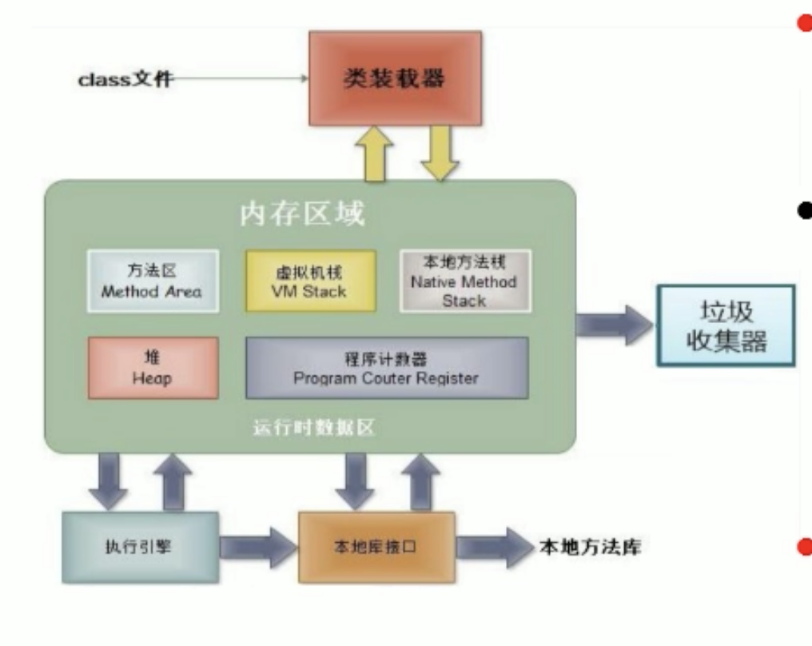
``` 
class文件 → 类装载器
            ↑   ↓
--------------------------
         内存区域

  方法区  虚拟机栈  本地方法栈
                             →  垃圾收集器
  堆     程序计数器
--------------------------
```

- <font color="#C2185B">局部变量存储在栈结构中</font>

- <font color="#C2185B">new出来的结构在堆空间中(对象的属性也在堆空间中)</font>

- <font color="#C2185B">非static会在堆空间中</font>

- <font color="#C2185B">static属性会在方法区</font>

<br>

## 运行时数据区
它里面主要分成了5个部分:
- 方法区 Method Area
- 虚拟机栈 VM Stack
- 堆 Heap

- 本地方法栈 Native Method Stack  
通过java调用本地C或C++的类库

- 程序计数器 Program Couter Register

<br>

### 堆heap:
此内存区域的唯一目的就是**存放对象实例** 几乎所有的对象实例都在这里分配内存

这一点在java虚拟机规范中的描述是: 所有的对象实例以及数组都要在堆上分配

<br>

### 栈stack:
是指虚拟机栈
虚拟机栈用于**存储局部变量**等 局部变量表存放了编译期可知长度的各种基本数据类型(boolean byte char short int float long double)

对象引用(reference类型 它不等同于对象本身 是对象在堆内存的首地址)

*方法执行完 自动释放*

<br>

### 方法区method area:
用于存储已被虚拟机加载的 <font color=#C2185B>类信息(类的结构 方法 代码块) 常量 静态变量 即时编译器编译后的代码</font> 等数据

<br>

**方法区包括:**   
类的加载信息 常量池 静态域

<br>

### 对象的内存解析:
我们就着下面的代码来解析下 对象在内存中的情况
```java
Person p1 = new Person();
p1.name = "Tom";
p1.isMale = true;

Person p2 = new Person();
System.out.println(p2.name);

Person p3 = p1;
p3.age = 10;
```

<br>

在画内存结构图的时候 我们直接从 main方法里面开始看 看 new Person 部分

**1. 声明 栈 和 堆**  
``` 
    栈      堆
```

<br>

**2. 只要是new的结构就会在堆空间中创建实体**  
```java
Person p1 = new Person();
```

我们是在main方法中创建的对象p1 方法中定义的变量都是局部变量 所以p1会保存在栈结构中, 但是类中的属性在堆空间中
```
    栈              堆

            ↗  0x12ab
p1: 0x12ab     -------------
               new Person();

               name: 默认值 null
               age: 1
               isMale: 默认值 false
               -------------
```

<br>

**3. 给类中的属性赋值**  
```java
p1.name = "Tom";
p1.isMale = true;
```

```
    栈              堆

            ↗  0x12ab
p1: 0x12ab     -------------
               new Person();

               name: null -> Tom
               age: 1
               isMale: false -> true
               -------------
```

<br>

**4. 又创建了p2**  
```java
Person p2 = new Person();
```
```
    栈              堆

            ↗  0x12ab
p1: 0x12ab     -------------
               new Person();

               name: null -> Tom
               age: 1
               isMale: false -> true
               -------------


            ↗  0x7788
p2: 0x7788     -------------
               new Person();

               name: null
               age: 1
               isMale: false
               -------------
```

<br>

**5. 将p1赋值给p3**  
p3不能叫新创建的对象 只能算新声明的变量
```java
Person p3 = p1;
p3.age = 10;
```

```
    栈              堆

p3: 0x12ab  →  0x12ab
p1: 0x12ab  ↗  -------------
               new Person();

               name: null -> Tom
               age: 1
               isMale: false -> true
               -------------


            ↗  0x7788
p2: 0x7788     -------------
               new Person();

               name: null
               age: 1
               isMale: false
               -------------
```

<br>

### 总结:
1. 非static属性都是在堆空间中
2. 引用类型的变量 只可能存储两类值: 空值 | 地址值(地址值中也包含变量的类型)

<br>

### 流程:
编译完源代码以后 生成一个或多个字节码文件 我们使用 JVM中的类的加载器和解释器对生成的字节码文件进行解释运行

运行的时候意味着我们源代码中的变量 对象会被创建 在内存中运行 将字节码文件对应的类加载到内存中 涉及到内存解析

<br><br>

# 类中的 **属性** 详解:

## 属性的使用
属性也叫做成员变量

<br>

### 成员变量 和 局部变量:

### 相同点:
1. 定义变量的格式一样 ``数据类型 变量名 = 变量值``
2. 先声明 后使用
3. 变量都有其对应的作用域

<br>

### 不同点1: 声明位置不同

**<font color="#C2185B">成员变量(属性):</font>**  
直接定义在类的一对{ }内  
方法外 类中

```java 
class Person {
  
  // 属性的位置
  String name;
  int age = 1;
  boolean isMale;

}
```

<br>

**<font color="#C2185B">局部变量:</font>**   
声明在如下位置的变量, 都叫做局部变量
- 方法内 
- 方法形参 
- <font color="#C2185B">代码块内</font>
- 构造器形参 
- 构造器内部

```java 
// 局部变量 -- 形参
public void talk(String language) {
  System.out.println("我们使用" + language + "进行交流");
}


// 局部变量 -- 方法内定义的变量
public void eat() {
  String food = "烙饼";
  System.out.println("北方人喜欢吃" + food);
}
```

<br>

### 不同点2: 权限修饰符的不同

**<font color="#C2185B">成员变量(属性):</font>**   
对于属性来讲 可以在声明属性时 指明其权限 使用权限修饰符

<br>

**<font color="#C2185B">常用的权限修饰符:</font>**  
1. private (出了定义它的类后 该属性就不能调用了)
2. public
3. 缺省
4. protected

```java 
class Person {
  
  // 没有些权限修饰符的时候就是 缺省 状态
  String name;

  // 带权限修饰符
  private int age;
  public String name;

}
```

<br>

**作用:**  
权限修饰符是指该属性被调用时候可见性的大小  
在类的封装性的时候再讲 我们现阶段设置属性的时候 使用缺省就可以了

<br>

**<font color="#C2185B">局部变量:</font>**    
局部变量不能使用权限修饰符

还可以理解为 **局部变量的权限就被方法的权限代替** 了 因为方法是public那么该属性的权限也是public

<br>

### 不同点3: 默认初始化值

**<font color="#C2185B">成员变量(属性):</font>**   
对于类中的属性来讲是有默认初始化值的  
对于属性来讲 它是可以直接使用的 即使没有赋值(因为有初始化值)

- 整型: byte short int long -> 0
- 浮点型: float double ->  0.0
- 字符型: char -> 0 或 \u0000
- 布尔型: boolean -> false
- 引用数据类型: 类 数组 接口 String -> null

<br>

**<font color="#C2185B">局部变量:</font>**    
局部变量没有初始化值

意味着 我们在调用局部变量之前 一定要显式赋值

下面有一个问题 就是因为 局部变量没有初始化值在使用局部变量之前一定要先赋值 但是属性就有默认得初始化值

<br>

**局部变量(形参)的特别之处:**  
上面说了 局部变量必须先赋值后使用 但是我们发现 形参可以使用使用 因为形参可以在调用时再赋值

我们声明了形参但是调用方法的时候如果没有传递实参就会报错 也就是说java中定义的形参必须要传递实参么？

<br>

### 不同点4: 内存中加载的位置
属性 和 局部变量 在内存中加载的位置不一样

**成员变量(属性):**  
加载在堆空间中

<br>

**局部变量:**  
加载到栈空间

<br>

### 回顾变量分类:
```
          ↗ 基本数据类型: 数值型 字符型 布尔型
按照数据类型 
          ↘ 引用数据类型: 类 接口 数组 String

          

                  ↗ 实例变量(不以static修饰)
        ↗ 成员变量
                  ↘ 类变量(以static修饰)
在类中声明的位置 
                  ↗ 形参(方法 构造器定义)
        ↘ 局部变量 → 方法局部变量(方法内定义)
                  ↘ 代码块局部变量(代码块内定义)
              
```

<br><br>

# 类中的 **方法** 详解:
这节我们研究下类中的方法的声明和使用

在类当中属性就属于我们定义的一些变量了 用来描述类中对象的特点

方法是用来刻画我们类应该具有的功能 每一个方法用来做特定的事情 完成特定的功能

<br>

## 方法的作用
用来描述类应该具有的功能, 方法就是功能 将功能封装到方法中

<br>

## 方法的声明
关键字: 如static final abstract等 它们也是修饰方法的

```java
权限修饰符 [关键字] 返回值类型 方法名(形参列表) { ... }


public void sleep(int hour) {
  System.out.println("客户睡了" + hour + "小时");
}
```
  
<br>

### 方法结构: 权限修饰符
权限修饰符的作用就是: 方法被调用的时候的权限大小

- private(私有)
- public(公共)
- 缺省
- protected
  
<br>

### 方法结构: 返回值类型
处于方法名前

- void: 没有返回值
- String: 返回值的类型为字符串
- int[]: 返回值的类型为数组
- Bank: 返回值的类型为一个类

<br>

**<font color="#C2185B">有返回值的情况:return关键字</font>**  
如果方法有返回值 **则必须在方法声明时 指定返回值的类型 同时方法中需要使用 return关键字** 来返回指定类型的数据

<br>

**<font color="#C2185B">没有返回值的情况:</font>**  
如果方法没有返回值 **则方法声明时 使用 void 来表示**  

通常没有返回值的方法中 不需要使用return 但是如果使用return的话

只能 **return;** 表示结束该方法
```java
public void eat() {
  System.out.println("客户吃饭");
  return; 
}
```

<br>

**<font color="#C2185B">return 关键字的使用:</font>**  

**使用范围:**  
使用在方法体中

<br>

**作用:**   
1. 结束一个方法 类似break
2. 针对于有返回值类型的方法 使用 "return data" 返回指定的数据
3. return关键字后面不可以有任何语句

<br>

### 方法结构: 方法名
方法名就是标识符 在写方法名的时候 要遵循标识符的规则和规范 要 见名知意

<br>

### 方法结构: 形参列表
方法可以声明0个 1个或多个形参
```java
(数据类型 形参, 数据类型2 形参2) { ... }
```

<br>

### 方法结构: 方法体
方法功能的体现

<br>

### 方法使用中的特点:
1. 类中方法内 可以调用 当前类中的 属性 和 方法
2. 方法中不能定义别的方法

<br>

### 一个包内的java文件可以不用导入直接调用:
一个包文件夹中的一个.java文件可以调用另一个.java文字中的代码

这两个java文件在一个包文件夹下
```java 
// a.java文件
public class PersonTest { }

// b.java文件
public class Person { }


// PersonTest 类中 不用引入 Person文件 直接可以new Person 和 通过实例调用方法和属性
public class PersonTest {
  // 不用在该文件中引入 Person.java 文件
  Person p1 = new Person();
}
```

<br>

### 练习1:
创建一个Person类 其定义如下:

<br>

**要求:**    
**1. 创建Person类的对象:**  
- 设置该对象的name age sex属性 
- 调用study方法 输出字符串"studying"   
- 调用showAge方法显示age值 
- 调用addAge方法给对象的age属性增加2岁

<br>

**2. 创建第二个对象:**  
执行上述的操作 体会同一个类的不同对象之间的关系

<br>

### 类图:
``` 
Person
name: String
age: int
sex: int

+study():void
+showAge():void
+addAge(int i):int
```


```java 
package src.com;
public class Person {
  String name;
  int age;

  /**  
  *   文档注释的作用在调用的时候会有提示:
  *   sex: 1 表明是男性
  *   sex: 0 表明是女性
  */
  int sex;

  public void study() {
    System.out.println("studying");
  }

  public void showAge() {
    System.out.println("age: " + age);
  }

  // addAge方法中的形参i是局部变量
  public int addAge(int i) {
    return age += i;
  }
}


package src.com;
public class PersonTest {
  public static void main(String[] args) {

    Person p1 = new Person();

    // 设置属性
    p1.name = "Tom";
    p1.age = 16;
    p1.sex = 1;

    // 调用方法
    p1.study();
    p1.showAge();

    // 调用 addAge
    int newAge = p1.addAge(2);

    System.out.println(p1.name + "的新年龄为: " + newAge);


    // 再继续创建 p2 对象
    Person p1 = new Person();
    p2.showAge()    
      // 0, 新造的对象我们输出的是默认值
  }
}
```

<br>

### 注意:
这里有一个细节, 我们定义了 addAge()方法 它返回了一个 age
```js
public int addAge(int i) {
  return age += i;
}
```

<br>

所以i定义在栈中 i: 2, 然后addAge方法内部在age中累加了2 那么堆空间的对象实体的age就累加了2

addAge方法中的形参i是局部变量 
我们输出 newAge 是输出的 栈中的newAge变量 
我们输出 p1.age 是输出的 堆中的age属性

- ！！！局部变量放在栈
- ！！！属性放在堆

<br>

**注意**  
当我们没有给age重新赋值的时候 age是有默认值的 int型的age默认值为0

不同于我们的js 如果不赋值会值undefined 进行计算的时候会是 NaN

但是java中整型是的默认值为0 所以我们即使不赋值 直接进行计算 也会是正确的结果

<br>

### 练习2:
利用面向对象的编程方法 设计类Circle计算圆的面积
```java 
class Circle {
  // 属性: 对于圆来说半径作为属性比较好
  double radius;

  // 方法: 求圆的面积
  public double area() {
    return Math.PI * radius * radius;
  }


  // 错误的情况: 这样跟类本身的意义就没有关系了
  public double area(double r) {
    double area = Math.PI * r * r;
    return area;
  }

}


public class CircleTest {
  public static void main(String[] agrs) {

    Circle c1 = new Circle();

    // 直接输出的情况:
    System.out.println(c1.area());    // 0.0
        // 因为radius定义了 并没有赋值 默认值为0


    
    // 赋值后输出的情况:

    // 给半径直接赋值后 调用方法就可以得到面积 所以不用给类中的方法设置形参
    c1.radius = 10.0;
    System.out.println(c1.area()); 

  }
}
```

<br>

### 练习3:
**1.**  
编写程序 声明一个method方法 在方法中打印一个10 * 8的 *矩阵 在main方法中调用该方法 

<br>

**2.**  
修改上一个程序 在method方法中 除打印一个10 * 8的*型矩阵外 再计算该矩形的面积 并将其作为方法返回值 在main方法中调用该方法 接收返回的面积值并打印

<br>

**3.**  
修改上一个程序 在method方法提供m 和n两个参数 方法中打印一个m * n的 *型矩形 并计算该矩形的面积 将其作为方法返回值 在main方法中调用该方法 接收返回的面积值并打印

```java 
// 1
public class Demo {

  public static void main(String[] agrs) {

    // 在类中的main方法中调用非静态的方法必须要先造对象
    Demo d1 = new Demo();
    d1.method();
  }

  // for循环输出矩阵
  public void method() {
    for(int i=0; i<10; i++) {
      for(int j=0; j<8; j++) {
        System.out.print("*");
      }
      System.out.println();
    }
  }
}
```

<br>

```java 
// 2
public class Demo {
  public static void main(String[] agrs) {

    Demo d1 = new Demo();
    int area = d1.method();

    System.out.println(area);
  }

  public int method() {
    for(int i=0; i<10; i++) {
      for(int j=0; j<8; j++) {
        System.out.print("* ");
      }
      System.out.println();
    }

    return 10 * 8;
  }
}
```

<br>

要点: 定义属性也好 还是形参也好 我们都要先确认类型
```java
// 3
public class Demo {
  public static void main(String[] agrs) {
    Demo d1 = new Demo();

    int res = d1.method(8, 8);
    System.out.println(res);
  }

  public int method(int m, int n) {
    for(int i=0; i<m; i++) {
      for(int j=0; j<n; j++) {
        System.out.print("* ");
      }
      System.out.println();
    }
    return m * n;
  }
}
```

<br>

### 练习4:
定义类Student 包含3个属性:

- 学号number int
- 年级state int
- 成绩score int;  

创建20个学生对象 学号1到20 年级和成绩都由随机数确定

<br>

**问题1:**  
打印出3年级state值为3的学生信息
 
<br>

**问题2:**  
使用冒泡排序按学生成绩排序 并遍历所有学生信息

<br>

**提示:**  
1. 使用数组承装学生对象
2. 生成随机数 math.random 返回值类型double
2. 四舍五入取整 math.round(double d) 返回值类型为long

<br>

**自己实现时出现的问题:**  
既然创建20个学生对象 那么肯定要用到循环 但是用js的想法 发现写不下去了
```java
for(int i=0; i<20; i++) {
  Student 属性名没办法依次指定 = new Student();
}
```

<br>

**解决方式:**  
在java中 我们可以创建 动态对象数组  
我们class Student这个类也是一个对象 因为数组的元素包括任何自定义类型 自然也包括我们自定义的class类 上面我们创建字符串类型的数组是这样
```java
String[] str = new String[10]
```

现在我们创建 类对象(js中的class类在java中好像就是对象)
```java
Student[] studs = new Student[20]
```

这里我们先是创建了一个数组 是什么型的数组呢？也就是说数组的元素是什么类型的呢？ 是Student类的一个个对象

数组本身是引用数据类型的 数据的元素既可以是基本数据类型 又可以是引用数据类型

这里元素是引用类型 只不过是我们自定义的Student类 我们的数组中每一项是一个Student类型的 然后我们依然往里输入值

```java 
public class Demo {

  public static void main(String[] args) {
    // 声明一个 Student类型 的数组
    Student[] studs = new Student[20];


    for(int i=0; i<studs.length; i++) {
      // 给数组对象进行赋值
      studs[i] = new Student();
    }
  }

}

class Student {
  int number;
  int state;
  int score;
}
```

<br>

更新上面下一阶段的代码  
上面说了 我们可以创建动态数组 然后利用循环依次向数组中的元素中追加值 然后我们想打印输出下 看看这个类对象数组中都有什么

<br>

**方式1: 循环遍历加拼接**  

System.out.println(studs[i].number + ", " + studs[i].state + ", " + studs[i].score);

<br>

**方式2:**  
既然数组中每一个元素都是一个类对象 那类中就能有自己的方法 studs[i] 就是每一个对象 那么studs[i]就能调用自己的方法

**在Student类中创建一个方法**  
```java
public String info() {
  return "学号: " + number + ", 班级: " + state + ", 成绩: " + score; 
}
```

```java 
package src.com;

public class Demo {
  
  public static void main(String[] args) {
    Student[] studs = new Student[20];

    for(int i=0; i<studs.length; i++) {

      studs[i] = new Student();

      // 给stud对象的属性赋值
      studs[i].number = i + 1;

      // Math.random() * (6-1+1) + 1 是一个double类型的值 该值不能赋值给int
      studs[i].state = (int)(Math.random() * (6-1+1) + 1);

      studs[i].score = (int)(Math.random() * (100-0+1));
    }

    // 遍历学生数组
    for(int i=0; i<studs.length; i++) {
      // 这样会输出地址值
      // System.out.println(studs[i]);

      // System.out.println(studs[i].number + ", " + studs[i].state + ", " + studs[i].score);

      System.out.println(studs[i].info());
    }
  }
}

class Student {
  int number;
  int state;
  int score;

  // 显示学生信息的方法
  public String info() {
    return "学号: " + number + ", 班级: " + state + ", 成绩: " + score; 
  }
}
```

<br>

更新一下最新阶段的代码

<br>

**要点:**  
在给对象做冒泡排序的时候 我们判断的是对象中的属性 但是交换的是对象本身 在定义中转变量的时候 我们对象的类型就是new Student的类型
```java 
package src.com;

public class Demo {
  
  public static void main(String[] args) {
    Student[] studs = new Student[20];

    for(int i=0; i<studs.length; i++) {
      studs[i] = new Student();

      studs[i].number = i + 1;
      studs[i].state = (int)(Math.random() * (6-1+1) + 1);
      studs[i].score = (int)(Math.random() * (100-0+1));
    }

    // 遍历学生数组
    for(int i=0; i<studs.length; i++) {
      if(studs[i].state == 3) {
        System.out.println(studs[i].info());
      }
    }
    System.out.println("**********************");

    // 使用冒泡排序按学生成绩排序 并遍历出所有学生信息
    for(int i=0; i<studs.length-1; i++) {
      for(int j=0; j<studs.length - 1 - i; j++) {
        if(studs[j].score > studs[j+1].score) {
          /*
            我们交换的不是成绩 而是学生对象的顺序 
            注意这里我们定义变量的类型 因为我们交换的是对象 每一个对象都是new Student出来的 所以每一个对象的类型都是Student
           */
          Student temp = studs[j];    // 注意

          studs[j] = studs[j+1];
          studs[j+1] = temp;
        }
      }
    }

    // 遍历查看下结果
    for(int i=0; i<studs.length; i++) {
      System.out.println(studs[i].info());
    }
  }
}

class Student {
  int number;
  int state;
  int score;

  // 显示学生信息的方法
  public String info() {
    return "学号: " + number + ", 班级: " + state + ", 成绩: " + score; 
  }
}
```

<br>

### 优化:
上面我们对数组的遍历 冒泡排序 以及输出指定班级学生信息 都写在了main方法中并没有封装成一个个的方法 接下来我们将操作数组的功能封装到一个个的方法中

<br>

**要点:**  
我们在main方法中调用这个类的其它方法时 现阶段需要先根据当前类 先new一个对象 通过实例对象调用除了main方法以外的其它方法

```java 
package src.com;

public class Demo {
  
  public static void main(String[] args) {

    // 声明一个 Student类型 的数组
    Student[] studs = new Student[20];

    for(int i=0; i<studs.length; i++) {
      studs[i] = new Student();

      // 给stud对象的属性赋值
      studs[i].number = i + 1;

      // Math.random() * (6-1+1) + 1 是一个double类型的值 该值不能赋值给int
      studs[i].state = (int)(Math.random() * (6-1+1) + 1);

      studs[i].score = (int)(Math.random() * (100-0+1));
    }

    // 我们在main方法中调用这个类的其它方法时 现阶段需要先根据当前类 先new一个对象 通过实例对象调用除了main方法以外的其它方法
    Demo d1 = new Demo();
    d1.searchState(studs, 3);

    System.out.println("****************");

    d1.sort(studs);
    d1.showInfo(studs);

  }

  // 遍历Student[]数组的方法
  // 参数: 我们要遍历哪个对象数组
  public void showInfo(Student[] studs) {
    for(int i=0; i<studs.length; i++) {
      System.out.println(studs[i].info());
    }
  }

  /**  
  * @Description 查找Student数组中指定年级的学生
  * @author Sam
  * @param studs 要查找的数组
  * @param state 指定的年级
  */
  public void searchState(Student[] studs, int state) {
    for(int i=0; i<studs.length; i++) {
      if(studs[i].state == state) {
        System.out.println(studs[i].info());
      }
    }
  }

  /**  
  * @Description 给指定数组进行排序
  * @param studs 给定数组
  */
  public void sort(Student[] studs) {
    for(int i=0; i<studs.length-1; i++) {
      for(int j=0; j<studs.length - 1 - i; j++) {
        if(studs[j].score > studs[j+1].score) {
          Student temp = studs[j];
          studs[j] = studs[j+1];
          studs[j+1] = temp;
        }
      }
    }
  }
}

class Student {
  int number;
  int state;
  int score;

  // 显示学生信息的方法
  public String info() {
    return "学号: " + number + ", 班级: " + state + ", 成绩: " + score; 
  }
}
```

这样整个代码会看起来干净一些 因为main方法中调用的是一个个的功能

<br>

### 练习5:
声明一个日期类型 MyDate 有属性 
- 年 
- 月 
- 日 

创建2个日期对象 分别赋值为 你的出生日期 你对象的出生日期 并显示信息

**这个看看资料**  

<br>

### 练习6: 自定义数组的工具类
我们自定义的类名 不要跟 java预定义的名字一样 不然有些麻烦 需要自己指定用的是哪个

```java 
package src.com;

/**  
* 自定义数组的工具类
*/
public class ArrayUtils {

  // 最大值
  public int getMax(int[] arr) {
    int max = 0

    for(int i = 0; i < arr.length; i++) {
      if(arr[i] > max) max = arr[i]
    }

    return max
  }


  // 最小值
  public int getMin(int[] arr) {
    int min = 0

    for(int i = 0; i < arr.length; i++) {
      if(arr[i] < min) min = arr[i]
    }

    return min
  }

  // 总和
  public int getSum(int[] arr) {
    int sum = 0

    for(int i = 0; i < arr.length; i++) {
      sum += arr[i]
    }

    return sum
  }

  // 平均值
  public int getAvg(int[] arr) {
    return getSum(arr) / arr.length
  }

  // 反转数组
  public void reverse(int[] arr) {
    int temp = 0;
    for(int = 0, j = arr.length - 1; i < arr.length / 2; i++, j--) {
      temp = arr[i];
      arr[i] = arr[j];
      arr[j] = temp;
    }

    String info = Arrays.toString(arr);
    System.out.println(info);

    ---

    // 利用了 arr.length - 1 - i 好方式!!
    for(int = 0; i < arr.length / 2; i++) {
      int temp = arr[i];
      arr[i] = arr[arr.length - 1 - i];
      arr[arr.length - i -1] = temp
    }
  }

  // 复制数组 
  public int[] copy(int[] arr) {
    int[] newArr = int[arr.length]
    for(int i = 0; i < arr.length; i++) {
      newArr[i] = arr[i]
    }

    return newArr
  }

  // 数组排序
  public void sort(int[] arr) {
    for(int i = 0; i < arr.length - 1; i++) {
      for(int j = 0; j < arr.length - i - 1; j++) {
        if(arr[j] > arr[j + 1]) {
          int temp = 0
          temp = arr[j]
          arr[j] = arr[j + 1]
          arr[j + 1] = temp
        }
      }
    }
  }

  // 遍历数组
  public void print(int[] arr) { }

  // 查找指定元素
  public int getIndex(int[] arr, int index) {
    int target = 0
    for(int i = 0; i < arr.length; i++) {
      if(i == index) {
        target = arr[i]
        break
      }
    }

    return target;
  }
}
```

<br><br>

# 什么叫做万物皆对象

### 类:
抽象的 概念股上的内容

<br>

### 对象:
实实在在存在的个体 比如内存中真正的创建了对象 占据了内存的空间

对象是类的实例 是new出来的

<br>

## 理解
1. 在java语言范畴中 我们都将功能和结构封装到具体的类当中 通过类去实例化对象 通过实例对象去调用功能

2. 涉及到java语言与前端浏览器 后端数据库交互时 前后端的结构在java层面交互时 都体现为类 和 对象

<br>

java擅长做后台 后台需要跟前端进行交互 比如:  
前端发请求 后台返数据, 前端发送的请求 后台接收的时候 都会看做一个个类的对象

``<student></student>`` 比如这一对标签 在java端进行调用的时候 就会体现为某一个类的对象

<br>

java还会跟数据库进行交互 数据库中有一个个的表 表在数据库中也是一个个的数据库对象 这个表是如何跟java交互的呢？

java中比如有一个Custom类 数据库中有一个Custom表 java中就会用这个类去对应这个表

我们让表中的一条记录对应java类中的一个对象 表中纵向的一个结构对应java类中对象中的一个属性

<br>

也就是说不管前端还是数据库跟java进行交互的时候 在java里都会体现成一个对象

<br><br>

# 匿名对象
我们new类的时候没有创建变量来接收该对象 也就是没有显式的为对象赋一个变量名 其为匿名对象
```js 
Phone p = new Phone();
    // 这就是有名的实例对象 名为p

new Phone();
    // 这就是 匿名对象
```

<br>

## 匿名对象的特征
**只能调用一次(再想调用就是另外一个对象了)**  
```java
new Phone().price = 1999;
new Phone().showPrice();
  // 这两个调用 调用的不是同一对象方法 因为每new一次就是造了一个对象
```

<br>

### 匿名对象的使用场景:
当参数传递到形参中, new Phone()在show()方法外部不能再用了 但是在show()方法内部 因为有形参的引用在方法内部可以使用多次

```java
public class Demo {
  PhoneMall mall = new PhoneMall();

  // 匿名对象的使用, 该匿名对象会赋值给方法的形参 还是有变量指向该对象的
  mall.show(new Phone())
}
```

<br><br>

# 类中的 **方法** 详解2:
接下来我们再看看方法的相关知识点

1. 方法的重载
2. 可变形参的方法
3. 方法参数的值传递机制 (重要)
4. 递归方法 (理解)

<br><br>

## 方法的重载(overload)
在java中同一个类中 允许存在(定义)d一个以上的<font color="#C2185B">同名方法</font>, 只要同名方法之间的<font color="#C2185B">参数个数</font> 和 <font color="#C2185B">参数类型</font>不同 它们之间就是重载的关系

也就是我们在定义类的时候 可以定义很多同名的方法 但要保证它们符合重载的要求

这样用户在调用这些方法的时候 会根据各自的参数 类型 个数 找到对应的方法

<br>

### 方法的重载要求:
同名方法的 
- 参数个数  或
- 参数类型  **不同即可!!**  

<br>

比如Arrays工具类中 有很多同名的方法 方法名相同 参数参数不同
```
binarySearch(参数种类1)
binarySearch(参数种类2)
binarySearch(参数种类3)
```

<br>

### 为什么要造这么多同名的方法?
我们在起方法名的时候都要求见名知意, 比如排序我们会起名字为sort

但是我们可能对byte类型的数组排序 也可能对int类型的数组排序 对不同类型的数组排序就需要提供不同的方法 但是sort方法名更加的直观 那我们就起个一样的方法名, 但是要求参数列表不一样

```java
// 比如我们上面创建的数组的工具类 反转数组
public void reverse(int[] arr) { ... }
public void reverse(String[] arr) { ... }
```

上面的两个方法都是reverse但是参数列表不一样 它们之间就是方法的重载

<br>

### 那调用的时候 调用的是哪个？
调用的时候取决于我们参数的类型 它会自动调用对应的方法

<br>

### 方法重载的特点:
- 与返回值类型无关, 只看参数列表
- 参数列表必须不同(参数个数或参数类型)

调用时 根据方法参数列表的不同来区别

<br>

### 技巧: 两同一不同
满足下面条件的就叫做方法的重载
1. 同一个类 同一个方法名
2. 参数列表不同 (参数个数不同, 参数类型不同)

<br>

### 示例:
```java 
// 参数个数不同
public void getSum(int[] i) { ... }
public void getSum(int[] i, int[] j) { ... }


// 参数类型不同
public void getSum(int[] i) { ... }
public void getSum(double[] i) { ... }


// 参数列表的顺序不同也算方法的重载 -> 类型不同
public void getSum(String[] i, int[] j) { ... }
public void getSum(int[] j, String[] i) { ... }
```

**<font color="#C2185B">请关注形参: 类型 个数</font>**  

<br>

### 注意:
**1. 形参名无所谓的 主要看的是参数列表的类型 <font color="#C2185B">不看形参名</font>**  
```java
// 这样就不算重载 因为都是参数列表的两个参数的类型都一样 参数名其实无所谓
public void getSum(int[] i, int[] j) { ... }
public void getSum(int[] j, int[] i) { ... }
```

<br>

**2. 跟方法返回值的类型也没有关系**  
```java 
// 虽然方法返回值的类型不一样 但是并不是方法的重载
public void getSum(int[] i, int[] j) { ... }
public int getSum(int[] i, int[] j) { ... }
```

<br>

**3. 跟方法的权限修饰符也没有关系**  
```java 
public void getSum(int[] i, int[] j) { ... }
private void getSum(int[] i, int[] j) { ... }
```

<br>

### 总结:
重载跟方法的权限修饰符 返回值类型 形参变量名 方法体都没有关系

<br>

### 调用时候的注意点:
在通过对象调用方法时, 如何确定某一个指定的方法?  
我们在关注调用的方法名的同时 还需要关注参数列表 在编译器就能根据我们传入的形参 确定调用的某个方法

创建重载方法1: getSum(int num1, int num2)  
创建重载方法2: getSum(double num1, double num2)

当我们调用的时候 传入的实参如果是getSum(1,2) 那么调用的肯定是 方法1

当我们将方法1注释掉 会报错么？ 不会!

我们传递的实参int会自动提升到 double double 也就是会匹配到 方法2

<br><br>

# 可变个数的形参:
javaSE5.0中提供了Varargs机制 允许直接定义能和多个实参相匹配的形参(一对多么), 从而可以用一种更简单的方式 来传递个数可变的实参

<br>

**JDK5.0以前:**  
我们会在最后定义一个数组型的形参变量 传入多个同一类型变量
```java
public static void test(int a, String[] books) { }

// 传值的时候需要 将实参组织成数组的形式
test(new String[] {"hello", "world"})
```

<br>

**JDK5.0之后:**  
采用可变个数形参来定义方法 传入多个同一类型变量
```js
public static void test(int a, String... books) { }

// 依次传入同类型的数据即可
test("hello", "world")
```

<br>

### 可变形参的定义方式:
js:   (...args)  
java: (类型... args)

仅仅是在前面多了一个类型 <font color="#C2185B">(数据类型... 形参变量名)</font>

<br>

**要点:**  
- args是一个数组
- 我们传入的多个实参会被收集到数组中


```java 

// 我们肯定见过这么写 String[] strs 这种写法和 String... strs 是一样的
public void show(String... strs) {
  System.out.println(3 + "String... strs");
}

d.show("hello", "world");
```

<br>

### 注意:
**1. 我们传入的实参类型必须是 指定类型的**  
```java 
// 定义是 String
(String... strs)  

// 传入也必须是 String
xxx("sam", "erin", "nn")
```

<br>

**2. String... args 和 String[] args 不能共存**  
下面的两种写法不构成重载 它们二者不能共存
```java 
// 编译器认为下面的两种方法都是在定义可变个数的形参方法
public void show(String... strs) { }
public void show(String[] strs) { }
```

<br>

**3. 可变个数形参 只能声明在末尾且只能写一个可变个数形参结构**  
```java
// 跟js的...args一样 args需要放在最后
public void show(int a, String... strs) { }
```

<br><br>

# 方法参数的 值传递机制
这节里面涉及到 给形参传值的问题

<br>

## 回顾: 关于变量的赋值

<br>

### 基本数据类型的举例:
在如下的代码中 m = 10, n 的值是拿m赋的 这时候我们栈空间中 会有 m n 两个变量 它们的值是 10

但是修改其中的一个 并不会影响到另一个, 我们将 m 赋值给 n 就是将 m 存的真实的数据给了 n

内存中 10 有两份

```java 
// 基本数据类型的举例
public static void main(String[] args) {
  
  int m = 10;
  int n = m;
  System.out.println("m = " + m + ", n: " + n);

  // 当我们把n改为20的时候 m是多少 因为是值传递 所以不会影响到 m
  n = 20;
  System.out.println("m = " + m + ", n: " + n);
}
```

<br>

### 穿插下 JS Java 对象之间的对比
JS中我们创建对象的方式:
```js
let obj = new Object();
let obj = {name: "sam"}
```
有上述的两种方式创建一个普通的对象

java中是面向对象的编程方式 在创建对象的时候就是创建一个类 添加属性 就是在类的内部添加成员属性 添加方法就是在类的内部添加成员方法

```java
class Order { orderId: 1001 }
Order o = new Order();
```

<br>

### 引用数据类型的举例
```java 
// 创建一个对象(java中就是创建一个类)
class Order {
  int orderId;
}


public class Demo {

  public static void main(String[] args) {
    
    Order o1 = new Order();
    o1.orderId = 1001;

    // 引用数据类型的时候 我们传递的是地址值 
    // 这样 o1 o2 都指向了同一个对象实体
    Order o2 = o1;
    System.out.println("o1.orderId = " + o1.orderId + ", o2.orderId: " + o2.orderId);

    // 因为指向了同一个对象实体 所以通过一个对象修改属性会影响到另一个对象
    o2.orderId = 1002;
    System.out.println("o1.orderId = " + o1.orderId + ", o2.orderId: " + o2.orderId);
  }
}
```

<br>

### 总结:
**1. 变量是基本数据类型的时候:**    
此时将该变量<font color="#C2185B">实际存储的数据</font> 传递给了新的变量

<br>

**2. 变量是引用数据类型的时候:**    
此时将该变量存储的<font color="#C2185B">地址值</font> 传递给了新的变量

<br><br>

## 方法形参的 值传递
其实和上面的规律是一样 我们从形参的角度看看怎么去理解 其实是跟上面一样的

java里方法的参数传递方式只有一种: **值传递**  
即将实际参数值的副本(复制品)传入方法内 而参数本身不受影响

<br>

### 形参: 基本数据类型
实参是基本数据类型的时候 传递给 形参 的是 实参真实存储的数据值(copy)

**可能就会导致方法内有一份 方法外有一份 两份数据互不干扰 造成方法内爱怎么玩怎么玩不会对方法外的数据造成影响**  

<br>

**示例: 交换两个变量de值**  
```java 
// 我们交换两个变量的位置的时候 会写这样的逻辑 
int temp = m;
m = n;
n = temp;


// 因为交换两个变量的位置在很多地方都会使用我们能不能将其封装成一个方法?然后在合适的位置进行调用
public void swap(int m, int n) {
  int temp = m;
  m = n;
  n = temp;
}

  
// 结果发现不行 我们输出的结果还是未交换之前的
int m = 10;
int n = 20;
System.out.println("m: " + m + ", n: " + n);   // m:10 n: 20

// 调用了方法变量也没有交换
swap(m, n);
System.out.println("m: " + m + ", n: " + n);   // m:10 n: 20
```

<br>

**原因:**  
当数据为普通数据类型的时候我们传递到形参中的仅是数据
我们调用swap方法交换的方法内部的两个形参局部变量的值

<br>

**内存解析:**  
**1.**  
所有main方法中 定义了 int m = 10,  int n = 20  
那我们就在栈中创建两个变量

```
栈
------
m: 10  main方法中定义的
n: 20  main方法中定义的
```

<br>

**2.**  
调用 swap(m, n)  
接下来我们调用了swap方法将上面m n的值copy给形参m n 因为形参也是局部变量所以还要在栈中再次创建 m n

```
栈
------

m: 10  swap方法中形参m
n: 20  swap方法中形参n

m: 10  main方法中定义的
n: 20  main方法中定义的
```

<br>

temp变量  swap方法中的局部变量  
也就是说我们调用swap后 是将swap方法里面的形参 m n 变量交换了位置

当swap方法执行完毕后 *swap内部的形参会被销毁出栈* 我们再打印m n的时候打印的是main方法放到栈中的m n

```
栈
------

m: 20  swap方法中形参m    - 出栈
n: 10  swap方法中形参n    - 出栈

m: 10  main方法中定义的
n: 20  main方法中定义的
```

<br>

### 形参: 引用数据类型
实参是引用数据类型的时候 传递给 形参 的是 实参的地址值

<br>

**技巧:**  
那我们要是想实现类似交换基本数据类型的变量的时候 可以将基本数据类型的数据 封装到一个变量中 

类似下面:  
我们将 m n 封装到 Data 类中

```java
// 1. 我们要创建一个对象
class Data {
  int m;
  int n;
}


package src.com;
public class Demo {

  public static void main(String[] args) {

    // 3. 将Data类实例化对象
    Data data = new Data();
    data.m = 10;
    data.n = 20;

    System.out.println("data.m: " + data.m + ", data.n: " + data.n);
    

    // 4. 调用swap方法
    Demo d = new Demo();

    d.swap(data);
    System.out.println("data.m: " + data.m + ", data.n: " + data.n);
  }


  // 2. 交换两个变量值的方法 参数为Data类 类型
  public void swap(Data data) {
    int temp = data.m;
    data.m = data.n;
    data.n = temp;
  }
}
```

因为基本数据类型的时候 我们传递到形参的值为copy的原始值
我们现在形参的位置是一个对象 它跟形参保存的都是地址值 都指向堆空间中的一个对象实体

<br>

**内存解析:**  
```java

栈                   堆   0x7788
------              ------
data: 0x7788 形参
data: 0x7788 main中new Data

                    
                    m: 0  - 10
                    n: 0  - 20
```


然后我们调用 swap(data) 将data传递进去 data是引用数据类型 保存的是地址值 0x7788

现在通过地址值都指向堆空间中的数据m n 所以交换的也是堆空间中的m n

<br>

**数组方法中遇到的值传递的问题:**  

```java 
// 这是一个封装好的排序方法
public void sort(int[] arr) {
  for(int i=0; i<arr.length-1; i++) {
    for(int j=0; j<arr.length - 1 - i; j++) {
      if(arr[j] > arr[j+1]) {
        
        // 我们把这个部分逻辑也封装成一个方法
        int temp = arr[j];
        arr[j] = arr[j+1];
        arr[j+1] = temp

        // 如果这么传递值的话 还是会跟上面的情况一样 
        // 我们把arr[j], arr[j+1]对应的值copy给了形参 它们还是会在方法内部自己干自己的
       swap(arr[j], arr[j+1])


        // 正确的方法
        swap(arr, j, j+1)
      } 
    }
  }
} 

// 这里我们也是将 交换两个变量 的逻辑封装成了一个方法
// 在形参为基本数据类型的时候 我们使用swap方法未成功 那在这里可以么？


// 这样定义形参传递进来的值是基本数据类型 所以不行
public void swap(int i, int j) {
  int temp = i;
  i = j;
  j = temp
}

// 我们把引用类型的数组传递进来 这里的int i j不是元素 而是索引位置
public void swap(int[] arr, int i, int j) {
  int temp = arr[i];
  arr[i] = arr[j];
  arr[j] = temp
}
```

<br>

### 练习: 网红题1
```java
public class Test {
  public static void main(String[] args) {
    int a = 10;
    int b = 10;

    // 要求: 在method方法被调用后 打印出 a = 100, b = 200 并写出 method 方法的代码
    method(a, b);

    System.out.println(a + " - " + b)
  }


  // 方式1:
  public void method(int a, int b) {
    
    a = 100;
    b = 200;

    // 我们在方法内输出 
    System.out.println(a + " - " + b)

    // 然后直接退出程序
    System.exit(0);

  }


  // 方式2: 让main中的 System.out.println 输出 这里我们只能在 println 身上动手脚了
  public static void method(int a, int b) {

    // 重置 System.ou打印流 当再打印的时候不是调用默认的方法 而是调用重写的方法
    PrintStream ps = new PrintStream(System.out) {
      @Override
      public void println(String x) {
        if("a = 10".equals(x)) {
          x = "a = 100";
        } else if("b = 10".equals(x)) {
          x = "b = 200"
        }

        super.println(x)
      }
    }

    System.setOut(ps);
  }
}
```


<br>


### 练习: 网红题2
定义一个int型的数组
```java
int[] arr = new int[]{12, 3, 3, 34, 56, 77, 432}
```

- 让数组的每个位置上的值去除以首位置的元素 得到的结果 作为该位置上的新值 
- 遍历新的数组

<br>

**解答: 错误的答案**  
```java 
for(int i=0; i<arr.length; i++) {
  arr[i] = arr[i] / arr[0]
}
```

当i=0的时候 12 = 12 / 12 = 1 因为首位置已经是1了 所以

当i=1的时候 3 = 3 / 1 = 3 因为上面arr[0]的位置已经被改成1了 所以上面的答案不对

<br>

**解答: 正确答案1**  

```java 
// 我们倒着来 保证第一个元素的值始终为12
for(int=arr.length - 1; i>=0; i--;) {
  arr[i] = arr[i] / arr[0]
}
```

**解答: 正确方法2**  
```java  
// 我们将数组中第一个元素保存到外面 让它的值不变
int temp = arr[0]
for(int i=0; i<arr.length; i++) {
  arr[i] = arr[i] / temp
} 
```

<br>

### 练习3:
下面的代码分别输出什么？

```java 
// 示例1:
int[] arr = new int[] {1,2,3};
System.out.println(arr);    // [I@626b2d4a


// 示例2:
// 为什么 char 型的输出不是地址值
char[] arr1 = new char[] {'a','b','c'};
System.out.println(arr1);   // abc
```

<br>

**示例1:**  
我们通过 System.out.println(arr) 输出arr 得到的是地址值  
因为当我们传入的是int[]数组的时候 会调用重载方法 **println(Object)**  
```java
public void println(Object x) {
  String s = String.valueOf(x);

  synchronized (this) {
    print(s);
    newLine()
  }
}
```

<br>

**示例2:**  
我们通过 System.out.println(arr1) 输出arr1 得到的是abc

因为我们传入的是 char[] 数组的时候 真有 **println(char[])** 这个重载方法, 而这个重载的方法内部 是遍历 char[] 数组 所以我们能输出 a b c 

<br>

### 练习4:

**1.**  
定义一个Circle类 包含 圆的半径 求面积的方法
- 属性: double radius; 
- 方法: findArea() 返回圆的面积


<br>

**2.**  
定义一个类PassObject 

<br>

**方法:**  
printAreas()
```java
public void printAreas(Circle c, int count) { }
```

<br>

**要求:**   
在printAreas方法中打印输出 1 ~ count 之间的每个整数半径值 以及对应的面积 count 也是半径值

例如:  
count为5 则输出半径 1 2 3 4 5 以及对应的圆面积

<br>

**3.**  
在main方法中调用printAreas()方法 调用完毕后输出当前半径值
程序运行结果如下
``` 
Radius        Area
 1.0          3.14...
 2.0          12.56...
 3.0          28.27...
 4.0          50.26...
 5.0          78.53...
```

```java 
package src.com;
public class Circle {
  double radius;

  // 求圆的面积 不用有形参 直接用对象中的radius
  public double findArea() {
    return radius * radius * Math.PI;
  }
}
```

```java 
package src.com;
public class PassObject {

  public static void main(String[] args) {

    PassObject test = new PassObject();

    Circle c = new Circle();
    test.printAreas(c, 5);
  }

  public void printAreas(Circle c, int count) {
    System.out.println("Radius\t\tAreas");
    for(int i = 1; i <= count; i++) {
      c.radius = i;
      System.out.println(c.radius + "\t\t" + c.findArea());
    }


    // ----- 还可以写成如下的格式:

    int i = 1;
    // 把初始化的i提升到外部 这样别的地方还可以继续用i
    for(; i <= count; i++) {
      c.radius = i;
      System.out.println(c.radius + "\t\t" + c.findArea());
    }
  }
}
```

<br>

### 例外:
我们知道 String 是引用数据类型 那么我们把字符串传递给方法形参 在方法内部修改后 结果会是什么样?
```java
// String类型的值除了可以new之外 还可以如下的写法
String str = "hello"

change(str);
// 输出修改后的结果会是什么呢？
System.out.println(str)   // hello

public void change(String s) {
  // 我们把接收到的string 修改收 hi
  s = "hi~"
}
```

<br>

**为什么是 hello?**  
hello这个值存储在常量池中, hello是字符串, 它的底层就是char[]数组存的 长度就是hello的个数 既然是char[] 那么肯定有首地址值

s1交给形参s 那么意味着s也指向了常量池中的char[]

```
 栈 
--- 
s1: 0x5566       

s(形参): 0x5566


常量池    
-----   ↙ 0x5566
hello
```

接下来我们会在方法内部将其修改为 hi~, 这时候我们要理解字符串的特征

字符串是不可变的字符序列, 我们要将 hello -> hi  
字符串的底层使用的是char[] 数组是不可以修改的, 所以修改为hi的操作 实际上是我们新造了一个char[]

新造了一个 hi 的 char[] 数组后 将这个新的char[]的首地址给了s

这时:  
s   指向 hi 的char[]
str 指向 hello 的char[]

<br><br>

# 递归方法
一个方法体内调用它自身
方法递归包含了一个隐式的循环 它会重复执行某段代码 但这种重复执行无须循环控制

```python
# 方法在运行的时候调用了自己就是递归
def f(x)
  if x > 0
    return x + f(x-1)
  else 
    return 0    # 终止条件

  # 参数x的值   函数的返回值
  x = 3        3 + f(2)

      # 参数x的值   函数的返回值
      x = 2        2 + f(1)

          # 参数x的值   函数的返回值
          x = 1        1 + f(0)

# 其中 f(x-1) 就相当于 i-- 当x为0的时候 就终止

 
# 结果:
f(3) = 3 + f(2)
     = 3 + 2 + f(1)
     = 3 + 2 + 1 + f(0)
     = 3 + 2 + 1 + 0


       # ↙程序执行结束 开始依次出栈
f(0)  -> 0
f(1)  -> 1 + f(1 - 1)
f(2)  -> 2 + f(2 - 1)
f(3)  -> 3 + f(3 - 1)
```

<br>

### 技巧: x + f(x-1)
先记住 这种写法就是求n之前的累计数 累计数不光光是相加还有相乘

<br>

### 递归要点:
递归一定要向已知方法递归 否则这种递归就变成了无穷递归 类似于死循环

在程序运行的时候是有代价的 要占用一片栈的内存空间 当调用函数时 都必须要放一些数据到栈里 当函数运行结束时 这些数据会从栈中弹出

可是 如果调用了很多函数但是这些函数都不返回 栈就被塞满了 数据没地方放了 就是栈溢出


<br>

### 示例:
计算1-100之间所有自然数的和, 数组中的快排 排序 内部用的就是递归方法

当 num == 1, 结果就是1, 因为我们要求 指定num 和 num之前的数的和

当 num == 2, 结果就是 1 + 2  
当 num == 3, 结果就是 1 + 2 + 3

```java 
public void sum(int num) {
  
  if(num == 1) {
    return 1 
  } else {
    return num + sum(num - 1);
  }

}
```

<br>

### 示例2:
已知有一个数列  
f(0) = 1  
f(1) = 4  
f(n+2) = 2 * f(n+1) + f(n)  
其中n是大于0的整数 求f(10)的值

```java 
public int f(int n) {
  if(n == 0) {
    return 1;
  } else if(n == 1) {
    return 4;
  } else {
    // 要往已知的方向计算 比如我们想算10 那就要计算2被的f(9) + f(8)
    return 2 * f(n - 1) + f(n - 2);
  }
}
```

<br>

### 示例3: 斐波那契数列
输入一个数据 n 计算斐波那契数列的第n个值  
1 1 2 3 5 8 13 21 34 56

规律:  
一个数等于前两个数之和 
 
要求:  
计算斐波那契数列的第n个值, 并将整个数列打印出来

```java
public int f(num) {
  if(num == 1 || num == 2) {
    return 1
  } else {
    return f(n-1) + f(n-2)
  }
}
```

<br>

**n阶台阶问题:**  
有n阶台阶 有一个人要登台阶了 这个人只能每次登一个台阶 或者 二个台阶 问登完这n阶台阶一共有多少种方法? 其实这就是斐波那契数列 就是计算 fn(n) = f(n-1) + f(n-2)

<br>

**汉诺塔问题:**  
我们要将A柱上的上的两个方块 转到C上, 转的过程中我们可以借助B, 在转的过程中不能将大的方框放上面 小的放下面
```
  A       B       C
  |       |       |
  □       |       |
  □       |       |
-----   -----   -----
```

这样的问题也是可以用递归完成的

<br><br>

# 类中的 **构造器(或构造方法)** 详解:
类的3大成员: 属性 方法 构造器

上面我们讲了类的成员 属性和方法 这个部分我们来讲下构造器, 任何一个类都有构造器 比较重要哦

<br>

## 构造器的作用1
**创建对象**  

<br>

### 说明:
当我们没有显示定义类的构造器的时候, <font color="#C2185B">系统会默认提供一个空参的构造器</font>

<br>

之前我们要调用 Person类中的结构都是 ``Person p = new Person()`` 我们都用这个命令来创建对象 

那我们上面又说 构造器的作用是创建对象 那和 new Person() 有什么关系?

```java
// 实例化类的对象
Person person = new Person();

// 类的构造器定义的方式很像方法 同时执行起来也类似方法的调用 Person() 只不过Person()(构造器)的作用就是造对象

new Person() == new + Person() // 其中Person就是构造器
new Person() == new + 构造器 
```

<br>

## 构造器的格式
```java
权限修饰符 类名(形参列表) { 
  构造器的体 
}
```

很像方法的写法 只不过方法名的位置是类名, 虽然和方法长的很像但是功能却不一样

<br>

**方法:**  
方法都是通过对象去调用 使用其封装的功能  

<br>

**构造器:**  
它主要的功能就是用来 **造对象**  

```java  
class Person {
  String name;
  int age;

  // 构造器: 空参构造器
  public Person() {
    ...;
  }

  public void eat() {
    System.out.println("人吃饭");
  }
}

/*
  当我们实例化Person的时候 
  Person person = new Person();

  调用的就是上面的空参构造器, 当我们没有显式的定义构造器的时候 系统会自动添加空参构造器
*/
```

<br>

### 构造器的特点:

**1. 默认的构造器的权限 和 类的权限一致(构造器的权限和类的一致)**  
如果类的权限是public 那么构造器的权限也是public 如何类没有权限属于缺省权限 那么构造器的权限也是缺省权限

如果我们没有显式的定义构造器 那么系统会自动添加默认的构造器

<br>

**2. 创建对象的同时给类的成员属性进行初始化**  
我们通过在 new Person("sam") 传递实参 在做类的实例化的同时为类的属性进行赋值
```java
class Person {

  String name;
  int age;

  public Person(String name, int age) {
    this.name = name;
    this.age = age;
  }
}
```

<br>

**3. 构造器可以定义多个, 调用不同的构造器 为不同的属性进行赋值**  
```java
class Person {

  String name;
  int age;

  // 空参构造器
  public Person() {

  }

  // 调用指定的构造器给指定的属性进行赋值
  public Person(String name) {
    this.name = name
  }

  public Person(String name, int age) {
    this.name = name;
    this.age = age;
  }
}
```

构造器的作用除了可以创建对象 还跟js中的constructor功能一样 可以用来在实例化对象的时候通过传递实参 **动态的进行初始化值**  

**JS示例:**  
```js 
class Person {
  constructor(name) {
    this.name = name
  }
}

const p = new Person("刘德华")
```

<br>

Java中, 构造器可以在类中定义多个, 构造器的名都是Person 那么区别就是形参不同, 所以一个类中 **多个构造器构成重载**  
```java 
public class Person {
  
  String name;

  // 一个类中构造器可以有多个
  public Person() { }

  // 我们可以利用构造器 初始化当前类的属性
  public Person(String n) {
    // 通过实参传递进来的数据 赋值给了类中的 name 属性
    name = n;
  }
}

Person p = new Person("张学友")
```

<br>

**4. 在构造器中的逻辑会在实例化对象的时候自动执行**  
和js一样 在构造器中的逻辑 **会在实例化对象的时候自动执行** 不仅可以在构造器中对属性进行初始化 还可以自动执行一些逻辑

比如 一出生就必须先洗澡 我们就可以在 人 的构造器中加入完成 洗澡 的代码 于是每个人 一出生就会自动完成洗澡

程序就不必再在每个人刚出生的时候一个个地告诉他们要洗澡了

```java 
// 构造器
public Person(String n, int a) {
  name = n;
  age = a;
  System.out.println("我要洗澡了");
}
```

<br>

**5. 默认构造器的权限和类的权限一致**  

<br>

### 注意:
1. 一旦我们显式的定义了类的构造器之后 系统就不在提供默认得空参构造器

2. 一个类中至少有一个构造器(不是默认的 就是我们显式定义的)

3. 构造器中没有返回值

4. private权限的属性 仍然可以通过构造器的方式进行赋值

5. 一般情况下我们都会提供空参构造器, 即使我们显示的定义了其他的构造器

<br>

### 练习:
在前面定义的Person类中添加构造器 利用构造器设置所有人的age属性 初始值都为18

```java 
class Person {
  
  String name;
  int age;

  // 空参构造器中对age的值进行初始化
  public Person() {
    age = 18;
  }

  public int getAge() {
    return age;
  }
}


package src.com;
public class PersonTest {
  public static void main(String[] args) {
    
    Person p = new Person();
    System.out.println(p.getAge());

  }
}
```

<br>

修改上题中类和构造器 增加name属性 使得每次创建Person对象的同时初始化对象的 age属性值 和 name属性值
```java
package src.com;
public class PersonTest {
  public static void main(String[] args) {
    
    Person p = new Person("sam", 18);
    int age = p.getAge();
    String name = p.getName();

    System.out.println(age);
    System.out.println(name);
  }
}

class Person {
  
  String name; 
  int age;

  public Person(String n, int a) {
    age = a;
    name = n;
  }

  public int getAge() {
    return age;
  }

  public String getName() {
    return name;
  }
}
```

<br>

### 练习2:
编写两个类 TriAngle 和 TriAngleTest 其中TriAngle类中声明私有的底边长base和高height

同时声明公共方法访问私有变量 此外提供类必要的构造器 另一个类中使用这些公共方法 计算三角形的面积

```java 
package src.com;

public class TriAngleTest {
  public static void main(String[] args) {
    
    TriAngle t1 = new TriAngle(10, 30);
  }
}

class TriAngle {
  
  // 底边长
  private int base;
  // 高
  private int height;

  // 还可以提供get方法
  public int getBase() {
    return base;
  }
  // 还可以提供get方法
  public int getHeight() {
    return height;
  }

  // 一般在真实开发中 都习惯的提供一个空参的构造器
  public Person() { }

  public Person(double b, double h) {
    base = b;
    height = h;

    // 该逻辑会在实例化对象的时候自动调用
    System.out.println("给定三角形的面积为: " + (b * h) / 2);
  }
}
```

<br>

### 属性的赋值过程: 先后顺序问题
现在有很多地方都可以给属性进行赋值操作

1. 默认初始化值 int age;      // int型的默认初始化值为0
2. 显示初始化值 int age = 1;  // 显式初始化值
3. 构造器中赋值
4. 通过 ``对象.set方法``  或 ``对象.属性``

上面赋值操作的先后顺序是 1 - 2 - 3 - 4 (后面的会覆盖前面的)

1 2 3只会执行一次所以叫做初始化 4可以反复执行

<br>

### 总结:
1. 在开发中习惯的把类中的属性进行私有化 体现封装性 一般读属性的时候的时候其实都是在调用方法

2. 在开发中习惯先提供一个空参的构造器 为了方便以后使用 反射 来造对象 反射喜欢调用空参的构造器

<br><br>
 
# 面向对象特征: 封装性(封装与隐藏)
面向对象的三大特点: 封装 继承 多态

<br>

## 为什么需要封装？ 封装的作用和含义？
我要用洗衣机 只需要按一下开关和洗涤模式就可以了 有必要了解洗衣机内部的结构么？ 有必要碰电动机么？

<br>

### 程序设计追求"高内聚 低耦合"

**高内聚:**  
类的内部数据操作细节自己完成 不允许外部干涉, 简单的说就是封装起来了 比如sort()方法中有哪些信息 不用我们管

<br>

**低耦合:**  
仅对外暴露少量的方法用于使用 对外仅提供操作方法

<br>

隐藏对象内部的复杂性 只对外公开简单的接口(API) 便于外界调用 从而提供系统的可扩展性 可维护性 

通俗的说 **把该隐藏的隐藏起来 该暴露的暴露出来 这就是封装性的设计思想**  

<br>

## 为什么要对属性进行封装和隐藏?
当我们创建一个类的对象以后 我们可以通过"对象.属性"的方式 对 对象的属性进行赋值

这里赋值操作要受到属性数据类型和存储范围的制约(int型的变量不能被赋double)

但是除此之外没有其它制约条件 但是在实际问题中 我们往往需要给属性赋值加入额外的限制条件 这个条件就不能在属性声明体现

我们只能通过方法进行限制条件的添加(比如下面例子中的setLegs方法) 同时我们需要避免用户再通过"对象.属性"的方式 对 对象的属性进行赋值 则需要 **将属性声明为私有的(private)**  

此时 针对于属性就体现了封装性

<br>

### 举例:
我们创建一个 Animal类  
然后在Demo类中 设置Animal类中的属性legs 

一个动物 腿的数量肯定是正数 但是由于我们实例化对象后 可以通过 a.legs 的方式给legs属性 赋任意值 

这时候我们就需要对 legs属性进行限制 同时还需要将 a.legs 的方式进行隐藏

我们利用对外提供设置属性的方法的形式 和 使用 private 关键字将legs属性私有化

```java
// Animal类
class Animal {
  String name;
  int age;

  // 对属性进行私有化 封装
  private int legs;


  public void eat() {
    System.out.println("进食");
  }

  public void show() {
    System.out.println("name: " + name + ", age: " + age + ", legs: " + legs);
  }

  // 这个方法就是专门给legs属性赋值的方法 对外暴露修改属性的方法
  public void setLegs(int l) {
    if(l >= 0 && l % 2 == 0) {
      // 满足上述条件才允许赋值
      legs = l;
    } else {
      legs = 0;
      // 可以在这部分的逻辑里面 抛出一个异常
    }
  }
}
```

<br>

我们在给 legs 赋值的时候 需要考虑以下:  

腿是不能有负数的 也就是我们在给属性赋值的时候 是会有一些限制 
比如输入姓名的时候 姓名的长度不能太短等

那怎么才能在我们赋值的时候对我们赋值进行一些限制呢？ 

比如只能赋值为正数 那我们只能通过方法了 我们可以在Animal类中创建一个专门给legs属性赋值的方法

```java 
// Demo类
public class Demo {

  public static void main(String[] args) {

    // 实例化 Animal类 
    Animal a = new Animal();
    a.name = "花花";
    a.age = 1;

    // 调用对外暴露的 setLegs 方法 因为不满足条件 legs属性 走else逻辑 设置为0 不让它赋值负数 或者 不是偶数的情况
    a.setLegs(5);
    a.show();
  }
}
```

现在我们确实可以使用 setLegs方法去给legs属性来赋值 但是我们是不是还可以直接写 ``a.legs = -4;`` 这样的逻辑 

那就还避免不了用户去写 还是避免不了出现负数的情况 所以除了我们设置一个可以设置legs的方法 

还需要将 ``a.legs = -4;`` 这样不合理的逻辑禁掉 不让用户通过这样的方式去修改legs属性

所以一方面我们提供一个方法 通过方法里面对legs属性进行限制条件给legs属性赋值 同时还要将直接调属性的方式禁掉 

<br>

**所以:**  
我们使用权限修饰符来禁掉 使用private权限修饰符 将legs属性声明为 私有的 

这样别的类中再调用legs属性就会报错了 以上我们就完成了对legs属性的封装

Animal类中有这个属性但是外部还不能调用 我们的类就像一个盒子一样 我们在内部定义属性legs 这个属性存在这个类当中 我们在legs属性前面加上private后 

外部就不能调用了 你要是想修改legs属性 我给你提供了一个口(方法 or 接口) 这就是一个封装 或者说是 隐藏 使得外部不能直接看到它

<br>

## 封装性的体现
上面我们将 类中的属性进行了私有化 ``private legs`` 并对外提供了设置 legs 属性的方法

但是由于我们将属性设置为了 私有 所以导致我们在类的外部想读取类中的属性的时候 读不到了 

所以如果我们将类的属性私有化后 还需要对外提供(public)的方法来 <font color="#C2185B">获取</font> 和 <font color="#C2185B">设置</font> 此属性的值

这只是封装性的体现 但是这不等同于封装性 只是封装性中的一个点

**<font color="#C2185B">在类中我们会为属性提供get和set方法, 用于将属性暴露出去的接口, 同时还可以对赋值做一些限制</font>**  

```java 
// 设置 读取legs属性的方法
public int getLegs() {
  // return 当前实例对象的legs属性
  return legs;
}


// 这个方法就是专门给legs属性赋值的方法
public void setLegs(int l) {
  if(l >= 0 && l % 2 == 0) {
    // 满足上述条件才允许赋值
    legs = l;
  } else {
    legs = 0;
    // 可以在这部分的逻辑里面 抛出一个异常
  }
}
```

<br>

### 思考:
上面的代码中 getLegs方法中 我以为要 return this.legs
没想到直接的 return legs 就可以 

因为谁调用这个方法 就会打印对应的堆空间的对象实体中的legs属性的值

以上就是属性的封装性的体现 我们不让用户去调私有化的属性 而是通过set 和 get方法完成这样的操作

<br>

### 封装性的体现:
1. 私有化类的属性(上面的例子), 对外提供属性的公共的get set方法

2. 不对外暴露的私有的方法

3. 单例模式  
单例模式是指将构造器私有化 构造器是用来造对象的 如果将构造器私有化了就意味着外面就不能随意调用构造器了 单例模式就是单独的一个实例

4. 如果不希望类在包外被调用 可以将类设置为缺省的, 只要是使用了4种权限修饰符的 都是封装性的体现

<br>

## 权限修饰(4种)的理解
**封装性的体现需要权限修饰符的配合** 封装性之所有能够体现出来就是因为我们设置了权限修饰符

java规定了4种权限(可见性从小到大排列) 属性和方法在调用的时候能不能调 完全看权限

```java
private < 缺省 < protected < public

// 缺省是什么也不写也是一种权限 就是缺省的权限
String name;
```

<br>

## 权限修饰符使用的位置
java权限修饰符置于类的成员定义前 用来限定对象对该类成员的访问权限

<br>

|修饰符|类内部|同一个包|不同包的子类|同一个工程|
|:--|:--:|:--:|:--:|:--:|
|private|yes|
|缺省|yes|yes|
|protected|yes|yes|yes|
|public|yes|yes|yes|yes|

<br>

### 注意:
- 对于class的权限修饰只可以用 **public和缺省**  
- pubic类可以在任意地方被访问
- 缺省类只可以被同一个包内部的类方法

<br>

**扩展:**  
在同一个包下不能造相同文件名的类 但是不同包里是可以造相同文件名的类的

<br>

## 四种权限修饰符
### <font color="#C2185B">private:</font>
在哪声明的就在哪用 类就是最小的 只能用于该类内部

<br>

### <font color="#C2185B">缺省:</font>
能用于类内部 和 同一个包内(别的包就不能用)

<br>

### <font color="#C2185B">protected:</font>
能用于类内部 和 同一个包内 和 不同包的子类(不同包的子类 涉及到继承 后面再说)

<br>

### <font color="#C2185B">public:</font>
任何地方都能用(类内部 同一个包 不同包的子类 同一个工程)

<br>

## 4种权限可以用来修饰什么？
4种权限都可以用来修饰类的内部结构  
可以用来 **修饰类** 以及 **类的内部结构(属性 方法 构造器 内部类, 代码块不行)**  

<br>

### 注意:
修饰类的时候, 只能使用 public 或者 缺省(什么也不写)

```java  
package com;

public class Order {
  private int orderPrivate;
  int orderDefault;
  public int orderPublic;

  private void methodPrivate() {
    orderPrivate = 1;
    orderDefault = 2;
    orderPublic = 3;
  }

  void methodDefault() {
    orderPrivate = 1;
    orderDefault = 2;
    orderPublic = 3;
  }

  public void methodPublic() {
    orderPrivate = 1;
    orderDefault = 2;
    orderPublic = 3;
  }
}


public class OrderTest {
  public static void main(String[] args) {

    // 创建 我们要使用属性的类的对象
    Order order = new Order();

    order.orderDefault = 1;
    order.orderPublic = 2;
    // order.orderPrivate = 3;    报错 .不出来这个属性

    // 报错信息: The field Order.orderPrivate is not visible 出了Order后 私有的属性就不可以被调用 方法也一样 private的方法是调用不了的
  }
}
```

<br>

**同包下:**  
出了Order类后 私有的属性就不可以被调用 方法也一样 private的方法是调用不了的

<br>

**不同包下:**  
出了Order类所属的包之后 私有的结构 缺省声明的结构就不可以调用了

<br>

### 总结:
java提供了4种权限修饰符来修饰类以及类的内部结构 体现 类 以及 类的内部结构 在被调用时可见性的大小

<br>

### 练习:
编码习惯: 一般情况下 都是一个源文件当中写一个类

<br>

### 类图:
-: private  
+: public  
():int: 方法的返回值类型

``` 
Person
------
-age:int
------
+setAge(i:int)
+getAge():int
```

<br>

**要点:**  
throw new RuntimeException("")

```java 
package src.com;

public class Person {
  private int age;

  public void setAge(int a) {

    // 方式1:
    if(a > 0 && a < 130) {
      age = a;
    } else {
      System.out.println("您输入的年龄不合法请输入0 ~ 130之间的整数");
      age = 1;
    }

    // 方式2: 抛出异常
    if(a < 0 || a > 130) {
      // 不合法的赋值不能赋
      throw new RuntimeException("传入的数据非法！");
    } else {
      age = a;
    } 

    // 方式3: return
    if(a < 0 || a > 130) {
      System.out.println("您输入的年龄不合法请输入0 ~ 130之间的整数");
      return;
    }

    age = a;
  } 

  public int getAge() {
    return age;
  }
} 
```

<br><br>

# JavaBean

## 概念
JavaBean是一种Java语言写成的可重用组件

所谓JavaBean 是指符合如下标准的Java类
1. 类是公共的
2. 有一个无参的公共的构造器
3. 有属性(私有属性),  且有对应的get set方法

<br>

**JavaBean可重复的组件**  
```java
public class Customer {

  private int id;
  private String name;

  public Customer() {}
  
  public int getId() {
    return this.id;
  }

  public void setId(id) {
    this.id = id;
  }

}
```

<br>

后面我们会涉及到数据库的交互, 数据库中的表中会存放着一些数据, 我们会将这些数据呈现在页面上, 数据要呈现在页面上需要经过java层面

数据库中的表需要对应Java层面的一个类 这个类就可以做成JavaBean

一个JavaBean就是一个对象, 数据表中的字段都可以做为对象的属性出现, 我们都为这些属性提供get set方法 提供空参的构造器(反射造对象的时候经常用空参构造器)

然后我们会调用 set get 方法 将数据库中的数据状态对象中, 在Java层面承装数据的都是一个个的JavaBean

<br><br>

# UML类图

```java
  该位置会写包名
  ----------------------
         Account  // 类名
  ----------------------
  -balance: double  // 属性:类型
  ----------------------
  +Account(int balance: double) 
                    // 方法下面有横线的为构造器
```

<br>

## 类图标识
- +: 表示 public 类型
- -: 表示 private 类型
- #: 表示 protected 类型
- →: 表示 extends 继承

<br>

### 方法的写法:
```
方法名(参数名: 参数类型): 方法返回值类型
```

<br><br>

# this关键字的使用
在Java中 this关键字比较难理解 它的作用和其词义很接近


## 理解
我们从this的两个方法来说下 this

**1. this在方法内使用的时候:**  
这时候的 this 表示: 该方法所属的当前对象  
跟js应该很像 都是表示当前的实例对象吧

<br>

**2. this在构造器内使用的时候**  
这时候的 this 表示: 该构造器正在初始化的对象 

- this在构造器内部使用 表示该构造器正在初始化的对象 (即将要被实例化的对象)

this表示当前对象: **所以通过this可以调用类的属性 方法和构造器**  


<br>

## 什么时候使用this关键字呢？
当在方法内需要用到调用该方法的对象时 就用this

具体的 我们可以用this来区分局部变量和属性
比如 ``this.name = name;``

<br>

### 举例:
```java 
class Person {

  private String name;
  private int age;

  // A
  public void setName(String n) {
    name = n;
  }


  // B: 当我们传入的是 name 的时候
  public void setName(String name) {
    this.name = name;
  }
}
```

<br>

上面我们简单的定义一个类 并且将属性私有化 对外提供修改和读取属性的方法, 之前我们都是像上述 A 那样定义的

但是都说形参要见名知意 所以我们将形参定义为name 那么就会有  name = name 的样子 虽然编译不报错但是系统会把这两个name都认为是形参的name
  
这时我们在name属性的前面加上 this
```java
public void setName(String name) {
  this.name = name;
}
```

<br>

this可以理解为当前对象 可以用. this.点出来的不是属性就是方法

this.name: 当前对象的name属性
name: 形参name 也就是局部变量

之后我们再方法中给属性 通过形参给属性赋值的时候 都要使用 this.name = name 的形式(之前形参名和属性名没有重名 所以没有在属性前加this)

<br>

**this相当于动态的实例对象:**  
比如 我们通过类进行实例化的时候, 定义的变量名是p1 则this就是p1, 定义的变量名是p2 则this就是p2

<br>

## this的使用方式1
**1. this可以用来.当前对象的 属性 方法 和 构造器**  
```java 
// 构造器
public Person(String name) {
  this.name = name;
}
```

**2. this理解为当前对象 也可以理解为实例化后的对象**  
```java  
public void setName(String name) {
  // 给实例对象的身上的name属性赋值为形参name
  this.name = name;
}

Person p = new Person();
p.setName("sam")

// this就是对象p
```

**3. 在类的方法中 可以通过 this 调用当前对象的属性和方法 但是通常情况下 我们都选择省略 "this."**  
特殊情况下 如果方法的形参和类的属性同名时 我们必须显式的使用this.变量的方式表明此变量是属性而非形参

```java  
public void getAge() {
  return age;       // 之前都是这么直接return的
  return this.age;  // 其实相当于省略了 this.
}
```

<br>

### JS对比:
跟js的一部分差不多 都是代表实例对象的意思 但是还有this()的写法

<br>

## this的使用方式2

### 通过this 调用构造器
```js
this(形参列表);
```

<br>

**位置:**  
一般情况下 我们会在**类的构造器中**通过this(形参列表), 来调用本类中指定的重载的其他构造器

```java
class Person {
  // 空参
  public Person() { 

    // 调用同类中的方法
    this.eat()

    // 在初始化的时候 需要考虑如下的1 2 3 4 5等, 不管通过哪个构造器实例化对象都要考虑这些问题
    ...
  }

  // 单参
  public Person(name) {
    this.name = name;

    // 调用同类中的构造器
    this()
  }

  // 多参
  public Person(name, age) {
    this.name = name;
    this.age = age;

    // 调用同类中的构造器
    this()
  }
}
```

<br>

**如何调用指定的构造器:**  
调用哪个构造器 可以把多个构造器看做是重载的规律 我们通过传入指定的形参列表 确定调用哪个构造器

<br>

**情景:**  
很多情况下 我们在对类进行初始化的时候 我会执行一些默认得逻辑
比如属性的赋值 和 初始化节点等 这时候我们就会在构造器中执行很多的逻辑

Java中一个类中可以声明多个构造器(构造器的重载主要以形参列表来区分) 所以当对象实例化 new Person(形参列表) 指定构造器的时候 都需要初始化一段逻辑

所以就会要求 类中的每一个构造器中都要有 初始化的逻辑 但相同的代码都写在多个构造器里面的话 会造成代码的冗余

<br>

**解决方式1:**  
在类中定义方法 然后在构造器中调用方法

<br>

**解决方式2:**  
在类中调用写好逻辑的其它构造器

<br>

```java 
// 比如我们当前有一个Person类
class Person {

  // 属性
  private String name;
  private int age;


  // 空参构造器
  public Person() {
    String info = "Person在初始化时 需要考虑如下的 1 2 3 4 ... (共40行代码)";

    System.out.println(info);
  }
  

  public Person(int age) {
    // 调用空参构造器
    this();
    this.age = age;
  }


  // 这是有参数的构造器
  public Person(String name, int age) {

    // 根据形参类型调用指定的构造器 调用上面的构造器
    // 这里调用 this(age); 相当于省略了 this.age = age; 的逻辑

    this(age);
    this.name = name;
  }
}
```

<br>

### this调用构造器的要点:
**1. <font color="#C2185B">规定: this(形参列表) 必须声明在当前构造器的首行</font>**  
类似supper的写法 先指明要调用哪个构造器 然后再写自己的逻辑 

<br>

**2. this(形参列表) 不能调用自己 只能调用其它的构造器**  
构造器调用的时候不管 内部连续调用了几个构造器 创建的对象只是一个 只是借用了其它构造器内部的逻辑而已

<br>

**3. 如果一个类中有n个构造器 则最多有n - 1个构造器可以使用 this(形参列表)**  
``` 
        →
  ↗         ↘
构造器1    构造器2      构造器3      构造器4
  ↖         ↙
        ←
```

构造器1 能调用 构造器2 但是构造器2 不能再调用构造器1 不能成为一个环 这样就是死循环

构造器1能调用构造器2 构造器2能调用构造器3 构造器3能够调用构造器4 但是 构造器4不能调用其它的任何的构造器 调用谁都是死循环

所以一个类中有n个构造器 则最多有n - 1个构造器可以使用 this(形参列表)

<br>

**4. 构造器内部最多只能声明一个 this(形参列表) 这种方式 用于调用其它的构造器**  

<br>

### 应用场景:
当A构造器中已经有现成的逻辑的时候 就不要在B构造器中再次的书写 可以使用 this()的方式调用A构造器

<br>

### 练习:

**类图:**  
```
Boy
------
-name: String
-age: int
------
+marry(girl: Girl)
+shout():viod


Girl
------
-name: String
-age: int
------
+marry(boy: Boy)
+compare(girl: Girl)
```

<br>

```java
class Boy {
  private String name;
  private int age;

  public String getName() {
    return this.name;
  }

  public void setName(String name) {
    this.name = name;
  }


  // boy想取一个女孩
  public marry(Girl girl) {
    System.out.println("我想娶:" + girl.getName())
  }

  // check是否可以结婚的方法
  public void shout() {
    if(age >= 22) {
      System.out.println("你可以去合法登记了")
    } else {
      System.out.println("先多谈谈恋爱")
    }
  } 
}


class Girl {
  private String name;
  private int age;

  public String getName() {
    return this.name;
  }

  public void setName(String name) {
    this.name = name;
  }

  // 嫁人的方法
  public marry(Boy boy) {
    System.out.println("我想嫁:" + boy.getName())

    // 这里调用 boy.marry() 方法 想表达 男孩说我也想娶你的感觉 我们需要传入 Girl 对象 这时我们可以将 this 传入 因为this是当前对象
    boy.marry(this)
  }


  // 对比两个姑娘的大小
  public int compare(Girl girl) {
    if(this.age > girl.age) { 
      return 1;
    } else if(this.age < girl.age) {
      return -1;
    } else {
      return 0;
    }

    // 简化: 如果this.age大那么就是正数 否则就是负数 或 0
    return this.age - girl.age; 
  }
}
```

<br>

### 稍微扩展下 compare() 方法
未来在比较两个对象的时候可以使用, 调用 compare() 方法的对象 和 形参对象进行比较
```java
girl.compare(otherGirl)
```

<br>

**compare(Girl girl)方法:**  
```java
public int compare(Girl girl) { }
```

**返回值: int型**  
如果返回值为正数 则代表 -- 当前对象大  
如果返回值为负数 则代表 -- 当前对象小  
如果返回值为0   则代表 -- 当前对象 和 形参对象 相等

**要点: 里面使用了 this 代表当前对象**  
```java 
public int compare(Girl girl) {
  if(this.age > girl.age) { 
    return 1;
  } else if(this.age < girl.age) {
    return -1;
  } else {
    return 0;
  }

  // 简化: 如果this.age大那么就是正数 否则就是负数 或 0
  return this.age - girl.age; 
}
```

<br><br>

# Account Customer 实验1:

## 要求
1. 写一个名为Account的类模拟账户 该类的属性和方法:

**提示:**  
在提款方法 withdrawal 中 需要判断余额是否能够满足提款数额的要求如果不能, 应给出提示 

``` 
------------
  Account
------------
private int id
private double balance
private double annualInterestRate
------------
public Account (int id, double bal ance, double  annualInterestRate )
------------
public
String getFir stName() 
public
String getLastName()
public
Account getAccount()
public void setAccount(Account account)
------------
```

<br>

2. 创建 Customer 类
``` 
------------
  Customer
------------
private String firstName
private String lastName
private Account account
------------
public Customer(String f,String l)
------------
public int getId()
public double getBalance()
public double getAnnualInterestRate()
public void setId( int id)
public void setBalance(double balance)
public void setAnnualInterestRate(double annualInterestRate)
public voi
d with d raw (double amount) 取钱
public void deposit (double amount) 存钱
------------
```

声明一个公有构造器, 这个构造器带有两个代表对象属性的参数( f 和 l 声明两个公有存取器来访问该对象属性, 方法 getFirstName 和 getLastName 返回相应的属性 

声明 setAccount 方法来对 account 属性赋值   
声明 getAccount 方法以获取 account 属性  

<br>

**<font color="#C2185B">类的关联关系</font>**   
在一个类中声明另外一个类 这种关系叫做关联关系  
Customer类中将Account类当做属性 这种就是关联关系

<br>

## 测试程序
创建一个 Customer, 名字叫 Jane Smith, 他有一个账号为 1000, 余额为 2000 元,  年利率为 1.23 的账户 

对 Jane Smith 操作  
- 存入100 元
- 再取出 960 元
- 再 取出 2000 元 
- 打印出Jane Smith 的基本信息

``` 
成功存入 :100.0 
成功取出:960.0 

余额不足, 取款失败 
  Customer [Smith, Jane] has a account: id is 1000, annualInterestRate is 1.23 ％％, balance is 1140.0
```

<br>

### 这两个类的关系:
Customer类是人的信息 内部包含姓名和银行账户

Account类是账户的信息 内部包含余额 年利率 和 账户 以及操作账户的方法

Customer类是包含(该类里面有一个属性是Account类)Account类的

```java 
// 测试类
public class CustomerTest {
  public static void main(String[] args) {

    // 初始化指定姓名的账户信息
    Account account = new Account(1000, 2000, 0.0123);

    // account还没有初始化 为null
    Customer JS = new Customer("Jane", "Smith");

    /*
      该方法让账户和客户一一对应 
      说白了就是让它们两个有关系 JS客户有了账户了 

      相当于银行创建了一个账户 然后给了JS一张卡 JS就可以操作这个账户 这个账户现在有两个指针 JS 和 account对象 都可以操作账户
    */
    
    JS.setAccount(account);


    // getAccount返回这个账户 就说明拿到了 account对象 该对象中有对应的存钱取钱的方法
    JS.getAccount().deposit(100);
    JS.getAccount().withdraw(960);
    JS.getAccount().withdraw(2000);
  }
}


// Account 类
public class Account {
  // 账号
  private int id;
  // 余额
  private double balance;
  // 年利率
  private double annualInterestRate;


  // 构造器 对账号 余额 年利率的初始化
  public Account(int id, double balance, double annualInterestRate) {
    this.id = id;
    this.balance = balance;
    this.annualInterestRate = annualInterestRate;
  }

  public int getId() {
    return this.id;
  }

  public void setId(int id) {
    this.id = id;
  }

  public double getBalance() {
    return this.balance;
  }

  public void setId(double balance) {
    this.balance = balance;
  }

  public double getAnnualInterestRate() {
    return this.annualInterestRate;
  }

  public void setAnnualInterestRate(double annualInterestRate) {
    this.annualInterestRate = annualInterestRate;
  }

  // 取钱
  public void withdraw(double amount) {
    if(this.balance < amount) {
      System.out.println("余额不足 取款失败");
      return;
    }
    // 走到下面的逻辑说明余额够了 那就进行取款的操作
    balance -= amount;
    System.out.println("成功取出: " + amount);
  }

  // 存钱
  public void deposit(double amount) {
    if(amount > 0) {
      this.balance += amount;
      System.out.println("成功存入: " + amount);
    }
  }
}


// Customer类
public class Customer {
  
  private String firstName;
  private String lastName;

  // 首次出现自定义类的变量 -- 变量可以是任何数据类型 也可以是一个Accout类的用户
  private Account account;

  // 构造器 对firstName lastName进行初始化
  public Customer(String firstName, String lastName) {
    this.firstName = firstName;
    this.lastName = lastName;
  }

  public String getFirstName() {
    return this.firstName;
  }
  public String getLastName() {
    return this.lastName;
  }
  // 得到这个account对象 可以通过该对象调用account中的方法
  public Account getAccount() {
    return this.account;
  }

  // 通过该方法让account属性也指向 new Account 创建的对象
  public void setAccount(Account account) {
    this.account = account;
  }
}
```

<br><br>

# 实验2: Account Customer

## 要求
除了上面的Account Customer之外还有一个银行的类 银行的类可以存多个客户 这就构成了一个由客户构成的数组

```java
----------------
  Account
----------------
- balance: double
----------------
+Account(init_balance: double)    -- 构造器
+getBalance(): double
+deposit(amt: double)
+withdraw(amt: double)
----------------

// 在提款方法 withdraw中 需要判断用户余额是否能够满足提款数额的要求 如果不能应给出提示 deposit方法表示存款
```

```java
----------------
  Customer
----------------
-firstName: String
-lastName: String
-account: Account
----------------
+ACustomer(f:String, l:String)    -- 构造器
+getFirstName(): String
+getLastName(): String
+getAccount(): Account
+setAccount(acct:Account)
----------------
```

```java 
----------------
  Bank
----------------
-customers: Customer[]
-numberOfCustomer:int
----------------
+Bank()    -- 构造器
+addCustomer(f:String, l:String)
+getNumberOfCustomers(): int
+getCustomer(index:int):Customer
----------------
```

addCustomer方法必须依照参数(姓 名) 构造一个新的Customer对象 然后把它放到customer数组中 还必须把numberOfCustomer属性的值加1

getNumberOfCustomers方法返回 numberofCustomers 属性值  
getCustomer方法返回 numberofCustomers属性值  
getCustomer方法返回与给出的index参数相关的客户  

<br>

## 类之间的关系
### Account类:
这个类为账户的类 提供了存钱 取钱 查看余额的方法 构造器初始化的余额, 操作钱的相关方法

<br>

### Customer类:
这个类为客户信息 姓名和关联哪个账户  
构造器初始化用户姓名 提供了获取该客户账户 和 设置该客户账户的方法

<br>

### Bank类:
这个类为银行账户

<br>

**属性:**  
放多个客户的数组  
private Customer[] customers;

有实际客户数量  
private int numberOfCustomers;

<br>

**注意:**  
客户的个数和customers数组的长度不是一个东西 比如我们有一个客户数组能存放10个客户 但是实际上里面存了2个客户 

numberOfCustomers 就是这两个客户 所以这个部分不能用数组的长度来衡量

<br>

**方法:**  

**要点:**  
我们第一次往customers数组里添加的时候 customers的下标应该为0

这里首次调用的时候我们应用到了numberOfCustomers变量 因为它的默认值为0 同时还可以刻画实际用户数量
```java 
// 添加客户
public void addCustomer(String f, String l) {

  // 创建客户对象 通过形参进行初始化赋值
  Customer cust = new Customer(f, l);

  // 将客户对象加入到 customers 数组中
  customers[numberOfCustomers] = cust;
  numberOfCustomers++;

  // customers[numberOfCustomers++] = cust; 还可以这样
}
```


```java 
// 获取指定用户的信息
public Customer getCustomer(int index) {
  // return customers[index];  这样的话不严谨 可能包异常

  // 边界判断后再返回指定的客户
  if(index >= 0 && index < numberOfCustomers) {
    return customers[index];
  } 
  
  return null;
} 
```

<br>

## 测试程序
```java
// BankTest类
public class BankTest {
  public static void main(String[] args) {
    // 首先造一个银行
    Bank bank = new Bank();
    // 添加用户 
    bank.addCustomer("Jane", "Smith");
    // 先得到刚才添加的用户对象调用setAccount方法 关联一个账户
    bank.getCustomer(0).setAccount(new Account(2000));

    // 取得第一个用户调用对应的方法
    bank.getCustomer(0).getAccount().withdraw(500);
    double balance = bank.getCustomer(0).getAccount().getBalance();
    System.out.println("客户: " + bank.getCustomer(0).getFirstName() + bank.getCustomer(0).getLastName() + "的账户余额为: " + balance);
  }
}


// Account类
public class Account {
  // 余额
  private double balance;

  public Account(double init_balance) {
    this.balance = init_balance;
  }

  public double getBalance() {
    return balance;
  }

  // 存钱
  public void deposit(double amt) {
    if(amt > 0) {
      balance += amt;
      System.out.println("存入金额为: " + amt);
    }
  }

  // 取钱
  public void withdraw(double amt) {
    if(balance < amt) {
      System.out.println("余额不足");
      return;
    }
    balance-=amt;
    System.out.println("取出金额: " + amt);
  }
}


// Customer类
public class Customer {
  private String firstName;
  private String lastName;
  private Account account;

  public Customer(String f, String l) {
    this.firstName = f;
    this.lastName = l;
  }

  public String getFirstName() {
    return this.firstName;
  }
  public String getLastName() {
    return this.lastName;
  }
  public Account getAccount() {
    return this.account;
  }
  public void setAccount(Account acct) {
    this.account = acct;
  }
}


// Bank类
public class Bank {
  
  // 用来存放多个客户对象的数组
  private Customer[] customers;

  // 记录实际客户的个数
  private int numberOfCustomers;

  public Bank() {
    // private Customer[] customers; 只是创建了装数组的变量 并没有实际new一个数组 这里我们new一个
    this.customers = new Customer[10];
  }

  // 添加客户
  public void addCustomer(String f, String l) {
    // 创建客户对象
    Customer cust = new Customer(f, l);

    /*
      将客户对象加入到 customers 数组中

      customers第一次是数组为0的位置 这里我们应用到了numberOfCustomers变量 

      首次调用的时候 它的默认值为0
    */ 
    customers[numberOfCustomers] = cust;
    numberOfCustomers++;
  }

  // 获取实际客户的数量
  public int getNumberOfCustomers() {
    return this.numberOfCustomers;
  }

  // 获取指定用户的信息
  public Customer getCustomer(int index) {
    if(index >= 0 && index < numberOfCustomers) {
      return customers[index];
    } 
    
    return null;
  }

}
```

<br><br>

# 其它关键字的使用: package & import

## package
package: 翻译 -> 包


### 作用:
为了更好的实现项目中类的管理 提供了包的概念 我们可以在项目中<font color="#C2185B">按照功能创建多个包</font> 我们写的类就放在包下 比如一个班级就相当于一个package

<br>

### 位置:
在Java文件的首行, 使用 package 关键字声明一个包
```java
// 使用package声明 类或接口 所属的包 声明在源文件的首行
package com.atguigu.exer
```

<br>

### 命名规范:
- 见名知意:  
包 属于标识符 需遵循标识符的命名规则

- 包名都是小写:  
通过包名大概也能看出下面的内容是做什么的

- 包名如src.com 每.一次就代表一层文件目录

<br>

**注意:**  
同一个包下 不能命名同名的接口 或者 类  
不同的包下可以命名同名的接口 或者 类 不能定义同名文件

<br>

## JDK中主要的包介绍

### java.lang:
包含一些java语言的核心类 如String Math Integer System 和 Thread 提供常用的功能

<br>

### java.net:
包含执行与网络相关的操作的类和接口

<br>

### java.io:
包含能提供多种输入 输出功能的类

<br>

### java.util:
包含一些使用工具类 如定义系统特性 接口的集合框架类 使用与日期日历相关的函数

<br>

### java.text:
包含了一些java格式化相关的类

<br>

### java.sql:
包含了java进行JDBC数据库编程的相关类 接口

<br>

### java.awt:
桌面级的应用, 当我们想使用java写一个客户端 我们可以使用awt包

包含了构成抽象窗口工具集(abstract window toolkits)的多个类 这些类被用来构建和管理应用程序的图形用户界面 b/s c/s

java可以写客户端的api 现在java一般都是写后台了 这部分可以不看了

<br><br>

## import
import: 翻译 -> 导入

<br>

### 作用:
使用 import 关键 导入指定包下的类和接口
```java
import java.util.Arrays;
import src.com.Bank;
```

<br>

### 位置:
声明在包的声明和类的声明之间
```java
package ...;

// 声明在这里 import 

class {}
```

<br>

### 省略 import 关键字的情况:
1. 如果使用的类或接口是 **java.lang包** 下定义的 则可以省略import结构

```java 
// 这里的 String[] 和 System 为什么就不用导包  
public static void main(String[] args) {
  System.out.println()
}
```

<br>

2. 如果使用的类或接口是 **本包** 下定义的 可以省略import结构 换句话说 **使用别的包下的类那就要显式使用 import 导入该包**  

<br>

### 要点:
**1. 如果需要导入多个结构 顺序向下依次写出即可**  

<br>

**2. 当我们使用了一个包下的多个类时 我们可以采用这样的书写方式**  
```java
// 导入指定包下的所有结构
import src.com.*
```

<br>

**3. 如果在源文件中 使用了不同包下的同名的类 则必须至少有一个类需要以 **全类名 的方式** 显示(包含包在内的完整的路径名)**  
```java
src.azz.Account acct = new Account();

Date date = new Date();
java.sql.Date date2 = new java.sql.Date();
```

同样, 当我们想要使用的类处于不同包下且该类还同名的时候 我们就要使用包名指定该类了
```java 
src.com
  class Account { }

src.azz
  class Account { }
```

<br>

上面的同名Account类处于不同的包下 假如我们要在一个文件中同时使用Account类的话

1. 先导入其中的一个包下的类 import src.com.Account
2. 然后 当要想使用azz下的Account类的时候 使用包名指定类
```java
// 没写包名的就会使用 import 导入的
src.azz.Account acct = new Account();
```

<br>

4. **如果使用'xxx.*'的方式表明可以调用xxx包下的所有结构 但是如果使用的是xxx子包下的结构 则仍需要显示导入 <font color="#C2185B">也就是说 * 不包括子包</font>**  
```java
src.com
  java文件1
  java文件2

  src.com.azz
    java文件3

// com下有一个子包azz 假如我们再java文件1中 想使用java文件3的话 仍需要使用import 显式导入
```

<br>

**注意:**  
上面说过当使用的是 java.lang 包下的结构的时候 我们不用使用import显示导入  
但是如果我们使用的是 java.lang.*子包 的时候 仍需要显式导入*

<br>

**总结:遇到子包的时候 就显式导入吧**  

<br>

**8. import static 导入指定类或接口中的静态结构(属性或者方法)**  
```java
// 比如我们可以这样 表示使用System下的静态结构
import static java.lang.System.*

// 这么写后就可以直接写
out.println()

import static java.lang.Math.*
```

<br>

**注意:**  
import 的落脚点是一个类
import static 的落脚点必须是类中的一个结构

```java
import static java.lang.Math.*

// 不能是落脚点不能试Math类 必须是里面的一个结构
import static java.lang.Math;   // 这是错的
```

<br><br>

# MVC的设计模式
我们创建一个工程的时候会有很多的类 这些类我们通过包的方式来进行管理 对于管理的话 我们有一种设计模式

<br>

## MVC设计模式
mvc是常用的设计模式之一 将整个程序分为3个层次 

- 视图模型层 V: view
- 控制器层 C: controller
- 数据模型层 M: model

这种将程序输入输出 数据处理 以及数据的展示分离开来的设计模式
使用程序结构变的灵活而且清晰 同时也描述了程序各个对象间的通信方式
降低了程序的耦合性

<br>

### 模型层 model:
**主要处理数据 数据保存 跟数据库之间的交互**  

一般我们可能会定义如下的包:
- 数据对象封装 model.bean / domain
- 数据库操作类 model.dao
- 数据库      model.db

<br>

### 视图层 view:
**显示数据 - 用户界面**  

- 相关工具类  view.utils
- 自定义view view.ui

<br>

### 控制层 controller:
**处理业务逻辑**  
- 应用界面相关      controller.activity
- 存放fragment     controller.fragment
- 显示列表的适配     controller.adapter
- 服务相关的        controller.service
- 抽取的基类        controller.base

<br>

### MVC示例图:
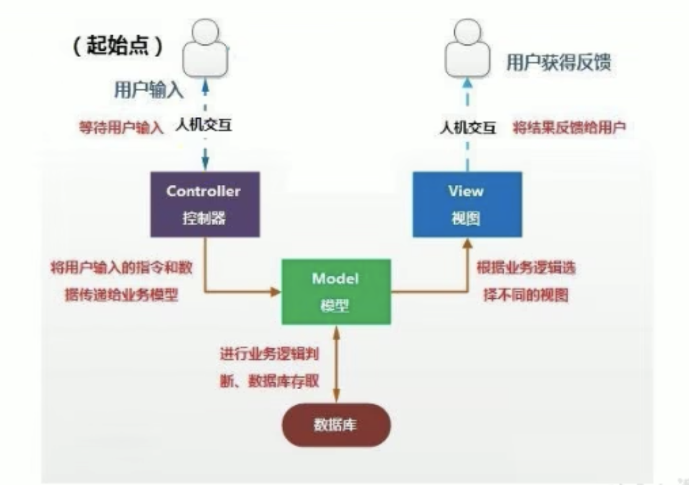

<br>

### 层级之间的通信:
1. view传送指令到controller
2. controller完成业务逻辑后 要求 model 改变状态
3. model将新的数据发送到view 用户得到反馈

**所有的通信都是单向的**  
``` 
            View

        ↙         ↖

Controller    →     Model
```

<br>

## MVP设计模式
模式将 Controller 改名为 Presenter, 同时改变了通信方向

1. 各部分之间的通信, 都是双向的 
2. View 与 Model 不发生联系, 都通过 Presenter 传递 
3. View 非常薄, 不部署任何业务逻辑, 称为"被动视图"(Passive View), 即没有任何主动性, 而 Presenter非常厚, 所有逻辑都部署在那里 
``` 
          View

      ↗↙         

Presenter    → ←    Model
```

<br>

## MVVM设计模式
MVVM 模式将 Presenter 改名为 ViewModel, 基本上与 MVP 模式完全一致 

唯一的区别是, 它采用双向绑定(data-binding):View的变动, 自动反映在 ViewModel, 反之亦然
``` 
      View

  ↗↙          

VM    → ←    Model
```

<br><br>

# 练习: 客户信息管理软件
模拟实现一个基于文本界面的 <客户信息管理软件> 进一步掌握编程技巧 和 调试技巧 熟悉面向对象编程

<br>

## 主要涉及以下知识点
1. 类结构的使用 属性 方法以及构造器
2. 对象的创建与使用
3. 类的封装性
4. 声明和使用数组
5. 数组的插入 删除 和 替换
6. 关键字的使用 this

<br>

### 该软件由以下三个模块组成:
1. CustomerView
2. CustomerList
3. Customer

CustomerView为主模块:  
负责菜单的显示和处理用户操作

CustomerList为Customer对象的管理模块:  
内部用数组管理一组Customer对象 并提供相应添加 修改 删除 和 遍历方法 供CustomerView调用

Customer为实体对象:  
用来封装客户信息

<br>

我们可以把 Customer类 放在 bean包下
```java
| - src
  | - cmu
    | - bean
      - Customer类

    | - service
      - CustomerList类    controller层

    | - ui
      - CustomerView类    view层

    | - util
      - 老师提供的类

// 这里我们按照业务不一样 将不同的类放入不同的包下
```

<br>

### Customer类:
初始化客户的信息 内部根据属性分别提供了get set方法
```java 
package src.cmu.bean;
public class Customer {
  private String name;

  // 性别的变量类型为什么用char 占用的空间不大呗
  private char gender;
  private int age;
  private String phone;
  private String email;

  public String getName() {
    return this.name;
  }

  public void setName(String name) {
    this.name = name;
  }

  public char getGender() {
    return this.gender;
  }

  public void setGender(char gender) {
    this.gender = gender;
  }

  public int getAge() {
    return this.age;
  }

  public void setAge(int age) {
    this.age = age;
  }

  public String getPhone() {
    return this.phone;
  }

  public void setPhone(String phone) {
    this.phone = phone;
  }

  public String getEmail() {
    return this.email;
  }

  public void setEmail(String email) {
    this.email = email;
  }

  // 提供一个空参的构造器
  public Customer() {}

  // 提供一个给所有属性赋值的构造器
  public Customer(String name, int age, char gender, String phone, String email) {
    this.name = name;
    this.age = age;
    this.gender = gender;
    this.phone = phone;
    this.email = email;
  }
}
```

<br>

### 要点:
**1. 如果我们要使用的类不处于当前的包下 那么就要使用 import 显式导入该类**  
JavaBean 会放在 bean 结构下
```java
// 落脚点是类名
import src.cmu.bean.Customer;
```

<br>

**2. java中数组元素的删除**  
不能将指定位置的数据设置为null 因为数组都是有序的 连续的空间 中间不能空着(尾部元素可以直接置换成null)

所以在java中当删除数组的元素的时候 都是用后面一个将前面一个元素覆盖掉 然后把最后一个元素设置为null

```java 
// total标识着这个数组中已保存客户的总数
for(int i=index; i<total-1; i++) {
  customers[i] = customers[i+1];
}
```

比如: 长度为10的数组 里面只存放了3个客户 那么total的值就为3

<br>

**思路:**  
我们既然要删除数组中指定位置的数据 
```java
arr = [1, 2, 3, 4, 5]
```

我们要删除索引为2的数据 那么跟索引为0 1位置的数据就没有关系吧所以循环中 i的初始化值为index

那么循环到什么时候结束？ total-1
```
total = 5 -1 为 4
```

当index为2的时候 就是 i=2; i<4; i++ 整个循环执行2次 数组的最后一个元素没有在循环的次数里
```java
customers[i] = customers[i+1];
```

但是正好我们要将i的下一个元素赋值给前一个 如果循环条件为i < total的话 customers[i+1]就越界了

<br>

**扩展: ArrayList**  
现阶段我们对数组增删改查的时候 都是我们亲自的一点点去操作这个数组 尤其想删除的时候还得走一些逻辑

后面我们我们在学习集合的时候会使用 ArrayList 代替数组 因为它里面都封装好了 我们可以调用现成的方法 实现增删改查就可以了

现阶段用数组的时候还有一个不好的地方 比如我们创建了一个长度为10的数组 当我们想添加第11个客户的时候就添加失败了

数组的话确实有一个长度 一旦数组初始化完成后 就不能修改了 但是我们想完成不停的往里面追加 不让它满了 但也不能让数组在初始化的时候创建的长度特别的长 

所以我们也想当这种情况出现的时候 可以对数组进行扩容 扩容的事儿ArrayList也有体现 开发的时候 我们也是使用ArrayList替换数组

<br>

### CustomerList类:
该类主要负责对数组客户的增删改查等操作
```java 
package src.cmu.service;

// 导入别的包中的类
import src.cmu.bean.Customer;

public class CustomerList {

  // 属性
  /*
    用来保存客户对象的数组
    这里相当于定义了一个数组类型的变量 我们还需要对它进行数组化
  */
  private Customer[] customers;

  // 记录已保存客户对象的数量
  private int total = 0;

  /**  
  * @param totalCustomer
  * 指定customers数组的长度
  * 
  * 用途: 构造器 用来初始化customers数组
  */
  public CustomerList(int totalCustomer) {
    // 创建 CustomerList 的时候 对数组进行动态初始化
    customers = new Customer[totalCustomer];
  }

  /**  
  * 
  * @param customer
  * 指定要添加的客户对象
  * 用途: 将指定的客户添加到数组中
  * 
  * 添加成功返回true 添加失败返回false 

    添加失败的情况: 数组满了
  */
  public boolean addCustomer(Customer customer) {
    // total 是已保存客户的数量
    if(total >= customers.length) return false;

    // 添加客户到数组中 total++ 保证每次存放客户的时候指针的位置是对的
    customers[total] = customer;
    total++;
    return true;
  }


  /**  
  * 修改指定索引位置上客户的信息
  * @param index
  * @param cust
  * @return 修改成功true false修改失败
  * 
  * 修改失败的原因: 跟index有关 
  * 比如我们数组里面存放了3个客户 那索引值的有效范围就是0-2 其它位置都是null不能修改

  * total属性是已保存客户的数量 保存了3个客户 index 只能是0-2 所以index不能>=total
  */
  public boolean replaceCustomer(int index, Customer cust) {
    if(index < 0 || index >= total) return false;

    // 把我们customers数组上 index位置的客户 改成新的
    customers[index] = cust;
    return true;
  }

  // 删除指定位置的客户
  public boolean deleteCustomer(int index) {
    if(index < 0 || index >= total) {
      return false;
    }
    
    // 错误的 - 数组是有序的 不能直接将这个位置的数据置为null 应该是后面的将前面的覆盖掉

    // customers[index] = null;

    /*
    数组删除元素的逻辑
    我们是从index的位置删除 
    我们要将index位置的下一个元素 赋值给 index位置上的元素
    所以i要从index的位置开始 因为index前面的元素不用动呀

    到那停呢？ 到total停? 但是我们要拿i+1位置的元素 如果是<total停
    i+1的时候就会越界 所以 <total-1

    比如 arr = [1, 2, 3] 我们的index为1
    i<total-1 说明i<2 循环一次
    也就是说整个循环到数组最后一位的前一位停止 但是i+1的位置还是有的
    */

    for(int i=index; i<total-1; i++) {
      // 确保数组的范围能取到customers[i+1]就可以了
      customers[i] = customers[i+1];
    }

    // 客户数组的最后一个有数据的元素需要置空
    customers[total - 1] = null;
    // customers[--total] = null;

    // 注意: 往数组中添加客户的时候我们++ 删除客户的时候同样我们也要--
    total--;
    return true;
  }

  // 获取所有的客户信息
  // 注意我们不能直接return customers 因为有的位置可能是null的 我们想输出的信息是客户信息 如果我们直接返回customers 那这个数组中保存的会是[1, 2, 3, null, null] 所以我们要创建一个新的数组 将客户信息保存到新的数组中
  public Customer[] getAllCustomers() {

    Customer[] custs = new Customer[total];

    for(int i=0; i<custs.length; i++) {

      // 这里面赋的是地址值 地址值也好当customers做了修改操作之后 我们返回的也是修改后的对象
      custs[i] = customers[i];
    }

    return custs;
  }


  // 获取指定索引位置上的客户
  public Customer getCustomer(int index) {
    if(index < 0 || index >= total) {
      return null;
    }

    return customers[index];
  }

  // 获取已存储客户的数量
  public int getTotal() {
    return total;
  }
}
```

<br>

### CustomerView类:
部分1: 界面的绘制
```java 
package src.cmu.ui;

import src.cmu.service.CustomerList;
import src.cmu.util.CMUtility;

// 该类负责界面 与 和用户交互的类
public class CustomerView {
  
  // 相当于创建了一个customerList对象 对象中有customers客户数组的属性和方法 我们给这个customerList对象中的数组长度指定了值
  private CustomerList customerList = new CustomerList(10);

  // 显示主界面的方法
  private void enterMainMenu() {
    // 呈现界面
    boolean isFlag = true;
    do {
      System.out.println("\n-----------------客户信息管理软件-----------------\n");
      System.out.println("                   1 添 加 客 户");
      System.out.println("                   2 修 改 客 户");
      System.out.println("                   3 删 除 客 户");
      System.out.println("                   4 客 户 列 表");
      System.out.println("                   5 退       出\n");
      System.out.print("                   请选择(1-5):");

      // 从键盘上获取用户输入的值
      char menu = CMUtility.readMenuSelection();

      // char型要加'''
      switch(menu) {
        case '1' :
          addNewCustomer();
          break;
        case '2' :
          modifyCustomer();
          break;
        case '3' :
        deleteCustomer();
          break;
        case '4' :
          listAllCustomers();
          break;
        case '5' :
          System.out.println("确认是否退出(Y/N)");
          char isExit = CMUtility.readConfirmSelection();

          // 基本数据类型不能. 之前有个equals方法 但是 char型是基本数据类型 不能点也就是没有方法
          // 它只能 == 判断两个的ASCII码的值是否相等
          if(isExit == 'Y') {
            // 在某一个时刻我们将isFlag改为false停止循环
            isFlag = false;
          }
          break;
      }
    } while(isFlag);
  }


  // 添加客户的操作
  private void addNewCustomer() {
    System.out.println("添加客户");
  }

  // 修改客户的操作
  private void modifyCustomer() {
    System.out.println("修改客户");
  }

  // 删除客户的操作
  private void deleteCustomer() {
    System.out.println("删除客户");
  }

  // 显示客户列表的操作
  private void listAllCustomers() {
    System.out.println("显示客户列表");
  }


  // 程序要想执行都是从main方法中进入
  public static void main(String[] args) {
    // main方法中要想调用当前类的方法 那么就要在这里面创建当前类的对象
    CustomerView view = new CustomerView();
    view.enterMainMenu();
  }
}

```

<br>

部分2: 完成 CustomerView类 中的各个方法

<br>

**显示客户列表的操作:**  

```java 
private void listAllCustomers() {

  // 拼接 界面 结构
  System.out.println("---------------------------客户列表---------------------------");

  // 如果没有保存客户数据 展示 "没有客户数据" 的样式
  // 根据 CustomerList类中的 getTotal 方法 获取已保存的用户数据
  int total = customerList.getTotal();
  if(total == 0) {
    System.out.println("没有客户记录");
  } else {
    // 进入到这里代表找到客户记录
    System.out.println("编号\t姓名\t性别\t年龄\t电话\t邮箱");

    // 展示所有客户的记录
    // 调用getAllCustomers方法得到的是一个保存客户记录的数组
    Customer[] custs = customerList.getAllCustomers();
    for(int i=0; i<custs.length; i++) {
      // 拼接客户信息
      // 注意 客户信息中的编号字段不属于 Customer类中的属性 就是依次往下排的
      // (i+1) + '\t' 不能这么写 这么写就成加法运算了 因为单引号是char型
      System.out.println((i+1) + "\t" + custs[i].getName() + "\t" + custs[i].getGender() + "\t" + custs[i].getAge() + "\t" + custs[i].getPhone() + "\t" + custs[i].getEmail());
    }
  }

  System.out.println("---------------------------客户列表完成---------------------------");
}
```

<br>

**添加客户的操作:**  
```java 
private void addNewCustomer() {
  System.out.println("---------------------添加客户---------------------");
  System.out.print("姓名: ");

  // 从键盘获得结果
  System.out.print("姓名:");
  String name = CMUtility.readString(4);

  System.out.print("性别:");
  char gender = CMUtility.readChar();

  System.out.print("年龄:");
  int age = CMUtility.readInt();

  System.out.print("电话:");
  String phone = CMUtility.readString(15);

  System.out.print("邮箱:");
  String email = CMUtility.readString(15);

  // 我们将信息获取到后 我们要存数组中 将上述的变量封装到一个对象当中
  Customer customer = new Customer(name, age, gender, phone, email);

  // 调用customerList的添加用户的方法 将用户添加到数组中
  // 这个方法会返回返回值 true false用来判断添加客户是否成功
  boolean isSuccess = customerList.addCustomer(customer);
  if(isSuccess) {
    System.out.println("添加完成");
  } else {
    System.out.println("添加失败");
  }
}
```

<br>

**修改客户的操作:**  
```java 
private void addNewCustomer() {
  System.out.println("---------------------添加客户---------------------");
  System.out.print("姓名: ");

  // 从键盘获得结果
  System.out.print("姓名:");
  String name = CMUtility.readString(4);

  System.out.print("性别:");
  char gender = CMUtility.readChar();

  System.out.print("年龄:");
  int age = CMUtility.readInt();

  System.out.print("电话:");
  String phone = CMUtility.readString(15);

  System.out.print("邮箱:");
  String email = CMUtility.readString(15);

  // 我们将信息获取到后 我们要存数组中 将上述的变量封装到一个对象当中
  Customer customer = new Customer(name, age, gender, phone, email);

  // 调用customerList的添加用户的方法 将用户添加到数组中
  // 这个方法会返回返回值 true false用来判断添加客户是否成功
  boolean isSuccess = customerList.addCustomer(customer);
  if(isSuccess) {
    System.out.println("添加完成");
  } else {
    System.out.println("添加失败");
  }
}

// 修改客户的操作
private void modifyCustomer() {
  System.out.println("---------------------修改客户---------------------");
  // 逻辑:
  /*
  当我们输入的不是 正常范围内的数字的话 请选择待修改客户编号的逻辑会反复执行
  知道我们输入的是正确的数字才可以
  */

  Customer cust;
  int num;
  for(;;) {
    System.out.print("请选择待修改客户编号(-1退出):");
    num = CMUtility.readInt();
    if(num == -1) {
      return;
    }

    // 当用户输入的是-1我们退出当前方法 当用户输入不是合理范围内的索引的时候 我们也要进行判断
    // 方式1 我们可以判断下 用户输入的数字是否是 total 范围内的
    // 方式2 我们可以利用 customerList.getCustomer() 这个方法 该方法是根据index去数组中找对应位置的客户 如果没找到它会返回null 我们可以判断结构是否为null 从而判断用户输入的是否合理

    // 这里要注意的是 用户输入的是编号从1开始的 我们的索引是从0开始了 我们要-1
    cust = customerList.getCustomer(num-1);
    if(cust == null) {
      System.out.println("无法找到指定客户！");
    } else {
      // 找到了相应编号的客户 接下来也可以在else里面写修改客户的逻辑 但是逻辑中可能还需要用的for循环 整个for就会变的很复杂 这里我们写break终止循环
      break;
    }
  }

  // 上面break后 代码就会结束循环跑到这里 跑到这里就意味着找到了客户 我们在这里修改客户信息
  System.out.print("姓名(" + cust.getName() + "):");
  // 从键盘上获取用户输入想改的信息
  String name = CMUtility.readString(4, cust.getName());

  System.out.print("性别(" + cust.getGender() + "):");
  char gender = CMUtility.readChar(cust.getGender());

  System.out.print("年龄(" + cust.getAge() + "):");
  int age = CMUtility.readInt(cust.getAge());

  System.out.print("电话(" + cust.getPhone() + "):");
  String phone = CMUtility.readString(15, cust.getPhone());

  System.out.print("邮箱(" + cust.getEmail() + "):");
  String email = CMUtility.readString(15, cust.getEmail());

  // 收集到数据后 我们要拿到新数据装到一个新的对象中
  Customer newCust = new Customer(name, age, gender, phone, email);

  // 调用customerList.replaceCustomer 方法 修改指定索引上的客户
  boolean isReplace =  customerList.replaceCustomer((num-1), newCust);
  if(isReplace) {
    System.out.println("---------------------修改完成---------------------");
  } else {
    System.out.println("----------无法找到指定客户,修改失败---------- ----");
  }
}
```

<br>

**删除客户的操作:**  
```java 
private void deleteCustomer() {
  System.out.println("---------------------删除客户---------------------");

  // 
  int num = 0;
  Customer cust = null;
  for (;;) {
    System.out.print("请选择待删除客户编号(-1退出):");
    num = CMUtility.readInt();
    if (num == -1) {
      return;
    }

    cust = customerList.getCustomer(num - 1);
    if (cust == null) {
      System.out.println("无法找到指定客户！");
    } else {
      break;
    }
  }  

  // 走到这里代码找到该客户了 接下来我们要进行删除的逻辑
  System.out.print("确认是否删除(Y/N):");
  char isDelete = CMUtility.readConfirmSelection();
  if (isDelete == 'N')
    // 选择n是退出该方法
    return;

  boolean deleteSuccess = customerList.deleteCustomer(num - 1);
  if (deleteSuccess) {
    System.out
        .println("---------------------删除完成---------------------");
  } else {
    System.out.println("----------无法找到指定客户,删除失败--------------");
  }
}
```

<br>

### 项目2中的总结:
我们项目的核心就写了三个类 每一个类负责相关的业务

Customer类:  
提供了一个客户的基本属性和对应的get set方法(JavaBean)

CustomerList类:  
提供了客户的增删改查的

我们都是各种类互相配合 互相调用 整个项目就是在内存层面对Customer这个对象进行增删改查

本质就是一个数组 在数组中我们进行了增删改查的操作 将对数组的这些操作封装到了一个类中CustomerList

数组中存放的都是Customer类的对象 显示菜单 和 用户的交互都是在 CustomerView 类中

<br><br>

# 面向对象特征: 继承性 extends
extends 是一个关键字

<br>

## 位置 & 格式
子类 = 派生类 = subclass  
父类 = 超类 = 基类 = superclass

```java
public class 子类 extends 基类 { }
```

<br>

## 作用
当我们使用 extends关键字 继承了基类(父类)后 基类中定义的属性 和 方法 每一个子类中都有 都可以进行调用和修改

一旦子类继承了父类 子类就获取了父类中声明的 **所有的结构**  
包括: 属性 方法 和 private权限的

父类中声明的private的属性或方法 子类继承父类以后 也继承了private权限修饰的属性和方法 只是由于封装性的影响 **使得子类不可以直接调用父类的private结构**  

<br>

## 应用
我们可以将n个类中的共同部分 抽出来放到一个基类中 然后n个类我们可以继承基类(父类), 这样每个子类中都会有父类中的结构

<br>

## 继承性的优势
1. 减少了代码的冗余 提供了代码的复用性
2. 便于功能的扩展(把子类都想扩展的功能 可以定义在父类中)
3. 为了之后的 **多态性的使用 提供了前提**  

<br>

## 举例
```java 
public class Test {
  public static void main(String[] args) {
    Son son = new Son("sam", 18, "front");
    son.show();
  }
}


// 父类
class Father {
  String name;
  // age属性私有化
  private int age;

  public Father() {}
  public Father(String name, int age) {
    this.name = name;
    this.age = age;
  }


  // 提供 age 属性的 get set 方法
  public int getAge() {
    return age;
  }
  public void setAge(int age) {
    this.age = age;
  }


  // 私有方法
  private void sleep() {}
  // 子类中没有办法直接调用私有的结构 但是可以再公有方法中调用私有方法 子类调用该公有的方法 实现调用私有结构
  public void showInfo() {
    sleep()
  }
}


// 子类
class Son extends Father {
  String major;

  public Son() {}
  public Son(String name, int age, String major) {
    this.name = name;

    // 因为父类中 age 是private的 所以这里会报错, 我们可以根据父类提供的setAge来对age属性进行赋值操作
    // this.age = age;
    setAge(age);


    this.major = major;
  }

  // 我们可以继承到 父类中的 get set 方法
  public void show() {
    System.out.println("name: " + this.name + " " + "age: " + this.getAge() + " " + "major: " + this.major);
  }
}
```

<br>

### private的属性 和 private的方法:
如上的示例中所示, 父类中的 age属性 和 sleep方法的权限为private 我们看看子类中是否能拿到或使用 age 和 sleep

<br>

**private的属性:**  
我们发现在子类中使用 this.age 设置或读取 age属性会报错, 但是我们可以通过 继承到的get set方法来 设置或读取 private的age属性

<br>

**private的方法:**  
子类中不能直接调用父类中的private的sleep方法 但是我们可以调用public的方法中间接调用sleep 

也就是说父类中的方法的权限被设置为了private 当子类 extends 父类后 子类也会有这个方法 只是由于封装性的原因<font color="#C2185B">不能直接调用</font>

<br>

## 封装性 和 继承性 的区别
封装性想解决的是: **结构可见性的问题**   
继承性想解决的是: **能否拿到父类中的结构**   
但是继承后的结构能不能调用还是要看封装性 不冲突

<br>

## 子类继承后 扩展自己的属性和方法
子类继承父类以后 还可以声明自己特有的属性和方法 实现功能的拓展
```java  
class Person{
  // 父类
  String name;
  int age;
}
  

// 子类 继承父类后 
class Child extends Person {

  // 子类扩展自己的属性:
  // 继承后就有了 父类中定义过的结构 String name and int age 同时还可以声明自己的属性 major
  String major;


  // 子类的构造器中 因为继承了父类的name age 还有自己的major 构造器中的属性要写全
  public Student(String name, int age, String major) {
    this.name = name;
    this.age = age;
    this.major = major;
  }
}
```

<br>

## 总结

### 继承后 private属性的问题:
当子类继承父类后 父类中声明的结构 子类也能看到 但是由于封装性的影响 父类中private的结构 我们在子类中是不能直接调用的

<br>

**情况1: 父类中的属性 没有private 的情况**  
如果父类中没有定义 private 的属性 那么在子类中我们能直接的操作该属性 比如赋值 初始化等操作
```java
// 父类
public class Person {
  // 没有private的属性
  String name;
  int age;
}


// 子类
public class Son {
  // 扩展自己的属性
  boolean sex;

  // 带参构造器的写法1:
  public Son(String name, int age, boolean sex) {
    this.name = name;
    this.age = age;
    this.sex = sex;
  }
}
```

<br>

**情况2: 父类中的属性 有private 的情况**  
如果父类中定义了 private 的属性 我们在子类的构造器中 想要对该属性进行初始化时 需要使用 super() 将父类中定义的属性(包括private传递过去)

```java
// 子类
public class Son {
  // 扩展自己的属性
  boolean sex;

  // 带参构造器的写法1:
  public Son(String name, int age, boolean sex) {
    this.name = name;
    // 比如 父类中 age是private 那么这里就不行了
    this.age = age;
    this.sex = sex;
  }
}
```


但是我们可以使用这种方式 调用父类的构造器 将参数传递进去
```java
public Son(String name, boolean sex) {
  super(name, age);
  this.sex = sex;
}
```

<br><br>

## 继承性的规定
Java中 类的继承是单继承的 也就是说 一个类的父类只能有一个

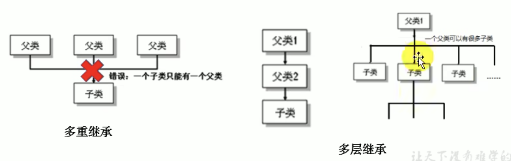

<br>

**1. 一个类可以被多个子类继承, 一个子类只能有一个父类**  
``` 
        父类

子类  子类  子类  子类
```

<br>

**2. 子父类是相对的概念(多层继承)**  
我们还可以让直接父类再去继承一个类 这样子类能有更多的功能扩展
``` 
      人类
    ↙   ↓   ↘
学生    白领   军人
  ↓
大学生
```

java中可以多层继承 人类 是 学生的父类 学生 是 人类的子类 但对于大学生类来讲 学生是它的父类

```
人类     父类  - 间接父类(以上都是间接父类)

学生     父类  - 直接父类

大学生   子类  - 对于大学生来讲 (该类拥有所有父类的属性和方法)
```

<br>

**直接父类:**  
子类直接继承的父类

<br>

**间接父类:**  
子类间接继承的父类称为

<br>

**3. 子类继承父类以后 就获取了直接父类以及所有间接父类中声明的属性和方法**  

<br>

**4. 如果我们没有显式的声明一个类的父类的话 则此类继承与 java.lang.Object 类(它是所有类的父类)**  

<br>

**5. 所有的java类(除了java.lang.Object类以外) 都直接或间接的继承于 java.lang.Object 类**  
意味着所有的java类具有java.lang.Object声明的功能(js的原型链的尽头么？)

<br>

### 如果判断是否该继承某个类?
我们使用下面的思考方式来判断是否适合继承某个类
```
( ... ) is a ( ... )

Student is a Person 
```  
如果 是 那么我们就可以继承  
如果 非 那么我们就不要继承

<br>

### 练习:
**1. 定义一个 ManKind 类**  

<br>

**成员变量:**  
- int sex
- int salary

<br>

**成员方法:**  
void manOrWoman():  
根据sex的值显示 man 或者 woman
```
man   -> sex == 1
woman -> sex == 0
```

void employeed():  
根据salary显示 nojob 或者 job
```
nojob -> salary == 0
job   -> salary != 0
```

<br>

**2. 定义Kids类继承Mankind**  

<br>

**成员变量:**    
- int yearsOld

<br>

**成员方法:**  
printAge():  
打印yearsOld的值

<br>

**3. 定义类KidsTest**  
在类的main方法中实例化Kids的对象someKid 用该对象访问其父类的成员变量以及方法

```java 
// ManKind类
package src.com;
public class ManKind {
  private int sex;
  private int salary;

  public ManKind() {}
  public ManKind(int sex, int salary) {
    this.sex = sex;
    this.salary = salary;
  }

  public void manOrWoman() {
    if(sex == 1) {
      System.out.println("我的性别是: man");
    } else {
      System.out.println("我的性别是: woman");
    }
  }

  public void employeed() {
    if(salary == 0) {
      System.out.println("我还没有工作");
    } else {
      System.out.println("我已经有工作了");
    }

    // 或者改写成3元表达式
    String info = salary == 0
      ? "我还没有工作"
      : "我已经有工作了"
    System.out.println(info);
  }


  // 还有 get set 方法
}


// Kids
package src.com;
public class Kids extends ManKind {
  int yearsOld;

  public Kids() {}
  public Kids(int yearsOld) {
    this.yearsOld = yearsOld;
  }

  public void printAge() {
    System.out.println("我今年: " + yearsOld + "岁了 ");
  }
}


// KidsTest类
package src.com;
public class KidsTest {
  public static void main(String[] args) {
    
    // 实例化 Kids 对象
    Kids someKid = new Kids(1, 0, 18);

    // Kids对象本身的方法
    someKid.printAge();

    // 因为 ManKind 的 sex 和 salary 属性私有 没有办法在实例化 Kids 的时候直接赋值 我们可以利用 get set 方法来进行赋值
    someKid.setSalary(0);
    someKid.setSex(1);

    // 调用继承父类中的方法
    someKid.manOrWoman();
    someKid.employeed();
  }
}
```

<br>

### Kids类的内存结构:
Kids类继承了ManKind类 所以 Kids 类中也有一份 private 的 sex 和 salary 属性

```java
  堆
-----
sex(继承来的, 这两个属需要通过get set来操作)
salary(继承来的, 这两个属需要通过get set来操作)
yearsOld(自己定义的)

// 父类中的方法也会随着类的加载而加载到子类中
```

<br>

### 练习2:
根据下图实现类 在CylinderTest类中创建Cylinder类的对象 设置圆柱的底面半径和高 并输出圆柱的体积
```java 
Circle类(圆)
------
-radius: double

Circle(): 构造器 将radius属性初始化为1.0
+setRadius(double: radius): void
+getRadius(): double
+findArea():double 计算圆的面积


Cylinder类(圆柱)
------
-length: double (圆柱的高度)

Cylinder(): 构造器 将length属性初始化为1.0
+setLength(double length): void
+getLength(): double
+findVolume(): double 计算圆柱体积
```

```java 
// Circle类
package src.com;
public class Circle {
  private double radius;

  public Circle() {
    radius = 1.0;
  }

  public double getRadius() {
    return radius;
  }

  public void setRadius(double radius) {
    this.radius = radius;
  }

  // 圆的面积
  public double findArea() {
    return Math.PI * radius * radius;
  }
}


// Cylinder类 - 圆柱
package src.com;
// 圆柱类 继承 圆类
public class Cylinder extends Circle {
  // 高
  private double length;

  public Cylinder() {
    this.length = 1.0;
  }

  public double getLength() {
    return this.length;
  }

  public void setLength(double length) {
    this.length = length;
  }

  public double findVolume() {
    // 公式: 底面积 X h

    // 方式1:
    // 半径是继承来的 但是因为父类中的radius 是private的所以只能通过 get set 来操作
    return Math.PI * getRadius() * getRadius()


    // 方式2: 
    return findArea() * getLength();

    // 方式3: 
    return findArea() * length;
  }
}


// 测试类
package src.com;
public class CylinderTest {
  public static void main(String[] args) {
    
    // 我们new的是子类
    Cylinder cy = new Cylinder();

    // 我们调用的是子类继承到父类的方法
    cy.setRadius(2.1);
    cy.setLength(2.6);

    double res = cy.findVolume();

    System.out.println(res);
  }
}
```

<br><br>

# Debug调试(Eclipse)

## 调试程序的两种方式
**方式1:**  
在程序中写输出语句 System.out.println 一遍走一边看 依次加输出语句慢慢调试

这是硬看

<br>

**方式2:**  
debug调试

<br>

**常用操作:**  
step into: 跳入   
进入当前行所调用的方法中

step over: 跳过  
执行完当前行的语句 **进入下一行**  

step return: 跳回  
执行完当前行所在的方法 进入下一行

drop to frame:  
回到当前行所在方法的第一行

resume: 恢复  
执行完当前行所在断点的所有代码 进入下一个断点 如果没有就结束

<br>

**操作步骤:**  
首先, 设置断点
我们在程序的行编号那里点击 设置断点 断点相当于 我们在程序从上到下执行的过程当中设置的一个个关卡

当我们加上断点之后 程序再次执行的时候(使用debug as java application执行程序) 就会在小关卡的地方停一下

<br>

然后, 我们在程序中 右键 选择 **Debug java**  
当我们首次运行的时候 一下就会到我们打断点的位置

我们可以在左侧变量 - local 中看到 内存中加载了什么变量 值是多少

点击 继续 是执行下一行语句 
点击 单步调试是进入该行语句的方法内部 然后继续点击 单步调试是在方法内部 执行下一行语句

<br>

### 示例:
```java
public static void main(String[] args) {
  int i = 10;
  int j = 20;

  DebugTest test = new DebugTest();

断点: -> int max = test.getMax(i, j);

  System.out.println("max: " + max);
}


private int getMax(int k, int m) {
  int max = 0;
  if(k < m) {

    // 这里出错了 我们是拿k赋的值
    max = k;

  } else {
    max = m;
  }

  return max;
}
```

<br><br>

# 方法的重写 (override / overwrite)
上面我们讲过方法的重载(overload): 一个类中同方法名 不同参数列表的方法 就构成了重载

方法的重写 和 方法的重载没有任何关系 下面我们看看什么叫方法的重写

<br>

## 方法的重写
简单的理解就是覆盖父类中的 **同名同参数** 的方法

在子类继承父类以后, 在子类中可以根据需要对父类中继承来的方法进行改造 也称为方法的重置 覆盖

相当于在子类中把父类中的 **同名同参数的方法** 在子类中又重新的定义了一份

在程序执行时 子类的方法将覆盖父类的方法

<br>

**调用子父类中同名同参数的方法时:**  
重写以后 当创建子类对象以后 通过子类对象调用父类中的同名同参数的方法时 实际执行的是子类重写父类的方法

如果我们在子类中定义的方法不是同名同参的方法 那就不会构成重写

<br>

**约定俗成:**  
- 父类中的叫做被重写的方法  
- 子类中的叫做重写的方法

<br>

### 示例:
```java
// 父类
public class Person {
  String name;
  int age;

  public Person() {}
  public Person(String name, int age) {
    this.name = name;
    this.age = age;
  }

  public void eat() {
    System.out.println("吃饭");
  }

  public void walk(int distance) {
    System.out.println("今天我走了,  " + distance + "公里");
  }
}


// 子类
public class Student extends Person {

  String major;

  public Student() {}
  public Student(String name, int age, String major) {
    this.name = name;
    this.age = age;
    this.major = major;
  }

  public void study() {
    System.out.println("学习, 专业是: " + major);
  }

  // 重写父类中的 eat() 方法, 要求: 方法名和形参列表必须和父类的一样的 因为要覆盖么!!!!!!
  public void eat() {
    System.out.println("学生因为正在学习要吃有营养的食物");
  }
}


// 测试类
public class PersonTest {
  public static void main(String[] args) {
    
    // 学生类调用的是重写后的eat方法
    Student s = new Student();
    s.eat();

    // 父类调用的是自己的eat方法
    Person p = new Person();
    p.eat();
  }
}
```

<br>

### 面试题: 区分方法的重载与重写
重写是子类对父类目标方法(**同名同参数**)的覆盖操作 在调用子类中的该方法的时候 调用的是新方法

重载是在一个类中允许有多个同名方法 区分它们的条件就是形参列表(个数, 类型)

<br><br>

## 方法重写的要求

### 规定:
1. 子类重写的方法 **必须** 和父类被重写的方法具有 **相同的方法名和参数列表**  

<br>

### 返回值: 类型不能大于父类
子类重写的方法的返回值类型 **不能大于** 父类被重写的方法的返回值类型

```java
子类重写的方法的返回值 <= 父类被重写的方法的返回值
```

<br>

**父类方法的返回值: void**  
子类重写方法的返回值只能是 void

<br>

**父类方法的返回值: A类型**  
子类重写方法的返回值 可以是
- A类     or
- A的子类

```java
// 父类被重写的方法的返回值为 Object
public Object info() { }


// 子类的返回值类型是String的话也是可以的 因为String是Object的子类
public String info() { }
```

上面说的 A类 or A类的子类 是针对于类来讲的 类属于引用数据类型  

那我们知道方法的返回值除了引用数据类型之外 还可以是基本数据类型

<br>

**父类方法的返回值: 基本数据类型:**  
子类重写方法的返回值 必须是相同的基本数据类型
```
父类如果是 double
子类必须是 double
```

<br>

### 权限修饰符的要求: 不能降低权限
子类重写的方法使用的访问权限 **不能小于** 父类被重写的方法的访问权限

子类重写的方法的权限要 **大于等于** 父类被重写方法的权限

```java
子类重写的方法的权限修饰符 >= 父类被重写的方法的权限修饰符
```

<br>

### 注意:
<font color="#C2185B">子类不能重写父类中声明为private权限的方法</font>

这时候我们在子类中定义的方法 跟 父类中的方法 就不是重写的关系了
```java
// 父类:
private void show() {}


// 子类: 想重写父类中的show 但是我们根本看不见private的方法 就谈不上重写了 相当于我们自己定义了一个新的方法
public void show() {}
```

父类中有一个方法它的权限比较小 已经是private了 那么子类就不能对这个方法进行重写 重写的方法 我们调用的时候会是子类最新的方法

<br>

### 异常要求: 不能提升异常
子类方法抛出的异常 **不能大于** 父类被重写方法的异常
```java
子类抛出的异常类型 <= 父类抛出的异常类型
```

```java
// 方法体前面还可以加上 异常的类型
权限修饰符 返回值类型 方法名(形参列表) throws 异常类型 {
  // 方法体
}
``` 

<br>

### 注意:
子类和父类中同名同参数的方法要么都声明为非static的(这时候才能考虑重写)   

要么都声明为static的(不用考虑重写 static的方法 **一定不可以被重写的**)


<br>

**<font color="#C2185B">也就是说只有非static的方法 才能被重写</font>**  

static静态的方法不能够被覆盖是随着类的加载而加载的


<br>

### 智慧的体现:
在实际开发过程中 当我们想重写父类的方法的时候 直接去父类中复制方法声明的部分到子类中 进行重写就可以了

<br><br>

# 再测试: 4种不同的权限修饰
上面我们说过4种权限修饰符的可见性 现在我们讲了继承 就有了子类的概念 这时我们再看看 protected 权限的可见性

<br>

|修饰符|类内部|同一个包|不同包的子类|同一个工程|
|:--|:--:|:--:|:--:|:--:|
|private|yes|
|缺省|yes|yes|
|protected|yes|yes|yes|
|public|yes|yes|yes|yes|

<br>

protected修饰的结构比缺省大一些, 可以在不同包的子类下看到

SubOrder.java 在A包中, Order.java 在B包中

我们想演示的时 SubOrder 和 Order 不在一个包, 但是SubOrder 是 Order 的子类

因为 SubOrder 继承了 Order, 所以 Order 中的结构 SubOrder 里面都有 但是由于权限的问题 有些结构用不了

我们看看能用哪些结构, 我们会发现 我们可以在 SubOrder 中调用 Order 中声明为 protected 和 public的结构

SubOrder 不能调用 Order 中声明为 default 和 private 的结构

```java
// SubOrder 继承 Order
public class SubOrder extends Order {

}
```

```java
// 当没有继承的时候 读取不同包的类中的结构会报错
public class SubOrder {
public void method() {
    // 不同包 读取 protected属性 看不见
    Order order = new Order();
    order.orderProtected = 2;   // 报错
  }
}


// 当继承的时候, 读取不同包 但是是父类中的结构的时候
public class SubOrder extends Order {
  public void method() {

    // 可以获取 protected 和 public的结构
    orderProtected = 2;
  }
}
```

不同包下 我们继承 Order 这样 因为继承后 内部结构都能够看见 就不用再通过创建order对象调用 我们可以直接使用 orderProtected

实际开发中 我们使用protected的时候不多 用的多的还是private和public

<br><br>

# super关键字
现在有子父类的概念了 比如父类中定义了方法A 子类中将父类的方法A进行了重写了 也就是子类中的方法会覆盖父类中的方法 在执行的时候执行的是子类中重写后的方法

<br>

**问题: 子类中能不能调用父类中被重写的方法?**  
可以, 这时候我们就 <font color="#C2185B">用super</font> 来区分

<br>

我们前面了解了 this: 是当前对象, 那 super: 是父类

<br>

## super关键字的使用
super理解为: - 父类的...

我们可以通过 super 来调用父类的
- 属性 
- 方法
- 构造器

```java
// super和this相似 都可以调用属性 方法 构造器

super.name    // 调用父类的属性
super.show()  // 调用父类的方法
super()       // 调用父类的构造器
```

```java 
// 父类
package src.com;
public class Person {
  String name;
  int age;

  int id = 1001;  // 身份证号

  public Person() {}
  public Person(String name) {
    this.name = name;
  }

  public Person(String name, int age) {
    this(name);
    this.age = age;
  }

  public void eat() {
    System.out.println("人, 吃饭");
  }

  public void walk() {
    System.out.println("人, 走路");
  }
}
```

```java 
// 子类
package src.com;
public class Student extends Person {

  String major;

  int id = 1002;  // 学号

  public Student() {}
  public Student(String major) {
    this.major = major;
  }

  public void study() {
    System.out.println("学习, 学习知识");
  }

  // 对父类中的方法的重写
  public void eat() {
    System.out.println("学生, 因为正在学习要吃有营养的食物");
  }
}
```

上面我们定义了两个类 父类Person 子类Student 接下来我们在子类中定义了一个方法 show() 分别来输出子类的信息 和 父类的信息
```java 
  public void show() {
    
    // 情况1: 输出子类的 属性
    System.out.println("name = " + this.name + ", age = " + this.age);

    // 情况2: 输出父类的 属性
    System.out.println("name = " + super.name + ", age = " + super.age);


    // 情况3: 即使用了this 也使用了super
    System.out.println("name = " + this.name + ", age = " + super.age);

  }
```

<br>

**思考:**  
我们在show方法中 分别通过this和super调用属性 有什么样的区别？比如我们的 **情况3**  

<br>

**解答:**  
<font color="#C2185B">在子类和父类没有冲突的情况下</font> 情况3 没有任何问题, 比如上面的例子中 

父类中声明了 name age  
子类中声明了 major

因为有继承的关系 子类中也会有 name age, 在内存解析层面 当我们继承了父类后 父类中定义的属性和方法在子类的堆空间中 也会有一份

```java
// 子类

  堆
-----
name
age

major
```

这时候我们不管通过 this 还是 super 找到的都是 子类在堆空间中的实体中的属性 name 和 age

<br>

<font color="#C2185B">在子类和父类有冲突的情况下</font>

也就是说**父类中的属性和子类中的属性重名的时候 类型还一样**  

比如:  
我们在Person类中定义 id 代表 身份证号   
我们在Student类中也定义 id 代表 学号

那么此时在内存中会有两个id 因为属性来说 不会像方法那样存在重写覆盖的情况 **<font color="#C2185B">属性是不会覆盖的</font>**  

这时 我们在子类中通过show()输出 id 输出的是子类中的id字段
```java
public void show() {
  System.out.println("id = " + id);
}
```

这时我们还想调用父类的id 那么就要通过 super 来指定了
```java
public void show() {
  System.out.println("父类的id = " + super.id);
}
```

<br>

1. 当我们通过this或者什么都不写调用的时候 调用的会是子类中定义的id

2. 当我们通过 super.id 调用的时候 调用的会是父类中的id值

也就是说当我们遇到 父类和子类都有同一个属性的时候 我们要通过 **super关键字来区别我们调用的是谁**  

<br>

### 系统生成的模版中的super
比如我们在子类中重写父类中的方法 编辑器默认生成的模板是
```java
@Override
public void show() {
  super.show();
     // 重写后 模版会默认调用父类中的被重写方法 我们可以删除这行逻辑 写自己的逻辑
}
```

<br>

## 总结

### 1: 通常情况
我们可以在子类的方法或构造中 通过 ``super.属性`` 或 ``super.方法`` 的形式 显式的调用父类中声明的属性和方法, 通常情况下 都习惯省略 super.

```java 
this.name: 
程序会先在当前类中找name属性 如果没有找到会去父类中找

super.name:
程序没有在本类中找name 直接回父类中找了
```

<br>

### 2: 调用父类属性的情况
特殊情况 当子类和父类中定义了同名的属性的时候 我们要想在子类中调用父类中声明的属性 则必须显式的使用 ``super.属性`` 的方式 表明调用的是父类中声明的属性

**通常我们在开发中子类中不会声明同名的属性**  

<br>

### 3: 调用父类方法的情况
当子类重写了父类中的方法后 我们想在子类中调用父类中被重写的方法时 则必须显式的使用 ``super.方法`` 的方式 表明调用的是父类中声明的方法

子类调用重写父类的方法 肯定是子类中的新方法

父类定义 eat()  
子类重写 eat()

子类在调用的时候 肯定是子类中重写后的eat(), 默认省略了this.eat()

super.eat() 这样我们调用的就是父类中被重写的方法

对于没有重写的方法前面 this 还是 super 都没有太大的关系

this的话先在本类中找该方法 没找到回父类找 (间接父类也会找 直到找到为止) super直接回父类中找(间接父类也会找 直到找到为止)

<br>

### super调用构造器: super()
super代表的是父类的 那么通过super来调用的话 调用的也是父类的构造器(指定的构造器 我们通过形参列表一一对应来指定)

```java
this()
super()
```

<br>

我们前面会遇到 给子类进行实例化的时候   
父类中声明了 name age  
子类中声明了 major

这时我们要想给子类进行实例化 我们会怎么做?

```java
// Person类
public class Person {

  String name;
  int age;

  public Person(String name, int age) {
    this.name = name;
    this.age = age;
  }
}


// Student类
class Student {
  String major;

  public Student(String name, int age, String major) {

    // 当父类的属性没有私有化的时候 如下是可以的
    this.name = name;
    this.age = age;

    this.major = major;


    // 当父类的属性已经私有化的时候 我们只能
    this.name = setName(name);
    this.age = setAge(age);

    this.major = major


    // 或者还可以这样 通过super关键字来调用父类中的指定构造器 super()
    super(name, age);
    this.major = major;
  }
}
```

<br>

### 使用方式:
**super(形参列表):**  
我们可以在子类的构造器中显式的使用该方式 调用父类中声明的指定的构造器

<br>

### 要点:
**1. super(形参列表) 的使用 必须声明在子类构造器的<font color="#C2185B">首行</font>**  

<br>

**2. 在类的构造器中针对于 this(形参列表) super(形参列表) 只能两选一 <font color="#C2185B">不能同时出现</font>**  

<br>


**3. 在构造器首行没有显式的声明 this(形参列表) 或 super(形参列表) 那么 默认调用的是父类中空参的构造器 -- 系统默认会调用 super()**  
```java 
  // 子类的构造器
  public Student(String major) {
    // super();   即使不写 系统也会默认加上
    this.major = major;
  }
```

<br>

**4. <font color="#C2185B">父类中必须有一个空参构造器</font>**  
即使我们上面子类的构造器中只写了 this.major = major; 因为我们是继承的原因 默认也会有一个 super() 那也就是意味着

当有**继承关系**的时候 父类中 **必须有一个空参构造器**  

因为子类构造器中上来就会调用 super() 调用父类的空参构造器

<br>

**5. 在类的多个构造器中 至少有一个类的构造器中使用了 super(形参列表) 调用父类的构造器**  

前面我们说了 当继承了父类的时候 父类中的结构 子类中也会有 就是因为默认调用了 super()


this()  调用的是本类中的其它构造器
super() 调用的是父类中的构造器

<br><br>

# 子类对象实例化过程
我们造了一个Dog类 Dog还有几个父类 如下:
```
-- Object
  -- Createure
    -- Animal
      -- Dog
```

```java 
  栈空间 
  ------  
  dog
        ↘
            堆空间 Dog对象的实体 实体中包含了下面的结构
            ----------------
            |               |
            |  Object类     |
            |  --------     |
            |  --------     |
            |               |
            |  *********    |
            |               |
            |  Createure类  |
            |  --------     |
            |  age          |
            |  --------     |
            |               |
            |  *********    |
            |               |
            |  Animal类     |
            |  --------     |
            |  name         |
            |  food         |
            |  --------     |
            |               |
            |  *********    |
            |               |
            |  Dog类本身     |
            |  ______       |   
            |               |
            |  hostName     |
            |  ______       |
            ----------------
```


当我们 new Dog() 创建 Dog对象的时候 如果它的父类中也定义了结构 那么我们新创建的对象中堆空间的结构中都会加载父类中声明的属性了 

这就是继承性 当我们继承了父类后 <font color="#C2185B">子类的堆空间的实体中就加载了父类中的结构</font>

也就是 父类的结构是加载在子类对象的实体中的, 这就解释了上面
this.name  
super.name  

的问题, this.name会先去自身找 找不到会往上找  
super.name会直接回父类中找, 之前不理解 会父类了不就是说回到了另一个实体对象中了么

现在理解了 加载父类的结构还是在子类对象的实体里面

<br>

## 子类对象实例化的全过程
### 1. 从结果上来看 (继承性)
当子类继承父类以后 就获取了父类中声明的属性或方法  
创建子类的对象 在堆空间中子类的实体中加载所有父类中声明的结构

<br>

### 2. 从过程上来看
当我们通过子类的构造器创建了子类对象时 我们一定会直接或间接的调用其父类的构造器 进而调用父类的父类的构造器 直到调用了java.lang.Object类中的空参构造器为止

正因为调用了过所有的父类的构造器 所以才会将父类的属性和方法加载到内存中 才能看到父类中的结构 子类对象才可以考虑进行调用

虽然创建子类对象时 调用了父类的构造器 但是自始至终就创建了一个对象 即为new的对象

```java

----------
Object
----------

            ↖

----------    ----------    ----------    Creature
            →             ←
----------    ----------    ----------    

            ↖                    ↑

----------    ----------    ----------    Animal
            →
----------    ----------    ----------    

    ↑

----------    ----------    ----------    Dog
            ←             ←
----------    ----------    ----------  
```

每一个小格就是一个类中的构造器, 我们前面说过一个类中有n个构造器 最多有n-1个写this() 最后一个肯定是super()

那也就是说 我们new Dog对象一定会直接或间接的 调用到 Animal构造器

Animal也是同样的道理 直接或间接的调用到Creature类中的构造器

Creature也一样 也会直接或间接的调用到Object的构造器

虽然我们直接会间接的调用了父类中的构造器 super()

那内存中 我们造了几个对象？ 我们只造了一个对象 这个对象就是我们new Dog的对象

只是说我们调用父类的构造器 并不是new 所以不是造对象

<br>

就是我们在通过构造器对属性初始化的时候 即使不写super() 默认也是有的 正因为我们默认调用了super() 内存中就加载了父类的结构(直至加载到Object为止) 我们才能在内存中看到父类的结构 从而才能调用

```java
public Student(String name, int age) {
  this.name = name;
  this.age = age;
}

// 上面我们没有写super 其实默认也是有的
  super();
  this.name = name;
  this.age = age;

// 不管是子类会默认调用 super() 我们所谓的父类Person内部的构造器里也会调用super() 因为它继承于Object
```


### 总结:
无论通过哪个构造器创建的子类对象 **首先都会初始化父类** 目的就是当子类继承父类以后 (这就是构造器中首行要写super的原因)

继承父类中所有的属性和方法 因为子类有必要知道父类如何为对象进行初始化 所以优先加载父类 一直加载到Object

<br>

### 来自于一个练习的总结:
```java
// 账户的类
public class Account {
  private int id;
  private double balance;
  // 年利率
  private double annualInterestRate;

  public Account(int id, double balance, double annualInterestRate) {
    super();
    this.id = id;
    this.balance = balance;
    this.annualInterestRate = annualInterestRate;
  }

  // get set

  // 获取 月利率 的方法
  public double getMonthlyInterest() {
    return this.annualInterestRate / 12;
  }

  // 存取钱的方法
  public void withdraw(double amount) {
    if(this.balance > amount) this.balance -= amount

    System.out.println("余额不足");
  }
  public void deposit(double amount) {
    if(amount > 0) this.balance += amount
  }
}


// 信用卡类 继承 账户类
public class CheckAccount extends Account {

  // 可透支的限额
  private double overdraft;

  // 父类中必须提供空参构造器
  public CheckAccount() { }
  public CheckAccount(int id, double balance, double annualInterestRate, double overdraft) {
    super(id, balance, annualInterestRate);
    this.overdraft = overdraft;
  }


  // 重写 withdraw 方法
  @Override
  public void withdraw(double amount) {
    
    // 如果账户中的钱后 我们从账户里面取钱时候
    if(getBalance() >= amount) {

      // 怎么取? 父类中的 balance 属性是私有的 我们这里不能调用

      // 方式1: 调用父类中取钱的方法
      super.withdraw(amount)

      // 方式2: 利用get set方法
      setBalance(getBalance() - amount)

    // 余额不够的情况下 我们看看透支额度够不够
    } else if(overdraft >= (amount - getBalance())) {
      
      // 余额1500, 我们要取2000, 会先将余额取空 然后剩下的500从透支账户中取, 这个余额500是这么计算的 amount - getBalance()
      overdraft -= (amount - getBalance())
      setBalance(0)
    } else {
      System.out.println("超过可透支限额")
    }
  }

}


// 测试类:
public class AccountTest {
  public static void main(String[] args) {

    // 创建账户
    Account acct = new Account(1122, 2000, 0.05);

    // 取钱
    acct.withdraw()
  }
}
```

<br>

### 要点:
**1. 有继承关系的情况下 父类中要有空参构造器**  
- 要么父类中定义一个空参的构造器
- 要么子类中的构造器中调用父类指定的构造器

```java 
// 子类构造器
public CheckAccount(int id, double balance, double annua, double overdraft) {

  // 这里调用父类中指定的构造器
  super(id, balance, annualInterestRate);

  // 这里注意 我们传入的是 父类中定义好的属性 id, balance, annua 并没有传递 子类中的属性
  this.overdraft = overdraft;
}
```

<br>

**2. 父类中私有属性的调用方式**  
当父类中的属性时 private 的时候子类想去调用父类中的属性 通过super调用这种方式是不对的 因为super解决的是同名属性在子父类中冲突的问题 并不能解决封装性的问题 需要使用
- get set方法
- 父类中提供的操作属性的方法

<br>

**3. -= 是一个赋值的过程**   
当我们在子类中想要完成取钱的操作的时候 注意当前的取钱的方法是重写父类的取钱的方法
```java
public void withdraw(double amount) {

  // 如果余额大于要取的钱
  if(getBalance() >= amount) {
    // 错误方式1
    getBalance() -= amount;

    /*
      原因 -= 相当于 a = a-1 是一个赋值的过程 get只能用来读取不能设置

      使用getBalance方法的原因就是父类中 balance 的权限是private所以提供了get set方法

      正确的方式 通过set方法来设置余额 完成取钱操作
    */
    setBanlance(getBalance() - amount);

    // 正确的方式
    super.withdraw(amount)
  }
}
```

<br>

**4. 余额的逻辑**  
```java
// 余额1500, 我们要取2000, 会先将余额取空 然后剩下的500从透支账户中取, 这个余额500是这么计算的 amount - getBalance()
overdraft -= (amount - getBalance())
setBalance(0)
```

<br><br>

# 面向对象特征: 多态性
多态性最重要的应用就是 代码的复用性, 省去了定义多个重载方法的操作比如: <font color="#C2185B">体现在形参中传入子类的对象</font>

<br>

## 什么是多态性
多态性又称对象的多态性, 那什么又叫做对象的多态性?

原来 我们创建对象的方式: 创建哪个对象就new哪个类的构造器, 比如我们创建 person 实例对象
```java
Person person = new Person();
```

<br>

这里我们用代码的方式体现下多态性, 创建父类的引用, new 子类的构造器, <font color="#C2185B">右侧的部分的对象体现了多种形态 叫做对象的多态性</font>

也就是子类的对象赋给父类的引用
```java
// 父类引用: person
// new子类构造器: new Man()
Person person = new Man();
```

<br>

## 多态性概念
**子类的对象赋给父类的引用** 或者 **父类的引用指向子类的对象**  

父类的引用 = new 父类的子类的构造器

也可以说是 子类对象的多样性 因为我们可以new多种形态的 我们可以new任何父类的子类对象

<br>

## 示例代码
**Person父类:**  
```java 
public class Person {
  String name;
  int age;

  public void eat() {
    System.out.println("人吃饭");
  }

  public void walk() {
    System.out.println("人走路");
  }
}
```

<br>

**Person子类: Man**  
并拓展了
- 属性isSmoking 
- 方法earnMoney  
- 重写了Person父类 中的eat walk方法

```java 
public class Man extends Person {
  
  // 扩展的属性:
  boolean isSmoking;

  // 扩展的方法: earnMoney
  public void earnMoney() {
    System.out.println("男人负责赚钱养家");
  }


  // 对父类中方法的重写
  public void eat() {
    System.out.println("男人多吃肉 长肌肉");
  }

  public void walk() {
    System.out.println("男人要霸气的走路");
  }
}
```

<br>

**Person子类: Woman**  
并拓展了
- 属性isSmoking 
- 方法earnMoney  
- 重写了Person父类 中的eat walk方法

```java 
public class Man extends Person {
  
  // 扩展的属性:
  boolean isBeauty;

  // 扩展的方法:
  public void goShopping() {
    System.out.println("女人喜欢购物");
  }


  // 对父类中方法的重写
  public void eat() {
    System.out.println("女人少吃 为了身材");
  }

  public void walk() {
    System.out.println("女人窈窕的走路");
  }
}
```

<br>

## 多态性中的虚拟方法调用
上面我们使用代码体现了对象的多态性, 我们将子类对象赋值给父类的引用
```java
Person person = new Man();
```

然后我们就可以通过 person 对象调用其内部的方法 比如我们调用 eat(), 那这个方法是父类中的eat还是子类中的eat呢？

```java
// 调用后是Man子类重写后的方法
person.eat();
```

<br>

## 多态的使用: 虚拟方法调用
当我们有了上面多态的形式以后  

通过父类的引用调用子父类中都声明过的方法(同名同参数)的时候, 真正执行的是子类重写后的方法

这样的场景就是<font color="#C2185B">虚拟方法调用</font>

<br>

**注意:**  
虚拟方法的调用<font color="#C2185B">只能调用 父类中声明过的方法</font>, 换个方式想我们只能调用父类中有 子类中重写后的方法

```java
// 通过父类引用调用子类中特有的方法 编译期报错:
// Cannot resolve method 'earnMoney' in 'Person'

person.earnMoney();
```

上面报错说该方法在Person中未定义 也就是说我们 **只能通过父类引用person调用Person中声明过的方法** 上面是编译过程中报错 

<br>

### 虚拟方法调用的特点:
编译器的时候要看 <font color="#C2185B">左边声明的类型</font>

<br>

**<font color="#C2185B">编译看左边:</font>**  
左边声明的什么类型, 我们才能.出对应的结构  

在编译期的时候, 当我们通过父类的引用调用方法的时候 我们要看左边声明的类型 我们只能.出该类型中的结构
```
比如我们鼠标点击 person.eat() 方法会跳到父类中
因为编译的时候看的是声明的类型 也就是Person类
```

<br>

**<font color="#C2185B">执行看右边:</font>**  
执行的是子类重写后的方法

<br>

## 多态性的体现
有了多态性相当于将程序分成了两个状态
- 编译期的状态
- 运行时的状态

<br>

## 多态性的注意点
**1. 属性不适合应用多态**  
对于属性来说 编译和运行都看左边

<br>

**2. 多态性的体现在方法上**  
编译看左边类型的声明 执行看右边子类中重写父类的方法

<br>

**3. 使用多态的前提是要有类的继承关系**  

<br>

**4. 子类要重写父类中的方法**  

<br><br>

## 多态性的使用举例
```java
// 父类
class Animal {

  public void eat() {
    System.out.println("动物进食");
  }

  public void shout() {
    System.out.println("动物叫");
  }
}


// 子类1 继承 父类 并重写方法
class Dog extends Animal {

  public void eat() {
    System.out.println("狗吃狗粮");
  }

  public void shout() {
    System.out.println("汪汪汪");
  }
}

// 子类2
class Cat extends Animal {

  public void eat() {
    System.out.println("猫吃鱼");
  }

  public void shout() {
    System.out.println("喵喵喵");
  }
}


// 测试类
public class AnimalTest {
  
  public static void main(String[] args) {
    
    AnimalTest test = new AnimalTest();

    // 传入 Dog 类 会执行 Dog中重写后的方法
    test.func(new Dog());

    // 传入 Cat 类 会执行 Cat中重写后的方法
    test.func(new Cat());

    // 形参 相当于
    Animal animal = new Dog();
    Animal animal = new Cat();
  }


  // 测试类中定义了一个方法, 形参是父类
  public void func(Animal animal) {
    // 这样我就可以调用 animal 其内部的方法, 利用多态我们执行的是子类中重写的方法
    animal.eat();
    animal.shout();
  }
}
```

<br>

我们前面知道了 继承性 和 封装性 它们也很容易理解
- 一个是扩展功能 
- 一个是使用权限修饰符还来控制结构可见性的大小

但是多态性就一个 ``Person p = new Man()`` 这怎么理解 又为什么这样设计呢？ 

其实多态性应用的非常广 没有多态性后续的抽象类和接口都没有意义了 我们来举一个多态性的例子 来看看多态性的应用
```java 
// Animal类中还定义了这个方法 形参是 Animal animal 父类
public void func(Animal animal) {
  animal.eat();
  animal.shout();
}

// 我们在测试类中调用的时候传入的是子类的对象
public static void main(String[] args) {
  Animal animal = new Dog();

  // 结果是 子类中重写后的方法
  animal.func(new Dog());     
}
```

上面在定义func方法的形参 我们定义的是父类Animal animal, 但是调用方法传递的实参却是 new Dog 传入的是 Animal的子类

我们声明的是Animal形参 那么编译的时候会看形参的类型 我们能调用的结构必须是该类型中的结构(必须是父类中声明过的结构) 但是执行的时候 执行的是子类中重写后的方法

这就是多态性的一个应用 **我们在定义形参的时候传入的是父类 调用方法的实参是子类** 这样这个方法就能输出各个子类中的重写方法

<br>

### 思考:
假如上面 AnimalTest类 func方法没有多态性的话的 是不是说 我们形参定义的是Animal 

那么我们传入的也必须是一个Animal 只能new Animal不能new别的 因为没有多态性

那就意味着 我们想传入不同类型的参数 那么就要定义 形参列表不同的重载方法

```java 
public void func(Dog dog) { ... }
public void func(Cat cat) { ... }
```

<br>

### 总结:
首先多态性的前提是 类的继承关系 和 重写方法 而多态主要是针对重写方法而言

我们在前面讲了方法的重载 在一个类中可以声明同名方法 但要参数不一样 这样的方式解决了 方法名要见名知意的问题
```java
public void showInfo(String name) { }
public void showInfo(int age) { }
```

但是也有了另一个问题, 就是我们定义了很多的方法 内容的逻辑都是一样的 那有没有一个方法我们通过一个形参能适用各种类型的形参

这时候就有了多态性 我们定义形参为父类 但是实参传入父类的子类 执行的就是子类重写父类后的方法

这时候我们唯一要注意的就是 我们可以调用的子父类中同名的方法(也就是说调用的方法要是重写和被重写的关系)

<br>

比如 Object类中的 equals() 方法也一样, 我们发现形参的类型是 Object类型的 也就是我们可以传入任意对象 这时候我们在子类中重写equals方法 这就意味着每个子类有自己特有的 equals方法了
```java
public boolean equals(Object o) { ... }
```

<br>

### 扩展:
我们后面还会接触mysql oracle db2 sqlserver 我们需要用java链接这些数据库并操作数据库中的数据 要想操作数据 就要先获得数据库的链接 我们要先搭上链接 然后才能进行操作

```java
class Driver {

  // 传入 Connection类型 相当于父类的结构
  public void doData(Connection conn) {
    // 操作数据库都是一样的 3 步
    1. 
    2. 
    3. 
  }
}

// 当我们真正的调用这个方法的时候传入的都是子类的对象了
```

Connection类型的形参我们定义一个父类类型的形参 
当我们调用这个方法的时候 我们传的都是子类的对象了

比如我们传递实参的时候 传递进去 new MySQLConnection 这就相当于我们建立的是mysql的链接 

比如我们还可以传递进去 new oracle 那么我们建立的就是oracle数据库的链接 

<br>

**上述多态性的应用:**  
父类中定义规则, 子类实现具体的步骤, 比如上面我们传入数据库具体的子类 子类中有自己链接数据库的方法 

<br>

### 多态性不适用于属性:
上面说了多态性只适用于方法 不适用于属性 我们看下内存结构

父类 Person类中 定义属性 
```  
int id = 1001;
```

子类 Man类中 定义属性
```
int id = 1002;
```

利用多态形式: ``Person p = new Man();`` 输出 p.id 会是什么结果?

```java
id = 1001   // 父类中的id值
```

**对于属性来将 编译期 还是 运行时 都看左边**  

<br>

**内存结构:**  
```java
Person p = new Man()

栈结构     堆结构
-----     -----
p         name
          age
          id:1001

          isSmocking
          id:1002
```

子类继承了父类Person 并且我们还使用了多态的形式 这时候的内存结构图中 

堆空间中会有 父类的结构 和 子类自己的结构  
这时候我们观察 堆空间中是同时有两个id的 属性不存在覆盖一说(跟js不一样耶)

<br>

**那么这两个id到底调用的是哪个？**  
多态的谈属性的情况下 我们编译和运行都看左边, 看看声明的是哪个类型 调用的就是对应类型中的结构
```java
p.id = 1001
new Man().id = 1002
```

<br>

## 虚拟方法调用的再理解
上面说了多态性只适用于方法不适用于属性 方法我们指的就是虚拟方法的调用

<br>

### 正常方法的调用:
没有多态性的情况
```js
Person p = new Person();
p.getInfo();

Student s = new Student();
s.getInfo();
```

<br>

### 虚拟方法的调用:
子类中定义了与父类同名同参数的方法(重写) **在多态情况下 将此时父类的方法称为虚拟方法**  

编译期我们还认为调用的是父类中被重写的方法(这个方法就是虚拟方法), 实际执行不是父类的

<br>

父类根据赋给它的不同子类对象 动态调用属于子类的重写后的方法 这样的方法调用在编译期是无法确定的(编译期的时候不知道右边new的是哪个对象的)

```java
Person p = new Student();
p.getInfo();
```

编译时类型 和 运行时类型
编译时p为Person类型 而方法的调用时在运行时确定的 所以调用的是Student类的getInfo方法 --- **动态绑定**  

<br>

### 面试题: 多态的使用是运行时行为:
是运行时行为 真正运行的时候才知道造的是哪个子类对象

**如何证明?**  

```java 
// 父类 有 eat()
class Animal {
  protected void eat() {
    system.out.println("animal eat food")
  }
}

class Cat extends Animal {
  protected void eat() {
    system.out.println("cat eat fish")
  }
}

class Dog extends Animal {
  protected void eat() {
    system.out.println("dog eat bone")
  }
}

class Sheep extends Animal {
  protected void eat() {
    system.out.println("sheep eat grass")
  }
}


// 测试类
public class InterviewTest {
  // main方法
  public static void main(String[] args) {
    // 随机数 0 - 2
    int key = new Random().nextInt(3);
    System.out.println(key);

    /*
      getInstance:
      根据上面输入的值 动态创建对象实例, 这样的代码在编译期就是确定好的 不知道创建哪个类的实例
    */
    Animal animal = getInstance(key);

    // 单纯的看整个代码的逻辑看到这里 是没有办法执行执行的是哪个类中的方法 是吃草 吃鱼 还是吃骨头
    animal.eat();
  }
}


// 获取实例
public static Animal getInstance(int key) {
  switch(key) {
    case 0:
      return new Cat();
    case 1:
      return new Dog();
    default:
      return new Sheep();
  }
}
```

<br>

## 面试题

### 重载 和 重写 的区别:
1. 二者的定义
2. 从编译和运行的角度看

<br>

**重载:**  
是指允许存在多个同名方法 而这些方法的参数不同 编译器根据方法不同的参数表 对同名方法的名称做区分

对于编译器而言 这些同名方法成了不同的方法 **它们的调用地址在编译期就绑定了**  

Java的重载是可以包括父类和子类的, 即子类可以重载父类的同名不同参数的方法

比如父类中定义的 eat 没参数 子类中定义的 eat 也有两个参数 这种情况也叫做重载

所以对于重载而言 在方法调用之前 编译器就已经确定了所要调用的方法 这成为 早绑定 或 静态绑定

<br>

**多态:**  
而对于多态 只有等到方法调用的那一刻 解释运行器(也可以范范的说是编译器)才会确定所要调用的具体方法 这成为 晚绑定 或 动态绑定

<br>

**总结:**  
不要犯傻 如果它不是晚绑定 它就不是多态 重载在编译期就确定了 所以我们不认为重载是多态

<br>

## 对 封装性 继承性 多态性 的理解

### 封装性:
我们把信息都封装在类中了 类中定义了很多的功能 这些功能如果不想对外暴露的话 使用权限修饰 去描述我们的封装性

<br>

### 继承性:
让类和类之间达到继承关系 从而让代码能够进行重用

<br>

### 多态性:
多态性想要完成的事情 就是尽可能的让代码能用 **具有通用性**  

比如equals方法 形参中的类型 都是object 然后我们传入对象的时候可以传入任意的子类对象

之所以能够传入子类对象 就是因为有多态性的存在 我们不光光能放Object类型的 还可以放它子类类型的

<br>

**抽象类和接口的使用也能体现多态性:**  
如果没有多态性 抽象类和接口就没有意义 也就是说抽象类 接口的使用肯定体现了多态性(因为抽象类 接口不能实例化)

**多态是运行时行为**  

<br><br>

# 向下转型:
多态性下调用子类特有的结构

下面我们写的例子的代码体现了多态性, 我们声明的是父类的引用 值是子类的对象, 这时在编译期认为我们new的的是Person类型 所以我们只能.出 Person类中声明的属性 的 方法

我们是不能通过person(父类的引用)调用子类独有的方法 原因就是编译时 person是Person类型 在Person中就没有定义过子类独有的方法

```java
Person person = new Man();
person.eat();
```

<br>

## 思考
上面的多态的形式上, 我们说通过person是没有办法调用 Man类中的结构的 那当执行了 new Man() 逻辑后 

内存中有没有加载子类特有的属性和方法呢? 也就是内存中到底有没有 子类的 isSmocking 和 id 呢?

```java
栈结构     堆结构
-----     -----
p         name
          age
          id:1001

          isSmocking
          id:1002
```

**<font color="#C2185B">有！</font>**  

也就是说 ``Person p1 = new Man();`` 这样的逻辑后
在堆空间中 new Man() 这个对象中是有 Person 和 Man 的所有属性和方法的 

但是由于我们将person声明为Person类型的了 所以执行调用Person中定义的结构 相当于对象中子类的特有的结构被屏蔽掉了

有了对象的多态性以后 内存中实际上是加载了子类特有的属性的方法的 由于变量声明为父类类型 导致编译时只能调用父类中声明的属性和方法 子类中特有的属性和方法不能调用

子类的结构在内存中确实是加载了 但是我们调不了

<br>

**问题:**  
那如何才能调用子类特有的属性和方法呢？

<br>

**解答:**  
要是想调用子类特有的属性和方法 那对于我们编译器来讲它看到person变量的类型就不能是一个Person类型的才可以

编译只能看左边 你要是想调子类的结构 那么就需要将左边的类型改掉 比如我们想这样
```java
// 修改成这样 变量 父类赋值给子类了
Man m1 = p1     // 报错
```

<br>

**原因:**  
= 是赋值符号 赋值符号要求 要么是两边的类型一样 要么有基本数据类型提升

现在是一个类类型的不行 子类对象可以往父类身上赋值 但是父类不能赋值给子类

<br>

### 使用 强制类型转换 向下转型:
在多态的情况下 如果想通过父类的引用调用子类中特有的结构 我们可以使用强制转换符 将person对象使用强转符进行向下转型 赋值给 Man 类型
```java
Person person = new Man();

// 使用 强制转换符
Man man = (Man) person;
```

```java
// 父类
class Person {

  // 父类中的方法
  public void say() {
    System.out.println("人可以说话");
  }
}

// 子类
class Student extends Person {

  // 对父类中的方法进行的重写
  public void say() {
    System.out.println("学生说: 老师好");
  }

  // 子类特有的方法
  public void play() {
    System.out.println("学生偶尔玩玩游戏吧");
  }
}


// 测试类
public class Demo {

  public static void main(String[] args) {
    
    // 多态 通过父类引用调用子类重写后的方法 -- 虚拟方法调用
    Person p = new Student();
    p.say();

    // 那么我们如果想要调用子类中特有的方法呢？ 
    // 将 p 引用向下转型 得到 子类引用 s 通过 s 调用子类特有的方法
    Student s = (Student)p;
    s.play();
  }
}
```

<br>

## 向上 向下转型的理解
前面我们学习基本数据类型的时候 提到到 **强制类型转换** 和 **自动类型提升**  
``` 
      较高的基本数据类型

强制类 ↓ 型转换    自动类 ↑型提升

      较低的基本数据类型
```
比如:  
有一个int类型变量想要转成double类型的 直接赋值过去就可以 -- 自动类型提升

有一个double类型的先概要转成int类型的 那么就要使用() -- 强制类型转换

<br>

在多态性这里有跟上面相类似的知识, 前面说的基本数据的向上转型和数据类型的强制转换 也适用于多态性

<br>

### 向上转型(多态)
当有一个Student对象(子类) 可以直接赋值给父类类型 是ok的(体现为多态)

<br>

### 向下转型:
声明为父类(Person变量) 向下转型为(Student类型) **需要使用强制类型转换符**  

```java
// 向下转
Man man = (Man)person
```

**理解: 我声明的是父类引用, 想把它转为子类**  

转换后我们就可以调用子类中特有的结构了, <font color="#C2185B">不仅如此父类中的结构也可以调用</font>

<br>

### 内存结构:
```java
Person person = new Man();
Man man = (Man)person;

// 通过 man 调用 子类中特有的结构
man.earnMonry();
man.isSmoking = true;
```

<br>

**内存结构:**  
内存结构图
```java
栈空间
-----
  m   
      ↘ 当对person进行强转后 地址值前面的类型会转为
        Man@35bbe5e8 只有类型发生的变化 地址值一样
  p     
      ↘ 地址值 地址值是包含两部分有 类型@地址
        Person@35bbe5e8

        堆空间
        -----

        ---------------------------

        ---------------------------
        | 有person中声明的属性和方法 |
        ---------------------------

        ---------------------------
        | 有man中声明的属性和方法    |
        ---------------------------

        ---------------------------
```

因为 地址值 是: 类型 + 地址值  
也就是地址值也是有类型的, 所以 ``Man man = person`` 的时候 会报错 因为 类型不一样

这时我们需要将 person 进行强转 当进行 (Man)person 后 地址值前面的类型发生变化 所以就可以正常赋值了

```java
person: Person@35bbe5e8

// 强转:
man: Man@35bbe5e8
Man man = (Man)person
```

<br>

### 向下转型的目的:
为了让多态性的person对象能调用子类中特有的方法和属性

因为子类肯定要比父类的功能更强一些 这也是向下转型的目的

<br>

**equals()示例:**  
```java 
public boolean equals(Object obj) { }
```

比如 equals() 方法 形参是一个父类型, 当我们把类放入形参中的时候 会发生多态(子类对象赋值给父类引用) 把子类提升到Object类

这时 形参只能使用 父类型中声明的结构 看不到子类中的结构 但是方法内部我们还想要使用 子类中的结构 这时就需要在方法体中将 obj 转为 user类型

不向下转为user类型的话 我们就没办法看到 user类中的name age属性

<br>

### 向下转型的风险:
但是凡是使用 **强制转换符** 都会有风险  

在基本数据类型中的强转 代表精度会有损失  
在多态的情形下不是继承关系的时候进行强转 会出现 **ClassCaseException** 的异常

**ClassCaseException:**  
当类型不能转换的时候会报这样的异常

为了避免出现这样的问题 我们要使用 **instanceof**  

<br>

### instanceof 关键字:
判断对象是否是类的实例  

**格式:**  
```java
a(对象的变量名) instanceof A(类)

// A的位置替换成A类的父类 也一定是对的
```


```java
Person p = new Man()

// 判断 对象p 是否是 Man 的实例
if(p instanceof Man) { } 结果为true
```

<br>

**返回值:**  
表达式成立 是 返回true    
表达式不成立 否 返回false

<br>

**应用:**  
在强转前最好做下判断

```java
// 我们看看 p对象是不是Woman的实例 很明显不是 所以不会走if里面的逻辑 规避了报错
if(p instanceof Woman) {
  Woman w = (Woman)p
}
```

<br>

**注意:**  
instanceof关键字两侧 必须是子父类关系

<br>

### 应用场景:
为了避免向下转型时出现 ClassCaseException 的异常 在向下转型之前 先进行instanceof的判断 一旦返回true 就进行向下转型 如果返回false 不进行向下转型

<br>

**注意:**  
我们会在多态的情况下 使用 instanceof 来进行判断
```java
// 我们更关注 person 本质上是一个什么结构 本质就是 Man 因为我们 new Man()
Person person = new Man()
```

我们会关注 person 是不是 Man 的实例, 而不关注 ``person instanceof Person`` 这没有意义因为person声明就是一个Person 这么判断肯定为 true 

<br>

### 技巧:
如果 a instanceof A 返回true 同时 a instanceof B 也返回true

在这种情况下 类B 是 类A 的父类, 意思就是 A 的位置换成 A的父类也一定对

在换句话说 我们new的什么 拿person 和 Man 做 instanceof 判断一定是true
```java
Person person = new Man()
```

<br>

### 向下转型中的常见问题:

**编译时通过 运行时不通过 的情况:**  
因为Man Woman这两个类型之间没有关系
```java 
Person p = new Woman();
Man m = (Man)p
```

<br>

我们new的是一个Person 怎么能强转成子类呢, 也就是说<font color="#C2185B">想强转必须是多态的情形下</font>
```java
// new Person 将对象强转成 Man
Person p = new Person();
Man m = (Man)p

/*
  这样是不行的 如果行就意味着 我们可以通过 m调用Man中的结构

  但是上面的代码中 我们根本没有在内存中加载过 Man 只是加载过 Person(new Person就是将类加载到内存中)

  所以不行
*/
```

<br>

**编译通过 运行时也通过 的情况:**  
下面是ok的
```java 
// 多态
Object obj = new Woman();

// 将 Object 强转为 Person
Person p = (Person)obj;
```

ok的原因:
```java
            ---- Object
          ↙                ↖
向下转型   ↓  ---- Person    ↑   向上转型 多态
          ↘                ↗
            ---- Woman

Object obj = new Woman();  向上转型 多态
Person p = (Person)obj;    向下转型
```

<br>

**编译不通过 的情况:**  

```java 
// 左右两侧的类型要一致
Man m = new Woman()
    // 赋值的时候必须是子类 类型不匹配 它俩没啥关系
```

<br>

**总结:**  
不相关的两个类是没有办法互相赋值了

<br>

### 练习:
```java 
class Base {
  int count = 10;

  // display方法中输出 count 值
  public void display() {
    System.out.println(this.count);
  }
}


// 子类
class Sub extends Base {

  // 子类中定义了同名的属性
  int count = 20;

  // 对父类的方法进行了重写 输出自己的count
  public void display() {
    System.out.println(this.count);
  }
}


// 测试类
public class Demo {
  public static void main(String[] args) {

    // 实例化 子类
    Sub s = new Sub();

    // 输出子类中的属性
    System.out.println(s.count);  // 20

    // 调用子类的方法 子类方法是输出自己的count
    s.display();  // 20


    // 多态: 将子类对象赋值给父类的引用
    Base b = s;
    
    /*
      对于引用数据类型的 == 比较的是引用数据类型变量的地址值是否相同

      b: Sub@2c8d66b2
      s: Sub@2c8d66b2
    */
    System.out.println(b == s);   // true


    // 多态性不适用属性 count只会在Base中定义的结构中去找 编译运行都看左边 我们看左边声明的是什么类型 对应能.出什么样的结构
    System.out.println(b.count);  // 10


    // 虚拟方法调用 执行的子类中重写后的方法
    b.display();    // 20
  }
}
```

<br>

### 总结:

**1.**  
若子类重写了父类方法 就意味着子类里定义的方法彻底覆盖了父类里的同名方法 系统将不可能把父类里的方法转移到子类中, **虚拟方法 执行时就是执行的子类中重写后的方法**  

<br>

**2.**  
对于方法: 编译看左边 运行看右边  

对于属性: 则不存在这样的现象 即使子类里定义了与父类完全相同的属性 这个属性依然不可能覆盖父类中定义的属性

堆空间中存在两个同名变量 到底调用谁 就看声明的是谁(编译阶段看左边 会去左边里面找对应的结构)

Base b = s;  
b.count 调用的就是Base类中定义的结构

**对于属性: 编译运行都看左边**  

<br>

### 练习2:
定义三个类
- 父类: GeometricObject 代表几何形状
- 子类: Circle 代表圆形
- 子类: MyRectangle 代表矩形

- 测试类: GeometricTest

编写equalsArea方法:  
测试两个对象的面积是否相等 注意方法的参数类型 利用动态绑定技术

编写displayGeometricObject方法:  
显示对象的面积 注意方法的参数类型 利用动态绑定技术

<br>

### 类图:
``` 
GeometricObject
-----------------
#color: String
#weight: double
-----------------
#GeometricObject(color:String, weight:double)
-----------------
属性的get set方法
+findArea():double


Circle
-----------------
-raduis:double
-----------------
Circle(radius:double, color:String, weight:double)
-----------------
radius属性的set get方法
+findArea():double 计算圆的面积


MyRectangle
-----------------
-width:double
-height:double
-----------------
+MyRectangle(width:double, height:double, color:String, weight:double)
-----------------
属性的get set方法
+findArea():double 计算矩形的面积
```

<br>

简单的使用多态性 这里也是常用的场景 我们声明方法的时候形参定义为父类型 要求传入子类的实例对象 通过多态的形式调用子类中特有的方法

```java 
// 父类 几何图形类
public class GeometricObject {
  protected String color;
  protected double weight;  // 权重

  public GeometricObject() {}
  public GeometricObject(String color, double weight) {
    super();
    this.color = color;
    this.weight = weight;
  }

  // 求几何图形的面积
  // 但是怎么写呢？ 几何图形不一样 求面积的方式也不一样 这个方法肯定会被子类求面积的方法重写 所以先返回一个0.0
  public double findArea() {
    return 0.0;
  }
}


// 子类 圆类
public class Circle extends GeometricObject{
  private double radius;

  public Circle(String color, double weight, double radius) {
    super(color, weight);
    this.radius = radius;
  }

  // 重写父类中的求面积的方法 圆的面积
  public double findArea() {
    return Math.PI * radius * radius;
  }
}


// 测试类
public class GeometricTest {

  public static void main(String[] args) {
    GeometricTest test = new GeometricTest();

    // 实例化圆
    Circle c1 = new Circle("yellow", 1.0, 2.3);
    // 显示圆的面积 传入圆的实例对象 形参是圆的父类型 这样多态的形式可以调用子类中重写后的方法
    test.displayGeometricObject(c1);

    // 再次创建一个圆的对象
    Circle c2 = new Circle("red", 2.0, 2.3);
    // 显示面积
    test.displayGeometricObject(c2);

    // 判断两个圆的面积是否相等
    boolean isEquals = test.equalsArea(c1, c2);

    String str = isEquals ? "相等" : "不等";
    System.out.println("c1 和 c2的面试是否相等: " + str);
  }
  

  /*
    下面的方法就是多态性的使用 我们声明的时候声明的是父类的类型 调用的时候 传入的是子类的对象

    判断两个对象的面积是否相等 我们的父类
    GeometricObject是几何图形对象 我们把父类传入到形参中
  */
  public boolean equalsArea(GeometricObject o1, GeometricObject o2) {
    return o1.findArea() == o2.findArea();
  }


  // 显示对象的面积
  public void displayGeometricObject(GeometricObject o) {
    double res = o.findArea();
    System.out.println("面积为: " + res);
  }
}
```

<br>

### 练习3:
在多态的情况下 以下的输出结果是什么
```java
// 父类方法
public void add(int a, int ...arr)  

// 子类方法
public void add(int a, int[] arr)
```

输出什么我们要看看上面的两个方法是不是重写的关系 是的话在多态的情况下 我们运行执行的就是重写后的方法

int... arr 和 int[] arr 其实是一样的 所以属于重写

```java
// 父类
class Base {
  public void add(int a, int ...arr) {
    System.out.println("base");
  }
}


// 子类
class Sub extends Base {

  public void add(int a, int[] arr) {
    System.out.println("sub");
  }


  // 我们再定义一个同名参数列表不同的add方法 看看输出结果
  /*
    还是我们要看这个方法是不是对上面方法的重写
    执行的时候执行的是重写后的方法 下面这个方法不是重写的方法 多态的时候只会调用重写的方法 所以会调用上面那样 输出sub

    在多态的时候 编译的时候要去看父类中的结构
  */ 
  public void add(int a, int b, int c) {
    System.out.println("sub2");
  }
}


// 测试类
public class Demo {
  public static void main(String[] args) {
    Base base = new Sub();
    base.add(1, 2, 3);    // sub


    // 向下转型调用子类中特有的重载方法
    Sub s = (Sub)base;
    s.add(1,2,3);     // sub2
  }
}
```

<br><br>

# Object类的使用
Object类是所有Java类的根父类

java类的继承关系实际上是树形结构 既然是树形结构那么一定会有一个根节点, 根节点在Java继承树的关系当中它就是 Object

如果在类的声明中未使用extends关键字指明其父类 则默认父类为java.lang.Object类

```java
  public class Person { }

  等价于

  public class Person extends Object { }
```

<br>

## 验证
我们可以从代码层面看看 Object是否为 根父类

### <font color="#C2185B">对象.getClass()</font>
获取当前对象是哪个类造的

### <font color="#C2185B">对象.getSuperclass()</font>
获取其父类

```java 
public class Demo {
  public static void main(String[] args) {
    TestClass tc = new TestClass();

      // 获取创建tc的类 再获取这个类的父类
    System.out.println(tc.getClass().getSuperclass());
      // class java.lang.Object
  }
}

class TestClass { }
```

<br><br>

## Object类中通用的API
Object类既然是所有类的直接或间接父类 就说明这个类中定义的功能是通用的

Object类中, 没有定义属性, 只声明了空参构造器 我们看看都有哪些方法

<br>

### <font color="#C2185B">实例对象.clone()</font>
复制一个对象  

<br>

**返回值:**  
返回当前对象的复制品, 返回值的类型是 **Object** 要向下强转

**深拷贝** 克隆后的对象和原对象之间没有任何关系

<br>

**使用方式1:**  
1. 实例对象所在的类要实现 implements Cloneable
2. 实现类中重写clone()方法
```java
// Dog类要实现 Cloneable 接口 并重写 clone()方法
public class Dog implements Cloneable {

  @Override
  protected Object clone() throws CloneNotSupportedException {
    return super.clone();
  }
}
```

3. 通过 实例对象.clone() 复制一个对象

<br>

**返回值:**  
Object

<br>

**异常:**  
CloneNotSupportedException

```java
Dog dog = new Dog();

try {

  // 返回的类型是 Object
  Object o = dog.clone();

  // 或者可以这么写
  Dog nDog = (Dog)o

  System.out.println(o == dog); // false

} catch (CloneNotSupportedException e) {
  e.printStackTrace();
}
```

<br>

**使用方式2:**  
```java
// 我们创建一个
Person p = new Person();

// clone() 方法返回的是Object类型 这里我们可以直接强转为 Person
Person vp = (Person)p.clone();
```

<br>

### <font color="#C2185B">实例对象.finalize()</font>
**我们不要自己调用该方法** 该方法是垃圾回收机制自己调用的

当没有引用指向堆空间的一个对象的时候 该对象被回收之前 垃圾回收机制会自己调用该方法

程序员可以通过  
``System.gc()`` 或者 ``Runtime.getRuntime().gc()`` 来通知系统进行垃圾回收 会有一些效果 但是系统是否进行垃圾回收 依然不确定 我们只是通知 

垃圾回收机制回收任何对象之前 会先嗲用 finallize() (如果该方法被覆盖了 让一个新的引用变量重新引用该对象 则会重新激活对象 就没有办法回收了)

<br>

### <font color="#C2185B">实例对象.getClass()</font>
获取当前对象的所属类 就是谁造的该对象  
任何对象都有能力获取它的类(每个对象有权利知道自己是谁造的)
```java
TestClass tc = new TestClass();
System.out.println(tc.getClass());
      // class src.com.TestClass
```

<br>

### <font color="#C2185B">实例对象.hashCode()</font>
返回当前对象的哈希值

<br>

**返回值:**  
int

```java
Dog dog = new Dog();

int i = dog.hashCode();
System.out.println(i);    // 1513712028
```

<br>

### 扩展:
数组也可以看做是一个特殊的类, 继承我们的Object
也就是说当有一些参数为Object类型的形参的时候 我们也可以把数组往里面丢

同时arr也能使用Object类中的方法
```java 
arr.clone()
arr.equals()
arr.getClass()   // 获取arr是哪个类
arr.getClass().getSuperclass   // Object
...
```

<br><br>

## equals()方法详解

### 回顾:
先回顾一下 ==, 然后研究下 == 和 equals 方法有什么样的区别

### <font color="#C2185B">==:</font>
== 是一个运算符, 可以使用在 基本数据类型变量 和 引用数据类型变量 中

<br>

**基本数据类型:**  
使用 == 的时候 比较两个变量保存的数据是否相等(不一定类型要相同 自动类型提升)
```java 
int i = 10;
int j = 10;

System.out.println(i == j);
    // true


double d = 10.0;
System.out.println(i == d);
    // true 因为有类型提升, int会自动提升到10.0 因为运算符要保证两边的数据类型相等


char c = 10;
System.out.println(i == c);
    // true


char c1 = 'A';
char c2 = 65;
System.out.println(c1 == c2);
    // true
```

**扩展:**  
基本数据类型的自动类型提升适用于 任何运算符号

<br>

**注意:**  
运行符不跟boolean类型的玩

<br>

**引用数据类型:**  
比较两个对象的 **地址值是否相同** (两个引用是否指向一个对象的实体)

```java
Cusomer cust1 = new Customer("Tom", 21);
Cusomer cust2 = new Customer("Tom", 21);

System.out.println(cust1 == cust2);
    // false new了两次

// String是类所以也可以new
String str1 = new String("sam")
String str2 = new String("sam")

System.out.println(str1 == str2);
    // false 只要是引用类型的 == 都是在比较地址值
```

<br>

**注意:**  
== 符号使用时 必须保证符号左右两边的变量类型一致(统一一下 别左边是个String 右边是个Date)

<br>

### <font color="#C2185B">实例对象.equals(Object obj)</font>
比较两个对象是否相等, 比较 实例对象 和 给定对象 是否相等

相当于==来讲, equals()是一个方法 并非是一个运算符
该方法需要通过实例对象来调用 所以不能使用在基本数据类型上 **适用于引用数据类型**  

因为方法是通过对象调用的 基本数据类型.不出来 equals() 方法

<br>

**返回值:**  
boolean

<br>

**默认的情况下:**  
比较的是两个对象的地址值是否相同

```java
int i = 0;
i.equqals()   // 不行 i不是对象

Cusomer cust1 = new Customer("Tom", 21);
Cusomer cust2 = new Customer("Tom", 21);

// 默认情况: 使用equals方法来判断 比较的是地址值
cust1.equals(cust2);    // false
```

**Object类中 equals() 方法的原码:**  
Object类当中定义的方法 和 == 的作用是相同的 比较两个对象的地址值是否相同
```java 
// 使用  == 来比较 对象 和 给定对象的地址值
public boolean equals(Object obj) {
  return (this == obj)
}
```

<br>

但是有些对象调用equals方法的时候返回的又是true 比如String Date等, 因为这些类中重写了 equals()方法

<br>

**<font color="#C2185B">String Data File 包装类都重写了 Object类中的 equals() 方法</font>**  

重写后:  
比较的不是两个引用的地址是否相同 而是比较两个对象的"实体内容"是否相同 (实体内容: 对象中的属性)

但是通常情况下 我们 对象.equals 了说明想比较的也是实体内容而不是地址值, 该怎么做呢？

```java
String str1 = new String("sam")
String str2 = new String("sam")

str1.equals(str2);    // true


// 如果我们使用 == 判断 结果肯定是false 因为是两个对象
Date date1 = new Date(32432525324L);
Date date2 = new Date(32432525324L);

// 但实际上我们调用 equals() 我们发现是 true
date1.equals(date2)   // true
```

<br><br>

## 重写 equals() 方法
通常情况下 我们自定义的类如果使用equals的话 也通常是想比较两个对象的实体内容(对象中的属性)是否相同 

那么我们就需要对Object类中的equals方法进行 **重写**  

<br>

**解析:**  
如果我们想比较两个对象的实体内容是否相同 也就是说我们比较的是 对象中的属性是否相同  
比较两个对象的实体内容(即: name age 是否相同)

我们要在重写的方法中 手动指明要比较的对象中的属性内容是否相同

<br>

**方式:**  
**1. 在类中重写 equals 方法**  

<br>

**2. 确定根据对象中的什么属性进行比较, 比较其真实的数据是否相同**  
比如 obj1.name == obj2.name 

<br>

**3. 重写方法内先比较地址值, 一样则return true**  

<br>

**4. 使用 instanceof 检查 给定对象 是否和 对象属于一个类型 如果是 则继续比较 如果不是 return false**  

<br>

**5. 注意字符串比较内容的时候要调用 字符串.equals() 方法进行比较**  


```java 
public class Customer {
  private int age;
  private String name;


  // 我们在这个类里面 重写 Object中的equals方法
  public boolean equals(Object obj) {

    // 1. 先比较地址值 如果地址值一样 则说明两个对象的堆空间实体是一个 那就是同一个对象
    if(this == obj) return true;
    

    // 2. 检查给定对象 obj 是否和 对象是一个类型 如果是我们继续比较内部的属性是否相同
    if(obj instanceof Customer) {
      
      // 3. 对 obj 进行向下转型 转型到和 对象一个类型后比较其内部的属性
      Customer cust = (Customer)obj;
          

      // 4. 继续比较其内部的属性是否相同
      if(this.age == cust.age && this.name.equals(cust.name)) {
        return true
      } else {
        return false
      }

      // 或者 第二种方式
      return this.age == cust.age && this.name.equals(cust.name);
    } 


    // 上面的都不是的话 就是false
    return false
  }
}


// 注意比较字符串的时候 不能使用== 因为字符串是引用数据类型 我们要比较字符串的时候 要使用 String类中重写的equals方法 比较的是内容
this.name.equals(cust.name)
```

<br>

**编辑器可以自动生成重写equals代码:**  
开发中编辑器中有重写equals的快捷键 可以设置让哪些属性参与equals的比较 编辑器自动生成的equals
```java 
public boolean equals(Object obj) {
  if(this == obj) return true;
  if(obj == null) return false;
  if(getClass() != obj.getClass()) return false;

  Customer other = (Customer)obj;
  if(age != other.age) return false;
  if(name == null) {
    if(other.name != null) return false;
    else if(!name.equals(other.name)) retur false;
  }
  return true;
}
```

<br>

### 重写 equals() 的原则:

**对称性:**  
如果 x.equals(y) 返回的是 true, 那么 y.equals(x) 返回的也是 true

<br>

**自反性:**  
x.equals(x) 必须返回 true

<br>

**传递性:**  
如果 x.equals(y) 返回的是 true, 而且 y.equals(z) 返回的是 true 那么 z.equals(x) 返回的也是true

<br>

**一致性:**  
如果 x.equals(y) 返回的是 true, 只要 x 和 y 的内容一致不变 不管重复多少次 x.equals(y) 返回的都是 true

<br>

**任何情况下:**    
x.equals(null) 返回的都是 false  
x.equals(和x不同类型的对象) 返回的都是 false

我们为了保证不出现空指针异常 会讲.前面的部分进行判断 或者把字符串放到前面的部分

<br>

### 特殊情况:
```java
String s1 = "BB";
String s2 = "BB";

System.out.println(s1 == s2);  // true
```
为什么是true?  
字符串放在常量池中 s1 和 s2 拿到的都是地址值, 常量池的特点就是 当都是BB的时候 会复用 这样地址值就一样 所以比较的结果是true

<br>

```java
Order order1 = new Order(1001, "BB");
Order order2 = new Order(1001, "BB");


// 情况1: 
// 情况1重写的equals()
public boolean equals(Object obj) {

  if(this == obj) return true
  if(obj instanceof Order) {
    Order order = (Order) obj;

    // 这里比较字符串的时候使用的是 equals()
    return this.id == order.id && this.name.equals(order.name)
  }

  return false
}

// 情况1 比较两个对象是否相等
order1.equals(order2);  // true


// 情况2: 
// 情况1重写的equals()
public boolean equals(Object obj) {

  if(this == obj) return true
  if(obj instanceof Order) {
    Order order = (Order) obj;

    // 这里比较字符串的时候使用的是 ==
    return this.id == order.id && this.name == order.name;
  }

  return false
}

// 情况2 比较两个对象是否相等 我们发现还是true 理由就是上面的特殊情况介绍的那样 我们复用了常量池中的地址值
order1.equals(order2);  // true


// 但是如果我们是这么创建的 name 的话 这样两个BB的地址值就不一样了 我们重写的equals中如果比较字符串的位置还是使用 == 则会出问题
Order order1 = new Order(1001, "BB");
Order order2 = new Order(1001, new String("BB"));

order1.equals(order2);  // false

// 总结: 重写equals方法中 在比较字符串的时候要使用 equals 来操作
```

<br>

### 自己重写的equals和系统生成的equals的区别:
比如我们声明了两个类的对象, 其中Man继承了Person 同时我们在Person中重写了equals()方法
```java
// 创建了一个 Person 的对象
Person person = new Person("Tom", 12);


// 创建了一个 Man 的对象
Man man = new Man("Tom", 12);
```

正常来说 我们比较上面的两个对象, 返回的结果应该是false 因为是new了两次 就是两个对象
```java
System.out.println(person.equals(man))
    // 应该是false
```

但如果使用我们自定义的equals()的话 结果却是 true 这就是漏洞或者说我们自己写的不太好

<br>

所以我们要使用的是 编辑器自动生成的 equals()
```java
public boolean equals(Object obj) {
  if(this == obj) return true;
  if(obj == null) return false;

  // 自动生成的 并没有使用 instanceof 而是使用了更严格的比较方式 判断下两个对象分别是使用哪个类造的比如下面就是 Person类 和 Man类
  if(getClass() != obj.getClass()) return false;

  Person other = (Person) obj;
  if(age != other.age) return false;
  if(name == null) {
    if(other.name != null) {
      return false;
    }
    
  } else if(!name.equals(other.name)) {
    return false
  }

  return ture
}
```

<br><br>

## toString()方法详解
Object类中 toString() 方法的使用

<br>

### <font color="#C2185B">实例对象.toString()</font>
当我们输出一个对象的引用(对象的变量)的时候  
实际上就是调用了这个当前对象的toString()方法

<br>

**默认情况下:**  
我们输出的是该对象的地址值 也就是说 toString() 方法也需要重写

我们能看到 直接输出 cust 和 通过 cust调用toString() 方法时的结果是一样的
```java 
Customer cust = new Customer()

// 调用对象的toString()方法 打印的是地址值
println(cust.toString()) 
    // src.com.TestClass@5e91993f

// 直接输出对象也是地址值
println(cust) 
    // src.com.TestClass@5e91993f
```


<br>

### Object类中的toString()源码:
```java 
public String toString() {

  return getClass().getName() + "@" + Integer.toHexString(hashCode());
}


// 获取调用toString()的这个对象的类的类名 应该是省略了this
getClass().getName()
    

// 根据hashCode值计算这个对象在堆空间的位置 并且转为16进制
Integer.toHexString(hashCode())
```

<br>

### 扩展:
Java中的内存地址是虚拟的内存地址 因为我们在操作系统之上盖了一层 JVM  JVM就是虚拟的操作系统 所以我们的内存地址也是虚拟的内存地址 是哈希code算出来的值

<br>

### 重写后的 toString():
像String Date File 包装类等都重写了Object类中的toString方法 <font color="#C2185B">重写后的toString()方法输出的是内容实体</font>

```java 
String str = new String("MM");
System.out.println(str); 
      // 输出的是MM

Date date = new Date(324254235236L);
System.out.println(date);
      // 1980-04-11
```

<br>

### 注意:
上面我们说了**输出一个对象的引用的时候 实际上是调用这个对象的toString方法**  
```java 
String s = "abc";

System.out.println(s);
System.out.println(s.toString());
    // 这时候 上面的两条 输出是一样的


// 将 s 置位null
String s = "abc";
s = null;

// 我们输出 对象引用 和 通过对象调用 toString()
System.out.println(s);    // null

System.out.println(s.toString());
    // null.toString() 会是空指针异常
```

当是null的使用 上面的 **结论** 有些区别 在println里面有保护机制 当我们传入是个String s类型的参数的时候 内部会做判断 if(s == null) s = "null"
所以它输出的是字符串类型的 null 

<br>

### 自定类中重写 toString()
当调用我们重写的toString方法时 返回对象的实体内容

### <font color="#C2185B">public String toString() { ... }</font>

<br>

**返回值:**  
String

```java 

// 自定义类中重写toString()方法
class Order {
  private String name;
  private int age;

  public Order() {}
  public Order(String name, int age) {
    this.name = name;
    this.age = age;
  }

  // 重写toString() 拼接出实体内容
  public String toString() {

    // 标记出是什么类型的
    return "Customer[name = " + name + ", age = " + age + "]";
  }
}


// 测试类
public class Demo {
  public static void main(String[] args) {
    
    // 直接输出对象的引用 相当于调用了o.toString()方法 而这个方法我们在Order类中进行了重写
    Order o = new Order("sam", 18);
    System.out.println(o);
    
  }
}
```

<br>

**重写toString()方法的快捷键: Eclipse:**  
ctrl + shift + p 选择 然后生成 就可以

<br><br>

### 练习:
定义两个类 父类Geometric代表几何形状 子类Circle代表原型
```java
GeometricObject
------------------
protected String color;
protected double weight;
------------------
protected GeometricObject()
protected GeometricObject(String color, double weight)
------------------
属性的get set
------------------

初始化对象的color属性为 white weight为1.0

↑
Circle
------------------
private double radius
------------------
public Circle()
public Circle(double radius)
Public Circle(double radius, String color, double weight)
------------------
radius属性的set get
public double findArea() 计算圆的面积
public boolean equals(Object obj)
public String toString()
```

<br>

**构造器1:**  
初始化对象的color属性为 white weight属性为1.0  
radius属性为1.0

<br>

**构造器2:**   
初始化对象的color属性为white weight属性为1.0  
radius根据参数构造器确定

重写equals方法 比较两个圆的半径是否相等   
重写toString方法 输出圆的半径  

写一个测试类创建两个Circle对象 判断其颜色是否相等 利用equals方法判断其半径是否相等 利用toString方法输出其半径

<br>

**基类 GeometricObject**  
```java 
public class GeometricObject {
  protected String color;
  protected double weight;
  
  // 空参构造器中初始化属性
  protected GeometricObject() {
    this.color = "white";
    this.weight = 1.0;
  }

  // 带参构造器
  protected GeometricObject(String color, double weight) {
    this.color = color;
    this.weight = weight;
  }

  // get set
}
```

<br>

**子类 Circle**  
```java 
// 继承父类
public class Circle extends GeometricObject {

  // 自己的属性
  private double radius;  


  // 空参中初始化属性
  public Circle() {
    radius = 1.0;

    // 下面这两个不用谢了 因为父类中已经对这两个属性做了初始化了
    this.color = "white";
    this.weight = 1.0;
  }

  // 单参的构造器
  public Circle(double radius) {
    this.radius = radius;
  }

  // 多参数的构造器
  public Circle(double radius, String color, double weight) {
    super(color, weight);
    this.radius = radius;
  }

  // get set
  

  // 求面积
  public double findArea() {
    return Math.PI * this.radius * this.radius;
  }

  // 重写equals 判断半径是否相等
  public boolean equals(Object obj) {

    if(this == obj) return true;

    if(obj instanceof Circle) {
      Circle c = (Circle)obj;

      // 比较半径是否相等
      return this.radius == c.radius;
    }
    return false;
  }

  // 重写 toString()
  @Override
  public String toString() {
    return "Circle [radius=" + radius + "]";
  }
}
```

<br>

**测试类:**  
```java 
public class Demo {
  public static void main(String[] args) {
    
    Circle c1 = new Circle(2.3);
    Circle c2 = new Circle(3.3, "white", 2.0);

    // 判断两个对象的颜色是否相等 比字符串直接就用equals()
    System.out.println("颜色是否相等: " + c1.getColor().equals(c2.getColor()));

    // 判断对象中的属性半径是否相等 因为重写的equals方法比较的就是半径 直接调 不用传入什么
    System.out.println("半径是否相等: " + c1.equals(c2));


    // 调用toString方法输出半径值
    System.out.println(c1.toStri ng());
    System.out.println(c2.toString());
  }
}
```

### 要点:
只要是比较内容 那么我们就使用equals方法

<br><br>

# 单元测试
假如我们将写的代码分为 A B C 几个部分, 我们想测试B部分 这种情况就叫做单元测试

在实际的开发中也是 有一些代码的部分我们测试过了 就不想再测了 最好的结果就是我们想测试哪段就测试哪段
```
-----------
先测试这段
-----------

code....

-----------
再测试这段
-----------
```

这就是单元测试, 想测试哪段代码就测试哪段代码 在Java中测试用的 API 叫做 JUnit

<br>

## JUnit单元测试(Eclipse) 使用步骤

### 1. 添加 JUnit 测试包
```java
选中当前工程文件夹(右键)
    -- Bulid path
    -- Add Lib...
    -- JUnit
    -- JUnit4
    -- 完成
```

<br>

上述步骤操作完毕后 当前工程下会多了一个 Junit4包

<br>

### 2. 创建一个Java类 进行单元测试:
**要求:**  
- 此类是公共的 public
- 此类要提供一个公共的**无参的构造器**(不要写构造器就完事了, 这个类就是用来测试的 不是用来造对象的)

<br>

### 3. 在此类中声明单元测试方法
**要求:**  
- 权限是public
- 没有返回值
- 没有形参

```java 
public class JUnitTest {
  // 创建测试方法 testXxx方法名
  public void testEquals() {

  }
}
```

<br>

### 4. 单元测试类中引入 JUnit包
```java
import org.junit.Test;
```

<br>

### 5. 单元测试方法上需要声明 @Test 注解
```java 
// 引入 JUnit 包
import org.junit.Test;

public class JUnitTest {

  // 这个类中可以定义属性 测试类中的属性可以直接在测试方法中使用 不用通过造本类对象然后.的形式调用属性
  int num = 10;


  // 声明注解
  @Test      
  public void testEquals() {
    // 我们把它想象成main方法 在这里面进行代码测试
    String s1 = "MM"
    String s2 = "MM"
    System.out.println(s1.equals(s2))
  }
}

/*
之所以在main方法中要使用本类的方法和属性的时候 要先造本类对象 通过对象.的形式调用属性和方法 的原因是 main方法是静态的 static

之所以在测试方法中不用通过造对象 .属性的方式 就能够直接的使用本类中的属性 是因为 它就是一个普通的方法 普通方法可以直接读本类中的属性
*/
```
  
<br>

### 6. 声明好单元测试方法以后 就可以在方法体内测试相关代码

<br>

### 7. 写完代码以后 双击选中方法名 右键 run as junit Test

<br>

### 8. 我们测试完一段逻辑后 可以再造一个测试方法再测试下一个结构

<br>

### 说明:
如果执行结果没有任何异常是绿色条, 如果执行失败或出现异常是红色条

我们可以创建测试类 然后再测试类中 引入我们要测试的类 创建要测试的类对象 通过对象调用方法 测试结果

<br><br>

## JUnit单元测试(vscode) 使用步骤
好像是 ctrl shift p 输入测试关键字 找对应的选项 好像就是导入jar包就可以了
```s
https://blog.csdn.net/ME__WE/article/details/104887568?spm=1001.2101.3001.6650.2&utm_medium=distribute.pc_relevant.none-task-blog-2%7Edefault%7ECTRLIST%7Edefault-2.no_search_link&depth_1-utm_source=distribute.pc_relevant.none-task-blog-2%7Edefault%7ECTRLIST%7Edefault-2.no_search_link
```

<br><br>

# 包装类(Wrapper)
java提供了8种基本数据类型对应的包装类 使得基本数据类型的变量具有类的特征 有了类的特点 就可以调用类中的方法

<br>

|基本数据类型|包装类|
|:---|:---|
|byte|Byte|
|short|Short|
|int|Integer|
|long|Long|
|float|Float|
|double|Double|
|boolean|Boolean|
|char|Character|

其中 Byte Short Integer Long Float Double 的父类为Number

<br>

## 包装类的来源
前面我们将了基本数据类型 和 引用数据类型 我们发现引用数据类型的结构特别的丰富 功能也特别的完善 

但是回头一瞅基本数据类型特别的淡薄, 只是一个基本的变量 我们希望也让基本数据类型有类的特征 有父类 也有方法可以调

我们就想将基本数据类型封装起来 <font color="#C2185B">我们将这个基本数据类型的变量(int num)定义到一个类中</font> num 相当于作为类中的属性出现

```java
// 我们封装到类中的 num 就保存在下面的变量中 Integer源码:
private final int value
```

<br>

比如 我们将 int i 封装到 Integer 类中 该类中有一个属性叫做 i

这样 基本数据类型 就是一个类了 那就是说它有一系列类的体系了 也可以调用方法了 也可以体现出封装 继承 多态了

<br>

比如我们上面讲的 ``boolean equals(Object obj)`` 方法 我们可以传入一个对象

之前的话 int num 是没有办法让里面放的, 这里我们就可以将 int num 包装成 Integer 这样就可以往里放了

<br> 

``` 
星矢 -- 菜 -- 射手座圣衣 -- 牛逼了
```

<br> 

**总结:**  
以后我们使用基本数据类型的时候就可以使用对应的类型的包装类了

<br>

## 基本数据类型 & 包装类 & String 之间的转换

## 基本数据类型 -> 包装类
### 方式1: 通过对应包装类的构造器
对应包装类的构造器的方式 在高版本中弃用 java9.0以上要使用方式2

<br>

**<font color="#C2185B">Integer in1 = new Integer(数字 or 数字型字符串);</font>**  

```java
int num = 10;
Integer intNum = new Integer(num);


// Integer重写了toString()方法 会输出intNum的实体内容
System.out.println(intNum.toString());


// 传入字符串型数字
Integer intNum2 = new Integer("123");
System.out.println(intNum2.toString());
```

<br>

**异常:**  
NumberFormatException(数字格式化时出现的异常)

<br>

**注意:**  
类中的属性为包装类的时候 默认值为null
```java
class Order {
  boolean isMale;

  // isFemal 已经是一个类(对象了) 它的默认值为 null
  Boolean isFemal;    
}
```

<br>

**示例:**  
```java
// 相当于我们传递了一个double类型的值 也不错
Float f1 = new Float(12.3);

// 要传递float类型的值 要加上f
Float f1 = new Float(12.3f);

// 相当于省了 toString()
System.out.println(f1);
```

<br>

### boolean类型转换为包装类的注意点:
布尔类型的包装类 可以传递 "true123" 类似这样的数据  

因为布尔类型的包装类做过优化 只有传入true的时候才是true **而且忽略大小写** 否则其它的都是false
```java
// 我们传入的不是单纯的字符串 我们发现没有报错
Boolean b1 = new Boolean("true123");    // false
```

<br>

### 方式2: 对应包装类.valueOf(数据)
java9以上中可以使用
```java
int num = 10;
Integer integer = Integer.valueOf(num);

// 我们还可以直接打印 integer 这里只是想验证下 对象类型可以.方法了
System.out.println(integer.toString());
```

<br>

### 方式3: 自动装箱
直接把一个 基本数据类型 的值 赋值给声明为 包装类类型的变量 这里就是自动装箱
```java
Integer num = 10;
System.out.println(num);
```

<br>

**注意:**  
自动装箱的方式 不能将字符串类型的数字 转为包装类
```java 
Float f1 = "12.3";  // 不会将字符型的数字转换为数字
```

<br><br>

## 包装类 -> 基本数据类型
包装类作为类的对象 是**不可以参与加减乘除运算**的 所以在参与运算的时候 我们需要把 包装类 -> 基本数据类型

<br>

### 方式1: 调用包装类的实例对象的xxxValue():
```java
包装类实例对象.xxxValue()

int型:
intValue();

float型:
floatValue();

double型:
doubleValue();
```

```java 
// 低版本
Integet in1 = new Integer(12)
int i2 = in1.intValue();


// 高版本
Integer num = 10;  
int i1 = num.intValue();

// 转换为基本数据类型后 可以做运算
System.out.println(i1 + 1);
```

<br>

### 方式2: 自动拆箱
直接把一个包装类的对象赋值给基本数据类型的变量
```java 
int num2 = 10;
// 自动装箱
Integer in1 = num2;

// 将包装类类型的值 赋值给基本数据类型的变量: 自动拆箱
int num3 = in1;
```

<br><br>

## 基本数据类型 -> String
我们把一个int型的数据 赋值给String类型的变量是不行的 因为基本数据类型和String类型之间没有自动类型提升 之前我们都是 使用的 字符串拼接的方式

<br>

### 方式1: 调用String类重载的: String.valueOf(基本数据类型)

<br>

**返回值:**  
String

```java
floag f1 = 12.3f;

// 将基本数据类型转换为字符串
String str = String.valueOf(f1) // "12.3"
```

<br>

### 方式2: + 拼接字符串

<br><br>

## String -> 基本数据类型
String类型的变量 要转成基本数据类型 js中我们使用的是parseInt() 之类的方法

### 方式1: 调用对应的包装类的parseXxx方法:
**<font color="#C2185B">Integer.parseInt(String s)</font>**  

<br>

**返回值:**  
基本数据类型

```java
int num = Integer.parseInt(String)
```

<br>

**注意:**  
Boolean类型的字符串 要转换为基本数据类型的时候 我们传入的数据可以是 true1 这种不规则的 

这时这样的数据会被转成 false
```java
String str = "true1";
boolean b = Boolean.parseBoolean(str);
System.out.println(b);    // false
```

<br>

但是其他的7种数据类型的字符串 我们要保证传入的数据是可以转的 不然就会报异常  
比如: String str = "123aa" 这样的格式就是不行的

<br>

### 方式2: 通过包装类构造器:
```java
boolean b = new Boolean("true");
```

<br><br>

## 包装类 -> String

### 方式1: 调用String类重载的: String.valueOf(基本数据类型)
String.valueOf(基本数据类型), 该方法要求传入的是基本数据类型的值

但是因为有自动拆箱的功能 我们可以直接传入 包装类的对象进去 就会被拆成基本数据类型了

```java
// 创建了一个包装类对象
Double d1 = new Double(12.3);

// 将包装类对象转换为String类型的数据
String d1 = String.valueOf(d1);   // "12.3"
```

<br>

### 方式2: 包装类实例对象的 toString():
```java
int1.toString()
```

<br><br>

## String -> 包装类
我们可以利用自动装箱的原理, 使用parseXxx()得到的结果 放入 包装类类型的变量中

### 方式: 调用对应的包装类的parseXxx方法:
**<font color="#C2185B">Integer.parseInt(String s)</font>**  

<br>

**返回值:**  
基本数据类型

```java
String num = "123";
// 转换为 基本数据类型
int i = Integer.parseInt(num);

// 因为自动装箱 我们还可以直接声明 包装类类型的引用
Integer i = Integer.parseInt(num);
```

<br>

### 总结:
1. 基本数据类型 和 包装类 之间有自动拆箱 和 自动装箱
2. 基本数据类型 和 包装类 -> String: String.valueof()
3. String -> 基本数据类型 和 包装类: Float.parseFloat(变量)

4. Integer.valueOf() 是将一个基本数据类型转为包装类
5. String.valueOf() 是将一个基本数据雷翔转为字符串

<br><br>

## 包装类身上的相关API
包装类都实现了 Comparable 接口 所以包装类对象是可以比较大小的 

### 静态方法:
### **<font color="#C2185B">Integer.compare(o1, o2)</font>**

<br><br>

### 面试题1:
如下两个题目输出结果相同么？ 各是什么
```java 

Object o1 = true ? new Integer(1) : new Double(2.0)
System.out.println(o1)    // 1.0
```

<br>

**解析:**  
当我们使用 三元运算符的时候 前后两个条件 要统一成一个类型

因为编译的时候 就需要统一成一个类型 才能根据条件 赋值给 定义的变量 因为变量的类型已经定义好了 它只能接收确定的一种类型吧

```java
      A                 B
new Integer(1) : new Double(2.0)
```

A和B要统一成一个类型 所以这里面就包含了 自动类型提升 的概念

<br>

**另一题:**  
```java
public void test2() {
  Object o;
  if(true) o = new Integer(1);
  else o = new Double(2.0)

  // 这里没有要求 类型的统一
  System.out.println(o)   // 1
}
```

### 面试题2:
之前老师说过在println()的时候 对于数组的情况
当我们里面放的是char型数组的时候 我们输出的是内容 
除了char型数据 其它输出的都是地址值

```java 
public void method1() {


  // new的方式的情况:
  Integer i = new Integer(1);
  Integer j = new Integer(1)

  System.out.println(i == j)
    // 引用类型比地址 false 这个都应该清楚


  // 自动装箱的情况:
  Integer m = 1;
  Integer n = 1;
  System.out.println(m == n)  // true


  Integer x = 128;
  Integer y = 128;
  System.out.println(x == y)  // false 为什么跟上面看着一样却是false
}
```

<br>

**解析:**  
上面的题 为什么都是自动装箱 但是输出的结果却不一样?

Integer包装类是对int变量的一个封装, int变量会在类中有一个 value 变量来进行存放
```java
// Integer类
private final int value;
```

上面的问题的原因是, 在Integer类中定义了一个内部类
```java
// 静态的随着类的加载而加载
private static class IntegerCache {
  static final int low = -128;
  static final int high;

  // 这里会有一个Integer类型的数组, 
  static final Integer cache[];
}
```

cache[] 数组中存放着 -128 ~ 127 之间的数(相当于byte范围的) 我们发现在使用 Integer 类的时候 在 -128 ~ 127 这个区间内的数字使用的特别的频繁 

这里就考虑提升性能 每次用的时候如果在这个区间内 就不用造了 直接从这个 Integer cache[] 数组中拿

所以当我们自动装箱的时候是1 那么直接从这个cache[]数组中拿的 拿的都是1对应的引用类型的地址值 所以是true
```java
Integer m = 1;
Integer n = 1;
```

当不是 -128 ~ 127 这个区间内的话 就会重新new一个对象
```java
// 这就相当于两个对象
Integer x = 128;
Integer y = 128;
```

<br><br>

### 为什么要使用包装类?
因为有些方法的形参就是Object类型 我们要是把基本数据类型往里面放是放不进去的 所以必须要以包装类的形式往里面放

同时才想取出来的时候 要进行运算的时候 还要转换为 基本数据类型

<br>

### 基本数据类型 和 包装类 互转 String类型 的技巧:

**A 转换 S:**  
调用 S中的方法 String.valueOf(Xxx)
 
<br>

**S 转换 A:**  
调用 A中的方法 包装类.parseXxx(S)

<br>

## 练习
利用Vector(Vector是后面集合中的一个类)代替数组处理:  

利用从键盘读入学生成绩(以负数代表输入结束), 找出最高分, 并输出学生成绩等级 

<br>

**为什么要使用Vetor代替数组？**  
数组一旦创建, 长度就固定不变, 所以在创建数组前就需要知道它的长度 而向量类 java.util.Vector 可以根据需要动态伸缩 


### 提示:

**创建 Vector 对象:**  
```java
Vector v = new Vector();
```

<br>

**添加元素:**  
```java
// 该方法的形参要求必须是对象类型
v.addElement(Object obj); 
```

<br>

**取出元素:**  
```java
// 返回值是 Object 类型的 
Object obj = v.elementAt(0)
```
      
<br>

**获取长度:**  
```java
v.size()
```

<br>

**要求:**  
若与最高分相差:
```
10 分内: A 等;  
20 分内: B 等;  
30 分内: C 等; 
其它:    D 等; 
```

```java 
package src.com;
import java.util.Scanner;
import java.util.Vector;

import org.junit.Test;

public class Demo {
public static void main(String[] args) {

  // 1. 实例化 Scanner 用于从键盘获取学生成绩
  Scanner scan = new Scanner(System.in);

  // 2. 创建vector对象 相对于数组不用注意数组的长度会自动扩容
  Vector<Integer> v = new Vector<Integer>();

  // 定义最大值
  int maxScore = 0;

  // 3. 通过循环的方式给vector中添加数据, 负数退出
  for(;;) {

    // 获取学生成绩
    System.out.println("请输入学生成绩(输入负数表示结束)");
    int score = scan.nextInt();

    // 当输入是负数的时候跳出循环
    if(score < 0) break;

    if(score > 100) { 
      System.out.println("成绩非法, 请重新输入");
      continue; // 因为成绩非法 跳过这次 存储操作
    }

    /*
      3.2 添加操作 v.addElement(Object obj)

      我们要传入的是对象类型的数据 在JDK5.0之前, 因为没有自动装箱 我们要先创建包装类对象

      将我们获取到的成绩包装成对象类型 再传入

      Integer inScore = new Integer(score)  
      v.addElement(inScore) // 多态
    */
    
    // JDK5.0之后可以使用 自动装箱
    v.addElement(score);

    // 更新 maxScore 的值
    if(maxScore < score) {
      maxScore = score;
    }
  }

  // 遍历Vector 得到每个学生的成绩 并与最大成绩比较 得到每个学生的等级
  char level;

  for(int i = 0; i < v.size(); i++) {
    /*
      我们取出来的是一个 object类型的

      因为我们放里放的时候就是Object类型 取的时候也是这个类型  

      但是我们要转成int型的包装类 所以下面要强转
    */
    Object obj = v.elementAt(i);
    

    /*
      上面我们获取到的是 Object 类型的数据 接下来我们要比较差值了 对象类型没有办法比较 所以我们还要将 Object 类型 转成 Integer 类型

      JDK5.0:
      首先变成一个 Integer 强转
      Integer inScore = (Integer)obj

      将 Integer 类型转为 基本数据类型
      int score = inScore.intValue()
    */

    // 5.0之后
    // 向下强转为Integer类型后 直接利用自动拆箱赋值给基本数据类型的变量
    int score = (int)obj;

    // 比较成绩 与 最大值 之间的差值
    if(maxScore - score <= 10) {
      level = 'A';
    } else if(maxScore - score <= 20) {
      level = 'B';
    } else if(maxScore - score <= 30) {
      level = 'C';
    } else {
      level = 'D';
    }

    System.out.println(level);
  }
}
}
```

<br><br>

# static 关键字
static关键字修饰的结构, 不归每一个具体的对象所有 而是大家共享

相当于 static 修饰的结构 相当于Vuex 由所有的实例对象共有

<br>

## 引入概述
当我们编写一个类的时候 其实就是在描述其对象的属性和方法 而并没有产生实质上的对象 只有通过new关键字才会产生出对象

当我们new了这个对象之后 系统才会分配内存空间给对象 其方法才可以供外部调用

我们有时候希望无论是否产生了对象或无论产生了多少对象的情况下 <font color="#C2185B">某些特定的数据在内存空间里只有一份</font> 或者说 <font color="#C2185B">有些时候希望一个属性不归某个具体的对象所有</font>

例如所有的中国人都有个国家的名称 每一个中国人都共享这个国家的名称 不必在每一个中国人的实例对象中都单独分配一个用于代表国家的名称变量

<br>

## static: 静态的
static修饰的变量不归具体的某一个对象所有了 而是大家共享的

### 作用:
主要是用来修饰类的结构主要包括4部分, 不包含构造器
- 属性
- 方法
- 代码块
- 内部类

<br>

**特点:**  
- static修饰的结构会 随着类的加载而加载 
- static不能修饰 构造器
```java
// 原因:
  
构造器处于 类 和 对象 链接的位置上  

左侧是随着类加载的结构是static  
右侧是随着对象的创建而加载

构造器是用来区分左边和右边的 中间的构造器就不要static修饰了


      构造器
        | 
    --- | ---
        |
类的加载   对象的创建
```

<br>

**什么时候用 static:**  
我们可以考虑什么结构需要随着类的加载而加载的时候 我们就要考虑是否使用static

属性是否需要被多个对象所共享 如果需要那么我们就可以使用static

<br>

## static 修饰属性
变量分为局部变量和属性, static只能修饰属性(不能修饰方法中定义的局部变量)

属性按是否使用 static 修饰 分为:
1. 静态属性
2. 非静态属性(实例变量 或 实例属性, 没有用static修饰的属性就是 实例变量)

<br>

### 实例变量:
也就是没有使用 static 修饰的属性

我们创建了类的多个对象 每个对象都独立的拥有一套类中的属性(非静态属性)

实例 实例 实例的对象 是归实例化的对象所有的变量 

<br>

**要点:**  
当修改其中一个对象中的属性(非静态属性)时 不会导致其它对象中同样的属性的值的修改
```java
// 两个对象中的属性都是独立的
Chinese c1 = new Chinese();
c1.name = "姚明";
c1.name = 40

// 两个对象中的属性都是独立的
Chinese c2 = new Chinese();
c2.name = "马龙";
c2.name = 30
```

<br>

### 静态属性(类变量)
同一个类的所有实例对象 共享同一个类的静态属性

当通过某一个对象修改静态变量时 会导致其它对象调用此静态变量时 是修改过的

```java 
public class StaticTest {

  public static void main(String[] args) {

    Chiness c1 = new Chiness();
    Chiness c2 = new Chiness();

    // 通过 c1 修改 nation 的值
    c1.nation = "CHN";

    // 输出 c2 的 nation 发现是 c1 修改后的
    System.out.println(c2.nation);
  }
}

class Chiness {
  static String nation;
}
```

<br>

### static 理解:
一个家 很多房间 每一个房间就相当于一个对象 房间内的设备是对象中的一个个属性(实例变量) 而厨房和卫生间是共享的(静态变量)

<br>

## static修饰属性 说明
静态变量(类变量) 跟具体的对象没有关系了 而是归类所有

1. 静态变量随着类的加载而加载 可以通过 <font color="#C2185B">类.静态变量</font> 的方式调用

<br>

2. 静态变量的加载要早于对象的创建   
以前说过 实例变量在我们new完以后 就在堆空间中加载到对象内部了 也就是说实例变量是<font color="#C2185B">随着对象的创建而加载的</font>  现在是静态变量随着类的创建而加载的 也就是说类的加载(静态变量的加载) 会早于 实例变量的加载

<br>

3. 由于类只会加载一次 则静态变量在内存中也只会存在一份 <font color="#C2185B">存在方法区的静态域中</font>  
JVM会将整个类加载到方法区 它会把类本身缓存起来 只要我们用这个类 它还都在除非我们把java虚拟机关掉 或者 缓存不足的时候 否则类会一直在 也就是说 在类的生命周期中 static修饰的结构就一份

<br>

4. 不能通过类去调用实例变量 如 类.实例变量  这样的操作是错的

<br>

|目标|类变量|实例变量|
|:--|:--|:--|
|类|yes|**no**|
|对象|yes|yes|

<br>

## 静态属性举例
- System.out
- Math.PI

以前我们说过要想使用类中的属性 我们要先创建当前类的对象 通过 对象.属性 的方式我们去调用 

现在需要做一些调整 对于静态属性我们可以直接通过 类.静态属性(对象.静态属性也可以) 的方式进行调用

<br>

### 对于非静态的属性:
我们在调用属性的时候 要先通过实例化对象 通过 **对象.属性** 的方式调用

<br>

### 对于静态的结构:
我们就不用去造对象了 直接可以通过类去调用(通过对象调也行) **类.静态属性(对象.静态属性)**  

<br><br>

## 静态变量 和 实例变量的内存解析

### 要点:
静态结构是通过 类. 的形式调用的 当我们使用 类.结构 的时候 就会加载类的信息 同时 类中的静态结构 也会加载到内存中 

也就是说 静态属性 和 静态方法 会随着类的加载而加载

比如:
```java
public static void main(String[] args) {
  // 我们将 Person 类中的 静态属性 desc 的值 赋值给 左侧 
  // 当我们使用了 Person.desc 的时候 类的信息就会随之加载到内存中
  String desc = Person.desc
}
```

<br>

**内存解析示例:**  

```java
class Chinese {
  String name;
  int age;

  static String nation;   // 静态
}
```

```java
public class StaticTest {
  public static void main(String[] args) {

    Chinese.nation = "中国";

    Chinese c1 = new Chinese();
    c1.name = "姚明";
    c1.age = 40;
    // 通过实例对象修改静态属性
    c1.nation = "CHN"


    Chinese c2 = new Chinese();
    c2.name = "马龙";
    c2.age = 30;
    c2.nation = "CHINA";

    System.out.println(c1.nation)
  }
}
```

我们看看上面类 创建对象的过程时 内存的情况:

<br>

**执行步骤: 栈 堆 方法区(静态属性和方法):**  

- 栈结构: 局部变量

- 堆结构: new出来的结构, 主要说的是对象 和 数组

- 方法区: 类的加载信息, 静态域, 常量池

<br>

从 main() 开始执行如下的逻辑:  
```java
// 1
Chinese.nation = "中国";

// 2
Chinese c1 = new Chinese();

Chinese.nation = "中国";

// 3
c1.name = "姚明";
c1.age = 40;

// 4
c1.nation = "CHN"


// 5
Chinese c2 = new Chinese();
// 6
c2.name = "马龙";
c2.age = 30;

// 7
c2.nation = "CHINA";

// 8
System.out.println(c1.nation)

```

我们一上来就通过 Chinese类调用nation结构了 既然用到了类 我们就需要先加载类 类一加载完以后 

就会在方法区中生成相关的东西, 比如静态属性会随着类的加载而加载

意味着我们上面的第一行代码一执行 首先就会在静态域中加载了类的静态属性 nation

```java
方法区:
------------------------------
  静态域: nation: null -> 中国
```

第二行代码执行完毕后 我们创建了 c1 对象, 实例变量 name age 是存在堆空间中 c1 是局部变量 存在栈中
```java

栈结构:           堆空间:
--------        --------
c1         →     name: 姚明(字符串应该在常量池)
                 age: 40


                --------
c2         →     name: 马龙
                 age: 30


方法区:
------------------------------
  静态域: nation: null -> 中国
```

c1 和 c2 实例变量都可以操作 静态域中的nation 因为静态属性就一份 一个改了另一个获取到的就是修改后的

<br><br>

## static 修饰方法
使用 static修饰的方法 就是静态方法

<br>

**注意:**  
操作 **静态属性** 的方法 通常设置为 **static** 的

就是说但我们要操作静态属性的时候 我们要将方法声明为static的

<br>

### 静态方法的特点:
关于静态属性和静态方法的使用 大家都从生命周期的角度去理解

<br>

**1. 随着类的加载而加载**  
所以可以通过以下的两种形式来进行调用
- 类.静态方法
- 实例对象.静态方法

<br>

|目标|静态方法|实例方法|
|:--|:--|:--|
|类|yes|**no**|
|对象|yes|yes|

类不可以调用实例方法和属性, 因为实例属性和方法是归具体某一个对象所有的 当创建了多个对象后 我们通过类调用实例属性或方法 根本不知道调用的是哪个对象的属性和方法

<br>

**2. 静态方法 和 非静态方法 中都能调用哪些结构:**  

**静态方法:**  
静态的方法中 **只能调用 静态属性 和 静态方法**  
因为它们的声明周期是一致的

<br>

**非静态方法:**  
非静态方法中既可以调用调用 **非静态的方法 或 属性** 也可以调用 **静态的方法 或 属性**  

<br>

**3. 在静态方法中调用静态结构的时候 可以省略 类名.**  
比如 Chinese.nation 可以直接写 nation
```java
public static void show() {
  // 静态方法中调用静态结构 省略了 Chinese.
  System.out.println(nation)
}
```

<br>

**4. 类中的常量也常常声明为 static**  
这个常量就是 针对每个对象来讲 都用这个值 所以让所有对象都共享这一个就可以了

```java
private static final PI = 3.14;
```

<br>

**5. 构造器中可以直接使用 静态属性**  
```java
private static int total;

public Circle() {
  // total是静态属性 构造器中可以直接使用
  total++;
}
```

<br>

### static的注意点:
**1. 在静态的结构中 不能使用this super关键字**   
this代表着当前对象 静态结构中还没有对象呢  
super也是它必须是基于我们有当前对象了 表示的当前对象的父类

<br>

**2. static结构在多个构造器中的注意点:**  
total为静态属性, 下面是两个构造器, 我们发现 total 分别在两个构造器中都写了同样的代码

因为静态属性不能使用 super 所以没有办法通过super()调用指定构造器 从而减少冗余的逻辑

但是 静态属性 没有办法使用 super <font color="#C2185B">所以当有静态属性要在构造器中的逻辑的时候 我们要每个构造器中都写一遍</font>
```java
public Circle() {
  total++;
}

public Circle(double radius) {
  this.radius = radius
  total++;
}
```

<br>

**3. <font color="#C2185B">静态属性一般不会在构造器中初始化</font>**  

<br><br>

## 类的 创建 和 销毁
```java
 □ - 出生: 出生指的是 类的加载
 |
 | - 对象出生: 对象出生加载非静态的结构
 | - 对象销毁: 非静态的结构消失
 |
 |
 □ - 销毁: 
```

当类加载的时候 类中静态的结构也会随之加载到内存中, 在类的整个周期中 可能会创建对象 当创建了对象后 对象中非静态的结构也会被加载到内存中

当对象消亡后非静态的结构会消失 当内存中不会再使用类的时候 如果内存足够 那就是当 JVM停下来的时候 那我们就会把类的加载也在内存中进行销毁

一开始类的加载是放在缓存区的 不会马上销毁掉 你再去用 再去加载 类加载的时间比较长 当 JVM关掉以后  JVM加载的内存结构也就销毁了

这就是类的销毁  
类销毁的时候 静态的结构也就销毁了 **静态结构完全是跟类的生命周期是同步的**  


<br>

**非静态结构是跟对象是同步的**  
也就是说 晚出生的可以调用早出生的 早出生的不能调用晚出生的

<br>

**凡是我们看到静态结构前面没有明确声明的都是省略了 类.**  

<br>

## static 应用场景

### static属性
在开发中 当属性需要被多个对象共享的时候 不会随着对象不同而不同的 我们可以将属性声明为 static 

<br>

### static方法:
- <font color="#C2185B">操作静态属性的方法</font> 通常设置为 static, 比如静态属性的get set方法 也应该是静态的方法

- 工具类中的方法 习惯上声明为 static, 因为声明为static的方法后 就不用造对象了 比如Math Arrays Collections 都是直接调用方法的

<br>

### get set方法示例:

**要点:**  
1. 静态的方法中不能使用 this.
2. set方法在赋值的时候必须显式指明 类.

```java 
// 静态属性设置get方法的时候 不能加this
public static double getInteresRate() {
  // 相当于省略 类名.
  return interesRate;
}

// 静态属性设置set方法的时候 要如下
public static void setInteresRate(double interesRate) {

  // 类.静态属性
  Account.interesRate = interesRate;
}
```

<br>

### 练习1:
**要点:**  

js中会在全局作用域声明一个变量作为 计算器
```js
let count = 0;

function calcCount() {
  count++
}

// 每当方法调用一次的时候 count 都是 +1
calcCount()
```

<br>

下面的逻辑也一样 只是不在全局声明变量 而是 利用了 static 属性 这样所有对象都共享这一个属性 也相当于全局声明

下面希望 每创建一个对象 对象的id 可以自增, 我们不能将 id 设置为 static 的 因为id每个对象都有一个 

但是我们可以定义一个 static 的变量 用于当一个中间变量的感觉 为id赋值

```js
class Circle {
  // 非static: 每个圆都有自己的半径
  private double radius;
  private int id;

  // static: 造了多好个圆的对象 total
  private static int total;

  // static: 为id自增赋值的初始变量
  private static int init = 1001;


  //  构造器
  public Circle() {
    // 使用 静态属性 init 为 id 赋值, 每次创建对象的时候id自增
    this.id = init++;
    total++;
  }


  // 技巧: 这里使用了 this() 调用上面的空参构造器
  public Circle(double radius) {
    // 因为空参构造器中 是为静态属性赋值的逻辑 所以我们这里可以使用 this() 
    this();
    this.radius = radius;
  }


  // 求面积的方法
  public double findArea() {
    return 3.14 * radius * radius
  }
}


// 测试类:
public class CircleTest {
  public static void main(String[] args) {

    // 创建圆的对象1
    Circle c1 = new Circle(); // id: 1001
    // 创建圆的对象2
    Circle c2 = new Circle(); // id: 1002


    // 通过静态属性的get方法来输出创建圆的个数
    System.out.println("创建圆的个数为:" + Circle.getTotal())
  }
}
```

<br>

### 练习2:
编写一个 Account类 实现银行账户的概念 包含的属性有
- 账号
- 密码
- 存储余额 

- 利率 (static)
- 最小余额 (static)

<br>

定义封装这些属性的方法 **账号要自动生成**  
编写主类 使用银行账户类 输入 输出3个储户的上述信息

<br>

### 要点:
1. 要注意静态属性的get set方法中没有this只能通过 类名.静态属性 的形式赋值

2. 实例对象身上的属性(非静态属性)我们才考虑在构造器中进行初始化 <font color="#C2185B">静态属性一般不会在构造器中初始化</font>

```java 
public class Account {
  
  private int id;
  private String pwd = "000000";
  private double balance;

  // 利率和最小余额 应该是所有对象共享的
  private static double interesRate;
  private static double minMoney = 1.0;

  // 因为账号要自动生成 定义一个static的变量 起到中间件的作用
  private static int init = 1001;

  public Account() {
    // 自动生成账户
    id = init++;
  }


  // 构造器中我们只考虑 实例属性初始化, 通常静态属性不会在构造器中初始化 因为如果放在构造器中的话 那么一造对象静态属性就会被修改 一修改还会影响别的对象
  public Account(String pwd, double balance) {
    this.pwd = pwd;
    this.balance = balance;

    // 将创建对象的时候自动完成逻辑 也可以放在构造器中赋值
    id = init++;
  }


  public int getId() {
    return this.id;
  }

  public String getPwd() {
    return this.pwd;
  }

  public void setPwd(String pwd) {
    this.pwd = pwd;
  }

  public double getBalance() {
    return this.balance;
  }

  // 静态属性设置get方法的时候 不能加this
  public static double getInteresRate() {
    return interesRate;
  }

  // 静态属性设置set方法的时候 要如下
  public static void setInteresRate(double interesRate) {
    Account.interesRate = interesRate;
  }

  public static double getMinMoney() {
    return minMoney;
  }

  public static void setMinMoney(double minMoney) {
    Account.minMoney = minMoney;
  }
}
```

<br><br>

# 单例设计模式

## 设计模式
设计模式是在大量的实践中总结和理论化之后优选的代码结构 编程风格 以及解决问题的思考方式

设计模式就像是经典的棋谱 不同的棋局 我们用不同的棋谱 免去我们自己再思考和摸索 **套路**  

<br>

### 单例模式:
所谓类的单例设计模式 就是采取一定的方法保证在整个的软件系统中 对某个类只能存在一个**对象实例**  

并且该类只提供一个取得对象实例的方法 主要就是想创建一个对象

<br>

### 单例模式的实现思路:
如果我们要让类在一个虚拟机中只能产生一个对象

首先, **必须将类的构造器的访问权限设置为private**  
这样就不能用new操作符在类的外部产生类的对象了 但在类内部仍可以产生该类的对象 因为在类的外部开始还无法得到类的对象

然后, **创建静态方法 以返回类内部创建的对象**  
静态方法只能访问类中的静态成员变量 所以指向类内部产生的 **该类对象的变量也必须定义成静态的**  

<br>

### 创建型模式: 5种
- 工厂方法模式 
- 抽象工厂模式 
- 单例模式 
- 建造者模式 
- 原型模式
  
<br>

### 结构型模式: 7种
- 适配器模式 
- 装饰器模式 
- 代理模式 
- 外观模式 
- 桥接模式 
- 组合模式 
- 享元模式
  
<br>

### 行为型模式: 11种
- 策略模式 
- 模板方法模式 
- 观察者模式 
- 迭代子模式 
- 责任链模式 
- 命令模式 
- 备忘录模式 
- 状态模式 
- 访问者模式 
- 中介者模式 
- 解释器模式

<br>

## 饿汉式: 单例模式
单例模式的核心 就是只打造一个对象

私有化构造器 + 静态属性 + 静态属性的get方法(静)

<br>

### 实现步骤:
**1. 类内部私有化类的构造器**   
目的: 避免在Bank类的外部调用构造器 创建对象

<br>

**2. 类中提供私有的静态属性 值为当前类的类型 & 实例对象**  
类内部通过构造器创建实例对象 **创建的该对象 相当于类的属性**  
```java
class Demo {
  // 静态属性 Bank类类型 值为Bank的实例对象
  private static Bank bank = new Bank();
}
```

<br>

**3. 提供公共的静态方法 返回类内部创建的实例对象**  
注意: 创建的实例对象 和 对外提供的get方法都必须是static

因为在类内部创建的static 静态属性是公共的 唯一的 类外部不管怎么调用修改 改的都是同一个 想想厕所的例子

<br>

### 饿汉式单例代码:
创建 Bank 类为单例, 意味着它只能造一个对象
```java
// 单例银行类 只造一个对象
class Bank {

  /*
    2. 类内部创建类的对象
    使用构造器 直接造好 现成的, 也相当于类中的一个属性
  */
  private static Bank instance = new Bank();

  /*
    1. 私有化类的构造器
    目的: 避免在Bank类的外部调用构造器

    私有化构造器后 外部没办法造对象了 那只能在Bank类内部造对象
  */
  private Bank() {}


  /*
    3. 提供公共的方法 返回类的对象

    但是在类的外部怎么调用该方法 方法是非静态的 如果要在类的外部调用的话 得创建类的对象 但是单例模式还没办法创建 怎么处理？ 

    将方法声明为static 这样我们就可以通过类去调用getInstance()
  */
  public static Bank getInstance() {

    // 静态方法中只能调用静态的结构 所以创建的 instance属性 对象也必须是static类型的
    return instance;
  }

  // 注意 类内部的 instance 和 对外暴露 instance的get() 都必须是静态的 因为静态方法中只能用静态属性 所以必须都是静态的
}


// 测试类调用
public class Demo {
  public static void main(String[] args) {

    // 返回的就是一个Bank实例对象
    Bank bank = Bank.getInstance();

    // 再次调用 Bank.getInstance() 
    // 得到的还是我们Bank类中唯一new的那个对象
    Bank bank2 = Bank.getInstance();

    // bank1 == bank2;  true
  }
}
```

<br>

## 饿汉式: 单例模式2
饿汉式的另一种实现方法 使用了静态代码块
```java
class Order {
  private Order() {}
  private static Order instance = null

  // 只是利用的静态代码块来进行赋值
  static {
    instance = new Order();
  }

  public static Order getInstance() {
    return instance;
  }
}
```
<br>

## 饿汉式: 单例模式3
使用了final, 类外部通过 类.静态属性 的方式 获取单例
```java
class Bank {
  private Bank() {}

  // static 静态结构只会加载一次 final 不允许被修改
  public static final Bank instance = new Bank();
}

/*
  外部通过类名调用该 instance 属性 
  Bank bank1 = Bank.instance

  因为是static 所以静态域中就一个对象
  因为是final 所以我们没有办法修改 所以它也是个单例
*/
```

<br>

## 懒汉式: 单例模式
和饿汉式单例模式的区别就在于 懒汉式在类中先声明(类中方法外) 

然后在方法中 进行了判断 如果为空再赋值  
啥时候用啥时候造 这叫懒, 一上来就造好 这叫饿
```java 
class Bank {

  // 1. 私有化类的构造器
  private Bank() {}

  // 2. 先声明当前类的实例对象 此对象也必须是 static 但没有初始化
  private static Bank instance = null;

  // 3. 声明public static的返回当前实例对象的方法
  public static Bank getInstance() {
    if(instance == null) {
      instance = new Bank();
    }

    return instance;
  }
}
```

<br><br>

## 区分饿汉式 和 懒汉式

### 饿汉式:
缺点: 上来就造好了 但是不用 占内存 对象加载时间过长
优点: 线程是安全的 天然就是安全的

比如有一张票 21 三个人同时买 在一个恰好的时间点 可能会同时进入if判断 造成3个人都买到票 

饿汉式的线程天然就是安全的

<br>

**延伸:**  
static的好处是 内存中只占一份 已经提前有了 随时能用 效率上快  
弊端就是生命周期过长 当类被清掉的时候 结构才会被清掉

<br>

### 懒汉式:
优点: 延迟对象的创建  
缺点: 线程不安全 当到多线程的时候 再修改

我们在使用懒汉式的时候 要写线程安全的那版 虽然现在还没有学

<br><br>

## 单例模式: 使用场景

### 单例模式的优点:
由于单例模式只生成一个实例 减少了系统性能开销 当一个对象的产生需要比较多的资源的时候 如读取配置 产生其它依赖对象时 则可以通过在应用启动时直接产生一个单例对象 然后永久驻留内存的方式解决

``` 
在java中有一个类 java.lang.Runtime 就是典型的单例模式 每创建一个java程序的之前都需要有运行时这个环境
```

<br>

### 应用场景:
以下都是单例的场景

1. 网站的计数器(流量信息等):  
一般也是单例模式实现 否则难以同步, 

2. 应用程序的日志应用:  
一般都使用单例模式实现 这一般是由于共享的日志文件一直处于打开状态 因为只有一个实例去操作 否则内容不好追加

3. 数据库连接池:  
这个设计一般也是采用单例模式 因为数据库链接是一种数据库资料

4. 读取项目配置文件的类:  
项目中 读取项目配置文件的类 一般也只有一个对象 没有必须每次使用配置文件数据 都生成一个对象去读取

5. application也是单例的典型应用    
应用程序刚装好之后 应用程序没有开 点一下后应用程序就运行起来了 只要应用程序运行起来之后就有一个进程了

    一个进程可以理解为一个应用程序 在整个应用程序运行的过程中只会有一个类叫做application


6. windows的task manager(任务管理器)就是很典型的单例模式

7. windows的recycle bin(回收站)   
也是典型的单例应用 在整个系统运行过程中 回收站一直维护着仅有的一个实例

<br><br>

# 类中的 main() 方法相关:

## 要点

### 1. main() 它也是方法 只不过作用是程序的入口
一个java文件中 只能有一个 public的类 但是java文件中如果创建了多个类 每个类中都可以有 main()

在执行的时候程序可能会检测到有两个 main() 我们要选择把哪个当做是入口

<br>

### 2. main() 方法也是普通的静态方法
也可以通过 类.的形式 来调用 下面的方法就是作为一个普通的静态方法出现的
```java
public static void main(String[] args) {
  // 调用另外一个类的 main() 并传入实参 长度为100的字符串类型的数组
  Demo1.main(new String[100])
}
```

<br>

### 3. main()方法是一个静态方法 静态方法中能使用的只有静态解构

如果 静态方法中使用了实例结构 那么必须在静态方法中创建该实例结构的对象 通过对象再去调用实例结构

所以以前老师说要想在main方法中调用对象的属性 必须要先造一个对象的原因就是这样
```java  
public static void main(String[] args) {

  // 静态方法里面只能调用静态属性 所以非静态的属性只能通过对象来调用
  Demo d = new Demo();
  d.show();
}

// 以后我们可以考虑把方法定义为静态方法 这样在mian方法中直接调用了 因为静态方法可以被类直接调用
```
<br>

### 4. main() 方法的形参String[] args
main()的形参是 String[] args 的数组 它可以作为我们与控制台交互的一种方式

之前我们都使用 Scanner 使用 Scanner 可以从控制台获取 用户输入 我们直接main方法也可以完成相应的逻辑

<br>

**方式1: eclipse**  
首先, 将Java文件跑一遍 目的是生成字节码文件  
然后
```
右键 Run As 
  - Run configurations 
  - 选中我们java类对应的字节码文件 
  - 右侧面板选择 arguments 选项卡 
  - program arguments 界面填参数 空格隔开
```

我们在这里填写的值会赋值给 main() 方法的形参

<br>

**方式1: main()方法与 控制台 进行交互:**  
通过 命令行 的方式

首先, 我们编译类 拿到字节码文件
```
javac Demo.java
```

然后, 使用下面的命令传递参数
```
java Demo 参数
```

通过命令行的方法 带入的参数就会被main方法中的形参接收到

**注意:**  
这时候的形参的类型是 String类 如果有数字需要进行运算的话 需要将String类型的数字转换为int型的  ``Integer.parseInt(args[i])``

<br><br>

# 方法名前 修饰符的顺序
一般我们能看到的除了 权限修饰符 的部分 好像都可以加在修饰符的部分 且可以是并列的关系
```java
权限修饰符 修饰符 返回值类型 方法名() { ... }
```

<br>

**public -- 权限修饰符:**  
private 缺省 protected public

<br>

**static -- 修饰符**  
static / final / abstract / native 可以用来修饰方法

<br>

**void -- 返回值类型**  
返回值类型: 无返回值 / 有返回值

<br><br>

# 类的成员: 代码块(初始化块)

## 作用
用来初始化类 或者 初始化对象 也被称为初始化块  

因为代码块内部可以写逻辑 所以我们还可以进行某些逻辑后再对结构进行赋值等操作

我们可以把代码块理解成方法体

代码块也是为了初始化赋值 不过是可以添加逻辑的赋值 初始化后所有的实施对象都是一样的值 

<br>

## 格式
直接使用 { } 声明在类的内部
```java
{
  
}
```

<br>

## 代码块的修饰符
代码块的修饰符 只有 **static 和 缺省**  

```java
static {

}

或 缺省

{

}
```

<br>

### 类的结构示例:
```java  
// Person类
class Person {

  // 属性
  String name;
  int age;

  // 静态属性
  static String desc = "我是一个人";

  // 构造器
  public Person() {}
  public Person(String name, int age) {
    this.name = name;
    this.age = age;
  }

  // 静态代码块
  // 当Person类被加载的时候 该代码块中的逻辑自动输出
  static {
    System.out.println("hello static block");
  }

  // 非静态代码块
  {
    System.out.println("hello block");
  }


  // 方法
  public void eat() {
    System.out.println("吃饭");
  }

  @Override
  public String toString() {
    return "{" +
      " name='" + name + "'" +
      ", age='" + age + "'" +
      "}";
  }
}
```

<br>

## 代码块的分类
我们以是否使用 static 关键字来修饰 区分为以下的两种代码块

### 静态代码块:

**作用:**  
因为随着类的加载而执行 所以可以初始化当前类的信息 对类中静态的属性进行赋值 
```java
static String desc = "我是一个人";

// 在静态代码块中修改 或 初始化 静态属性的值
static {
  System.out.println("hello static block");

  // 对 desc 进行重新赋值
  desc = "我是一个爱学习的人";
}

// 输出结果是 静态代码快中的结果
```

<br>

**特点:**  
1. 代码块内部可以写逻辑 比如我们执行某些逻辑后赋值

2. 静态代码块 随着类的加载而加载 **并自动执行**  
因为代码块连个名字也没有 我们不能调用 所以都是自动执行的

3. **静态代码块中的逻辑只会执行一次** 执行时机 就是类加载的时候 (只要当前的类没有重新加载 它就不会重新执行)

4. 静态代码块可以在类中定义多个 按照声明的先后顺序执行

5. 静态代码块的执行要优先于非静态代码块的执行

6. 静态代码块中只能调用静态结构

<br>

### 非静态代码块(缺省):

**作用:**  
在创建对象时 对 实例对象的属性等 进行初始化  
也就是说我们的实例属性的赋值 又多了一个位置
```java
private int age;

{
  age = 18;
}
```

<br>

**特点:**  
1. 代码块内部可以写逻辑 比如我们执行某些逻辑后赋值

2. 非静态代码块 随着对象的实例化(对象的创建)而 **自动执行**  

3. **每创建一个对象 非静态代码块都会执行一次**(多个代码块就依次执行)   
那是不是说我们创建对象的时候非静态代码块可以帮我们做一些事情

4. 非静态代码块也可以定义多个 **按照先后声明的顺序**执行

5. 非静态代码块中可以调用 静态结构

<br>

## 属性赋值的位置
代码块的出现 相当于对属性赋值多了一种方式 因为还有很多种别的赋值方式 所以代码块在开发中使用的情景不是特别高

```
1. 默认初始化
2. 显示初始化
3. 构造器中初始化
4. 有了对象后, 荣国 对象.属性 或 对象.方法的形式赋值
5. 代码块中赋值
```

<br>

### 练习1:
简单看一下 static代码块 的应用

```java  
class Person {
  // 静态属性
  public static int total;

  // 静态代码块内给静态属性进行赋值
  static {
    total = 100;
    System.out.println("in static block!")
  }
}


// 测试类
public class PersonTest {
  public static void main(String[] args) {

    // 输出要点: 查看静态代码块内的赋值逻辑 和 静态代码块内的逻辑只执行一遍
    System.out.println("total =" + Person.total );
    System.out.println("total =" + Person.total );
  }
}

// 输出
in static block  
total = 100
total = 100
```


<br>

### 代码块和构造器的执行顺序:
Root < Mid < Leaf  它们是继承关系的类  

我们查看当我们 new Leaf() 之后 所有 静态代码块 和 非静态代码块 和 构造器的执行顺序

<br>

**总结:**  
由父及子 静态先行


```java  
class Root {
  // 静态代码块
  static {
    System.out.println("Root的静态初始化块")
  }

  // 非静态代码块
  {
    System.out.println("Root的非静态初始化块")
  }

  // 无参构造器
  public Root() {
    System.out.println("无参构造器")
  }
}


// 子类
class Mid extends Root {
  // 静态代码块
  static {
    System.out.println("Mid的静态初始化块")
  }

  // 非静态代码块
  {
    System.out.println("Mid的非静态初始化块")
  }

  // 无参构造器
  public Mid() {
    System.out.println("Mid的无参构造器")
  }

  // 有参构造器
  public Mid(String msg) {
    // 通过this调用同一类中重载的构造器
    this();
    System.out.println("Mid的带参数的构造器 其参数值" + msg)
  }
}


// 子类的子类
class Leaf extends Mid {

  // 静态代码块
  static {
    System.out.println("Leaf的静态初始化块")
  }

  // 非静态代码块
  {
    System.out.println("Leaf的非静态初始化块")
  }

  // 空参构造器
  public Leaf() {
    // 通过super调用父类中一个字符串参数的构造器
    super("尚硅谷")
    System.out.println("Leaf的构造器")
  }
}


// 测试类
public class leadTest {
  public static void main(String[] args) {
    new Leaf();
  }
}
```

<br>

### 解析:

**从入口程序开始**  
1. new Leaf(); -- 会到Leaf类

2. 一new子类(Leaf)的时候先调子类构造器 但别忘了内存中会先加载父类的信息 因为继承的情况下 构造器中第一行默认就是 super()  
所以我们会先输出 Root 根父类中的信息
  ```java   
  public Leaf() {
    super("尚硅谷")
    System.out.println("Leaf的构造器")
  }
  ```

3. 然后我们会到父类Mid的带参构造器 带参(msg)构造器上来就调用this()也就是本类的无参构造器

而Mid的无参构造器中第一行默认有super()
  ```java  
  public Mid(String msg) {
    this();
    System.out.println("Mid的带参数的构造器 其参数值" + msg)
  }

  public Mid() {
    System.out.println("Mid的无参构造器")
  }
  ```

4. 因为Mid的无参构造器中第一行默认有super()然后会直接跑到Root里面

5. 因为Mid的无参构造器 super() 调用 Root的无参构造器会被调用  而无参构造器的第一行默认又是一个super() 所以还会跳到 Root的父类 因为Root的父类没有显式的写 但是也会加载Object类中的结构
  ```java  
  public Root() {
    System.out.println("无参构造器")
  }
  ```

<br>

Object加载结构  
    ↓
Root加载结构

Root加载结构后自动调用静态代码块
```java  
System.out.println("Root的静态初始化块")
```
    ↓
Mid加载结构 自动调用静态代码块
    ↓
Leaf加载结构 自动调用静态代码块
    ↓
也就是先让Root Mid Leaf的静态代码块先跑一遍
    ↓
然后我们真正的到new Leaf()的逻辑 这时候就涉及到 Leaf里面的构造器 和 Leaf里面的非静态代码块 它俩之间又是谁先执行 谁后执行呢

<br>

**要点:**  
**<font color="#C2185B">代码块的执行要先于构造器</font>**  

<br>

**答案:**  
``` 
Root的静态初始化块
Mid的静态初始化块
Leaf的静态初始化块
    -- 静态的先加载完

Root的普通初始化块
Root的无参构造器

Mid的普通初始化块
Mid的无参构造器
Mid的带参数构造器 msg

Leaf的普通初始化块
Leaf的构造器
```

<br>

执行完静态之后 还是从父类开始 因为**代码块要先于构造器** 在调用父类的构造器之前 先把非静态的代码块先执行一下

然后再执行向下子类按照上面的逻辑

<br>

### 练习:
要点:  
main()方法也是一个静态方法 它要执行也需要通过当前类去调用 所以会先优先加载当前类的信息 所以当前类的静态代码块 会优先执行 

需要是继承关系的类 那么会优先加载其父类的信息

```java  
// Main方法也是静态的方法 里面的逻辑也是得通过类去调用 类调用之前类需要先加载
public static void main(String[] args) {
  System.out.println("777777")
  System.out.println("******")
  new Son()
}

// System.out会等调用main的时候执行 new Son()被加载到内存中 那么Son类的一系列父类加载 父类中的静态代码块 和 非静态代码块中的逻辑就会先执行
```

<br>

## 属性赋值的先后顺序
我们上面又介绍了 代码块中也能给属性赋值 那么这些地方赋值的先后顺序是什么

1. 默认初始化
2. 显示初始化
3. 构造器中初始化
4. 有了对象后 通过.属性 .方法的形式 赋值
5. 在代码块中赋值

在代码块之前 属性赋值的先后顺序是
1 - 2 - 3 - 4

有了代码块之后的的属性赋值的顺序？
1 - 2/5 - 3 - 4

<br>

**结论:**  
代码块和赋值 和 显示初始化 要看书写的顺序

``` 
2/5
只要看2和5书写的顺序的
2要是在5的上面 那么就是 1 2 5 3 4
5要是在2的上面 那么就是 1 5 2 3 4 
```

通常在实际开发中 不会一上来就写代码块的 通常都是先声明 后代码块
  
<br><br>

# final 关键字
英文翻译: 最终的

<br>

## final 可修饰的结构
那我们都可以理解为最终的类 最终的方法 最终的变量  
final修饰一个结构 称之为最终的

- 类 
- 方法 
- 变量

<br>

### final 修饰类:
final修饰的类 叫做最终的类(太监类) **<font color="#C2185B">此类不能被其它的类所继承</font>**  

不能继承的原因就是 不能在现有的类上继续扩充功能了

比如 String类 System类 这些类都被声明为final类
所以上述的类都不能被继承

<br>

**位置:**  
替代 public 的位置
```java
final class Person {

}
```

<br>

### final 修饰方法:
声明为final的方法 此方法不可以被重写 

Object类中的getClass() 获取当前对象所属的类 该方法就是final的 不能被重写

<br>

**位置:**  
方法返回值类型的前面

```java  
class Person {

  // final修饰的方法不能被子类重写
  public final void show() {}
}

class Student extends Person {

  // 报错: 不能重写父类的show方法
  public void show() {}
}
```

<br>

### final 修饰变量:
属性属于变量的一部分

用final修饰的变量 会成为一个常量 也就是该变量不能再变了 用final修饰的属性 属性名一般大写

```java  
public static void main(String[] args) {

  // 这里我们修饰的是局部变量
  final int WIDTH = 10;

  // 报错: Cannot assign a value to final variable 'num'
  width = 20;   // 不能被修改
}

```

<br>

### final 修饰属性:
final修饰的属性就是常量了 那么我们可以考虑的赋值位置有:

**1. 显示初始化**  
```java  
// 使用 final 必须显式初始化
final int WIDTH = 10;
```

<br>

**2. 代码块中赋值**  
```java  
final int WIDTH;

// 代码块中赋值
{
  WIDTH = 20;
}
```

<br>

**3. 构造器中赋值**  
有多个构造器的时候 每个构造器都要给final修饰的属性赋值

```java  
final int WIDTH;

// 每个构造器中都要赋值
public Demo() {
  WIDTH = 20;
}

// 每个构造器中都要赋值
public Demo(int num) {
  WIDTH = num;
}
```

<br>

**总结:**  
当我们要创建多个对象的时候

如果对象的值都是一样的:  
那么我们就使用显示初始化的方式赋值

如果对象的值不一样:  
那么我们就是通过构造器来赋值

如果赋值是一段逻辑后才能给属性赋值:  
那么我们就在代码块中处理

<br>

### final 修饰局部变量:
局部变量有两种:

1. 方法内声明的局部变量

```java 
  public void show() {
    // num被final修饰后就属于常量了
    final int NUM = 10;

    // 类似如下的操作就不好用了
    // NUM += 20;
  }
```

<br>

2. 形参  
形参比较特别 形参的赋值是调用的时候才赋值 赋值后就不能再改了 因为是final 赋值后只能调用 不能在方法内再对它进行修改

尤其是使用final修饰形参时 表明此形参时一个常量 当我们调用此方法时 给常量形参赋一个实参 一旦赋值以后 就只能在方法体内使用此形参 但不能进行重新赋值

```java 
// 使用 final 修饰形参
public void show(final int num) {
  // 实参赋值后 num不能再被修改了
}
show(20)
```

<br>

### static final:

static final 可以用来修饰: 属性 方法  
 
既然是常量了 那大家都一样 那就加上 static

<br>

### static final 修饰属性:
static final 修饰的属性 称之为 **全局常量**  

<br>

**描述:**  
我们在实际开发的时候也会发现 static final 的形式

- static 体现了 随着类的加载而加载
- final  体现了 不能变

如果属性时一个final的 而是还显示赋值了
```java
final int num = 10;
```

如果我们不用static修饰 就意味是非静态的 那就意味是它是随着对象的创建而加载的 **而且在堆空间中每个对象就一份**  

每个对象都各有一份还都是一样的 那就没必要放在实例对象中了 干脆用static修饰得了
```java
static final int num = 10; 
```

<br>

**使用场景:**  
一般接口中的属性都是 全局常量 的

<br>

### static final 修饰方法:
该方法只能通过类来调用 不能被重写

一般自己定义方法用final来修饰的情况比较少 但是我们修饰属性 且需求是这个属性不能变的 那么我们就使用final来修饰

<br>

### 练习:
看看下面的两道练习题

```java
public class Something {
  // 形参的位置使用 final 修饰
  public int addOne(final int x) {
    
    // 该情况: 不行 常量不能修改, ++x 相当于 x = x + 1
    return ++x;

    // 该情况: 可以 常量x没有变 我们只是返回x+1以后的数 并没有重新给x赋值
    return x + 1;
  }
}
```

```java
public class Something {
  public static void main(String[] args) {

    Other o = new Other();
    new Something().addOne(o);
  }


  // 形参是 final 修饰的
  public void addOne(final Other o) {

    // 不行: o 不能修重新赋值
    o = new Other();

    // 可以, 常量对象的属性是可以变化的 想想js
    o.i++;
  }
}

class Other {
  public int i;
}
 ```

<br><br>

# native 关键字
英文翻译: 本地的

声明为native的方法 方法体是底层的c或c++ 不会用java代码来实现 相当于隐藏了一样

```java
public final native Class<?> getClass();
```

关键字的意思是 我需要调用底层的c或c++

<br><br>

# 抽象类 & 抽象方法 abstract

## 概念
随着继承层次中一个个新子类的定义 类变得越来越具体 而父类则更一般 更通用 类的设计应用保证父类和子类都能共享特征(因为继承性父类的功能子类能拿到) 

有的时将一个父类设计的非常抽象 以至于它没有具体的实例 这样的类叫做 **抽象类**  

<br>

```java
    Person
  ↙    ↓    ↘
官员  农民  老师...
```

一开始我们在Person中还是定义了功能的 属性和方法都有 而且开发中也会new Person

但是后来我们创建的子类越来越多 越来越丰富 这些子类在继承父类的时候还进行了重写 有自己特有的属性和方法

这样的子类的功能肯定比父类的功能要强大 最起码跟父类一样 这样就导致我们在开发中应用的时候 我们要具体用人的时候 我们都看看具体要用哪种人

然后我们都会new子类的对象了 以至于后面我们都不去new Person了 既然这样我们以后人的类就不在造对象了 父类不再造对象了

怎么证明父类不再造对象了呢？ 我们需要<font color="#C2185B">拿一个关键字去修饰</font> 这个关键字就叫做 <font color="#C2185B">abstract</font>

<br>

使用 abstract 修饰符修饰的类 就不能实例化对象了 你要想造对象 因为你都继承了Person了 那你就去造子类的对象

<br>

### 理解:
- 抽象类也是一个类 是一个父类 它必须要被继承
- 抽象类中的方法必须要被重写

抽象类更像把父类定义成了一个<font color="#C2185B">标准</font> 具体的功能(方法)需要子类自己去实现

<br>

### 使用场景:
比如 之前我们做的练习 我们声明了几何图形的类, 几何图形中有求面积的方法 但是几何图形的子类有很多 比如圆 三角 正方形

那这样的话 几何图形类中求面积的方法就没有办法确定了 方法体没有办法写了 那这是这个方法我们就可以定义成抽象方法 

<br>

## abstract 关键字的使用

### abstract可以修饰结构:
- 类: 抽象类  
使用该关键字的类 不能实例化

- 方法: 抽象方法  
使用该关键字的方法 一定要重写

<br>

### 位置:
修饰类: 代替 public
```java
abstract Person {

}
```

<br>

修饰方法: 写在返回值类型的前面
```java
public abstract void show() { ... }

// 写在 public 的前面也行
abstract public void show() { ... }
```

<br>

## 抽象类 abstract

### 特点:
- 使用 abstract 修饰类 则该类就 **不能实例化对象**了

- 抽象类中一定有构造器 (设计子类对象实例化的全过程)  
抽象类自己虽然不能实例化对象 但是创建子类对象的时候 子类一定会调用父类的构造器 所以抽象类中要有构造器

- 开发中 都会提供抽象类的子类 让子类对象进行实例化 完成相关的操作

```java
// 父类是抽象类 下面是子类
class Student extends Person {
  public Student(String name, int age) {
    // 这里还是可以使用 super去调用父类中的构造器的
    super(name, age);
  }
}
```

<br>

### 注意:
抽象的使用前提 -- 继承性

假如我们定义了一个结构叫做抽象 它使用的前提 我们需要提供它的子类 就依托于继承性 

只要看到抽象类了 那肯定有它的子类 也就是说我们想使用抽象类 那么必须要new 它的子类对象

<br><br>

## 抽象方法
使用 abstract 关键字修饰方法 就是 抽象方法  

抽象类中可以有正常的方法 该方法在子类继承后 子类可以使用

<br>

### 作用:
抽象方法只定义了一种功能的标准 具体的执行 需要子类去实现  

方法虽然没有方法体 但是方法想表示什么功能实际上是确定的 方法通过方法名大概能知道要干什么 可能需要的参数 确定的返回值类型 都提供了 只是具体的实现跟子类是有关系的 父类没有办法明确 

抽象方法也相当于一种标准 只是没有具体的实现

<br>

### 特点:
抽象方法可以没有方法体 子类必须实现抽象方法
```java
public void eat() {
  System.out.println("吃饭");
}

// 抽象方法
public abstract void eat();
```

<br>
 
1. 抽象方法只有方法的声明 没有方法体

2. 包含抽象方法的类一定是抽象类 抽象方法必须在抽象类中 

3. 只有子类重写了父类中的所有抽象方法后 子类才可以实例化  
若子类没有重写父类中所有的抽象方法 则该子类也是一个抽象类 必须使用abstract去修饰下 因为如果有没重写的抽象方法 那么该子类也得是一个抽象类 因为抽象方法只能存在于抽象类中

4. 抽象类也可以实现接口

5. 抽象类也可以继承非抽象的类, 比如抽象类的父类肯定是Object类 

<br>

**注意: 关于抽象方法的重写**  
是重写父类中的所有抽象方法 不仅仅是父类 <font color="#C2185B">间接父类中的抽象方法在子类中也必须要重写</font>

```java
abstract class Creature {
  public abstract void breath();
}

abstract class Person extends Creature {
  // Person继承了Creature 那么 Creature 的抽象方法也被继承
  public abstract void eat();
}

// 请问Person类有几个抽象方法？ 2个 一个是自己的 一个是继承父类的 那么就意味着Student就要重写父类和间接父类中的抽象方法

class Student extends Person {
  // 重写父类 和 间接父类 中的所有方法
  public void breath() { ... }
  public void eat() { ... }
}
```

<br><br>

## abstract 关键字的注意点
**1. abstract不能用来修饰属性, 构造器 等结构**  

<br>

**2. abstract不能用来修饰如下的方法**  
- 私有方法(private)    
因为声明为 private 的方法 不能被重写 所以没有办法设置为 abstract

- 静态方法(static)   
不能修饰静态方法的原因, abstract修饰的方法必须被重写 而静态方法不能被重写 只有非静态的方法才能被重写 如果父类有一个静态方法 子类也有一个静态方法 同名同参数的 我们不认为这两个方法是覆盖

- final的方法
- final的类

<br>

### 总结:
1. 我们在使用抽象类的时候 实际上就是继承该抽象类 实现抽象类中定义的方法

2. abstract 和 如下的关键字不能一起使用
- private
- final
- static

<br><br>

## 抽象类的 多态性
抽象类的多态性的体现 可以从方法的形参上看 如果方法的形参被定义为 抽象类 类型的

我们传递实参的时候 一定是抽象类的子类的对象
```java
// 方法的情况
public void method(抽象类 p) { }
```

### 从声明的位置判断 是多态 还是继承 的体现
也就是说 我们声明的时候 声明的是父类类型 那么就是多态性的体现

如果声明的是子类的类型 那就不是多态性 只是继承性的体现

```java
// 父类
abstract class Person {
  public Person() {}
  public Person(String name, int age) {
    this.name = name;
    this.age = age;
  }
}

// 子类
class Student extends Person {
  public Student(String name, int age) {
    super(name, age);
  }
}
```

<br>

### 综合:

**问题1: 为什么抽象类不可以用final关键字声明?**   
抽象类都要求子类去继承 final代表不能继承 冲突

<br>

**问题2: 抽象类中可以定义构造器么？**  
可以 子类造对象的时候 会默认调用父类的构造器去加载父类的属性和方法

<br>

**问题3: 是否可以这样理解 抽象类就是比普通类多定义了抽象方法 除了不能直接进行类的实例化操作之外 并没有任何的不同？**  
也可以这样想

<br>

**问题4: 编写一个Employee类**  
声明为抽象类 包含三个属性
name id salary
  
提供必要的构造器和抽象方法: work()

对于Manager类来说 他即是员工 还具有奖金 bonus 的属性 

请使用继承的思想 设计CommonEmployee类和Manager类 要求类中提供必要的方法进行属性访问

```java
public abstract class Employee {
  private String name;
  private int id;
  private double salary;

  public Employee() {
    // 即是不显式的写出来 默认也会调用super
    super();
  }

  public Employee(String name, int id, double salary) {
    this.name = name;
    this.id = id;
    this.salary = salary;
  }

  // 抽象方法通常定义为public 权限大才能被看到从而从写
  public abstract void work();
}


// 子类: 哪怕是老大也属于员工
public class Manager extends Employee {
  private double bonus;

  // 空参构造器
  public Manager() {}

  // 单独属性的构造器
  public Manager(double bonus) {
    this.bonus = bonus;
  }

  // 全部属性的构造器
  public Manager(String name, int id, double salary, double bonus) {
    super(name, id, salray);
    this.bonus = bonus;
  }

  // 重写抽象方法
  public void work() {
    System.out.println("管理员工 提高公司运行效率")
  }
}

// 子类: 普通员工的类
public class CommonEmployee extends Employee {
  
  // 重写方法
  public void work() {
    System.out.println("员工在一线车间生产产品")
  }
}


// 测试类
public classs EmployeeTest {

  // 实例化 管理者对象
  Manager manager = new Manager("sam", 1001, 20000, 20000);

  // 调用方法
  manager.work();

  // 如下的方式也可以 就是多态的体现
  Employee manager = new Manager("sam", 1001, 20000, 20000);
}
```

抽象类多态的情况还是比较常见的 比如方法的形参如果声明为抽象类的类型的时候 那我们必须要使用多态了

我们就使用利用多态的形式 声明一个父类型是抽象类(父类的类型具有通用性) 但是造的是子类的对象 然后我们把这个对象丢到形参里面去

<br><br>

## 匿名类
之前我们介绍过 匿名对象 这个部分我们来了解下一下 匿名类 先回顾下 匿名对象 的使用
```java
public class PersonTest {

  public static void main(String[] args) {
    
    // 非匿名对象
    Student stud = new Student();
    method(stud)

    // 匿名对象的传参方式
    method(new Student())
  }

  // 声明一个静态方法 方便在main中调用 类型为Student
  public static viod method(Student s) {}
}
```

<br>

### 抽象类的 匿名子类
上面回顾了 匿名对象 说白了就是没有声明引用 抽象类的匿名子类也一样

然后我们再看下 **匿名子类** 的使用方式:

<br>

**场景:**  
Person类现在是一个abstract抽象类

```java
// 定义Person子类 重写父类中的方法
class Worker extends Person {
  @Override
  public void eat() { ... }
  @Override
  public void breath() { ... }
}


// 测试类:
public class PersonTest {

  // 形参声明为抽象类形参 也可以理解为父类型 Person现在就是一个抽象类
  public static void method(Person p) {
    p.eat();
  }

}
```

当我们要调用 method(Person p) 的时候我们需要传入 Person对象 但现在 Person 是抽象类 所以我们只能提供 抽象类的子类对象

```java
public class PersonTest {

  // 有名的类有名的对象(非匿名的类非匿名的对象):
  // 这时对象有名 worker 类有名 Worker
  Worker worker = new Worker();
  method(worker);
  

  // 有名的类 匿名的对象(非匿名的类匿名的对象)
  method(new Worker());


  public static void method(Person p) {
    p.eat();
  }

}
```

<br>

**有名的对象 有名的类:**  
```
Worker worker = new Worker();
        对象          类
```

<br>

### 匿名类:
上面因为Person是一个抽象类 我们造的都是抽象类的子类对象 在抽象类这个章节我们研究的是 匿名子类

```java
Person p = (?)
```

上面的代码中我们接下来要 new Person抽象类的子类对象了 但是 (?) 这里不知道具体要 new 哪个子类的对象

是 new Worker? 还是 new Student?

我们不知道要new的子类的类名是什么 当不知道我们要new哪个抽象类的子类的对象的时候我们可以这么写

这时我们就可以使用 匿名类的写法:

<br>

### 匿名类的书写方式:
```java
// 匿名子类 非匿名对象的写法
Person p = new Person() {
  // 重写抽象类中的方法
}


// 匿名子类 匿名对象的写法, 这种写法直接丢实参
new Person() {
  // 重写抽象类中的方法
}
```

上面的写法不要理解为我们new了一个Person 或者 new了一个抽象类对象 因为抽象类本身不能够造对象

我们创建了一个 匿名子类的对象 该对象的名字叫做 p 该子类没有名字

创建了一个匿名子类的对象 然后使用了多态形式赋给了父类的引用
```java
// 下面new的不是Person类 而是Person类的众多不确定子类名的子类
Person p = new Person() { ... }
```

<br>

**匿名子类的传参方式:**  
```java
public class PersonTest {

  // 有名的类有名的对象(非匿名的类非匿名的对象):
  // 这时对象有名 worker 类有名 Worker
  Worker worker = new Worker();
  method(worker);
  

  // 有名的类 匿名的对象(非匿名的类匿名的对象)
  method(new Worker());


  // 匿名子类, 匿名子类中重写Person中定义的抽象方法
  Person p = new Person() {
    @Override
    public void eat() { ... }
    @Override
    public void breath() { ... }
  }

  // 里面就会执行 匿名子类 中重写的方法
  method(p)


  // 上面是 匿名子类有名对象(p) 我们还可以创建匿名子类的匿名对象
  method(new Person() {
    @Override
    public void eat() { ... }
    @Override
    public void breath() { ... }
  })


  public static void method(Person p) {
    p.eat();
  }

}
```

<br>

**匿名子类的优点:**  
上面的 method(Person p) 方法中我们要传入 Person的子类

这时我们不知道 new Person 的哪个子类 或者 不想创建一个 Person类的子类

我们就可以创建一个匿名子类 就使用一次 不想造子类 不想实例化子类了 

所以有了如下的写法
```java 
Person p = new Person() {
  // 这里就相当于 子类内部了
  ... 重写抽象方法
}
```

<br>

### 练习:
编写工资系统 实现不同类型员工(多态)的按月发放工资  

如果当月出现某个 Employee对象的生日 则将该员工的工资增加100元

<br>

**要求1:**  
定义一个Employee类该类包含
- private String name
- private int number
- birthday 是MyDate类的对象

- abstract earnings()
- toString()方法 输出对象的name number birthday

<br>

**Employee类:**  
该类为抽象类   
定义了员工的基本信息 其中员工的生日是一个对象

提供了全参的构造器
提供了一个抽象计算工资的方法 要求继承的子类来重写

```java
public abstract class Employee {

  private String name;
  private int number;

  // 为什么要将生日的部分封装成一个对象?
  private MyDate birthday;

  public Employee(String name, int number, MyDate birthday) {
    this.name = name;
    this.number = number;
    this.birthday = birthday;
  }

  // 抽象方法
  public abstract double earnings();

  // 这个部分提供get set方法

  /*
  抽象父类中声明了一个 birthday 的属性是一个 对象类型 我们会在抽象父类中调用 toString 输出员工的信息

  但是 birthday 是一个对象 我们要调用该对象中重写的toDateString 不然我们就成了输出地址值了
  */
  @Override
  public String toString() {
    return "{" +
      " name='" + name + "'" +
      ", number='" + number + "'" +
      ", birthday='" + birthday.toDateString() + "'" +
      "}";
  }
}
```

<br>

**要求2:**  
定义一个 MyDate类 包含, 是抽象父类中的 属性
- private year month day  
- toDateString() 放回日期对应的字符串 xxx年xx月xx日

<br>

**MyDate类:**   
这个类就是一个日期对象 里面涉及了 属性的get set方法
输出整体年月日信息的toDateString方法


```java
public class MyDate {
  private int year;
  private int month;
  private int day;

  public MyDate(int year, int month, int day) {
    this.year = year;
    this.month = month;
    this.day = day;
  }

  public String toDateString() {
    return year + "/" + month + "/" + day;
  }
}
```

<br>

**要求3:**  
定义SalariedEmployee类继承Employee类  
实现按月计算工资的员工处理

该类包括:
- private monthlySalary
- 实现父类的抽象方法earnings() 该方法返回monthlySalary值

- toString()方法输出员工类型信息以及员工的name number birthday

<br>

**SalariedEmployee类:**  
该类是抽象Employee类的子类 

这个类描述的是正常上班的人的信息 继承了父类的基本信息的基础上还有自己的月工资的属性

```java
public class SalariedEmployee extends Employee {

  // 月工资
  private double monthlySalary;

  // 通过传参的方法实例化自己的属性的时候 要调用super
  public SalariedEmployee(String name, int number, MyDate birthday) {
    super(name, number, birthday);
  }

  public SalariedEmployee(String name, int number, MyDate birthday, double monthlySalary) {
    super(name, number, birthday);
    this.monthlySalary = monthlySalary;
  }

  @Override
  public double earnings() {
    return this.monthlySalary;
  }

  public String toString() {
    // 父类中有toString方法 我们可以通过super直接调用
    return "当前员工的类型: SalariedEmployee" + super.toString();  
  }
}
```

<br>

**要求4:**  
参照SalariedEmployee类定义HourlyEmployee类 实现按小时计算工资员工处理 该类包括

- private成员变量 wage 和 hour
- 实现父类的抽象方法earnings() 该方法返回wage * hour值
- toString()方法输出员工类型信息以及员工的name number birthday

```java
public class HourlyEmployee extends Employee {

  // 每小时的工资
  private int wage;

  // 月工作的小时数
  private int hour;

  public HourlyEmployee(String name, int number, MyDate birthday) {
    super(name, number, birthday);
  }
  public HourlyEmployee(String name, int number, MyDate birthday, int wage, int hour) {
    super(name, number, birthday);
    this.wage = wage;
    this.hour = hour;
  }

  @Override
  public double earnings() {
    // 月工资
    return wage * hour;
  }

  public String toString() {
    // 父类中有toString方法 我们可以通过super直接调用
    return "当前员工的类型: HourlyEmployee" + super.toString();  
  }
}
```

<br>

**要求5:**  
定义PayrollSystem类(测试类)

创建Employee变量数组并初始化 该数组存放各类雇员对象的引用 

利用循环结构遍历数组元素 输出各个对象的类型 name number birthday

当键盘输入本月月份值时 如果本月是某个Employee对象的生日 还要输出增加工资信息

提示:  
定义People类型的数组 People c1[] = new People[10]

数组元素赋值
```java
c1[0] = new People("John", "0001", 20)
c1[1] = new People("Bob", "0002", 19)
```

若People有两个子类Student和Officer 则数组元素赋值时 可以使父类类型的数组元素指向子类
```java
c1[0] = new Student("John", "0001", 20, 85.0)
c1[1] = new Officer("Bob", "0002", 19, 90.5)
```

```java
import java.util.Calendar;
import java.util.Scanner;

// 测试类
public class PayrollSystem {
  public static void main(String[] args) {
    
    /*
      方式1:
      Scanner scan = new Scanner(System.in);
      System.out.println("请输入当月的月份: ");

      int month = scan.nextInt();
    */

    // 方式2: 通过日期对象 得到当前的月份
    Calendar calendar = Calendar.getInstance();
    // 获取当前的月份
    int month = calendar.get(Calendar.MONTH);
    


    /*
      下面创建数组的时候 我们 new了Employee 
      可Employee类型不是一个抽象类么?
      
      这里要画结构图的话 就是堆空间中有一个数组 长度是2 
      每一个位置声明为一个Employee类型 并不是new Employee对象 这里只是声明了 Employee类型
      
      new对象的时候不能new Employee 只能new它的子类对象 因为是抽象类
    */
    // 多态性的体现 声明Employee类型但是放的是子类对象
    Employee[] emps = new Employee[2];
    
    // 我们往数组里放具体的对象的时候 要new Employee 的子类对象
    emps[0] = new SalariedEmployee("sam", 1001, new MyDate(1985, 10, 02), 10000);
    // 我们放了不同的子类对象 这就是多态的体现
    emps[1] = new HourlyEmployee("erin", 1002, new MyDate(1986, 10, 22), 60, 240);

    // 变量 Employee[]
    for (int i = 0; i < emps.length; i++) {
      System.out.println(emps[i]);
      double salary = emps[i].earnings();
      System.out.println(salary);

      // 加100元的逻辑 方式2的时候要+1
      if(month+1 == emps[i].getBirthday().getMonth()) {
        System.out.println("生日快乐 奖励100元");
      }
    } 
  }
}
```

<br><br>

# 设计模式: 模板方法 TemplateMethod
这里也是 抽象和多态的应用

抽象类体现的就是一种模板模式的设计

抽象类作为多个子类的通用模板 子类在抽象类的基础上进行扩展 改造 但子类总体上会保留抽象类的行为方式

<br>

### 解决的问题:
当功能内部 一部分实现是确定的 一个部分实现是不确定的 这时可以把不确定的部分暴露出去 让子类去实现

<br>

换句话说 在软件开发中实现一个算法时 整体步骤很固定 通用 这些步骤已经在父类中写好了 但是某些部分易变 易变部分可以抽象出来 供不同子类去实现 这就是一种模板模式

<br>

**总结: 模版模式相当于 卷子填空**  
通用 固定的部分放在抽象类中, 不确定, 易变的部分抽象出来 让不同的子类实现

<br>

### 举例:
我们现在想要测试一段代码的所花费的时间 我们就可以使用这种模板设计模式

<br>

**思路:**  
当整体逻辑中有一部分是固定 我们将固定的部分写在抽象类中, 其不确定的部分 我们使用 abstract 关键字 封装成一个方法 暴露出去 让继承的子类来重写

```java
class Template {
  public void spendTime() {
    long start = System.currentTimeMillis();

    /* ------------------------- */

    /*   就这个部分是要测试的代码    */
    
    /* ------------------------- */
    
    long end = System.currentTimeMillis();

    System.out.println("这段代码总消耗时间为: " + (end - start) + " 毫秒");
  }
}
```

比如上面 要测试的代码就是个不确定的部分 我们可以将这个部分封装成一个抽象方法 然后让子类重写 

```java
// 抽象类
abstract class Template {


  // 模版方法
  public void spendTime() {
    long start = System.currentTimeMillis();

    // 这里通过 this 来调用, 则执行的就是实例对象的方法
    this.code();
    
    long end = System.currentTimeMillis();

    System.out.println("这段代码总消耗时间为: " + (end - start) + " 毫秒");
  }

  // 不确定的业务逻辑暴露出去
  public abstract void code();
}


// 子类 继承 抽象类 并重写code()
class SubTemplate extends Template {

  // 重写抽象方法 这个code就是我们的业务逻辑
  @Override
  public void code() {
    // 1000 以内的质数
    for(int i=2; i<1000; i++) {
      boolean flag = true;
      for(int j=2; j<=Math.sqrt(i); j++) {
        if(i % j == 0) {
          flag = false;
          break;
        }
      }
      if(flag) {
        System.out.println(i);
      }
    }
  }
}


// 测试类:
public class TemplateTest {
  public static void main(String[] args) {
    SubTemplate t = new SubTemplate();
    t.spendTime()
  }
}
```

<br>

**上面的关键点:**  
```java
// 像个钩子一样 具体执行时 挂哪个子类 就执行哪个子类的实现代码
this.code();
```

<br>

### 举例2:
```java
public class TemplateMethodTest {
  public static void main(String[] args) {
    BankTemplateMethod btm = new DrawMoney();
    btm.process();

    BankTemplateMethod btm2 = new ManageMoney();
    btm2.process();
  } 
}


// 抽象父类
abstract class BankTemplateMethod {

  // 具体方法
  public void takeNumber() {
    System.out.println("取号排队");
  }

  // 抽象方法: 钩子方法 办理具体业务
  public abstract void transact();


  public void evaluate() {
    System.out.println("反馈评分");
  }


  // 模版方法:
  public final void process() {
    this.takeNumber();

    // 像个狗子 具体执行时 挂哪个类 就执行哪个子类的实现代码
    this.transact(); 

    this.evaluate();
  }
}


// 子类
class DrawMoney extends BankTemplateMethod {
  public void transact() {
    System.out.println("我要取款");
  }
}

class ManageMoney extends BankTemplateMethod {
  public void transact() {
    System.out.println("我要理财");
  }
}
```  

<br>

### 应用场景:
模版方法设计模式是编程中经常用得到的模式 各个框架 类库中都有他的影子 比如常见的有:
- 数据库访问的封装
- JavaWeb的Servlet中关于doGet方法调用
- Hidernate中的模版程序
- Spring中JDBCTemplate Hibernate Template等

<br><br>

# 接口 interface
接口 和 类是并列关系的

<br>

## 接口概述
一方面 有时必须从几个类中派生出一个子类 也就是说这个子类继承了好几个父类, 这个子类继承父类们的所有的属性和方法

但是 java不支持多重继承(java是单继承, 没有多继承的功能扩展的快) 有了接口 就可以得到多重继承的效果

通过让一个类实现多个接口从而解决java的单继承性的问题

<br>

另一方面 有时必须从几个类中抽取出一些共同的行为特征 而它们之间又没有is-a(student is a person)的关系(不是继承的关系) 仅仅是具有相同的行为特征而已

例如 鼠标 键盘 打印机 扫描仪 摄像头 充电器等都支持usb链接

比如上面的商品 能抽取取来usb的功能 比如数据怎么传输 但是把usb封装成一个类不太合适 我们不能说 mp3 手机都 is a usb 那怎么描述这种非is a的关系 我们就有了接口的概念 

<br>

**举例:**  
``` 
                 学习的技能(接口)
                  ↑        ↑
        运动员     ↑        ↑   学生
      ↙       ↘   ↑        ↑  ↙   ↘
篮球运动员    跨栏运动员      大学生    中学生
```

运动员 和 篮球跨栏 描述的是is-a的关系  
学生 和 大学生 中学生也是这种关系 我们都用实线来表示

三个箭头的部分就是 接口的关系  
运动员和学生都有学习的技能 那我们就把这个学习的技能封装起来

但是它又不能是一个父类  
跨栏运动员 和 大学生 都有自己的父类了 java的单继承性 又不能同时有同级的其它父类 另一方面 跨栏运动员 is a 学习技能 这种描述也不合适

java中怎么描述这种关系呢？ 我们把学习技能封装到一个接口当中 让类实现接口

实现接口 跟继承有些像 <font color="#C2185B">接口中定义的功能 它(实现类)就有了</font>

<br>

## 接口的概念
接口就是规范 定义的是一组规则 和 功能 体现了如果实现了接口 你就符合了规则 或 具有了接口中定义的功能

和继承的关系有些相似

<br>

**继承:**  
是一个"是不是"的关系 

<br>

**接口:**  
则是 "能不能"的关系

<br>

**接口的本质:**  
*是契约 标准 规范* 就像我们的法律一样 指定好后大家都要遵守

<br>

**接口的作用:**  
主要用途就是被实现类实现(面向接口编程)

项目具体需求是多变的 我们必须以不变应万变才能从容开发 此处的 不变 就是 规范 因此 我们开发项目往往都是面向接口编程

接口和类是并列关系 或者可以理解为一种特殊的类 从本质上讲接口一种特殊的抽象类 

这种抽象类中只*包含常量和方法的定义(JDK7之前)* 而没有变量和方法的实现

<br>

## 接口的 定义 与 使用

### 定义:
我们使用 <font color="#C2185B">interface</font> 关键字 定义一个接口

```java
interface Demo {

}
```

<br>

### 要点:
1. 在java中接口和类是并列的两个结构
2. 接口中的属性都是public的
3. 接口也可以用public来修饰
4. **接口中是不能定义构造器的** 意味着接口不可以实例化

```java
//  public权限的接口
public interface InnerDemo {

  // JDK7:

  - 全局常量
  - 抽象方法

  - 不能定义构造器

}
```

<br>

### 接口中可以声明的结构:

**<font color="#C2185B">情况1: JDK7以及JDK7以前的版本</font>**  
只能定义全局常量和抽象方法

<br>

### 接口中的全局常量:
接口中的全局常量 必须声明为 public 权限的

定义的全局常量我们可以通过 接口去调用, 也就是说JDK7接口中定义的变量都是常量

```java
public static final 的变量


interface Flyable {
  public static final int MAX_SPEED = 7900;
}

// 接口调用全局常量
Flyable.MAX_SPEED
```

<br>

**要点:**  
接口中的属性前 不写 ``public static final`` 默认也是有的

```java
// 在接口中如下的两种方式定义的属性 都是一样的
public static final int MAX_SPEED = 7900;
int MAX_SPEED = 7900;
```

<br>

**<font color="#C2185B">情况2: JDK8以上</font>**  
接口中除了可以定义全局常量 和 抽象方法之外 还可以定义:
- 静态方法
- 默认方法

```java
//  public权限的接口
public interface InnerDemo {

  // JDK7:
  - 全局常量
  - 抽象方法

  // JDK8:
  - 静态方法
  - 默认方法

  - 不能定义构造器

}
```

<br>

### 接口中的抽象方法:
public abstract 的方法

<br>

**注意:**  
写方法的时候 我们不写 public abstract 默认也在
```java
// 下面的两种方法的声明格式 在接口中是一样的
public abstract void stop();
void stop();
```

```java
//  public权限的接口
public interface InnerDemo {

  // 全局常量
  public static final int MAX_SPEED = 7900;
  int NUM = 10;

  // 接口中的抽象方法:
  public abstract void show();

}
```

<br>

### 总结:
关于接口中的接口 我们可以只写 
- 返回值 属性
- 返回值 方法

以上都有省略:
1. public static final
2. public abstract

<br><br>

## 如何实现接口: implements
在java开发中 接口通过让类去实现 (implements) 的方式来使用

<br>

### 格式:
```java
class Demo implements interface { ... }
```

<br>

**要求:**  
接口的实现类 必须实现接口中的所有抽象方法  
实现类实现抽象方法后 才可以实例化(造对象)

如果实现类没有覆盖接口中所有抽象方法 **则此实现类仍为一个抽象类**  

<br>

**注意:**  
父类的时候 我们对于抽象方法 叫做重写
接口的时候 我们对于抽象方法 叫做实现

```java
// 接口
interface Flyable {

  // 全局常量
  public static final int MAX_SPEED = 7900;
  int MIN_SPEED = 1;

  // 抽象方法
  public abstract void fly();
  void stop();
}


// 实现类
class Plane implements Flyable {

  @Override
  public void fly() {
    System.out.println("飞机通过引擎起飞");
  }

  @Override
  public void stop() {
    System.out.println("驾驶员减速停止");
  }
}


// 测试类
public class Test {
  public static void main(String[] args) {
    
    // 实例化实现类
    Plane plane = new Plane();
    plane.fly();
  }
}
```

<br>

## 接口的特性

```java
// 子弹实现类 实现两个接口 Attackable Flyable
class Bullet implements Flyable, Attackable {

  // 注意: 这时如果 Bullet 类想要实例化 就必须实现 两个接口中的所有抽象方法

  @Override
  public void attack() { }

  @Override
  public void fly() { }

  @Override
  public void stop() { }

}
```

<br>

### 子类 继承 实现 接口 的格式:
子类继承父类 后实现接口, 实现多个接口的时候, 使用 , 分隔
```java
// 如果子类需要继承 要先继承 后实现接口
```java
class 子类 extends 父类 implements 接口1, 接口2 { }
```

<br>

对于实现类来说当实现类实现了接口, 而每个接口都具有相对应的功能 实现了接口就说明具备了这些功能

<br>

### 接口的特性:
接口 和 接口之间的关系是多继承, 我们可以使用extends 关键字 用来 接口 继承 接口 

也就是说 **接口与接口之间可以继承** 而且可以多继承

```java
// 接口
interface AA {
  void method1();
}

interface BB {
  void method2();
}

interface CC extends AA, BB {

  // cc接口中 就有两个抽象方法了 method1 2 这时有类实现我们的接口CC的时候 要求也要实现抽象方法

}
```

<br>

### 接口的相关细节:
**1.**    
接口的具体使用 体现多态性 

也就是说接口要是用的话 也必须使用多态的方式去用了(因为它自己又没有构造器对象又造不了)

因为**抽象类和接口都不能实例化** 在这点它们之间还是有共性的 如果一个方法的形参声明成一个 **抽象类** 或者 **接口** 了 我们要是传参的话就必须体现多态的特性了 我们只能提供子类或者实现类的对象

<br>

**2.**  
接口实际上就可以看做是一种规范

- 接口中定义了全局常量 每个实现它的类 都有 且不能改
- 接口中定义了 实现类中的方法 可以重写 但必须有

也就是说 实现了这个接口 那么这个实现类一定有该属性和该方法 **这些全局属性和抽象方法相当于制定了规范**  

<br>

**示例:**  
比如我们制定了usb接口 现在我们生产一个设备 这个设备实现了usb接口

那么这个设备就要遵循 usb接口中的常量(长宽高针 不然生产的设备插不进去)

设备和电脑之间可以传输数据, 但怎么和电脑连在一起(U盘 还是 数据线的接口头) 和 电脑中传输数据时 需要遵循的方法

比如:  
电脑会定义接口出的 长 宽 针头 --- 常量

电脑在传输数据时候规定的方法
1. 先开启设备
2. 传输数据
3. 关闭设备

要遵循接口中的方法 比如方法名接口中定义好了 就识别这个方法名 你生产出来的设备弄个不一样的方法名 兴许就识别不了 **这就是规范**  

我们要想和电脑链接传输数据都要遵从这种规范 下面我们从代码上看看具体的实现

```java
// USB接口
/*
  接口中定义了规范 这种规范叫做USB 
  
  谁要是想传输数据 都的实现这个接口 把规范明确一下 
  因为电脑类中用到了这个接口 
  也就是说想用电脑来传输数据 必须先遵循USB接口的规范
*/
interface USB {

  // 常量: 定义了长宽最大最小的传输速度等

  // 抽象方法
  void start();
  void stop();
} 


// Upan实现类
class Upan implements USB {

  // 实现方法
  @Override
  public void start() {
    System.out.println("U盘开启工作");
  }

  @Override
  public void stop() {
    System.out.println("U盘停止工作");
  }
}


// 电脑类: 
class Computer {

  // 电脑可以传输数据, 所以电脑中定义了传输数据的方法, 该方法需要传入USB的实现类对象 表示用什么方式传输数据 是 Upan 还是 打印机? 为了要求传入的对象一定具有 USB接口中定义的规范 所以我们声明形参的类型为接口类型
  public void transferData(USB usb) {

    // 1. usb开启
    usb.start();

    // 2. 省略具体的传输细节
    System.out.println("具体的传输细节");

    // 3. usb关闭
    usb.stop();
  }
}


// 测试类:
public class USETest {
  public static void main(String[] args) {
    // 创建电脑对象
    Computer com = new Computer();

    // 调用电脑的传输数据的方法 要求传入实现类对象 我们传入Upan 表示我们使用Upan来传输数据
    Upan upan = new Upan();
    com.transferDate(upan);


    // 我们来体会几种匿名方式:

    // 1. 非匿名实现类的非匿名对象
    Upan upan = new Upan();
    com.transferDate(upan);

    // 2. 非匿名实现类的匿名对象
    com.transferDate(new Upan());

    // 3. 匿名实现类的非匿名对象, 我们new的接口 + 方法体
    Upan upan = new Upan() { ... }
    com.transferDate(upan);

    // 4. 匿名对象匿名实现类的方式
    com.transferData(new USB() {
      ...
    });

  }
}
```

<br><br>

# 设计模式: 代理模式(proxy)
代理模式是Java开发中使用较多的一种设计模式

代理模式就是 其它对象提供一种代理(中介提供找房子的功能) 以帮助被代理类的访问

ProxyObject 和 Objecttimpl 都实现了 接口  
```java 
                  接口
              ↗         ↖
ProxyObject(代理类)    Objectimpl(被代理类)
------------------    -------------------
  +proxyObject()      +action():void
  +action():void
```

<br>

## 理解举例

### 租房 中介 我们:
我们想想租房 租房子这件事我们定义成了接口 实际上是我们自己想找房子 我们就是被代理类 但是我们又不想去找比如工作忙 我们会选择中介 中介就是代理类

本来是我们自己的事 但是我们不想做 通过代理类中介 帮我们做这件事

这里就必须要求 代理类 和 被代理类 都要实现这个接口 只是接口中的抽象方法在被实现的时候 代理类 和 被代理类 实现的内容 不一样

代理类实现的内容是 帮被代理类去做事情  
被代理类实现的内容是 真正要做的事

代理类在帮忙做事的过程中 去调用被代理定义的方法

<br>

### 明星 和 经纪人:
明星要想去参加商演 她必须要完成 下面的一系列操作

```   
                      ↓
面谈 - 签合同 - 订票 - 唱歌 - 收钱
```

明星很忙 所以她将除了重点以外的事情 都可以让经纪人去做 所以我们可以将上面的一系列的事情抽成一个接口

```java
面谈 - 签合同 - 订票 - 重点(?) - 收钱

interface Star {
  // 面谈
  void confer();

  // 签合同
  void signContract();

  // 订票
  void bookTicket();

  // 唱歌
  void sing();

  // 收钱
  void collectMonry();
}
```


然后 经纪人(代理类) 和 明星(被代理类) 都实现这个接口

然后双方都有 这一系列的功能
```
面谈 - 签合同 - 订票 - 唱歌(重点) - 收钱
```

<br>

经纪人负责
```
面谈 - 签合同 - 订票 - 唱歌(明星) - 收钱
```

```java
// 被代理类 明星
class RealStar implements Star {
  // 面谈
  @Override
  public void confer() { ... }

  // 签合同
  @Override
  public void signContract() { ... }

  // 订票
  @Override
  public void bookTicket() { ... }

  // 唱歌: 核心
  @Override
  public void sing() { 
    System.out.println("明星唱的歌")
  }

  // 收钱
  @Override
  public void collectMonry() { ... }
}


// 代理类: 经纪人
class Proxy implements Star {
  // 声明 接口类型 要装被代理类
  private Star real;

  // 定义 构造器 给上面的 属性赋值
  public Proxy(Star real) {
    this.real = real;
  }


  // 面谈
  @Override
  public void confer() {
    System.out.println("经纪人面谈")
  }

  // 签合同
  @Override
  public void signContract() {
    System.out.println("经纪人签合同")
  }

  // 订票
  @Override
  public void bookTicket() {
    System.out.println("经纪人签订票")
  }

  // 唱歌: 核心
  @Override
  public void sing() { 
    // 唱歌 调用明星的唱歌
    real.sing()
  }

  // 收钱
  @Override
  public void collectMonry() {
    System.out.println("经纪人签收钱")
  }
}


// 测试类:
public static void main(String[] args) {
  Star s = new Proxy(new RealStar())
  s.confer();
  s.signContract();
  s.bookTicket();
  s.sing();
  s.collectMoney();
}
```

但是再唱歌里面 我们调用的是 明星 让明星自己去唱歌
上面就是代理

从代码的外观上看 没有直接操作 明星 操作的都是经纪人 但是经纪人中 唱歌的方法内部 调用的是明星的

<br>

**总结:**  
上面我们没有对外暴露 被代理类 仅是使用了代理类 相当于隐藏了 被代理类

<br>

### 代码举例:

**要点:**  
我们将 要做的事情(或者说共通的部分) 抽成一个接口(主要是接口中将要做的事情封装成了抽象方法) 分别让 代理类 和 被代理类 都实现这个接口 重写抽象方法

<br>

**代理类:**  
实现的抽象方法中 相当于有一套模版 模版中留了一个位置专门 要调用被代理类的核心逻辑

<br>

被代理类:  
定义真正要做的事情 关键的事情 比如唱歌


```java
// 定义一个接口
interface NetWork {
    
  // 浏览功能
  void browse();
}


// 要想浏览内容 我们需要服务器

// 被代理类: 被代理类忙 提供的核心功能会被代理类调用
class Server implements NetWork {
  // 实现抽象方法
  public void browse() {
    System.out.println("真实的服务器访问网络");
  }
}


// 代理类: 相当于代理服务器
class ProxyServer implements NetWork {

  // 我们在代理类的一系列操作中 会在某一个逻辑的环节执行被代理类的真正想要执行的逻辑, 这里我们没有办法明确是哪一个被代理类 所以声明一个接口类型的变量 这里利用接口的多态 我们在实例化被代理类的时候 会传入代理类的对象 这样我们就可以在代理类中使用 被代理类 调用被代理类身上的核心方法
  private NetWork work;

  // 提供代理类的构造器 对上述属性初始化
  public ProxyServer(NetWork work) {
    this.work = work;
  }


  // 当代理类在访问网络之前 需要先做校验
  public void check() {
    System.out.println("联网之前的一些检查工作");
  }


  // 实现方法:
  public void browse() {

    // 在核心访问网路之前 我们要先校验
    check();

    // 真正执行核心的逻辑是被代理类的

    // 我们在核心的环节上 调用被代理类的真正的核心逻辑
    work.browse();
  }
}


// 测试类:
public class NetWorkTest {
  public static void main(String[] args) {

    // 创建被代理类实现类:
    Server server = new Server();

    // 创建代理类对象 将被代理类对象传入 这样代理类内部就可以使用被代理类对象了 
    ProxyServer proxyServer = new ProxyServer(server);

    // 调用代理类方法 其内部执行了被代理类的方法
    proxyServer.browse();
  }
}
```

稍微跟模版方法有些像 我们将不确定 或 核心逻辑暴露出去了

<br>

### 应用场景:
1. 安全代理:  
屏蔽对真实角色的直接访问

2. 远程代理:  
通过代理类处理远程方法调用(RMI)

3. 延迟加载:  
先加载轻量级的代理对象 真正需要再加载真实对象


比如你要开发一个大文档查看软件 大文档中有大的图片 有可能一个图片有100mb 在打开文件的时候 不可能将所有的图片都显示出来 这样就可以使用代理模式 

当需要查看图片的时候 用proxy来进行大图片打开

<br>

**分类:**  
静态代理(静态定义代理类)  
动态代理(动态生成代理类) JDK自带的动态代理 需要反射等知识

<br>

**静态代理:**  
比如买菜 那我们就需要造一套买菜的接口 买菜的代理类 买菜的被代理类

比如买票 那我们就需要造一套买票的接口 买票的代理类 买票的被代理类

<br>

**动态代理:**  
我们在写代买的时候不显示的把代理类写出来 我们在代码的执行的过程中 动态的生成代理类的对象

<br><br>

# 设计模式: 工厂模式(工厂方法 & 抽象工厂)

## 工厂模式的概念
该模式就是用来造对象的 原来是我们自己new对象 现在我们将造对象的流程 交给工厂 

工厂模式实现了创建者(new对象的叫做创建者)与调用者(拿着对象去做事)的分离 即 我们不希望 创建者 和 调用者 混在一起 将创建对象的具体过程屏蔽隔离起来 达到提高灵活性的目的

其实设计模式和面向对象设计原则都是为了使得开发项目更加容易扩展和维护 解决方式就是一个"分工"

<br>

## 设计原则

### 开闭原则:
一个软件的实体应当对扩展开放 对修改关闭

当我们写完的代码 不能因为需求发生变化就修改 我们可以通过新增代码的方式来解决变化的需求

如果每次需求变动都去修改原有的代码 那原有的代码就存在被修改错误的风险 

当然这其中存在有意和无意的修改 都会导致原有的正常运行的功能失效的风险 这样很有可能会展开可怕的蝴蝶效应 是维护工作剧增

所以 开闭原则是设计模式的第一大原则 它的潜台词就是 控制需求变动风险 缩小维护成本

<br>

### 依赖倒转原则:
需要针对接口编程 不要针对实现编程

如果A中关联B 那么尽量使得B实现某个接口 然后A与接口发生关系 不与B实现类发生关联关系

依赖倒置的潜台词是 面相抽象编程 解耦调用和被调用者

<br>

### 迪米特法则:
只与你直接的朋友通信 而避免和陌生人通信

要求尽量的封装 尽量的独立 尽量的使用低级别的访问修饰符 这是封装性的典型体现

一个类如果暴露太多使用的方法和字段 会让调用者很茫然 并且会给类造成不必要的判断代码 

所以我们使用尽量低的访问修饰符 让外界不知道我们的内部 这也是面向对象的基本思路 

这是迪米特原则的一个特性 无法了解类的更多私有信息

另外 迪米特原则要求类之间的直接联系尽量的少 两个类的访问 通过第三个中介类来实现

<br>

### 工厂模式分类:
**简单工厂模式:**  
用来生产同一等级结构中的任意产品(对于增加新的产品 需要修改已有代码)

<br>

**工厂方法模式:**  
用来生产同一等级结构中的固定产品(支持增加任意产品)

<br>

**抽象工厂模式:**  
用来生产不同产品族的全部产品(对于增加新的产品 无能为力 支持增加产品族)

<br>

### 没有工厂的代码演示:
```java
// 接口: 汽车 跑
interface Car {
  void run();
}

// 奥迪车
class Audi implements Car {
  public void run() {
    System.out.println("奥迪在跑")
  }
}

// 比亚迪
class BYD implements Car {
  public void run() {
    System.out.println("比亚迪在跑")
  }
}

// 测试类 这个类想体现我们要调用某个功能 但是 类内部创建对象 和 调用对象身上的方法都在这个类中 相当于参合在一起了
public class Client01 {

  public static void main(String[] args) {

    // 上面的逻辑中 创建对象 和 调用方法 的逻辑就混在了一起
    Car a = new Audi();
    Car b = new BYD();

    a.run();
    b.run();
    
  }
}
```

<br>

### 简单工厂模式:
简单工厂模式 从命名上就可以看出来这个模式一定很简单 它存在的目的很简单 定义一个用于创建对象的工厂类
```java
interface Car {
  void run();
}

class Audi implements Car {
  public void run() {
    System.out.println("奥迪在跑");
  }
}

class BYD implements Car {
  public void run() {
    System.out.println("比亚迪在跑");
  }
}


// 工厂类: 我们提供了一个工厂类 专门的帮我们造对象

// 以后我们看到XxxFactory就是Xxx的工厂 提供了静态方法 我们特意定义了一个工厂类 体现了创建者的角色
class CarFactory {

  // 方式1
  public static Car getCar(String type) {
    if("奥迪".equals(type)) {
      return new Audi();
    } else if("比亚迪".equals(type)) {
      return new BYD();
    } else {
      return null
    }
  }

  // 方式2: 调用不同的方法 创建不同的对象
  public static Car getAudi() {
    return new Audi();
  }

  public static Car getByd() {
    return new BYD();
  }
}


// 测试类: 这个类里面独立的体现了调用者
public class Client02 {
  public static void main(String[] args) {

    // 我们通过工厂类来造对象
    Car a = CarFactory.getCar("奥迪"); 

    a.run();
  }
}
```

<br>

上面的逻辑完成了 调用者只要知道他要什么 从哪里拿 如何创建 不需要知道

分工 多处了一个专门生产Car的实现类对象的工厂类 **把调用者与创建者分离**  

<br>

**小结:**  
简单工厂模式也叫静态工厂模式 就是工厂类一般是使用静态方法 通过接收的参数的不同来返回不同的实例对象

<br>

**缺点:**  
对于新增新产品 不修改代码的话 是无法扩展的 违反了开闭原则(**对扩展开放 对修改封闭**)

<br>

### 工厂方法模式:
为了避免简单工厂模式的缺点 不完全满足OCP(对扩展开放 对修改关闭)工厂方法模式和简单工厂模式最大的不同在于

简单工厂模式只有一个(对于一个项目或者一个独立的模块而言)工厂类, 而工厂方法模式有一组实现了相同接口的工厂类

这样在简单工厂模式里集中在工厂方法上的压力可以由工厂方法模式里不同的工厂子类来分担

```java
interface Car {
  void run();
}

class Audi implements Car {
  public void run() {
    System.out.println("奥迪在跑");
  }
}

class BYD implements Car {
  public void run() {
    System.out.println("比亚迪在跑");
  }
}


// 此时的工厂 不再是类 而是接口
interface Factory {

  // 返回值类型是Car
  Car getCar();
}


// 简单工厂是提供一个工厂 只能在工厂内部通过修改工厂原代码的方式 创建对象 而工厂模式我们可以在外部创建类 来实现接口 分别创建不同的工厂 一个是在类的内类写全部的逻辑 一个是外部增加类
class AudiFactory implements Factory {
  public Audi getCar() {
    return new Audi();
  }
}

class BYDFactory implements Factory {
  public BTD getCar() {
    return new BYD();
  }
}

// 测试类
public class Client {
  public static void main(String[] args) {
    Car a = new AudiFactory().getCar();
    a.run();
  }
}
```

<br>

### 总结:
**简单工厂模式与工厂方法模式真正的避免了代码的改动了？**  
没有 在简单工厂模式中 新产品的加入要修改工厂角色中的判断语句

<br>

而在工厂方法模式中 要么将判断逻辑留在抽象工厂角色中 要么在客户程序中将具体工厂角色写死(就像上面的例子一样)

而且产品对象创建条件的改变必然会引起工厂角色的修改 面对这种情况 

**java的反射机制与配置文件的巧妙结合突破了限制--我们动态的创建工厂的角色 在Spring中完美的体现了出来**  

<br>

### 抽象工厂模式:
**抽象工厂模式和工厂方法模式的区别就在于需要创建对象的复杂程度上**, 而且抽象工厂模式是三个里面最为抽象 最具一般性的

抽象工厂模式的用意为 给客户端提供一个接口 可以创建多个产品族中的产品对象 而且使用抽象工厂模式还要满足一下条件

1. 系统中有多个产品族 而系统一次只可能消费其中一族产品
2. 同属于同一个产品族的产品以其使用

看过了前两个模式 对这个模式各个角色之间的协调情况应该心里有数了 这里没举例子

<br>

### 父类 和 接口中有同名属性的情况:
以下程序有没有问题 如果有问题 怎么改
```java
interface A {
  int x = 0;
}

class B {
  int x = 1;
}

class C extends B implements A {
  public void pX() {
    // The field x is ambiguous
    System.out.println(x)
  }

  public static void main(String[] args) {

    // 输出什么?
    new C().pX();

    // 因为C类中既有接口的x 也有B类的x 编译器不知道 上述的print中的x是谁 所以报错了
  }
}
```

<br>

我们接口 和 父类 可以理解为是平级的
```
----- 接口 ----- 父类 -----

            ↖     ↑
                  子类
```

<br>

**修改方式:**  
如果要调用父类中的x
```java
System.out.println(super.x);
```

如果要调用接口中的x 
```java
// 因为接口中的x是全局常量 static final 通过接口名来调用内部的属性
System.out.println(A.x);
```

<br>

### 面试题:

**问题1:**  
下面 R 接口 继承了 P 和 B 接口, P B 接口中都有 play抽象方法

当有类实现了 R 接口后 需要重写接口中的抽象方法play() 那我们重写的是 P 的 play() 还是 B 的 play() 呢?

上面的情况 实现类只需要重写一个 play() 就可以了 这次重写既认为是 P 的 也认为是 B 的 因为重名了

<br>

**问题2:**  
接口中的属性是 全局常量 不能被修改

```java
interface Playable {
  void play();
}

interface Bounceable {
  void play();
}

// 该接口继承了上面的两个接口
interface Rollable extends Playable, Bounceable {
  // 全局常量
  Ball ball = new Ball("PingPang");
}


// 实现类
class Ball implements Rollable {
  private String name;
  public String getName() {
    return name;
  }

  public Ball(String name) {
    this.name = name;
  }

  // 重写
  public void play() {
    // 接口中定义的 ball 我们直接拿来使用了 接口中的ball是全局常量 不能被赋值 
    ball = new Ball("Football");
    System.out.println(ball.getName());
  }
}
```

<br>

### 接口练习:
定义一个接口用来实现两个对象的比较
```java
interface CompareObject {
  // 若返回值为0 - 相等; 正数 - 当前对象大; 负数 - 当前对象小
  int compareTo(Object o);
}
```

<br>

定义一个Circle类 声明redius属性 提供get set方法
```java
public class Circle {

  // 属性
  private double radius;

  public double getRadius() {
    return this.radius;
  }

  public void setRadius(double radius) {
    this.radius = radius;
  }

  // 构造器
  public Circle() { }
  public Circle(double radius) {
    this.radius = radius;
  }
}
```

<br>

定义一个ComparableCircle类 功能类 用于比较两个对象的大小

它要继承Circle类 并且实现CompareObject接口

在ComparableCircle类中给出接口中方法compareTo的实现体 用来比较两个圆的半径大小

```java
public class ComparableCircle extends Circle implements CompareObject {

  public ComparableCircle(double radius) {
    super(radius);
  }


  // 重写 接口中的抽象方法
  public int compareTo(Object o) {
    // 先判断当前的this 和 o 是不是同一个引用 同一个引用就不用比了 因为是同一个对象
    if(this == o) {
      return 0;
    }

    // 不是同一个引用 我们就要比较半径了 
    if(o instanceof ComparableCircle) {
      // 先把o强转下来
      ComparableCircle c = (ComparableCircle)o;

      /*
        下面的写法会有些问题:
        强转会产生精度损失的问题如: 2.3 - 2.1 结果是0了

        return (int)(this.getRadius() - c.getRadius());
      */
      if(this.getRadius() > c.getRadius()) {
        return 1;
      } else if(this.getRadius() < c.getRadius()) {
        return -1;
      } else {
        return 0;
      }


      // 方式2: 当属性radius声明为Double类型的时候 可以调用包装类的方法
      return this.getRadius().compareTo(c.getRadius())


    } else {
      return 0;
      // throw new RuntimeException("传入的数据类型不匹配")
    }
  };
}
```

<br>

定义一个测试类 interfaceTest 创建两个  ComparableCircle对象 调用compareTo方法比较两个类的半径大小
```java
public class ComparableCircleTest {
  public static void main(String[] args) {

    ComparableCircle c1 = new ComparableCircle(3.4);

    ComparableCircle c2 = new ComparableCircle(3.6);

    int compareValue = c1.compareTo(c2);

    if(compareValue > 0) {
      System.out.println("c1对象大");
    } else if(compareValue < 0) {
      System.out.println("c2对象大");
    } else {
      System.out.println("一样大");
    }
  }
}
```

<br>

### 技巧:
遇到基本数据类型比较的时候 比如数值类型 我们可以考虑将定义为 基本数据类型的包装类

利用包装类中的预定义方法来写逻辑

```java
this.getRadius().compareTo(c.getRadius())
```

<br>

**思考:**  
参照上述做法定义举行类Rectangle和 ComparableRectangle类 在ComparableRectangle中给出compareTo方法的实现 比较两个矩形的面积大小

<br><br>

# JDK8: 接口新特性
java7中规定了类中只能定义两个结构 一个 全局常量 抽象方法

java8中除了上述的结构外 我们还可以为接口添加 **静态方法** 和 **默认方法** <font color="#C3285B">注意这两个方法注意不是抽象的 也就是说 它们可以有方法体</font>

有方法体说明 实现类在实现接口后 就不用我们重写方法体了 接口在1.8中更像是一个类了 可以定义
- 全局常量
- 抽象方法
- 静态方法(方法体)  - 通过 接口.
- 默认方法(方法体)  - 通过 实现类.

从技术角度来说 这是完全合法的 只是它看起来范围了接口作为一个抽象定义的

<br><br>

## 静态方法 static 关键字
使用 **static** 关键字修饰 方法  

可以通过 <font color="#C3285B">接口直接调用静态方法 并执行其方法体</font>

<br><br>

## 默认方法: default 关键字
使用 **default** 关键字修饰 方法  

可以通过 <font color="#C3285B">实现类对象来调用 并执行其方法体</font>

默认方法可以被实现类重写, 执行的是重写后的方法

我们在已有的接口中提供新方法的同时 还保持了与旧版本代码的兼容性
 
<br>

```java
interface CompareA {

  // 静态方法 
  public static void staticMethod() {
    System.out.println("CompareA: 北京");
  }

  // 默认方法
  public default void defaultmethod() {
    System.out.println("CompareA: 上海");
  }

  // public 可以省略掉 但默认还是会有
  default void method3() {
    System.out.println("CompareA: 深圳");
  }
}


// 测试类
public class Demo {
  public static void main(String[] args) {
    SubClass s = new SubClass();

    // 通过 实例对象.默认方法
    s.defaultmethod();

    // 通过 接口名.静态方法
    CompareA.staticMethod();
  }
} 
```

<br><br>

## 接口的要点
java8中的接口越来越像一个类了 在接口中定义的静态方法和默认方法 因为有方法体 子类在实现接口的时候就可以考虑不用重写了

<br>

### 1. 接口中定义的**静态方法只能通过接口来调用**
接口中定义的静态方法 实际上不是想让实现类去继承的 我想自己用的 这样的接口就有些像工具类了

<br>

### 2. 通过实现类的对象 可以调用接口中默认的方法
如果实现类重写了接口中的默认方法 调用时 仍然调用的是重写后的方法

<br>

### 3. 如果子类(或实现类)继承的 父类 和 实现的接口 中都声明了同名同参数的方法 那么子类在没有重写此方法的情况下 **默认调用的是父类中的同名同参数的方法 这就是类优先原则**

<br>

**注意:**   
接口和类中的同名属性必须要显示区分  
但是接口和类中的同名同参数的方法 有 类优先原则

<br>

### 4. 如果子类(或实现类) 如果实现类实现了多个接口 而这多个接口中定义了同名同参的**默认方法** 那么在实现类没有重写此方法的情况下 会报错 **接口冲突**
```java 
// 接口1
default show() {
  Sytem.out.println("hellow")
}


// 接口2
default show() {
  Sytem.out.println("hellow")
}

// 当类同时实现了这两个接口的时候 调用show()会报错 因为接口冲突 编辑器不知道调用哪个接口的方法
```

<br>

**接口冲突的解决方法:**  
当**接口冲突**的时候 我们必须在实现类中重写此方法, 此时重写的相当于同时覆盖了两个接口中的方法

<br>

### 5. 实现类中调用接口中的默认方法(如何在子类或实现类的方法中调用父类, 接口中被重写的方法)
上面2中说了 如果接口中定义了 default 方法 那么我们可以直接通过 实现类.默认方法的形式来调用

当我们在实现类中重写了 接口中定义的默认方法后 执行的会是重写后的方法

但是 有时候虽然我们重写了 但是还想调用接口中重写前的默认方法 那么我们可以使用如下的形式调用 这是规定

<br>

**<font color="#C2185B">接口.super.默认方法()</font>**  

```java
public class Basics {
  public static void main(String[] args) {

    // 通过实现类对象 调用方法
    Person person = new Person();
    person.method();

  }
}


// 接口A
interface A {
  default void show() {
    System.out.println("我是A接口中的show方法");
  }
}

// 接口B
interface B {
  default void show() {
    System.out.println("我是B接口中的show方法");
  }
}

class Person implements A {

  // 实现类重写了 接口上的show()
  public void show() {
    System.out.println("我Person类中定义的show方法");
  }


  // 自定义方法中
  void method() {
    // 调用重写后的show()方法
    show();
    // 调用接口中的show()方法
    A.super.show();
  }
}
```

<br>

## 接口和抽象类的总结
1. 接口可以继承接口
2. 抽象类也可以实现接口
3. 抽象类可以继承非抽象的类(抽象类本身就继承Object类)
4. 抽象类和接口是并列的结构
5. 接口可以多继承 抽象类只能单继承
6. 类和类之间是继承关系 - 单继承
7. 接口跟类之间是实现关系 - 多实现
8. 接口和接口之间是多继承 extends
9. 接口随着JDK的不断迭代 我们看到的趋势就是接口在不断的往类靠近 尽可能的让功能的扩展性强一些

<br>

### 抽象类和接口有哪些共同点和区别？
**共同点:**  
1. 它们不能实例化 需要提供它们的子类或者实现类 
2. 内部都可以定义抽象方法 抽象类不一定有抽象方法 接口中通常都会定义抽象方法(接口中就是一种规范 规范就主要就是从抽象方法中体现的)
3. 都可以被继承

<br>

**不同点:**  
1. 抽象类有构造器
2. 接口没有构造器
3. 抽象类 和 接口是并列的结果
4. 接口可以多继承

<br><br>

### 练习:
接口冲突的解决方法
```java
// 孝顺的
interface Filial {
  default void help() {
    System.out.println("老妈 我来救你了")
  }
}

// 痴情的
interface Spoony {
  default void help() {
    System.out.println("媳妇 我来救你了")
  }
}

class Man implements Filial, Spoony {
  //  当实现的接口中 有同名同参数的默认方法 我们必须要重写 我们必须要选择一个
  default void help() {
    System.out.println("我该怎么办呢?")

    Filial.super.help();
    Spoony.super.help();
  }
}
```

<br><br>

# 类的成员: 内部类

## 描述
当一个事物的内部 还有一个部分**需要一个完整的结构进行描述** 而这个内部的完整的结构又只为事物提供服务 那么整个内部的完整结构最好**使用内部类**  

<br>

比如我们定义了一个 Person类 我们可以在类中定义 name age 属性
  
这时候我还想定义一个类 大脑 但是如果放在外面 那么 大脑类 和 Person 属于平级关系 

我们的大脑类 只想在Person类里面 用来描述大脑的完整结构 这时候我们就可以使用内部类 

<br>

## 概念
在java中 允许一个类A声明在另一个类B中 则类A就是**内部类** 类B就是**外部类**  
```java
// 外部类
class B {

  // 内部类
  class A { }
}
```

<br>

## 内部类的分类: 理解方式跟变量一样 成员变量 和 局部变量
和变量一样如果我们定义在类内部 方法构造器代码块等外部 我们通常将该变量称之为成员变量  
而定义在方法代码块等内部的我们称之为局部变量 内部类也一样

<br>

我们根据 内部类的声明位置 不同 将其分为
- **成员内部类: 类内方法外**  
  - static成员内部类
  - 非static成员内部类

- **局部内部类**  
  - 方法内 
  - 代码块内 
  - 构造器内
  - 匿名内部类

```java
class Person {

  // 成员内部类: 静态 
  static class Dog {}

  // 成员内部类: 非静态 
  class Cat {}


  // 定义在方法中的局部内部类
  public void method() {
    class AA { ... }
  }


  // 定义在代码块中的局部内部类
  {
    class BB { ... }
  }


  // 定义在构造器中的局部内部类
  public Person() {
    class CC { ... }
  }

}
```

<br>

### 成员内部类的特点:
我们从两方面谈论成员内部类的特点

**<font color="#C2185B">内部类调用外部类的属性:</font>**  
```java
class 外部类 {

  类型 属性;
  返回值 方法() { }

  class 内部类 {
    // 调用外部类的方法
    方法();

    // 相当于: 外部类的对象.方法
    外部类.this.方法()
  }
}
```

<br>

**1. 从类的角度谈 内部类 能做什么？它本身是个类**   
和正常类的功能一直, 内部类内可以定义 比如
- 属性 
- 方法 
- 构造器
- 继承
- 内部类可以被修饰符修饰:  
  - 使用 **final** 修饰的内部类 则表示该内部类不能被继承  
  - 使用 **abstract** 修饰的内部类 则表示该内部类不能被实例化

```java
class Person {

  // 不能被实例化的静态内部类:
  abstract static class Dog {
    String name;

    // 构造器
    public Dog() {}

    // 方法
    public void sing() {
      System.out.println("我是一只小小小小狗");
    }
  }

  // 不能被继承的非静态成员内部类
  final class Cat { }
}
```

<br>

**2. 内部类作为外部类的成员能做什么？**    
也就是写在类中 方法外的内部类可以做什么?

1. 内部类中可以调用外部类的结构
  - 静态内部类中不可以调用外部类的非静态结构
  - 非静态内部类中可以调用外部类的非静态属性

```java
class Person {

  String name;
  int age;

  // 外部类的静态方法
  public void eat() {
    System.out.println("吃饭");
  }

  // 静态内部类
  static class Dog {
    String name;
    int age;

    // 静态结构的内部类 不能调用 外部类的非静态结构
    public void show() {
      // 编译错误: 因为静态结构加载的早 所以不能调用eat()
      eat();
      System.out.println("卡拉是条狗")
    }
  }


  // 非静态内部类
  class Bird {
    String name;
    
    public void sing() {
      System.out.println("我是一只小小鸟")

      // 非静态内部类可以调用外部类的结构
      eat();

      // 上面的eat()相当于省略了 Person.this.
      Person.this.eat();

      /*
        eat(); 的前面 省略了 Person.this.eat()
        Person.this.eat()的书写方式 相当于 obj.name

        内部类作为成员变量 不就是通过Person.属性的方法么
      */
    }
  }
}
```

<br>

**总结:**  
内部类中直接写外部类的结构就可以 但是默认会有 Person.this.xx

<br>

2. 内部类可以被static修饰  
static主要用来修饰类的内部成员 非构造的器其它结构  
**本来外部类肯定不能用static来修饰** 但我们现在是内部类的话就没有问题了
```java
class Person {

  // 内部类使用static来修饰
  static class Dog {
    String name;
    int age;

    public void show() {
      System.out.println("卡拉是条狗")
    }
  }
}
```

<br>


3. 内部类可以被4种不同的权限修饰符修饰  
内部类作为外部类的成员可以被4种不同的权限修饰符修饰(内部类就相当于一个类的属性 和用权限修饰符修饰属性时一样的)

<br><br>

## 内部类需要关注下面的3个问题
1. 如何实例化成员内部类的对象
2. 如何在成员内部类中区分调用外部类的结构
3. 开发中局部内部类的使用

<br>

### 实例化 外部类的内部类
我们要实例化 外部类中的内部类, 那我们就不能使用 普通的new对象的方式 我们要new的是外部类里面的内部类结构是么

<br>

**实例化外部类中的 静态内部类:**  
```java
// Dog: 内部类, Person: 外部类, 我们 new 的是 Person里面的Dog
Person.Dog dog = new Person.Dog();
```

<br>

**实例化外部类中的 非静态内部类:**  
Brid类是非静态的 非静态的结构要有外部类的实例了 才能new实例对象中的 非静态结构

先实例化外部类 然后通过外部类的对象 new 内部类
```java
// 先实例化外部类
Person p = new Person();

// 注意下面的方式, 有了p之后 调用p里面的结构
Person.Bird bird = p.new Bird();

// 相当于
Person.Bird bird = p.new Person.Bird();
```

<br>

两种方式 好好记下前面的声明 都是 
```java
// 静态内部类:
类.静态内部类 vari = new 类.静态内部类()


// 非静态内部类: 先创建外部类的实例对象
类.非静态内部类 vari = 实例对象.new 非静态内部类()
类.非静态内部类 vari = 实例对象.new 类.非静态内部类()
```

<br>

**代码示例:**  
```java
class Person {

  String name;
  int age;

  public void eat() {
    System.out.println("人吃饭");
  }

  // 静态成员内部类
  static class Dog {
    public void show() {
      System.out.println("卡拉是一条狗");
    }
  }

  // 非静态成员内部类
  class Bird {
    public void sing() {
      System.out.println("我是一只小小鸟");
    }
  }
}


// 测试类
public class Demo {
  public static void main(String[] args) {

    // 创建 静态内部类的实例化对象
    Person.Dog dog = new Person.Dog();
    dog.show();

    // 创建 非静态内部类的实例化对象
    // 因为Bird是非静态的 我们需要创建外部类的实例 然后new里面非静态的结构
    Person p = new Person();
    Person.Bird bird = p.new Bird();
    // p.new Bird(); 有了实例对象 然后new内部类的结构
    bird.sing();
  }
}
```

<br>

### 如何在成员内部类中区分调用外部类的结构
当没有重名的时候 内部类可以直接调用外部类中的结构, 但是当内部类中的结构 和 外部类中的结构 同名的时候 我们怎么区别 调用的是 内部类的结构 还是 外部类的结构

下面的代码中 内部类 和 外部类 有同名的结构
```java
class Person {

  String name;
  int age;


  // 静态内部类
  static class Dog {
    String name;
    int age;

  }

  // 非静态内部类
  class Bird {
    String name;
  }
}
```

<br>

比如我们如下的代码 当有重名的属性的时候
外部类中有 name 属性  
内部类中有 name 属性  
内部类的方法中的形参还是 name 属性

这时我们怎么在 display 方法中 区分调用这三个 name 呢？

```java
class Person {

  // A: 外部类中的name
  String name;

  // 非静态内部类
  class Bird {

    // B: 内部类中的name
    String name;

    // C: 内部类中的方法形参的name
    public void display(String name) {

      // C: 形参 name 直接使用
      System.out.println(name);

      // B: display方法所在类的name 可以通过 this 来调
      System.out.println(this.name);

      // A: 调用外部类的name
      System.out.println(Person.this.name);
    }
  }
}
```

没有重名的属性的时候 直接调用就可以 通过作用域就找到了

<br>

### 开发中局部内部类的使用:

**局部内部类的情况很少见:**  
在构造器和代码块中使用局部内部类的情景很少, 要是使用的话 也是在方法中使用
```java
public class Demo {

  // 开发中下面形式的局部内部类也很少见
  public void method() {
    // 局部内部类
    class A { }
  }
}
```

<br>

**开发中常见的局部内部类:**  
方法通常会有返回值类型, 

比如返回值是一个 **接口** 调用该方法返回一个实现了该接口的类
```java
public class Demo {

  // 下面的方法返回的是一个 接口 那说明我们要提供这个接口的实现类
  public Compareable getCompareable() {

    // 局部内部类: 创建一个实现了Compareable接口的类
    class MyCompareable implements Compareable {
      // 实现抽象方法
      @Override
      public int compareTo(Object o) {
        return 0;
      }
    }

    return new MyCompareable();
  }
}
```

<br>

方式2:
```java
// 创建一个实现了 Compareable 接口的匿名实现类的匿名对象
public class Demo {

  // 返回值接口: Compareable
  public Compareable getCompareable() {

      // 接口的匿名实现类匿名对象 我们new的是接口
      return new Compareable() { }
  }
}
```

<br>
 
内部类在开发中用的不多, 源码中使用的较多  

<br>

成员内部类和局部内部类 在编译以后 都会生成字节码文件

<br>

**内部类的字节码格式:**  
成员内部类: 外部类$内部类名.class
局部内部类: 外部类$数字 内部类名.class

<br>

### 在局部内部类的方法中注意点:
当在局部内部类的方法中(show()) 如果局部内部类要调用method()方法中的局部变量的话

```java
public class Demo {
  public static void main(String[] args) {

  }

  // 方法
  public void method() {

    // 方法的局部变量

    // JDK8中 该属性如果给内部类用的话可以不显示声明 但是默认会有final
    int num = 10;

    // JDK7中 num属性如果给内部类用的话要显示声明为 final
    final int num = 10;


    // 局部内部类
    class AA {

      // 局部方法: 如果在show()方法中想用 局部变量 num
      public void show() {

        // 局部内部类可以直接调用 局部内部类所在的方法中的属性
        System.out.println(num);

        // 我们在这里直接调用num是没有问题的 但是 有要求 num必须是一个final的 也就是说我们在内部类中给num重新赋值 会报错
        num = 2;  // 编译报错: num在定义的时候必须是final
      }
    }
  }
}
```

<br>

### 要求:
当方法中的局部内部类 要使用方法中的局部变量的话 该变量(num) 必须是 final 的 也就是说 在内部类中给num赋值会报错

<br>

**为什么要声明成 final 的?**  
**规定!!!**  

外部类的话会生成字节码文件 内部类也是独立的字节码文件 相当于两个文件了 两个文件就对应着两个类 

method方法是存在外部类的结构里 method方法中有一个num变量 该变量出了方法就失效了

而内部类也是个独立的文件 这个文件中用了num变量 因为是两个文件了 实际上我们给内部类文件传递过去的是一个num的副本

也就是说相当于重新复制了一个变量给内部类用的 内部类只能用 不能改 因为你也改不了 因为传入的是一个副本 所以我们标记为final 明确 你只能用不能改 

**在移动端这情况比较常见**  

**要点: 内部类会生成一个单独的文件**  

<br><br>

# 异常处理
在使用计算机语言进行项目开发的过程中 即使程序员把代码写的尽善尽美 在系统的运行过程中仍然会遇到一些问题 因为很多问题不是靠代码能够避免的 

比如 **客户输入数据的格式 读取文件是否存在 网络是否始终保持通畅**等等

<br><br>

## 概念
在java语言中 将程序执行中发生的不正常情况成为  **异常**  
开发过程中的语法错误和逻辑错误不是异常

<br>

## 异常的分类
java程序在执行过程中所发生的异常事件可分为两类
- Error
- Exception

<br><br>

## Error
java虚拟机无法解决的 **严重问题**   
也是应用程序合理出现的问题不需要使用 try catch 等方式进行捕获处理

我们程序分为编译过程和运行过程 运行的时候需要用java虚拟机的加载器和解释运行器 

帮我们去解释运行 在**解释运行的过程中java虚拟机都没有办法帮我们运行了**, 如: JVM系统内部错误 资源耗尽等严重情况

比如:  
- StackOverflowError
- OOM 

一般不编写针对性的代码进行处理(一般也不用编写代码去解决这样的error, 只能改原代码)

<br>

### 注意:
Error类的问题不对异常进行处理 出错只能改写原代码

<br>

**判断方式:**  
当异常提示后缀是 Error 则不需要特殊的处理

<br><br>

## Error示例

### 栈溢出异常: <font color="#C2185B">java.lang.StackOverflowError</font>

```java
// 比如递归调用就会导致栈溢出的error
public class ErrorTest {
  public static void main(String[] args) {

    // 递归: main里面调用main
    main(args)
  }
}
```

<br>

### 堆溢出异常: <font color="#C2185B">java.lang.OutOfMemoryError</font>
简称OOM

```java
// 如果堆空间不够大 堆空间就会报错
public class ErrorTest {
  public static void main(String[] args) {

    // 堆溢出
    Integer[] arr = new Integer[1024*1024*1024]
  }
}
```

<br><br>

## Exception
其它因编程错误或偶然的外在因素导致的一般性问题 可以使用针对性的代码进行 **处理异步**  

1. 空指针访问
2. 试图读取不存在的文件
3. 网络连接中断
4. 数组角标越界

<br>

### Exception的处理方式:
对于这些错误 一般有两种解决方法

1. 遇到错误就终止程序的运行 (这是默认行为 实际上不算解决方案)
2. 由程序员在编写程序时 一开始就考虑到错误的检测 错误消息的提示 以及 错误的处理  
(要做好预期 打好提前量 一旦发生的时候我们有什么样的方案可以应对)

<br>

### 捕获异常的时机:
捕获错误, 处理异常最理想的时机是在**编译期间** 但有的错误只有在**运行时**才会发生(编译的时候不知道 如, 空指针异常)

<br>

## 异常的体系结构
异常体系一共分为两类, **Error** 和 **Exception** 两个类  
我们主要看的是 Exception

<br>

上面说了程序在运行的过程中分为两个过程 先编译 再运行
```java
Java源程序
    |
    | javac.exe 编译过程: 编译时异常
    |
字节码文件
    |
    | java.exe  运行过程: 运行时异常
    |
在内存中加载, 运行类
```

<br>

```java
java.lang.Throwable (异常的顶级父类)

  // 不需要 try 等方法处理
  | - java.lang.Error


  // 需要编写代码处理
  | - java.lang.Exception

    // 编译时异常
    | - IOException *
      - FileNotFountException *
      - EOFException  *
      - MalformedURLException *
      - UnknowHostException *

    | - ClassNotFountException  *
    | - CloneNotSupportedException  *

    // 运行时异常
    | - RuntimeException #
      - ArithmeticException # 算数异常
      - ClassCastException # 类型转换异常
      - IllegalArgumentException #
      - IllegalstateException #
      - IndexOutBoundsException #
      - NoSuchOfBoundsException #
      - NullPointerException #

      - ArrayIndexOutOfBoundsException # 数组角标
      - NumberFormatException # 数字格式化异常
      - InputMissMatchException # 输入不匹配异常
      


* : 编译时异常(checked受检时异常 受检查了)
# : 运行时异常(unchecked非受检时异常 没检查)
```

<br>

### 常见的运行时异常示例:
```java
public class RuntimeExceptionTest {
  
  // 算数异常: 不符合数学规则的异常 ArithmeticException
  @Test
  public void test6() {
    int a = 10;
    int b = 0;

    // 除了个0
    System.out.println(a / b);
  }


  // InputMissMatchException: 
  // 输入的值数据类型与设置的值数据类型不能匹配 "
  @Test
  public void test5() {
    // 当我们输入的不是int型的时候 会报这个异常
    Scanner scanner = new Scanner(System.in);
    int score = scanner.nextInt();
  }


  // 数字格式化异常: NumberFormatException
  @Test
  public void test4() {
    // 试图将 abc 转换为 数字
    String str = "abc";
    int num = Integer.parseInt(str);
  }


  // 类型转换异常: ClassCastException
  @Test
  public void test3() {
    Object obj = new Date();
    // 使用强转符的时候
    String str = (String)obj;
  }


  // 角标越界: ArrayIndexOutOfBounds
  @Test
  public void test2() {

    // 数组越界的情况
    int[] arr = new int[10];
    arr[10];  // 不在0-9

    // 字符串也可以越界: StringIndexOutOfBounds
    String str = "abc";
    str.charAt[3]; 
  }


  // 空指针异常: NullPointerException
  @Test
  public void test1() {
    // nullPointerException1
    int[] arr = null;
    arr[3]

    // nullPointerException2
    // 试图通过对象去调方法 对象还是个空的
    String str = "abc";
    str = null;
    str.charAt[0]; 
  }
}
```

<br>

### 常见的编译时异常示例:
下面的代码在编译时就会报错 当编译时异常的时候对应的字节码文件是不会生成的

下面我们使用 try catch 处理了异常 如果没有处理编译器会报错
```java
public class ExceptionTest {
  
  public void test() {

    FileInputStream fis = null; 

    try {
      File file = new File("hello.txt");
      fis = new FileInputStream(file);
  
      int data = fis.read();

      // 不是 -1 则说明文件没有到末尾
      while(data != -1) {
        System.out.print((char)data);
        data = fis.read();
      }

    } catch(Exception e) {
      e.printStackTrace();

    } finally {
      // 我们将关闭操作放在finally中 
      try {
        // 之所以加try catch 因为fis.close();也可能会出现异常
        fis.close();
      } catch(IOException e) {
        e.printStackTrace();
      }
    }
  }
}
```

<br><br>

## 异常的处理方式
在编写程序的时候 经常要在可能出现错误的地方加上检测的代码 如: 
- 进行x/y的运算的时候
- 要检测分母为0
- 数据为空 
- 输入的不是数据而是字符等

如果担心上述的情况 我们可能会加过多的if-else分支最终会导致程序的代码加长 臃肿可读性差 **因此采用异常处理机制**  

我们会将一段逻辑中对可能出现问题的代码片段 并不是加上 if else
打成好多的分支来规避异常

而是将这段可能出现异常的代码片段当成一个整体 我们将这段逻辑使用 {} 封起来 表示{}中的逻辑可能会出现异常 比如 try catch 我们正常试执行这段逻辑 一旦执行过程中出现异常则在catch中处理

```java
... 正常逻辑

try {
  ...可能会出现错误的逻辑
} catch(err) {
  正常的话就不管 一旦出现问题我们使用什么样的方式处理
}
```

<br>

## 异常处理的机制
java采用的异常处理机制 是将异常处理的程序代码集中在一起 与正常的程序代码分开 使得程序间接 优雅 并易于维护

<br>

## 异常处理的方式
- try catch finally
- throws 异常类型

<br>

## 异常的处理: 抓抛模型

### 过程1 "抛":
程序在正常的执行的过程中 一旦出现异常 就会在异常代码处生成一个对应异常类的对象 并将此对象抛出(抛给程序的调用者) **一旦抛出对象后 其后的代码就不再执行**  

每一个异常都是一个类 出现异常都会有一个异常对象

<br>

### 过程2 "抓":
上面是程序中出现了一场, 这里才是我们要关注的重点 怎么处理异常

抓住抛出来的异常对象 也就是异常的处理方式 异常的处理方式有两种 
1. try catch finally
2. throws 异常类型

<br><br>

## try catch finally的使用 (自己解决异常)
catch可以有多个结构, 当出现异常类型1的时候 走对应的逻辑
就跟switch case一样

<br>

### try catch finally的结构:
**try:**   
包裹的是 可能出现异常的代码 当异常出现会抛出一个异常对象

<br>

**catch:**   
可以有多个结构 处理匹配到的异常对象, 需要匹配抛出的异常 或者 使用 大范围异常来覆盖

<br>

**finally:**   
可选的: 放置一定会执行的结构

```java
try {

  // 可能出现异常的代码

} catch(异常类型1 变量名1) {
  
  // 处理异常的方式1

} catch(异常类型2 变量名2) {
  
  // 处理异常的方式2

} catch(异常类型3 变量名3) {
  
  // 处理异常的方式3

}
...
finally {
  // 一定会执行的代码
}
```

<br>

### 使用示例:
```java
@Test
public void test1() {
  String str = "123";
  str = "abc";

  try {
    // abc没有办法转成 int 型
    int num = Integer.parseInt(str);  

    System.out.println("监测语句1");

    // 使用 catch 抓住异常对象并进行处理
  } catch (NumberFormatException e) {
    System.out.println("出现数值转换异常了 不要着急...");
  }

  System.out.println("监测语句2");
}


/*
  出现异常后, 在 int num = Integer.parseInt(str); 的位置抛出了异常对象 以下的逻辑

  监测语句1 没有执行, 输出了 catch 中的数据

  --- 

  不再 try catch 包裹的范围内 的代码会也会执行 因为 try catch 处理掉了异常 我们的程序可以正常的往下走了

  接着输出了 监测语句2
*/
```

<br>

### try catch 使用:
try catch 相当于 if else if 一旦一个分支执行完毕后 就会跳出整个 try catch 结构

<br>

**首先:**  
使用 try { } 将可能出现异常的部分包住 在执行过程中一旦出现异常 就会生成一个对应异常类的对象 根据此抛出异常对象的类型 去catch中进行匹配

<br>

**然后:**  
在 catch的形参中 指明异常对象的类型 一旦try中的异常对象匹配到某一个catch的时候  

就会进入catch中进行异常处理 **一旦执行完某个catch中的逻辑后(处理异常完成)就会跳出当前的try-catch结构(在没有写finally的情况下)** 继续执行try catch结构外的代码

因为我们已经将异常处理掉了 程序是可以继续往后走的

<br>

### catch的使用要点:
1. catch中给定的异常类型 范围小的放上面 范围大的放下面, 当相同等级的异常对象 谁上谁下无所谓

2. catch会捕获指定异常类型的被抛出来的异常对象 也就是说 **catch中给定的异常类型 要和 抛出的异常类型 一致**  

3. catch中的异常类型:  如果没有子父类关系 则谁声明在上 谁声明在下无所谓 如果catch中的异常类型满足子父类关系 则 **<font color="#C2185B">要求子类一定要声明在父类的上面</font>**  
不然会报错

4. 在try结构中声明的变量 再出了try结构以后 就不能被调用 作用域的问题

5. try catch finally结构可以嵌套使用

<br>

```java
try {
  int num = Integer.parseInt(str);  

} catch(NumberFormatException e) {
  System.out.println("出现数字转换异常了 不要着急...");

  // 异常类中的上层父类
} catch(Exception e) {
  System.out.println("出现异常了 不要着急...");
}
```

<br>

### catch中常用的处理异常的方法:
也就是 ``catch (NumberFormatException e)`` e对象身上的方法 该对象身上的方法用于处理异常

<br>

**<font color="#C2185B">e.getMessage();</font>**  
获取 抛出来的异常对象的信息

<br>

**返回值:**  
String 

```java
System.out.println(e.getMessage());
// For input string: "abc"
```

<br>

**<font color="#C2185B">e.printStackTrace();</font>**  
**作用:**  
输出 报错信息

输出红色报错信息, 这是我们控制下 让其输出的错误信息 不影响程序的向下执行

<br>

**返回值:**  
void

```java
catch(Exception e) {
  e.printStackTrace();
}
```

<br>

### 使用 try catch 结构处理编译期异常:
我们上面说过 异常分为 编译器 和 运行时 上面我们主要说的都是 运行时的异常

相当于 代码编写是没有问题的 但是我们要考虑到 代码因外界因素导致报错的时候 我们应该预先定义好 处理方案 比如我们使用 try catch 捕获异常 不至于让程序突然崩溃 可以继续往下执行

<br>

当我们**使用 try catch 结构处理 编译时异常的时候**, 使得程序在编译期不会报错(正常写完就报错) 但运行时仍可能报错

相当于我们使用try catch finally结构**将一个编译时可能出现的错误延迟到运行时了**  

<br>

### finally的使用:

**作用:**  
可选: finally结构中的代码一定会执行

即使catch中又出现异常 或 return 或 try中有return的语句 也一定会执行 finally 中的逻辑

<br>

### finally示例:

```java
public void test1() {

  // 使用 try 将可能出现异常的代码包住
  try {
    int a = 10;
    int b = 0;
    System.out.println(a/b);

  // 算数异常
  } catch(ArithmeticException e) {

    // 处理异常
    e.printStackTrace();

  } catch(Exception e) {

    e.printStackTrace();

  } finally {
    // 该代码一定会执行
    System.out.println("我好帅啊！");
  }
}
```

<br>

上面的代码 不加不加 finally ``System.out.println("我好帅啊！")`` 好像都会执行 没有体现出 finally 的作用 因为上面我们已经在 catch 中对异常做了处理 所以不会影响到 下面的代码的执行

那什么情况下能体现出 finally 中的结构一定会执行呢?
1. try包裹的逻辑中有 ``return`` 遇到return 后续的代码都停了是么
2. catch结构中又抛出了异常 遇到异常也不会执行下面的代码是么

<br>

**catch中有异常 finally也一定会执行的示例:**  
```java
public void test1() {

  try {
    int a = 10;
    int b = 0;
    System.out.println(a/b);

  } catch(ArithmeticException e) {

    // 上面 10 / 0 会进入该 catch 而该catch中有出现了异常 但是角标越界的异常没有处理 没有处理的异常程序会进行退出
    int[] arr = new int[10];
    System.out.println(arr[10])


  // 上一个catch中出现的异常不会到这里 这可不是promise 要想解决上面的异常 需要在catch中嵌套try catch
  } catch(Exception e) {

    e.printStackTrace();

  } finally {
    // 即使上面catch中抛出了异常 该代码也一定会执行
    System.out.println("我好帅啊！");
  }
}
```

<br>

**try中有return语句 finally也一定会执行的示例:**  
```java
public class FinallyTest {

  // 该方法需要返回值
  public int method() {

    try {

      // 这里要有返回值 因为方法需要 System 的位置出现异常 那么就会进入到catch里 编辑器会报错 该情况下没有返回值
      int[] arr = new int[10];
      System.out.println(arr[10])
      return 1;

    } catch(ArrayIndexOutOfBoundsException e) {
      e.printStackTrace();

      // 出异常的情况 会执行到这里 方法需要有返回值
      return 2;

    } finally {
      // 上面即使有 return 了 我也会执行
      System.out.println("我一定会被执行")
    }
  }
}
```

<br>

### finally的语句是先执行的:
方法中的逻辑是从上到下执行的 **只有执行到最后一行 方法才会得到返回值** 所以当最后有finally的时候 会执行完finally 然后再看返回值

**<font color="#C2185B">所以finally中的逻辑 在整个的输出结果中是在前面的</font>**  

<br>

### 什么情况下 要使用finally
必须一些必须执行的操作

<br>

**物理链接:**  
比如数据库链接 输入输出流 socket链接  JVM是没办法将这些物理上链接的操作关闭的 需要我们自己去关(不关的话 会有泄漏的风险 和 内存会持续占用) 也就是说对于这样的链接操作我们要自己去关闭 **即使之前的代码出现异常 我们也保证要让链接关闭掉**  

<br>

像数据库连接 输入输出流 网络编程socket等资源  JVM是不能自动的回收的 我们需要自己手动的进行资源的释放 这些 **资源释放的操作 就需要写在finally中**  

以防关闭的操作 受到前面代码异常的影响 导致关闭操作没办法执行 这样不行 不管有没有异常 我们是一定要释放的 所以要将逻辑放入到finally当中

<br>

**资源释放举例:**  
```java
public class ExceptionTest {
  
  public void test() {

    FileInputStream fis = null; 

    try {
      File file = new File("hello.txt");
      fis = new FileInputStream(file);
  
      int data = fis.read();
  
      while(data != -1) {
        System.out.print((char)data);
        data = fis.read();
      }

    } catch(Exception e) {
      e.printStackTrace();

    } finally {
      // 我们将关闭操作放在finally中 
      try {
        // 之所以加try catch 因为fis.close();也可能会出现异常
        if(fis != null) fis.close();
      } catch(IOException e) {
        e.printStackTrace();
      }
    }
  }
}
```

<br>

## 编译时异常 和 运行时异常 的不同处理
上面的 demo 中 本身是编译时异常 我们使用try catch 将其延迟到 运行时异常 比如如果 ``new File("hello.txt")`` 确实不存在 因为延迟到运行时 就会抛出异常

然后我们catch捕捉到 使用 e.printStackTrace() 处理了异常

因为我们使用的是 e.printStackTrace() 也有红字 而我们运行时异常本身就是这样红字

<br>

在实际开发中 类似这种运行时异常 本身编译期也不会报错 我们可以对它们进行 try catch 处理

但是处理完后 跟没处理差不多(还是有差别的 处理完程序不崩溃, 只是爆红的问题上一样)

**<font color="#C2185B">所以在开发中对于运行时异常 我们不用 try catch 处理</font>**  
比如空指针异常(运行时异常) 我们一跑发现报错了 我们回来加try catch么？不是吧 我们得回来改源代码吧

**<font color="#C2185B">但是如果是编译期的异常 我们就会使用try catch要不编译过不去</font>**  

<br>

### 总结:

**情况1:**  
运行时异常我们一般不做特殊处理, 看到异常后我们需要改源代码

<br>

**情况2:**  
当依赖于外部输入 文件位置等 我们还是要对可能出现的情况做 try catch 处理的

<br>

### 总结2:
上面我们说过 我们使用 try结构处理编译时异常 使得程序在编译时就不再报错 但是运行时仍可能报错 相当于我们将编译时异常转化为运行时异常 但是对于本身就是运行时异常就没必要用try结构了

开发中由于运行时异常比较常见 所以我们通常就不针对运行时异常编写try结构 <font color="#C2185B">但是针对于编译时异常我们一定要处理</font>

<br><br>

## throws 异常类型 (自己搞不定要喊人)
对于程序来说 main() 会是一个头 再往上就是 java虚拟机 这个阶段再出现异常 java虚拟机就挂了 throws算是一种处理方案了 但是没有本质上的将异常干掉

异常的第二种处理方式 我们也是在编译时异常的情况下 可以使用该方式

<br>

上面我们说过 运行时异常我们不会进行处理, 但是编译期异常一定要处理

比如下面的代码会是编译时异常 当出现异常以后 要么我们选择用 try catch处理 要么就可以选择 throws

<br>

### throws 格式:
方法体的前面加上 throws 异常类型
```java
(形参) throws 异常类型1, 异常类型2 {方法体}
```

<br>

**作用:**  
将方法内的异常抛到上一级  
也就是谁调用 包含异常的方法 就抛给谁 谁就负责处理
 
<br>

**示例:**  
```java
public class ExceptionTest {

  // method方法中有编译期异常 处理方式选择向上抛, 这样编译期就可以通过了
  public void method() throws FileNotFoundException, IOException {

    File file = new File("hello.txt");
    fis = new FileInputStream(file);
    int data = fis.read();
    while(data != -1) {
      System.out.print((char)data);
      data = fis.read();
    }
    fis.close();
  }


  // method()方法内将异常抛出 谁掉用 method()方法 谁要处理异常 method2()方法中调用了 method() 所以它也要选择处理异常的方式, 继续向上抛
  public void method2() throws FileNotFoundException, IOException {
    method();
  }


  // main方法
  public static void main(String[] args) {

    // 在 main 方法中 调用了 method2() 我们在 main 方法中进行处理
    try {
      method2();

      // 当针对异常处理的方式不一样 我们在catch中写具体的异常, 如果处理的方式一样则可以选择写父类的异常类型
    } catach(FileNotFoundException e) {
      e.printStackTrace();
    } catach(IOException e) {
      e.printStackTrace();
    }
  }
}
```

<br>

**总结:**  
由于 FileNotFoundException 和 IOException 是子父类的关系(包含关系) 如果我们catch中对于两种类型的异常处理方式一样 可以只写一个IOException的处理方案 不一样则写两个 分别处理

从上面的代码我们能看到 throws只是将异常往上抛 当前的结构没有异常了 但是本质来讲异常并没有被解决掉 try catch 的方法才是真正的去解决异常

<br>

### 抛出异常 抛到哪个层级?
main方法中已经算是一个头了 不要再往上抛了 再抛就是虚拟机层级了 挂了

<br>

### 异常的关注点:
1. throws + 异常类型 写在方法的声明处 指明此方法执行时 可能会抛出的异常类型   
一旦当方法体执行时 出现异常 仍会在异常代码处生成一个异常类的对象 <font color="#C2185B">此对象满足throws后异常类型时 就会被抛出</font>

<br>

2. **<font color="#C2185B">throws方式处理的异常, 当出现异常时 产生异常对象 后续的代码不再执行</font>**  

<br>

3. try catch finally 真正的将异常处理掉了  
throws的方式只是将异常抛给了方法的调用者 对于当前方法算是处理了 但是调用者并没有真正的将异常处理掉

<br><br>

## 重写方法抛出异常的规则
之前我们在说子类重写方法的时候 父类中的方法的异常 和 子类重写方法的异常 **子类抛出的异常不能大于父类抛出的异常**  

比如 父类抛出的异常是 IOException  
那么 子类抛出的异常可以是 IOException 也可以是File的

<br><br>

## 重写方法抛出异常的规则
1. 子类重写的方法抛出的异常类型 <= 父类重写的方法抛出的异常类型  
**如果父类中的方法没有抛出异常 子类也不能抛出异常**  

<br>

2. 父类中方法抛出了异常 子类重写该方法的时候可以不写异常 因为按照规则来说子类异常类型 <= 父类异常类型 小到极限不就是不写么

```java
// 父类
class SuperClass {
  // 父类抛出了异常
  public void method() throws IOException {

  }
}

// 子类
class SubClass extends SuperClass {
  // 重写父类中的方法

  // 1. 该形式也算重写 子类的异常类型可以比父类的小 小到极限就是没有
  public void method() { }


  // 2. 异常类型可以一样大
  public void method() throws IOException { }


  // 3. 异常类型可以比父类的要小
  public void method() throws FileNotFoundException { }
}
```

<br>

为什么存在这样的一种规则 重写方法的异常类型不能比父类中的大
```java
// 定义父类
class SuperClass {
  public void method() throws IOException { }
}

// 定义子类 重写父类中的方法
class SubClass extends SuperClass {
  public void method() throws FileNotFoundException { }
}


// 测试类
public class OverrideTest {

  // 定义display方法 参数为 SuperClass父类类型 这里就是多态
  public void display(SuperClass s) {

    // 我们在display方法中处理了 method() 内部的异常
    try {
      s.method();
    } catch(IOException e) {
      e.printStackTrace();
    }
  }


  // main()
  public static void main(String[] args) {
    OverrideTest test = new OverrideTest();

    // 调用 display()方法 传入子类对象
    test.display(new SubClass())
  }
}
```

当我们调用display()方法的时候 必须传入父类类型的对象 display()中catch的是 IOException 异常

如果我们多态传入的子类的异常类型 要比父类的大的话 display()中的catch就罩不住了 所以子类中的异常不能比父类的大 就是因为这个

<br><br>

## 怎么选择throws 还是 try catch?
1. 如果父类中被重写的方法没有抛出异常(throws) 则子类重写的方法也不能使用throws   
意味着如果子类重写的方法中有异常 必须使用try catch的方式处理异常, **<font color="#C2185B">因为父类没有异常 子类有的话 异常就罩不住了</font>**  

<br>

2. 执行的方法A中 顺序的调用了另外的几个方法 B C D  
如果 B C D 方法之间的关系是递进(方法1的结果方法2要用方法2的结果会传入方法3)执行的 **<font color="#C2185B">我们建议这几个方法使用throws的方式进行处理 而执行的A中考虑统一用try catch进行处理</font>**  

<br>

### 总结:
在我们写代码的时候 没有错误提示 并不代表着 我们的程序没有异常 可能有运行时异常 

针对我们已写的代码 这时候就可以不处理了(运行时异常就不处理了)

这时我们运行我们的程序 比如发生了空指针异常报错 报空指针异常后接下来我们要做什么事?

得回到源代码中修改源代码吧 这时候不能再使用 try catch 处理吧 

这时我们try catch处理的是出现异常的时候我们怎么取展现 try catch的本意是 给我们的代码做一个预案 预估下我们代码可能出现的问题 然后给出一个友好的提示 不至于让用户看到乱码 或者 错误代码的界面 但是本意我们还是要回来修改源代码来清楚实际问题的

<br><br>

# 手动抛出异常: throw
上面我们说了 抓抛模式 一抓 二抛  
我们针对抛上面说了对抛出来的错误的两种处理方式

关于异常对象的产生 上面都是系统在出现异常的时候自动生成的对象 这节我们说下 **如何手动的生成一个异常对象** 并抛出 **throw**  

- throws: 我们抛出的是系统自动生成的异常对象
- throw: 手动生成并抛出一个异常对象

<br>

**throw:**  
是 抛 的过程中关于异常产生的一种方式 -- 手动

<br>

**throws:**  
是处理异常的一种方法

<br>

有些情况下 我们还必须抛出一个异常  
比如下面的情况

<br>

**示例:**  
```java

class Student {
  private int id;

  // 注册方法 给学号赋值
  public void regist(int id) {

    // 判断传入的id
    if(id > 0) {
      this.id = id;
    } else {
      System.out.println("您输入的数据不合法");

      // 这里我们还可以自定义一个异常, 异常后面的代码不会执行

    }
  }

  @Override
  public String toString() {
    return "{" +
      " id='" + id + "'" +
      "}";
  }
}


public class Demo {

  public static void main(String[] args) {
    Student s = new Student();
    s.regist(-1001);

    System.out.println(s);
  }
}
```

<br>

## 手动创建异常

### <font color="#C2185B">throw new 异常类型("提示文字")</font>
可以考虑 Exception 或者 RuntimeException  
也可以执行具体的异常类型

```java
throw new Exception();
throw new RuntimeException("您输入的数据非法");
```

<br>

### <font color="#C2185B">throw new RuntimeException("提示文字")</font>
运行时异常  
这是抛出的运行时异常 可以不用try catch进行处理

<br>

### <font color="#C2185B">throw new Exception("提示文字")</font>
编译时异常  
这时候我们就需要选择来处理异常了

```java

public static void main(String[] args) {
  try {
    Student s = new Student();
    s.regist(-1001);
      
      // 由于这个位置出现了异常 下面的System输出不会执行 会跳到catch里面

    // 不会执行
    System.out.println(s);

  } catch(Exception e) {

    // 这时我们输出的message就是我们自定义的异常中的提示字符串
    System.out.println(e.getMessage());
  }
}

// 下面我们选择的是 throws 抛出异常
public void regist(int id) throws Exception {
  if(id > 0) {
    this.id = id;
  } else {
    // 在方法内生成一个异常对象
    throw new RuntimeException("您输入的数据非法");
    // 运行时异常 不用处理

    throw new Exception();
    // 编译时就会报错 我们要考虑使用哪种方式处理
  }
}
```

<br>

## 比较 throw 和 throws 的异同

### 相同点:
它俩没什么相同点 没啥关系

<br>

### 不同点:

**throw:**  
手动生成一个异常对象 并抛出 
throw使用在方法内部 场景就是**给用户的一个提示**  

<br>

**throws:**  
处理异常的方式 有别于 try catch finally

<br>

throw和throws是递进关系 前一个环节 和 后一个环节的关系

<br><br>

# 自定义异常类
上面我们在手动抛出异常的时候 我们通过 throw new 异常对象 这里的异常对象都是Java中预定义好的

我们也可以自己创建一个异常对象

<br>

## 自定义异常类的方式
**步骤1:**  
创建一个 java文件 然后让它继承现有的异常结构 继承现有的异常类通常我们只会选择两个

- RuntimeException:   
运行时异常 - 不用考虑显式的处理

- Exception:
编译时就会报错 - 需要处理

<br>

**步骤2:**  
让我们自定义的类继承现有的异常结构

```java
public class MyException extends RuntimeException {
  
}
```

<br>

**步骤3:**  
类中要提供全局常量
```java
static final long serialVersionUID 序列号  
```

static: 随着类的加载而加载 就一份 是对我们自定义类的标识 类似该类的id
```java
public class MyException extends RuntimeException {
  // 全局常量
  static final long serialVersionUID = -7034897190745766939L;
}
```

<br>

**步骤4:**  
类内部提供多个重载的构造器 空参 带参等
```java
public class MyException extends RuntimeException {
  
  static final long serialVersionUID = -7034897190745766939L;

  // 空参构造器
  public MyException() {}

  // 带参的构造器 msg就是提示文字 这个是父类中有的
  public MyException(String msg) {
    super(msg);
  }
}
```

<br>

**步骤5:**  
我们可以使用我们自定义的异常, throw new MyException() 

当我们定义的异常是 运行时异常 那就不用处理  
当我们定义的异常是 编译时异常 那我们调用的结构中就要选择处理方式

<br>

### 练习:
写出程序的输出顺序
```java
public class ReturnExceptionDemo {

  static void methodA() {
    try {
      System.out.println("进入方法A");
      throw new RuntimeException("制造异常")
    } finally {
      System.out.println("用A方法的finally");
    }
  }


  static void methodB() {

    // 运行时异常可以不用写catch 如果真是运行时异常 finally 还能保证里面的代码能够继续执行
    try {
      System.out.println("进入方法B");
      return;
    } finally {
      System.out.println("调用B方法的finally");
    }
  }


  public static void main(String[] args) {
    try {
      methodA();
    } catch(Exception e) {
      System.out.println(e.getMessage());
    }

    methodB();
  }
}

// 结果:
1. System.out.println("进入方法A");
2. System.out.println("用A方法的finally");
3. 制造异常
4. System.out.println("进入方法B");
5. System.out.println("调用B方法的finally");

```

<br>

### 练习2:
编写应用程序 EcmDef.java 接收命令行的两个参数 要求不能输入负数 计算两数相除

- 对数据类型不一致(NumberFormatException)
- 缺少命令行参数(ArrayIndexOutOfBoundsException)
- 除0(ArithmeticException)
- 输入负数(EcDef自定义的异常)

对以上异常进行处理

<br>

通过 ``java 类名 参数1 参数2`` 的方式编译java文件
```java
// 抛出自定义异常
public int ecm(int i, int j) throws EcDef {
  if(i < 0 || j < 0) {
    throw new EcDef("分子或分母为负数了");
  }

  return i / j;
}
```

<br>

**代码:**   
```java
public class EcmDef {

  // main方法调用 传值通过 java
  public static void main(String[] args) {

    // 直接往里面放会报错 因为args是String类型 ecm的返回值是int类型
    // ecm(args[0], args[1]);

    try {
      // 接收到的参数为string 要转成 int
      int i = Integer.parseInt(args[0]);
      int j = Integer.parseInt(args[1]);

      // 使用try catch处理该方法抛出的异常
      int res = ecm(i, j);
      System.out.println(res);

      // 可能转换出异常
    } catch(NumberFormatException e) {
      System.out.println("数据类型不一致");

    } catch(ArrayIndexOutOfBoundsException e) {
      System.out.println("缺少命令行参数");

    } catch(ArithmeticException e) {
      System.out.println("除0");

      // 自定义异常的处理
    } catch(EcDef e) {
      System.out.println(e.getMessage());
    }
  }


  // 计算两个数相除的方法
  public static int ecm(int i, int j) throws EcDef {
    if(i < 0 || j < 0) {
      throw new EcDef("分子或分母为负数了");
    }

    return i / j;
  }
}


// 定义一个java文件 自定义异常类
public class EcDef extends Exception {

  static final long serialVersionUID = -2354646543234L

  public EcDef() {}
  public EcDef(String msg) {
    super(msg);
  }

  
}
```
<br><br>

# 异常总结

### 编译时异常:
执行javac.exe命令时, 可能出现的异常

<br>

### 运行时异常:
执行java.exe命令时, 出现的异常

<br>

### 声明异常: throws
抛出异常: 它属于异常的一种处理方式

<br>

### 抛出异常: throw
生成异常对象 手动抛出该异常对象

<br>

### 捕获异常: try catch
处理异常的一种方式

<br>

**finally:**  
无乱是否发生异常 代码总被执行

<br>

上游排污 下游治污

<br><br>

## throw 和 throws 的区别

throws是抛出异常 对异常处理的一种方式

throw是生成对象的一种情况 用来手动抛出一个异常对象

它们属于两个环节 抛 抓
- throw:   
在抛环节中, 手动抛出, **生成** 异常对象

- throws:  
在抛环节中, 自动排除, **处理** 异常对象

<br><br>

# IDEA相关

### 创建模块(module):
我们在idea的工程下 右键 创建module

<br>

### 创建包:
```
src - 右键 创建 package 输入包名
  com.sam.java
```

<br>

### 创建类:
在包下右键创建 class 类

<br>

### 示例:
比如我们创建了一个 java_exer 的项目 这个项目下可以有很多的模块 
```java
| - java_exer
  | - module1
    | - src
      | - 创建package包
  | - module2
    | - src
      | - 创建package包

// 例如: 
java_idea_project
  day01
    src
      com.sam.java

  day02
    src
      com.sam.java
```

<br>

### IDEA 和 Eclipse 之间的关系:
在 **eclipse** 中我们有如下的两种概念:
- workspace(工作空间)
- project(工程)

<br>

在 **idea** 中我们有如下的两种概念:
- project
- moudule

<br>

``` 
eclipse中的 workspace 相当于
  idea中的 project

eclipse中的 project 相当于
  idea中的 moudule
```

<br>

idea中一个工程只能维护一个窗口 我们要是想再开启一个创建 相当于我们要重新再创建一个项目

但是一个工程下我们可以提供多个module

比如我们开发京东商城 一个京东商城就是一个项目 这个京东商城下面 有很多的模块
- 登录模块
- 秒杀模块

我们把一个项目打成很多的模块 把这些模块集成在一起构成整个的一个项目

<br>

小项目就无需搞得这么复杂 只有一个module的结构idea也是支持的 并且idea创建项目的时候 默认就是单模块的

<br>

### 删除模块:
删除模块的方式有两种:
1. 模块处右键 - open module setting - 点击减号
2. 模块处右键 - remove

最后 右键 delete

移除module的身份后 就是一个普通的文件目录了 右键的时候就有delete了

<br><br>

## IDEA常用配置

### idea设置:
idea - preferences

<br>

### 配置项:
```
| - Appearance & Behavior (外观和行为)

| - Keymap (快捷键)

| - Editor (编辑器)
  - 设置编辑区的主题 color scheme
  - http://www.riaway.com
  - 下载以后
  - file - import setting - 选中下载的主题jar文件 - 一路确认 - 重启

| - Plugins (插件)

| - Version Contorl (版本控制)

| - Build Execution Deployment (构建 执行 部署)

| - Languages && Frameworks (语言 架构)

| - Tools (工具集)

| - Advanced Setting
```

<br>

### 设置文档头部信息:
editor - file and code templates - includes

<br>

### File encodeings:
该配置在 Edite 下面 都选择 UTF-8

<br>

### Build - compiler:
都打上勾

<br><br>

## 快捷键
```s
https://www.cnblogs.com/zhaoyan001/p/7499235.html
```

<br>

- psvm: main方法

- "hello".sout & sout

- 右键 run 运行

- ctrl + d: 复制

- option + enter: 自动创建对象

- ctrl + n: 创建构造器 重写方法 toString Test等

- ctrl + alt + t: 包围代码块

- ctrl + alt + u: 查看类的继承树

- control + h: 查看接口 类之间的继承关系

- command + option + b: 查看类的实现类

- control + option + r: run

```java
Driver driver = null
// 我们在 Driver 上按下快捷键 可以看到该接口的实现类
```

<br><br>

# 多线程: 程序 进程 线程 基本概念

## 程序 program
程序是为完成特定任务(程序要完成什么功能) 用某种语言编写的一组指令的集合 即指**一段静态的代码** 静态对象

我们写完的代码就认为是静态的 当<font color="#C2185B">我们把程序加载到内存当中 这时候它运行要占用cpu的资源 这就是一个动态的过程</font>

一旦我们把一个程序加载到内存中让它跑起来了 它就是一个进程了  
也就是说程序是一段静态的代码 而进程是这段静态代码的一次执行过程

<br>

## 进程 process
是程序的一次执行过程 或者**正在运行的一个程序**  

<br>

### 进程的生命周期:
进程的动态过程 占用了内存资源就会有它自己的 生命周期

- 产生

- 存在:  
当我们把程序加载到内存中的时候 就是存在了

- 消亡:  
当我们把程序从进程中清掉 关闭程序 就是消亡了

<br>

**举例:**  
运行中的QQ 运行中的MP3播放器 程序时静态的 而进程是动态的  
**进程做为资源分配的单位** 系统在运行时会为每一个进程分配不同的内存区域(每一个进程有独立的方法区和堆)
  
<br>

## 线程 thread
进程可进一步细化为线程 **是一个程序内部的一条执行路径**  
若一个进程同一时间并行执行多个线程 就是支持多线程的

```java
// 多线程 
  
一个进程中有一条线程 -- 单线程
------------------
|                |
|  ~~~~~~~~~~~~~ |
|                |
------------------


多条执行路径 并列执行 -- 多线程
------------------
|  ~~~~~~~~~~~~~ |
|  ~~~~~~~~~~~~~ |
|  ~~~~~~~~~~~~~ |
------------------
```

<br>

如: 我们的main方法其实就是一条线程

<br>

线程做为调度的执行的单位 **每个线程拥有独立的运行栈和程序计数器** 线程切换的开销小

<br>


<br>

**内存结构图:**   
先是类的加载器把我们的.class文件加载进来 我们的类就加载到内存当中了 内存中就会有上面的对应的结构

```java
class文件 → 类装载器
            ↑   ↓
--------------------------
         内存区域

  方法区  虚拟机栈  本地方法栈
                             →  垃圾收集器
  堆     程序计数器
--------------------------
```

<br>

**虚拟机栈:**  
栈空间

<br>

**本地方法栈:**  
native当中的方法 好像是c吧

<br>

**程序计数器:** 和  
**虚拟机栈:**  
它们两个 **每一个线程有一份**  
比如有一个进程里面有两个线程 就意味着 **这两个线程各自有一套 程序计数器 和 虚拟机栈**  

<br>

**方法区:**  
存放静态结构

<br>

**堆:**  
new的对象在这里

它们两个 **一个进程有一份**  
而一个进程当中有多个线程 就意味着这些**线程共用一个方法区和堆结构**  

<br>

一个进程中的多个线程共享相同的内存单元/内存地址空间(共享堆和方法区)

它们(线程)从同一个堆中分配对象 可以访问相同的变量和对象 这就使得线程间通信更简便 高效

但多个线程操作共享的系统资源可能会带来 **安全的隐患**  

到底你操作数据 还是我操作数据 或者 我操作数据的时候 你也来操作了 这就是安全隐患的问题

<br><br>

## 单核cpu和多核cpu的理解

### 单核cpu:
单核cpu就意味着 只有一个核 能进行 数据处理

单核cpu其实是一种假的多线程 因为在一个时间单元内 也只能执行一个线程的任务

<br>

单核的时候, 我们发现我们也能开好多个程序 每一个程序都是一个进程 而每一个进程里面至少有一个线程

<br>

**那是不是说单核的时候 也是多线程的呢？**  
其实这时候是一个假的多线程 简单的说 就是一个核 有好多进程过来都希望它能够执行

cpu会给一个进程执行一段时间然后换下一个进程再执行一段时间 依次执行 因为cpu的主频太高了 虽然单核的cpu同一个时间段只能做一件事情 但是它太快了

就像饭店的大厨 虽然只有一个大厨 但它同时做了好多桌的菜 一个炒这个 一个炒那个 能让你感觉出来后台有好多厨师

<br>

**举例:**  
虽然有多车道 但是收费站只有一个工作人员在收费 只有收了费才能通过 每一辆车就相当于一个线程

那么cpu就好比收费人员 如果有某个人不想交钱 那么收费人可以把他"挂起"(晾着他 等他想通了 准备好钱了 再去收费) 但是因为cpu时间单元特别短 因此感觉不出来

<br>

**一个java应用程序java.exe 其实至少有3个线程:**  
1. main()主线程
2. gc()垃圾回收线程
3. 异常处理线程

当然如果发生异常 会影响主线程

<br>

### 多核CPU
一个核能做一件事情 那么多核就代表同时能做多件事件  
多核CPU能更好的发挥多线程的效率 比如我们的服务器就是多核的

比如8核cpu 虽然这8核的每个cpu的主频不一样 可能有的比较高 有的比较低

日常操作不需要很耗费CPU资源的 **使用主频比较低的核**  

当玩大型游戏的时候 **使用主频比较高的核**  

<br><br>

## 并行 与 并发

### 并行(同时):
并行是多个CPU下的概念, 比如学生进办公室 办公室有两个门(两个cpu) 如果两同学分别从不同的门进入 不管先后性 两者互相独立 就是**并行**  

**多个cpu**同时执行多个任务 比如 多个人**同时做不同的事情**  

我们可以理解为两个人吃两个包子 互相不干涉  
甲吃A包子  
乙吃B包子
  
再好比 机动车道 有3条 每条机动车道上的车 都各自在自己的车道行驶

<br>

### 并发(交替执行):
**一个cpu** "同时" 执行多个任务, 看似是同时实际上是快速的切换多个任务

(采用时间片的策略切换不同的任务, 也就是说它是一个**交替执行的动作** 一个cpu在几个任务之间来回切换) 

<br>

**比如**  
cpu在处理A任务的时候 B任务是等待状态 然后CPU处理完A后再切换到B 依次交替执行 

可以理解为一个人同时吃2个包子 先吃A一口再吃B一口, **同一个人做不同的事儿**  

<br>

### 并发和并行的区别
它们虽然都说是"多个进程同时运行"，但是它们的"同时"不是一个概念。

并行的"同时"是同一时刻可以多个进程在运行(处于running)

并发的"同时"是经过上下文快速切换，使得看上去多个进程同时都在运行的现象，是一种OS欺骗用户的现象。

<br>

### 多线程是使用并发还是并行呢？ 不一定
**取决于CPU** 当一个进程里面有多个线程的时候 就是单核cpu在多线程任务之前的切换此时使用的就是并发

如果是多核CPU且核数大于线程的数量 此时使用的就是并行

**并行相互不影响, 并发相互影响**  

<br>

秒杀:  
**多个人做同一件事** -- 并发  
多个人做同一件事 - 多个线程做同一件事

如, 100台iphone 1万个人在秒杀它 这些人同一时间段涌进来 来抢这100台手机, 篮球在空中 一堆人去抢 这个画面就是并发

<br>

### 使用多线程的优点:
背景: 以单核cpu为例 只使用单个线程先后完成多个任务(调用多个方法) 肯定比用多个线程来完成用的时间更短 为何仍需多线程呢？

比如, 我们c盘有1g的文件 要复制到d盘中, 我们e盘有1g的文件 要复制到f盘中

假设电脑只有一个单核cpu 看看下面两种方式哪个快
```java
// 单线程
先复制c-d       然后e-f
---------     ---------

// 多线程
还是c-d e-f同时进行
---------
---------
```

<br>

**上面的两种方式哪个快？**  
第一个快一些 第二个为什么慢么呢？

因为一个cpu但是有两个任务 相当于至少有两个线程 这时候我们不光要复制 还要来回的不停切换 第二种方式反而是慢了

但是当时多核cpu的时候 不用来回切换了 第二种方式就快了 **切换耗时！**  

但是也不是说 单核的时候就不会创建多线程

<br>

**多线程程序的优点:**  
1. 提高应用程序的响应 对图形化界面更有意义 可增强用户体验  
比如360的界面 有的时候我们就需要同时做多个事情 要是dos的时候 我们通过命令行的方式 一个线程就可以了 但是图形化界面的时候 比如 先是电脑体检 然后同时 我们还想来一个电脑查杀

2. 提高计算机系统cpu的利用率

3. 改善程序结构 将既长又复杂的进程分为多个线程 独立运行 利于理解和修改

<br>

### 何时需要多线程:
1. 程序需要同时执行两个或多个任务  
比如java程序 一方面我们要开启mian方法 主线程跑我们的程序 还有垃圾回收的线程

2. 程序需要实现一些需要等待的任务时 如用户输入 文件读写 网络操作 搜索等 

3. 需要一些后台运行的程序时

<br><br>

# 线程的 创建 和 使用

先看下下面的代码 注意 它不是多线程的代码
```java
package com.sam.java;

public class Sample {
  // method1
  public  void method1(String str) {
    System.out.println(str);
  }

  // method2中调用了method1
  public void method2(String str) {
    method1(str);
  }

  // main方法中调用了method2
  public static void main(String[] args) {
    Sample s = new Sample();
    s.method2("hello");
  }
}
```

上面的代码不是在main方法中执行method2了 还执行method1了 为什么不是多线程呢？

怎么判断是不是多线程 我们就看能不能用一条线画出来  
我们说一个一个线程就是程序执行的一条路径 我们要是能用一条线画出来的就是一条路径 就是单线程

如果发现这一条路径画不完了 同时还有并行的另外一条路径就是多线程

比如上面的代码 我们能用一条线给它画出来 那它就是单线程
```
  main方法进来
      ↓
    造对象
      ↓
  调用method2
      ↓
  method2内部调用method1
```

<br>

## 线程的创建和启动
一个Thread对象就是程序中执行的一条线程 java语言的 JVM允许程序同时运行多个线程 

**它通过java.lang.Thread类来创建多线程**  

<br>

## Thread类的特性
每个线程都是通过某个特定的 Thread对象 的run()方法来完成操作的 **经常把run()方法的主体称为线程体**  

通过该Thread对象的start()方法启动这个线程 而非直接调用run()

<br><br>

## 创建线程方式1: 继承于Thread类, 创建 Thread 子类

概括来说
1. 创建一个 继承 Thread 类的子类 并重写 run()
2. 通过 子类的对象 调用 start()

<br>

### 创建线程的步骤:
1. 创建一个继承于Thread类的子类**  

2. 重写Thread类中的run方法**  
主要是重写run方法的方法体 **我们将这个线程要做的事情放在方法体中**  

3. 创建Thread类的子类的对象**  
实例化对象的操作 **要在主线程中做** 也就是main方法中

4. 通过此子类对象调用start()**  
调用start()方法后会自动调用当前线程对象的run()方法


```java
public class Basics {

  // 需求: 遍历 100 以内的所有 偶数
  public static void main(String[] args) {

    // 3. 创建 Thread 类的子类对象
    SubThread thread = new SubThread();

    // 4. 通过 实例对象 调用 start() 方法
    thread.start();

    // 如下操作仍然在 main() 对应的主线程中输出
    System.out.println("hello")

  }
}

// 1. 创建 Thread 子类
class SubThread extends Thread {

  // 2. 重写 Thread类中的run()方法
  @Override
  public void run() {
    // 该线程要处理的事情 要放在 run() 中
    for(int i = 0; i <= 100; i++) {
      if(i % 2 == 0) {
        System.out.println(i);
      }
    }
  }
}
```

上面的代码中我们创建了一个新的线程了 不同于我们的main(主线程)

<br>

### 过程解析:
一上来我们在 main() 方法中创建了 Thread子类对象
```java
SubThread thread = new SubThread();
```
创建上述对象的过程在 主线程 main 中完成的, 同时主线程通过 thread实例对象 帮我们调用了 start()

也就是创建 thread实例对象 和 调用 start() 都是主线程做的

当我们调用 start() 方法以后, 我们定义的线程开始独立执行 执行run中定义的逻辑开始执行 执行完毕后 就出了自定义线程

<br>

而 ``System.out.println("hello");`` 还在主线程里面执行的

也就是当 调用 start() 方法后 自定义线程开始执行, 同时 主线程的逻辑 也开始执行

```java

  主线程
---------
创建 子线程对象
调用 子线程start()

               子线程
---------    ---------
主线程逻辑     子线程逻辑     < - 同时
```

也就是说这时候**两个线程在执行** 所以hello会穿插在1-100之间的偶数输出中 哪个位置出来就不一定了 因为两个线程一起执行的

<br>

### 线程实例对象 身上的方法:
### **<font color="#C2185B">线程实例对象.start()</font>**

**作用:**  
1. 启动当前的线程
2. 虚拟机调用当前线程的run()方法


也就是说 我们调用 ``t1.start();`` 包括这句代码本身 都是 mian()方法对应的主线程 帮我们做的事情

在启动子线程以后 start()方法会自动帮助我们调用 当前线程的run()

当前线程的run()就是Thread类中的run方法 但由于我们对run方法做了重写

继承里面说过 当重写父类中的方法后 调用的就是重写后的方法 就会自动执行 我们创建的线程类 MyThread 的run方法

<br>

**注意:**  
1. 我们不能通过 t1.run() 执行调用 run() 这样的操作 run() 方法中的逻辑 并不是在子线程中完成的 而是相当于我们在 main()所对应的主线程中 调用了一个普通的方法 同步逻辑

2. 不能让已经调用start()的线程 再次调用start()(试图开始另外一个线程) 会报 ``IllegalThreadStateException``  
也就是说一个线程对象只能调用一次start()

<br>

### **<font color="#C2185B">线程实例对象.run();</font>**
**该方法是 start()方法 自动调用的** 不需要自己去调用

<br>

### 实现多个线程 完成相同的逻辑:
上面的代码我们启动了一个线程(除了main主线程外) 那如何再启动一个子线程呢？

<br>

**方法:**  
要想创建多个线程就去造多个线程对象, 该多线程中完成的都是同样的逻辑 都是Thread子类 run 中定义的逻辑

我们要重新创建一个线程对象并调用start()方法(new一个新对的线程对象)
```java
public class ThreadTest {
  public static void main(String[] args) {
    

    // 创建 t1 线程
    MyThread t1 = new MyThread();
    t1.start();

    // 创建 t2 线程
    MyThread t2 = new MyThread();
    t2.start();
  }
}

/*
子线程1-- : 0
子线程2-- : 0
子线程2-- : 2
子线程1-- : 2
子线程1-- : 4
子线程2-- : 4
子线程1-- : 6
子线程1-- : 8
*/
```

<br>

### 疑问?
如果我们创建多个线程就是创建 Thread类的 多个子类对象的话 那是不是就相当于 我们创建了多个线程 每个线程完成的都是同一件事件? 都是 子类中重写run()方法中的逻辑

```java
// 创建 Thread子类的两个对象
SubThread thread1 = new SubThread();
SubThread thread2 = new SubThread();


// 开启这两个线程
thread1.start();
thread2.start();


// 各线程完成的都是 1-100 输出偶数的逻辑 同时输出1-100
```

<br>

### 实现多个线程 完成不同的逻辑:

**方式1:**  
分别创建 Thread类 的子类 每个子类中 定义各自的逻辑 然后创建子类对象 调用 run 方法
```java
class Thread1 extends Thread {
  // 重写 run
}
class Thread2 extends Thread {
  // 重写 run
}
```

<br>

**方式2: 匿名子类的方式:**  
上述的方式我们需要 每一种逻辑定义一个 Thread类的子类对象 那我们可以通过 匿名子类的方法 省去创建子类的过程
```java
// 通过创建 new Thread类的 匿名子类 获取线程实例对象
Thread thread1 = new Thread() {
  // 1 - 100 偶数
  @Override
  public void run() {
    for(int i = 0; i < 100; i++) {
      if(i % 2 == 0) {
        System.out.println(Thread.currentThread().getName() + " --- :" + i);
      }
    }
  }
};


// 通过创建 new Thread类的 匿名子类 获取线程实例对象
Thread thread2 = new Thread() {
  // 1 - 100 奇数
  @Override
  public void run() {
    for(int i = 0; i < 100; i++) {
      if(i % 2 != 0) {
        System.out.println(Thread.currentThread().getName() + " +++ :" + i);
      }
    }
  }
};

thread1.start();
thread2.start();
```  

<br>

**优点:**  
1. 不用创建 Thread 子类
2. 不用继承

<br>

### 练习:
需求: 创建两个分线程
- 一个线程遍历100以内的偶数
- 一个线程遍历100以内的奇数

上面的案例中我们只接触过 两个线程执行的逻辑是一样的

这个案例中我们两个线程执行的逻辑是不一样的 怎么办？
我们可以 造两个Thread类的**子类** 呀

```java
package com.sam.thread_exer;

// 测试类:
public class ThreadDemo {
  public static void main(String[] args) {
    Thread1 thread1 = new Thread1();
    Thread2 thread2 = new Thread2();

    thread1.start();
    thread2.start();

    System.out.println("main");
  }
}


// 创建一个输出偶数的线程(Thread子类)
class Thread1 extends Thread {
  @Override
  public void run() {
    for (int i = 0; i < 100; i++) {
      if(i % 2 == 0) {
        System.out.println("Thread1 *** " + i);
      }
    }
  }
}

// 创建一个输出奇数的线程(Thread子类)
class Thread2 extends Thread {
  @Override
  public void run() {
    for (int i = 0; i < 100; i++) {
      if(i % 2 != 0) {
        System.out.println("Thread2 *** " + i);
      }
    }
  }
}
```

<br>

**方式2: 匿名子类的方式:**  
虽然也是这4步 但是我们可以调整下 变成匿名子类的方法
```java
new Thread() {
  @Override
  public void run() {
    for (int i = 0; i < 100; i++) {
      if(i % 2 == 0) {
        System.out.println("匿名子类 *** " + i);
      }
    }
  }
}.start();
```

<br><br>

## Thread类的相关方法

### **<font color="#C2185B">实例对象.start();</font>**
返回值 void  
启动当前线程 并自动调用当前线程对象中的run()方法

<br>

### **<font color="#C2185B">实例对象.run();</font>**
通常需要重写Thread类中的run()方法 线程在被调用的时候自动执行

将要在线程中执行的逻辑放在run()方法中 就是这个线程到底要干什么

<br>

### **<font color="#C2185B">Thread.currentThread();</font>**
Thread类的静态方法 返回当前执行代码的线程  
Thread.currentThread() 执行这行代码的当前线程

<br>

Thread.currentThread() 在Thread子类中就是 this 通常用于主线程和Runnable实现类 

``Thread.currentThread()`` 就是当前线程  
比如我们给当前线程设置名字
```java
Thread.currentThread().setName()

// 相当于 
this.setName()
```

<br>

### **<font color="#C2185B">实例对象.getName();</font>**
返回线程的名称

<br>

**返回值:**  
String

<br>

### **<font color="#C2185B">实例对象.setName(String name);</font>**
设置该线程的名称  
**要在start()方法执行之前设置**  

**给线程设置名字, 方式1: 通过 setName()**  
```java
// 测试类
public class TreadMethodTest {
  public static void main(String[] args) {
    ThreadTest1 t1 = new ThreadTest1();
    
    // 设置线程名称 必须在start()方法之前
    t1.setName("线程一");

    t1.start();


    // 给主线程设置线程名
    Thread.currentThread().setName("主线程");

    // 主线程中测试的逻辑
    for (int i = 0; i < 100; i++) {
      if(i % 2 == 0) {
        System.out.println(Thread.currentThread().getName() + ":" + i);
      }
    }
  }
}


// 线程类
class ThreadTest1 extends Thread {
  @Override
  public void run() {
    for (int i = 0; i < 100; i++) {
      if(i % 2 == 0) {
        System.out.println(Thread.currentThread().getName() + ":" + i);
      }
    }
  }
}

// 结果: Thread-0:90
```

<br>

**给线程设置名字, 方式1: 通过Thread子类的构造器**  

我们在创建 Thread 子类的时候 内部提供构造器
```java
class SubThread extends Thread {

  public SubThread(String name) {
    // Thread类中提供了给线程设置名字的构造器
    super(name);
  }
}

class Test {
  public static void main(String[] args) {

    // 在 new 子类对象的时候 设置该线程的名字
    SubThread thread = new SubThread("线程名");

    thread.start()
  }
}
```

<br>

### **<font color="#C2185B">线程.yield()</font>**
**线程的方法, 通过线程调用该方法:**  

<br>

**作用:**  
释放当前cpu的执行权 一旦释放就可能被其它线程抢到 也有可能自己抢回来了(说是抢实际上是cpu自己分配的)

暂停当前正在执行的线程 把执行机会让给优先级相同或更高的线程 若队列中没有同优先级的线程 忽略此方法

<br>

```java
// Thread子类中

// this代表当前类的对象 也是 当前的线程
this.yield()
Thread.currentThread().yield()


SubThread t1 = new SubThread();
// this就是 t1 t1是线程 也就是当前线程

t1 == this == Thread.currentThread()
```

<br>

**返回值:**  
void

线程中的方法 所以得是一个线程去调用该方法 或者看看下面的例子中是怎么调用的

```java
// 测试类
public class TreadMethodTest {
  public static void main(String[] args) {

    // 通过构造器的形式给分线程起名字 
    ThreadTest1 t1 = new ThreadTest1("Thread: 1 *** ");

    // 启动子线程 执行逻辑
    t1.start();


    // 主线程的测试逻辑
    Thread.currentThread().setName("主线程: *** ");
    for (int i = 0; i < 100; i++) {
      if(i % 2 == 0) {
        System.out.println(Thread.currentThread().getName() + ":" + i);
      }
    }
  }
}


// 线程类
class ThreadTest1 extends Thread {

  // 提供构造器 用于给线程起名字
  public ThreadTest1(String name) {
    super(name);
  }

  // 重写run方法
  @Override
  public void run() {
    for (int i = 0; i < 100; i++) {
      if(i % 2 == 0) {
        System.out.println(Thread.currentThread().getName() + ":" + i);
      }

      // 每 20 的时候 释放执行权
      if(i % 20 == 0) {

        /*
          这三种写法是一回事
          this.yield();
          Thread.currentThread().yield(); 
        */
        yield();
      }
    }
  }
}
```

<br>

**yield()的作用:**  
释放当前cpu的执行权 我们在i为60的时候 释放了当前线程的执行权 那么就意味着执行权就会被另外的一个线程拿到

<br>

**注意:**  
我们虽然释放了当前线程的执行权 但是还有可以被重新抢回来

<br>

### **<font color="#C2185B">join()</font>**
加入

**线程的方法, 通过线程调用该方法:**  

<br>

**异常:**  
该方法会抛异常, InterruptedException

<br> 

**作用:**  
线程A中 调用 线程B的join()方法 此时线程A进入阻塞状态 直到线程B完全执行完以后 线程A才会结束阻塞状态

<br> 

**理解:**  
join()可以理解为加入, t1.join() 就意味着 t1 线程的逻辑会加入到 当前的线程中

t1的逻辑执行完后 当前线程的逻辑才可以继续执行

比如:  
main()方法是主线程 我们主线程中输出1-100 这时当 i == 20 的时候 调用 t1.join() 

相当于让 t1 线程中的逻辑加入进来 优先执行 t1 线程的逻辑 等其执行完毕后 再继续执行 主线程中的 1-100 的输出

<br> 

**应用场景:**  
线程A执行执行 执行到一半的时候需要一些数据 这些数据需要另外一个线程帮它提供 

这时候就去调用另外一个线程的join方法 另外一个线程就会执行 在另外一个线程执行的期间 线程A不要动 当数据完全提供给你以后 线程A再继续往下走

```java
public class TreadMethodTest {
  public static void main(String[] args) {

    // 创建 t1 线程
    ThreadTest1 t1 = new ThreadTest1("Thread: 1 *** ");

    /*
      当我们调用 t1.start() 就意味着 t1线程中的逻辑要开始执行了

      我们的目的是 先让主线程跑 然后在某个时间点 在开启子线程的执行
    */
    // t1.start();

    // 设置 主线程的名字
    Thread.currentThread().setName("主线程: *** ");

    // 主线程的逻辑:
    for (int i = 0; i < 100; i++) {
      if(i % 2 == 0) {
        System.out.println(Thread.currentThread().getName() + ":" + i);
      }

      // 当 i == 20 的时候 开启子线程 并通过 join() 方法 先执行子线程的逻辑到结束
      if(i == 20) {

        try {
          // 我们在这里调用start()方法和题目的要求相符
          t1.start();
          t1.join();

        } catch(InterruptedException e) {
          e.printStackTrace();
        }
      }
    }
  }
}
```

<br>

### **<font color="#C2185B">sleep(long millis毫秒)</font>**

**线程的方法, 通过线程调用该方法:**  

<br>

**作用:**  
让当前线程阻塞(睡眠)指定的毫秒数 在指定的毫秒时间内 当前的线程是阻塞状态

<br>

**使用方式:**  
因为是线程的方法 所以核心就是我们通过 线程去调用

sleep()是一个静态方法 所以线程的 类 和 实例对象都可以调用

1. 可以通过Thread.currentThread().sleep()调用

2. 它也是静态方法 也可以使用Thread类去调用
Thread.sleep();

3. 也可以在线程类中直接使用 因为相当于省略了this 而this就是实例对象 也就是线程

<br>

**返回值:**  
void

<br>

```java
@Override
public void run() {
  for(int i=0; i<20; i++) {

    // sleep(1000)
    try {
      sleep(1000);
    } catch (InterruptedException e) {
      e.printStackTrace();
    }

    System.out.println(Thread.currentThread().getName() + " : " + i);
  }
}
```

上面的代码 每次循环一次 都会 sleep 1s 但是并不是说 1s后马上执行 输出 i 的逻辑 而是等待cpu给我们分配资源

在这 1s 之后 cpu即使想给我们分配资源也没有办法

我们睡这1s的时间相当于放弃对cpu控制 使其他线程有机会被执行 等1s后时间到我们重新排队等待cpu分配资源

<br>

**异常:**   
InterruptedException

<br>

**应用场景:**  
比如写桌面级的应用 倒计时 每一秒出现一个 我们就可以用这个sleep方法 让数字每秒跳一下

```java
public class reviewTest {

  public static void main(String[] args) {
    Thread1 t1 = new Thread1("Thread: ");
    t1.start();
  }
}

class Thread1 extends Thread {

  public Thread1(String name) {
    super(name);
  }

  @Override
  // run方法中不能 throws 异常, 因为run方法是重写父类中的方法 父类中没有throws异常 所以我们子类也不能往上抛异常
  public void run() {
    for(int i=0; i<20; i++) {

      try {
        sleep(1000);
      } catch (InterruptedException e) {
        e.printStackTrace();
      }

      // 每次先阻塞一秒 然后再执行下面的逻辑
      System.out.println(Thread.currentThread().getName() + " : " + i);
    }
  }
}
```

<br>

### **<font color="#C2185B">stop();</font>**

**线程的方法, 通过线程调用该方法:**  

当执行此方法时 强制结束当前线程(该线程就挂了) 不推荐使用 *弃用了*

<br>

### **<font color="#C2185B">isAlive();</font>**
判断线程是否还活着, 线程 当run方法执行完后 就消亡了

<br>

**返回值:**  
boolean

```java
System.out.printl(t1.isAlive());
```

<br><br>

## 线程的通信的方法
线程的通信的方法还有以下的3个 

- wait()
- notify()
- notifyAll()

上面的三个方法没有定义再Thread类中 而是定义在了Object类中

<br>

## 线程的分类(了解用)
java中的线程分为两种:

1. 守护线程  
垃圾回收线程就是守护线程

2. 用户线程  
mian方法跑起来 这是主线程 主线程就是一个用户线程


当我们的用户线程执行结束的时候 守护线程也就结束了
也就是说守护线程依赖于用户线程

它们在几乎每个方法都是相同的 唯一的区别是判断 JVM何时离开

守护线程是用来服务用户线程的 通过在start()方法前调用 **线程.setDaemon(true)** 可以把一个用户线程变量一个守护线程

java垃圾回收就是一个典型的守护线程 若 JVM中都是守护线程 当前 JVM将退出

形象的理解: 兔死狗烹 鸟尽弓藏

<br><br>

# 线程的调度
这里涉及到线程的优先级设置

## 什么叫做调度？
我们创建的多个线程被cpu执行的时候 涉及到cpu调度的策略 正常来说**cpu采用的时间片的方式来回切换** 每个线程执行一段时间
``` 
---     ---     ---
    ___     ___     ___
```

<br>
 
除了时间片的方式 还有一种方式 叫做 **抢占式**  
如果我们创建了多个线程 线程可以设置优先级 **高优先级的线程抢占cpu资源**  

也就是说cpu在切换的时候会优先考虑高优先级的线程

比如我们去工商银行 办理业务 排号 有A开头 有T开头 我们有的时候会发现 叫了好几次T才叫一个A 说明T的优先级要比A高

<br><br>

## Java的调度方法

**同优先级线程:**  
组成先进先出队列(先到先服务), 使用时间片策略

<br>

**对高优先级:**  
使用优先调度的抢占式策略(高优先级抢占低优先级) 相当于给线程设置为vip客户 

<br>

## 线程的优先级等级
线程的优先级有10档, Java多线程的部分 提供了 给线程设置优先级的方法 同时 也设置了 优先级的常量

**下面的常量是直接定义在 Thread 中的, 可以通过 Thread. 的形式调用:**  
1. MAX_PRIORITY: 10   -- 最大优先级  
priority

2. MIN_PRIORITY: 1    -- 最小优先级

3. NORM_PRIORITY: 5   -- 默认优先级

如: ``Thread.MAX_PRIORITY``

<br><br>

## 获取 和 设置 当前线程的优先级

### **<font color="#C2185B">getPriority();</font>**
获取当前线程的优先级

<br>

**返回值:**  
int: 默认5

```java
// Thread子类中 run() 方法中获取 当前线程的优先级
class SubThread extends Thread {

  @Override
  public void run() {
    // 通过 this 获取优先级
    int priority = this.getPriority()

    // 通过 Thread.currentThread() 获取优先级
    int priority = Thread.currentThread().getPriority()

    System.out.println(priority)
  }
}

// main方法中:
public static void main(String[] args) {

  SubThread t1 = new SubThread();

  // 通过 实例对象 获取优先级
  int priority = t1.getPriority()
  System.out.println(priority)
} 

```

<br>

### **<font color="#C2185B">setPriority(int newPriority)</font>**
设置当前线程的优先级

<br>

**注意:**  
在 start() 方法前 修改 线程的优先级

```java
public static void main(String[] args) {

  SubThread t1 = new SubThread();

  // 在 start() 前 设置优先级
  thread1.setPriority(10);
  thread1.setPriority(Thread.MAX_PRIORITY);


  thread1.start();
} 
```

<br>

**说明:**  
当我们设置完 线程的优先级后 并不是 高优先级的会一定优先执行

低优先级**只是获得调度的概率低** 并非一定是在高优先级线程之后才被调用

高优先级的线程要抢占低优先级线程cpu的执行权 但是只是从概率上讲 高优先级的线程高概率的情况下被执行

并不意味着只有当优先级的线程执行完以后 低优先级的线程才执行

<br>

**总结:**  
我们观察执行结果能看到 当我们把分线程的优先级调成最高 主线程的优先级调成最低

结果并不是分线程执行完后(0-100输出完后) 才执行主线程的逻辑 实际上它们之间也有交错输出逻辑

我们只能说分线程设置的优先级比较高 从概率上讲 分线程就有可能被cpu优先执行 但并不一定会被执行

<br>

### 练习:
**需求:**   
创建3个窗口卖票 总票数为100张

<br>

**要点:**  
我们造3个Window的对象 然后分别start() 让它们执行内部的run()方法 这三个方法都做同一件事情 就是卖票

我们发现 线程类中的ticket必须声明成static的 因为这样才能解决 三个窗口共用一份数据的问题

那我们不加static有没有办法解决这个问题呢？这就涉及到我们创建多线程的第二种方式

```java
package com.sam.java;

// 创建窗口线程
class Window extends Thread {

  // 一共100张票 要加static哦
  private static int ticket = 100;

  @Override
  public void run() {

    // 这个线程主要做的事情就是卖票
    while (true) {

      // 说明还有余票
      if(ticket > 0) {
        // getName() 相当于 Thread.currentThread().getName()
        System.out.println(getName() + ": 卖票, 票号为: " + ticket);

        // 卖一张 就减少一张
        ticket--;

      } else {
        // 如果ticket为0了 跳出循环
        break;
      }
    }
  }


  // 方式2
  @Override
  public void run() {
    while (true) {
      if(ticket <= 0) break;
      ticket--;
      System.out.println(this.getName() + ": 卖了 1 张票, 余票为: " + ticket);
    }
  }
}

public class WindowTest {
  public static void main(String[] args) {
    Window t1 = new Window();
    Window t2 = new Window();
    Window t3 = new Window();

    // 给线程起名字
    t1.setName("窗口1");
    t2.setName("窗口2");
    t3.setName("窗口3");

    t1.start();
    t2.start();
    t3.start();
  }
}
```

<br><br>

# Error: java: 无效的源发行版: 1.9

我们可以先看下 左侧侧边栏 点击 ``External Libraries``  我们看看装的什么版本的 JDK 如果我们装的1.8的 那么 JRE 也是 1.8 的

当我们试图使用 1.9 的 JRE 去跑 1.8 的 那么就会报这个错误

我们找到如下的选项卡
```
Project Structure
  - project选项卡
    - A module specific language level can be congifured for each of ths modules as required 的位置

    我们选择 8 或者 选择 SDK default
```

<br><br>

## 创建线程方式2: 实现Runnable接口
JDK5.0之后有多种方式来创建多线程 上面说了方式1, 继承 Thread + 重写 run() 方法的方式

这里再介绍一种方式 实现Runnable接口 的方式, 该方式概括来说

1. 创建实现 Runnable接口 的实现类对象 并重写 run()
2. 将实现类对象 放入 new Thread(参数) 参数的位置

<br>

### 创建线程的步骤:
1. 创建一个实现了 Runnable 接口的类 (实现类)

2. 实现类去实现Runnable中的抽象 run() 方法

3. 创建实现类的对象

4. 将实现类的对象作为参数传递到Thread类的构造器中 创建Thread类的对象

5. 通过Thread类的实例对象 调用start()

```java

// 1. 创建实现 Runnable 接口的类
class ThreadTest implements Runnable {

  // 2. 重写 run()
  @Override
  public void run() {
    System.out.println(Thread.currentThread().getName() + "分线程逻辑");
  }
}


public class Basics {
  public static void main(String[] args) {

    // 3. 创建 实现Runnable接口的类的对象
    ThreadTest t = new ThreadTest();
    
    // 4. 将实现类对象放入 Thread 构造器参数中
    // Thread(Runnable) Thread类中有一个构造器的参数就是Runnable接口
    Thread thread = new Thread(t);
    
    // 5. 通过 Thread对象调用 start()
    thread.start();


    System.out.println(Thread.currentThread().getName() + ": 主线程逻辑");

  }
}


// 匿名实现类对象的方式
// 我们在需要传入实现类对象的地方使用 匿名子类的方式
new Thread(new Runnable() {
  @Override
  public void run() {
    System.out.println("分线程");
  }
}).start();
```

<br>

**要点:**  
1. Runnable接口实现类中 不能通过 this 获取线程名  
因为Runnable接口的实现类 没有继承 Thread 而是默认继承Object 所以没有
```java
this.getName()  // 不行
Thread.currentThread.getName()  // 可以
```

2. Runnable接口实现类不能定义 用于设置线程名的构造器

3. 注意谁调用的 start() 线程就是谁

<br>

**new Thread(匿名实现类对象)的方式优点:**  
不用写 实现接口 定义实现类的代码了

<br>

### 思考: 为什么 t1.start() 后执行的是实现类中的run()
上面我们讲过 t1.start() 的方法的作用
1. 启动线程
2. 调用当前线程的run() 那它调用的应该是Thread类中的run()方法

```java
Thread t1 = new Thread(threadRunnable);

// 调用了Runnable类型的target的run()
t1.start()
```

之前(继承Thread类的方式创建线程)我们通过t1.start()的时候 因为是继承了Thread类 然后重写了Thread类中的run方法, 所以我们执行的是 Thread类子类中重写后的run方法中的逻辑

但现在是我们创建了一个类 实现了Runnable接口 接口中实现了run()方法

为什么t1.start()执行的是 实现类中的run方法的逻辑呢？我们确实实现了Runnable 但继承的是Object类啊

<br>

**原码:**  
我们调用start()后 确实执行的是Thread中的run
```java
public void run() {
  if(target != null) target.run();
}
```

target 是 Thread类中声明的一个变量 它就是Runnable的类型
```java
private Runnabale target;
``` 

上面我们创建Thread类的时候 我们用的是带参的Thread构造器
```java
public Thread(Runnable target) { }
```

相当于我们在 Thread t1 = new Thread(threadRunnable); 放入形参的就是实现类

然后原码中将我们传入的实现类 赋值给了 target
private Runnabale target; 

然后我们再看下面的原码就知道 调用的是target.run()就是调用的实现类中的run()
```java
public void run() {
  if(target != null) target.run();
}
```

<br>

### 实现多个线程 完成相同的逻辑:

**要点:**  
当我们创建多个线程对象的时候 我们创建的是 ``new Thread(t);`` 而不是 Runnable接口的实现类

<font color="#C2185B">多个Thread的实例对象 共用一个Runnable接口的实现类对象 相当于共用了同一个数据</font>

```java
public class Basics {
  public static void main(String[] args) {

    // 创建 Runnable 接口的实现类对象
    ThreadTest t = new ThreadTest();
    
    // 创建多个Thread类的对象 
    Thread thread1 = new Thread(t);
    Thread thread2 = new Thread(t);

    // 分别通过 Thread实例对象 调用 start()
    thread1.start();
    thread2.start();

  }
}
```

<br>

### 练习: 使用实现Runnable的方式
**需求:**  
多窗口卖票 总票数100张

<br>

**要点:**  
为什么我们在实现类中没有加static 它们也是共用同一个ticket呢？

因为多个 Thread 实例对象共用一个 Runnable接口的实现类 那么声明在该类中的数据 天然就是共享数据

```java
public class Basics {
  public static void main(String[] args) {

    WindowRunnable t = new WindowRunnable();

    Thread window1 = new Thread(t);
    Thread window2 = new Thread(t);
    Thread window3 = new Thread(t);

    window1.setName("窗口1");
    window2.setName("窗口2");
    window3.setName("窗口3");

    window1.start();
    window2.start();
    window3.start();

  }
}

class WindowRunnable implements Runnable {

  // 没有加 static 天然的共享数据
  private int ticket = 100;

  @Override
  public void run() {
    while (true) {
      if(ticket <= 0) break;
      System.out.println(Thread.currentThread().getName() + ": 卖了一张票, 余票为: " + ticket);
      ticket--;
    }
  }
}
```

<br><br>

# 继承 Thread 和 实现 Runnable 创建多线程的方式区别
- 一种是继承Thread类的方式
- 一种是实现Runnable接口的方式 

<br>

**那两种方式有什么样的区别呢？**  

<br>

## 继承方式的弊端
我们在讲继承的时候说话 在java类的层面有局限性 

比如继承Thread的方式在卖票的案例中 我们让窗口继承Thread类 总感觉从语义上讲 有些怪怪的 **因为不符合is-a的关系**  

而我们为了实现多线程还必须让窗口去继承Thread类

<font color="#C2185B">而java又是单继承的 继承Thread类后 又不能继承其它的类了 这里就是一个弊端</font>

另外一个方面 如果窗口这个类已经显式的有一个父类了 那么窗口这个类就继承不了Thread类了 因为有单继承性的限制

<br><br>

## 实现Runnable接口的方式优势
我们发现在实现Runnable接口的方式的时候 我们不用把ticket声明成静态的

而在继承的方式当中必须把ticket声明成一个静态的 实现Runnable接口的方式 天然就满足 共享数据的概念

<font color="#C2185B">同时实现方式还可以继承别的类扩展功能</font>

<br><br>

## 比较创建线程的两种方式

**开发中:**  
优先选择实现Runnable接口的方式

<br>

**原因:**  
1. 实现Runnable接口没有类的单继承性的局限性
2. 实现Runnable接口更适合处理多个线程有共享数据的情况

<br>

**两者之间的联系:**  
Thread 已经实现了 Runnable 接口
```java
public class Thread implements Runnable {}
```

<br>

## 两种创建多线程方式的相同点
1. 两种方式都需要重写run方法 将线程要执行的逻辑声明在run()中

2. 目前两种方式 要想启动线程都是调用的Thread类中的start()方法

```java 
                  ------------
                  | Runnable |
                  ------------
  Thread类实现 ↗
  ---------           ↑
  | Thread |          ↑
  ---------           ↑
      ↑
  方式1 继承Thread   方式2 实现Runnable
```

我们看源码能看到 Thread类也实现了Runnable

方式1相当于我们造了一个Thread类的子类  
方式2不去继承Thread类了 既然Thread类实现了Runnable接口 那我也直接实现Runnable接口

方式1就子类重写父类的方法 父类实现Runnable中的run  
方式2 我们直接实现Runnable中的run

也就是我们两种方式调用的 run() 实际上最终重写都是 Runnable 接口中的run()

<br><br>

# 线程的生命周期
所谓的线程的生命周期就是线程的几种状态 这几种状态被记录下 Thread.State 类(Thread.State 是内部枚举类)中

```java
public enum State {
  NEW,
  RUNNABLE,
  BLOCKED,
  WAITING,
  TIMED_WAITING,
  TERMINATED
}
```

枚举类中的这几个对象 就定义了线程中的状态

- NEW:  
刚创建 刚 new Thread t1 = new Thread() 但未 start()

- RUNNABLE:  
调用 start() 线程跑起来了, CPU已经给它分配资源了

- BLOCKED:   
阻塞 还没有进入同步结构的时候就是 BLOCKED

- WAITING & TIMED_WAITING:  
当我们调用 wait() 等 方法的时候 如果是无参的wait() 就是WAITING状态 如果是带参数的wait(参数) 就是 TIMED_WAITING 状态

- TERMINATED:  
线程的生命周期就结束 消亡了

<br>

上述的生命周期描述的比较细致 我们看看下面 老师整理后 便于理解的线程完整的生命周期的方式

一个完整的生命周期中通常要经历如下的五种状态

<br>

**1. 新建:**  
当一个Thread类或其子类的对象被*声明并创建时* 新生的线程对象处于新建状态

```java
Thread t = new Thread();
```

<br>

**2. 就绪:**   
调用 start() 方法后 将进入线程队列等待cpu时间片 此时它已具备了运行的条件 只是**没有分配到cpu资源** 一旦cpu分配资源 就可以运行了

<br>

**3. 运行:**   
当就绪的线程 **被调度并获得cpu资源时** 便进入运行状态 run()方法定义了线程的操作和功能

线程运行结束后 就进入了 死亡周期

<br>

**4. 阻塞:**  
在 运行 - 死亡 之间 线程是可能出现阻塞的

某种特殊情况下 被认为挂起或执行输入输出操作时 让出cpu并临时中止自己的执行 进入阻塞状态

<br>

**5. 死亡:**  
以下情况下 线程进入死亡周期
- 线程完成了它的全部工作
- 线程被提前强制性中止
- 出现异常导致结束

<br>

**总结:**  
线程一定是奔着死亡去的 也就是说线程一定会死亡

<br><br>

## 线程的生命周期图
我们要关注线程如下的5种状态 同时要关注哪些方法会导致这几种状态之间的切换

``` 
                (阻塞)
    
(新建) -- (就绪)        (运行) -- (死亡)
```

<br>

### 生命周期的两种形式
- 方法的调用导致了状态的切换
- 状态切换导致方法的执行了 **生命周期回调**  

<br>

### 新建阶段:
```java
Thread t1 = new Thread()
```

<br>

```java
  调用 start()
      - > 
(新建)    (就绪)
```

<br>

**注意:**  
并不是我们调用start后线程就马上运行了 还要等cpu分配资源 比如我们 t1.start() t2.start() 不一定就是 t1 的内部先执行

<br>

### 就绪阶段:
当线程获取到 cpu 的执行权后 就会运行  
当线程失去执行权的时候 就回由运行状态 回到 就绪状态

这里想想时间切片, cpu运行其他线程的时候 该线程就会回到就绪状态 等待cpu再次分配 再运行

<br>

```java
    获取CPU执行权
        - > 
  (就绪)    (运行)
        < -
失去CPU执行权 或 yield()
```

<br>

### 死亡阶段:
正常的从新建环节开始 当运行结束后 就会进行死亡  
死亡不可以再回退到其它的状态
```java
                - >
(新建) - > (就绪)    (运行) - > (死亡)
                < -
```

从运行到死亡的情况:
- 执行完 run 方法
- 调用 t.stop()
- 异常情况 Error Exception 且没处理

<br>

### 阻塞阶段(临时状态):
在上述的流程中 运行中的线程还可能进入到 阻塞 的状态

此状态的线程什么也干不了 cpu想执行它也不行 **阻塞后不能马上回到运行 而是先回到就绪 然后 cpu给你执行权了 然后才能运行**  

```java
// 线程阻塞后要先回到就绪等待cpu再次分配资源后才能进入 运行 状态
               (阻塞)
              ↙      ↖
             ↓  - >   ↑
(新建) - > (就绪)    (运行) - > (死亡)
                < -
```

阻塞不是一个线程的最终状态 阻塞一定会回到就绪 最终状态一定是死亡

<br>

**如下操作会使 运行的线程 进入 阻塞状态:**  
1. sleep(long ms)
2. join()
3. 等待同步锁
4. wait()
5. suspend()  -- 挂起 -- 废弃

<br>

**如下操作会使 阻塞的线程 回到 就绪状态:**  
1. sleep() 的时间到了 就回到就绪了
2. join()对应的线程执行结束
3. 获取同步锁后
4. notify() notifyAll()
5. resume()   -- 结束挂起的状态 -- 废弃

<br>

### 说明:
阻塞状态是一种临时状态 可以阻塞但不能一直阻塞 不可以作为最终状态 <font color="#C2185B">对于线程来讲 最终都是走向死亡的 </font>

<br>

**线程状态的切换 -- 方法的调用导致状态的切换:**    
这个部分中我们说的是 由一些方法的调用 会引起 线程状态的切换

未来我们也会接触到 类似Vue生命周期那样 线程状态的切换 会自动导致某些方法的执行 类似回调函数

<br><br>

# 理解线程安全问题
我们做过的多线程卖票的练习 在练习中会有重票和错票的问题 这些就是线程的安全问题

比如有一个账户 账户里面有3000 

线程1: 我拿着银行卡想去银行取2000

线程2: erin在网上买东西2000

有种极端的现象 我刚取钱银行系统也判断成功 但是突然线程阻塞了 就在阻塞的这段期间 erin那边也判断成功了 因为都判断成功 两边都会取出2000, **这就是线程的安全问题**  

<br>

我们在写多线程的时候 不一定会出现线程的安全问题

<br><br>

## 出现线程安全问题的原因
*<font color="#C2185B">当有共享的数据的时候 操作共享数据的时候 就可能会出现线程安全问题</font>*

<br><br>

# 线程安全问题的 举例 和 解决措施
上面我们做过通过多线程的方式 卖票的练习 但是我们发现 当我们使用共享数据的时候 会产生 线程安全的问题 比如我们上面的练习中就出现了 卖重票的问题

<br><br>

## 复现 重票 的问题
```java
package com.sam.java;

public class WindowTest {
  public static void main(String[] args) {

    // 创建 Runnable 接口的实现类对象
    Window w = new Window();

    // 创建 3个线程窗口买票
    Thread t1 = new Thread(w);
    Thread t2 = new Thread(w);
    Thread t3 = new Thread(w);

    t1.setName("窗口1");
    t2.setName("窗口2");
    t3.setName("窗口3");

    t1.start();
    t2.start();
    t3.start();
  }
}


// Runnable 接口实现类
class Window implements Runnable {
  private int ticket = 100;

  @Override
  public void run() {
    while (true) {

      // 注意 if 判断
      if(ticket > 0) {

        System.out.println(Thread.currentThread().getName() + ": 卖票, 票号为: " + ticket);

        ticket--;

      } else {
        break;
      }
    }
  }
}

/*
  窗口1 2 3 都卖了100号的票 -- 重票了:

    窗口3: 卖票, 票号为: 100
    窗口3: 卖票, 票号为: 99
    窗口1: 卖票, 票号为: 100
    窗口1: 卖票, 票号为: 97
    窗口2: 卖票, 票号为: 100
*/
```

<br><br>

## 复现 错票 的问题
我们进入 run() 方法中的 if 判断的时候 让当前线程 sleep 下

```java
class Window implements Runnable {
  private int ticket = 100;

  @Override
  public void run() {
    while (true) {
      if(ticket > 0) {

        // sleep方法会抛异常 它是静态的方法
        try {
          Thread.sleep(100);
        } catch (InterruptedException e) {
          e.printStackTrace();
        }

        System.out.println(Thread.currentThread().getName() + ": 卖票, 票号为: " + ticket);

        ticket--;

      } else {
        break;
      }
    }
  }
}

/*
  错票的情况:
    窗口3: 卖票, 票号为: -1
*/
```

<br>

### 为什么出现 错票 的情况?
为什么加上 sleep() 后会出现 -1 的情况呢？

我们没有加sleep的时候 出现 0票 和 -1票 的概率小一些 但是加上sleep以后 相当于强制的让线程进入try后 会阻塞一下

我们加sleep的目的不是让原来不出现 0 -1 转而让 0 -1 出现 原来的情况也是会出现的 只是我们使用sleep后让 0 -1 的出现的概率变大了

比如有两个线程 A B, 正常的预期是 A 进入if(ticket > 0) 后 买票 然后 总票数-1 之后执行结束 B 再进入

但是 当加上 sleep() 后 A 进入 if 判断 睡眠 这时 B 也进入 if判断了 所以会总票数会连续减2次

<br>

**极端情景重现:**  
有一种极端状态 ticket只有1张了 现在有3个线程要执行run方法中的逻辑

线程1先去执行 run中if会判断ticket是否>0 满足 线程1就能进入if语句 进入if语句后 就被sleep进入了阻塞状态

就在线程1被阻塞的时候 线程2 3也有非常大的概率也会进到run方法中 和 if语句的判断里 满足

它们也会碰到sleep后 被阻塞 也就是说 现在有3个线程都处于了阻塞状态

等sleep时间到了后 这三个线程就会变成就绪状态 cup就会相继的执行这3个线程

因为都在if语句里 都会执行ticket--的操作 就会变成如下状态

t1 - 打印车票 1  
t2 - 打印车票 0  
t3 - 打印车票 -1  

<br>

我们不能因为出现重票和错票的概率小 就不去解决这个问题 0.01%的概率我们也要去解决

这里面最好的例子就是春运 上10亿的人迁徙 就容易出现上面的重票和错票的问题

<br>

**重票的原因:**  
线程A判断 if(ticket > 0) 满足 进入后 输出 100  
然后阻塞了

线程B判断 if(ticket > 0) 也满足 也进入后输出 100 这是不是就输出了两次 100

这就是重票的问题
```java
@Override
public void run() {
  while (true) {
    if(ticket > 0) {

      System.out.println(Thread.currentThread().getName() + ": 卖票, 票号为: " + ticket);

      try {
        Thread.sleep(100);
      } catch (InterruptedException e) {
        e.printStackTrace();
      }

      ticket--;

    } else {
      break;
    }
  }
}
```
 
<br><br>

## 待解决的线程问题如下

### 问题:
卖票过程中 出现了重票和错票 -- 线程的安全问题

<br>

### 问题出现的原因:
当某个线程操作车票的过程中 尚未操作完成时 其它的线程参与进来 也操作车票(共享数据)

线程A执行run方法 还没有执行完毕后 别的线程再进来 而是线程A执行的过程中 别的线程进来导致的

<br>

### 解决方法:
当一个 线程A 在操作 ticket(共享数据) 的时候 其它的线程 B C 不能参与进来 

直到 线程A 操作完 ticket 的时候 其它的线程才可以开始操作ticket 这种情况即使 线程A 出现了阻塞 也不能被改变

<br>

**举例:**  
学校厕所的坑位是有限的 学生们下课需要上厕所 正常来说 一个学生进去后 拉完 下一个学生才能进 但是有极端案例 你上厕所的时候 另一个学生也进去了

<br>

**解决方式:**  
学生进去后 把门上锁 这样其它人就进不来了

车票的问题也是 我们希望   
我们的线程进入到run方法中后 即使sleep了 <font color="#C2185B">别的线程也不准进来 直到我自己单独走完卖票的逻辑 别的线程再进来</font>

<br><br>

# 同步机制 解决 线程安全问题:
解决线程安全的问题 在 JDK5.0 之前 有两种方式 和 JDK5.0之后新增的一种方式 **一共3种**  

JDK5.0之前的两种解决线程安全问题的方式:
- 同步代码块
- 同步方法

<br><br>

## 解决线程安全问题: 同步代码块
通过下面的结构 解决线程的安全问题, 结构类似一个方法  
我们在任意部分 可以使用下面的结构 将代码进行包裹

<br>

### 结构:
```java
synchronized(同步监视器 | 锁) {
  需要被同步的代码
}
```

<br>

### 需要被同步的代码:
<font color="#C2185B">需要被同步的代码: 操作共享数据的代码</font>

<br>

**说明:**  
方法体的 { } 这对儿括号 就相当于一个封闭的 □ 会将一段代码包裹起来

当 线程A 进入到代码块后 即使在里面阻塞了 其它的线程也不能进来 相当于厕所门上锁

当 线程A 出了 □ 后 其它线程看看谁能抢到执行权再进入封闭的 □ 内

<br>

比如上面的案例中我们可以放入 **操作ticket数据** 的代码 我们就可以包裹 if ~ else 的逻辑

<br>

**问题:**  
- 同步监视器 写谁?
- 包裹哪些同步代码

<br>

### 注意:
需要被同步的代码 **不能包多了 也不能包少了**  

<br>

**包多了:**  
1. 包起来的代码就会变成单线程 有效率上的问题
2. 有的时候包多了 就错了 

比如下面的代码中 我们就没有包 while true 包上后 就变成一个线程把这些票都卖了
```java
// 任何类的对象都可以充当锁的角色
Object obj = new Object();

@Override
public void run() {

  // 使用 synchronized 代码块解决线程安全问题 包多了的情况, obj充当锁
  synchronized(obj) {

    // 连 while 都包裹上了
    while (true) {
      if(ticket > 0) {

        System.out.println(Thread.currentThread().getName() + ": 卖票, 票号为: " + ticket);

        try {
          Thread.sleep(100);
        } catch (InterruptedException e) {
          e.printStackTrace();
        }

        ticket--;

      } else {
        break;
      }
    }
  }
}
```

<br>

### 共享数据:
多个线程共同操作的变量(数据)就是共享数据 比如上面案例中的ticket就是共享数据

<br>

### 同步监视器
俗称:锁

<br>

**解释:**   
比如上面的去厕所的例子 怎么才算安全呢？  
我们进去以后锁一下 一锁就安全了 别人开门开不开 因为锁给锁住了

<br>

所以我们在下面的结构中就放把锁, 谁能拿到锁谁就操作包裹起来的代码

- 谁进去谁就拿着这把锁 
- 没进去的人就拿不到锁 

```java
synchronized(锁) {
  需要被同步的代码
}
```

<br>

### 锁使用什么?
锁: 任何一个类的对象　都可以充当锁

<br>

**最简单的锁:**  
我们使用 Object 的实例对象充当
```java
class WindowRunnable implements Runnable {

  // 创建一把锁 这里只new了一次 
  Object obj = new Object();

  // 使用 同步代码块 包裹需要被同步的代码
  @Override
  public void run() {

    while(true) {

      // 使用 同步代码块 解决线程安全问题 
      synchronized(obj) {

        // 需要被同步的代码
        if(ticket > 0) {
          try {
            Thread.sleep(100);
          } catch (InterruptedException e) {
            e.printStackTrace();
          }

          System.out.println(Thread.currentThread().getName() + ": 卖票, 票号为: " + ticket);
          ticket--;

        } else {
          break;
        }
      }

    }
  }
}


public class WindowTest {
  public static void main(String[] args) {

    // 我们只创建了一个 Runnable 接口的实现类对象 该类中只new了一个obj 只有一把锁
    WindowRunnable w = new WindowRunnable()

    // 我们将这一个实现类对象给了3个线程 相当于3个线程通用一把锁
    Thread t1 = new Thread(w)
    Thread t2 = new Thread(w)
    Thread t3 = new Thread(w)

  }
}
```

<br>

**<font color="#C2185B">锁的要求:</font>**  
<font color="#C2185B">多个线程必须要共用同一把锁(共用同一个监视器)</font> 锁必须共用一个

我们需要关注 锁是否唯一, 比如我们可以判断 上述的obj 是否new了一次

<br>

当我们发现已经使用同步方法解决线程安全的问题 但是结果却还是出现错票等情况 我们就要考虑是否线程们没有用同一把锁

<br>

### 解析上面的案例:
结合上面的卖票的案例 我们使用 同步代码块 把操作ticket数据的代码(需要被同步的代码) 包裹起来了

```java
// 一些代码 == 需要被同步的代码
线程1  →   ----------------
线程2  →   |   一些代码     |  → 出去
线程3  →   ----------------
```

上面的 "一些代码" 我们希望线程2过来执行 执行中可能会阻塞

只要 "一些代码" 还在 synchronized 的方法体里面 这时候 其它的线程1 3都得等着

当线程2出去以后 所有线程再看谁能抢到cpu分配的执行权 谁再进去执行

当 线程2 进入到同步代码块中的时候 上锁  
当 线程2 离开通过代码块的时候 释放锁

<br><br>

### 同步代码块的方式: 继承Thread类的方式的线程安全问题
上面我们例子中我们使用的是 同步代码块 解决 实现Runnable结构的线程安全问题 这里我们再看看解决继承Thread类方法的线程安全问题


<br>

**要点:**  
实现 Runnable接口 的方式 因为该方式 写在 实现类中的数据 天然就是 共享数据 所以定义在实现类中的锁 天然就是1把

但是

继承 Thread 类的方式 我们要是想在 Thread子类中 定义一把锁 必须将锁设置为 static 的

不然锁就会是实例属性 每个Thread子类对象都会有一把锁

```java
package com.sam.java;

public class WindowTest {
  public static void main(String[] args) {
    
    // 创建多个Thread子类对象
    Window t1 = new Window();
    Window t2 = new Window();
    Window t3 = new Window();

    t1.setName("窗口1");
    t2.setName("窗口2");
    t3.setName("窗口3");

    t1.start();
    t2.start();
    t3.start();
  }
}


class Window extends Thread {

  private static int ticket = 100;
  
  // 声明为 static 要求唯一, 因为我们要new多个Thread子类对象 static 保证 锁唯一
  private static Object obj = new Object();

  @Override
  public void run() {
    while (true) {
      
      // 使用 同步代码块 包裹需要被同步的代码, 锁要求唯一
      synchronized(obj) {

        if(ticket > 0) {
          
          // 增加 线程安全问题 的概率
          try {
            Thread.sleep(50);
          } catch (InterruptedException e) {
            e.printStackTrace();
          }

          System.out.println(Thread.currentThread().getName() + ": 卖票, 票号为: " + ticket);

          ticket--;

        } else {
          break;
        }

      }
    }
  }
}
```

<br>

### 同步方式的优缺点:

**优点:**  
解决了线程安全问题

<br>

**缺点:**  
操作同步代码时, 只有能一个线程参与 其它线程等待 相当于一个单线程的过程 效率低 但也必须使用

在没有加 synchronized 代码块的时候 真可以看做是3个线程并行的方式 操作数据 (事实上不是 而是单核cpu利用时间片的方式在切换)

加上 synchronized 以后 同步代码块外部仍然可以看做是并行的 但是代码块内部只有一个线程在执行 其它的线程在代码块外部等着

也就是说 同步代码块 中 相当于是 单线程了

<br><br>

## 关于锁的简单用法
上面我们使用同步代码块的方式解决实现Runnable接口 和 继承Thread类的两种方式的线程安全问题

当中我们都使用 Object obj = new Object() 造了一个obj来充当"锁" 那有没有什么简单的 现成的 对象 可以用 不用每次都造呢？ 只要保证唯一就可以

<br>

### 实现Runnable接口方式 的 锁: this
该方式下的锁 可以使用 this 也就是当前对象

因为 实现Runnable 接口的方式天然就是共享数据 所以我们可以用 this 来充当锁

```java
class Window implements Runnable {
  public void run() {

    // 这里不用特意的创建锁 我们使用 this
    // Object obj = new Object();


    while (true) {

      // 这里使用 this 来充当锁
      synchronized(this) {
        if ~ else
      }
    }
  }
}

```

<br>

**this谁？**  
this代表着当前对象 也就是说Window类(Runnable接口的实现类)的实例对象就是 this

我们只造过一个Window的对象 ``Window w = new Window()`` w 所以 this -- w 就是唯一的

然后我们将 w 放入了 new Thread(w) 的构造器中 在new多个 Thread对象的时候 我们使用的都是同一个 w 对象 它就可以充当锁

<br><br>

### 继承Thread类的方式 的 锁: Window.class
**继承Thread类的方式慎用this**, 因为我们new了3次Window对象 就有3个this

```java
Window2 t1 = new Window2();
Window2 t2 = new Window2();
Window2 t3 = new Window2();
```

但是该种方式 我们可以用 <font color="#C2185B">Window.class</font> 我们拿当前类去充当"锁"

因为类也是对象 <font color="#C2185B">因为类只会加载一次</font> 所以也是唯一的

```java
class Window implements Runnable {
  public void run() {
    while (true) {
      // 这里使用 Window.class
      synchronized(Window.class) {

      }
    }
  }
}
```

<br>

### 总结:
- 实现 Runnable接口 的方式: 使用 this 充当锁
- 继承 Thread类 的方式: 使用 类.class

<br><br>

## 解决线程安全问题: 同步方法
<font color="#C2185B">如果操作共享数据的代码 完整的声明在一个方法中</font> 那么我们不妨将此方法声明为同步的

<br>

### 结构: synchronized关键字
方法结构上 返回值类型前面 加上 <font color="#C2185B">synchronized</font>
```java
// 我们在 返回值类型前面 添加 synchronized 关键字
public synchronized void method() {

}
```

<br>

### synchronized 关键字的作用
使用 synchronized关键字 修饰的同步方法 就跟 使用同步锁的功能是一样的

同步方法外面可能有好几个线程 但是同步方法里面只能进去一个线程

<br>

### 同步方法: 解决 实现Runnable接口的线程安全问题:
```java
// Runnable接口的实现类
class Window implements Runnable {

  // 共享数据
  private int ticket = 100;

  @Override
  public void run() {

    while(true) {

      if(ticket > 0) {
      
        try {
          Thread.sleep(100);
        } catch(Exception e) {
          e.printStackTrace();
        }

        System.out.println(Thread.currentThread().getName() + ": 买票, 余票为: " + ticket)
        
      } else {
        break
      }

    }
  }
}

// 测试类
public class WindowTest {

  // 创建 Runnable 接口的实现类对象
  Window w = new Window();

  Thread t1 = new Thread(w);
  Thread t2 = new Thread(w);

  t1.start();
  t2.start();
}
```

<br>

### 问题: 我们可不可以将 run() 方法 标识为同步方法?

**该案例中不行!**  

<font color="#C2185B">因为我们处理共享数据 同步的逻辑要求 不能包多 也不能包少</font> 

如果我们直接给 run() 方法加上 synchronized 则 while(true) 也会变成同步 那么就会出现一个线程把票都卖完的请求

但是

如果run方法里面完整的就是操作共享数据的逻辑 我们可以考虑给run()方法添加该关键字 

但是不适用于我们卖票的逻辑

<br>

### 使用 同步方法 的方式 修改 Runnable接口的实现类:

**要点:**  
我们将操作共享数据的逻辑 抽离到一个方法中 并使用 synchronized 修饰该方法

本案例中的操作共享数据的逻辑 就是 if ~ else 的部分

```java
class Window implements Runnable {

  private int ticket = 100;

  @Override
  public void run() {
    while(true) {

      // 我们将操作共享数据 需要被同步的逻辑封装在 show() 方法中 在此调用
      show();
    }
  }


  /*
    将操作共享数据的逻辑 封装到方法中 并使用 synchronized 修饰
  */
  private synchronized void show() {

    if(ticket > 0) {
      try {
        Thread.sleep(50);
      } catch (InterruptedException e) {
        e.printStackTrace();
      }

      System.out.println(Thread.currentThread().getName() + ": 卖票, 票号为: " + ticket);
      ticket--;
    }

    // break要用在循环当中 show()方法里面没有循环 所以不能适用break
    // else { break; }
  }
}
```

<br>

### 同步方法: 解决 继承 Thread类 的线程安全问题: static synchronized

**要点:**  
我们将操作共享数据的逻辑 抽离到一个方法中 并使用 synchronized 修饰该方法

本案例中的操作共享数据的逻辑 就是 if ~ else 的部分

只不过 继承Thread 的方式 的时候 在我们给方法添加 synchronized 关键字的时候 也要加上 static

```java
// 继承 Thread 类
class Window extends Thread {

  // 共享数据
  private static int ticket = 100;

  @Override
  public void run() {
    while (true) {

      // show()方法是静态方法 非静态的方法是可以调用静态的方法
      show();

    }
  }

  // 必须加上 static
  private static synchronized void show() {
    if(ticket > 0) {
      try {
        Thread.sleep(50);
      } catch (InterruptedException e) {
        e.printStackTrace();
      }

      System.out.println(Thread.currentThread().getName() + ": 卖票, 票号为: " + ticket);
      ticket--;
    }
    // else { break; }
  }
}
```

<br>

### 为什么 同步方法中没有 锁
同步方法的方式, 仅仅是声明了一个 synchronized 关键字 那锁呢?

有锁!

**实现Runnable接口的情况下:**  
同步方法中的锁 默认是 this 所以不用显示声明, 该方式天然就是多对象共享的

<br>

**继承Thread的情况下:**  
```java
// 必须使用 static synchronized 
private static synchronized void show() {}
```

同步方法中的锁 是 Winodw.class

<br>

在处理继承Thread类的情况下 不管是定义共享数据 还是同步方法解决安全问题我们都不要忘记 使用 **static**  

<br><br>

## 关于同步方法的总结
1. 使用同步方法解决线程安全问题的时候, 仍然涉及到同步监视器 只是不需要我们显式声明

2.  
非静态的同步方法 同步监视器("锁"): this
静态的同步方法 同步监视器("锁"): 当前类本身 Window4.class

静态方法中是不能用this的 因为静态方法是随着类的加载而加载 加载后还没有当前对象呢(this)

3. <font color="#C2185B">同步代码块 和 同步方法 都是执行完 操作共享数据的逻辑后自动释放同步监视器</font>

<br><br>

## 同步代码块 中 同步监视器 和 共享数据 的理解

### 同步监视器: 锁

**要点:**  
1. 任何一个类的对象都可以充当 锁
2. 多个线程共用同一把锁

<br>

### 共享数据: 多个线程共同操作的数据

**要点:**  
需要使用同步机制将操作共享数据的代码包起来 不能包多了 也不能包少了

<br><br>

# 修改 单例模式(懒汉式) 的线程安全问题:
之前我们说过懒汉式是线程不安全的一种模式 下面我们将懒汉式改为线程安全的

```java
class Bank {

  // 2. 声明 static instance 属性
  private static Bank instance = null

  // 1. 私有化构造器
  private class Bank() {}

  public static Bank getInstance() {
    if(instance == null) {
      instance = new Bank();
    }

    return instance;
  }
}


// 测试类:
public class BankTest {

}
```

<br>

### 描述场景:
我们创建的 getInstance() 会在 线程中的 run() 方法中调用

我们创建单例模式就是为了只创建一个实例 当在多线程的情况下 有可能实例对多次创建 这就是在懒汉式带来的线程安全问题

我们创建多个线程 它们各自去调用 run方法 在各自的run方法中又调用了 getInstace()

就意味着可能会有多个线程来调用 getInstace()方法
在极端情况下 一个线程进入if(instance == null)判断后可能会遇到阻塞的情况 另外的一个线程这时候也会进来 就可能造成会创建两个Bank实例

之所以出现了线程安全问题 是因为我们有两个线程 而且还有共享数据 bank

<br>

**共享数据:**  
我们对instance共享操作一方面判断它是不是null 一方面给它进行了赋值

return instance 算不上是对共享数据的操作 上面的if和赋值才算 包不包都行

<br>

### 同步方法: 解决懒汉式线程安全问题:

**<font color="#C2185B">我们在操作共享数据的地方 使用, 并不局限于在run()方法中</font>**  

当我们添加 synchronized关键字后 getInstance就是一个同步方法 同步方法的锁是当前类 静态类的同步方法的锁是当前类本身

```java
class Bank {

  private static Bank instance = null
  private class Bank() {}

  // 添加 synchronized 关键字 即可
  public static synchronized Bank getInstance() {
    if(instance == null) {
      instance = new Bank();
    }

    return instance;
  }
}
```

<br>

### 同步代码块: 解决懒汉式线程安全问题:

**<font color="#C2185B">我们在操作共享数据的地方 使用, 并不局限于在run()方法中</font>**  

该案例中的锁, 应该选择 Bank.class

**这种方法效率比较差**  

```java
class Bank {

  private static Bank instance = null
  private class Bank() {}

  public static Bank getInstance() {

    // 使用同步代码块的方式 锁为类本身
    synchronized(Bank.class) {
      if(instance == null) {
        instance = new Bank();
      }

      return instance;
    }
  }
}
```

<br>

### 为什么上面方式使用的同步代码块解决线程安全问题 效率会比较差？

当我们使用 synchronized代码块方式的时候 
```java
  // 同步代码块
  T1    T2    T3
  ↓     ↓     ↓
        x     x
  ---------------------------
  | if(instance == null) {  |
  |   instance = new Bank();|
  | }                       |
  | return instance;        |
  ---------------------------
  ↓
  T1
```


外面有多个线程T1 T2 T2 线程T1拿到同步锁了进到if里面了 然后它把对象创建了 然后出了代码块

线程T2等线程T1执行完后也进去if里面了 但是什么也没有干就出了if直接拿着return的结果出去了 因为不为null了所以什么也没干

后面还有线程T3等 它们也会进到if 而实际上它们不用进到if 可以直接拿着return的结果走就可以了 也就是说 T2 T3 都不用等了

<br>

**解决方式:**  
我们在同步代码块的外围 添加了一个判断  
后来的线程再进去的时候 判断if就不是null了 所以拿着return的结果直接就走了

```java
public static Bank getInstance() {


  // 添加一个判断 该判断的作用是 其它线程进入判断的时候可以看看 是否为null 这样其他线程不用再次的进行 同步代码块中了
  if(instance == null) {

    // 这是操作共享数据的逻辑代码 我们使用 同步代码块 进行包裹
    synchronized (Bank.class) {
      if(instance == null) {
        instance = new Bank();
      }
    }

  }

  // 这里就没有包裹在同步代码块中 为了配合整体的逻辑
  return instance;
}
```

<br><br>

# 线程的死锁:

上面说了 我们会使用同步方式来解决线程安全的问题 但是同步方式有两点不好的地方

1. 因为成为同步了 那么效率会有些低
2. 容易造成 "死锁"

<br>

## 死锁的概念
以前我们说过死循环 死锁就是锁住出不来了

不同的线程分别占用对方需要的同步资源不放弃 都在等待对方放弃自己需要的同步资源 就形成了线程的死锁

出现死锁后 不会出现异常 不会出现提示 只是所有的线程都处于阻塞状态 无法继续

<br>

```java
// 线程阻塞后要先回到就绪等待cpu再次分配资源后才能进入 运行 状态
               (阻塞)
              ↙      ↖  等待同步锁
             ↓  - >   ↑
(新建) - > (就绪)    (运行) - > (死亡)
                < -
```

我们上面在说 线程的生命周期的时候说过 运行阶段 可能会进入 阻塞阶段

而等待同步锁就相当于一个阻塞状态, 目前来说 同步锁 就是一把锁

<br>

**死锁场景举例:**  
我们现在要吃饭 桌子上有很多的菜 假设我们都要用筷子 现在有两个吃饭 但只有一双筷子

正常来讲一个人吃完另一个人吃 对应着正常都能执行 现在的情况是 

一个人拿了"一根筷子" 另一个人也拿了"一根筷子" 双方都在等待对方将手里的筷子给自己 僵持下来了 最后就是谁也吃不到

这种情况就类似于死锁

<br>

### 演示线程的死锁问题:
我们了解过创建线程的两种方式
- 继承 Thread
- 实现 Runnable

**下面的代码是有可能出现死锁的, 只是概率下:**  
```java
// 继承的方式
public class ThreadTest {
  public static void main(String[] args) {

    // 创建两对象 充当两把锁
    StringBuffer s1 = new StringBuffer();
    StringBuffer s2 = new StringBuffer();


    // 线程1
    new Thread(new Thread() {
      @Override
      public void run() {
        
        // 同步代码块 使用 s1对象 作为锁
        synchronized(s1) {
          s1.append("a");
          s2.append("1");

          // 创建嵌套关系的同步代码块 使用 s2对象 作为锁
          synchronized(s2) {
            s1.append("b");
            s2.append("2");

            // 输出完整的 s1 和 s2
            System.out.println(s1);
            System.out.println(s2);
          }
        }

      }
    }).start();


    // 线程2:
    new Thread(new Runnable() {
      @Override
      public void run() {

        // 同步代码块 线程2先拿s2锁
        synchronized(s2) {
          s1.append("c");
          s2.append("3");

          // 线程2再拿s1锁
          synchronized(s1) {
            s1.append("d");
            s2.append("4");

            // 输出完整的 s1 和 s2
            System.out.println(s1);
            System.out.println(s2);
          }
        }

      }
    }).start();
  }
}

/*
  上面的线程1 执行run()方法后 会握住第一把锁 进入到下面的逻辑
    s1.append("a"); 
    s2.append("1");

  如果线程1 还想继续执行 那么就要拿到第二把锁 它才能执行完下面的逻辑
    s1.append("b");
    s2.append("2");
    System.out.println(s1);
    System.out.println(s2);


  而上面的线程2 正好跟线程1相反 它先拿锁2 再拿锁1
*/
```

<br>

**提高死锁出现的概率 修改上面的代码:**  
我们在两个线程中 分别在各自线程拿到第一把锁后 让各自的线程 sleep 下
```java
public class ThreadTest {
  public static void main(String[] args) {

    // 创建两对象 充当两把锁
    StringBuffer s1 = new StringBuffer();
    StringBuffer s2 = new StringBuffer();


    // 线程1
    new Thread(new Thread() {
      @Override
      public void run() {
        
        // 线程1 先拿s1锁 再拿s2锁
        synchronized(s1) {
          s1.append("a");
          s2.append("1");

          // 我们让线程1 sleep 一下 提高出现死锁的概率
          try {
            Thread.sleep(100);
          } catch(InterruptedException e) {
            e.printStackTrace();
          }


          synchronized(s2) {
            s1.append("b");
            s2.append("2");
            System.out.println(s1);
            System.out.println(s2);
          }
        }

      }
    }).start();


    // 线程2:
    new Thread(new Runnable() {
      @Override
      public void run() {

        // 线程2 先拿s2锁 再拿s1锁
        synchronized(s2) {
          s1.append("c");
          s2.append("3");

          // 我们让线程2 sleep 一下 提高出现死锁的概率
          try {
            Thread.sleep(100);
          } catch(InterruptedException e) {
            e.printStackTrace();
          }

          synchronized(s1) {
            s1.append("d");
            s2.append("4");
            System.out.println(s1);
            System.out.println(s2);
          }
        }

      }
    }).start();
  }
}

/*
  线程1: 
    该线程拿到第一把锁(s1)后 添加 a 1 后进入阻塞

  线程2:
    当线程1阻塞后 线程2也有可能执行逻辑 拿到第一把锁(s2)后 添加 c 3 进入阻塞

  等他们都醒了后 
    线程1 等着拿 s2 锁
    线程2 等着拿 s1 锁

  两个线程就僵持下去了 进入了死锁的状态
*/
```

在线程的生命周期中 我们知道 线程最后的目的就是死亡 也就是说一条线程一定要执行到最后的逻辑 上面的情况就是 线程死不了 也停不了 也是我们要避免的问题

<br>

### 死锁的演示2:
不管什么逻辑 只要涉及到 同步方法或代码块 就会涉及到锁 如果线程想要走完 我们要关注 先拿到了什么锁

**不管锁是否显式定义 我们都要关注锁**  

```java

class A {

  // 主线程调用同步foo()方法  默认的同步锁是 当前类的对象 this 也就是拿的是a锁
  public synchronized void foo(B b) {
    // ①
    System.out.println("当前线程名: " + Thread.currentThread().getName() + "进入了A实例的foo方法")

    try {
      Thread.sleep(200);
    } catch(InterruptedException ex) {
      ex.printStackTrace();
    }

    // ③
    System.out.println("当前线程名: " + Thread.currentThread().getName() + "企图调用B实例的last方法");

    // b.last逻辑也是同步方法 
    // 也就是说 主线程先拿到了a锁 但是要想执行完last() 还要拿b锁 因为last方法付在B类里面也是 synchronized同步方法 默认锁还是this
    b.last();
  }

  public synchronized void last() {
    System.out.println("进入了A类的last方法内部")
  }
}

对上总结:
主线程想要执行完全部逻辑 就必须拿到 a锁 和 b锁


class B {

  // 分线程调用该方法的时候 会拿到b锁
  public synchronized void bar(A a) {
    // ②
    System.out.println("当前线程名: " + Thread.currentThread().getName() + "进入了B实例的bar方法")

    try {
      Thread.sleep(200);
    } catch(InterruptedException ex) {
      ex.printStackTrace();
    }

    System.out.println("当前线程名: " + Thread.currentThread().getName() + "企图调用A实例的last方法");

    // 分线程要想执行完last里面的逻辑 就要再拿a锁
    a.last();
  }

  public synchronized void last() {
    System.out.println("进入了B类的last方法内部")
  }
}

对上总结:
分线程想要执行完全部逻辑 就必须拿到 b锁 和 a锁


// 下面也是有两个线程 分线程 和 主线程
public class DeadLock implements Runnable {
  A a = new A();
  B b = new B();


  public static void main(String[] args) {

    // 创建当前类对象 当前就是 Runnable接口的实现类
    DeadLock d1 = new DeadLock();

    // 实现Runnbale接口的方式 启动线程 执行run()中的逻辑
    new Thread(d1).start();


    // 主线程中调用init()方法
    d1.init();
  }


  // main()方法中会调用 init() 方法
  public void init() {

    // 主线程 做的逻辑如下
    Thread.currentThread().setName("主线程");
    // 调用a对象的foo方法
    a.foo(b)
    System.out.println("进入了主线程之后")
  }


  //  分线程执行的逻辑就是这个 run() 方法
  public void run() {
    Thread.currentThread().setName("副线程")
    // 调用a对象的bar方法
    b.foo(a)
    System.out.println("进入了副线程之后")
  }

  
}
```

也就是说主线程先拿a锁 然后b锁  
分线程先那b锁 然后a锁 然后都sleep了下 当它们都醒了后 都在等待对方放弃手里面的锁 就出现了死锁的现象

<br>

### 总结:
像上面的案例死锁的现象就会隐蔽一些 不是说死锁的代码很简单 一看就能看出来 而是整体的逻辑有时候会很隐蔽

**后面我们将集合和stringBuffer方法等都是同步方法 只要我们用同步的方法就会涉及到同步监视器**  

如果我们用的是两个不同类的同步方法 那就是两个不同类的对象作为同步监视器

如果一个线程是先调a 后调b 另外一个线程是先调b 后调a 里面就一定会出现死锁的问题 

死锁不容器发现 因为我们不会在逻辑中特意去添加sleep 故意让它出现

有的时候我们的程序运行出结果了 正常 但不意味着它没有死锁 有的时候有死锁 但是你没发现

<br>

### 解决方法:
1. 专门的算法 原则  
利用算法避开两个类的同步方法 互相调用的情况

2. 尽量减少同步资源的定义  
不用同步的时候 就不要使用同步 使用多了效率低 一旦嵌套就死锁了

3. 尽量避免嵌套同步

<br><br>

# Lock锁方式: 解决线程安全问题
上面我们讲了 解决线程安全的两种方法 
- 同步代码块
- 同步方法

在JDK5.0之后 Java提供了更强大的线程同步机制 -- **通过显式定义同步锁对象来实现同步** 同步锁使用Lock接口的实现类ReentrantLock 来创建实现类对象

通过调用实现类对象的方法 来达到 上锁 和 开锁 的功能

<br>

## Lock接口
**java.util.concurrent.locks.Lock** 接口是控制多个线程对 共享资源 进行访问的工具

锁提供了对共享资源的独占访问 每次只能有一个线程对Lock对象加锁 线程开始访问共享资源之前应先获得Lock对象

**Lock(锁)是一个接口** 那就是说我们要使用这个接口的实现类

<br><br>

## ReentrantLock类
该类就是 Lock接口的实现类 我们使用该实现类的对象来解决线程的安全问题

它拥有与synchronized相同 并发性和内存语义 在实现线程安全的控制中 

比较常用的是ReentrantLock 可以显式加锁 释放锁

<br><br>

## Lock方式: 解决线程安全问题
Lock本身是一个接口 我们使用的时候 使用的是它的实现类 **ReentrantLock**  

我们通过 **创建该实现类的对象 通过该对象身上的开发 从而实现 上锁 和 开锁 的需求**  

<br>

### ReentrantLock 创建锁的方式:
通过实例化该实现类的对象
```java
ReentrantLock lock = new ReentrantLock();

ReentrantLock lock = new ReentrantLock(true);
```

<br>

**参数:**  
默认参数为 false, 我们还可以显式的设置为true

当设置为true时表示 该锁是一个 公平的锁

<br> 

**公平的锁:**  
正常来说 比如3个线程 当1线程执行完后 是有可能再次抢到cpu分配的执行权的 

如果我们设置为true的话 就会按照线程进来时候的先后顺序分配cpu的执行权 比如1 2 3顺序进来的 那么1执行完后 下一个就是2 再下一个就是3

<br> 

### lock对象身上的方法:

### **<font color="#C2185B">lock.lock()</font>**
调用锁定方法lock() 作用是获取同步监视器 **上锁**  

**理解:**  
lock不是同步监视器 只是可以理解为同步监视器

<br>

### **<font color="#C2185B">lock.unlock()</font>**
调用解锁的方法 **开锁**  

比较灵活 我们想在哪调用就在哪调用 **只要调用了就算结束同步效果了**  

<br>

### 注意:
我们创建线程的方式有2种
- 实现 Runnable 接口的方式
- 继承 Thread类 的方式

**<font color="#C2185B">不管哪种方式, 都是在类中实例化一个 lock 属性</font>**  

我们要求锁对象都是唯一的 尽管我们使用的是 实例化 ReentrantLock 对象 通过该对象调用方法来进行 上锁 和 开锁 的动作

那我们也要注意该对象(lock属性)必须也是要唯一的, 所以:

<br>

- 实现 Runnable 接口的方式:  
创建的lock属性 天然就是唯一的

- 继承 Thread 类的方式:  
我们要将 lock属性 声明为 static 的 
```java
private static ReentrantLock lock = new ReentrantLock();
```

<br> 

### 上锁 和 解锁 的方式:
使用 <font color="#C2185B">try finally 结构将操作同步数据的代码用try包起来 在finally中调用解锁的方法</font>

**在try里面的代码实现了跟同步代码块一样的功能 单线程的**  

<br>

**try:**  
先调用 lock.lock() 相当于 进厕所先锁门

<br>

**finally:**  
再调用 lock.unlock() 方法相当于 出厕所开门

```java
try {

  // 上锁
  lock.lock();

  ... 其它逻辑 进门先上锁

} finally {

  // 解锁
  lock.unlock();
}
```

<br>

### Lock方式 和 同步代码块方式 的 形式区别:

- 同步代码块 是 使用这样的结构 ``synchronized(锁) {}`` 包裹 操作共享数据(需要被同步的逻辑)

- Lock方式 是 使用 ``try {}`` 来包裹 操作共享数据(需要被同步的逻辑)

<br>

### 代码演示:

**先复现线程安全问题:**  
```java
// 测试类
public class LockTset {

  Window w = new Window();

  Thread t1 = new Thread(w);
  Thread t2 = new Thread(w);
  Thread t3 = new Thread(w);

  t1.start();
  t2.start();
  t3.start();

}


// 创建 Runnable 接口的实现类
class Window implements Runnable {

  // 共享数据
  private int ticket = 100;

  @Override
  public void run() {

    while(true) {
      if(ticket > 0) {
        
        // sleep下 增加出错概率
        try {
          Thread.sleep(100;)
        } catch(InterruptedException e) {
          e.printStackTrace();
        }

        System.out.println("售票, 票号为: " + ticket)

        ticket--;

      } else {
        break;
      }
    }
  }
}
```

<br>

### Lock方式: 解决线程安全问题的具体步骤

**1. 在Runnable接口中 或 Thread子类中 创建成员变量, ReentrantLock 类型的对象**  
```java
class Window implements Runnable {
  // 类中属性
  ReentrantLock lock = new ReentrantLock();
}
``` 

<br>

**2. 使用 try 结构包裹需要被同步的代码:**  

<br>

**3. 在 try 首行 使用 lock.lock() 上锁:**  
该步骤也相当于获取同步监视器 获取锁

<br>

**4. 在 finally 使用 lock.unlock() 解锁:**   
如果不手动解锁 后续的代码都变成单线程的了

```java
class Window implements Runnable {

  ReentrantLock lock = new ReentrantLock();

  // 共享数据
  private int ticket = 100;

  @Override
  public void run() {

    while(true) {
      
      // 使用 try 包裹需要被同步的代码
      try {
        
        // 首行上锁
        lock.lock();

        if(ticket > 0) {
          try {
            Thread.sleep(100;)
          } catch(InterruptedException e) {
            e.printStackTrace();
          }

          System.out.println("售票, 票号为: " + ticket)

          ticket--;

        } else {
          break;
        }
      } finally {

        // 解锁
        lock.unlock();
      }
    }
  }
}
```

<br>

### 面试题: synchronized 与 lock 的异同？

**相同点:**  
二者都可以解决线程的安全问题

<br>

**不同点:**  
1. synchronized机制自动释放锁, 在执行完相应的同步代码以后 自动的释放同步监视器(出了{ }后自动释放)  
synchronized是隐式锁 出了作用域自动释放

2. lock方式手动上锁 和 手动解锁

3. lock只有代码块锁 synchronized有代码块锁和方法锁

<br>

**lock锁的优势:**  
使用lock锁  JVM将花费较少的时间来调度线程 性能更好 并且具有更好的扩展性(提供更多的子类)

<br>

### 3种解决线程安全问题的优先使用顺序:

Lock(手动更加的灵活) -> 
  同步代码块(已经进入了方法体后 才分配相应资源) -> 
    同步方法(整体是同步的 没有代码块灵活)

实际上用谁都可以

<br>

### Java中的同步 和 异步
我们说的同步 和 异步 都是指的多线程 多个线程的同步 多个线程的异步

**多个线程的同步:**  
比如有3个线程 在代码块中 只有一个线程在工作 其它线程等待 我们解决线程的安全问题就是基于这种机制

<br>

**多个线程的异步:**  
异步就是多个线程 并行执行 都走 比如手机页面的一个item 主线程加载文字 下载图片的线程 这两个线程就是同时执行的 这就是异步


<br><br>

### 练习1:
银行有一个账户(共享数据)

有两个储户分别向同这一个账户存3000元 每次存1000 存3次

每次存完打印账户余额

<br>

**问题: 该程序是否有安全问题 如果有 如何解决？**  
1. 是多线程的问题 多线程是 储户A 和 储户B
2. 因为有共享数据 账户或者说我们操作的账户的余额
3. 因为储户A和储户B操作了共享数据 就一定有线程安全问题

<br>

**解决方式:**  
使用同步机制的方式解决线程安全问题

<br>

**提示:**  
1. 明确哪些代码是多线程运行代码 须写入run方法
2. 明确什么是共享数据
3. 明确多线程运行代码中哪些语句是操作共享数据的

<br>

**扩展问题:**  
可否实现两个储户交替存钱的操作

<br>

**有线程安全问题的代码:**  

<br>

**要点:**  

**1. 账户(共享数据):**  
共享数据不单单是一个简单的值 可能也是一个对象 这个案例中 我们将账户做为共享数据 既然它是对象 那么对象中的属性和方法都是共享数据的一部分

账户对象:
- 有余额属性
- 有存钱方法

<br>

**2. 下面的代码中多线程就是储户甲和储户乙**  
这两个线程都会执行线程类中的run方法 也就是存钱

<br>

**3. 我们上面创建了一个账户对象 那怎么才能让账户对象跟线程对象关联起来呢？**  
1. 我们没有使用 static 方式来定义 Account
2. 我们没有使用 Runnable接口中的方式 定义Account

我们使用了 将 Account 对象通过储蓄类的构造器 在储蓄类中声明了 Account类型的属性 通过构造器传入进行赋值 

我们在储户类(线程类)里面定义账户的属性 这样每一个储户都会有账户属性

我们在储户类里面通过构造器对账户属性进行赋值

将账户实例化对象传入储户类中 对账户进行赋值 因为我们只new了一个Account 所以两个储户类的实例化对象就共用了一个账户对象

```java
package com.sam.exer;

// 账户对象: 共享数据
class Account {

  // 属性 余额: 余额也是共享数据 我们操作的时候也要保证它是安全的
  private double balance;

  // 构造器
  public Account(double balance) {
    this.balance = balance;
  }

  // 面向对象的逻辑 账户应该有存钱的方法 这也是操作共享数据的方法
  public void deposit(double amt) {
    if(amt > 0) {
      balance += amt;

      // 我们加下sleep方法 体现下线程安全问题
      try {
        Thread.sleep(100);
      } catch (InterruptedException e) {
        e.printStackTrace();
      }

      System.out.println(Thread.currentThread().getName() + " : 存钱成功 余额为: " + balance);
    }
  }
}


// 继承Thread方式创建多线程: 每一个线程相当于一个储蓄用户
class Customer extends Thread {

  // 每个储蓄用户都会有 账户属性
  private Account acct;

  // 在构造器中对acct属性(账户)进行初始化
  public Customer(Account acct) {
    this.acct = acct;
  }

  @Override
  public void run() {
    // 存钱 三3次
    for (int i = 0; i < 3; i++) {
      // 每次存1000
      acct.deposit(1000);
    }
  }
}


// 测试类
public class AccountTest {
  public static void main(String[] args) {

    /*
      我们创建一个账户的实例 传入两个线程(储蓄用户)中, 手动实现 让两个储蓄用户共享一个账户对象
    */
    Account acct = new Account(0.0);

    // 此时两个线程就共用一个账户了
    Customer c1 = new Customer(acct);
    Customer c2 = new Customer(acct);

    c1.setName("储户甲");
    c1.setName("储户乙");

    // 启动线程 调用 run() 存钱
    c1.start();
    c2.start();
  }
}

// 结果
储户乙 : 存钱成功 余额为: 2000.0
储户甲 : 存钱成功 余额为: 2000.0
储户乙 : 存钱成功 余额为: 4000.0
储户甲 : 存钱成功 余额为: 4000.0
储户乙 : 存钱成功 余额为: 6000.0
储户甲 : 存钱成功 余额为: 6000.0
```

上述代码中的问题:   
乙进入存钱的方法后 存钱了 然后遇到sleep后睡着了 没有输出余额

然后睡着期间 甲也进入存钱的方法后 存钱了 然后sleep睡着了

然后甲乙醒来之后 它们一输出都是2000了 用户们存的钱少了一半

<br>

### 解决方式1: synchronized同步方法
我们没有在run方法中使用 synchronized 而是在账户类中的存钱的方法中使用了 synchronized 同步方法

也就是说 存钱的方法才是操作共享数据的逻辑 我们看来得找对地方啊

```java
public synchronized void deposit(double amt) {
  if(amt > 0) {
    balance += amt;

    try {
      Thread.sleep(100);
    } catch (InterruptedException e) {
      e.printStackTrace();
    }

    System.out.println(Thread.currentThread().getName() + " : 存钱成功 余额为: " + balance);
  }
}
```

<br>

### 解决方式2: lock方式
```java
class Account {
  private double balance;

  // 因为是继承Thread类的方式 所以我们的 lock 要声明为 static 保证唯一
  private static ReentrantLock lock = new ReentrantLock();

  // 构造器
  public Account(double balance) {
    this.balance = balance;
  }


  // 使用 lock 解决线程的安全问题
  public void deposit(double amt) {

    // 使用 try 包裹需要被同步的逻辑
    try {

      // 首行要上锁
      lock.lock();

      if(amt > 0) {
        balance += amt;

        try {
          Thread.sleep(100);
        } catch (InterruptedException e) {
          e.printStackTrace();
        }

        System.out.println(Thread.currentThread().getName() + " : 存钱成功 余额为: " + balance);
      }

    // 最后要解锁
    } finally {
      lock.unlock();
    }

  }
}
```

<br><br>

# 线程的通信
线程的通信就是几个方法的使用

<br>

## 什么是线程的通信?
两个线程都要操作共享数据 它们之间有某种"交流"

<br><br>

## 线程通信的三个方法
线程的方式 我们需要通过线程来调用

<br>

**注意:**  
确保通信方法的调用者 和 锁 是同一个对象

<br>

### **<font color="#C2185B">wait([ms]); </font>**
一旦执行此方法 **调用wait()的线程就会进入阻塞状态 并释放同步监视器**  

当一个线程运行的时候 我们调用wait该线程就会阻塞 想让线程恢复到就绪状态我们要调用notify()/notifyAll()

<br>

**参数:**  
可选, 毫秒数, 给定时间后自动醒

<br>

**异常:**  
InterruptedException

<br>

**要点:**  
1. 调用wait()方法的地方 线程到这里会被阻塞
2. 调用wait()方法后 会释放当前线程拿到的锁

<br>

### **<font color="#C2185B">notify() / notifyAll()</font>**

**notify():**  
一旦执行此方法 就会唤醒被wait的一个线程 如果有多个线程被wait 就唤醒优先级高的那个线程

<br>

**notifyAll():**  
一旦执行此方法 就会唤醒被wait的所有线程

<br>

上面的案例中只有两个线程  
线程1可以唤醒线程2 线程2可以唤醒线程1    

如果有3个线程 其中两个都wait了 第3个线程调用notifyAll()的话 可以唤醒前面两个线程

<br>

### 线程方法的使用注意点:
**1. 线程的通信的方法必须使用在同步方法中**  
wait() notify() notifyAll() 这三个方法必须使用在同步代码块或同步方法中 

<font color="#c2185B">使用在lock中也不行 lock中有别的通信方式</font>

<br>

**2. 线程的通信方法都是通过线程来调用**  
非静态省略了this 静态方法省略了类.

<br>

**3. 这三个方法的调用者 必须是同步代码块或同步方法中的同步监视器 否则会出现**  
IllegalMonitorStateException异常

也就是说 我们自己创建个对象 充当锁的方法 在这里是不行的  
锁和wait的调用者 不是同一个, **必须是同一个**  
```java
  // 创建充当锁的对象
  Object obj = new Object()

  // 传入充当锁
  synchronized (obj) {
    // 锁是obj, this是当前的对象
    this.wait()
  }
```

为了保证代码的正确 我们可以把this改成obj
```java
Object obj = new Object()
synchronized (obj) {
  obj.wait()
}
```

<br>

**4. 线程的通信方法 定义在 Object 类中**  
因为 同步监视器任何类的对象都可以充当 只要这个对象充当同步监视器了 那么就会拿着这个对象去调用 wait等方法 那就要保证任何对象有这个方法 所以定义在了Object类下

<br><br>

### 例:
我们要打印1-100个数 我们要求这两个线程交替打印 线程a打印1 打印完后线程2打印2 依次交替打印 这就是线程通信

涉及到共享数据被多个线程使用 就会有多线程的问题 有多线程的问题我们就要处理

```java
// 实现 Runnable 接口的方式创建线程
class Number implements Runnable {

  // 共享数据
  private int number = 1;

  @Override
  public void run() {

    // 循环打印
    while (true) {
      
        if(number <= 100) {
          // 输出 number
          System.out.println(Thread.currentThread().getName() + " : " + number);

          number++;

        } else {
          break;
        }
      }
    }
  }
}


// 测试类:
public class CommunicationTest {
  public static void main(String[] args) {

    // Runnable 接口的实现类对象
    Number n = new Number();

    // 两个线程
    Thread t1 = new Thread(n);
    Thread t2 = new Thread(n);

    t1.setName("线程1");
    t2.setName("线程2");

    // 启动线程 调用 run()
    t1.start();
    t2.start();
  }
}
```

<br>

上面例中的线程安全问题我们使用 同步代码块 的方式处理
```java
class Number implements Runnable {

  // 共享数据
  private int number = 1;

  @Override
  public void run() {

    // 循环打印
    while (true) {

        // 同步代码块: 执行完毕后自动释放锁
        synchronized(this) {
          if(number <= 100) {

            // 输出 number
            System.out.println(Thread.currentThread().getName() + " : " + number);

            number++;

            // here!! 这里 每个线程执行到这里都应该阻塞一下

          } else {
            break;
          }
        }
      }
    }
  }
}
```

上述的代码看不到 两个线程依次交互的情况, 我们让线程1 和 线程2 依次进行打印

<br>

**逻辑:**  
我们要想让2个线程交替打印 就要让每个线程在输出完 并 number++ 后阻塞一下 

因为线程1进入if判断 输出2, 然后++ ++后让线程a阻塞下 因为只有线程1阻塞了 线程2才能进来, 所以 这里我们要使用 wait() 方法

```java
public void run() {

  synchronized(this) {

    // 首行先唤醒
    notify();

    ...
    ...
    ...

    // 逻辑的最后 阻塞
    wait();
  }

}
```

<br>

**代码逻辑:**  
```java
class Number implements Runnable {

  // 共享数据
  private int number = 1;

  @Override
  public void run() {

    while (true) {

        // 同步代码块
        synchronized(this) {

          // 首行 唤醒阻塞的线程, 类似节流阀 下一个线程进来后 先进行唤醒notify()
          notify();


          if(number <= 100) {

            System.out.println(Thread.currentThread().getName() + " : " + number);

            number++;

            // 线程执行完一次后 阻塞下 该方法有异常
            try {
              // 省略了 this. 使得调用如下wait()方法的线程进入阻塞状态
              wait()
            } catch(InterruptedException e) {
              e.printStackTrace();
            }
            

          } else {
            break;
          }
        }
      }
    }
  }
}
```

<br>

**代码解析:**  
线程1先进入同步代码块 先是notify但是没有意义 因为没有wait的线程 然后线程1输出了1 然后++ 然后wait阻塞了

线程2就进来了 它进来先notify 线程2就把线程1唤醒了 虽然把线程1唤醒了 

但是线程2拿着锁 虽然线程1醒了 但是它也进不来 因为线程2握着锁 

接着线程2 输出了2 然后++ 然后wait 然后后面就是一样的逻辑 

<br>

**要点:**  
<font color="#C2185B">一旦wait了就会释放锁</font> 只有线程2释放了锁 线程1才能进来

这点wait和sleep不一样 调用wait的时候会释放锁 而调用sleep虽然线程阻塞了但不会释放锁

<br>

### 面试题: sleep 和 wait 的异同

**相同点:**  
一旦执行方法 都可以使得当前的线程进入阻塞状态

<br>

**不同点:**  
1. 两个方法存在的位置不一样   
sleep()方法在Thread类中 wait()方法在Object类中

<br>

2. 调用的要求不一样  
sleep的调用无要求 可以在任何需要的场景下调用  
wait方法**必须使用在同步代码块和同步方法中**  

<br>

3. 如果两个方法都使用在同步代码块或同步方法中sleep不会释放锁 而wait会释放锁

<br>

### 可以释放锁的操作:

1. 当前线程的同步方法 同步代码块执行结束

2. 当前线程在同步代码块 同步方法中遇到break return终止了该代码块 该方法的继续执行

3. 当前线程在同步代码块 同步方法中出现了未处理的Error或者Exception 导致异常结束

4. 当前线程在同步代码块 同步方法中执行了线程对象的wait()方法 当前线程暂停 并释放锁

<br>

### 不会释放锁的操作:
1. 线程执行同步代码块或同步方法时 程序调用Thread.sleep() Thread.yield()方法暂停当前线程的执行

2. 线程执行同步代码块时 其它线程调用了该线程的suspend()方法将该线程挂起 该线程不会释放锁(同步监视器)

<br>

尽量避免使用suspend()和resume()来控制线程 容易导致死锁 但已弃用


<br><br>

# 生产者 & 消费者
这是多线程中经典的问题

```js
productor  -产品->  clerk  -产品-> customer
                     ↓
               只能持有20个产品
```

生产者(productor) 将 产品 **交给** 店员(clerk)  
而  
消费者(customer) 从 店员处 **取走** 产品  

店员一次只能持有固定数量的产品(比如:20 因为柜台有限)

如果生产者**试图生产更多的产品** 这时店员会叫生产者停一下
```
生产者的任务就是不断的生产产品 让产品的数量不断的增加 当如果产品超过20的时候 我就让生产者wait下
```

如果店中有空位放产品了(不足20的时候) 再通知生产者继续生产

如果店中没有产品了(如果产品是0了) 店员会告诉消费者等一下(wait一下) 

如果店中有产品了再通知消费者来取走产品(有产品的时候再将你唤醒 消费者就可以继续消费了) 这就涉及到了通信的情况

<br>

**总结:**  
店员只能持有 20个 产品  

当产品 > 20, 需要让 生产者 wait()    
当产品 < 20, 需要让 唤醒 生产者  
当产品 = 0,  需要让 消费者 wait()  
当产品 > 0,  需要让 唤醒 消费者


这里可能出现两个问题(线程的安全问题)
1. 生产者比消费者快时 消费者会漏掉一些数据没有取到
2. 消费者比生产者快时 消费者会取相同的数据

<br>

## 代码分析
- 生产者 Productor
- 消费者 Customer
- 店员 Clerk

<br>

### 分析:
1. 多线程:  
生产者的线程 & 消费者的线程

2. 共享数据:  
店员(或产品数量), 生产者生产的东西交给了店员 消费者也是给了店员

3. 如何解决线程的安全问题: 同步机制

4. 线程通信
- wait  
- notify

上面涉及到的结构 我们都应该把它们当做是类来进行处理

<br>

### 线程安全问题的体现:
两个线程都在操作 共享数据 productCount 就有可能发生 线程安全问题

生产者线程 正在判断 productCount 并执行++的时候 比如生产第10个产品 生产者线程刚productCount++整准备输出生产了第10个产品的时候 这时候阻塞了 消费者线程进来开始productCount--了 导致生产者输出了生产了第9个产品

因为两个线程都在操作 productCount

为了保证两个线程在操作共享数据的时候只能有一个线程去做 要处理线程安全问题 我们把clerk中的两个方法同步下

<br>

### 要点:

1. 我们使用 继承Thread的方式 创建线程

2. 共享数据的定义方式, 既然是继承的方式, 我们不能将 共享数据 放在 Runnable接口的实现类中   
但是我们可以在 生产者 和 消费者 的所属类中 提供共享数据的(店员) 的属性 并 提供构造器 给其复制

3. 产品类中提供了 生成产品 和 消费产品 的方法  
因为数据在哪里 操作数据的方法就在哪里

4. 生产者类中 通过产品类调用 生产产品 的方法 生成
5. 消费者类中 通过产品类调用 消费产品 的方法 消费

6. 只有 有产品的时候 才唤醒

```java
package com.sam.exer;

// 店员类: 生产者 和 消费者 共用的Clerk
class Clerk {

  // 产品: 就用数量表示产品 生成++ 消费--
  private int productCount = 0;

  // 生产产品: 同步方法 解决线程安全的问题
  public synchronized void produceProduct() {
    // 条件: < 20 生成, > 20 wait() 
    if(productCount < 20) {

      productCount++;

      System.out.println(Thread.currentThread().getName() + ": 生产者1开始生产第 " + productCount + " 个产品");

      // 生产者只要生产一个产品 就可以唤醒消费者
      notify();

    } else {
      // 当产品数量 > 20的时候 wait()
      try {
        wait();
      } catch (InterruptedException e) {
        e.printStackTrace();
      }
    }
  }

  // 消费产品
  public synchronized void consumeProduct() {

    // 消费: 可以消费的时候 产品要 > 0
    if(productCount > 0) {

      System.out.println(Thread.currentThread().getName() + ": 开始消费第 " + productCount + " 个产品");
      productCount--;

      // 消费者消费一个产品 就可以唤醒生产者继续生产了
      notify();

    } else {
      // 当产品数量<0的时候 wait, wait只能使用在同步代码块中 所以必须保证当前方法是同步方法
      try {
        wait();
      } catch (InterruptedException e) {
        e.printStackTrace();
      }
    }
  }
}

// 生产者: - 线程
class Producer extends Thread {

  // 测试类中 我们会创建 店员类的实例对象 通过构造器给其赋值 充当共享数据
  private Clerk clerk;
  
  // 利用构造器 给Clerk赋值
  public Producer(Clerk clerk) {
    this.clerk = clerk;
  }


  
  @Override
  public void run() {

    // 生成者 生成产品
    System.out.println(getName() + ": 开始生产产品...");


    // 生产者生产产品没有限制 一顿生产就可以了
    while (true) {
      try {
        // 让它慢点生产
        Thread.sleep(10);
      } catch (InterruptedException e) {
        e.printStackTrace();
      }

      // 生成产品 通过产品类中生产产品的方法
      clerk.produceProduct();
    }
  }
}

// 消费者: - 线程
class Consumer extends Thread {
  // 测试类中 我们会创建 店员类的实例对象 通过构造器给其赋值 充当共享数据
  private Clerk clerk;

  // 利用构造器 给Clerk赋值
  public Consumer(Clerk clerk) {
    this.clerk = clerk;
  }


  @Override
  public void run() {

    // 消费者 消费产品
    System.out.println(getName() + ": 开始消费产品...");

    // 生产者生产产品没有限制 一顿生产就可以了
    while (true) {
      try {
        Thread.sleep(10);
      } catch (InterruptedException e) {
        e.printStackTrace();
      }

      // 通过产品类 调用产品类中 消费产品 的方法
      clerk.consumeProduct();
    }
  }
}


// 测试类
public class ProductTest {
  public static void main(String[] args) {
    // 共享数据 我们造一个Clerk店员 
    Clerk clerk = new Clerk();

    // 将这一个店员实例对象传入 两个线程中 则这两个线程共享这一个店员实例
    Producer p1 = new Producer(clerk);
    p1.setName("生产者1");
    Consumer c1 = new Consumer(clerk);
    c1.setName("消费者1");

    // 跑起来后就能执行各自线程中的run方法
    p1.start();
    c1.start();
  }
}
```

<br><br>

# 新增的创建线程的方式 JDK5.0新增
新增的方式有两种, 在实际的开发中我们会使用下面要说的线程池的方式创建多线程

1. 实现 Callable 接口
2. 使用 线程池

<br>

## 创建多线程: 实现Callable接口
与使用Runnable相比 Callable功能更强大写

- Runnable接口, 需要重写 run() 方法  
- Callable接口, 需要重写 call() 方法

<br>

### Callable 较比 Runnable 强大之处
1. call() 相比 run() 可以有返回值, 也就是说分线程做完一件事还可以返回一个结果 给另外一个线程使用

2. call() 可以抛出异常  
抛异常后 throws后 其它线程还可以拿到异常 我就知道当前线程出了什么问题 run有异常只能是 try catch 里面处理外面看不到 因为里面处理掉了

3. call() 支持泛型的返回值

<br>

## 前提: Callable接口 需要搭配 FutureTask类
Callable接口想要使用 需要借助FutureTask类 比如获取返回结果等

<br>

### Future接口的作用:
**FutureTask类** 是 **Future接口** 的唯一的实现类

FutureTask类 可以对具体 Runnable Callable 的任务的执行结果进行取消 查询是否完成 获取结果等

**FutureTask** 同时 **<font color="#C2185B">实现了 Runnable Future接口</font>** 它既可以作为Runnable被线程执行 又可以作为Future得到Callable的返回值

<br>

### FutureTask实现类的使用方式:

### 1. 创建 FutureTask 实现类的对象, 传入 Callable接口类型
```java
FutureTask futureTask = new FutureTask(Callable接口类型);
```

<br>

### 2. 使用 futureTask 的 API 获取 Callable实现类 call() 方法的返回值

**2的逻辑最后写在3的后面**  

<br>

**<font color="#C2185B">futureTask.get()</font>**  
**作用:**  
获取 call() 方法的返回值

```java
// 该方法会抛异常 因为 call() 方法抛了异常 try catch 处理下
Object sum = futureTask.get();
```

<br>

### 3. 创建 Thread类的实例对象 传入 futureTask
futureTask因为实现了 Runnable 接口所以我们可以放入 Thread 类的构造器中 

通过 Thread类的对象 调用 start() 开启线程

<br><br>

## 使用 实现Callable接口 创建多线程
下述 3步 的结果依次作为参数放入下一步
- 创建 Callable 接口的实现类对象  ↙
- 创建 FutureTask 实现类对象  ↙
- 创建 Thread 实例对象

**1. 创建Callable接口的实现类对象**  

<br>

**2. 实现类中重写 call() 方法**  
相当于 run(), call()方法可以
- 抛出异常 Exception
- 具有返回值:  
如果不想返回内容 return null;

<br>

**3. 创建 FutureTask 实例类对象, 传入 Callable接口的实现类对象**  

<br>

**4. 创建 Thread 对象, 传入 FutureTask实现类对象**  
通过 Thread对象 调用 start() 开启线程 自动调用call()

<br>

**5. 通过 futureTask 调用 get() 拿到call()执行结果的返回值**  
如果我们对 call() 方法的返回值不感兴趣 就不用调用该方法了 get() 只是为了拿到返回值

<br>

```java
// 1. 创建 Callable 接口的实现类
class NumberThread implements Callable {

  // 2. 重写 call() 方法
  @Override
  public Object call() throws Exception {

    int sum = 0;
    for (int i = 0; i < 100; i++) {
      if(i % 2 == 0) {
        sum += i;
      }
    }

    // 多态
    return sum;
  }
}


// 测试类
public class Basics {
  public static void main(String[] args) {

    // 3. 创建 Callable接口实现类的对象
    NumberThread numberThread = new NumberThread();

    // 4. 创建 FutureTask 实现类的对象
    FutureTask futureTask = new FutureTask(numberThread);

    // 5. 创建 Thread 对象
    Thread thread = new Thread(futureTask);

    // 6. 调用 start() 开启线程
    thread.start();

    // 7. 通过 futureTask对象 获取 call() 的返回值
    try {
      Object sum = futureTask.get();
      System.out.println(sum);
    } catch (InterruptedException e) {
      e.printStackTrace();
    } catch (ExecutionException e) {
      e.printStackTrace();
    }

  }
}
```

<br><br>

## 创建多线程: 使用线程池
在开发中我们不会自己去一个个的造线程 开发中应用的都是线程池

<br>

### 为什么要使用线程池?
比如 我们手机移动端浏览一个页面 大体上都是如下的布局
``` 
------      ---------
|     |     ---------
------      ---------

------      ---------
|     |     ---------
------      ---------

------      ---------
|     |     ---------
------      ---------
```

我们都会用手指往上滑动  
我们往上滑动会有一个线程帮我们装数据(通常都是主线程帮我们做的)

再往上滑动的过程中有很多的图片要进行加载 通常图片都比较大再加上网不好加载的速度可能有些慢 会有卡顿的感觉

为了让用户体验好一些 都是在分线程中下载图片 主线程加载文本 

一个页面中有很多的图片 每一个图片有对应的一个线程来加载 那就意味着要开很多的分线程

当我们手指往上滑的时候 只要一组结构露脸一下 就意味我要开一个分线程去加载图片 造线程也需要花时间 造完线程去下载图片也要花时间

滑快了cpu和内存就消耗的会很多 而且图片显示完后线程就会消亡 很多个线程都是在创建  -  消亡的中不断反复

我们在滑动的过程当中会造大量的线程 所以在开发中我们不会一个个的去造线程 效率差

<br>

因为需要经常创建和销毁 使用量特别大的资源 比如并发情况下的线程对性能影响很大

<br>

**所以我们需要使用线程池:**  
提前创建好多个线程 放入线程池中 使用时直接获取 使用完放回池中 可以避免频繁创建销毁 实现重复利用 类似生活中的公交交通工具

<br>

### 线程池的好处:
1. 提高相应速度(减少了创建新线程的时间)

2. 降低资源消耗(重复利用线程池中的线程 不需要每次都创建)

3. 便于线程管理
- corePoolSize: 核心池的大小
- maximumPoolSize: 最大线程数
- keepAliveTime: 线程没有任务时最多保持多长时间后会终止

<br><br>

## 使用线程池
JDK5.0起提供了线程池相关api:

- ExecutorService 接口: ThreadPoolExecutor是该接口的实现类

- Executors

<br>

## Executors: 工具类
线程池的工厂类 使用该工具类调用对应的方法 用于创建并返回不同类型的线程池

<br>

## 4种不同类型的线程池的创建方式: 优选1
下面我们只是创建了一个池子 设置了有多少个坑位, 至于具体线程要做什么 我们还是使用 Runnable Callable 的方式创建实现类 重写 run() 或者 call()

将该实现类传入到 service.submit() / service.execute(Runnable command) 方法中执行

<br>

### **<font color="#C2185B">Executors.newFixedThreadPool(n)</font>**
当没有特殊要求的时候 我们使用该方式创建一个 固定数量的线程池

<br>

**参数:**  
int 线程数量

<br>

**返回值:**  
ExecutorService接口类型, 实际上返回的是 ThreadPoolExecutor 该接口的实现类的对象 只不是默认声明为 接口的类型

```java
ExecutorService service = Executors.newFixedThreadPool(10);
```

<br>

### **<font color="#C2185B">Executors.newCachedThreadPool()</font>**
缓存  
创建一个可根据需要创建新线程的线程池

参数 和 返回值 和上述的一样

<br>

### **<font color="#C2185B">Executors.newSingleThreadExecutor()</font>**
一个  
创建一个只有一个线程的线程池

<br>

**<font color="#C2185B">Executors.newScheduledThreadPool(n)</font>**  
延迟  
创建一个线程池 它可以安排在给定延迟后运行命令或者定期地执行

<br><br> 

## ExecutorService接口
上述创建线程池后 返回值的就是 ExecutorService接口 类型的实现类对象 我们下面看看 该接口中定义的方法

<br>

### **<font color="#C2185B">service.execute(Runnable command):</font>**
执行任务 / 命令 没有返回值 一般用来执行Runnable

我们会创建 Runnable接口的实现类对象 传入该方法中 执行 也相当于告诉线程池执行 run() 方法中的逻辑 

相当于 start()

调用多次 就是 执行多个线程

<br>

**参数:**  
Runnable接口类型  

<br>

**返回值:**  
无

<br>

### **<font color="#C2185B">service.submit(Callable<T>task):</font>**
执行任务 有返回值 一般用来执行Callable

我们会创建 Callable接口的实现类对象 传入该方法中 执行 也相当于告诉线程池执行 call() 方法中的逻辑 

相当于 start()

调用多次 就是 执行多个线程

<br>

**接口:**  
可传入 FutureTask 所以可以通过 futureTask 拿到call() 的返回值

<br>

### **<font color="#C2185B">service.shutdown()</font>**
当线程池不用了关闭连接池

<br><br>

## 设置线程池的属性
我们通过 ``ExecutorService service = Executors.newFixedThreadPool(10)`` 方法会返回一个 池子 service 对象 

service对象是 ExecutorService 接口类型的, 接口中的属性比较少 另外接口中如果定义属性了也是常量, 我们要是想设置属性 那就要在接口的实现类中

ThreadPoolExecutor 就是 ExecutorService接口的实现类

我们需要将service强转成 ThreadPoolExecutor类型 再调用该实现类中的方法 设置线程池的属性

<br>

**注意:**  
我们要在 submit() execute() 执行方法前设置

<br>

```java
ExecutorService service = Executors.newFixedThreadPool(10);

// 设置线程池的属性: 需要强转成 ThreadPoolExecutor 类类型, 因为类当中的属性可以是变量 接口中的属性是常量 我们只能修改变量
ThreadPoolExecutor pool = (ThreadPoolExecutor) service;


// 可以设置的属性
pool.setCorePoolSize();
pool.setMaximumPoolSize();
pool.setKeepAliveTime();
```

<br><br>

### 使用线程池的步骤:

**1. 选择一个合适的方法 创建 线程池**  
```java
ExecutorService service = Executors.newFixedThreadPool(10);
```

<br>

**2. 通过 service 对象 调用执行线程的方法**  
- service.execute(runnable):  
我们需要传入 Runnable 接口的实现类对象

- service.submit(futureTask):  
我们需要传入 Callable 接口的实现类对象

这里相当于 start 执行我们实现类中 run 或 call 中的逻辑

<br>

**3. 准备 Runnable实现类 或 Callable实现类 并重写 run 或 call**  

<br>

**4. 将创建好的 实现类对象 传入 执行方法中 执行**  

<br>

**5. 如果要设置线程池 我们要将 service强转成ThreadPoolExecutor类型**  

<br>

### 代码部分:
```java
// 提供 Runnable 接口的实现类
class NumThreadRunnable implements Runnable {
  @Override
  public void run() {
    for (int i = 0; i < 100; i++) {
      if(i % 2 == 0) {
        System.out.println(Thread.currentThread().getName() + " +++ " + i);
      }
    }
  }
}

// 提供 Callable 接口的实现类
class NumTreadCallable implements Callable {
  @Override
  public Object call() throws Exception {
    int sum = 0;
    for (int i = 0; i < 100; i++) {
      if(i % 2 != 0) {
        sum += i;
        System.out.println(Thread.currentThread().getName() + " --- " + i);
      }
    }

    return sum;
  }
}


// 测试类:
public class Basics {
  public static void main(String[] args) {

    // 1. 创建一个线程池
    ExecutorService service = Executors.newFixedThreadPool(10);

    // 扩展: 设置线程池的属性 service的类型现在是一个接口ExecutorService 我们要强转成它的实现类类型
    /*
      ThreadPoolExecutor pool = (ThreadPoolExecutor) service;

      pool.setCorePoolSize();
      pool.setMaximumPoolSize();
      pool.setKeepAliveTime();
    */
    

    // 2. 通过 service 对象 调用 执行线程的方法
    /*
      2.1 execute() 需要传入 Runnable 接口的实现类对象
      作用:
        执行 Runnable 接口的实现类对象 中的 run() 相当于 start()
    */
    NumThreadRunnable runnable = new NumThreadRunnable();
    service.execute(runnable);

    /*
      2.2 submit() 需要传入 Callable 接口的实现类对象
       作用:
        执行 Callable 接口的实现类对象 中的 call() 相当于 start()
    */

    // 不需要call()方法的返回值 我们可以直接传入 Callable接口的实现类对象
    NumTreadCallable callable = new NumTreadCallable();

    service.submit(callable);


    // 需要call()方法的返回值的话 我们要通过 FutureTask实现类的get()
    NumTreadCallable callable = new NumTreadCallable();

    FutureTask futureTask = new FutureTask(callable);

    service.submit(futureTask);


    // 获取 call() 的返回值
    try {
      Object sum = futureTask.get();
      System.out.println(" ----- :" + sum);
    } catch (InterruptedException e) {
      e.printStackTrace();
    } catch (ExecutionException e) {
      e.printStackTrace();
    }

    // 关闭线程池
    service.shutdown();
  }
}
```

<br><br>

# String类
```java
// 不能被继承了
public final class String implements Serializable, Comparable, CharSequence {
  /*
    char[]
      字符串就是字符构成的串, 字符串就存储在这里

    final:
      表示常量 也就是说 地址值不能被修改
      也体现了String的不可变性
  */
  private final char value[];
  private int hash;

}
```

<br>

## String格式
Java中我们使用 双引号包裹起来的 字符 都是字符串 如: "abc"
```java
String str = "hello";
```

<br><br>

## String 实现的接口

### Serializable:
表示字符串是支持序列化的, 用于io传输, 该接口就相当于一个标签 实现该接口的对象就可以进行网络传输

java是面向对象的语言 数据都封装在对象中 而对象是可以进行传输的 

比如A电脑中的对象可以通过网络发送给B电脑 B电脑接收到后再将对象还原回来 传输的时候我们使用的是流 字节的方式传输 

**而对象默认情况下是不能传输的**  

但是如果实现了 Serializable接口后 就可以进行序列化 之后就可以进行传输了 而String实现了这个接口后 就可以通过网络的方式进行传输了

<br>

### Comparable接口(比较器)
实现了该接口String(其它类也是)就可以比较大小了

<br>

### CharSequence接口:
该接口是一个可读的字符序列。此接口为不同类型的字符序列提供了一种统一且只读的访问方式。

<br><br>

## String类: 不可变性的体现
我们拿字面量方式创建的 string 来说
```java
String str1 = "hello";
String str2 == "hello";

str1 == str2  // true
```

两个字符串相等的原因是 str1 和 str2 中保存的都是地址值, 按照我们以前的说法 引用类型的变量当修改一个后 会影响到另一个 

但是我们修改 str1 后并不会影响到 str2 原因就是不可变性的体现, String规定 当修改或重写赋值的情况下 要在常量池中重新创建一个字符串

<br>

### 内部属性: final char[] value

**作用:**  
用于存储字符串数据, 该属性为常量 表示该数组不可以被重新赋值 也就是字符串的变量 不可以被重新赋值

<br>

### String字符串的定义方式:

**String字面量形式的赋值:**  
通过字面量的方式创建的字符串, 字符串的值存放在字符串常量池中

```java
String s1 = "abc"
```

String是引用数据类型 所有保存引用数据类型的变量(s1)都相当于保存的是地址值, 真正的 abc 在字符串常量池中

<br>

**String[]数组的情况:**  
也是一样的, 每一个元素指向的字符串, 也就是strs[0]位置保存的是一个地址值, 真正的hello仔字符串常量池中
```java
String[] strs = new String[]{"hello"}
```

<br>

**注意:**  
而且该 **String[]数组中的元素也不能被修改**  

<br>

### 常量池的特点:
常量池中不会存放两个相同内容的字符串, 我们真实的看内容, 常量池中不会维护相同内容的

<br>

**相同内容:**  
使用 String.equals() 比较 返回 true 就是相同内容

<br>

```java
String s1 = "abc";
String s2 = "abc";

System.out.println(s2 == s1); // true
```

上面我们说了 abc 字符串实际上 存储在字符串常量池中 所以上面的 s1 和 s2 变量在内存中 用的是同一个 abc 所以我们使用 sout输出会是 true

<br>

**内存解析:**  
``String s1 = "abc"``: abc存放在 字符串常量池中 当首次的时候 会在常量池中创建一个 abc, s1变量拿到的是 abc的地址值 0x1212

``String s2 = "abc"``: 我们创建的s2对应的值也是 abc 那就先会去常量池找 abc 是否存在 有的话就会复用 所以s2的拿到的地址也是 0x1212

然后我们去比较 s1 == s2 z这时比较的是地址值 所以相等

```java

栈结构:           堆空间:
--------        --------
s1: 0x1212

s2: 0x1212


方法区:
------------------------------
静态域: 

字符串常量池:
  abc(0x1212)
```

<br>

当我们修改 s1 的值 是一个新的字符串 hello 的时候 是直接将 字符串常量池中的 abc -> hello ?

不是的

```java
String s1 = "abc";
String s2 = "abc";

s1 = "hello";
```

字符串的值, 会存放在 final char[] value, 是一个数组, 当我们第一次创建 abc 的时候

value数组的长度已经指定了就是 length: 3  数组的特点就是一旦长度确定了 就不能修改了

同时 我们给0x1212的value重新赋值为一个新的 char[] 也不行 因为 value 是 final 的 是常量

那针对于 s1 = "hello" 的情况 我们只能是重新创建一个 将 hello 的地址值 赋值给 s1 

```java

栈结构:                堆空间:
--------              --------
s1: 0x1212 -> 0x2233

s2: 0x1212


方法区:
------------------------------
静态域: 

字符串常量池:
  abc(0x1212)

  hello(0x2233)
```

<br>

```java
String s1 = "abc";
String s2 = "abc";

s1 = "hello";

System.out.println(s1 == s2);  // false
```

这时的false, 不全是因为 内容不一样了 而是 s1 和 s2 拿到的地址值不同, == 还是比较地址值

上述也是字符串的特点1

<br>

**特点1:**  
```java
String s1 = "abc";
s1 = "hello";
```

当我们对 String 类型的变量重新赋一个字符串的值的时候, 其实不是将字符串常量池中的abc -> hello

而是重新创建了一个 hello 的内存区域 将这个新的内存区域的地址值重新赋值给了 s1 不是对原有的value进行赋值

<br>

**特点2:**  
对现有的字符串进行连接操作时, 我们不是在 字符串常量池中的 abc 的后面 追加 def, 而是我们在字符串常量池中 新创建了 abcdef 将地址值给了 s1
```java
String s1 = "abc";
s1 += "def";

System.out.println(s1);   // abcdef
```

```java

栈结构:                堆空间:
--------              --------
s1: 0x1212 -> 0x2233


方法区:
------------------------------
静态域: 

字符串常量池:
  abc(0x1212)

  abcdef(0x2233)
```

<br>

**特点3:**  
当调用String的replace()方法修改指定字符或字符串时 我们不是修改的 字符串常量池中的 abc

上面我们说了 abc使用的是 char[] 数组存的, 上面 abc -> hello 是因为两个数组的长度不一样 没有办法修改数组的长度 或对数组进行重新的赋值操作

但是现在是 abc -> mbc 数组的长度一样 我们只是想修改数组[0]位置的元素 我们发现也不可以

我们也是新创建了一个 mbc 将其地址值给了s2变量 s1仍然指向了 abc

```java
String s1 = "abc";
String s2 = s1.replace("a", "m");

System.out.println(s1);   // abc
System.out.println(s2);   // mbc
```

```java

栈结构:                堆空间:
--------              --------
s1: 0x1212
s1: 0x2233


方法区:
------------------------------
静态域: 

字符串常量池:
  abc(0x1212)
  mbc(0x2233)
```

只要我们对字符串进行任何的修改都不可以 我们只能重新的创建新的字符串 这也体现了字符串的不可变性

<br><br>

## String对象的创建
使用字符串的两种方式

### 1. 字面量方式
该方式 字符串的值 会直接声明在 字符串常量池中
```java
String str = ""
```

<br>

### 2. new String() 方式
new String 只要是 new 我们就会创建一个对象, 该对象声明在 堆空间中

对象中有 value 属性, 该属性的值也是地址值, 我们的字符串的真正的值 仍然在 字符串常量池中

```java
// 无参: 
// this.value = new char[0], 我们给内部属性value进行赋值 值为 length为0的char[]
String str = new String();


// 有参: 字符串
// 创建了一个长度为5的char[]
String str = new String("hello")


// 有参: char[]
// this.value = Arrays.copyOf(value, value.length) 当我们传入一个char[]数组的时候 相当于copy, 我们将a数组的元素拷贝到value中
String str = new String(char[] a)


// 有参: cahr[]
// 我们还可以指定 a数组的位置 将指定位置 指定个数的元素放入到value中
String str = new String(char[] a, int start, int count)
```

<br>

**内存解析:**  
```java
String s1 = "javaEE";
String s2 = "javaEE";

String s3 = new String("javaEE");
String s4 = new String("javaEE");


// 1.
System.out.println(s1 == s2);
/*
  答案: true
    字面量形式创建的字符串在常量池中, 常量池不会存储相同内容的字符串 如果定义的字符串的内容相同 则会复用
*/


// 2. 
System.out.println(s1 == s3);
/*
  答案: false
    地址值不同, s1拿到的地址值是常量池中的 s3是堆空间中的
*/


// 3.
System.out.println(s1 == s4);
/*
  答案: false
    地址值不同, s1拿到的地址值是常量池中的 s4是堆空间中的
*/


// 4.
System.out.println(s3 == s4);
/*
  答案: false
    地址值不同, new了两次 创建了两个空间
*/

```

上面我们 new了 s3 s4 就会在堆空间开启空间 我们将空间的地址值分别给了 s3 s4

<br>

```java
String s3 = new String("javaEE");
String s4 = new String("javaEE");
```

只要是new的结构 我们都会在堆空间中开启空间 s3 s4 拿到的是堆空间中对象的地址值

String对象里面都是value属性 value是引用类型的变量 该变量存放的地址值就是字符串常量池中的地址值

因为内容都是 javaEE 所以会复用 所以两个value的属性拿到的地址值是相同的

```java

栈结构:          堆空间:
--------        --------

                0x1212
            ↗   -----------------
s3: 0x1212      | value: 0x1213 |
                -----------------


                0x2212
            ↗   -----------------
s4: 0x2212      | value: 0x1213 |
                -----------------    
 


方法区:
------------------------------
静态域: 

字符串常量池:
  javaEE: 0x1213
```

<br>

### 思考: 多个对象的属性相同的情况

```java
class Person {
  String name;
  int age;

  public Person(String name, int age) {
    this.name = name;
    this.age = age;
  }
}

public class PersonTest {
  public static void main(String[] args) {

    Person p1 = new Person("Tom", 12);
    Person p2 = new Person("Tom", 12);

    p1.name == p2.name ?  // true
  }
}
```

<br>

**注意: 如下name属性的赋值形式是字面量**  
```java
Person p1 = new Person("Tom", 12);
Person p2 = new Person("Tom", 12);
```

name属性的赋值方式是字面量, 字面量的情况下 它的值会直接定义在常量池中

上面的代码中我们 new Person 2次 说明 堆空间中有两个对象

每个对象里面都有 String name 属性

```java
栈结构:          堆空间:
--------        --------

                Person: 0x1111
            ↗   -----------------
p1: 0x1111      | name: 0x3333  |
                -----------------


                Person: 0x2222
            ↗   -----------------
p2: 0x2222      | name: 0x3333  |
                -----------------    
 

方法区:
------------------------------
静态域: 

字符串常量池:
  Tom: 0x3333
```

上面Person类中使用字面量方式定义的Tom 实际上是存放在常量池中 name拿到的是常量池中的地址值

p1.name 和 p2.name 的地址值是一样的 都是 0x3333

所以我们 p1.name == p2.name 为 true

<br>

**注意: 如下name属性的赋值形式是new的形式**  
```java
Person p1 = new Person(new String("Tom"), 12);
Person p2 = new Person(new String("Tom"), 12);

p1.name == p2.name ? // false
```

```java
栈结构:          堆空间:
--------        --------

                Person: 0x1111
            ↗   --------------------------
p1: 0x1111      | name: 对象/char[] value |
                --------------------------


                Person: 0x2222
            ↗   --------------------------
p2: 0x2222      | name: 对象/char[] value |
                --------------------------    
 

方法区:
------------------------------
静态域: 

字符串常量池:
  Tom: 0x3333
```

上面的情况 Person对象中 name 的值是通过 new String 赋的

说明,  
p1.name 是一个对象  
p2.name 是一个对象  

对象中的value属性拿到的地址值是 字符串常量池中的 所以既然 p1.name 和 p2.name 是两个不同的对象 那么 p1.name == p2.name 为 false

<br>

### 面试题:
```java
String s = new String("abc")
```

**问题:**  
上述形式创建的对象 在内存中创建了几个对象?

<br>

**答案:**  
两个:
- 1个是堆空间中new的结构
- 1个事堆空间对象中 char[] value 这也是一个对象 它拿到的是 字符串值在常量池中的地址值

<br><br>

## String不同拼接操作的对比情况

**字面量创建的字符串:**  
```java
String s1 = "javaEE";
String s2 = "hadoop";

String s3 = "javaEEhadoop";
String s4 = "javaEE" + "hadoop";

String s5 = s1 + "hadoop";
String s6 = "javaEE" + s2;

String s7 = s1 + s2;

// 我们用 == 判断查看结果, equals肯定全是true

System.out.println(s3 == s4); // true
System.out.println(s3 == s5); // false

System.out.println(s3 == s6); // false
System.out.println(s5 == s6); // false

System.out.println(s3 == s7); // false
System.out.println(s5 == s6); // false

System.out.println(s5 == s7); // false
System.out.println(s6 == s7); // false
```

<br>

### 总结:

**情况1: "javaEE" + "hadoop"**  
常量与常量的拼接结果在常量池中, 相当于 常量池中本来有了javaEEhadoop, 我们两个常量进行拼接的结果 也是 javaEEhadoop 的话 则认为 常量池中的javaEEhadoop 和 我们拼接的是同一个, 因为常量池中不会存在相同内容的常量

```java

方法区:
--------
常量池: javaEEhadoop
```

<br>

**情况2: s1 + "hadoop"**  
当字符串拼接中有变量参与的时候 此时的结果都不在常量池中 而是在堆空间中开辟 相当于 new String()

既然是堆空间那么 s5 和 s6 相当于拿到的是堆空间中对象的地址值

而他们的对象里面各有value属性 该value拿到的是字符串常量池中的地址值 同一个

而 s5 s6做比较的话 我们是 == 判断对象的地址值 因为是两个对象 所以是 false

```java
String s1 = "javaEE";
String s2 = "hadoop";

String s5 = s1 + "hadoop";
String s6 = "javaEE" + s2;

System.out.println(s5 == s6); // false


栈结构:          堆空间:
--------        --------
                0x1111
            ↗   ------------------------
s5: 0x1111      | char[] value: 0x3333 |
                ------------------------


                0x2222
            ↗   ------------------------
s6: 0x2222      | char[] value: 0x3333 |
                ------------------------    
 

方法区:
------------------------------
静态域: 

字符串常量池:
  javaEEhadoop: 0x3333
```

<br>

**注意:**  
类似循环拼接变量的情况也是 属于在堆空间里面创建 类似new
```java
String s = 0;
for(int i=0; i<5; i++) {
  s += i;
    // s = s + i 也是=右侧有变量的形式
  System.out.println(s)
}
```

也就是说 循环拼接变量会创建大量的对象

<br>

**情况3: (s1 + s2).intern()**  
上面我们说只要是 字符串拼接中出现了 变量 则该结果会声明在堆空间中 

但是如果 s1 s2 的拼接结果.intern() 则返回值会定义在常量池中, 那么下面的情况就会是true

因为都在常量池中则是一个

```java
String s1 = "javaEE";
String s2 = "hadoop";

String s3 = "javaEEhadoop";

String s4 = (s1 + s2).intern();

System.out.println(s4 == s3) // true
```

<br>

### **<font color="#C2185B">字符串.intern();</font>**
要求该方法的返回值在常量池中声明  不管之前是在堆还是在常量池 都要求在常量池声明

就是说返回值如果常量池有那就复用得到常量池中的地址值

<br>

### 面试题:
下列程序运行的结果?

```java
public class StringTest {
  // 对象 堆空间中
  String str = new String("good");

  // 数组
  char[] ch = {'t','e','s','t'};

  // 形参str是一个新的变量
  public void change(String str, char ch[]) {
    // 字面量的赋值方式 该值在常量池 str 拿到的事新的地址值
    str = "test ok";

    ch[0] = 'b';
  }

  public static void main(String[] args) {
    // 创建当前类的对象
    StringTest ex = new StringTest();

    // 调用 change 方法
    ex.change(ex.str, ex.ch);

    System.out.println(ex.str);
        // good

    System.out.println(ex.ch)
        // best
  }
}
```

<br>

**解析:**  
```java
// 类中属性
String str = new String("good");

ex.change(ex.str, ex.ch);

// change方法内部
str = "test ok";
ch[0] = 'b';
```

<br>

当我们传递实参 ex.str 的时候 方法内部的形参str拿到的是 堆空间中对象的地址值, 该对象的value属性指向了常量池

然后change方法内部 将 形参str 赋值为 "test ok"  但是String有不可变性 会新创建一个 best 将地址值给到 str

那么 str 的地址值就是新的字符串常量池中的地址值  
两个变量各自指向各自的地址

<br><br>

#  JVM: 字符串的内存结构

```java
class文件 → 类装载器
            ↑   ↓
--------------------------
         内存区域

  方法区  虚拟机栈  本地方法栈
                             →  垃圾收集器
  堆     程序计数器
--------------------------
```

上面是一个具体的Java虚拟机来说的 上面方法区 和 堆事两个并列的结构

<br>

### Java虚拟机还有具体和不具体的说法么?
Java虚拟机的规范会随着 JVM的版本的变化而变化 规范最终也会落地 落地就会涉及到具体的 JVM  JVM不只一个

<br>

### 三种 JVM
JVM要针对具体问题做一些优化处理 所以就开发了不同的 JVM

1. Sun公司的 **HotSpot**  
2. BEA公司的 JRockit
3. IBM公司的 J9 VM

我们通常所说的 JVM都是 **HotSpot**  

我们装的 JDK 装的都是HotSpot, 虚拟机的底层结构说的也是HotSpot

``` 
          JVM运行时数据区

A              B             B
-----------   -----------   -----------
方法区          虚拟机栈        本地方法栈
-----------   -----------   -----------


A              B
-----------   -------------------------
堆              程序计数器
-----------   -------------------------


-----------   -----------
执行引擎        本地库接口
-----------   -----------


A: 由线程共享的数据区
B: 线程私有的数据区

也就是 线程共用 堆 和 方法区
```

一个 JVM实例 只存在一个堆内存 堆内存的大小是可以调节的  

类加载器读取了class文件后 需要把 类 方法 常量变量放到堆内存中 保存所有引用类型的真实信息 以方便执行器执行 

<br>

### 堆的细分
堆细分有3部分

1. 新生区     Young 

2. 养老区     Old

3. 永久存储区  Perm  (方法区)
又是非堆 不属于堆的一部分

从规范上将堆有3部分(上述123) 但事实上Perm又没有划分到堆里面 **永久区Perm可以看做是方法区**  

从规范的角度看 将 永久存储区(方法区) 放在了堆里面  
从实施的角度看 将永久存储区(方法区) 单独拿出来了 成为了跟堆的并且结构

虽然 JVM规范将永久存储区(方法区)描述为堆的一个逻辑部分 但它却还有一个别名叫做 **Non-Heap(非堆)**  

目的就是要和堆分开

<br>

### 新生区 异常 Java heap space
新生区是属于堆结构中的 

当 堆 出问题的时候 会报 *java.lang.OutOfMemoryError: Java heap space* 


**java虚拟机的堆内存不够 原因:**  
1. java虚拟机的堆内存设置不够 可能通过参数-Xms -Xmx来调整

2. 代码中创建了大量大对象 并且长时间不能被垃圾收集器收集(存在被引用) --- 内存溢出 内存泄漏

<br>

### 永久区(方法区) 异常 PermGen space
方法区是和堆并列的结构

当 方法区 出现问题的时候 会报 *java.lang.OutOfMemoryError: PermGen space*


永久存储区(方法区)是一个常驻内存区域 用于存放JDK自身所携带的class interface的元数据

也就是说**它存储的是环境必须的类信息** 被装载进此区域的数据是不会被垃圾回收器回收掉的 关闭 JVM才会释放此区域所占用的内存

<br>

**java虚拟机 方法区 的内存不够 原因:**  

如果出现了  
说明java虚拟机对永久代Perm内存设置不够 一般出现这上述的异常 都是程序启动需要加载大量的第三方jar包

例如 在一个tomcat下部署了太多的应用 或者大量动态反射生成的类不断被加载 最终导致Perm区被占满

<br>

### 常量池
- JDK1.6: 常量池在 **方法区**  
- JDK1.7: 常量池在 **堆** 里
- JDK1.8: 常量池在 **方法区**  
这个版本的方法区也叫做 永久代 或 元空间(具体实现)

<br><br>

# String的常用方法

### <font color="#C2185B">字符串.length()</font>
返回字符串的长度, 返回字符串底层char[]数组的长度

<br>

**返回值:**  
int

<br>

**源码:**  
```java
return value.length
```

<br>

```java
System.out.println(s1.length());
```

<br>

### **<font color="#C2185B">字符串.charAt(int index)</font>**
取指定索引位置上的字符  

底层将字符串封装起来了, 我们不可以直接操作char[] 也没有get set方法 所以我们只能通过这些方法来操作 char[]

<br>

**返回值:**  
char

```java
String str = "123";

char c = str.charAt(0);   // '1'

// char型做运算的话 '1' 是 49
System.out.println(c + 1);  // 50
```

<br>

### **<font color="#C2185B">字符串.isEmpty()</font>**
判断是否为空字符串

<br>

**源码:**  
```java
// 底层来说 就是判断char[] value的长度
return value.length == 0
```

<br>

**返回值:**  
boolean

```java
String str = "";
boolean empty = str.isEmpty();
System.out.println(empty);
```

<br>

### **<font color="#C2185B">字符串.toLowerCase()</font>**
### **<font color="#C2185B">字符串.toUpperCase()</font>**
使用默认语言环境 将字符串转为小写 / 大写  

<br>

**返回值:**  
String

js中经常会说 会不会影响原字符串 因为**字符串的不可变性** 即使是转换大小写 也是新造的字符串

```java
String s1 = "HelloWorld";
String s2 = s1.toLowerCase();

// s1 没有变
System.out.println(s1);   // HelloWorld

// s2 变成小写了
System.out.println(s2);   // helloworld
```

<br>

### **<font color="#C2185B">字符串.trim();</font>**
去除两端空格 

<br>

**返回值:**  
String 相当于用新的变量指向新字符串
```java
s1 = "  hello  ";
String s2 = s1.trim();
```

<br>

### **<font color="#C2185B">字符串.equals(Object obj)</font>**
比较**实际的内容是否相同**, 字符串是严格区分大小写的

<br>

**返回值:**  
boolean

```java
String s1 = "HelloWorld"
String s2 = "helloworld"
s1.equals(s2);    // false
```

<br>

### **<font color="#C2185B">字符串.equalsIgnoreCase(String anotherString)</font>**
在忽略大小写的情况下 比较实际内容是否相同

<br>

**返回值:**  
boolean

```java
String s1 = "HelloWorld"
String s2 = "helloworld"
s1.equalsIgnoreCase(s2);    // true
```

<br>

### **<font color="#C2185B">字符串.concat(String str)</font>**
链接两个字符串 相当于 + 字符串的拼接

将给定的字符串**链接**指定字符串的结尾

<br>

**返回值:**  
String

```java
String s1 = "abc";
String res = s1.concat("def");


String str = "abc";
String str2 = "efg";

String concat = str.concat(str2);

System.out.println(concat);
```

<br>

### **<font color="#C2185B">字符串.compareTo(String anotherString)</font>**
String 实现了 Comparable 接口 并实现了内部的 compareTo 抽象方法 所以可以比较大小

<br>

**作用:**  
比较 指定 和 给定 两个字符串的大小  

<br>

**逻辑:**  
底层就是拿着每一个元素去对比 如果有不一样的 **就让两个元素相减**  

<br>

**返回值:**  
int

- 负数: 则当前对象小 
- 正数: 则当前对象大 
- 0: 相等

<br>

**源码:**  
```java
public int compareTo(String otherString) {
  // 获取指定字符串的 length
  int len1 = value.length;

  // 获取给定字符串的 length
  int len2 = otherString.length;

  // 找到最小的 length
  int lim = Math(len1, len2);

  // 创建两个新的 char[]
  char v1[] = value;
  char v2[] = otherString.value;

  int k = 0;
  // 循环次数为长度小的那个字符串
  while(k < lim) {
    // 取出第一个字符
    char c1 = v1[k];
    char c2 = v2[k];

    if(c1 != c2) {
      return c1 - c2;
    }

    k++;
  }

  return len1 - len2
}
```

<br>

**应用场景:**  
字符串排序 手机联系人, 我们比较每一个字符, 让其做减法然后看返回值是 正数 负数 0

```java
String s1 = "abc";
String s2 = "abe";

int res = s1.compareTo(s2);   // -2
```

<br>

### **<font color="#C2185B">字符串.substring(int beginIndex, [endIndex])</font>**
截取给定位置的字符串

<br>

**情况:**  
如果只传入 beginIndex, 则从指定位置开始截取所有字符串 **包括index**  

如果传入 beginIndex 和 endIndex, 则从指定位置 ~ 结束位置 截取该区间的字符串 

**包括开始 & 不包括结束**  

<br>

**返回值:**  
String

```java
String s1 = "北京尚硅谷教育";
// 目标 尚硅谷教育
String res = s1.substring(2); // 尚硅谷教育

// 目标 尚硅谷
String res = s1.substring(2, 5); // 尚硅谷
```

<br>

### **<font color="#C2185B">字符串.endsWith(String 给定字符)</font>**
### **<font color="#C2185B">字符串.startsWith(String 给定字符)</font>**
判断字符串是否以 给定字符串 开始 / 结束

<br>

**返回值:**  
boolean

```java
String str = "helloworld";
boolean res = str.endsWith("ld"); // true
```

<br>

### **<font color="#C2185B">字符串.startsWith(String 给定字符, int index)</font>**
判断从index位置为准(包含开始位置) 是否以给定字符串开始

<br>

**返回值:**  
boolean

```java
String str = "helloworld";
boolean res = str.endsWith("ll", 2); // true
```

<br>

### **<font color="#C2185B">字符串.contains(CharSequence s)</font>**
判断当前字符串中是否包含给定子串, 对大小写敏感

```java
String str1 = "helloworld";
String str2 = "wo";
boolean res = str1.contains(str2);  // true
```

<br>

### **<font color="#C2185B">字符串.indexOf(String str)</font>**
返回指定字符在字符串中第一次出现的索引, 没找到返回 -1

<br>

**返回值:**  
int

```java
String str1 = "helloworld";
int res = str1.indexOf("lo");  // 3
```

<br>

### **<font color="#C2185B">字符串.indexOf(String str, int index)</font>**
从指定的位置开始 返回指定字符串在字符串中第一次出现的索引, 没找到返回 -1

<br>

**返回值:**  
int

```java
String str1 = "helloworld";
int res = str1.indexOf("lo", 5);  // -1
```

<br>

**应用场景:**  
helloworld: 我们可以查找 or 出现了几次, 我们找到第一个or出现的位置后 比如是7 然后让它加上or的长度2 让它从l的位置(9)开始接着往后找

<br>

### **<font color="#C2185B">字符串.lastIndexOf(String str)</font>**
数组索引的位置是固定的

从后往前找 给定字符串在字符串中首次出现的索引

<br>

**注意:**  
虽然是从后往前找 但是返回的还是从前往后的索引

<br>

**返回值:**  
int

<br>

### **<font color="#C2185B">字符串.lastIndexOf(String str, int index)</font>**
返回指定字符串在字符串中最后一次出现的索引  
从指定的索引开始**反向搜索** 也就是从右往左
```java
    index
    ← ↓
h e l l o
```

<br>

**返回值:**  
int

<br>

**注意:**  
索引还是从左往右数的 在指定索引位置后 从索引的位置往左找

```java
String str = "hellorworld";
// 注意 从o的位置  往左!!! 找
int res = str.lastIndexOf("or", 6); // 4
```

<br>

**思考: 什么情况下 indexOf 和 lastIndexOf 返回值相同?**   
- 要么只有一个 也就是存在唯一的一个str
- 要么就没有  也就是不存在str

<br>

### **<font color="#C2185B">字符串.replace(旧字符, 新字符)</font>**
将字符串中的目标字符 替换为 指定字符 (会将字符串中**所有的**目标字符修改为指定字符)

<br>

**返回值:**  
String

```java
String str = "北京尚硅谷教育北京";
String res = str.replace("北", "东");  
  // 东京尚硅谷教育东京
```

<br>

### **<font color="#C2185B">字符串.replaceAll(String 正则, 给定字符串)</font>**
将符合正则的部分 替换为给定字符串

<br>

**返回值:**  
String

<br>

**注意:**  
1. **正则是字符串形式的** 相当于在 new RegExp("正则") 当中写正则表达式 注意要对符号进行转义

2. replaceAll方法只有符合正则的全部都会被替换 相当于开启了匹配模式g

```java
String str = "12hello34world5java789mysql456";
String newStr = str.replaceAll("\\d+", ",").replaceAll("^,|,$", "");
```

<br>

### **<font color="#C2185B">字符串.replaceFirst(String 正则, 给定字符串)</font>**
将符合正则的部分 替换为给定字符串  
只替换第一个匹配到的内容 相当于匹配模式中的i

<br>

**返回值:**  
String


<br>

### **<font color="#C2185B">字符串.matches(String 正则)</font>**
效果相当于 test() , 指定字符串是否匹配正则的格式

<br>

**返回值:**  
boolean

```java
String str = "12345";
boolean res = str.matches("\\d+");    // true
```

<br>

### **<font color="#C2185B">字符串.split(String 正则)</font>**
根据正则分割字符串

<br>

**技巧:**  
传 "" 为按位分割

<br>

**返回值:**  
String[]

```java
String str = "2-2-2";
String[] strings = str.split("-");
String s = Arrays.toString(strings);
System.out.println(s);    // [2, 2, 2]
```

<br>

### **<font color="#C2185B">字符串.split(String 正则, int limit)</font>**
根据正则将匹配的内容**拆分成String[]数组** (不包含匹配的内容)

<br>

**参数:**  
int limit: 
根据匹配给定的正则来拆分此字符串 最多不超过limit个
如果超过了 剩下的全部都放到最后一个元素中

<br>

**返回值:**  
String[]

```java
String str = "hello|world|java";
String[] strs = str.split("\\|");

for(int i = 0; i < strs.length; i++) {
  System.out.println(strs[i]);
  // hello world java
}
```

<br><br>

# String类与其它结构之间的转换

## String 与 基本数据类型 & 包装类 之间的转换

**1. String -> 基本数据类型:**  
调用 包装类的方法, parseXxx(str)

```java
String str = "123";
int num = Ingeter.parseInt(str);
```

<br>

**2. 基本数据 -> String:**  
- 字符串拼接
- String.valueOf() 
```java
int num = 1;
String str = String.valueOf(num);
```

<br><br>

## String与char[]数组之间的转换

**1. char[] -> String**  
调用 String的构造器

```java
char[] arr = new char[] {'h', 'e', 'l', 'l', 'o'}
String str = new String(arr);   // hello
```

<br>

**2. char[] -> String**  
将char[]数组中指定位置指定长度的字符转为字符串
调用 String的构造器

```java
char[] arr = new char[] {'h', 'e', 'l', 'l', 'o'};

String str = new String(arr, 1, 3);
System.out.println(str);    // ell
```

<br>

**3. String -> char[]**  
**<font color="#C2185B">字符串.toCharArray()</font>**  
将字符串转成 char[]

```java
String str = "abc123";
char[] charArray = str.toCharArray();

for (int i = 0; i < charArray.length; i++) {
  System.out.println(charArray[i]);
}
```

<br>

**4. String -> char[]**  
将一部分的字符转成 char[]
将字符串中指定位置的字符 放到 char[]的指定位置  

**<font color="#C2185B">字符串.getChars(int strIndexBegin, strIndexEnd, char[] arr, arrIndexBegin)</font>**  

该方法没有返回值

- 参数1: int index 字符串中开始位置的索引(包括)
- 参数2: int index 字符串中结束位置的索引(不包括)
- 参数3: char[] 
- 参数4: char[] 的起始位置

```java
String str = "abc123";

// 先定义一个char[]
char[] strArr = new char[8];

// 将abc赚到arr里面 从1的位置开始装
str.getChars(0, 3, strArr, 1);

for (int i = 0; i < strArr.length; i++) {
  System.out.println(strArr[i]);
}


String str = "abc123efg";

char[] chars = new char[2];
str.getChars(0,2, chars, 0);

String s = new String(chars);
System.out.println(s);    // ab
```

<br>

**思考:**    
将 "abc123" 组织成 "a21cb3"

<br>

**提示:**  
a和3不动 bc12反转

```java
String str = "abc123";

// 将字符串转为char[]
char[] strs = str.toCharArray();
System.out.println(Arrays.toString(strs));
// [a, b, c, 1, 2, 3]


for(int i = 1, j = strs.length - 2; i < j; i++, j--) {
  char temp = ' ';
  temp = strs[i];
  strs[i] = strs[j];
  strs[j] = temp;
}

System.out.println(Arrays.toString(strs));
// [a, 2, 1, c, b, 3]

// 调用 String(char[]) 的构造器将 char[] 转为 字符串
String res = new String(strs);
System.out.println(res);  
// a21cb3
```

<br><br>

## String与byte[]数组之间的转换
在io流的里面就涉及到了这里的操作

### 编码:
我们写了两个字符(文本数据) 我们按照某种编码集和字符集转成底层的二进制数据(字节)

将我们能 **看的懂** 的转换为 **看不懂** 的

```java 
// 字符串是我们能看的懂的东西, 字节就是底层的数了
字符串 -> 字节
```

<br>

### 解码:
将 **看不懂的** 二进制数据转换为能 **看得懂** 不一定是字符串了, 编码的逆过程就是解码

```java
字节 -> 字符串
```

**注意:**  
解码和编码的编码集要一致

<br><br>

## byte[] -> 字符串
相当于解码的过程

<br>

### **<font color="#C2185B">String(byte[], "charsetName")</font>**
调用String的构造器

**作用:**  
将 byte[] 数组 转为 字符串

<br>

**参数:**  
- byte[]
- [可选]字符集, 如果不指定解码的字符集 会使用IDE环境设置的字符集 utf-8

<br>

**返回值:**  
String

<br>

**注意:**  
编码 和 解码 对应的字符集要一样
```java
String str = "abc中国";

// 编码: 字符集要一致
byte[] bytes = str.getBytes("gbk")

// 解码: 字符集要一致
String str = new String(bytes, "gbk")
```


<br>

```java
String str = "abc123中国";

/*
  这也是将字符串进行编码的过程:

  str.getBytes()将字符串转为byte[] 使用默认的字符集进行的编码

  bytes: [97, 98, 99, 49, 50, 51, -28, -72, -83, -27, -101, -67]
*/
byte[] bytes = str.getBytes(); 


/*
  这也是解码的过程:

  将 byte[] 转换为 字符串 调用String构造器 使用默认的字符集进行的解码
*/
String newStr = String(bytes) // abc123中国
```

<br>

### **<font color="#C2185B">new String(byte[], int beginIndex, int length)</font>**
将 byte[]数组中 指定位置 指定长度 的字符转为字符串

<br><br>

## 字符串 -> byte[]
相当于一个编码的过程

<br>


### **<font color="#C2185B">字符串.getBytes("字符集")</font>**
将字符串转为 byte[]  
使用默认的字符集对该字符串进行转换为byte[]

<br>

**参数:**  
String [可选] 字符集 

<br>

**返回值:**   
byte[]

```java
String str = "abc123";
byte[] bytes = str.getBytes();
```

<br>

**情况:**  
当有汉字的情况下 我们是根据指定的编码集对汉字进行byte字节的转换

```java
// 有汉字
String str = "abc123中国";

// 将 字符串 转成 byte[]
byte[] bytes = str.getBytes();

System.out.println(Array.toString(bytes))
// [97, 98, 99, 49, 50, 51, -28, -72, -83, -27, -101, -67]
```

我们要知道到byte这个阶段(字节阶段) 就是纯数了 比如a对应的是asc码里面的97

但是"中"不存在asc码 由于我们系统当前使用的编码集是utf-8 

在调用 ``str.getBytes();`` 方法的时候 就是按照当前系统的编码集将中文解析为了byte[], 而在utf-8当中 一个汉字就是3位字节

``` 
中: -28, -72, -83
国: -27, -101, -67
```

我们上面是使用的是默认的当前系统(编辑器里面设定的)的编码集 我们还可以指定编码集

<br>

**<font color="#C2185B">字符串.getBytes(String charsetName);</font>**  
使用指定的字符集 将字符串转成byte[]

<br>

**返回值:**  
byte[]

<br>

**异常:**  
UnsupportedEncodingException

该方法会抛异常 **UnsupportedEncodingException**(比如我们输入的不是正确的编码集 所以报错 所以该方法在设置的时候 就会往外抛**不支持**的异常) 我们可以选择处理异常的方式

```java
@Test
public void test() throws UnsupportedEncodingException {

  String str = "abc123中国";
  byte[] bytes = str.getBytes("gbk");

  System.out.println(Array.toString(bytes))
  /*
    gbk是专门针对汉字进行编码的 简体 繁体都有
    中国对应的编码集 就变成了 2位一组

    中: -42 -48
    国: -71, -6
  */
}
```

utf-8和gbk在指定字母的时候 跟asc是一样的, gbk中一个汉字用两个字节来表示

utf-8: 汉字的时候 3个字节 英文的时候 2个字节

<br>

### 练习: final声明的变量为常量
上面我们说String的时候说过 常量 和 常量 进行拼接的时候 是在常量池 

```java
String str = "javaEE" + "hadoop";   // 常量池
String str2 = str + "hadoop";       // 堆空间
```

```java
@Test
public void test() {
  String s1 = "javaEEhadoop";

  String s2 = "javaEE";
  String s3 = s2 + "hadoop";

  s1 == s3;   // false

  // final修饰的变量就是常量了
  final String s4 = "javaEE";
  String s5 = s4 + "hadoop";

  s4 == s5;   // true
}
```

<br>

**加final之后 为什么是true呢？**  
没加final之前 s3的值是由含有变量的数据进行拼接的

我们说常量和常量的拼接在常量池 *<font color="#C2185B">我们使用final后 该变量就变成常量了</font>* 所以还在常量池

<br>

### 总结:
1. final可以修饰局部变量
2. **final修饰的变量 是 常量**  
3. 常量 和 常量进行拼接会在常量池

<br><br>

# 可变的字符序列: StringBuffer类 & StringBuilder类
String类是不可变的字符序列

而 StringBuffer 和 StringBuilder 为 **可变的字符序列**  

JDK1.0中声明 可以对字符串内容进行增删 此时不会产生新的对象

<br>

## String StringBuffer StringBuilder 三者的异同

### String:
**不可变的字符序列** 该类为JDK1.0就开始有的

<br>

### StringBuffer(线程安全的):
**可变的字符序列** 该类为JDK1.0就开始有的  

该类中的方法都是**线程的安全的**(效率低)

<br>

### StringBuilder:
**可变的字符序列** 该类为JDK1.5后新增的

该类中的方法几乎和StringBuffer是一样的 但是没有synchronized修饰 就是**线程不安全的**(效率高一些)

<br>

**问题: 怎么选择如下的两个类?**  
StringBuilder **效率高** 但线程不安全   
StringBuffer  线程安全但 **效率低**  

<br>

**回答:**  
看是否为多线程的问题  
不是多线程问题的时候 我们选择StringBuilder 提高效率

<br>
 
### 相同点:
都是跟字符串相关的, 底层都是使用char[]存储

<br>

**推荐使用 new StringBuffer(int num) 构造器**  

<br>

### 思考: 为什么3个String相关的类, 底层都用char[]数组存 String就不可变呢?

**什么是可变, 代码上的体现:**  

```java
// 创建一个字符串
StringBuffer sb1 = new StringBuffer("abc");


// 做下字符串的修改操作, 将第一个字符修改为m
sb1.setCharAt(0, 'm')   // mbc

System.out.println(sb1);  // mbc
```

我们说 String类 是不可变的 String类中的方法 都会有返回值 且不影响原字符串

而上面我们发现 setCharAt()方法 没有返回值 真的把原字符串直接修改了 也就是说 影响的就是原字符串 这就是可变的

<br>

**原因:**  
StringBuilder 和 StringBuffer 的底层数组的长度 不是我们字符串的长度, 而是根据 空参 有参 分别动态的指定了数组的长度

- 空参: 创建的 char[16]
- 有参: 创建的 char[str.length() + 16]

所以当我们给原有的字符串进行添加操作的时候 实际上是给多出来的元素位进行赋值操作

```java
String str = "hello";
底层数组: _ _ _ _ _

StringBuilder str = new StringBuilder("hello")
底层数组: _ _ _ _ _ + _ x 16
```

<br><br>

## 原码分析
那大家底层都一样 为什么它就是可变的呢？ 接下来我们看看它的底层实现


### String类 创建字符串的情况:

**空参的情况: new String()**   
底层创建了 char[0] 的数组

如果我们通过 new 的方式 创建的空参String 则底层帮我们new了一个char[0]数组 长度为0
```java
String str = new String();

// 底层:
char[] value = new char[0]
```

<br>

**指定字符的情况: new String("abc")**   
底层创建了 char[str.length] 长度的数组

如果我们如下这么new了一个str 那么底层它帮我们创建了一个 如下的char[] 长度为3
```java
String str = new String("abc")

// 底层:
char[] value = new char[] {'a','b','c'}
```

<br>

### StringBuffer类 创建字符串的情况:

**空参的情况: new StringBuffer()**  
底层创建了 char[16] 的数组

当我们使用空参的StirngBuffer创建一个sb1的时候 </font color="#C2185B">底层创建了一个长度为16的char[]</font>
```java
// 空参0
StringBuffer sb1 = new StringBuffer()

// 底层: 创建了 16长度 的char[]
char[] value = new char[16]


// 源码:
public StringBuffer() {
  // capacity: 
  super(16);
}

// StringBuffer父类的构造器
AbstactStringBuilder(int capacity) {
  value = new char[capacity];
}
```

<br>

当我们使用 StringBuffer() 空参的形式创建对象的时候 底层帮我们创建了 char[16] 的数组

在这时比如我们添加了一个 'a' 相当于我们在给char[] 数组的元素位进行赋值操作
```java
sb1.append('a');  --  value[0] = 'a'
sb1.append('b');  --  value[1] = 'b'
sb1.append('c');  --  value[2] = 'c'
```

<br>

也就是说 String和StringBuffer底层都是char[]数组 因为char[]的初始化长度不一样 往里面添加元素的方式不一样 所以体现的可变

<br>

**指定字符的情况: new StringBuffer("abc")**   
底层创建了 char[str.length() + 16] 除了指定字符串的长度 额外添加了16的长度

相当于我们每次造完后都额外的空出来16个char

```java
StringBuffer sb2 = new StringBuffer("abc");


// 源码:
public StringBuffer(String str) {
  super(str.length() + 16)
  append(str)
}

// 相当于:
char[] value = new char["abc".length + 16]
```


使用上面方式创建的sb2 相当于在字符串的长度之外 额外的+16

<br>

**添加字符时超出预定义char[]长度的情况:**  
<font color="#C2185B">扩容底层数组</font>

上面我们知道了 StringBuffer 创建字符串的时候 除了指定字符串的长度外 会额外扩展16个位置

那假如我们在做添加操作的时候 添加的字符也超过了 扩展出来的 16 个位置怎么办??

<br>

如果要添加的数据底层装不下了 那就需要扩容底层的数组
默认情况下 扩容为原来容量的2倍 + 2

**<font color="#C2185B">同时将原有数组中的元素复制到新的数组中</font>**  

<br>

### StringBuffer append()原码解析:
```java
public AbstractStringBuilder append(String str) {
  // 避免空指针
  if(str == null) return appendNull();

  // 获取要添加字符串的长度
  int len = str.length();

  /*  
    先确保容量是够的
    比如 我们已经存了15个了 现在还要添加"abc"
    count + len 就是 15 + 3 = 18

    内部逻辑就是 我们传入 18 然后判断是否需要扩容 如果需要将 value 扩容一倍 然后将现在的数据 copy 到扩容后的数组中
  */
  ensureCapacityInternal(count + len);


  str.getChars(0, len, value, count);
  count += len;
  return this
}


// 检查数组容量是否足够的方法
private void ensureCapacityInternal(int minimumCapacity) {

  // 添加新字符后的数组长度 - 原本数组的长度 大于0 则说明 不够了 需要扩容
  if(minimumCapacity - value.length > 0) {

    // 扩容的逻辑: newCapacity()
    value = Arrays.copyOf(value, newCapacity(minimumCapacity))
  }
}


// 扩容的逻辑
private int newCapacity(int minCapacity) {

  // 将原有的char[] 16 扩容一倍 
  int newCapacity = (value.length << 1) + 2;


  if(newCapacity - minCapacity < 0) {
    // 如果新添加的字符串 长度比扩容后的长度还要长 那么就拿新添加的字符串作为value的长度
    newCapacity = minCapacity
  }


  // << 运算符可能移动后出现负数的情况 所以如下做了判断newCapacity <= 0
  return (newCapacity <= 0 || MAX_ARRAY_SIZE - newCapacity < 0) ? hugeCapacity(minCapacity) : newCapacity
}
```

<br>

### 总结:
如果开发中 我们需要对一个字符串频繁的进行修改 我们尽可能的不要选String(它的效率最差 因为每次都要新造一个字符串) 

而StringBuffer StringBuilder当原有的16长度不够用的时候才会扩容 先是扩容一倍+2 再超过就拿超过的长度赋值给value[]

<br>

### 建议: 尽量使用指定char[]长度的构造器
当我们知道 我们要调用 append() 方法多少次的时候
我们尽可能的使用 下面的构造器

我们要尽可能的避免扩容 因为扩容一次后 还要将数组中的元素复制一次 效率不高

<br>

**<font color="#C2185B">new StringBuffer(int num)</font>**  
创建指定容量的StringBuffer 为了避免自动扩容
比如造一个长度为30 40长度的, 因为默认就是16 16个字符

<br>

```java
StringBuffer sb = new StringBuffer(40);
System.out.println(sb.length());
// 0  length()方法获取的是真实元素的个数
```

<br>

### 问题1: sb1 sb2的长度是多少呢?
```java
// 空参
StringBuffer sb1 = new StringBuffer()
System.out.println(sb1.length());   // 0

// 指定
StringBuffer sb2 = new StringBuffer("abc");
System.out.println(sb2.length());   // 3
```

<br>

**回答:**  
length() 方法返回的始终都是 实际的元素个数

<br><br>

# StringBuffer(StringBuilder) 常用方法
StringBuffer系列的方法 都会影响原字符串

<br>

### **<font color="#C2185B">sb.append(数据)</font>**
末尾添加字符操作, 相当于 + 拼接字符串 

往 StringBuffer 创建的字符串中 添加字符 添加的任意数据都是字符串

<br>

**返回值:**  
StringBuffer: 添加指定字符 **后** 的结果, 为了链式操作

<br>

可以传递多种数据类型:
- int 
- char 
- float
- double
- long
- boolean
- char[]
- String str
- CharSequence s
- StringBuffer sb

```java
// 调用空参构造器创建sb空字符串(可扩展)
StringBuffer sb = new StringBuffer();

sb.append(1);
sb.append("b");
sb.append("字符串");
sb.append(0.0);

System.out.println(sb);
// 1b字符串0.0
```
<br>

### **<font color="#C2185B">sb.delete(int start, int end)</font>**
删除操作

**作用:**  
删除指定位置的内容

<br>

**参数: 必传**  
- start: 包括
- end: 不包括

<br>

**返回值:**  
StringBuffer: 删除指定字符 **后** 的结果, 为了链式操作

```java
StringBuffer sb = new StringBuffer("abc");
sb.append(1);
sb.append(1);

System.out.println(sb);
// abc11

sb.delete(2, 4)
// ab1    -- 删除了c1

StringBuffer res = sb.delete(2, 4)
System.out.println(res);
// 删除c1后的字符串, 也就是结果 ab1
```

<br>

### **<font color="#C2185B">sb.replace(int start, int end, String str)</font>**
替换操作

将指定位置的字符 **替换** 为给定的新的字符串

<br>

**参数: (必传)**  
- start: 包括
- end: 不包括

```java
StringBuffer sb = new StringBuffer("abc");
sb.replace(0, 2, "hello")   // helloc
```
<br>

### **<font color="#C2185B">sb.insert(int offset, 数据)</font>**
插入操作

<br>

**作用:**  
在指定位置的前面插入 新的数据

<br>

```java
abc
 ↑
给定索引位置为1就在b的位置上插入 数据

结果: a数据bc
```

```java
StringBuffer sb = new StringBuffer("abc");
sb.insert(1, true)
// atruebc
```
<br>

### **<font color="#C2185B">sb.reverse()</font>**
反转字符串操作

String类没有这样的方法

```java
StringBuffer sb = new StringBuffer("abcdef");
sb.reverse();

System.out.println(sb);
// fedcba
```

<br>

### **<font color="#C2185B">sb.indexOf(String str)</font>**
查找 给定字符串 在 指定字符串 中 首次出现的索引位置, 没有找到返回 -1

<br>

**返回值:**  
int

```java
StringBuffer sb = new StringBuffer("abcdef");
int i = sb.indexOf("a");


System.out.println(i);  // 0
```

<br>

### **<font color="#C2185B">sb.substring(int start, int end)</font>**
截取操作

返回 **截取** 指定位置的字符, 包括开始 不包括结束

<br>

**参数:**  
- start: 包括
- end: 不包括

<br>

**返回值:**  
String: 需要接收返回值 不影响原字符串

<br>

### **<font color="#C2185B">sb.length()</font>**
返回字符串的长度, 返回的是 sb 中真实元素的个数

<br>

**返回值:**  
int

<br>

### **<font color="#C2185B">sb.charAt(int n)</font>**
返回字符串中某个位置的字符, 跟String类型里面的使用方式一样

<br>

**返回值:**  
char

<br>

### **<font color="#C2185B">sb.setCharAt(int n, char c)</font>**
修改一个字符的操作

*修改*原字符串中指定位置的字符

<br>

**返回值:**  
无

<br>

### **<font color="#C2185B">sb.toString().getBytes()</font>**
将 StringBuilder 转换为 byte[], 因为sb没有getBytes()方法 我们可以先toString()下

<br>

### 遍历:
- for() + charAt()
- toString()

<br>

### 总结:
- 增 : append()
- 删 : delete()
- 改 : setCharAt() / replace()
- 查 : charAt()
- 插 : insert()
- 长度 : length()
- 遍历 : toString() / for + charAt()

<br>

### String StringBuffer StringBuilder效率测试
从高到低: 
```
StringBuilder > StringBuffer > String
```

String在循环拼接的时候 会创建大量的字符串对象 这些字符串对象在不断的创建和回收的过程中 所以String的性能比较低

StringBuffer则是在原有的char[]数组上扩容 并没有创建和回收的过程 所以性能上消耗要小一些

<br><br>

## String 和 StringBuffer StringBuilder 之间的转换
- 调用StringBuffer的构造器
- 调用String的构造器

<br>

### String -> StringBuffer:
调用 StringBuffer 的构造器
```java
String str = "abc"
StringBuffer strBuf = new StringBuffer(str);
```

<br>

### StringBuffer -> String
1. 调用String的构造器
2. 调用StringBuffer.toString()返回的就是一个String类型的字符串

<br><br>

# String相关练习 常见的算法题

<br>

## 模拟一个trim方法 去除字符串两端的空格
定义了首尾指针, 循环移动指针, 然后利用截取字符的方法
```java
        start    end
          ↓       ↓
    _ _ _ 1 2 3 4 5 _ _ _ 
``` 
```java
public String myTrim(String str) {

  if (str != null) {

    /*
      定义两个指针: 用于记录索引位置
      要求: 不是空格的索引位置
    */
    int start = 0;
    int end = str.length() - 1;

    /*
      两个循环分别移动指针
      循环条件: 首尾指针不相交 + 且 根据索引取出的字符是空格

      必须是 ' ' 因为返回值类型是 char
    */  
    while (start < end && str.charAt(start) == ' ') {
      start++;
    }

    while (start < end && str.charAt(end) == ' ') {
      end--;
    }

    // 这种情况就是空串
    if (str.charAt(start) == ' ') {
      return "";
    }

    // 到这里指针的位置就指在了不是空格的字符上 然后截取
    return str.substring(start, end + 1);
  }
  return null;
}
```

<br><br>

## 将字符串中指定部分进行反转
ab**cdef**g 反转为 ab**fedc**g 首尾有固定的部分

### 方式1:
```java
public String reverse(String str, int startIndex, int endIndex) {

  // 将字符串转为数组
  char[] arr = str.toCharArray();

  // 快速处理机制 如果传递的数据是null的话 直接return null
  if(str != null) {

    /*  
      首先固定 首尾位置, 然后循环交换 要翻转的位置
    */  
    for (int x = startIndex, y = endIndex; x < y; x++, y--) {
      char temp = arr[x];
      arr[x] = arr[y];
      arr[y] = temp;
    }

    // 将结果返回
    return new String(arr);
  }

  return null;
}
```

<br>

### 方式2:
使用String的拼接操作

<br>

**思路:**  
利用参数提供 要翻转的部分的开始位置 和 结束位置

将目标字符串 abcdefg 看做是 StringBuilder  
将目标字符串 abcdefg 看做是3部分 ab + 目标子串 + g

然后将ab部分提取出来 + for循环倒叙反转目标子串 + g

```java
public String reverse(String str, int startIndex, int endIndex) {

  // 提取出部分1: ab
  String reverseStr = str.substring(0, startIndex);

  // 部分2: 倒序循环 起始位置是 endIndex 拿出每一个char 拼接到 部分1的后面
  for (int i = endIndex; i > startIndex; i--) {
    reverseStr += str.charAt(i);
  }

  // 提取出部分3 再拼接到 部分12 的后面
  reverseStr += str.substring(endIndex + 1);

  return reverseStr;
}
```

<br><br>

### 方式3:
对方法2的优化, 使用StringBuffer替换String
```java

public String reverse(String str, int startIndex, int endIndex) {
  // 

  // 创建一个指定容量的字符串: 放用户输入的字符串比较长的时候 不让它被动的扩展容量(默认只有16个)
  StringBuilder builder = new StringBuilder(str.length());

  // 将原有的字符串的3部分 放到 builder 里面
  // 放入第一部分子串
  builder.append(str.substring(0,startIndex));

  // 放入第2部分子串
  for (int i = endIndex; i > startIndex; i--) {
    builder.append(str.charAt(i));
  }

  // 放入第三部分
  builder.append(str.substring(endIndex + 1));

  // 最后我们返回一个String类型 现在是sb类型
  return builder.toString();
}
```

<br><br>

## 获取一个字符串在另一个字符串中出现的次数
获取 "ab" 在 "abkkcadkabkebfkabkskab" 中出现的次数

<br>

### 方式1:
while循环 退出条件 indexOf() 的结果 != -1 言外之意就是 直到找不到了就退出

每次循环里面 让 count++  
同时更新 str 的值为, 已查找过的就不要了 利用了截取

```java
public int getCount(String mainStr, String subStr) {

  // 获取两个字符串的长度
  int mainLen = mainStr.length();
  int subLen = subStr.length();

  // 定义计数器
  int count = 0;  
  // 子串出现的索引
  int index;


  // 快速处理机制: 我们要查找的是短字符串在长字符串中出现的次数 所以判断下
  if(mainLen >= subLen) {

    // 每次循环更新 index 的值, 将ab第一次出现的位置 给 index
    while((index = mainStr.indexOf(subStr)) != -1) {

      count++;
      // 更新主字符串的值, 下一次我们要从 抛去ab之后的字符串中进行indexOf查找
      mainStr = mainStr.substring(index + subStr.length());
    }
    return count;
  } else {
    return 0;
  }
}

@Test
public void test() {
  String mainStr = "abkkcadkabkebfkabkskab";
  String subStr = "ab";
  int count = getCount(mainStr, subStr);
  System.out.println(count);
}
```

<br><br>

### 方式2:
对方式1的改进

<br>

**要点:**  
这里我们还用的while循环 和 indexOf, 但区别于方式1

<br>

**方式1:**  
是开始从主串: abcdedfg中找ab 当找到第一次后 我们将主串重新赋值了 主串变成了cdedfg

<br>

**方式2:**  
我们没有采用重新赋值的方式 而是利用了 indexOf(给定字符串, 开始查找的位置)

这个方法 还是一个主串 abcdedfg, 当找到第一个ab后 给index重新赋值 然后下一轮从index的位置找

```java
public int getCount(String mainStr, String subStr) {
  int mainLen = mainStr.length();
  int subLen = subStr.length();

  int count = 0;
  int index = 0;

  if(mainLen >= subLen) {
    while((index = mainStr.indexOf(subStr, index)) != -1) {
      count++;
      index += subLen;
    }
    return count;
  } else {
    return 0;
  }
}
```

<br><br>

## 获取两个字符串中最大的相同子串
看看两个字符串中 相同的字符串是多少  

str1 = "abcwert**hello**yuiodef"  
str2 = "cv**hello**bnm"  

<br>

**提示:**  
将短的那个串, 进行长度依次递减 的子串与较长的串比较

<br>

**思路:**  
我们先想想12和16中的最大公约数 找的时候 我们是从12开始递减的向左找 最大公约数是不会超过12的 

也就是说 最大的相同子串不会超过短的str2的 我们找完12 11 10 找到4 发现是 那下面就不用找了

这里也是一样的

<br>

1. 我们看看这个短串在不在长串里面 在就ok了
2. 如果不在 我们就在短串中减一个 但有两种情况我们都要考虑 短串中减头 还是 减尾
  - 减头: bcd
  - 减尾: abc

相当于我们需要定义两个指针 一个指针当头 一个指针当尾 然后我们根据指针截取新的substr

第一轮:  
指针头部就在头 尾部就在尾 也就是字符串本身
```
abcdefg
↑     ↑
```

第二轮:  
相对于原字符串来讲 相当于扣出去一个

第三轮:  
相对于原字符串来讲 相当于扣出去二个

第四轮:  
相对于原字符串来讲 相当于扣出去三个 以此类推

扣出去一个的时候 就涵盖了两种情况, 扣出去三个的时候 情况更多 所以最少我们要使用双重for循环


```java
public String getMaxSameString(String str1, String str2) {

  // 先判断两个str谁短 我们要操作短的
  String maxStr = (str1.length() >= str2.length()) ? str1 : str2;

  // 防止返回的都是 str1 就不要加 = 
  String minStr = (str1.length() < str2.length()) ? str1 : str2;


  // 我们要扣出去的轮数 实际上就是 短的字符串的长度
  int length = minStr.length();
  // 外层是几大轮
  for (int i=0; i<length; i++) {
    
    /*
      在这里定义两个指针 控制截取短串
      x = 0: 头
      y = length - i 动态的尾

      迭代条件
      x++
      y++
    */
    for (int x=0, y=length-i; y <= length; x++, y++) {

      // 移动首尾指针得到的子串
      String subStr = minStr.substring(x, y);

      // 第一轮 一个也不扣出去的情况 指针就是头尾 所以subStr = minStr
      if(maxStr.contains(subStr)) {
        return subStr;
      }
    }
  }
  return null;
}
```

<br>

### 获取两个字符串中 多个 最大的相同子串
如果存在多个长度相同的最大相同子串, 此时先返回String[], 后面可以用集合中的ArrayList替换, 较方便

```java
public String[] getMaxSameSubString1(String str1, String str2) {

  if (str1 != null && str2 != null) {

    StringBuffer sBuffer = new StringBuffer();

    String maxString = (str1.length() > str2.length()) ? str1 : str2;

    String minString = (str1.length() > str2.length()) ? str2 : str1;

    int len = minString.length();
    for (int i = 0; i < len; i++) {
      for (int x = 0, y = len - i; y <= len; x++, y++) {
        String subString = minString.substring(x, y);

        if (maxString.contains(subString)) {
          sBuffer.append(subString + ",");
        }
      }

      if (sBuffer.length() != 0) {
        break;
      }
    }
    String[] split = sBuffer.toString().replaceAll(",$", "").split("\\,");
    return split;
  }

  return null;
}
```

<br>

### 获取两个字符串中 多个 最大的相同子串
如果存在多个长度相同的最大相同子串:使用ArrayList
```java
public List<String> getMaxSameSubString1(String str1, String str2) {
  if (str1 != null && str2 != null) {
    List<String> list = new ArrayList<String>();
    String maxString = (str1.length() > str2.length()) ? str1 : str2;
    String minString = (str1.length() > str2.length()) ? str2 : str1;

    int len = minString.length();
    for (int i = 0; i < len; i++) {
      for (int x = 0, y = len - i; y <= len; x++, y++) {
        String subString = minString.substring(x, y);
        if (maxString.contains(subString)) {
          list.add(subString);
        }
      }
      if (list.size() != 0) {
        break;
      }
    }
    return list;
  }

  return null;
}
```

<br><br>

## 对字符串中字符进行自然顺序排序
**提示:**  
1. 字符串变成字符数组
2. 对数组排序 选择 冒泡 Arrays.sort()
3. 将排序后的数组变成字符串

```java
public void testSort() {
  String str = "abcwerthelloyuiodef";
  char[] arr = str.toCharArray();
  Arrays.sort(arr);

  String newStr = new String(arr);
  System.out.println(newStr);
}
```

<br><br>

# IDEA的 Debug

## 步骤
1. 在需要观察的行号位置 点击 加上红点
2. Test方法名的位置 右键 - Debug "对应的test方法"

- 假如我们要是想看源码 点击 ↓ into 
- 想从源码出来 点击 ↑ out
- 红色箭头是强制进入
- step over是下一行代码

- 左侧有一个播放的箭头 是进入到下一个debug点
- 左侧有停止按钮 就是停止debug操作的意思

<br>

**测试用的代码**  
```java
@Test
public void testStringBuffer() {
  String str = null;
  StringBuffer sb = new StringBuffer();

  // 通过append方法 将null放入sb中 没有抛异常 把null添加进去了
  sb.append(str);

  System.out.println(sb.length());  // 4
  System.out.println(sb);   // "null"

  // new StringBuffer(null)的方式 将null放进去 抛异常了 NullPointerException, 因为我们把null放进去 源码中是 super(str.length() + 16) null.length就是空指针了
  StringBuffer sb1 = new StringBuffer(str);
  System.out.println(sb1);
}
```
<br><br>

# 日期 & 时间API (<=JDK8)
JDK1.8之前我们有一套关于 日期 和 时间 的API

- System
- Date
- SimpleDateFormat
- Calendar


<br><br>

## System类

### **<font color="#C2185B">System.currentTimeMillis()</font>**
返回当前时间与1970年1月1日0时0分0秒之间 以毫秒为单位的时间差(时间戳), **此方法适用于计算时间差**  

<br>

**返回值:**  
long型 毫秒数

```java
long time = System.currentTimeMillis();
```

<br>

### 计算世界时间的主要标准:
- UTC: 统一标准时间
- GMT: 格林威治标准时间  -- 欧洲 英国
- CST: 中央标准时间  -- 美国

<br><br>

## Date类
Date类有两个地方都有, 因为两个地方都有Date类 所以idea不会帮我们自动导包 我们要自己选择使用哪个Date类

```java
// 这两个类是子父类的关系
| -- ava.util.Date
  | -- java.sql.Date
```

<br><br>

## java.util.Date类
表示特定的瞬间, 精确到毫秒

我们这里主要关心两个事情:
- 2个构造器的使用
- 2个方法的使用: 大部分都废弃了

<br><br>

## 创建 java.util.Date 对象

### **<font color="#C2185B">new Date()</font>**

空参构造器, 返回的是 **当前时间的date对象**  

<br>

**返回值:**  
Date
```
周几 几月 日
Tue Jan  11 18:11:10 JST 2022

Tue: 是一周中的某一天(Sun, Mon, Tue ... )
JST: 时间标准, 如 GMT+08:00 东八区
```

<br>

```java
import java.util.Date;

@Test
public void test() {

  // 创建 date 对象
  Date date = new Date();

  System.out.println(date);
  // Tue Jan 11 18:11:10 JST 2022
  // xian是当前的 年月日时分秒


  // 直接输出 date 就是相当于调用了 date.toString()
  System.out.println(date.toString());
}
```

<br>

### **<font color="#C2185B">new Date(long ms)</font>**
根据指定毫秒数创建 date对象

```java
Date date = new Date(1550306204104L);

System.out.println(date);
// Tue Jan 11 18:11:10 JST 2022, 相当于我们将毫秒数翻译成能看懂的字符串了
```

<br><br>

## java.util.Date API

### **<font color="#C2185B">date.toString();</font>**
输出 当前时间, 相当于直接输出 ``System.out.println(date对象)``

<br>

**返回值:**  
String

<br>

**格式:**  
```
星期 月份 日 时:分:秒 时间标准 年
Tue Jan  11 18:11:10 JST 2022
```

<br>

### **<font color="#C2185B">date.getTime();</font>**
获取当前date的时间戳(毫秒数)  

作用和 ``System.currentTimeMillis()`` 一样 返回当前时间与1970年1月1日0时0分0秒之间 以毫秒为单位的时间差(时间戳)

<br>

**返回值:**  
long

```java
Date date = new Date();
System.out.println(date.getTime());
// 1646302005462
```

<br><br>

## java.sql.Date类
java.sql.Date类对应着 **数据库中的日期类型** 的变量 

数据库中的一条记录会转换为java层面的一个对象 而数据库中的date转换为对象后 对应的就是 sql.Date 类 

**跟数据库交互的时候我们才会用 sql.Date 类**  

<br><br>

## 创建 java.sql.Date 对象

### **<font color="#C2185B">new java.sql.Date(long ms)</font>**
根据指定的毫秒数 创建 sql.Date 对象

<br>

**注意:**  
如果项目中已经有了 java.util.Date 我们再使用 sql.Date 的时候 就要显式的指定包名

```java
// 显示指定类名 全类名
java.sql.Date date = new java.sql.Date(1550306204104L)
System.out.println(date);
// 2019-02-16
```

<br><br>

## java.util.Date API
该类同样有toString() 和 getTime()

<br><br>

## sql.Date对象 -> util.Date对象
多态: 将sql.Date对象 直接赋值给 util.Date类型的引用
```java

// 多态的体现 sql.Date赋值给util.Date
Date date = new java.sql.Date(1550306204104L)
```

<br><br>

## util.Date对象 -> sql.Date对象

<br>

**情况1:**  
先多态上去 再强转下来
```java
// 多态形式: sql.Date 赋值给 util.Date 引用
java.util.Date date = new java.sql.Date(262625627L);

// 然后我们再强转下来:
java.sql.Date date2 = (java.sql.Date)date
```

<br>

**情况2:**  
我们在 java 层面创建了一个 util.Date 对象 现在我们要将该对象塞到数据库中

我们不可能直接塞过去 因为数据库的date对象是跟sql.Date搭配, 所以我们这种情况下要将util.Date转为sql.Date

但是如下的方式不能直接向下转型 因为下面没有多态的形式

```java
// 创建了一个父类的对象, 如果我们直接将该对象强转成子类对报错 classCastException
Date date = new Date();
// 直接强转成子类
java.sql.Date date2 = (java.sql.Date)date // x
```

<br>

**<font color="#C2185B">可以强转的条件:</font>**  
必须有多态的形式下 才能强转下来 也就是情况1的形式

我们 new util.Date对象 怎么可能转换为 java.sql.Date对象呢 也就是说我们new的就是父类 怎么可能转换为子类呢？

**我们以前讲的强转能成都是因为我们new的子类 多态到父类 然后再强转下来 这可以**  

<br>

**解决方式:**  
先拿到 util.Date 对象的时间戳 然后通过 sql.Date 的构造器创建对象
```java
Date date = new Date();

// 调用date的getTime()方法 拿到毫秒数
long time = date.getTime();

// 利用毫秒数重新状态sql.Date对象
java.sql.Date date2 = new java.sql.Date(time)
```

<br><br>
 
## SimpleDateFormat类 (<=JDK8)
直译: 简单的日期格式化

Date类的API不易于国际化 大部分被废弃了 
java.text.SimpleDateFormat类是一个不与语言环境有关的方式来格式化和解析日期的具体类

<br>

**作用:**  
格式化 和 解析 日期的具体类  
就是对 Date类 进行 格式化 和 解析 的操作

<br>

**注意:**  
**该类只能操作 Date** 不能操作Calendar

date 的输出结果是很难看懂的 

而 SimpleDateFormat类 的作用就是 为了将 Date 类型的对象 转换为我们好懂的 字符串 

或者 将指定的日期格式的普通字符串 转成为 date

但是使用 SimpleDateFormat类 的前提是我们要指定好 日期的格式 后续的不管是 解析 还是 格式化 都要参照于 给定的日期格式

否则只能参照于 默认的格式来进行 格式化 或者 解析操作

<br>

### 格式化 & 解析:
格式化: 将 date 转换成 指定格式 的字符串
```
Fri Nov 25 12:48:36 JST 2022  -> 
    2022/11/25 下午12:48
```

<br>

解析: 将 指定格式 的字符串 转换回 date
```
2022/11/25 下午12:48  -> 
    Fri Nov 25 12:48:36 JST 2022
  
```

<br>

**注意:**  
在解析 字符串 成 date 对象的时候, **单纯的字符串就可以转换为 date 类型**  

<br><br>

## SimpleDateFormat的实例化

### 使用默认构造器 实例化
**<font color="#C2185B">SimpleDateFormat sdf = new SimpleDateFormat()</font>**  
提供默认格式 按照该默认格式 通过 sdf 进行格式 和 解析 的操作

通过空参构造器 得到一个 sdf实例化对象

<br>

**注意:**  
sdf实例化对象 只能将 date对象格式化成 默认格式的日期字符串

sdf实例化对象 只能将 默认格式的日期字符串 解析成date对象

<br>

**默认格式:**  
2022/11/25 下午12:48

<br>

### 使用有参构造器 实例化
**<font color="#C2185B">SimpleDateFormat sdf = new SimpleDateFormat(格式)</font>**   
设置一个指定的格式 用户使用该sdf 按照该格式进行格式化 和 解析 操作 

<br>

**作用:**  
用于将 date 转换为 给定格式的日期文本 (灵活)
用于将 给定格式的日期文本 转换回 date

<br>

**参数:**  
String: 日期的格式

<br>

**格式符号:**  
- G:  年代标志符 如: 公元

- y:  年
- M:  月
- d:  日

- h:  时 在上午或下午 (1 ~ 12)
- H:  时 在一天中 (0 ~ 23)
- m:  分
- s:  秒

- S:  毫秒
- E:  星期

- a:  上午 / 下午 标记符

- D:  一年中的第几天
- F:  一月中第几个星期几
- w:  一年中第几个星期
- W:  一月中第几个星期

- k:  时 在一天中 (1 ~ 24)
- K:  时 在上午或下午 (0 ~ 11)

- z:  时区

<br>

**最常用的格式:**  
yyyy-MM-dd HH:mm:ss

```java
SimpleDateFormat sdf1 = new SimpleDateFormat("yyyyy.MMMMM.dd GGG hh:mm aaa");
String format = sdf1.format(date);
System.out.println(format);
    // 02022.1月.12 西暦 02:14 午後
```

<br><br>

## SimpleDateFormat API

### 格式化: date -> 日期格式文本
**<font color="#C2185B">sdf.format(Date date)</font>**  
该方法用于将 date对象 进行格式化操作 2022/01/12 13:49

<br>

**返回值:**  
String

<br>

**默认格式:**  
2022/01/12 13:49

```java
// 实例化 SimpleDateFormat
SimpleDateFormat sdf = new SimpleDateFormat();

// 格式化: 日期 -> 字符串
Date date = new Date();
System.out.println(date);
    // Wed Jan 12 13:49:04 JST 2022

// 该方法返回的是格式化后的字符串
String dateFormat = sdf.format(date);
System.out.println(dateFormat);
    // 2022/01/12 13:49
```

<br>

### 解析: 将 日期格式文本 -> date
**<font color="#C2185B">sdf.parse(日期格式的字符串)</font>**  
将日期格式的文本 转换为 date对象  

普通字符串就可以 但是要注意字符串的格式

<br>

**参数:**  
String: 日期格式

<br>

**返回值:**  
Date date

<br>

**异常:**  
ParseException

<br>

**解析时注意:**  
当对 日期格式的文本(2022/11/25 下午12:48) 进行解析的时候 要注意以下两点:

1. 如果我们使用的是 SimpleDateFormat() 空参格式创建的 sdf 则我们能解析的只能是 该对象提供的默认格式 可以先调用format()方法看看默认格式
```
2022/11/25 下午12:48
```

2. 如果我们使用的是 SimpleDateFormat(格式) 有参指定格式创建的 sdf 则我们能解析的必须和指定格式 **一一对应**  

要求字符串必须是符合SimpleDateFormat识别的格式(通过构造器参数体现的) 否则就会抛异常

```java
// 空参构造器创建的sdf 只能解决 默认格式的 解析操作
SimpleDateFormat sdf = new SimpleDateFormat();
Date date = new Date();

// 观察下 默认构造器创建的 sdf 对象的默认日期文本的格式
String dateStr = sdf.format(date);
System.out.println(dateStr);
// 2022/11/25 下午1:07


// 所以 我们使用 空参构造器的sdf对象做解析操作的时候 只能解析 2022/11/25 下午1:07 这种类型的文本

// 错误演示:
String str = "2022-11-25 13:05";
Date res = sdf.parse(str);
// 报错: java.text.ParseException: Unparseable date: "2022-11-25 13:05"


// 正确演示: 我们要解析的字符串要参考该格式 2022/11/25 下午1:07

// 修改文本格式
String str = "2022/11/25 下午13:05";
Date parse = null;
try {
  parse = sdf.parse(str);
} catch (ParseException e) {
  e.printStackTrace();
}
System.out.println(parse);
// Sat Nov 26 01:05:00 JST 2022

```

<br>

### 练习:
字符串 "2020-09-08" 转为 java.sql.Date

<br>

**场景:**  
我们注册时候的生日 会写入日期 然后前端要将数据传到后台 传到后台的时候 我们以字符串的形式没有问题 但是后台最终要将数据保存到数据库

而数据库中需要的是sql.Date对象 所以我们在java层面 将字符串 的日期 转为 sql的Date对象

```java
// 日期格式的 字符串
String birth = "2020-09-08";

// 创建 sdf 指定格式的对象
SimpleDateFormat sdf = new SimpleDateFormat("yyyy-MM-dd");

// 解析成 util.Date 对象
Date date = sdf.parse(birth);

// 获取ms数后 传入 sql.Date(ms) 的构造器中
long ms = date.getTime();
java.sql.Date sqlDate = new java.sql.Date(ms);

System.out.println(sqlDate);
```

<br>

### 练习2:
让渔夫 从 1990-01-01 开始 执行三天打鱼两天晒网的逻辑
- 1 2 3打鱼 
- 4 5晒网 
- 6 7 1打鱼

我们要求 在以后的某年每月某日 这个渔夫是在打鱼还是在晒网

<br>

**思路:**  
三天打鱼两天晒网 相当于5天一个周期
我们要 求出来 ``某年每月某日(题目要求的那天) ~ 1990-01-01`` 之间的天数 或者说 某年每月某日 是 1990-01-01起的多少天

<br>

**举例:**  
2020-09-08是在打鱼还是在晒网

**总天数 % 5 看余数, 余数是1 2 3的时候在打鱼 0 4的时候在晒网**  

<br>
 
```java
// 某年某月某日
Date targetDate = new Date("指定天数");

// 1990-01-01
Date sourceDate = new Date("1990-01-01")

// 计算 它们之间的总毫秒数, 因为java中整数进行除法会省略掉小数位 所以我们得到的结果要+1
(targetDate.getTime() - sourceDate.getTime()) / (1000 * 60 * 60 * 24) + 1
```


<br><br>

## Calendar日历类 (JDK<=8)
**Calendar是一个抽象类** 主要用于完成日期字段之间相互操作的功能

既然是抽象类就意味着它不能进行实例化 也就是说我们要考虑通过**实现了它的子类去造对象**了 

```
| - Calendar
  | - GregorianCalendar
```

<br>

## Canlendar的实例化
实例化的canlendar对象 也就是当前时间

<br>

### 方式1: 通过 GregorianCalendar 类实例化

**<font color="#C2185B">new GregorianCalendar()</font>**  

```java
GregorianCalendar calendar = new GregorianCalendar();
```

<br>

### 方式2: 通过 Calendar 的静态方法 实例化
**<font color="#C2185B">Calendar.getInstance()</font>**   

```java
Calendar calendar = Calendar.getInstance();


// 观察 calendar 对象是哪个对象造的: GregorianCalendar
System.out.println(calendar.getClass());
    //  java.util.GregorianCalendar
```

<br>

**返回值:**  
Calendar:  
Calendar类是抽象类虽然返回的是 Calendar类型 实际上返回的是它的子类类型 GregorianCalendar

<br>

## Calendar的常用方法
- get
- set
- add
- getTime()
- setTime()

<br>

### **<font color="#C2185B">calendar.get(Calendar.XXX)</font>**
获取操作  
从当前日期对象(canlendar)中得到年月日时分秒

<br>

**参数:**   
int 

<br>

**返回值:**  
int

<br>

**Calendar中提供了很多的预定义常量:**  
这些常量可以作为 get() 的参数

- Calendar.YEAR:  
年

- Calendar.MONTH:  
月 **结果要+1**  

- Calendar.DATE:  
天

- Calendar.HOUR_OF_DAY:  
小时

- Calendar.MINUTE:  
分钟

- Calendar.SECOND:  
秒

- Calendar.DAY_OF_MONTH:   
获取当前时间对象中的 一个月当中的第几天

- Calendar.DAY_OF_WEEK:   
**周几** 英国国家 星期是从 星期日开始算 0, 比如今天是周四 我得到的是5 

- Calendar.DAY_OF_WEEK_IN_MONTH:  
获取这个月的第几周

- Calendar.DAY_OF_YEAR:  
一年中的第几天

- Calendar.WEEK_OF_MONTH:  
获取这个月的第几周

- Calendar.WEEK_OF_YEAR:  
这一年当中的第几周

- Calendar.HOUR_OF_DAY:  
获取一天当中的第几小时


```java
Calendar calendar = Calendar.getInstance();

// calendar 就是当前的时间对象 我们从当前的calendar里面获取 给定的事件信息
calendar.get(Calendar.DAY_OF_MONTH);  // 12
calendar.get(Calendar.DATE)   // 12
calendar.get(Calendar.MONTH)  // 要加1
```

<br>

### **<font color="#C2185B">calendar.set(int field, int value)</font>**
修改操作  
将指定的属性 设置为指定的值

calendar对象代表着当前的时间 通过该方法我们可以对当前的时间中的指定时间进行修改 如: 2022 -> 2023

**修改的事 canlendar 本身表示的当前时间**  

<br>

**返回值:**  
无

```java
// 将 12号(当天) 修改为 22号
calendar.set(Calendar.DAY_OF_MONTH, 22);

// 再获取下当天的时间看看
int day1 = calendar.get(Calendar.DAY_OF_MONTH);

System.out.println(day1);   // 22
```

<br>

### **<font color="#C2185B">calendar.add(int field, int value)</font>**
加减运算   
在当前时间上对指定的属性 进行加减运算 

- 参数为正数是加 
- 参数为负数是减

<br>

**返回值:**  
无, 修改的是 calendar本身

```java
calendar.add(Calendar.DAY_OF_MONTH, 3);
calendar.add(Calendar.DAY_OF_MONTH, -3);
```

<br>

### Calendar -> Date
题外话, 因为 calendar 可以对时间进行运算, 我们就运算后的 calendar 可以转为 Date

<br>

### **<font color="#C2185B">calendar.getTime()</font>**
将calendar对象转换为date对象

<br>

**返回值:**  
Date

```java
Date date = calendar.getTime();
System.out.println(date);
    // Wed Jan 12 23:04:17 JST 2022


// 创建一个calendar对象
Calendar calendar = Calendar.getInstance();

// 将日历转换为日期
Date date = calendar.getTime();

// 创建一个date格式化的类
SimpleDateFormat sdf = new SimpleDateFormat("yyyy-MM-dd HH:mm:ss");

// 将我们的日期对象按照执行的格式格式化成字符串 
String format = sdf.format(date);
System.out.println(format);
// 2022-11-25 08:17:40
```

<br>

### Date -> Calendar

### **<font color="#C2185B">calendar.setTime(Date date)</font>**
将 date对象 转换为 calendar对象  

或者说 将 date对象封装到 calendar 对象中 供我们操作

<br>

**参数:**  
Date

<br>

**返回值:**  
无

```java
Date date = new Date();

// 设置calendar的时间为date
calendar.setTime(date);

// 后续我们就可以通过 calendar 来操作时间
int year = calendar.get(Calendar.YEAR);
System.out.println(year);
```

<br>

**注意:**  
获取月份时: 1月 ~ 12月 == 0 ~ 12  
获取星期时: 周1 ~ 周日 == 0 ~ 6

<br>

### 总结:

```
| - Date: 时间类
| - SimpleFormat: 格式化 解析 时间类
| - Calendar: 获取 设置 Date 和 Calendar 互转
```

我们可以将 Date 类 封装到 Calendar 中 便于操作

<br><br>

# 日期 & 时间API (>=JDK8)

## 为什么提供新的 日期 & 时间 API
如果我们可以跟别人说: "我们在 159899887678L 见面吧 别晚了哈"

我们最开始关于时间的api是JDK1.0中引入的概念Date类, 但是它的太多数方法在JDK1.1引入calendar类引入之后就被弃用了

而Calendar类并不比Date好多少 它们面临的问题是

<br><br>

## Calendar类的问题
**1. Calendar是可变的:**  
像日期和时间这样的类应该是不可变的

而我们可以根据 set add 等方法修改时间 正常应该像String那样 我们期望得到的是新的 而不是在原有的基础上直接修改

我们期望拿到的是返回值 而不是直接修改时间对象本身

JDK8.0之后的时间API关于这一点就成为 **不可变性** 的了

<br>

**2. 时间结果的偏移性:**   
Date中的年份是从1900开始的 而月份都从0开始
```java
// 指定参数后 创建的对象 实际上要先处理偏移量
Date date = new Date(2020, 9, 8);
System.out.println(date)

// Fri Oct 08 00:00:00 GMT+08:00 3920
```

2020年 变成 3920:  
**底层源码在 year+1900**  

9月8日 变成 10月8日:  
月份是从0开始的 我们输入的9 实际就是10

如果我们真想表示2020年9月8日 **我们要先处理偏移量** 将偏移量减下去之后再当做参数放入构造器中

```java
// 先处理偏移量
Date date = new Date(2020-1900, 9-1, 8);
```

使用起来非常不方便

<br>

**3. 格式化:**  
格式化只对Date有用 Calendar则不行 此外 它们也不是线程安全的 不能处理润秒等 

<br>

**总结:**  
对日期和时间的操作一直是java程序员最痛苦的地方之一

<br>

上面我们知道了 JDK8之前的 日期 和 时间 的API有很多不足的地方 所以在JDK8之后引入了 **java.time** API 已经纠正了过去的缺陷 将来很长一段时间内它都会为我们服务

JDK8吸收了 **Joda-Time** 的精华 以一个新的开始为java创建了优秀的API

<br>

## Java.time 中包含了 如下的类
- localDate: 本地日期
- localTime: 本地时间
- localDateTime: 本地日期时间
- ZoneDateTime: 带时区的
- Duration: 持续时间

历史悠久的Date类新增了toInstant()方法 用于把Date转换成新的表示形式 这些新增的本地化时间日期API大大简化了日期时间和本地化的管理

``` 
| - java.time: 包含值对象的基础包
| - java.time.chrono: 提供对不同的日历系统的方法
| - java.time.format: 格式化和解析时间和日期
| - java.time.temporal: 包括底层框架和扩展
| - java.time.zone: 包含时区支持的类
```

大多数开发者只会用到:
- time: 基础包
- format包 

也可能会用到temporal包, 因此 尽管有68个新的公开类型 大多数开发者 大概将只会用到其中的三分之一

<br><br>

# LocalDate & LocalTime & LocalDateTime

**作用:**  
类似于 Calendar  
可以对 时间对象 进行修改 获取 等操作

同时还可以**直接根据指定时间创建 时间对象**(Calendar只能通过setTime()将时间对象转为calendar对象 进而操作时间对象)

<br>

这三个类是其中比较重要的几个类 它们的实例是**不可变的对象** 分别表示使用 ISO-8601 日历系统的 

- 日期 
- 时间 
- 日期和时间

<br>

**ISO-8601:**   
日历系统时国际标准化组织制定的现代公民的日期和时间的表示法 也就是**公历**  

它们提供了简单的本地日期或时间 并不包含当前的时间信息 也不包含与时区相关的信息

<br>

### 时间类输出后的格式:
- LocalDate: **2022-01-13**  
代表IOS格式的日期 可以存储生日 纪念日等日期

- LocalTime: **15:26:27.531941**  
表示一个时间 而不是日期

- LocalDateTime:  **2022-01-13T15:27:36.098656**  
用来表示日期和时间的 *这是一个最常用的类之一*

<br><br>

## 静态方法: now() 实例化对象
获取当前 Local 时间, 我们可以在实例化的时候 传入时区

<br>

### **<font color="#C2185B">LocalDate.now([ZoneId zone])</font>**
实例化 LocalDateTime 对象

**参数:**  
可选: 时区

<br>

### **<font color="#C2185B">LocalTime.now([ZoneId zone])</font>**
实例化 LocalDateTime 对象

**参数:**  
可选: 时区

<br>

### **<font color="#C2185B">LocalDateTime.now([ZoneId zone])</font>**
实例化 LocalDateTime 对象

**参数:**  
可选: 时区

<br>

```java
LocalDate date = LocalDate.now();
System.out.println(date);
// 2022-11-25


LocalTime time = LocalTime.now();
System.out.println(time);
// 21:33:26.379636


LocalDateTime dateTime = LocalDateTime.now();
System.out.println(dateTime);
// 2022-11-25T21:33:26.379811
```

<br><br>

## 静态方法: of() 实例化对象
根据指定的时间 创建当前日期时间对象, 多个参数使用 逗号 分割

**注意:**   
of(必传)

<br>

**优点:**  
of()方法可以根据给定的数据 设置指定的年 月 日 时 分 秒 **不用考虑没有偏移量的问题**  

<br>

### **<font color="#C2185B">LocalDate.of(int year, int month, int dateOfMonth)</font>**
根据指定的时间 创建 日期 对象

**格式:**  
2022-11-25

<br>

**参数:**  
year, month, day

<br>

**返回值:**  
LocalDate

<br>

### **<font color="#C2185B">LocalTime.of(参数)</font>**
根据指定的时间 创建 时间 对象

**参数: 如下3种可选**  
- int hour, int minute
- int hour, int minute, int second
- int hour, int minute, int second, int nanoOfSecond

<br>

### **<font color="#C2185B">LocalDateTime.of(参数)</font>**
根据指定的时间 创建 日期时间 对象

<br>

**参数: 如下可选**  
- LocalDate date, LocalTime time
- 年 月 日 时 分 秒 毫秒 互相搭配

```java
LocalDateTime localDateTime1 = LocalDateTime.of(2020, 10, 6, 13, 23, 43);
System.out.println(localDateTime1);
    // 2020-10-06T13:23:43
```

<br>

### 扩展: T 的含义
我们发现当我们输出 LocalDateTime 对象的时候 结果在 日期 和 时间 之间会有一个 字母 T

**目的是为了遵循ISO-8601日期时间格式标准**  
字符串中出现的“T”表示ISO 8610中指定的时间元素的开始

国际标准化组织的国际标准ISO 8601是日期和时间的表示方法, 全称为《数据存储和交换形式·信息交换·日期和时间的表示方法》

**日期和时间的组合表示法编辑:**  
合并表示时, 要在时间前面加一大写字母T, 

北京时间2004年5月3日下午5点30分8秒 -> 
2004-05-03T17:30:08+08:00  或
20040503T173008+08 

<br><br>

### get 时间对象 中指定部分的相关方法: 获取操作
比如:  
获取下 时间对象 中的 年  
获取下 时间对象 中的 月 等

<br>

**返回值:**  
- 获取 周几 的返回值: DayOfWeek
- 获取 月份 的返回值: Month
- 其它的返回值: int

<br>

**优点:**  
get的相关操作, 没有偏移量的问题哦

<br>

### get操作的API:
- time.getYear(): 年

- time.getMonth(): 月  
返回值: Month, 值为大写常量

- time.getMonthValue(): 月  
返回值: int

- time.getDayOfMonth(): 日


- time.getDayOfWeek(): 周几  
返回值: DayOfWeek, 值为大写常量


- time.getHour(): 时
- time.getMinute(): 分
- time.getSecond(): 秒
- time.getNano(): 毫秒


- time.getDayOfYear(): 一年中的第几天


```java
LocalDateTime time = LocalDateTime.of(2016, 10, 1, 13, 25, 22);
int year = time.getYear();
System.out.println(year);   // 2016


// 注意: 获取月份的方法名 getMonthValue 得到的是int
int month = time.getMonthValue();
System.out.println(month);    // 10


// 注意得到的类型
Month month1 = time.getMonth();
System.out.println(month1);   // OCTOBER


int day = time.getDayOfMonth();
System.out.println(day);    // 1


DayOfWeek week = time.getDayOfWeek();
System.out.println(week);   // SATURDAY


// 获取时分秒
int hour = time.getHour();
int minute = time.getMinute();
int second = time.getSecond();
System.out.println(hour);
```

<br>

### with 设置(修改) 时间对象 中的指定部分: 修改操作
该方法用于 **设置(修改)** 时间对象中的 年 月 日 时 分 秒  (修改成为 给定时间)

不用考虑偏移量的问题

<br>

**特点:**  
**不可变性** 需要创建对应类型的变量接收结果

<br>

**返回值:**  
具有返回值 不会影响原来的时间对象

<br>

### with(修改)操作的API:

- withYear(int year): 修改为 年
- withMonth(int month): 修改为 月
- withDateOfMonth(int dayOfMonth): 修改为 日


- withHour(int hour): 修改为 时
- withMinute(int minute): 修改为 分
- withSecond(int second): 修改为 秒


- withDayOfYear(int dayOfYear): 修改为一年中的第几天

<br>

```java
LocalDateTime time = LocalDateTime.of(2016, 10, 1, 13, 25, 22);


// 设置 修改时间对象的 - 日 有返回值
// 传入 int型 数据
LocalDateTime localDateTime = time.withDayOfMonth(8);
System.out.println(localDateTime);    
// 2016-10-08T13:25:22
```

<br>

### 加减操作:
对 当前时间对象 的 指定部分 进行加减 

在 当前时间对象的基础上 加上 或 减去 给定的时间

<br>

**参数:**  
long

<br>

**返回值:**  
各类时间对象

<br>

### plus(加)操作的API:

- plusYears(long years): 年
- plusMonths(long months): 月
- plusDays(long days): 日

- plusWeeks(long weeks): 星期

- plusHours(long hours): 时
- plusMinutes(long minutes): 分
- plusSeconds(long seconds): 秒
- plusNanos(long nanos): 毫秒

```java
localDateTime.plusYears(3);
```

<br>

### minus(减)操作API:
和上面类似

<br>

### LocalDate系列的静态方法:
**<font color="#C2185B">LocalDate.parse("日期类字符串", 指定格式的formatter对象)</font>**    
通过 Local系列的静态方法 parse() 将日期格式的字符串 按照指定的 formatter 格式解析成 日期对象

```java
String str = "2017-08-16";

DateTimeFormatter formatter = DateTimeFormatter.ofPattern("yyyy-MM-dd");

// 传入 字符串 和 formatter
LocalDate localDate = LocalDate.parse(str, formatter);
System.out.println(localDate);
```

<br>

### 扩展:
毫秒 - 微妙 - 纳秒(nanos)

<br><br>

# Instant类
时间线上的一个瞬时点 这可能被用来记录应用程序中的事件时间戳, **该类表示一个具体的时间的瞬时点**  

<br>

## 描述
在处理时间和日期的时候 我们通常会想到年 月 日 时 分 秒, 然而 这只是时间的一个模型 是面向人类的

但是对于机器来说它只认数认识秒和毫秒, 这些数就是用 instant来表示的

在此模型中 时间线中的一个点表示为一个很大的数 这有利于计算机处理

<br>

**数的起始点:**  
1970-1-1 0:0:0

在unix中 这个数从1970年开始 以秒为的单位 同样的 
在java中也是从1970年开始 但以毫秒为单位

这么看来 instant 类似于 我们前面说的 Date 我们使用 Date 也是通过 getTime() 来获取一个 ms

而 instant 也是 new 它的实例我们拿到的也是 ms

<br>

**instant更加的精准:**  
java.time包通过值类型instant提供机器视图 不提供处理人类意义上的时间单位

因为java.time包是基于纳秒计算的 所以instant的精度可以达到纳秒级

1ns = 10^-9s
1秒 = 1000毫秒 = 10^6微妙 = 10^9纳秒

<br><br>

## Instant 实例化1

### **<font color="#C2185B">Instant.now()</font>**
通过 静态方法 now() 获取 Instant 实例对象  
**该对象就是一个时间戳**  

<br>

**返回值:**  
Instant: 默认得到的是 UTC 标准时间 **也就是我们得到的时间是有时差的**  

我们获取到的时间是 UTC 标准时间(格林威治时间)

```java
Instant instant = Instant.now();
System.out.println(instant);
// 2022-11-25T13:43:00.045745Z
```

上面的例子中 是  
  11月25日 晚上 22:43

我们得到的是  
  11月25日 下午 13:43 

差了9个小时(中国的话差8个小时)  
Instant的时间就是中时区的时间 到中国的话结果+8 到日本的话结果就要+9

<br>

### 根据时区 调整 偏移量 得到正确的时间
### **<font color="#C2185B">instant对象.atOffset(ZoneOffset.ofHours(int 时差))</font>**
根据 给定的时差 调整 instant 对象时间

<br>

**参数:**  
ZoneOffset.ofHours(int 时差)

<br>

**返回值:**  
OffsetDateTime

```java
// 日本要加9小时
OffsetDateTime offsetDateTime = instant.atOffset(ZoneOffset.ofHours(9));

// 正确的时间
System.out.println(offsetDateTime);
    // 2022-11-25T22:43:00.045745Z
```

<br>

### 获取 instant 对象后 通过以下方法 获取其对应的毫秒数

### **<font color="#C2185B">instant对象.toEpochMilli()</font>**

获取 instant瞬时点 对象对应的 毫秒数 从1970年1月1日0秒 开始的毫秒数

<br>

**返回值:**  
long

```java
// 创建当前时间的瞬时点对象 (UTC)
Instant now = Instant.now();

// 调整时差得到正确的时间的瞬时点对象
OffsetDateTime offsetDateTime = now.atOffset(ZoneOffset.ofHours(9));
System.out.println(offsetDateTime);

// 获取 瞬时点对象对应的毫秒数
long l = offsetDateTime.ofEpochMilli();
System.out.println(l);
```

<br>

## Instant 实例化2

### **<font color="#C2185B">Instant类.ofEpochMilli(long型)</font>**
根据给定毫秒数创建时间对象 获取instant实例

<br><br>

# DateTimeFormatter的使用

**作用:**  
如果需要 **格式化 & 解析** 日期或时间 的时候 我们就使用该类 用来**替换原有的SimpleDateFormat类**  

<br>

## DateTimeFormatter 的 实例化
DateTimeFormatter类一共提供了 3种 实例化的方式:

- DateTimeFormatter.ISO_LOCAL_DATE_TIME
- DateTimeFormatter.ofLocalizedDateTime(FormatStyle.LONG)
- **DateTimeFormatter.ofPattern("指定格式")**  

常用的实例化方式为 第3种

<br>

## 实例化方式1: 预定义的标准格式
通过调用DateTimeFormatter类的常量 创建一个 formatter 对象

<br>

### <font color="#C2185B">DateTimeFormatter.ISO_LOCAL_DATE</font>
获取 formatter 对象  

<br>

**默认格式:**  
2022-11-26

默认格式也就是说 该方式创建的 formatter 对象, 只能解析默认格式的日期字符串

<br>

### <font color="#C2185B">DateTimeFormatter.ISO_LOCAL_TIME</font>
获取 formatter 对象  

<br>

**默认格式:**  
00:38:08.987624

默认格式也就是说 该方式创建的 formatter 对象, 只能解析默认格式的日期字符串

<br>

### <font color="#C2185B">DateTimeFormatter.ISO_LOCAL_DATE_TIME</font>
获取 formatter 对象  

<br>

**默认格式:**  
2022-11-26T00:38:08.987624

默认格式也就是说 该方式创建的 formatter 对象, 只能解析默认格式的日期字符串

<br>


该对象用于 **格式化 & 解析** 日期或时间对象

<br>

**注意:**  
通过此方式创建的 formatter对象 只能格式化成 或 解析成默认格式的时间字符串

解析只能解析成默认格式(解析成时间对象的时候 我们要传入字符串 传入的字符串的格式必须和格式化出来的格式一致)

格式化也只能格式化默认格式

<br><br> 

## 实例化方式2: 本地化的相关的格式
静态方法 ofLocalizedDateTime(常量时间格式) 创建 formatter 对象

根据我们传入的 常量时间格式不同 返回的 formatter 具有不同的 默认格式

<br>

### **<font color="#C2185B">DateTimeFormatter.ofLocalizedDate(参数)</font>**
创建 formatter 对象

<br>

**参数: 4种**  
对于 ofLocalizedDateTime 来讲 有如下3种格式的常量参数, 参数不同 我们得到的时间格式也不同 **这里也算是默认格式**  

<br>

**FormatStyle.FULL:**  
```java
2022年11月26日星期六
```

<br>

**FormatStyle.LONG:**  
使用LONG格式报错 没有时区信息, 我们可以在创建 formatter 对象的时候 追加时区信息
```java
2022年1月13日 下午03时47分16秒


// 追加时区信息
DateTimeFormatter format1 = DateTimeFormatter.ofLocalizedDateTime(FormatStyle.LONG).withZone(ZoneOffset.ofHours(9));
```

<br>

**FormatStyle.MEDIUM:**  
```java
2022年11月26日 上午12:56:27
```

<br>

**FormatStyle.SHORT:**  
```java
2022/11/26 上午12:56
```

<br>

### **<font color="#C2185B">DateTimeFormatter.ofLocalizedTime(参数)</font>**
创建 formatter 对象

<br>

### **<font color="#C2185B">DateTimeFormatter.ofLocalizedDateTime(参数)</font>**
创建 formatter 对象

<br>

**参数: 3种**  
- FormatStyle.LONG
- FormatStyle.MEDIUM
- FormatStyle.SHORT

<br>

```java
// 创建一个format对象用于解析 和 格式化 日期 时间对象 
DateTimeFormatter format = DateTimeFormatter.ofLocalizedDateTime(FormatStyle.SHORT);


// 使用LONG的时候报错 说没有时区信息 我们在后面加上了
// .withZone(ZoneOffset.ofHours(9));
DateTimeFormatter format1 = DateTimeFormatter.ofLocalizedDateTime(FormatStyle.LONG).withZone(ZoneOffset.ofHours(9));


// 创建一个日期时间对象
LocalDateTime localDateTime = LocalDateTime.now();

// 调用format()方法 格式化日期时间对象 得到一个str
String dataStr = format.format(localDateTime);
System.out.println(dataStr);
    // 2022/01/13 21:07
```

<br>

**<font color="#C2185B">DateTimeFormatter.ofLocalizedDate()</font>**  
参数有如下4个
FormatStyle.FULL
    - 2022年1月13日木曜日

FormatStyle.LONG
FormatStyle.MEDIUM
FormatStyle.SHORT

```java
DateTimeFormatter format1 = DateTimeFormatter.ofLocalizedDate(FormatStyle.FULL);

String dataStr = format1.format(LocalDate.now());
System.out.println(dataStr);
    // 2022年1月13日木曜日
```

使用这种方式创建的formatter对象 格式化的格式是不能变的

<br><br>

## 实例化方式3: 自定义的格式: 推荐
上面两种创建 formatter 的方式 时间的格式已经确定好了

通过静态方法 **ofPattern(指定格式)** 创建的 formatter 格式自定义 时间的格式

<br>

### **<font color="#C2185B">DateTimeFormatter formatter = DateTimeFormatter.ofPattern("指定格式");</font>**
根据给定的 时间格式 创建 formatter 对象

```java
DateTimeFormatter formatter = DateTimeFormatter.ofPattern("yyyy-MM-dd hh:mm:ss");

String s = formatter.format(LocalDateTime.now());
System.out.println(s);
    // 2022-01-13 09:23:25
```

<br><br>

## DateTimeFormatter 实例对象的 API

### 格式化:
### **<font color="#C2185B">formatter.format(时间日期对象)</font>**

格式化操作: 将 日期对象 -> **字符串**  

<br>

**参数:**  
TemporalAccessor

TemporalAccessor的实现类是 LocalDate & LocalTime & LocalDateTime

也就是说我们需要传入 上述3个类型的实例对象
- LocalDate
- LocalTime
- LocalDateTime

<br>

**返回值:**  
String类型

```java
// 创建 LocalDateTime 类型的对象 
LocalDateTime now = LocalDateTime.now();

// 获取 DateTimeFormatter 实例对象
DateTimeFormatter formatter = DateTimeFormatter.ISO_LOCAL_DATE_TIME;

// 调用 format() 方法 传入 LocalDateTime 对象 对其进行格式化
String s = formatter.format(now);

// 格式化之前: 2022-11-26T00:38:08.987624
System.out.println(now);

// 格式化之后: 2022-11-26T00:38:08.987624
System.out.println(s);
```

<br>

### 解析:
### **<font color="#C2185B">formatter.parse(时间格式的字符串)</font>**
解析操作: 将 时间格式的字符串 -> **日期对象**  

<br>

**注意:**  
首先, 注意是通过哪种方式创建的 formatter 对象  
- 如果类似 ISO_LOCAL_DATE 方法 创建的是默认格式的 那么解析的时候 传入的参数 只能和默认格式一致的

- 如果是通过 自定义时间格式 的创建的 formatter 对象 则解析的时候 传入的参数 只能是自定义时间格式

**格式化 和 解析 的时间格式要一致!!!**  

<br>

**返回值:**  
TemporalAccessor 接口类型

因为不知道我们解析完的返回值是 LocalDate 还是 LocalTime 还是 LocalDateTime 所以这里呈现的是一种接口的形式 这里相当于一种多态的形式

**这里将 TemporalAccessor 强转成 LocalDate 还会报错呢**  

```java
TemporalAccessor parse = formatter.parse("2022-01-13T20:40:32.295775");

System.out.println(parse);
// {},ISO resolved to 2022-01-13T20:40:32.295775 这是调用toString方法输出的效果
```

<br><br>

### DateTimeFormatter -> LocalDate
通过 formatter.parse() 解析的 字符串 会返回一个 TemporalAccessor接口类型

```java
String str = "2017-08-16";

DateTimeFormatter formatter = DateTimeFormatter.ofPattern("yyyy-MM-dd");

TemporalAccessor parse = formatter.parse(str);
// {},ISO resolved to 2017-08-16
```

该类型的数据 不能直接强转为 LocalDate系列

<br>

**解决方式:**  

**<font color="#C2185B">LocalDate.from(TemporalAccessor类型对象)</font>**    
将 TemporalAccessor类型的数据 转换为 Local系列

<br>

### LocalDate -> sql.Date
调用 sql.Date 的 valueOf() 静态方法

**<font color="#C2185B">sql.Date.valueOf(localDate)</font>**   
将 LocalDate 系列数据 转换位 sql.Date

<br>

### sql.Date -> LocalDate
调用 sql.Date 的 toLocalDate() 实例方法

**<font color="#C2185B">sqlDate实例对象.toLocalDate()</font>**   
```java
// 根据字符串创建 sql.Date 对象
java.sql.Date sqlDate = java.sql.Date.valueOf("2017-06-16");

// 实例对象.toLocalDate() 转换成 LocalDate
java.time.LocalDate localDate = sqlDate.toLocalDate();
System.out.println("java.time.LocalDate = " + localDate);
```

<br>

### String -> DateTimeFormatter -> 日期对象 -> sql.Date
```java
// 日期字符串
String str = "2017-08-16";

// 创建 格式化&解析 对象
DateTimeFormatter formatter = DateTimeFormatter.ofPattern("yyyy-MM-dd");

// 将字符串解析成 日期对象
TemporalAccessor parse = formatter.parse(str);

// 将 日期对象转换为 LocalDate
LocalDate localDate = LocalDate.from(parse);


// 将 LocalDate 转换为 sql.Date
Date date = Date.valueOf(localDate);
System.out.println(date);
```

<br><br>

## 扩展: "2017-12-1" 是能直接塞到数据库里的
利用了数据库中的 隐式转换

<br><br>

## 总结: JDK8之前之后, 日期 时间相关的类分别有哪些
- java.util.Date sql.Date -> Instant
- SimpleDateFormat -> DateTimeFormater
- Calendar -> LocalDate

<br><br>

# 其它的 日期时间 相关类

## ZoneId类
全世界一共分成了24个时区 该类中包含了所有的时区信息 一个时区的 ID, 如 Europe/Paris

该类上有很多的静态方法: 

<br>

## ZoneId类的 静态方法

### **<font color="#C2185B">ZoneId.of("Asia/Tokyo")</font>**
获取指定时区的时间

<br>

```java
LocalDateTime
localDateTime = LocalDateTime.now(ZoneId.of("Asia/Tokyo")
System.out.println(localDateTime);
```

<br><br>

## ZonedDateTime类
带时区的日期时间

```java
// 获取本时区的 zonedDateTime 对象
ZonedDateTime zonedDateTime = ZonedDateTime.now();

// 获取指定时区的 zonedDateTime 对象
ZonedDateTime zonedDateTime = ZonedDateTime.now(ZoneId.of("Asia/Tokyo");
```

<br><br>

## Clock
使用时区提供对当前即时 、 日期和时间的访问的时钟  

<br><br>

## Duration类
计算两个时间的间隔 以秒和纳秒为基准

<br>

**持续时间:**  
用于计算两个 时间 间隔

```java
LocalTime localTime = LocalTime.now();
LocalTime localTime1 = LocalTime.of(15, 23, 32);

// 创建 Duration对象 表示两个时间的间隔
Duration duration = Duration.between(localTime, localTime1)

System.out.println(duration.getSeconds())
System.out.println(duration.getNano())
System.out.println(duration.toDays())

```

<br><br>

## Period类
计算年月日之间的间隔

日期间隔:  
用于计算两个 日期 间隔

```java
LocalDate localDate = LocalDate.now()
LocalDate localDate1 = LocalDate.of(2028, 3, 18)

Period period = Period.between(localDate, localDate1)

System.out.println(period.getYears())
System.out.println(period.getMonths())
System.out.println(period.getDays())

Period period1 = period.withYears(2)
System.out.println(period1)
```

<br><br>

## TemporalAdjuster类
调整时间的  
时间校正器 有时我们可能需要获取例如:将日期调整 到"下一个工作日"等操作 

<br>

### **<font color="#C2185B">TemporalAdjusters</font>**
该类通过静态方法
(firstDayOfXxx()/lastDayOfXxx()/提供了大量的常用, TemporalAdjuster的实现  

```java
// 获取当前日期的下一个周日是哪天？
TemporalAdjuster temporalAdjuster = TemporalAdjusters.next(DayofWeek.SUNDAY)

LocalDateTime localDateTime = LocalDateTime.now().with(temporalAdjuster)

// 获取下一个工作日是哪天
LocalDate localDate = LocalDate.now().with(new TemporalAdjuster() {
  @Override
  public Temporal adjustInfo(Temporal temporal) {
    LocalDate date = (LocalDate) temporal;
    if(date.getDayOfWeek().equals(DayOfWeek.FRIDAY)) {
      return date .plusDays(3)
    } else if(date.getDayOfWeek().equals(DayOfWeek.SATURDAY)) {
      return date .plusDays(2)
    } else {
      return date .plusDays(1)
    }
  }
})
```

<br><br>

## JDK8 日期时间 和 传统日期 之间的转换

### Instant & Date 之间的转换
```java
Date.from(instant);
date.toInstant();
```

<br>

### Instant & Timestamp 之间的转换
```java
Timestamp.from(instant);
timestamp.toinstant();
```

<br>

### ZonedDateTime & GregorianCalendar 之间的转换
```java
GregorianCalendar.from(zonedDateTime)
cal.toZonedDateTime()
```

<br>

### LocalDate & sql.Time 之间的转换
```java
Date.valueOf(localDate)
date.toLocalDate()
```

<br>

### LocalTime & sql.Time 之间的转换
```java
Date.valueOf(localDate)
date.toLocalDate()
```

<br>

### LocalDateTime & sql.Timestamp 之间的转换
```java
Timestamp.valueOf(localDateTime)
timestamp.toLocalDateTime()
```

<br>

### ZoneId & TimeZone 之间的转换
```java
Timezone.getTimeZone(id)
timeZone.toZoneId()
```

<br>

### DateTimeFormatter & text.DateFormat 之间的转换
```java
formatter.toFormat()
无
```

<br><br>

# Java比较器:
主要是通过两个接口来实现对象之间可以比较大小的功能, 因为接口相当于定义了规范

<br>

## 概述
我们前面学过比较运算符
- == 
- != 
- < 
- > 
- <= 
- >= 
- instanceof 

我们会发现上述绝大数的运算符是**使用在基本数据类型中**的

<br>

当我们要比较 Java对象的大小的时候 就需要使用 Java比较器

比如京东上对商品的排序
- 按综合 
- 按销量 
- 按评论 
- 按新品等等 

<br>

正常情况下对象是不能比较大小的 倒是可以使用 == != 来比较两个对象之间的地址值 但没用

但是在开发场景中 我们需要对多个对象进行排序 言外之意 就是需要比较对象的大小 这时我们是针对对象中的某一个属性来进行排序 因为属性又回归到了基本数据类型

<br>

## 如何实现对象的比较？ 实现比较大小的接口
我们就需要使用比较大小用到的两个接口, 实现这两个接口后 我们就可以比较对象的大小了

- java.lang.Comparable(**自然排序**)
- java.util.Comparator(**定制排序**)

<br>

**示例:**  
String类就实现了 Comparable接口, 从而String类这种引用数据类型的 也可以进行对象的大小的比较了

```java
// 创建 String[]
String[] strs = new String[] {"AA", "CC", "MM", "GG", "JJ", "DD", "kk"};

// sort(Object[] arr) strs 也算是 Object[]的子类了 多态
Arrays.sort(strs);

System.out.println(Arrays.toString(strs));
// [AA, CC, DD, GG, JJ, MM, kk]
```

<br>

为什么String可以排序 而是是默认的从小到大的排序

**就是因为String实现了Comparable接口**  

String里面重写了compareTo方法 源码中的比较方式 就是从前往后比 有不一样的就做减法
```java
// 源码:
public int compareTo(String otherString) {
  // 获取指定字符串的 length
  int len1 = value.length;

  // 获取给定字符串的 length
  int len2 = otherString.length;

  // 找到最小的 length
  int lim = Math(len1, len2);

  // 创建两个新的 char[]
  char v1[] = value;
  char v2[] = otherString.value;

  int k = 0;
  // 循环次数为长度小的那个字符串
  while(k < lim) {
    // 取出第一个字符
    char c1 = v1[k];
    char c2 = v2[k];

    if(c1 != c2) {
      return c1 - c2;
    }

    k++;
  }

  return len1 - len2
}
```

<br><br>

## 重写 compareTo(obj) 的规则
像String和包装类等实现了Comparable接口 重写了compareTo方法 给出了比较两个对象大小的方式

对于String和包装类来说 **重写的规则如下:**  

- 如果当前对象 this > 形参对象 obj 则返回正整数
- 如果当前对象 this < 形参对象 obj 则返回负整数
- 如果相等则返回0

String包装类重写compareTo()方法以后 **默认情况下是重小到大的顺序排列的**  

<br><br>

## Comparable接口: 自然排序 的使用方式
通过下面工具类中 调用排序的方法(如 sort())时 会默认参考我们制定的规则进行排序

- Collections.sort()
- Arrays.sort()

实现此接口的对象可以用作有序映射中的键或有序集合中的元素 无需指定比较器

也就是说, 对于实现了Comparable接口的类 我们想对它们进行排序的时候 直接调用方法就可以了, 因为上述的类已经重写过了Comparable接口中的compareTo()方法了

**排序方法默认会考虑 Comparable**  

<br><br>

## 自定义类: 实现Comparable接口 & 重写 compareTo()

上面类似 String 和 包装类 里面默认都实现了Comparable接口 并已经重写了 compareTo() 所以我们调用排序的API 就可以对它们进行默认的从小到大的排序 

**那我们自定定义的类应该怎么实现 Comparable接口呢?**  

<br>

### 步骤1: 自定义类 并实现 Comparable接口 & 重写 compareTo()方法

**<font color="#C2185B">要排序的类(比较)本身实现Comparable接口, 调用sort()方法时自然而然的进行排序的操作:</font>**  

```java
public class Goods implements Comparable {

  private String name;
  private double price;

  public Goods() {}
  public Goods(String name, double price) {
    this.name = name;
    this.price = price;
  }


  // 重写toString()不然输出的是地址值
  @Override
  public String toString() {
    return "Goods{" +
        "name='" + name + '\'' +
        ", price=" + price +
        '}';
  }


  // 重写 compareTo(Object o) 指明排序规则(对象的比较方式)
  @Override
  public int compareTo(Object o) {
    ...定义排序规则
  }
}
```

<br>

### 2. 重写 compareTo(Object o) 内部逻辑
在该方法中指明如何排序

比如, 按照商品的价格进行排序 从低到高

<br>

**思路:**  
1. 先判断两个对象是否是一个类型 如果不是则直接抛出异常, 如: 传入的数据类型不一致
2. 如果是一个类型的对象 则比较对象中的属性
```java
// 方式1:
@Override
public int compareTo(Object o) {

  // 比较两个对象 两个对象所在的类要实现 Comparable接口 强转到一个等级 才能进行比较
  if(o instanceof Goods) {
    Goods goods = (Goods)o;
    // 价格从低到高
    if(this.price > goods.price) {
      return 1;
    } else if(this.price < goods.price) {
      return -1;
    } else {
      // 当价格一样的时候我们 return 0;
      return 0;

      /*
        如果还想比较其他属性 我们则不return 0 而是继续写逻辑:
        
        当两个商品的价格一样的时候 我们可以按照产品名称再次排序 从低到高
      */
      return this.name.compareTo(goods.name);

      // 从高到低
      return -this.name.compareTo(goods.name);
    }
  }

  // 有可能传入的不是一个商品 o instanceof Goods 为false的情况 我们抛出一个异常
  throw new RuntimeException("传入的数据类型不一致");
}


// 方式2:
@Override
public int compareTo(Object o) {

  // 比较两个对象 两个对象所在的类要实现 Comparable接口 强转到一个等级 才能进行比较
  if(o instanceof Goods) {
    Goods goods = (Goods)o;

    // 比较价格我们可以调用包装类中的方法
    return Double.compare(this.price, goods.price);
    
  }

  throw new RuntimeException("传入的数据类型不一致");
}
```

<br>

### 3. 调用其他工具类中的 排序方法如 sort()
当调用工具类中的方法时 默认会按照Comparable接口中定义的规则进行排序

<br>

**完整代码:**  

```java
@Test
public void goodsTest() {
  // 我们造一个长度为4的数组 类型为Goods对象
  Goods[] arr = new Goods[4];

  arr[0] = new Goods("lianxiangMouse", 34);
  arr[1] = new Goods("dellMouse", 43);
  arr[2] = new Goods("xiaomiMouse", 12);
  arr[3] = new Goods("huaweiMouse", 65);

  Arrays.sort(arr);
  System.out.println(Arrays.toString(arr));

  /*
  注意: 
  在没有将商品对象实现Comparable接口之前 调用

  Arrays.sort(arr); 方法 会报异常

  java.lang.ClassCastException: class com.sam.exer.Goods cannot be cast to class java.lang.Comparable

  原因是我们调用了sort 里面涉及到数组的元素进行排序 就意味着要比较大小 而我们的元素是对象 默认的情况下是不能比较大小的

  要想排序 必须要实现接口 重写方法 实现和重写做完之后 就不会报错了
  */
}


// Goods对象类
// 商品类
public class Goods implements Comparable {

  private String name;
  private double price;

  public Goods() {}
  public Goods(String name, double price) {
    this.name = name;
    this.price = price;
  }


  // 如果没有重写toString()方法输出的会是地址值
  @Override
  public String toString() {
    return "Goods{" +
        "name='" + name + '\'' +
        ", price=" + price +
        '}';
  }


  // 在该重写的方法中 
  // 我们指明按照什么方式进行排序(指明商品比较大小的方式)
  @Override
  public int compareTo(Object o) {

    // 在强转之前的判断
    if(o instanceof Goods) {
      Goods goods = (Goods)o;
      // 价格从低到高
      if(this.price > goods.price) {
        return 1;
      } else if(this.price < goods.price) {
        return -1;
      } else {
        // 没有商品价格一样的情况
        return 0;

        // 当两个商品的价格一样的时候 我们可以按照产品名称再次排序 从低到高
        return this.name.compareTo(goods.name);

        // 从高到低
        return -this.name.compareTo(goods.name);
      }
    }

    // 有可能传入的不是一个商品 o instanceof Goods 为false的情况 我们抛出一个异常
    throw new RuntimeException("传入的数据类型不一致");
  }
}
```

<br><br>

## Comparator接口: 定制排序 的使用方式
定制排序 按照我们的需求定制排序

### 自然排序:
- sort()
- implements Comparable
- implements compareTo()

当我们调用 sort() 之类的排序方法的时候, 默认排序会按照我们实现Comparable接口中的compareTo()中定义的规则进行排序操作

**要比较的类(排序的类)本身实现Comparator接口**  

<br>

### 定制排序:
自然排序是 先定义好排序的规则, 然后调用 sort() 方法 则按照定义好的规则进行排序

而 定制排序则是  

1. 按照自己的实际需求制定排序的方式, **不按照预先定义好的规则** 而是指定自己想要的排序规则 

2. **不想改变类中的写好的代码**, 但在具体的问题中想重新指定一种新的排序方式

3. **当元素类没有实现 Compoarable接口**  

<br>

### 应用场景:
当元素的类型没有实现 java.lang.Compoarable接口
而又不方便在自定义类中修改代码 或者 实现了 java.lang.Comparable接口规则不适合当前的操作 

- 比如JDK当中现有的类 没有实现Compoarable接口 但我们又不能修改JDK这些类中的代码 我们就可以使用定义排序

- 或者说实现了Compoarable接口但是里面的方式 又不符合当前的操作 就像String默认是从小到大 但我现在的需求就是从大到小 就向上面的例子中的goods 我就想姓名先排 然后再按照价格排 这时候我们可以定制排序

<br><br>

## Comparator接口的使用方式

Comparator 是一个接口 那么接口中就会有抽象方法 ``compare(Object o1, Object o2)``

<br><br>

## 重写 compare(Object o1, Object o2) 的规则
比较 o1 和 o2 的大小
- o1 > o2: 则返回 正整数
- o1 < o2: 则返回 负整数
- o1 == o2: 则返回 0

<br><br>

### 步骤1: 调用 sort(对象数组, Comparator接口的实现类的对象) 传入参数
我们在集合工具类的 sort() 方法的第二个参数中 传入一个 Comparator接口的实现类的对象 一般会采用匿名实现类的方式 因为实现类只会用一次

```java
Arrays.sort(dui, new Comparator() {

})
```

<br>

### 步骤2: 在匿名实现类对象中重写 compare(Object o1, Object o2) 方法 指定定义的排序规则
compare()方法中的 形参 o1 和 o2 就是 对象数组中的前后两个元素

```java
Arrays.sort(strs, new Comparator() {
  @Override
  public int compare(Object o1, Object o2) {
    // 定义排序规则
  }
});


// 泛型示例:
Arrays.sort(strs, new Comparator<String>() {
  
});
```

<br>

**注意:**  
这里还没有涉及到 泛型 我们的参数类型都是Object, 这里先说下 参数是Object我们应该怎么写逻辑

<br>

**排序思路:**  
因为上述的 compare(Object o1, Object o2) 方法中没有使用泛型

我们要将 o1 和 o2 的类型转换为同一种类型, 所以要使用 instanceOf **来拿对象数组中 元素的类** 和 o1 o2 分别**做 instanceOf 判断**  

**然后强转成同一个类型**  

<br>

比如: [goods, goods] 数组中的元素是 Goods类创建的对象, 所以我们要拿 o1 o2 分别和 Goods 做 instanceOf 判断
```java
if(o1 instanceOf Goods && o2 instanceOf Goods) { 
  Goods good1 = (Goods)o1
  Goods good2 = (Goods)o2
}
```

目的是将 o1 o2 拉到同一个类型才能接着比较

<br>

```java
// 比如要比较(排序)的对象是 字符串数组
String[] strs = new String[] {"AA", "CC", "MM", "GG", "JJ", "DD", "kk"};


if(o1 instanceOf String && o2 instanceOf String) {
  String good1 = (String)o1
  String good2 = (String)o2
}
```

<br>

### 步骤3: 执行 sort() 方法 并查看排序结果

<br>

**注意:**  
包装类中的 compare() 默认是 从小到大 所以当我们使用 包装类中的 compare() 方法 想实现从大到小的话 我们在前面加上 - 
```java
return -Double.compare(g1.getPrice(), g2.getPrice());
```

<br>

### 演示:
```java
public class Basics {
  public static void main(String[] args) {
    
    // 要排序的字符串数组
    String[] strs = new String[] {"AA", "CC", "MM", "GG", "JJ", "DD", "kk"};


    // 调用 sort() 传入目标和Comparator接口的实现类对象
    Arrays.sort(strs, new Comparator() {
      @Override
      public int compare(Object o1, Object o2) {

        // 分别将 o1 o2 强转到同一个类型 要分别先进行判断
        if(o1 instanceof String && o2 instanceof String) {
          String s1 = (String)o1;
          String s2 = (String)o2;

          // 从大到小
          return -s1.compareTo(s2);
        }

        throw new RuntimeException("传入参数类型不符");
      }
    });

    System.out.println(Arrays.toString(strs));
  }
}

```

<br>

因为我们上面没有泛型 所以要先对 o1 o2 进行类型的判断 当我们使用泛型后 我们就不用做这样的逻辑了

<br>

### 演示2: 自定类 Goods 的定制排序
比如我们上面的案例中Goods类已经实现了Comparable接口也重写了compareTo方法

内部指定的排序规则是 价格从低到高, 但我们觉得这个规则不适合我们 我们使用定制排序

```java
public void test2() {
  Goods[] arr = new Goods[5];
  arr[0] = new Goods("lenovoMouse", 34);
  arr[1] = new Goods("dellMouse", 15);
  arr[2] = new Goods("huaweiMouse", 99);

  // Arrays.sort(arr); 如果没有指定第二个参数 那么默认还是从小到大


  // 定义排序: 实现Comparator接口
  Arrays.sort(arr, new Comparator() {
    // 指明商品比较大小的方式: 按照产品名称从低到高排序 再按照价格从高到低排序
    @Override
    public int compare(Object o1, Object o2) {

      // 先将 o1 和 o2 分别做判断
      if(o1 instanceof Goods && o2 instanceof Goods) {
        Goods g1 = (Goods)o1;
        Goods g2 = (Goods)o2;

        // 如果它们的名字一样 按照价格排 不一样
        if(g1.getName().equals(g2.getName())) {
          return -Double.compare(g1.getPrice(), g2.getPrice());
        } else {
          // 名字不一样 按照名字从低到高排序
          return g1.getName().compareTo(g2.getName());
        }
      }

      throw new RuntimeException("传入的数据类型不一致");
    }
  });
}
```

<br>

### 总结:
只要我们在程序中涉及到对象来比较大小了 就会跟这两个接口打交道

- Comparable
- Comparator

<br>

**区别:**  
使用Comparable方式, 相当于让对象所属的类 实现Comparable接口

- 一劳永逸, 每次调用 sort() 方法的时候 都会执行指定的排序方式

- 一旦指定 能够保证Comparable接口实现类的对象在任何位置都能比较大小

<br>

使用Comparator方式, 我们调用排序方式的时候 临时给了一种排序方式

- 不修改源码, 指定新的排序方式

- 临时性的给了一种排序方式, 每次调用 sort() 等方法的时候 都需要重新指定 Comparator接口的实现类

<br><br>

# System & Math & BigInteger & BidDecimal的使用

<br><br>

## System类
系统类  

系统级的很多属性和控制方法都放置在该类的内部 该类位于java.lang包 

该类的构造器是private的 所以无法创建该类的对象 也就是无法实例化该类

其内部的成员变量和成员方法都是static的 所以也可以很方便的进行调用 类似一个工具类 因为都是通过类名调用的

<br>

### System类 的 成员变量
这里涉及到 流 的操作

- err:  
标准错误输出流(显示器), 对应 static PrintStream

- in:   
标准输入流(键盘输入), 对应 static InputStream

- out:   
对应 static PrintStream, 标准输出流(显示器)

<br>

### System类 的 静态方法
该类中的方法都是 static 修饰

<br>

### **<font color="#C2185B">System.currentTimeMillis()</font>**
该方法的作用是返回当前的计算时间 时间的表达格式为当前计算机时间和GMT时间(格林威治时间) 1970-1-1 0:0:0所差的毫秒数
   
<br>
  
### **<font color="#C2185B">System.exit(int status)</font>**
void exit(int status)
该方法的作用是退出程序, 使用该方法可以在图形界面编程中实现程序的退出功能等

<br> 

**参数:**  
- 0: 正常退出
- 非0: 异常退出

<br>

### **<font color="#C2185B">System.gc()</font>**
void gc()

该方法的作用是请求系统进行垃圾回收 至于系统是否立刻回收则取决于系统中垃圾回收算法的实现以及系统执行时的情况

<br>

### **<font color="#C2185B">System.getProperty(String key)</font>**
String getProperty(String key)

该方法的作用是获得系统中属性名为key的属性所对应的值 系统中常见的属性名以及属性的作用如下表

<br>

**返回值:**  
String

<br>

|属性名|属性说明|
|java.version|java运行时环境版本|
|java.home|java安装目录|
|os.name|操作系统的名称|
|os.version|操作系统的版本|
|user.name|用户的账户名称|
|user.home|用户的主目录|
|user.dir|用户的当前工作目录|

```java
String version = System.getProperty("java.version");
System.out.println(version);
// 11.0.13
```

<br><br>

## Math
java.lang.Math提供了一系列的静态方法用于科学计算 其方法的参数和返回值类型一般为double型

<br>

### Math类的常用静态方法

### **<font color="#C2185B">abs()</font>**
绝对值

<br>

### **<font color="#C2185B">acos(), asin, atan(), cos(), sin(), tan()</font>**
三角函数

<br>

### **<font color="#C2185B">sqrt()</font>**
平方根

<br>

### **<font color="#C2185B">pow(double a,doble b) </font>**
a的b次幂

<br>

### **<font color="#C2185B">log</font>**
自然对数

<br>

### **<font color="#C2185B">exp()</font>**
e为底指数

<br>

### **<font color="#C2185B">max(double a,double b)</font>**
<br>

### **<font color="#C2185B">min(double a,double b)</font>**
<br>

### **<font color="#C2185B">random()</font>**
回 0.0 到 1.0 的随机数

<br>

### **<font color="#C2185B">long round(double a) </font>**
double型数据 a 转换为 long 型 四舍五入 

<br>

### **<font color="#C2185B">toDegrees(double angrad)</font>**
弧度 -> 角度

<br>

### **<font color="#C2185B">toRadians(double angdeg)</font>**
角度 -> 弧度

<br><br>

## BigInteger类

### Interger:
Integer 类作为 int 的包装类 能存储的最大整型值为2^31-1, **10位数**  

<br>

### Long:
Long 类也是有限的 最大能存储2^63-1, 没有比Long更大的整型了

如果要表示再大的整数 **不管是基本数据类型还是他们的包装类都无能为力** 更不用说进行运算了

<br>

### BigInteger:
java.math包的BigInteger可以表示不可变的任意精度的整数 **想要多少位就有多少位**  

BigInteger提供所有java的
- 基本整数操作符
- Math的所有相关方法 

<br>

另外 BigInteger还提供以下运算
- 模算术
- GCD计算
- 质数测试
- 素数生成
- 位操作
- 以及一些其它操作

<br>

### BigInteger的实例化
### **<font color="#C2185B">new BigInteger(String val)</font>**
通过给定的参数 得到 数字的 BigInteger 对象

<br>

**参数:**  
字符串型的数字

<br>

**注意:**  
得到的数字不能做 基本数据类型的操作, 可能需要调用 BigInteger 身上的方法 来进行操作
```java
BigInteger num1 = new BigInteger("10");
BigInteger num2 = new BigInteger("20");

// 这种 + 运算符 不能直接作用在 BigInteger 上
BigInteger res = num1 + num2;  // x
```

<br>


### 常用方法:<bt>

### **<font color="#C2185B">BigInteger abs()</font>**
返回此BigInteger的绝对值

```java
BigInteger abs = num1.abs();
System.out.println(abs);
```

<bt>

### **<font color="#C2185B">BigInteger add(BigInteger val)</font>**
加法操作
```java
BigInteger num1 = new BigInteger("10");
BigInteger num2 = new BigInteger("20");

BigInteger res = num1.add(num2);
System.out.println(res);
```

<bt>

### **<font color="#C2185B">BigInteger subtract(BigInteger val)</font>**
减法操作

<bt>

### **<font color="#C2185B">BigInteger multiply(BigInteger val)</font>**
乘法操作

<bt>

### **<font color="#C2185B">BigInteger divide(BigInteger val) </font>**
除法操作 保留整数部分

<bt>

### **<font color="#C2185B">BigInteger remainder(BigInteger val)</font>**
取模操作

<bt>

### **<font color="#C2185B">BigInteger[] divideAndRemainder(BigInteger val)</font>**
将 val1 / val2 和 val1 & val2 的结果放入 数组中返回

```java
BigInteger num1 = new BigInteger("50");
BigInteger num2 = new BigInteger("20");

BigInteger[] bigIntegers = num1.divideAndRemainder(num2);

System.out.println(Arrays.toString(bigIntegers));
// [2, 10]
```

<bt>

### **<font color="#C2185B">BigInteger pow(int exponent)</font>**
返回x的y次幂

<bt>

# BidDecimal类
BigInteger对应的整型 BidDecimal对应的就是浮点型

一般的float类和double类可以用来做科学计算或工程计算 但在商业计算中 要求数字精度比较高 故用到java.math.BigDecimal类

BigDecimal类支持不可变的 任意精度的有符号十进制定点数

<br>

### BigDecimal的实例化
### **<font color="#C2185B">new BigDecimal(double val)</font>**
### **<font color="#C2185B">new BigDecimal(String val)</font>**

<br>

### BigDecimal的常用方法:
<br>

### **<font color="#C2185B">public BigDecimal add(BigDecimal augend)</font>**
加

<br>

### **<font color="#C2185B">public BigDecimal subtract(BigDecimal subtrahend)</font>**
减

<br>

### **<font color="#C2185B">public BigDecimal multiply(BigDecimal multiplicand)</font>**
乘

<br>

### **<font color="#C2185B">public BigDecimal divide(BigDecimal divisor, int scale, int roundingMode)</font>**
除

<br>

**参数:**  
- divisor: 除数
- scale: 保留多少位小数
- roundingMode: 默认行为
  - BigDecimal.ROUND_HALF_UP: 四舍五入


<br>

**注意:**  
必须指定 roundingMode  当除不尽的时候 必须指明我们要以什么形式保留多少位


```java
BigInteger bi = new BigInteger("121212");
BigDecimal bd = new BigDecimal("12.2342")

BigDecimal bd2 = new BigDecimal("11")

bd.divide(bd2)  // 报错 因为除不尽我们要指定除不尽的时候 怎么解决 比如下面的两种方式

// 四舍五入
bd.divide(bd2, BigDecimal.ROUND_HALF_UP)

// 要求保留15位小数
bd.divide(bd2, 15, BigDecimal.ROUND_HALF_UP)
```
1
<br><br>

# 枚举类

## 概念
统计学中 就经常用到枚举法 比如两个骰子 随机丢 问结果<=7的概率是多少

这时候我们就要把<=7的情况都列出来 6x6=36种情况
像上面把**所有的情况都列出来** 就是枚举法

也就是说: 枚举法的前提是能将所有的情况列全 情况必须是 然后才能枚举

- 有限个！！！ 
- 确定的！！！ 

<br>

### 什么叫有限个 和 确定的？
**枚举类中的对象的个数是确定的 有限个, 如:**  

- 星期: 1-7
- 性别: 男 女
- 季节: 4个

- 支付方式: 
  - Cash(现金)
  - WeChatPay(微信)
  - Alipay(支付宝)
  - BankCard(银行)
  - CreditCard(信用卡)

- 就职状态: 
  - Busy 
  - Free 
  - Vocation 
  - Dimission

- 线程状态: 
  - 创建 
  - 就绪 
  - 运行 
  - 阻塞 
  - 死亡


<br><br>

## 枚举类的定义
当一个 "类" 中的 "对象" 是有限个 确定的 的时候 这个类就是枚举类

<br>

**描述:**  
枚举类中有好几个 对象 对象是常量  

一组常量 意味着它们之间是有相互关系的 它们都是在描述一件事情, 也就是说 一件事情的几个状态 比如我们描述线程的状态

<br>

如果**枚举类中只有一个对象** 则可以作为一种**单例模式**的实现方式  

如下面的单例:  
- 类中只有一个对象 instance
- 该对象作为常量: final

我们在类外部可以通过 Order.instance 来得到实例 这就是一种单例模式 这也是枚举类, 该枚举类中只有一个对象
```java
// 单例模式示例:
class Order {
  private static final Order instance = new Order();

  private Order() {}
}
```


<br><br>

## 枚举类的父类
使用 enum 关键字声明的枚举类 默认继承 java.lang.Enum

<br><br>

## 枚举类的使用场景
当需要**定义一组常量**时, 强烈建议使用**枚举类**  

**要点1:**  
我们提到的是常量 常量就意味着不能修改 我们只能拿到使用, 比如我们拿着常量去给别的地方进行赋值的操作

<br>

**要点2:**  
一组常量: 指的是都描述一件事, 比如描述
- 线程的几种状态
- 支付的几种状态
- Promise的几种状态

<br><br>

## 枚举类的定义方式
定义枚举类的两种方式 我们分为 
- JDK5.0之前: 自定义枚举类
- JDK5.0: enum关键字定义枚举类

<br>

### <JDK5.0: 自定义枚举类
既然是一个类 那么就会有 属性 & 构造器 等结构

枚举类相当于在 类内部定义好了 几个实例对象, 外部可以通过 类. 的方式获取到实例对象

或者使用实例对象中的属性或方法  
或者使用实例对象本身

<br>

**定义要点:**  
1. 定义 private final 类型的 属性A (先不看B)  
该属性A用于为 类中 实例对象B中的属性 进行初始化赋值操作(利用构造器)

核心就是在Season类中 声明好了确定个的 实例对象
```java
class Season {

  // A: 属性
  private final String seasonName;
  
  // B: 属性: 对象
  public static final Season SPRING = new Season("春天"); 
}
```

2. 私有化类中的构造器 确保类中的对象是确定个的(有限的)  
我们要确定类的对象是有限的 如果不私有化构造器 只要我们在外部调用就能创建对象 则类中的对象就不能确认了

3. 在私有化构造器中为 实例对象中的属性 进行赋值
```java
// 构造器: 作用就是用来复制的
private Season(String seasonName, String seasonDesc) {
  this.seasonName = seasonName;
  this.seasonDesc = seasonDesc;
}
```

4. 在类中提供当前枚举类类的多个对象(对象类型的属性)   
public: 供外部调用
static: 通过类调用
final: 作为常量出现

也就是说 利用构造器在类型创建了确定个的对象, 对象的值也通过构造器赋了
```java
// 类中的属性, 通过构造器进行赋值
public static final Season SPRING = new Season("春天"); 
```

5. 提供属性的 get() 方法  
我们在类中创建好的实例对象 外部可以拿到实例对象 如果外部拿到实例对象后 想要读取对象中的属性 所以我们要对属性设置 get() 方法

<br>

**代码实现:**  

枚举类:
```java
class Season {

  // 1. 定义 类中对象 中要使用的属性
  private final String seasonName;
  private final String seasonDesc;


  // 2. 定义 枚举类 中的 常量对象(也是类中的属性), 并利用构造器为常量对象中的属性进行赋值
  public static final Season SPRING = new Season("春天", "春暖花开");
  public static final Season WINTER = new Season("冬天", "北国风光");


  // 3. 定义构造器 为 常量对象 进行赋值操作
  private Season(String seasonName, String seasonDesc) {
    this.seasonName = seasonName;
    this.seasonDesc = seasonDesc;
  }

  // 4. 提供 seasonName seasonDesc 的get()方法 供外部获取到实例对象后调用
  public String getSeasonName() {
    return seasonName;
  }

  public String getSeasonDesc() {
    return seasonDesc;
  }

  // 5. 提供toString方法 打印对象的时候不会输出地址值
  @Override
  public String toString() {
    return "Season{" +
        "seasonName='" + seasonName + '\'' +
        ", seasonDesc='" + seasonDesc + '\'' +
        '}';
  }
}
```

<br>

测试类:  
通过 Season. 的方式 获取枚举类中定义好的 实例对象
```java
public class SeasonTest {
  public static void main(String[] args) {

    // 通过 类. 的方式获取 枚 举类中定义的对象
    Season SPRING = Season.SPRING;

    System.out.println(SPRING);
        // Season{seasonName='春天', seasonDesc='春暖花开'}

    System.out.println(SPRING.getSeasonName());
        // 春天

    Season WINTER = Season.WINTER;

    System.out.println(WINTER);

  }
}
```

<br>

### JDK5.0: enum关键字 声明枚举类
我们想下定义的接口, 接口中只能声明常量 也就是默认就是 public static final 的, 接口中我们不写这些关键字也可以

enum声明的类 类中属性 也可以省略 public static final 的

<br>

**定义要点:**  
1. 使用 enum 关键字定义类
```java
enum Season { ... }
```

2. enum类中 首行位置(顶部位置) 声明对外提供的常量对象 **多个对象之间使用","隔开 末尾使用";"结束**  

enum枚举类中 不需要写:
- public static final
- 常量的类型也不要写

```java
enum Season {
  SPRING("春天", "春暖花开"),
  SUMMER("夏天", "夏日炎炎"),
  AUTUMN("秋天", "秋高气爽"),
  WINTER("冬天", "冰天雪地");
}
```

```java
public static final Season SPRING = new Season("春天", "春暖花开");

// 去掉后:

SPRING("春天", "春暖花开"),
```

3. 其它的跟 自定义枚举类一致  
- 提供 private 构造器
- 提供 private final 常量类型的类中属性:  
该属性用于给常量对象进行赋值  
- 提供 属性的get() 和 toString()


4. 关于重写toString方法 一般我们不会重写toStirng()  
默认toString()方法输出的事 常量的名字 ``SPRING`` 如果想打印 SPRING 内部的信息 则需要在enum类中重写toString

<br>

**代码实现:**  
```java
enum Season {
  // 1. 首行 声明常量对象, 逗号分隔 分号结束
  SPRING("春天", "春暖花开"),
  WINTER("冬天", "北国风光");


  // 2. 声明 提供属性: 该属性也是实例对象中需要的属性
  private final String seasonName;
  private final String seasonDesc;

  // 3. 提供私有构造器 为属性赋值
  private Season(String seasonName, String seasonDesc) {
    this.seasonName = seasonName;
    this.seasonDesc = seasonDesc;
  }

  // 4. 提供 get toString
  public String getSeasonName() {
    return seasonName;
  }

  public String getSeasonDesc() {
    return seasonDesc;
  }

  @Override
  public String toString() {
    return "Season{" +
        "seasonName='" + seasonName + '\'' +
        ", seasonDesc='" + seasonDesc + '\'' +
        '}';
  }
}
```

```java
// 测试类:
public static void main(String[] args) {

  Season spring = Season.SPRING;
  System.out.println(spring);
  // SPRING

  // 重写toString后的输出
  System.out.println(spring);
      // Season{seasonName='春天', seasonDesc='春暖花开'}

  System.out.println(spring.getSeasonName());  // 春天

}
```

<br><br>

## Enum类的常用方法
我们使用 enum关键字 声明的枚举类, 它的父类是 java.lang.Enum

父类中声明了很多的方法, 也就是说 只有 *enum关键字* 修饰的类才有这些方法 下面我们看看这些方法

- valueOf
- toString
- equals
- hashCode
- getDeclaringClass
- name
- ordinal
- compareTo
- clone

上述的方式 是通过枚举类的对象进行调用

<br>

### **<font color="#C2185B">枚举类对象.equals(枚举类对象2)</font>**
在枚举类型中可以直接使用 == 来比较两个枚举常量是否相等

Enum提供的这个equals()方法 也是直接使用 == 实现的它的存在是为了set list 和 map中使用

<br>

**注意:**  
equals()是不可变的

```java
Season spring1 = Season.SPRING;
Season spring2 = Season.SPRING;

Season winter1 = Season.WINTER;

System.out.println(spring1 == spring2);
// true

System.out.println(spring1 == winter1);
// false


boolean equals = spring1.equals(spring2);
System.out.println(equals);
// true
```

<br>

### **<font color="#C2185B">枚举类对象.getDeclaningClass</font>**
得到枚举常量所属枚举类型的Class对象  
可以用它来判断两个枚举常量是否属于同一个枚举类型

```java
Class<Season2> declaringClass = winter.getDeclaringClass();
System.out.println(declaringClass);
    // class com.sam.exer.Season2
```

<br>

### **<font color="#C2185B">枚举类对象.name()</font>**
得到当前枚举常量的名称, 建议优先使用toString
```java
System.out.println(winter.name());
    // WINTER
```

<br>

### **<font color="#C2185B">枚举类对象.ordinal()</font>**
得到当前枚举对象在枚举类中的位置 

我们在enum类中声明枚举对象的时候是如下的形式 它们就有位置一说 也可以想象它们就是一个数组 所谓的获取的位置就是 索引

**索引位置从0开始**  

```java
enum Season {
  SPRING("春天", 23), SUMMER("夏天", 23);
}

[SPRING("春天", 23), SUMMER("夏天", 23)]
```

<br>

**返回值:**  
int

```java
Season spring = Season.SPRING;
Season summer = Season.SUMMER;

int i = spring.ordinal();
System.out.println(i);    // 0
```

<br>

### **<font color="#C2185B">枚举类对象.compareTo(枚举类对象)</font>**
按声明的顺序排序, 比较两个枚举类的大小 

枚举类型实现了Comparable接口 这样可以比较**两个枚举对象的大小**  

<br>

**返回值:**  
int型

```java
// 枚举类中声明了 两个常量对象 
Season spring = Season.SPRING;
Season winter = Season.WINTER;

// 获取 spring 的位置
int springIndex = spring.ordinal();
// 获取 winter 的位置
int winterIndex = winter.ordinal();

System.out.println(springIndex);  // 0
System.out.println(winterIndex);  // 1


int i = spring.compareTo(winter);
System.out.println(i);  // -1
```

<br>

### **<font color="#C2185B">clone</font>**
枚举类型不能被Clone
为了防止子类实现克隆方法 Enum实现了一个仅抛出CloneNotSupportedException异常的不变Clone()

<br><br>

## 关注枚举类的主要方法
- values()
- valueOf()
- toString()

<br>

### **<font color="#C2185B">枚举类.values()</font>**
返回枚举类型的对象数组, 该方法可以很方便的遍历所有的枚举值 js中的values()

<br>

**返回值:**  
对象数组

<br>

**场景:**  
查看当前枚举类里面有几个状态就可以这么调用

```java
// Season2是枚举类
Season2 spring = Season2.SPRING;

Season2[] values = Season2.values();

System.out.println(Arrays.toString(values));
    // [SPRING, SUMMER, AUTUMN, WINTER] 这里是一个个的对象
```

<br>

### 静态方法
### **<font color="#C2185B">枚举类.valueOf(String objName)</font>**
根据指定的 常量对象 名称 返回对应的常量对象

<br>

**异常:**  
IIIegalArgumentException: 参数非法的异常

要求字符串必须是枚举类对象的"名字" 如找不到 会报运行时异常

```java
Season2 winter = Season2.valueOf("WINTER");
System.out.println(winter);
```

<br>

### **<font color="#C2185B">枚举类对象.toString()</font>**
返回**当前枚举类对象常量的名称**  
```java
Season2 spring = Season2.SPRING;
System.out.println(spring.toString());   // SPRING
```

<br><br>

# enum 枚举类 实现 接口

## 自定义枚举类 实现接口: implements
直接implements接口 如果接口中有抽象方法的话就实现抽象方法就可以了

和正常的类一样

<br>

## enum定义的枚举类 实现接口

### 情况1: 和正常的方式一致
- 使用 implements
- 实现接口中的抽象方法

```java
// 接口
interface Info {
  void show();
}


// 枚举类 实现 Info接口
enum Season2 implements Info {

  SPRING("春天", "春暖花开"),
  SUMMER("夏天", "夏日炎炎"),
  AUTUMN("秋天", "秋高气爽"),
  WINTER("冬天", "冰天雪地");

  private final String seasonName;
  private final String seasonDesc;

  private Season2(String seasonName, String seasonDesc) {
    this.seasonName = seasonName;
    this.seasonDesc = seasonDesc;
  }

  // 实现接口中的方法
  @Override
  public void show() {
    System.out.println("这是一个季节");
  }
}


// 测试类
public static void main(String[] args) {
  Season2 spring = Season2.SPRING;

  // 通过 枚举类对象 调用接口中的抽象方法(重写后的)
  spring.show();
}
```

<br>

### 情况2: 枚举类实现接口后 常量对象分别重写接口中的抽象方法
在情况1中 实现了Info接口 并且重写了抽象方法show()

但是我们发现 当我们通过任何枚举类对象调用show()方法的时候 都是同一个内容

```java
spring.show();    // 这是一个季节
summer.show();    // 这是一个季节
autumn.show();    // 这是一个季节
winter.show();    // 这是一个季节
```

现在我希望 每个季节(每个枚举类对象)输出的内容是不一样的怎么操作呢？

这时候我们就让**每个枚举类对象重写**一下show()方法

<br>

**步骤:**  
1. enum类 implements 接口
2. 每个常量对象后面 直接跟 {} 重写接口中的抽象方法
```java
enum Season implements Info {

  // 每一个枚举类对象 在()的后面加上{ } 里面实现show方法
  SPRING("春天", "春暖花开") {
    @Override
    public void show() {
      System.out.println("这是春天");
    }
  },
}
```

<br>

如果枚举类中实现了show()方法后 枚举对象中也实现了show()方法后 以枚举对象中的为准
```java
Season2 winter = Season.valueOf("WINTER");
winter.show();    // 这是一个季节

Season2 spring = Season.SPRING;
spring.show();    
    // 这是春天   --- 因为这个枚举对象中自己实现了show()
```

<br>

如果接口中定义了多个抽象方法的话 我们可以重写多个
```java
SPRING("春天", 23) {
  // 接口中定义了两个抽象方法 我们这里就重写两个
  @Override
  public void speak() {
    System.out.println("我是春天我会说英语");
  }

  @Override
  public void walk() {
    System.out.println("我是春天能很快哦");
  }

}, SUMMER("春天", 23);
```

<br><br>

# 注解 Annotation
JDK5.0开始 Java增加了对元数据的支持, 也就是增加了注解功能

Annotation就是代码里的**特殊标记**  

<br>

**以下都是注解:**  
- @Override
- @Description
- @author
- @date
- @version

<br>

## 注解的作用
这些标记可以在 如下的情况下, 被读取, 并指定相应的处理(怎么处理就看是什么注解了)
- 编译 
- 类加载 
- 运行时  

通过使用注解 程序员在不改变原有逻辑的情况下 在源文件中嵌入一些补充信息 然后代码分析工具 开发工具和部署工具可以通过这些补充信息进行验证或者进行部署

注解可以像修饰符一样被使用 可用于修饰
- 包 
- 类 
- 构造器 
- 方法 
- 成员变量 
- 参数 
- 局部变量

这些信息被保存在 Annotation的"name=value"对中

```java
@Transactional(
  propagation=Propagation REQUIRES_NEW,
  isolation=Isolation READ_COMMITTED,readOnly=false,timeout=3
)
```

在Java基础部分 注解的使用目的比较简单 例如标记过时的功能 忽略警告等 

在javaEE/Android(企业项目 大数据)中注解占据了更重要的角色 

例如 用来配置应用程序的任何切面 代替javaEE旧版只能够所遗留的多余代码和xml配置等

以前通过方法和配置文件做的一些关联 现在都可以使用注解来进行替换

未来的开发模式都是基于注解的 因为写法上来说简单了

- JPA(java持久化)是基于注解的 
- Spring2.5以上都是基于注解的 
- hibernate3.x以后也是基于注解的 
- 现在struts2有一部分也是基于注解的了

注解是一种趋势 一定程度上可以说: 

**框架 = 注解 + 反射 + 设计模式**  

<br><br>

## 常见的Annotation

### 预定义注解的使用: @ + 预定义注解
使用注解时要在其前面增加 @ 符号 并把 注解 当成一个修饰符使用 用于修饰它支持的程序元素

<br>

### 示例1: 生成文档相关的注解

**@author:**  
标明开发该类模块的作者 多个作者之间使用 , 分割

<br>

**@version:**  
标明该类模块的版本

<br>

**@see:**  
参考转向 也就是相关主题

<br>

**@since:**  
从哪个版本开始增加的

<br>

**@param:**  
对方法中某参数的说明 **如果没有参数就不能写**  

<br>

**@return :**  
对方法返回值的说明 **如果方法的返回值是void就不能写**  

<br>

**@exception:**  
对方法可能抛出的异常进行说明 **如果方法没有用throws显式抛出异常就不能写**  

<br>

其中 @param @return @exception **这三个标记都是只用于方法的**  

<br>

### @param的格式要求:
```java
@param 形参名 形参类型 形参说明
```

<br>

### @return的格式要求:
```java
@return 返回值类型 返回值说明
```

<br>

### @exception的格式要求:
```java
@exception 异常类型 异常说明
```

**@param 和 @exception 可以并列多个**  

```java
/**  
* @author shkstart
* @version 1.0
* @see Math.java
*/

public class JavadocTest {
  /**  
  * @param args String[] 命令行参数
  */
  public static void main(String[] args) {
    /**  
    * 求圆面积的方法
    * @param radius double 半径值
    * @return double 圆的面积
    */
    public static double getArea(double radius) {
      return Math.PI * radius * radius
    }
  }
}
```

<br><br>

### 示例2: 在编译时进行格式检查(JDK内置的三个基本注解)

### **<font color="#C2185B">@Override</font>**
该注解只能用于方法上面 

用于校验该方法是否重写于父类或者接口中, 如果没有该注解仍然可能是重写方法 **但是没有校验功能了**  

```java
// 接口
interface Info {
  void show();
}

// 子类 -- @Override
class Student extends Person implements Info {
  // 重写父类中的方法
  @Override
  public void walk() {
    System.out.println();
  }

  @Override
  public void show() { }
}
```

<br>

### **<font color="#C2185B">@Deprecated</font>**
用于表示所修饰的元素(类 方法等)已过时 

通常是因为所修饰的结构危险或存在更好的选择
```java
public class AnnotationTest{
  public static void main(String[] args) {

    @Deprecated
    public void print() {
      System.out.println("过时的方法")
    }

  }
}
```

<br>

### **<font color="#C2185B">@SuppressWarnings()</font>**
抑制编译器警告

<br>

**参数:**  
unused: 抑制 不使用时 的提示
rawtypes: 抑制 不使用泛型 的提示

多个参数使用 {"unused", "rawtypes"} 包裹

比如我们定义了一个变量没有使用 有的编辑器会有警告信息 我们也可以选择在该变量的上面添加注解
```java
public class AnnotationTest{
  public static void main(String[] args){

    @SuppressWarnings("unused")
    int num = 10;

  }

}
```

<br><br>

### 示例3: 跟踪代码依赖性 实现替代配置文件功能
servlet3.0提供了注解(annotation) 使得不再需要在web.xml文件中进行servlet的部署

```java
@WebServlet("/login")
public class LoginServlet extends HttpServlet {

  private static final long serialVersionUID = 1L;

  protected void doGet(HttpServletRequest request, HttpServletResponse response) throws ServlettException, IOException{
    
    ...

  }

  ...
}


// xml配置文件
<servlet>
  <servlet-name>
    LoginServlet
  </servlet-name>
  <servlet-class>
    com.servlet.LoginServlet
  </servlet-class>
</servlet>

<servlet-mapping>
  <servlet-name>
    LoginServlet
  </servlet-name>
  <url-pattern>
    /login
  </url-pattern>
</servlet-mapping>
```

<br>

**spring框架中关于"事务"的管理:**  
```java
@Transactional(propagation=Propagation
REQUIRES_NEW,
isolation=Isolation
READ_COMMITTED,readOnly=false,timeout=3)

public void buyBook(String username, String isbn)

// 1 查 书的单价
int price = bookShopDao.findBookPriceByIsbn(isbn)

// 2 更新库存
bookShopDao.updateBookStock(isbn)

// 3 更新用户的余额
bookShopDao.updateUserAccount(username price)
```

<br><br>

### 示例4: Junit单元测试中的注解
Junit单元测试中也有大量注解的使用

<br>

### **<font color="#C2185B">@Test</font>**
标记在非静态的测试方法上

只有标记@Test的方法才能作为一个测试方法单独测试 一个类中可以有多个测试方法 

运行时如果只想运行其中的一个 那么选择这个方法名 然后单独运行 否则整个类的所有标记了@Test的方法都会被执行

<br>

### **<font color="#C2185B">@BeforeClass</font>**
标记在静态方法上 

因为这个方法只执行一次 在类初始化时执行

<br>

### **<font color="#C2185B">@AfterClass</font>**
标记在静态方法上 

因为这个方法只执行一次 在所有方法完成后时执行

<br>

### **<font color="#C2185B">@Before</font>**
标记在非静态方法上 

在@Test方法前面执行 而且是在每一个@Test前面都执行

<br>

### **<font color="#C2185B">@After</font>**
标记在非静态方法上 

在@Test方法后面执行 而且是在每一个@Test方法后面都执行

<br>

### **<font color="#C2185B">@Ignore</font>**
标记在本次不参与与测试的方法上 这个注解的含义就是 某些方法尚未完整 暂不参与此次测试

<br>

**注意:**  

- @BeforeClass 
- @AfterClass 
- @Before
- @After 
- @Ignore

都是配合@Test使用的 单独使用没有意义


```java
public class JunitTest {
  private static Object[] arr;
  private static int total;

  @BeforeClass
  public static void init() {
    System.out.println("相当于created")
    arr = new Object[5]
  }

  @Before
  public void before() {
    System.out.println("相当于beforeEach")
    System.out.println("调用之前total=" + total)
  }

  @Test
  public void add() {
    // 往数组中存储一个元素
    System.out.println("测试方法")
    arr[total++] = "hello"
  }

  @After
  public void after() {
    System.out.println("相当于afterEach")
    sout("调用之前total = " + total)
  }

  @AfterClass
  public static void destroy() {
    arr = null
    System.out.println("相当于destroy")
  }
}
```

类似测试的生命周期啊 **注解版@Test的生命周期** 么？

<br><br>

## 自定义Annotation(注解)
我们自己定义注解的时候很少, 一般来说都是使用框架提供的现成的注解

Annotation是以下的结构并列的一种结构
- class
- interface
- enum

<br>

## 注解的定义方式
参照 @SuppressWranings 的定义方式

- @interfacr 定义注解类

- String value() [default "默认值"]; 定义成员变量  
成员变量定义的方式类似 类型 方法名() 只是没有{} 部分

- 使用注解的时候 通过这样的方式为其复制 @MyAnnotation(value = "参数值") 为value进行赋值

<br>

### 注解声明的方式: @interface 注解名 { }
```java
public @interface MyAnnotation { ... }
```

<br>

### 步骤1: 创建注解类型的文件
IDEA中在创建 java 文件的时候可以选择文件的类型 我们选择 Annotation 类型

<br>

### 步骤2: 使用 @interface 声明一个注解类
```java
public @interface MyAnnotation {
  ...
}
```

<br>

### 步骤3: 方法体中 定义成员变量
Annotation中的成员变量是以 无参数方法的形式声明的

其 方法名 和 返回值 定义该成员的名字和类型, 我们叫它配置参数

- 方法名 = 成员变量的名字  
- 返回值 = 成员变量的类型
 
 <br>

**定义的类型范围:**  
1. String类型
2. Class类型(任何一个类)
3. enum类型
4. Annotation类型
5. 以上所有类型的数组

基本上什么都行

<br>

**建议:**  
如果注解类中只有一个成员变量 则建议成员变量的名字 叫 **value**  

<br>

**示例:**  
```java
public @interface MyAnnotation {
  // 注解类中只有一个成员变量, 如果想在使用注解的时候传入多个值 则类型可以声明为数组String[]
  String value();
}
```

<br>

**要点:**  
成员变量的名字自定义, 只是注解类中只有一个成员变量的时候可以叫 value 同时如果声明为value 则使用@注解() 赋值的时候可以省略 ``成员变量名 =`` 的部分


<br>

**注解成员变量的默认值:**  
当成员变量有默认值的情况下 我们使用 **default** 关键字 
```java
public @interface MyAnnotation {
  String value() default "默认值";
}
```

<br>

### 步骤4: 在类的结构上使用注解 并为注解类中的成员变量进行赋值
如果 注解类中有成员变量 则必须给该成员变量进行赋值 除非该成员变量有默认的值

```java
// 使用注解
@MyAnnotation()
class Person { ... }
```

<br>

**指定参数值的方式:**  
```java
@MyAnnotation(成员变量名 = 参数值)


// 注解类
public @interface MyAnnotation {
  // 成员变量名为 test
  String test();

  // 还可以定义多个 k-v
  String name();
  int age()
}

// 使用注解的时候, 给 test 赋值
@MyAnnotation(test = "yes")
```

<br>

**要点1:**  
注解类中的成员变量 **有默认值** 的情况下 我们在使用注解的时候可以不指定参数值

<br>

**要点2:**  
注解类中的成员变量 **没有默认值** 的情况下 我们在使用注解的时候必须指定参数

<br>

**赋值情况1:**  
注解类中的成员变量 只有一个 且 声明为 value 则复制的时候 可以省略 ``成员变量名 = `` 的部分

```java
@MyAnnotation(test = "yes")

// 可以省略 test =
@MyAnnotation("yes")
```

<br>

**赋值情况2:**  
当注解类中的成员变量声明为数组的时候 我们传值要以如下的方式传递
```java
public @interface MyAnnotation {
  // 数组
  String[] value();
}


// 数组的情况下我们这么传值
@MyAnnotation({"yes", "no"})
```


```java

// 我们要指定一个值 
// 有点像对象的实例那样 在这里面(value = "sam")指定成员变量
@MyAnnotation(value = "sam")

// 如果只有一个参数成员 且名称为value 可以省略"value = "
@MyAnnotation("sam")

// 有默认值的情况
@MyAnnotation()
class Person {

}
```

<br>

### 标记注解 & 元数据注解:
我们自定义的注解 使用的时候 必须指定值, 但是 @Override 为什么没有呢？
```java
@MyAnnotation("sam")
```

我们翻看 @Override 的原码后发现 注解类中什么也没有

如果注解类为空没有成员变量则 该注解类的作用就是 **标记注解**  

包含成员变量的注解类 称为 **元数据注解**  

<br>

### 总结:
自定义注解必须配上注解的信息处理流程才有意义

<br><br>

### 注解的作用:
注解作用就要涉及到反射了 我们在类上面加了注解声明
```java
@MyAnnotation("sam")
class Person {

}
```

这个注解声明想干什么 我们利用反射 去读这个注解 然后看看注解的值 判断我们具体要干什么 然后我们再去做相应的操作

上面说了**自定义注解必须配上注解的信息处理流程才有意义**, 这里的信息处理流程就要配合反射来实现的了, **后面再说!!!**  

<br><br>

# 元注解
JDK中给我们提供了 4种 元注解

<br>

## 扩展: 元数据
对现有数据的修饰的数据就叫做元数据

```java
String name = "sam"
```
比如上面的成员变量可以分成三个部分 
- String 
- name 
- "sam" 

它们哪个是最重要的？ "sam" 是最重要的因为它是真实的数据

而String 和 name是对"sam"的修饰

String 表明数据的类型  
name 给数据起了个名字

所以 String 和 name 就是sam的元数据

<br>

## 元注解概念
元注解 是用来修饰其它注解的注解

对现有的注解 解释说明的注解
元注解就是用来修饰其它注解的 修饰其它注解的注解

<br>

我们打开 ``@Override`` 的源码 发现该注解类上有两个元注解

```java
@Target(ElementType.METHOD)
@Retention(RetentionPolicy.SOURCE)
public @interface Override {
  
}
```

<br>

## 预定义的4种元注解
元注解声明在 注解文件(注解类)上

<br>

### **<font color="#C2185B">@Retention</font>**
元注解, 所以只能修饰注解

<br>

**作用:**  
用于指明 它所修饰的注解的 **生命周期**  

```java
@Retention(RetentionPolicy.SOURCE)
public @interface MyAnnotation {

}
```

<br>

**参数: 必传**  
我们传入的参数都是 RetentionPolicy枚举类中定义的成员变量

这三个成员变量分别指明了@Retention所修饰的注解的生命周期到底持续到哪

<br>

**<font color="#C2185B">RetentionPolicy.CLASS:</font>**  
默认值  

在源文件中有效(即源文件保留)

- 编译后:  
也就是编译成.class文件, **.class文件中会保留该注解**  

- 运行时:  
当执行.class文件的时候 被修饰的注解不会加载到内存中 这是默认行为

<br>

**<font color="#C2185B">RetentionPolicy.SOURCE:</font>**  
在源文件中有效(即源文件保留) 

- 编译后:  
也就是编译成.class文件, **.class文件中不保留该注解**, 因为在编译的时候就被丢弃了

<br>

**<font color="#C2185B">RetentionPolicy.RUNTIME:</font>**  
在源文件中有效(即源文件保留) 

runtime在运行时有效(即运行时保留) 当运行java程序时  JVM会保留注释 程序可以通过反射获取该注释

加载到内存中我们就可以通过反射来读取, 这样我们就可以利用该注解做些什么

- 编译后:  
也就是编译成.class文件, **.class文件中保留该注解**  

- 运行时:  
当执行.class文件的时候 被修饰的注解也**会保留在内存中**  

<br>

**注意: RUNTIME**  
只有声明为 RUNTIME 生命周期的注解 才能通过反射获取

<br><br>

### **<font color="#C2185B">@Target</font>**
元注解, 所以只能修饰注解

<br>

**作用:**  
手动指定被修饰的注解 可以修饰哪些结构, 如果没有指明@Target 代表在哪都可以用

<br>

**注意:**  
Target注解类中的成员变量是一个数组, 所以当我们传多个值的时候 需要使用如下方式传值
```java
// Target注解类源码
public @interface Target {
  // ElementTye是枚举类
  ElementTye[] value();
}

// 使用 Target 的时候 传递多个值
@Target({TYPE, FIELD, METHOD, PARAMETER})

// 使用 Target 的时候 传递一个值, 通过ElementType枚举类调用成员变量
@Target(ElementType.TYPE)
``` 

<br>

**Target可以传入的值有:**  
CONSTRUCTOR: 用于描述构造器(constructor)

<br>

FIELD: 用于描述属性

<br>

LOCAL_VARIABLE: 用于描述局部变量

<br>

METHOD: 用于描述方法

<br>

PACKAGE: 用于描述包

<br>

PARAMETER: 用于描述参数

<br>

TYPE: 用于描述 类 接口(包括注解类型) 或 enum类

<br>

ANNOTATION_TYPE: 注解类型

<br>

TYPE_PARAMETER & TYPE_USE: 类型注解

<br>

### 示例:
```java
// 下面的参数是 ElementType.METHOD 表明@Override只能修饰方法
@Target(ElementType.METHOD)
public @interface Override { }
```


<br>

**注意:**  
当我们指明Target修饰的注解可以作用在多个结构的时候 必须引入这样的包
```java
import java.lang.annotation.Target;

// 必须加上这句
import static java.lang.annotation.ElementType.*; 

// 然后这里才不会报错
@Target({TYPE, FIELD, METHOD, PARAMETER, CONSTRUCTOR, LOCAL_VARIABLE})
@Retention(RetentionPolicy.RUNTIME)
public @interface MyAnnotation {
    String value() default "hello";
}
```

<br>

### 总结:
自定义注解通常都会指明两个元注解: @Retention @Target

<br><br>

### **<font color="#C2185B">@Documented</font>**
使用频率较低  

<br>

**作用:**  
使用该元注解修饰的注解 将被 javadoc工具提取成 文档, **默认情况下 javadoc是不包括注解的**  

如果想让javadoc生成的文档中包含注解 就在注解上声明为@Documented

<br>

**注意:**  
定义为 Documented的注解必须设置Retention值为RUNTIME

<br><br>

### **<font color="#C2185B">@Inherited</font>**
使用频率较低 

被它修饰的注解 **将具有继承性**  

如果某个类使用了被@Inherited修饰的注解 则其子类将自动具有该注解

<br>

**验证:**  
我们想看看子类到底有没有继承 被@Inherited 修饰的注解, 我们可以通过反射来验证下

```java
@Test
public void testGetAnnotation {

  // 获取 子类 student
  Class clazz = Student.class;

  // 获取该子类上的注解
  Annotation[] annotations = clazz.getAnnotations();

  // 遍历注解数组
  for(int i = 0; i < annotations.length; i++) {
    System.out.println(annotations[i])
  }
}
```

<br><br>

## 注解的新特性 (>=JDK8)
在 JDK8 中提供了两个新特性
- 可重复注解
- 类型注解

<br>

## 新特性: 可重复注解
一个注解可以重复声明多次
```java
// 这样写不行, 只是演示下什么叫做一个注解可以重复声明多次
@MyAnnotation("hi");
@MyAnnotation("abc");
class Person { }
```

<br>

### <JDK8: 可重复注解的实现方式

**1. 先创建一个注解类(容器), 成员变量类型设置为[]**  
```
  | - MyAnnotations 注解类(容器)
    - 成员变量 注解类型[] 

  | - MyAnnotation 注解类(容器的成员)
```

```java
// 容器注解类
public @interface MyAnnotations {
  MyAnnotation[] value();
}


// 容器成员注解类
public @interface MyAnnotation {
  String value();
}
```

<br>

**2. 在结构上使用容器注解类, 传入多个成员注解类**  
```java
@MyAnnotations(
  {
    @MyAnnotation("hi"), 
    @MyAnnotation("abc")
  }
)
class Person { }
```

<br><br>

### >=JDK8: 可重复注解的实现方式

### **<font color="#C2185B">@Repeatable(注解容器类.class)</font>**
@Repeatable是元注解, 定义在注解文件上

<br>

**参数:**  
传入 注解容器类 参考 上面JDK8之前的写法 看看什么是注解容器类

<br>

**使用方式:**  
**1. 先创建一个注解类(容器), 成员变量类型设置为[]**  
```
  | - MyAnnotations 注解类(容器)
    - 成员变量 注解类型[] 

  | - MyAnnotation 注解类(容器的成员)
```

```java
// 容器注解类
public @interface MyAnnotations {
  MyAnnotation[] value();
}


// 容器成员注解类
public @interface MyAnnotation {
  String value();
}
```

<br>

**2. 在成员注解类上(MyAnnotation类) 使用@Repeatable(MyAnnotations.class)修饰**  
```java
@Repeatable(MyAnnotations.class)
public @interface MyAnnotation {
  String value() default "hello";
}
``` 

<br>

**注意:**  
1. 注解容器类 和 注解成员类 的生命周期要保持一致
```java
// 保持一致就可以, 并不是一定要求 RUNTIME
@Retention(RetentionPolicy.RUNTIME)
```

<br>

2. 注解容器类 和 注解成员类 的可修饰对象要保持一致
```java
@Target({TYPE, FIELD, METHOD})
```

<br>

3. 注解容器类 和 注解成员类 的 @Inherited 也必须一致

<br>

**3. 声明多个注解的形式如下:**  
```java
@MyAnnotation(value="hi")
@MyAnnotation(value="abc")
class Person { ... }
```

<br>

### 总结:
可重复注解的使用方式 仍然是要定义 注解容器类 和 注解成员类, 只不过在使用注解的时候 不用再通过数组的方式声明了
```java
// 之前
@MyAnnotations(
  {
    @MyAnnotation("hi"), 
    @MyAnnotation("abc")
  }
)
class Person { }


// 之后
@MyAnnotation(value="hi")
@MyAnnotation(value="abc")
class Person { ... }
```

<br><br>

## 新特性: 类型注解
在上面的部分我们介绍了 @Target 元注解 用来修饰其它的注解, 作用是指明被修饰的注解可以用在什么结构上

当我们使用 @Target() 元注解的时候 需要传递参数

```java
// 使用格式: 多个
@Target({TYPE, FIELD, METHOD, PARAMETER ... })

// 使用格式: 单个
@Target(ElementType.METHOD)
public @interface Override { }
```

<br>

参数有: 
- CONSTRUCTOR
- FIELD 
- LOCAL_VARIABLE 
- METHOD 
- PACKAGE 
- PARAMETER 
- TYPE 
- ANNOTATION_TYPE

<br>

**<font color="#C2185B">JDK8中 又多了两个值 它们就是类型注解:</font>**  
- TYPE_PARAMETER:  
修饰泛型的类型 <@MyAnnotation T>

- TYPE_USE

有了它们两个后注解可以修饰的结构就更多了

<br>

- java8之前 注解只能是在声明的地方使用
- java8之后 注解可以应用在任何地方

<br>

### **<font color="#C2185B">ElementType.TYPE_PARAMETER</font>**
被 @Target(ElementType.TYPE_PARAMETER) 修饰的注解 可以修饰 泛型的类型

开发中 在泛型的位置 也是有必要写入注解的 因为后续可以通过反射来读取泛型的注解
```java
// 要想在泛型里面使用注解 那必须在该注解文件中 声明该注解可以修饰泛型
class Generic<@MyAnnotation T> {

}

@Target(ElementType.TYPE_PARAMETER)
public @interface MyAnnotation {
  String value() default "hello";
}
```

<br>

### **<font color="#C2185B">ElementType.TYPE_USE</font>**
被 @Target(ElementType.TYPE_USE) 修饰的注解 可以修饰如下的接口

- 异常类型前可以使用注解
- 变量类型前可以使用注解
- 强转类型前可以使用注解

只要是类型的前面都是使用 该元注解所修饰的注解

```java
class Generic<@MyAnnotation T> {

  // 修饰异常类型的前面
  public void show() throws @MyAnnotation RuntimeException {

    // 修饰泛型类型的前面
    ArrayList<@MyAnnotation String> list = new ArrayList<>();

    // 修饰强转类型前面
    int num = (@MyAnnotation int)10L;
  }
}


// 注解文件
@Target({TYPE_PARAMETER, TYPE_USE})
public @interface MyAnnotation {
  String value() default "hello";
}
```

<br>

**这两种使用注解的目的 都是通过反射去获取注解 使用注解**  

<br><br>

# 集合 (容器)
面向对象的语言对事物的体现都是以对象的形式 为了方便对多个对象的操作 就要对 对象进行存储

之前我们会使用Array存储对象 但是数组在存储多个对象的方面具有一些弊端 

为了解决上面提到的弊端的问题 就出现了 **集合**  

而集合就是就是为了解决数组的弊端 就像是一个容器 可以**动态**地把多个对象的引用放入容器中

<br>

**数组 & 集合的特点:**  
集合也好还是数组也好都是对多个数据(对象)进行存储的操作的结构 简称java容器

这里存储都是针对内存层面来进行存储的 不涉及到硬盘(持久化)的存储

<br>

## 数组在内存存储方面的特点
1. 数组初始化以后 长度就确定了

2. 数组一旦定义好 其元素的类型也就确定了, 只能操作指定类型的数据了    
定义数组的时候要先指明数组的类型, 我们往里装数据也只能是该类型的数据

```java
// 一个全是 String 的数组
String[] strArr

// 一个全是 int 的数组
int[] numArr
```

当然我们也能使用多态性 比如我们声明一个Object类型的数组 这样我们往里面装数据的时候就体现了多态性

<br><br>

## 数组在存储数据方面的弊端
1. 数组初始化以后 长度就不可变了 不便于扩展

2. 数组中提供的属性和方法少  
不便于进行添加 删除 插入等操作 且效率不高 同时无法直接获取存储的实际元素的个数

3. 数组存储数据的特点是有序的, 而且数组能存储重复的数据, 对于无序不重复的需求 数组是不能满足的

<br>

### 操作原始数组的方式:
这些操作方式也体现了**数组的弊端**  

**获取实际个数:**  
定义total变量 往里添加一个我们就total++下 最后查看total

<br>

**插入元素:**  
我们把要插入的位置的元素 依次往后移动

<br>

**删除元素:**  
我们要将指定元素后面的元素往前移动 最后的位置置为null

<br>

### 集合的特点:
java集合类可以用于存储数量不等的多个对象 还可以用于保存具有映射关系的关联数组

也就是说 集合是为了解决数组的弊端 弊端中就有数组只能存一种类型的数据 那么集合中就可以存储不同类型的数据

比如在集合中存个对象 再存一个1 都是可以

<br>

### 开发中:
凡是涉及到对多个数据进行操作的情况下 我们很少直接调数组 

只是有的时候我们调用方法 方法里面不让我们放集合 只能放数组 这时候我们造一个数组

或者是调用方法返回的是一个数组 这时候我们要创建数组对象去接收

**集合出现的目的就是让我们去替代数组的**  

<br><br>

# 集合的结构:
java集合可分为两种体系

- Collection
  - List
  - Set

- Map

<br>

它们各自又是接口, 接口又是一种规范, 所以它们具有以下的特性

<br>

## Collection接口: 单列数据
存的都是一个个的数据 也就是常规数组样子的数据, 区别于Map

单列集合 存一个个对象 基本数据类型以包装类存储

``` 
□ □ □ □     单列数据
```

<br><br>

## Map接口: 双列数据
存放着由key & value 组成的一对儿数据, 具有映射的关系的 key-value 的集合
``` 
key value
□   □
□   □       双列数据
□   □
```

<br><br>

## Collection集合框架
Collection在实际操作的时候还要进行细分 我们主要关注如下的两个子接口

1. List: 元素有序 可重复的集合
2. Set: 元素无序 不可重复的集合

List: 相当于 JS 中的数组
Set: 相当于集合

```
 | - Collection
    | - List
    | - Set
    | - Queue

    | - BeanContext BeanContextServices
    | - BlockingDeque
    | - BlockingQueue
    | - Deque
    | - NavigableSet
    | - SortedSet
    | - TransferQueue
    | - ...
```

<br><br>

## Collection接口的继承树

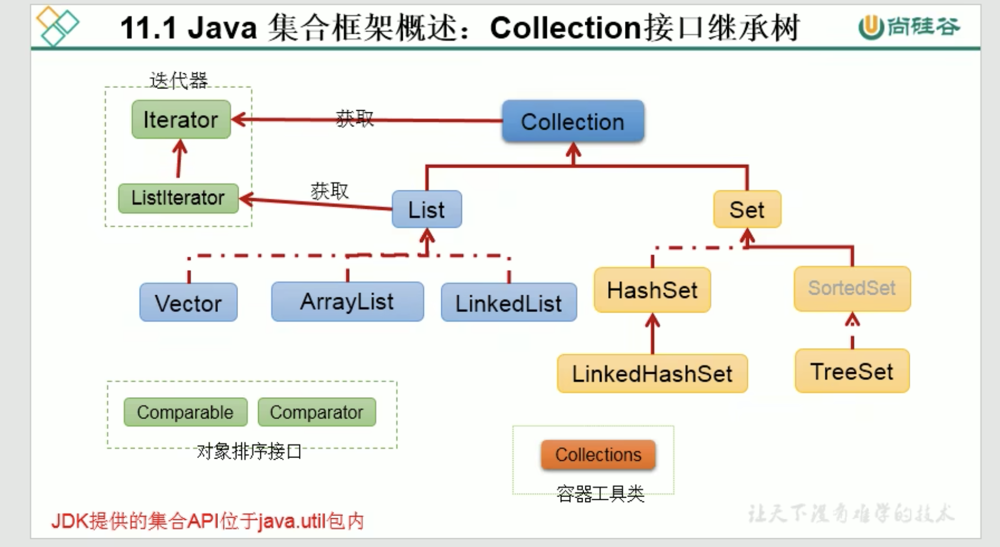

<br>

```java
  | - Collection (接口)
    | - List (接口)
      - Vector (实现类)
      - ArrayList (实现类)
      - LinkedList (实现类)


    | - Set (接口)
      - HashSet (实现类)
        - LinkedHashSet (实现类)

      - SortedSet (子类)
        - TreeSet (实现类)
```

<br>

### List接口:
类似 JS 中的数组

存储有序的可重复的数据 **也叫做动态数组** 可以说List是替换原有数组结构的

<br>

### Set接口:
无序的不可重复的数据 **类似高中集合**  

高中集合的特点: 无序性 确定性 互异性
- 无序性: 乱七八糟
- 确定性: 数据在不在集合中是确定的
- 互异性: 彼此不一样

<br>

**Set接口场景:**  
解决数据重复问题

<br>

## Map接口接口的继承树

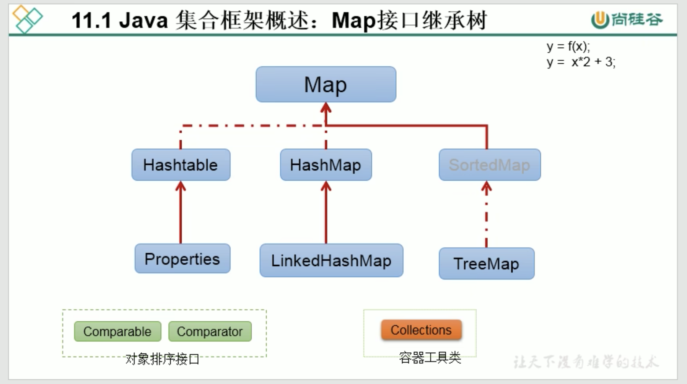

<br>

```java
  | - Map (接口)
    - Hashtable (实现类)
      - Properties (实现类)

    - HashMap (实现类)
      - LinkedHashMap (实现类)

    - SortedMap
      - TreeMap (实现类)
```

<br>

**总结:**  
在存储数据的方面数据的特点不一样 我们就要选用不同的结构 什么容器干什么

<br><br>

# Collection接口中常用的方法

## 概述
我们在讲对象的时候 就先讲的Object因为所有的对象都继承于它 Objectl类中就会有一些通用的方法

Collection也一样 List接口 和 Set接口都实现了Collection接口 那么在存储单列数据方面 不管是有序还是无序也会有一些通用的操作 

既然又适用于List 又适用于Set 那么通用的操作也会定义再Collection接口中

<br><br>

## Collection接口中的抽象方法
接口中定义的方法都是抽象的, 也就是说 接口中定义的抽象方法 我们要通过 接口的实现类对象来进行调用

我们下面以 Collection接口的ArrayList实现类举例说明

```java
/*
多态形式: 
  声明的实现类的对象赋值给接口类型的引用

作用:
  声明的接口类型 所以我们抽象方法的虚拟调用原则 能看到的仅是接口中声明的方法 但执行的时候 是实现类重写过的
*/
Collection coll = new ArrayList();
```

<br>

### Collection接口中的API

**注意:**  
Collection接口中的API有一部分要求 **<font color="#C2185B">形参obj所在的类中 要重写 equals() 方法</font>**  

- contains()
- remove()
- equals()

<br>

**总结:**  
我们向 Collection接口的实现类的对象中(实现类创建的集合中)添加对象的时候 要求对象所在的类要重写equals()

<br>

### **<font color="#C2185B">实现类对象.add(Object o)</font>**
将元素 o 添加到集合中
```java
coll.add("AA");
coll.add("BB");

// 能放基本数据类型 - 自动装箱
coll.add(122);
coll.add(new Date());
```

<br>

### **<font color="#C2185B">实现类对象.size()</font>**
获取集合中实际元素的个数

```java
System.out.println(coll.size());  // 4
```

<br>

### **<font color="#C2185B">实现类对象.addAll(Collection c)</font>**
将 **给定集合中的元素** 添加到 **当前的集合** 中

**参数:**  
集合对象

```java
// 我们再创建一个集合 
Collection coll2 = new ArrayList();

// 向集合2中添加元素
coll2.add("456");
coll2.add(123);

// 将集合2中的元素 添加到集合1中
coll.addAll(coll2);

System.out.println(coll.size());  // 6
```

<br>

### 扩展: 向集合中添加元素的两种方式:

**方式1:**  
1. 创建先集合
2. 然后调用实现类对象的add()方法添加
```java
Collection coll = new ArrayList();
coll.add(123);
```

<br>

**方式2:**  
使用 Arrays.asList() 方法, 创建集合的同时 向集合中添加元素

**<font color="#C2185B">Arrays.asList(元素...)</font>**   
根据给定的元素 创建一个List集合

<br>

**返回值:**  
java.util.Arrays$ArrayList

自动生成的类型是 List 但实际返回的是 java.util.Arrays 的内部类 ArrayList 

上面的类型 和 java.util.ArrayList 是不一样的

java.util.ArrayList重写了Collection接口中的各种操作集合的方法 但是 Arrays的内部类ArrayList没有重写

当通过 java.util.Arrays$ArrayList 调用集合中的方法时 会抛 **UnsupportedOperationException** 异常 


```java
Collection coll1 = Arrays.asList(123, 456);

List list = Arrays.asList("AA", 12, new Date());
```

<br>

**注意:**  
当我们对 Arrays.asList() 创建的集合 进行 add() remove() 方法的时候 会报错

```java
// 使用 Arrays.asList 方式创建的集合 和 添加的元素
Collection coll = Arrays.asList(123, 456, new Person("sam", 18), false, new String("Tom"));

// 当调用remove方法的时候 报错
coll.remove(123);
  // java.lang.UnsupportedOperationException
```

<br>

### **<font color="#C2185B">实现类对象.toString()</font>**
该toString()方法是Collection接口的实现类中重写后的, 我们直接输出 实现类对象 则是默认调用的 toString()方法

<br>

**作用:**  
用于查看集合中的内容

```java
// 下面两种方式 实际上的效果是一样的
System.out.println(coll.toString());
System.out.println(coll);
// [AA, BB, 122, Sun Jan 16 14:08:43 JST 2022, 456, 123]
```

<br>

### **<font color="#C2185B">实现类对象.isEmpty()</font>**
判断当前集合是否为空(不是判断集合对象是不是null 而是判断集合中是否有元素)

<br>

**返回值:**  
Boolean

```java
// 源码:
public boolean isEmpty() {
  return size == 0;
}
```

```java
// 集合中有元素的时候
System.out.println(coll.isEmpty());   // false
```

<br>

### **<font color="#C2185B">实现类对象.clear()</font>**
清空集合元素

```java
// 清空集合中的数据
coll.clear();

// 集合本身是保留的
System.out.println(coll.isEmpty());   // true
```

<br>

### **<font color="#C2185B">实现类对象.contains(Object obj)</font>**
判断 当前集合 中 是否包含给定的obj, 也就是检查集合中是否有我们给定的数据

<br>

**要求:**  
形参obj所在的类 要重写 equals() 方法, 因为判断是的内容而不是地址

<br>

**返回值:**  
boolean

<br>

**示例:**  
```java
Collection coll = new ArrayList();

coll.add(123);

// 检查集合中是否有 123
boolean res = coll.contains(123);
System.out.println(res);   // true
```

<br>

**形参obj: String的示例:**  
```java
coll.add(new String("Tom"));

// 集合中有了一个Tom 现在使用contains方法判断集合中是否有Tom
System.out.println(coll.contains(new String("Tom")));     // true
```

<br>

**解析:**  
我们向集合中添加 Tom 的时候使用的是 new 的方式, 形参obj的声明方式也是 new 的方式

按理来说 这是两个对象 比较的应该是地址值 结果应该是 false, 但我们调用 contains() 的结果却是 true

原因 形参obj所在的类是String, String类中重写了 equals() 所以比较的是内容

<br>

**形参obj: 自定义类的示例:**  
```java
// 往集合中添加了一个Person对象
coll.add(new Person("erin", 18));

// 使用contains()方法判断 集合中有没有Person对象
System.out.println(coll.contains(new Person("erin", 18)));    // false
```

<br>

**解析:**  
上面的示例中 形参obj是String contains()的结果是true 是因为String类中重写了 equals() 方法

而我们的 形参obj是Person 而Person类中并没有重写 equals() 所以内部调用的是Object中的equals() 内部就是使用 == 判断的是地址值

**所以我们要在形参obj所在类中重写equals()方法**  

<br>

**equals()内部的逻辑:**  
我们在判断的时候会调用 obj对象 所在类的equals()

1. 通过形参obj, obj.equals(参数) 传入参数中
2. 将集合中的元素**依次**传入 obj.equals(参数) 进行形参和集合元素的内容的依次比较
3. 因为List是有序的所以会将集合中的第一位元素开始传入 依次进行比较 **直到相同为止**  

<br>

Person类中重写 equals() 后 再次比较
```java
@Override
public boolean equals(Object o) {
  if (this == o) return true;
  if (o == null || getClass() != o.getClass()) return false;

  Person person = (Person) o;

  if (age != person.age) return false;
  return name != null ? name.equals(person.name) : person.name == null;
}


// 再次比较, erin 18 都必须一致
System.out.println(coll.contains(new Person("erin", 18)));    // true
```

<br>

### **<font color="#C2185B">实现类对象.containsAll(Collection coll2)</font>**
判断形参coll2集合中的所有数据是不是**都在**当前coll1集合中

都在: 返回true   
有一个不在: 返回false

<br>

**要求:**  
形参obj所在的类 要重写 equals() 方法, 因为判断是的内容而不是地址

<br>

**返回值:**  
boolean

```java
// 创建coll集合
Collection coll1 = new ArrayList();

// 向coll集合中添加元素 -- 方式1
coll.add(123);
coll.add(new String("Tom"));

// 创建coll1集合 同时调用 Arrays.asList(元素) 方法向结合中添加元素
Collection coll2 = Arrays.asList(123, 456);

// 判断coll1中的元素是否都在coll中
System.out.println(coll1.containsAll(coll2));
```

<br>

### **<font color="#C2185B">实现类对象.remove(Object obj)</font>**
从当前集合中移除obj元素

先根据形参obj查找 查找到后再移除

<br>

**要求:**  
形参obj所在的类 要重写 equals() 方法, 因为判断是的内容而不是地址

remove()方法中也会调用形参obj所在类的equals() 因为要判断有没有给定元素 判断出来有才能移除

如果没有重写equals()那么比较的就是地址值 会导致删除失败

<br>

**返回值:**  
boolean

<br>

**示例1: 传入基本类型**  
```java
Collection coll = new ArrayList();
coll.add(123);
coll.add(456);
coll.add(new Person("sam", 18));
coll.add(false);
coll.add(new String("Tom"));

coll.remove(123);   // 它还有返回值可以接收
System.out.println(coll); // 删除了
```

<br>

**示例1: 传入对象**  
```java
// 创建集合
Collection coll = new ArrayList();
// 添加一个Person对象
coll.add(new Person("sam", 18));

// 删除一个Person对象 注意这里是新new的
coll.remove(new Person("sam", 18));
System.out.println(coll);
```

<br>

**要点:**  
- 如果Person类没有重写equals() 那么就会删除失败
- 如果Person类重写了equals() 那么就会删除成功

<br><br>

### 差集操作:
移除的是 coll 和 coll1 中公有的元素

<br>

### **<font color="#C2185B">实现类对象.removeAll(Collection coll1)</font>**
从当前集合中 **移除coll1中所有的元素**, 内部也调用形参所在类的equals()了

<br>

**要求:**  
形参obj所在的类 要重写 equals() 方法, 因为判断是的内容而不是地址

```java
Collection coll = new ArrayList();
coll.add(123);
coll.add(456);

Collection coll1 = Arrays.asList(123, 4567);
coll.removeAll(coll1) 

// 只会移除123 因为coll中没有4567
```

<br><br>

### 交集操作:
只保留两个集合中相同的元素 删除不一样的元素

<br>

### **<font color="#C2185B">实现类对象.retainAll(Collection coll1)</font>**
获取当前集合和coll1集合的交集 将结果重新赋值给了coll(相当于直接修改了coll)

<br>

**要求:**  
形参obj所在的类 要重写 equals() 方法, 因为判断是的内容而不是地址

<br>

**返回值:**  
boolean

```java
// 集合1
Collection coll = new ArrayList();
coll.add(123);
coll.add(456);
coll.add(new Person("sam", 18));
coll.add(false);
coll.add(new String("Tom"));

// 集合2
Collection coll2 = Arrays.asList(123, 456, 789);

System.out.println(coll);   // 1
coll.retainAll(coll1);
System.out.println(coll);   // 2

// 结果: coll集合中只保留了两个集合中相同的元素
// 1
[123, 456, Person{name='sam', age=18}, false, Tom]

// 2
[123, 456]
```

<br>


**<font color="#C2185B">实现类对象.equals(Collecton coll1)</font>**  
判断 当前集合 和 给定集合 是否一样

元素都一样才会返回 true, 该方法内部是一个一个对象去进行比较的

如果右侧声明的是ArrayList(有序)的时候 那么元素的顺序在两个集合中也要相同 (Set则不用管顺序)

- 有序的结构 要考虑先后顺序的问题
- 无序的结构 不用考虑先后顺序的问题

<br>

**要求:**  
形参obj所在的类 要重写 equals() 方法, 因为判断是的内容而不是地址

<br>

**返回值:**  
boolean

<br>

**示例:**  
两个集合内部的对象的顺序是*一样*的时候 返回true
```java
Collection coll = new ArrayList();
coll.add(123);
coll.add(456);

Collection coll1 = new ArrayList();
coll1.add(123);
coll1.add(456);

System.out.println(coll.equals(coll1)); //true
```

<br>

**示例2:**  
两个集合内部的对象的顺序是*不一样*的时候 返回false
```java
Collection coll = new ArrayList();
coll.add(456);    // 不一样哦
coll.add(123);

Collection coll1 = new ArrayList();
coll1.add(123);
coll1.add(456);

System.out.println(coll.equals(coll1)); //false
```

<br>

**注意:**  
上述原因是因为 有序 造成的 也就是说我们使用ArrayList, 因为ArrayList是有序的 所以即使是元素一样 但顺序不一样 也不算是相同

<br>

### **<font color="#C2185B">实现类对象.hashCode()</font>**
返回当前对象的hash值

如果没有重写hashCode()方法 就相当于一个随机数了, 自定义类中可以重写hashCode()方法

<br>

**模板如下:**  
```java
// name age是Person类中的属性
public int hashCode() {
  return Objects.hash(name, age);
}

public int hashCode() {
  int result = name != null ? name.hashCode() : 0;
  result = 31 * result + age;
  return result;
}


System.out.println(coll.hashCode());
// -752915805
```

<br><br>

## 集合 -> 数组
集合 转成 数组

<br>

### **<font color="#C2185B">实现类对象.toArray()</font>**

<br>

**返回值:**  
Object类型的数组 Object[]

```java
Collection coll = new ArrayList();
coll.add(123);
coll.add(456);
coll.add(new Person("sam", 18));
coll.add(false);
coll.add(new String("Tom"));

// 返回的类型是 Object[]
Object[] arr = coll.toArray();
System.out.println(Arrays.toString(arr));

// 还可以使用fori 来输出
```

<br><br>

## 数组 -> 集合
数组 转成 集合

<br>

### **<font color="#C2185B">Arrays.asList(可变形参:直接写数据就可以)</font>**
```java
List arr = Arrays.asList(123, 456);
```

<br>

**参数: 可变形参**  
- 可以单独传入 一个个的数据
- 传入基本数据类型的数组 会看成一个成员
- 传入基本数据类型的包装类数组 包装类的数组中的每一个元素都会做为一个成员

<br>

**返回值:**  
List: java.util.Arrays$ArrayList

<br>

```java
// 传个数组进去 可变形参也相当于数组
List<String> list = Arrays.asList(new String[]{"AA", "BB", "CC"});

System.out.println(list);
    // [AA, BB, CC]
```

<br>

**注意:**  
Arrays.asList(参数部分的问题), 参数是以对象为基准

1. 如果我们传入的是 基本数据类型的数组 那么整体会被当做是一个元素
```java
List<int[]> arr = Arrays.asList(new int[]{123, 456});
System.out.println(arr);
    // [[I@2db7a79b] 输出的是 里面就一个元素 该元素是一维数组 int型的 
```

2. 我们可以将数组转换为包装类的形式 就可以被识别为两个元素了
```java
List arr = Arrays.asList(new Integer[] {123,  456});

// 或者写成这样 也可以
List arr = Arrays.asList(123,  456);
```

也就是说 我们创建的是包装类的对象就会被识别为其中的两个元素了

<br><br>

# Iterator接口: 遍历Collection
集合元素的遍历操作 使用Iterator接口 **(Map不用Iterator)**  

<br>

**遍历集合的方式:**  
- for i
- iterator
- foreach(类似Js for...of)

<br><br>

## 作用
Iterator对象成为迭代器 主要用于遍历 Collection集合中的元素

<br><br>

## 迭代器的定义
提供一种方法访问一个容器(container)对象中各个元素 而又不需暴露该对象的内部细节

``` 
迭代器模式: 就是为容器而生

类似 公交车上的售票员 火车上的乘务员 空姐 -- 检票 一个个的都过一下
```

<br>

Collection接口继承了java.lang.Iterator接口, Iterator接口有一个iterator()方法 

那么所有实现了Collection接口的集合类都有一个iterator()方法 用以返回一个实现了Iterator接口的对象

<br>

**Iterator仅用于遍历集合** iterator本身并不提供承装对象的能力 如果需要创建iterator对象 则必须通过 集合.iterator() 方法获取

集合对象每次调用iterator()方法都得到一个全新的迭代器对象 默认游标都在集合的第一个元素之前

```java
// 集合

指针
 ↓
   _ _ _ _ _ _ 

```

<br>

## Iterator接口中的API

<br>

### 生成迭代器对象:
我们遍历集合 所以通过 迭代器对象

<br>

**<font color="#C2185B">实现类对象(集合).iterator()</font>**  
通过集合实现类对象调用iterator()方法, **返回Iterator接口的实例** 用于遍历集合元素

要想遍历就要用到迭代器对象 它只是用于遍历的 它不是容器, 集合对象每次调用iterator()方法都得到一个全新的迭代器对象 默认游标都在集合的第一个元素之前

<br>

**返回值:**  
Iterator(迭代器对象)

<br>

**注意:**  
当前集合.iterator()

每一个迭代器对象都是通过 ``当前集合.`` 获取的 所以 该迭代器对象 和 当前集合 是一一配套的, 它们都各自独有一套next()指针

比如: 我们创建了 iterator对象 拿着它去遍历了一个集合, 然后我们还想使用该iterator对象 去遍历另一个集合 不行了 因为next指针已经指到最后了

这时我们想遍历另一个集合的时候 我们要重新创建一个 iterator 对象

```java
// 创建集合
Collection coll = new ArrayList();
coll.add(123);
coll.add(456);
coll.add(new Person("sam", 18));
coll.add(false);
coll.add(new String("Tom"));


// 通过集合对象 调用 iterator()方法 得到迭代器对象
Iterator iterator = coll.iterator();

// ... 接下来通过 迭代器对象 遍历集合
```

<br>

### **<font color="#C2185B">迭代器对象.hasNext()</font>**
判断是否还有下一个元素, 判断集合中是否还有未遍历元素

- 有则返回true  
- 没有则返回false

**返回值:**  
boolean

<br>

### **<font color="#C2185B">迭代器对象.next()</font>**
指针指向下一个元素 默认游标都在集合的第一个元素之前

**作用:**  
1. 指针下移
2. 将下移以后所处集合位置上的元素返回

<br>

**返回值:**  
Object
```java
Object obj = iterator.next();
```

<br>

**异常:**  
NoSuchElementException

当没有可遍历元素 却仍然调用 next() 方法时 报错

<br>

**示例:**  
```java
Collection coll = new ArrayList();
coll.add(123);
coll.add(456);
coll.add(new Person("sam", 18));
coll.add(false);
coll.add(new String("Tom"));

Iterator iterator = coll.iterator();

// 推荐方式 还可以用 fori coll.size() 但是一般不用
while(iterator.hasNext()) {
  // 判断当前集合中是否还有元素 有元素就进入循环体 没有就不要进去了
  System.out.println(iterator.next());
}
```

<br>

### 迭代器iterator的执行原理:
```java
// 创建迭代器对象 和 指针
Iterator iterator = coll.iterator();

// 判断指针下方是否有元素
while(iterator.hasNext()) {
  System.out.println(iterator.next());
}
```

<br>

当前集合:
```java
指针
↓
  | 123 | new String("AA") | 1 | 2 |
```

1. 我们调用iterator方法 返回迭代器对象 然后就创建了 指针

2. 指针是指在第一个元素的上面(指的是一个空的位置)

3. 我们调用了 iterator.hasNext() 让它看看指针下方是否还有元素 返回true

4. 一旦返回true 调用next() 调用该方法后 我们做了好几件事情
  - 指针下移
  - 把指针下移之后对应的元素返回 next() 会返回一个值

5. 以此类推, 当 hasNext() 为false的时候 就会退出循环 

<br>

### iterator遍历集合的 两种错误写法

```java
Collection coll = new ArrayList();
coll.add(123);
coll.add(456);
coll.add(new Person("sam", 18));
coll.add(false);
coll.add(new String("Tom"));

Iterator iterator = coll.iterator();
```

<br>

**错误写法1:**  
会跳着输出 456 Tom 异常

1的位置 没有输出 指针已经下移  
2的位置 有输出 指针已经下移
```java
while((iterator.next()) != null) { // 1
  System.out.println(iterator.next()); // 2
}
```

<br>

**错误写法2:**  
每当调用 iterator() 都会返回迭代器对象 新的迭代器的对象的指针就会在第一个元素位置之前
```java
while((coll.iterator().hasNext())) {
  System.out.println(coll.iterator().next());
}
```

<br>

### **<font color="#C2185B">迭代器对象.remove()</font>**
通过迭代器自己的删除API 删除集合中的元素, 此方法不同于 集合对象.remove(obj)

我们可以在 iterator方式遍历的过程当中帮我们删除不想要的元素

```java
// 创建集合
Collection coll = new ArrayList();
coll.add(123);
coll.add(456);
coll.add(new Person("sam", 18));
coll.add(false);
coll.add(new String("Tom"));

// 创建 迭代器对象
Iterator iterator = coll.iterator();

// 移除指定的元素
while(iterator.hasNext()) {
  // 把next返回的元素接收 用于判断
  Object obj = iterator.next();

  // 如果返回的数据是Tom 那就移除
  if("Tom".equals(obj)) {
    iterator.remove();
  }
}
```

<br>

**注意:**  
再次遍历删除元素后的集合 如果还想用已经使用过的 iterator迭代器是不行的

因为上面的iterator对象的指针已经到最后了

```java
// 重新创建一个iterator对象 让指针从头开始
Iterator iterator1 = coll.iterator();
while(iterator1.hasNext()) {
  System.out.println(iterator1.next());
}
```

<br>

**注意:**  
1. iterator可以删除集合的元素 但是是遍历过程中通过迭代器对象的remove()方法 不是集合对象的remove方法

2. 如果iterator遍历方式中 没调用next()方法 直接进行remove操作 会报IllegalStateException异常

3. 调用next()方法后 调用两次remove操作也会报 IllegalStateException异常

<br>

**总结:**  
iteratro.remove() 操作要跟next()指针下移有关系, 移动到目标位置后才能删除 没有移动不能删除

<br><br>

# foreach: 循环遍历集合 或 数组
JDK5.0提供了 foreach 循环遍历 Collection(集合) 和 数组

<br>

## foreach特点
该遍历操作不需要获取Collection或数组的长度 无需使用索引访问元素

遍历集合的底层调用iterator完成操作, foreach还可以用来遍历数组

<br><br>

## foreach格式
```java
for(类型 item: 集合或数组) {
  item: 集合或数组中的成员
}
```

- 元素类型取决于 集合/数组中元素的类型
- item只是定义的局部变量

<br>

**示例:**  
```java
Collection list = new ArrayList();
list.add(1);
list.add(new String("sam"));
list.add(true);
list.add(new Person("erin", 20));


for(Object item: list) {
  
}


// 遍历数组
int[] arr = new int[] {1, 2, 3, 4, 5};
for(int i: arr) {
  System.out.println(i);
}
```

<br><br>

## foreach的执行过程
上面的案例中 coll 是我们要遍历的集合 foreach内部会自动取该集合里面的元素 

它*会先取集合中的第一个元素 赋值给item变量* 然后打印item

**<font color="#C2185B">注意: 这里 就提取数组或集合中的一个元素 赋值给另一个变量</font>**  

然后接着取集合中的第二个元素 再赋值给item 依次类推 直到最后一个元素, **内部的原理还是调用的跌代器**  

<br>

### 注意:

**普通for:**  
如果是 普通for 则修改的是数组中的元素, 拿着本身的值做修改
```java
String[] arr = new String[] {"MM", "MM", "MM"};

// 普通for循环的赋值操作
for (int i = 0; i < arr.length; i++) {
  arr[i] = "GG";
}

for (int i = 0; i < arr.length; i++) {
  System.out.println(arr[i]); // GG
}
```

<br>

**foreach:**  
如果是 foreach 则不会修改原有数组中的元素, 因为我们是将元素取出来赋值给 item 操作的是 item
```java
// 增强型的赋值操作, 这里相当于将元素取出来 赋值给s 我们把s给改了, 然后我们输出的s
for(String s: arr) {
  s = "GG";
}

for(String s: arr) {
  System.out.println(s);    // MM
}
```

如果是引用类型的话 通过 item 可以对其进行修改  
如果是基本类型的话 通过 item 修改了但是并不影响原有的数组中的成员

<br>

### 扩展: forEach遍历
这里使用了lamda表达式 后面再讲
```java
Collection coll = new ArrayList();
coll.add(123);
coll.add(456);
coll.add(789);

// java8.0里的新特性
coll.forEach(System.out.println);
```

<br><br>

# Collection子接口: List接口
鉴于java中数组用来存储数据的局限性 我们

**<font color="#C2185B">通常使用List代替数组, 称之为动态数组</font>**  

<br>

## 数组的特点
- 数组的长度一旦确认就不能修改了
- 对数组进行扩容需要重新new一个数组, 要先告诉它数组有多长 然后将原有的数组copy到新的数组中

而对 List 来说我们不用关心数组的长度够不够 它会动态的帮我们去变换数组的长度 避开了角标越界的异常

<br><br>

## List接口的特点
- List集合中的成员 元素有序
- List集合中的成员 元素可重复
- List集合中的成员没有成员都有对应的索引

List容器中的元素都对应一个整数型的序号记载其在容器中的位置 可以根据序号存储容器中的元素

<br><br>

## List的实现类
- ArrayList
- LinkedList
- Vector

<br><br>

## ArrayList
ArrayList作为List接口的 **主要实现类**  
其它的两个不太常用所以叫做主要的实现类

ArrayList其实就是对数组进行的一层封装 数据仍然存在数组当中

<br>

### 使用ArrayList的场景:
如果没有特殊的需求的话 可以直接使用 ArrayList 来代替数组 (元素有序可重复)

<br>

### ArrayList的线程问题:
- ArrayList执行效率比较高
- 线程不安全

<br><br>

## ArrayList的实例化

### **<font color="#C2185B">ArrayList list = new ArrayList()</font>**
调用默认的空参构造器创建集合 底层默认创建了长度为10的Object[] 数组

<br>

**返回值:**  
ArrayList

<br>

### **<font color="#C2185B">ArrayList list = new ArrayList(int capacity)</font>**
当知道大致的数据长度的时候 请指定容器长度, 避免在中间的环节去扩容

<br><br>

## ArrayList的API
基本上我们使用的还是 Collection接口中定义的通用的操作方式

<br>

### **<font color="#C2185B">实现类对象.add(E e)</font>**
添加操作

<br>


<br><br>

## ArrayList源码分析
我们所谓的动态数组我们不同担心在添加数据的时候会不会容量不够 我们只管往里面追加就可以, 只是说扩容方面的事情 底层帮我们做了 不意味着它不需要扩容

ArrayList的源码在 JDK7 和 JDK8 中稍有不同

<br>

### JDK7 和 JDK8 的相同点:
底层的存储结构都是
```java
private transient Object[] elementData;
```

<br>

### JDK7的情况下:
**<font color="#C2185B">new 创建ArrayList实例对象的时候初始化了底层Object[]数组</font>**  

<br>

**1. 底层存储数据的结构: Object[]**  
```java
private transient Object[] elementData;
```

<br>

**2. ArrayList的空参构造器:**   
当 ``new ArrayList()`` 的时候底层会初始化一个长度为10的Object[] 数组 

```java
// 空参构造器
public ArrayList() {

  // 调用本类中重载的构造器 传入参数10
  this(10);
}


// 重载构造器
public ArrayList(int initialCapacity) {
  super();

  if (initialCapacity < 0)
    throw new IllegalArgumentException("Illegal Capacity: "+ initialCapacity);

  // 根据我们传入的10对底层的数组进行了初始化, 数组的长度为10
  this.elementData = new Object[initialCapacity];
}
```

<br>

**3. 向 ArrayList 集合中添加数据的情况:**  
- add() 方法源码中 在添加数据之前会先判断数组的容量是否足够 需要不需要进行扩容 会调用 ``void ensureCapacityInternal(int minCapacity)`` 方法

```java
/*
  作用: 
    用于判断数组是否需要扩容

  参数: 
    传入了的size+1 
    size: 是已经添加的元素的个数, 初次add的时候就是0+1
*/

private void ensureCapacityInternal(int minCapacity) {
  // 这个变量涉及到快速失败机制的 我们不关心
  modCount++;


  // 我们将传入的minCapacity 也就是添加元素后的size 和 本身的底层数组长度相减
  if (minCapacity - elementData.length > 0)

    /*
      如果结果是 size - 数组长度 
      < 0 说明不需要扩容
      > 0 说明需要扩容 在调用下面的方法
    */
    grow(minCapacity);
}
```

<br>

- 调用add()方法后 如果判断需要扩容 则调用扩容的方法 grow(), 比如默认的数组长度为10 当我们添加到11个的时候就需要扩容, **<font color="#C2185B">扩容为原来的1.5倍</font>**  

扩容完后将旧数据copy到新数组中
```java
/*
  作用: 给数组进行扩容
  参数: minCapacity, 以添加的元素个数+1, 比如默认数组长度为10, 当添加第11个元素的时候 minCapacity就为11
*/
private void grow(int minCapacity) {

  // 首先记录本身底层数组的长度 oldCapacity旧的容纳能力
  int oldCapacity = elementData.length;

  // 新的容纳能力 = 旧的容纳能力 + 旧的容纳能力的一半, 默认情况下 扩容原来的1.5倍, >> 1 相当于除以2
  int newCapacity = oldCapacity + (oldCapacity >> 1);


  // 特殊情况: 扩容完之后发现跟实际需要的容量还是小
  if (newCapacity - minCapacity < 0)
    // 那我就直接拿你的容量
    newCapacity = minCapacity;
  
  // 特殊情况: 如果容量超过了整型int的最大值
  if (newCapacity - MAX_ARRAY_SIZE > 0)
    // 那就取整型的最大值
    newCapacity = hugeCapacity(minCapacity);


  // 扩容完之后还要将原有数组中的数据copy到新数组中
  elementData = Arrays.copyOf(elementData, newCapacity);
}

```

<br>

- 调用add()方法后 如果判断不需要扩容 则将数据按照顺序放入到数组中的指定位置
```java
// ArrayList中添加数据的方法:
public boolean add(E e) {
  
  // 判断是否需要扩容, 传入数组中已有的元素个数+1
  ensureCapacityInternal(size + 1);
    
  // 不管扩容与否 都根据size将数据插入到数组中的指定位置
  elementData[size++] = e;

  return true;
}
```

<br>

### 启示:
在开发过程当中基本确定ArrayList中要放多少数据 我们就尽量不要使用空参的构造器, 建议开发中使用带参的构造器 ``new ArrayList(int capacity)``  避免在中间的环节去扩容

当持续添加 内部会持续的扩容 丢弃旧的数组创建新的数组 所以我们尽量的避免这个环节 使用指定长度的构造器

<br><br>

### JDK8的情况下:
**<font color="#C2185B">JDK8中不是在new实例化的时候 就初始化好底层数组的长度, 等需要的时候再造, 节省内存</font>**  

JDK7中我们创建 ArrayList 的集合对象时 底层会创建长度为10的 Object[] 类型的数组

但是

JDK8中我们创建 ArrayList 的集合对象时 底层的数组为 {} 而不是像JDK7中数组的默认长度为10了
```java
// 底层数组的变量
Object[] elementData;

// 类中的常量:
private static final Object[] DEFAULTCAPACITY_EMPTY_ELEMENTDATA = {}


// ArrayList的空参构造器
public ArrayList() {
  // 给底层数组指定了一个常量 
  this.elementData = DEFAULTCAPACITY_EMPTY_ELEMENTDATA;
}
```

<br>

**那什么时候给底层数组开始赋值的呢？**  
当我们进行 add() 添加操作的时候 首次添加会给底层数组进行赋值为常量 ``DEFAULT_CAPACITY: 10``

也就是说当添加操作 add() 的时候才会给底层数组进行赋值


```java
// 没有变化
public boolean add(E e) {
  ensureCapacityInternal(size+1);
  elementData[size++] = e;
  return true;
}


// 有变化: 判断是否需要扩容
private void ensureCapacityInternal(int minCapacity) {

  // 判断是否是首次调用: 当我们首次调用add()方法的时候 elementData = {}
  if(elementData == DEFAULTCAPACITY_EMPTY_ELEMENTDATA) {
    
    // 首次add() 操作: 
    /*
      常量: 
      DEFAULT_CAPACITY: 10 

      常量 和 minCapacity 取较大值交给 grow() 方法为底层数组进行扩容或初始化赋值
    */
    minCapacity = Math.max(DEFAULT_CAPACITY, minCapacity)
  }

  ensureExplicitCapacity(minCapacity)
}


// 扩容或初始化底层数组的方法
private void ensureExplicitCapacity(int minCapacity) {
  modCount++;

  // 如果10-0>0那么就执行扩容操作
  if(minCapacity - elementData.length > 0) {
    grow(minCapacity)
  }
}
```

<br>

后续的添加和扩容操作跟JDK7一样

<br>

### 小结:
- JDK7的ArrayList: 有点像饿汉式 一开始就造好
- JDK8的ArrayList: 有点像懒汉式 等需要的时候再造 好处是延迟了数组的创建过程 节省了内存

<br><br>

## LinkedList
List接口的子接口之一, 都是用来存储数组的容器 但与ArrayList的分工不同

<br>

### 作用:
它跟ArrayList的区别就是底层结构的不同, 底层使用 **双向链表** 存储

<br>

### LinkedList的使用场景:
对于频繁的插入和删除操作的时候 我们使用 LinkedList 的效率比ArrayList高, 反之我们使用ArrayList

<br>

**ArrayList:**   
使用场景如下的时候我们选择 ArrayList
- 遍历 
- 查找 
- 在头或者末尾添加

如果仅仅是放进去在某个位置再取出来 我们选择ArrayList 因为我们可以通过索引来进行操作,  LinkedList还要维护一对指针比较麻烦

如果我们想查找角标为10的元素 数组的话可以直接的定义到这里, 而LinkedList得从第一个开始找 找到目标的元素

<br>

**LinkedList:**  
涉及到频繁的插入删除的时候我们选择 LinkedList

<br>

### LinkedList的实例化:
**<font color="#C2185B">LinkedList list = new LinkedList();</font>**  
创建 链表结构的 集合容器

<br>

**返回值:**  
LinkedList

<br>

## LinkedList的API
基本上我们使用的还是 Collection接口中定义的通用的操作方式

<br>

### **<font color="#C2185B">实现类对象.add(E e)</font>**
添加操作

<br>

### 数组 和 链表 存储数据的区别
使用链表和数组在存储数据方面表现出来的特点不同

<br>

**数组的存储:**  
虽然说的是数组 但是ArrayList只是数组上的封装 底层仍然使用的是数组
```
□ □ □ □ □ □ □ □
```

<br>

**删除操作:**    
当我们要删除其中的一个元素的时候 也必须是后一个替换前一个, 假如我们现在使用ArrayList装了1万条数据 现在我们要删掉第3条 这个效率想想

<br>

**插入操作:**  
当我们要在index:4的位置插入一个元素的时候 后面的元素要依次往后移动(先移最后一个) 把位置空出来 然后插入元素 比如再有1万条

<br>

**链表的存储:**  
LinkedList是双向链表

一个元素分3个部分 中间的部分存的是核心数据 左右两侧各是指针

- 当Node为第一个元素的时候 prev: null
- 当Node为最后一个元素的时候 next: null
```java
// Node
----------------
|prev|data|next|
----------------
```

<br>

两个节点直接互相引用, A的next指向B, B的prev指向A
```java
// Node A           Node B
----------------    ----------------
|prev|data|next|    |prev|data|next|
----------------    ----------------
```

<br>

当我们想把其中的一个节点删掉的时候,  
- 将 B的next地址给A, A的next指向C  
- 将 B的prev地址给C, C的prec指向A

A的next指向C, C的prev指向 
```java
// 删除之前:
A       B       C
□□□ <-> □□□ <-> □□□  


// 删除之后:
    B
    □□□

A       C
□□□ <-> □□□
```

比如我们1万条数据要删除第3条 那么只跟2 4有点关系 跟其它的没有关系

<br>

### LinkedList的节点源码:
双向链表内部没有声明数组 而是定义了Node类型的first和last用于记录首末元素 同时定义内部类Node
作为LinkedList中保存数据的基本结构 Node除了保存数据 还定义了两个变量

- prev变量记录前一个元素的位置
- next变量记录后一个元素的位置

```java
private static Node<E> {
  E item;
  Node<E> next;
  Node<E> prev;

  Node(Node<E> prev, E element, Node<E> next) {
    this.item = element
    this.next = next;
    this.prev = prev;
  }
}

```

<br><br>

## LinkedList源码分析
LinkedList底层是使用双向链表进行存储的

在数据结构当中提到数据存储 有两个典型的基本结构
1. 数组 - 顺序表
2. 链表

还有 树 & 图 都是由上面的两种数据结构改造出来的

<br>

### 源码:
底层中没有 Object[] 数组的结构, 取而代之的是有两个 Node类型的节点
```java
transient int size = 0;
transient Node<E> first;
transient Node<E> last;
```

Node就是它数据存储的基本单位 我们的数据都存在Node里面

我们通过 ``LinkedList对象.add(数据)`` 的时候往里放的数据 就作为Node的一部分

我们添加一个数据 底层就会创建一个Node 

<br>

**Node结构源码:**  
Node是 LinkedList 的内部类, 该类只在 LinkedList 内部自己用
```java
private static class Node<E> {
  // item 就是add(数据)方法添加进来的数据
  E item;

  // 记录当前元素的下一元素的指针
  Node<E> next;

  // 记录当前元素的上一元素的指针
  Node<E> prev;

  Node(Node<E> prev, E element, Node<E> next) {
    this.item = element;
    this.next = next;
    this.prev = prev;
  }
}
```

<br>

**1. 创建LinkedList的实例对象: 关注构造器**  
当我们创建了 list对象 之后 就会有 first 和 last 两个节点

当我们查找某一个元素的时候我们只能从头或者从尾开始查找 同样想添加的时候也会从头或者尾开始添加

```java
public class LinkedList<E> extends AbstractSequentialList<E> implements List<E>, Deque<E>, Cloneable, java.io.Serializable {

  transient int size = 0; 

  // 分别记录整个链条的头 和 尾 两个节点
  transient Node<E> first;
  transient Node<E> last; 

  // 空参构造器
  public LinkedList() {}
}

```

<br>

**2. 我们关注下往链表中添加数据的逻辑 add()**    
调用 ``add(123)`` 方法添加元素

当调用list.add() 往里添加一个具体的对象的时候
将123封装到Node中 创建了Node对象

```java
// 调用add()方法添加元素
public boolean add(E e) {
  linkLast(e);
  return true;
}


// linkLast()
void linkLast(E e) {

  /*
    last为当前链表的最后一个元素
    如果我们是首次调用add方法 last就是null
  */


  // 将last赋值给了 l, l成了最后一个元素节点
  final Node<E> l = last;
  
  /*
    创建 e节点(添加的元素): 结构如下

      l e null
      □ □ □ 

    e节点的prev就是 原本的最后一个节点l, 属于末尾追加的操作
  */
  final Node<E> newNode = new Node<>(l, e, null);

  // 末尾追加, 修改last为新创建的节点
  last = newNode;


  // 判断新节点是 first 还是 last
  // 先是判断l是null么？ 如果l是null说明以前没有add过 那新添加的元素就是first 同时也是last 因为就自己
  if (l == null)
      first = newNode;
  else
      // 如果不是第一个元素 也就是不是null 让我成为最后一个 往后排
      l.next = newNode;
  size++;
  modCount++;
}
```

<br><br>

## Vector
Vector作为List接口的古老实现类, 拥有效率低, 但线程安全的特点

使用的不多

<br>

### 作用:
Vector也是数组, 我们可以理解为 对数组封装了一层后线程安全的线性结构

Vector的扩容方式跟ArrayList LinkedList不同


<br>

### Vector的使用场景:
不太用了

<br>

### Vector的实例化:
```java
Vector vector = new Vector();

vector.add(1);
System.out.println(vector);   // [1]
```


<br>

### Vector的API:
使用的事 Collection接口中定义的通用的方法


<br><br>

## Vector源码分析
通过 ``new Vertor()`` 构造器创建对象时 底层创建了长度为10的数据

<br>

**扩容方面:**  
默认扩容为原来的数组长度的2倍, 扩容的长度比ArrayList稍微大一些

```java
// 对数组进行扩容的方法
private void grow(int minCapacity) {
  int oldCapacity = elementData.length;

  // oldCapacity + oldCapacity 新的容量默认是扩容为原来的2倍
  int newCapacity = oldCapacity + ((caoacityIncrement > 0) ? caoacityIncrement : oldCapacity);

  if (newCapacity - minCapacity < 0)
    newCapacity = minCapacity;
  
  if (newCapacity - MAX_ARRAY_SIZE > 0)
    newCapacity = hugeCapacity(minCapacity);

  elementData = Arrays.copyOf(elementData, newCapacity);
}
```

<br>

### 多线程问题中我们使用 ArrayList 还是 Vector?
我们会使用 ArrayList 

Collections工具类中的 ``synchronized(List<T> list)`` 我们把ArrayList丢进去 返回的就是线程安全的 ArrayList

<br><br>

### 扩展: Stack栈 是 Vector的子类
我们点击 control+h 查看下Vector类之间的关系 我们能看到 Vector有一个子类 Stack(栈)

<br>

**栈:**  
是一种数据结构 它典型的特点就是**先进后出**  

像我们往数组里面存数据 我们想往哪个位置放元素就往哪个位置放 stack不一样 我们要放里面放入元素只能在后面放 不能往前面放

普通的数组结构我们要删除可以删除任意位置的元素

stack不一样 我们要删除只能删除尾部的元素
整体表现出来的就是先进后出的特点 相当于对原有数组更加严格的控制

stack继承vector vector底层结构是数组 stack也一样是用数组存的 只不过在数组上控制操作数组的数据 只能从尾部添加 只能从尾部删除

<br><br>

# List接口: 常用方法
List接口 是 Collection接口的 子接口  
那Collection接口当中定义的15个方法 List接口中就都能用

List接口又是线性有序的数据结构接口, 所以List接口中又会扩展一些关于索引的方法

<br>

## 常用方法介绍
我们以ArrayList为例 因为它是一个比较常用的实现类

LinkedList也同样适用下面的方法, 我们将LinkedList也理解成线性的结构的数组集合 只是底层实现的原理不一样, LinkedList也有索引的概念(理解)

<br>

### **<font color="#C2185B">实现类对象.add(int index, Object obj)</font>**
在index位置插入元素, 原位置的数据往后移动

```java
// 在1的位置插入BB
list.add(1, "BB");
```

<br>

### **<font color="#C2185B">实现类对象.addAll([int index], Collection coll)</font>**

**作用:**  
将 给定集合 添加到指定集合的末尾, 如果传递参数1则将给定集合添加到指定的位置

<br>

**参数:**  
index: 可选, 如果不填写则将 集合2 追加到原集合的末尾

coll: 集合

<br>

**返回值:**  
boolean

```java
// 创建一个集合
List list2 = Arrays.asList(1, 2, 3);

// 将集合放进去
list.addAll(list2);
```

<br>

### **<font color="#C2185B">实现类对象.get(int index)</font>**
获取指定index位置的元素

<br>

**返回值:**  
Object

```java
Object o = list.get(0);
System.out.println(o);
```

<br>

### **<font color="#C2185B">实现类对象.indexOf(Objecct obj)</font>**
返回 给定obj 在集合中首次出现的位置, 没有的话返回-1

<br>

**返回值:**   
int

```java
int i = list.indexOf(456);
System.out.println(i);
```

<br>

### **<font color="#C2185B">实现类对象.lastIndexOf(Objecct obj)</font>**
返回 给定obj 在集合中最后出现的位置, 没有的话返回-1

<br>

**返回值:**  
int

```java
int i = list.lastIndexOf(456);
System.out.println(i);

// [123, BB, 456, AA, Person{name='Tom', age=12}, 456, 1, 2, 3]
// 5
```

<br>

### **<font color="#C2185B">实现类对象.remove(int index)</font>**
根据指定index删除该位置的元素 并返回此元素

<br>

**注意:**  
remove(index): 是List重载Collection中的方法(不是重写 重写是覆盖了)

Collection中的 remove(obj) 我们需要重写参数obj所在类中的 equals() 方法

<br>

**返回值:**  
Object, 删除的元素

```java
// 传入索引
Object o = list.remove(0);
System.out.println(o);
```

<br>

### **<font color="#C2185B">实现类对象.set(int index, Object obj)</font>**
修改操作  
将给定index位置的元素设置(修改)为obj

```java
// 将索引为1位置上的元素 修改为CC
list.set(1, "CC");
System.out.println(list);
```

<br>

### **<font color="#C2185B">实现类对象.subList(int fromIndex, int toIndex)</font>**
返回从 fromIndex ~ toIndex 位置的 **子集合**, 不影响原List

<br>

**参数: (必传)**  
- fromIndex: 包括开始
- toIndex: 不包括结束

<br>

**返回值:**  
新的List

```java
List list1 = list.subList(0, 3);
System.out.println(list1);


// 截取从指定位置到最后的元素
// 集合的索引是从0开始, size()相当于length
List list1 = list.subList(2,list.size());
System.out.println(list1);
```

<br>

### 常用方法的总结:
List接口中的方法都是跟索引有关的

- 增: add(obj)

- 删: remove(index / obj)

- 改: set(index, obj)

- 查: get(index)

- 插: add(index, obj)

- 长度: size()

- 遍历: 
  - iterator迭代器方式
  - foreach
  - 普通for

<br>

**3种遍历的演示:**  
```java
// 迭代器
Iterator iterator = list.iterator();
while(iterator.hasNext()) {
  System.out.println(iterator.next());
}


// 增强for
for(Object obj: list) {
  System.out.println(obj);
}


// 普通for
for(int i=0; i<list.size(); i++) {
  System.out.println(list.get(i));
}
```

<br>

### 面试题:
区分:
- remove(int index)
- remove(Object obj)

```java
@Test
public void testListRemove() {
  List list = new ArrayList();

  // 以包装类存的123 是对象
  list.add(1);
  list.add(2);
  list.add(3);

  // 调用更新集合的方法 
  updateList(list);
}


private static void updateList(List list) {
  // 传入索引: 删除索引对应的数据, 删除数字3
  list.remove(2)

  // 传入对象: 根据equals()比对内容删除 和给定内容一致的数据, 删数字2
  list.remove(new Integer(2));
}
```

<br><br>

## 对比 ArrayList LinkedList Vector
ArrayList LinkedList Vector 三者的异同

<br>

### 相同点:
- 三个类都实现了List接口 存储的特点相同 元素有序, 且可重复的数据

- 三个类都是存储数据的容器

- ArrayList & Vector 的底层都是使用 Object[] 类型的数组存储数据 ``transient Object[] elementData`` (扩展: String类的底层是 char[] value)

<br>

### 异同点:
ArrayList & Vector  
ArrayList & LinkedList

**ArrayList:**  
ArrayList作为List接口的主要实现类, 拥有效率高, 但线程不安全的特点

<br>

**Vector:**  
Vector作为List接口的古老实现类, 拥有效率低, 但线程安全的特点

<br>

**LinkedList:**  
底层使用的是双向列表存储, 对于频繁的插入 删除操作 使用此类的效率比ArrayList高

<br><br>

# Collection子接口: Set接口
Set接口是Collection接口的子接口 Set接口没有提供额外的方法(List接口提供了关于索引的相关方法)

<br>

### List & Set的理解:
List 和 Set 都可以看做是数组 单列数据, 只是特点不一样

Set在开发中使用的不多

<br><br>

## Set接口存储数据的特点
1. 无序
2. 不可重复

Set集合不允许包含相同的元素 如果试把两个相同的元素加入同一个Set集合中 则添加操作失败

Set判断两个对象是否相同不是使用 == 运算符 而是根据 equals()方法

<br><br>

## Set接口使用场景
当我们根据 数据 去集合中找数据的时候 使用 Set比较好, 比如我们有一个联系人的集合 我们根据张三去集合中找张三的数据 这种就适用于Set

查找的速度快, 我们想想 哈希表

<br><br>

## Set接口的实现类
```java
| - Set接口
  | - HashSet
    | - LinkedHashSet
  | - TreeSet
```

<br>

### HashSet: 主要实现类
HashSet作为Set接口的主要实现类 

**特点:**  
1. 线程不安全的, 效率高
2. 可以存储null值
3. 不能保证元素的排列顺序, 无序的

<br>

### LinkedHashSet:
它其实是HashSet的子类
```java
  | - HashSet       
      | - LinkedHashSet   
```

<br>

**特点:**  
它在HashSet的基础上加了指针

<br>

**特点:**  
让它看上去是有序的 当我们遍历LinkedHashSet的时候 可以按照添加的顺序进行遍历

<br>

### TreeSet
**特点:**  
可以按照添加对象的指定属性进行排序, 底层存储数据的方式是 二叉树(红黑树)

<br>

**要求:**  
- 添加的元素必须是同一个类new的对象
- 可以按照这个对象的某些属性来进行排序


<br><br>

## HashSet
它做为 Set接口的主要实现类 使用, 开发中如果没有特殊要求都会使用 HashSet

<br>

### HashSet API:
Set接口中没有提供特别的API, 一般我们都会使用 Collection接口中定义的方法

<br>

### HashSet 的使用场景:
ArrayList相当于数组  
LinkedList相当于链表: 频繁插入删除操作时使用 
HashSet相当于哈希表

当不需要按顺序遍历, 从大到小 从小到大等方式遍历的时候 我们可以选择使用 HashSet 因为它各方面都很快

<br>

**HashSet优点:**  
插入 删除 查找 数据非常快

HashSet并不是传统意义上的Hash表, 传统意义上的Hash表是key value的, 我们可以通过key进行快速的定位 所以速度非常快

HashSet的值既是Hash表中的key 那岂不是说 HashSet比ArrayList和LinkedList都要好???

<br>

**HashSet缺点:**  
hash表中的数据是没有顺序的 所以不能以一种固定的方式 比如从小到大 来遍历其中的元素

<br>

### HashSet 的实例化:
### **<font color="#C2185B">new HashSet()</font>**
创建 HashSet 的实例对象

<br>

**返回值:**  
HashSet

```java
HashSet set = new HashSet();
set.add(1);
// 可以添加 null 值
set.add(null);
set.add(3);

System.out.println(set);
// [null,1,3]
```

<br>

### 注意:
往 set 中存放的数据, 该数据所在的类 要求重写
- equals()
- hashCode()

hashCode(): 用来寻找数据在数组中的位置  
equals(): 用来保证添加的数据是不重复的

如果不重写的话 会存到set中重复的数据!!!

<br><br>

## Set接口的 无序 & 不可重复性 的理解
我们说Set存储的数据是
- 无序
- 不可重复

那我们怎么理解 无序性 和 不可重复性?

<br>

**提示:**  
HashSet相当于一个哈希表

<br>

### 无序性:
**无序性 != 随机性**  
当我们遍历set集合中的元素的时候, 虽然遍历结果并没有按照添加的顺序, 但是每次遍历的结果的元素的顺序是一样的 固定的, 而不是每次遍历的输出结果顺序是随机的

我们通过 List接口 创建的集合 添加元素的顺序 和 遍历集合元素的输出顺序是一致的

<br>

**有序性:**  
以数组为例, 当我们向数组中添加元素的时候 是按照索引的顺序进行添加的
```java
0 1 2 3 4 5
_ _ _ _ _ _
```

<br>

**无序性:**  
以HashSet为例, HashSet的底层也是使用数组存储的
- JDK7 HashSet底层数组的长度为16

但是并非按照数组的索引的顺序进行添加存储而是根据 **hashCode()**  

我们会根据要添加的数据的哈希值 决定该元素在数组中存放的位置, 而不是一个挨一个的放

<font color="#C2185B">从根据hashCode()找到元素在数组中存放的位置的角度来说 HashSet是无序的</font>

```java
□ □ □ □ □ □
          ↑
          456(根据456的哈希值决定的位置)
```

以此类推 也就是添加时候的顺序是无序的 添加后还是在数组中整个数组它有一个顺序, 所以输出还是按照添加后的顺序来的

<br>

### 不可重复性:
我们往 set 当中添加的数据是不能重复的 当我们加两个123的时候 后一个添加不进去
```java
Hash set = new HashSet();
set.add(123);
set.add(123);  // 这个是添加不进去的

// Integer: 重写了equals()
```

<br>

为了保证不重复性, 我们会根据hashCode()和equals()确保添加的数据是不可重复的

元素按照equals()判断时 不能返回true, 即 相同的元素只能添加一个

<br>

**要求:**  
add(A) A所在的类中要重写
- hashCode()
- equals()

<br><br>

## HashSet元素的添加过程
我们调用 set.add(obj) 时候, 元素的添加过程如下, 我们以HashSet为例

<br>

### 思考:
set当中存的数据都是不可重复 也就是说添加到set当中的数据不能重复 假如我们自己实现这个事情 该怎么做？

<br>

### 解析:
不可重复

我们有一个容器 要往里面放数据 假如我们先放了一个A 接下来要放一个B 为了完成不可重复的逻辑 

我们需要拿B跟A equals()下 如果结果是false 意味着是不相同的内容就可以添加到容器里面

当我们放入C的时候 要拿C跟B A都equals()下 那假如我们有1000个数据要存 那就需要将1000个跟前面的999个都equals()下

所以上述的方式 效率很低！！！

<br>

Set中就没有像上面那样保证元素的不可重复性 它选择了一种巧妙的方式 它先考虑的是 哈希值

Set底层也是一个长度为16的数组(哈希表的实现方式就是数组)
```java
_ _ _ _ _ _ _ _ _ _ _ _ _ _ _ _ 
```

<br>

**先添加A元素:**  
首先计算A元素的哈希值(调用这个元素所属类的hashCode()方法计算的 我们要保证相同的属性 通过哈希值算出来的都是一样的 唯一的哈希值 是拿着对象的属性计算出来的) 

比如我们计算出来的哈希值是13462 这个数就决定了这个元素在数组中存放的位置 那这个元素存在数组的哪里？ 

它会使用散列函数计算13462得到 这个元素应该存放在这个数组中的哪个位置

```
low点的算法: 13462 % 16
``` 
  
得到的就是0-15 我们将这个结果作为这个元素在数组中存放的位置, A通过上面low的方法的放到数组中了 然后我们放B 

<br>

**再添加B元素:**  
先算一下元素B的哈希值 得到要存放的位置后 我们要先看看该位置上有没有元素 如果没有就直接放进该位置

<br>

**再添加C元素:**  
然后我们放C 一样的道理 假如也放进去了, 这时候我们想下 我们放了3个元素 这3个元素互相都没有进行过比较(equals过) 

<br>

**再添加D元素:**  

然后我们放D 这时候发现我们D要放的位置和C一样 

也就是说 D要放的位置上已经有元素了 这时候C和D就要进行比较 是否相同

这里再思考下 我们C D都要放在同一个位置 那它们的哈希值一样吗？不一定!!!

比如:
- C得到哈希值是17 然后我们 17 % 16 = 1 1决定了C在数组中的位置
- D得到哈希值是1  然后我们 1 % 16 = 1 1决定了D在数组中的位置

证明C D只是在数组中存放的位置一样 但它们的哈希值不一定一样

<br>

如果C和D的哈希值不一样 我们就认为它们是不一样的元素 我们的D就可以添加成功

<br>

**那C已经放进去了 D放在哪里呢？**  
这时候我们就要以链表的形式存放C和D了, 也就是说set复杂在里面即出现了数组也出现了链表 是数组和链表的结合体

<br>

**JDK7 & JDK8 中链表方式存放数据时的位置:**  
至于谁链谁 JDK7 和 JDK8 中还是有区别

我们都是以新添加的元素为准

<br>

**JDK8:**  
JDK8 当有位置一样的元素的时候 使用链表的形式添加 
```java
    C 
  □ □ □ □ □ □ □ □ 
    ↓
    □
    D   新添加的元素
```

<br>

**JDK7:**  
JDK7 当有位置一样的元素的时候 使用链表的形式添加 
```java
    D   新添加的元素
  □ □ □ □ □ □ □ □ 
    ↓
    □
    C 
``` 

<br>

**7 跟 8 的区别是谁在数组中!!**  
- JDK7: 新添加的数据在数组中, 后来的是链表节点
- JDK8: 新添加的数据是链表节点, 原来的数据在数组中

<br>

**技巧:**  
7节点8相反, 7中新添加的数据是节点, 既存数据在数组中, 8正好相反

<br>

**再添加E元素:**  
然后我们再添加E 发现E跟A的位置是一样的 这时候我们发现 A 和 E的哈希值一样 哈希值一样的时候我们还要进行A和E的equals()

- 当两个元素的哈希值不一样 我们以链表的形式进行存储
- 当两个元素的**哈希值一样** 我们就要再次**使用equals()来对两个元素进行判断**  

我们是调用的 E元素(新添加进入的元素) 所在类的equals()方法 把A(既存元素)作为参数放进去 然后我们看返回值 如果返回值为true 说明两个元素一样 这时候E元素就添加不进去

如果equals()方法的返回值是false 这时候E元素也要添加成功 还是按照链表的结构存储

<br>

**这么存储的好处是什么？**  
比如我们现在要添加第1000个数据 意味着前面已经有999个了 也是我们先算第1000个元素的哈希值 然后计算它在数组中的位置 然后看看它要放的位置上有没有元素 如果没有元素直接添加成功 想想比一个一个比的效率高多了吧

如果这个位置上有元素 那就比 这个位置上可能有链表 链表的结构可能很长 那就进行遍历比较 一个个比完发现都不一样 那就存下来
<br>

然后我们再回过头看看
- 无序性: 放在数组中的位置 不是按顺序来的
- 不可重复性: 就是我们上面说的过程

<br>

### 总结:
我们向HashSet中添加元素A 首先调用元素A所在类的hashCode()方法

计算元素A的哈希值 此哈希值接着通过某种算法计算出在hashSet底层数组中存放的位置 判断数组此位置上是否已经有元素

- 如果此位置上没有其它元素 则元素a添加成功  
- 如果此位置上其它元素b(或以链表形式存在的多个元素) 则比较元素a与元素b的哈希值
  - 如果哈希值不相同, 则添加成功  
  - 如果哈希值相同, 进而需要调用元素a的所在类的equals(b) 根据equals的返回值, 返回true则添加失败, 返回false则添加成功

<br>

### HashSet的底层结构:
数组 + 链表的结构, 数组的初始容量为16 

<br>

### HashSet的扩容方式:
当如果使用率超过0.75 (16*0.75=12), 就会扩大容量为原来的2倍(16扩容为32 依次64 128...)

<br>

### 关于hashCode()和equals()的重写:
```java
Set set = new HashSet();
set.add(456);
set.add(123);
set.add("AA");
set.add("CC");
set.add(new Person("Tom", 12));
set.add(new Person("Tom", 12));
set.add(129);
```

我们回头看下上面的问题, 我们添加了两个Person对象 内容一样

但是我们没有重写Person类中 hashCode() 方法的时候 我们发现两个Person对象都添加进去了

虽然我们没有重写 hashCode() 方法但是也调用了 调用的是Object类中的hashCode()方法

而Object类中的hashCode()是 
```java
/// Object中的hashCode()方法是随机计算的
public native int hashCode()
```

<br>

Object中的hashCode()方法得到的是一个随机数, 也就是说当两个相同的对象通过 Object类中定义的hashCode()方法得到的是两个不同的hash值

那么这两个对象都会被添加到数组中的不同的位置, 都添加进入了, 而我们原本的打算是 两个对象添加到数组中的同一个索引位置 从而再通过equals()来比较

可惜被两个相同的对象被添加到数组的不同位置了

当我们重写了hashCode()方法之后 hashCode()方法是根据类中的属性写的

```java
@Override
public int hashCode() {
  // 如果name不是null就先算name的hashCode
  // name是String String中也重写过hashCode() 它能保证通过相同的字符串计算出来的hashCode是一样的
  int result = name != null ? name.hashCode() : 0;

  // 得到的新的result返回 31相当于2<<5-1
  result = 31 * result + age;
  return result;
}


// 自己写hashCode()的逻辑
public int hashCode() {
  // 稍微low点 但也能用
  return name.hashCode() + age;
}

/*
自己写hashCode()能导致 本来哈希值不一样 但是变的一样

比如: 
name的到是24 + 20 age  
name的到的20 + 24 age  

两个对象不一样但我们的算法得到的哈希值却是一眼的 然后我们根据哈希值得到的是数组中的同一个位置 

然后调用equals方法 发现不同 得到的结果就是以链表的形式进行的存储(如果哈希值不一样的话 就会是在数组中的另一个位置)

我们的原则是能不在链表上就不要在链表上
*/
```

<br>

### 问题: 上面系统的hashCode()里面为什么会带31?
1. 选择系数的时候选择尽量大的系数 因为如果计算出来的hash地址越大 所谓的 冲突 就越少 查找起来效率也会提高

2. 并且31只占用5bits 相乘造成数据溢出的概率较小

3. 31可以由 i*31 == (i << 5) - 1来表示
现在很多虚拟机里面都有做相关的优化 

4. 31是一个素数 素数作用就是如果我用一个数字来乘以这个素数 那么最终出来的结果只能被素数本身和被省属还有1来整除(减少冲突)

<br>

### 要求: 添加到set集合中的元素所在的类要重写 equals() 和 hashCode()

重写的quals() 和 hashCode(Object obj) 方法尽可能的要保持一致性

简单的说 我们通过 equals() 判断两个对象相等(说明属性的内容相同), 那么根据这些属性得到的 hashCode() 也要相等

<br>

即: **相等的对象必须具有相等的散列码**  

- 相等的对象: 通过equals()方法判断对象的属性等是相等的
- 散列码: 就是哈希值

<br>

也就是我们在 hashCode() 里面使用的属性 我们在 equals()里面也要用下

反过来也一样 equals()里面的属性 在 hashCode()里面也用一下

<br>

### HashSet的底层实现是HashMap
当我们new一个 HashSet 的时候 源码中里面 其实又new了一个 HashMap

我们向HashSet中添加数据 我们发现实际上是把数据添加到HashMap当中了

上面我们所讲的也相当于在讲HashMap的底层实现

<br><br>

## LinkedHashSet
LinkedHashSet也是一种数组, 也遵从了 Set 的特性, 无序且不可重复

我们遍历LinkedHashSet输出的结果的顺序和添加的顺序一样 但是LinkedHashSet还是无序的

<br>

### LinkedHashSet 特点:
LinkedHashSet可以根据添加的顺序进行遍历

LinkedHashSet在存储数据的时候 它是HashSet的子类 存储的结构没有变

仍然是先有一个数组 还是利用hash值去得到在数组中的存储位置, 添加的时候存放的位置不是一个挨一个放的 这就是无序性

<br>

**它按照添加的顺序是遍历的原因是:**  
它在原有的HashSet的基础之上 又给元素额外的提供了一对*双向链表 来记录添加的先后顺序*

<br>

### LinkedHashSet 的实例化:
### **<font color="#C2185B">new LinkedHashSet()</font>**
创建 LinkedHashSet 的实例对象

<br>

**返回值:**  
LinkedHashSet

<br>

### LinkedHashSet API:
Set接口中没有提供特别的API, 一般我们都会使用 Collection接口中定义的方法

<br>

### LinkedHashSet 使用场景
对于频繁的遍历操作 LinkedHashSet效率高于HashSet

LinkedHashSet就是在HashSet的基础上 当要进行频繁的遍历操作的时候我们扩展的一个类

<br>

### LinkedHashSet 链表的特点:
上面说了 LinkedHashSet 相较于 HashSet 我们多 维护了一对儿指针

当我们分别添加 A B C 的时候 A B C 所在的顺序不是顺序的
```java 
A   C   B
□ □ □ □ □ 
```

LinkedHashSet在添加元素的同时 也给 ABC 添加了链表形式

```java
|prev|A|next|
|prev|B|next|
|prev|C|next|
```

A是先添加进去的 第一个添加进去的元素 链表的结构为
```
null A next 
```

而next指向 B的 prev, B和C也会有这样的关系

<br>

### 总结:
LinkedHashSet作为HashSet的子类 在添加数据的同时 还给每个数据维护了两个引用 记录了此数据的前一个数据和后一个数据

<br><br>

# TreeSet的自然排序
它可以按照对象的指定属性进行排序, 这个结构的意义就是给Set接口扩展了排序的功能

<br><br>

## TreeSet的实例化
### **<font color="#C2185B">new TreeSet()</font>**

<br>

**返回值:**  
TreeSet

<br><br>

## TreeSet的API
它是Set接口的实现类 而Set接口中并没有拓展特殊的方法, 所以我们仍然使用 Collection中定义好的API, 如: add()

<br><br>

## TreeSet的特点
可以为添加的属性 按照指定的属性进行排序, 所以要求添加到 TreeSet 中的数据 **必须是同一个类型的数据**  

**存储在TreeSet中的数据是有顺序的, 默认从大到小会排好序 在存储在该结构中**  

只有是相同类的对象 我们才可以比较大小 并进行排序, 不能添加不同类的对象

<br>

**异常:**  
java.lang.ClassCastException异常

```java
TreeSet set = new TreeSet();

// 不能添加不同类的对象 失败
set.add(456);
set.add("AA");
set.add(new Person("Tom", 12));


// 正确的方式:
set.add(111);
set.add(222);
set.add(333);
```

<br><br>

## TreeSet的遍历
默认是按照从小到大的顺序排列的

```java
TreeSet set = new TreeSet();
set.add(333);
set.add(111);
set.add(222);


Iterator iterator = set.iterator();
while(iterator.hasNext()) {
  System.out.println(iterator.next());
}

// [111, 222, 333]
```

<br><br>

## TreeSet的两种排序方式
当我们往 TreeSet 集合中添加 自定义对象的时候, 因为 TreeSet 结构中的数据默认就是按照排序后的位置存放的 

所以存储在 TreeSet 结构中的数据 天然就是有顺序的 因此要求 当我们往里存放自定义对象的时候 要求传入的自定义对象中 要实现 Comparable 接口

```java
// 我们往TreeSet中添加自定义对象时 会报错: ClassCastException
TreeSet set = new TreeSet();
set.add(new User("sam", 20));
set.add(new User("erin", 18));
```

<br>

### 自然排序:
往TreeSet中添加的自定义对象所在的类中 要实现 Comparable 接口 并实现compareTo()方法, 并指明排序的规则, 如上述的 User 类

<br>

### 要点:
**<font color="#C2185B">TreeSet结构中添加重复数据时 自然排序中是根据compareTo()的int结果是否是0来认定两个数据是否相同, 所以当自定义对象有多个属性的时候我们指定二级排序</font>**  

同理 Collection接口中的 
- remove()
- contains() 

等方法判断TreeSet中两个元素是否相等 也是根据 
- compareTo(): 自然排序 Comparable
- compare(): 定制排序 Comparator

上述两个方法的返回值0 决定的

```java
class User implements Comparable {

  // 按照姓名从小到大排序
  @Override
  public int compareTo(Object o) {
    if(o instanceof User) {
      User user = (User) o;
      return this.name.compareTo(user.name);
    } else {
      throw new RuntimeException("参数错误");
    }
  }
}
```

然后我们再添加数据 然后输出看看结果, 我们发现往 TreeSet中添加的数据 会按照我们指定的规则排序后再存放到 Set 数组中
```java
TreeSet set = new TreeSet();
set.add(new User("sam", 20));
set.add(new User("erin", 18));
System.out.println(set);

/*
[
  User{name='erin', age=18}, 
  User{name='sam', age=20}
]
*/
```

<br>

### 注意: TreeSet是根据compareTo()的返回值0判断两个数据是否相等
我们往 TreeSet 中添加两个一样的 sam 对象 按道理来说两个对象都能添加成功 因为年龄不一样
```java
set.add(new Person("sam", 36));
set.add(new Person("sam", 23));
System.out.println(set);
```

但实际上 我们只添加了一个sam的对象 也就是说 我们按照compareTo方法比较 发现它们是一样的 

```java
return this.name.compareTo(user.name);

// 相当于我们在这个位置
return 0
```

相当于在重写的compareTo方法中return了一个0

<br>

**要点:**  
在TreeSet中判断两个元素是否相同 不再是equals(), Set中比较两个元素是否相同使用的是 equals()

而 TreeSet 是按照 compareTo 的标准去比较 如果返回0 就认为一样 就不会添加成功

上面我们只在重写方法中比较了name 所以两个sam对象一样, 并没有比较age, 所以我们**还要指定二级排序**  

```java
set.add(new Person("sam", 36));
set.add(new Person("sam", 23));


@Override
public int compareTo(Object o) {
  if(o instanceof Person) {

    Person p = (Person)o;

    // 获取比较结果 0是一样
    int compare = this.name.compareTo((p.name));

    // 如果不等于0 就将name的排序结果返回
    if(compare != 0) {
      return compare;

    // 如果等于0 则进行二级排序
    } else {
      return Integer.compare(this.age, p.age);
    }
  } else {
    throw new RuntimeException("输入的类型不匹配");
  }
}
```

<br>

### TreeSet底层结构:
底层是树形结构 我们在往树形结构中放数据的时候 会跟根节点进行比较 比34大的往右放 比34小的往左放 

然后依次 比12大的往12的右侧放 比12小的往12的左侧放 整个是一个顺序的状态

``` 
      34
  12     64
1   13
```

<br>

**TreeSet & TreeMap 采用的红黑树的存储结构 特点:**  
1. set结构有序 查询速度比list快
2. 在树形结构中 不能放相同的数据(2叉树小的放左边大的放右边 没有中间)

<br><br>

## 定制排序
定制排序要跟Comparator接口相关

<br>

### 要点:
**<font color="#C2185B">TreeSet结构中添加重复数据时 定制排序中是根据compare()的int结果是否是0来认定两个数据是否相同, 所以当自定义对象有多个属性的时候我们指定二级排序</font>**  

<br>

### TreeSet中使用定制排序:
首先, 通过带参构造器创建 TreeSet实例对象

<br>

### **<font color="#C2185B">new TreeSet(Comparator comparator)</font>**
我们传入 Comparator接口的实例对象, 可以定义匿名实现类, 并重写compare()方法

```java
TreeSet set = new TreeSet(new Comparator() {
  @Override
  public int compare(Object o1, Object o2) {
    // 两个参数都要做 instanceof 然后分别强转
    if(o1 instanceof User && o2 instanceof User) {
      User user1 = (User) o1;
      User user2 = (User) o2;

      return Integer.compare(user1.getAge(), user2.getAge());
    } else {
      throw new RuntimeException("参数错误");
    }
  }
});
```

<br>

### 总结:
- 如果我们使用的是 new TreeSet() 则按照自然排序存放数据
- 如果我们使用的是 new TreeSet(comparator) 则按照定制排序存放数据

<br><br>

# Collection接口相关总结

### 问题: 集合Collection中存储的如果是自定义类的对象 需要自定义重写哪个方法？

### 回答: equals()
**原因:**  
- contais() 
- remove() 
- retainsAll() 等方法 

需要判断给定元素是否与集合中的元素相同 所以要重写equals()

<br>

Collection没有提供直接的实现类 我们主要讲的是List和Set的实现类

如下我们会发现List和Set都需要重写equals()所以说Collection都需要重写equals

<br>

**List:**  
remove contains removeAll等方法的时候就需要用到equals()

<br>

**Set:**  
- HashSet LinkedHashSet:  
需要重写两个方法 equals() 和 hashCode()

- TreeSet:  
它比较特别 它不用去重写equals() 和 hashCode() 我们关心的是排序的时候的compare 和 compareTo是否返回0 返回0 说明两个元素相同

<br><br>

## list 和 set 是可以互相插入的
list -> set 实现去重
```java
ArrayList list = new ArrayList();
list.add(1);
list.add(2);
list.add(3);
list.add(3);

// list 放入 set 中
HashSet set = new HashSet();
set.addAll(list);
System.out.println(set);


// set 放入 list 中
list.addAll(set);
System.out.println(list);
```


<br><br>

## 对比 HashSet LinkedHashSet TreeSet

<br><br>

## TreeSet的练习
需求:  
定义一个 Employee 类, 该类包含private成员变量
- name
- age
- birthday: 类型为 MyDate 类的对象

并为每一个属性定义 getter setter 方法:  
并重写 toString 方法输出 name age birthday

定义一个 MyDate 类, 该类包含private变量
- year
- month
- day

并为每一个属性定义 getter setter 方法

创建该类的5个对象 并把这些对象放入 TreeSet 中 分别按以下两种方式对集合中的元素进行排序 并遍历输出

<br>

1. 使 Employee 实现 Comparable 接口, 并按 name 排序
2. 创建 TreeSet 时传入 Comparator 对象, 按生日日期的先后顺序

<br>

**要点:**  
TreeSet中会按照排序的结果 来决定
1. 位置
2. 是否能添加

```java
@Test
public void test() {

  // 自然排序: 按照姓名排序
  // 如果名字是汉字 会按照utf8来进行排序 但有的时候 张 可能在 黎 的上面 就因为编码的问题 这时候我们需要拿 张 和 黎 的拼音进行排序 汉字转拼音 有现成的jar包
  TreeSet set = new TreeSet();


  // 定制排序: 按照生日排序
  TreeSet set = new TreeSet(new Comparator() {
    @Override
    public int compare(Object o1, Object o2) {
      if(o1 instanceof Employee && o2 instanceof Employee) {
        Employee e1 = (Employee) o1;
        Employee e2 = (Employee) o2;

        // 获取员工对象中的生日
        MyDate b1 = e1.getBirthday();
        MyDate b2 = e2.getBirthday();

        /*
          日期类排序 数小的就是小 1965年就算是小的, 思路就是先看年 年一样再看月 月一样再看日
        */
        int minusYear = b1.getYear() - b2.getYear();
        if(minusYear != 0) {
          // 说明年不一样 那么得到的结果不是正数就是负数 直接return
          return minusYear;
        }


        // 比较月
        int minusMonth = b1.getMonth() - b2.getMonth();
        if(minusMonth != 0) {
          return minusMonth;
        }

        // 最后 直接return日就可以了
        return b1.getDay() - b2.getDay();

      } else {

        // TreeSet中不能放相同的数据 如果return 0 则意味它们相同 添加不进 set
        return 0;
      }
    }
  });


  // TreeSet 并往里面添加5个对象
  TreeSet set = new TreeSet();

  Employee e1 = new Employee("sam", 33, new MyDate(1985, 10, 2));

  Employee e2 = new Employee("erin", 32, new MyDate(1986, 10, 22));

  Employee e3 = new Employee("nn", 5, new MyDate(2016, 10, 1));

  Employee e4 = new Employee("laoye", 55, new MyDate(1975, 10, 12));

  set.add(e1);
  set.add(e2);
  set.add(e3);
  set.add(e4);

  // 遍历
  Iterator iterator = set.iterator();
  while(iterator.hasNext()) {
    System.out.println(iterator.next());
  }
}


// 自然排序要重写 compareTo() : 如果我们写的是中文的话 默认是按照utf-8编码集来计算谁大谁小
// Employee
class Employee implements Comparable {
  private String name;
  private int age;
  private MyDate birthday;

  @Override
  public int compareTo(Object o) {
    if(o instanceof Employee) {
      Employee e = (Employee) o;
      return this.name.compareTo(e.name);
    }

    throw new RuntimeException("参数类型错误");
  }

  @Override
  public String toString() {
    return "Employee{" +
        "name='" + name + '\'' +
        ", age=" + age +
        ", birthday=" + birthday.getYear() + "-" + birthday.getMonth() + "-" + birthday.getDay() +
        '}';
  }
}
```

<br><br>

## Set面试题

### 1. 在List内去除重复数字值 要求尽量简单
比如 list 里面可能存了10000条数据, 现在我们要让list中相同的数据留一个, 这里我们使用set来过滤

<br>

**思路:**  
我们可以将 ArrayList 生成的list, 通过 set.addAll(list) 添加到 set 中从而实现去重的操作

跟js好像, 示例代码:
```java
ArrayList list = new ArrayList();
list.add(1);
list.add(2);
list.add(3);
list.add(3);
System.out.println(list); // [1, 2, 3, 3]

HashSet set = new HashSet();
set.addAll(list);
System.out.println(set);
    // [1, 2, 3]
```

<br>

```java
import java.util.ArrayList;
import java.util.HashSet;
import java.util.List;

public static List duplicateList(List list) {
  HashSet set = new HashSet();
  set.addAll(list);
  return new ArrayList(set);
}

public static void main(String[] args) {
  // 1. 创建了一个list 添加了很多的数据
  List list = new ArrayList();
  list.add(new Integer(1));
  list.add(new Integer(2));
  list.add(new Integer(2));
  list.add(new Integer(4));
  list.add(new Integer(4));

  // 2. 然后我们创建了一个set 把list放入里面 这样重复的数据就添加不进去了
  List list2 = duplicateList(list);

  // 遍历
  for(Object integer: list2) {
    System.out.println(integer);
  }
}
```

<br>

### 2. 看下方的输出是什么？
Person中重写了 equals() & hashCode() 
```java
HashSet set = new HashSet();
Person p1 = new Person(1001, "AA");
Person p2 = new Person(1002, "BB");

set.add(p1);
set.add(p2);

System.out.println(set);
// new Person(1001, "AA"); new Person(1002, "CC");


// 修改 p1 的属性
p1.name = "CC";

// 删除p1
set.remove(p1);
System.out.println(set);
// new Person(1001, "CC"); & new Person(1002, "BB");
```

<br>

当我们删除这个p1对象的时候 没删掉 按照正常的理解我们原先set中有两个对象 我要删除一个对象p1 那么就应该剩一个对象p2

但是结果却是还有两个对象

它内部做了这样的事情:
1. 根据各自对象中的属性计算处hash值找到p1 p2在数组中的位置
```
p1      p2
↓       ↓
□ □ □ □ □ □ 
```

2. 然后我们将 p1.name = cc 修改为cc

3. set.remove(p1), set中首先是根据hash值找数组中的位置 当两个元素在同一个位置上的时候再去使用equals()比较元素的内容是否相同, 而 remove 操作 首先就要先去找p1的位置, 根据什么找? hash值, 但是因为我们修改了p1的属性 所以hash值发生了变化 我们拿着变化后的hash值去数组中找 结果就是没有找到 没删成功

<br>

比如我们这时添加一个 1001 CC 发现也能添加成功
```java
set.add(new Person(1001, "CC"));
System.out.println(set);
    // new Person(1002, "BB");
    // new Person(1001, "CC");
    // new Person(1001, "CC");
```

这时候我们是拿1001 CC来计算位置 这个位置上是空的 空的就添加进去了

```java
set.add(new Person(1001, "AA"));
System.out.println(set);
    // new Person(1002, "BB");
    // new Person(1001, "CC");
    // new Person(1001, "CC");
    // new Person(1001, "AA");
```

能加进去 先计算哈希值得到的p1的位置 equals()发现内容不一样 所以还是能加进去的

<br>

### 总结:
对于HashSet一定是先hashCode找元素在数组中的位置, 当同位置上需要放两个对象的时候 然后再equals, 跟List不一样

<br><br>

# Map接口:
js中分为 数组 和 对象, java中也差不多 分为 集合 和 对象(Map)

<br>

**集合: 类似数组存储value:**  
- List
- Set

<br>

**Map: 类似对象存储key-value:**  

<br><br>

## 描述
Map接口它是并列与Collection(单列数据)的一个接口 用来存储双列数据, **存储key-value对的数据**  

<br>

## 结构
||Map||
|:--:|:--:|:--:|
|(实现类)|(实现类)|(Map子类口)|
|Hashtable|HashMap|SortedMap|
|(实现类)|(实现类)|(先实现SortedMap接口)|
|Properites|LinkedHashMap|TreeMap|

<br>

```
| -- Map  (1.2)
  | -- HashMap  (1.2)
    | -- LinkedHashMap  (1.4)

  | -- SortedMap (Map的子接口)
    | -- TreeMap 

  | -- Hashtable  (1.0)
    | -- Properites
```

<br><br>

## Map实现类的特点
其中 HashMap 和 Hashtable 有些像前面说过的 ArrayList 和 Vector 之间的关系

<br>

### HashMap:
它作为 Map接口的主要实现类 相当于我们js中经常用的对象, 没有特殊情况我们就使用HashMap 它在1.2的时候存在的

- 线程不安全的, 效率高
- key-value中各自都是存储null值

因为 HashMap 可以存储null值 从健壮性的角度来看 HashMap 要比 Hashtable 好

<br>

即使 HashMap 是线程不安全的 我们也会选择用它 可以配合 Collections 工具类来解决这个问题

<br>

**底层:**  
- JDK7: 数组+链表
- JDK8: 数组+链表+红黑树(添加红黑树提高效率)

<br>

**比如:**  
用户在表单中没有填入key value的值 我们可以认为是个null

null的时候往Hashtable当中放不进去, 当注册表单 我们会输入很多的表单项 我们点击按钮数据就会保存在map当中, map中的保存形式是:
```
username: xxx
password: yyy
```

当用户没有填写的时候 后台拿到的就是null值 如果我们往hashtable里面放 就会报空指针异常的信息

<br>

### Hashtable
它是 Map接口的古老实现类, 它在1.0的时候就存在了

在JDK1.0的时候先出现的 Hashtable 用于存储 key-value 类型的数据

- 线程安全的, 效率低(它里面定义的方法都是同步方法)
- Hashtable的key-value中是不能存储null值的, 会报 **NullPointerException异常**  

<br>

### TreeMap
类似TreeSet, 用于存储有序的key-value

<br>

**特点:**  
可以按照添加的 key-value键值对 进行排序, 实现排序遍历, 也就是说我们添加到 TreeMap 中的数据是有序的

TreeMap中是按照key来进行排序的, 所以我们要考虑key的自然排序和定制排序

<br>

**底层:**  
使用的红黑树

<br>

### LinkedHashMap
我们在做遍历操作的时候 发现 HashMap 的效率偏差 所以推出了 LinkedHashMap

它在原有的HashMap的基础上添加了一对儿指针形成了链表的结构

<br>

**特点:**  
遍历Map元素时, 可以按照添加的顺序实现遍历

<br>

**场景:**  
对于频繁的遍历操作 它的效率要高于HashMap

<br>

### Properites:
常用来处理配置文件 它作为 Hashtable 的子类

<br>

**特点:**  
key 和 value都是String类型

<br><br>

## 高频面试题
1. HashMap的底层的实现原理
2. HashMap和Hashtable的异同
3. CurrentHashMap和Hashtable的异同(暂时不讲)


<br>

**CurrentHashMap:**  
CurrentHashMap涉及到在多线程访问Map的时候 线程安全与否我们可以考虑两个类 

- HashMap是线程不安全的 (Collections)
- Hashtable是线程安全的

但是不同使用哪个, 最后都是同步机制, 也就是说在同步代码块中 是一个单线程的问题

这样会导致多线程操作共享数据的时候效率偏差 为了在高并发的场景下 操作Map的执行效率更高 这就引入了一个新的结构 **CurrentHashMap**  

<br>

**特点:**  
CurrentHashMap能实现分段锁的技术

```java
// 操作数据: 原来是一个线程操作 其它的线程等着

↓  ↓  ↓  ↓  ↓  ↓  
-----------------
        ↓
-----------------


// 现在是我们会将一个数据分成几个部分 每个线程访问不同的部分

  ↓  ↓  ↓  ↓  ↓  ↓  
  -----------------
          ↓
  -----------------

  ↙       ↓      ↘

----    ----    ----

----    ----    ----

// 这样实现了类似于同一时间段多个线程都在进行操作共享数据
```

<br><br>

## 理解: Map key-value 的特点

**双列数据:**  
```
  key         value
 (Set)     (Collection)
-------      -------
  AA            90
-------      -------
  BB            90      Entry对象
-------      -------
  CC            56
-------      -------
  DD            78
-------      -------
```

我们往对象(Map)里面添加了4组键值对:
- key: 学生
- value: 成绩

我们发现不同的学生是可以考相同的分数的

<br>

### Map特点:
**上面图中, 纵向观察: key & value**  
- key: 不能重复 & 无序, 相当于<font color="#C2185B">key的部分是使用 Set 存储</font>

- value: 可重复 & 无序, 范范的认为<font color="#C2185B">value部分是使用 Collection 存储</font>, 同时 key是无序的 所以对应的value也是无序的

<br>

**上面图中, 横向观察: Entry**   
我们通过 下面的api添加数组

```java
put(Object key, Object value)
```

往对象(Map)中放键值对, 看上去是两个两个放的, 实际上<font color="#C2185B">Map底层还是一个数组</font>, 我们放进数组中的还是一个一个的数据 <font color="#C2185B">放入数组中的其实是一个entry</font>

每一个kv对会被包装成一个 entry, entry中有两个属性一个属性为key 一个属性为value

<br>

**Entry特点:**  
- 无序: Entry在数组中的位置通过key的hashCode()确认
- 不可重复: Entry的存储位置是通过key来确定的 key都不相同了, key-value肯定也不同, 因为它们是一个整体

<font color="#C2185B">Entry相当于使用 Set 存储</font>

<br>

### Map的结构的理解:

**Map' key:**   
无序 & 不可重复, 使用Set存储

<br>

**Map' value:**  
无序 & 可重复, 使用Collection存储

<br>

**entry:**  
无序 & 不可重复, 使用Set存储
```
Entry: {
  key: 
  value:
}
```

<br>

### 注意:
key所在的类 <font color="#C2185B">重写 equals() & hashCode()</font>

value所在的类 <font color="#C2185B">重写 equals()</font>

这里是以hashMap为例的, 如果是TreeMap的话 又涉及到了自然排序和定制排序的问题

<br><br>

# JDK7: HashMap底层实现原理

## 文字过程讲述

**1. 使用空参构造器HashMap实例化:**  
当实例化后, 底层创建了长度是16的一维数组 数组的类型是Entry类型的数组
```java
Entry[] table
```

<br>

**2. 当陆续使用map.put(key, value)添加数据的过层:**  
我们要把key-value添加到数组中, 首先要确定 Entry
的位置

<br>

**通过Entry的key属性计算哈希值找位置:**  
通过调用key所在类的hashCode()方法, 计算key的哈希值, 从而找到entry在数组中所在的位置, 我们是拿entry中key确定存哪

<br>

**找到位置后将Entry插入该位置:**  

如果此位置上为空:   
则entry添加成功(也相当于key-value添加成功)

如果此位置上非空:    
意味着此为止上以链表的形式存放一个或多个数据, 我们需要比较当前entry的key和链表中的各个entry的key的哈希值

**判断hash值是否相同:**  
如果当前entry的key的hash值与链表中各个entry的key的**hash值不同**, 则可以添加成功

**判断与链表中的entry的key的内容是否相同:**  
如果当前entry的key的hash值与链表中某一个entry的key的**hash值相同**, 我们再调用当前entry的key的equals(链表中的entry的key)方法 判断内容是否相同
- 返回 false,意味内容不同, 则添加成功
- 返回 true, 意味内容相同, 则操作为**修改**  

```java
// 修改情况: 如下的操作意味着修改内容, 45相当于把上面的覆盖掉了
put ("Tom", 23)
put ("Tom", 45)
```

<br>

当我们通过hash值计算出, entry的所在位置后, 如果可以添加成功的话, 那么会和已有的数据 形成链表的方式进行存储, 谁上谁下的问题和HashSet一致

<br>

### 数组的扩容:
在不断的添加的过程中 会涉及到扩容的问题 当超出临界值(且要存放的位置非空)就要对数组进行扩容操作

<br>

**默认的扩容方式:**  
扩容为原来的容量的2倍 并将原有的数据复制过来

<br><br>

# JDK8: HashMap底层实现原理
JDK8相较于JDK7在底层实现方面的不同:

<br>

## 文字过程讲述
我们说说 JDK8 和 JDK7 的不同

<br>

**1. 使用空参构造器HashMap实例化:**  
JDK8中我们通过 new HashMap() 进行实例化的时候, 底层没有帮我们创建长度为16 Entry[] table

同时JDK8中底层的数组叫做 Node[] 而非Entry[], 但内部的属性没有变

虽然JDK8中底层数组的名字发生了变化 但是里面包含的信息还是一样的

对于一个Node来讲 它包含的信息就是
``` 
---------------------------
|  hash  |  key   |  next |
|        |  value |       |
---------------------------
```

<br>

因为在HashMap中形成链表的时候 某一个元素需要指向下一个元素 所以它必须有指向下一个元素的能力 我们得有一个属性叫做next
``` 
□ □ □ □ □ □ □ 
  ↓
  □
  ↓
  □
```

<br>

**2. 当陆续使用map.put(key, value)添加数据的过层:**  
首次调用put()方法时 底层创建长度16的数组, 类似懒汉式

<br>

**3. 底层结构不同:**  
- JDK7底层结构只有 数据 + 链表
- JDK8底层结构只有 数据 + 链表 + 红黑树

<br>

### 链表 -> 红黑树的条件:
当数组的某一个索引位置上的元素, 以链表的形式存在的数据个数 > 8 && 当前数组的长度 > 64时  

此时此索引位置上的所有数据改为使用红黑树进行存储 查找的效率高 因为红黑树将在查找的时候天然就是2分查找

<br><br>

# JDK7: HashMap源码
HashMap在JDK7跟8当中还是有区别的 我们看看JDK7的源码分析

<br>

### 面试题:
- 谈谈你对HashMap中put get方法的认知？
- 如果了解再谈谈 HashMap 的扩容机制？
- 默认大小是多少？
- 什么是负载因子(或填充比)?
- 什么是吞吐临界值 (或阈值 threshold)?

<br>

## 了解相关的名词概念
我们关注下下面的常量 和 变量所对应的含义

<br>

### DEFAULT_INITAL_CAPACITY:
HashMap的**默认容量**: 16

<br>

### MAXIMUM_CAPACITY:
HashMap的最大支持容量, 2^30

<br>

### DEFAULT_LOAD_FACTOR:
HashMap的默认*加载因子* 默认是0.75

<br>

**提前扩容的原因:**  
因为它不是一个挨一个放的 而通过计算哈希值计算出来的位置 可能很多都是以链表形式存的了 而数组中的位置还有可能是空的

可利用加载因子的原因就是想让数组中出现链表的情况尽量减少 

<br>

### TREEIFY_THRESHOLD:
Bucket中链表长度大于该默认值 转化为红黑树 默认值是8

<br>

### UNTREEIFY_THRESHOLD:
Bucket中红黑树存储的Node小于该默认值 转化为链表

<br>

### MIN_TREEIFY_CAPACITY:
默认值是64

桶中的Node被树化时最小的hash表容量(当桶中Node的数量大到需要变红黑树时, 若hash表容量小于MIN_TREEIFY_CAPACITY时 此时应执行resize扩容操作这个MIN_TREEIFY_CAPACITY的值至少是TREEIFY_THRESHOLD的4倍)

<br>

### table:
存储元素的数组 总是2的n次幂

<br>

### entrySet:
存储具体元素的集

<br>

### size:
HashMap中存储的键值对的数量

<br>

### modCount:
HashMap扩容和结构改变的次数

<br>

### threshold:
扩容的**临界值** = 容量 x 加载因子 

<br>

### loadFactor:
填充因子
  
<br><br>

## 源码解析

### 1. 空参构造器:
- DEFAULT_INITIAL_CAPACITY:   
默认初始化容量 16, 该常量会影响我们在底层创建数组的长度

- DEFAULT_LOAD_FACTOR:  
默认的加载因子 0.75f, 

```java
public HashMap() {
  // 空参构造器中调用了同类中重载的构造器
  this(DEFAULT_INITIAL_CAPACITY, DEFAULT_LOAD_FACTOR);
}
```

<br>

### 2. 步骤1种的重载带参构造器:
```java
public HashMap(int initialCapacity, float loadFactor) {
  // 判断传入的容量是否小于0
  if (initialCapacity < 0)
    throw new IllegalArgumentException("Illegal initial capacity: " + initialCapacity);

  // 是否大于正数中的最大值: 1073741824
  if (initialCapacity > MAXIMUM_CAPACITY)
      initialCapacity = MAXIMUM_CAPACITY;

  // 判断加载因子是否小于0
  if (loadFactor <= 0 || Float.isNaN(loadFactor))
      throw new IllegalArgumentException("Illegal load factor: " + loadFactor);

  

  // capacity: 决定我们底层创建数组的长度 开始是1
  int capacity = 1;

  /*
    比如我们通过带参构造器实例化的Map 传入15
    new HashMap(15)

    循环判断开始:
    capacity < 15 则 capacity 扩大一倍 2
    2 < 15 则 capacity 变为4
    4 < 15 则 capacity 变为8
    8 < 15 则 capacity 变为16

    所以我们传入的虽然是15 但实际上底层创建的时候是根据capacity创建数组 所以创建的数组的长度还是16
  */
  while(capacity < initialCapacity)
    capacity << 1;

  

  // loadFactor: 加载因子
  // loadFactor是我们传入的参数0.75 并交给了当前对象的loadFactor属性
  this.loadFactor = loadFactor;


  /*
    capacity * loadFactor = 16 * 0.75 = 12
    它会和MAXIMUM_CAPACITY取最小, 刚开始的时候最小值就是 capacity


    threshold: 临界值
    该值判断后取值为 16 * 0.75 = 12
  */
  threshold = (int)Math.min(capacity * loadFactor, MAXIMUM_CAPACITY + 1)

  /*
    临界值threshold, 影响的是数组进行扩容的时候:
    数组在数据多了装不下的时候需要扩容, 但不是说长度为16的数组 在添加第17个的时候进行扩容

    而是不到16的时候就开始扩容了, 因为数组有可能永远都存不满, 因为很多数据是通过链表的形式存储的 有些位置上永远都空着

    所以我们不可能等到数组都填满了再去扩容, 所以我们会判断临界值 当

    > 临界值 的时候开始扩容底层数组
  */


  /*
    下面我们通过 capacity 创建了数组的长度开始的时候是16

    table的结构:
      transient Entry<K, V>[] table;
  */
  table = new Entry[capacity]

  // 下面先不用关注
  useAltHashing = sun.misc.VM.isBooted() && (capacity >= Holder.ALTERNATIVE_HASHING_THRESHOLD)
  init()
}
```

<br>

### 3. 观察put数据的时候
```java
// 我们要把 key 和 value 放到HashMap当中
public V put(K key, V value) {

  // 首先看看这个key是不是null 是null的话 也往里面放了
  if(key = null) {
    return putForNullKey(value)
  }


  // 计算当前key的哈希值
  int hash = hash(key); 
  /*
    hash()方法的原码:

    // useAltHashing的初始值 false
    transient boolean useAltHashing; 

    final int hash(Object k) {
      int h = 0;

      // 默认是false进不去
      if(useAltHashing) {
        if(k instanceof String) {
          return sun.misc.Hashing.stringHash32((String) k);
        }
        h = hashSeed;
      }

      // useAltHashing是false 所以会到这里
      调用 key的hashCode()方法 做了异或的操作
      h ^= k.hashCode();

      h ^= (h>>>20) ^ (h >>>12)
      return h ^ (h>>>7) ^ (h>>>4)
    }
  */


  // 拿到的hash值并不是我们存储在数组中的位置, hash值本身可能很多, 所以我们还要经过某些算法得到最终在数组中的位置这个特殊的算法就是indexFor()
  int i = indexFor(hash, table.length)

  /*
    indexFor(): 计算entry在数组中的位置

    static int indexFor(int h, int length) {

      // 通过 位运算 &与 得到其在数组中的位置
      return h & (length-1)
    }


    哈希值 % 16:  因为取模要一个劲的除这个数

    哈希值 & 15: 可以直接操作bit效率会很高

    &运算 找 1 1 为 1
    15的二进制: 前面都是0后4位为 1111

    所以未知hash值 & 15

    _ _ _ _ _ _ _ _ _ _ 

    0 0 0 0 0 0 1 1 1 1  &

    前面肯定都是 0 之后后4位才是有数据的, 也就是通过&计算能找到 数组范围内的 index 值, 那就是0-15之间的随机值
  */


  // 上面我们得到 entry 应该放在数组的 i 的位置上了, 我们接下来就是要将 entry放到该 i 的位置上, 我们关注的就是 该位置是否已经有数据了

  
  /*
    table[i]: 
    首先我们取出 table[i] 也就当前位置上的数据
    然后判断是不是null, 
      如果不是null就可以进入for循环
      如果是null说明该位置上没有元素
  */
  for(Entry<K, V> e = table[i]; e != null; e = e.next) {

    // 如果数组的该位置上有值就会进入这个逻辑
    Object k


    /*
      e.hash: 已经在该位置上元素的hash值 和 要放进来的哈希值看看它们是不是 ==

      循环判断该链表上所有的元素 看看hash值是否和我们要添加的元素的哈希值相等
    */

    if(e.hash == hash && ((k = e.key) == key || key.equals(k))) {
      // 7上8下 那新的value替换原有的value
      V oldValue = e.value
      e.value = value
      e.recordAccess(this)
      return oldValue
    }
  }
  

  // 数组的i位置上没有元素 则我们可以到这里 也就是可以将entry放入数组
  modCount++;
  // 将 entry放入到i的位置上
  addEntry(hash, key, value, i)
  return null

  /*
    addEntry() 添加 entry 到数组中


    void addEntry(int hash, K key, V value, int bucketIndex) {
    

    size: 
      数组中实际元素的个数 

    size >= threshold: 
      判断下实际元素是否超过了临界值

    null != table[bucketIndex]:
      要放得位置是不是也有元素


    我们上面说size的长度大于12就会扩容 严格上扩容的话还有一个条件 
    
    就是null != table[bucketIndex] 
    
    看看要放的位置空不空 空的话就放进去就不用扩容了 不空就扩容

    if((size >= threshold) && (null != table[bucketIndex])) {

      // 进入resize的条件是大于12 并且该位置还不空 扩容为全部table的长度x2 扩容2倍
      resize(2 * table.length)
      hash = (null != key) ? hash(key) : 0;
      bucketIndex = indexFor(hash, table.length)
    }

    // 不需要扩容的话 就是直接添加
    createEntry(hash, key, value, bucketIndex)

    // 添加key value的时候 会将key value封装成一个entry
    void createEntry(int hash, K key, V value, int bucketIndex) {
      // 先把原有位置上的元素取出来
      Entry<K, V> e = table[bucketIndex]


      // 然后new一个新的Entry 就是我们要放的kv 把新造的Entry放在数组上 e就是数组上原有的元素 现在作为新Entry的next
      table[bucketIndex] = new Entry<>(hash, key, value, e)
      size++


      // Entry类
      Entry(int h, K km V v, Entry<K, V> n) {
        value = v

        // 把原有数组上的位置上的元素 作为新Entry的next出现了 n 就是上面传递过来的e
        next = n

        key = k
        hash = h
      }
    } 
  }
  */
}
```

<br><br>

# JDK8: HashMap源码

<br>

### 1. 从空参构造器开始
JDK8并没有像JDK7那样一上来就帮我们造一个数组 里面只写了一个简单的属性赋值 给加载因子赋值为0.75
赋值完后没干别的 所以JDK8底层没有创建一个长度为16的数组

```java
public HashMap() {
  // 加载因子: 只是给loadFactor赋值为0.75
  this.loadFactor = DEFAULT_LOAD_FACTOR; 
}
```

<br>

### 2. 从put方法开始
我们现在需要将一个kv放在HashMap里面了
```java
public V put(K key, V value) {

  // hash(key) 算出哈希值 传入 k v 后面的两个不用关注
  return putVal(hash(key), key, value, false, true);
}
```

<br>

**putVal(hash(key), key, value, false, true):**  
```java
final V putVal(int hash, K key, V value, boolean onlyIfAbsent, boolean evict) {

  // 首次添加kv 首先声明tab为Node类型
  Node<K,V>[] tab; Node<K,V> p; int n, i;
  

  /*
    table 因为首先添加还没有对其进行赋值 所以是null
    (tab = table) == null, 就是true, 是true后面就不用管了
  */
  if ((tab = table) == null || (n = tab.length) == 0)

    /*
      resize()就是扩容的方法

      true的时候 也就是当前的table是null的时候 将数组造好 也就是说首次的时候才会进入

      resize 如果当前的table已经有具体的数组了将tab resize下 resize就是扩容
    */
    n = (tab = resize()).length;


  // (n - 1) & hash 判断我们在新的数组当中的哪个位置 看看当前的位置上是不是null
  if ((p = tab[i = (n - 1) & hash]) == null)
      // 如果当前数组上的位置 也就是我们要存放的位置上是null 直接存在这里就可以了
      tab[i] = newNode(hash, key, value, null);

  // 当不是null的时候 进入eles的逻辑 不是null说明该位置上就有值
  else {
      Node<K,V> e; K k;

      // p就是数组上的元素 看看它的哈希值和传进来的key的哈希值是不是相等 如果相等
      if (p.hash == hash &&
          // 如果相等就看看key是不是equals的
          ((k = p.key) == key || (key != null && key.equals(k))))
          // 把当前数组里面的元素存到e中
          e = p;
      else if (p instanceof TreeNode)
          e = ((TreeNode<K,V>)p).putTreeVal(this, tab, hash, key, value);

      // 如果数组上的元素的哈希值和传入的key的哈希值不相等 会进入下面的逻辑
      else {

          // 如果要存放到数组中的元素的哈希值和数组中该位置上的哈希值不等 那么就看看该位置链表上的元素 
          for (int binCount = 0; ; ++binCount) {
              // 先取出p的next 先看看p的next是不是null 如果p的next是null 那就说明该位置就一个元素 就是p
              if ((e = p.next) == null) {

                  // 新造了一个Node 就是我们要放的kv 把我们新造的kv作为p的next 这就是7上8下的下
                  p.next = newNode(hash, key, value, null);
                  if (binCount >= TREEIFY_THRESHOLD - 1)

                      // 当链表的长度超过8的时候 就会变成tree的结构了
                      treeifyBin(tab, hash);
                  break;
              }

              // 如果p的next不是null 会进入下面的逻辑
              if (e.hash == hash &&
                  ((k = e.key) == key || (key != null && key.equals(k))))
                  break;
              p = e;
          }
      }

      // e被赋值为p了 如果我们发现要放的元素和已有的元素的哈希值是一样的 内容通过equals判断也一样 那我们就做了一个替换 因为8下
      if (e != null) { 
          V oldValue = e.value;
          if (!onlyIfAbsent || oldValue == null)
              // 将要放的value替换原有的value 替换的逻辑
              e.value = value;
          afterNodeAccess(e);
          return oldValue;
      }
  }
  ++modCount;
  if (++size > threshold)
      resize();
  afterNodeInsertion(evict);
  return null;
}
```

<br>

**扩容方法: resize()**  
底层造数组的事儿就是在这里面做的
```java
final Node<K,V>[] resize() {

  // 当前的table是null
  Node<K,V>[] oldTab = table;

  // 因为开始是null oldCap就是0
  int oldCap = (oldTab == null) ? 0 : oldTab.length;

  // 临界值还没有被赋值过 所以也就是0
  int oldThr = threshold;

  int newCap, newThr = 0;

  // 最开始的时候oldCap是0 所以不进去
  if (oldCap > 0) {
      if (oldCap >= MAXIMUM_CAPACITY) {
          threshold = Integer.MAX_VALUE;
          return oldTab;
      }
      else if ((newCap = oldCap << 1) < MAXIMUM_CAPACITY &&
                oldCap >= DEFAULT_INITIAL_CAPACITY)
          newThr = oldThr << 1; // double threshold
  }
  // 也不进去
  else if (oldThr > 0) 
      newCap = oldThr;

  // 1. 最开始的时候 都是初始化 走这里的逻辑
  else {
      // newCap是16了
      newCap = DEFAULT_INITIAL_CAPACITY;

      // newThr是12了 16x0.75
      newThr = (int)(DEFAULT_LOAD_FACTOR * DEFAULT_INITIAL_CAPACITY);
  }

  // newThr是12了 进不来
  if (newThr == 0) {
      float ft = (float)newCap * loadFactor;
      newThr = (newCap < MAXIMUM_CAPACITY && ft < (float)MAXIMUM_CAPACITY ?
                (int)ft : Integer.MAX_VALUE);
  }

  // 将12赋值给了threshold 临界值的赋值
  threshold = newThr;


  @SuppressWarnings({"rawtypes","unchecked"})

  // new了一个Node 意味着数组出现了 newCap是16 造了一个长度为16的数组
  Node<K,V>[] newTab = (Node<K,V>[])new Node[newCap];

  // 将造好的数组给了table
  table = newTab;

  if (oldTab != null) {
      for (int j = 0; j < oldCap; ++j) {
          Node<K,V> e;
          if ((e = oldTab[j]) != null) {
              oldTab[j] = null;
              if (e.next == null)
                  newTab[e.hash & (newCap - 1)] = e;
              else if (e instanceof TreeNode)
                  ((TreeNode<K,V>)e).split(this, newTab, j, oldCap);
              else { // preserve order
                  Node<K,V> loHead = null, loTail = null;
                  Node<K,V> hiHead = null, hiTail = null;
                  Node<K,V> next;
                  do {
                      next = e.next;
                      if ((e.hash & oldCap) == 0) {
                          if (loTail == null)
                              loHead = e;
                          else
                              loTail.next = e;
                          loTail = e;
                      }
                      else {
                          if (hiTail == null)
                              hiHead = e;
                          else
                              hiTail.next = e;
                          hiTail = e;
                      }
                  } while ((e = next) != null);
                  if (loTail != null) {
                      loTail.next = null;
                      newTab[j] = loHead;
                  }
                  if (hiTail != null) {
                      hiTail.next = null;
                      newTab[j + oldCap] = hiHead;
                  }
              }
          }
      }
  }
  return newTab;
}
```

<br><br>

# LinkedHashMap: 源码
它是HashMap的子类 意味着它的底层存储还是用得HashMap定义的数组去做

它能够按照我们添加的顺序进行遍历, 也就是它能记录我们添加的顺序
```java
@Test
public void test() {
  map = new LinkedHashMap();

  map.put(123, "AA");
  map.put(345, "BB");
  map.put(567, "CC");
  
  // 我们发现LinkedHashMap的结果是按照我们添加元素的顺序来得
  System.out.println(map);
}
```

<br>

### 1. 从空参构造器开始分析代码
```java
public LinkedHashMap() {
  super();
  accessOrder = false;
}
```

<br>

### 2. 从put()开始分析
我们在LinkedHashMap中查找put()方法发现没有 那就相当于我们调用的是LinkedHashMap父类的put()
我们调用的还是父类中的这个put
```java
public V put(K key, V value) {
  return putVal(hash(key), key, value, false, true)
}
```

<br>

而父类中的put内部调用了putVal()方法
```java
final V putVal(int hash, K key, V value, boolean onlyIfAbsent, boolean evict) {

  ...

  // 如果p是null 我们就会进入下面的逻辑 往里添加元素 而里面调用了 newNode() 方法
  if ((p = tab[i = (n - 1) & hash]) == null)
    tab[i] = newNode(hash, key, value, null);

```

<br>


**newNode():**  
我们发现在 LinkedHashMap 中 它把newNode()重写了

就是说我们一开始通过LinkedHashMap的实例 调用的put方法调用的是父类中的 put又调用了putVal还是父类的

但是在newNode(也就是new一个具体的元素的时候) 调用的就是LinkedHashMap中重写的newNode方法
```java
Node<K,V> newNode(int hash, K key, V value, Node<K,V> e) {

  // 
  LinkedHashMap.Entry<K,V> p =
    new LinkedHashMap.Entry<>(hash, key, value, e);

  linkNodeLast(p);
  return p;
}
```

<br>

### 简单的说明:
HashMap中的内部类: Node
```java
static class Node<K, V> implements Map.Entry<K, V> {
  finale int hash;
  final K key;
  V value;

  // Node中的next 数组中的链表就是由它决定的
  Node<K, V> next;
}
```

<br>

LinkedHashMap中的内部类: Entry, 它继承了hashmap中的Node
```java
static class Entry<K, V> extends HashMap.Node<K, V> {
  // 在集成了上面Node类中的属性的同时 又多定义了两个变量 before after
  // 用来记录添加这个Entry的前一个是谁和下一个是谁
  Entry<K, V> before, after;

  Entry(int hash, K key, V value, Node<K, v> next) {
    super(hash, key, value, next)
  }
}
```

所以我们就可以按照添加的顺序进行遍历

<br>

### 总结:
对于频繁的遍历HashMap的述求 我们就可以考虑使用LinkedHashMap替换HashMap

<br>

### HashSet回顾:
我们new HashSet() 其实底层帮我们new HashMap()
```java
public HashSet() {
  map = new HashMap();
}
```

当我们往HashSet中add元素的时候 相当于我们将元素放到map中了
```java
public boolean add(E e) {
  return map.put(e, PRESENT) == null
}
```

<br>

**我们放到Set当中的数据 相当于Map中的谁呢？**   
``map.put(e, PRESENT)`` 相当于map中的key 

我们说set里面放的是一个个元素 我们其实是将一个个的元素放到map中的key的位置上了

<br>

**那value是谁呢？**  
``map.put(e, PRESENT)``  
value就是PRESENT, value的值不是null 而是这个PRESENT常量

<br>

**PRESENT常量:**  
```java
private static final Object PRESENT = new Object()
```

<br>

我们发现就是一个new Object() 其实也没有什么实际意义 就是为了避免是一个null 担心空指针 况且在Hashtable中也没有办法放null 所以就定义了一个空对象

而且是该对象是用private static final修饰的
说明我们在HashSet中存的值是存在了HashMap的key中 而value的值仅仅是为了避免null创建的一个空对象 没有实际的意义

所以我们将这个空对象用private static final来修饰 这样value位置上都会指向这一个空对象

<br><br>

## Map接口的实现类 实例化方式
都是通过 new HashMap8() 相关实现类的构造器来实现的

<br><br>

## Map中的常用方法
Map是一个接口它当中的方法都是抽象方法 下面我们以HashMap为例 看看如下方法的使用方式

<br>

### **<font color="#C2185B">实现类对象.put(Object key, Object value)</font>**

**作用:**  
添加 和 修改

- map中没有给定的key时: 添加操作
- map中已有给定的key时: 修改操作

<br>

**参数:**  
Object 可以是任意类型  
如果是基本数据类型的话 那就是以包装类的方法呈现

```java
Map map = new HashMap();

// 体现的是添加的操作
map.put("AA", 123);


// 体现的是修改的操作: 修改已有AA对应的value
map.put("AA", 87);


// 体现value可以重复
map.put(45, 123);

System.out.println(map);
// {AA=87, 45=123} AA值添加进去一个   key=value, 且, value值被替换成87了
```

<br>

### **<font color="#C2185B">实现类对象.putAll(Map m)</font>**
将给定 map 添加到 指定 map 中

```java
Map map1 = new HashMap();
map1.put("AA", 123);
map1.put("BB", 123);

Map map2 = new HashMap();
map2.put("CC", 123);
map2.put("DD", 123);

map1.putAll(map2);
System.out.println(map1);
// {AA=123, BB=123, CC=123, DD=123}
```

<br>

### **<font color="#C2185B">实现类对象.remove(Object key)</font>**
按照给定key移除数据

<br>

**返回值:**  
Object类型, 返回值为给定key对应的value,  
要删除的元素对应的value  

如果给定的key不存在 则返回 null

<br>

**注意:**  
key所在的类要重写 hashCode() 和 equals()

```java
Object remove = map1.remove("AA");
System.out.println(remove);
// 返回值为 删除元素AA对应的value, 123
```

<br>

### **<font color="#C2185B">实现类对象.remove(Object key, Object value)</font>**
删除给定的键值对

<br>

**返回值:**  
boolean, 如果给定的键值对不存在则返回false

```java
boolean flag = map.remove("AA", 123);
System.out.println(flag);
// false
```

<br>

### **<font color="#C2185B">实现类对象.clear()</font>**
清空map(清空集合中的数据), 清空后 map就是一个{} 

**无返回值**  
 
并不是将map赋值为null 只是清空数据 清空后 堆结构中还是有集合的 也就是new的对象还存在 只是清空的集合数据

<br>

堆空间中有一个map对象 对象中有table数组, 我们存的数据都是数组中, clear() 只是将数组中每一个元素置为null map对象本身还是存在的


```java
map.clear();
map.size();   // 并不会是空指针异常 而是0
```

<br>

### **<font color="#C2185B">实现类对象.get(Object key)</font>**
获取给定key对应的value值

<br>

**返回值:**  
Object类型

如果给定的key不存在 则返回null

```java
Object num = map.get("AA");
```

<br>

### **<font color="#C2185B">实现类对象.containsKey(Object key)</font>**

### **<font color="#C2185B">实现类对象.containsValue(Object value)</font>**

- 判断当前的集合中是否包含给定的key
- 判断当前的集合中是否包含给定的value

<br>

**返回值:**  
boolean

<br>

**注意:**  
1. containsKey()它是根据哈希值找数组中的位置 然后根据equals()看看内容是否相同

2. containsValue()当给定的value有重复的时候 只要找到一个就不会再继续往下找了

```java
boolean flag = map.containsKey("AA")

// 只会找第一个
boolean flag = map.containsValue(123)
```

<br>

### **<font color="#C2185B">实现类对象.size()</font>**
获取集合中的kv对的个数

<br>

**返回值:**  
int

<br>

### **<font color="#C2185B">实现类对象.isEmpty()</font>**
判断集合是否为空

<br>

**返回值:**  
boolean

<br>

### **<font color="#C2185B">实现类对象.equals(Object obj)</font>**
判断两个集合是否是相同, 存储的内容都相同结果才是true

<br>

**返回值:**  
boolean

<br>

**要点:**  
要想两个对象能进行判断 形参Object也必须是一个map类型的 同时里面存的数据也得一样

<br>

```java
Map map1 = new HashMap();
map1.put("AA", 123);
map1.put("BB", 222);

Map map2 = new HashMap();
map2.put("AA", 123);
map2.put("BB", 333);

boolean equals = map1.equals(map2);
System.out.println(equals); // false
```

<br><br>

## Map遍历操作
我们关注下如何遍历 map中的
- key
- value
- key-value

前面我们说Collection可以使用迭代器 **map中就没有迭代器了**  

<br>

### 但是我们前面说过, Map的结构是

- 存储在底层数组中的所有 **key** 相当于 **Set结构**  

- 存储在底层数组中的所有 **value** 相当于 **Collection结构**  

- 存储在底层数组中的所有 **entry** 相当于 **Set结构**  

<br>

那我们就可以:

- 遍历所有 key:   
通过方法拿到Map中key的Set对象, 通过Set对象调用 iterator

- 遍历所有 value:  
通过方法拿到Map中value的Collection对象, 通过Collection对象调用 iterator

- 遍历所有 Entry:   
通过方法拿到Map中Entry的Set对象, 通过Set对象调用 iterator

<br>

### **<font color="#C2185B">实例对象.keySet()</font>**
将map中保存的所有key返回

<br>

**返回值:**  
Set类型

<br>

**应用:**  
遍历map中的所有key值时可以调用该方法 通过返回得Set结构调用iterator来遍历

```java
Map map = new HashMap();
map.put("AA", 123);
map.put(45, 123);
map.put("BB", 87);

Set set = map.keySet();
Iterator iterator = set.iterator();

while(iterator.hasNext()) {
  System.out.println(iterator.next());
}


AA
BB
45
```

<br>

### **<font color="#C2185B">实例对象.values()</font>**
将map中保存的所有value返回

<br>

**返回值:**  
Collection

```java
Collection values = map.values();

for(Object value: values) {
  System.out.println(value);
}
```

<br>

### **<font color="#C2185B">实例对象.entrySet()</font>**
将map中保存的所有entry(kv)返回, 返回得set中放着很多的Entry

<br>

**返回值:**  
Set

```java
Map map = new HashMap();
map.put("AA", 123);
map.put(45, 123);
map.put("BB", 87);

Set set = map.entrySet();
for(Object entry: set) {
  System.out.println(entry);
}
/*
  AA=123
  BB=87
  45=123
*/
```

<br>

**注意:**  
上面我们通过 增强for 的形式遍历拿到里 map中保存的一个个 entry

但这是注意, entry是Object类型, entry中都是Object类中定义的方法

没有办法调用 entry独有的方法, 比如获取entry中的key 或者 value

要想调用 entry 特有的方法 我们需要将 Object -> Map.Entry

<br>

### Object -> Map.Entry
Map.Entry: Map的内部接口
```java
Set set = map.entrySet();
for(Object item: set) {
  // 将 Object 类型转换为 Map.Entry
  Map.Entry entry = (Map.Entry) item;
}
```

<br>

### Map.Entry中定义的方法:

### **<font color="#C2185B">entry.getKey()</font>**
获得entry中的key

<br>

**返回值:**  
Object

<br>

### **<font color="#C2185B">entry.getValue()</font>**
获得entry中的value

<br>

**返回值:**  
Object

```java
Set set = map.entrySet();
Iterator iterator = set.iterator();

while(iterator.hasNext()) {

  // 获取每一个entry
  Object obj = iterator.next();

  // 将obj强转为entry后 通过调用entry的方法 输出key value
  Map.Entry entry = (Map.Entry) obj;

  Object key = entry.getKey();
  Object value = entry.getValue();

  System.out.println(key + ": " + value);
}
```

<br>

### **<font color="#C2185B">entry.setValue(V value)</font>**
修改 entry 中的 value 为给定value

<br>

**返回值:**  
Object, 修改前的值

```java
Map map = new HashMap();
map.put("AA", 123);
map.put(45, 123);
map.put("BB", 87);

Set set = map.entrySet();
for(Object item: set) {
  Map.Entry entry = (Map.Entry) item;

  // 修改 key 为 BB 的value
  if(entry.getKey() == "BB") {
    // 修改 BB 的value
    Object res = entry.setValue("sam");

    // 返回值是 修改前的值 87
    System.out.println(res);
  }
}

System.out.println(map);
// {AA=123, BB=sam, 45=123}
```


<br>

### 扩展: Map.Entry
是Map中的定义的Map.Entry接口

<br>

### 总结: 常用方法
- 添加: - put()

- 删除: - remove()

- 修改: - put()

- 查询: - get()

- 插入: - 没有插入的方法 因为无序 往哪插呀

- 长度: - size()

- 遍历: - keySet() values() entrySet()

<br><br>

# Map接口: TreeMap
TreeMap中涉及到了红黑树, 我们前面的 TreeSet 也是一样 TreeMap中添加的数据 是有顺序的 所以往TreeMap中添加的数据 首先有一定的要求

<br>

**要求:**  
向TreeMap中添加key-value, 当map的key是一个对象的时候
```java
map.put(p1, "数据");
```

要求key必须是由同一个类创建的对象, 因为TreeMap是通过key来进行排序的

要求key所在的类必须实现 Comparable 接口 重写compareTo()方法

<br>

因为我们要按照key进行排序, 2种排序方式:
- 自然排序
- 定制排序

<br>

### TreeMap的实例化
### **<font color="#C2185B">TreeMap map = new TreeMap();</font>**
空参构造器

如果是自然排序的话 我们可以直接调用空参的构造器 但是key如果我们放的是一个对象的话

<br>

**那么就要要求:**  
1. key是同一个类创建的对象
2. 该类中要实现 Comparable 接口 重写compareTo()方法 并指定排序的规则

<br>

### 自然排序:
```java
// 对于自然排序来讲我们可以直接调用空参的构造器
TreeMap map = new TreeMap();

Person p1 = new Person("sam", 18);
Person p2 = new Person("erin", 19);
Person p3 = new Person("nn", 5);
Person p4 = new Person("laoye", 50);

// key是一个人的对象, value是期末成绩
map.put(p1, 98);
map.put(p2, 60);
map.put(p3, 0);
map.put(p4, 40);


// 遍历结果是 按照key所在类的compareTo()方法进行排序的
Set set = map.entrySet();
Iterator iterator = set.iterator();
while(iterator.hasNext()) {
  System.out.println(iterator.next());
}
```

<br>

### 定制排序:
要点在 new TreeMap() 传入Comparator 并重写compare方法

```java
TreeMap map = new TreeMap(new Comparator() {
  @Override
  public int compare(Object o1, Object o2) {
    if(o1 instanceof Person && o2 instanceof Person) {
      Person p1 = (Person) o1;
      Person p2 = (Person) o2;

      return Integer.compare(p1.getAge(), p2.getAge());
    }
    throw new RuntimeException("传入的数据格式不匹配");
  }
});

Person p1 = new Person("sam", 18);
Person p2 = new Person("erin", 19);
Person p3 = new Person("nn", 5);
Person p4 = new Person("laoye", 50);

map.put(p1, 98);
map.put(p2, 60);
map.put(p3, 0);
map.put(p4, 40);
```

<br><br>

# Map接口: Properties
作用: 处理配置文件

Properties类是Hashtable的子类 该对象用于处理属性文件, 长得不像一个map但是它底层是一个map

由于属性文件里的key value都是字符串类型 所以**Properties里面的key和value都是字符串类型**  

<br>

## 应用场景
Properties是用来处理配置文件 

配置文件就是物理上存在的文件 我们要把配置文件里面的数据读到内存当中 

比如idea的配置文件 我们在配置文件修改的内容 idea读取该配置文件后 会修改idea里面的配置

<br>

## 配置文件的创建 及 规则
配置文件的创建有两种方式:

1. 在Java工程下, 也就是根目录下 
```
Java工程上右键 
  -> new
    -> File
      -> 创建文件 or Resource Bundle
      创建文件: 手动补全.properties后缀
      Resource Bundle: 自动补全.properties后缀

```

2. 规则 运算符前后不要留空格

<br>

**注意:**  
idea配置中(ctrl + ,) 
```
File Encodings 
  -> transparent native-to-ascii conversion
```
前面要打上对号 才能在配置文件中写中文 我们才能正常的读取

<br>

**示例:**  
```java
// 配置文件
name=Tom
password=abc123
```

<br>

### Properties的实例化:
### **<font color="#C2185B">new Properties()</font>**
创建操作配置文件的实例对象

<br>

**返回值:**   
Properties

```java
Properties props = new Properties();
```

<br>

### **<font color="#C2185B">props.load(Input Stream)</font>**
通过该方法读取 已加载到内存中的 流, 读取后可以调用 props的API操作配置文件

<br>

**<font color="#C2185B">new FileInputStream("根目录下的文件名")</font>**  
将配置文件加载到内存中, 也就是创建了文件流

<br>

**返回值:**  
FileInputStream

<br>

**异常:**  
FileNotFoundException

```java
FileInputStream fs = new FileInputStream("config.properites");
```

<br>

**注意:**  
fs最后要close(); 在finally里面关闭
fs.close();
fs.close();本身还会抛异常

<br>

### **<font color="#C2185B">prop.getProperty(String key);</font>**
通过给定的key获取对应的value, 找不到为空

<br>

**返回值:**  
String
```java
String name = prop.getProperty("name");
```

<br>

### **<font color="#C2185B">prop.setProperty(String key, String value);</font>**
设置 key value

<br>

### 示例:
```java
@Test
public void test() {

  // 先定义个变量下面要用
  FileInputStream fs = null;

  // 使用try catch fanilly结构 关闭fs
  try {
    Properties prop = new Properties();

    fs = new FileInputStream("config.properites");
    prop.load(fs);

    String name = prop.getProperty("name");
    String password = prop.getProperty("password");

    System.out.println(name + ":" + password);

  } catch (IOException e) {
    e.printStackTrace();

  } finally {
    if(fs != null) {

      // fs.close(); 还会抛异常 我们使用try catch处理
      try {
        fs.close();
      } catch (IOException e) {
        e.printStackTrace();
      }
    }
  }
}
```

<br><br>

# Collections: 工具类
Collections是一个操作**Set** **List** **Map**等集合的工具类

既然是一个工具类 以为里面的方法一般都是**静态的方法**了

<br>

Collections中提供了一系列**静态的方法**, 对集合元素进行如下的操作
- 排序
- 查询
- 修改
- 对集合对象设置不可变
- 对集合对象实现同步控制

如下我们只是介绍了一部分的方法, 还有很多方法

<br>

## 排序相关的操作

### **<font color="#C2185B">Collections.reverse(List)</font>**
反转操作  

将给定 List 中的元素进行反转

<br>

**参数:**  
List, 不能翻转Set, 因为Set都无序没有翻转的意义

<br>

**返回值:**  
无, 意味着修改的是原List

```java
List list = new ArrayList();
list.add(123);
list.add(33);
list.add(-3);
list.add(66);
list.add(1);

Collections.reverse(list);

// 结果:
[123, 33, -3, 66, 1]
[1, 66, -3, 33, 123]
```

<br>

### **<font color="#C2185B">Collections.shuffle(List)</font>**
随机排序操作

对给定 List 集合元素进行随机排序

<br>

**返回值:**  
无 意味着修改的是原List

```java
Collections.shuffle(list);
```

<br>

### **<font color="#C2185B">Collections.sort(List)</font>**
排序操作

默认根据给定list中元素的 自然排序 规则 对其进行排序

上面集合中的数据都是123 那它就会按照Integer里面的compareTo() 进行升序排列

<br>

**要求:**  
传入的List中的对象 得是同一个类造的 同时该类实现了Comparable接口 和 重写了compareTo方法

<br>

**返回值:**  
无, 意味着修改的是原List

```java
Collections.sort(list);
```

<br>

### **<font color="#C2185B">Collections.sort(List, Comparator)</font>**
排序操作

根据指定的Comparator产生的顺序(定制排序) 对 List 集合元素进行排序

<br>

**返回值:**  
无 意味着修改的是原List

<br>

**<font color="#C2185B">Collections.swap(List, int, int)</font>**  
交换操作  

交换给定List中 给定索引位置上的两个元素的位置

<br>

**返回值:**  
无 意味着修改的是原List

```java
Collections.swap(list, 0, 2);

// 结果:
[123, 33, -3, 66, 1]
******  
[-3, 33, 123, 66, 1]
```

<br>

**<font color="#C2185B">Collections.max(Collection)</font>**  
根据元素的自然排序 返回给定集合中的最大元素, 右边的最大

返回指定排序规则后, 集合排序后的最右边的元素

返回值
Object / Comparable

```java
User sam = new User("sam", 33);
  User erin = new User("erin", 20);
  User nn = new User("nn", 6);

  ArrayList list2 = new ArrayList();
  list2.add(sam);
  list2.add(erin);
  list2.add(nn);

  System.out.println(list2);
  /*
    原顺序:
    [
      User{name='sam', age=33},
      User{name='erin', age=20},
      User{name='nn', age=6}
    ]
  */

Collections.sort(list2);
System.out.println("排序后:" + list2);
/*
  排序后: 从大到小
  [
    User{name='sam', age=33}, 
    User{name='erin', age=20}, 
    User{name='nn', age=6}
  ]
*/
// 


Comparable max1 = Collections.max(list2);
System.out.println("max:" + max1);
// max:User{name='nn', age=6}
```

<br>

### **<font color="#C2185B">Collections.max(Collection, Comparator)</font>**
根据Comparator指定的顺序 返回给定集合中的最大元素, **应该是也找集合中右边的 右边最大**  

<br>

**返回值:**  
Object

<br>

### **<font color="#C2185B">Collections.min(Collection)</font>**
### **<font color="#C2185B">Collections.min(Collection, Comparator)</font>**
根据排序规则, 找到集合中 最左边的元素, 左边最小

<br>

### **<font color="#C2185B">Collections.frequency(Collection, Object)</font>**
返回给定集合中给定元素的出现次数

<br>

**返回值:**  
int型

```java
int i = Collections.frequency(list, 33);
```

<br>

### **<font color="#C2185B">Collections.copy(List dest, List src)</font>**
将src中的内容复制到dest(目的地的意思)中

<br>

**返回值:**  
void 

<br>

**错误的用法演示:**  
```java
// 创建一个dest
List dest = new ArrayList();

// 将list中的数据copy到dest中
Collections.copy(dest, list);

// 报错: Source does not fit in dest
System.out.println(dest);
```

<br>
 
**注意:**   
该方法必须 **在创建dest的时候 它实际元素的个数必须是和src的实际元素的个数一样才可以**, 否则报错Source does not fit in dest

<br>

**报错原因:**  
copy方法底层源码中是判断两个List中**元素的个数**  
如果源中元素的个数要大于目标List中元素的个数 就会报这样的异常
```java
 if (src.size() > dest.size())
  throw new IndexOutOfBoundsException("Source does not fit in dest");
```

<br>

也就是说 我们在创建dest的时候要将它的内部元素的个数撑起来

那我们可以这么做么？
```java
// 不行, 这样是创建指定长度的底层数组的长度, 而不是实际元素的个数, 我们要求的是 dest的实际元素的个数要和src一样
List dest = new ArrayList(list.size());
```

<br>

**技巧:**  
1. 我们使用 Arrays.asList() 
2. 我们使用 new Object[list.size()] 填充list中的元素 元素为null
```java
// 我们创建 Object[]
List dest = Arrays.asList(new Object[list.size()]);
```

<br>

**演示:**  
```java
List list = new ArrayList();
list.add(123);
list.add(33);
list.add(33);
list.add(-3);
list.add(66);
list.add(1);

System.out.println("******");


// 我们使用这种方式 有list长度的元素 元素是null
List dest = Arrays.asList(new Object[list.size()]);

// 这时候 dest.size() == list.size()

Collections.copy(dest, list);
System.out.println(dest);
```

<br>

### **<font color="#C2185B">Collections.replaceAll(List list, Objecet oldVal, Object newVal)</font>**
将给定List中的 给定 旧值 全部替换为 新值

**返回值:**  
boolean 用来看看替换成功与否吧

```java
boolean b = Collections.replaceAll(list, 33, 66);
System.out.println(list);
System.out.println(b);

// 结果:
[123, 33, 33, -3, 66, 1]
******  
[123, 66, 66, -3, 66, 1]
true
```

<br><br>

### 解决线程安全的问题:
Collections类中提供了多个 synchronizedXxx()方法

该方法可以使给定集合包装成线程同步的集合 从而可以解决多线程并发访问集合时的线程安全问题

我们前面说了 ArrayList 和 HashMap 他们的线程都不安全 如果我们在使用这两个类的时候涉及到了线程安全问题的时候

<br>

### **<font color="#C2185B">Collections.synchronizedCollection(Collection)</font>**

<br>

### **<font color="#C2185B">Collections.synchronizedList(List)</font>**

<br>

### **<font color="#C2185B">Collections.synchronizedMap(Map)</font>**

<br>

### **<font color="#C2185B">Collections.synchronizedSet(Set)</font>**

<br>

### **<font color="#C2185B">Collections.synchronizedSortedMap(SortedMap)</font>**
<br>

### **<font color="#C2185B">Collections.synchronizedSortedSet(SortedSet)</font>**

上面返回得对应结构就是线程安全的

```java
List list = new ArrayList();
list.add(123);
list.add(33);

// 这个list1就是线程安全的
List list1 = Collections.synchronizedList(list);
```

<br>

### 练习:
1. 请从键盘随机输入10个整数保存到List中 并按倒序 从大到小的顺序显示出来

<br>

2. 请把学生名与考试分数录入到集合中 并按分数显示前三名成绩学员的名字
``` 
TreeSet(Student(name, score, id)) 
```

<br>

3. 姓名统计 一个文本文件中存储着北京所有高校在校生的姓名 格式如下:
```
每行一个名字 姓与名以空格分隔
张 三
李 四
王 小五 
```

现在想统计所有的姓氏在文件中出现的次数 请描述一下你的解决方法

```java
HashMap<String, Integer> map = new HashMap<>();

BufferedReader br = null;

try {
  br = new BufferedReader(new FileReader(new File("")));

  // 临时接收文件中的字符串变量
  String value = null;

  StringBuffer buffer = new StringBuffer();

  flag: while((value = br.readLine()) != null) {
    char[] c = value.toCharArray();
    for(int i = 0; i < c.length; i++) {
      if(c[i] != '') {
        buffer.append(String.valueOf(c[i]));
      } else {
        if(map.contaisKey(buffer.toString())) {
          int count = map.get(buffer.toString);
          map.put(buffer.toString(), count + 1);
        } else {
          map.put(buffer.toString(), 1);
        }
        buffer.delete(0, buffer.length())
        continue flag;
      }
    }
  }
}
```

<br>

4. 对一个java源文件中的关键字进行计数
提示: java源文件中的每一个单词 需要确定该单词是否是一个关键字 为了高校处理这个问题 将所有的关键字保存在HashSet中 用contains()来测试

```java
File file = new File("Test.java")
Scanner scanner = new Scanner(file)
while(scanner.hasNext()) {

  // scanner通过它 可以取出一个个的单词
  String word = scanner.next()
  Sout(word)
}
```

<br><br>

# Java版的数据结构简述
数据结构涉及到的内容包含

1. 数据的逻辑关系
2. 数据的存储结构
3. 排序算法
4. 查找 搜索 等

<br>

**简单来说:**  
数据结构 就是一种程序涉及优化的方法 目的是加快程序的执行速度 减少内存的占用空间

<br>

## 数据之间的逻辑结构

**1. 集合**  
数据元素之间只有'同属于一个集合'的关系

<br>

**2. 线性关系**  
数据元素之间存在一个对一个的关系(前面的一个元素指向后面的一个元素)  

对应java中的线性表: 
- 顺序表 
- 链表 
- 栈 
- 队列

<br>

**3. 树形结构**  
- 数据元素之间存在一个对多个的关系
- 对应java中的树: 二叉树

<br>

4. 网状结构(或图状结构)
- 数据元素之间存在多个对多个的关系
- 对应java中的图

<br>

### 数据的存储结构(物理结构)
**真实结构**  
最基本的存储结构 在内存中就是有这些结构的

<br>

### 线性表之顺序表(或静态数据结构)
数组Array ArrayList

顺序表: 顺着一个挨一个的去存

<br>

### 顺序表的特点:
1. 使用连续分配的内存空间
2. 一次申请一大段连续的空间 需要事先声明最大可能要占用的固定内存空间

<br>

**优点:**   
涉及简单 读取与修改表中任意一个元素的时间都是固定的

<br>

**缺点:**  
1. 容易造成内存的浪费
2. 删除或插入数据需要移动大量的数据

<br>

### 线性表之链表(动态数据结构)
LinkedList

<br>

**特点:**  
1. 使用不连续的内存空间
2. 不需要提前声明好指定大小的内存空间 一次申请一小块内存 按需申请

<br>

**优点:**  
1. 充分节省内存空间
2. 数据的插入和删除方便 不需要移动大量数据

<br>

**缺点:**  
1. 设计此数据结构较为麻烦
2. 查找数据必须按顺序找到该数据位置

<br>

2. 抽象结构
1. 栈
2. 队列
3. 树
4. 图
5. 其他

<br><br>

# 泛型 (Generic) JDK5.0后的新特性

## 泛型理解: ``<标签>``
可以把泛型理解成标签(中药铺抽屉上的标签) 

比如:  
中药店 每个抽屉外面贴着标签   
这个抽屉也相当于一个容器 就像java中的集合一样 抽屉上贴着标签 不用打开 我们也能知道它里面放的是什么东西 我们要是找的话 通过标签就能知道里面是什么

<br>

我们前面说的ArrayList 比如我们往里面添加数据会调用add(Object o)

add()的参数是Object类型也就是说我们什么都能往里面丢 这其实是一种弊端

严格是一件好事 比如原生数组 一个数组中只能放一种类型的数据 这样是好事 能避免漏洞

ArrayList这时候什么都能放了 但是控制起来就不严格了

比如我们想往ArrayList中装学生的成绩 但是因为太灵活就可能往里面装入别的类型数据了

JDK5.0之前什么类型都可以往里面装 没有什么类型的限制

JDK5.0之后 我们加入了泛型的概念 再往里面添加数据的时候限制它的类型

就相当于我们给集合添加了一个标签 我们在集合身上添加了 ``<大黄>`` 的标签后 里面就不能放别的东西

JDK5.0之后使用泛型来解决元素类型不确定 解决关于元素如何保存 如何管理的问题

我们把元素的类型设计成一个参数, 这个类型参数叫做泛型
- ``Collection<E>``
- ``List<E>``
- ``ArrayList<E>``

这个E就是类型参数 即泛型

<br><br>

## 泛型的概念
把**元素的类型**设计成一个**参数** 这个类型参数叫做泛型

所谓泛型 就是允许在定义
- 类
- 接口时 

通过一个标识表示类中某个属性的类型 或者 某个方法的返回值 及 参数类型 **这个类型参数将在使用时确定**  

<br>

**解析:**  
比如我们在声明一个接口的时候, 我们添加了类型参数``<E>``
```java
public interface Collection<E> {

}
```

<br>

**这个E会影响 类或接口中的什么结构呢?**  
- 方法形参的类型
- 方法返回值类型
- 属性的类型


当我们造实现类对象的时候 再去指明``<E>``到底是什么类型, 也就是说泛型是在使用的时候再指明其真实的类型

<br>

**定义和使用泛型的流程:**  
- 定义接口或者类的时候定义参数类型``<E>``
- 类中结构使用参数类型``<E>``
  - 方法
  - 属性
  - 构造器等 都可以使用声明的泛型类型
- 实例化或调用时确定参数类型``<E>``

<br>

### 没有泛型的引发的问题
需求: 我们要将学生的成绩放入集合中 然后取出放入到变量里面
```java
ArrayList list = new ArrayList();

// 存放学生考试成绩
list.add(78);
list.add(88);
list.add(98);

// 混进入了其它类型的数据
list.add("Tom");
```

<br>

**问题1: 类型不安全**   
由于ArrayList没有类型限制在往集合中放数据的时候 可能会放入其它类型的元素, 编译的时候不会报错

<br>

**问题2: 强转时可能出现类型转换异常**   
接下来我们要遍历集合 把元素取出来装入变量中 我们前面也知道 我们该集合中存的都是学生的成绩 所以 很自然的就会将成绩装入到 int型的变量中

```java
for(Object score: list) {

  // 要点: Object类型可以直接装成int, 这是简化操作, 或者可以转成(Integer)然后自动拆箱成int
  int studentScore = (int) score;
  System.out.println(studentScore);
}
```

<br>

上面的代码就会出现异常: ClassCastException

因为一开始对存放的数据类型没有要求 元素中有一个字符串 在转换的过程中 就会报转换异常的错误


为了避免上述的情况发生 我们要在往集合中填入元素的时候 做一下类型的检查 **这个类型的检查就是泛型**  

<br>

**有泛型的优点:**  
有泛型后就可以避免强转, 没有泛型后续的操作中就要涉及到强转

<br><br>

## ArrayList 泛型的使用
我们拿 ArrayList 举例说明, 因为JDK5.0中的结构内部都使用泛型改造了, 所以我们在使用这些结构的时候 比如 Collection 和 Map 我们只需要考虑 怎么传入泛型的类型

<br>

### 参考ArrayList的源码:
我们能发现在声明 ArrayList 的时候就带了泛型
```java
public class ArrayList<E> extends AbstractList<E> { ... }
```

<br>

所以我们在实例化 ArrayList 的时候 我们可以在实例化 ArrayList<指明泛型的类型> 的时候指明

<br>

### 实现类中泛型的使用:
类名 或 接口名的后面 指定了泛型``<E>``

<br>

### **<font color="#C2185B">``new ArrayList<泛型:元素类型>``</font>**
实例化的时候 我们指明ArrayList中泛型的类型

```java
ArrayList<Integer> list = new ArrayList<Integer>();
```

<br>

当我们实例化类或者接口的时候 凡是类中用到泛型的位置**都是我们实例化时指定的类型**  

也就是我们声明类结构的时候 
- 声明有泛型了 以后我们使用调用的时候才能用泛型
- 结构里面没有使用泛型 外面也没办法指明泛型的类型

<br>

### 后续操作中 凡是类型部分都可以直接声明为 指明泛型的类型
下面的例子中 我们通过泛型指明了集合中的元素类型(Integer), 所以后续的遍历操作中 元素的类型我们直接可以声明为Integer
```java
ArrayList<Integer> list = new ArrayList<Integer>();
list.add(1);
list.add(1);
list.add(1);


// 这里不比再使用 Object 可以直接使用已声明的泛型类型 Integer
for(Integer item: list) {
  System.out.println(item);
}
```

<br>

### 注意: 泛型是类型, 泛型不能是基本数据类型
如果要使用基本数据类型 我们必须使用其包装类
```java
// 错误, 泛型不能指明为基本数据类型
ArrayList<int> list = new ArrayList<int>();  // x
```

<br><br>

## 增强For 泛型的使用
```java
// 因为我们使用泛型指定类型了 所以这里可以直接写Integer
for(Integer score: list) {
  // 避免了强转操作 不会出现类型转换异常的信息
  int studentScore = score;
  System.out.println(studentScore);
}
```

<br><br>

## Iterator迭代器 泛型的使用

**迭代器的位置也可以加:**  
源码中该位置已经声明了参数类型E
```java
public interface Iterator<E> { }
```

<br>

### **<font color="#C2185B">``Iterator<泛型类型> iterator = list.iterator()``</font>**
当在迭代中指明泛型类型后 可以避免强转, next()的返回值的类型也是泛型类型

```java
// 通过泛型指明要迭代的元素类型
Iterator<Integer> iterator = list.iterator();
while (iterator.hasNext()) {
  System.out.println(iterator.next());
}
```

<br><br>

## HashMap 泛型的使用
我们使用的是HashMap Map类型有k v, 所以指明泛型的是时候我们要传入两个

<br>

同样 我们在实例化 ``HashMap<key的类型, value的类型>`` 指明

<br>

### **<font color="#C2185B">``new Map<String, Integer>()``</font>**
指明 Map 的的泛型的时候 因为Map是 key-value 所以我们分别在指明 key 和 value 对应的类型是什么

<br>

因为我们指明了 HashMap 实现类中的泛型, 所以该类中使用泛型的地方 key都是String, Value都是Integer

也就是说后续我们调用 put(String key, Integer value) 的时候 key 和 value 的类型已经确定了

<br>

**示例:**  
```java
HashMap<String, Integer> map = new HashMap<>();

// 我们上面指明了 key value 的类型 就不能再添加别的类型的元素
map.put("age", 18);
map.put("score", 90);
map.put("salary", 20000);


// 报错: 我们添加的数据类型不对
map.put("name", "sam");
```

<br>

### entrySet()的泛型嵌套:
比如我们要变量上面的 map 我们可以选择 ``map.entrySet()`` 方法 该方法会返回一个 Set类型的 Entry
```java
Set set = map.entrySet();
```

当我们 map 指明了泛型后 我们调用 ``map.entrySet()`` 方法 会返回
```java
Set<Map.Entry<String, Integer>> entries = map.entrySet();
```

<br>

**解析:**  
``map.entrySet()``, 首先返回的是 Set  

Set中也带泛型了, 指明Set中的元素是什么, 是Map.Entry  

Map.Entry 也是带泛型的结构, 指明了里面的 key value的类型, 所以会出现
```java
Set
  <
    Map.Entry<String, Integer>
  >
```

<br>

### Map中的iterator的使用方式:
entries.iterator()返回的是 Iterator  
Iterator里面装的是什么? Map.Entry  
Map.Entry里面状态的是什么? ``<String, Integer>``


```java
Iterator<Map.Entry<String, Integer>> iterator = entries.iterator();

while(iterator.hasNext()) {

  // next() 返回的是 Entry 
  Map.Entry<String, Integer> el = iterator.next();

  System.out.println(el.getKey() + ": " + el.getValue());
}
```

<br><br>

### 总结: 在集合中使用泛型
1. 集合接口或集合类在JDK5.0时 都修改为带泛型的结构了

2. 在实例化集合类时 可以指明具体的泛型类型 泛型是一种类型 我们放的是类型 ``new ArrayList<Integer>()``
```java
// 我们传入的是 String 类型的部分
String name = "sam"; 
```

3. 指明完后 在集合类或接口中凡是定义类或接口时 内部结构使用到类的泛型的位置 都指定为实例化时泛型的类型, (方法 构造器 属性)

```java
// 类中声明的时候
add(E e)

// 实例化调用的时候 E -> Integer
add(Integer e)
```

4. **注意:** 泛型的类型必须是类 不能是基本数据类型 需要用到基本数据类型的地方 需要拿包装类去替换

5. 如果实例化时 没有指明泛型的类型 默认类型为Object类型

<br>

### 使用技巧:
我们在 自然排序 和 定制排序 的时候会实现 Comparable 接口 或传入 Comparator 实现类

这两个接口都有泛型, 所以我们实现它们的时候可以指明泛型 这样就不用再进行 instanceOf 判断了

比如 User类, 我们在实现Comparable接口的时候 传入要比较对象的类型 这样compareTo方法形参的类型 也是 User
```java
class User implements Comparable<User>{
  @Override
  // o的参数类型 就是User
  public int compareTo(User o) {
    return 0;
  }
}
```

<br><br>

### 泛型当中的新特性 -- 简写
原本的写法 前后都要指明类型
```java
Map<String, Integer> map = new HashMap<String, Integer>();
```

<br>

简写形式: (省略掉后面的)
```java
Map<String, Integer> map = new HashMap<>();
```

<br><br>

## 使用泛型: 修改自然排序 和 定制排序
我们将以前做过的EmployeeTest中 涉及到泛型的地方 我们做下修改

需求, 创建员工对象 放入到 TreeSet 中

<br>

### 自然排序

### 1. 实例化 TreeSet 的时候我们要指明泛型
说明 TreeSet 中放的是什么, 我们add添加的时候只能是Employee类型的了
```java
TreeSet<Employee> set = new TreeSet<Employee>();
```

<br>

### 2. 后续的遍历操作指明泛型
```java
Iterator<Employee> iterator = set.iterator();

while(iterator.hasNext()) {
  Employee e = iterator.next()
  System.out.println(e)
}
```

<br>

### Employee类 implements Comparable接口的时候指明泛型: 想比较谁 我们就传入谁

我们可以点进Comparable接口看看 哪个位置使用了泛型 我们就知道再传递的时候 泛型声明应该写在哪里
```java
// Comparable接口
public interface Comparable<T> {
  public int compareTo(T o)
}
```

我们能看到当我们给 Comparable指明泛型之后 会影响到compareTo的形参的类型 当我们指明了Comparable的泛型后 后续做compareTo比较的时候 就不用 instanceOf 强转了

```java
// 想比较Employee我们就传入Employee
public class Employee implements Comprable<Employee> {

  // 此时只能比较Employee, 不会存在传入参数不一致的问题 所以不用 throw new RuntimeException
  @Override
  public int compareTo(Employee o) {
    reture this.name.compareTo(o.name);
  }
}
```

<br>

**自然排序示例代码:**  
```java
package com.basics.exer;

import java.util.TreeSet;

public class Basics {
  public static void main(String[] args) {

    // TreeSet中指明要存放User
    TreeSet<User> set = new TreeSet<>();
    User u1 = new User("sam", 30);
    User u2 = new User("erin", 20);
    set.add(u1);
    set.add(u2);

    System.out.println(set);

  }
}


// 我们想比较的是User, 我们传入Comparable<User>
class User implements Comparable<User> {
  String name;
  int age;

  public User(String name, int age) {
    this.name = name;
    this.age = age;
  }

  @Override
  public String toString() {
    return "User{" +
        "name='" + name + '\'' +
        ", age=" + age +
        '}';
  }

  @Override
  public int compareTo(User o) {
    return -Integer.compare(this.age, o.age);
  }
}

```

<br>

### 定制排序
Comparator中我们比哪个类型的对象我们就传入哪个类型

**``new Comparator<比哪个传哪个>() { ... }``**  

```java
TreeSet<Employee> set = new TreeSet<Employee>(new Comparator<Employee>() {
  @Override
  public int compare(Employee o1, Employee o2) {
    ...
  }
});
```

<br>

**定制排序的代码演示:**  
```java
// 传入匿名实现类并指明要比较的类型 比较什么我们就传入什么
TreeSet<User> set = new TreeSet<>(new Comparator<User>() {
  @Override
  public int compare(User o1, User o2) {
    return Integer.compare(o1.age, o2.age);
  }
});
```

<br><br>

# 自定义泛型类
以下我们看下如何自定义**泛型结构**:

- 泛型类
- 泛型接口

- 泛型方法

<br>

## 泛型类的定义
我们自定义类的时候 有些属性的类型我们是可以确认的 比如下面的 String name, int age
```java
public class Demo {
  String name;
  int age;
} 
```

<br>

### 使用泛型的场景
但是有的时候 类中的属性 我们没有办法确认它的类型, **暂时没有办法确认结构的类型时 我们可以使用泛型**  

这时候我们就可以给该类 贴个"标签"(上个泛型)

<br>

### 自定义类 泛型声明的位置 格式:
声明一种 类型 叫T, 类中可以使用该类型T修饰类中的结构, 该类型T 在类被实例化的时候 指明其真正的类型
```java
class 类名<泛型> { ... }

class User<T> { ... }
```

<br>

当我们通过上述的方式 声明泛型后, 类中的结构可以使用该类型

我们给类声明一个泛型的时候 并不是说该类的类型是T 而是 泛型相当于我们给类 传递了一个类型参数(变量)

这样类中的结构就可以使用该类型参数 当类实例化的时候 我们就能给这个泛型T 一个确切的类型 这样类中使用泛型T的地方自动会变成给定类型

<br>

**常用的泛型变量有:**  
1. K V 通常代表key value
2. T E等

<br>

**要点:**  
当我们定义完泛型类 但是实例化的时候**不指明泛型**的类型 **默认就是Object类型的**  

```java
// 声明 T 类型
public class Order<T> {

  String orderName;
  int orderId;

  // 在属性上使用泛型类型T
  T orderAttr;

  public Order() {}


  // 构造器中使用泛型类型T
  public Order(String orderName, int orderId, T orderAttr) {
     this.orderName = orderName;
     this.orderId = orderId;
     this.orderAttr = orderAttr;
  } 


  // 在方法的返回值上使用泛型类型T
  public T getOrderAttr() {
    return this.orderAttr;
  }

  // 在方法的形参上使用泛型类型T
  public void setOrderAttr(T orderAttr) {
    this.orderAttr = orderAttr;
  }
}
```

<br>

### 实例化的时候指明泛型类中定义的类型
```java
new 类名<指明泛型类型>();

new Order<String>();
```

当我们在实例化的时候指明 Order类中声明泛型的类型
```java
<T> -> <String>
```

<br>

### 要点:
1. 如果定义了泛型类 但是实例化没有指明类的泛型类型 则认为此泛型类型为Object类型的

2. 如果定义类是带泛型的 建议实例化的时候要指明类的泛型类型

<br>

**代码示例:**  
```java
// 没有指明泛型类型的情况 --- 不推荐
Order order = new Order();

// 我们可以给orderAttr设置为任意值
order.setOrderAttr("ABC");
order.setOrderAttr(123);


    
// 指明泛型的类型为String
Order<String> order = new Order<>();
order.setOrderAttr("BBB");

// 下面的因为我们上面已经指明了泛型的类型是String 所以就不能存123
order.setOrderAttr(123);   // x 报错
```

<br><br>

## 泛型类的子类 如果处理泛型
上面我们定义了一个Order的泛型类, 现在SubOrder要继承于Order 看看我们怎么写

Order类带泛型, SubOrder子类如果处理父类中的泛型
```java
class SubOrder extends Order { }
```

<br>

### 情况1: 子类继承父类时, 指明父类中声明的泛型的类型
```java
// 子类在继承父类的时候 指明了父类中声明的泛型类型为 Integer
class SubOrder extends Order<Integer> { }
```

<br>

当我们**指明了父类中的泛型后**, 父类中使用泛型的结构的类型就确定了

这时的**子类本身就是一个普通的类**了, 那么在后续我们**实例化子类的时候 就不用再指明泛型的类型了**  

```java
// 因为声明子类的时候 已经指明父类的泛型了, 子类就是一个普通的类 那么直接实例化就可以不用再指明其父类的泛型类型
SubOrder subOrder = new SubOrder();
```

<br>

### 情况2: 子类继承父类时, 没有指明父类中声明的泛型的类型
当子类继承父类时, **没有指明**父类中声明的泛型类型, 这时 子类也需要带上父类声明的泛型

```java
public class SubOrder<T> extends Order<T> {

}
```

相当于子类中**沿用了父类中的泛型**类型, 因为子类也没有办法确定该泛型的类型是什么, **这时的子类也是一个泛型类**  

如ArrayList中就不能指明泛型的类型, 如果指明那么意味着new ArrayList 的时候只能装一种类型的数据了

<br>

**这时的子类在实例化时, 需要指明泛型的类型:**  
```java
// 情况2: 子类实例化
SubOrder<String> subOrder = new SubOrder<String>();
```

<br><br>

## 自定义 泛型类 & 泛型接口 的注意点

### 细节1: 泛型类可以声明多个泛型参数
多个泛型参数使用 , 号隔开
```java
public class Order<T, E, K, V> { }
```

<br>

### 细节2: 泛型类的空参构造器写法如下
构造器本身不写泛型的, 跟平常声明构造器的方式一样
```java
// 正确:
public GenericClass() {}

// 错误: x
public GenericClass<T>() {}
```

<br>

### 细节3: 泛型类型不同的引用不能相互赋值
```java
ArrayList<String> list1 = null;
ArrayList<Integer> list2 = null;

list1 = list2  // x
```

我们声明了两个 list, 这两个list的泛型类型不一致 所以不能相互赋值

<br>

### 细节4: 声明了泛型当没有指明时, 泛型类型默认为Object
泛型如果不指定 将被擦除 泛型对应的类型均按照Object处理 但不等价于Object(还是有一些区别 在继承方面)

经验: 泛型要使用一路都用 要不用 一路都不要用

<br>

### 细节5: 类型推断
JDK1.7 泛型的简化操作
```java
ArrayList<Fruit> flist = new ArrayList<>()
```

<br>

### 细节6: 泛型类型不包括基本数据类型, 但可以使用包装类替换

<br>

### 细节7: 泛型类/泛型接口中 静态结构不能用泛型
因为泛型是在实例化对象的时候指明, 但是静态结构会早于实例化的创建

泛型类型可用作:
- 非静态属性的类型
- 非静态方法的参数类型
- 非静态方法的返回值类型

但是静态结构上不能使用泛型

<br>

### 细节8: 异常类不能带泛型
```java
// Exception是一个异常体系 我们让MyException带泛型的类继承于 Exception  -- 会报错
public class MyException<T> extends Exception {}
```

<br>

### 细节9: new T[] 不能创建泛型数组, 写法有问题
```java
// 构造器
public Order {
  // 我们想声明一个T类型的数组 怎么写呢？
  T[] arr = new T[10];  // 编译不通过
}
```

**原因:**  
只有具体的东西才能new来操作 而我们的T还是属于一个变量 是一个参数

<br>

**正确写法:**  
我们可以这么做 new一个Object类型的 然后指定长度 然后强转成泛型数组

我们在往数组里面装数据的时候必须是T或者是T的子类对象 才不会报错
```java
public Order {
  T[] arr = (T[]) new Object[10];
}
```

<br>

### 细节10: 父类有泛型, 子类在继承的时候是否需要保留

**情况1: 子类在继承父类的时候, 不保留父类的泛型**  

- 方式1: 擦除父类的泛型类型
```java
// 泛型父类
class Father<T1, T2> { ... }


// 子类在继承父类的时候 擦除父类的泛型类型
class Son extends Father { ... }
```

- 方式2: 子类继承时指明父类的泛型类型, 这种也是之类不保留父类的泛型
```java
class Son extends Father<Integer, String> {}
```

<br>

**情况2: 子类在继承父类的时候, 保留父类的泛型**  

- 方式1: 子类全部保留 父类的泛型
```java
// 全部保留
class Son<T1, T2> extends Father<T1, T2>
```

- 方式2: 子类部分保留 父类的泛型
```java
// 指明一个, 保留一个
class Son<T2> extends Father<Integer, T2>
```

<br>

子类必须是"富二代" 子类除了指定或保留父类的泛型 还可以增加自己的泛型

<br>

**情况3: 子类在继承父类的时候, 擦除父类的泛型, 声明自己的泛型**  
相当于 擦除父类的泛型, 声明子类自己的泛型

```java
// 泛型父类
class Father<T1, T2> { ... }

// 擦除了父类泛型, 声明的子级的泛型
class Son<A, B> extends Father { ... }
// 这时的父类中的泛型默认T1 T2都是Object
```

<br>

**情况4: 子类在继承父类的时候, 指明父类的泛型, 声明子类自己的泛型**  
```java
// 泛型父类
class Father<T1, T2> { ... }

// 执行父类的泛型 也声明了自己的泛型
class Son<A, B> extends Father<Integer, String> { ... }
```

<br>

**情况5: 子类在继承父类的时候, 全部保留或部分保留父类的泛型, 并声明子类自己的泛型**  

```java
// 子类全部保留了父类的泛型, 声明了自己的泛型A B
class Son<T1, T2, A, B> extends Father<T1, T2> { ... }


// 子类指明了一部分的父类泛型, 保留了一部分父类泛型, 声明了自己的泛型AB
class Son<T2, A, B> extends Father<Integer, T2> { ... }
```

<br><br>

# 泛型方法
泛型方法并不是说使用了定义类的时候声明的泛型类型就叫做泛型方法

而是方法本身定义了泛型类型, 泛型方法跟类或接口本身是不是泛型类/泛型接口 没有任何关系

<br>

## 泛型方法的格式
**返回值类型前**, 我们声明泛型类型
```java
权限修饰符 <T> T[] toArray(T[] a) { ... }
```

<br>

## 泛型方法的使用场景
我们说类中有一些结构的类型不确定的时候 我们在定义类的时候 声明了泛型类型 供类中的结构使用

而

当我们的方法中有不确定的类型的时候, 该类型只能在调用方法的时候确定, 就可以使用泛型方法

也就是说 泛型方法所属的类是不是泛型类 都没有关系, 只是方法中自己要使用的泛型类型(泛型方法属于独立的)

**方法的返回值的类型不确定 我们才考虑使用泛型方法**  

<br>

### 泛型泛型的定义:

**需求:**  
定义一个方法 将通过形参传递进来的数组中的每一个元素复制到list中

<br>

这时候就有一个问题 要返回的数组是什么类型呢？ 不确定 它可以是
- int 
- String 
- boolean 什么类型都可以

那怎么定义? 在方法中定义泛型

```java
// 泛型方法
public <E> List<E> copyFromArrayToList(E[] arr) {

  // 创建一个 ArrayList 里面元素的类型为 E
  ArrayList<E> list = new ArrayList<>();

  // 遍历这个数组 将这个数组中的每一个元素取出来放到list中
  for(E e: arr) {
    list.add(e);
  }
  
  return list;
}
```

- 首先, 在方法返回值类型前声明了 方法中要使用的类型
- 指明该方法返回值的类型, 要返回一个List里面元素的类型是E, ``List<E>``
- 方法形参的类型是 E类型的数组, ``E[] arr``

- 最后当我们调用该方法的时候, 会根据传入的参数自动确认泛型方法中的类型

<br>

### 泛型方法的调用:
泛型方法直接调用就可以, 不用在调用泛型方法的时候 特意指明泛型方法中的类型

**会根据我们传入的参数自动确定泛型方法的类型**  

<br>

**注意:**  
泛型类型T不能是基本数据类型 必须是基本数据类型的包装类

使用:
```java
public void test() {
  Order<String> order = new Order<>();

  // 创建一个数组, 必须是包装类 不能是基本数据类型
  Integer[] arr = new Integer[] {1, 2, 3, 4 ,5};

  // 返回得就是Integer类型的List 这个Integer是由我们让入的arr决定的
  List<Integer> list = order.copyFromArrayToList(arr);
}
```

<br>

### 泛型方法可以声明为静态的:
我们可以在静态方法中声明泛型方法的泛型类型, 因为此时的泛型类型是调用方法的时候 才决定的, 不管是对象调用还是类调用都可以 

泛型参数是在调用方法时确定的 并非在实例化类时确定的

```java
public static <E> List<E> copyFromArrayToList(E[] arr) { ... }
```

<br>

### 总结:

1. 泛型方法的泛型 声明在 方法返回值类型前

2. 泛型方法在调用时 会根据传入的实参类型自动指明泛型方法中声明的类型

3. 泛型方法可以声明为 static 

4. 泛型类型不可以是基本数据类型, 比如使用基本数据类型的包装类体现

5. 泛型方法的泛型 跟 是否是泛型类无关

<br><br>

# 泛型类 和 泛型方法 的使用场景:
什么时候我们需要用到泛型类 和 泛型方法？

<br>

## 泛型类的使用场景

### DAO类: 操作数据库的通用操作
后面我们会使用Java访问数据库, 操作数据库的时候我们通常会提供一个 Java类 这个类叫做 DAO

<br>

**DAO类中会定义一些操作数据库的通用操作**  
- 增
- 删
- 改
- 查

数据库中的每一张表都会对应着Java层面的一个类, 相当于我们要操作具体的某一个类它的增删改查方法
```
customers表 -> Customers Java类
order表 -> Order Java类
```

```java
public class DAO {

  // 添加一条记录
  多创建一个类的对象

  // 修改一条记录
  修改对象中的属性 set下

  // 查找一条记录
  get下

  // 删除一条记录
  删除类的某一个对象

}
```

但是我们数据库中有好多张表, 每一张表都会对应一个Java类, 这些表都需要增删改查的操作  

那有好多张表 对应就会有好多个类, 这时不确定是哪个类是么, 那我们就可以使用泛型

DAO中定义了操作数据库的通用操作, 我们不知道要具体操作哪张表(哪个类), 所以我们就可以将 DAO 声明为泛型类

```java
class DAO<T> {

  public void add(T t) {}

  public boolean remove(int index) {}

  public void update(int index, T t) {}

  public T get(int index) {}

  public List<T> getList() {}
}
```

<br>

### DAO子类: 具体对哪一张表进行操作
DAO子类在继承DAO父类的时候 要指明父类中的泛型, 也就是说 我们指明要操作哪一张表

DAO类中封装了对数据表(Java类)的通用操作, DAO子类相当于我们继承了DAO父类中的操作数据库的通用方法, 并确定了要操作哪一张表(哪一个类)

```java
// 数据表映射的具体的Java类, 比如我们往数据表中添加一条记录 就是创建一个 Customer类的对象
class Customer {

}


// 提供一个DAO子类, 继承通用的操作数据库的方法, 专门操作Customer表, 只用泛型指明操作哪张表
class CustomerDAO extends DAO<Customer> {

}
```

当我们 CustomerDAO 继承 DAO 并指明泛型的时候, 那么CustomerDAO的操作就具体了 就是操作的 Customer类

```java
// 伪代码:
public void add(Customer t) {}

public boolean remove(int index) {}

public void update(int index, Customer t) {}

public Customer get(int index) {}

public List<Customer> getList() {}
```

<br>

### 操作数据库的结构表

```
| - DAO
  | - xXxxDAO extends DAO<Customer具体表>
```

```java
@Test
public void test() {

  // 我们造一个CustomerDAO 用于专门操作数据库的某一张表
  CustomerDAO customerDAO = new CustomerDAO();

  // 这时候我们add(Customer t) 只能添加Customer 也就是说这个customerDAO 只是用来操作Customer的
  customerDAO.add(new Customer());

  // 得到List也是Customer类型的List
  List<Customer> list = customerDAO.getAll(2);

  // 得到的一个对象也是 Customer 类型的对象
  Customer customer = customerDAO.get(1);
}
```

<br>

比如我们还要操作student表 那么首先我们就创建一个student的类 类中的属性就参照数据库中表的字段 

然后我们创建一个StudentDAO 继承 DAO的同时 指明泛型参数的类型 就是Student 

这样我们创建StudentDAO的对象 然后调用方法的时候 只能操作student表了

后续我们有必要把一个类设计成泛型的 因为有不确定性

<br><br>

## 泛型方法的使用场景
首先泛型方法的泛型参数跟类的泛型没有关系

因为方法的返回值的类型不确定 所以方法才定义成一个泛型方法

比如 DAO 中也会有泛型方法

<br>

### 举例:
泛型方法因为有不确定性 因为不确定性我们才写成M的 那就意味着调用的时候可能有多种情况

一种操作, 返回值不一定, 一种操作想获取多种结果

- 比如 我们要获取表中一种有多少条记录 -- long
- 比如 获取最大的员工的入职时间 -- Date

```java
public <M> M getValue() {
  return null;
}
```

<br><br>

# 泛型在继承方面的体现

## 继承的特点
因为子类是继承父类的 子类的对象可以赋值给父类的引用

### 类方面的体现:
```java
Object obj = null;
String str = null;

// 多态的体现: str 可以赋值给 obj
obj = str;
```

<br>

### 数组方法的体现:
```java
// Object的数组
Object[] arr1 = null;

// String的数组
String[] arr2 = null;

// 数组方面也满足多态的特征, 这样也是对的
arr1 = arr2;
```

<br>

上述都是面向对象的知识点:  
如果我们看到一个方法 方法的形参是Object[] 类型的数组 那么这时候我们也可以把String[]也放进去 这也是多态的体现

<br>

## 如下的情况可以么?

### 情况1: list1 可以赋值给 list2 么?
```java
List<Object> list1 = null;
List<String> list2 = null;

list1 = list2;    // 不行
```

<br>

**编译报错提示:**  
要求是 Object 但是找到一个 String
```java
Required List <Object>
Found List <String>
```

上面的情况有点像如下的代码 我们声明了一个 String str 的变量, 我们期望赋值的是一个字符串 但是实际上我们赋值的是一个 Date

```java
Stirng str = null
Date date = new Date();

str = date
```

这时候的报错原因是 String Date 之间完全没有子父类关系 所以不允许

<br>

**报错原因:**  
```java
List<Object> list1 = null;
List<String> list2 = null;
```

上面的 list1 和 list2 的类型是完全没有子父类关系的 是完全并列的关系

Object确实是String的父类, 但是 ``List<Object>`` 和 ``List<String>`` 这两个类型之间是完全没有子父类关系的

<br>

### 情况2: 类本身是子父类(子父接口)关系的时候, 才可以互相赋值
```java
List<String> list1 = null;
ArrayList<String> list2 = null

// 这时候是可以的
list1 = list2
```

<br>

### 总结:

1. **类A 是 类B 的父类, 但是``G<A>`` 和 ``G<B>`` 二者不具备子父类元素 二者属于并列关系**  

2. **类A 是 类B 的父类 ``A<G>`` 是 ``B<G>`` 的父类**  

<br>

|类型1|类型2|结果|
|:--|:--|:--|
|``G<A>``|``G<B>``|不能相互赋值|
|``A<G>``|``B<G>``|可以相互赋值|

<br><br>

# 泛型通配符的使用
上面我们说了 下面这种情况 他们之间是没有子父类关系的
```java
List<Object> list1 = null;
List<String> list2 = null;

public void show(List<Object> list) {

}
public void show2(List<String> list) {

}
```

那可能就会导致在开发中具有不便性, 比如我们上面的show方法中就是对 List 的遍历

上面的两个方法就是泛型的部分有区别, 以前不用泛型的时候形参类型 List 的时候 我们让哪种List都可以

使用泛型后我们指明了List的元素的类型 却导致了
- ``List<Object>``
- ``List<String>``

它们之间没有子父类关系了, 也就是说相当于我们没有了多态的特性 会导致要遍历List的操作 因为List元素类型不一样 会写很多重载的方法
```java
public void show(List<Object> list) {

}
public void show2(List<String> list) {

}
```

show只能传递Object类型的list  
show2只能传递String类型的list

<br>

那是不是说 我们只要找到
- ``List<Object>``
- ``List<String>``

它们两个的父类, 将它们的父类放在形参中, 又能获得多态的特性了, 那它们的父类是谁呢 我们就要使用通配符了

<br>

## 泛型通配符的格式 ``<?>``
相当于所有泛型的父类, 如:

``泛型<Object>`` ``泛型<String>`` 的共同父类是 ``<?>``

```java
List<Object> list1 = null;
List<String> list2 = null;

// 先声明一个 List<?> 类型
List<?> list_F = null;

/*
  这时list_F就相当于 list1 和 list2 的通用父类

  List<?>
    - List<Object>
    - List<String>
*/
list_F = list1;
list_F = list2;
```

通配 通配 ? 既能配 Object 也能配 String

<br>

**泛型类型 通用方法**  
这样我们传入各种 List<各种类型> 都可以了
```java
// 形参类型声明为: List<?> 通用泛型父类
public void show(List<?> list) {

  // Iterator<?> 也是一个占位符
  Iterator<?> iterator = list.iterator()
  while(iterator.hasNext()) {

    // 这时返回值的类型定义为 Object
    Object obj = iterator.next();
  }
}
```

<br>

### 总结:
类A 是 类B 是父类  
``G<A>`` 和 ``G<B>`` 是没有关系的  
但是  
``G<A>`` 和 ``G<B>``二者共同的父类是 ``G<?>``

<br><br>

## 使用 通配符后数据的读取和写入要求

### 1. 声明为 List<?> list 通配符的类型的变量 是不能向其内部添加数据的
```java
// 声明一个泛型的通用父类
List<?> list_F = null;

// 声明一个一个List<String> 
List<String> list = new ArrayList<>();
list.add("AA");
list.add("BB");
list.add("CC");


// 将 list 赋值给 list_F
list_F = list

// 这时相当于 list_F 也指向了堆空间的对象, 我们通过 list_F 向 集合中添加数据会报错
list_F.add("DD");   //x
```

因为 list_F<?> 的类型是 ? 编译器也不知道要往里面放什么, 所以限制我们往里面添加数据

<br>

### 2. List<?> 类型的变量不能只能往其内部添加null, 剩下的 存储/添加/写入 操作都报错
因为null是所有对象的默认值, ? 就是不确定要向其内部添加什么, 但是默认值null是可以添加成功的

<br>

### 3. List<?> 类型的变量可以做读取操作, 读取到的数据类型为Object
```java
List<?> list_F = null;
ArrayList<String> list = new ArrayList<>();
list.add("AA");
list.add("BB");

list_F = list;

// 可以通过 List<?> 的变量读取数据
Object o = list_F.get(0);
System.out.println(o);    // AA
```

<br><br>

## 有限制条件的通配符

通过符的使用 除了上面 <?> 的情况外 还有如下的几种情况

- <? extends Class>: (无穷小, Class]
- <? super Class>: [Class, 无穷大]

```java
List<? extends Person> list1 = null;
List<? super Person> list2 = null;
```

<br>

### 作用:
上面写的两种情况, ?部分可以看做是不确定的类型, 我们使用如下的两种写法来约束 ? 的类型范围

- extends 类: 相当于 <=
- super 类: 相当于 >=

相当于约束 List<? super Person> List集合中元素的类型范围

<br>

**<? extends Person>:**  
?部分的类型可以是 Person类 或 Person子类, 不能超过Person

<br>

**<? super Person>:**  
?部分最低也应该是Person, 可以是Person 或 超过Person


<br>

```java
List<? extends Person> list1 = null;
List<? super Person> list2 = null;
```

<br>

我们看上面的两种情况, List<?> 在某种情况下 也可以理解为 泛型的通用父类了

<br>

我们再声明几个 List<?> 的子类, ?就是一个不确定的范围
```java
List<Student> list3 = null;
List<Person> list4 = null;
List<Object> list5 = null;
```

我们观察下 list345分别list12的情况 然后做下总结

```java
list1 = list3;
list1 = list4;
list1 = list5;  // x
```

<br>

**结论1:**  
List<? extends Person> 可以作为如下的两种情况的父类出现
- ``List<Student> list3 = null;``
- ``List<Person> list4 = null;``

<br>

```java
list2 = list3;  // x
list2 = list4;
list2 = list5;  
```

<br>

**结论2:**  
List<? super Person> 可以作为如下的两种情况的父类出现
- ``List<Person> list4 = null;``
- ``List<Object> list5 = null;``

<br>

### 总结:

**<? extends Class> 确定 ? 类型的上限**  
上限extends:  
使用时指定的类型必须是继承某个类 或者实现某个接口  
*即 ?类型 <= XXX*

<br>

**<? super Class> 确定 ? 类型的下限**  
下限super:  
使用时指定的类型不能小于操作的类  
*即 ? >= XXX*

<br>

### <? extends Person> 读取数据的时候
读取数据时, 数据的类型 可以声明为 Person / Object, 最小只能到Person

```java
List<? extends Person> list1 = null;
```

当我们通过list1.get(0)读取索引位置的数据的时候 得到的结果 我们可以使用 Person/Object来接收

```java
Object p = list1.get(0);
Person p = list1.get(0);
```


因为 ? extends Person 相当于 ? <= Person

?类型的范围不能大于Person 所以我们拿Person和Object来接收都可以

<br>

### <? extends Person> 写入数据的时候
不能写, 因为?的类型不能确定 最大是Person 有可能是Person的任何子类 所以不能写

```java
List<? extends Person> list = null;
list.add(new Student());  // 会报错
```

<br>

### <? super Person> 读取数据的时候
读取数据时, 数据的类型 只能使用Object接收
```java
List<? super Person> list1 = null;
```

因为?的类型不能确定, >=Person 那我们读到的数据类型可能是任何Person的父类 所以只能是Object接收

```java
Object p = list1.get(0);
```

<br>

### <? super Person> 写入数据的时候
写入的可以的, 因为最小是Person, 其它的范围都是Person的父类, 我们传入子类是多态的形式

有个底儿 底是Person 或者是Person的子类都可以

```java
List<? super Person> list = null;
list.add(new Student());  // 可以
list.add(new Person());   // 可以
```

<br>

### 应用场景:
不是说只有 <? extends Person> 这种 ? 的情况, 只要是泛型 都可以使用 extends 和 super 来约束泛型的类型范围

<br>

**指明T类型的范围, 上限是Info:**  
T类型必须是Info, 或者是Info的子类
```java
class Person<T extends Info> {

}
```

<br><br>

# 自定义泛型类的练习

## 需求

### 定义个泛型类``DAO<T>``
在其中定义一个Map成员变量 Map的键为String类型 值为T类型

<br>

**分别创建以下方法:**    
public void save(String id, T entity):  
保存T类型的对象到Map成员变量中

public T get(String id)   
从map中获取id对应的对象

public void update(String id, T entity)  
替换map中key为id的内容 改为entity对象 

public void delete(Stirng id)  
删除指定id对象

```java
// 定义DAO泛型类 传入泛型参数
public class DAO<T> {

  // key:String value:T, 属性要初始化后才能使用
  private Map<String, T> map = new HashMap<>();


  // 保存T类型的对象到Map成员变量中
  public void save(String id, T entity) {
    map.put(id, entity);
  }


  // 根据key找value
  public T get(String id) {
    // 没找到的话本身会返回null
    return map.get(id);
  }


  // 替换map中key为id的内容 改为entity对象
  public void update(String id, T entity) {

    // 这么写稍微差点意思 逻辑不完整
    // map.put(id, entity);

    // Java中没有 对象. 的说话
    if(map.containsKey(id)) {
      map.put(id, entity);
    }
  }


  // 返回 map 中存放的所有T对象
  public List<T> list() {

  /*
    我们把所有的value取出来 下面这种写法可以么? 
    不行!!  
    Collection<T> values = map.values();
    return (List<T>) values;

    Map中的value部分是无序可重复的, List是有序的 不太适合这样的方式

    强转的操作必须是选多态上去 然后才可以强转下来, 
    
    比如我们造的就是一个Object 然后我们需要一个Person 然后我们把Object强转成Person 这样是肯定错的 
    
    这里也是一样values()返回的本身就是Collection 我们直接强转成 List 肯定是错的

    不是说values()返回得是List 我们把List又赋值给Collection了 然后Collection强转成List 这样可以


    正确的将values取到后遍历下 装到一个List中
  */

    List<T> list = new ArrayList<>();
    Collection<T> values = map.values();

    for(T t: values) {
      list.add(t);
    }
    return list;
  }


  // 删除指定id对象
  public void delete(String id) {
    map.remove(id);
  }
}
```

<br>

### 定义一个User类

**该类包含:**  
- id 
- age 
- name

<br>

**Map中数据的要求:**  
- key: 要重写 hashCode() 和 equals()
- value: 要重写 equals()

```java
public class User {
  private int id;
  private int age;
  private String name;

  // 一会实例化DAO的时候 我们就会将T认为是User了 由于T是存放在map当中了 通常User需要提供equals()
  @Override
  public boolean equals(Object o) {
    if (this == o) return true;
    if (o == null || getClass() != o.getClass()) return false;

    User user = (User) o;

    if (id != user.id) return false;
    if (age != user.age) return false;
    return name != null ? name.equals(user.name) : user.name == null;
  }

  @Override
  public int hashCode() {
    int result = id;
    result = 31 * result + age;
    result = 31 * result + (name != null ? name.hashCode() : 0);
    return result;
  }
}
```

<br>

### 测试类:
```java
public class DAOTest {
  public static void main(String[] args) {

    // 因为是泛型类 首先要指明泛型参数
    DAO<User> dao = new DAO<>();

    // 我们调用save()的之前要确保map实例化了 不然会报空指针 因为我们要将User放入map里面但是 Map还没有实例化
    dao.save("1001", new User(1001, 33, "周杰伦"));
    dao.save("1002", new User(1002, 22, "周杰"));
    dao.save("1003", new User(1003, 11, "周华健"));

    // 修改
    dao.update("1003", new User(1003, 55, "方文山"));

    
    // 调用list()
    List<User> list = dao.list();

    // java8 新特性来遍历
    list.forEach(System.out::println);
  }
}
```

<br><br>

# IO流: 输入输出流
- I: input 输入
- O: output 输出

前面我们在存储数据这块都是在内存层面的 我们做的所有练习都是将数据写入到内存中, 当JVM关闭后 数据就都没有了

现在我们想将数据持久化起来 也就是将内存中的数据存到硬盘上 然后以txt jpg avi等格式存储起来 这叫持久化

<br>

### 输出概念: 站在内存层面思考
将内存中的数据 写入到 具体的文件(持久化层面): **输出**  

<br>

### 输入概念: 站在内存层面思考
将具体文件中的内容 读取到 内存中: **输入**  

<br>

因为 输入 输出 的种类很多, 根据文件或数据的特点不同 使用的流也不同 

每种情况可能会要对应一种流 所以这章里面会涉及到很多的流

- 节点流
- 缓冲流
- 转换流
- 标准输入 输出流
- 打印流
- 数据流
- 对象流
- 随机存取文件流

<br>

## File类
比如我们有一个 .txt 文件, 我们将内存中的数据 写到 文件里

```
内存内容 -> .txt
```

或者 将 .txt 文件中的内容 读到 内存里

```
.txt -> 内存中
```

这里就要有一个端点 我们是
- 从哪读进来
- 写入到哪

```java
// 从哪读到内存中
  ↑
.txt 


// 写入到哪
  ↓
.txt
```

这个点是一个文件 在Java层面我们会用一个对象充当, 该对象就是File类型的, 我们上面的举例的 **.txt 文件 我们就用 File类的对象来充当**  

<br>

**注意:**  
File不仅能充当一个文件 还可以表示一个文件目录

<br>

### 总结:
File就映射一个 真实的文件, 我们把这个真实的文件抽象成Java中的一个类

这个文件我们也叫做端点, 写入到该文件内 或者 从该文件内读取内容

<br>

### 作用:
File类的一个对象 代表一个 **文件** 或 **文件目录(文件夹)**  

<br>

**位置:**  
File类声明在java.io包下

<br>

**File能做的是:**  
- 新建
- 删除
- 重命名文件 和 目录 
- 文件存在与否 
- 是否可读可写 
- 长度是多少 
- 文件最近的修改日期是多少等

<br>

File不能做的是:  
不能访问文件内容, **如果需要访问文件的内容 则需要使用输入输出流**  

<br>

**File对象可以作为参数传递给流的构造器**  

<br><br>

## File的实例化种类
File的实例化有4种创建方式

- public File(String filePath)
- public File(String parentPath, String childPath)
- public File(File parentPath, String childPath)
- public File(URI uri)

<br>

### 要点1: 传入的 Path 不要求文件一定存在
```java
File file1 = new File("hello.txt");
```
我们在实例化 File 对象的时候 会传入的路径参数, 该路径并不一定文件要真实存在

没有实体文件的话 相当于我们在内存层面创建了一个文件的对象

<br>

### 要点2: 路径分隔符(路径分隔符和系统有关)
- Windows和Dos系统默认使用 "\" 来表示:  
windows里面的绝对路径 我们需要 \\java\\day08 也支持 "/"

- Unix和URL使用 "/" 来表示

为了解决上述的问题, File类中提供了一个 常量:
```java
public static final String separator
```

<br>

**作用:**  
它会根据操作系统 动态的提供分隔符, 在不同的平台下 该代码都不会有问题 就是繁琐 但是通用

<br>

**示例:**  
```java
// 示例:
new File("d" + File.separator + "sam" + File.separator + "test.js")
```

<br><br>

## 实例化方式

### 方式1: new File(String filePathOrFileName)
根据传入的 文件 或 文件目录 的路径, 实例化File对象

```java
// 相对路径写法:
File file1 = new File("hello.txt");


// 绝对路径
File file2 = new File("/Users/LIUCHUNSHAN/Desktop/Sam/Java/hi.txt");


System.out.println(file1);
// 相当于调用了file1的toString() 传入相对路径输出相对路径, 传入绝对路径输出绝对路径
```

<br>

**相对路径:**  
IDEA中 hello.txt 这种相对路径的写法是相对于 Module
```java
| - Project
  | - Day08  <-  这就是Module
    | - src
      | - com.exer.sam
        - FileTest.java

    - hello.txt
```

路径假如我们使用相对路径的写法 如:hello.txt  
那么就会在 Day08 下找

<br>

**main()方法中:**   
相对于当前工程下, 也就是根目录下

<br>

**测试方法中:**  
相对于Module下

<br>

**我们要看方法的调用者是谁:**  
- main() 是程序的入口 - 所以是根目录下
- test() 我们是在module下导包进来的 所以module下

eclipse 不分test main 都是相较于工程下

<br>

**绝对路径:**  
包含盘符在内的文件 或 文件目录的路径

<br>

**技巧:**  
在main()方法中使用相对路径的时候 默认会从工程目录下查找该文件, 假如我们的文件在 Module 中 怎么办?

带上 Module 路径不就可以了么, 也就是说在文件前面我们把缺失的路径补上

```java
new File("Day08/Hello.txt")
```

<br>

### 方式2: new File(String parent, String child)

<br>

**参数:**  
- parent: 上一层路径
- child: 可以是文件 也可以是文件目录

```java
// 在/Users/LIUCHUNSHAN/Desktop/Sam/目录下 的 Java目录
File file3 = new File("/Users/LIUCHUNSHAN/Desktop/Sam/", "Java");

// file3结果:
// /Users/LIUCHUNSHAN/Desktop/Sam/Java
```

<br>

### 方式3: new File(File parent, String child)
作用和方式2一致, 可以完全按方式2理解, 只不过是将参数1的部分 只用File类型的对象来体现

```java
// 方式2实例化一个File对象
File file = new File("/Users/LIUCHUNSHAN/Desktop/Sam/", "Java");

// 我们把 file 当做参数传入
File file2 = new File(file3, "he.txt");
// /Users/LIUCHUNSHAN/Desktop/Sam/Java/he.txt, 相当于在 上面的路径上有多加了一层路径
```

<br><br>

## File常用方法

### **<font color="#C2185B">文件对象.getAbsolutePath();</font>**
输出文件对象的绝对路径

<br>

**返回值:**  
String

```java
File file = new File("IOTest.txt");
String absolutePath = file.getAbsolutePath();
System.out.println(absolutePath);
// /Users/LIUCHUNSHAN/Desktop/Sam/Java/review/IOTest.txt
```

<br>

### **<font color="#C2185B">文件对象.getPath()</font>**
获取路径

返回值:
String
```java
File file = new File("IOTest.txt");
String path = file.getPath();
System.out.println(path); // IOTest.txt

// 如果我们new File() 的时候写的是绝对路径 返回的是绝对路径的地址 如果是相对路径返回的就是相对的地址
```

<br>

### **<font color="#C2185B">文件对象.getName()</font>**
获取名称 包括文件扩展名

<br>

**返回值:**  
String

```java
File file = new File("IOTest.txt");
String name = file.getName();
System.out.println(name);   // IOTest.txt
```

<br>

### **<font color="#C2185B">文件对象.getParent()</font>**
获取上层文件目录路径 若无 返回null

跟我们传入的相对路径和绝对路径有关系:
- 如果我们传递的是 相当路径 则获取不到上层文件的目录
- 如果我们传递的是 绝对路径 则能获取上层完整的路径

<br>

**返回值:**  
String

<br>

**默认值:**  
null

```java
// 相当路径
File file = new File("IOTest.txt");
String parent = file.getParent();
System.out.println(parent);   // null


// 绝对路径
File file2 = new File("/Users/LIUCHUNSHAN/Desktop/Sam/Java/hello.txt");
String parent = file2.getParent();
System.out.println(parent);
// /Users/LIUCHUNSHAN/Desktop/Sam/Java
```

<br>

### **<font color="#C2185B">文件对象.length()</font>**
获取文件长度(字节数) 不能获取目录的长度

<br>

**返回值:**  
long

<br>

**默认值:**  
0
```java
File file = new File("IOTest.txt");
System.out.println(file.length());    // 19

// this is a test file 一共19个字符
```

<br>

### **<font color="#C2185B">文件对象.lastModified()</font>**
获取最后一次的修改时间 毫秒值

<br>

**返回值:**  
long

<br>

**默认值:**  
0

```java
File file = new File("IOTest.txt");
long l = file.lastModified();
System.out.println(l);    // 1646491931576

Date date = new Date(l);
SimpleDateFormat sdf = new SimpleDateFormat("yyyy-MM-dd HH:ss:mm");
String format = sdf.format(date);
System.out.println(format);   // 2022-03-05 23:11:52
```

<br><br>

- public String[] list()
- public File[] listFiles()

这两个方法适用于文件目录, 也就是

**文件对象必须是通过 new File("文件夹路径") 获取的**  

两个方法做的事儿差不多 就是返回值类型不一样  
**都是获取目录下的子目录 或者 文件**  

<br><br>

### **<font color="#C2185B">文件对象.list()</font>**
获取 **指定目录下** 所有 文件 或 文件目录 的**名称数组**, 调用的list()方法 或得到当前文件目录下的所有文件 和 文件夹

<br>

**文件对象要求:**  
new File("文件夹") 得到的文件对象

<br>

**特点:**   
- 如果是 文件 会有后缀名
- 如果是 文件夹 则没有后缀名
``` 
package-lock.json   -- 文件
vue2_local_pro      -- 文件夹
```  

<br>

**要点:**  
该文件目录必须要存在 否则会报错

<br>

**返回值:**  
String[]

```java
// 我们拿Sam文件夹试试
File file = new File("/Users/LIUCHUNSHAN/Desktop/Sam");

// 调用list()
String[] list = file.list();

for(String name: list) {
  System.out.println(name);
}

// 结果:
TypeSctipt
vue2_local_pro
Javascript_pro
react-local-pro
vue3-local-pro
nuxt_local_pro

package-lock.json -- 文件
```

<br>

### **<font color="#C2185B">文件对象.listFiles()</font>**
获取指定目录下的所有文件或者文件目录的 **File数组**  

<br>

**返回值:**  
File[]

<br>

**特点:**  
结果会以绝对路径的方式展现

```java
File file = new File("/Users/LIUCHUNSHAN/Desktop/Sam");

File[] files = file.listFiles();

for(File f: files) {
  System.out.println(f);
}

// 结果
/Users/LIUCHUNSHAN/Desktop/Sam/TestRepositories
/Users/LIUCHUNSHAN/Desktop/Sam/.DS_Store
/Users/LIUCHUNSHAN/Desktop/Sam/node_local-pro
```

<br>

### **<font color="#C2185B">文件对象.renameTo(File dest)</font>**
把文件对象的文件名重命名为指定的文件路径

<br>

**要点:**  
```java
file1.renameTo(file2);
```

- file1, 要在硬盘中存在
- file2, 不能在硬盘中存在

<br>

**效果:**  
好像剪切粘贴啊, 将文件对象 剪切到 指定的路径(附带重命名的功能)

<br>

**返回值:**  
boolean

```java
// file1在硬盘中是存在的
File file1 = new File("hello.txt");

// 该目录下没有hello.txt文件
File file2 = new File("/Users/LIUCHUNSHAN/Desktop/ioTest/hello.txt");

// 返回值类型是boolean
boolean isRes = file1.renameTo(file2);
System.out.println(isRes);

// 效果: 跟目录下的hello.txt没有了 在Desktop/ioTest/ 路径下出现了
```

<br><br>

**下面的一组方法都是File类的判断功能**  

<br><br>

### **<font color="#C2185B">文件对象.isDirectory()</font>**
判断是否是文件目录

<br>

**返回值:**  
boolean

```java
// 这是一个文件
File file = new File("IOTest.txt");
System.out.println(file.isDirectory());   // false


// 这传入的是一个文件夹
File folder = new File("/Users/LIUCHUNSHAN/Desktop/Sam");
boolean directory = folder.isDirectory();
System.out.println(directory);    // true
```

<br>

### **<font color="#C2185B">文件对象.isFile()</font>**
判断是否是文件

<br>

**返回值:**  
boolean

<br>

### **<font color="#C2185B">文件对象.exists()</font>**
**这个是用来先判断文件是否真实存在的 就像canvas判断有没有画笔一样**  

判断当前对象是否在硬盘中存在对应的文件 或 文件目录

<br>

**返回值:**  
boolean  

<br>

### **<font color="#C2185B">文件对象.canRead()</font>**
判断是否可读

<br>

**返回值:**  
boolean

<br>

### **<font color="#C2185B">文件对象.canWrite()</font>**
判断是否可写

<br>

**返回值:**  
boolean

<br>

### **<font color="#C2185B">文件对象.isHidden()</font>**
判断是否隐藏

<br>

**返回值:**  
boolean

<br>

**示例:**  
```java

// 针对于真实文件的情况
File file = new File("hello.txt");
File file = new File("/Users/LIUCHUNSHAN/Desktop/ioTest");


System.out.println(file.isDirectory());
System.out.println(file.isFile());
System.out.println(file.exists());

// 正常文件存在就是可读可写的状态
System.out.println(file.canRead());
System.out.println(file.canWrite());

System.out.println(file.isHidden());

// 真实文件的结果:
false
true
true
true
true
false


//  真实目录的结果
true
false
true
true
true
false
```

<br>

### 技巧:
我们在调用这个部分的方法的时候 要尽可能的先调用  ``file.exists()`` 看看文件是不是真的存在后 再进行其他的操作

<br>

### 总结:
当硬盘中真有一个真实的文件或目录存在的时候 创建File对象时 各个属性会有值

当硬盘中没有真实的文件或目录对应时 创建File对象时 各个属性会有都是默认值 false null 0

<br><br>

**下面的一组方法都是File类创建 删除功能**   
这部分的功能是*真正的在硬盘中*创建文件或文件目录

<br>

**注意:**  
如果我们创建文件 或者 文件目录 没有写盘符路径 那么默认在项目路径下

<br><br>

### **<font color="#C2185B">文件对象.createNewFile()</font>**
**创建文件: 相当于 我们右键 - 新建 - 文本文档**  

若文件存在 则不创建 返回false

<br>

**异常:**  
IOException

<br>

**返回值:**  
boolean

<br>

**前提:**  
我们通过构造器 **指定了一个内存中的对象**  

```java
// 创建了一个文件对象 目前 test.txt 并不存在 只是在内存中
File file = new File("test.txt");

// 先判断下文件是否存在
if(!file.exists()) {
  file.createNewFile();
  System.out.println("创建成功");
}
```

<br>

### **<font color="#C2185B">文件对象.mkdir()</font>**
**创建文件目录**  

- 若此文件目录存在 则不创建
- 若此文件目录的上层目录不存在 则不创建

<br>

**返回值:**  
boolean

<br>

**情况1: ioTest上层目录存在**  
```java
// 需求 ioTest -> 下 创建io1文件夹
File file = new File("/Users/LIUCHUNSHAN/Desktop/ioTest/io1");

// 如果上层目录 /Users/LIUCHUNSHAN/Desktop/ioTest存在的时候 mkdir()和mkdirs()是一样的
file.mkdir();
file.mkdirs();
```

<br>

**情况2: ioTest上层目录不存在**  
```java
// 需求 ioTest/io1 下 创建 io3 但是io1文件夹并不存在
File file = new File("/Users/LIUCHUNSHAN/Desktop/ioTest/io1/io3");

boolean mkdir = file.mkdirs();
if(mkdir) {
  System.out.println("创建成功");
} else {
  System.out.println("创建失败");
}
```

<br>

### **<font color="#C2185B">文件对象.mkdirs()</font>**
**创建文件目录**  
如果上层文件目录不存在 连带上层目录一起创建 

<br>

**返回值:**  
boolean

<br>

**注意:**    
如果你创建文件或文件目录没有写盘符路径  
那么默认在项目路径下


mkdir() 和 mkdirs() 的区别就是 对于上层目录应该怎么处理

<br>

### **<font color="#C2185B">文件对象.delete()</font>**
删除文件或者文件夹

<br>

**返回值:**  
boolean

<br>

**前提:**  
我们通过构造器 指定了一个内存中的对象

<br>

**注意:**   
1. java中要删除不走回收站
2. 要删除一个文件目录 **请注意该文件目录内不能包含文件或者文件目录**  

<br>

### 总结:
File类中涉及到文件或文件目录的创建 删除 重命名 修改时间 文件大小等方法 **并未涉及到写入或读取文件内容的操作** 如果需要读取或写入文件内容 必须使用io流来完成

我们完成下面的两种操作的时候 就需要 流 操作
- 内存中的数据写入硬盘文件中
- 硬盘文件中的数据读取到内存中
``` 
-----------             -----------
                →
硬盘中的文件     io流         内存
                ←
-----------             -----------
```

如果不需要 读取 和 写入 操作 我们只是看看文件名 文件大小 修改时间 上层目录等对文件的简单操作的话 我们使用File类就可以了

后续File类的对象常会作为参数传递到流的构造器中 指明读取或写入的"终点(从哪里读 写到哪里)"

<br>

### 练习1:
利用File构造器 new一个文件目录file
- 在其中创建多个文件和目录
- 编写方法 实现删除flie中指定文件的操作

```java
// 真实存在的hello.txt文件
File file = new File("/Users/LIUCHUNSHAN/Desktop/ioTest/hello.txt");

// 创建一个与file同目录下的另外一个文件 文件名为: haha.txt: 获取file的上层目录 得到文件的file对象
File destFile = new File(file.getParent(), "haha.txt");

boolean newFile = destFile.createNewFile();
if(newFile) { 
  System.out.println("创建成功");
}
```

<br>

### 练习2:
判断指定目录下是否有后缀名为.jpg的文件 如果有 就输出该文件名称

```java
public class FindJPGFileTest {

	@Test
	public void test1(){

    // 目标目录
		File srcFile = new File("d:\\code");
		
    // 拿到该文件目录下的所有文件名
		String[] fileNames = srcFile.list();

    // for循环判断
		for(String fileName : fileNames){
			if(fileName.endsWith(".jpg")){
				System.out.println(fileName);
			}
		}
	}
	@Test
	public void test2(){
		File srcFile = new File("d:\\code");
		
		File[] listFiles = srcFile.listFiles();
		for(File file : listFiles){
			if(file.getName().endsWith(".jpg")){
				System.out.println(file.getAbsolutePath());
			}
		}
	}
	/*
	 * File类提供了两个文件过滤器方法
	 * public String[] list(FilenameFilter filter)
	 * public File[] listFiles(FileFilter filter)

	 */
	@Test
	public void test3(){
		File srcFile = new File("d:\\code");
		
		File[] subFiles = srcFile.listFiles(new FilenameFilter() {
			
			@Override
			public boolean accept(File dir, String name) {
				return name.endsWith(".jpg");
			}
		});
		
		for(File file : subFiles){
			System.out.println(file.getAbsolutePath());
		}
	}
	
}

```

<br>

### 递归遍历文件目录
### 练习3: 遍历指定目录**所有文件**名称 包括子文件目录中的文件
- 扩展1: 并计算指定目录占用空间的大小
- 扩展2: 删除指定文件目录及其下的所有文件

<br>

**思路:**  

```java
public class ListFilesTest {

	public static void main(String[] args) {

		// 1.创建目录对象
		File dir = new File("E:\\teach\\01_javaSE\\_尚硅谷Java编程语言\\3_软件");

		// 2.打印目录的子文件
		printSubFile(dir);
	}


  // 遍历方法
	public static void printSubFile(File dir) {
		// 拿到dir下的所有file对象
		File[] subfiles = dir.listFiles();

    // 循环file[]
		for (File f : subfiles) {
      // 如果是文件夹 递归调用 printSubFile
			if (f.isDirectory()) {
				printSubFile(f);
			} else {

        // 不是文件夹的时候输出文件路径
				System.out.println(f.getAbsolutePath());
			}
		}
	}


	// 方式二:循环实现
	// 列出file目录的下级内容, 仅列出一级的话
	// 使用File类的String[] list()比较简单
	public void listSubFiles(File file) {
		if (file.isDirectory()) {
			String[] all = file.list();
			for (String s : all) {
				System.out.println(s);
			}
		} else {
			System.out.println(file + "是文件！");
		}
	}

	// 列出file目录的下级, 如果它的下级还是目录, 接着列出下级的下级, 依次类推
	// 建议使用File类的File[] listFiles()
	public void listAllSubFiles(File file) {
		if (file.isFile()) {
			System.out.println(file);
		} else {
			File[] all = file.listFiles();
			// 如果all[i]是文件, 直接打印
			// 如果all[i]是目录, 接着再获取它的下一级
			for (File f : all) {
				listAllSubFiles(f);// 递归调用:自己调用自己就叫递归
			}
		}
	}


	// 拓展1:求指定目录所在空间的大小
	// 求任意一个目录的总大小
	public long getDirectorySize(File file) {
		// file是文件, 那么直接返回file.length()
		// file是目录, 把它的下一级的所有大小加起来就是它的总大小
		long size = 0;
		if (file.isFile()) {
			size += file.length();
		} else {
			File[] all = file.listFiles();// 获取file的下一级
			// 累加all[i]的大小
			for (File f : all) {
				size += getDirectorySize(f);// f的大小;
			}
		}
		return size;
	}


	// 拓展2:删除指定的目录
	public void deleteDirectory(File file) {
		// 如果file是文件, 直接delete
		// 如果file是目录, 先把它的下一级干掉, 然后删除自己
		if (file.isDirectory()) {
			File[] all = file.listFiles();
			// 循环删除的是file的下一级
			for (File f : all) {// f代表file的每一个下级
				deleteDirectory(f);
			}
		}
		// 删除自己
		file.delete();
	}
}
```

<br><br>

# IO流的原理 与 流的分类
IO是input和output的缩写 IO技术是非常使用的机刷 用于**处理设备之间的数据传输**, 如
- 读/写文件 
- 网络通信等

java程序中 对于数据的(对于文件内容)输入/输出操作以"**流(stream)**"的方式进行

java.io包下提供了各种"流"类和接口 用以获取不同种类的数据 并通过 **标准的方法** 输入或输出数据

input output是一个相对的概念, 我们要 **站位在内存的角度** 看输入还是输出

<br>

### 输入input:
将外部数据(磁盘 光盘等存储设备的数据)读取到内存中

<br>

### 输出output:
将程序(内存)数据输出到磁盘 光盘等存储设备中

<br><br>

## 流的分类

### 按照数据流的 **流向** 不同分为:
站在内存的角度
- 输入流
- 输出流

<br>

### 按操作 **数据单位** 不同为:
- 字节流(8bit):  
字节流的基本单位就是一个个的bit(01) 8bit是1个字节

- 字符流(16bit):  
字符流的基本单位就是一个个的char(2个字节)  的方式存储的

<br>

**字节流:**  
图片 视频等2进制数据的时候 也就是非文本的数据 我们希望使用字节流

<br>

**字符流:**  
字符更适合存储文本数据 比如一个txt文件 都是一个个文件 那么我们就可以使用字符的方式去存储

<br>
    
### 按照流的 **角色** 不同分为:
- 节点流
- 处理流


<br>

**节点流:**  
把文件中的数据加载到内存层面  
我们造 一个**直接作用在文件上的流** 称为节点流

<br>

**处理流:**  

**处理流是作用在节点流的基础上的**  
我们在节点流的基础上又包了一层流 也就是节点流的对象 作为外部流的构造器中的参数 传入 也就是节点流作为外部流的属性出现了

外面包着这层流就是处理流, 处理流可以有很多层 凡是在已有流的基础上进行包裹的都是处理流

处理流有很多种 作用就不一样 比如:  
在现有的流上包裹了一层处理流后可以加快流的传输速度

```java
=======处理流(参数: 节点流)=========
    -----------
      节点流 →
    -----------
=======处理流(参数: 节点流)=========
```

<br>

## IO流的体系结构
Java的IO流共涉及到了40多个类, 实际上非常的规则 都是从下面4个抽象基类上派生而来的

<br>

### 4种抽象基类(不能实例化):
因为具体的读或者写的实际情况过于复杂 我们没有办法指明到底应该怎么读 怎么写 具体的实施交给具体的子类去做 抽象类中只定义比较规范的

- InputStream 
- OutoutStream 
- Reader 
- Writer

|抽象基类|字节流|字符流|
|:--:|:--:|:--:|
|输入流|InputStream|Reader|
|输出流|OutoutStream|Writer|

<br>

**按照数据单位:**  
- InputStream OutoutStream是处理字节的
- Reader Writer是处理字符的

<br>

**按照流向:**  
- InputStream  Reader 是 输入流
- OutoutStream Writer 是 输出流

<br><br>

## IO流体系

### 描述:
**1. 列中是继承关系:**    
比如第二列中所写的类都是继承于第一行的 抽象基类 InputStream

<br>

**2. 典型的节点流: 访问文件这行**   
这4个流可以直接的操作 file
- FileInoutStream
- FileOutputStream
- FileReader
- FileWriter

<br>

**3. 从 访问数组 开始往下的行都是处理流**  

<br>

**4. 关注点为红色部分的流**  

<br>

|分类|字节输入流|字节输出流|字符输入流|字符输出流|
|:--|:--|:--|:--|:--|
|抽象基类|<font color="#C2185B">InoutStream</font>|<font color="#C2185B">OutputStream</font>|<font color="#C2185B">Reader</font>|<font color="#C2185B">Writer</font>|
|访问文件|<font color="#C2185B">FileInoutStream</font>|<font color="#C2185B">FileOutputStream</font>|<font color="#C2185B">FileReader</font>|<font color="#C2185B">FileWriter</font>|
|访问数组|ByteArrayInputStream|ByteArrayOutputStream|CharReader|CharWriter|
|访问管道|PipedInputStream|PipedOutputStream|PipedReader|PipedWriter|
|访问字符串|||StringReader|StringWriter|
|缓冲流|<font color="#C2185B">BufferedInputStream</font>|<font color="#C2185B">BufferedOutputStream</font>|<font color="#C2185B">BufferedReader</font>|<font color="#C2185B">BufferedWriter</font>|
|转换流|||<font color="#C2185B">InputStreamReader</font>|<font color="#C2185B">OutputStreamWriter</font>|
|对象流|<font color="#C2185B">ObjectInputStream</font>|<font color="#C2185B">ObjectOutputStream</font>|||
||FilterInputStream|FilterOutputStream|FilterReader|FilterWriter|
|打印流||PrintSream||PrintWriter|
|推回输入流|PushbackInputStream||PushbackReader||
|特殊流|DataInputStream|DataOutputStream|||

<br>

|抽象基类|节点流|缓冲流(处理流的一种)|
|:--|:--|:--|
|InputStream|FileInputStream|BufferedInputStream|
|OutputStream|FileOutputStream|BufferedOutputStream|
|Reader|FileReader|BufferedReader|
|Writer|FileWriter|BufferedWriter|

<br>

- 后缀: InputStream OutputStream  
都是用来处理字节的

- 后缀: Reader Writer  
都是用来处理字符的

<br><br>

# 节点流 (文件流)

## 操作 字符流

### 准备工作:
Module下创建了 hello.txt 文件

<br>

**注意:**  
@Test方法中 写相对路径的情况下 默认会从 module 下找该文件

main()方法中 写相对路径的情况下 默认会从 当前工程下找该文件

<br>

### 节点流中的端点的含义:
我们输入也好 还是输出也好 都要考虑输入到哪里(端点) 输出到哪里(端点), 这个端点在java层面我们就用一个 File 对象来代替

<br><br>

## FileReader使用
当我们要读取文本文件的内容时, 我们会选择 字符输入流

### **<font color="#C2185B">FileReader fr = new FileReader(file);</font>**
读取文件内容到内存, 文本文件 -> 字符输入流

<br>

**参数:**  
1. file对象
2. 具体的路径

<br>

**异常:**  
文件找不到的异常  
FileNotFoundException  

```java
// 1. 在内存中指明该文件
File file = new File("hello.txt");

// 2. 创建字符输入流来读取文件内容
FileReader fr = new FileReader(file);
```

<br>

### **<font color="#C2185B">fr.read()</font>**
用于读取文件的数据  
它是一个重载的方法 参数不同读取的内容也就不同

<br>

**使用说明:**  
read()方法的返回值是读入的字符(char), 但是返回值类型是 int(因为每一个char对应一个int), 这里相当于用int型的方式来存储char

```
a -> 97
```

我们读取文件的时候都是使用循环的方式读取文件中的数据如果达到文件末尾了 **返回-1**  

当该方法返回-1的时候 **代表文件读取完毕** 如果文件里面是空的 那么上来就是-1 

所以在读取文件的时候都会用while循环 条件就是判断是不是-1

<br>

**重载方法:**  
- read(): 一次读一个字符, 效率不高
- read(char[] cbuf): 一次读一车
- read(CharBuffer target)
- read(char[] cbuf, int offset, int length)

<br>

**异常:**  
IOException

<br>

**返回值:**  
int:  
返回值当前读入的字符(char, 使用int的形式展示)  
返回值 -1 则说明文件已读到末尾

<br>

**注意:**  
在**读取操作**的时候 **文件必须要存在！！！**  
在**写入操作**的时候 文件可以不存在

不存在的话 ``FileReader fr = new FileReader(file);`` 就会报文件找不到的异常 ``FileNotFoundException``

<br>

### **<font color="#C2185B">fr.close() !!!</font>**
流的关闭操作 一定不要忘记 

垃圾回收机制会把没用的东西都回收掉 但是对于其他物理连接 比如数据库连接 输入流输出流 socket连接 无能为力

我们需要手动关闭 否则会导致内存泄漏等问题

<br>

**异常:**  
IOException

<br>

**将 hello.txt 文件内容读到内存中**  
```java
// 说明: 既然我们要使用流来读取文件的内容, 那肯定要知道操作的是谁, 我们使用File
@Test
public void testFileReader() throws IOException {

  // 1. 实例化File类的对象 指明我们要操作文件
  File file = new File("Hello.txt");

  // 2. 提供具体的流
  FileReader fr = new FileReader(file);

  // 3. 方式1: 数据的读入  
  int data = fr.read();
  while(data != -1) {

    // 强转成char 我们才能看懂
    System.out.println((char)data);

    // 不转的话 读取的都是数字
    // System.out.print(data);
    // 211783332839710932200262010232110110


    // 迭代条件: 将读到的内容在赋值给data 直到data为-1的时候会退出循环
    data = fr.read();
  }

  --- 

  // 3. 方式2: 数据的读入  
  int data;
  while((data = fr.read()) != -1) {
    System.out.println((char)data);
  }

  // 4. 流的关闭操作 !!!!!
  fr.close();
}
```

<br>

### 异常处理问题:
上面的方法都会抛出异常  
那我们到底选择try catch finally 还是 throws 呢

为了保证流资源一定可以执行关闭操作 需要使用**try-catch-finally** 来处理

<br>

**技巧:**  
我们在使用 ctrl + option + t 的时候 不要选择 fr.close() 的部分

<br>

**异常问题:**  
```java
// 去掉 throws IOException 
@Test
public void testFileReader() {

  // 1. ！！！异常处 - new File()
  File file = new File("Hello.txt");

  FileReader fr = new FileReader(file);

  int data;

  // 2. ！！！异常处 - fr.read()
  while((data = fr.read()) != -1) {
    System.out.println((char)data);
  }


  // 3. ！！！异常处 - fr.close()
  fr.close();
}
```

<br>

**异常1:**  
如果1的位置没有抛异常 就意味着 fr 可以正常的被创建

<br>

**异常2:**  
然后就会继续的往下走 到2的位置 在我们调用read()的时候 有时候可能有阻塞的出现 始终数据读取不到 它就会抛出一个IOException

一旦出现异常就会在2的位置创建一个exception对象 该对象默认的情况下就会抛出去 相当于2位置后面的代码就不执行了

也就是我们创建的流 始终不会被关闭 资源浪费存在泄漏的问题

我们期望的是 我们创建好fr(创建好流)以后 即使2的位置出现了异常 我们也要保证流能够正常的被关闭

所以一定能执行的操作 我们最好**使用try catch finally**  

<br>

**要点1:**  
为了确保流不管怎么样都可以正常关闭, 我们把 fr 提到 try catch 的外部, 作用域问题

<br>

**要点2:**  
判断下 fr 不为 null 的时候我们再调用 close()

```java
@Test
public void testFileReader() {

  // 作用域问题: 提取到外部
  FileReader fr = null;

  try {
    File file = new File("Hello.txt");
    fr = new FileReader(file);

    int data = fr.read();
    while(data != -1) {
      System.out.println((char)data);
      data = fr.read();
    }


  } catch (IOException e) {
    e.printStackTrace();


  } finally {
    // 流的关闭操作 fr.close(); 本身也会抛异常所以也要try catch处理
    try {
      // 要点2: 
      if(fr != null) fr.close();
    } catch (IOException e) {
      e.printStackTrace();
    }
  }
}
```

<br>

### 总结:
我们是读入操作 所以首先要在硬盘中有这个文件

1. File类的实例化
2. 流的实例化(上面使用的是FileReader)
3. 读入的操作
4. 资源的关闭

<br>

## 读取方法的迭代: read() -> read(char[] cbuf)
我们在读取文件内容的使用 通常都会使用 read() 的重载方法 read(char[] cbuf)

<br>

### 概述:
上面我们在读取文件数据的操作时 使用的是 ``read()`` 方法, 但是该方法 **每次只能读到一个字符** 如果文件中的数据很多的时候 需要用循环来不断的和硬盘进行交互 **效率很差**  

文件在硬盘中每次我们从硬盘中读到一个字符就进行输出一次 19个字符就输出19次 效率很差 

<br>

比如 送快递也一样, 快递员不会每次给我们送一个快递 然后就回公司去取新的, 然后再送一个再取

快递一般都有一个小车 快递员会装一车(放一波) 送完这波回去再取一波

<br>

**所以read()也一样 每次读一个太慢了 怎么解决？**  

下面还是读取Hello.txt文件里面的数据 但是这次我们对read()方法的操作升级 使用read的重载方法

<br>

### **<font color="#C2185B">read(char[] cbuf)</font>**

**预先创建 char[]**  
指明承装的容量, 快递小车装指定数量的货物
```java
// 每次读5个字符
char[] buf = new char[5]
```

<br>

**作用:**   
将文件数据读入到 我们准备好的 char[] cbuf中

<br>

**参数:**  
- 读取字符 char[]
- 读取字节 byte[]: 一般使用 1024

<br>

**返回值:**  
int:  
**返回**每次读入char[] chuf数组中的**字符的个数**  
如果达到文件末尾 则返回-1

<br>

**异常:**  
IOException

```java
@Test
public void testFileReader2() {
  FileReader fr = null;
  try {
    // 1. 将文件在内存层面打开
    File file = new File("Hello.txt");

    // 2.创建 fr 对象
    fr = new FileReader(file);

    // 3. 读取的操作
    // char[]相当于快递小哥的小货车 这个小货车只能装5个快递
    char[] cbuf = new char[5];

    // len: read(char[] cbuf)的返回值 为 读到的字符个数
    int len;
    while((len = fr.read(cbuf)) != -1 ) {

      // 错误的写法1:
      for(int i=0; i<cbuf.length; i++) {
        System.out.print(cbuf[i]);
        // helloworld123ld
      }


      // 错误的写法2: 我们还可以将 char[] 转为 String来进行输出, 但不要如下的写法
      String str = new String(cbuf)
      System.out.print(str);


      // 正确的写法:
      for(int i=0; i<len; i++) {
        System.out.print(cbuf[i]);
        // helloworld123ld
      }


      // 正确的写法2: 从头取, 每次取len个
      String str = new String(cbuf, 0, len)
      System.out.print(str);

    }


  } catch (IOException e) {
    e.printStackTrace();
  } finally {
    try {
      // 4. 资源的关闭
      if(fr != null) fr.close();
    } catch (IOException e) {
      e.printStackTrace();
    }
  }
}
```

<br>

**问题1:**  
为什么会输出 helloworld123ld? ld是哪来得？

<br>

**解释:**  
char[] cbuf相当于一个小车 有5个位置

第一轮 小车里面装的是  
h e l l o

第二轮 小车的每一个位置被替换成(不是说小车送完后 小车就空了 而是被替换成新的char了)  
w o r l d

第三轮 小车的位置是规定的 但第三轮只有3个数 数组中只有前3个被覆盖了 后两个没有被覆盖 所以  
1 2 3 l d

如果我们for循环里面写的终止条件是  
  ``i<cbuf.length`` 

那么就会将最后的两个也输出 我们不应该输出最后两个

<br>

**解决方法:**  
```java
i < cbuf.length   -> 
i < len
```

所以我们不应该写``i < cbuf.length`` 而是 ``len`` 就可以

- 第一轮读到5个 read(char[] cbuf) 会返回5
- 第二轮读到5个 read(char[] cbuf) 会返回5
- 第三轮读到3个 read(char[] cbuf) 会返回3

我们就不会输出ld 也就是每次读进去几个 我们就遍历几个

<br>

### **<font color="#C2185B">read(char[] cbuf, int offset, int len)</font>**

**创建一个小车**  
char[] cbuf = new char[5]

<br>

**作用:**  
指定使用 小车中 可用范围, 不让小车放满

<br>

``fr.read(cbuf, 0, 3)``
小车本来有5个位置 但是我们指定小车只能装3个, 从头装 小车装几个

**一般不会调用这个方法 一般都是能写满就写满**  

<br><br>

## FileWriter使用
当我们要将内存中的内容 写到 文件中时, 我们会选择 字符输出流, 从内存中将数据写出到硬盘文件中

<br>

### 写出的步骤
1. 使用File类的对象, 指明写出到的文件

2. 提供FileWriter的对象 将数据写入到指定的文件

3. 写出的操作

4. 流资源的关闭

<br>

### FileWriter实例化:
### **<font color="#C2185B">FileWriter fw = new FileWriter(file, [true / false]);</font>**
提供FileWriter的对象 用于数据的写出 指明写入到哪里

<br>

**参数:**  
1. file对象
2. 是否在源文件上追加内容 
  - false: 对原有文件的覆盖 -- 默认值
  - true: 在原有文件上追加

<br>

**异常:**  
IOException

<br>

### **<font color="#C2185B">fw.write(内容)</font>**
向文件中写入内容, 可多次调用

调用该方法 我们可以将 "内容(数据)" 写到文件里面去
**如果文件不存在 会自动创建**  

<br>

**参数:**  
我们可以传入 char[], String str, 指定长度的 char[] or String

<br>

**重载方法:**  
```java
// 以下5种都很常用
fw.write(int c)
fw.write(String str)
fw.write(char[] cbuf)
fw.write(String str, int off, int len)

fw.write(char[] cbuf, int off, int len): 写入char[]指定位置的数据 一般用于 读到几个写入几个
```

<br>

### 流的关闭:
当有多个流的时候:
1. 找的时候从下往上找该关闭的流
2. fr fw的关闭, 分开关闭就可以 try catch 已经将异常处理掉了 后面的代码还是可以正常执行的
```java
// 方式1: 分开分别 try catch 关闭
finally {
  // 关闭 fw
  try {
    if(fw != null) fw.close();
  } catch (IOException e) {
    e.printStackTrace();
  }

  // 关闭 fr
  try {
    if(fr != null) fr.close();
  } catch (IOException e) {
    e.printStackTrace();
  }
}


// 方式2: 嵌套关闭
finally {
  // 关闭 fw
  try {
    if(fw != null) fw.close();
  } catch (IOException e) {
    e.printStackTrace();

  // 嵌套
  } finally {

    // 关闭 fr
    try {
      if(fr != null) fr.close();
    } catch (IOException e) {
      e.printStackTrace();
    }

  }
}
```

<br>

### 练习: 将内存中的内容 写入到文件中
```java
@Test
public void test1() {
  FileWriter fw = null;

  try {
    // 1. 指明写入到哪里
    File file = new File("Output.txt");
    // 2. 创建 字符输出流 对象
    fw = new FileWriter(file);

    // 3. 向文件中写入内容
    String content = "今天天气很不错";
    fw.write(content);


  } catch (IOException e) {
    e.printStackTrace();


  } finally {
    // 4. 关闭 fw
    try {
      if(fw != null) fw.close();
    } catch (IOException e) {
      e.printStackTrace();
    }
  }
}
```

<br>

### 练习: 将读到的内容 写入文件中 (复制)
```java
File file = new File("Output.txt");
FileWriter fw = new FileWriter(file);
fw.write("hello, world");

// 写出一个字符串
fw.write("i have a dream!");  

// 写出一个char[]: 将字符串转为 char[]
fw.write("i have a dream!".toCharArray());  

// 如果想写入多次内容 需要多次调用 fw.write() 方法
fw.write("i have a dream!\n");
fw.write("you need to have a dream");


fw.close();
```

<br>

**使用FileReader 和 FileWrite实现文本文件的复制**  
```java
@Test
public void testCopy() {
  FileReader fr = null;
  FileWriter fw = null;

  try {
    File srcFile = new File("Hello.txt");
    File destFile = new File("Hello_copy.txt");

    // 2. 创建输入流和输出流的对象
    // 对于输入流来讲 文件是必须存在的
    fr = new FileReader(srcFile);
    // 对于输出来讲 文件不是必须存在的
    fw = new FileWriter(destFile);


    // 数据的读入和写出操作
    char[] cbuf = new char[5];
    int len;
    while((len = fr.read(cbuf)) != -1) {
      // 每次读到几个 我就写出去几个 每次读到len个就写出去len个
      fw.write(cbuf, 0, len);
    }

  } catch (IOException e) {
    e.printStackTrace();
  } finally {

    // 4. 关闭流资源

    // 分开写: 关闭fr
    try {
      fr.close();
    } catch (IOException e) {
      e.printStackTrace();
    }

    // 分开写: 关闭fw
    try {
      fw.close();
    } catch (IOException e) {
      e.printStackTrace();
    }
  }
}
```

<br><br>

## 测试: 字符流 可以处理 图片文件么?

### 答案: 不能！
我们用上面的逻辑 来完成 复制图片的操作

发现没有报错 也真生成了一张新图片 但是该图片打不开
这里相当于我们使用字符流 去处理 2进制的字节文件 是不对的

我们要处理二进制文件 只需要使用对应的处理2进制文件的流就可以

- FileReader  转换成  FileInputStream
- FileWriter  转换成  FileOutputStream

把上面例子中使用的 char[] 转换为 byte[]

<br><br>

## FileInputStream & FileOutputStream 的使用

### 字节输入流 和 字节输出流的实例化
### **<font color="#C2185B">FileInputStream fis = new FileInputStream(参数);</font>**
二进制读取流

<br>

### **<font color="#C2185B">FileOutputStream fis = new FileOutputStream(参数);</font>**
二进制写出流

使用方式和 FileReader 和 FileWriter 一样

<br>

### 注意: 使用字节流处理文本: 会出现乱码

```java
// 测试使用 FileInputStream来处理 文本文件(字符文件)
FileInputStream fis = null;
try {

  // 1. 开发文件
  File textFile = new File("hello.txt");

  // 2. 造流
  fis = new FileInputStream(textFile);

  // 3. 读数据
  // 创建一个字节流的数组
  byte[] buf = new byte[5];

  // 记录每次读取的字节的个数
  int len;

  // fis.read(buf)) 将数据读取到buf当中
  while((len = fis.read(buf)) != -1) {

    // 将读到的数据展示在控制台 将buf转换为字符串
    String str = new String(buf, 0, len);
    System.out.print(str);
  }

} catch (IOException e) {
  e.printStackTrace();
} finally {
  try {
    // 4. 关闭资源
    if(fis != null) fis.close();
  } catch (IOException e) {
    e.printStackTrace();
  }
}
}
```

<br>

**结论:**  
- 如果文本文件是 **英文或者数字** 使用  FileInputStream 流 也能处理文本文件

- 如果文本文件是 **中文** 使用 FileInputStream 流 处理文本文件**会出现乱码**的

<br>

**文本是英文数字的情况:**  
如果我们的文本内容是 英文数字等, 它的内容就是: helloworld123

utf-8也好 还是gbk也好 英文字符的话 一个字符还是使用一个字节来存的

ASCⅡ码中用8位去存 能有256种情况 它只用了 128  
比如 a = 97  
  
我们用byte也可以存的下 因为byte是 -127 ~ 128, 英文中的abcd 一个字节就存下了

<br>

**文本是中文的情况:**  
因为中文是汉字 我们再让这个汉字使用byte去存就装不下了 因为在utf-8中一个汉字是用3个字节来存的

<br>

**文本内容:**  
helloworld123中国人, utf-8中 "中" 占3个字节

比如上面的代码中  
```java
byte[] buf = new byte[5]
```

byte[]的长度是5 装
第一轮 h e l l o
第二轮 w o r l d

中占3个字节 但是我们就剩2个位置了 难道还能把中劈成两半么 因为匹成两半了 所以出乱码了

第三轮 1 2 3 □ □

第三轮 1 2 3 中1 中2

第四轮 中3 国1 国2 国3 人1

第五轮 人2 人3

结果就是中 人是乱码 因为匹成两半了

<br>

### 总结:
1. 对于文本文件 使用*字符流*来处理
``` 
.txt
.java
.c
.cpp

.doc(它不算文本文件)
```

2. 对于非文本文件 使用**字节流**来处理
``` 
.jpg
.mp3
.avi
.doc
.ppt
```

<br>

**byte[] 的长度一般定义为1024**  

<br><br>

## 使用 FileInputStream FileOutputStream 读写二进制文件
因为 FileInputStream 和 FileOutputStream 的使用方式和 FileReader 和 FileWriter 一样

这里我们直接从需求入手看看 FileInputStream FileOutputStream 的使用方式

<br>

**需求: 实现对图片的复制**  

```java
@Test
public void testFileIOTest() {

  // 1. 创建File类对象
  FileInputStream fis = null;
  FileOutputStream fos = null;

  try {
    File srcFile = new File("pic_safety_001.jpg");
    File destFile = new File("pic_safety_001_copy.jpg");

    // 2. 创建流
    fis = new FileInputStream(srcFile);
    fos = new FileOutputStream(destFile);

    // 读写数据(复制过程)
    byte[] buf = new byte[5];
    int len;
    while((len = fis.read(buf)) != -1) {
      // 读到多少写入多少
      fos.write(buf, 0, len);
    }

  } catch (IOException e) {
    e.printStackTrace();

  } finally {

    try {
      fis.close();
    } catch (IOException e) {
      e.printStackTrace();
    }

    try {
      fos.close();
    } catch (IOException e) {
      e.printStackTrace();
    }
  }
}
```

<br>

### 封装: 复制文件的方法
**要点:**  
- 数据小的时候: 我们定义byte[]的长度为 10
- 数据大的时候: 我们定义byte[]的长度为 1024

``` 
我们本意是想用1000 底层我们都是使用2进制 1024是2^10, 它是最接近1000的一个数
```

```java
// 定义一个方法 实现指定位置下的文件复制的方法
public void copyFile(String srcPath, String destPath) {

  // 1. 创建File类对象
  FileInputStream fis = null;
  FileOutputStream fos = null;
  try {
    // 其实我们就修改了这里
    File srcFile = new File(srcPath);
    File destFile = new File(destPath);

    // 2. 创建流
    fis = new FileInputStream(srcFile);
    fos = new FileOutputStream(destFile);

    // 读写数据(复制过程) byte数组的长度一般都是1024
    byte[] buf = new byte[1024];
    int len;
    while((len = fis.read(buf)) != -1) {
      // 读到多少写入多少
      fos.write(buf, 0, len);
    }
  } catch (IOException e) {
    e.printStackTrace();
  } finally {
    try {
      fis.close();
    } catch (IOException e) {
      e.printStackTrace();
    }
    try {
      fos.close();
    } catch (IOException e) {
      e.printStackTrace();
    }
  }
}


@Test
public void testCopyFile() {
  long start = System.currentTimeMillis();

  copyFile("pic_safety_001.jpg", "pic_safety_001_copy2.jpg");

  long end = System.currentTimeMillis();

  System.out.println("复制操作花费的时间为: " + (end - start) + " 毫秒");
}
```


<br>

**扩展:**    
FileInputStream FileOutputStream 也可以用来实现对文本文件的**复制操作**  

这时候的它们就相当于搬运工 **但是不能在内存读**, 仅仅是复制操作的时候 是不会出现乱码的, 只要我们不读(我们不在控制台看)就没有问题

<br><br>

## 扩展: Blob类型数据 -> InputStream
我们有的时候会查询数据库, 会返回一个 Blob类型的数据, 我们可以将获取到的Blob类型的数据 转成字节输入流, 输入到内存中

然后方便我们操作

<br>

### Blob类型.getBinaryStream()
将Blob类型的数据 转为字节输入流, 将文件读到内存中

<br>

**返回值:**  
InputStream

```java
// 通过 preparedStatement对象 查询数据库得到结果集
ResultSet rs = ps.executeQuery();


// 读取结果集中 Blob字段
Blob photo = rs.getBlob("photo");

// 将 Blob类型的数据 转成 is
InputStream is = photo.getBinaryStream();
```

<br><br>

# 处理流: 缓冲流
处理流: "套接"在已有的流的基础上, 缓冲流是处理流的一种

<br>

|抽象基类|节点流|缓冲流(处理流的一种)|
|:--|:--|:--|
|InputStream|FileInputStream|BufferedInputStream|
|OutputStream|FileOutputStream|BufferedOutputStream|
|Reader|FileReader|BufferedReader|
|Writer|FileWriter|BufferedWriter|

<br>

下面我们介绍一下作用在 File节点流 上面的4种缓冲流, 4种缓冲流分别在前一个基础上进行包装(处理流就是对已有流进行包装)

对左侧的流进行包装, 包装后使用右边的流(Buffered)进行处理

<br><br>

## 缓冲流的作用
缓冲流是处理流的一种 它主要的作用就是提高文件的读写效率

开发的时候我们不会直接用 节点流那4个的(File...) 因为它们是比较基本的几个流 效率上稍微差一些 我们要用得话 也会考虑使用缓冲流(Buffer...) 

<br><br>

### 缓冲流的使用:
使用方式和节点流几乎一样

<br>

**要点:**  
缓冲流不能直接作用在文件上 它只能作用在节点流的上面 所以在使用缓冲流的前提就是先创建节点流

把 **节点流对象** 当做参数传递到 **缓冲流的构造器** 中

<br><br>

## 字节缓冲流

### 字节缓冲流实例化:
```java
// 1. 创建节点流
FileInputStream fis = new FileInputStream(File对象)

// 2. 创建缓冲流, 将节点流传入
BufferedInputStream bis = new BufferedInputStream(fis)
```

<br>

### 缓冲流的API:
跟节点流身上的一样

<br>

### 缓冲流的关闭: 只关缓冲流即可
我们一共创建了4个流 那就是说要关四个, **先关闭外层的流 再关闭内层的流**  

- 先创建的节点流 
- 后创建的处理流

<br>

**关闭顺序:**  
- 先关闭处理流
- 再关闭节点流

这点和穿脱衣服一样 穿的时候先穿内衣 脱的时候先脱外衣
  
<br>

**技巧:**  
从下往上看 先看到哪个就关哪个 

<br>

**注意:**   
关闭外层的流的同时 会自动将内层的流进行关闭 **关于内层流的关闭可以省略(节点流可以省略关闭)**  

<br>

### 缓冲流的效果:
缓冲流的速度明显要比节点流的速度快

**原因: 内部提供了一个缓冲区**  
缓冲流能提高读写速度的

<br>

**源码:**  
我们点开 BufferedInputStream 源码查看
能够看到一个常量 
```java
private static int DEFAULT_BUFFER_SIZE = 8192;
```

我们能看到8192 (8192/1024 = 8) 是1024的8倍
8192就是内部提供的缓冲区 可以存放的字节数

在读取数据的时候 先会把数据读到buf缓冲区的里面缓存着 当达到指定大小之后自动的一次性的写出(flush出去 flush就是把缓冲区清空 把数据写出去)

<br>

### **<font color="#C2185B">bos.flush()</font>**
缓冲流 - 输出流对象身上的方法

<br>

**作用:**  
刷新缓冲区 主动清空缓冲区 写出数据, 一满就自动调用

<br>

也可以手动调用, 调用就清空缓冲区, 一般情况下 没有必要显式的调用, 因为在 write() 的过程中会自动的调用该方法

<br>

### 练习: 使用缓冲流(字节型)对图片的复制

```java
@Test
public void BufferedStreamTest() {

  BufferedInputStream bis = null;
  BufferedOutputStream bos = null;

  try {

    // 1 造文件
    File srcFile = new File("pic_safety_001.jpg");

    // 目标在哪
    File destFile = new File("pic_safety_001_copy.jpg");


    // 2 造流: 我们要使用缓冲流 但是缓冲流不能直接作用在文件上 它只能作用在节点流的上面 体现在代码层面

    // 创建节点流
    FileInputStream fis = new FileInputStream(srcFile);

    FileOutputStream fos = new FileOutputStream(destFile);

    // 造缓冲流 - 处理流, 将fis丢进去
    bis = new BufferedInputStream(fis);
    bos = new BufferedOutputStream(fos);


    // 3 复制的细节 读取 和 写入
    // 图片小点 不用太大
    byte[] buf = new byte[10];
    int len;
    while((len = bis.read(buf)) != -1) {
      bos.write(buf, 0, len);
    }
  } catch (IOException e) {
    e.printStackTrace();

  } finally {
    try {
      if(bos != null) bos.close();
    } catch (IOException e) {
      e.printStackTrace();
    }
    try {
      if(bis != null) bis.close();
    } catch (IOException e) {
      e.printStackTrace();
    }
  }
}
```

<br><br>

## 字符缓冲流
处理流就是 套接在已有的流的基础上, 字符缓冲流就是处理流的一种

<br>

### 字符缓冲流实例化:
```java
// 1. 创建节点流
FileReader fr = new FileReader(File对象)

// 2. 创建缓冲流, 将节点流传入
BufferedReader br = new BufferedReader(fr)
```

<br>

### 字符缓冲流API:
基本上和 字符型的节点流一致

BufferedReader 比 FileReader 在读取数据上多了一种方案

<br>

### **<font color="#C2185B">br.readLine()</font>**

**作用:**  
也是读数据 但是一次读一行

如果数据有很多行的话 要使用循环  
该方法要么返回当前行的数据 要么是null **也就是当读到最后的时候返回值是null**  

<br>

**返回值:**  
String, 一行的数据(不含换行)

<br>

**注意:**  
该方法不会包含换成符 **需要自行添加**  

- 添加换行符的方式1:
```java
bw.write(data + "\n");
```

- 添加换行符的方式2:
```java
// 该方法就是添加换行符
bw.newLine();
```

<br>

### **<font color="#C2185B">bw.newLine()</font>**
换行

<br>

### 练习: 使用缓冲流 读取文本 输出到控制台
```java
BufferedReader br = null;
try {
  // file对象 内存中打开文件
  File file = new File("hello.txt");

  // 创建 节点流(字符)
  FileReader fr = new FileReader(file);

  // 创建 缓冲流(字符)
  br = new BufferedReader(fr);

  // 创建小车
  char[] cbuf = new char[10];

  // 循环读取数据
  int len;
  while((len = br.read(cbuf)) != -1) {
    String str = new String(cbuf, 0, len);
    System.out.print(str);
  }

} catch (IOException e) {
  e.printStackTrace();
} finally {

  // 关闭操作
  try {
    if(br != null) br.close();
  } catch (IOException e) {
    e.printStackTrace();
  }
}
```

<br>

### 练习: 使用 readLine() 一次读一行 输出到控制台
```java
BufferedReader br = null;
try {
  File file = new File("hello.txt");
  FileReader fr = new FileReader(file);
  br = new BufferedReader(fr);


  // readLine()没有参数 返回值就是一行数据
  String content;
  while((content = br.readLine()) != null) {
    // 将读到的行 输出
    System.out.println(content);
  }
  
} catch (IOException e) {
  e.printStackTrace();
} finally {
  try {
    if(br != null) br.close();
  } catch (IOException e) {
    e.printStackTrace();
  }
}
```

<br>

### 练习: 使用 readLine() 将文件A的内容 写入到文件B
```java
BufferedReader br = null;
BufferedWriter bw = null;
try {

  // 创建 file 
  File file = new File("hello.txt");
  File file2 = new File("Output.txt");


  // 创建节点流 和 缓冲流
  FileReader fr = new FileReader(file);
  br = new BufferedReader(fr);
  FileWriter fw = new FileWriter(file2);
  bw = new BufferedWriter(fw);


  // readLine()返回的是一行数据 没有回车 需要自己添加
  String content;
  while((content = br.readLine()) != null) {
    bw.write(content + "\n");


    // 加回车的另一种方式
    bw.write(content);
    bw.newLine();
  }

} catch (IOException e) {
  e.printStackTrace();
} finally {
  try {
    if(br != null) br.close();
  } catch (IOException e) {
    e.printStackTrace();
  }

  if(bw != null) {
    try {
      bw.close();
    } catch (IOException e) {
      e.printStackTrace();
    }
  }
}
```

<br>

**连续匿名的方式创建流**  
```java
// 1. 造文件 + 造流
BufferedReader br = null;
BufferedWriter bw = null;
// 使用方式和上面讲的一样 但这里 我们采用的是匿名的方式
br = new BufferedReader(new FileReader(new File("Hello.txt")));

bw = new BufferedWriter(new FileWriter(new File("Hello_copy.txt")));
```

<br>

### 总结:
**<font color="#C2185B">FileReader</font>**  
我们使用的是 read(char[] cbuf)

<br>

**<font color="#C2185B">FileWriter</font>**  
我们使用的是 write(cbuf, 0, len)

<br>

**<font color="#C2185B">FileInputStream</font>**  
我们使用的是 read(byte[] buf)

<br>

**<font color="#C2185B">FileOutputStream</font>**  
我们使用的是 write(buf, 0, len)

<br>

**<font color="#C2185B">BufferedInputStream</font>**  
我们使用的是 read(byte[] buf)

<br> 

**<font color="#C2185B">BufferedOutputStream</font>**  
我们使用的是 write(buf, 0, len)

<br> 

**<font color="#C2185B">BufferedReader</font>**  
我们使用的是 
- read(byte[] buf)
- readLine()

<br> 

**<font color="#C2185B">BufferedWriter</font>**  
我们使用的是 write(buf, 0, len)

<br> 

### 关于处理流
处理流式作用在现有流的基础上 像输出的对象 都会有一个flush()方法 每次调用该方法的时候不管缓冲区有多少 都会将数据写出去 然后刷新缓冲区

<br>

### 练习: 实现图片加密操作
**效果:**  
加密后文件双击打不开

<br>

**提示:**  
我们使用字节流的方式去读, 将读到的字节做 ^ 5 运算 进行加密

- read()方法:  
一次读一个字节, 拿到该字符串后 再写入的操作时, 我们让 b ^ 5 (相当于将该字节打乱了)

```java
// 返回值是字节 因为是一个数 int
int b = 0;
while(( b = fis.read()) != -1) {
  fos.write(b ^ 5);
}
```

- read(buf)方法:  
读到的数据在buf中, 我们要对buf进行原生的for循环进行加密操作

<br>

**要点:**  
new FileInputStream(文件路径)  
字节型的节点流不仅仅能传入文件对象 还可以传入文件路径, 内部也会包装成一个文件对象的 本质还是一样的

```java
FileInputStream fis = new FileInputStream("pic_safety_001.jpg");
```

```java
byte[] buf = new byte[20];
int len;
while ((len = fis.read(buf)) != -1) {
  
  // 对字节数据进行修改 完成加密操作 buf中有多个字节 一个个的改就要使用循环了 这里相当于内循环


  // 错误的写法
  for(byte b: buf) {
    b = (byte) (b ^ 5);
  }  // 这样是把buf数组中的数据取出来进行了修改 buf数据并没有变
    


  // 正确的
  // 对buf字节数组中的每一个字节进行了修改
  for(int i=0; i<len; i++) {
    buf[i] = (byte) (buf[i] ^ 5);
  }

  // 将处理好的数据 写出去
  fos.write(buf, 0, len);
}
```

<br>

**加密操作的代码:**  
```java
@Test
public void test() throws IOException {
  // new FileInputStream(文件路径)
  FileInputStream fis = new FileInputStream("pic_safety_001.jpg");

  FileOutputStream fos = new FileOutputStream("pic_safety_001_copy.jpg");

  byte[] buf = new byte[20];
  int len;
  while ((len = fis.read(buf)) != -1) {

    // 对字节数据进行修改 完成加密操作 buf中有多个字节 一个个的改就要使用循环了

    // 对buf字节数组中的每一个字节进行了修改
    for(int i=0; i<len; i++) {
      buf[i] = (byte) (buf[i] ^ 5);
    }

    fos.write(buf, 0, len);
  }

  fos.close();
  fis.close();
}
```

<br>

**解密的操作:**  
```java
@Test
public void test() throws IOException {
  // new FileInputStream(文件路径)
  FileInputStream fis = new FileInputStream("pic_safety_001_copy.jpg");

  FileOutputStream fos = new FileOutputStream("解密后的图片.jpg");

  byte[] buf = new byte[20];
  int len;
  while ((len = fis.read(buf)) != -1) {

    // 解密还是这样写 原因如下
    for(int i=0; i<len; i++) {
      buf[i] = (byte) (buf[i] ^ 5);
    }

    fos.write(buf, 0, len);
  }

  fos.close();
  fis.close();
}
```

<br>

**解密代码没改的原因:**  
交换他俩的值
- m = 12
- n = 5
 
m ^ n ^ n = m  
一样的 上面加密^5 得到的结果^5 就回去了

<br>

### 练习: 获取文本上每个字符出现的次数

**提示:**  
遍历文本的每一个字符 字符一样的话就累加 不一样的话 重新在创建一个属性

```js
// 我觉得是这个意思
obj = {
  h: 1,
  e: 0
}
```

上面是 obj 那么对应 java的就是 Map

- Map key: 存放字符
- Map value: 存放出现的次数

我们每次先调用 map.contains(字符) 看看有没有
没有的话 初始化这个字符 有的话让字符对应的value++

<br>

**持久化结果:**  
map中的数据是内存中的不保险 我们将Map中的数据写入文件

```java
/**  
 * 练习3:获取文本上字符出现的次数,把数据写入文件
 *
 * 思路:
 * 1.遍历文本每一个字符
 * 2.字符出现的次数存在Map中
 *
 * Map<Character,Integer> map = new HashMap<Character,Integer>();
 * map.put('a',18);
 * map.put('你',2);
 *
 * 3.把map中的数据写入文件
 *
 * @author shkstart
 * @create 2019 下午 3:47
 */
public class WordCount {
/*
说明:
如果使用单元测试, 文件相对路径为当前module
如果使用main()测试, 文件相对路径为当前工程
*/
@Test
public void testWordCount() {

  FileReader fr = null;
  BufferedWriter bw = null;

  try {
    //1.创建Map集合
    Map<Character, Integer> map = new HashMap<Character, Integer>();

    //2.遍历每一个字符,每一个字符出现的次数放到map中
    fr = new FileReader("dbcp.txt");

    int c = 0;
    while ((c = fr.read()) != -1) {
      //int 还原 char
      char ch = (char) c;

      // 判断char是否在map中第一次出现
      if (map.get(ch) == null) {
        map.put(ch, 1);
      } else {
        map.put(ch, map.get(ch) + 1);
      }
    }

    //3.把map中数据存在文件count.txt
    //3.1 创建Writer
    bw = new BufferedWriter(new FileWriter("wordcount.txt"));

    //3.2 遍历map,再写入数据
    Set<Map.Entry<Character, Integer>> entrySet = map.entrySet();

    for (Map.Entry<Character, Integer> entry : entrySet) {

    switch (entry.getKey()) {
      case ' ':
      bw.write("空格=" + entry.getValue());
      break;

      case '\t'://\t表示tab 键字符
      bw.write("tab键=" + entry.getValue());
      break;

      case '\r'://
      bw.write("回车=" + entry.getValue());
      break;

      case '\n'://
      bw.write("换行=" + entry.getValue());
      break;

      default:
      bw.write(entry.getKey() + "=" + entry.getValue());
      break;

    }

    bw.newLine();
  }
  } catch (IOException e) {
    e.printStackTrace();
  } finally {
    //4.关流
    if (fr != null) {
      try {
        fr.close();
      } catch (IOException e) {
        e.printStackTrace();
      }
  }
    if (bw != null) {
      try {
        bw.close();
      } catch (IOException e) {
        e.printStackTrace();
      }
    }
  }
}
}
```

<br><br>

# 处理流: 转换流
转换流也是处理流的一种

<br><br>

## 作用
转换流提供了在 字节流 和 字符流 之间的转换

<br>

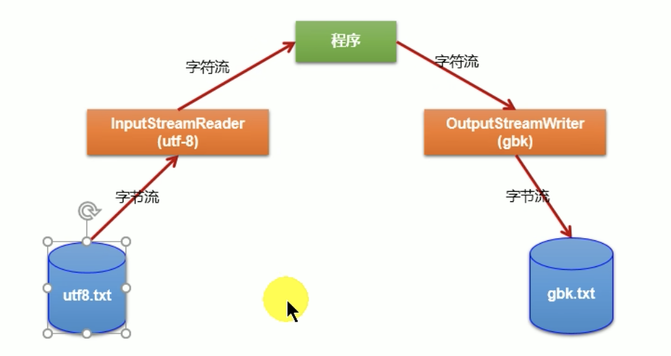

<br>

``` 
          内存

      ↗ 字符流

utf8.txt
```

<br>

**输入转换流: 字节 -> 字符(byte -> char)**  

有一个文本文件.txt - utf8, 正常我们要操作这个文件一般都会使用 字符流 

但是我们现在就是在这个文件上面使用的字节流 相当于一个byte一个byte的形式进行传输

``` 
              内存

            ↗ 字符流

        ↗ (使用 转换流 对 字节流 进行包装)

    ↗ 字节流 

utf8.txt
```

这时我们可以使用 转换流对字节流进行包装, 包装后就是 以字符流(char)为基本单位的向程序(内存)中进行**输入**  

从 **输入的字节流 -(转换成)-> 输入的字符流**  

<br>

**输出转换流: 字符 -> 字节(char -> byte)**  

输出层面同理, 我们将文本.txt传输到硬盘文件内的时候(内存层面操作的是一个个char) 一般我们会选择 输出字符流

当我们对输出字符流使用 转换流包装后, 我们可以将 char 转换为 byte, 也就是使用010101的方法写入到文件中, 存储到底层

``` 
内存

    ↘ 字符流

        ↘ (使用 转换流 对 字符流 进行包装)

            ↘  字节流

                gbk.txt
```

从 **输出的字符流 -(转换成)-> 输出的字节流**  

<br>

## 转换流
- InputStreamReader
- OutputStreamWriter

它们属于 字符输入流 & 字符输出流 的体系, 我们在判断是什么体系的时候 主要是看后缀

**既然属于 字符系的流 那我们操作的都是 char[] 数组**  

<br>

### 作用: (流之间的转换)
提供 字节流 与 字符流 之间的转换

<br>

**注意:**  
- 两个流的参数都是字节型
- 两个流使用的都是 char[]

<br>

### InputStreamReader:
将 字节的输入流 转换为 字符的输入流
```java
byte -> char
```

<br>

### OutputStreamWriter:
将 字符的输出流 转换为 字节的输出流
```java
char -> byte
```

<br>

### 解码 & 编码 的操作:
从流的角度 在编码和解码的问题上 我们要使用如下的两个流 

- 解码: 字节 -> 字符: InputStreamReader
- 编码: 字符 -> 字节: OutputStreamWriter

<br>

### InputStreamReader的实例化:
### **<font color="#C2185B">new InputStreamReader(字节输入流, [编码集])</font>**
创建 输入转换流, 该流是将 字节流 转换为 字符流

<br>

**参数:**  
- InputStream: 字节输入流  
InputStreamReader**本身是字符流系**, 作用就是将 byte -> char 所以要包在字节流对象外层, 也就是传入字节输入流

- 编码集: 不传则为系统默认字符集(IDEA配置好的)  
这里也可以理解为解码集, 底层都是字节 现在我需要将字节转换为字符 你得指定按照什么解码集(字符集)来转, 该字符集拒绝于文本文件当初使用的字符集 它使用什么字符串保存 我们就传入什么字符集解码 **这是一个解码的过程注意**  

<br>

**异常:**  
UnsupportedEncodingException

```java
// 创建 字节输入流 FileInputStream
FileInputStream fis = new FileInputStream("hello.txt")


// 将 字节输入流 传入
InputStreamReader isr = new InputStreamReader(fis));
```

<br>

### OutputStreamWriter的实例化:
### **<font color="#C2185B">new OutputStreamWriter(字节输出流, [编码集])</font>**
创建 输出转换流, 该流是将 字符流 转换为 字节流

<br>

**参数:**  
- OutputStream: 字节输出流  
OutputStream**本身是字符流系**, 作用就是将 char -> byte, 内存中的数据都是字符, 首先会经过该转换流(字符型)进行输出, 但是我们要将char -> byte, 所以我们也要包在字节流对象的外层

- 编码集: 
这里也可以理解为编码集, 我们会将char按照指定的字符串进行编码, 转成byte存储起来 **这是一个编码的过程**  

```java
// 创建 字节输出流 FileOutputStream
FileOutputStream fos = new FileOutputStream("hello.txt")


// 将 字节输出流 传入
OutputStreamWriter osw = new OutputStreamWriter(fos));
```

<br>

### 使用场景1: InputStreamReader的示例:
比如我们硬盘中有一个文件 hello.txt  
我们先拿 **字节流读取文本文件** 我们想将内容输出在控制台上

之前我们说过 如果想把文本文件的内容输出在控制台上 尽量不要使用字节流 因为可能会乱码 但现在我们就拿字节操作它

这时我们就可以使用 转换流 将其转换成 字符的 然后再输出到控制台

```java
InputStreamReader isr = null;

try {
  // 创建字节输入流:
  FileInputStream fis = new FileInputStream("hello.txt");

  // 创建输入转换流, 传入 fis
  isr = new InputStreamReader(fis);

  // 转换流是字符系 操作的都是 char[]
  char[] cbuf = new char[10];
  int len;
  while((len = isr.read(cbuf)) != -1) {
    String str = new String(cbuf, 0, len);
    System.out.print(str);
  }
} catch (IOException e) {
  e.printStackTrace();
} finally {
  try {
    if(isr != null) isr.close();
  } catch (IOException e) {
    e.printStackTrace();
  }
}
```

<br>

### 总结:
字节流中的数据都是字符时 转成字符流操作更高效  
很多时候我们使用转换流处理文件乱码问题 **实现编码和解码的功能**  

<br>

**要点:**  
InputStreamReader OutputStreamWriter它们操作的是 **char[]**  

如果它们可以包裹在 FileInputStream 和 FileOutputStream (字节流)的外层的话 那它们操作的应该是byte[], 可惜不是!!!

<br>

### 使用场景2: OutputStreamWriter的示例:
目标文件是utf-8存的txt文件 我们综合使用 InputStreamReader 和 OutputStreamWriter 对utf-8存的txt文件转成gbk格式的txt文件 实现一个解码再另编码的过程

```java
@Test
public void testDecode() throws IOException {

  File srcFile = new File("Hello.txt");
  File destFile = new File("Hello_gbk.txt");

  // 创建输入字节流
  FileInputStream fis = new FileInputStream(srcFile);

  // 创建输出字节流
  FileOutputStream fos = new FileOutputStream(destFile);

  // 创建输入转换流
  InputStreamReader isr = new InputStreamReader(fis, "utf-8");

  // 创建输出转换流 指定编码的字符集
  OutputStreamWriter osw = new OutputStreamWriter(fos, "gbk");

  // 读的过程中使用的是 char[]
  char[] cbuf = new char[20];
  int len;
  while((len = isr.read(cbuf)) != -1) {

    // 写的时候我们使用的是 char[]
    osw.write(cbuf, 0, len);
  }

  // 关闭资源
  osw.close();
  isr.close();
}
```

<br><br>

# 多种字符编码集的说明

## 编码表的由来
计算机只能识别二进制数据 早期的由来是电信号

为了方便应用计算机 让它可以识别各个国家的文字 就将各个国家的文字用数字来表示 并一一对应 形成一张表 这就是编码表

```
a - 97
```

<br><br>

## 常见的字符集

### ASCII:
美国标准信息交换吗 **用一个字节的7位可以表示**  

一个字节有8位 它有一个没有用 因为最高位是符号位 左右只有7位是用来表示数字的 2^8是256 2^7就是一半 128

也就是只能表示128种情况 美国就够用 一个字节就是8bit 最大是 1111 1111 可以表示256 分成正负的话 也就是 -128 ~ 127

<br>

### ISO8859-1:
拉丁码表 欧洲码表 **用一个字节的8位表示**  

<br>

### GB2312:
中国的中文编码表 **最多两个字节编码所有字符**  

每一个汉字都会对应一个数 一个汉字用两个字节来表示 两个字节最大的范围是 65535 分成正负的话 也就是 -32768 ~ 32767

```js
let num = 0b1111111111111111
console.log(num.toString(10))   // 65535
```

<br>

### GBK:
中国的中文编码表升级 融合了更多的中文文字符号 **最多两个字节编码**  

那 GBK 和 GB2312 最多用两个字节来表示  
那底层假如有两个字节 那这两个字节是表示一个字符还是两个字符？

我们看首位 如果首位是0 该字节就是代表一个字符 下面两个字节就各代表一个字符

```
--------  --------
0         
```

如果首位是1 就代表该字符一个字节表示不全 这时两个字节代表一个字符

```
--------  --------
1         
```

<br>

### Unicode:
国际标准码 融合了目前人类使用的所有字符 为每个字符分配唯一的字符码

**所有的文件都用两个字节表示**  

国家非常的多 不能一个国家整一个表 万一一个文件中有多国的文字 用谁读啊？

所以我们创建了世界共用的一张表 哪个国家的一个字符都会对应着一个数

<br>

### UTF-8:
变长的编码方式  
**可用1-4个字节来表示一个字符**  

unicode有3个问题 
1. 英文字母我们使用一个字节就够了
2. 如何才能区别Unicode和ASCII码  
计算机怎么知道两个字节表示一个符号 而不是分别表示两个符号呢?

3. 如果和GBK等双字节编码方式一样 用最高是1或0表示两个字节和一个字节 就少了很多值无法用于表示字符

<br>

### 解析:
内存层面存一个数是可以的 具体我们存在底层的文件上的时候就有问题的

unicode是用两个字节去存 那也会出现跟GBK GB2312同样的问题

两个字节是存一个字符还是两个字符
```
--------  --------
```

原来是2^16次方 但是如果使用首位标记01标记方法的话 那就剩2^15次方了 就不够用了 

```
2^16 -- 65535
2^15 -- 32767
```

所以就不能拿出一位用来标记两个字节到底是存一个字符还是两个字符

<br>

所以unicode很长时间都没有落地, 在很长的一段时间里无法推广 直到互联网的出现 出现了下面两种字符集

- utf-8  就是每次8个位去传递数据
- utf-16 就是每次16个位去传输数据

<br>

**什么意思呢？**  
上面说了2个字节 如果想采用和GBK GB2312首位01标识的方式标记两个字节代表一个字符还是两个字符的方式 不行

会导致表数范围不够 那我们就想 我们可以用3个字节来表示 这样不就够了么？

<br>

**3个字节又多带来一个问题?**   
- 如果首位是0 那就是想用一个字节
- 如果首位是1 那就是想用二个字节

二进制不是0就是1 那怎么表示想用三个字节的情况呢？

<br>

**以utf-8为例:**   

Unicode都会对应一个数, 该数会用16进制表示:  
0000 0000-0000 007F

这个16进制范围的数, 相当于原来 ASCII 范围的数, 我们使用一个字节(8bit)就可以搞定

<br>

**如果我们使用 1个字节 存储一个字符的情况:**  
UTF-8编码方式:  
```
0xxxxxx
```

abcd等就是这种情况 兼容ASCII

<br>

**如果我们使用 两个字节 存储一个字符的情况:**  
UTF-8编码方式:  
```
110xxxxx 10xxxxxx
```

我们能发现是以110开头, 110开头说明除了读取第一个字节之外 还要再读一个字节

<br>

**如果我们使用 三个字节 存储一个字符的情况:**  
UTF-8编码方式:
```
1110xxxx 10xxxxxx 10xxxxxx
```

我们能发现是以1110开头, 1110开头说明要读3个字节

<br>

**如果我们使用 四个字节 存储一个字符的情况:**  
UTF-8编码方式:
```
11110xxx 10xxxxxx 10xxxxxx 10xxxxxx
```

我们能发现是以11110开头, 11110开头说明要读4个字节

<br>

### 总结:
UTF-8可以表示 1-4 个字节, 怎么表示到底是几个字节我们看首位
- 首位0: 则表示一个字节存储一个字符
- 首位11: 则表示二个字节存储一个字符
- 首位111: 则表示三个字节存储一个字符
- 首位1111: 则表示四个字节存储一个字符

<br>

### 尚:
尚 -> 我们可以根据Unicode算出16进制和2进制 比如通过计算器

- Unicode: 23578
- 十六进制: 5C1A
- 二进制: 0101 1100 0001 1010

现在我们要将该数存储到磁盘中 怎么存? 尚是中文 中文在 UTF-8 是使用3个字节存一个字符

我们需要将 二进制 0101 1100 0001 1010 塞到 UTF-8的编码格式中(1110xxxx 10xxxxxx 10xxxxxx)

```
0101 1100 0001 1010
↓
第一组    第二组    第三组
1110xxxx 10xxxxxx 10xxxxxx
↓
二进制首个4位放到第一组中的xxxx位置
↓
11100101

然后我们要补充第二组中的xxxxxx位置, 我们那二进制接下来的6位填充
11100101 10110000

最后我们拿二进制中最后的6位填充第三组xxxxxx的位置
11100101 10110000 10011010
```

我们将 尚的二进制截成三个部分放到了 1110xxxx 10xxxxxx 10xxxxxx 这样的格式中

<br>

**注意:**  
在标准的utf-8编码中 超出基本多语言范围的字符 会4个字节表示 在后续的修正中可能使用6个字节

unicode仅是字符集 该字符集定义了一个字符会对应一个编码 但是真正落地往底层去存的时候 读的时候 一个字符是一个字节还是二个字节还是三个字节

<br>

### unicode的落地实现
- utf-8 

- utf-16:  
使用2或4个字节进行存储

- utf-32:  
用固定的长度是存字符 不用utf-8的规律 就用4个字节存一个字符

<br><br>

# 处理流: 标准输入输出流

## System类
它就是标准的输入输出流

System.in 和 System.out 分别代表了系统标准的输入和输出设备

- 默认输入设备: 键盘
- 默认输出设备: 显示器

<br><br>

## System类的三个属性
- System.err
- System.in
- System.out

<br><br>

### System.err:
标准的错误输出流

**类型:**  
PrintStream

<br>

### System.in:
标准的输入流(默认从键盘输入), 它就是键盘输入

<br>

**类型:**  
InputStream(IO体系中输入流的基类)

<br>

**注意:**   
它的类型就是 InputStream 也就是说需要类型是 InputStream 的地方我们都可以将该属性传入

它的作用就是 键盘输入, 效果就是 控制台阻塞等待用户输入

<br>

### System.out:
标准的输出流(默认从控制台输出), 它就是控制台输出

<br>

**类型:**  
PrintStream(打印流)

<br>

**注意:**  
它的类型就是 PrintStream 也就是说需要类型是 PrintStream 的地方我们都可以将该属性传入 

<br><br>

## System类中的get set方法
既然是属性的话也会有 set方法

### **<font color="#C2185B">public static void setIn(InputStream in)</font>**

### **<font color="#C2185B">public static void setOut(PrintStream out)</font>**

用来修改默认输入 和 默认输出, 重新指定输入和输出的位置

<br><br>

### 练习: System.in的操作

<br>

**需求:**  
从键盘输入字符串 要求将读取到的整行字符串转成大写输出

然后继续进行输入操作 直至输入"e"或者"exit"时 退出程序

<br>

**思考:**  
- 方法1: 使用 Scanner 来实现
- 方法2: 使用 System.in 来实现


<br>

**使用 System.in 来实现:**  
我们要读取一行, BufferedReader 身上有 readLine() 方法 该方法就是缓冲流

System.in 作用键盘输入 返回的是 InputStream  
是输入字节流

然后我们使用 转换流 将 字节流 转换为 字符流

最后我们使用缓冲流 包裹下转换后的结构, 就能通过 缓冲流对象 调用 readLine() 方法

```
BufferedReader(包裹下面的字符流)
↓
InputStreamReader(System.in)(得到的字符流)
↓
System.in(通过键盘输入)
```

```java
// 1. 将 System.in(InputStream类型) 当做参数传入InputStreamReader中, 得到的是字符流, 将字节转为了字符
InputStreamReader isr = new InputStreamReader(System.in);


// 使用 BufferedReader 缓存流 包裹 转换流
BufferedReader br = new BufferedReader(isr);


while (true) {
  System.out.println("请输入字符串: ");
  // 读到了一行数据
  String data = br.readLine();
  
  // 在忽略大小写的情况下 我们看看用户输入的是不是e 或者 exit
  if(data.equalsIgnoreCase("e")) {
    System.out.println("程序结束");
    break;
  }

  // 转成大写后输出
  System.out.println(data.toUpperCase());
}

// 关闭流
br.close();
```

<br>

**注意**  
单元测试 Test() 方法中不支持 System.in 的输入 我们要使用 main() 方法来测试

<br><br>

# 处理流: 打印流
实现将**基本数据类型**的数据格式转化为**字符串**输出

可以输出各种类型的数据

<br>

## 打印流
打印流包含了两个
- PrintStream (字节输出流)
  - System.out 的类型就是 PrintStream
- PrintWriter (字符输出流)

<br>

### 特点:
打印流中提供了一系列重载的print()和println()方法 用于多种数据类型的输出, 拥有以下的特点

1. PrintStream和PrintWriter的输出不会抛出IOException异常

2. PrintStream和PrintWriter有自动flush功能

3. PrintStream打印的所有字符都使用平台的默认字符编码转换为字节 

4. 在需要写入字符而不是写入字节的情况下 应该使用PrintWriter类

5. System.out返回得是PrintStream的实例

<br><br>

### 利用 System.setOut() 修改输出的位置
通过 System.out 调用它身上的方法的时候 默认我们是输出到控制台上的

我们可以通过set()方法来修改输出的目标位置, 如输出到文件里面

<br>

### **<font color="#C2185B">System.setOut()</font>**
修改输出的位置

<br>

**参数:**  
流对象, 我们可以通过流对象指定端点位置


**示例:**  

```java
PrintStream ps = null; 
  try {
    // 通过 FileOutputStream 指定数据输出到哪里
    FileOutputStream fos = new FileOutputStream(new File("D:\\IO\\text.txt")); 


    // 将 fos 传入到 PrintStream 中, PrintStream 默认是输出到控制台 我们可以调用 setOut() 方法修改输出位置

    // 传入 true 自动flush
    ps = new PrintStream(fos, true);


    if (ps != null) {
      // 修改输出的位置 输出到文件 因为我们修改了输出的位置 下面再调用print方法就不会再在控制台输出了
      System.setOut(ps); 
    }

    // 输出ASCII字符 0-255 转成char输出 看看数字对应什么字符
    for (int i = 0; i <= 255; i++) { 
      // 我们将 数字 转成 char 了
      System.out.print((char) i);

      if (i % 50 == 0) { // 每50个数据换行 
        System.out.println();
      }
    }
  
  } catch (FileNotFoundException e) {
    e.printStackTrace(); 
  } finally {
    if (ps != null) { ps.close();
  }
```

<br><br>

# 处理流: 数据流
数据流有以下的两个类
- DataInputStream
- DataOutputStream

分别"套接"在InputStream OutputStream子类的流上面

<br>

## 作用
为了方便的操作 Java语言中的基本数据类型和String的数据 我们可以使用数据流

用于读取或写出**基本数据类型的变量或字符串**  

也就是说我们可以将数据流对应到具体的文件当中, 然后调用数据流中的方法

我们可以将基本数据类型或者字符串写入到某个文件中保存起来, 也可以把写出去的文件还原到内存的层面, 将这个数据回归到基本数据类型 或 String

<br>

言外之意就是为 基本数据类型 和 String类型 单独提供的一种流

<br>

### 使用注意:
通过这两个类写出的数据(到文件中) 该文件不是供我们双击点开查看的 而是通过 DataOutputStream 写出 通过 DataInputStream 读入

<br>

### 使用场景:
我们一直习惯的使用方式是, 是将基本数据创建出来后赋值给一个变量, 但是变量都是在内存层面的 JVM一关闭就没有了 如果我们需要的话 可以将这些数据持久化到一个文件里面

当我们哪天想用我们还可以读这些文件将这些文件还原到内存层面 形成一个个变量

<br><br>

## DataInputStream API

**基本数据类型:**  
- boolean readBoolean()
- byte readByte()
- char readChar()
- short readShort()
- int readInt()
- float readFloat()
- double readDouble()
- long readLong()

<br>

**String类型:**  
- String readUTF(): 读字符串
- void readFully(byte[] b): 读byte[]

<br><br>

## DataOutputStream API
- write(int b)
- write(byte[] b, int offset, int len)
- write(byte[] b)

- writeInt(int v)
- writeLong(long v)
- writeBoolean(boolean v)
- writeByte(int v)
- writeBytes(String s)
- writeChar(int v)
- writeChars(String s)
- writeShort(int v)
- writeDouble(double v)
- writeFloat(float v)

- writeUTF(String str)

<br>

### DataOutputStream 实例化:
### **<font color="#C2185B">DataOutputStream dos = new DataOutputStream(节点流)</font>**

```java
DataOutputStream dos = new DataOutputStream(new FileOutputStream("data.txt"));

// 参数 是节点流
```

<br>

**注意:**  
生成的文件不是让我们双击打开的方式读的 而是通过DataInputStream的方式读取的, 双击打开有乱码的情况

<br>

### DataInputStream 实例化
### **<font color="#C2185B">DataInputStream dis = new DataInputStream(节点流)</font>**
将文件中存储的基本数据类型和字符串读到到内存中 保存在变量中

<br>

**注意:**  
写出数据的顺序 和 读入数据的顺序要一致

读取不同类型的数据的顺序要与当初写入文件时 保存的数据的顺序一致 不按顺序读取会报异常

```java
DataInputStream dis = new DataInputStream(new FileInputStream("data.txt"));
```

<br>

### 示例:
将内存中的字符串 基本数据类型的变量写出到文件中
处理异常的话 仍然使用try catch finally
```java
DataOutputStream dos = new DataOutputStream(new FileOutputStream("data.txt"));

// 写出一个字符串
dos.writeUTF("sam");
// 每次写完可以显式的刷新缓冲区 写出去
dos.flush();

// 写出一个int
dos.writeInt(23);
dos.flush();

dos.writeBoolean(true);
dos.flush();

// 关闭
dos.close();
```

<br>

**读取写出去的文件 要点:**  
写出的时候要按顺序写出 读的时候也要按照写出的顺序读取

```java
DataInputStream dis = new DataInputStream(new FileInputStream("data.txt"));

// 我们写的时候有顺序 从第一行到最后一行 我们读的时候也要按照这个顺序 写的时候最先是String 读的时候也要最先读String
String name = dis.readUTF();
int age = dis.readInt();
boolean sex = dis.readBoolean();

System.out.println(name + " " + age + " " + sex);

dis.close();
```

<br><br>

# 处理流: 对象流
上面介绍了数据流 它只是对基本数据类型和字符串的读写操作 

引用类型还不行 要想对对象进行持久化 我们就需要接触对象流

- ObjecctInputStream
- ObjectOutputStream

<br><br>

## 对象流的作用
用于 存储 和 读取   
**基本数据类型数据** 或 **对象** 的处理流

它的强大之处就是可以把java中的对象写入数据源中 也能把对象从数据源中还原回来

和我们数据流的使用方式基本一致, 只不过扩展了可以读取写入对象的功能

<br>

比如:  
我们的 new Person 把类似这样的对象进行传输

客户的两个进程之间 浏览器和服务器之间要想传输数据 这个数据得是可序列化的

<br>

### 数据流 和 对象流 的区别:
- DataInputStream & DataOutputStream:  
用来处理基本类型数据

- ObjecctInputStream & ObjectOutputStream:  
主要是处理对象的, 也可以处理基本数据类型

<br>

### 序列化: 写入(保存)
用 ObjectOutputStream类 **保存** 基本类型数据 或 对象的机制

**序列化就是将对象写入到文件里 或 网络传输(网络节点之间的传输)**  

<br>

### 反序列化: 读取
用ObjectInputStream类 **读取** 基本类型数据 或 对象的机制

**反序列化就是将写入文件的数据再读回到内存里**  

<br>

### 注意: 顺序问题
ObjecctInputStream & ObjectOutputStream 的使用和数据流一样, 输出的顺序 和 读取的顺序 必须一致

先输出 str  
先读取 str

<br><br>

## 对象的序列化机制

### 序列化的过程:
该机制允许把内存中的java对象转换成平台无关的二进制流, 从而允许把这种二进制流

- 持久地保存在磁盘上
- 通过网络将这种二进制流传输到另一个网络节点 

当其它程序获取了这种二进制流 就可以恢复成原来的Java对象

<br>

### 反序列化的过程:
当其它程序**读取了这种二进制流** 就可以**恢复成原来的java对象**  

序列化的好处在于**将任何实现了Serializable接口的对象转化为字节数据** 使其在保存和传输时可被还原


<br>

### 可序列化的前提:
**如果需要让某个对象支持序列化机制** 则必须让对象所属的类及其属性是可序列化的 

为了让某个类是可序列化的 **该类必须实现**如下的**两个接口之一**, 否则会抛出 **NotSerializableException**异常

- **Serializable(该接口在IO包下)**  
- Extemalizable

<br>

### 注意:
ObjectOutputStream 和 ObjectInputStream **不能序列化static和transient修饰的成员变量**  


在我们序列化 自定义类的时候 如果自定义类的属性是如下修饰符修饰的话

- static
- transient 

当我们序列化后 再进行反序列化的时候 它们修饰的变量 的结果都是默认值


```java
// 这两个属性不能被序列化 其余的可以
private static String name;
private transient int age;
```

<br><br>

## 关键字: transient
作用: 修饰不想被梳序列化(保存和传输)的属性

<br><br>

## 使用对象流 序列化 & 反序列化 字符串 & 对象

### 序列化的过程:
将内存中的java对象保存到磁盘中 或 通过网络传输出去, 使用 **ObjectOutputStream** 实现

<br>

### ObjectOutputStream 实例化:
### **<font color="#C2185B">ObjectOutputStream oos = new ObjectOutputStream(节点流)</font>**

<br>

**参数:**  
ObjectOutputStream是处理流, 我们需要包裹在节点流上

<br>

### ObjectOutputStream API:

### **<font color="#C2185B">oos.writeObject(Object obj)</font>**
write一系列的方法和数据流的差不多 但是多了一个writeObject() 方法

```js
// 我们将一个字符串存储到.dat文件中
oos.writeObject(new String("我是数据"));
oos.flush();
```

<br>

**注意:**  
需要显式的调用 **oos.flush()**  

<br>

### 示例: 序列化过程
将内存中的Java对象保存到磁盘中或通过网络传输出去

<br>

**需求:**  
将 本地文件中 写入一个 map对象

<br>

**注意:**  
该文件不是让我们点开查看内容的

```java
ObjectOutputStream oos = null;
try {
  // ObjectOutputStream是处理流, 它要包裹节点流
  oos = new ObjectOutputStream(new FileOutputStream("data.json"));
  HashMap<String, String> map = new HashMap();
  map.put("name", "sam");
  
  // 我们往文件中写入一个map
  oos.writeObject(map);

  // 显式的 flush() 操作
  oos.flush();
  
} catch (IOException e) {
  e.printStackTrace();
} finally {
  try {
    if(oos != null) oos.close();
  } catch (IOException e) {
    e.printStackTrace();
  }
}
```

<br><br>

### ObjectInputStream 实例化:

### **<font color="#C2185B">ObjectInputStream ois = new ObjectInputStream(节点流);</font>**

**反序列化的过程**  

将磁盘文件中的对象还原为内存中的一个java对象
使用 ObjectInputStream 实现

<br>

### ObjectInputStream API:
该类中的方法和 数据流中的 read 方法差不多 但是多了如下的方法:

<br>

### **<font color="#C2185B">ois.readObject()</font>**
读一个对象

<br>

**返回值:**   
对象


<br>

### 示例:
将磁盘文件中的对象 还原为内存中的一个Java对象

或者 

当获取网络中的流后 将该留转换为Java对象也是OK的
```java
ObjectInputStream ois = null;
try {
  // 处理流要包裹节点流, 指定我们要读取的文件
  ois = new ObjectInputStream(new FileInputStream("data.json"));

  // 注意读取顺序: 调用readObject()方法 读取map
  Object o = ois.readObject();

  // 将Object对象转换为 Map
  HashMap<String, String> map = (HashMap<String, String>)o;

  System.out.println(map.get("name"));

} catch (IOException e) {
  e.printStackTrace();
} catch (ClassNotFoundException e) {
  e.printStackTrace();
} finally {
  try {
    if(ois != null) ois.close();
  } catch (IOException e) {
    e.printStackTrace();
  }
}
```

<br><br>

## 自定义类 实现序列化 & 反序列化操作
这个部分我们将创建好的Person对象进行持久化到磁盘中 和 读到内存层面

<br>

### 自定义类序列化的要点:

**要点1: 实现Serializable接口**  
自定义类需要实现 **Serializable接口** 实现此接口后的自定义类都会被标识为可序列化的

Serializable接口是**标识接口**, 并没有抽象方法
```java 
public class Person implements Serializable { ... }
```

<br>

**要点2: 配置 serialVersionUID 全局常量**  
自定义类中必须声明一个 配置好的属性 全局常量, 值我们自己指定 **序列版本号** 权限随意
```java
// 序列版本号: 给该对象贴上标识 还原的时候不会出现问题
public/private static final long serialVersionUID = 42L;
```

<br>

**要点3: 保证所有属性是可序列化的, 比如内部属性是另一个类的对象**  
除了当前Person类需要实现serializable接口之外 还必须保证其内容**所有属性也必须是可序列化**的 (默认情况下 基本数据类型是可序列化的)

但是 如果 Person类中 定义了别的类的对象(属性) 那么这个类也要实现 Serializable 接口 和 提供 UID

```java
public class Person implements Serializable {
  // 必须
  public static final long serialVersionUID = 66212252345L;

  private String name;
  private int age;
}
```

<br>

### 默认可序列化的类
- String
- 基本数据类型

<br>

### 异常:
如果自定义对象在序列化的时候没有实现该接口会报错:
**NotSerializableException**  

<br>

### 要点: 注意顺序
1. 在反序列化的时候 我们要注意 先写出的什么 我们就要先读什么

2. 自定义类中 static 和 transient 修饰的属性不能序列化 (static修饰的属性是归类所有的 并不是对象)

<br>

### 序列化的使用场景:
未来在JavaEE和跨进程访问数据的时候 一般要求该数据必须都是可序列化的

一般我们会传输 JSON 而不是Java对象

```java
// 序列化
ObjectOutputStream oos = new ObjectOutputStream(new FileOutputStream("object.dat"));

oos.writeObject(new String("我是数据"));
oos.flush();

// 输出自定义类
oos.writeObject(new Person("sam", 18));
oos.flush();

// 关闭流
oos.close();


// 反序列化:
// 反序列化的过程: 指明要读进来的文件
ObjectInputStream ois = new ObjectInputStream(new FileInputStream("object.dat"));

// 读取的时候也是有顺序的 先写什么就要先读什么
Object obj = ois.readObject();
String str = (String) obj;

// 读上面写入的对象
Object obj2 = ois.readObject();
// 强转为Person
Person p = (Person)obj2;

System.out.println(p.getName());
ois.close();


// 自定义类中的配置
public class Person implements Serializable {

  public static final long serialVersionUID = 66212252345L;
}
```

<br>

### serialVersionUID 的理解:
serialVersionUID是用来表明类的不同版本间的兼容性 简言之 其目的是以序列化对象进行版本控制 有关各版本反序列化时是否兼容

如果类中没有显示定义这个静态常量 它的值是java运行时环境根据类的内部细节自动生成的 

<br>

**问题:**  
自动生成的UID是可能出现问题的, 如当我们对当前类的属性进行修改的情况下

serialVersionUID可能发生变化 **所以要显式声明**  

也就是说我们在序列化的时候 根据类的属性生成的UID为18, 因为我们修改了类的属性UID会变成20, 当我们反序列化对象的时候 就找不到当初序列化时18对应的对象了 在还原的时候就出问题了

当序列化版本(UID)不一致的时候 会报: **InvalidCastException**  

<br><br>

# RandomAccessFile: 任意存取文件流
该类既可以作为输入流 也可以做为 输出流, 可读可写

虽然RandomAccessFile既可以做为输入流 又可以作为输出流 **但是还是需要通过它造两个对象 一个对象是输出 一个对象管输入**  

<br>

RandomAccessFile声明在java.io包下 但直接继承于java.lang.Object类 并且实现了 DataInput 和 DataOutput 两个接口 所以这个流既可以做为输入流 又可以作为输出流

<br><br>

## 特点
1. 该类可读可写
2. 该类直接继承于 Object类, 并不继承于 IORW 4个抽象基类
3. 该类实现了 实现了 DataInput & DataOutput 接口  

<br><br>

## 要点
1. 读文件中的数据的时候, 支持只读取部分数据
2. 写文件的时候 文件不存在则自动创建
3. 文件已存在, 我们通过RandomAccessFile流向文件写入数据的时候 
  - 如果文件中没有内容 正常写入
  - 如果文件中已有内容 **从内容头部开始进行覆盖操作, 能覆盖多少算多少**  

<br>

**注意:**  
从头开始进行覆盖操作 不是对文件的覆盖 也是从内容的开头位置 对原有文件内容进行覆盖
```java
源文件:
abcdef

// write("xyz".getBytes()) 后, xyz覆盖了原文件中的abc
xyzdef
```

<br>

### RandomAccessFile 实例化:
用于读写二进制文件 或 文本文件

<br>

### **<font color="#C2185B">RandomAccessFile raf = new RandomAccessFile(file / "文件名", String mode)</font>**

<br>

**参数:**  
传入的不是节点流 处理流 而直接是File或路径

1. File类 或 String path
2. String mode: 指定 RandomAccessFile 的访问模式
  - r: 以只读的方式打开 (作为输入流可以指定r) - **常用**  
  - rw:  既可以读入 也可以写出 (作为输出流指定rw) - **常用**  

  - rwd: 打开以便读取和写入 同步文件内容的更新
  - rws: 打开以便读取和写入 同步文件内容和元数据的更新

rwd 和 rws 除了有读写操作的功能外 还有数据的同步功能


<br>

**r要点:**  
如果是r 则不会创建文件 而是读取一个已经存在的文件 如果读取的文件不存在则会出现异常

<br>

**rw要点:**  
如果是rw 如果文件不存在则会去创建文件 如果存在则不会创建

<br>

JDK1.6中上面写的每次write数据时
- rw模式: 数据不会立即写到硬盘中
- rwd模式: 数据会被立即写入硬盘

如果写数据过程发生异常 
- rwd模式: 已被write的数据被保存到硬盘
- rw模式: 数据全部丢失

<br>

### RandomAccessFile API:
RandomAccessFile对象 包含一个记录指针 用来标示当前读写处的位置

默认指针的位置是0: (首索引的位置是0), 代表在文件开头 

<br>

### **<font color="#C2185B">raf.seek(long pos)</font>**
将文件记录指针定位到pos位置
从哪开始了 默认的位置是0

当我们设置了指针后, 再调用raf.write操作的时候 就代表从pos开始 执行能覆盖多少算多少的操作 


<br>

**返回值:**   
无

<br>

**注意:**  
在write()方法前设置指针
```java
raf.seek(3);
raf.write("xyz".getBytes());
```

<br>

### **<font color="#C2185B">raf.getFilePointer()</font>**
获取文件记录指针的当前位置

<br>

**返回值:**  
long

<br>

### 基本使用: 文件的复制
```java
// 作为 输入流 出现的时候 传入读进来的位置 和 r
RandomAccessFile raf1 = new RandomAccessFile(new File("Hello.txt"), "r");

// 作为 输出流 出现的时候 输出的位置 和 rw
RandomAccessFile raf2 = new RandomAccessFile(new File("Hello_2.txt"), "rw");

byte[] buf = new byte[1024];
int len;
while((len = raf1.read(buf)) != -1) {
  raf2.write(buf, 0, len);
}

raf1.close();
raf2.close();
```

<br>

**注意:**  
使用RandomAccessFile流进行写入操作的时候 是将目标文件的内容 从头开始进行覆盖操作

<br>

### 扩展: String方法
### **<font color="#C2185B">字符串.getBytes()</font>**
将字符串转换为byte[]

<br>

### 示例: 使用 RandomAccessFile 向文件中写入内容
1. raf.write(byte[]) 调用该方法向文件中写入内容的时候 我们要传入 byte[]

2. raf.write()默认就是一个覆盖的操作

```java
// 创建一个作为写入的流 并指定
RandomAccessFile raf1 = new RandomAccessFile(new File("Hello.txt"), "rw");

// write()方法 比如要传入一个byte[] 我们可以将内容xyz转换为一个byte[]
raf.write("xyz".getBytes())
raf.close()

// 结果:
// 原来的abcdefg 变成 xyzdefg
```

<br>

### 练习: RandomAccessFile 实现数据的插入
原文件: abcdefg

需求: 我们想在abc的后面插入xyz

RandomAccessFile对象 包含一个记录指针 用来标示当前读写处的位置

默认指针的位置是0: (首索引的位置是0), 代表在文件开头 


也就是我们从指定指针位置开始覆盖了 那怎么才能做到插入的操作呢？

<br>

**思路:**  
1. 我们要将目标插入位置后面的数据保存起来 也就是 defg

2. 注意当我们保存的过程中 指针也会移动 保存后的指针位置在文件的内容的最后

``` 
a b c d e f g
      ↑

// 复制完毕后 我们指针的位置是在最后
a b c d e f g
            ↑

// 调整指针的位置
a b c d e f g
      ↑
```

3. 然后我们正常的执行raf.write()方法 此时指针的位置会自动在z的后面

``` 
// 执行完后的效果
abcxyzg
```

4. 将xyz后面的内容替换成 我们上面复制的内容


```java
// 我们在abc的后面插入xyz 索引从0开始的话 那目标所以就是3
RandomAccessFile raf = new RandomAccessFile("Hello.txt", "rw");

// 先调整指针的位置 到插入的目标位置, 目标位置开始的数据我们要将其保存起来
raf.seek(3);

// 目标位置开始的数据可能可能多 可能是多行 所以我们要使用循环来处理
byte[] buf = new byte[20];
int len;


// 我们可以将指针后面的数据读到一个 str 里面, 这里我们使用 StringBuilder 效率高

// 为了避免StringBuilder再次扩容我们最好指定一个长度
StringBuilder builder = new StringBuilder((int) new File("Hello.txt").length());

while((len = raf.read(buf)) != -1) {
  // append()方法没有可以传入buf数组的参数, 所以我们将buf数组通过构造器转为字符串 添加到 StringBuilder里面
  builder.append(new String(buf, 0, len));
}

// 因为上面的操作后 指针就跑到最后了 所以我们要将指针调整回来
System.out.println(raf.getFilePointer());
raf.seek(3);

// 写出去之后 指针就会在z的后面
raf.write("xyz".getBytes());

// 将builder中的数据进行写入
raf.write(builder.toString().getBytes());
raf.close();
```

<br>

### 方式2: ByteArrayOutputStream:
插入消耗资源 通常我们都喜欢做追加而不是插入

方式1中我们将 指针后面的数据存储在 StringBuilder 中, 我们看过StringBuilder的原码 它底层造了一个数组 我们相当于将数据保存在了数组中

ByteArrayOutputStream也是一个输出流 下面的实例化方法中我们能看到 它没有参数, 也就是说它没有指定端点

该类有点类似我们的StringBuilder, ByteArrayOutputStream的内部也提供了一个数组

当我们通过 FileInputStream 读取数组的时候, 我们会将内容读到 '小车' 中
```java
FileInputStream fis = new FileInputStream("hello.txt");

// 使用 fis 读取文件内容
byte[] buf = new byte[10];
int len;
while((len = fis.read(buf)) != -1) {
  // 我们读取的内容在 buf 中
}
```

而ByteArrayOutputStream的内部也提供了一个数组, 我们可以将 fis.read(buf) 读取到的内容 保存在 ByteArrayOutputStream 中的数组中

<br>

**概括: 将我们读取到的内容, 通过baos.write(buf, 0, len) 写入到baos内部的数组中 而不是写入到哪个文件里**  

<br>

### ByteArrayOutputStream实例化:
它是输出流, 将读到的内容 输出到自身底层提供的数组中

<br>

### **<font color="#C2185B">ByteArrayOutputStream baos = new ByteArrayOutputStream();</font>**

**参数: 无**  

<br>

**示例:**  
将 文件中的内容 读到 ByteArrayOutputStream 的数组中, 该流相当于 StringBuilder 不用考虑扩容的内容 提高性能
```java
// 读取文件内容
FileInputStream fis = new FileInputStream("hello.txt");

// 创建 baos
ByteArrayOutputStream baos = new ByteArrayOutputStream();

int len;
byte[] buf = new byte[10];
while((len = fis.read(buf)) != -1) {
  // 将读到的内容 保存在 baos 的数组中
  baos.write(buf, 0, len);
}

// baos.toString() 将其数组内部的数据字符串化
System.out.println(baos.toString());
```

<br>

### 使用场景:
我们使用字节流读取文本文件的时候 可能会产生乱码 比如汉字的字节比掰成两半的时候

这时我们可以使用 ByteArrayOutputStream 将读取到的内容保存到它的底层数组中

比如汉字的一般字节先保存到底层数组中, 在读再保存另一半, 等最后一起完整的拼接成字符串

底层数组不用担心容量的问题 因为可以自动的扩容

<br><br>

## RandomAccessFile: 多线程断点续传
我们可以利用 RandomAccessFile 中提供的指针实现 多线程断点续传的功能

我们可以使用RandomAccessFile类来实现一个多线程断点下载的功能 我们下载工具都会在下载前建立两个临时文件 

一个是与被下载文件大小相同的空文件 比如我们要下载一个1G文件 就会先创建一个空的1G文件  

然后将1G分成4个部分 多线程 每一个线程将指针调整到每一个部分的开头 然后通过 RandomAccessFile 的seek方法 让4个线程同时开始下载

如果下载到一半 网没有了 这时我们让其记录下我们下载(写入)到哪了 把写到哪了这件事存放到临时文件中

当我们继续下载的时候 从临时文件中读取下载到哪了的指针, 我们再次的调用 seek() 方法将指针指向断点 进行再次下载

<br><br>

# NIO (不同于 java.io 的另一个包)
从1.4版本开始引入的一套新的IO API可以代替标准的java.io api

**nio与原来的io有同样的作用和目的**  

不管是NIO, 后续还有 AIO BIO

<br>

### NIO的名字
- New IO
- Non-Blocking IO: 非阻塞的IO  
我们上面接触的io是有阻塞的

<br>

### IO NIO的使用方式的区别:
- nio支持面向缓冲区的基于通道的io操作
- io是面向流的

我们前面io读取文件的时候都是用的是Stream, 读取文件时使用的都是 byte[] or char[]

而 nio会使用 Buffer 结构 也就是面向缓冲区的

<br>

### NIO的特点:
NIO将以更加高效的方式进行文件的读写操作, NIO中传输用的不是流 而是channel(通道)

<br>

**问题:**  
NIO的出现目的是想替换IO的 但是实际上NIO写的一般 使用起来不是那么的方便 后来又出现了 NIO2 在JDK7中

随着JDK7的发布 Java对NIO进行了极大的扩展 增强了对文件处理 和 文件系统特性的支持 这也就是NIO2

NIO在后续的工作中已经成为了文件处理中越来越重要的部分了

<br>

### NIO API
java api中提供了两套NIO :
- 一套是针对标准输入输出NIO 
- 一套就是网络编程NIO

<br>

### NIO基于的 channel(通道)
NIO中传输用的不是流 而是channel(通道)

```java
| -- java.nio.channels.Channel

  | -- FileChannel: 
       处理本地文件

  | -- ScoketChannel: 
       TCP网络编程的客户端的Channel

  | -- serverSocketChannel: 
       TCP网络编程的服务器端的Channel

  | -- DatagramChannel: 
       UDP网络编程中发送端和接收端的Channel
```

<br><br>

# JDK7新结构: Path & Paths & Files
早期的java只提供了一个File类来访问文件系统 但File类的功能比较有限 所提供的方法性能也不高 而且 大多数方法在出错时仅返回失败 并不会提供异常信息

NIO2为了弥补这种不足 引入了 **Path接口** 代表一个平台无关的平台路径 描述了目录结构中文件的位置

<br><br>

## Path: 替换 File
Path可以理解为NIO2中提供的一个类 **Path类就是用来替换原有的File**  

**Path可以看成File类的升级版本** 实际引用的资源也可以不存在

<br>

**我感觉不光光是替换File, 还有一个Nodejs中Path模块的赶脚**  

<br>

### 示例:

**在以前IO的时候 我们表示一个文件写法如下:**  
```java
File file = new File("index.html")
```

<br>

**JDK7中 我们表示一个文件的写法如下:**  
我们可以看到 Path 就是用来代替 File 的 用来表示一个端点(内存中打开一个文件), 但是Path对象是通过 Paths 工具类获取的

```java
Path path = Paths.get("index.html")
```

<br>

## Paths: 工具类
NIO2在java.nio.file包下提供了Files Paths工具类

- Files: Files中有大量的静态的工具方法来操作文件
- Paths: Paths中有两个可以**创建Path对象的静态方法**  

<br>

### Paths目的:
创建 Path 对象

<br>

### 获取 Path对象:
### **<font color="#C2185B">Paths.get(String first, String ... more)</font>**
创建 Path 对象, 用于将多个字符串 串联成路径

<br>

**参数:**  
String, 类似 path.resolve("path1", "path2")

<br>

### **<font color="#C2185B">Paths.get(URI uri)</font>**
创建 Path 对象, 返回指定 uri 对应的 Path路径

<br>

### Path对象 API:

### ### **<font color="#C2185B">path.toString()</font>**
返回调用Path对象的字符串表示形式

<br>

**返回值:**  
String

<br>

### **<font color="#C2185B">path.startsWith(String path)</font>**
判断是否以path路径开始

<br>

**返回值:**   
boolean

<br>

### **<font color="#C2185B">path.endsWith(String path)</font>**
判断是否以path路径结束

<br>

**返回值:**  
boolean

<br>

**<font color="#C2185B">path.getParent()### </font>**  
返回Path对象包含整个路径 不包含Path对象指定的文件路径

<br>

**返回值:**  
Path

<br>

### **<font color="#C2185B">path.getRoot()</font>**
返回调用Path对象的根路径

<br>

**返回值:**  
Path

<br>

### **<font color="#C2185B">path.getFileName()</font>**
返回与调用PAth对象关联的文件名

<br>

**返回值:**  
Path

<br>

### **<font color="#C2185B">path.getNameCount()</font>**
返回path跟目录后面元素的数量

<br>

**返回值:**  
int

<br>

### **<font color="#C2185B">path.getName(int idx)</font>**
返回指定索引位置idx的路径名称

<br>

**返回值:**  
Path

<br>

### **<font color="#C2185B">path.toAbsolutePath()</font>**
作为绝对路径返回调用Path对象

<br>

**返回值:**  
Path

<br>

### **<font color="#C2185B">path.resolve(Path p)</font>**
合并两个路径 返回合并后的路径对应的path对象

<br>

**返回值:**  
Path

<br><br>

## Path 和 File 之间的相互转换

### **<font color="#C2185B">path.toFile()</font>**
将Path转化为File了的对象

<br>

**返回值:**  
File

<br>

### **<font color="#C2185B">file.toPath()</font>**
将File转化为Path了的对象

<br>

**返回值:**  
Path

<br><br>

## Files工具类
用于操作文件或目录的工具类

<br>

### **<font color="#C2185B">Path copy(Path src, Path dest, CopyOption ... how)</font>**
文件的复制

<br>

### **<font color="#C2185B">Path createDirectory(Path path, FileAttribute<?> ... attr)</font>**
创建一个目录

<br>

### **<font color="#C2185B">Path createFile(Path path, FileAttribute<?> ... arr)</font>**
创建一个文件

<br>

### **<font color="#C2185B">void delete(Path path)</font>**
删除一个文件/目录 如果不存在 执行报错

<br>

### **<font color="#C2185B">void deletelfExists(Path path)</font>**
Path对应的文件/目录如果存在 执行删除

<br>

### **<font color="#C2185B">Path move(Path src, Path dest, CopyOption ... how)</font>**
将src移动到dest位置

<br>

### **<font color="#C2185B">long size(Path path)</font>**
返回path指定文件的大小

<br>

### 用于判断的方法:

### **<font color="#C2185B">boolean exists(Path path, LinkOption ... opts)</font>**
判断文件是否存在

<br>


### **<font color="#C2185B">boolean isDirectory(Path path, LinkOption ... opts)</font>**
判断是否是目录

<br>


### **<font color="#C2185B">boolean isRegularFile(Path path, LinkOption ... opts)</font>**
判断是否是文件

<br>


### **<font color="#C2185B">boolean isHidden(Path path)</font>**
判断是否是隐藏文件

<br>


### **<font color="#C2185B">boolean isReadable(Path path)</font>**
判断文件是否可读

<br>

### **<font color="#C2185B">boolwan isWritable(Path path)</font>**
判断文件是否可写

<br>

### **<font color="#C2185B">boolean noExists(Path path, LinkOption ... opts)</font>**
判断文件是否不存在

<br>

### 用于操作内容:

### **<font color="#C2185B">SeekableByteChannel newByteChannel(Path path, OpenOption ... how)</font>**
获取与指定文件的连接 how指定打开方式
<br>


### **<font color="#C2185B">DirectoryStream<Path> new DirectoryStream(Path path)</font>**
打开path指定的目录
<br>


### **<font color="#C2185B">InputStream newInputStream(Path path, OpenOption ... how)</font>**
获取InputStream对象
<br>


### **<font color="#C2185B">OutputStream newOutputStream(Path path, OpenOption ... how)</font>**
获取OutputStream对象 

<br>

### 测试 Path:
```java
public class PathTest {

  //如何使用Paths实例化Path
  @Test
  public void test1() {
    //new File(String filepath)
    Path path1 = Paths.get("d:\\nio\\hello.txt");

    //new File(String parent,String filename);
    Path path2 = Paths.get("d:\\", "nio\\hello.txt");

    Path path3 = Paths.get("d:\\", "nio");
  }


  //Path中的常用方法
  @Test
  public void test2() {

    Path path1 = Paths.get("d:\\", "nio\\nio1\\nio2\\hello.txt");

    Path path2 = Paths.get("hello.txt");

    // String toString() : 返回调用 Path 对象的字符串表示形式
    System.out.println(path1);


    // boolean startsWith(String path) : 判断是否以 path 路径开始
    System.out.println(path1.startsWith("d:\\nio"));


    // boolean endsWith(String path) : 判断是否以 path 路径结束
    System.out.println(path1.endsWith("hello.txt"));


    // boolean isAbsolute() : 判断是否是绝对路径
    System.out.println(path1.isAbsolute() + "~");
    System.out.println(path2.isAbsolute() + "~");


    // Path getParent() :返回Path对象包含整个路径, 不包含 Path 对象指定的文件路径
    System.out.println(path1.getParent());
    System.out.println(path2.getParent());


    // Path getRoot() :返回调用 Path 对象的根路径
    System.out.println(path1.getRoot());
    System.out.println(path2.getRoot());


    // Path getFileName() : 返回与调用 Path 对象关联的文件名
    System.out.println(path1.getFileName() + "~");
    System.out.println(path2.getFileName() + "~");


    // int getNameCount() : 返回Path 根目录后面元素的数量
    // Path getName(int idx) : 返回指定索引位置 idx 的路径名称
    for (int i = 0; i < path1.getNameCount(); i++) {
      System.out.println(path1.getName(i) + "*****");
    }


    // Path toAbsolutePath() : 作为绝对路径返回调用 Path 对象
    System.out.println(path1.toAbsolutePath());
    System.out.println(path2.toAbsolutePath());


    // Path resolve(Path p) :合并两个路径, 返回合并后的路径对应的Path对象
    Path path3 = Paths.get("d:\\", "nio");
    Path path4 = Paths.get("nioo\\hi.txt");
    path3 = path3.resolve(path4);
    System.out.println(path3);

    // File toFile(): 将Path转化为File类的对象

    //Path--->File的转换
    File file = path1.toFile();
    //File--->Path的转换
    Path newPath = file.toPath();
  }
}
```

<br>

### 测试 Files:
```java
@Test
public void test1() throws IOException{

  Path path1 = Paths.get("d:\\nio", "hello.txt");
  Path path2 = Paths.get("atguigu.txt");
		
  // Path copy(Path src, Path dest, CopyOption … how) : 文件的复制

  //要想复制成功, 要求path1对应的物理上的文件存在 path1对应的文件没有要求 

  Files.copy(path1, path2, StandardCopyOption.REPLACE_EXISTING);
		
  // Path createDirectory(Path path, FileAttribute<?> … attr) : 创建一个目录
  //要想执行成功, 要求path对应的物理上的文件目录不存在 一旦存在, 抛出异常 
  Path path3 = Paths.get("d:\\nio\\nio1");
  Files.createDirectory(path3);
		
  // Path createFile(Path path, FileAttribute<?> … arr) : 创建一个文件
  //要想执行成功, 要求path对应的物理上的文件不存在 一旦存在, 抛出异常 
  Path path4 = Paths.get("d:\\nio\\hi.txt");
  Files.createFile(path4);
		
  // void delete(Path path) : 删除一个文件/目录, 如果不存在, 执行报错
  Files.delete(path4);
		
  // void deleteIfExists(Path path) : Path对应的文件/目录如果存在, 执行删除.如果不存在, 正常执行结束
  Files.deleteIfExists(path3);
		
  // Path move(Path src, Path dest, CopyOption…how) : 将 src 移动到 dest 位置
  //要想执行成功, src对应的物理上的文件需要存在, dest对应的文件没有要求 
  Files.move(path1, path2, StandardCopyOption.ATOMIC_MOVE);
		
  // long size(Path path) : 返回 path 指定文件的大小
  long size = Files.size(path2);
  System.out.println(size);

}

@Test
public void test2() throws IOException{
  Path path1 = Paths.get("d:\\nio", "hello.txt");
  Path path2 = Paths.get("atguigu.txt");
  // boolean exists(Path path, LinkOption … opts) : 判断文件是否存在
  System.out.println(Files.exists(path2, LinkOption.NOFOLLOW_LINKS));

  // boolean isDirectory(Path path, LinkOption … opts) : 判断是否是目录
  //不要求此path对应的物理文件存在 
  System.out.println(Files.isDirectory(path1, LinkOption.NOFOLLOW_LINKS));

  // boolean isRegularFile(Path path, LinkOption … opts) : 判断是否是文件

  // boolean isHidden(Path path) : 判断是否是隐藏文件
  //要求此path对应的物理上的文件需要存在 才可判断是否隐藏 否则, 抛异常 
  System.out.println(Files.isHidden(path1));

  // boolean isReadable(Path path) : 判断文件是否可读
  System.out.println(Files.isReadable(path1));
  // boolean isWritable(Path path) : 判断文件是否可写
  System.out.println(Files.isWritable(path1));
  // boolean notExists(Path path, LinkOption … opts) : 判断文件是否不存在
  System.out.println(Files.notExists(path1, LinkOption.NOFOLLOW_LINKS));
}

/**  
  * StandardOpenOption.READ:表示对应的Channel是可读的 
  * StandardOpenOption.WRITE:表示对应的Channel是可写的 
  * StandardOpenOption.CREATE:如果要写出的文件不存在, 则创建 如果存在, 忽略
  * StandardOpenOption.CREATE_NEW:如果要写出的文件不存在, 则创建 如果存在, 抛异常
  *
  * @author shkstart 邮箱:shkstart@126.com
  * @throws IOException
  */
@Test
public void test3() throws IOException{
  Path path1 = Paths.get("d:\\nio", "hello.txt");

  // InputStream newInputStream(Path path, OpenOption…how):获取 InputStream 对象
  InputStream inputStream = Files.newInputStream(path1, StandardOpenOption.READ);

  // OutputStream newOutputStream(Path path, OpenOption…how) : 获取 OutputStream 对象
  OutputStream outputStream = Files.newOutputStream(path1, StandardOpenOption.WRITE,StandardOpenOption.CREATE);


  // SeekableByteChannel newByteChannel(Path path, OpenOption…how) : 获取与指定文件的连接, how 指定打开方式 
  SeekableByteChannel channel = Files.newByteChannel(path1, StandardOpenOption.READ,StandardOpenOption.WRITE,StandardOpenOption.CREATE);

  // DirectoryStream<Path>  newDirectoryStream(Path path) : 打开 path 指定的目录
  Path path2 = Paths.get("e:\\teach");
  DirectoryStream<Path> directoryStream = Files.newDirectoryStream(path2);
  Iterator<Path> iterator = directoryStream.iterator();
  while(iterator.hasNext()){
    System.out.println(iterator.next());
  } 
}
```

<br><br>

# Jar包的使用:
真正开发的时候也有可能我们自己写 缓冲流 但是更多的是使用别人开发好的 Jar

jar相当于一个js包 项目中引入jar包后 就可以使用jar对应的api

比如 apache 提供的 commons-io jar包, jar包相当于给我们提供了额外的api

<br>

## 使用方式

### 将 jar包 导入到当前的module下
1. 在 当前模块下新建一个文件夹, 模块文件夹下右键 新建 new Directory
```java
| - day10
  | - libs
```

2. 将我们的jar包让如 libs 文件夹内
3. 在jar包上右键 add as library

上述步骤完成后我们就可以使用jar包中提供的api了

<br>

### 测试:
我们引入了老师提供的jar 这个FileUtils就在这个jar包下面

比如我们想实现一个复制文件的功能 在开发中一般都会调用第三方的jar包来实现 一般不用自己写

```java
public static void main(String[] args) throws IOException {
  // 复制一个文件 main方法的路径要注意一下
  File srcFile = new File("Hello.txt");
  File destFile = new File("Hello2.txt");
  FileUtils.copyFile(srcFile, destFile);
}
```

<br><br>

# 网络编程概述
网络当中的数据传输, 相当网络中的IO

<br>

## 计算机网络
把分布在不同地理区域的计算机与专门的外部设备用通信线路连成一个规模大 功能强的网络系统 从而使众多的计算机可以方便地互相传递信息 共享硬件 软件 数据信息等资源

<br><br>

## 网络编程的目的
直接或间接地通过网络协议与其他计算机实现数据交换 进行通讯

<br><br>

## 网络编程中两个主要的问题
1. 如何准确地定位网络上一台或多台主机 定位主机上的特定的应用 (IP端口号)
2. 找到主机后如何可靠高效地进行数据传输(网络通信协议)

<br>

### 如何实现网络中的主机互相通信
**通信双方地址:**  
IP & port

<br>

**一定规则: (网络通信协议, 有两套参考模型)**  
- OSI参考模型: 模型过于理想化, 未能在因特网上进行推广
- TCP/IP参考模型: 国际标准

<br><br>

## IP & 端口号

### IP:
网络中唯一的一台主机

<br>

### 端口号:
用来区分一个主机上的不同的应用程序

<br>

### 安全可靠的传输的规则:
网络通信协议(有两台参考模型)

1. OSI参考模型:
模型过于理想化 未能在因特网上进行广泛推广

2. TCP/IP参考模型(TCP/IP协议) 
事实上是国际标准

<br><br>

## 通信协议
计算机网络中实现通信必须有一些约定 即**通信协议**, 对速率 传输代码 代码结构 传输控制步骤 出错控制等制定标准

<br>

### 问题:
网络协议太复杂 计算机网络通信涉及内容很多 比如指定源地址和目标地址 加密解密 压缩解压缩 差错控制 流量控制 路由控制 如何实现如此复杂的网络协议？

<br>

### 通信协议分层的思想:
在制定协议时 把复杂成分分解成一些简单的成分 再将它们复合起来 最常用的复合方式是层次方式即:

1. 同层间可以通信 
2. 上一层可以调用下一层 而与再下一层不发生关系各
3. 层互不影响 利于系统的开发和扩展

<br>

### 图解:
|OSI参考模型|TCP/IP参考模型|TCP/IP参考模型<br>各层对应协议|
|:--|:--|:--|
|应用层|应用层|HTTP FTP DNS Telnet...|
|表示层|||
|会话层|||
|传输层|传输层|TCP UDP...|
|网络层|网络层|IP ICMP ARP|
|数据链路层|物理+数据链路层|Link|
|物理层|||

<br>

OSI参考模型将网络一共分成了7层 但是它划分的有些太细了 在实施的过程中有一些困难 在实际落地层面我们都是执行的 TCP/IP参考模型划分了4层

它们当中上一层和下一层之间是可以进行数据传输的

<br>

### 数据的传输的过程:

**数据的封装过程:**  
我们的数据封装后开始传输从应用层开始层层封装 到物理层后开始进行传输出去 

<br>

**数据的拆封过程:**  
然后在另一端从物理层开始拆封 层层拆封后到应用层再次的做展现

这两个过程我们可以想象成从淘宝购物:
- 封装过程: 卖家把杯子打包 杯子易碎在里面加了泡沫
- 拆封过程: 买家拿到快递后拆封就是数据拆封的过程

<br>

**网络编程中的两个要素:**  
1. 提供 IP和端口号
2. 提供 网络通信协议(TCP/IP参考模型 应 传 网 物+链)

<br>

# IP: InetAddress类
IP地址用来标识互联网上的一台计算机(通信实体)

我们会拿 InetAddress类 在Java层面描述IP, 该类的实例对象就代表一个IP地址

<br>

## IP地址的分类方式1
从下面的角度分IP地址
- IPV4
- IPV6

<br>

### IPV4:
IP地址的书写格式分为4块(4个字节), 每一块的取值范围是0 ~ 255
```java

_ _ _ . _ _ _ . _ _ _

0-255.0-255.0-255.0-255
```

大概有42亿个数量 30亿都在北美 亚洲4亿 2011年初ipv4已经用尽 以点分十进制标识 未来就要倒向ipv6了

<br>

**标准写法:**  
```java
192.168.0.1
```  

<br>

### IPV6:
IPV6使用16进制来表示
128位(16个字节) 写成8个无符号整数

ipv6分成8个部分 每个部分有4位 用16进制表示 每个整数用4个16进制位表示 数之间用冒号(:)

<br>

**IPV6标准写法:**  
```java
3ffe:3201:1401:1280:c8ff:fe4d:db39:1984
```

<br>

也许以后我们能给Q生活中的任何一个物件 可以给它分配个ip地址 实现万物互联 真正的物联网 但是ipv4已经用尽了肯定做不到

现在我们表示一个ip的话还是习惯用ipv4的方式

<br>

## IP地址的分类方式2
- 公网地址(万维网使用)
- 私有地址(局域网使用)

<br>

**公网地址:**  
我们访问的任何一个网址 都会对应一个公网的IP

<br>

**私有地址:**  
192.168.开头的就是私有地址 

范围即为 ``192.168.0.0 - 192.168.255.255`` 专门为组织机构内部使用

特点: 不易记忆

<br>

## 域名
IP地址比较抽象不容易记忆 我们通过域名的方式也能访问一个IP地址

<br>

### 通过域名访问IP地址的方式:
1. 地址栏键入 www.baidu.com

2. 将域名发送给dns域名解析服务器 它会帮我们将域名解析出来 域名的ip地址对应多少

3. 拿着解析后的IP地址访问对应的服务器 请求资源

我们电脑里面有一个hosts文件 里面也是域名和IP地址的对应关系

先在本地找 本地没有再发送给dns服务器

先找本机hosts 是否有输入的域名地址 没有的话 再通过dns服务器 找主机

<br><br>

## 本地回路地址
表示本机地址: 
- 127.0.0.1(它相当于IP) 
- localhost(它相当于域名)

<br>

比如我们后面接触到的数据库 我们在本机上装了一个mysql的数据库服务器

然后我们还会在本机上装一个mysql的客户端 然后我们使用客户端软件访问自己主机的数据库服务器 我们会看到ip地址那写的就是localhost

<br><br>

## InetAddress 使用
当我们想表示一个具体的IP的时候 我们需要在Java层面创建一个IP对象

InetAddress类的构造器被私有化了 当我们调用它的**静态方法**会帮我们返回一个InetAddress实例

<br>

### InetAddress实例化:
### **<font color="#C2185B">InetAddress.getByName(String host)</font>**

根据指定的主机名 返回IP对象

<br>

**参数:**  
- String 域名: 传入域名的时候会先解析
- String ip: ipv4 ipv6 都可以

<br>

**返回值:**  
InetAddress类型

<br>

**异常:**  
UnknownHostException

<br>

```java
// 参数的方法1:
InetAddress ip2 = InetAddress.getByName("192.168.0.66");
System.out.println(inet1);
// /192.168.0.66

// 参数的方法2:
InetAddress ip2 = InetAddress.getByName("www.baidu.com");
System.out.println(inet2);
// www.baidu.com/119.63.197.139
```

<br>

### 静态方法:

### **<font color="#C2185B">InetAddress.getLocalHost()</font>**
获取本机的ip地址

相当于另一种IP对象的实例化方式

<br>

**返回值:**  
InetAddress

```java
InetAddress localHost = InetAddress.getLocalHost();
System.out.println(localHost);  // 192.168.3.3

// 因为返回值是 InetAddress 所以可以调用实例方法
String hostName = localHost.getHostName();
String hostAddress = localHost.getHostAddress();

System.out.println(hostName);
// liulindeMacBook-Pro.local

System.out.println(hostAddress);
// 192.168.3.3: 也是本机, 我们在局域网内 表示成这样的一个IP了
```

<br><br>

### 实例方法:

**<font color="#C2185B">实例对象.getHostName()</font>**  
获取域名

<br>

**返回值:**   
String

```java
InetAddress inet3 = InetAddress.getByName("localhost");
String hostName = inet3.getHostName();
System.out.println("hostName: " + hostName);
// localhost
```

<br>

### **<font color="#C2185B">实例对象.getHostAddress()</font>**
获取主机ip地址

<br>

**返回值:**  
String

```java
InetAddress inet3 = InetAddress.getByName("localhost");
String hostAddress = inet3.getHostAddress();
System.out.println(hostAddress);
// 127.0.0.1
```

<br>

### **<font color="#C2185B">实例对象.getAddress()</font>**
获取ip地址的byte[]

<br>

**返回值:**  
byte[] ip地址的每一部分就是其中的一个元素
``` 
[127, 0, 0, 1]
```

<br>

**返回值:**  
byte[]

<br>

**注意:**  
返回值是byte, byte的取值范围是 -128 ~ 127 超过127的话 输出元素会是负数

```java
InetAddress inet3 = InetAddress.getByName("127.0.0.1");
byte[] address = inet3.getAddress();
System.out.println(address.length); // 4

// 输出需要遍历
System.out.println(Arrays.toString(address));
```

<br>

## 端口号
端口号标识正在计算机上运行的进程(程序)

<br>

### 端口号的取值范围:
不同的进程有不同的端口号 被规定为一个16位的整数 0 ~ 65535

每一个进程都有对应的一个端口号 我们可以通过IP地址定位到主机

我们到底要跟哪一个进程进行通信 也要是明确的才可以 不同的进程对应不同的端口号

<br>

### 端口分类:

**公认端口: 0 ~ 1023**  
被预先定义的服务通信占用

(比如: HTTP占用80端口, FTP占用21端口, Telnet占用23端口)

<br>

**注册端口:**  
1024 ~ 49151: 分配给用户进程或应用程序

(比如: Tomcat占用8080端口, mysql占用3306端口, Oracle占用1521端口)

<br>

**动态 / 私有端口:**  
49152 ~ 65535

<br>

## 网络套接字: Socket
端口号与IP地址的组合得出一个Socket

**IP地址和端口号相当于组成了一个节点** 这个节点就可以叫做socket 我们传输要用得就是一个socket

网络通信 通常也叫做 socket通信(socket之间的通信) 也叫socket编程

<br><br>

## 网络协议
我们知道对方的主机和端口号 还要知道怎么去传 有什么样的规则 这个规则就是协议

在传输中遵循的规则就是协议 但实际上因为协议太复杂了 所以我们进行了分层 一层层的去说明 每一层解决每一层的问题

<br>

### 传输层中有两个非常重要的协议
1. 传输控制协议TCP
2. 用户数据报协议UDP

<br>

### TCP/IP
它是由如下的两个协议 组合而成的一组协议, 包括多个具有不同功能且互为关联的协议

- 传输控制协议(TCP)
- 网络互联协议(IP)


**IP协议:**  
网络层的主要协议 支持网间互联的数据通信

<br>

**TCP/IP协议:**  
TCP/IP协议模型从更实用的角度触发 形成了高效的四层体系结构 即物理链路层 IP层 传输层 和 应用层

<br><br>

## 传输层 TCP 和 UDP 的不同
它们虽然都是传输层的协议但是规则不一样


### TCP协议:
使用TCP协议前
- 须先建立TCP连接
- 先形成传输数据通道

传输前采用 3次握手 方式 点对点通信 **可靠的**  

<br>

**3次握手:**  
客户端发送数据到服务端, 发送前先进行一次握手 通过握手确定对方在了 我们再发送数据

```java
// 三次握手

1
    ↘
          2
    ↙
3


我是sam

      ↘

        我知道你是sam 
        我是马云

      ↙

我知道 
你知道我是sam 你是马云
我是sam
```

<br>

TCP协议进行通信的两个应用进程: 
- 客户端 
- 服务端

在连接中可**进行大数据的传输** 传输完毕 需**释放已建立的连接** 效率低(相对于UDP)

<br>

**4次挥手:**  
释放连接的时候需要进行4次挥手  
客户端和服务器都可以主动的进行挥手(想断开连接), 一般服务端不会主动进行断开因为服务器要一直开的

在socket编程中 任何一方执行close()操作即可产生挥手操作
``` 
1 

          2

          3

4


客户端: 
我想断开连接了


        服务端: 我接到你想断开连接的信息了
        服务端: 我现在已经断开连接了


客户端: 
再次发送消息 验证看看服务端能否接收到

能接到就说明没断开 发出去后没有后话了 就是真断开了
```

<br>

### UDP协议:
我们将如下的两个东西封装进数据包
- 数据源 
- 目的地

**不需要建立连接**, 每个数据报的大小限制在64k内, 当数据多的时候可以发送很多的数据包

因为不需要建立连接, 发送不管对方是否准备好 接收方收到也不确认 故是**不可靠的(没有握手一顿发)**  

可以广播发送, 发送数据结束时 **无需释放资源 开销小 速度快**  

<br>

### UDP的应用场景:
看网络视频 正常播放就是 丢几桢也没关系

<br>

**理解:**  
- TCP相当于打电话
- UDP相当于发短信

<br><br>

# TCP的网络编程:
这节里面我们看看TCP网络编程在代码层面的体现

实现TCP网络编程一般都会有两个角色: 

1. 客户端
2. 服务器

<br>

下面的代码中 我们利用两个 @Test 来充当客户端和服务器 来完成 客户端发送一句话给服务端 服务端将数据显式在控制台上 的逻辑

- @Test1: 客户端
- @Test2: 服务端

```java
@Test
public void client() {

}

@Test
public void server() {

}
```

<br>

### 说明:
客户端 和 服务器 要进行交互, 也就是发送数据, 我们需要如下的条件
1. 知道服务器的ip 和 port
2. 我们要利用 协议

这里我们就拿 TCP/IP 协议来演示 客户端 和 服务器之间的通信, 我们发送的数据都是二进制流 既然是流 我们就可以通过上面讲解的API 还获取 和 写入

- 输出流: 相当于向服务器传输数据
- 输入流: 相当于拿到客户端的数据流 通过输入流 读入到内存中

<br>

### 客户端的逻辑:
首先我们要指明服务器的IP和端口

因为我们要往指定主机的指定端口号发送数据, 服务器 和 客户端的数据传输都是 socket 对象

<br>

**步骤1:**  
客户端需要 创建 Socket对象 将服务器IP和服务器端口号封装起来, 封装成一个节点(目的地)

<br>

**步骤2:**  
我们通过 socket.getOutputStream() 方法, 获取输出流, 调用write() 将服务器输出数据

<br>

**步骤3:**  
最后关闭资源 流 和 socket都是资源 都需要关闭

<br>

**客户单socket对象的理解:**  
1. 在上面我们使用流读取文件的时候, 需要使用 File类来指明端点 现在在网络传输中 我们指明端点的操作是利用了 socket 来指明了端点

2. 我们利用客户端创建scoket对象拿到了字节输出流, 来传输数据

<br>

### 服务端的逻辑:
客户端往指定的IP和指定的端口号, 发送数据, 那对应我们服务器要监听这个端口号是吧

监听这个端口号, 我们也要在服务器端创建 ServerSocket 对象, 用于监听指定的端口号, 当有客户端发送的数据时, 会自动将该数据封装成socket对象保存在socket里面

<br>

**步骤1:**  
首先 创建服务器Socket对象, new ServerSocket(prot) 并指明我们监听的哪个端口

<br>

**步骤2:**  
然后调用 ``Socket socket = serverSocket.accept()`` 当客户端有数据传输过来的时候 会被封装到 返回值的socket对象里面 这个socket相当于客户端的信息 客户端发送过来的数据是流

<br>

**步骤3:**  
通过调用 ``InputStream is = socket.getInputStream()`` 拿到输入流 掉用对应的方法 读取内部的数据, 我们操作的是字节数组

<br>

## API

### 客户端: Socket的实例化
一个 Socket中需要包含 IP 和 端口号

<br>

### **<font color="#C2185B">Socket socket = new Socket(InetAddress address, int port)</font>**
实例化socket对象 指明服务器的IP地址和端口号  
将ip地址和端口号封装成一个socket对象

<br>

**参数:**  
- IP地址: Stirng host / InetAddress address
- 端口号: int port

```java
// 创建 客户端的Socket对象 指明要往哪里发送
InetAddress inet = InetAddress.getByName("127.0.0.1");
Socket socket = new Socket(inet, 8899);
```

<br>

### **<font color="#C2185B">客户端socket实例对象.getOutputStream();</font>**
获取字节输出流 用来发送数据

<br>

**返回值:**  
OutputStream

```java
OutputStream os = socket.getOutputStream();
os.write("你好, 我是客户端MM".getBytes());
```

<br>

### **<font color="#C2185B">客户端socket实例对象.getInputStream();</font>**
用于接收服务器发送回来的消息, 是输入流

<br>

### 服务端: ServerSocket的实例化
相当于我们开启监听指定的端口号

### **<font color="#C2185B">ServerSocket ss = new ServerSocket(int port)</font>**
创建服务器的socket对象 并指明自己的端口号

对于服务器来说 只需要指明服务器的端口号就可以

<br>

**参数:**  
int port

<br>

### **<font color="#C2185B">服务器serversocket对象.accept();</font>**
相当于开始监听 监听客户端发送的socket  
一旦接收到 将数据包装成socket对象返回

<br>

**返回值:**  
socket

<br>

### **<font color="#C2185B">socket.getInputStream();</font>**
返回字节输入流对象, 里面有接收到客户端的数据

<br>

### **<font color="#C2185B">socket.getOutputStream();</font>**
返回字节输出流, 用于主动给客户端发送消息

<br><br>

## 其它API

### **<font color="#C2185B">socket.shutdownOutput();</font>**
### **<font color="#C2185B">socket.shutdownInput();</font>**
当传输完毕后 我们要调用该方法, 表示 数据输入/输出结束 关闭输入/输出的操作

<br>

**理解:**  
read()方法是一个阻塞方法 在两端互传输数据的时候 比如我们的例子中会往服务器端传输一张图片

当我们传输完毕的时候 我们要显式的调用 ``socket.shutdownOutput()`` 表示传输结束 这样服务端才能走下去

```java
// 客户端写入完数据后需要显式的调用 shutdownOutput()
while ((len = fis.read(buf)) != -1) {
  os.write(buf, 0, len);
}

// 当客户端将数据传完以后 关闭数据的输出
socket.shutdownOutput();
```

<br>

### 客户端代码:
```java
@Test
public void client() throws IOException {
  /*
    客户端发送数据, 往服务器发送数据, 封装一个目的地 Socket,
    所以要创建 Socket对象(new Socket) 它当中要包含IP 和 PORT
    new Socket(哪该IP地址发送消息, 端口号);
  */
  InetAddress IP = InetAddress.getByName("127.0.0.1");
  Socket socket = new Socket(IP, 8899);

  // 通过 socket对象调用 getOutputSream() 方法传输数据, 输出流
  OutputStream os = socket.getOutputStream();

  String content = "我是客户端发送的数据";
  // 发送数据
  os.write(content.getBytes());

  // 关闭连接: 流 和 socket
  os.close();
  socket.close();
}
```

<br>

### 服务器代码:
```java
@Test
public void server() throws IOException {
  /*
    客户端发送数据, 服务端接收数据, 在服务端我们也要创建一个 Socket 对象(new ServerSocket)
    new ServerSocket(int PORT)
    对于服务器来说我们只需要指明自己的端口号即可
  */

  // 创建服务端的socket对象, 相当于开启一个服务器程序, 指定该服务器程序的端口号 用于接收客户端发送过来的socket数据
  ServerSocket serverSocket = new ServerSocket(8899);

  /*
    相当于开启监听: 服务器端的socket对象同意 or 开始接收客户端发送过来的数据
    客户端发送的数据 会被封装到 socket对象中 也就是我们拿到的返回值socket对象

    serverSocket.accept()相当于监听指定端口号的 socket数据的传输
  */
  Socket socket = serverSocket.accept();

  // 当客户端发送数据后, socket对象会将数据封装在socket对象中, 我们可以获取数据流调用API来读取内容
  InputStream is = socket.getInputStream();


  // 读取客户端数据的方式1:  byte[] 数组的方式
  int len;
  byte[] buf = new byte[1024];
  while((len = is.read(buf)) != -1) {
    String str = new String(buf, 0, len);
    System.out.println(str);
  }   
      /*
        问题:
          当客户端发送的是文本的时候 我们指明的byte[]数组要长, 不然一个文字的字节当被劈成两半的时候会有乱码的情况, 
          
          比如我们的buf的长度是5 utf-8一个汉字是3 那么就会有汉字被拆成一半的现象发生 也就是会有乱码
          
          但是指明多长的这个问题比较难办 所以不推荐该方式
      */


  // 方式2: ByteArrayOutputStream
  ByteArrayOutputStream baos = new ByteArrayOutputStream();
  int len;
  byte[] buf = new byte[10];
  while((len = is.read(buf)) != -1) {
    // 我们将 读取的buf 写入到baos的数组中
    baos.write(buf, 0, len);
  }

  System.out.println(baos.toString());
      /*
        推荐:
          该方式会将我们读取到的数据放入到 baos 底层的数组中, 所以不用担心文本的字节问题, 它会读多少方底层数组中放多少

          最后一起转换为字符串
      */


  // 通过 socket 对象(客户端发送过来的socket) 我们获取客户端的ip地址
  System.out.println("收到了来自于:" + socket.getInetAddress().getHostAddress());


  // 关闭资源
  baos.close();
  is.close();
  socket.close();
  // 服务器本身不想接收了 我们也要关闭服务器的socket对象
  serverSocket.close();
}
```

<br>

### 理解下整个流程:
我们有两个岛(客户端岛A 和 服务端岛B)

现在A岛要将产品送往B岛进行买卖 两个岛之间我们需要用船来运输

这个小船就相当于(socket) 小船里面装产品(数据)

客户端岛A的小船需要知道要送往哪个岛的哪个港口(IP和端口号)

比如服务端岛B要指明港口(端口号) 该港口一旦接收到小船后就获取小船中的产品(数据)

<br><br>

### 练习1: 客发送图片 服保存
客户端发送文件给服务端 服务端将文件保存在本地
```java
// 客户端
@Test
public void client() throws IOException {

  // 创建客户端socket对象 指明服务器的地址和端口号
  Socket socket = new Socket(InetAddress.getByName("127.0.0.1"), 8899);

  // 传输数据造一个字节输出流
  OutputStream os = socket.getOutputStream();

  // 传输文件: 使用节点流指明file端点, 将文件的内容传输到内存层面 然后通过 socket.write() 方法将数据 发送到服务器端

  FileInputStream fis = new FileInputStream("pic_safety_001.jpg");

  // 发送逻辑
  byte[] buf = new byte[1024];
  int len;
  while ((len = fis.read(buf)) != -1) {
    os.write(buf, 0, len);
  }

  os.close();
  fis.close();
  socket.close();
}


// 服务端
@Test
public void server() throws IOException {
  // 创建服务端的socket对象 ServerSocket指明要监听的端口号
  ServerSocket ss = new ServerSocket(8899);

  // 当客户端有数据的时候 会被封装到 socket 对象中, 数据流在该对象中
  Socket socket = ss.accept();


  // 获取输入流is
  InputStream is = socket.getInputStream();

  // 利用节点流指明将读到的文件输出到哪里 
  FileOutputStream fos = new FileOutputStream("test.jpg");
  byte[] buf = new byte[1024];
  int len;
  while ((len = is.read(buf)) != -1) {
    fos.write(buf, 0, len);
  }

  fos.close();
  is.close();
  socket.close();
}
```

<br>

### 练习2: 延续练习1 服保存后 给客发消息
从客户端发送文件给服务端 服务端保存到本地 并返回"发送成功" 给客户端 客户端将信息显示在控制台上 并关闭相应的连接

<br>

**客户端逻辑:**  
```java
@Test
public void client() throws IOException {

  // 创建 目的地的 socket
  Socket socket = new Socket(InetAddress.getByName("127.0.0.1"), 8899);


  // 获取字节输出流
  OutputStream os = socket.getOutputStream();

  // 文件的节点流
  FileInputStream fis = new FileInputStream("pic_safety_001.jpg");

  byte[] buf = new byte[1024];
  int len;
  while ((len = fis.read(buf)) != -1) {
    // 将文件内容陆续的发送到服务器
    os.write(buf, 0, len);
  }


  /*
    fis.read() 方法是一个阻塞时的方法

    上面我们在读取文件的时候, read()在文件到末尾的时候会返回-1 我们知道读完了 也就退出循环了

    但是我们将读到的内容会循环发送到 服务器端, 服务器端也有 read() 它也是阻塞的

    如果客户端不明确的发出我传输完数据了 服务器的read()就会一直循环 并阻塞下面的代码执行

    所以我们要明确的告诉服务器 我们传输的数据已经结束了
  */
  // 关闭数据的输出, 这时服务器就会明确的得到一个客户端不再发送数据的指示
  socket.shutdownOutput();


  // 接收来自于服务器端的数据 并显示到控制台上
  InputStream is = socket.getInputStream();

  // 要想在控制台上输出服务端发送过来的数据而不出现乱码 我们还是要使用
  ByteArrayOutputStream baos = new ByteArrayOutputStream();
  byte[] buffer = new byte[5];
  int len2;
  while ((len2 = is.read(buffer)) != -1) {
    baos.write(buffer, 0, len2);
  }

  System.out.println(baos.toString());

  os.close();
  fis.close();
  socket.close();
  baos.close();
}
```

<br>

**服务端逻辑:**  
```java
@Test
public void server() throws IOException {
  ServerSocket ss = new ServerSocket(8899);
  Socket socket = ss.accept();
  InputStream is = socket.getInputStream();

  FileOutputStream fos = new FileOutputStream("test.jpg");
  byte[] buf = new byte[1024];
  int len;
  while ((len = is.read(buf)) != -1) {
    fos.write(buf, 0, len);
  }

  // 服务器端给予客户端反馈 获取输出流向客户端发送消息
  OutputStream os = socket.getOutputStream();
  os.write("你好, 照片已收到".getBytes());


  fos.close();
  is.close();
  socket.close();
  os.close();
}
```

<br>

上面也体现出来一个问题 read()方法 (IO) 是一个阻塞的方法, NIO中就不会有阻塞的问题了

<br><br>

# UDP网络编程
UDP是一个不可靠的数据链接, 系统不保证UDP数据报一定能够安全送到目的地 也不能确定什么时候可以抵达, 它就只管发

<br>

**优点:**  
快 和 高效  

它可以发送很多的 DatagramPacket 

<br>

### DatagramPacket:
DatagramPacket内部里面封装了数据 在数据报的发送仍然使用的 DatagramScoket

DatagramPacket对象里面封装了UDP数据报 在数据报中包含了

- 发送端的IP地址和端口号
- 接收端的IP地址和端口号

UDP协议中每个数据报都给出了完整的地址信息 因此无须建立发送方和接收方的连接如同发快递包裹一样

<br>

### DatagramScoket:
用于发送和接收UDP数据报

<br>

## UDP的网络编程
在UDP网络编程中的两个角色 习惯称为发送端和接收端
```java
@Test 
public void send() { ... }

@Test 
public void receive() { ... }
```

<br>

## 发送端

### DatagramScoket实例化:
创建 socket 对象 用于发送数据报 和 接收数据报

<br>

### **<font color="#C2185B">DatagramSocket socket = new DatagramSocket()</font>**
通过 DatagramSocket 创建 socket 对象

<br>

**参数:**  
无, 因为数据和目的地 我们都不会装台socket里面, 而是放在DategramPacket数据报里面

<br>

**异常:**  
SocketException

<br>

### DatagramPacket实例化:
发送端用于封装数据报 指明接收方的IP地址和端口号

<br>

### **<font color="#C2185B">DatagramPacket packet = new DatagramPacket(...args)</font>**
我们将 UDP 协议的数据 封装在 packet 中 并指明 目的地的IP和端口

<br>

**参数:**  
args中包含了如下的几个部分
1. byte[] data: 也就是数据本身
2. int offset: 从byte[]中的哪个位置发送
3. int lenth: 发送多长
4. InetAddress address: IP地址
5. int port: 端口号

```java

// 创建 UDP 的 scoket 
DatagramScoket socket = new DatagramScoket();


// 将数据 目的的ip port 封装在 DatagramPacket 中
String str = "我是UDP方式发送的数据";
// 数据
byte[] data = str.getBytes();

// IP
InetAddress IP = InetAddress.getByName("localhost");

// 4个参数
DatagramPacket packet = new DatagramPacket(data, 0, data.length,IP,9090);
```
  
<br>

### 发送方 -> 接收方 发送数据
### **<font color="#C2185B">socket.send(数据包)</font>**
通过 发送端 创建的 socket 对象 发送数据, 我们传入上面封装好的数据报

<br>

**参数:**  
DatagramPacket packet  
参数是数据报

<br>

**异常:**  
IOExceotion

<br>

### **<font color="#C2185B">socket.close()</font>**
关闭资源的操作

<br>

**发送端代码演示:**  
```java
@Test
public void client() throws IOException {

  // 创建 socket 对象用于发送数据
  DatagramSocket socket = new DatagramSocket();

  // 将数据封装在 packet 中, 指明数据, 位置, 长度, ip, 端口 
  String content = "hello, 服务器";
  byte[] data = content.getBytes();
  InetAddress IP = InetAddress.getByName("127.0.0.1");

  // 注意我们发送端使用的数据报packet的构造器
  DatagramPacket packet = new DatagramPacket(data, 0, data.length, IP, 8899);

  socket.send(packet);
  
  socket.close();

}
```

<br><br>

## 接收端
接收端用的也是DatagramSocket实例化socket对象 **但是要在构造器中指明接收端的端口号**  

<br>

### **<font color="#C2185B">DatagramSocket socket = new DatagramSocket(int port)</font>**
接收端实例化socket对象的时候要指明端口号

<br>

<br>

### 接收方 <- 发送发 接收数据
通过调用 接收方的socket对象身上的api

<br>

### **<font color="#C2185B">socket.receive(DataframPacket p)</font>**
该方法要传入 DatagramPacket类型的数据包

也就是接收方接收到的数据也要放在 DatagramPacket 数据报中

```java
// 先创建Packet用于存储发送方发送的数据 调用如下的构造器创建packet对象
DatagramPacket packet = new DatagramPacket(byte[] buf, int offset, int lenth);
```

<br>

**示例:**  
```java
// 接收端创建socket对象 传入端口 相当于对哪个端口进行监听
DatagramSocket socket = new DatagramSocket(9090);


/*
  我们会调用 socket.recevice() 方法 接收到的数据也要封装到 packet 中 所以我们要先造好 packet 对象


*/

byte[] buf = new byte[100];

// 把数据都封装在packet里面
DatagramPacket packet = new DatagramPacket(buf, 0, buf.length);

// 接收数据到packet里面
socket.receive(packet);
```

<br>

### 从 packet 中获取数据
上面我们通过 ``socket.receive(packet)`` 将接收到的数据放在 packet 中 接下来我们就可以通过 api 获取 packet 中的数据了

<br>

### **<font color="#C2185B">packet.getData()</font>**
用于获取封装在packet数据报中的数据

<br>

**返回值:**  
byte[]


<br>

### **<font color="#C2185B">packet.getLength()</font>**
用于获取封装在packet数据报中的实际数据的长度

<br>

**返回值:**  
int

<br>

**接收端代码演示:**  
```java
// 接收端也要创建 socket 用于接收数据报 并指明 port
DatagramSocket socket = new DatagramSocket(8899);

// 将接收到的数据报 也要封装到 packet 中, 指明接收字节的数组, 位置, 长度
byte[] buf = new byte[100];
DatagramPacket packet = new DatagramPacket(buf, 0, buf.length);

// 调用 socket 的 receive() 方法 将接收到的数据 封装到 packet 中
socket.receive(packet);

// 将 byte[] 转成字符串输出
byte[] data = packet.getData();

String s = new String(data, 0, packet.getLength());
System.out.println(s);

socket.close();
```

<br><br>

# URL编程
上面我们实现数据的传输是通过
- TCP
- UDP

我们模拟了两个端 用来在两端之间来进行通信

这节我们介绍下 如何通过url地址 访问服务器的资源, 这种通信方式 就叫做URL编程

<br>

# URL:
**统一资源定位符**  
它表示 internet上某一个资源的地址

<br>

## URL的基本结构
URL的基本结构由5部分组成
```sql
<传输协议>://<主机名>:<端口号>/<文件名>#片段名?参数列表

-- 例如:
http:192.168.1.100:8080/helloworld/index.jsp#a?username=shkstart
```

<br>

## URL的实例化
位置: java.net.URL  
作用: 有点像JS中的 URL 类

<br>

### **<font color="#C2185B">URL url = new URL(String url)</font>**
将给定的url解读成资源 

方便我们通过各种方法调用, 一个URL对象生成后 **其属性是不能被改变的** 但是可以通过它给定的方法来**获取**这些属性

<br>

**返回值:**  
URL

```java
URL url = new URL("http://www.baidu.com?username=Sam");
```

<br><br>

## URL API
<br>

### **<font color="#C2185B">url.getProtocol()</font>**
获取该URL的协议名

<br>

**返回值:**  
String

<br>

### **<font color="#C2185B">url.getHost()</font>**
获取该URL的主机名

<br>

**返回值:**  
String

<br>

### **<font color="#C2185B">url.getPort()</font>**
获取该URL的端口号

<br>

**返回值:**  
int: 没有端口号的话返回-1 

<br>

### **<font color="#C2185B">url.getPath()</font>**
获取 url 中资源名部分(获取资源路径)

<br>

**返回值:**  
String: /index.html  
返回的是资源路径 不带参数

<br>

### **<font color="#C2185B">url.getFile()</font>**
获取 url 中资源名 + 查询字符串(获取文件名)

<br>

**返回值:**  
String: /index.html?username=Sam

<br>

### **<font color="#C2185B">url.getQuery()</font>**
获取 不带? 的参数字符串部分

<br>

**返回值:**  
String: username=Sam

<br>

### 示例:
```s
http://www.baidu.com?username=Sam
```

```java
System.out.println(url.getProtocol());
// http

System.out.println(url.getHost());
// www.baidu.com

System.out.println(url.getPort());
// -1 
System.out.println(url.getPath());
// /index.html

System.out.println(url.getFile());
// /index.html?username=Sam

System.out.println(url.getQuery());
// username=Sam
```

<br>

### **<font color="#C2185B">url.openConnection();</font>**
通过 url 对象 获取与url代表的服务器的连接对象

<br>

**返回值:**  
URLConnection

```java
| - URLConnection
  | - HttpURLConnection
```

对于我们http协议来说我们获取服务器的连接对象其实是HttpURLConnection   
它是URLConnection的子类 所以我们通过强转得到HttpURLConnection类型的对象

```java
URLConnection urlConnection = url.openConnection();

// 强转成 HttpURLConnection
HttpURLConnection urlConnection = (HttpURLConnection) url.openConnection();
```

<br>

### **<font color="#C2185B">urlConnection.connect();</font>**
通过链接对象的 connect() 方法 访问服务器

<br>

### **<font color="#C2185B">urlConnection.getInputStream();</font>**
在连接上服务器后(connect()方法后), 获取输入流

获取的对应资源的输入流, 比如我们可以通过流将资源保存到本地

<br>

**返回值:**  
InputStream

<br>

### **<font color="#C2185B">urlConnection.disconnect();</font>**
关闭与服务器的连接

<br><br>

## URL网络编程实现Tomcat服务端数据下载
这部分内容不涉及Tomcat服务器的相关知识 我们假定服务器已经开启 然后我们要将服务器中的资源下载下来

```s
http://localhost:8080/examples/test.jpg
```

<br>

**代码部分:**   
```java
// 传入我们要下载的资源url 该资源在Tomcat服务器上
URL url = new URL("http://localhost:8080/examples/test.jpg");


// 获取与服务器的http链接对象
HttpURLConnection urlConnection = (HttpURLConnection) url.openConnection();

// 调用connect()获取连接服务器
urlConnection.connect();

// 获取输入流 将服务器的资源读到内存中
InputStream is = urlConnection.getInputStream();

// 将文件保存到本地
FileOutputStream fos = new FileOutputStream("本地文件,jpg");
byte[] buf = new byte[1024];
int len;
while ((len = is.read(buf)) != -1) {
  fos.write(buf, 0, len);
}

// 关闭资源
is.close();
fos.close();
// 断开连接
urlConnection.disconnect();
```

<br><br>

# 反射: 概述
Reflection(反射) 是被视为 **动态语言** 的关键

反射机制允许程序在执行期(javac解析运行) **借助于Reflection API**取得任何类的**内部信息** 并能**直接操作**任意对象的内部**属性以及方法**  

<br>

### 动态的特性:
Java程序分为两个过程 
- 先编译 
- 后运行

编译的时候 我们不能确定 我们要造哪个类的对象  
只有运行的时候我们才能确定下来 这种特性就是动态的特性

<br>

### 反射的概念:
当我们执行 java xxx 执行字节码文件时, 这时会在内存中加载类的信息

加载完类之后在**堆内存的方法区**中就产生了一个**Class类型的对象(一个类只有一个Class对象)** 这个对象就包含了完整的类的结构信息

我们可以通过这个对象看到类的结构
这个对象就像一面镜子 **通过这个镜子看到类的结构 所以我们形象的称之为: 反射**  

<br><br>

## 扩展: 动态语言 vs 静态语言

### 动态语言 (弱类型语言)
动态语言是在运行时确定数据类型的语言 

变量使用之前不需要类型声明 通常变量的类型 是 被赋值的那个值的类型, **是一类在运行时可以改变其结构的语言**  

<br>

**例如:**  
新的函数 对象 甚至代码可以被引进, 已有的函数可以被删除或是其他结构上的变化

**通俗点说就是运行时代码可以根据某些条件改变自身的结构**  

<br>

**主要的动态语言:**  
下面都是解释型语言 或叫 脚本语言
- Object-C 
- C# 
- Javascript 
- PHP 
- Python 
- Eriang

<br>

### 静态语言 (强类型语言)
静态语言是在编译时变量的数据类型即可确定的语言 

多数静态类型语言要求在使用变量之前必须声明数据类型
与动态语言相应而言, 运行时结构不可变的语言就是静态语言

<br>

**主要的静态语言:**  
- Java 
- C 
- C++

Java不是动态语言 但Java可以称之为"准动态语言" 即Java有一定的动态性 **我们可以利用反射机制 字节码操作获得类似动态语言的特性**  

java的动态性让编程的时候更加的灵活, 也就是说我们利用反射 可以让java在运行的时候再确定造的哪个类的对象 调用的是哪一个方法 在运行的时候再定下来

<br><br>

## 反射的理解
我们可以想想 光的反射
``` 
1       2
  ↘ | ↗
  -----
```

<br>

### 反射之前我们的理解:
我们是先有的包 包下我们声明的类 通过类我们造的对象

引入需要的"包类"名称 -> 通过new实例化 -> 取得实例化对象

层层向下 ↘

<br>

### 了解反射之后我们的理解:
我们通过类的对象 我们就知道该对象是哪个类造的找到了所在的类 通过所在类的声明 我们又知道是哪个包下造的 

实例化对象 -> getClass()方法 -> 得到完整的"包类"名称

层层向上 ↗

<br><br>

## 反射机制的应用
通过反射的API我们可以都做些什么？

- 在运行时 判断任意一个对象所属的类
- 在运行时 创建任意一个类的对象
- 在运行时 判断任意一个类所具有的成员变量和方法
- 在运行时 获取泛型的信息
- 在运行时 调用任意一个对象的成员变量和方法
- 在运行时 处理注解
- 生成动态代理

<br><br>

## 反射中提供的一些常用类

### java.lang.Class:

Class类是在lang包下定义  
这个Class不是class关键字, Java是严格区分大小写的 Class 和 关键字class 是两个东西

它代表一个类, Class类是用来描述类的类  
Class类表示通用的类 用来描述类的类  
通用的用来描述其它类的结构信息的  


### 理解 Class:

**1. 运行时类就是 Class的实例对象**  
**2. 类.class 相当于 Class 的实例对象**

<br>

类似Person Dog这样的类 又是以Class类的实例出现读到

<br>

### 类似的常用类还有:
- java.lang.Class: 描述类的类
- java.lang.reflect.Method: 代表类的方法
- java.lang.reflect.Field: 代表类的成员变量
- java.lang.reflect.Constructor: 代表类的构造器

<br><br>

### 反射之前 & 之后的 类的相关操作:
我们定义了一个Person类 我们看看利用反射我们可以对Person类做哪些事情

<br>

**要操作的Person类:**
```java
package com.sam.reflect;

// Person类的操作
public class Person {

  // 私有权限
  private String name;
  public int age;

  public Person() {
  }

  public Person(String name, int age) {
    this.name = name;
    this.age = age;
  }

  // 私有权限
  private Person(String name) {
    this.name = name;
  }

  public String getName() {
    return name;
  }

  public void setName(String name) {
    this.name = name;
  }

  public int getAge() {
    return age;
  }

  public void setAge(int age) {
    this.age = age;
  }

  @Override
  public String toString() {
    return "Person{" +
        "name='" + name + '\'' +
        ", age=" + age +
        '}';
  }


  // 权限开放
  public void show() {
    System.out.println("我是一个人");
  }


  // 私有权限
  private String showNation(String nation) {
    System.out.println("我得国籍是: " + nation);
    return nation;
  }
}
```

<br>

**反射之前:**  
1. 实例化Person 获取Person对象
2. 通过对象修改Person对象中的属性
3. 通过对象调用Person对象中的方法

<br>

**注意点:**  
在Person的外部 没有办法通过 Person对象 调用类中的私有结构

私有的属性 方法 构造器 都会受到封装性的限制 是看不见的

```java
@Test
public void test1() {
  // 1. 创建Person类对象 Person实例化
  Person p1 = new Person("Sam", 16);

  // 2. 通过对象调用内部的 属性 和 方法
  p1.age = 10;
  System.out.println(p1.toString());
  p1.show();
}
```

<br>

**反射之后:**  
```java
@Test
public void test2() throws NoSuchMethodException, InvocationTargetException, InstantiationException, IllegalAccessException, NoSuchFieldException {
  
  /*
    需求1: 通过反射 完成Person类的实例化

    任何一个类都有 class属性, Person.class
    它就是 Class类的实例

    从内存中读取运行时类 Person.class 的实例
  */
  Class clazz = Person.class;
  System.out.println(clazz);  
  // class com.sam.review.Person


  /*
    需求2: 通过反射 获取 构造器 对象

    clazz.getConstructor(参数类型.class)
    参数: Person构造器中的参数的类型的 参数类型.class
  */
  Constructor cons = clazz.getConstructor(String.class, int.class);


  /*
    需求3: 通过反射创建对象

    得到的object类型 我们可以进行强转
  */
  Object p1 = cons.newInstance("Sam", 18);
  Person p = (Person) p1;


  /*
    需求4: 通过反射 调用对象的属性
  */
  Field age = clazz.getDeclaredField("age");

  System.out.println(age);
  /*
    int com.sam.review.Student.age
    它是一个属性对象吧 并不是一个基本数据类型能让我们去输出
  */

  // 修改age属性: 我们可以通过这个age调用set()方法
  age.set(p, 10);
  System.out.println(p.toString());


  /*
    需求5: 通过反射 调用对象的方法
  */
  Method show = clazz.getDeclaredMethod("show");
  // 调用p对象的show方法
  show.invoke(p);
}
```

<br>

**通过反射: 调用私有结构**  
之前我们在说类的封装性的时候 知道类中声明为private的结构 在类的外部就不可见的

也就是说我们不能通过类的实例对象获取类中的私有结构

但是在反射这里, 我们可以通过反射来调用类中的私有结构

<br>

**调用私有结构的演示代码:**  
```java
// 通过反射 调用Person类内部的私有构造器

// 获取构造器
Constructor constructor = clazz.getDeclaredConstructor(String.class);
constructor.setAccessible(true);

// 利用反射 通过私有构造器造对象
Object p2 = constructor.newInstance("Erin");

Person erin = (Person) p2;
System.out.println(erin.toString());


// 调用私有的属性和方法
Field name = clazz.getDeclaredField("name");
name.setAccessible(true);
name.set(erin,"nn");
System.out.println(erin.toString());


// 调用私有的方法
Method showNation = clazz.getDeclaredMethod("showNation", String.class);
showNation.setAccessible(true);


/*
  invoke就是调用的意思 
    以前: p1.showNation("中国")
    现在: showNation.invoke(erin, String.class)

  showNation()方法的返回值在反射中怎么接收? 
    invoke()方法的返回值就是 showNation方法的返回值
    invoke()的返回值是 Object 所以我们强转成String
*/
String nation = (String) showNation.invoke(erin, "中国");
System.out.println(nation);
```

<br><br>

## 如何看待反射和封装性两个技术
之前我们再说封装性的时候在外部调用的结构就权限开放 如果不想让结构在外部被调用就将其私有 

而且我们以前还讲过单例模式 为了不让我们在外面造对象 在类内部将构造器私有了 我们在类内部将对象造好 给外部用

可现在我们可以通过反射来调用单例模式的类内部私有的结构 既然能调用私有的构造器了 我们也可以通过反射在类的外部造对象了 这还叫单例模式么?

<br>

### 疑问1:
new Person()创建对象 和 反射的方式创建对象 都可以调用公用的结构 开发中到底用哪个?

<br>

**解答:**  
建议直接new的方式, 但是也有使用反射的情况 这就涉及到了具体的应用场景

<br>

### 疑问2:
反射机制与面向对象中的封装性是不是矛盾的? 如何看待两个技术

<br>

**解答:**  
不矛盾 

<br>

**封装性:**  
封装性的体现其实是通过private public等关键字 告诉我们 哪些结构我们其实用不到

比如private修饰的结构 可以已经在public中用过了 我们外部调用的时候不需要使用private的结构 直接使用public的结构就可以了

<br>

**反射:**  
反射是说能不能调用的事儿 private是说不用调了 但是你非调的话 你就调

- 封装性是建议你怎么调用结构的事儿
- 反射是能不能调用的问题

<br>

### 什么时候会使用反射的方式?
- 在编译期**可以**确定我们要创建哪个类的对象: new方法

- 在编译期**不能**确定我们要创建哪个类的对象: 反射

<br>

**反射的特征: 动态性**  
也就是说在编译的时候我们不能确定要new谁(编译的时候不知道要造哪个类的对象) 如果出现这样的情况就使用反射的方式

<br>

**举例:**  
后台把代码都写好了 已经部署到服务器上跑起来了 现在通过浏览器去访问后台 前端可能是要登录或者是注册 不知道要干什么

现在有url /login 这个接口表示我们要访问登录页面

我们将这个请求发送到后台 Java层面就会解析请求路径, 看到 /login 知道我们想登录

但是我们的程序已经都跑起来了 这时候程序是在运行时, 这时候我们解析url后发现是想登录 我们才造login所对应的对象 这时候都是动态的

<br><br>

# Class的理解
java.lang.Class类的理解 它在反射中是必须要用的 也可以说是 **反射的源头**  

我们都是通过 clazz 获取类中的结构
```java
// 源头: 必须要先获取 clazz 才能获取下面的方法结构
Class clazz = Person.class;

Method method = clazz.getDeclaredMethod(" 方法名", String.class);
method.invoke(p, "hello")
```

<br><br>

## 类的加载过程
java语言编写完以后需要经过两个过程
- 编译过程
- 解释运行过程

<br>

### 编译过程:
程序经过 javac.exe命令 编译命令以后 会生成一个或多个字节码文件(.class) 

每一个类会对应一个字节码文件

<br>

### 解释运行过程:
我们使用 java.exe命令 对某个字节码文件进行解释运行 **相当于将某个字节码文件加载到内存中**

加载到内存中的过程就叫做**类的加载**

<br>

**注意:**  
类的加载不包括编译过程

<br>

## 运行时类的理解
加载到内存中的类(类本身) 我们称为**运行时类**  
此运行时类 就**作为Class实例**  

当类加载到内存中时 称之为运行时类 该类就作为Class的实例出现, **那是不是说反射读取的是运行时类**  

<br>

### 理解1:
下面的 clazz 就代表了 Person类本身被加载到内存中, 现在作为运行时类出现, 作为Class的实例对象

clazz 相当于 Person 的运行时类
```java
Class clazz = Person.class
```

<br>

### 理解2:
Person本身也是对象 它是 Class 的实例对象, Person.class 表示 类本身这个对象

**为什么不能用Person表示类本身这个对象 而要用 Person.class 呢?**  
因为 Person 这么写 在Java中是体现了类型的概念, 我们说Java是面向对象的语言, 那么类本身这个对象就用 Person.class 来表示

这也体现了万事万物皆对象

<br>

### 理解3:
Class的实例对应着一个运行时类, 只要是加载到内存中的都是(数组 接口等都可以)

<br>

### 理解4:
加载到内存中的运行时类 会缓存一定的时间 在此时间之内 我们可以通过不同的方式来获取此运行时类 

获取运行类的方式有很多, 但获取到的都是同一个(运行类从这点看有些像单例)

<br><br>

## Class实例的获取方式
当我们执行 java.exe 命令的时候 就会将类的字节码文件加载到内存中, 此时这个加载到内存中的类 就叫做运行时类

该运行时类的类型就是 Class

<br>

下面就是几种获取运行时类的方式 它们获取的都是**同一个**运行时类

<br>

### **<font color="#C2185B">方式1: 类本身.class</font>**
通过调用运行时类.class, 获取Class的实例对象 clazz

<br>

**泛型:**  
类的类型, 加上泛型避免以后在后面需要进行强转了

<br>

**返回值:**  
Class

```java
// Person.class 的泛型就是 <Person>
Class<Person> clazz = Person.class;

// 我们输出下clazz1 发现就是当前类本身
System.out.println(clazz);
// class com.sam.reflect.Person
```

<br>

### **<font color="#C2185B">方式2: 运行时类对象.getClass()</font>**
类的实例对象.getClass()

任何一个类的对象 调用该方法都知道是哪个类造的
返回的就是Class的实例对象 clazz

<br>

**返回值:**  
Class

<br>

**泛型:**  
这个泛型只是声明了一个我们可以修改的范围, 我们可以手动的指定为 Person
```java
Class<? extends Person> clazz = p.getClass();
```

<br>

```java
// 1. Person类实例化
Person p = new Person();  
    // Person p 就是运行时类的对象

// 2. 通过运行时类的对象p 调用getClass() 得到Class的实例
Class<Person> clazz = p.getClass();

System.out.println(clazz);
// class com.sam.reflect.Person
```

<br>

### 推荐:
### **<font color="#C2185B">方式3: Class.forName(String 类的全类名)</font>**
通过 Class 的静态方法

不管是我们自定义的类 还是API提供的类 类本身都可以作为Class的实例

<br>

**参数:**    
类的全类名, 要具体的指明我们要拿哪个类的 clazz
```java
// 包含包名在内的 类的路径 是就全类名
com.sam.reflect.Person
```

<br>

**异常:**  
ClassNotFoundException

<br>

**返回值:**  
Class

```java
Class<?> clazz3 = Class.forName("com.sam.reflect.Person");

Class clazz3 = Class.forName("java.lang.String");
```

<br>

### 思考:
上面我们通过3种方式 获取了clazz 那我们做下判断
```java
clazz1 == clazz2  // true
clazz2 == clazz3  // true
```

结果都是true 说明我们获取的是内存当中同一个运行时类 也就是说 我们的运行时类一旦加载到内存中后 它会缓存一段时间

我们上面的3种方式 只是通过不同的方式获取了内存中的运行时类 都是同一个

<br>

### 了解:
### 方式4: 使用类的加载器: ClassLoader
先通过 当前类的clazz 调用getClassLoader()方法 拿到 ClassLoader

然后通过 ClassLoader 的对象调用 load() 方法显式的加载某一个类

<br>

**当前类解释:**  
比如当前的类名是 ReflectionTest 那么我们就获取该类的 clazz

```java
// 1. 获取 当前类的 clazz
Class clazz = ReflectionTest.class;

// 2. 通过 clazz 调用 getClassLoader() 获取类的加载器
CLassLoader loader = clazz.getClassLoader();
```

<br>

### **<font color="#C2185B">当前类.class.getClassLoader()</font>**
获取 系统类加载器, 任何自定义类的加载 都是系统类加载器负责 **类加载器(ClassLoader)**

<br>

**返回值:**  
CLassLoader

<br>

### **<font color="#C2185B">classLoader.loadClass(String 类的全类名)</font>**
通过 classLoader 的方法, 根据输入的类的全类名, 显式的加载某一个类

也就是获取给定类的clazz

<br>

**参数:**  
类的全类名

<br>

**返回值:**  
Class

<br>

```java
// 1. 获取当前类的类的加载器
ClassLoader classLoader = ReflectionTest.class.getClassLoader();

// 2. 调用load() 显式的加载一个类 获取 clazz
Class clazz = classLoader.loadClass("com.sam.java.Person");
```

<br>

### 获取系统类的加载器的方式2
通过 ClassLoader 的静态方法

<br>

### **<font color="#C2185B">ClassLoader.getSystemClassLoader()</font>**
通过这个方法也能获取系统类加载器, 那就说明它也有 loadClass()方法

<br>

**返回值:**  
classLoader


<br>

**注意:**  
方式1 和 方式2 的到的类的加载器是同一个 都是系统类加载器

<br>

### 总结:
上面的4种方式中 方式3的使用频率是最多的
```java
Class.forName(类的全类名)
```

<br>

**方式1: Person.class**   
这种方式在编译期就写死了 而我们反射更想体现的是动态性 编译期写死了 还咋动态

<br>

**方式2: 实例对象.getClass()**    
该方法都有实力对象了 还有啥反射

<br>

**方式3: Class.forName()**  
通过方式3能更好的体现动态性(反射最想体现的就是运行时的动态性 编译期的时候先不去确定)

在编译期不管类的全类名路径是否正确 都不会报错
```java
Class clazz3 = Class.forName("com.sam.reflect.Person1")
```

我们包下并没有Person1 但也不会报错 不会报错的原因是 只有在真正运行的时候才知道给定的类存在与否

<br><br>

## 还有哪些结构可以作为 Class 的实例
上面我们说了 Person 在加载到内存中的时候 Person.class 就作为 Class的实例对象

那除了类本身之外还有没有其他的结构可以作为Class的实例呢？

<br>

**回答:**  
只要有结构加载到内存中后 都看做成Class的实例了
**Class相当于加载到内存中的所有结构** 不光光是类

<br>
 
### Class实例可以是哪些结构的说明:

1. class:  
外部类 成员(成员内部类 静态内部类) 局部内部类 匿名内部类

2. 接口
3. 数组
4. 枚举
5. 注解
6. 基本数据类型:  
比如我们也写过这样的代码在反射中确定方法参数类型的时候 int.class 也就是说基本数据类型也可以.class

7. void类型:  
我们在方法中会写void返回值类型, 这个void也是一种类型, 体现为没有返回值

<br>

### 测试
```java
// 对象
Class c1 = Object.class
// 接口
Class c2 = Comparable.class
// 一维数组
Class c3 = String[].class
// 二维数组
Class c4 = int[][].class
// 枚举类
Class c5 = ElementType.class  
// 注解  
Class c6 = Override.class
// 基础数据类型
Class c7 = int.class
// void类型
Class c8 = void.class
// Class本身
Class c9 = Class.class


// 只要数组的元素类型与维度一样 就是同一个class
int[] a = new int[10]
int[] b = new int[100]

Class c10 = a.getClass()
Class c11 = b.getClass()
c10 == c11    // true
```

<br><br>

## ClassLoader的理解
上面我们了解了, 只要是加载到内存中的结构, 都可以看做事 Class 的实例

比如现在有一个对象Person 加载到内存中了, 在方法区的堆空间中就会有Person的属性 方法 构造器 和 其它的结构

既然都已将加载到内存中了 我们就可以通过 Class 调用它内部的一些方法 获取Person对象在堆空间中的指定属性 指定方法 指定结构了

只要是在内存中加载了 就可以通过 Class 身上的API进行访问

<br>

### 类的加载过程:

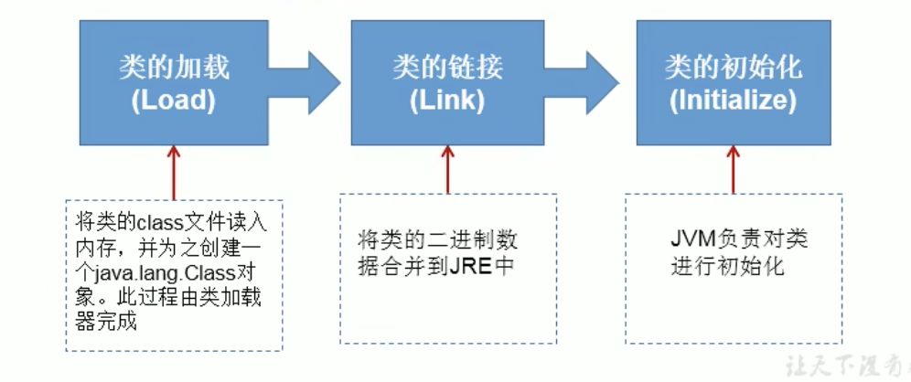

<br>

当程序主动使用某个类的时候 如果该类还未被加载到内存中 则系统会通过如下的3个步骤来对该类进行初始化

<br>

**类的加载分为如下的3个过程:**  
这3个步骤合在一起 有的时候也范范的称之为类的加载(细说类的加载只是步骤1 但整体都算)

```java
类的加载  ->  类的链接  ->  类的初始化
(Load)       (Link)      (Initialize)
```

<br>

**类的加载:**  
将类的class文件读入内存, 并为之创建一个java.lang.Class对象  
此过程由类的加载器完成

<br>

**类的链接:**  
将类的二进制数据合并到JRE中

<br>

**类的初始化:**  
JVM负责对类进行初始化

<br>

### 示例:
比如我们将 Person类 加载到内存中

<br>

**在第一个环节: 加载**  
将物理上存在的字节码文件 通过 java.exe 指令加载到内存中, 并为之创建一个 Class 实例

<br>

**在第二个环节: 链接**  
准备工作:  
将类中声明为 static 静态的变量 分配内存并设置该变量的默认初始化值 这些内存都将在方法区中进行分配
```java
int n
// 在链接环节只会给n赋值为0
n = 0
```

解析工作:  
虚拟机常量池内的符号引用(常量名) 替换为直接引用(地址)的过程

<br>

**在第三个环节: 初始化**  
在初始化的环节才将n赋值为2, 显式赋值和静态代码块中赋值这个操作是在这个环节中完成的

```
执行类构造器<clinit>()方法的过程

类构造器(不是造对象的构造器)<clinit>()方法是由编译器自动收集类中所有类变量的复制动作和静态代码快中语句合并产生的 

当初始化一个类的时候 如果发现其父类没有进行初始化 则需要先触发其父类的初始化

虚拟机会保证一个类的<clinit>()方法在多线程环境中被正确加锁和同步
```


<br><br>

## 类加载器的作用
类的加载器帮我们将 类 加载到内存中

```java 
源文件 .java文件

  ↓ javac 编译器

字节码 .class

  ↓ java 命令 加载到内存中

类装载器(类的加载器)

  ↓

字节码校验器

  ↓

解释器

  ↓

操作系统平台
```

<br>

### 作用:
**将class文件字节码内容加载到内存中** 并将这些静态数据**转换成方法区的运行时数据结构**, 也就是说运行时类本身是**存放在方法区的**  

这时候会生成 Class 的实例 作为方法区中类数据的访问入口

<br>

### 类缓存:
当我们通过4种方式来获取 Class 的实例的时候我们发现得到的clazz都是同一个 因为该类只加载了一次 

标准的javase类加载器可以按要求查找类 但一旦某个类被加载到类加载器中 **它将维持加载一段时间(缓存)**  
不过 JVM垃圾回收机制可以回收这些Class对象

<br>

### ClassLoader: 类的加载器
类加载器作用是用来把类(class)装载进内存的

<br>

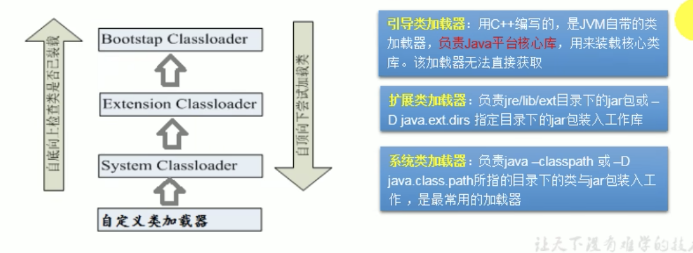

<br>

### 类的加载器的种类:
ClassLoader是类的加载器, 那不同种类的类的加载器有什么区别么?

它们装载不同的类

<br>

**引导类加载器: 无法获取**  
负责java平台的核心库 用来装载核心类库 该加载器无法直接获取

比如String类就是核心类 我们想要用它 也需要加载 就是引导类加载器加载的String

<br>

**扩展类加载器:**  
负责jre/ilb/ext目录下的jar包 或 java.ext.dirs指定目录下的jar包装入工作库

<br>

**系统类加载器: 自定义类都是它加载的**  
负责java-classpath 或 java.class.path所指的目录下的类与jar包装入工作 **是最常用的加载器**

<br>

### 类的加载器的代码演示:
自定义类都是系统类加载器帮我们加载的 比如ReflectionTest类就是它负责加载的

```java
public class ReflectionTest {
  @Test
  public void test() throws ClassNotFoundException {

    // 获取当前自定义类的 类加载器(ClassLoader)
    ClassLoader classLoader = ReflectionTest.class.getClassLoader();

    System.out.println(classLoader);
    // JDK.internal.loader.ClassLoaders$AppClassLoader@2c13da15 它就是系统类加载器
  }
}
```

<br>

### **<font color="#C2185B">classLoader.getParent()</font>**
看看当前classLoader的上一层加载器是谁

系统类加载器的上一层是扩展类加载器
```java
ClassLoader classLoader = ReflectionTest.class.getClassLoader();

System.out.println(classLoader);

// 通过getParent()方法查看当前加载器的上一层加载器
ClassLoader parentClassLoader = classLoader.getParent();

System.out.println(parentClassLoader);
// JDK.internal.loader.ClassLoaders$PlatformClassLoader@64f6106c 扩展类加载器
```

<br>

我们看看扩展类加载的 getParent() 看看还能否继续向上查找, **null**

<br>

**代码部分:**
```java
@Test
  public void test() throws ClassNotFoundException {

    // 获取类的加载器
    ClassLoader classLoader = ReflectionTest.class.getClassLoader();
    System.out.println(classLoader);

    // 调用系统类加载的getParent() 获取扩展类加载器
    ClassLoader parentClassLoader = classLoader.getParent();
    System.out.println(parentClassLoader);


    // 调用扩展类加载器的getParent() 无法获取引导类加载器 引导类加载器主要负责加载java的核心类库 无法加载自定义类的
    ClassLoader parent = parentClassLoader.getParent();
    System.out.println(parent); // null
  }
```

<br><br>

## 使用ClassLoader加载配置文件
前面我们说IO流的时候 使用的是 Properites 来读取配置文件的

<br>

### 复习: 使用Properties读取配置文件
1. 实例化 Properties 对象
2. 使用节点流, 找到该文件
3. 将节点流送入load()方法中
4. 调用 props 的API
5. 关闭资源

```java
Properties props = new Properties();

FileInputStream fis = new FileInputStream("jdbc.properties");

props.load(fis);

String user = props.getProperty("user");
String password = props.getProperty("password");

System.out.println(user + " " + password);
```

<br>

### 使用 ClassLoader 替换 节点流获取输入流的方法

还是使用了 Properties 只不过 送入 load()方法中的是 getResourceAsStream() 返回的输入流

<br>

### **<font color="#C2185B">classLoader.getResourceAsStream("文件路径");</font>**
以流的方式获取资源

<br>

**注意:**  
该方法的文件路径不以module为基准 而是module里面的**src**下, 所以在报空指针异常的时候 我们看看是不是配置文件的位置错了

<br>

**返回值:**  
InputStream

```java
Properties props = new Properties();

// 获取类的加载器(获取的也是系统类加载器)
ClassLoader classLoader = ReflectionTest.class.getClassLoader();

// 以流的方式获取资源
// 相对路径: 默认识别为当前module的src下
InputStream is = classLoader.getResourceAsStream("jdbc.properties");

props.load(is);

// 后面的部分一样
String user = props.getProperty("user");
String password = props.getProperty("password");
System.out.println(user + " " + password);
```

<br>

### 配置文件应写在哪里?
在开发中 我们是将配置文件写在module下还是src下？

**不建议写在module下** 因为我们部署到tomcat服务器以后 module下的配置文件会缺失 

我们要想保证它的存在 **我们需要将配置文件放到src的下面**

如果我们使用的是方式1 那么我们在制定文件的路径的时候要加上src/
```java
FileInputStream fis = new FileInputStream("src/jdbc.properties");
```

<br><br>

# 反射: 创建运行时类的对象
这节里面我们看看 当我们有了Class实例对象后 我们可以做什么事儿

前面我们拿Person类举例子的 当我们把Person加载到内存中的时候 Person就是运行时类 我们要创建运行时类的对象

现在我们要创建Person类的对象(不是new+构造器的方式) 而是通过反射来操作

<br>

## 创建运行时类的对象
Class对应的是哪个运行时类 那就只能创建那个类的对象

首先我们要拿到 指定运行时类的 clazz 对象
```java
// 强转成Person了
Class<Person> clazz = (Class<Person>) Class.forName("com.sam.reflection.Person");
```

<br>

### **<font color="#C2185B">clazz.newInstance()</font>**
**造对象的** 创建对应的运行时类的对象, 默认该方法调用的是类的空参构造器

如clazz是通过Person创建的 那么clazz就是 Person运行时类对象

<br>

**返回值:**  
Object

<br>

**异常:**  
- InstantiationException:   
实例化时异常: 当没有空参构造器的时候 抛出

- IllegalAccessException:   
非法访问: 空参构造器的权限必须够用

<br>

**注意:**  
本质上我们创建对象都是通过类的构造器来创建的

newInstance()内部**调用类中的空参构造器**, 所以要想用此方法 那么类中必须要提供空参构造器

1. 使用此方法 类中必须包含 空参构造器
2. 类中的空参构造器权限不能是private的 通常设置为public

```
在Javabean中要求提供一个public的空参构造器 
1. 便于通过反射 创建运行时类的对象
2. 便于子类继承此运行时类时 默认调用super() 保证父类有此构造器
```

**所以我们在一个类中最好提供一个空参的构造器!!!**

<br>

**高版本弃用:**
```java
// Java11中该方法提示启用:
// 获取 Person 运行时类的实例
Class<Person> clazz = Person.class;

// 创建运行时类的对象
Person person = clazz.newInstance();
```

<br>

**Java11中如下方式创建运行时类对象:**  

<br>

**<font color="#C2185B">clazz.getDeclaredConstructor(参数类型.class)</font>**  
该方式是根据参数类型 调用指定的构造器 (类中有很多重载的构造器)

<br>

**参数:**  
可选: 不写就是调用空参构造器, 类中构造器的参数的类型.class

```java
// 获取构造器: 我们可以在
Constructor<Person> constructor = clazz.getDeclaredConstructor();

// 通过构造器调用 newnewInstance() 方法
Person person = constructor.newInstance();
```

<br>

**经验:**  
我们通过反射来创建对象的时候 都会通过空参的构造器创建对象

如果有属性我们后续会通过调用属性的API为属性来赋值

习惯是调用空参的构造器创建对象 而不是带参的 **因为空参的构造器更加的通用** 符合的情况更多

<br><br>

### 举例: 体会反射的动态性
我们观察下如下的代码 在编译期间不能判断造的是哪个类的对象

我们以前是通过new的方式造的对象 在编译期就能很明确的看出我们要造的是谁 比如 new Peron

而我们通过反射的方式在编译期是不能确定我们要造的是哪个类的对象的

<br>

**要点:**  
**<font color="#C2185B">new Random()</font>**  
创建随机数对象, 通过返回的对象调用 nextXxx() 方法返回随机数

```
double d = random.nextDouble();
float f = random.nextFloat();
int i = random.nextInt();
boolean b = random.nextBoolean();
long l = random.nextLong();

void random.nextBytes(byte[] bytes);
```


<br>

**具体的体会代码如下:**  
```java
@Test
public void test() throws Exception {

  // new Random().nextInt(3): 随机数的边界是3 返回得会是 0 1 2
  int num = new Random().nextInt(3);
  String classPath = "";
  switch (num) {
    case 0:
      classPath = "java.util.Date";
      break;
    case 1:
      classPath = "java.lang.Object";
      break;
    case 2:
      classPath = "com.sam.reflect.Person";
      break;
  }

  // 通过 getInstance 方法获取给定运行时类的对象
  Object obj = getInstance(classPath);
  System.out.println(obj);
}


// 形参: classPath 指定类的全类名
public Object getInstance(String classPath) throws Exception {
  Class clazz = Class.forName(classPath);
  return clazz.newInstance();
}
```

<br><br>

# 获取运行时类的完整结构

## 准备工作
我们先提供一个结构丰富的Person类 便于测试怎么通过反射拿到类中的结构

1. 我们提供了Person类的父类
  - 父类有泛型
  - 父类实现了 Serializable

2. 我们定义了接口 和 注解

3. Person类中继承了父类 实现了Comparable接口 和 自定义接口 使用了注解

4. Person类中提供了不同权限的修饰符

<br>

### Creature: Person父类
父类中我们定义了
- 使用了泛型
- 实现了接口
- 私有属性 和 私有方法

```java
public class Creature<T> implements Serializable {
  private T genericAttr;
  private char gender;
  public double weight;

  public Creature() {
  }
  
  private void breath() {
    System.out.println("生物呼吸");
  }

  public void eat() {
    System.out.println("生物进食");
  }
}


```

<br>

### MyInterface: 自定义接口
```java
public interface MyInterface {
  void info();
}
```

<br>

### MyAnnotation: 自定义注解:
```java
// Target注解要导入 *
import static java.lang.annotation.ElementType.*;

@Target({TYPE, FIELD, METHOD, PARAMETER, CONSTRUCTOR, LOCAL_VARIABLE, MODULE})
@Retention(RetentionPolicy.RUNTIME)
public @interface MyAnnotation {
  String value() default "hello";
  String name() default "sam";
  int age() default 18;
}
```

<br>

### Person类
- 继承了父类
- 实现了预定义 和 自定义接口
- 使用了类注解 和 方法的注解
- 私有属性 和 私有方法
```java
package com.sam.reflect;

// 重新给注解中的指定属性进行赋值
@MyAnnotation(value="Person")
public class Person extends Creature<String> implements Comparable<String>, MyInterface{
  private String name;
  int age;
  public int id;

  // 接口中抽象方法的实现
  @Override
  public void info() {
    System.out.println("我是一个人");
  }

  @Override
  public int compareTo(String o) {
    return 0;
  }

  public Person() {
  }

  @MyAnnotation(value="Person_Constructor")
  private Person(String name) {
    this.name = name;
  }

  Person(String name, int age) {
    this.name = name;
    this.age = age;
  }

  @MyAnnotation(value="Person_Method")
  private String show(String nation) {
    System.out.println("我的国籍是: " + nation);
    return nation;
  }

  public String display(String interest) {
    return interest;
  }


  @Override
  public String toString() {
    return "Person{" +
        "name='" + name + '\'' +
        ", age=" + age +
        '}';
  }
}

```

<br><br>

## 获取运行时类的属性结构及其内部的结构
都是通过 ``clazz.getXxxx`` 的形式 调用类中的各个结构 有些见名知意

<br>

### 一般的操作都是
1. 获取运行时类的实例 clazz
2. 通过 clazz. 拿到对应的结构对象
3. 通过 结构对象.API 的方式获取想要的值

<br>

### API中带有 Declared 的方法
可以忽略类中的权限问题, 能够拿到类中的所有结构, 但是**不能读取父类中的属性**

但是后续需要加上下面的方法, 保证该结构是可访问的 
```java
结构对象.setAccessible(true)
```

<br><br>

## 反射: 属性API
获取属性对象

<br>

### **<font color="#C2185B">clazz.getFields()</font>**
获取 **当前运行时类** 及其 **所有父类中** **所有**声明为 public 的属性

<br>

**返回值:**  
Field[]

```java
Class<Person> clazz = Person.class;

// 2. 获取Person类中所有属性结构
Field[] fields = clazz.getFields();

for(Field field: fields) {
  System.out.println(field);
}
// public int com.sam.reflect.Person.id
// public double com.sam.reflect.Creature.weight
```

<br>

### **<font color="#C2185B"> clazz.getField("属性名")</font>**
获取 **当前运行时类** 及其 **所有父类中** **指定**的声明为 public 的属性

```java
Class clazz = Person.class;
Field weight = clazz.getField("weight");
System.out.println(weight);
```

<br>

### **<font color="#C2185B">clazz.getDeclaredFields();</font>**
获取 **当前运行时类中** 声明的所有属性(不管什么权限, 不包含父类中声明的属性)

<br>

**返回值:**  
Field[]

```java
Field[] declaredFields = clazz.getDeclaredFields();

for(Field field: declaredFields) {
  System.out.println(field);
}
```

<br>

### **<font color="#C2185B">clazz.getDeclaredField("属性名");</font>**
获取**当前运行时类中**声明的指定属性
```java
Field name = clazz.getDeclaredField("name");
System.out.println(name);
```

<br>

## 反射: 获取属性的结构
上面我们可以通过API拿到属性的对象, 我们不仅能够获取到该对象 还可以通过反射获取属性对象中的各个部分

<br>

**属性一般分为如下的几个部分:**  
```java
权限修饰符 数据类型 变量名 = 变量值


// 能不能拿到变量值 要看是不是静态结构 是的话能拿到 不是的话拿不到, 因为实例成员 得有对象之后才能拿到
``` 

```java
权限修饰符 + 数据类型 + 变量名 = 变量值
getModifiers() + getType() + getName()
```
  
<br>

### **<font color="#C2185B">属性对象.getModifiers()</font>**
获取属性的权限修饰符  
在java.lang.reflect 中有一个Modifier类 里面定义了权限修饰符对应的数字

<br>

**返回值:**  
int

- default     0
- public      1
- private     2
- protected   4

```java
Class<Person> clazz = Person.class;
Field[] declaredFields = clazz.getDeclaredFields();
for(Field field: declaredFields) {
  // 获取每个属性的权限修饰符
  int modifier = field.getModifiers();
  // 2 0 1
}
```

<br>

### **<font color="#C2185B">Modifier.toString(modifier)</font>**
**静态方法:**  

用于将 属性对象.getModifiers() 获取的返回值 翻译回对应的权限类型(字符串)

<br>

**参数:**  
属性.getModifiers()的返回int型值

```java
Class<Person> clazz = Person.class;
Field[] declaredFields = clazz.getDeclaredFields();
for(Field field: declaredFields) {
  // 获取每个属性的权限修饰符
  int modifier = field.getModifiers();
  // 2 0 1

  // 将2 0 1翻译回权限修饰符
  System.out.println(Modifier.toString(modifier));
  // private public
}
```

<br>

### **<font color="#C2185B">属性对象.getType()</font>**
反射形式获取属性的类型

<br>

**返回值:**  
Class: String类型也要用Class来描述

类型前面会保留java.lang 因为我们自己也可以定义为String 分了区分会以全类名的方式显示

```java
Class<Person> clazz = Person.class;
Field[] declaredFields = clazz.getDeclaredFields();

for(Field field: declaredFields) {
  Class type = field.getType();
  System.out.println(type);
    // class java.lang.String

  System.out.println(type.getName());
    // java.lang.String
}
```

<br>

### **<font color="#C2185B">属性.getName()</font>**
反射形式获取属性名

<br>

**返回值:**  
String

```java
Class<Person> clazz = Person.class;
Field[] declaredFields = clazz.getDeclaredFields();

for(Field field: declaredFields) {
  String name = field.getName();
  System.out.println(name);
}
```

<br><br>

## 反射: 方法API
获取方法对象

<br>

### **<font color="#C2185B">clazz.getMethods();</font>**
获取**当前运行时类** 及其 **所有父类**中声明为**public**类型的方法

<br>

**返回值:**  
Method[]

```java
Class clazz = Person.class;
// 获取方法构成的数组
Method[] methods = clazz.getMethods();

// 遍历所有方法 好多好多Object类中的方法也会被打印
for(Method m: methods) {
  System.out.println("所有的方法: " + m);

  System.out.println();
}
```

<br>

### **<font color="#C2185B">clazz.getMethod("方法名");</font>**

获取**当前运行时类**及其**父类中**声明为**public**访问权限的**指定**方法

<br>

**返回值:**  
Method

```java
Class clazz = Person.class;
// 获取方法构成的数组
Method show = clazz.getMethod("eat");
System.out.println(show);
```
<br>

### **<font color="#C2185B">clazz.getDeclaredMethods()</font>**
获取**当前运行时类**中声明的**所有方法**(不包含父类中声明的方法)

<br>

**返回值:**  
Method[]

```java
Class clazz = Person.class;

// 获取方法构成的数组
Method[] methods = clazz.getDeclaredMethods();
for(Method m: methods) {
  System.out.println("所有的方法: " + m);
}
```

<br>

### **<font color="#C2185B">clazz.getDeclaredMethod("方法名");</font>**
获取**当前运行时类中**声明的指定方法
```java
Method show = clazz.getDeclaredMethod("show");
System.out.println(name);
```

<br><br>

## 反射: 获取方法的结构
方法的结构一般包括如下的部分

```java
@注解
权限修饰符 返回值类型 方法名(参数类型1 形参名1, ...) throws 异常 {

}


@注解
getAnnotation(注解类.class)


权限修饰符 + 返回值类型 + 方法名
getModifiers() + getReturnType() + getName()


形参列表 + 异常
getParameterTypes() + getExceptionTypes()
```

<br>

### 获取方法上注解:

### **<font color="#C2185B">方法对象.getAnnotation(注解类.class)</font>**
获取方法上指定类型的注解(比如 MyAnnotation 类型的注解)

<br>

**参数:**  
注解类.class, MyAnnotation.class

<br>

**返回值:**  
注解类类型, 如: MyAnnotation

**拿到注解对象后, 可以通过如下的方式获取注解中的属性值:**  
```java
注解对象.注解类中的属性();
```

```java
// 注解类
@Retention(RetentionPolicy.RUNTIME)
public @interface MyAnnotation {
  String value() default "annotation default value";
  String name() default "sam";
  int age() default 18;
}


// 获取Person的clazz
Class<Person> clazz = Person.class;

// 通过反射拿到 Person 的 指定方法的对象
Method study = clazz.getDeclaredMethod("study");

// 调用方法对象的获取注解的方法, 传入注解类.Class
MyAnnotation annotation = study.getAnnotation(MyAnnotation.class);


// 输出注解类中定义的属性
System.out.println(annotation.value());
System.out.println(annotation.name());
System.out.println(annotation.age());
```

<br>

### **<font color="#C2185B">方法.getAnnotations()</font>**
通过反射获取方法上方的所有类型的注解(注解的类型就是注解类的名字)

<br>

**注意:**  
能获取到的注解 必须其声明周期为 RUNTIME

<br>

**返回值:**  
Annotation[]

```java
Class clazz = Person.class;

// 获取运行时类中的所有方法
Method[] declaredMethods = clazz.getDeclaredMethods();

// 遍历方法集合拿到每一个方法
for(Method m: declaredMethods) {

  // 通过每一个方法.getAnnotations() 得到对应方法上面的所有注解
  Annotation[] annos = m.getAnnotations();

  for(Annotation a: annos) {

    System.out.println(a);
      // @com.sam.reflect.MyAnnotation(value="Person_Method")
    System.out.println(a.value());
      // Person_Method
  }
}
```

<br>

### 获取方法上权限修饰符:

**<font color="#C2185B">方法.getModifiers()</font>**  
获取方法的权限修饰符

<br>

**返回值:**  
int

- default     0
- public      1
- private     2
- protected   4

```java
Class clazz = Person.class;
Method[] declaredMethods = clazz.getDeclaredMethods();


for(Method m: declaredMethods) {
  // 获取权限修饰符
  int modifiers = m.getModifiers();
  // 通过静态方法将 int返回值 转成 对应的权限字符串
  System.out.println(Modifier.toString(modifiers));
}
```

<br>

### 获取方法中的返回值类型:

### **<font color="#C2185B">方法.getReturnType()</font>**
获取方法的返回值类型

<br>

**返回值:**  
Class

```java
Class clazz = Person.class;
Method[] declaredMethods = clazz.getDeclaredMethods();

for(Method m: declaredMethods) {
  // 获取返回值的类型
  Class returnType = m.getReturnType();
  
  // 再获取返回值类型的名字
  String name = returnType.getName();
  System.out.println(name);
    // void

  System.out.println(m.getReturnType().getName());
    // void
}


// 单个方法的返回值类型
Method study = clazz.getDeclaredMethod("study");
Class type = study.getReturnType();
System.out.println(type);
  // void
System.out.println(type.getName());
  // void
```

<br>

### 获取方法中的方法名:

### **<font color="#C2185B">方法.getName()</font>**
获取方法的方法名

<br>

**返回值:**  
String

```java
Class clazz = Person.class;
Method[] declaredMethods = clazz.getDeclaredMethods();

for(Method m: declaredMethods) {

  String name = m.getName();
  System.out.println(name);
}
```

<br>

### 获取方法中的形参列表
我们没有办法获取到形参名 只能获取到形参的类型

<br>

### **<font color="#C2185B">m.getParameterTypes()</font>**
获取形参列表实际上是 获取方法的形参列表中的**参数类型**

<br>

**返回值:**  
Class[]

```java
Class clazz = Person.class;
Method[] declaredMethods = clazz.getDeclaredMethods();

for(Method m: declaredMethods) {

  // 获取参数类型
  Class[] parameterTypes = m.getParameterTypes();


  // 没有参数的情况
  if(
    parameterTypes == null && parameterTypes.length == 0
  ) {

  } else {
    // 遍历Class[]
    for(Class p: parameterTypes) {

      // 也是 getName()
      System.out.println(p.getName());
      // java.lang.String
      // java.lang.String
      // java.lang.Object
      // java.lang.String
    }
  }
}
```

<br>

### 获取方法中抛出的异常:

### **<font color="#C2185B">m.getExceptionTypes()</font>**
获取方法的**异常**

<br>

**返回值:**  
Class[]

```java
Class clazz = Person.class;
Method[] declaredMethods = clazz.getDeclaredMethods();

for(Method m: declaredMethods) {

  // 得到异常数组
  Class[] exceptionTypes = m.getExceptionTypes();

  // 判断是否有异常
  if(
    exceptionTypes == null && exceptionTypes.length > 0
  ) {

    for (Class e: exceptionTypes) {
      System.out.println("throws: " + e);
    }

    // 没有异常的时候
  } else {
    System.out.println("没有参数列表");
  }
}
```

<br>

### 获取运行时类的构造器的结构

### **<font color="#C2185B">clazz.getConstructors()</font>**
获取**当前运行时类当中** 声明为**public的构造器**

拿不到父类的构造器

<br>

**返回值:**  
Constructor[]

```java
Class clazz = Person.class;
Constructor[] constructors = clazz.getConstructors();

for(Constructor c: constructors) {
  System.out.println(c);
  // public com.sam.reflect.Person(java.lang.String,int)
  // public com.sam.reflect.Person()
}
```

<br>

### **<font color="#C2185B">clazz.getConstructor(参数类型.class)</font>**
获取当前运行时类的指定构造器

<br>

**参数:**  
构造器中形参列表的类型.class, 不传就是获取空参构造器
```java
String.class int.class
```

```java
Class clazz = Person.class;
Constructor constructor = clazz.getConstructor(String.class, int.class);

System.out.println(constructor);
// public com.sam.reflect.Person(java.lang.String,int)
```

<br>

### **<font color="#C2185B">clazz.getDeclaredConstructors()</font>**
获取当前运行时类中的**所有构造器** (不分权限)

<br>

**返回值:**  
Constructor[]

```java
Class clazz = Person.class;

Constructor[] declaredConstructors = clazz.getDeclaredConstructors();
```

<br>

### **<font color="#C2185B">clazz.getDeclaredConstructor()</font>**
获取当前运行时类的指定构造器

<br>

**返回值:**  
Constructor

<br>

**参数:**  
*不传就是获取空参构造器*  
String.class int.class

<br>

### **<font color="#C2185B">构造器对象.newInstance([实参])</font>**
在我们获取到构造器对象之后, 我们可以通过构造器对象调用该方法, 创建运行时类的对象

创建实例对象 传递实际参数

<br>

**返回值:**  
Object

<br><br>

## 获取运行时类的父类 & 父类的泛型: 重点

### **<font color="#C2185B">clazz.getSuperclass()</font>**
获取运行时类的 **父类**

<br>

**返回值:**  
Class, 父类也是类 所以也是Class的实例

```java
Class clazz = Person.class;

Class superclass = clazz.getSuperclass();
System.out.println(superclass);
// class com.sam.reflect.Creature
```

<br>

### **<font color="#C2185B">clazz.getGenericSuperclass()</font>**
获取运行时类**带泛型的父类**  

<br>

**返回值:**  
Type: Type是一个接口 Class实现了这个接口

```java
Class clazz = Person.class;

Type genericSuperclass = clazz.getGenericSuperclass();

System.out.println(genericSuperclass);
// com.sam.reflect.Creature<java.lang.String>
```

<br>

### **<font color="#C2185B">paramType.getActualTypeArguments();</font>**
获取泛型参数(泛型类型)  
获取运行时类的带泛型的**父类的泛型**

<br>

**调用者:**  
带泛型的父类的对象后 将其 Type类型 强转成 ParameterizedType类型 后再调用该方法

<br>

**返回值:**  
Type[], 因为泛型可能有多个

```java
Class clazz = Person.class;

// 获取到带泛型的父类
Type genericSuperclass = clazz.getGenericSuperclass();

// 将 Type 强转为 ParameterizedType
ParameterizedType paramType = (ParameterizedType)genericSuperclass;
```

<br>

### 反射: 获取父类中的泛型：

Person 继承了 Creature 并在继承时指明了父类的泛型类型, 我们要获取的就是父类的泛型类型
```java
public class Person extends Creature<String> { }
```


<br>

**获取的就是父类的泛型类型 步骤:**
1. 先获取带泛型的父类对象
```java
Type genericSuperclass = clazz.getGenericSuperclass();
```

2. 将 genericSuperclass **强转为** ParameterizedType类型
``` 
ParameterizedType: 带参数的类型
```

3. 通过 ParameterizedType**的对象** 调用方法  **paramType.getActualTypeArguments()**

4. 获取到的 actualTypeArguments 泛型数组中的第一个就是 父类的泛型, **泛型也是一种类型, 我们需要的就是它 actualTypeArguments[0]**  
```java
// 如:
clazz = (Class<T>) actualTypeArguments[0]
```

5. 拿到每一个 Type[] 元素后 通过 **元素.getTypeName()** 获取泛型类型的名字, 我们可以打印输出下看看

<br>

**获取带泛型的父类代码部分:**  
```java
// 1. 拿到Person对应的运行时类对象:
Class clazz = Person.class;

// 2. 通过 clazz 获取带泛型的父类
Type genericSuperclass = clazz.getGenericSuperclass();

// 3. 将 Type 强转为 ParameterizedType
ParameterizedType paramType = (ParameterizedType)genericSuperclass;


// 4. 通过 paramType 对象调用方法() 获取泛型参数数组
Type[] actualTypeArguments = paramType.getActualTypeArguments();

// 5. actualTypeArguments数组中的第一个就是 父类的泛型, 父类的泛型也是一种类型, 它就是我们的目标, 我们可以对该类型进行强转等操作
System.out.println(actualTypeArguments[0]);
    // 注意前面有个class: class java.lang.String


// getTypeName();
System.out.println(actualTypeArguments[0].getTypeName());
    // java.lang.String


// Class才有getName() 调用如下方法前需要强转
System.out.println((Class)actualTypeArguments[0].getName());
    // java.lang.String
```

<br>

### 获取父类的泛型 应用场景:
在 web 阶段我们会创建 DAO 的类, 我们会定义一个泛型, 因为DAO本身会有不同的子类 操作不同的表
```java
public class DAO<T> { ... }


// 子类
public class CustomerDAO extends DAO<Customer> { ... }
```

比如我们的 CustomerDAO 在继承 DAO 的时候会指明父类泛型 ``<Customer>``

StudentDAO 在继承 DAO 的时候会执行父类泛型 ``<Student>``

在 StudentDAO 或 CustomerDAO 就会有需求 获取当前类的父类的泛型

```java
// 要获取 <Customer>
public class CustomerDAO extends DAO<Customer> { ... }
```

<br>

**那拿到父类的泛型有什么意义?**  

在 DAO 类中我们定义了很多通用的方法, 然后子类 CustomerDAO 继承后就能拿到该方法 也就是说 CustomerDAO 类中就能使用该方法
```java
public T getIndex(int index) {
  return null
}
```

CustomerDAO 中的 getIndex() 返回的是 Customer

StudentDAO 中的 getIndex() 返回的是 Student

getIndex()方法中我们会查询数据库 拿到返回的一条记录 我们需要将这条记录装到一个对象中

那我们在CustomerDAO中造的应该是 Customer 对象

那我们在StudentDAO中造的应该是 Student 对象

我们到底要造哪个类的对象 参照的就是 子类继承父类时 指名的父类的泛型

所以我们会有必须获取当前子类的父类的泛型

<br><br>

## 获取运行时类的 接口 & 所在包 % 注解等: 重点(接口)

### **<font color="#C2185B">clazz.getInterfaces()</font>**
获取运行时类的**接口**(不包括父类的接口)

<br>

**返回值**  
Class[]

```java
Class clazz = Person.class;

Class[] interfaces = clazz.getInterfaces();

for(Class c: interfaces) {
  System.out.println(c);
    // interface java.lang.Comparable
    // interface com.sam.reflect.MyInterface
}


// 获取运行时类父类实现的接口
Class[] interfaces1 = clazz.getSuperclass().getInterfaces();
```

<br>

### **<font color="#C2185B">clazz.getPackage()</font>**
获取运行时类所在的**包**

<br>

**返回值:**  
Package

```java
Class clazz = Person.class;

Package pack = clazz.getPackage();
System.out.println(pack);
// package com.sam.reflect
```

<br>

### **<font color="#C2185B">clazz.getAnnotations()</font>**
获取运行时类上方的**注解**

<br>

**返回值:**  
Annotation[]

```java
Class clazz = Person.class;

Annotation[] annotations = clazz.getAnnotations();

for(Annotation a: annotations) {
  System.out.println(a);
  // @com.sam.reflect.MyAnnotation(value="Person")
}
```

<br><br>

# 调用运行时类中指定的结构

## 结构包括
- 属性 
- 方法 
- 构造器

上面三个中我们通常调用的都是 方法

<br>

## 调用运行时类中的指定属性
对于属性的调用我们分为两方面

1. 得到属性的值
2. 给属性赋值

非静态属性: 需要有运行时类的对象

<br><br>

## 反射: 属性的赋值操作
先获取运行时类中的属性对象, 然后调用属性对象的方法

<br>

### **<font color="#C2185B">属性对象.set(运行时类对象, 属性值)</font>**
对属性的值进行 **修改 / 赋值** 操作

<br>

**参数1:**  
Object obj: 指明设置哪个对象的属性

<br>

**参数2:**  
Object value: 将此属性设置为多少

<br>

**<font color="#C2185B">属性对象.get(运行时类对象)</font>**  
获取哪个对象的属性, 获取当前属性的值

<br>

**参数:**  
Object: 获取哪个对象的当前属性的值

<br>

**返回值:**  
Object: 所以这里我们可以进行下强转

```java
Class clazz = Person.class;

// 创建运行时类的对象 对象p是 set 和 get 方法需要的参数
Person p = (Person)clazz.newInstance();

// 获取指定的属性
Field id = clazz.getField("id");

// 设置当前属性的值
id.set(p, 1001);

// 得到的是Object类型 所以我们可以进行强转
Object o = id.get(p);
int pid = (int)o;
System.out.println(pid);    // 1001


// 示例2:
// 获取 Person 运行时类的实例
Class<Person> clazz = Person.class;

// 创建运行时类的对象
Constructor<Person> constructor = clazz.getDeclaredConstructor();
Person person = constructor.newInstance();

Field nameField = clazz.getDeclaredField("name");

// 赋值操作:
nameField.set(person, "sam");

// 获取值:
String name = (String)nameField.get(person);
System.out.println(name);   // sa,
```

<br>

### 经验:
开发中常用 getDeclaredXxx() 方法获取指定的属性, 因为该方法可以获取运行时类的指定属性(不分权限)

<br>

### 注意:
只要是我们通过 clazz.getDeclaredXxx()的形式获取的属性结构对象 我们下面都要调用 ``属性对象.setAccessible(true);`` 方法

**<font color="#C2185B">也要是私有结构 都要加上setAccessible()</font>**  

<br>

### **<font color="#C2185B">属性对象.setAccessible(true);</font>**
保证当前属性是可访问的

当我们读取或设置的属性的权限是
- default
- private

当时上述两种情况下默认是不允许我们访问的(public权限可以)

这时我们在使用该属性之前 需要调用该方法 ``setAccessible(true)`` 

```java
Class clazz = Person.class;
// 创建运行时类的对象
Person p = (Person) clazz.newInstance();

Field name = clazz.getDeclaredField("name");

// 不加这句 会报非法访问的异常
name.setAccessible(true);

name.set(p, "Sam");
System.out.println(name.get(p));
```

<br><br>

## 反射: 方法的调用操作

### 反射: 非静态方法的调用
需要运行时类的对象
```java
Class clazz = Person.class;
// 拿到运行时类的对象
Person p = (Person) clazz.newInstance();
```

<br>

### **<font color="#C2185B">clazz.getDeclaredMethod("方法名", 形参类型.class)</font>**
获取运行时类中的指定方法

<br>

**参数1:**  
String 指明要获取的方法的名称

<br>

**参数2:**  
**形参类型.class**  
可变形参列表, 同名方法(方法的重载)可能很多 所以告诉想要哪个参数的方法


<br>

**异常:**  
NoSuchMethodException

<br>

**返回值:**  
Method

```java
Class<Person> clazz = Person.class;
Person person = clazz.getDeclaredConstructor().newInstance();


// 同名的方法可能很多 指明该方法的形参列表
Method show = clazz.getDeclaredMethod("show", String.class);

show.invoke(person, "中国");
```

<br>

### 方法的调用:
### **<font color="#C2185B">方法对象.invoke(方法的调用者, [实参])</font>**
通过invoke() 调用该方法(方法对象所表示的方法)  
当我们拿到方法结构对象后 通过该对象调用invoke() 来实现方法的调用

<br>

**参数1:**  
方法的调用者, 用哪个对象去调
- 非静态方法: 运行时类的对象
- 静态方法: Person.class / clazz  

其实静态方法的第一个参数 也可以传递null, 在静态方法的时候 第一个参数不是那么重要 静态方法通过哪个对象调用都一样, 只有非静态方法才需要知道是哪个类的对象调用的


<br>

**参数2:**  
传递实参

<br>

**异常:**  
InvocationTargetException

<br>

**返回值:**  
invoke()的返回值即为"方法对象"所表示的方法的返回值, 我们能看到返回值的类型是Object 所以我们以可以使用强转

```java
Object 返回值 = 方法对象.invoke()
```

如果方法的返回值是void 那么我们从invoke()接收到的**返回值就是null**

<br>


**注意:**   
如果我们调用的不是public权限得方法 还是要使用  

<br>

**<font color="#C2185B">方法.setAccessible(true);</font>**  保证当前的方法是可访问的

<br>

```java
@Test
public void test() throws InstantiationException, IllegalAccessException, NoSuchMethodException, InvocationTargetException {

  // 获取运行时类对象
  Class clazz = Person.class;
  Person p = (Person) clazz.newInstance();

  // 非静态方法的情况
  // 获取指定的方法
  Method show = clazz.getDeclaredMethod("show", String.class);

  // 保证当前方法是可以访问的
  show.setAccessible(true);


  // invoke方法的返回值 就是show方法的返回值
  String rv = (String) show.invoke(person, "中国");
  System.out.println(rv);

  System.out.println("*********");


  // 静态方法的情况
  Method showDesc = clazz.getDeclaredMethod("showDesc");

  showDesc.setAccessible(true);

  // 或者 Person.class / null
  showDesc.invoke(clazz);
}
```

<br>

**<font color="#C2185B">静态结构: 我们可以拿 Person类.class 或者 null 充当运行时类对象的部分</font>**

<br><br>

## 反射: 构造器的获取操作
我们通过反射调构造器肯定是想要造对象, 但是我们最常用的就是 clazz.newInstance() (调用的都是空参的构造器) , 这个方法的使用量占到了99%

只有针对具体的某个问题才会造一个指定的构造器 所以使用的情况不是很高

<br>

### **<font color="#C2185B">clazz.getDeclaredConstructor([参数类型.class]);</font>**
获取构造器对象 

<br>

**参数:**  
形参类型.class: 指定构造器的参数列表  
不写参数, 则调用空参构造器

<br>

**异常:**  
NoSuchMethodException

<br>

**返回值:**  
Constructor

<br>

### **<font color="#C2185B">构造器对象.setAccessible(true);</font>**
保证构造器是可访问的

<br>

### **<font color="#C2185B">构造器对象.newInstance([实参])</font>**
创建实例对象 传递实际参数

<br>

**返回值:**  
Object

```java
@Test
public void test() throws InstantiationException, IllegalAccessException, NoSuchMethodException, InvocationTargetException {
  Class clazz = Person.class;

  // 获取指定的构造器
  Constructor constructor = clazz.getDeclaredConstructor(String.class);
  // 保证此构造器是可访问的
  constructor.setAccessible(true);

  // 创建运行时类对象 并通过构造器赋值
  Object sam = constructor.newInstance("Sam");

  // 这里我们还可以对sam对象进行强转
  Person p = (Person) sam
  System.out.println(p);
}
```

<br><br>

# 代理模式: 动态代理
动态代理可以看做是反射的应用, 动态的创建**代理类**

<br>

## 代理设计模式的原理
不管是 静态代理 还是 动态代理 都是代理模式  
上述的两种代理的区别在于 这个代理是什么阶段创建的, 比如 代理是在运行时创建的 那么就是动态代理

<br>

**概念:**  
使用一个代理将对象包装起来 然后用该代理对象取代原始对象 任何对原始对象的调用都要通过代理

代理对象决定 是否 以及 何时 将方法调用转到原始对象上

<br>

### 代理模式:
代理模式中 首先有3个结构

```java
             接口
           -------
        ↗           ↖

类A: 代理类          类B: 被代理类
----------         ------------
```

- 代理类
- 被代理类
- 接口

其中 代理类 和 被代理类 都需要实现这个接口

我们还是拿 **明星和经济人** 举例  

我们把一系列要做的事情定义在接口中(面谈 ~ 收钱)  
```   
                      ↓
面谈 - 签合同 - 订票 - 唱歌 - 收钱
```

明星要想去参加商演 她必须要完成 下面的一系列操作, 明星很忙 所以她将除了重点以外的事情 都可以让经纪人去做 所以我们可以将上面的一系列的事情抽成一个接口

```java
面谈 - 签合同 - 订票 - 重点(?) - 收钱

interface Star {
  // 面谈
  void confer();

  // 签合同
  void signContract();

  // 订票
  void bookTicket();

  // 唱歌
  void sing();

  // 收钱
  void collectMonry();
}
```

然后 经纪人(代理类) 和 明星(被代理类) 都实现这个接口

然后双方都有 这一系列的功能
```
面谈 - 签合同 - 订票 - 唱歌(重点) - 收钱
```

<br>

**经纪人负责:**
```
面谈 - 签合同 - 订票 - 唱歌(明星) - 收钱
```

当经济人在唱歌的环节中 我们通过明星的对象调用他内部的唱歌的方法 在重要的环节中让明星自己来完成

<br>

上面说的代理机制的操作 属于静态代理  

<br>

**特征:**  
代理类和被代理类都是在编译期间确定下来 不利于程序的扩展

同时 每一个代理类只能为一个接口服务 这样一来程序开发中必然产生过多的代理 **最好可以通过一个代理类完成全部的代理功能**

<br>

## 动态代理产生的原因
或者说 **静态代理带来的问题**

在上面的静态代理中 我们发现 代理类 和 被代理类 都是在编译期间定下来的 所以就会有如下的问题

- 买房的问题 会有买房人和中介 这一套代理类和被代理类
- 唱歌的问题 会有歌星和经纪人 这一套代理类和被代理类
- 官司的问题 会有被告人和律师 这一套代理类和被代理类

上面的每种情况都会有代理类的出现 也就是说我们的程序里面就会创建多个代理类 产生过多的代理不太好

而我们代理类的功能就一个 就是对被代理类功能上的封装(都是为了调用被代理类中的方法)

也就是说 代理类的功能都相同 那我们就会想能不能有一个通用得代理类 去完成这样的功能

但是这个通用的代理类又不能在编译期间就能确定下来 我们只能在运行期间确定

<br>

比如运行期间我们加载的是被代理类 那我就**根据这个被代理类 帮助我们动态的创建一个代理类** 得到一个代理类的对象

也就是根据我们加载到内存中的被代理类是谁 我们需要在运行期间创建一个代理类

**加载哪个类就创建这个类对应的代理类**

<br>

而代理类和被代理类又要实现同一套接口 在运行期间**根据加载到内存中的被代理类** 我们**看看它实现了哪些接口**然后我们创建代理类的时候也让它实现这些接口 这样就形成了上面的三角形的关系

<br>

### 动态代理创建的思路:
被代理类会实现接口, 我们获取运行时的被代理类, 拿到他的接口, 创建代理类对象, 实现该接口, 形成三角关系

<br>

### 动态代理的概念:
动态代理是指客户通过代理类来调用其它对象的方法 并且是在程序运行时 根据需要动态创建目标类的代理对象

动态代理使用场合: 
1. 调试
2. 远程方法调用

<br>

### 代理类的优点:
相比于静态代理的优点:  
抽象角色中(接口)声明的所有方法都被转移到调用处理器一个集中的方法中处理 这样我们可以更加灵活和统一的处理众多的方法

<br><br>

## 回顾静态代理

### 静态代理的所需要的结构:
**1. 接口**  
作用:  
接口中会定义抽象方法 等代理类和被代理类来实现

<br>

**2. 代理类**  
代理类中声明被代理类类型的属性

```java
@Override
public void produceCloth() {
  ... 其他功能

      被代理对象.接口抽象方法()

  ... 其他功能
}
```

<br>

**3. 被代理类**  
被代理类的对象会传入代理类的构造器中

作用
在重写接口中的抽象方法的方法体中 定义 核心功能

<br>

### 代码部分:
```java
// 接口: 接口也是一种类型
interface ClothFactory {

  // 生产衣服的功能
  void produceCloth();
}


// 代理类
class ProxyClothFactory implements ClothFactory {
  // 接口类型: 用被代理对象进行实例化
  private ClothFactory factory;


  // 构造器 提供参数对 factory 属性 进行初始化
  public ProxyClothFactory(ClothFactory factory) {
    this.factory = factory;
  }

  // 实现接口中的方法
  @Override
  public void produceCloth() {

    System.out.println("代理工厂做一些准备工作");

    // factory是被代理类 也就是代理类调用的produceCloth()方法的时候 它的内部其实是被代理类调用自己的produceCloth()方法
    factory.produceCloth();

    System.out.println("代理工厂做一些后续的收尾工作");
  }
}


// 被代理类 nick的衣服工厂
class NickClothFactory implements ClothFactory {

  @Override
  public void produceCloth() {
    System.out.println("Nick工厂生产一批运动服");
  }
}


// 测试方法
public class StaticProxyTest {
  public static void main(String[] args) {

    // 1. 创建被代理类对象
    NickClothFactory nike = new NickClothFactory();

    // 2. 创建代理类对象, 将被代理类对象传入
    ClothFactory proxyClothFactory = new ProxyClothFactory(nike);

    // 调用方法 执行逻辑
    proxyClothFactory.produceCloth();
  }
}


// 结果:
代理工厂做一些准备工作
Nick工厂生产一批运动服
代理工厂做一些后续的收尾工作
```

<br>

### 静态代理的特点(缺点)
1. 静态代理 不管是代理类还是被代理类都写死了 也就是说**编译期间代理类和被代理类就确定下来了**, 不利于程序的扩展

2. 每一个代理类只能为一个(一套)接口服务 这样程序开发中必定会产生过多的代理

<br>

### 静态代理的举例2:
实现Runnable接口的方法创建多线程
```java
// 我们自己定义的类 实现了Runnable接口
Class MyThread implements Runnable { ... }

// 我们发现 Thread类 本身也实现了Runnable接口
Class Thread implements Runnable { ... }
```

上面相当于有两个类 且这两个类都实现了Runnable接口
```java
main() {
  MyThread t = new MyThread();
  Thread thread = new Thread(t)

  // 启动线程 调用线程的run() 调用的thread里面的run() 但是真正执行的时候 执行的是MyThread类里面的run()
  thread.start();
}
```

<br><br>

## 动态代理的举例
动态代理也好 还是静态代理也好 都是代理模式 所以要有如下的结构

动态代理的优点就是能解决静态代理的缺点

- 接口
- 被代理类
- **动态创建 代理类**

<br>

### 要点:
利用 Proxy类 提供的API 创建动态的代理类对象

<br>

### 创建动态代理的核心的API:
创建动态代理 有Proxy类给我们提供的 **<font color="#C2185B">Proxy.newProxyInstance()</font>** 方法 专门用来 **创建动态的代理类对象**

<br>

### Proxy类:
它是所有动态代理类的父类 Proxy类时反射包下的一个一个类 直接使用就可以

<br>

### **<font color="#C2185B">Proxy.newProxyInstance(被代理类的加载器, 被代理类实现的接口, InvocationHandler接口的实现类对象)</font>**

**静态方法**  

<br>

**作用:**   
创建动态代理对象   

当我们**通过动态创建的代理类对象**调用共同接口(代理类和被代理类的共同接口)的中方法的之后 **会自动调用被代理类中的同名方法**

<br>

**返回值:**  
动态创建的代理类对象

<br>

**参数:**  
**1. 被代理类的加载器**   
通过下面的形式**获取被代理类的类的加载器**, 系统类加载器是同一个
```java
// obj是形参 是被代理类对象
obj.getClass().getClassLoader()
```

下面的例子中我们会定义一个返回 代理类 的方法, 方法的形参就是 obj

<br>

**2. Class[] 接口**  
被代理类的接口, 上面说了 obj是形参 也就是被代理类, 我们通过下面的形式**获取被代理的接口**
```java
// obj是形参 是被代理类对象
obj.getClass().getInterfaces()
```

<br>

**目的:**  
让代理类和被代理类实现同一个接口

<br>

**为什么要传递接口呢？**   
我们要创建代理类对象 而代理类和被代理类要实现同样的接口  
所以我们要看下被代理类对象所在的类实现了哪些接口 我就跟被代理类一样 也实现这些接口

<br>

**3. InvocationHandler接口的实现类对象**  
不能使用匿名实现类的方法 **要有名**, 因为后面我们要用到实现类对象 为实现类内部的被代理类的属性进行赋值

所以我们可以创建有名的实现类, 不用定义具体的类
```java
// 这样它有有名了 h
InvocationHandler h = new InvocationHandler() {
  @override
  public Object invoke(Object proxy, Method method, Object[] args) throws Throwable {
    return null;
  }
}
```

<br>

**InvocationHandler接口作用:**  
通过代理类的对象调用方法时, 让其动态的调用被代理类中的同名方法

<br>

因为 InvocationHandler 是一个接口, 所以我们要提供 InvocationHandler接口的实现类

<br>

**InvocationHandler的实现类**
```java
class MyInvocationHandler implements InvocationHandler {

  // 实现接口中的方法
  @Override
  public Object invoke(Object proxy, Method method, Object[] args) throws Throwable {
    return null;
  }
}
```

<br>

**InvocationHandler的实现类中的 invoke()**  
作用: 当我们通过代理类的对象 调用方法a的时候 就会自动的调用 invoke方法

比如接口中有 eat() 方法, 当我们通过 代理类的对象调用 eat() 方法的时候, 就会自动调用 InvocationHandler的实现类中的 invoke()

<br>

**利用``Proxy.newProxyInstance()``创建动态代理对象:**  
```java
// 创建 创建代理类的工厂
public class ProxyFactory {

  // obj是被代理类
  public static Object getProxyInstance(Object obj) {

    // 参数1: 类的加载器
    ClassLoader classLoader = obj.getClass().getClassLoader();
    
    // 参数2: 被代理类的借口
    Class[] interfaces = obj.getClass().getInterfaces();
    
    // 参数3: InvocationHandler接口的实现类对象
    MyInvocationHandler handler = new MyInvocationHandler();


    return Proxy.newProxyInstance(classLoader, interfaces, handler);
  }
}
```

<br>

## InvocationHandler的实现类中的逻辑

### 1. InvocationHandler接口中的抽象方法:
### **<font color="#C2185B">public Object invoke(Object proxy, Method method, Object[] args) throws Throwable {...}</font>**
当通过代理类对象调用代理类和被代理类共同接口中的方法的时候

通过该invoke()方法中的逻辑 会自动调用被代理类中的同名方法

<br>

**参数1: Object proxy**   
代理类对象, **不用我们传递**

newProxyInstance()返回的**代理类对象** 会自动注入到这里

<br>

**参数2: Method method**  
通过 代理类对象调用的接口中的方法 掉哪个 method 就是哪个, **不用我们传递**

<br>

**参数3: Object[] args**  
代理类和被代理类共同接口中的方法需要的参数
就是方法中需要传递的实参

<br>

### 思路:
既然 我们通过代理类对象调用 接口中的共同方法的时候 会执行 InvocationHandler接口中 invoke() 中的逻辑

<br>

### 2. InvocationHandler的实现类中被代理类的属性
我们在通过反射调用 method.invoke() 的时候发现 **没有被代理类对象** 所以我们还需要在 InvocationHandler接口的实现类中声明 被代理类的对象

```java
class MyInvocationHandler implements InvocationHandler {

  // 声明 被代理类对象: 不要写死被代理类的类型, 需要使用被代理的对象进行赋值
  private Object obj;

  // 给 obj 赋值的方法有两种 要么是构造器 要么自己写方法
  public void bind(Object obj) {
    this.obj = obj;
  }

  @Override
  public Object invoke(Object proxy, Method method, Object[] args) throws Throwable {
    
    // method就是接口中的同名方法, 我们通过反射调用该方法
    Object returnVal = method.invoke(obj, args);
    // 上述方法的返回值作为当前类中invoke()方法的返回值
    return returnVal;
  }
}
```

<br>

```java
public static Object getProxyInstance(Object obj) {

  // 参数1: 类的加载器
  ClassLoader classLoader = obj.getClass().getClassLoader();
  
  // 参数2: 被代理类的借口
  Class[] interfaces = obj.getClass().getInterfaces();
  
  // 参数3: InvocationHandler接口的实现类对象
  MyInvocationHandler handler = new MyInvocationHandler();

  // 注意: 在传入前要调用bind()方法被 InvocationHandler接口的实现类中的 被代理类属性进行赋值, obj是形参就是被代理类对象
  handler.bind(obj) 

  return Proxy.newProxyInstance(classLoader, interfaces, handler);
}
```

<br>

### 逻辑梳理:
当我们通过 ``ProxyFactory.getProxyInstance(被代理类对象)`` 调用该方法的时候

我们会先创建一个被代理类对象传入 返回一个代理类的对象

当通过这个代理类的对象调用接口中的方法时, 首先会经过 InvocationHandler接口实现中的invoke()方法 该方法内部会通过反射自动的调用被代理类中的同名方法

<br>

### 步骤整理:

**接口:**  

```java
// 人类 接口
interface Human {
  // 获取信仰
  String getBelief();

  // 吃
  void eat(String food);
}
```

<br>

**被代理类**  
```java
//  被代理类 (代理类要动态创建) 实现接口
class SuperMan implements Human {

  @Override
  public String getBelief() {
    return "我相信我能飞";
  }

  @Override
  public void eat(String food) {
    System.out.println("我喜欢吃: " + food);
  }
}
```

<br>

**创建专门生成代理类的工厂**  
创建 代理类 的工厂

<br>

**内部定义静态方法:**   
通过类名获取 代理类的对象

<br>

**newProxyInstance的参数3**
```java
class MyInvocationHandler implements InvocationHandler {

  private Object obj;

  public void bind(Object obj) {
    this.obj = obj;
  }

  @Override
  public Object invoke(Object proxy, Method method, Object[] args) throws Throwable {
    
    // obj是被代理类对象
    Object returnVal = method.invoke(obj, args);

    return returnVal;
  }
}
```

<br>

**创建 代理类 的工厂:**
```java
class ProxyFactory {

  /*
    形参: Object obj
      被代理类对象, 根据加载到内存中的被代理类 动态的创建一个代理类及其对象

    作用:
      调用此静态方法 返回一个代理类对象 

    返回值: Object 代理类的类型
      我们不要写具体的一个类型 那样就写死了 我们可能代理别的 不管代理什么 肯定是Object的一个实例
  */
  public static Object getProxyInstance(Object obj) {

    MyInvocationHandler handler = new MyInvocationHandler();

    handler.bind(obj);

    // 代理类对象
    return Proxy.newProxyInstance(obj.getClass().getClassLoader(), obj.getClass().getInterfaces(), handler);
  }
}
```

<br>

**测试类:**
```java
public class ProxyTest {

  public static void main(String[] args) {

    // 1. 创建被代理类对象
    SuperMan superMan = new SuperMan();

    // 2. 创建代理类对象, 传入被代理类对象, 注意代理类的类型是接口类型
    Human proxyInstance = (Human) ProxyFactory.getProxyInstance(superMan);
    /*  
      Object proxyInstance = ProxyFactory.getProxyInstance(superMan);

      代理类对象的返回值: Object

      我们可以可以它强转成Human 但是它不能定义为SuperMan因为SuperMan是被代理类对象的类型
      
      这个逻辑是我们创建了SuperMan类的对象 也就是被代理类的对象 然后传递到getProxyInstance()方法中

      然后我们看看被代理类对象superMan实现了什么接口 我们造一个类(动态创建的代理类) 跟被代理类实现同一个接口

      所以我们可以写成被代理类和代理类共同的接口 这里我们不用Object类型 可以设置为接口类型 所以上面进行了强转
    */

    // 当通过代理类对象调用方法时 会自动的调用被代理类中的同名方法
    String belief = proxyInstance.getBelief();
    System.out.println(belief);
    proxyInstance.eat("四川麻辣烫");
  }
}
```

<br><br>

# AOP 与 动态代理

AOP: Aspect Orient Programming, 面向切面编程

<br>

前面介绍的 Proxy 和 InvocationHandler 很难看出这种动态代理的优势 

下面介绍一种更实用的动态代理机制

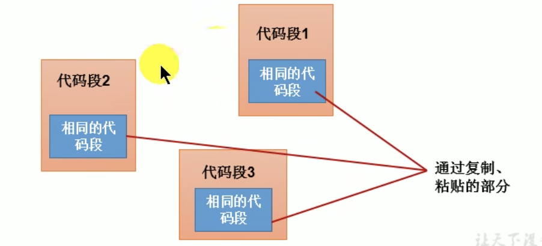

<br>

### 举例:
我们经常会遇到不同的代码段中 有着相同的代码段 而这些相同的代码在不同的代码段中出现会显得有些冗余

```java
代码段1             代码段2
---------          ---------
相同的代码段         相同的代码段

              ↘       ↓

代码段3             方法A
---------     ↗    ---------
相同的代码段         相同的代码段
```

比如上面的
- 代码段1: 冒泡排序
- 代码段2: 快速排序
- 代码段3: 希尔排序

这3段代码都会涉及到 交换两个元素的位置 这个部分的代码就是相同部分的代码 这些相同的代码 在每一个代码段中都有一份 就会显着有些冗余

<br>

**解决方式:**  
将相同的代码抽取出来 造成一个方法 以后我们就可以在代码段1 2 3中调用方法就可以了

<br>

**改进后:**  
代码段1 2 3和相同的代码段分离了 但代码段1 2 3又和一个特定的方法A(我们抽出的方法)耦合了

<br>

**最理想的效果是:**  
代码块1 2 3既可以执行方法A 又**无须在程序中以硬编码的方式直接调用我们抽离出来的方法**

<br>

**思考:**  
那能不能这个方法动态起来 
- 想调用方法A就调用方法A 
- 想调用方法B就调用方法B 

**这里我们就可以用动态代理**

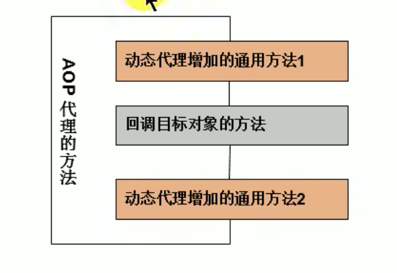

<br>

我们可以把灰色的方法想象成动态的


``` 
-------------------
动态代理增加的通用方法1 -- 固定[互换]

    ← 回调目标对象的方法 -- 动态的[互换] 

动态代理增加的通用方法2 -- 固定[互换]
-------------------
```

固定和动态之间是可以互换的, 也可以是中间的部分是固定的 上下的两个方法是动态的, 这种就是切面编程

```java
// 上面是
  固定
    动态
  固定

// 也可以看成
  动态
    固定
  动态
```

<br>

结合我们上面的动态代理的例子 我们也体会下 切片编程的方式

在上面的动态代理中 我们已经实现了 方法的动态调用 现在我们加上固定逻辑的部分
```java
// 父类
interface Human {
  String getBelief();
  void eat(String food);
}


// 子类
class SuperMan implements Human {

  @Override
  public String getBelief() {
    return "我相信我能飞";
  }

  @Override
  public void eat(String food) {
    System.out.println("我喜欢吃: " + food);
  }
}


// 创建一个 固定逻辑 的工具类
class HumanUtil {
  public void method1() {
    System.out.println("通用方法1+++++");
  }

  public void method2() {
    System.out.println("通用方法2-----");
  }
}


// 创建动态代理类的工厂
class ProxyFactory {
  public static Object getProxyInstance(Object obj) {
    MyInvocationHandler handler = new MyInvocationHandler();

    handler.bind(obj);

    return Proxy.newProxyInstance(obj.getClass().getClassLoader(), obj.getClass().getInterfaces(), handler);
  }
}


// Proxy.newProxyInstance() 的参数3
class MyInvocationHandler implements InvocationHandler {

  private Object obj;
  public void bind(Object obj) {
    this.obj = obj;
  }

  @Override
  public Object invoke(Object proxy, Method method, Object[] args) throws Throwable {

    HumanUtil util = new HumanUtil();


    // 在这里调用 通用代码1
    util.method1();

    // 这里是动态的方法, 这里就是不确定的方法
    Object returnVal = method.invoke(obj, args);

    // 在这里调用 通用代码2
    util.method2();


    return returnVal;
  }
}

public class ProxyTest {

  public static void main(String[] args) {
    SuperMan superMan = new SuperMan();

    Human proxyInstance = (Human) ProxyFactory.getProxyInstance(superMan);

    String belief = proxyInstance.getBelief();
    System.out.println(belief);
    proxyInstance.eat("四川麻辣烫");
  }
}
```

我们发现 ``util.method1()`` 和 ``util.method2()`` 的逻辑是不变的 但是 ``method.invode()`` 这个部分是动态的

这就是面向切片编程的方式

<br><br>

# Java8的新特性
Java8是Java语言开发的一个主要版本, 是Java5以来最具革命性的版本

<br>

## 新特性
- 速度更快: HashMap底层增加了红黑树
- 代码更少: 增加了新的语法: Lambda表达式
- 强大的StreamAPI: 内存层面的多个数据, 实现过滤排序等操作
- 便于并行: 
- 最大化减少空指针异常: Optional
- Nashorn引擎, 允许在 JVM上运行JS程序

<br>

### 串行流:
就是 "串" 这个字的样子就是串行

<br>

### 并行流:
就是 "川" 这个字的样子就是并行, 并行就是可以同时有好几个

就是把一个内容分成多个数据块 并用不同的线程分别处理每个数据块的流 相比较串行的流, **并行的流可以很大程度上提高程序的执行效率**

Java8中将并行进行了优化 我们可以很容易的对数据进行并行操作

StreamAPI可以声明性的通过 parallel()与sequential()在并行流与顺序流之间进行切换

**Resource - Book - 并行API.PDF**

<br><br>

# Lambda表达式:
Lambda是一个匿名函数 我们可以把Lambda表达式理解为是**一段可以传递的代码**

<br>

**特点:**  
将代码像数据一样进行传递

<br>

使用它可以写出更简洁 更灵活的代码 作为一种更紧凑的代码风格 是Java的语言表达能力得到了提升

<br>

## 体验: Lambda表达式的写法
```java
public class Lambda1Test {

  // 例子1:
  @Test
  public void test1() {

    // 创建一个实现Runnable接口的匿名实现类对象
    Runnable r1 = new Runnable() {
      @Override
      public void run() {
        System.out.println("我爱北京天安门");
      }
    };

    // 这里没有使用多线程的意思, 只是用r1调用了run()方法而已 就是普通的对象调用方法
    r1.run();
        // 我爱北京天安门
    

    // Lambda表达式的写法:
    Runnable r2 = () -> System.out.println("我爱北京故宫");
    r2.run();
        // 我爱北京故宫
  }


  // 例子2:
  @Test
  public void test2() {
    // 提供Comparator的匿名实现类对象
    Comparator<Integer> com1 =new Comparator<Integer>() {
      @Override
      public int compare(Integer o1, Integer o2) {
        return Integer.compare(o1, o2);
      }
    };

    int compare1 = com1.compare(12, 21);
    System.out.println(compare1);
        // 前一个数小 -1


    System.out.println("******************:");


    // Lambda表达式的写法 ->
    Comparator<Integer> com2 = (o1, o2) -> Integer.compare(o1, o2);

    int compare2 = com2.compare(21, 1);
    System.out.println(compare2);

    System.out.println("******************:");


    // 方法引用 ::
    Comparator<Integer> com3 = Integer :: compare;

    int compare3 = com3.compare(21, 1);
    System.out.println(compare3);
  }
}
```

<br><br>

# Lambda表达式语言的使用

## 格式
```java
Lambda的形参列表 -> Lambda体

// eg:
(o1, o2) -> Integer.compare(o1, o2);
```

<br>

## Lambda表达式本质
Lambda表达式结构可以作为 接口的实现类对象
```java
// =右侧就相当于Runnable接口的实现类对象
Runnable r = () -> System.out.println("我爱北京天安门")
```

**<font color="#C2185B">Lambda表达式实际上就是作为接口的实例(接口的实现类的对象)</font>**  

其它语言中 Lambda表达式是一个函数 但是在Java中万事万物皆对象 Lambda表达式是一个对象 它作为左边接口的对象

<br>

**<font color="#C2185B">Lambda表达式没有接口就没有意义了 它必须借助于接口才存在的</font>**  

<br>

## 结构说明

### ->:
Lambda操作符 或 箭头操作符

<br>

### Lambda的形参列表:
接口中抽象方法的形参列表, 当有泛型的时候 通过类型推断有的时候可以省略 形参的类型

<br>

### Lambda体:
重写接口中抽象方法的方法体

<br><br>

## Lambda表达式的使用
Lambda表达式的使用分为3种情况, 跟js中的箭头函数的写法几乎一致

<br>

### 情况1: 无参 无返回值
```java
() -> {重写抽象方法的方法体}

// 方法体只有一句可以省略大括号
() -> 重写抽象方法的方法体
```

<br>

**注意:**  
Runnable接口中的run()方法是没有参数的, 且没有返回值

```java
// Runnable接口的匿名实现类
Runnable r1 = new Runnable() {
  @Override
  public void run() {
    System.out.println("我爱北京天安门");
  }
};
r1.run();
```

<br>

**Lambda表达式的写法:**  
因为接口中的抽象方法没有形参, 箭头左边我们只写(), 箭头右边直接写重写抽象方法时的方法体
```java
// Lambda表达式作为接口的实例
Runnable r1 = () -> System.out.println("我爱北京天安门");
```

<br>

### 情况2: 一个参数 无返回值
```java
(String s) -> {重写抽象方法的方法体}

// 当接口类型处有泛型的时候 形参类型可以省略, 方法体只有一句的时候 {}可以省略
s -> 重写抽象方法的方法体
```

Lambda表达式必须依托于接口, 也它的写法也要根据接口中的抽象方法来决定 使用什么格式来书写

比如情况2, 我们需要找一个 一个参数无返回值的抽象方法, 而Consumer接口 就满足这样的情况

<br>

**Consumer**是个接口 那我们就需要提供一个接口的实现类对象 下面我们拿匿名实现类对象来举例

该接口中有一个抽象方法 **void accept(String s)**

```java
// 创建 Consumer 接口的匿名实现类对象
Consumer<String> consumer = new Consumer<String>() {
  @Override
  // 抽象方法: 这里有一个形参
  public void accept(String s) {
    System.out.println(s);
  }
};

consumer.accept("hello")
```

<br>

**Lambda表达式的写法:**  
因为接口中的抽象方法只有一个形参, 箭头左边我们只写(String s), 箭头右边直接写重写抽象方法时的方法体

<br>

**特点:**  
当接口类型处有泛型的时候 可以根据类型推断, 形参位置的类型不用写

同时形参只有一个的时候 () 可以省略

```java
// Lambda表达式作为接口的实现类对象
Consumer<String> consumer2 = (String s) -> {
  System.out.println(s);
};


// Consumer<String> 这里有泛型 我们可以省略 形参中的类型
Consumer<String> consumer2 = s -> System.out.println(s);
```

<br>

### 情况3: 两个或以上参数 多条语句 有返回值
Lambda表达式必须依托于接口, 也它的写法也要根据接口中的抽象方法来决定 使用什么格式来书写

比如情况2, 我们需要找一个 两个参数 有返回值的的抽象方法, 而Comparator接口 就满足这样的情况

```java
Comparator<Integer> comparator = new Comparator<Integer>() {
  @Override
  public int compare(Integer o1, Integer o2) {
    return o1.compareTo(o2);
  }
};
```

<br>

**Lambda表达式的写法:**  
Lambda体只有一条语句时, return与大括号 都可以省略

```java
// Lambda表达式作为接口的实现类对象
Comparator<Integer> comparato2 = (o1, o2) -> {
  System.out.println(o1);
  System.out.println(o2);
  return o1.compareTo(o2);
};


// Lambda体只有一条语句时, return与大括号 都可以省略
Comparator<Integer> comparato2 = (o1, o2) -> o1.compareTo(o2);
```

<br>

### 要点:
Lambda依托于接口 Lambda表达式相当于接口的实例对象 但是**要求该接口内部只能有一个抽象方法**

只有一个抽象方法的接口叫做**函数式接口**

<br><br>

# 函数式接口:
上面的例子中 我们发现Lambda表达式都是依托于接口 相当于我们**给接口提供具体的实现类对象的时候使用了 Lambda表达式**

而我们对使用Lambda表达式的接口有要求 **要求该接口中只能有一个抽象方法**  

所以我们在提供接口的实例的时候 并没有指明重写了哪个抽象方法(因为就一个)

<br><br>

## Lambda表达式的本质
作为函数式接口的实例

<br><br>

## Lambda表达式的应用场景
**只有在函数式接口进行实例化的时候** 我们才能用Lambda表达式

<br><br>

## 函数式接口
如果一个接口中 只声明了一个抽象方法 则此接口就成为函数式接口

```java
// Runnable接口: 就是一个函数式接口

// 看这个注解 也体现了函数式接口
@FunctionalInterface
public interface Runnable {
  public abstract void run();
}
```

<br>

### 自定义函数式接口:
```java
@FunctionalInterface
public interface MyInterface {
  void method();
}
```

我们使用 ``@FunctionalInterface`` 注解与否没有关系 不加也是函数式接口 只是加上了会有校验功能

<br>

如果是函数式接口后 我们就可以通过 Lambda表达式来创建该接口的对象

**Lambda表达式要想使用就一定依托于函数式接口**

**<font color="#C2185B">以前用匿名实现类表示的, 现在都可以使用Lambda表达式来写</font>**  

<br><br>

# Java内置的函数式接口:
在java.util.function包下定义了Java8的丰富的函数式接口

<br>

## Java内置四大核心函数式接口
这4个核心的函数式接口相当于 四种模板 当我们需要定义的接口和这4个模板一样的时候 我们直接可以使用该4个接口

<br>

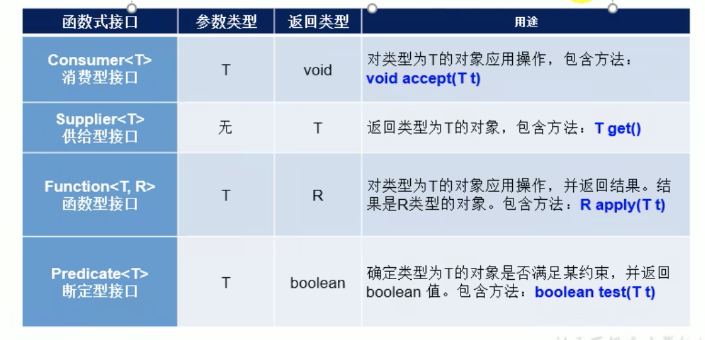

<br>

|函数式接口|参数类型|返回类型|用途|
|:--:|:--:|:--:|:--|
|``Consumer<T>``<br>消费型接口|T|void|对类型为T的对象应用操作<br>抽象方法: <font color="#C2185B">void accept(T t)</font>|
|``Supplier<T>``<br>供给型接口|无|T|返回类型为T的对象<br>抽象方法: <font color="#C2185B">T get()</font>|
|``Funtion<T, R>``<br>函数型接口|T|R|对类型为T的对象应用操作, 并返回结果, 结果是R类型的对象<br>抽象方法: <font color="#C2185B">R apply(T t)</font>|
|``Predicate<T>``<br>断定型接口|T|boolean|确定类型为T的对象是否满足约束, 并返回 boolean 值<br>抽象方法: <font color="#C2185B">boolean test(T t)</font>|

<br>


### 如何使用 这些函数式接口:
比如我们想定义一个接口 恰好我们的接口里面**只有一个抽象方法**

这个方法需要传递一个东西 一个参数就够 这个方法还没有返回值 以前的时候 我们可能就自己定义这个接口了

现在的话 我们就可以看到 上述的内容很像消费型接口 既然这样我们就没有必要定义这样的接口了 

我们直接用Consumer就可以了 如果和我们想定义的名字可能有些出路 但是没必要自己定义接口了 直接使用就可以了

<br>

### 消费型接口: ``Consumer<T>``
有一个 T类型 参数, 无返回值  
对传递进去的 T类型的参数对象 应用操作

**抽象方法:**  
```java
void accept(T t)
```

<br>

**参数类型: T**   
有一个参数 参数的类型是泛型T

<br>

**返回值类型: void**  
无返回值

<br>

**应用场景:**  
传参 但没有返回值的时候 我们就可以用消费者

<br>

### 供给型接口: ``Supplier<T>``
无参数, 返回值T  
方法内部逻辑加工后 返回一个T类型的对象 (不给它东西 它都往回返)

<br>

**抽象方法:**  
```java
T get()
```

<br>

**参数类型: 无**   
没有形参

<br>

**返回值类型: T**  
返回值: T类型对象

<br>

**应用场景:**  
参数是空的 但会返回一个值 (跟消费型正好相反)

<br>

### 函数型接口: ``Function<T, R>``
有一个 T类型参数, 返回R类型的对象

对类型为T的对象应用操作 并返回结果 结果是 R类型的对象, 形参的类型 和 返回值的类型可以不一样

<br>

**抽象方法:**  
```java
R apply(T t)
```

<br>

**参数类型: T**   
有一个参数 参数的类型是泛型T

<br>

**返回值类型: R**  
返回值: R类型对象

<br>

**应用场景:**  
我们放进去的东西 和 返回得东西可以不一样  
放个T进去 我们返回一个R

<br>

### 断定型接口(判断型): ``Predicate<T>``
参数T, 返回值 boolean

确定类型为T的对象是否满足某约束 并返回boolean值

<br>

**抽象方法:**  
抽象方法中定义判断的规则
```java
boolean test(T t)
```

<br>

**参数类型: T**   
有一个参数, T类型对象

<br>

**返回值类型: boolean**  
返回值: boolean

<br>

**应用场景:**  
做判断的时候可以使用

<br>

### 函数式接口总结:

**``Consumer<T>``消费型接口: void accept(T t)**  
有参 无返回值

<br>

**``Supplier<T>``供给型接口: T get()**  
无参 有返回值

<br>

**``Function<T, R>``函数型接口: R apply(T)**  
有参数 有返回值, 返回值类型和参数类型可以不一样

<br>

**``Predicate<T>``断定型接口: boolean test(T)**  
有参 返回值boolean, 方法体写判断逻辑

传入一个参数 返回一个布尔值 可以根据布尔值进行过滤等

<br><br>

### 扩展的函数式接口:
上面提到了 4种基本的函数式接口 除了上面的4种之外 还有其他的一些接口

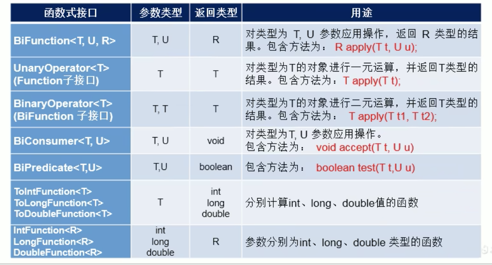

<br>

### ``BiFunction<T, U, R>``
有两个不同类型的形参 T U 有返回值 R  
对类型为T U参数应用操作 返回R类型的结果

<br>

**抽象方法:**  
```java
R apply(T t, U u)
```

<br>

**参数类型: T U**   
有两个 T U类型 参数

<br>

**返回值类型: R**  
返回值: R

<br>

**应用场景:**  

<br>

### ``UnaryOperator<T>``
Function子接口

有一个形参, 有返回值 T  
对类型为T的对象进行一元运算 并返回T类型的结果

<br>

**抽象方法:**  
```java
T apply(T t)
```

<br>

**参数类型: T**   
有一个 T类型 参数

<br>

**返回值类型: T**  
返回值: T

<br>

**应用场景:**  
放进去的是T类型 出来的还是T类型

<br>

### ``BinaryOperator<T>``
BiFunction子接口

两个类型的形参, 返回和形参类型相同的返回值

对类型为T的对象 进行二元运算 并返回T类型的结果

<br>

**抽象方法:**  
```java
T apply(T t1, T t2)
```

<br>

**参数类型: T T**   
有两个 T T 类型的形参

<br>

**返回值类型: T**  
返回值: T

<br>

**应用场景:**  


<br>

### ``BiConsumer<T, U>``
两个类型的形参 无返回值, 对类型为T, U参数应用操作

<br>

**抽象方法:**  
```java
void accept(T t, U u)
```

<br>

**参数类型: T U**   
两个 T U 类型的形参

<br>

**返回值类型:**  
返回值: 无

<br>

### ``BiPredicate<T, U>``
两个类型的形参, 返回boolean

<br>

**抽象方法:**  
```java
boolean test(T t, U u)
```

<br>

**参数类型: T U**   
两个 T U 类型的形参

<br>

**返回值类型: boolean**  
返回值: boolean

<br>

### ``ToIntFunction<T>``
### ``ToLongFunction<T>``
### ``ToDoubleFunction<T>``
分别计算 int long double值的函数

<br>

**抽象方法:**  
无

<br>

**参数类型: T**   
有一个参数 T

<br>

**返回值类型:**  
返回值: int long double

<br>

### ``IntFunction<R>``
### ``LongFunction<R>``
### ``DoubleFunction<R>``
参数: int long double   
参数分别为 int long double 类型的函数

<br>

**抽象方法:**  
无

<br>

**参数类型: int long double**   
int long double

<br>

**返回值类型: R**  
返回值: R类型的对象

<br><br>

## 各个接口的示例
然后真的是在定义回调, 利用回调在完成功能
```js
arr.forEach(item => console.log(item))

// 像不像定义了回调来处理前面的数据
happyTime(500, m -> System.out.println(m))
```

<br>

### Consumer接口的示例:
我们定义了一个方法 形参类型设置为 上述函数式接口的类型 

如果下方的形参2是 ``Consumer<Double>`` 消费型接口中 我们需要重写抽象方法 ``void accept(T t)``

典型的方式就是 传参后输出参数

<br>

**定义方法:**  
我们将传入的参数1, 方法体内部传递给参数2
```java
public void happyTime(double money, Consumer<Double> con) {
  con.accept(money);
}
```

<br>

**正常的调用方式:**  
因为参数2是接口 我们需要提供接口的实现类对象 所以一般会采用匿名实现类的方法 创建接口的实现类对象
```java
happyTime(12.3, new Consumer<Double>() {
  @Override
  public void accept(Double aDouble) {
    // 直接输出传入的参数
    System.out.println(aDouble);
  }
});
```

<br>

**Lambda表达式的方式:**  
因为 Lambda表达式 可以作为函数式接口的实现类对象 
```java
// 将 8.8 交给了 m 然后对 m 进行使用
happyTime(8.8, m -> System.out.println(m));
```

<br><br>

### Predicate接口的示例:
Predicate的抽象方法是 ``boolean test(T t)`` 抽象方法内部要定义判断的规则 会返回boolean 我们可以拿着 boolean 值来进行对应的操作

比如: 我们将集合中的字符串进行过滤 将符合规则的字符串添加到新的List中

<br>

**定义方法:**  
参数1: 字符串的集合  
参数2: Predicate函数式接口

我们会将 参数1 交给 抽象方法 test(参数1) 进行判断 返回值 boolean

当返回true的时候 我们将元素添加到集合中并返回
```java
public List<String> filterString(List<String> list, Predicate<String> pre) {
  // 创建一个集合
  ArrayList<String> filterList = new ArrayList<>();

  // 遍历集合中的元素
  for(String s: list) {

    // 将集合中元素传入 Predicate 的 test() 中 符合要求的添加到集合中
    if(pre.test(s)) {
      filterList.add(s);
    }
  }

  return filterList;
}


// 过滤集合中的数字
public List<Integer> filterList(List<Integer> list, Predicate<Integer> filter) {
  ArrayList<Integer> res = new ArrayList<>();

  for(Integer i: list) {
    boolean flag = filter.test(i);
    if(flag) res.add(i);
  }
  return res;
}
```

<br>

**正常的调用方式:**
```java
@Test
public void test1() {
  // 定义一个字符串集合
  List<String> list = Arrays.asList("北京", "南京", "天津", "东京");

  // 参数2位置传入 Predicate接口的实现类对象
  List<String> res = filterString(list, new Predicate<String>() {

    // 抽象方法体中定义判断规则
    @Override
    public boolean test(String s) {
      // 是否包含 京
      return s.contains("京");
    }
  });

  System.out.println(res);
}
```

<br>

**Lambda表达式的方式:**  
```java
@Test
public void test1() {
  List<String> list = Arrays.asList("北京", "南京", "天津", "东京");

  // 参数2的位置 使用 Lambda表达式代替匿名实现类
  List<String> res = filterString(list, s -> s.contains("京"));

  System.out.println(res);
}


// 示例2:
List<Integer> res2 = filterList(list, item -> item > 5);
System.out.println(res2);
```

<br>

### 函数式接口的使用场景:
如果我们开发中需要定义一个函数式接口 首先看看在已有的JDK提供的函数式接口中是否提供了能满足需求的函数式接口 如果有 则直接调用即可 不需要自己再自定义了

<br><br>

# 方法引用与构造器引用
方法引用与构造器引用是基于Lambda表达式的, **用来替换Lambda体的部分**

<br>

## 方法引用
当要传递给Lambda体的操作, 已经有实现的方法了 我们就可以使用方法引用

<br>

### 自我总结:
比如我们定义了一个 show(msg, Consumer) 我们会将 msg 传入Consumer接口的抽象方法中 进行输出 
```java
public void show(String msg, Consumer<String> consumer) {
  consumer.accept(msg);
}
```

**Lambda表达式的调用方式:**  
参数2是Consumer函数式接口 所以我们使用Lambda表达式的方式创建了该接口的实现类对象

因为函数式接口中的抽象方法就一个 所以不用写方法名 直接如下的匿名回调的方式就可以
```java
show(msg, m -> System.out.println(m));
```

<br>

注意: 这里我们是不是自己指明了一个回调, 方法引用的思路就是 

我们思考下 Lambda的方法体(() -> {} 这个部分都是Lambda体)  
我们要写什么样的逻辑 有什么类中是现成的 那么我们直接拿来用就可以了

指明 什么类的 什么方法 类::方法 这就是方法引用

**方法引用 用来替换 Lambda体**

```java
// 比如 我们想在Lambda的方法体中进行输出, 那我们就想 Sytem.out 类中的 println 方法就是管输出的传入一个参数 没有返回值 那我们拿来直接用就可以了
show(msg, System.out::println);
```

<br><br>

## 概念
当要传递给Lambda体的操作 已经有了实现的方法了 可以使用方法引用

**方法引用就是Lambda表达式 也就是<font color="#C2185B">函数式接口的一个实例</font>**

通过方法的名字来指向一个方法 可以认为是Lambda表达式的一个语法糖, 用来替换Lambda体的部分(() -> {})

<br><br>

## 使用情景
当要传递给Lambda体的操作 已经有了实现的方法了(比如API中现成的方法) 可以使用方法引用

```java
public void test() {
  // 创建 Consumer接口的实现类, 使用 Lambda的方法创建的实现类对象 并指明了 accpet() 抽象方法的方法体
  Consumer<String> consumer = str -> System.out.println(str)


  // 调用 accept() 方法
  consumer.accept("北京");
      // 输出 北京
}
```

我们知道 Consumer接口中 的抽象方法为 ``void accept(T t)`` 放入一个变量不返回

而我们还有一个 PrintStream 打印流 这里有一个方法 ``void println(T t)`` 它和我们消费型函数式接口的格式是一样的 一样的参数类型 一样的不返回 如果他们正好匹配上了

- void accept(T t)
- void println(T t)

这时候我们就可以考虑使用方法引用 使用现成的println(T t)方法来代替Lambda表达式的表达体部分

<br>

**要点:**  
<font color="#C2185B">方法引用 替换的是 Lambda体的位置</font>

<br><br>

## 方法引用的使用格式
```java
类(对象) :: 方法名
```

### 方法引用分为了两个部分:
**前面的部分: 调用者**  
类或对象

上面的示例中  会使用  ``void println(T t)`` 替换掉 ``void accept(T t)``

那 println() 的调用者是谁 System.out 吧

<br>

**右边的部分: 调用的方法名**  
我们引用的方法名, 参数列表不用写  
参数列表不用写的原因是 ``void println(T t)`` 和 ``void accept(T t)`` 是一样的 默认会传递

<br>

### 使用方法引用的前提:
函数式接口的抽象方法的 **参数列表** 和 **返回值类型** 必须与 方法引用的方法的 参数列表 和 返回值类型 **保持一致**

<br>

## 使用方法引用的3种情况

### 情况1:

```java
对象 :: 非静态方法(实例方法)
```

<br>

**注意:**  
<font color="#C2185B">不能用对象调用静态方法</font>


<br>

**示例:**  
void accept(T t) -> void println(T t) 

1. 两个方法的 形参列表 和 返回值 都一致 我们就可以考虑使用 方法引用

2. 方法引用取代的是 Lambda体 作为本身作为函数式接口的实现类对象
```java
str -> System.out.println(str);

            ↓ 通通换成 方法引用

System.out :: println
```

3. println方法的调用者是System.out 所以使用 :: 隔开, 注意我们不比传入参数 参数会自动转传到方法引用中

```java
// Lambda表达式的方式: void accept(T t)
Consumer<String> con1 = str -> System.out.println(str);

con1.accept("北京");


// 修改为方法引用: void println(T t)
Consumer<String> con1 = System.out::println

// 当我们调用方法的时候 会自动将实参传入到方法引用的 println("北京") 方法中
con2.accept("北京");
```

<br>

**示例2: Supplier函数式接口**  
Supplier函数式接口的抽象方法 ``T get()``  

```java
public void test() {

  // 创建一个对象
  Employee emp = new Employee(1001, "Tom", 23, 9999)

  // Lambda表达式方式创建 Supplier接口的实现类, T get() 没有参数 但是有返回值, 我们返回一个员工对象的名字
  Supperlier<String> supperlier = () -> emp.getName()

  System.out.println(supperlier.get())
}
```

<br>

**修改为方法引用:**  
将上面的Lambda表达式方法修改为 方法引用

我们想 Supplier函数式接口 抽象方法是 T get(), 那有没有什么结构的方法 也是这种结构 没有参数 但返回结果??

<br>

**要点:**  
方法引用我们要 找结构 找方法是么? 这个结构和方法并不是说是Java提供的结构, 我们自定义的类 和 类中方法也可以

```java
public void test() {

  // 创建一个对象
  Employee emp = new Employee(1001, "Tom", 23, 9999)

  // 自定义Employee类 和 它的 getName方法
  Supperlier<String> supperlier = emp :: getName

  System.out.println(supperlier.get())
}
```

<br>

### 情况2:
当我们遇到要引用的方法是静态的方法的时候 我们需要考虑使用 类 来调用

```java
类 :: 静态方法
```

<br>

**举例:**  
它们都是静态方法

- Comparator中的 ``int compare(T t1, T t2)``
- Integer中的 ``int compare(T t1, T t2)``

<br>

**Lambda表达式的写法:**   
我们在写Lambda表达式的时候记住 接口中的抽象方法长什么样 参照着写就可以

```java
// Lambda表达式 代替 接口的实现类对象
Comparator<Integer> com1 = (t1, t2) -> Integer.compare(t1, t2);

System.out.println(com1.compare(12, 21));
```

<br>

**方法引用的写法:**  
我们发现Comparator接口中的抽象方法int compare(T t1, T t2) 和
Integer类中的静态方法 int compare(T t1, T t2) 一致 所以这里我们也可以使用方法引用

而 静态方法需要通过类来调用 对于静态方法的方法引用的结构为 ``类 :: 静态方法`` 所以如下

```java
// 方法引用
Comparator<Integer> com2 = Integer :: compare;

System.out.println(com1.compare(12, 21));
```

<br>

**示例2:**  
函数式接口``Function<T, R>``的抽象方法是 ``R apply(T t)``

Math中的round方法也是一样 ``Long round(Double d)``

结构一样我们就可以使用方法引用

```java
// Lambda表达式的写法
Function<Double, Long> fn1 = d -> Math.round(d);

// 方法引用:
Function<Double, Long> fn2 = Math :: round;
```

<br>

### 情况3:
```java
类 :: 调用实例方法(非静态方法)
``` 

**注意:**  
<font color="#C2185B">方法引用中 类.实例方法是可以的, 面相对象里面本来是不行的 特殊吧</font>

<br>

上面的情况1 和 情况2 接口中的抽象方法 和 其它类中的方法一致的时候(形参列表 返回值) 我们可以使用方法引用 

但是情况3结构不一致也可以考虑使用方法引用

<br>

**情况3特殊:**  
函数式接口中的抽象方法 和 要引用的方法进行对比

我们调整抽象方法 将第一个参数调整为抽象方法的调用者

如果调整后的方法结构和要引用的方法一致 就可以使用方法引用

```java
boolean test(T t1, T t2);
↓
boolean t1.test(t2)
```

<br> 

比如: 
- Comparator: int compare(T t1, T t2)
- String: int t1.compareTo(t2)

上述的两个方法比较

只要 函数式接口的抽象方法结构中 第一个参数 作为方法的调用者 这种情况下 就符合情况3 可以使用方法引用

```java
// Lambda表达式的写法
Comparator<String> com1 = (s1, s2) -> s1.compareTo(s2);
com1.compare("abc", "abd");

// 方法引用:
// 参数1是作为compareTo()方法的调用者出现的时候 
Comparator<String> com2 = String :: compareTo;

// compareTo方法是通过String类来调用的 
```

<br>

**举例2:**  
BiPredicate中的
```java
boolean test(T t1, T t2);
```

<br>

String中的
```java
boolean t1.equals(t2)
```

我们发现 函数式接口中的抽象方法 和 下面的方法进行对比, 我们调整抽象方法 将第一个参数调整为抽象方法的调用者, 如果调整后的方法结构和要引用的方法一致 就可以使用方法引用

```java
boolean test(T t1, T t2);
↓
// 调整完结构一致 则可以使用方法引用
boolean t1.test(t2) == boolean t1.equals(t2)
```

<br>

```java
// Lambda表达式的写法
BiPredicate<String, String> pre1 = (s1, s2) -> s1.equals(s2);

System.out.println(pre1.test("abc", "abc"));


// 方法引用
BiPredicate<String, String> pre2 = String :: equals;

System.out.println(pre1.test("abc", "abc"));
```

<br>

**示例3:抽象方法一个参数的情况**  
Function接口中的 ``R apply(T t)`` 如果我们调整该抽象方法的结构会变成

```java
// 参数变成调用者后 成空参了
R apply(T t)
↓
R t.apply() == Employee中的 String getName()
```

如果调整后的格式和要引用的方法一致时, 我们也可以使用方法引用

```java
public void test() {

  Employee emp = new Employee(1001, "sam", 23);

  // 因为是R T所以我们要指明两个泛型
  Function<Employee, String> func = e -> e.getName();

  func.apply(emp)


  // 方法引用:
  Function<Employee, String> func = Employee :: getName;

  func.apply(emp)
}
```

<br>

### 使用建议:
如果给函数式接口提供实例 恰好满足方法引用的使用情景 大家就可以考虑使用方法引用给函数式接口提供实例

如果我们不熟悉方法引用 那么还可以使用Lambda表达式

<br><br>

# 构造器引用 数组引用


## 构造器引用
当函数式接口中的抽象方法的返回值 为一个类的对象的时候 我们就可以考虑使用 构造器引用

函数式接口的抽象方法的形参列表 和 构造器的形参列表一致 

抽象方法的返回值类型即为 通过构造器创建对象的类型 就可以使用 构造器引用

<br>

### 构造器引用格式:
```java
类名 :: new
```

<br>

### 空参构造器的演示: ``Supplier<T>`` - T get()

比如 ``Supplier<T>``接口, 其抽象方法为 **T get()**

我们创建 ``Supplier<T>``接口 的实现类对象
```java
// 没有参数 但有返回值 返回一个员工对象
Supplier<Employee> supplier = () -> new Employee()

supplier.get()
```

<br>

我们观察Employee类的空参构造器 调用空参构造器返回一个对象, 和 get() 不传参 返回一个T类型 这两个形式一致 所以可以使用 构造器引用

- T get()
- Employee() 

```java
// 方法引用也是函数式接口的实现类
Supplier<Employee> supplier = Employee::new

supplier.get()
```

<br>

### 带参构造器的演示: ``Function<T, R>`` - R apply(T t)

比如 ``Function<T, R>``接口, 其抽象方法为 **R apply(T t)**

我们创建``Function<T, R>``接口 的实现类对象
```java
Function<Integer, Employee> func = id -> new Employee(id)

// 传入id创建一个 为id赋值的 emp对象
Employee emp = func.apply(1001);
```

<br>

我们观察Employee类的带参构造器**Employee(Integer id)** 调用带参构造器返回一个对象, 和 **R apply(T t)** 传递一个参数 返回一个R类型 这两个形式一致 所以可以使用 构造器引用

- R apply(T t)
- Employee(Integer id) 

```java
// 方法引用也是函数式接口的实现类, 此时调用的就是 Employee(Integer id) 这个构造器
Function<Integer, Employee> func = Employee::new;

Employee emp = func.apply(1001)
```

<br>

### 带参构造器的演示: ``BiFunction<T, U, R>`` - R apply(T t, U u)

比如 ``BiFunction<T, U, R>``接口, 其抽象方法为 **R apply(T t, U u)**

有两个参数 一个返回值(前两个是参数TU, 后面的R是返回值)

这个抽象方法 和 Employee(int id, String name) 的形式一致 所以我们可以使用方法引用

```java
// 这时调用的就是 Employee(int id, String name) 这个构造器
BiFunction<Integer, String, Employee> bfunc = Employee::new;

Employee emp = bfunc.apply(1001, "sam")


// Lambda:
BiFunction<Integer, String, Employee> bfunc = (id, name) -> new Employee(id, name)
Employee emp = bfunc.apply(1001, "sam")
```

<br><br>

## 数组引用
上面的如果理解了的话 我们这里可以将数组也看做是类类型 这样就没有什么区别了

大家可以把数组看做是一个特殊的类 则写法就跟构造器引用的方法一致了

<br>

### 数组引用的格式:
```java
数组类型[] :: new
```

<br>

比如 我们想创建一个 长度为10的String类型的数组
```java
String[] strs = new String[10]
```

首先我们将数组也看做是一个类
- new int[]
- new String[]
- new byte[]

在创建数组的时候我们可以传入 length 来返回一个指定长度的数组

<br>

这里我们也可以用Lambda表达式来做, 有一个参数, 返回一个值, 我们可以选择 ``Function<T, R> R apply(T t)`` 接口来做

<br>

**使用 Lambda表达式的方法 创建int[]**
```java
// 数组长度本身是int类型 但是泛型不行使用基本数据类型int 要使用对应的包装类, 返回值是int[]
Function<Integer, int[]> func = length -> new int[length];

int[] arr = func.apply(10);

System.out.println(arr.length);
```

<br>

**数组引用:**  
我们将 new String[10] 的位置看做是一个构造器 就完了 使用方式就跟构造器引用一致

```java
Function<Integer, int[]> func2 = int[] :: new;
int[] arr2 = func.apply(10);
System.out.println(arr2.length);
```

<br><br>

# Stream API:
Stream API是API层面的变化

Stream是java8中处理集合的关键抽象概念 它可以指定你希望对集合进行的操作 可以执行非常复杂的查找 过滤 和 映射数据等操作

通过此套API特性 我们可以对集合中的数据进行
- 过滤 
- 排序 
- 映射 
- 归约等操作 

**类似于sql语言对数据库中表的相关操作**

<br><br>

## 为什么要使用 Stream API
实际开发中 项目中多数数据都来自于Mysql Oracle等 这时候如果需要对数据进行过滤 我们可以在 sql层面完成过滤的逻辑

但现在数据源可以更多了 有MongoDB Redis等 而这些NoSql的数据 就需要再Java层面来完成类似过滤的处理 这样的事儿就需要使用Stream API

<br><br>

## Stream和Collection集合的区别
Collection是一个内存层面的容器 来存储多个数据的

Stream是与计算有关, 我们是操作容器中的数据 主要是来做计算的

<br>

前者主要面向内存 存储在内存中   
后者主要是面向CPU 通过CPU实现计算  

- 内存是用来存数据的 - Collection
- CPU是用来计算的 - Stream API

集合讲的是存储数据, Stream讲的是计算

<br>

### 注意:
1. Stream自己不会存储元素  
数据仍然在集合中 就像我们前面说的迭代器一样 迭代器是用来遍历集合的 迭代器本身它也不存数据 数据还是在集合里 Stream也一样

2. Stream不会改变源对象 相反 他们会返回一个持有结果的新的Stream Stream是不可变的特性 原本的对象不变

3. Stream操作时延迟执行的, Stream是有中间操作和终止操作的 只要我们不调用终止操作 中间操作都不会执行

<br><br>

## Stream的执行流程
比如当我们求个数 求最大最小等等 需要如下的3个步骤

### 步骤1: Stream的实例化
创建 Stream 对象, 一个数据源(如: 集合, 数组) 获取一个流

<br>

### 步骤2: 中间操作
一个中间操作链 对数据源的数据进行处理

<br>

### 步骤3: 终止操作(终端操作)
一旦执行终止操作, **就执行中间操作链** 并产生结果 之后此Stream对象就不能再次使用 类似 iterator指针

<br>

```java
1                                 3
数据源 → filter → map → ... → 终止操作
        |                |
        ------------------
        中间操作: 形成的流水线
                2
```

- 1: 根据某个集合得到一个Stream对象
- 2: 然后我们有一系列的中间操作 比如过滤 映射等
- 3: 求个数 变量 归约等等的终止操作

<br><br>

# 步骤1: Stream的实例化
Stream对象就是**用来操作一个容器**的 跟集合打交道, 它的实例化有4种方式

<br>

### 创建Stream方式1: 通过集合
Java8中的Collection**接口中提供了两个**获取Stream流(对象)的**默认方法**

也就是通过集合中提供的默认方法来创建 Stream对象

<br>

### **<font color="#C2185B">集合对象.stream():</font>**
我们通过接口的实现类对象调用的stream()返回一个操作该集合的Stream对象

<br>

stream()方法是接口中定义的默认方法
```java
default Stream<E> stream()
```

<br>

**返回值类型:**  
顺序流: 当我们执行中间操作的时候 会从集合中拿数据 **拿数据的时候会按照我们添加的顺序来**

```java
// 1. 创建一个员工集合
List<Employee> list = EmployeeData.getEmployees();


// 2. 返回得是顺序流Stream对象
Stream<Employee> stream = list.stream();
```

<br>

### **<font color="#C2185B">集合对象.parallelStream():</font>**

<br>

**返回值类型:**  
返回一个并行流: 当我们执行中间操作的时候 会从集合中拿数据 拿数据的时候会像多线程似的 **类似有几个线程 同时去取数据** 顺序就不一定是添加的顺序了

```java
// 1. 创建一个员工集合
List<Employee> list = EmployeeData.getEmployees();


// 2. 返回得是并行流Stream对象
Stream<Employee> parallelStream = list.parallelStream();
```

<br>

### 创建Stream方式2: 通过数组
集合是一种容器 数组也是容器 所以我们还可以通过数组的方式去创建Stream对象

Java8中的Arrays工具类中提供了**静态方法** **stream()** 可以获取数组流

<br>

### **<font color="#C2185B">Arrays.stream(提供一个具体的数组)</font>**
返回一个stream流对象

<br>

**参数:**  
- int[] arr
- long[] arr
- double[] arr
- T[] arr: 自定义类型的数组

<br>

**返回值:**  
我们丢进去的是什么类型的数组 返回值的类型就是 数组的类型

如果我们传入的是自定义类型的数组 那么其返回值的类型是根据泛型T指定的 自定义数组是什么类型 返回得就是什么类型

也就是说我们创建的stream对象的类型是通过泛型体现的

```java
static <T> Stream<T> stream(T[] array)
```

```java
int[] arr = {1, 2, 3};

// 返回得是 IntStream
IntStream intStream = Arrays.stream(arr);


// 自定义的数组
Employee e1 = new Employee(1001, "sam");
Employee e2 = new Employee(1002, "erin");
Employee[] arr1 = new Employee[]{e1, e2};


// 返回得是Employee
Stream<Employee> stream = Arrays.stream(arr1);
```

<br>

### 创建Stream方式3: Stream.of()
通过Stream类本身的**静态方法** of() 也能创建一个stream对象, 它可以接收任意数量的参数

### **<font color="#C2185B">Stream.of(T ... values)</font>**
静态方法, 通过Stream类来调用

<br>

**参数:**  
传递多个数据 相当于对这多个数据 包装成了一个容器 既然是T 那么就是泛型 那么就意味着传递的基本数据类型会被当做是包装类

```java
Stream<Integer> integerStream = Stream.of(1, 2, 3, 6);
```

<br>

### 创建Stream方式4: 创建无限流
使用的情景少 作为了解

使用 Stream 类的 **静态方法**
- Stream.iterate()
- Stream.generate()

<br>

### **<font color="#C2185B">Stream.iterate(参数1, 参数2)</font>**
**根据迭代条件不断地创建数据**, 可以理解为将创建的元素放入一个容器中 因为stream对象就是要操作容器的

<br>

**参数1:**  
seed: 初始值

<br>

**参数2:**  
``UnaryOperator<T>``函数式接口 它是Function子接口, 它接口中

<br>

**参数类型:**  
T

<br>

**返回值类型:**  
T

<br>

**抽象方法:**    
T apply(T t), 放进去的 和 返回得都是 T


既然是参数式接口 那么我们可以用Lambda表达式去写参数2

<br>

**参数2作用:**  
迭代的规则是什么

比如我们放入一个t 然后返回t+2 那么每次得到的新的值 会继续加2 周而复始

因为是无限循环的操作 这里我们还需要借助两个以后讲的API

- **forEach(Consumer接口实现类)**   
forEach()是终止操作 也是执行中间操作的必要环节, 它里面要传递一个消费者接口作为参数(Consumer接口实现类对象), 会根据接口的抽象方法体作为执行逻辑, 为终止操作

- **limit(10)**  
中间操作的一个方法 代表取前10个

<br>

**示例:**  
遍历前10个偶数, 初始值是0 迭代往容器里放 +=2, 然后取前10个遍历输出
```java
// 创建了一个迭代的规则, 然后取前10个(作为限制) 进行遍历输出操作
Stream.iterate(0, t -> t + 2).limit(10).forEach(System.out :: println);
```

<br>

### **<font color="#C2185B">Stream.generate(参数)</font>**
根据指定规则(get()抽象方法的方法体)无限生成数据 帮我们去造数据

<br>

**参数:**  
Supplier接口: T get(), 无参但返回东西

```java
Stream.generate(Math :: random).limit(10).forEach(System.out :: println);
```

<br><br>

# 步骤2: Stream的中间操作
多个**中间操作**可以连接起来形成一个**流水线**, 除非流水线上触发终止操作 否则中间操作不会执行任何的处理 **而在终止操作时一次性全部处理** 称为 "惰性求值"

<br>

### 筛选与切片:

|方法|描述|
|:--|:--|
|filter(Predicate p)|过滤操作: 从流中排除某些元素|
|distinct()|筛选(去重)操作: 通过流所生成元素的hashCode()和equels()去重重复元素|
|limit(long maxSize)|截断流, 使其元素不超过给定数量|
|skip(long n)|跳过元素, 返回一个扔掉了前n个元素的流, 若流中元素不组n个, 则返回一个空流, 与limit(n)互补|

<br>

### 映射:

|方法|描述|
|:--|:--|
|map(Function f)|接收一个函数作为参数 该函数会被应用到每个元素上 并将其映射成一个新的元素|
|flatMap(Function f)|接收一个函数作为参数 将流中的每个值换成另一个流 然后把所有流链接成一个流|
|mapToDouble(ToDoubleFunction f)|接收一个函数做为参数, 该函数会被应用到每个元素上 产生一个新的 DoubleStream|
|mapToInt(ToIntFunction f)|接收一个函数做为参数, 该函数会被应用到每个元素上 产生一个新的 IntSrteam|
|mapToLong(ToLongFucntion f)|接收一个函数作为参数 该函数会被应用到每个元素上 产生一个新的LongStream|

<br>

### 排序:

|方法|描述|
|:--|:--|
|sorted()|产生一个新流, 其中按自然排序排序|
|sorted(Comparator com)|产生一个新流, 其中按比较器顺序排序|

<br>

### 技巧:
每一个中间环节都能得到一个对应类型的Stream对象

<br>

**链式调用:**
```java
list.stream().limit(3).forEach(System.out :: println);
```

<br>

**从中间环节得到对应类型的Stream对象:**
```java
Stream<Employee> employeeStream = list.stream().limit(3);

// 通过这个对象我们在调用终止操作的方法
employeeStream.forEach(System.out :: println);
```

<br><br>

## API: 筛选 与 切片
### **<font color="#C2185B">filter(Predicate p)</font>**
过滤操作, 根据接口中抽象方法的方法体中制定的规则(布尔值)过滤集合中的元素

返回判断为 true 的元素

<br>

**参数:**  
Predicate p: 断定型接口, boolean test(T t)

<br>

**异常:**  
java.lang.IllegalStateException: stream has already been operated upon or closed

<br>

**需求:**  
查询员工表中工资大于7000的员工信息

```java
// 员工集合
List<Employee> list = EmployeeData.getEmployees();

// 实例化stream对象
Stream<Employee> stream = list.stream();

// 根据 e.getSalary() > 7000 的布尔值
stream.filter(e -> e.getSalary() > 7000).forEach(System.out :: print);
```

<br>

### **<font color="#C2185B">limit(long maxSize)</font>**
截断流, 使其元素不超过给定数量
截取集合中数据的前3个

<br>

**需求:**  
我们查看前3个员工的信息

```java
// 先准备一个集合
List<Employee> list = EmployeeData.getEmployees();

// list.stream() 重新生成一个stream对象
list.stream().limit(3).forEach(System.out :: println);
```

<br>

### **<font color="#C2185B">skip(long n)</font>**
跳过集合中指定的元素(数据), 比如过掉前3个数据 就从第4个开始

返回一个扔掉了前 n 个元素的流 若流中元素不足 n 个, 则返回一个空流 与 limit(n) 互补, 比如 
- limit(3): 只要前3个
- skip(3): 除了前3个, 要剩下的

```java
list.stream().skip(3).forEach(System.out :: println);
```

<br>

### **<font color="#C2185B">distinct()</font>**
筛选, 通过流所生成元素的 hashCode() 和 equals() **去除重复元素**

<br>

**要点:**  
自定义类中要重写 hashCode() 和 equals() 方法

比如我们Employee中定义的方式是 全部一样才算一样才会被去重 有一个属性不一样都会两个对象都保留

```java
list.stream().distinct().forEach(System.out :: println);
```

<br><br>

## API: 映射

### **<font color="#C2185B">map(Function f)</font>**
接收一个函数作为参数, 该函数会被应用到每个元素上, 并将其映射成一个新的元素 (跟js里面的map差不多)

<br>

**参数:**  
``Function<T, R>``, 抽象方法为: R apply(T t)

<br>

```java
List<String> list = Arrays.asList("aa", "bb", "cc");

list.stream().map(str -> str.toUpperCase()).forEach(System.out :: println);
// AA  BB  CC

List<Integer> list = Arrays.asList(1, 2, 3, 4, 5);
list.stream().map(item -> item * 2).forEach(System.out :: println);
```

<br>

**需求:**   
获取员工姓名长度大于3的员工的姓名
```java
// 先获取员工的集合
List<Employee> list = EmployeeData.getEmployees();

// 使用 map 将元素修改为 成员名, 然后调用filter进行过滤
Stream<String> nameStream = list1.stream().map(e -> e.getName()).filter(name -> name.length() > 3).forEach(System.out 


// map参数形式2 -- 类 :: 实例方法
Stream<String> nameStream = list1.stream().map(Employee::getName);

nameStream.filter(name -> name.length() > 3).forEach(System.out :: println);
```

<br>

### **<font color="#C2185B">flatMap(Function f)</font>**

**flat可以理解为扁平化:**  
将Stream对象里面还有嵌套的Stream对象的时候, 将内层的Stream打开, 形成扁平化  
```java
list.stream().flatMap(Function f)


// 理解用: flatMap扁平化的目标是Stream对象
[1, 2, 3, [4, 5, 6]]
↓
[1, 2, 3, 4, 5, 6]
``` 

<br>

**注意:**  
**<font color="#C2185B">flatMap是扁平化Stream对象的, 并不是真用来扁平化数组和集合的</font>**  

<br>

**技巧:**  
对于 **类似集合里面套集合** 的情况 **优先考虑用flatMap**, 集合的扁平化

<br>

**举例:**  
```java
// 返回值为 Stream 对象
public static Stream<Character> fromStringToStream(String str) {

  // 我们将字符串的每一个字符装入 list
  ArrayList<Character> list = new ArrayList<>();

  for(Character c: str.toCharArray()) {
    list.add(c);
  }

  // Stream<Character> stream = list.stream();
  return list.stream();
}
```

```java
List<String> list = Arrays.asList("aa", "bb", "cc");


/*
  list.stream().map(str -> {})
  str是集合中的每一个元素
  
  然后每一个元素调用了fromStringToStream方法, 每一个元素会变成一个 Steam对象

  整体返回的就是
  Stream<Stream<Character>>

*/
Stream<Stream<Character>> streamStream = list.stream().map(str -> StreamAPITest::fromStringToStream)

// 如果我们想输出 Stream<Stream<Character>> 中的 char 那么就要使用 双重for
streamStream.forEach(s -> {
  // s是一个stream
  s.forEach(System.out::println)
})
```

<br>

**flatMap的方式:**   
```java
// 这里从泛型也能看出来 flatMap 对集合做了扁平化的处理 [1, 2, 3, 4, 5, 6] 拆开了
Stream<Character> characterStream = list.stream().flatMap(StreamAPITest::fromStringToStream);

// 所以这里我们直接输出就可以了 不用双重for的结构
characterStream.forEach(System.out :: println);
```

<br>

### **<font color="#C2185B">mapToDouble(ToDoubleFunction f)</font>**
接收一个函数作为参数, 该函数会被应用到每个元 素上, 产生一个新的 DoubleStream 

<br>

### **<font color="#C2185B">mapToInt(ToIntFunction f)</font>**
接收一个函数作为参数, 该函数会被应用到每个元 素上, 产生一个新的 IntStream 

<br>

### **<font color="#C2185B">mapToLong(ToLongFunction f)</font>**
接收一个函数作为参数, 该函数会被应用到每个元 素上, 产生一个新的 LongStream 

<br><br>

## API: 排序
关于Java对象只要涉及到排序 肯定会跟如下的两个接口打交道
- comparable
- comparator
 
<br> 

### **<font color="#C2185B">sorted()</font>**
产生一个新流, 就是**自然排序**  
会根据stream容器内的类型(对应的类内部) 自然排序

``Stream<Integer>`` 可以从泛型看出来容器内元素的类型 该类型对应的类里面的自然排序规则 (从小到大的顺序)

```java
// 自然排序
List<Integer> list = Arrays.asList(12, 33, 65, 88, 98);

// 内部会调用Integer自然排序的方式
Stream<Integer> integerStream = list.stream().sorted();

integerStream.forEach(System.out :: println);


// 我们尝试给自定义类使用 sorted() 进行排序报错: 因为Employee类没有实现Comparable接口
List<Employee> employees = EmployeeData.getEmployees();

employees.stream().sorted().forEach(System.out :: println);
```

<br>

### **<font color="#C2185B">sorted(Comparator com)</font>**
产生一个新流, 就是**定制排序**
```java
List<Employee> employees = EmployeeData.getEmployees();

// Lambda: Comparator接口是函数式接口
employees.stream().sorted((e1, e2) -> Integer.compare(e1.getAge(), e2.getAge())).forEach(System.out :: println);


// 指定2级排序
employees.stream().sorted((e1, e2) -> {
  int ageVal = Integer.compare(e1.getAge(), e2.getAge());

  if(ageVal != 0) {
    return ageValue
  } else {
    return -Double.compare(e1.getSalary(), e2.getSalary())
  }
}).forEach(System.out :: println);
```

<br><br>

# 步骤3: Stream的终止操作
终端操作会从流的流水线生成结果 其结果可以是任何不是流的值, 例如: List Integer void

<br>

**注意:**  
流进行了终止操作后 不能再次使用

<br>

## 终止操作: 匹配与查找

### **<font color="#C2185B">allMatch(Predicate p)</font>**
根据规则, 检查该规则是否匹配所有元素, **类似every()**

<br>

**参数:**  
函数式接口: Predicate p  
抽象方法: boolean test(T t)

<br>

**返回值:**  
boolean: 所有的都是true 返回得才是true

<br>

**示例:**  
是否所有员工的年龄大于18岁
```java
// 不用中间操作 直接 allMatch()
boolean allMatch = employees.stream().allMatch(e -> e.getAge() > 18);

// 检查所有元素 有一个不符合 就是false
System.out.println(allMatch);
```

<br>

### **<font color="#C2185B">anyMatch(Predicate p)</font>**
根据规则, 检查是否至少匹配一个元素, 类似**some()**

<br>

**参数:**  
函数式接口: Predicate p  
抽象方法: boolean test(T t)

<br>

**返回值:**  
boolean: 只要有一个匹配上了 就是true

<br>

**示例:**  
是否存在员工的工资大于10000
```java
boolean anyMatch = employees.stream().anyMatch(e -> e.getSalary() > 10000);

// 所有元素中 只要有一个匹配成功 就是true
System.out.println(anyMatch);
```

<br>

### **<font color="#C2185B">noneMatch(Predicate p)</font>**
根据规则, 检查是否 **没有匹配所有元素**


<br>

**参数:**  
函数式接口: Predicate p  
抽象方法: boolean test(T t)

<br>

**返回值:**  
boolean:  检查的是 是否 没有！！！

<br>

**示例:**  
是否存在员工姓"刘"
```java
boolean noneMatch = employees.stream().noneMatch(e -> e.getName().startsWith("刘"));
System.out.println(noneMatch);  // false 里面有姓刘的
```

<br>

### **<font color="#C2185B">findFirst()</font>**
返回第一个元素

<br>

**返回值:**  
``Optional<T>``: 返回得类型的泛型就是元素本身的类型

<br>

**示例:**  
```java
Optional<Employee> employee = employees.stream().findFirst();

System.out.println(employee);
```

<br>

### **<font color="#C2185B">findAny()</font>**
返回当前流中的任意元素

<br>

**返回值:**  
``Optional<T>``: 返回得类型的泛型就是元素本身的类型

```java
Optional<Employee> any = employees.stream().findAny();

// 每次的执行结果都不同
System.out.println(any);
```

<br>

### **<font color="#C2185B">count()</font>**
返回流中元素总数

<br>

**返回值:**  
long

```java
long count = employees.stream().count();
System.out.println(count);  // 8
```

<br>

**<font color="#C2185B">max(Comparator c)</font>**  
根据Comparator接口 定义比较的原则, 返回流中最大值

<br>

**参数:**  
Comparator函数式接口  

<br>

**返回值:**  
``Optional<T>``

<br>

**示例:**  
返回最高的工资
```java
// 方式1:
employees.stream().max(里面传入Comparator接口实现类对象 指定规则)


// 方式2:
// 先map下 将员工集合映射成工资的集合
Stream<Double> doubleStream = employees.stream().map(e -> e.getSalary());
    // 返回值的类型是Stream<Double>

// 然后我们通过doubleStream(容器里都是一个个工资) 然后调用max方法 Comparator需要传递两个参数返回一个int型的值 类 :: 静态方法
Optional<Double> maxSalary = doubleStream.max(Double::compare);

System.out.println(maxSalary);
  // Optional[9876.12]
```

<br>

### **<font color="#C2185B">min(Comparator c)</font>**
返回流中最小值

<br>

**返回值:**  
``Optional<T>``

<br>

**示例:**  
返回最低工资的员工
```java
// Lambda
Optional<Employee> min = employees.stream().min((e1, e2) -> Double.compare(e1.getSalary(), e2.getSalary()));

System.out.println(min);
```

<br>

### **<font color="#C2185B">forEach(Consumer c)</font>**
遍历操作

<br>

**参数:**  
Consumer c: void accept(T t)

<br>

**内部迭代**  
使用 Collection 接口需要用户去做迭代 称为外部迭代 相反, Stream API 使用内部迭代——它帮你把迭代做了

- 外部迭代: 集合外面有一个指针 一点点往下移动取值
- 内部迭代: 集合内存 元素位置往下移动


```java
// 下面是stream调用 forEach
employees.stream().forEach(System.out :: println);

// 下面是通过集合调用forEach 只是一个集合中的普通方法
employees.forEach(System.out :: println);
```

<br><br>

## 终止操作: 归约

|方法|描述|
|:--|:--|
|reduce(T iden, BinaryOperatir b)|可以将流中元素反复结合起来 得到一个值 返回T|
|reduce(BinaryOperatir b)|可以将流真难搞元素反复结合起来 得到一个值, 返回 ``Optional<T>``|

<br>

### **<font color="#C2185B">reduce(T iden, BinaryOperator b)</font>**
可以将流中元素反复结合起来, 得到一个值 返回 T


<br>

**参数1:**  
初始值: 跟js中的reduce的初始值是一样的

<br>

**参数2:**   
``BinaryOperator<T>``: T apply(T t1, T t2)  
根据抽象方法来看, Lambda表达式的形参中应该有两个参数 跟js一样
```java
reduce(0, (pre, item) -> { ... })
```

<br>

**返回值类型:**  
T

<br>

**需求: 求 1-10 的和**
```java
// 创建一个集合
List<Integer> list = Arrays.asList(1, 2, 3, 4, 5, 6, 7, 8, 9, 10);

// Lambda表达式的方式求和
Integer res = list.stream().reduce(0, (prev, item) -> prev + item);
System.out.println(res);


// 方法引用: Integer.sum(int a, int b)
Integer reduce = list.stream().reduce(0, Integer::sum);

// 55
System.out.println(reduce);
```

<br>

**需求: 计算公司所有员工工资的总和**

```java
List<Employee> employees = EmployeeData.getEmployees();

// 我们得到是Double 所以用得 Double::sum
Optional<Double> sumMoney = employees.stream().map(e -> e.getSalary()).reduce(Double::sum);

// 这样写也行
Optional<Double> sumMoney = employees.stream().map(Employee::getSalary).reduce(Double::sum);
```

<br>

### **<font color="#C2185B">reduce(BinaryOperator b)</font>**
可以将流中元素反复结合起来, 得到一个值  
返回 ``Optional<T>``

比如下面集合中的元素, 1 2 自动求和, 然后自动和3再次求和 自动累加
```java
List<Integer> list = Arrays.asList(1, 2, 3, 4, 5, 6, 7, 8, 9, 10);
```

<br>

**参数:**  
``BinaryOperator<T>``: T apply(T t1, T t2)

<br>

**返回值类型:**  
``Optional<T>``

```java
Optional<Double> sumMoney = employees.stream().map(Employee::getSalary).reduce((d1, d2) -> d1 + d2);
```

<br><br>

## 终止操作: 收集
将我们处理后的数据 装到一个容器中 List Set等等, 我们可以通过收集的API, 将我们中间流处理的结果装到 List Set Map 中

<br>

### **<font color="#C2185B">collect(Collector c)</font>**
将中间操作的结果, 装到集合中, 装到什么容器中需要通过 Collector接口的实现类对象决定

<br>

**参数:**  
Collector接口的实现类对象

<br>

**<font color="#C2185B">Collector接口的实现类对象的创建:</font>**  
必须调用 Collectors 工具类调用其内部的方法, 返回一个 容器

Collectors内部有很多静态的方法 不光光是用来指定容器用的

- Collectors.toList()
- Collectors.toSet()
- Collectors.toCollection(Supplier p)
- Collectors.counting()
- Collectors.summingInt()
- Collectors.averagingInt()
- Collectors.summarizingInt()
- Collectors.joining()
- Collectors.maxBy()
- Collectors.minBy()
- Collectors.reducing()
- Collectors.collectingAndThen()
- Collectors.groupingBy()
- Collectors.partitioningBy()

<br>

**<font color="#C2185B">Collectors.toList()</font>**  
把流中元素收集到List中

<br>

**返回值类型:**  
``List<T>``

```java
List<Employee> emps= list.stream().collect(Collectors.toList());
```

<br>

**<font color="#C2185B">Collectors.toSet()</font>**  
把流中元素收集到Set中

<br>

**返回值类型:**  
``Set<T>``

```java
Set<Employee> emps= list.stream().collect(Collectors.toSet());
```

<br>

**<font color="#C2185B">Collectors.toCollection(Supplier p)</font>**  
把流中元素收集到创建的集合, 我们把数据放入到一个Collection中 但是没有指定是用List 还是用Set去装

**我们在创建的时候 指定用List还是Set**

<br>

**参数:**  
``Supplier<T>``: T get(), 我们使用 Lambda表达式的时候 要通过 "回调" 返回一个指定的容器

<br>

**返回值类型:**  
``Collection<T>``

```java
// 集合:
List<Integer> list = Arrays.asList(1, 2, 3, 4, 5);

// 取集合的前3个, 收集到 ArrayList 中
List<Integer> collect = list.stream().limit(3).collect(Collectors.toCollection(() -> new ArrayList<>()));

// 构造器引用:
List<Integer> collect = list.stream().limit(3).collect(Collectors.toCollection(Array::new);

System.out.println(collect);
```

<br>

**需求:**  
查找工资大于6000的员工 结果返回一个List
```java
// 得到了一个员工对象的集合
List<Employee> list = EmployeeData.getEmployees();

// 先对stream容器中的元素进行过滤 然后装到一个对应的容器中
// 得到一个List
List<Employee> employeeList = list.stream().filter(e -> e.getSalary() > 6000).collect(Collectors.toList());

// 通过List对象 调用List的forEach方法
employeeList.forEach(System.out::println);
```

<br><br>

## Collectors API

### **<font color="#C2185B">collect(Collector c)</font>**
我们可以传入的事Collector接口的实现类  
而实现类都是通过 Collectors 身上的方法创建的, Collectors身上还有很多其他的方法

**如下的方法都是当做参数 传入 collect(这里) 的**

<br>

### **<font color="#C2185B">Collectors.counting()</font>**
计算流中元素的个数

<br>

**返回值类型:**  
Long

```java
long count = list.stream().collect(Collectors.counting());
```

<br>

### **<font color="#C2185B">Collectors.summingInt()</font>**
对流中元素的整数属性求和

<br>

**返回值类型:**  
Integer

```java
int total=list.stream().collect(Collectors.summingInt(Employee::getSalary));
```

<br>

### **<font color="#C2185B">Collectors.averagingInt()</font>**
计算流中元素Integer属性的平均值

<br>

**返回值类型:**  
Double

```java
double avg = list.stream().collect(Collectors.averagingInt(Employee::getSalary));
```

<br>

### **<font color="#C2185B">Collectors.summarizingInt()</font>**
收集流中Integer属性的统计值 如:平均值

<br>

**返回值类型:**  
IntSummaryStatistics

```java
int SummaryStatisticsiss= list.stream().collect(Collectors.summarizingInt(Employee::getSalary))
```

<br>

### **<font color="#C2185B">Collectors.joining()</font>**
连接流中每个字符串

<br>

**返回值类型:**  
String

```java
String str= list.stream().map(Employee::getName).collect(Collectors.joining());
```

<br>

### **<font color="#C2185B">Collectors.maxBy()</font>**
根据比较器选择最大值

<br>

**返回值类型:**  
``Optional<T>``

```java
Optional<Emp>max= list.stream().collect(Collectors.maxBy(comparingInt(Employee::getSalary)));
```

<br>

### **<font color="#C2185B">Collectors.minBy()</font>**
根据比较器选择最小值

<br>

**返回值类型:**
``Optional<T>``

```java
Optional<Emp> min = list.stream().collect(Collectors.minBy(comparingInt(Employee::getSalary)));
```

<br>

### **<font color="#C2185B">Collectors.reducing()</font>**
从一个作为累加器的初始值开始, 利用BinaryOperator与流中元素逐个结合, 从而归约成单个值

<br>

**返回值类型:**  
归约产生的类型

```java
int total=list.stream().collect(Collectors.reducing(0, Employee::getSalar, Integer::sum));
```

<br>

### **<font color="#C2185B">Collectors.collectingAndThen()</font>**
包裹另一个收集器, 对其结果转换函数

<br>

**返回值类型:**   
转换函数返回的类型

```java
int how= list.stream().collect(Collectors.collectingAndThen(Collectors.toList(), List::size));
```

<br>

### **<font color="#C2185B">Collectors.groupingBy()</font>**
根据某属性值对流分组, 属性为K 结果为V

<br>

**返回值类型:**  
``Map<K, List<T>>``

```java
Map<Emp.Status, List<Emp>> map= list.stream() .collect(Collectors.groupingBy(Employee::getStatus));
```

<br>

### **<font color="#C2185B">Collectors.partitioningBy()</font>**
根据true或false进行分区

<br>

**返回值类型:**  
``Map<Boolean, List<T>>``

```java
Map<Boolean,List<Emp>> vd = list.stream().collect(Collectors.partitioningBy(Employee::getManage));
```

<br><br>

# Optional类的介绍
java是面对对象的 我们读什么都是通过对象. 如果对象为null 那么就会是空指针了

为了**解决空指针异常 我们引入了 Optional 类**

<br><br>

## Optional类的特点
**该类 ``Optional<T>`` 是一个容器类**, 它可以保存类型T的值 也就是可以装任意类型的对象, 代表这个值存在

它做为一个容器类但是装的数据有限 它只装我们核心要的数据, 就像 Integer 也算是个容器 就装 int

<br>

比如我们有一个Boy对象 我们就可以放入到Optional类中 该类就是一个容器

**凡是对Boy对象的操作 都可以封装成对Optional的操作**, 就像包装类一样凡是对int的操作 都归结于对Integer的操作

或者仅仅保存null 表示这个值不存在 原来用null表示一个值不存在 现在Optional可以更好的表达这个概念 并且可以避免空指针异常

<br>

### Optional类的Javadoc描述如下:
这是一个可以为null的容器对象 如果值存在则``isPresent()``方法会返回true 调用get()方法会返回该对象

<br><br>

## Optional的实例化
有三种方式, 通过 Optional 的静态方法来创建 Optional的对象

<br>

### 方式1: 创建有数据的 Optional 实例

### **<font color="#C2185B">Optional.of(T t):</font>**
创建一个Optional实例, **t必须非空**

传入一个对象就能创建Optional实例 既然是非空Optional的容器里面的数据就一定会存在

<br>

**返回值:**  
``Optional<T>``

```java
Girl girl = new Girl();

// 传入 girl
Optional<Girl> optionalGirl = Optional.of(girl);
System.out.println(optionalGirl);
    // Optional[Girl{name='null'}]
```

<br>

**注意:**  
该方法必须要求我们传入的数据为空 不然会报空指针异常

<br>

<br>

**示例2:**
```java
// Optional容器内只封装一个数据
String str = "hello";
Optional<String> op1 = Optional.of(str)
```

<br>

### 方式2: 创建一个空的 Optional 实例

### **<font color="#C2185B">Optional.empty():</font>**
创建一个空的 Optional实例  
创建的Optional对象内部的value = null

<br>

**返回值:**  
``Optional<T>``

```java
Optional<Object> op1 = Optional.empty();

// 判断Optional封装的数据是否包含数据
if(!op1.isPresent()) {
  System.out.println("数据为空")
}
```

<br>

### 方式3: 创建可以保存 null 的 Optional 实例 (推荐)
### **<font color="#C2185B">Optional.ofNullable(T t)</font>**
创建一个 Optional 实例, 实例中可以保存null


```java
Girl girl = new Girl();

// girl非空的情况
Optional<Girl> optionalGirl = Optional.ofNullable(girl);
System.out.println(optionalGirl);
    // Optional[Girl{name='null'}]


// ofNullable() 可以传入null的情况, 比如girl空的情况 
girl = null;

Optional<Girl> optionalGirl = Optional.ofNullable(girl);
System.out.println(optionalGirl);
// 输出内容: Optional.empty, 类似用empty代替了null?
```

<br><br>

## Optional类的使用举例
为了在程序中避免出现空指针异常而创建的

### 常用的方法:
### **<font color="#C2185B">ofNullable(T t)</font>**
创建可以为null的 Optional 对象

<br>

### **<font color="#C2185B">T orElse(T t)</font>**
取值操作: 通过 optional对象 来调用

- 有值: 返回 值
- 无值: 返回 我们设置的备胎对象

简单的说 如果optional对象里面是非null的 则就用这个optional对象, 如果它是null则用我们传入的参数

利用参数(相当于备胎), 来保证 optional对象一定是非空的

<br>

**Boy类:**  
有一个 Gril类型的 属性
```java
public class Boy {

  // 定义了一个girl对象
  private Girl girl;

  public Boy() {
  }

  public Boy(Girl girl) {
    this.girl = girl;
  }

  public Girl getGirl() {
    return girl;
  }

  public void setGirl(Girl girl) {
    this.girl = girl;
  }

  @Override
  public String toString() {
    return "Boy{" +
        "girl=" + girl +
        '}';
  }
}

```

<br>

**Girl类:**  
内部就一个name属性 和 对应的方法
```java
public class Girl {
  private String name;

  public Girl(String name) {
    this.name = name;
  }

  public Girl() {
  }

  public String getName() {
    return name;
  }

  public void setName(String name) {
    this.name = name;
  }

  @Override
  public String toString() {
    return "Girl{" +
        "name='" + name + '\'' +
        '}';
  }
}
```

<br>

**测试:**  
在测试类中定义一个 getGirlName(Boy boy) 方法 用于获取 Girl 的 name 

下面的方法特别容易出现空指针:
1. 如果我们传入的boy为空 就会有空指针的问题
2. 如果我们没有给girl赋值 那么girl就是null 也会出现空指针的问题

**跟js中的 xxx.xxx.xxx 一样 容易报错**
```java
public String getGirlName(Boy boy) {
  // 这样的写法会出现空指针
  return boy.getGirl().getName();
}
```

<br>

### 没有Optional的时候的优化方法
好像 xxx && xxx.xx && xxx.xx.xx 啊
```java
public String getGirlName(Boy boy) {
  // 先保证 boy 不为 null
  if(boy != null) {
    Girl girl = boy.getGirl();

    // 然后再保证 girl 不为 null
    if(girl != null) {
      return girl.getName();
    }
  }

  return null;
}
```

<br>

### 使用 Optional 以后得优化方式:
1. 将 boy 包装到 Optional 里面
2. 然后我们调用 Optional对象的 orElse()
```java
public String getGirlName(Boy boy) {
  // 1. 将 boy对象 丢入Optional容器中
  Optional<Boy> boyOptional = Optional.ofNullable(boy);


  // 调用 容器.orElse() 方法 确保 boy 一定有值, 如果为空则取我们的参数对象
  Boy boy1 = boyOptional.orElse(new Boy(new Girl("erin")));

  // 这里boy一定是有值的
  Girl girl = boy1.getGirl();


  // 2. 同理 我们也要将 Girl 丢进 Optional 容器里取保 girl 也是有值的
  Optional<Boy> girlOptional = Optional.ofNullable(girl);

  Girl girl1 = girlOptional.orElse(new Girl("刘博"));

  return girl1.getName();
}
```

<br>

## Optional API

### 判断Optional容器中是否包含对象:

### **<font color="#C2185B">Optional实例对象.isPresent()</font>**
判断Optional封装的数据是否包含数据

<br>

**返回值类型:**  
boolean

```java
String str = "测试数据";

Optional<String> ret = Optional.ofNullable(str);

boolean flag = ret.isPresent();

if(flag) {
  System.out.println(ret.get());
} else {
  System.out.println("内部为空");
}
```

<br>

### **<font color="#C2185B">Optional实例对象.ifPresent(Consume consumer)</font>**
如果有值 就执行Consumer接口的实现代码 并且该值会作为参数传给它

<br>

**参数:**  
Consumer接口: void accept(T t)

<br>

**返回值:**    
viod

```java
String str = "测试数据";

Optional<String> ret = Optional.ofNullable(str);

// 只有容器中有值的才会将值传入Lambda
ret.ifPresent(param -> System.out.println(param));
```

<br>

### 获取Optional容器中的对象:

### **<font color="#C2185B">Optional实例对象.get():</font>**
**取值操作:**  
获取Optional容器里面的核心数据

如果Optional容器封装的数据value为空 则get()报错, 否则 value不为空 返回value

<br>

**注意:**   
当我们调用get()方法的时候 一定要保证Optional容器内一定要有值不能为空(``Optional<Double>`` 比如double必须要有值 不能是null)

<br>

**经验:**  
get()方法通常和Optional.of()方法搭配使用

<br>

**异常:**   
当Optional容器内的元素为null的时候
No value present

```java
// 我们经常得到的结果的类型是 Optional<Double>
// 当我们想直接获取里面的值的时候 我们可以用 get()
Optional<Double> sumMoney = employees.stream().map(Employee::getSalary).reduce((d1, d2) -> d1 + d2);


// 获取 Optional 中的数据
sumMoney.get(); // 66666
```

<br>

**判断:**  
为了要确保不为空的时候 可以用上面的  
``boolean isPresent()`` 来判断一下 然后在get()


<nr>

### **<font color="#C2185B">Optional实例对象.orElse(T other) -- 备胎参数</font>**

**取值操作:**  
如果Optional实例对象有值则将其返回 否则返回指定的other对象 (我们传入的备胎对象)

<br>

**经验:**  
orElse(T other)一般我们和ofNullable(T t)搭配使用 没有的话用备胎充当下

<br>

**返回值:**  
T & T orElse(T other)  
我们返回的就是原始的数据类型 比如 Girl

<br>

### **<font color="#C2185B">T orElseGet(Supplier other)</font>**
如果有值则将其返回 否则返回由Supplier接口实现提供的对象

<br>

### **<font color="#C2185B">T orElseThrow(Supplier exceptionSupplier)</font>**
如果有值则将其返回 否则抛出由Supplier接口实现提供的异常

<br><br>

# Java9新特性:
2017年9月21日发布 从Java9开始 Java的计划发布周期是6个月
- 2018年3月份发布的Java10 也就做18.3
- 2018年9月份发布的Java11 也就是18.9

LTS 长期支持版本 以3年为周期发布长期支持版本

<br>

提供了超过150项新功能特性 包括备受期待的模块化系统 可以交互的REPL工作: jshell, JDK编译工具 Java公共API和私有代码 以及安全增强 扩展提升 性能管理改善等 可以说 Java9是一个庞大的系统工程完全做了一个整体改变

<br><br>

## 比较重要的的特性
1. 模块化系统   **重要**
2. jShell命令  **重要**
3. 多版本兼容jar包
4. 接口的私有化   **语法层面的改变**
5. 钻石操作符的使用升级   **语法层面的改变**
6. 语法改进: try语句    **语法层面的改变**
7. String存储结构变更  
**语法层面的改变: 底层改为byte[] 不再是char[]**

8. 便利的集合特性: of()  
9. 增强的Stream API **API层面的改变**
10. 全新的HTTP客户端API **API层面的改变**
11. Deprecated的相关API **API层面的改变**
12. Javadoc的HTML5支持
13. Javascript引擎升级: Nashorn
14. Java的动态编译器

<br><br>

## Java9 10 11的目录结构
没有名为jre的子目录 将8中的jre目录打散了
``` 
| - JDK_HOME
  | - bin
  | - conf
  | - include
  | - jmods
  | - legal
  | - lib
```

<br>

**bin目录:**  
包含所有命令 在window平台上 它继续包含系统的运行时动态连接库

<br>

**conf目录:**  
包含用户可编辑的配置文件 例如以前位于jre/lib目录中的 .properties和.policy文件

<br>

**include目录:**  
包含要在以前编译本地代码时使用的C/C++头文件 它只存在JDK中

<br>

**jmodes目录:**  
包含JMOD格式的平台模块 创建自定义运行时映像时需要它 它只存在于JDK中

<br>

**legal目录:**  
包含法律声明

<br>

**lib目录:**  
包含非Winodows平台上的动态连接本地库 其子目录和文件不应由开发人员直接编辑或使用

<be>

# Java9新特性: 模块化系统
谈到 Java 9 大家往往第一个想到的就是 Jigsaw 项目 众所周知, Java 已经 发展超过 20 年(95 年最初发布), Java 和相关生态在不断丰富的同时也越 来越暴露出一些问题:

我们原来写一个项目就是整体一大块 比如我们需要把整体的API都加载进去(rt.jar) 现在我们希望将rt.jar打成一块块的 需要哪个用哪个 这就是模块化系统

<br>

## Java的问题

### Java 运行环境的膨胀和臃肿:
每次 JVM启动的时候, 至少会有30 ~ 60MB的内存加载, 主要原因是**JVM需要加载rt.jar**, 不管其中的类是否被classloader加载, 第 一步整个jar都会被 JVM加载到内存当中去(而模块化可以根据模块的需要加载程 序运行需要的class)


**rt.jar:**  
我们要是想运行 整个环境rt.jar必须要加载进来(里面是定义好的类库) 不管我们是不是全都能用到 但是都加载进来了

<br>

### 交叉依赖
当代码库越来越大, 创建复杂盘根错节的"意大利面条式代码"的几率呈指数级的 增长 不同版本的类库交叉依赖导致让人头疼的问题, 这些都阻碍了 Java 开发和 运行效率的提升 


<br>

### 没有封装
很难真正地对代码进行封装, 而系统并没有对不同部分(也就是 JAR 文件)之间 的依赖关系有个明确的概念 **每一个公共类都可以被类路径之下任何其它的公共 类所访问到, 这样就会导致无意中使用了并不想被公开访问的 API**

<br>

## 模块化的概念
本质上讲也就是说, 用模块来管理各个package, 通过声明某个package暴露, **模块(module)的概念, 其实就是package外再裹一层**, 不声明默 认就是隐藏 因此, 模块化使得代码组织上更安全, 因为它可以指定哪 些部分可以暴露, 哪些部分隐藏

<br>

## 模块化的使用方式
我们首先要创建两个 Module 文件夹

<br>

### 目录结构:

```
| - ModuleA
  | - src
    | - com.sam.modulea
      - Person.java

| - ModuleB
  | - src
    | - com.sam.moduleb
      - moduleTest.java

```


**ModuleA:**  
定义了一个Person类, 提供各个结构

<br>

**ModuleB:**
调用ModuleA中的Person类造对象, 但是因为权限不同是不行的

<br>

### 使用方式
如果想完成不同 Module 下的结构调用 可以使用如下的方法

**首先, 在两个 Module 的 src 下分别右键创建 module-info.java 文件**
```
| - ModuleA
  | - src
    | - com.sam.modulea
      - Person.java
    - module-info.java   - 追加

| - ModuleB
  | - src
    | - com.sam.moduleb
      - moduleTest.java
  - module-info.java    - 追加
```

<br>

**module-info.java 的内容:**
```java
module ModuleA {

}
```

<br>

### 暴露: exports package
比如我们要将 Person 暴露出去, 那么就在 ModuleA/module-info.java 文件中使用暴露语法


**语法:**  
**<font color="#C2185B">exports package名</font>**  

**ModuleA/module-info.java 的内容:**  
将 指定的包名 **暴露** 出去
```java
module ModuleA {
  exports com.sam.modulea
}
```

<br>

### 引入: requires + import
比如我们在 moduleTest 中想使用 暴露出来的包, 那么就在 ModuleB/module-info.java 文件中使用引入语法

**语法:**  
**<font color="#C2185B">requires 暴露的模块名(文件名)</font>**  

**ModuleB/module-info.java 的内容:**  
将 已暴露的模块名(文件夹名) **引入** 进来
```java
module ModuleA {
  requires modulea
}
```

<br>

**测试类:**
然后在java文件中使用 import 引入暴露出来的包下的执行结构

**快捷方式:**  
在测试类中 在指定的位置 alt+enter  
Add dependency on module... 选中要引入的Module名

```java
// moduleTest.java
import com.sam.modulea.Person

public class ModuleTest {

}
```

<br>

### 注意:
我们使用模块化的时候, 假如导入任何的包 都需要在 ModuleB/module-info.java 荣国 requires 的方式引入

```java
// 当前Module名为 Day06 引入指定的 Module名
module Day06 {
  requires java9test;

  // 当使用这种方法的时候 要使用junit测试 则需要这样 相当于注册似的
  requires junit;
}
```

如果没有使用requires注册的东西 就不会引入 相当于手动的按需引入 让我们的模块更加的轻量级

<br><br>

# REPL工具 交互式编程环境
比如我们要想在控制台输出一个hello world 以前我们要打开编辑器 然后创建.java文件 编译 运行 输出

或者计算两个变量 也是通过文件来实现的

<br>

## 启动REPL界面
### **<font color="#C2185B">jshell</font>**
也可以在里面定义方法, 也可以在里面定义类  

<br>

### 在jshell窗口下的命令:
### **<font color="#C2185B">/help</font>**
查看命令

<br>

### **<font color="#C2185B">/edit</font>**
打开一个编辑窗口, 定义错的代码 不会展示在编辑窗口里面

<br>

### **<font color="#C2185B">/imports</font>**
显示已导入的包

<br>

### **<font color="#C2185B">/vars</font>**
查看定义过的变量

<br>

### **<font color="#C2185B">/list</font>**
查看定义过的数据的列表

<br>

### **<font color="#C2185B">/methods</font>**
查看定义过的方法

<br>

### **<font color="#C2185B">/open 路径</font>**
执行指定的java文件

<br>

### **<font color="#C2185B">/exit</font>**
退出

<br><br>

# 接口: 私有方法
Java8中规定接口中的方法可以有如下的结构, 并可以有方法体:

- 抽象方法
- 静态方法
- 默认方法 

一定程度上 扩展了接口的功能 此时的接口更像是一个抽象类

<br>

Java9中可以定义私有方法:
- 私有方法: 权限修饰符为 private 的方法

<br>

## Java9中接口的特点
方法的访问权限可以声明为 private, 此时方法将不会成为你对外暴露的API的一部分

<br>

### Java8中的接口示例:
```java
public interface MyInterface {
  // 抽象方法 -- 没写权限默认是public
  void methodAbstract();

  // 静态方法 -- 没写权限默认是public
  static void methodStatic() {
    System.out.println("我是接口中的静态方法");
  }

  // 默认方法 -- 没写权限默认是public
  default void methodDefault() {
    System.out.println("我是接口中的默认方法");
  }
}
```

<br>

### Java9以上的接口示例:

- JDK9中允许接口中定义私有的方法
- 私有方法不能在接口外调用 是在接口内使用的方法

```java
public interface MyInterface {

  // 默认方法 -- 没写权限默认是public
  default void methodDefault() {
    System.out.println("我是接口中的默认方法");

    // 接口中的私有方法是接口内部自己调用的
    methodPrivate();
  }


  // 私有方法
  private void methodPrivate() {
    System.out.println("我是接口中的私有方法");
  }
}
```

<br>

**接口的实现类:**
```java
public class MyInterfaceImpl implements MyInterface {

  // 必须实现 - 接口中的抽象方法
  @Override
  public void methodAbstract() {
    System.out.println("实现类重写抽象方法");
  }

  // 可以不实现 - 接口中的默认方法
  @Override
  public void methodDefault() {
    System.out.println("实现类重写接口中的默认方法");
  }


  public static void main(String[] args) {
    // 接口中的 静态方法 只能由接口自己调用
    MyInterface.methodStatic();


    // 创建一个 实现类对象 通过对象调用接口中的 默认方法
    MyInterface impl = new MyInterfaceImpl();

    impl.methodDefault();
  }
}

```

<br><br>

# 钻石操作符(泛型推断中的<>)

### Java8中:
钻石操作符 和 匿名实现类 一起使用的时候 会报错
```java
// 匿名实现类
Comparator<Object> com = new Comparator<> {
  @Override
  public int compare(Object o1, Object o2) {
    return 0;
  }
}
```

**编译报错信息:**  
```java
Cannot use "<>" with anonymous inner classes
```

但是在Java9中就可以了

<br><br>

# try结构的语法升级
我们之前处理异常时候会选择 throws & try catch fanilly, 有的时候我们必须要加上fanilly因为涉及到资源的关闭了

这里我们对fanilly做了一些优化:  
**<font color="#C2185B">当有要关闭的资源的时候 我们可以在try里进行关闭</font>**  

<br>

### Java8以前: 处理资源关闭的方式 -- 资源需要手动关闭
```java
@Test
public void test() {
  InputStreamReader reader = null;
  try {
    reader = new InputStreamReader(System.in);
    char[] buf = new char[20];
    int len;
    if((len = reader.read(buf)) != -1) {
      String str = new String(buf, 0, len);
      System.out.println(str);
    }
  } catch (IOException e) {
    e.printStackTrace();

  // 这里手动关闭
  } finally {
    if(reader != null) {
      try {
        reader.close();
      } catch (IOException e) {
        e.printStackTrace();
      }
    }
  }
}
```

<br>

### Java8中: 处理资源关闭的方式 -- 资源会自动关闭
Java8中可以实现资源的 **自动关闭**  

<br>
 
### 结构:
比之前的 try catch 多了一个 ()
```java
try(要关闭资源的完整声明) {

} catch() {

}


// 示例:
try(InputStreamReader reader = new InputStreamReader(System.in)) { ... }
```

<br>

**要点:**  
我们将要关闭的资源完整的声明放在try后面的()里, 放进去的资源会自动的进行关闭

```java
// try(要关闭的资源) { ... }
try(InputStreamReader reader = new InputStreamReader(System.in)) {

  // 这里放我们要通过流来做什么
  char[] buf = new char[20];
  int len;
  if((len = reader.read(buf)) != -1) {
    String str = new String(buf, 0, len);
    System.out.println(str);
  }
} catch (IOException e) {
  e.printStackTrace();
}
```

<br>

### Java9中: 处理资源关闭的方式 -- 资源会自动关闭
和Java8的处理方式大概都差不多 **只不过我们在try的外部定义的流**  

然后将流的实例化对象 放入了 try(这里流对象)

<br>

### 结构:
```java
// 流的对象的声明
InputStreamReader reader = new InputStreamReader(System.in);

try(reader) {

} catch() {

}
```

```java
// java9中的方式 和8的区别是 reader的初始化 没有放在try(里面)
InputStreamReader reader = new InputStreamReader(System.in);

// 我们直接将实例化对象放进来
try(reader) {

  char[] buf = new char[20];
  int len;
  if((len = reader.read(buf)) != -1) {
    String str = new String(buf, 0, len);
    System.out.println(str);
  }
} catch (IOException e) {
  e.printStackTrace();
}
```

**注意:**  
我们放入try(流) 这个流只能用 不能改 放进去的资源属性 reader就相当于是一个**常量**

<br>

```java
InputStreamReader reader = new InputStreamReader(System.in);

try(reader) {

  char[] buf = new char[20];
  int len;
  if((len = reader.read(buf)) != -1) {
    String str = new String(buf, 0, len);
    System.out.println(str);
  }

  // 这样会报错 因为reader不能改
  reader = null;

} catch (IOException e) {
  e.printStackTrace();
}
```

<br>

### 如果有多个流的情况:

```java
try(流对象1, 流对象2) {

} catch() { }
```

```java
InputStreamReader reader = new InputStreamReader(System.in)
OutputStreamReader writer = new OutputStreamReader(System.out)

try(reader, writer) {
  // reader, writer 是final的 不可再被复制
}
```

<br><br>

# String存储结构变更:
String类底层在存储字符串的时候使用的是char[]
一个char占两个byte(16个bit) 

但是里面都是用拉丁的字符集实现的 拉丁字符集只需要一个byte就可以了 所以我们有一半的空间就浪费了

在java9中将底层的utf-16的char[]数组转成了byte[]数组 同时加上了一个标识是哪种编码集的字段

现在可以通过的进行调整, 拉丁编码集的还是utf-16编码集一个字节 要是中文的就是两个字节

<br>

**总结:**  
String再也不用char[]来存储啦 改成了byte[]加上编码标记 节约了一些空间

```java
private final byte[] value;
```

那StringBuffer和StringBuilder呢？跟String相关的也都变了

<br><br>

# Collections中的方法: 快速创建只读集合(只能读不能变)
要创建一个只读, 不可改变的集合 必须构造和分配它 然后添加元素 最后包装成一个不可修改的集合

<br>

### **<font color="#C2185B">Collections.unmodifiableList(List)</font>**
通过Collections工具类的方法 创建一个只读集合

```java
// 这也是以前创建只读集合的方式(Java8中的方式)
List<String> nameList = new ArrayList<>();
nameList.add("Joe");
nameList.add("Sam");
nameList.add("Erin");

// 返回得nameList只能读 不能改了
nameList = Collections.unmodifiableList(nameList);
System.out.println(nameList);


// 当我们往里再次添加数据的时候会报错: UnsupportedOperationException 不支持的操作方式
nameList.add("xx");
```

<br>

**怎么完成的add()操作就会抛异常呢?底层是怎么实现的呢？**  
```java
public boolean add(E e) {
  // 只要调用add 就抛异常
  throw new UnsupportedOperationException();
}
```

<br>

## Collections API
Java8中新增的API

### **<font color="#C2185B">Collections.unmodifiableMap(Map)</font>**

<br>

### **<font color="#C2185B">Collections.unmodifiableSet(Set)</font>**

<br>

### **<font color="#C2185B">Collections.unmodifiableCollection(Collection)</font>**

<br>

### **<font color="#C2185B">Arrays.asList(数据)</font>**
该方法返回的集合也是*只读*集合
```java
// 这样创建的集合也是只读的
List<Integer> list = Arrays.asList(1, 2, 3, 4, 5);

// 异常: UnsupportedOperationException
list.add(6);
```

<br><br>

## Java9中创建只读集合的方式

### **<font color="#C2185B">List.of(v); </font>**
```java
List<Integer> list = List.of(1, 2);
```

<br>

### **<font color="#C2185B">Map.of(k1, v1, k2, v2); </font>**
```java
Map<String, String> map = Map.of("name", "sam", "name", "erin");

// 方式2
Map.ofEntries(Map.entry("Sam", 33), Map.entry("erin", 28))
```

<br>

### **<font color="#C2185B">Set.of(v); </font>**
```java
Set<String> set = Set.of("1", "2");
```
 
<br><br>

# InputStream的加强: 添加了 transferTo
InputStream终于有了一个非常有用的方法

### **<font color="#C2185B">输入流对象.transferTo(输出流对象)</font>**
可以用来将数据直接传输到OutputStream 这是在处理原始数据流时非常场景的一种用法

内部也是封装了建立数据 循环传输数据的操作

相当于 pipe()

```java
ClassLoader c1 = this.getClass().getClassLoader();

// 这里用了新的语法
try(
  InputStream is = c1.getResourceAsStream("hello.txt");
  OutputStream os = new FileOutputStream("/src/hello.txt")
) {

  // 把输入流中的所有数据直接自动的复制到输出流中
  is.transferTo(os);

} catch(IOException e) {
  e.printStackTrace();
}
```

<br><br>

# 增强的Stream API
Java的Stream API是Java标准库最好的改进之一 **让开发者能够快速元素 从而能够有效的利用数据并行计算**

Java8提供的Stream能够利用多核架构实现声明式的数据处理

在Java9中 Stream API变得更好 Stream接口中**添加了4个新的方法**

- takeWhile(Predicate)
- dropWhile(Predicate)
- ofNullable
- iterate

可以让你提供一个 (Predicate判断条件) 来指定什么时候结束迭代

除了对Stream本身的扩展 Optional和Stream 之间的结合也得到了改进 现在可以通过 Optional的新方法Stream()将一个Optional对象转换为一个(可能是空的)Stream对象

<br>

### 中间操作:

### **<font color="#C2185B">stream对象.takeWhile(Predicate函数式接口)</font>**
根据指定的规则 从Stream容器中获取数据, 获取到第一个不满足条件的停止 即使后续有满足条件的也不会返回

**参数:**  
``Predicate<T>``: boolean test(T t)


**举例:**  
返回满足 num < 60 的元素

```java
List<Integer> list = Arrays.asList(23, 22, 12, 35, 66, 77, 88, 12);

// 最后的12就没有返回 应为遇到66就停止了
list.stream().takeWhile(num -> num < 60).forEach(System.out::println);
// 23 22 12 35
```

<br>

### **<font color="#C2185B">stream对象.dropWhile(Predicate函数式接口)</font>**
与takeWhile正好相反 返回剩余元素  

**举例:**  
返回满足 num < 60 的其他元素

```java
list.stream().dropWhile(num -> num < 60).forEach(System.out::println);
// 66 77 88 12
```

<br>

### **<font color="#C2185B">Stream.ofNullable()</font>**
Java8中Stream, 单元素的时候不能为null, 但是多元素的时候可以有null值, 也就是不能完全为null 否则会报空指针异常 

Java9中的ofNullable方法允许我们创建下面两种情况的Stream对象
 
- 单元素Stream 包含一个非空元素 
- 空Stream

<br>

### **<font color="#C2185B">Stream.of(...元素)</font>**
该方法在创建stream对象的时候 可以填充多个值 多个值中可以有null值

**但是不能只存储单个null值**

```java
// 下面再java里面是允许的
Stream<Integer> stream = Stream.of(1, 2, 3, null);
stream.forEach(System.out :: println);


// 下面的方式 下面只填写了null 会抛出空指针异常
Stream<Object> stream1 = Stream.of(null);
stream1.forEach(System.out :: println);
```

<br>

### **<font color="#C2185B">Stream.ofNullable(只能填写一个参数)</font>**
形参变量可以是null值的单个元素 不能放多个元素
如果是null值 该容器中的个数为0 空元素

```java
Integer i = 10;
i = null;
Stream<Integer> stream2 = Stream.ofNullable(i);

long count = stream2.count();
System.out.println(count);    // 0
```

<br>

### **<font color="#C2185B">Stream.iterate(初始值, Predicate循环条件, Predicate迭代条件)</font>**
它是一个重载的方法
可以定义循环条件和迭代条件的无限流创建方式

```java
// java8中 无限流的创建方式, 我们也是调用的iterate方法
Stream.iterate(0, x -> x + 1).limit(10).forEach(System.out :: println);


// 参数2: x -> x < 100 相当于循环条件
// 参数3: x -> x + 1 相当于迭代条件 每次+1
Stream.iterate(0, x -> x < 100, x -> x + 1).forEach(System.out :: println);
```

<br><br>

# Optional获取Stream的方法
以前我们说集合 数组等容器可以调用stream()方法 返回一个 Stream容器

那Optional也是一个容器, 在Java9中同样提供了 stream() 方法, 让Optional容器也可以获取一个Stream

这样我们可以通过 StreamAPI操作封装在Optional里面的数据

<br>

### **<font color="#C2185B">optional对象.stream()</font>**
获取stream对象


**Optional里面封装了一个元素, 元素是List**
```java
ArrayList<String> list = new ArrayList<>();
list.add("AA");
list.add("BB");
list.add("CC");

// Optional容器里面是个List List里面是一个String
Optional<ArrayList<String>> optional = Optional.ofNullable(list);

// 生成stream对象 变成Stream里面是个List List里面是一个String
Stream<ArrayList<String>> stream = optional.stream();

// 将Stream里面的list扁平化处理, x就是一个List 相当于List.stream()
stream.flatMap(x -> x.stream()).forEach(System.out :: println);
```

<br><br>

# Java10 新特性:
2018年3月21日, Oracle官方宣布Java10正式发布 

需要注意的是 Java9 和 Java10 都不是 LTS (Long-Term-Support) 版本 和过去的Java大版本升级不同, 这两个只有半年左右的开发和维护期 而未 来的 Java 11, 也就是 18.9 LTS, 才是Java8之后第一个 LTS 版本 

JDK10一共定义了109个新特性, 其中包含12个JEP(对于程序员来讲, 真正的新特性其实就一个), 还有一些新API和 JVM规范以及JAVA语言规范上的改动 

JDK10的12个JEP(JDK Enhancement Proposal特性加强提议)参阅官方 

**文档:**  
```s
http://openJDK.java.net/projects/JDK/10/
```

<br>

**主要功能: 局部变量类型推断**

<br><br>

## 局部变量的类型推断

### 产生背景:
开发者经常抱怨Java中引用代码的程度 标识符其实比类型重要, 开发者绝对类型有些多余

<br>

### 场景一: 类实例化时
作为Java开发者, 在声明一个变量时, 我们总是习惯了敲打两次变量类型, 第一次用于声明变量类型, 第二次用于构造器 

```java
LinkedHashSet<Integer> set = new LinkedHashSet<>();
```

上面的代码我们右侧 new LinkedHashSet 左边声明 要么写它的父类 要么写 LinkedHashSet 

其实左边这个部分有些多余, 因为右侧new的结构, 左侧肯定是该结构对应的类型

所以左边类型的部分是可以忽略掉的

```java
// LinkedHashSet<Integer> 可以忽略掉
set = new LinkedHashSet<>();
```

<br>

### 场景二: 返回值类型含复杂泛型结构
下面的代码中是一个 Entry 构成的 set 我们看返回的类型好长 泛型里面调泛型

```java
Iterator<Map.Entry<Integer, Student>> iterator = set.iterator();
```

<br>

### 场景三:
我们也经常声明一种变量, 它只会被使用一次, 而且是用在下一行代码中, 比如:
```java
// 比如这里我们 new URL("http://www.atguigu.com");  它的类型只能是URL 它也写不了别的啊
URL url = new URL("http://www.atguigu.com"); 

// 类型URLConnection 也想省
URLConnection connection = url.openConnection(); 

Reader reader = new BufferedReader(new InputStreamReader(connection.getInputStream()));
```

上述的所有代码中想要完成的事儿就是希望通过右边推断出左边的类型

<br>

尽管IDE可以帮我们自动完成这些代码, 但当变量总是跳来跳去的时候, 可读性还是会受到影响, 因为变量类型的名称由各种不同长度的字符组成 

而且, 有时候开发人员会尽力避免声明中间变量, 因为*太多的类型声明只会分散注意力, 不会带来额外的好处

<br><br>

## 标识符: var声明**局部变量**
声明变量时 根据所附的值(=右侧) 推断变量的类型

**<font color="#C2185B">var关键字 代替 变量的类型部分</font>**

赋值操作的时候 是由右边推断左边 方法操作的时候 是由里面决定外面

<br>

**格式:**  
```java
// 使用 var 声明变量后 局部变量的类型根据右边的值推断变量的类型
var num = 10;


var -代替-> 类型
```

<br>

**注意:**  
我们是使用 var 声明局部变量

<br>

**示例: 定义 List**
```java
// 之前:
ArrayList<String> list1 = new ArrayList<>();

// Java10: 类型推断, 右侧的泛型需要指定
var list = new ArrayList<String>();
list.add("AA");
```

<br>

**遍历操作:**
```java
// 之前
for(String s: list) {
  System.out.println(s);
}


// Java10的时候 可以使用 var
for(var s: list) {
  System.out.println(s);
  // 获取该元素的类型 
  
  System.out.println(s.getClass().getName());
      // java.lang.String
}


// 普通的遍历操作
for(int i = 0; i < 100; i++)
for(var i = 0; i < 100; i++)
```

<br>

## 局部变量中使用var时 以下情况不适用
我们的类型推断是通过 = 的右边的值 推断其类型 首先不能出现的写法就是 

### 1. 局部变量声明但不赋值
这种情况就不能推断了
```java
var num;
```

<br>

### 2. 初始值为null
```java
var a = null;
```

<br>

### 3. Lambda表达式 和 方法引用 不行
左边的函数式接口不能声明为var, 没有接口的类型 推断不出来

```java
// 正确:
Consumer<String> con = System.out :: println

// 错误:
var con = System.out :: println
// 错误: 无法推断本地变量的类型 方法引用需要显式目标类型


// 正确: 
Supplier<Double> sup = () -> Math.random()

// 错误: 
var sup = () -> Math.random()
// 错误: 无法推断本地变量的类型 Lambda表达式需要显式目标类型
```

<br>

### 5. 为数组静态初始化, 如下的情况也不可以

```java
int[] arr = new int[]{1,2,3,4}

// 正确:
var arr = new int[]{1,2,3,4}


// 错误:
//  省略掉=右边的new int[]省这样不行 这样不知道要分配什么类型的数组
var arr = {1,2,3,4}
```

<br>

### 总结:
我们需要给数据一个明确的指示 局部变量的类型推断是根据右边推断左边 只要让右边不迷糊 不会出现歧义的情况 都可以实现

<br><br>

## 局部变量的类型推断不适用于以下的结构中
我们使用var的初衷是 让代码变得更简洁 而不是改变Java的特性 Java是静态语言 强类型

### 1. 没有初始化的局部变量声明
```java
var num;
```

<br>

### 2. 方法的返回类型:
正常我们是根据方法的返回值类型 判断的方法内部应该需要return什么 

如果我们写成var的话 var的思路是由return的内容决定方法的返回值 

如果是这样的话 那相当于可以返回任意类型了 这样不对 方法是由方法的类型决定应该return什么
```java
// 正确
public int method1() {
  return 0;
}

// 错误
public var method1() {
  return 0;
}
```

<br>

### 3. 方法的参数类型:
我们写int的时候 我们传递别的参数是不行的 当我们写成var的话 代表传递什么都可以 java本质就变了
```java
// 这样是可以的
public void method2(int num) { }

// 这样不行
public void method2(var num) { }
```

<br>

### 4. 构造器的参数类型:
方法不行 构造器的参数也不行 和上面是一样的

<br>

### 5. 属性:
我们说的是局部变量的类型推断, 属性因为有默认值
```java
// 属性是可以如下定义的
int num;

// 但是 这样不行
var num;
```

6. catch块
```java
try {
      
  // 比如我知道你想抛什么样的异常 我这里写var 这样不行
} catch(var e) {
  e.printStackTrace();
}
```

也就是说我可以用在 = 的时候 从右边能够推测左边的类型的时候 再使用

<br>

### var的工作原理: 由右边决定左边
**在处理var时 编译器显示查看表达式右边部分** 并根据右边变量值的类型进行推断 作为左边变量的类型 

然后**将该类型写入字节码当中**(最终的class文件中 还是带类型的 不是var 我们写var就是省事)

<br>

## 注意
### 1. var不是一个关键字:
你不需要担心变量名或方法名会与var起冲突 因为var实际上并不是一个关键字 **而是一个类型名** 

只有在编译期需要知道类型的地方才需要用到它 除此之外 **它就是一个普通合法的标识符** 

也就是说 var除了不能用它作为类名 其他的都可以 但极少人会用它作为类名

<br>

### 2. 这不是js:
首先我要说明的是 **var并不会改变java是一个静态类型语言的事实** 

编译期负责推断出类型 并把结果写入字节码文件 就好像是开发人员自己敲入类型一样 

<br><br>

# Java10集合新增创建不可变集合的方法
Java9中 新增了创建只读集合的方法

- List.of(v)
- Map.of(v)
- Set.of(v)

而Java10中 也定义了创建只读集合的方法
- List.copyOf()

<br>

我们关注下下面的点:

### **<font color="#C2185B">List.copyOf(C coll)</font>**
如果参数coll本身就是一个只读集合 则copyOf()返回值即为当前的coll 

如果参数coll本身不是一个只读集合 则copyOf()返回一个新的集合 这个集合是只读的

```java
@Test
public void test() {
  
  // 示例1:
  // 通过of()方法创建了一个只读的集合
  var list1 = List.of("java", "python", "c");

  // 因为list1本身就是只读的 所以返回本身
  var copy1 = List.copyOf(list1);

  // true
  System.out.println(list1 == copy1); // true


  // 示例2:
  var list2 = new ArrayList<String>();

  // list2本身不是只读的, 所以创建了一个新的只读集合
  var copy2 = List.copyOf(list2);

  System.out.println(list2 == copy2); // false
}
```

<br>

**为什么上面的代码差不多 得到的结果却不是一个呢?**

**答案:**  
``copyOf()``方法是返回一个只读的集合 

- 如果集合本身就是只读的 那么通过copyOf方法得到的集合和之前的集合就是同一个 也就是 已经是只读了就没有必要再造一个只读的了 

- 如果集合本身不是只读的调用copyOf()方法 相当于新建了一个只读集合

<br><br>

# Java11的新特性:
Java11的主要的新特性就是引入两种新的GC 其中包括也许是划时代意义的ZGC

<br>

## String系列增加了字符串处理的方法

### **<font color="#C2185B">字符串.isBlank()</font>**
判断字符串是否为空白, 就是空串(去除*空格/制表符/换行符*后看看是不是空白)

**返回值:**  
boolean

<br>

### **<font color="#C2185B">字符串.strip()</font>**
去除首尾空白(去除*空格/制表符/换行符*)

**返回值:**  
String

<br>

### **<font color="#C2185B">字符串.stripTrailing()</font>**
去除尾部空白(去除*空格/制表符/换行符*)

<br>

### **<font color="#C2185B">字符串.stripLeading()</font>**
去除首部空白(去除*空格/制表符/换行符*)

<br>

### **<font color="#C2185B">字符串.repeat(num)</font>**
重复指定次数的字符串

<br>

### **<font color="#C2185B">字符串.lines().count()</font>**
行数统计 看看字符串有多少行数据

<br><br>

## Java11 Ootional加强
Optional也增加了几个非常酷的方法 现在可以很方便的将一个Optional转换成一个Stream 或者当一个空Optional时给它一个代替的

<br>

### **<font color="#C2185B">optional对象.isEmpty()</font>**
判断内部的value是否为空 

```java
// 创建一个空的 Optional 
Optional<Object> op = Optional.empty();

// 判断内部的value是否存在: 存在为true 不存在为false
System.out.println(op.isPresent()); 

// 判断内部的value是否为空: 为空就是true
System.out.println(op.isEmpty());
```

<br>

### **<font color="#C2185B">optional对象.ifPresentOrElse(Consumer action, Runnable emptyAction)</font>**
如果optional对象里面的value是非空的, **执行参数1功能**

如果optional对象里面的value是空的, **执行参数2功能**

<br>

**参数1:**  
消费者

**参数2:**  
Runnable 里面有一个run() 里面没有参数 没有返回值

因为Consumer和Runnable接口都没有返回值 所以该方法也不用考虑返回值

<br>

### **<font color="#C2185B">optional对象.or(Supplier<?extends Optional<? extends T>> supplier)</font>**

**参数:**  
Supplier供给者 供给者里面放的是Optional

如果optional对象里面的value是非空的, 返回对应的Optional; 

如果optional对象里面的value是空的, 返回形参封装的Optional

**返回值:**  
``Optional<T>``  

```java
// or()方法的参数要放一个供给者 没参数返回东西 返回一个Optional对象
Optional<String> op1 = Optional.of("hello");

Optional<Object> op2 = op.or(() -> op1);
System.out.println(op2);
```

<br>

### **<font color="#C2185B">optional对象.stream()``</font>**
value非空, 返回仅包含此value的 Stream;
否则, 返回一个空的Stream


<br>

### **<font color="#C2185B">optional对象.orElseThrow()</font>**
要是Optional里面本身有数据 就返回里面的数据 如果没有数据就抛出异常

- value非空, 返回value  
- 否则抛异常 NoSuchElementException  

```java
Object o = op.orElseThrow();
// 如果op里面的value非空 就返回具体的值
System.out.println(o);
```

<br><br>

# Java11中局部变量类型推断的升级
局部变量类型推断是Java10中引进来的 在Java11中又做了升级

在var上添加注解的语法格式 在JDK10中是不能实现的 在JDK11中假如了这样的语法

当我们想用注解去修饰变量的时候 变量的类型必须要有 但是我们又想省略变量的类型 所以在java11中可以这样写

<br>

## @注解 + var 局部变量
Lambda表达式中形参只有一个的时候 它的类型是可以省略的

当我们想使用注解修饰形参的时候 形参前必须有类型, 我们在Java11中可以使用 var 代理该类型的部分
```java
// 错误的形式: 必须要有类型 可以加上var
Consumer<String> con = (@Deprecated t) -> System.out.println(t.toUpperCase());


// 正确的形式: 使用var的好处是在使用Lambda表达式时给参数加上注解
Consumer<String> con = (@Deprecated var t) -> System.out.println(t.toUpperCase());
```

<br><br>

# 全新的HTTP客户端API
Java11中引进来HttpClient, 它是用来替换HttpURLConnection


HttpURLConnection我们在说网络编程的时候说过这个结构 通过它获取连接下载数据 后台是图片 还是html格式的文件 

后面我们会用   
**HttpClient** 替换 **HttpURLConnection**

<br>

HTTP, 用于传输网页的协议, 早在1997年就被采用在目前的1.1版本中 直到2015年, HTTP2才成为标准

HTTP/1.1和HTTP/2的主要区别是**如何在客户端和服务器之间构建和传输数据**

- HTTP/1.1: 依赖于请求/响应周期 
- HTTP/2: 允许服务器"push"数据(允许服务器将数据推送到客户端上) 它可以发送比客户端请求更多的数据

这使得它可以优先处理并发送对于首先加载 网页至关重要的数据 

这是Java9开始引入的一个处理HTTP请求的的 HTTP Client API, 该API支持同步和异步, 而在Java11中已经为正式可用状态, 你可以在 java.net包中找到这个API 

它将替代仅适用于blocking模式的 HttpURLConnection (HttpURLConnection是在HTTP 1.0的时代创建的, 并使用了协议无关的 方法), 并提供对WebSocket和HTTP/2的支持 

<br>

```java
// 同步的方式:
HttpClient client = HttpClient.newHttpClient();

HttpRequest request = HttpRequest.newBuilder(URI.create("http://127.0.0.1:8080/test/")).build(); 

HttpResponse.BodyHandler<String> responseBodyHandler = HttpResponse.BodyHandlers.ofString(); 

HttpResponse<String> response = client.send(request, responseBodyHandler); 

String body = response.body();
System.out.println(body);


// 异步的方式
HttpClient client = HttpClient.newHttpClient();
HttpRequest request = HttpRequest.newBuilder(URI.create("http://127.0.0.1:8080/test/")).build();

HttpResponse.BodyHandler<String> responseBodyHandler = HttpResponse.BodyHandlers.ofString(); 

CompletableFuture<HttpResponse<String>> sendAsync = client.sendAsync(request, responseBodyHandler);

sendAsync.thenApply(t -> t.body()).thenAccept(System.out::println); 

//HttpResponse<String> response = sendAsync.get();
//String body = response.body();
//System.out.println(body);
```

<br><br>

# 更简化的编译运行程序
在我们的认知里面 要运行一个java源代码必须先编译 再运行 两步执行动作 

```java
// 编译
javac javastack.java

// 运行
java javastack
```

<br>

而在未来的Java11中 通过一个java命令就直接搞定了
```java
java javastack.java
```

<br>

### 一个命令编译运行源代码的注意点:
执行源文件的第一个类 **第一个类必须包含主方法(main)** 并且不可以使用其他源文件中的自定义类 本文件中的自定义类时可以使用的

这种方式只会执行第一个类中的main方法

<br><br>

# Java11中的其他的新特性
Java的两大利器:
- JVM: 不光能跑java程序 还可以跑别的程序
- GC

<br>

### GC:
GC是Java主要优势之一 然而, 当GC停顿太长, 就会开始影响应用的响应时间 消除或者减少GC停顿时长, java将对更广泛的应用场景是一个更有吸引力 的平台 

此外, 现代系统中可用内存不断增长,用户和程序员希望 JVM能够以高效的方式充分利用这些内存, 并且无需长时间的GC暂停时间 

<br>

### ZGC:
ZGC, A Scalable Low-Latency Garbage Collector(Experimental)

ZGC, 这应该是JDK11最为瞩目的特性, 没有之一  但是后面带了Experimental, 说明这还不建议用到生产环境 

ZGC是一个并发, 基于region, 压缩型的垃圾收集器, 只有root扫描阶段会 STW(stop the world), 因此GC停顿时间不会随着堆的增长和存活对象的增长 而变长 

**优势:**  
GC暂停时间不会超过10ms

既能处理几百兆的小堆, 也能处理几个T的大堆(OMG)
和G1相比, 应用吞吐能力不会下降超过15%

为未来的GC功能和利用colord指针以及Load barriers优化奠定基础 初始只支持64位系统

ZGC的设计目标是:支持TB级内存容量, 暂停时间低(<10ms), 对整个 程序吞吐量的影响小于15%  将来还可以扩展实现机制, 以支持不少令人兴奋的功能, 例如多层堆(即热对象置于DRAM和冷对象置于NVMe闪存),  或压缩堆 

<br><br>

# 结尾

<br><br>

# 创建工程的流程:

### 先创建 package
也就是先创建一个包 便于管理我们写的功能

**作用:**   
包相当于一个班级 每一个java文件相当于一个同学

<br>

### 包的规则:
1. 包名: 小写

2. 包名规范:
```java
公司域名倒叙.项目功能名
com.atguigu.contact

网上说创建一个包 就是创建一个文件夹 但是文件夹中不能出现. 所以创建包的时候 com/demo  
```

<br>

### vscode中的包:
vscode中是根据打开的文件夹来选定包名 也就是说 文件夹就是包
1. 如果 .java 文件处于打开的文件夹的根目录下 就不会被要求输入包名
2. 如果 .java 文件处于打开文件夹的子文件夹中 .java文件会全部被要求在文件头处输入 package 语句

<br>

### package 文件夹名
上面就是如果 .java 文件处于子文件夹中 就要求该文件在开头出: package 文件夹名.文件夹名
``` 
package src.com;
该类在 
  src
    com
      文件
```
  
<br>


### 有 包 的情况下的 命令行 方式:
```java
package src.com;

java_exer
  - com
    Demo.java
```

注意包名结构 返回 最开的src的上一层目录

<br>

### 编译 - 执行命令:
```java
javac -d . src/包名(文件夹名)/文件名.java
```

<br>

### 执行 - 执行命令:
```java
java src.包名.类名 (执行这个包下的指定类)

javac -d . src/com/Demo.java
java src.com.Demo
```

**注意:**  
1. 返回src的上一层执行命令
2. 路径都是从src开始的

<br>

### 命令参数解析:

指定编译生成的class文件存放路径 javac -d
-d 指明 类层次的根目录 . 就是当前目录

<br>

### 包名的命名规范:
```
https://www.cnblogs.com/luckforefforts/p/1364s2694.html
```

<br><br>

### Java基础教程所需软件下载地址:
```s
https://pan.baidu.com/s/10P6JbKN6TG7wW-QXV8ANdQ 

提取码: nkbv
```

<br><br>

# 命令
**java:**  
执行java文件时 使用的命令  

**javac:**  
编译的时候 使用的命令 编译层面都是些语法层面的问题

**javadoc:**  
生成一个以网页形式的文档

**jjs:**  
用来在 JVM上执行js程序

<br>

### Java当中的多环境切换:

```java 
"java.configuration.runtimes": [
  {
    "name": "JavaSE-1.8",
    "path": "D:\\soft\\Java\\JDK1.8.0_231",
    "default": true
  },
  {
    "name": "JavaSE-11",
    "path": "D:\\soft\\Java\\JDK-11.0.2",
  },
],
```

<br><br>

# Oracle密码
```
love.nn.linlin@gmail.com
Xl5467426/
```

```s
https://login.oracle.com/mysso/signon.jsp

/Library/Java/JavaVirtualMachines/JDK-11.0.13.JDK/Contents/Home/
/Library/Java/JavaVirtualMachines/JDK1.8.0_311.JDK/Contents/Home/
/Library/Java/JavaVirtualMachines/JDK-11.0.13.JDK/Contents/Home


/Library/Java/JavaVirtualMachines/JDK-11.0.14.JDK/Contents/Home
/Library/Java/JavaVirtualMachines/JDK1.8.0_321.JDK/Contents/Home
```

<br>

### 环境变量:
```js
JAVA_HOME=/Library/Java/JavaVirtualMachines/JDK1.8.0_311.JDK/Contents/Home/
PATH=$JAVA_HOME/bin:$PATH:
CLASSPATH=$JAVA_HOME/lib/tools.jar:$JAVA_HOME/lib/dt.jar:.
export JAVA_HOME
export PATH
export CLASSPATH
```

<br>

### 多版本JDK切换:
```js 
export JAVA_8_HOME=/Library/Java/JavaVirtualMachines/JDK1.8.0_321.JDK/Contents/Home
export JAVA_11_HOME=/Library/Java/JavaVirtualMachines/JDK-11.0.14.JDK/Contents/Home

export JAVA_HOME=$JAVA_8_HOME

alias JDK8="export JAVA_HOME=$JAVA_8_HOME"
alias JDK11="export JAVA_HOME=$JAVA_11_HOME"

// 我把这个注释掉 就可以通过 JDK8 或者 JDK11 进行多版本的切换了
export PATH=$PATH:$JAVA_HOME/bin:$GRADLE_HOME/bin
```

```
sudo -i vi /etc/.bash_profile
source /etc/.bash_profile
source ~/.bash_profile
```

<br><br>

# 环境搭建

## JDK
JDK里面包含了两个部分

1. JRE java运行环境
2. 开发工具: 编译工具 javac.exe  打包工具 jar.exe等

<br>

它是提供给java开发人员使用的 其中包含了java的开发工具 也包括了JRE 安装了JDK 就不用单独安装JRE了

<br>

## JRE Java运行环境
包括 java虚拟机 和 java程序所需的核心类库(java se)等

如果想要运行一个开发好的java程序 计算机中只需要安装JRE即 简单而言 使用 JDK 的开发工具完成的java程序 交给JRE去运行

<br>

## JRE
JRE =  JVM + Java核心类库

<br>

### 环境变量中的 JAVA_HOME:
它里面存的是bin的上一层目录

```java 
//这是window里面的
path = %JAVA_HOME%\bin   
```

<br>

### JDK的安装地址:
```s
www.oracle.com
java.sun.com
```

<br><br>

# Java语言的特点

## 跨平台性
我们java的应用程序实际上是跑在 JVM上面的 (虚拟机) JVM装在了不同的操作系统上 因为有了 JVM 同一个Java程序在三个不同的操作系统中都可以执行  这样实现的java程序的跨平台性

不同操作系统的 JVM不同 window linux mac

<br>

## JVM 虚拟机

JVM是一个虚拟的计算机 具有指令集并使用不同的存储区域 负责执行指令 管理数据 内存 寄存器

对于不同的平台 有不同的虚拟机 只有某平台安装了对应的java虚拟机 java程序才可以在此平台运行
java虚拟机机制屏蔽了底层运行平台的差别 实现了 一次编译 到处运行

我们写的源代码进经过编译后形成字节码文件 我们在画内存图的时候说变量放在栈还是堆 指的是运行的时候

编译源代码后还是一个硬盘上的文件 在运行这个文件的时候 才会执行里面的代码 创建类 属性 变量 对象等 这时候我们才会根据代码里面的内容 分配内存空间

<br><br>

## 中央处理器
CPU是计算机的大脑, 它从内存中获取指令 然后执行这些指令

**包括:**  
控制单元 和 算术/逻辑单元

**控制单元:**  
用于控制和协调其他组件的动作

**算术/逻辑单元:**  
用于完成数值运算 + - * / 和逻辑运算比较

每台计算机中都有一个内部时钟 该时钟以固定速度发射电子脉冲 时钟速度越快 在给定的时间段内执行的指令就越多

速度的计量单位是Hz 1Hz相当于每秒一个脉冲 随着cpu速度不断的发展 目前以千兆赫GHz来表述

``` 
买电脑看GHz

1khz = 1024hz
1mhz = 1024khz
1ghz = 1024mhz
```

最初一个cpu只有一个核core,  核是处理器中实现指令读取和执行的部分

一个多核cpu是一个具有两个或者更多独立核的组件 可提高cpu的处理能力

<br><br>

## 计算机的硬件介绍
``` 
输入设备 -- > 存   储   器 -- > 输出设备

            ↑ ↓       影↓ ↑虚

    -------------------------------
          运算器      控制器
    -------------CPU---------------
```

实体箭头 - 数据流  
影体箭头 - 指令流  
虚线箭头 - 控制流  

<br><br>

## 计算机硬件介绍
内存中的信息在断电的时候会丢失 那么我们可以考虑将程序和数据永久的保存在存储设备上
当计算机确定需要这些数据的时候 再移入内存 因为从内存中读取比从存储设备读取要快得多
存储设备主要有以下三种

<br>

### 磁盘驱动器:
每台计算机至少有一个硬盘驱动器 硬盘用于永久的保存数据和程序

<br>

### 光盘驱动器 CD DVD:
CD的容量可达700mb  
DVD的容量可达4.7gb

<br>

### USB闪存驱动器:
通用串行总线 可以使用usb打印机 数码相机 鼠标 外部硬盘驱动器连接到计算机上 usb闪存驱动器很小 可用于存储和传输数据的设备

<br>

## 比特bit 和 字节byte
在讨论内存前 先清楚数据是如何存储在计算机中的

计算机就是一系列的电路开关 每个开关存在两种状态:  
关 和 开  
如果电路是开的 它的值就是1  
如果电路是关的 它的值就是0  

一个0 或者 一个1存储为一个比特bit 是计算机中最小的存储单位

一个字节是8位
```
0000 1111 - 每一位是一个bit
```

<br>

### 字节: byte  1byte = 8bit
计算机中最基本的存储单元是字节 byte 每个字节由8个bit构成 

**从存储数据的角度来看** 字节才是最小的单位

计算机的存储能力是以字节和多字节来衡量的如下

```
千字节    kb = 1024byte = 1024*8bit
兆字节    mb = 1024kb
千兆字节  gb = 1024mb
万亿字节  tb = 1024gb
```

后面还有pb eb zb yb等单位

比如我读取了一张图片 这张图片的 size: 89249 也就是 89249字节 换算kb的话 需要  89249字节(byte) / 1024 = ? kb 答案: 89kb

<br>

### 内存 RAM
由一个有序的字节序列组成 用于存储程序以及程序需要的数据

一个程序和他的数据在被cpu执行前必须移动计算机的内存中

每个字节都有一个唯一的地址 使用这个地址确定字节的位置 以便于存储和获取数据
``` 
2000    01000011
2001    01110010
```

一个计算机具有的ram越多 它的运行速度就越快 但是此规律是有限制的

内存与cpu一样 也构建在表面嵌有数百万晶体管的硅半导体芯片上 但内存芯片更简单 更低速 更便宜

``` 
CPU         内存         硬盘

           美女.jpg    二进制文件
```

怎么将图片显示在屏幕上是要做运算的 并不是从硬盘直接到cpu 

要想要cpu使用硬盘的数据 必须要将数据加载到 内存中

cpu 只跟内存 进行交互 cpu的数据都是从内存中来来回回的读 再写到内存当中

硬盘中的数据必须也要先加载到内存里面 

**实测发现:**  
内存的读取数据的速度是硬盘读取速度的*10倍* 在某些环境里 硬盘和内存之间的速度差距可能会更大 而cpu的速度比内存不知道还要快多少倍

当我们把程序从硬盘放到内存以后 cpu就直接在内存运行程序 这样比cpu直接在硬盘运行程序要快很多

内存解决了一部分cpu运行过快 而硬盘数据存取太慢的问题 提高了我们电脑的运行速度 内存就如同一条高速车道 数据由传输速度较慢的硬盘通过这高速车道传送至cpu进行处理

但内存是带电存储的一旦断电数据就会消失 而且容量有限 所以要长时间存储程序或数据就需要使用硬盘

**内存在这里起了两个作用**  
1. 保存硬盘读取的数据 提供给cpu使用
2. 保存cpu的一些临时执行结果 以便cpu下次使用或保存到硬盘

<br><br>

## 输入与输出设备

### 常见的输入设备
键盘 和 鼠标

<br>

### 常见的输出设备
显示器 和 打印机  

### 显示器屏幕分辨率:
是指显示设备水平和垂直方向上显示的像素 px   
分辨率可以手工设置  
分辨率越高 图像越锐化 越清晰

<br><br>

# 万维网 因特网 互联网
关系: 互联网 > 因特网 > 万维网

万维网是无数个网络站点和网页的集合 他们在一起构成了因特网最主要的部分
  
它实际上是多媒体的集合 是由超级链接连接而成的 我们通常通过网络浏览器上网观看的 就是万维网的内容

万维网只是因特网最主要的一个部分 这里只说了 web客户端和web服务端因特网实际上还包含了 电子邮件 usenet以及新闻组

互联网是最大的一个概念

<br><br>

# 字符集
在计算机的底层都是2进制的 所有的汉字代码在底层存的时候 都是010101

比如

一个 a 它是97  
一个 b 它是98  
一个 c 它是99

a ~ z : 97 ~ 122  
A ~ Z : 65 ~ 90

我们将 97 98 99 用二进制去表示 传递给计算机底层

当我们打开某个文件的时候 再通过某种字符集的方式再还原回去a b c

我们如何将 a 对应成 2进制 再还原回来 中间的对应关系 就叫做字符集


1byte = 8bit  
一个字节的表数范围 -128 ~ 127

127 -> 1111111  
128 -> 10000000

比如  
a -> 97  
z -> 122  

<br>

### Unicode 编码
乱码

世界上存在着多种编码方式 同一个二进制数字可以被解释成不同的符号 

因此 要想打开一个文本文件 就必须知道它的编码方式 否则用错误的编码方式解读 就会出现乱码

**unicode:**  
一种编码 将世界上所有的符号都纳入其中 每一个符号都给予一个独一无二的编码 使用 unicode没有乱码的问题

**unicode的缺点:**  
unicode只规定了符号的二进制代码 却没有规定这个二进制代码应该如何存储 无法区别unicode和ASCII 

**计算机无法区分**  
三个字节表示一个符号
还是分别表示三个符号 

另外我们知道 英文字母只用一个字节表示就够了 如果unicode统一规定 每个符号用三个或者四个字节表示 那么每个英文字母前必然有2到3个字节是0 这对存储空间来说是极大的浪费

<br>

### utf-8:
它是unicode是一种落地的实现方式 也是更大的一种字符集 

它是一种边长???的编码方式 它可以使用1-6个字节表示一个符号 根据不同的符号而变化字节的长度

<br>

### utf-8的编码规则:
对于单字节的utf-8编码   
该字节的最高位为0 其余7位用来对字符进行编码
``` 
8个字节 
无符号的情况下 表数范围最大  0 ~ 255
有符号的情况下 表数范围最大 -128 ~ 127

如果只有7位来对字符进行编码的话 0-128
```

对于多字节的utf-8编码 如果编码包含n个字节 那么第一个字节的前n位为1

第一个字节的n + 1位为0 该字节的剩余各位用来对字符进行编码 在第一个字节之后的所有字节 都是最高两位为 10 其余6位用来对字符进行编码

<br><br>

# 区块链
区块链表面是it技术 实际上是一种思维方式
我们现实生活中很多都是这样的情况 表面看是技术 实际上是思维方式

大家都学英语 为什么有人说的好 有人说的不好呢？ 
其实并不是说他会多少单词 真正英语说的好的人 能站在老外的角度上思考问题 思维方式完全符合欧美人

跟动物也是 是因为你完全无法理解动物的思维方式 而不是我们发不出那个声音

现在网络发展的特别快 大量交互的数据怎么来保证这些数据的安全 谁来管理这些数据

现在数据模型也好 网络模型也行 叫做 *中心化的一种网络模型*
比如我们用到的一些服务 比如微信 腾讯给我们提供 
比如我看电影 就是youtube给我提供 
比如说要是存钱就是银行给你提供这个功能

都是有一个中心存在 然后这个中心为所有的客户服务 这样一个结构

但是区块链是平坦的 没有中心 就是说这个服务并不是某一个机构给你提供的也不是某个国家给你提供的也不是某个个人给你提供的

它是所有人共同提供的 共同使用的 这个思想其实很早就有了 但是一直以来没有敢碰触这块 就是因为它思想的核心是 去中心 (不要中心)

去中心就意味着不需要管理者 这是政府和大企业也好 都无法接受的
政府本身就是一个中心 你现在要建立一个东西要去掉中心 那政府就没有存在的必要了 

大企业也是一样 我提供一个服务 我就是中心 我就是卖这个服务的 我要挣钱的
你把我去掉了 大家都在使用 那不是说对我一点意义都没有了

那为什么要有这个东西呢?
其实这个世界上有很多东西是不需要有中心的 

比如钱就是 你的钱为什么要存在别人那个地方 安全么？ 
那为什么在你这就不安全呢
为什么你就放心放在银行里进行管理呢 

因为银行提供担保 但其实银行也是一个机构 任何一个机构它都有可能倒闭 遇到风险 或者出错 也就造成你的损失

那有没有一种安全机制能够避免这些风险？ 
让你的钱 安安全全的在你的手里 而且又不被任何人管理

比如比特币 比特币之所以这么牛就是因为它建立在区块链技术上
钱就是大家交易的一种工具而已 我们多年以来已经慢慢把一些不太方便交易的东西渐渐的变成一个很容器携带的金子这种东西了 但是金子其实最终还是不容易保管和携带的 于是产生了比特币 就是一串数字 钱本身就是数字么

而这段数字由谁来管理呢 是所有人在管理 
区块链也叫做全民记账系统 我花的每一块钱(我把钱给你叫做花钱) 我花一块钱这个事情 被所有人手里的账本记录上之后

我少一块钱 你多一个块钱 这个事情就成为一个事实 因为每个人的账本上都写着 我少了一块 你多了一块 我擅自改动账本也不能改变这个事实 因为和你们所有人的账本对不上 所以只要不超过50%的账本被篡改的话 这就事实

当然超过50%的话 被篡改的事情就成为事实了 但是区块链这个技术就保证 因为用户群体特别的庞大 你不可能篡改所有人的账本 就是通过信息共享来保证信息的安全

当初有这个技术的时候很多人都不知道干什么 直到2008年有个叫中本聪的人 他说这个可以做货币 于是他用了两个月的时间就建立了比特币系统 直到今天这个系统也没有什么问题 大家还照样炒着比特币

之后很多人从比特币身上发现 这个技术可以击溃世界上很多的大企业

建立在区块链上有两个东西 特别重要 一个是虚拟货币 一个是nft
nft简单的来说就是标识资产的东西 在现实里面你家的东西就是你的 你兜里的东西就是你的 但在虚拟世界里 怎么区分是你的还是别人的 就需要通过区块链技术的nft来标识你的资产 当虚拟世界里面的东西可以被标记的时候 它就成为资产 就变的有价值了 不能被标记就没有价值