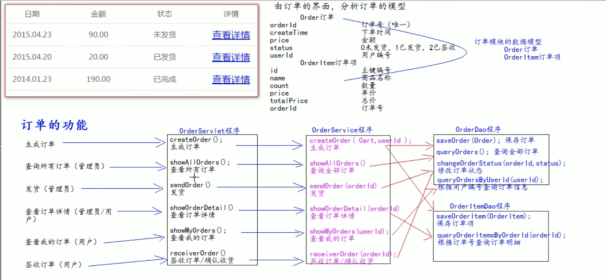
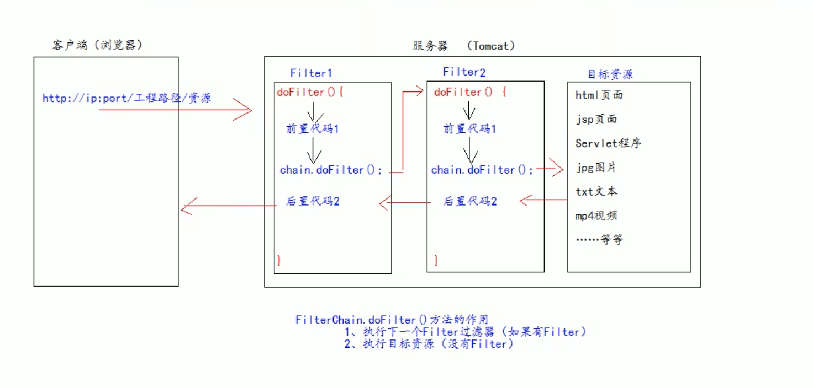

# Jar包的下载地址
```s
https://mvnrepository.com/search?q=gson
```

<br><br>

# 报错集锦

### 405:
当前请求的方法不支持

比如 我们的表单method=post 那么servlet程序就必须对应doPost 否则就报405

<br><br>

# IDEA的知识点: 

## 新创建 Java项目
这时新创建的Java项目 本身就是一个大的Module 它自带 src 文件夹

但是我们一般都不直接在根目录写逻辑 都是在这个大项目目录下创建一个个的Module

所以最外围的src可以删掉

<br><br>

## Artifacts 的使用

### 部署包: Artifact
一个Web项目需要部署到Tomcat里面去, 它并不是将我们的源代码部署上去 而是将一个部署包部署到Tomcat中 这个部署包就叫做 Artifact

比如我们给一个普通的Module 添加了Web, 相当于这个Module是一个动态的Web工程了

因为原有的项目不是Web项目, 下方会报下面的警告 
```
"web" facet resource are not included in any artifacts
```

意思是我们将Web模块加进去了 加进去了说明这个Module是一个Web项目 将来就需要部署到Tomcat上去 既然要部署到Tomcat上 就需要一个部署的包 

但是你还没有部署的包 它问你要不要生成部署包 

<br>

**解决方式1:**  
选择右侧的 create artifact

<br>

**解决方式2:**  
在 Artifacts选项卡中 选择项目的部署包 点击 - 删除, 然后重新新增一个

点击 + > Web Application: Exploded > From Modules > 选择我们的项目

<br>

**扩展: Web Application Archive**  
它是web压缩包

我们知道jar包 jar包是java应用程序的压缩包

Archive是 war包, 它是web程序的压缩包, 如果我们把war包丢进Tomcat的webapps目录里, war包会自动解压的

而 Web Application: Exploded 就是war包解压后的状态

<br>

### Libray 和 Artifact 之间的关系
如果我们的Module在创建的时候 就指定了 Web工程 那么该工程上来就会有一个部署包(Artifact)

也就是说先有的Artifact

如果我们之后再给这个工程添加 jar包, 如mysql.jar

注意此时这个jar包并没有添加到部署包中, 那么在 ctrl + ; (Projext Structure) 中的 Problems选项卡中是有提示的, 它会告诉你 某某Libray虽然添加到Module中了, 但是部署包中并没有

<br>

### 给 Module 更新 Libray
ctrl + ; 会有Artifacts选项卡 应该是跟部署包有关的

比如我们的项目已经部署到Tomcat服务器了, 然后我们给这个项目添加一个新的Libray

这时IDEA就会抛出 Problems 

<br>

**解决方式1:**  
我们在Problems选项卡中点击 [Fix], 意思是要把新的Libray添加到部署包中

<br>

**解决方式2:**  
在 Artifacts选项卡中 选择项目的部署包 点击 - 删除, 然后重新新增一个

点击 + > Web Application: Exploded > From Modules > 选择我们的项目

这时真增的部署包就包含有我们新添加的Libray

<br><br>

## 将 Module 指定为 Web工程
当我们一个Module开始的时候就指定为Web工程 那么它上来就会有一个部署包 (artifact)

<br>

### 方式1:  
1. 正常创建一个Module
2. 在新建的Module上右键 选择 Add Frameworks Support
3. 在打开的面板中选择 Web Application 勾选 create web.xml 点击ok

<br>

### 方式2:
比如之前这个Module不是Web工程, 但我们可以给它设置为Web工程

- Ctrl + ;
- 选择 facets 选项卡
- 在 facets 选项卡下点击 + 选择 web
- 选择为哪个模块添加 Web工程 点击确定
- 右侧面板区域有上下两个部分
  - Deployment Descriptors:  
  path要指定到/web/WEB-INF/web.xml

  - Web Resouce Directories:  
  Web Resouce Directories选择到 /web

<br><br>

## 如何给 web动态工程添加 第三方的jar包
首先 将一个普通的Module转为Web工程

### 步骤1:
首先将jar包放入到 WEB-INF 下面的 lib文件夹内

<br>

### 步骤2:
将jar包添加到类库中

**方式1:**  
选择这两个jar包 右键 add as library

<br>

**方式2:**  
我们选创建一个 libray 库, 给该库起一个名字, 做统一的jar包管理, 我们可以将这个自定义的libray应用到指定module中

- ctrl + ;
- 选择 Libraries 选项卡
  - 左列点击 + 号
  - 选择 Java (添加到类库的作用)
  - 弹出选择文件的弹窗, 找到要添加的jar包
  - 选择jar包应用到哪个module
  - 然后起一个name, 如: book_lib

- ctrl + ; 点击 Modules 选项卡 
  - 找到要操作的Module 在右侧面板的 Dependencies 选项卡中
  - 点击 + 选择 Library 选择 新创建的lib库
  - 点击 ok

- 然后选择 Artifacts 选项卡, 左下角有 fix 按钮, 我们点击下, 相当于将类库添加到打包部署里面, (部署就是左侧面板中的``模块名::war exploded``)  

点击 fix 的时候 可能出现一个下拉菜单 选择下面的选项 add 'book_lib' to the artifact

<br><br>

## IDEA中 Debug 调试的使用
Debug调试代码, 首先需要两个元素

1. 断点
2. Debug启动Tomcat运行代码(我们点那个小臭虫启动)

小臭虫启动后 我们一般将断点设置在一个类中的第一行 或者 **点在出错的前一行**  

<br>

**比如:**   
```java
public class RegistServlet extends HttpServlet {

  private UserService userService = new UserServiceImpl();
  // 处理post请求
  @Override
  protected void doPost(HttpServletRequest req, HttpServletResponse res) throws ServletException, IOException {


// 断点可以点在第一行
◉   String username = req.getParameter("username");

    ...

  }
}

```

当我们故意输入不正确的 验证码 debug 窗口就会被激活

<br><br>

## Debug调试都需要注意哪些点

### 1. 调试的按钮区域
**step over:**  
让代码让下走一行

<br>

**step into:**  
可以进入当前的方法内(自己写的代码 非框架源码)

<br>

**step out:**   
跳出当前方法体外(跳出去)

<br>

**force step into:**  
强制进入当前方法体内(是不是自己写的代码 都可以进去 包括框架的代码)

<br>

**run to cursor:**  
跳到当前的光标处(可以跳转鼠标光标的位置)

<br>

### 2. variables面板
它可以查看**当前方法范围内**所有有效的变量 显示的变量是随着当前方法的改变而发生变化

<br>

### 3. frames方法调用栈窗口
1. 可以查看当前线程有哪些方法调用信息
2. 列表中的方法是 下面的方法调用上一行的方法, 栈结构 先调用的方法在栈底

<br>

### 左侧侧边栏的按钮区
**stop:**   
停止调试(都停了)

<br>

**resume program:**  
程序一直跑 直到下一个断点停下来 如果没有断点就一直往下跑

<br>

**mute:**  
临时禁用所有的断点

<br><br>

## IDEA中复制粘贴一个Module
当我们在IDEA中复制粘贴一个module的时候, 发现新的文件夹不是加粗的状态 

这说明 该module还没有添加到工程中

同时每一个module下面会有一个.iml配置文件 这个每个module特有的 它最好个module名一致 

该文件是该module的配置文件, 比如该module引用了什么依赖 配置文件中都会有体现

<br>

**将新Module添加到工程中:**  
- ctrl + ;
- Module
- 点击 + 选择 import module, 选择 新module中的 .iml 文件

<br><br>

# CS / BS 架构模式的区别

### Cs: 客户端服务器架构模式
**优点:**  
充分利用客户端机器的资源 减轻服务器的负荷 一部分安全要求不高的计算任务 存储任务放在客户端执行 不需要把所有的计算和存储都在服务器端执行 从而能够减轻服务器的眼里 也能减轻网络的负荷

<br>

**缺点:**  
需要安装 升级维护成本较高

<br>

### Bs: 浏览器服务器架构模式
**优点:**  
客户端不需要安装 维护成本低

<br>

**缺点:**  
所有的计算和存储任务都是放在服务器 服务器的负荷较重 在服务端计算完成之后把结果再传输给客户端 因此客户端和服务器端会进行非常频繁的数据通信 从而网络负荷较重

<br><br>

# idea 创建 web工程
New Project - web

<br><br>

# web工程下 创建html
项目根目录下 右键 创建 html文件

<br><br>

# 什么是JavaWeb
JavaWeb 是指, 所有通过 Java 语言编写可以通过浏览器访问的程序的总称, 叫 JavaWeb。

JavaWeb 是基于请求和响应来开发的。

<br>

### 请求:
客户端给服务器发送数据 叫请求 request

<br>

### 响应:
服务器给客户端回传数据 叫响应 response

<br>

### 请求和响应的关系
请求和响应是成对出现的 有请求就有响应

<br>

### web资源的分类
所有浏览器可以访问的资源

web资源按实现的技术和呈现的效果的不同 又分为
- 静态资源
- 动态资源

<br>

**静态资源:**  
html css js txt mp4 jpg, 固定永远不变的东西

<br>

**动态资源:**  
jsp页面 servlet程序 asp php...

<br><br>

# Tomcat
它是服务器容器, 我们可以在这个容器中安装一个个web项目

我们把web项目丢到容器里面的过程称之为 **部署deploy**  

<br>

## 介绍:
由 Apache 组织提供的一种 Web 服务器, 提供对 jsp 和 Servlet 的支持。

它是一种轻量级的 **JavaWeb容器**(服务器), 也是当前应用最广的 JavaWeb 服务器(免费)。以后遇见jsp容器等 指的就是web服务器

<br>

### 常用的服务器
**Jboss:**  
是一个遵从 JavaEE 规范的, 开放源代码的, 纯 Java 的 EJB 服务器, 它支持所有的 JavaEE 规范(免费)。

<br>

**GlassFish:**  
由 Oracle 公司开发的一款 JavaWeb 服务器, 是一款强健的商业服务器, 达到产品级质量(应用很少)。

<br>

**Resin:**  
是 CAUCHO 公司的产品, 是一个非常流行的服务器, 对 servlet 和 JSP 提供了良好的支持,  性能也比较优良, resin 自身采用 JAVA 语言开发(收费, 应用比较多)。

<br>

**WebLogic:**  
是 Oracle 公司的产品, 是目前应用最广泛的 Web 服务器, 支持 JavaEE 规范,  而且不断的完善以适应新的开发要求, 适合大型项目(收费, 用的不多, 适合大公司)。


<br><br>

# Tomcat服务器
Tomcat服务器不同的版本实现了不同的JavaEE 也跟servlet有不同版本的对应关系

当前企业常用的jdk版本 7.x / 8.x

|Tomcat版本|Servlet/Jsp版本|JavaEE版本|运行环境|
|:--|:--|:--|:--|
|4.1|2.3/1.2|1.3|jdk1.3|
|5.0|2.4/2.0|1.4|jdk1.3|
|5.5/6.0|2.5/2.1|5.0|jdk5.0|
|7.0|3.0/2.2|6.0|jdk6.0|
|8.0|3.1/2.3|7.0|jdk7.0|

<br>

Servlet2.5版本: 使用最多的版本: xml配置  
Servlet3.0版本: 注解

以 2.5 版本为主线讲解 Servlet 程序。

<br>

**注意:**  
Tomcat我们尽量用8 因为Tomcat是和JDK配套的, 我们不需要太高的版本

<br>

## Tomcat的安装:

### 安装步骤:
```s
https://www.jianshu.com/p/69496fb3495e
```

<br>

### 下载地址:
```s
https://tomcat.apache.org/download-80.cgi
```

<br><br>

## Tomcat的目录解析:

```
| - bin:
| - conf:
| - lib:
| - logs:
| - temp:
| - webapps:
  | - baidu -> context root
| - work:
```

<br>

**bin:**  
专门用来存放 tomcat 可执行程序 如启动命令

<br>

**conf:**  
专门用来存放 tomcat 服务器的配置文件

<br>

**lib:**  
专门用来存放 tomcat 服务器的jar包

<br>

**logs:**  
专门用来存放 tomcat 服务器运行时输出的日记信息

<br>

**temp:**  
专门用来存放 tomcat 服务器运行时临时的数据

<br>

**webapps:**  
部署空间 我们部署项目就可以部署到这里

专门用来存放部署的web工程(用来放我们的工程的)

这里面一个目录就是一个工程

<br>

**work:**  
是 Tomcat 工作时的目录 用来存放 Tomcat 运行时jsp翻译为 servlet的源码 和 session钝化的目录(钝化就是序列化 把一个对象写入磁盘上)

<br><br>

## 如何启动 Tomcat 服务器

### 1. 进入到 Tomcat/bin 路径下:
```java
cd /Library/Tomcat/bin
```

<br>

### 2. 开启 Tomcat:
到 bin 目录下 找到 startup.bat 双击 windows 

``` 
sudo sh ./startup.sh

sudo ./startup.sh
```

<br>

### 3. 关闭 Tomcat: 
到 bin 目录下 找到 shutdown.bat 双击 windows
```
sh ./shutdown.sh
```

<br>

### 访问Tomcat服务器页面方式:
1. localhost:8080
2. 127.0.0.1:8080
3. 192.168.3.3:8080: 本地地址的方式 可以让局域网内的人看到效果

<br>

### 启动Tomcat后 一闪而过 的错误:
Tomcat也是用Java写的 所以它需要JVM, 所以我们需要告诉Tomcat 我们当前的JDK装在什么地方

所以要配置 JAVA_HOME 变量来告诉Tomcat 我们JDK存放在哪

我们要配置到 bin 的上一级, 就是路径中没有bin

<br>

**弹幕:**  
弹幕说 Java11 不行, Tomcat也会闪退, 不仅仅要配置JAVA_HOME 还需要配置 JRE_HOME

<br>

### 查看端口号的占用情况:
```
sudo lsof -i :9000

sudo kill -9 27374
```

<br>

### 修改Tomcat的端口号
Tomcat默认的端口号: 8080

1. 找到 Tomcat目录下的 conf 目录
2. 找到 server.xml 配置文件
3. 找到``<Connector port="8080">`` 修改port属性

修改完端口号后一定要**重启Tomcat服务器**  

``` 
http协议默认的端口号是80, www.baidu.com:80
```

<br>

## 部署: 将 Web工程部署到 Tomcat 服务器上
Tomcat是服务器 服务器上可以放一个工程 供很多人去访问 我们把项目丢到tomcat容器里面的过程叫做 deploy(部署)

<br>

**tomcat默认项目目录: webapps目录**  
webapps目录中 每一个文件夹就代表一个工程

```java
| - webapps
  | - books
    - index.html
```

<br>

如我们要访问books工程的首页, 直接在根路径后 + 项目文件夹名就可以 如: /books
```java
localhost:8080/books/index.html
```

<br>

### 部署方式1:
直接在Tomcat服务器目录的 /webapps/ 下手动创建项目目录
```
| - Tomcat8
  | - webapps
    | - customWebName
      | - pages
      | - accets
      - index.html
```

<br>

如果是IDEA创建的web工程, 我们直接将整个Module里面的内容丢进去就可以

<br>

### 部署方式2:
**首先, 在下面的指定位置创建 工程名.xml 文件**  
工程名 和 xml 文件名要一一对应
```
| - conf
  | - Catalina
    | - localhost
      - 建立 工程名.xml 文件
```

<br>

**配置文件模板:**  
```xml
<Context 
  path="/test" docBase="E:\IdeaProjects\JavaWeb\out\artifacts\web03_war_exploded" 
/>
```

<br>

**Context:**  
表示工程上下文

<br>

**path:**  
表示工程的访问路径, 工程的访问路径就是由它决定的

如webapps/test, test是我们的工程目录 那path对应的值为: /test

<br>

**docBase:**  
我们的工程目录在哪里, 我们的工程不在webapps中都可以, 只要我们指定了该路径 它会就去指定的路径读取内容

path = "/test" 当我们在url上输入 /test 就会去找 docBase 中指定路径的内容

<br>

**使用该方式访问页面:**  
ip:8080/path部分指定的名字/index.html  

<br>

**注意:**  
xml文件的编码格式必须是 utf8

<br>

### file协议 & http协议
**file协议:**  
我们将文件直接拖到浏览器上 这个时候浏览器的地址如下:
```s
file:///E:/books/index.html
```

表示告诉浏览器直接读取file:后面的路径 解析展示在浏览器上即可 **它是不走网络的**  

<br>

**http协议:**  
通过键入网址访问
```s
http://ip:port/工程名/资源名
```
  
- http: 是协议
- localhost: 是ip地址
- 8080: 端口号
- /books: 是工程名
- index.html: 是文件

<br>

**通过http访问资源的流程:**  
浏览器向服务器发送请求 服务器收到请求之后 读取你要访问的资源文件 然后回传给客户端要的页面内容

客户端收到服务端返回的index.html内容 **解析展示**在浏览器上

<br>

### 小结:
- 通过 http://ip:port 找到tomcat服务器
- 通过 /工程名 找到对应的web工程
- 通过 /资源名 找到对应的资源

<br>

**注意:**  
html文件可以直接拖拽到浏览器上直接访问  
jsp文件不可以直接拖拽到浏览器上直接访问, 它必须通过服务器访问

<br>

### Tomcat默认的工程: ROOT
在 webapps 目录下 有一个Root工程

当我们在浏览器地址栏输入访问地址: ``http://ip:port/``
 
<br>

- 当我们没有指定工程名的时候 默认访问的是 webapps/ROOT 工程

- 当我们没有指定 工程下的指定资源时 ``http://localhost:8080/books``, 默认访问的是 index.html 文件


<br><br>

## 整合 idea 和 Tomcat 服务器
我们创建一个Module 相当于创建了一个模块, 这是早就知道的

但是如果我们想创建一个**动态的工程**, 比如我们的servlet和jsp都是动态资源, 它们都需要跑在服务器的环境下

所以我们创建一个 动态的工程, 就相当于要将我们的工程 和 服务器(Tomcat) 联系在一起, 这样的工程就是动态的工程

<br>

所以我们要将Tomcat服务器添加到IDEA里面, 或者叫整合到IDEA里面

<br>

### 1. 将 Tomcat 整合到 IDEA 中

- ctrl + ,
  - build, execution deployment
    - application servers

- 左侧面板 点击 + 下拉列表中选择 Tomcat Server

- tomcat home处 点击按钮 选择电脑Tomcat的存放位置 (我们的Tomcat8在/Library/Tomcat8)

<br>

### 2. 创建动态工程(Web工程)

**方式1:**  
该方式创建的Web工程是关联了 Maven 或者 Gradle 之后的 配置文件都是 pom.xml 

- 创建 Module 
  - 左侧选项卡选择 Java Enterprise 选项卡
    - Application server 选择 我们关联的Tomcat8
    - Project Template 选择 Web Application

<br>

**扩展:**  
左侧选项卡的意思是我们创建模块的时候 选择创建什么类型的模块

<br>

**方式2:**  
该方式比较符合现状, 也就是没有学 Maven 或者 Gradle 之前的方式

1. 正常创建一个Module
2. 在新建的Module上右键 选择 Add Frameworks Support
3. 在打开的面板中选择 Web Application 勾选 create web.xml 点击ok

version 选择 4.0 就可以

<br>

### 动态web工程目录结构:

```
| - Module
  | - src
  | - web
    | - WEB-INF
      - web.xml

    | - lib

    | - 其它web资源 如css等

    - index.jsp
```

<br>

**src:**  
存放自己编写的java源代码, 比如有各种各样的包

<br>

**web:**  
存放web工程的资源文件 比如html css js

Java代码会被编译成字节码整合到 WEB-INF 里面  
前端资源性的文件都应该放在 该文件夹下, 因为在将Web工程部署到服务器上的时候, 就是将整个的web文件夹放到了服务器上

所以类似 html css js imgs 等资源都要放在 web文件夹下

**这个Web目录就 相当于 我们在 Tomcat目录下webapps中创建的项目目录**  
IDEA并不是将项目

<br>

**WEB-INF:**  
它是一个受服务器保护的目录 浏览器无法直接访问到此目录的内容 

<br>

**web.xml:**  
是整个动态web工程的配置部署描述文件 配置文件   
可以在这里配置很多web工程的组件 比如 
- servlet程序
- filter过滤器
- listemer监听器
- session超时

<br>

**lib:**  
用来存放第三方的jar包, 还需要自己配置导包

<br>

**html等资源文件 放在 web目录 下**  

<br>

## 将Web项目 部署到 Tomcat服务器实例上运行
每次我们创建一个Web工程的时候, 都会随之创建一个Tomcat实例(因为关联在一起了, 我们创建的是Web动态工程)

既然每创建一个Web工程都会有一个Tomcat的实例, 每个实例的名字都是 Tomcat8

那当Web工程多的时候, 我们就不知道哪个Tomcat实例对应哪个工程了 **所以我们首先修改下web工程对应的Tomcat运行实例**  

<br>

### 修改 Tomcat 实例 配置
我们点击IDEA工具栏的部分 有一个绿色小锤子 右侧有下拉菜单 我们选择 ``Edit Configurations``

- 修改 Name: 修改web工程对应的Tomcat运行实例名称, 建议跟工程名一致

- 选择右侧面板 选择 Deployment 选项卡, 该面板中有两个部分
  - Deploy at the server startup:  
  当前部署的web工程, 就是我们创建的Module, 如果我们希望该实例运行多个工程, 可以点击右侧侧边栏的 + 按钮 选择我们期望部署的工程

  - Application context: 它是工程路径, 也就是url上访问项目的路径 如: /books, 如果指定 / 则不用输入工程名了

<br>

### 添加 Tomcat 实例
我们点击IDEA工具栏的部分 有一个绿色小锤子 右侧有下拉菜单 我们选择 ``Edit Configurations``

- 在左侧面板中 点击 + 按钮
- 选择 Tomcat Server / local
- 单击右侧面板中 deployment选项卡 
  - 点击该选项卡右侧的 + 按钮, 选择 artifact 将我们的Web工程(Module)添加上去

  - 设置 Application context 也就是设置 工程的访问路径, 一般会修改为/

如:
- 修改为 / : http://localhost:8080/index.html
- 修改为 /books: http://localhost:8080/books/index.html

<br>

### Edit Configurations面板: url配置
Tomcat实例启动后默认的访问地址, 比如我们可以修改为工程的首页

<br>

### Edit Configurations面板: vm options 热部署配置
当页面有内容上的修改的时候 我们会选择重新播放的按钮, 选择 restart server 重新启动服务器达到更新的作用

如果我们想修改完内容后 服务器的页面上就有反馈我们可以将下面的选项修改为

- on update action: redeploy
- on frame deactivation: update classes and resources

<br>

### 在IDEA中如何 运行 和 停止 tomcat实例
绿色小锤子的右侧 有一些按钮

- 播放键: 正常启动 tomcat 实例

- 小臭虫: debug启动 tomcat 实例

- 红色方框:停止 tomcat 实例

- 重启播放:
  - update resources:  
  **更新资源**, 重新更新web工程中的资源到tomcat运行实例中

  - update classes and resources:  
  更新web工程中的 **class字节码** 和 **资源文件** 到tomcat运行实例中

  - redeploy:  
  **重新部署web模块** 但是不重启tomcat服务器

  - restart server:  
  **重启tomcat运行实例**  

<br>

### 将 Web工程部署到Tomcat实例上

**描述:**  
首先 创建了一个 动态工程(Web工程)

然后 通过Edit Configurations创建了一个Tomcat实例

然后 我们需要将Web工程添加到Tomcat实例上
- 打开 Tomcat实例面板
- 选择 Deployment 选项卡
- 点击 + 选择 Artifact 选项, 然后找到web项目

<br>

### Tomcat将Web项目部署到哪里?
在 IDEA 中, 工程下的 out文件目录里面, 我们可以在对应项目上 右键 local history 查看项目在硬盘中的位置

所以 webapps 目录下的目录就没有用了, IDEA将Web工程部署到了另一个位置

<br>

### 创建模块时 忘记勾选 Web 了 (不是动态工程)
- ctrl + ;
- 找到 Facets 选项卡
- 点击 +
- 选择 web
- 选择 刚创建的moudle

<br><br>

# Servlet
它是JavaEE中特别重要的一个技术点

<br>

### 什么是servlet？
servlet是一个接口, 它定义了一种规范

<br>

### JavaWeb的3大组件:
- Servlet程序
- Filter过滤器
- Listener监听器

<br>

### Servlet的作用:
servlet是运行在服务器上的一个java小型程序 它可以**接收客户端发送过来的请求 并响应数据给客户端**  

1. 获取用户(客户端)发给我的数据
2. 调用DAO中的方法完成添加功能

<br><br>

## 使用 Servlet
servlet既然是一个接口

那我们就需要提供该接口的实现类, 而Servlet相关的API的jar在我们安装 Tomcat8 文件夹的lib目录下 我们要将这个jar包引入我们的项目后

我们才可以使用servlet相关的API

<br>

### 引入 servlet-api jar包
位置: /libray/Tomcat8/lib/servlet-api.jar

我们将上述的jar导入到我们的工程下 或者 将 servlet包导入到 WEB-INF 下的lib目录下

<br>

**引入 servlet-api 的方式2:**  
我们给我们的Module添加 Tomcat 依赖
```
ctrl + ; > 选择 Module > Dependencies > + > Libray > Application Server Libraries > 选择 Tomcat
```

<br><br>

# 创建 Servlet程序
创建 Servlet程序 有两种方式
1. 实现 Servlet接口
2. 继承 HttpServlet类

我们下面就分别看看两种接口的实现方式

<br>

## 实现Servlet接口: 创建 Servlet程序处理请求:
1. 编写实现Servlet接口的实现类
2. 重写 service(ServletRequest req, ServletResponse res) 方法, 处理请求响应数据
3. 到 web.xml 中去配置 servlet程序的访问地址, **因为所有服务器上的东西都需要有对应的访问地址**  

然后我们看下上述3个步骤的一些细节

<br>

### 1. 编写实现Servlet接口的实现类
```java
package com.sam.servlet;

// javax 是java的扩展包
import javax.servlet.Servlet;

public class LoginServlet implements Servlet {
  
}
```

<br>

### 2. 实现 Servlet接口中的抽象方法
Servlet接口中的抽象方法一共有5个, 我们主要关注的事 service() 方法

1. void init(ServletConfig servletConfig)

2. ServletConfig getServletConfig()

3. **void service(ServletRequest servletRequest, ServletResponse servletResponse)**  

4. String getServletInfo()

5. void destroy()

<br>

### **<font color="#C2185B">service(ServletRequest servletRequest, ServletResponse servletResponse)</font>**  
该方法主要是处理请求, 响应数据, 一旦有请求(不管是表单还是超链接)打到该处理程序上 就会执行内部的逻辑

其实是Tomcat容器调用的

**返回值:**  
void

<br>

**异常:**  
ServletException IOException

void service(ServletRequest servletRequest, ServletResponse servletResponse) throws ServletException, IOException


<br>

### 3. 配置 web.xml 
servlet程序也是一个资源, 它负责处理前端的请求, 类似nodejs中 我们要指定一个接口是一样的

既然是资源, 它也需要一个 访问路径 对应 servlet处理程序, 比如我们url访问 /login 则对应的会触发 LoginServlet程序的执行

我们在 web.xml 中就是要**配置 /地址 和 servlet程序的对应关系**  

<br>

web.xml 中需要配置两个部分, 且我们要关注下面模版的书写方式 和 标签名

<br>

**web.xml模板:**  
```xml
<?xml version="1.0" encoding="UTF-8"?>
<web-app 
  xmlns="http://xmlns.jcp.org/xml/ns/javaee"
  xmlns:xsi="http://www.w3.org/2001/XMLSchema-instance"
  xsi:schemaLocation="http://xmlns.jcp.org/xml/ns/javaee http://xmlns.jcp.org/xml/ns/javaee/web-app_4_0.xsd"
  version="4.0"
>

  <!-- 部分1:  -->
  <servlet>
    <servlet-name>Java Servlet实现类的类名</servlet-name>
    <servlet-class>servlet程序的全类名</servlet-class>
  </servlet>

  <!-- 部分2:  -->
  <servlet-mapping>
    <servlet-name>和上面的类名一致</servlet-name>
    <url-pattern>/servlet程序的访问地址</url-pattern>
  </servlet-mapping>


  <!-- 扩展: 创建默认访问页面 -->
  <!-- 
    当我们访问 localhost:8080/ 的时候 
      默认会先访问 index.html
      没有的话接着访问 index.jsp
    
    当都没有的时候, 会返回404
   -->
  <welcome-file-list>
    <welcome-file>index.html</welcome-file>
    <welcome-file>index.jsp</welcome-file>
  </welcome-file-lis>

</web-app>
```

<br>

**部分1:**  
用于配置 Java层面的Servlet程序在哪 和 给该程序起个别名

<br>

**部分2:**  
用于配置 Servlet程序的访问路径(类似nodejs中的接口地址), 如当我们url访问 /login 的时候, 就会去 com.sam.servlet.LoginServlet 路径下找该Servlet程序

1. 指明 servlet程序在哪
2. 指明 url /接口 对应哪个servlet程序

<br>

**扩展: 一个Servlet程序可以对用多个``<servlet-mapping>``**  
```xml
<servlet>
  <servlet-name>LoginServlet</servlet-name>
  <servlet-class>com.sam.servlet.LoginServlet</servlet-class>
</servlet>

<!-- 部分2:  -->
<servlet-mapping>
  <servlet-name>LoginServlet</servlet-name>
  <url-pattern>/login01</url-pattern>
</servlet-mapping>
<servlet-mapping>
  <servlet-name>LoginServlet</servlet-name>
  <url-pattern>/login02</url-pattern>
</servlet-mapping>
<servlet-mapping>
  <servlet-name>LoginServlet</servlet-name>
  <url-pattern>/login03</url-pattern>
</servlet-mapping>
```

访问 /login01 2 3 这3个url-pattern都会指向LoginServlet程序

这样有时候是有意义的, 我们可以获取请求路径, 不同的路径处理不同的程序

<br>

**整个流程为:**  
url中看到/login接口 -> 优先检查 url-pattern -> 看到 mapping 的name 找到servlet类名 -> 通过全类名找到servlet程序

<br>

**``<url-pattern>/login</url-pattern>``**  
- /: 在服务器解析的时候 表示地址为 http://ip:port/工程路径
- login: 表示地址为 http://ip:port/工程路径/login

<br>

**url-pattern会被优先检查**  
也就是说 前端通过网址 http://ip:port/工程路径/login 看到资源名 login 的时候 

会优先在web.xml文件里面 **优先的进行匹配** 找到login对应一个java类 然后会执行这个java类中的 service() 方法

<br>

**注意:**  
1. 两个 servlet-name 必须一致, 表达url给哪个servlet类使用

2. url-pattern 中的路径必须是以 / 开头

<br>

**<font color="#C2185B">要点:</font>**  
- web.xml 中的 url-pattern 中的 / 映射到 工程(Module)

- 后台servlet程序中的 / 映射到 Web目录

<br><br>

## Servlet程序 请求的处理: service()
上面我们创建了Servlet程序 是以实现Servlet接口的实现类方法创建的, 并重写了接口的抽象方法 

其中 ``service(ServletRequest req, ServletResponse res)`` 就是用来处理请求的

但处理请求的方法只有一个 我们的请求方式却有很多种, 同时每种请求的处理方式也不一样, 这怎么处理, 怎么判断前台发过来的是何种请求方式呢?

<br>

我们需要在 service() 方法中 依据前端提交请求的方式不同, 判断做不同的处理

同时实现Servlet接口的方法拿到的请求对象 和 响应对象
- ServletRequest
- ServletReponse

它们身上的方法很少 更多的时候 我们会将其转成
- HttpServletRequest
- HttpServletResponse

<br>

## HttpServletRequest 接口
该接口为 ServletRequest 的子接口

| - ServletRequest  
  | - HttpServletRequest

HttpServletRequest里面提供了跟Http请求相关的各种方法, 供我们使用

<br>

### HttpServletRequest接口的方法:
很多, 当一个目录看吧
- String changeSessionId()
- ``Enumeration<Locale>`` getLocales
- String getAuthType()
- String getContextPath()
- Cookie[] getCookies()
- long getDateHader(String s)
- String getHeader(String s)
- ``Enumeration<String>`` getHeaderNames()
- ``Enumeration<String>`` getHeaders()
- int getIntHeader(String s)
- String getMethod()
- Part getPart(String s)
- String getPathInfo()
- String getPathTranslated()
- String getQueryString()
- String getRemoteUser()
- String getRequestedSesstionId()
- String getRequestURI()
- StringBuffer getRequestURL()
- String getServletPath()
- HttpSession getSession()
- HttpSession getSession(boolean b)
- Principal getUserPrincipal()
- Boolean isRequestSessionIdFromCookie()
- Boolean isRequestedSessionIdFromURL() 
- Boolean isRequestedSessionIdValid()
- Boolean isUserInRole(String s)
- void login(String s, String s1)
- T upgrade(``Class<T>`` clazz)
- ``Enumeration<String>`` getAttrbuteNames()
- Object getAttribute(String s)
- String getCharacterEncoding()
- int getContentLength()
- String getContentType()
- Locale getLocale()
- int getLocalPort()
- Map<String, String[]> getParameterMap()
- String getParameter(String s)
- ``Enumeration<String>`` getParameterNames()
- String getProtocal()
- String getScheme()
- AsyncContext getAsyncContext()
- long getContentLengthLong()
- DispatcherType getDispatcherType()
- ServletInputStream getInputStream()
- String getLocalAddr()
- String getLocalName()
- String[] getParameterValues(String s)
- BufferdReader getReader()
- String getRemoteAddr()
- String getRemoteHost()
- int getRemotePort()
- RequestDispatcher getRequestDispatcher(String s)
- String getServerName()
- int getServerPort()
- Boolean isAsyncStarted()
- Boolean isAsyncSupported()
- Boolean isSecure()
- void removeAttribute(String s)
- void setAttribute(String s, Object o) 
- void setCharacterEncoding(String s)
- AsyncContext startAsync()
- AsyncContext startAsync(ServletRequest req, ServletRespones res)

<br>

### HttpServletResponse接口的方法:
- void addCookie(Cookie cookie)
- void addDateHeader(String s, long l)
- void addHeader(String s, String s1)
- void addIntHeader(String s, int i)
- boolean containsHeader(String s)
- String encodeRedirectURL(String s)
- String encodeURL(String s)
- String getHeader(String s)
- ``Collection<String>`` getHeaderNames()
- ``Collection<String>`` getHeaders(String s)
- int getStatus()
- void sendError(int i)
- void sendError(int i, String s)
- void sendRedirect(String s)
- void setDateHeader(String s)
- void setHeader(STring s, String s1)
- void setIntHeader(String s, int i)
- void setStatus(int i)
- String getCharacterEncoding()
- String getContentType()
- void flushBuffer()
- int getBufferSize()
- Local getLoale()
- ServletOutputStream getOutputStream()
- PrintWriter getWriter()
- boolean isCommitted()
- void reset()
- void resetBuffter()
- void setBufferSize(int i)
- void setCharacterEncoding(String s)
- void setContentLength(int i)
- void setContentLengthLong(long l)
- void setContentType(String s)
- void setLocale(Locale locale)

<br>

### **<font color="#C2185B">httpReq.getMethod()</font>**  
获取请求的方式

**返回值:**  
String, 返回值为大写字符串 GET

<br>

### 根据请求方式的不同, 处理请求逻辑:

```java
public void service(ServletRequest servletReq, ServletResponse servletRes) {

  // 向下转成 HttpServletRequest
  HttpServletRequest httpReq = (HttpServletRequest) servletReq;


  // 获取前端请求的方式
  String method = httpReq.getMethod();

  // 请求分发
  if("GET".equals(method)) {
    System.out.println("get请求");

  } else if("POST".equals(method)) {
    System.out.println("post请求");
  }
}
```

<br>

### 封装对 GET和POST请求 逻辑
我们将对GET请求 和 POST请求的逻辑单独的封装到一个方法中, 这样看起来比较整洁

```java
public void service(ServletRequest servletReq, ServletResponse servletRes) {

  // 向下转成 HttpServletRequest
  HttpServletRequest httpReq = (HttpServletRequest) servletReq;


  // 获取前端请求的方式
  String method = httpReq.getMethod();

  // 请求分发
  if("GET".equals(method)) {
    doGet();

  } else if("POST".equals(method)) {
    doPost();
  }
}


// GET请求的处理方法
public void doGet() {
  System.out.println("get请求");
}


// POST请求的处理方法
public void doPost() {
  System.out.println("post请求");
}
```

<br>

### Servlet程序的特点
1. 单例的
2. 线程不安全的

**单例的意味着:**  
不管哪个浏览器发出的请求, 都是同一个实例给我们做响应


**线程不安全:**  
一个线程需要根据这个实例中的某个成员变量值去做逻辑判断 但是在中间某个时机, 另一个线程改变了这个成员变量的值 从而导致第一个线程的执行路径发生了变化

比如我们的Servlet程序中 有一个变量 num, 我们会有两个客户端A B(也可以理解为两个线程) 根据num的值 执行对应的逻辑
```java
class LoginServlet extends HttpServlet {

  public int num = 1

  public void service() {
    if(num == 1) {
      ...
    } else {
      ...
    }
  }
}
```

这时候就有一个问题, 客户端A在进行 if(num == 1) 判断的一瞬间, 本来它就要执行 if中的逻辑

但是客户端2 同时也进来了修改了num=5, 这时客户端A就会由原本想执行if的逻辑, 被迫变成了执行else中的逻辑

这就是线程安全的问题, 会导致线程1执行的路径发生变化

<br>

**启发:**  
尽量不要在servlet中定义成员变量, 如果不得不定义成员变量 那么
1. 不要去根据成员变量的值做一些逻辑判断
2. 不要修改成员变量的值

<br><br>

## 继承HttpServlet类: 创建Servlet程序处理请求
在实际的开发中 我们不会使用 实现Servlet接口的方式 实现servlet程序

开发的时候我们都是**继承 HttpServlet类 的方式去实现servlet程序**  

<br>

### 继承 HttpServlet类 的步骤 

### 1. 编写一个类去继承 HttpServlet 类
```java
package com.sam.servlet_test;
import javax.servlet.http.HttpServlet;

public class LoginServlet extends HttpServlet {
  ...
}
```

<br>

### 2. 根据业务需要重写 doGet 或 doPost 方法
HttpServlet类中定义了很多方法, 我们需要**在子类中重写这些方法** 来完成对应的请求处理的逻辑

上面我们实现Servlet接口的时候是根据getMethod()方法根据返回值判断前端的请求方式

而在 HttpServlet类中 已经帮我们处理好了请求分发的逻辑, 我们只需要重写相关的方法就可以了

<br>

**HttpServlet父类中定义的请求相关的方法:**  

- doGet(req, res)
- doPost(req, res)
- doPut(req, res)
- doDelete(req, res)
- doOptions(req, res)
- doTrace(req, res)
- doHead(req, res)
- getLastModified(req)
- service(req, res)

<br>

### 3. 到 web.xml 中配置servlet程序的访问地址

<br>

### **<font color="#C2185B">doGet()</font>**  
在get请求的时候会被调用

<br>

### **<font color="#C2185B">doPost()</font>**  
在post请求的时候会被调用

<br>

**示例:**  
```java
public class LoginServlet extends HttpServlet {
  @Override
  protected void doGet(HttpServletRequest req, HttpServletResponse resp) throws ServletException, IOException {
    // 可以去掉: super.doGet(req, resp);
  }

  @Override
  protected void doPost(HttpServletRequest req, HttpServletResponse resp) throws ServletException, IOException {
    // 可以去掉: super.doPost(req, resp);
  }
}
```

<br>

### 扩展: IDEA 快速创建 Servlet 程序

| - Module
  | - src
    | - com.sam.servlet  ←  右键

我们在上面的文件目录上右键 选择 new -> 选择 Create New Servlet

然后在弹出的对话框内修改如下的内容
1. Name: 给servlet程序起名字
2. create JavaEE 6 annotated class -> 取消, 不取消的话 它会使用3.0以上的注解配置

<br>

这样的方式会帮我们自己创建 Servlet类 同时 配置了 web.xml, 但是需要我们自己在 web.xml 上添加 servlet-mapping

<br><br>

## servlet的生命周期
我们在实现 Servlet接口的时候 需要重写 5个抽象方法, 这5个方法也相当于 5个生命周期

1. void init(ServletConfig servletConfig)
2. ServletConfig getServletConfig()
3. void service(ServletRequest servletRequest, ServletResponse servletResponse)
4. String getServletInfo()
5. void destroy()

<br>

### 周期1: Servlet实现类的构造器
第一次请求服务器的时候, Servlet程序会进行实例化 

Tomcat底层会使用反射帮我们进行实例化, **Servlet程序是单例的, 所有的请求都是这个实例在处理**  

<br>

### 周期2: 执行 init初始化方法
初始化方法 执行一次 , 创建servlet程序的时候, 周期1 和 周期2 会被调用

Servlet中初始化方法有两个:
- init()
- init(ServletConfig config)

<br>

**init(ServletConfig config) 有参方法:**
```java
public void init(ServletConfig config) {
  this.config = config
  // 这里会调用无参的init
  init()
}
```

<br>

**init() 无参方法:**
```java
public void init() {
  
}
```

<br>

如果我们想要在Servlet初始化的时候做一些准备工作, 那么我们可以重写无参的init方法

比如我们可以在 init() 方法中获取 初始化参数

```java
public class Demo extends HttpServlet {
  @Override
  public void init() throws ServletException {

    // 获取 config 对象
    ServletConfig config = this.getServletConfig();


    // 获取web.xml中配置的初始化参数
    String initVal = config.getInitParameter("key")

  }
}
```

<br>

### 周期3: 执行 service方法
每次访问 /login接口的时候都会被调用

<br>

### 周期4. 执行 destroy方法
停止tomcat服务器的时候才会执行这个方法, 随着容器的销毁才会触发该回调

<br>

### 总结:
第一次接收请求时, 这个Servlet会进行实例化(调用构造方法), 初始化(调用init()), 然后服务(调用service())

从第二次请求开始, 每一次都是服务方法

当容器关闭的时候 其中的所有servlet实例会被销毁, 调用销毁的方法

<br>

### Servlet优缺点:
实例Tomcat只会创建一个 所有的请求都是这个实例去响应

默认情况下 第一次请求的时候 tomcat才会去实例化, 初始化, 然后再服务

<br>

**这样的好处是什么?**  
提供系统的启动速度

<br>

**这样的缺点是什么?**  
系统启动是快了, 但是第一次请求的时候才创建servlet实例, 那么就意味着响应的速度就慢了

第一次请求的时候 耗时较长

<br>

**结论:**   
- 如果需要提供系统的启动速度, 当前默认的情况就是这样
- 如果需要提供响应速度, 我们应该设置servlet的初始化时机

<br>

### Servlet的初始化时机:
默认情况下 第一次接收请求的时候 实例化 初始化

**设置: Servlet的初始化时机**  
我们在 web.xml 中进行设置 ``<load-on-startup>`` servlet程序的启动的先后顺序, 该程序在启动服务器的过程中 就开始实例化, 这时请求还没有过来

我们可以在该标签中, 写 number 数字越小该servlet程序越靠前, 最小值0

```xml
<servlet>
  <servlet-name>LoginServlet</servlet-name>
  <servlet-class>com.sam.servlet.LoginServlet</servlet-class>

  <!-- 这个标签 -->
  <load-on-startup>1</load-on-startup>
</servlet->
```


**生命周期的演示代码:**  
```java
package com.sam.servlet_test;
import javax.servlet.*;
import java.io.IOException;

public class LoginServlet implements Servlet {

  public LoginServlet() {
    System.out.println("1 构造器方法");
  }

  @Override
  public void init(ServletConfig servletConfig) throws ServletException {
    System.out.println("2 init初始化方法");
  }

  @Override
  public ServletConfig getServletConfig() {
    return null;
  }

  @Override
  public void service(ServletRequest servletRequest, ServletResponse servletResponse) throws ServletException, IOException {
    System.out.println("3 service方法");
  }

  @Override
  public String getServletInfo() {
    return null;
  }

  @Override
  public void destroy() {
    System.out.println("4 destroy方法");
  }
}
```

<br>

## 补充: Servlet类中的 init()方法
在继承 HttpServlet 类后 我们也可以在它的子类中重写
- init()
- service()

<br>

### init()的注意点:
当我们在HttpServlet的子类中 重写了带参的 init(ServletConfig config) 方法后

一定要在该方法内 调用 ``super.init(config)`` 这句一定不能少

当我们省略 ``super.init(config)`` 的话, 在后续调用 ``getServletConfig()`` **返回的 servletConfig是null**  

```java
// 通过 继承HttpServlet的方法 创建 servlet实例
public class LoginServlet extends HttpServlet {
  
  // 重写了 init 方法
  @Override
  public void init(ServletConfig config) throws ServletException {
    super.init(config);   // 这句一定不能省
  }

  /*
    如果 super.init(config); 这句省掉的话 servletConfig的值就是null 

    进而我们再调getServletName 就会报空指针异常的错误
  */
  ServletConfig servletConfig = getServletConfig();


  System.out.println(servletConfig.getServletName());

  System.out.println(servletConfig.getInitParameter("url"));
}
```

<br>

### 为什么一定要在init()写super.init(config)?
```
class GenericServlet
    ↑
class HttpServlet
```

因为我们通过 this.getServletConfig() 方法获取了ServletConfig 对象

``getServletConfig()``这个方法是 GenericServlet类中定义的

而GenericServlet类中只有一个 ``private transient ServletConfig config`` 属性引用着 ServletConfig 对象

<br>

GenericServlet类中也也有 init() 方法, 当我们调用 GenericServlet类中的init()方法时 会将形参传进来的 config 保存到自身的 config属性上
```java
public void init(ServletConfig config) throws ServletException {

  // 它在里面将config保存起来了
  this.config = config;
  this.init();
}
```

<br>

当我们在 HttpServlet 子类中重写了 init() 方法后, 这样当父类和子类都有init()方法的时候, 调用init()后执行子类中重写过的init()方法, 这样父类中 ``this.config = config;`` 保存操作就会丢失

所以我们在子类中的init()方法中 又调用了 super.init(config) 相当于又调用了父类中的init(), 对 config 进行了保存

<br><br>

# servlet类的继承体系

```java
顶级接口: interface Servlet

  ↑

实现上面接口: abstract class GenericServlet

  ↑

继承上面的类: abstract class HttpServlet

  ↑

继承上面的类: 自定义的Servlet的程序
```

<br>

### interface Servlet接口
只是负责定义Servlet程序的访问规范, 它告诉我们怎么去访问Servlet

<br>

### class GenericServlet类
它实现了Servlet接口 做了很多的空的实现, 实现了父类中的方法, 但是没有具体的方法体

```java
public void destroy() {
  // NOOP by default;
}
```

<br>

该类中有ServletConfig类的引用, 所有有具体的实现方法体的都跟这个config有关

```java
public abstract class GenericServlet implements Servlet, ServletConfig {

  private transient ServletConfig config
}
```

<br>

### abstract class HttpServlet
HttpServlet抽象类 继承了 GenericServlet抽象类, 该类中重点实现了 service() 方法, 并实现了请求的分发处理

但是HttpServlet抽象类中重写了抽象方法 service(), 而service()方法中根据请求方式, 做了请求分发

- Get请求 对应调用 doGet()方法
- Post请求 对应调用 doPost()方法

<br>

同样, HttpServlet抽象类对8种请求方式对应的请求方法 doXxx() 做了重写

HttpServlet抽象类的 doGet() 和 doPost() 等方法只负责往外抛出错误(异常), 说不支持get/post请求

```java
void doPost(req, res) {
  String protocol = req.getProtocol()
  String msg = LString.getString("http.method_post_not_supported")

  if(protocol.endWith("1.1")) {
    res.sendError(HttpServletResponse.SC_MEHTOD_NOT_ALLOWED, msg)
  } else {
    res.sendError(HttpServletResponse.SC_BAD_REQUEST, msg)
  }
}
```

<br>

也就是说 HttpServlet 的子类要重写这些 doGet等系列的方法处理逻辑 

一旦我们没有重写指定的方法 前台请求使用了Put等方法,而我们子类中没有写doPut 则就会调用父类中的doPut 

所以就会抛出405错误 - ttp.method_post_not_supported

**总结:**  
我们在新建servlet的时候 应该考虑请求方法 从而决定重写那个doXxx()方法

<br>

### 自定义的Servlet类
根据业务需要 重写 doGet() 或者 doPost(), 只有重写后的方法, 才是支持前端的get post等请求

如果不重写 前端发送 delete()等方法的时候 就会抛出不支持的异常

<br><br>

# ServletConfig类:
ServletConfig里面封装了servlet程序的初始化配置的信息

<br>

Servlet程序 和 ServletConfig 对象都是有 Tomcat 负责创建, 我们负责使用

- Servlet程序: 默认第一次访问的时候创建

- ServletConfig: 该类在每个Servlet程序创建时, 就会创建一个对应的ServletConfig对象

<br>

### 作用:
1. 可以获取 servlet 程序的别名:   
``<servlet-name>`` 的值

2. 获取初始化参数 init-param:   
获取 web.xml 中 init-param标签配置的参数

3. 获取 servletContext 对象

<br>

### ServletConfig类的出现位置
在通过 继承 Servlet接口 的方式 创建servlet程序时

Servlet接口会要求重写5个方法(上面介绍的生命周期), 其中下面的init()方法中的形参就是该类

```java
void init(ServletConfig servletConfig)
```

```java

public class LoginServlet implements Servlet {

  @Override
  public void init(ServletConfig servletConfig) throws ServletException {

    ... 通过servletConfig对象可以实现上述 1 2 3
    
  }

}
```

<br>

### ServletConfig类的获取方式:
1. Servlet接口的实现类, 重写init()方法后, 该方法的形参就是 ServletConfig

2. 继承HttpServlet类的子类中, 调用 getServletConfig() 方法的返回值就是 ServletConfig
```java
// 通过 this 来调用
ServletConfig servletConfig = this.getServletConfig();
```

<br>

**注意: 方式2**  
该类在每个Servlet程序创建时, 就会创建一个对应的ServletConfig对象

也就是说 LoginServlet 创建的时候 通过 this.getServletConfig() 获取的 ServletConfig对象 只是 LoginServlet

我们不能获取别的Servlet程序中的 ServletConfig对象中封装的信息

- LoginServlet 自己有一个 ServletConfig对象
- RegisteServlet 自己有一个 ServletConfig对象

它们只能自己获取自己的ServletConfig对象 

<br>

### 1. 使用servletConfig: 获取 servlet 程序的别名:

### **<font color="#C2185B">servletConfig.getServletName()</font>**  
获取 servlet 程序的别名, 获取web.xml中 
``<servlet-name>`` 的值

**返回值:**  
String

```java
System.out.println(servletConfig.getServletName)
```

<br>

### 2. 使用servletConfig: 获取初始化参数 init-param:
``<init-param>`` 是在 web.xml 配置文件中, 写在 ``<servlet>`` 标签里面的, 每个``<servlet>``都有自己的 init-param 参数

<br>

### **<font color="#C2185B">servletConfig.getInitParameter("参数名")</font>**  
获取在 web.xml 中 通过 ``<init-param>`` 配置的初始化参数

``<init-param>`` 可以写多个


**获取Web.xml配置文件中的注解:**

```xml
<!-- 这是一组servlet程序的信息 -->
<servlet>
  <servlet-name>LoginServlet</servlet-name>
  <servlet-class>
    com.sam.servlet_test.LoginServlet
  </servlet-class>
  
  <!-- init param是初始化参数 -->
  <init-param>
    <!-- 参数名 -->
    <param-name>username</param-name>
    <!-- 参数值 -->
    <param-value>root</param-value>
  </init-param>

  <!-- 另外一组key-value -->
  <init-param>
    <param-name>username</param-name>
    <param-value>root</param-value>
  </init-param>

</servlet>


<!-- 还可以有另一组servlet程序 -->
<servlet>
  <servlet-name>RegisterServlet</servlet-name>
  <servlet-class>
    com.sam.servlet_test.RegisterServlet
  </servlet-class>
  
  <!-- init param是初始化参数 -->
  <init-param>
    <!-- 参数名 -->
    <param-name>username2</param-name>
    <!-- 参数值 -->
    <param-value>root2</param-value>
  </init-param>

</servlet>
```

<br>

**获取通过注解方式配置的初始化参数:**
```java
@WebServlet(
  // 配置多个接口地址
  urlPatterns = {"/demo01", "demo02"},
  initParams = {
    @WebInitParam(name="hello", value="world"),
    @WebInitParam(name="key", value="val")
  }
)
public class Demo extends HttpServlet {

}
```

```java
System.out.println(servletConfig.;getInitParameter("username"))   // root
```

<br>

### 3. 使用servletConfig: 获取 servletContext 对象
servletContext对象有2种获取方法:

**<font color="#C2185B">方式1: servletConfig.getServletContext()</font>**

通过 servletConfig 对象来获取 servletContext

在init()方法中我们可以通过这种方法获取

<br>

**<font color="#C2185B">方式2: this.getServletContext()</font>**  
继承HttpServlet类后 通过 this 身上的api获取 servletContext

<br>

**<font color="#C2185B">方式3: req.getServletContext()</font>**  
通过 req 对象来获取 servletContext

在serive()方法中我们可以通过这种方式获取

<br>

**<font color="#C2185B">方式4: req.getSession.getServletContext()</font>**  
通过 session 对象来获取 servletContext

<br>

```java
public class ContextServlet1 extends HttpServlet {
  @Override
  protected void doGet(HttpServletRequest request, HttpServletResponse response) throws ServletException, IOException {

    // 获取 ServletConfig 对象
    ServletConfig servletConfig = getServletConfig();

    // 获取 ServletContext 对象 的方式1:
    ServletContext servletContext = servletConfig.getServletContext();

    // 获取 ServletContext 对象 的方式2:
    ServletContext servletContext2 = getServletContext();
  }
}
```

<br><br>

## ServletContext接口

ServletContext是一个接口:

- 它表示 servlet上下文对象
- 它就是 application, 相当于整个服务器程序 或者理解为 整个应用 

一个web工程 **只有一个 servletContext 对象实例**, 同时**servletContext是一个域对象**  

<br>

也就是说, 我们的一个Module项目(Web工程)在部署启动后, 就会对应一个(有且只有一个) ServletContext 对象实例, 在web工程停止的时候销毁

<br>

**也就是说 不管我们调用 getServletContext() 几次 返回的都是同一个**

<br>

### 域对象:
域对象 是可以像Map一样存储数据的对象 这里的域指的是存取数据的操作范围 

**这个范围是: 整个的web工程**  

也就是我们还可以通过 servletContext 对象来存储数据

<br>

### Map 和 域对象 的操作对比

|对象|存数据|取数据|删数据|
|:--|:--|:--|:--|
|Map|put()|get()|remove()|
|域对象|setAttribute()|getAttribute()|removeAttribute()|

<br>

### ServletContext的作用:

1.  获取 web.xml 中配置的上下文参数 ``<context-param>``

2. 它是一个域对象, 我们可以在它里存储数据, 范围是整个application可取可存

2. 获取当前的工程路径, 格式: /工程路径

4. 获取工程部署后在服务器硬盘上的绝对路径

<br>

### 1. 获取 web.xml 中配置的上下文参数 ``<context-param>``

``<context-param>``在web.xml中是跟 ``<servlet>`` 平级的标签 一般写在最上面, 这里面的参数**属于整个web工程, 是共用的数据**  

<br>

**web.xml**  
```xml
<web-app 
  xmlns="http://xmlns.jcp.org/xml/ns/javaee"
  xmlns:xsi="http://www.w3.org/2001/XMLSchema-instance"
  xsi:schemaLocation="http://xmlns.jcp.org/xml/ns/javaee http://xmlns.jcp.org/xml/ns/javaee/web-app_4_0.xsd"
  version="4.0"
>

<!-- Context参数: 共用的 -->
<context-param>
  <param-name>username</param-name>
  <param-value>root</param-value>

  <!-- 配置文件的地址 -->
  <param-name>contextConfigLocation</param-name>
  <param-value>classPath:applicationContext.xml</param-value>
</context-param>


<servlet>
  ...
</servlet>

<servlet-mapping>
  ...
</servlet-mapping>

</web-app>
```

<br>

**比如我们可以在应用初始化init()方法里面 获取 web.xml 配置中的上下文参数:**  
```java
public class DispatcherServlet extends HttpServlet {
  
  // 我们在初始化方法里面 获取配置文件中的classPath
  @Override
  public void init() throws ServletException {
    ServletContext context = getServletContext();
    String configLocation = context.getInitParameter("contextConfigLocation");
  }
}
```

<br>

### **<font color="#C2185B">context.getInitParamter(String s)</font>**  
通过 context 对象 获取 web.xml 中的上下文参数

**参数:**  
传入 param-name

<br>

**返回值:**  
String

<br>

```java
public class LoginServlet extends HttpServlet {
  @Override
  protected void doGet(HttpServletRequest req, HttpServletResponse resp) throws ServletException, IOException {
    // 获取 context 对象
    ServletContext context = this.getServletContext();

    // 获取 web.xml 中配置的上下文参数
    String username = context.getInitParameter("username");
    System.out.println(username);  // root
  }
}
```

<br>

### 2. 获取当前的工程路径, 格式: /工程路径

### **<font color="#C2185B">context.getContextPath()</font>**  
获取当前web工程的 工程路径

**返回值:**  
String

<br>

### 3. 获取工程部署后在服务器硬盘上的绝对路径
### **<font color="#C2185B">context.getRealPath("/")</font>**  

返回的是 **项目在服务器的绝对路径**, 也就是Module/web 文件夹所在

<br>

**参数:**  
"/", /会被解析到 http://ip:port/工程名, 所以传入它就可以

IDEA在整合Tomcat之后, 当我们部署的时候, 其实就是变相的将 Module/web 文件夹 整合到IDEA的一个位置上

所以我们传入 / **相当于** 找到了 web文件夹

<br>

**返回值:**  
String

```java
ServletContext context = getServletContext();

String realPath = context.getRealPath("/");

System.out.println("realPath: " + realPath);
// /Users/LIUCHUNSHAN/Desktop/Sam/JavaWeb/java_web_local/out/artifacts/tomcat_test2_war_exploded/


// 获取 web目录下 css文件位置, 因为 / 相当于 web文件夹 那么 css则是
String cssPath = context.getRealPath("/css");
System.out.println("cssPath: " + cssPath);
```

<br>

### 4. 像 map 一样存取数据
### **<font color="#C2185B">context.setAttribute("key1", "value1")</font>**  
向 context域中 存数据

<br>

### **<font color="#C2185B">context.getAttribute("key1")</font>**  
从 context域中 取数据

```java
public class ContextServlet1 extends HttpServlet {

  @Override
  protected void doGet(HttpServletRequest request, HttpServletResponse response) throws ServletException, IOException {

    // 获取 context 对象
    ServletContext context = getServletContext();

    // 在存放数据之前 获取 key1 对应的数据
    System.out.println("设置之前: Contxt中 key1 的值为: " + context.getAttribute("key1"));  // null

    // 存数据
    context.setAttribute("key1", "value1");

    // 取数据
    System.out.println("Context中获取 key1 的值为: " + context.getAttribute("key1")); 
    // Context中获取 key1 的值为: value1
  }
}
```

<br>

### Context域的生命周期
ServletContext在Web工程部署启动的时候创建, 在Web工程停止的时候销毁

当重新部署 Tomcat 服务器的时候, 也就是 redeploy 被点击的时候 它会把原来的工程停了 然后把新的工程(修改后的工程)放进去再启动

服务器虽然没有重启但是web工程被重新的部署了 就相当于一个创建和销毁的过程

**只要是web工程被重启 ServletContext 对象就会被销毁**  

只要是工程一直都在的情况下 我们往context对象中保存的数据 我们随时都能取出来

<br>

**总结:**  
就是web工程只要没有被销毁 存在context中的数据想怎么用就怎么用 

但一旦被销毁 需要等待其context域中的对象被重新赋值, 没有重新赋值之前都是null

<br><br>

## ServletContext对象其他的作用

### 读取资源:
我们可以将文件以流的形式 读取到内存中

<br>

### **<font color="#C2185B">context.getResourceAsStream("文件路径")</font>**  
读取资源 通过流返回

比如:  
我们下载逻辑 要读取文件内容到内存层面 然后在返回给客户端 这里我们就可以通过这个指定文件所在的路径 将文件读到输入流中

**返回值:**  
InputStream 节点流

```java
ServletContext servletContext = getServletContext();

// 参数: 文件所在的路径 在服务器端 / 代表web目录
InputStream resourceAsStream = servletContext.getResourceAsStream("/file/" + downloadFileName);
```

<br>

### 获取指定文件的类型

### **<font color="#C2185B">context.getMimeType("文件路径")</font>**  
读取文件的数据类型

用于告知客户端文件的数据类型是什么
```java
String downloadFileName = "pic.jpg";
ServletContext servletContext = getServletContext();

String mimeType = servletContext.getMimeType("/file/" + downloadFileName);

res.setContentType(mimeType);
```

<br><br>

## 常见的GET 和 POST请求

### GET请求:
1. form标签 method=get
2. a标签
3. link标签引入
4. script标签引入js文件
5. img标签引入图片
6. iframe引入html页面
7. 在浏览器地址栏中输入地址后敲回车

<br>

### POST请求:
form标签 method=post

<br><br>

# HttpServletRequest类: req
```java
protected void doGet(
  HttpServletRequest req, 
  HttpServletResponse resp
)
```

<br>

### 作用:
每次**只要有请求进入**Tomcat服务器, Tomcat服务器就会把请求过来的HTTP协议信息解析好**封装到 Request对象 中**, 然后传递到 service() (doGet doPost)中给我们使用

我们可以**通过 HttpServletRequest对象 获取到所有请求的信息**  

它是Tomcat服务器创建的 每次请求创建一个 请求完成就将其销毁

<br>

### HttpServletRequest类的常用方法:

### **<font color="#C2185B">req.getRequestURI()</font>**  
获取请求的资源路径

如果要是有工程名的话 会打印出工程名

<br>

**返回值:**  
String

```java
String reqURI = req.getRequestURI();
System.out.println("URI: " + reqURI);
// /exer/loginServlet
```

<br>

### **<font color="#C2185B">req.getServletPath()</font>**  
获取访问的接口地址, uri部分

即使有工程名的话 也不会带上工程名

<br>

**返回值:**  
String

```java
String servletPath = req.getServletPath();
System.out.println("servletPath: " + servletPath);
// /loginServlet
```


<br>

### **<font color="#C2185B">req.getRequestURL()</font>**  
获取请求的统一资源定位符(绝对路径), 不会带上?参数部分

<br>

**返回值:**  
String

```java
StringBuffer reqURL = req.getRequestURL();
System.out.println("URL: " + reqURL);
// URL: http://localhost:8080/test
```

<br>

### **<font color="#C2185B">req.getRemoteHost()</font>**  
获取客户端的ip地址

- 如果url上输入 localhost 访问 得到的是:  
0:0:0:0:0:0:0:1

- 如果url上输入 127.0.0.1 访问 得到的是:  
127.0.0.1

- 如果url上输入的是真实的ip 得到的是:  
真实的ip

<br>

**返回值:**  
String

```java
String remoteHost = req.getRemoteHost();
System.out.println("Host: " + remoteHost);
// Host: 0:0:0:0:0:0:0:1
// 0:0:0:0:0:0:0:1  - ipv6 
// 127.0.0.1  - ipv4
```

<br>

### **<font color="#C2185B">req.getHeader(String "key")</font>**  
获取指定的请求头

<br>

**返回值:**  
String

```java
String header = req.getHeader("User-Agent");
System.out.println("请求头: " + header);
// 请求头: Mozilla/5.0 (Macintosh; Intel Mac OS X 10_15_7) 
```

<br>

### **<font color="#C2185B">req.getMethod()</font>**  
获取请求的方式

<br>

**返回值:**  
String, 返回值都是大写 GET

<br>

### **<font color="#C2185B">req.getParameter(String "key")</font>**  
根据参数中的key获取对应的值, 也就是我们要获取请求参数

<br>

**参数:**  
key值(标签中的name属性对应的值)

<br>

**返回值类型:**  
String

```java
String username = req.getParameter("username");
System.out.println("用户名: " + username);
```

<br>

### **<font color="#C2185B">req.getParameterValues(String "key")</font>**  
根据参数中的key获取对应的值

适用于提交的值有多个的情况, 比如多选按钮选择的值, 如果不是用该API, 即使前端选择了多个值后台也会只接收一个

<br>

**返回值:**  
String[]

```java
String[] hobbies = req.getParameterValues("hobby"); 

System.out.println("爱好: " + Arrays.toString(hobbies));
// 爱好: [c++, java, javascript]
```

<br>

### **<font color="#C2185B">req.getParameterNames()</font>**  
请求参数的key会封装到 Enumeration 的类型中

上面我们一直获取的是value部分, 这个API可以让我们获取到Key的部分

<br>

**返回值:**  
``Enumeration<String> ``

```java
Enumeration<String> names = req.getParameterNames();

// 调用 nextElement() 
String element1 = names.nextElement();  
// username


// 调用 nextElement() 
String element2 = names.nextElement();  
// age
```

<br>

### **<font color="#C2185B">req.getParameterMap()</font>**  
将请求参数的key value封装在一个map对象内

每一个map中会封装一对对的 entry, 每一个entry的表示形式是 key=value

<br>

**返回值:**  
``Map<String, String[]>``, map类型, 注意value是一个String[]

```java
Map<String, String[]> map = req.getParameterMap();

// 我们将map中保存的 每一组entry(kv)放到set中返回
Set<Map.Entry<String, String[]>> entries = map.entrySet();

// 遍历set, 拿到entry
for (Map.Entry<String, String[]> entry : entries) {
  // 输出entry中的key
  System.out.println(entry.getKey());

  // 获取entry中的value, 然后接着遍历, 输出value[]中的每一个元素
  String[] value = entry.getValue();
  for (String s : value) {
    System.out.println(s);
  }
}
```


**使用场景:**  
BeanUtils.populate(对象, map类型)

后面我们会使用这个方法 将请求的数据直接注入到user对象里面 它的第二个参数需要一个map类型的数据

<br>

### 示例:
```html
<!-- 前端表单: -->
<h3>RequestAPI测试</h3>
<form 
  action="http://localhost:8080/test"
  method="get"
>
  username: <input type="text" name="username" id="uname" value="sam"> 
  
  
  password: <input type="text" name="password" id="pwd" value="111111">
  
  hobby:
    <input type="checkbox" name="hobby" value="c++"> C++

    <input type="checkbox" name="hobby" value="java"> Java

    <input type="checkbox" name="hobby" value="javascript"> Javascript
    
    <input type="submit" value="提交">
</form>
```

```java
// 后台接口
public class RequestAPIServlet extends HttpServlet {
  @Override
  protected void doGet(HttpServletRequest req, HttpServletResponse resp) throws ServletException, IOException {

    String username = req.getParameter("username");

    String password = req.getParameter("password");

    String[] hobbies = req.getParameterValues("hobby");

    System.out.println("用户名: " + username);
    System.out.println("密码: " + password);
    System.out.println("爱好: " + Arrays.toString(hobbies));

  }
}
```

<br>

### **<font color="#C2185B">req.setCharacterEncoding("UTF-8")</font>**  
设置 请求体的字符集为 UTF-8  
(从而解决前端发送post请求是参数是中文但出现乱码问题)

<br>

**场景:**  
当前端表单使用 post 提交数据的时候 如果数据中含有中文(用户名) 

我们java**使用getParamter()后台接收到的值 会是乱码**  

<br>

**注意:**  
在doPost()方法的**首行位置调用该方法**, 该API必须在获取请求参数代码前调用才有效

**也就是Post请求时, 参数有中文的情况下 需要写这行代码**  

```java
protected void doPost(HttpServletRequest req, HttpServletResponse resp) throws ServletException, IOException {
  // 必须首行的位置使用
  req.setCharacterEncoding("UTF-8");
}
```

<br>

**扩展:**  
基于Tomcat8的请求下 get方法不需要设置编码, Tomcat7是不行

Tomcat7时 get请求的数据是中文的解决方式:
```java
// 获取get请求参数 
String fname = req.getParameter("fname")
// Tomcat底层的编码就是 ISO-8859-1, 将字符串打散成字节数组
byte[] bytes = fname.getBytes("ISO-8859-1")

// 将字节数组按照设置的编码重新组装成字符串
fname = new String(bytes, "utf-8")
```

<br>

### **<font color="#C2185B">req.setAttribute("key", "value")</font>**  
设置域数据

<br>

### **<font color="#C2185B">req.getAttribute("key")</font>**  
获取域数据

上面在域里面设置的数据 服务器端的所有实例都能获取的到相当于 vuex


<br>

### **<font color="#C2185B">req.getScheme()</font>**  
可以获取请求的协议

**返回值:**  
String


<br>

### **<font color="#C2185B">req.getContextPath()</font>**  
获取工程路径名, /project

**返回值:**  
String

<br>

### **<font color="#C2185B">req.getInputStream()</font>**  
获取字节输入流对象 可以将流形式的文字读到内存中

**返回值:**  
ServletInputStream

```java
ServletInputStream inputStream = req.getInputStream();
// 创建buf缓冲区
byte[] buf = new byte[1024];
int len;

// 下面就是以循环的方式来进行读入操作
```

<br><br>

## 请求的转发:
服务器收到请求后 从 一个资源 跳转到 另一个资源 的操作叫请求转发

**servlet程序也是资源**, 就是一份数据从servlet1跳转到servlet2

<br>

### 描述:
服务器中的资源共同完成一个功能的时候

下面的服务器有两个servlet程序共同完成一个完整的业务

业务的执行是有顺序的, 我们要先执行servlet1 再执行servlet2

``` 
客户端

        ↘

          服务器(Tomcat)

    servlet1 程序  servlet2 程序

               
```

<br>

**业务逻辑:** 
```java
客户端 先请求servlet1
http://ip:port/工程名/servlet1

  ↘

    servlet1(柜台1):
      1. 检查是否有 请求参数(办事的材料)
      2. 处理完业务后 加载一个章 到下一个柜台
      3. 问路 servlet2怎么走
      4. 知道路后 走到servlet2(柜台)

        ↘ // 自动流转到servlet2 -> 请求转发

        servlet2(柜台2):
          1. 获取请求参数(检查材料)
          2. 检查有没有servlet1(柜台1)的章 有章代表前面的环节都没有问题
          3. 处理自己的业务(这里整个业务逻辑就完成了)
```

<br>

**servlet2处理完成之后会将结果(数据)带回浏览器端**(会再次经过servlet1 但是一般servlet1不会再进行什么操作)

```java
客户端  ←  servlet1  ←  servlet2
```
   
<br>

### **<font color="#C2185B">req.getRequestDispatcher(String path)</font>**  
获取请求转发对象(获取请求调度)

<br>

**参数:**  
String path: 资源path

当做两个servlet程序之间的请求转发时, 可以写 ``/接口地址`` 该地址也是指明 另一个servlet程序的位置

<br>

**注意:**  
**<font color="#C2185B">必须以 / 打头</font>**    

``/``会被解析为 http://ip:port/工程名/ **映射到idea的web目录**  

```java
path前好像可以不写 /, 不写则解析为web目录
比如:  

服务器内部转发页面:
req.getRequestDispatcher(index.html)
// 则会去web目录下找index文件

服务器内部转发接口:
req.getRequestDispatcher(servlet1)
// 这样相当于我们在 工程路径后拼接了一个 uri, 所以url-pattern会优先检查 进而找到Servlet类
```

<br>

**返回值:**  
RequestDispatcher requestDispatcher对象

<br>

**扩展:**  
参数不光光可以写 服务器中的资源路径(接口地址)
还可以利用请求转发**跳转到本web工程下的其他页面**  

```java
// / 是web工程根路径下
req.getRequestDispatcher("/a/b/c.html").forward(req, resp);
```

<br>

**注意:**  
请求转发只能在本web工程下使用 比如不能访问百度

```java
RequestDispatcher requestDispatcher = req.getRequestDispatcher("/servlet2");
```

<br>

### **<font color="#C2185B">requestDispatcher("/路径").forward(req, res)</font>**  
服务器内部转发, 通过 请求转发对象 调用

<br>

**服务器内部转发:**  
比如 客户端请求到Servlet1, 然后Servlet1请求转发到Servlet2, 最后由Servlet2响应回客户端  

对于客户端而言, 服务器内部跳转了几次, 客户端并不清楚, 所以该方式也叫做 服务器内部转发

url无变化: 因为客户端就发起了一次请求 这次请求的url是固定的, 服务端内部转发了几次 并不影响到这个url的变化

<br>

**参数:**  
将servlet1的req res对象传入, 另一边servlet2中可以从req res对象中拿到客户端传递过来的数据

```java
requestDispatcher.forward(req, res);
```

<br>

## Request域数据
之前我们说过我们可以将数据保存到 context域 中, 这样该数据在整个web工程存活的周期内 都有效, 都可以使用

除了 context域 之外, 我们的 request对象 也是一个域, 我们也可以将数据保存在 request对象 对象中

**数据在一个事务内都是有效 可用的**  

<br>

### 将数据保存早 Request域中
### **<font color="#C2185B">req.setAttribute(String key, Object value)</font>**  
将数据保存在 request域对象 中

<br>

### **<font color="#C2185B">req.getAttribute(String key)</font>**  
从 request对象中 获取指定的数据

<br>

### 请求转发的梳理逻辑:
1. 客户端向servlet1接口发起请求

2. servlet1: 中先获取客户端传递过来的数据 并做检查等逻辑操作

3. servlet1: 中该章 通过设置域数据(如果能在servlet2中取出该数据说明盖过章)

4. servlet1: 中问路 调用getRequestDispatcher() 得到请求调度

5. servlet1: 中走向servlet2 调用请求调度对象的 forward() 方法

6. servlet2: 中先获取客户端传递过来的数据 这里可能进行一些验证之类的操作

7. servlet2: 中检查是否servlet1中盖过章 从域里面尝试取servlet1存的数据

8. servlet2: 中继续进行自己的业务逻辑

9. 完成

代码部分:
```java
// servlet1
package com.sam.servlet_test2;

import javax.servlet.RequestDispatcher;
import javax.servlet.ServletException;
import javax.servlet.http.HttpServlet;
import javax.servlet.http.HttpServletRequest;
import javax.servlet.http.HttpServletResponse;
import java.io.IOException;

public class Servlet1 extends HttpServlet {

  @Override
  protected void doGet(HttpServletRequest req, HttpServletResponse res) throws ServletException, IOException {

    // 1. servlet1中先获取客户端的请求参数(办事的材料) 并做检查
    String username = req.getParameter("username");
    System.out.println("Servlet1(柜台)中检查参数(材料)" + username);

    // 2. servlet1在检查完参数(材料)后要加盖一个章 并传递到servlet2(柜台2)去 这里我们利用 域数据 来盖章
    req.setAttribute("key", "柜台1的章");

    // 3. 问路: servlet2(柜台2)怎么走
    RequestDispatcher requestDispatcher = req.getRequestDispatcher("/servlet2");

    // 4. 走向servlet2
    requestDispatcher.forward(req, res);
  }
}


// servlet2
package com.sam.servlet_test2;

import javax.servlet.ServletException;
import javax.servlet.http.HttpServlet;
import javax.servlet.http.HttpServletRequest;
import javax.servlet.http.HttpServletResponse;
import java.io.IOException;

public class Servlet2 extends HttpServlet {
  @Override
  protected void doGet(HttpServletRequest req, HttpServletResponse resp) throws ServletException, IOException {
    // 1. servlet2(柜台2)同样也要看请求参数(版式材料)
    String username = req.getParameter("username");
    System.out.println("Servlet2(柜台)中检查参数(材料)" + username);

    // 2. 查看柜台1是否有盖章
    Object key = req.getAttribute("key");
    System.out.println("柜台1是否有章: " + key);

    // 3. 处理自己的业务
    System.out.println("servlet2处理自己的业务");
  }
}
```

<br>

### 请求转发的特点:
**1. 浏览器地址栏没有变化**  
客户端第一次请求 请求的是servlet1, 如 ``http://localhost:8080/serlvet1``, 当做了请求转发后, 我们后台确实将逻辑移交到了servlet2

但是前端的地址栏没有发生变化 仍然是 ``http://localhost:8080/serlvet1``

<br>

**2. 请求转发是一次请求**  
虽然我们经历了服务器端的两个资源(走了两个接口), 但是对于客户端而言就是一进一出 所以就是一次请求

**一去一回才算是一次请求**  

``` 
        →
客户端       服务器
        ←
```

<br>

**3. servlet1 servlet2共享request域中的数据**  
我们在servlet1中 将数据保存在 请求对象req中, 然后下面我们又将这个req对象 传递到servlet2中了

所以 servlet2程序 可以从 req 中拿到

- 前端的请求参数
- servlet1保存到req中的数据

因为, 整个req里面封装的 客户端的请求信息 和 我们保存在req中的域数据 都传递过去了

``requestDispatcher.forward(req, res)``

<br>

**4. 请求可以转发到WEB-INF目录下**  
也就是利用请求转发 访问到WEB-INF目录下的文件
 
<br>

假如我们在WEB-INF下放一个index.html文件

**正常来说:**   
然后 url 上输入 localhost:8080/WEB-INF/index.html这样是访问不到的 也就是说 浏览器做不到访问WEB-INF目录下的文件


**但是 请求转发可以**  

我们可以在 servlet1接口中 将请求转发到/WEB-INF/index.html下

这样我们通过 /servlet1 接口访问的时候 就能看到WEB-INF/index.html文件了

```java
RequestDispatcher requestDispatcher = req.getRequestDisPatcher("/WEB-INF/index.html")

requestDispatcher.forward(req, res)
```
  
<br>

**5. 请求转发不能访问 web工程外的资源**  
比如利用请求转发到www.baidu.com么？不行

<br><br>

# base标签

### 作用:
它可以设置一个当前页面中**所有相对路径工作时** 参照哪个路径来进行跳转

当我们设置了base标签后, 页面中所有相对路径跳转时 都会基于我们设置的url

当设置了base后我们在跳转的时候 会先看有没有base值
如果有的话则按照base标签设置的值 进行参照跳转

<br>

### base标签使用的位置: head里
```html
<head>
  <title>

  <base href="http://localhost:8080/a/b/" target="">
</head>
```

<br>

### 要点:
base标签里面资源名是可以省略的 **以目录为准** 末尾的/ 不能省略 (因为没有/代表是一个资源的路径)

<br>

### 相对路径:
所有相对路径在工作的时候, **都会参照当前浏览器地址栏中的地址来进行跳转**  

**比如:**   

我们从 index.html 跳转到 c.html 页 这时url为
```
| - book
  | - web
    | - a
      | - b
        - c.html
    - index.html
```

**当我们将工程部署到服务器上并启动的时候 工程名后面的/ 就映射到 web目录**  

<br>

```s
http://localhost:8080/book/a/b/c.html
```

当我们想从 c.html 页 跳回 index 页, c.html页面内的 ``<a href="../../index.html">`` a标签的href值为相对路径

当相对路径在工作的时候, 都会参照当前地址栏中的路径进行跳转

```s
# 参照地址:
http://localhost:8080/book/a/b/c.html
```

../ **会去掉一层目录**, 注意: /c.html 这不是目录 这是资源

<br>

**理解方式:**  
相对路径在跳转时, 可以理解为 两个路径相加, 然后去除指定层数的目录 看结果
```s
http://localhost:8080/book/a/b/c.html

+ 

../../index.html

= 

http://localhost:8080/book/a/b/c.html + ../../index.html

# 去掉两层目录, /c.html资源被替换成 /index.html
http://localhost:8080/book/ + index.html

# 结果:
http://localhost:8080/book/index.html
```

<br>

### Base标签的使用场景:
根目录/index.html页面 跳转到 根目录/a/b/c.html
```html
<!-- 
  点击 a标签 从根目录/index.html页面 跳转到 c.html 
-->
<a href="./a/b/c.html">

<!-- 
  点击 a标签 从c.html 跳回首页
-->
<a href="../../index.html"> 
```

上面当我们利用a标签来进行跳转是没有问题的, 因为跳转到 c.html 时的 当前url路径为:
```s
http://localhost:8080/book/a/b/c.html
```

然后我们再跳转回首页 没有问题
```s
# 减两层目录 拼接 资源名
http://localhost:8080/book/a/b/c.html + index.html


# book/ 映射到 web目录下 这个路径是正确的
http://localhost:8080/book/index.html
```

<br>

但是如果我们通过请求转发的方式跳到c.html, 然后利用../../index.html 跳回首页, 就会出现问题

```html
<!-- 
  点击 a标签 向 forwardC servlet程序发起请求
  在servlet程序中利用请求转发跳转到c.html页面
-->
<a href="http://localhost:8080/book/forwardC" />


<!-- 利用相对路径的方式 再跳回首页 -->
<a href="../../index.html"> 
```

<br>

后台servlet程序中利用 ``requestDispatcher.forward("/a/b/c.html")`` 跳到c.html页面

```java
public class forwardC extends HttpServlet {
  @Override
  protected void doGet(HttpServletRequest req, HttpServletResponse resp) throws ServletException, IOException {
    System.out.println("经过了ForwardC程序");

    // /是web工程根路径下 请求转发到的 c.html
    req.getRequestDispatcher("/a/b/c.html").forward(req, resp);
  }
}
```

<br>

**注意:**  
我们点击下面的a标签来完成 跳转到c.html的逻辑
```html
<a href="http://localhost:8080/book/forwardC" />
```

但我们点击后, 当前url地址栏中的地址为:
```s
http://localhost:8080/book/forwardC
```

然后我们在利用 ``<a href="../../index.html">`` 的方式 跳回首页 

```s
http://localhost:8080/book/forwardC + ../../index.html

# 得到了一个错误的地址
http://localhost:8080/index.html
```

<br>

**原因:**  
我们上面根据相对路径的方式跳转时, 参数的url发生了变化

<br>

### 使用 base标签 解决方式
之所以请求转发的方式通过相对路径跳不回去 是因为地址栏发生了变化

如果我们有办法**让它参照的地址永远不变** 那就可以跳回去

上面的情况 我是不是就可以 将 ``http://localhost:8080/a/b/`` 设置为base

base标签写在title标签的下面 head标签的里面  

``<base href="http://localhost:8080/a/b/">``

设置完成后 下面我们再使用 相对路径来进行跳转 都是可以的

<br>

**注意:**  
``<base>``只对当前页面是有效的, 我们写在c.html里面那么只对c.html有效

<br>

### Base标签的注意点

1. Base标签的值 一般只设定为到工程目录 ``http://localhost:8080/book/``

2. 设置base后 我们要修改 链接的书写格式 ../ -> /资源名

<br>

如果我们页面中加上了 ``<base>`` 标签后
其它的link script 的引用的文件的方式也要进行修改

原来的方式是基于当前文件以相对的方式来查找文件
```html
<link 
  type="text/css" 
  rel="stylesheet" 
  href="../../static/css/style.css" >
```

<br>

当我们修改 base后, 都是从工程路径下开始找文件, 映射到web目录
```html
<!-- 一般在项目里面 base的href 只写到工程的路径 -->
<base href="http://localhost:8080/project/" />
<link 
  type="text/css" 
  rel="stylesheet" 
  href="static/css/style.css" >

<script 
  src="static/js/jquery-1.7.2.js"></script>
``` 

<br>

**注意:**  
href="static/css/style.css"

static的前面不能有 /, 有 / 代表从 http://localhost:8080/ 找static

没有 / 代表从 http://localhost:8080/project 找static

也就是说根路径发生了变化
- 有 / 前端从 ip:port
- 没有 / 从 ip:port/工程名

<br>

**在实际的项目中我们只使用绝对路径或者 base标签的形式**  

比如: action="接口地址"

这个接口地址 就要选择使用 base + 相对路径 或者 绝对路径的形式

我们JavaWeb的课程中

- web阶段: base + 相对
- 框架阶段: 绝对路径

<br>

### 相对路径 和 绝对路径
**相对路径:**  
- ./    表示  当前目录
- ../   表示  上一级目录
- 资源名 表示  当前目录/资源名, 当前目录下的某个资源

<br>

**绝对路径:**  
- http://ip:port/工程路径/资源路径

<br>

**举例:**  
我们拿一个工程来演 来看看项目结构, 这里我们直接看Web目录
```
| - Pro10
  | - WEB
    | - lib
    - web.xml

  | - css
    - login.css

  | - imgs
  | - user
    | - member
      - shopping.html
    - login.html

  - index.html
```

当我们在 login.html 页面中想引用 login.css 怎么办?

**相对路径:**  
```html
<!-- login.html -->
<link href="../css/login.css">
```

**绝对路径:**  
```html
<!-- login.html -->
<link href="http://localhost:8080/pro10/css/login.css">
```

<br>

### JavaWeb中 / 斜杠的不同意义
在 web 中 / 斜杠 是一种绝对路径, 它在不同的环境下 / 的意义不同

<br>

- 如果被 **浏览器解析** 得到的地址是
```s
http://ip:port
```

- 如果被 服务器解析 得到的地址是
```s
http://ip:port/工程路径
```

<br>

**/被服务器解析的场景:**  
1. ``<url-pattern>/servlet1</url-pattern>``  
/ 会被解析到 /工程名 后面拼接上 /servlet1 最后得到 ``http://ip:port/工程路径/servlet1``

2. servletContext.getRealPath("/")  
我们传入的 / 也表示到工程路径 映射到idea中 就是web

3. request.getRequestDispatcher("/")  
这个是到Module(工程下)

<br>

**特殊情况:**  
**<font color="#C2185B">res.sendRedirect("/")</font>**  
**请求重定向**  

这里的 / 是将 /斜杠 发送给浏览器解析 得到的是 http://ip:port

这个api就将 / 发送给浏览器 交由浏览器解析

<br><br>

# HttpServletResponse类 res 响应对象
HttpServletResponse类 和 HttpServletRequest类 一样。

每次请求进来 **Tomcat服务器都会创建一个 response对象 传递给servlet程序去使用**  

- HttpServletResponse类: 表示请求回来的信息
- HttpServletRequest类:  表示所有响应的信息

如果我们需要设置 **返回给客户端的信息** 都可以通过 HttpServletResponse对象来进行设置

**HttpServletResponse类是用来设置响应的**  

<br>

res既然是用来设置响应的 那怎么传递给客户端呢？通过 流

<br>

### 响应有两个流:
HttpServletResponse类是用来设置响应的, 而我们给客户端回传响应的时候 **需要通过流**  

<br>

**常用的输出流有两种:**  

1. 字节流: 常用于下载(用来传递二进制数据)  
**res.getOutputStream()**  

2. 字符流: 常用于回传字符串(常用)  
**res.getWriter()**  

<br>

**注意:**  
上述的两种流 **只能只用一个** 使用了字节流就不能再使用字符流 反之亦然

<br>

### **<font color="#C2185B">res.getWriter()</font>**  
获取字符流

**返回值:**  
PrintWriter

```java
PrintWriter writer = res.getWriter();
```

<br>

### **<font color="#C2185B">writer.write()</font>**  
向客户端写入字符串

**参数类型:**  
- String 
- char[]
- int 

好像都会转成字符串输出过去


<br>

### **<font color="#C2185B">writer.print()</font>**  
可以将各种类型的数据转换成字符串的形式输出

参数类型比write()要全, 几乎什么都可以传入

<br>

### 使用 res对象 往客户端回传数据
**需求1:**  
往客户端回传 字符串 数据

**思路:**  
先选择一种流: 字符流

**步骤:**  
1. 先得到字符流
2. 调用字符流对象的方法 向客户端页面写入数据

```java
public class ResponseIO extends HttpServlet {
  @Override
  protected void doGet(HttpServletRequest req, HttpServletResponse res) throws ServletException, IOException {

    // 获取字符流
    PrintWriter writer = res.getWriter();
    // 响应字符串
    writer.write("test content");
  }
}
```

<br>

### **<font color="#C2185B">res.getCharacterEncoding()</font>**  
获得此时响应对象所采用的字符编码类型。

默认的情况下 服务端的响应对象采用的是 ISO-8859-1
该字符集不支持中文

```java
String encoding = res.getCharacterEncoding();
res.getWriter().write(encoding);
// ISO-8859-1
```

<br>

### **<font color="#C2185B">res.setCharacterEncoding("字符集")</font>**  
设置响应的字符集 (服务器这边支持的字符集)


**设置服务器的字符集为UTF-8**  
```java
res.setContentType("text/html; charset=utf-8");
```

<br>

### **<font color="#C2185B">res.setHeader("key", "value")</font>**  
设置响应头

**比如: 通过响应头设置浏览器的字符集**  
```java
res.setHeader("Content-Type", "text/html; charset=UTF-8");
```

例如我们可以设置 Content-Type 属性
告诉浏览器我们的响应数据 的 数据类型 和 数据使用的字符集是什么 **便于浏览器使用对应的字符集解析我们的响应数据**  

<br>

### 响应的中文乱码问题
当我们向客户端 响应了一段中文的时候 浏览器显示 ???
这代表我们在服务端没有设置响应对象的字符集

当浏览器显示 不正确的文字信息的时候, 这代表我们没有告诉浏览器应该用什么字符集来解析

<br>

**解决方案1:**  
1. res.setCharacterEncoding("UTF-8");
2. res.setHeader("Content-Type", "text/html; charset=UTF-8")

```java
public class ResponseIO extends HttpServlet {
  @Override
  protected void doGet(HttpServletRequest req, HttpServletResponse res) throws ServletException, IOException {

    // 设置服务器的字符集为UTF-8(服务器这边支持的字符集)
   res.setCharacterEncoding("UTF-8");

   // 通过响应头设置浏览器也使用utf-8 text/html表示我返回的数据是什么 并且告诉该数据的字符集是什么 有了这个以后浏览器就按照这个显示就没问题了
   res.setHeader("Content-Type", "text/html; charset=UTF-8");

    PrintWriter writer = res.getWriter();
    writer.write("测试文本");
  }
}
```

<br>

### **<font color="#C2185B">res.setContentType("text/html; charset=UTF-8")</font>**  
该API会同时设置服务器和客户端都使用 UTF-8 字符集 还设置了响应头

<br>

**作用:**  
设置响应体的数据类型

客户端浏览器, 区分不同种类的数据, 并根据不同的MIME调用浏览器内不同的程序嵌入模块来处理相应的数据。

**注意:**  
此方法一定要在**获取流对象之前**调用 才有效


<br>

**方案2:**  
res.setContentType("text/html; charset=UTF-8");
```java
public class ResponseIO extends HttpServlet {
  @Override
  protected void doGet(HttpServletRequest req, HttpServletResponse res) throws ServletException, IOException {
    // 方案2:
    // 这一行代码 同时设置服务器和客户端都使用 UTF-8 字符集 还设置了响应头
    res.setContentType("text/html; charset=UTF-8");
    PrintWriter writer = res.getWriter();
    writer.write("测试文本");
  }
}
```

<br><br>

# 请求重定向
注意 跟请求转发不一样, 请求转发是一次事务, 而  
请求重定向是二次事务

## 作用:
请求重定向是指客户端给服务器发请求 然后服务器告诉客户端说 我给你一个新的地址 你去新的地址访问 

这就是请求重定向(因为之前的地址可能已经被废弃)

``` 
客户端(浏览器)        

      ↘
  
      服务器(Tomcat)

        ---- response1 程序 ----

        随着时间的推移和项目的不断更新 升级 response1这个接口慢慢的被废弃了
        
        由新的接口 response2取代


        ---- response2 程序 ----

        response2程序取代了response1 功能更完善 安全性更高
```

上面我们 Tomcat 服务器上有两个接口 其中
- response1废弃 -- 旧
- response2最新 -- 新

慢慢的response2取代了response1 服务端做了更新 但是客户端不知道 

也就是说 客户端的用户还会拿着 ``http://ip:port/工程名/response1`` 去请求资源

但是response1已经被废弃 **它有义务告诉客户端两个事情**  
1. 我已搬迁
2. 告知客户端新的地址

<br>

### 服务器通知客户端的步骤: 通过响应头
**步骤1:**  
设置 响应码: 302

**步骤2:**  
设置 响应头 {"Location": "新地址"}

客户端解析 response1的结果 知道已经搬迁 **再次发起新地址的请求**  

浏览器会再次请求 /response2 接口(也就是新地址) 然后通过新接口返回的响应 收到最终的结果 解析后展示到页面上

<br>

### 相关API:

### **<font color="#C2185B">res.setStatus(响应状态码)</font>**  
设置响应的状态码

比如: 设置302 告知浏览器 该接口地址已搬家

<br>

### **<font color="#C2185B">res.setHeader("Location", "http://~新地址")</font>**  
设置响应头 Location 为重定向到哪里

<br>

### **<font color="#C2185B">res.sendRedirect("新地址")</font>**  
该方法默认的会设置 响应状态码为302 并重定向到指定的资源或地址

也可以叫做客户端重定向, 因为是客户端发起了两次请求, url有变化, 因为是客户端重新发起了另一次请求, 所以url肯定是发生了变化的

<br>

**参数:**  
1. 直接是地址, http://localhost:8080/response2

2. /uri  
这里的 / 是将 /斜杠 发送给浏览器解析 得到的是 http://ip:port, 这个api就将 / 发送给浏览器 交由浏览器解析

<br>

### 方案1: 通过响应码 + 响应头
1. res.setStatus(302);
2. res.setHeader("Location", "新地址");

```java
public class Response1 extends HttpServlet {
  @Override
  protected void doGet(HttpServletRequest req, HttpServletResponse res) throws ServletException, IOException {

    System.out.println("曾到此一游: Response1");

    // 设置响应状态码 302 表示重定向(表示已搬迁)
    res.setStatus(302);

    // 设置响应头 说明新的地址在哪里
    res.setHeader("Location", "http://localhost:8080/response2");

    // 另一种写法
    res.setHeader("Location", "/response2");
  }
}
```

<br>

### 方案2: res.sendRedirect("地址")
```java
public class Response1 extends HttpServlet {
  @Override
  protected void doGet(HttpServletRequest req, HttpServletResponse res) throws ServletException, IOException {
    
    // 写法1:
    res.sendRedirect("http://localhost:8080/response2")

    // 写法2:
    res.sendRedirect("/response2");

  }
}
```

<br>

### 请求重定向的特点:
**1. 浏览器的地址栏发生了变化**  
第一次url为请求servlet1的地址, 如:   
``http://localhost:8080/servlet1``

当我们设置重定向后, url自动跳转为接口2的地址, 如:  
``http://localhost:8080/servlet2``

<br>

**2. 请求重定向是两次请求(一去一回就是一次请求)**  

<br>

**3. 不共享requset域中的数据**  
也就是说 我在 /接口1 中 设置域数据
```java
req.setAttribute("key", "value")
```

我在 /接口2 中 读取域数据 是获取不到的
```java
req.getAttribute("key")   // null
```

**因为:**  
Tomcat每次收到请求就会把请求过来的数据解析好 封装成一个request对象 每次请求都会封装成一个, 第二次请求又是一个新的request对象

<br>

**4. 不能访问WEB-INF下的资源**  
因为第二次请求还是浏览器发送的请求, WEB-INF是受保护的 浏览器的请求不能访问

<br>

**5. 可以访问当前工程以外的资源 比如 百度**  

<br><br>

# Thymeleaf 视图模版技术
SpringBoot官方推荐使用的视图模版技术, 和SpringBoot完美整合

JSP, Freemarker, Velocity等等, 它们有一个共同的名字: 服务器端模板技术。

**官网:**  
```s
https://www.thymeleaf.org/
```

它是一个模版引擎, 它是一个帮我们拿着 html静态页面 和 数据, 对两者进行柔和 然后渲染页面的一门技术

<br>

**大体的流程:**  
我们servlet从数据库拿到的数据 然后可以将数据 保存到session域中 之后可以通过api将数据交给 Thymeleaf 模版

<br><br>

### 扩展: Thymeleaf 在 IDEA 中报错
- ctrl + ,
  - Editor
    - Inspections
      - 去掉对号
      
<br><br>

## Thymeleaf的使用

### 1. 引入 jar 包
jar可以自己手动下载 我放在resource文件目录下了 叫 thymeleaf

一共有6个jar包

<br>

### 2. 新创建一个Servlet类: ViewBaseServlet
该类粘贴复制使用就可以, 就是从Thymeleaf源码中拷贝出来的

**要点:**  
1. 创建 ViewBaseServlet 类, 名字任意
2. 该类继承了 HttpServlet, 我们后续处理请求的类可以继承该类

<br>

**<font color="#C2185B">init()</font>**  
该方法中主要完成了下面的逻辑
1. 创建Thymeleaf解析器对象
2. 给解析器对象设置参数
  - 找到模版的位置
    - 前缀: 模版的路径目录
    - 后缀: 模版的后缀, 如 html
  - 其它设置

3. 创建模板引擎对象
4. 给模板引擎对象设置模板解析器

<br>

**<font color="#C2185B">processTemplate(String templateName, HttpServletRequest req, HttpServletResponse resp)</font>**  
该方法主要是在我们自定义处理web请求中的servlet中调用 当我们在调用的时候 它主要完成了如下的两个逻辑
1. 将数据带到该模版中
2. 跳转到该模版所在的页面

  
```java
import org.thymeleaf.TemplateEngine;
import org.thymeleaf.context.WebContext;
import org.thymeleaf.templatemode.TemplateMode;
import org.thymeleaf.templateresolver.ServletContextTemplateResolver;

import javax.servlet.ServletContext;
import javax.servlet.ServletException;
import javax.servlet.http.HttpServlet;
import javax.servlet.http.HttpServletRequest;
import javax.servlet.http.HttpServletResponse;
import java.io.IOException;

public class ViewBaseServlet extends HttpServlet {

  private TemplateEngine templateEngine;

  @Override
  public void init() throws ServletException {

    // 1.获取ServletContext对象
    ServletContext servletContext = this.getServletContext();

    // 2.创建Thymeleaf解析器对象
    ServletContextTemplateResolver templateResolver = new ServletContextTemplateResolver(servletContext);

    // 3.给解析器对象设置参数
    // ①HTML是默认模式, 明确设置是为了代码更容易理解
    templateResolver.setTemplateMode(TemplateMode.HTML);

    // ②设置前缀
    String viewPrefix = servletContext.getInitParameter("view-prefix");

    templateResolver.setPrefix(viewPrefix);

    // ③设置后缀
    String viewSuffix = servletContext.getInitParameter("view-suffix");

    templateResolver.setSuffix(viewSuffix);

    // ④设置缓存过期时间（毫秒）
    templateResolver.setCacheTTLMs(60000L);

    // ⑤设置是否缓存
    templateResolver.setCacheable(true);

    // ⑥设置服务器端编码方式
    templateResolver.setCharacterEncoding("utf-8");

    // 4.创建模板引擎对象
    templateEngine = new TemplateEngine();

    // 5.给模板引擎对象设置模板解析器
    templateEngine.setTemplateResolver(templateResolver);

  }

  /*
  处理模版的方法, 该方法可以完成
    1. 资源的转发
    2. 模版的渲染
  
    参数1: 模版的名字
    参数2: req
    参数3: resp
  */
  protected void processTemplate(String templateName, HttpServletRequest req, HttpServletResponse resp) throws IOException {
    // 1.设置响应体内容类型和字符集
    resp.setContentType("text/html;charset=UTF-8");

    // 2.创建WebContext对象
    WebContext webContext = new WebContext(req, resp, getServletContext());

    // 3.处理模板数据
    templateEngine.process(templateName, webContext, resp.getWriter());
  }
}
```

<br>

### 3. 在 web.xml 中对 Thymeleaf 进行配置
我们主要配置的是 模版 所在的位置的 前缀(路径目录) + 后缀(.html)

```xml
<!-- 在上下文参数中配置视图前缀和视图后缀 -->
<context-param>
  <param-name>view-prefix</param-name>
  <param-value>/WEB-INF/view/</param-value>
</context-param>
<context-param>
  <param-name>view-suffix</param-name>
  <param-value>.html</param-value>
</context-param>
```

<br>

**为什么要放在WEB-INF目录下？**  
原因: WEB-INF目录不允许浏览器直接访问, 所以我们的视图模板文件放在这个目录下, 是一种保护。以免外界可以随意访问视图模板文件。

访问WEB-INF目录下的页面, 都必须通过Servlet转发过来, 简单说就是: 不经过Servlet访问不了。

这样就方便我们在Servlet中检查当前用户是否有权限访问。

那放在WEB-INF目录下之后, 重定向进不去怎么办？

重定向到Servlet, 再通过Servlet转发到WEB-INF下。

<br>

前缀是可以随便指定的, 比如指定 / 也可以
/ 解析为 web目录
- /WEB-INF/view/ -> web/WEB-INF/view/ 在它下面找.html文件
- / -> web/ 在它下面找.html文件

<br>

### 4. 使得我们的Servlet继承ViewBaseServlet  
**要点:**  
调用 processTemplate("模版名叫什么", req, resp) 传入模版名, 该模版名会和 web.xml 配置中的 前缀 + 模版名 + 后缀 进行拼接

调用该方法后 会跳转到对应的页面

```java
package com.sam.servlet;

@WebServlet("/loginServlet")
public class LoginServlet extends ViewBaseServlet {
  @Override
  protected void doGet(HttpServletRequest req, HttpServletResponse resp) throws ServletException, IOException {

    // 组织数据
    List<Person> list = new ArrayList<>();
    list.add(new Person("sam", 18, "男"));
    list.add(new Person("erin", 18, "女"));
    list.add(new Person("nn", 18, "女"));
    list.add(new Person("laoye", 18, "男"));
    list.add(new Person("liubo", 18, "女"));


    // 此处的视图名称是index, 那么thymeleaf会将这个 逻辑视图 名称对应到 物理视图 名称上去
    // 逻辑视图名称: index
    // 物理视图名称: view-prefix + 逻辑视图名称 + view-suffix
    // 所以真实的视图名称是 /index.html
    processTemplate("index", req, resp);
    // 调用该方法后 会跳转到对应的页面
  }
}
```

<br>

**<font color="#C2185B">processTemplate("模版名", req, res)</font>**  
它相当于服务器内部转发 ``request.getRequestDispatcher("index.html").forWard(req, res)``  

转发到 模版页面

<br>

**注意:**  
该方法相当于转发到模版页面, 如果我们想让其先经过servlet程序(先经过接口) 那可以使用 ``res.sendRedirect("/接口")`` 方法

<br><br>

# Thymeleaf 的 基本语法:
thymeleaf都是标签属性, 在标签的内部使用

Thymeleaf的标签当不经过服务器的时候, 它们是不会被解析的

<br>

### 访问服务器资源分如下的两种情况

**直接请资源:**  
如果我们直接访问index.html本身, 那么index.html是不需要通过Servlet, 当然也不经过模板引擎, **所以index.html上的Thymeleaf的任何表达式都不会被解析。**  

```
前端直接请求 index.html 后台直接访问 index.html
```

<br>

**经过Servlet程序 -> 模版引擎 -> processTemplate() -> 转发到渲染模版**  

经过servlet程序(thymeleaf) 由模版解析后的页面才会解析thymeleaf特有的标签

也就是说 要想 thymeleaf模版上有数据, 必须经过继承了 ViewBaseServlet 类的Servlet程序

然后该Servlet程序中读取数据库, 最后使用 ``processTemplate("index", req, resp);`` 转发到 template 页面

<br>

**注意:**  
页面thymeleaf上会有红色的波浪线 倒是不影响执行 如果想要关闭的话
- ctrl + , 
  - editor / Inspections / thymeleaf / Unresolved references in Thymeleaf ... 取消对号

<br><br>

## th名称的名称空间  
### ``<html xmlns:th="http://www.thymeleaf.org">``  

我们在 html 标签内加入 thymeleaf 名称空间的声明

当我们在 模版html 首页的位置上 加上这句, th对应哪些标签就会有提示

<br><br>

## th:属性
Thymeleaf 还提供了大量的 th 属性, 这些属性可以直接在 HTML 标签中使用, 其中常用 th 属性及其示例如下表。

th:属性都是在 标签属性的位置使用

- 如果经过服务器解析 则th:属性的值会覆盖掉html中原本的值
- 如果未经过服务器解析 则直接显示html原本的值

<br>

|属性|描述|示例|
|:--|:--|:--|
|th:id|替换 HTML 的 id 属性|``<input  id="html-id" th:id="thymeleaf-id" />``|
|th:text|文本替换, 转义特殊字符|``<h1 th:text="hello, bianchengbang">hello</h1>``|
|th:utext|文本替换, 不转义特殊字符|``<div th:utext="'<h1>欢迎来到编程帮！</h1>'" >欢迎你</div>``|
|th:object|在父标签选择存储对象, 子标签使用 ``*{…}`` 选择表达式选取存储对象中的值。<br>没有选择对象, 那子标签使用选择表达式和 ``${…}`` 变量表达式是一样的效果。同时即使选择了对象, 子标签仍然可以使用变量表达式|``<div th:object="${session.user}"><p th:text="*{fisrtName}">firstname</p></div>``|
|th:value|替换 value 属性|``<input th:value = "${user.name}" />``|
|th:with|局部变量赋值运算|``<div th:with="isEvens = ${prodStat.count}%2 == 0" th:text="${isEvens}"></div>``|
|th:style|设置样式|``<div th:style="'color:#F00; font-weight:bold'">编程帮 www.biancheng.net</div>``|
|th:onclick|点击事件|``<td th:onclick = "'getInfo()'"></td>``|
|th:each|遍历, 支持 Iterable, Map, 数组等。||
|th:if|根据条件判断是否需要展示此标签|``<a th:if ="${userId == collect.userId}">``|
|th:unless|和 th:if 判断相反, 满足条件时不显示|``<div th:unless="${m.getKey()=='name'}"></div>``|
|th:switch|与 Java 的 switch case语句类似
通常与 th:case 配合使用, 根据不同的条件展示不同的内容||
|th:fragment|模板布局, 类似 JSP 的 tag, 用来定义一段被引用或包含的模板片段|``<footer th:fragment="footer">插入的内容</footer>``|
|th:insert|	布局标签; 将使用 th:fragment 属性指定的模板片段（包含标签）插入到当前标签中。|``<div th:insert="commons/bar::footer"></div>``|
|th:replace|布局标签; 使用 th:fragment 属性指定的模板片段（包含标签）替换当前整个标签。|``<div th:replace="commons/bar::footer"></div>``|
|th:selected|替换 HTML 中的 src 属性 |````|
|th:inline|内联属性; 该属性有 text, none, javascript 三种取值, 在 ``<script>`` 标签中使用时, js 代码中可以获取到后台传递页面的对象。|``<script type="text/javascript" th:inline="javascript">var name = /*[[${name}]]*/ 'bianchengbang';alert(name)</script>``|
|th:action|替换表单提交地址|``<form th:action="@{/user/login}" th:method="post"></form>``|

<br>

### 修改标签文本值: th:text="文本"
不经过服务器解析, 直接用浏览器打开HTML文件, 看到的是『标签体原始值』

经过服务器解析, Thymeleaf引擎根据th:text属性指定的『标签体新值』去替换『标签体原始值』

类似 v-text

<br>

**示例**  
```html
<p th:text="标签体新值">标签体原始值</p>
```

<br>

**扩展:**  
变量: 变量名字符串本身不是它的值, 它指向的才是它的值

字面量: 它就是字面上的含义, 我们从『字面』上看到的直接就是它的值

<br>

### 修改指定属性值: th:标签属性名
任何HTML标签原有的属性, 前面加上『th:』就都可以通过Thymeleaf来设定新值。

有点类似 v-bind:, 也就是说 标签属性中需要使用到 变量的时候 就可以使用 th:

```html
<form th:action="${这里就可以使用变量了}">

<!-- 例如: -->
<form th:action="@{/update.do}">
<!-- 
  相当于绝对路径, 以项目根目录为起点
 -->
```

<br>

### 事件回调中传递参数
```html
<!-- 例如: 事件 -->
<!-- 
  我们要给回调中传递参数, 这里使用 th: 就可以使用 thymeleaf表达式了
 -->
<button th:onclick="|handleClick(${key})|">click</button>

<button th:onclick="handleClick([[${key}]])">click</button>
```

<br>

**示例**  
```html
<input type="text" name="username" th:value="文本框新值" value="文本框旧值" />
```

<br>

### 类似 Vue 中的 {{}}
### [[变量]]
渲染变量对应的值, []表示**有转义效果**  

<br>

### [()]
渲染变量对应的值, ()表示**无转义效果**  

<br>

```java
// 在 req 中保存了一个 标签
request.setAttribute("reqAttrName", "<span>hello-value</span>");
```

```html
<!-- 将 req 中保存的数据取出 渲染在页面上 -->
<p>有转义效果: &lt;span&gt;hello-value&lt;/span&gt;</p>

<p>无转义效果: <span>hello-value</span></p>
```

<br><br>

## 表达式语法
表达式语法有很多
- ${...}: 变量表达式
- *{...}: 选择变量表达式
- @{...}: 连接表达式
- #{...}: 国际化表达式
- ~{...}: 片段引用表达式

<br>

## 变量表达式: ${...}
使用 ${} 包裹的表达式被称为变量表达式, 该表达式具有以下功能

1. 获取对象的属性和方法
2. 使用内置的基本对象
3. 使用内置的工具对象

**注意:**  
${}内部的是通过OGNL表达式引擎解析的，外部的才是通过Thymeleaf的引擎解析，因此运算符尽量放在${}外进行。

```html
<span th:text="${user.age}"></span>
<span th:text="${user.age}%2 == 0"></span>
```

<br>

**三元表达式:**  
```html
<span th:text="${user.sex} ? '男':'女'"></span>
```

<br>

**?:默认值:**  
我们取一个值可能为空，这个时候需要做非空判断，可以使用 表达式 ?: 默认值简写：
```html
<span th:text="${user.name} ?: '二狗'"></span>
```

<br>

### 访问域对象
thymeleaf中一共提供了3种域, 没有了jsp页面中的pageContext

- 请求域: request
- 会话域: session
- 应用域: application

<br>

### 请求域: ``${key}``
请求域中的数据 直接通过 ``${key}`` 来进行获取

```java
String requestAttrName = "helloRequestAttr";
String requestAttrValue = "helloRequestAttr-VALUE";

request.setAttribute(requestAttrName, requestAttrValue);
```

```html
<p th:text="${helloRequestAttr}">request field value</p>
```

<br>

### 会话域: ``${session.key}``
会话域中的数据 直接通过 ``${session.key}`` 来进行获取

```java
// ①通过request对象获取session对象
HttpSession session = request.getSession();

// ②存入数据
session.setAttribute("helloSessionAttr", "helloSessionAttr-VALUE");
```

```html
<p th:text="${session.helloSessionAttr}">这里显示会话域数据</p>
```

<br>

### 应用域: ``${application.key}``
应用域中的数据 直接通过 ``${application.key}`` 来进行获取

```java
// ①通过调用父类的方法获取ServletContext对象
ServletContext servletContext = getServletContext();

// ②存入数据
servletContext.setAttribute("helloAppAttr", "helloAppAttr-VALUE");
```

```html
<p th:text="${application.helloAppAttr}">这里显示应用域数据</p>
```

<br>

### 获取请求参数

### ${param.key}  
获取url中的url参数


**key对应一个值:**  
```html
<!-- 
  url: text?username=tom
 -->
<p th:text="${param.username}">这里替换为请求参数的值</p>

```

<br>

**key对应多个值:**  
```html
<!-- 
  url: text?username=tom&username=sam
 -->
<p th:text="${param.username}">显示的值为数组[val1, val2]</p>
```

<br>

**获取key对应多个值:**  
一个key对应多个值的时候, val会包含在一个数组中我们可以通过下标的方式 获取数组中指定的元素

```html
<p th:text="${param.team[0]}">这里替换为请求参数的值</p>
<p th:text="${param.team[1]}">这里替换为请求参数的值</p>
```

<br><br>

### 内置对象
这些内置对象就是 java对象, java对象身上有什么样的方法 它身上就能点出什么样的方法

如果不清楚这个对象有哪些方法可以使用, 那么就通过getClass().getName()获取全类名, 

再回到Java环境查看这个对象有哪些方法

内置对象的方法可以直接调用, 调用方法时需要传参的也可以直接传入参数

<br>

### 基本内置对象:
**#ctx:**  
获取Thymeleaf自己的Context对象, 上下文对象

<br>

**#cars:**  
上下文变量

<br>

**#locale:**  
上下文的语言环境

<br>

**#request:**  
HttpServletRequest 对象（仅在 Web 应用中可用）

<br>

**#response:**  
HttpServletResponse 对象

<br>

**#session:**  
HttpSession 对象

<br>

**#servletContext:**  
ServletContext 对象, 如果是web程序，可以获取HttpServletContext对象

```html
<h3>表达式的基本内置对象</h3>
<p th:text="${#request.getClass().getName()}">这里显示#request对象的全类名</p>
<p th:text="${#request.getContextPath()}">调用#request对象的getContextPath()方法</p>
<p th:text="${#request.getAttribute('helloRequestAttr')}">调用#request对象的getAttribute()方法, 读取属性域</p>
```

<br>

### 公共内置对象:
除了能使用内置的基本对象外, 变量表达式还可以使用一些内置的**工具对象**  

下面的对象也是在 ${...} 变量表达式中使用的

<br>

**#conversions**  

<br>

**#dates**  
处理java.util.date的工具对象

<br>

**#calendars**  
处理java.util.calendar的工具对象

<br>

**#numbers**  
数字工具对象, 常用的方法有: formatDecimal 等

<br>

**#strings**  
字符串工具对象, 常用方法有: 
- equals
- equalsIgnoreCase
- length
- trim
- toUpperCase
- toLowerCase
- indexOf
- substring
- replace
- startsWith
- endsWith
- contains
- containsIgnoreCase 

```html
${#strings.equals('编程帮',name)}
```

<br>

**#objects**  

<br>

**#bools**  
布尔工具对象, 常用的方法有: 
- isTrue
- isFalse

<br>

**#arrays**  
数组工具对象, 常用的方法有: 
- toArray
- length
- isEmpty
- contains
- containsAll

<br>

**#lists/#sets**  
List/Set 集合工具对象, 常用的方法有: 
- toList
- size
- isEmpty
- contains
- containsAll
- sort

<br>

**#maps**  
Map 集合工具对象, 常用的方法有: 
- size
- isEmpty
- containsKey
- containsValue

<br>

**#aggregates**  
日期工具对象, 常用的方法有: 
- format
- year
- month
- hour
- createNow

<br>

**#ids: 处理可能重复的id属性的方法(例如作为迭代的结**  

<br>

```java
request.setAttribute("aNotEmptyList", Arrays.asList("aaa","bbb","ccc"));

request.setAttribute("anEmptyList", new ArrayList<>());
```

```html
<p>#list对象isEmpty方法判断集合整体是否为空aNotEmptyList: <span th:text="${#lists.isEmpty(aNotEmptyList)}">测试#lists</span></p>

<p>#list对象isEmpty方法判断集合整体是否为空anEmptyList: <span th:text="${#lists.isEmpty(anEmptyList)}">测试#lists</span></p>
```

<br><br>

## 选择变量表达式: *{...}
选择变量表达式与变量表达式功能基本一致

只是在变量表达式的基础上增加了与 th:object 的配合使用。

**当使用 th:object 存储一个对象后**  我们可以在其后代中使用选择变量表达式*{...} 获取该对象中的属性, 其中, "*"即代表该对象。

```html
<div th:object="${session.user}" >
  <p th:text="*{fisrtName}">firstname</p>
</div>
```

**扩展:**  
**th:object** 用于存储一个临时变量, 该变量只在该标签及其后代中有效

<br><br>

## 链接表达式: @{/xxx}
不管是静态资源的引用, 还是 form 表单的请求, 凡是链接都可以用链接表达式 @{...}

**链接表达式的形式结构如下:**  
- 无参请求: @{/xxx}
- 有参请求: @{/xxx(k1=v1,k2=v2)}

@{}的作用是在字符串前附加『上下文路径』

<br>

实际开发过程中, 项目在不同环境部署时, Web应用的名字有可能发生变化。所以上下文路径不能写死。而通过@{}动态获取上下文路径后, 不管怎么变都不怕

它有点类似 ``<Base>`` base标签的值我们通过设置为 http://ip:port/工程路径/

而 ``@{/}`` 中的/就是工程路径, 也就是根目录

**示例**  
```html
<p th:text="@{/aaa/bbb/ccc}">标签体原始值
</p>
<!-- 
  /view/aaa/bbb/ccc
 -->

<!-- 
  使用了 @{/} 映射到 web根目录
 -->
<a th:href="@{/edit.do(id=${fruit.id})}">苹果</a>
```

<br>

### url后追加参数: ?key=value  
我们在uri的后面使用()进行传参 
```html
<a th:href="@{/edit.do(id=${fruit.id})}">苹果</a>
```

使用(k1=v1, k2=v2), 不用追加?, 解析后的格式就是?key=value  
```html
<p th:text="@{/order(execId=${execId}, execType='FAST')}">标签体原始值
</p>
```

<br>

**注意:**  
传递值的时候, 如果我们传递的是字符串 要使用 ''

<br>

### 解释说明:

**@{/}**可以帮助我们渲染路径 解析路径, 将/转换为服务器端解析的/

```html
<a th:href="/hello">跳转</a>
```

如果我们这么写, /开头的路径为绝对路径, **该绝对路径是由浏览器解析的** 它会将/解析为 ``localhost:8080`` **没有工程名**

但是我们使用 Thymeleaf 的方式 @{/} 来解析 / 我们访问这个路径的时候 **它会自动将我们的上下文路径加上的**

<br><br>

## 片段引用表达式: ~{templatename::fragmentname}
片段引用表达式用于在模板页面中引用其他的模板片段, 该表达式支持以下 2种语法结构: 

- 推荐: ~{templatename::fragmentname}
- 支持: ~{templatename::#id}

<br>

**以上语法结构说明如下:**  

**templatename:** 
模版名, Thymeleaf 会根据模版名解析完整路径: /resources/templates/templatename.html, 要注意文件的路径。

**fragmentname:** 
片段名, Thymeleaf 通过 th:fragment 声明定义代码块, 即: th:fragment="fragmentname"

**id:** 
HTML 的 id 选择器, 使用时要在前面加上 # 号, 不支持 class 选择器。

<br>

### 变量 和 字符串拼接
有如下的几种方式:

**方式1:**  
```html
<span th:text="'欢迎您:' + ${user.name} + '!'"></span>
```

**方式2:**  
字符串字面值需要用''，拼接起来非常麻烦，Thymeleaf对此进行了简化，使用一对|即可：

相当于 模版字符串 ``"||"``
```html
<span th:text="|欢迎您:${user.name}|"></span>
```

<br>

**注意:**  
使用了 ``@{}`` 之后的使用方式如下: ``"@{||}"``
```html
<a 
  th:if="${page.hasNextPage}" 
  th:href="@{|/emp/page/${page.nextPage}|}"
>下一页</a>
```

<br><br>

## Thymeleaf技巧

### 单选框回显数据: th:field
比如表单中有一个 男 女 的单选框, 我们从服务器获取数据后要进行回显

```html
 <input type="radio" name="gender" value="1"> male
<input type="radio" name="gender" value="0"> female
```

我们不能使用 th:value="${emp.gender}, 而是使用 **th:field**

```html
<input type="radio" name="gender" value="1" th:field="${employee.gender}"> male

<input type="radio" name="gender" value="0" th:field="${employee.gender}"> female
```

<br><br>

## 分支和迭代

### 分支:

### th:if="条件"
标签属性, 根据条件决定是否显示  
还可以配置 **not关键字** 使用 相当于 ！
```html
<table>
<tr>
    <th>员工编号</th>
    <th>员工姓名</th>
    <th>员工工资</th>
</tr>
<tr th:if="${#lists.isEmpty(employeeList)}">
    <td colspan="3">抱歉！没有查询到你搜索的数据！</td>
</tr>
<tr th:if="${not #lists.isEmpty(employeeList)}">
    <td colspan="3">有数据！</td>
</tr>
<tr th:unless="${#lists.isEmpty(employeeList)}">
    <td colspan="3">有数据！</td>
</tr>
</table>
```

<br>

### th:unless
跟 if 相反, 相当于 else  
if配合not关键词和unless配合原表达式效果是一样的, 看自己的喜好

```html
<!-- 下面相当于 if else -->
<div th:if="flag">
  当 flag 为true 的时候显示我
</div>
<div th:unless="flag">
  当 flag 为false 的时候显示我
</div>
```

<br>

### th:switch & th:case
多选一
```html
<h3>测试switch</h3>
<div th:switch="${user.memberLevel}">
  <p th:case="level-1">银牌会员</p>
  <p th:case="level-2">金牌会员</p>
  <p th:case="level-3">白金会员</p>
  <p th:case="level-4">钻石会员</p>
</div>
```

<br>

**以下情况被认定为true：**  
- 表达式值为true
- 表达式值为非0数值
- 表达式值为非0字符
- 表达式值为字符串，但不是"false","no","off"
- 表达式不是布尔、字符串、数字、字符中的任何一种

其它情况包括null都被认定为false

<br>

### 迭代: th:each="item, stat: ${lists}"
上面我们相当于遍历 lists 集合 拿到其中一个元素进行显示

**item:**  
它就是数据源中的一个成员

<br>

**stat:**  
类型对象, 获取迭代的状态的对象, 包含如下的属性
- index，从0开始的角标
- count，元素的个数，从1开始
- size，总元素个数
- current，当前遍历到的元素
- even/odd，返回是否为奇偶，boolean值
- first/last，返回是否为第一或最后，boolean值

<br>

**${lists}:**  
这个部分是要遍历的数据源, 它可以是如下的类型:
- Iterable，实现了Iterable接口的类
- Enumeration，枚举
- Interator，迭代器
- Map，遍历得到的是Map.Entry
- Array，数组及其它一切符合数组结果的对象

<br>

```html
<tbody th:if="${not #lists.isEmpty(employeeList)}">
  <!-- 遍历出来的每一个元素的名字 : ${要遍历的集合} -->
  <tr th:each="employee : ${employeeList}">
    <td th:text="${employee.empId}">empId</td>
    <td th:text="${employee.empName}">empName</td>
    <td th:text="${employee.empSalary}">empSalary</td>
  </tr>
</tbody>


<ul th:each="item,status: ${persons}">
  <li>姓名: [[${item.name}]]</li>
  <li>年龄: [[${item.age}]]</li>
  <li>性别: [[${item.sex}]]</li>
</ul>


<tr th:each="user,status : ${users}">
  <td th:text="${user.name}">Onions</td>
  <td th:text="${user.age}">2.41</td>
</tr>
```

<br>

**扩展:**  
除了 th:each="item: ${lists}" 中的 item 还有一个 status, 它是一个辅助对象 用于获取当前循环的信息

```html
<tr th:each="emp, status: ${emps}">
<td th:text="${status.count}">
```

<br>

**status中有如下的属性:**
- count: int 循环的次数
- first: boolean 判断是否为第一次循环
- index: int 获取当前循环的索引
- even: boolean 判断当前循环次数是否为偶数次
- last: boolean 判断是否为最后一次循环
- odd: boolean 判断当前循环次数是否为奇数次
- size: int 获取集合的长度

<br>

### 创建代码片段: th:fragment="组件名"
相当于 创建一个组件
```html
<div th:fragment="header">
  <p>被抽取出来的头部内容</p>
</div>
```

<br>

### 包含到有需要的页面: th:insert	| replace | include
相当于引入组件

- th:insert:  
将代码块片段整个插入到使用了 th:insert 属性的 HTML 标签中; 

<br>

- th:replace:  
将代码块片段整个替换使用了 th:replace 属性的 HTML 标签中; 

<br>

- th:include:  
将代码块片段包含的内容插入到使用了 th:include 属性的 HTML 标签中。

```html
<!-- 代码片段所在页面的逻辑视图 :: 代码片段的名称 -->
<div id="badBoy" th:insert="segment :: header">
    div标签的原始内容
</div>

<div id="worseBoy" th:replace="segment :: header">
    div标签的原始内容
</div>

<div id="worstBoy" th:include="segment :: header">
    div标签的原始内容
</div>
```

<br><br>

## 向公共组件传递参数
Thymeleaf 在抽取和引入公共页面片段时, 还可以进行参数传递, 大致步骤如下: 
- 传入参数
- 使用参数

<br>

### 传入参数:
引用公共页面片段时, 我们可以通过以下 2 种方式, 将参数传入到被引用的页面片段中
- 模板名::选择器名或片段名(参数1=参数值1,参数2=参数值2)
- 模板名::选择器名或片段名(参数值1,参数值2)

**推荐:**  
若传入参数较少时, 一般采用第二种方式, 直接将参数值传入页面片段中; 

若参数较多时, 建议使用第一种方式, 明确指定参数名和参数值

```html
<!--th:insert 片段名引入-->
<div th:insert="commons::fragment-name(var1='insert-name',var2='insert-name2')"></div>
<!--th:insert id 选择器引入-->
<div th:insert="commons::#fragment-id(var1='insert-id',var2='insert-id2')"></div>


<!--th:replace 片段名引入-->
<div th:replace="commons::fragment-name(var1='replace-name',var2='replace-name2')"></div>
<!--th:replace id 选择器引入-->
<div th:replace="commons::#fragment-id(var1='replace-id',var2='replace-id2')"></div>


<!--th:include 片段名引入-->
<div th:include="commons::fragment-name(var1='include-name',var2='include-name2')"></div>
<!--th:include id 选择器引入-->
<div th:include="commons::#fragment-id(var1='include-id',var2='include-id2')"></div>
```

<br>

### 使用参数:
在声明页面片段时, 我们可以在片段中声明并使用这些参数, 例如: 

```html
<!--使用 var1 和 var2 声明传入的参数, 并在该片段中直接使用这些参数 -->
<div th:fragment="fragment-name(var1,var2)" id="fragment-id">
  <p th:text="'参数1:'+${var1} + '-------------------参数2:' + ${var2}">...</p>
</div>
```

<br><br>

# Servlet注解版:
我们写好一个servlet程序后, 正常我们是需要在Web.xml中配置该servlet程序的访问地址的 

这里我们推荐一种新的方式, 也就是注解版, **Servlet从3.0开始 支持注解的方式** 的注册

<br><br>

## 注解的使用方式:
我们在 Servlet程序 上使用 **<font color="#C2185B">@WebServlet("/接口地址")</font>**  

这样我们就可以不用在 web.xml 中进行配置了

```java
@WebServlet("/loginServlet")
public class LoginServlet extends HttpServlet {
  ... 
}
```

<br>

### 注解中url的配置方式:
注解中url匹配方式有四种

**精确匹配:**  
``/dof``

<br>

**目录匹配:**  
``/animal/*`` 表示匹配/animal下的所有请求

<br>

**后缀名匹配:**  
``/*.jpg`` 表示匹配所有以.jpg结尾的

<br>

**任意匹配 或 所有匹配:**  
``/ 或 /*`` 这样所有请求都会匹配成功  

注意, 使用任意匹配会导致静态资源无法访问的问题, 尽量不要使用

<br>

**扩展: 一个Servlet程序配置多了 url-pattern**  
```java
@WebServlet(
  urlPatterns = {"/demo01", "demo02"}
)
public class LoginServlet extends HttpServlet {
  ... 
}
```

<br><br>

# Thymeleaf + Servlet
我们前面写Servlet程序的时候, 一个模块对应一个Servlet程序, 模块中每个逻辑, 比如添加 删除 修改等操作 对应Servlet程序中的一个方法

我们之间为了处理调用 Servlet程序中哪个方法的问题, 创建了BaseServlet类 该类中主要的逻辑就是 根据前台传递过来的 action 参数, 决定调用servlet程序中哪个方法

而现在我们使用了 thymeleaf, 要使用它必须让一个Servlet类
继承于 ViewBaseServlet, 这样我们就不能继承BaseServlet类了

所以有了如下的处理逻辑:

<br>

### 要点:

**后台相关:**  
1. 我们定义一个模块对应的 Servlet 类, 该类继承了ViewBaseServlet 用于处理前台的请求

2. 该类中重写了service方法, 还是获取前台传递过来的action参数 然后内部通过 switch case 来决定调用Servlet中的哪个方法


```java
@WebServlet("/fruit.do")
public class FruitServlet extends ViewBaseServlet {

  // 处理请求的service方法
  public void service(req, res) {

    // 获取 action 参数
    String action = req.getParameter("action")

    // 给action赋一个默认值
    if(action == null) {
      action = "index"
    }

    switch(action) {
      case "index":
        index(req, res);
        break;
      case "add":
        add(req, res);
        break;
      default:
        throw new RuntimeException("action值非法")
    }
  }


  // 展示首页的方法
  private void index(req, res) {

  }

  // 添加的方法
  private void add(req, res) {

  }
}
```

<br><br>

### 优化: switch case 长度的问题 -> 反射
上面的代码中 达到的效果是这样的
```
客户端
      ↘ 请求 Servlet 程序

    服务端:         ↗ index()
    +-----------+  → add()
    | service() |  → edit()
    +-----------+  → del()
                   ↘ update()
```

一个service()方法中 有很多的业务方法, 这样就会导致 我们service()方法中的 switch case 比较长

<br>

**反射来修改:**  
```java
@WebServlet("/fruit.do")
public class FruitServlet extends ViewBaseServlet {

  // 处理请求的service方法
  public void service(req, res) {

    // 获取 action 参数
    String action = req.getParameter("action")

    // 给action赋一个默认值
    if(action == null) {
      action = "index"
    }


    // 反射
    try {
      // 利用反射动态调用本类中处理登录 注册等逻辑的方法, 注意我们将 req res 的类型传入
      Method method = this.getClass().getDeclaredMethod(action, HttpServletRequest.class, HttpServletResponse.class);

      method.setAccessible(true);

      // 调用哪个对象的该方法所以传入this
      method.invoke(this, req, res);

      //调用完终止
      return

    } catch (Exception e) {
      e.printStackTrace();
    }

    // 到这里说明没有action对应的方法 抛个异常
    throw new RuntimeException("action值非法");
  }


  // 展示首页的方法
  private void index(req, res) {

  }

  // 添加的方法
  private void add(req, res) {

  }
}
```

<br><br>

# 优化: MVC雏形
新版JavaWeb课程中 水果的后台管理系统 中只有一个 FruitServlet 程序

而真实的项目中 每一个模块会对应一个Servlet程序 比如书城项目就有很多的 Servlet程序

```java
服务器:

  ------------  ↗ method()
  FriutServlet  → method()
  ------------  ↘ method()


  ------------  ↗ method()
  UserServlet   → method()
  ------------  ↘ method()


  ------------  ↗ method()
  OrderServlet  → method()
  ------------  ↘ method()


  ------------  ↗ method()
  ProductServlet→ method()
  ------------  ↘ method()
```

而每一个Servlet程序中又会有很多的方法, 而上面每一个Servlet程序中 都有反射的代码 用于调用该Servlet程序中不同的方法  

所以 我们在 这些Servlet之前 加一层 DispatcherServlet程序, 根据前台请求地址的不同 调用对应的 Servlet程序上中的方法

<br>

**服务器:**  
```java
              ------------
              FriutServlet
              ------------


              ------------  
              UserServlet   
              ------------  
           ↗
Dispatcher  
Servlet
           ↘
              ------------  
              OrderServlet  
              ------------  


              ------------  
              ProductServlet
              ------------  
```

我们将上面的 FriutServlet 的名字修改为 FruitController, 慢慢贴近 mvc

<br>

### 修改项目目录层级:

```
| - src
  - applicationContext.xml  --  配置文件

| - com.sam.controller  --  原servlet程序
  - FruitController

| - com.sam.mvc
  - DispatcherServlet
  - ViewBaseServlet
```

<br><br>

## 简易版MVC的实现步骤

### 1. 创建 DispatcherServlet类:
该类要继承HttpServlet, 该类也是一个Servlet类 所以它也有Servlet类中特有的周期 如
1. 构造方法
2. init()
3. service()
4. destroyed()

**注意:**  
该类要拦截所有请求 ``@WebServlet("*.do")``

- @WebServlet("*")  报错
- @WebServlet("/")  可以, 要不以后接口地址都以.do结尾???

<br>

**作用:**   

**init()初始化周期中:**    
1. 解析 接口地址 和 处理请求的Servlet对应的配置文件 xml格式的
2. 拿到配置文件中 接口地址的关键字 和 Servlet程序的classPath
3. 反射根据classPath创建Servlet程序的对象
4. 将它们组织成key value的格式存放在 map 中

<br>

**service()方法:**  
1. 获取请求地址(请求接口, 如给hello.do接口发送的请求, 则获取/hello.do)

2. 提取请求地址中 hello 的部分(利用字符串相关api)
3. hello相当于key, 我们去 map 中根据key 找到对应的 处理请求的Servlet类(如LoginServlet类)
4. 找到处理请求的Servlet类后 根据前台发送的action值 通过反射调用该类中的指定方法

<br>

### 2. 创建 applicationContext.xml 配置文件 
将 接口地址中的部分字符串 和 对应的Srevlet类关联起来的配置文件  

``<bean>``标签用来描述 hello 和 HelloController 是对应关系  

如果你请求地址是 hello 则该请求需要交由 HelloController 进行处理

**注意:**  
这里的id 要和请求地址中提取的部分一致, 如/loginServlet中我们提取的是 loginServlet 这里的id也要是loginServlet

后续的action是用来找Servlet类中的方法的 和这里没有关系
```xml
<?xml version="1.0" encoding="UTF-8"?>
<beans>
  <bean id="hello" class="com.sam.controller.HelloController" />
</beans>
```

<br>

**另一种解析xml文件的方式:**  
导包的都是 import org.w3c.dom 中的
```java
try {
  // 1. 读取配置文件 获取输入流
  InputStream is = getClass().getClassLoader().getResourceAsStream("application.xml");


  // 2. 创建 document 对象
  DocumentBuilderFactory documentBuilderFactory = DocumentBuilderFactory.newInstance();

  DocumentBuilder documentBuilder = documentBuilderFactory.newDocumentBuilder();

  // 上面的两个api就是为了得到它
  Document document = documentBuilder.parse(is);

  // 拿到文档对象后 通过api获取所有的bean标签
  NodeList elements = document.getElementsByTagName("bean");

  // 循环遍历标签集合数组
  for(int i = 0; i < elements.getLength(); i++) {

    // 拿到数组中的一项, 注意api是 item(index)
    Node node = elements.item(i);

    // 判断节点的类型 然后强转为 Element 类型 因为它里面有特有的方法
    if(node.getNodeType() == Node.ELEMENT_NODE) {
      Element element = (Element) node;

      // 获取xml中标签身上的属性
      String id = element.getAttribute("id");
      String classPath = element.getAttribute("class");

      // 根据classPath创建对象 通过反射创建类的对象
      Object instance = Class.forName(classPath).getDeclaredConstructor().newInstance();

      // 组织成 key value 的形式装入 map 中
      beanMap.put(id, instance);

    }
  }

} catch (Exception e) {
  e.printStackTrace();
}
```

<br>

**DispatcherServlet:**  
获取请求地址中部分的字符串, 它就是映射处理请求的Servlet类, 拿到它后作为key, 在map中找到对应的servlet类的对象 通过反射调用其内部的业务方法

```java
// 该类要拦截所有请求
@WebServlet("*.do")
public class DispatcherServlet extends HttpServlet {


  // 存放着 一个个模块所对应的Servlet类
  private Map<String, Object> beanMap = new HashMap<>();


  /*
    init的初始化周期中:
      解析配置文件 把xml文件的bean标签 获取key, 和对应的Servlet的classPath, 并组织成key value 放到 beanMap 中
  */
  public void init(ServletConfig servletConfig) {
    try {
      // 1. 读取配置文件 获取输入流
      InputStream is = getClass().getClassLoader().getResourceAsStream("application.xml");


      // 2. 创建 document 对象
      DocumentBuilderFactory documentBuilderFactory = DocumentBuilderFactory.newInstance();

      DocumentBuilder documentBuilder = documentBuilderFactory.newDocumentBuilder();

      // 上面的两个api就是为了得到它
      Document document = documentBuilder.parse(is);

      // 拿到文档对象后 通过api获取所有的bean标签
      NodeList elements = document.getElementsByTagName("bean");

      // 循环遍历标签集合数组
      for(int i = 0; i < elements.getLength(); i++) {

        // 拿到数组中的一项, 注意api是 item(index)
        Node node = elements.item(i);

        // 判断节点的类型 然后强转为 Element 类型 因为它里面有特有的方法
        if(node.getNodeType() == Node.ELEMENT_NODE) {
          Element element = (Element) node;

          // 获取xml中标签身上的属性
          String id = element.getAttribute("id");
          String classPath = element.getAttribute("class");

          // 根据classPath创建对象 通过反射创建类的对象
          Object instance = Class.forName(classPath).getDeclaredConstructor().newInstance();

          // 组织成 key value 的形式装入 map 中
          beanMap.put(id, instance);

        }
      }

    } catch (Exception e) {
      e.printStackTrace();
    }
  }


  /*
    service()方法:
      获取请求地址, 提取请求地址中关键字部分, 根据关键字部分从map中取出对应的Servlet类的对象, 通过action 利用反射调用Servlet类中的对应方法
  */
  public void service(req, res) {
    // 设置请求体编码格式
    req.setCharacterEncoding("utf-8");

    // 获取请求哪个接口 如: /loginServlet
    String servletPath = req.getServletPath();

    /*
      假设 url: http://localhost:8080/exer/hello.do
      那么 servletPath: /hello.do, 我们的目的是 拿到 hello 的部分
    */
    servletPath = servletPath.substring(1);

    // 获取到从.开始的索引
    int lastDoIndex = servletPath.lastIndexOf(".do")

    // 提取出来 hello 的部分
    servletPath = servletPath.substring(0, lastDoIndex)


    // 我们期望 让 hello 和 helloController 对应上, 所以我们拿着 hello去map里面找对应的对象
    Object controllerBeanObj = beanMap.get(servletPath);

    String action = req.getParameter("action");

    // 我们要调用对应类中的action对应的方法
    try {
      // 利用反射动态调用本类中处理登录 注册等逻辑的方法, 注意我们将 req res 的类型传入
      Method method = controllerBeanObj.getClass().getDeclaredMethod(action, HttpServletRequest.class, HttpServletResponse.class);

      if(method != null) {
        method.setAccessible(true);
      
        // 调用哪个对象的该方法所以传入this
        method.invoke(this, req, res);
      } else {
        throw new RuntimeException("action参数非法")
      }

    } catch (Exception e) {
      e.printStackTrace();
    }
  }
}
```

<br>

### 注意:
原来的 loginServlet OrderServlet等 就不用配置接口地址了

因为都是从 DispatcherServlet 里面获取接口地址, 直接调用 loginServlet 类对象中的方法的

<br>

### 总结:
上面的优化中 我们添加了一个 中央控制器(DispatcherServlet) 它才是一个Servlet, 它负责处理所有的.do请求

它会从请求地址中提取关键字, 

<br><br>

# 优化: Controller

### 回顾:
上面的章节中, 我们创建了一个DispatcherServlet中央处理器, 它会拦截所有的请求, 它是一个处理请求的Servlet类

首先页面功能中每一个模块会创建对应的一个类, 这个类中仅仅是各种业务方法

我们就通过中央控制器, 来调用这些类中的业务方法的

<br>

比如我们现在发一个请求

```s
http://localhost:8080/exer/fruit.do?action=edit
```

DispatcherServlet会先提取/fruit.do, 接口地址, 然后从中提取出来 fruit

然后根据 fruit 去Map获取到 对应模块的Servlet程序 该程序中有一系列的处理请求的方法

DispatcherServlet接着根据action后面的值 来调用该Servlet程序中对应的方法

<br><br>

## 优化目标: 每个业务方法中关于获取请求参数的部分
我们 com.sam.controller 包中存放着 FruitController类 该类中有很多处理业务的方法
- add()
- update()
- delete()

等等 每个方法中都需要获取前台请求时发送的参数, 获取参数的这个行为是通用的 只是每个方法中获取的参数可能不一样 这个部分是可以抽取的

<br>

**原update()方法:**  
原update()方法是一个Servlet类, 它可以在类中通过req.getParameter()方法获取请求参数

现在我们将获取请求参数的逻辑删掉, 改成在调用update()方法的时候通过传递参数的方式, 将参数传递进update()方法中

<br>

**新update()方法:**  
```
update()
update(Integer id, String fname, Integer price, Integer fcount, req, res)
```

也就是说新的update()方法不需要获取参数了, 它只需要做业务的罗处理就可以了

```java
 private String update(Integer fid , String fname , Integer price , Integer fcount , String remark){

    //执行更新
    fruitDAO.updateFruit(new Fruit(fid,fname, price ,fcount ,remark ));

    //资源跳转
    return "redirect:fruit.do";
}
```

<br>

**DispatcherServlet:**  
上面所有类中获取请求参数的逻辑删掉了, 需要通过在调用方法的时候传入这些参数 那么获取参数的过程抽取到DispatcherServlet

<br>

**问题:**  
update(Integer fid , String fname , Integer price , Integer fcount , String remark)

如update方法中我们需要获取的参数是形参列表中的参数

每个方法的参数都不一样 但是有一点是相同的 都是跟形参列表一样的

<br>

**要点:**  
以前反射的地方我们只要获取action对应的指定方法就可以了 但是这里不行

因为方法的形参列表现在不一样了, 所以我们没有办法通过 (action, HttpServletRequest.class, HttpServletRsponse.class) 这三个参数 获取到对应的方法了

因为现在参数有5个的 有2个的

所以这里我们要通过反射获取类中所有的方法

```java
protected void service(HttpServletRequest request, HttpServletResponse response) throws ServletException, IOException {

  ...

  try {
      
    // 通过反射获取类中所有的方法
    Method method = controllerBeanObj.getClass().getDeclaredMethods();

    // 循环所有的方法: 通过action找到对应的方法
    for(Method method: methods) {
      if(action.equals(method.getName())) {

        // 到这里就是通过 action 找到了对应的方法

        /*  
          获取当前方法的参数, 返回参数数组
          返回值 Parameter[]

          数组中成员是 参数对象

          参数对象.getName(): 获取参数的名字 -- 配置IDEA后才会获取到参数名称 没有配置的话获取到的是arg0

          参数对象.getType(): 获取参数的类型
        */
        Parameter[] parameters = method.getparameters();

        // update()方法有几个参数 我们就创建对应长度的数组 用来存放参数的值
        Object[] parameterVals = new Object[parameters.length]

        // 循环为parameterVals中的元素进行赋值
        for(int i = 0; i < parameters.length; i++) {
          // 获取到一个参数对象
          Parameter parameter = parameters[i]

          // 获取方法形参的参数名
          String parameterName = parameter.getName()

          // req, res等参数不用从请求参数中获取 所以我们要根据形参名来做判断
          if("req".equals(parameterName)) {
            parameterVals[i] = req;

          } else if("res".equals(parameterName)) {
            parameterVals[i] = res;

          } else if("session".equals(parameterName)) {
            parameterVals[i] = req.getSession;
          } else {
            // 根据方法形参名 获取对应的请求参数
            String parameterVal = req.getParameter(parameterName)

            // 我们将获取到请求参数放到parameterVals数组中

            // 注意参数值数组中存的都是字符串所以我们不能直接的往数组里面放值 要不然放的都是字符串, 而方法的参数的类型都是多样的
            // parameterVals[i] = parameterVal;  

            // 获取参数对象的类型: 如 java.lang.Integer pageNo
            String typeName = parameter.getType().getName();

            // 根据类型的字符串值做判断 做对应的处理
            Object parameterObj = parameterVal


            // 如果参数的类型不是字符串 给parameterVal 重新赋值
            if(parameterObj != null) {
              if("java.lang.Integer".equals(typeName)) {
              parameterObj = Integer.parseInt(parameterVal)
            }

            // 往参数数组中存放值之前 先处理参数的类型问题
            parameterVals[i] = parameterObj; 
          }
        }

        method.setAccessible(true)


        // 视图的跳转处理 ↓: 

        // 反射调用方法传递参数, 将穿上的参数数组传入
        Object returnObj = method.invoke(controllerBeanObj, parameterVals)

        // 判断后将 Object 强转为 String
        if(methodReturnValue != null) {
          String returnVal = (String) methodReturnValue

          // 提取有用部分的字符串: friut.do
          if(returnVal.startsWith("redirect:")) {
            String redirectStr = returnVal.substring("redirect:".length());

            // 重定向到对应的位置
            res.sendRedirect(redirectStr)
          }
        }

      } else {
        throw new RuntimeException("action参数非法");
      }
    }
  }
}
```

<br>

### 总结:

修改后 Controller层中的Servlet程序 都仅仅是一个普通的类 不用继承HttpServlet 和 ViewBaseServlet 了

它仅仅提供处理请求的方法 和 如果跳转的标识字符串 所有的 Servlet和thymeleaf的逻辑 都被封装到了 DispatchServlet 中央控制器中了

<br>

### 扩展:
我们可以通过反射获取到方法的形参列表, 拿到列表中的每一个对象后我们调用 参数对象.getName() 返回的是 arg0 并不是方法的实际的形参名

在JDK8之后, 我们可以通过反射来获取方法的实际的形参名但是需要配置 IDEA

- ctrl + ,
  - Build, Execution, Deployment
    - Compiler
      - JavaCompiler
        - 找到 Additional command line parameters:
          - 添加参数: -parameters

上面的配置表示Java虚拟机在编译的时候 它得到的class文件 就带上形参的名称了 虽然class文件的体积会大一点 但是信息量也多了

添加之后所有的class文件要重新编译 我们可以将
- out
  - production

里面的所有文件删掉 然后重新添加
- 选中Module
  - 选项卡 Build  
    - Build Module "Module名"

<br><br>

## 优化目标2: 每个业务方法的最后, 不是重定向就是请求转发
这个部分也可以进行抽取

**逻辑:**  
FruitController类中的update() 方法可以返回一个字符串 "redirect:fruit.do"

该字符串会在 DispatcherServlet 中调用 update()方法的时候接收到

我们拿着这个 "redirect:fruit.do" 提取出来 它想重定向到哪里 fruit.do

然后在 DispatcherServlet 类中统一处理

有点像Vue, 子组件中 emit() 通知父组件来处理业务, 处理什么是通过返回字符串传递的, 父组件中截取有用部分的字符串

<br>

### 处理重定向:
FruitController类中的update() 返回一个标识字符串
```java
private String update(req, res) {

  ...

  // 资源跳转
  // res.sendRedirect("fruit.do")
  return "redirect:fruit.do"
}
```

update()方法现在没有重定向的功能了, 仅仅是返回一个字符串, 谁调用我 我就返回给谁, 也就是返回给 DispatcherServlet了

我们返回一个字符串 告诉中央控制器, 让它统一的帮我们做资源的转发和重定向

<br>

**DispatcherServlet:**  
该类中在反射调用 update() 的时候 ``method.invoke(instance, req, resp);`` 拿到update()方法的返回值 统一做处理

```java
package com.sam.mvc;

import org.w3c.dom.Document;
import org.w3c.dom.Element;
import org.w3c.dom.Node;
import org.w3c.dom.NodeList;

import javax.servlet.ServletException;
import javax.servlet.annotation.WebServlet;
import javax.servlet.http.HttpServlet;
import javax.servlet.http.HttpServletRequest;
import javax.servlet.http.HttpServletResponse;
import javax.xml.parsers.DocumentBuilder;
import javax.xml.parsers.DocumentBuilderFactory;
import java.io.IOException;
import java.io.InputStream;
import java.lang.reflect.Method;
import java.util.HashMap;
import java.util.Map;

@WebServlet("/")
public class DispatcherServlet extends HttpServlet {

  // Map: key: 接口地址, value: 对应处理请求的Servlet类
  private Map<String, Object> beanMap = new HashMap<>();


  // 构造方法中解析: 配置文件
  public init(ServletContext servletContext) {
    ... 解析配置文件 实例化对应的类 方到map中
  }


  // service方法: 
  protected void service(HttpServletRequest req, HttpServletResponse resp) throws ServletException, IOException {
    req.setCharacterEncoding("utf-8");

    // 获取请求路径
    String requestUri = req.getServletPath();

    requestUri = requestUri.substring(1);
    System.out.println("requestUri = " + requestUri);

    Object instance = beanMap.get(requestUri);
    System.out.println(instance.getClass().getName());

    String action = req.getParameter("action");
    System.out.println("action = " + action);


    // 利用反射调用 instance 中的方法
    try {
      Method method = instance.getClass().getDeclaredMethod(action, HttpServletRequest.class, HttpServletResponse.class);
      if(method != null) {
        method.setAccessible(true);


        // 这个位置是调用FruitServlet类中的一个个方法 我们接收一下方法的返回值

        // 接收方法的返回值: redirect:friut.do
        Object methodReturnValue = method.invoke(instance, req, resp);

        // 判断后将 Object 强转为 String
        if(methodReturnValue != null) {
          String returnVal = (String) methodReturnValue

          // 提取有用部分的字符串: friut.do
          if(returnVal.startsWith("redirect:")) {
            String redirectStr = returnVal.substring("redirect:".length());

            // 重定向到对应的位置
            res.sendRedirect(redirectStr)
          }
        }

      } else {
        throw new RuntimeException("action参数非法");
      }
    } catch (Exception e) {
      e.printStackTrace();
    }
  }
}

```

这样修改后 Controller中的业务方法的最后就不用写跳转到哪里的逻辑了

<br>

### 处理请求转发:
FruitController类中的edit() 返回一个标识字符串

重定向返回值的字符串 "redirect:" 开头  
请求转发返回值的字符串 没有前缀 直接是地址 "edit"

```java
private String edit(req, res) {

  ...


  // processTemplate("edit", req, res)
  return "edit";
}
```

<br>

**DispatcherServlet:**  
该类的继承 修改为 ViewBaseServlet, 这样我们可以使用processTemplate
```java
@WebServlet("/")
public class DispatcherServlet extends ViewBaseServlet {
  
    ...

    Object methodReturnValue = method.invoke(instance, req, resp);

      // 判断后将 Object 强转为 String
      if(methodReturnValue != null) {
        String returnVal = (String) methodReturnValue

        // 提取有用部分的字符串: friut.do
        if(returnVal.startsWith("redirect:")) {
          String redirectStr = returnVal.substring("redirect:".length());

          // 重定向到对应的位置
          res.sendRedirect(redirectStr)
        }
      } else {
        super.processTemplate(returnVal, req, res)
      }

    } else {
      throw new RuntimeException("action参数非法");
    }


}
```

<br><br>

# JavaEE项目的三层架构
服务端的代码是分为3层架构的, 我们所有的请求都是从 客户端 发起的

```java

  浏览器        服务器
+-------+   +--------+
|       |   |        |
|       |   |        |
|       |   |        |
|       |   |        |
|       |   |        |
+-------+   +--------+
```

<br>

而服务端的代码结构, 分为三层
1. Web层 / 视图展现层
2. Service业务层
3. DAO持久层

<br>

```java
            →                  →
 浏览器              服务器           数据库
+-----+   +---------------------+  +-----+
|     |   |  Web  Service  DAO  |  |     |
|     |   | ----- ------- ----- |  |     |
|     |   |                     |  |     |
|     |   |                     |  |     |
|     |   |                     |  |     |
+-----+   +---------------------+  +-----+
```

<br>

当浏览器通过如下地址发送请求到服务器后, 我们观察下 服务端的3层都分别负责什么事情
```s
http://ip:port/工程路径/资源路径
```

<br>

### Web层:
1. 获取请求参数, 封装成为Bean对象
2. 调用service层处理业务
3. 当处理好后, 响应数据给客户端, 比如会做如下操作展现不同的页面
  - 请求转发
  - 请求重定向

<br>

**主要用来接收请求并响应数据, 主要的技术有:**  
- servlet程序
- springMVC
- webwork
- strtus1

<br>

### Service业务层
1. 处理业务逻辑
2. 调用持久层保存到数据库

<br>

**主要的技术有:**  
- spring框架

<br>

### DAO层:
只负责跟数据库交互, 进行crud操作

<br>

**主要的技术有:**  
- Jdbc
- DbUtils
- JdbcTemplate
- Mybatis
- Hiberante
- JPA

<br>

### 最后:
然后从数据库开始 将结果一层层的返回 交给客户端客户端拿到结果解析并展示在页面上
```java
          ←                         ←
  浏览器              服务器            数据库
+-------+   +---------------------+  +-----+
|       |   |  Web  Service  DAO  |  |     |
|       |   | ----- ------- ----- |  |     |
|       |   |                     |  |     |
|       |   |                     |  |     |
|       |   |                     |  |     |
+-------+   +---------------------+  +-----+
```

<br>

### 分层的目的: 
为了解耦, 解耦就是为了降低代码的耦合度 方便项目后期的维护和升级

<br>

### JavaEE 三层架构的注意点:
在三层架构中 临层之间可以调用 但是不要跨层调用
web -> service -> dao

比如: 不要在 web层 调用 dao层的逻辑

<br>

### JavaEE分层时喜欢起的包名:

**Web层一般会创建的包:**  
有喜欢叫下面3种的
- com.xxx.web
- com.xxx.servlet
- com.xxx.controller

<br>

**Service层一般会创建的包:**  
- com.xxx.service       -> 接口包
- com.xxx.service.impl  -> 接口实现类

<br>

**DAO层一般会创建的包:**  
- com.xxx.dao       -> 接口包
- com.xxx.dao.impl  -> 接口实现类

<br>

**实体Bean对象**  
- com.xxx.pojo
- com.xxx.entity
- com.xxx.domain
- com.xxx.bean

<br>

**测试包对象**  
- com.xxx.test
- com.xxx.junit

<br>

**工具类**  
- com.xxx.utils

<br><br>

# MVC
它是软件开发中的一种架构模式, 早期的时候还有 Module1 和 Module2

<br>

### 简单了解 Module1
```java
 服务器       数据库
-------     -------
  JSP


-------
```

在很早的时候我们选择JSP来做页面的开发 这就是Module1时代的形式

JSP页面中一般会有:
1. html / css / js
2. Java代码: 和数据库通信的代码
3. Java代码: 将Java数据展示在页面上的代码

我们能看到 JSP页面中的代码特别的多, 看起来比较乱

<br>

### 简单了解 Module2
Module2就特别接近MVC了, 如果项目的体积很大 就需要要求我们做的足够的严格和规整 程序的健壮性 和 系统的可扩展性都要考虑

<br>

## MVC的概述:
- M: Module - 模型
- V: View - 视图
- C: Controller - 控制器

<br>

**视图:**  
用于负责做数据的展示 与 用户交互的一个窗口, 表单 评论等

<br>

**控制器:**  
用户可以通过视图中的按钮 链接发送请求, 而我们的控制器可以处理请求, 具体的业务功能还需要借助于模型

如, 控制器接收到请求后 具体我们往数据库添加什么数据 不是控制器完成的

<br>

**模型:**  
模型分为很多种
- pojo(vo): pojo就是比较简单的模型, 它作为数据的载体, 我们将数据库的一条记录封装为一个POJO对象(值对象)

- bo/service层: 业务模型组件

- dao/数据访问对象: 有数据访问层组件

<br>

### 区分 业务对象 和 数据访问对象
**1. DAO中的方法都是单精度的方法**  
单精度(细粒度): **一个方法只考虑一个操作**(一件事情), 比如 insert() 就只执行插入操作

<br>

**2. BO中的方法都是业务方法**  
**实际的业务是比较复杂的** 因此业务方法的粒度是比较粗的, 也就是粗粒度方法

比如:  
注册功能属于业务功能 也就是说注册这个方法属于业务方法 

业务方法中包含了多个DAO方法 也就是说注册这个业务功能需要通过多个DAO方法的组合调用 从而完成这个注册的功能 如

1. 检查用户名是否已经注册: 需要调用dao中查询操作

2. 向用户表中新增一条新用户记录: 需要调用dao中的insert操作

3. 向用户积分表新增一条记录(新用户默认初始化积分100): 需要调用dao中的insert操作

4. 向系统消息表新增一条记录(某某用户注册了 需要根据通讯录信息向他的联系人推送): 需要调用dao中的insert操作

5. 向系统日志表新增一条记录(某某用户在某IP某年某月某秒注册): 需要调用dao中的insert操作

一个注册功能是一个业务功能是比较复杂的

<br>

**注意:**  
因为我们是学习阶段 该阶段中项目的体积和功能都特别的简单 我们可能会觉得业务层的方法特别简单

感觉和DAO层差不多, 但是真正的企业级项目 业务层的方法是比较复杂的 不是简单的对DAO层的调用

<br><br>

# 新版JavaWeb: 水果系统
我们这里定义下水果系统的 业务层(service层), 我们会先创建 service层的接口, 然后创建其实现类

业务层都是从页面功能来考虑的, 我们想想都有哪些功能

<br>

### service接口:
1. 获取指定页面的库存列表信息
```java
List<Fruit> getFruitList(String keyword, Integer pageNo);
```

2. 添加库存记录信息
```java
void addFruit(Fruit fruit);
```

3. 根据id查看指定库存记录
```java
Fruit getFruitById(Integer id);
```

4. 删除特定记录
```java
void delFruit(Integer id);
```

5. 获取总页数
```java
Integer getPageCount(String keyword);
```

<br>

### service接口实现类:
下面功能的实现都需要依赖DAO层

1. 获取指定页面的库存列表信息
```java
List<Fruit> getFruitList(String keyword, Integer pageNo) {
  return fruitDAO.getFruitList(keyword, pageNo)
}
```

2. 添加库存记录信息
```java
void addFruit(Fruit fruit) {
  fruitDAO.addFruit(fruit)
}
```

3. 根据id查看指定库存记录
```java
Fruit getFruitById(Integer id) {
  fruitDAO.getFruitById(id);
}
```

4. 删除特定记录
```java
void delFruit(Integer id) {
  fruitDAO.delFruit(id);
}
```

5. 获取总页数
```java
Integer getPageCount(String keyword) {
  // 获取的是总记录的条数
  int count = fruitDAO.getPageCount(keyword);
  int pageCount = (count + 5 - 1) / 5

  return pageCount;
}
```

上面的代码很容易让我们误解为 service层没有用就是简单的对DAO的调用 是因为业务比较简单

<br>

### 图解:
```java
客户端:
------

              服务器:
              ------

              FruitController

                  ↓
          ↗
Dispatcher→   FruitService
          ↘
                  ↓

              FruitDAO
```

客户端请求过来后会先被 controller接收到 controller会调用service中的方法 service中的方法又会调用DAO层的方法

DAO层的方法会和数据库进行交互, 查询到的数据会先返回给service 然后返回给controller 最后返回给 DispatcherServlet

在DispatcherServlet中会有视图处理, 最后DispatcherServlet交给客户端

<br><br>

# IOC(控制反转) & DI(依赖注入)

## 从 耦合 / 依赖 两个角度谈 为什么要IOC
因为我们要解耦 降低依赖关系 所以才需要IOC

<br>

### 依赖:
谁离不开谁叫做依赖 在我们系统当中 层与层之间也存在依赖 这种情况也叫做耦合

比如 controller层必须依赖service层, 我们把service层删掉了 那么controller层就会报错了(因为controller里面创建了 bookServiceImpl属性 这就是依赖)

也就是说上层依赖下层, 同理service层依赖于DAO层

<br>

我们系统架构或者设计的一个原则是: 高内聚 低耦合, 如本层当中内部的代码应该是高度的聚集的, 但是和其它层之间 尽量耦合度要降低 最理想的情况是0耦合

<br>

### 目标: 
1. service层删掉 controller层不报错
2. service层中的代码有改动 但是不会影响controller层 也就是下层代码的改动不会影响上层

<br>

### 目标的原因:  
为什么删掉 service层后 controller层会报错 因为 controller层中 有service层的引用
```java
class FruitController {
  private FruitService fruitService = new FruitServiceImpl()
}
```

<br>

### 目标的解决方式:
**1. 我们先将 fruitService 的值修改为 null**  
这样我们删掉service层后也不会报错, 但是在调用方法的时候会出现空指针的问题

上面我们定义了 映射 接口地址 + 类路径 的配置文件

下面我们在配置文件中定义
- DAO层的映射关系
- Service层的映射关系
- Controller层的映射关系
```xml
<?xml version="1.0" encoding="utf-8" ?>
<beans>

  <bean key="fruitDAO" class="com.sam.dao.impl.FruitDAOImpl" />

  <bean key="fruitService" class="com.sam.dao.impl.FruitDAOImpl" />

  <bean key="fruit" class="com.sam.controllers.FruitController" />

</beans>
```

我们在上述的配置文件中配置了3个bean 它们对应了3个组件

下面我们计划在系统启动的时候 它就会将这3个组件准备好 放在一个容器里面 谁想要的时候就主动给谁

<br>

**2. 创建一个 BeanFactory接口:**  
```
| - com.sam.io
  - BeanFactory   - interface
```

```java
public interface BeanFactory {
  Object getBean(String key);
}
```

我们在接口中定义一个方法, getBean(String key) 我们传入配置文件中的key 从Map中获取对应某一个对象

<br>

**3. 创建 BeanFactory实现类**
```
| - com.sam.io
  - BeanFactory   - interface
  - ClassPathXmlApplicationContext
```

我们创建一个实现BeanFactory接口的实现类 ClassPathXmlApplicationContext

并且在该类中提供一个map容器 用来存放key对应的对象

并且实现接口中的抽象方法, 根据传入的key去map容器中找到对应并返回

```java
public class ClassPathXmlApplicationContext implements BeanFactory {

  // 存放对象的容器
  private Map<String, Object> beanMap = new HashMap<>();


  // 根据key从map中获取对应的对象
  @Override
  public Object getBean(String key) {
    return beanMap.get(key);
  }
}
```

然后我们在 ClassPathXmlApplicationContext 的构造方法中 读取 配置文件 将key-value存放在 map容器中

```java
package com.atguigu.myssm.io;

import org.w3c.dom.Document;
import org.w3c.dom.Element;
import org.w3c.dom.Node;
import org.w3c.dom.NodeList;
import org.xml.sax.SAXException;

import javax.xml.parsers.DocumentBuilder;
import javax.xml.parsers.DocumentBuilderFactory;
import javax.xml.parsers.ParserConfigurationException;
import java.io.IOException;
import java.io.InputStream;
import java.lang.reflect.Field;
import java.util.HashMap;
import java.util.Map;

public class ClassPathXmlApplicationContext implements BeanFactory {

  // 存放对象的容器
  private Map<String, Object> beanMap = new HashMap<>();


  // 构造方法:
  public ClassPathXmlApplicationContext() {
    try {
      // 1. 读取配置文件 获取输入流
      InputStream is = getClass().getClassLoader().getResourceAsStream("application.xml");


      // 2. 创建 document 对象
      DocumentBuilderFactory documentBuilderFactory = DocumentBuilderFactory.newInstance();

      DocumentBuilder documentBuilder = documentBuilderFactory.newDocumentBuilder();

      // 获取 xml 文件的 document对象
      Document document = documentBuilder.parse(is);

      // 拿到文档对象后 通过api获取所有的bean标签
      NodeList elements = document.getElementsByTagName("bean");

      // 循环遍历标签集合数组
      for(int i = 0; i < elements.getLength(); i++) {

        // 拿到数组中的一项, 注意api是 item(index)
        Node node = elements.item(i);

        // 判断节点的类型 然后强转为 Element 类型 因为它里面有特有的方法
        if(node.getNodeType() == Node.ELEMENT_NODE) {
          Element element = (Element) node;

          // 获取xml中标签身上的属性
          String id = element.getAttribute("id");
          String classPath = element.getAttribute("class");

          // 根据classPath创建对象 通过反射创建类的对象
          Object beanClass = Class.forName(classPath).getDeclaredConstructor().newInstance();

          // 组织成 key value 的形式装入 map 中
          beanMap.put(id, beanClass);

        }
      }

    } catch (Exception e) {
      e.printStackTrace();
    }
  }


  // 根据key从map中获取对应的对象
  @Override
  public Object getBean(String key) {
    return beanMap.get(key);
  }
}
```

经过构造方法后 ClassPathXmlApplicationContext 中的 map容器中就有数据了 所以当调用该类中的 getBean()方法的时候 就能拿到数据

<br>

**注意:**  
这样DispatcherServlet中同样的逻辑就可以删掉了

<br>

**修改下DispatcherServlet:**  
上面我们将DispatcherServlet中的init()方法中读取xml配置文件的逻辑拿到了 BeanFactory 的实现类中 所以相应的 我们也要修改下DispatcherServlet中的逻辑

```java
package com.atguigu.myssm.myspringmvc;

import com.atguigu.myssm.io.BeanFactory;
import com.atguigu.myssm.io.ClassPathXmlApplicationContext;
import com.atguigu.myssm.util.StringUtil;
import org.w3c.dom.Document;
import org.w3c.dom.Element;
import org.w3c.dom.Node;
import org.w3c.dom.NodeList;
import org.xml.sax.SAXException;

import javax.servlet.*;
import javax.servlet.annotation.WebServlet;
import javax.servlet.http.HttpServlet;
import javax.servlet.http.HttpServletRequest;
import javax.servlet.http.HttpServletResponse;
import javax.xml.parsers.DocumentBuilder;
import javax.xml.parsers.DocumentBuilderFactory;
import javax.xml.parsers.ParserConfigurationException;
import java.io.IOException;
import java.io.InputStream;
import java.lang.reflect.InvocationTargetException;
import java.lang.reflect.Method;
import java.lang.reflect.Parameter;
import java.util.HashMap;
import java.util.Map;


@WebServlet("*.do")
public class DispatcherServlet extends HttpServlet {

  // 声明 BeanFactory 属性 并在init()方法中为其赋值
  private BeanFactory beanFactory;

  // init()方法
  public void init() throws ServletException {
    super.init()
    beanFactory = new ClassPathXmlApplicationContext();
  }


  /*
    service()方法:
      获取请求地址, 提取请求地址中关键字部分, 根据关键字部分从map中取出对应的Servlet类的对象, 通过action 利用反射调用Servlet类中的对应方法
  */
  protected void service(HttpServletRequest req, HttpServletResponse resp) throws ServletException, IOException {

    // 设置请求参数的编码格式
    req.setCharacterEncoding("utf-8");

    // 获取请求路径 
    String requestUri = req.getServletPath();

    // 从请求路径中提取出配置文件中的 key 不分
    requestUri = requestUri.substring(1);


    ↓ 修改位置

    // 调用beanFactory对象的方法 传入key从而拿到对应的实例对象
    Object instance = beanFactory.getBean(requestUri);


    // 获取前台请求的action参数
    String action = req.getParameter("action");
    if(action == null) {
      action = "默认值"
    }


    try {
      
      // 通过反射获取该类中所有的方法
      Method[] methods = instance.getClass().getDeclaredMethods();

      // 循环所有的方法: 通过action找到对应的方法
      for(Method method: methods) {
        if(action.equals(method.getName())) {

          // 到这里就是通过 action 找到了对应的方法

          /*  
            获取当前方法的参数, 返回参数数组
            返回值 Parameter[]

            数组中成员是 参数对象

            参数对象.getName(): 获取参数的名字 -- 配置IDEA后才会获取到参数名称 没有配置的话获取到的是arg0

            参数对象.getType(): 获取参数的类型
          */
          Parameter[] parameters = method.getparameters();

          // update()方法有几个参数 我们就创建对应长度的数组 用来存放参数的值
          Object[] parameterVals = new Object[parameters.length]

          // 循环为parameterVals中的元素进行赋值
          for(int i = 0; i < parameters.length; i++) {
            // 获取到一个参数对象
            Parameter parameter = parameters[i]

            // 获取方法形参的参数名
            String parameterName = parameter.getName()

            // req, res等参数不用从请求参数中获取 所以我们要根据形参名来做判断
            if("req".equals(parameterName)) {
              parameterVals[i] = req;

            } else if("res".equals(parameterName)) {
              parameterVals[i] = res;

            } else if("session".equals(parameterName)) {
              parameterVals[i] = req.getSession;
            } else {
              // 根据方法形参名 获取对应的请求参数
              String parameterVal = req.getParameter(parameterName)

              // 我们将获取到请求参数放到parameterVals数组中

              // 注意参数值数组中存的都是字符串所以我们不能直接的往数组里面放值 要不然放的都是字符串, 而方法的参数的类型都是多样的
              // parameterVals[i] = parameterVal;  

              // 获取参数对象的类型: 如 java.lang.Integer pageNo
              String typeName = parameter.getType().getName();

              // 根据类型的字符串值做判断 做对应的处理
              Object parameterObj = parameterVal


              // 如果参数的类型不是字符串 给parameterVal 重新赋值
              if(parameterObj != null) {
                if("java.lang.Integer".equals(typeName)) {
                parameterObj = Integer.parseInt(parameterVal)
              }

              // 往参数数组中存放值之前 先处理参数的类型问题
              parameterVals[i] = parameterObj; 
            }
          }

          method.setAccessible(true)


          // 视图的跳转处理 ↓: 

          // 反射调用方法传递参数, 将穿上的参数数组传入
          Object returnObj = method.invoke(instance, parameterVals)

          // 判断后将 Object 强转为 String
          if(methodReturnValue != null) {
            String returnVal = (String) methodReturnValue

            // 提取有用部分的字符串: friut.do
            if(returnVal.startsWith("redirect:")) {
              String redirectStr = returnVal.substring("redirect:".length());

              // 重定向到对应的位置
              res.sendRedirect(redirectStr)
            }
          }

        } else {
          throw new RuntimeException("action参数非法");
        }
      }
    }
  }
}
```

<br>

接下来我们回头看下 FruitController 类, 上面的操作 当我们前台请求一个地址的时候, DispatcherServlet会提取请求地址中有效的部分 拿到这部分作为key 会去BeanFactory的map容器里面拿到 key对应的value对象

而value对象也就是 Controller层的一个类的对象 我们想调用该类中的方法

但是 该类中的 service对象还是一个null 是吧, 我们怎么给它赋值呢
```java
class FruitController {
  // 它还是null
  private FruitService fruitService = null


  private String updateFruit() {
    ...
  }
  private void edit() {
    ...
  }
}
```

同理 service层里面还有一个 DAO层的引用, 它因为避免耦合 我们也给它换成了null
```java
public class FruitServiceImpl implements FruitService {

  private FruitDAO fruitDAO = null;
}
```

<br>

### 这样的层与层之间的依赖怎么解决? 修改配置文件
1. 我们在配置文件中先描述我们需要哪些组件
2. 我们还要在配置文件中描述组件和组件之间的配置关系
```xml
<?xml version="1.0" encoding="utf-8" ?>
<beans>

  <!-- DAO层 -->
  <bean key="fruitDAO" class="com.sam.dao.impl.FruitDAOImpl" />


  <!-- 
    Service层中需要一个DAO的属性 我们用 property标签来描述

      name: 
        它指向它的父bean标签中FruitDAOImpl实现类中的引用DAO层的属性的名字 是 fruitDAO
          如: 
            public class FruitServiceImpl implements FruitService {
              
              属性名 ↓
              private FruitDAO fruitDAO = null;
            }
      ref: 
        要引用某一个bean标签中key的值
   -->
  <bean key="fruitService" class="com.sam.dao.impl.FruitServiceImpl">
    <property 
      name="fruitDAO" 
      ref="fruitDAO" />
  </bean>


  <!-- Controller层 -->
  <bean key="fruit" class="com.sam.controllers.FruitController">
    <property 
      name="fruitService" 
      ref="fruitService" />
  </bean>

</beans>
```

这样我们在配置文件不仅描述了几个Bean 还描述了Bean与Bean之间的依赖关系

<br>

我们再次的修改下 读取XML配置文件的代码 我们回到 ClassPathXmlApplicationContext 实现类中

```java
package com.atguigu.myssm.io;

import org.w3c.dom.Document;
import org.w3c.dom.Element;
import org.w3c.dom.Node;
import org.w3c.dom.NodeList;
import org.xml.sax.SAXException;

import javax.xml.parsers.DocumentBuilder;
import javax.xml.parsers.DocumentBuilderFactory;
import javax.xml.parsers.ParserConfigurationException;
import java.io.IOException;
import java.io.InputStream;
import java.lang.reflect.Field;
import java.util.HashMap;
import java.util.Map;

public class ClassPathXmlApplicationContext implements BeanFactory {

  // 存放对象的容器
  private Map<String, Object> beanMap = new HashMap<>();


  // 构造方法:
  public ClassPathXmlApplicationContext() {
    try {
      // 1. 读取配置文件 获取输入流
      InputStream is = getClass().getClassLoader().getResourceAsStream("application.xml");


      // 2. 创建 document 对象
      DocumentBuilderFactory documentBuilderFactory = DocumentBuilderFactory.newInstance();

      DocumentBuilder documentBuilder = documentBuilderFactory.newDocumentBuilder();

      // 获取 xml 文件的 document对象
      Document document = documentBuilder.parse(is);

      // 拿到文档对象后 通过api获取所有的bean标签
      NodeList elements = document.getElementsByTagName("bean");

      // 循环遍历标签集合数组
      for(int i = 0; i < elements.getLength(); i++) {

        // 拿到数组中的一项, 注意api是 item(index)
        Node node = elements.item(i);

        // 判断节点的类型 然后强转为 Element 类型 因为它里面有特有的方法
        if(node.getNodeType() == Node.ELEMENT_NODE) {
          Element element = (Element) node;

          // 获取xml中标签身上的属性
          String id = element.getAttribute("key");
          String classPath = element.getAttribute("class");

          // 根据classPath创建对象 通过反射创建类的对象
          Object beanClass = Class.forName(classPath).getDeclaredConstructor().newInstance();

          // 组织成 key value 的形式装入 map 中
          beanMap.put(id, beanClass);

        }
      }


      // 组装Bean之间的依赖关系
      for(int i = 0; i < elements.getLength(); i++) {
        Node node = elements.item(i);

        if(node.getNodeType() == Node.ELEMENT_NODE) {

          // 这里是获取到了一个 <bean> 对象 我们这里要读它的子标签<property>身上的属性
          Element element = (Element) node;

          // 获取 bean 身上 key对应的值
          String key = element.getAttribute("key");


          /*
          获取 <bean> 的子节点, 它的子节点有3个子节点
            1. <property> 前后的两个空白节点
            2. <property>本身这个节点
            3. 如果<bean>里面还有注释的话, 注释前后和注释本身 也算是3个节点
          */
          // 获取 <bean> 的所有子节点
          NodeList beanChildNodeList = element.getChildNodes();

          // 循环遍历beanChildNodeList
          for(int j = 0; j < beanChildNodeList.getLength(); j++) {
            // 取其中一个子节点
            Node beanChildNode = beanChildNodeList.item(j)

            // 判断节点类型, 保证我们取的是元素节点 避开空白文本节点, 并且我们获取指定的property节点
            if(beanChildNode.getNodeType() == Node.ELEMENT_NODE && "property".equals(beanChildNode.getNodeName())) {
              
              // 强转为Element类型
              Element propertyElement = (Element) beanChildNode

              // 获取 name 和 ref的值
              String propertyName = propertyElement.getAttribute("name")

              String propertyRef = propertyElement.getAttribute("ref")


/*
            ref指的是它
                ↓
<bean key="fruitService" class="com.sam.dao.impl.FruitServiceImpl">
</bean>


我们关注它 ↓ 看看它的name和ref值的事谁
<bean key="fruit" class="com.sam.controllers.FruitController">
                  ↑
          name只的是上面这个类中fruitService属性

  <property 
    name="fruitService" 
    ref="fruitService" />
</bean>

所以 接下来 
  我们要根据ref的值, 从map容器中拿到对象
  我们要给 name对应的属性 赋值为刚从map中取出来的对象
*/

              // 1. 找到propertyRef对应的实例
              Object refObj = beanMap.get(propertyRef)

              // 2. 将refObj设置到当前bean对应的实例的property属性上去
              Object beanObj = beanMap.get(id);
              // 反射给beanObj的属性进行赋值
              Class beanClazz = beanObj.getClass()
              
              Field propertyField = beanClazz.getDeclaredField(propertyName)

              propertyField.setAccessible(true)

              propertyField.set(beanObj, refObj)
            }
          }
        }
      }

    } catch (Exception e) {
      e.printStackTrace();
    }
  }


  // 根据key从map中获取对应的对象
  @Override
  public Object getBean(String key) {
    return beanMap.get(key);
  }
}
```

<br>

当我们这么写完后 虽然fruitService还是为null, 没有关系 当有请求打到DispatcherServlet的时候 会为其进行赋值

这样层与层之间的依赖关系就没有了 都是通过配置文件来描述的

```java
class FruitController {
  private FruitService fruitService = null
}
```

<br>

### 控制反转:
之前在Controller层的Servlet中 我们创建service对象是这么创建的 在类中声明属性 
```java
FruitService fruitService = new FruitServiceImpl()
```

这种写法不能说有多大的问题 只能说控制层和业务层发生的耦合

如果将上面的代码 声明在方法内, 则fruitService的生命周期就是方法级别的 我们调用方法的时候会频繁的创建和销毁

如果我们声明为类中的属性 则fruitService的生命周期就是实例级别的 不需要频繁的创建和销毁 但是会存在很多线程不安全的问题

上面的写法fruitService的生命周期是程序员控制的写在类中和写在方法里面是不一样的 这是由程序员决定的

<br>

之后我们在applicationContext.xml中定义了这个fruitService 然后通过解析xml 产生fruitSerrvice实例 存放在beanMap中, 这个beanMap在BeanFactory中

也就是配置文件中类的生命周期不在某一个servlet中了 现在每一个对象依附于beanMap

这个beanMap什么时候创建 我们就创建这些对象 这个容器销毁了 那么对象也就销毁了

所以我们改变了之前的service实例 dao实例等它们的生命周期 也就意味着控制权从程序员转移到BeanFactory

这就是控制反转 本来fruitService对象的生命周期是由程序员控制的 现在是BeanFactory控制的 

这个BeanFactory就是IOC容器

<br>

### 依赖注入:
之前我们在控制层写了如下的代码 如此控制层和业务层出现了耦合
```java
FruitService fruitService = new FruitServiceImpl()
```

之后我们将代码修改成
```java
FruitService fruitService = null
```

然后再配置文件中配置:
```xml
<bean
  id="fruit" 
  class="com.sam.controller.FruitController"
>
  <property 
    name="本bean中的classPath对应的类中的属性名" 
    ref="其它的bean id">
</bean>
```

这么写我们就表明 FruitController 是需要service的 那么IOC容器在解析配置文件的时候 它就会寻找到ref对应的service实例 然后注入到com.sam.controller.FruitController类中的name值对应的属性里面去

以前的依赖关系是程序员主动绑定的 现在依赖关系是靠解析配置文件 然后容器帮我们注入进去的

我们是使用反射技术进行注入的

<br><br>

# 书城项目: 

## 阶段1需完成的模块逻辑

### 实现用户的注册和登录
尚硅谷书城的 登录界面 和 表单的验证部分 我们做完了
但是还没有实现 服务器相关的功能

<br>

### 注册
现在我们要完成 填写完注册信息后 客户端校验通过后 

我们要把数据发给服务器 然后服务器接收到数据后 把数据保存到数据库

<br>

### 登录
我们输入用户名和密码之后 符合验证的规则之后 

我们把数据发送给服务器 服务器获取用户名和密码 到数据库去检查 
- 如果发现用户名正确 就会跳转到登录成功页面(login_success.html) 
- 登录失败还是登录页面 继续输入

<br><br>

## 组织项目结构
```
| - Book
  | - src
    | - com.sam.web
    | - com.sam.service
      | - com.sam.service.impl
    | - com.sam.dao
      | - com.sam.dao.impl

    | - com.sam.pojo
    | - com.sam.test
    | - com.sam.utils

  | - web
    | - WEB-INF
    - web.xml
```

<br>

## 创建书城项目需要的数据库和表
我们会按照模块来创建对应的数据库和表, 如我们要先完成注册功能

我们会创建对应的用户表, 我们可以看注册表单来分析 用户表应该有什么样的字段

<br>

### User表

**注册表单项:**  
- id: 每张表的主键, 这肯定是要有的
- 用户名
- 密码
- 邮箱

验证码不用保存到数据库

<br>

**创建数据库和表:**  
```sql
-- 创建 book 数据库
create database book;

-- 切换到 book 数据库 
use book;

-- 创建 user 表 
create table `t_user` (
	id int primary key auto_increment,
	-- 有的用户名会和邮箱一样 可以设置为 200
	username varchar(20) not null unique,
	-- 密码的长度一般设置为32
	`password` varchar(32) not null,
	-- 邮箱一般设置为200
	email varchar(200)
);

insert into t_user (username, password, email)
values 
	('admin', 'admin', 'admin@google.com');
```

<br><br>

## 编写数据表对应的JavaBean
我们每一张表在Java层面都会对应一个对象, 当我们有了表后会创建与之相对的JavaBean

<br>

### User类
1. 整型的id 声明为 Integer
2. id在数据库层面虽然是自增长, 但是我们的JavaBean还是要跟数据库的字段保持一致, 我们也要创建 id 属性

```java
package com.sam.pojo;

public class User {
  private Integer id;
  private String username;
  private String password;
  private String email;

  
  public User() {
  }

  public User(Integer id, String username, String password, String email) {
    this.id = id;
    this.username = username;
    this.password = password;
    this.email = email;
  }

  // get set toString 构造器 ...
}

```

<br><br>

## 编写工具类: JDBCUtils
该工具类只要是用来 
- 管理数据库连接池
- 获取连接 
- 关闭连接

<br>

### 需要用到的包
1. mysql-connector-java-5.1.7-bin.jar, 数据库驱动
2. druid-1.1.9.jar, 德鲁伊 数据库连接池

<br>

**包的存放地点:**  
WEB-INF/lib 

<br>

**回顾将jar包添加到项目的流程:**  
1. ctrl + ;

2. Libraries选项卡, 创建一个libray, 点击cancel不用指明给哪个Module使用

3. Modules选项卡, 找到Dependencies依赖面板, 点击 + 号, 选择 Library 选择上面创建的lib

4. Artifacts选项卡, 选择book_project: war ... 点击 fix, 选择 add "book_lib" to the artifact 将这个lib添加到 部署的里面来

<br>

### 创建 properties配置文件
src下创建
```
username=root
password=
url=jdbc:mysql://localhost:3306/book?rewriteBatchedStatements=true
driverClassName=com.mysql.jdbc.Driver
initialSize=5
maxActive=10
```

<br>

### 创建 JDBCUtils 工具类

**要点:**  
1. 在非maven项目中 资源放在src目录下
2. 在maven项目中, 资源放在resource下
3. inStream parameter is null异常, dao层测试的时候不会出问题, 只有当启动Tomcat后, 访问servlet时会出现这个问题
```java
InputStream is = ClassLoader.getSystemClassLoader().getResourceAsStream("jdbc.properties");

// 修改为

InputStream is = JDBCUtils.class.getClassLoader().getResourceAsStream("jdbc.properties");
```

```java
public class JDBCUtils {

  // 连接池只需要一份
  private static DataSource source;
  static {
    try {
      InputStream is = ClassLoader.getSystemClassLoader().getResourceAsStream("jdbc.properties");
      Properties info = new Properties();
      info.load(is);

      source = DruidDataSourceFactory.createDataSource(info);

      /*
        如果source的类型我们声明的是 DruidDataSource, 则我们获取连接后要进行强转

        private static DruidDataSource source;

        source = (DruidDataSource) DruidDataSourceFactory.createDataSource(info);
      */

    } catch (Exception e) {
      e.printStackTrace();
    }
  }

  // 获取连接:
  public static Connection getConnection() throws Exception {
    return source.getConnection();
  }

  // 关闭连接:
  public static void closeResource(Connection connection) {
    try {
      if(connection != null) connection.close();
    } catch (SQLException e) {
      e.printStackTrace();
    }
  }
}
```

<br>

### 测试jdbc的工具类
我们在 com.sam.test 包下 创建一个专门针对 jdbc工具类的测试类

```java
package com.sam.test;

// 注意导包 导的是我们自己创建的包 有些时候 第三方jar包可能和我们重名
import com.sam.utils.JdbcUtils;

import org.junit.Test;

import java.sql.Connection;

public class JdbcUtilsTest {
  @Test
  public void testJdbcUtils() {
    // 获取连接池里面的连接
    Connection connection = JdbcUtils.getConnection();

    // 测试看看有没有值 不是null就是连接成功
    System.out.println(connection);

    // 一定要关闭连接, 我们要释放连接
    JdbcUtils.close(connection);
  }
}

```

<br><br>

## 编写: BaseDAO
我们在 com.sam.dao.impl 下创建 BaseDao 类

<br>

### BaseDao抽象类的作用:
给别人复用代码的 它不需要对象实例所以可以修饰为 abstract 类

只要是继承BaseDao类的子类 都会有它定义的方法
同时我们传入sql语句 传入要查询的对象类型 就能得到该类型的结果, 它就相当于一个模板

<br>

**导包:**   
commons-dbutils-1.3.jar

```java
package com.sam.dao.impl;

import com.sam.utils.JdbcUtils;
import org.apache.commons.dbutils.QueryRunner;
import org.apache.commons.dbutils.handlers.BeanHandler;
import org.apache.commons.dbutils.handlers.BeanListHandler;
import org.apache.commons.dbutils.handlers.ScalarHandler;

import java.sql.Connection;
import java.sql.SQLException;
import java.util.List;

public abstract class BaseDao {
  // 使用 DbUtils 操作数据库
  private QueryRunner queryRunner = new QueryRunner();

  // update()方法用来执行: insert update delete 语句
  public int update(String sql, Object ... args) {

    // 使用 queryRunner对象的 update(参数1, 参数2, 参数3)
    // 参数1: 数据库的链接
    // 参数2: sql语句
    // 参数3: Object ... args (args是我们传入的查询条件 比如根据id username查询等 该args会跟 ? 占位符的位置一一匹配)
    Connection connection = JdbcUtils.getConnection();
    try {
      return queryRunner.update(connection, sql, args);
    } catch (SQLException e) {
      e.printStackTrace();
    } finally {
      JdbcUtils.close(connection);
    }

    // 返回-1表示执行失败 返回其它表示影响的行数
    return -1;
  }

  /**  
   * @desc 查询方法 返回一个对象 这是一个泛型方法
   * @param type 查询结果的对象的类型
   * @param sql 查询语句
   * @param args 我们传入的查询条件 比如根据id username查询等 该args会跟 ? 占位符的位置一一匹配
   */
  public <T> T queryForOne(Class<T> type, String sql, Object ... args) {
    Connection connection = JdbcUtils.getConnection();
    try {
      // 参数3: new BeanHandler<>(type) type是执行完前面的查询后 返回的对象的类型 我们把这个部分定义成形参
      return queryRunner.query(connection, sql, new BeanHandler<T>(type), args);
    } catch (SQLException e) {
      e.printStackTrace();
    } finally {
      JdbcUtils.close(connection);
    }
    return null;
  }

  /**  
   * @desc 查询返回多个对象的查询方法
   */
  public <T> List<T> queryForList(Class<T> type, String sql, Object ... args) {
    Connection connection = JdbcUtils.getConnection();
    try {
      return queryRunner.query(connection, sql, new BeanListHandler<T>(type), args);
    } catch (SQLException e) {
      e.printStackTrace();
    } finally {
      JdbcUtils.close(connection);
    }
    return null;
  }

  /**  
   * @desc 查询返回一行中某一列的sql语句
   */
  public Object queryForSingleValue(String sql, Object ... args) {
    Connection connection = JdbcUtils.getConnection();
    try {
      return queryRunner.query(connection, sql, new ScalarHandler(), args);
    } catch (Exception e) {
      e.printStackTrace();
    } finally {
      JdbcUtils.close(connection);
    }

    return null;
  }
}

```

<br><br>

## 编写: UserDAO接口 

### UserDAO接口作用:
BaseDAO是抽象类, 是针对通用表的操作, 我们要针对具体的一张表进行操作

在针对具体的一张表操作之前, 我们会编写这张表的接口, 也就是 UserDAO接口

<br>

该接口是针对这张表**具体的操作**, 获取说是由我们的业务逻辑决定的 

比如我们要完成的是 注册尚硅谷会员的界面 这个页面中有哪些需要操作数据的地方决定的

<br>

**注册需要哪些数据库的操作?**  
1. 验证用户名是否有效 我们要去数据库查一下, 根据用户名查询数据库
2. 我们要将用户填入的信息保存到数据库
3. 登录操作 我们要根据用户名 和 密码去查询数据库 只要查不到 就说明 要不就是用户名有问题 要么就是密码有问题

<br>

### UserDAO接口的位置:
在 com.sam.dao 下创建

1. 先创建一个 UserDao interface
2. package com.sam.dao.impl 删掉 impl 然后会飘红 停留1秒钟 点击 move - move to com.sam.dao 下

```java
package com.sam.dao;

import com.sam.pojo.User;

public interface UserDao {
  // 根据用户名 查询用户信息 如果返回null说明没有这个用户
  public User queryUserByUsername(String username);

  // 保存用户信息
  public int saveUser(User user);

  // 根据用户名 和 密码 查询用户信息 如果返回null 说明用户名或密码错误
  public User queryUserByUsernameAndPassword(String username, String password);
}
```

<br><br>

## 编写: UserDAO 的实现类
1. 继承BaseDAO并实现UserDAO接口

2. 实现类中需要调用BaseDAO中的方法, 完成接口中定义的具体业务逻辑, 并提供具体的sql语句 和 欠缺参数

3. 查询User的时候, 我们不要写 select * from, 而是写具体的字段

```java
package com.sam.dao.impl;

import com.sam.dao.UserDao;
import com.sam.pojo.User;

public class UserDaoImpl extends BaseDao implements UserDao {
  // 实例了 UserDao接口 中的方法
  @Override
  public User queryUserByUsername(String username) {
    // ? 是占位符 我们通过 ... args 传入的参数就是 ? 所以要对应问号的顺序
    String sql = "select id, username, password, email from t_user where username = ?";

    // 要查找的数据类型是 User.class
    return queryForOne(User.class, sql, username);
  }

  @Override
  public int saveUser(User user) {
    String sql = "insert into t_user(username, password, email) values(?, ?, ?)";

    //
    return update(sql, user.getUsername(), user.getPassword(), user.getEmail());
  }

  @Override
  public User queryUserByUsernameAndPassword(String username, String password) {
    String sql = "select id, username, password, email from t_user where username = ? and password = ?";
    return queryForOne(User.class, sql, username, password);
  }
}
```

<br>

### 测试: UserDAOImpl

**技巧:**  
一次测试所有的方法

在 UserDAO 接口中 ctrl + shift + t, 选择 create new Test 在弹出的面板中

1. 选择 测试框架 junit4
2. classname 默认
3. 选中要测试的方法
4. destination package选择 test包

然后我们会发现 我们选中的方法 自动会到 test包下 并创建了一个测试类

<br>

**要点:**  
添加用户的时候, id自增我们传入的是null

```java
package com.sam.test;

import com.sam.dao.impl.UserDaoImpl;
import com.sam.pojo.User;
import org.junit.Test;

import static org.junit.Assert.*;

public class UserDaoTest {

  UserDaoImpl userDao = new UserDaoImpl();

  @Test
  public void queryUserByUsername() {
    if(userDao.queryUserByUsername("admin") == null) {
      System.out.println("用户名可用");
    } else {
      System.out.println("用户名已存在");
    }
  }

  @Test
  public void saveUser() {
    if(userDao.queryUserByUsernameAndPassword("admin", "admin") == null) {
      System.out.println("用户名或密码错误, 登录失败");
    } else {
      System.out.println("登录成功");
    }
  }

  @Test
  public void queryUserByUsernameAndPassword() {
    // id是自增的 所以是 null
    // 输出下 只要结果不是 -1 就意味着添加成功
    System.out.println(userDao.saveUser(new User(null, "sam", "111111", "sam@gmail.com")));
  }
}
```

<br>

## 编写: UserService接口
我们上面写完了 DAO, 比如 UserDAO接口, UserDAOImpl实现类

**回顾:**  
- BaseDAO: 通用的操作数据库的方法
- UserDAO: 操作具体的一张表, 根据业务需求定义具体的操作方法
- UserDAOImpl: 提供UserDAO抽象方法的具体实现

<br>

接下来我们要写 Service业务层

```
客户端 <- Web层 <- Service业务层 <- Dao持久层
```

<br>

### Service层表示业务:
我们观察下 前端的页面 都有哪些业务？**一个业务一个方法**  


1. 登录界面的: 
  - 登录功能是一个业务

2. 注册界面的: 
  - 注册功能是一个业务
  - 检查用户名是否存在也是一个业务

<br>

### 要点:
service层面当用到查询数据库的逻辑时, 会调用DAO的具体类中的方法, 比如我们现在是User模块, 那么会调用UserDAOImpl对象操作数据库


```java
package com.sam.service;
import com.sam.pojo.User;

public interface UserService {
  /**  
   * 注册用户 也就是注册功能的业务
   * @param user
   */
  public void registUser(User user);

  /**  
   * 登录 也就是登录功能的业务
   * @param user
   */
  public User login(User user);

  /**  
   * 检查用户名是否可用
   * @param username
   * @return 返回true表示用户名已存在 返回false表示用户名可用
   */
  public boolean existsUsername(String username);
}

```

<br><br>

## 编写: UserService接口的实现类
UserService接口的实现类UserServiceImpl类

我们的 UserServiceImpl类 是需要操作数据库的 因为

- 注册需要操作数据库:   
我们会调用 saveUser() 的方法

- 登录需要操作数据库:  
我们会调用 queryUserByUsernameAndPassword() 方法

<br>

而数据库是DAO来操作的 我们操作的是具体的User, 所以我们会使用 UserDAOImpl 对象

所以我们要在 UserServiceImpl类 中定义一个 属性 属性为 UserDao接口的实现类对象


```java
package com.sam.service.impl;

import com.sam.dao.UserDao;
import com.sam.dao.impl.UserDaoImpl;
import com.sam.pojo.User;
import com.sam.service.UserService;

public class UserServiceImpl implements UserService {

  // 因为我们要操作数据库 操作数据库就要用到 DAO层的对象 我们这里就用到 userDao
  private UserDao userDao = new UserDaoImpl();


  // 注册用户
  @Override
  public void registUser(User user) {
    // 注册用户 调用 Dao层的逻辑 来完成 就是将user保存到数据库中
    userDao.saveUser(user);
  }

  // 登录  如果返回null则登录失败 返回有值 则登录成功
  @Override
  public User login(User user) {
    // 根据用户名和密码来查询数据库 如果不为null证明能查询到 就可以登录
    return userDao.queryUserByUsernameAndPassword(user.getUsername(), user.getPassword());
  }

  @Override
  public boolean existsUsername(String username) {
    if(userDao.queryUserByUsername(username) == null) {
      // 等于null说明没有查到 没查到表示 可用
      return false;
    }
    return true;
  }
}
```

<br>

### 测试: UserServiceImpl
```java
package com.sam.test;

import com.sam.pojo.User;
import com.sam.service.UserService;
import com.sam.service.impl.UserServiceImpl;
import org.junit.Test;

import static org.junit.Assert.*;

public class UserServiceTest {

  // 先创建一个 UserService 的实现类对象
  UserService userService = new UserServiceImpl();

  @Test
  public void registUser() {
    // id是自增的 所以是null
    userService.registUser(new User(null, "erin", "111111", "erin@gmail.com"));
  }

  @Test
  public void login() {
    // 根据用户名和密码来进行登录
    if(userService.login(new User(null, "sam", "111111", null)) == null) {
      System.out.println("登录失败");
    } else {
      System.out.println("登录成功");
    }
  }

  @Test
  public void existsUsername() {
    if(userService.existsUsername("nn")) {
      System.out.println("用户名已存在");
    } else {
      System.out.println("用户名可用");
    }
  }
}
```

<br>

**疑问: 到底在哪个层传入事务需要的connection**  
我觉得是web层, web层是用来处理请求的 真正的完成逻辑调用其它层的地方, 所以我觉得应该在web层

<br><br>

## 编写: Web层 实现用户注册功能
web层主要负责处理 请求 和 响应, servlet程序要写在 web 层

<br>

### 用户注册功能逻辑整理:
当我们访问到 用户注册页面 的时候 我们会开始输入信息

**客户端:**  
```
用户名: _____
密码: _____
确认密码: _____
邮件: _____
验证码: _____

Button: 注册
```

当用户输入完成 就会点击 注册 开始提交 这时候会将参数发送给服务器 去注册保存

<br>

**服务器:**  
servlet程序是专门负责处理请求的, 所以服务器会有一个servlet程序来接收发送过来的数据

我们创建一个 RegistServlet 程序 它用来接收请求

<br>

**RegistServlet程序内需要处理的逻辑:**  
- 获取请求参数
- 检查验证码是否正确
  - 验证码正确(程序逻辑继续向下进行): 
      - 检查用户名是否可用
        - 可用: 调用Service保存到数据库 然后跳转到 注册成功页面 (regist_success)
        - 不可用: 跳回注册页面
  - 验证码不正确: 跳回注册页面

<br>

**配置 RegistServlet程序:**  
```xml
<servlet>
    <servlet-name>RegistServlet</servlet-name>
    <servlet-class>com.sam.web.RegistServlet</servlet-class>
</servlet>

<servlet-mapping>
    <servlet-name>RegistServlet</servlet-name>
    <url-pattern>/regist</url-pattern>
</servlet-mapping>
```

<br>

### 前端要点:

1. 使用 Base标签: 设置相对路径跳转时的参照URL, 一般设置到/工程名
```html
<base href="http://localhost:8080/book/">
```

<br>

2. 设置完 base标签后, 我们所有css js的路径, 不要加 / 
```html
<link href="static/css/style.css" >
```

<br>

3. ``<form action="接口地址">`` 接口地址前 我们也不要加 /, 注册发送post请求

<br>

原因, 因为我们通过 base标签指明的基本url, 就是到工程名, 所以其他的所有自己 css js servlet 等 直接从 /工程名/ + 直接拼接就可以了

<br>

### 后台要点:
1. RegistServlet程序定义在Web层
2. Servlet程序需要使用 Servlet的API, 该jar包在Tomcat8的lib目录下
3. 后台 / 映射到Module, 前台的 / 映射到 web目录
4. web层只能调用service层 不能夸层调用

<br>

### 后台方法要点:

**用户名是否可用:**  
- serive层: existsUsername(String name)
  - dao层: queryUserByUsername(String name)

根据用户名查询数据库, 我们传入用户名, 返回user对象, service层根据是否为null 返回boolean

<br>

**注册:**  
- serive层: registerUser(User user)
  - dao层: saveUser(String name)

将User保存到数据库, id可以传空

<br>

```java
package com.sam.web;

public class RegistServlet extends HttpServlet {

  UserService userService = new UserServiceImpl();

  @Override
  protected void doPost(HttpServletRequest req, HttpServletResponse res) throws ServletException, IOException {

    // 先获取下连接
    Connection connection = null;
    try {
      connection = JDBCUtils.getConnection();

      // 获取前端请求的参数
      String username = req.getParameter("username");
      String password = req.getParameter("password");
      String email = req.getParameter("email");
      String code = req.getParameter("code");


      // 定义虚拟验证码
      String CODE = "ABCD";

      // 验证码是否正确
      if(!CODE.equalsIgnoreCase(code)) {
        System.out.println("用户输入的验证码[ " + code + " ]错误");
        req.getRequestDispatcher("/pages/user/regist.html").forward(req, res);
        return;
      }

      // 到这里意味着 验证码成功, 我们查看用户名是否可用, web层只能调用service层
      // 不可用
      if(userService.existsUsername(connection, username)) {
        req.getRequestDispatcher("/pages/user/regist.html").forward(req, res);
        System.out.println("用户名不可用");
        return;
      }

      // 到这里意味着 用户名可用, 检查用户名和密码是否正确
      userService.registerUser(connection, new User(null, username, password, email));
      System.out.println("用户注册成功");

      // 注册成功后跳转到注册成功的页面
      req.getRequestDispatcher("/pages/user/regist_success.html").forward(req, res);

    } catch (Exception e) {
      e.printStackTrace();
    } finally {
      JDBCUtils.closeResource(connection);
    }
  }
}

```

<br><br>

# 编写:  Web层 实现用户登录功能实现
web层主要负责处理 请求 和 响应, servlet程序要写在 web 层

<br>

### 用户登录功能逻辑整理:
登录页面也是一样 用户需要输入内容

**客户端:**  
```
用户名: _____
密码: _____

Button: 登录
```

用户输入完成后 会将数据发送给服务器端
服务器端需要有程序有来接收数据 LoginServlet程序

<br>

**服务器:**  
servlet程序是专门负责处理请求的, 所以服务器会有一个servlet程序来接收发送过来的数据

我们创建一个 LoginServlet 程序 它用来接收请求

<br>

**LoginServlet程序内需要处理的逻辑:**  
- 获取请求的参数
- 调用userService.login()方法 进行登录, 根据返回值判断
  - 返回user, 则成功, 跳转到成功页面
  - 返回null, 则失败, 跳转回登录页面
  
<br>

**配置 RegistServlet程序:**  
```xml
<servlet>
    <servlet-name>LoginServlet</servlet-name>
    <servlet-class>com.sam.web.LoginServlet</servlet-class>
</servlet>

<servlet-mapping>
    <servlet-name>LoginServlet</servlet-name>
    <url-pattern>/login</url-pattern>
</servlet-mapping>
```

<br>

### 前端要点:
form表单, 给表单绑定submit事件使用return false不能阻止表单的默认提交 但是给表单绑定click事件则可以

<br>

### 后台方法要点:

**登录:**  
- serive层: login(User user)
  - dao层: queryUserByUsernameAndPassword(String username, String password)

登录需要查看用户名和密码是否正确, 根据用户名和密码去查询数据库, 要点是, 我们所以跟User相关的一般都是封装成一个对象

比如我们上面会根据username password封装为一个User对象, id email 可以传空

<br>

**注册:**  
- serive层: registerUser(User user)
  - dao层: saveUser(String name)

将User保存到数据库, id可以传空

```java
package com.sam.web;
public class LoginServlet extends HttpServlet {

  UserService userService = new UserServiceImpl();

  @Override
  protected void doPost(HttpServletRequest req, HttpServletResponse res) throws ServletException, IOException {
    // 获取连接
    Connection connection = null;
    try {
      connection = JDBCUtils.getConnection();

      // 获取请求参数
      String username = req.getParameter("username");
      String password = req.getParameter("password");

      // 根据用户查看数据库 调用service层的方法
      User user = userService.login(connection, new User(null, username, password, null));

      // 根据返回值判断是否登录成功
      if(user == null) {
        req.getRequestDispatcher("/pages/user/login.html").forward(req, res);
        return;
      }

      // 到这里说明 成功g登录 利用请求转发跳转到登录成功页面
      req.getRequestDispatcher("/pages/user/login_success.html").forward(req, res);

    } catch (Exception e) {
      e.printStackTrace();
    } finally {
      JDBCUtils.closeResource(connection);
    }
  }
}

```

<br><br>

# JSP
JSP的全称是 java server pages

## 作用:
**JSP的主要作用是代替servlet程序回传html页面的数据**  

<br>

因为servlet程序回传html页面数据时一件非常繁琐的事情 开发成本和维护成本都极高

<br>

### servlet程序回传html页面数据 麻烦的演示:
下面我们看下 servlet程序 怎么回传页面的

<br>

**通过响应输出流回传数据:**  
```java
package com.sam.jsp;

public class PrintHtml extends HttpServlet {
  @Override
  protected void doGet(HttpServletRequest req, HttpServletResponse resp) throws ServletException, IOException {

    // 设置响应体的编码格式
    resp.setContentType("text/html; charset=UTF-8");

    // 得到响应 字符输出流
    PrintWriter writer = resp.getWriter();
    writer.write("<!DOCTYPE html>\r\n");
    writer.write("<html lang=\"en\">\n");
    writer.write("<head>\n");
    writer.write("<meta charset=\"UTF-8\">\n");
    writer.write("<title>Title</title>\n");
    writer.write("</head>\n");
    writer.write("<body>\n");
    writer.write("<h3>这是servlet回传的页面数据</h3>\n");
    writer.write("</body>\n");
    writer.write("</html>\n");
  }
}
```

<br>

上面servlet程序向前端回传一个 html页面, 几乎是用 write() 方法一行行的拼接出来的 

这样写出的代码得多麻烦 写的时候还没有任何的提示工具

**那JSP又是怎么做到的？**  

<br>

### 使用 JSP 的演示
我们在 **web文件目录** 下面 new -- jsp 文件

<br>

**JSP文件的模板:** 
```jsp
<%@ page
  contentType="text/html;charset=UTF-8" language="java" 
%>
<html>
<head>
  <title>Title</title>
</head>
<body>
  <h3>这是一个 jsp 页面</h3>
</body>
</html>
```

<br>

### JSP如何访问？
JSP页面和html页面一样都是存放在web目录下 访问也跟访问html一样

```s
http://ip:port/工程名/a.jsp
```

<br>

### JSP页面的本质:
为什么JSP能够很好的替代 servlet程序回传的页面,  
JSP页面 **本质上是一个servlet程序**  

<br>

**为什么这么说呢？**  
当我们在 web目录 下创建两个jsp文件

```
| - Web
  - a.jsp
  - b.jsp
```

当我们重洗部署项目的时候, 在部署的目录中, 当我们第一次访问JSP页面的时候 Tomcat服务器会帮我们把JSP页面翻译成一个java源文件 并且对它进行编译成为.class字节码程序
```
| - Catalina
  | - locahost
    | - 项目名
      | - org
        | - apache
          | - jsp
            - a__jsp.class
            - a__jsp.java

/Library/Tomcat8/work/Catalina/localhost/ROOT/org/apache/jsp
```

**a__jsp的源文件:**  
```java
public final class a__jsp extends org.apache.jasper.runtime.HttpJspBase implements org.apache.jasper.runtime.JspSourceDependent, ... {

}
```

<br>

我们跟踪源代码发现 a__jsp是一个类, 直接的继承了HttpJspBase类, 而HttpJspBase继承了 HttpServlet类 

也就是说 JSP翻译出来的java的类 它间接的继承了HttpServlet类 也就是 翻译出来的是一个servlet程序

<br>

### 总结: JSP就是servlet程序
```java
/*
  this is the super class of all jsp-generated servlets
*/
public abstract class HttpJspBase extends HttpServlet implements HttpJspPage { ... }
```

底层实现也是通过输出流 writer.write() 回传到客户端的

<br><br>

# JSP: 指令

## page指令:
page指令的属性, 修改下属的属性 相当于修改servlet类中的属性

- language
- contentType
- pageEncoding
- import
- autoFlush
- buffer
- errorPage
- isErrorPage
- session
- extends


<br><br>

### 位置:
属于jsp文件的头部指令
```jsp
<%@ page ... %>
<html>
</html>
```

<br>

### 作用:
可以修改JSP页面中的一些重要的属性或者行为

```xml
<%@ page 
  contentType="text/html;charset=UTF-8"
  language="java" 
%>
```

<br>

### 属性:
**language:**  
表示JSP翻译后是什么语言文件 **暂时只支持java**  

<br>

**contentType:**  
表示JSP返回的数据类型(响应体类型)是什么 也是源码中:
```java
res.setContentType()
```

<br>

**pageEncoding:**  
表示当前JSP页面本身的字符集

<br>

**import:**  
跟java源代码中的使用方式一样 用于导包导类
```java
<%@ page import="java.util.Map" %>
```

<br>

**autoflush:**  
设置当out输出流缓冲区满了之后 是否自动刷新缓冲区 
默认值是true

<br>

**buffer:**   
设置out缓冲区的大小, 默认是8kb

**autoflush / buffer, 是给 out 输出流使用的**  

<br>

比如:  
JSP页面上有特别多的内容 但是我设置的是, 不自动刷新
```jsp
<%@ page 
  autoflush = false
  buffer: "1kb"
%>
```

这样页面就会报 JSP Buffer overflow 缓冲满了之后不能自动刷新报的错误, 记住 JSP页面也是java程序

<br>

**errorPage="/路径"**  
设置当JSP页面 **运行时出错** 自动跳转去的错误页面

这个路径一般都是以 斜杠开头 表示请求地址为 
``http://ip:port/工程名/`` 映射到代码的web目录

```jsp 
// 当我们下方的JSP页面中的代码出现错误的时候 自动跳转到 指定的错误提示页面上
<% page errorPage = "/error500.jsp" %>

<body>
  JSP页面

  <!-- 下方的代码会报错 -->
  <%
    int i = 12 / 0;
  %>
</body>
```

<br>

**isErrorPage:**  
设置当前JSP页面是否是错误信息页面 默认是false
如果是true 

**设置后可以获取异常信息**, 编译后的源代码中会出现exception对象, 通过它我们可以接收到异常信息
```java
java.lang.Throwable exception = ...
```

<br>

**session:**  
设置访问当前JSP页面 是否会创建 HttpSession对象, 默认会在编译后的源代码中会出现 HttpSession session 对象

**默认是true**  

<br>

**extends:**  
设置JSP翻译出来的java类默认继承谁

就跟 java类中类的继承是一样的 相当于修改了 java类继承的位置

```java
<%@ page extends="java.servlet.HttpServlet "%>
```

<br><br>

# JSP: 脚本
JSP中有3种脚本
1. 声明脚本:    <%! ... %>
2. 表达式脚本:  <%= ... %>
3. 代码脚本:    <% ... %>

<br><br>

## 声明脚本 <%! ... %>
不太使用

<br>

### 作用:
在JSP翻译出来的Java类中 定义(声明)结构
- 属性
- 方法
- 代码块
- 内部类

我们声明的所有java结构 都会体现在 该页面对应的java类中 相当于我们在页面上的java操作 会被翻译到页面的java类中

```jsp
<body>
  <%! 声明java代码 %>
</body>
```

<br>

### 格式: <%! ... %>
```html
<body>
  <%! 声明java代码 %>
</body>
```

<br>

### 示例:
在JSP页面中 声明:
- 类属性
- 静态代码快
- 类方法
- 内部类

```jsp
<!-- 页面中用到什么结构 会自动使用该方法进行导包 -->
<%@ page import="java.util.Map" %>
<%@ page import="java.util.HashMap" %>

<%@ page contentType="text/html;charset=UTF-8" language="java" %>

<html>
<head>
  <title>Title</title>
</head>
<body>

<!-- 声明类属性 -->
<%!
  private Integer id;
  private String name;
  private static Map<String, Object> map;
%>

<!-- 声明静态代码块 可以给上面的map进行赋值 -->
<%!
  static {
    map = new HashMap<String, Object>();
    map.put("key1", "value1");
  }
%>

<!-- 声明类的方法 -->
<%!
  public int getNum() {
    return 12;
  }
%>

<!-- 声明内部类 -->
<%!
  public static class A {
    private Integer id;
  }
%>
</body>
</html>
```

<br><br>

## 表达式脚本: <%= ... %>
常用

<br>

### 作用:
**在JSP页面上输出数据**, 比如在html模版中嵌入java变量等 相当于vue在html模版中使用 {{变量}} 

也就是直接往页面上输出信息 **在底层上**表达式都会通过 print() 方法输出在页面上

``out.print( 表达式 )``

<br>

JSP页面对应的Java类中什么属性, 我们就可以用什么属性, 调用该属性的方法 向页面中输出数据 不单单是我们现声明的属性 比如 **下面的对象我们在jsp中是可以直接使用的**  

- request
- response
- session
- application
- config
- out
- page
- pageContext

<br>

**注意:**  
上面的属性名必须是上面定义, 因为是别人定义属性名我们来用, 别人定义什么 我们就只能使用什么

<br>

### 格式: <%= ... %>
```html
<body>
  <%= 表达式脚本 %>
</body>
```

<br>

### 示例:
在JSP页面上 利用表达式 脚本输出
- 整型
- 浮点型
- 字符串
- 对象

```jsp
<body>
<!-- 声明属性 -->
<%!
  private static Map<String, Object> map;
%>

<!-- 声明静态代码块, 并赋值 -->
<%!
  static {
    map = new HashMap<String, Object>();
    map.put("key1", "value1");
  }
%>

<!-- 声明方法 -->
<%!
  public static class A {
    private Integer id;
  }
%>


<!-- 在标签里面使用 表达式标本输出数据 -->
<%= 12 %> <br>
<%= 12.12 %> <br>
<%= "我是字符串" %> <br>
<%= map %> <br>

<!-- 
因为上面我们已经通过静态代码块 给map赋值了 
所以页面上会正常显示 map对象
{
  key1=value1,
  key2=value2
}
-->

<!-- 使用req 向页面中输出参数username对应的值 -->
<%=
  request.getParameter("username")
%>
<!-- 
  因为 service() 方法有中req对象 所以我们也可以利用req身上的方法 将url上的参数显示到页面上

  比如 我们地址栏输入
  http://ip:port/?username=sam
-->

</body>
```

<br>

### 为什么可以利用 表达式脚本 向页面输出内容?
我们观察源码(JSP页面会被翻译成一个java类 我们看的这个)发现 类中有一个方法

``_jspService()`` 该方法中还是利用了 输出流在java类中拼接页面的形式 拼接出来的

```java
public void _jspService(req, res) {

  // 该方法中的属性 我们在 jsp 页面中都可以直接使用
  final javax.servlet.jsp.PageContext pageContext;
  final javax.servlet.ServletContext application;
  final javax.servlet.ServletConfig config;
  javax.servlet.jsp.JspWriter out = null;
  final java.lang.Object page = this;
  javax.servlet.jsp.JspWriter _jspx_out = null;
  javax.servlet.jsp.PageContext _jspx_page_context = null;


  out.print(12)
  out.write("<br>\r\n")
  out.print(12.12)
  out.write("<br>\r\n")
  out.print("我是字符串")
  out.write("<br>\r\n")
  out.print(map)
  out.write("<br>\r\n")
}
```

<br>

### 表达式脚本的特点:
1. 所有的表达式脚本都会被翻译到 _jspService() 方法中

2. 表达式脚本都会被翻译成 out.print(内容) 输出到页面上

3. 由于表达式脚本翻译的内容都在 _jspService() 方法里所以_jspService()方法中的对象 都可以直接使用
比如: **request, response 我们也能在 表达式脚本中使用**  

4. <font color="#C2185B">表达式脚本的表达式不能以 ; 结尾</font>
```jsp 
<!-- 如果下面这样就会报错 -->
<%=
  request.getParameter("username");
%>

<!-- JSP被翻译过来后, 所以表达式不能加 ; -->
out.print(request.getParameter("username"););
```

<br><br>

## 代码脚本: <% ... %>
要在jsp页面中使用 JavaAPI 的话 需要导入 jsp-api.jar 在 Tomcat8 lib 下


### 作用:
编写Java语句, 可以在jsp页面中 **编写我们自己需要的功能**  

<br>

### 格式: <% ... %>
```html
<body>
  <% java语句 %>
</body>
```

<br>

### 注意:
``<% java语句 %>`` 都会被翻译到 _jspService() 方法中, 我们在代码脚本中相当于在写方法体

1. 方法中不能定义方法, 所以我们在代码脚本中不能定义方法, 要想定义方法, 使用 声明脚本

2. 代码脚本中的Java语句会被编译到 _jspService() 方法中 所以该方法中预定义的属性 都是可以直接使用的
```
- request
- response
- session
- application
- config
- out
- page
- pageContext
```

<br>

### 示例:
我们利用 代码脚本 写
- if语句
- for循环语句

```jsp
<body>
<%=
  request.getParameter("username")
%>

<!-- if语句 -->
<%
  int i = 12;
  if(i == 12) {
    System.out.println("i为12");
  } else {
    System.out.println("i不为12");
  }
%>

<!-- for语句 -->
<%
  for(int j=0; j<10; j++) {
    System.out.println(j);
  }
%>

<!-- 
因为我们写的代码脚本相当于写在 jspService() 方法中 那就是说 该方法内容的对象我们可以直接使用 比如 request
 -->
<%
  String username = request.getParameter("username");
  System.out.println(username);
%>
</body>
```

<br>

### 代码脚本的特点:
1. 代码脚本翻译之后都在 _jspService() 方法中

2. 代码脚本由于翻译到 _jspService() 方法中 所以在_jspService() 方法中的现有对象 都可以直接使用

3. 还可以由多个代码脚本块组合完成一个完整的java语句
```java
// 利用只要是代码脚本 都会被翻译进同一个方法中, 下面看似分开了 其实本质上来说没有
<%
  for(int j=0; j<10; j++) {
%>

<%
    System.out.println(j);
  }
%>
```

4. **代码脚本还可以和表达式脚本一起组合使用(引引加加) 在jsp页面上显示数据** 比如 我想让 for循环中的i 在jsp页面上输出 
```java
// 正常的for循环
<%
  for(int i=0; i<10; i++) {
    System.out.println(i);
  }
%>

// 现在我想让 i 在页面上显示 这就要使用到 脚本标记的嵌套 好像引引加加啊
<%
  for(int i=0; i<10; i++) {
%>
    // 插入 表达式脚本
    <%= i %> <br>
<%
  }
%>
```

<br>

利用这点我们可以在页面上输出任何的东西 本质相当于
"今天天气真不错 很" + 变量 + "啊！"

比如我们还可以完成类似 v-for 的逻辑
```jsp
<table>
  <tr>
    <%
      for(int i=0; i<10; i++) {
    %>
      <td> 第 <%= i + 1 %> 行 </td>
    <%
      }
    %>
  </tr>
</table>
```

<br>

比如 if语句也一样 我们让结果输出到页面 也是利用 引引加加 甚至也可以用它来完成 v-if 的逻辑
```html
<%
  int i = 12;
  if(i == 12) {
%>
  <h1><%= "i为12" %></h1> <br>
<%
  }
%>
```

<br><br>

## JSP: 注释
jsp中可以写3种注释
- html注释
- java注释
- jsp注释

<br>

### html注释
html注释会被翻译到java源代码中 

在jspService方法里以 ``out.write("<!-- -->")`` 输出到客户端

```html
<!-- -->
```

<br>

### java注释
java注释会被翻译到java源代码中  

一般java注释是声明在 代码脚本 声明脚本中使用
```jsp
<%
  // 单行注释

  /* 多行注释 */
%>
```

<br>

### jsp注释
jsp注释可以 **注释掉jsp页面中的所有代码**  

我们要是想注释掉代码级的东西 就使用这种注释
```jsp
<%-- jsp注释 --%>
```

<br><br>

# JSP: 九大内置对象
JSP中的内置对象 是指Tomcat在翻译jsp页面成为servlet源代码后 内部提供的九大对象 叫内置对象

上面说我们 我们在jsp中的代码 都会被翻译到 _jspService() 方法中, 而该方法中又声明了9个属性

所以我们JSP**天然就可以直接使用这9个对象**  

```java
public void _jspService(
  final javax.servlet.http.HttpServletRequest request, 
  final javax.servlet.http.HttpServletResponse response
)
      
  final javax.servlet.jsp.PageContext pageContext;

  final javax.servlet.ServletContext application;

  final javax.servlet.ServletConfig config;

  javax.servlet.jsp.JspWriter out = null;

  final java.lang.Object page = this;

  javax.servlet.jsp.JspWriter _jspx_out = null;

  javax.servlet.jsp.PageContext _jspx_page_context = null;

```

<br>

- request: 请求对象

- response: 响应对象

- pageContext: jsp的上下文对象

- sesstion: 会话对象

- application:  
application 就是 servletContext对象(servletContext对象也代表web应用)

- config: servletConfig对象

- out: jsp输出流对象

- page: 指向当前jsp的对象

- exception: 异常对象  
异常对象 必须设置为 true 的时候 才能开启 ``<%@ page isErrorPage="true" %>``

<br>

### 上下文的理解:
A和B在聊天, C跑过来问你们在聊什么, A将前面聊的内容通通的告诉C, 全部的聊天内容就是上下文

ServletContext表示Tomcat启动后到停止之间的过程, 它代表整个应用

<br><br>

## 四大域对象:
在上述的9个内置对象中有4个是域对象

<br>

### 四个域对象分别是:
1. pageContext (PageContextImpl类型):
2. request (HttpServletRequest类型):
3. session (HttpSession类型):
4. application (ServletContext类型):

<br>

### 域对象的作用:
域对象是可以像 Map 一样存取数据的对象  
4个域对象的功能一样 **不同的是它们对数据的存取范围**  

<br>

### 域对象数据的存取范围:

**pageContext:**  
当前jsp页面范围内有效, a.jsp内数据有效

**目前该域已经不太使用了**  

<br>

**request:**  
一次请求内有效, 如, 请求1 + 响应1 这是一个过程

<br>

**session:**  
一个会话范围内有效(打开浏览器访问服务器 直到关闭浏览器, 浏览器不管会话一直都在)

比如:  
客户端A 访问服务器, 只要客户端没有关闭 则session域中的数据可以获取的

客户端B 访问服务器, 不能获取到客户端A保存在session域中的数据

**因为sessionId不同, session域中的数据是跟客户端绑定的**  

**获取session: req.getSession()**  

<br>

**application:**  
整个web工程(应用级)范围内都有效
  
只要web工程不停止 数据都在 该对象在web工程启动的时候创建 停止的时候销毁, 它是也servletContext

比如:  
因为服务器没有停 不管是客户端A 还是客户端B 只要访问服务器都能获取到存储在 Application 中的数据

**application域中的数据是跟服务器绑定的, 跟客户端没有关系**  

**获取application: req.getServletContext()**  

<br>

application中的数据 比较像全局变量  
session中的数据 比较像局部变量

<br>

### 域对象存取数据的方式:
- 取: getAttribute(key)
- 存: setAttribute(key, value)

**request:**  
```java
// 存
req.setAttribute("key", "value")

// 取
req.getAttribute("key")
```

<br>

**session:**  
```java
// 存
req.getSession().setAttribute("key", "value")

// 取
req.getSession().getAttribute("key")
```

<br>

**application:**  
```java
// 存
ServletContext application = req.getServletContext()

application.setAttribute("key", "value")

// 取
application.getSession().getAttribute("key")
```

<br>

### 示例:
我们往4个域对象中存取数据

- application
- pageContext
- session
- request

```jsp
<body>
  <h1>scoped jsp页面</h1>

<!-- 代码脚本: 分别往4个域中存数据 -->
<%
  pageContext.setAttribute("key", "pageContext");
  request.setAttribute("key", "request");
  session.setAttribute("key", "session");
  application.setAttribute("key", "application");
%>


<h5>
<!-- pageContext域是否有值:  -->
<%= pageContext.getAttribute("key") %> <br>

<!-- request域是否有值:  -->
<%= request.getAttribute("key") %> <br>

<!-- session域是否有值:  -->
<%= session.getAttribute("key") %> <br>

<!-- application域是否有值:  -->
<%= application.getAttribute("key") %> <br>
</h5>

<!-- 
  pageContext: 当前页面内有效, 其他页面不能访问
  request: 一次请求内有效
  sesstion: 浏览器没有关就有效
  application: 是web工程不关闭就有效
-->


<%
  // 跳转到另一个页面查看存储数据的结果, 这样整个过程是一次请求, 给用户呈现的页面是 scoped2.jsp
  request.getRequestDispatcher("/scoped2.jsp").forward(req, res)
%>
</body>
```

<br>

**扩大域的范围, 查看存的数据的情况:**  
接下来我们让域的范围不断的变大 我们观察下 哪些域的数据就无效了

我们让 scoped1.jsp 通过请求转发 跳转到 scoped2.jsp  
我们在 scoped2.jsp 中直接读数据 看看数据的情况

```jsp
<h5>
<!-- 
  pageContext域是否有值: null

  因为数据是在jsp1中存的, 我们现在在jsp2页面 所以该值取不到 
-->
<%= pageContext.getAttribute("key") %> <br>


<!-- 
  request域是否有值: request

  请求转发是一次请求 存在request域中的数据, 在jsp2中是可以拿到的
 -->
<%= request.getAttribute("key") %> <br>


<!-- 
  session域是否有值: session

  浏览器没关, 哪个jsp页面都能取到
 -->
<%= session.getAttribute("key") %> <br>


<!-- 
  application域是否有值: application

  工程没关, 哪个都能使用
 -->
<%= application.getAttribute("key") %> <br>
</h5>
```

<br>

**通过url直接访问 scoped2.jsp**  
```jsp
<!-- 
  request域是否有值: null

  因为先后访问jsp1 jsp2相当于两次请求, 所以request域中就没有数据了
 -->
<%= request.getAttribute("key") %> <br>
```

<br>

**关闭浏览器**  
关闭浏览器后 sesstion域对象中的数据也没有了

<br>

**关闭工程**  
关闭或重新部署服务器 application域对象中的数据也没有了 

<br>

### 使用哪个域对象存储数据:
虽然4个域对象都可以存储数据 在使用上他们是有优先顺序的

**四个域在使用的时候 优先顺序是:**  

```
pageContext - request - session - application
```

我们存的数据还是占用内存的 如果我们选择最小的有效范围 那么就会在最短在数据不需要用的情况下 就能最快的释放内存 **减轻服务器的压力**  

<br><br>

## Reponse对象
表示响应, 设置返回给客户端的内容(输出)

<br>

## out对象
也是给客户端做输出用的

<br>

### out输出 和 response.getWriter()输出 区别:
out输出流 和 getWrite输出流 **都有各自的缓冲区**  

两个流在输出的时候**都是输出到自己的缓冲区里面的**  
比如我们jsp页面上打印

```java
// 下面两种方式都可以将内容输出到页面上
<%
  response.getWriter().write("response输出1 <br>");
  response.getWriter().write("response输出2 <br>");

  out.write("out输出1 <br>");
  out.write("out输出2 <br>");
%>
```

页面输出顺序
```
response输出1
response输出2
out输出1
out输出2
```

<br>

更新jsp输出语句的顺序
```java
<%
  out.write("out输出1 <br>");
  out.write("out输出2 <br>");

  response.getWriter().write("response输出1 <br>");
  response.getWriter().write("response输出2 <br>");
%>
```

页面输出顺序, 我们发现还是response的输出在上面, 我们预期是out的输出在上面
```
response输出1
response输出2
out输出1
out输出2
```

<br>

**为什么呢?**  

<br>

**原因:**  
out输出流 和 getWrite输出流 **都有各自的缓冲区**  
两个流在输出的时候, 都会将内容输出到自己的缓冲区

``` 
out缓冲区       response缓冲区
--------       -------------
out输出1        response输出1 
out输出2        response输出2
--------       -------------
```

<br>

当jsp页面中所有代码执行完成后 会做以下的两个操作

1. 执行 out.flush() 操作, 会把out缓冲区中的数据 **追加写入到**response缓冲区的**末尾**  
``` 
out缓冲区           response缓冲区
--------           -------------
out输出1            response输出1 
out输出2            response输出2
--------         →
  ↘            ↗    -------------
    ↘       ↗
      ↘ → ↗


out缓冲区           response缓冲区
--------           -------------
                   response输出1 
                   response输出2
--------
                   out输出1
                   out输出2
                   -------------
```


2. 会执行 response的刷新操作 把response缓冲区中的数据写给客户端

所以上面的jsp页面上的结果会是:

response输出1  
response输出2  
out输出1  
out输出2  

即使 out语句 在response语句的上面

<br>

### 那我们使用哪种输出流呢？ -> out.print()
我们发现源代码的底层中都使用的是 ``out.print()`` 

<br>

**注意:**    
由于jsp翻译之后 底层源代码都是用out来进行输出 所以一般情况下 我们**在jsp页面中统一使用out来进行输出** 

**避免输出数据的顺序混乱**  

<br>

### out对象的输出方式:
out对象身上有两个方法

<br>

### **<font color="#C2185B">out.write()</font>**  
该方法只适合输出字符串

<br>

**注意:**  
底层是将传入的数据 **强转为char** 字符串没有问题   
但是其它的类型转为char就会转为对应的asc2码 会出现问题  

比如我们输出整型数据, out.write(12) 页面上会输出一个符号

<br>

### **<font color="#C2185B">out.print()</font>**  
输出任意数据都没有问题(都转换成为字符串后调用的write输出)

<br>

**深入源码, 浅出结论:**  
在jsp页面中 可以统一使用 out.print() 来进行输出

<br><br>

# JSP: 常用标签
JSP页面中常用到如下的3组标签

- 静态包含
- 动态包含
- 标签转发

<br>

## 需求: 什么时候才需要用 下面的3组标签呢？

一般网页都分为3个部分

```
头部: 导航 菜单 轮播等

主体: 页面的主体内容

脚部: 联系我们
```

<br

一般大型的网站会有3级页面 4级页面 这样的页面可能有上万个 那就是说我们要在上万个网站中维护相同的内容

比如, 我们要改一处修改需要去上万个页面上改相同的地方 这维护起来就很难了

要是我们修改一处就完全都改过来了 不就好了 这里就需要下面的包含的功能

就相当于 我们给 脚部 单独设置一个组件 其它页面中都引入这个组件, **这个动作在jsp里面叫做包含**  

<br><br>

## 静态包含: 
包含的概念, 类似组件, 为了达到页面复用的作用

<br>

### 语法:
```jsp
<%@ include file="/路径" %>`
```

**file属性:**   
指定要引入的jsp页面的路径

地址中第一个斜杠表示为 **http://ip:port/工程名 (映射到代码的web目录)**  

<br>

**main.jsp**  
```html
<body>

  <div>头部内容<div>
  <div>主体内容<div>

  <%@ include file="/include/footer.jsp"%>
</body>
```

<br>

**目录结构:**  
``` 
| - web
  | - include
    - footer.jsp
  
  - main.jsp
```

<br>

### 静态包含 特点:
被包含的jsp页面 就是指引入的组件

1. **被静态包含的页面不会翻译成JSP页面, 不会有class字节码文件**  

2. 静态包含其实是把被包含的jsp页面的代码, 拷贝到包含的位置执行输出, 被静态包含的页面 就是 一堆 ``out.print()``

<br><br>

## 动态包含:
跟静态包含的作用一样, 但是可以向 包含的页面内 传递数据, 类似nodejs中我们使用template模版 我们向模版中传递数据一样

动态包含也可以实现静态包含的效果 只是底层的原理不太一样 它也是可以像静态包含一样 把被包含的内容执行输出到包含位置

<br>

### 语法:
```jsp
<jsp:include page="/路径"></jsp:include>
```

**page属性:**  
要引入的文件的路径

<br>

### 动态包含 特点: (向页面传值)

**特点1:**  
动态包含会把包含的jsp页面也翻译成java代码, 会在org/apche/jsp/ 下生成 class字节码文件

<br>

**特点2:**  
动态包含的页面 不是像静态包含那样 是一组组的 out.print() 输出在页面上 

- A页面: 主体页面
- B页面: 包含页面(footer.jsp 类似组件)

A页面和B夜间都会有各自的9大内置对象, 但是 A.jsp页面 会通过如下的方法调用 B.jsp页面执行
```java
JspRuntimeLibrary.include(request, response, "/include/footer.jsp", out, false)
```

随之把 req, res, out 传递给了 B.jsp 页面, 这时B.jsp页面的这3个对象, 拿的就是A.jsp页面的引用

out也一样, B.jsp拿到的是A.jsp的out对象的引用, 那么它们就共用一个out缓冲区

```
A.jsp out缓冲区     B.jsp out缓冲区
--------------     --------------
头部信息            页脚信息
主体信息
--------------     --------------


            out缓冲区
            --------
            头部信息
            主体信息
            页脚信息
            --------
```

当我们调用了B.jsp页面的时候, B.jsp的页面内容就会追加到缓冲区的末尾

都执行完后, out缓冲区的内容会刷新到response缓冲区, 人那后response再交给客户端

<br>

**特点3:**  
**动态包含还可以传递参数到引入的页面里**(传值到另一个页面的request对象中)

<br>

### 动态包含的传值:
我们通过 子标签 ``<jsp:param name="key" value="value">`` 的形式 将数据传递到 包含的页面中

包含页面需要从 **request域中获取数据**  

<br>

B页面通过如下方式获取A页面传递过来的参数
```jsp
<!-- A页面 -->
<jsp:include page="/include/footer.jsp">
  <jsp:param name="key1" vlaue="value1">
  <jsp:param name="key2" vlaue="value2">
</jsp:include>


<!-- B页面 -->
<h1>
  A页面传递过来的内容是: 
  <%= request.getParameter("key1")%>
</h1>
```

**开发中绝大多数都是使用静态包含, 因为jsp页面现在的功能只是输出页面数据, 所以不太使用动态包含** 

<br>

## JSP标签: 请求转发 
我们在JSP页面中使用请求转发(类似跳转页面)的时候 可以用如下的两种方式
1. ``request.getRequestDispatcher("path").forward(req, res)`` 代码的方式

2. JSP标签的形式实现

<br>

### 语法:
```jsp
<jsp:forward page=""></jsp:forward>
```

**page属性:**  
要跳转的页面

<br>

```jsp
<!-- 之前的方式 -->
<body>
  <%
    request.getRequestDispatcher("/scoped2.jsp").forward(req, res)
  %>
</body>


<!-- 现在的方式 -->
<body>
  <jsp:forward 
    page="/scoped2.jsp">
  </jsp:forward>
</body>
```

<br><br>

## JSP相关练习:
jsp与servlet程序配合使用的场景, servlet将获取的结果数据 交给 jsp页面做呈现

<br>

### 练习1:
jsp输出一个表格 里面有10个学生的信息

```jsp
<body>
  <%
    List<Student> list = new ArrayList<>();
    for(int i=0; i<10; i++) {
      list.add(new Student(i+1, "学生姓名" + i + 1, i + 1, "phone: " + i));
    }
  %>

  <table>
  <%
    for (Student student: list) {
  %>
    <tr>
      <td><%= student.getId() %></td>
      <td><%= student.getName() %></td>
      <td><%= student.getAge() %></td>
      <td><%= student.getPhone() %></td>
    </tr>
  <%
    }
  %>
  </table>
</body>
```

<br>

### 练习2:
前端有 根据用户输入的关键字 来展现相关信息的功能  

比如 我们输入 张 就把所有张姓的学生信息 输出到页面上

**前端的逻辑:**  
输入 关键字 搜索 学生信息

点击 搜索 后会将请求发送给服务端的 servlet程序(SearchStudentServlet)

<br>

**服务端:**  
1. 获取请求的参数: 关键字
2. 发送sql语句到数据库去查询学生信息, 将返回的结果保存到request域中 通过请求转发的形式, 交给前端jsp页面
3. 前端jsp页面 遍历查询到的结果输出给客户端显示

但是我们讲jsp的时候也说了 servlet程序不适合直接把数据回传到客户端 也就是说 3 在servlet里面实现是非常麻烦的

jsp页面就特别适合做这样的事情

<br>

**Jsp页面配合servlet程序 将结果数据展示在页面上的逻辑:**  

我们创建一个 showStudent.jsp 页面 用来展示学生的数据

也就是说上面的 步骤3 我们希望给jsp页面来做  
也就是说 我们需要 jsp 和 servlet 共同完成一个功能

**那我们思考下:**  
怎么从servlet程序 到 jsp页面呢？ 并同时把结果数据带到jsp页面中

```
SeachStudentServlet -> showStudent.jsp
```

我们在 servlet程序里面 可以通过 请求转发 到jsp页面
数据可以通过 request域对象 传递

也就是说将查询到的学生信息保存到 request域 中
然后jsp读取域对象中的数据 展示在域对象中

<br>

**SearchStudentServlet类:**  
```java
package com.sam.jsp;

public class SearchStudentServlet extends HttpServlet {
  @Override
  protected void doGet(HttpServletRequest req, HttpServletResponse resp) throws ServletException, IOException {
    // 1. 获取请求的参数
    String keyword = req.getParamter("keyword");

    // 2. 发sql语句查询学生的信息
    /*
      调用service层的方法 查询数据库
      sql:
        select id, name, age, phone from studends where name like %?%
    */

    // 3. 保存查询到的结果 到 request域中 这里我们使用for循环模拟查询到的数据
    List<Student> list = new ArrayList<>();
    for(int i=0; i<10; i++) {
      list.add(new Student(i+1, "学生姓名" + i + 1, i + 1, "phone: " + i));
    }

    // 将查询结果保存到 域对象中
    req.setAttribute("studs", list);

    // 4. 请求转发到 showStudent.jsp
    req.getRequestDispatcher("/scoped.jsp").forward(req,resp);
  }
}

```

<br>

jsp页面 获取数据的方式 通过 request.getAttribute() 方法

```jsp
<body>
  <h1>我也展示页面: </h1>
  <%
    /*
      这里为什么要类型转换呢？ 因为获取到的结果是一个Object
      */
    List<Student> students = (List<Student>) request.getAttribute("studs");
  %>

  <table>
  <%
    for (Student student: students) {
  %>
    <tr>
      <td><%= student.getId() %></td>
      <td><%= student.getName() %></td>
      <td><%= student.getAge() %></td>
      <td><%= student.getPhone() %></td>
    </tr>
  <%
      }
  %>
  </table>
</body>
```

<br>

**注意:**  
我们上面的代码写完了 但要注意的是 访问流程 我们一定要先通过 /search 接口访问 SearchStudentServlet程序

然后通过它转发到 jsp页面才可以 如果我们直接访问 jsp页面就会报空指针异常的错误

因为没有经过servlet程序 request域中是没有数据的

<br><br>

# Listener监听器
Listener监听器是JavaWeb的三大组件之一, JavaWeb的三大组件分别是:

1. servlet程序
2. filter过滤器
3. listener监听器

<br>

## Listener接口:
Listener是JavaEE的规范 它是一个接口

```java
public interface ServletContextListener extends EventListener {

  void contextInitialized(ServletContextEvent var1);

  void contextDestroyed(ServletContextEvent var1);
}
```

<br>

### 作用:
监听某种事物的变化 通过回调函数 反馈给客户(程序)去做一些相应的处理

监听器一共有8个 随着技术的发展绝大多数的监听器已经使用不上了 只有 **ServletContextListener** 监听器还有用

<br>

### ServletContextListener监听器

**作用:**  
该监听器可以监听 ServletContext 对象的创建和销毁

ServletContext对象
- 在web工程启动的时候创建 
- 在web工程停止的时候销毁

监听到创建和销毁之后都会分别调用, ServletContextListener监听器的方法反馈

两个方法分别是:
- void contextInitialized(ServletContextEvent var1)
- void contextDestroyed(ServletContextEvent var1) 

<br>

### **<font color="#C2185B">void contextInitialized(ServletContextEvent var1)</font>**  
该方法在ServletContext对象创建之后马上调用 做初始化

<br>

### **<font color="#C2185B">void contextDestroyed(ServletContextEvent var1)</font>**  
该方法在ServletContext对象销毁之后调用

<br>

### ServletContextListener监听器的使用方式:
如何使用ServletContextListener监听器监听ServletContext对象？

ServletContextListener监听器是一个接口, 我们要使用使用的话 需要提供该接口的实现类

<br>

**步骤1:**   
编写一个类去实现 ServletContextListener 接口

<br>

**步骤2:**   
实现其两个抽象方法(回调)

<br>

**步骤3:**  
到web.xml中去配置监听器

```xml
<!-- 配置监听器 -->
<listener>
  <listener-class>com.sam.listener.MyServletContextListener</listener-class>
</listener>
```

<br>

然后我们重新部署服务器就会生效, 这样我们就可以监听到 web工程的创建和效果, 同时在回调中写一些逻辑
- 记录一些信息
- 实现一些功能

```java
package com.sam.listener;

import javax.servlet.ServletContextEvent;
import javax.servlet.ServletContextListener;

public class MyServletContextListener implements ServletContextListener {

  @Override
  public void contextInitialized(ServletContextEvent servletContextEvent) {
    System.out.println("servlet-context对象被创建了");
  }

  @Override
  public void contextDestroyed(ServletContextEvent servletContextEvent) {
    System.out.println("servlet-context对象被销毁了");
  }
}
```

<br><br>

# EL表达式: ${ ... }
EL表达式的全程是 expression language 即表达式语言

```js
js的模板字符串么
```

<br>

## EL表达式的作用: 代替表达式脚本
用来代替jsp页面中的表达式脚本``<%= ... %>``在jsp页面中进行数据的输出, **主要是输出域对象中的数据**  

因为jsp表达式脚本太复杂了

<br>

**表达式脚本 & EL表达式的对比**  
```jsp
<body>
  <!-- 使用代码表达式 存数据 -->
  <%
    request.setAttribute("key", "value");
  %>

  <h5>
    <!-- 表达式脚本输出key的值:  -->
    <%= request.getAttribute("key") %>
  </h5>

  <h5>
    <!-- EL表达式输出key的值:  -->
    ${key}
  </h5>
</body>
```

<br>

### EL表达式的格式: ${表达式}  
直接可以传入 域对象中的 key

el表达式主要是在jsp页面中输出数据, 主要是输出域对象中的数据

<br>

### EL表达式的特点:
当数据为null的时候
- jsp表达式脚本: 会显示 null
- el表达式: 会什么都不显示 为空

<br>

### EL表达式搜索4个域的顺序:
上面说了 el表达式 主要是输出 各个域对象中的数据, 那如果每个域中都有同名key 我们输出的是哪个域中的数据

- pageContext
- request
- session
- application

<br>

**演示:**  

```jsp
<body>
  <%
    // 往4个域中保存了相同key的数据
    pageContext.setAttribute("key", "pageContext");
    request.setAttribute("key", "request");
    session.setAttribute("key", "session");
    application.setAttribute("key", "application");
  %>
  
  <!-- 这里我们会输出哪个值 -->
  ${key}
</body>
```

当4个域中都有相同的key的数据的时候 EL表达式会按照4个域的从小到大的顺序去进行搜索 找到就输出

如果pageContext里面没有会去request中找 依次类推

```
pageContext - request - session - application
```

<br><br>

## EL表达式: 读取各种数据类型的方式

### 准备工作: 创建JavaBean
先创建一个Person类

**注意:**  
这里我们写了各个属性对应的get(), 使用EL表达式就是找属性的get()方法 所以一定要配置对象中的getter setter

```java
package com.sam.pojo;

public class Person {
  private int name;
  private String[] phones;
  private List<String> cities;
  private Map<String, Object> map;

  public Person() {
  }

  public Person(int name, String[] phones, List<String> cities, Map<String, Object> map) {
    this.name = name;
    this.phones = phones;
    this.cities = cities;
    this.map = map;
  }

  public int getName() {
    return name;
  }

  public void setName(int name) {
    this.name = name;
  }

  public String[] getPhones() {
    return phones;
  }

  public void setPhones(String[] phones) {
    this.phones = phones;
  }

  public List<String> getCities() {
    return cities;
  }

  public void setCities(List<String> cities) {
    this.cities = cities;
  }

  public Map<String, Object> getMap() {
    return map;
  }

  public void setMap(Map<String, Object> map) {
    this.map = map;
  }
}

```

<br>

我们在jsp页面中 设置person的值, 我们将各个类型的数据封装到person对象中, 然后将person对象存放在域对象中
```java
<%
  Person person = new Person();

  person.setName("sam");

  person.setPhones(new String[]{"电话1", "电话2", "电话3"});

  List<String> list = new ArrayList<>();
  list.add("北京");
  list.add("上海");
  list.add("大连");
  person.setCities(list);

  Map<String, Object> map = new HashMap<>();
  map.put("key1", "value1");
  map.put("key2", "value2");
  map.put("key3", "value3");
  person.setMap(map);

  // 我们把person放入到域中
  pageContext.setAttribute("person", person);
%>
```

<br>

### 读取 Person对象 中的属性

### **<font color="#C2185B">${对象.属性名}</font>**  
对象后面直接跟着 对象中的属性 该属性是不是private没有关系, 因为在读取属性的时候 **el表达式看的是属性对应的get()方法**  

**注意:**  
如果属性没有对应的get()方法就会报错

```jsp
${person.name}
```

<br>

### 读取数组

### **<font color="#C2185B">${对象.数组}</font>**  
数组也是对象中的一个属性, 我们要怎么获取数组中的元素

通过下标获取数组中的指定元素
```java
${person.phones[0]}
```

<br>

### 读取list

### **<font color="#C2185B">${对象.集合}</font>**  
集合也是对象中的一个属性, 我们要怎么获取集合中的元素

通过下标读取list中指定的元素
```java
${person.cities[0]}
```

<br>

### 读取map

### **<font color="#C2185B">${对象.map}</font>**  
map也是对象中的一个属性, 我们要怎么获取map中的元素

map属性.map中的key, 这跟js的读法很像啊
```java
${person.map.v}
```

<br>

### 总结: 使用EL表达式读取 域对象 中的数据
我们将一个数据, 通过 key 保存在域对象中, 如果我们要读取这个数据, 则可以直接通过 ``${key}`` 来读取

<br>

比如我们将 map 以 key 存放在 域对象中
```jsp
<%
  HashMap<String, String> map = new HashMap<>();
  map.put("name", "sam");

  request.setAttribute("key", map);
%>
```

那我们在读取该map的时候, 就可以使用通过key找到它

<br>

```jsp
<!-- 我们通过key找到map, 直接点出属性 -->
<h3>${key.name}</h3>
```

<br><br>

## EL表达式: 运算
el表达式不仅仅可以输出数据 还可以进行运算 **将运算后的结果进行输出**  

<br>

### 关系运算: 返回boolean
- == 或 eq
- != 或 ne
- ``<`` 或 lt
- ``>`` 或 gt
- ``<=`` 或 le
- ``>=`` 或 ge

```jsp
<!-- 页面输出的结果是 true -->
${5 == 5} 
```

<br>

### 逻辑运算: 返回 boolean
- && 或 and
- || 或 or
- ! 或 not

<br>

### 算数运算: 运算
- +
- -
- *
- / 或 div: 返回浮点型
- % 或 mod

<br>

### empty运算
### **<font color="#C2185B">${empty 要检查的对象}</font>**  
empty运算可以判断一个数据是否为空 

**返回:**  
- 如果为空返回true 
- 不为空输出false

<br>

**为空的情况:**  
- 值为null值 为空
- 值为空串的时候 为空
- 值是object类型数组 长度为0的时候 为空
- list集合 元素个数为0 为空
- map集合 元素个数为0 为空

```jsp
<%
  request.setAttribute("emptyNull", null);
%>

${empty emptyNull}
```

<br>

### **<font color="#C2185B">${not empty 要检查的对象}</font>**  
检查数据是否是 非空

<br>

### 三元运算 表达式 ? 值1 : 值2
跟我们熟悉的用法是一样的
```java
${ 12 == 12 ? "帅" : "不帅" }
```

<br>

### . 点运算
可以输出 Bean 对象中某个属性的值

<br>

### [] 中括号运算
可以输出有序集合中某个元素的值  
还可以输出map集合中key里含有特殊字符的key的值, **也就是属性名怪怪的是时候 使用它**  

<br>

**注意:**  
当map中没有对应的key值的时候 结果会是0 也不是null

```java
<%
  Map<String, Object> map = new HashMap<>()
  map.put("a.a.a", "aaaValue")
  map.put("b+b+b", "bbbValue")

  request.setAttribute("map", map)
%>

// 当key中有特殊字符的时候 使用[] key用引号引起来
${map["a.a.a"]}
```

<br><br>

# EL表达式 11个隐含对象
el表达式中11个隐含对象 是el表达式中自己定义的 可以直接使用

也就是在 ``${ 这里直接用 }``

1. pageScope: 类型 ``Map<String, Object>``
2. requestScope: 类型 ``Map<String, Object>``
3. sessionScope: 类型 ``Map<String, Object>``
4. applicationScope: 类型 ``Map<String, Object>``

5. pageContext: 类型 PageContextImpl

6. param: 类型 ``Map<String, String>``
7. paramValues: 类型 ``Map<String, String[]>``

8. header: 类型 ``Map<String, String>``
9. headerValues: 类型 ``Map<String, String[]>``

10. cookie: 类型 ``Map<String, Cookie>``

11. initParam: 类型 ``Map<String, String>``

<br>

**要点:**  
如果4个域中有同名的属性, 则可以使用上面的4个域对象, 输出指定域对象中的指定的值

<br>

### pageScope:
可以获取 pageContext 域中的数据

**类型:**  
``Map<String, Object>``

域中的数据是以键值对的形式存在的 所以把数据放在的map中 我们通过 pageScope 获取

```java
<%
  pageContext.setAttribute("key", "pageContext");
  request.setAttribute("key", "request");
  session.setAttribute("key", "session");
  application.setAttribute("key", "application");
%>

${pageScope.key}
```

<br>

### requestScope:
可以获取 request 域中的数据

**类型:**  
``Map<String, Object>``

<br>

### sessionScope:
可以获取 session 域中的数据

**类型:**  
``Map<String, Object>``


<br>

### applicationScope:
可以获取 servletContext 域中的数据

**类型:**  
``Map<String, Object>``

<br>

### pageContext: 
可以获取jsp中的九大内置对象

```java
${pageContext.九大内置对象}
```

**类型:**  
PageContextImpl

<br>

然后通过九大内置对象再读取其身上的各种属性和方法

- request: 请求对象
- response: 响应对象
- pageContext: jsp的上下文对象
- sesstion: 会话对象
- application: servletContext对象(servlet里面的上下文对象)
- config: servletConfig对象
- out: jsp输出流对象
- page: 指向当前jsp的对象
- exception: 异常对象 

<br>

**常用场景:**  
下面的信息 大部分都是在 request请求对象中

el表达式 比较简洁 当对应的属性有get方法的时候 可以直接.属性名(内部会对应找该属性的get方法)

<br>

**获取协议:**  
```java
<%
  request.getScheme()
%>

// EL表达式中可以.属性, 等价于上面脚本表达式中的 getScheme()
${pageContext.request.scheme} // http
```

<br>

**服务器ip:**  
```java
${pageContext.request.serverName} // localhost
```

<br>

**服务器端口:**  
```java
${pageContext.request.serverPort} // 8080
```

<br>

**获取工程路径:**  
```java
${pageContext.request.contextPath} // /book
```

<br>

**获取请求方法:**  
```java
${pageContext.request.method} // GET
```

<br>

**获取客户端ip地址:**  
```java
${pageContext.request.remoteHost} // 
```

<br>

**获取会话的id编号:**  
获取会话的唯一标识

```java
${pageContext.session.id} // 
```

<br>

### param:
可以获取请求参数的值 获取说地址栏后面的search值

**类型:**  
``Map<String, String>``

```java
// http:localhost:8080/?username=sam6age=18

${param}    // {username=sam, age=18}
${param.username}  // sam
${param.age}       // 18
```

<br>

### paramValues:
可以获取请求参数的值 获取多个值的时候使用

**类型:**  
``Map<String, String[]>``

```java
// http:localhost:8080/?username=sam6age=18

${paramValues}     
  // {username=String[], age=String[]}

${paramValues.username[0]}  // sam
${paramValues.age[0]}       // 18 


// 当一个key有多个value的之后我们使用它比较好
// hobby=java&hobby=C++
${paramValues.hobby} // 它是一个数组
```

<br>

### header:
可以获取请求头的信息
能获取到整个请求头 也就是多个键值对

**类型:**  
``Map<String, String>``

<br>

### headerValues:
可以获取请求头的信息 获取多个值的时候使用

**类型:**  
``Map<String, String[]>``

```java
${header["User-Agent"]}
```

<br>

### cookie:
可以获取当前请求的cookie信息

**类型:**  
``Map<String, Cookie>``

```java
${cookie}  // 会输出cookie对象中对应的值
// JSESSIONID=javax.servlet.http.Cookie@8fd4c3b

${cookie.JSESSIONID.name}   // JSESSIONID
// 获取 Cookie 中的 key


${cookie.JSESSIONID.value}  // javax.servlet.http.Cookie@8fd4c3b
// 获取 Cookie 中的 value
```

**F12 - Application:**  
```
  Name   | Value
username |  sam
```

Cookie的类型是 ``Map<String, Cookie>``  
- key 是 String
- value 是 Cookie

``${cookie.username}`` 拿到的是 Cookie 后续我们想取Name就是 ${cookie.username.name} 想取Value则是 ${cookie.username.value}

<br><br>

### initParam:
可以获取在 web.xml 中配置的 ``<context-param>`` 上下文参数

**类型:**  
``Map<String, String>``

```xml
<!-- 先要配置<context-param> 一定要重新部署 -->
<context-param>
  <param-name>url</param-name>
  <!-- /// 相当于省略了 localhost:3306 -->
  <param-value>jdbc:mysql:///test</param-value>
</context-param>


{$initParam.url}
```

<br><br>

# JSTL标签库
JSP标准的标签库 是一个不断完善的开放源代码的JSP标签库

- EL表达式 -> 表达式脚本  **代替**  
- JSTL标签库 -> 代码脚本  **代替**  

<br>

## JSTL 5组不同功能的标签库

1. 核心标签库(重点)
  - uri: http://java.sun.com/jsp/jstl/core
  - 前缀: c

2. 格式化
  - uri: http://java.sun.com/jsp/jstl/fmt
  - 前缀: fmt

3. 函数
  - uri: http://java.sun.com/jsp/jstl/functions
  - 前缀: fn

4. 数据库(不使用)
  - uri: http://java.sun.com/jsp/jstl/sql
  - 前缀: sql

5. XML(不使用)
  - uri: http://java.sun.com/jsp/jstl/xml
  - 前缀: x

<br>

**每组标签库都有唯一的 uri 地址 和 前缀**  

<br>

### 前缀的作用: ``<c:具体功能>``
核心库的前缀是c, 我们在使用核心库的时候 相当于我们使用 ``<c>``标签, 然后再指明我们使用核心库中的什么功能 ``<c:forEach>``

<br>

## 核心标签库的使用方式

### 1. 导入 JSTL 标签库的jar包
需要的jar包如下
``` 
taglibs-standard-impl-1.2.1.jar
taglibs-standard-spec-1.2.1.jar
```

<br>

### 2. 使用 ``<%@ taglib ... %> `` 指令指明前缀和uri引入标签库
<%@ taglib prefix="前缀" uri="对应的uri" %>

这步当我们使用对应的标签的时候 这里会自动导入, 获取 atl+enter

```jsp
<%@ taglib prefix="c" uri="http://java.sun.com/jsp/jstl/core" %>


<%@ page import="java.util.ArrayList" %>
<%@ page import="com.sam.jsp.Student" %>
<%@ page import="java.util.List" %>
<%@ page contentType="text/html;charset=UTF-8" language="java" %>
<html>
<head>
  <title>Title</title>
</head>
<body>
  <h1>Scoped页面</h1>

  <!-- 
    还有这里 输入完这个命令上面自动导入的 
  -->
  <c:set />

</body>
</html>

```

<br><br>

## core核心库的使用:

### ``<c:set />``
set标签可以往域中保存数据

<br>

**思考:**  
往域对象中保存数据的方法之前介绍过是

```java
域对象.setAttribute(key, value)
```

而我们要使用set标签的时候 要考虑 
- 往哪个域对象中保存
- 保存的key
- 保存的value

<br>

**``<c:set />`` 的标签属性**  
- scope: 设置保存到哪个域, 可选值:
  - page: 默认值
  - request
  - session
  - application

- var: 用来设置保存在域对象中的数据的 key
- value: 用来设置保存在域对象中的数据的 value

```jsp
<c:set scope="request" var="username" value="sam" />

<!-- 
  使用通过set标签 保存在pageContext域中的数据 
-->
${requestScope.username}   // sam
```

<br>

### ``<c:if test=""/>``
if标签, 根据test条件返回的 boolean 决定是否渲染改标签包裹的内容

**test属性:**  
值为判断条件(**使用el表达式**)

该标签没有 if else else if 的写法 但是我们可以使用多个if标签来表示if else

```html
<c:if test="${true条件}">
  <h1>表达式为真的时候才能看到我</h1>
</c:if>

<c:if test="${false条件}">
  <h1>表达式为真的时候才能看到我</h1>
</c:if>
```

<br>

### ``<c:choose> <c:when test="${}"> <c:otherwise>``
多选一 跟 switch case default 非常接近, 也相当于 if else if else

当匹配到一个后, 则输出对应的结构, 不再继续判断, 多选一

- ``<c:choose>:`` 容器标签
- ``<c:when test="${}">:`` 相当于 case, 表示每一种判断情况
- ``<c:otherwise>:`` 相当于 default, 表示剩下的情况

```jsp
<c:choose>
  <c:when test="${条件1}">
    内容
  </c:when>
  <c:when test="${条件2}">
    内容
  </c:when>
  <c:otherwise>
    内容
  </c:otherwise>
</c:choose>
```

<br>

**示例:**  
```jsp
<%
  // 我们先往requset域中保存在数据
  request.setAttribute("height", 178);
%>

<!-- 
  我们根据域中的数据 进行判断 根据判断结果 做不同输出 
 -->
<c:choose>
  <c:when test="${requestScope.height > 180}">
    <h3>很高</h3>
  </c:when>
  <c:when test="${requestScope.height > 170}">
    <h3>还可以</h3>
  </c:when>
  <c:otherwise>
    <h3>剩下的</h3>
  </c:otherwise>
</c:choose>
```

<br>

**注意:**  
1. ``<c:choose>``标签里面不能使用html注释 我们要使用jsp注释

2. ``<c:when>``标签的父标签必须是``<c:choose>``标签

<br>

### ``<c:forEach />``
遍历输出使用 遍历数据的

<br>

**标签属性:**  
- begin: 设置遍历开始的索引 从begin开始
- end: 设置结束的索引 到end结束(包括结束)
- var: 循环中的变量 也是当前正在遍历的数据

- items: 遍历的数据源, 相当于 v-for="(item) of arr" 的 arr

- step: 表示遍历的步长值 默认是1
  - 1: 相当于 i++
  - 2: 相当于 i+=2

**输出内容要用 el 表达式**  

<br>

**示例1:**  
```jsp
<c:forEach begin="1" end="10" var="i">
  ${i}
</c:forEach>

<!-- 
  1 2 3 4 5 6 7 8 9 10
 -->
```

<br>

**示例2:**  
遍历object数组

```jsp
<%
  request.setAttribute("arr", new String[]{"111", "222", "333"});
%>

<c:forEach 
  items="${requestScope.arr}" 
  var="item"
>
  ${item}
</c:forEach>
```

<br>

**示例3:**  
遍历list集合 list中存放Person类 有属性 编号 用户名 密码 年龄 电话信息
```jsp
<%
  List<Student> students = new ArrayList<>();
  for(int i=1; i<=10; i++) {
    students.add(new Student(i, "user" + i, "pwd" + i, 18+i, "phone" + i));
  }

  request.setAttribute("studs", students);
%>


<c:forEach 
  items="${requestScope.studs}" 
  var="stud"
>
  <div>编号: ${stud.id}</div>
  <div>用户名: ${stud.username}</div>
  <div>密码: ${stud.password}</div>
  <div>年龄: ${stud.age}</div>
  <div>电话: ${stud.phone}</div>
  <div>操作: 添加 or 删除</div>
</c:forEach>
```


<br>

**示例3:**  
遍历map集合

```jsp
<%
  HashMap<String, Object> map = new HashMap<>();
  map.put("key1", "value1");
  map.put("key2", "value2");
  map.put("key3", "value3");

  // 注意 el表达式只能操作域中的数据 所以要将map保存到域中
  request.setAttribute("map", map);

  /*
    回忆下map原生怎么遍历
    for(Map.Entry<String, Object> entry: map.entrySet()) {

    }
  */
%>


<c:forEach 
  items="${requestScope.map}" 
  var="entry"
>
  <!-- 
    这里是键值对 key1=value1
   -->
  ${entry} <br>

  <!-- 
    相当于调用 entry.getKey()
   -->
  ${entry.key} <br>

  <!-- 
    相当于调用 entry.getValue()
   -->
  ${entry.value} <br>
</c:forEach>
```

<br>

**示例4: 只遍历数据源中的一部分**  
比如我有一个数据源 我只想遍历其中的指定的数据 怎么做?

**标签属性:**  
- items: 表示遍历的集合
- var: 表示遍历的数据
- begin: 表示遍历的开始索引值
- end: 表示结束的索引值

```jsp
<c:forEach 
  begin="2" 
  end="7" 
  items="${requestScope.studs}" 
  var="stud"
>
  <div>编号: ${stud.id}</div>
  <div>用户名: ${stud.username}</div>
  <div>密码: ${stud.password}</div>
  <div>年龄: ${stud.age}</div>
  <div>电话: ${stud.phone}</div>
  <div>操作: 添加 or 删除</div>
</c:forEach>
```

<br>

**示例5: 使用 step 的演示**  

- step: 表示遍历的步长值 默认是1
  - 1: 相当于 i++
  - 2: 相当于 i+=2

- varStatus: 表示当前遍历到的数据的状态  
它定义的值 是一个对象 varStatus="status"
status实现了 LoopTagStatus 接口 该接口中定义如下的方法:

**注意:**  
当我们在el表达式中使用的时候 直接写 status.current 就可以

```java 
  // 也就是说 status 可以调用如下的方法
  public Obejct getCurrent()
    // 获取当前遍历到的数据

  public int getIndex()
    // 获取当前遍历的索引

  public int getCount()
    // 遍历的个数 就是遍历了几个

  public boolean isFirst()
  public boolean isLast()
    // 表示遍历的数据是否是第一条或最后一条

  public Integer getBegin() 
  public Integer getEnd() 
  public Integer getStep()
    // 获取 begin end step 的属性值
```

<br>

比如:  
我们有一个10条数据的集合 如果 step="2" 那么会跳过一条数据输出

```html
<c:forEach 
  step="2" 
  varStatus="status" 
  items="${requestScope.studs}" 
  var="stud"
>
    <div>编号: ${stud.id}</div>
    <div>用户名: ${stud.username}</div>
    <div>密码: ${stud.password}</div>
    <div>年龄: ${stud.age}</div>
    <div>电话: ${stud.phone}</div>
    <div>操作: 添加 or 删除</div>

    <div>
      ${status.current}   相当于 item
      ${status.index}     相当于 index
      ${status.count}     相当于 遍历了几条数据
      ${status.first}
      ${status.last}
      ${status.begin}
      ${status.end}
      ${status.step}
    </div>
</c:forEach>
```

<br><br>

# 文件的上传
文件的上传和下载是程序中很常见的功能, 比如: QQ的头像, 邮箱的附件等都使用的上传和下载的功能

<br>

## 文件的上传的逻辑

1. 通过 form表单 的 post请求
2. form表单的 encType 必须是 multipart/form-data
3. form表单的 type 必须是 file 用来添加上传的文件
4. 编写服务器代码接收, 处理上传的数据

<br><br>

## 前端相关要点:

### 1. get请求是有长度限制的
为什么提交数据一定要使用post, 因为get请求是有长度限制的, 而我们的文件的长度一般都会超过这个限制

<br>

**IE浏览器:**  
对url长度限制是2083(2K+53), 超过这个限制, 则自动截断(若是form提交则提交按钮不起作用)。

<br>

**firefox:**  
的url长度限制为 65,536字符, 但实际上有效的URL最大长度不少于100,000个字符。

<br>

**chrome:**  
的url长度限制超过8182个字符返回本文开头时列出的错误。

<br>

**Safari:**  
的url长度限制至少为 80,000 字符。

<br>

**Opera浏览器:**  
的url长度限制为190 000 字符。Opera 9 地址栏中输入190 000字符时依然能正常编辑。

<br>

### 2. multipart/form-data
该值表示提交的数据以多段, **每一个表单项以一个数据段**的形式进行拼接, **然后以二进制流的形式发送给服务器**  

<br>

当我们设置表单的属性 enctype="multipart/form-data" 时候, 其实是在设置 http协议的 content-type 字段的值

也就是在设置 请求体的数据类型

<br>

```js
Content-Type: multipart/form-data; boundary=----WebKitFormBoundary2RleoyPO8D7gEGZ1
```

- Content-Type: 提交的数据类型
- boundary: 表示每段数据的分隔符 后面的值是浏览器随机生成的 每次提交都会随机生成的值

<br>

**文件上传的请求报文:**  
```js
POST /upload http/1.1
host: 192.168.0.1
connection: keep-line
Content-Type: multipart/form-data; boundary=----WebKitFormBoundary2RleoyPO8D7gEGZ1
...

空行

// 请求体: 每个form表单项会被分成一段 比如我们的页面中有 username 和 file 两项 所以被分成了两端
------WebKitFormBoundary2RleoyPO8D7gEGZ1
// Content-Disposition 描述, 这是一个表单项
Content-Disposition: form-data; name="username"

空行

// 空行后就是当前表单项的值
sam

// 另一段数据的开始
------WebKitFormBoundary2RleoyPO8D7gEGZ1
Content-Disposition: form-data; name="photo"; filename="0.jpg"
Content-Type: application/octet-stream
/*
  这里
*/

空行

// ... 上传的文件的数据 这里没有体现的原因是 谷歌觉得数据很多如果直接显示在这里会显得很乱 所以没有显示

// 最后的分隔符多了两个-- 表示数据的结束标记
------WebKitFormBoundary2RleoyPO8D7gEGZ1--
```

<br><br>

## 后台相关要点:
我们前台发送了两个字段, 但是我们选择的是 multipart/form-data 该选项的会将前台的数据**以流的形式发送给服务器**  

- name
- photo

那么对应的服务器这边就要**以流的形式来接收**  

<br>

如果还像以前普通的方式接收数据是接收不到的
```java
System.out.println(req.getParameter("username"))  // null
System.out.println(req.getParameter("photo"))     // null
```

<br>

后台接收到的流数据的格式如下, 我们需要解析下面的数据, 便于我们拿到相对应的信息
```java
------WebKitFormBoundary2RleoyPO8D7gEGZ1
Content-Disposition: form-data; name="username"

空行

sam


------WebKitFormBoundary2RleoyPO8D7gEGZ1
Content-Disposition: form-data; name="photo"; filename="0.jpg"
Content-Type: application/octet-stream

空行

文件数据...
------WebKitFormBoundary2RleoyPO8D7gEGZ1--
```

<br>

使用原声的java方式解析上面格式的数据非常的繁琐, 类似这样常用的功能 已经被很多人做成jar包供我们使用, 我们使用对应的jar包 来完成解析工作

<br><br>

## 使用 jar包 解析 multipart/form-data 形式的数据
如下的两个jar是apche提供的 作用是解析 我们获取到的 multipart/form-data 的数据

- commons-fileupload.jar
- commons-io.jar

<br>

**注意:**  
我们使用ServletFileUpload类的时候 需要导包 注意我们要导入的包是commons的(tomcat也有 但是不要导这个)

<br><br>

## commons-fileupload.jar 的使用方式
主要是用来解析 multipart/form-data 的数据 多用于文件上传

不是多段形式提交的数据 该包也处理不了

<br>

### 1. ServletFileUpload类的实例化
ServletFileUpload类, 用于解析 multipart/form-data 方式提交的数据

该类中有很多方法供我们使用

<br>

### **<font color="#C2185B">new ServletFileUpload(FileItemFactory实现类)</font>**  
实例化ServletFileUpload

<br>

**参数:**   
FileItemFactory实现类, 它的实现类是 DiskFileItemFactory

```java
// DiskFileItemFactory的实例化
DiskFileItemFactory fileItemFactory = new DiskFileItemFactory();
```

<br>

**ServletFileUpload实例化演示:**  
```java
// FileItemFactory的实现类
DiskFileItemFactory fileItemFactory = new DiskFileItemFactory();

// 传入实现类对象, 实例化 ServletFileUpload
ServletFileUpload servletFileUpload = new ServletFileUpload(fileItemFactory);
```

<br>

### ServletFileUpload实例方法 或 静态方法:

### **<font color="#C2185B">boolean ServletFileUpload.isMultipartContent(HttpServletRequest req)</font>**  
**静态方法**  

**作用:**   
判断当前上传的数据格式是否是多段的格式(如果不是多段的格式是解析不了的)

<br>

**参数:**    
req

<br>

**返回值:**   
- true: 就是多段的数据
- false: 就不是多段数据(该类就处理不了)

<br>

### **<font color="#C2185B">servletFileUpload.parseRequest(HttpServletRequest req)</font>**  
获取前台form的每一个表单项

**作用:**  
解析上传的数据(解析的是文件的二进制数据) 解析好后得到的是多个 FileItem 构成的集合

FileItem类: 表示每一个表单项

**返回值:**  
``List<FileItem>`` 里面放的多个 FileItem

<br>

因为是form里面所有的 表单项 那必然包括
- 普通的表单项
- 文件的表单项

我们对于普通的表单项 和 文件的表单项的处理是不同的 关心的点也不同

<br>

### 获取表单项(对应FileItem类)后, FileItem的方法
比如 ``for(FileItem item: list) { }``, 我们拿的是 item 去调用下面的方法

<br>

### **<font color="#C2185B">fileItem.isFormField()</font>**  
判断当前这个表单项是否是普通的表单项 还是上传的文件类型

**返回值:**  
- true: 表示普通类型的表单项
- false: 表示上传的文件类型

<br>

### **<font color="#C2185B">fileItem.getFieldName()</font>**  
获取表单项的name属性值

**返回值:**  
String
 
<br>

### **<font color="#C2185B">String fileItem.getString("UTF-8")</font>**  
获取当前表单项的值 val部分, **需要指定字符集**  

**返回值:**  
String

<br>

### **<font color="#C2185B">fileItem.getName()</font>**  
获取上传的文件名, 注意直接是getName

**返回值:**  
String, 返回值的文件名带有后缀
```
xxx.png
```

<br>

### **<font color="#C2185B">fileItem.getContentType()</font>**  
返回文件的数据类型

**返回值:**  
String
```
image/png
```

<br>

### **<font color="#C2185B">fileItem.write(File对象)</font>**  
将上传的文件写到 参数file 所指向的磁盘(硬盘)位置 就可以保存到磁盘上了

**返回值:**  
void

<br>

### 上传文件的流程代码演示
```html
<form action="http://localhost:8080/load" method="post" enctype="multipart/form-data">
  用户名: <input type="text" name="username" id="username"> <br>
  头&emsp;像: <input type="file" name="photo" id="photo"> <br>
  <input type="submit" value="提交">
</form>
```

```java
package com.sam.servlet;

public class UploadServlet extends HttpServlet {
  @Override
  protected void doPost(HttpServletRequest req, HttpServletResponse res) throws ServletException, IOException {

    // 静态方法, 判断是否是多段上传的格式
    if(ServletFileUpload.isMultipartContent(req)) {

      // 实例化ServletFileUpload传入 实现类
      DiskFileItemFactory fileItemFactory = new DiskFileItemFactory();
      ServletFileUpload servletFileUpload = new ServletFileUpload(fileItemFactory);

      
      try {
        // 解析多段上传的数据, 得到表单项对应的FileItem集合
        List<FileItem> list = servletFileUpload.parseRequest(req);

        // 循环集合
        for(FileItem item: list) {

          // 判断是否是普通的表单项
          if(item.isFormField()) {

            // true: 意味着普通表单项

            // 普通表单项我们关心 name 和 value
            System.out.println("表单项的name属性名:" + item.getFieldName());

            // UTF-8 解决乱码问题
            System.out.println("表单项的name属性值:" + item.getString("UTF-8"));

          } else {
            // 表单项为上传的文件
            System.out.println("表单项的name属性名:" + item.getFieldName());

            System.out.println("上传的文件名:" + item.getName());

            // 将上传的文件写到 桌面 test 文件夹里面
            item.write(new File("/Users/LIUCHUNSHAN/Desktop/file_test/" + item.getName()));
          }
        }
      } catch (Exception e) {
        e.printStackTrace();
      }
    }
  }
}

```

<br><br>

# 文件的下载

## 文件下载的流程:
客户端 -> 服务器(Tomcat)

客户端发起GET请求 告诉服务器 我要下载什么文件

<br>

**服务器的逻辑:**  
在 doGet() 方法下 进行如下的逻辑

1. 获取要下载的文件名
2. 通过getResourceAsStream()读取要下载的文件内容
3. 把下载的文件内容回传给客户端
4. 在回传前 通过响应头告诉客户端返回的数据类型(因为不同的类型客户端的处理方式是不同的)
5. 告诉客户端收到的数据是用于下载使用(还是使用响应头)

<br>

我们在module下准备一些要下载的文件

  | - web
    | - file
      - pic.jpg


<br>

## 下载需要使用的包 
- commons-io.jar 

包下 有IOUtils类, 该类专门用于 io 操作

<br>

### **<font color="#C2185B">IOUtils.copy(输入流, 输出流)</font>**  
将读到输入流的数据 复制给输出流, **响应给客户端**  

- 输入流:
```java
ServletContext servletContext = getServletContext();

InputStream resourceAsStream = servletContext.getResourceAsStream("/file/" + downloadFileName);
```

- 输出流:
```java
ServletOutputStream outputStream = res.getOutputStream();
```

<br>

### **<font color="#C2185B">servletContext.getMimeType("文件路径")</font>**  
通过 ServletContext对象 读到指定文件的数据类型

**返回值:**  
String  image/jpeg


<br>

### 通过设置响应头 告知客户端, 响应体的数据类型 和 告知客户端响应数据用于下载

**告知客户端响应体的数据类型:**  
```java
String mimeType = servletContext.getMimeType("/file/" + downloadFileName);
// image/jpeg

// 设置响应头 告诉客户端数据类型
res.setContentType(mimeType);
```

<br>

**告知客户端响应数据用于下载:**  
Content-Disposition: "attachment;filename=文件名"

注意这里的filename指定的文件名可以和本来的文件名不一样

可选值:
- attachment: 下载
- inline

来告知浏览器**怎么处理我们我们发送到客户端的数据** 这种方式为下载

```java
res.setHeader("Content-Disposition", "attachment;filename=" + downloadFileName);
```

<br>

### 要点:
servlet中的 / 代表web目录

斜杠被服务器解析表示地址为 http://ip:port/工程名 映射到 web目录

<br>

**下载的代码逻辑:**  
```java
package com.sam.servlet;
import org.apache.commons.io.IOUtils;

public class DownloadServlet extends HttpServlet {
  @Override
  protected void doGet(HttpServletRequest req, HttpServletResponse res) throws ServletException, IOException {


    // 模拟: 要下载的文件名
    String downloadFileName = "pic.jpg";

    
    // servlet的上下文对象
    ServletContext servletContext = getServletContext();


    // 获取要下载文件的类型
    String mimeType = servletContext.getMimeType("/file/" + downloadFileName);


    System.out.println("下载的文件类型" + mimeType); // image/jpeg


    // 设置响应头 告诉客户端 数据类型
    res.setContentType(mimeType);


    /*
      告诉客户端收到的数据是用于下载使用
        - 客户端就会将图片直接显示浏览器上

      Content-Disposition: 
        表示收到的数据怎么处理

      attachment: 
        表示附件 表示下载使用

      filename="文件名" 
        指定下载的文件名 下载的文件叫什么名字
    */
    res.setHeader("Content-Disposition", "attachment;filename=" + downloadFileName);


    /*
      读取要下载的文件内容 将数据读到内存中 返回 is
    */
    InputStream resourceAsStream = servletContext.getResourceAsStream("/file/" + downloadFileName);

    
    // 获取 输出流
    ServletOutputStream outputStream = res.getOutputStream();


    // 调用IOUtils工具类的copy方法, 将读取到的内容 写给 outputStream 读取输入流中的全部数据 复制给输出流 输出给客户端
    IOUtils.copy(resourceAsStream, outputStream);
  }
}
```


<br><br>

## 使用 URLEncoder解决 谷歌 ie 中文下载名乱码的问题
如果我们指定下载的文件名 是中文的时候
```java
res.setHeader("Content-Disposition", "attachment;filename=小狗");
```

当我们filename属性指明的文件为中文的时候 在谷歌和ie下 可能是乱码

因为http协议是美国人设计的 **http协议里面默认是不支持中文传输的**  

我们需要对 中文进行编码 才能通过网络来进行传输

<br>

### URL编码
**当浏览器为 谷歌 和 ie 需要对文件名进行url编码格式**  

将中文编译成 url编码格式 方便与传输时 文件名乱码的问题

**对象:**  
- 谷歌
- ie

<br>

### **<font color="#C2185B">URLEncoder.encode("小狗.jpg", "UTF-8")</font>**  
**静态方法:**  

是将汉字转化为 %xx%xx的格式 
```java
res.setHeader("Content-Disposition", "attachment;filename=" + URLEncoder.encode("小狗.jpg", "UTF-8"));
```

<br>

### base64编码:
**当浏览器为 火狐 需要对文件名进行base64编码格式**  

### base64编码步骤
1. 实例化BASE64Encoder类的对象
2. 通过对象调用encode()方法

<br>

### **<font color="#C2185B">BASE64Encoder base64Encoder = new BASE64Encoder()</font>**  
创建base64编码器

<br>

### **<font color="#C2185B">BASE64Decoder base64Decoder = new BASE64Decoder()</font>**  
### 
创建base64解码器

<br>

### **<font color="#C2185B">base64Encoder.encode(参数)</font>**  
通过encode()执行base64编码操作

**参数:**  
bytes[]  
所以我们要将内容转为 字节数组 ``字符串.getBytes("UTF-8")``

**返回值:**  
String 编码后的内容

<br>

### **<font color="#C2185B">base64Decoder.decodeBuffer(参数)</font>**  
通过decodeBuffer()执行base64解码操作

**参数:**  
编码后的字符串

**返回值:**  
byte[], 编码的时候就是对字节数组操作的 所以解码的之后返回的也是字节数组

<br>

**base64编码演示:**  
```java
public static void main(String[] args) throws IOException {
  String content = "这是需要Base64编码的内容";

  // 编码操作
  // 创建编码器
  BASE64Encoder base64Encoder = new BASE64Encoder();

  // 执行编码
  String encodeStr = base64Encoder.encode(content.getBytes("UTF-8"));

  System.out.println(encodeStr);
  // 6L+Z5piv6ZyA6KaBQmFzZTY057yW56CB55qE5YaF5a65


  // 创建base64解码器
  BASE64Decoder base64Decoder = new BASE64Decoder();

  // 解码操作
  byte[] bytes = base64Decoder.decodeBuffer(encodeStr);

  // 将字节数组还原为字符串
  String str = new String(bytes, "UTF-8");
  System.out.println(str);
}
```  

<br>

### JDK1.8中使用 Base64 编码 解码的方式
### **<font color="#C2185B">Base64.getEncoder()</font>**  
获取 编码器 

**返回值:**  
Base64.Encoder encoder

<br>

**<font color="#C2185B">encoder.encodeToString(byte[] bytes)</font>**  
将 字符串(byte[]) 进行 base64 编码

```java
Base64.Encoder encoder = Base64.getEncoder();

byte[] bytes = username.getBytes();

String encodeText = encoder.encodeToString(bytes);

System.out.println("encodeText:" + encodeText);
// 5bCP5pqW5pqW
```

<br>

### **<font color="#C2185B">Base64.getDecoder()</font>**  
获取 解码器 

**返回值:**  
Base64.Decoder decoder

<br>

**<font color="#C2185B">decoder.decode(已编码的字符串)</font>**  
对已编码的字符串进行解码

**返回值:**  
byte[]

```java
// 已编码的字符串
String encodeVal = cookie.getValue();

byte[] decode = decoder.decode(encodeVal);

System.out.println(new String(decode));
```

<br>

### Base64对 filename 的值进行base64编码
上面我们知道 火狐浏览器中 怎么解决 文件名中文乱码的情况 那我们怎么在项目中使用呢？

如果客户端浏览器是火狐浏览器 那么我们需要对中文名进行 base64 的编码操作

<br>

**Base64编码使用的固定格式:**  
这时候需要把请求头

```java
Content-Disposition: attachment; filename=中文名

// 修改为如下的格式
Content-Disposition: attachment; filename==?charset?B?xxxxx?=
```

<br>

**结构解析:**  
我们对下面这个部分解析一下
```java
=?charset?B?xxxxx?=
```

- =?: 表示编码内容的开始
- charset: 表示字符集
- B: 表示base64编码
- xxx: 表示文件名base64编码后的内容
- ?=: 表示编码内容的结束

```java
res.setHeader("Content-Disposition", "attachment;filename==?charset?B?xxx?=");

// 上面要在各个部分填充上正确的数据

res.setHeader(
  "Content-Disposition", 
  "attachment;filename==?UTF-8?B?"+ new BASE64Encoder().encode("小狗.jpg".getBytes("UTF-8")) + "?=");
```

<br>

### ie google firefox 附件名称中文乱码的方式
**判断:**  
如果是火狐浏览器就使用base64格式的编码 如果是ie浏览器就使用url编码 这样就支持全部浏览器了

<br>

### 要点:


### **<font color="#C2185B">req.getHeader("User-Agent")</font>**  
获取客户端信息

```java
if(req.getHeader("User-Agent").contains("Firefox")) {
  // 使用base64编码
} else {
  // 使用url编码
}
```

<br><br>

# JS, JAVA 中变量互相访问

## JS变量获取JSP页面中的JAVA代码的变量值
```jsp
let 变量名 = "<%= java变量 %>"
```

1. JSP页面中``${}`` 模板字符串语法会被认为是 EL表达式
2. 我们使用Java的方式为js变量赋值, 要加上引号
3. 我们可以使用 EL表达式 或 表达式脚本 为js变量进行赋值

```jsp
<!-- 存数据 -->
<%
  request.setAttribute("name", "sam");
%>

<!-- el表达式的方式为 temp 赋值 注意"" -->
let temp = "${requestScope.name}"
console.log("temp: ", temp)

<!-- 表达式脚本为 temp赋值 -->
let temp2 = "<%= request.getAttribute("name")%>"
console.log("temp2: ", temp2)

<!-- 
  查看 `` 反引号里面可以使用js模板字符串 结果仍然被解析为el表达式 
-->
let temp3 = `${requestScope.name}`
console.log("temp2: ", temp3)

<!-- 
  查看 `` 反引号里面可以使用js模板字符串 结果不能 str会被解析为空, 也就是它去pageScope里面找str了 
-->
let str = "hello"
let content = `${str} world`
console.log(content)
```

<br><br>

### JAVA中获取JS变量的值
在jsp中 java部分是在服务器端执行的, js部分是在客户端的浏览器执行的

二者完全不相干 因此直接在jsp页面上是无法在js java html变量之间进行调用的

**解决方法:**  
将js变量放到form中的一个变量里面 在后台从form中提交到后台 比如 我们可以利用 ``input type="hidden"`` 就是传值用

<br><br>

# 书城项目: 阶段3 页面JSP动态化
我们需要在该阶段 在用户提交表单后, 对于提交后的状态给于前端一定的提示, 也就是回显数据

<br>

## 准备工作

### 修改 html -> jsp
1. 将 书城项目 的静态html页面 修改为jsp, 修改后缀

2. 在jsp页面中首行添加 ``<%@ page %>`` 指令
```jsp
<%@ page contentType="text/html;charset=UTF-8" language="java" %>
```

**技巧: 查找替换**  
```
ctrl + r
ctrl + shift + r -> 按照目录 模块进行查找
```

<br>

### 抽取页面中相同的内容
相当于我们将相同部分的内容抽成组件

例如这些公共的操作我们就可以抽取成一个jsp页面 然后去引用就可以了 这样我们只需要维护一份

**要点:**  
只提取需要的部分 html标签什么的都不用到 只是一部分s

<br>

**1. 登录成功的 nav 部分**  
比如登录之后的 nav 部分 每个页面中其实都有一样的部分

```html
欢迎韩总 <a>订单</a><a>注销</a><a>返回</a>
```

<br>

比如我们可以在 common 目录下创建公共组件

```
  | - web
    | - common
      - login_success_menu.jsp
```

<br>

这里注意 我们只有一个div 也就是页面中的一个部分
```jsp
<!-- login_success_menu.jsp文件 -->
<%@ page contentType="text/html;charset=UTF-8" language="java" %>
<div>
  <span>欢迎<span class="um_span">韩总</span>光临尚硅谷书城</span>
  <a href="../order/order.jsp">我的订单</a>
  <a href="../../index.jsp">注销</a>&nbsp;&nbsp;
  <a href="../../index.jsp">返回</a>
</div>
```

<br>

在原有的页面中 引入 nav 公共组件
```jsp
<div id="header">
  

  <!-- 引入组件 -->
  <%@ include file="/common/login_success_menu.jsp"%>
</div>
```

<br>

**2. 抽离header标签内的 base link script**  
整个项目采用的是 base + 相对 的方案, 所以每一个页面上 都有base标签 我们把这个部分也抽取出来 同样每个页面都引入了css样式 和 jq
```html
<!-- head.jsp --> 
<%@ page contentType="text/html;charset=UTF-8" language="java" %>
<base href="http://localhost:8080/project/" />
<link type="text/css" rel="stylesheet" href="static/css/style.css" >
<script src="static/js/jquery-1.7.2.js"></script>
```

<br>

同样 在所有的文件上 <%@inclued file%> 引入组件

<br>

**注意:**  
我们上面的base设置的值是
```s
http://localhost:8080/project/
```

但是当我使用 192.168.3.3 来访问的时候, 这个页面中的 css js 等资源文件 还是向localhost(本机) 去请求

我们可以鼠标移动到network请求条目上悬停查看请求地址 仍然是 localhost

如果是我自己访问是没有问题的 但是如果是别人访问的时候 因为 资源文件 都是 localhost(本机) 所以这些资源文件都会向 访问这个人的电脑去请求

当资源文件向访问者的电脑请求资源的时候 页面的样式就会出现问题 因为访问者的电脑没有资源文件

<br>

**解决方法:**  
上面发生问题的原因我们知道了, 所以 base标签里面的**ip port 工程路径** 我们都有必要 动态获取

```jsp
<%@ page contentType="text/html;charset=UTF-8" language="java" %>

<%
  // 利用各个方法获取 url 部分 进行拼接
  String scheme = request.getScheme();

  // 使用192.168.3.3 返回的就是 它
  String ip = request.getServerName();
  int port = request.getServerPort();
  String proPtah = request.getContextPath();

  // 最后的一个 / 不能省
  String path = scheme + "://" + ip + ":" + port + proPtah + "/";
%>

<base href="<%= path %>" />
<link type="text/css" rel="stylesheet" href="static/css/style.css" >
<script src="static/js/jquery-1.7.2.js"></script>
```

<br><br>

# 信息回显: 表单提交失败时候的错误提示
我们先回忆下 表单提交的逻辑

**客户端:**  
点击按钮 发起请求 提交数据 登录会注册

<br>

**服务器:**  
只要失败就会跳回原来的页面, **原来的页面需要哪些信息?**  

1. 需要告诉我 为什么跳回来的? 用户名密码错误? 还是验证码错误？ 还是用户名已存在？

2. 已填写的信息还要继续的保留在输入框内(这叫做回显)

上述的 1 2 都是需要给客户端的

<br>

### 服务器如何回传数据给客户端:
将 要回显的信息数据, 通过req保存到 request对象中

<br>

### 登录模块
将登录失败时的时候的如下信息, 保存在request域中
- 错误信息
- 表单项中的信息

<br>

**LoginServlet接口逻辑:**  
```java
protected void doPost(HttpServletRequest req, HttpServletResponse res) throws ServletException, IOException {
  // 获取 用户名
  String username = req.getParameter("username");

  // 获取密码
  String password = req.getParameter("password");

  if(userService.login(new User(null, username, password, null)) == null) {
    // 登录失败, 将错误信息 和 回显的表单项信息 保存到Request域中
    req.setAttribute("msg", "用户名和密码错误");
    req.setAttribute("username", username);

    // 请求转发(跳转到哪个页面)
    req.getRequestDispatcher("/pages/user/login.jsp").forward(req, res);

  } else {
    // 登录成功
    req.getRequestDispatcher("/pages/user/login_success.jsp").forward(req, res);
  }
}
```

<br>

**login.jsp页面逻辑:**  

**提示信息的默认值:**   
因为页面刚刷出来的时候 还没有走接口里面的逻辑 所以request域中的数据就是null 所以当第一次页面加载的时候 应该有默认的显示信息 

这个默认的显示信息 我们就通过 三元来设置

servlet程序中将错误信息保存在request中, 所以当我们再次跳转到登录页的时候 request中就有值了 就显示了提示信息

<br>

**表单项里面的填写的数据:**    
因为form表单默认的动作就是刷新页面 如果页面一刷新 表单项里面的数据就会被清空 用户体验不好

我们这里也是将用户填写的信息 再次的送回客户端 显示在页面中

**jsp页面:**  
```jsp
<span class="errorMsg">
  <%= 
    request.getAttribute("msg") == null
      ? "请输入用户名和密码" 
      : request.getAttribute("msg") 
  %>

  <!-- 或者 -->
  ${empty requestScope.errorMsg ? "请输入用户名和密码" : requestScope.errorMsg}
</span>


<!-- 回显表单项中的数据 -->
<label>用户名称: </label>
<input 
  class="itxt" 
  type="text" 
  placeholder="请输入用户名" autocomplete="off" 
  tabindex="1" 
  name="username"
  value="
  <%=
    request.getAttribute("username") == null 
      ? "" 
      : request.getAttribute("username")
  %>"
/>
```

<br>

### 注册页面
和登录页面的逻辑是一样的
```java
protected void doPost(HttpServletRequest req, HttpServletResponse res) throws ServletException, IOException {
  // 1. 获取请求的参数
  String username = req.getParameter("username");
  String password = req.getParameter("password");
  String email = req.getParameter("email");
  String code = req.getParameter("code");

  if("abcd".equalsIgnoreCase(code)) {

    if(userService.existsUsername(username)) {
      // 进入这里代表 用户名不可用 因为数据库里面已经有了
      req.setAttribute("msg", "用户名已存在");
      req.setAttribute("username", username);
      req.setAttribute("email", email);

      req.getRequestDispatcher("/pages/user/regist.jsp").forward(req, res);

    } else {
      // 进入这里代表 用户名可用 可用的情况下我们就将其保存到数据库
      userService.registUser(new User(null, username, password, email));
      req.getRequestDispatcher("/pages/user/regist_success.jsp").forward(req, res);
    }

  } else {
    // 当验证码不正确的时候 让其跳转到注册页面 并在跳转前将客户端需要回显的数据保存在request域中
    req.setAttribute("msg", "验证码错误");
    req.setAttribute("username", username);
    req.setAttribute("email", email);

    // getRequestDispatcher的地址必须以/打头 代表在web
    req.getRequestDispatcher("/pages/user/regist.jsp").forward(req, res);
  }
}
```

<br>

regist.jsp
```html
<input 
  class="itxt" 
  type="text" 
  placeholder="请输入邮箱地址"
  autocomplete="off" 
  tabindex="1"
  name="email" id="email"
  value="<%=request.getAttribute("email") == null ? "" : request.getAttribute("email")%>"
/>
```

<br><br>

# 优化: 合并 LoginServlet 和 RegistServlet
在实际的项目开发中 一个模块 一般只使用一个Servlet程序

而现在我们的 登录 和 注册 各有一个servlet 而登录和注册都属于用户模块的功能

这里我们想将 LoginServlet 和 RegistServlet 合并到一起成为一个UserServlet(它既实现了登录的功能 又实现了注册的功能)

也就是说 我们后台的 登录 和 注册 的接口 改为 userServlet

<br>

**可以又有一个问题:**  
- 登录功能使用的是post请求
- 注册功能使用的是post请求

也就是说我们要在 UserServlet程序的 doPost() 方法中 区分两个功能(登录注册) 那怎么办？

<br><br>

## 方案1: 利用 input的隐藏域, 传输 标识符

**技巧:**  
利用隐藏域向后台传送数据

- 该隐藏域表示 **登录的功能**  
```jsp
<input 
  type="hidden" 
  name="action" 
  value="login"
>
```

- 该隐藏域表示 **注册的功能**  
```jsp
<input 
  type="hidden" 
  name="action" 
  value="regist"
>
```

<br>

### 思路:
我们可以在 登录的jsp页面 和 注册的jsp页面 中添加了一个 隐藏域

后台servlet上来先获取下 隐藏域表单项中, action对应的值, 从而判断走注册的逻辑还是登录的逻辑

```java
String action = req.getParameter("action")
if("login".equals(action)) {
  ... 登录逻辑
} else {
  ... 注册逻辑
}
```

<br>

### 代码逻辑部分
```java
package com.sam.web;

public class UserServlet extends HttpServlet {
  private UserService userService = new UserServiceImpl();

  @Override
  protected void doPost(HttpServletRequest req, HttpServletResponse res) throws ServletException, IOException {

    String action = req.getParameter("action");

    if("login".equals(action)) {
      login(req, res);
    } else if("regist".equals(action)) {
      regist(req, res);
    }
  }

  // 登录逻辑对应的方法
  protected void login(HttpServletRequest req, HttpServletResponse res) throws ServletException, IOException {
    String username = req.getParameter("username");
    String password = req.getParameter("password");

    if(userService.login(new User(null, username, password, null)) == null) {
      // 登录失败
      // 将错误信息 和 回显的表单项信息 保存到Request域中
      req.setAttribute("msg", "用户名和密码错误");
      req.setAttribute("username", username);
      req.getRequestDispatcher("/pages/user/login.jsp").forward(req, res);
    } else {
      // 登录成功
      req.getRequestDispatcher("/pages/user/login_success.jsp").forward(req, res);
    }
  }


  // 注册逻辑对应的方法
  protected void regist(HttpServletRequest req, HttpServletResponse res) throws ServletException, IOException {
    // 1. 获取请求的参数
    String username = req.getParameter("username");
    String password = req.getParameter("password");
    String email = req.getParameter("email");
    String code = req.getParameter("code");

    // 2. 检查验证码是否正确(验证码由服务器生成 先写死) 要求验证码为: abcd
    if("abcd".equalsIgnoreCase(code)) {

      if(userService.existsUsername(username)) {
        // 进入这里代表 用户名不可用 因为数据库里面已经有了
        req.setAttribute("msg", "用户名已存在");
        req.setAttribute("username", username);
        req.setAttribute("email", email);

        req.getRequestDispatcher("/pages/user/regist.jsp").forward(req, res);

      } else {
        // 进入这里代表 用户名可用 可用的情况下我们就将其保存到数据库
        userService.registUser(new User(null, username, password, email));
        req.getRequestDispatcher("/pages/user/regist_success.jsp").forward(req, res);
      }

    } else {
      // 当验证码不正确的时候 让其跳转到注册页面 并在跳转前将客户端需要回显的数据保存在request域中
      req.setAttribute("msg", "验证码错误");
      req.setAttribute("username", username);
      req.setAttribute("email", email);

      // getRequestDispatcher的地址必须以/打头 代表在web
      req.getRequestDispatcher("/pages/user/regist.jsp").forward(req, res);
    }
  }
}
```

<br><br>

## 方案2: 利用 input 隐藏域 + 反射 动态调用类中的指定方法

**技巧:**  
1. 前端利用input隐藏域发送 action 值, 后台优先获取 action, 注意: action 的值 要和 servlet中 对应的方法名一致
```
前端隐藏域: action=login
后台servlet类中处理登录逻辑的方法名: login
```

<br>

2. 利用反射, 拿到当前类的运行时类, 获取类中 Method method对象, 根据 action 的值 动态调用对应的方法

<br>

### 思考:
用户模块的功能 除了登录和注册 还有其它的功能
比如:
- 添加用户
- 修改用户信息
- 修改密码
- 绑定手机号
- 绑定邮箱
- 注销用户 ... 

这样的话 每一个功能都会有一个隐藏域来对应这个功能
然后在UserServlet程序里面 通过else if进行判断 然后做不同的处理

要是有一种方法 一次性的写好 不管是什么样的功能 都可以走同样的逻辑

<br>

**我们先找找规律**  
```jsp
<input type="hidden" name="action" value="login">
```

如果 action的值是login 那么我们调用的方法也是login

如果 action的值是regist 那么我们调用的方法也是regist

如果是其它也一样 也就是说 **action的值就是方法名** 那是不是说我们可以通过反射通过action的值 找到对应的方法来执行就可以了

<br>

**反射前:**  
我们要if else判断 是不是 xxx动作 如果是做什么样的逻辑

<br>

**反射后:**  
一套代码 相当于一个通用的模板 然后我们拿着 方法名去对象里面进行匹配 action, 相当于 obj[action]() 的使用方式吧

```js
let obj = {
  "方法名1": 方法1, 
  "方法名2": 方法2
}

obj[action]()
```

<br>

### 要点: 
``Method method = this.getClass().getDeclaredMethod(action, HttpServletRequest.class, HttpServletResponse.class);``  这里我们要将 req res 传入进去

<br>

### 代码部分:
```java
protected void doPost(HttpServletRequest req, HttpServletResponse res) throws ServletException, IOException {

  // 获取 前端表单隐藏域中的数据, action的值对应本类中处理逻辑的方法名
  String action = req.getParameter("action");

  try {
    // 利用反射动态调用本类中处理登录 注册等逻辑的方法, 注意我们将 req res 的类型传入
    Method method = this.getClass().getDeclaredMethod(action, HttpServletRequest.class, HttpServletResponse.class);

    method.setAccessible(true);

    // 调用哪个对象的该方法所以传入this
    method.invoke(this, req, res);

  } catch (Exception e) {
    e.printStackTrace();
  }
}
```

<br><br>

## 优化: 抽取反射逻辑到 BaseServlet 程序
我们上面只接触了 用户模块, 用户模块(UserServlet程序)

``` 
用户模块逻辑:
1. 获取action参数值
2. 通过反射获取action对应的业务方法
3. 通过反射调用业务方法
```

<br>

那我们还有其他的模块 比如 图书模块(BookServlet程序)
``` 
图书模块逻辑:
1. 获取action参数值
2. 通过反射获取action对应的业务方法
3. 通过反射调用业务方法
```
 
<br>

我们发现图书模块也是这样 既然他们做的事情都一样 可以将这部分逻辑抽出来 抽取到一个父类里面 我们管这个叫做 BaseServlet

我们将上面的逻辑抽到BaseServlet程序里面
``` 
1. 获取action参数值
2. 通过反射获取action对应的业务方法
3. 通过反射调用业务方法
```

<br>

然后UserServlet 和 BookServlet只需要继承BaseServlet就可以了 **这样以后所有的模块都不再需要写这部分的逻辑了**  

<br>

我们让BaseServlet继承HttpServlet
然后其它的类就不同继承HttpServlet 而是继承BaseServlet

<br>

### 总结:
1. UserServlet 只继承 BaseServlet 因为 BaseServlet 中继承了 HttpServlet

2. UserServlet因为继承了BaseServlet, 所以BaseServlet中的 doPost()方法 UserServlet中是有的, 因为继承了 所以父类中的代码结构子类中也有一份

3. 我们在 BaseServlet 中的泛型代码都是使用了 this, 这样不管哪个Servlet继承了 BaseServlet, 通过this找到的都是该类中的方法

```java
public abstract class BaseServlet extends HttpServlet {
  @Override
  protected void doPost(HttpServletRequest req, HttpServletResponse res) throws ServletException, IOException {
    // 获取页面中的隐藏域的action值 根据该值 利用反射调用对应的方法
    String action = req.getParameter("action");
    try { 
      // this是当前的对象实例 getClass() 就是获取父类(造this的类)
      Method method = this.getClass().getDeclaredMethod(action, HttpServletRequest.class, HttpServletResponse.class);
      // this是当前的对象实例
      method.invoke(this, req, res);
    } catch (Exception e) {
      e.printStackTrace();
    }
  }
}


// 其它类
public class UserServlet extends BaseServlet {
  // 其它类中的 doPost 方法就可以不用写了 因为都在BaseServlet程序里面

  // 这样其它类中 只需要定义每个功能需要处理的逻辑就可以了 比如:
  protected void login(HttpServletRequest req, HttpServletResponse res) throws ServletException, IOException {}

  protected void regist(HttpServletRequest req, HttpServletResponse res) throws ServletException, IOException {}


  // 这样有关通过反射调用方法的逻辑都在BaseServlet里面
}
```

<br><br>

# BeanUtils工具类的使用
BeanUtils工具类 它可以一次性的把所有请求的参数注入到JavaBean中

<br>

## 使用场景
我们在 UserServlet程序 中的login()方法内
需要获取表单中的username password参数 将这些参数封装成一个User对象, 作为参数查询数据库

```java
protected void login() {

  String username = req.getParameter("username");
  String password = req.getParameter("password");
  
  // 这里 将参数 放到了User对象里面
  if(userService.login(new User(null, username, password, null)) == null) { }
    
}
```

<br>

regist() 方法内 也一样 获取参数 封装成一个User对象作为参数调用数据库
```java
protected void regist() {
  // 1. 获取请求的参数
  String username = req.getParameter("username");
  String password = req.getParameter("password");
  String email = req.getParameter("email");
  String code = req.getParameter("code");

  // 这里 将参数 放到了User对象里面
  userService.registUser(new User(null, username, password, email));
```

<br>

现在这个项目中 参数是少 也就写个4-5行 到了有的项目中 我们要获取的表单项的参数 可能20-30个都有 我们要使用 

- req.getParameter() x 20次
- user.setXxx() x 20次

要是有一个方法 能剩下上面的逻辑 就会变的很简洁了
BeanUtils提供了这样的功能 

<br>

### BeanUtils需要的包
BeanUtils不是jdk的类 而是第三方的工具类 所以需要导包

- commons-beanutils-1.8.0.jar
- commons-logging-1.1.1.jar

然后导入module里面 然后使用BeanUtils类方法实现注入

<br><br>

## 使用方式:
它是一个工具类所以不需要实例化

### **<font color="#C2185B">BeanUtils.populate(JavaBean, Map)</font>**  
将请求参数 一次性的注入到 指定的对象中, 或者说 将一个 map对象 注入到JavaBean中

<br>

**参数1:**  
要注入哪个对象

**参数2:**  
Map类型, 一个Map中可以存放很多的kv, 我们将请求参数封装到一个map中 传入

可以通过 <font color="#C2185B">req.getParameterMap()</font> 方法获取

该方法有异常 需要使用 try catch 来进行处理

<br>

### 使用方式
1. 创建 User 对象
2. 调用方法

这样不用再调用 user 的set() 或 构造器, 所有的请求参数都被自动的封装到User对象中了
```java
protected void regist(HttpServletRequest req, HttpServletResponse res) throws ServletException, IOException {

  // 使用 BeanUtils 的方式
  try {
    User user = new User();

    // 就这下面这一行代码就可以完成表单项的参数 注入工作
    BeanUtils.populate(user, req.getParameterMap());

  } catch (Exception e) {
    e.printStackTrace();
  }
```

<br>

### 将BeanUtils封装成自己的工具类
每个服务器的业务 基本上都会将请求参数 封装成 JavaBean(user对象) 的 那我们没必要每个程序都写这么一段

我们可以把 下面的内容 写成一个工具类然后去使用就可以了

<br>

```
| - com.sam.utils
  - WebUtils.java
```

### 创建 静态方法: 
**<font color="#C2185B">copyParamToBean(HttpServletRequest Req, Object JavaBean)</font>**  

```java
package com.sam.utils;

import org.apache.commons.beanutils.BeanUtils;
import javax.servlet.http.HttpServletRequest;

public class WebUtils {
  public static void copyParamToBean(HttpServletRequest req, Object bean) {
    try {
      BeanUtils.populate(bean, req.getParameterMap());
    } catch (Exception e) {
      e.printStackTrace();
    }
  }
}
```

<br>

### 原理:
为什么 BeanUtils 类可以完成 请求参数一次性的注入到 JavaBean中呢？

我们先看看 req.getParameterMap() 方法的返回值 并输出下 看看样式

```java
Map<String, String[]> parameterMap = req.getParameterMap();

for(Map.Entry<String, String[]> entry: parameterMap.entrySet()) {
  sout(entry.getKey() + " = " + Arrays.asList(entry.getValue()));
}

/*
  action = [regist]
  username = [admin]
  password = [111111]
  repwd = [111111]
  email = [admin@gmail.com]
  code = [abcd]
*/
```

<br>

**要点1:**   
我们发现上面的参数 **跟 User对象中的属性名 刚好对上了**, 也就是请求参数名 和 user对象中的属性 一一对应的

**要点2:**  
当user类中 **没有 setXxx()** 的写方法 我们发现该属性**就注入不了**  

<br>

### 注入的本质: 
它会找JavaBean中的写方法 然后将数据传进去 如果该类中没有写方法 那么就跳过(也就是注入不了)

- el表达式里面取值 走的是get(is)读方法
- BeanUtils的注入 走的是set写方法

<br>

### **总结:**  
使用 BeanUtils工具类 要求
1. 请求参数的 name 值, 要求和JavaBean的属性名一致

2. JavaBean中的属性, 要求有set(), 没有BeanUtils工具类会自动跳过注入

3. BeanUtils工具类省去了 我们调用 set() 或 构造器的步骤, 获取请求参数的逻辑还是要做的

```java
// 获取请求参数, 这里还是要完整的
String username = req.getParameter("username");
String password = req.getParameter("password");


// 创建usr对象, 利用WebUtils将符合要求的参数注入到User对象中
User usr = new User();
WebUtils.copyParamToBean(usr, req.getParameterMap());


// 根据用户查看数据库 调用service层的方法
User user = userService.login(connection, usr);
```

4. 可以将封装的方法的参数修改为 HttpServletRequest req -> Map map 这样更加的通用, **它的本质就是将map类型的数据封装到JavaBean中**  

<br>
 
### 改进: copyParamToBean(HttpServletRequest req, Object bean)
 
我们看下自己封装的方法的第一个参数, 它是一个 HttpServletRequest 类型的参数

我们可以将该参数的类型修改为 Map
```java
copyParamToBean(Map map, Object bean)
```

发现也能使用, **BeanUtils.populate()方法的本质就将一个map类型的值注入到JavaBean中**  

而我们注意一下, 我们的**请求参数的形式本身也是键值对的形式**  

```java
public class WebUtils {
  // 更加的通用
  public static void copyParamToBean(Map map, Object bean) {
    try {
      // 这里直接传递Map类型的value
      BeanUtils.populate(bean, value);
    } catch (Exception e) {
      e.printStackTrace();
    }
  }
}
```

<br>

### 区别: 
日常开发中 将 Map类型的值 注入到JavaBean的场景是很常见的 我们的java代码是分成3层的

- dao层
- service层
- web层

如果我们写成HttpServletRequest
Dao层 和 Service层 没有这个API 也用不了

但是我写成Map的情况下 Map在3层中都可以使用 这样耦合度就会低

写成 HttpServletRequest 只有 web层可以用 那么WebUtils工具类只能用在web层 耦合度太高了

所以我们定义 WebUtils类的时候 我们要将第一个参数 写成 Map类型的 方便于解耦 

也便于将 Map类型的值 注入到JavaBean的这个常见的场景 可以使用在别的层上

<br>

### copyParamToBean()优化1: 设置返回值
```java
public class WebUtils {
  // 返回值: Object
  public static Object copyParamToBean(Map map, Object bean) {
    try {
      // 这里直接传递Map类型的value
      BeanUtils.populate(bean, value);
    } catch (Exception e) {
      e.printStackTrace();
    }
  }

  // 将注入参数后的Bean返回出去
  return bean
}
```

这样原先需要两行的代码一行就可以了
```java
// 之前
User usr = new User();
WebUtils.copyParamToBean(usr, req.getParameterMap());

// 之后
User user = WebUtils.copyParamToBean(new User(), req.getParameterMap());
```

<br>

### copyParamToBean()优化2: 泛型方法优化Object返回值
优化1的代码的返回值是Object类型, 我们要是想使用的话需要强转成User类型

我们发现我们传入实参的时候 传入的是User 类型就是User 传什么类型就是什么 所以我们可以使用 泛型方法

```java
public class WebUtils {
  public static <T> T copyParamToBean(T bean, Map map) {
    try {
      BeanUtils.populate(bean, map);
    } catch (Exception e) {
      e.printStackTrace();
    }
  }

  return bean
}
```

<br><br>

# 修改: 使用el表达式 修改表单的回显

**优点1: 简洁**  
```jsp
<span class="errorMsg">
  <%= request.getAttribute("msg") == null ? "请输入用户名和密码" : request.getAttribute("msg") %>
</span>

<!-- 修改后 -->
<span class="errorMsg">
  ${ empty requestScope.msg ? "请输入用户名和密码" : requestScope.msg }
</span>
```

<br>

**优点2: 不需要判断 null**  
表达式脚本需要判断username是否为null 如果为null 我们要手动设置为""(要不然会显示null)

但是el表达式比较简单 如果为空 默认就什么也不显示
```jsp
<input
  value="<%=request.getAttribute("username") == null ? "" : request.getAttribute("username")%>"
/>
```

```jsp
<input
  value="${requestScope.username}"
/>
```

<br><br>

# MVC概念

### Model 模型: JavaBean
将与业务逻辑相关的数据封装为具体的JavaBean类 其中**不掺杂任何与数据处理相关的代码**  

(JavaBean/Domain/entity/pojo)


<br>

### View 视图: jsp, html页面
只负责数据和界面的显示 不接受与显示数据无关的代码 便于程序员和美工的分工合作  

(jsp/html)

<br>

### Controller 控制器(web层):
只负责接收请求 调用业务层的代码处理请求 然后派发页面 是一个调度者的角色 (转到某个页面 / 重定向)

(servlet)

<br>

### 概述:
MVC最早出现在 JavaEE三层中的Web层 它可以有效的指导Web层的代码如何有效的分离 单独工作

**MVC是一种思想:**  
MVC的理念是将软件代码 拆分成为组件 单独开发 组合使用 **目的为了降低耦合度**  

MVC分层概念 目的就是为了降低耦合度 让各层的代码尽可能的独立工作 而不产生依赖 方便后期的升级和维护

``` 
          页面 View 组件 jsp页面
        -----------------
          用户名: 
          密码:
        -----------------


      填充页面         跳转
      抽取模型         请求
        ↗↙             ↖↘     


     业务数据模型参数封装成Bean对象

    Model模型     ← →    Controller控制器
   (JavaBean)              (接收 跳转)
                       
------------------     ------------------
private int xxx         接收页面请求
private String xxx      封装参数为JavaBean对象

get/set方法等            转发 重定向让页面跳转
```

<br><br>

# 书城项目: 图书模块

## 图书模块的功能介绍
1. 前台页面
  - 图书展示
  - 根据价格检索图书
  - 分页功能

2. 后台页面
  - manager.jsp
    - book_manager.jsp
    - order_manager.jsp

<br>

点击后台管理会进入到 manager.jsp 欢迎提示页面 该页面下有两个功能 模块

- 图书管理
  - 增 删 改 等功能

- 订单管理
  - 查看详情
  - 发货状态

<br><br>

### 图书模块 开发流程
1. 编写图书模块的数据库表
2. 编写图书模块的JavaBean
3. 编写图书模块的Dao和测试Dao
4. 编写图书模块的Service和测试Service
5. 编写图书模块的Web层和页面联调测试

<br><br>

## 编写图书模块的数据库表
图书模块需要存储哪些数据呢？

```
名称 价格 作者 销量 库存 图片路径
```

每本书在首页会进行显示 这时候展示图片是需要一个路径的

<br>

**数据库代码:**  
```sql
create table t_book(
	`id` int primary key auto_increment,
	`name` varchar(100),
	`price` decimal(11,2),
	`author` varchar(100),
	`sales` int,
	`stock` int,
	`img_path` varchar(200)
);

-- 测试数据
insert into t_book(`id` , `name` , `author` , `price` , `sales` , `stock` , `img_path`) 
values(null , 'java从入门到放弃' , '国哥' , 80 , 9999 , 9 , 'static/img/default.jpg');

insert into t_book(`id` , `name` , `author` , `price` , `sales` , `stock` , `img_path`) 
values(null , '数据结构与算法' , '严敏君' , 78.5 , 6 , 13 , 'static/img/default.jpg');

insert into t_book(`id` , `name` , `author` , `price` , `sales` , `stock` , `img_path`) 
values(null , '怎样拐跑别人的媳妇' , '龙伍' , 68, 99999 , 52 , 'static/img/default.jpg');

insert into t_book(`id` , `name` , `author` , `price` , `sales` , `stock` , `img_path`) 
values(null , '木虚肉盖饭' , '小胖' , 16, 1000 , 50 , 'static/img/default.jpg');

insert into t_book(`id` , `name` , `author` , `price` , `sales` , `stock` , `img_path`) 
values(null , 'C++编程思想' , '刚哥' , 45.5 , 14 , 95 , 'static/img/default.jpg');

insert into t_book(`id` , `name` , `author` , `price` , `sales` , `stock` , `img_path`) 
values(null , '蛋炒饭' , '周星星' , 9.9, 12 , 53 , 'static/img/default.jpg');
 
insert into t_book(`id` , `name` , `author` , `price` , `sales` , `stock` , `img_path`) 
values(null , '赌神' , '龙伍' , 66.5, 125 , 535 , 'static/img/default.jpg');

insert into t_book(`id` , `name` , `author` , `price` , `sales` , `stock` , `img_path`) 
values(null , 'Java编程思想' , '阳哥' , 99.5 , 47 , 36 , 'static/img/default.jpg');

insert into t_book(`id` , `name` , `author` , `price` , `sales` , `stock` , `img_path`) 
values(null , 'JavaScript从入门到精通' , '婷姐' , 9.9 , 85 , 95 , 'static/img/default.jpg');

insert into t_book(`id` , `name` , `author` , `price` , `sales` , `stock` , `img_path`) 
values(null , 'cocos2d-x游戏编程入门' , '国哥' , 49, 52 , 62 , 'static/img/default.jpg');

insert into t_book(`id` , `name` , `author` , `price` , `sales` , `stock` , `img_path`) 
values(null , 'C语言程序设计' , '谭浩强' , 28 , 52 , 74 , 'static/img/default.jpg');

insert into t_book(`id` , `name` , `author` , `price` , `sales` , `stock` , `img_path`) 
values(null , 'Lua语言程序设计' , '雷丰阳' , 51.5 , 48 , 82 , 'static/img/default.jpg');

insert into t_book(`id` , `name` , `author` , `price` , `sales` , `stock` , `img_path`) 
values(null , '西游记' , '罗贯中' , 12, 19 , 9999 , 'static/img/default.jpg');

insert into t_book(`id` , `name` , `author` , `price` , `sales` , `stock` , `img_path`) 
values(null , '水浒传' , '华仔' , 33.05 , 22 , 88 , 'static/img/default.jpg');
 
insert into t_book(`id` , `name` , `author` , `price` , `sales` , `stock` , `img_path`) 
values(null , '操作系统原理' , '刘优' , 133.05 , 122 , 188 , 'static/img/default.jpg');
 
insert into t_book(`id` , `name` , `author` , `price` , `sales` , `stock` , `img_path`) 
values(null , '数据结构 java版' , '封大神' , 173.15 , 21 , 81 , 'static/img/default.jpg');
 
insert into t_book(`id` , `name` , `author` , `price` , `sales` , `stock` , `img_path`) 
values(null , 'UNIX高级环境编程' , '乐天' , 99.15 , 210 , 810 , 'static/img/default.jpg');
 
insert into t_book(`id` , `name` , `author` , `price` , `sales` , `stock` , `img_path`) 
values(null , 'javaScript高级编程' , '国哥' , 69.15 , 210 , 810 , 'static/img/default.jpg');
 
insert into t_book(`id` , `name` , `author` , `price` , `sales` , `stock` , `img_path`) 
values(null , '大话设计模式' , '国哥' , 89.15 , 20 , 10 , 'static/img/default.jpg');
 
insert into t_book(`id` , `name` , `author` , `price` , `sales` , `stock` , `img_path`) 
values(null , '人月神话' , '刚哥' , 88.15 , 20 , 80 , 'static/img/default.jpg');
 
select * from t_book;
```

<br><br>

## 编写图书模块的JavaBean: Book类
JavaBean和表是相对应的 我们有一个什么表 就会有一个什么JavaBean

JavaBean中的属性 和 表中的字段是一一对应的

```
| - com.sam.pojo
  - User
  - Book
```

<br>

**要点:**  
图书的默认路径, 如果没有给imgPath属性赋值 或者 赋值为空串的情况下 我们就使用默认的图片

```java
package com.sam.pojo;

import java.math.BigDecimal;

public class Book {
  private Integer id;
  private String name;
  private String author;
  private BigDecimal price;
  private Integer sales;
  private Integer stock;

  // 图书的默认地址
  private String imgPath = "static/img/default.jpg";

  
  public Book(Integer id, String name, String author, BigDecimal price, Integer sales, Integer stock, String imgPath) {
    this.id = id;
    this.name = name;
    this.author = author;
    this.price = price;
    this.sales = sales;
    this.stock = stock;

    // 如果没有传入imgPath 或者 赋值的是空串 才能够赋值 不然就使用默认值 保证首页图书是有封面的
    if(imgPath != null && "".equals(imgPath)) {
      this.imgPath = imgPath;
    }
  }


  // setImgPath()方法也有必要这么设置下
  public void setImgPath(String imgPath) {
    if(imgPath != null && "".equals(imgPath)) {
      this.imgPath = imgPath;
    }
  }

  // 还有get set方法 空参构造器 toString等
}
 
```


<br><br>

## 编写图书模块: BookDAO 和 测试
我们有了 BaseDAO, 那么我们现在是具体的操作 t_book 表, 所以我们要创建

- BookDAO接口
- BookDAOImpl接口的实现类

<br>

### 创建 BookDAO 接口:
接口中会定义 根据实际情况 操作book表的方法 如:
- 添加一本图书
- 修改一本图书
- 删除一本图书

- 查询一本图书
- 查询所有图书

所以我们也会在 BookDAO接口 中定义如下的抽象方法

<br>

**BookDAO接口要点:**  
1. 根据图书模块的实际需求 考虑要对t_book表进行哪些操作, 提供对应的抽象方法

2. 接口中默认省略 public abstract

3. 在传递参数的时候, 我们仅根据需求考虑需求相对应的参数

```java
package com.sam.dao;
import com.sam.pojo.Book;
import java.util.List;

public interface BookDao {
  // 添加图书
  public int addBook(Book book);

  // 根据id删除图书
  public int deleteBookById(Integer id);

  // 修改图书: book里面有id
  public int updateBook(Book book);

  // 根据id查询指定图书
  public Book queryBookById(Integer id);

  // 查询所有图书
  public List<Book> queryBooks();
}

```

<br>

### 创建 BookDAOImpl 实现类
该类就是为了完善抽象方法的

**添加一本图书:**  
BaseDAO中的update()方法 需要提供
- connection
- sql
- args

所以我们在重新 addBook(Connection connection, Book book) 抽象方法的时候, 看看欠缺哪个部分的参数
- sql: 则我们在方法中提供操作 book 表的sql语句
- args: 则我们根据 book形参 提供欠缺的args

```java
@Override
  public int addBook(Connection connection, Book book) {

    String sql = "insert into t_book (name, price, author, sales, stock, img_path imgPath) values (?, ?, ?, ?, ?, ?)";

    return update(connection, sql, book.getName(), book.getPrice(), book.getAuthor(), book.getSales(), book.getAuthor(), book.getImgPath());
  }
```

<br>

**添加图书:**  
所有图书的相关信息都封装在 book 对象中, 在我们提供?对应的参数的时候 都是从 book 对象中使用get()方法来获取

```java
@Override
  public int updateBook(Connection connection, Book book) {
    String sql = "update t_book set name = ?, price = ?, author = ?, sales = ?, stock = ?, img_path = ? where id = ?";
    return update(connection, sql, book.getName(), book.getPrice(), book.getAuthor(), book.getSales(), book.getStock(), book.getImgPath(), book.getId());
  }
```

<br>

**查询一本图书:**  
1. 要查询的字段 和 JavaBean 中的一一匹配 不要写 *
2. 数据表中使用 _ 连接的字段 使用字段别名修改为驼峰的形式

```java
@Override
public Book queryBookById(Connection connection, Integer id) {
  String sql = "select id, name, price, author, sales, stock, img_path imgPath from t_book where id = ?";
  return queryForOne(connection, sql, id);
}
``` 

<br>

**BookDaoImpl类的代码部分**  
```java
package com.sam.dao.impl;

import com.sam.dao.BookDao;
import com.sam.pojo.Book;

import java.util.List;

public class BookDaoImpl extends BaseDao implements BookDao {
  @Override
  public int addBook(Book book) {
    String sql = "insert into t_book(`name`,`author`,`price`,`sales`,`stock`,`img_path`) values(?,?,?,?,?,?)";

    return update(sql, book.getName(), book.getAuthor(), book.getPrice(), book.getSales(), book.getStock(), book.getImgPath());
  }

  @Override
  public int deleteBookById(Integer id) {
    String sql = "delete from t_book where id = ?";
    return update(sql, id);
  }

  @Override
  public int updateBook(Book book) {
    String sql = "update t_book set `name` = ?,`author` = ?,`price` = ?,`sales` = ?,`stock` = ?,`img_path` = ? where id = ?";

    //　我们传入的参数 和 sql语句中的 ? 一一匹配 比如最后一个id不要忘记传
    return update(sql, book.getName(), book.getAuthor(), book.getPrice(), book.getSales(), book.getStock(), book.getImgPath(), book.getId());
  }

  @Override
  public Book queryBookById(Integer id) {
    // imgPath要加一个别名
    String sql = "select `id` , `name` , `author` , `price` , `sales` , `stock` , `img_path` imgPath from t_book where id = ?";

    return queryForOne(Book.class, sql, id);

  }

  @Override
  public List<Book> queryBooks() {
    String sql = "select `id` , `name` , `author` , `price` , `sales` , `stock` , `img_path` imgPath from t_book";

    return queryForList(Book.class, sql);
  }
}
```

<br>

### 测试: BookDAOImpl
1. 选择 BookDao 接口
2. 在接口中 按 ctrl + shift + t 创建测试
3. 选择测试所在的包 destination package
4. 选择测试的库 Junit 4
5. 选择要测试的方法

```java
package com.sam.test;

import com.sam.dao.BookDao;
import com.sam.dao.impl.BookDaoImpl;
import com.sam.pojo.Book;
import org.junit.Test;

import java.math.BigDecimal;
import java.util.List;

import static org.junit.Assert.*;

public class BookDaoTest {

  // 测试的时候 需要一个 BookDao 因为我们要测的旧是它实现类的方法
   private BookDao bookDao = new BookDaoImpl();

  @Test
  public void addBook() {
    // id自增长为空 new BigDecimal因为类中定义的就是这个类型 imgPath为空因为使用默认值就可以
    bookDao.addBook(new Book(null, "bookname1", "sam", new BigDecimal(99), 1000, 50, null));
  }

  @Test
  public void deleteBookById() {
  }

  @Test
  public void updateBook() {

    bookDao.updateBook(new Book(21, "book_name1", "sam", new BigDecimal(99), 1000, 50, null));
  }

  @Test
  public void queryBookById() {
    System.out.println(bookDao.queryBookById(21));
  }

  @Test
  public void queryBooks() {
    List<Book> list = bookDao.queryBooks();
    for(Book book: list) {
      System.out.println(book);
    }
  }
}
```

<br><br>

## 编写图书模块: BookService 和 测试
BookDAO是在BaseDAO的基础上, 针对于具体的一张表 定义了一些操作表的方法

BookService则是根据页面有哪些具体的功能, 我们在该接口中提供这些功能对应的方法, 一个功能对应着一个方法

<br>

### 创建 BookService 接口
```java
package com.sam.service;

import com.sam.pojo.Book;

import java.util.List;

public interface BookService {
  // 页面有添加图书的功能: 创建对应的方法
  public void addBook(Book book);

  // 页面有删除图书的功能: 创建对应的方法
  public void deleteBookById(Integer id);

  // 页面有修改图书的功能: 创建对应的方法
  public int updateBook(Book book);

  // 查找一本图书
  public Book queryBookById(Integer id);

  // 页面有展现图书的功能: 创建对应的方法
  public List<Book> queryBooks();
}

```

<br>

### 创建 BookServiceImpl 实现类
```java
package com.sam.service.impl;

import com.sam.dao.BookDao;
import com.sam.dao.impl.BookDaoImpl;
import com.sam.pojo.Book;
import com.sam.service.BookService;

import java.util.List;

public class BookServiceImpl implements BookService {

  // service层会依赖于Dao层 通过bookDao去操作访问数据库
  private BookDao bookDao = new BookDaoImpl();

  @Override
  public void addBook(Book book) {
    bookDao.addBook(book);
  }

  @Override
  public void deleteBookById(Integer id) {
    bookDao.deleteBookById(id);
  }

  @Override
  public void updateBook(Book book) {
    bookDao.updateBook(book);
  }

  @Override
  public Book queryBookById(Integer id) {
    return bookDao.queryBookById(id);
  }

  @Override
  public List<Book> queryBooks() {
    return bookDao.queryBooks();
  }
}
```

<br>

### 测试: BookServiceImpl

```java
package com.sam.test;

import com.sam.pojo.Book;
import com.sam.service.BookService;
import com.sam.service.impl.BookServiceImpl;
import org.junit.Test;

import java.math.BigDecimal;

import static org.junit.Assert.*;

public class BookServiceTest {
  private BookService bookService = new BookServiceImpl();

  @Test
  public void addBook() {
    bookService.addBook(new Book(null, "book_name2", "erin", new BigDecimal(199), 20, 0, null));
  }

  @Test
  public void deleteBookById() {
    bookService.deleteBookById(22);
  }

  @Test
  public void updateBook() {
    bookService.updateBook(new Book(22, "book_name2", "erin", new BigDecimal(199), 200, 0, null));
  }

  @Test
  public void queryBookById() {
    System.out.println(bookService.queryBookById(22));
  }

  @Test
  public void queryBooks() {
    for (Book queryBook : bookService.queryBooks()) {
      System.out.println(queryBook);
    }
  }
}
```

<br><br>

## 编写图书模块: Web层 和 页面联调
Web层也是负责跟前端页面交互的层, 负责处理请求和响应 也就是servlet

上面我们将获取 ``action=servlet程序中处理方法`` 的操作封装在 BaseServlet 程序中 所以我们只需要创建 BookServlet 程序 继承 BaseServlet 就可以了

<br>

## 创建 BookServlet 程序
BookServlet程序中 每一个方法都会表示一个功能

图书模块主要有:
1. 添加图书
2. 修改
3. 删除
4. 列表的展示

<br><br>

## 列表的展示功能:
我们先完成列表的展示 列表需要数据 所以我们先完成查询图书的功能

<br>

### 业务流程:

前台页面开始   
  -> 点击 [后台管理] 按钮 跳转 → 欢迎页面  
  -> 点击 [图书管理] 按钮 跳转 → 图书管理页面  

/pages/manager/book_manager.jsp页面, 该页面展示所有图书信息

这个jsp页面里面需要全部的图书信息 但是图书信息在数据库中 jsp页面是不能够查询数据库的
    
但是 Dao可以 service层可以访问dao web层可以访问service

不应该让 点击 [图书管理] 按钮后 直接跳到 图书列表的页面 **因为直接过去没有数据**  

<br>

### 要点:
点击 [图书管理] 按钮, 请求到 BookServlet 程序！！！

不仅仅只有表单可以提交 还可以利用 ``<a>`` 来进行跳转, 因为 servlet程序也是一种资源

<br>

### 整个流程就应该是这样:

**BookServlet程序 ↓:**  
该程序中需要提供 /list 接口 list()方法中应该完成如下的逻辑

1. 查询全部图书
2. 保存到request域中
3. 请求转发到 pages/manager/book_manager.jsp 页面 

这样流程就可以了 当我们点击 [图书管理] 按钮 后跳转到 BookServlet程序里面 

然后servlet程序中查询了数据 保存了数据 转发页面到目标页这样由于请求转发是一次请求 它们共享request域中的数据 这样就有数据了

<br>

**图书列表页面:**  
然后 book_manager.jsp 页面 两个步骤
1. 从request域中获取全部图书信息
2. 使用jstl标签库遍历输出

<br>

### 总结:
如果访问jsp无法直接得到数据 那么可以让程序先访问servlet程序 再转发

<br>

### 后台相关:

### 配置 web.xml: 添加接口前缀 权限检查

**作用:**  
区分前台 和 后台, 做权限检查

```xml
<servlet-mapping>
  <servlet-name>BookServlet</servlet-name>
  <url-pattern>/manager/book_list</url-pattern>
</servlet-mapping>
```

<br>

接口地址的位置 我们以前都是直接写的 /接口名

**现在为什么要在前面加了一层路径名?**  
接口地址前面还加上了 /manager 这是为了后面的权限管理用的一个项目是分 前台 和 后台的

<br>

**前台页面:**  
前台是给普通用户使用 一般不需要权限检查就可以访问的资源 or 功能 都属于前台页面

比如: 淘宝不登录就可以访问的首页(包含 商品的浏览)

<br>

**后台页面:**  
后台是给管理员使用的 一般都需要权限检查 才可以访问到的资源/页面/功能 这属于后台页面

比如: 管理员要添加一个商品 修改价格 这必须是有权限的管理员才可以

后台页面一般都需要权限检查, **我们会通过url地址做权限检查**  

- 前端地址 比如: /client/bookServlet
- 后台地址 比如: /manager/bookServlet

这样我们只要看到manager就是后台的 这时候我们就需要对它进行权限管理

<br>

### doGet() 中调用 doPost()
前台会在点击 ``<a>`` 标签的时候 请求到后台的 BookServlet 程序

而a标签属于get请求, 所以我们在 BaseSerlvet 中 创建 doGet() 方法, 内部调用 doPost() 这样get方法 也有根据隐藏域中的action值 动态调用Servlet类中的同名方法的功能了

<br>

### BookServlet程序中 list() 方法中的逻辑
```java
// 方法的外层需要这个对象
private BookService bookService = new BookServiceImpl();

protected void list(HttpServletRequest req, HttpServletResponse res) throws ServletException, IOException {

  // 1. 创建 bookService 对象(service层) 查询全部图书
  List<Book> books = bookService.queryBooks();

  // 2. 把全部图书保存到request域中
  req.setAttribute("books", books);

  // 3. 请求转发到 /pages/manager/book_manager.jsp页面, /表示到工程名也就是web目录
  req.getRequestDispatcher("/pages/manager/book_manager.jsp").forward(req, res);
}
```

<br>

### 前台相关:

### 修改 图书管理 按钮的 href 地址
web.xml中 url-pattern 里面的 manager/book_list 部分 默认是接在工程名的后面 

```html
<a href="manager/book_list?action=list">
  图书管理
</a>
```

当servlet看到 /资源 的时候 优先会看 web.xml 中的 url-pattern 对应的 Java类

<br>

**要点:**  
1. manager/book_list 是前面没有 /
2. 后面加上了action参数 值为 servlet程序中定义的方法名 因为我们程序中的逻辑是根据action的值 通过反射调用action的值的同名方法

<br>

### 渲染图书列表
遍历 Request域中的 books集合, 渲染图书列表

页面中需要使用jstl标签库 所以要导入jstl jar包

```html
<c:if 
  test="${empty requestScope.bookList}"
>
  <div class="hit-msg">图书列表为空</div>
</c:if>

<c:if 
  test="${not empty requestScope.bookList}"
>

<table>
  <tr>
    <td>名称</td>
    <td>价格</td>
    <td>作者</td>
    <td>销量</td>
    <td>库存</td>
    <td colspan="2">操作</td>
  </tr>

  <c:forEach 
    items="${requestScope.bookList}"
    var="book"
  >
    <tr>
      <td>${book.name}</td>
      <td>${book.price}</td>
      <td>${book.author}</td>
      <td>${book.sales}</td>
      <td>${book.stock}</td>
      <td><a href="book_edit.jsp">修改</a></td>
      <td><a href="#">删除</a></td>
    </tr>
  </c:forEach>
</table>
</c:if>
```

<br><br>

## 添加图书功能

### 页面描述
图书管理页面中, 是一个图书列表, 下方有 [添加图书] 按钮 是一个 ``<a>``

点击该按钮 会跳转到 图书编辑 页面

图书编辑页面是一个表单 
```
书名 价格 作者 销量 库存  提交Button
```

<br>

### 页面流程分析:
在 图书管理页面 点击  按钮 [添加图书] 会跳转到 图书编辑页面

编辑图书的页面就是一个表单 里面需要输入图书的信息 然后有**提交按钮**  

我们在表单中输入内容后 我们会点击提交 会提交到服务器(BookServlet程序)

这里的表单还需要一个 隐藏域用于 程序中利用反射 调取隐藏域中的value的值的同名方法

```html
<form 
  action="manager/bookServlet" 
  method="get"
>
  <input 
    type="hidden" 
    name="action" 
    value="add"
  > 
</form>
```

<br>

**后台逻辑:**  
BookServlet程序中 每个功能都会有一个对应的方法
public void add() -- 负责添加图书

add()方法中需要处理以下的逻辑

1. 获取请求的参数 封装成为Book对象
2. 调用bookService.addBook()方法添加 保存图书到数据库
3. 跳转会 list接口  
页面上需要展示新的图书 所以还要跳到图书列表页面 跳的时候的地址是 ``/manager/book_list?action=list`` 这样跳过去会再走一遍list()请求数据的逻辑

<br>

### 前端代码:
1. 这里图书编辑的form的提交方式 get post 请求都可以

2. 表单项的 name 名, 需要跟Book JavaBean 中的属性名保持一致

3. 表单中需要提供 隐藏域指明调用servlet程序中的哪个方法 添加图书的功能 我们选择 add

```jsp
  <div id="main">
  <form action="manager/book_list" method="get">

  <input type="hidden" name="action" value="add"> <br>

<td>
  <input name="name" type="text" value="时间简史"/>
</td>
<td>
  <input name="price" type="text" value="30.00"/>
</td>
<td>
  <input name="author" type="text" value="霍金"/>
</td>
<td>
  <input name="sales" type="text" value="200"/>
</td>
<td>
  <input name="stock" type="text" value="300"/>
</td>
<td>
  <input type="submit" value="提交"/>
</td>
```

<br>

### 后台代码:

这里有一个问题, Book类中的 price属性是 BigDecimal, 而我们获取的参数类型应该是 字符串类型

WebUtils工具类在封装属性到JavaBean的时候 会做类型的转换么?

<br>

我们要利用请求转发到 list 接口, 这样可以利用list接口中的逻辑重新获取数据库中的图书的数据 渲染最新的图书列表

这里请求转发的地址是 ``/manager/bookServlet?action=list`` 

它是接在工程名的后面属于资源的部分, 既然是资源还是会先看web.xml 中的 url-pattern 所以可以跳转到list接口

```java
protected void add(HttpServletRequest req, HttpServletResponse res) throws ServletException, IOException {

    // 1. 获取请求参数 封装成book对象
    Book book = WebUtils.copyParamToBean(new Book(), req.getParameterMap());

    // 2. 调用 BookService.addBook() 保存图书
    bookService.addBook(book);

    // 3. 跳转到图书列表页面 /manager/bookServlet?action=list
    req.getRequestDispatcher("/manager/bookServlet?action=list").forward(req, res);
  }
```

<br>

### 表单重复提交BUG
我们上面的 add() 接口中的逻辑是 添加图书到数据库后 请求转发回 list() 接口 通过它回到的图书列表页面

目的就是请求最新的图书, 渲染页面

但是请求转发的特点是 请求转发是一次请求, 并且请求转发时 地址栏就不会发生变化的

如我们点击提交后会提交到 bookServlet/add() 这时url的地址为
```
localhost:8080/book/manager/bookServlet?action=add&name=妈妈不听话&price=888...
```

add()方的最后 我们使用的是 请求转发, 意味着虽然我们转发到了 list()接口 通过它又回到了 图书列表页面

**但是url地址没有发生变化！！！**  

仍然是
```
localhost:8080/book/manager/bookServlet?action=add&name=妈妈不听话&price=888...
```

这时用户刷新页面, 又会根据这个url再次的发起请求, 再次的添加数据

这就是表单的重复提交

<br>

### 表单重复提交的概念:
当用户提交完请求 浏览器会记录下最后一次请求的全部信息 当用户按下F5刷新页面 **就会发起浏览器记录的最后一次请求** 

而我们的最后一次请求就是添加图书的操作

<br>

### 表单重复提交的解决方法:
将 请求转发 修改为 **重定向**  

**注意:**  
- 请求转发的 / 是到 工程名 映射到 web  
- 重定向的 / 表示到端口号, 所以前面我们要加上工程名

```java
protected void add(HttpServletRequest req, HttpServletResponse res) throws ServletException, IOException {
    // 1. 获取请求参数 封装成book对象
    Book book = WebUtils.copyParamToBean(new Book(), req.getParameterMap());

    // 2. 调用 BookService.addBook() 保存图书
    bookService.addBook(book);

    // 请求转发会造成 表单的重复提交 这里我们使用 重定向
    // req.getRequestDispatcher("/manager/book_list?action=list").forward(req, res);

    // 请求转发的/是到web 重定向的/表示到端口号 所以我们要把工程名加上
    res.sendRedirect(req.getContextPath() + "/manager/book_list?action=list");
  }
```

<br><br>

## 删除图书功能

### 删除图书功能描述:
图书列表页面, 每一行都会有一个 [删除] 按钮, 我们点击该按钮的时候 需要发送请求到服务器

服务器在处理完请求后, 需要重新刷新页面, 让我们看到这条数据被删掉就可以了

<br>

### 前台相关:
我们点击 [删除] 按钮的时候 需要携带 本行图书的id
```jsp
<td>
  <a href="manager/book_list?action=delete&id=${book.id}">
    删除
  </a>
</td>
```

<br>

### 后台相关:
前端点击 [删除] 按钮后, 会将要删除的id传递到后台, 
后台需要完成的逻辑是

1. 获取请求参数 图书id
2. 调用bookService.deleteBookById()删除图书
3. 重定向回图书列表 /project/manager/book_list?action=list

<br>

**要点:**  
前端提交的参数是字符串类型, 我们的id要求是Integer, 所以我们要进行类型转换

```java
protected void delete(HttpServletRequest req, HttpServletResponse res) throws ServletException, IOException {

  // - 1. 获取请求参数 图书id
  String id = req.getParameter("id");

  // 因为req.getParameter("id")获取的id的类型是 String 而deleteBookById()需要传递的是 Integer 类型 这就需要类型的转换
  int bookId = 0;
  try {
    bookId = Integer.parseInt(id);
  } catch (NumberFormatException e) {
    e.printStackTrace();
  }

  // 2. 调用bookService.deleteBookById()删除图书
  bookService.deleteBookById(bookId);

}
```

<br>

**将类型转换的逻辑封装成方法:**  
优化下 将转换字符串id为数字id的逻辑 抽离到工具类中

前端传递过来的参数的类型是字符串 我们在java层面又需要将字符串转换为Integer类型 所以我们在转换的逻辑 放到工具类中

```java
public static int ParseInt(String strInt, int defaultValue) {
  try {
    return Integer.parseInt(strInt);
  } catch (Exception e) {
    e.printStackTrace();
  }

  // 当没有转换成功的时候 我们返回个默认值
  return defaultValue;
}
```

<br>

**前端优化:**  
为了防止用户误操作我们在删除的时候都要提示用户
我们要给所有的 删除按钮 绑定单击事件 在每次点击的时候 给用户提示操作

<br>

**方式1:**  
给所有的a标签绑定事件, 通过html层面获取书名做提示用
```js
$(function() {
  $(".del-btn").on("click", function() {
    // 直接return 它就可以
    return confirm("您确定要删除 [" + $(this).parent().parent().find("td:first").text() + "] 么")

    // 如果用户点击的是确定 那么就是 return true 会跳转到a标签指定的路径 如果用户点击的是false 那么会直接取消
  })
})

// 开始我还在想 给confirm的结果用flag变量来接收 click逻辑里面使用 flag判断true 就location.href但是这么写就要涉及到怎么在js中拿到java域中的参数 一开始觉得直接使用el表达式就可以 但发现我们要拿的是一本书的信息(id) 如果真是这样就要js和java互相传递数据 和 调用方法了 这就乱了

<a class="del-btn" href="manager/book_list?action=delete&id=${book.id}">删除</a>
```

<br>

**方式2:**  
书名通过自定义属性传递, 
```js
<a data-bookName="{book.id}">删除</a>
```

<br>

**方式3:**  
书名通过 标签属性绑定事件的参数传递
```js
function handler(bookName) {
  let flag = confirm("您确定要删除[ " + bookName + " ]这本图书么")
  if(flag) {
    return true
  } else {
    event.preventDefault();
  }
}

<a id="delBtn" href="www.baidu.com" onclick="handler('${book.name}')">删除</a>
```


<br>

**后台代码:**  
```java
protected void delete(HttpServletRequest req, HttpServletResponse res) throws ServletException, IOException {

  // 1. 获取请求参数 图书id
  String id = req.getParameter("id");
  int bookId = WebUtils.ParseInt(id, 0);

  // 2. 调用bookService.deleteBookById()删除图书
  bookService.deleteBookById(bookId);

  // 3. 重定向回图书列表 /project/manager/book_list?action=list
  res.sendRedirect(req.getContextPath() + "/manager/book_list?action=list");

}
```

<br><br>

## 修改图书: 回显数据

### 页面描述
图书列表页面的表格中, 每一行都会有一个 [修改] 按钮, 当我们点击该按钮的时候 会跳转到 图书编辑页面

<br>

**问题:**  
- 点击 [添加图书] 会跳转到的界面是: ``pages/manager/book_edit.jsp``

- 点击 [修改] 会跳转到的界面是: ``pages/manager/book_edit.jsp``

book_edit.jsp页面有一个表单, 表单中的信息应该是如下的期望状态

<br>

**期望状态:**  
点击 [添加图书] 按钮跳转到 book_edit.jsp, 这时该页面里的input内应该为空

点击 [修改] 按钮跳转到 book_edit.jsp, 这时该页面里的input应该是 该行图书的信息

<br>

### 解决: 同一个编辑图书界面 因为功能不同 页面信息不同的问题

**思路:**  

**后台Servlet程序:**  
我们点击 [修改] 按钮的时候, 首先请求 BookServlet 程序, 在程序内部设置一个 getBook() 接口, 用来根据id请求数据库, 获取本行图书的信息, 并保存在Request域中, 然后请求转发到 图书编辑页面

<br>

**前台 book_edit.jsp 逻辑:**  
这个jsp中的 input 中的内容, 应该从 request域中获取显示 这样当

- 点击 [修改] 跳转到 book_edit.jsp 的话, 会走 getBook() 接口, 这样request域中会有图书信息 book_edit页面中就会回显该行图书的信息

- 点击 [添加图书] 跳转到 book_edit.jsp 的话, 因为没有经过 Servlet 程序, 所以request域中不会有图书信息, 这样 book_edit.jsp 页面的 input 内就是 null

<br>

### 前台相关:
1. 点击 [修改] 发送请求到 bookServlet 中的 getBook() 接口

2. book_edit.jsp页面的数据, 从 request域 中获取显示
  - 从 [添加图书] 进到该页面的话, request中是没有数据的 所以input表单项为空
  - 从 [修改] 进到该页面的话, request中是有该行图书的信息的 所以input表单项有值

```jsp
<!-- 图书列表页面 修改的地址 -->
<td><a href="manager/bookServlet?action=getBook&id=${book.id}">修改</a></td>


<!-- 图书编辑页面 表单信息的呈现 -->
<tr>
<td>
  <input 
  name="name" 
  type="text" 
  value="${requestScope.book.name}"/>
</td>
<td>
  <input 
  name="price" 
  type="text" 
  value="${requestScope.book.price}"/>
</td>
<td>
  <input 
  name="author" 
  type="text" 
  value="${requestScope.book.author}"/>
  </td>
<td>
  <input 
  name="sales" 
  type="text" 
  value="${requestScope.book.sales}"/>
</td>
<td>
  <input 
  name="stock" 
  type="text" 
  value="${requestScope.book.stock}"/>
</td>
<td>
  <input 
  type="submit" value="提交"/></td>
</tr>	
```

<br>

### 后台相关
1. 定义 getBook() 接口
2. 根据 前台传递的图书id 查询数据库, 将图书信息保存到request域中
3. 请求转发到 book_edit.jsp 页面

```java
protected void getBook(HttpServletRequest req, HttpServletResponse res) throws ServletException, IOException {

  // - 1. 获取图书编号
  String id = req.getParameter("id");
  int bookId = WebUtils.ParseInt(id, 0);

  // - 2. 调用BookService.queryBookById(id) 得到修改的图书信息
  Book book = bookService.queryBookById(bookId);

  // - 3. 包该图书信息保存到 request域中
  req.setAttribute("bookInfo", book);

  // - 4. 请求转发到 book_edit.jsp页面 /pages/manager/book_edit.jsp
  req.getRequestDispatcher("/pages/manager/book_edit.jsp").forward(req,res);
}
```

<br><br>

## 修改图书: 点击提交修改图书信息

### 页面描述:
上面我们完成了 当我们点击 [修改] 按钮, 会跳转 图书编辑页面 book_edit.jsp 这时页面上是有该行图书的信息的

该页面是一个表单页面, 主要用于
- 添加图书时, 获取新图书的信息, 点击提交 -> add接口
- 修改图书时, 获取新图书的信息, 点击提交 -> update接口

<br>

**问题:**  
添加图书 和 修改图书, 都使用的一个表单, 提交地址都是 bookServlet 中的接口

该表单中会通过隐藏域的 action 的值, 来决定这次提交会执行 bookServlet程序中的接口
- add
- update

那也就是说 book_edit.jsp 页面中表单的 action 的值必须是动态的

<br>

### 处理方式1: 
我们在 book_manager.jsp 图书列表页面中 修改 [修改] 和 [添加图书] 的 href 值

利用url参数的形式 将 [修改] - update 和 [添加] - add 参数 传递到 book_edit.jsp 页面

<br>

**修改按钮的href:**  
在url上追加 method=update 指明这是修改操作

**注意:**  
虽然点击修改后会先跳转到 servlet 程序, 但是请求转发的特点是 url 地址不变, 也就是说即使servlet程序给我们转发到 book_edit.jsp 页面, url上还是会体现出来 method=update 参数的
```jsp
<!-- 图书列表页面 -->
<a 
  href="manager/bookServlet?action=getBook&id=${book.id}&method=update">
  修改
</a>
```

<br>

**添加按钮的href:**  
```jsp
<a 
  href="pages/manager/book_edit.jsp?method=add">
添加图书</a>
```

<br>

这样我们点击 对应的按钮后 进入到 book_edit.jsp 页面 在该页面中 url上就会 method=add | update

该页面的隐藏域 action 的值 也可以通过 url method 参数的值 来决定

```jsp
<input 
  type="hidden" 
  name="action" 
  value="${param.method}">
```

<br>

### 处理方式2:
从 [修改] 按钮 进入到 book_edit.jsp 页面时, url上是有 id 参数的

可以通过判断当前请求参数中是否含有id参数 如果有说明是修改操作 如果没有说明是添加操作

```jsp
<input 
  type="hidden" 
  name="action" 
  value="${empty param.id ? "add" : "update"}">
```

<br>

### 处理方式3:
从 [修改] 按钮 进入到 book_edit.jsp 页面时, request中是有 该行图书信息的

可以通过判断 request域中是否包含有修改的图书信息对象 如果没有说明是添加操作 如果有说明是修改操作

```jsp
<input 
  type="hidden" 
  name="action" 
  value="${empty requestScope.book ? "add" : "update"}">
```

<br>

### 修改图书注意点:
修改图书的功能中, 是需要 book id 的 因为后台的逻辑是根据图书的id 去修改数据库对应图书的信息, 所以我么需要 图书的id

但是 book_edit.jsp 页面中的项是 没有id
```
名称 价格 作者 销量 库存
```

<br>

所以我们还要在 book_edit.jsp 页面中 添加一个 id的隐藏域, 因为从 [修改] 进入到该页面的时候 request域中是有该行图书的信息的
```jsp
<input type="hidden" name="id" value="${requestScope.bookInfo.id}">
```

<br>

### 前台相关
1. 我们使用 处理方式2 来解决一个表单需要提交到不同接口的功能

2. book_edit.jsp 页面添加新的隐藏域, 因为修改图书页需要图书的id, 而该页面的表单项中没有图书id, 图书id从request域中获取
```jsp
<form 
  action="manager/bookServlet" 
  method="get">
  <input 
    type="hidden" 
    name="action" 
    value="${empty param.id ? 'add' : 'update'}">
  
  <input type="hidden" name="id" value="${requestScope.book.id}">
</form>
```

<br>

### 后台相关
BookServlet中, 我们创建 update() 接口负责处理 修改图书的逻辑

1. 获取请求参数 封装为 Book 对象
2. 调用DAO将修改内容保存到数据库
3. **重定向**到 list() 接口, 获取最新的图书信息渲染页面

```java
protected void update(HttpServletRequest req, HttpServletResponse res) throws ServletException, IOException {

  // - 1. 获取请求的参数 封装成为book对象
  Book book = WebUtils.copyParamToBean(new Book(), req.getParameterMap());

  // - 2. 调用BookService.updateBook(book) 修改图书
  bookService.updateBook(book);

  // - 3. 重定向到图书列表管理页面
  res.sendRedirect(req.getContextPath() + "/manager/book_list?action=list");
}
```

<br><br>

# 图书模块: 图书分页功能

## 页面描述
我们现在的 图书列表 页面是一次性的将所有的图书数据显示在页面上

但是在实际的开发中是不会这么做的 因为一次性的加载全部的数据会非常的慢 而且显示在界面会显的很凌乱 **在实际的项目中会对数据进行分页处理**  

如: 我们希望图书列表的页面有分页的功能 每页显示5条数据 表格的下方应该有分页器

<br><br>

## 分页的逻辑:
分页功能对应的 分页器, 而分页器也应该是一个 类, Java里面万事万物皆对象

我们创建一个 Page 类, 表示分页器对象

<br>

### Page类:
表示分页器对象

**作用:**  
用于页面上显示数据

也就是除了 分页器 的相关属性, 还有页面显示的数据 也在这个类中

<br>

**类中属性:**  
页面上有什么信息 Page类中就应该有什么属性

```java
首页 上一页 3 [4] 5 下一页 末页 共10页

            30条记录

       到 第 [?] 页 [确定]
```

- pageNo: 当前页码
- pageToTal: 总页码
- pageTotalCount: 总记录数
- pageSize: 每页显示几行

- items: 当前页的数据(5条数据)

<br>

**pageNo:**   
当前页码是由客户端进行传递

客户端发过来是多少 就是多少 用户点击第几页就是几  
用户点击分页器的页数 就是pageNo

<br>

**pageSize:**  
每页显示数据是由两种因素决定

1. 客户端进行传递, 很多分页器可以指定每页显示几条
2. 由页面布局决定, 比如现在书城项目的布局决定了 每页只能显示4条

<br>

**pageTotalCount:**  
总记录数 可以由sql语句求出
```sql
select count(*) from 表名
```

<br>

**pageToTal:**  
总页码 
```
总记录数 / pageSize
```

**注意:**  
如果 ``(总记录数 % 每页数量) > 0``, 相当于除不尽,剩下的则 **总页码 + 1**  

<br>

**items:**   
当前页的数据(5条数据)

是当前页数据 也是可以由 sql 数据求的
```sql
select * from 表名 
limit ,(pageNo - 1) * pageSize, pageSize
```
  
<br><br>

## 分页实现分析:

### 前端页面分析:
```java
首页 上一页 3 [4] 5 下一页 末页 共10页

            30条记录

       到 第 [?] 页 [确定]
```

当用户点击 分页器 中的选项时, 就会发起请求到 servlet 程序, 让服务器执行对应的功能

而每一个功能都会有一个相应的方法 所以在BookServlet程序中 我们会定义 page() 接口 来处理分页的逻辑

比如用户点击 第3页 按钮的时候 会发起请求 这时候需要传递两个参数

- pageNo
- pageSize
  - 分局决定: 本案例中为固定
  - 用户决定: 客户端提供供用户选择的项

<br>

### 后台页面分析:

**Web层:**  
当用户点击分页器上的按钮后会发起请求, 那么后台 page() 接口中 应该完成什么样的逻辑?

1. 获取请求参数 pageNo pageSize

2. 调用 BookService.page(pageNo, pageSize) 该方法应该返回 Page类中 所要用到的数据, 用于我们在页面上进行数据的输出 和 回显

3. 将 page对象 保存到request域中

4. 然后请求转发到 /pages/manager/bok_manager.jsp 页面

<br>

**Service层:**  
Web层负责处理请求和响应, 所以Web层定义了 page() 接口 来处理对应的逻辑

Web层会调用 Service层 来处理业务, 主要是用来调用DAO来操作数据库

Web层会调用 bookService.page() 方法, 所以我们在 Service层中定义该方法 供Web层进行调用

<br>

**<font color="#C2185B">public Page page(pageNo, pageSize)</font>**  
处理分页的业务

**返回值:**  
Page对象

<br>

**方法内部逻辑:**  
在该方法中 我们需要返回 Page分页对象, 所以我们要在该方法中为 Page对象中的属性进行赋值, 值通过操作数据库获取, 然后我们封装一个Page对象 进行返回

- pageNo: 参数已传递

- pageSize: 参数已传递

- pageTotalCount: 需要求  
由sql语句获取, ``select count(*) from 表名``

- pageToTal: 总页码需要求   
总记录数 / pageSize

- items: 当前页数据  
由sql语句获取, ``select * from 表名 limit begin, pageSize``

我们发现有 pageTotalCount 和 items 需要和数据库进行交互, 所以我们还要定义 DAO 层

<br>

**DAO层:**  
它是跟数据进行交互的 所以这里我们要提供跟数据库交互的方法 和 要执行的语句, 所以我们要准备两个方法

**求总记录数:**  
queryForPageTotaCount() 

**求当前页数据:**  
queryForItems()

分析完之后 我们就按照上面的逻辑开始写代码

<br><br>

## 创建 Page 分页对象类
带分页功能 和 显示页面数据的功能

<br>

### 要点:
1. Page类为泛型类, 因为不仅仅图书的模块可能用分页, 其它模块都可能使用分页, 所以 items 数据源里可能是多样的
  - 图书的信息
  - 用户的信息

2. Page类不需要构造器, 我们是通过 set 方法为该类的属性进行赋值

```java
public class Page<T> {

  public static final Integer PAGE_SIZE = 4;

  // 当前页码
  private Integer pageNo;

  // 一页显示多少条数据
  private Integer pageSize = PAGE_SIZE;

  // 总页码
  private Integer pageTotal;

  // 总记录数
  private Integer pageTotalCount;

  // 每一页显示的数据源
  private List<T> items;

}
```

<br><br>

## Web层: 创建 page() 接口 处理分页相关请求

### 逻辑:
什么时候请求 page() 接口?

page()接口主要的作用就是将用户选择的页码对应的数据显示在页面中, 也就是说 进入图书列表页面之前 我们就要请求该接口, 这样request域中才会有数据 

那也就是说, 点击 [图书管理] 就应该请求 page() 接口
```   
              点击它
                ↓
[后台管理] -> [图书管理]
    ↓
 欢迎页面
```

<br>

之前点击 [图书管理] 会发起请求到 list() 接口 获取全部的信息进行渲染, 现在因为要做分页了所以要修改逻辑, 让它请求到 page() 接口, 做分页处理

manager_meun.jsp公共组件:
```jsp
<a href='manager/bookServlet?action=list'>图书管理</a>
↓
<a href='manager/bookServlet?action=page'>图书管理</a>
```

<br>

### Web层: page() 接口
1. 获取请求参数 pageNo, pageSize, 如果pageNo不传, 则默认为第一页, 所以pageNo的默认值为1, pageSize的默认值为4

2. Page类是泛型类 我们指明Page里面的items存放的是 Book 数据

```java
protected void page(HttpServletRequest req, HttpServletResponse res) throws ServletException, IOException {


  // 获取请求参数, 利用 WebUtils.ParseInt() 的默认值功能, 指定 pageNo, pageSize 的默认值
  int pageNo = WebUtils.ParseInt(req.getParameter("pageNo"), 1);

  int pageSize = WebUtils.ParseInt(req.getParameter("pageSize"), Page.PAGE_SIZE);


  // 调用 BookService.page(pageNo,pageSize) 返回Page对象
  Page<Book> page = bookService.page(pageNo, pageSize);


  // 保存page对象到request域中
  req.setAttribute("page", page);


  // 请求转发到 /pages/manager/book_manager.jsp页面
  req.getRequestDispatcher("/pages/manager/book_manager.jsp").forward(req, res);
}
```

<br>

## Service层: BooKService接口中添加抽象方法
```java
Page<Book> page(Connection connection, int pageNo, int pageSize);
```

<br>

### BookServiceImpl中 实现 page()
Service层的 page() 方法中 需要调用 Page类的set()方法 为Page类中的属性进行赋值

**技巧:**  
我们在计算总页码的时候, 会利用 总记录数 / pageSize, 当有余数的时候 会让总页码加1  
在js的前端项目中 还有这种写法, 先判断整除的情况 然后再进行总页码+1
```js
getPageNum(dataCount, onePageCount) {
  if (dataCount % onePageCount === 0) {
    return dataCount / onePageCount
  }
  return parseInt(dataCount / onePageCount) + 1
},
```


```java
@Override
public Page<Book> page(Connection connection, int pageNo, int pageSize) {
  Page<Book> page = new Page<>();

  // 为 Page 中的属性进行赋值
  page.setPageNo(pageNo);
  page.setPageSize(pageSize);

  // 获取总记录数:
  Integer pageTotalCount = bookDAO.queryForPageTotalCount(connection);
  page.setPageTotalCount(pageTotalCount);


  // 获取总页码:
  Integer pageTotal = pageTotalCount / pageSize;

  // 如果有余数则页码+1
  if(pageTotalCount % pageSize > 0) {
    pageTotal++;
  }
  page.setPageTotal(pageTotal);


  // 获取当前页的数据
  // 整理 pageNo, 拿到正确的结果再传递给DAO
  int begin = (page.getPageNo() - 1) * pageSize;

  List<Book> books = bookDAO.queryForPageItems(connection, begin, pageSize);
  page.setItems(books);

  return page;
}
```

<br><br>

## DAO层: BookDao接口中添加获取 总记录数 和 返回指定页显示需要的数据 的方法
```java
package com.sam.dao;

import com.sam.pojo.Book;

import java.util.List;

public interface BookDao {
  public int addBook(Book book);
  public int deleteBookById(Integer id);
  public int updateBook(Book book);
  public Book queryBookById(Integer id);
  public List<Book> queryBooks();

  // 总记录数
  Integer queryForPageTotalCount();

  // 当前页显示数据
  List<Book> queryForPageItems(int begin, int pageSize);
}
```

<br>

### BookDaoImpl中 实现 queryForPageTotalCount() 和 queryForPageItems()

**要点:**  
1. 获取总记录数 会调用 queryForSingleValue(sql) 方法, 该方法返回值的是 Object 类型, 我们可以 强转为Number -> 调用Number.intValue() -> 得到int型的数据
```
我们查询的是 count 数据库的返回值是 Long 所以我们要转成 Number 进而转成int
```

2. 在我们传递给 limit 参数的时候, 提前计算好 最后传入正确的参数就可以

```java
@Override
public Integer queryForPageTotalCount() {

  String sql = "select count(*) from t_book";

  // 返回值类型是 Object 我们需要做类型转换
  Object obj = queryForSingleValue(connection, sql);

  // 将 Object 强转为 Number
  Number count = (Number) obj;

  // intValue()返回的是 int 自动装箱为 Integer
  int i = count.intValue();

  return i;
}


@Override
public List<Book> queryForPageItems(int begin, int pageSize) {
  // 这里面不要用 * 要写列名
  String sql = "`id` , `name` , `author` , `price` , `sales` , `stock`, `img_path` imgPath from t_book limit ?, ?";
  return queryForList(Book.class, sql, begin, pageSize);
}
```

<br><br>

## 前端页面相关:
前端的 图书列表 页面 要从 request域 中的 page对象里面的items进行渲染, items中才是分页所需要的数据

**注意:**  
同时 第一次点击 [图书管理] 的时候 因为没有设置 pageNo, 所以是默认值, 显示第一页数据

<br>

### book_manager.jsp
以前我们是遍历 requestScope.books 现在我们要遍历requestScope.page.items

```html
<c:forEach items="${requestScope.page.items}" var="book">
<tr>
  <td>${book.name}</td>
  <td>${book.price}</td>
  <td>${book.author}</td>
  <td>${book.sales}</td>
  <td>${book.stock}</td>
  <td><a href="manager/book_list?action=getBook&id=${book.id}">修改</a></td>
  <td><a class="del-btn" href="manager/book_list?action=delete&id=${book.id}">删除</a></td>
</tr>
</c:forEach>


<!-- 我们将首页的分页器 也放在图书管理页面上 -->
<div id="page_nav">
  <a href="#">首页</a>
  <a href="#">上一页</a>
  <a href="#">3</a>
  【${requestScope.page.pageNo}】
  <a href="#">5</a>
  <a href="#">下一页</a>
  <a href="#">末页</a>
  共${requestScope.page.pageTotal}页, ${requestScope.page.pageTotalCount}条记录 到第<input value="4" name="pn" id="pn_input"/>页
  <input type="button" value="确定">
</div>
```

<br><br> 

# 分页器: 实现 首页 末页 上下一页 功能

## 页面分析:
```jsp
<div id="page_nav">
  <a href="#">首页</a>
  <a href="#">上一页</a>
  <a href="#">3</a>
  【${requestScope.page.pageNo}】
  <a href="#">5</a>
  <a href="#">下一页</a>
  <a href="#">末页</a>

  共${requestScope.page.pageTotal}页, ${requestScope.page.pageTotalCount}条记录 

  到第<input value="4" name="pn" id="pn_input"/>页
  <input type="button" value="确定">
</div>
```

上面的分页器中我们分几个部分完成, 首先我们完成
- 首页
- 末页
- 上一页
- 下一页

<br>

## 分析
完成上面的逻辑比较简单, 我们点击上面的 4个按钮 都会起请求 只不过发请求时传递的 pageNo 不同

我们发现 每一个按钮其实都是一个``<a>``标签 这样我们点击一个``<a>``标签 实际上就是给BookServlet中的page()方法 发请求

这样我们点击``<a>``标签的时候 只需要发送到后台的Servlet程序的页码不同就可以

比如: 
- 点击3 发送的页码就是3 
- 点击5 发送的页码就是5
- 点上一页就是当前的页码-1
- 点下一页就是当前的页码+1
- 点首页固定就是1 
- 点末页就是总页码

除了发送一个固定的pageNo以外 没有什么区别 请求都是给 page() 方法

也就是说 我们在 a标签的把href地址中 **点击不同的按钮 携带不同的 pageNo 参数就可以了**  

<br>

### 实现方式:

**首页:**  
```jsp
?action=page$pageNo=1
```

<br>

**末页:**  
```jsp
?action=page$pageNo=${requestScope.page.pageTotal}
```

<br>

**上一页:**  
上一页 = 当前页码 - 1, 当前页码就是 requestScope.page.pageNo呗
```jsp
?action=page$pageNo=${requestScope.page.pageNo - 1}
```

<br>

**下一页:**  
上一页 = 当前页码 + 1
```jsp
?action=page$pageNo=${requestScope.page.pageNo + 1}
```

<br>

**代码部分:**  
```jsp
<div id="page_nav">
  <!-- 首页 pageNo 为1 -->
  <a href="manager/book_list?action=page&pageNo=1">首页</a>

  <!-- 上一页 现在的页码 - 1 -->
  <a href="manager/book_list?action=page&pageNo=${requestScope.page.pageNo - 1}">上一页</a>


  <a href="#">3</a>
  【${requestScope.page.pageNo}】
  <a href="#">5</a>

  <!-- 下一页 现在的页码 + 1 -->
  <a href="manager/book_list?action=page&pageNo=${requestScope.page.pageNo + 1}">下一页</a>

  <!-- 末页 就是总页码 -->
  <a href="manager/book_list?action=page&pageNo=${requestScope.page.pageTotal}">末页</a>
  
  ...

</div>
```

<br>

### 优化:
- 如果已经是末页了 那么下一页按钮 应该禁用
- 如果已经是首页了 那么上一页按钮 应该禁用

**百度的方案:**  
如果是首页的时候 上一页的按钮是不显示的

**淘宝的方案:**  
如果是首页的时候 上一页的按钮是禁用的状态

我们这里选择使用百度的方案(简单点)

<br>

**方案:**  
我们使用 c:if标签来完成 当满足什么条件下 再展示 首页等对应的按钮

```jsp
<div id="page_nav">

  <!-- 
    当前页面 > 1 的时候 可以显示首页和上一页
   -->
  <c:if test="${requestScope.page.pageNo > 1}">
    <a href="manager/bookServlet?action=page&pageNo=1">首页</a>
    <a href="manager/bookServlet?action=page&pageNo=${requestScope.page.pageNo - 1}">上一页</a>
  </c:if>


  <a href="#">3</a>
  【${requestScope.page.pageNo}】
  <a href="#">5</a>


  <!-- 
    当前页面 < 总页面 的时候 可以显示末页和下一页
   -->
  <c:if test="${requestScope.page.pageNo < requestScope.page.pageTotal}">
    <a href="manager/bookServlet?action=page&pageNo=${requestScope.page.pageNo + 1}">下一页</a>
    <a href="manager/bookServlet?action=page&pageNo=${requestScope.page.pageTotal}">末页</a>
  </c:if>

  共${requestScope.page.pageTotal}页, ${requestScope.page.pageTotalCount}条记录 到第<input value="4" name="pn" id="pn_input"/>页
  <input type="button" value="确定">
</div>
```

<br><br> 

# 分页器: 实现 跳到指定页码

## 页面描述:
我们在分页器中可以通过 输入数字 跳转到指定的页面

<br>

### 实现方式:
我们可以给 确定按钮 绑定点击事件, 获取input输入的值, 然后利用 location.href 来进行跳转

```js
$("#page-btn").on("click", function() {
  // 获取页码输入框里面的值
  let $pageNo = $("#pn_input").val()
  
  if($pageNo != "") {
    // 跳转到page()方法
    location.href = "http://localhost:8080/project/manager/book_list?action=page&pageNo=" + $pageNo
  }
})
```

<br>

### 优化: input框内 回显当前的页码
页码输入框里面的值 用户体验就好是回显 也就是说我们输入5了 然后跳转后 最好显示5

```html
到第<input value="${param.pageNo}" name="pn" id="pn_input"/>页

<input id="page-btn" type="button" value="确定">
```

<br>

### 优化: location.href 路径
目标: 动态的从 pageContext域 中获取 base路径

**要点:**  
js代码中使用java的变量

<br>

**优化1: 从 pageContext 中读取base路径**  
上面js部分
```js
location.href = "http://localhost:8080/project/manager/book_list?action=page&pageNo=" + $pageNo
```

<br>

我们发现下面这个部分就是 ``<base>``标签的值 
```s
http://localhost:8080/project/
```

我们不能写死为localhost 因为写死了 别人点的时候访问的是别人的本机

我们前端 设置 ``<base>`` 标签的时候 是在 header公共组件中设置的 每个页面中引入的

```jsp
<%
  String scheme = request.getScheme();
  String ip = request.getServerName();
  int port = request.getServerPort();
  String proPtah = request.getContextPath();

  String path = scheme + "://" + ip + ":" + port + proPtah + "/";
%>

<base href="<%= path %>" />
```

<br>

我们可以把这个 **path** 变量 **存到 pageContext 域中**  

保存到这个域中 当前的jsp页面都可以使用, 也就是说每个页面的pageContext域中都有 path对应的值

```jsp
<%
  String scheme = request.getScheme();
  String ip = request.getServerName();
  int port = request.getServerPort();
  String proPtah = request.getContextPath();

  String path = scheme + "://" + ip + ":" + port + proPtah + "/";


  // 将path保存到pageContext域中
  pageContext.setAttribute("basePath", path);
%>
```

<br>

然后js部分从pageContext中读取使用

> 其实我觉得 使用相对路径的方式也可以 比如 ``location.href = "manager/bookServlet?action=page&pageNo=" + pageNo`` 这样不是自动在工程路径后拼接么?

<br>

**优化2: 对输入的值进行边界判断**   
我们要对页码输入框里面输入的值进行合法性的校验 
- 不能大于总页码 
- 同时不能为负数

```js
$("#page-btn").on("click", function() {
  // 获取页码输入框里面的值
  let $pageNo = $("#pn_input").val()

  // 获取总页码
  let $pageTotal = ${requestScope.page.pageTotal}

  if($pageNo == "" || $pageNo < 1 || $pageNo > $pageTotal) return false

  // 这里是从pageScope里面取pageContext域中的数据
  location.href = "${pageScope.basePath}manager/book_list?action=page&pageNo=" + $pageNo
})
```

<br>

### 注意: 前后台校验
上面我们做边界判断的时候 只是前端做了判断, 这样是不够的 我们后台也要对获取到的参数进行判断

比如, 我可以直接通过 url 上修改 pageNo 的值

<br>

**服务器的校验: Service层负责校验**  
我们在 BookServlet 的 page()接口 中 做下校验处理

服务端获取 pageNo 后 我们可以对该值进行判断
- 如果 pageNo < 1 就给它设置为1
- 如果 pageNo > 总页码 就给它设置为总页码

<br>

**我们在 BookServiceImpl 类中做处理**  

<br>

**整体逻辑:**  
1. web层的servlet程序 从url上获取pageNo参数

2. 将pageNo参数 传递到 BookService 的 page() 方法中 **该方法负责给page对象进行赋值**  
同时我们也是在该方法中 对传入的pageNo进行判断 判断后我们将正确的值给page对象

3. web层会将有正确的值的page对象保存到域中 给前端页面使用

```java
// service层的 BookServiceImpl程序的逻辑
public Page<Book> page(int pageNo, int pageSize) {
  Page<Book> page = new Page<>();
  page.setPageSize(pageSize);

  Integer pageTotalCount = bookDao.queryForPageTotalCount();
  page.setPageTotalCount(pageTotalCount);

  // 总页码
  Integer pageTotal = pageTotalCount / pageSize;
  if(pageTotalCount % pageSize > 0) {
    pageTotal++;
  }
  page.setPageTotal(pageTotal);


  // 数据边界的有效检查
  if(pageNo < 1) pageNo = 1;
  if(pageNo > pageTotal) pageNo = pageTotal;
  page.setPageNo(pageNo);


  int begin = (pageNo - 1) * pageSize;
  List<Book> items = bookDao.queryForPageItems(begin, pageSize);
  page.setItems(items);

  return page;
}
```

<br>

### 优化:
上面的有效数据边界检查 每一个分页的地方都要做的, 所以我们可以将 下面的边界检查些在 set() 方法里面 反正是给pageNo赋值的时候 会调用 set() 麻

```java
// Page类
public void setPageNo(Integer pageNo) {
  if(pageNo < 1) pageNo = 1;
  if(pageNo > pageTotal) pageNo = pageTotal;
  this.pageNo = pageNo;
}
```

**注意:**  
我们在给 pageNo 赋值的时候 需要先有 pageTotal 所以 setPageNo(pageNo) 操作要在 etPageTotal(pageTotal)之后

<br>

**技巧:**  
set方法内部还可以做有效数据边界检查

<br><br>

# 分页器: 实现 1 【2】 3 前后页面的动态切换

## 页面描述:

```java
首页 上一页 3 [4] 5 下一页 末页 共10页

            30条记录

       到 第 [?] 页 [确定]
```

上面是分页器, 我们这个部分处理 ``3 [4] 5`` 这个部分

<br>

### 需求: 
显示5个连续的页码, 而且 当前页面 在中间 每个页码都可以跳到指定页

<br><br>

## 算法:
这个页码的输出是有一定算法的

<br>

### 情况1: 总页码 <= 5 的情况
```
1页:  1
2页:  1, 2
3页:  1, 2, 3
4页:  1, 2, 3, 4
5页:  1, 2, 3, 4, 5
```

**页码范围: 1 - 总页码**  

比如:  
一共1页: 页面显示: 1
一共2页: 页面显示: 1 2

<br>

### 情况2: 总页码 < 5 的情况, 假设10页
这种情况下还分3种小情况

**小情况1: 当前页码 为10页中的前面3页**  
当前页面就是 [当前页码]

这种情况下 **<font color="#C2185B">页码范围: 1 - 5</font>** 也就是 1 - 我们设置的需求, 连续显示5页

比如:  
当前页码是第一页:  
[1] 2 3 4 5

当前页码是第二页:  
1 [2] 3 4 5

当前页码是第三页:  
1 2 [3] 4 5

<br>

**小情况2: 当前页码 为10页中的最后3页**  
10页中的最后3页就是 8 9 10

这种情况下 **<font color="#C2185B">页码范围: 总页码-4 ~ 总页码</font>**, 固定的 6 - 10

比如:  
6 7 [8] 9 10  
6 7 8 [9] 10
6 7 8 9 [10]

<br>

<font color="#2185B">情况1 和 情况2 都是规定的</font>

<br>

**小情况3: 当前页码为 除了首3页和末3页的情况 中间情况**  

比如, 当前页码为10页中的 p4 p5 p6 p7的情况

注意, 因为我们需求是连续显示5页, 所以这种情况下的页面范围是

**<font color="#C2185B">当前页码 -2 ~ 当前页码 +2</font>**  

比如:  
2 3 [4] 5 6  
3 4 [5] 6 7  
4 5 [6] 7 8
5 6 [7] 8 9

<br>

### 整理要考虑的点:
**首先, 需要知道两个点:**  
1. 需求是什么? -> 连续显示5个页面 -> 暂且称之为**需求页码**  

2. 总页码是什么?

<br>

**然后, 我们考虑 总页码 < 需求页码 的情况**  
总页码 < 5 的时候: 页码范围: 1 ~ 总页码

<br>

**然后, 我们考虑 总页码 > 需求页码 的情况**  
1. 前3页: 页码范围: 1 ~ 5
2. 末3页: 页码范围: 总页码-4 ~ 总页码
3. 剩余页: 页码范围: 当前页码-2 ~ 当前页码+2

<br>

### 实现: 动态切换前后页码  
我们使用 ``forEach if when`` 等标签操作  

页码输出几页, 使用 forEach 来完成, 不同的情况处理使用 if 来完成

1. 总页码 < 5: forEach begin:1 end:总页码 输出i

2. 总页码 > 5 && 当前页码为前3: forEach begin:1 end:5 输出i

3. 总页码 > 5 && 当前页码为末3: begin:总页码-4 end:总页码 输出i

4. 总页码 > 5 && 当前页码为其他情况: begin: 当前页码 -2 end: 当前页码 +2 输出i

<br>

**注意:**  
jsp标签中不能出现 html的注释

```html
<div id="page_nav">
  <c:if test="${requestScope.page.pageNo > 1}">
    <a href="manager/bookServlet?action=page&pageNo=1">首页</a>
    <a href="manager/bookServlet?action=page&pageNo=${requestScope.page.pageNo - 1}">上一页</a>
  </c:if>

  <%--连续页码开始--%>
  <c:choose>
    <%--
    情况1: 总页码 <= 5 的情况
    页码范围是: 1 - 总页码
    --%>
    <c:when
        test="${requestScope.page.pageTotal <= 5}">
      <c:forEach
          begin="1"
          end="${requestScope.page.pageTotal}" var="i">
        <c:if
            test="${i == requestScope.page.pageNo}">
          <%--
          当前页码不能点 其它页码可以点
          --%>
          【 ${i} 】
        </c:if>

        <%--
          el表达式 没有else的写法 我们这里只能用 c if 取反的操作 模拟 else 的写法
        --%>
        <c:if test="${i != requestScope.page.pageNo}">
          <a href="manager/bookServlet?action=page&pageNo=${i}">${i}</a>
        </c:if>
      </c:forEach>
    </c:when>


    <%--
      情况2: 总页码 > 5 的情况, 里面又分几种小情况所以使用嵌套if的情况
    --%>
    <c:when test="${requestScope.page.pageTotal > 5}">
      <c:choose>
        <%--
          情况2-1: 当前页码为 前3
        --%>
        <c:when test="${requestScope.page.pageNo <= 3}">
          <c:forEach begin="1" end="5" var="i">
            <c:if test="${i == requestScope.page.pageNo}">
              【 ${i} 】
            </c:if>
            <c:if test="${i != requestScope.page.pageNo}">
              <a href="manager/bookServlet?action=page&pageNo=${i}">${i}</a>
            </c:if>
          </c:forEach>
        </c:when>


        <%--
          情况2-2: 当前页码是最后3页
        --%>
        <c:when test="${requestScope.page.pageNo > requestScope.page.pageTotal - 3}">
          <c:forEach begin="${requestScope.page.pageTotal - 4}" end="${requestScope.page.pageTotal}" var="i">
            <c:if test="${i == requestScope.page.pageNo}">
              【 ${i} 】
            </c:if>
            <c:if test="${i != requestScope.page.pageNo}">
              <a href="manager/bookServlet?action=page&pageNo=${i}">${i}</a>
            </c:if>
          </c:forEach>
        </c:when>


        <%--
          情况2-3: 其它页码
        --%>
        <c:otherwise>
          <c:forEach
              begin="${requestScope.page.pageNo - 2}"
              end="${requestScope.page.pageNo + 2}"
              var="i">
            <c:if test="${i == requestScope.page.pageNo}">
              【 ${i} 】
            </c:if>
            <c:if test="${i != requestScope.page.pageNo}">
              <a href="manager/bookServlet?action=page&pageNo=${i}">${i}</a>
            </c:if>
          </c:forEach>
        </c:otherwise>
      </c:choose>
    </c:when>
  </c:choose>
  <%--连续页码结束--%>

  <c:if test="${requestScope.page.pageNo < requestScope.page.pageTotal}">
    <a href="manager/bookServlet?action=page&pageNo=${requestScope.page.pageNo + 1}">下一页</a>
    <a href="manager/bookServlet?action=page&pageNo=${requestScope.page.pageTotal}">末页</a>
  </c:if>

  共${requestScope.page.pageTotal}页, ${requestScope.page.pageTotalCount}条记录 到第<input value="${requestScope.page.pageNo}" name="pn" id="pn_input"/>页
  <input id="page-btn" type="button" value="确定">
</div>
```

<br>

### 优化:
我们发现上面的代码中, forEach 输出页码的逻辑, 反复书写了很多遍

但我们想想 **forEach的逻辑 因为在多路选择中 不管哪种情况它只会执行一次**  

而且只是 begin 和 end 的值不同

也就是说 我们在 when 中 使用 ``<c:set>`` 标签保存 begin 和 end 的值到pageContext域中, 统一让最下方的forEach来做输出处理

```html
<%-- 连续页码页范围 开始 --%>
<c:choose>
	<%-- 
    情况1: 总页码 <= 5 的情况 页码范围是: 1 - 总页码 
  --%>
	<c:when test="${requestScope.page.pageTotal <= 5}">

    <%-- 
      使用 set 将 begin end 保存在 域中
    --%>
		<c:set var="begin" value="1"/>
		<c:set var="end" value="${requestScope.page.pageTotal}"/>
	</c:when>

	<%-- 情况2: 总页码 > 5 的情况 --%>
	<c:when test="${requestScope.page.pageTotal > 5}">

		<c:choose>
			<%-- 情况2-1: 页码是1 2 3 --%>
			<c:when test="${requestScope.page.pageNo <= 3}">
				<c:set var="begin" value="1"/>
				<c:set var="end" value="5"/>
			</c:when>

			<%-- 情况2-2: 页码是最后3页 --%>
			<c:when test="${requestScope.page.pageNo > requestScope.page.pageTotal - 3}">
				<c:set var="begin" value="${requestScope.page.pageTotal - 4}"/>
				<c:set var="end" value="${requestScope.page.pageTotal}"/>
			</c:when>

			<%-- 情况2-3: 其它页码 --%>
			<c:otherwise>
				<c:set var="begin" value="${requestScope.page.pageNo - 2}"/>
				<c:set var="end" value="${requestScope.page.pageNo + 2}"/>
			</c:otherwise>
		</c:choose>
	</c:when>
</c:choose>
<%-- 连续页码页范围 结束 --%>

<%--这里取出begin end来使用--%>
<c:forEach begin="${begin}" end="${end}" var="i">
	<c:if test="${i == requestScope.page.pageNo}">
		【 ${i} 】
	</c:if>
	<c:if test="${i != requestScope.page.pageNo}">
		<a href="manager/book_list?action=page&pageNo=${i}">${i}</a>
	</c:if>
</c:forEach>
```

<br><br>

## 分页效果: BUG
上面的分页效果是做好了 但是我们发现 我们发现会有如下的BUG

### BUG1:
在图书管理界面 点击 [添加图书] 按钮后, 正常填入图书信息 添加图书后 页面上 所有数据消失了, 正常是会跳回图书列表页面 让我们可以看到最新的添加数据的, 但现在页面上一片空白

<br>

**原因:**  
当我们点击提交 添加图书后

此时的 url地址为:  
localhost:8080/project/manager/book_list?action=list

也就是又跳到了 BookServlet程序中的 list() 方法 而我们现在已经是page()方法了 所以要调整

也就是但凡是跳到 list 的 现在要全部改成 跳到 page

```java
res.sendRedirect(req.getContextPath() + "/manager/book_list?action=list");

修改为

res.sendRedirect(req.getContextPath() + "/manager/book_list?action=page");
```

<br>

### BUG2:
现在图书是可以正常的添加了 但是添加图书后 回到的是 图书管理页面的第一页 而我们添加的数据在最后一页
也就是说 我们在第一页看不到我们刚才添加的记录

<br>

**解决方法:**  
我们在jsp页面里面 给添加图书的``<a>``标签的href参数的最后 将最后一页的pageNo传过去

**book_manager.jsp页面**  
```html
<!-- 传递最后一页 也就是总页码 -->
<td>
  <a href="pages/manager/book_edit.jsp?pageNo=${requestScope.page.pageTotal}">添加图书</a>
</td>
```

<br>

**book_edit.jsp页面:**  
然后它会跳到 book_edit.jsp 页面, 我们在该页面 利用隐藏域 将传递过来的pageNo 送到服务器BookServlet程序
```html
<input type="hidden" name="pageNo" value="${param.pageNo}">
```

这样 图书编辑 页面点击 添加图书 会提交表单 会送往BookServlet中对应的方法中去

<br>

**BookServlet add() 接口:**  
在add的最后的重定向的逻辑中 加上了 pageNo, 也就是说 重定向到page()的时候 带上pageNo
```java
protected void add(HttpServletRequest req, HttpServletResponse res) throws ServletException, IOException {
  Book book = WebUtils.copyParamToBean(new Book(), req.getParameterMap());

  bookService.addBook(book);


  // 这里在原来的基础上添加了 &pageNo=req.getParameter("pageNo") 
  res.sendRedirect(req.getContextPath() + "/manager/book_list?action=page&pageNo=" + req.getParameter("pageNo"));
}
```

然后重定向到page() page方法内部上来就会获取url上的pageNo参数 做分页显示处理

<br>

### BUG3:
我们上面处理完后 还有一个小问题

当这个页面的显示数据满了之后 这时当前页数为10 满了 这时候我们再添加图书的时候 新图书就会在第11页

**解决办法:**  
在 add()接口 中, 我们收到pageNo后, 我们可以让它永远加1, 因为我们有判断超过边界后也是最后一页

我们可以让 pageNo + 1

<br>

```java
protected void add(HttpServletRequest req, HttpServletResponse res) throws ServletException, IOException {
  // 为了解决 添加图书的时候 跳页的问题
  int pageNo = WebUtils.ParseInt(req.getParameter("pageNo"), 0);
  pageNo += 1;


  Book book = WebUtils.copyParamToBean(new Book(), req.getParameterMap());
  bookService.addBook(book);

  // 这里修改为 + pageNo
  res.sendRedirect(req.getContextPath() + "/manager/book_list?action=page&pageNo=" + pageNo);
  }
```

<br>

### BUG4:
图书列表页面的删除按钮 我们点击删除后, servlet程序会进行删除图书的处理, 原本的逻辑是删除结束后, 重定向回 图书列表页面

这时重定向回的也是图书列表页面的第一页, 所以我们有必要将当前页码也发给服务器

这样服务器可以记录当前是第几页 然后重定向回刚刚的页面 看看这条记录在不在

也是为了用户体验 我们要删除一条数据的时候 删除之后 还要在当前页

<br>

**book_manager.jsp**  
```html
<td><a class="del-btn" href="manager/book_list?action=delete&id=${book.id}&pageNo=${requestScope.page.pageNo}">删除</a></td>
```

<br>

**BookServlet的delete()**  
```java
res.sendRedirect(req.getContextPath() + "/manager/book_list?action=page&pageNo=" + req.getParameter("pageNo"));
```

<br>

### BUG5:
修改也是一样的 我们修改完一个图书的信息后 刷新还是要在当前页 因为用户要确认

也就是说 在修改的时候也要**将当前的页码发送过去**  

**book_manager.jsp**  
```html
<td><a href="manager/book_list?action=getBook&id=${book.id}&pageNo=${requestScope.page.pageNo}">修改</a></td>
```

<br>

**BookServlet的update()**  
```java
protected void update(HttpServletRequest req, HttpServletResponse res) throws ServletException, IOException {
  Book book = WebUtils.copyParamToBean(new Book(), req.getParameterMap());
  bookService.updateBook(book);


  res.sendRedirect(req.getContextPath() + "/manager/book_list?action=page&pageNo=" + req.getParameter("pageNo"));
}
```

<br>

### BUG6:
我们控制台会报这样的错误:
```
java.lang.NumberFormatException: null
(WebUitls.java: 35)
```

在这个java文件里面被调用的
```
at com.sam.web.ClientBookServlet.page(ClientBookServlet.java:21)
```

**原因:**  
在page()里面 在做分页的时候 需要 pageNo 和 pageSize

最开始的时候 比如登录首页的时候 url上是没有pageNo的然后它得到的就是 null 这里我们用的是默认值

这个错误是正常的 如果不想看的话 我们可以把它注释掉
e.printStackTrace();  -- 注释掉这行

```java
protected void page(HttpServletRequest req, HttpServletResponse res) throws ServletException, IOException {

  // bug问题的语句是这里调用的
  int pageNo = WebUtils.ParseInt(req.getParameter("pageNo"), 1);


  int pageSize = WebUtils.ParseInt(req.getParameter("pageSize"), Page.PAGE_SIZE);

  Page<Book> page = bookService.page(pageNo, pageSize);

  req.setAttribute("page", page);

  req.getRequestDispatcher("/pages/client/index.jsp").forward(req, res);
}
```


```java
public class WebUtils {
  
  public static int ParseInt(String strInt, int defaultValue) {
    try {
      return Integer.parseInt(strInt);
    } catch (Exception e) {

      // 把这里注释掉就不打印错误了
      // e.printStackTrace();
    }

    return defaultValue;
  }
}
```

<br><br>

# 书城项目: 前台分页

## 页面描述
项目的首页 是展示图书的页面, 页面中既要展示一本本的图书, 也有分页器

我们在访问首页的时候, 会输入如下的网址, 该情况下会默认的访问 web/index.jsp

```s
localhost:8080/book/index.jsp
localhost:8080/book
```

上面的两个地址都是在访问 web/index.jsp 页面

<br>

**问题:**  
我们进入首页需要查询好的分页数据 需要查询好的分页数据 然后使用jstl标签库遍历输出到页面上

**但是哪来的数据呢？**  index.jsp没有数据!

<br>

### 解决首页数据问题:
我们前面说过 当我们来到一个jsp页面的没有数据的时候 **要去先访问servlet程序**  

<br>

1. 前台页面定义 ClientBookServlet
2. 在前台的 ClientBookServlet程序中 定义 page() 接口 处理分页逻辑

<br>

也就是说我们不要直接访问 首页 
```s
localhost:8080/book/index.jsp
```

而是先访问 前台的Servlet程序
```s
# upl-pattern: /client/bookServlet 对应 ClientBookServlet程序
http://ip:port/工程路径/client/bookServlet?action=page
```

<br>

**问题: 首页地址**  
那就更奇怪了 如果我们进入一个官网需要优先访问上面的地址, 就很有问题

因为基本上我们就没见过哪个网站的首页地址是这样的格式

<br>

也就是我们没办法直接显式的访问 ``http://ip:port/工程路径/client/bookServlet?action=page``

我们只能直接访问 ``http://ip:port/工程路径/`` 但是这里又没有数据？？？ **这怎么办**  

<br>

### 解决网站首页数据问题: 连续请求转发

**1. 创建一个 前台页面**  
```
| - web目录
  | - pages
    | - client
      - index.jsp
```

web/pages/client/index.jsp 该页面也网站的首页内容一致, 主要作用是 从 request域中拿到数据渲染页面

**web/pages/client/index.jsp页面:**    
它主要显示首页的内容
1. 需要分页数据
2. 然后使用 JSTL标签库 遍历输出到页面上

<br>

**2. 原网站首页 web/index.jsp页面 内只做请求转发到 ClientBookServlet程序 的逻辑**  
只处理一件事情 就是请求转发到 ClientBookServlet程序

<br>

**3. ClientBookServlet程序:**  
ClientBookServlet程序将查询分页的数据 保存到 request域中 

然后请求转发到 web/pages/client/index.jsp 页面

<br>

```
访问
 ↓
localhost:8080/book
      ↘
      请求转发到 ClientBookServlet程序
      它查询到数据, 保存数据后 再次转发
          ↘
          web/pages/client/index.jsp页面
          该页面才负责显示网站内容
```

因为请求转发不会改变 url 用户看到的还是 ``localhost:8080/book``

<br>

### 按照上面的步骤我们来实现下
**1. web/index.jsp:**  
它主要负责请求转发到 前台的 Servlet程序
```jsp
<%@ page contentType="text/html;charset=UTF-8" language="java" %>

<!-- 这个页面只负责请求转发 -->
<jsp:forward page="/client/book_list?action=page"></jsp:forward>
```

<br>

**2. ClientBookServlet程序:**  
1. 拿到pageNo pageSize
2. 调用bookService.page强求数据
3. 将分页好的数据 保存在request域中
4. **请求转发到 真正有首页结构的页面: web/pages/client/index.jsp**  

```java
public class ClientBookServlet extends BaseServlet {

  private BookService bookService = new BookServiceImpl();

  // 处理分页功能
  protected void page(HttpServletRequest req, HttpServletResponse res) throws ServletException, IOException {
    
    int pageNo = WebUtils.ParseInt(req.getParameter("pageNo"), 1);
    int pageSize = WebUtils.ParseInt(req.getParameter("pageSize"), Page.PAGE_SIZE);

    // 调用 BookService.page(pageNo,pageSize) 返回的就是page对象
    Page<Book> page = bookService.page(pageNo, pageSize);

    // 保存page对象到request域中
    req.setAttribute("page", page);


    // 请求转发到 真正的前台页面
    req.getRequestDispatcher("/pages/client/index.jsp").forward(req, res);
  }
}
```

<br>

**3. web/pages/client/index.jsp**  
页面就是真实的首页页面 里面有html结构等

从 request域中取出数据 渲染页面

```html
<c:forEach items="${requestScope.page.items}" var="book">
  <div class="b_list">
    <div class="img_div">
      
    </div>
    <div class="book_info">
      <div class="book_name">
        <span class="sp1">书名:</span>
        <span class="sp2">${book.name}</span>
      </div>
      <div class="book_author">
        <span class="sp1">作者:</span>
        <span class="sp2">${book.author}</span>
      </div>
      <div class="book_price">
        <span class="sp1">价格:</span>
        <span class="sp2">￥${book.price}</span>
      </div>
      <div class="book_sales">
        <span class="sp1">销量:</span>
        <span class="sp2">${book.sales}</span>
      </div>
      <div class="book_amount">
        <span class="sp1">库存:</span>
        <span class="sp2">${book.stock}</span>
      </div>
      <div class="book_add">
        <button>加入购物车</button>
      </div>
    </div>
  </div>
</c:forEach>
```

<br><br>

## 分页器的抽取:
分页器在很多地方都要使用, 比如我们的项目现在 前台 和 后台 的页面都有要用到 分页器的地方

- 前台页面(首页)的分页器
- 后台页面(图书管理)的分页器 

<br>

也就是 ``<a href="请求servlet地址">`` 除了请求后台servlet程序的接口地址不一样 剩下的完全一样

- 前台请求: client/book_list?action=page&pageNo=1

- 后台请求: manager/book_list?action=page&pageNo=1

<br>

既然这样 我们首先可以把 **servlet接口的地址部分抽离到Page对象(java类)当中** 作为page对象的一个属性

```java
public class Page<T> {
  public static final Integer PAGE_SIZE = 4;
  private Integer pageNo;
  private Integer pageSize = PAGE_SIZE;
  private Integer pageTotal;
  private Integer pageTotalCount;
  private List<T> items;


  // 分页器的请求地址
  private String url;
}
```

<br>

**什么时候给 url属性进行赋值呢?**  
前台请求 ClientBookServlet 的时候, 在程序内给url属性 赋前台 servlet程序的地址

前台请求 BookServlet 的时候, 在程序内给url属性 赋后台 servlet程序的地址

```java
public class ClientBookServlet extends BaseServlet {
  protected void page(HttpServletRequest req, HttpServletResponse res) throws ServletException, IOException {

      ...

      // 前台servlet程序中设置
      page.setUrl("client/book_list?action=page");

      ...
  }
}


public class BookServlet extends BaseServlet {
  protected void page(HttpServletRequest req, HttpServletResponse res) throws ServletException, IOException {

      ...

      // 后台servlet程序中设置
      page.setUrl("manager/book_list?action=page");

      ...
  }
}
```

<br>

**修改: 分页器组件中的 href属性值:**  
替换成从 request域中获取url属性来使用
```jsp
<a href="${requestScope.page.url}&pageNo=1">首页</a>
```

<br>

**抽离分页器: web/common/pagination.jsp**  

```jsp
<%@ page contentType="text/html;charset=UTF-8" language="java" %>
<div id="page_nav">
  <c:if test="${requestScope.page.pageNo > 1}">
    <a href="${requestScope.page.url}&pageNo=1">首页</a>
    <a href="${requestScope.page.url}&pageNo=${requestScope.page.pageNo - 1}">上一页</a>
  </c:if>

  <%-- 连续页码页范围 开始 --%>
  <c:choose>
    <%-- 情况1: 总页码 <= 5 的情况 页码范围是: 1 - 总页码 --%>
    <c:when test="${requestScope.page.pageTotal <= 5}">
      <c:set var="begin" value="1"/>
      <c:set var="end" value="${requestScope.page.pageTotal}"/>
    </c:when>

    <%-- 情况2: 总页码 > 5 的情况 --%>
    <c:when test="${requestScope.page.pageTotal > 5}">
      <c:choose>
        <%-- 情况2-1: 页码是1 2 3 --%>
        <c:when test="${requestScope.page.pageNo <= 3}">
          <c:set var="begin" value="1"/>
          <c:set var="end" value="5"/>
        </c:when>
        <%-- 情况2-2: 页码是最后3页 --%>
        <c:when test="${requestScope.page.pageNo > requestScope.page.pageTotal - 3}">
          <c:set var="begin" value="${requestScope.page.pageTotal - 4}"/>
          <c:set var="end" value="${requestScope.page.pageTotal}"/>
        </c:when>
          <%-- 情况2-3: 其它页码 --%>
          <c:otherwise>
            <c:set var="begin" value="${requestScope.page.pageNo - 2}"/>
            <c:set var="end" value="${requestScope.page.pageNo + 2}"/>
          </c:otherwise>
        </c:choose>
      </c:when>
  </c:choose>
  <%-- 连续页码页范围 结束 --%>
  <c:forEach begin="${begin}" end="${end}" var="i">
    <c:if test="${i == requestScope.page.pageNo}">
      【 ${i} 】
    </c:if>
    <c:if test="${i != requestScope.page.pageNo}">
      <a href="${requestScope.page.url}&pageNo=${i}">${i}</a>
    </c:if>
  </c:forEach>

  <c:if test="${requestScope.page.pageNo < requestScope.page.pageTotal}">
    <a href="${requestScope.page.url}&pageNo=${requestScope.page.pageNo + 1}">下一页</a>
    <a href="${requestScope.page.url}&pageNo=${requestScope.page.pageTotal}">末页</a>
  </c:if>

  共${requestScope.page.pageTotal}页, ${requestScope.page.pageTotalCount}条记录 到第<input value="${param.pageNo}" name="pn" id="pn_input"/>页
  <input id="page-btn" type="button" value="确定">
</div>

<script>
$(function() {
  $("#page-btn").on("click", function() {
    // 获取页码输入框里面的值
    let $pageNo = $("#pn_input").val()

    // 获取总页码
    let $pageTotal = ${requestScope.page.pageTotal}

    if($pageNo == "" || $pageNo < 1 || $pageNo > $pageTotal) return false
    location.href = "${pageScope.basePath}manager/book_list?action=page&pageNo=" + $pageNo
  })
})
</script>
```

<br><br>

# 书城项目: 前台首页 价格搜索

## 页面描述:
前台首页 有根据价格搜索图书的功能
```
价格: ___元 - ___元 查询
```

<br>

在价格的输入框里面输入价格 点击查询 查询出符合要求的图书 **并且还要会查询出来的数据做分页的处理**  

<br>

## 功能分析

当用户输入价格后, 会点击查询 将请求发送给服务器(ClientBookServlet)

<br>

所以 ClientBookServlet 中需要提供对应的处理接口 如: pageByPrice() 接口

<br>

### Web层:
pageByPrice()接口: 用来处理价格区间的分页

**方法内的逻辑:**  
1. 获取参数 pageNo, pageSize, min, max

2. 调用bookService.pageByPrice(pageNo, pageSize, min, max) 处理分页得到page的分页对象

3. 保存分页对象到 request域中

4. 请求转发到/pages/client/index.jsp页面

<br>

### Service层
创建对应的 pageByPrice() 接口 和 实现类
```java
public Page pageByPrice(pageNo, pageSize, min, max) { }
```

<br>

**方法内的逻辑:**  
主要求3个数据, 且他们都是在指定价格区间内的数据
- pageTotalCount: 总记录数 
- pageTotal: 总页码 (总记录数 / pageSize)
- items: 当前页数据

<br>

**总记录数:**  
查询指定价格区间的数据条数
```sql
select count(*) from 表名
where price between min and max
```

<br>

**当前页数据:**  
查询指定价格区间内的数据, 并做分页处理 limit
```java
select * from 表名
where price between min and max
limit begin, size
```

<br>

### DAO层:
我们提供两个方法 每个方法对应一个sql语句

- queryForPageTotalCount(min, max): 求总记录数

- queryForPageItems(begin size min max): 求价格区间内的当前页数据

<br><br>

## 逻辑实现:

### 前台相关:

**修改 价格查询表单的提交地址:**  
1. 表单提交要有隐藏域
2. 因为是form提交 不用js获取参数 这属于表单的默认行为
```jsp
<form action="client/bookServlet" method="get">

  <!-- 要有隐藏域 -->
  <input type="hidden" name="action" value="pageByPrice">

  价格: <input id="min" type="text" name="min" value=""> 元 - <input id="max" type="text" name="max" value=""> 元
  <input type="submit" value="查询" />
</form>
```

<br>

### 后台相关:


### Web层逻辑:
1. 因为要做分页处理, 还是要获取 pageNo 和 pageSize, 第一次访问的时候, 它们可以给默认值

2. 图书价格的默认值, 最好给 Integer.MAX_VALUE 当是默认值的时候 会选出数据库中书的最大价格那本

3. 返回的page对象里面应该有如下的数据, 因为分页器中还要使用
 - pageNo
 - pageSize
 - pageTotal
 - pageTotalCount
 - items

4. 我们将请求回来的 page对象 仍然保存到 request域中 替换掉 访问 page() 接口时, 它在request域中保存的对象, 因为 分页器要对价格区间内的数据进行分页

```java
protected void pageByPrice(HttpServletRequest req, HttpServletResponse res) throws ServletException, IOException {

  // 获取请求参数
  int pageNo = WebUtils.ParseInt(req.getParameter("pageNo"), 1);

  int pageSize = WebUtils.ParseInt(req.getParameter("pageSize"), Page.PAGE_SIZE);

  // 获取表单中输入的区间价格 最易最小最大的默认值
  int min = WebUtils.ParseInt(req.getParameter("min"), 0);

  int max = WebUtils.ParseInt(req.getParameter("max"), Integer.MAX_VALUE);


  // 调用 service 层的方法, 返回 page对象
  Page<Book> page = bookService.pageByPrice(pageNo, pageSize, min, max);

  // 分页器需要: 设置前台的请求地址 
  page.setUrl("client/book_list?action=pageByPrice");
  
  // 保存 page 到 request 中
  req.setAttribute("page", page);

  // 请求转发到前台首页
  req.getRequestDispatcher("/pages/client/index.jsp").forward(req, res);
}
```

<br>

### Service层逻辑:
这里还是要对 page 对象的每一个属性进行赋值

```java
public Page<Book> pageByPrice(int pageNo, int pageSize, int min, int max) {
  // page对象
  Page<Book> page = new Page<>();

  // 这里没有利用构造器来赋值 而是通过set方法 为啥呢？
  page.setPageSize(pageSize);

  // 根据价格区间来查询总记录数
  Integer pageTotalCount = bookDao.queryForPageTotalCountByPrice(min, max);
  page.setPageTotalCount(pageTotalCount);

  // 总页码
  Integer pageTotal = pageTotalCount / pageSize;
  if(pageTotalCount % pageSize > 0) {
    pageTotal++;
  }
  page.setPageTotal(pageTotal);

  // 数据边界的有效检查
  if(pageNo < 1) pageNo = 1;
  if(pageNo > pageTotal) pageNo = pageTotal;
  page.setPageNo(pageNo);

  // 分局价格区间查询当前页数据
  int begin = (pageNo - 1) * pageSize;
  List<Book> items = bookDao.queryForPageItemsByPrice(begin, pageSize, min, max);
  page.setItems(items);

  return page;
}
```

<br>

### DAO层
BookDaoImpl类中追加两个方法

```java
@Override
public Integer queryForPageTotalCountByPrice(int min, int max) {
  String sql = "select count(*) from t_book where price between ? and ?";

  // 注意返回值的类型转换
  Number count = (Number) queryForSingleValue(sql, min, max);
  return count.intValue();
}

@Override
public List<Book> queryForPageItemsByPrice(int begin, int pageSize, int min, int max) {
  String sql = "select `id` , `name` , `author` , `price` , `sales` , `stock`, `img_path` imgPath from t_book where price between ? and ? limit ?, ?";
  return queryForList(Book.class, sql, min, max, begin, pageSize);
}
```

<br>

### 优化: 价格区间的回显
我们输入的 价格 区间 保留下来 回显

我们点击查询的时候 因为是get请求 url参数上会携带 参数 我们获取这个参数 回显在页面上

```html
<form action="client/book_list" method="get">
  <input type="hidden" name="action" value="pageByPrice">
  价格: <input id="min" type="text" name="min" value="${param.min}"> 元 -
  <input id="max" type="text" name="max" value="${param.max}"> 元
  <input type="submit" value="查询" />
</form>
```

<br>

### 优化: 对上优化
上面进行的 输入价格的回显 但是我们点击 其它里面的时候 回显就没有了

因为我们点击其它的a标签 url上就没有min max参数了 el表达式获取不到 所以就不显示了

也就是说我们点击其它的a标签的时候 没有带上价格区间

<br>

**解决方式:**  
ClientBookServlet程序中 **在设置page对象的url属性的时候要带上价格区间**  

<br>

这里使用了 StringBuffer
```java
protected void pageByPrice(HttpServletRequest req, HttpServletResponse res) throws ServletException, IOException {
  int pageNo = WebUtils.ParseInt(req.getParameter("pageNo"), 1);
  int pageSize = WebUtils.ParseInt(req.getParameter("pageSize"), Page.PAGE_SIZE);

  // 获取表单中输入的区间价格 最易最小最大的默认值
  int min = WebUtils.ParseInt(req.getParameter("min"), 0);
  int max = WebUtils.ParseInt(req.getParameter("max"), Integer.MAX_VALUE);

  Page<Book> page = bookService.pageByPrice(pageNo, pageSize, min, max);


---- 这里

  // 设置url的时候要带上价格区间 为了回显
  StringBuilder sb = new StringBuilder("client/book_list?action=pageByPrice");
  // 如果有最小价格参数就追加到分页条的参数地址中
  if(req.getParameter("min") != null) {
    sb.append("&min=").append(req.getParameter("min"));
  }
  if(req.getParameter("max") != null) {
    sb.append("&max=").append(req.getParameter("max"));
  }
  page.setUrl(sb.toString());

---- 

  req.setAttribute("page", page);
  req.getRequestDispatcher("/pages/client/index.jsp").forward(req, res);
}
```

<br><br>

# Cookie

## 什么是Cookie
Cookie是 服务器 通知 客户端 **保存键值对的一种技术**  

Cookie是 服务器发送到Web浏览器的少量信息 **这些信息由浏览器保存** 然后发送回服务器

Cookie的值可以唯一标识客户端

<br><br>

## Cookie特点:
1. 客户端有了Cookie后 每次请求自动都发送给服务器
2. 每个Cookie的大小不能超过4kb

<br>

## Java中的Cookie
在Java中 Cookie是一个对象, 它有仅有一个带参的构造器, 我们创建Cookie的时候必须传入 key value

```java
new Cookie(String name, String value)
```

<br><br>

## 演示:
我们整个的演示过程是 客户端发起请求到 服务端的Servlet程序, **让服务器来进行如下的操作**  

- cookie的创建
- cookie的获取
- cookie的修改

**Cookie的存活周期:**  
- cookie的默认存活时间(会话)
- cookie立即删除
- cookie存活3600秒(1小时)

- cookie的路径设置
- cookie的用户免登录

<br><br>

## 创建 Cookie:
服务器Servlet程序创建 createCookie() 接口

**前端请求地址:**  
```html
<a 
  href="cs_servlet?action=createCookie"
  target="target"
>Cookie的创建</a>
```

<br>

### **<font color="#C2185B">new Cookie(String key, String value)</font>**  
通过cookie的构造器创建 cookie 对象, 必须传入kv参数

这时我们创建的Cookie是在服务器的内存中

**包:**  
```
import javax.servlet.http.Cookie
```

<br>

**设置多个Cookie:**  
那我们就要创建多个Cookie对象 调用多次的 addCookie() 方法
```java
Cookie cookie1 = new Cookie("key1", "value1")
res.addCookie(cookie1)

Cookie cookie2 = new Cookie("key2", "value2")
res.addCookie(cookie2)
```

<br>

### **<font color="#C2185B">res.addCookie(Cookie cookie)</font>**  
将 cookie 添加到响应中, 也就是通过客户端保存cookie

<br>

当我们调用该方法后, 会将创建的cookie对象 添加到响应头里面 

然后响应头中 就会多了一个响应头 Set-Cookie, 该响应头有两个作用:

1. 我们的Cookie的kv会保存在该响应头中

2. 它会通知客户端存储Cookie, 浏览器在看到该响应头之后, 会在本地查看是否有该Cookie
  - 没有则在浏览器端保存起来
  - 有则对浏览器已保存的cookie进行修改

```js
// Set-Cookie 中保存着服务器发回来的cookie的信息
Set-Cookie: key1=value1
```
 
<br>

### 示例:
```java
protected void createCookie(HttpServletRequest req, HttpServletResponse res) throws ServletException, IOException {

  // 设置响应体格式
  res.setContentType("text/html; charset=UTF-8");

  // 1. 创建 Cookie
  Cookie cookie = new Cookie("key", "value");

  // 2. 添加到响应中, 通知客户端保存cookie
  res.addCookie(cookie);

  // 3. 输出下Cookie创建成功
  res.getWriter().write("Cookie创建成功");
}
```

<br><br>

## Cookie的获取
客户端在发送请求的时候 会携带cookie到服务器 **服务器怎么获取客户端发送过来的cookie呢？**  

<br>


### **<font color="#C2185B">req.getCookies()</font>**  
获取**全部的**cookie

**返回值:**  
Cookie[]

<br>

我们可以使用 req.getCookies() 获取Cookie[]数组后, 进行遍历, 拿到每一个 Cookie对象 然后调用如下的方法获取 key 或者 value

<br>

**<font color="#C2185B">cookie对象.getName()</font>**  
获取 cookie key=value 中的 key

**返回值:**  
String

<br>

**<font color="#C2185B">cookie对象..getValue()</font>**  
获取 cookie key=value 中的 value

**返回值:**  
String

<br>

**演示:**  
```java
protected void getCookie(HttpServletRequest req, HttpServletResponse res) throws ServletException, IOException {
  res.setContentType("text/html;charset=utf-8");

  Cookie[] cookies = req.getCookies();
  for (Cookie cookie : cookies) {
    // 返回 cookie 的 name
    res.getWriter().write("Cookie的key为: " + cookie.getName() + "<br>");

    // 返回 cookie 的 value
    res.getWriter().write("Cookie的val为: " + cookie.getValue() + "<br>");

    res.getWriter().write("------ <br>");
  }
}
```

<br>

### 方法扩展: 
**获取 cookie 的各个属性:**  

- String cookie对象.getPath()
- String cookie对象.getComment()
- String cookie对象.getDomain()
- int cookie对象.getMaxAge()
- boolean cookie对象.getSecure()
- int cookie对象.getVersion()

<br>

**设置 cookie 的各个属性:**  
- cookie对象.setValue(String newVal)
- cookie对象.setDomain(String pattern)
- cookie对象.setPath(String uri)

- cookie对象.setHttpOnly(boolean httpOnly)
- cookie对象.setMaxAge(int expiry)
- cookie对象.setSecure(boolean flag)
- cookie对象.setVerson(int v)

<br>

### 有没有可以获取指定 cookie 的方法?  
**没有!**  

我们只能在遍历 cookie[] 数组的内部 去判断

<br>

```java
// 通过遍历所有cookie 找到指定的cookie 将其保存起来
Cookie targetCookie = null;
for (Cookie cookie : cookies) {
  if("key1".equals(cookie.getName())) {
    targetCookie = cookie;
    break;
  }
}


// 后续的使用过程中 注意需要先判断, 在不是null的情况下再使用
if(targetCookie != null) {
  res.getWriter().write("找到了: " + targetCookie.getName() + "=" + targetCookie.getValue());
}
```

<br>

### 获取cookie的流程
当前台点击 获取Cookie 的按钮后 会向cookieServlet发起请求

```html
<a 
  href="cookieServlet?action=getCookie"
  target="target">
Cookie的获取</a>
```

在请求头中有一个 Cookie 字段 里面存放的就是一个个cookie对象 通过这个请求头 将cookie信息发送到服务器

服务器通过 req.getCooikes() 获取cookie数组

<br>

### 封装cookie到工具类:
遍历cookie 查找cookie的操作是非常常用的 我们可以给这些操作封装为一个工具类 将查找的操作提取出来

```java
package com.sam.utils;
import javax.servlet.http.Cookie;

public class CookieUtils {

  // 查找指定名称的cookie对象
  public static Cookie findCookie(String name, Cookie[] cookies) {
    if(name == null || cookies == null || cookies.length == 0) return null;

    Cookie return = null;

    for (Cookie cookie : cookies) {
      if(name.equals(cookie.getName())) {
        target = cookie;
        break;
      }
    }

    return target;
  }
}

```

<br><br>

## Cookie的修改:
我们在服务器端修改Cookie中的值, 有如下的两种方案

<br>

### 方案1: 创建一个同名Cookie进行替换
1. 先创建一个要修改的同名的cookie对象

2. 在构造器 同时赋予新的cookie值 
```java
new Cookie(旧cookie名, 新cookie值)
```

3. 调用 res.addCookie(cookie)

```java
protected void updateCookie(HttpServletRequest req, HttpServletResponse res) throws ServletException, IOException {
  // 1. 先创建一个要修改的同名的cookie对象
  // 2. 在构造器 同时赋予新的cookie值
  Cookie cookie = new Cookie("key1", "newValue");

  res.addCookie(cookie);

  res.getWriter().write("key1的cookie值修改好了");
}
```

<br>

### 方案2: 对原有Cookie进行修改
1. 先查找到需要修改的 Cookie对象
2. 调用setValue()方法赋予新的Cookie值
3. 调用res.addCookie() 通知客户端保存修改

```java
protected void updateCookie(HttpServletRequest req, HttpServletResponse res) throws ServletException, IOException {

  // 获取所有的cookie
  Cookie[] cookies = req.getCookies();

  // 假定我们就要找 名为 key 的cookie
  String targetName = "key";

  // 循环判断找到key对应的cookie
  Cookie targetCookie = null;
  for (Cookie cookie : cookies) {
    if(targetName.equals(cookie.getName())) {
      targetCookie = cookie;
      break;
    }
  }


  // 赋值前先判断, 调用setValue() 和 addCookie() 进行修改和通知客户端保存 cookie
  if(targetCookie != null) {
    targetCookie.setValue("newVal");
    res.addCookie(targetCookie);
    res.getWriter().write("修改完毕");
  }
}
```

<br>

### 注意:
cookie的值是**不支持中文**的 也就是不管我们使用构造器的形式 还是setValue()的形式 

**Cookie的值格式:**  
1. 不应包含空格 方括号 圆括号 等号 逗号 双引号 斜杠 问号 at符号 冒号 分号 空值(在所有浏览器上的行为也不一样)

2. 如果cookie的值要是二进制 或者 汉字 或者上述的符号等情况, 则需要使用 **base64编码**  

```java
// 创建保存用户名的Cookie对象 -- 中文
String username = "小暖暖";

// 创建 Base64 进行编码
Base64.Encoder encoder = Base64.getEncoder();

// 获取 小暖暖对应的 byte[]
byte[] bytes = username.getBytes();

// 对小暖眼进行 base64编码
String encodeText = encoder.encodeToString(bytes);

System.out.println("encodeText:" + encodeText);
// 5bCP5pqW5pqW

// 创建 cookie
Cookie usrCookie = new Cookie("username", encodeText);

// 通知浏览器保存cookie
res.addCookie(usrCookie);


// 获取 cookie 进行解码
String target = "username";

// 获取解码器
Base64.Decoder decoder = Base64.getDecoder();

// 获取 cookie[]
Cookie[] cookies2 = req.getCookies();

// 遍历 cookie[]
for (Cookie cookie : cookies2) {
  if(target.equals(cookie.getName())) {

    // 获取已进行编码的val
    String encodeVal = cookie.getValue();

    // 对编码的val进行解码
    byte[] decode = decoder.decode(encodeVal);

    // 输出查看
    System.out.println(new String(decode));
  }
}
```

<br><br>

## Cookie: Max-Age 存活设置 (生命控制)
Cookie的生命控制指的是如何管理, Cookie的存活时间

**cookie什么时候被销毁(被删除)**  

**Cookie的生命周期的默认值:**  
如果没有指定cookie的生存周期 那么默认值就是
负数-1
```
-1 == session == 关闭浏览器销毁
```

Cookie的存活时间主要是通过下面的方法进行设置的

<br>

### **<font color="#C2185B">cookie对象.setMaxAge(int expiry)</font>**  
设置cookie的最大生存时间 以 秒 为单位

**参数:**  
- 正值:  
表示 cookie **将在经过该值表示的秒数后过期**, 比如 **50秒后过期**  

```java
// 设置完后 cookie的存活时间为:
Expires/Max-Age: 2022-04-05T09:27:12.840Z (格林时间)
```

<br>

- 负值: -1  
表示 cookie不会被持久存储 **将在web浏览器退出的时候删除(默认 值为-1)**  

```java
// F12查看浏览器会发现 
Expires/Max-Age: session
```

<br>

- 0值: 表示马上删除cookie  

当我们设置了 setMaxAge(0) 后, 响应头的信息是
```s
Set-Cookie: key2=value2; Max-Age=0; Expires=Thu, 01-Jan-1970 00:00:10 GMT
```

上面将过期时间设置为 1970年 这意味着过期很长时间了 所以浏览器就删掉了

<br>

### 注意:  
不管我们在服务端对 Cookie 进行了什么样的修改操作 最后一定要调用 **res.addCookie(cookie)** 不然浏览器端不会知道

因为该操作是通过响应头来告知前端浏览器 如何操作cookie
 
<br>

### 删除指定的Cookie
找到该Cookie后将它的 maxAge 设置为 0 就是删除

<br>

**注意:**  
该值是 cookie 过期的最大生存时间 不是 cookie的当前生存时间

<br>

### 演示:
**设置 Cookie 的过期时间 - 负数:**  
cookie的存活时间的默认值就是 -1, 也就是在关闭浏览器之后cookie会被删除
```java
protected void defaultLife(HttpServletRequest req, HttpServletResponse res)  {
  Cookie cookie = new Cookie("expiryKey", "expiryVal");
  cookie.setMaxAge(-1);
  res.addCookie(cookie);
}
```

<br>

**删除指定的 Cookie - 0:**  
我们将该cookie的 maxAge 设置为0 该cookie就会马上被删除

```java
protected void deleteNow(HttpServletRequest req, HttpServletResponse res) {

  // 先找到我们要删除的cookie
  Cookie targetCookie = CookieUtils.findCookie("key2", req.getCookies());

  // 0表示马上删除
  if(targetCookie != null) targetCookie.setMaxAge(0);

  // 这句是一定要加的
  res.addCookie(targetCookie);
}
```

**addCookie()方法是一定要调用 因为只有调用它才会通知客户端对其操作**  

<br>

**设置 cookie 的存活时间 - 正值:**  
当我们关闭浏览器后, 默认情况的cookie会被删除  
当我们设置了 正值 后, 关闭浏览器再打开设置了存活时间的cookie还在

```java
protected void life3600(HttpServletRequest req, HttpServletResponse res) {

  Cookie cookie = new Cookie("life", "3600");

  // 设置cookie一小时之后被删除 无效
  cookie.setMaxAge(60 * 60);

  res.addCookie(cookie);
}
```

设置完后 F12 cookie的存活时间为:
2022-04-05T09:27:12.840Z (格林时间)

<br><br>

## Cookie: Path 有效路径的设置

F12 - Application - Cookie 面板中有如下的选项卡
```
name value domain path expries size HttpOnly
```

这里我们是讲讲 path 属性

<br>

### 设置 cookie path 的API:
### **<font color="#C2185B">cookie对象.setPath(String url)</font>**  

<br>

### Path属性的作用: 
当我们在服务端设置了带有 path 属性的 cookie 后, path属性相当于我们定义了一条正则 [/path1/path2]

```
可比正则长 但不能比正则短
```

只有客户端的 **请求地址** 和 服务器定义的**path属性** 相**匹配**的时候 在浏览器端的Application中才能看到 设置了path属性的cookie

<br>

### 示例:
我们在服务器设置了 一个带有 path 属性的 cookie  
**path: /工程路径/abc**  
```java
Cookie cookie = new Cookie("key", "value");
cookie.setPath(req.getContextPath() + "/abc");
```

<br>

我们F12查看这次请求 可以在响应头中看到 Set-Cookie 说明 浏览器已经将 key=value 保存在浏览器中了

F12
```
Set-Cookie: key=value; Path=/cookie_session/abc
```

但是当前台请求地址如下的时候 /工程路径/a.html 因为该请求地址 和 path属性没有匹配上, 我们在 Application 中是 **看不到 上述的cookie的 key=value**  
```s
http://localhost:8081/工程路径/a.html
```

既然看不到, 该路径在后续的请求中 也不能将该cookie自动发送给服务器(因为看不到)

<br>

### 总结:
服务器设置的带path的cookie都会被浏览器保存下来 但是

只有 请求地址(前台页面路径) 和 path属性 相匹配的时候 才能看到该Cookie 和 使用该Cookie(自动随着请求发送到服务器)

如果 请求地址(前台页面路径) 和 path属性 不匹配 则我们看不到该Cookie 就不能使用该Cookie

<br><br>

## 扩展: 设置 HttpOnly
JavaEE6.0中可以通过如下方法设置 cookie的httponly属性

<br>

### **<font color="#C2185B">cookie对象.setHttpOnly(true)</font>**  
如果在Cookie中设置了"HttpOnly"属性, 那么通过JavaScript脚本将无法读取到Cookie信息, 这样能有效的防止XSS攻击, 让网站应用更加安全。

<br><br>

# Cookie免用户名登录
不用输入用户名, 就是服务器在用户成功登录后, 将用户名保存到cookie中, 后续前端页面就可以使用cookie中的用户信息作为回显使用

<br>

### 思路:

**客户端:**   
首先客户端第一次访问网址(服务器) 服务器响应回登录页面(login.jsp)

```java
// login.jsp页面内容
username: _ _ _ _ _
password: _ _ _ _ _

      submit
```

用户开始输入用户名和密码 点击提交 发送请求到LoginServlet程序

<br>

**服务端:**  
LoignServlet程序逻辑:

1. 获取用户名和密码
2. 判断用户名和密码是否正确
  - 正确: 允许登录, **把用户名保存为cookie发送给客户端**  
  - 错误: 不允许登录

当登录成功后 我们会把用户名保存为cookie响应回客户端
这样响应头就会有如下的信息, 这样浏览器就有了用户名的cookie信息
```s
set-cookie: usernanme=用户名
```

<br>

**第二次访问服务器:**  
客户端第二次访问服务器的时候(比如我们登录了一定的时间后就退出这个网站了第二天我们再来登录)

这时当我们再次访问服务器的时候 会将cookie信息也发送给服务器, 那么login.jsp页面就能获取到 cookie 中保存的用户名 用作回显 ${cookie.username.value}

这时候客户端拿到的login.jsp页面上就是带有用户名的表单

<br><br>

## 实现步骤

### session_cookie/web/login.jsp
jsp页面里会有 用户名从cookie中读取后回显的设定

因为第一次登录的时候 服务器还没有设置cookie

当成功登录之后第二次再登录该页面 客户端的cookie就会随着请求到服务器 服务器会读取cookie中的数据

<br>

### jsp页面使用 el表达式 读取cookie

### **<font color="#C2185B">${cookie.key.vlaue}</font>**  
获取cookie中对应的key的value

```jsp
<%@ page contentType="text/html;charset=UTF-8" language="java" %>
<html>
<head>
  <title>Title</title>
</head>
<body>
<form 
  action="http://localhost:8080/cookie_session/loginServlet"
  method="get"
>

  用户名: <input type="text" name="username" id="username" value="${cookie.username.value}"> <br><br>

  密&emsp;码: <input type="text" name="password" id="password"> <br><br>

  <input type="submit" value="登录">

</form>
</body>
</html>

```

<br>

### LoginServlet程序
```java
package com.sam.servlet;

public class LoginServlet extends HttpServlet {
  @Override
  protected void doGet(HttpServletRequest req, HttpServletResponse res) throws ServletException, IOException {

    // 获取用户名和密码
    String username = req.getParameter("username");
    String password = req.getParameter("password");

    // 验证用户名和密码是否正确
    if("admin".equals(username) && "admin".equals(password)) {

      // 登录成功
      // 将用户名保存成cookie
      Cookie cookie = new Cookie("username", username);

      // cookie的生存周期 7天内有效
      cookie.setMaxAge(60 * 60 * 24 * 7);

      res.addCookie(cookie);

      System.out.println("登录成功");

    } else {
      // 登录失败
      System.out.println("登录失败");
    }
  }
}
```

<br><br>

## Http是无状态
服务器无法判断这两次请求时同一个客户端发过来的, 还是不同的客户端发过来的

<br>

### 无状态带来的问题:
比如, 第一次请求是添加到购物车, 第二次请求是结账 如果这两次请求服务器无法区分是同一个用户的 就会导致混乱, 可能结的不是自己的购物车 是别人的单子

<br>
 
### 解决无状态的问题: 会话跟踪技术
通过 会话跟踪技术 来解决无状态的问题

**定义:**  
客户端第一次发送请求给服务器, 服务器获取session 获取不到 则创建新的 然后响应给客户端

下次客户端给服务器发请求时, 会把sessionID带给服务器, 那么获取就能获取到了, 那么服务器就判断这一次请求和上次某次请求是一个客户端 从而就能够区分开客户端

<br>

**演示:**  

**第一次请求:**  
当客户端A第一次发送请求给服务器的时候, C/S 之间的对话如下
```
S: 请告诉我你的会话ID
C: 没有！
S: 哦, 那我知道了 你是第一次给我发请求, 那我给你分配一个SessionID: 123
```

<br>

**第二次请求:**  
当客户端A第二次发送请求给服务器的时候, C/S 之间的对话如下
```
S: 请告诉我你的会话ID
C: 123
S: 哦, 那我知道了 你是xxx 上次什么时间 访问我的
```

<br>

这样服务器就可以将第一次请求和第二次请求绑定上了, 它就知道两次请求是同一个会话

<br>

**第三次请求:**  
当客户端B第二次发送请求给服务器的时候, C/S 之间的对话如下
```
S: 请告诉我你的会话ID
C: 345
S: 哦, 那我知道了 你是yyy 上次什么时间 访问我的
```

这样服务器就能根据会话ID知道, 客户端A(123)和客户端B(345)不是同一个人

<br><br>

# Session

<br>

## 什么是session会话
1. Session是一个接口(HttpSession interface)

2. Session是会话 它是用来维护一个客户端和服务器之间关联的技术(一个session就维护一个客户端和服务器的关联)

3. 每个客户端都有自己session会话, 每个会话都有一个身份号码(唯一ID)

4. session会话中 我们经常**用来保存用户登录之后的信息**  

5. cookie是保存在客户端, session是保存在服务器端

<br><br>

## Session的 创建 获取 存储 等相关API
Session的 创建 和 获取 使用的是同一个api

<br>

### **<font color="#C2185B">req.getSession([boolean])</font>**  
该API 
- 第一次调用 - **创建** Session 会话
- 之后再调用 - **获取** 前面创建好的 Session 会话

<br>

**参数:**  
- true: 默认值, 和不带参数效果相同
- false: 获取当前会话, 没有则返回null, 不会创建新的

<br>

**返回值:**  
HttpSession session

<br>

### **<font color="#C2185B">session对象.isNew()</font>**  
判断指定Session是否是刚创建的, 刚创建的Session对象内部是没有值的

**返回值: boolean**  
- true: 表示该Session对象为刚创建
- false: 表示该Session对象为之前创建好的(不是新的)

<br>

### **<font color="#C2185B">session对象.getAttribute(String key)</font>**  
获取指定key对应的值

**返回值:**   
Object

<br>

### **<font color="#C2185B">session对象.setAttribute(String key, Object obj)</font>**  
往session中存储 k-v


### **<font color="#C2185B">session对象.removeAttribute(String key)</font>**  
从session中删除指定key对应的值

<br>

### **<font color="#C2185B">session对象.getId()</font>**  
得到该次session会话的id值, 每一个客户端都对应有一个**唯一id值**, 该id值用来标识该客户端

**返回值:**  
String id

<br>

### Session中能存多少数据?
session是占用的服务器内存, 所以内存越大, 能存的值就越大, 原则上讲无上限, 一般用于存储对安全要求较高的重要数据

<br><br>

### 创建 Session 对象
1. **一个客户端只有一个session会话**, 该会话就相当于一个存储空间 一个域, 该域使用 唯一id进行标识

2. 当我们第一个创建session对象时, isNew()返回true, **之后**我们再次点击创建session按钮, **都是获取的都是之前创建好的**  

<br>

**前端操作:**  
```jsp
<a 
  href="cs_servlet?action=createOrGetSession" 
  target="target">
  Session的创建和获取（id号, 是否为新创建）
</a>
```

<br>

**后台操作:**  
```java
protected void createOrGetSession(HttpServletRequest req, HttpServletResponse res) {

  // 设置 响应体 编码格式
  res.setContentType("text/html;charset=utf-8");

  // 创建 或 获取 session 对象
  HttpSession session = req.getSession();

  // 判断当前session是否是新创建的
  if(session.isNew()) {
    System.out.println("该session是新创建的: " + session);
  }

  String sessionId = session.getId();
  res.getWriter().write("得到的Session的ID为: " + sessionId);
  // 85DE18102ACEB4C95B263B8CF0CDC08E
}
```

<br>

### 往 Session 域中 存取数据
Session对象也是 我们**4个域对象之一**, 域对象就是像map一样存取数据的

跟之前域对象的时候没有不一样的地方

- session.setAttribute(String key, Object obj)
- session.gettAttribute(String key)

只要是一个会话, 我们可以在不同的servlet中获取session域中的数据

```java
// 保存数据
protected void setAttribute(HttpServletRequest req, HttpServletResponse res) {

  // 往session域保存数据
  req.getSession().setAttribute("key1", "value1");
}


// 获取数据
protected void getAttribute(HttpServletRequest req, HttpServletResponse res) throws ServletException, IOException {

  // 获取session域中的数据
  Object attribute = req.getSession().getAttribute("key1");

  res.getWriter().write("从session中获取的 key1 的数据是: " + attribute);
}
```

<br><br>

## Session生命周期控制(超时时长)
session的超时时长是说 客户端的两次请求之间的间隔时长

我们也是通过API来设计Session对象的生命周期

当我们设置了session的时长后, **当超过指定的时长 session就会被销毁**  

<br>

### **<font color="#C2185B">session对象.getMaxInactiveInterval()</font>**  
获取 session 的超时时间

<br>

**默认值:**  
半小时, 1800秒

<br>

**返回值:**  
int

<br>

### **<font color="#C2185B">session对象.setMaxInactiveInterval(int interval)</font>**  
设置指定 session 的超时时间, 超过指定的时长 session就会被销毁

**参数:**  
int 秒

- 正数: 表示设定session的超时时长
- 负数: 表示session永不超时

**注意:**  
如果设置负数 那么服务器就会有越来越多的session,session不销毁 那就会占内存 慢慢的服务器就会出现问题

```java
protected void life3(HttpServletRequest req, HttpServletResponse res) throws ServletException, IOException {

  // 获取session对象
  HttpSession session = req.getSession();

  // 输出当前session的超时时长
  res.getWriter().write("当前session原有的超时时间为: " + session.getMaxInactiveInterval() + "<br>");

  // 设置当前 session 3秒后超时
  session.setMaxInactiveInterval(3);


  res.getWriter().write("当前session已经设置了3秒后超时 <br>");
  res.getWriter().write("现在session的超时时间为: " + session.getMaxInactiveInterval() + "<br>");
}
```

<br>

**现象:**  
我们上面设置了 session 的超时时长为3秒, 在3秒内 我们连续点击 ``<a>创建或获取session</a>`` 查看该session是否被销毁了

因为该请求中的servlet程序中又 isNew() 的判断逻辑
```java
// 创建和获取 servlet 程序中的逻辑
HttpSession session = req.getSession();

// 验证该session是不是新创建的
boolean isNew = session.isNew();
```

当我们连续点击后, 发现输出都是false 只有停止点击 真正的等3秒后再点击才是true 为什么？

<br>

**超时的概念:**  
当我们发起设置session超时的请求后, 就会给该session 创建一个类似定时器的对象

- timeout = 3

该对象会每隔一秒 timeout - 1

- timeout = 3
- timeout = 2
- timeout = 1
- timeout = 0 的时候就超时 被删掉了

<br>

当我们连续点击a标签的时候 相当于我们又发起了请求 只要两次请求的间隔不足3秒的时候, timeout的就会被重置为3

**session的超时指的是, 客户端两次请求的最大间隔时长, 一旦超过这个时长 session就被销毁了**  

<br><br>

### **<font color="#C2185B">session对象.invalidate()</font>**  
**删除该session对象** 使该session马上超时(删除session 使此会话无效)

**异常:**  
IllegalStateException, 如果对已经失效的会话调用此方法

```java
protected void deleteNow(HttpServletRequest req, HttpServletResponse res) throws ServletException, IOException {

  // 获取session对象
  HttpSession session = req.getSession();

  // 让session会话马上超时
  session.invalidate()
  
  res.getWriter().write("session已经设置为无效");
}
```

<br><br>

## Session超时时长
session的超时指的是, 客户端**两次 请求之间 最大间隔时长**, 一旦超过这个时长 session就被销毁了

<br>

### Session的默认值:
该Session的默认超时时长是 Tomcat的配置文件中**web.xml**中配置的 1800秒, 半小时

**注意:**  
我们传入的是 **分** 

```xml
<!-- 
  该 web.xml 的位置:
    IDEA在启动Tomcat的时候 注意如下部分的路径: 该路径是IDEA整合Tomcat之后的路径
    
  Using CATALINA_BASE: C:Users/Administrator/.IntelliJIdea2019.2/system/tomcat/...

  mac: 我找了下 /Library/Tomcat8/conf/web.xml
 -->
<session-config>
  <session-timeout>30</session-timeout>
</session-config>
```

```java
protected void defaultLife(HttpServletRequest req, HttpServletResponse res) throws ServletException, IOException {

  // 获取session对象 再获取超时时长
  int maxInactiveInterval = req.getSession().getMaxInactiveInterval();

  res.getWriter().write("session的默认时长为: " + maxInactiveInterval);
}
```

<br>

### 修改: web工程下 所有session的 默认超时时长
如果说我们希望自己的web工程 默认的session的超时时长为其它时长 

你可以在 我们自己的工程下的  web.xml 配置文件中 像以上相同的配置 就可以修改你的web工程 就可以修改我们的web工程的所有session的默认超时时长

```xml
<session-config>
  <session-timeout>30</session-timeout>
</session-config>
```

<br><br>

## 浏览器和session之间怎么关联原理

### 疑问:
我们以前说过Session的周期是 打开浏览器 - 关闭浏览器 后 session就没了

但是通过上面的学习我们知道 session是有超时时长的 

那如果我们在给定的超时时长内(session还在超时时长内)我们关闭了浏览器 

我们再次的获取 session 为什么它就没了 **session不还没有超时么？**  

<br>

### 尝试 & 理解:
为了实验 我们上来先将 客户端的cookie全部清掉, 在没有cookie的情况下 我们客户端往服务器去发送请求

服务器会创建Session对象 req.getSession(), 该api在第一次掉用的时候是创建session对象

该session对象会被服务器存在服务器的内存中, 我们服务器的内存中有很多的session, 因为每一个客户端都有自己的session

```
session1
session2
session3
session4
session5
...
session n
```

前端发送创建session的请求, 那么服务器就会返回响应, 在上面的响应中, 我们观察下响应头

```s
Set-Cookie: JSESSIONID=91A25AFFC342A86B0A631D42026DD0CE
```

我们发现服务器响应到客户端一个cookie
- cookie的key: JSESSIONID
- cookie的val: 就是我们刚才服务器里创建的session的id值

<br>

**服务器:**  
服务器每次创建session会话的时候 **都会创建一个cookie对象** 

这个cookie对象的key永远是**JSESSIONID** 值是新创建出来的session的id值

```js
JSESSIONID: sessionId的值
```

也就是说, 服务器通过响应把新创建出来的session的id值返回给客户端

<br>

**浏览器:**  
浏览器看到set-cookie响应头后 就会解析收到的数据 马上创建一个cookie对象

当客户端有了cookie之后 每次发请求都会把cookie发送给服务器

浏览器后面有了cookie之后 每次请求都会把session的id以cookie的形式发送服务器

<br>

**服务器:**  
服务器还是会调用 req.getSession(), 我们说过该api再次调用的时候就是来获取之前创建的session对象

但是怎么获取的?

cookie中会有sessionId, 该id是唯一的, 所以我们根据该id就能在内存中找到对应的session对象

以上就是服务器怎么获取之前创建好的session

<br>

### 问题的答案
比如我们现在的session的超时时间为20分钟, 也就是说在20分钟内 session对象都是存在的

<br>

**试验:**  
我们还是删除客户端的所有cookie 在没有cookie的请求下 我们发送创建session的请求

**服务器:**  
还是上来 req.getSession()

这时候我们思考 req.getSession() 是创建一个新的 还是返回已经创建好的那个

**答案:**  
它给我们创建了一个新的session 

session是没有超时 但是客户端里没有cookie了 我们在这情况下发送请求的时候 这里是没有携带任何的cookie信息 同样包括没有之前的session id

没有id就找不到原来的session会话了 所以服务器会给你创建一个新的session

<br>

这也说明了 为什么session的存活时间没过 我们关闭了浏览器 session也没了

因为cookie的默认周期是关闭浏览器自动销毁 也就是连带session id也被销毁了

这就是说明  
**session技术底层其实是基于cookie技术来实现的**  

<br><br>

## Session补充API:

### **<font color="#C2185B">session对象.getCreationTime()</font>**  
获取会话的创建时间

**返回值:**  
long

<br>

### **<font color="#C2185B">session对象.getLastAccessedTime()</font>**  
最近的一次访问时间

**返回值:**  
long

<br><br>

# 书城项目:  登录成功后 回显

<br>

## 登录后: 回显用户名

### 页面描述:
在登录成功后, 我们会跳到 login_sucess_menu.jsp 页面, 该页面上需要显示 用户的昵称 或者 用户的账号信息

```jsp
<%@ page contentType="text/html;charset=UTF-8" language="java" %>
<div>
  <!-- 这里！ -->
  <span>欢迎<span class="um_span">韩总</span>光临尚硅谷书城</span>
  <a href="pages/order/order.jsp">我的订单</a>
  <a href="index.jsp">注销</a>&nbsp;&nbsp;
  <a href="index.jsp">返回</a>
</div>
```

我们点击登录 会跳转到 UserServlet 接口, 该接口的内部逻辑
1. 获取用户输入的 用户名的 和 密码
2. 拿着参数查询数据库, 看看检查到的结果是否是null, 如果能查询到User对象 则请求转发到 login_success.jsp 页面

```java
protected void login(HttpServletRequest req, HttpServletResponse res) throws ServletException, IOException {

  String username = req.getParameter("username");
  String password = req.getParameter("password");

  User loginUser = userService.login(new User(null, username, password, null));
  if(loginUser == null) {
    // 登录失败
    // 将错误信息 和 回显的表单项信息 保存到Request域中
    req.setAttribute("msg", "用户名和密码错误");
    req.setAttribute("username", username);
    req.getRequestDispatcher("/pages/user/login.jsp").forward(req, res);

  } else {
    // 登录成功
    req.getRequestDispatcher("/pages/user/login_success.jsp").forward(req, res);
  }
}
```

<br>

### 解决方式:
我们可以将登录成功后的获取到的 User对象 中的 username 保存到一个地方 前台拿到显示就可以了, 我们可以保存到哪里？

- request: 范围太小 因为如订单页面也需要回显用户登录信息

- session: session经常用来保存用户登录之后的信息

我们之前说过 4个域 从小到大 如果request已经不足以解决问题 我们可以放到session中

```java
public void login(HttpServletRequest req, HttpServletResponse res) {
  // 获取连接
  Connection connection = null;
  try {
    connection = JDBCUtils.getConnection();

    // 获取请求参数
    String username = req.getParameter("username");
    String password = req.getParameter("password");

    User usr = WebUtils.copyParamToBean(new User(), req.getParameterMap());


    // 根据用户查看数据库 调用service层的方法
    User user = userService.login(connection, usr);


    // 根据返回值判断是否登录成功
    if(user == null) {

      req.setAttribute("errorMsg", "用户名或密码错误");
      req.setAttribute("username", username);
      req.getRequestDispatcher("/pages/user/login.jsp").forward(req, res);
      return;
    }


    // 将用户信息保存到session中
    req.getSession().setAttribute("userInfo", user);
    
    req.getRequestDispatcher("/pages/user/login_success.jsp").forward(req, res);
    System.out.println("用户登录成功");

  } catch (Exception e) {
    e.printStackTrace();
  } finally {
    JDBCUtils.closeResource(connection);
  }
}
```

将用户的信息保存到session域中后 jsp页面就可以利用它输出用户的昵称了

```jsp
<span>欢迎<span class="um_span">${sessionScope.user.username}</span>光临尚硅谷书城</span>
```

<br><br>

## 登录后: 首页导航栏信息

### 页面描述:
我们成功登录后 进入到首页

**现状:**  
导航栏处 显示:
```
登录 | 注册  购物车  后台管理
```

<br>

**期望:**  
如果用户已登录 需显示:
```
欢迎 XX 光临尚硅谷书城 我的订单 注销 返回
```

<br>

### 解决方式:
web/pages/client/index.jsp, 首页的导航栏处

我们要使用 ``<c:if>`` 来判断 session中是否有userInfo 

- 如果有则说明用户登录 则显示登录后的导航条
- 如果无则说明用户未登录 则显示未登录的导航条

<br>

**要点:**  
``<c:if>`` 没有 else if 的逻辑 所以我们要分别判断
- 利用 ${empty} ${not empty} 表达式

<br>

```html
<span class="wel_word">网上书城</span>
  <div>
  <%-- 如果用户还没有登录显示 登录 和 注册 的菜单 --%>
  <c:if test="${empty sessionScope.user}">
    <a href="pages/user/login.jsp">登录</a> |
    <a href="pages/user/regist.jsp">注册</a>
  </c:if>

  <%-- 已经登录的时候 应该显示的菜单 --%>
  <c:if test="${not empty sessionScope.user}">
    <span>欢迎<span class="um_span">${sessionScope.user.username}</span>光临尚硅谷书城</span>
    <a href="index.jsp">注销</a>&nbsp;&nbsp
  </c:if>
    <a href="pages/cart/cart.jsp">购物车</a>
    <a href="pages/manager/manager.jsp">后台管理</a>
</div>
```

<br><br>

# 书城项目: 注销登录

### 页面描述:
当我们点击 [注销] 按钮后, 页面上登录相关的状态 就应该没有了

```
欢迎 Admin 光临尚硅谷书城 我的订单 注销 后台管理
```

↓

```
登录 | 注册 注销 后台管理
```

<br>

### 实现步骤:
1. 定义 退出登录 的借口 loginOut()
1. 销毁 session中用户登录的信息(或者销毁session)
2. 重定向到首页(或重定向到登录页面)

```html
<a href="user?action=loginOut">注销</a>
```

```java
public class UserServlet extends BaseServlet {

  private UserService userService = new UserServiceImpl();


  // 注销逻辑
  public void loginOut(HttpServletRequest req, HttpServletResponse res) throws IOException {
    // 销毁session
    req.getSession().invalidate();

    // 重定向到首页
    res.sendRedirect(req.getContextPath());
  }
?
```

<br><br>

# 书城项目: 验证码 - 解决表单重复提交

## 表单重复提交有3种常见的情况

### 情况1: 
提交完表单 服务器使用请求转发来进行页面的跳转  
这个时候 用户按下功能键 f5 就会发起最后一次的请求  
造成表单重复提交的问题

<br>

**解决方法**   
使用重定向来进行跳转

**模拟:**  
前台有一个简单的登录表单, 后台有一个 RegistServlet 程序

```java
protected void regist(HttpServletRequest req, HttpServletResponse res) throws ServletException, IOException {
  // 获取请求的参数
  String username = req.getParameter("username");

  // 这里模拟 保存到数据库的逻辑
  System.out.println("将数据保存到数据库")
  
  // 进行 请求转发
  req.getRequestDispatcher("/ok.jsp").forward(req, res);
}
```

准备工作做好了之后 我们测试下 输入用户名后 点击提交 然后 F5 我们发现 这条数据保存到数据库好多次

如上的情况我们使用重定向就可以了
```java
res.sendRedirect(req.getContextPath());
```

<br>

### 情况2:
用户正常提交服务器 但是由于网络延迟等原因 迟迟未收到服务器的响应 

这个时候用户以为提交失败就会着急 然后多点了几次提交 也会造成表单重复提交

<br>

### 情况3:
用户正常提交服务器 服务器也没有延迟 但是提交完成后 用户**回退浏览器 重新提交 也会造成表单重复提交**  

第一种情况我们可以使用重定向来解决 那情况2 和 情况3怎么办？

<br>

**情况2 和 情况3 需使用 验证码 解决表单重复提交的问题:**  
- 用户多次点击提交按钮
- 点击浏览器回退按钮, 然后重新提交

<br><br>

## 验证码 解决 表单重复提交:

### 使用验证码的原理:
那验证码是怎么解决表单重复提交的问题呢?

**这里要明确一个概念:**  
页面不是客户端 可以把客户端理解成一个空白容器
当客户端键入 url 向服务器请求资源 服务器根据资源名找到页面响应回客户端
然后客户端才会有页面

也就是资源都在服务器 客户端发起请求才能得到对应的东西

<br>

**客户端:**  
当用户第一次请求服务器后 会得到一个 regist.jsp 表单页面

用户输入信息后 点击提交会到 对应的 RegistServlet 程序中

<br>

**服务器:**  
服务器中有两个元素
1. jsp页面
2. Servlet处理程序

```s
# 注册页面
用户名: _ _ _ _ _
验证码: _ _ _ _ _

提交
```

<br>

1. 当用户第一次访问服务器的时候, 服务器会响应一个表单页面 这时服务器就需要给表单生成一个随机的验证码字符串 如: abcd

2. 要把验证码保存到session域中

3. 要把 验证码 生成为 验证码图片 显示在表单中

这样我们响应回客户端的就是带有 验证码提示图片的页面, 同时这时session中还有验证码

也就是说用户在拿到注册页面时, 服务器已经将 验证码 和 验证码图片准备好了 

用户拿到的是 有验证码图片 且 session中有验证码字符串的页面

但用户填写完注册信息后 会点击提交按钮 将这次请求发送到 注册接口中 regist()

```
服务器首次响应回注册页面中的 往session中存储验证码字符串 和 验证码图片的逻辑 是 kaptcha.jar 自动完成的
```

<br>

**RegistServlet中的逻辑:**  
1. 先获取Session中的验证码, 并删除Session中的验证码, 为了保证第二次刷新页面的时候 session中的验证码是最新的 删除旧的

2. 获取表单中的表单项信息

3. 比较Session中的验证码 和 表单项中的验证码是否相等
  - 相等: 允许操作
  - 不相等: 阻止操作

<br>

**客户端:**  
当用户第一次请求服务器后 会得到一个 regist.jsp 表单页面

用户输入信息后 点击提交会到 对应的 RegistServlet 程序中

<br>

比如 我们第一次请求回来的 注册页面 中的验证码是 abcde

然后我们RegistServlet程序里面分别从session域中和表单项中获取验证码信息 进行对比

```
abcde == abcde -- 允许操作
```

然后上面进行了一次比较 而且regist程序在获取session域中的验证码之后 立马进行了删除 所以比较完一次后 session域中的验证码就是null

之后用户要是
- 回退页面再次点击提交
- 多次点击提交 

这时候 session域中是null 表单中的验证码是abcde 

```
null != abcde -- 阻止操作 (提示请不要重复提交数据)
```

这就是验证码解决表单重复提交的问题的原理

<br><br>

## 谷歌验证码 kaptcha
验证码的需求是非常常见的 我们也不需要自己来写
这里我们使用 谷歌提供的验证码方案

<br>

### 使用步骤
1. 导入谷歌验证码的jar包 kaptcha-2.3.2.jar
2. 在 web.xml 中配置用于生成验证码的servlet程序

<br>

**web.xml的配置要点:**  
- servlet-name: KaptchaServlet
- servlet-class: com.google.code.kaptcha.servlet.KaptchaServlet
- url-pattern: /kaptcha.jpg

<br>

上面的 类 和 全类名 是 kaptcha-2.3.2.jar 中提供的 我们拿来使用就可以, url-pattern也是定义好的

<br>

**全类名的获取方式:**  
我们找到 KaptchaServlet 类, 在首行的 ``package com.google.code.kaptcha.servlet;`` 这个部分就是类的全类名

``` 
| - com
  - googlt.code.kaptcha
    - servlet
      - KaptchaServlet
```

```xml
<servlet>
  <servlet-name>KaptchaServlet</servlet-name>
  <servlet-class>com.google.code.kaptcha.servlet.KaptchaServlet</servlet-class>
</servlet>

<servlet-mapping>
  <servlet-name>KaptchaServlet</servlet-name>
  <url-pattern>/kaptcha.jpg</url-pattern>
</servlet-mapping>
```

<br>

当我们如上的配置好后 等我们访问 /kaptcha.jpg 地址 就会帮我们处理以下逻辑:

**逻辑1:**  
生成验证码

<br>

**逻辑2:**  
生成验证码图片

<br>

**逻辑3:**   
jar包自动将验证码字符串自动保存到session域中

session域中 验证码的key为: **KAPTCHA_SESSION_KEY**  

这个 常量 是jar包的常量类里面定义的, 我们直接使用 不用加 "", 如果飘红我们可以 右键 选择 imports

<br>

**逻辑4:**  
在表单中使用````去请求我们配置的 ``/kaptcha.jpg`` 接口, 会自动将该接口返回的验证码图片显示在界面上, 每次刷新都会生成一个新的验证码图片


<br>

**访问 ``/kaptcha.jpg`` 接口有可能报错:**  
当遇到如下错误的时候, 执行如下的操作:
- ctrl + ; 
- atrifacts - fix - add 下
``` 
java.lang.ClassNotFoundException: com.google.code.kaptcha.servlet.KaptchaServlet
```

<br>

**前台示例:**  
```html
<form action="http://localhost:8080/project/registServlet" method="get">
  <div class="form-item">
    用户名: <input type="text" name="username">
  </div>
  <div class="form-item">
    <div class="form-item-code">
      验证码: <input type="text" name="code" id="code">
    </div>
    <div class="form-item-img">

      <!-- 这里!!! -->
      
    </div>
  </div>
  <input type="submit" value="登录">
</form>
```

<br>

**逻辑5:**  
在RegistServlet程序中获取谷歌生成的验证码和客户端发送过来的验证码 进行比较

<br>

### 要点:
**1. 获取session域中的数据**  
```java
String token = (String) req.getSession().getAttribute(KAPTCHA_SESSION_KEY);
```

**2. 删除session域中的数据**  
```java
req.getSession().removeAttribute(KAPTCHA_SESSION_KEY);
```

<br>

```java
public class RegistServlet extends HttpServlet {
  @Override
  protected void doGet(HttpServletRequest req, HttpServletResponse resp) throws ServletException, IOException {
    // 获取表单项中的信息
    String username = req.getParameter("username");

    String code = req.getParameter("code");

    // 获取session中的验证码
    String token = (String) req.getSession().getAttribute(KAPTCHA_SESSION_KEY);

    // 获取完后 马上删除 session域中的验证码 省着它还要用第二次
    req.getSession().removeAttribute(KAPTCHA_SESSION_KEY);

    // 在保存到数据库之前要进行比较
    if(token != null && token.equalsIgnoreCase(code)) {
      System.out.println("保存到数据库: " + username);
      resp.sendRedirect(req.getContextPath() + "/ok.jsp");
    } else {
      System.out.println("请不要重复提交表单");
    }
  }
}
```

<br>

**解决:**   
用户点击浏览器回退按钮, 再次提交时, 因为第一次表单提交我们在服务器程序中 已经将session中的验证码清空了就null, 用户回退再次提交则表单项中的code是有值的 再和null比较 就会被请求转发到注册页面

<br><br>

## 书城项目: 将验证码功能加入到书城的项目中


### 前台逻辑:
```jsp
<label>验证码: </label>
<input 
  class="itxt" 
  type="text" 
  name="code" 
  style="width: 150px;" 
  id="code"
/>


```

<br>

**验证码的切换:**  
验证码是有可能出现看不清的状态 这时候我们是要刷新验证码的 一般我们点击图片的时候它就要刷新一下

```js
$("#code_img").on("click", function() {
  this.src = "${basePath}kaptcha.jpg"
})
```

<br>

但是上面的写法在火狐浏览器中 验证码只刷新了一次 因为浏览器做了缓存

<br>

**资源的缓存:**  
浏览器为了让请求速度更快 就会每次请求的内容缓存到了浏览器端(要么硬盘上 要么磁盘中)

每次点击刷新验证码 都会访问
```s
http://localhost:8080/project/kaptcha.jpg
```

上面的地址就是访问服务器中的servlet程序的 servlet程序会将验证码图片返回给前端页面

浏览器收到这张图片后 为了让下次请求再快一点 它会拿 资源路径 和 后面的参数 做缓存文件名

```
缓存文件的名称 = 资源名 + url参数
```

当我们再发一模一样的请求的时候(一样的地址和参数的请求时)
```s
http://localhost:8080/project/kaptcha.jpg
```

会直接从缓存中找 直接从浏览器缓存中获取原来的图片返回 这就是我们在点击刷新验证码的时候只刷新一次的原因

<br>

**如何跳过浏览器的缓存 而发起请求呢？**  
缓存文件的名称 = 资源名 + 参数

**那每次的参数部分不一样不就不走缓存了么**  

```
http://localhost:8080/project/kaptcha.jpg?d=每次都不同的值l
```

```js
this.src = "${basePath}kaptcha.jpg?d=" + new Date();
```

<br>

### 后台逻辑:
```java
 protected void regist(HttpServletRequest req, HttpServletResponse res) throws ServletException, IOException {

// 1. 获取请求的参数
String username = req.getParameter("username");
String password = req.getParameter("password");
String email = req.getParameter("email");
String code = req.getParameter("code");


User user = WebUtils.copyParamToBean(new User(), req.getParameterMap());


// 获取验证码信息
String token = (String) req.getSession().getAttribute(KAPTCHA_SESSION_KEY);

// 删除session域中的验证码
req.getSession().removeAttribute(KAPTCHA_SESSION_KEY);


// 2. 检查验证码是否正确(验证码由服务器生成 先写死) 要求验证码为: abcd
if(token != null && token.equalsIgnoreCase(code)) {
  if(userService.existsUsername(username)) {
    req.setAttribute("msg", "用户名已存在");
    req.setAttribute("username", username);
    req.setAttribute("email", email);

    req.getRequestDispatcher("/pages/user/regist.jsp").forward(req, res);

  } else {
    userService.registUser(new User(null, username, password, email));
    req.getRequestDispatcher("/pages/user/regist_success.jsp").forward(req, res);
  }

} else {
  req.setAttribute("msg", "验证码错误");
  req.setAttribute("username", username);
  req.setAttribute("email", email);

  req.getRequestDispatcher("/pages/user/regist.jsp").forward(req, res);
}
}


// 自己写的
// 获取前端表单的请求的参数
String username = req.getParameter("username");
String password = req.getParameter("password");
String email = req.getParameter("email");
String code = req.getParameter("code");


// 首次登录页面 kaptcha.jar 会将 验证码图片对应的验证码保存到session域中 我们获取它 注意获取之后要删掉 免得它使用第二次
String kaptchaCode = (String) req.getSession().getAttribute(KAPTCHA_SESSION_KEY);


// 删除 session 中的验证码
req.getSession().removeAttribute(KAPTCHA_SESSION_KEY);


// 如果 kaptchaCode 为null 说明 验证码图片没有再次更新 类似第二次的请求 所以跳转注册页面
if(kaptchaCode == null) {
  System.out.println("请不要重复提交数据");
  req.setAttribute("errorMsg", "请不要重复提交数据");
  req.setAttribute("username", username);
  req.setAttribute("email", email);
  req.getRequestDispatcher("/pages/user/regist.jsp").forward(req, res);
  return;
}


// 如果 前台 和 session 中的验证码 不一致 则跳回注册页面
if(!kaptchaCode.equalsIgnoreCase(code)) {
  System.out.println("用户输入的验证码[ " + code + " ]错误");

  req.setAttribute("errorMsg", "用户输入的验证码不正确");
  req.setAttribute("username", username);
  req.setAttribute("email", email);
  req.getRequestDispatcher("/pages/user/regist.jsp").forward(req, res);
  return;
}


// 到这里意味着 验证码成功, 我们查看用户名是否可用, web层只能调用service层
// 不可用
if(userService.existsUsername(connection, username)) {
  req.setAttribute("errorMsg", "用户名不可用");
  req.setAttribute("username", username);
  req.setAttribute("email", email);
  req.getRequestDispatcher("/pages/user/regist.jsp").forward(req, res);
  System.out.println("用户名不可用");
  return;
}


// 到这里意味着 用户名可用, 检查用户名和密码是否正确
User user = WebUtils.copyParamToBean(new User(), req.getParameterMap());
userService.registerUser(connection, user);
System.out.println("用户注册成功");


// 注册成功后跳转到注册成功的页面
req.getRequestDispatcher("/pages/user/regist_success.jsp").forward(req, res);
```

<br><br>

# 书城项目:  购物车模块

## 购物车模块分析:

### 购物车的界面:
```
商品名称 | 数量 | 单价 | 总价 | 操作
时间简史 | 02  |  30  | 60  | 删除

购物车中共有 4 件商品 总金额 x 元 [清空购物车] [去结账]

4就是总商品数量
x就是总商品金额
```

<br>

我们由购物车的界面分析出购物车的模型, 回想下分页对象Page, Page对象就是用来输出整个页面的信息, 购物车模块也一样 我们也要**有一个 Cart对象, 用来输出购物车页面的信息**  

<br>

### Cart购物车对象

**类中属性:**  
- totalCount: 总商品数量
- totalPrice: 总商品金额
- items: 购物车中的数据
  - CartItem

items:  
就是 购物车表格中的数据, 真实的开发中items中不仅仅是图书可能还有电子产品 纺织用品 因为是购物车嘛, 这时候我们就要对购物车中的商品项进行抽取和封装

CartItem:  
就是每一行的一条数据, 它也是个对象

<br>

### CartItem购物车商品项

**类中属性:**  
- id: 商品编号
- name: 商品名称
- count: 商品数量
- price: 商品单价
- totalPrice: 商品总价

<br>

### 购物车的实现技术版本有 
1. session版本:  
把购物车信息保存到session域中

2. 数据库版本:  
把购物车信息保存到数据库中

3. redis + 数据库 + cookie:  
使用cookie + redis缓存 + 数据库

其中session版本是对初学者而言必学的一个版本 我们这里使用session版本方案

<br>

### 分析购物车都有哪些功能
1. 加入购物车的逻辑
2. 删除购物车的商品项
3. 清空购物车
4. 商品数量的修改


**注意:**  
结账 不属于购物车的模块  

一般我们去点击结账 会跳出一个支付的页面 这时候不管是支付了还是取消了 都会生成一个订单

所以结账属于订单模块(生成订单 保存订单 添加订单)

<br>

### CartServlet程序
每个模块都会有自己的servlet程序 Cart模块也一样 对应有CartServlet程序, 在这个servlet程序中 每一个功能对应一个方法, 也相当于4个接口


1. addItem(): 添加商品项接口

2. deleteItem():  删除商品项接口

3. clear(): 清空购物车接口

4. updateCount(): 修改商品数量接口

我们点击页面按钮 就会跳转到对应的servlet程序中的对应接口方法中

<br>

### 购物车模块的3层架构问题:
- 没有DAO
- 没有Service

我们前面的开发是 调用servlet以后 然后调用service 然后service调用dao

但是我们今天讲的session版本是 将购物车的信息保存到session中 没有保存到数据库 所以没有跟数据库交互的话 就没有dao

我们只需要跟session来做交互 **session是web层的api** 所以也没有service 我们直接在web层进行操作

<br>

我们还要对购物车中的数据进行增删改 这些操作我们放在哪里? 我们放在购物车的对象中, 数据在哪里 操作数据的方法就在那里

<br>

所以 Cart购物车类 中会有如下的方法

- addItem(CartItem): 添加商品项
- deleteItem(id): 删除商品项
- clear(): 清空购物车
- updateCount(id, count): 修改商品数量

也就是说 当页面中触发 加入购物车 按钮的时候 会走 servlet程序中的 addItem()

servlet程序的addItem()方法 会调用Cart类中的addItem()

<br><br>

## 购物车模块: 购物车商品项 CartItem
```
| - pojo
  - CartItem
```

```java
package com.sam.pojo;

import java.math.BigDecimal;

public class CartItem {
  private Integer id;
  private String name;
  private Integer count;
  private BigDecimal price;
  private BigDecimal totalPrice;

  public CartItem() {
  }

  public CartItem(Integer id, String name, Integer count, BigDecimal price, BigDecimal totalPrice) {
    this.id = id;
    this.name = name;
    this.count = count;
    this.price = price;
    this.totalPrice = totalPrice;
  }

  // 还有 get set toString
}
```

<br><br>

## 购物车模块: 购物车对象 Cart
```
| - pojo
  - Cart
```

### 类中属性:
- totalCount: 总商品数量  
可以不声明在类中 定义在getTotalCount方法内部 作为局部变量使用

- totalPrice: 总商品金额  
可以不声明在类中 定义在getTotalPrice方法内部 作为局部变量使用

- items: 购物车中的数据
  - CartItem

<br>

### 要点:
**1. 不需要有参的构造器**  

<br>

**2. totalPrice & totalCount 属性 没有必要声明成 类的成员属性**  
因为 totalPrice & totalCount 因为根据 items 中的数据 计算出来

- totalPrice:  
循环拿到items中每一个CartItem 然后拿到该CartItem的总金额数进行累加就可以了

- totalCount:  
循环拿到items中每一个CartItem 然后拿到该CartItem的总商品数数进行累加就可以了

所以我们只需要定义 totalPrice & totalCount 的 get方法 就可以了 并不需要声明在类中

<br>

**3. items 定义为 ``Map<Integer, CartItem>``**  
我们以商品项的id作为key, 值为CartItem  
这样有很多的优势
- 根据id查找定位速度快
- Map提供的API比较多

定义为 ``List<CartItem>`` 也不是不可以, 遍历呗 但是定义为 Map 很方便

<br>

### 类中方法:

**addItem(CartItem item)**  
我们不要直接的添加商品 ``items.put(item.getId(), item)``, 这样不行

因为 Map 中是一条书的信息, 它会作为表格中的一行出现, 如果我们直接put进行一条信息 在表格中就会呈现出如下的样子
```
时间简史 | 01  |  30  | 30  | 删除
时间简史 | 01  |  30  | 30  | 删除
```

同一本书 出现了两次, 我们更希望是 它要合并在一起
```
时间简史 | 02  |  30  | 60  | 删除
```

所以我们在添加方法的逻辑里面要进行判断, 先查看购物车中是否已经添加过此商品
- 如果已添加 则数量累加 总金额更新
- 如果没有添加 则直接放到集合中即可

```java
// 添加商品项
public void addItem(CartItem item) {
  
  // 通过 参数的id 拿到map中对应的 cartItem
  CartItem cartItem = items.get(item.getId());

  // 如果 cartItem 为null说明没有添加过该商品
  if(cartItem == null) {
    items.put(item.getId(), item);

  } else {
    // 已经添加过
    cartItem.setCount(cartItem.getCount() + 1);
    
    // 修改商品项的总金额 单价 * 数量
    cartItem.setTotalPrice(cartItem.getPrice().multiply(new BigDecimal(cartItem.getCount())));
  }

}
```

<br>

**deleteItem(Integer id)**  
```java
public void deleteItem(Integer id) {
  items.remove(id);
}
```

<br>

**updateCount(Integer id, Integer count)**   
先查看购物车中是否有此商品 如果有 修改商品数量 更新总金额

```java
public void updateCount(Integer id, Integer count) {
  // 根据id参数 拿到cartItem 进行判断
  CartItem cartItem = items.get(id);

  // items有该商品
  if(cartItem != null) {
    cartItem.setCount(count);
    cartItem.setTotalPrice(cartItem.getPrice().multiply(new BigDecimal(cartItem.getCount())));
  }
}
```

<br>

**clear()**   
先查看购物车中是否有此商品 如果有 修改商品数量 更新总金额

```java
public void clear() {
  items.clear();
}
```

<br>

**getTotalCount()**  
获取 Cart类中 总商品数
```java
public Integer getTotalCount() {
  totalCount = 0;

  // 遍历items map集合 计算总数量
  Set<Map.Entry<Integer, CartItem>> entries = items.entrySet();

  Iterator<Map.Entry<Integer, CartItem>> iterator = entries.iterator();

  // 拿到每一个CartItem 循环累加该CartItem的Count数
  while(iterator.hasNext()) {
    Map.Entry<Integer, CartItem> next = iterator.next();
    totalCount += next.getValue().getCount();
  }

  return totalCount;
}
```

<br>

**getTotalPrice()**  
获取 Cart类中 总金额
```java
public BigDecimal getTotalPrice() {
  totalPrice = new BigDecimal(0);

  // 遍历items 计算总金额
  Collection<CartItem> cartItems = items.values();
  for (CartItem cartItem : cartItems) {
    totalPrice = totalPrice.add(cartItem.getTotalPrice());
  }

  return totalPrice;
}
```

<br>

**Cart类代码:**  
```java
package com.sam.pojo;

import java.math.BigDecimal;
import java.util.*;

public class Cart {
  private Integer totalCount;
  private BigDecimal totalPrice;
  // private List<CartItem> items = new ArrayList<>();

  // LinkedHashMap: Map中是一个个entry 一个entry的key是该商品的编号, value是商品的信息
  private Map<Integer, CartItem> items = new LinkedHashMap<>();

  // 添加商品项
  public void addItem(CartItem item) {
    /*
      先查看购物车中是否已经添加过此商品
        如果已添加 则数量累加 总金额更新
        如果没有添加 则直接放到集合中即可
    */
//    for (CartItem cartItem : items) {
//      if(item.getId() == cartItem.getId()) {
//        // 则购物车中的该商品的数量累加 金额更新
//        cartItem.setCount(cartItem.getCount()++);
//      } else {
//        items.add(item);
//      }
//    }
    // 通过 参数的id 拿到map中对应的 cartItem
    CartItem cartItem = items.get(item.getId());

    // 如果 cartItem 为null说明没有添加过该商品
    if(cartItem == null) {
      items.put(item.getId(), item);
    } else {
      // 已经添加过
      cartItem.setCount(cartItem.getCount() + 1);
      // 修改商品项的总金额 单价 * 数量
      cartItem.setTotalPrice(cartItem.getPrice().multiply(new BigDecimal(cartItem.getCount())));
    }

  }

  // 删除商品项
  public void deleteItem(Integer id) {
    items.remove(id);
  }

  // 修改商品数量
  public void updateCount(Integer id, Integer count) {
    // 先查看购物车中是否有此商品 如果有 修改商品数量 更新总金额

    // 根据id参数 拿到cartItem 进行判断
    CartItem cartItem = items.get(id);

    if(cartItem != null) {
      cartItem.setCount(count);
      cartItem.setTotalPrice(cartItem.getPrice().multiply(new BigDecimal(cartItem.getCount())));
    }
  }

  // 清空购物车
  public void clear() {
    items.clear();
  }

  public Integer getTotalCount() {
    totalCount = 0;

    // 遍历items map集合 计算总数量
    Set<Map.Entry<Integer, CartItem>> entries = items.entrySet();
    Iterator<Map.Entry<Integer, CartItem>> iterator = entries.iterator();
    while(iterator.hasNext()) {
      Map.Entry<Integer, CartItem> next = iterator.next();
      totalCount += next.getValue().getCount();
    }

    return totalCount;
  }


  public BigDecimal getTotalPrice() {
    totalPrice = new BigDecimal(0);

    // 遍历items 计算总金额
    Collection<CartItem> cartItems = items.values();
    for (CartItem cartItem : cartItems) {
      totalPrice = totalPrice.add(cartItem.getTotalPrice());
    }

    return totalPrice;
  }

  public Map<Integer, CartItem> getItems() {
    return items;
  }

  public void setItems(Map<Integer, CartItem> items) {
    this.items = items;
  }

  @Override
  public String toString() {
    return "Cart{" +
        "totalCount=" + getTotalCount() +
        ", totalPrice=" + getTotalPrice() +
        ", items=" + items +
        '}';
  }
}

```

<br><br>

# 购物车模块: 加入购物车

## 页面描述:
我们在首页的图书列表中可以点击 [加入购物车] 按钮 将商品添加到购物车中, 然后将商品显示到购物车的界面上

<br>

## 前台相关:
在 JSP页面中 点击 [加入购物车] 的时候, 我们将请求发给 CartServlet 程序, 并调用程序中的 addItem() 接口方法

```html
<!-- 方式1:  -->
<div class="book_add">
  <button 
    ata-id="${book.id}" class="add-to-cart"
  >加入购物车</button>
</div>

<script>
// 获取所有的btn 遍历绑定事件
let addBtns = document.querySelectorAll(".add-to-cart")

addBtns.forEach(btn => {
  btn.addEventListener("click", function() {
    location.href = "cartServlet?action=addItem&id=" + this.dataset.id
  })
})
</script>


<!-- 方式2: 标签属性上绑定事件 -->
<div class="book_add">
  <button 
    class="add-to-cart" 
    onclick="handleClick(${book.id})"
  >加入购物车</button>
</div>

<script>
  function handleClick(val) {
    location.href = "cartServlet?action=addItem&id=" + val
  }
</script>
```

<br>

### 要点:
我们在 button 上自定义属性, 当点击按钮的时候 将图书id传递到后台服务器的servlet程序的指定接口方法中

<br><br>

## 后台相关:

### addItem()接口方法中的逻辑
**1. 获取请求的参数: 商品编号**  

<br>

**2. 根据 商品id 查询数据库得到图书**  
调用bookService.queryBookById() 得到该本图书的信息 这样我们才能获取到该图书的
- 名称
- 单价 等信息

<br>

**3. 把图书信息转换为CartItem商品项**  
根据图书的信息, 设置CartItem的类中的属性

- Integer id: 图书id

- String name: 图书name

- Integer count: 1  
点击一次就添加一本, 所以我们手动指定为1

- BigDecimal price: 图书价格

- BigDecimal totalPrice: 图书价格   
点击一次就添加一本, 所以总价格也是一本的价格

<br>

**4. 有了CartItem商品项后调用 cart.addItem(CartItem) 添加商品项**  

<br>

**5. 重定向回商品列表页面**  

<br>

### 要点:  

**要点1:**  
我们不能每次调用 addItem() 方法的时候 都new一个Cart, 我们要确保 只有一个购物车

不要每次都是一个新的购物车 就好像我们去超市 我们每次想往购物车里面装商品的时候 就换了一辆车, 那每次车里面就只有一个商品

所以我们的购物车一直都不换才可以 所以这个Cart肯定不能直接new的(我们只new一次 有就用原来的 没有就new一个) 

<br>

**解放方式:**  
我们将 Cart购物车 放到Session中, 可以先从Session中获取Cart
- 如果获取到的Cart不是null 说明 Session中已经有辆购物车了, 后续直接使用该购物车就可以了

- 如果获取到的Cart是null, 则说明 Session中没有购物车 我们这时再new一个

```java
// 先从session中获取购物车 进行判断
Cart cart = req.getSession().getAttribute("cart")

// 如果为null说明session中没有购物车, 这样我们就创建一个购物车 并将其保存到session中
if(cart == null) {
  cart = new Cart()
  req.getSession.setAttribute("cart", cart)
}

// 如果不为空 则说明已经有购物车了 后续直接使用就可以了
cart.addItem(cartItem);
```

<br>

**要点2:**  
当我们点击 [添加购物车] 按钮后, 会走 addItem() 接口方法, 执行完内部逻辑后, **要重定向回首页**  

正常的也是这样 没有说点击完购物车按钮后就跳转到另一个页面的

<br>

这样我们就将 选中的商品添加到了 Cart 的 items 属性中了(购物车中)

```java
public class CartServlet extends BaseServlet {

  private BookService bookService = new BookServiceImpl();

  // 加入购物车的接口方法
  protected void addItem(HttpServletRequest req, HttpServletResponse res) throws ServletException, IOException {

    Connection connection = null;
    try {
      connection = JDBCUtils.getConnection();

      // 获取 id 参数, 给个默认值
      int id = WebUtils.getInt(req.getParameter("id"), 0);

      // 根据 id 查询到 图书信息
      Book book = bookService.queryBookById(connection, id);

      // 根据图书的信息封装一个 CartItem 对象
    /*
      this.id = id;
      this.name = name;
      this.count = count;
      this.price = price;
      this.totalPrice = totalPrice;
    */
      CartItem cartItem = new CartItem(book.getId(), book.getName(), 1, book.getPrice(), book.getPrice());

      // 保证购物车只有一辆, 先从session中获取 对获取到的结果进行判断 如果没有则创建并放到session中
      Cart cart = (Cart) req.getSession().getAttribute("cart");
      if(cart == null) {
        cart = new Cart();
        req.getSession().setAttribute("cart", cart);
      }

      // 直接到这里说明 session中有购物车cart 则继续使用即可
      cart.addItem(cartItem);

      // System.out.println(cart);
      /*
        Cart{
          totalCount=1,
          totalPrice=80.00,
          items={
            1=CartItem{
              id=1,
              name='java从入门到放弃',
              count=1,
              price=80.00,
              totalPrice=80.00
        }}}
      */

      // 重定向回商品列表页面
      res.sendRedirect(req.getContextPath());

    } catch (Exception e) {
      e.printStackTrace();
    } finally {
      JDBCUtils.closeResource(connection);
    }
  }
}
```

<br><br>

## 修改: 点击 [添加购物车] 按钮后 利用 referer 跳回原来页面
从哪个地址来的回哪去

<br>

### 页面描述:
假如我们点击了第2页的商品 点击 [加入购物车] 我们正常应该仍然在第2页 但是我们跳回了首页

注意啊, 当我们点击第二页的时候 当前的url是分页的url action=page
```s
http://localhost:8080/project/client/book_list?action=page&pageNo=2
```

然后 当我们点击 [添加购物车] 按钮后 会请求 addItem() 接口方法, 该接口方法中却重定向到了首页

```java
res.sendRedirect(req.getContextPath());
```

```s
# 重定向到了首页
http://localhost:8080/project
```

<br>

再比如我们逛淘宝 淘宝左侧有导航栏 点击导航栏后 会展示对应的页面

```s
# 电子分类 对应的 url 为
商品分类:
  电子产品: http://dzcp.xxx.com
  纺织用品: http://fzyp.xxx.com
  床上用品: http://csyp.xxx.com
```

当我们点击对应的商品分类之后 都会有一个商品展示页面

```
+-----+     +------+    +------+
| 图片 |     | 图片 |     | 图片 |
+-----+     +------+    +------+
  名称         名称         名称
  数量         数量         数量
  销量         销量         销量
  库存         库存         库存
Button       Button      Button
```

当我们在商品展示页面点击 button 加入购物车后, 跳回去的页面是不同的, 跳回去的地址跟原来的页面是一样的

比如 我们点击的是
- 电子产品 在点击加入购物车后 就要跳回 http://dzcp.xxx.com

- 纺织用品 在点击加入购物车后 就要跳回 http://fzyp.xxx.com

所以我们要跳回的地址是完全不同的 并不是简单的重定向到首页就可以

那是不是说 我们点击 电子产品的时候 我把电子产品的url也发给服务器 这样点击加入购物车后 根据这个url再重定向回来是不是就可以了

<br>

### 问题: 怎么做才能将商品分类所处的url发送到服务器? 请求头referer

**<font color="#2185B">请求头referer:</font>**  
它可以把请求发起时 **浏览器地址栏中的地址**发送给服务器

就是说我们可以根据 referer 得到(服务器得到) 点击按钮发起请求时 当前url的地址

<br>

**验证:**  
```java
System.out.println(req.getHeader("Referer"));
```

当我点击``<a>加入购物车</a>``的时候
- 如果我身处首页跳到 CartServlet程序的话, 则 referer 为: http://localhost:8080/project/

- 如果我身处首页第3页跳到 CartServlet程序的话, 则 referer 为: http://localhost:8080/project/client/book_list?action=page&pageNo=3

<br>

### 修改如下:

```java
private BookService bookService = new BookServiceImpl();

// 加入购物车
protected void addItem(HttpServletRequest req, HttpServletResponse res) throws ServletException, IOException {
  ...

  // 5. 重定向回原来商品所在的地址页面
  // res.sendRedirect(req.getContextPath());
  res.sendRedirect(req.getHeader("Referer"));
}
```

<br><br>

## 购物车模块: 展示商品数据
上面我们已经将 图书加入到购物车中了, 也就是说我们将CartItem加入到了Cart中, Cart在Session中

接下来我们要将购物车里面的数据 展示到页面上

<br>

### 购物车页面:
/pages/cart/cart.jsp

我们在该页面中遍历输出 session 中的数据

```
session 
  - cart
    - items: Map
```

items是一个map 接下来我们就遍历这个map

<br>

### 要点:
使用 c:if 考虑没有商品 和 有商品 时的页面输出

```html
<table>
  <tr>
    <td>商品名称</td>
    <td>数量</td>
    <td>单价</td>
    <td>金额</td>
    <td>操作</td>
  </tr>


  <c:if test="${empty sessionScope.cart.items}">
  <%-- 购物车没有数据的时候 --%>
    <td colspan="5">
      <a href="index.jsp">
        亲 当前购物车为空哦
      </a>
    </td>
  </c:if>


  <c:if test="${not empty sessionScope.cart.items}">
  <%-- 购物车有数据的时候 --%>
    <c:forEach items="${sessionScope.cart.items}" var="entry">
      <tr>
        <td>${entry.value.name}</td>
        <td>${entry.value.count}</td>
        <td>${entry.value.price}</td>
        <td>${entry.value.totalPrice}</td>
        <td><a href="#">删除</a></td>
      </tr>
    </c:forEach>
  </c:if>
</table>


<c:if test="${not empty sessionScope.cart.items}">
  <div class="cart_info">
    <span class="cart_span">购物车中共有<span class="b_count">${sessionScope.cart.totalCount}</span>件商品</span>
    <span class="cart_span">总金额<span class="b_price">${sessionScope.cart.totalPrice}</span>元</span>
    <span class="cart_span"><a href="#">清空购物车</a></span>
    <span class="cart_span"><a href="pages/cart/checkout.jsp">去结账</a></span>
  </div>
</c:if>
```

<br><br>

## 购物车模块: 删除购物车中的商品项

### 逻辑:
当我们点击 [删除] 按钮 会请求 CartServlet程序中的 deleteItem()接口方法 去执行删除购物车商品项的操作 

我们要将图书表格当前行的图书编号发送给服务器 服务器接收到后 调用 cart的deleteItem(id)方法

<br>

### 前端相关
在删除的时候 我们要给出 删除的提示信息
```html
<td>
  <a class="del-btn" href="cartServlet?action=deleteItem&id=${entry.value.id}">删除</a>
</td>

<script>
  $(".del-btn").on("click", function() {
    let text = $(this).parent().parent().find("td:first").text()
    return confirm("您确认要删除" + text + "么?")
  })
</script>


<!-- 或者 -->
<td>
  <a 
    href="cartServlet?action=deleteItem&id=${item.id}" 
    onclick="handleDelete('${item.name}')">
  删除</a>
</td>


<script>
  // 1. 标签属性绑定事件的方式时, 事件对象 直接使用 event
  // 2. 使用 return false 的时候 要使用 onclick 的绑定方式
  // 3. 使用 addEventListener 的时候 要使用 event.preventDefault()
  function handleDelete(name) {

    let flag = confirm("您确定要删除 [ " + name + " ] 这本图书么?" )
    if(flag) {
      return true
    } else {
      event.preventDefault()
    }
  }
</script>
```

<br>

### 后台相关
CartServlet程序中的deleteItem()接口方法中

**要点:**  
1. 我们要使用cart的时候, 一定要确保是唯一的cart, 不要new Cart 而是从session中获取

2. res.sendRedirect(req.getHeader("Referer")) 使用 referer 重定向回 从哪来回哪去

3. cart要判断是否为空, 为了防止从url上直接访问

```java
protected void deleteItem(HttpServletRequest req, HttpServletResponse res) throws ServletException, IOException {
  // 1. 获取商品编号
  int id = WebUtils.ParseInt(req.getParameter("id"), 0);

  // 2. 找到session中的购物车对象 调用购物车的方法
  Cart cart = (Cart)req.getSession().getAttribute("cart");

  // 要判断是否为空
  if(cart != null) {
    // 删除了购物车商品项
    cart.deleteItem(id);

    // 删除了之后我们一般会希望请求再次的跳回原来的页面刷新下看看删除之后的结果
    res.sendRedirect(req.getHeader("Referer"));
  }
}
```

<br><br>

## 购物车模块: 清空购物车
这块很简单 点击 [清空购物车] 请求到 CartServlet程序的 clear() 接口方法中

我们获取 session 中的 cart 对象 调用其 clear() 方法 然后重定向到购物车列表页面就可以了

<br>

### 前端相关:

```html
<span class="cart_span">
  <a 
    class="clear-cart" 
    href="cartServlet?action=clear">
  清空购物车</a>
</span>

<script>
  $(".clear-cart").on("click", function() {
    return confirm("您确认要清空购物车么?")
  })

  // 方式2: 我们要使用 return false 的话 必须用 dom0 的绑定方式
  let clearBtn = document.querySelector("#cart-clear")
  clearBtn.onclick = function() {
    return confirm("您确定要清空购物车么" )
  }
</script>
```

<br>

### 后台相关:
1. 获取购物车对象
2. 清空购物车

```java
protected void clear(HttpServletRequest req, HttpServletResponse res) throws ServletException, IOException {

  Cart cart = (Cart) req.getSession().getAttribute("cart");
  if(cart != null) cart.clear();
  
  res.sendRedirect(req.getHeader("Referer"));
}
```

<br><br>

## 购物车模块: 修改购物车商品数量
目标: 购物车列表页面

### 前台相关:
1. 我们将 购物车列表页面的 商品数量 使用 ``<input>``来表示

2. 给上述的 ``<input>`` 绑定 change 事件, 当我们修改 商品数量 后, 先提示用户是否修改, 然后在通过 location.href 跳转到后台的 servlet 程序中

```
change: 
离开输入框后并文本发生变化 触发事件回调

blur:
input失去焦点后触发事件回调

如果我们使用 blur 还需要判断 修改前 后 修改后的值是否相同 不同才提示用户是否需要修改

如果使用 change 则不必加上判断
```

<br>

**当用户点击确定:** 
- 发起请求给服务器保存修改
- 要发送 商品编号 id
- 要发送 修改后的商品数量 count

<br>

**当用户点击取消:**  
- 恢复原商品数量, this.defaultValue 就是input的默认值


```html
<td style="text-align: center">
  <!-- 这里是为了获取当前行图书的id -->
  <input
    data-id="${entry.value.id}"
    class="item-count"
    style="width: 50px; text-align: center;"
    type="text"
    value="${entry.value.count}">
</td>
```

```js
$(".item-count").on("change", function() {
  let name = $(this).parent().parent().find("td:first").text()

  let count = $(this).val()
  let id = $(this).data("id")

  // 当 input 中的值发生变化的时候 并离开输入框的时候 我们要提示用户是否确认修改
  let flag = confirm("您确定要修改【"+ name +"】商品数量为【"+ count +"】么？")

  flag
    ? send("http://localhost:8080/project/cartServlet?action=updateCount&id=" + id + "&count=" + count)
    : this.value = this.defaultValue
})

function send(url) {
  location.href = url
}


// 非Jq: 获取所有然后遍历
let countInps = document.querySelectorAll(".inp-count")
countInps.forEach(inp => {
  inp.addEventListener("change", function() {
    let flag = confirm("您确认要修改该本书的数量么?")
    if(flag) {
      location.href="cartServlet?action=updateCount&id=" + this.dataset.id + "&count=" + this.value
    } else {
      this.value = this.defaultValue
    }
  })
})
```

<br>

### 后台相关:
```java
protected void updateCount(HttpServletRequest req, HttpServletResponse res) throws ServletException, IOException {

  // 获取参数
  int id = WebUtils.ParseInt(req.getParameter("id"), 0);

  int count = WebUtils.ParseInt(req.getParameter("count"), 1);

  // 获取cart购物车对象
  Cart cart = (Cart) req.getSession().getAttribute("cart");

  if(cart != null) cart.updateCount(id, count);

  // 回到原页面查看结果
  res.sendRedirect(req.getHeader("Referer"));
}
```

<br><br>

## 购物车模块: 首页购物车数据显示

### 页面描述
首页上有一段提示文件 
- 您的购物车中有 [xxx] 件商品
- 您刚刚将 [xxx] 加入到了购物车中

上面的内容是写死的 我们要回显实际的数据:
1. 总数量
2. 最后一个商品的名称

<br>

**总数量:**  
session中的cart对象身上有这个属性

<br>

**最后一个商品的名称:**  
我们可以在将书添加到购物车的时候 也就是在 addItem()这个接口方法里 将刚刚这本书的名称 单独的存放在session中

<br>

**扩展:**  
给购物车Cart对象添加一个属性 记录最后一个商品名称也可以

<br>

**为什么不添加到request域中 而是要放到session中呢？**   
因为我们servlet程序里面 大部分的跳转都是 重定向 重定向是不支持 request域 的数据共享的

<br>

### 前台相关:
index.jsp 首页页面
```jsp
<div style="text-align: center">
  <span>您的购物车中有 ${empty sessionScope.cart.totalCount ? 0 : sessionScope.cart.totalCount} 件商品</span>

  <div>
    您刚刚将<span style="color: red"> ${sessionScope.lastBookName} </span>加入到了购物车中
  </div>
</div>
```

<br>

### 后台相关:

**addItem()接口方法中:**  
我们在addItem方法的最后写一行逻辑 这样每次添加图书会保存一次 每次都会覆盖掉上一个图书的信息

```java
protected void addItem(HttpServletRequest req, HttpServletResponse res) throws ServletException, IOException {
  int id = WebUtils.ParseInt(req.getParameter("id"), 0);

  Book book = bookService.queryBookById(id);

  CartItem cartItem = new CartItem(book.getId(), book.getName(), 1, book.getPrice(), book.getPrice());

  Cart cart = (Cart) req.getSession().getAttribute("cart");
  if(cart == null) {
    cart = new Cart();
    req.getSession().setAttribute("cart", cart);
  }

  cart.addItem(cartItem);

  // 将最后添加的图书放入到session域中 这里
  req.getSession().setAttribute("lastBookName", cartItem.getName());

  res.sendRedirect(req.getHeader("Referer"));
}
```

<br>

简单的回显是完成了, 但是 如果我们清空购物车中的商品 首页的展示数据并没有发生变化

所以我们要加上 if 的判断 如果购物车中有数据 和 没有数据的分别展示不同的结构

```html
<c:if test="${empty sessionScope.cart.items}">
  <span></span>
  <div>
    <span style="color: red">当前购物车为空</span>
  </div>
</c:if>

<c:if test="${not empty sessionScope.cart.items}">
  <span>您的购物车中有 ${sessionScope.cart.totalCount} 件商品</span>
  <div>
    您刚刚将<span style="color: red"> ${sessionScope.lastBookName} </span>加入到了购物车中
  </div>
</c:if>
```

<br><br>

# 书城项目: 订单模块

## 订单模块解析:
/pages/order/order.jsp

我们有两种途径去往 订单模块

- 购物车列表 页面点击 去结账
- 导航栏点击 我的订单

<br>

**订单页面:**  
```
日期  | 金额 | 状态   | 详情
2015 | 90   | 未发货 | 查看详情
```

<br>

### Order类: 订单类
通过上面订单的界面分析订单的模型(pojo -- Order)

上述表格中的一行 就是一个 Order对象, 我们页面上可以根据返回的 ``List<Order>`` 遍历渲染页面接口

<br>

**类中属性:**  
- createTime: 下单时间
- price: 金额 (用户选择商品的总金额)
- status: 0(0未发货, 1已发货, 2已签收)

- orderId: 订单号(唯一)
- userId: 用户编码(我们要知道这个订单属于谁)

<br>

**<font color="#C2185B">要点:</font>**  
类似这种多对多的关系, 比如订单类 都会有该表的id 和 userId

<br>

### OrderItem类: 
点击订单列表中的一行的 [查看详情] 按钮 时, 需要展示 该订单里面的购买信息展示出来
(就能看到该订单里面买了什么东西 也是一个列表)

**类中属性:**  
- id: 主键编号
- orderId: 订单号, 为了让我们知道单独的一个商品是属于哪个订单的
- name: 商品名称
- count: 数量
- price: 单价
- totalPrice: 总价

<br>

### 订单功能
每个模块都有自己的servlet程序 所以会对应一个 OrderServlet

1. 生成订单: 点击 去结账 按钮的时候 就会生成订单, 生成订单就是在数据表中查一条记录

2. 查看所有订单: (管理员) 

3. 发货: (管理员) 修改订单的状态 未发 已发 已签等

4. 查看订单详情: (管理员 / 普通用户) 

5. 查看我的订单 (普通用户) 

6. 签收订单: (普通用户) 

<br>

### Web层: OrderServlet程序
一个功能对应着 servlet程序中的一个接口方法

1. createOrder(): 生成订单
2. showAllOrders(): 查看所有订单
3. sendOrder(): 发货
4. showOrderDetail(): 查看订单详情
5. showMyOrder(): 查看我的订单
6. receiveOrder(): 签收订单(确认收货)

<br>

### Service层: OrderService
1. createOrder(Cart, userId): 生成订单  
创建订单的时候需要购物车的信息 和 userId (订单属于哪个用户) 所以需要如下的参数:
  - Cart
  - userId

2. showAllOrders(): 查询所有订单

3. sendOrder(orderId): 发货
我们要告诉人家哪个订单发货了, 映射到数据库的操作就是修改订单中的status的状态

4. showOrderDetail(orderId): 查看指定订单详情

5. showMyOrder(userId): 查看我的订单
给出userId到数据库查询, 根据 userId 来查询该用户的订单

6. receiveOrder(orderId): 签收订单(确认收货)  
其实也是修改订单状态

<br>

### DAO层: OrderDao

**创建 订单表 的JavaBean:**  
一个javaBean对应着一个dao, 订单表就对应一个订单的类

生成订单需要分别向 
- Order数据表中添加一条记录
- OrderItem数据表中添加一条记录

<br>

1. saveOrder(Order)  
保存订单

2. queryOrders()  
查询全部订单

3. changeOrderStatus(orderId, status)  
发货其实是修改订单中的status状态
- 修改哪个订单
- 状态是什么

4. queryOrdersByUserId(userId)  
根据用户编号查询订单信息

<br>

### DAO层: OrderItemDao

**创建 订单项 的JavaBean:**  
一个javaBean对应着一个dao, 订单项就对应一个订单的类

该类中的 生成订单 要往数据库中保存订单的信息

1. savaOrderItem(OrderItem)  
保存订单项

2. queryOrderItemsById(orderId)  
根据id(订单号)查询指定的订单的明细

<br>

### 层级方法之间的调用解析:

**生成订单:**  
前台页面点击 [去结账] 按钮 会生成订单 这次点解会触发 OrderServlet中的 createOrder()接口方法

```
前台页面: 去结账 ->    
  Web层: createOrder() ->
    Service层: createOrder(cart, userId) -> 
      1. 调用 OrderDAO: saveOrder(order) 保存订单
      2. 调用 OrderItemDAO: saveOrderItem(orderItem) 保存订单项
```

也就是说 当我们调用 OrderService 的 createOrder(cart, userId) 的时候 需要往
- order表
- orderItem表

中分别存下 order表的一条记录 和 orderItem表的一条记录

<br>

**查询所有订单:**   
当管理员查询所有订单的时候, 该次请求会到Servlet接口中的 showAllOrders() 接口方法

```
前台页面:  ->    
  Web层: showAllOrders() ->
    Service层: showAllOrders() -> 
      OrderDAO层: queryOrders()
```

<br>

**发货(管理员):**  
发货是修改订单列表中的 状态

```
前台页面:  ->    
  Web层: sendOrder() ->
    Service层: sendOrder(orderId) -> 
      OrderDAO层: changeOrderStatus(orderId, status)
```

<br>

**查看订单详情(管理员/用户):**  
前台页面点击 [查看详情] 会进入到 购物车列表页面, 里面会展示该订单中的所有图书信息

所以当前台查看订单详情的时候, 会调用 OrderItemDAO 程序中的 queryOrderItemById(orderId)

```
前台页面:  ->    
  Web层: showOrderDetail() ->
    Service层: showOrderDetail(orderId) -> 
      OrderItemDAO层: queryOrderItemsById(orderId)
```

<br>

**查看我的订单:**   
前台页面点击 [我的订单] 按钮, 会调用 OrderServlet程序中的 showMyOrders()

```
前台页面:  ->    
  Web层: showMyOrders() ->
    Service层: showMyOrders(userId) -> 
      OrderDAO层: queryOrdersByUserId(userId)
```

<br>

**签收订单:**   
修改订单的状态
```
前台页面:  ->    
  Web层: receiveOrder() ->
    Service层: receiveOrder(orderId) -> 
      OrderDAO层: changeOrderStatus(orderId, status)
```

<br>

### 整体示意图:


<br><br>

## 订单模块的实现:

### 创建 订单表 和 订单项表

**要点:**  
1. order_id 是主键, 但是不能使用 auto_increment, 因为只有 int 型的才可以使用

2. 当添加订单的记录的时候, 其 user_id 字段要求必须是 t_user 表中有的记录时, 要添加外键约束

3. t_order_item表中也有 order_id 并且它是外键, 所以两张表中的 order_id 的数据类型 必须完全一致

```sql
create table t_order(
	-- 一般订单号就是订单模块的主键 因为是唯一的
	`order_id` varchar(50) PRIMARY KEY,
	`create_time` datetime,
	`price` decimal(11,2),
	`status` int,
	`user_id` int,
	-- 一般user_id要加上外键约束 这个值必须是用户表中存在的
	FOREIGN KEY(`user_id`) REFERENCES t_user(`id`)
	);


create table t_order_item(
	`id` int PRIMARY KEY auto_increment,
	`name` varchar(100),
	`count` int,
	`price` decimal(11,2),
	`total_price` decimal(11,2),
	`order_id` varchar(50),
	FOREIGN KEY(`order_id`) REFERENCES t_order(`order_id`)
);
```

<br>

### 创建 订单表 和 订单项表 对应的 JavaBean
com.sam.pojo

**Order类:**  
```java
package com.sam.pojo;

import java.math.BigDecimal;
import java.util.Date;

public class Order {
  private String orderId;

  // java.util.Date;
  private Date createTime;

  private BigDecimal price;

  // 默认值为0 订单一开始肯定是未发货
  private Integer status = 0;
  private Integer userId;

  // 省略空参 有参 get set
```

<br>

**OrderItem类:**  
```java
package com.sam.pojo;

import java.math.BigDecimal;

public class OrderItem {
  private Integer id;
  private String name;
  private Integer count;
  private BigDecimal price;
  private BigDecimal totalPrice;
  private String orderId;

  // 省略空参 有参 get set
}

```

<br><br>

## 订单模块: DAO相关
教学视频里面只有 生成订单 的功能, 所以DAO层中 主要有
- 操作 order表 的  
saveOrder(order): 保存订单

- 操作 order_item 表的  
saveOrderStatus(orderId, status)

<br>

### 创建 OrderDao 和 OrderItem 接口

com.sam.dao
- OrderDao(interface)
- OrderItemDao(interface)

```java
package com.sam.dao;
import com.sam.pojo.Order;

public interface OrderDao {
  public int saveOrder(Order order);
}


package com.sam.dao;
import com.sam.pojo.OrderItem;

public interface OrderItemDao {
  public int saveOrderItem(OrderItem orderItem);
}

```

<br>

com.sam.dao.impl
- OrderDaoImpl
- OrderDaoItemImpl

**要点:**  
从 order对象中 取值为占位符来进行赋值

```java
package com.sam.dao.impl;

import com.sam.dao.OrderDao;
import com.sam.pojo.Order;

public class OrderDaoImpl extends BaseDao implements OrderDao {
  @Override
  public int saveOrder(Order order) {
    // 这里是保存的操作
    String sql = "insert into t_order(`order_id`, `create_time`, `price`, `status`, `user_id`) values(?,?,?,?,?)";
    return update(sql, order.getOrderId(), order.getCreateTime(), order.getPrice(), order.getStatus(), order.getUserId());
  }
}


package com.sam.dao.impl;

import com.sam.dao.OrderItemDao;
import com.sam.pojo.OrderItem;

public class OrderDaoItemImpl extends BaseDao implements OrderItemDao {
  @Override
  public int saveOrderItem(OrderItem orderItem) {
    String sql = "insert into t_order_item(`name`, `count`, `price`, `total_price`, `order_id`) values(?,?,?,?,?)";
    return update(sql, orderItem.getName(), orderItem.getCount(), orderItem.getPrice(), orderItem.getTotalPrice(), orderItem.getOrderId());
  }
}
```

<br>

### 测试:
```java
// OrderDAO的测试
@Test
public void saveOrder() throws Exception {
  Connection connection = JDBCUtils.getConnection();

  OrderDAO orderDAO = new OrderDAOImpl();

  // 1: 订单号 String
  // 2: 创建订单的时间: util.Date -> 数据库中存的为 2023-01-22 21:04:59
  // 3. 价格: BigDecimal
  // 4. 状态
  // 5. userId
  Order order = new Order("1234567890", new Date(), new BigDecimal(100), 0, 1);
  orderDAO.saveOrder(connection, order);
  JDBCUtils.closeResource(connection);
}


// OrderItemDAO的测试
@Test
public void saveOrderItem() {
  OrderItemDao orderItemDao = new OrderDaoItemImpl();


  // 注意 订单号 也有外键约束
  orderItemDao.saveOrderItem(new OrderItem(null, "java从入土到放弃", 1, new BigDecimal(100), new BigDecimal(100), "123457890"));


  // 我们往一个订单中添加多个订单项
  orderItemDao.saveOrderItem(new OrderItem(null, "javascript从入土到放弃", 2, new BigDecimal(100), new BigDecimal(200), "123457890"));


  orderItemDao.saveOrderItem(new OrderItem(null, "ts从入土到放弃", 1, new BigDecimal(100), new BigDecimal(100), "123457890"));
}
```

<br><br>

## 订单模块: Service相关
都是先有接口 然后再有实现类

com.sam.service
- OrderService
- OrderServiceImpl


OrderService中的 createOrder() 方法中 要完成两个操作
1. 调用 OrderDao 的 saveOrder(Order) 方法保存订单
2. 调用 OrderItemDao 的 saveOrderItem(OrderItem) 方法保存订单项

<br>

### OrderSerive 接口
```java
public interface OrderService {
  String createOrder(Connection connection, Cart cart, Integer userId);
}
```

<br>

### OrderSeriveImpl 实现类

**要点1:**  
因为我们需要操作两张表, 所以需要两个表的DAO 所以类中声明两张表的DAO

<br>

**要点2: 保存订单:**  
保存订单 需要 cart 对象中的信息 和 订单号

订单号:  
要确保唯一性: ``String orderId = System.currentTimeMillis() + "_" + userId;``


```java

public class OrderServiceImpl implements OrderService {

  // 声明操作两张表的DAO
  private OrderDao orderDao = new OrderDaoImpl();
  private OrderItemDao orderItemDao = new OrderDaoItemImpl();


  @Override
  public String createOrder(Cart cart, Integer userId) {
    // - 保存订单

/*
  因为外键约束的原因 我们要先创建订单 才能创建订单项

  价格: 就是购物车总价
  订单号: 要确保唯一性

    唯一性的解决方式:
    时间戳 + userId

    时间戳是唯一的(但是双11那天不行 好多人都是将商品保存到购物车 然后12点疯狂点结账 并发过来的 所以时间戳也会出现重复的情况 所以我们使用 时间戳 + 用户id 的方式

    // 1. String orderId
    // 2. Date createTime,
    // 3. BigDecimal price,
    // 4. Integer status,
    // 5. Integer userId
*/
    String orderId = System.currentTimeMillis() + "" + userId;

    Order order = new Order(orderId, new Date(), cart.getTotalPrice(), 0, userId);

    orderDao.saveOrder(order);


    //-  保存订单项
    /*
      购物车中的商品项就是订单项 所以我们要将 CartItem 转成 OrderItem
      遍历购物车中 每一个商品项 转化成为订单项 保存到数据库
    */
    for(Map.Entry<Integer, CartItem> entry: cart.getItems().entrySet()) {
      CartItem cartItem = entry.getValue();

      OrderItem orderItem = new OrderItem(null, cartItem.getName(), cartItem.getCount(), cartItem.getPrice(), cartItem.getTotalPrice(), orderId);

      // 保存订单项
      orderItemDao.saveOrderItem(orderItem);
    }

    // 点击去结账 就会走这个逻辑 最后我们要清空购物车
    cart.clear();

    // 我们要返回订单号 别人要用
    return orderId;
  }
}
```

<br>

### 测试 OrderSerive
```java
package com.sam.test;

import com.sam.dao.OrderService;
import com.sam.dao.impl.OrderServiceImpl;
import com.sam.pojo.Cart;
import com.sam.pojo.CartItem;
import org.junit.Test;

import java.math.BigDecimal;

import static org.junit.Assert.*;

public class OrderServiceTest {

  @Test
  public void createOrder() {

    Cart cart = new Cart();

    cart.addItem(new CartItem(1, "java从入门到精通", 1, new BigDecimal(1000), new BigDecimal(1000)));

    // 添加一个一模一样的看看 是不是 数量会累加
    cart.addItem(new CartItem(1, "java从入门到精通", 1, new BigDecimal(1000), new BigDecimal(1000)));

    cart.addItem(new CartItem(2, "数据结构与算法", 1, new BigDecimal(100), new BigDecimal(100)));

    OrderService orderService = new OrderServiceImpl();
    // 返回的订单号 我们看看返回的 和 数据库的一样不
    String orderId = orderService.createOrder(cart, 1);

    System.out.println(orderId);
  }
}
```

<br><br>

## 订单模块: Web层相关

```
com.sam.web
  - OrderServlet
```

<br>

### 页面描述:
购物车列表页面点击 [去结账] 按钮, 会跳转到 /pages/cart/checkout.jsp 页面

该页面中会展示 订单号

<br>

**逻辑:**  
购物车列表页面点击 [去结账] 按钮, 被点击后 应该先向 OrderServlet 程序发起请求, 然后将创建的订单号保存造域中在页面上显示

然后请求转发到 checkout.jsp 页面

<br>

### 前端相关:
cart.jsp页面, 修改去结账的href地址, 让其访问 orderServlet
```html
<span class="cart_span">
  <a 
  href="orderServlet?action=createOrder">
  去结账</a>
</span>
```

<br>

checkout.jsp
```html
<h1>
  你的订单已结算, 订单号为: ${requestScope.orderId}
</h1>
```

<br>

### 后台相关:

createOrder()接口方法中 需要调用 orderService.createOrder(Cart, userId)

所以我们要提供  Cart购物车对象 和 用户的id

- cart购物车对象在session中
- 用户id, 当用户登录成功后之前我们将user保存到了session中

<br>

### 要点:
生成订单的操作 都需要用户先登录

```java
package com.sam.web;

import com.sam.dao.OrderService;
import com.sam.dao.impl.OrderServiceImpl;
import com.sam.pojo.Cart;
import com.sam.pojo.User;

import javax.servlet.ServletException;
import javax.servlet.http.HttpServletRequest;
import javax.servlet.http.HttpServletResponse;
import java.io.IOException;

public class OrderServlet extends BaseServlet {

  private OrderService orderService = new OrderServiceImpl();
  // 生成订单
  protected void createOrder(HttpServletRequest req, HttpServletResponse res) throws ServletException, IOException {
    // 先获取Cart购物车对象
    Cart cart = (Cart) req.getSession().getAttribute("cart");

    // userId 用户登录后也在session中 所以我们也可以从session获取
    User user = (User) req.getSession().getAttribute("user");

    // user为空: 说明没有登录 是取不到userId的 一般我们在结账的时候会要求用户先登录
    if(user == null) {
      // 没有登录 跳转到登录页面
      req.getRequestDispatcher("/pages/user/login.jsp").forward(req, res);
      // 如果出现这样的情况 下面的代码不用执行了 要加上return
      return;
    }


    // 能走到这里 说明用户登录过了 就有用户id了
    Integer userId = user.getId();

    // 调用service层里面的createOrder 生成订单
    String orderNum = orderService.createOrder(cart, userId);

    // 将订单号保存到域中
    req.setAttribute("orderId", orderNum);

    // 请求转发到 点击去结账后弹出的页面 - 修改为重定向
    // req.getRequestDispatcher("/pages/cart/checkout.jsp").forward(req, res);
  }
}

```

<br>

### 优化: 请求转发 -> 重定向
我们上面的代码的最后 使用的是请求转发 为了防止表单的重复提交 我们要使用重定向

部分代码演示:
```java
// 将订单号保存到域中 如果下面使用重定向的话 我们这里就不能保存到request域中了
// req.setAttribute("orderId", orderNum);

// 保存到session中
req.getSession().setAttribute("orderId", orderNum);

// 请求转发到 点击去结账后弹出的页面
// req.getRequestDispatcher("/pages/cart/checkout.jsp").forward(req, res);

// 使用重定向 上面的请求转发会造成表单的重复提交
res.sendRedirect(req.getContextPath() + "/pages/cart/checkout.jsp");
```

<br>

### 优化2: 加入购物车 引起 销量和库存 的变化
首页上有商品列表展示:

```
书名: 
作者:
价格: 
销量: 100
库存: 100
加入购物车
```

当我们点击加入购物车后结账的时候 销量 和 库存应该有变化, **也就是说在结账的时候 我们还要修改库存和销量**  

com.sam.service.OrderServiceImpl

```java
// 我们需要用到bookDao
private BookDao bookDao = new BookDaoImpl();

@Override
public String createOrder(Cart cart, Integer userId) {

  // 生成订单号
  String orderId = System.currentTimeMillis() + "" + userId;

  // 创建订单
  Order order = new Order(orderId, new Date(), cart.getTotalPrice(), 0, userId);

  // 添加订单记录
  orderDao.saveOrder(order);


  // 添加订单项记录
  for(Map.Entry<Integer, CartItem> entry: cart.getItems().entrySet()) {

    // 将cartItem -> orderItem
    CartItem cartItem = entry.getValue();
    OrderItem orderItem = new OrderItem(null, cartItem.getName(), cartItem.getCount(), cartItem.getPrice(), cartItem.getTotalPrice(), orderId);

    // 添加订单项记录
    orderItemDao.saveOrderItem(orderItem);


    // 更新库存和销量
    Book book = bookDao.queryBookById(cartItem.getId());

    // 销量 = 原来的销量 和 卖出图书的数量(买了几本)
    book.setSales(book.getSales() + cartItem.getCount());

    // 库存 = 原来的库存 - 图书的数量(买了几本)
    book.setStock(book.getStock() - cartItem.getCount());

    // 修改后 我们还要将修改结果保存下
    bookDao.updateBook(book);
  }

  cart.clear();
  return orderId;
}
```

<br><br>

# Filter: 过滤器 interface
Filter过滤器它是JavaWeb的三大组件之一
- servlet程序
- Listener监听器
- Filter过滤器

**Filter过滤器它是一个接口**  

<br>

## Filter过滤器作用:
- 拦截请求 (主要) 
- 过滤响应 (冷门的高级应用)

我们是站在服务器端 谈拦截请求

<br>

### 拦截请求: 常见的应用场景
1. 权限检查
2. 日记操作
3. 事务管理 ...

<br><br>

## Filter: 权限检查

### 教学场景:
我们就以权限检查来演示下Filter过滤器的使用场景

在我们的web工程下 创建admin目录, 要求这个admin目录下的所有资源(html jpg jsp) **都必须是用户登录之后才允许访问**  

```
| - web
  | - admin
    - a.html
    - b.jsp
    - c.jpg
```

<br>

### 怎么区分登录和不登录呢？

**之前的方式:**  
根据之前我们学过的内容我们知道 用户登录之后都会把用户登录的信息保存到session域中 

所以要检查用户是否登录, 可以判断session中是否包含用户登录的信息即可！

在上面的页面中能够检查session域的只有jsp页面

<br>

**jsp页面判断用户是否登录的方式:**  
我们访问 jsp页面 的时候, 会先检查用户是否登录, 如没有登录则跳转到登录页面
```jsp
<%
  User user = (User)session.getAttribute("user");

  if(user == null) {
    System.out.println("用户尚未登录")
    req.getRequestDispatcher("/login.jsp").forward(req, res)

    return

  } else {
    System.out.println("用户已经登录")
  }
%>
```

但是该方案只能应用在JSP页面中, 但是html和jpg之类的文件做不到

<br>

**权限管理:**  
上面的方案有局限性, 下面我们看看 filter 如何实现权限管理的

<br><br>

## 权限管理的思路
当 客户端 发送请求到 服务器 请求特定的资源的时候
```s
http://ip:port/工程路径/资源
```

**之前:**  
这个请求到服务器后, 如果服务器有对应的目标资源, 就可以直接的访问(响应了)

``` 
客户端            服务器
-----     ---------------------

请求资源 →      目标资源
              --------
                html
                jsp
                servlet
                txt
                jpg
                mp4


-----     ---------------------
```

服务器会 **将目标资源直接给客户端**  

<br>

**现在:**  
我们期望在访问资源之前, 先进行权限检查, 这时候我们可以使用filter过滤器

**<font color="#C2185B">filter的执行是在 访问目标资源之前, filter过滤器会先执行</font>**  

<br>

``` 
客户端            服务器
-----     ---------------------

请求资源 →  Filter过滤器  目标资源
          ------------  -------
                          html
                          jsp
                          servlet
                          txt
                          jpg
                          mp4


-----     ---------------------
```

<br>

这样我们就可以在filter过滤器中 来检查用户是否有登录(也就是检查权限)

- 有权限
  - 放行: 让程序默认执行(它想访问啥就去访问啥)

- 无权限 
  - 控制程序的流转, 比如我们**可以指定一个页面** 让它跳到登录页面 或者 不允许其访问

<br><br>

## Filter 基本使用

Filter的包: 
```java
import javax.servlet.*;
```

<br>

### 1. 创建 Filter 接口的 实现类
```java
package com.sam.filter;

import javax.servlet.*;
import java.io.IOException;

public class FilterExer implements Filter {
  @Override
  public void init(FilterConfig filterConfig) throws ServletException {
    
  }

  @Override
  public void doFilter(ServletRequest servletRequest, ServletResponse servletResponse, FilterChain filterChain) throws IOException, ServletException {

  }

  @Override
  public void destroy() {

  }
}

```

<br>

### 抽象方法: doFilter()
当我们创建了Filter实现类后, 需要重写抽象类中的抽象方法 而 doFilter() 就是最为重要的

**作用:**  
专门用于拦截请求 过滤响应, 比如我们可以在该方法中编写逻辑 进行拦截请求做权限检查

<br>

**<font color="#C2185B">void doFilter(ServletRequest servletRequest, ServletResponse servletResponse, FilterChain filterChain)</font>**  

**参数:**  
- ServletRequest servletRequest: 请求对象
- ServletResponse servletResponse: 响应对象, 如果要使用 HttpServlet 的方法的话 要强转
```java
HttpServletRequest req = (HttpServletRequest) servletRequest;

HttpSession session = req.getSession();
```

- FilterChain filterChain: 过滤器对象

<br>

**filterChain对象的API:**  
**<font color="#C2185B">filterChain.doFilter(servletRequest, servletResponse)</font>**   
当条件符合的时候 放行 相当于 next(), 让程序继续往下访问用户的目标资源

<br>

### 2. 配置 web.xml 文件
配置 Filter

当访问哪个路径下的资源时, 需要走filter过滤器(上面说的Filter的实现类)中的逻辑, 这里的逻辑跟我们创建Servlet的实现类是一样的

- 创建 servlet程序 继承 HttpServlet
- 创建 filter程序 实现 Filter 接口

<br>

```xml
<filter>
  <filter-name>FilterExer</filter-name>
  <filter-class>com.sam.filter.FilterExer</filter-class>
</filter>

<filter-mapping>
  <filter-name>FilterExer</filter-name>
  <url-pattern>/admin/*</url-pattern>
</filter-mapping>
```

<br>

**``<url-pattern>``:**  
这里是配置拦截路径, 对哪些资源进行拦截, 执行filter过滤器里面的逻辑

**配置拦截路径:**  
/: 表示请求地址为: http://ip:port/工程路径/ - > 映射到web目录 

``/admin/*``: 表示拦截 /admin/ 下的全部资源(*)

<br>

上面配置完后, 当前端访问 /web/admin/* 文件时, 就会走filter过滤器中的逻辑

<br>

### 注解版:

**<font color="#C2185B">@WebFilter</font>**
```java
@WebFilter("/demo01")
public class Demo implements Filter {
  
}
```

<br>

**作用:**  
用于将一个类声明为过滤器, 该注解将会在部署时被容器处理, **容器将根据具体的属性配置将相应的类部署为过滤器**

<br>

**注解属性:**  
1. filterName: 配置过滤器的名, 相当于 filter-name

2. urlPatterns: 指明需要对哪些请求uri进行过滤, 相当于 url-pattern标签

3. value: 等同于urlPatterns

4. initParams: 指定一组过滤器初始化参数, 相当于 init-param 标签

<br>

**<font color="#C2185B">@Order(1)</font>**  
指定过滤器的排序


<br>

### 练习: 完整的登录 和 权限检查

**前台表单页面:**  
```jsp
<%@ page contentType="text/html;charset=UTF-8" language="java" %>
<html>
<head>
  <title>Title</title>
</head>

<body>
  <h3>这是 login.jsp 页面</h3>
  <form action="http://localhost:8080/loginServlet" method="get">
    用户名: <input type="text" name="username"> <br>
    密&emsp;码: <input type="text" name="password"> <br>
    <input type="submit" value="提交">
  </form>
</body>
</html>
```

<br>

**后台servlet程序:**  
用于处理前台的请求
```java
package com.sam.servlet;

import javax.servlet.ServletException;
import javax.servlet.http.HttpServlet;
import javax.servlet.http.HttpServletRequest;
import javax.servlet.http.HttpServletResponse;
import java.io.IOException;

public class LoginServlet extends HttpServlet {
  @Override
  protected void doGet(HttpServletRequest req, HttpServletResponse res) throws ServletException, IOException {

    res.setContentType("text/html; charset=UTF-8");

    String username = req.getParameter("username");
    String password = req.getParameter("password");


    if("admin".equalsIgnoreCase(username) && "111111".equalsIgnoreCase(password)) {
      // 登录成功后, 将user信息保存到 session域中
      req.getSession().setAttribute("user", username);
      res.getWriter().write("登录成功");

    } else {
      // 登录失败让它跳转登录页面
      req.getRequestDispatcher("/login.jsp").forward(req, res);
    }
  }
}
```

<br>

**后台 filter 过滤器:**  
1. 配置 filter 过滤器的拦截路径 /admin/*  
当我们访问该资源的时候 首先会执行过滤器中的逻辑

2. 创建 Filter接口的实现类, 在doFilter() 方法中进行判断决定是否放行
  - 如果用户没有登录则跳转到登录页面
  - 如果用户已经登录则放行

```java
@Override
public void doFilter(ServletRequest servletRequest, ServletResponse servletResponse, FilterChain filterChain) throws IOException, ServletException {
  // 这里我们只要使用这个方法实现 拦截请求 做权限检查
  HttpSession session = null;

  // 我们把ServletRequest 强转成HttpServletRequest 这样才能调用HttpServletRequest中的方法获取session
  HttpServletRequest req = (HttpServletRequest) servletRequest;

  // 获取session
  session = req.getSession();

  Object user = session.getAttribute("user");

  if(user == null) {

    servletRequest.getRequestDispatcher("/login.jsp").forward(servletRequest, servletResponse);
    return;

  } else {
    // 登录的情况
    // 让程序继续往下访问用户的目标资源 放行
    filterChain.doFilter(servletRequest, servletResponse);
  }
}
```

<br><br>

# Filter 的生命周期
filter的生命周期 包含几个方法

1. 自定义Filter实现类的构造器方法

2. init(FilterConfig filterConfig): 初始化方法, 在web工程启动的时候, 1和2就已经执行了, filter已经创建 

3. doFilter(): 过滤的方法, 每次只要拦截到请求就会执行

4. destroy(): 销毁的方法, 停止web工程的时候会执行(停止web工程也会销毁filter过滤器)

```java

public class AdminFilter implements Filter {

  // 构造器方法
  public AdminFilter() {
    sout("AdminFilter()")
  }


  public void init(FilterConfig filterConfig) throws ServletException {
    sout("init()")
  }


  public void doFilter(ServletRequest servletRequest, ServletResponse servletResponse, FilterChain filterChain) throws IOException, ServletException {
    sout("doFilter()")
  }


  public void destroy() {
    sout("destroy()")
  }
}

```

<br><br>

## FilterConfig类
```java
public void init(FilterConfig filterConfig) throws ServletException {
  sout("init()")
}
```

在 Filter的实现类中 的init()方法里面, 形参就是FilterConfig类

<br>

**它是filter过滤器的配置文件类**  

tomcat每次创建filter的时候 也会同时创建一个filterConfig类 这里包含了filter配置文件的配置信息

<br>

### 作用:
获取filter过滤器的配置内容

<br>

### **<font color="#C2185B">filterConfig.getFilterName()</font>**  
获取filter的名称 ``<filter-name>`` 的内容

```java
public void init(FilterConfig filterConfig) throws ServletException {

  String filterName = filterConfig.getFilterName();

  System.out.println(filterName);

}
```

<br>

### **<font color="#C2185B">filterConfig.getInitParameter("username")</font>**  
获取在web.xml中配置的 init-param 初始化参数

```xml
<filter>
<filter-name>AdminFilter</filter-name>

<filter-class>com.sam.filter.AdminFilter</filter-class>

<!-- 这里 -->
<init-param>
  <param-name>username</param-name>
  <param-value>root</param-value>
</init-param>
</filter>
```

```java
public void init(FilterConfig filterConfig) throws ServletException {

  String username = filterConfig.getInitParameter("username");

  System.out.println(username);

}
```


<br>

### **<font color="#C2185B">filterConfig.getServletContext()</font>**  
获取servletCont对象

```java
public void init(FilterConfig filterConfig) throws ServletException {

  ServletContext servletContext = filterConfig.getServletContext();

  System.out.println(servletContext);

}
```

<br><br>

## FilterChain: 过滤器链

### 位置描述:
在过滤器的抽象方法 doFilter(req, res, filterChain) 中的第三个参数就是 FilterChain 类

<br>

### 作用
过滤器链 也就是多个过滤器如何一起工作

<br>

### 多个过滤器的场景:

**服务端:**  
我们前面说了 filter 是在目标资源之前执行的
``` 
  -------   -------     -------
  filter1   filter2     目标资源
                        html
                        jsp ...
```

<br>

**客户端:**  
当客户端有如下的请求来到服务器, 需要访问对应资源的时候
```s
http://ip:port/工程路径/资源
```

<br>

**访问过滤器的顺序:**  
当前端请求过来的时候 先经过的是一个个Filter

每一个Filter都会有 doFilter()方法 来做拦截的

而doFilter()方法的内部 都会通过filterChain参数调用filterChain.doFilter()

<br>

**该方法的作用:**  
**<font color="#C2185B">filterChain.doFilter(servletRequest, servletResponse)</font>**  

1. 如果有下一个过滤器 则执行下一个过滤器
2. 当没有下一个过滤器的时候 则直接执行目标资源

<br>

doFilter代码中不是只直接调用 filterChain.doFilter(), 而是它的前后还有一些别的功能代码是不

``` 
      客户端请求
          ↓
----------------------------
Filter1

doFilter(filterChain) {

  前置功能代码1

  filterChain.doFilter()

  后置功能代码2
}
----------------------------


----------------------------
Filter2

doFilter(filterChain) {

  前置功能代码1

  filterChain.doFilter()

  后置功能代码2
}
----------------------------
```

<br>

### 多个Filter的执行流程
当请求到了服务器端的时候

**会先走 Filter1过滤器:**  
然后执行Filter1过滤器中的 doFilter() 方法, 在该方法内部会先顺序执行

1. 执行 前置功能代码1
2. 执行 chain.doFilter()

因为有下一个 Filter2过滤器, 所以当执行 chain.doFilter() 方法的时候 就会直接执行 Filter2过滤器 进而执行Filter2过滤器的 doFilter()

<br>

**进而执行 Filter2过滤器:**  
又会按照Filter2过滤器中的 doFilter() 内部的逻辑 顺序执行

1. 执行 前置功能代码1
2. 执行 chain.doFilter()

这时chain.doFilter()也会判断有没有下一个过滤器 如果没有 就访问目标资源

<br>

**访问目标资源后:**  
当访问目标资源后, 会一路返回, 访问目标资源后
- 会先执行 Filter2的 后置功能代码2
- 然后执行 Filter1的 后置功能代码2
- 最后返回到客户端

<br>

**访问目标资源后的顺序:**  
这个顺序用作 拦截响应 吧



<br>

### 代码演示:
先定义两个Filter过滤器

```java
package com.sam.filter;

import javax.servlet.*;
import java.io.IOException;

public class Filter1 implements Filter {
  @Override
  public void doFilter(ServletRequest servletRequest, ServletResponse servletResponse, FilterChain filterChain) throws IOException, ServletException {
    System.out.println("Filter1 -- 前置逻辑");
    filterChain.doFilter(servletRequest, servletResponse);
    System.out.println("Filter1 -- 后置逻辑");
  }
}

// 几乎是一样的

public class Filter2 implements Filter {
  @Override
  public void doFilter(ServletRequest servletRequest, ServletResponse servletResponse, FilterChain filterChain) throws IOException, ServletException {
    System.out.println("Filter2 -- 前置逻辑");
    filterChain.doFilter(servletRequest, servletResponse);
    System.out.println("Filter2 -- 后置逻辑");
  }
}
```

<br>

创建测试jsp页面: /web/target.jsp
```html
<html>
<head>
  <title>Title</title>
</head>
<body>
  <%
    System.out.println("target.jsp页面执行了");
  %>
</body>
</html>
```

<br>

**配置 web.xml**   
要点:  
``<url-pattern>`` 里面要写 当我们访问什么的时候 进行拦截

这里我们要对 target.jsp 页面进行拦截 所以我们写 
``<url-pattern>/target.jsp</url-pattern>``

```xml
<filter>
  <filter-name>Filter2</filter-name>
  <filter-class>com.sam.filter.Filter1</filter-class>
</filter>

<filter-mapping>
  <filter-name>Filter2</filter-name>
  <url-pattern>/target.jsp</url-pattern>
</filter-mapping>
```

```java
执行结果:
  Filter1 -- 前置逻辑
    // Filter1中执行了 chain.doFilter() 因为有 Filter2 所以走了Filter2的逻辑
  Filter2 -- 前置逻辑
    // Filter2中执行了 chain.doFilter() 因为没有下一个过滤器 所以直接访问了目标资源
  target.jsp页面执行了

  Filter2 -- 后置逻辑
    // 访问目标资源后 先执行了Filter2中的后置逻辑 然后再执行 Filter1的后置逻辑
  Filter1 -- 后置逻辑
```

<br>

### 扩展情况
**情况1:**  
当Filter2中没有 chain.doFilter() 和 Filter2的后置逻辑的时候

```
它的执行结果是  
  Filter1 -- 前置逻辑  
  Filter2 -- 前置逻辑  
  Filter1 -- 后置逻辑  
```

我们可以看到 当Filter2中没有chain.doFilter()的时候 会从Filter1中的chain.doFilter到Filter2中的doFilter 但是执行完了 Filter2中的前置逻辑1之后 没有走目标资源 而是直接返回到了 Filter1中的后置逻辑

<br>

**情况2:**  
当Filter1 没有chain.doFilter() 的时候 后面的Filter2都不会执行了 

<br>

### filter过滤器的执行顺序
**是根据 web.xml 的配置顺序**  

在多个过滤器执行的时候 它们执行的优先顺序是由它们在web.xml中从上到下的**配置顺序决定**  

``<filter> + <filter-mapping>`` 作为一组 看配置顺序

<br>

### 多个filter过滤器执行的特点
1. 所有filter和目标资源默认都执行在同一个线程中

2. 多个filter共同执行的时候 它们都使用同一个request对象 **也就是request域中的数据是共享的, 因为是同一个请求**  

<br><br>

# Filter: 拦截路径
Filter的拦截路径``<url-pattern>``有三种匹配的方法

<br>

### 精确匹配

**示例:**  
```xml
<url-pattern>/target.jsp</url-pattern>
```

以上配置的路径 表示请求地址必须为, ``http:ip:port/工程路径/target.jsp``

我们一般匹配的地址都会从 ``/工程路径`` 后开始算

<br>

### 目录匹配
该匹配方式关注的是目录, 目录里面的资源不管

**示例:**  
```xml
<url-pattern>/admin/*</url-pattern>
```

以上配置的路径 表示请求地址必须为, 
``http:ip:port/工程路径/admin/*``

我们一般匹配的地址都会从 ``/工程路径`` 后开始算

<br>

### 后缀名匹配

**示例:**  
```xml
<url-pattern>*.html</url-pattern>
```

以上配置的路径 表示请求地址必须以.html结尾才会拦截到

<br>

**后缀名自定义:**   
```xml
<url-pattern>*.do</url-pattern>
```

表示必须以 .do 才能拦截到

也就是说 后缀名 并不是必须有do这种类型才行 而是任意字符串 比如我们可以写成 *.abc

<br>

### 注意:
**后缀名匹配时, 不能以 / 开头**  
Filter过滤器它只关系请求的地址是否匹配 不关心请求的资源是否存在

<br><br>

# 书城项目:  权限检查
使用 Filter 过滤器拦截 /pages/manager/ 所有内容 实现权限检查

<br>

## 描述:
manager目录下的内容都是后台管理相关的内容

manager/目录下的所有页面都必须是登录后才可以访问 这里我们使用 filter 进行拦截 不登录 我让进

<br>

## 创建拦截 /manager 的过滤器
```
com.sam.filter
  - ManagerFilter
```

<br>

### 1. 配置 拦截路径
对 /pages/manager/* 下的所有文件 进行拦截

```xml
<filter>
  <filter-name>ManagerFilter</filter-name>
  <filter-class>com.sam.filter.ManagerFilter</filter-class>
</filter>

<filter-mapping>
  <filter-name>ManagerFilter</filter-name>
  <url-pattern>/pages/manager/*</url-pattern>
</filter-mapping>
```

<br>

### 2. 编写 Filter实现类: ManagerFilter

**逻辑:**  
用户在登录后 会在session中存储 user 对象, 我们可以在 过滤器中拿到session对象 看看里面有没有user

- 如果有则说明用户登录了 则可以让用户访问 /pages/manager/* 下的资源

- 如果没有则说明用户没有登录, 则需要让用户返回登录页面 让用户登录


```java
package com.sam.filter;

import javax.servlet.*;
import javax.servlet.http.HttpServletRequest;
import javax.servlet.http.HttpSession;
import java.io.IOException;

public class ManagerFilter implements Filter {
  @Override
  public void init(FilterConfig filterConfig) throws ServletException {

  }

  @Override
  public void doFilter(ServletRequest servletRequest, ServletResponse servletResponse, FilterChain filterChain) throws IOException, ServletException {

    // 获取 Session对象 中保存的 user
    // 1. 强转 req 对象
    HttpServletRequest httpServletRequest = (HttpServletRequest) servletRequest;

    // 用户登录后 session 中就会有 user
    Object user = httpServletRequest.getSession().getAttribute("user");

    if(user == null) {

      // 说明没有登录 让它跳回登录页面
      httpServletRequest.getRequestDispatcher("/pages/user/login.jsp").forward(servletRequest, servletResponse);

    } else {
      // 如果登录了 就放行
      filterChain.doFilter(servletRequest, servletResponse);
    }
  }

  @Override
  public void destroy() {

  }
}
```

<br>

### Bug: 
我们不通过点击页面的按钮, 而是直接通过输入url来访问后台页面的话, 是可以跳过 filter 的

```s
http://localhost:8080/project/pages/manager/manager.jsp 
```

<br>

**原因:**  
上面我们配置的拦截地址是
```s
/pages/manager/*
```

<br>

而我们可以直接在 url 上输入的地址为
```s
/pages/manager/manager/book_list?action=page
``` 

<br>

我们拦截的页面是 /工程名/pages/manager  

而我们url中输入的是 /工程名/manager/bookServlet?action=page, **也就是直接访问的servlet程序**  

所以我们不光要拦截 /pages/manager/* 下的所有页面, 还需要拦截后台的servlet程序

<br>

### 解决方式:
web.xml 配置, ``<url-pattern>`` 的部分是可以写多条的
```xml
<filter>
  <filter-name>ManagerFilter</filter-name>
  <filter-class>com.sam.filter.ManagerFilter</filter-class>
</filter>

<filter-mapping>
  <filter-name>ManagerFilter</filter-name>
  <url-pattern>/pages/manager/*</url-pattern>
  
  <!-- 
    添加一个拦截目标:
      对 bookServlet 程序的访问进行拦截
    
    注意:  
      我们不写参数部分
   -->
  <url-pattern>/manager/bookServlet</url-pattern>
</filter-mapping>
```

<br><br>

# 事务管理

<br>

## ThreadLocal
它是JDK当中用来解决线程安全的工具类

<br>

### 作用:
ThreadLocal可以解决 多线程的数据安全问题

ThreadLocal**可以给当前线程关联一个数据**, 这样就避免其它的线程访问这个数据

```
数据:
- 可以是普通变量 
- 可以是对象 
- 可以是数组 
- 可以是集合 等...
```

<br>

也就是说 也相当于创建了一个可以存储数据的域, 这个域中的数据在当前线程中(只要是在一个线程中运行的代码) 都可以通过 线程名 取出当前线程中绑定的数据

<br>

### ThreadLocal特点:
**1. ThreadLocal可以为当前线程关联一个数据**  
也就是说 可以给当前线程 关联一个数据, 我们可以根据当前线程名 来获取 和 设置该数据
```java
{
  当前线程: 关联的数据
}
```

简单理解: 它可以像Map一样存取数据 key为当前线程

<br>

**2. 每一个ThreadLocal对象 只能为当前线程关联一个数据**   
如果要为当前线程关联多个数据 就需要使用多个ThreadLocal对象实例

<br>

**3. 每个ThreadLocal对象实例定义的时候 一般都是static类型**  

<br>

**4. ThreadLocal中保存的数据 在线程销毁后 会由JVM虚拟机自动释放**  

<br><br>

## ThreadLocal的演示:
看看使用map是如何将数据和线程关联在一起的

```
| - com.sam.threadlocal
  - ThreadLocalTest
```

<br>

### 扩展:

**new ConcurrentHashMap():**  
它是一个线程安全的Map, 在高并发的场景下使用, 当然我们也可以使用 Hashtable类
```java
public final static Map<String, Object> data = new Hashtable<>();
```

<br>

**回顾: Thread线程创建 - 实现Runnable接口的方式:**  
1. 创建Runnable接口的实现类对象, 内部重写run()方法
2. 创建Thread类的实例对象, 在 new Thread(r) 传入Runnable接口的实现类对象
3. 通过Thread的实例对象调用start()方法启动线程

<br>

**Random类:**  
该类可以直接通过 new 的方式创建 随机数对象, 通过对象.nextXxx() 方法 得到一个随机数, 都是 ``next基本数据类型()``

<br>

### 不使用 ThreadLocal 给当前线程绑定一个数据 演示:

**1. 我们创建一个类, 如 ThreadData 类**  
作用:  
1. 创建线程
2. 线程的run()方法中 创建为线程绑定的数据
3. 以线程名作为key, 数据为value, put到 类中的map属性内

<br>

**2. 声明 public static final map属性:**  
该属性的类型可以声明为线程安全的类型, 如
- Hashtable
- ConcurrentHashMap

将线程对应的数据 保存在 map 中
- 该map属性声明为 static: ThreadData类中只有一份 map 属性
- 该map属性声明为 final: 表示不能修改

<br>

**3. 创建一个Runnable接口的实现类:**  
1. run()方法中的逻辑 就是一个线程中的逻辑, 一个线程中的所有代码 都可以获取到当前线程绑定的数据

2. 内部类使用static修饰, 这样在main()方法中也可以使用

<br>

**4. main()方法中创建多个线程, 执行各自线程中的逻辑**  

```java
package com.sam.threadlocal;

import java.util.Hashtable;
import java.util.Map;
import java.util.Random;

public class ThreadLocalTest {

  // 静态属性 data 用于保存 线程对应的数据
  public final static Map<String, Object> data = new Hashtable<>();

  // 创建随机数对象
  private static Random random = new Random();
  
  /*
    内部类:
      以实现Runnable接口的方式 创建线程
  */
  public static class Task implements Runnable {
    

    /*
      run()方法:
        1. run()方法中的逻辑 就是一个线程中的所有代码, 该线程就相当于一个作用域

        2. run()方法中 我们主要做如下的事情
          - 创建一个数据
          - 将数据保存在 data 属性中

          - 在该线程中完成逻辑
          - 在线程的最后 我们取出线程对应的进行输出测试
    */
    @Override
    public void run() {
      
      // 取 0-999 之间的随机数, 该变量i 就是线程要关联的数据
      Integer i = random.nextInt(1000);
      
      // 获取当前线程名
      String name = Thread.currentThread().getName();
      System.out.println("线程 [ " + name + " ] 生成的随机数是: " + i);

      // 将 数据 和 当前线程名 组成 key - value 的形式保存到 map 中
      data.put(name, i);


      // 模拟后续的逻辑 该逻辑执行需要5秒钟
      try {
        Thread.sleep(5000);
      } catch (InterruptedException e) {
        e.printStackTrace();
      }


      // 在run()方法结束之前, 以当前线程名获取处数据并打印 查看是否可以取出操作
      Object o = data.get(name);
      System.out.println("在线程 [ " + name + " ] 快结束时, 取出关联的数据是: " + o);
    }
  }


  // main方法:
  public static void main(String[] args) {
    // 创建3个线程, 一会每一个线程都会生成一个随机数 进行绑定, 线程结束时取出的数据仍然是当初绑定的数据, 不管线程执行多少次, 只要是该数据和线程关联了有了对应关系 永远都能取出来
    for(int i = 0; i < 3; i++) {
      new Thread(new Task()).start();
    }
  }

  /*
    线程 [ Thread-2 ] 生成的随机数是: 556
    线程 [ Thread-1 ] 生成的随机数是: 336
    线程 [ Thread-0 ] 生成的随机数是: 131

    在线程 [ Thread-2 ] 快结束时, 取出关联的数据是: 556
    在线程 [ Thread-1 ] 快结束时, 取出关联的数据是: 336
    在线程 [ Thread-0 ] 快结束时, 取出关联的数据是: 131
  */

}
```

<br>

### 演示: 在当前线程中获取线程绑定的数据:  
只要是在当前线程中执行的逻辑, 不管嵌套有多深 都可以获取到 线程对应的数据

**创建 OrderService:**  
该类中有创建订单的逻辑, 该方法会在 线程中的 run() 方法内部调用 我们看看这里能够获取到当前线程对应的保存的数据
```java
package com.sam.threadlocal;
public class OrderService {

  // 创建订单
  public void createOrder() {

    // 在这个方法中 需要获取当前线程中保存的数据

    // 我们通过当前线程名取 它对应的数据
    String name = Thread.currentThread().getName();

    // data是static的 所以通过类名来获取, ThreadLocalTest.data.get(name)
    System.out.println("OrderService 当前线程["+ name +"]中保存的数据是: " + ThreadLocalTest.data.get(name));
  }
}

```

<br>

然后回到 ThreadLocalTest类中做测试
```java
package com.sam.threadlocal;

import java.util.Hashtable;
import java.util.Map;
import java.util.Random;
import java.util.concurrent.ConcurrentHashMap;

public class ThreadLocalTest {
  public final static Map<String, Object> data = new Hashtable<>();

  private static Random random = new Random();


  // 创建一个类 实现线程接口 Runnable
  public static class Task implements Runnable {
    @Override
    public void run() {
      Integer i = random.nextInt(1000);
      String name = Thread.currentThread().getName();
      System.out.println("线程["+ name +"]生成的随机数是: " + i);

      data.put(name, i);

      try {
        Thread.sleep(5000);
      } catch (InterruptedException e) {
        e.printStackTrace();
      }

      // run()方法就是这条线程中要执行的逻辑, 在这个方法中的逻辑 都可以获取当前线程对应的数据

      // 我们在这里调用 OrderService 中的方法 该方法内部会从当前线程中取出数据 并进行使用
      new OrderService().createOrder();


      Object o = data.get(name);
      System.out.println("在线程["+ name +"]快结束时取出关联的数据是" + o);
    }
  }

  public static void main(String[] args) {
    for(int i=0; i<3; i++) {
      new Thread(new Task()).start();
    }
  }
}

```

<br><br>

## 使用 ThreadLocal 进行数据与当前线程的关联

### 获取 ThreadLocal 的实例对象
**<font color="#C2185B">new ThreadLocal<>()</font>**  
获取 ThreadLocal 的实例对象, 我们可以指定泛型, 泛型标识着, value部分(数据部分)的类型

因为key的部分是当前线程的名字

<br>

**作用:**  
将线程对应的数据 保存到 ThreadLocal对象中(也就是我们不用保存到Map中了)

<br>

**返回值:**  
``ThreadLocal<泛型>``

<br>

**位置:**  
java.lang 包下定义的, 不需要导包

<br>

**注意:**  
作为类中属性出现的时候 **必须使用 static 进行修饰**, 至于权限修饰符是private 还是public 要看你在哪里用

<br>

**数据的获取:**  
可以通过 该类.threadLocal.get() 方法 调用当前线程绑定的数据


<br><br>

## ThreadLocal的API

### **<font color="#C2185B">threadLocal.set(数据)</font>**  
将指定数据和当前线程进行绑定, 也就是将数据保存到了 ThreadLocal对象里面了, 类似map

直接存数据就可以了, 因为key就是当前线程

<br>

### **<font color="#C2185B">threadLocal.get()</font>**  
取出当前线程绑定的数据

直接调用get()就可以了, 没有参数, 因为key就是当前线程


<br>

### 代码演示
```java
package com.sam.threadlocal;

import java.util.Hashtable;
import java.util.Map;
import java.util.Random;
import java.util.concurrent.ConcurrentHashMap;

public class ThreadData {

  private static Random random = new Random();

  // 声明类中属性 ThreadLocal, 可以将数据保存在该对象内部 key默认就是当前线程名
  public static ThreadLocal<Object> threadLocal = new ThreadLocal<>();


  // 创建一个类 实现线程接口 Runnable
  public static class Task implements Runnable {
    @Override
    public void run() {
      Integer i = random.nextInt(1000);
      String name = Thread.currentThread().getName();
      System.out.println("线程["+ name +"]生成的随机数是: " + i);


      // 通过 ThreadLocal.set() 方法 将数据保存到 ThreadLocal 里面
      threadLocal.set(i);

      try {
        Thread.sleep(5000);
      } catch (InterruptedException e) {
        e.printStackTrace();
      }


      // 别的类的逻辑 但是是在 run() 方法中执行的 所以都是一个线程中的逻辑
      new OrderService().createOrder();


      // 取数据的时候 直接 get()
      Object o = threadLocal.get();

      System.out.println("在线程["+ name +"]快结束时取出关联的数据是" + o);
    }
  }

  public static void main(String[] args) {
    for(int i=0; i<3; i++) {
      new Thread(new Task()).start();
    }
  }
}


// 别的类想使用 当前线程关联的数据时
package com.sam.threadlocal;
public class OrderServiceTest {

  // 创建订单的方法
  public void createOrder() {
    // 在这个方法中 需要获取当前线程中保存的数据

    // 获取当前的线程名
    String name = Thread.currentThread().getName();

    // 数据保存在ThreadData类的静态属性 threadLocal 对象里面 所以我们通过类.的形式拿到该对象并调用其get()方法
    Object o = ThreadData.threadLocal.get();

    System.out.println("OrderServiceTest 当前线程 [ " + name + " ] 中保存的数据是: " + o);
  }
}
```

<br>

### 注意:
ThreadLocal只能关联一个数据, 如果通过一个threadLocal对象多次调用set() 则以最后的为准
```java
threadLocal.set("abc");
threadLocal.set("bcd");   // 会覆盖上面的
```


<br>

如果想关联多个数据那就要创建多个 ThreadLocal对象

```java
public static ThreadLocal<Object> threadLocal1 = new ThreadLocal<>();

public static ThreadLocal<Object> threadLocal2 = new ThreadLocal<>();
```

<br>

### **<font color="#C2185B">注意:</font>**  
**<font color="#C2185B">ThreadLocal对象.remove()</font>**  

使用完 ThreadLocal 一定要进行 remove() 操作, 因为Tomcat服务器底层使用了线程池技术

<br><br>

# 使用 Filter 和 ThreadLocal 组合管理事务

## 场景说明:
书城项目中, 点击 [去结账], 这样就会生成一个订单, 其内部逻辑是
- 向 order表 中添加了一条记录
- 向 order_item表 中添加了一条记录
- 修改了图书库存
- 修改了图书销量

也就是当我们 点击 [去结账] 的时候, 上面的4条逻辑需要一次性成功的

<br>

假如我们在创建订单后的逻辑里面 有错误的情况(12/0) 那么就会出现创建了订单 但是没有保存订单项

那就意味着客户付了钱了 店家要发货的时候因为没有订单项所以不知道客户买了什么东西 这样行么？

不行, 所以我们希望订单 订单项 图书的销量 和 库存的修改是一次性成功的 **要么一起成功 要么一起失败**  

这里就需要数据库当中讲的事务

<br><br>

## 回顾: JDBC的事务管理

### 回顾jdbc的数据库事务管理
```java
// 首先要有一个连接对象 得到连接
Connection conn = JdbcUtils.getConnection();

try {
  // 首先连接要设置为 -- 手动管理事务
  conn.setAutoCommit(false);

  ...执行一系列的jdbc操作

  // 如果中间没有任何异常 那我们手动提交事务
  conn.commit();

} catch() {
  // 如果出现异常 那我们回滚事务
  conn.rollback();
}
```

<br>

### 要点:
从上面我要知道一个点 我们要确保所有操作要么都成功 要么都失败 就必须要使用数据库的事务

要确保所有操作都在一个事务内 就必须 **<font color="#C2185B">要确保 所有操作都使用同一个Connection连接对象</font>**  

<br>

### 问题:
那如何确保所有操作都使用同一个Connection连接对象呢？

<br>

### 解决方案: ThreadLocal
我们使用 ThreadLocal对象 来确保所有数据库操作都使用同一个Connection对象

<br>

### ThreadLocal使用的前提条件:
**所有的操作必须在同一个线程中完成**  

**原因:**  
ThreadLocal只能为当前线程绑定一个数据 其它线程再使用的时候就是另一个数据了 

<br>

### 检验: 书城项目的逻辑是否都在同一个线程中
回到书城项目 我们来验证下 生成订单的相关逻辑是否都在同一个线程下完成的

OrderServiceImpl类中的 createOrder() 生成订单的方法中的逻辑是不是都在同一个线程中完成


**怎么验证？**  
我们在所有跟生成订单的代码 相关联的 web层 service层 dao层中 找个位置打印线程名就是可以了

我们看看线程名是否一致就知道生成订单的逻辑是不是都在同一个线程中

<br>

**验证位置:**  
```java
com.sam.web / 
  OrderServlet类中打印线程名

com.sam.service / 
  OrderSeriveImpl类中打印线程名

com.sam.dao /
  OrderDaoImpl类中打印线程名


// 输出当前线程名
System.out.println("OrderServlet程序在线程: " + Thread.currentThread().getName());
```

<br>

**结果:**  
是, 跟 createOrder() 相关的操作都是在同一个线程中完成的

<br>

也就是说 我们要使用 ThreadLocal确保所有操作都使用同一个connection连接对象的前提条件我们已经满足了 

有了这个前提条件后 我们怎么用呢？

<br><br>

## 书城项目: 使用 ThreadLocal 的方式

### 思路:
1. 创建一个 ThreadLocal 对象
2. 将 connection 连接对象 保存到ThreadLocal对象中 ``threadLocal.set(connection)``
3. 所以要获取连接的位置都使用 ``threadLocal.get()`` 方法获取连接使用

这样就能确保 一套完成的事务内使用的 connection连接对象是同一个了

```java
ThreadLocal<Connection> threadLocal = new ThreadLocal<>();

Connection conn = JdbcUtils.getConntection()

// 我们将连接对象放进来 保存从数据库连接池中获取的连接对象
threadLocal.set(conn)


// 下面所有的操作 只要有 conn连接对象, 该conn对象从 threadLocal.get() 里面获取 这样就能保存都使用的是同一个conn对象
try {
  // 1
  conn.setAutoCommit(false);


  // 2
  // ...执行一系列的jdbc操作 可以替换成如下逻辑 下面的3个操作我们要使用同一个连接怎么办？
  OrderDao.saveOrder()
  OrderItemDao.saveOrderItem()
  BooKDao.updateBook()


  // 手动提交
  conn.commit();

} catch(Exception e) {

  // 回滚
  conn.rollback();

} finall {

  // 关闭资源
  JdbcUtils.close(conn)
}
```

这样我们就可以使用ThreadLocal让所有的逻辑代码从始至终都使用同一个Connection连接对象了

<br><br>

## TreadLocal的声明位置:
我们在 JDBCUtils 类中 声明 ThreadLocal对象

```java
public class JDBCUtils {

  private static DataSource source;
  
  // 声明 ThreadLocal 对象:
  private static ThreadLocal<Connection> threadLocal = new ThreadLocal<>();

  ...

}
```

<br><br>

## 修改 JDBCUtils 中的逻辑

### 声明类中属性
JDBCUtils类中声明 static ThreadLocal对象  
用户将 connection连接对象 保存在ThreadLocal对象中

<br>

### 修改: getConnection()
在获取连接的方法中 getConnection() 要完成如下的操作
- threadLocal.get(): 我们要先从 threadLocal.get() 获取 connection连接对象 进行判断
  - 如果获取不到
    1. source.getConnection(): 使用数据库连接池创建 connection连接对象 
    2. threadLocal.set(connection): 将connection连接对象保存在 threadLocal 对象中
    3. connection.setAutoCommit(false): 将connection连接对象设置为手动管理

<br>

getConnection()方法的最后我们 return connection

```java
// 注意: 该方法没有 throws 异常是内部使用 try catch 解决的
public static Connection getConnection() {

  // 1. 先从 threadLocal对象中 获取连接
  Connection connection = threadLocal.get();

  // 2. 判断 连接对象 是否为空, 为空时为连接对象赋值, 随后将其保存到 threadLocal里面
  if(connection == null) {
    
    try {
      // 通过数据库连接池 获取连接
      connection = source.getConnection();

      // 将连接保存到threadLocal中
      threadLocal.set(connection);

      // 将连接修改为手动提交
      connection.setAutoCommit(false);

    } catch (SQLException e) {
      e.printStackTrace();
    }
  }

  return connection;
}
```

<br>

### 追加: commitAndClose() 方法
提交事务 并关闭释放连接

**注意:**  
用完之后一定要执行 threadLocal.remove() 操作, 否则就会出错, 因为Tomcat服务器底层使用了线程池技术

```java
public static void commitAndClose() {

  // 获取连接对象
  Connection connection = threadLocal.get();

  // 判断: 如果上述connection不为空, 则说明之前使用过连接 操作过数据库 则我们手动提交并关闭连接
  try {
    // 手动提交
    connection.commit();

  } catch (SQLException e) {
    e.printStackTrace();

  } finally {
    // 关闭连接 释放资源
    try {
      connection.close();
    } catch (SQLException e) {
      e.printStackTrace();
    }
  }

  threadLocal.remove();
}
```

<br>

### 追加: rollbackAndClose() 方法
回滚事务 并关闭释放连接

```java
public static void rollbackAndClose() {
  // 获取连接对象
  Connection connection = threadLocal.get();

  // 判断: 如果上述connection不为空, 则说明之前使用过连接 操作过数据库 则我们在报错的时候进行回滚并关闭连接
  try {
    // 进行回滚
    connection.rollback();
  } catch (SQLException e) {
    e.printStackTrace();
  } finally {
    // 关闭连接 释放资源
    try {
      connection.close();
    } catch (SQLException e) {
      e.printStackTrace();
    }
  }

  threadLocal.remove();
}
```

<br><br>

## 事务要点整理:
1. 使用 ThreadLocal 来进行事务的管理, 我们将 connection连接 放入到该对象中

2. 我们在 JDBCUtils 类中声明ThreadLocal对象

3. 我们在 JDBCUtils 对象中 修改了方法用来进行事务的管理

4. DAO层中的方法的异常都要往上抛, 这样外面才能方便回归 (我们可以捕获但仍然要往外抛)
```java
// 通用的增删改操作
public int update(Connection connection, String sql, Object ... args) {
  int count = 0;
  try {
    count = runner.update(connection, sql, args);

  } catch (SQLException e) {
    e.printStackTrace();

    // 事务管理: 虽然我们方法内部捕获了异常但仍然要往外抛异常
    throw new RuntimeException(e);
  }

  return count;
}
```

5. 我们在Web层对Service层中的一组业务方法对其进行try catch处理事务
```
Service层中是页面相关的业务逻辑, 这个层中声明的方法内部 往往包含着一整套的事务逻辑

在这一整套的事务逻辑中 要么都成功 要么都失败
```

<br><br>

## 修改 其它层级中的逻辑

### 修改 BaseDAO 

**要点1:**  
DAO层中所有对数据库的操作 都不能关闭连接, 这个连接必须是在事务提交 或者 回滚的时候 才能关闭

所以DAO中的操作数据库的方法中不能有 关闭连接的操作
```java
// 不能有
finally {
  JdbcUtils.close(connection);
}
```

<br>

**要点2:**  
DAO层中所有的操作数据的方法内, 如果有异常一定要往外抛

比如一个完整的事务逻辑可能要操作好几次数据库
```
update()  -- 1
update()  -- 2
update()  -- 3
```

如果 update() -- 1 中出现了问题, 但内部使用 try catch 解决了 这样后续的两个 update() 的操作就不知道前面出现了问题

同时 外面也捕获catch不到异常 这样就没有办法回滚, 我们要将异常抛到外面 这样别人捕获到异常好回滚事务

<br>

**要点3:**  
DAO层中的方法, 第一个参数我们设置为 Connection connection 其实当我们修改了 JDBCUtils.getConnection() 之后, 无所谓了, 因为不管在哪个层级获取 获取的连接都是从 ThreadLocal 里面获取的同一个连接

<br><br>

## Web层修改: 对一套事务的逻辑使用try catch进行处理  
Service层中是页面相关的业务逻辑, 这个层中声明的方法内部 往往包含着一整套的事务逻辑

在这一整套的事务逻辑中 要么都成功 要么都失败

比如 Service层中有一个 bookService.method() 方法 该方法中有一套的事务逻辑

那我们在 web层只需要对 bookService.method() 方法进行 try catch 就可以了

这样我们在内部有异常的时候 可以保证这一组逻辑要么都成功, 要么都失败

<br>

比如 我们书城项目的Web层

```
| - OrderServlet 程序
  | - createOrder() 接口方法
    - 
```

在 createOrder() 生成订单的接口方法中, 我们调用了 Service层的createOrder()方法
```java
orderService.createOrder(cart, userId);
```

<br>

Service层的createOrder()方法中完成了如下的逻辑
- 调用DAO层操作数据库 向 order表中添加一条记录
- 调用DAO层操作数据库 向 order_item表中添加一条记录
- 调用DAO层操作数据库 更新book图书的销量和库存

<br>

那我们在Web层中对Service层的 orderService.createOrder(cart, userId) 进行try catch

```java
try {
  orderNum = orderService.createOrder(cart, userId);

  // 没有异常 我们手动提交 有异常我们回滚
  JdbcUtils.commitAndClose();

} catch (Exception e) {
  
  // 有异常的时候 回滚事务
  JdbcUtils.rollbackAndClose();
  e.printStackTrace(); 
}
```

如果上面的方法出现错误 我们就回滚 没有出现错误 我们就提交

```java
package com.sam.web;

import com.sam.dao.OrderService;
import com.sam.dao.impl.OrderServiceImpl;
import com.sam.pojo.Cart;
import com.sam.pojo.User;
import com.sam.utils.JdbcUtils;

import javax.servlet.ServletException;
import javax.servlet.http.HttpServletRequest;
import javax.servlet.http.HttpServletResponse;
import java.io.IOException;

public class OrderServlet extends BaseServlet {

  private OrderService orderService = new OrderServiceImpl();


  // 生成订单的接口方法
  protected void createOrder(HttpServletRequest req, HttpServletResponse res) throws ServletException, IOException {

    Cart cart = (Cart) req.getSession().getAttribute("cart");
    User user = (User) req.getSession().getAttribute("user");
    if(user == null) {
      req.getRequestDispatcher("/pages/user/login.jsp").forward(req, res);
      return;
    }

    Integer userId = user.getId();


    String orderNum = null;
    try {
      orderNum = orderService.createOrder(cart, userId);

      // 没有异常 我们手动提交 有异常我们回滚
      JdbcUtils.commitAndClose();

    } catch (Exception e) {
      
      // 有异常的时候 回滚事务
      JdbcUtils.rollbackAndClose();
      e.printStackTrace();
    }


    req.getSession().setAttribute("orderId", orderNum);
    res.sendRedirect(req.getContextPath() + "/pages/cart/checkout.jsp");
  }
}

```

上面我们要达成的效果就是在生成订单的时候那些关联操作要么都成功要么都失败

<br><br>

# 使用Filter 统一给所有的Service方法都加上try catch来管理事务

我们上面只是对 [去结账] -- 创建订单的 OrderService 中对 createOrder进行了事务管理

但在实际的开发中 项目里面会有很多的service 每个service都有很多的方法 每个方法都有需要用到事务的情况

那我们是不是 对每个方法都要加上
```java
try {
  orderNum = orderService.createOrder(cart, userId);

  // 没有异常 我们手动提交 有异常我们回滚
  JdbcUtils.commitAndClose();

} catch (Exception e) {

  // 有异常的时候 回滚事务
  JdbcUtils.rollbackAndClose();  
  e.printStackTrace();
}
```

<br>

我们上面的对应方式是在 Web层对每一个Service层的调用 ``orderService.createOrder()`` 都加上了try catch

但是这样做有些笨拙, 因为这样做 我们就需要在每一个servlet程序中 每一个调用 xxxService.xxx() 方法的地方都需要加上 try...catch

那有没有一种方式给所有的 xxxService.xxx()方法 都加上 try...catch 呢？

<br><br>

## 使用 Filter 过滤器: 实现事务的管理

### 目的:  
统一给所有的service方法都加上 try...catch

<br>

### 分析:
比如我们有一个 TransactionFilter事务的Filter 过滤器

TransactionFilter过滤器中 会有 doFilter() 方法, 这个方法中的逻辑会分为3段

```java
// 过滤器中的 doFilter() 方法中 逻辑是分3段的
public void doFilter(req, res, filterChain) {

  1. 前置代码

  2. filterChain.doFilter()

  3. 后置代码
  
}
```

<br>

**其中 filterChain.doFilter() 的作用是:**  
1. 调用下一个filter过滤器
2. 调用目标资源 (html, jsp, txt, jpg, servlet)

我们关注下作用2, 调用目标资源, **servlet程序也是目标资源吧**  

<br>

那也就是说 我们在调用, ``filterChain.doFilter()`` 的时候 实际上是在间接的调用 Web层的Servlet程序中的接口方法 OrderServlet.createOrder()

调用了 createOrder()接口方法, 说明也间接的调用了 Service层的 createOrder()业务方法

```java
filterChain.doFilter() -- >
    OrderServlet - createOrder() -- >
        OrderServie - createOrder()
```

<br>

**总结:**  
Filter里面间接的调用了 Service层中的OrderService.createOrder()

<br>

**同理:**  
那是不是说, 如果我们给 ``filterChain.doFilter()`` 加上try...catch 就等于给 Service层的业务方法: OrderService.createOrder() 加了try...catch

<br>

### 解决方式:
我们给过滤器中的 doFilter(req, res, filterChain)方法中的 filterChain.doFilter() 加上 try catch 

```java
// 过滤器中的 doFilter() 方法中 逻辑是分3段的
public void doFilter(req, res, filterChain) {

  前置代码...

  
  try {
    filterChain.doFilter()

    // 这里可以提交事务

  } catch(e) {

    // 这里可以回滚事务

  }
  
  后置代码...
  
}
```

如果是上面的逻辑的话我们是不是相当于给所有的Service层的方法都加上了事务管理的逻辑

按照上面的分析示意 那么就可以使用一个filter一次性 统一的给所有的XxxService.xxx()方法都统一的加上 try...catch... 来实现事务的管理

<br>

### 实现步骤:
```
com.sam.filter
  - TransactionFilter
```

**1. 创建 Filter接口的实现类: TransactionFilter**  

```java
package com.sam.filter;

import com.sam.utils.JdbcUtils;

import javax.servlet.*;
import java.io.IOException;

public class TransactionFilter implements Filter {
  @Override
  public void init(FilterConfig filterConfig) throws ServletException {

  }

  @Override
  public void doFilter(ServletRequest servletRequest, ServletResponse servletResponse, FilterChain filterChain) throws IOException, ServletException {
    try {

      filterChain.doFilter(servletRequest, servletResponse);

      // 提交事务
      JdbcUtils.commitAndClose();

    } catch (Exception e) {
      // 回滚事务
      JdbcUtils.rollbackAndClose();
      
      e.printStackTrace();
    }
  }

  @Override
  public void destroy() {

  }
}

```

<br>

**2. 配置 web.xml**  
url-pattern对工程下的所有资源都要经过 TransactionFilter 过滤器

```xml
<filter>
  <filter-name>TransactionFilter</filter-name>
  <filter-class>com.sam.filter.TransactionFilter</filter-class>
</filter>

<filter-mapping>
  <filter-name>TransactionFilter</filter-name>

  <!-- /* 表示当前工程下所有请求 -->
  <url-pattern>/*</url-pattern>
</filter-mapping>
```

<br>

**要点:** 
``<url-pattern>`` 是 /* 表示当前工程下所有请求
意味着 我们对所有的请求(换个方法说也就是对所有的业务)都进行的try catch 

以后我们不管是写什么地址 做什么业务 哪个模块 我们统统都加上了事务管理

我们在这里面写了 那么OrderServlet中 就不用写了 同样的逻辑就可以删掉了

<br><br>

### **<font color="#C2185B">注意: 事务管理中所有的异常要往上抛, 这样Filter层才能捕获到</font>**  

比如我们的项目中 OrderServletImpl出现了异常 被 BaseServlet 接收到吃掉了

所以BaseServlet里面的catch里面也要把异常抛出去
```java
// BaseServlet程序中的doPost方法

protected void doPost(HttpServletRequest req, HttpServletResponse res) throws ServletException, IOException {
    String action = req.getParameter("action");
    try {
      Method method = this.getClass().getDeclaredMethod(action, HttpServletRequest.class, HttpServletResponse.class);
      method.invoke(this, req, res);
    } catch (Exception e) {
      e.printStackTrace();

      // 这里也要将异常抛出去 把异常抛给Filter过滤器
      throw new RuntimeException(e);
    }
  }
```

<br>

BaseServlet类仍然属于 资源层 

资源层的异常要抛出去 filter层才能接收到 如果BaseServlet自己要是将异常吃掉 那filter层就接收不到了
```   
                      资源层
-------   -------     -------
filter1   filter2     目标资源
                      html
                      jsp ...
```

以上就是 事务管理的全部逻辑

<br><br>

# 书城项目: 使用Tomcat统一管理异常 展示友好的错误页面
上面我们使用了事务管理了所有的service操作 这样要么都成功 要么都失败 但是也存在了一个小问题 

就是当我们点击去结账之后 事务失败的时候 页面上是一片空白 这样用户会想 我结账了但页面空白 是不是上当受骗了

这时候我们最好准备一些404错误页面 或者500错误页面
然后将所有异常都统一交给Tomcat 让其展示友好的错误信息页面

<br>

### 配置: web.xml 中配置错误页面进行管理
我们先配置一个放有错误页面的文件夹

```
| - book
  | - web
    | - pages
      | - error
        - error500.jsp
```

怎么样才能在出现异常后跳到 error500 页面中呢? 去web.xml中配置

```xml
<!-- 配置服务器出错之后 自动跳转的页面 -->
<error-page>
  <!-- 错误类型 -->
  <error-code>500</error-code>
  <!-- 要跳转去的页面路径, /表示工程路径 映射到 web -->
  <location>/pages/error/error500.jsp</location>
</error-page>


<error-page>
  <error-code>404</error-code>
  <location>/pages/error/error404.jsp</location>
</error-page>
```

<br>

当有多个错误页面要展示的时候 可以配置多个 ``<error-page>``

<br>

### 要点: 将异常抛到 目标层
上面我们将异常抛到了 filter层 让filter知道并处理 这里我们要将异常抛到 tomcat层 让tomcat知道并处理  

<br>

**要点:**  
书城案例中将异常继续往上抛给了tomcat服务器
我们在 Filter过滤器中 doFilter() 方法中 将异常继续往上抛

事务管理的异常到了Filter中我们正常使用 try catch 来处理, 同时 将异常继续往上抛 抛到Tomcat 让Tomcat来处理错误里面
```java
@Override
public void doFilter(ServletRequest servletRequest, ServletResponse servletResponse, FilterChain filterChain) throws IOException, ServletException {

  // 1. 使用事务逻辑处理提交和回滚
  try {

    filterChain.doFilter(servletRequest, servletResponse);
    JdbcUtils.commitAndClose();

  } catch (Exception e) {
    JdbcUtils.rollbackAndClose();
    e.printStackTrace();
    
    // 2. 异常继续上抛至Tomcat, 让其知道后展示错误页面提示处理
    throw new RuntimeException(e);
  }
}
```

<br><br>

# JSON
JSON是一种轻量级的数据交换格式 

采用完全独立于语言的文本格式 很多语言都提供了对json的支持 包括c c++ c# java javascript perl python等

<br>

**轻量级:**   
指的是跟xml进行比较, xml没有json快 解析起来也慢

<br>

**数据交换:**    
指的是客户端和服务器之间业务数据的传递格式


<br><br>

## JSON在JS中的使用

### JSON的定义
**这里说的json就是对象 并不是序列化之后的json**  

json是由 键值对 组成 并且由大括号包围 每个键由引号引起来 键和值之间使用冒号进行分隔, 多组键值对之间使用逗号进行分隔

```js
// json的定义
let obj = {
  "key1": 12,
  "key2": "sam",
  "key3": [11, "arr", false],
  "key4": true,
  "key5": {
    "key5_1": 55
  }
}
```

<br>

**json的存在有两种形式:**  
1. 对象的形式 我们叫json对象
2. 字符串的形式 我们叫json字符串

这两种状态是可以互相转换的

<br>

## JSON API
一般我们要操作json中的数据的时候 我们需要 **json对象的格式**  

一般我们要在客户端和服务器之间进行数据交换的时候 我们使用 **json字符串的格式**  

<br>

### **<font color="#C2185B">JSON.stringify(对象)</font>**  
json对象 转为 json字符串

<br>

### **<font color="#C2185B">JSON.parse(JSON格式对象)</font>**  
json字符串 转为 json对象

<br><br>

## JSON的使用

### JSON在客户端的使用
**JSON对象格式:**  
```js
let obj = {
  name: "sam",
  age: 18,
  sex: true
}
```

<br>

**JSON字符串格式:**  
```js
let obj = '{
  "name": "sam",
  "age": 18,
  "sex": true
}'
```

<br>

### JSON在服务器端(Java)的使用
在Java中 数据 和 json的转换 主要是以下3种常见的情况

<br>

### 导包: gson-2.2.4.jar
在java中 我们要想要**操作json**的话 我们要**先导入 json的 jar包**  

我们这里使用的是由谷歌提供的jar包 gson-2.2.4.jar

<br>

### Gson的使用方式:

### 1. 创建Gson的实例对象
```java
Gson gson = new Gson();
```

<br>

### 2. 调用 gson对象 的方法
### **<font color="#C2185B">gson.toJson(JavaBean对象)</font>**  

将 JavaBean对象 转换JSON字符串, 类似stringify()

<br>

**参数:**  
Object obj

<br>

**返回值:**   
json字符串

```java
import com.google.gson.Gson;
Gson gson = new Gson();

String personJsonString = gson.toJson(person);
// {"name":"sam","age":18,"sex":"男"}
```

<br>

### **<font color="#C2185B">gson.fromJson(json字符串, 指定类类型(Person.class))</font>**  
把json字符串转换为 指定类型的java对象, 类似 parse()

**参数**  
- 参数1: json字符串
- 参数2: 转换回去的java对象类型

**返回值:**  
对应的类型

```java
import com.google.gson.Gson;
Gson gson = new Gson();

Person person1 = gson.fromJson(personJsonString, Person.class);
// Person{name='sam', age=18, sex='男'}
```

<br>

### 情况1: 基本数据类型的数组 和 Json 之间的转换

将 Json字符串 -> int[] 的时候 需要使用 **gson.fromJson()** 

我们要关注下参数2:
- int.class
- int[].class
- boolean.class
- String.class

```java
int[] arr = new int[] {1,2,3};
Gson gson = new Gson();

// 将 int[] -> Json
String s = gson.toJson(arr);
System.out.println(s);


// 将 Json字符串 -> int[]
// 注意参数2
int[] ints = gson.fromJson(s, int[].class);
for (int i : ints) {
  System.out.println(i);
}


// boolean[] -> Json
boolean[] booleanArr = new boolean[] {true, false};
String booleanStr = gson.toJson(booleanArr);
System.out.println(booleanStr);


// Json字符串 -> boolean[]
boolean[] booleans = gson.fromJson(booleanStr, boolean[].class);
for (boolean b : booleans) {
  System.out.println(b);
}
```

<br>

### 情况1: JavaBean 和 Json 之间的转换

我们先准备一个 JavaBean
```
| - com.sam.pojo
  - Person
```

```java
// 完成的JaveBean get set 构造器 toString 全
package com.sam.pojo;

public class Person {
  private Integer id;
  private String name;

  ...
}
```

<br>

我们再准备一个 Json测试类
```
| - com.sam.json
  - JsonTest
```

<br>

```java
import com.google.gson.Gson;
Gson gson = new Gson();

// Person -> Json字符串
String personJsonString = gson.toJson(person);
// {"name":"sam","age":18,"sex":"男"}


// Json字符串 -> Person
Person person1 = gson.fromJson(personJsonString, Person.class);
// 参数2: 还可以使用 对象.getClass()
Person personBean = gson.fromJson(personJson, person.getClass());
// Person{name='sam', age=18, sex='男'}
```

<br>

### 情况2: List 和 JSON 之间的转换
如果是多个JavaBean对象在一个List集合中 怎么转

<br>

### List 转为 Json
List转换为Json和上面一样 调用gson.toJson()方法

```java
// 先准备一个集合
List<Person> personList = new ArrayList<>();

personList.add(new Person(1, "sam"));
personList.add(new Person(2, "erin"));
personList.add(new Person(3, "nn"));

Gson gson = new Gson();

// 将List集合转换为Json字符串
String personListJsonString = gson.toJson(personList);

System.out.println(personListJsonString);
// [{"id":1,"name":"sam"},{"id":2,"name":"erin"},{"id":3,"name":"nn"}]
```

<br>

### Json 转回 List
我们使用的API还是, **gson.fromJson(json字符串, 参数2)**  

只不过参数2 不能简单的传入类型(list.getClass())
```java
// 创建 person集合
List<Person> list = new ArrayList<>();
list.add(new Person("sam", 18, "男"));
list.add(new Person("erin", 18, "女"));


// JSON字符串 -> List
List<Person> personList = gson.fromJson(json, list.getClass());

// 下面报错: 说明我们取出来的元素不是Person
Person person = personList.get(0);
System.out.println(person);
// java.lang.ClassCastException
```

我们发现 当我们传入 list.getClass() 之后 虽然也能将 JSON字符串转回``List<Person>``, 但我们从List中取出一个元素的时候 会报错

```
java.lang.ClassCastException
```

说明我们从 List 中取出的并不是 Person

<br>

**<font color="#C2185B">gson.fromJson(json字符串, 参数2)</font>**  
当我们想将 ListJSON字符串转回List集合对象的时候, 并且我们在给``List<Pseron>`` 指定泛型后 还想能取出的元素类型就是Person

我们要在参数2的位置上传入, **TypeToken类的子类对象的类型**  
```java
new TypeToken<List<Person>>() {}.getType()
```

并指明子类的泛型, 该泛型就是: **就是将json字符串转回去的类型 在这里的泛型中指定**  
- 想转回去为 List 就写List
- 想转回去为 Map 就写Map

<br>

**TypeToken类:**  
它帮助我们将json字符串转回List集合的, 是Gson.jar包中的一个 TypeToken类

```
| - com.google.gson.reflect
  - TypeToken
```

```java
// JSON字符串 -> List
List<Person> list1 = gson.fromJson(json, new TypeToken<List<Person>>() {}.getType());
Person person = list1.get(0);
System.out.println(person);


/*
  // 匿名子类
  new TypeToken<List<Person>>() {}.getType()


  // TypeToken<List<Person>>
  泛型处指明要将JSON字符串 转为什么? 转为 List
  并指明List的泛型 List里面是String
*/
```

<br>

### 情况3: Map 和 Json 之间的转换

### Map 转成 Json
和上面的方式一样 调用 gson.toJson()
```java
Map<Integer, Person> personMap = new HashMap<>();
personMap.put(1, new Person("sam", 18, "男"));
personMap.put(2, new Person("erin", 18, "女"));


Gson gson = new Gson();

String personMapJsonString = gson.toJson(personMap);

System.out.println(personMapJsonString);
/*
{
  "1": {"name":"sam","age":18,"sex":"男"},
  "2": {"name":"erin","age":18,"sex":"女"}}
*/
```

<br>

### Json 转回 Map  
**<font color="#C2185B">gson.fromJson(json字符串, 参数2)</font>**  

**参数2:**  
我们利用 匿名子类的方式, 在泛型处指明:
1. 要将JSON字符串转成什么类型
2. 利用泛型指明Map里面的key value的类型

```java
new TypeToken<HashMap<Integer, Person>>() {
}.getType()
```

<br>

**示例:**  
```java
// JSON -> Map
HashMap<Integer, Person> map = (HashMap) gson.fromJson(s, new TypeToken<HashMap<Integer, Person>>() {
}.getType());

Person person = map.get(1);
System.out.println(person);
// Person{name='sam', age=18, sex='男'}
```

<br>

### Gson升级: 2.7
2.7以上 我们将JSON字符串转回List 和 Map的时候不用使用 TypeToken子类了

或者可以了解下 fastJson jar包

<br><br>

# AJAX
ajax是一种创建交互式网页应用的网页开发技术
ajax是一种浏览器通过js异步发起请求 局部更新页面的技术

<br>

## 服务端 响应JSON 给前端

### 要点:
后台使用 **res.getWriter().write(json)** 方法将JSON对象响应给前端

<br>

### 后台相关:
1. 创建处理请求的servlet程序
2. 配置 web.xml
3. 使用了BaseServlet程序, 所以请求地址的最后要拼接 action=接口方法 的参数

```java
package com.sam.servlet;

import com.google.gson.Gson;
import com.sam.pojo.Person;

import javax.servlet.ServletException;
import javax.servlet.http.HttpServletRequest;
import javax.servlet.http.HttpServletResponse;
import java.io.IOException;

public class AjaxServlet extends BaseServlet {
  protected void javaScriptAjax(HttpServletRequest req, HttpServletResponse res) throws ServletException, IOException {
    System.out.println("ajax请求过来了");

    Person person = new Person(1, "sam");
    // 客户端和服务器不在同一台电脑上 这时候我们将数据传递到客户端 我们需要将对象转为json字符串

    Gson gson = new Gson();
    String json = gson.toJson(person);

    // 将数据返回给客户端 得到响应的字符输出流
    res.getWriter().write(json);
  }
}
```


<br>

### 前端相关
```js
let btn = document.querySelector("button")

btn.addEventListener("click", () => {
  // 创建 xhr 对象
  let xhr = new XMLHttpRequest();

  // 设置 method 和 url
  xhr.open("get", "http://localhost:8081/transfor/getData?action=user")

  // 设置响应数据的格式 不用我们parse()了
  xhr.responseType = "json"

  xhr.onreadystatechange = function() {
    if(xhr.readyState == 4 ) {
      if(xhr.status >= 200 && xhr.status < 300) {

        // xhr.response 就是响应数据
        let data = xhr.response

        console.log("data:", data)
      }
    }
  }
  xhr.send()
})
```

<br>

### 广告
解决响应乱码的问题
```java
req.setCharacterEncoding("UTF-8");
res.setContentType("text/html; charset=UTF-8");
```

<br><br>

# 书城项目: 使用ajax验证用户名是否可用

### 需求:
当我们输入用户名之后 离开 就将用户名的信息发送给后台

让后台校验用户名是否可以用 根据后台返回的结果 提示用户是否可用

<br>

### 分析:
当用户名的输入框 失去焦点后 就将请求发送给 UserServlet程序

<br>

**UserServlet中的方法**  
该方法用户处理用户的请求 验证用户名是否可用
```java
public void ajaxExistsUserName() {
  1. 获取请求参数 username

  2. 调用 UserService.existsusername()
  - 验证用户名是否可用

  3. 把客户端需要的结果 封装成为 map对象 然后回传给客户端
}
```

<br>

**总结:**  
也就是说 我们后台查询到的数据 
- 如果jsp页面要用 我们就保存包域中
- 如果前端页面ajax类要用 我们就用map类型的数据 通过json格式响应回客户端

<br>

**回传的数据:**  
用户名是否可用

<br>

**客户端逻辑:**  
根据回传的结果 提示用户

<br>

### 前端相关:
web/user/regist.jsp  

我们给 用户名 的输入框绑定失去焦点事件
```js
$("#username").on("blur", function() {
  let username = this.value
  $.ajax({
    url: "http://localhost:8080/project/user",
    type: "get",

    // 注意这里
    data: "action=ajaxExistsUserName&username=" + username,


    dataType: "json",

    success: function (data) {
      if(data.existsUsername) {
        $(".errorMsg").text("用户名已注册");
      } else {
        $(".errorMsg").text("用户名可用");
      }
    }
  })
})
```

<br>

### 后台相关
```
com.sam.web
  - UserServlet
```

```java
protected void ajaxExistsUserName(HttpServletRequest req, HttpServletResponse res) throws ServletException, IOException {

  // 1. 获取请求的参数 username
  String username = req.getParameter("username");

  // 2. 调用 userService.existsUserName()
  boolean existsUsername = userService.existsUsername(username);

  // 3. 把返回的结果封装成为map对象
  Map<String, Object> result = new HashMap<>();
  result.put("existsUsername", existsUsername);

  Gson gson = new Gson();
  String json = gson.toJson(result);


  // 将对象响应给前端
  res.getWriter().write(json); 

}
```

<br><br>

# 书城项目: 使用Ajax 将图书添加到购物车
我们项目中之前 每点击一次 加入购物车 是刷新页面提交请求的 现在我们要将其修改为 ajax的提交方式

<br>

**原来的逻辑:**  
```html
<div class="book_add">
  <button data-id="${book.id}" class="add-btn">加入购物车</button>
</div>
```

```js
$(".add-btn").on("click", function() {
  let $id = $(this).data("id")

  // 页面会刷新
  location.href = "${basePath}cartServlet?action=addItem&id=" + $id
})
```

现在要换成ajax请求

<br>

### 分析:
```
| - com.sam.web
  - CartServlet程序
```

当用户点击 加入购物车 后向CartServlet程序发起请求 该程序中的 ajaxAddItem() 方法 负责处理

```java
public void ajaxAddItem() {
  1. 获取商品编号

  2. 调用 bookService.queryBookById() 的到book

  3. 将得到的book对象 转换为CartItem

  4. 获取session中的购物车对象Cart

  5. 调用 cart.addItem() 添加商品项 

  6. 将页面中需要显示的信息返回 返回购物车总的商品数量和最后一个添加的商品的名称
    - 这里 您的购物车有 ? 件
    - 最后一本书的名字
    - 原先我们是利用jsp从session域中获取的
}
```

<br>

### 服务器相关
```java
protected void ajaxAddItem(HttpServletRequest req, HttpServletResponse res) throws ServletException, IOException {

  // - 1. 获取请求的参数: 商品编号
  int id = WebUtils.ParseInt(req.getParameter("id"), 0);

  // - 2. 根据 商品id 查询数据库得到图书 也就是调用bookService.queryBookById() 得到该本图书的信息
  Book book = bookService.queryBookById(id);

  // - 3. 把图书信息转换为CartItem商品项 最后一个参数是总价 也就是一本书的价格
  CartItem cartItem = new CartItem(book.getId(), book.getName(), 1, book.getPrice(), book.getPrice());


  // - 4. 有了CartItem商品项后调用 cart.addItem(CartItem) 添加商品项

  // 从session当中获取购物车(如果取不到cart就是null那么下面的if里就会创建cart)
  Cart cart = (Cart) req.getSession().getAttribute("cart");

  if(cart == null) {
    // 说明session中没有购物车 那我们就创建一个
    cart = new Cart();
    // 创建好的购物车放在session中
    req.getSession().setAttribute("cart", cart);
  }

  cart.addItem(cartItem);

  // 将最后添加的图书放入到session域中
  req.getSession().setAttribute("lastBookName", cartItem.getName());


  // 使用 ajax 所以忽略下面的步骤5
  Map<String, Object> result = new HashMap<>();
  result.put("totalCount", cart.getTotalCount());
  result.put("lastBookName", cartItem.getName());

  Gson gson = new Gson();
  String json = gson.toJson(result);
  res.getWriter().write(json);


  // - 5. 重定向回原来商品所在的地址页面
  // res.sendRedirect(req.getContextPath());
  // res.sendRedirect(req.getHeader("Referer"));
  }
```

<br>

### 前端相关: ajax
```js
$(".add-btn").on("click", function() {

  let $id = $(this).data("id")

  $.ajax({
    url: "${basePath}cartServlet",
    type: "get",
    data: "action=ajaxAddItem&id=" + $id,
    dataType: "json",
    success: function(data) {
      console.log(data)
      $("#cart_total_count").text("您的购物车中有" + data.totalCount + "件商品")
      $("#cart_last_name").text(data.lastBookName)
    }
  })
})
```

<br><br>

# i18n国际化
**国际化指的是同一个网站可以支持多种不同的语言** 以方便不同国家 不同语种的用户访问

关于国际化我们想到的最简单的方案就是为不同的国家创建不同的网站

<br>

**比如: 苹果公司**  
- 它的英文官网是 http://www.apple.com
- 它的中国官网是 http://www.apple.com.cn

但是这种方案并不适合全部公司 

而我们希望相同的一个网站 而不同人访问的时候可以根据用户所在的区域显示不同的语言文字 而网站的布局样式等不发生改变

于是就有了我们说的国际化 

国际化总的来说就是同一个网站不同国家的人来访问可以显示出不同的语言 

但实际上这种需求并不强烈 一般真的有国际化需求的公司 主流采用的依然是苹果公司的那种方案 为不同的国家创建不同的页面

<br>

## 国际化: 3要素
- local对象
- Properties属性配置文件
- ResourceBundle资源包

<br>

### 要素1: local对象 
表示不同的时区 位置 语言, 这也是一个类
```
import java.util.Locale;
```

<br>

**local对象主要有:**  
- zh_CN: 中国 中文
- en_US: 英文 美国
- ja_JP: 日本 日文


<br>

### Local对象的相关API:

### **<font color="#C2185B">Locale.getDefault()</font>**  
获取默认的所在的时区和位置 它会根据我们操作系统安装的语言版本获取 国家信息

**返回值:**   
Locale

```java
Locale locale = Locale.getDefault();
System.out.println(locale);   // ja_JP
```

<br>

### **<font color="#C2185B">Locale.getAvailableLocales()</font>**  
获取可用的所有国家信息 是一个数组

**返回值:**  
Locale[]

```java
Locale[] locales = Locale.getAvailableLocales();
for (Locale locale : locales) {
  System.out.println(locale);
}
```

<br>

### **<font color="#C2185B">Locale china = Locale.CHINA;</font>**  

<br>

### **<font color="#C2185B">Locale japan = Locale.JAPAN;</font>**  

<br>

### **<font color="#C2185B">Locale japan = Locale.US;</font>**  
通过常量 获取中国 日本 美国的Locale对象 还有很多

<br>

### 要素2. Properties属性配置文件
用来存放不同语言的配置信息, 配置文件中的内容是键值对

<br> 

**国际化配置文件命名规则:**  
i18n_可变部分.properties

可变部分: 是local对象, 如
- zh_CN
- en_US


- 中文的配置文件名是: i18n_zh_CN.properties
- 英文的配置文件名是: i18n_en_US.properties

<br>

### 使用示例:
创建中文 英文的配置文件
```java
| - src
  - i18n_zh_CN.properties
  - i18n_en_US.properties
```

<br>

**要点:**  
这两个国家的信息中的 key 是相同的 value 要换成对应的语言

**i18n_zh_CN.properties:**  
```java
username=用户名
password=密码
sex=性别
age=年龄
```

**i18n_en_US.properties:**  
```java
username=username
password=password
sex=sex
age=age
```

上面就配置好了两份不同的国家语言信息

<br><br>

### 3. ResourceBundle资源包
该类用来管理 上面的配置文件 这是一个**工具类** 

它会根据我们给定的baseName和local它会读取相应的配置文件得到国际化的信息

根据给定的baseName和Local读取相应的配置文件 得到文字信息

这个工具类中有一个方法:

<br>

### **<font color="#C2185B">ResourceBundle.getBundle("basename", 语言对象)</font>**  

**返回值:**  
ResourceBundle类

这个类中就包含了配置文件中的相应的信息 我们可以通过该对象调用方法获取 语言配置文件中的信息

<br>

### **ResourceBundle实例对象.getString(key)</font>**  
得到我们想要的不同国家的语言信息

**返回值:**  
String


<br>

### 代码演示:

```java
public void testI18n() {

  // 先创建一个语言对象
  Locale us = Locale.US;
  Locale zh = Locale.CHINA;

  // 参数1: 就是i18n
  // 参数2: 语言对象 zh_CN
  // 通过指定的 basename 和 locale 对象读取相应的配置文件 
  ResourceBundle bundle = ResourceBundle.getBundle("i18n", us);

  ResourceBundle bundle = ResourceBundle.getBundle("i18n", zh);

  

  // 传入key 获取 配置文件中对应的value 因为它会自去找对应的语言配置文件 我们会得到不同国家的文本
  String username = bundle.getString("username");

  System.out.println(username); // username
  System.out.println(username); // 用户名
}
```

<br><br>

# 通过请求头: 实现 国际化
上面我们是通过java代码的方式 做了一个简单的国际化的例子, 这里我们关注下 页面上的国际化怎么实现 

**国际化测试:**  
访问页面, 通过浏览器设置请求头信息确定国际化语言。通过左上角 手动切换语言

```
中文 | English
```

<br>

### **<font color="#C2185B">req.getLocale()</font>**  
获取请求头中的语言信息

**返回值:**  
Locale对象

```js
Accept-Language: zh-CN,zh;q=0.9, en-US,en;q=0.4

// 我们在请求头中会有这个字段 这个字段表示客户端可以接收的语言 默认就是zh-CN 权重是0.9 

// 浏览器 -- 设置 -- 高级设置 -- 语言 我们在这里添加什么 上面Accept-Language里面就会有什么 还可以调整上下顺序
```

也就是说 我们 req.getLocale() 获取到的 Locale 对象跟浏览器设置的值有关系

- 如果 中文正在上面(权重最高) 那么我们获取到的就是 中文
- 如果 英文正在上面(权重最高) 那么我们获取到的就是 英文


我们可以通过 req.getLocale() 获取浏览器的语言的默认设置 换句话说 我们就能知道 用户浏览器希望显示什么语言

然后我们知道客户端 要显示什么语言了 我们再用
ResourceBundle实例对象.getString(key) 方法读取对应的资源包就可以了

<br>

### 点击 按钮 切换语言

1. 要先准备语言配置文件
```js
// 英文
username=username
password=password
sex=sex
age=age
regist=regist
boy=boy
girl=girl
email=email
reset=reset
submit=submit

// 中文
username=用户名
password=密码
sex=性别
age=年龄
regist=注册
boy=男
girl=女
email=邮箱
reset=重置
submit=提交
```

<br>

2. jsp页面中:  
```java
<%
	// 从请求头中获取 locale 信息(语言信息)
	Locale locale = null;

  // 从请求参数中获取 信息
	String country = request.getParameter("country");

  // 根据参数进行判断
	if("cn".equalsIgnoreCase(country)) {
		locale = Locale.CHINA;
	} else if("usa".equalsIgnoreCase(country)) {
		locale = Locale.US;
	} else {
		// 按照请求头中获取默认的
		locale = request.getLocale();
	}

	// 根据指定的baseName 和 语言对象 获取语言信息 得到语言对象
	ResourceBundle bundle = ResourceBundle.getBundle("i18n", locale);
%>
```


**页面模板部分:**  
```html
<!-- meta部分 -->
<meta http-equiv="pragma" content="no-cache" />
<meta http-equiv="cache-control" content="no-cache" />
<meta http-equiv="Expires" content="0" />
<meta http-equiv="Content-Type" content="text/html; charset=UTF-8">


<!-- 携带请求参数 -->
<a href="i18n.jsp?country=cn">中文</a>|
<a href="i18n.jsp?country=usa">english</a>

<h1><%=bundle.getString("regist")%></h1>
<table>
<form>
  <tr>
    <td><%=bundle.getString("username")%></td>
    <td><input name="username" type="text" /></td>
  </tr>
  <tr>
    <td><%=bundle.getString("password")%></td>
    <td><input type="password" /></td>
  </tr>
  <tr>
    <td><%=bundle.getString("sex")%></td>
    <td><input type="radio" /><%=bundle.getString("boy")%><input type="radio" /><%=bundle.getString("girl")%></td>
  </tr>
  <tr>
    <td><%=bundle.getString("email")%></td>
    <td><input type="text" /></td>
  </tr>
  <tr>
    <td colspan="2" align="center">
    <input type="reset" value="<%=bundle.getString("reset")%>" />&nbsp;&nbsp;
    <input type="submit" value="<%=bundle.getString("submit")%>" /></td>
  </tr>
  </form>
</table>
```


<br>

### 我们使用 JSTL 标签库 替代掉上面的 表达式脚本 代码脚本
要到包 前面有

```html
<%@ taglib prefix="fmt" uri="http://java.sun.com/jsp/jstl/fmt" %>
<%@ page language="java" contentType="text/html; charset=UTF-8"
	pageEncoding="UTF-8"%>
<!DOCTYPE html PUBLIC "-//W3C//DTD HTML 4.01 Transitional//EN" "http://www.w3.org/TR/html4/loose.dtd">
<html>
<head>
<meta http-equiv="pragma" content="no-cache" />
<meta http-equiv="cache-control" content="no-cache" />
<meta http-equiv="Expires" content="0" />
<meta http-equiv="Content-Type" content="text/html; charset=UTF-8">
<title>Insert title here</title>
</head>
<body>
	<%--1 使用标签设置Locale信息--%>
	<fmt:setLocale value="${param.locale}" />
  
	<%--2 使用标签设置baseName--%>
	<fmt:setBundle basename="i18n"/>


	<a href="i18n_fmt.jsp?locale=zh_CN">中文</a>|
	<a href="i18n_fmt.jsp?locale=en_US">english</a>
	<center>
		<h1><fmt:message key="regist" /></h1>
		<table>
		<form>
			<tr>
				<td><fmt:message key="username" /></td>
				<td><input name="username" type="text" /></td>
			</tr>
			<tr>
				<td><fmt:message key="password" /></td>
				<td><input type="password" /></td>
			</tr>
			<tr>
				<td><fmt:message key="sex" /></td>
				<td>
					<input type="radio" /><fmt:message key="boy" />
					<input type="radio" /><fmt:message key="girl" />
				</td>
			</tr>
			<tr>
				<td><fmt:message key="email" /></td>
				<td><input type="text" /></td>
			</tr>
			<tr>
				<td colspan="2" align="center">
				<input type="reset" value="<fmt:message key="reset" />" />&nbsp;&nbsp;
				<input type="submit" value="<fmt:message key="submit" />" /></td>
			</tr>
			</form>
		</table>
		<br /> <br /> <br /> <br />
	</center>
</body>
</html>
```