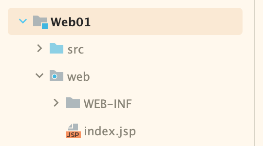
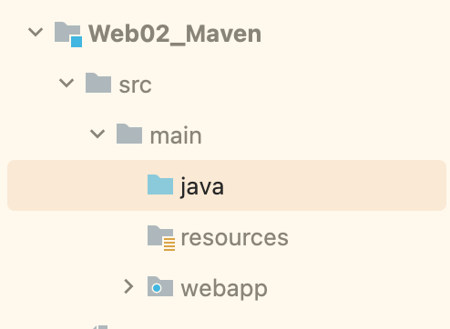

# 普通的Java项目转成Web项目的方式

1. 创建Module
2. Module 右键 ~ Add Framework Support

 

# Maven项目转成Web项目的方式
我们maven项目 和 普通的java项目 web目录的名称和位置都不一样

 

1. 创建一个Module 选择 Maven Archetype
  - parent: 可以为空
  - Catalog: 默认
  - Archetype: 下拉菜单中选择webapp ``org.apache.maven.archetypes:maven-archetype-webapp``
  - create

2. ctrl + ;
  - Facets: 点击 + ~ 选择 web ~ 选择刚创建的Module
    - 修改 deployment descriptors ``/Users/sam/Desktop/Sam/Demo/SpringBootDemo/SimpleDemo/Web02_Maven/src/main/webapp/WEB-INF/web.xml``

    - 修改 web resource directories ``/Users/sam/Desktop/Sam/Demo/SpringBootDemo/SimpleDemo/Web02_Maven/src/main/webapp``

    - 点击 fix

3. /src/main 下创建 java 目录
  - 选择java目录 ~ 右键 ~ mark directory as java sources root

4. 配置server 小绿锤子 那一套

 

### 注意:
如果不行的话 我们在Module上右键 ~ 最下面的 Maven ~ Reload Project