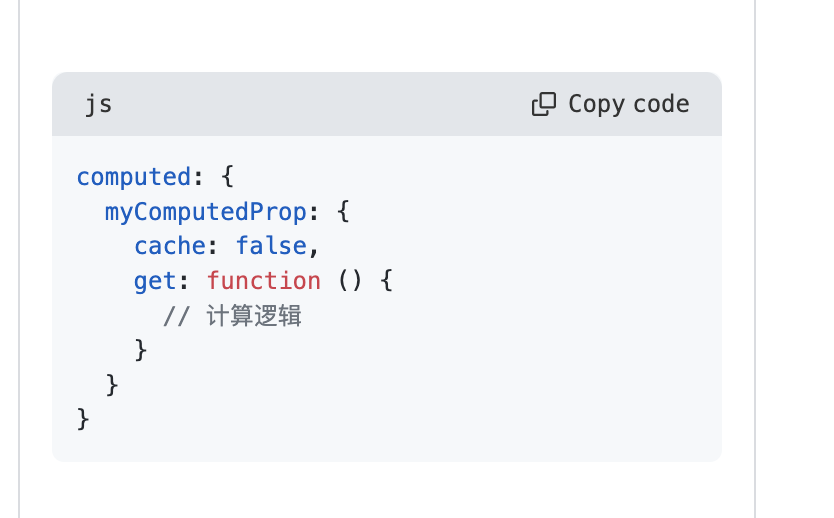
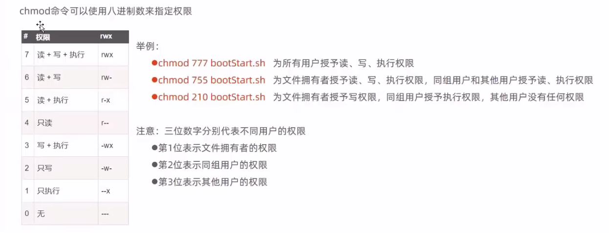
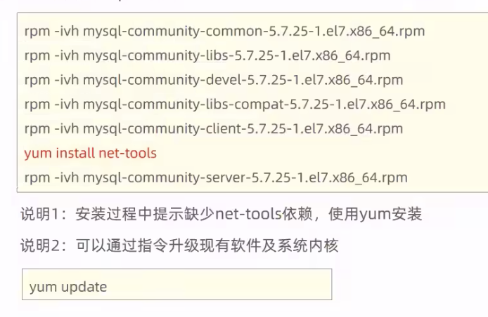
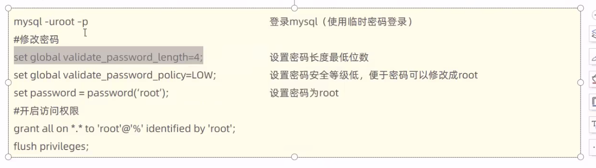

# Linux系统下安装软件的常用方式

### 方式1: rpm命令
使用 rpm 命令安装扩展名为 ``.rpm`` 的软件包

``.rpm`` 的软件包的格式为
```s
bash-4.1.2-15.el6_5.x86_64.rpm

# bash: 软件名称
# 4.1.2-15: 版本号
# -15: 发布次数
# el6_5: 系统版本
# x86_64: 硬件平台
```

<br>

### 方式2: yum命令
需联网, 从互联网获取的yum源, 直接使用 yum 命令安装

<br>

### 方式3: 编译安装源码包
针对 tar.gz 这样的压缩格式, 需要使用 tar 命令来解压

如果是其他压缩格式, 就使用其他命令

<br><br>

# Homebrew
它是MacOs软件包管理器, 它就相当于 Mac的 npm 我们可以通过 brew 命令来安装和管理 软件包

Homebrew 可以帮助我们在macOs上快速的安装和更新各种开源的软件 如变成语言 工具 框架 库等

此外, 它还提供了一些工具 帮助我们更方便的管理和使用软件包 比如
- brew services
- brew cask

<br>

### 安装 Homebrew
```s
/bin/bash -c "$(curl -fsSL https://raw.githubusercontent.com/Homebrew/install/HEAD/install.sh)"
```

<br>

### 查看 Homebrew 是否安装成功
```s
brew --version

# 如果brew命令没有找到 将其添加到环境变量中
echo 'eval "$(/opt/homebrew/bin/brew shellenv)"' >> ~/.bash_profile
source ~/.bash_profile
```

<br><br>

## brew 常用命令

### 安装指定的软件包
```s
brew install [package]

# 例如:
brew install git
```

<br>

### 卸载指定的软件包
```s
brew uninstall [package]

# 例如:
brew uninstall git
```

<br>

### 升级所有已安装的软件包到最新版本
```s
brew upgrade

# 升级指定的软件包到最新版本
brew upgrade [package]
```

<br>

### 更新Homebrew软件包管理器到最新版本
```s
brew update
```

<br>

### 列出所有已安装的软件包
```s
brew list
```

<br>

### 搜索与指定关键字相关的软件包
```s
brew search [keyword]

brew search python
```

<br>

### 显示指定软件包的信息
```s
brew info [package]
```

<br>

### 清理已安装软件包的旧版本和缓存
```s
brew cleanup
```

<br>

### 检查Homebrew环境是否正常
```s
brew doctor
```

<br><br>

## brew services
是Homebrew扩展工具brew-services提供的命令，它可以让你**方便地管理后台服务**，例如MySQL、PostgreSQL、Redis、Apache、Nginx等。

<br>

**注意:**  
brew services命令**只能管理通过Homebrew安装的后台服务**

如果你使用其他方式安装的服务，例如手动安装或者通过安装包进行安装，则需要使用相应的命令进行管理。

<br>

### 启动指定的后台服务
```
brew services start [service]

brew services start --all

brew services start mysql
```

<br>

### 停止指定的后台服务
```
brew services stop [service]

brew services stop --all

brew services stop mysql
```

<br>

### 重启指定的后台服务
```
brew services restart [service]

brew services restart mysql
```

<br>

### 查看服务状态
```
brew services list
```

<br>

### 清除已经不再使用的launchctl配置文件
```
brew services cleanup
```

<br><br>

## brew cask工具的使用
brew cask是Homebrew扩展工具Homebrew Cask提供的命令，它可以用来安装Mac上的图形化应用程序和其他非命令行程序，如浏览器、编辑器、办公软件、娱乐软件等等。

**比如安装google**

<br>

**注意:**  
要使用 brew cask 必须先安装 Homebrew Cask

<br>

### 搜索与指定关键字相关的图形化应用程序
```s
brew cask search [keyword]
```

<br>

### 卸载指定的图形化应用程序
```s
brew cask uninstall [package]
```

<br>

### 升级所有已安装的图形化应用程序到最新版本
```
brew cask upgrade
```

<br>

### 列出所有已安装的图形化应用程序
```
brew cask list
```

<br><br>

## 扩展: launchctl 命令
**它是macOS中的一个管理守护进程（daemons）和代理（agents）的命令行工具。**

在macOS中，守护进程和代理是系统背景中运行的程序，它们可以自动启动和停止，支持用户登录和注销等系统事件。这些守护进程和代理可以提供各种服务，例如网络服务、打印服务、备份服务、自动更新服务等等。

**使用launchctl命令可以控制守护进程和代理的启动、停止、重启、加载、卸载和管理等操作。**

<br>

### 加载指定的plist文件，并启动相关的服务
```
launchctl load <plist>
```

<br>

### 停止指定的plist文件，并卸载相关的服务
```
launchctl unload <plist>
```

<br>

### 启动指定的服务
```
launchctl start <service>
```

<br>

### 停止指定的服务
```
launchctl stop <service>
```

<br>

### 列出当前加载的所有服务及其状态
```
launchctl list
```

<br>

### 打印指定服务的详细信息，包括它的plist文件路径、运行状态、环境变量等
```
launchctl print <service>
```

<br><br>

# Linux 环境变量的配置

## 环境变量的分类

### 按生效的范围分类:
**系统环境变量:** 
公共的 对全部的用户都生效

<br>

**用户环境变量:**
用户私有的 自定义的个性化设置 只对该用户生效

<br>

### 按生存周期分类:
**永久环境变量:**  
在环境变量脚本文件中配置, 用户每次登录时会自动执行这些脚本 相当于永久生效

<br>

**临时环境变量:**  
使用时在shell中临时定义 退出shell后失效

<br><br>

## 常用的环境变量

### 在shell下 查看当前用户全部的环境变量
```s
env

# 查看指定的环境变量
env | grep PATH
```

<br>

### 输出 指定的环境变量
```s
echo $PATH

# 查看当前使用的是什么shell
echo $SHELL   # /bin/bash
```

<br>

**扩展:~/.zprofile和.bash_profile**  
它们都是 都是shell的配置文件，只是它们对应不同的shell

<br>

### 常用的环境变量
- PATH: 可执行程序包括Linux系统命令和用户的应用程序

- LANG: Linux西宫的语言 地区 字符集

- PWD: 当前的工作目录

<br><br>

## export 设置环境变量
采用export设置的环境变量 在退出shell后就会失效, 下次登录的时候需要重新设置, 如果希望环境变量永久生效

需要在登录脚本文件中配置

```
变量名 = 值
export 变量名

export 变量名 = "值"
```

<br>

比如我们经常使用如下的命令添加环境变量
- export: 定义一个变相 值为后面的
- :$PATH: 将原有的PATH值追加到后面
```s
export PATH=/usr/local/go/bin:$PATH
```

<br>

### 系统环境变量的设置
系统环境变量对全部的用户生效 设置系统环境变量有3种方法

**1. 在 /etc/profile 文件中设置:**  
用户登录时执行 /etc/profile 文件中设置系统的环境变量, 但是 Linux 不建议在该文件中设置

<br>

**2. 在 /etc/profile.d目录下增加环境变量脚本文件 Linux推荐**  
/etc/profile每次启动的时候就值执行 /etc/profile.d 目录下的全部脚本文件 它比/etc/profile好维护 不想要什么变量直接删除 /etc/profile.d 下对应的shell脚本就可以

<br>

**3. 在 /etc/bashrc 文件中设置环境变量**  
该文件配置的环境变量将会影响全部用户使用bash shell  
Linux不推荐

<br>

### 用户环境变量
用户环境变量只对当前用户生效 设置用户环境变量有多种方式

**1. .bash_profile 首选**  
当用户登录时执行, 每个用户都可以使用该文件配置专属于自己的环境变量

<br>

**2. .bashrc**  
当用户登录的时候 以及 每次打开新的shell时 该文件都将被读取

<br>

### 将命令添加到PATH
通过 echo $PATH 查看某一个环境变量的值

PATH变量的值是用 冒号 隔开的一堆路径, 冒号会被认为是分隔符

```s
vim .bash_profile

# 这里将PATH导出为一个环境变量
export PATH

# 对PATH进行重新赋值, 因为上面已经导出了 我们这里相当于追加 
# :$PATH相当于再加上原来PATH的值
PATH=/data/p56/sbin:$PATH


# 执行配置文件
source .bash_profile
```

<br><br>

# 终端命令的格式:
一般会由 3个部分 组成
```
命令 [-选项] [参数]

comman [-options] [parameter]
```

<br>

**command:**  
具体命令 相应功能的英文单词或单词的缩写 执行基本功能

<br>

**-options:**  
可选选项 根据命令可以显示更加丰富的数据

<br>

**parameter:**  
可选选项 参数 命令的操作对象 一般文件 目录 用户和进程等都可以做为参数被命令操作

<br>

比如查看哪个文件路径
```js
ls
ls-a
ls-l /home/xx
```

<br><br>

# Linux简介
不同领域的主流操作系统

- 桌面操作系统
  - Winodw
  - MacOS
  - Linux

- 服务器操作系统
  - Unix (安全 稳定 付费)
  - Linux (安全 稳定 免费 占有率高)
  - Window Server (付费 占有率低)

- 移动设备操作系统
  - Android (基于Linux)
  - IOS

- 嵌入式操作系统
  - Linux (机顶盒 路由器 交换机)

<br>

## Linux的发行版
- Ubuntu: 以桌面应用为主
- RedHat: 应用最广泛 收费
- CentOS: RedHat的社区版, 免费
- openSuse: 对个人完全免费 图形界面华丽
- Fedora: 功能完备, 快速更新 免费
- 红旗Linux: 北京中科红旗软件技术有限公司开发 

<br><br>

# Linux的环境搭建

## Linux系统的安装方式:
- 物理机安装: 直接将操作系统安装到服务器硬件上
- 虚拟机安装: 通过虚拟机软件安装

<br>

### 虚拟机:
通过软件模拟的具有完成硬件系统功能, 运行在完全隔离环境中的完整计算机系统

**通过虚拟机软件来模拟计算机硬件**

<br>

### 常用的虚拟机软件:
- VMWare
- VirtualBox
- VMLite WorkStation
- Qemu
- HopeddotVOS

<br>

### VMWare下安装Linux
1. 准备 CentOS-7的系统镜像 .iso 文件
2. 进入 VMWare软件 点击 [创建新的虚拟机]
  - 典型
  - 稍后安装操作系统 下一步
  - 选择 Linux 版本选择 CentOS7 (镜像版本就是7)
  - 给虚拟机起名字
  - 选择一个虚拟机的存放位置 (创建好的虚拟机会生辰很多物理文件 生成的文件会放在什么位置)
  - 分配虚拟机磁盘大小 默认20G
  - 将虚拟磁盘拆分成多个文件
  - 自定义硬件 这里设置模拟出来的硬件参数
    - 内存大小: 2G
    - 处理器个数: 2
    - 新CD/DVD 
      - 使用ISO映像文件 选择我们下周的CentOS7镜像文件.iso
    - 点击关闭
  - 完成

3. [开启此虚拟机], 表示我要开机了 
4. install centos7 点击回车
  - 安装过程中 选择语言
  - 处理有叹号的选项 比如: 安装位置 - 选择自动配置分区 (window演示中)
  - 软件选择: 最小安装, 还可以选择 **GNOME桌面 (这样我们的系统最后会带桌面)**

5. 开始安装
  - ROOT密码: 可以设置

6. 重启

<br><br>

## 网卡设置
由于启动服务器的时候未加载网卡 导致IP地址初始化失败

输入如下命令查看服务器ip地址状态
```
ip addr
```

**观察 ens33 网卡信息:**  
```s
#正常这里应该出现 inet: ip 地址 但是这时没有出现
2: ens33: 一串 反正不是ip
```

<br>

**解决方式:**  
为了让它加载网卡 我们需要修改网络初始化配置 **设定网卡在系统启动时进行初始化**

```s
cd /
cd etc
cd sysconfig
cd network-scripts
vi ifcfg-ens33


# 进入编辑页面后想 no -> yes
ONBOOT=yes
```

<br><br>

## 静态IP设置
现在的网络IP配置是虚拟机动态分配的, 使用dhcp方式分配ip地址 (自动获取IP), 线上的ip地址都是静态的

这种方式会在系统每次联网的时候分配一个ip给我们用 也就是说有可能系统下次启动的时候ip会变 这样会有问题

<br>

**1. 配置静态ip首先打开网卡配置文件**  
ens33是网络设备的名称 不同的系统有可能网络设备的名称不一样 (CentOS7中是ens33)

```
vim /etc/sysconfig/network-scripts/ifcfg-ens33
```

<br>

**2. 在打开的文件的最后添加**  
```s
# 使用静态ip地址 默认为 dhcp 修改为 static
BOOTPROTO=static

IPADDR=192.168.25.101  #设置的静态IP地址
NETMASK=255.255.255.0  #子网掩码
GATEWAY=192.168.25.2  #网关
DNS1=114.114.114.114   #dns服务器1 地址解析
DNS2=8.8.8.8  #dns服务器2 地址解析
```

<br>

**3. 重启网络服务**  
```
systemctl restart network
```

<br>

### 注意:
1. 网段也是一样的 比如 vmware 中的 [虚拟网络编辑器] 界面中 子网ip: 192.168.138.0, 网段是138, 那么我们设置的静态ip的网段必须也是 138 (要求前后保持一致就可以)

2. 我们配置的网关必须 跟 vmware 的网关一致

<br>

**查看 vmware 网关的方式**  
1. 点击编辑 - 虚拟网络编辑器 nat设置 查看网关 
``` 
https://www.bilibili.com/video/BV1yS4y1N76R?p=5&spm_id_from=pageDriver&vd_source=66d9d28ceb1490c7b37726323336322b
```

2. 真正的环境中 不要随意修改地址 会照成别人上不了网


<br><br>

## 安装 ssh 连接工具 

### 常用的SSH链接工具
- putty
- secureCRT
- xshell
- finalshell

<br>

### 使用 finalshell 
1. 必须知道虚拟机的ip地址 ip addr 看下 ens33 网卡的inet信息

2. 点击新标签页左侧的文件夹图标 - 点击+ - 选择ssh连接
  - 主机: linux系统的ip地址
  - 端口: 默认22

<br><br>

## Linux 目录结构


<br><br>

# Linux系统安装 Nginx
我们的 nginx 一般会放在 阿里云上的服务器 比如该服务器是 centOS  
centOS就是一个Linux服务器 服务器就相当于一台电脑 我们可以在服务器上安装 各种软件 下面我们就在Linux系统下 安装 Nginx

<br>

## 安装步骤:

### **1. 安装 gcc**  
安装 nginx 需要先将官网下载的源码进行编译 编译依赖gcc环境 如果没有gcc 则需要安装该环境

yum相当于nodejs的包管理工具

```
yum install gcc-c++
```

<br>

**注意:**  
如果安装上面的包的时候出现了404警告 那就是系统是 centOS8 的问题 7是没有的

<br>

### **解决方式: yum install 404解决方案**  
进入配置文件内，删除所有的.repo文件（也可以备份）
```js
// 进入配置文件夹

cd /etc/yum.repos.d/
// 删除旧的配置文件

rm *.repo
// 输入"y"回车确认
```

<br>

``ls``命令, 确保该目录下的 .repo文件 已完全删除  
下载可以用的.repo文件
```
wget -O /etc/yum.repos.d/CentOS-Base.repo https://mirrors.aliyun.com/repo/Centos-vault-8.5.2111.repo
```

<br>

如果你没有 **安装wget**，也可以用下面命令：
```
curl -o /etc/yum.repos.d/CentOS-Base.repo https://mirrors.aliyun.com/repo/Centos-vault-8.5.2111.repo
```

<br>

运行 yum makecache 生成缓存  
```
yum makecache
```

<br>

### **2. PCRE pcre-devel安装:**  
它是一个 perl 库 包括perl兼容的正则表达式库  
nginx的http模块使用 pcre 来解析正则表达式 所以需要在 linux 上安装pcre库 

pcre-devel 是使用 pcre 开发的一个二次开发库。nginx也需要此库。

```
yum install -y pcre pcre-devel
```

<br>

### **3. zlib 安装:**  
zlib 库提供了很多种压缩和解压缩的方式， nginx 使用 zlib 对 http 包的内容进行 gzip ，所以需要在 Centos 上安装 zlib 库。
```
yum install -y zlib zlib-devel
```

<br>

### **4. OpenSSL 安装**  
OpenSSL 是一个强大的安全套接字层密码库，囊括主要的密码算法、常用的密钥和证书封装管理功能及 SSL 协议，并提供丰富的应用程序供测试或其它目的使用。

nginx 不仅支持 http 协议，还支持 https（即在ssl协议上传输http），所以需要在 Centos 安装 OpenSSL 

```
yum install -y openssl openssl-devel
```

<br>

### **5. 下载Nginx**  
```
wget https://nginx.org/download/nginx-1.19.9.tar.gz 
```

<br>

### **6. 解压nginx**  
```
tar -zxvf nginx-1.19.9.tar.gz
cd nginx-1.19.9
```

<br>

### **7. 执行nginx-configure文件**  
```
./configure
```

<br>

### **8. make命令编译**  
上面7中执行完 configure 后会有一个MakeFile文件夹

这时我们要执行 make 命令 类似安装的操作

make 是一个命令工具，它解释 Makefile 中的指令（应该说是规则）。在 Makefile文件中描述了整个工程所有文件的编译顺序、编译规则
```
make
make install
```

<br>

### **9. 查询nginx 安装目录**  
会输出号 nginx 所在的目录
```
whereis nginx
```

<br>

### **10. 进入安装目录执行nginx**  
前往安装目录找到sbin 进去后 能找到nginx可执行文件 执行nginx
```
./nginx
```

执行完该命令后我们进入 公网地址 比如 192.168.60.29 就能打开nginx的欢迎页面

<br><br>

# Nginx服务器占用的端口
默认占用 80 端口  

如果80端口已经开启 但是访问公网地址 还是没有欢迎界面 **那我们就需要检查Linux的防火墙**  
我们先执行 Linux 打开的所有防火墙的端口

<br>

### **查看所有打开的端口:**  
```
firewall-cmd --zone=public --list-ports
```

如果没有开启80端口 我们执行下面的命令打开Linux的防火墙

<br>

### **添加:**  
--permanent永久生效，没有此参数重启后失效
```
firewall-cmd --zone=public --add-port=80/tcp --permanent    
```

添加之后我们要 reload 防火墙

<br>

### **重新载入:**  
```
firewall-cmd --reload
```

<br><br>

# 配置 Nginx 环境变量
如果不配置的话 我们只能每次去 sbin 下面敲命令

```js
cd /
cd etc
vim profile

// 最后的行上添加如下的信息
export PATH=$PATH:/nodexxxx/bin:/usr/local/nginx/sbin

source profile
```

<br>

# Nginx的常用命令

### **启动 Nginx**  
启动后我们可以访问网址
```
nginx
```

<br>

### **停止 Nginx**   
启动后我们可以访问网址
```js
nginx -s stop

// Quit 是一个优雅的关闭方式，Nginx在退出前完成已经接受的请求处理
nginx -s quit
```

<br>

### **查看nginx版本号:**  
```
nginx -v
nginx -V
```

<br>

### **查看nginx进程:**  
```
ps -ef | grep nginx
```

<br>

### **重载Nginx配置文件:**  
```js
nginx -s reload


// 配置文件在
cd /usr/local/nginx
cd conf
vim nginx.conf
```

<br><br>

# Linux 防火墙 

<br>

## firewalld 的基本使用

### **查看防火墙的状态:**  
```
systemctl status firewalld 
```

<br>

### **开启防火墙:** 
```
systemctl start firewalld
```

<br>

### **暂时关闭防火墙:**  
```
systemctl stop firewalld 
```

<br>

### **永久关闭防火墙:**  
```
systemctl disable firewalld
```

<br>

### **开放指定端口:**  
--permanent永久生效, 没有此参数重启后失效
```
firewall-cmd --zone=public --add-port=80/tcp --permanent    
```

<br>

### **关闭指定端口:**  
```
firewall-cmd --zone= public --remove-port=80/tcp --permanent
```

<br>

### **重新载入: 使其立即生效**  
```
firewall-cmd --reload
```

<br>

### **查看已开放的端口:**  
```
firewall-cmd --zone= public --query-port=80/tcp
```

<br>

## 扩展: 
systemctl是CentOS7的服务管理工具中主要的工具, 它融合之前service和chkconfig的功能于一体

<br>

### **启动一个服务:**  
```
systemctl start firewalld.service
```

<br>

### **关闭一个服务:**  
```
systemctl stop firewalld.service
```

<br>

### **重启一个服务:**  
```
systemctl restart firewalld.service
```

<br>

### **显示一个服务的状态:**  
```
systemctl status firewalld.service
```

<br>

### **在开机时启用一个服务:**  
```
systemctl enable firewalld.service
```

<br>

### **在开机时禁用一个服务:**  
```
systemctl disable firewalld.service
```

<br>

### **查看服务是否开机启动:**  
```
systemctl is-enabled firewalld.service
```

<br>


### **查看已启动的服务列表:**  
```
systemctl list-unit-files|grep enabled
```

<br>


### **查看启动失败的服务列表:**  
```
systemctl --failed
```

<br>

## 配置firewalld-cmd

<br>

### **查看版本:**  
```
firewall-cmd --version
```

<br>

### **查看帮助:**  
```
firewall-cmd --help
```

<br>

### **显示状态:**  
```
firewall-cmd --state
```

<br>

### **查看所有打开的端口:**  
```
firewall-cmd --zone=public --list-ports
```

<br>

### **更新防火墙规则:**  
```
firewall-cmd --reload
```

<br>

### **查看区域信息:**  
```
firewall-cmd --get-active-zones
```

<br>


### **查看指定接口所属区域:**  
```
firewall-cmd --get-zone-of-interface=eth0
```

<br>

### **拒绝所有包:**  
```
firewall-cmd --panic-on
```

<br>

### **取消拒绝状态:**  
```
firewall-cmd --panic-off
```

<br>

### **查看是否拒绝:**  
```
firewall-cmd --query-panic
```

<br><br>

## ssh链接到远程服务器
```
ssh 账户名@公网ip

ssh root@192.168.60.29
```

<br>

## 在远程服务器上安装nodejs
首先打开 nodejs 网站
```
nodejs.cn/download/current/
```

<br>

选择 Linux二进制文件 x64 选择64位, 然后下载下来后 我们能在谷歌浏览器上找到下载内容选项卡 能看到我们的下载包下面有网址 复制下来

<br>

回到终端 通过命令下载nodejs
```
wget 复制的网址
```

<br>

查看是是不是下载到目录里面了
```
ls

xxx.tar.xz
```

<br>

解压 下载的压缩包
```
tar -xvf 压缩包 
```

<br>

然后我们进入到 解压后的文件夹中 找到 bin 目录后进去 就能使用 node 的命令  
但是我们在bin目录下是可以 但是出了bin目录就不好用了 所以我们要配置环境变量

<br>

## linux下配置node全局环境变量
先复制下 node文件夹下的bin目录的地址
```
cd node-v14.19.1
cd bin
pwd
```

<br>

linux的环境变量叫做 $PATH, 我们可以通过下面的命令 查看已有的环境变量
```
echo $PATH
```
我们能看到 它是以 : 来分割各个路径的


<br>

去 / 目录下 的 etc 文件目录中 我们要先进去
```
cd etc
```

<br>

使用 vim 打开 profile 文件
```
vim profile
```

使用i 然后在最后追加下面的内容
```
export PATH=$PATH:我们复制的node的bin路径
```

<br>

保存退出后我们还要使用下面的命令执行下
```
source profile
```

<br>

在 linux 上安装好node后 我们就可以在 linux上通过 node 安装 pm2 了

<br><br>

# SSH
```
https://www.wangdoc.com/ssh/basic.html
```

<br><br>

# Bash
```
https://www.wangdoc.com/bash/intro.html
```

<br><br>

# Linux文件系统
Linux系统环境下的文件系统与Windows有很大区别。在Windows中, 每一个盘符下是一个独立的文件系统, 硬盘有多少个分区就有多少个文件系统。

Linux系统中不管创建了多少个硬盘分区都只有一个文件系统。**整个文件系统的根目录是"/"**, 从"/"出发可以找到Linux系统中的所有目录和文件。

<br>

## 用户的家目录:
Linux是一个多用户系统, 每个登录到系统的用户都需要有一个自己专属的目录保存自己私有的文件。系统当然看到了这个需求, 所以每创建一个普通用户, 系统就会在 **/home** 目录下创建一个和用户同名的目录作为这个用户的家目录。

比如: 创建一个名为tom的用户, 它的家目录就是/home/tom

<br>

### **~ 表示家目录:**  
可以使用 "~" 代表用户的家目录。
特殊的是作为系统的超级管理员, root用户的家目录是/root目录

<br>

### **进入 根目录**  
我们进入的是 Macintosh HD
```
cd /
```

<br>

### **进入 家目录**  
我们进入的是 ユーザ - **LIUCHUNSHAN**  
```
cd ~
```

<br><br>

# Linux系统的目录介绍:
### **/bin:**  
bin是binary的缩写, 这个目录存放着最经常使用的命令。

<br>

### **/boot:**  
这里存放的是启动Linux时用到的引导程序文件。

<br>

### **/dev:**	
device(设备)的缩写, 该目录下存放的是Linux的外部设备。

<br>

### **/etc:**	
存放系统和第三方应用程序的配置文件。比如配置环境变量就是在这个文件夹中

<br>

### **/opt:**  
存放安装第三方应用程序时使用的压缩包文件

<br>

### **/home:**  
存放普通用户家目录。

<br>

### **/lib和/lib64:**  
系统开机所需要最基本的动态连接共享库。

<br>

### **/media:**	
挂载Linux系统会自动识别的设备, 例如U盘、光驱等。

<br>

### **/mnt:**	
专门用于挂载操作的目录。

<br>

### **/proc:**  
这个目录是一个虚拟的目录, 它是系统内存的映射。

<br>

### **/root:**  
超级管理员root用户的家目录。

<br>

### **/run:**  
存放进程产生的临时文件, 关机重启后会消失。

<br>

### **/sbin:**  
s是Super User的意思, 这里存放的是系统管理员使用的系统管理程序。

<br>

### **/srv:**	
service缩写, 该目录存放一些服务启动之后需要提取的数据。

<br>

### **/sys:**	
该目录下安装了2.6内核中新出现的一个文件系统sysfs。

<br>

### **/tmp:**	
存放临时文件。

<br>

### **/usr:**	
应用程序的默认安装目录, 类似于Windows下的program files目录。

<br>

### **/var:**	
存放经常变化的内容, 例如日志文件。

<br><br>

## 提示信息乱码问题
如果ssh的控制台 提示信息出现了乱码 可能是由于编码问题导致的 只需要修改Linux的编码即可

```s
echo 'LANG="en_US.UTF-8"' >> /etc/profile

# 加载profile文件 让其生效
source /etc/profile
```

<br><br>

## Linux 常用技巧
- tab键: 自动补全
- 连续两次tab键: 不能自动补全时给出操作提示

<br><br>

# Linux 常用命令
因为服务器没有鼠标键盘 所以移动文件 删除文件等常规操作 是必须要熟练的

<br>

## 文件 和 目录 相关命令

### **快捷键:**  
```
Ctrl+l	      清屏
Ctrl+c	      强制终止程序
Ctrl+Insert	  复制
Shift+Insert	粘贴
Ctrl+s	      锁屏
Ctrl+q	      解除锁屏
tab	          自动补全
```

<br>

### **进入目录:**  
切换到当前用户的主目录(/home/用户目录)   
用户登录的时候 默认的目录就是用户的主目录
```js
cd 目录名
cd [相对路径/绝对路径]

cd

// 切换到当前用户的主目录(如果我是root就切换到root 如果我是admin则切换到admin)
cd ~

// 切换到根目录
cd /

// 上一次所在的目录 (回退上一步呗)
cd -
```

<br>

**注意:**  
如果路径是从根路径开始的 则路径的前面需要加上 /  
如 /home 通常进入某个目录里面文件夹 前面不用加 /  

- 绝对路径是从  / 或 ~ 开头的   
- 相对路径是从 ./ 或 ../开头

<br>

### **创建目录:**  

**参数:**  
-p: 可以确保同时创建多层目录

```js
// 单层
mkdir 路径

// 创建多个文件夹
mkdir 目录名1 目录名2

// 其中aaa/bbb是存在的目录, 要创建的仅仅是ccc
mkdir aaa/bbb/ccc

// 多层
mkdir -p 路径

// 其中bbb/ccc/ddd都不存在, 现在想一次性把这些目录都建出来
mkdir -p aaa/bbb/ccc/ddd
```

<br>

**注意:**  
如果文件已存在则创建失败

<br>

### **删除目录:**  
```s
rmdir [-p] dirName


# 通配符: 它匹配的是0个或多个字符
rmdir test*
```

**参数: -p**  
当子目录被删除后使父目录为空目录的话 则一并删除

<br>

**注意:**  
它只能删除空目录

<br>

### **查看目录内容(list):**  
查看目录下的内容 会列出名称 
```js
ls 

ls [其它目录]

ls [-al] [其它目录]

ll

// 不用特定切换到指定文件在ls 直接后面直接跟路径
ls /home/damin
```

<br>

**作用:**   
列出目录中的内容, 这里所说的目录可以是当前目录也可以是其他目录(需要指定路径。

命令的参数既可以单独使用也可以组合使用。同时ls -l可以简写为ll。

<br>

**参数:**  
**<font color="#C2185B">-a:</font>**  
显示指定目录下所有子目录与文件 包括隐藏文件

<br>

**<font color="#C2185B">-l:</font>**  
以列表的方式显示文件的详细信息

<br>

**<font color="#C2185B">-R:</font>**  
递归查看目录内容

<br>

我们以 ls -l 查看的信息 会出现下方的格式:

<br>

**第一列:**  
```
lrwxrwxrwx
dr-xr-xr-x
```

<br>

**上面的首字母的意义为: 表示文件的形态**
```
文件对应的是          -
目录对应的是          d
快捷方式对应的是       l 
U盘对应的是           b
鼠标键盘等硬件对应的是  c
```

<br>

**第二列:**   
代表的是该目录下的文件数量

<br>

**第三列:**  
用户名 组名

<br>

**第四列:**  
文件夹 或 文件的体积

<br>

**第五列:**  
文件的创建日期

<br>

### tree 以树形结构展示目录结构
tree命令需要先安装

```s
# linux 下
yum install tree
```

<br>

**展示当前目录下的结构 (以树形)**
```
tree
```

<br>

### **查看当前所在的目录(print work directory):**  
```
pwd
```

<br>

### **新建文件:**  
```js
touch 文件.后缀

// 创建空文件
touch 文件.js
touch 新建文件的路径


// 创建多个文件
touch aa bb
```

<br>

**说明:**  
- 如果文件不存在 新建空白文件  
- 如果文件已存在 可以修改文件的末次修改日期

这个命令本体是为了修改文件修改时间的 它有一个附带的效果 **如果文件不存在则创建**  

<br>

### **新建文件并往里输入内容:**  
```js
// 将内容写入到index.js 中 覆盖
echo 内容>index.js


// 追加新内容
echo 内容>>index.js


// 只创建没内容
echo >index.js
```

<br>

### **复制(copy):**  
复制文件 或者 目录 到另一个 文件 或 目录中
```js
cp [选项] 数据源 目的地


// 复制文件: 
cp 被复制的文件的路径 目标目录的路径

// 复制目录: 
cp -r 被复制的目录的路径 目标目录的路径
```

<br>

**参数:**  
**-i:**  
交互式复制 在覆盖目标文件之前将给出提示要求用户确认

<br>

**-f:**  
覆盖已经存在的目标文件而不提示

<br>

**-r:**  
当我们复制的是目录的时候 需要加上该选项

若给出的源文件是目录(文件夹) **则cp将递归复制该目录下的所有子目录和文件 目标文件必须为一个目录名**

<br>

**-v:**  
显示拷贝进度

<br>

**注意:**  
复制的时候 源文件和新文件都在 如果是复制的文件夹 需要加上 -r 参数
```js
cp -r bdir cdir
```

<br>

**技巧:**  
1. 复制的同时 还能实现改名
2. 复制目录下的所有文件
```s
# /* 表示复制的是目录下的内容
cp linux/* ./test
```

<br>

### **移动(move) - 重命名:**  
移动文件或目录  
将目录或文件在当前位置移动可以起到重命名的作用
```
mv [选项] 数据源 目的地

mv 被移动的文件或目录的路径 目标目录
```

<br>

**参数:**  
**-f:**  
禁止交互式操作 如有覆盖也不会给出提示

<br>

**-i:**  
确认交互式操作 如果mv操作将导致对已存在的目标文件的覆盖 系统会询问是否重写 要求用户回答以避免覆盖文件

<br>

**-v:**  
显示移动进度

<br>

**注意:**  
1. 移动文件的时候 **源文件是不保留的哦**
2. 如果目标目录不存在 则会报错: No such file or directory

<br>

### **删除(remove):**  
删除目录或文件

<br>

**注意:**  
使用rm命令要小心 因为文件删除后不能恢复 为了防止文件误删  

**可以在rm后使用 -i 参数 以逐个确认要删除的文件**

```js
rm [选项] 文件/目录


// 删除文件: 
rm 被删除的文件的路径


// 强制删除文件: 
rm -f 被删除的文件的路径


// 递归删除目录: 
rm -r 被删除的目录的路径

// 强制删除目录: 
rm -rf 被删除的目录的路径
```

<br>

**参数:**  
**-i:**  
以进行交互式方式执行

<br>

**-f:**  
强制删除 忽略不存在的文件 无须提示(可以忽视报错)  
因为如果删除的文件不存在 就会报错 删除的动作就会被终止 有些场景下 不希望被终止 所以加上 -f

<br>

**-r:**  
递归地删除目录下的内容 删除文件夹时必须要加上此参数

<br>

**注意:**  
删除命令是危险命令 **一定要加上 -i**   
因为删除的命令 删除的文件想要找回来特别困难 所以要加上 -i

<br>

### 类似的命令有 都要使用 ``-i``
- rm
- mv
- cp

<br>

**删除文件夹的时候** 要加上 -r
```js
rm -ir adir
```

<br>

**示例:**  
删除当前目录下所有文件和文件夹
```s
# 移除 当前文件目录下 所有文件
rm -rf *

# 干掉了 根目录下所有的文件
rm -rf /*   # 慎用！！！！！！！
```

<br><br>

# Vim
在命令行环境下编辑文本文件  

<br>

### 扩展:
vi命令是Linux系统提供的一个文本编辑工具 可以对文件的内容进行编辑 类似于windows中的记事本

vim是从vi发展来的一个功能更加强大的文本编辑工具 在编辑文件的时候可以对文本的内容进行着色 方便我们对文件进行编辑处理 所以实际工作中 vim 更加的常用

<br>

vim命令 可能需要我们自己安装
```
yum install vim
```

<br>

### 使用 vim
我们在终端直接输入如下命令就可以启动 vim, **文件不存在则创建**
```
vim fileName
```

<br><br>

# 三种模式

## 一般模式:
**进入方式: 通过 Esc 进入**  

<br>

### 一般模式: 插入指令
在一般模式下, 我们可以按下如下的键位 **进入插入命令**
- i: 在当前位置前插入 文本
- I: 在当前行首插入
- a: 在当前位置后插入
- A: 在当前行尾插入
- o: 在当前行之后 **插入一行**
- O: 在当前行之前 **插入一行**

<br>

### 一般模式: 查找命令
在一般模式下, 我们按下如下的命令 **进入查找命令**
- 按n 查找下一个
- 按N 查找上一个

**正向查找, 从上往下**
```s
/指定文本内容
```

<br>

**反向查找, 从小往上**
```s
?指定文本内容
```

<br>

**按单词, 正向查找**  
光标移动到单词上 按 * 则开始按照单词进行查找

<br>

**按单词, 反向查找**  
光标移动到单词上 按 # 则开始按照单词进行查找

<br>

**注意:**  
vim中有一些特殊字符在查找时需要转义　　.*[]^%/?~$

<br>

### 查找相关设置:

**忽略大小写的查找:**  
设置后 查找的时候将忽略大小写
```s
:set ignorecase

# 取消
:set noignorecase
```

<br>

**设置搜索高亮:**  
设置后 所查找的**所有目标字符**将高亮显示
```s
:set hlsearch

# 取消
:set nohlsearch

# 关闭当前的高亮 如果再次搜索或按下n或N, 则再会高亮
:nohlsearch
```

<br>

### 一般模式: 替换命令

**替换单个字符: r**  
一般模式下 我们将光标移动到一个字符上 使用如下命令会将光标所在的字符替换为 指定字符
```s
r指定字符
```

<br>

还有一些替换命令待整理...

<br>

### 一般模式: 移动命令
以下四个命令可以配合数字使用，比如
- 20j就是向下移动20行
- 5h就是向左移动5个字符
```
hjkl
←↓↑→
```

在Vim中，很多命令都可以配合数字使用，比如删除10个字符10x，在当前位置后插入3个！，``3a！<Esc>``，这里的Esc是必须的，否则命令不生效。

<br>

- w: 向前移动一个单词
- b: 向后移动一个单词
- ^: 移动到本行第一个非空白字符上
- 0: 移动到本行第一个字符上

- $: 移动到行尾 3$ 移动到下面3行的行尾
- gg: 移动到文件头
- G: 移动到文件尾

- f: 查找命令, 也可以用于移动 fx 将找到光标后第一个为x的字符
- F: 查找命令, 反向查找
- 行号G, 跳转到指定行

<br>

### 一般模式: 撤销和重做
- u: 撤销
- U: 撤销对整行的操作
- Ctrl + r: 重做, 即撤销

<br>

### 一般模式: 删除命令
- x: 删除当前字符, 3x 删除当前光标开始向后三个字符
- X: 删除当前字符的前一个字符。X=dh
- dl: 删除当前字符， dl=x
- dh: 删除前一个字符
- dd: 删除当前行
- dj: 删除上一行
- dk: 删除下一行
- 10d: 删除当前行开始的10行。

- D: 删除当前字符至行尾。D=d$
- d: 删除当前字符之后的所有字符（本行）
- kdgg: 删除当前行之前所有行（不包括当前行）
- jdG(jd shift + g): 删除当前行之后所有行（不包括当前行）
- :1,10d 删除1-10行
- :11,$d 删除11行及以后所有的行
- :1,$d 删除所有行
- J(shift + j): 删除两行之间的空行，实际上是合并两行

<br>

### 一般模式: 拷贝和粘贴
- yy: **拷贝当前行**
- nyy: 拷贝当前后开始的n行，比如2yy拷贝当前行及其下一行。
- p: 在当前光标后粘贴,如果之前使用了yy命令来**复制一行**，那么就在当前行的下一行粘贴。
- shift+p: 在当前行前粘贴
- :1,10 co 20 将1-10行插入到第20行之后。
- :1,$ co $ 将整个文件复制一份并添加到文件尾部。

<br>

**大文本复制:**  
一般模式下按v（逐字）或V（逐行）进入**可视模式**

然后用jklh命令移动即可选择某些行或字符，**再按y即可复制**

<br>

**粘贴:**
回到一般模式下 按下p, 进行粘贴

<br><br>

## 指令模式:
**进入方式: 在一般模式下 使用 : 进入指令模式**  
输入指令后 我们敲击 enter 则执行指令

- 通过 : 进入 指令模式的 可以输入 wq q!等命令
  - wq: 保存退出
  - q: 不保存退出
  - q!: 不保存强制退出

- 通过 / 进入 指令模式的 可以对文本内容进行查找

<br>

### 指令模式: 显示行号
指令模式下
```s
:set nu
```

<br>

### 指令模式: 退出命令
- wq: 保存并退出
- ZZ: 保存并退出
- :q!: 强制退出并忽略所有更改
- :e!: 放弃所有修改，并打开原来文件。

<br>

### **打开一个文件:**  
如果文件不存在 **那么就是新建一个文件**  
```
vim content.txt
```

```js
  // 进入的画面 为一般模式 一般模式的模版
  ~
  ~
  ~
  ~
  ~
  ~
```

<br>

### **回到一般模式:**  
按下 esc

<br>

### **回到一般模式后 输入":"**  
:会进去指令模式

<br>

### **进入编辑模式:**  
进入编辑模式有很多种方法

**方式1:**  
按下 i 键

<br>

### **显示行号 set nu:**  
当我们回到 一般模式的时候 输入 : 后 再输入 set nu 会显示行号

<br>

### **保存文件 :w:**  
回到一般模式的之后 输入 w

<br>

### **退出 q:**  
退出vim

<br>

### **保存退出 wq:**  

<br>

### **不保存直接退出就使用 q!:**  

<br>

### **上下左右移动光标:**  
**方法1:** 上下左右键
**方法二:**  
```
hjkl
←↓↑→
```

<br>

### **前往指定行:**  
在 按esc后回到一般模式后 按下面的命令(英文输入法的状态下)

**第一行: gg:**  
将光标定位到第一行开头的位置。此时屏幕上并不会显示你输入了什么, 需要你自己心里面知道。

<br>

**最后一行: G:**  
将光标定位到最后一行开头的位置。

<br>

**指定行号:**  
假设我们要去第12行, 那么依次输入"1"、"2"、"G"即可。

<br>

### **改:**  
这里我们说的是在一般模式下通过按键来编辑文件, 并不是进入编辑模式。

**dd:**  
删除光标所在的行

<br>

**d5d:**  
从光标所在行开始, 向下连续删除5行(包括光标所在行)

<br>

**u:**  
撤销刚才的操作

<br>

**Ctrl+r:**  
重做刚才撤销的操作

<br>

**yy:**  
复制光标所在的行

<br>

**p:**  
将当前复制的行粘贴到光标所在位置的下一行

<br>

**y3y:**  
从光标所在行开始, 向下连续复制3行(包括光标所在行)

<br>

**r:**  
替换光标所在位置的一个字符  
第一步: 按一下r键  
第二步: 输入新的字符  

<br>

### **进入编辑模式的方式:**  
**i:**  
不动, 就在当前位置, 开始输入

<br>

**I:**  
移动到行的开头, 开始输入

<br>

**a:**  
光标向后移动一格, 然后开始输入

**A:**  
光标移动到行的末尾, 然后开始输入

**o:**  
先在光标所在行的下面插入空行 然后把光标移动到空行的开头, 再开始输入

<br>

### **搜索:**  
**进入指令模式下 输入 /:**  
进入专门用于搜索关键词的指令模式

然后输入关键词 回车执行搜索 遍历匹配内容
- 输入n向下找
- 输入N向上找

取消高亮显示 使用 :noh 指令即可取消高亮

<br>

### **替换 %s/被替换内容/新内容:**  
在: 的状态下输入 %s/被替换内容/新内容 /g  
/g 全局匹配

<br><br>

# 文件和目录相关命令 

### 打开文件 cat
服务器上没有鼠标 怎么打开文件 可以用 cat 命令, 会一次显示所有内容 (查看文件内容)

**适合 查看内容较少 的文本文件**

<br>

### **显示文件全部内容: cat**  
适用场景: 较短小的文件
```
cat [选项] 文件名
```

**参数:**  
**-b:**  
对 非空输出行 编号

**-n:**  
对 输出的所有行 进行编号

<br>

### **查看 文件 中的内容 (分屏): less | more**  
在服务器查看文件内容 如果文件内容太多的话 cat命令查看文件内容的时候 是展示不全的  

用于分屏显示文件内容 每次只显示一页内容 适合于 查看内容较多 的文本文件
```js
less [参数] 文件名

// more命令会用百分比提示我们当前在什么位置
more [参数] 文件名
```

<br>

**空格:**	  
向下滚动一屏

<br>

**b:**  
向上滚动一屏

<br>

**回车:**	
向下滚动一行

<br>

**f:**  
前滚一屏

<br>

**q:**	
退出

<br>

**-N:**  
对输出的所有行编号
```
less -N demo
```

<br>

**/ 关键词**  
搜索 指定单词 字符串

```
n向下找
N向上找
= 显示详细的文件信息
```
	
<br>

### **查看开头的内容: head**  
用来显示文件前10行的内容(如果不加参数默认显示文件前10行内容)
```
head [-num] 文件名

head -10 temp.txt
```

<br>

**参数:**  
- -f:  **实时监控文件内容**  
用于查看线上服务的运行日志 实时显示写入日志的信息

<br>

### **查看文件末尾的部分内容: tail**   
跟 head 命令正好相反
```js
tail [-num] 文件名

// 查看文件末尾5行的内容
tail -n 5 文件

// 打开要监视的文件
tail -f 文件
```

<br>

**参数:**  
-f: 实时查看文件末尾新增的内容 Ctrl+c 退出实时监控

<br>

head tail 命令多用于查看日志文件(一种负责记录系统或程序运行过程信息的文件)内容时使用

测试人员可以通过查看日志文件信息 帮助判断bug出现的原因

<br>

### **示例:**  
使用 ping 命令 模拟日志不断写入 我们将日志内容写入到 demo 文件中 通过 tail -f 实时监控文件
```js
// 将不断出现的ping结果信息 追加到 ping_log 文件中 用于模拟日志文件内容时不断变化的场景
ping 127.0.0.1 >> ping_log

// 查看ping_log内容 第一屏进来的时候是5条
tail -5f ping_log
```

<br>

### **找bug技巧:**  
在程序要出错的时候 我们需要复现 比如点了某个按钮系统崩了 我们在复现的时候还是要点这个按钮 在点按钮之前 我们把日志准备好 我们写上 

```
tail -20f ping_log
```

这个命令和点击按钮的操作同时进行 按钮一敲程序就崩了 这样蹦的信息就会写入到 ping_log 文件中 *首屏进来的20行里面肯定有导致程序崩溃的信息*

<br>

**技巧:**  
查看文件中 指定行数 如 查看文件中的第10-15行信息
比如一共22行

我们可以用 head 命令查看1-15行信息 然后通过 tail 命令查看后5行信息
```
head -15n demo | tail -5
```

最后不用写文件名了 因为左边会作为数据源传递到右边

<br>

### **搜索 文本文件 内容:**  
根据关键词 搜索文本文件的内容 将包含关键词的内容过滤出来后显示

**在指定的文件中 查找指定的文本内容**

```
grep [选项] 关键词 文件名
```

<br>

**参数:**  
**-v:**  
显示不包含匹配文本的所有行(相当于求反)

<br>

**-n:**   
显示匹配行以及行号

<br>

**-i:**  
忽略大小写

<br>

**示例: 在helloworld文件中查找 hello 文本**
```s
grep hello HelloWorld.java
```

<br><br>

## 管道符 |
将一个有结果的命令 通过管道 做为数据源 自动输入到 需要读的命令中被当做数据源  

可以理解为现实生活中的管子 管子的一头塞东西进去 另一头取出来 这里可以理解为

```s
# |前是会产生结果的命令
# |后是从某个数据源从读的命令
有结果的命令 | grep 关键词 (这里省略的数据源)
```

```js
// 要提取包含mysql的信息 但是没有指定从哪检索, | 管道符的左边就是 数据源 也就是从ls的内容里面进行检索指定的数据
ls -al /usr/bin/ | grep mysql
```

通过管道符可以方便快捷的讲两条指令结合起来 以省去需要先将结果写入到文件 再进行查找的操作 在测试工作中 我们只需要掌握管道符右侧使用grep命令就可以

<br>

### **查找文件或目录:**  
在指定的目录下 根据文件名称 来查找文件

```s
# 目录名: 在哪个目录中找
# name: 找哪个文件 文件名可以使用通配符
find 目录名 -name 文件名

find /root -name "*.txt"

# 在当前目录下查找
find . -name "*.java"
```

- /root: 查找范围  
- -name: 根据名称查找  
- "查找内容的表达式"

<br>

**注意:**  
root根目录下是没有办法查找的 文件名 可以加引号 也可以不加引号

如果当前用户对目标路径没有访问权限 则无法执行查找文件动作

<br>

**总结:**  
- grep 命令多用于 查看文件内容
- which 命令多用于 查找可执行文件的位置

- find 命令多用于 查找普通文件  
- find 命令功能非常强大 通常用来在特定的目录下 搜索符合条件的文件

<br>

### 查找某个程序的可执行文件的位置
```s
which git
# /usr/bin/git
```

<br><br>

# tar包解压命令
在Linux系统环境中, 很多程序安装包都是以tar包的形式提供下载的: 

window系统中我们对一个文件进行打包 它其实是包含了两个动作 打包 + 压缩

在 Linux系统中 打包 和 压缩 是可以分开控制的, 比如我们可以进行只对文件进行打包

<br>

tar命令 是Linux中最常用的备份工具 此命令可以把一系列文件 打包到 一个大文件中 也可以把打包的文件恢复成一系列文件

<br>

所以 我们经常在Linux看到如下的两种文件
- .tar: 表示只是完成了打包 并没有压缩
- .tar.gz 表示打包的同时还进行了压缩

<br>

- windows: 常用 rar  
- Mac: 常用 zip  
- Linux: 常用 tar.gz  

<br>

### **tar包解压命令:**  
默认<font color="#C2185B">解压到当前目录下</font>, 如果当前目录下有同名的目录或文件会被直接覆盖, 没有任何提示, 这一点请大家注意。

```s
tar [-zxvf] fileName [files]

# fileName 打包后 包的名字
# files 对哪些文件进行打包 使用它传递
```

<br>

**参数:**  

**-z:**	 
代表的gzip 通过gzip命令处理文件 可以实现对文件的**压缩或解压**

<br>

**-c:**	 
代表的是create, 即创建新的包文件 -- 打包

<br>

**-x:**	   
代表的是extract, 实现从包文件中还原文件 -- 解包

<br>

**-v:**	 
详细显示处理的文件

<br>

**-f:**	 
代表的是file 用于指定包文件的名称, 我们加上 -f 参数后 就可以在命令中指定 fileName 参数了

```
tar [-zxvf] fileName [files]
```

<br>

**注意:**  
-c 和 -x 是互斥的 因为它们一个是打包 一个是解包

<br>

**示例: 将 test目录 打包 成 包文件**  
```s
# 将 test 目录进行打包 打包成 test.tar
tar -cvf test.tar test


# 打包的同时进行压缩
tar -zcvf test.tar.gz test
```

<br>

**示例: 将 打包后的test.tar 进行解压**  
因为我们解压的是 .tar 所以没有z参数
```s
# 会将文件解包到当前的目录
tar -xvf test.tar


# 将 test.tar.gz进行解压
tar -zxvf test.tar.gz
```

<br>

**技巧:**  
解压 或 解包 到指定的目录 通过 ``-C`` 参数来实现
```
tar -zxvf hello.tar.gz -C /usr/local
```

<br><br>

## 扩展: zip unzip命令
通过 zip 压缩文件的目标文件不需要指定扩展名 默认扩展名为zip

<br>

### **压缩文件:**  
```
zip [-r] 包名 被压缩的文件
```

<br>

### **解压缩文件:**  
```
unzip -d 解压后的目录 包名.zip
```

<br>

### **就地解压:**  
```
unzip 包名.zip
```

**参数: -r**  
递归处理 将指定目录下所有文件和子目录一并处理

<br><br>

# 进程相关命令
进程可以说跟软件是对应关系 软件运行过程中在后台运行的某个信息叫做进程 因为进程和软件是对应的关系 我们可以通过关闭进程从而关闭软件

在 Linux 系统中 没有图形化页面 我们没有办法像操作windows图形化界面那样找到任务管理器 找到程序进程 点击结束任务 我们要想结束再linux中的一个程序 

那我们只能通过命令行的方式来进行操作但是不是说所有软件的进程信息只有对应的一条

<br>

### **查看当前正在运行的进程(process status):**  
```
ps -ef
```

<br>

**参数:**  

**a:**  
显示终端上的所有进程 包括其他用户的进程

**u:**  
显示进程的详细状态

**x:**  
显示没有控制终端的进程

**-e:**  
对应单词entire, 表示全部。具体指显示系统中全部的进程信息。

**-f:**   
对应单词full-formate, 表示完整格式。

<br>

**注意:**  
ps 默认只会显示当前用户通过终端启动的应用程序
每一个进程拥有唯一的 pid 可以根据 pid 杀死进程 如

```
kill 12378 或 kill -9 12378(强制杀死)
```

<br>

### **查看当前系统重正在执行程序的详细状况:**  
ps -aux 是将我们执行这个命令的那一刻的进程信息 展示在控制台上 并不是动态连续的 如果想对进程运行时间监控 应用使用 top 命令
```
ps -aux
```

<br>

**示例:**  
```js
// 第一行的信息头
USER

PID       // 进程 id

%CPU      // cpu使用率
%MEM      // 内存使用率

VSZ
RSS
TTY
STAT
START
TIME

COMMAND   // 当前的 id 对应的软件是哪一个 我们可以看到知道我们要关闭的目标软件是谁
```

<br>

### **展示信息解析:**  

**UID**	 
进程的用户信息

**PID**	  
进程id。由系统分配, 不会重复。

**PPID**	 
父进程的id。父进程和子进程的关系是: 父进程启动了子进程。

**CMD**	  
当前进程所对应的程序。

**C**	  
用整数表示的CPU使用率

**STIME**	  
进程启动时间

**TTY**	  
进程所在终端。所谓终端就是用户输入命令的操作界面。

**TIME**	
进程所占用的CPU时间

<br>

### **分屏查看进程信息:**  
全部进程的信息太多了, 一屏无法全部显示, 所以我们希望可以分屏显示并由我们来控制翻页。为了达到这个目标, 我们可以使用管道符号将ps -ef命令的输出数据传送给less命令。

```
ps -ef | less
```

<br>

### **获取 特定或指定程序 的pid:**  
我们使用 ps -aux 会提取所有的进程 太多了 我们只想要我们想要的 所以可以利用 | 搭配 grep 进行过滤

```
ps -aux | grep nmon
```

<br>

### **杀死进程:**  
终止指定代号的进程, -9 表示强行终止
```
kill [-9] 进程代号(pid)

kill -s kill 3325
kill -9 3325
```

<br>

### **实时查看系统运行情况和健康状态:**  
动态显示运行中的进程并且排序
```js
// 直接输入这个命令就可以 它就是命令行版的任务管理器
top
```

<br><br>

# 辅助命令

### **用来打印环境变量的值:**  
在Linux系统中通**过$来引用环境变量** 比如: $PATH
```js
echo

// 使用echo输出环境变量
echo $PATH
```

<br>

### **``\``**  
如果一个命令特别长, 那么可以使用反斜杠表示到下一行继续输入

<br>

### **工具: curl (client url)**  
通过命令给服务器发送请求  
这个工具是 Linux 下面的命令 默认情况下 系统没装 需要我们自己安装

当我们用来做测试的时候更纯粹更简单一些 因为浏览器为了让我们加速访问会在多个地方设置缓存 有可能刷不到最新的页面 使用 curl 的话 就能很有效的解决这个问题

### **安装:**  
```
yum install -y curl
```

### **curl 命令**  
```js
curl 请求地址

// 会显示完整的页面
curl http://192.168.44.101/
```

**参数:**  

**-I**  
不会将内容返回 而是返回头信息
```
curl -I http://192.168.44.101/img/logo.png
```


**-e**  
可以设置指定的referer
```
curl -e "http://baidu.com" -I http://192.168.44.101/img/logo.png
```

**-v**  
发起请求 响应回的是完整的http响应  
有请求行 请求头 请求体 响应行 响应头 空行 响应体
```
curl -v http://baidu.com
```

**-X**  
指定请求方式
```
curl -X POST [请求地址]
```

<br><br>

# 字符串命令

### **返回路径字符串中的 资源(文件或目录本身) 部分:**  
如果指定了后缀, basename会帮我们把后缀部分也去掉
```
basename 路径
basename /aa/bb/cc/dd --> 返回dd
```


### **返回路径字符串中的 目录 部分:**  
```
dirname 路径
dirname /aa/bb/cc/dds --> 返回/aa/bb/cc
```

<br><br>

# Linux系统的权限控制

<br>



<br>

### **权限:**  
权限=权力+限制。  

对任何计算机系统来说, 我们都不能允许用户在系统中为所欲为。我们必须知道"谁在什么时候对什么资源做了什么操作", 这就是系统日志要记录的内容。不仅如此, 系统还必须有能力禁止用户操作没有访问权限的资源。

<br>

## 基础命令:

### **创建用户组:**  
```
groupadd 组名
```

<br>

### **返回用户信息, 检查用户是否存在:**  
```
id 用户名
```

<br>

### **创建用户, 同时指定所属用户组:**  
```
useradd -g 组名 用户名
```

<br>

### **给用户账号设置密码:**  
```
passwd 用户名
```

<br>

### **文件权限信息说明:**  
权限信息共分三组, 每组三位: 
```
rwx r-x r-x
```

**第一部分:**  
文件所属用户的访问权限

<br>

**第二部分:**  
文件所属用户组的访问权限

<br>

**第三部分呢:**  
其他人的访问权限

<br>

**r: 数字4**  
读(read) 读文件 查看文件内容

<br>

**w: 数字2**  
写(write)  
写文件: 向文件中写入新内容  
写目录: 在目录里面增删内容

<br>

**x: 数字1**  
执行(execute)  
执行文件: 把文件当作可执行文件来运行  
执行目录: 使用cd命令进入目录

<br>

**-:**  
无权限

<br>

### **: 修改权限信息:**  
```
chmod 权限数字 文件名

chmod 777 文件名
```

<br>

### **修改文件或目录的所属主: chown 命令**  
### **修改文件或目录的所属组: chgrp 命令**  

<br>

### **创建新用户 并为新用户设置密码:**  
添加的新用户可以在 home 目录下看到

```js
adduser 用户名
passwd 用户名

// 使用新用户连接远程服务器
ssh 新用户名@公网地址
```

<br>

### **修改权限命令 - 数字法:**  
需要根据需求 先行计算每个位置的权限结果  
```
r:4 w:2 x:1 -:0
```

无论目标文件的权限做何修改 每一个部分都必须有结果 数字一定是3位 706  
如果某一个部分没有任何权限 直接给0  
文件权限是可以进行多次修改的 不要害怕修改错误  

<br>

### **chmod 数字权限数值 文件名:**  
在设置权限时 可以简单的使用三个数字分别对 用户/用户组/其他人 表示用户的权限
```
chmod 755 文件名  
```

常见数字组合有(u表示用户 g表示用户组 o表示其他)
```
777 -> rwx rwx rwx
755 -> rwx r-x r-x
644 -> rw- r-- r--
```

<br>

**注意事项:**  
1. 必须文件权限的含义
2. 使用数字法海是字母法全凭个人喜好
3. 尽量注意不要随意赋予文件最高权限: 777/rwx
4. 建议适当修改文件权限
  - 比如: 数字法: 755
  - 比如: 纯内容文件(不可执行文件) 权限给644就可以了

<br>

### **普通用户提升权限:**  
在公司参与开发的过程中, 通常我们不会拿到服务器系统的 root 权限, 而是普通用户权限。但是普通用户很多操作无法执行。

<br>

**解决方案:**  
将需要提权的普通用户加入到/etc/sudoers文件中
``` 
91 ## Allow root to run any commands anywhere 
92 root    ALL=(ALL)       ALL
93 luozhixiang ALL=(ALL)   ALL
```

<br>

不需要重启系统, 我们再次测试提权: 
```
sudo mkdir aaa
```

<br>

再修改/etc/sudoers文件
```
luozhixiang ALL=(ALL)   NOPASSWD:ALL
```

<br>

这样再使用sudo命令就不需要输入密码了

<br><br>

# Linux系统提供的Shell解析器
其中最常用的是 /bin/sh 和 /bin/bash  
Linux默认的解析器是bash

<br>

### **bash 和 sh 的关系:**  
sh是bash的软链接

<br>

### **Shell语法总述:**  
变量 + 运算符 + 变量 = 表达式 -> 流程控制

<br>

### **Shell编程HelloWorld:**  
1. 创建脚本文件  
通常以.sh作为扩展名

2. 脚本内容  
第一行指定当前脚本的解析器: #!/bin/bash

**实现具体功能:**  
```
echo "hello world"
```

<br>

### **Shell脚本的运行方式:**  
```js
// 在当前进程运行
source

// 在当前进程运行 其中"."是source的另一种写法
.

// 新建子进程运行
sh

// 新建子进程运行
bash

// chmod +x后直接运行
新建子进程运行
```

<br>

### **系统预定义变量:**  
常用系统变量包括: 
- $USER
- $HOME
- $PWD
- $SHELL等

可以使用echo命令输出它们的值。

<br>

### **自定义变量:**  
定义变量
```
USER_NAME=tom
```

<br>

### **显示 command 命令的帮助信息:**  
```
command --help
```

<br>

### **查阅 command 命令的使用手册:**  
```
man command
```

<br>

### **查看 ip 地址:**  
```
ifconfig

ip addr
```

```
所有用于远程连接的ip地址的最后一位永远不能是1

在一个网络范围内 一般有 1-255 个ip地址 1 和 255 会被入网以及出网设备给占用
在任何一个网络环境内 如果ip地址有顺序的话 大致上说第一个设备的结尾是1 最后一个设备的结尾是255 这两个被用掉了

inet 10.211.55.3
```

<br>

**注意:**  
如果 ifconfig 命令使用不了 是因为在centos7中 ifconfig 命令被标记为已弃用 并不在默认安装 

如果想使用ifconfig则需要安装 ``yum install -y net-tools``

<br>

ip命令如果使用不了 则需要安装 ``yum install -y iproute``

<br>

### **ping其他的网络:**  
```
curl www.baidu.com
```

在本机上ping下与服务器(虚拟机)ip地址检查连通性
```js
// 打开终端(在本机上 ping)
ping 10.211.55.3
```

<br><br>

# Linux 系统信息命令

### **输出 信息 到文件中 (重定向符号 > >>):** 
Linux允许将命令执行结果 *重定向* 到一个文件  
将本应显示在**终端上的内容 输出/追加 到指定文件**中

<br>

**语法:**  
**<font color="#C2185B">控制台中的信息 > 目标文件(路径):</font>**  
控制台中的信息 是通过 命令得到的 比如 ls -al

```js
// 表示输出 会覆盖文件原有内容
> 

// 表示追加 会将内容追加到已有文件的末尾
>>


// 将 / 目录下的详细信息 输出到 demo 文件中
ls -al / > demo
```

<br><br>

# 查看系统版本 重启 和 关机
我们在 window 里面点击我的电脑 能看到系统的版本

版本: windows 10 专业版  
操作系统内部版本: 190431110 (开发人员关注的)

不同的系统版本信息查看都是通过查看特定文件内容来获取 不同系统文件名可能不一样  
其他系统需要获取系统版本信息 可以搜索 
  
*系统类型-内核版本/发行版本*

<br>

### **查看当前系统内核版本信息:**  
```
cat /proc/version
```

<br>

### **查看当前系统发行版本信息:**  
套壳的那个版本(增加了发行商自己的界面和功能)
```
cat /etc/redhat-release
```

<br>

### **重启当前系统:**  
重新启动操作系统 执行命令后立即重启操作系统
```
reboot
```

<br>

### **关闭当前系统:**  
关闭操作系统 执行命令后 提示1分钟后关闭操作系统
```js
shutdown

// 重新启动操作系统 shutdown会给别的用户提示
shutdown -r now 

// 立刻关机 其中 now 相当于时间为0的状态
shutdown -h now

// 系统在今天的20:25会关机
shutdown -h 20:25

// 系统再过10分钟后自动关机
shutdown -h +10

// 这个命令是也关机的指令
poweroff
```

<br><br>

# 文件的上传:

## 方式1:
finalshell 里面下方有可视化面板 面板中有上传和下载的按钮

将文件上传到指定的目录里面 从本地上传到服务器

<br><br>

# 文件的下载:
从服务器下载文件到本地

<br><br>

# 端口号相关命令
端口号: 门牌号

想要连接至服务器 需要使用 ip 地址 再想获取在服务器上运行程序 需要通过端口号

同一台服务器不能有多个程序同时使用同一个端口号 因此在运行程序时 如果提示 端口号被占用 需要先找到占用端口号的程序 并结束掉它 然后才能运行自己的程序

常见的端口号:
```
http: 80
https: 443
ssh: 22
mysql: 3306
```

<br>

### **显示各种网络相关信息:**  
用于查看显示网络状态 *常用于查看软件打开的端口信息*
```
netstat
```

查看所有的进程和端口使用情况 一般用来查看端口被哪些程序使用 但是我们不单独使用
```
netstat -anptu
```

结合grep查找指定程序打开的端口 比如这里查找的就是mysql正在使用的端口号
```
netstat -anptu | grep mysql(或者找指定端口3306)
```

<br>

**参数:**  
```
a: 显示所有已打开的端口
n: 不用别名显示 只用数字显示
p: 显示进程号(pid)和进程名
t: 显示所有tcp协议端口 
u: 显示所有udp协议端口
```

<br>

**注意:**  
一般需要root用户权限 才能看到更详细的端口信息 否则 pid 一栏没有信息  
端口号会在 Local Address 这一列展示出来

Local Address 是本机(基于服务器角度的话就是服务器)  
Foreign Address 是外来(是别的ip连接服务器)  

黑客就是根据 Foreign Address 反向追踪看看谁连接的服务器

<br>

### **查看系统中正在使用端口的详细信息:**  
有的系统可能没有这个指令
```js
// 它会将当前系统打开的所有程序罗列出来
lsof
```

**注意:**  
一般需要root权限 才能看到详细的端口信息

<br>

**参数:**  
**-i:**  
可以查看哪个端口被占用
```js
// 列出符合条件的进程 如果不给出条件则默认显示所有进程打开的所有文件
lsof -i

// 列出使用端口3306的进程信息 这里查看3306这个端口被哪个应用程序占用了 
lsof -i :3306
```

<br>

**技巧:**  
linux系统中安装软件时 会出现因为端口占用而无法安装的情况 这个时候就需要我们用 lsof -i 命令查看安装软件要使用的端口是否被占用


<br><br>

# 查看程序位置
在服务器的情况下 我们的程序是以进程的形式存在的 不是windows系统下那种图形化图标的形式存在

比如 我们在服务器上装了一个程序 因为没有图标 时间长了 我们就不知道它所在的位置了 所有需要这个命令

### **查看 程序 的位置:**  
```
which 程序名

which mysql

/usr/bin/mysql
```

<br><br>

# 用户切换
比如当我们执行一些操作的时候 会提示当前用户的权限不足 我们需要进行用户切换 切换到root用户

<br>

### **切换账号:**  
centos下切换到root的简单命令  
使用su切换用户 当前路径不会发生变化 比如我们是在 /home/admin 下切换的用户 换成root后 还是在 /home/admin
```
su
```

<br>

### **切换到 root 用户:**  
使用它切换后 路径为 /root
```
su -
```

<br>

### **切换到指定的用户 并切换目录:**  
可以切换到用户家目录 否则位置保持不变, 要将 - 和 用户之间使用空格隔开 还有人说不用加 -
```
su - 用户名
```
 


### **授权允许:**  
在实际应用中 一般都是通过 sudo 进行授权允许 只需输入当前账户密码即可 安全性比su更好一些
```
sudo
```

<br><br>

# 查看用户信息

### **查看当前的用户是谁:**  
```
whoami
```

<br>

### **显示目前登录系统的用户信息:**  
```
who [选项] [参数]

who
```

<br>

**注意:**  
who命令是显示目前登录系统的用户信息 执行who命令可得知目前有哪些用户登入系统 单独执行who命令会列出登入账号 使用的终端机 登入时间以及从何处登入或正在使用哪个x显示器

<br>

**选项:**  
**q或count:**  
只显示登入系统的账号名称和总人数

<br>

**w:**  
显示用户的信息状态栏

<br><br>

# 退出终端
```
exit
```
如果是图形界面 退出当前终端  
如果是使用 ssh 远程登录 退出登录账户  
如果是切换后的登录用户 退出则返回上一个登录账号

<br><br>

# 连接文件(软连接)
跟windows下的快捷方式一样 我们会在一个存放文件比较深 想快速进行调用 我们可以创建快捷方式放在桌面上进行调用

Linux叫做连接文件 分为两种  
1. 软链接: 快捷方式
2. 硬链接: 

<br>

### **软链接:**  
ldemo文件指向了demo 如果对连接文件进行操作 源文件会发生变化 反过来也一样
```
ln -s 目标文件名 链接文件名

ln -s demo ldemo
```

<br>

### **硬链接:**  
运维需要掌握的东西
https://www.bilibili.com/video/BV1bg411V7pp?p=133&spm_id_from=pageDriver&vd_source=66d9d28ceb1490c7b37726323336322b
 
<br><br>

# Linux软件安装
yum 是一个在linux系统中常用的软件包管理器  
yum 提供了查找 安装 删除某一个 一组甚至全部软件包的命令

比如往虚拟机里面安装软件  

```
yum [options] [command] [package ...]
```

<br>

**optiosn:**  
**-h:** 查看帮助  
**-y:** 当安装过程提示选择全部为 yes  
**-q:** 不显示安装的过程  

<br>

**command:**  
要进行的操作

**package:**   
操作的对象

<br>

### **yum常用命令:**  

**列出所有可安装的软件清单**  
```
yum list
```

<br>

**查找软件包**  
```
yum search
```

<br>

**安装指定软件**  
```
yum install <package_name>
```

<br>

**更新指定的软件**  
```
yum update <package_name>
```

<br>

**更新所有软件**  
```
yum update
```

<br>

**删除软件包**  
```
yum remove <package_name>
```

<br>

### **虚拟机软件 和 虚拟机系统 之间的关系:**  
虚拟机是模拟一个服务器 本地自己用  
虚拟机软件里面装什么系统 就是什么系统

<br>

### 环境变量相关:

**profile（/etc/profile）:**  
用于设置系统级的环境变量和启动程序，在这个文件下配置会对所有用户生效。

当用户登录（login）时，文件会被执行，并从/etc/profile.d目录的配置文件中查找shell设置。

<br>

**注意:**  
一般不建议在/etc/profile文件中添加环境变量，因为在这个文件中添加的设置会对所有用户起作用。

<br>

**bash_profile:**  
只有单一用户有效，文件存储位于~/.bash_profile，该文件是一个用户级的设置，可以理解为某一个用户的profile目录下。这个文件同样也可以用于配置环境变量和启动程序，但只针对单个用户有效。

和profile文件类似，bash_profile也会在用户登录（login）时生效，也可以用于设置环境变理。但与profile不同，**bash_profile只会对当前用户生效**  

<br><br>

# 软件的安装

## Linux下的安装方式
**1. 二进制发布包 安装**    
软件已经针对具体的平台编译打包发布 只要解压 修改配置即可

<br>

**2. rpm安装**   
软件已经针对redhat的包管理规范进行打包(一般都是.rpm结尾的包) 使用rpm命令进行安装 **不能自行解决库依赖问题** 

```
依赖问题:  
我们要安装A软件 但是它依赖于软件B 才能正常安装, 这时我们必须另外手动安装软件B
```

<br>

**3. yum安装**  
一种在线的软件安装方式 本质上还是rpm安装 自动下载安装包并安装 **安装过程中自动解决库依赖问题**

<br>

**4. 源码编译安装**  
软件以源码工程的形式发布 需要自己编译打包

<br><br>

## 演示: 安装jdk
采用 二进制发布包 的方式安装 就是上传和解压.tar.gz包的方式

<br>

### 步骤:
1. 使用 FinalShell 自带的上传工具 将jdk的二进制发布包(jdk-8u171-linux-x64.tar.gz)上传到 Linux 上

2. 解压安装包  
```s
# 将jdk解压到 /usr/local
tar -zxvf jdk-8u171-linux-x64.tar.gz -C /usr/local

# 我们自己安装的东西一般都会放在该目录下
/usr/local
```

3. 配置环境变量 使用vim命令修改 /etc/profile 文件 在文件末尾加入如下的配置
```s
# JAVA_HOME指向的目录 需要需改为自己jdk的位置
JAVA_HOME=/usr/local/jdk1.8.0_171
PATH=$JAVA_HOME/bin:$PATH
```

4. ``source /etc/profile``, 重新加载profile, 使更改的配置立即生效

5. 检查安装是否成功, 使用 ``java -version``

<br><br>

## 演示: 安装Tomcat

### 步骤:
1. 使用 FinalShell 自带的上传工具 将Tomcat的二进制发布包(apache-tomcat-7.0.57.tar.gz)上传到 Linux 上

2. 解压安装包 命令为 ``tar -zxvf apache-tomcat-7.0.57.tar.gz -C /usr/local``

3. 进入Tomcat的bin目录启动服务 命令为 ``sh startup.sh`` 或者 ``./startup.sh``
```s
# 停止 tomcat
sh shutdown.sh
./shutdown.sh


# 杀死tomcat进程
kill -9 7772
```

<br>

### 验证 Tomcat 是否启动成功
1. 查看启动日志的方式
```
tail -50 /usr/loacl/apche-tomcat-7/logs/catalina.out
```

2. 查看进程
```s
# ps相当于windows中的人物管理器
ps -ef | grep tomcat
```

<br>

### Linux防火墙的问题
我们安装了一个虚拟机, 虚拟机相当于一台电脑, 它的操作系统是 Linux, 而Linux中默认防火墙是开启状态的

所以我们就要使用防火墙相关的操作命令, 来关闭防火墙和开放端口号

- 查看防火墙的状态: 
```s
systemctl status firewalld 

# 该命令也可以查看
firewall-cmd --state
```

- 开启防火墙:
```
systemctl start firewalld
```

- 暂时关闭防火墙:
```
systemctl stop firewalld 
```

- 永久关闭防火墙: 
```
systemctl disable firewalld
```

- 开放指定端口: --permanent永久生效, 没有此参数重启后失效
```
firewall-cmd --zone=public --add-port=80/tcp --permanent    
```

- 关闭指定端口:
```
firewall-cmd --zone= public --remove-port=80/tcp --permanent
```

- 重新载入: 使其立即生效, **每次操作后都需要reload**
```
firewall-cmd --reload
```

- 查看已开放的端口:
```
firewall-cmd --zone= public --query-port=80/tcp
```

<br><br>

## 演示: 安装 Mysql
这里我们使用 rpm 的安装方式

rpm软件包管理器 是红帽Linux用于管理和安装软件的工具, 它类似windows中的 程序与功能 面板

<br>

### 步骤:
1. 检测当前系统中是否安装mysql数据库
```s
# 查询当前系统中安装的所有软件
rpm -qa

# 查询当前系统中安装的名称带mysql的软件
rpm -qa | grep mysql

# 查询当前系统中安装的带mariadb的人爱你建
rpm -qa | grep mariadb
```

2. 使用 rpm 命令移除掉可能出现的 mariadb 数据库
```s
rpm -e --nodeps 软件名称  # 卸载软件

# 示例:
rpm -e --nodeps mariadb-libs-5.5.60-1.el7_5.x86_64
```

3. 将资料中提供的mysql安装包(rpm安装包) 上传到linux并解压
```s
mkdir /usr/local/mysql
tar -zxvf mysql5.7.tar.gz -C /usr/local/mysql

# 解压后出现了6个 rpm 安装包
```

4. 按照顺序安装rpm安装包 (红色大佬: ``rpm -ivh *.rpm --nodeps --force`` 强制安装)
 

5. 启动mysql
```s
# 查看mysql的服务状态
systemctl status mysqld


# 启动mysql服务
systemctl start mysqld


# 设置开机自动启动
systemctl enable mysqld


# 查看已经启动的服务 (安装完 net-tools 后才有的命令)
netstat -tunlp
netstat -tunlp | grep mysql


# 查看mysql进程
ps -ef | grep mysql
```

6. 登录mysql, 我们第一次安装mysql还没有到登录过 **mysql会给我们提供一个临时的密码**
```s
# 查看文件内容
cat /var/log/mysqld.log

# 查看文件内容中包含password的行的信息
cat /var/log/mysqld.log | grep password

# 输出: 冒号后面是密码
a temporary password is generated for root@localhost: F51Iay,-1aG6
```

7. 使用临时密码 登录mysql

8. 修改临时密码, (长度最短为8最好也改下, 并注意开启访问权限, 便于其他电脑远程连接)
 

<br>

### 注意:
如果当前系统中已经安装了mysql数据库 则安装失败

**CentOS7自带mariadb与mysql数据库冲突, 我们需要移除掉mariadb**

<br><br>

## 演示: 安装 Git

### 安装:
通过 yum 命令 安装 git
```s
# 列出 git 安装包
yum list git

# 在线安装 git
yum install git
```

<br>

### 克隆项目:
将github上的仓库克隆到 Linux 上
```
cd /usr/local/

git clone url
```

<br><br>

## 演示: 安装 Maven
我们使用的是 .tar.gz 的压缩包, 将该压缩包上传到 Linux 上 解压安装

<br>

### 配置 Maven 相关的环境变量
```s
# 添加环境变量
vim /etc/profile


export MAVEN_HOME=/usr/local/apche-maven-3.5.4
export PATH=$JAVA_HOME/bin:$MAVEN_HOME/bin:$PATH


# 执行
source /etc/profile

# 查看是否配置成功
mvn -version


# 修改 maven仓库 的位置
vim /usr/local/apache-maven-3.5.4/conf/settings.xml

<localRepository>/usr/local/repo</localRepository>
```

<br><br>

# 安装 lrzsz
该工具在是linux中用于 文件上传 和 下载的软件

它是一个包管理器, 基于rpm包管理, 能够从指定的服务器上自动下载rpm包并且安装 **可以自动处理依赖关系** 并且一次安装所有依赖的软件包

<br>

### 操作步骤
1. 搜索 lrzsz 安装包, 命令为
```
yum list lrzsz
```

2. 使用 yum 命令 在线安装
```
yum install lrzsz.x86_64
```

3. 使用如下命令 打开上传下载界面
```
rz
```