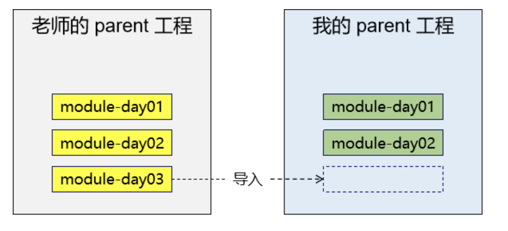

# Maven的学习路线:
Maven -> SSM -> 做SSM项目 -> 学习分布式中间件等技术 SpringBoot SpringCloud Redis Nginx 消息队列 -> 分布式项目

<br><br>

# Maven的应用场景

**1. 开发过程:**   
我们在开发的过程中就需要使用 Maven的本地仓库 帮助我们管理jar包  
然后我们通过依赖的方式 将jar包导入我们的项目中

<br>

**2. 自动部署:**    
在配置 持续集成 的时候  
我们会将我们的代码推送到git远程仓库 然后远程仓库触发钩子 通知持续集成Jenkins工具

Jenkins再来调用Maven执行构建过程生成war包, 在有了war包后  
Jenkins会调用事先准备好的脚本程序 把我们的war包部署到docker实例

如果有很多的docker实例, 那我们还可以使用 **Kubernetes** 来进行统一的管理   
实现动态的扩容 缩容的效果

<br>

**3. 私有仓库**  
有些公司会开发一些公共的组件 这些公共的组件是以jar包的形式 供给大家来使用

但是这些jar包并没有发布到中央仓库或第三方仓库中  
这时使用方面 怎么进行发布和统一的引入 我们可以借助 Nexus私服 相当于我们能自己搭建了一个Maven仓库

<br><br>

# 学习Maven原因:

## Maven作用依赖管理工具

### 1. Jar包的规模:
随着我们使用越来越多的框架, 或者框架封装程度越来越高, 项目中使用的jar包也越来越多。项目中, 一个模块里面用到上百个jar包是非常正常的。

<br>

### 2. Jar包的来源:
**这个jar包所属技术的官网**  
官网通常是英文界面, 网站的结构又不尽相同, 甚至找到下载链接还需要通过特殊的工具下载。

<br>

**第三方网站提供下载。**  
问题是不规范, 在使用过程中会出现各种问题。
- jar包的名称
- jar包的版本
- jar包内的具体细节

而使用 Maven 后, 依赖对应的 jar 包能够**自动下载**, 方便、快捷又规范。

<br>

### 3. Jar包之间的依赖关系
框架中使用的 jar 包, 不仅数量庞大, 而且彼此之间存在错综复杂的依赖关系。  

依赖关系的复杂程度, 已经上升到了完全不能靠人力手动解决的程度。另外, jar 包之间有可能产生冲突。进一步增加了我们在 jar 包使用过程中的难度。

而实际上 jar 包之间的依赖关系是普遍存在的, 如果要由程序员手动梳理无疑会增加极高的学习成本, 而这些工作又对实现业务功能毫无帮助。

而使用 Maven 则几乎不需要管理这些关系, 极个别的地方调整一下即可, 极大的减轻了我们的工作量。

<br><br>

## Maven作为构建管理工具
我们的Java程序一定有一个源程序, 也就是第一个Java类, 它要是想运行一定需要经过编译 将该Java文件编译成class字节码文件才能够运行

编译就是构建操作的一个环节, 如果我们写的是一个web工程的话 除了要对Java的源程序进行编译 还需要将这个web工程打成一个war包  

将war包部署到Tomcat上面 将Tomcat跑起来才能运行一个web工程 也就是说 编译 打包 部署 都属于构建操作中的

<br>

### 1. 你没有注意过的构建
你可以不使用 Maven, 但是构建必须要做。当我们使用 IDEA 进行开发时, 构建是 IDEA 替我们做的

<br>

**IDEA工程中的目录结构:**
```
| - src
  | - com.sam.demo
    - Person

| - web
  | - WEB-INF
  - index.jsp
```

<br>

**IDEA中启动Tomcat后的部署目录:**  
当启动Tomcat服务器后 会出现 out 文件目录

我们编译好的字节码文件在 classes 目录下, 我们真正在Tomcat上运行的是 pro01~ 这个目录, 我们放在Tomcat上的war里面的结构 就是pro01~ 这个目录中的结构

```
| - out
  | - artifacts
    | - pro01_common_web_project_war_exploded
      | - WEB-INF
        | - classes
          | - com.sam.demo
            - Person.class
          - web.xml
        - index.jsp 
```

将war放在Tomcat中就属于构建的操作, 上面还属于本地开发

<br>

### 2. 脱离IDE环境仍需要构建:


<br>

**持续集成:**  
我们本地编码 然后 本地测试 没有问题后 我们会推送到 git远程库上

然后触发钩子程序 只要有新的代码推送到远程库就会触发该钩子程序

钩子程序就会通知持续集成的工具 持续集成的工具就会调用Maven帮我们编译 打包 部署 到Docker中 然后Docker通过k8s将很多Docker管理起来 **这就是动态的扩容缩容的效果**

访问高峰期的时候 k8s就能迅速创建多个Docker容器, 分担负载, 高峰期之后Docker容器就会释放掉

<br>

而IDEA能帮到我们的仅仅是在本地开发的部分 当我们脱离本地环境 项目要上线的时候 就没有人继续帮助我们了

<br>

### 3. 总结:
- 管理规模庞大的jar包 需要专门的工具
- 脱离IDE环境之后执行构建操作的时候 也需要专门的工具

<br><br>

# 什么是Maven
Maven 是 Apache 软件基金会组织维护的一款专门为 Java 项目提供构建和依赖管理支持的工具。

这个部分我们主要说说构建和依赖的意思

<br>

## 1. 构建
Java 项目开发过程中, 构建指的是**使用原材料生产产品的过程**

**原材料:**  
- Java源代码
- 基于 HTML 的 Thymeleaf 文件
- 图片
- 配置文件

<br>

**产品:**  
一个可以在服务器上运行的项目

<br>

### 构建过程包含的主要的环节:

**清理环节:**  
删除上一次构建的结果, 为下一次构建做好准备

<br>

**编译环节:** 
Java源程序编译成 *.class 字节码文件

<br>

**测试环节:**  
运行提前准备好的测试程序(Maven也是使用junit进行测试的)

<br>

**报告环节:**  
针对刚才测试的结果生成一个全面的信息

<br>

**打包环节:**
- Java工程:jar包
- Web工程:war包

<br>

**安装环节:**  
把一个 Maven 工程经过打包操作生成的 jar 包或 war 包存入 Maven 仓库

<br>

**部署环节:**   
将准备好的jar包 或 war包 部署到服务器上运行

- 部署 jar 包:把一个 jar 包部署到 Nexus 私服服务器上
- 部署 war 包:借助相关 Maven 插件(例如 cargo), 将 war 包部署到 Tomcat 服务器上

<br><br>

## 2. 依赖
如果 A 工程里面用到了 B 工程的类、接口、配置文件等等这样的资源, 那么我们就可以说 A 依赖 B。

**例如:**
- junit-4.12 **依赖** hamcrest-core-1.3
- thymeleaf-3.0.12.RELEASE **依赖** ognl-3.1.26
  - ognl-3.1.26 **依赖** javassist-3.20.0-GA
- thymeleaf-3.0.12.RELEASE **依赖** attoparser-2.0.5.RELEASE
- thymeleaf-3.0.12.RELEASE **依赖** unbescape-1.1.6.RELEASE
- thymeleaf-3.0.12.RELEASE **依赖** slf4j-api-1.7.26

<br>

### 依赖管理中要解决的具体问题:
**jar包的下载:**  
使用 Maven 之后, jar 包会从规范的远程仓库下载到本地

<br>

**jar包之间的依赖:**  
通过依赖的传递性自动完成

<br>

**jar包之间的冲突:**  
通过对依赖的配置进行调整, 让某些jar包不会被导入

<br><br>

## Maven的工作机制:


<br>

我们从 Maven核心程序 开始看, 以后我们要是创建一个工程就是创建一个Maven工程, 我们自己创建的工程之间也可以创建依赖关系

我们还可以将自己创建的工程安装到自己的Maven本地仓库里面

我们工程中用到的第三方的jar包 就可以依赖于Maven本地仓库中jar包, 如果本地没有 则它会联网到远程库下载

**这个部分很像 git, 有本地库 和 远程库 的区别**

<br>

### Maven核心程序:
Maven核心程序负责整体的调度, 具体干活的是Maven的插件 我们每下一个Maven的命令就是调用Maven的一个插件

<br>

### Maven仓库中存放着什么？
里面存放的东西一般是3类

1. 我们自己创建的工程的jar包
2. 我们依赖的框架或第三方库的jar包
3. Maven核心程序需要用到的插件的jar包

<br><br>

## 安装Maven核心程序

<br>

### 1. Maven核心程序解压与配置

**下载 Maven核心程序:**  
```s
maven.apache.org

# 下载页面
https://maven.apache.org/download.cgi

https://archive.apache.org/dist/maven/maven-3/3.6.3/binaries/
```

然后我们找到 Files 标题处, 我们从表格里面选择一个下载:
- tar.gz: 是Linux用的
- .zip: 是windows系统用的
- src.zip: 看源码用的

<br>

**下载历史版本:**  
点击 archives

IDEA的版本 和 Maven的版本 不一致的时候会报错 这里我们重新下载了 **3.6.3的Maven版** 

<br>

**解压下载的 Maven压缩包:**  
核心程序压缩包:apache-maven-3.8.4-bin.zip, 解压到非中文、没有空格的目录。

将文件夹的名字重命名为: Maven-3.8.5, 并放入到 资源库 ``/Library/Maven`` 下

```
| - 任意目录
  | - bin
  | - boot
  | - conf
    - settings.xml

  | - lib
```

在解压目录中, 我们需要着重关注 Maven 的核心配置文件 ``conf/settings.xml``

<br>

### 2. 配置Maven环境变量

**Mac:**  
打开终端, 输入命令
```
vim ~/.bash_profile
```

<br>

打开.bash_profile之后, 按下i键, 进行配置如下, 按下esc, 退出编辑状态, 输入:wq!, 退出文件
```s
#maven 注意这里的目录
export MAVEN_HOME=/Library/Maven-3.8.7
export PATH=$MAVEN_HOME/bin:$PATH
```

<br>

在终端执行生效命令: 
```
source ~/.bash_profile
```

<br>

然后执行命令:   
如果显示maven的版本等信息, 如下图, 表示配置成功。
```
mvn -v
```

<br>

### 配置本地仓库:
打开安装好的maven目录 进入 conf –> **编辑settings.xml文件** 修改``<localRepository>``标签

找到并修改``<localRepository>``, 最初是注释掉的, 取消注释就可以　

```xml
<localRepository>
  你想存放的本地仓库路径
</localRepository>

<!-- 如: -->
<localRepository>
  /Library/Maven-3.8.7/repo
</localRepository>
```

<br>

### 配置阿里云提供的镜像仓库:
Maven 下载 jar 包默认访问境外的中央仓库, 而国外网站速度很慢。改成阿里云提供的镜像仓库, 访问国内网站, 可以让 Maven 下载 jar 包的时候速度更快。配置的方式是

```xml
<mirrors>
  <mirror>
    <id>nexus-aliyun</id>
    <mirrorOf>central</mirrorOf>
    <name>Nexus aliyun</name>
    <url>http://maven.aliyun.com/nexus/content/groups/public</url>
  </mirror>
</mirrors>
```

<br>

### 配置 Maven 工程的基础JDK版本:
如果按照默认配置运行, Java 工程使用的默认 JDK 版本是 1.5, 而我们熟悉和常用的是 JDK 1.8 版本。

修改配置的方式是: 将 profile 标签整个复制到 settings.xml 文件的 profiles 标签内。

配置后我们再创建的Maven工程就是1.8起步的

```xml
<profile>
  <id>jdk-1.8</id>
  <activation>
  <activeByDefault>true</activeByDefault>
  <jdk>1.8</jdk>
  </activation>
  <properties>
  <maven.compiler.source>1.8</maven.compiler.source>
  <maven.compiler.target>1.8</maven.compiler.target>
  <maven.compiler.compilerVersion>1.8</maven.compiler.compilerVersion>
  </properties>
</profile>
```

<br><br>

# 使用Maven: 命令行环境下

## 概念:

### 坐标:

**数学中的坐标**


```
  y
   ↑
 ↙   → 
z     x
```

使用 xyz 三个向量 作为空间的坐标系, 可以在空间中唯一的定位到一个点

<br>

**Maven中的坐标:**  
我们使用 3个向量 在Maven的仓库中表示 **唯一的** 定位到一个jar包

相当于在Java中我们会通过全类名的方法定位到一个类, 而在Maven的工程中我们是通过坐标(3个向量)定位到具体的一个jar包

<br>

### 三个向量:

**groupId:**  
公司或组织的id(域名)

<br>

**artifactId:**  
一个项目或者是项目中的一个模块的id(工程), 一个项目可能会包含很多的工程, 也就是说 artifactId表示工程(模块)

<br>

**version:**  
版本号

<br>

### 三个向量的取值方式:

**groupId:**  
公司或组织域名的倒序, 通常也会加上项目名称
```
com.atguigu + 项目名称

例如:com.atguigu.maven
```

<br>

**artifactId:**  
模块的名称, 将来作为 Maven 工程的工程名

<br>

**version:**  
模块的版本号, 根据自己的需要设定

例如:
- SNAPSHOT: 表示快照版本, 正在迭代过程中, 不稳定的版本
- RELEASE: 表示正式版本

<br>

**示例:**  
我们创建了一个 maven 的项目, 里面有 pro01-atguigu-maven 模块(工程), 版本是 1.0-SNAPSHOT
```java
// 相当于 项目
groupId:com.atguigu.maven
// 相当于 模块(工程)
artifactId:pro01-atguigu-maven
// 相当于 工程中具体的版本
version:1.0-SNAPSHOT
```

<br>

### 坐标和仓库中 jar 包的存储路径之间的对应关系
```xml
<groupId>javax.servlet</groupId>
<artifactId>servlet-api</artifactId>
<version>2.5</version>
```

上面坐标对应的jar包 **在 Maven本地仓库 中的位置**

1. 我们先找到 Maven本地仓库根目录
2. 以.作为目录的层级, 一点点的找

3. **artifactId + version 作为了jar包 文件名**

```js
Maven本地仓库根目录\javax\servlet\servlet-api\2.5\servlet-api-2.5.jar
```

<br><br>

## 创建 Maven版的 Java工程
此章节是在纯命令行的环境下操作

<br>

### 工作空间:
我们创建一个文件夹来存放 一个个的Maven工程

我们要创建 Maven的工程, 每一个工程都会有一个目录, 而我们会创建好多的工程, 所以这些工程都需要放在一个 **工作空间** 中, 也就是说 我们有一个总目录来存放这些工程

<br>

1. Maven核心程序: 相当于 中军大帐
2. Maven本地仓库: 相当于 兵营
3. 本地工作空间: 相当于 战场

```
本地工作空间:
/Users/liulin/Desktop/Sam/Maven_workspace
```

<br>

### 命令行创建 Maven工程

**1. 进入Maven的工作空间:**  
```
cd /Users/liulin/Desktop/Sam/Maven_workspace
```

<br>

**2. 输入命令 创建Maven工程:**
```
mvn archetype:generate
```

<br>

**命令解析:**
- mvn: 主命令
- archetype:generate: 子命令

- archetype: 核心程序要调用的插件
- generate: 插件的目标

也就是我们用到了 archetype 插件 使用了它的 generate 目标, 一个插件有很多的目标, 插件和目标之间是使用:分开的

<br>

**当我们执行该命令后 会有创建内容的提示:**

1. 让我们选择 archetype 的一个值: 7是默认值 快速开始 我们选择默认值就可以

2. Define value for property "groupId": 项目名, 需要自己输入, 如 com.atguigu.maven

3. Define value for property "artifactId": 模块名, 需要自己输入, 如 pro01-maven-java

4. Define value for property "version": 直接回车 使用默认值

5. Define value for property "package": 直接回车 使用默认值

```
groupId: com.atguigu.maven 
artifactId: pro01-maven-java
version: 1.0-SNAPSHOT
package: com.atguigu.maven
```

我们有一个maven项目 下面有一个 pro01-maven-java , 该模块的版本为1.0-SNAPSHOT

<br>

上面的过程执行结束后会在 工作空间 中创建一个工程 它的目录结构如下:

```java
| - pro01-maven-java
  | - src

    | - main
      | - java
        | - com.sam.maven
          - App.java

      | - resources

    | - test
      | - java
        | - com.sam.maven
          - AppTest.java
  - pom.xml
```

<br>

### 调整刚才创建的 maven 项目
**打开 pom.xml 文件:**  

<br>

**调整1:**  
Maven 默认生成的工程, 对 junit 依赖的是较低的 3.8.1 版本, 我们可以改成较适合的 **4.12版本**。

**自动生成的 App.java 和 AppTest.java 可以删除。**

<br>

**修改junit的版本:**
```xml
<dependencies>
  <dependency>
    <groupId>junit</groupId>
    <artifactId>junit</artifactId>
    <version>4.12</version>
    <scope>test</scope>
  </dependency>
</dependencies>
```

<br><br>

## 解读: pom.xml
它是 Maven 的核心配置文件

<br>

### 要点:
**1. ``<project>``: 根标签**  
表示对当前的工程进行配置

<br>

**2. ``<modelVersion>``**  
从 Maven2大版本开始 固定就是 4.0.0

表示当前pom.xml所采用的标签结构, 我们不会修改该标签

<br>

**3. 坐标信息:**  
我们创建工程的时候 指明的信息

- groupId: 代表公司或组织开发的某一个项目 下面就是maven项目

- artifactId: 项目下的某一个模块(工程)

- version: 表示当前模块的版本

- packaging: 当前maven工程打包的方式, 默认会采用 jar 方式对当前的maven项目打包
  - jar: 生成 jar 包, 说明这是一个Java工程
  - war: 生成 war 包, 说明这是一个web工程
  - pom: 说明这个工程是用来管理其它工程的工程

```xml
<groupId>com.sam.maven</groupId>
<artifactId>pro01-maven-java</artifactId>
<version>1.0-SNAPSHOT</version>

<!-- 我们创建出来的工程里没有这个标签 -->
<packaging>jar</packaging>
```

<br>

**4. ``<properties>``:**  
在Maven中定义属性值
标签是属性名, 标签体是属性值

```xml
<project.build.sourceEncoding>UTF-8</project.build.sourceEncoding>

key: project.build.sourceEncoding
val: UTF-8
```

<br>

**5. ``<dependencies>``:**  
配置具体的依赖信息 每一个依赖的格式如下:

我们将一个jar包的坐标放进dependency里面 我们的工程就依赖上了该jar, Maven就会导入这个坐标对应的jar包
```xml
<dependency>
  <groupId>junit</groupId>
  <artifactId>junit</artifactId>
  <version>4.12</version>

  <!-- 配置当前依赖(生效)的范围 -->
  <scope>test</scope>
</dependency>
```

<br>

我们可以在这里修改 Maven 给我们提供的属性对应的值 也可以设置 和 修改我们自定义的属性和值

```xml
<?xml version="1.0" encoding="UTF-8"?>

<project xmlns="http://maven.apache.org/POM/4.0.0" xmlns:xsi="http://www.w3.org/2001/XMLSchema-instance"
  xsi:schemaLocation="http://maven.apache.org/POM/4.0.0 http://maven.apache.org/xsd/maven-4.0.0.xsd">
  <modelVersion>4.0.0</modelVersion>

  <groupId>com.sam.maven</groupId>
  <artifactId>pro01-maven-java</artifactId>
  <version>1.0-SNAPSHOT</version>

  <name>pro01-maven-java</name>
  <!-- FIXME change it to the project's website -->
  <url>http://www.example.com</url>

  <properties>
    <!-- 
      构建过程中 读取源码时使用的字符集
     -->
    <project.build.sourceEncoding>UTF-8</project.build.sourceEncoding>
    <maven.compiler.source>1.7</maven.compiler.source>
    <maven.compiler.target>1.7</maven.compiler.target>
  </properties>

  <dependencies>
    <dependency>
      <groupId>junit</groupId>
      <artifactId>junit</artifactId>
      <version>4.12</version>
      <scope>test</scope>
    </dependency>
  </dependencies>

  <build>
    <pluginManagement>
    
    <!-- lock down plugins versions to avoid using Maven defaults (may be moved to parent pom) -->
      <plugins>
        <!-- clean lifecycle, see https://maven.apache.org/ref/current/maven-core/lifecycles.html#clean_Lifecycle -->
        <plugin>
          <artifactId>maven-clean-plugin</artifactId>
          <version>3.1.0</version>
        </plugin>
        <!-- default lifecycle, jar packaging: see https://maven.apache.org/ref/current/maven-core/default-bindings.html#Plugin_bindings_for_jar_packaging -->
        <plugin>
          <artifactId>maven-resources-plugin</artifactId>
          <version>3.0.2</version>
        </plugin>
        <plugin>
          <artifactId>maven-compiler-plugin</artifactId>
          <version>3.8.0</version>
        </plugin>
        <plugin>
          <artifactId>maven-surefire-plugin</artifactId>
          <version>2.22.1</version>
        </plugin>
        <plugin>
          <artifactId>maven-jar-plugin</artifactId>
          <version>3.0.2</version>
        </plugin>
        <plugin>
          <artifactId>maven-install-plugin</artifactId>
          <version>2.5.2</version>
        </plugin>
        <plugin>
          <artifactId>maven-deploy-plugin</artifactId>
          <version>2.8.2</version>
        </plugin>
        <!-- site lifecycle, see https://maven.apache.org/ref/current/maven-core/lifecycles.html#site_Lifecycle -->
        <plugin>
          <artifactId>maven-site-plugin</artifactId>
          <version>3.7.1</version>
        </plugin>
        <plugin>
          <artifactId>maven-project-info-reports-plugin</artifactId>
          <version>3.0.0</version>
        </plugin>
      </plugins>
    </pluginManagement>
  </build>
</project>
```

<br><br>

## Maven核心概念: POM

### 概念:
POM Project Object Model, **项目对象模型**。  
和 POM 类似的是:DOM(Document Object Model), 文档对象模型。

它们都是模型化思想的具体体现。

对于我们应用程序来说现实世界中的东西想放入程序中进行操作 实现的方式就是将现实世界的东西封装成模型 封装成模型以后 就方便我们在程序中将其创建为对象

<br>

这里就是将 Maven工程这个项目封装成了一个模型, 在程序中用对象将其体现出来 我们就可以使用程序的方式进行管理和操作了

<br>

### 模型化思想:
POM 表示将工程抽象为一个模型, 再用程序中的对象来描述这个模型。这样我们就可以用程序来管理项目了。

我们在开发过程中, 最基本的做法就是将现实生活中的事物抽象为模型, 然后封装模型相关的数据作为一个对象, 这样就可以在程序中计算与现实事物相关的数据。

<br>

### 对应的配置文件:
POM 理念集中体现在 Maven 工程根目录下 pom.xml 这个配置文件中。

所以这个 pom.xml 配置文件就是 Maven 工程的核心配置文件。其实学习 Maven 就是学这个文件怎么配置, 各个配置有什么用

<br>

### Maven工程的目录结构:
```java
| - pro01-maven-java

  | - src: 源码目录

    | - main: 主体程序目录
      | - java: Java源代码
        | - com.sam.maven: package目录
          - App.java

      | - resources: 配置文件目录

    | - test
      | - java
        | - com.sam.maven
          - AppTest.java
  - pom.xml
```

另外还有一个 target 目录 **专门存放构建操作输出的结果**

<br>

上述的目录不是随意创建了 需要遵守 Maven 里的规则, 这也是**约定的目录结构**

<br>

### 约定目录结构的意义:
Maven 为了让构建过程能够尽可能自动化完成, 所以必须约定目录结构的作用。

例如:  
Maven 执行编译操作, 必须先去 Java 源程序目录读取 Java 源代码, 然后执行编译, 最后把编译结果存放在 target 目录

<br>

### 约定大于配置:
Maven 对于目录结构这个问题, 没有采用配置的方式, 而是基于约定。这样会让我们在开发过程中非常方便。

如果每次创建 Maven 工程后, 还需要针对各个目录的位置进行详细的配置, 那肯定非常麻烦。  
目前开发领域的技术发展趋势就是:**约定大于配置, 配置大于编码**

<br>

**扩展: 开发的三个层次**  
有的事是必须通过写代码来实现的 但有的事儿我们可以通过配置来实现 

特别是我们使用了框架后 很多事我们都是通过配置来实现 当我们的框架封装的程度再深的话 那么有的事情连配置都不需要了

大家共同遵守下我们事先做好的约定 这样连配置都省略了

所以我们从 **编码 -> 配置 -> 约定** 这是一个代码越来越简化 我们使用的框架封装的层次越来越深

我们可以将约定理解为默认的配置 这些配置如果没有特殊需要就不用配了, 这也是我们开发领域的技术发展趋势

<br><br>

## 准备: 在Maven工程中添加Java类
我们在这个章节主要实现在Maven工程中添加Java类 方便于我们使用Maven进行构建

```java
| - pro01-maven-java

  | - src

    | - main
      | - java
        | - com.sam.maven

          // 添加Java类
          - Calculator.java

      | - resources

    | - test
      | - java
        | - com.sam.maven

          // 添加Java测试类
          - CalculatorTest.java
  - pom.xml
```

<br>

### 主体程序:
我们的Java程序如果放在 main 目录下, 该程序就是主体程序 它指被测试的程序 同时也是将来在项目中真正要使用的程序

我们在现在这个项目下添加如下的两个Java类

<br>

**编写 Calculator 类的内容:**  
```java
package com.sam.maven;

public class Calculator {
	
	public int sum(int i, int j){
		return i + j;
	}
	
}
```

<br>

**编写 CalculatorTest 类的内容:**

```java
package com.sam.maven;

import org.junit.Test;
import com.sam.maven.Calculator;
	
/*
  静态导入:
    将 org.junit.Assert 这个类 以静态的方法导入进来
    那么该类中使用 static 声明的结构 就像在当前类中声明的一样 
    
    我们再引用org.junit.Assert这个类的静态资源的时候 不需要写类名 直接调用就可以了
*/
import static org.junit.Assert.*;
	
public class CalculatorTest{
	
	@Test
	public void testSum(){
		
		// 1.创建Calculator对象
		Calculator calculator = new Calculator();
		

		// 2.调用Calculator对象的方法, 获取到程序运行实际的结果
		int actualResult = calculator.sum(5, 3);
		
		// 3.声明一个变量, 表示程序运行期待的结果
		int expectedResult = 8;
    

    /*
      assertEquals()该方法就是 Assert 类中静态的方法 因为我们静态导入了该类中的结构

      所以我们可以不创建 Assert类对象 就可以直接使用该方法
    */
		// 4.使用断言来判断实际结果和期待结果是否一致
		// 如果一致:测试通过, 不会抛出异常
		// 如果不一致:抛出异常, 测试失败
		assertEquals(expectedResult, actualResult);
	}
}

```

<br><br>

## 执行 Maven 的构建命令

### 要点:
**运行 Maven 中和构建操作相关的命令时, 必须进入到 pom.xml 所在的目录。**

<br>

如果没有在 pom.xml 所在的目录运行 Maven 的构建命令, 那么会看到下面的错误信息:
```java
The goal you specified requires a project to execute but there is no POM in this directory
```

<br>

``mvn -v`` 命令和构建操作无关, 只要正确配置了 PATH, 在任何目录下执行都可以。

**而构建相关的命令要在 pom.xml 所在目录下运行, 就是进入 工作空间目录/工程目录 中**

**操作哪个工程, 就进入这个工程的 pom.xml 目录后再使用 Maven相关的命令**

<br>

### 清理操作:
删除 target 目录
```
mvn clean
```

<br>

### 编译操作:
```java
// 对 主程序进行编译:
mvn compile

// 对测试程序编译:
mvn test-compile
```

<br>

当编译后, 会在当前工程下 自动创建 target目录

<br>

**主体程序编译结果存放的目录:**
```
target/classes
```

<br>

**测试程序编译结果存放的目录:**
```
target/test-classes
```

<br>

**注意:**  
每当源程序有更改的时候 需要重新编译

<br>

### 测试操作:
测试的报告存放的目录: target/surefire-reports
```
mvn test
```

当我们执行该命令后 maven就会执行测试类中的测试方法

<br>

**测试报告:**  
测试报告存放在 target/surefire-reports 下

<br>

### 打包操作:
打包的结果会在target目录下生成 jar 包

- Java工程打jar包  
- Web工程打war包

jar包名是 artifactId + version

<br>

**注意:**  
执行打包命令的时候 会自动进行测试, 项目只有测试成功后才会进行打包

测试程序不会包含在Jar包中

```
mvn package


| - target
  - pro01-maven-java-1.0-SNAPSHOT.jar
```

<br>

### 安装操作:
安装操作指的是 将我们打包操作后生成的jar包 保存到 本地Maven仓库中

```java
mvn install

// 组合指令, 确保源码是最新的情况下再编译测试打包的
mvn clean install
```

安装的效果是将本地构建过程中生成的 jar 包存入 Maven 本地仓库。这个 jar 包在 Maven 仓库中的路径是根据它的坐标生成的。

```xml
<!-- 坐标信息 -->
<groupId>com.atguigu.maven</groupId>
<artifactId>pro01-maven-java</artifactId>
<version>1.0-SNAPSHOT</version>
```

<br>

在 Maven 仓库中生成的路径如下:
```
/Library/Maven-3.8.7/repo/com/sam/maven/pro01-maven-java/1.0-SNAPSHOT
```

另外, 安装操作还会将 pom.xml 文件转换为 XXX.pom 文件一起存入本地仓库。

所以我们在 Maven 的本地仓库中想看一个 jar 包原始的 pom.xml 文件时, 查看对应 XXX.pom 文件即可, 它们是名字发生了改变, 本质上是同一个文件。

<br><br>

## 创建 Maven版的 Web工程
此章节是在纯命令行的环境下操作

<br>

使用 ``mvn archetype:generate`` 命令生成 Web 工程时, 需要使用一个专门的 archetype。

这个专门的 archetype 需要通过参数的方式根据坐标来指定

-D参数: 就是用来传递参数的 它跟根据参数没有空格 多个参数使用 空格隔开 如: -D参数 -D参数 -D参数

<br>

**固定指令:**  
不用修改 直接复制使用
```java
mvn archetype:generate -DarchetypeGroupId=org.apache.maven.archetypes -DarchetypeArtifactId=maven-archetype-webapp -DarchetypeVersion=1.4
```

<br>

**Web工程的目录结构:**  
```java
| - pro02-maven-web
  | - src

    | - main
      | - java: 没有, 可以自行创建

      | - webapp
        | - WEB-INF
          - web.xml
        - index.jsp

    | - test: 没有, 可以自行创建

  - pom.xml
```

<br>

**pom.xml:**  
```xml
<?xml version="1.0" encoding="UTF-8"?>

<project xmlns="http://maven.apache.org/POM/4.0.0" xmlns:xsi="http://www.w3.org/2001/XMLSchema-instance"
  xsi:schemaLocation="http://maven.apache.org/POM/4.0.0 http://maven.apache.org/xsd/maven-4.0.0.xsd">
  <modelVersion>4.0.0</modelVersion>

  <groupId>com.sam.maven</groupId>
  <artifactId>pro2-maven-web</artifactId>
  <version>1.0-SNAPSHOT</version>
  <packaging>war</packaging>

  <name>pro2-maven-web Maven Webapp</name>
  <!-- FIXME change it to the project's website -->
  <url>http://www.example.com</url>

  <properties>
    <!-- 源码的字符集 -->
    <project.build.sourceEncoding>UTF-8</project.build.sourceEncoding>
    <maven.compiler.source>1.7</maven.compiler.source>
    <maven.compiler.target>1.7</maven.compiler.target>
  </properties>

  <dependencies>
    <dependency>
      <groupId>junit</groupId>
      <artifactId>junit</artifactId>
      <version>4.12</version>
      <scope>test</scope>
    </dependency>
  </dependencies>

  <build>
    <finalName>pro2-maven-web</finalName>
    <pluginManagement><!-- lock down plugins versions to avoid using Maven defaults (may be moved to parent pom) -->
      <plugins>
        <plugin>
          <artifactId>maven-clean-plugin</artifactId>
          <version>3.1.0</version>
        </plugin>
        <!-- see http://maven.apache.org/ref/current/maven-core/default-bindings.html#Plugin_bindings_for_war_packaging -->
        <plugin>
          <artifactId>maven-resources-plugin</artifactId>
          <version>3.0.2</version>
        </plugin>
        <plugin>
          <artifactId>maven-compiler-plugin</artifactId>
          <version>3.8.0</version>
        </plugin>
        <plugin>
          <artifactId>maven-surefire-plugin</artifactId>
          <version>2.22.1</version>
        </plugin>
        <plugin>
          <artifactId>maven-war-plugin</artifactId>
          <version>3.2.2</version>
        </plugin>
        <plugin>
          <artifactId>maven-install-plugin</artifactId>
          <version>2.5.2</version>
        </plugin>
        <plugin>
          <artifactId>maven-deploy-plugin</artifactId>
          <version>2.8.2</version>
        </plugin>
      </plugins>
    </pluginManagement>
  </build>
</project>

```

<br>

**注意:**  
该方式创建的 web.xml 的版本很低 首行声明标签的版本很低 我们可以复制web工程下web.xml来使用

<br><br>

## 准备: 在Maven的Web工程中添加代码
该环节是为了以后 编译 测试 打包 安装到本地仓库等一系列的操作使用的

<br>

### 创建 Servlet 程序
```java
| - pro02-maven-web
  | - src

    | - main
      | - java
        | - com.sam.maven
          - HelloServlet.java

      | - webapp
        | - WEB-INF
          - web.xml

        - index.jsp

    | - test: 没有, 可以自行创建

  - pom.xml
```

<br>

**Servlet程序:**  
```java
package com.sam.maven;

import javax.servlet.http.HttpServlet;
import javax.servlet.http.HttpServletRequest;
import javax.servlet.http.HttpServletResponse;
import javax.servlet.ServletException;
import java.io.IOException;
	
public class HelloServlet extends HttpServlet{
	
	protected void doGet(HttpServletRequest request, HttpServletResponse response) throws ServletException, IOException {
		
		response.getWriter().write("hello maven web");
		
	}
	
}
```

<br>

**配置web.xml**  
```xml
<?xml version="1.0" encoding="UTF-8"?>
<web-app xmlns="http://xmlns.jcp.org/xml/ns/javaee"
         xmlns:xsi="http://www.w3.org/2001/XMLSchema-instance"
         xsi:schemaLocation="http://xmlns.jcp.org/xml/ns/javaee http://xmlns.jcp.org/xml/ns/javaee/web-app_4_0.xsd"
         version="4.0">

  <servlet>
    <servlet-name>HelloServlet</servlet-name>
    <servlet-class>com.sam.maven.HelloServlet</servlet-class>
  </servlet>
  <servlet-mapping>
    <servlet-name>HelloServlet</servlet-name>
    <url-pattern>/helloServlet</url-pattern>
  </servlet-mapping>
</web-app>
```

<br>

**index.jsp文件:**  
```jsp
<html>
<body>
<h2>Hello World!</h2>
<a href="helloServlet">Access Servlet</a>
</body>
</html>
```

<br>

### 配置工程对 某jar包 的依赖
Maven工程里面要是手动添加项目所需要的依赖的话, 需要在pom.xml中配置

<br>

**示例描述:**
当我们准备好了上述的代码后 我们进入工程根路径(有pom.xml的目录) 执行maven的编译操作 ``mvn compile`` 会报错


**报错信息如下:**
```
DANGER

程序包 javax.servlet.http 不存在

程序包 javax.servlet 不存在

找不到符号

符号: 类 HttpServlet
```

上面的错误信息说明:我们的 Web 工程用到了 HttpServlet 这个类, 而 HttpServlet 这个类属于 servlet-api.jar 这个 jar 包。

此时我们说, Web 工程需要依赖 servlet-api.jar 包。

也就是说我们要在 pom.xml 配置文件中 添加 需要依赖的jar包信息, 该jar包的具体信息我们可以通过下面的网址进行查看

```xml
 <dependency>
  <groupId>xxx</groupId>
  <artifactId>xxx</artifactId>
  <version>xxx</version>
  <scope>xxx</scope>
</dependency>

<!-- https://mvnrepository.com/artifact/javax.servlet/javax.servlet-api -->
<dependency>
  <groupId>javax.servlet</groupId>
  <artifactId>javax.servlet-api</artifactId>
  <version>3.1.0</version>
  <scope>provided</scope>
</dependency>
```

```s
https://mvnrepository.com/
```

如我们在该网站的搜索框里面 搜索 servlet-api, 结果集中会列出很多 这时我们需要自己判断我们需要的是哪个

找到依赖后 我们需要选择指定的版本 我们可以观察 Usages列 看看哪些下载的多

进入后就有 ``<dependency>`` 所需要的信息

然后配置到 pom.xml 文件中

<br>

### 编译 Web工程
进入到 pro02 的web项目后, 我们运行编译的命令

```
mvn clean compile
```

在编译的过程中会下载项目中所需要的jar包

<br>

### 打包 Web工程
web工程的话 对应会打成 war 包
```
mvn clean package
```

<br>

**打包结果:**  
1. web项目会生成一个war包
2. 同时会生成一个war包解压后的结果 

然后该war包需要部署到Tomcat中跑起来

<br>

### 将上述的war部署到 Tomcat上
我们将 war包 或者 war包对应的解压目录 丢到Tomcat上都是可以的 war包会自动解压  

```
| - webapps
  | - maven_web: 我们打包后的资源
```

我们进入到 Tomcat8/bin 执行 sudo ./startup.sh 进行 localhost:8080/maven_web 观察页面

<br><br>

## 让 Web工程依赖Java工程
前面我们的项目也有依赖 依赖了junit 和 servlet-api 这里我们依赖一个自己开发的工程

也就是说让我们的上面定义的web工程依赖上面定义的Java工程

<br>

### 观念:
明确一个意识, 从来只有 Web 工程依赖 Java 工程, 没有反过来 Java 工程依赖 Web 工程。

本质上来说, Web工程依赖 的 Java工程其实就是 Web 工程里导入的 jar 包。

将来web工程在运行的时候是一个war包 而web工程依赖的java工程就会变成war包中的一个jar包

**最终 Java 工程会变成 jar 包, 放在 Web 工程的 WEB-INF/lib 目录下**

<br>

将来web工程在运行的时候是一个war包 而web工程依赖的java工程就会变成war包中的一个jar包

<br>

### 实现:
在 pro02-maven-web 工程的 pom.xml 中, 找到 dependencies 标签, 在 dependencies 标签中做如下配置:

**配置对Java工程pro01-maven-java的依赖:** 
```xml
<dependency>
  <groupId>com.sam.maven</groupId>
  <artifactId>pro01-maven-java</artifactId>
  <version>1.0-SNAPSHOT</version>

  <!-- scope可选, 要写的话值为compile 默认值 -->
  <scope>compile</scope>
</dependency>
```

<br>

### 测试:
测试看看有没有依赖上Java工程, 看看能否在Web工程中应用到Java工程中的类

在没有maven的时候 这个操作是不行的, 我们看看在maven中有没有依赖上我们的Java工程

<br>

**1. 在Web工程中补充测试类**
```
| - pro02-maven-web
  | - src
    | - main
    | - test
      | - java
        | - com.sam.maven
          - 
```

<br>

**2. 在测试类中看看能否引用Java工程中的Calculator类**

Web工程测试类中的代码
```java
package com.sam.maven;

import org.junit.Test;
import com.sam.maven.Calculator;
	
import static org.junit.Assert.*;
	
public class CalculatorTest{
	
	@Test
	public void testSum(){
		
		Calculator calculator = new Calculator();
		int actualResult = calculator.sum(5, 3);
		int expectedResult = 8;
		assertEquals(expectedResult, actualResult);

    System.out.println("测试testSum()方法被调用了");
	}
}

```

<br>

**3. 执行测试命令: mvn test**  
回到 pro02 工程的根目录 执行命令

测试操作中会提前自动执行编译操作, 测试成功就说明编译也是成功的。

<br>

**4. 执行打包命令: mvn package**  
通过查看 war 包内的结构, 我们看到被 Web 工程依赖的 Java 工程确实是会变成 Web 工程的 WEB-INF/lib 目录下的 jar 包。

<br>

### 查看当前 Web 工程所依赖的 jar 包的列表
```
mvn dependency:list
```

```java
[INFO] The following files have been resolved:
    // 单元测试
    junit:junit:jar:4.11:test
    org.hamcrest:hamcrest-core:jar:1.3:test

    // servlet
    javax.servlet:javax.servlet-api:jar:3.1.0:provided

    // 自定义的Java工程
    com.sam.maven:pro01-maven-java:jar:1.0-SNAPSHOT:compile
```

<br>


**说明:**  
javax.servlet:javax.servlet-api:jar:3.1.0:provided

上面的格式显示的是一个 jar 包的坐标信息 主要的内容为:
```
groupId:artifactId:打包方式:version:依赖的范围
```

<br>

这样的格式虽然和我们 XML 配置文件中坐标的格式不同, 但是本质上还是坐标信息, 大家需要能够认识这样的格式, 将来从 Maven 命令的日志或错误信息中看到这样格式的信息, 就能够识别出来这是坐标。进而根据坐标到Maven 仓库找到对应的jar包, 用这样的方式解决我们遇到的报错的情况。

<br>

### 以树形结构查看当前 Web 工程的依赖信息
```
mvn dependency:tree
```

树形结构的显示信息中可以看到包之间的依赖关系

```
[INFO] com.atguigu.maven:pro02-maven-web:war:1.0-SNAPSHOT
[INFO] +- junit:junit:jar:4.12:test
[INFO] | \- org.hamcrest:hamcrest-core:jar:1.3:test
[INFO] +- javax.servlet:javax.servlet-api:jar:3.1.0:provided
[INFO] \- com.atguigu.maven:pro01-maven-java:jar:1.0-SNAPSHOT:compile
```

我们在 pom.xml 中并没有依赖 hamcrest-core, 但是它却被加入了我们依赖的列表。原因是:junit 依赖了hamcrest-core, 然后基于依赖的传递性, hamcrest-core 被传递到我们的工程了。

<br>

## pom.xml中依赖的范围
我们会通过 ``<dependency>`` 的 ``<scope>`` 来**设置当前依赖的作用范围**

```xml
<dependency>
  <groupId>com.sam.maven</groupId>
  <artifactId>pro01-maven-java</artifactId>
  <version>1.0-SNAPSHOT</version>
  <scope>compile</scope>
</dependency>
```

<br>

### ``<scope>`` 的可选值:
这个章节中我们先说下 前3个的依赖范围

1. compile: 默认值
2. test
3. provided
4. system
5. runtime
6. import

compile是正常情况, 而2~6属于特殊情况, 也就说普通的依赖都是 compile, 当我们有特殊情况的时候再看 2 ~ 6

<br>

**测试说明:**  

**空间角度:**  
- 以compile方式引入的依赖, **能否在 main目录 下使用**

- 以compile方式引入的依赖, **能否在 test目录 下使用**

<br>

**时间角度:**  
 
- 开发过程:    
以compile方式引入的依赖 在IDE编辑器中能否通过.的形式 点出api 能点出来就是有效

- 部署到服务器:   
Web工程会打一个war包, 以compile方式引入的依赖 会不会参与打包, 如果参与了打包就说明该依赖会跟着war包一起部署到服务器上, 简单的说就是**会不会被打包到服务器**

<br>

**compile 和 test 对比:**  

||main目录(空间)|test目录(空间)|开发过程(时间)|部署到服务器(时间)|
|:--|:--:|:--:|:--:|:--:|
|compile|有效|有效|有效|有效|
|test|无效|有效|有效|无效|

<br>

**compile 和 provided 对比:**
||main目录(空间)|test目录(空间)|开发过程(时间)|部署到服务器(时间)|
|:--|:--:|:--:|:--:|:--:|
|compile|有效|有效|有效|有效|
|provided|有效|有效|有效|无效|

<br>

### 什么时候使用 这些可选值:

**compile:**  
主体功能里需要用到的东西都是 compile, 99%都是compile范围的

通常使用的第三方框架的 jar包 这些jar包在项目实际运行时是真正要用到的

所以都是以 compile 范围进行依赖的。比如 SSM 框架所需jar包。

<br>

**test:**  
测试过程中使用的 jar包, 以 test 范围依赖进来。这部分jar包不需要被部署到服务器

比如 junit

<br>

**provided(已提供的):**  
在开发过程中需要用到的 "服务器(Tomcat)上的 jar 包" 通常以 provided 范围依赖进来。

比如 servlet-api、jsp-api。这些jar包服务器上都有了 比如这两个就是tomcat自己提供的

而这个范围的 jar 包之所以不参与部署、不放进 war 包, 就是避免和服务器上已有的同类 jar 包产生冲突, 同时减轻服务器的负担。

**说白了就是:"服务器上已经有了, 你就别带啦！"**

<br><br>

## 依赖的传递性

### 概念:
A -> B -> C  

A 依赖 B, B 依赖 C

ABC可以是第三方的jar包, 或者是我们自己定义的Maven工程

对A来说它肯定能使用B B也可以使用C, 当我们将 A B C 串成一串的时候 形成一个链条, 那A是否可以使用C呢

如果A可以用C 说明C可以传递到A这, 那么A就可以不用直接再依赖C

<br>

### 传递的原则:
在 A 依赖 B，B 依赖 C 的前提下，C 是否能够传递到 A，**取决于 B 依赖 C 时使用的依赖范围**

- B 依赖 C 时使用 **compile** 范围：**可以传递**
- B 依赖 C 时使用 test 或 provided 范围：不能传递  
所以需要这样的 jar 包时，就必须在需要的地方明确配置依赖才可以

<br>

### 注意:
项目之间的依赖 是从 pom.xml 文件开始进行查找, 它会去 **Maven的本地仓库** 内进行查找, 所以不管我们电脑上的项目如何修改, 都要注意更新本地仓库, 因为要保持本地仓库的代码是最新的

<br><br>

## 依赖的排除
依赖的传递给我们带来了很大的便利, 我们只需要管理几个顶层的依赖就可以了

而依赖的排除的目的就是为了阻断依赖的传递

<br>

**问题描述:为什么要阻断传递**  

```
  阻断位置
    ↓
    ↗  B  → D 版本1
A 
    ↘  C  → D 版本2
```

A依赖于B, A也依赖于C, B 和 C 依赖于 D的不同版本

如果没有依赖的排除 那么 D的两个版本都会被传递到 A 这里

相当于A既导入了D的版本1 也 导入了D的版本2, 有的时候该情况会导致jar包的冲突

这时我们就需要选择我们要保留版本1还是版本2

比如我们要保留D的新版本, 那么就是在A对B进行依赖的时候做一个配置 将D版本1排除掉

<br>

### 概念:
当 A 依赖 B，B 依赖 C 而且 C 可以传递到 A 的时候，A 不想要 C，需要在 A 里面把 C 排除掉。而往往这种情况都是为了避免 jar 包之间的冲突。

<br>


<br>

所以配置依赖的排除其实就是阻止某些 jar 包的传递。因为这样的 jar 包传递过来会和其他 jar 包冲突。

<br>

### 配置方式: ``<exclusions>``
在一个 ``<dependency>`` 标签中配置 ``<exclusions>``标签

配置后 只要是符合 groupId + artifactId 的都不会被传递到A中

```xml
<dependency>
	<groupId>com.atguigu.maven</groupId>
	<artifactId>pro01-maven-java</artifactId>
	<version>1.0-SNAPSHOT</version>
	<scope>compile</scope>
	<!-- 使用excludes标签配置依赖的排除	-->
	<exclusions>
		<!-- 
      在exclude标签中配置一个具体的排除信息 
    --> 
		<exclusion>
			<!-- 指定要排除的依赖的坐标(不需要写version) -->
			<groupId>commons-logging</groupId>
			<artifactId>commons-logging</artifactId>
		</exclusion>
	</exclusions>
</dependency>
```

<br><br>

# Maven工程之间的继承

## 概念:
Maven工程之间，A工程 继承 B工程
- B 工程：父工程
- A 工程：子工程

本质上是 A工程的pom.xml中的配置 继承了 B工程中pom.xml的配置

pom.xml文件中的配置内容的继承

<br>

## 作用:
将依赖的信息进行抽取 在父工程中进行统一的管理

比如我们有 A B C D E 5个子工程, 每一个子工程中都使用了 Spring框架, 我们既然都用到了同一个框架 我们要保证使用的框架的jar包的版本是一样的

为了保证A B C D E 5个子工程使用的Spring jar包是同一个版本 获取在修改的时候可以在父工程进行统一的修改 实现一处修改处处生效的效果 

那么我们就可以将 版本号 这个部分放在父工程中进行统一的管理

<br>

### 继承的作用:
在父工程中统一管理项目中的依赖信息，具体来说是**管理依赖信息的版本**。 管理version

<br>

例如: 使用 Spring 时要求所有 Spring 自己的 jar 包版本必须一致。为了能够对这些 jar 包的版本进行统一管理，我们使用继承这个机制，将所有版本信息统一在父工程中进行管理

<br>

## 实现Maven工程的继承关系
既然是继承关系 我们就要创建多个Maven工程
创建Maven工程的方式 和 之前是一样的

<br>

### 1. 创建父工程: pro03-maven-parent

**父工程要点:**
父工程创建好后, 需要修改父工程中的pom.xml文件的打包方式 ``<packaging>`` 为 pom

父工程中的 ``<dependencies>`` 依赖部分可以去掉

```xml
<groupId>com.atguigu.maven</groupId>
<artifactId>pro03-maven-parent</artifactId>
<version>1.0-SNAPSHOT</version>


<!-- 当前工程作为父工程，它要去管理子工程，所以打包方式必须是 pom -->
<packaging>pom</packaging>
```

只有打包方式为 pom 的 Maven 工程能够管理其他 Maven 工程。

打包方式为 pom 的 Maven 工程中不写业务代码，**它是专门管理其他 Maven 工程的工程。**


<br>

### 2. 在父工程内部创建模块工程
也就是子工程

父工程 和 模块工程之间的关系类似 IDEA跟目录和Module之间的关系

所以需要进入 pro03-maven-parent 工程的根目录，然后运行 ``mvn archetype:generate`` 命令来创建模块工程。

<br>

**注意:**  
当我们在父工程中创建了子工程后

父工程的 pom.xml 配置文件中 会自动多出 ``<modules>`` 配置

```xml
<!-- 这也是自动完成的聚合的配置 -->
<modules>
  <module>pro05-maven-module</module>
  <module>pro06-maven-module</module>
  <module>pro07-maven-module</module>
</modules>
```

子工程的 pom.xml 配置文件中 会自动多出 ``<parent>`` 标识出父工程是谁

同时如果子工程的 groupId 和 version 和父工程一致 那么这两项配置也不用写, 只保留artifactId就可以了

```xml
<!-- 父工程的坐标 -->
<!-- parent标签: 同过坐标给当前工程指定父工程 -->
<parent>
  <groupId>
    com.sam.maven
  </groupId>
  <artifactId>
    pro03-maven-parent
  </artifactId>
  <version>1.0-SHAPSHOT</version>
</parent>


<!-- 
  子工程的坐标:
    这里如果子工程的 groupId 和 version 和父工程的一致的话 该部分是可以省略的
-->
<!-- 
<groupId>com.sam.maven</groupId>
<version>1.0-SHAPSHOT</version>
-->
<artifactId>pro05-maven-module</artifactId>
```

<br><br>

## 父工程管理依赖信息的版本
在父工程中统一管理依赖信息的时候 要在父工程的 pom.xml 配置文件中 写 
``<ddependencyManagementep>`` 标签来进行管理 ``<dependencies>``

<br>

**父工程的 pom.xml 配置文件:**
```xml
<!-- 
  使用dependencyManagement标签配置对依赖的管理
  被管理的依赖并没有真正被引入到工程
-->
<dependencyManagement>
	<dependencies>
		<dependency>
			<groupId>org.springframework</groupId>
			<artifactId>spring-core</artifactId>
			<version>4.0.0.RELEASE</version>
		</dependency>
		<dependency>
			<groupId>org.springframework</groupId>
			<artifactId>spring-beans</artifactId>
			<version>4.0.0.RELEASE</version>
		</dependency>
	</dependencies>
</dependencyManagement>
```

<br>

并不是父工程管理了这些依赖 子工程中就有了, 子工程仍然需要指明使用哪个一个依赖 也就是子工程里面仍然需要配置``<dependency>`` 只不过子过程在指明依赖的时候不用写 ``<version>``, 该version由父工程统一进行管理

<br>

**子工程的 pom.xml 配置文件:**  
子工程引用父工程中的依赖信息时，可以把版本号去掉。

把版本号去掉就表示子工程中这个依赖的版本由父工程决定。

具体来说是由父工程的dependencyManagement来决定。	

<br>

**总结:**  
- 对于已经在父工程进行了管理的依赖 子工程中引用时可以不写 version
  - 情况1: 子工程不写version, 则jar包版本为父工程中管理的版本
  - 情况2: 子工程指定version
    - 子工程指定的version和父工程version一致时 采纳的就是这个版本
    - 子工程指定的version和父工程version不一致时, 会覆盖父工程管理的版本 绝大部分情况下还是遵从父工程统一管理的依赖

```xml
<dependencies>
	<dependency>
		<groupId>org.springframework</groupId>
		<artifactId>spring-core</artifactId>
	</dependency>
	<dependency>
		<groupId>org.springframework</groupId>
		<artifactId>spring-beans</artifactId>
	</dependency>
	<dependency>
		<groupId>org.springframework</groupId>
		<artifactId>spring-context</artifactId>
	</dependency>
	<dependency>
		<groupId>org.springframework</groupId>
		<artifactId>spring-expression</artifactId>
	</dependency>
	<dependency>
		<groupId>org.springframework</groupId>
		<artifactId>spring-aop</artifactId>
	</dependency>
</dependencies>
```

<br>

**父工程中修改 pom.xml 中配置的依赖信息:**  
之后如果要升级依赖 那就在父工程的 pom.xml 文件中修改 version 就可以了

在父工程中一处修改处处生效

<br>

## 父工程pom.xml中配置自定义属性
我们在父工程的 pom.xml 配置文件中进行配置

我们在``<properties>`` 标签中 创建自定义标签 来维护我们想维护的属性值

相当于定义了一个变量, 我们在pom.xml别的地方使用变量的时候通过 ${sam.spring.version} 传入自定义标签名使用

```xml
<!-- 
  通过自定义属性，统一指定Spring的版本
-->
<properties>
<project.build.sourceEncoding>UTF-8</project.build.sourceEncoding>

<!-- 
  自定义标签，维护Spring版本数据 
-->
<sam.spring.version>4.3.6.RELEASE</sam.spring.version>
</properties>
```

<br>

```xml
<!-- 
  父工程的pom.xml文件
 -->
<dependency>
  <groupId>org.springframework</groupId>
  <artifactId>spring-core</artifactId>

  <!-- 
    通过引用属性表达式设定版本号, 这样版本号就成了一个动态的值 动态的值
  -->
  <version>${atguigu.spring.version}</version>
</dependency>
```

这样配置后 后期我们再想改的话 改我们声明的变量就可以了

<br>

### 继承的实际意义:
编写一套符合要求、开发各种功能都能正常工作的依赖组合并不容易。如果公司里已经有人总结了成熟的组合方案，那么再开发新项目时，如果不使用原有的积累，而是重新摸索，会浪费大量的时间。为了提高效率，我们可以使用工程继承的机制，让成熟的依赖组合方案能够保留下来。

如上图所示，公司级的父工程中管理的就是成熟的依赖组合方案，各个新项目、子系统各取所需即可。

<br>


<br><br>

## 聚合:
当我们在Maven父工程中创建了子工程后 父工程的 pom.xml 文件中就会多出``<modules>``

```xml
<modules>
  <module>pro05-maven-module</module>
  <module>pro06-maven-module</module>
  <module>pro07-maven-module</module>
</modules>
```

总的聚合工程中有哪些模块 我们就使用 ``<module>`` 全给列出来就可以了

<br>

### 聚合的意义:
使用一个“总工程”将各个“模块工程”汇集起来，作为一个整体对应完整的项目。

部分 和 整体 之间的关系就是聚合

- 项目：整体
- 模块：部分

<br>

### 聚合的优点:
一键执行 Maven 命令：很多构建命令都可以在“总工程”中一键执行。

在总工程中下达命令后 在各个模块中都会执行该命令 而且它会按照正确的顺序来执行

<br>

**会按照正确的顺序是指:**  
以 mvn install 命令为例：Maven 要求有父工程时先安装父工程；有依赖的工程时，先安装被依赖的工程。

比如 A -> B, A依赖B, 那么一定要先 安装B再安装A

我们自己考虑这些规则会很麻烦。但是工程聚合之后，在总工程执行 ``mvn install`` 可以一键完成安装，而且会**自动按照正确的顺序执行**。

配置聚合之后，各个模块工程会在总工程中展示一个列表，让项目中的各个模块一目了然。

<br><br>

# IDEA环境: 使用 Maven

## 创建父工程

在IDEA中它组织工程布局的方式, 即便我们不使用Maven 它也是最外层是Project 然后里面我们创建一个个的Module

```java
// IDEA中的布局
| - Project
  | - Module01
  | - Module02
  | - Module03
```

对我们来说外层的Project就是父工程, 里面的Module就是子工程

<br>

当我们在父工程中创建子工程(Module)后 父工程的pom.xml中会自动添加 ``<packaging>pom</packaging>`` 标签

<br>

### IDEA创建Maven工程
```
File -> new Project -> Maven
```

**注意:**  
create from archetype 我们不选

<br>

我们选择一个工作空间 然后添加 工程名 和 坐标信息

如我们创建一个父工程
```java
// 工程名
Name: pro01-maven-idea-parent

// 工程所在的目录
Location: 路径

// 坐标
GroupId: com.sam.maven
ArtifactId: pro01-maven-idea-parent
Version: 1.0-SHAPSHOT
```

这就创建好了一个Maven工程


<br>

### 配置Maven
当我们创建好 Maven工程后 需要对其进行配置

**配置1:**  
右下角会出现 Maven projects need to imported  
  - import changes
  - enable auto-import 开启自动导入

IDEA监测到了pom.xml它想进行导入

<br>

**关于自动导入:**
我们可以在如下的选项中 控制开启或关闭自动导入
```
ctrl + ,
  Build Execution Deployment
    Build Tools
      Maven
        Importing
          import Maven projects automatically
```

<br>

**配置2:**  
配置使用我们从官网下载的Maven而不是用, IDEA自带的Maven

而且可以让IDEA能够自动识别我们配置的本地仓库在哪 这样本地仓库有的jar包 IDEA就不用再继续下了

```
ctrl + ,
  Build Execution Deployment
    Build Tools
      Maven
```

在 Maven 选项卡中, 我们能看到 ``Maven home path``  选择我们的Maven目录(选择bin目录的上一级)


<br>

### 创建 子模块(Maven)工程:
我们在父工程文件目录上右键 创建Module, 在选项卡中选择Maven

子工程的坐标会被沿用父工程中的信息


<br>

**父工程中的pom.xml**
```xml
<?xml version="1.0" encoding="UTF-8"?>
<project xmlns="http://maven.apache.org/POM/4.0.0"
         xmlns:xsi="http://www.w3.org/2001/XMLSchema-instance"
         xsi:schemaLocation="http://maven.apache.org/POM/4.0.0 http://maven.apache.org/xsd/maven-4.0.0.xsd">
  <modelVersion>4.0.0</modelVersion>

  <groupId>com.sam.maven</groupId>
  <artifactId>pro01-maven-idea-parent</artifactId>
  <packaging>pom</packaging>
  <version>1.0-SNAPSHOT</version>
  <modules>
    <module>module-java</module>
  </modules>

  <properties>
    <maven.compiler.source>8</maven.compiler.source>
    <maven.compiler.target>8</maven.compiler.target>
  </properties>

</project>
```

<br>

**子工程中的pom.xml**  
```xml
<?xml version="1.0" encoding="UTF-8"?>
<project xmlns="http://maven.apache.org/POM/4.0.0"
         xmlns:xsi="http://www.w3.org/2001/XMLSchema-instance"
         xsi:schemaLocation="http://maven.apache.org/POM/4.0.0 http://maven.apache.org/xsd/maven-4.0.0.xsd">
  <parent>
    <artifactId>pro01-maven-idea-parent</artifactId>
    <groupId>com.sam.maven</groupId>
    <version>1.0-SNAPSHOT</version>
  </parent>

  <modelVersion>4.0.0</modelVersion>

  <artifactId>module-java</artifactId>

  <properties>
    <maven.compiler.source>8</maven.compiler.source>
    <maven.compiler.target>8</maven.compiler.target>
  </properties>

</project>
```

<br>

**子Maven工程的目录结构:**  
```
| - pro01-maven-idea-parent
  | - module-java

    | - src
      | - main
        | - java
        | - resources

      | - test
        | - java
    - pom.xml
```

我们将 java代码放在 java目录下, 在java目录下先创建包

<br>

### IDEA: Maven工程中添加依赖
我们在pom.xml添加了依赖后, 需要在IDEA右侧的菜单中 找到Maven 在对应的Maven中点击刷新或者下载按钮

<br>


<br>

### 在IDEA中执行Maven的命令
什么场景呢, 我们在IDEA里面写了一个测试类, 正常的话 我们直接在编辑器中运行该测试类就可以了

上面在学习Maven的时候 我们会通过 ``mvn test`` 命令来执行test目录下的java程序

在IDEA中我们可以通过如下的2种方式 执行Maven命令

**1. 编辑器右侧的Maven选项卡**  
- 选择要操作的模块
- 选择 Lifecycle
- 双击对应命令

<br>

**2. 执行连续命令**  
上面1中 我们要点击完 clean 后 再点击 test 这样的操作是分开的 而我们命令行中 有类似这样的操作 ``mvn clean install``

我们还是在编辑器右侧的Maven选项卡中选择 m, 然后在输入框中输入maven命令

<font color="#C2185B">右上角选择执行对应的module后再点击回车执行命令</font>

<br>

**扩展: 跳转测试环节直接进行其他操作**  
```
mvn clean install -Dmaven.test.skip=true
```

<br>

**3. 在指定Module下的pom.xml文件上右键选择 Open in terminal**  
在该终端中可以直接运行 命令行指令

<br>

## IDEA: 创建Web工程

### 1. 先创建一个普通的Module
父工程名上右键选择 new Module, 然后指明该Module的名字(子Maven的名字)

<br>

### 2. 将普通Module修改为Web工程
1. 在该Module的pom.xml文件中 写上 ``<packaging>war</packaging>``

<br>

2. ctrl + ; -> Facets  
该Facets中会自动识别到Web, 如果没有识别上我们点击+自己创建一个Web

<br>

3. 右侧选项卡上在 Deployment Descriptors 点击 + 选择 web.xml

<br>

4. 选择 web.xml 的版本(2.5), 和 web.xml 文件的位置, web.xml应该在 src/main/webapp/WEB-INF/ 自动生成的路径不是这个需要我们自己修改
```
Maven_workspace/pro01-maven-idea-parent/module-web/src/main/webapp/WEB-INF/web.xml
```

<br>

5. 在 Web Resource Directories选项卡里面 指明web目录 我们指明确为 webapp, 这里我们原先认知中的web目录改为webapp目录了, 因为Maven中他约定的web资源就是webapp
```
Maven_workspace/pro01-maven-idea-parent/module-web/src/main/webapp
```

<br><br>

## IDEA: 工程导入
Maven工程除了自己创建的，还有很多情况是别人创建的。

而为了参与开发或者是参考学习，我们都需要导入到 IDEA 中。下面我们分几种不同情况来说明

<br>

### 1. 来自版本控制系统
目前我们通常使用的都是 Git(本地库) + 码云(远程库)的版本控制系统，结合 IDEA 的相关操作方式 参考如下网址:
```s
http://heavy_code_industry.gitee.io/code_heavy_industry/pro008-Git/lecture/chapter05/verse03.html
```

<br>

### 2. 来自工程目录
直接使用 IDEA 打开工程目录即可。下面咱们举个例子

**1. 工程压缩包**  
假设别人发给我们一个 Maven 工程的 zip 压缩包：maven-rest-demo.zip。从码云或GitHub上也可以以 ZIP 压缩格式对项目代码打包下载。

<br>

**2. 解压**  
如果你的所有 IDEA 工程有一个专门的目录来存放，而不是散落各处，那么首先我们就把 ZIP 包解压到这个指定目录中。


<br>

**3. 打开**  
只要我们确认在解压目录下可以直接看到 pom.xml，那就能证明这个解压目录就是我们的工程目录。那么接下来让 IDEA 打开这个目录就可以了

<br>

**4. 设置 Maven 核心程序位置**  
打开一个新的 Maven 工程，和新创建一个 Maven 工程是一样的，此时 IDEA 的 settings 配置中关于 Maven 仍然是默认值

修改为 使用我们下载的 Maven, 同时我们还是需要像新建 Maven 工程那样，指定一下 Maven 核心程序位置


<br>

### 注意:
如果发现报错 不支持发行版本 的错误

ctrl + ; -> Project 选项卡

上面的选项中我们能看到这个工程是JDK版本, 但是Maven默认创建出来的工程JDK版本比较低的

所以我们还需要关注下Maven的配置(编辑器Maven选项卡 -> 扳手) Maven home directory

我们要指定 我们下载的Maven核心程序 让它识别我们的settings中配置的JDK版本

<br>

**全局设置:**  
只要是新创建 Maven项目 则不用再配置如上信息了
```
File > New Projects Setup > xxx for new Projects > Build > Build Tools > Maven > ...
```

<br><br>

## IDEA: 模块导入
在实际开发中，通常会忽略模块(也就是module)所在的项目(也就是project)仅仅导入某一个模块本身。这么做很可能是类似这样的情况：比如基于 Maven 学习 SSM 的时候，做练习需要导入老师发给我们的代码参考。



<br>

### 1. 导入Java模块:
**1. 将模块复制到我们的工程下**

<br>

**2. 执行如下的操作步骤:**  
将目录设置为被IDEA管理的Module
 
- ctrl + ;
  - Modules 
    - 点击 + 然后选择import Module
      - 选择我们目标Module
        - Import module from external model 选上 Mavan, 意思是以Maven的方式导入 
          - Finish

<br>

**3. 修改pom.xml**  
刚刚导入的 module 的父工程坐标还是别人的信息，需要改成我们自己的信息 如 ``<parent>`` 标签内我们的 ``<artifactId>`` 就要修改


<br>

### 2. 导入Java模块:
其它操作和上面演示的都一样，只是多一步：

在 Facets选项卡中 删除多余的、不正确的 web.xml 设置。

配置好 web.xml 的路径 和 指明 webapp 目录


<br><br>

# Maven的生命周期:
我们在IDEA的编辑器界面的右侧 可以找到 Maven选项卡 点开对应的Module后 我们能看到 **Lifecycle**  

下选项的下面有这些选项, 它们就是生命周期中的各个环节

- clean
- validate
- compile
- test
- package
- verify
- install
- site
- deploy

<br>

## Maven生命周期的作用:
为了让构建过程自动化完成，Maven 设定了三个生命周期，生命周期中的每一个环节对应构建过程中的一个操作

每个生命周期中会有很多环节 不管是从生命周期的哪一个环节下达的命令 它都是从该生命周期的开头位置重新执行 

```

1
2
3
4
5 <- 下命令
```

比如我们的生命周期中有5个环节 我们在第5个环节的位置下达命令 它会从1开始到5重新执行一遍
即使我们在5环节下达的命令 前面的环节也不用我们操心

<br>

### 三个生命周期
三个主要的生命周期
- clean: 清除

- site: 生成站点  
它会把我们整个Maven项目(工程或Module), 把该项目中的开发人员 依赖信息等都抽取出来生成一组静态页面, 这个静态页面就是对我们的项目进行说明的概要站点, 如果我们只是做项目的依赖和构建的话 还用不上这个

- Default: 最主要的构建过程

<br>

|生命周期名称|作用|各个环节|
|:--|:--|:--|
|Clean|清理操作相关|pre-clean<br>clean<br>post-clean|
|Site|生成站点相关|pre-site<br>site<br>post-site<br>deploy-site|
|Default|主要构建过程|validate 检查<br>generate-sources 读取java目录下我们的写源码<br>process-sources 将读取后的源码进行处理<br>generate-resources 读取resource目录下的资源<br>process-resources 复制并处理资源文件，至目标目录，准备打包。<br>compile 编译项目 main 目录下的源代码。<br>process-classes<br>generate-test-sources<br>process-test-sources<br>generate-test-resources<br>process-test-resources 复制并处理资源文件，至目标测试目录。<br>test-compile 编译测试源代码。<br>process-test-classes<br>test 使用合适的单元测试框架运行测试。这些测试代码不会被打包或部署。<br>prepare-package<br>package 接受编译好的代码，打包成可发布的格式，如JAR。<br>pre-integration-test<br>integration-test<br>post-integration-test<br>verify<br>install将包安装至本地仓库，以让其它项目依赖。<br>deploy将最终的包复制到远程的仓库，以让其它开发人员共享；或者部署到服务器上运行(需借助插件，例如：cargo)|

<br>

### 特点:
- 前面三个生命周期彼此是独立的。
- 在任何一个生命周期内部，执行任何一个具体环节的操作，都是从本周期最初的位置开始执行，直到指定的地方。(本节记住这句话就行了，其他的都不需要记)

Maven 之所以这么设计其实就是为了提高构建过程的自动化程度：让使用者只关心最终要干的即可，过程中的各个环节是自动执行的

<br><br>

# 插件和目标

## 插件
Maven的核心程序仅仅负责宏观调度，不做具体工作。具体工作都是由 Maven 插件完成的。

例如：编译就是由 maven-compiler-plugin-3.1.jar 插件来执行的

<br>

## 目标
一个插件可以对应多个目标，而每一个目标都和生命周期中的某一个环节对应。

Default 生命周期中有 compile 和 test-compile 两个和编译相关的环节，这两个环节对应 compile 和 test-compile 两个目标，而这两个目标都是由 maven-compiler-plugin-3.1.jar 插件来执行的

<br>

# 仓库

### 本地仓库:
在当前电脑上，为电脑上所有 Maven 工程服务

### 远程仓库:
需要联网

**局域网:**  
我们自己搭建的 Maven 私服，例如使用 Nexus 技术

<br>

**Internet:**  
- 中央仓库
- 镜像仓库：内容和中央仓库保持一致，但是能够分担中央仓库的负载，同时让用户能够就近访问提高下载速度，例如：Nexus aliyun

建议：不要中央仓库和阿里云镜像混用，否则 jar 包来源不纯，彼此冲突

<br>

**专门搜索 Maven 依赖信息的网站：**
```
https://mvnrepository.com/
```

<br>

# 第二部分: 我们SSM后回来再看