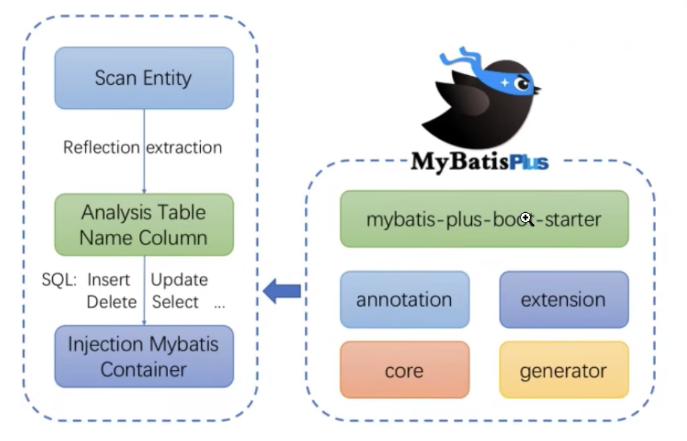

# MyBatis-Plus
它是一个MyBatis的增强工具, 在MyBatis的基础上只做增强不做改变 为简化开发 提供效率而生

我们可以在Mybatis的基础上直接的集成MyBatis-Plus 它并不会影响Mybatis的功能

同时我们可以使用MyBatis-Plus提供了通用的mapper和通用的service, 可以在不编写任何sql语句的情况下 快速的实现对单表的CURD, 批量 逻辑删除 分页等操作

<br><br>

## MyBatis-Plus的特性

### 强大的 CRUD 操作: 
内置 通用Mapper、通用Service, 仅仅通过少量配置即可实现单表大部分 CRUD 操作, 更有强大的条件构造器, 满足各类使用需求

<br>

### 支持 Lambda 形式调用: 
通过 Lambda 表达式, 方便的编写各类查询条件, **无需再担心字段写错 **  

<br>

### 内置代码生成器: 
采用代码或者 Maven 插件可快速生成 Mapper 、 Model 、 Service 、 Controller 层代码, 支持模板引擎, 更有超多自定义配置等您来使用

<br>

### 支持主键自动生成: 
支持多达 4 种主键策略(内含分布式唯一 ID 生成器 - Sequence), 可自由配置, 完美解决主键问题

<br>

我们的Mybatis的逆向工程里 只能生成Mapper接口 映射文件 和 实体类

<br>

### 分页插件支持多种数据库: 
支持 MySQL、MariaDB、Oracle、DB2、H2、HSQL、SQLite、Postgre、SQLServer 等多种数据库

<br>

### 内置性能分析插件: 
可输出 SQL 语句以及其执行时间, 建议开发测试时启用该功能, 能快速揪出慢查询

<br>

### 内置全局拦截插件: 
提供全表 delete 、 update 操作智能分析阻断, 也可自定义拦截规则, 预防误操作

<br><br>

## MyBatis-Plus的框架结构



<br>

### 步骤1 Scan Entity: 扫描实体  
我们使用了MyBatis-Plus之后 我们不需要自己去写sql语句 sql语句都是动态生成的, **我们当前操作的表是由实体类来决定的** 

<br>

### 2. 分析表和实体类之间的关系
扫描实体类后通过反射的技术 将实体类中的属性进行抽取, 分析表和实体类之间的关系

以及分析我们从实体类中抽出来的属性 和 表中字段之间的关系, 然后根据我们调用的增删改查的方法

MyBatis提供了通用的Mapper和Service 我们调用的方法不同实现的功能就不同

它会根据调用的方法生成对应的sql语句

<br>

### 3. 将sql语句注入到Mybatis的容器中
步骤2中会根据调用的方法生成对应的sql, 它会将生成的sql注入到MyBatis的容器中从而实现最终的功能

<br><br>

## 准备工作

### 开发环境
1. JDK: 8
2. Mysql: 5.7
3. SpringBoot: 2.6.3
4. Mybatis-Plus: 3.5.1

<br>

### 创建数据库 和 表
```sql
-- 创建数据库
CREATE DATABASE `mybatis_plus`

use `mybatis_plus`; 

-- 创建表
CREATE TABLE `user` ( 
  -- 注意id的类型
  `id` bigint(20) NOT NULL COMMENT '主键ID',
  `name` varchar(30) DEFAULT NULL COMMENT '姓名', 
  `age` int(11) DEFAULT NULL COMMENT '年龄',
  `email` varchar(50) DEFAULT NULL COMMENT '邮箱', 
  PRIMARY KEY (`id`)
)

-- 添加数据
INSERT INTO user (id, name, age, email) VALUES 
  (1, 'Jone', 18, 'test1@baomidou.com'), 
  (2, 'Jack', 20, 'test2@baomidou.com'), 
  (3, 'Tom', 28, 'test3@baomidou.com'), 
  (4, 'Sandy', 21, 'test4@baomidou.com'), 
  (5, 'Billie', 24, 'test5@baomidou.com');
```

<br>

**要点: 主键id的类型**  
这里我们使用的是bigint, MyBatis-plus在进行数据插入的时候 它默认会使用雪花算法来生成id 所以它的长度比较长 所以使用的bigint

<br>

### 创建SpringBoot项目 添加MyBatis-plus依赖
```xml
<!--mybatis-plus启动器-->
<dependency>
  <groupId>com.baomidou</groupId>
  <artifactId>mybatis-plus-boot-starter</artifactId>
  <version>3.5.1</version>
</dependency>

<!--mysql驱动: 指定驱动版本为5-->
<dependency>
  <groupId>mysql</groupId>
  <artifactId>mysql-connector-java</artifactId>
  <version>5.1.37</version>
</dependency>


<!-- 
它是SpringBoot给我们提供的mysql驱动, 默认版本为8
<dependency>
  <groupId>mysql</groupId> 
  <artifactId>mysql-connector-java</artifactId> 
  <scope>runtime</scope> 
</dependency>
 -->

<!--lombok用于简化实体类开发-->
<dependency>
  <groupId>org.projectlombok</groupId>
  <artifactId>lombok</artifactId>
  <optional>true</optional>
</dependency>


<dependency>
  <groupId>com.baomidou</groupId>
  <artifactId>mybatis-plus-generator</artifactId>
  <version>3.5.1</version>
</dependency>

<dependency>
  <groupId>org.freemarker</groupId>
  <artifactId>freemarker</artifactId>
  <version>2.3.31</version>
</dependency>
```

<br>

**lombok的使用:**  
它可以帮助我们简化实体类的开发, 但是除了下载它的依赖外, **我们的IDEA本身还需要下载插件**   

**2020.3版本的IDEA已经内置了Lombok插件**   

```
- ctrl + ,
  - plugins
    - 搜索: lombok
      - 安装第一个插件
```

<br>

### 配置 application.yml
MyBatis-Plus就是在MyBatis的基础上实现对数据库的增删改查 所以我们在配置文件中只需要设置数据源就可以

```s
# 设置数据源: SpringBoot中默认的数据源: 不设置也可以
spring.datasource.type=com.zaxxer.hikari.HikariDataSource

# 设置连接数据库的各个信息
spring.datasource.driver-class-name=com.mysql.jdbc.Driver
spring.datasource.username=root
spring.datasource.url=jdbc:mysql://localhost:3306/mybatis_plus
```

<br>

**扩展: Mysql驱动版本的问题**  
我一直以为Mysql5的数据库, 它的驱动也只能使用5版本的驱动

而实际上驱动版本是8还是5, 跟Mysql的数据库版本没有关系, 我们需要注意的是

Mysql数据库的版本 和 url的写法有关系
- 8版本的url: 后面要加时区
- 5版本的url: 后面不用加时区

<br>

**驱动类driver-class-name的要点:**  
spring boot2.0, 内置的是jdbc5的驱动 驱动类使用:
```
driver-class-name: com.mysql.jdbc.Driver
```

<br>

spring boot2.1及以上(内置jdbc8驱动) 驱动类使用: 
```
driver-class-name: com.mysql.cj.jdbc.Driver
```

<br>

**2、连接地址url的要点:**  
MySQL5.7版本的url:
``` 
jdbc:mysql://localhost:3306/mybatis_plus?characterEncoding=utf-8&useSSL=false
```

<br>

MySQL8.0版本的url: 
```
jdbc:mysql://localhost:3306/mybatis_plus?
serverTimezone=GMT%2B8&characterEncoding=utf-8&useSSL=false
```

<br><br>

## Lombok的使用: 创建数据表对应的实体类
user表 -> User实体类

<br>

之前我们要是创建User的JaveBean的话我们需要创建
1. 跟表的字段映射的属性
2. 属性对应的get set
3. 空参 有参构造器
4. toString
5. hashCode equals

<br>

但是我们安装了 lombok 的依赖, 所以我们可以通过lombok所提供的注解来简化我们生成JavaBean中的结构

<br>

### 使用步骤:
1. 创建JavaBean中的属性(和表中的字段名一一对应)

2. 无参构造: @NoArgsConstructor

3. 所有参数的有参构造: @AllArgsConstructor

4. get set: @Getter @Setter

5. hashCode equals: @EqualsAndHashCode

6. toString: @ToString

7. @Data: 可以代替 除了**有参**构造注解 之外的所有注解

```java
import lombok.*;

@NoArgsConstructor
@AllArgsConstructor
@Getter
@Setter
@EqualsAndHashCode
@ToString
public class User {
  // 表中的id类型为 BigInt, 我们使用Long接收
  private Long id;
  private String name;
  private Integer age;
  private String email;
}


// 使用 @Data 代替
@NoArgsConstructor
@AllArgsConstructor
@Data
public class User {
  // 表中的id类型为 BigInt, 我们使用Long接收
  private Long id;
  private String name;
  private Integer age;
  private String email;
}
```

<br><br>

## 创建Mapper接口
```
com.sam.mybatisplus.mapper
```

之前在MyBatis中Mapper接口中的方法 和 映射文件中的sql语句 都是需要我们自己写的

<br>

但是在MyBatis-Plus中不是哦, MyBatis-Plus中为我们提供了
- 通用的Mapper
- 通用的Service

我们只要使用它提供的功能就可以快速的实现对 **单表** 的增删改查

<br>

### 使用 通用的Mapper的方式:
我们让 自己定义的 UserMapper 接口 继承 BaseMapper

BaseMapper中包含里很多的方法(点进去看), 都是MyBatis-Plus为我们提供的

<br>

**BaseMapper是有泛型的**  
我们可以传入要操作的实体类的类型

```java
package com.sam.mybatisplus.mapper;

import com.baomidou.mybatisplus.core.mapper.BaseMapper;
import com.sam.mybatisplus.pojo.User;


// 标识为持久层组件
@Repository
// 泛型: 传入我们要操作的实体类
public interface UserMapper extends BaseMapper<User> {
}

```

<br>

### 主启动类上配置扫描mapper
我们在SpringBoot中使用MyBatis的功能时, 我们需要设置mapper接口所在的包 和 映射文件所在的包

我们可以在主启动类上添加 **扫描mapper接口的注解**   

```java
@SpringBootApplication
// 传入mapper接口所在的包
@MapperScan("com.sam.mybatisplus.mapper")
public class MybatisplusApplication {

  public static void main(String[] args) {
    SpringApplication.run(MybatisplusApplication.class, args);
  }

}
```

<br><br>

## 测试: 通用的Mapper接口
我们上面在主启动类中添加了 @MapperScan 注解, 添加后就可以将指定包下的所有的mapper接口所动态生成的代理类交给了IOC来管理

<br>

### @SpringBootTest注解
**位置:**  
测试类的上面

我们在使用该注解后, 我们在测试类中就可以使用IOC容器所管理的组件, 可以进行自动装配了

比如我们可以自动装配UserMapper接口的对象

```java
@SpringBootTest
public class MyBatisTest {

  /*
    userMapper下方有红线

    这里仅仅是误报, userMapper在编译期它被认为是UserMapper接口类型

    而我们的IOC容器中只能是实现类对象, 接口类型是没有办法放进去的 所以这里我们可以不管 是可以运行的

    解决方式:
      1. 使用Resource
      2. @Autowired(require=false)
      3. 在Mapper接口上添加 @Repository 注解
      4. 在Mapper接口上添加 @Mapper 注解
  */
  @Autowired
  private UserMapper userMapper;
  
}
```

<br>

### 通用的Mapper的使用:
之前我们需要在mapper接口中定义方法, 在映射文件中定义sql语句

而我们使用了MyBatis-Plus之后, 我们可以直接使用通过Mapper中给我们提供的现成的方法 而避免了写sql

<br>

**<font color="">selectList(queryWrapper)</font>**  
查询操作, 通过条件构造器查询一个list集合, 若没有条件则需要设置为null

<br>

**返回值:**  
``List<T>``

<br>

**参数:**  
``Wrapper<User> queryWrapper``  
如果我们查询要是有条件的话 就可以使用Wrapper来实现, 如果没有则需要传入 null

```java
@Test
public void testSelectList() {

  // 查询一个集合
  List<User> users = userMapper.selectList(null);
  users.forEach(System.out :: println);
}
```

<br><br>

## 加入日志功能
我们想在控制台中看到输出语句

<br>

### 配置日志功能: application.properties
我们在该配置文件中配置如下的内容
```s
...

# 配置sql日志功能
mybatis-plus.configuration.log-impl=org.apache.ibatis.logging.stdout.StdOutImpl
```

<br>

### 回顾MyBatis-plus的使用过程
1. 创建SpringBoot项目
2. 添加MyBatis-Plus依赖
3. 在application.properties配置了数据源
4. 创建了实体类
5. 创建了UserMapper接口 让它继承了BaseMapper
6. 使用了注解

整个过程中我们并没有指明要操作的表是谁, 表中的字段也没有指明和实体类中的哪个属性进行映射

MyBatis-plus操作的表以及表中的字段由实体类以及实体类中的属性决定的

<br><br>

# 通用的Mapper: BaseMapper
我们这里主要说明下BaseMapper中提供的方法

<br><br>

## 插入数据的方法:
一共就一个

<br>

### insert: 插入一条记录
### **<font color="#C2185B">insert(T entity)</font>**  

**参数:**  
实体类对象

<br>

**返回值:**  
int: 受影响的行数

<br>

**要点:**  
insert方法不仅可以完成插入数据的操作, 还可以在插入数据后 通过实体类获取新插入数据的主键

user对象的中的id并不是我们的自动递增的主键  
mybatisplus中id默认使用雪花算法来生成 这也是为什么我们在创建表的时候 id字段使用的是BigInt 而实体类User的id属性我们使用的是Long

```java
@Test
public void testInsert() {

  // 参数: 实体类对象
  User user = new User(null, "张三", 18, "zhangsan@gamil.com");

  int insert = userMapper.insert(user);

  System.out.println("insert = " + insert);
  // insert = 1

  System.out.println("user.getId() = " + user.getId());
  // user.getId() = 1635999166256058370
}
```

<br>

**该方法执行的sql:**  
```sql
INSERT INTO user ( id, name, age, email ) VALUES ( ?, ?, ?, ? )
```

<br><br>

## 删除数据的方法:
一共有5个

<br>

### 根据id删除:
### **<font color="#C2185B">deleteById(Serializable id)</font>**  

**参数:**  
id: 类型 int or long

<br>

**返回值:**  
int: 受影响的行数

```java
// 超过int的表数范围的值加上L
int delete = userMapper.deleteById(1635999166256058370L);

System.out.println("delete = " + delete);
```

<br>

**该方法执行的sql:**  
```sql
delete from user where id = ?
``` 

<br>

### 根据实体(id)删除:
### **<font color="#C2185B">deleteById(T entity)</font>**  

**参数:**  
实体类, 主要根据里面的id属性来进行删除

<br>

**返回值:**  
int: 受影响的行数

<br>

### 根据Map集合中设置的条件进行删除:
### **<font color="#C2185B">deleteByMap(Map``<String, Object>`` columnMap)</font>**  

<br>

**参数:**  
我们将删除时所根据的条件, 存放在集合map中, 该map作为参数, 比如我们要删除 name=张三 和 年龄=18 的记录

map也就是 where 部分的条件
```java
// Map集合中存放的就是删除记录时所需的条件
Map<String, Object> map = new HashMap<>();
map.put("name", "张三");
map.put("age", 18);
```

<br>

**返回值:**  
int: 受影响的行数

<br>

```java
Map<String, Object> map = new HashMap<>();
map.put("name", "张三");
map.put("age", 18);


int i = userMapper.deleteByMap(map);
System.out.println("i = " + i);
```

<br>

**该方法执行的sql:**  
```sql
DELETE FROM user WHERE name = ? AND age = ?
```

<br>

### 根据条件构造器进行删除:
### **<font color="#C2185B">delete(Wrapper``<T>`` queryWrapper)</font>**  

<br>

**参数:**  
QueryWrapper, 该对象中分装了查询条件, 我们可以创建QueryWrapper的实体对象, 通过该对象中的方法指明条件

1. 需要传入泛型
2. 可链式调用
3. queryWrapper中的column参数为字段名

<br>

**返回值:**  
int: 受影响的行数

<br>

### 根据id或实体 批量删除:
### **<font color="#C2185B">deleteBatchIds(Collection``<T>`` idList)</font>**  

批量删除的sql语句有两种, 该方法使用的是1
1. delete from 表名 where id in (1,2,3)
2. delete from 表名 where id = 1 or id = 2

<br>

**参数:**  
主键id列表或实体列表(不能为null以及empty)

<br>

**返回值:**  
int: 受影响的行数

<br>

```java
// 注意id的类型, 本Demo中id的类型是Long
List<Long> list = Arrays.asList(1L, 2L, 3L);
int i = userMapper.deleteBatchIds(list);
System.out.println("i = " + i);
```

<br>

**该方法执行的sql:**  
```sql
DELETE FROM user WHERE id IN ( ? , ? , ? )
```

<br><br>

## 修改数据的方法:
一共有2个

<br>

### 根据 id 进行修改:
### **<font color="#C2185B">updateById(T entity)</font>**  

**参数:**  
entity, 实体对象, 实体类中封装了要修改的数据 和 要修改的id

没有传的属性, 是不会被修改的

<br>

**返回值:**  
int: 受影响的行数

<br>

```java
// 参数是实体类对象, 修改id为5, 数据为指定的, null对应的字段不会被修改
User user = new User(5L, "张三", null, "zhangsan@gmail.com");

int i = userMapper.updateById(user);
System.out.println("i = " + i);
```

<br>

**该方法执行的sql:**  
```sql
UPDATE user SET name=?, email=? WHERE id=?
```

<br>

### 修改 符合条件构造器的条件的数据
### **<font color="#C2185B">update(T entity, Wrapper``<T>`` updateWrapper)</font>**  

<br>

**参数:**  
UpdateWrapper既可以设置我们要修改的条件, 也可以要设置我们要修改的字段 所以就有如下的两种使用方式

<br>

**使用方式1:**  
- 通过 entity实体类对象 设置我们要修改的内容
- 通过 updateWrapper 实现我们要修改的条件

<br>

**使用方式2:**  
- entity实体类对象 设置为 null
- 通过 updateWrapper 设置要修改的条件 和 字段, (set()方法)

<br> 

**返回值:**  
int: 受影响的行数

<br><br>

## 查询数据的方法:
10多个方法

- selectList
- selectById
- selectBatchIds
- selectByMap
- selectCount
- selectMap
- selectOne
- selectObjs
- selectPage
- selectMapsPage

<br>

### 根据id进行查询:
### **<font color="#C2185B">selectById(Serializable id)</font>**  

**参数:**  
id

<br>

**返回值:**  
T

<br>

```java
// 根据id进行查询
User user = userMapper.selectById(1L);
System.out.println("user = " + user);
```

<br>

**该方法执行的sql:**  
```sql
SELECT id,name,age,email FROM user WHERE id=?
```

<br>

### 根据id 批量查询:
### **<font color="#C2185B">selectBatchIds(Collection ids)</font>**  

**参数:**  
idlist: 主键id列表, 不能为null以及empty

<br>

**返回值:**  
``List<T>``

<br>

```java
List<Long> list = Arrays.asList(1L, 2L);
List<User> users = userMapper.selectBatchIds(list);
System.out.println("users = " + users);
```

<br>

**该方法执行的sql:**  
```sql
SELECT id,name,age,email FROM user WHERE id IN ( ? , ? )
```

<br>

### 根据 条件的Map 进行查询:
### **<font color="#C2185B">selectByMap(Map``<String, Object>`` columnMap)</font>**  

**参数:**  
map, map存放的是查询使用的条件, 比如我们要查询name=Jone and age=18 的数据, 就可以将它们put到map中

<br>

**返回值:**  
``List<T>``, 符合条件的结果可能有多个

<br>

```java
// 根据 条件的Map集合 进行查询
HashMap<String, Object> map = new HashMap<>();
map.put("name", "Jone");
map.put("age", 18);

List<User> users = userMapper.selectByMap(map);
users.forEach(System.out :: println);
```

<br>

**该方法执行的sql:**  
```sql
SELECT id,name,age,email FROM user WHERE name = ? AND age = ?
```

<br>

### 根据 entity条件 查询一条记录:
### **<font color="#C2185B">selectOne(Wrapper``<T>`` queryWrapper)</font>**  

<br>

**参数:**  
QueryWrapper, 该对象中分装了查询条件, 我们可以创建QueryWrapper的实体对象, 通过该对象中的方法指明条件

1. 需要传入泛型
2. 可链式调用
3. queryWrapper中的column参数为字段名
4. 可以传null

<br>

**返回值:**  
T

<br>

**注意:**  
查询一条记录, 例如 qw.last("limit 1") 限制取一条记录, 注意 多条数据会报异常

<br>

### 根据 Wrapper条件 判断是否存在记录
### **<font color="#C2185B">exists(Wrapper``<T>`` queryWrapper)</font>**  

**参数:**  
queryWrapper, 实体对象封装操作类

<br>

**返回值:**  
Boolean:  

<br>

### 根据 Wrapper条件 查询总记录数
### **<font color="#C2185B">selectCount(Wrapper``<T>`` queryWrapper)</font>**  

<br>

**参数:**  
QueryWrapper, 该对象中分装了查询条件, 我们可以创建QueryWrapper的实体对象, 通过该对象中的方法指明条件

1. 需要传入泛型
2. 可链式调用
3. queryWrapper中的column参数为字段名
4. 可以传null

<br>

**返回值:**  
Long

<br>

### 查询全部记录 (可根据条件)
### **<font color="#C2185B">selectList(Wrapper``<T>`` queryWrapper)</font>**  

<br>

**参数:**  
QueryWrapper, 该对象中分装了查询条件, 我们可以创建QueryWrapper的实体对象, 通过该对象中的方法指明条件

1. 需要传入泛型
2. 可链式调用
3. queryWrapper中的column参数为字段名
4. 可以传null

<br>

**返回值:**  
``List<T>``

<br>

**该方法执行的sql:**  
```sql
SELECT id,name,age,email FROM user
```

<br>

### 根据 entity条件 查询全部记录
### **<font color="#C2185B">selectMaps(Wrapper``<T>`` queryWrapper)</font>**  

<br>

**参数:**  
QueryWrapper, 该对象中分装了查询条件, 我们可以创建QueryWrapper的实体对象, 通过该对象中的方法指明条件

1. 需要传入泛型
2. 可链式调用
3. queryWrapper中的column参数为字段名
4. 可以传null

<br>

**返回值:**  
``List<Map<String, Object>>``

<br>

### 根据 Wrapper 条件 查询全部记录
### **<font color="#C2185B">selectObjs(Wrapper``<T>`` queryWrapper)</font>**  

<br>

**参数:**  
QueryWrapper, 该对象中分装了查询条件, 我们可以创建QueryWrapper的实体对象, 通过该对象中的方法指明条件

1. 需要传入泛型
2. 可链式调用
3. queryWrapper中的column参数为字段名
4. 可以传null

<br>

**返回值:**  
``List<Object>``, 注意只返回第一个字段的值

<br>

### 根据 entity 条件 查询全部记录 (并翻页)
### **<font color="#C2185B">P selectPage(P page, Wrapper``<T>`` queryWrapper)</font>**  

**参数:**  
page: 分页查询条件(可以为 RowBounds.DEFAULT)  
queryWrapper: 实体对象封装操作类(可以为null)

<br>

**返回值:**  
``<P extends IPage<T>>``

<br>

### 根据 Wrapper 条件 查询全部记录 (并翻页)
### **<font color="#C2185B">P selectMapsPage(P page, Wrapper``<T>`` queryWrapper)</font>**  

**参数:**  
page: 分页查询条件(可以为 RowBounds.DEFAULT)  
queryWrapper: 实体对象封装操作类(可以为null)

<br>

**返回值:**  
``<P extends IPage<Map<String, Object>>>``

<br><br>

# 条件构造器: Wapper
上述的方法中 有很多的参数都需要条件构造器, 这里我们研究下条件构造器的使用方式

<br>

## 条件构造器的结构
它其实就是用来封装条件的 我们执行的增删改查的sql语句中 查询 修改 删除 是需要设置条件的

在MyBatis-Plus中如果我们要通过各种条件来实现查询 修改 删除的功能, 就是要使用我们的条件构造器

<br>


<br>

```s
# 条件构造抽象类, 最顶端的父类
| - Wrapper

  # 用于查询条件封装, 生成sql的where条件
  | - AbstactWrapper

    # 查询条件封装
    | - QueryWrapper

    # Update条件封装
    | - UpdateWrapper

    # 使用Lambda语法
    | - AbstractLambdaWrapper

      # 用于Lambda语法使用的查询Wrapper
      | - LambdaQueryWrapper

      # Lambda更新封装Wrapper
      | - LambdaUpdateWrapper
```

<br>

我们看到 Wrapper 它有很多的子类, 在我们实现功能的时候 我们就要选好我们到底需要用哪些子类

- 修改功能 需要使用: UpdateWrapper / LambdaUpdateWrapper

- 查询功能 需要使用: QueryWrapper / LambdaQueryWrapper

- 删除功能 需要使用: QueryWrapper / LambdaQueryWrapper

<br><br>

## QueryWrapper: 查询条件的使用
我们在使用条件构造器的时候 需要使用Wrapper抽象类的子类

<br>

### QueryWrapper的实例化
我们需要传入实体类型
```java
QueryWrapper<User> queryWrapper = new QueryWrapper<>();
```

<br>

### QueryWrapper的API
它身上有一系列的api都是sql语法中提供的 如

- isNotNull(String column): 判断当前字段不为空
- between(String column, Object val1, Object val2): 判断某一个字段的值 在哪两个值之间
- ...

<br>

### 示例: 查询条件
查询用户名包含a 年龄在20~30之间 邮箱信息不为null的用户信息

```java
QueryWrapper<User> queryWrapper = new QueryWrapper<>();
queryWrapper
    .like("name", "a")
    .between("age", 20, 30)
    .isNotNull("email");
List<User> users = userMapper.selectList(queryWrapper);
users.forEach(System.out :: println);
```

<br>

**注意:**  
1. 凡是带有 column 参数的 都需要我们传入的是 数据库中的字段名
2. 它可以进行链式调用
3. 它需要传入泛型
4. 当我们使用逻辑删除的时候, 我们查询出来的数据都是 is_deleted 为 0 的数据
5. 我们链式调用的方法 **默认就是使用 and 连接**, 如果要使用 或, **需要显示调用 or()**

<br>

### 示例2: 排序条件
查询用户信息, 按照年龄的降序排序, 若年龄相同 则按照id升序排序

```java
QueryWrapper<User> queryWrapper = new QueryWrapper<>();
queryWrapper
    .orderByDesc("age")
    .orderByAsc("id");
List<User> users = userMapper.selectList(queryWrapper);
users.forEach(System.out :: println);
```

<br>

### 示例3: 删除条件
删除邮箱地址为null的用户信息

```java
QueryWrapper<User> queryWrapper = new QueryWrapper<>();

queryWrapper
    .isNull("email");

userMapper.delete(queryWrapper);
```

<br><br>

## UpdateWrapper: 修改条件的使用
UpdateWrapper既可以设置我们要修改的条件, 也可以要设置我们要修改的字段, 所以它的使用方式分为两种

1. UpdateWrapper作为条件来使用
2. UpdateWrapper既可以封装条件 也可以封装要修改的字段

它作为条件的使用方式和QueryWrapper的使用方式一致

<br>

### 使用方式1: 示例
将 年龄大于20 并且 用户名中包含a 或者 邮箱为null的用户信息 修改

```java
// 参数: entity 设置要修改的内容
// 参数: updateWrapper 设置要修改的条件
UpdateWrapper<User> updateWrapper = new UpdateWrapper<>();
updateWrapper
    .gt("age", 20)
    .like("name", "a")
    .or()
    .isNull("email");

User user = new User(null, "test", 18, "test@gamil.com", 0);

int i = userMapper.update(user, updateWrapper);

System.out.println("i = " + i);
```

<br>

### 使用方式2: 示例
条件和修改的字段都通过 UpdateWrapp 来实现

<br>

使用 **<font color="#C2185B">updateWrapper.set(String column, Object value)</font>** 来设置要修改的字段的值

```java
UpdateWrapper<User> updateWrapper = new UpdateWrapper<>(); 

updateWrapper
    // 设置修改条件
    .like("name", "a")
    .and(q -> q.gt("age", 20).or().isNull("email"))
    // 设置要修改的字段
    .set("name", "nn");

userMapper.update(null, updateWrapper);
```


<br><br>

## Wrapper: 条件的优先级
我们上面的例子中的需求是
```
将 年龄大于20 并且 用户名中包含a 或者 邮箱为null的用户信息 修改
```

如果现在还有一个需求, ()包起来的是条件优先级高的部分
```
将 年龄大于20 并且 (用户名中包含a 或者 邮箱为null )的用户信息 修改
```

<br>

两个需求看起来没什么太大的区别, **但是如果我们涉及到条件的优先级了 我们也要知道我们如何通过MyBatis-Plus提供的API来处理条件的优先级**

<br>

### 上面两个需求形成的sql是不一样的
```sql
UPDATE user SET name=?, age=?, email=? WHERE is_deleted=0 AND (age > ? AND name LIKE ? OR email IS NULL)


-- 这里有条件的优先级
UPDATE user SET name=? WHERE is_deleted=0 AND (name LIKE ? AND (age > ? OR email IS NULL))
```

<br>

### 条件的优先级该如何设置
不管是 UpdateWrapper 还是 QueryMapper 我们设置条件优先级的方式都是一样的

通过使用下面的api, 我们传入 条件构造器的Lambda形式, **Lambda形式的条件都是被优先执行的**
- and() 
- or()

<br>

### 示例:
```java
// 当我们使用了 and 或者 or 方法 如果我们使用了lambda表达式 lambda表达式中的条件一定是优先执行的
UpdateWrapper<User> updateWrapper = new UpdateWrapper<>();


updateWrapper
    .like("name", "a")
    // and里面我们传入了 条件构造器的Lambda形式, 它是优先被执行的, q就相当于QueryMapper, 或 UpdateMapper
    .and(q -> q.gt("age", 20).or().isNull("email"));

User user = new User();
user.setName("erin");
userMapper.update(user, updateWrapper);
```

<br><br>

## Wrapper: 查询指定的字段 
如果我们没有指定要查询的字段的时候 我们查询出来的就是所有的字段

但是我们可以通过下面的方法来指定要查询的字段

<br>

### **<font color="#C2185B">queryMapper/updateWraperr.select(String ... columns)</font>**
我们传入要查询的指定字段

<br>

### 示例:
```java
// 查询用户的用户name age字段
QueryWrapper<User> queryWrapper = new QueryWrapper<>();
queryWrapper.select("name", "age");

// 我们将查询到的结果使用Map来承装, 多个的话就是List<Map>,
List<Map<String, Object>> maps = userMapper.selectMaps(queryWrapper);
maps.forEach(System.out :: println);
/*
  {name=Jone, age=18}
  {name=Jack, age=20}
  {name=Tom, age=28}
  {name=test, age=18}
  {name=Billie, age=24}
  {name=test, age=18}
*/


List<User> users = userMapper.selectList(queryWrapper);
```

<br><br>

## Wrapper: 子查询
比如我们要查询需求为, 查询: id小于等于100的用户信息

我们的sql的子查询的写法为:
```sql
select * from user where id in (
  select id from user where id <= 100
)
```

<br>

### **<font color="#C2185B">queryWrapper.inSql(String column, String inValue)</font>**

**参数:**  
- column: 就是上面sql语句中 where 后面的 id部分, 也就是子查询判断时候需要设置的字段

- inValue: 子查询部分的sql语句

<br>

### 示例:
```java
QueryWrapper<User> queryWrapper = new QueryWrapper<>();

queryWrapper.inSql("id", "select id from user where id <= 100");


List<User> users = userMapper.selectList(queryWrapper);
users.forEach(System.out :: println);
```

<br><br>

## 模拟开发中组装条件的情况
真实开发中我们的查询等操作的条件都是用户在页面选择之后传输到服务器 我们在服务器中拼接到sql语句中

<br>

### 模拟下:
我们上面的一系列示例中的条件部分, 判断用户是否选择了这些条件 如果选择了我们就将其组装到sql中, 如果用户没有选择 我们就不用将其组装到sql语句中

<br>

### 示例:

**要点:**  
**<font color="#C2185B">StringUtils.isNotBlank(String str)</font>**  
StringUtils.isNotBlank()判断某个字符串是否不为空字符串 不为null 不为空白符

<br>

**所在包:**  
```java
import com.baomidou.mybatisplus.core.toolkit.StringUtils;
```

<br>

```java
// 从浏览器收集到的数据, 通过用户名进行模糊查询 和 判断年龄的区间
String username = "sam";
Integer ageBegin = 20;
Integer ageEnd = 30;

// 上面的数据应该不应该组装到sql中 我们需要判断
QueryWrapper<User> queryWrapper = new QueryWrapper<>();

// StringUtils.isNotBlank()判断某个字符串是否不为空字符串 不为null 不为空白符
if(StringUtils.isNotBlank(username)) {
  queryWrapper
      .like("name", username);
}

if(ageBegin != null) {
  queryWrapper
      .ge("age", ageBegin);
}

if(ageEnd != null) {
  queryWrapper
      .le("age", ageEnd);
}

// 上面相当于不是链式调用 分开调用 利用if来确定有几个条件
List<User> users = userMapper.selectList(queryWrapper);
```

<br><br>

## Wrapper: 使用 condition 优化上述逻辑
我们上面主要是做了对前台传递过来的参数进行判断的逻辑, 如果它存在 再进行sql的一个拼接

但是写法上很冗余

<br>

我们的 QueryWrapper对象 中很多方法都会有 ``boolean condition`` 的参数 比如

- le(boolean condition, String column Object val)

- list(boolean condition, String column, Object val)

<br>

### boolean condition 参数
它是一个条件 如果条件满足则组装这个条件, 如果条件不满足则不组装

```java
String username = "a";
Integer ageBegin = null;
Integer ageEnd = 30;

QueryWrapper<User> queryWrapper = new QueryWrapper<>();


// condition的使用方式

queryWrapper
  // 如果 username不为空 再进行模糊查询
  .like(StringUtils.isNotBlank(username), "name", "a")
  .ge(ageBegin != null, "age", ageBegin)


List<User> users = userMapper.selectList(queryWrapper);
```

<br><br>

## Wrapper: LambdaQueryWrapper
它的作用很简单 就是为了防止我们写错字段名

<br>

**QueryWrapper中的API:**  
```java
queryWrapper.like(SFunction<User, ?> column, Object val)
```

<br>

**LambdaQueryWrapper中的API:**  
```java
queryWrapper.like(String column, Object val)
```

<br>

我们发现只有字段名的位置不一样, 写字段名的时候 很多字段名 很长xxx_yyy_zzz, 有的时候很容器写错

所以有了LambdaQueryWrapper

<br>

### 作用:
它可以通过使用Lambda表达式的形式 获取实体类中的属性名 来映射成数据表中的字段名

<br>

### 示例:
```java
String username = "sam";
Integer ageBegin = 20;
Integer ageEnd = 30;

LambdaQueryWrapper<User> queryWrapper = new LambdaQueryWrapper<>();

queryWrapper
    // User::getName 通过函数式接口来访问实体类中的属性 映射成 数据表中的字段名的
    .like(StringUtils.isNotBlank(username), User::getName, username)
    .ge(ageBegin != null, User::getAge, ageBegin)
    .le(ageEnd != null, User::getAge, ageEnd);

List<User> users = userMapper.selectList(queryWrapper);
```

<br>

### 注意:
只要我们使用了 LambdaWrapper 之后 我们所有的api在指定字段名的时候 只能使用 Lambda形式: ``User::getAge``

<br><br>

### Wrapper: LambdaUpdateWrapper
使用方式和上面的一致 需要注意的是 LambdaUpdateWrapper 也可以使用set()方法封装我们要修改的数据

我们在使用set()方法指定字段名的时候 也要使用Lambda形式

```java
// 通过Lambda形式获取实体类中的属性名 映射成 数据表中的字段名
updateWrapp.set(User::getName, "新名字")
```

<br><br>

## 复杂的查询情况
MyBatis-Plus中给我们提供的方法都是单表操作的方法, 那如果有多表联查的情况应该怎么办?

<br>

### 自定义sql怎么处理?
如果有复杂的查询 或者 我们想自己写sql的话, 和MyBatis的处理方式一致

<br>

### 1. application.properties配置文件中配置映射文件的存放路径
框架中mapper映射文件的默认路径为: ``classpath:/mapper/**/*.xml`` 

也就是类路径下的mapper目录下的任意子目录中的任意.xml文件

<br>

**所以:**   
1. 如果我们想指定mapper接口的映射文件的位置, 我们可以使用 ``mybatis-plus.mapper-locations=`` 来指定

2. 不想另指定 则可以直接在 resources/mapper 存放

<br>

### 2. 在 UserMapper接口中定义抽象方法
注意如下的细节:
1. 注意抽象方法的返回值
2. 注意抽象方法的形参的注解 因为我们要在映射文件中拿到形参 

```java
@Repository
public interface UserMapper extends BaseMapper<User> {

  // 返回值: Map, 根据id查询用户数据 并封装到Map中
  Map<String, Object> selectMapById(@Param("id") Long id);
}
```

<br>

### 2. 在 resources/mapper/ 目录下创建 UserMapper.xml 映射文件
namespace指定mapper包下的接口

```xml
<?xml version="1.0" encoding="UTF-8" ?>
<!DOCTYPE mapper
    PUBLIC "-//mybatis.org//DTD Mapper 3.0//EN"
    "http://mybatis.org/dtd/mybatis-3-mapper.dtd">

<mapper
    namespace="com.sam.mybatisplus.mapper.UserMapper">

  <!-- 类型别名: map -->
  <select id="selectMapById" resultType="map">
    select id, name, age, email from user where id = #{id}
  </select>
</mapper>
```

<br>

### 测试:
```java
// 根据id查询user, 结果封装到map中
Map<String, Object> map = userMapper.selectMapById(1L);

System.out.println("map = " + map);

/*
map = {name=Jone, id=1, age=18, email=test1@baomidou.com}
*/
```

<br>

### 扩展: 配置映射文件中的resultType类型别名
```s
mybatis-plus.type-aliases-package=com.sam.mybatisplus.pojo
```

<br><br>

# 通用的Service
我们在使用 通用的Mapper功能的时候 

是将Mapper接口继承了 BaseMapper 这样我们就可以使用通用Mapper中提供的一些方法来操作单表 避免我们写sql

<br>

而我们的Serive层也一样 也可以使用它提供的通用的Service中提供的方法

<br><br>

## 通用Serive: IService
该接口进一步的封装了CRUD 采用了前缀命名的方式来区分Mapper层 避免混淆

- 前缀save: 保存的方法 
- 前缀get: 查询的方法
- 前缀remove: 删除的方法
- 前缀list: 查询集合的方法
- page: 分页 

<br>

**建议:**  
如果存在自定义通用的Service方法的可能 请创建自己的IBaseService 继承 MyBatis-Plus提供的积累

<br><br>

## 通用Service的使用

### 1. 定义UserSerive接口 并继承MyBatis-Plus提供的IService接口
在IService出指明泛型: 要操作的实体类
```java
public interface UserService extends IService<User> {
}
```

<br>

### 2. 创建UserSerive接口的实现类
该实现类要做到如下几点:
1. **实现** 我们定义的UserSerive接口
2. **继承** MyBatis-Plus提供的ServiceImpl实现类
3. 实现类**指明泛型**: mapper接口, 实体类
```java
@Service
public class UserServiceImpl extends ServiceImpl<UserMapper, User> implements UserService {
}
```

<br>

**优势:**  
我们自定定义了Service的实现类 继承了 MyBatis-Plus中提供的Service实现类 

这样的好处就是既可以使用MyBatis-Plus中提供的方法 又可以自由的扩展我们自己的方法

<br>

### 使用通用Service: 查询总记录数
因为我们的userService继承了MyBatis-Plus提供的ServiceImpl实现类, 所以我们可以直接使用它内部提供的各种CURD方法


```java
@Test
public void testService() {
  // 查询所有数据的数据量
  long count = userService.count();
  System.out.println("count = " + count);
}

// SELECT COUNT( * ) FROM user
```

<br>

### 使用通用Service: 批量添加
批量添加数据的sql是 ``insert into 表名 values (), (), ()``

多个小()就是添加多条数据, 但是我们的MyBatis-Plus框架中并没有提供批量添加的方法

<br>

因为在开发场景中 我们可能需要添加很多条数据 如果我们将这么多条数据都拼接到一个sql中 这个sql就太长了 所以我们在mapper中就没有提供批量添加的方法

**而批量添加的方法在Service中**  但它的底层也是循环指定mapper接口中的insert()方法

<br>

```java
// 参数List<User>
List<User> list = new ArrayList<>();

for(int i = 0; i <= 10; i++) {
  User user = new User();
  user.setName("Sam - " + i);
  user.setAge(20 + i);
  list.add(user);
}

//  批量添加的方法, 参数要求User的List
boolean b = userService.saveBatch(list);
System.out.println("操作是否成功:" + b);
```

<br><br>

# MyBatis-Plus 提供的注解

## @TableName("指定该实体类对应的表名")
我们上面写过这样的代码, 我们通过UserMapper接口调用BaseMapper中的方法实现了 往user表中添加了一条记录的操作

```java
User user = new User(null, "张三", 18, "zhangsan@gamil.com");

int insert = userMapper.insert(user);
```

我们之所以可以往user表中添加了一条记录 是因为我们在继承BaseMapper的时候传入了泛型 
```java
public interface UserMapper extends BaseMapper<User> { ... }
```

也就是说我们操作哪张表 就是由我们**在泛型处传入的User实体类决定**   

User实体类 -> user表

<br>

### 问题:
如果我们数据库中的表不叫 user 而是 t_user 怎么办?

控制台报错了, 说user表不存在
```
mybatis_plus.user doesn't exist
```

<br>

### 解决方式1: @TableName("t_user")
**在实体类(User)的上方加上** @TableName 注解, 用来表示该实体类对应的哪张表

设置实体类所对应的表名, 就是说操作哪张表
```java
@Data
@TableName("t_user")
public class User { ... }
```

<br>

### 解决方式2: application.properties 全局配置
**如果我们以后的表 全部都有指定的前缀** 比如
- t_user
- t_dept

我们使用方式2的话 就不用在每一个实体上都设置 @TableName注解了

<br>

**MyBaits-Plus给我们提供了全局配置**, 通过全局配置我们就可以设置我们当前实体类所对应的所有表的前缀

<br>

**全局配置:**  
设置MyBaits-Plus的全局配置, 设置实体类所对应表的统一前缀

```s
mybatis-plus.global-config.db-config.table-prefix=t_
```

设置后MyBaits-Plus在分析我们的实体类的时候 就会将实体类对应的所有表全部都加上 我们所设置的前缀

<br><br>

## @TableId
我们在实现增删改查的过程中 特别是添加功能, MyBatis-Plus会默认将 id 作为主键 (就是id字段, 固定就是id两个字)

```sql
-- MyBatis-Plus在执行插入操作时 所使用的sql语句
insert into user (id, name, age, email) values (?, ?, ?) 
```

<br>

我们在以后的开发过程中 很有可能表中的主键 不是id字段, 比如我们将我们的表中的 id -> uid

这时我们再执行inser() 操作 控制台就会报错

```
field 'uid' doesn't have a default value
```

我们将表中的主键修改为uid后 MyBatis-Plus没有为uid进行赋值 - 没有！

而我们当前表中的uid是主键 正常它应该必须被赋值 不能为空 所以它报了这样的错误

<br>

所以我们能看出来 MyBatis-Plus 只能默认给 id 字段作为主键, 在插入数据的时候 为 id 字段进行赋值

<br>

### 解决方式: @TableId
我们在User实体类的 **作为主键的属性上使用该注解**   

**作用:**  
将该属性所对应的字段 作为表中的主键, **处理主键的映射关系**   

```java
public class User {
  @TableId
  private Long uid;
}
```

通过注解 我们告诉MyBatis哪个属性是主键, 这样在后续的添加插入操作时 它就会为该字段进行赋值

<br>

### 使用场景:
如果以后我们表中的主键 不叫做 id, 这时候我们会需要使用 @TableId 来指明实体类中的哪个属性是主键

<br><br>

## @TableId注解的属性值
该注解中有两个属性
- value: 用于指定主键的字段
- type: 主键的生成策略

<br>

### value属性的使用场景:
当数据表中的主键为 uid, 而我们实体类中的属性叫 id 也就是说 两者对不上

<br>

MyBatis的过程是它会首先分析我们的实体类 根据实体类中的属性 把属性名作为字段名进行操作

当我们实体类中的属性设置为id之后, 那它所对应的字段也一定是id

如果我们是上述的情况就会报如下的错误

```s
# 表中没有id这个字段
unknown column "id" in "field list"
```

**如果确实发生了上述的情况 实体类中的属性名 和 表中的字段名不一致的情况 我们就需要使用注解的value属性**   

<br>

**<font color="#C2185B">@TableId("表中主键的字段名")</font>**  
表示它所标识的属性 和 表中的uid字段 是主键的映射关系 
```java
public class User {
  @TableId("uid")
  private Long id;
}
```

将实体类中的id属性 和 表中的uid字段映射起来

<br>

### type属性的使用场景:
主键的生成策略

MyBatis-Plus默认的主键的生成策略是雪花算法, 如果我们不希望使用雪花算法, **而是使用MySql中的自动递增 我们就是可以使用该属性**   

<br>

**实现自动递增的步骤:**  
1. 数据库设置uid字段为自动递增
2. 使用 @TableId注解的 type属性

<br>

**<font color="#C2185B">@TableId(value="uid", type="IdType.AUTO")</font>**  

type的可选值:
- IdType.NODE(IdType.ASSIGN_ID): 通过雪花算法生成id
- IdType.AUTP: 数据库id自动递增

<br>

我们设置为自动递增后, 我们在通过BaseMapper的insert()方法插入数据的时候

MyBatis-Plus就不会再为uid字段赋值了 因为它现在是自动递增

我们之前是通过雪花算法生成的id所以要为id赋值, 而现在是id是自动递增的 它不需要赋值

<br>

**注意:**  
我们在插入数据的时候, 如果我们没有给id设置值, 那么它默认会使用雪花算法为id来赋值

但是我们手动为id赋值了, 如 ``user.setId(100L)`` 这样MyBatis就不会使用雪花算法为id赋值了 而id的值是我们自己指定的100L


<br>

### 全局配置: 设置主键的生成策略
如果我们要使用某一种方式统一给所有的表设置主键的生成策略 这时我们就可以使用全局配置

<br>

```s
mybatis-plus.global-config.db-config.id-type=auto

# 可选值:
auto
none
uuid
assing_id
```

<br><br>

## @TableField
我们上面说的 @TableId 是用来处理实体类 和 数据表中 关于主键的映射关系, 如:

实体类中叫做 id -- 数据表中叫做 uid

这时我们会在实体类中通过设置 @TableId("uid") 来处理主键的映射关系

<br>

上面的情况不仅仅是id字段会发生, 我们的其他字段和实体类中的属性 也有可能出现同样的问题 **也就是属性名和字段名不一致的情况**, 如:

<br>

**1. 驼峰和下划线**   
实体类中叫做 empName -- 数据表中叫做 emp_name

**该情况不需要处理**, 这是MyBatis-Plus中的自动配置 将下划线的形式 自动的转成 驼峰的形式

<br>

**2. 属性名和字段名完全不一致**  
实体类中叫做 name -- 数据表中叫做 emp_name

该情况就要使用 @TableField 该解决属性名和字段名的映射关系

<br>

**<font color="#C2185B">@TableField("设置对应的字段名")</font>**  
指定属性所对应的字段名

```java
public class User {
  @TableField("user_name")
  private String name;
}
```

<br><br>

## @TableLogic
逻辑删除

<br>

### 使用场景: 数据恢复
在实际的开发场景中 用户可以对已经删除的数据进行恢复的操作 这时候我们就需要使用到逻辑删除

<br>

**物理删除:**  
真实的删除 将对应的数据从数据库中删除 之后查询不到此条被删除的数据

<br>

**逻辑删除:**  
假删除, 将对应数据中代表 [是否被删除字段的状态] 修改为 "被删除状态" 之后再数据库中仍旧能看到此条数据记录

我们在页面渲染或者查询出来的数据都是未删除的数据, 这时候的删除操作其实就是修改操作了

<br>

### Mybatis-Plus 实现逻辑删除
当我们进行如下的设置之后, 我们再使用Mybatis-Plus的删除功能(userMapper.deleteBatchIds()等方法) 就是逻辑删除了

它会将我们数据表中指定为逻辑删除字段的值 修改为 1

<br>

**要点:**  
数据中创建逻辑删除状态的字段, 设置默认值为0

<br>

**步骤:**  
1. 我们在user表中增添了一个 is_deleted 字段 默认值为0

<br>

2. 在实体类中我们同样要设置这个字段 is_deleted

<br>

3. 然后我们在 isDeleted 上面 **添加注解 @TableLogic**

```java
@AllArgsConstructor
@NoArgsConstructor
@Data
public class User {
  private Long id;
  private String name;
  private Integer age;
  private String email;
  
  // 将该字段标识为逻辑删除的字段
  @TableLogic
  private Integer isDeleted;
}
```

<br>

4. 使用BaseMapper中的删除功能  
它会将is_deteled为0的数据的状态修改为1
```java
List<Long> list = Arrays.asList(1L, 2L, 3L);
int i = userMapper.deleteBatchIds(list);
```

<br>

5. 使用BaseMapper中的查询功能  
它会将is_deteled为0的数据查询出来

<br>

**MyBatis-Plus执行的sql:**  
我们虽然使用的是删除方法 但是sql其实是修改的方法
```sql
-- 它会修改本身是未删除的数据, 将其状态修改为已删除
update t_user set is_deleted = 1 where uid in (?, ?, ?) and is_deleted = 0
```

<br><br>

## 雪花算法

### 背景:
随着数据规模的增大 我们要考虑的问题就是数据库访问压力 和 数据量的处理

我们就需要扩展数据库的性能: 
- 业务分库

- 主从复制
```
数据库集群的相关内容:

主从复制可以保证 主服务器和从服务器的数据是一致的

主服务器实现写的功能
从服务器实现读的功能
```

- 数据库分表

<br><br>

## 数据库分表:
将不同业务数据分散存储到不同的数据库服务器, 能够支撑百万甚至千万用户规模的业务, 

但如果业务继续发展, 同一业务的单表数据也会达到单台数据库服务器的处理瓶颈。

例如, 淘宝的几亿用户数据, 如果全部存放在一台数据库服务器的一张表中, 肯定是无法满足性能要求的, 此时就需要对单表数据进行拆分。

**单表数据拆分有两种方式:** 
1. 垂直分表
2. 水平分表

<br>


<br>

### 垂直分表:
**垂直分表适合将表中某些不常用且占了大量空间的列拆分出去。 **  

例如, 前面示意图中的 nickname 和 description 字段, 假设我们是一个婚恋网站

用户在筛选其他用户的时候, 主要是用 age 和 sex 两个字段进行查询, 

而 nickname 和 description 两个字段主要用于展示, 一般不会在业务查询中用到 description 本身又比较长, 

因此我们可以将这两个字段独立到另外一张表中, 这样在查询 age 和 sex 时, 就能带来一定的性能提升。

<br>

### 水平分表:
水平分表适合表行数特别大的表, 有的公司要求单表行数超过 5000 万就必须进行分表, 这个数字可以作为参考, 

但并不是绝对标准, 关键还是要看表的访问性能。对于一些比较复杂的表, 可能超过 1000万就要分表了 

而对于一些简单的表, 即使存储数据超过 1 亿行, 也可以不分表。

但不管怎样, 当看到表的数据量达到千万级别时, 作为架构师就要警觉起来, 因为这很可能是架构的性能瓶颈或者隐患。

水平分表相比垂直分表, 会引入更多的复杂性, 例如要求全局唯一的数据id该如何处理

<br>

### 主键自增:
**①以最常见的用户 ID 为例**  
可以按照 1000000 的范围大小进行分段, 1 ~ 999999 放到表 1中, 1000000 ~ 1999999 放到表2中, 以此类推。

<br>

**②复杂点:**  
分段大小的选取。分段太小会导致切分后子表数量过多, 增加维护复杂度 分段太大可能会导致单表依然存在性能问题, 一般建议分段大小在 100 万至 2000 万之间, 具体需要根据业务选取合适的分段大小。

<br>

**③优点:**  
可以随着数据的增加平滑地扩充新的表。例如, 现在的用户是 100 万, 如果增加到 1000 万, 只需要增加新的表就可以了, 原有的数据不需要动。

<br>

**④缺点:**  
分布不均匀。假如按照 1000 万来进行分表, 有可能某个分段实际存储的数据量只有 1 条, 而另外一个分段实际存储的数据量有 1000 万条。

<br>

### 取模:
**①同样以用户 ID 为例**  
假如我们一开始就规划了 10 个数据库表, 可以简单地用 user_id % 10 的值来表示数据所属的数据库表编号, ID 为 985 的用户放到编号为 5 的子表中, ID 为 10086 的用户放到编号为 6 的子表中。

<br>

**②复杂点:**     
初始表数量的确定。表数量太多维护比较麻烦, 表数量太少又可能导致单表性能存在问题。

<br>

**③优点:**   
表分布比较均匀。因为通过模值算出来的

<br>

**④缺点:**   
扩充新的表很麻烦, 所有数据都要重分布。

<br>

### 雪花算法: 非常适合分布式架构
雪花算法是由Twitter公布的分布式主键生成算法, **它能够保证不同表的主键的不重复性, 以及相同表的主键的有序性。 **  

<br>

**①核心思想:**   
长度共64bit(一个long型)。

首先是一个符号位, 1bit标识, 由于long基本类型在Java中是带符号的, 最高位是符号位, 正数是0, 负数是1, 所以id一般是正数, 最高位是0。

41bit时间截(毫秒级), 存储的是时间截的差值(当前时间截 - 开始时间截), 结果约等于69.73年。

10bit作为机器的ID(5个bit是数据中心, 5个bit的机器ID, 可以部署在1024个节点)。

12bit作为毫秒内的流水号(意味着每个节点在每毫秒可以产生 4096 个 ID)。

<br>

**②优点:**   
整体上按照时间自增排序, 并且整个分布式系统内不会产生ID碰撞, 并且效率较高。


<br><br>

# 分页插件: 配置 和 使用
Mybatis-plus自带分页插件, 只需要简单的配置即可实现分页功能

<br>

## 配置: 创建配置类
```
com.sam.config.MyBatisConfig
```

```java
package config;

import com.baomidou.mybatisplus.annotation.DbType;
import com.baomidou.mybatisplus.extension.plugins.MybatisPlusInterceptor;
import com.baomidou.mybatisplus.extension.plugins.inner.PaginationInnerInterceptor;
import org.springframework.context.annotation.Bean;
import org.springframework.context.annotation.Configuration;

// 配置类标识
@Configuration
public class MyBatisConfig {

  /*
    将下面的MybatisPlusInterceptor对象交给IOC容器管理: 
    
    MybatisPlusInterceptor作用:
      它是用来配置Mybatis中的插件的, 具体配置什么需要往对象里面添加具体的插件信息 它相当于一个插件容器
  */
  @Bean
  public MybatisPlusInterceptor mybatisPlusInterceptor() {

    // 创建MybatisPlusInterceptor插件容器对象
    MybatisPlusInterceptor interceptor = new MybatisPlusInterceptor();

    /*
      往插件容器中添加 分页插件:

      new PaginationInnerInterceptor(DbType.MYSQL)

      参数 DbType dbType 数据库类型
        因为每一个数据库的分页实现功能是不同的 所以我们要设置数据库的类型
    */
    interceptor.addInnerInterceptor(new PaginationInnerInterceptor(DbType.MYSQL));

    return interceptor;
  }
}
```

<br><br>

## 使用: 
使用 BaseMapper 中的 selectPage() 方法 来查询分页数据

<br>

### **<font color="#C2185B">selectPage(P page, Wrapper``<User>`` queryWrapper)</font>**
获取分页数据, 将查询到的数据封装到 Page 对象中

<br>

**参数:**  
- P page: 分页对象
- Wrapper: queryWrapper

<br>

**返回值:**  
Page``<T>``: 我们查询到的数据都会被封装到该对象中

<br>

**分页对象的创建**  
**<font color="#C2185B">new Page(int pageNo, int pageSize)</font>**

<br>

**所在包:**  
```
import com.baomidou.mybatisplus.extension.plugins.pagination.Page;
```

<br>

```java
Page<User> page = new Page<User>(1, 3);

Page<User> userPage = userMapper.selectPage(page, null);

System.out.println("userPage = " + userPage);
```

<br>

### Page对象的API:
- List``<T>`` getRecords(): 所以分页数据

- boolean hasNext(): 是否有下一页

- boolean hasPrevious(): 是否有上一页

- long getPages(): 获取总页数

- long getTotal(): 获取总记录数

- long getSize(): 获取每页显示的条数

- long getCurrent(): 获取当前页的页码

- Page``<T>`` addOrder(OrderItem ... items)
- String countId()
- Long maxLimit()
- boolean optimaizeCountSql()

<br><br>

## 分页插件: 自定义分页功能
我们在开发中的查询语句可能是自定义的 我们需要在自己写的sql中通过分页插件来实现分页功能

<br>

自然是自己写sql, 那么还是要
1. 在mapper接口中定义抽象方法
2. 在mapper映射文件中定义sql语句

<br>

### Mapper接口中的抽象方法
我们要想让MyBatis-Plus的分页插件作用于我们自定义的抽象方法中 我们必须要满足如下的两个条件

1. 抽象方法的返回值为 Page``<T>``
2. 抽象方法的形参第一个参数必须是 Page``<T>``

```java
package com.sam.mybatisplus.mapper;

import com.baomidou.mybatisplus.core.mapper.BaseMapper;
import com.baomidou.mybatisplus.extension.plugins.pagination.Page;
import com.sam.mybatisplus.pojo.User;
import org.apache.ibatis.annotations.Param;
import org.springframework.stereotype.Repository;

import java.util.Map;

@Repository
public interface UserMapper extends BaseMapper<User> {

  Page<User> selectPageVo(@Param("page") Page<User> page, @Param("age") Integer age);
}

```

<br>

### mapper映射文件:
注意我们并没有在sql中使用到 Page 对象, 也没有在sql中写分页的逻辑

分页功能是Mybatis-plus自动帮我们做的 我们只需要写sql就可以

分页插件的相关信息 还是跟上面一样在配置类中配置的
```xml
<select id="selectPageVo" resultType="User">
  select * from user where age > #{age}
</select>
```

<br>

### 测试:
测试结果发现 MyBatis-Plus会在我们写的sql的基础上 加上limit语句

```sql
```

```java
@Test
public void test02() {

  Page<User> page = new Page<>(1, 3);

  Page<User> userPage = userMapper.selectPageVo(page, null);

  List<User> records = userPage.getRecords();

  System.out.println("records = " + records);
}
```

<br><br>

# 乐观锁插件

## 场景:
一件商品, 成本价是80元, 售价是100元。

老板先是通知**小李**, 说你去把商品价格增加50元。**老板要把最终的价格定位150**

小李正在玩游戏, 耽搁了一个小时。正好一个小时后, 老板觉得商品价格增加到150元, 价格太高, 可能会影响销量。

又通知**小王**, 你把商品价格降低30元。**也就是老板最终觉得120比较好**

<br>

此时, 小李玩完游戏后和小王同时操作商品后台系统。

- 小李操作的时候, 系统先取出商品价格100元；
- 小王也在操作, 取出的商品价格也是100元。

<br>

- 小李将价格加了50元, 并将100+50=150元存入了数据库；
- 小王将商品减了30元, 并将100-30=70元存入了数据库。

这时商品的价格会被成本价还要低10元

<br>

是的, 如果没有锁, 小李的操作就完全被小王的覆盖了。

现在商品价格是70元, 比成本价低10元。几分钟后, 这个商品很快出售了1千多件商品, 老板亏1万多。

<br>

### 解决方式
上述的问题可以通过 乐观锁 和 悲观锁 来进行处理

 <br>

**悲观锁:**  
比如我们要是给数据加锁的话, 也就是小李在操作数据的时候 小王将一直处于阻塞状态 直到小李将数据更新完之后 小王才可以继续获取锁 对我们更新之后的150 对其进行-30的操作

<br>

**乐观锁:**  
小李和小王在同时操作数据, 所以他们两个获取的商品的最初价格都是100

**乐观锁一般都是通过在表中设置版本号的一个字段**  

比如商品的最初的版本号是1, 小王和小李获取的商品价格和该数据的版本号都是 100 和 1

每当用户对数据进行更新操作之后 它会将价格 和 版本号同时进行更新

小李对表进行操作后 数据就变成了
```
100 1 -> 150 2
```

小王在对表进行更新数据的操作时, 他除了要更新100价格之外 他还要将版本号作为条件进行匹配

因为小李操作后版本号已经发生了变化, 所以小王匹配不到数据了

<br>

当我们加上版本号后 我们每一个的修改操作都会先根据版本号进行查询 每次更新操作的时候 除了要匹配要操作的数据之外 还要以最初获取的版本号为条件 

只要是在更新操作之前版本号发生了变化 也就是说已经有用户对数据进行了更新操作, 那么下一个用户在操作的时候肯定是不成功的 因为版本发生了变化

<br>

**总结:**  
上面的故事, 如果是乐观锁, 小王保存价格前, 会检查下价格是否被人修改过了。如果被修改过
了, 则重新取出的被修改后的价格, 150元, 这样他会将120元存入数据库。
如果是悲观锁, 小李取出数据后, 小王只能等小李操作完之后, 才能对价格进行操作, 也会保证
最终的价格是120元。

<br><br>

## 准备工作:

### 数据库层面
```sql
-- 创建表
CREATE TABLE t_product (
	id BIGINT(20) NOT NULL COMMENT '主键ID', 
	NAME VARCHAR(30) NULL DEFAULT NULL COMMENT '商品名称', 
	price INT(11) DEFAULT 0 COMMENT '价格', 

  -- version字段
	VERSION INT(11) DEFAULT 0 COMMENT '乐观锁版本号', PRIMARY KEY (id) 
);


-- 添加数据
INSERT INTO t_product (id, NAME, price) VALUES (1, '外星人笔记本', 100);
```

<br>

### Java层面
创建对应的实体类

**实体类:**
```java
package com.sam.mybatisplus.pojo;

import lombok.Data;

@Data
public class Product {
  private Long id;
  private String name;
  private String price;
  private Integer version;
}
```

<br>

**mapper接口:**  
```java
package com.sam.mybatisplus.mapper;

import com.baomidou.mybatisplus.core.mapper.BaseMapper;
import com.sam.mybatisplus.pojo.Product;

public interface ProductMapper extends BaseMapper<Product> {
}

```

<br>

### 模拟小王和小李的问题
如果下面的情况不使用锁的话, 我们最终的结果不是预期的结果
```java
public void test02() {

  // 小李查询商品的价格
  Product productLi = productMapper.selectById(1);
  System.out.println("小李查询的商品价格 = " + productLi.getPrice());


  // 小王查询商品的价格
  Product productWang = productMapper.selectById(1);
  System.out.println("小王查询的商品价格 = " + productWang.getPrice());


  // 小李将商品价格 +50
  productLi.setPrice(productLi.getPrice() + 50);
  // 根据实体类中的id 匹配数据 进行修改操作
  productMapper.updateById(productLi);


  // 小王将商品价格 -30 -- 对上覆盖
  productWang.setPrice(productWang.getPrice() - 30);
  productMapper.updateById(productWang);


  // 老板查询商品价格: 查询出来的是70 而老板的预期是120
  Product productBoos = productMapper.selectById(1);
  System.out.println("老本查询的商品价格" + productBoos.getPrice());
}
```

<br><br>

## 乐观锁的使用
乐观锁的实现 在每一个查询的时候 会查询一条记录中的版本号 每次更新操作的时候 都会在原来的版本号基础上+1 并且将之前所获取的版本号作为条件来匹配数据

只要在操作的时候版本号一旦发生了变化, 说明我们在操作的时候之前已经有用户对它进行了更新 这时我们的where条件就不能匹配到数据

<br>

### 1. 在表对应的实体类的version属性上使用: @Version 注解
用来标识乐观锁版本号字段

```java
@Data
@TableName("t_product")
public class Product {
  private Long id;
  private String name;
  private Integer price;
  
  @Version
  private Integer version;
}
```

<br>

### 2. 在配置类中配置 乐观锁插件
```java
package com.sam.mybatisplus.config;

import com.baomidou.mybatisplus.annotation.DbType;
import com.baomidou.mybatisplus.extension.plugins.MybatisPlusInterceptor;
import com.baomidou.mybatisplus.extension.plugins.inner.OptimisticLockerInnerInterceptor;
import com.baomidou.mybatisplus.extension.plugins.inner.PaginationInnerInterceptor;
import org.springframework.context.annotation.Bean;
import org.springframework.context.annotation.Configuration;


// 配置类标识
@Configuration
public class MyBatisConfig {

  @Bean
  public MybatisPlusInterceptor mybatisPlusInterceptor() {

    // 创建MybatisPlusInterceptor插件容器对象
    MybatisPlusInterceptor interceptor = new MybatisPlusInterceptor();

    // 往插件容器中添加 分页插件:
    interceptor.addInnerInterceptor(new PaginationInnerInterceptor(DbType.MYSQL));


    // 往插件容器中添加 乐观锁插件:
    interceptor.addInnerInterceptor(new OptimisticLockerInnerInterceptor());
    return interceptor;
  }

}
```

<br>

### 测试:
我们添加插件后 我们进行下测试 查看输出结果

老板最终查询出来的结果是150, 还不是我们期望的120

因为小李操作完后 小王再操作的时候 版本号变了, 匹配不上了所以小王修改不成功

```java
public void test02() {

  // 小李查询商品的价格
  Product productLi = productMapper.selectById(1);
  System.out.println("小李查询的商品价格 = " + productLi.getPrice());


  // 小王查询商品的价格
  Product productWang = productMapper.selectById(1);
  System.out.println("小王查询的商品价格 = " + productWang.getPrice());


  // 小李将商品价格 +50
  productLi.setPrice(productLi.getPrice() + 50);
  // 根据实体类中的id 匹配数据 进行修改操作
  productMapper.updateById(productLi);


  // 小王将商品价格 -30 -- 对上覆盖
  productWang.setPrice(productWang.getPrice() - 30);
  productMapper.updateById(productWang);


  // 老板查询商品价格: 查询出来的是150
  Product productBoos = productMapper.selectById(1);
  System.out.println("老本查询的商品价格" + productBoos.getPrice());
}
```

<br>

### 解决:
我们要知道思路是什么, 当小李操作成功后 该行记录的版本号就会+1

这时小王如果还拿着旧的版本号匹配 那就查询不到数据 所以对应也修改不了数据 update操作的返回值会是0

所以我们可以判断update()方法的返回值 如果是0的话 说明操作失败了 这时小王就应该重新查询数据, 拿到最新数据的version

然后再重新进行修改, 这时小王会拿着新的version去匹配然后才能匹配到要修改的数据 从而进行修改操作

```java
@Test
public void test02() {

  // 小李查询商品的价格
  Product productLi = productMapper.selectById(1);
  System.out.println("小李查询的商品价格 = " + productLi.getPrice());

  // 小王查询商品的价格
  Product productWang = productMapper.selectById(1);
  System.out.println("小王查询的商品价格 = " + productWang.getPrice());


  // 小李将商品价格 +50
  productLi.setPrice(productLi.getPrice() + 50);
  // 根据实体类中的id 匹配数据 进行修改操作
  productMapper.updateById(productLi);


  // 小王将商品价格 -30
  productWang.setPrice(productWang.getPrice() - 30);
  // 获取小王的操作反馈
  int result = productMapper.updateById(productWang);

  // 只要小李操作成功了 小王就没有办法操作成功, 当小王操作失败后需要重试
  if(result == 0) {
    // 重新获取商品信息, 然后再进行再次的修改
    Product productNew = productMapper.selectById(1);
    productNew.setPrice(productNew.getPrice() - 30);
    productMapper.updateById(productNew);
  }

  // 老板查询商品价格: 查询出来的是70 而老板的预期是120
  Product productBoos = productMapper.selectById(1);
  System.out.println("老本查询的商品价格" + productBoos.getPrice());
}
```

<br>

**update()的sql:**  
注意看where部分 查询该行数据的时候 是根据version字段来查询 然后再修改的
```sql
UPDATE t_product SET name=?, price=?, version=? WHERE id=? AND version=?
```

<br><br>

# 通用枚举
以后的开发场景中 表中的有些字段是固定的 例如 性别(男 or 女), 这时我们在Java中经常会使用到枚举类来设置这样的值

比如我们可以将 Sex 设置为枚举类
```java
package com.sam.mybatisplus.enums;

import com.baomidou.mybatisplus.annotation.EnumValue;
import lombok.Getter;

// lombok 中的 getter
@Getter
public enum SexEnum {

  // 在枚举类中提供两个对象, 对象中的属性有 sex 和 sexName
  MALE(1, "男"),
  FEMALE(2, "女");

  private Integer sex;
  private String sexName;

  SexEnum(Integer sex, String sexName) {
    this.sex = sex;
    this.sexName = sexName;
  }
}
```

<br>

然后我们在实例化User对象的时候, 在给sex属性进行赋值的时候 就会使用上面的枚举类

```java
// User实体类
public class User {
  private Long id;
  private String name;
  private Integer age;


  // 性别: 使用枚举类型
  private SexEnum sex;


  private String email;
  @TableLogic
  private Integer isDeleted;
}


// 向数据库中插入一条记录 我们需要实例化User对象 并给他进行赋值
User user = new User();
user.setName("nn");
user.setAge(6);

// 使用 枚举类 给属性进行赋值
user.setSex(SexEnum.FEMALE);


int i = userMapper.insert(user);
System.out.println("i = " + i);
```

<br>

这时MyBatis-Plus中就会报错, 我们上面为sex赋值的写法 会默认将枚举类中的sexName部分的值 拼接到sql中
```
insert into user (user, name, age, sex) values (?,?,?)

Exception: Incorrect integer value: "FEMALE" for column "sex" at row 1
```

<br>

### 需要解决的部分
当我们在Java中使用了枚举类 通过枚举类给实体类(对应表记录)的属性进行赋值的时候

如果我们想通过 ``SexEnum.FEMALE`` 这种形式 但赋的值是枚举类中指定属性的值 我们可以进行如下的设置

<br>

### MyBatis-Plus中的通用枚举的实现有两步
**1. 配置文件中配置扫描通用枚举**  
作用: 只有通过扫描后 让MyBatis-Plus知道枚举类是谁 这时它才能将 @EnumValue注解 所标识的值的部分拼接到sql中

```s
# 配置扫描通用枚举:
mybatis-plus.type-enums-package=com.sam.mybatisplus.
```

<br>

**2. 使用@EnumValue注解标识**  
在Java 枚举类中使用该注解标识 属性

它所标识的属性的值 会被存储到数据中

<br>

### 测试:
**枚举类:**
```java
package com.sam.mybatisplus.enums;

import com.baomidou.mybatisplus.annotation.EnumValue;
import lombok.Getter;

// lombok 中的 getter
@Getter
public enum SexEnum {
  // 在枚举类中提供两个对象, 对象中的属性有 sex 和 sexName
  MALE(1, "男"),
  FEMALE(2, "女");

  // 将注解中所标识的属性的值存储到数据库中
  @EnumValue
  private Integer sex;
  private String sexName;

  SexEnum(Integer sex, String sexName) {
    this.sex = sex;
    this.sexName = sexName;
  }
}
```

<br>

**配置文件:**  
```s
# 设置数据源: SpringBoot中默认的数据源
spring.datasource.type=com.zaxxer.hikari.HikariDataSource

# 设置驱动类
spring.datasource.driver-class-name=com.mysql.jdbc.Driver

# 设置用户名
spring.datasource.username=root

# 设置url
spring.datasource.url=jdbc:mysql://localhost:3306/mybatis_plus

# 配置sql日志功能
mybatis-plus.configuration.log-impl=org.apache.ibatis.logging.stdout.StdOutImpl


# 配置mapper文件中的类型别名
mybatis-plus.type-aliases-package=com.sam.mybatisplus.pojo


# 配置扫描通用枚举: 只有通过扫描后 让MyBatis-Plus知道枚举是谁 这时它才能将@EnumValue注解所标识的值的部分拼接到sql中
mybatis-plus.type-enums-package=com.sam.mybatisplus.enums
```

<br>

**实体类:**  
```java
package com.sam.mybatisplus.pojo;

import com.baomidou.mybatisplus.annotation.TableLogic;
import com.sam.mybatisplus.enums.SexEnum;
import lombok.*;
import org.springframework.stereotype.Component;

@AllArgsConstructor
@NoArgsConstructor
@Data
public class User {
  private Long id;
  private String name;
  private Integer age;

  // 性别: 使用枚举类型
  private SexEnum sex;

  private String email;

  @TableLogic
  private Integer isDeleted;
}
```

<br>

**测试类:**  
```java
@Test
public void test01() {
  User user = new User();
  user.setName("nn");
  user.setAge(6);

  /*
    因为使用了 @EnumVale 注解, 所以我们赋值的时候会将枚举类中指定的属性 给sex属性进行赋值

    实体类中 sex属性的值为: sex: FEMALE
    数据表中 sex字段的值为: 2
  */
  user.setSex(SexEnum.FEMALE);


  int i = userMapper.insert(user);
  System.out.println("i = " + i);
}
```

<br><br>

# 代码生成器
我们在MyBatis的阶段学过逆向工程, 逆向工程也是代码生成器 但是跟我们即将要讲的可能不一样

**逆向工程:**   
它是通过数据表来逆向生成实体类 Mapper接口 和 映射文件

**Mybatis-Plus的代码生成器:**
它是通过数据表来逆向生成如下的部分 生成的更多一些
- 控制层
- 业务层
- 持久层
- Mapper接口
- 映射文件

<br><br>

## 添加依赖
```xml
<!-- 代码生成器的依赖 -->
<dependency>
  <groupId>com.baomidou</groupId>
  <artifactId>mybatis-plus-generator</artifactId>
  <version>3.5.1</version>
</dependency>

<!-- freemarker引擎模块的依赖 -->
<dependency>
  <groupId>org.freemarker</groupId>
  <artifactId>freemarker</artifactId>
  <version>2.3.31</version>
</dependency>
```

<br>

## 快速生成
我们利用测试类中直接执行下面的代码就可以 不用配置什么东西
```java
package com.sam.mybatisplus;

import com.baomidou.mybatisplus.generator.FastAutoGenerator;
import com.baomidou.mybatisplus.generator.config.OutputFile;
import com.baomidou.mybatisplus.generator.engine.FreemarkerTemplateEngine;

import java.util.Collections;

public class FastTest {
  public static void main(String[] args) {

    // 配置链接数据库的url username password部分
    FastAutoGenerator.create("jdbc:mysql://127.0.0.1:3306/mybatis_plus", "root", "123456")
      .globalConfig(builder -> {
         // 设置作者
        builder.author("sam")
        //.enableSwagger() // 开启 swagger 模式
        // 覆盖已生成文件, 再次生成的时候有用
        .fileOverride() 
        // 指定输出目录
        .outputDir("D://mybatis_plus"); 
        })
        .packageConfig(builder -> {
          // 设置父包名
          builder.parent("com.atguigu")
          // 设置父包模块名
          .moduleName("mybatisplus") 
          // 设置mapperXml生成路径
          .pathInfo(Collections.singletonMap(OutputFile.mapperXml, "D://mybatis_plus")); 
        })
        .strategyConfig(builder -> {
          
          builder
            // 设置需要生成的表名
            .addInclude("t_user") 
            // 设置过滤表前缀
            .addTablePrefix("t_", "c_"); 
        })
        // // 使用Freemarker引擎模板, 默认的是Velocity引擎模板
        .templateEngine(new FreemarkerTemplateEngine()) 
        .execute();
  }
}
```

<br><br>

# 多数据源
多数据源适合如下的场景
- 纯粹的多库 (我们要操作的表分散在不同的数据库中)
- 读写分离 (有的数据库的表专门用来读, 有的专门用来写)
- 一主多从 
- 混合模式等

<br>

## 准备工作

### 数据库
我们创建两个数据库 每个数据库中有一张表
- mybatis_plus (有 user 表)
- mybatis_plus2 (有 product 表)

通过一个测试用例分别获取用户数据 和 商品数据, 如果能够获取到说明多库模拟成功

<br>

### 依赖
```xml
<dependencies>
  <dependency>
      <groupId>org.springframework.boot</groupId>
      <artifactId>spring-boot-starter</artifactId>
  </dependency>

  <dependency>
      <groupId>org.springframework.boot</groupId>
      <artifactId>spring-boot-starter-test</artifactId>
      <scope>test</scope>
  </dependency>


  <dependency>
      <groupId>com.baomidou</groupId>
      <artifactId>mybatis-plus-boot-starter</artifactId>
      <version>3.5.1</version>
  </dependency>
  <dependency>
      <groupId>org.projectlombok</groupId>
      <artifactId>lombok</artifactId>
      <optional>true</optional>
  </dependency>

  <dependency>
    <groupId>mysql</groupId>
    <artifactId>mysql-connector-java</artifactId>
    <scope>runtime</scope>
  </dependency>


  <!-- 多数据源依赖 -->
  <dependency>
    <groupId>com.baomidou</groupId>
    <artifactId>dynamic-datasource-spring-boot-starter</artifactId>
    <version>3.5.0</version>
  </dependency>
</dependencies>
```

<br>

### 配置: 多数据源的配置

```s
# 设置数据源
# 通过 primary 配置主数据源 或 数据源组: 默认值为master
spring.datasource.dynamic.primary=master

# 严格匹配数据源: 默认值false; 指定为true开启严格匹配数据源 匹配不到则报异常, false当没有匹配到数据源时会默认使用主数据源
spring.datasource.dynamic.strict=false

# 配置 master(主) 数据源信息
spring.datasource.dynamic.datasource.master.url=jdbc:mysql://localhost:3306/mybatis_plus

spring.datasource.dynamic.datasource.master.driver-class-name=com.mysql.jdbc.Driver

spring.datasource.dynamic.datasource.master.username=root


# 配置 dev(从) 数据源信息
spring.datasource.dynamic.datasource.dev.url=jdbc:mysql://localhost:3306/mybatis_plus2

spring.datasource.dynamic.datasource.dev.driver-class-name=com.mysql.jdbc.Driver

spring.datasource.dynamic.datasource.dev.username=root
```

<br>

### 创建三层架构
我们说说在MyBatis-Plus中使用三层架构时需要的注意点

<br>

**Service层要点:**  
1. Service接口中需要继承 IService并传入泛型, 我们要操作哪张表
```java
public interface UserService extends IService<User> {
}
```

<br>

2. Service接口的实现类要继承ServiceImpl, 并实现我们的Service接口, ServiceImpl中要传入mapper接口和实体类
```java
@Service
public class UserServiceImpl extends ServiceImpl<UserMapper, User> implements UserService {

}
```

<br>

3. 我们自己的ServiceImpl实现类上要使用 ``@DS("master")`` 注解 **指定要操作的数据库**   
只要我们操作的是UserServiceImpl, 那么我们访问的就是master指向的数据源

```
@DS("")注解
它可以加在类上 还可以加在方法上

加到类上, 该类中所有的方法全部都操作我们指定的数据源
加到方法上, 那就是说可以指定某一个方法所操作的数据源
```

<br>

**UserService接口:**
```java
package com.sam.mybatisplus.service;

import com.baomidou.mybatisplus.extension.service.IService;
import com.sam.mybatisplus.pojo.User;

public interface UserService extends IService<User> {
}
```


**UserServiceImpl实现类:**
```java
package com.sam.mybatisplus.service.impl;

import com.baomidou.dynamic.datasource.annotation.DS;
import com.baomidou.mybatisplus.extension.service.IService;
import com.baomidou.mybatisplus.extension.service.impl.ServiceImpl;
import com.sam.mybatisplus.mapper.UserMapper;
import com.sam.mybatisplus.pojo.User;
import com.sam.mybatisplus.service.UserService;
import org.springframework.stereotype.Service;

@DS("master")
@Service
public class UserServiceImpl extends ServiceImpl<UserMapper, User> implements UserService {

}
```


**ProduceService接口:**
```java
package com.sam.mybatisplus.service;

import com.baomidou.mybatisplus.extension.service.IService;
import com.sam.mybatisplus.pojo.Product;

public interface ProduceService extends IService<Product> {
}

```

**ProduceServiceImpl实现类:**
```java
package com.sam.mybatisplus.service.impl;

import com.baomidou.dynamic.datasource.annotation.DS;
import com.baomidou.mybatisplus.extension.service.impl.ServiceImpl;
import com.sam.mybatisplus.mapper.ProductMapper;
import com.sam.mybatisplus.pojo.Product;
import com.sam.mybatisplus.service.ProduceService;
import org.springframework.stereotype.Service;

@DS("dev")
@Service
public class ProduceServiceImpl extends ServiceImpl<ProductMapper, Product> implements ProduceService {
}

```

<br>

### 测试:
注意我们是在Service的实现类上指定操作不同的数据源, 所以我们要在测试类中使用 UserService 和 ProductService 对象 通过它们身上的方法 操作数据库

```java
package com.sam.mybatisplus;

@SpringBootTest
public class DBTest {
  @Autowired
  private UserService userService;

  @Autowired
  private ProduceService produceService;

  @Test
  public void test01() {
    
    // 获取user表中 获取用户信息
    User user = userService.getById(1);

    // 获取product表中 获取商品信息
    Product product = produceService.getById(1);

    System.out.println("user = " + user);
    System.out.println("product = " + product);
  }
}
```

<br>

### 总结
如果我们实现读写分离 将写操作方法加上主数据源, 读操作方法加上从数据源 自动切换 是不是就能实现读写分离

<br><br>

# MyBatisX插件
MyBatis-Plus为我们提供了强大的mapper和service模板, 能够大大的提高开发效率

但是在真正开发过程中, MyBatis-Plus并不能为我们解决所有问题, 例如一些复杂的SQL, 多表联查

我们就需要自己去编写代码和SQL语句, 我们该如何快速的解决这个问题呢? 

这个时候可以使用MyBatisX插件

MyBatisX一款基于 IDEA 的快速开发插件, 为效率而生。

<br>

## MyBatisX插件的安装方法:
打开 IDEA, 进入 File -> Settings -> Plugins -> Browse Repositories, 输入 mybatisx 搜索并安装。

<br>

## 使用方式:
```s
https://baomidou.com/pages/ba5b24/#%E5%B8%B8%E8%A7%81%E9%97%AE%E7%AD%94
```
