# 数据库的root密码:

### Erin: Mysql
无密码

<br>

### Erin: navicate
可能是 qwer6666

<br>

## Sam MacBook Pro
```s
mysql -uroot -p
# 接下来输入密码
admin666
```

<br><br>

# CRUD
- C: create - 增
- R: retrieve - 查
- U: update - 改
- D: delete - 删

<br><br>

# 技巧: 给文件夹修改读写权限
```s
sudo chmod -R a+rwx /usr/local/mysql/data 
```
```s
https://www.jianshu.com/p/3a4e245d43b1
```

<br><br>

# Mysql 概述
- 版本: 针对 Mysql8.0.26 版本讲解
- 特性: 融合几乎所有的语法 调优 底层新特性 

<br><br>

## 为什么要使用数据库

### 数据可以实现数据的持久化(persistence): 
**把数据保存到可掉电式存储设备中以供之后使用**。(内存中存储数据不靠谱)  

大多数情况下, 特别是企业级应用, **数据持久化意味着将内存中的数据保存到硬盘上加以"固化"**, 而持久化的实现过程大多通过各种关系数据库来完成。

<br>

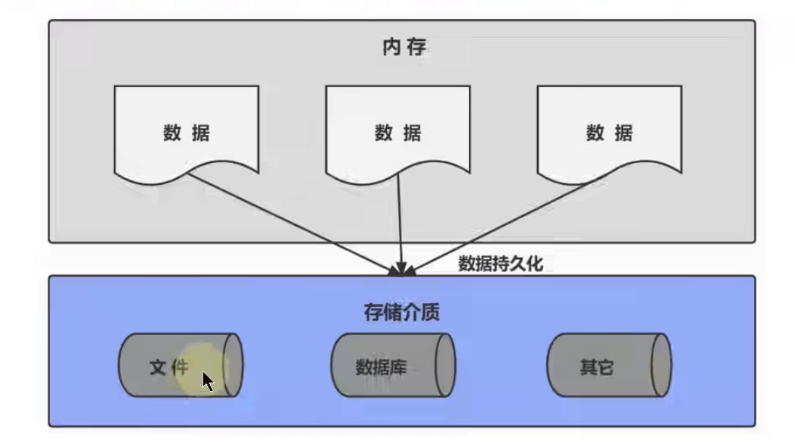

<br>

### 为什么要选数据库
我们可以将数据存储在文件, 磁盘等位置, 为什么要选择存储到数据库中呢?

**1. 数据库可以存储庞大的数据量**  
单数据库中的一张表来说都可以存储几千万上亿条数据

<br>

**2. 数据库中可以存储数据的类型比较多**  
- 字符串
- 整型
- 浮点型
- 图片
- 大文本

如果上述的内容使用文件来存储是不好解决的

<br>

### 持久化的主要作用:  
**将内存中的数据存储在关系型数据库中**, 当然也可以存储在磁盘文件, XML数据文件中。 

<br><br>

# 数据库的相关概念:

### DB: 数据库(Datebase) - 硬盘上的真实的仓库(文件夹, 文件夹中的每个文件就是一张表 .ibd)
存储数据的"仓库", 其本质是一个文件系统。它保存了一系列有组织的数据。

<br>

### DBMS: 数据库管理系统(Database Management System)
**数据库的管理软件** 比如 Mysql, 通过这个软件来操作具体的数据库

**是一种操纵和管理数据库的大型软件**, 用于建立, 使用和维护数据库, 对数据库进行统一管理和控制。用户通过数据库管理系统访问数据库中表内的数据。   

<br>

### SQL: 结构化查询语言(Structured Query Language)
专门用来与数据库通信的语言。

<br><br>

## 数据库 与 数据库管理系统的关系:


DBMS可以管理多个数据库, 一般开发人员会针对每一个应用创建一个数据库 为保存应用中实体的数据 一般会在数据库创建多个表 以保存程序中实体用户的数据


```
                       ↗ 表1 → 记录
                数据库  → 表2 → 记录
          sql ↗        ↘ 表3 → 记录
Mysql(DBMS)
          sql ↘
                       ↗ 表1 → 记录
                数据库  → 表2 → 记录
                       ↘ 表3 → 记录
```

我们的后台程序会访问数据库服务器, 数据库服务器中装的数据库管理系统Mysql

由我们后台发送过来的相应的指令给到我们数据库的管理系统, 比如编写对应的sql查看购物车的数据


<br><br>

## 常见的数据库管理系统排名(DBMS)
目前互联网上常见的数据库管理软件有Oracle, MySQL, MS SQL Server, DB2, PostgreSQL, Access, Sybase, Informix这几种。

以下是2021年**DB-Engines Ranking** 对各数据库受欢迎程度进行调查后的统计结果: 
```s
https://db-engines.com/en/ranking
```

<br><br>

### 常见的数据库介绍:

### Oracle:
- 1979 年, Oracle 2 诞生, 它是第一个商用的 RDBMS(关系型数据库管理系统)。随着 Oracle 软件的名气越来越大, 公司也改名叫 Oracle 公司。
- 2007年, 总计85亿美金收购BEA Systems。
- 2009年, 总计74亿美金收购SUN。此前的2008年, SUN以10亿美金收购MySQL。意味着Oracle 同时拥有了 MySQL 的管理权, 至此 Oracle 在数据库领域中成为绝对的领导者。
- 2013年, 甲骨文超越IBM, 成为继Microsoft后全球第二大软件公司。

如今 Oracle 的年收入达到了 400 亿美金, 足以证明商用(收费)数据库软件的价值。

<br>

### SQL Server:
SQL Server 是**微软开发**的大型商业数据库, 诞生于 1989 年。C#, .net等语言常使用, 与WinNT完全集成, 也可以很好地与Microsoft BackOffice产品集成。

<br>

### DB2:
IBM公司的数据库产品, 收费的。常应用在银行系统中。

<br>

### PostgreSQL: 下个目标就看它
PostgreSQL 的稳定性极强

**最符合SQL标准, 开放源码**, 具备商业级DBMS质量。PG对数据量大的文本以及SQL处理较快。

<br>

### SyBase:
已经淡出历史舞台。提供了一个非常专业数据建模的工具PowerDesigner。 

<br>

### SQLite:
嵌入式的小型数据库, **应用在手机端。** 

零配置, SQlite3不用安装, 不用配置, 不用启动, 关闭或者配置数据库实例。当系统崩溃后不用做任何恢复操作, 再下次使用数据库的时候自动恢复。


### Informix:
IBM公司出品, 取自Information 和Unix的结合, 它是第一个被移植到Linux上的商业数据库产品。**仅运行于unix/linux平台**, 命令行操作。 

性能较高, 支持集群, 适应于安全性要求极高的系统, 尤其是银行, 证券系统的应用。  


<br><br>

# Mysql介绍
- MySQL是一个开放源代码的关系型数据库管理系统, 由瑞典MySQL AB(创始人Michael Widenius)公司1995年开发, 迅速成为开源数据库的 No.1。  

- 2008被Sun收购(10亿美金), 2009年Sun被 Oracle 收购。 MariaDB 应运而生。(MySQL 的创造者担心 MySQL 有闭源的风险, 因此创建了 MySQL 的分支项目 MariaDB)

- MySQL6.x 版本之后分为 **社区版** 和 **商业版**。

- MySQL是一种关联数据库管理系统, 将数据保存在不同的表中, 而不是将所有数据放在一个大仓库内, 这样就增加了速度并提高了灵活性。

- MySQL是开源的, 所以你不需要支付额外的费用。

- MySQL是可以定制的, 采用了 GPL(GNU General Public License) 协议, 你可以修改源码来开发自己的MySQL系统。

- MySQL支持大型的数据库。可以处理拥有上千万条记录的大型数据库。**(在大的话就要分库分表的策略了)**  

- MySQL支持大型数据库, 支持5000万条记录的数据仓库, 32位系统表文件最大可支持 4GB, 64位系统支持最大的表文件为 8TB。

- MySQL使用 标准的SQL数据语言 形式。**(检查约束没有支持)**  

- MySQL可以允许运行于多个系统上, 并且支持多种语言。这些编程语言包括C, C++, Python, Java, Perl, PHP和Ruby等。

<br><br>

## Mysql的存储引擎
5.5开始 InnoDB作为mysql默认的 存储引擎

- 2015年发布的 mysql5.7 稳定版
- 2018年发布的 mysql8.0 稳定版

<br><br>

## 关于: MySQL8.0
MySQL从5.7版本直接跳跃发布了8.0版本

可见这是一个令人兴奋的里程碑版本。MySQL 8版本在功能上做了显著的改进与增强, 开发者对MySQL的源代码进行了重构, 最突出的一点是多MySQL Optimizer优化器进行了改进。不仅在速度上得到了改善, 还为用户带来了更好的性能和更棒的体验。

**我们主要看看 5.7 和 8.0 版本**  

<br><br>

## Why choose MySQL?
为什么如此多的厂商要选用MySQL？大概总结的原因主要有以下几点: 	

1. 开放源代码, 使用成本低。
2. 性能卓越, 服务稳定。
3. 软件体积小, 使用简单, 并且易于维护。
4. 历史悠久, 社区用户非常活跃, 遇到问题可以寻求帮助。
5. 许多互联网公司在用, 经过了时间的验证。

<br><br>

## Oracle Vs MySQL
Oracle 更适合大型跨国企业的使用, 因为他们对费用不敏感, 但是**对性能要求以及安全性有更高的要求**  

MySQL 由于其体积小, 速度快, 总体拥有成本低, **可处理上千万条记录的大型数据库**  

尤其是开放源码这一特点, 使得很多互联网公司, 中小型网站选择了MySQL作为网站数据库**(Facebook, Twitter, YouTube, 阿里巴巴/蚂蚁金服, 去哪儿, 美团外卖, 腾讯)。

<br><br>

# RDBMS 与 非RDBMS (关系型数据库 & 非关系型数据库)
从排名中我们能看出来, 关系型数据库绝对是 DBMS 的主流, 其中使用最多的 DBMS 分别是 
- Oracle
- MySQL
- SQL Server。

这些都是关系型数据库(RDBMS)。

<br>

### 非关系型数据库:
- MongoDB: 是基于文档的
- Redis: 是基于key value

<br><br>

## 关系型数据库(RDBMS):

### 关系型数据库的本质
这种类型的数据库是 最古老 的数据库类型, 关系型数据库模型是把复杂的数据结构(数据和数据之间的关系)归结为简单的 二元关系 (即二维表格形式: **想想excel表格的形式**)。


<br>

### 关系型数据库的格式:
以 行(row) 和 列(column) 的形式存储数据

<br>

**表的概念:**  
这一系列的 行和列 被称为 **表(table)** 

<br>

**库的概念:**  
一组表组成了一个库(database), 很多张table合在一起就构成了一个库

<br>

**关系型的概念:**  
表与表之间的数据记录有关系(relationship)。

比如:  
- 教师表里面存着老师的信息, 老师的信息中会有部分, 而部门也会有一张表
- 部门表里面存着部门的相关信息, 如: 在哪个位置等

**那么员工表和部门表之间就会有一定的关系**, 这种关系就用 关系模型 来表示。数据库中有很多的表 表之间利用这种关系模型来进行连接 这就构成了关系型数据库

SQL 就是关系型数据库的查询语言。

<br>

**Mysql and DataBase的区别:**  
比如我们安装 Mysql 后, 会有两个结构
- DataBase: 数据库 (文件夹)
- Mysql: 数据库的管理软件


数据库中的文件必须通过 DBMS 来读取

<br>

### 关系型数据库的优势
**复杂查询:**  
可以用SQL语句方便的在一个表以及多个表之间做非常复杂的数据查询。

<br>

**事务支持:**  
使得对于安全性能很高的数据访问要求得以实现。

<br><br>

## 非关系型数据库(非RDBMS)

### 非关系型数据库:
可看成 传统关系型数据库的功能 轻量级版本, 基于键值对存储数据, 非关系型数据库中少了表和表之间的关系

虽然没有了关系数据库的一些特性, 如: 关联查询 但相反不需要经过SQL层的解析, 性能非常高。同时, 通过减少不常用的功能, 进一步提高性能。

目前基本上大部分主流的非关系型数据库都是免费的。


<br>

### 有哪些非关系型数据库
相比于 SQL, NoSQL 泛指非关系型数据库, 包括了榜单上的键值型数据库, 文档型数据库, 搜索引擎和列存储等, 除此以外还包括图形数据库。也只有用 NoSQL 一词才能将这些技术囊括进来。

<br>

**键值型数据库: Redis**  
键值型数据库通过 Key-Value 键值的方式来存储数据, 其中 Key 和 Value 可以是简单的对象, 也可以是复杂的对象。

Key 作为唯一的标识符, 优点是查找速度快, 在这方面明显优于关系型数据库, 缺点是无法像关系型数据库一样使用条件过滤(比如 WHERE), 如果你不知道去哪里找数据, 就要遍历所有的键, 这就会消耗大量的计算。

键值型数据库典型的使用场景是作为 **内存缓存** Redis 是最流行的键值型数据库。

<br>

**文档型数据库: MongoDB**    
也可以看做成 key-value 的数据库, value是具体的一个文档 该文档可以是XML, JSON等格式。

在数据库中文档作为处理信息的基本单位, 一个文档就相当于一条记录。文档数据库所存放的文档, 就相当于键值数据库所存放的"值"。MongoDB 是最流行的文档型数据库。此外, 还有CouchDB等。

<br>

**搜索引擎数据库:**   
虽然关系型数据库采用了索引提升检索效率, 但是针对 全文索引 效率却较低。搜索引擎数据库是应用在搜索引擎领域的数据存储形式, 由于搜索引擎会爬取大量的数据, 并以特定的格式进行存储, 这样在检索的时候才能保证性能最优。核心原理是"**倒排索引**"。

典型产品: Solr, **Elasticsearch**, Splunk 等。

<br>

**列式数据库:**    
关系型数据库都属于行式的数据库, 查找也是一行一行的进行

Oracle, MySQL, SQL Server 等数据库都是采用的行式存储(Row-based)

而列式数据库是将数据按照列存储到数据库中, 这样做的**好处是可以大量降低系统的 I/O**, 适合于分布式文件系统, 不足在于功能相对有限。

典型产品: **HBase**等。

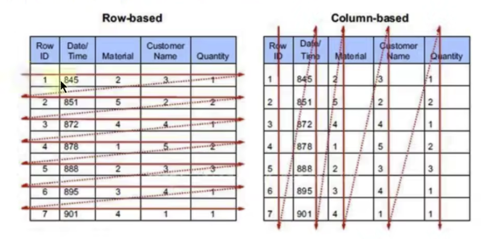

<br>

我们在行式存储的数据库中 想要查询一条记录中的某2个字段的数据, 所以将整行的数据都加载到内存中, 比如一行有30个字段, 我们只需要2个字段, 那么28个字段都属于没有用的字段, 这样占用的内存也就越多, 我们加载的无用的数据越多, 说明我们进行了很多无用的io

<br>

**图形数据库:**  
图形数据库, 利用了图这种数据结构存储了实体(对象)之间的关系。

图形数据库最典型的例子就是社交网络中人与人的关系, 数据模型主要是以节点和边(关系)来实现, 特点在于能高效地解决复杂的关系问题。

图形数据库顾名思义, 就是一种存储图形关系的数据库。它利用了图这种数据结构存储了实体(对象)之间的关系。

关系型数据用于存储明确关系的数据, 但对于复杂关系的数据存储却有些力不从心。

**如社交网络中人物之间的关系**, 如果用关系型数据库则非常复杂, 用图形数据库将非常简单。

典型产品: Neo4J, InfoGrid等。

<br><br>

## NoSQL的演变:
由于 SQL 一直称霸 DBMS, 因此许多人在思考是否有一种数据库技术能远离 SQL, 于是 NoSQL 诞生了, 但是随着发展却发现越来越离不开 SQL。

到目前为止 NoSQL 阵营中的 DBMS 都会有实现类似 SQL 的功能。下面是"NoSQL"这个名词在不同时期的诠释, 从这些释义的变化中可以看出  NoSQL 功能的演变

NoSQL 对 SQL 做出了很好的补充, 比如实际开发中, 有很多业务需求, 其实并不需要完整的关系型数据库功能, 非关系型数据库的功能就足够使用了。这种情况下, 使用 性能更高, 成本更低 的非关系型数据库当然是更明智的选择。比如: 日志收集, 排行榜, 定时器等。

NoSQL 的分类很多, 即便如此, 在 DBMS 排名中, 还是 SQL 阵营的比重更大, 影响力前 5 的 DBMS 中有 4 个是关系型数据库, 而排名前 20 的 DBMS 中也有 12 个是关系型数据库。所以说, 掌握 SQL 是非常有必要的。整套课程将围绕 SQL 展开。

<br><br>

# 关系型数据库设计规则
关系型数据库将现实中的数据结构 使用二维表格的方式数据化

关系型数据库的典型数据结构就是 **数据表**, 这些数据表的组成都是结构化的(Structured)。
 
<br>

### 理解:
将数据放到表中, 表再放到库中。
```
数据
    ↘ 放入
      表
        ↘ 放入
          库
```

- 一个库就相当于 一个文件夹, 一个表就相当于 文件夹中的一个文件
- 一个数据库中可以有多个表, 每个表都有一个名字, 用来标识自己。表名具有唯一性。
- **表具有一些特性**, 这些特性定义了数据在表中如何存储, **类似Java"类"的设计**  

<br>

### 表, 记录, 字段


<br>

### 编程语言操作数据库的关系: ORM思想
Object Relational Mapping 对象关系映射

<br>

### ORM的体现如下:
- 数据库中的一个表 相当于 java中的一个类 
- 表中的一条数据 相当于 java中的一个对象
- 表中的一个列 相当于 java中的类中的一个属性

<br>

### 表 和 表之间的关系: E-R模型
**表跟表之间是怎么刻画的?**  

E-R模型中主要有3个概念:

- 实体集(表)
- 属性(表中的列或者说是字段)
- 联系集

<br>

**一个实体类 对应 数据库中的一个表:**  
class <-> table

<br>

**一个实体(对象) 对应 数据库表中的一行:**  
这一行也叫做一条记录   
```s
instance <-> row / record
```

<br>

**一个属性 对应 数据库表中的一列:**   
这一列也叫做一个字段 (属性)
```s
column <-> field
```

<br><br>

## 表的关联关系:
**A表中的一条记录** 和 **B表中的一条记录** 的 关系

表与表之间的数据记录有关系(relationship)。现实世界中的各种实体以及实体之间的各种联系均用关系模型来表示。

<br>

### 四种:
1. 一对一 关联 -> 一夫一妻制
2. 一对多 关联 -> 一父对多子
3. 多对多 关联 -> 社交网络
4. 自我引用

<br><br>

## 一对一关联(one-to-one):
one-to-one: one理解为表中的一条记录, **表A中的一条记录 对应 表B中的一条记录**  

在实际的开发中应用不多, **因为一对一的关系完全可以创建成一张表** 

<br>

### 举例:
我们设计一张学生表其中包含如下的字段:
- 学号
- 姓名
- 手机号码
- 班级
- 系别
- 身份证号码
- 家庭住址
- 籍贯
- 紧急联系人

那怎么才能体现一对一之间的关系, 我们将上面的表拆成两张表

1. 一个表 放学生的 常用信息 (常用信息表)
2. 一个表 放学生的 不常用的信息 (不常用信息表)

<br>

**常用信息表:**  
- 学号
- 姓名
- 手机号码
- 班级
- 系别

<br>

**不常用信息表:**  
- 学号
- 身份证号码
- 家庭住址
- 籍贯
- 紧急联系人 

<br>

比如张三的学号是 1001, 我们在 常用信息表 和 不常用信息表 中通过学号来查找张三的信息 找的都是张三

不可能出现 1001 在一张表里对应着两条记录 这时候 常用信息表 和 不常用信息表 中的一条记录就是 一对一的关系

```sql
-- 两个表都是张三的信息
基础信息表: 1001
档案信息表: 1001
```

<br>

### 为什么造两张表:
基于这种情况, **为什么不将两张表合成一张表呢？**  

设计成一张表 sql语句可能会简洁一些 一条语句就能查询出张三的完整信息, 不会涉及到多表的查询

<br>

**但是从数据库的设计来说:**   
如果这张表的字段太多 20多个了 其中有常用的字段 和 不是那么常用 

这种情况下 我们可以将 常用 和 不常用的 分别放入两张表中

<br>

**不常用的字段可以叫做冗余字段:**  
加载的冗余字段多的情况下 占用的内存就会多 就会导致我们的io的次数就会偏多 效率就会低

<br>

**数据库的设计优化:**  
把不常用的字段放在一个表中, 把常用的字段放在一个表中

<br>

### 两种建表原则:  
**外键唯一:**  
主表的主键和从表的外键(唯一), 形成主外键关系, 外键唯一。 

<br>

**外键是主键:**  
主表的主键和从表的主键, 形成主外键关系。

<br><br>

## 一对多关系(one-to-many)
表A中的一条记录 对应着 表B中的多条记录

<br>

### 常见实例场景:
- 客户表 和 订单表: 一个客户可以有多个订单
- 分类表 和 商品表: 某个大的门类下面有多种商品
- 部门表 和 员工表: 一个部门中有多个员工

<br>

### 主表
一的一方 称之为 主表

主表包含主要数据记录，是关系中的一方。在一对多关系中，**通常主表中的记录是唯一的**，每条记录可以有多个相关的从表记录与之关联。

主表有一个主键，这个主键通常是一个唯一标识符，用来唯一标识主表中的每一条记录。

<br>

### 从表
多的一方 称之为 从表

从表包含与主表相关的信息，**每个从表记录通常与主表中的一条记录关联**。从表中会有一个外键字段，用来与主表的主键进行关联，建立一对多的关系。这个外键字段的值将指向主表的主键值，以此来建立主从关系。

<br>

### 举例:
**员工表:**   
- 编号(员工编号)
- 姓名
- 所属部门


**部门表:** 
- 编号(部门编号)
- 名称
- 简介

一个员工可以对应多个部门, 一个部门也可以对应多个员工, 这就是一对多的关系

<br>

### 一对多建表原则: 从表创建一个外键, 指向, 主表的主键
从表创建一个外键，指向主表的主键" 的意思是:

从表中有一个字段（通常被称为外键）, 它的值将与主表中的主键值相匹配，以建立主从关系。

**从表除了自己的主键之外，还会有一个外键字段，这个外键字段的值将与主表的主键值相对应(一样)，**  

以便明确主表记录和从表记录之间的关联关系。这个外键字段的值可以用来查询或连接主表和从表，从而实现一对多关系的数据关联和查询。

<br>

上面的举例中 主表就是部门表, 员工表是从表, 从表创建一个外键, 指向, 主表的主键
```
主表(一方)        从表(多方)
---------       ----------
     主键    ←   外键
```

<br>

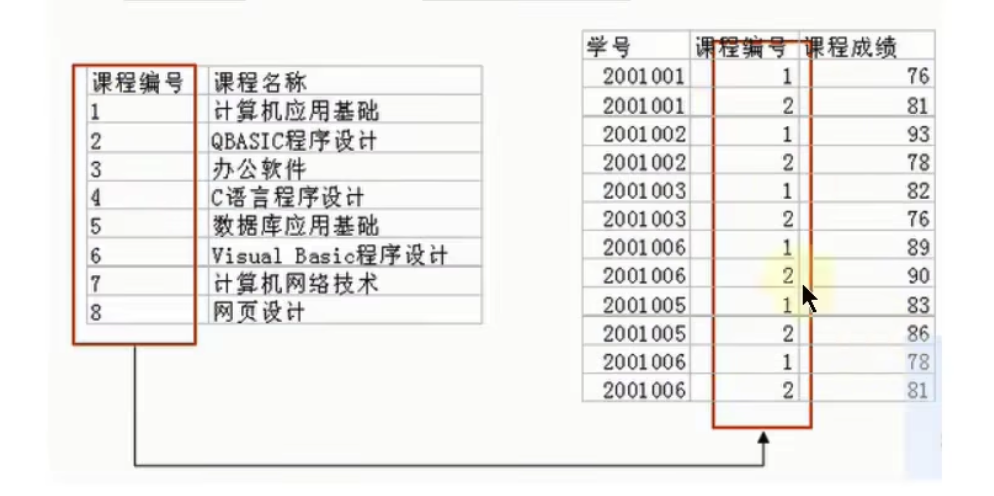

<br>

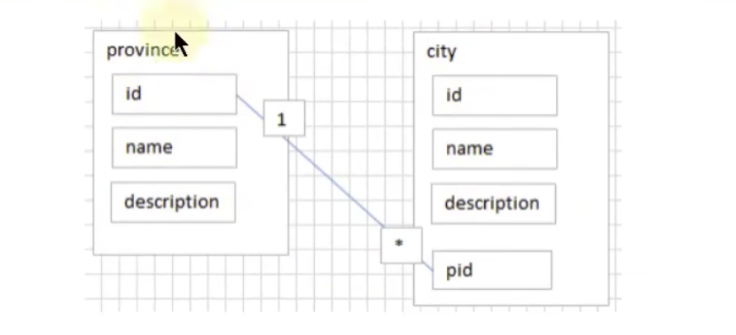

<br><br>

## 多对多(many-to-many):
要表示多对多关系, **必须创建第三个表**, 该表通常称为 **联接表**  

**联接表 将 多对多 的关系 划分为 两个 一对多 的关系**, **将这两个表的主键都插入到第三个表中**  

```sql
-- 中间表 和 表A 形成一对多的关系 (中间表为多的一方)
-- 中间表 和 表B 形成一对多的关系 (中间表为多的一方)
-- 则 表A 和 表B 就是多对多的关系

--------            --------
表A                 表B
id                  id
x1                  y1
x2                  y2


    --------------
    连接表 或 中间表
    x1          y1
    x2          y2
```

<br>

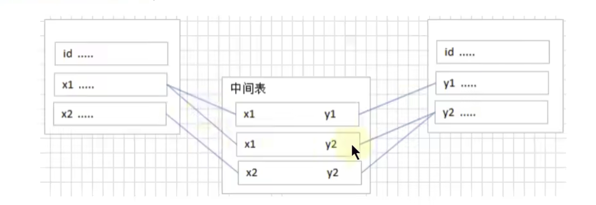

<br>

### 举例: 学生 - 课程

**学生信息表:**    
一条记录就对应一个学生
```
学号 姓名 手机号码 班级 系别
```

<br>

**课程信息表:**  
一条记录就对应一个课程的信息
```
课程编号 授课老师 简介
```

<br>

**选课信息表:**  
一个学生可以选多门课, 一门课可以被多个学生选择

- 学生在联接表中可以存在很多个, 因为一个学生可以选多门课
- 课程在联接表中可以存在很多个, 因为一门课可以被多个学生选择
```
学号    课程编号
1       1001
2       1001
1       1002
```

<br>

当有这种关系的时候, **一个学生可以选多门课, 一门课可以被多个学生选择**  

我们就可以考虑表的多对多的情况, **将这两张表的主键都插入到第三张表中**  
 
<br>

### 举例: 产品 - 订单
"订单"表 和 "产品"表 也有多对多的关系, 一个订单可以有多个产品, 每个产品可以出现在多个订单中

上面说了 当有这种感觉的时候 我们就可以通过第三张表来体现多对多的关系

**通过与"订单明细"表建立两个一对多关系来定义的**  

<br>

**产品表:**    
"产品"表中的每条记录表示一个产品

<br>

**订单表:**  
"订单"表中的每条记录表示一个订单

<br>

**订单明细表:**  
- 一个产品对应着多个订单
- 一个订单可以有多个产品

这种多对多的关系体现在 订单明细表 中


<br>

### 举例: 用户 和 角色
**多对多关系建表原则: 需要创建第三张表**  

中间表中至少两个字段, 这两个字段分别作为外键指向各自一方的主键。

因为 单方表 和 中间表 之间的关系是 一对多  
单方A表(订单) & 单方B表: 一    
中间表: 多
```
A    中间表    B
```

多的一方是从表, 从表中至少要有两个字段, 这两个字段分别作为外键 指向 各自一方的主键

<br>


<br>

### 自我引用:


<br>

```
员工编号  姓名  部门编号  主管编号
103     刘景升     30     101
104     李向明     30     103
105     高大山     30     103
```

员工表, 员工表中有 普通员工 和 领导, 领导也是员工表中的一员

刘景升作为领导, 有自己的员工编号, 104 105 这两个员工的主管编号就是 103刘景升

从 103 这个角度来看 它既作为员工编号, 也是主管编号, 自己引用自己 就是自我引用

<br><br>

# Mysql的卸载

## Windows的卸载:

### 安装mysql后, 哪些位置有mysql
**1. 安装mysql时所指定目录下**  
装完mysql后会有两个部分
1. mysql管理软件本身的文件
2. 数据库文件的存放位置

<br>

关于数据库也就是数据的存放位置为
```sql
c:/windows/programData/mysql
```

这个文件夹里面有两个比较重要的东西
```s
| - Data # 就是数据库
- my.ini # 设置数据库的配置信息
```

<br>

**2. 电脑图标/右键/管理/服务/Mysql**  
这里都是mysql运行需要的服务 也就是进程, 比如我们能找到 ``Mysql80 正在运行`` 的条目

<br>
 
**3. 电脑图标/右键/属性/高级系统设置/环境变量/path**  
环境变量中也能看到mysql的相关信息

<br>

### 卸载步骤:
将上述的位置的所有mysql相关信息都删除掉 就算卸载干净了

<br>

**1. 停止 mysql 服务:**  

<br>

**2. 通过控制面板 或 360工具卸载mysql**  
```sql
-- 卸载如下的两个程序
mysql installer - community
mysql server 8.0
```

<br>

**3. 删除数据文件(上述步骤2的文件)**  
数据文件不会随着软件的卸载而删除, 这些数据自己判断是否还要使用 不使用就删掉

<br>

**4. 环境变量考虑删除**  

<br>

**5. 手动清除注册表**  
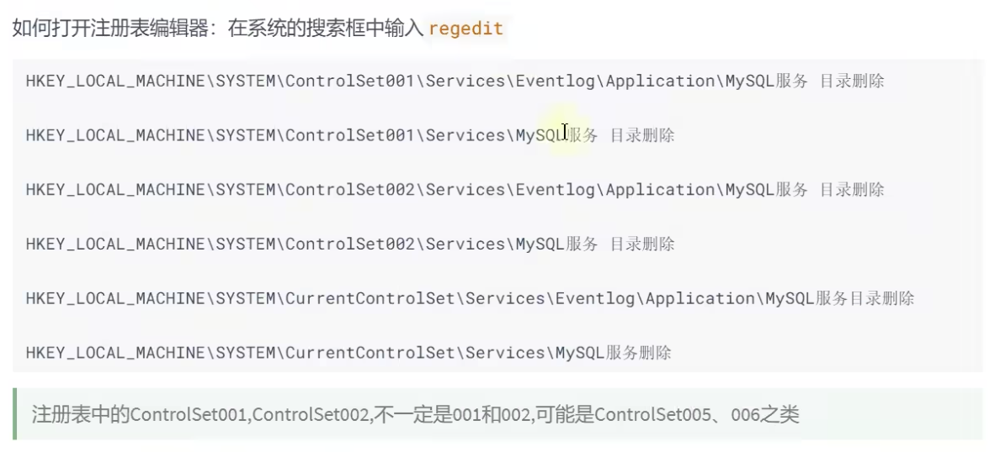

<br><br>

## Mac的卸载:
下篇再讲

<br><br>

# Mysql的安装

## 下载地址:
window **下载 msi格式的文件**, 不推荐zip格式的文件 (解压就能用的)

```s
# 官网
https://www.mysql.com

https://dev.mysql.com/downloads/mysql/
```

<br><br>

## 版本说明:

<br>

### mysql community server 社区版本:  
开源免费, 自由下载, 但不提供官方技术支持, 适合普通用户

<br>

### mysql enterprise edition 企业版本:  
需要付费

<br>

### mysql cluster 集群版:  
开源免费, 用于架设服务器集群, 可以将几个mysql server封装成一个server

<br>

### mysql cluster cge 高级集群版:  
需要付费

此外, 官方还提供了 mysql workbench (GUITool) 一款专为mysql设计的 图形界面管理工具
- musql workbench oss 社区版
- mysql workbenchSE 商用版

<br><br>

# Mysql图形化管理工具的安装
相当于我们安装了一个vscode, **navicat**  
```s
https://xclient.info/s/navicat-premium.html#versions
```

<br><br>

# Mysql配置:

## 1. 配置环境变量:
windows下的配置方式
```s
电脑图标/属性/高级系统设置/环境变量/系统环境变量/新建/粘贴到mysql的bin路径
```

<br><br>

## 2. 修改数据库的编码集 (Mac)
```s
https://www.jb51.net/article/136582.htm
```
```s
show variables like '%char%';

+--------------------------+-------------------------------------------------------+
| Variable_name            | Value                                                 |
+--------------------------+-------------------------------------------------------+
| character_set_client     | utf8mb4                                               |
| character_set_connection | utf8mb4                                               |
| character_set_database   | utf8mb4                                               |
| character_set_filesystem | binary                                                |
| character_set_results    | utf8mb4                                               |
| character_set_server     | utf8mb4                                               |
| character_set_system     | utf8mb3                                               |
| character_sets_dir       | /usr/local/mysql-8.0.33-macos13-arm64/share/charsets/ |
+--------------------------+-------------------------------------------------------+
```

<br>

### 1. 关闭mysqld后台进程
```
Stop MySQL Server
```

<br>

### 2. 修改mysql配置文件 /etc/my.cnf
如我们可以修改 数据库的字符集

```
sudo cd /usr/local/mysql/support-files/my-medium.cnf /etc/my.cnf
```

在Mac OS X中默认是没有my.cnf 文件, 如果需要对MySql 进行定制, 拷贝/usr/local/mysql/support-files/目录中任意一个.cnf文件粘贴到/etc目录下, 
  
并且重命名为my.cnf, 然后修改 my.cnf 即可进行定制了。

support-files文件夹里面没有my-default.cnf或my.cnf文件,那么就要在/etc下新建my.cnf

```s
cd /etc
sudo vim my.cnf
```

然后复制 本md最下方的东西 到新文件里面

```sql
sudo vi /etc/my.cnf
```

```sql
-- [mysql/client]的下方加入: 
default-character-set=utf8

-- [mysqld]的下方加入: 
character-set-server=utf8
collation-server=utf8_general_ci

-- 修改完毕之后再启动mysql
-- 检查结果: show variables like '%char%';
```

<br>

### 安装时常见错误:
```s
https://www.bilibili.com/video/BV1iq4y1u7vj/?p=8&spm_id_from=pageDriver&vd_source=66d9d28ceb1490c7b37726323336322b
```

<br><br>

# Mysql的命令行命令

### 数据导入指令
```sql
-- 文件的全路径名
source d:\mysqldb.sql
```

<br>

### 查看已有的数据库
```sql
show databases;
```

里面有数据库服务器自带的4个database

<br>

**information_schema:**  
用来保存数据库服务器的基本信息 数据库的名称 表的名称 存储权限等

<br>

**mysql:**  
用来保存数据库在运行的时候的系统信息 数据库文件夹 字符集

<br>

**performance_schema:**  
用来存储监测mysql各种行踪指标的

<br>

**sys:**  
用来性能指标 用数据库管理员 或 开发人员 进行监控mysql性能的
 
<br>

### 演示: mysql的使用

**创建一个数据库:**  
```sql
create database 数据库名称;
```

<br>

**删除一个数据库:**  
```sql
drop database 数据库名称;
```

<br>

**选择指定的数据库:**  
```sql
use 数据库名称;
```

<br>

**查看当前数据库下的表:**  
```sql
show tables;
```

<br>

**创建表:**  
```sql
create table 表名称(字段 类型, [字段 类型,])

create table employee(id int, name varchar(15));
```

<br>

**查看表中的所有数据:**  
```sql
select * from 表名
```

<br>

**向表中插入数据:**  
```sql
insert into 表名 values(对应数值)
```

```sql
insert into employee values(1001, "sam");
```

<br>

**注意:**  
- mysql5版本中:   
表格的字符集是 ``CHARSET=latin``, 就意味着 当我们在版本5中往表里面添加中文的话 会报错

- mysql8版本中:   
表格的字符集是 ``CHARSET=utf8mb4``

<br>

**查看创建表时的详情:**   
比如能看到编码集
```sql
show create table 表名;
```

<br>

**查看创建数据库时的详情:**  
比如能看到编码集
```sql
show create database 数据库名;
```

<br>

**查看当前数据库的编码集:**  
```sql
show variables like 'character_%';
```

当我们创建一个数据库 或 创建一个表的时候 如果我们没有显式的指定字符集 那就和数据库的默认的字符集一样了

```sql
-- 显示信息如下
character_set_database  utf8mb4
character_set_server    utf8mb4

character_sets_dir      
/usr/local/mysql-5.7.31-macos10.14-x86_64/share/charsets/
```

<br>

**查看字符集的比较规则:**  
每种字符集都会有对应的比较规则, 比如拉丁的字符集就有对应的拉丁的比较规则
```sql
show variables like 'collation_%';
```

<br>

**修改数据库的字符集:**  
```sql
alter database 数据库名称 charset utf8
```

<br>

**修改数据库的编码集:**  
这不是修改基本配置 只是针对一个数据库 或 一张表的操作
```sql
alter table 表名称 charset utf8
```

<br><br>

# mysql80: 使用navicate连接数据库 报错的问题
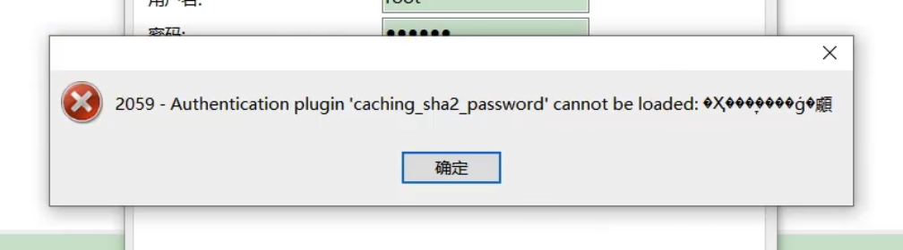

mysql5.7的情况下连接navicate是没有问题的, 但是80的话就出现了问题, 原因在于我们在安装mysql80的时候 我们选择了授权方式(sha2)
1. 新的授权
2. 传统授权方式 (保留5.7版本的兼容性)

<br>

### 解决方式:
1. 升级图形化界面的版本工具
2. 将mysql8用户登录密码加密规则还原成 mysql_native_password

<br>

### 实现步骤 (修改登录数据库软件的密码):
- 首先, 要先登录到 mysql 数据库  
- 然后, 通过下面的方式修改密码

```sql
-- 登录到系统的mysql数据库
use mysql


-- 修改 'root'@'localhost' 用户的密码规则 和 密码
alter user 'root'@'localhost' identified with mysql_native_password by "abc123";  -- 新密码


-- 刷新权限
flush privileges;
```

<br>

**mysql_native_password:**  
它是用户的密码规则, 兼容5.7版本用的

<br><br>

# Mysql的目录结构:
|Mysql的目录结构|说明|
|:--|:--|
|bin目录|所有mysql的可执行文件|
|mysqlinstanceconfig.exe|数据库的配置向导, 在安装的时候出现|
|data目录|系统数据库所在的目录|
|my.ini|mysql的主要配置文件|
|c:/programdata/mysql/data|用户创建的数据库所在的目录|

<br><br>

# root用户密码重置 (密码忘了)
1. 通过任务管理器 或 服务管理 关掉 mysqld(服务进程)

2. 通过命令行 + 特殊参数开启 mysqld
```s
mysqld --defaults-file="D:/ProgramFiles/mysql/MySqlServer5.7Data/my.ini" --skip-grant-tables
```

3. 此时, mysqld服务进程已经打开, 并且不需要权限检查

4. mysql -uroot 无密码登录服务器, 另启动一个客户端进行

5. 修改权限表
  - use mysql
  - update user set authentication_string=password("新密码") where user='root' and Host='localhost';
  - flush privileges;
6. 通过任务管理器, 关闭mysqld服务进程
7. 再次通过服务管理 打开mysql服务
8. 即可使用修改后的新密码登录

<br><br>

# SQL概述(Structured Query Language)
**结构化查询语言**  

不同的数据库生产厂商都支持SQL语句, 但都有特有内容。

```     
                mysql特有(方言)
              ↗
sql规范(普通话)
              ↘
                Oracle特有(方言)
```

大部分常见的 查询 之类的语句都是一样的 但是细小的部分还是有区别的

```
tiobe编程语言排行榜2022
```

<br><br>

## SQL的两个标准(类似Java8, 9):
它们分别代表了92 99年颁布的SQL标准, 我们今天使用的sql语言依然遵守这些标准, 但是在不同的数据库厂商的支持方面还是有不同的, 常见的基础的语法是通用的
- SQL92
- SQL99

<br><br>

## SQL分类
SQL语言 **在功能上** 主要分为如下3大类:   

<br>

### 1. DDL: 数据定义语言 (定义结构)
**创建库和管理表**  

这些语句定义了不同的数据库, 表, 视图, 索引等数据库对象, 还可以用来 **创建, 删除, 修改 数据库和数据表的结构。**  

DDL语句 主要是从无到有的创建数据库中的对象(表 视图 存储过程 函数 事件等等)

<br>

**关键字:**  
- create: 创建
- drop: 删除
- alter: 修改
- rename: 重命名
- truncate: 清空表中数据 表结构还在

<br>

### 2. DML: 数据操作语言 (增删改查)
用于 添加 删除 更新 和 查询数据库记录, 并检查数据的完整性

**增删改查**   
用于添加, 删除, 更新和查询数据库记录, 并检查数据完整性。

<br>

**关键字:**  
- insert: 添加一条记录1
- delete: 删除一条记录
- update: 修改一条记录
- select: 查询操作

<br>

### 3. DCL: 数据控制语言 (深层次)
用于定义数据库 表 字段 用户的**访问权限和安全级别**  

<br>

**关键字:**  
- grant: 赋予相关的权限
- revoke: 回收相关的权限
- commit: 将修改后的结果进行提交 对数据库的修改就是永久性的了
- rollback: 撤销修改 回滚
- savepoint: 设置保存点 回滚到一个保存点上

<br>

### 扩展:
因为查询语句使用的非常频繁 所以很多人把 **查询语句** 和 **commit rollback** 单拿出来: 

- DQL(数据查询语言)
- TCL(事物控制语言)

<br><br>

# SQL语言的规则与规范
- 规则: 必须遵守的 不遵守的话 会报错
- 规范: 建议我们遵守

<br><br>

## 基本规则 (必须遵守):

### 1. SQL 可以写在一行或者多行。
为了提高可读性, 各子句分行写, 必要时使用缩进
```sql
select *
from employees;
```

<br>

### 2. 每条命令以 ``;`` 或 ``\g`` 或 ``\G`` 结束

**\g or \G:**  
使用在 命令行(小黑屏) 中的方式, 会把原先以列呈现的信息 转成 以行的形式呈现信息
```sql
insert into employees
values(1001, "sam");


-- \G: 信息会以行的形式呈现
show create table employees\G
```

<br>

### 3. 关键字不能被缩写也不能分行
```sql
-- 错误演示: insert 折成两行, 分开了
ins
ert into employees
values(1001, "sam");
```

<br>

### 4. 关于标点符号
- 必须保证所有的 ``()``, `单引号`, ``双引号``是 **成对结束的**  

- 必须使用英文状态下的半角输入方式

- **字符串型** 和 **日期时间类型** 的数据需要使用**单引号**(' ')表示

- 列的别名, 使用双引号(" "), 而且不建议省略as

<br><br>

## SQL大小写规范 (建议遵守如下两点):
**1. 数据库名, 表名, 表别名, 字段名, 字段别名等都小写**  
**2. SQL关键字, 函数名, 绑定变量等都大写**  

<br>

- MySQL 在 Windows 环境下是: **不区分**大小写  
- MySQL 在 Linux 环境下是: **区分**大小写

也就是说比如, 我们的表名定义为 ``emp`` 小写的
- 在windows中使用 ``select * from EMP;`` 是可以搜到的
- 在Linux中使用 ``select * from EMP;`` 是搜索不到的

<br>

### Linux系统下区分大小写的结构:
**严格区分大小写的结构:**  
- 数据库名
- 表名
- 表的别名
- 变量名

也就是说**Linux中的表名 emp 和 EMP 是两张表**  

<br>

**不严格区分大小写的结构:**  
- 关键字
- 函数名
- 列名(或字段名)
- 列的别名(字段的别名) 是忽略大小写的

<br><br>

## 注释:
可以使用如下格式的注释结构

<br>

### 单行注释: ``#``
``#注释文字`` (MySQL特有的方式)

<br>

### 单行注释: ``--``
``-- 注释文字`` (--后面必须包含一个空格)

<br>

### 多行注释: ``/* */``
``/* 注释文字 */`` 多行注释不能嵌套

<br><br>

## 命名规则 (暂时了解)
- 数据库, 表名不得超过30个字符, 变量名限制为29个

- 必须只能包含 A–Z, a–z, 0–9, _共63个字符

- **数据库名, 表名, 字段名等对象名中间不要包含空格**  

- 同一个MySQL软件中, **数据库不能同名**; 

- 同一个库中, **表不能重名**; 同一个表中, **字段不能重名**  

- 必须保证你的字段没有和保留字, 数据库系统或常用方法冲突。如果坚持使用, 请在SQL语句中使用``(着重号)引起来

- 保持字段名和类型的一致性, 在命名字段并为其指定数据类型的时候一定要保证一致性。假如数据类型在一个表里是整数, 那在另一个表里可就别变成字符型了

```sql
-- 以下两句是一样的, 不区分大小写
show databases;
SHOW DATABASES;

-- 创建表格
-- 表名错误, 因为表名有空格
create table student info(...); 
create table student_info(...); 


-- 其中order使用``飘号, 因为order和系统关键字或系统函数名等预定义标识符重名了
CREATE TABLE `order` (
    id INT,
    lname VARCHAR(20)
);


-- 起别名时, as都可以省略
select id as "编号",  name  as "姓名" from t_stu; 


-- 如果字段别名中没有空格, 那么可以省略""
select id as 编号,  name  as 姓名 from t_stu; 


-- 错误, 如果字段别名中有空格, 那么不能省略
select id as 编 号,  name  as 姓 名 from t_stu; ""
```

<br><br>

# 向数据库中导入数据

### 方式1: 命令行的方式:
**我们要在命令行中运行此命令, 注意: 路径中不要出现中文**  

```sql
source 文件的全路径名

-- 示例:
mysql> source d:/mysqldb.sql
```

<br>

### 方式2: 基于图形化界面的工具:
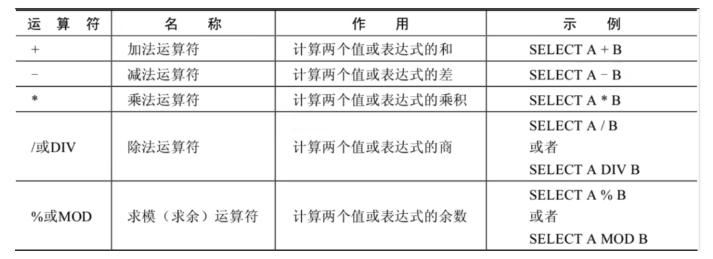

<br><br>

# 基本的SELECT语句
每一条记录相当于一个员工对象, 每一个字段相当于对象中的属性

<br>

### 理解:
sql的查询中的字段 就相当于我们for循环中使用的变量 index 每次循环的时候值都不一样

我们的查询也是 salary字段也相当于变量 每次查到一行记录时 它对应的值也不一样

<br>

## select ... from ...

### **<font color="#C2185B">select 数据</font>**  
最基本的查询语句, 相当于使用 console.log 来输出结果, 默认输出在一行中的一个字段里, 可以使用 , 将数据输出在多个字段里

```sql
-- 1 + 2 和 3 + 2 作为两个字段名, 结果在字段的列中出现
select 1 + 2, 3 + 2;
```

<br>

### **<font color="#C2185B">select 字段1, 字段2 from 表名;</font>**  

**最基本的查询结构:**  
查询指定表中所有的字段信息, 多个字段之间使用, 来分隔
```sql
select 字段1, 字段2, ... from 表名;
```

**<font color='#C2185B'>该位置所代码的结果 会在结果集中展示 相当于</font>**  
- 字段 <-> thead
- 结果 <-> td

<br>

**关键字: dual**  
它是一个伪表, 算是补充上表结构的部分, 没有什么含义
```sql
select 'sam' from dual;
```

这种书写方法 和 上面的 单select 是一样的 只不过是使用 dual关键字 补充了一个伪表, 从一张虚拟的表中查信息, 相当于我们补全了查询的结构

<br>

**关键字: ``*``**  
表示展示 表中的所有字段(所有的列)

<br>

**示例:**  
```sql
-- console.log下信息
select 'sam'

-- 使用完整的结构
select 'sam' from dual;

-- 查询员工表
select * from employees;
```

<br><br>

## 表中列 (字段) 的别名:
给列的名字起一个别名 **支持汉字**, 给列起别名一共有3种方式

<br>

### **<font color="#C2185B">字段 AS 别名</font>**  
给要查询的字段起一个别名

```sql
-- employee_id -> id
select employee_id as id from employees;
```

<br>

### **<font color="#C2185B">字段 别名</font>**  
字段和别名之间 只用空格, 别名没有引号
```sql
select employee_id id from employees;
```

<br>

### 3. **<font color="#C2185B">字段 "别名"</font>**  
别名使用一段双引号引起来 当要起的别名有 **奇怪的符号** 或者 **空格** 的时候 

规范要求使用""包起来 **不要使用单引号''**  

```sql
SELECT employee_id "emp_id", salary FROM employees;
```

<br><br>

## 去重重复行: 关键字 distinct
去除指定字段的重复行, 写在**所有字段**的前面, distinct 字段1 字段2
```sql
select distinct 字段 from 表名;
```

<br>

当我们查询一个表的时候 默认情况下, 查询的结果集中会返回全部行(全部信息), 包括重复的记录。
```
30
30
30
10
```

比如我们有一种场景 我们想知道员工表中的员工所在 都有哪些部门, 我们发现 107个员工所在的部门都列出来了 **但是有很多员工都在同一个部门**  

而我们的诉求就是想知道公司有多少个部门 **不需要这些重复的部分**  

```sql
-- 查询员工表中 有哪些部门id
SELECT department_id FROM employees;

null  -- 有的员工没有部门
10
20
20
30
30
30
30
```

所以这时候我们想将重复的数据只留一条就可以了

<br>

### 示例 
```sql
SELECT DISTINCT department_id
FROM employees;
```

<br>

### 经验:
我们给一个字段进行去重就可以了

<br>

### 注意: 错误演示
1. DISTINCT **需要放到所有列名的前面** 如下写法会报错   
```sql
-- 员工一共107人 工资的字段就是应该有107行 去重后的部门id的行数是12, 结果集中工资结果为107行 部门结果为12行 匹配不上
-- 报错: 我们写在了 字段2 的前面
SELECT salary, DISTINCT department_id
FROM employees;
```

2. 写法2, ``DISTINCT 字段1 字段2`` 当DISTINCT的后面有多个字段的时候, 它会考虑给 字段1 和 字段2 都进行去重, 它会将 字段1 和 字段2 做为一个整体 从整体上考虑去重的情况 
```sql
-- 我们发现结果也是有重复的 原因 它是将两个字段作为一个整体来进行去重
60 6000
60 4500
60 1888

-- 比如再有一个 60 1888 就会被去重
60 1888

-- 结果集为74条数据
SELECT DISTINCT department_id, salary
FROM employees;
```

<br><br>

## 空值 参与 运算的情况: 

### 什么是空值:
如果一个字段是null 它就代表空值的意思

<br>

**注意:**  
null不等同于0, '', 结果集中的空值显示为``(NULL)``

<br>

### 字段中的值是可以参数运算的
当字段中的数据是可以被计算的时候 是可以参与运算的
```sql
-- 计算该员工的年收入
SELECT last_name "员工姓名", salary * 12 "员工薪资"
FROM employees;
```

<br>

### null参与运算:
所有运算符或列值遇到null值, **运算的结果都为null**  

<br>

### 需求:
employees表中是有一个字段就是奖金率, 我们要计算员工的年薪, 要加入奖金率的计算

当我们假如奖金率的时候, 因为该字段的值很多都是NULL值, 当NULL值参与计算的时候 结果为NULL

```sql
-- 结果都为NULL
select last_name "姓名", salary * (1 + commission_pct) * 12 "年工资"
from employees;
```

<br>

### 注意:
1. 在 MySQL 里面, 空值不等于空字符串。
2. 一个空字符串的长度是0, 而一个空值的长度是空。
3. 在 MySQL 里面, 空值是占用空间的

<br><br>

## 着重号:  ``
当我们的 **表名 字段名** 和 **保留字 关键字** 重名的时候 我们在使用的时候要用 `` 将重名的表名或者字段名包起来

比如我们有一个order表 但是order在mysql中是关键字 当我们查询这个表的时候 会报错
```sql
-- 这里因为 表order 和 关键字ORDER 重名 所以使用着重号
SELECT * FROM  order 

-- 使用着重号
select * from `order`
```

<br><br>

## 查询常数:
正常我们在使用查询语句的时候, 会将查询结构中的字段对应的结果展示在列中(td)中
```sql
select employee_id from employees;
```

employee_id 类似 th, employee_id对应的结果会在 td 中

|employee_id|
|:--|
|1|

<br>

### 结构:
而常数列的th和td都是这个常数本身
```sql
select '常数列', last_name from employees;


-- 结果集: 常数列的内容就是我们指定的字段名
常数列 emp_id last_name
常数列 1001    King
常数列 1002    King
常数列 1003    King
```

就是在 SELECT 查询结果中增加一列固定内容的常数列。 **这列的取值是我们指定的, 而不是从数据表中动态取出的。**  

相当于我们自定义了一个字段, 字段的内容就是该字段

<br>

### 技巧:
利用别名的方式, 别名为字段名, 内部为我们定义的常数列的内容

```sql
-- 利用别名指定字段名为: 学校名, 内容为: 固定内容
select '固定内容' as '学校名', last_name from employees;
```

<br>

我们自己添加的字段 **会在每一条记录的前面都添加上** 这就是 **查询常数**  

比如我们表中的每一条记录前面都要加上固定内容 但是该字段又没有在表的结构里面 我们就可以使用常数来表示

<br><br>

## 显示表结构:
显示创建该表时候的 表中字段的详细信息, 每一个字段都会在结果集中有详细的体现, 比如我们可以查看下该表中有什么字段, 它们的类型 约束 默认值都是什么情况

- field: 字段
- type: 类型
- null: 是否可以为空
- key: 约束
- default: 默认值

<br>

### **<font color="#C2185B">describe 表名</font>**  
### **<font color="#C2185B">desc 表名</font>**  

<br>

**注意:**  
desc不能查看外键是哪个字段

<br>

|field|type|null|key|default|extra|
|:--|:--|:--|:--|:--|:--|
|employee_id|int(6)|NO|PRI|0||
|first_name|varchar(20)|YES||||
|last_name|varchar(25)|NO||||
|email|varchar(25)|NO|UNI||
|phone_number|varchar(20)|YES|||
|hire_date|date|NO|||
|job_id|varchar(10)|NO|MUL||
|salary|double(8,2)|YES|||
|commission_pct|double(2,2)|YES|||
|manager_id|int(6)|YES|MUL||
|department_id|int(4)|YES|MUL||

<br><br>

# 过滤数据 WHERE
我们在查询一个表的结构的时候 可以指定要查询的字段 但也是将整个表中的所有数据(行/记录)都查询出来了

当我们**只想查询满足某些条件的数据** 不是所有的数据的时候 就是过滤数据

比如只想要90号部门的员工信息

<br>

### **<font color="#C2185B">WHERE 条件</font>**  
将要过滤的条件写在 where关键字 的后面

<br>

**要求: from 和 where 是基友需紧挨**  
WHERE一定要声明在FROM结构的后面 紧挨着FROM, 即使有别的关键字和不能插在 FROM WHERE 的中间

<br>

**注意:**  
字段的内容也是区分大小写的, King 和 king 是两个内容

<br>

### 示例:
**查询90号员工部门的信息**  
```sql
SELECT * 
FROM employees 
WHERE department_id = 90;
```

<br>

**查询last_name为'king'的员工信息**  
```sql
SELECT * 
FROM employees 
WHERE last_name = 'King'; 
    -- 字符串要用 '' 包起来
```

<br><br>

## 练习:

### 1. 查询员工12个月的工资总和, 并起别名为ANNUAL SALARY 

**工资总和:**  
- 基本工资 * 12
- 基本工资 * 奖金率 * 12

```sql
-- 别名要使用 " "
SELECT employee_id, last_name, salary * 12 "ANNUAL SALARY" 
FROM employees;


select 
  last_name, 
  salary * 12 * (1 + ifnull(commission_pct, 0)) "ANNUAL SALARY"
from employees;
```

<br>

### 2. 查询employees表中去除重复的job_id以后的数据
```sql
SELECT DISTINCT job_id FROM employees;
```

<br>

### 3. 查询工资大于12000的员工姓名和工资
```sql
SELECT last_name, salary 
FROM employees 
WHERE salary > 12000;
```

<br>

### 4. 查询员工号为176的员工的姓名和部门号
```sql
SELECT employee_id, last_name, department_id
FROM employees
WHERE employee_id = 176;
```

<br>

### 5. 显示表 departments 的结构, 并查询其中的全部数据
```sql
DESC departments;
SELECT * FROM departments;
```

<br><br>

# 运算符:

<br>

## 算术运算符:
算术运算符主要用于数学运算, 可以连接运算符前后的两个数值或表达式, 对数值或表达式进行运算

主要针对于 **数值类型** 的变量或 **常量** 来进行运算

<br>

- 加(+)
- 减(-)
- 乘(*)
- 除(/) or div
- 取模(%) or mod

<br>


<br>

### 加减的示例:
```sql
select 1 + 2 "加", 0 - 2 "减", 1 * 3 "乘", 4 / 2 "除", 10 % 5 "取模";

-- 结果集:
+---+----+---+--------+------+
| 加 | 减 | 乘 |   除   | 取模 |
+---+----+---+--------+------+
| 3 | -2 | 3 | 2.0000 |    0 |
+---+----+---+--------+------+
```

<br>

### 乘除的示例:
```sql
SELECT 100, 100 * 1, 100 * 1.0, 100 / 1.0, 100 / 2,100 + 2 * 5 / 2,100 /3, 100 DIV 0 FROM dual;

-- 100 DIV 0: 分母不能为0 结果是null
```

<br>

### 要点:
**<font color='#C2185B'>1. 算术运算有隐式转换的功能</font>**  
会将数字类型的字符串转成数字来运算

<br>

**2. + 字符串没有拼接功能:**    
在sql中 + 没有连接的作用 就表示加法运算
```sql
SELECT 100 + '1' 
FROM DUAL;

-- 101
```

上面 数字 和 字符串做 + 运算 并没有拼接的功能,  而是 **隐式转换** **将字符串转成数值** 再参与运算
  
<br>

**3: + 不能 隐式转换的字符 '非数字' 和 null**  
- null: 任何数字和 null 做运算的时候 结果为null
- 非数值类型的字符: 先尝试转成数值, 如果转失败, **就按0计算。**  

<br>

数字 + 'a' 加了一个不能隐式转换的字符串, 而是当遇到**不能正常转换**的时候, 会将其**转换为0** 然后再运算
```sql
SELECT 100 + 'a' 
FROM DUAL;

-- 100
```

<br>

**4: 除法的结果默认是浮点型:**   
除法默认是除不尽的, 所以会保留小数位(默认4位) 也就是**除法结果是就浮点型** 

<br>

**5. 除法的时候 分母为0, 则结果为null**  

<br>

### 关于 加减结论:
1. 一个整数类型的值对整数进行加法和减法操作, 结果还是一个整数; 

2. 一个整数类型的值对浮点数进行加法和减法操作, 结果是一个浮点数; 

3. 加法和减法的优先级相同, 进行先加后减操作与进行先减后加操作的结果是一样的; 

4. 在Java中, +的左右两边如果有字符串, 那么表示字符串的拼接。但是在MySQL中+只表示数值相加。如果遇到非数值类型, 先尝试转成数值, 如果转失败, 就按0计算。

**补充: MySQL中字符串拼接要使用字符串函数CONCAT()实现**  

<br>

### 关于 乘除结论:
1. 一个数乘以整数1和除以整数1后仍得原数; 

2. 一个数乘以浮点数1和除以浮点数1后变成浮点数, 数值与原数相等; 

3. 一个数除以整数后, 不管是否能除尽, 结果都为一个浮点数; 

4. 一个数除以另一个数, 除不尽时, 结果为一个浮点数, 并保留到小数点后4位;

5. 乘法和除法的优先级相同, 进行先乘后除操作与先除后乘操作, 得出的结果相同。

6. 在数学运算中, 0不能用作除数, 在MySQL中, 一个数除以0为NULL。

<br>

### 关于 除法选择 DIV 还是 /
DIV返回的是整数 也就是 商
```sql
SELECT 51 / 2 FROM DUAL;    -- 25.5000
SELECT 51 DIV 2 FROM DUAL;  -- 25
```

<br>

### 关于 取模结论:
结果的符号**与被模数的符号相同** 跟模数没有关系
```
被模数 % 模数
```

<br>

### 需求:
查询员工id为偶数的员工信息
```sql
SELECT * 
FROM employees 
WHERE employee_id % 2 = 0;

-- sql中的等于 就是 = 
```

<br><br>

# 比较运算符: 返回值 0 或 1
比较运算符用来对 **表达式左边的操作数** 和 **右边的操作数** 进行比较, **比较运算符**经常被用来作为SELECT**查询语句的条件来使用**, 返回符合条件的结果记录。

其它语言中比较的结果会是 true 或者 false, **但在 sql 中的比较结果如下**  

1. 结果为 真 - 则返回1
2. 结果为 假 - 则返回0
3. 其他情况 - 则返回NULL (NULL值进行比较的时候情况比较复杂)

NULL参与比较的时候返回的是0

<br><br>

## 比较的条件:
- 操作符两边是 数值 的时候, 正常比较

- 操作符两边的一边是 字符型数值 的时候, **隐式转换**  

- 操作符两边的一边是 字符串 的时候, 不能隐式转换为数值时, **会把它看做为0**  

- 操作符两边是 字符串 的时候, 比**较的是每个字符串中字符的ANSI编码是否相等**  

- 操作符两边的一边是 NULL, 则比较结果为 (NULL)

<br><br>

## 按条件查询的简单流程:

```sql
SELECT last_name, salary 
FROM employees 
WHERE salary = 6000;
```

执行上面语句的时候其过程是 有一个指针会一条一条的获取表中的每一条记录

它会先取出第一条记录的salary 拿出来跟6000进行比较 结果不相等返回0 **当结果为0的时候该数据就不要了**  

**当比较的结果为1的时候 该数据会保留** 然后查询结果就是0 和 1 然后会返回所有为1的数据

```sql
SELECT last_name, salary 
FROM employees 
WHERE salary = 6000;
```

<br>

**注意:**  
因为sql会返回条件为1的数据, 而我们的NULL在做运算的时候 比较结果都是0, 如果使用 ``字段 = null`` 的方式 想获取字段为null的数据 是获取不到的

```sql
SELECT last_name, salary 
FROM employees 
WHERE commission_pct = NULL;
```

结果是一条数据都没有, 因为, 任何值和NULL进行比较结果是0, 上面我们说 我们会返回比较结果为1的数据, 所以不会有任何的结果

<br><br>

## 算术符号符 的 比较运算符:
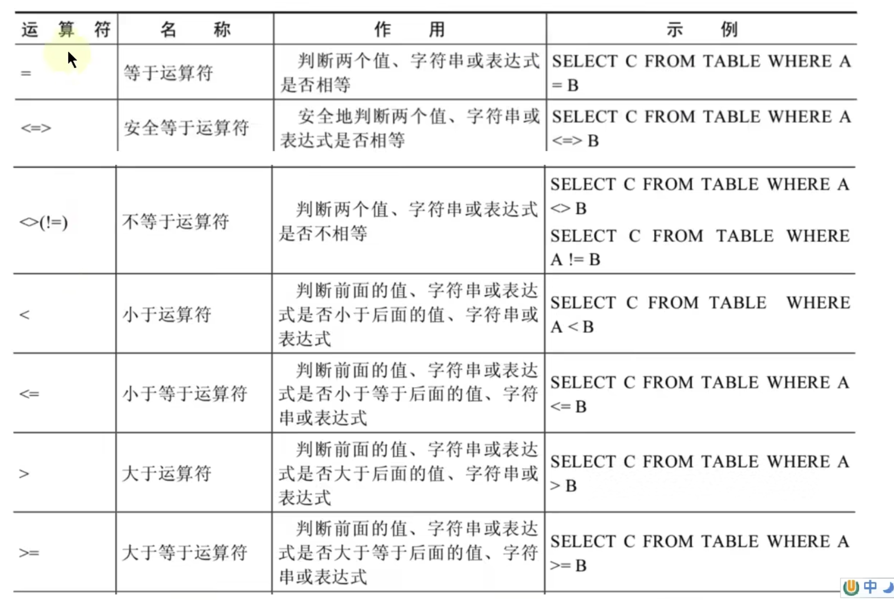

比较运算这块的表达式 都会返回一个类似boolean效果的值 0 或 1

<br>

### **<font color="#C2185B">=</font>**  
等于 =, 并不是赋值的意思

```sql
1 = 2;       -- 0
1 != 2;      -- 1
1 = '1';     -- 1   隐式转换
1 = 'a';     -- 0 

0 = 'a'      -- 1
-- 字符串存在隐式转换 如果转换数值不成功 则是0


'a' = 'a'    -- 1
'a' = 'b'    -- 0
-- 等号两边的值都是字符串 则按照字符串的ANSI编码进行比较


NULL = NULL
-- 只要有null参与判断 结果就为null
```

<br>

### **<font color="#C2185B"><=>: 安全等于为NULL而生</font>**  
可以使用该运算符 和 null 进行相等比较, 当 左右 都为null的时候 会返回1

<br>

**作用:**  
为了解决跟NULL比较的问题, 它可以用来对 NULL 进行判断, 其它的作用和=一致

- 操作符两边都是NULL的时候, 返回值为 1
- 操作符两边一边为NULL的时候, 返回值为 0

```sql
1 <=> NULL;      -- 0
NULL <=> NULL;   -- 1  只有这种情况返回1

-- 查找为NULL的数据
SELECT last_name, salary 
FROM employees 
WHERE commission_pct <=> NULL;
```

<br>

### **<font color="#C2185B"> <> or != </font>**  
不等于

```sql
select 3 <> 2, '4' <> NULL, '' != NULL, NULL != NULL;

-- 结果集: 两边只要有一边是 NULL 结果就是 NULL
1, (NULL), (NULL), (NULL)
```

<br>

### <> 和 <=> 的关系 
<> 就是不等于, 跟 != 是一样的 仅仅是另一种写法, 它不具有和安全等于同样的功能(可以对null进行判断)

<br>

### **<font color="#C2185B"> < > <= >= </font>**  
只要符号的左右两边 有NULL的参与 结果就是 ``(NULL)``

<br><br>

## 比较运算符: 关键字版:
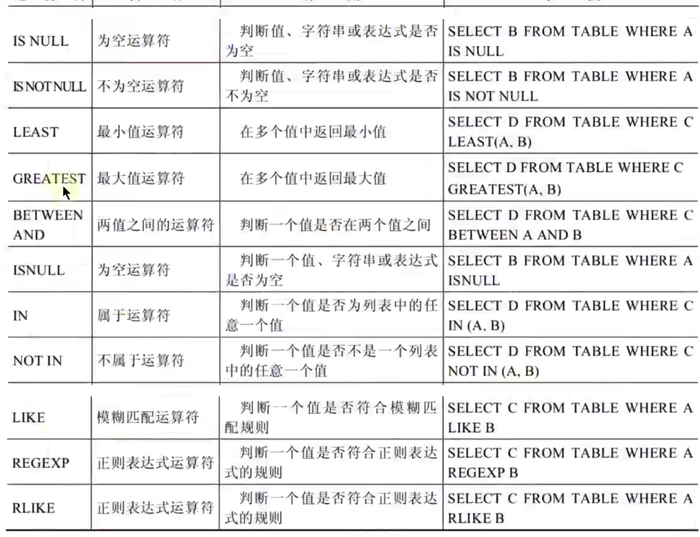

<br>

### **<font color="#C2185B">为空运算符: IS NULL</font>**  
判断字段是否为 null 或 判断 字符串 或 表达式是否为null

<br>

**什么叫表达式:**   
如下的代码整体就是一个表达式
```sql
commission_pct IS NULL;
```

```sql
-- 查询奖金系数为NULL的
SELECT last_name, salary, commission_pct
FROM employees
WHERE commission_pct IS NULL;
```

<br>

**格式:**   
```sql
SELECT 字段 FROM employees WHERE 字段 IS NULL;
```

<br>

### **<font color="#C2185B">不为空运算符: IS NOT NULL</font>**  
判断字段 或 字符串 或 表达式 是否不是 null

**格式:**   
```sql
SELECT 字段 FROM employees WHERE 字段 IS NOT NULL;
```

```sql
-- 查询奖金率不为NULL的记录
SELECT last_name, salary, commission_pct
FROM employees
WHERE commission_pct IS NOT NULL;
```

<br>

### **<font color="#C2185B">ISNULL(字段)</font>**  
判断字段是否为 null 或 判断 字符串 或 表达式是否为null

<br>

**格式:**  
```sql
SELECT 字段 FROM employees WHERE ISNULL(字段);
```

```sql
-- 查询为空的指定字段
SELECT last_name, salary, commission_pct
FROM employees
WHERE ISNULL(commission_pct);
```

<br>

### **<font color="#C2185B">LEATS(value1, value2, ...)</font>**  
``leats()``   
最小值运算符, 相当于 ``Math.min(arr)``

<br>

**作用:**  
在给定的多个值中返回最小值

<br>

**格式:**  
```sql
SELECT 字段 FROM employees WHERE LEAST(值1, 值2, 值3);
```

<br>

```sql
--  根据字符的ANSI编码返回给定的最小 或 最大值
SELECT LEAST('a','b','g'), GREATEST('g','t','m')
FROM DUAL;
-- a 和 t
```

<br>

### **<font color="#C2185B">GREATEST(value1, value2, ...)</font>**  
``greatest()``  
最大值运算符, ``Math.max(arr)``

<br>

**作用:**  
在给定的多个值中返回最大值

<br>

**格式:**  
```sql
SELECT 字端 FROM employees WHERE GREATEST(值1, 值2);
```

<br>

### **<font color="#C2185B">字段 BETWEEN 条件1 AND 条件2</font>** 
``between 条件1 and 条件2``  
两值之间的运算符, 设置一个范围, **包含边界(两端)** 

<br>

**作用:**  
判断指定字段是否符合该范围

<br>

**格式:**  
```sql
SELECT 字段 FROM employees WHERE 字段 BETWEEN 条件1 AND 条件2;
```

<br>

**示例:**  
查询工资在6000-8000之间的员工信息

```sql
SELECT employee_id, last_name, salary
FROM employees
WHERE salary BETWEEN 6000 AND 8000;
```

<br>

**注意:**  
条件1 和 条件2 的位置不能交换

- 条件1为下限
- 条件2位上限

<br>

### **<font color="#C2185B">IN (set)</font>**  

**作用:**  
查询的值 **为多种情况** 或 **多个值** 的时候可以使用该操作符, 表示字段既是a 又是b 又是c的时候使用

<br>

**格式:**  
```sql
SELECT 字段 FROM employees WHERE 字段 IN (值1, 值2);
```

<br>

**示例:**  
```sql
-- 返回部分id为10 20 30的部门
SELECT last_name, department_id
FROM employees
WHERE department_id IN (10, 20, 30);

-- 另一种写法: 所以 in 表示的就是 或 的关系
WHERE department_id = 10 OR department_id = 20 OR department_id =  30;
```

<br>

### **<font color="#C2185B">NOT IN (set)</font>**  

**作用:**  
查询的值, 不在集合中的值, 或者 理解为要查询的值不在集合范围内

<br>

**格式:**  
```sql
SELECT 字段 FROM employees WHERE 字段 NOT IN (值1, 值2);

-- 查询部门id不是 10 20 30的部门
SELECT last_name, department_id
FROM employees
WHERE department_id NOT IN (10, 20, 30);
```

<br>

### **<font color="#C2185B">LIKE '模糊条件'</font>**  
模糊匹配运算符, **相当于 =** , 只不过是模糊等于, 当我们要进行模糊匹配的时候 直接将 = 替换成 like

<br>

**作用:**  
判断一个值是否符合模糊匹配规则, 条件要放在''中

<br>

**格式:**    
```sql
SELECT 字段 FROM employees WHERE 字段 LIKE '条件';
```

<br>

**模糊查询中的关键字:**  
- %: '%a%'
代表不确定个数的字符 相当于正则里面的 ``*`` 表示不确定的字符 0个, 1个 或 多个, 比如我们这么写的话 a打头的情况也会匹配到

- _:  
代表任意一个字符

- \:
转义字符

<br>

**示例:**  
```sql
-- 查询 last_name 中包含字符'a'的员工信息
SELECT last_name 
FROM employees
WHERE last_name LIKE '%a%'


-- 查询 last_name 中包含'a' 且 'e' 的员工信息
SELECT last_name
FROM employees
WHERE last_name LIKE '%e%' AND last_name LIKE '%a%';


-- a 在 前 e 在 后, 或 e 在 前 a 在 后
SELECT last_name
FROM employees
WHERE last_name LIKE '%a%e%' OR last_name LIKE '%e%a%';


-- 查询 last_name 中第二个字符是a的 员工信息
SELECT last_name
FROM employees
WHERE last_name LIKE '_a%';


-- 查询 last_name 中第二个字符是_ 第3个字符是a的 员工信息
SELECT last_name
FROM employees
WHERE last_name LIKE '_\_a%'; -- 转义了 _


-- 自定义转义符号: 这样 $ 就是转义符
select last_name
from employees
where last_name like '_$_a%' escape '$';
```

<br>

### **<font color="#C2185B">REGEXP '正则'</font>**  
``regexp '正则表达式'``, 正则表达式运算符

通常使用在 where子句中用于条件过滤


**作用:**  
判断一个值是否符合正则表达式的规则

<br>

**格式:**  
```sql
SELECT 字段 FROM employees WHERE 字段 REGEXP '正则';
```

<br>

### **<font color="#C2185B">RLIKE '正则'</font>**  
正则表达式运算符

**作用:**  
判断一个值是否符合正则表达式的规则
```sql
SELECT 字段 FROM employees WHERE 字段 REGEXP '正则';
```

REGEXP运算符用来匹配字符串, 


<br>

### 语法格式为: expr REGEXP 匹配条件。
- 如果 expr 满足匹配条件, 返回1; 
- 如果 expr 不满足匹配条件, 则返回0。
- 若 expr 或匹配条件任意一个为NULL, 则结果为NULL。

<br>

**REGEXP运算符在进行匹配时, 常用的有下面几种通配符:** 

- ^: 匹配以该字符后面的字符开头的字符串。

- $: 匹配以该字符前面的字符结尾的字符串。

- [...]: 匹配在方括号内的任何字符
	- "[abc]"匹配"a"或"b"或"c"
	- "[a-z]"匹配任何字母
	- "[0-9]"匹配任何数字

- *: 匹配零个或多个在它前面的字符

```sql
SELECT 
  'shkstart' REGEXP '^s', 
  'shkstart' REGEXP 't$', 
  'shkstart' REGEXP 'hk';
FROM DUAL;
```

<br>

**观察:**  
我们的正则不单单能在where条件的部分使用, 它还可以在select后面的结构中应用

<br><br>

# 逻辑运算符:
逻辑运算符主要用来判断表达式的真假, **返回 0 或者 1**  

逻辑运算符 前后要求连接的表达式 返回类似boolean类型的值

当逻辑运算符连接多个表达式的时候, 每一个表达式的部分都会返回一个 0 或 1 (这时跟js差不多 非0就返回1)

<br>

在MySQL中, 逻辑运算符的返回结果为
- 1
- 0
- NULL

mysql中支持4种逻辑运算符

<br>

### **<font color="#C2185B">NOT 或 !</font>**  
取反, 逻辑非

**格式:**   
我们将 逻辑运算符写在 表达式整体的前面
```sql
NOT 表达式
```

<br>

**示例:**  
```sql
SELECT last_name, department_id 
FROM employees
-- 条件的前面加了 NOT
WHERE salary NOT BETWEEN 6000 AND 8000;
```

<br>

### **<font color="#C2185B">AND 或 &&</font>**  
逻辑与, 前面要满足 后面也要满足

左右变量都为真 结果就是1


**格式:**  
```sql
A AND B
A && B
```

**示例:**  
```sql
-- 既是10号部门的员工 和 20号部门的员工
SELECT last_name, department_id 
FROM employees
WHERE department_id = 10 AND department_id = 20;
```

<br>

### **<font color="#C2185B">OR 或 ||</font>**  
逻辑或

左右两边只要有一个是真 结果就是1

**格式:**  
```sql
A OR B
A || B
```

```sql
-- 10号部门 或 20号部门 的员工
SELECT last_name, department_id 
FROM employees
WHERE department_id = 10 OR department_id = 20;
```

<br>

### **<font color="#C2185B">XOR 追求的是不同</font>**  
逻辑异或, 只要左右两边的情况不一样 就是true 也就是1

<br>

**格式:**  
```sql
A XOR B
```

<br>

**示例:**  
- 要么满足department_id = 10, 但不满足salary > 6000
- 要么满足salary > 6000, 但不满足department_id = 10

```sql
SELECT last_name, department_id 
FROM employees
WHERE department_id = 10 XOR salary > 6000;

-- 当满足部门为10的时候 工资一定是小于6000
-- 当满足工资大于6000的时候 部门肯定不为10
```

<nr>

### 注意:
OR 可以和 AND 一起使用, 但是在使用时要注意两者的优先级, 由于**AND的优先级高于OR**, 因此先对AND两边的操作数进行操作, 再与OR中的操作数结合。

<br>

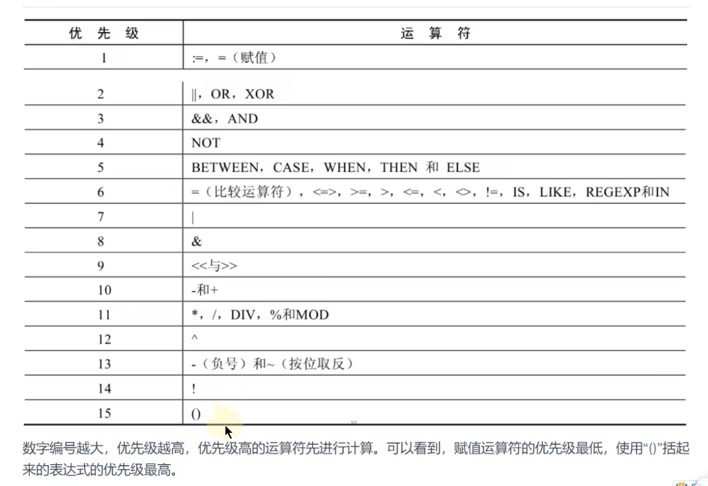

<br><br>

# 位运算符
**位运算符的左右必须是数值**  

位运算符是在二进制数上进行计算的运算符。

位运算符会先将操作数变成二进制数, 然后进行位运算, 最后将计算结果从二进制变回十进制数。

<br>

### **<font color="#C2185B">&</font>**  
按位与(位AND), 11为1  

只有上下都是1的时候 结果才是1 其他情况为0

比如:  
1的二进制数为0001, 10的二进制数为1010, 所以 1 & 10 的结果为0000, 

```
0001
1010
0000
```

<br>

### **<font color="#C2185B">|</font>**  
按位或(位OR), 00为0

只有上下都是0的时候 结果才是0, 其它情况都为1

比如:   
1的二进制数为0001, 10的二进制数为1010, 所以 1 | 10 的结果为1011, 

```
0001
1010
1011
```

<br>

### **<font color="#C2185B">^</font>**  
按位异或(位XOR)

上下情况**不同为1** 否则为0

比如:  
1的二进制数为0001, 10的二进制数为1010, 所以 1 ^ 10的结果为1011, 

```
0001
1010
1011

1111
1010
0101
```

```sql
SELECT 12 | 5, 12 & 5, 12 ^ 5
FROM DUAL;

13, 4, 9

12: 1100
5:  0101

12 | 5: 00为0
1100
0101
1101  -- 13


12 & 5: 11为1
1100
0101
0100  -- 4


12 ^ 5: 不同为1, 相同为0
1100
0101
1001  -- 9
```


<br>

### **<font color="#C2185B"> ~ </font>**  
对整个二进制数进行取反操作, 按位取反, 1变0 0变1

<br>

### **<font color="#C2185B"> >> </font>**  
按位右移

<br>

### **<font color="#C2185B"> << </font>**  
按位左移 移动一位 是指数

在一定范围内是满足如下的特征的, 二进制数一共就8位, 如果超了结果就是0了
- 2 << 1 -- 2^1
- 2 << 2 -- 2^2
- 2 << 3 -- 2^3

乘以的也是指数的结果 x2 x4 x8

<br>

### 练习:
1. 选择工资不在5000到12000的员工的姓名和工资 
```sql
select last_name, salary
from employees
where salary not between 5000 and 12000;

WHERE salary < 5000 OR salary > 12000;
```

**注意:**  
``not between 5000 and 12000`` not的话不包括边界值了


2. 选择在20或50号部门工作的员工姓名和部门号
```sql
select last_name, department_id
from employees
where department_id in (20, 50);
```


3. 选择公司中没有管理者的员工姓名及job_id
```sql
select * from employees;
select last_name, job_id
from employees
where manager_id is null;
```


4. 选择公司中有奖金的员工姓名, 工资和奖金级别 
```sql
select last_name, salary, commission_pct
from employees
where commission_pct is not null;
```


5. 选择员工姓名的第三个字母是a的员工姓名
```sql
select first_name, last_name from employees
where last_name like '__a%';
```


6. 选择姓名中有字母a和k的员工姓名
```sql
SELECT last_name
FROM employees
WHERE last_name LIKE '%a%' AND last_name LIKE '%k%';

select last_name from employees
where last_name like '%a%k%' or last_name like '%k%a%';
```


7. 显示出表 employees 表中 first_name 以 'e'结尾的员息
```sql
SELECT first_name
FROM employees
WHERE first_name LIKE '%e';

select * from employees
where first_name regexp 'e$';
```


8. 显示出表 employees 部门编号在 80-100 之间的姓名
```sql
select last_name from employees
where department_id between 80 and 100;
```


9. 显示出表 employees 的 manager_id 是 100,101,110 的员工姓名, 工资, 管理者id
```sql
SELECT last_name, salary, manager_id
FROM employees
WHERE manager_id IN (100, 101, 110);
```

<br><br>

# 排序 与 分页

<br>

## 排序: ORDER BY
当没有指定 排序操作 的时候 每次查询**返回**的数据的**顺序都是默认的**  

<br>

**默认顺序:**  
我们往数据库中 **先后添加记录** 的顺序

<br>

**作用:**  
我们可以使用 ``ORDER BY`` 对查询到的数据 进行排序操作

<br>

### **<font color="#C2185B">ORDER BY 字段 [ASC/DESC]</font>**  
没有显式指明排序的方式的话 **则默认按照升序排列**  

order by 指明的字段并不是说必须是查询的字段

<br>

**位置:**  
``order by``子句在SELECT查询结构的 **末尾**  

<br>

**格式:**  
```sql
select
from
where -- 它在中间
order by 字段 [排序方式]
```

- ORDER BY ASC: 升序
- ORDER BY DESC: 降序

<br>

**示例:**  
按照salary从高到低的顺序显示员工信息
```sql
SELECT last_name, salary
FROM employees
ORDER BY salary DESC;
```

<br>

**示例: 使用 字段别名 进行排序**  
```sql
-- 字段别名只能在order by中使用
SELECT last_name, salary, salary * 12 "annual_sal"
FROM employees
ORDER BY annual_sal; -- 对 别名 的字段进行排序
```

<br>

### 字段别名 注意:
**字段定义的别名, 只能在 order by 中使用**, 不能在 where 中使用

因为在where语句执行的时候还没有起别名呢

<br><br>

## 扩展: sql语句的执行顺序
```sql
select *
from employees
where last_name = 'sam'
order by salary desc;
```

<br>

sql语句在执行的时候, 不是按照从上到下顺序执行的

**执行顺序:**  
1. from: 先看看要查哪张表
2. where: 看看有什么过滤条件
3. select: 看看要查什么, 这个阶段才起别名
4. order by: 最后才会执行 order by


```sql
SELECT last_name, salary, salary * 12 "annual_sal"
FROM employees
WHERE department_id IN (50, 60, 70, 80)
-- 这里才可以使用order by
ORDER BY annual_sal DESC;
```

<br>

### 二级排序:
当一级排序的结果集中 有多个工资相同的员工数据, 那这组员工数据谁在前谁在后? 

这就涉及到二级排序, 再根据哪个字段再次排序

<br>

### **<font color="#C2185B">ORDER BY 字段 [升降], 字段 [升降]</font>**  
多级排序 使用,分开

<br>

**需求:**  
显示员工信息
- 先按照 department_id 的降序排序 
- 然后按照 salary 的升序排列

```sql
-- order by 后面加多个字段
SELECT employee_id, salary, department_id
FROM employees
ORDER BY department_id DESC, salary ASC;
```

<br>

**注意:**  
在对多列进行排序的时候, 首先排序的第一列必须有相同的列值, 才会对第二列进行排序。

如果第一列数据中所有值都是唯一的, 将不再对第二列进行排序。

<br><br>

## 分页:
后台查询数据库返回的记录太多了, 查看起来很不方便, 一般会按照实际需求 页面会具有分页的功能

或者 一页有5条数据, 我们只想查看2, 3条

<br>

### **<font color="#C2185B">limit offset, size</font>**  
如果不指定 "位置偏移量", 将会从表中的第一条记录开始

<br>

**参数:**  
- offset 位置偏移量:  
相当于指针, 默认值为0, 指向第一条记录, 偏移量为1, 指针下移指向第二条记录

- size: 要显示的条目数

<br>

### 位置:
limit 必须放在整个 select 语句的**最后!!!**  

<br>

### offset的要点:
使用offset找到指定的行的时候, 我们可以就理解为数组的下标

也就是 index - 1

<br>

### 示例: 显示第一页的数据
我们使用参数2规定了一页显示的条数
```sql
SELECT employee_id, last_name
FROM employees
-- offset默认为0 指向第一条记录
LIMIT 0, 20;    -- 20条数据为 100-119
```

<br>

### 示例: 显示第二页的数据
展示第二页的时候 一上来我们就要指定偏移量

- 第一页是从 0开始的20条  
- 第二页是从20开始的20条  
- 第三页是从40开始的20条  

```sql
SELECT employee_id, last_name
FROM employees
LIMIT 20, 20;
```

<br>

### 示例: 显示第三页的数据
```sql
SELECT employee_id, last_name
FROM employees
LIMIT 40, 20;
```

<br>

### **<font color="#C2185B">公式: LIMIT (pageNo - 1) * pageSize, pageSize</font>**  
pageNo 就是 偏移量

显示第pageNo页 每页显示pageSize条记录

<br>

**解析:**  
因为offset默认是从0开是的, 如果我们要查看第一页的数据就需要 - 1

这里类似我们要查看数组中最后一个元素, 则需要 length - 1 是一样的

<br>

pageNo - 1的意思是, pageNo是我们要查看的页, 当我们要看第一页的时候它是0, 当我们要看第二页的时候它是1

<br>

- 偏移量: (pageNo - 1) * pageSize
- 页条数: pageSize

```sql
SELECT employee_id, last_name
FROM employees
LIMIT (pageNo - 1) * pageSize, pageSize;
```

<br>

### WHERE ..., ORDER BY ..., LIMIT ... 声明顺序如下:
先写order by 后写limit, **limit要写在最后**  

```sql
SELECT employee_id, last_name, salary
FROM employees
WHERE salary > 6000
ORDER BY salary DESC
-- LIMIT 0, 10: 0是可以省略的
LIMIT 10;
```

<br>

### 需求:
employees表中有107条数据 我们只想显示第32 33条数据怎么办？
```sql
SELECT employee_id, last_name, salary
FROM employees
LIMIT 31, 2;
```

<br>

### 练习:
查询员工表中工资最高的信息
```sql
SELECT employee_id, last_name, salary
FROM employees
ORDER BY salary DESC
LIMIT 1;
```

<br>

### 扩展:
``LIMIT``可以使用在 MySQL, PostgreSQL, MariaDB 和 SQLite 中表示分页 

但是不能使用在 SQL Server, DB2, Oracle, **而且需要放到 SELECT 语句的最后面。**  

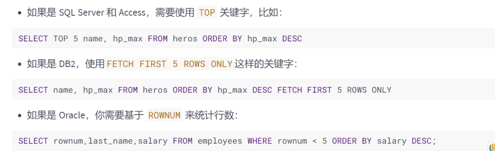

<br>

### mysql8.0新特性:
和5.7语法的格式不一样

<br>

### **<font color="#C2185B">LIMIT size, OFFSET 偏移量</font>**  
- 5.7: limit 31, 2  
- 8.0: limit 2 offset 31

```sql
-- 8.0中 参数1是条目数, 参数2是偏移量, 跟5.7正好相反
SELECT employee_id, last_name, salary
FROM employees
LIMIT 2, offset 31;
```

<br><br>

### 练习:
1. 查询员工的姓名和部门号和年薪, 按年薪降序, 按姓名升序显示
```sql
SELECT last_name, department_id, salary, salary * 12 "year_salary"
FROM employees
ORDER BY year_salary, last_name DESC;

-- 带有奖金率的查询
select last_name, department_id, salary * (1 + ifnull(commission_pct, 0)) * 12 "annual_salary"
from employees
order by annual_salary desc, last_name;
```

2. 选择工资不在 8000 到 17000 的员工的姓名和工资, 按工资降序, 显示第21到40位置的数据 
```sql
select last_name, salary
from employees
where salary not between 8000 and 17000
order by salary desc
limit 20, 20;   -- 第21条的index是20
```

3. 查询邮箱中包含 e 的员工信息, 并先按邮箱的字节数降序, 再按部门号升序
```sql
SELECT last_name, email
FROM employees
WHERE email LIKE '%e%'
-- where email regexp '[e]'

-- 单行函数: length()
ORDER BY length(email) DESC, department_id;
```

<br><br>

# 多表查询

## 概述:
我们有一对多的关系表
- 员工表
- 部门表

<br>

我们要查询 一个部门中有多少个员工 这就是一对多的关系 这时就需要用到多表查询

还有我们一个项目中几百张表示常见的 我们在写select语句的时候, 很多时候也不是针对一张表去查询的 而是要查询多个表

<br>

|员工表|部门表|位置表|
|:--|:--|:--|
|employee_id|<font color="#C2185B">department_id</font>|<font color="#C2185B">location_id</font>|
|first_name|department_name|street_address|
|last_name|manager_id|postal_code|
|email|<font color="#C2185B">location_id</font>|city|
|phone_number||state_province|
|hire_date||country_id|
|job_id|||
|salary|||
|commission_pct|||
|manager_id|||
|<font color="#C2185B">department_id</font>|||

<br>

### 常见的表:
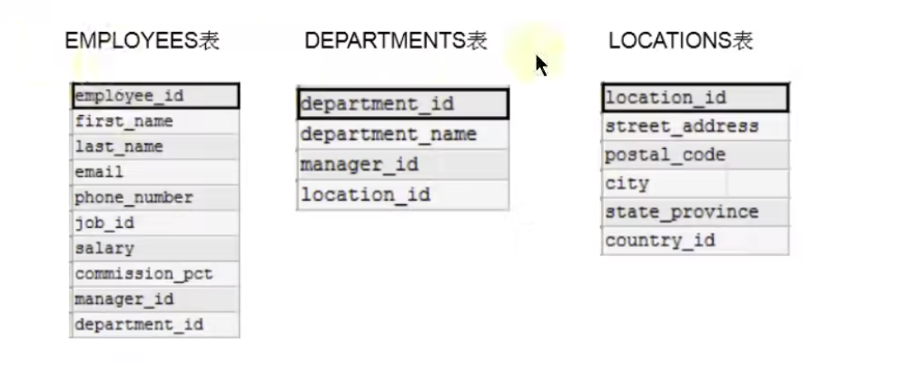

<br>

### 部门表 - 员工表: 
一对多的关系 一个部门中有多个员工
- 员工表: 从表
- 部门表: 主表

从表中有一个字段做为外键 指向 主表中的主键  

empolyees员工表中的外键(department_id) 指向了 departments部门表中的主键(department_id)

<br>

### 城市表 - 部门表: 
一对多的关系 一个城市可以有多个部门
- 部门表: 从表
- 城市表: 主表

从表中有一个字段做为外键 指向 主表中的主键  

departments中的外键(location_id) -> locations中的主键(location_id)

<br>

我们能看到每个表之间都是有关联关系的 通过**红色id关联**  

<br>

### 需求: 
查询员工为'Abel'在哪个城市工作

<br>

**分析:**  
我们现在有3张表 员工表 部门表 位置表

员工表中没有城市的事儿 城市的信息在locations表里面的city字段

<br>

**思考:**  
那我们怎么才能找到'Abel'所在的城市呢？

<br>

**1. 查询员工表 找到 'Abel' 的信息**  
```sql
SELECT *
FROM employees
WHERE last_name = 'Abel';
```

在上述的结果集中我们能得到 department_id 字段 知道Abel在80部门工作

<br>

**2. 查询 部门表 找到部门相关的信息 得到部门所在的城市**  
```sql
SELECT *
FROM departments
WHERE department_id = 80;
```

我们根据员工表中的department_id做为条件 查询了departments部门表

查看了80部门的情况 
- department_id: 80
- department_name: Sales
- manager_id: 145
- location_id: 2500

<br>

**3. 根据 abel 部门表中的 location_id 字段 查询 位置表 找到城市信息**  
```sql
SELECT *
FROM locations
WHERE location_id = 2500;
```

查询的结果就是 Abel在Oxford这个城市工作


```sql
-- 查看员工表: 发现员工表中没有城市相关的信息
SELECT * FROM employees WHERE last_name = 'Abel'
 
-- 城市相关的信息 在 locations 表中的city字段里面
-- 查看Abel的部门 找到 location_id
SELECT location_id FROM departments WHERE department_id = 80

-- 根据 location_id 查看 locations 表 里面的city字段就是我们想要的结果
SELECT * FROM locations WHERE location_id = 2500
```

<br>

### 问题:
我们发现 虽然我们最终找到了 Abel在哪个城市工作 这里我们**通过网络分3次查询了3张表** 进行了3次的io交互操作 不好

<br>

### 再思考下多表的问题:
为什么不把这3张表合成一张表呢？ 它们都是刻画的员工的信息

<br>

**不合在一起的原因:**  
1. 3张表合在一起 会产生特别多的冗余字段 冗余字段会占用内存空间

2. 维护一张巨大的表也会很困难

3. 我们在查询一张表的时候 别的事务是无法操作我们正在操作的表的 如果表的力度越小的话 大家都可以同时操作 效率也会更高

我们会根据实际情况把一张大表 按照单位的一些操作或者常用的一些字段放在一个表中 另外的字段放在其他表中 表跟表之间使用id作为连接关系 关联在一起

<br><br>

## 多表查询: 引入需求
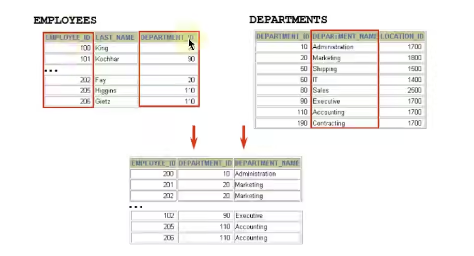

<br>

我们需要查询如下的三个字段, 这三个字段不是存放在一张表中 而是在两个表中的

1. employee_id
2. department_id
3. department_name

上面部门相关的信息 会存放在部门表里面 这时我们就需要使用多表查询

<br>

我们先查询
- employee_id
- department_name

因为这两个字段分别存在于两张表中 所以我们from的位置要指明两张表
```sql
-- 如果我们查询如下的两个字段 但是这两个字段分别在不同的表中 
select employee_id, department_name
-- 所以我们from的位置需要写字段所在的两张表 
FROM employees, departments

-- 结果集: 2889条记录
```

<br>

### 多表查询的要点:
1. 要查询的字段存在于哪张表 from的结构中就要指明该表

2. 要有表与表的链接条件

<br>

### 观察:
我们发现上面我们没有指定连接条件的时候查询出来的记录数有 2889 条

而且我们要是观察下结果集也能发现每个员工对应的记录特别的多

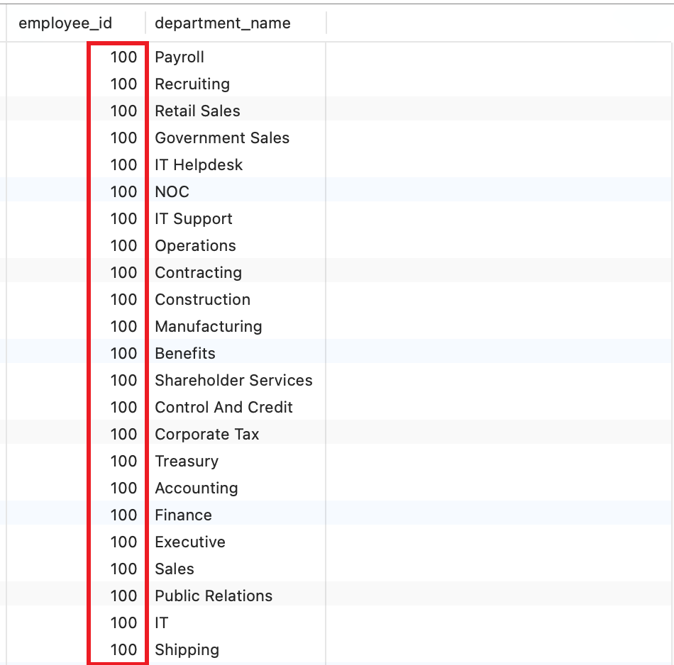

<br>

**为什么记录数是2889?**  
员工表一共才107条数据 为啥能搜索出来这么多？
```sql
SELECT 2889 / 107
FROM DUAL;  -- 27


-- 再看看部门表的记录条数
SELECT *
FROM departments; -- 27条记录
```

<br>

**结论:**  
我们发现 employees表 中的每一条记录 都跟整个departments表进行匹配

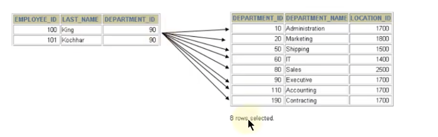

<br>

也就是说employees表的一条记录 分别和 departments表中的每条记录进行了匹配 -- ``1 * 27 == 107 * 27 = 2889``

<br>

### 错误原因: 笛卡尔积的错误
每一个员工都跟每个部门匹配过, 这种错误的现象叫做: **笛卡尔积的错误**  

上面的查询方式出现的原因就是: **缺少了多表的连接条件** 

因为我们没有给出多表的连接条件, 数据库就默认使用交叉连接(下方说明)的方式 进行了查询

<br>

### 笛卡尔积概念:
它是一种现象 笛卡尔乘积是一个数学运算。假设我有两个集合 X 和 Y, **把X集合和Y集合的搭配的所有可能都列出来就是笛卡尔积** 

比如:
- 集合1: (a, b, c)
- 集合2: (x, y)

问: 两个集合共有多少种组合方式: 2 * 3 = 6, 这也叫 **<font color="#C2185B">交叉连接(cross join)</font>**  

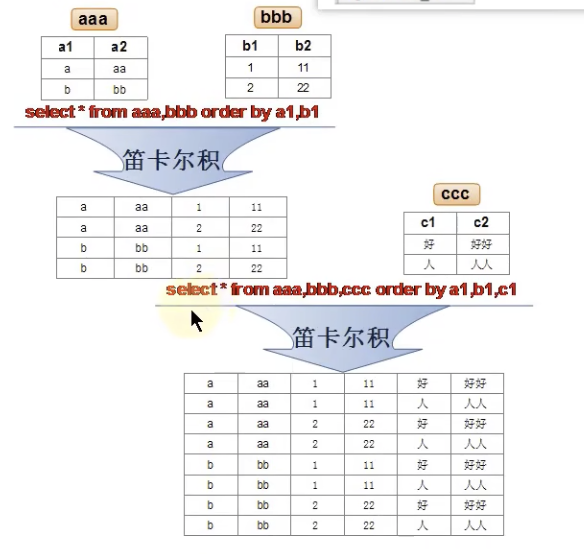

<br><br>

## 笛卡尔积的错误会在下面条件下产生
1. 省略多个表的连接条件(或关联条件)
2. 连接条件(或关联条件)无效
3. 所有表中的所有行互相连接

为了避免笛卡尔积,  可以**在 WHERE 加入有效的连接条件**  

<br><br>

## 如何查询多张表:
如下的两种方式 一样 如果不加入链接条件的话, 就会产生交叉连接的问题

<br>

### 方式1: 使用 ``,`` 分割多张表
```sql
select * from 表1, 表2;
```

<br>

### 方式2: 使用 ``CROSS JOIN`` 连接多张表
cross join 关键字 就是交叉连接的意思

```sql
select * from 表1 cross join 表2;
```

<br><br>

## 解决交叉连接的问题: 指定多表查询的连接条件:
交叉连接的问题就是 从表中的每一条记录 会跟 主表中的每一条记录进行连接

就类似从表中的一条记录轮询了整个主表

```s
1 - 1
1 - 2
1 - 3
1 - 4
1 - 5
```

<br>

### 解决思路: 设置连接条件
我们使用 where 指明连接条件, 告诉sql **从表中的一条记录跟主表中指定的id进行连接 而不是轮询**  

<br>

### 方法:
1. 利用 **主外键** 作为多表查询的连接条件

2. 利用两张表中共有的字段, 比如 e.manager_id 和 d.manager_id

3. 非等值连接中的, 从表中的某个字段(不是必须是主键)在主表中的某个范围内(最大工资字段 和 最小工资字段)

<br>

### 两张表的连接条件
- employees的 **外键** 是 department_id

- departments的 **主键** 是 department_id

<br>

下面的sql就是利用了主外键, 如果没有主外键可以利用共同字段, **目的就是告诉sql从表中的一条记录和主表中的指定记录进行匹配**  

```sql
select employee_id, department_name
from employees, departments
-- 连接条件: 告诉sql从表中的记录和主表中的指定记录进行连接
where employees.department_id = departments.department_id
```

<br>

### 多表查询: 字段位置最好指明该字段源自哪张表
比如我们select的部分要查询 department_id 该字段在如下的两张表中都有
- employees
- departments

这时sql就会报错 因为它不知道应该从哪张表中取这个字段的信息

所以我们在select的部分最好指明
```sql
select ..., e.department_id
```

<br>

### 三张表的连接条件:
表A与表B先连接, 然后 表A与表C, 或者 表B与表C 再连接

都是利用一对多的主外键作为连接条件

```sql
-- 字段的部门指明是哪个表中的字段
select e.employee_id, e.last_name, d.department_name, l.city
from employees e, departments d, locations l

-- e和d是一对多的关系
-- d和l是一对多的关系 都是利用主外键做为连接条件
where e.department_id = d.department_id && d.location_id = l.location_id;
```

<br>

### 总结多表查询:
1. 要查询的字段在哪张表中, 我们就要在from的位置写上该表

2. 多表查询的时候需要指明连接条件

3. 连接条件可以是 两张表的主外键字段

4. 连接条件可以是 两张表中共同的字段

5. 连接条件的意义就是告诉sql从表中的一条记录和主表中的指定记录进行匹配

6. 如果有n个表实现多表的查询 则需要至少n-1个连接条件
	- 2个表需要1个 
	- 3个表需要2个

7. 如果查询语句中出现了多个表中都存在的字段, 则必须指明该字段来自于哪张表

<br><br>

## 多表查询: 指明字段来源于哪张表

### **<font color="#C2185B">表名.字段</font>**  
```sql
select 表名.字段, 表名.字段
from 表1, 表2;
```

<br>

### 示例: 需求
查询 ``employee_id`` 和 ``department_name`` 和 ``department_id``

<br>

我们还使用上面的方式进行查询, 发现报错了, 报错信息: Column 'department_id' in field list is ambiguous

说 department_id 该字段来自于哪一张表示不确定的
```sql
SELECT employee_id, department_name, department_id
FROM employees, departments
WHERE employees.department_id = departments.department_id;
-- 报错了
```

<br>

**原因:**  
因为 ``department_id`` 这个字段两张表中都有

<br>

**解决方式:**  
我们要告诉服务器要去哪张表中找 department_id

**多表查询时, 定义字段的时候要指明该字段源自于哪张表**  

```sql
-- 指明department_id字段源自于employees表
SELECT employee_id, department_name, employees.department_id

FROM employees, departments

WHERE employees.department_id = departments.department_id;
```

<br>

**注意:**  
在多表查询的过程中 如果查询语句中出现了多个表中都存在的字段 则必须指明此字段所在的表 通过 **表.字段** 的方式来指明

<br>

**建议:**  
从sql优化的角度 建议多表查询时 每个字段前都指明其所在的表

```sql
-- 通多表.字段的方式 指明要查的字段在哪个表中
SELECT employees.employee_id, departments.department_name, employees.department_id

FROM employees, departments

WHERE employees.department_id = departments.department_id;
```

<br><br>

## 表的别名:
可以给表起别名, **注意, 给表起别名的时候不要使用 ""**

然后在 select 和 where 中使用表的别名

```sql
select * 
from 表1 别名, 表2 别名;
```

```sql
SELECT emp.employee_id, dept.department_name, emp.department_id

-- 员工表为 emp, 部门表位 dept
FROM employees emp, departments dept
WHERE emp.department_id = dept.department_id;
```

<br>

**注意:**  
当给表起了别名后 一旦在select或where使用表名的话 则**必须使用表的别名** 而不能在使用表的原名

<br>

**原因:**  
因为 sql 的执行顺序是 先执行 from 然后发现我们给表起别名了 

**<font color="#C2185B">然后 sql 会将别名 覆盖原表名</font>**  

所以我们之后再使用的时候 只能用别名

<br>

### 练习:
查询 ``employee_id`` ``last_name`` ``department_name`` ``city``

<br>

**要点:**  
当有3张表的时候, 连接条件多张表之间的连接条件

a和b找一个条件连接 然后a和c 或者 b和c找一个条件进行连接

employees 和 departments 是一对多的关系

departments 和 locations 是一对多的关系 

都是利用主外键做为连接条件
```sql
SELECT e.employee_id, e.last_name, l.city
FROM
	employees e,
	departments d,
	locations l
WHERE
	-- 条件 t1和t2拉下手 然后t1和t3拉下手 或者 t2和t3拉下手
	e.department_id = d.department_id
	AND
	d.location_id = l.location_id
```

<br><br>

## 总结: 多表之间的关系
比如我们的员工表中有一个字段用于刻画部门 也就是 department_id

这个字段相当于对应了一张表 departments表

我们将部门的相关信息抽离成一张表, 如下图

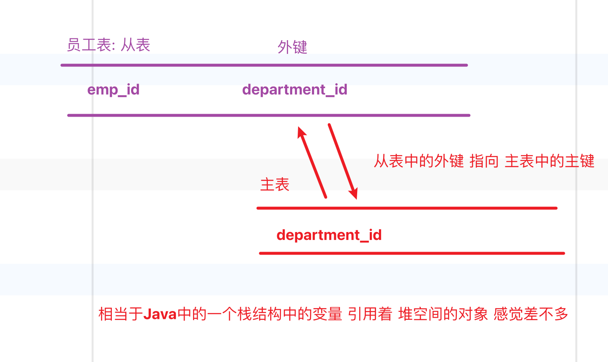

<br>

### 多表连接的本质:
A表中的一条记录 + B表中的一条记录 组成的 拥有完整信息的新记录

<br><br>

# 多表查询: 连接条件的分类
多表查询我们可以从3个不同的角度来进行分类, 也是多表查询不同的使用场景

1. 等值连接 and 非等值连接
2. 自连接 and 非自连接
3. 内连接 and 外连接

<br><br>

## 角度1: 等值连接 vs 非等值连接
我们根据 多表查询 中的 多表的 **连接条件** 的角度来说 分为
- 等值连接
- 非等值连接

<br>

### 等值连接:
当我们的多表的连接条件是 等于关系 那么就属于等值连接
```sql
-- 一对多两表进行连接 我们利用的主外键
WHERE t1.department_id = t2.department_id
```

<br>

### 非等值连接:
只要连接条件不是 等于, 比如 大于 小于就是非等值连接 

<br>

**要点:**  
等值连接的作用是告诉sql, 从表中的一条记录 和 主表中的指定记录进行连接, 不要瞎连

非等值连接的目的就是 从表中的一条记录 和 主表中的多条记录(指定了一个范围) 进行连接

<br>

### 非等值连接的举例:

**job_grades表:**  
不同的等级所对应的工资的范围, 比如工资在 6000 ~ 9999 就是 C等

```sql
SELECT *
FROM job_grades

-- 

grade_level  lowest_sal  highest_sal
    A	        1000	      2999
    B	        3000	      5999
    C	        6000	      9999
    D	        10000	      14999 
    E	        15000	      24999
    F	        25000	      40000
```

<br>

**需求:**  
查询 员工姓名 员工工资 工资等级

上述的需求就是非等值连接

<br>

**解析:**  
```sql
select e.last_name, e.salary, g.grade_level
from employees e, job_grades g

-- 两表的连接条件
where salary between g.lowest_sal and g.highest_sal;
```

上面我们要查询下面的3个字段 该3个字段分别处于2张表内
- last_name
- salary
- grade_level

所以我们要进行多表的查询, 但是 员工表 和 等级表 之间没有主外键的关系, 所以不能利用 等值连接

也没有办法根据 employees.salary 和 job_grades.某个字段 做等值连接 (没法等于)

所以这种情况下 我们就需要使用 非等值连接

<br>

**观察:**  
假如一个员工的工资是 5000, 我们用肉眼观察 等级表 知道它属于 B等 (3000 ~ 5999)

但是从程序的角度我们怎么辨别该工资在什么等级?  

我们的 5000 在 3000 ~ 5999 (lowest_sal ~ highest_sal) 的范围内吧

这就可以**作为 非等值连接 的条件**  


<font color="#C2185B">也就是查询从表中的字段 在主表中某个范围内的</font>

```sql
SELECT e.last_name, e.salary, j.grade_level
FROM employees e, job_grades j

-- 写法1: between and
WHERE e.salary BETWEEN j.lowest_sal AND j.highest_sal;

-- 写法2: >= <= 确定范围
WHERE e.salary >= j.lowest_sal AND e.salary <= j.highest_sal;
```

<br><br>

## 角度2: 自连接 vs 非自连接
我们前面写的例子都是非自连接, 上面的例子 **都是不同的表之间进行的连接操作**  

<br>

### 非自连接:
不同表之间的连接操作叫做 非自连接

<br>

### 自连接
表自己跟自己连的操作叫做 自连接 (**自恋**), 也就是表中的记录自我引用的一种关系

<br>

### 自连接示例:
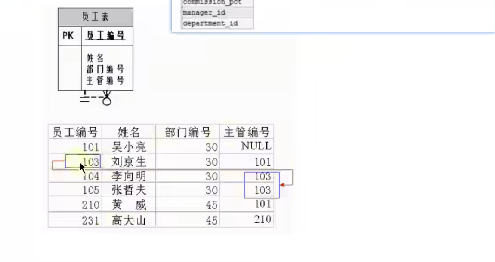

<br>

员工表中每一个员工都有一个 employee_id  

每一个员工也都有一个上司 manager_id

每一个领导都是公司的员工 所以领导本身也会有 employee_id

```sql
employee_id  name  manager_id
  1          sam     3

  3          erin    5
```

<br>

比如:  
id为1的是员工sam 他的领导的是manager_id为3 的 erin

领导erin也是公司的员工 所以她也有一个 employee_id 3

<br>

**需求:**  
查询员工id 员工姓名 及其 管理者的id 和 管理者的姓名

- employee_id
- last_name(员工姓名)
- manager_id
- last_name(领导姓名)

<br>

**思路:**  
我们发现要查询的字段 或 逻辑都在同一张表的时候 **我们就要使用自连接**  

<br>

### 自连接的使用要点:
我们需要将一张表 当成两张表来进行处理

- 利用表的别名, 将一张表 当成 二张表, 比如将 employees表, 当成 员工表 和 管理者表

- 然后连接条件使用等值连接, 从逻辑上理解 emp表中的哪个字段和 mgr表中的哪个字段 相等?

员工表中的manager_id 和 领导表中的employee_id 做关联

 ``emp.manager_id = mgr.employee_id``

从逻辑角度上来说 它们本身就应该是相等的

<br>

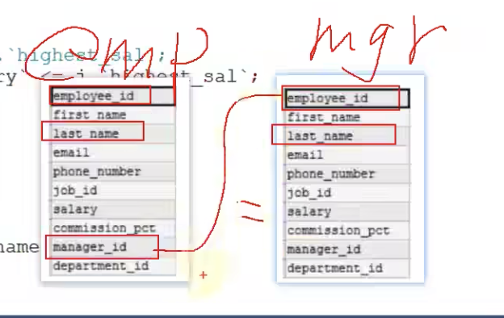

<br>

```sql
-- 管理者也是员工 这里我们不能查e2.manager_id而是他做为员工的信息
SELECT e1.employee_id, e1.last_name "emp_name", e2.employee_id "manager_id", e2.last_name "manager_name"
FROM employees e1, employees e2
WHERE
	-- 不能是 e1.employee_id = e2.manager_id 这样跟我们的逻辑就反了
	-- 我们的关联条件应该 员工表中的manager_id 和 领导表中的employee_id 做关联
	e1.manager_id = e2.employee_id


-- 多表连接的本质: 员工的id的记录 和 manager表中的一条记录做连接 取其中的指定字段
```

<br><br>

## 分类: 内连接 vs 外连接

### 内连接:
内连接是多表查询中的概念 就涉及两张表
```sql
select ...
from 左表, 右表
```

<br>

**概念:**  
内连接, 只是把 左表 和 右表 当中 满足连接条件的数据查询出来了, 其它的数据都没有要

<br>

**示例:**  
查询 员工id 和其对应的部门名称

```sql
select e.employee_id, d.department_name
from employees e, departments d
where e.department_id = d.department_id
```

<br>

上面的 sql 我们能查出 106 条数据, 因为有一个员工没有部门

上面这个结果集(106)就是 **左表 和 右表 当中 满足连接条件的数据**  

这种查询方式就是 **内连接**  

<br>

上述只是将两表满足连接条件的数据查询出来了, 比如 如下情况的数据 在内连接的时候 就被舍弃了

1. 员工表中 没有部门的员工 (178 Grant)

2. 部门表中 有部门 但是部门中没有人, 相当于先把部门建立出来了但是部门还没招人

<br>

**外连接:**  
如果还想将 左表 右表 中没有满足连接条件的数据查询出来 这种方式就是 <font color="#C2185B">外连接</font>

<br>

### 外连接:
两个表在连接过程中除了返回满足连接条件的记录以外, **还返回左表(或右表)中不满足条件的记录** 

**这种连接称为左(或右) 外连接**。没有匹配的记录时, 结果集中相应的列为空(NULL)。

<br><br>

## 外连接的分类:
1. 左外连接
2. 右外连接
3. 全外连接

```
    左表: 员工表
    -----------
    |         |
    |     -----------
    |     | A |      |
    |     | A |      |
    |     | A |      |
    ------|-- |      |
          |          |
          ------------
            右表: 部门表
```

上面两个表交叉在一起 类似交集 就是多表查询

其中 **AAA 就是 左表中有A列 右表中也有A列, 换句话说 AAA 的部分就是 满足连接条件所查询出来的数据**  

<br>

但是我们的两个表中各有一些不在AAA的部分
- 员工表: 有一个人没有 部门id
- 部门表: 有一些部门没有 人

所以在内连接的状态下, 是有一些数据没有查询到的

<br>

### 内连接:
将左表 和 右表 满足连接条件的数据, 返回 就是内连接  

上述的图里返回的内连接的数据就是 AAA

<br>

### 左外连接:
首先包含左右两表的共同部分(AAA的部分), **并且将左表中 不满足连接条件的数据 查询出来** 就是 左外连接

左外连接返回左边表的所有行，以及符合连接条件的右边表的匹配行。如果右边表中没有匹配的行

<br>

### 右外连接:
首先包含左右两表的共同部分(AAA的部分), **并且将右表中 不满足连接条件的数据 查询出来** 就是 右外连接

<br>

右外连接与左外连接相反，它返回右边表的所有行，以及符合连接条件的左边表的匹配行

<br>

### 满外连接:
将 左表不满足连接条件的数据 和 右表不满足连接条件的数据, 和 两表都满足连接条件的数据 都查询出来 就是 满外连接 (**全都要**)

全外连接返回两个表中的所有行，如果没有匹配的行，将在结果集中包含 NULL 值。

<br>

### 外连接中哪张表是 左表 哪张表是 右表
```sql
select ...
from 左表, 右表
```

如果是左外连接, 则连接条件中左边的表也称为 主表, 右边的表称为 从表。

如果是右外连接, 则连接条件中右边的表也称为 主表, 左边的表称为 从表。

<br>

### 练习:
查询 **所有的员工** 的 last_name, department_name 信息

<br>

**注意:**  
一旦是有 **<font color="#C2185B">所有的</font>** 字眼 **<font color="#C2185B">并且来自于不同的表</font>** 这时候我们一定要注意 它一定是一个外连接

<br>

**踩坑:**  
如果我们像下面这样查询 则会跌入陷阱
```sql
SELECT employee_id, department_name
FROM employees e, departments d
WHERE e.department_id = d.department_id;
```

<br>

因为上面只能查到 员工表 和 部门表 中满足连接条件的 也就是共有department_id字段的数据 106条 

但是员工表中一个107个人 所以肯定有没查询到的 这就不符合我们这道题的要求 这道题要求是**所有的**  

<br><br>

## sql标准
sql有两个主要的标准, 分别是 
- sql92 (也叫做 sql-2)
- sql99 (也叫做 sql-3)

代表92年和99年提出的规范, 在众多的标准中 它们也是最重要的两个标准

- sql92: 语法形式上更加的**简洁**, 但写的sql语句会比较长, **可读性比较差**  

- sql99: 语法更加的**复杂** 但**可读性更强**  

<br>

### 注意: 
**<font color="#C2185B">mysql不支持 sql92外连接的实现方式</font>**  


<br><br>

## 不同标准下 内连接的视线

<br>

### SQL92语法: 实现内连接
92语法实现多表的查询

```sql
SELECT employee_id, department_name
FROM employees e, departments d
WHERE
	e.department_id = d.department_id;
```

<br>

### SQL99语法: 实现内连接:

### **<font color="#C2185B">表A inner join 表B on 连接条件</font>**  
99语法实现多表的查询, 当连接多张表的时候 要使用多次 join ... on

- join一张表 on指定一次连接条件
- join一张表 on指定一次连接条件

```sql
select *
from 表A
	inner join 表B
	on 表A 和 表B 的连接条件

	inner join 表C
	n 表B 和 表C 的连接条件

--

select * 
  from 表1 
    join 表2 on 连接条件
    join 表3 on 连接条件
    join 表4 on 连接条件
```

<br>

- inner: 内连接的时候可以省略  
- join: 连接的意思  
- on: 后面接连接条件, 而不是在where中体现 连接条件

```sql
-- 两张表
SELECT employee_id, department_name
-- 使用 join 连接多表
FROM employees e join departments d

-- 使用 on 指定 多表的连接条件
on e.department_id = d.department_id;


-- 三张表
select e.last_name, d.department_name, l.city

-- 先使用 join 连接一张表 on 指明这次连接的条件
from employees e join departments d
on e.department_id = d.department_id

-- 再次使用 join 连接另一张表 on 指明这次的连接条件
join location l
on d.location_id = l.location_id
```

<br><br>

## 外连接的实现:
外连接的实现 sql92 和 sql99 中的使用方式是不同的

<br>

### SQL92语法: 实现外连接 使用 (+)
```sql
WHERE e.department_id = d.department_id(+);
```

在多表查询的连接条件处, 在数据少的那边的最后使用 ``(+)``

如果是右外连接的话 就``(+)`` 补在左边
```sql
WHERE e.department_id(+) = d.department_id;
```

<br>

```
员工表       部门表
----       ----
|  |       |  |
|  |       |  |
|  |       |  |
|  |       |  |
|  |       |  |
|  |       |  |
------------------这是106条记录        
|  |
----
```

106条之前的每行记录左表 和 右表都能一一匹配上, 员工表有107条记录 我们要让员工表中最后一条记录能出来

原理如下:

<br>

**原理:**  
我们把上面的情况 看做是两条腿, 现在左腿 和 右腿 的长度不一样, 我们要想办法将两条腿的长度 调整为一致, **垫点东西**  

也就是说 员工表的数据 比 部门表的数据多, 右表的数据少, 我们需要将右表 垫高, 让左表和右表的高度一致

当左右两表的高度一致时, 就代表两边表的**结构 行数就一样了**, 这样左表中多的数据就能展现出现了

<br>

```
员工表      部门表
----       ----
|  |       |  |
|  |       |  |
|  |       |  |
|  |       |  |
|  |       |  |
|  |       |  |
------------------
|  |       | +|   这样两边表的行数一样了
----       ---- 
```

<br>

**原理:**  
上述的问题中, 员工表的数据 比 部门表的数据多, 右表的数据少, 我们需要将右表 垫高, 让左表和右表的高度一致, 当左表 和 右表的数据 一一能对应上时, 左表中的那条数据才会出来

<br>

**代码:**  
```sql
SELECT employee_id, department_name
FROM employees e, departments d
WHERE e.department_id = d.department_id(+);
```

<br>

**注意:**  
mysql的外连接 不支持该写法, 但是其他的sql语言可能可以

<br>

### SQL99语法: 实现外连接
99语法中使用 JOIN...ON 的方式实现多表的查询, 这种方式也能解决外连接的问题, mysql支持该方式

<br>

### 左外连接:
### **<font color="#C2185B">select * from 表A left/right outer join 表B on 连接条件</font>**  

- left: **将左表中不满足连接条件的数据** 展示出来
- right: **将右表中不满足连接条件的数据** 展示出来
- outer: 外连接的标识
- join: 连接的意思
- on: 指定连接的条件

<br>

因为内连接不会写 left 或者 right 所以当我们在写外连接的时候 outer 可以省略掉 

``left outer join`` -> ``left join``

**mysql支持只此种方式**  

<br>

**代码:**  
```sql
select e.last_name, d.department_name
-- 数据多的表在左表的位置我们使用左外连接, 将左表中缺失的数据展示出来
from
	employees e left outer join departments d
	-- 连接条件没有发生变化 还是 主外键
	on e.department_id = d.department_id
order by e.last_name desc;

-- 结果集: 107
```

<br>

### 右外连接:
当我们想将右表中不满足条件的查询出来 我们在左边补加号就可以了

sql92中我们在数据少的那一张的连接条件的最后添加(+)

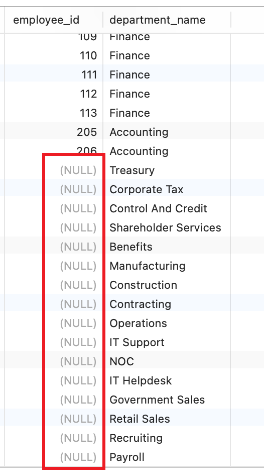

我们将部门表中不满足条件的数据也取出来了 这些部门没有人

<br>

sql99语法中我们直接将left修改为right就可以了

left -> right

以部门表为主, 将部门表的每一条记录 和 员工表进行匹配

```sql
select e.last_name, d.department_name

from employees e right outer join departments d

on e.department_id = d.department_id
order by e.last_name desc;

-- 结果集: 122
```

<br>

员工和部门能匹配的情况下 再把所有的部门查到 这些部门没有人

<br>

### 总结:
- 左外连接: 我们是拿数据多的表 去连接 数据少的表

- 右外连接: 我们是拿数据少的表 去连接 数据多的表

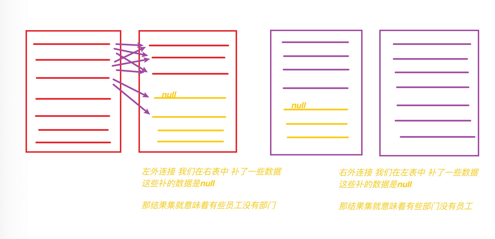

<br>

### SQL99语法: 实现满外连接:
mysql中不支持 ``full outer join`` 的语法

<br>

### **<font color="#C2185B">select * from 表A full outer join 表B on 连接条件</font>**  
sql99中 满外连接 的查询方式 多了一个 ``full``

<br>

**示例:**  
将 左表中不满足条件的数据 + AAA + 右表中不满足条件的数据 都查询出来 (满外连接)

```
   -----------
  |         |
  |     ----------- 
  |  1  | A |      |
  |     | A |      |
  |     | A |  16  |
  ------|-- |      |
        |          |
        ------------                
```

- AAA为内连接: 106
- 员工表不满足连接条件的记录为: 1
- 部门表不满足连接条件的记录为: 16

我们的需求希望查询到 123 条记录

<br>

```sql
SELECT last_name, department_name
FROM employees e FULL OUTER JOIN departments d
ON e.department_id = d.department_id
```

<br>

**注意:**  
mysql不支持该方式 进行满外连接的方式查询

<br><br>

## Mysql实现: 满外连接
mysql中不支持, ``full outer join ... on`` 的方式, 但是mysql支持 左右外连接的方式

在这基础上我们通过一些特殊的方式, 可以实现在 mysql 中实现满外连接的功能

<br>

### 多表查询的7种场景:

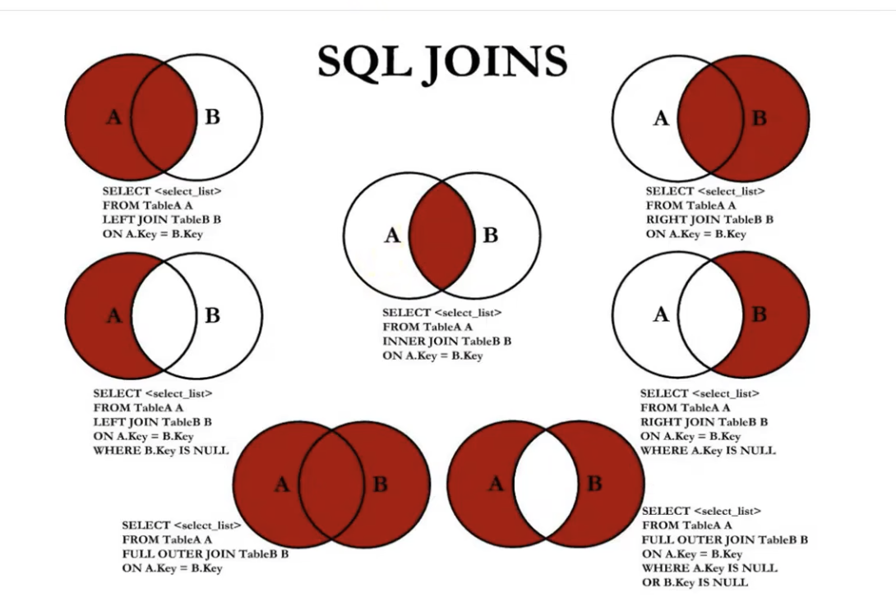

<br>

### 图解标识:
■ 是查询出来的数据

<br>

**1. 内连接**  
□■□: 查询出的是 符合连接条件的左右两表的数据
```sql
SELECT last_name, department_name
-- 内连接 INNER JOIN ON
FROM employees e INNER JOIN departments d
ON e.department_id = d.department_id;
```

<br>

**2. 左外连接**  
■■□: 在查出的内连接的数据的基础上, 将左表不满足连接条件的数据 也查询出来
```sql
SELECT last_name, department_name
FROM employees e LEFT OUTER JOIN departments d
ON e.department_id = d.department_id;
```

<br>

**3. 右外连接**  
□■■: 在查出的内连接的数据的基础上, 将右表不满足连接条件的数据 也查询出来
```sql
SELECT last_name, department_name
FROM employees e RIGHT OUTER JOIN departments d
ON e.department_id = d.department_id;
```

<br>

**4. 左外连接的基础上 扣掉相同部分**  
■□□: 在 左外连接 的基础上 将相同的部分(内连接的部分) 抹掉了

<br>

**要点:**  
要达到上述的效果 除了使用 on 指定的连接条件外, 需要再加上 where 的过滤条件  

左外连接的情况下, 过滤条件为 **右表.字段 is null**  

```sql
-- ■□□: 我们需要将内连接的部分去掉
select employee_id, department_name
from
	employees e left join departments d
	-- 连接条件: 符合条件的就会被搜索到  
	on e.department_id = d.department_id
where
	-- 使用where将我们的查询结果(107条数据) 再次过滤 根据条件返回我们想要的数据
	-- ■□□这个结构中■的部分就是 右表(补腿)的那个部分所对应的数据
	-- 我们在右表补了一些null 我们使用where就要右边为null的数据
	d.department_id is null
```

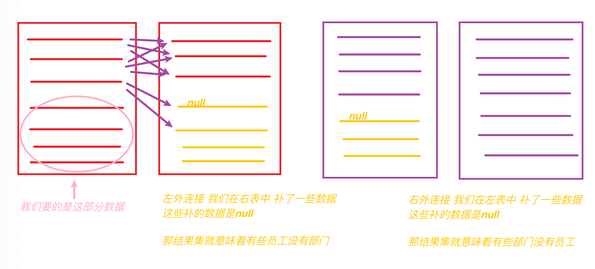

<br>

**5. 右外连接的基础上 扣掉相同部分**  
□□■: 在 右外连接 的基础上 将相同的部分(内连接的部分) 抹掉了

<br>

**要点:**  
要达到上述的效果 除了使用 on 指定的连接条件外, 需要再加上 where 的过滤条件  

右外连接的情况下, 过滤条件为 **左表.字段 is null**  


```sql
-- □□■: 哪些部门没有员工 
select employee_id, department_name
from 
	employees e right join departments d 
	on e.department_id = d.department_id
where
	-- 使用where将我们的查询结果(122条数据) 再次过滤 根据条件返回我们想要的数据
	-- 我们在左表中补了一些数据 这些数据的department_id都是null, 我们使用where就找左表该字段为null的数据
	e.department_id is null
```

<br>

**6. 满外连接**  
■■■: 2 + 5 或者 3 + 4 能得到满外连接

**使用 UNION ALL 关键字 完成 + 的操作**  

**2 + 5**  
```sql
-- 左外连接
SELECT employee_id, department_name
FROM 
	employees e LEFT OUTER JOIN departments d
	ON e.department_id = d.department_id

UNION ALL   -- 使用 UNION ALL 连接上面两个结果集

-- 左外连接去相同部分
SELECT employee_id, department_name
FROM 
	employees e RIGHT OUTER JOIN departments d
	ON e.department_id = d.department_id
WHERE 
	e.department_id IS NULL;
```

<br>

**7.**  
■□■: 4 + 5 能得出 7

**使用 UNION ALL 关键字 完成 + 的操作**  


4 + 5
```sql
SELECT employee_id, department_name
FROM employees e LEFT OUTER JOIN departments d
ON e.department_id = d.department_id
WHERE d.department_id IS NULL

UNION ALL

SELECT employee_id, department_name
FROM employees e RIGHT OUTER JOIN departments d
ON e.department_id = d.department_id
WHERE e.department_id IS NULL;
```

<br>

要实现mysql中的满外连接 我们先了解下 **UNION** 关键字的使用

<br><br>

## 关键字 UNION: 合并查询结果
利用UNION关键字, 可以将多条select的查询结果, **组合成单个结果集**  

<br>

### 要点: 
在使用 UNION 合并两张表的结果集的时候, **两个表对应的列数和数据类型必须相同**, 并且相互对应。

我们select查询出来的字段的类型和字段数 都要一样

各个SELECT语句之间使用UNION或UNION ALL关键字分隔。

- union
- union all (推荐)

<br>

### 语法格式:
相当于 结果集1 + 结果集2
```sql
select ... from 表1
union [ALL]
select ... from 表2
```

<br>

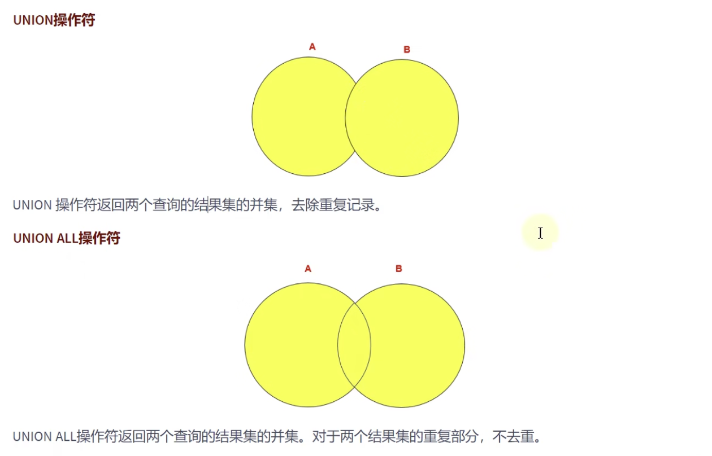

- union: 不完整的A + 完整的B (1 + 106 + 16)
- union all: 完整的A + 完整的B, 中间重复的部分多算了一份, 也就是多了一套公共的交集部分 (1 + 106 + 106 + 16)

<br>

### 关键字: UNION
是联合的意思 取两个集合的并集

UNION操作符返回两个查询的结果集的并集 **去除重复记录(去除一套106)**  

<br>

- 员工表: 公共部分不在员工表中
- 部门表: 包含公共的部分, 两张表的结果集拼接成一个完整的数据
```
员工表 
-----------
|         |
|     ------------
|     |          |
|     |          |
|     |          |
------|          |
      |          |
      ------------
              部门表
```

<br>

### 关键字: UNION ALL
UNION ALL操作符返回两个查询的结果集的并集 对于两个结果集的重复部分 **不去重**  

all理解成都要 所以不去重


员工表: 有一个公共的部分  
部门表: 有一个公共的部分, 两个部分都有
```
员工表 
------------
|          |
|     ------------
|     |    |     |
|     |    |     |
|     |    |     |
------|-----     |
      |          |
      ------------
              部门表
```

<br>

### 解析 UNION 和 UNION ALL:
我们拿员工表和部门表举例:

```
员工表    两表满足连接条件的数据    部门表
  1             106              16
```

如果我们使用的是 **UNION关键字**  
结果集为: 1 + 106 + 16

如果我们使用的是 **UNION ALL关键字**  
结果集为: 1 + 106 + 106 + 16

UNION 和 UNION ALL 的区别就是多了一套公共的交集部分(内连接的部分)

<br>

### 注意: 
在开发中 **能用 UNION ALL 的时候就不要使用 UNION**, 执行UNION ALL语句时所需要的资源比UNION语句少。

如果明确知道合并数据后的结果数据不存在重复数据, 或者不需要去除重复的数据, 则尽量使用UNION ALL语句, 以**提高数据查询的效率**。

我们实现满外连接的时候 有多种实现方式
1. ■■□ + □■■
2. ■■□ + □□■

上面的情况我们优先使用 2 因为2可以使用 union all

<br>

### Mysql实现: 满外连接
1. 实现: ■■□
2. 实现: □□■
3. 使用: UNION ALL 合并两次select的结果集

<br>

我们不要使用 ■■□ + □■■ 进行合并 这样一定会有重复的部分 这时我们只能使用 union, 为了性能考虑, 我们要使用 ■■□ + □□■ = ■■■

```sql
-- 左外连接
SELECT employee_id, department_name
FROM employees e LEFT OUTER JOIN departments d
ON e.department_id = d.department_id

UNION ALL   -- 使用 UNION ALL 连接上面两个结果集

-- 左外连接去相同部分
SELECT employee_id, department_name
FROM employees e RIGHT OUTER JOIN departments d
ON e.departm ent_id = d.department_id
WHERE e.department_id IS NULL;
```

<br>

### 1 - 7的实现代码
```sql
-- □■□: 
select employee_id, department_name
from
	employees e join departments d 
	on e.department_id = d.department_id;
	
-- ■■□: 有的员工没有部门
select employee_id, department_name
from
	employees e left join departments d 
	on e.department_id = d.department_id
	
-- □■■: 有的部门没有员工
select employee_id, department_name
from 
	employees e right join departments d
	on e.department_id = d.department_id
	
	
-- ■□□: 我们需要将内连接的部分去掉
select employee_id, department_name
from
	employees e left join departments d
	-- 连接条件: 符合条件的就会被搜索到  
	on e.department_id = d.department_id
where
	-- 使用where将我们的查询结果(107条数据) 再次过滤 根据条件返回我们想要的数据
	-- ■□□这个结构中■的部分就是 右表(补腿)的那个部分所对应的数据
	-- 我们在右表补了一些null 我们使用where就要右边为null的数据
	d.department_id is null
	
-- □□■: 哪些部门没有员工 
select employee_id, department_name
from 
	employees e right join departments d 
	on e.department_id = d.department_id
where
	-- 使用where将我们的查询结果(122条数据) 再次过滤 根据条件返回我们想要的数据
	-- 我们在左表中补了一些数据 这些数据的department_id都是null, 我们使用where就找左表该字段为null的数据
	e.department_id is null
	
-- ■■■
select employee_id, department_name
from 
	employees e left join departments d
	on e.department_id = d.department_id

union all

select employee_id, department_name
from
	employees e right join departments d 
	on e.department_id = d.department_id
where 
	e.department_id is null
	
-- ■□■
select employee_id, department_name
from
	employees e left join departments d 
	on e.department_id = d.department_id
where 
	d.department_id is null

union all 

select employee_id, department_name
from
	employees e right join departments d 
	on e.department_id = d.department_id
where 
	e.department_id is null
```

<br><br>

# SQL99语法: 新特性
- natural join: 自然连接
- using(字段): using连接

<br><br>

## 自然连接: natural join

### 作用:
我们可以把自然连接理解为 SQL92 中的**等值连接**  

**它会帮你自动查询两张连接表中 所有相同的字段, 然后进行 等值连接。**  

<br>

**格式:**  
不用写连接条件了, 自然连接会自动将两表中所有相同字段作为连接条件
```sql
select ... 
from 表A natural join 表B
```

<br>

**缺点:**  
不够灵活 因为它会将所有的相同字段都作为连接条件

<br>

### 示例:
比如我们的员工表和部门表, 两个表中有两个字段是共通的
- manager_id
- department_id

比如我们下面的查询中, 连接条件相当于有两个

```sql
SELECT e.employee_id, e.last_name, d.department_id
FROM employees e JOIN departments d

-- 两个表中 有两个字段是共同的 我们可以拿这两个字段来作为连接条件
ON e.department_id = d.department_id
AND e.manager_id = d.manager_id

-- 结果集: 32
```

<br>

**自然连接的示例:**  
```sql
SELECT e.employee_id, e.last_name, d.department_id
FROM employees e natural join departments d
-- 结果集: 32
```

<br>

### 自然连接的问题:
因为是自动拿多表中的相同字段作为连接条件, 所以它查出的结果是固定的, 不够灵活

<br><br>

## JOIN ... USING(字段)
USING() **用来替换** 多表查询中的连接条件

当多表的连接条件是同一字段的时候, A表中是department_id B表中也是department_id

这时就可以使用 ``USING(字段)`` 的方式代替 on 的方式 

<br>

**注意:**  
自连接不可以使用 USING()

<br>

### 示例:
```sql
SELECT e.employee_id, e.last_name, d.department_id
FROM 
	employees e INNER JOIN departments d
	ON e.department_id = d.department_id
```

<br>

**USING的操作方式:**  
```sql
SELECT e.employee_id, e.last_name, d.department_id
FROM employees e INNER JOIN departments d
-- 连接条件都是 department_id 所以我们可以使用USING(department_id)代替上面的on连接条件部分
USING(department_id)
```

<br>

### 总结:
多表的连接条件的写法有3种
- 92: 在 WHERE 中写
- 99: 在 ON 中写
- 99: 在 USING() 中写

<br>

**WHERE:**  
适用于所有关联查询

<br>

**ON:**   
只能和JOIN一起使用 只能写关联条件 虽然关联条件可以并到WHERE中和其他条件一起写
但分开写可读性更好

<br>

**USING():**  
只能和 JOIN 一起使用 而且要求两个关联字段在关联表中名称一致
而且只能表示关联字段值相等

<br>

### 注意:
我们要控制连接表的数量。

多表连接就相当于嵌套 for 循环一样, 非常消耗资源, 会让 SQL 查询性能下降得很严重, 因此不要连接不必要的表。

在许多 DBMS 中, 也都会有最大连接表的限制。

<br>

**超过三个表, 禁止join。**  
需要 join 的字段, 数据类型保持绝对一致; 

多表关联查询时, 保证被关联的字段需要有索引。

说明: 即使双表 join 也要注意表索引, SQL 性能。

<br>

### 练习:
**1. 显示所有员工的姓名, 部门号和部门名称。**  

**要点:**  
1. 提到了 **所有的** 而且涉及到了多张表, 那么肯定是外连接问题

2. 看看查询的主体: 所有员工, 那就是说 员工为主体, 往里加其它表的字段  

也就是要找以员工表为基准的信息 意味着左表的数据可能会多 **多的在左边 就要使用左外连接**, 因为我们会在右表垫高

```sql
select e.last_name, d.department_id, d.department_name
from employees e left join departments d
on e.department_id = d.department_id

-- 结果集: 107, 附带了别的表的字段
```

<br>

**2. 查询90号部门员工的job_id和90号部门的location_id**  

**要点:**  
1. 利用**内连接** 将 所有 有部门 的员工信息查出来, 106条记录

2. 然后进行where过滤

```sql
SELECT e.job_id, d.location_id
FROM employees e 
	INNER JOIN departments d
	ON e.department_id = d.department_id
-- 进行过滤
WHERE d.department_id = 90

-- 结果集: 3


-- 虽然下面的错了但也有参考价值 
-- 步骤1: 我们看看如下的表中的字段
select * from employees;
select * from locations;
select * from departments;

-- 因为我们的目标是 job_id(employees) 和 location_id(locations)
-- 但是这两张表没有共同的字段 而且不是主外键的关系 
-- 所以我使用了departments表 因为我发现 
-- employees 和 departments 可以根据 department_id 来连接
-- departments 和 locations 可以根据 location_id 来连接

-- 这样我们就将三张表连接到一起了 然后我们从三张表中的同行数据中取我们需要的字段
select d.department_id, e.employee_id, e.last_name, e.job_id, l.location_id
from 
	employees e join departments d
	on e.department_id = d.department_id
	join locations l 
	on d.location_id = l.location_id
where
	e.department_id = 90

-- 验证下: 结果集为3条 100 101 102
select * from employees
where department_id = 90
```

<br>

**3. 选择所有有奖金的员工的 last_name, department_name, location_id, city**  

**要点:** 
1. 所有的: 外连接的问题

2. 找主体: 员工信息, 说明要基于员工表往里面追加字段 **左外连接**  

3. 多张表: 往员工表里面拼接别的表的字段, 既然是所有员工的信息, 是外连接, 所以对应的 department_name 可能会有空过的情况

4. **多表连接的时候 要使用外连接的话 所有表都要使用外连接**  


```sql
SELECT e.last_name, e.commission_pct, d.department_name, d.location_id, l.city
FROM employees e 
  LEFT OUTER JOIN departments d
  ON e.department_id = d.department_id

  -- 上面使用了左外连接 下面这个表也要用左外连接 相当于 我们补上了第二张表的腿 也要补上第三张表的腿
  LEFT OUTER JOIN locations l
  ON d.location_id = l.location_id

-- 过滤条件: 有奖金的员工信息
WHERE e.commission_pct IS NOT NULL;

-- 结果集: 35, 单独的查询有奖金的员工也有35个
```

<br>

**4. 选择city在Toronto工作的员工的 last_name, job_id, department_id, department_name**  

**要点:**  
1. 找主体: 员工信息
2. 找有部门的 有location_id的员工 这是一个内连接
3. 做过滤条件

**join一个表, 相当于将这个表的信息追加到结果集中**  

```sql
SELECT e.last_name, e.job_id, e.department_id, d.department_name, l.city
-- 我们写表的时候按照上面的要展示的字段去写 (老师说先写谁后写谁都一样)
FROM employees e 
  INNER JOIN departments d
  ON e.department_id = d.department_id
  INNER JOIN locations l
  ON d.location_id = l.location_id
WHERE l.city = 'Toronto'
```

<br>

**5. 查询员工所在的部门名称, 部门地址, 姓名, 工作, 工资, 其中员工所在部门的部门名称为’Executive’**  

**要点:**  
1. 找主体: 员工信息
2. 只是拼接多个字段组成一个结果集, 然后过滤 所以是一个内连接

```sql
select d.department_name, l.street_address, e.last_name, e.job_id, e.salary
from employees e 
	join departments d 
	on e.department_id = d.department_id 
	join locations l 
	on d.location_id = l.location_id
where d.department_name = 'Executive'
```

<br>

**思考:**  
有一种情况 多个城市都有 Executive 这个部门 只是有的 Executive部门没有员工

Executive部门名会对应有多个 location_id, 相当于它跟 location_id 有一对多的关系, 如果我们想把没有员工的Executive也查找出来, 则可以使用外连接

```
有员工       Executive
 --         Executive
 --         Executive
 --         Executive
```

<br>

**6. 选择指定员工的姓名, 员工号, 以及他的管理者的姓名和员工号, 结果类似于下面的格式**  

```
employees Emp# manager Mgr# 
kochhar   101   king   100
```

**要点:**  
1. 我们要查询的字段都在一张表中, 是一个自连接的问题

2. 如果是内连接的话只能查出来106条记录, 但是有一个人是公司的老大他没有管理者 所以这又是一个外连接的问题

```sql
-- 注意 公司的最高负责人是没有领导的 但是也要让他出来 这里有是外连接
SELECT e.last_name "emp name", e.employee_id "emp id", m.last_name "mgr name", m.employee_id "mgr id"
-- 左外连接
FROM employees e LEFT OUTER JOIN employees m
ON e.manager_id = m.employee_id
```

<br>

**7. 查询哪些部门没有员工**  

**要点:**  
部门表写在了左表的位置上, 也就是说左表里面的数据多, 我们使用左外连接

```sql
-- ■□□: 相当于我们在做这样的事情
SELECT e.department_id
FROM departments d LEFT OUTER JOIN employees e
ON d.department_id = e.department_id
WHERE e.department_id IS NULL;

-- 结果集: 16


-- 方式2: 子查询
select department_id
from departments d
where not exists (
  select *
  from employees e
  where e.department_id = d.department_id
)
```

<br>

**8. 查询哪个城市没有部门**  

**要点:**  
1. 找主体: 主体是locations 它做为左表
2. 左外连接 - 内连接

```sql
-- ■□□: 相当于我们在做这样的事情
SELECT l.location_id, l.city
FROM locations l LEFT OUTER JOIN departments d
ON l.location_id = d.location_id
WHERE d.location_id IS NULL;
```

<br>

**9. 查询部门名为 Sales 或 IT 的员工信息**  
将 employees 和 departments 表的字段拼接成一个结果集 然后过滤条件

```sql
SELECT e.employee_id, e.last_name, d.department_id
FROM employees e JOIN departments d
ON e.department_id = d.department_id
WHERE d.department_name IN ('Sales', 'IT');

-- 结果集: 39
```

<br><br>

# 函数分类
任何一门语言都会涉及到对功能的封装 从函数定义的角度出发, 我们可以将函数分成
1. 内置函数 
  - 单行
  - 聚合

2. 自定义函数

<br><br>

## 不同DBMS函数的差异:
SQL语言中 已经内置了一些函数, 但是**不同的DBMS(数据库管理系统)之间的差异很大, 远大于同一个语言不同版本之间的差异。**  

实际上, **只有很少的函数是被 DBMS 同时支持的**。

比如, 大多数 DBMS 在拼接字符串的时候可以使用(||)或者(+)来做拼接符, 而在 MySQL 中的字符串拼接操作只能使用函数为``concat('字符串1', '字符串2')``

<br>

### 注意:
大部分 DBMS 会有自己特定的函数, 这就意味着**采用 SQL 函数的代码可移植性是很差的**, 因此在使用函数的时候需要特别注意。

也就是说 **函数不通用** 因为不同的软件中对函数的支持不足

<br>

### 总结:
函数在不同的数据库管理软件之间是不通用的 我们下面说的函数都是Mysql中的函数
- Oracle中 字符串拼接可以使用 ``hello || world``
- mysql中 需要使用 ``concat()``

<br><br>

## MySQL的 内置函数 及 分类:
MySQL提供了丰富的内置函数, 这些函数使得数据的维护与管理更加方便, 能够更好地提供数据的分析与统计功能, 在一定程度上提高了开发人员进行数据分析与统计的效率。

<br>

### MySQL提供的内置函数 **从实现的功能角度** 分类:
- 数值函数
- 字符串函数
- 日期和时间函数
- 流程控制函数
- 加密与解密函数
- 获取MySQL信息函数
- 聚合函数

<br>

### MySQL提供的内置函数 **从结果集来** 分类:
- 单行函数
- 聚合函数(或分组函数或多行函数) 

```sql
-- 单行: 进入一条 出来一条

-> | 单行函数 | ->
```

```sql
-- 聚合: 进入多条 出来一条

->
-> | 多行函数(聚合或分组函数) | ->
->
```

<br><br>

## Mysql: 单行函数
进入函数中一条记录 出来也是一条记录 的情况叫做 **单行函数**  

<br>

### 单行函数的特点:
1. 操作数据对象
2. 接受参数返回一个结果
3. **只对一行进行变换**  
4. **每行返回一个结果**  
5. 可以嵌套
6. 参数可以是一列(字段)或一个值

<br><br>

## 单行函数: 数值类型函数

|函数|说明|
|:--|:--|
|ABS(x)|返回x的绝对值|
|SIGN(X)|返回X的符号。正数返回1, 负数返回-1, 0返回0|
|CEIL(x), CEILING(x)|返回圆周率的值|
|FLOOR(x)|返回小于或等于某个值的最大整数|
|LEAST(e1,e2,e3…)|返回列表中的最小值|
|GREATEST(e1,e2,e3…)|返回列表中的最大值|
|MOD(x,y)|返回X除以Y后的余数|
|RAND()|返回0~1的随机值|
|RAND(x)|返回0~1的随机值, 其中x的值用作种子值, 相同的X值会产生相同的随机
数|
|ROUND(x)|返回一个对x的值进行四舍五入后, 最接近于X的整数|
|ROUND(x,y)|返回一个对x的值进行四舍五入后最接近X的值, 并保留到小数点后面Y位|
|TRUNCATE(x,y)|返回数字x截断为y位小数的结果|
|SQRT(x)|返回x的平方根。当X的值为负数时, 返回NULL|

<br>

|函数|说明|
|:--|:--|
|RADIANS(x)|将角度转化为弧度, 其中, 参数x为角度值|
|DEGREES(x)|将弧度转化为角度, 其中, 参数x为弧度值|

<br>

|函数|说明|
|:--|:--|
|SIN(x)|返回x的正弦值, 其中, 参数x为弧度值|
|ASIN(x)|返回x的反正弦值, 即获取正弦为x的值。如果x的值不在-1到1之间, 则返回NULL|
|COS(x)|返回x的余弦值, 其中, 参数x为弧度值|
|ACOS(x)|返回x的反余弦值, 即获取余弦为x的值。如果x的值不在-1到1之间, 则返回NULL|
|TAN(x)|返回x的正切值, 其中, 参数x为弧度值|
|ATAN(x)|返回x的反正切值, 即返回正切值为x的值|
|ATAN2(m,n)|返回两个参数的反正切值|
|COT(x)|返回x的余切值, 其中, X为弧度值|

<br>

|函数|说明|
|:--|:--|
|POW(x,y), POWER(X,Y)|返回x的y次方|
|EXP(X)|返回e的X次方, 其中e是一个常数, 2.718281828459045|
|LN(X), LOG(X)|返回以e为底的X的对数, 当X <= 0 时, 返回的结果为NULL|
|LOG10(X)|返回以10为底的X的对数, 当X <= 0 时, 返回的结果为NULL|
|LOG2(X)|返回以2为底的X的对数, 当X <= 0 时, 返回NULL|

<br>

|函数|说明|
|:--|:--|
|BIN(x)|返回x的二进制编码|
|HEX(x)|返回x的十六进制编码|
|OCT(x)|返回x的八进制编码|
|CONV(x,f1,f2)|返回f1进制数变成f2进制数|

<br>

### **<font color="#C2185B">ABS(字段或值)</font>**  
返回 字段或值 的绝对值

<br>

### **<font color="#C2185B">SIGN(字段或值)</font>**  
返回 字段或值 的符号(正负号)

- 正数返回1
- 负数返回-1
- 0返回0

<br>

### **<font color="#C2185B">PI()</font>**  
返回圆周率的值

<br>

### **<font color="#C2185B">CEIL(字段或值), CEILING(字段或值)</font>**  
天花板函数

返回大于或等于某个值的最小整数

```
32.32 -> 返回 33
43.23 -> 返回 -43
```

<br>

### **<font color="#C2185B">FLOOR(x)</font>**  
地板函数

返回小于或等于某个值的最大整数

```
32.32 -> 返回32
32.23 -> 返回 -33
```

<br>

### **<font color="#C2185B">LEAST(e1,e2,e3…)</font>**  
返回列表中的最小值, 相当于 Math.min(arr)

<br>

### **<font color="#C2185B">GREATEST(e1,e2,e3…)</font>**  
返回列表中的最大值, 相当于 Math.max(arr)

<br>

### **<font color="#C2185B">MOD(x,y)</font>**  
返回X除以Y后的余数, **%**  

<br>

### **<font color="#C2185B">RAND()</font>**  
返回 0 ~ 1 的随机值, 每次执行的结果都不同

```sql
-- 比如 0-100 之间的随机数, 然后我们对 RAND() * 100 的结果进行四舍五入
RAND() * 100
```

<br>

### **<font color="#C2185B">RAND(x)</font>**  

**随机数**  

返回 0 ~ 1 的随机值, 其中x的值用作种子值, 相同的X值会产生相同的随机数

```sql
RAND(10)
RAND(10)
-- 因为我们传入的因子一样 所以两次调用产生的随机数是相同的
```

<br>

### **<font color="#C2185B">ROUND(x)</font>**  
**四舍五入**  

返回一个对x的值进行四舍五入后, 返回一个整数

```sql
-- 对小数部分进行四舍五入, 结果是123
round(123.456)
```

<br>

### **<font color="#C2185B">ROUND(x,y)</font>**  
**四舍五入, 保留几位小数**  

返回一个对x的值进行四舍五入后最接近X的值, 并保留到小数点后面Y位

<br>

**参数y:**  
保留几位小数

- y传入1: 保留一位小数
- y传入0: 保留到个位, 看第一个小数位, 是否符合四舍五入

- y传入负数:
  - -1: 保留到十位, **对个位**进行四舍五入的判断, 不管是满5进位, 还是不满舍弃 该位起后面的都为0, 不满则从该位起后面的都为0 : 123 -> 120, 对3进行判断不够进位 个位为0

  - -2: 保留到百位, **对十位**进行四舍五入的判断, 不管是满5进位, 还是不满舍弃 该位起后面的都为0 : 123 -> 100

  - -3: 保留到千位, **对百位**进行四舍五入的判断, 不管是满5进位, 还是不满舍弃 该位起后面的都为0 : 1123 -> 1000

```sql
-- 参数y 还可以传入负数, -1表示保留到十位, 对个位进行四舍五入判断, 不够进位, 包含个位后的位都变成0, 结果是 120
        ↓
round(123.456, -1) 
```

<br>

### **<font color="#C2185B">TRUNCATE(x,y) </font>**  
truncate: **截断操作**  

对 x 数值进行截断操作, 保留指定的 y 小数位

- y: 为负数
  - 0: 个位后开始截断, 截断的位用0补
  - -1: 十位后开始截断, 个位被截断 使用0补

```
truncate(123.456, 0) -> 保留到整数位 123
truncate(123.456, 1) -> 保留到整数位 123.4
truncate(129.456, -1) -> 保留到整数位 120
```

**注意:**   
单行函数可以嵌套

```sql
SELECT TRUNCATE(ROUND(123.456, 2),0)
FROM DUAL;
  -- 123
```

<br>

### **<font color="#C2185B">SQRT(x)</font>**  
返回x的平方根。当X的值为负数时, 返回NULL

<br><br>

### 角度与弧度换算函数

我们想象下表 **3点整**, 时针 -> 3, 分针 -> 12, 这时就相当于一个直角坐标系

当秒钟指向 2 的时候, 这时 时针 和 秒针的夹角为 30度  
当秒针继续走到12的时候 时针 和 秒针的夹角为 90 度

<br>

**弧度:**  
当我们秒针走过的弧长 和 半径的长度是一样的 这时候秒针和半径的夹角 就是一个弧度 

```
1弧度 = 57度多
圆的周长: 2PI R
```

<br>

### **<font color="#C2185B">RADIANS(x)</font>**  
radians() 将角度转化为弧度

**参数:**  
x: 角度

<br>

### **<font color="#C2185B">DEGREES(x)</font>**  
degrees() 将弧度转化为角度

**参数:**  
x: 弧度

<br><br>

## 三角函数
下面的函数的参数按照说可以写度数的, 但是我们要求写**弧度值**, 如果我们要有角度 要转换为 弧度值

<br>

### **<font color="#C2185B">SIN(x)</font>**  
返回x的正弦值

**参数:**  
x: 弧度

<br>

### **<font color="#C2185B">ASIN(x)</font>**  
返回x的反正弦值, 即获取正弦为x的值。如果x的值不在-1到1之间, 则返回NULL

**参数:**  
x: 弧度

<br>

### **<font color="#C2185B">COS(x)</font>**  
返回x的余弦值

**参数:**  
x: 弧度

<br>

### **<font color="#C2185B">ACOS(x)</font>**  
返回x的反余弦值, 即获取余弦为x的值。如果x的值不在-1到1之间, 则返回NULL

<br>

### **<font color="#C2185B">TAN(x)</font>**  
返回x的正切值

**参数:**  
x: 弧度

<br>

### **<font color="#C2185B">ATAN(x)</font>**  
返回x的反正切值

**参数:**  
x: 弧度

<br>

### **<font color="#C2185B">ATAN2(m,n)</font>**  
返回两个参数的反正切值

<br>

### **<font color="#C2185B">COT(x)</font>**  
返回x的余切值

**参数:**  
x: 弧度

```sql
SELECT SIN(RADIANS(30)),DEGREES(ASIN(1)),TAN(RADIANS(45)),DEGREES(ATAN(1)),DEGREES(ATAN2(1,1))
FROM DUAL;
```

<br><br>

### 指数与对数
指数与对数互为反函数

<br>

### **<font color="#C2185B">POW(x,y), POWER(X,Y)</font>**  
返回x的y次方

<br>

### **<font color="#C2185B">EXP(X) </font>**  
以e为底x次方, 其中e是一个常数, 2.718281828459045

<br>

### **<font color="#C2185B">LN(X), LOG(X)</font>**  
返回以e为底的X的对数, 当X <= 0 时, 返回的结果为NULL

<br>

### **<font color="#C2185B">LOG10(X)</font>**  
返回以10为底的X的对数, 当X <= 0 时, 返回的结果为NULL

<br>

### **<font color="#C2185B">LOG2(X)</font>**  
返回以2为底的X的对数, 当X <= 0 时, 返回NULL

<br>

### 进制间的转换

<br>

### **<font color="#C2185B">BIN(x)</font>**  
返回x的二进制

<br>

### **<font color="#C2185B">HEX(x) </font>**  
返回x的十六进制

<br>

### **<font color="#C2185B">OCT(x)</font>**  
返回x的八进制

<br>

### **<font color="#C2185B">CONV(x,f1,f2)</font>**  
将 x 从 f1进制 转换为 f2进制

```sql
CONV(10,2,8) -- 将2进制的10转换为8进制
```

<br><br>

# 字符串函数
都是利用查询select 使用单行函数对结果中的数据 进行转换, 比如
```sql
-- 将结果值中的last_name字段的数据 转成 大写
SELECT UCASE(last_name) from employees
```

<br>

|函数|说明|
|:--|:--|
|ASCII(S)|返回字符串S中的第一个字符的ASCII码值|
|CHAR_LENGTH(s)|返回字符串s的字符数。作用与CHARACTER_LENGTH(s)相同|
|LENGTH(s)|返回字符串s的字节数, 和字符集有关|
|CONCAT(s1,s2,......,sn)|连接s1,s2,......,sn为一个字符串|
|CONCAT_WS(x, s1,s2,......,sn)|同CONCAT(s1,s2,...)函数, 但是每个字符串之间要加上x|
|INSERT(str, idx, len, replacestr)|将字符串str从第idx位置开始, len个字符长的子串替换为字符串replacestr|
|REPLACE(str, a, b)|用字符串b替换字符串str中所有出现的字符串a|
|UPPER(s) 或 UCASE(s)|将字符串s的所有字母转成大写字母|
|LOWER(s) 或LCASE(s)|将字符串s的所有字母转成小写字母|
|LEFT(str,n)|返回字符串str最左边的n个字符|
|RIGHT(str,n)|返回字符串str最右边的n个字符|
|LPAD(str, len, pad)|用字符串pad对str最左边进行填充, 直到str的长度为len个字符|
|RPAD(str ,len, pad)|用字符串pad对str最右边进行填充, 直到str的长度为len个字符|
|LTRIM(s)|去掉字符串s左侧的空格|
|RTRIM(s)|去掉字符串s右侧的空格|
|TRIM(s)|去掉字符串s开始与结尾的空格|
|TRIM(s1 FROM s)|去掉字符串s开始与结尾的s1|
|TRIM(LEADING s1 FROM s)|去掉字符串s开始处的s1|
|TRIM(TRAILING s1 FROM s)|去掉字符串s结尾处的s1|
|REPEAT(str, n)|返回str重复n次的结果|
|SPACE(n)|返回n个空格|
|STRCMP(s1,s2)|比较字符串s1,s2的ASCII码值的大小|
|SUBSTR(s,index,len)|返回从字符串s的index位置其len个字符, 作用与SUBSTRING(s,n,len)、 MID(s,n,len)相同|
|LOCATE(substr,str)|返回字符串substr在字符串str中首次出现的位置, 作用于POSITION(substr IN str)、INSTR(str,substr)相同。未找到, 返回0|
|ELT(m,s1,s2,…,sn)|返回指定位置的字符串, 如果m=1, 则返回s1, 如果m=2, 则返回s2, 如果m=n, 则返回sn|
|FIELD(s,s1,s2,…,sn)|返回字符串s在字符串列表中第一次出现的位置|
|FIND_IN_SET(s1,s2)|返回字符串s1在字符串s2中出现的位置。其中, 字符串s2是一个以逗号分隔的字符串|
|REVERSE(s)|返回s反转后的字符串|
|NULLIF(value1,value2)|比较两个字符串, 如果value1与value2相等, 则返回NULL, 否则返回value1|
|substring_index(str,delim,index)|如果index是正数，那么就是从左往右数，第N个分隔符的左边的所有内容<br>如果index是负数，那么就是从右往左数，第N个分隔符的右边的所有内容|

<br>

### ASCII(S)
返回给定字符串中 **第一个字符**的ASCII码值
```sql
SELECT ASCII('a')
FROM DUAL   -- 97
```

<br>

### **<font color="#C2185B">CHAR_LENGTH(s)</font>**  
返回字符串s的**字符的个数**, 单独的一个就是一个字符
```sql
SELECT CHAR_LENGTH('hello'), CHAR_LENGTH('我们')
FROM DUAL;
  -- 5, 2
```

<br>

### **<font color="#C2185B">LENGTH(s)</font>**  
length()  
返回 **底层存储字符串s 所占的字节数**, 和字符集有关  
- 一个汉字 占 3个字节
- 一个英文 占 1个字节

```sql
SELECT LENGTH('hello'), LENGTH('我们')
FROM DUAL;
  -- 5, 6

-- hello:
-- 英文下我们使用的字符集 用一个字节去存就可以

-- 我们
-- utf8里面每一个汉字占3个字节 所以是6
```


<br>

### **<font color="#C2185B">CONCAT(s1,s2,......,sn)</font>**  
concat() 拼接字符串

连接s1, s2, ......, sn为一个字符串, s还可以是字段

将字段对应的值(数据)进行了拼接

```sql
-- 变量直接写 字符串用单引号
SELECT CONCAT(e.last_name, ' -- worked for -- ', m.last_name)
FROM employees e INNER JOIN employees m
WHERE e.manager_id = m.employee_id;

-- 结果:  last_name字段的值 -- worked for -- last_name字段的值


select concat(employee_id, last_name) from employees
-- 100King
```

<br>

### **<font color="#C2185B">CONCAT_WS(x, s1, s2, ......, sn)</font>**  
同CONCAT(s1,s2,...)函数, 但是每个**字符串之间**要加上x

**参数:**  
1. 连接字符的符号
2. 其它字符串

```sql
select CONCAT_WS('-','hello','world') 

-- 这就跟 concat() 一样了
select CONCAT_WS('','hello','world') 
```

<br>

### **<font color='#C2185B'>注意: sql中字符串的索引是从 1 开始的</font>**  

<br>

### **<font color="#C2185B">INSERT(str, index, len, replacestr)</font>**  
insert() **替换**  

将字符串str从第index位置开始, len个字符长的子串替换为字符串replacestr

**参数:**  
- str: 给定字符串
- index: 索引位置(起始包含) **默认从1开始**  
- len: 指定长度
- replacestr: 目标字符串

<br>

**注意:**    
字符串的索引是从1开始的

```sql
SELECT INSERT('helloworld', 2, 3, 'aaa')
FROM DUAL;

-- haaaoworld
-- 从e开始 取3个 ell 替换为 aaa
```


<br>

### **<font color="#C2185B">REPLACE(str, a, b)</font>**  
replace() **替换**  

将给定字符串中的子串a替换成子串b

<br>

**参数:**  
- str: 给定字符串
- a: 给定字符中的子串a
- b: 目标子串b

**替换失败不会报错 就是替换不成功**  

```sql
SELECT REPLACE('hello','ll','aa')
FROM DUAL;

-- heaao
```

<br>

### **<font color="#C2185B">UPPER(s) 或 UCASE(s)</font>**  

- upper(str)  
- ucase(str)

将字符串s的所有字母转成大写字母

<br>

### **<font color="#C2185B">LOWER(s) 或 LCASE(s)</font>**  

- lower(str)  
- lcase(str)

将字符串s的所有字母转成小写字母

```sql
-- 我们可以将一个字段转换为小写后 进行过滤
WHERE lower(last_name) = 'king'
```

<br>

### **<font color="#C2185B">LEFT(str,n)</font>**  
left(str, n)  

返回字符串str最左边的n个字符

```sql
SELECT LEFT('testname',3)
FROM DUAL

-- tes
```

<br>

### **<font color="#C2185B">RIGHT(str,n)</font>**  
right(str, n)

返回字符串str最右边的n个字符

<br>

### **<font color="#C2185B">LPAD(str, len, pad)</font>**  
lpad(str, len, pad), 在目标字符串左边填充

str不足len的长度时 使用pad来填充, 比如 str为6 len为10, 则填充4个0

<br>

**参数:**  
- str: 给定字符串
- len: 给定位置
- pad: 填充目标

<br>

**技巧:**  
能够实现右对齐的效果

<br>

**隐式转换:**  
当我们传入数字时, 可以将数字隐式转换为字符串

```sql
-- 这里我们salary字段是数字 但是也能传入LPAD字符串方法中 因为里面有隐式转换
SELECT employee_id, last_name, LPAD(salary,10,'*')
FROM employees;


SELECT LPAD('test',10,0)
FROM DUAL 
-- 000000test
```

<br>

### **<font color="#C2185B">RPAD(str,len, pad)</font>**  
rpad(str, len, pad), 在目标字符串右边填充

用字符串pad对str最右边进行填充, 直到str的长度为len个字符

<br>

**技巧:**  
能够实现左对齐效果

<br>

**隐式转换:**  
当我们传入数字时, 可以将数字隐式转换为字符串

<br>

### **<font color="#C2185B">LTRIM(s)</font>**  
ltrim(str)

去掉字符串s左侧的空格

<br>

### **<font color="#C2185B">RTRIM(s)  </font>**  
rtrim(str)

去掉字符串s右侧的空格

<br>

### **<font color="#C2185B">TRIM(s)</font>**  
trim(str)

去掉字符串s 两端的空格 

<br>

### **<font color="#C2185B">TRIM(s1 FROM str)</font>**  
trim(s1 from str)

去除 str 首尾出现的 s1 字符, 换句话说当s1出现在首尾的时候会被去掉

```sql
SELECT TRIM('oo' FROM 'ooheollo')
FROM DUAL;

-- oo出现ooheollo字符串的首尾 所以被去掉 结果为heollo
```

<br>

### **<font color="#C2185B">TRIM(LEADING s1 FROM str)</font>**  
trim(leading s1 from str)

去除 str 首部出现的 s1 字符

<br>

### **<font color="#C2185B">TRIM(TRAILING s1 FROM str)</font>**  
trim(trailing s1 from str)

去除 str 尾部出现的 s1 字符


<br>

### **<font color="#C2185B">REPEAT(str, n)</font>**  
repeat(str, n)

返回str重复n次的结果

<br>

### **<font color="#C2185B">SPACE(n)</font>**  
space(n)

提供空格的, 比如 space(5)就提供了5个空格

<br>

### **<font color="#C2185B">STRCMP(s1,s2)</font>**  
strcmp(s1, s2)

**比较**字符串s1, s2的ASCII码值的大小

- s1 大 返回 正数
- s1 小 返回 负数
- 0相等

<br>

### **<font color="#C2185B">SUBSTR(s,index,len)</font>**  
**截取**, substr(str, index, len)

截取str, 从index开始指定长度的字符串

**参数:**  
- str: 给定字符串
- index: 索引默认为1, 包含
- len: 取多少个字符

作用与SUBSTRING(s,n,len), MID(s,n,len)相同


<br>

### **<font color="#C2185B">LOCATE(substr,str)</font>**  

locate(substr, str), **作用等同于 indexOf()**  

返回字符串substr在字符串str中**首次出现的位置**  

作用于``POSITION(substr IN str), INSTR(str,substr)``相同。**未找到, 返回0**  

<br>

### **<font color="#C2185B">ELT(position,s1,s2,…,sn)</font>**  
elt(position, s1, s2)

获取s1 ... sn 列表中 position位置的元素

<br>

**参数:**  
- position: 指定位置 数字(下标 从1开始)
- s1 ~ sn: 为字符串列表

索引从1开始

```sql
SELECT ELT(3,'aaa','bbb','ccc')
FROM DUAL;

-- ccc
```

<br>

### **<font color="#C2185B">FIELD(str, s1,s2,…,sn)</font>**  
field(s, s1 ~ sn), 返回的是 索引

返回字符串str在 字符串列表中 **第一次出现的位置**  
**必须完全匹配**  

比如:  
a, ax, aaa, a 只有a才会匹配

**匹配不到 返回0**  

```sql
SELECT FIELD('a','a','xxx','zxx')
FROM DUAL
-- 1
```

<br>

### **<font color="#C2185B">FIND_IN_SET(str, strset)</font>**  
find_in_set(s1, s2), 返回的是索引

返回字符串str在字符串列表中strset中首次出现的**位置**  

其中, 字符串s2是一个以逗号分隔的字符串 例如: 'aa, bb, mm'

```sql
FIND_IN_SET('mm', 'aa, bb, mm')   
-- 后面的参数是以逗号分隔的多个字符集

-- 3
```

<br>

### **<font color="#C2185B">REVERSE(str)</font>**  
reverse(str)

返回str反转后的字符串

<br>

### **<font color="#C2185B">NULLIF(value1,value2)</font>**  
nullif(value1, value2)

比较两个字符串, 如果value1与value2相等, 则返回NULL, 否则返回value1

```sql
-- 如果 first_name 和 last_name 的长度相等的话 则返回null
select employee_id, nullif(length(first_name), length(last_name))
```

<br>


### **<font color="#C2185B">substring_index(str,delim,indx)</font>** 
返回指定分隔符前面 或 后面的内容

- 如果index是正数，那么就是从左往右数，第N个分隔符的左边的所有内容
- 如果index是负数，那么就是从右往左数，第N个分隔符的右边的所有内容

- str:要处理的字符串
- delim:分隔符
- index:计数

```sql
str=www.wikibt.com

substring_index(str,'.',1)
-- 结果: www


substring_index(str,'.',-2)
-- 结果: wikibt.com

substring_index(substring_index(str,'.',-2),'.',1);
-- 结果: wikibt
```

<br><br>

# 单行函数: 日期和时间函数

<br><br>

## 日期 时间 API

### 获取日期、时间:

|函数|说明|
|:--|:--|
|CURDATE()|返回当前日期, 只包含年、月、日|
|CURTIME()|返回当前时间, 只包含时、分、秒|
|NOW()|返回当前系统日期和时间|
|UTC_DATE()|返回UTC（世界标准时间）日期|
|UTC_TIME()|返回UTC（世界标准时间）时间|

<br>

### 日期与时间戳的转换:

|函数|说明|
|:--|:--|
|UNIX_TIMESTAMP()|返以UNIX时间戳的形式返回当前时间。SELECT UNIX_TIMESTAMP() - >1634348884|
|UNIX_TIMESTAMP(date)|将时间date以UNIX时间戳的形式返回|
|FROM_UNIXTIME(timestamp)|将UNIX时间戳的时间转换为普通格式的时间|

<br>

### 获取月份、星期、星期数、天数等函数:

|函数|说明|
|:--|:--|
|YEAR(date) / MONTH(date) / DAY(date)|返回具体的日期值|
|HOUR(time) / MINUTE(time) / SECOND(time)|返回具体的时间值|
|MONTHNAME(date)|返回月份：January, ...|
|DAYNAME(date)|返返回星期几：MONDAY, TUESDAY.....SUNDAY|
|WEEKDAY(date)|返回周几, 注意, 周1是0, 周2是1, 。。。周日是6|
|WEEK(date) ,  WEEKOFYEAR(date)|返回一年中的第几周|
|QUARTER(date)|返回日期对应的季度, 范围为1～4|
|DAYOFYEAR(date)|返回日期是一年中的第几天|
|DAYOFMONTH(date)|返回日期位于所在月份的第几天|
|DAYOFWEEK(date)|返回周几, 注意：周日是1, 周一是2, 。。。周六是7|

<br>

### 返回指定日期中特定的部分, type指定返回的值:

|函数|说明|
|:--|:--|
|EXTRACT(type FROM date)|返回指定日期中特定的部分, type指定返回的值|

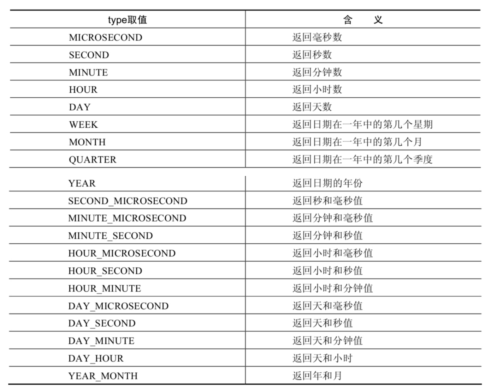

<br>

###  时间和秒钟转换的函数:

|函数|说明|
|:--|:--|
|TIME_TO_SEC(time)|将 time 转化为秒并返回结果值。转化的公式为： 小时 * 3600 + 分钟 * 60 + 秒|

<br>

### 计算日期和时间的函数:

|函数|说明|
|:--|:--|
|DATE_ADD(datetime, INTERVAL expr type)<br> ADDDATE(date,INTERVAL expr type)|返回与给定日期时间相差INTERVAL时间段的日期时间|
|DATE_SUB(date,INTERVAL expr type)<br> SUBDATE(date,INTERVAL expr type)|返回与date相差INTERVAL时间间隔的日期|

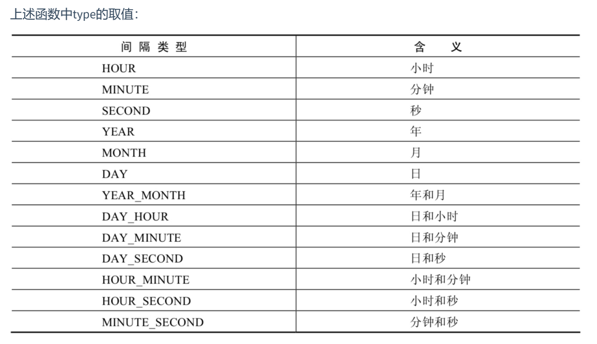

<br>

|函数|说明|
|:--|:--|
|ADDTIME(time1,time2)|返回time1加上time2的时间。当time2为一个数字时, 代表的是秒 , 可以为负数|
|SUBTIME(time1,time2)|返回time1减去time2后的时间。当time2为一个数字时, 代表的是 秒 , 可以为负数|
|DATEDIFF(date1,date2)|返回date1 - date2的日期间隔天数|
|TIMEDIFF(time1, time2)|返回time1 - time2的时间间隔|
|FROM_DAYS(N)|返回从0000年1月1日起, N天以后的日期|
|TO_DAYS(date)|返回日期date距离0000年1月1日的天数|
|LAST_DAY(date)|返回date所在月份的最后一天的日期|
|MAKEDATE(year,n)|针对给定年份与所在年份中的天数返回一个日期|
|MAKETIME(hour,minute,second)|将给定的小时、分钟和秒组合成时间并返回|
|PERIOD_ADD(time,n)|返回time加上n后的时间|

<br>

### 日期的格式化与解析:

|函数|说明|
|:--|:--|
|DATE_FORMAT(date,fmt)|按照字符串fmt格式化日期date值|
|TIME_FORMAT(time,fmt)|按照字符串fmt格式化时间time值|
|GET_FORMAT(date_type,format_type)|返回日期字符串的显示格式|
|STR_TO_DATE(str, fmt)|按照字符串fmt对str进行解析, 解析为一个日期|

<br><br>

## 获取日期, 时间:
我们获取的时间的字符串格式 默认为: ``2016-10-01 16:00:00``

<br>

### **<font color="#C2185B">curdate() / current_date()</font>**  
返回当前日期, 只包含 **年, 月, 日**  

```sql
SELECT CURDATE() FROM DUAL
SELECT CURRENT_DATE() FROM DUAL

-- 示例: 2022-03-09
```

<br>

### **<font color="#C2185B">curtime() / current_time()</font>** 
返回当前时间, 只包含 **时, 分, 秒**  
```sql
SELECT CURTIME() FROM DUAL

-- 22:43:35
```

<br>

### **<font color="#C2185B">now()</font>**  
返回当前系统日期和时间, 返回的是 **年月日 + 时分秒**  

<br>

**扩展: 获取 年月日:时分秒 的其它API**  
- sysdate()
- current_timestamp()
- localtime()
- localtimestamp()  


```sql
SELECT NOW() FROM DUAL

-- 2022-03-09 22:44:21
```

<br>

### **<font color="#C2185B">utc_date()</font>**  
返回UTC(**世界标准时间**)日期, 返回 年月日

跟北京时间会有8小时的差别
 
<br>

### **<font color="#C2185B">utc_time()</font>**  
返回UTC(**世界标准时间**)时间, 返回 时分秒

跟北京时间会有8小时的差别

<br>

### 技巧: 上面的日期类函数的后面 + 0 会去掉中间的 - 和 :
```sql
select curdate() + 0 from dual	-- 20230927
select curtime() + 0 from dual  -- 205749
```

<br><br>

## 日期 与 时间戳 的转换:
指定的日期 和 对应的毫秒数之间的转换

很多时候我们在表中保存时间的话 其实都可以用时间戳的方式去保存

比如: 订单单号里也会有时间戳做为它的一部分去构成再配一个随机的字符串

<br>

### **<font color="#C2185B">UNIX_TIMESTAMP()</font>**  
将当前的时间 转换为 时间戳

```sql
select unix_timestamp() from dual
	-- 1645102589
```


<br>

### **<font color="#C2185B">UNIX_TIMESTAMP(date)</font>**  
将指定的时间 转换为 时间戳 

我们要指定 指定格式 的时间字符串

```sql
select unix_timestamp('2016/10/1 16:00:00') from dual
select unix_timestamp('2016-10-1 16:00:00') from dual
-- 1475305200

select
	unix_timestamp(curdate()), 
	unix_timestamp(curtime()), 
	unix_timestamp(now())
from dual
-- 1695740400, 1695816104, 1695816104
```

<br>

### **<font color="#C2185B">FROM_UNIXTIME(timestamp)</font>**  
将 时间戳 转换为 时间

```sql
-- 将当前时间转换为毫秒数
SELECT UNIX_TIMESTAMP() FROM DUAL;
	-- 1645102589

-- 将毫秒数转换为时间
SELECT FROM_UNIXTIME(1645102589) FROM DUAL;
	-- 2022-02-17 21:56:29

select from_unixtime(unix_timestamp()) from dual
-- 2023-09-27 21:04:18
```

<br><br>

## 获取月份, 星期, 星期数, 天数等函数:
关于获取 日期 中的属性的情况 比如分别获取 年 月 日

<br>

### 日期中的隐式转换:
当我们的给定时间为 **字符串型** 的时候, 只要字符串的格式符合sql中默认的年月日的格式 就可以进行隐式的转换

<br>

**默认的年月日的格式:**  
- YYYY-MM-DD
- YYYY/MM/DD

<br>

```sql
-- '2021-10-26' 时间格式的字符串 存在着隐式转换 将 '2021-10-26' 字符串型 隐式的转换为 日期的类型
SELECT 
  MONTHNAME('2021-10-26')
```

<br>

### **<font color="#C2185B">YEAR(date) / MONTH(date) / DAY(date)</font>**  
从指定的时间中 返回 年 月 日

```sql
select year(now()), month(now()), day(now());
```

<br>

### **<font color="#C2185B">HOUR(time) / MINUTE(time) / SECOND(time)</font>**  
从指定的时间中 返回 时 分 秒

```sql
select hour(now()), minute(now()), second(now());
```

<br>

### **<font color="#C2185B">MONTHNAME(date)</font>**  
返回 给定日期 中的月份: **月份英文单词**  

```sql
select monthname(now())
  -- September
```

<br>

### **<font color="#C2185B">DAYNAME(date)</font>**  
返回 给定日期 中的星期几: **周几英文单词**  

```sql
select dayname(now())
	-- Wednesday
```

<br>

### **<font color="#C2185B">WEEKDAY(date)</font>**  
返回 给定日期 中的星期几: 返回数字 0 ~ 6

**注意:**  
- 0: 星期一 (Monday)
- 1: 星期二 (Tuesday)
- 2: 星期三 (Wednesday)
- 3: 星期四 (Thursday)
- 4: 星期五 (Friday)
- 5: 星期六 (Saturday)
- 6: 星期日 (Sunday)

<br>

### **<font color="#C2185B">QUARTER(date)</font>**  
返回 给定日期 对应的季度, 范围为1～4

```sql
select quarter(now())
    -- 4
```

<br>

### **<font color="#C2185B">WEEK(date),  WEEKOFYEAR(date)</font>**  
返回一年中的 **第几周**  

```sql
-- 两个函数都是返回 一年中的第几周
select week(now()), weekofyear(now()) from dual
    -- 51, 51
```

<br>

### **<font color="#C2185B">DAYOFYEAR(date)</font>**  
返回日期是一年中的 **第几天**  

```sql
select dayofyear(now()) from dual
-- 270
```

<br>

### **<font color="#C2185B">DAYOFMONTH(date)</font>**  
返回 给定日期 位于 **所在月份的第几天**  

```sql
select dayofmonth(now()) from dual
-- 27
```

<br>

### **<font color="#C2185B">DAYOFWEEK(date)</font>**  
返回 给定日期 中的周几, 返回的是数字 1 ~ 7

**注意:**  
- 1: 星期日 (Sunday)
- 2: 星期一 (Monday)
- 3: 星期二 (Tuesday)
- 4: 星期三 (Wednesday)
- 5: 星期四 (Thursday)
- 6: 星期五 (Friday)
- 7: 星期六 (Saturday)

它和 weekday() 返回的都是给定日期对象中的 周几 但是有区别
- weekday(): 从0~6(周1~周7)返回的 周一 对应的是 0, **当前周几-1**  
- dayofweek(): 从1~7(周7~周6)开始的返回的 周一 对应的是 2, **当前周几+1**  

```sql
-- 今天是周三, 返回的4
select dayofweek(now())	-- 7

-- 今天是周三, 返回的2
select weekday(now()) from dual
```

<br><br>

## extract() 日期的操作函数:
获取 给定日期 中的特定部分(获取分钟还是小时等), 都是通过调用这一个API完成的, 根据API中的type属性指明指定获取时间中的哪个部分

<br>

### **<font color="#C2185B">EXTRACT(type FROM 日期)</font>**  
``extract(type from 日期)``

根据 type属性, 返回给定日期中的特定部分

```sql
select extract(second from now()) from dual;
```

<br>

### TYPE取值:
- MICROSECOND(microsecond): **返回微秒数**  
- SECOND(second): **返回当前时间中的 秒数**  
- MINUTE(minute): **返回当前时间中的 分钟数**  
- HOUR(hour): **返回当前时间中的 小时数(21点)**  
- DAY(day): **返回当前时间中的 天数**  
- WEEK(week): **返回日期在一年中的第几个星期**  
- MONTH(month): **返回日期在一年中的第几个月**  
- QUARTER(quarter): **返回日期在一年中的第几个季度**  
- YEAR(year): **返回日期的年份**  


- SECOND_MICROSECOND: **返回 秒 和 毫秒值**  
(second_microsecond) 返回值是两个数连一起的结果 如: 10:20 -> 1020

- MINUTE_MICROSECOND: **返回 分钟的毫秒值**  
(minute_microminute) 返回值是两个数连一起的结果 如: 10:20 -> 1020

- MINUTE_SECOND: **返回 分钟 和 秒**  
(minute_second) 返回值是两个数连一起的结果 如: 10:20 -> 1020

- HOUR_MICROSECOND: **返回 小时 和 毫秒值**  
(hour_microsecond) 返回值是两个数连一起的结果 如: 10:20 -> 1020

- HOUR_SECOND: **返回 小时 和 秒**  
(hour_second) 返回值是两个数连一起的结果 如: 10:20 -> 1020

- HOUR_MINUTE: **返回 小时 和 分钟**  
(hour_minute) 返回值是两个数连一起的结果 如: 10:20 -> 1020

- DAY_MICROSECOND: **返回 天 和 毫秒值**  
(day_microsecond) 返回值是两个数连一起的结果 如: 10:20 -> 1020

- DAY_SECOND: **返回 天 和 秒**  
(day_second) 返回值是两个数连一起的结果 如: 10:20 -> 1020

- DAY_MINUTE: **返回 天 和 分钟值**  
(day_minute) 返回值是两个数连一起的结果 如: 10:20 -> 1020

- DAY_HOUR: **返回 天 和 小时**  
(day_hour) 返回值是两个数连一起的结果 如: 10:20 -> 1020

- YEAR_MONTH: **返回 年 和 月**  
(year_month) 返回值是两个数连一起的结果 如: 10:20 -> 1020

<br><br>

## 时间 和 秒钟 转换的函数: 10:10:10 -> 36610 || 36610 -> 10:10:10
- 将 time (时间) 转换为 秒数
- 将 秒数 转换为 time(时间)

<br>

**注意:**  
只考虑的是time的部分

<br>

### **<font color="#C2185B">TIME_TO_SEC(time)</font>**  
将 给定时间 转换为 秒

**转换公式:**  
小时 x 3600 + 分钟 x 60 + 秒

```sql
SELECT TIME_TO_SEC(CURTIME())
FROM DUAL;

SELECT TIME_TO_SEC('10:10:10')
FROM DUAL;
  -- 36610
```

<br>

### **<font color="#C2185B">SEC_TO_TIME(seconds)</font>**  
将 给定秒数 转换为 包含 时:分:秒
```sql
SELECT SEC_TO_TIME(36610)
FROM DUAL;
    -- 10:10:10
```

<br><br>

## 计算 日期 和 时间 的函数:
有应用场景

- 日期 2016-10-01
- 时间 10:10:10

<br>

### **<font color="#C2185B">DATE_ADD(datetime, INTERVAL expr type)</font>**  
date_add()

对 给定时间 的 type属性对应的部分, 进行加的操作
```sql
-- 2017 的基础上 +1
select date_add('2017-10-01', interval 1 year)
```

<br>

**参数:**   
- datetime: 给定日期
- interval: 固定的关键字
- expr: 表达式 or 数值, 写1就是+1, **可以传入负值 相当于减的操作**  
- type: 对给定日期中哪个部分进行操作

```sql
-- 对当前的时间中的 年 进行 +1 操作
SELECT NOW(), DATE_ADD(NOW(), INTERVAL 1 YEAR)
FROM DUAL;

-- now(): 
      2022-02-17 22:40:50
-- 操作后: 
      2023-02-17 22:40:50
```

<br>

### **<font color="#C2185B">DATE_SUB(datetime,INTERVAL expr type)</font>**  
对 给定时间 的 type属性对应的部分, 进行减的操作

<br>

### TYPE取值:
- HOUR: 时
- MINUTE: 分
- SECOND: 秒

- YEAR: 年
- MONTH: 月
- DAY: 日

- YEAR_MONTH: 年和月
- DAY_HOUR: 日和小时
- DAY_MINUTE: 日和分钟
- DAY_SECOND: 日和秒
- HOUR_MINUTE: 小时和分钟
- HOUR_SECOND: 小时和秒
- MINUTE_SECOND: 分钟和秒

<br>

**注意:**  
对 给定时间 中两个 属性部分 进行操作是, expr的部分也要使用 _ 分割, 比如 '1_1' 使用 **单引号**  

```sql
SELECT 
  -- 同时对年和月进行操作的时候 要使用'' _ 连接
	DATE_ADD(NOW(), INTERVAL '1_1' YEAR_MONTH) AS col6
FROM DUAL;
```

<br><br>

### **<font color="#C2185B">ADDTIME(time1, time2)</font>**  
addtime()

在 time1 的基础上, 加上 time2 的时间

<br>

**参数:**  
time是时间类型: 12:30:45

<br>

**注意: time2的写法不同 它代表的意思也不同**  
1. 如果time只是单纯的数字 它将做为 秒
2. 可以是负数

如果 time1 或 time2 是 NULL，则结果将是 NULL。如果相加的时间导致超过 24 小时的时间，MySQL 会自动将结果格式化为合法的时间格式。

```sql
select now(), addtime(now(), '1:1:1') from dual;
```

<br>

### **<font color="#C2185B">SUBTIME(time1,time2)</font>**  
subtime()

在 time1 的基础上减去 time2 的时间。

<br>

### **<font color="#C2185B">DATEDIFF(date1, date2)</font>**  
datediff(), 获取是的是 ``年-月-日``, 获取的是 日 之间的差值

获取date1 和 date2 之间的时间间隔, 返回 ``date1 - date2`` 的日期间隔天数, 

<br>

**参数:**  
date: 2016-10-01

<br>

**返回值:**  
int

<br>

**应用场景:**  
用户注册的表格 最近7天 有多少用户注册了, 我们的表中会有一个字段保存着用户注册的时间

注册时间和now()进行对比 如果是在7天之内就要这条记录

比如 入职员工超过10000天的员工有哪些

<br>

### **<font color="#C2185B">TIMEDIFF(time1, time2)</font>**  
timediff(), 获取的是 time 之间的差值, 返回time1 - time2的 时间间隔

<br>

**参数:**  
time: 01:03:22

<br>

### **<font color="#C2185B">FROM_DAYS(N)</font>**  
from_days()

<br>

**参数:**  
我们传入从公元 0000 年以后的某一天, 它是一个数字

<br>

**作用:**  
从公元 0000 年以后的某一天, 转换为 date对象

```sql
-- 738878是一个整数，它代表了从公元 0000 年以后的某一天。FROM_DAYS 函数将这个整数转换为对应的日期，并返回一个日期值。
select FROM_DAYS(738878)
    -- 2022-12-24
```

**应用场景:**  
它相当于一个标准

<br>

### **<font color="#C2185B">TO_DAYS(date) </font>**  
to_days()

返回给定date距离0000年1月1日的总天数

<br>

### **<font color="#C2185B">LAST_DAY(date)</font>**  
last_day()

传入一个date 返回给定date所在月份的 最后一天的**日期**, 比如我们传入 2022-11-1, 11月份的最后一天是30, 该api会返回 2022-11-30 完整的日期对象

```sql
select LAST_DAY('2022-11-1')
    -- 2022-11-30
```

<br>

### **<font color="#C2185B">MAKEDATE(year,n)</font>**  
makedate()

作用是根据提供的年份和天数来构造日期

组合成日期对象(date), 将给定的年份 和 传入的天数 组成一个日期, 2000 + 100天 是 2000-04-10

```sql
select makedate('2020', 30)
-- 2020-01-30
```

<br>

### **<font color="#C2185B">MAKETIME(hour,minute,second)</font>**  
maketime()  

将给定的小时, 分钟和秒组合成时间并返回

<br>

### **<font color="#C2185B">PERIOD_ADD(time,n)</font>**  
period_add()  

返回time加上n后的时间  

<br>

**注意: 参数1的写法**  
20221010101010

<br>

### 上述所有API的示例:
```sql
SELECT 
	ADDTIME(NOW(),20),
      -- 在前面的时间上 +20秒

	SUBTIME(NOW(),30),
      -- 在前面的时间上 -30秒

	SUBTIME(NOW(),'1:1:3'),
      -- 减去 1:1:3

	DATEDIFF(NOW(),'2021-10-01'),
      -- 得到两个时间之间的间隔天数

	TIMEDIFF(NOW(),'2021-10-25 22:10:10'),
      -- 得到两个时间之间的时间差 
      -- 838:59:59

	FROM_DAYS(366),
      -- 0001-01-01

	TO_DAYS('0000-12-25'),
	LAST_DAY(NOW()),

	MAKEDATE(YEAR(NOW()),32),
      -- YEAR(NOW()) 取出当前时间的年
      -- 然后根据我们传入的天数 组成一个日期
      - 2022-02-01


	MAKETIME(10,21,23),
      -- 组成 时:分:秒 返回

	PERIOD_ADD(20200101010101,10)
      -- 20200101010111

FROM DUAL;
```

<br><br>

## 日期的格式化与解析: 

### 格式化: 以字符串的形式体现
日期 -> 字符串: %Y-%m-%d %H:%i:%s

<br>

### 解析:
字符串 -> 日期

之前我们接触过隐式的格式化或解析 比如
```sql
SELECT *
FROM employees

-- hire_date字段是 date 类型的, 但是我们填写的是字符串
-- 这时如果字符串的格式 如果满足 date类型的默认格式
-- 相当于隐式的将该字符串转换为date的类型了
WHERE hire_date = '1993-01-13'
```

<br>

### 常用的 format 格式符号:
- **%Y**: 4位数字, 表示年份: 2022
- %y: 2位数字, 表示年份: 22

- %c: 1位数字, 表示月份: 2
- **%m**: 2位数字, 表示月份: 02
- %M: 英文单词, 表示月份: January
- %b: 缩写英文单词, 表示月份: Jan

- %D: 英文后缀, 表示天数: 1st
- %e: 1位数字, 表示天数: 1
- **%d**: 2位数字, 表示天数: 01

- **%H**: 2位数字, 表示小时数: 24小时制
- %h 和 %I: 2位数字, 表示小时数: 12小时制
- %k: 1位数字, 表示小时数: 24小时制
- %l: 1位数字, 表示小时数: 12小时制

- **%i**: 2位数字, 表示分钟

- %S 和 **%s**: 2位数字, 表示秒钟

- %T: 24小时制
- %r: 12小时制

- %p: AM或PM
- %%: 表示%

- %W: 英文单词, 星期几: Sunday
- %a: 缩写英文单词, 星期几: Sun
- %w: 数字, 星期几: 0=Sunday,1=Monday
- %j: 以3位数字表示年中的天数(001,002...)
- %U: 以数字表示年中的第几周,  (1,2,3。。) 其中Sunday为周中第一天
- %u: 以数字表示年中的第几周,  (1,2,3。。)其中Monday为周中第一天

<br>

### 格式化: 日期 -> 字符串

<br>

### **<font color="#C2185B">DATE_FORMAT(date/datetime, 指定格式)</font>**  
date_format()

将**date类型 或者 datetime** 按照指定格式来 转换成 字符串

```sql
-- 将当前的日期 通过 指定的格式 转换为字符串
SELECT DATE_FORMAT(CURDATE(),'%Y-%M-%D')
FROM DUAL;
    -- 2022-February-17th


-- %Y-%m-%d  -- 这是比较标准的格式
select date_format(curdate(), '%Y/%m/%d')


-- 年月日 
select date_format(date, '%y年%m月%d日') into res


-- 将datetime类型格式化
SELECT DATE_FORMAT(NOW(), '%Y-%m-%d %H:%i:%s'); -- 将当前日期时间格式化为 'YYYY-MM-DD HH:MM:SS' 格式
```

<br>

### **<font color="#C2185B">TIME_FORMAT(time, 指定格式)</font>**  
time_format()

将**时间类型** 按照指定格式来 转换成 字符串

```sql
SELECT TIME_FORMAT(CURTIME(),'%H:%i:%s')
FROM DUAL;

-- 23:59:53
```

<br>

### 解析: 字符串 -> 日期

<br>

### **<font color="#C2185B">STR_TO_DATE(str, 指定格式) </font>**  
str_to_date()

将字符串按照哪种格式转换回去, 解析为一个日期

<br>

**注意:**  
我们拿什么格式转成字符串的 就要用什么格式转换回去, 格式要一致

```sql
SELECT STR_TO_DATE('2023-09-25 15:30:00', '%Y-%m-%d %H:%i:%s');
```

我们字符串 2023-09-25 那么对应的格式 必须是 %Y-%m-%d 不能是 %Y/%m/%d

**格式不对则解析失败 会返回null**  

<br><br>

### **<font color="#C2185B">GET_FORMAT(date_type, format_type) </font>**  
get_format(), 就是获取 ``%Y-%m-%d`` format

**参数:**  
|date_type|format_type|返回的格式化字符串|
|:--|:--|:--|
|DATE|USA|m.d.y|
|DATE|JIS|Y-m-d|
|DATE|ISO|Y-m-d|
|DATE|EUR|d.m.Y|
|DATE|INTERNAL|Ymd|
|TIME|USA|h:i:sp|
|TIME|JIS|H:i:s|
|TIME|ISO|H:i:s|
|TIME|EUR|H.i.s|
|TIME|INTERNAL|His|
|DATETIME|USA|Y-m-dH.i.s|
|DATETIME|JIS|Y-m-dH:i:s|
|DATETIME|ISO|Y-m-dH:i:s|
|DATETIME|EUR|Y-m-dH.i.s|
|DATETIME|INTERNAL|YmdHis|

<br>

**作用:**  
我们传入的参数从上述的表格中找, 根据我们提供的参数 返回一个 format, 该format会根据我们传入的format_type找到对应国家的 显示日期 格式

能够得到对应国家的日期格式化模板 也就是该国家习惯这么表示 年月日 时分秒

```sql
SELECT GET_FORMAT(DATE, 'USA')
FROM DUAL;

-- %m.%d.%Y
```

<br>

**技巧:**  
我们不用自己指定日期的格式化模式 我们可以在传入格式化模板的时候 通过 GET_FORMAT 来得到指定国家的模板信息
```sql
-- 将指定的date 格式化为 指定的字符串
SELECT DATE_FORMAT(curdate(), GET_FORMAT(DATE, 'USA'))
FROM DUAL;

-- 02.18.2022
```

<br><br>

# 单行函数: 流程控制函数
流程处理函数可以根据不同的条件, 执行不同的处理流程, 可以在SQL语句中实现不同的条件选择。

MySQL中的流程处理函数主要包括

- IF()
- IFNULL()
- CASE()

<br>

### **<font color="#C2185B">IF(expr, val1,val2)  </font>**  
**根据 expr表达式 返回值** 在 val1 和 val2 中 **2选1**  

- expr表达式 true : 返回val1
- expr表达式 false: 返回val2 

<br>

**练习:**  
下面的IF语句写在了字段里面 并起了别名
自定义了工资标准字段 根据IF的结果 自定义了显示的值

```sql
-- 字段名为 工资标准
-- 字段对应在结果集中的数据为, 根据表达式 展示对应的 高工资 还是 低工资
select last_name, salary, if(salary >= 6000, '高工资', '低工资') as "薪资描述"
from
	employees
order by salary desc

-- 结果集
|last_name|salary|薪资描述|
|King|24000.00|高薪|
```

<br>

**练习:**  
根据IF条件 决定一个表中字段的显示结果
```sql
SELECT last_name, salary, IF(commission_pct IS NOT NULL, commission_pct, 0) "details"
FROM employees
```

<br>

**练习:**  
如果我们要对字段中的数据 进行计算 我们可以通过IF语句来避免null值的情况
```sql
SELECT 
  last_name, 
  salary,  
	-- 如果 奖金率 不为 null, 你就用 为null你就使用默认值, 类似js中的 || 0
  salary * 12 * (1 + IF(commission_pct IS NOT NULL, commission_pct, 0)) "details"
FROM employees
```

<br>

### **<font color="#C2185B">IFNULL(value1, value2)</font>**  
判断 value1 是否为 NULL

- 如果 **为null**, 则返回 **value2**  
- 如果不为null, 则返回 value1

```sql
SELECT last_name, salary, IFNULL(commission_pct, 0) "details"
FROM employees
```

<br>

### case when 直接开头: if ... else if ... else
### **<font color="#C2185B">CASE WHEN 条件1 THEN 结果1 ELSE ... END</font>**  
相当于Java的if...else if...else..., **多选1**  

**英语解析:**  
- when: 当
- then: 然后

<br>

**结构解析:**  
条件可以有多个, else后面加默认值, 但是这个结构不是必须的

- case: 开头, 固定关键字
- end: 结尾, 固定关键字
- when: 后面接条件, 没有括号, **相当于if(条件)**  
- then: 输出的值, **相当于 { 体的部分 }**  
- else: 不是必须的, 当上面没有匹配的 我们还没有指定else的情况下 结果集中的数据默认为null

<br>

**格式:**  
```sql
case when salary > 1500 then "A"
		 when salary > 1000 then "B"
		 else "C"
end
```

<br>

**注意:**  
范围有覆盖的情况 范围大的放在上面
```sql
select
	last_name,
	salary,
	case
		-- 范围大的放在上面
		when salary > 10000 then '高新'
		when salary > 7000 then '一般'
		else '低薪'
	end as "details"
from employees
order by salary desc
```

<br>

**示例:**  
details字段 根据不同的条件, 结果集中显示不同的数据 ['高薪', '潜力股' ...]
```sql
SELECT 
	last_name, 
	salary, 
	CASE WHEN salary >= 15000 THEN '高薪'
			 WHEN salary >= 10000 THEN '潜力股'
			 WHEN salary >= 8000 THEN '小屌丝'
			 ELSE '草根' 
	-- end处 指明了该字段的 别名
  END "details"
FROM employees;

-- 结果集
|last_name|salary|details|
|King|24000.00|高薪|
```

<br>

**注意:**  
end后面我们指定的字段的别名

<br>

### case expr when 常量值: switch case
### **<font color="#C2185B">CASE 表达式 WHEN '常量值' ... THEN ... ELSE ... END</font>**  
类似 switch ... case ...

表达式 和 when后面的常量 进行全等判断, 符合的话确定为 then 后面对应的值

- case: 开头
- end: 结尾
- expr: 表达式, 可以是字段 或者 表达式 或者值, expr会和when后面的常量值进行全等判断
- when: 后接常量值, 相当于switch case结构中 case后的常量值 ``case 1``
- then: 输出的值
- else: 不是必须的, 当上面没有匹配的 我们还没有指定else的情况下 默认为null

**格式:**  
```sql
case expr when '常量值1' then "A"
		      when '常量值1' then "B"
		 			else "C"
end
```

<br>

**练习:**  
查询部门号为 10,20,30 的员工信息, 若部门号为 
- 10 号部门, 则打印其工资的 1.1 倍
- 20 号部门, 则打印其工资的 1.2 倍
- 30 号部门, 则打印其工资的 1.3 倍

<br>

**要点:**  
1. ``case expr when '常量值' then`` 它是一个多选1的过程, **就是相当于我们指明了一个自定义的字段salary, 然后该字段对应在结果集中的数据 是根据条件来决定的**  

2. 查询的这个过程是属于遍历的一个过程, 每次取一行记录, 所以每次循环的时候 department_id的值也是不同的

```sql
select 
	department_id, 
	last_name, 
	salary "moto",
	case department_id 
		when 10 then salary * 1.1
		when 20 then salary * 1.2
		when 30 then salary * 1.3
		-- 就3个部门就不用else了
	end "salary"
from
	employees
where
	department_id in (10, 20, 30);
```

<br><br>

# 单行函数: 加密 与 解密
加密与解密函数主要用于对数据库中的数据进行加密和解密处理, 以防止数据被他人窃取。  
这些函数在保证数据库安全时非常有用。

<br>

在存取的数据库表中 有一些字段就可以进行加密操作  
比如这里我们是对数据库中的表 进行的加密操作 保存数据库中的表的用户信息 被窃取了后也能一定程度保证它的安全

这里只是给了一种数据库层面的加密方式, 只不过我们一般都会做前置到客户端处理加密的问题

<br>

### 前后台交互的流程
用户前台填写完用户名和密码后 发送请求到后台

在客户端的时候已经可以对密码进行加密了 **没必要以明文的方式发送到数据库的层面, 然后在数据库的层面上做加密**  

加密操作可以前置到客户端的层面上 **不要在传输的过程中使用明文**  

比如: 前端 -到-> 数据库 都用md5进行加密

<br>

### 加密函数:

|函数|用法|
|:--|:--|
|PASSWORD(str)|返回字符串str的加密版本, 41位长的字符串。**加密结果不可逆**, 常用于用户的密码加密|
|MD5(str)|返回字符串str的md5加密后的值, 也是一种加密方式。**加密结果不可逆**, 若参数为NULL, 则会返回NULL|
|SHA(str)|从原明文密码str计算并返回加密后的密码字符串, 当参数为NULL时, 返回NULL。**SHA加密算法比MD5更加安全。**|
|ENCODE(value,password_seed)|返回使用password_seed作为加密密码加密value|
|DECODE(value,password_seed)|返回使用password_seed作为加密密码解密value|

<br>

### **<font color="#C2185B">PASSWORD(str)</font>**  
返回字符串str的加密版本, 41位长的字符串。

**加密结果 不可逆**, 常用于用户的密码加密

<br>

**注意:**  
该函数在mysql8.0中被弃用了

```sql
-- 参数: mysql相当于密码
SELECT PASSWORD('mysql')
FROM DUAL;
-- *E74858DB86EBA20BC33D0AECAE8A8108C56B17FA
```

<br>

### **<font color="#C2185B">MD5(str)</font>**  
返回字符串str的md5加密后的值, 也是一种加密方式。不可逆, 若参数为NULL, 则会返回NULL

**不可逆, 没有办法 将加密后的结果 再转成明文**  

<br>

### **<font color="#C2185B">SHA(str)</font>**  
从原明文密码str计算并返回加密后的密码字符串, 当参数为NULL时, 返回NULL。 SHA加密算法比MD5更加安全。

**不可逆, 没有办法 将加密后的结果 再转成明文**  

```sql
select md5('sam'), sha('sam') from dual
-- md5 - 32: 332532dcfaa1cbf61e2a266bd723612c
-- sha - 40: f16bed56189e249fe4ca8ed10a1ecae60e8ceac0
```

<br>

### **<font color="#C2185B">ENCODE(value, password_seed)</font>**  
加盐, 加密

返回使用password_seed作为加密密码加密value

password_seed 相当于 加盐

<br>

### **<font color="#C2185B">DECODE(value, password_seed)</font>**  
加盐, 解密

返回使用password_seed作为加密密码解密value

可以看到, ENCODE(value,password_seed)函数与DECODE(value,password_seed)函数互为反函数。

<br>

**注意:**  
encode decode函数 **在mysql8.0中被弃用了**  
- ENCODE(value,password_seed)
- DECODE(value,password_seed)

<br><br>

## 单行函数: 信息函数
MySQL中内置了一些可以查询MySQL信息的函数, 这些函数主要用于帮助数据库开发或运维人员更好地对数据库进行维护工作。

<br>

### **<font color="#C2185B">VERSION()</font>**  
version()

返回当前MySQL的版本号

<br>

### **<font color="#C2185B">CONNECTION_ID()</font>**  
connection_id()

返回当前MySQL服务器的连接数

<br>

### **<font color="#C2185B">DATABASE() / SCHEMA()</font>**  
database() / schema()

返回MySQL命令行当前所在的数据库

```sql
select database();
```

<br>

### **<font color="#C2185B">USER() / CURRENT_USER() / SYSTEM_USER() / SESSION_USER()</font>**  

返回当前连接MySQL的用户名, 返回结果格式为"主机名@用户名"

```sql
select user();
-- root@localhost
```

<br>

### **<font color="#C2185B">CHARSET(value)</font>**  
charset(value)

返回字符串value自变量的字符集

<br>

### **<font color="#C2185B">COLLATION(value)</font>**  
collation(value)

返回字符串value的比较规则

<br><br>

## 单行函数: 其它函数
MySQL中有些函数无法对其进行具体的分类, 但是这些函数在MySQL的开发和运维过程中也是不容忽视的。

<br>

### **<font color="#C2185B">FORMAT(value,n)</font>**  
四舍五入的保留指定为的小数, n表示保留几位小数

如果n的值 < 0 或 =0, 则只保留整数部分
```sql
SELECT 
  FORMAT(123.123, 2),		-- 123.12
  FORMAT(123.523, 0),		-- 124
  FORMAT(123.123, -2); 	-- 123
FROM DUAL;
```

<br>

### **<font color="#C2185B">CONV(value,from,to)</font>**  
convert 转换, 进制之间的转换
- from: 指定进制
- to: 指定进制

将value的值 在不同进制之间的转换, null不能转换
```sql
SELECT 
  CONV(16, 10, 2), 
  CONV(8888,10,16), 
  CONV(NULL, 10, 2)
FROM DUAL;
```

<br>

### **<font color="#C2185B">INET_ATON(ipvalue)</font>**  
inet_aton

将以点分隔的IP地址转化为一个数字
```sql
SELECT INET_ATON('192.168.1.100');
-- 转为一个整数了 32322235675
```

**扩展:**  
计算方式: 以"192.168.1.100"为例, 计算方式为192乘以256的3次方, 加上168乘以256的2次方, 加上1乘以256, 再加上100。

<br>

### **<font color="#C2185B">INET_NTOA(value)</font>**  
inet_ntoa

将 INET_ATON(ipvalue) 的结果再转换回IP地址 

数字形式的IP地址转化为以点分隔的IP地址, 还原成ip地址

<br>

### **<font color="#C2185B">BENCHMARK(n,expr)</font>**  
benchmark()

将表达式expr重复执行n次。用于测试MySQL处理expr表达式所耗费的时间
```sql
SELECT BENCHMARK(1000000, MD5('mysql'))
		-- 我们可以在状态栏看到执行时间
```

<br>

### **<font color="#C2185B">CONVERT(value USING char_code)</font>**  
convert, 将字段的编码转换为 指定的编码格式

将value所使用的字符编码修改为char_code, 用来表示

```sql
SELECT 
  CHARSET('mysql'),  -- 返回mysql的字符编码
  CHARSET(CONVERT('mysql' USING 'utf8')); -- 将mysql的字符编码转换为 utf8
```

<br>

### 练习:
1. 显示系统时间(注:日期+时间)
```sql
-- 下面的都是系统时间
SELECT 
	NOW(),
	sysdate(),
	current_timestamp(),
	localtime(),
	localtimestamp()
FROM DUAL;
```

<br>

2. 查询员工号, 姓名, 工资, 以及工资提高百分之20%后的结果(new salary)
```sql
SELECT employee_id, last_name, salary, salary * 1.2 "new_salary"
FROM employees;
```

<br>

3. 将员工的姓名按首字母排序, 并写出姓名的长度(length)
```sql
SELECT last_name, CHAR_LENGTH(last_name)
FROM employees
-- 默认就是拿第一个字母进行比较 后续的字母不会再比较了 所以不用这么写 order by ascii(last_name);
ORDER BY last_name


-- 如果我们按照名字的长度进行排序的时候
-- 当字段中有函数的时候 我们一般会给字段起别名 然后按照别名来排序
SELECT last_name, CHAR_LENGTH(last_name) "name_length"
FROM employees
-- 这里是按照别名来排序的
ORDER BY name_length
```

<br>

4. 查询员工id,last_name,salary, 并作为一个列输出, 别名为OUT_PUT  
结果集中各个字段对应的数据连接起来了
```sql
SELECT CONCAT_WS('\t', employee_id, last_name, salary) "OUT_PUT"
FROM employees;
```

<br>

5. 查询公司各员工工作的年数, 工作的天数, 并按工作年数的降序排序
```sql
SELECT 
	-- datediff() 返回的是天数 所以 / 365 就是年
	DATEDIFF(CURDATE(),hire_date) / 365 worked_years, 
	DATEDIFF(CURDATE(),hire_date) worked_days
FROM employees
ORDER BY worked_years DESC

/*
	to_days(date): 也可以完成 它相当于绝对的一个点
	to_days(curdate()) - to_days(hire_date)
	这样也能计算出该员工工作了多少天
*/
select
	employee_id, 
	last_name, 
	year(now()) - year(hire_date) as "work_years",
	to_days(now()) - to_days(hire_date) as "work_days"
from 
	employees
order by work_days desc
```

<br>

6. 查询员工姓名, hire_date, department_id, 满足以下条件:雇用时间在1997年之后, department_id 为80 或 90 或110, commission_pct不为空

**要点: 日期和日期之间 或者 字符串和字符串 之间进行比较**  
```sql
SELECT last_name, hire_date, department_id
FROM employees
WHERE department_id IN (80, 90, 110)
AND commission_pct IS NOT NULL

-- 方式1: 利用隐式转换 hire_date是日期类型的 所以如下写法
AND hire_date >= '1997-01-01'

-- 方式2: 显式转换: 日期的格式化和解析 利用格式化, 字符串和字符串之间进行比较
AND DATE_FORMAT(hire_date,'%Y-%m-%d') >= '1997-01-01'

-- 方式3: 
AND DATE_FORMAT(hire_date,'%Y') >= '1997'

-- 方式4: 解析: 拿着两个日期来进行对比
AND hire_date >= STR_TO_DATE('1997-01-01','%Y-%m-%d')

-- 方式5: 
AND year(hire_date) > 1997
```

<br>

7. 查询公司中入职超过10000天的员工姓名, 入职时间
```sql
SELECT last_name, hire_date
FROM employees
WHERE DATEDIFF(CURDATE(),hire_date) >= 10000
```

<br>

8. 做一个查询, 产生下面的结果
``<last_name> earns <salary> monthly but wants <salary*3>``

```sql
SELECT CONCAT(last_name, ' earns ', TRUNCATE(salary,0), ' monthly but wants ', TRUNCATE(salary * 3, 0)) "Dream Salary"
FROM employees
```

<br>

9. 使用case-when, 按照下面的条件: 
```
job       grade 
AD_PRES     A
ST_MAN      B
IT_PROG     C
SA_REP      D
ST_CLERK    E
```
```sql
SELECT 
	last_name "Last_name", 
	job_id "Job_id", 
	-- 第三个字段
	CASE job_id
		WHEN 'AD_PRES' THEN 'A'
		WHEN 'ST_MAN' THEN 'B'
		WHEN 'IT_PROG' THEN 'C'
		WHEN 'SA_REP' THEN 'D'
		WHEN 'ST_CLERK' THEN 'E'
	END "Grade"
FROM employees
```

<br><br>

# 聚合函数: 对一组数据进行汇总的函数 类似reduce
我们上一章讲到了 SQL 单行函数。实际上 SQL 函数还有一类, 叫做聚合(或聚集, 分组)函数

它是对一组数据进行汇总的函数, **输入的是一组数据的集合, 输出的是单个值**  

聚合函数作用于一组数据, 并对一组数据进行操作, **返回一个值**  

<br>

### 举例:
我们要求工资最大的值, 我们将107条数据都放入函数中, 返回了一个最大值

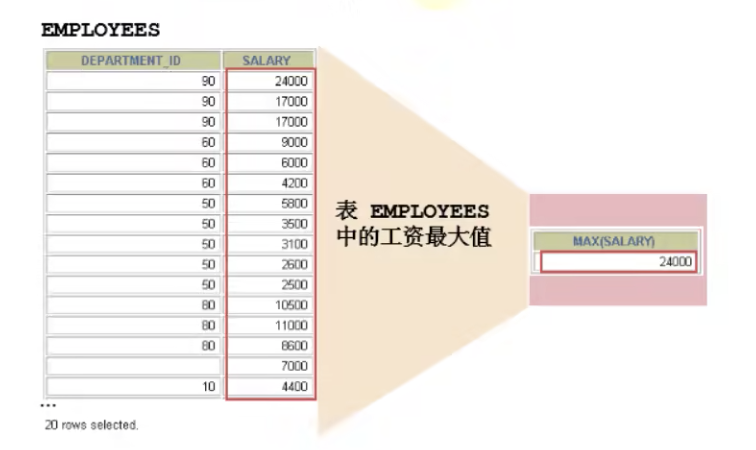

<br><br>

## 聚合函数的特点:
1. 只会返回一个值
2. 如果分组的话 每组产生一个值
```s
	A组				B组
------		------
	 ↓				 ↓
	val				val
```
3. **如果不分组就意味着将整个表看做是一组 出现一个值**  
```s
+-------+
|	整个表 |	-> 聚合函数 -> 单一值
+-------+
```
4. **聚合函数不能嵌套使用(oracle可以)**  

<br>

### 知识点
1. group by的使用
2. having的使用
3. sql底层的执行原理

<br>

### 聚合函数的理解:
AVG(字段), 比如这样使用的时候, 相当于我们将整个表的107条数据, 放入avg聚合函数中 进行求平均数的计算

将整个表当成一组

聚合函数的参数应该大部分是表中的字段吧

<br>

### 注意:
聚合函数不能嵌套使用 ``min(avg(salary))`` 这样是错的

<br><br>

## 常用的聚合函数:
- avg()
- sum()
- max()
- min()
- count()

<br>

### 注意: AVG() / SUM()
这两个函数只适用于**数值类型的字段**  

<br>

**注意:**  
**null值不会参与运算** 也就是会将不是null值的数据进行计算

<br>

### MAX() / MIN():
适用于**数值类型 字符串类型 日期时间类型**的字段(或变量)

```sql
-- 字符串有比较规则就有最大和最小
select max(last_name) from employees
```

<br>

**要点:**  
会过滤空值

<br>

### COUNT():
求该字段的总记录数

<br>

**要点:**  
会过滤空值

<br>
  
### 注意:
聚合函数是不能嵌套使用的

<br>

### **<font color="#C2185B">AVG(字段)</font>**  
该字段的平均情况

```sql
-- 查询员工表的平均工资
SELECT AVG(salary) 
FROM employees

-- 每个人的总工资加起来 / 107
```

<br>

**注意:**  
- 该函数只适合 **数值类型的字段**  
- 该函数不会报错, **mysql中的结果会是0**  

<br>

### **<font color="#C2185B">SUM(字段)</font>**  
该字段的总和

<br>

**注意:**  
- 该函数只适合 **数值类型的字段**  
- 该函数不会报错, mysql中的结果会是0

<br>

### **<font color="#C2185B">MAX(字段)</font>**  
查询该字段当中的最大的情况

<br>

**注意:**  
该函数适合 **数值 字符串 日期 字段** 或者是 变量

<br>

### **<font color="#C2185B">MIN(字段)</font>**  
查询该字段当中的最小的情况

<br>

**注意:**  
该函数适合 **数值 字符串 日期** 的字段 或者是 变量

```sql
SELECT MAX(salary) 
FROM employees

-- 名字也会有大小, 因为字符串都能排序, 比如升序 第一个最小 最后一个最大
SELECT MAX(last_name), MIN(hire_date) 
FROM employees
```

<br>

### **<font color="#C2185B">COUNT(字段)</font>**  
求指定字段在结果集中的总记录数(个数)

有多少行数据是有salary的

<br>

**使用方式:**  
1. count(*)
2. count(1): 1为常数列
3. count(employee_id)

<br>

**注意:**  
方式3的结果不一定对, 因为当该字段的值为null的时候, **会忽略该字段**  

因为聚合函数中是不对null做计算处理的, 每条记录中如果有null的话的 count是不会计算它的

<br>

**比如: 员工表有107条数据**  
- 如果 count(*) -- 107
- 如果 count(1) -- 107
- 如果 count(commission_pct)  -- 35

因为commission_pct字段中有null值 只有35条记录中commission_pct字段不为空

```sql
-- 一共有多少行出现了employee_id
SELECT COUNT(employee_id)
FROM employees


SELECT COUNT(2 * salary)
FROM employees
-- 还是107 我们查看的就是多少行数据
```

<br>

### 注意:
**聚合函数** 不会计算null的情况, 也就是说当一个字段的值是null的时候会忽略或者说略过该字段, **过滤null值**  

<br>

**avg = sum / count**  
因为它们3个都会过滤空值

<br>

### 练习:
查询公司中平均奖金率 
```sql
-- 方式1: 错误
SELECT AVG(commission_pct)
FROM employees

-- 方式2: 错误
SELECT SUM(commission_pct) / COUNT(*)
FROM employees

-- 方式3: 对
SELECT SUM(commission_pct) / COUNT(IFNULL(commission_pct,0))
FROM employees

-- 对: 或者 这样 确保没有null
SELECT AVG(IFNULL(commission_pct,0))
FROM employees
```

<br>

**方式1:**  
写法错误, 没有考虑到空值的情况, AVG是拿不是null的数据计算出结果 但是有的员工没有奖金率 可他们也应该被记入在内

<br>

**方式2:**  
求 总的奖金率 / 总记录数

<br>

**方式3:**  
求 总的奖金率 / 确保没有null的情况下 拿到总记录数

<br>

**方式4:**  
对 奖金率的空值做判断处理

<br>

### 统计表中的记录数 下面3种哪个效率高?
1. count(*) 
2. count(1)
3. count(具体字段)  -- count只会检查非空字段, 不一定对!

如果使用的都是 **MyISAM引擎**(mysql5.0之前的版本)  
上面3种写法的效率是一样的

<br>

如果使用的是 **Innodb引擎**(mysql5.7 8.0)
上面3中写法的效率是不一样的

```sql
count(*) = count(1) > count(具体字段)
```

<br><br>

# GROUP BY:
- order by: by就是通过的意思, 通过哪个字段进行排序
- group by: 通过哪个字段进行分组

<br>

上面我们使用简单的聚合函数就将整个的表看成了一组, 得到了一个数据
```sql
-- 我们这么写相当于将整个公司看做成了一组 算出的平均工资 出现了一个结果
SELECT AVG(salary)
FROM employees

-- 结果: 6461.682243
```

我们还可以将表按照不同的字段 
1. 分成一个个的小的组
2. 再使用聚合函数

<br>

### 需求:
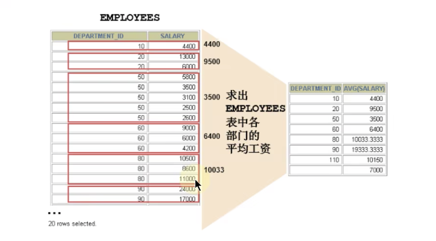

<br>

如果我们想求员工表中各个部门的平均工资, 也就是: 

- 10号部门分成一个小组, 得到一个平均工资
- 20号部门分成一个小组, 得到一个平均工资
- 30号部门分成一个小组, 得到一个平均工资

同样的部门应该看成一组 也就是我们会分成很多组

```s
								| 10
this is a group | 10		-> avg()	-> 一个值
								| 10

								| 30
this is a group | 30		-> avg()	-> 一个值
								| 30

								| 50
this is a group | 50		-> avg()	-> 一个值
								| 50
```

那现在我们要分组 那就要告诉数据库我们想要按照什么来分组, 就是通过 **group by** 来指定, 比如按照部门id来分组

```sql
SELECT department_id, AVG(salary)
FROM employees
GROUP BY department_id
```

select输出还是2个字段, 但是group by指定按照department_id来进行分组, 相当于我们把相同部门 组成一个组 和 avg() 聚合函数 配对

```
10	↘											↙	10: 3000
10	→	 组 -- avg(salary)	← 10: 4000
10	↗											↖ 10: 5000
```

分成组后 一组出现一个结果 分成几组就出现几个结果

<br><br>

## GROUP BY 使用方式:

### **<font color="#C2185B">GROUP BY 字段</font>**  
按照哪个字段来进行分组

<br>

**示例:**  
```sql
-- 按照 job_id 将相同job_id的数据分成一组, 计算该组的平均工资 
-- 这时候我们就不能在select中, 写每条记录都不同的last_name了, 因为现在我们将整个表分成了几个组, 就没有办法体现每条记录特有的字段了
select job_id, avg(salary) from employees
group by job_id
```

<br>

**注意:**  
分组意味着将指定的字段进行了合并 比如3个30号部门 那就合并成一个30号部门 展现结果一个结果

```
30	↘	
30	→	 组 -- avg(salary)
30	↗
```

这时候 已分组的字段 和 未分组的字段 就不能掺杂在一起 写在 select结构中 了

<br>

**报错:**  
我们将 job_id 指定分组, 而 employee_id 没有指定分组, 所以结果集没有办法合并 会报错

```sql
SELECT employee_id, job_id, AVG(salary)
FROM employees
GROUP BY job_id
```

<br>

### 二级分组:
### **<font color="#C2185B">GROUP BY 字段1, 字段2</font>**  
对表中多个指定的字段进行分组设置

比如, 我们将表按照 department_id 进行了一次分组, 这样同部门的会分成一个组, 这时同部门里面还有相同的 job_id, 那么我们还可以将相同的iob_id再次的进行分组


<br>

**总结:**  
一样的内容考虑下分组, 然后通过 group by 来进行指定

<br>

**需求:**  
按照部门来进行分组 如果是同一个部门的 工种一样的再进行分组, 
查询各个department_id job_id的平均工资

```sql
SELECT department_id, job_id, AVG(salary)
FROM employees
GROUP BY department_id, job_id
```

<br>

**问题:**  
下面有两种分组的方式, 问这两种分组方式的查询结果一样么?

```sql
GROUP BY department_id, job_id

GROUP BY job_id, department_id
```

<br>

**答案:**  
一样的 我们想想 团建餐厅聚会的场景, 主持人说
1. 第一种分法, 相同部门的进行分组, 然后同一个部门中同一个工种的在一起
```sql
+--------------------+
|										 |
|	 +-----+		+---+  |
|  |□ □ □|		|		|  |
|  +-----+		+---+	 |
|										 |
|	 +---+						 |
|	 |   |						 |
|	 +---+						 |
|										 |
+--------------------+
```

2. 换种分法, 先按照工种分组, 然后同部门的再进行分组
```sql
+--------------------+
|										 |
|	 +---+	  +-----+  |
|  |   |		|□ □ □|  |
|  -----		+-----+	 |
|										 |
|	 +---+						 |
|	 |   |						 |
|	 +---+						 |
|										 |
+--------------------+
```

我们能看到这两种分法的效果是一样的, 因为同一部门的并且工种一样的才会在一起, 只不过是先分和后分的区别

<br>

**问题:**  
我们可以写下面的代码么, 我们根据 department_id 进行了分组, 但是selecet的结构中 还写了 job_id
```sql
SELECT department_id, job_id, AVG(salary)
GROUP BY department_id
```

``GROUP BY department_id`` 的位置相当于告诉数据库服务器我们只按照 department_id 进行分组

这样的话我们的结果集中应该是一个部门占一条数据

```sql
10 		7000
20		13000
30		2780
```

因为我们只按照部门来分组的

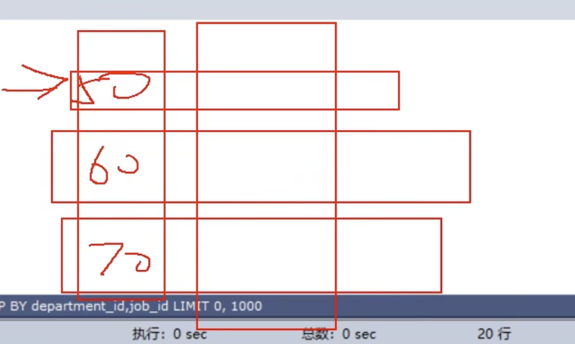

<br>

那如果我们一个部门占一行数据的话, 如果看待 job_id 不一样的问题呢? 因为 department_id 下面就有 3个不同的 job_id

```s
| - 50
	- SH_CLERK
	- ST_CLERK
	- ST_MAN
```

如果50号部门只能显示一个, 我们这3个 job_id 需要呈现谁?

<br>

**结论:**  
出现了聚合函数 和 其他字段一起的时候, 其他字段一定要在 GROUP BY 中
```sql
-- 非聚合函数的字段为: department_id 和 job_id
SELECT department_id, job_id, AVG(salary)

-- 它们一定要出现在GROUP BY中
GROUP BY department_id, job_id
```

<br>

SELECT中出现的 **非聚合函数的字段 必须声明在 GROUP BY 中**, 反之 GROUP BY 中声明的字段**可以不出现在SELECT中**  

mysql不会报错, 要注意!

<br>

### GROUP BY 声明的位置: 
group by 要声明在 **where 的后面**  

```sql
select
from
where

group by

order by -- 倒数第二
limit    -- 一定是最后
```

<br>

### 新特性: GROUP BY 中使用 WITH ROLLUP
with rollup

**格式:**  
```sql
group by 字段 with rollup
```

<br>

使用 WITH ROLLUP 关键字之后, 在结果集的最后增加了一行, 该记录计算查询出的所有记录(行)的**总和或者总平均值**, 即统计记录数量。

```sql
SELECT department_id, AVG(salary)
FROM employees
GROUP BY department_id WITH ROLLUP;

	  7000.000000
10	4400.000000
20	9500.000000
30	4150.000000
40	6500.000000
50	3475.555556
60	5760.000000
70	10000.000000
80	8955.882353
90	19333.333333
100	8600.000000
110	10150.000000

	  6461.682243   -- 将整个表当成一组 计算了下 整体一组的平均工资
```

<br>

**注意:**  
使用 **WITH ROLLUP** 的话 就不能使用 **ORDER BY** 它们**互相排斥**  

会报错

<br><br>

# HAVING的使用
having

<br>

### 作用:
对已分组的数据 进行过滤, 筛选, 和 ``group by`` 搭配使用

也就是说我们使用 group by 查询出来的一波数据, 这时我们还可以使用 having对这波数据 进行过滤

<br>

### 位置:
having声明在group by的后面

<br>

### 示例:
查询各个部门中最高工资比10000高的部门信息

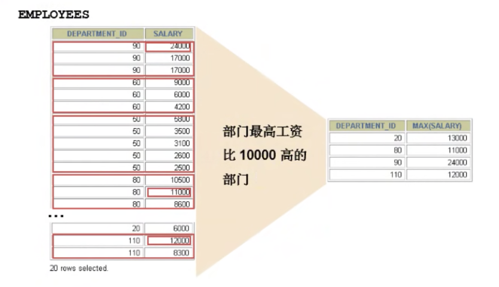

<br>

### 要点:
1. 一旦过滤条件中出现了聚合函数 这时候的过滤条件的关键字就不能使用 WHERE 而是要替换成 HAVING, 不然会报错 ``where max(salary) > 1000`` 这是错的

2. 开发中使用HAVING的前提 是sql中使用了 GROUP BY 如果没有GROUP BY 那HAVING也没有必要写了  
比如 select max(salary) 的场景, 如果没有GROUP BY相当于将整个表当成一组 从而得到 一个值, 这时我们再使用having来过滤结果集, 就有点傻 都已经是一个结果了 过滤啥, 所以只有我们使用了group by之后 产生了多条的分组记录 然后我们再使用having对其进行过滤才有意义

3. HAVING 要放在 **GROUP BY的后面**: GROUP BY - HAVING

4. 聚合函数最好加上别名, 供having中使用

5. 过滤条件, 不涉及聚合函数的条件写在 where 中, 聚合条件的过滤写在 having

<br>


```sql
select department_id, max(salary) "max_salary"
from employees
group by department_id
-- max(salary) 是每个组的最高工资, 分组数据的过滤条件
having max_salary > 10000
```

<br>

### 练习:
查询部门id为10 20 30 40这4个部门中最高工资比10000高的部门信息

1. 肯定需要对部门进行分组, 我们看看各个部门的各自的最高工资
2. 拿到上一步的结果集后 我们需要对其进行过滤 找出最高工资比10000还要高的那部分结果 
3. 然后我们对上一步的结果集再次的过滤 找到 10 20 30 40 这四个部门的信息 

```sql
-- 方式1: 所有的过滤条件都写在 having 中
SELECT department_id, MAX(salary) "H_salary"
FROM employees
GROUP BY department_id

-- 过滤条件
HAVING department_id IN (10, 20, 30, 40)
AND H_salary > 10000


-- 方式2: 一部分的过滤条件写在where中
SELECT department_id, MAX(salary) "H_salary"
FROM employees

-- WHERE里面不能写聚合函数 就把条件分开了 这个部分没有聚合函数
WHERE department_id IN (10, 20, 30, 40)
GROUP BY department_id

-- H_salary是聚合函数
HAVING H_salary > 10000
```

<br>

**注意:**   
我们推荐使用 方式2
- **非聚合函数的过滤条件放在 WHERE中**  
- **聚合函数的过滤条件放在 HAVING中**  

<br>

**书写位置:**  
FROM - WHERE - GROUP BY - HAVING

<br>

### 结论:
当过滤条件中有聚合函数的时候 则此过滤条件必须声明在 HAVING 中
 
当过滤条件中**没有聚合函数的时候** 则此**过滤条件推荐声明 在 WHERE 中**  

<br>

### WHERE 和 HAVING 的对比
1. 适用范围来讲 HAVING的适应的范围更广(可以包含聚合函数 也可以对非聚合函数进行过滤), 也就是 having 也可以当过滤条件来使用 但是不推荐

2. 如果过滤条件中没有聚合函数的时候 **WHERE的执行效率要高于HAVING**  

<br><br>

## sql底层的执行原理:
sql92 和 sql99 的 select语句的完整结构

### sql92:
```sql
select ..., ..., ...(存在聚合函数)
from ..., ...
where 多表的连接条件 and 过滤条件(不包含聚合函数的条件)
group by ..., ...
having 包含聚合函数的过滤条件
order by ..., ... (asc / desc)
limit ..., ...
```

<br>

### sql99:
哪个表的数据多 我们习惯将它放在左表的位置, 这样我们可以统一使用左外连接
```sql
select ..., ..., ...(存在聚合函数)
from ... (left / right)join ... on 多表的连接条件
         (left / right)join ... on 多表的连接条件

where 不包含聚合函数的过滤条件
group by ..., ...
having 包含聚合函数的过滤条件
order by ..., ... (asc / desc)
limit ..., ...
```

<br>

### 要点: 关键字的顺序是不能颠倒的
```sql
select ...
from ...
where ...
group by ...
having ...
order by ...
limit ...
```

<br>

### sql语句的执行顺序
```sql
from - where - group by - having - select - distinct - order by - limit
```

<br>

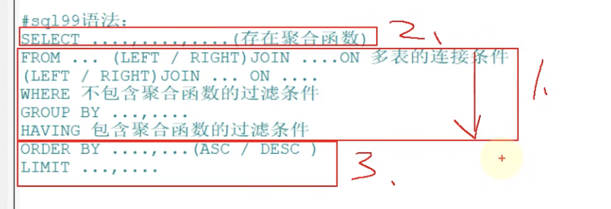

先是1的部分(1部分中的环节是顺序执行的), 然后是2和3

<br>

**sql语句的执行分为上图中的3个部分:**  
从 form 开始 然后进行where having等过滤, 过滤后考虑 select, 最后排序分页

<br>

**部分1:**  
部分1中的结构是顺序执行的

1. FROM ->  先看查哪张表 多表的话就是**交叉查询**  

2. ON ->  然后去掉不应该关联在一起的数据(解决交叉查询的问题)

3. LEFT / RIGTHT JOIN ->  然后看看是不是左外的问题

4. WHERE ->  先过滤数据

5. GROUP BY ->  然后将剩下的数据进行分组

6. HAVING ->  对聚合函数进行过滤

<br>

**部分2:**  
上面对数据进行筛选后, 我们从筛选后的数据中找需要查询的数据

1. SELECT 的字段 -> 然后决定显示哪个字段

2. DISTINCT -> 去重

<br>

**部分3:**  
最后我们对结果集 进行排序 和 分页

1. ORDER BY -> 排序
2. LIMIT 分页

<br>

### 为什么WHERE的效率要高于HAVING
比如有一张表 它有10万条数据, **WHERE一上来就会过滤数据** 比如过滤完就剩下10条数据, 剩下10条数据再进行分组就很快

**因为 where 在 group by 的前面执行**  

如果我们把过滤条件放在HAVING里面的话, 10万数据 上来就先对10万条数据进行分组, 然后对分组后的数据进行过滤

<br>

### 练习:

1. where子句可否使用组函数进行过滤?   
不可以

<br>

2. 查询公司员工工资的最大值, 最小值, 平均值, 总和 
```sql
-- 所有的员工可以看成一组
SELECT 
	MAX(salary), 
	MIN(salary), 
	AVG(salary), 
	SUM(salary)
FROM employees
```

<br>

3. 查询各job_id的员工工资的最大值, 最小值, 平均值, 总和 
```sql
-- 按照job_id进行分组
SELECT 
	job_id, 
	MAX(salary), 
	MIN(salary), 
	AVG(salary), 
	SUM(salary)
FROM employees
GROUP BY job_id
```

<br>

4. 选择具有各个job_id的员工人数
```sql
-- 按照job_id进行分组
SELECT 
	job_id, 
	count(*)
FROM employees
GROUP BY job_id
```

<br>

5. 查询员工最高工资和最低工资的差距(DIFFERENCE)
```sql
SELECT 
	MAX(salary), 
	MIN(salary), 
	MAX(salary) - MIN(salary) DIFFERENCE
FROM employees
```

<br>

6. 查询各个管理者手下员工的最低工资, 其中最低工资不能低于6000, 没有管理者的员工不计算在内 

**思路:**  
首先涉及到管理者了 我们可以按照管理者id进行分组 一样的管理者id就是同一个管理者 我们可以先看看每个管理者下的最低工资的人

```s
| - manager_id: 103
	- 6000.00
	- 4800.00
	- 4200.00
```

```sql
SELECT manager_id, MIN(salary) min_sal
FROM 
	employees e
WHERE 
	manager_id IS NOT NULL
GROUP BY 
	e.manager_id 
HAVING 
	min_sal >= 6000
```

<br>

7. 查询**所有**部门的名字, location_id, 员工数量和平均工资, 并按平均工资降序

我们看到所有两个字了 一定是外连接, 然后注意左表和右表的位置, 我们要查询的是所有部门, 意味着部门的数据多, 所以我们将部门表放在左表的位置 然后使用左连接

我们将同一个部门 又是同一个location_id的数据合并到了一起

```sql
-- 结果集:
dept_name   location_id count avg(salary)
Contracting	1700	      1	     null
```

我们发现avg的列有的是 null 说明该部门没有人, 也就是employee_id为null

那为空的员工id也算是一条记录并不合理, 因为我们使用了count(1), 这时我们就可以使用一个具体的字段 
``COUNT(e.employee_id)``, 我们查询的是员工数量


```sql
SELECT d.department_name, d.location_id, COUNT(e.employee_id), AVG(salary)
FROM departments d LEFT JOIN employees e
ON d.department_id = e.department_id
GROUP BY department_name, location_id
```

<br>

8. 查询**每个**工种, 每个部门的部门名, 工种名和最低工资

**注意:**  
既然是每个相当于所有的, 所以是外连接, 我们想将部门表中不符合连接条件的数据找出来 我们使用左外

```sql
SELECT department_name, job_id, MIN(salary)
FROM departments d left join employees e
ON d.department_id = e.department_id
GROUP BY department_name, job_id
```

<br>

**总结:**  
有每个 各个的时候可能就是分组的情况, 同时每个也是所有的 所以它也是一个外连接的问题

<br><br>

# 子查询 

## 概述:
子查询就是在一个查询结构当中 嵌套了另外一个查询 我们把这种结构称为子查询 **相当于双重for**  

```sql
| - 查询
	| - 子查询
```

<br>

SQL中子查询的出现大大增强了 SELECT 查询的能力,因为很多时候查询需要从一次的结果集中再次的获取数据

或者

需要从同一个表中**先计算得出一个数据结果**, 然后再与这个结果进行比较。

也就是说不能一次性的取到最终的值 确定的值还需要一个查询去搞定 这时候就要用到子查询

<br><br> 

## 引入子查询

### 需求: 谁的工资比 Abel 高?

**思路:**  
1. 首先要查询 Abel 的工资, 也就是先计算得到一个数据
2. 然后再跟 Abel 的工资进行比较

<br> 

**方式1: 分为两次查询**   
效率不高, 因为我们要进行两次交互, 花费的时间就会很长
```sql
-- 先查出 Abel 的工资是多少
SELECT e.employee_id, e.last_name, e.salary
FROM employees e
WHERE e.last_name = 'Abel'

-- 根据查到的11000 做为where过滤条件中的一个部分
SELECT last_name, salary
FROM employees
WHERE salary > 11000
```

<br>

**方式2: 自连接**  
我们把一张表当成两张表, 两个表的连接条件注意我们求的是比较, 所以连接条件不是等值连接

- e1表中就有一个员工叫 Abel   
- e2中我们看看哪个员工比 Abel 的工资要高  

所以连接条件为: e2.salary > e1.salary

```sql
-- 1. 先想我们要展示哪些字段
SELECT e2.last_name, e2.salary
FROM employees e1, employees e2

-- 2. 连接条件: 不是等值连接
WHERE e2.salary > e1.salary
AND e1.last_name = 'Abel'
```

<br>


**方式3: 子查询**  
这里的问题是可以使用多表查询的功能, 但是不是所有的问题都可以使用多表查询来解决 我们在一些场景中还是需要子查询的

下面的情况是我们将第一次的查询结果, 作为过滤条件中的一部分
```sql
SELECT last_name, salary
FROM employees
WHERE salary > (
	SELECT salary
	FROM employees
	WHERE last_name = 'Abel'
)
```

<br><br>

## 子查询的使用:

### 子查询的规范:
外查询(主查询) - 内查询(子查询)

<br>

### 子查询的使用场景:
我们想象下 一个表达式中的变量, 当一个表达式中的一项是一个变量的时候, 这个变量就可以想象成 子查询

这个变量需要使用一次的查询结果来赋值

```sql
SELECT last_name, salary
FROM employees
WHERE salary > 11000

-- 上述的11000是写死的, 它应该是动态获取的: 子查询
SELECT last_name, salary
FROM employees

-- 11000 -> 替换成子查询
WHERE salary > (
	SELECT salary
	FROM employees
	WHERE last_name = 'Abel'
)
```

<br>

### 子查询的特点:
1. 子查询在主查询之前一次执行完成。对于整个sql语句来说**子查询会先计算出结果**  

2. 子查询的结果 被 主查询使用。

<br>

### 子查询的要点:
1. 子查询要包含在 **括号内**  
2. 将子查询放在比较条件的 **右侧**, 写在左侧也可以, 但是右侧可读性比较强
3. 单行操作符对应单行子查询, 多行操作符对应多行子查询, 跟前面我们说了 单行函数 和 多行函数 比较相似 

<br><br>

## 子查询的分类: 
我们可以从不同的角度 为子查询来进行分类

<br>

### 角度1: 单行子查询 & 多行子查询
是单行还是多行, 我们都是 **根据子查询的结果** 来看的, 看是子查询中返回的是一条记录 还是多条记录

<br>

**单行子查询:**  
子查询计算出来的结果集为1条, 将1条结果供外层主查询使用

<br>

**多行子查询:**  
子查询计算出来的结果集为多条, 将多条结果供外层主查询使用

<br>

### 角度2: 相关子查询 & 不相关子查询
内查询是否被执行多次来分类

- 不相关子查询: 外查询 和 内查询 之间没有相关性, 也就是**内查询返回的结果相当于一个常量** 比如下面的代码, 外层查询会拿出表中的每一行记录 跟 11000 比较
```sql
SELECT last_name, salary
FROM employees

WHERE salary > (
	SELECT salary
	FROM employees
	WHERE last_name = 'Abel'
)
```

- 相关子查询: 相当于子查询中使用了主查询中的字段(变量), 子查询中依赖主查询中的字段(因为字段类似js循环中的index)

<br>

### 相关子查询:
相关子查询（Correlated Subquery）是指在一个查询的子查询中，**包含了对主查询中的表的引用**。

这种子查询的特点是，**子查询中的执行依赖于主查询的每一行**，因此，主查询中的值会被传递到子查询中作为限定条件

<br>

**理解相关子查询的需求:**  
查询工资 大于 本部门平均的员工信息

<br>

**分析:**  
我们要查询的是 员工 和 员工的工资, 过滤条件是, 工资 > 本部门的平均工资

```sql
select 员工, 工资
from employees
where salary > (
	该员工 所在部门的平均工资
)
```

<br>

我们表中有107条数据:  
第一条: 张三, 我们拿着张三的工资 和 **他自己** 所在部门的平均工资进行比较

第二条: 李四, 然后拿着李四的工资 和 **他自己** 所在部门的平均工资进行比较

我们发现, 外层的每一条数据 和 **子查询每次返回不一样的结果** 进行比较时 这就是相关子查询

<br>

**举例总结:**  
- 相关子查询: 查询工资大于本部门平均工资的员工信息(每个部门的平均工资都不一样, 也就是说子查询的结果每次都不一样)

- 不相关子查询: 查询工资大于本公司平均工资的员工信息(本公司的平均工资肯定是一个值, 也就是说子查询的结果是一个常量)

<br>

**总结:**  
- 相关子查询: 子查询的结果每次 **都不一样**  
- 不相关子查询: 子查询的结果每次 **都一样**  

<br><br>

## 单行子查询详解:
单行子查询也就是 **内查询返回的只是一条记录** 供外部去使用

<br>

### 单行比较操作符:
就是一些比较的运算符

<br>

|操作符|含义|
|:--|:--|
|=|等于|
|<>|不等于, **注意不是!=**, 20230930验证可以使用 !=|
|>|大于|
|>=|大于等于|
|<|小于|
|<=|小于等于|

<br>

### 单行操作符的位置:
子查询的前面的连接符号

```sql
where 字段 单行操作符 (
	子查询...
)

-- 示例:
where salary > (
	子查询
)
```

<br>

### 子查询的编写技巧 (编写步骤)
怎么写子查询呢？

**思路1:** 
从里往外写, 先写子查询 然后写外层查询

1. 先写子查询, 会得到一个确定的值
2. 改写需求, 将需求的条件中不确定的部分 换上步骤1提供的常量

<br>

**思路2:**  
从外往里写, 先写完成查询 然后写子查询

<br>

**总结:**  
如果子查询相对简单 建议从外往里写 一旦子查询结构复杂 则建议从里往外写

如果是相关子查询的话 通常都是从里往外写

<br>

### 不相关子查询示例1:
查询工资大于149号员工工资的员工信息

<br>

**从里往外写:**  
1. 我们不知道 149号员工的工资 那就先查下他的工资
我们能查到一个数值

2. 然后需求改成 查询工资大于 10500 的员工信息

```sql
-- 先里
SELECT salary 
FROM employees
WHERE employee_id = 149   -- 10500

-- 后外
SELECT employee_id, last_name, salary
FROM employees
WHERE salary > 10500

-- 结合
-- 将10500替换成 内查询的逻辑
SELECT employee_id, last_name, salary
FROM employees
WHERE salary > (
	SELECT salary 
	FROM employees
	WHERE employee_id = 149
)
```

<br>

### 不相关子查询示例2:
返回job_id与141员工相同 salary比143号员工多的员工姓名 job_id 和 工资

**从里往外写:**  
1. 我们依次先将不确定的部分求出来
- 查询141员工的job_id
- 查询143员工的salary

2. 改写需求, 将需求中不确定的部分 改成和步骤1提供的常量进行比较

```sql
-- 求出 141员工的 job_id
select job_id from employees
where employee_id = 141		-- ST_CLERK

-- 求出 143员工的工资
select salary from employees
where employee_id = 143		-- 2600.00

-- 写具体的sql
select job_id, salary
from employees
where 
	-- 每个字段都可以对应一个子查询
	job_id = (
		select job_id from employees
		where employee_id = 141
	)
	
	and 
	
	salary > (
		select salary from employees
		where employee_id = 143
	);
```

<br>

### 不相关子查询示例3:
返回公司工资最少的员工的 last_name job_id salary

**从里往外写:**  
1. 先找出公司工资最少的员工
2. 改写需求, 找到工资是2100的员工信息

```sql
SELECT last_name, job_id, salary
FROM employees
WHERE salary = (
	SELECT MIN(salary)
	FROM employees
)
```

查询结果可能是多个, 因为2100的员工可能是多个, 但是它还是一个单行子查询, 因为子查询中返回的就是一条记录 min聚合函数的原因

<br>

### 不相关子查询示例3:  
查询与141号员工的manager_id 和 department_id相同的其他员工的 employee_id manager_id department_id

**从外往里写:**  
因为需求太长了, 我们先进行断句

1. 外层要查询的是
	- employee_id
	- manager_id
	- department_id

2. 条件:  
与 141员工的 manager_id 和 department_id 相同

<br>

**解析如何断句:**  
查询**与141号员工的manager_id 和 department_id相同的其他**员工的 employee_id manager_id department_id

红色文字是定语部分, 如果我们把定语部分去掉, 则变成了

**查询员工的 employee_id manager_id department_id**

定语部分就是 过滤条件

<br>

**先写外层:**  
```sql
SELECT employee_id, manager_id, department_id
FROM employees
WHERE 
	manager_id = ()
	AND 
	department_id = ()
```

<br>

**再填入里层(写子查询)**  
```sql
SELECT employee_id, manager_id, department_id
FROM employees
WHERE 
	manager_id = (
		SELECT manager_id
		FROM employees
		WHERE employee_id = 141
	)

	AND 
	
	department_id = (
		SELECT department_id
		FROM employees
		WHERE employee_id = 141
	)

	-- 还要另加一个条件 把141这个人的信息抠出去, 因为自需求是141之外的其它员工 != 也可以
	AND employee_id <> 141;
```

<br>

### 扩展: sql中的解构
**方式2:**  
上面的方法中的 where 是这么写的, employee_id = 141 都是 141, 这种情况下 我们可以让它一次性的将 manager_id 和 department_id 都查出来

```sql
WHERE 
	manager_id = (
		SELECT manager_id
		FROM employees
		WHERE employee_id = 141
	)

	AND 
	
	department_id = (
		SELECT department_id
		FROM employees
		WHERE employee_id = 141
	)
```

<br>

**成对查询:**  
类似解构, let {a, b} = obj

子查询中会查询出来两个结果, 我们主查询的 where 处利用(manager_id, department_id), 将子查询出来的多个字段结果 赋值给括号中的两个值

处理 括号里 和 select 结构部分书写的顺序要保持一致

```sql
where (manager_id, department_id) = (
						↖								↖
	select manager_id, department_id
)
```

<br>

**代码部分:**  
```sql
SELECT employee_id, manager_id, department_id
FROM employees

-- 这里
WHERE (manager_id, department_id) = (
	SELECT manager_id, department_id
	FROM employees
	WHERE employee_id = 141
)

AND employee_id <> 141;
```

<br><br>

## HAVING中的子查询:
上面我们接触到的都是将 子查询写在了 where 里面, 其实子查询还可以写在having中

<br>

### 特点:
首先执行子查询拿到子查询中的结果, 供外层使用

<br>

### 不相关子查询举例: 
查询最低工资大于50号部门最低工资的部门id和其最低工资

<br>

**从外往里写:**  
查询**最低工资大于50号部门最低工资的**部门id和其最低工资

去掉红色部分也就是定语部分(过滤条件)

<br>

**变成:**  
查询部门id和其最低工资
```sql
-- 同时出现了普通字段和聚合函数 所以要使用group by
SELECT department_id, MIN(salary)
FROM employees
GROUP BY department_id
```

<br>

**子查询部分:**  
最低工资要大于50号部门的最低工资
```sql
SELECT department_id, MIN(salary)
FROM employees
-- 有一个哥们没有部门 它的部门为null 我们要过滤下
WHERE department_id IS NOT NULL
GROUP BY department_id

-- 最低工资 和 50号部门的最低工资 对比 作为条件
HAVING MIN(salary) > (
	SELECT MIN(salary)
	FROM employees
	WHERE department_id = 50
)
```

<br><br>

## CASE中的子查询
子查询的结构还可以在 case 语句中

<br>

### 不相关子查询举例: 
显示员工的 employee_id last_name location  
其中   
	若 员工 department_id 和 location_id为1800的department_id相同    
	则 location为 Canada 其余为USA  

<br>

**分析:**  
location是一个字段 但是这个字段显示什么内容 需要根据 case语句来确定

<br>

**基本结构**  
动态的部分是展示在结果集中的数据
```sql
SELECT employee_id, last_name, (这里是动态的) "location"
FROM employees
```

<br>

**case语句的条件为:**   
若员工 department_id 和 *location_id为1800的department_id相同*, 我们需要先查询到 红色的部分

```sql
SELECT department_id
FROM departments
WHERE location_id = 1800  -- 20
```

<br>

**改写需求:**
若员工 department_id 为 **20** 则location为Canada 其余为USA

```sql
SELECT employee_id, last_name, (
	CASE department_id 
		WHEN 20 THEN 'Canada' 
		ELSE 'USA' 
	END) "location"
FROM employees

SELECT department_id
FROM departments
WHERE location_id = 1800
```

<br>

接下来 我们把 WHEN 20 的部门替换成子查询
```sql
SELECT employee_id, last_name, (
	CASE department_id 
		WHEN (
			SELECT department_id
			FROM departments
			WHERE location_id = 1800
		) THEN 'Canada' 
		ELSE 'USA' 
	END
) "location"
FROM employees;
```

**简单来讲 凡是有不确定的地方我们都可以使用子查询**  

<br><br>

## 子查询的空值问题:
如果子查询查到的是空的 不会报错 只不过查完后**结果集没有结果一片空白**

```sql
SELECT last_name, job_id
FROM employees

-- 子查询的结果为null, job_id就是null
WHERE job_id = (
  SELECT job_id
  FROM employees
  WHERE last_name = 'Haas'
);
```

在外查询拿到子查询的结果(null)进行过滤后, 返回的都是0, 也就是查询不到数据

<br><br>

## 非法使用子查询:
当子查询查询到的结果是**多行**的情况下 外层操作符要使用**多行操作符**  

```sql
SELECT employee_id, last_name
FROM   employees

-- 子查询时查询各个部门的最低工资 我们查到的应该是多行数据, 子查询的结果是多行的 我们这里用的是 = 
-- = 是单行操作符 相当于我们要具体等于一个数 但是我们查出了多行数据
WHERE  salary = (
  SELECT MIN(salary)
  FROM employees
  GROUP BY department_id
);
  
```

<br><br>

## 多行子查询详解:
子查询中返回了多行记录, 供外部使用

<br>

**注意:**  
当子查询返回多行的记录时 对应我们的操作符也要选择 **多行操作符**  

上面我们有一个例题子查询返回的是多条数据, 那我们在 子查询前面使用的 =单行操作符就不合适了, 比如我们要是 = 是等于 700 800 还是 900

<br>

### 多行子查询的特点:
- 子查询返回多行数据
- 使用多行比较操作符

<br>

### 多行比较操作符
基本上有3个
- in
- any
- all

<br>

|操作符|含义|
|:--|:--|
|in|等于 列表中的任意一个|
|any|需要和单行比较操作符一起实用, 和子查询返回的 **某一个值** 进行比较|
|all|需要和单行比较操作符一起实用, 和子查询返回的 **所有值** 进行比较|
|some|实际上是any的别名, 作用相同 一般常用any|

<br>

### **<font color="#C2185B">IN</font>**  
等于列表中的 **任意一个**  

IN和我们接触的 IN运算符差不多, **在列表中的结果都要**

- IN运算符: department_id in (10, 20, 30)
- IN多行操作符: department_id in (子查询), 子查询中是多行记录类似集合

<br>

**扩展:**  
1. 当子查询返回的只有一条结果时 我们也可以使用 IN
2. ``IN`` 还可以改写成 ``= ANY``

<br>

### **<font color="#C2185B">ANY</font>**  
**需要和单行比较操作符一起使用**  

在子查询的返回的结果集中, 只要比最大的那个记录小的所有记录都要
```sql
主查询
salary < any ( 子查询的多行结果集 )


-- 子查询中返回的结果集
9000  -- <- 最大
6000
4800
4800
4200
```

它是和子查询返回的结果中的 **某一个值(任一一个值)** 进行比较

<br>

**理解技巧:**  
相当于找最大, 只要比最大的小 那么这些记录都要

<br>

### **<font color="#C2185B">ALL</font>**  
**需要和单行比较操作符一起使用**  

在子查询的返回的结果集中, 只要比最小的那个记录 还要小的所有记录都要

它是和子查询返回的结果中的 **所有值** 进行比较

```sql
-- 子查询中返回的结果集
9000  
6000
4800
4800
4200	-- <- 最小 比它还要小的记录都要
```

<br>

**理解技巧:**  
相当于找最小, 只要比最小的还要小 那么这些记录都要

比如 比任意一个都低, ``salary < all (子查询)``

<br>

### **<font color="#C2185B">SOME</font>**  
实际上是ANY的别名 作用相同, 一般使用ANY

<br>

### ANY 和 ALL 的理解:
比如现在有5个女生来追我 有贤惠的 有有学识的 5种类型

ANY: 不挑谁都行 **只选一个**
ALL: 所有都要

<br>

### 举例: IN
下面的子查询中会返回多条记录, 因为我们根据 department_id 进行了分组, 那子查询中就会返回 员工表根据部门进行分组的结果, 是多行记录

相同department_id为一组(每个部门就是一组), 每组有一个 min(salary)

既然子查询返回的是多条记录, 我们主查询中就要使用 **多行比较操作符**  

<br>

下面我们使用 ``IN多行操作符`` 表示 只要员工的工资在子查询返回的集合中的数据 **都要**

相当于我们查出来了 各个部门的最低工资, 我们看看哪些员工的工资为这些最低工资
 
```sql
SELECT employee_id, last_name
FROM employees

WHERE salary IN (

  -- 子查询返回的是多行记录
  SELECT MIN(salary)
  FROM employees
  GROUP BY department_id
)

-- 子查询中 查询到了 按部门分组的最低工资, 主查询中看看 哪些员工的工资恰好等于 list(子查询) 中的工资
```

<br>

### 举例: ANY & ALL
返回 其它job_id 中 比job_id为'IT_PROG'部门 **任一** 工资低的员工的员工号 姓名 job_id salary


<br>

**断句 找定:**  
返回**其它job_id中比job_id为'IT_PROG'部门任一工资低的员工**的employee_id last_name job_id salary

```sql
SELECT employee_id, last_name, job_id, salary
FROM employees
```

<br>

**分析定语部分:**  
其它job_id中 比 job_id为'IT_PROG'部门, 也就是除IT_PROG部门的其他部门


```sql
SELECT employee_id, last_name
FROM employees
-- 把'IT_PROG'部门去掉后的结果
WHERE job_id <> 'IT_PROG'
```

<br>

job_id为'IT_PROG'部门的任一工资低的员工, 我们要取出这个工种的员工工资 

```sql
SELECT salary
FROM employees
WHERE job_id = 'IT_PROG'

-- 结果集:
salary
9000
6000
4800
4800
4200
```

<br>

我们要找比上述结果集中的 任一工资 低的记录, 言外之意就是随便取出来一个就可以
- 比 9000 低 可以
- 比 4200 低 可以


<br>

**完整代码:**  
- 先找到了 部门不是 IT_PROG 的 所有部门
- 然后子查询中返回了 IT_PROG 部门 的工资情况
- 最后 子查询相当于返回了一个 范围, 我们用外层的字段 去比较内层提供的这个范围, 我们找的是 任一一个 都低的工资
	- 比如 外层的员工工资为 3500 可以查出来
	- 比如 外层的员工工资为 8000 可以查出来

言外之意就是 只要工资低于9000就可以
```sql
salary
9000	-- 低于这个就可以
6000
4800
4800
4200
```

```sql
SELECT employee_id, last_name, salary
FROM employees
WHERE job_id <> 'IT_PROG'

-- 首先这里使用了 < 然后看需求是任一 所以选择 ANY
AND salary < ANY (
	SELECT salary
	FROM employees
	WHERE job_id = 'IT_PROG'
)
```

<br>

**需求:**  
返回其它job_id中比job_id为'IT_PROG'部门**所有**工资低的员工的员工号 姓名 job_id salary

还是上面的需求 我们只是将 任意 -> 所有

```sql
SELECT employee_id, last_name, salary
FROM employees
WHERE job_id <> 'IT_PROG'

-- 首先这里使用了 < 然后看需求是所有 所以选择 ALL
AND salary < ALL (
	SELECT salary
	FROM employees
	WHERE job_id = 'IT_PROG'
)
```

**子查询的结果:**  
```sql
salary
9000
6000
4800
4800
4200
```

既然是 小于所有, 那么既然小于9000, 也要小于4200, 言外之意我们的查询结果都必须 小于4200, 就不会有4200以上的

<br>

### 总结:
- any: **小于**结果集中的任意一个, **更关注上限**, 相当于我们找最大, 比最大的小的结果我们都要


- all: **小于**结果集中的所有记录, **更关注下限**, 相当于我们找最小, 比最小的还要小的结果我们都要
- all: 大于结果集中的所有记录, 关注上限, 大于最大的

```s
1. 小于等于所有就是最小的
2. 大于等于所有就是最大的
```

<br><br>

## FROM 当中的子查询
from后面接的是表, 我们的子查询返回的结果集, 也可以做为一张表, 也就是我们的子查询可以放在from的结构中

<br>

### 要点:
1. 我们**将 子查询的结果 当做一个表的时候 需要给这张表起一个别名**
2. 聚合函数的字段也要起别名

<br>

### 需求:
查询平均工资最低的部门id

**分析:**  
1. 我们先查看下 各个部门的平均工资的情况 使用group by department_id

2. 然后我们将上一步返回的结果集作为一张表, 查询出最低的平均工资

3. 最低的平均工资有了, 我们开始正式查询 各个部门中 平均工资为最低那个 所在的部门

<br>

### 方式1:
我们可以把聚合函数查询出来的结果 当做一个表
```sql
-- 结果集的表中有一个 别名字段
SELECT MIN(avg_sal)

FROM (
	-- 各个部门的平均工资的结果集作为一张表
	SELECT AVG(salary) avg_sal
	FROM employees
	GROUP BY department_id
) t_dept_avg_sal
```

我们将上面得到的最低工资作为过滤条件

<br>

**完整的写法:** 
```sql
-- 1. 查看各个部门的平均薪资的情况
	-- 要点: 我们给查询出来的结果集对应的字段起个名字, 就像表有字段名一样
select avg(salary) "avg_salary" from employees
group by department_id


-- 2. 将 1 中的结果集当做是一张表, 表中的字段就是 avg_salary 我们找到该字段中最小的那个薪资
	-- 要点: 既然作为表 表要有别名
select min(avg_salary)
from (
	select avg(salary) "avg_salary" from employees
	where department_id is not null
	group by department_id
) as t_avg_salary

-- 3. 我们查询下最低工资为我们步骤2中查询出来的结果的部门 
select department_id from employees
-- 按照 部门 来进行分组, 
group by department_id
-- 找最低的部门, 根据having来过滤出
having avg(salary) = (
	select min(avg_salary)
	from (
	  select avg(salary) "avg_salary" from employees
		where department_id is not null
		group by department_id
	) t_dept_avg_sal
)
```

<br>

### 方式2: 多行子查询
我们可以查询出各个部门的平均薪资的情况, 我们利用多行子查询的 all 去找下限不就是最低的那个平均薪资么

```sql
SELECT department_id
FROM employees
GROUP BY department_id

-- 子查询中返回了多行记录 需要使用多行比较操作符, 我们要找多行记录中最小的, 相当于找下限 可以使用 <= all
-- -- 平均工资要等于下限 <= all
HAVING AVG(salary) <= ALL (
	-- 返回的是各个部门的平均工资
	SELECT AVG(salary) avg_sal
	FROM employees
	GROUP BY department_id
)


/*		
  AVG(salary)就是子查询返回的结果集合中的一员
						↓
	HAVING AVG(salary) <= ALL
*/
```

<br><br>

## 多行子查询的空值问题:
我们想查出来不是管理者的员工数 但是下面没有查出任何的信息

因为 **子查询的结果集中里面有null值**
```sql
SELECT last_name
FROM employees

-- employee_id 是 manager_id 就是找管理者, 如果加了 not 就是找不是管理者的员工
WHERE employee_id NOT IN (
	-- 子查询查出来的的是 manager_id
  SELECT manager_id
  FROM employees

  -- 可以使用 WHERE 过滤空值
	where manager_id is not null
);
```

<br><br>

# 相关子查询
如果子查询的执行依赖于外部查询, 通常情况下都是因为子查询中的表用到了外部的表, 并进行了条件关联, 因此**每执行一次外部查询, 子查询都要重新计算一次**, 这样的子查询就称之为 关联子查询。

外层表的每一条数据会跟子查询返回的结果做比较, 但是子查询每次返回的结果都不一样 这种情况下就是关联子查询

**子查询中使用到了主查询中的列**

<br>

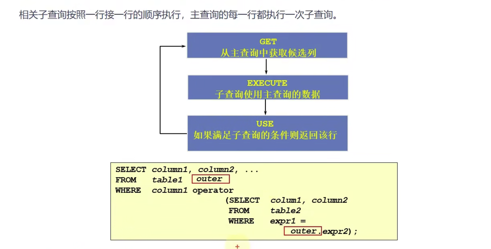

<br><br>

### 回顾: 不相关子查询
我们看看谁的工资比Abel的高
```sql
select last_name, salary
from employees
where salary > (
	select salary
	from employees
	where last_name = 'Abel'		-- 11000
)
```

外层查询中一共有 107 条记录 我们会一条一条的取数据, 外层查询中的每一条记录 都跟 Abel 的工资(11000)比, 相当于每一条记录都再跟 11000 比

<br>

### 不相关子查询的执行步骤:
1. 先执行内查询 得到子查询的结果
2. 外层查询遍历表中的一条条记录, 每一条记录取出salary看看是不是和 11000 满足某种关系, 看结果是1还是0, 1的数据会被保留

<br>

### 相关子查询的特点:
相关子查询 和 上面回顾中的 不相关子查询 不太一样了

**相关子查询的示例**  
```sql
select col1, col2
from table1 outer
where col1 operator (

  select col1, col2
  from table2

  -- 内查询中用到了外部的表outer
  where expr1 = outer.expr2
)
```

我们发现 子查询中使用了 外部的表, 那就相当于**外部表会将数据送到子查询中**

<br>

### 理解:
**也就是我们将外部表中的字段(变量) 送到子查询中**

<br>

### 相关子查询的执行过程:
1. 首先会**取外层查询中的一条记录**, 将查询到的这条**记录(记录中的某个字段)送到子查询**中, 供子查询使用

2. 子查询使用外层查询提供的数据, 子查询将使用数据后查询到的结果返回供外层查询使用

3. **拿着步骤1中送进去的记录** 和 **子查询中该次返回的记录** 做比较 看看是否满足条件 满足结果就是1 我们会保留1的数据

```sql
			GET
从主查询中获取候选列
			 ↓
		EXECUTE
子查询使用主查询的数据
			 ↓
			USE
如果满足子查询的条件则返回该行
```

相关子查询的外层查询会一行接一行的顺序执行, **主查询的每一行都执行一次子查询。**  

相当于双重for循环, 外层跑一次, 里面跑一圈

<br>

### 相关子查询 示例:
查询**员工中工资大于本部门平均工资的员工的**last_name,salary和其department_id

<br>

**分析:**  
外层查询是查询员工表共107条数据, 子查询需要查询 该员工所在部门的平均工资

比如第一个是张三, 
1. 我们应该把张三取出来然后送入子查询中
2. 然后子查询中获取张三所在部门的平均工资
3. 我们看看张三工资和子查询中获取到张三所在部门的平均工资的比较是否满足条件

<br>

**1.**  
```sql
SELECT last_name, salary, department_id
FROM employees e
WHERE salary > (

)
```

<br>

**2.**  
我要是如下的写法是 看看工资大于 50部门的平均工资

50的部分应该是一个变量, 它应该是张三的部门id, 也就是 e1.department_id

**第一条记录是张三的信息, 那么e1相当于张三的信息**  

我们将 e1.department_id 送到子查询中

```sql
SELECT last_name, salary, department_id
FROM employees e1
WHERE salary > (
	SELECT AVG(salary)
	FROM employees e2
	WHERE department_id = 50
)
```

<br>

```sql
SELECT last_name, salary, department_id
FROM employees e1
WHERE salary > (
	SELECT AVG(salary)
	FROM employees e2
	-- 相当于我们将张三的 department_id 送了进来
	WHERE department_id = e1.department_id
)


-- 理解:
张三: {
	department_id: 50
}
```

<br>

### 相关子查询的要点:
上面这样写 首先我们观察 **子查询中用到了外层的表(外层表中的字段)**, <font color="#C2185B">首先这就构成了相关性的概念</font>

<br>

**<font color="#C2185B">要点:</font>**  
1. 外查询 和 内查询 查询的同一张表的时候, **外层和内层分别对这张表起了别名**

2. 往子查询中送数据的时候, 也是通过 e1.字段 将数据送到子查询中的 

**<font color="#C2185B">此时的 e1.字段 就相当于 张三对象中过的一个属性</font>**  

<br>

### 方式2: 在from中声明子查询(多表查询)
在from中写相当于把查询结果作为一张表 

```sql
员工表		        各个部门平均工资的表
.....			department_id  avg(slary)
-----
-----
-----
```

我们现在有员工表107表记录  

如果我们还有了一个表 表中的字段是各个部门和各个部门的平均工资

那我就可以从员工表中取一条记录 根据连接条件 拿到另一张表中对应的 department_id 的 平均公司 然后比较下 **进行多表查询**  

另一张表中的 department_id 字段 用作于多表查询中的连接条件, 相当于组成了一个 主外键 的格式

```sql
-- 将这个查询的结果集 当做是一个表
SELECT department_id, AVG(salary)
FROM employees
WHERE department_id IS NOT NULL
GROUP BY department_id
```

```sql
SELECT e.last_name, e.salary, e.department_id
-- 多表查询
FROM employees e, (
	SELECT department_id, AVG(salary) avg_sal
	FROM employees
	WHERE department_id IS NOT NULL
	GROUP BY department_id
) t_dept_avg_sal
-- 多表的连接条件
WHERE e.department_id = t_dept_avg_sal.department_id
-- 需求的过滤条件
AND e.salary > t_dept_avg_sal.avg_sal
```

<br><br>

## 在 order by 中使用子查询

### 需求:
查询员工的id, salary, 按照 department_name 排序

<br>

**分析:**  
department_name 在部门表中, 我们可以 一个员工对象的 部门id 传入子查询中, 让子查询返回 该员工的 department_name

供外部表的 order by 使用

**怎么将外部的一个员工的某个字段送到子查询中?**  
1. 外部表起别名, 子查询中的表起别名
2. 在子查询中使用 外部表别名.字段 的方式 使用外部表中的数据

```sql
SELECT employee_id, salary
FROM employees e

-- department_name不在员工表里面 就意味着我们要结合员工表去找每一个员工在部门表里面的department_name
-- 将 外层 该行员工对象中的 department_id 传入到子查询中
ORDER BY (
	-- 根据 外部传递过来的 department_id 查询该员工所在的 department_name
	SELECT department_name
	FROM departments d
	WHERE e.department_id = d.department_id
) ASC;
```

<br><br>

## 哪些位置可以写子查询?

### 表中结构:
```sql
select
from ... join ... on ...
where 
group by
having
order by
limit
```

上面的任何结构中 **除了下面的两种结构外**, 其他位置都可以声明子查询  
- group by
- limit

<br>

### 练习:
若employees表中employee_id 与 job_history表中employee_id 相同的数目不小于2, 输出这些相同id的员工的employee_id,last_name和其job_id

<br>

工作历史表中有如下的字段, 共10条记录:
```sql
employee_id, start_date, end_date, job_id, department_id
```

该表的作用是 员工每次调岗的记录 会在这张表中体现, 我们要找的是该员工调岗2次以上的话 输出该员工的信息

employee_id 在该表中出现几次 代表该员工调了几次岗

<br>

**解析:**  
其实很简单, 我们就是拿着 employee_id 去 job_history 当中查询, 看看结果集中有几条记录

```sql
select * from job_history;

select e.employee_id, e.last_name, e.job_id 
from employees e
where 2 <= (
	select count(1)
	from job_history j 
	where j.employee_id = e.employee_id
)
```

<br><br>

## 相关子查询: EXISTS 与 NOT EXISTS关键字
(EXISTS: 存在) 
它是 **相关子查询** 的操作符 在单行多行操作符的位置使用

使用  **EXISTS操作符**, 外层送到内层的数据, 只要是满足子查询的条件 该行记录就会被保留。

```sql
select * from employees e1
where exists (
	select * from employees e2
	-- 条件
	where e1.字段 = e2.字段
)
```

<br>

**如果在子查询中不存在满足条件的行:**  
条件返回 FALSE, 继续在子查询中查找, 相当于返回0, 不要该记录

<br>

**如果在子查询中存在满足条件的行:**  
条件返回 TRUE, 停止查找(不在子查询中继续查找), **一旦找到就停止查找了**, 相当于返回1, 要该记录

<br>

### 使用方式:
它写在单行多行操作符的位置, 属于子查询的操作符

<br>

### **<font color="#C2185B">WHERE EXISTS (子查询)</font>**  
注意 where 后面没有接字段 直接接的 exists 关键字

外层送到子查询中的记录 如果在内层找到了后 会返回true 会停止查询, 该行数据被输出到结果集, 进行下一轮循环操作

也就是根据外层的数据, 在子查询的结果集中找第一次匹配成功的数据, **相当于 子查询结果集.find() 只找第一个** 后面的就不管了 进行下一次的循环

<br>

**注意:**  
子查询中不关注 查找的是什么字段, exists 只返回条件为true的整个对象
```sql
where exists (
	-- select * 并没有指定具体的字段
	select * from employees e2
)
```

<br>

### exists 技巧:
使用是 多行子查询中我们使用 IN 操作符 的情况下 都可以改写成 exists

**我们将外层表中的一行记录(对象), 送到内层查询中, 看看内层查询中有没有字段 等于 我们对象中的字段的**

<br>

### NOT EXISTS 作用:
表示如果不存在某种条件, 则返回TRUE, 否则返回FALSE。

和 exists 相反

<br>

### NOT EXISTS 技巧:
使用是 多行子查询中我们使用 NOT IN 操作符 的情况下 都可以改写成 not exists 

<br>

### 需求:
查询公司管理者的employee_id, last_name, job_id, department_id 信息

<br>

**方式1:自连接**  
我们将一张表当做是两张表来处理, 利用连接条件找到 管理者
```sql
-- 考虑下去重的问题 DISTINCT 下
SELECT DISTINCT mgr.employee_id, mgr.last_name, mgr.job_id, mgr.department_id
FROM employees emp JOIN employees mgr
ON emp.manager_id = mgr.employee_id
```

<br>

**方式2: 子查询**  
1. 子查询中先将公司的管理者查找到
2. 然后我们看看每一个员工的 employee_id 在不在 管理者结果集中 在他就是管理者

```sql
SELECT DISTINCT manager_id
FROM employees

SELECT employee_id, last_name, job_id, department_id
FROM employees e
WHERE e.employee_id IN (
	SELECT DISTINCT manager_id
  FROM employees
) 
```

<br>

**方式3: EXISTS**  
相关子查询我们将外层表中的数据 送到 子查询中 供子查询中使用
```sql
SELECT employee_id, last_name, job_id, department_id
FROM employees e1

-- 我们在外层找每一个员工的employee_id 然后把它送进内层 e1.employee_id
WHERE EXISTS (
	-- 这里写的 * 因为 exists不关注哪些字段 他只是找第一个返回true的那条记录
	SELECT * FROM employees e2
	WHERE e1.employee_id = e2.manager_id
)
```

<br>

### not exists 关键字的示例:
查询departments表中, 不存在于employees表中的部门的department_id和department_name

**方式1: 右外连接, 去掉内连接部分**  
类似让我们求 □□■ 这种情况
```sql
SELECT d.department_id, d.department_name
FROM employees e RIGHT JOIN departments d
ON e.department_id = d.department_id
WHERE e.department_id IS NULL
```

<br>

**方式2: not exists**  
```sql
SELECT d.department_id, d.department_name
FROM departments d
WHERE NOT EXISTS (
	SELECT * 
	FROM employees e
	-- 外层查询将 d.department_id 送进来了, 能找到记录则返回true
	WHERE d.department_id = e.department_id
)
```

<br><br>

## 相关子查询的应用:
相关子查询不仅仅只能应用在查询结构中, 还可以用在如下的结构中
- 更新结构
- 删除结构

<br>

### 更新结构中:

**需求:**  
在 employees中增加一个department_name字段 数据为员工对应的部门名称

<br>

**分析:**  
我们利用相关子查询 将目标数据 填写到新字段中

```sql
alter table employees
add(department_name varchar2(13))

update employees e
set department_name = (
	select department_name
	from departments d
	where e.department_id = d.department_id
)
```

<br>

### 删除结构中:
**需求:**  
删除表 employees 中 其与 emp_history 表皆有的数据

```sql
delete from employees e
where employee_id in (
	select employee_id
	from emp_history
	where employee_id = e.employee_id
)
```

<br><br>

## 扩展: 子查询 和 自连接 哪个方式好？

### 解答: 自连接的方式好
一般情况建议我们使用自连接 因为在很多的dbms的处理过程中 对于自连接的处理速度要比子查询快的多

可以这样理解 子查询实际上通过未知表进行查询后的条件判断 而自连接是通过已知的自身数据表进行条件判断

因此在大部分的dbms中都对自连接处理进行了优化

<br><br>

# 子查询的课后练习:
我们在写子查询的时候 有两个角度

- 从里往外
- 从外往里

<br>

### 1. 查询和Zlotkey相同部门的员工姓名和工资

**从外往里写:**  
因为题目比较简单, 遇到不确定的部门我们就用一个查询去表示

**分析:**  
相同部门: 字段 - department_id

子查询:  
我们可以先查询出 Zlotkey 这个员工的部门id

```sql
-- 这道题中不确定的部分就是Zlotkey的部门
SELECT last_name, salary
FROM employees
WHERE department_id = (

	SELECT department_id
	FROM employees
	WHERE last_name = 'Zlotkey'
)
```

<br>

### 2. 查询工资比公司平均工资高的员工的员工号, 姓名和工资。

**从外往里写:**  
因为题目比较简单

**分析:**  
首先我们要知道公司平均工资 

```sql
SELECT employee_id, last_name, salary
FROM employees
WHERE salary > (
	-- 公司的平均工资
	SELECT AVG(salary)
	FROM employees
)
```

<br>

### 3. 选择工资大于所有JOB_ID = 'SA_MAN'的员工的工资的员工的last_name, job_id, salary 

**从外往里写:**  

**分析:**  
1. JOB_ID = 'SA_MAN'的员工的工资的信息
2. 大于所有 > all

```sql
SELECT last_name, job_id, salary
FROM employees
WHERE salary > ALL (
	-- 大于 SA_MAN 员工的工资 会返回多条记录
	SELECT salary
	FROM employees
	WHERE job_id = 'SA_MAN'
)
```

<br>

### 4. 查询和姓名中包含字母u的员工在相同部门的员工的员工号和姓名 
**从外往里写:**  

**分析:**  
子查询: 姓名中包含字母u的员工 的 部门  
外层: 根据 部门id 写条件

```sql
SELECT employee_id, last_name
FROM employees
WHERE department_id IN (
	-- 子查询: 找包含字母u的员工所在的部门 多条记录
	SELECT DISTINCT department_id
	FROM employees
	WHERE last_name LIKE '%u%'
)


SELECT e1.department_id, e1.employee_id, e1.last_name
FROM employees e1
WHERE EXISTS (
	SELECT * FROM employees e2
	WHERE 
		last_name REGEXP '[u]'
		AND
		e1.department_id = e2.department_id
)
```

<br>

### 5. 查询在部门的location_id为1700的部门工作的员工的员工号
**从里往外写:**  
哪些结构是未知的 我们就可以利用子查询 查询一下

**分析:**  
子查询: location_id为1700的部门

```sql
SELECT employee_id
FROM employees
WHERE department_id IN (
	-- 子查询返回多条
	SELECT department_id
	FROM departments
	WHERE location_id = 1700
)


SELECT employee_id FROM employees e
WHERE EXISTS (
	SELECT * FROM departments d
	WHERE
		e.department_id = d.department_id
		AND
		location_id = 1700
)
```

<br>

### 6. 查询管理者是King的员工姓名和工资(谁的管理者是King)

**从里往外写:**  
哪些结构是未知的 我们就可以利用子查询 查询一下

**分析:**  
子查询: 管理者是King的 员工id  
外层查询: 看看哪些员工的manager_id是子查询中的提供的数据


```sql
SELECT last_name, salary
FROM employees
WHERE manager_id IN (
	-- 子查询返回多条记录
	SELECT employee_id
	FROM employees
	WHERE last_name = 'King'
)
```

<br>

### 7. 查询工资最低的员工信息: last_name, salary

**分析:**  
子查询: 找到最低的工资
外成查询: 谁的工资是2100

```sql
SELECT last_name, salary
FROM employees
WHERE salary = (
	SELECT MIN(salary)
	FROM employees
)
```

<br>

### 8. 查询平均工资最低的部门信息

**从里往外写:**  
我们把每个不确定的部门先写出来

**方式1: 子查询**  
1. 查询每个部门的平均工资情况, 需要分组
```sql
SELECT AVG(salary)
FROM employees
GROUP BY department_id
```

2. 然后找各个部门中最低的平均工资, 将步骤1中的结果集看做是一张表, 我们查这张表中的salary字段
```sql
SELECT MIN(avg_sal)
FROM (
	SELECT AVG(salary) avg_sal
	FROM employees
	GROUP BY department_id
) t_dept_avg

-- 结果集: 3475
```

3. 然后看看哪一个部门的平均工资是 3475, 还是要利用分组, 先找到各个部门 然后用 having 进行过滤, 找到平均工资最低的部门

```sql
SELECT department_id
FROM employees
GROUP BY department_id
-- 平均工资为我们子查询中查询出来的结果
HAVING AVG(salary) = (
	SELECT MIN(avg_sal)
	FROM (
		SELECT AVG(salary) avg_sal
		FROM employees
		GROUP BY department_id
	) t_dept_avg
)
```

4. 拿到了平均工资最低的部门, 我们最后查询平均工资最低的部门信息 我们再套一层
```sql
SELECT *
FROM departments
-- 条件就是 department_id = 平均工资最低的部门
WHERE department_id = (
	SELECT department_id
	FROM employees
	GROUP BY department_id
	HAVING AVG(salary) = (
		SELECT MIN(avg_sal)
		FROM (
			SELECT AVG(salary) avg_sal
			FROM employees
			GROUP BY department_id
		) t_dept_avg
	)
)
```

<br>

**方式2: <= ALL**  
```sql
SELECT *
FROM departments
WHERE department_id = (
	SELECT department_id
	FROM employees
	GROUP BY department_id

	-- <= ALL 下限
	HAVING AVG(salary) <= ALL (
		-- 子查询查出的是各个部门的平均工资 而上一层也是各个部门的平均工资 而子查询中查出的是多条记录 我们要从工资中找最小的 所以外层操作符我们可以使用 <= ALL 就是说小于等于子查询中查询出来的结果中所有的 也就是小于等于最小的
		SELECT AVG(salary)
		FROM employees
		GROUP BY department_id
	)
)
```

<br>

**方式3: LIMIT**  
```sql
-- 下面是查询出来各个部门的平均工资 这个平均工资可以进行排序, 升序取第一个就是最小的平均工资
SELECT AVG(salary) avg_sal
FROM employees
GROUP BY department_id
ORDER BY avg_sal ASC
LIMIT 0, 1

-- 组合
SELECT *
FROM departments
WHERE department_id = (
	SELECT department_id
	FROM employees
	GROUP BY department_id
	HAVING AVG(salary) = (
		SELECT AVG(salary) avg_sal
		FROM employees
		GROUP BY department_id
		ORDER BY avg_sal ASC
		LIMIT 0, 1
	)
)
```

<br>

**方式4:**  
1. 获取各个部门的平均工资的薪资信息, 利用limit asc获取第一条记录(最小平均工资) 

2. 将上述的结果集当成一个表 然后我们进行跟departments表进行多表连接查询

```sql
-- 获取到最小的平均工资: department_id avg_sal
SELECT department_id, AVG(salary) avg_sal
FROM employees
GROUP BY department_id
ORDER BY avg_sal ASC
LIMIT 1


-- 明确一下我们要查询的是部门表中的所有字段
SELECT d.*
FROM departments d, (
	SELECT department_id, AVG(salary) avg_sal
	FROM employees
	GROUP BY department_id
	ORDER BY avg_sal ASC
	LIMIT 1
) t_dept_avg_sal
WHERE d.department_id = t_dept_avg_sal.department_id
```

<br>

### 9. 查询平均工资最低的部门信息和该部门的平均工资(相关子查询)
相当于和8一样 和上面的内容一样 但是要在结果的后面补一个平均工资字段

我们相当于在这里要加一个字段 但是怎么让这个字段出来 我们不确定 所以这个部门也是个查询, 这里也是相关子查询

我们将 departments d 中的字段送到了 子查询中

1. d.* 我们已经根据第8题查询出来了 工资最低的部门信息 然后该结果集中的信息我们使用 d.* 来表示

2. 我们需要在 d.* 的后面追加一个字段的信息 追加50号平均工资的字段

3. 我们将 步骤1 中查询出来的结果 50号部门 送到 字段位置的子查询中
```sql
SELECT d.*, (
	SELECT AVG(salary) 
	FROM employees 
	WHERE department_id = d.department_id
)	avg_sal

-- 查询的是部门表
FROM departments d
WHERE department_id = (

	-- 子查询中返回的是最低的平均工资的部门id
	SELECT department_id
	FROM employees
	GROUP BY department_id
	HAVING AVG(salary) = (
		SELECT MIN(avg_sal)
		FROM (
			SELECT AVG(salary) avg_sal
			FROM employees
			GROUP BY department_id
		) t_dept_avg
	)
)
```

<br>

### 10. 查询平均工资最高的 job 信息

**方式1:**  
1. 先查询出来各个job_id的平均工资
```sql
SELECT AVG(salary)
FROM employees
GROUP BY job_id
```

2. 在各个部门的平均工资中我们获取最高的工资
```sql
SELECT MAX(avg_sal)
FROM (
	SELECT AVG(salary) avg_sal
	FROM employees
	GROUP BY job_id
) t_job_avg_sal
```

3. 然后题目变成哪个job的平均工资是24000
```sql
SELECT job_id
FROM employees
GROUP BY job_id
HAVING AVG(salary) = (
	SELECT MAX(avg_sal)
	FROM (
		SELECT AVG(salary) avg_sal
		FROM employees
		GROUP BY job_id
	) t_job_avg_sal
)
```

4. 然后根据上面的结果 找这个部门的信息
```sql
SELECT *
FROM jobs
WHERE job_id = (
	SELECT job_id
	FROM employees
	GROUP BY job_id
	HAVING AVG(salary) = (
		SELECT MAX(avg_sal)
		FROM (
			SELECT AVG(salary) avg_sal
			FROM employees
			GROUP BY job_id
		) t_job_avg_sal
	)
)
```

<br>

**方式2:**  
1. 我们找到各个部门的平均工资
```sql
select avg(salary) avg_sal
from employees
group by job_id
```

2. 我们在平均工资中找上限, 多行子查询 的 多行操作符 找上限 >= all

```sql
select * from jobs where job_id = (
	select job_id
	from employees
	where avg(salary) >= all (
		select avg(salary) avg_sal
		from employees
		group by job_id
	)
)
```

<br>

**方式3:**  
1. 我们利用 排序 + 分页 来找到最高的平均工资
```sql
select avg(salary) avg_sal
from employees
group by job_id
order by avg_sal desc
limit 1
```

2. 然后如下
```sql
select * from jobs where job_id = (
	select job_id
	from employees
	where avg(salary) = (
		select avg(salary) avg_sal
		from employees
		group by job_id
		order by avg_sal desc
		limit 1
	)
)
```

<br>

**方式4:**  
我们利用 子查询 组织成带有 主外键格式的表, 做多表关联
```sql
-- 让 jobs 和 我们查询出来的表做连接, 因为查询出来的表就一条记录 所以我们查到的就是一条记录
select j.*
from jobs j, (
	select job_id, avg(salary) avg_sal
	from employees
	group by job_id, department_id
	order by avg_sal desc
	limit 1
) t
where j.job_id = t.job_id
```

<br>

### 11. 查询平均工资高于公司平均工资的部门有哪些?

**从里往外写:**  

**分析:**  
1. 子查询: 公司的平均工资
2. 各个部门的平均工资 涉及到了分组

```sql
SELECT AVG(salary)
FROM employees

-- 然后查询 高于公司平均工资的部门 这里我们就需要分组了
SELECT department_id
FROM employees
-- 非聚合函数的过滤条件声明在where中
WHERE department_id IS NOT NULL
GROUP BY department_id
-- 平均工资 > 我们查出来的 公司平均工资
HAVING AVG(salary)  > (
	SELECT AVG(salary)
	FROM employees
)
```

<br>

### 12. 查询出公司中所有 manager 的详细信息
```sql
-- 方式1: 自连接
select * from employees
WHERE
	employee_id in (
		-- 先查询出来 员工的manager_id是employee_id的信息
		select distinct m.employee_id
		from employees e 
		join employees m on e.manager_id = m.employee_id
	)


-- 这是公司中的 领导id
select distinct manager_id from employees
where manager_id is not null

-- 查询员工表 看 employee_id 在不在 子查询出来的结果集中
select * 
from employees e
where employee_id in (
	select distinct manager_id from employees
	where manager_id is not null
)
```

<br>

**方式2: exists**  
```sql
select employee_id, last_name, job_id, department_id
from employees e1
where exists (
	select *
	from employees e2
	where e1.employee_id = e2.manager_id
)
```

<br>

### 13. 各个部门中最高工资部门中的为最低工资的那个部门中的最低工资是多少?

比如我们有3个部门 各个部门中都会有最高工资 
```
A部门			B部门			C部门
-----		 -----		-----
8000			9000		10000		- 最高工资

3000      4000     5000		- 最低工资
```

我们这道题的需求就是:  
最高工资中最低的那个部门 - A部门

A部门的最低工资: 3000

<br>

**从里往外:**  
1. 各个部门的最高工资的信息
```sql
select max(salary)
from employees
where department_id is not null
group by department_id
```

2. 在步骤1中找最低的工资, 将步骤1当做是一个表来查询 4400
```sql
select min(t.max_salary)
from (
	select max(salary) max_salary
	from employees
	where department_id is not null
	group by department_id
) t
```

3. 然后根据最高工资找到那个部门 10 
```sql
select department_id
from employees
where department_id is not null
group by department_id
having max(salary) = ( 
	select min(t.max_salary)
	from (
		select max(salary) max_salary
		from employees
		where department_id is not null
		group by department_id
	) t
)
```

4. 根据 10部门找到该部门的最低工资
```sql
SELECT MIN(salary)
FROM employees
WHERE department_id = (
	SELECT department_id
	FROM employees
	GROUP BY department_id
	HAVING MAX(salary) = (
		SELECT MIN(max_sal)
		FROM (
			SELECT MAX(salary) max_sal
			FROM employees
			GROUP BY department_id
		) t_dept_max_sal
	)
)
```

<br>

**方式2:**  
```sql
SELECT MIN(salary)
FROM employees
WHERE department_id = (
	SELECT department_id
	FROM employees
	GROUP BY department_id
	-- <=所有的就是<=最小的
	HAVING MAX(salary) <= ALL (
		SELECT MAX(salary)
		FROM employees
		GROUP BY department_id
	)
)
```

<br>

**方式3: order by + limit**  
```sql
SELECT MIN(salary)
FROM employees
WHERE department_id = (
	SELECT department_id
	FROM employees
	GROUP BY department_id
	HAVING MAX(salary) = (
		SELECT MAX(salary) max_sal
		FROM employees
		GROUP BY department_id
		ORDER BY max_sal ASC
		LIMIT 1
	)
)
```

<br>

**方式4: 多表连接**  
```sql
SELECT MIN(salary)
FROM employees e, (
	SELECT department_id, MAX(salary) max_sal
	FROM employees
	GROUP BY department_id
	ORDER BY max_sal ASC
	LIMIT 1
) t_dept_max_sal
WHERE e.department_id = t_dept_max_sal.department_id
```

<br>

### 14. 查询平均工资最高的部门的 manager 的详细信息: last_name, department_id, email, salary 

1. 查询 各个部门的平均工资
2. 找到这些部门中的最高工资
3. 根据最高工资找到该部门
4. 根据部门找到 manager_id
5. 根据id找到该员工的信息

```sql
-- 5. 根据id找到该员工的信息
SELECT last_name, department_id, email, salary
FROM employees
WHERE employee_id IN (
	-- 4. 根据部门找到 manager_id
	SELECT DISTINCT manager_id
	FROM employees
	WHERE department_id = (
		-- 3. 根据最高工资找到该部门
		SELECT department_id
		FROM employees
		GROUP BY department_id
		HAVING AVG(salary) = (
			-- 2. 找到这些部门中的最高工资
			SELECT MAX(avg_sal)
			FROM (
				-- 1. 各个部门的平均工资
				SELECT AVG(salary) avg_sal
				FROM employees
				GROUP BY department_id
			) t_dept_avg_sal
		)
	)
)
```

<br>

**方式2:**  
```sql
SELECT last_name, department_id, email, salary
FROM employees
WHERE employee_id IN (
	-- 4. 根据部门找到 manager_id
	SELECT DISTINCT manager_id
	FROM employees
	WHERE department_id = (
		-- 3. 根据最高工资找到该部门
		SELECT department_id
		FROM employees
		GROUP BY department_id
		-- 利用 >= all 找到上限 max
		HAVING AVG(salary) >= all (
			-- 各个部门的平均工资
			SELECT AVG(salary) avg_sal
			FROM employees
			GROUP BY department_id
		)
	)
)
```

<br>

### 15. 查询部门的部门号, 其中不包括job_id是"ST_CLERK"的部门号

1. 看看 job_id = 'ST_CLERK' 有哪些部门
```sql
SELECT DISTINCT department_id 
FROM employees
WHERE job_id = 'ST_CLERK'
```

2. 上面查询的结果是50号部门 也就是说 我们要查询的部门好不包括50
	- not in
	- !=
	- <>
	- not EXISTS
```sql
-- 
SELECT department_id
FROM departments
-- 利用 not in 表示不在 步骤1中的
WHERE department_id NOT IN (
	SELECT DISTINCT department_id 
	FROM employees
	WHERE job_id = 'ST_CLERK'
)
```

<br>

**方式2: not in -> not exists**  
相当于对逻辑进行取反
```sql
SELECT department_id
FROM departments d
-- 返回 不包括 job_id = 'ST_CLERK' 的
WHERE NOT EXISTS (
	SELECT *
	FROM employees e
	WHERE d.department_id = e.department_id
	AND e.job_id = 'ST_CLERK'
)
```

<br>

### 16. 选择所有没有管理者的员工的last_name 
找公司的老大

如果 emp.manager_id = mgr.employee_id 说明有管理者 那么 not exists 就是没有管理者
```sql
SELECT last_name
FROM employees emp
WHERE NOT EXISTS (
	-- 先查出来有管理者的员工信息
	SELECT *
	FROM employees mgr
	WHERE emp.manager_id = mgr.employee_id
)
```

<br>

### 17. 查询员工号, 姓名, 雇用时间, 工资, 其中员工的管理者为 'De Haan' 

1. 先查询 De Haan employee_id 
2. manager_id = De Haan employee_id 

```sql
SELECT employee_id, last_name, hire_date, salary
FROM employees
-- = 也可以 但是子查询中有可能会出现多行, 所以保险起见改写成 in
WHERE manager_id IN (
	SELECT employee_id
	FROM employees
	WHERE last_name = 'De Haan'
)
```

<br>

**方式2:**  
上面使用的是IN那么也一定能改成exists
```sql
SELECT employee_id, last_name, hire_date, salary
FROM employees e1
WHERE exists (
	SELECT *
	FROM employees e2
	-- 这里相当于多表连接 一一匹配
	WHERE e2.manager_id = e1.employee_id
	and
	-- 这里相当于过滤条件
	e2.last_name = 'De Haan'
)
```

<br>

### 18. 查询各部门中工资比本部门平均工资高的员工的员工号, 姓名和工资(相关子查询)
```sql
select last_name, salary. department_id
from employee e1
where salary > (
	select avg(salary)
	from employee e2
	where department_id = e1.department_id
)
```

<br>

### 19. 查询每个部门下的部门人数大于 5 的部门名称(相关子查询)
```sql
SELECT department_name
FROM departments d
-- 每一个部门有一个id 我们把这个id送到员工里面 匹配完后看看哪个是大于5的
WHERE 5 < (
	SELECT COUNT(*)
	FROM employees e
	WHERE d.department_id = e.department_id
)
```

<br>

### 20. 查询每个国家下的部门个数大于 2 的国家编号(相关子查询)
```sql
SELECT country_id
FROM locations l
WHERE 2 < (
	SELECT COUNT(*)
	FROM departments d
	WHERE l.location_id = d.location_id
)
```

<br><br>

# DDL: 创建和管理表

## 一条数据存储的过程:
**存储数据是处理数据的第一步**。只有正确地把数据存储起来, 我们才能进行有效的处理和分析。

我们要存储数据 或者是 插入数据的过程如下:

1. 创建数据库
2. 确认需要往表中的添加的字段
3. 创建数据表
4. 插入数据

我们不能一上来就直接插入数据, 没有表 数据怎么添加的进来呢 我们要先有表后有数据, 但是表的存在也要依赖于数据库的概念

```s
数据库 << 数据表 << 数据
```

<br>

所以从系统架构的层次上看, MySQL数据库系统从大到小依次是, 也就是先要有
1. 数据库服务器 (mysql + data文件夹)
2. 数据库 
3. 数据表 
4. 数据表的 行与列  

MySQL数据库服务器之前已经安装。所以, **我们就从创建数据库开始。**  

<br><br>

## 标识符命名规则

1. 数据库名, 表名不得超过30个字符, 变量名限制为29个

2. 必须只能包含 A–Z, a–z, 0–9, _ 共63个字符

3. 数据库名, 表名, 字段名等对象名中间**不要包含空格**  

4. 同一个MySQL软件中, 数据库不能同名; 同一个库中, 表不能重名; 同一个表中, 字段不能重名

5. 必须保证你的字段没有和保留字, 数据库系统或常用方法冲突。如果坚持使用, 请在SQL语句中使用 (着重号)引起来

6. 保持字段名和类型的一致性: 比如employees表中有department_id, departments表中也有department_id, 既然两个表中都有该字段, 那么该字段的类型最好也一致

<br><br>

## 创建数据库:
创建数据库要有对应的权限, root用户天然具备最高的权限

<br>

### 创建方式1: 直接创建数据库
### ***<font color="#C2185B">CREATE DATABASE 数据库名;</font>**  
```sql
create database 数据库名;
```

**作用:**  
创建数据库, 使用的是系统默认的字符集

<br>

**注意:**  
在创建数据库的时候 如果没有显式的指定数据库的字符集 **那么就会用系统默认的字符集**  
```sql
-- 使用如下的语句, 查看下我们刚才创建的数据库的详细信息
show create database 数据库名

/*
	CREATE DATABASE `mytest01`

	-- 默认的字符集为 utf8mb4
	-- 默认的比较规则为 utf8mb4_0900_ai_ci
	!40100 DEFAULT CHARACTER SET utf8mb4 COLLATE utf8mb4_0900_ai_ci
	!80016 DEFAULT ENCRYPTION='N'
*/


-- 查看 系统的默认的字符集
show variables like 'character _%';
/*
	character_set_client			utf8mb4
	character_set_connection	utf8mb4
	character_set_database		utf8mb3
	character_set_filesystem	binary
	character_set_results			utf8mb4
	character_set_server			utf8mb4
	character_set_system			utf8mb3
	character_sets_dir				/usr/local/mysql-8.0.33-macos13-arm64/share/charsets/
*/
```

<br>

### 创建方式2: 创建数据库的时候 并指明字符集
### ***<font color="#C2185B">CREATE DATABASE 数据库名 CHARACTER SET '字符集';</font>**  
```sql
create database 数据库名 character set '字符集'
```

**作用:**  
创建数据库并指定字符集, 该方式 **显式的指明了要创建的数据库的字符集**  
```sql
create database mytest2 character set 'gbk';
```

<br>

**注意:**  
如果数据库已存在 系统就会报错

<br>

### 创建方式3: 如果不存在, 则创建表 -- 推荐
### ***<font color="#C2185B">create database if not exists 数据库名;</font>**  

### ***<font color="#C2185B">create database if not exists 数据库名 character set 字符集;</font>**  
```sql
create database if not exists 数据库名 or
create database if not exists 数据库名 character set 字符集
```

**作用:**   
判断数据库是否已经存在, 不存在则创建数据库

<br>

**注意:**  
1. 如果要创建的数据库已经存在 则创建不成功 但不会报错

2. 建议我们在创建数据库的时候 加上 ``character set '字符集'`` 因为
	- mysql5.7的版本时候 数据库的字符集 不是utf8(是拉丁) 
	- mysql8.0的版本时候才是utf8

3. **DATABASE 不能改名**, 一些可视化工具可以改名, 但它是建新库, 把所有表复制到新库, 再删旧库完成的。

<br>

```sql
-- 创建数据库
create database if not exists db_study;

-- 选择该数据库
use db_study;

-- 查看选择的数据库
select database()

-- 查看当前数据库的字符集
show variables like 'character_%';
```

<br><br>

## 管理数据库的相关命令:

<br>

### **<font color="#C2185B">show create database 数据库名</font>**  
查看创建数据库时候的信息

**技巧:**  
创建 数据库命令 的前面 加上 show

```sql
show create database mutest1
```

<br>

### **<font color="#C2185B">SHOW DATABASES;</font>**  
show databases;

查看当前连接中的所有数据库

```sql
SHOW DATABASES;   
```

<br>

### **<font color="#C2185B">USE 数据库名;</font>**  
use 数据库名

指明使用哪个数据库 或者叫 **切换数据库**  
```sql
USE mytest2;
```

**注意:**  
要操作表格和数据之前必须先说明是对哪个数据库进行操作, 否则就要对所有对象加上"数据库名."。

<br>

### **<font color="#C2185B">select database()</font>**  
查看当前正在使用的数据库

```sql
select database();

select database() from dual;
```

<br>

### **<font color="#C2185B">SHOW TABLES;</font>**  
show tables;

查看当前数据库中保存的数据表

```sql
SHOW TABLES;
```

<br>

### **<font color="#C2185B">SHOW TABLES FROM 数据库名;</font>**  
show tables from 数据库名

查看指定数据库下所有的表

```sql
SHOW TABLES FROM 数据库名;

-- 当我们在这个数据库下的时候可以省略from
SHOW TABLES;
```

<br>

### **<font color="#C2185B">SHOW CREATE DATABASE 数据库名;</font>**  

show create database 数据库

查看创建数据库时的信息

```sql
SHOW CREATE DATABASE 数据库名;
-- 或者: 
SHOW CREATE DATABASE 数据库名\G
```

<br>

### **<font color="#C2185B">show create table 表名</font>**  
查看创建数据表时的信息

<br><br>

## 修改数据库:
虽然能修改数据库 但是一般情况下 我们**不会去改数据库** 因为数据库下面有很多表 成本太高了

<br>

### 修改数据库的场景:
一般是刚造的数据库 里面还没有具体的表呢 这时候可以修改数据库的信息, 比如我们修改数据库的字符集

<br>

### **<font color="#C2185B">ALTER DATABASE 数据库名 CHARACTER SET '字符集';</font>**  
alter database 数据库名 character set 字符集

修改数据库的字符集
```sql
ALTER DATABASE 数据库名 CHARACTER SET 字符集;  
-- 比如: gbk, utf8等
```

<br><br>

## 删除数据库:
删除结构 删除表 删除数据库 删除什么 都用的drop

<br>

### 删除方式1: 直接删除

### **<font color="#C2185B">DROP DATABASE 数据库名;</font>**  
drop database 数据库名

删除指定的数据库

```sql
DROP DATABASE 数据库名;
```

<br>

### 删除方式2: 如果存在, 则删除数据库
### **<font color="#C2185B">DROP DATABASE IF EXISTS 数据库名;</font>**  
drop database if exists 数据库名;

如果要删除的数据库存在就删除, 如果不存在则默默结束 不会报错

```sql
DROP DATABASE IF EXISTS 数据库名;
```

**注意:**  
- 删除不存在的数据库会报错  
- 删除操作默认情况是不能回滚的 删除了就回不来了 默认情况下是没有备份的

<br><br>

# 简单的 字段的数据类型:
- 数值类型
- 日期类型
- 字符串类型

<br>

- tiny[ˈtaɪni]: 极小的 微小的
- medium[ˈmiːdiəm]: 中等的
- decimal[ˈdesɪm(ə)l]: 小数
- stamp[stæmp]

<br>

|类型|类型举例|
|:--|:--|
|整数类型|tinyint, smallint, mediumint, <font color="#C2185B">int(integer)</font>, bigint|
|浮点类型|float, double|
|定点数类型|<font color="#C2185B">decimal</font>|
|位类型|bit|
|日期时间类型|year, time, date, datetime, timestamp|
|文本字符串类型|char, <font color="#C2185B">varchar</font>, tinytext, text, mediumtext, longtext|
|枚举类型|enum|
|集合类型|set|
|二进制字符串类型|(媒体), binary, varbinary, tinyblob, blob, mediumblob, longblob|
|JSON类型|json对象, json数组|
|空间数据类型|单值: geometry, point, linestring, polygon<br>集合: multipoint, multilinestring, multipolygon, geometrycollection|

<br>

### 总结: 
- 整型中大数只有 **int(integer)** 所以才会用字符串定义id?

- 浮点型的定义我们都会使用定点数 **decimal** 因为精度问题不会使用 float double

- 二进制字符串类型: 类似我们存储图片 音乐文件 视频文件等

- tinyint: 1个字节: (0 ~ 255)
- samllint: 2个字节: (0 ~ 65535)
- mediumint: 3个字节: (0 ~ 1600万)
- int: 4个字节: (0 ~ 42亿)
- bigint: 8个字节: (20位数)

<br>

### 常用的几类类型介绍如下:
|数据类型|描述|
|:--|:--|
|int|从 -2^31 到 2^31-1 的整型数据, 存储大小为4个字节, 约21亿, **默认包括负数**|
|char(size)|定长字符数据, 若未指定, 默认为1个字符, 最大长度为255|
|varchar(size)|可变长字符数据, 根据字符串实际长度保存, varchar(15), 该字段不要超过15个字符, **必须指定长度**|
|float(m, d)|单精度, 占用4个字节, m为整数位+小数位, d为小数位|
|double(m, d)|双精度, 占用8个字节, m为整数位+小数位, d为小数位|
|decimal(m, d)|高精度, 占用m+2个字节, m为整数位+小数位, d为小数位, 最大取值范围与double相同|
|date|日期型数据, 默认格式: **YYYY-MM-DD**|
|blob|二进制形式的长文本数据, **最大可达4G**|
|text|长文本数据, **最大可达4G**|

<br><br>

## 创建数据表: create table
在我们创建数据表的时候 **一定会明确表中有哪些字段**, 这些字段在其他的编程语言当中也称之为变量 

变量的话就会涉及到数据类型 也就是说表中的字段也是有类型的

<br>

也就是说 创建表 和 指明表中的字段 是同时的, 同时声明字段的时候要先确定该字段的类型, 相当于声明类型 但未初始化值

<br>

**创建表的前提:**  
必须具备创建表的权限 和 存储空间要够

<br>

### 方式1: "白手起家"

### **<font color="#C2185B">create table 表名(字段 数据类型 [约束条件] [默认值]) [character set '字符集']</font>**  
直接创建一张表 (我们想象创建一个类是不是需要属性名和类型)

我们可以在最后指明该表的字符集

<br>

### 不存在, 再创建
### **<font color="#C2185B">create table if not exists 表名(字段相关) [character set 字符集]</font>**  
如果数据库下没有这张表的话就创建成功, 有这张表的话就默默结束

我们可以在最后指明该表的字符集

<br>

### 格式:
1. 每个字段为一行, 多个字段用逗号隔开
2. 字段 数据类型 约束条件 默认值 (没有指明默认值的时候 默认为null)
3. 最后是表的约束条件
4. **单独为一个字段设置独有的字符集**  

```sql
CREATE TABLE [IF NOT EXISTS] 表名(
	字段1 数据类型 [约束条件] [默认值],
	字段2 数据类型 [约束条件] [默认值],

	-- 指明该字段的字符集为 gbk
	字段3 数据类型 [约束条件] [默认值] character set 'gbk',
	...
	[表约束条件]
	-- 为表指明字符集
) [character set 'utf8'];
```

<br>

**示例:**  
```sql
-- 切换到指定的数据库
use db_study;

-- 查看当前使用的数据库
select database();

-- 查看当前数据库下的表
show tables;

-- 创建表
create table table1(
	-- int默认是包括负数的
	id int,

	-- 使用 varchar(size) 的时候必须指明长度, 名字的长度不能超过15个字符
	emp_name varchar(15),

	hire_date date
)

-- 显示表结构
desc table1

-- 查看创建表时的语句(命令)
show create table table1
/*
CREATE TABLE `table1` (
  `id` int(11) DEFAULT NULL,
  `emp_name` varchar(15) DEFAULT NULL,
  `hire_date` date DEFAULT NULL
) ENGINE=InnoDB DEFAULT CHARSET=utf8
*/

-- 查看表的内容
select * from table1
```

<br>

**注意:**  
1. 最后一个字段语句后 **不能使用,结尾**  

2. 使用 varchar 时候 必须指明长度 varchar(15)

3. 如果创建表时没有指明使用的字符集 则默认使用表所在数据库的字符集

<br>

### 方式2: 基于现有的表创建新的表 "富二代型"
同时也会导入数据

<br>

### **<font color="#C2185B">create table 表名 AS select ... from 已有的表</font>**  
create table 新表名 as 基于旧表的查询语句, 类似两个命令通过 as 连接在一起

**作用:**  
基于AS后面的查询语句创建的表, 表中的内容也是我们查询语句查询的结果

<br>

**注意:**  
此方式创建的表, 除了非空 和 默认值约束外, **其它的约束不能继承到新的表中**

```sql
-- 基于 atguigudb.employees 这张表 创建了一张新表
create table emp
as
select * from atguigudb.employees


-- 查看新表内容
select * from emp;

-- 显示新表的字段结构
desc emp;


-- 查看创建该表时的命令
show create table emp;
/*
CREATE TABLE `emp` (
  `employee_id` int(6) NOT NULL DEFAULT '0',
  `first_name` varchar(20) DEFAULT NULL,
  `last_name` varchar(25) NOT NULL,
  `email` varchar(25) NOT NULL,
  `phone_number` varchar(20) DEFAULT NULL,
  `hire_date` date NOT NULL,
  `job_id` varchar(10) NOT NULL,
  `salary` double(8,2) DEFAULT NULL,
  `commission_pct` double(2,2) DEFAULT NULL,
  `manager_id` int(6) DEFAULT NULL,
  `department_id` int(4) DEFAULT NULL
) ENGINE=InnoDB DEFAULT CHARSET=utf8
*/

1. id字段使用的是 int 非空 默认值为0
2. last_name使用的是 varchar(25) 非空
3. salary使用的事 double(8,2)
```

<br>

### 特点:
1. 基于此方式创建的表, 表中的字段 和 字段的类型, 非空 默认值 都是和旧表一致的, **但是旧表中其它的约束 主键 外键等 是没有的**

2. 利用丰富的查询功能将结果集作为新的表, 查询语句可以结构比较丰富 使用前面章节讲过的各种select

3. 查询语句中字段可以起别名 起的 **别名** 就会 **作为** 新的表的 **字段名**  

<br>

### 练习1:
创建一个employees_copy 实现对employees表的复制 **包括表的数据**  
```sql
create table employees_copy
as
select * from employees;
```

<br>

### 练习2:
创建一个employees_blank 实现对employees表的复制 **不包括表的数据**  

**思考:**  
数据有多少主要取决于下面的查询语句

```sql
create table employees_blank
as
select * from employees
-- 让过滤条件返回null, 这样就不会有结果集
where 1 = 2;
-- where 0
-- where null 
-- limit 0
```

<br><br>

# DDL: 修改 重命名 删除 清空 表

<br>

## 修改表: alter table 表名
针对已经造好的表我们进行修改, 修改一个表又分为如下的行为:

1. 添加一个字段
2. 修改一个字段, 修改字段的数据类型长度默认值等
3. 重命名一个字段
4. 删除一个字段

看上面的内容修改表的操作都是对 字段 的操作

<br>

**技巧:**  
修改表使用 alter table 关键字, 我们需要指明修改哪张表 ``alter table emp 操作单词``

<br><br>

## 添加一个字段: 固定结构 + add [column]

### **<font color="#C2185B">alter table 表名 add 字段名 [类型...]</font>**  

**作用:**  
往表中添加一个字段, add 后面接 创建表时 字段的相关结构

默认添加到表中的最后一个字段的位置, **相当于push**

```sql
-- 添加一个字段到表中最后的位置
alter table mytemp1
add salary double(10, 2)
```

<br>

### **<font color="#C2185B">alter table 表名 add 字段名 [类型...] first</font>** 
最后使用 first 关键字, 将 指定字段 添加到表中的所有字段之前, **相当于unshift**

**add column关键字 可以缩写为add, column可以省略**  

<br>

### **<font color="#C2185B">alter table 表名 add 字段名 [类型...] after 字段名</font>** 
最后使用 ``after 字段`` 的形式, 将 指定字段 添加到 after后的字段的后面

<br><br>

## 修改一个字段: 固定结构 + modify [column]
我们会对字段进行如下的修改
- 数据类型 
- 长度 
- 默认值 等

<br>

**注意:**  
1. **修改字段的数据类型的操作** 我们一般不会做, 比如: 可以修改varchar长度

2. 我们在修改一个字段的时候, 要带上 ``类型 + 非空 + 默认值`` 其它的约束可以不带

<br>

### **<font color="#C2185B">alter table 表名 modify 字段 [类型...]</font>**  
修改指定字段的结构, 还可以添加默认值等约束, **移动字段的位置也可以用它**

**modify column关键字 可以缩写为modify, column可以省略**  

```sql
-- 将emp_name字段的varchar长度修改为 25
alter table mytemp1 modify emp_name varchar(25)

-- 修改 emp_name 的时候 再指定下默认值 
modify emp_name varchar(25) default 'aaa'
```

<br>

### **<font color="#C2185B">alter table 表名 modify 字段名 [类型...] first</font>**  
修改指定字段的结构, 并将该字段移动到所有字段的前面

```sql
alter table emp_simple modify phone varchar(11) first
```

注意: 如果表中有数据的时候, 本来是varchar(50) 你改成20了 这时表中的数据实际的长度是30 就会报错

<br>

### **<font color="#C2185B">alter table 表名 modify 字段名 [类型...] after 字段</font>**  
修改指定字段的结构, 并将该字段移动到指定字段的后面

```sql
-- 将 phone 移动到 salary 的后面
alter table emp_simple modify phone varchar(20) after salary
```

<br><br>

## 重命名一个字段: 固定结构 + change [column]

### **<font color="#C2185B">alter table 表名 change 旧字段名 新字段名 [类型]</font>**  
修改指定字段的名字, 旧字段名 -> 新字段名

<br>

在改名的同时 还可以修改原有的字段类型 也就是说 **change 操作里面 还有 modify 的效果**  

<br>

**注意:**   
旧字段的类型相关的结构也要带上

```sql
alter table mytemp1
change salary monthly_salary double(10, 2)
```

<br><br>

## 删除一个字段: 固定结构 + drop [column]

### **<font color="#C2185B">alter table 表名 drop column 字段</font>**  
将指定字段删除, 删除不存在的字段会报错

```sql
alter table mytemp1
drop column email;
```

<br><br>

## 重命名表: rename table 表名

### **<font color="#C2185B">rename table 表名 to 新表名</font>**  
将指定表的名字 修改为新的表名

```sql
rename table mytemp1 to mytable;
```

<br>

### **<font color="#C2185B">alter table 旧表名 rename [TO] 新表名;  </font>**  
[TO]可以省略, 将指定表的名字 修改为新的表名

<br><br>

## 删除表: drop table 
不光将表结构删除 同时表中的 **数据也删除 释放表空间**  

<br>

### **<font color="#C2185B">drop table [if exists] 表名1[,表名2]</font>**  
可以加上 if exists 如果存在再删除, 不存在则默默结束

<br>

**删除多张表:**  
如果要删除多个表 表名1, 表名2

```sql
drop table mytemp1;
```

<br>

**注意:**  
如果没有日志文件 备份 触发器等, 那么我们删除表后是不能回滚的

<br><br>

## 清空表: truncate table
它会删除表中的数据 但是**表的结构保留**(比如表的字段 和 字段的类型 都会保留)

<br>

### **<font color="#C2185B">truncate table 表名</font>**  
```sql
truncate table mytemp1;
```

<br><br>

# DCL: commit 和 rollback 的简单说明
这里我们会说下 清空表 ``truncate table`` 和 删除表中数据 ``delete from`` 这两个命令的区别, 同时简单的说明下 commit 和 rollback

<br><br>

## 说明:
COMMIT 和 ROLLBACK 只对当前事务有效。每个单独的 SQL 语句都将被视为一个事务。在一个事务内，你可以执行多个操作，然后通过 COMMIT 或 ROLLBACK 来控制这些操作的结果

<br>

### 提交数据: commit
一旦执行 commit 操作后 **则数据就会永久的被保存在数据库中**, 意味着 **数据不可以回滚**(回滚可以理解为 撤销上一步操作)

因为commit之后是对数据库的一种永久性的修改

<br>

### 回滚数据: rollback
一旦执行 rollback 则可以实现数据的回滚 **回滚到最近的一次 commit**  

<br>

### 举例说明:
我们对表进行了一些增删改的操作 然后执行了一次commit 相当于将数据永久的保存起来了 

当我们执行 rollback 后可以回滚到 commit2 位置, **也就是 操作1 操作2 的操作就被撤销了**

```sql
执行 commit 1
执行 commit 2		← 可以回滚到这里

执行了一些操作1 
执行了一些操作2

执行 rollback	
```

<br><br>

上面说的 commit 和 rollback 为代表的 也就是事物的概念

<br><br>

## 对比 truncate table 和 delete from
接下来我们搭配 commit 和 rollback 来说明下 truncate table 和 delete from

<br>

### 相同点:
他们都可以实现 **对表中所有数据的删除 同时保留表结构**  

<br>

### 不同点:
### **<font color="#C2185B">truncate table 表名</font>**  
一旦执行此操作 表数据全部清除 但是 **数据是不可以回滚的**  

<br>

### **<font color="#C2185B">delete from 表名</font>**  
通常都需要加上 ``where 条件`` 删除指定的数据

如果执行此操作的时候 **没有带where条件进行指定的删除 则会删除表中的所有数据**

**这种操作是可以进行回滚的**  

<br><br>

## 回滚相关: DDL 和 DML 的说明
- truncate table 的操作属于, 创建和管理表系列中的 **DDL**
- delete from 的操作属于, 操作数据表的 **DML**

下面我们来说下 DML 和 DDL 之间 在回滚的角度上有什么样的区别

<br>

### DDL操作:
一旦执行DDL操作, 如以下的操作都是**不可以回滚**  
- 创建表 create table
- 删除表 drop table
- 修改表 alter table
- 清空表 truncate table
- 重命名表 rename table ... to ...

**DDL的操作会自动提交**, 该提交功能是没有办法通过修改参数来取消自动提交的

也就是说 DDL 的删除操作等一旦执行, 除非有备份否则是无法回滚的

<br>

### DML的操作:
默认情况下 一旦执行DML操作 也是不可回滚的, 但是我们可以在执行 DML操作之前 通过命令 实现可以回滚

<br>

### **<font color="#C2185B">set autocommit = false</font>**  
在 DML操作之前 执行该命令, **则执行的DML操作就可以实现回滚**  

<br>

**默认值: true**  
自动提交, 也就是所有的DML操作执行完后都会进行自动提交, 当我们修改为false, 则DML操作就不是自动提交了

<br>

**注意:**  
1. 该指令对 DDL 无效
2. 该指令好像只需要执行一次, 不用重复执行, 在想关闭的时候 再次修改参数就可以了

<br>

### 演示DML操作的回滚: delete from 
```sql
-- 不管前面做了什么, 先提交一次: 位置A
commit;

-- 查询数据: 107条数据
select * from mytemp1;

-- 设置: 取消自动提交 在 DML操作之前执行
set autocommit = false;

-- DML操作: 删除表中的数据
delete from mytemp1;

-- 查询: 没有数据
select * from mytemp1;  


-- 执行回滚操作: 数据回来了 回滚到了 之前commit的 位置A
rollback;

-- 查询: 107条数据就回来了
select * from mytemp1;  
```

```s
-- 开始逻辑 commit 

  -- 中间逻辑 

-- 结束逻辑 rollback
```

一旦我们执行了 rollback 则中间逻辑就会撤销了, 也就是说即使中间逻辑中如果有 有用的操作 也会被撤销掉

<br>

### 演示DDL操作的回滚: truncate table
rollback 确实会回滚到最近的一次 commit, 而DDL的所有操作后都会自动执行一次 commit

所以它没有办法回滚到 某次commit的

```sql
-- 先提交一次
commit;

-- 查询数据: 107条数据
select * from mytemp1;  

-- DDL操作删除表中的数据
truncate table mytemp1;

-- 查询: 没有数据
select * from mytemp1;  


-- 执行回滚操作
rollback;

-- 查询: 没有数据
select * from mytemp1;  
```

<br>

### 总结:
DDL的操作要慎重 因为该系列的操作是不能回滚的

<br>

### 开发中在清空表的数据的时候 我们使用 truncate 还是 delete from?

**阿里开发规范:**  
truncate table 比 delete from 速度快, 且使用的系统和事务日志资源少

但 **truncate table** 无事务且不触发 TRIGGER, 有可能造成事故, 故**不建议在开发代码中使用此语句**。 

TRUNCATE TABLE 在功能上与不带 WHERE 子句的 DELETE 语句相同。

<br>

**TRUNCATE TABLE 为什么不能回滚?**  
**因为自动有commit** 还有就是我们使用该命令清除表数据的时候 就不会关心回滚的事 言外之意就是不会在删除数据的同时将数据做一个备份

比如我们可以在触发器中一边删一边做备份 我们在这里就不用考虑这样的事儿 所以 TRUNCATE TABLE 考虑的事情比较少 占用的系统资源也就比较小

<br>

而**delete操作 一边删还要一边将数据做一个备份 以防用户回滚** 所以它占用的系统资源会多一些

<br>

- 从资源使用上说 肯定是TRUNCATE TABLE节省资源
- 从事故上说, 使用TRUNCATE TABLE可能会造成事故 比如表在没有做备份的前提下 我们进行了TRUNCATE TABLE操作 那就是真的没有了

这就是事故 跟造成事故相比 消耗点系统资源也是可以的

<br><br>

# 阿里开发规范: MySQL字段命名

### 强制要求1: 
表名, 字段名必须使用小写字母或数字, 禁止出现数字开头, 禁止两个下划线中间只出现数字。

数据库字段名的修改代价很大, 因为无法进行预发布, 所以字段名称需要慎重考虑。 

**字段名一定要想好 后期不会改了**  

```sql
-- 正例: 
aliyun_admin, rdc_config, level3_name 

--反例: 
AliyunAdmin, rdcConfig, level_3_name
```

<br>

### 强制要求2:
禁用保留字, 如 desc, range, match, delayed 等, 请参考 MySQL 官方保留字。

<br>

### 强制要求3:
每张表都要有如下的3个字段
- id
- gmt_create
- gmt_modified

<br>
 
**1. id:**  
其中 id 必为主键, 区分表中的一条记录的, 单表时自增, 步长为 1

**类型相关:**  
- bigint: 让id的数据类型 变的大一些 数据量可能是非常的庞大
- unsigned: 无符号的 也就是说只能取正数, 无符号值可以避免误存负数, 且扩大了表示范围。

<br>

**2. gmt_create**  
主动添加数据的时候的时间, 这样我们能知道该数据什么时候创建 什么时候修改的了 (gmt是一种国际时间标准)

**类型相关:**  
- datetime

<br>

**3. gmt_modified**  
更新数据的时候的时间, 这样我们能知道该数据什么时候创建 什么时候修改的了

**类型相关:**  
- datetime

<br>

### 表名命名推荐: 
最好是遵循 "业务名称_表的作用"

正例: alipay_task, force_project, trade_config

<br>

### 库名命名推荐: 
库名与应用名称尽量一致, 合适的字符存储长度, 不但节约数据库表空间, 节约索引存储, 更重要的是提升检索速度。 

<br>

### 参考: 
合适的字符存储长度 不但节约数据库表空间, 节约索引存储, 更重要的是提升检索速度

<br>

**无符号值可以避免误存负数, 且扩大了表示范围:**  

|对象|年龄区间|类型|字节|表示范围|
|:--|:--|:--|:--|:--|
|人|150之内|tinyint unsigned|1|无符号: 0 ~ 255|
|龟|数百岁|samllint unsigned|2|无符号: 0 ~ 65525|
|恐龙化石|数千万年|int unsigned|4|无符号: 0 ~ 43亿|
|太阳|50亿年|bigint unsigned|8|无符号: 0 ~ 10^19|

<br><br>

## 如何理解清空表, 删除表等操作需谨慎？！
表删除操作将把表的定义和表中的数据一起删除, 并且MySQL在执行删除操作时, 不会有任何的确认信息提示, 因此执行删除操时应当慎重。

<br>

**在删除表前, 最好对表中的数据进行 备份**, 这样当操作失误时可以对数据进行恢复, 以免造成无法挽回的后果。

同样的, 在使用  **ALTER TABLE 的操作** 也属于DDL的操作, 可能会对表中的字段进行了删除修改的操作 不能回滚所以删除修改等操作之前也要考虑进行备份

因为数据库的改变是 无法撤销 的, 如果添加了一个不需要的字段, 可以将其删除; 

相同的, **如果删除了一个需要的列, 该列下面的所有数据都将会丢失。**  

<br><br>

## 扩展: MySQL8新特性: DDL的原子化
在MySQL 8.0版本中, InnoDB表的DDL支持 **事务完整性**, 即 **DDL操作要么成功要么回滚**。

DDL操作回滚日志写入到 data dictionary数据字典表 ``mysql.innodb_ddl_log`` (该表是隐藏的表, 通过show tables无法看到)中

用于回滚操作。通过设置参数, 可将DDL操作日志打印输出到MySQL错误日志中。

<br>

### 测试: MySQL 5.7版本 和 MySQL 8.0版本 中 DDL的事务的完整性
分别在 MySQL 5.7版本 和 MySQL 8.0版本 中创建数据库和数据表, 结果如下: 

**5.7:**  
```sql
create database mytest;

use mytest;

-- 创建 book1 表
CREATE TABLE book1(
  book_id INT,
  book_name VARCHAR(255)
);

SHOW TABLES;

-- 删除: 表1 和 表2
DROP TABLE book1, book2; 
	-- 报错: 因为没有 book2, 但是 book1 也被删除了
```

上面的这句相当于两个操作 顺序执行
- DROP TABLE book1 -- 删了
- DROP TABLE book2 -- 报错

虽然报错了 但上面的 删除book1 的操作已经执行了

<br>

**8.0:**  
```sql
CREATE DATABASE mytest;

USE mytest;

CREATE TABLE book1(
  book_id INT,
  book_name VARCHAR(255)
);

SHOW TABLES;

-- 删掉指定的表
DROP TABLE book1, book2; 
	-- 报错: 因为没有book2
```

我们发现跟5.7不一样的是, 删除操作报错了, 5.7中book1被删除了, 但是8.0中book1没有被删除

说明当发生报错之后, 自动进行了回滚, 因为回滚了 导致了删除操作没有成功 **这就是DDL的原子化**  

<br>

### 原子化的概念:
事务是由一个或多个DML操作所构成的

<br>

**特征:**  
要么多个DML操作都执行完 都成功了 就commit

要么中间一个操作报错了 因为**事务是一个整体 要么就全部执行成功 要么失败后 执行成功的操作也回滚回去**  

也就是要么3个事情都做了 要么1个都别做, **原子就是不可分隔性**  

<br><br>

## 练习:

### 1. 创建数据库test01_office 指明字符集为utf8 并在此数据库下执行下述的操作
```sql
create database if not exists test01_office character set 'utf8';

use test01_office;
```

<br>

### 2. 创建表dept01
要求:
- id int(7)
- name varchar(25)
```sql
create table if not exists dept01 (
  -- 不足7位用0补
  id int(7),
   name  varchar(25)
)
```

<br>

### 3. 将表 departments 中的数据插入新表dept02中
注意 我们可以调用其它数据库中的表的前提是权限得够 因为我们现在是root用户 权限够 所以才能调用 如果是自定义用户就够呛了

```sql
-- 注意 departments 表在 aiguigudb 数据库下
-- dept02 要创建在 test01_office 数据库下 
create table if not exists dept02
as
-- 这里要指明departments来自于哪个数据库
select * from aiguigudb.departments;
```

<br>

### 4. 创建表emp01
要求:
- id int(7)
- first_name varchar(25)
- last_name varchar(25)
- dept_id int(7)

```sql
create table if not exists emp01 (
  id int(7),
  first_name varchar(25),
  last_name varchar(25),
  dept_id int(7)
)
```

<br>

### 5. 将列last_name的长度增加到50
```sql
alter table emp01
modify last_name varchar(50)
```


<br>

### 6. 根据表employees创建emp02
```sql
create table if not exists emp02
as
select * from atguigudb.employees;
```

<br>

### 7. 删除表emp01
```sql
drop table emp01;
```

<br>

### 8. 将表emp02重命名为emp01
```sql
rename table emp02 to emp01
```

<br>

### 9. 在表dept02和emp01中添加新列test_column, 并检查所作的操作
```sql
alter table emp01
add test_column varchar(10);

alter table emp02
add test_column varchar(10);
```

<br>

### 10. 直接删除表emp01中的列 department_id
```sql
alter table emp01
drop column department_id
```

<br>

### 11. 创建数据库 test02_market
```sql
create database if not exists test02_market character set 'utf8'

use test02_market;
show create database test02_market;
```

<br>

### 12. 创建数据表 customers
**要求:**  
- c_num int
- c_name varchar(50)
- c_contact varchar(50)
- c_city varchar(50)
- c_birth date

```sql
create table is not exists customers (
  c_num int,
  c_name varchar(50),
  c_contact varchar(50),
  c_city varchar(50),
  c_birth date
)

show tables;
```

<br>

### 13. 将 c_contact 字段移动到 c_birth 字段后面
```sql
desc customers;

alter table customers
modify contact varchar(50) after c_birth;
```

<br>

### 14. 将 c_name 字段数据类型改为 varchar(70)
```sql
alter table customers
modify c_name varchar(70)
```

<br>

### 15. 将c_contact字段改名为c_phone
```sql
alter table customers
-- 将它本身的数据类型也带着
change c_contact c_phone varchar(50);
```

<br>

### 16. 增加c_gender字段到c_name后面, 数据类型为char(1)
```sql
alter table customers
add c_gender char(1) after c_name;
```

<br>

### 17. 将表名改为customers_info
```sql
rename table customers to customers_info
```

<br>

### 18. 删除字段c_city
```sql
alter table customers_info
drop column c_city
```

<br><br>

# DML: 增删改
增删改都是对表中数据的处理 比如如下的操作都可以范范的成为对表的调整和修改
- 增加一条记录 
- 删除一条记录 
- 修改某一个字段的值 

<br>

## 准备工作:
```sql
-- 选择数据库
use atguigudb

-- 创建一张表
create table if not exists emp01 (
	id int,
	name varchar(15),
	hire_date date,
	salary double(10, 2)
)

-- 查看应用的哪个数据库
SELECT DATABASE()

-- 查看创建表时的结构
desc emp01
```

<br><br>

## 增 (添加数据): insert into 表名
向表中 **添加** 一条记录, 就相当于我们给一个java类赋值一样
- java类中有各个属性 我们给每一个属性进行赋值
- 表中有各个字段, 我们可以给一个个的字段进行赋值

<br>

### 添加数据方式1: 手动添加数据 (一条一条的添加数据)

### **<font color="#C2185B">insert into 表 values (字段1的值, 字段2的值 ...)</font>**  
向表中的各个字段 添加数据, 每个字段都添加

<br>

**注意:**  
我们添加的数据的顺序 要和 字段声明的顺序一致, 类似js中的函数传参时, 实参和形参的顺序

如果顺序不对可能会报错 **因为赋值的类型不对**

<br>

**要点:**  
没有指明往哪个字段去添加, 而是依照表中字段 **声明的先后顺序** 依次添加字段的值

<font color="#C2185B">这种方式不好</font> 因为我们在往表中添加数据的时候 要特别注意表的字段的声明顺序

```sql
-- 添加第一条
insert into emps
values (
	-- 700000 的整型会隐式转换成 double
	1, 'Sam', '2023-10-05', 700000
)

-- 添加第二条 
insert into emps
values (
	2, 'Erin', '2023-10-05', 250000
)
```

<br>

### 推荐:
### **<font color="#C2185B">insert into 表 (指定字段名) values(字段对应的值)</font>**  
向表中添加一条记录, 行为类似js中函数的命名传参, 我们给指定的字段 添加对应的值

- 指定字段名的部分: 声明的顺序和表中字段实际的顺序可以不一样
- 字段对应的值的部分: 我们会根据 指定字段名 的部分, 添加对应的数据

<br>

**特点:**  
1. values(值), ``字段对应的值`` 要和 ``指定字段名`` 的顺序一致, 不用依据表中本来字段的声明顺序

<br>

2. **可以指定表中的一部分字段**, 想给什么字段赋值就指明什么字段, **没有指定的字段对应的值null**
```sql
-- 只给下面指明的3个字段赋值
insert into emp01(id, hire_date, salary,  name)
values(2, '1999-09-09', 4000, 'Sam')
```

<br>

3. values(多行记录), 我们可以一次性的创建多行记录 每行记录为一个(一行记录), (二行记录), (三行记录)

```sql
-- 一条插入语句可以添加多条记录
insert into emp01(id,  name, hire_date)
values
	(5, 'erin', '1986-10-22'),  -- 以, 结尾
	(6, 'sam', '1985-10-02')
```

<br>

**一次性插入多行记录后控制台返回的信息:**   
```sql
INSERT INTO emp(emp_id,emp_name)
VALUES 
	(1001,'shkstart'),
	(1002,'atguigu'),
	(1003,'Tom');

Query OK, 3 rows affected (0.00 sec)
Records: 3  Duplicates: 0  Warnings: 0
```

<br>

使用INSERT同时插入多条记录时, MySQL会返回一些在执行单行插入时没有的额外信息, 这些信息的含义如下: 

- Records: 表明插入的记录条数。
- Duplicates: 表明插入时被忽略的记录, 原因可能是这些记录包含了重复的主键值。
- Warnings: 表明有问题的数据值, 例如发生数据类型转换。


一个同时插入多行记录的INSERT语句等同于多个单行插入的INSERT语句, 但是**多行的INSERT语句在处理过程中 效率更高。**

<br>

### 添加数据方式2: 将查询结果插入到表中
insert into 表名 + select

<br>

### **<font color="#C2185B">insert into 表(指明字段) 查询语句</font>**  
添加数据, 将查询结果给我们指明的字段进行赋值

<br>

**要点:**  
1. 查询出来的字段一定要 **与添加到的表的字段的顺序一一对应** 不是说字段名要一样, 只是顺序

2. 要被添加数据的表, 和查询的表 的字段 **类型必须一致**, 如果不一致则需要修改其中一表的字段类型

<br>

**比如:**  
- employess表 中的 last_name 是 varchar(25)
- emp01表 中的 name 是 varchar(15)

当有名字超过25的时候 可能会出现错误 所以我们要修改下emp01中的字段类型 确保在添加的时候是可以成功的

```sql
insert into emp01(id,  name, salary, hire_date)
	-- 下面的查询语句
	select employee_id, last_name, salary, hire_date
	from employees
	where department_id in (50, 60)
```

<br>

### 小结:
1. values 也可以写成 value, 但是 **values是标准写法**  
2. **字符和日期型数据应包含在单引号中。**

<br><br>

## 改 (修改数据): update 表名 set 字段 = ? where 条件
对表中已经存在的数据进行修改, 一般都会配合 where

<br>

### **<font color="#C2185B">update 表名 set 字段1=?[,字段2=?] where 过滤条件</font>**  
将表中 **一条记录的指定字段** 的内容 修改为 指定的内容

```sql
update 表名 set
	字段1 = 字段1的值,
	[字段2 = 字段2的值,]
where id = 5
```

<br>

**注意:**  
1. 一般都会加一个过滤条件

2. **不加过滤条件**相当于将每行记录中的该字段修改为同一个值, **相当于是批量的修改**  

3. 如果要修改一条记录中的多个字段, 使用,隔开

<br>

**修改一条记录中的一个字段 示例:**  
如果没有加上 where 过滤条件 则将整个表中的 name 字段都修改为 nn
```sql
update emp01
	set name  = 'nn'
	-- 只修改 id 为 5 的记录
	where id = 5
```

<br>

**修改一条记录中的多个字段 示例:**  
```sql
-- 修改一条记录的多个字段 使用, 隔开
update emp01 set 
	name = 'nn', 
	salary = 8888
	where
		id = 5
```

<br>

**注意: 修改不成功的情况**  
修改表中的数据的时候 有可能是不成功的 有可能是由于约束的影响造成的

我们将 102 员工的 部门id修改为 10000, 但是我们知道根本没有这个 10000 的部门, 当我们修改的时候 会报错 下面的原因因为 外键约束
```sql
update employees set department_id = 10000
where employee_id = 102
```

<br>

### 练习:
将表中姓名中包含字符a的提薪20%
```sql
update emp01
set salary = salary * 1.2
where last_name like %a%
```

<br><br>

## 删 (删除数据): delete from 表名 where 条件
删除表中的一行记录,  **一定要有where** 用来指定删除哪行, 不然就把表中的数据都删掉了 (清空表)

<br>

### **<font color="#C2185B">delete from 表名 where id = ?</font>**  
根据 id 来删除指定的数据, 不指定where则删除表中的所有数据

<br>

**示例:**  
```sql
delete from emp01
where id = 1
where id > 1
```

<br>

**注意:**  
由于约束的影响 删除也可能是失败的

<br>

**技巧: 同时删除两张表中相同员工的数据**  
利用了多表的连接进行删除操作
```sql
delete from emps e join users u
on e.id = u.id
where e.userid = 'Bbiri'


-- 要么老老实实的执行两边操作
delete from emps
where id = 'Bbiri'

delete from users
where id = 'Bbiri'
```

<br>

### 总结:
DML操作默认情况下 执行完以后都会自动提交数据

如果希望执行完以后不自动提交数据 则需要使用 ``set autocommit = false`` 这样我们可以使用rollback来进行回滚


<br><br>

# Mysql8的新特性: 计算列

### 什么叫计算列呢？
简单来说就是某一列的值是通过别的列计算得来的。**计算属性么?**  

例如: 我们有3列正常来说 如果我们没有手动赋值 则默认值为null

- a列值 定义为1
- b列值 定义为2
- c列值 不需要手动插入, 定义为 ``a+b``的结果为c的值

那么c就是计算列, 是通过别的列计算得来的。我们在创建表的时候 该表的字段可能是非常多的, 比如当我们查询一个字段的数据的时候

这个字段的数据正好是其它字段联合运算的结果, 如果没有计算列的话, 则需要我们手动的查询运算

而有了计算列之后我们可以创建该字段的时候就指明 该字段的数据是通过哪几个字段的值的相加的结果 则可以省去了很多的麻烦

在MySQL 8.0中 下面的两个操作都支持**增加计算列**  
- create table
- alter table

当 计算列依赖的列的值变化的时候, 计算列也会自动的修改

<br>

### 计算列的定义方式
1. 在 create table 也就是表的初始化的时候 声明一个字段为计算列
2. alter table 对表的字段进行修改的时候 声明一个字段为计算列

<br>

### 计算列示例: 
1. 定义数据表tb1, 然后定义字段id, 字段a, 字段b, 字段c 其中字段c为计算列, 用于计算a+b的值。

```sql
create table table1 (
	id int,
	a int,
	b int,

	-- 定义计算列
	c int generated always as (a + b) virtual
)


-- 在向表中插入数据的时候不用再写 c 字段的值了
insert into table1 (a, b) values (100, 200)
```

<br>

### **<font color="#C2185B">(字段 [类型] generated always as (字段 运算符号 字段) virtual)</font>**  
``generated always as (a + b) virtual`` 这部分在字段类型的位置

<br><br>

## 练习:

### 1. 创建数据库test01_library
```sql
create database if not exists test01_library character set 'utf8'

use test01_library
```

<br>

### 2. 创建表 books, 表结构如下: 

|字段名|字段说明|数据类型|
|:--|:--|:--|
|id|书编号|INT|
|name|书名|VARCHAR(50)|
|authors|作者|VARCHAR(100)|
|price|价格|FLOAT|
|pubdate|出版日期|YEAR|
|note|说明|VARCHAR(100)|
|num|库存|INT|


```sql
create table if not exists books(
  id INT,
  name VARCHAR(50),
  authors VARCHAR(100),
  price FLOAT,
  pubdate YEAR,
  note VARCHAR(100),
  num INT
)
```


<br>

### 3. 向books表中插入记录
1. 不指定字段名称, 插入第一条记录
2. 指定所有字段名称, 插入第二记录
3. 同时插入多条记录(剩下的所有记录)

|id|name|authors|price|pubdate|note|num|
|:--|:--|:--|:--|:--|:--|:--|
|1|TalofAAA|Dickes|23|1995|novel|11|
|2|EmmaT|Janelura|35|1993|joke|22|
|3|StoryofJane|JaneTim|40|2001|novel|0|
|4|LoveyDay|GeorgeByron|20|2005|novel|30|
|5|Oldland|HonoreBlade|30|2010|law|0|
|6|TheBattle|UptonSara|30|1999|medicine|40|
|7|RoseHood|Richardhaggard|28|2008|cartoon|28|


```sql
insert into books
values(1, 'Tal of AAA', 'Dickes', 23, '1995', 'novel', 11);

insert into books(id, name, authors, price, pubdate, note, num)
values(1, 'Tal of AAA', 'Dickes', 23, '1995', 'novel', 11);

insert into books(id, name, authors, price, pubdate, note, num)
values
(1, 'Tal of AAA', 'Dickes', 23, '1995', 'novel', 11),
(2, 'EmmaT', 'Jane lura', 35, '1993', 'joke', 22),
(3, 'Story of Jane Tim', 'Dickes', 40, '2001', 'novel', 0),
(4, 'Lovey Day', 'George Byron', 20, '2005', 'novel', 30),
(5, 'Old land', 'Honore Blade', 30, '2010', 'law', 0),
(6, 'The Battle', 'Upton Sara', 30, '1999', 'medicine', 40),
(7, 'Rose Hood', 'Richard haggard', 28, '2008', 'cartoon', 28),
```

<br>

### 4. 将小说类型(novel)的书的价格都增加5
```sql
update books
set price = price + 5
where note = 'novel'
```

<br>

### 5. 将名称为EmmaT的书的价格改为40, 并将说明改为drama。
```sql
update books
set price = 40, note = 'drama'
where name = 'EmmaT'
```

<br>

### 6. 删除库存为0的记录。
如果删除数据后, 再添加上的话 则数据的排序不是按照id的顺序 而是按照添加数据的顺序 
```sql
delete from books
where num = 0
```

<br>

### 7. 统计书名中包含a字母的书
```sql
select name from books
where name like %a%
```

<br>

### 8. 统计书名中包含a字母的书的数量和库存总量
```sql
select count(*), sum(num)
from books
where name like %a%
```

<br>

### 9. 找出"novel"类型的书, 按照价格降序排列
```sql
select name, note, price from books
where note = 'novel'
order by price desc
```

<br>

### 10. 查询图书信息, 按照库存量降序排列, 如果库存量相同的按照note升序排列
```sql
select * 
from books
order by num desc, note asc
```

<br>

### 11. 按照note分类统计书的数量
```sql
select note, count(*)
from books
group by note
```

<br>

### 12. 按照note分类统计书的库存量, 显示库存量超过30本的
```sql
select sum(num), note
from books
group by note
having sum(num) > 30
```

<br>

### 13. 查询所有图书, 每页显示5本, 显示第二页
```sql
select * from books
-- 偏移量是5
limit 5, 5
```

<br>

### 14. 按照note分类统计书的库存量, 显示库存量最多的
```sql
select sum(num) sum_num, note
from books
group by note
order by sum_num desc
limit 1 


select max(t.book_nums) from (
	select note, sum(num) "book_nums" from books 
	group by note
) t
```

<br>

### 15. 查询书名达到10个字符的书, 不包括里面的空格
```sql
select * from books 
where char_length(replace(name, ' ', '')) >= 10
```

<br>

### 16. 查询书名和类型, 其中note值为novel显示小说, law显示法律, medicine显示医药, cartoon显示卡通, joke显示笑话
```sql
-- 对note开始进行条件分支 如果是(when)... 则(then)...
select name, note, 
case note when 'novel' then '小说'
          when 'law' then '法律'
          when 'medicine' then '医药'
          when 'cartoon' then '卡通'
          when 'joke' then '笑话'
          else '其他'
          -- 指明结束 并添加一个列的别名
          end "类型"
from books
```

<br>

### 17. 查询书名, 库存, 其中num值超过30本的, 显示滞销, 大于0并低于10的, 显示畅销, 为0的显示需要无货
```sql
select name "书名", num "库存", 
case when num > 30 then '滞销'
     when num > 0 and num < 10 then '畅销'
     when num = 0 then '无货'
     else '正常'
     end "显示状态"
from books
```

<br>

### 18. 统计每一种note的库存量, 并合计总量
```sql
-- 因为使用了 with rollup 相当于在结果集的sum(num)列最后又加了一行 合计的数据 但是 对应的note列 就是null
select note, sum(num)
from books
group by note with rollup;


-- 为了结果note列对应的信息是null的问题 我们可以这样
select ifnull(note, '合计') "note", sum(num)
from books
group by note with rollup;


select sum(sum_num)
from (
	select sum(num) "sum_num" from books 
	group by note
) t
```

<br>

### 19. 统计每一种note的数量, 并合计总量
```sql
select ifnull(note, '合计') "note", count(*)
from books
group by note with rollup;


select sum(t.sum) from (
	select count(*) "sum" from books 
	group by note
) t
```

<br>

### 20. 统计库存量前三名的图书
```sql
select *
from books
order by num desc
limit 0, 3
```

<br>

### 21. 找出最早出版的一本书
```sql
select *
from books
order by pubdate asc
limit 1
```

<br>

### 22. 找出novel中价格最高的一本书
```sql
select *
from books
where note = 'novel'
order by price desc
limit 1
```

<br>

### 23. 找出书名中字数最多的一本书, 不含空格
```sql
select *
from books
order by char_length(replace(name, ' ', '')) desc
limit 1
```


<br>

### 这部分的练习没有做
https://www.bilibili.com/video/BV1iq4y1u7vj?p=58&spm_id_from=pageDriver

数据增删改查的练习

```sql
-- 1
create database dbtest1;

-- 2
create table emps (
	id int(10),
	first_name varchar(10),
	last_name varchar(10),
	userid varchar(10),
	salary double(10,2)
)

create table users (
	id int,
	userid varchar(10),
	department_id int
)

-- 3
desc emps

-- 4
insert into emps (字段) values 
	(),
	(),
	()

-- 5 插入数据方式2:
insert into emps
select 数据 union all
select 数据 union all
select 数据;

-- 6
update emps set last_name = 'drelxer'
where id = 3

-- 7
update emps set salary = 1000
where salary < 900

-- 8 
delete from emps
where userid = 'Bbiri'

delete from users
where userid = 'Bbiri'

-- 方式2:
delete from emps e join users u
on e.id = u.id
where e.userid = 'Bbiri'

-- 9
delete from emps
delete from users

-- 10
select * from emps
select * from users

-- 11
delete from emps 
delete from users

-- 12
truncate table emps
```

<br>

### 扩展: 性能提升的方向
```s
https://www.bilibili.com/video/BV1iq4y1u7vj/?p=59&spm_id_from=pageDriver&vd_source=66d9d28ceb1490c7b37726323336322b
```

<br><br>

# MySQL: 数据类型
当我们创建表的时候需要指明表中字段的类型, 字段(数据类型)如果设计不合理的话, 会影响很多事情 比如
1. 影响数据存储的精度
2. 影响性能, 在设计表的时候就涉及到了表中字段的类型

<br>

|类型|类型举例|
|:--|:--|
|整数类型|tinyint, smallint, mediumint, <font color="#C2185B">int(integer)</font>, bigint|
|浮点类型|float, double|
|定点数类型|<font color="#C2185B">decimal</font>|
|位类型|bit|
|日期时间类型|year, time, date, datetime, timestamp|
|文本字符串类型|char, <font color="#C2185B">varchar</font>, tinytext, text, mediumtext, longtext|
|枚举类型|enum|
|集合类型|set|
|二进制字符串类型|binary, varbinary, tinyblob, blob, mediumblob, longblob|
|JSON类型|json对象, json数组|
|空间数据类型|单值: geometry, point, linestring, polygon<br>集合: multipoint, multilinestring, multipolygon, geometrycollection|

<br>

### 上表的概述
1. 数值类型
	- 整数类型
	- 浮点类型
	- 定点数类型 
	- 位类型 

2. 日期时间类型

3. 字符串类型
	- 文本字符串类型
	- 枚举类型 (单选, 春夏秋冬选一个, 元素都是字符串)
	- 集合类型 (多选, 集合中可以选n个, 元素都是字符串)
	- 二进制字符串类型 (二进制 媒体类型)
	- JSON类型

4. 空间数据类型


<br>

**浮点类型:**  
该类型会存在精度损失, 当小数位很长的时候就是出现四舍五入的情况 为了精准的表达数值, 所以会使用 **定点数类型**  

<br>

**枚举类型:**  
如四季中选一个, 多选一

<br>

**集合类型:**  
如爱好, 我们可以选几个, 多选多, 每一个元素是字符串 所以归到字符串类型中

<br>

**二进制字符串类型:**  
不是我们可读的字符串, 比如 blob类型 文件视频等 这都是二进制的类型

<br>

**空间数据类型:**  
如地图的数据

<br><br>

## 数据类型的属性
当我们定义表中的字段的时候, 除了给字段设置数据类型之外, 还可以设置数据类型的属性, 常见的属性如下 

- null: 数据列可包含null值
- not null: 数据列不允许包含null值
- default: 默认值
- primary key: 主键
- auto_increment: 自动递增, 适用于整数类型
- unsigned: 无符号 
- character set 字符集: 指定一个字符集

<br><br>

# 整数类型:
整数类型一共有 5 种, 依次往下它对应占据的字节数就会越来越大

- tinyunt - 类似java中的 byte
- smallint - 类似java中的 short
- mediumint
- int(或integer) - 类似java中的 int
- bigint

<br>

|整数类型|字节|有符号取值范围|无符号取值范围|
|:--|:--|:--|:--|
|tinyint|1|-128 ~ 127|0 ~ 255|
|smallint|2|-32768 ~ 32767|0 ~ 65535|
|mediumint|3|-8388608 ~ 8388607|0 ~ 16777215|
|int|4|-2147483648 ~ 2147483647|0 ~ 4294967295|
|bigint|8|-9223372036854775808 ~ 9223372036854775807|0 ~ 18446744073709551615|

<br>

### 演示: 超出整数类型范围
```sql
-- 定义了5个字段 (相当于定义了五列)
create table test_int1(
  f1 tinyint,
  f2 smallint,
  f3 mediumint,
  f4 integer,
  f5 bigint
)


-- 给 f1 列进行赋值
insert into test_int1
	(f1)
-- values是给每一行的f1字段进行赋值
values
	(12), 
	(-12), 
	(-128)


insert into test_int1(f1)
values(128)
-- 报错: out of range value for column f1 at row 1
-- 原因: 因为 f1字段的类型为 tinyint 1字节 表数范围在 127 我们传入的是 128
```

<br>

### 扩展: Mysql5.7创建表时 数值字段的类型 显示不一样
我们发现在 mysql5.7中 用上面的逻辑同样的创建表 字段的 数据类型的后面会有(数字)

<br>

**数字的含义:**  
表示该字段表数范围的宽度(包含符号)
```sql
f1 tinyint(4)  -- 4: -127 带上符号 占4位
f2 smallint(6)
f3 mediumint(9)
f4 int(11)
f5 bigint(20)
```

<br>

**注意:**  
上面我们在定义表中的数值字段的数据类型的时候 **都没有指明是 unsigned** 说明 上面的字段都是 **有符号的整数类型**

<br>

**数字的作用:**  
括号里面的数字表示的是 **数字的宽度** 用于提示我们这个数可以有多少位 它会包含符号

<br>

比如: tinyint(4):   
tinyint 占据1个字节, 表数范围在 -128 ~ 127 之间, 4就表示 -127, 包含负号宽度为4

比如: smallint(6):  
-32768, 数一数包含符号一共6位

<br>

当我们指定该整数字段的宽度的时候, **需要搭配 数据类型属性 zerofill 属性一起使用**, 才有具体的意义

- 字段类型后追加 zerofill 属性 则表示 开启用0填充, 则不足4位的使用 0 来补充显示
- 字段类型后不追加 zerofill 属性 则表示 不开启0填充, 则没有任何意义

<br>

### 整数类型 可选属性:
类型的可选属性, 也就是我们在表中声明字段的时候 会声明字段的类型, 我们可以在字段的类型的后面追加, 类型的属性 (约束)

```sql
create table temp (
	-- unsigned 就是 数据类型的属性
	id int unsigned
)
```

<br>

**整数类型的可选属性有:**  
在整数类型的后面我们可以追加如下的属性

1. m: 显式字符宽度
2. unsigned
3. zerofill

```sql
create table test_table (
	-- 字符宽度
	f1 int(5),

	-- 无符号
	f2, int(5) unsigned,

	-- 开启 用0填充, 当数据位数不满字符宽度的时候 会用0填充
	f3 int(5), zerofill
)
```

<br>

### 整数类型: int(m)
m表示数值的显示宽度, M的取值范围是(0 ~ 255)

例如: ``int(5)``

显示宽度不影响 int本身的表数范围, 它可以存的数的范围仍然是 ``-2147483648 ~ 2147483647``

显示宽度 m 只有和 数据类型的可选属性 zerofill 配合使用的时候才有意义, 当我们使用 zerofill 的之后 ``f3 int(5), zerofill``, 不足显示宽度 m 的数据, 会使用0来填充

```sql
create table test_int2(
  f1 int,
  f2 int(5),
  f3 int(5), zerofill
)

insert into test_int2
	(f1, f2)
values
	(123, 123), 
	(123456, 123456)

-- f1       f2      f3
-- 123      123     00123
-- 123456   123456  123456
```

<br>

### 疑问: 数值的宽度 影响 数值的表数范围么?
当我们创建 字段的时候 ``f2 int(5)`` 这种写法就是指明 字段的显示宽度 这个宽度**不会限制int型的正常的表数范围**  

我们使用 显式指定宽度的时候 要配合**ZEROFILL**来使用 这种写法才有意义 当不满自定的宽度的时候 用0来填充

<br>

**注意:**  
当我们使用 zerofill 的时候 会**自动**在该字段上 **添加 unsigned**  

**从mysql8.0开始 整数数据类型不推荐使用显示宽度属性**  

<br>

### 数据类型的属性 (约束): unsigned
表示无符号, 无符号整数类型的最小取值为0。**不写的话该字段默认是有符号的**

如 byte
- 有符号的话: -128 ~ 127
- 无符号的话: 0 ~ 255

<br>

使用该属性修饰字段的时候, 该数值字段的表数范围为 正数范围 0 ~ 

所以, 如果需要在MySQL数据库中保存非负整数值时, 可以将整数类型设置为无符号类型。

**一般应用在数值类型的字段上**, 当我们给字段指定该关键字的之后, **该数值的取值范围就是正数了**

比如 age字段, 年龄不可能出现负数,  所以我们可以使用该关键字进行修饰

<br>

**注意:**  
int类型 默认显示宽度为int(11), 当我们追加 unsigned 属性后, 无符号int类型默认显示宽度为int(10)。 

因为无符号了 所以不需要负数了 所以由 11 -> 10

```sql
CREATE TABLE test_int3(
  f1 INT UNSIGNED
);
```

<br>

### 数据类型的属性: zerofill
需要配合 int(M) 使用, 使用该属性修饰字段的时候, 不足M的 使用0来填充

如果某列是ZEROFILL, 那么MySQL会自动为当前列添加UNSIGNED属性 (因为0打头肯定不是负数)

如果指定了ZEROFILL只是表示不够M位时, 用0在左边填充, 可以超过M位, 只要不超过数据存储范围即可。

<br>

### 数据类型的属性 (约束): character set 字符集
关于设置字符集 我们好几个地方都提到过 比如

1. 创建数据库的时候 指明数据库的字符集  
```sql
create database if not exists db_name character set 'utf8'
```

2. 创建表的时候 指明表的字符集  
```sql
create table table_name (
	id int
) character set 'utf8'
```

3. 创建表中字段的时候 指明字段的字符集
```sql
create table table_name (
	name varchar(15) character set 'utf8'
)
```

如果字段没有声明字符集则按照表的字符集, 如果表没有声明字符集则按照数据库的字符集, 如果数据库没有指明字符集, 则按照my.ini配置文件的字符集

<br>

**建议:**  
在创建数据库的时候指明其字符集

<br>

### 5种整型的适用场景

**TINYINT:** 
一般用于枚举数据, 比如**系统设定取值范围**很小且固定的场景, 比如 1 - 100

<br>

**SMALLINT:**  
可以用于较小范围的统计数据, 比如统计工厂的固定资产库存数量等。

<br>

**MEDIUMINT:** 
用于较大整数的计算, 比如车站每日的客流量等, 千万级

<br>

**INT, INTEGER:**   
取值范围足够大, 一般情况下不用考虑超限问题, 用得最多。比如商品编号。

<br>

**BIGINT:**  
只有当你处理特别巨大的整数时才会用到。比如双十一的交易量, 大型门户网站点击量, 证券公司衍生产品持仓等。

<br>

### 如何选择？
在评估用哪种整数类型的时候, 你需要考虑 存储空间 和 可靠性 的**平衡问题**: 

**一方面:**   
用占用字节数少的整数类型可以**节省存储空间**  

**另一方面:** 
要是为了节省存储空间, 使用的整数类型取值范围太小, 一旦遇到超出取值范围的情况, 就可能引起 系统错误, 影响可靠性。 

比如我们项目开始时的需求是 10 万 我们根据10万选择了一种数值的类型, 但是项目日积月累可能会超过10万, 系统就会报错

<br>

**举例:**  
举个例子, 商品编号采用的数据类型是 INT。原因就在于, 客户门店中流通的商品种类较多, 而且, 每天都有旧商品下架, 新商品上架, 这样不断迭代, 日积月累。

如果使用 SMALLINT 类型, 虽然占用字节数比 INT 类型的整数少, 但是却不能保证数据不会超出范围 65535。相反, 使用 INT, 就能确保有足够大的取值范围, 不用担心数据超出范围影响可靠性的问题。 

<br>

**建议:**  
你要注意的是, 在实际工作中, **系统故障产生的成本远远超过增加几个字段存储空间所产生的成本**。因此, 我建议你首先确保数据不会超过取值范围, 在这个前提之下, 再去考虑如何节省存储空间。

也就是设置字段的范围的时候 我们要考虑 **扩容问题**  

<br><br>

# 浮点类型:
带小数点的类型

浮点类型是有精度损失的, 在小数位多的情况下会出现四舍五入的情况 所以一般我们使用 decimal

浮点数和定点数类型的特点是可以处理小数, 你**可以把整数看成小数的一个特例。**

当我们不确定一个字段应该是整数还是小数, 我们可以将该字段定义为小数类型, 因为整数是可以赋值给小数的

<br>

### 浮点数类型: 3种
因此, 浮点数和定点数的使用场景, 比整数大多了。MySQL支持的浮点数类型, 分别是 

- float: 单精度 4字节
- double: 双精度 8字节
- real: 它在 float 和 double 之间根据数据库参数自动切换

<br>

**real它默认是double**, 如果把 sql 模式设定为启用 ``real_as_float`` 那么 mysql 就认为 real 是 float
```sql
set sql_mode = 'real_as_float'
```

也就是说 我们仍然有两种类型 float 和 double

<br>

### float 和 double 的表数范围:
|浮点类型|字节|有符号取值范围|无符号取值范围|
|:--|:--|:--|:--|
|float|4|约 ±3.40282347 × 10^38 （约 3.4 × 10^38）|约 0 到 3.40282347 × 10^38|
|double|8|约 ±1.7976931348623157 × 10^308 （约 1.8 × 10^308）|约 0 到 1.7976931348623157 × 10^308|

<br>

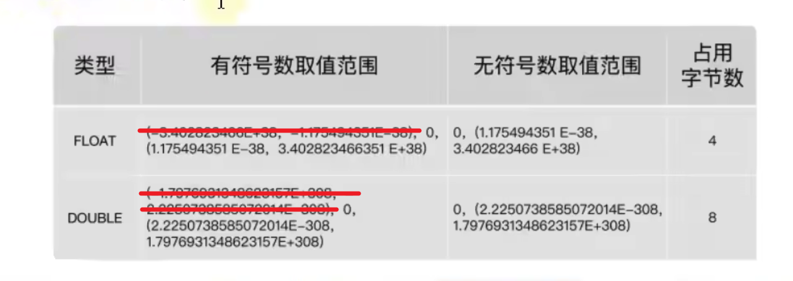

浮点数类型中有符号和无符号的特征为 无符号的表数范围只是把有符号中的负号的部分删掉了

<br>

**问题:**  
为什么浮点数类型的无符号取值范围 只相当于有符号的取值范围的一半呢? 也就是只相当于有符号数取值范围大于等于0的部分呢?

<br>

**原因:**  
因为mysql存储浮点数的格式为
```sql
-- 阶码: 10的多少次方
符号(S) 尾数(M) 阶码(E)
```

因此, 无论有没有符号, MySQL的浮点数类型都会为符号分配一个属于符号的位置 去放存储表示符号的部分。

- 有符号就在 符号的位置 放一个值  
- 无符号就不在 符号的位置 放一个值

无论是否有符号 **它的空间还是被占用的**, 所以导致了 无符号只是相当于有符号正数的那个部分

<br>

### 建议: 浮点数类型 不用显示声明 unsigned
因为声明后存储范围并没有变大 空间该占多少还是占多少 只不过表数范围不让我们放负数而已

<br>

### float 和 double 的区别:
- FLOAT  占用字节数少, 取值范围小  
- DOUBLE 占用字节数多, 取值范围也大

<br>

### 浮点类型的数据精度说明:
对于浮点类型, 在MySQL中
- 单精度值使用 4 个字节
- 双精度值使用 8 个字节

它们可以用如下的方式来声明浮点类型
- float(m, d)
- double(m, d)

<br>

- m: 精度 - 表示 整数位 与 小数位的和 **一共多少位**
- d: 标度 - 表示 小数位

- m的取值范围: m最小为d, 最大为255
- d的取值范围: 0 ~ 30

上面的这种声明方式属于非标准语法 (其他数据库未必支持, 因此如果涉及到数据迁移, 则最好不要这么用)

<br>

### 示例:
```sql  
create table test_float_double (
	f1 float(8, 2),
	f2 double(10, 2)
)


create table test_float_double (
	-- f1这个数 一共8位 小数部分2位
	f1 float(8, 2),
	-- f2这个数 一共10位, 小数部分2位
	f2 double(10, 2)
)
```

<br>

**不显示指明(m,d)**  
FLOAT和DOUBLE类型在不指定(M,D)时, **默认会按照实际的精度(由实际的硬件和操作系统决定)来显示。**  

<br>

**说明:**  
浮点类型, 也可以加 UNSIGNED, 但是不会改变数据范围, 例如: FLOAT(3,2) UNSIGNED仍然只能表示0-9.99的范围。

<br>

### 浮点型存储的问题:
不管是否显式设置了精度(M,D), MySQL的处理方案如下: 

**整数部分超出了范围:**  
如果存储时整数部分超出了范围, MySQL就会报错, 不允许存这样的值

<br>

**小数点部分若超出范围:**  
如果存储时小数点部分若超出范围, 就分以下情况:

- **小数位四舍五入后**, 整数部分没有超出范围, 则只警告, 但能成功操作 并四舍五入删除多余的小数位后保存。例如在FLOAT(5,2)列内插入999.009, 近似结果是999.01。

- **小数位四舍五入后**, 整数部分超出范围, 则MySQL报错, 并拒绝处理。如FLOAT(5,2)列内插入999.995和-999.995都会报错。因为四舍五入后整数位进位超出了

<br>

### 注意:
**从MySQL 8.0.17开始, FLOAT(M,D) 和DOUBLE(M,D)用法在官方文档中已经明确不推荐使用**, 将来可能被移除。

另外, 关于浮点型FLOAT和DOUBLE数据类型追加 UNSIGNED属性 也不推荐使用了, 将来也可能被移除。

<br>

### 示例测试:
```sql
create table test_double1(
	-- 根据操作系统决定该字段占用多少空间
  f1 float,
	-- 显式的指明占用多少空间
  f2 float(5, 2),

  f3 double,
  f4 double(5, 2)
)
```

<br>

**整个数有5位, 小数部分有2位的添加测试:**  
```sql
insert into test_double1(f1, f2)
values(123.45, 123.45)

-- 结果 没有任何问题
-- f1      f2
-- 123.45  123.45
```

<br>

**整个数有5位, 小数部分有3位的添加测试:**  
小数位超出2位了, 会进行四舍五入 最终的结果还是符合 5,2 的 没有报错
```sql
insert into test_double1(f3, f4)
values(123.45, 123.456)

-- 正常存储成功 - 四舍五入了: f4 的小数位超过2位了 小数部分四舍五入了

-- f3      f4
-- 123.45  123.46
```

<br>

**整个数有7位, 小数部分有3位的添加测试:**  
整数部分超了 所以会报错
```sql
insert into test_double1(f3, f4)
values(123.45, 1234.456)

-- 
-- f4 的整数位超过3位了  -- 报错了
-- f3      f4
-- 123.45  报错
```

<br>

### 总结:
- 小数位超过则四舍五入
- 整数位要是超过会报错

<br>

### 浮点型 精度误差说明:
浮点数类型有个缺陷, 就是不精准。

下面我来重点解释一下为什么 MySQL 的浮点数不够精准。

<br>

**精度问题的演示:**  
比如, 我们设计一个表, 有f1这个字段, 插入值分别为
- 0.47
- 0.44
- 0.19 
  
我们期待的运行结果是: ``0.47 + 0.44 + 0.19 = 1.1`` 而使用sum之后查询: ``1.0999999999999999``

```sql
-- 创建一个表
CREATE TABLE test_double2(
  f1 DOUBLE
);

-- 给f1字段插入多行数据
INSERT INTO test_double2
VALUES(0.47),(0.44),(0.19);

-- 对多条记录求和: 1.0999999999999999
SELECT SUM(f1)
FROM test_double2;
```

<br>

查询结果是 ``1.0999999999999999``。看到了吗？虽然误差很小, 但确实有误差。 

你也可以尝试把数据类型改成 FLOAT, 然后运行求和查询, 得到的是,  1.0999999940395355。显然, 误差更大了。

<br>

**总结:**  
在编程过程中, 如果用到浮点数, 要注意误差的问题, 因为浮点数是不准确的 **所以我们要避免使用 ``=`` 来判断两个数是否相等**

同时, 在一些对精确度要求较高的项目中, 千万不要使用浮点数, 不然会导致结果错误, 甚至是造成不可挽回的损失。

那么, MySQL 有没有精准的数据类型呢？当然有, 这就是定点数类型:  **DECIMAL**  

<br>

**为什么会存在这样的误差呢？**  
问题还是出在 MySQL 对浮点类型数据的存储方式上。 

MySQL中
- 用 4 个字节存储 FLOAT  类型数据
- 用 8 个字节存储 DOUBLE 类型数据
   
无论哪个, **都是采用二进制的方式来进行存储的。**

比如: 9.625 二进制来表达: 1001.101,或者表达成 1.001101×2^3。
  
如果尾数不是 0 或 5(比如 9.624), 你就无法用一个二进制数来精确表达。进而, **就只好在取值允许的范围内进行四舍五入。** 

<br><br>

# 定点数类型: decimal
因为精度问题, 我们在遇到小数的字段的时候, 该字段的类型一般都会声明为 decimal,  因为精度的问题 上面的float double不靠谱

<br>

### 要求: decimal(m, d)
定义 decimal 类型的字段时 要指定数值的宽度 (m, d), 因为字节数和M相关

```sql
create table teset (
	f1 decimal(8, 2)
)
```

<br>

|数据类型|字节数|含义|
|:--|:--|:--|
|decimal(m,d)|m+2字节|有效范围由m和d决定|

<br>

使用 decimal(m,d) 的方式表示高精度小数。其中
- M被称为精度
- D被称为标度
  
<br>

**m:**  
精度, 整数位 与 小数位的和  
m的取值范围: 0 <= m <= 65

<br>

**d:**  
标度, 小数位  
d的取值范围: 0 <= d <= 30

<br>

### 定点数的特点:

- **DECIMAL(M,D)的最大取值范围与DOUBLE类型一样**, 但是有效的数据范围是由M和D决定的。

- DECIMAL 的存储空间并不是固定的, 由精度值M决定, 总共占用的存储空间为M+2个字节。也就是说, 在一些对精度要求不高的场景下, 比起占用同样字节长度的定点数, **浮点数表达的数值范围更大一些。**  

- 定点数在MySQL内部是**以 字符串 的形式进行存储**, 这就决定了它**一定是精准的**。

- 当DECIMAL类型**不指定精度和标度时**, 其默认为DECIMAL``(10,0)``(默认的时候就没有小数了) 当数据的精度超出了定点数类型的精度范围时, 则MySQL同样会进行四舍五入处理。

```sql
CREATE TABLE test_decimal1(
	-- 没有指定 宽度 默认(10, 0) 意味着不带小数, 小数部分会四舍五入
  f1 DECIMAL,
  f2 DECIMAL(5,2)
);


desc test_decimal1
-- 结果 (mysql8.0 的时候 也是这样显示的)
-- decimal(10, 0), 当没有指明 (M, D) 的时候 
-- decimal(5, 2)


insert into test_decimal1(f1)		-- decimal(10, 0)
values(123), (123.45)

select * from test_decimal1
-- 结果 
-- f1 
-- 123
-- 123

-- 我们发现结果都是123
-- 123.45 f1的字段是 (10, 0) 所以小数部分会四舍五入


insert into test_decimal1(f2)   -- decimal(5, 2)
values(999.99)
-- 没问题

values(67.567)
-- 小数3位 会进行四舍五入 变成2位 67.57
```

<br>

### 浮点数 vs 定点数 精度的对比

**float的演示:**  
```sql
CREATE TABLE test_double2(
  f1 DOUBLE
);

INSERT INTO test_double2
VALUES(0.47),(0.44),(0.19);

-- 求和后的结果产生了精度的问题
SELECT SUM(f1)
FROM test_double2;
-- 1.0999999999999999
```

<br>

**decimal的演示:**  
```sql
CREATE TABLE test_decimal2(
  f1 DECIMAL(5, 2)
);

INSERT INTO test_decimal2
VALUES(0.47),(0.44),(0.19);

-- 求和后的结果没有精度的问题
SELECT SUM(f1)
FROM test_decimal2;
-- 1.10
```

<br>

结果能看到 decimal 替换 double 后 结果确实比double更加的精准

<br>

### 使用场景总结:
如果我们要求结果是精准的 那么我们就使用 decimal 类型

如果存储的空间的字节数一样的情况下 浮点类型的存储范围会更大一些 

如果我们希望表数范围能够更大一些 也不用那么精准 这时候可以考虑用浮点型

<br>

浮点数相对于定点数的优点是在长度一定的情况下, 浮点类型取值范围大, 但是不精准, 适用于需要取值范围大, 又可以容忍微小误差的科学计算场景(比如计算化学, 分子建模, 流体动力学等)

定点数类型取值范围相对小, 但是精准, 没有误差, 适合于对精度要求极高的场景 (比如涉及金额计算的场景)

<br>

### 经验:
由于 DECIMAL 数据类型的精准性, 在我们的项目中, **除了极少数(比如商品编号)用到整数类型外**, 其他的数值都用的是 DECIMAL

原因就是这个项目所处的零售行业, 要求精准, 一分钱也不能差。

<br><br>

# 位类型: BIT
BIT类型中**存储的是二进制值**, 类似010110。 我们存储进去的数值都会被转成二进制 进行存储

<br>

### 表数范围:
|二进制字符串类型|长度|长度范围|占用空间|
|:--|:--|:--|:--|
|bit(m)|m|1 <= m <= 64|约为(M+7)/8个字节|

<br>

### 定义方式:
```sql
create table test(
	f1 bit(m)
)
```

如果我们指明一个字段为 bit类型 没有指明M 那么默认只能存储1位, 这个1位 表示只能存1位的二进制(可以存0 或者 1)

<br>

**m:表示二进制的位数**  
(M) 可以指定 BIT的位置, 比如 bit(5), 那么 _ _ _ _ _ 有5个位置

这里的M是表示二进制的位数, 位数最小值为1, 最大值为64

```sql
CREATE TABLE test_bit1(
  f1 BIT,
  f2 BIT(5),
  f3 BIT(64)
);

-- f1字段: 没有指定宽度 则只可以存储 0 和 1
INSERT INTO test_bit1(f1)
VALUES(1);


-- f1字段: 存入2 会被转成 2进制 -> 01, 而我们只能存一个bit所以报错
INSERT INTO test_bit1(f1)
VALUES(2);


-- f2字段: 有5个bit位, 存入23, 首先会转换为2进制, 然后只存5个bit 也就是11111, 查询时将最终的存储结果显示为10进制为 11111 -> 31
INSERT INTO test_bit1(f2)
VALUES(23);
```

<br>

### 查询 bit 字段存储的结果:
当我们查询 bit 的结果的时候
- 小黑屏 是16进制来展示数据, 0x00, 0x01
- 客户端 会这样 b('0') 或者 b('1') 开头的样式 navicat 没试

<br>

### 使用其它进制查看 bit 字段的结果

**BIN(字段)函数:**  
将字段以2进制结果来展示, 比如字段中保存的一个数字我们想看看它2进制的显示结果

<br>

**HEX(字段)函数:**  
将字段以16进制结果来展示

<br>

**位字段 + 0:**  
+ 0后该字段将以10进制在结果集中进行展示

```sql
SELECT BIN(f2), HEX(f2), f1 + 0
FROM test_bit1;
```

<br><br>

# 日期与时间类型:
日期与时间是重要的信息, 在我们的系统中, 几乎所有的数据表都用得到。

原因是客户需要知道数据的时间标签, 从而进行数据查询, 统计和处理。 

<br>

MySQL有多种表示日期和时间的数据类型, 不同的版本可能有所差异, MySQL8.0 和 5.7中支持的日期和时间类型主要有: 

- year类型: 表示年
- date类型: 表示 年月日
- time类型: 表示 时分秒
- datetime类型: 表示 年月日 时分秒
- timestamp类型: 表示带时区的 年月日 时分秒

<br>

|类型|名称|字节|日期格式|最小值|最大值|
|:--|:--|:--|:--|:--|:--|
|YEAR|年|1|YYYY或YY|1901|2155|
|TIME|时间|3|HH:MM:SS|-838:59:59|838:59:59|
|DATE|日期|3|YYYY-MM-DD|1000-01-01|9999-12-03|
|DATETIME|日期时间|8|YYYY-MM-DD HH:MM:SS|1000-01-01 00:00:00|9999-12-03 23:59:59|
|TIMESTAMP|日期时间|4|YYYY-MM-DD HH:MM:SS|1970-01-01 00:00:00 UTC|2038-01-19 03:14:07 UTC|

<br>

**关注下 最小值 和 最大值 我们不能超过这个范围**  

<br>

**year:**  
因为使用1个字节存储, 它的可存储范围就是 0 ~ 255, 所以year所表示的最小值和最大值也有限, 如果要存储1901之前的数据, 则不可以用year

<br>

**time:**  
为什么是 -838:59:59 ~ 838:59:59, 不应该是 23:59:59么

因为 time 除了表示一天内的时间之外, 还可以用来表示一个 **时间间隔** 这个时间间隔可以超过24小时, 比如间隔了几天

<br>

**datetime 和 timestamp**  
它们使用的字节数是不一样的所以 datetime 的存储范围要比 timestamp 要大

<br><br>

## YEAR类型: YYYY(只使用4位字符串表达)
YEAR类型用来表示年份, 在所有的日期时间类型中所占用的存储空间最小, 只需要 **1个字节** 的存储空间。

### 默认格式: YYYY
没必要写成YEAR(4), 从MySQL 8.0.19开始, 不推荐使用指定显示宽度的YEAR(4)数据类型。

<br>

在MySQL中, ``YEAR`` 有以下几种存储格式(表现形式): 

<br>

### year的表现形式1: YYYY
以 **4位字符串** 或 **数字格式** 表示YEAR类型, 其格式为: YYYY

**最小值: 1901, 最大值: 2155**  

<br>

**数字格式:**  
4位数: 2021

<br>

**字符串格式: 推荐**  
4位字符串: '2021', 使用字符串格式的比较好

<br>

### year的表现形式2: YY 
以 **2位字符串** 或 **数字格式** 表示YEAR类型, 其格式为: YY

**最小值: 00, 最大值: 99**  

<br>

**注意: 当year为2位的时候 表示的日期不同**  
- 当取值为 01 ~ 69 时, 表示 2001 到 2069 
- 当取值为 70 ~ 99 时, 表示 1970 到 1999
- 当取值为 数值型 0 或 00 时, 表示 0000 年
- 当取值为 日期/字符串的 '0' 时, 表示 2000 年

<br>

我们这么记 YY 两位的年表示方式, 将 100 分为 
- 01 ~ 69: 20开头
- 70 ~ 99: 19开头

<br>

**<font color="#C2185B">从MySQL5.5.27开始, 2位格式的YEAR已经不推荐使用</font>**  

<br> 

```sql
CREATE TABLE test_year(
  f1 YEAR,

	-- 不推荐 定义字符宽度
  f2 YEAR(4)
);


INSERT INTO test_year
VALUES('2020','2021');

INSERT INTO test_year
VALUES('45','71');

-- 数值0 表示 0000 年
-- 字符串 '0' 表示 2000 年
INSERT INTO test_year
VALUES(0,'0');

+------+------+
| f1   | f2   |
+------+------+
| 2020 | 2021 |
| 2045 | 1971 |
| 0000 | 2000 |
+------+------+
```

<br><br>

## DATE类型:
DATE类型表示日期, 没有时间部分, 只是日期没有时间, 如 2022-12-29 

需要 3个字节 的存储空间

<br>

### date 格式: YYYY-MM-DD
- YYYY表示 年份
- MM表示 月份
- DD表示 日期

<br>

### date 格式分类:
在向DATE类型的字段插入数据时, 同样需要满足一定的格式条件。

**1. date格式为: YYYY-MM-DD / YYYYMMDD**  
YYYYMMDD格式会被转化为YYYY-MM-DD格式

- 最小取值为 1000-01-01
- 最大取值为 9999-12-03

<br>

**2. date格式为: YY-MM-DD**  
year的部分是2位的情况, 该情况比较特殊, 我们必须满足 2位year的格式要求

- 当年份取值为00到69时, 会被转化为2000到2069
- 当年份取值为70到99时, 会被转化为1970到1999

<br>

### 插入系统时间:
使用 CURRENT_DATE() 或者 NOW() 函数, 会插入当前系统的日期。

```sql
CREATE TABLE test_date1(
  f1 DATE
);

-- 标准写法: '2020-10-01'
-- 次标准写法: '20201001'
-- 隐式转换: 20201001
INSERT INTO test_date1
VALUES ('2020-10-01'), ('20201001'), (20201001);

INSERT INTO test_date1
VALUES 
('00-01-01'), 
('000101'), 
('69-10-01'), 
('691001'), 
('70-01-01'), 
('700101'), 
('99-01-01'), 
('990101');


-- 不推荐的写法: 
INSERT INTO test_date1
VALUES
(000301), 
(690301), 
(700301), 
(990301); 


-- 添加当前系统的时间
INSERT INTO test_date1
VALUES (CURRENT_DATE()), (NOW());

SELECT *
FROM test_date1;
```

<br><br>

## TIME类型:
TIME类型用来表示时间, 不包含日期部分。如: 23:59:59

需要 3个字节 的存储空间

它不仅仅表示时间, 还用来表示时间间隔

<br>

### time 格式: HH:MM:SS
标准格式: HH:MM:SS 格式来表示TIME类型, 其中, 

- HH表示小时
- MM表示分钟
- SS表示秒

<br>

### time 格式分类:
在MySQL中, 向TIME类型的字段插入数据时, 也可以使用几种不同的格式。

**格式1: D HH:MM:SS**  
- D: 表示 天, 最小值0, 最大值34

还有如下的几种表示方式:
1. D HH:MM:SS
2. HH:MM:SS 
3. HH:MM 
4. D HH:MM
5. D HH: 只有两个数字 前面是D 被认为是小时
6. SS: 只有两个数字会被认为是秒

以上格式, 都能被正确地插入TIME类型的字段中。

<br>
  
- 如果使用带有D格式的字符串插入TIME类型的字段时, D会被转化为小时, 计算格式为D*24+HH

- 当使用带有冒号并且不带D的字符串表示时间时, 表示当天的时间, 比如 12:10表示12:10:00, 而不是 00:12:10

<br>

**格式2: 'HHMMSS' or HHMMSS**  
可以使用不带有冒号的字符串或者数字

当我们写 1210 时, 会被认为是 分钟:秒

<br>

**注意:**  
如果插入一个不合法的字符串或者数字, MySQL在存储数据时, 会将其自动转化为00:00:00进行存储。

```sql
CREATE TABLE test_time1(
  f1 TIME
);

INSERT INTO test_time1
VALUES('2 12:30:29'), ('12:35:29'), ('12:40'), ('2 12:40'),('1 05'), ('45');

-- ('2 12:30:29') -- 60:30:29 - 2 X 24 + 12

INSERT INTO test_time1
VALUES ('123520'), (124011),(1210);

INSERT INTO test_time1
VALUES (NOW()), (CURRENT_TIME());

SELECT * FROM test_time1;
```

<br><br>

## DATETIME类型: YYYY-MM-DD HH:MM:SS 
DATETIME类型在所有的日期时间类型中占用的存储空间最大, 总共 **需要 8 个字节** 的存储空间。

<br>

### datetime 标准格式: YYYY-MM-DD HH:MM:SS 
在格式上为DATE类型和TIME类型的组合, 

- YYYY表示年份
- MM表示月份
- DD表示日期
- HH表示小时
- MM表示分钟
- SS表示秒

<br>

### datetime 格式分类
在向DATETIME类型的字段插入数据时, 同样需要满足一定的格式条件

<br>

**格式1: 标准格式**  
以 ``YYYY-MM-DD HH:MM:SS`` 格式 或者 ``YYYYMMDDHHMMSS`` 格式的字符串插入DATETIME类型的字段时, 

- 最小值为: 1000-01-01 00:00:00
- 最大值为: 9999-12-03 23:59:59

<br>

**格式2: YYYYMMDDHHMMSS**  
以 YYYYMMDDHHMMSS 格式的数字插入DATETIME类型的字段时, 会被转化为YYYY-MM-DD HH:MM:SS格式

<br>

**格式3: YY-MM-DD HH:MM:SS**  
以 YY-MM-DD HH:MM:SS 格式或者 YYMMDDHHMMSS 格式的字符串插入DATETIME类型的字段时, 两位数的年份规则符合YEAR类型的规则

- 00到69 表示 2000到2069
- 70到99 表示 1970到 1999。

```sql
INSERT INTO test_datetime1
VALUES ('2021-01-01 06:50:30'), ('20210101065030');

INSERT INTO test_datetime1
VALUES ('99-01-01 00:00:00'), ('990101000000'), ('20-01-01 00:00:00'), ('200101000000');

INSERT INTO test_datetime1
VALUES (20200101000000), (200101000000), (19990101000000), (990101000000);
 
INSERT INTO test_datetime1
VALUES (CURRENT_TIMESTAMP()), (NOW());
```

<br><br>

## TIMESTAMP类型: YYYY-MM-DD HH:MM:SS 
TIMESTAMP类型也可以表示日期时间, 其显示格式与DATETIME类型相同, 都是 YYYY-MM-DD HH:MM:SS 

需要 **4个字节** 的存储空间

**区别:**  
相当于 **带时区的** datetime

<br>

但是TIMESTAMP存储的时间范围比DATETIME要小很多, 只能存储

```
1970-01-01 00:00:01 UTC ~ 
2038-01-19 03:14:07 UTC
```

<br>

### UTC:
UTC表示世界统一时间, 也叫作世界标准时间。

<br>

**存储数据的时候需要对当前时间所在的时区进行转换, 查询数据的时候再将时间转换回当前的时区**  

因此, 使用TIMESTAMP存储的同一个时间值, 在不同的时区查询时会显示不同的时间。

**总结:**  
我们使用 timestamp 类型存储时间之后, 它底层会先考虑当前时区 然后计算出毫秒数 进行存储

当我们查询显示的时候 会根据我们查询时所在的时区, 底层的毫秒数再转换成 新时区时的时间

<br>

### 插入 timestamp 数据要点:
向TIMESTAMP类型的字段插入数据时, 当插入的数据格式满足YY-MM-DD HH:MM:SS和YYMMDDHHMMSS时, 
两位数值的年份同样符合YEAR类型的规则条件, 只不过表示的时间范围要小很多。

如果向TIMESTAMP类型的字段插入的时间超出了TIMESTAMP类型的范围, 则MySQL会抛出错误信息

```sql
CREATE TABLE test_timestamp1(
  ts TIMESTAMP
);

INSERT INTO test_timestamp1
VALUES ('1999-01-01 03:04:50'), ('19990101030405'), ('99-01-01 03:04:05'), ('990101030405');

-- 以 @ 来分隔也是可以的 可以正常的显示
INSERT INTO test_timestamp1
VALUES ('2020@01@01@00@00@00'), ('20@01@01@00@00@00');


INSERT INTO test_timestamp1
VALUES (CURRENT_TIMESTAMP()), (NOW());


-- Incorrect datetime value: 超过范围
INSERT INTO test_timestamp1
VALUES ('2038-01-20 03:14:07');
```

<br>

### TIMESTAMP 和 DATETIME 的区别: 
- TIMESTAMP存储空间比较小, 表示的日期时间范围也比较小

- 底层存储方式不同, TIMESTAMP底层存储的是毫秒值, 距离1970-1-1 0:0:0 0毫秒的毫秒值。

- 两个日期比较大小或日期计算时, TIMESTAMP更方便, 更快。

- TIMESTAMP和时区有关。TIMESTAMP会根据用户的时区不同, 显示不同的结果。而DATETIME则只能反映出插入时当地的时区, **其他时区的人查看数据必然会有误差的**  

```sql
CREATE TABLE temp_time(
  d1 DATETIME,
  d2 TIMESTAMP
);


INSERT INTO temp_time 
VALUES
('2021-9-2 14:45:52','2021-9-2 14:45:52');


INSERT INTO temp_time 
VALUES
(NOW(),NOW());


-- 结果集都是一样的
|d1|d2|
|2021-09-02 14:45:52|2021-09-02 14:45:52|
|2021-11-03 17:38:17|2021-11-03 17:38:17|


-- 修改当前的时区
SET time_zone = '+9:00';

-- 结果集:
|d1|d2|
|2021-09-02 14:45:52|2021-09-02 15:45:52|
|2021-11-03 17:38:17|2021-11-03 18:38:17|
```

我们使用 TIMESTAMP 的字段 会自动加上1个小时(时区的时间)

<br>

### 开发中的经验
用得最多的日期时间类型, 就是 DATETIME

虽然 MySQL 也支持 YEAR(年), TIME(时间), DATE(日期), 以及 TIMESTAMP 类型, 

但是在实际项目中, 尽量用 **DATETIME** 类型。

因为这个数据类型包括了完整的日期和时间信息, 取值范围也最大, 使用起来比较方便。

毕竟, 如果日期时间信息分散在好几个字段, 很不容易记, 而且查询的时候, SQL 语句也会更加复杂。 

<br>

另外, 一般存**注册时间, 商品发布时间等**, 不建议使用DATETIME存储, 而是使用 时间戳, 因为DATETIME虽然直观, 但不便于计算。

**bigint类型来存储时间戳**  

比如:  
我们可以使用 UNIX_TIMESTAMP() 获取时间戳 然后存储到表中 该字段可以使用 bigint类型 来存储

```sqk
select unix_timastamp();
```

<br><br>

## 文本字符串类型:
在实际的项目中, 我们还经常遇到一种数据, 就是字符串数据。

在实际场景中比如, 姓名, 家庭住址等文本 这样的数据在进行存储的时候就会使用字符串类型

- char(m)
- varchar(m)
- tinytext
- text
- mediumtext
- longtext

<br>

|字符串类型|长度|长度范围|占用存储空间|
|:--|:--|:--|:--|
|char(M)|M|0<=M<=255|M个字节|
|varchar(M)|M|0<=M<=65535|M+1个字节|
|tinytext|L|0<=L<=255|L+2个字节|
|text|L|0<=L<=65535|L+2个字节|
|mediumtext|L|0<=L<=16777215|L+3个字节|
|longtext|L|0<=L<=4294967295|L+4个字节|
|enum|L|0<=L<=65535|1或2个字节|
|set|L|0<=L<=64|1,2,3,4或8哥字节|

<br>

**char 和 varchar:**  
在字节串的类型中 算是比较短的了, 比如可以存储些姓名信息
- char: 固定
- varchar: 可变长度

<br>

**text:**  
text存储的是文本数据 比如一篇文章 一段话 这样的场景我们选择的是text类型

<br>

### 定义 char 或 varchar 的宽度
在定义 char 和 varchar 的时候 可以指定宽度 **指定M后 才会确定占用的空间大小**  

<br>

## char 与 varchar 类型
- char: 固定长度
- varchar: 可变长度

这两个类型都可以存储比较短的字符串

<br>

|字符串类型|特点|长度|长度范围|占用存储空间|
|:--|:--|:--|:--|:--|
|char(M)|固定长度|M|0<=M<=255|M个字节|
|varchar(M)|可变长度|M|0<=M<=65535(21845)|实际长度+1个字节|

<br>

### char(m)
CHAR(M)类型一般需要预先定义字符串长度。**如果不指定(M), 则表示长度默认是1个字符。**  

当我们给一个字段定义为 char(10) 的时候, 因为它是**固定长度**, 即使我们的数据不够10位, 它也会占10位

<br>

如果保存时, 数据的实际长度比CHAR类型声明的长度小, **则会在 右侧填充 空格以达到指定的长度**。

当MySQL检索CHAR类型的数据时, CHAR类型的字段会去除尾部的空格。(也就是说**检索的时候** 我们是**看不到空格的**)

<br>

**示例:**  
```sql
CREATE TABLE test_char1(
  -- 没有指定char的m的话, 默认为1个字符
  c1 CHAR,
  c2 CHAR(5)
);

DESC test_char1;


INSERT INTO test_char1
VALUES('a','Tom');


-- 虽然指定了char(5)会在右侧使用空格填充 但实际上 我们检索的时候会去掉空格
SELECT c1, CONCAT(c2,'***') FROM test_char1;


INSERT INTO test_char1(c2)
VALUES('a  ');

SELECT CHAR_LENGTH(c2)
FROM test_char1;  -- 1
-- 虽然上面我们自己输入了2个空格 但是我们使用的是char(5) 系统把我们自己输入的空格也当做系统自动添加的了
```

<br>

### varchar(m)
VARCHAR(M) 定义时, 必须指定长度M, 否则报错。因为varchar是可变长度的 到底varchar最多能存多少 我们要告诉系统

当我们给一个字段定义为 varchar(10) 的时候, 因为它是 **可变长度**, 当我们存储的是 hello, 则该数据的实际长度只有5

varchar的实际长度为 实际长度 + 1, 底层用1这个位置记录varchar类型实际上是占用了多少

<br>

**注意:**  
虽然 varchar 的长度上面可以定义为65535 但实际上我们只能定义到 21845

因为 一个汉字占3个字节 65535 / 3 **注意一下**  

<br>

### varchar类型存储汉字时的区别:

- MySQL4.0版本以下: varchar(20):   
**指的是20字节**, 如果存放UTF8汉字时, 只能存6个(每个汉字3字节)
  
- MySQL5.0版本以上: varchar(20):   
**指的是20字符**  

<br>

检索 varchar类型的字段数据时, 会保留数据尾部的空格。varchar类型的字段所占用的存储空间为字符串实际长度加1个字节。

```sql
CREATE TABLE test_varchar1(
  NAME VARCHAR  -- 报错, 需要指明长度
);


-- 最大值只能是 21845
CREATE TABLE test_varchar2(
  NAME VARCHAR(65535)  -- 错误
);


CREATE TABLE test_varchar3(
  NAME VARCHAR(5)
);

INSERT INTO test_varchar3
VALUES('尚硅谷'),('尚硅谷教育');

-- Data too long for column 'NAME' at row 1
INSERT INTO test_varchar3
VALUES('尚硅谷IT教育');
```

<br>

### 注意:
- char类型 存 '尚硅谷' 就是 **按照字符** 的数量来存
- varchar类型 存 '尚硅谷' 
	- mysql4.0是考虑 字节数 来存
	- mysql5.0是考虑 字符数 来存

<br>

### 在开发中是选择 char 还是 varchar ？

|类型|特点|空间上|时间上|适用场景|
|:--|:--|:--|:--|:--|
|char(m)|固定长度|浪费存储空间|效率高|存储不大, 速度要求高|
|varchar(m)|可变长度|节省存储空间|效率低|非CHAR的情况|

<br>

**情况1:**   
当存储很短的信息, 我们应该用 char

比如**门牌号码101**, 201……这样很短的信息**应该用char** 因为varchar还要占1个byte用于存储信息长度, 本来打算节约存储的, 结果得不偿失。

<br>

**情况2:**   
当长度固定的, 我们应该使用 char

比如**使用uuid作为主键**, 那用**char应该更合适**。因为他固定长度, varchar动态根据长度的特性就消失了, 而且还要占个长度信息。

<br>

**情况3:**  
当频繁修改字段的值, 我们应该使用 char

十分频繁改变的column。因为varchar每次存储都要有额外的计算, 得到长度等工作, 如果一个非常频繁改变的, 那就要有很多的精力用于计算, 而这些对于char来说是不需要的。

<br>

**情况4:**  
上面说了很多情况, 说明 char类型 的优势, 但是具体来说 我们还要考虑 存储引擎 的问题

<br>

**MyISAM:**  
该引擎最好使用 固定长度 (char)  
这样使得整个表静态化, 从而使 数据检索更快, 用空间换时间。

<br>

**MEMORY:**  
该引擎 char 和 varchar 无所谓

MEMORY数据表目前都使用固定长度的数据行存储, 因此无论使用CHAR或VARCHAR列都没有关系, 两者都是作为CHAR类型处理的。

<br>

**InnoDB:**  
该引擎建议使用 **varchar类型**  

因为对于InnoDB数据表, 内部的行存储格式并没有区分固定长度和可变长度列(所有数据行都使用指向数据列值的头指针), 而且**主要影响性能的因素是数据行使用的存储总量**, 由于char平均占用的空间多于varchar, 所以除了简短并且固定长度的, 其他考虑varchar。这样节省空间, 对磁盘I/O和数据存储总量比较好。

<br><br>

## TEXT类型
它是用来存储文本数据的 比如文章 评论等情况, 大型文本信息, 根据实际文本的大小 我们选择具体的类型

在向TEXT类型的字段保存和查询数据时, 系统自动按照实际长度存储, 不需要预先定义长度。

<br>

在MySQL中, TEXT用来保存文本类型的字符串, 总共包含4种类型, 分别为

1. tinytext
2. text
3. mediumtext
4. longtext
  
<br>

每种TEXT类型保存的数据长度和所占用的存储空间不同, 如下: 

|文本字符串类型|特点|长度|长度范围|占用存储空间|
|:--|:--|:--|:--|:--|
|tinytext|小文本,可变长度|L|0<=L<=255|L+2个字节|
|text|文本,可变长度|L|0<=L<=65535|L+2个字节|
|mediumtext|中等文本,可变长度|L|0<=L<=16777215|L+3个字节|
|longtext|大文本,可变长度|L|0<=L<=4294967295(相当于4GB)|L+4个字节|

<br>

**注意:**  
由于text类型的实际存储的长度不确定, MySQL **不允许 TEXT 类型的字段做主键**  

遇到这种情况, 你只能采用 CHAR(M), 或者 VARCHAR(M)

<br>

### 使用场景:
当存储的文本比较大的时候 我们考虑选择 text 类型, 比如 varchar(max) 的最大值只能是 21845

所以当超过 varchar(max) 的存储范围后 我们就考虑使用 text

<br>

### 示例:
```sql
CREATE TABLE test_text(
  tx TEXT
);


INSERT INTO test_text
VALUES('atguigu   ');

SELECT CHAR_LENGTH(tx)
FROM test_text;  -- 10

-- 说明在保存和查询数据时, 并没有删除TEXT类型的数据尾部的空格。
```

<br>

### 开发中经验
TEXT文本类型, 可以存比较大的文本段, 搜索速度稍慢, **因此如果不是特别大的内容, 建议使用CHAR, VARCHAR来代替。**  

还有TEXT类型不用加默认值, 加了也没用。

<br>

因为text存储的是大文本 如果我们把文章添加到表中的一个字段里 后期我们又把文章删掉了 这时候 会 **导致空洞**  

而且text和blob类型的数据删除后容易导致"空洞", 使得文件碎片比较多, 所以**频繁使用**的表不建议包含TEXT类型字段, **建议单独分出去**, 单独用一个表。

<br><br>

## 枚举类型
枚举类型也是字符串类型的一种,  多选一

```sql
create table test (
	字段 ENUM('枚举成员', '枚举成员2', '枚举成员3' ... )
)
```

<br>

### 枚举字段的定义:
ENUM类型也叫作枚举类型, ENUM类型的取值范围需要在定义字段时进行指定。

```sql
CREATE TABLE test_enum(
  -- 字段 season 类型 ENUM()
  season ENUM('春','夏','秋','冬','unknow')
);


-- 我们在添加值的时候 只能在枚举成员中选择一个填写
INSERT INTO test_enum
VALUES('春'),('秋');


-- 通过枚举类型的角标 进行数据的添加
INSERT INTO test_enum
VALUES('1'),(3);
```

<br>

枚举类型就是我们有具体的几种值 我们将这几种值都列出来 这就是枚举 

设置字段值时, ENUM类型只允许从成员中选取单个值, 不能一次选取多个值。其所需要的存储空间由定义ENUM类型时指定的成员个数决定。

<br>

### 枚举类型的占用情况
|字符串类型|长度|长度范围|占用的存储空间|
|:--|:--|:--|:--|
|ENUM|L|1<=L<=65535|1或2个字节|

<br>

- 当ENUM类型包含1～255个成员时, 需要1个字节的存储空间
- 当ENUM类型包含256～65535个成员时, 需要2个字节的存储空间
- ENUM类型的成员个数的上限为65535个

<br>

### 使用 枚举 成员的情况
```sql
CREATE TABLE test_enum(
  -- 字段 season 类型 ENUM()
  season ENUM('春','夏','秋','冬','unknow')
);


-- 我们在添加值的时候 只能在枚举成员中选择一个填写
INSERT INTO test_enum
VALUES('春'),('秋');


-- 忽略大小写
INSERT INTO test_enum
VALUES('UNKNOW');


-- 允许按照角标的方式获取指定索引位置的枚举值 索引位置从1开始
INSERT INTO test_enum
VALUES('1'),(3);

-- Data truncated for column 'season' at row 1
INSERT INTO test_enum
VALUES('ab');

-- 当ENUM类型的字段没有声明为NOT NULL时, 插入NULL也是有效的
INSERT INTO test_enum
VALUES(NULL);
```

<br><br>

## 集合类型
集合类型也是字符串类型的一种, 多选多


### set类型的定义方式:
set的定义方式和枚举类很像 仅仅是关键字不同
```sql
create table test (
	字段 set('成员1', '成员2', '成员3' ... )
)
```

<br>

SET表示一个字符串对象, 可以包含0个或多个成员, 但成员个数的**上限为64**。

设置字段值时, 可以取取值范围内的 0 个或多个值。

<br>

### set的特点:
我们执行重复的成员时, 会进行去重

<br>

### set的占用空间:
当SET类型包含的成员个数不同时, 其所占用的存储空间也是不同的, 具体如下: 

|成员个数范围(L表示实际成员个数)|占用的存储空间|
|:--|:--|  
|1<=L<=8|1个字节|
|9<=L<=16|1个字节|
|17<=L<=24|3个字节|
|25<=L<=32|4个字节|
|33<=L<=64|8个字节|

SET类型在存储数据时成员个数越多, 其占用的存储空间越大。

<br>

**注意:**   
SET类型在选取成员时, 可以一次选择多个成员, 这一点与ENUM类型不同。

```sql
CREATE TABLE test_set(
  s SET ('A', 'B', 'C')
);

-- 集合中的都可以选 没有数量的要求
INSERT INTO test_set (s) VALUES ('A'), ('A,B');

-- 插入重复的SET类型成员时, MySQL会自动删除重复的成员
INSERT INTO test_set (s) VALUES ('A,B,C,A');

-- 向SET类型的字段插入SET成员中不存在的值时, MySQL会抛出错误。
INSERT INTO test_set (s) VALUES ('A,B,C,D');
```

<br>

### 枚举类型 和 集合类型的综合使用: 
```sql
CREATE TABLE temp_mul(
  gender ENUM('男','女'),
  hobby SET('吃饭','睡觉','打豆豆','写代码')
);

-- 成功
INSERT INTO temp_mul VALUES('男','睡觉,打豆豆'); 

-- 失败
-- Data truncated for column 'gender' at row 1
INSERT INTO temp_mul VALUES('男,女','睡觉,写代码'); 

-- 失败
-- Data truncated for column 'gender' at row 1
INSERT INTO temp_mul VALUES('妖','睡觉,写代码');

-- 成功
INSERT INTO temp_mul VALUES('男','睡觉,写代码,吃饭');
```

<br><br>

## 二进制字符串类型
MySQL中的二进制字符串类型主要存储一些二进制数据, 比如可以存储图片, 音频和视频等二进制数据。

MySQL中支持的二进制字符串类型主要包括:

- binary
- varbinary
- tinyblob
- blob
- mediumblob
- longblob

定义为该类型的字段, 内部的值会使用二进制字节来进行存储, 比如我们存了一个 '中国' 该字符串就会使用 二进制 来进行存储

当然我们使用该类型的场景更多的是为了存储视频等数据

<br>

### binary 与 varbinary 类型
跟我们前面讲的 char varchar 是对应的关系

- binary: 固定长度
- varbinary: 可变长度


binary 和 varbinary 类似于 char 和 varchar, 只是它们存储的是二进制字符串。

<br>

### binary(m)
固定长度的二进制字符串, M表示最多能存储的字节数

**默认值:**  
1, 当我们不指定m的时候 只能存储一个字节

<br>

**m的取值范围:**  
0~255
  
- 如果未指定(M), 表示只能存储 1个字节
- 如果指定(M), 例如BINARY(8), 表示最多能存储8个字节
- 如果字段值不足(M)个字节, 将在右边填充'\0'以补齐指定长度

<br>

### varbinary(m)
可变长度的二进制字符串, M表示最多能存储的字节数

**varbinary类型在声明的时候必须指明 m**  

<br>

**取值范围:**  
总字节数不能超过行的字节长度限制65535  
另外还要考虑额外字节开销, varbinary类型的数据除了存储数据本身外, 还需要1或2个字节来存储数据的字节数。

<br>

### binary 和 varbinary 的存储情况
|二进制字符串类型|特点|值的长度|占用空间|
|BINARY(M)|固定长度|M|0<=M<=255|M个字节|
|VARBINARY(M)|可变长度|M|0<=M<=65535|M+1个字节|
 
<br>

### 示例:

```sql
CREATE TABLE test_binary1(
  f1 BINARY,
  f2 BINARY(3),

  -- 报错 一定要指明 长度
  f3 VARBINARY,
  f4 VARBINARY(10)
);


-- abcd这些是可以当做一个字节去存储的
INSERT INTO test_binary1(f1,f2)
VALUES('a','a');

-- 失败
INSERT INTO test_binary1(f1,f2)
VALUES('尚','尚');


INSERT INTO test_binary1(f2,f4)
VALUES('ab','ab');

-- f2是3个字节 因为 f2 BINARY(3) 是固定长度
SELECT LENGTH(f2), LENGTH(f4)
FROM test_binary1;

+------------+------------+
| LENGTH(f2) | LENGTH(f4) |
+------------+------------+
|          3 |       NULL |
|          3 |          2 |
+------------+------------+
```
  
<br><br>

## BLOB类型:
BLOB是一个 二进制大对象, 可以容纳 **可变数量** 的数据。

MySQL中的BLOB类型包括:
- tinyblob
- blob
- mediumblob
- longblob

它们可容纳值的最大长度不同。可以存储一个二进制的大对象, 比如 图片, 音频  和  视频 等。

<br>

### 占用空间的情况:
|二进制类型|值的长度|长度范围|占用空间|
|:--|:--|:--|:--|
|tinyblob|L|0<=L<=255|L+1个字节|
|blob|L|0<=L<=65535(约64kb)|L+2个字节|
|mediumblob|L|0<=L<=16777215(约16MB)|L+3个字节|
|longblob|L|0<=L<=4294967295(约4GB)|L+4个字节|

<br>

如: 图片 音乐 一般不会超过16mb所以我们可以选择使用 mediumblob

<br>

### 开发场景:
需要注意的是, 在实际工作中, 往往不会在MySQL数据库中使用BLOB类型存储大对象数据, 通常会将图片, 音频和视频文件存储到 **服务器的磁盘上**, 并将图片, 音频和视频的访问路径存储到MySQL中。

**存储到 服务器的磁盘上?**   
比如 分布式的项目当中 我们使用到了fastdfs 它是用来分布式存储我们的图片的 像淘宝的图片 我们都可以放在fastdfs里面

没有必要在表里面体现这样的结构 就是数据库可以这样的存储图片视频等 **但是开发中我们并没有选择这么去用**  

```sql
CREATE TABLE test_blob1(
  id INT,
  img MEDIUMBLOB
);
```

<br>

### TEXT 和 BLOB 的使用注意事项
在使用text和blob字段类型时要注意以下几点, 以便更好的发挥数据库的性能。

**①:**  
BLOB和TEXT值也会引起自己的一些问题, 特别是执行了大量的删除或更新操作的时候。

删除这种值会在数据表中留下很大的"空洞", 以后填入这些"空洞"的记录可能长度不同。

为了提高性能, **建议定期使用 OPTIMIZE TABLE 功能对这类表进行 碎片整理。**  

<br>

**②:**  
如果需要对大文本字段进行模糊查询, MySQL 提供了 **前缀索引**, 用来查询大文本字段的前多少个内容

但是仍然要在不必要的时候避免检索大型的BLOB或TEXT值。

例如, SELECT * 查询就不是很好的想法, 除非你能够确定作为约束条件的WHERE子句只会找到所需要的数据行。

否则, 你可能毫无目的地在网络上传输大量的值。

<br>

**③:**   
把BLOB或TEXT列 **分离到单独的表** 中。

在某些环境中, 如果把这些数据列移动到第二张数据表中, 可以让你把原数据表中的数据列转换为固定长度的数据行格式, 那么它就是有意义的。

这会 减少主表中的碎片, 使你得到固定长度数据行的性能优势。它还使你在主数据表上运行 SELECT * 查询的时候不会通过网络传输大量的BLOB或TEXT值。

<br><br>

## JSON类型:
JSON(JavaScript Object Notation)是一种轻量级的 数据交换格式。简洁和清晰的层次结构使得 JSON 成为理想的数据交换语言。它易于人阅读和编写, 同时也易于机器解析和生成, 并有效地提升网络传输效率。

**JSON 可以将 JavaScript 对象中表示的一组数据转换为字符串, 然后就可以在网络或者程序之间轻松地传递这个字符串, 并在需要的时候将它还原为各编程语言所支持的数据格式。**  

在MySQL 5.7中, 就已经支持JSON数据类型。

在MySQL 8.x版本中, JSON类型提供了可以进行自动验证的JSON文档和优化的存储结构, 使得在MySQL中存储和读取JSON类型的数据更加方便和高效。

创建数据表, 表中包含一个JSON类型的字段 js。

```sql
CREATE TABLE test_json(
  js json
);

INSERT INTO test_json (js) 
VALUES ('{"name":"songhk", "age":18, "address":{"province":"beijing", "city":"beijing"}}');

SELECT *
FROM test_json;
```

上面就将一个json对象保存在了数据库中 以字符串的形式 **我们还可以在sql层面 提取json对象中的值**  

<br>

### -> 箭头操作符
用来在sql层面 读取json中的数据

<br>

### **<font color="#C2185B">json类型的字段 -> ``$.属性名``</font>**  

``$`` 就代表json对象

当需要检索JSON类型的字段中数据的某个具体值时, 可以使用 "->" 和 "->>" 符号。

```sql
-- js是一个字段
SELECT js -> '$.name' AS name, 
       js -> '$.age' AS age,
       js -> '$.address.province' AS province, 
       js -> '$.address.city' AS city
FROM test_json;


-- 结果集:
name 			age 	province 		city
"songhk"	18		"beijing"		"beijing"
```

通过 "->" 和 "->>" 符号, 从JSON字段中正确查询出了指定的JSON数据的值。

<br><br>

## 空间类型:
MySQL 空间类型扩展支持地理特征的生成, 存储和分析。这里的地理特征表示世界上具有位置的任何东西, 可以是一个实体

- 例如一座山, 可以是空间
- 例如一座办公楼
- 也可以是一个可定义的位置
- 例如一个十字路口等等。

MySQL中使用 Geometry(几何) 来表示所有地理特征。Geometry指一个点或点的集合, 代表世界上任何具有位置的事物。

MySQL的空间数据类型(Spatial Data Type)对应于OpenGIS类, 包括单值类型: 

<br>

### 单值类型:

- GEOMETRY
	- POINT
	- LINESTRING
	- POLYGON
		- MULTIPOINT
		- MULTILINESTRING
		- MULTIPOLYGON
		- GEOMETRYCOLLECTION

<br>

Geometry是所有空间集合类型的基类, 其他类型如下的类型都是Geometry的子类

- POINT
- LINESTRING
- POLYGON     

<br>

### Point
顾名思义就是点, 有一个坐标值。  
例如POINT(121.213342 31.234532), POINT(30 10), 坐标值支持DECIMAL类型, 经度(longitude)在前, 维度(latitude)在后, 用空格分隔。

<br>

### LineString:
线, 由一系列点连接而成。如果线从头至尾没有交叉, 那就是简单的(simple); 如果起点和终点重叠, 那就是封闭的(closed)。

例如LINESTRING(30 10,10 30,40 40), 点与点之间用逗号分隔, 一个点中的经纬度用空格分隔, 与POINT格式一致。

<br>

### Polygon:
多边形。可以是一个实心平面形, 即没有内部边界, 也可以有空洞, 类似纽扣。最简单的就是只有一个外边界的情况, 

例如POLYGON((0 0,10 0,10 10, 0 10))。

<br>

### 集合类型:
- MultiPoint
- MultiLineString
- MultiPolygon
- GeometryCollection 

这4种类型都是集合类, 是多个Point, LineString或Polygon组合而成

<br><br>

## 小结 及 选择建议:

### 在定义数据类型时

- 如果是 整数: 就用 INT
- 如果是 小数: 就用 DECIMAL(M,D)
- 如果是 日期与时间: 就用 DATETIME
- 如果是 字符串: 
	- 固定的内容如手机号使用 char
	- 不超过5000的长度使用 varchar
	- 超过 5000 则使用 text, 并分表

- 超出 decimal 范围的情况下, 我们将 整数 和 小数 分开存储

<br>

这样做的好处是, 首先确保你的系统不会因为数据类型定义出错。不过, 凡事都是有两面的, 可靠性好, 并不意味着高效。

比如, TEXT 虽然使用方便, 但是效率不如 CHAR(M) 和 VARCHAR(M)。

关于字符串的选择, 建议参考如下阿里巴巴的《Java开发手册》规范: 

<br>

### 阿里巴巴《Java开发手册》之MySQL数据库:
- 任何字段如果为非负数, **必须是 UNSIGNED**  

- 小数类型为 DECIMAL, 禁止使用 FLOAT 和 DOUBLE  
在存储的时候, FLOAT 和 DOUBLE 都存在精度损失的问题, 很可能在比较值的时候, 得到不正确的结果。

- 如果存储的数据范围超过 DECIMAL 的范围, 建议将数据拆成整数和小数并分开存储。

- 如果存储的字符串长度几乎相等, 使用 CHAR 定长字符串类型。 比如手机号

- VARCHAR 是可变长字符串, 不预先分配存储空间, **长度不要超过5000**。  
**如果存储长度大于此值, 定义字段类型为 TEXT, 独立出来一张表**, 用主键来对应, 避免影响其它字段索引效率。

<br><br>

# 约束: constraint
我们在创建表的时候 就可以给表中的字段添加约束 在实际的开发中是一定会创建约束的

我们在给表中的字段添加约束后 后续做增删改的时候就要考虑约束

<br>

|Mysql关键字|含义|
|:--|:--|
|null|数据列可含null值|
|not null|数据列不允许包含null值|
|default|默认值|
|primary key|主键|
|auto increment|自动递增, 适用于整数类型|
|unsigned|无符号的|
|character set name|指定一个字符集|

<br>

## 为什么需要约束
数据的完整性 是指数据的 精确性 和 可靠性

它是防止数据库中存在不符合语义规定的数据和防止因错误信息的输入输出造成无效操作或错误信息而提出的。

**为了保证数据的完整性**, SQL规范以约束的方式对表数据进行额外的条件限制

<br>

### 数据完整性的4个角度:

**实体完整性(Entity Integrity):**   
同一个表中, 不能存在两条完全相同无法区分的记录, 相当于不能存在两个一模一样的对象, 如果存在两条一模一样的记录 我们怎么写where? 区别不了我们要修改哪条

<br>

**域完整性(Domain Integrity):**  
域可以理解为字段的意思, 年龄范围0-120, 性别范围"男/女"

<br>

**引用完整性(Referential Integrity):**  
员工所在部门, 在部门表中要能找到这个部门, 表与表之间的引用, 我们可以使用 外键约束 达到这样的目的, 保证引用的完整性

<br>

**用户自定义完整性(User-defined Integrity):**  
例如用户名唯一, 密码不能为空等, 本部门经理的工资不得高于本部门职工的平均工资的5倍。


上面的限制都是通过约束来体现

<br>

### 什么是约束?
约束是表级的强制规定。对表中的字段的限制  
比如要求该字段是非空的 唯一的 要求是主键等等 专门作用在字段上的

<br><br>

## 约束的分类

### 角度1: 从约束的字段的个数来区分
约束是作用在一个字段上? 还是作用在几个字段的联合上? 

根据约束数据列的限制 约束可分为: 

- 单列约束:  每个约束只约束一列, 如 只给 id 加约束
```sql
create table test(
	-- 最对一个列做约束
	id not null
)
```

- 多列约束:  一个约束可约束多列数据
```sql
create table test (
	-- not null 作用于两列上
	(id, name) not null
)
```

<br>

### 角度2: 从约束作用范围 或者说 从定义的位置来分
- 列级约束: 将约束声明在对应的字段后面
- 表级约束: 在表中所有的字段都声明完以后 最后添加的表级约束
    
<br>

**列级约束:**  
位置: 列的后面

支持的约束类型: 语法都支持, 但外键没有效果
是否可以起约束名: 不可以

<br>

**表级约束:**  
位置: 所有列的下面

支持的约束类型: 默认和非空不支持, 其他支持
是否可以起约束名: 可以(主键没有效果)

**注意:**  
表级约束的部门可以给各个字段添加约束 并分别指明约束名


<br>

### 角度3: 从约束的功能上分

1. not null: 非空约束, 规定某个字段不能为空
2. unique: 唯一约束, 规定某个字段在整个表中是唯一的
3. primary key: 主键约束(非空且唯一)
4. foreign key: 外键约束
5. check: 检查约束
6. default: 默认值约束

**注意:**  
MySQL不支持check约束, 但可以使用check约束, 而没有任何效果

约束是作用在表中的字段上的 那如何去添加这些约束呢？

<br>

### 添加 / 修改 约束 的方式
1. create table: 添加约束
2. alter table: 补充添加约束 / 删除约束

<br>

### 查看表中的约束
### **<font color="#C2185B">select * from information_schema.table_constraints where table_name = '表的名字'</font>**  
根据 where 过滤条件 在系统指定的表中 查询 表中约束的情况

```sql
SELECT * FROM information_schema.table_constraints
WHERE table_name = 'employees'
```

<br><br>

## 非空约束: not null

### 作用:
限定 某个字段/某列的值 **不允许为空**  

默认情况下 所有的类型的值都可以是 null , 包括 int float等数据类型, 也就是说我们需要显式的加上 非空约束 它才不能为 null

<br>

比如我们的练习的 employees 表中的 下面字段都是 not null 约束的
- last_name
- first_name
- hire_date
- salary

而员工所在的部门 ``department_id`` 则没有非空约束 存储的值可以为空

<br>

### 非空约束的特点:
1. not null 约束只能给单一字段设置, 不能为同时为多个字段设置非空约束

2. 一个表可以有很多列都分别限定了非空

3. 空字符串''不等于NULL, 0也不等于NULL

<br>

### 注意:
- not null 只能使用列级约束, 不用作用在表级约束 和 组合约束 中

<br>

### 添加 非空约束:
not null 影响的是我们给字段的赋值, 根据实际的需要我们往字段添加 not null 约束

<br>

### 添加方式1 建表时 添加非空约束:
```sql
CREATE TABLE 表名称(
  字段名 数据类型 NOT NULL
);
```

<br>

**示例:**  
```sql
create table test1(
  id int NOT NULL,
  last_name varchar(15) NOT NULL,

  -- 下面两个根据实际的场景就可以不添加
  email varchar(25),
  salary decimal(10, 2)
)

-- 查看下表结构
desc test1;
```

<br>

**正常添加:**  
约束影响的是我们给字段进行赋值
```sql
insert into test1(id, last_name, email, salary)
values(1, 'Tom', 'tom@mail', 3300)
```

<br>

**往非空字段添加null值:**  
报错 column 'last_name' cannot be null

```sql
insert into test1(id, last_name, email, salary)
values(2, null, 'tom@mail', 3300)
```

<br>

**没有给 要求非空的字段 进行赋值:**  
我们没有给 last_name 字段赋值, last_name字段要求非空

而当我们没有给 已经设置非空的字段 进行赋值时, 它会优先看默认值, 如果有默认值则使用默认值, 如果没有默认值则就会使用null 一用null就会报错
```sql
-- 'last_name' do not have a default value
insert into test1(id, email)
values(2, 'abc@mail')
```

<br>

**总结:**  
因为我们给字段设置了 not null 那么就会影响修改表中的数据的操作 也就是说 我们设置了非空约束后 对于 增删改 是会产生影响的

<br>

### 添加方式2 修改表字段时 添加非空约束
使用的是modify
```sql
alter table 表名称 modify 字段名 数据类型 not null;
```

```sql
ALTER TABLE emp
MODIFY sex VARCHAR(30) NOT NULL;
```

<br>

**注意:**  
当字段中的值里有null值的时候 我们给该列添加 非空约束 会失败

<br>

### 删除约束: 在 alter table 时 删除非空约束
**原有约束:**  
```sql
create table test_constraint (
	id int not null,
)
```

<br>

**修改方式1:**  
modify 的时候 直接删除 字段后的 not null
```sql
alter table test_constraint modify column id int
```

<br>

**修改方式2:**  
modify 的时候 直接删除 字段后的 not, 没有一起删除
```sql
alter table test_constraint modify column id int null
```

<br><br>

### 唯一性约束: unique [key]

### 作用:
用来限制 某个字段/某列 的**值不能重复**。  
也就是值唯一

比如 employees 表中的 email 字段 就是使用 unique来修饰的 连续添加两次一样的值 **第二次的添加就不允许了**  

<br>

### unique 特点
1. 同一个表可以有多个唯一约束。

2. 唯一约束可以作用在某一个字段上(单列约束), 也可以同时作用在多个列上(多列约束)
```sql
-- 多列约束
create table test(
	(id, name) int unique
)
```

3. 唯一性约束允许列值为空 NULL。可以向该字段多次添加null值 (其它重复的值不允许添加 但是 null值可以)

4. 在创建唯一约束的时候, 如果不给唯一约束命名, 就默认和列名相同。(起名的话就是我们起的名 没起的话 就是列的字段名 比如id name salary)
*MySQL会给唯一约束的列上默认创建一个唯一索引。*

<br>

### 多列约束的示例:

我们在每个字段的后面各自声明 约束, 这种情况不叫多列约束, 它们就是有两个约束
```sql
create table test (
	id int unique,
	username int unique
)
```

<br>

我们说的多列约束是说, 一个约束作用于两个字段上, 不是我们简单理解的方便 是上面的另一种写法

多列约束是说 约束是一个 但是作用于两个列上
```sql
create table test (
	id int,
	username int,
	unique(id, username)
)
```

<br><br>

### 添加 unique 约束:
为 字段 添加 unique约束 有如下的两种方式
- create table
- alter table

<br>

### unique的使用场景举例:
- id: 每个人的id都不一样 所以id可以添加 unique 约束 

- last_name: 不适合加唯一约束 因为姓名有同名的情况

- email: 可以添加 unique 约束, 每个员工的邮箱需要唯一

- salary: 不适合加唯一约束

<br><br>

## 添加方式1 建表时 添加唯一约束

### 列级约束:
unique约束添加在字段的后面
```sql
create table test(
	id int unique
)
```

<br>

### 表级约束:
表中有个字段, 表级约束的意思是, 在一个地方, 我们为指定字段统一添加一种类型的约束

```sql
create table test(

	字段相关,
	字段相关,

	-- 比如我们给 email 字段添加约束
	constraint 约束名1/索引名2 unique(字段),
	constraint 约束名2/索引名2 foreign key(字段),
)
```

意思就是从表的角度看, 我们给email添加约束
```
								↓
id		name		email
```

<br>

**位置:**  
表级约束需要声明在所有的字段后面, 表级约束部分可以为各个字段创建约束 并为各个字段创建约束名

<br>

**语法:**  
在创建表时, 在声明完所有字段后, 我们使用如下的语法创建 表级约束

<br>

**<font color="#C2185B">constraint 约束名 约束(字段)</font>**  
给表设置一个约束, 约束通过()指定作用于什么字段

约束名也可以叫做索引名

```sql
create table test() {
	id int unique,
	email varchar(20),

	constraint uk_test_email unique(email)
}
```

<br>

**约束名的起名规则:**  
约束缩写_表名_字段

<br>

**约束名作用:**  
在删除约束的时候 需要使用约束名  

<br>

### 约束名的默认名:
<font color="#C2185B">constraint 约束名</font> 这个部分是可以省略的, 那就意味着 该约束没有名字 默认为就是字段名

**指明约束名:**  
指明约束名只能通过表级约束的方式 设置
```sql
create table test() {
	id int unique,
	email varchar(20),

	-- 使用 constraint uk_test_email 指明约束名
	constraint uk_test_email unique(email)
}
```

<br>

**默认约束名: 字段名**  
```sql
create table test() {
	id int unique,
	email varchar(20),

	-- 省略 constraint uk_test_email 默认约束名就是作用的字段名
	unique(email)
}
```

<br>

### 示例:
```sql
-- 正常添加:
insert into test2(id, last_name, email, salary)
values(1, 'Tom', 'tom@126.com', 4500)


-- 添加值重复的数据:
-- 报错: 当已定义为唯一约束的字段 添加重复的一样的值的时候会报错
insert into test2(id, last_name, email, salary)
values(1, 'Tom', 'tom@126.com', 4500)


-- 添加null值:
-- 可以向声明为 unique 的字段上添加 null 值
insert into test2(id, last_name, email, salary)
values(2, 'Tom', null, 4500)


-- 添加多次null值:
-- 可以向该字段多次的添加 null 值
insert into test2(id, last_name, email, salary)
values(3, 'Tom', null, 4500)
```

<br><br>

## 添加方式2 修改表 添加唯一约束

### **方式1: <font color="#C2185B">alter table 表名 add [constraint 约束名] 约束(字段1, 字段2)</font>**  
类似表级约束的写法:

使用 add 关键字, 这里将 约束写成类似函数的形式, 将字段传入

```sql
alter table 表名称 add unique(字段名1, 字段名2)
```

<br>

```sql
-- 默认约束名
alter table test add unique(email)

-- 指定约束名
alter table test add constraint uk_test_email unique(email)
```

<br>

###  **方式2: <font color="#C2185B">alter table 表名 modify 字段 类型 约束</font>**  
类似列级约束的写法:

使用 modify 关键字, 这里就相当于我们创建表时 指明字段信息的写法

```sql
alter table 表名称 modify 字段名 字段类型 unique;
```

<br>

```sql
alter table test2
modify last_name varchar(15) unique
```

<br>

### 注意:
当要给某一列添加唯一约束的时候, 如果该列中已经存在多条相同的数据, 则添加唯一约束会失败

<br><br>

## 复合场景下的唯一性约束 or unique的多列约束

多列约束是说只有**一个约束但是作用于多个字段上**, 多列约束的书写方式只能用 **表级约束** 的写法指明

```sql
create table user (
	id int,
	username: varchar(15),

	-- 表级约束的方式指定多列约束
	constraint uk_user_name_id unique(id, username)
)
```

<br>

### 多列约束的特点:
我们给多列添加唯一性约束 多列中只要有一列的值不一样就可以添加成功

<br>

**示例:**  
```sql
-- 为 name pwd 字段作用多列约束
create table user (
	id int,
	name varchar(15),
	password varchar(25),

	constraint uk_user_name_pwd unique(name, password)
)
```

<br>

**首次添加数据:**  
首次添加肯定是添加成功的
```sql
insert into user values(1, 'Tom', 'abc')
```

<br>

**再次添加数据:**  
和第一条数据做比较, 第二条数据的用户名改了, 但是密码和第一条数据的一样, 这符合唯一的标准么  
Tom -> Tom1
abc -> abc

我们是对这两个字段和一起 使用了一个 唯一性约束, 所以可以添加成功
```sql
insert into user values(1, 'Tom1', 'abc')
```

<br>

### 添加多列约束的场景:
什么场景下我们会考虑对多个字段作用一个约束呢?

多个表联合的时候, 整体考虑表中只能有一条记录, 比如一个学生不能重复出现两次

<br>

**复合的唯一性约束的案例:**  

```sql
-- 学生表
create table student(
	sid int,	            -- 学号
  sname varchar(20),    -- 姓名
  tel char(11) unique key,    -- 电话
  cardid char(18) unique key  -- 身份证号
);


-- 课程表
create table course(
	cid int,          -- 课程编号
  cname varchar(20) -- 课程名称
);


-- 选课表
-- 某个学生 选的 哪门课
create table student_course(
  id int,			-- 一条条记录
	sid int,    -- 学号
  cid int,    -- 课程编号
  score int,	-- 课程分数

  -- 一个学生一门课只能有一个成绩 不能出现一个学生一门课有多个成绩
  unique key(sid, cid)  -- 复合唯一
);


insert into student 
values(1,'张三','13710011002','101223199012015623');  -- 成功

insert into student 
values(2,'李四','13710011003','101223199012015624');  -- 成功

insert into course 
values(1001,'Java'),(1002,'MySQL');  -- 成功


select * from student;

-- 学生表
sid  sname	tel		    cardid
1	 张三	 13710011002  101223199012015623
2  李四  13710011003	101223199012015624


select * from course;

-- 课程表
cid		cname
1001	Java
1002	MySQL


-- 往选课表中添加记录
insert into student_course 
values
(1, 1, 1001, 89),
(2, 1, 1002, 90),
(3, 2, 1001, 88),
(4, 2, 1002, 56);  -- 成功

select * from student_course;
+----+------+------+-------+
| id | sid  | cid  | score |
+----+------+------+-------+
|  1 |    1 | 1001 |    89 |
|  2 |    1 | 1002 |    90 |
|  3 |    2 | 1001 |    88 |
|  4 |    2 | 1002 |    56 |
+----+------+------+-------+


-- 我们对 sid 和 cid 设置了符合唯一约束, 当我们给同一个 sid cid 添加数据的时候就会报错, 这样相当于 张三这个学生java课有两次成绩 这样就不行 
insert into student_course values (5, 1, 1001, 88);
```

<br><br>

## 删除唯一性约束

### 删除要点:
添加唯一性约束的列上也会自动创建唯一索引, 唯一约束上对应的所以叫做唯一索引, 比如我们给4个字段添加了唯一约束 那么这4个字段各有一个唯一索引

<br>

### 删除要求:
删除唯一约束只能**通过删除唯一索引**的方式删除

所以我们要知道 唯一索引的名字, 唯一索引的名字就和唯一约束的名字一致

**<font color="#C2185B">唯一约束名 == 唯一索引名</font>**  

<br>

**如果创建唯一约束时未指定名称:**  
- 如果是单列约束, 就默认和列名相同
- 如果是组合列, 那么默认和 (列名1, 列名2) 括号中第一个名相同, 也就是组合列的约束名就是 列名1
- 也可以自定约束名

**总结: 删除唯一约束通过唯一约束的名即可** 

<br>

### 删除方式: drop index

1. 通过下面的命令 查询要删除字段的约束名是什么  
要是自己知道也可以
```sql
SELECT * FROM information_schema.table_constraints 
WHERE table_name = '表名';

-- 我们先看看 unique 的行信息 然后找 contraint_name 的列 就是 约束名


-- 也可以查看表的索引有哪些
show index from 表名
```

<br>

2. 通过如下的命令删除字段上唯一约束

**<font color="#C2185B">alter table 表名 drop index 唯一约束名</font>**  

```sql
-- 删除 last_name 上的唯一约束
alter table test drop index last_name
```

<br>

### 示例:
我们先看 constraints_type 类找到 unique, 然后操作 constraints_name 查看约束名

```sql
-- 查看表
show tables

-- 表级约束方式创建一个表
create table test_u (
	id int,
	username varchar(20),
	
	constraint uk_test_u_id_username unique(id, username)
)

-- 查看表的约束名
select * from information_schema.table_constraints
where table_name = 'test_u'

-- 通过 约束名 删除约束
alter table test_u drop index uk_test_u_id_username
```

<br><br>

## 主键约束: primary key

### 作用:
用来唯一标识表中的一行记录。用来区分表中不同的行的

<br>

- 数据的完整性 
	- 实体的完整性

我们前面聊过 实体的完整性, 同一张表中 不能存在两条完全相同无法区分的记录 

为了确保 可以区分同一张表的两条记录, 我们就会使用主键, 只要主键不同, 即使内容一样 它们就是两条记录

<br>

### 主键约束的特点:

**特点1:**  
它相当于 **唯一约束 + 非空约束的组合**  
主键约束的列, 也就是该字段不允许值重复, 也不允许出现空值。

主键约束兼具了:
- 唯一约束的特点
- 非空约束的特点 

<br>

**特点2:**  
一个表最多只能有一个主键约束  
也就是说一个表中只能有一个字段 是主键

**原因:**  

<br>

**特点3:**  
主键约束 可以通过 
- 单独指定字段类型的时候创建 (列级约束)
- 创建表时声明在所有的字段后 通过表级约束指定(表级约束)

<br>

**特点4:**  
主键约束对应着表中的一列或者多列(复合主键), 如果是多列组合的复合主键约束, 那么这些列都不允许为空值, 并且组合的值不允许重复。

<br>

**特点5:**  
Mysql的主键名(约束名): 一定是 ``PRIMARY``  
也就是 contraints_name 的值就是 ``PRIMARY``  所以没有必要去声明主键的约束名, 声明了也没有用

<br>

**特点6:**  
当创建主键约束时, 系统默认会在所在的列或列组合上建立对应的**主键索引** (能够根据主键查询的, 就根据主键查询, 效率更高)。

**如果删除主键约束了, 主键约束对应的索引就自动删除了。不要删!**  

<br>

### 注意: 主键的值不会动的
不要修改主键字段的值。因为主键是数据记录的唯一标识, 如果修改了主键的值, 就有可能会破坏数据的完整性。

<br><br>

## 添加方式1 创建表 添加主键约束:

### 列级约束:
```sql
create table 表名称 (
  -- 列级
	字段名 类型 primary key
);


create table test(
	-- 列级约束
	id int primary key
)
```

<br>

### 表级约束:
约束相当于一个函数, 我们将字段传入
```sql
create table 表名称(
	字段名 类型,

  -- 表级: [constraint 约束名] 没有必要指定
  primary key(字段名)
);


-- 表级约束
create table test (
	id int,

	primary key(id)
)
```

<br>

### 使用总结:
1. 一个表中 最多只能有一个主键约束

2. 在以后创建表的时候 **都要加上主键约束** 提供一个主键

3. 适合加上主键约束的字段: id

4. 主键约束的特征: 非空且唯一 用于唯一的标识表中的一条记录  
unique 不就是用来标识 数据的唯一性的么？unique 可以添加 null值 比如我们查询下谁是空值 能查出来很多条记录 所以在unique的基础上 我们再加上非空就是主键的特征了

5. 表级约束的时候 没有必要给主键约束起名字 固定就是 constraints_name: **'PRIMARY'** 

6. 当没有主键的时候 系统会自动帮我们选择一个字段, 优先选择 约束唯一性 的字段, 去帮我们构建一个b+tree存放数据。当没有 唯一性约束 的时候 会自动通过优化器帮我们选择一个字段来构建

<br>

### 多列约束 或 复合约束的情况
我们可以给多个字段作用一个 约束 也叫做 复合约束

主键的复合约束, 就是将几个字段合在一起被当成主键
- 只有全部字段都一样才会报错, 才算重复
- 有一个字段不一样都可以添加成功

<br>

复合约束的字段们, 它们的值都不能为空 null, 任何一个都不可以
 
<br>

### 示例:
```sql
-- 创建表 设置 id 为主键
create table test3(
  id int primary key,
  last_name varchar(15),
  salary decimal(10, 2),
  email varchar(25)
)
```

<br>

**复合主键约束:**  
```sql
create table user(
  id int,
  name varchar(15),
  password varchar(25),

  -- name 和 password 合在一起 构成 主键约束
  primary key(name, password)
)


-- 测试: 
-- 正常添加:
insert into user
values(1, 'Tom', 'abc');

-- 复合主键约束: 只要复合字段中的任意一值不同即可添加成功
insert into user
values(1, 'Tom1', 'abc');


-- 复合主键约束: 复合字段中的任意一值 都不能为null
insert into user
values(1, null, 'abc');
```

<br><br>

## 添加方式2 修改表 添加主键约束:

### **方式1: <font color="#C2185B">alter table 表名 add 约束(字段)</font>**  
类似表级约束的写法:

使用 add 关键字, 这里将 约束写成类似函数的形式, 将字段传入

```sql
alter table 表名称 add primary key(字段)
```

<br>

```sql
-- 默认约束名
alter table test add primary key(id)
```

<br>

###  **方式2: <font color="#C2185B">alter table 表名 modify 字段 类型 约束</font>**  
类似列级约束的写法:

使用 modify 关键字, 这里就相当于我们创建表时 指明字段信息的写法

可以添加多种约束 主键 自增 等一起添加都可以

```sql
alter table test_pri modify id int primary key
```

<br>

### 删除主键约束: drop primary key
在实际开发中 不会去删除表中的主键约束

在删除主键约束后, 该字段的 非空约束是存在的

```sql
alter table 表名称 drop primary key;

-- 示例:
alter table test3 drop primary key;
```

<br><br>

## 自增列: auto_increment
auto_increment就是作用在主键上的, 声明在某个字段上后 让该字段的值自动的增长

它也是创建表时指定字段时, 写在字段后面的一个关键字

**一般自增长都会加在主键身上**  

这样以后我再添加数据的时候, 就不用管自增长的列了, 也就是在 values() 里面就不用写 自增长列的值了

<br>

### 自增列特点:

1. 自增长列约束的列**必须是主键约束** 或者 唯一约束 其他的列不可以

2. 一个表最多只能有一个自增长列

3. 当需要产生唯一标识符或顺序值时, 可设置自增长

4. 自增约束的列的数据类型**必须是整数类型**  

5. 如果自增列指定了 0 和 null, 会在当前最大值的基础上自增, 如果自增列手动指定了具体值, 直接赋值为具体值。

<br><br>

## 添加方式1 创建表 设置自增长列:  
要求自增长列必须加在 主键约束 且一个表中只能有一个自增长列, 同时该字段必须是 整型 如: int

<br>

### **<font color="#C2185B">create table 表名 (字段 类型 主键 auto_increment)</font>**  

<br>

```sql
-- 还可以添加在 unique 约束上, 注意字段的类型
create table 表名称(
	字段名  数据类型  primary key auto_increment,
);
```

```sql
create table test(
  id int primary key auto_increment,
  last_name varchar(15)
)

-- 添加数据的时候 就不用管 id 字段了, id会自动增长
insert into test(last_name)
values('Tom')
```

<br>

### 要点:
**1.**  
当我们给 id 设置了 auto_increment 自增长后, 就不要再添加数据的时候, 再次的指明 id 字段的值了

```sql
-- id字段为自增长 但是我们仍然手动指定了值
insert into test(id, last_name)
values(0, 'Tom')
```

即使我们指定0 该数据也会自动增长 比如上一条是1 这条我们指定0 这条数据的结果也是2, 即使我们指定null 该数据也会自动增长为3

也就是当我们向自增长的主键的字段上添加 0 或 null 的时候 实际上会自动的往上添加指定的字段的数值(原来的auto_increment到哪了 接着在原有的基础上自增)

<br>

**2.**  
当我们给 自增长的主键字段 显式的指明 表中没有的值时, 是可以添加成功的 如

```sql
id
0
1
2
3
4
5

-- 这时我们添加10 是可以成功的 只要是原表中没有的值都可以 包括负值
id
0
1
2
3
4
5
10
```

<br>

**3.**  
在上面的添加了10的基础上, 我们在继续自增, 会在10的基础上自增
```sql
id
0
1
2
3
4
5
10
11 -- 新数据
```

<br>

**4.**  
添加的数据 会按照主键(id) 排序存放, 比如-10在第一行

<br>

### 总结:
开发中一旦主键作用的字段上声明有 auto_increment
则我们在添加数据时 就不要给主键对应的字段去赋值了(也就是添加数据的时候 不用指明自增长的字段了)

<br><br>

## 添加方式2 修改表 设置自增长列:  

### **<font color="#C2185B">alter table 表名 modify 字段 类型 主键 auto_increment</font>**  

```sql
alter table 表名
modify 字段 int auto_increment
```

<br>

```sql
alter table test
modify id int auto_increment
```

<br>

### 删除自增长列: 
利用 修改表字段的方式 进行删除

<br>

### **<font color="#C2185B">alter table 表名 modify 字段 类型 主键</font>**  
就是在已添加 auto_increment 的字段上 使用modify修改的时候 去掉 auto_increment 就是删除
```sql
alter table 表名 modify 字段 int primary key
```

<br>

## MySQL 8.0新特性: 自增变量的持久化

### Mysql5.7
当我们给一个字段设置为自增长后, 该字段的值会自动增长, 比如

- 连续向自增长列添加3条数据
```
1
2
3
```

- 删除 id 为 3 的数据后, 再次添加新数据, 会在3的基础上再次的递增, 这种出现 2 4 的情况, 我们也叫做裂缝
```
1
2
4
```

- 我们再把 id 为 4 的数据删掉后, 重启数据库, 再次添加新数据, 发现并不是5 而是3
```sql
1
2
4  -- 删除它

1
2

-- 重启数据库, 再次添加新数据
1
2
3
```

auto_increment 在内存中维护了一个值 这个值在内存中会依次递增 当我们再次添加的时候 它会先获取id字段添加到几了 然后依照这个值 继续自增

**当我们重启服务器后** 内存中的这个值就不存在了, 它会重新读取表中的id看它到几了 然后接着开始继续递增 

出现上述结果的主要原因是自增主键没有持久化。

在MySQL 5.7系统中, 对于自增主键的分配规则, 是由InnoDB数据字典内部一个 计数器 来决定的, 而该计数器只在 内存中维护, 并不会持久化到磁盘中。当数据库重启时, 该计数器会被初始化。

<br>

### Mysql8.0:
在 8.0 中我们做跟 5.7 一样的操作, 发现当我们重启数据库后, 再次的新增数据, id可以接上 (1,2,3,6)

也就是说 8.0 中的 auto_increment 是持久化的 它不是像5.7一样放在内存中维护的 

8.0中是放在了 **重做日志** 中, 当重启的时候 会从 重做日志 中读取计数器的值

也就是说 8.0 中的自增变量已经持久化了

<br>

MySQL 8.0将自增主键的计数器持久化到 重做日志 中。每次计数器发生改变, 都会将其写入重做日志中。如果数据库重启, InnoDB会根据重做日志中的信息来初始化计数器的内存值。

<br><br>

## 外键约束: foreign key

### 作用
限定 某个表 的 某个字段 的 引用完整性。

<br>

- 数据完整性
	- 引用完整性

我们前面说 引用完整性 的时候, 谈过我们的 员工表 和 部门表

比如 员工所在部门 要在部门表中能找到这个部门 这就叫做引用完整性 **这就是通过外键约束来起作用**  

<br>

### 图示:

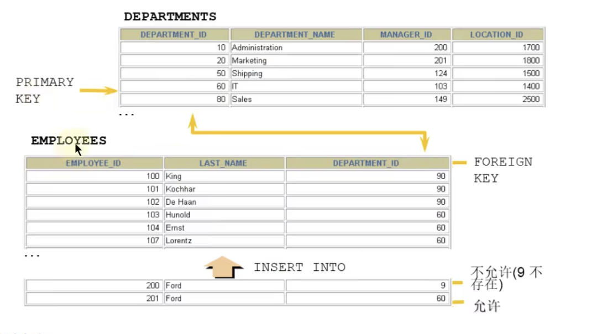

<br>

```sql
-- 部门表: 主键 - department_id

 primary key
---------------------------------
department_id | department_name
---------------------------------
						↖
							↖
								↖
      					  ↖
-- 员工表: 主键 - employee_id, 外键 - department_id			
								 foreign key
---------------------------------
employee_id  |  department_id
---------------------------------
```

当我们往员工表中添加员工的数据, 如果
- 添加 60号部门 可以添加成功
- 添加 09号部门 添加失败, 因为部门表里面没有09号部门

**原因:**  
员工表中的 department_id 关联了 部门表中的 department_id

```sql
-- 互相关联
departments 主键: department_id
						 ↓↑
employees		外键: department_id
```

- 部门表中的 department_id 叫做主键
- 员工表中的 department_id 叫做外键

员工表通过 外键 **关联了** 部门表中的 主键

- 员工表: 从表(子表)
- 部门表: 主表(父表)

从表中的一个字段会作为外键 关联了 主表中的主键

<br>

**关联后的效果:**  
往 从表 中添加数据的时候 外键字段中的值, 必须是主表中关联字段(主键)中存在的值 如果主表关联字段中没有 则添加失败

比如我们要往员工表中添加9号部门, 但是部门表中根本没有 所以不能添加

<br>

### 主表和从表 / 父表和子表
从表中有一个字段, 这个字段关联着 主表中的一个字段  
当我们向从表中该字段添加数据的时候, 添加的值必须要参考主表中关联字段的值

说白了就是, 主表里有 1 2 3, 那我们往向从表该字段里添加数据的时候 只能从 1 2 3 里面选, 不能添 5 6 等

<br>

**主表(父表):** 
被引用的表, 被参考的表 (有一个字段被参考了)

<br>

**从表(子表):**   
引用别人的表, 参考别人的表 (参考别的表中的一个字段)

<br>

**举例:**  
员工表的员工所在部门这个字段的值要参考部门表  
部门表是主表, 员工表是从表。

<br>

**例如:**   
学生表, 课程表, 选课表

选课表的学生和课程要分别参考学生表和课程表
- 学生表和课程表是主表
- 选课表是从表

选择表中涉及到哪个学生选的哪个课, 课有课的id, 学生有学生的id, 这两个id就不能乱写了, 学生的id要在学生表中能找到, 课的id要在课程表中能找到

<br>

### 外键约束的要求:

**要求1: 外键要关联主键**  
从表的外键字段 必须 参考/引用 主表中的主键字段, 或主表中唯一约束的字段

也就是说 **从表的外键关联的字段必须是主表中的主键字段**  

为什么？因为被依赖/被参考的值必须是唯一的

<br>

**要求2: 建议给外键起名字**  
在创建外键约束时, 如果不给外键约束命名, **默认名不是列名, 而是自动产生一个外键名**  

<font color="#C2185B">建议指定外键约束名</font>

<br>

**要求3: 创建先创建主表**  
当我们创建表的时候就指定表的外键约束的话, 须先创建主表, 再创建从表

<br>

**要求4: 删表先删从表**  
删表时, 先删从表(或先删除外键约束), 再删除主表

<br>

**要点5: 主表被关联字段不允许被删除**  
当主表的记录被从表参照时, <font color="#C2185B">主表的记录将不允许删除</font>

如果要删除数据, 需要先删除从表中依赖该记录的数据, 然后才可以删除主表的数据

先删员工表中的部门记录, 然后再删除部门表中的对应部门

<br>

**要点6: 一个表可以创建多个外键**  
在"从表"中指定外键约束, 并且**一个表可以建立多个外键约束**  

比如员工表:
- department_id: 外键
- job_id: 外键
- manager_id: 外键, 关联它自己的 employee_id

<br>

**要点7: 外键与主键名可以不同**  
从表的 外键字段 与 主表被参照的字段名(列名) 可以不相同, 但是数据类型必须一样, 逻辑意义一致。

例如: 都是表示部门编号, 都是int类型。

如果类型不一样, 创建子表时, 就会出现错误
```sql
"ERROR 1005 (HY000): Can't create table'database.tablename'(errno: 150)"
```

<br>

**要求8:**  
**当创建外键约束时, 系统默认会在所在的列上建立对应的普通索引**。

但是索引名是外键的约束名。(根据外键查询效率很高)

<br>

**要求9:**  
删除外键约束后, 必须 **手动 删除对应的索引**  

<br><br>

## 添加外键约束: foreign key

<br>

### 添加方式1 创建表 设置外键约束:  
- 先创建主表
- 再创建从表

**注意:**  
1. 外键必须是主表中的主键或唯一约束
2. 外键最好添加上约束名, 也就是通过表级约束的方式添加外键约束
3. 主键 和 外键 的数据类型必须一致

<br>

### **<font color="#C2185B">[constraint 约束名] foreign key(本表中的哪个字段作为外键) references 主表(主表中关联哪个字段)</font>**  
使用表级约束 添加外键约束

**注意:**  
表级约束部分可以为各个字段创建约束 并为各个字段创建约束名
```sql
create table test(

	-- 表级约束: 
	-- 外键约束
	constraint 约束名 foreign key(本表中的哪个字段作为外键) references 主表(主表中关联哪个字段),
	-- 唯一约束
	constraint 约束名 unique(字段),
)

```

<br>

**写法:**  
写命令的时候可以按照 `从表中的指定字段引用主表中的哪个字段` 的方式去写

<br>

**外键名起名规则:**  
外键缩写_从表名_主表名_关联字段

```sql
-- 前提: 必须先有主表

-- 创建从表并添加外键约束
create table test (
	emp_id int primary key auto_increment,
	emp_name varchar(15),
	department_id int,

	-- 表级约束
	constraint fk_emp1_dept_id foreign key(department_id) references dept1(dept_id)
)
```

<br>

**完整演示:**  
```sql
-- 先创建主表
create table dept1(
  -- 被外键关联的字段必须是主键 
  dept_id int primary key,
  dept_name varchar(15)
)


-- 再创建从表
create table emp1(
  emp_id int primary key auto_increment,
  emp_name varchar(15),

  -- 外键字段名可以和主表中的主键字段名不一样
  dept_id int,

  -- 表级约束
  constraint fk_emp1_dept_id foreign key (dept_id) references dep1(dept_id)
)
```

<br>

### 测试演示:

**往从表中添加数据:**  
我们新创建的主表和从表 都没有数据, 当我们直接往从表中添加数据的时候 会失败, 因为主表中还没有数据

```sql
-- 添加失败 因为主表中还没有10号部门
insert into emp values (1001, 'Sam', 10)
```

<br>

**删除演示:**  
直接删除主表中的数据, 报错, 需要先删除从表中的10号部门的相关数据后, 再删除主表中的数据
```sql
-- 删除失败;¥: 删除部门表中的10号部门 
delete from dept1
where dept_id = 10

-- 修改失败: 修改部门表中的10部门 修改为 20部门 修改失败 也是因为外键的影响, 因为主表中没有20
update dept1
set dept_id = 20
where dept_id = 10
```

<br>

### 添加方式2 修改表 设置外键约束:  
一般情况下, 表与表的关联都是提前设计好了的, 因此, 会在创建表的时候就把外键约束定义好。

不过, 如果需要修改表的设计(比如添加新的字段, 增加新的关联关系), 但没有预先定义外键约束, 那么, 就要用修改表的方式来补充定义。

<br>

### **<font color="#C2185B">alter table 从表名 add [constraint 约束名] foreign key (本表中的哪个字段作为外键) references 主表名(被引用字段) [on update [约束等级] on delete [约束等级]]</font>**  

**约束等级: 可选**  
分别指定在 update 和 delete 时的约束等级, 可选的约束等级有

- set null
- cascade
- no action / restrict 默认值

**推荐:**  
on update cascade on delete restrict

```sql
-- 约束等级示例: 更新部门表时员工表同时更新, 删除部门表时员工表对应字段的值被设置为null
on update cascade on delete set null
```

```sql
-- 添加外键约束示例: 使用 alter table 的形式添加外键约束
alter table emp2
add constraint fk_emp2_dept_id foreign key(department_id) references dept2(dept_id)
```

<br><br>

## 约束等级
我们在给表添加外键约束的时候, 可以考虑下约束等级 我们有如下的5中方式

- Cascade方式
- Set null方式
- No action方式
- Restrict方式
- Set default方式

<br>

### Cascade方式: 
在父表上 update/delete 记录时, 同步的 update/delete掉 子表的匹配记录 

我们发现在单独删除或者更新主表的数据的时候 发现会报错

当我们使用这种模式的时候, 当我们想更新主表中的字段时 ``10部门 -> 20部门``, 同步的从表的10号部门也会变成20部门

如果我们将主表中的10部门的记录删掉 从表中的10号部门的记录也会被删掉

<br>


### Set null方式: 
在父表上 update/delete 记录时, 将子表上匹配记录的列设为null, **但是要注意子表的外键列不能为not null**  

比如我们修改主表(部门表)中的部门  ``10部门 -> 20部门`` 同时会将从表(员工表)的对应字段(外键字段)就会表成 null

如果我们将主表中的部门 ``10部门 -> 删掉`` 同时会将从表中对应字段设置为 null, 而不是如cascade模式同时删掉

<br>

### No action方式: 默认动作
默认模式, 不添加约束等级时默认的动作

在父表上 update/delete 记录时, 如果从表中有匹配的记录, 则不允许主表的 删除 或 更新 操作 报错

<br>

### Restrict方式: 
同 ``no action``,  都是立即检查外键约束

<br>

### Set default方式:
(在可视化工具SQLyog中可能显示空白): 父表有变更时, 子表将外键列设置成一个默认的值, 但Innodb不能识别

<br>

**注意:**   
如果没有指定等级, 就相当于Restrict方式。

<br>

### 结论:  
对于外键约束, 最好是采用: 

<font color="#C2185B">on update cascade on delete restrict</font>的方式

更新主表的时候同步, 删除操作的时候报错

<br>

**演示:**   
- update的时候 使用 cascade
- delete的时候 使用 set null

```sql
-- 创建部门表 
create table dept(
	did int primary key,		-- 部门编号
  dname varchar(50)			  -- 部门名称
);


-- 创建员工表
create table emp(
	eid int primary key,  -- 员工编号
  ename varchar(5),     -- 员工姓名
  deptid int,				    -- 员工所在的部门

  -- 把修改操作设置为级联修改等级, 把删除操作设置为set null等级
  foreign key (deptid) references dept(did) on update cascade on delete set null
);


-- 先添加主表的数据
insert into dept values(1001,'教学部');
insert into dept values(1002, '财务部');
insert into dept values(1003, '咨询部');


-- 再添加从表的数据
-- 在添加这条记录时, 要求部门表有1001部门
insert into emp values(1,'张三',1001); 
insert into emp values(2,'李四',1001);
insert into emp values(3,'王五',1002);


-- 更新主表中的 部门编号 did  修改成
update dept
set did = 1006
where did = 1002


-- 修改了 部门表中 did 1002 - 1006
-- 员工表中 原先王五所在1002部门 被修改成了1006

-- 删除部门表中的 1006
delete from dept
where did = 1006

-- 员工表中 原先王五所在的1006部门 变成了null
```

<br><br>

## 删除外键约束
- 先删除 外键约束
- 再删除 外键约束对应的普通索引

<br>

### **<font color="#C2185B">alter table 从表名 drop foreign key 外键约束名</font>**  

一个表中可以声明有多个外键约束 所以删除的时候我们要指明要删的是哪一个

<br>

### 删除演示:

**第一步:**  
先查看约束名 和 删除外键约束
```sql
-- 查看某个表的约束名: 找到 key_name
SELECT * FROM information_schema.table_constraints WHERE table_name = '表名称'


-- 删除外键约束: 删除 key_name
alter table emp1
drop foreign key fk_emp1_dept_id
```

<br>

**第二步: 删除外键约束对应的普通索引**  
当我们创建外键约束的时候, 系统会自动在该字段上添加一个普通索引

当我们删除了外键约束后, 我们还**需要手动的删除该索引**  

<br>

**查看索引名: key_name**  
```sql
-- 查看某个表的索引名
SHOW INDEX FROM 表名称;
```

<br>

**删除该索引:**  
```sql
ALTER TABLE 从表名 DROP INDEX 外键约束名;
-- 索引名是 key_name
```

<br>

### 开发中到底要不要用 外键约束？？
我们前面讲了
- 非空约束 
- 唯一约束 
- 主键约束 

这3个我们在开发的时候能用上就用上 尤其是主键约束是一定要有的 因为它直接影响了主键索引 和 表 b+tree 的结构

**那外键约束要不要用？**  

<br>

### 问题1: 
如果两个表之间有关系(一对一, 一对多), 比如: 员工表和部门表(一对多), 它们之间是否一定要建外键约束？

答: 不是的

<br>

### 问题2: 
建和不建外键约束有什么区别？

答: 建外键约束, 你的操作(创建表, 删除表, 添加, 修改, 删除)会受到限制, 从语法层面受到限制。

例如: 在员工表中不可能添加一个员工信息, 它的部门的值在部门表中找不到。

不建外键约束, 你的操作(创建表, 删除表, 添加, 修改, 删除)不受限制

要想保证数据的 引用完整性 有两种方式
- 依靠程序员的自觉
- 在Java程序中进行限定

比如在java中我们将所有部门保存在一个集合中, 当我们添加数据的时候, 看看我们要添加的部门是否在集合中, 在就让添加 不在则不让添加

<br>

### 问题3: 
那么建和不建外键约束和查询有没有关系？  
答: 没有 跟增删改有关系

<br>

### 结论:
在 MySQL 里, **外键约束是有成本的, 需要消耗系统资源**。对于**大并发的 SQL 操作**, 有可能会阻塞

比如员工表和部门表 有可能关联着很多表的外键, 现在我们往员工表中添加数据 但是它还会关联着其他的表, 我们只是往 A表 中添加数据, 取还要向 B C D E 表中做验证

当在大并发的场景下会阻塞程序的运行 影响性能, 外键约束的引用完整性 **建议在应用层面做检查**, 不要堆积到数据库的层面去做

也就是说, 即使你不用外键约束, 也要想办法通过应用层面的附加逻辑, 来实现外键约束的功能, 确保数据的一致性。

<br>

### 阿里开发规范:
<font color="#C2185B">不得使用外键与级联, 一切外键概念必须在应用层解决。</font> 

**级联说明:**   
学生表中的 student_id 是主键, 那么成绩表中的 student_id 则为外键。如果更新学生表中的 student_id, 同时触发成绩表中的 student_id 更新, **即为级联更新。**  

- 外键与级联更新适用于 单机低并发
- 不适合 分布式, 高并发集群

级联更新是强阻塞, 存在数据库 更新风暴的风险 外键影响数据库的 插入速度

<br>

### 结论:
mysql给我们提供了外键的功能 用于体现引用的完整性 但是在**实际开发中** 我们**会在应用层面解决数据的完整性** 而不是通过数据库中的外键

<br><br>

## 添加检查约束: check(条件)

### 作用:
检查某个字段的值是否符合某种要求, **一般指的是值的范围**, 如果不满足要求 则添加失败

<br>

**注意:**  
- MySQL5.7 不支持
- MySQL5.7 可以使用check约束, 但check约束对数据验证没有任何作用。添加数据时, 没有任何错误或警告

<br>

### 添加方式 创建表 设置check约束: 
我们在创建表指定字段的时候, 并列写在 字段类型的后面

<br>

### **<font color="#C2185B">create table 表名 (字段 类型 check(条件))</font>**  
当往字段里添加的数据不满足 check约束中指定的条件的时候 则添加数据不成功

```sql
create table test(
  字段 类型 check(salary > 2000)
)
```

<br>

**示例:**  

```sql
create table test(
  id int,
  salary decimal(10, 2) check(salary > 2000)
)


-- 插入数据: 添加成功
insert into test
values(1, 'Tom', 2500)


-- 添加失败: 工作 < 1500
insert into test
values(1, 'Tom', 1500)


-- 举例:
create table test (
	salary decimal(10, 2) check(salary > 2000)
	gender char check ('男' or '女')
	age int check(age > 20),
)

create table test (
	age tinyint check(age >20)
	sex char(2) check(sex in(‘男’,’女’))
	check(height>=0 AND height<3)
)
```

<br><br>

## 添加默认值约束: default
给某个字段/某列指定默认值, 一旦设置默认值, 在插入数据时, 如果此字段没有显式赋值, 则赋值为默认值。

<br>

### 添加方式1 创建表 设置default约束: 
在创建表设置字段的时候, 在类型的并列的位置设置 default约束

```sql
create table 表名称(
  字段名 数据类型 not null default 默认值, 
);
```

<br>

**注意:**  
默认值约束一般不在唯一键和主键列上加

<br>

**示例:** 
```sql
create table test(
  id int,
  last_name varchar(15),
  -- 如果salary没有赋值的话 默认值就是2000
  salary decimal(10, 2) default 2000
)
```

<br>

### 添加方式2 修改表 设置default约束: 

### **<font color="#C2185B">alter table 表名称 modify 字段 类型 default 默认值</font>**  

如果这个字段原来有非空约束, 你还保留非空约束, 那么在加默认值约束时, 还得保留非空约束, 否则非空约束就被删除了

同理, 在给某个字段加非空约束也一样, 如果这个字段原来有默认值约束, 你想保留, 也要在modify语句中保留默认值约束, 否则就删除了

```sql
alter table test
modify salary decimal(10, 2) default 2500
```

<br><br>

## 删除default约束:

### 删除方式 修改表 删除default约束: 
直接去掉 default 默认值就可以
```sql
-- 添加 默认值约束
alter table test
modify salary decimal(10, 2) default 2500


-- 删除默认值约束: 直接去掉 default的相关部门就可以
alter table test
modify salary decimal(10, 2)
```

<br>

## 思考:

### 1. 为什么建表时, 加 not null default '' 或 default 0 - 推荐
- default '' -- 针对字符串类型的
- default 0  -- 针对数值类型的

答: 不想让表中出现null值。 避免在没有赋值的时候显示null值 跟js中的默认值一个意思 

```js
let str = ""
let arr = []
let num = 0
```

总结: 当我们给一个字段添加 非空约束的时候, 建议顺便添加上 default

<br>

### 2. 为什么不想要 null 的值

- 不好比较:  
null是一种特殊值, 比较时只能用专门的is null 和 is not null来比较。碰到运算符, 通常返回null。

- 效率不高:  
影响提高索引效果。因此, 我们往往在建表时 not null default '' 或 default 0

<br>

### 3. 带 AUTO_INCREMENT 约束的字段值是从1开始的吗？

在MySQL中, **默认AUTO_INCREMENT的初始值是1**, 每新增一条记录, 字段值自动加1

设置自增属性(AUTO_INCREMENT)的时候, 还可以指定第一条插入记录的自增字段的值(我插入第一条数据的id设置为10), 这样新插入的记录的自增字段值从初始值开始递增(在10的基础上递增), 

**如在表中插入第一条记录, 同时指定id值为5**, 则以后插入的记录的id值就会从6开始往上增加。添加主键约束时, 往往需要设置字段自动增加属性。

<br>

### 4. 并不是每个表都可以任意选择存储引擎？
外键约束(FOREIGN KEY)不能跨引擎使用。**主表的引擎和从表的引擎必须一致**  

MySQL支持多种存储引擎, 每一个表都可以指定一个不同的存储引擎, 需要注意的是: 外键约束是用来保证数据的参照完整性的, 如果表之间需要关联外键, 却指定了不同的存储引擎, 那么这些表之间是不能创建外键约束的。所以说, 存储引擎的选择也不完全是随意的。

```sql
-- 查看创建数据库时的语句
show create table test

create table test() 在这里部分不仅可以指定字符集 还可以执行引擎

-- 也就是说 我们可以给任何表设置引擎
```

<br><br>

# 约束的章节练习没有做

### 练习1:
```sql
show databases;

create table emp (
	id int,
	emp_name varchar(15)
);

create table dept (
	id int,
	dept_name varchar(15)
);

show tables;

select * from emp;
select * from dept;

alter table emp add primary key(id)
alter table dept add primary key(id)

-- 添加字段:
alter table emp add column dept_id int
-- 设置外键:
alter table emp add constraint fk_emp_dept_id foreign key(dept_id) references dept(id)
```

<br>

### 练习2:
```sql
-- 添加主键约束: 
-- 方式1: 先添加主键 然后再添加 自增
alter table books add primary key(id)
alter table book modify column id int auto_increment

-- 方式2: 主键 和 自增 放在一起进行添加
alter table books modify column id int primary key auto_increment
```

<br>

### 练习3:
```sql

```

<br><br>

# 视图
视图 是 除了表之外的一个数据库对象
从这章开始我们要讲一些除了表之外的数据库对象

<br>

## 常见的数据库对象
- 表
- 系统表(数据字典)
- 约束
- 视图
- 索引
- 存储过程
- 存储函数
- 触发器

<br>

### 表: table  

表就是典型的数据库对象, 表是存储数据的逻辑单元, 以行和列的形式存在
- 列就是字段
- 行就是记录

<br>

### 数据字典: 
数据字典也是表 只不过**它是系统表**, 存放数据库相关信息的表。系统表的数据通常由数据库系统维护, 程序员通常不应该修改, 只可查看

<br>

### 约束: constraint
执行数据校验的规则, 用于保证数据完整性的规则

<br>

### 视图: view
**一个或者多个数据表里的数据的逻辑显示**, 视图并不存储数据

<br>

### 索引: index
用于提高查询性能, 相当于书的目录

<br>

### 存储过程: procedure
用于完成一次完整的业务处理, **没有返回值**, 但可通过传出参数将多个值传给调用环境

<br>

### 存储函数: function
用于完成一次特定的计算, **具有一个返回值**  
系统给我们提供的函数 比如单行函数 和 聚合函数

<br>

### 触发器: trigger
相当于一个事件监听器, 当数据库发生特定事件后, 触发器被触发, 完成相应的处理

比如我们删除表中的一条记录 删之前就会触动一个触发器的执行 比如吧要删除的记录保存到另外的一张表里面

**这就是数据的备份**  

<br><br>

# 视图:

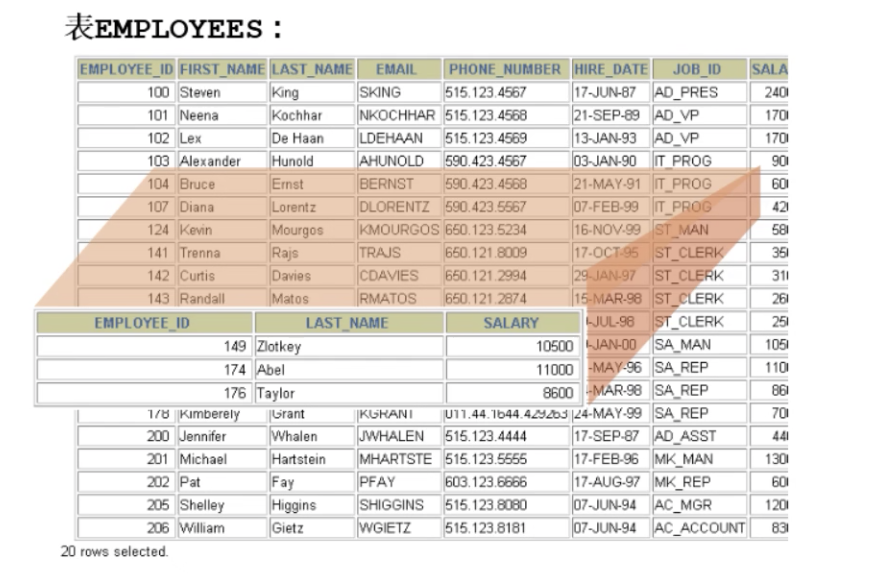

<br><br>

## 为什么要使用视图?
视图一方面可以**帮我们使用表的一部分**而不是所有的表, 另一方面也可以针对不同的用户制定不同的查询视图。

**比如:**    
- 针对一个公司的销售人员:  
我们只想给他看部分数据, 而某些特殊的数据, 比如采购的价格, 则不会提供给他。

- 人员薪酬是个敏感的字段:  
那么只给某个级别以上的人员开放, 其他人的查询视图中则不提供这个字段

<br>

刚才讲的只是视图的一个使用场景, 实际上视图还有很多作用

<br>

### 场景描述:
比如我们有一张 员工表 employees  

这张表中有很多的字段和数据 这张表在实际的工作当中会让数据库的管理人员维护表

假如我们这个数据库的管理人员就是一个普通员工
而表中有些数据 有些字段比较敏感 

比如员工的薪资 那么这个维护人员就能看到表里的所有工资 不太合适

也就是希望除了这些敏感的字段之外的字段 让这个维护人员操作 为了解决这个问题 **有哪些方法呢?**  

<br>

### 方式1: 复制出来一张新表
去除敏感字段 把其它字段取出来造成一张子表(新表), 我们前面说了创建表的时候可以使用 利用查询结果创建新表
```sql
create table test
as
select * from ...
```

让这个维护人员去维护这张新表 但是这样又有一个问题 **我们改的是新表 并不是原表 和原表没有关系了, 管理员更新的新表并没有同步到原表中**  

<br>

### 方式2: 使用视图
我们根据原表 过滤掉敏感的字段 然后创建一个视图, 然后我们让维护人员去维护视图 **他对视图的操作会影响到原表**  

我们要知道的是 view本身不存数据 我们通过view修改的数据 还是原表的(对view的增删改查 都是对原表的操作)

我们通过视图完成了表的权限管理工作

<br>

### 视图的理解:
视图就是一个虚拟的表, 看似它存在实际上数据还都在原表的里面
 
视图是一种 **虚拟表**, 本身是 **不具有数据** 的, 占用很少的内存空间, 它是 SQL 中的一个重要概念。

<br>

### 视图的概念:

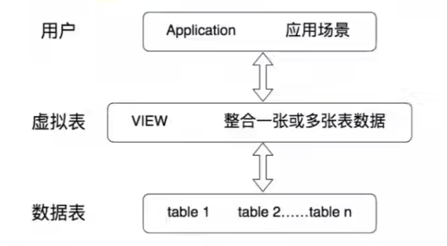

<br>

```sql
create view 视图名
as
select * from 表(基表)
```

我们从上面创建视图的方式能看出, 创建视图的时候 依赖的select语句中的表 **称之为基表**  

**视图建立在已有表的基础上**, 视图赖以建立的这些表称为**基表**。

<br>

```sql
-- 这里的用户是指操作数据库客户端的人

用  户:  Application 应用场景

				↑ ↓

虚拟表:  view 整合一张或多张表数据

				↑ ↓

数据表:  table
```

<br>

### 视图的特点:
创建视图 和 删除视图 只影响视图本身, 也就是说视图的删除不会导致基表中过的数据删除, 跟基表不发生关系

但是 通过视图对视图中的数据进行如下的操作时
- 增加
- 删除
- 修改

数据表中的数据会相应地发生变化, 反之亦然。(基表中的数据发生变化 视图里面的数据也会发生变化 -- haha 双向绑定么？)

<br>

### 视图的本质:
向视图提供数据的是 select语句, 所以可以将视图理解为**存储起来的SELECT语句** 

也就是说, 我们将一个复杂的查询语句 存储在一个叫视图的变量中了供我们使用 (这是另一种理解角度)

<br>

### 视图的优点:
1. 控制数据的方位
2. 简化查询

视图, 是向用户提供基表数据的另一种表现形式。通常情况下, 小型项目的数据库可以不使用视图, (不推荐使用视图 几十个表可用可不用 这样的项目不大)

但是在大型项目中, 以及数据表比较复杂的情况下(几百张表 n多字段), 视图的价值就凸显出来了, 它可以帮助我们把经常查询的结果集放到虚拟表中, 提升使用效率。理解和使用起来都非常方便。

因为大型的项目中 表之间的关系 字段就特别的复杂了 
这时候我们要是写一个select语句 代码量可能会非常的大

如果我们没有把这个select语句保存起来 后面还想用 每次都要现写

这时候我们就可以把这个代码量非常大 逻辑性非常复杂的查询语句 通过视图的方式 固定下来 当我们每次要用的时候直接现调就可以了

这也是视图的另一个优点就是简化我们的查询

<br><br>

## 创建视图: create view

### 创建方式1: 精简版
语法比较简单 跟创建表一样 ``create table``, 创建视图 ``create view``

```sql
create view 视图名 [(视图中字段的名)]
as
select ... from ...
```

**视图中字段的名: 可选**  
1. 如果不指定该部分, select查询的字段名 将作为视图中的字段名

2. select部分的字段别名 将作为视图中的字段名

3. 可以通过该部分, 指明出现在视图中的字段名, 指明的视图中的字段名必须和select部分查询出来的字段顺序一致

```sql
-- 一一匹配
											↓
create view vu_test (id, name, email)
as					↓
select employee_id, employee_name, employee_email from emps
```

<br>

<font color="#C2185B">如上也是视图字段名的三种指定方式</font>

<br>

### 创建方式2: 完整版
```sql
create 
[algorithm = 算法] 
view 视图名 [(视图中字段的名)]
as
select ... from ...
[with [cascaded|local] check option]
```

**算法部分: 可选**  
- undefined
- meger
- temptable

**视图中字段的名: 可选**  
同上

**with ... check option:**  
不明

<br><br>

## 创建视图示例:
创建视图一共分为方式
1. 针对 单表 创建视图: 单表查询
2. 针对 多表 创建视图: 

都是将查询结果放在视图中, 查询有多么的丰富结果就有多么的多样 视图相当于查询语句的存储

<br>

### 准备工作: 
先根据原有的表创建一个新的表

**注意:**  
使用该方式复制的表, 除了非空和默认值约束外其余的约束不能继承到新表中

```sql
-- 创建了 员工表 和 部门表
create table emps
as
select *
from atguigudb.employees

create table depts
as
select *
from atguigudb.departments
```
<br>

### 创建视图: 单表
```sql
-- 情况1: 根据select查询的字段名 作为视图中的字段名
create view v_emp1
as
select employee_id, last_name, salary
from emps

---

-- 情况2: 根据select查询的字段的别名 作为视图中的字段名
create view v_emp2
as
select employee_id emp_id, last_name emp_name, salary
from emps
where salary > 8000

---

-- 情况3: 创建视图的时候 指明视图中的字段名
create view v_emp2(emp_id, emp_name, emp_salary)
as
select employee_id, last_name, salary
from emps
where salary > 8000

---

-- 情况4: 将基表中没有的字段 通过查询添加到视图中 如 avg(salary)
-- 平均工资这个字段是基表当中不存在的 是我们通过avg算出来的
create view v_emp_sal
as
select department_id, avg(salary) avg_sal
from emps
where department_id is not null
group by department_id
```

<br>

### 创建视图: 多表
通过多表连接的方式 将两个表的结果 查询到视图中

```sql
-- 内连接:
create view v_emp_dept
as
select e.employee_id, e.department_id, d.department_name
from emps e join depts d
on e.department_id = d.department_id


select * from v_emp_dept
```
<br>

### 利用视图对数据进行格式化
**目标:**  
视图中的字段名格式为: ``emp_name(department_name)``

该情况下 我们可以用字符串的单行函数来解决 相当于字符串 和 变量之间的拼接  
``concat()`` 

```sql
create view v_emp_dept
as
select concat(e.last_name, '(', d.department_name, ')') emp_info
from emps e join depts d
on e.department_id = d.department_id
```

<br>

### 基于视图 创建视图
我们创建的视图相当于一张表, 我们再次的在该视图上 创建一个新的视图

```sql
create view v_emp2
as
select employee_id, last_name
from v_emp1		-- v_emp1是一个视图
```

<br>

### 查看视图数据
我们创建的视图相当于一张表, 就是查询表的操作
```sql
select * from 视图名称
```

<br>

### 查看视图
我们查看当前的数据库下一共有多少个视图

**方式1:**  
**<font color="#C2185B">show tables</font>**  
该命令可以查看当前数据库下的 **表 和 视图**  

<br>

**方式2:**  
**<font color="#C2185B">desc 视图名称</font>**  
查看视图的结构, 跟查看表的结果呈现的信息是一样的

<br>

**方式3:**  
**<font color="#C2185B">show table status like '视图名称'\G</font>**  
查看视图的属性信息

显示数据表的
- 存储引擎
- 版本
- 数据行数
- 数据大小 等

```sql
-- 小黑屏输入 使用 \G 的命令
SHOW TABLE STATUS LIKE '视图名称'[\G]

/*
	执行结果的最后:
		Comment: view

	说明该表为视图, 其他的信息为NULL, 说明这是一个虚表。
*/
```

<br>

**方式4:**  
**<font color="#C2185B">show create view 视图名称</font>**  
查看定义视图时的信息

```sql
SHOW CREATE VIEW 视图名称;
```

<br><br>

## 操作视图数据
MySQL支持使用对表的 增 删 改 的操作来操作视图
- insert
- update
- delete

当视图中的数据发生变化时, 数据表中的数据也会发生变化, 反之亦然。

<br>

### 更新(增删改)视图中的数据
修改视图中的数据 也会影响基表中的数据(也不叫影响其实操作的就是基表的数据)

<br>

**注意:**  
当我们对视图进行 增 删 改 的时候, 操作的字段不能是通过如下的情况得到的字段

- 现有的表中没有的字段 我们对它进行操作的时候 都会失败 如:
	- 通过聚合函数得到的字段 avg(salary)
	- 多个字段计算出来的结果 salary * commission_pct

```sql
-- 修改视图 <-> 影响基表
update v_emp1
set salary = 2000
where employee_id = 101


-- 修改基表 <-> 影响视图
update emps
set salary = 1000
where employee_id = 101


-- 删除视图中的数据 <-> 影响基表
delete from v_emp1
where employee_id = 101

-- 结果
100
102
```

<br>

**思考: 更新数据一定能成功么？**  
不一定！一般情况下可以更新数据

<br>

### 增操作:
上面我们知道 增删改 操作, 只有当视图中的字段是基表中现有的字段, 且视图中的字段不是综合查询出来的结果时 才可以操作成功

但是对于添加操作而言, 即使是符合上面的要求 也有可能添加失败 如:

emp_v1视图中只有3个字段, 当我们通过视图添加数据的时候, 只添加了3个字段的信息, 如果emps基表中的其他字段**有非空约束的话** 则添加失败

<br>

### 修改视图 基表数据更新失败的情况:
我们上面在创建视图的时候 有一种情况是根据基表中不是现成的字段创建了一份视图

比如 平均工资 这个字段 在基表中是没有的 是通过计算得来的

```sql
-- 视图中的字段在基表中可能没有对应的字段 avg(salary)
create view v_emp_sal
as
select department_id, avg(salary) avg_sal
from emps
where department_id is not null
group by department_id
```

<br>

视图中的平均工资这列在基表中根本就不存在 这列是聚合函数算出来的值 那我们通过视图 修改这个平均工资的字段 **能成功么?**  

<br>

**演示: 需改通过 聚合函数 得到的字段数据**  
报错: 更新失败

```sql
-- 修改视图的平均工资字段
update v_emp_sal
set avg_sal = 5000
where department_id = 30
```

<br>

**分析:**  
假如能更新成功 视图中本身不存数据 数据还在基表里面 好多基表中的员工都是30号部门的 那我们怎么调配这些员工使得最后的平均工资是5000?

**删除也一样 也会失败** 

<br>

### 更新失败的情况:
**要使视图可更新, 视图中的行和基表中的行之间必须存在 <font color="#C2185B">一对一</font> 的关系。**  

这是前提 在这种前提下 更新数据是可以的

<br>

当视图定义出现**如下情况时, 视图不支持更新操作**:

1. 在定义视图的时候指定了 "ALGORITHM = TEMPTABLE", 视图将不支持 insert 和 delete 操作

2. 视图中不包含基表中所有被定义为非空又未指定默认值的列, 视图将不支持 insert 操作; 

3. 在定义视图的 select 语句中使用了 join 联合查询, 视图将不支持INSERT和DELETE操作; 

4. 在定义视图的 select 语句后的字段列表中使用了 数学表达式 或 子查询, 视图将不支持 insert, 也不支持 update 使用了数学表达式, 子查询的字段值; 

5. 在定义视图的 select 语句后的字段列表中使用 distinct , 聚合函数, GROUP BY, HAVING, UNION 等, 视图将不支持INSERT, UPDATE, DELETE; 

6. 在定义视图的SELECT语句中包含了子查询, 而子查询中引用了FROM后面的表, 视图将不支持INSERT, UPDATE, DELETE; 

7. 视图定义基于一个 不可更新视图; 

8. 常量视图。

<br>

### 总结:
视图的本质就是一个保存起来的 select 语句, 视图更多是用来做查询的 

虽然可以更新视图数据, 但总的来说, 视图作为 虚拟表, 主要用于 方便查询, 不建议更新视图的数据。

我们要是更新数据, 还是要通过基表来完成

<br><br>

## 修改视图
比如:  
我们基于表A创建的视图A 现在基表中的字段名改了 或者 基表中加了一个字段 

这时候我们也想把基表中的修改后的字段名 和 基表中增加后的字段 反映到视图上 

也就是**基表中的结构的更改 会导致我们有必要去调整 也称之为修改视图**  

<br>

修改视图有两种方式:
- create or replace view
- alter view

<br>

### **<font color="#C2185B">方式1: create or replace view 视图名</font>**  
该方式为如果没有视图则创建, 已有视图则修改

我们通过重新查询基表将基表中最新的内容放到视图中, 类似用再次的新视图替换旧视图的操作

```sql
create or replace view 视图名
as
-- email就是补的字段
select employee_id, last_name, salary, email
from employees
```

<br>

### **<font color="#C2185B">方式2: alter view 视图名称</font>**  
我们通过重新查询基表将基表中最新的内容放到视图中, 修改的是已有的视图 
```sql
alter view 视图名
as
-- email就是补的字段
select employee_id, last_name, salary, email
from employees
```

<br><br>

## 删除视图
如果要删除多个视图 中间使用, 隔开

### **<font color="#C2185B">drop view [if exists] 视图1[, 视图2]</font>**  

```sql
-- if exists 加上它 表示如果有就删除 如果没有也不会报错
drop view if exists v_emp1, v_emp2
```

**说明:**   
基于视图a, b创建了新的视图c, 如果将视图a或者视图b删除, 会导致视图c的查询失败。

```
		C	-> 不能用
		□
A				B
■				■
x				x
```

**这样的视图c需要手动删除或修改, 否则影响使用。**  

<br><br>

### 视图优点:

**1. 操作简单(简化查询)**  
将经常使用的查询操作定义为视图, 可以使开发人员不需要关心视图对应的数据表的结构, 表与表之间的关联关系, 也不需要关心数据表之间的业务逻辑和查询条件, 而只需要简单地操作视图即可, 极大简化了开发人员对数据库的操作。

<br>

**2. 减少数据冗余**  
视图跟实际数据表不一样, 它存储的是查询语句。所以, 在使用的时候, 我们要通过定义视图的查询语句来获取结果集。而视图本身不存储数据, 不占用数据存储的资源, 减少了数据冗余。

<br>

**3. 数据安全(控制访问权限)**  
MySQL将用户对数据的 访问限制 在某些数据的结果集上, 而这些数据的结果集可以使用视图来实现。用户不必直接查询或操作数据表。这也可以理解为视图具有 隔离性。视图相当于在用户和实际的数据表之间加了一层虚拟表。

同时, MySQL可以根据权限将用户对数据的访问限制在某些视图上, **用户不需要查询数据表, 可以直接通过视图获取数据表中的信息**。这在一定程度上保障了数据表中数据的安全性。

<br>

**4. 适应灵活多变的需求**   
当业务系统的需求发生变化后, 如果需要改动数据表的结构, 则工作量相对较大, 可以使用视图来减少改动的工作量。这种方式在实际工作中使用得比较多。

<br>

**5. 能够分解复杂的查询逻辑**  
数据库中如果存在复杂的查询逻辑, 则可以将问题进行分解, 创建多个视图获取数据, 再将创建的多个视图结合起来, 完成复杂的查询逻辑。

<br>

### 视图不足 (维护成本高):
如果我们在实际数据表的基础上创建了视图, 那么, **如果实际数据表的结构变更了, 我们就需要及时对相关的视图进行相应的维护**。

特别是嵌套的视图(就是在视图的基础上创建视图), 维护会变得比较复杂, 可读性不好, 容易变成系统的潜在隐患。因为创建视图的 SQL 查询可能会对字段重命名, 也可能包含复杂的逻辑, 这些都会增加维护的成本。

实际项目中, **如果视图过多, 会导致数据库维护成本的问题。**  

所以, 在创建视图的时候, 你要结合实际项目需求, 综合考虑视图的优点和不足, 这样才能正确使用视图, 使系统整体达到最优。

<br><br>

## 练习:

```sql
-- 1. 使用 恩平市创建视图 employee_vu 包括如下的字段信息
create view employee_vu 
as
select last_name, employee_id, department_id 
from employees


-- 2. 查看视图的结构
desc employee_vu


-- 3. 查询视图中的全部内容
select * from employee_vu


-- 4. 将视图中的数据限定在部门号80的范围内
alter view employee_vu
as
select * from employees
where department_id = 80


-- 5. 创建视图 emp_v1 要求查询电话号码以 011 开头的员工姓名和工资 邮箱
create view emp_v1 
as 
select last_name, salary, email 
from employees
-- like '011%'
where phone_number regexp '^011'


-- 要求将视图 emp_v1 修改为 查询电话号码 以011开头的并且邮箱中包含 e 字符的员工的姓名 邮箱  电话号码
alter view emp_v1 
as 
select last_name, email, phone_number
where phone_number regexp '^011' and email regexp '[e]'

-- 6. 想 emp_v1 插入一条记录 是否可以?

-- 因为上面的视图中的字段 没有聚合函数 having 子查询等结构, 那不就可以么? 

-- 我们 emp_v1 视图中只有3个字段, 当我们通过视图添加数据的时候, 只添加了3个字段的信息, 如果emps基表中的其他字段有非空约束的话 则添加失败


-- 7. 修改 emp_v1 中员工的工资 每个涨薪1000 
update emp_v1
set salary = salary + 1000

-- 8. 删除 emp_v1 中 姓名为 Olsen 的员工 
delete from emp_v1 where last_name = 'Olsen'


-- 9. 创建视图 emp_v2 要求查询部门的最高工资高于12000的部门id和其最高工资 
create view emp_v2 
as 
select department_id, max(salary) max_salary
from emps 
group by department_id
having max_salary > 12000


-- 10. 删除刚才的 emp_v2 和 v1
drop view if exists emp_v2, emp_v1

```

<br><br>

# 存储过程 (阿里不建议使用)
MySQL从5.0版本开始支持存储过程和存储函数。

<br>

### 存储函数
前面我们讲过 单行函数 聚合函数 这些函数是系统提供的现成的, 我们拿过来直接用就可以

而存储函数则是我们 **自定义的函数** 我们可以**把复杂的sql逻辑封装到函数里面** 当我们需要使用的时候 直接拿过来调用就可以

<br>

### 存储过程
存储过程 和 存储函数 的区别
- 存储过程: 可以没有返回值
- 存储函数: 一定会有返回值

<br>

### 存储过程 和 存储函数的使用场景:
存储过程不建议使用, 同时也没有办法当做 select 的一部分, 所以我们拿 存储函数来说明

存储函数 可以将一个复杂的sql查询 拆分成一个个的片段来进行操作

**示例:**  
我们将本来需要子查询的方式, 直接分别进行查询了 并将查询结果 保存在一个变量中 供我们后续使用
```sql
begin
	declare mgr_id int;
	declare emp_sal double;

	select salary into emp_sal from emps
	where emp_id = 102

	select salary into mgr_id from emps
	where emp_id = 
	
end $
```

<br><br>

## 存储过程:

### 存储过程概述:
存储过程就是一组经过 预先编译 的 SQL 语句的封装

我们可以把 **select语句封装成一个函数** 提前的放到服务器上 这样我们可以在java层面去调用这个函数

<br>

### 存储过程执行过程:
存储过程预先存储在 MySQL 服务器上, 然后对存储过程进行预先的编译

需要执行的时候, **客户端只需要向服务器端发出调用存储过程的命令**, 服务器端就可以把预先存储好的这一系列 SQL 语句全部执行。

正常来说我们需要在 Java层面写sql语句 然后发送到数据库, 但现在封装好的sql就存放在数据库的服务器, Java层面只需要调用就可以了

<br>

### 存储过程优点:
1. 简化操作, 提高了sql语句的重用性, 减少了开发程序员的压力

2. 减少操作过程中的失误, 提高效率

3. 减少网络传输量(客户端不需要把所有的 SQL 语句通过网络发给服务器)

4. 减少了 SQL 语句暴露在网上的风险, 也提高了数据查询的安全性

<br>

### 存储过程 和 视图, 函数的对比
视图 和 函数 的思想是完全不同的

**相同点:**  
它和视图有着同样的优点, 清晰, 安全, 还可以减少网络传输量。

<br>

**不同点:**   
视图是 虚拟表, 我们通常不会对视图做增删改等操作, 我们主要还是对视图进行查询的操作

存储过程是主要是存 sql 的, 它内部的sql结构可以更加的复杂, 它更多的是看重丰富的sql逻辑, 它可以 直接操作底层数据表

<br>

**和函数的区别:**  
它相较于函数来说, 过程是没有返回值的

<br>

### 存储过程的分类(形参的修饰符):
存储过程的 参数类型 可以是如下3个:
- in
- out
- inout

**作用:**  
指明该形参的作用, 或者说该形参应该有的行为

<br>

**分类:**  
1. 没有参数(无参数无返回)
2. 仅仅带 IN 类型(有参数无返回)
3. 仅仅带 OUT 类型(无参数有返回)
4. 既带 IN 又带 OUT(有参数有返回), 两个形参
5. 带 INOUT(有参数有返回), 一个形参

<br>

**注意:**   
IN, OUT, INOUT 都可以在一个存储过程中带多个

<br>

### 形参类型 in out inout 的说明:

**IN:**  
表达的是入参 传入参数

它修饰的形参为入参  
存储过程只是读取这个参数的值。如果没有定义参数种类, 默认就是 IN, 表示输入参数。

比如: 我们查询 某一个姓名的员工工资是多少 我们需要 **传进来** 员工的姓名

<br>

**OUT:**  
表达的是出参 我们要将OUT修饰的形参 **传出去**  

它修饰的形参为出参  
执行完成之后, 调用这个存储过程的客户端或者应用程序就可以读取这个参数返回的值了。

比如: 我们要查询员工的工资 我们在 存储过程体中 将结果 赋予OUT修饰的变量 最后再将这个变量传递出来

<br>

**INOUT:**  
表示参数既可以为输入参数, 也可以为输出参数。

<br>

**注意:**  
这里的 out 和 存储函数中的 return 是不一样的

<br><br>

## 存储过程的语法:

```sql
create procedure 存储过程名(IN|OUT|INOUT 形参名1 形参类型1, ...)
[characteristics]
begin
  ... 存储过程体
end;
```

<br>

**类似java中的方法:**  
```java
修饰符 返回类型 方法名(形参类型 参数名, ...) {
  方法体
}
```

**注意:**  
形参的类型在形参名的后面 这点和java等不一样

<br>

### 形参部分的结构:
参数修饰符 + 形参名 + 形参类型

<br>

### begin ... end:
相当于 { } 开始和结束

存储过程体中可以有多条 SQL 语句, 如果

1. 仅有一条SQL语句 则**可以省略 BEGIN 和 END**  

2. 如果有多条 则需要写 begin 和 end

3. begin的前面 可以添加 [begin_label:], 用于 leave begin_label 退出过程体, 功能效果类似return

begin ... end 中间包含了多个语句, 每个语句都以(;)号为结束符。

<br>

### characteristics(特征 特征):
表示 创建存储过程 时指定的 **对存储过程的约束条件**, characteristics部分可以写入的值为 一共可以写5组 都是可选

```sql
create procedure 存储过程名(in 形参名 形参类型) 

-- 特征部分
language sql				-- 1
[not] deterministic	-- 2
contains sql | no sql | reads sql data | modifies sql data	 -- 3
sql security definer | invoker  -- 4
comment 'string'		-- 5

-- 过程体
begin

end;
```

<br>

**language sql:**  
指明存储过程执行体是应由SQL语句组成的, 当前系统支持的语言为SQL。

<br>

**[not] deterministic:**  
指明存储过程执行的结果是否确定。

deterministic 表示结果是确定的。每次执行存储过程时, 相同的输入会得到相同的输出。

not deterministic 表示结果是不确定的, 相同的输入可能得到不同的输出。如果没有指定任意一个值, **默认为 not deterministic**  

每次我们执行这个存储过程 相同的输入能够得到相同的结果就是确定的

<br>

**contains sql | no sql | reads sql | data | modifies sql data:**  
指明子程序使用SQL语句的限制

- contains sql: 包含sql   
表示当前存储过程的子程序包含SQL语句, 但是并不包含读写数据的SQL语句

- no sql: 不包含sql  
表示当前存储过程的子程序中不包含任何SQL语句

- reads sql: 读操作  
可以读sql中的数据, 表示当前存储过程的子程序中包含读数据的SQL语句

- modifies sql data: 写操作  
可以写sql中的数据, 表示当前存储过程的子程序中包含写数据的SQL语句。
默认情况下, 系统会指定为CONTAINS SQL。

<br>

**sql security definer | invoker:**  
我们定义的存储过程的使用权限, 是只让定义者用 还是有权限的都可以用呢?

- definer: 谁定义的谁用  
表示只有当前存储过程的创建者或者定义者才能执行当前存储过程

- invoker: 只要有权限的就能用  
表示拥有当前存储过程的访问权限的用户能够执行当前存储过程。 如果没有设置相关的值, **则MySQL默认指定值为definer**  

<br>

**comment '注释信息':**  
注释信息, 可以用来描述存储过程。

<br>

### 存储过程体中的变量定义:

**declare:**  
用来**声明变量**, 使用的位置在于 BEGIN ... END 语句中间, 而且需要在其他语句使用之前进行变量的声明。

<br>

### 存储过程体中的变量的赋值:
有两种方式:

**<font color="#C3185B">set:</font>**   
赋值语句, **用于对变量进行赋值。**  

<br>

**<font color="#C3185B">select 字段1, 字段2 into 变量1, 变量2 from 表:</font>**  
将从表中查询到的结果 赋值到(into到) 指定变量中, **为变量赋值**  

可以把多个字段结果赋值给多个out修饰的变量, 多个变量之间使用,隔开

**注意:**  
形参的名字 可以和表中字段的名字一致, 担心的话可以给表起别名, 这样表中的字段可以使用 表.字段 的方式指明 

<br>

### 存储过程体中的分隔符: delimiter

**作用:**  
设置新的结束标记

正常的结束标记是 ``end ;``, 我们使用 delimiter 关键字定义一个新的结束标记 ``$``, 新的结束标记为 ``end $``

<br>

**位置:**  
写在 定义存储过程的外面
```sql
delimiter $
create procedure test() 
begin
	...
end $

-- 再修改回来
delimiter ;
```

<br>

**解释:**  
我们知道 sql 中一行语句的结束都是以 ``;`` 来标识  

比如 我们定义了一个存储过程, 我们执行下面的存储过程时会报错 因为走到 ``emps;`` 的时候 解释器就认为执行完了 实际上我们希望它走到 end

```sql
create procedure select_all_data() 
begin

  select * from emps;  <- 执行完了 下面的都不执行了

	select * from dept;

end;
```

<br>

为了解决上面的问题 我们使用 delimiter 来定义一个结束符 比如我们将 ``$`` 做为结束符

那么当我们指定存储过程的时候 解释器会执行到 ``$`` 的部分 才被认为一个整体的结束 

```sql
delimiter $

create procedure select_all_data()
begin
  select * from emps;
end $

-- 将 结束符 再次定义为 ; 恢复sql正常的意思
delimiter ;

-- delimiter $ 先改回来
-- delimiter ; 再改回去
```

<br>

**注意:**  
当使用 delimiter 命令时, 应该避免使用反斜杠('\')字符, 因为反斜线是MySQL的转义字符。

<br><br>

## 存储过程的 创建 和 调用

### 创建存储过程:

**需求:**  
创建存储过程 select_all_data() 查看 employees 所有的数据

```sql
-- 因为 过程体 中一定会有 ; 结尾, 所以我们修改下 结束标识符
delimiter $

create procedure select_all_data()
begin 
	select * from emps;
end $

delimiter ;
```

<br>

**注意:**  
创建完后 我们选择上面的代码 执行下, 存储过程才会保存到数据库服务器中, 下面要想使用的话 我们需要 调用该存储过程

<br>

### 存储过程的调用: call 存储过程名();
就是js中调用函数, 只不过前面加了一个 call 关键字

```sql
delimiter $

create procedure select_all_data()
begin 
	select * from emps;
end $

delimiter ;


-- 调用 存储过程
call select_all_data();
```

<br>

### 练习1:
创建存储过程 avg_employee_salary() 返回所有员工的平均工资

```sql
-- 创建
delimiter $
create procedure avg_employee_salary()
begin
  select avg(salary)
  from employees;
end $
delimiter ;


-- 调用
call avg_employee_salary();
```

<br>

### 练习2:
创建存储过程 show_max_salary() 用来查看 emps 表的最高薪资

```sql
delimiter $
create procedure show_max_salary()
begin
  select max(salary) from employess;
end $
delimiter ;


call show_max_salary();
```

<br><br>

## 创建 形参修饰符 out 的存储过程 和 调用

### 创建带out形参的存储过程
```sql
delimiter $

create procedure show_min_salary(out ms double)
begin 
	select min(salary) into ms 
	from emps;
end $

delimiter ;
```

<br>

**要点1:**  
既然是带有 out 的形参, 那么 out 修饰的形参就会从存储过程中传递出来

我们会在存储过程中, 将查询到的结果保存到 out修饰的形参中

**<font color="#C2185B">select 字段 into 变量 from 表</font>**  

我们通过上面的语法在过程体中将查询结果保存到 out修饰的 ms 形参中

```sql
select min(salary) into ms 
from emps;
```

<br>

**要点2:**  
形参的数据类型, 形参的数据类型 要与select查询出来的字段类型保持一致

salary的字段是double, 那么 ms 的类型就需要定义为 double

我们可以通过 ``desc emps`` 来查看 salary字段的类型

<br>

**要点3:**  
out修饰的形参, 在过程体中被赋值后, 会从过程体中传递出来, 我们在调用存储过程的时候需要创建变量, 传入实参列表中接收过程体中out出来的值

@res: 就是定义了一个用户变量

```sql
-- 我们将自定义的变量传入实参中 用于接收out出来的结果
call show_min_salary(@res)

-- 查看结果
select @res
```

<br>

**完整代码:**  
```sql
desc emps;

delimiter $

-- ms的变量类型是通过 desc emps 查看出来了 必须和 salary 的变量类型相同
create procedure show_min_salary(out ms double)
begin 
	select min(salary) into ms 
	from emps;
end $
delimiter ;

-- 调用: 我们定义了一个 res 变量 接收out ms出来的结果
call show_min_salary(@res)

-- 查看:
select @res from dual
```

<br><br>

## 创建 形参修饰符 in 的存储过程 和 调用

### 需求:
创建存储过程 show_someone_salary(), 查看 'emps' 表的某个员工的薪资, **并用 in 参数 empname 输入员工姓名**  

<br>

### 要点:
1. in 表示我们要往存储过程中传入一个参数, 在调用存储过程的时候传入

2. 变量的定义: @empname
3. 变量的赋值: set @empname = 'xxx'
4. 下面的列子中我们是先定义了一个变量 然后将该变量传入了存储过程中, 也可以直接传入数据 ``call show_someone_salary('Abel')``
5. 注意参数的类型

```sql
-- last_name varchar(25)
delimiter $
create procedure show_someone_salary(in empname varchar(25))
begin
	select salary from emps
	where last_name = empname;
end $

delimiter ;


set @empname = 'Abel';
call show_someone_salary(@empname)
```
<br><br>

## 创建 形参修饰符 in out 的存储过程 和 调用

### 需求:
创建存储过程 ``show_someone_salary()`` 查看 emps 表的某个员工的薪资 
- 用 in参数 empname 输入员工姓名 
- 用 out参数 empsalary 输出员工的薪资

<br>

### 分析:
- in: 表示入参, 过程体中需要根据该参数进行查询
- out: 表示出参, 过程体中将查询到的结果, 通过out修饰的参数传递出来, 外部要定义变量来接收

<br>

### 要点:
1. 注意 out 形参的定义类型, 需要参考 目标表
2. 过程体中会将查询到的数据装入 out修饰的形参中, **但是只能装入一个(不能是多条记录)**  

3. double 和 decimal 之间有隐式的转换, 下面的 ``out empsalary double`` 可以改写成  ``out empsalary decimal(10,2)``   

但要注意, double的默认(m,d)为(15,2), 我们的decimal(10,2), 注意我们的工资的整数位如果要是超过了 decimal 设定的 那也会报错

<br>

```sql
delimiter $
create procedure show_someone_salary(in empname varchar(25), out empsalary double)
begin 
	select salary into empsalary from emps
	where last_name = empname;
end $

delimiter ;

-- 参数1为入参, 参数2我们定义一个变量用来接收存储过程中传递出来的数据
call show_someone_salary('Abel', @ret);
select @ret from dual
```

<br><br>

## 创建 形参修饰符 inout 的存储过程 和 调用

### 要点:
inout类型的变量 **既当输入又作为输出来使用**  

<br>

### 需求:
创建存储过程 ``show_mgr_name()`` 查询某个员工领导的姓名 并用 inout参数 empname 输入员工姓名 输出领导的姓名

<br>

```sql
-- 查询每个领导的姓名, 
delimiter $

create procedure show_mgr_name(inout empname varchar(25)) 
begin 
	select last_name into empname 
	from emps 
	
	where employee_id = (
		-- 根据入参 查询该员工的 manager_id 查询到 Abel 的领导的id为 149, 149也是领导它的id
		select manager_id from emps 
		where last_name = empname
	);
end $

delimiter ;

set @empname = 'Abel';
call show_mgr_name(@empname);
select @empname;
```

<br>

### 存储过程如何调试(调试困难):
在 MySQL 中, 存储过程不像普通的编程语言(比如 VC++, Java 等)那样有专门的集成开发环境。比如debug

而存储过程只能用 select 语句来逐行推进, 类似一点点的console log

到是也有第三方调试工具但是是收费的

<br><br>

# 存储函数
**存储函数 也就是 自定义函数**  

前面学习了很多函数, 使用这些函数可以对数据进行的各种处理操作, 极大地提高用户对数据库的管理效率。

MySQL支持自定义函数, 定义好之后, 调用方式与调用MySQL预定义的系统函数一样。

<br>

## 存储函数的使用:
跟定义存储过程有稍许的地方不同:

1. 形参部分没有 in out inout 等关键字修饰, 相当于全是入参

2. 多了 returns 关键字 用于定义返回值类型, **必须要写**  

3. 函数体内部多了 return 关键字, 用户返回 值, 返回的内容可以是通过 select 查询到的东西, **必须要写**  

4. 注意;符号
5. 注意形参类型

```sql
delimiter $

create function 函数名(形参名 形参类型, ... )
returns 返回值类型
[characteristics ... ] -- 对函数做一定描述的特征值

-- [begin_lable:] begin 可以给函数体添加标签 用于 leave begin_lable 退出
begin

  函数体  -- 函数体中肯定有 return 语句
  return (查询语句);

end $

delimiter ;
```

<br>

### 存储函数的调用: select
```sql
SELECT 函数名(实参列表)
```

<br>

### 存储函数的返回值: return
```sql
begin
	return (
		select ... from emps;
	)
end $
```

<br><br>

## 存储函数的创建: 

### 需求:
创建存储函数 
- 名称为email_by_name()
- 无参
- 返回值数据类型为字符串型
- 函数体: 查询 Abel 的 email, 并返回

```sql
delimiter $
create function email_by_name()
returns varchar(25)

begin

  return (
    select email from employess
    where last_name = 'Abel'
  )

end $
delimiter ;
```

<br>

### 注意:
```sql
this function has none of deterministic, no sql, or reads sql data, its declaration and binaru logging is enabled (you might want to use the less safe log_bin_trust_function_creators variable)
```
如上创建存储函数会报错提示缺少特征, mysql不知道该存储函数是否是如下的特性

- 是否是确定的 deterministic, 也就是是否相同的输入有相同的输出
- 函数体是否包含 sql 语句
- 函数体是可读还是可写

<br>

### 解决报错的方式:
解决报错的方式有两种

**解决方式1:**  
指定 characteristics 特征部分, 告诉mysql该存储函数的性质是什么

```sql
-- 举例: 具体情况具体书写
delimiter $
create function email_by_name()
returns varchar(25)

-- 该存储函数的特征:
deterministic 
contains sql
reads sql data

begin

  return (
    select email from employess
    where last_name = 'Abel'
  )

end $
delimiter ;
```

<br>

**解决方式2:**  
通过修改参数, 让mysql不检验函数的特征  

默认值: 0, 设置为1后就不检验函数的特征了
```sql
mysql> set global log_bin_trust_function_creators = 1;
```

<br><br>

### 举例1:
创建存储函数, 名称为 email_by_id(), 
参数传入emp_id, 该函数查询emp_id的email, 并返回, 数据类型为字符串型。

```sql

-- 创建函数前执行此语句 保证函数的创建会成功, 设置一次就可以
SET GLOBAL log_bin_trust_function_creators = 1;


delimiter $
create function email_by_id(emp_id int)
returns varchar(25)
begin
  return (
    select email from employees
    where employee_id = emp_id
  );
end $
delimiter ;


-- 调用
set @emp_id = 100
select email_by_id(@emp_id)
```

<br>

### 举例2:
创建存储函数 count_by_id(), 参数传入dept_id, 该函数查询dept_id部门的员工人数, 并返回, 数据类型为整型。

```sql
delimiter $
create function count_by_id(dept_id int)
returns int
begin
  return (
    select count(*) from employess
    where department_id = dept_id
  );
end $
delimiter ;


-- 调用
select count_by_id(30)
```

<br>

### 对比存储函数和存储过程:

|类别|关键字|调用|返回值|应用场景|
|:--|:--|:--|:--|:--|
|存储过程|procedure|call|返回值有0个或多个|一般用于更新操作|
|存储函数|function|select|只能是一个|一般用于查询操作, 并将结果返回|

<br>

**存储函数 和 存储过程的使用位置:**  
- <font color="#C2185B">存储函数可以放在查询语句中使用</font>
- 存储过程不行

<br>

反之, **存储过程的功能更加强大**, 包括能够执行对表的操作, 比如
- 创建表
- 删除表
- 事务操作

这些功能是存储函数不具备的

<br><br>

## 存储过程 和 存储函数的 查看, 修改, 删除

<br>

### 查看 已创建的 存储过程 和 存储函数

**方式1:**  
**<font color="#C2185B">show create procedure 存储过程名 / 存储函数名</font>**  
结尾加上 \G 在小黑屏中 会换种显示方式 

```sql
show create function test_db.CountProc \G
```

<br>

**方式2:**  
**<font color="#C2185B">show procedure|function status [like 'pattern']</font>**  
这个语句返回子程序的特征 如
- 数据库
- 名字
- 类型
- 创建者
- 创建
- 修改日期

当我们没有指定 like pattern 的时候 会列出MySQL数据库中存在的所有存储过程或函数的信息。

**参数:**  
匹配存储过程或函数的名称
```sql
[LIKE '自定存储名 或 模糊查询']
```

```sql
-- 查询指定的存储过程
show procedure status like 'show_max_salary'


-- 模糊查询 存储函数
show function status like 'email_%'
```

<br>

**查询结果 示例:**  
```sql
Db: test_db
                Name: SelectAllData
                Type: PROCEDURE
             Definer: root@localhost
            Modified: 2021-10-16 15:55:07
             Created: 2021-10-16 15:55:07
-- Security_type: 安全级别 我们在定义存储函数和过程的时候 提到过 characteristics, 这个部分可以通过 sql security 可以设定安全级别
       Security_type: DEFINER
-- 我们在特征处写的注释会在这里呈现
             Comment: 
character_set_client: utf8mb4
collation_connection: utf8mb4_general_ci
  Database Collation: utf8mb4_general_ci
```

<br>

**方式3:**  
**<font color="#C2185B">查询information_schema.Routines表</font>**  
MySQL中存储过程和函数的信息存储在 ``information_schema数据库``下的``Routines表``中。

可以通过查询该表的记录来查询存储过程和函数的信息。其**基本语法形式如下:** 

```sql
select * from information_schema.Routines
where routine_name='存储过程或函数的名' 
[and routine_type = 'procedure|function'];
```

**type参数:**  
当过程和函数的名字重名的时候使用该选项  
type处传递 查询的是过程还是函数, **值为大写**  

<br>

```sql
SELECT * FROM information_schema.Routines
WHERE 
ROUTINE_NAME='count_by_id'　AND　ROUTINE_TYPE = 'FUNCTION'
```

<br><br>

### 修改 存储过程 和 存储函数

**注意:**  
修改的不是 函数体 或 过程体, 而是它们特征的部分(characteristics)

```sql
alter procedure 存储过程名 [这里放特性]
alter function  存储函数名 [这里放特性]
```

<br>

这里能修改的特性会比上面介绍的能少一些, 能修改的特性:

- contains sql | no sql | reads sql data | modifies sql data

- sql security definer | invoker

- comment 'xxx'


```sql
alter procedure show_max_salary
sql security invoker
comment '查询最高工资'
```

<br>

**如果真要修改函数体或过程体 要将它们删除后重新的创建**  

<br>

### 删除 存储过程 或 存储函数: drop procedure | function

```sql
drop procedure [if exists] 存储过程名
drop function [if exists] 存储函数名
```

<br>

**使用场景:**  
我们定义的函数体 和 过程体有问题 想修改 但是修改不了 这时候我们可以删除函数体重新创建

```sql
DROP PROCEDURE CountProc;
DROP FUNCTION CountProc;
```

<br><br>

## 关于存储过程使用的争议:
尽管存储过程有诸多优点, 但是对于存储过程的使用, **一直都存在着很多争议**  

比如有些公司对于大型项目要求使用存储过程, 而有些公司在手册中明确禁止使用存储过程, **为什么这些公司对存储过程的使用需求差别这么大呢？**  

<br>

### 存储过程的优点:
**1. 存储过程可以一次编译多次使用**  
存储过程只在创建时进行编译, 之后的使用都不需要重新编译, 这就提升了 SQL 的执行效率。

<br>

**2. 可以减少开发工作量**  
将代码 封装 成模块, 实际上是编程的核心思想之一, 这样可以把复杂的问题拆解成不同的模块, 然后模块之间可以 重复使用, 在减少开发工作量的同时, 还能保证代码的结构清晰。

<br>

**3. 存储过程的安全性强**  
我们在设定存储过程的时候可以 设置对用户的使用权限, 这样就和视图一样具有较强的安全性。

<br>

**4. 可以减少网络传输量**  
因为代码封装到存储过程中, 每次使用只需要调用存储过程即可, 这样就减少了网络传输量。

<br>

**5. 良好的封装性**  
在进行相对复杂的数据库操作时, 原本需要使用一条一条的 SQL 语句, 可能要连接多次数据库才能完成的操作, 现在变成了一次存储过程, 只需要 连接一次即可。

<br>

### 存储过程的缺点:
基于上面这些优点, 不少大公司都要求大型项目使用存储过程, 比如微软, IBM 等公司。但是国内的阿里并不推荐开发人员使用存储过程, 这是为什么呢？

<br>

### 阿里开发规范:
**【强制】禁止使用存储过程**, 存储过程难以调试和扩展, 更没有移植性。

存储过程虽然有诸如上面的好处, 但缺点也是很明显的。

<br>

**1. 可移植性差**   
存储过程不能跨数据库移植, 比如在 MySQL, Oracle 和 SQL Server 里编写的存储过程, 在换成其他数据库时都需要重新编写。

<br>

**2. 调试困难**。  
只有少数 DBMS 支持存储过程的调试。对于复杂的存储过程来说, 开发和维护都不容易。虽然也有一些第三方工具可以对存储过程进行调试, 但要收费。

<br>

**3. 存储过程的版本管理很困难**  
比如数据表索引发生变化了, 可能会导致存储过程失效。我们在开发软件的时候往往需要进行版本管理, 但是存储过程本身没有版本控制, 版本迭代更新的时候很麻烦。

<br>

**4. 它不适合高并发的场景**  
高并发的场景需要减少数据库的压力, 有时数据库会采用分库分表的方式, 而且对可扩展性要求很高, 在这种情况下, 存储过程会变得难以维护,  **增加数据库的压力**, 显然就不适用了。

<br>

### 小结: 
存储过程既方便, 又有局限性。

尽管不同的公司对存储过程的态度不一, 但是对于我们开发人员来说, 不论怎样, 掌握存储过程都是必备的技能之一。

<br><br>

## 存储过程 和 存储函数 的练习

### 过程:
```sql
-- 创建 存储过程 insert_user(), 实现传入用户名和密码 插入到 admin 表中 

-- 准备工作 
create database pro_func;

use pro_func;

-- 创建表 
create tbale admin (
  id int primary key auto_increment,
	user_name varchar(15) not null,
	pwd varchar(25) not null
);

delimiter $
create procedure insert_user(in username varchar(15), in `password` varchar(25))
begin 
	insert into admin (user_name, pwd) 
	values (username, `password`);
end $

delimiter ;

call insert_user('sam', 'admin')


-- 创建存储过程 get_phone() 实现传入女神编号, 返回女神姓名和女神电话 
create table beauty (
	id int primary key auto_increment,
	name varchar(15) not null,
	phone varchar(15) unique,
	birth date
);

insert into beauty (name, phone, birth) 
values 
	('朱茵', '13201233453', '1982-02-12')

delimiter $
create procedure get_phone(in num int, out name varchar(15), out phone varchar(15))
begin 
	-- 将分别两个字段赋值给两个 out 变量里面
	select b.name, b.phone into name, phone 
	from beauty b
	where b.id = num;
end $

delimiter ;

call get_phone(1, @name, @phone);
select @name, @phone from dual;


-- 创建存储过程 date_diff() 实现传入两个女神生日 返回日期间隔大小 
select datediff('1985-10-02', '1985-10-22') -- -20

delimiter $
create procedure date_diff(in birth1 date, in birth2 date, out res int)
begin 
	select datediff(birth2, birth1) into res;
end $

delimiter ;

call date_diff('1985-10-02', '1985-10-22', @res)
select @res


-- 创建存储过程 format_date() 实现传入一个日期 格式化成 xx年xx月xx日并返回 
delimiter $

create procedure format_date(in date date, out res varchar(25))
begin 
	select date_format(date, '%y年%m月%d日') into res
end $

delimiter ;

call format_date('1985-10-02', @res);
select @res;


-- 创建存储过程 beauty_limit() 根据传入的起始索引 和 条目数 查询女神表的记录 
delimiter $
create procedure beauty_limit(in start_index int, in size int) 
begin 
	select * from beauty
	limit start_index, size;
end $
delimiter ;

call beauty_limit(1, 3);


-- 创建带 inout 模式参数的存储过程 传入 a 和 b 两个值 最终让 a b 翻倍并返回 
delimiter $
create procedure processing(inout a int, inout b int) 
begin 
	set a = a * 2;
	set b = b * 2;
end $
delimiter ;

set @a = 3;
set @b = 5;

call processing(@a, @b);


-- 删除存储过程 
drop procedure if exists beauty_limit;


-- 查看存储过程信息 
show create procedure beauty_limit \G;
show procedure status like 'add_%';

```

<br>

### 函数:
```sql
-- 创建函数 get_count() 返回公司的员工个数
delimiter $
create function get_count() 
returns int
begin 
	return (
		select count(*) from emps
	);
end $
delimiter ;

select get_count();


-- 创建函数 ename_salary() 根据员工姓名 返回他的工资
delimiter $
create function ename_salary(name varchar(15)) 
returns double
begin 
	return (
		select salary from emps
		where last_name = name
	);
end $
delimiter ;

select ename_salary('Abel');


-- 创建函数 dept_sal() 根据部门名 返回该部门的平均工资
delimiter $
create function dept_sal(dept_name varchar(15))
returns double
begin 
	return (
		select avg(salary) 
		from emps e join depts d
		on e.department_id = d.department_id
		where d.department_name = dept_name
	);
end $
delimiter ;

select dept_sal('部门名');


-- 创建函数 add_float() 实现传入两个float 返回两者之和
delimiter $
create function add_float(num1 float, num2 float) 
returns float
begin 
	return (select num1 + num2)
end $
delimiter ;

select add_float(10.0, 10.2);
```

<br><br>

# 变量 流程控制 游标
这一个部分主要是扩充存储过程 和 存储函数的 体 的内容, 体的内容可以更加的丰富
 
<br><br>

# 变量:

## 变量的作用:
在MySQL数据库的存储过程和函数中, 可以使用变量来
- 存储查询
- 存储计算的中间结果数据
- 存储 / 输出最终的结果数据

<br><br>

## 变量的分类:
在 MySQL 数据库中, 变量分为:

- 系统变量
- 用户自定义变量

<br><br>

# 系统变量:
变量由系统定义, 不是用户定义, 属于 服务器 层面。

当启动MySQL服务, 就会生成MySQL服务实例 在此期间, **MySQL将为MySQL服务器内存中的系统变量赋值**, 这些系统变量定义了当前MySQL服务实例的属性, 特征。

这些系统变量的值要么是 ``编译mysql时的参数`` 的默认值, 要么是 ``配置文件`` 例如 my.ini 等 中的参数值

<br>

### 系统变量的分类
系统变量中我们又分为了两类

- 全局系统变量(全局变量, 使用 global修饰)
- 会话系统变量(会话变量, 使用 session修饰)

**如果不写, 默认会话级别。**   

<br>

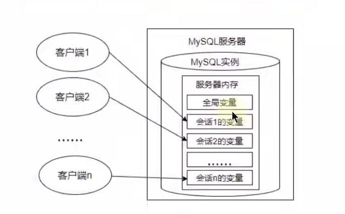
 
<br>

**分成 全局 和 会话 的原因:**  
mysql在启动的时候对应一个实例 只要实例启动起来就会将系统变量加载到内存中

变量的作用域不一样 **我们可以从作用域的角度理解** 分为

- 全局系统变量
- 会话系统变量

<br>

**全局 和 会话 的关系:**  

```
全局变量
-----------
|         |
|     -----------
|     | A |      |
|     | A |      |
|     | A |      |
------|-- |      |
			|          |
			------------
							local变量
```

我们观察到 有些变量(AAA) 它们既是全局系统变量又是会话系统变量

AAA部分的变量有两份, 当修改它们的时候我们要指明 修改的是哪个

我们修改的是全局的系统变量AAA 还是 会话级别的系统变量AAA

<br>

**全局 和 会话 的区别:**  

**全局系统变量的加载:**  
当我们的mysql实例启动起来以后 全局变量都全部进行了初始化

<br>

**会话系统变量的加载:**  
每一个客户端发起对数据库的连接 进而做相关的请求操作, 这就是一个会话

一旦建立会话后, 就会进行会话系统变量的初始化

- 客户端1 -- 加载会话1的变量
- 客户端2 -- 加载会话2的变量
- 客户端3 -- 加载会话3的变量

而每一个会话级别的系统变量 都存在于自己的作用域内, 客户端1修改了自己的会话1中的变量 并不会影响到会话2中的变量, 都是独立的

当然 客户端1修改了系统变量的话, 其它客户端看到的都是修改后的系统变量

```
+----------------+
|会话1的变量的作用域|
+----------------+

+----------------+
|会话2的变量的作用域|
+----------------+

+----------------+
|会话3的变量的作用域|
+----------------+
```

<br>

**客户端:**  
这里的客户端指的是 navicate 这个软件 这个软件跟数据库服务器建立一次连接就是一次会话

在连接期间就是一次会话 一旦断开连接重新再次连接 就是另外一次会话

<br>

**总结:**  
系统变量 相当于 Java中的类变量 static  
会话变量 相当于 Java中的实例变量

会话级别的变量的修改不会影响其它的会话级别的变量

<br>

### 全局系统变量的作用范围:
全局系统变量针对所有的会话(连接) 有效

但是注意重启服务器的情况, 当重启服务器后, mysql实例被销毁 然后会重新加载变量的默认值

我们修改后的变量会被重新加载为默认值

<br>

### 会话系统变量的作用范围:
会话系统变量仅针对于当前会话(连接)有效。

会话期间, 当前会话对某个会话系统变量值的修改, 不会影响其他会话同一个会话系统变量的值。

当我们断掉连接时, 会话就会消失, 即使重新连接也是另一次的会话

<br>

### 注意:
**在MySQL中有些系统变量只能是全局的**  
例如:  
- max_connections: 用于限制服务器的最大连接数

<br>

**有些系统变量作用域既可以是全局又可以是会话**   
例如: 
- character_set_client: 用于设置客户端的字符集

<br>

**有些系统变量的作用域只能是当前会话**  
例如:  
- pseudo_thread_id: 用于标记当前会话的 MySQL 连接 ID。

<br><br>

## 查看系统变量:
查看 所有 或 部分 系统变量

<br>

### 查看 所有 全局变量
```sql
show global variables;
```

<br>

### 查看 所有 会话变量
没有没有指明则默认查询 session 变量
```sql
show session variables;

-- 没有没有指明则默认查询 session 变量
show variables;
```

<br>

### 查询 部分 的系统变量: like '模糊查询'
```sql
show global variables like 'admin_%'
show session variables like 'character_%'
```

<br>

### 查询指定系统变量: @@global|session.变量

**系统变量:**  
mysql系统变量以 @@ 开头, 系统变量又分为 global 和 session

- @@global: 相当于全局系统变量的对象
- @@session: 相当于会话系统变量的对象

我们要查询 它们内部的某个变量的时候 通过``.``来访问

<br>

**查看指定的 系统变量 的值:**  
```sql
select @@global.变量名
```

<br>

**查看指定的 会话变量 的值:**  
```sql
select @@session.变量名
```

<br>

**不指明全局还是会话的情况:**   
会先去会话系统变量找 如果不存在, 会去全局系统变量中查找
```sql
select @@变量名
```

<br>

### 示例:
```sql
-- max_connections: 限制服务器的最大连接数 
select @@global.max_connections;    
		-- 151

-- character_set_client: 该变量既是系统也是会话
select @@global.character_set_client;
select @@session.character_set_client;

-- 下面的情况会先查询会话系统变量 再查询全局系统变量
select @@character_set_client;
```

<br><br>

## 修改 系统变量的值
有些时候, 数据库管理员需要修改系统变量的默认值, 以便修改当前会话或者MySQL服务实例的属性, 特征。

<br>

### 修改系统变量的方式1: 修改配置文件
通过修改 MySQL 配置文件, 从而修改MySQL系统变量的值(**该方法需要重启MySQL服务**)

该方式为一劳永逸式 修改后 每次mysql重启都会以配置文件重新加载

<br>

**局限性:**  
如果我们使用该方式修改了系统变量 但是不重启, 是没有效果的

<br>

### 修改系统变量的方式2: set命令
**在MySQL服务运行期间**, 使用 set 命令 重新设置系统变量的值

<font color="#C2185B">set: 用来修改变量的关键字</font>

<br>

### **<font color="#C2185B">set @@global|session.变量名 = 变量值</font>**  
### **<font color="#C2185B">set global|session 变量名 = 变量值</font>**  

**global:**  
这种方式适合服务运行期间的修改, 也就是针对当前数据实例是有效的, 一旦重启mysql服务就失败了 会恢复到默认值(配置文件)

<br>

**session:**  
针对于当前会话是有效的 一旦结束会话 重新建立起新的会话 就失效

```sql
-- 两种写法修改系统变量
set @@global.max_connections = 161;
set global max_connections = 171;


-- 两种写法修改会话变量
set @@session character_set_client = 'gbk'
set session character_set_client = 'gbk'
		-- character_set_client 这个变量 全局和会话层面都有 
		-- 但是我们修改的仅是会话层面的 所以 全局层面的character_set_client不会变 还是utf8
```

<br><br>

# 用户变量

## 概念:
用户变量, 是用户自己定义的

<br><br>

## 用户变量的分类 及 作用范围:
用户变量以一个 @ 开头, 根据作用范围不同 分为:

**会话用户变量:** 
作用域: 和会话变量一样, 只对 当前连接 会话有效。

<br>

**局部变量:**  
只能在 存储过程和函数 中使用。  
作用域: 只在 BEGIN ~ END 语句块中有效。局部变量

<br>

**回顾:**  
一个 @ 修饰 会话用户变量 (不包括局部变量)
二个 @ 修饰 系统变量

<br><br>

## 会话用户变量:
我们从下面的角度来了解变量

- 声明
- 赋值
- 使用

<br>

### 会话变量的类型:
定义会话用户变量的时候, 不用定义变量的类型, 这时候该变量的类型是动态的

<br>

### 会话变量的定义:
上面说了变量分为两种, 会话 和 局部, 那我们声明的**变量在连接保持的状态下 只要连接不断 变量就一直有效**  

<br>

**声明变量:**  
```sql
@vari;  -- 只声明未赋值, 值为null
```

<br>

**声明并赋值 方式1:**  
我们使用 ``set关键字`` 来为变量进行赋值操作

**<font color="#C2185B">set @变量 = 值</font>**  
赋值符号分为两种
- =
- :=

```sql
set @num1 = 1;
set @num2 = 2;
set @sum = @num1 + @num2;
```

<br>

**声明并赋值 方式2:**  
当我们要赋的值是一个, 可能来源于一个查询语句时的赋值方式 有两种
- :=
- into关键字

**<font color="#C2185B">select 字段 into @变量 [from等子句]</font>**  
```sql
select last_name, salary into @name, @salary 
from emps;
```

<br>

**<font color="#C2185B">select @变量 := 字段 [from等子句]</font>**  
该方式可以指明哪个查询出来的字段赋值到哪个变量中

```sql
-- 每一个字段可以指明赋值到哪个变量中
select @name := last_name, @salary := salary 
from emps;
```

<br>

**示例:**  
```sql
-- 将查询结果赋值给 用户变量:

-- 方式1:
select @count := count(*) from emps;
select @count;

-- 方式2:
select avg(salary) into @avg_sal from emps;
select @avg_sal;
```

<br>

### 查看变量的值(使用 查看 比较 运算等)
```sql
select @res
```

<br><br>

## 局部变量:
局部变量只能使用在如下的结构中
- 存储过程 
- 存储函数

会话用户变量 在定义变量的时候 不用指定变量的类型 可以理解为动态的

**局部变量 在定义变量的时候 需要指明变量的类型**  

<br>

### 声明局部变量: declare

**声明:**  
我们使用 declare 关键字来声明一个变量, 声明时 需要指明该变量的类型

<br>

**位置:**  
我们声明局部变量的时候, 要写在 begin ~ end 中, 并且在首行的位置进行声明

<br>

**作用域:**  
begin ~ end 中有效

<br>

### 定义局部变量 方式:
### **<font color="#C2185B">declare 变量名1[, 变量名2] 类型 [default 值]</font>**  
begin ~ end 的首行位置进行声明, 并可以指明其默认值, 但没不指定的时候其值为null

```sql
begin
	-- 首行
	declare num1 int default 100

end $
```

<br>

当定义的变量 类型一样 [默认值一样] 的时候可以选择合并定义

```sql
begin
	-- 合并声明
	declare num1, num2 int default 100

end $
```

<br>

### 局部变量的赋值:

**set的方式:**  
```sql
set 变量名 = 值
set 变量名 := 值
```

<br>

**select ... into ... from的方式:**  
```sql
select last_name, salary into emp_name, emp_sal from ...
```

<br>

### 查看 / 使用 局部变量:
局部变量没有 @ 直接使用就可以
```sql
select 局部变量名;
```

<br>

### 举例:
```sql
delimiter $
create procedure test_var()
begin
	-- 声明变量:
	declare a int default 0;
	declare b int;		-- 不行默认值为null
	declare emp_name varchar(25);
	
	-- 赋值操作:
	set a = 1;
	set b := 2;

	-- select into赋值:
	select last_name into emp_name 
	from emps 
	where employee_id = 101;
	
	
	-- 使用: 相当于输出 console.log
	select a, b, emp_name;

end $
delimiter ;

-- 调用 存储过程
call test_var();

-- 结果:  1	 2	Kochhar
```

<br>

### 练习1: 
声明局部变量, 并分别赋值为employees表中employee_id为102的last_name和salary

```sql
delimiter $
create procedure test()
begin

	declare name varchar(20);
	declare salary double;

	select e.last_name, e.salary into name, salary
	from emps e
	where employee_id = 102;

	-- 局部变量没有 @ 直接使用就可以
	select name, salary

end $

delimiter ;
```

<br>

### 练习2: 
声明两个变量, 求和并打印 (分别使用会话用户变量, 局部变量的方式实现)

```sql
-- 会话用户变量以 @ 开头, 并且会话级别的变量要注意同一会话中的变量名是否重复
set @v1 = 10;
set @v2 = 20;

set @res = @v1 + @v2;
select @res;


-- 局部变量的方式体现在 过程 或 函数 中
delimiter $
create procedure test_var3()
begin
	declare v1, v2, res int

  set v1 = 10;
  set v2 = 20;
	set res = v1 + v2

  select res
	
end $
delimiter ;

-- 调用 存储过程
call test_var3();
```

<br>

### 练习3: 
创建存储过程 "different_salary" 查询某员工和他领导的薪资差距, 并用IN参数emp_id接收员工id, 用OUT参数dif_salary输出薪资差距结果。

```sql
delimiter $
create procedure different_salary(in emp_id int, out dif_salary double)
begin
	-- 分析: 
	-- 1. 查询 emp_id 的工资
	-- 2. 查询 emp_id 的管理者的id 
	-- 3. 查询 管理者的工资
	-- 4. 计算两个工资的差值
	
  declare emp_sal, mar_sal double default 0.0;

	-- 也可以像下面的方式 根据 emp_id 为 mar_id 进行赋值
	-- declare mar_id int;
	
	-- 为 员工工资变量进行赋值
  select salary into emp_sal from emps
  where employee_id = emp_id;

	-- 2. 找到管理者id后找到该员工 将管理者的工资查询出来赋值给 mar_sal
  select salary into mar_sal from emps
  where employee_id = (
	  -- 1. 根据传入的员工id找到管理者的id
    select manager_id from emps
    where employee_id = emp_id
  );
	
	-- 计算差值: 为 out修饰的dif_salary变量进行赋值 使用 set
	set dif_salary = mar_sal - emp_sal;

end $
delimiter ;

-- 定义一个变量再赋一个初始值
set @dif_salary = 0;
call different_salary(102, @dif_salary);
select @dif_salary;
```

<br>

### 对比会话用户变量与局部变量

|类别|作用域|定义位置|语法|
|:--|:--|:--|:--|
|会话用户变量|当前会话|会话的任何地方|加@符号, 不用指定类型|
|局部变量|BEGIN END中|BEGIN END首行|一般不用加@符号, 需要指定类型|

<br><br>

# 程序出错的处理机制 (定义条件 和 处理程序)
程序出错的处理机制相关的知识点 都是定义在 过程体 或 函数体 中的

<br>

在这个部分我们主要讲在mysql当中如果出现问题的情况下如何处理的问题, **也就是错误的处理**(比如java中的异常处理)

<br>

mysql中是如何处理异常的 我们分为两个环节:
- 定义条件
- 处理程序 

<br>

### 定义条件: 
是指事先定义程序执行过程中**可能遇到的问题**  

也就是把程序中可能遇到的问题 定义一下 比如定义一个 错误的名称

<br>

### 处理程序:
定义了在遇到问题时**应当采取的处理方式**, 并且保证存储过程或函数在遇到警告或错误时能继续执行。

这样可以增强存储程序处理问题的能力, 避免程序异常停止运行。

也就是错误的处理 当我们遇到问题之后 程序如何处理 我们自己编写代码告诉它应该是继续还是退出 或者执行什么逻辑

保证在程序遇到问题的时候代理能够执行下去

<br>

相当于js中自定义了 Error 和 遇到 Error 时的 catch 处理

<br>

### 演示现象1:
我们在 dbtest 数据库下 现在要往 表中添加一条记录, 我们执行的时候发现报错了

```sql
insert into employees(last_name)
values('Tom');
```

```
1364: field email doesn't have a default value
```

原因, 我们只往表中添加了一条记录, 只有一个字段我们进行了赋值, 但是有一些字段添加了约束 设置成了 not null, 比如 email 字段

当我们没有给 email 字段进行赋值的时候 就会报错

<br>

### 演示现象2:
下面的存储过程中会出现错误 我们观察下 看看怎么处理
```sql
delimiter $

create procedure UpdateDateNoCondition()
begin

	set @x = 1;
	-- 员工的邮箱是 not null 约束
	update emps set email = null
	where last_name = 'Abel';
	set @x = 2;
	update emps set email = 'aabel'
	where last_name = 'Abel';
	set @x = 3;

end $
delimiter ;


-- 调用存储过程 报错: 1048: column email cannot be null
call UpdateDataNoCondition();

-- local变量 整个会话是可见的
select @x;    -- 1
```

<br>

set @x = 1 | 2 | 3, 我们设置的是会话变量 这样我们可以在过程体外部使用查看

这三行的目的相当于断点, 我们在调试的时候, 可以在执行完 过程体 后看看 @x 的值

这样我们就能知道问题出现在哪里

<br>

可以看到, 此时@x变量的值为1。结合创建存储过程的SQL语句代码可以得出: 

**当我们没有在存储过程中 未定义条件 和 处理程序的时候**  

如果存储过程中执行的SQL语句报错时, MySQL数据库会抛出错误, 并退出当前SQL逻辑, 不再向下继续执行。

<br>

### 总结:
这个部分主要是研究在 mysql 中出现问题, 我们应该如何处理

<br>

1. <font color="#C2185B">定义条件 和 处理程序 在存储过程, 存储函数中都是支持的。</font>

<br>

2. <font color="#C2185B">过程体中如果该行出现了错误 则该行会抛出错误 并不再向下执行</font>

<br><br>

## 定义条件(可选): declare ... condition for ... 

### 定义条件的作用:
定义条件就是**给MySQL中的错误码命名**  

这有助于存储的程序代码更清晰。

它将一个 **错误名字** 和 **指定的错误条件** 关联起来。**这个名字可以随后被用在定义处理程序中使用**  

<br>

因为 mysql 报错的时候 提示的错误码 太抽象了 比如
1368(HT000)

所以我们将这个错误 关联起来 **起个见名知意的错误名字**  

<br>

### 定义条件的格式:
我们主要要填写的就是 错误名称 和 错误码

```sql
declare 错误名称 condition for 错误码

or

-- 注意: for 后面要接 sqlstate
declare 错误名称 condition for sqlstate '错误条件'
```

<br>

**定义条件的位置:**  
我们要在 过程体 的开始位置 声明 定义条件, 然后按需求指明对应的处理程序

```sql
begin
	首先声明 定义条件
	然后指明 处理程序
end $
```

<br>

**报错信息:**  
```sql
-- 客户端报错:
1364 - Field 'last_name' doesn't have a default value, Time: 0.000000s

-- 小黑屏报错:
ERROR 1364 (HY000): Field 'last_name' doesn't have a default value
```

<br>

**错误码 和 错误条件:**  
我们观察小黑屏的报错信息: <font color="#C2185B">ERROR 1364 (HY000)</font>

1364 - 叫做: mysql_error_code, 错误码, 数值类型

HY000 - 叫做: sqlstatevalue, 错误条件, 5位字符串类型

<br>

所以我们在定义条件的时候就有两种选择:

- <font color="#C2185B">declare Field_Not_Be_Null condition for 1364</font>

- <font color="#C2185B">declare Field_Not_Be_Null condition for sqlstate 'HY000'</font>

<br>

**错误名称的命名规则:**  
见名知意, 比如 1364 就是字段不能为空, 我们可以起名为 Field_Not_Be_Null

因为错误码比较抽象, 我们看到错误码后都不知道它表示什么

<br><br>

## 定义处理程序: declare ... handler for ...
如果说上面我们是给 错误起个易懂的名字 这个部分是关键 **如何解决异常**  

这个部分是解决 当异常出现之后 我们该怎么办

<br>

### 定义 对应错误条件 的 对应处理方式:

### 格式:
释义: 如果我们出现了 这种 ``错误类型``, 就按照这种 ``处理方式`` 进行处理, 具体处理过程看``处理语句``

```sql
declare 处理方式 handler for 错误类型 
处理语句
```

<br>

**声明位置:**  
我们要在 过程体 的开始位置 声明 处理程序, 因为我们要先声明, 然后程序在执行的过程中出现错误, 知道如何继续

```sql
delimiter $
create procedure UpdateDateNoCondtion()
begin
  -- 在此处: 定义处理程序
  declare continue handler for 1048 set @proc_value = -1;
end $
delimiter ;
```

<br>

**处理方式:**  
处理方式有如下的3种

- continue: 表示遇到错误不处理 继续执行
- exit: 表示遇到错误马上退出。
- undo: 表示遇到错误后撤回之前的操作(MySQL中暂时不支持这样的操作)

<br>

**错误类型(即定义的条件):**  
程序在执行的过程中可能会报很多种错误类型, 我们上面定义的处理逻辑, 就是用来匹配出现对应的错误类型进行对应的处理逻辑

我们会针对错误类型, 进行匹配

比如:  
出现错误类型1 - 怎么处理  
出现错误类型2 - 怎么处理  

<br>

错误类型有如下的取值

- sqlstate '字符串错误码':  
表示长度为5的sqlstate_value类型的错误代码

- Mysql_error_code:  
匹配数值类型错误代码

- 错误名称:  
定义条件中指定的错误条件名称, **就是我们自定义的错误名称: Field_Not_Be_Null**  

- sqlwarning:  
匹配所有以01开头的SQLSTATE错误代码

- not found:  
匹配所有以02开头的SQLSTATE错误代码

- sqlexception:  
匹配所有没有被SQLWARNING或NOT FOUND捕获的SQLSTATE错误代码

<br>

**处理语句:**  
如果出现上述条件之一, 则采用对应的处理方式, 并执行指定的处理语句。

处理语句, 可以是一行, 也可以使用 begin ~ end 包裹编写复合的语句

<br>

### 示例:

``1364 (HY000)`` -> ``mysql_error_code(sqlstate)``

```sql
-- 方法1: 捕获 sqlstate_value
declare continue handler for sqlstate
'42S02' 
-- 处理语句: 将自定义的错误信息赋值给会话变量
SET @info = 'NO_SUCH_TABLE';


-- 方法2: 捕获mysql_error_value
declare continue handler for 1146 
SET @info = 'NO_SUCH_TABLE';


-- 方法3: 先定义错误条件, 再调用
declare no_such_table condition for 1146;
-- 进行匹配处理
declare continue handler for no_such_table 
SET @info = 'NO_SUCH_TABLE';


-- 方法4: 使用SQLWARNING
declare exit handler for sqlwarning 
SET @info = 'ERROR';


-- 方法5: 使用NOT FOUND
declare exit handler for not found 
SET @info = 'NO_SUCH_TABLE';


-- 方法6: 使用SQLEXCEPTION
declare exit handler for sqlexception  
SET @info = 'ERROR';
```

<br>

### 练习1:
在存储过程中, 定义处理程序, 捕获sqlstate_value值, 当遇到MySQL_error_code值为1048时, 执行CONTINUE操作, 并且将@proc_value的值设置为-1。

```sql
delimiter $
create procedure UpdateDateNoCondtion()
begin
  -- 定义处理程序
  -- 处理方式1:
  declare continue handler for 1048 set @proc_value = -1;

  -- 处理方式2:
  declare continue handler for sqlstate '23000' set @proc_value = -1;


  SET @x = 1;
  -- 上面因为定义了处理程序 虽然此处会报错 但错误会被捕获(并在捕获的时候通过处理方式 定义了变量proc_value并赋值为-1) 并且 continue关键字 再告诉程序应该继续向下执行
  UPDATE employees SET email = NULL WHERE last_name = 'Abel';
  SET @x = 2;
  UPDATE employees SET email = 'aabbel' WHERE last_name = 'Abel';

  -- 也就是说 @x 能成功的 = 3
  SET @x = 3;

end $
delimiter ;


-- 查看结果
-- 这时候会正常的执行结束
call UpdateDateNoCondtion();
select @x, @proc_value;   -- 3, -1
```

<br>

我们在存储过程中 定义了处理程序 所以程序不会终止 并指定了 处理方式

<br>

### 练习2:
创建一个名称为"InsertDataWithCondition"的存储过程

在存储过程中, 定义处理程序, 捕获sqlstate_value值, 当遇到sqlstate_value值为23000时, 执行EXIT操作, 并且将@proc_value的值设置为-1。

```sql
-- 准备工作
create table departments
as
select * from atguigudb.departments;

-- 给表中的字段添加唯一性的约束 约束名 uk_dept_name
alter table departments
add constraint uk_dept_name unique(department_name);


-- 演示内容:
-- 往表中添加两条记录 值为一样的 这样 根据字段的唯一性 肯定会报错的

delimiter $
create procedure InsertDataWithCondition()
begin

  -- 定义条件:
  declare duplicate_entry condition for 1062;

	-- 匹配上面的条件 声明对应的处理程序
  declare exit handler for duplicate_entry set @proc_value = -1;


  SET @x = 1;
  insert into departments(department_name) values('测试');
  SET @x = 2;
  insert into departments(department_name) values('测试');
  SET @x = 3;
	
end $
delimiter ;


-- 调用:
call InsertDataWithCondition();
```

<br><br>

# 流程控制
流程控制相关的知识点 都是定义在 过程体 或 函数体 中的

<br>

**顺序结构:**  
正常的一个程序默认的执行方式 都是从上往下开始执行
这种结构我们称之为 顺序结构  

在执行的过程中还有2类是需要我们讨论的

<br>

**分支结构:**   
二选一 多选一

<br>

**循环结构:**  
程序满足一定条件下, 重复执行一组语句

<br>


### 流程控制的分类
解决复杂问题不可能通过一个 SQL 语句完成, 我们需要执行多个 SQL 操作。

流程控制语句的作用就是控制存储过程中 SQL 语句的执行顺序, 是我们完成复杂操作必不可少的一部分。

针对于MySQL 的流程控制语句主要有 3 类。

- 条件判断语句: if语句和 case语句
- 循环语句: loop, while 和 repeat 语句
- 跳转语句: iterate 和 leave 语句, 这是在循环语句中使用的语句

<br><br>

## 分支结构: if
**使用在 begin ~ end 中**, 根据表达式部门的值 匹配对应的执行语句

<br>

### 语法结构:
多选一的结构, 当满足一条分支后 则结束整个if结构

1. 表达式: 表达式的部分没有 ()

2. then: 相当于 { } if体, 写在then后面的语句相当于包裹在 { } 里面

3. if体中的语句要有 ;

4. elseif: 跟js比较起来 elseif 之间没有空格, 为可选结构

5. else: else的后面没有 then

6. end if: 跟其他语言比较起来 需要用 end if 来表示结尾

```sql
if 表达式(变量) then 
	操作1
elseif 表达式2(变量2) then 
	操作2
else 
	操作n
end if
```

<br>

**示例: if情况**  
```sql
delimiter $

create procedure test_if()
begin 
	-- 声明局部变量:
	declare stu_name varchar(15);
		
	-- if
	if stu_name is null then 
		select 'stu_name is null';
	end if;
end $
delimiter ;

-- 调用
call test_if();
```

<br>

**示例: 二选一** 
```sql
delimiter $
create procedure test_if()
begin
  -- 声明 局部变量
  declare stu_name varchar(15);
  declare email varchar(25);
  declare age int default 20;

  -- 情况2: 2选1的场景
  if email is null then 
		selecet 'email is null';
  else 
    select 'email is not null';
  end if;

end $
delimiter ;

call test_if();  -- 使用 select '' 的方式 输出在结果集了
```

<br>

**示例: 多选一**  
```sql
delimiter $
create procedure test_if()
begin
  -- 声明 局部变量
  declare stu_name varchar(15);
  declare email varchar(25);
  declare age int default 20;

	if age > 40 then 
		select '中老年';
	elseif age > 18 then 
		select '青壮年';
	elseif age > 8 then 
		select '青少年';
	else
		select '婴幼儿';
	end if;

end $
delimiter ;

call test_if();
```

<br>

### 练习:
声明存储过程"update_salary_by_eid1", 定义IN参数emp_id, 输入员工编号。判断该员工薪资
- 如果低于8000元并且入职时间超过5年就涨薪500元
- 否则就不变。

```sql
delimiter $
create procedure update_salary_by_eid1(in emp_id int)
begin
  -- 定义变量
  declare emp_sal double default 0;
	-- 定义变量类型要灵活 我们需要一个 double 类型的 hire_date是yyyy-mm-dd的形式 我们只需要一个数字 所以声明为double
  declare emp_hire_date double;


	-- 赋值:
  select salary into emp_sal from emps
  where employee_id = emp_id;

  -- 根据 id 查询该员工的入职日期, 在做计算 拿到年数
  select datediff(curdate(), hire_date) / 365 into emp_hire_date
  from emps
  where employee_id = emp_id;


  if emp_sal < 8000 and emp_hire_date > 5 then 
		update emps set salary = salary + 500 
		where employee_id = emp_id;
  end if;

end $
delimiter ;
```

<br>

### 练习2:
声明存储过程 "update_salary_by_eid2", 
定义IN参数emp_id, 输入员工编号。判断该员工薪资

- 如果低于9000元并且入职时间超过5年, 就涨薪500元; 
- 否则就涨薪100元。

```sql
delimiter $
create procedure update_salary_by_eid1(in emp_id int)
begin

  declare emp_sal double default 0;
  declare emp_hire_date double; 

  select salary into emp_sal from emps
  where employee_id = emp_id;

  select datediff(curdate(), hire_date) / 365 into emp_hire_date
  from emps
  where employee_id = emp_id;


  if emp_sal < 9000 and emp_hire_date > 5 then 
		update emps set salary = salary + 500 
		where employee_id = emp_id;
  else 
    update emps set salary = salary + 100 
    where employee_id = emp_id;
  end if;

end $
delimiter ;
```

<br>

### 练习3:
声明存储过程"update_salary_by_eid3", 定义IN参数emp_id, 输入员工编号。判断该员工

- 薪资如果低于9000元, 就更新薪资为9000元
- 薪资如果大于等于9000元且低于10000的, 但是奖金比例为NULL的, 就更新奖金比例为0.01
- 其他的涨薪100元。

```sql
delimiter $
create procedure update_salary_by_eid1(in emp_id int)
begin

	-- 声明变量:
  -- 工资
  declare emp_sal double default 0;

  -- 奖金率
  declare bonus doule;


	-- 赋值:
  select salary into emp_sal from emps
  where employee_id = emp_id;

	-- 奖金率赋值
  select commisstion_pct into bonus from emps
  where employee_id = emp_id;


	-- if判断
  if emp_sal < 9000 then 
		update emps set salary = 9000
    where employee_id = emp_id;
  -- 如果上面的if不满足 就意味着 emp_sal > 9000了 所以这里直接写 < 10000
  elseif emp_sal < 10000 and bonus is null then
    update emps set commisstion_pct = 0.01
    where employee_id = emp_id;
  else
    update emps set salary = salay + 100
    where employee_id = emp_id;
  end if;

end $
delimiter ;
```

<br><br>

### 分支结构: case ... when ... 
使用在 begin ~ end 中

<br>

### 语法结构1: case 表达式

**作用:**  
类似 switch 根据 case 后面的表达式, 内部做全等的判断, 匹配后执行对应的语句

<br>

**要点:**  
- case: 相当于 switch
- when: 相当于 case, 它的后面没有:号
- else: 相当于 default
- end [case]: 如果是放在 begin ~ end 中需要加上 case, 如果放在 select 后面 不需要加上 case

```sql
case 表达式
	when 值1
	then 结果1 或 语句1 (如果是语句 则需要加分号);

	when 值2
	then 结果2 或 语句2 (如果是语句 则需要加分号);

	else 结果n 或 语句n (如果是语句 则需要加分号);
end [case] 
```

<br>

### 语法结构2: case 无表达式
这种写法类似 多重的if

**作用:**  
根据 when 后面的条件 返回的boolean, 进行匹配, 匹配成功则输出对应的语句

<br>

**要点:**  
- case: case后面不接任何结构
- when: when后面接的是 条件, 该条件可以是一个范围 返回boolean结果
- else: else的后面没有then
- end: 如果在过程体和函数体中必须是 end case, 在其他的结构中可以不加

```sql
  case
  when 条件1 
    then 结果1 或 语句1 (如果是语句 则需要加分号);
  when 条件2
    then 结果2 或 语句2 (如果是语句 则需要加分号);

  else 
		结果n 或 语句n (如果是语句 则需要加分号);
  end [case] 
  -- 如果是放在 begin ~ end 中需要加上 case
  -- 如果放在 select 后面 不需要加上 case
```

<br>

### 举例: 基本使用
```sql
delimiter $
create procedure test_case()
begin 
  -- 演示1:
  declare num int default 2;

	-- 类似 switch
  case num
    when 1
		then select 'num = 1';

    when 2 
		then select 'num = 2';

    else
		select 'other value'
  -- 因为在 begin end 中要加上case end case
  end case;


  -- 类似 if else if
  declare num int default 10;
  case
  when num > 100
    then select '3位数';
  when num > 10
    then select '2位数';
  else select '个位数';
  end case;

end $
delimiter ;
```


<br>

### 练习1:
声明存储过程"update_salary_by_eid4", 定义IN参数emp_id输入员工编号。判断该员工

- 薪资如果低于9000元, 就更新薪资为9000元; 
- 薪资大于等于9000元且低于10000的, 但是奖金比例为NULL的, 就更新奖金比例为0.01; 
- 其他的涨薪100元。

```sql
delimiter $
create procedure update_salary_by_eid6(in emp_id int)
begin
	-- 声明变量
  declare emp_sal double;
  declare emp_com double;

	-- 给变量进行赋值
  select salary into emp_sal 
	from emps
  where employee_id = emp_id;

  select commission_pct into emp_com
  from emps
  where employee_id = emp_id;


	-- 类似if else if 的判断
  case
		when emp_sal  < 9000
		then update emps set salary = 9000
				 where employee_id = emp_id;
		when emp_sal < 10000 and emp_com is null

		then update emps set commission_pct = 0.01
    where employee_id = emp_id;

  	else
    update emps set salary = salary + 100
    where employee_id = emp_id;

  end case;

end $
delimiter ;
```

<br>

### 练习2:
声明存储过程update_salary_by_eid5, 定义IN参数emp_id, 输入员工编号。判断该员工的入职年限

- 如果是0年, 薪资涨50; 
- 如果是1年, 薪资涨100; 
- 如果是2年, 薪资涨200; 
- 如果是3年, 薪资涨300; 
- 如果是4年, 薪资涨400; 
- 其他的涨薪500。

```sql
delimiter $
create procedure update_salary_by_eid5(in emp_id int)
begin

  declare hire_year double;
  -- 对结果还要进行四舍五入 或者用 截断 或者使用int来定义 向下取整比较好一些
  select round(datediff(curdate(), hire_date) / 365) into hire_year
  from emps
  where employee_id = emp_id;
  
  case hire_year
  	when 0
    then update emps set salary = salary + 50
    where employee_id = emp_id;

  	when 1
    then update emps set salary = salary + 100
    where employee_id = emp_id;

  	when 2
    then update emps set salary = salary + 200
    where employee_id = emp_id;

  	when 33
    then update emps set salary = salary + 300
    where employee_id = emp_id;

  	when 4
    then update emps set salary = salary + 400
    where employee_id = emp_id;

  	else 
		update emps set salary = salary + 500
		where employee_id = emp_id;
  end case

end $
delimiter ;
```

<br><br>

# 循环结构
mysql中为我们提供了3种循环结构
- loop
- while
- repeat

<br>

两种在循环中跳转的语句
- leave
- iterate

<br>

上述的结构都要声明在 过程体 或 函数体 的 begin ~ end 中

<br>

## 循环结构: loop
loop循环语句用来重复执行某些语句。

loop内的语句一直重复执行直到循环被退出(使用leave子句), 跳出循环过程。

**<font color="#C2185B">leave 循环标签: 相当于break</font>**  

<br>

**记忆:**  
loop 相当于 js中的while 而不是for

<br>

### loop语句 基本格式:
```sql
loop
	循环体...
end loop


-- 给循环起个名字
[loop_label:] loop

								循环体...
								[leave loop_label]

							end loop [loop_label]


-- 如:
loop_tag: loop

						循环体...

					end loop loop_tag
```

<br>

**要点:**  
1. [loop_label:]: loop_label 就是循环的标签名, 可选

2. leave 循环标签名: 用于退出循环

3. loop一般用来做死循环的操作, 然后满足某组条件后使用 ``if + leave 循环标签名`` 退出循环

<br>

### 举例:
定义一个num变量 在num >= 10的时候 终止循环
```sql
delimiter $
create procedure test_loop()
begin
	declare num int default 0;

	-- 循环标签名为 loop_tag
	loop_tag: loop

		-- 每次循环让 num++
		set num = num + 1;

		-- if判断结构
		if num >= 10 then 
			leave loop_tag;
		end if;

	end loop loop_tag;
	
	-- 查看 num 变量
	select num;

end $
delimiter	;

call test_loop();   -- 10
```

<br>

### 举例2:
当市场环境变好时, 公司为了奖励大家, 决定给大家涨工资。声明存储过程"update_salary_loop()", 
声明OUT参数num, 输出循环次数。

存储过程中实现循环给大家涨薪, 薪资涨为原来的1.1倍。**直到全公司的平均薪资达到12000结束。并统计循环次数。**  

```sql
delimiter $
create procedure update_salary_loop(out num int)
begin

	-- 声明变量:
  -- 结束的条件: 全公司的平均工资
  declare avg_sal double;

  -- 记录计算循环的次数: 这里要赋默认值, 不然 null + 1 会有问题
  declare loop_count int default 0;


  -- 赋值操作: 
	-- 获取员工的平均工资
  select avg(salary) into avg_sal from emps;


	-- 循环结构:
  loop_label: loop

    -- if判断 退出循环
    if avg_sal >= 12000
      then leave loop_label;
    end if;

    -- 循环体: 更新表中员工工资
    update emps set salary = salary * 1.1;

		-- 每次循环更新在外部保存的平均薪资的变量, 不然就是死循环了
    select avg(salary) into avg_sal from emps;

    -- 记录循环次数
    set loop_count = loop_count + 1;

  end loop loop_label;

  -- 给out num来赋值
  set num = loop_count;

end $
delimiter ;


-- 查看
call update_salary_loop(@num);
select @num;
```


<br>

### 循环的基本结构:
凡是循环结构一定具备4要素, 想想for的结构

1. 初始化条件
2. 循环条件
3. 循环体
4. 迭代条件

比如下面的案例:
```sql
delimiter $
create procedure update_salary_loop(out num int)
begin

  declare avg_sal double;
  declare loop_count int default 0; 

  -- 1. 初始化条件
  select avg(salary) into avg_sal from emps;

  loop_label: loop

    -- 2. 循环条件 >= 12000 退出
    if avg_sal >= 12000
      then leave loop_label;
    end if;

    -- 3. 循环体
    update emps set salary = salary * 1.1;

    -- 4. 迭代条件
    select avg(salary) into avg_sal from emps;
    set loop_count = loop_count + 1;

  end loop loop_label;
  set num = loop_count;

end $
delimiter ;
```

<br><br>

## 循环结构: while
loop 直接是一个循环体, 我们需要自定义退出条件

而 while语句是一个带条件的循环过程, while在执行语句执行时, 先对指定的表达式进行判断

- 如果为真, 就执行循环内的语句
- 如果为假, 就退出循环

<br>

### while语句 基本格式:

1. while_label: 循环名
2. do: 理解为 { }
3. while也要定义 **初始化条件** 和 **迭代条件**  

```sql
[while_label:] while 循环条件 do
								循环体 ...
							 end while [while_label]
```

<br>

### 举例1:
```sql
delimiter $
create procedure test_while()
begin

  -- 初始化条件
  declare num int default 1;  -- 这里要赋默认值

  -- 循环条件
  while num < 10 do

    -- 循环体 (略)

    -- 迭代条件
    set num = num + 1;
  end while;

end $
delimiter ;
```

<br>

### 举例2:
市场环境不好时, 公司为了渡过难关, 决定暂时降低大家的薪资。声明存储过程"update_salary_while()", 声明OUT参数num, 输出循环次数。

存储过程中实现循环给大家降薪, 薪资降为原来的90%。
直到全公司的平均薪资达到5000结束。并统计循环次数。
```sql
delimiter $
create procedure update_salary_while(out num int)
begin 

	-- 初始化数据
  declare avg_sal double;
  declare flag int default 0;   -- 这里要赋默认值

  select avg(salary) into avg_sal from emps;

	-- 循环条件: > 5000的时候进入循环
  while avg_sal > 5000 do

		-- 循环体
    update emps set salary = salary * 0.9;
    set flag = flag + 1;

		-- 迭代条件
    select avg(salary) into avg_sal from emps;

  end while;

  set num = flag
end $
delimiter ;
 
call update_salary_while(@num);
select @num;
```

<br><br>

## 循环结构: repeat
repeat结构也是循环结构, 它跟while的区别在于:

1. repeat的循环体会优先执行一次, 类似 do...while

2. repeat循环结构中, 使用 ``until 表达式`` 当表达式为true的时候 结束循环
	- while的条件是循环条件, 为true进入循环
	- until的条件是结束循环的条件, 为true退出循环

3. until的最后不要加 ``;``

<br>

### repeat语句 基本格式:
```sql
[repeat_label:] repeat
    					
	循环体 ...

	until 结束循环条件表达式  -- 没有分号
end repeat [repeat_label]
```

<br>

### 举例:
```sql
delimiter $
create procedure test_repeat()
begin

  declare num int default 1;

  repeat
    set num = num + 1;

  until num >= 10   -- 这里不要加上分号
  end repeat;

  select num;

end $
delimiter ;
```

<br>

### 举例2:
当市场环境变好时, 公司为了奖励大家, 决定给大家涨工资。声明存储过程"update_salary_repeat()", 声明OUT参数num, 输出循环次数。

存储过程中实现循环给大家涨薪, 薪资涨为原来的1.15倍。直到全公司的平均薪资达到13000结束。并统计循环次数。

```sql
delimter $
create procedure update_salary_repeat(out num int)
begin

	-- 声明变量
  declare flag int defualt 0;

	-- 初始化条件
  declare avg_sal double;

	-- 为变量赋值
  select avg(salary) into avg_sal from emps;

  repeat
		-- 循环体
    update emps set salary = salary * 1.15;
    set flag = flag +  1;

		-- 迭代条件
    select avg(salary) into avg_sal from emps;

		-- 退出条件: true 的时候退出循环
		until avg_sal >= 13000
  end repeat;

  set num = flag

end $
delimter ;

call update_salary_repeat(@num);
select @num;
```

<br>

### 对比三种循环结构: 

1. 这三种循环都可以省略名称, 但**如果循环中添加了循环控制语句**(leave或iterate)*则必须添加名称*。

2. 三种循环的总结:
	- LOOP:   一般用于实现简单的"死"循环
	- WHILE:  先判断后执行
	- REPEAT: 先执行后判断, 无条件至少执行一次

<br><br>

## 跳转语句: leave 语句

### 作用:
类似 **break**  

leave语句, 可以用在循环语句内, 或者 以 BEGIN 和 END 包裹起来的**程序体**内, 表示
- 跳出循环
- 跳出程序体 等操作

<br>

**<font color="#C2185B">leave也能跳出程序体</font>**  
begin ~ end 中间的就是程序体 

<br>

### 举例: 使用 leave 退出程序体
创建存储过程 "leave_begin()", 声明INT类型的IN参数num。给BEGIN...END加标记名, 并在BEGIN...END中使用IF语句判断num参数的值。

- 如果num<=0, 则使用LEAVE语句退出BEGIN...END; 
- 如果num=1, 则查询"employees"表的平均薪资; 
- 如果num=2, 则查询"employees"表的最低薪资; 
- 如果num>2, 则查询"employees"表的最高薪资。

IF语句结束后查询"employees"表的总人数。

```sql
delimiter $
create procedure leave_begin(in num int)

-- 给程序体 添加 label
begin_label: begin
  if num <= 0 then 
		-- 退出 过程体
    leave begin_label;
  elseif num = 1 then 
    select avg(salary) from emps;
  elseif num = 2 then 
    select min(salary) from emps;
  else 
    select max(salary) from emps;
  end if;

  -- 查询总人数
  select count(*) from emps;
end $

delimiter ;
```

<br>

### 举例2:
当市场环境不好时, 公司为了渡过难关, 决定暂时降低大家的薪资。

声明存储过程"leave_while()", 声明OUT参数num, 输出循环次数, 存储过程中使用WHILE循环给大家降低薪资为原来薪资的90%, 直到全公司的平均薪资小于等于10000, 并统计循环次数。

```sql
delimter $
create procedure leave_while(out num int)
begin

  declare avg_sal double;
  declare flag int default 0;

  select avg(salary) into avg_sal from emps;

  -- 这里就是利用 while true 做死循环 然后等满足某个条件在退出
  while_label: while true do

    if avg_sa l<= 10000
      then leave while_label;
    end if;

    set flag = flag + 1;
    update emps set salary = salary * 0.09;
    select avg(salary) into avg_sal from emps;

  set num = flag;

end $
delimter ;
```

<br><br>

## 跳转语句: iterate 语句

**类似 continue**  

ITERATE语句, 只能用在循环语句(LOOP, REPEAT和WHILE语句)内, 表示重新开始循环, **也是跳过本次循环的意思**, 将执行顺序转到语句段开头处。

<br>

### 格式: iterate 循环标签

<br>

### 举例:
定义局部变量num, 初始值为0。循环结构中执行num + 1操作。

- 如果num < 10, 则继续执行循环; 
- 如果num > 15, 则退出循环结构; 

```sql
delimiter $
create procedure test_iterate()
begin

  declare num int default 0;

  loop_label: loop
    set num = num + 1;

    if num < 10
      -- 如果小于10 则继续进行循环 这里我们用 iterate 来体现
      then iterate loop_label;

    -- num 16 的时候 满足下面的条件判断 跳出循环
    elseif num > 15
      then leave loop_label;
    end if;
    
    select '尚硅谷: 让天下没有难学的技术';
  end loop;

end $
delimiter ;
```

<br><br>

# 游标 (光标)
就像鼠标的光标似的 **用来定位表中一条条的数据的**  

MySQL中游标可以在 **存储过程** 和 **存储函数** 中使用。

<br>

## 概述:
比如: 一共查询到了107条数据
```sql
select * from emps;
```

<br>

我们能发现不管是 select 也好 还是 update 也好 都是把整个表当做一个整体出现的

比如 update 当没有 where 的时候 一下会修改 整个表的数据

比如 delete 当没有 where 的时候 一下会删除整个表

<br>

**思考:**  
那能不能深入数据里面 一条一条的记录去操作 而不是针对整个的结果集

比如 我们查询公司 按照 desc 排序 107 条

然后我们可以 设置一个上限 上限设置为 200000 然后一个一个员工的工资去累加 首次超过200000的时候 就停下来 

看我们累加过几个 这样就是拿着表中一条 一条的记录去操作 而不是安装整体去操作

这里我们就需要 **了解游标**  

<br>

虽然我们也可以通过筛选条件 WHERE 和 HAVING, 或者是限定返回记录的关键字 LIMIT 返回一条记录

但是, 却无法在结果集中像指针一样, 向前定位一条记录, 向后定位一条记录, 或者是 随意定位到某一条记录, 并对记录的数据进行处理。

也就是说我们没办法 定义到 结果集当中的某一条记录 对这条数据进行精确的处理

这个时候, 就可以用到游标。

<br>

### 什么是游标:
游标, 提供了一种灵活的操作方式, 让我们能够对结果集中的每一条记录进行定位, 并对指向的记录中的数据进行操作的数据结构。

**游标让 SQL 这种 面向集合 的语言有了 面向过程 开发的能力。**  

- 面向集合: 相当于对一大块结果集做处理
- 面向过程: 让我们可以一条一条的记录做处理

<br>

在 SQL 中, 游标是一种临时的数据库对象, 可以指向存储在数据库表中的数据行指针。

这里<font color="#C2185B">游标 充当了指针的作用</font>, 

**我们可以通过操作游标来对数据行进行操作。**  

<br>

**举例:**  
我们查询了 employees 数据表中工资高于15000的员工都有哪些
```sql
select employee_id, last_name, salary
from employees
where salary > 15000

-- 查询结果 下面就是一个结果集
100
101
102
103
104
105
106     ← 游标
205
```

我们可以通过游标 指向 结果集中的任意一条数据, 每次游标下移的时候 就能获取到该行的数据, 类似 ``iterator.next()`` 

单独的对这一行数据做操作, 比如我们定义3个变量 将查询到的数据装到这3个变量中

<br><br>

## 游标的使用步骤
游标使用在 过程体 或 函数体 中, 游标的目的是 操作每一条记录 将游标工作区中的字段**存放到变量中**  

<br>

### 步骤1: 声明游标:

### **<font color="#C2185B">declare 游标名 cursor for 查询语句</font>**  
让游标指向select查询的结果集, 游标也是为了操作结果集

但此时还没有开始遍历数据, 这里的操作仅仅是让 创建的游标指向结果集 还不是直接去使用

**注意:**  
select查询的字段, 也是我们在通过游标操作数据的字段

比如我们在步骤1中使用 select 查询了 id name, 那么我们通过游标能操作的也是 id 和 name


```sql
begin
	declare 游标名 cursor for
	select * from emps;
end
```

<br>

**位置:**  
1. 先声明局部变量, **游标的定义必须定义在 局部变量 的下方**  

2. 游标必须声明在 处理程序 的上面

```sql
begin 
	declare 变量
	declare ... cursor for ...  <- 游标
	declare ... handler for ... <- 处理程序
end
```

<br>

**关键字:**  
每种数据库的客户端 定义游标的关键字不同
- mysql & sql server & db2 & mariaDB: **cursor for**  

- Oracle & postgreSql: **cursor is**  


<br>

### 步骤2: 打开游标
### **<font color="#C2185B">open 游标名</font>**  

将 select查询的结果集 送到游标的工作区, 为后面游标的 ``逐条读取`` 结果集中的记录做准备。

当打开游标的时候, 会将步骤1中 select查询的结果集 送到游标的工作区, 

<br>

### 步骤3: 使用游标
### **<font color="#C2185B">fetch 游标名 into 变量1 [, 变量2]</font>**  
逐条读取数据

我们每 fetch 一次, 就会取 步骤1中select结果集中的一条记录(记录中只有我们查询到的结果), 我们可以将这一条记录中的字段放到变量中

这句话的作用是使用 游标 来读取当前行, 并且将数据保存到 变量中, 游标指针指到下一行

```sql
-- 步骤1: 
/*
	我们将 查询结果 放入游标工作区, 注意只有 id 和 name, 也就是说我们查到什么 工作区中才有什么, 我们才能操作什么
*/
							select id, name from emps
						↙
+--------+
|游标工作区|
+--------+


-- 步骤2: 打开游标


-- 步骤3: 使用游标:
/*
	每 fetch 一次会该行数据操作结束后, 指针知道下一行
*/

id   name
01	 sam		<- 游标		每次fetch会下移
02	 erin
03	 nn
```

<br>

**注意:**  
步骤1中查询几个字段, 使用 ``fetch 游标名 into 变量 ...`` 该命令的时候, into的后面就要有几个变量, 并且要一一对应上

<br>

### 步骤4: 关闭游标:
### **<font color="#C2185B">close 游标名</font>**  
有 open 就会有 close, 也就是打开和关闭游标。我们使用完游标后需要关闭掉该游标。

因为游标会占用系统资源, 如果不及时关闭, **游标会一直保持到存储过程结束**, 影响系统运行的效率。

而关闭游标的操作, 会释放游标占用的系统资源。

<br>

**注意:**  
我们的游标针对查询出来的结果 一条条的取数据 它会对查询出来的数据 **进行锁定**  

如果另外一个人 也要去查询这些数据 由于我们当前的游标占用着 这个人就要等待 这就是锁定带来的弊端

**如果是并发量比较高的情况下 就一定要及时的关闭游标**  

<br>

关闭游标之后, 我们就不能再检索查询结果中的数据行, 如果需要检索只能再次打开游标。

1. 声明游标
2. 打开游标
3. 使用游标 (从游标中获取数据的过程)
4. 关闭游标

<br>

### 游标的特性
弹幕说的: 每执行一次自动下移一位 直到eof

<br>

### 举例:
创建存储过程"get_count_by_limit_total_salary()", 声明IN参数 limit_total_salary, DOUBLE类型; 声明OUT参数total_count, INT类型。

函数的功能可以实现累加薪资最高的几个员工的薪资值, 直到薪资总和达到limit_total_salary参数的值, 返回累加的人数给total_count。

<br>

**思路:**  
我们利用游标 获取每一条记录中的salary字段 然后取这个字段中的值进行累加 当累加的结果 达到 我们的上限的时候 停止
因为要取一条条 所以还涉及到了循环

```sql
delimiter $

create procedure get_count_by_limit_total_salary(in limit_total_salary double, out total_count int)
begin 
	
	-- 定义变量:  
	-- 统计了循环了几次
	declare total int default 0;
	-- 每次游标拿到的数据都会放到这里 相当于 temp临时的存储工资的变量
	declare flag_salary double default 0.0;
	-- 累加工资
	declare sum_sal double 0.0;
	
	-- 定义游标: 查询员工工资 降序排序 上方就是最高的工资
	declare cursor_label cursor for 
	select salary from emps
	order by salary desc;
	
	-- 打开游标:
	open cursor_label;
	
	-- 使用游标:
	loop_tag: loop 
		-- 达到要求退出循环
		if flag_salary >= limit_total_salary then 
			leave loop_tag;
		end if
		
		-- 循环中每fetch一次就操作当前行的数据 然后游标会下移 便于我们获取下一行数据
		fetch cursor_label into salary;
		
		-- 累加
		set sum_sal = sum_sal + salary;
		-- 统计
		set total = total + 1;
	end loop loop_tag
	
	-- 传出
	set total_count = total
	
	-- 关闭游标:
	close cursor_label;
end $
delimiter ;


-- 调用:
call get_count_by_limit_total_salary(200000, @total_count);
select @total_count;
```

<br>

**使用场景:**  
当我们发现 我们用一堆的select语句搞不定了 需要取出表中一条条记录的具体字段的 这时候就要考虑使用游标

<br>

### 小结:
游标是 MySQL 的一个重要的功能, 为 逐条读取 结果集中的数据, 提供了完美的解决方案。

跟在应用层面实现相同的功能相比, 游标可以在存储程序中使用, 效率高, 程序也更加简洁。

**但同时也会带来一些性能问题**, 比如在使用游标的过程中, 会对数据行进行 **加锁**  

这样在业务并发量大的时候, 不仅会影响业务之间的效率, 还会 消耗系统资源, 造成内存不足, 这是因为游标是在内存中进行的处理。

<br>

**建议:**    
养成用完之后就关闭的习惯, 这样才能提高系统的整体效率。

<br><br>

## 全局变量的持久化
我们前面说变量的时候 分为 系统变量 和 用户变量

<br>

**系统变量:**  
- global 全局系统变量
- local  会话系统变量

这里我们说的就是 全局系统变量的持久化

上面我们说过 global系统变量不能重启 一旦重启mysql的话 全局系统变量就失效了

以前的话 我们想重启之后 还有效果 我们只能考虑在配置文件中做操作

现在我们想 在服务器运行期间设置的 全局变量 可以持久化

<br>

### 使用 persist(持久化) 关键字
```sql
-- 以前:
set global max_connections = 1000;

-- 现在:
set persist global max_connections = 1000;
```

MySQL会将该命令的配置保存到数据目录下的 mysqld-auto.cnf 文件中, 下次启动时会读取该文件, 用其中的配置来覆盖默认的配置文件。

<br>

### 课后练习也没做
https://www.bilibili.com/video/BV1iq4y1u7vj?p=91&spm_id_from=pageDriver

<br><br>

# 触发器

<br>

## 场景:
在实际开发中, 我们经常会遇到这样的情况: 

比如电商的项目有 2个或者多个 相互关联的表, 如 商品信息 和 库存信息 分别存放在 2 个不同的数据表中
  
我们在添加一条新商品记录的时候, 为了保证数据的完整性, **必须同时**在库存表中添加一条库存记录。

也就是添加一条新商品记录的时候 要同时更新两张表, 相当于两个 insert 的操作, 这两张表都更新了 就保证了数据的完整性

不能商品信息表里面有 库存信息里面没有 这样就不对了

<br>

这样一来, 我们就必须把这两个关联的操作步骤写到程序里面, 而且要用 **事务** 包裹起来, 确保这两个操作成为一个 **原子操作**, 要么全部执行, 要么全部不执行。

<br>

不用事务的话, 我们还可以进行手动的维护, 但是这样一来就很容易忘记其中的一步, 导致数据缺失。

<br>
 
这个时候, 咱们可以使用触发器。**你可以创建一个触发器, 让商品信息数据的插入操作自动触发库存数据的插入操作。**这样一来, 就不用担心因为忘记添加库存数据而导致的数据缺失了。

<br><br>

## 概述:
MySQL从 5.0.2 版本开始支持触发器。MySQL的触发器和存储过程一样, 都是嵌入到MySQL服务器的一段程序。

**存储过程:**  
存储过程是预先在服务器中的一段代码 通过来进行调用

<br>

**触发器:**  
触发器和存储过程一样 都是写在mysql服务器中的 属于服务器的一段代码

但是它属于事件的回调, 当有下面的事件发生的时候 自动触发
- insert
- update
- delete

当对数据表中的数据执行插入, 更新和删除操作, 需要自动执行一些数据库逻辑时, 可以使用触发器来实现。

<br><br>

## 创建触发器:
触发器就是跟表相关的, 也就是说触发器会关联某张表 我们我们对这张表进行 增 删 改 操作 之前 或 之后 的时候 **触发一个回调**  

每对表进行一次操作 就会触发一个回调的执行, 比如我们增加一条数据就会触发一次回调的执行

<br> 

### 语法:
触发器的创建和存储过程和函数差不多 但是触发器没有传参的一说, 所以没有 () 的部分

一个事件可以绑定多个触发器, 它们都会执行的

```sql
delimiter $
create trigger 触发器名称
before | after 
insert | update | delete on 表名
for each row

begin
	触发器执行的语句...;
end $

delimiter ;
```

<br>

**触发器的命名规则:**  
before_insert_test_tri -> 时机_事件_表名_trigger

<br>

**on 表名:**  
表示触发器监控的对象

<br>

**before | after:**  
表示触发的时机
- before: 表示在事件之前触发
- after:  表示在事件之后触发

<br>

**insert | update | delete:**  
- insert: 表示插入记录时触发; 
- update: 表示更新记录时触发; 
- delete: 表示删除记录时触发。

<br>

**for each row: 固定部分**  
每对表进行一次指定事件 都会触发 触发器的执行

<br>

**触发器执行的语句块:**  
可以是单条SQL语句, 也可以是由BEGIN ... END结构组成的复合语句块。

<br>

### 举例:
创建名称为before_insert的触发器, 向test_trigger数据表插入数据之前, 向test_trigger_log数据表中插入before_insert的日志信息。

<br>

```sql
delimiter $
create trigger before_insert_test_tri
before insert on test_trigger
for each row
begin
  -- 当往 test_trigger 表 插入数据之前 执行下面的操作
  insert into test_trigger_log (t_log)
  values('before insert ...');

end $
delimiter ;


-- 测试:
insert into test_trigger(t_node)
values('Tom');

select * from test_trigger;
-- 我们发现这张表也有这条数据
select * from test_trigger_log;
```

<br>

### 举例2:
创建名称为after_insert的触发器, 向test_trigger数据表插入数据之后, 向test_trigger_log数据表中插入after_insert的日志信息。
```sql
delimiter $
create trigger before_insert_test_tri
after insert on test_trigger
for each row
begin
  -- 当往 test_trigger 表 插入数据之前 执行下面的操作
  insert into test_trigger_log (t_log)
  values('after insert ...');

end $
delimiter ;
```

<br><br>

## new | old 关键字的使用:
在触发器的部分会涉及到 insert update delete 等事件的执行时机的问题, 是insert之前还是insert之后

比如:  
- 往 表A 中 insert之前
- 往 表A 中 insert之后

在不同的实际中我们会在触发器中完成对应的逻辑

<br>

之前我们操作表中的数据时 都是表中已有的数据, 如我们查询下 103号员工的 工资
```sql
select salary from emps
where id = 103;
```

<br>

但是因为触发器中有时机的概念, 比如  我们在往emps表中添加数据之间 要对 **要添加的数据**进行条件判断, 如果符合要求则添加 如果不符合要求则报错 这怎么做?

<br>

### new:
要往表中添加的数据(尚未添加到表中的一条记录), 我们使用 new 来代替

<br>

**举例:**  
触发器中每当向emps表中添加一条记录时, 同步将这条记录添加到emps_back表 中
```sql
before insert on
-- 将要往表A中添加的数据 利用new添加到表B中
begin
	insert into emps_back(employee_id,last_name,salary)
	values(new.employee_id, new.last_name, new.salary);
end //
```

<br>

### old:
一般用在 before delete 中, 表示即将要删除的那条记录

<br>

**举例:**  
每当向emps表中删除一条记录时, 同步将删除的这条记录添加到emps_back1表中
```sql
before delete on emps
begin
	insert into emps_back1(employee_id,last_name,salary)

	-- 删除的时候 old 代表删除的那条记录
	values(old.employee_id,old.last_name,old.salary);
end //
```

<br><br>

## 主动抛出错误
类似js中的 ``throw new Error()``

```sql
signal sqlstate 'HY000' set message_text = '薪资高于领导薪资错误'
```

<br>

### 举例3:
定义触发器"salary_check_trigger", 基于员工表"employees"的INSERT事件, 在INSERT之前检查将要添加的新员工薪资是否大于他领导的薪资, 如果大于领导薪资, 则报sqlstate_value为'HY000'的错误, 从而使得添加失败。

当不满足条件的时候抛出错误信息

<br>

```sql
delimiter $
create trigger salary_check_trigger
before insert on emps
for each row
begin 

  declare mgr_sal double;
  -- 要查询到 要即将要添加的数据中的manager的薪资 我们在这里怎么能拿到即将还没有添加的这条记录的呢？使用 new !!!!!!!

  -- 查询即将要添加的员工的领导的薪资
  -- 过滤条件为 员工id = 添加这条记录中的 manager_id
  select salary into mgr_sal from emps
  where employee_id = new.manager_id;

  -- 如果新员工的工资 > 他领导的工资
  if new.salary >= mgr_sal then 
		signal sqlstate 'HY000' set message_text = '薪资高于领导薪资错误';
  end if;

end $
delimiter ;


-- 测试:

-- 创建添加失败的情景:
-- 103的工资是9000 我们要添加的这个员工的薪资是10000
insert into emps(employee_id, last_name, email, hire_date, job_id, salary, manager_id)
values(300, 'Tom', 'tom@126.com', curdate(), 'ad_vp', 10000, 103);
```

<br>

## 查看触发器:
查看触发器是查看数据库中已经存在的触发器的定义, 状态和语法信息等。

<br>

### 方式1: 
查看当前数据库的所有触发器的定义

```sql
-- 注意 要么写; 要么写 \G
show triggers \G
```

<br>

### 方式2:
查看当前数据库中某个触发器的定义
```sql
show create trigger 触发器名
```

<br>

### 方式3:
从系统库information_schema的TRIGGERS表中查询"salary_check_trigger"触发器的信息。
```sql
select * from information_schema.TRIGGERS;
```

<br><br>

## 删除触发器:
触发器也是数据库对象, 删除触发器也用DROP语句, 语法格式如下: 
```sql
drop trigger [if exists] 触发器名称;
```

<br><br>

## 触发器的优缺点:

### 优点:
**1. 触发器可以确保数据的完整性**  

<br>

**2. 触发器可以帮助我们记录操作日志。**  
利用触发器, 可以具体记录什么时间发生了什么。  
比如, 记录修改会员储值金额的触发器, 就是一个很好的例子。  
这对我们还原操作执行时的具体场景, 更好地定位问题原因很有帮助。

<br>

**3. 触发器还可以用在操作数据前, 对数据进行合法性检查**  
比如, 超市进货的时候, 需要库管录入进货价格。

但是, 人为操作很容易犯错误, 比如说
- 在录入数量的时候, 把条形码扫进去了 
- 录入金额的时候, 看串了行
- 录入的价格远超售价

导致账面上的巨亏……这些都可以通过触发器, 在实际插入或者更新操作之前, 对相应的数据进行检查, 及时提示错误, 防止错误数据进入系统。

<br>

### 缺点:
**1. 触发器最大的一个问题就是可读性差**  
因为触发器存储在数据库中, 并且由事件驱动, 这就意味着触发器有可能 不受应用层的控制。这对系统维护是非常有挑战的。

比如, 创建触发器用于修改会员储值操作。如果触发器中的操作出了问题, 会导致会员储值金额更新失败。我用下面的代码演示一下: 


```sql
update demo.membermaster
set memberdeposit = 20 
where memberid = 2;

-- 报错:
ERROR 1054 (42S22): Unknown column 'aa' in 'field list'
```

<br>

结果显示, 系统提示错误, 字段"aa"不存在。  

这是因为, 触发器中的数据插入操作多了一个字段, 系统提示错误。

可是, 如果你不了解这个触发器, 很可能会认为是更新语句本身的问题, 或者是会员信息表的结构出了问题。

说不定你还会给会员信息表添加一个叫"aa"的字段, 试图解决这个问题, 结果只能是白费力。

<br>

**2. 相关数据的变更, 可能会导致触发器出错。**  
特别是数据表结构的变更, 都可能会导致触发器出错, 进而影响数据操作的正常运行。这些都会由于触发器本身的隐蔽性, 影响到应用中错误原因排查的效率。

<br>

### 注意:
如果在子表中定义了外键约束, 并且外键指定了ON UPDATE/DELETE CASCADE/SET NULL子句, 

此时修改父表被引用的键值或删除父表被引用的记录行时, 也会引起子表的修改和删除操作, 此时基于子表的UPDATE和DELETE语句定义的触发器并不会被激活。

<br>

**例如:**    
基于子表员工表(t_employee)的DELETE语句定义了触发器t1, 而子表的部门编号(did)字段定义了外键约束引用了父表部门表(t_department)的主键列部门编号(did), 并且该外键加了"ON DELETE SET NULL"子句, 那么如果此时删除父表部门表(t_department)在子表员工表(t_employee)有匹配记录的部门记录时, 会引起子表员工表(t_employee)匹配记录的部门编号(did)修改为NULL, 但是此时不会激活触发器t1。只有直接对子表员工表(t_employee)执行DELETE语句时才会激活触发器t1。

<br>

### 练习1:
1. 复制一张emps表的空表emps_back, 只有表结构, 不包含任何数据

2. 查询emps_back表中的数据

3. 创建触发器emps_insert_trigger, 每当向emps表中添加一条记录时, 同步将这条记录添加到emps_back表 中

<br>

**准备工作:**  
```sql
CREATE TABLE emps
AS
SELECT employee_id,last_name,salary FROM atguigudb. employees ;


CREATE TABLE emps_back
AS
SELECT * FROM emps
-- 只有表结构 没有数据
WHERE 1=2;
```

```sql
DELIMITER //
CREATE TRIGGER emps_insert_trigger
AFTER INSERT ON emps
FOR EACH ROW

BEGIN
	INSERT INTO emps_back(employee_id,last_name,salary)

	-- 使用了 new 
	VALUES(NEW.employee_id, NEW.last_name, NEW.salary);
END //
DELIMITER ;


-- 测试
INSERT INTO emps VALUES(300,'Tom',5600);
SELECT * FROM emps_back;
```

<br>

### 练习2:
准备工作: 使用练习1中的emps表

复制一张emps表的空表emps_back1, 只有表结构, 不包含任何数据

创建触发器emps_del_trigger, 每当向emps表中删除一条记录时, 同步将删除的这条记录添加到
emps_back1表中

```sql
CREATE TABLE emps_back1
AS
SELECT * FROM emps
WHERE 1=2;


SELECT * FROM emps_back1;


DELIMITER //
CREATE TRIGGER emps_del_trigger
BEFORE DELETE ON emps
FOR EACH ROW

BEGIN
	INSERT INTO emps_back1(employee_id,last_name,salary)

	-- 删除的时候 old 代表删除的那条记录
	VALUES(OLD.employee_id,OLD.last_name,OLD.salary);
END //
DELIMITER ;


-- 测试:
DELETE FROM emps
WHERE employee_id = 100;
SELECT * FROM emps_back1; #测试2
DELETE FROM emps;
SELECT * FROM emps_back1;
```

<br><br>

# 知识点总结:  

### 为什么建表时,  加 not null default '' 或 default 0
答:  
不想让表中出现null值。

<br>

### 为什么不想要 null 的值
答:  
(1)不好比较。null是一种特殊值, 比较时只能用专门的is null 和 is not null来比较。碰到运算符, 通常返回null。

(2)效率不高。影响提高索引效果。因此, 我们往往在建表时 not null default '' 或 default 0

<br>

### 带AUTO_INCREMENT约束的字段值是从1开始的吗？
在MySQL中, 默认AUTO_INCREMENT的初始值是1, 每新增一条记录, 字段值自动加1。

设置自增属性(AUTO_INCREMENT)的时候, 还可以指定第一条插入记录的自增字段的值, 这样新插入的记录的自增字段值从初始值开始递增, 如在表中插入第一条记录, 同时指定id值为5, 则以后插入的记录的id值就会从6开始往上增加。添加主键约束时, 往往需要设置字段自动增加属性。


<br>

### 并不是每个表都可以任意选择存储引擎？
外键约束(FOREIGN KEY)不能跨引擎使用。

MySQL支持多种存储引擎, 每一个表都可以指定一个不同的存储引擎, 需要注意的是: 外键约束是用来保证数据的参照完整性的, 如果表之间需要关联外键, 却指定了不同的存储引擎, 那么这些表之间是不能创建外键约束的。所以说, 存储引擎的选择也不完全是随意的。

<br><br>

# Mysql8.0新特性:

## 窗口函数: **待整理 1个小时呢**  

<br><br>

## 公用表表达式:
简称 CTE

**CTE是一个命名的临时结果集**, 作为范围是当前语句  

CTE可以理解成一个可以复用的子查询, 所以可以考虑使用CTE代替子查询

```
区别:
CTE可以引用其他的CTE, 但是子查询不能引用其他的子查询
```

<br>

**可复用:**  
比如我们有两个查询, 查询A中查询B中都有子查询的部分, 我们不能再查询B中使用查询A的子查询 我们必须重新写一份

上面的子查询类似于过程体中的局部变量 过程A和过程B中的局部变量不可以互相访问

<br>

而公用表表达式相当于会话变量, 我们在一个会话中不管哪个过程体都可以访问会话变量

<br>

### 公用表表达式的分类:
- 普通公用表表达式
- 递归公用表表达式

<br>

### 普通公用表表达式:
我们将一个查询部分 起个名字, 相当于拿到一个临时的结果集, 也相当于一张临时表

**优点:**  
它可以通过 名称 来复用

<br>

**语法结构:**  
```sql
with CTE名称
as (查询结构, 比如单独的子查询部分)
```

<br>

**举例: 子查询实现**  
查询员工所在部门的详细信息
```sql
select * from depts
where department_id in (
	select distinct department_id
	from employees
);
```

<br>

**举例: CTE实现**  
```sql
with cte_emp
as (
	select distinct department_id
	from employees
);

-- 我们使用上面的临时表
select * 
from departments d join cte_emp e
on d.department_id = e.department_id
```

<br><br>

### 递归公用表表达式:
递归公用表表达式也是一种公用表表达式, 只不过 除了普通公用表表达式特点以外, 它还有自己的特点, 就是可以**自己调用自己**  

<br>

**语法结构:**  
```sql
with recursive CTE名称
as (查询结构, 比如单独的子查询部分)
```

<br>

**要点:**  
递归公用表表达式由两个部分组成, 分别是

- 种子查询:  
获得递归的初始值, 这个查询智慧运行一次 用于创建初始的数据集, 之后递归查询会一直执行, 知道没有任何新的查询数据产生 递归返回

- 递归查询

中间通过 union [all] 进行连接

<br>

**案例:**  
针对于我们常用的employees表, 包含employee_id, last_name, manager_id 三个字段

如果 a 是 b 的管理者 那么我们可以把 b 叫做 a 的下属

如果同时 b 又是 c 的管理者 那么 c 就是 b 的下属 是a的下下属

下面我们尝试用查询语句列出所有具有**下下属**身份的人员信息

如果我们使用之前学过的知识来解决, 会比较复杂 至少要进行4次的查询才能搞定

1. 先找出初代管理者 就是不以任何别人为管理者的人 把结果存入临时表

2. 找出所有以初代管理者为管理者的人, 得到一个下属集 把结果存入临时表

3. 找出所有以下属为管理者的人 得到一个下下属集, 把结果存入临时表

4. 找出所有以下下属为管理者的人 得到一个结果

如果第四步的结果集为空 则计算结束, 第三步的结果集就是我们需要的下下属集了 否则就必须继续进行第四步一直到结果集为空为止。比如上面的这个数据表，就需要到第五步，才能得到空结果集。

而且，最后还要进行第六步: 把第三步和第四步的结果集合并，这样才能最终获得我们需要的结果集。

<br>

### 递归公用表表达式的实现:

如果用递归公用表表达式 就非常的简单了 下面是思路
1. 用递归公用表表达式中的种子查询，找出初代管理者。字段 n 表示代次，初始值为 1，表示是第一
代管理者

2. 用递归公用表表达式中的递归查询，查出以这个递归公用表表达式中的人为管理者的人，并且代次的值加 1。直到没有人以这个递归公用表表达式中的人为管理者了，递归返回。

3. 在最后的查询中，选出所有代次大于等于 3 的人，他们肯定是第三代及以上代次的下属了，也就是下下属了。这样就得到了我们需要的结果集。

这里看似也是 3 步，实际上是一个查询的 3 个部分，只需要执行一次就可以了。而且也不需要用临时表
保存中间结果，比刚刚的方法简单多了。

```sql
WITH RECURSIVE cte 
AS(
	-- 种子查询，找到第一代领导 
	SELECT employee_id,last_name,manager_id,1 AS n FROM employees WHERE employee_id = 100

	UNION ALL 

	SELECT a.employee_id,a.last_name,a.manager_id,n+1 FROM employees AS a JOIN cte ON (a.manager_id = cte.employee_id) 
	-- 递归查询，找出以递归公用表表达式的人为领导的人 
)


SELECT employee_id,last_name FROM cte WHERE n >= 3;
```

<br>

总之，递归公用表表达式对于查询一个有共同的根节点的树形结构数据，非常有用。它可以不受层级的限制，轻松查出所有节点的数据。如果用其他的查询方式，就比较复杂了。

<br>

### 总结:
公用表表达式的作用是可以替代子查询，而且可以被多次引用。递归公用表表达式对查询有一个共同根节点的树形结构数据非常高效，可以轻松搞定其他查询方式难以处理的查询。


# 修改数据库字符集用的文本
# Example MySQL config file for medium systems. 
#  
# This is for a system with little memory (32M - 64M) where MySQL plays  
# an important part, or systems up to 128M where MySQL is used together with  
# other programs (such as a web server)  
#  
# MySQL programs look for option files in a set of  
# locations which depend on the deployment platform.  
# You can copy this option file to one of those  
# locations. For information about these locations, see:  
# http://dev.mysql.com/doc/mysql/en/option-files.html  
#  
# In this file, you can use all long options that a program supports.  
# If you want to know which options a program supports, run the program  
# with the "--help" option.  
# The following options will be passed to all MySQL clients  
[client]
default-character-set=utf8
#password = your_password  
port = 3306  
socket = /tmp/mysql.sock  
# Here follows entries for some specific programs  
# The MySQL server  
[mysqld]
character-set-server=utf8
init_connect='SET NAMES utf8
port = 3306  
socket = /tmp/mysql.sock  
skip-external-locking  
key_buffer_size = 16M  
max_allowed_packet = 1M  
table_open_cache = 64  
sort_buffer_size = 512K  
net_buffer_length = 8K  
read_buffer_size = 256K  
read_rnd_buffer_size = 512K  
myisam_sort_buffer_size = 8M  
character-set-server=utf8  
init_connect='SET NAMES utf8' 
# Don't listen on a TCP/IP port at all. This can be a security enhancement,  
# if all processes that need to connect to mysqld run on the same host.  
# All interaction with mysqld must be made via Unix sockets or named pipes.  
# Note that using this option without enabling named pipes on Windows  
# (via the "enable-named-pipe" option) will render mysqld useless!  
#  
#skip-networking 

# Replication Master Server (default)  
# binary logging is required for replication  
log-bin=mysql-bin 

# binary logging format - mixed recommended  
binlog_format=mixed 

# required unique id between 1 and 2^32 - 1  
# defaults to 1 if master-host is not set  
# but will not function as a master if omitted  
server-id = 1 

# Replication Slave (comment out master section to use this)  
#  
# To configure this host as a replication slave, you can choose between  
# two methods :  
#  
# 1) Use the CHANGE MASTER TO command (fully described in our manual) -  
# the syntax is:  
#  
# CHANGE MASTER TO MASTER_HOST=<host>, MASTER_PORT=<port>,  
# MASTER_USER=<user>, MASTER_PASSWORD=<password> ;  
#  
# where you replace <host>, <user>, <password> by quoted strings and  
# <port> by the master's port number (3306 by default).  
#  
# Example:  
#  
# CHANGE MASTER TO MASTER_HOST='125.564.12.1', MASTER_PORT=3306,  
# MASTER_USER='joe', MASTER_PASSWORD='secret';  
#  
# OR  
#  
# 2) Set the variables below. However, in case you choose this method, then  
# start replication for the first time (even unsuccessfully, for example  
# if you mistyped the password in master-password and the slave fails to  
# connect), the slave will create a master.info file, and any later  
# change in this file to the variables' values below will be ignored and  
# overridden by the content of the master.info file, unless you shutdown  
# the slave server, delete master.info and restart the slaver server.  
# For that reason, you may want to leave the lines below untouched  
# (commented) and instead use CHANGE MASTER TO (see above)  
#  
# required unique id between 2 and 2^32 - 1  
# (and different from the master)  
# defaults to 2 if master-host is set  
# but will not function as a slave if omitted  
#server-id = 2  
#  
# The replication master for this slave - required  
#master-host = <hostname>  
#  
# The username the slave will use for authentication when connecting  
# to the master - required  
#master-user = <username>  
#  
# The password the slave will authenticate with when connecting to  
# the master - required  
#master-password = <password>  
#  
# The port the master is listening on.  
# optional - defaults to 3306  
#master-port = <port>  
#  
# binary logging - not required for slaves, but recommended  
#log-bin=mysql-bin 

# Uncomment the following if you are using InnoDB tables  
#innodb_data_home_dir = /usr/local/mysql/data  
#innodb_data_file_path = ibdata1:10M:autoextend  
#innodb_log_group_home_dir = /usr/local/mysql/data  
# You can set .._buffer_pool_size up to 50 - 80 %  
# of RAM but beware of setting memory usage too high  
#innodb_buffer_pool_size = 16M  
#innodb_additional_mem_pool_size = 2M  
# Set .._log_file_size to 25 % of buffer pool size  
#innodb_log_file_size = 5M  
#innodb_log_buffer_size = 8M  
#innodb_flush_log_at_trx_commit = 1  
#innodb_lock_wait_timeout = 50 

[mysqldump]  
quick  
max_allowed_packet = 16M 

[mysql]  
no-auto-rehash  
# Remove the next comment character if you are not familiar with SQL  
#safe-updates  
default-character-set=utf8 

[myisamchk]  
key_buffer_size = 20M  
sort_buffer_size = 20M  
read_buffer = 2M  
write_buffer = 2M 

[mysqlhotcopy]  
interactive-timeout