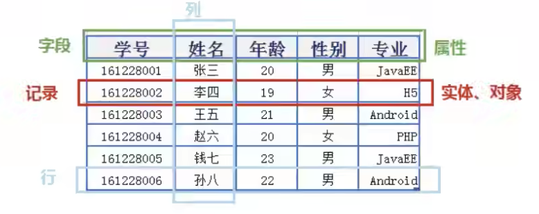

# 给文件夹修改读写权限
```
sudo chmod -R a+rwx /usr/local/mysql/data 
```
```s
https://www.jianshu.com/p/3a4e245d43b1

```

<br><br>

# 数据库的root密码:
```
root
qwer6666
123456 -> 0530 让我改成这个了
```

<br><br>

# 概述
- 版本: 针对 Mysql8.0.26 版本讲解
- 特性: 融合几乎所有的语法 调优 底层新特性 

<br><br>

## 为什么要使用数据库

### 持久化(persistence): 
**把数据保存到可掉电式存储设备中以供之后使用**。(内存中存储数据不靠谱)  

大多数情况下, 特别是企业级应用, **数据持久化意味着将内存中的数据保存到硬盘上加以"固化"**, 而持久化的实现过程大多通过各种关系数据库来完成。

<br>

### 持久化的主要作用:  
**将内存中的数据存储在关系型数据库中**, 当然也可以存储在磁盘文件、XML数据文件中。 

<br><br>

# 数据库的相关概念:

## 数据库(Datebase):
存储数据的"仓库", 其本质是一个文件系统。它保存了一系列有组织的数据。

<br>

## DBMS: 数据库管理系统(Database Management System)
**数据库的管理软件** 比如 Mysql, 通过这个软件来操作具体的数据库

是一种操纵和管理数据库的大型软件, 用于建立、使用和维护数据库, 对数据库进行统一管理和控制。用户通过数据库管理系统访问数据库中表内的数据。   

<br>

### SQL: 结构化查询语言(Structured Query Language)
专门用来与数据库通信的语言。

<br><br>

## 数据库 与 数据库管理系统的关系:


DBMS可以管理多个数据库, 一般开发人员会针对每一个应用创建一个数据库 为保存应用中实体的数据 一般会在数据库创建多个表 以保存程序中实体用户的数据


```
                       ↗ 表1 → 记录
                数据库  → 表2 → 记录
          sql ↗        ↘ 表3 → 记录
Mysql(DBMS)
          sql ↘
                       ↗ 表1 → 记录
                数据库  → 表2 → 记录
                       ↘ 表3 → 记录
```

我们的后台程序会访问数据库服务器, 数据库服务器中装的数据库管理系统Mysql

由我们后台发送过来的相应的指令给到我们数据库的管理系统比如编写对应的sql查看购物车的数据


<br><br>

## 常见的数据库管理系统排名(DBMS)
目前互联网上常见的数据库管理软件有Oracle、MySQL、MS SQL Server、DB2、PostgreSQL、Access、Sybase、Informix这几种。

以下是2021年**DB-Engines Ranking** 对各数据库受欢迎程度进行调查后的统计结果: 
```s
https://db-engines.com/en/ranking
```

<br>

### 常见的数据库介绍:

### Oracle:
- 1979 年, Oracle 2 诞生, 它是第一个商用的 RDBMS(关系型数据库管理系统)。随着 Oracle 软件的名气越来越大, 公司也改名叫 Oracle 公司。
- 2007年, 总计85亿美金收购BEA Systems。
- 2009年, 总计74亿美金收购SUN。此前的2008年, SUN以10亿美金收购MySQL。意味着Oracle 同时拥有了 MySQL 的管理权, 至此 Oracle 在数据库领域中成为绝对的领导者。
- 2013年, 甲骨文超越IBM, 成为继Microsoft后全球第二大软件公司。

如今 Oracle 的年收入达到了 400 亿美金, 足以证明商用(收费)数据库软件的价值。

<br>

### SQL Server:
SQL Server 是**微软开发**的大型商业数据库, 诞生于 1989 年。C#、.net等语言常使用, 与WinNT完全集成, 也可以很好地与Microsoft BackOffice产品集成。

<br>

### DB2:
IBM公司的数据库产品, 收费的。常应用在银行系统中。

<br>

### PostgreSQL: 下个目标就看它
PostgreSQL 的稳定性极强, **最符合SQL标准, 开放源码**, 具备商业级DBMS质量。PG对数据量大的文本以及SQL处理较快。

<br>

### SyBase:
已经淡出历史舞台。提供了一个非常专业数据建模的工具PowerDesigner。 

<br>

### SQLite:
嵌入式的小型数据库, **应用在手机端。** 零配置, SQlite3不用安装, 不用配置, 不用启动, 关闭或者配置数据库实例。当系统崩溃后不用做任何恢复操作, 再下次使用数据库的时候自动恢复。


### Informix:
IBM公司出品, 取自Information 和Unix的结合, 它是第一个被移植到Linux上的商业数据库产品。**仅运行于unix/linux平台**, 命令行操作。 性能较高, 支持集群, 适应于安全性要求极高的系统, 尤其是银行, 证券系统的应用。  


<br><br>

# Mysql介绍
- MySQL是一个开放源代码的关系型数据库管理系统, 由瑞典MySQL AB(创始人Michael Widenius)公司1995年开发, 迅速成为开源数据库的 No.1。  

- 2008被Sun收购(10亿美金), 2009年Sun被 Oracle 收购。 MariaDB 应运而生。(MySQL 的创造者担心 MySQL 有闭源的风险, 因此创建了 MySQL 的分支项目 MariaDB)

- MySQL6.x 版本之后分为 **社区版** 和 **商业版** 。

- MySQL是一种关联数据库管理系统, 将数据保存在不同的表中, 而不是将所有数据放在一个大仓库内, 这样就增加了速度并提高了灵活性。

- MySQL是开源的, 所以你不需要支付额外的费用。

- MySQL是可以定制的, 采用了 GPL(GNU General Public License) 协议, 你可以修改源码来开发自己的MySQL系统。

- MySQL支持大型的数据库。可以处理拥有上千万条记录的大型数据库。(在大的话就要分库分表的策略了)

- MySQL支持大型数据库, 支持5000万条记录的数据仓库, 32位系统表文件最大可支持 4GB, 64位系统支持最大的表文件为 8TB 。

- MySQL使用 标准的SQL数据语言 形式。

- MySQL可以允许运行于多个系统上, 并且支持多种语言。这些编程语言包括C、C++、Python、Java、Perl、PHP和Ruby等。

<br><br>

## 关于: MySQL8.0
MySQL从5.7版本直接跳跃发布了8.0版本

可见这是一个令人兴奋的里程碑版本。MySQL 8版本在功能上做了显著的改进与增强, 开发者对MySQL的源代码进行了重构, 最突出的一点是多MySQL Optimizer优化器进行了改进。不仅在速度上得到了改善, 还为用户带来了更好的性能和更棒的体验。

**我们主要看看 5.7 和 8.0 版本**

<br><br>

## Why choose MySQL?
为什么如此多的厂商要选用MySQL？大概总结的原因主要有以下几点: 	

1. 开放源代码, 使用成本低。
2. 性能卓越, 服务稳定。
3. 软件体积小, 使用简单, 并且易于维护。
4. 历史悠久, 社区用户非常活跃, 遇到问题可以寻求帮助。
5. 许多互联网公司在用, 经过了时间的验证。


<br><br>

## Oracle vs MySQL
Oracle 更适合大型跨国企业的使用, 因为他们对费用不敏感, 但是对性能要求以及安全性有更高的要求。

MySQL 由于其**体积小、速度快、总体拥有成本低, 可处理上千万条记录的大型数据库, 尤其是开放源码这一特点, 使得很多互联网公司、中小型网站选择了MySQL作为网站数据库**(Facebook, Twitter, YouTube, 阿里巴巴/蚂蚁金服, 去哪儿, 美团外卖, 腾讯)。

<br><br>

# RDBMS 与 非RDBMS (关系型数据库 & 非关系型数据库)
从排名中我们能看出来, 关系型数据库绝对是 DBMS 的主流, 其中使用最多的 DBMS 分别是 
- Oracle
- MySQL
- SQL Server。

这些都是关系型数据库(RDBMS)。

<br>

**非关系型数据库:**  
- MongoDB 是基于文档的
- Redis   是基于key value

<br><br>

## 关系型数据库(RDBMS):

<br>

### 关系型数据库的本质
这种类型的数据库是 最古老 的数据库类型, 关系型数据库模型是把复杂的数据结构(数据和数据之间的关系)归结为简单的 二元关系 (即二维表格形式: **想想excel表格的形式**)。


<br>

### 关系型数据库的格式:
以 行(row) 和 列(column) 的形式存储数据

**表:**  
这一系列的行和列被称为 **表(table)** 

<br>

**库:**  
一组表组成了一个库(database)  
很多张table合在一起就构成了一个库(database)

<br>

**关系:**  
表与表之间的数据记录有关系(relationship)。
比如:  
- 教师表里面存着老师的信息, 如: 部门, 部门也会有一张表
- 部门表里面存着部门的相关信息, 如: 在哪个位置等

那么员工表和部门表之间就会有一定的关系, 这种关系就用 关系模型 来表示。数据库中有很多的表 表之间利用这种关系进行连接 这就构成了关系型数据库

SQL 就是关系型数据库的查询语言。

<br>

**Mysql and DataBase的区别:**  
比如我们安装 Mysql 后, 会有两个结构
- DataBase: 数据库
- Mysql: 数据库的管理软件


数据库中的文件必须通过 DBMS 来读取

<br>

### 优势
**复杂查询:**  
可以用SQL语句方便的在一个表以及多个表之间做非常复杂的数据查询。

<br>

**事务支持:**  
使得对于安全性能很高的数据访问要求得以实现。

<br><br>

## 非关系型数据库(非RDBMS)

### 非关系型数据库:
可看成传统关系型数据库的功能 轻量级版本, 基于键值对存储数据

虽然没有了关系数据库的一些特性, 如: 关联查询 但相反不需要经过SQL层的解析, 性能非常高 。同时, 通过减少不常用的功能, 进一步提高性能。

目前基本上大部分主流的非关系型数据库都是免费的。


<br>

### 有哪些非关系型数据库
相比于 SQL, NoSQL 泛指非关系型数据库, 包括了榜单上的键值型数据库、文档型数据库、搜索引擎和列存储等, 除此以外还包括图形数据库。也只有用 NoSQL 一词才能将这些技术囊括进来。

<br>

**键值型数据库: Redis**  
键值型数据库通过 Key-Value 键值的方式来存储数据, 其中 Key 和 Value 可以是简单的对象, 也可以是复杂的对象。

Key 作为唯一的标识符, 优点是查找速度快, 在这方面明显优于关系型数据库, 缺点是无法像关系型数据库一样使用条件过滤(比如 WHERE), 如果你不知道去哪里找数据, 就要遍历所有的键, 这就会消耗大量的计算。

键值型数据库典型的使用场景是作为 **内存缓存** Redis 是最流行的键值型数据库。

<br>

**文档型数据库: MongoDB**    
也可以看做成 key-value 的数据库, value是具体的一个文档 该文档可以是XML、JSON等格式。

在数据库中文档作为处理信息的基本单位, 一个文档就相当于一条记录。文档数据库所存放的文档, 就相当于键值数据库所存放的"值"。MongoDB 是最流行的文档型数据库。此外, 还有CouchDB等。

<br>

**搜索引擎数据库:**   
虽然关系型数据库采用了索引提升检索效率, 但是针对全文索引效率却较低。搜索引擎数据库是应用在搜索引擎领域的数据存储形式, 由于搜索引擎会爬取大量的数据, 并以特定的格式进行存储, 这样在检索的时候才能保证性能最优。核心原理是"**倒排索引**"。

典型产品: Solr、**Elasticsearch**、Splunk 等。

<br>

**列式数据库:**    
关系型数据库都属于行式的数据库, 查找也是一行一行的进行

Oracle、MySQL、SQL Server 等数据库都是采用的行式存储(Row-based)

而列式数据库是将数据按照列存储到数据库中, 这样做的**好处是可以大量降低系统的 I/O**, 适合于分布式文件系统, 不足在于功能相对有限。

典型产品: **HBase**等。

<br>

**图形数据库:**  
图形数据库, 利用了图这种数据结构存储了实体(对象)之间的关系。

图形数据库最典型的例子就是社交网络中人与人的关系, 数据模型主要是以节点和边(关系)来实现, 特点在于能高效地解决复杂的关系问题。

图形数据库顾名思义, 就是一种存储图形关系的数据库。它利用了图这种数据结构存储了实体(对象)之间的关系。

关系型数据用于存储明确关系的数据, 但对于复杂关系的数据存储却有些力不从心。

如社交网络中人物之间的关系, 如果用关系型数据库则非常复杂, 用图形数据库将非常简单。

典型产品: Neo4J、InfoGrid等。

<br><br>

## NoSQL的演变:
由于 SQL 一直称霸 DBMS, 因此许多人在思考是否有一种数据库技术能远离 SQL, 于是 NoSQL 诞生了, 但是随着发展却发现越来越离不开 SQL。

到目前为止 NoSQL 阵营中的 DBMS 都会有实现类似 SQL 的功能。下面是"NoSQL"这个名词在不同时期的诠释, 从这些释义的变化中可以看出  NoSQL 功能的演变

NoSQL 对 SQL 做出了很好的补充, 比如实际开发中, 有很多业务需求, 其实并不需要完整的关系型数据库功能, 非关系型数据库的功能就足够使用了。这种情况下, 使用 性能更高、成本更低 的非关系型数据库当然是更明智的选择。比如: 日志收集、排行榜、定时器等。

NoSQL 的分类很多, 即便如此, 在 DBMS 排名中, 还是 SQL 阵营的比重更大, 影响力前 5 的 DBMS 中有 4 个是关系型数据库, 而排名前 20 的 DBMS 中也有 12 个是关系型数据库。所以说, 掌握 SQL 是非常有必要的。整套课程将围绕 SQL 展开。

<br><br>

# 关系型数据库设计规则
关系型数据库的典型数据结构就是 **数据表**, 这些数据表的组成都是结构化的(Structured)。
 
<br>

### 理解:
将数据放到表中, 表再放到库中。
```
数据
    ↘ 放入
      表
        ↘ 放入
          库
```

一个库就相当于 一个文件夹, 一个表就相当于 文件夹中的一个文件

一个数据库中可以有多个表, 每个表都有一个名字, 用来标识自己。表名具有唯一性。

**表具有一些特性**, 这些特性定义了数据在表中如何存储, **类似Java"类"的设计**。

<br>

### 表、记录、字段



**编程语言操作数据库的关系: ORM思想**  
Object Relational Mapping 对象关系映射

<br>

**ORM的体现如下:**   
- 数据库中的一个表 相当于 java中的一个类 
- 表中的一条数据 相当于 java中的一个对象
- 表中的一个列 相当于 java中的类中的一个属性

<br>

### 表 和 表之间的关系: E-R模型
**表跟表之间是怎么刻画的?**  

E-R模型中主要有3个概念:

- 实体集(表)
- 属性(表中的列或者说是字段)
- 联系集

<br>

**一个实体集对应数据库中的一个表:**  
class -> table

<br>

**一个实体对应于数据库表中的一行:**  
这一行也叫做一条记录  
instance -> row : record

<br>

**一个属性对应于数据库表中的一列:**   
这一列也叫做一个字段  
column -> field

<br>

## 表的关联关系:
**A表中的一条记录** 和 **B表中的一条记录** 的 关系

表与表之间的数据记录有关系(relationship)。

现实世界中的各种实体以及实体之间的各种联系均用关系模型来表示。

**四种:**  
1. 一对一关联 -> 一夫一妻制
2. 一对多关联 -> 一父对多子
3. 多对多关联 -> 社交网络
4. 自我引用

<br><br>

## 一对一关联(one-to-one):
one理解为表中的一条记录, **表A中的一条记录 对应 表B中的一条记录**

在实际的开发中应用不多, 因为一对一的关系完全可以创建成一张表。

<br>

### 举例:
我们设计一张学生表其中包含如下的字段:
- 学号
- 姓名
- 手机号码
- 班级
- 系别
- 身份证号码
- 家庭住址
- 籍贯
- 紧急联系人

那怎么才能体现一对一之间的关系, 我们将上面的表拆成两张表

<br>

1. 一个表放学生的常用信息(常用信息表)
2. 一个表放学生的不常用的信息(不常用信息表)

**常用信息表:**  
- 学号
- 姓名
- 手机号码
- 班级
- 系别

<br>

**不常用信息表:**  
- 学号
- 身份证号码
- 家庭住址
- 籍贯
- 紧急联系人 

比如张三的学号是 1001 

我们在 常用信息表 和 不常用信息表 中通过学号来查找张三的信息 找的都是张三

不可能出现 1001 在一张表里对应着两条记录 这时候 常用信息表 和 不常用信息表 中的一条记录就是 一对一的关系

```sql
-- 两个表都是张三的信息
基础信息表: 1001
档案信息表: 1001
```

基于这种情况, **为什么不将两张表合成一张表呢？**

设计成一张表 sql语句可能会简洁一些 一条语句就能查询出张三的完整信息, 不会涉及到多表的查询


**但是从数据库的设计来说:**  
当我们发现这张表的字段太多20多个了 其中有常用的字段 和不是那么常用 

这种情况下 我们可以将 常用 和 不常用的分别放入两张表中

**不常用的字段可以叫做冗余字段:**  
加载的冗余字段多的情况下 占用的内存就会多 就会导致我们的io的次数就会偏多 效率就会低

**数据库的设计优化:**  
把不常用的字段放在一个表中, 把常用的字段放在一个表中

<br>

### 两种建表原则:  
**外键唯一:**  
主表的主键和从表的外键(唯一), 形成主外键关系, 外键唯一。 

**外键是主键:**  
主表的主键和从表的主键, 形成主外键关系。

<br><br>

## 一对多关系(one-to-many)
表A中的一条记录 对应着 表B中的多条记录

<br>

### 常见实例场景:
- 客户表和订单表: 一个客户可以有多个订单
- 分类表和商品表: 某个大的门类下面有多种商品
- 部门表和员工表: 一个部门中有多个员工

前面的称之为 主表, 后面的称之为 从表

<br>

### 举例:
**员工表:**   
- 编号(员工编号)
- 姓名
- 所属部门


**部门表:** 
- 编号(部门编号)
- 名称
- 简介

一个员工可以对应多个部门, 一个部门也可以对应多个员工, 这就是一对多的关系

<br>

### 一对多建表原则: 
上面的举例中 主表就是部门表, 员工表是从表
```
主表(一方)        从表(多方)
---------       ----------
     主键    ←   外键
```

从表创建一个外键, 指向, 主表的主键

<br>

**从表:**  
一对多, 多的一方, 它创建外键, 需要指向主表的主键

<br>

**主表:**  
创建主键

<br>

## 多对多(many-to-many):
要表示多对多关系, **必须创建第三个表**, 该表通常称为 **联接表**

**联接表 会对应 两个一对多关系的表**

它将多对多关系划分为两个一对多关系。**将这两个表的主键都插入到第三个表中**

```sql
-- 中间表 和 表A 形成一对多的关系
-- 中间表 和 表B 形成一对多的关系
-- 则 表A 和 表B 就是多对多的关系

--------            --------
表A                 表B
id                  id
x1                  y1
x2                  y2


    --------------
    连接表 或 中间表
    x1          y1
    x2          y2
```

<br>

### 举例: 学生 - 课程

**学生信息表:**    
一条记录就对应一个学生
```
学号 姓名 手机号码 班级 系别
```

<br>

**课程信息表:**  
一条记录就对应一个课程的信息
```
课程编号 授课老师 简介
```

<br>

**选课信息表:**  
一个学生可以选多门课, 一门课可以被多个学生选择
```
学号    课程编号
1       1001
2       1001
1       1002
```

<br>

当有这种关系的时候, **一个学生可以选多门课, 一门课可以被多个学生选择**

我们就可以考虑表的多对多的情况, **将这两张表的主键都插入到第三张表中**

<br>

### 举例: 产品 - 订单
"订单"表 和 "产品"表 也有多对多的关系, 一个订单可以有多个产品, 每个产品可以出现在多个订单中

上面说了 当有这种感觉的时候 我们就可以通过第三张表来体现多对多的关系

**通过与"订单明细"表建立两个一对多关系来定义的**

<br>

**产品表:**    
"产品"表中的每条记录表示一个产品

<br>

**订单表:**  
"订单"表中的每条记录表示一个订单

<br>

**订单明细表:**  
- 一个产品对应着多个订单
- 一个订单可以有多个产品

这种多对多的关系体现在 订单明细表 中


<br>

### 多对多关系建表原则:
**需要创建第三张表**

中间表中至少两个字段, 这两个字段分别作为外键指向各自一方的主键。

因为 单方表 和 中间表 之间的关系是 一对多  
单方A表(订单) & 单方B表: 一    
中间表: 多
```
A    中间表    B
```

多的一方是从表, 从表中至少要有两个字段, 这两个字段分别作为外键 指向 各自一方的主键


<br>

### 自我引用:


<br>

```
员工编号  姓名  部门编号  主管编号
103     刘景升     30     101
104     李向明     30     103
105     高大山     30     103
```

员工表, 员工表中有普通员工和领导, 领导也是员工表中的一员

刘景升作为领导, 有自己的员工编号  
104 105 这两个员工的主管编号就是 103刘景升

从 103 这个角度来看 它既作为员工编号, 也是主管编号, 自己引用自己 就是自我引用

<br><br>

# Mysql的安装
Windows下我们安装mysql的时候 有一些结构

数据库管理软件的目录:
  是自己指定的目录

数据库的目录:
  里面的结构:
  - 1. Date文件夹 
    装数据的地方 它就是数据库 每一个文件夹就是一个数据库

  - 2. my.ini 设置数据库的配置信息

<br><br>

# Mysql图形化管理工具的安装
相当于我们安装了一个vscode
https://xclient.info/s/navicat-premium.html#versions

<br><br>

# 修改数据库的编码集
https://www.jb51.net/article/136582.htm

1. 关闭mysqld后台进程
Stop MySQL Server

2. 修改mysql配置文件/etc/my.cnf
sudo cp /usr/local/mysql/support-files/my-medium.cnf /etc/my.cnf
```
 
  在Mac OS X 中默认是没有my.cnf 文件, 
  
  如果需要对MySql 进行定制, 拷贝/usr/local/mysql/support-files/目录中任意一个.cnf文件粘贴到/etc目录下, 
  
  并且重命名为my.cnf, 
  然后修改 my.cnf 即可进行定制了。
```

support-files文件夹里面没有my-default.cnf或my.cnf文件,那么就要在/etc下新建my.cnf
  - 1. cd /etc
  - 2. sudo vim my.cnf
然后复制 本md最下方的东西 到新文件里面

sudo vi /etc/my.cnf
```
 
  [client]部分加入: 
  default-character-set=utf8

  [mysqld]部分加入: 
  character-set-server=utf8
```

3. 修改完毕之后再启动mysql

4. 检查结果
mysql> show variables like '%char%';

<br><br>

# Mysql的命令行命令

<br>

### mysql --version
查看mysql的版本 检查安装是否成功

<br>

### 登录后:
<br>

### select version();
查看版本信息

<br>

### mysql -uroot -p
输入用户名 和 密码 登录数据库管理软件

参数:
u: 
  表示用户名 后面有没有空格都可以

p: 
  表示密码 -p紧接密码 *不要有空格*
```
 
  mysql -uroot -pqwer6666
```

P: 
  指定端口号 可以访问另一个mysql版本(已设置对应的端口号的版本)
mysql -uroot -P 3306 -p

h: 
  代表host主机 访问指定服务器下的数据库 可以写对方的ip地址
mysql -uroot -P 3306 -h localhost -p

如果我们访问的就是本机和3306 -P -h可以省略

<br>

### quit
退出数据库软件软件

<br>

### net start mysql
启动mysql服务

<br>

### net stop mysql
停止mysql服务


<br>

### 进入mysql界面后的命令
<br>

### source d:\mysqldb.sql(文件的全路径名)
数据导入指令
在命令行客户端登录mysql, 使用source指令导入

desc employees;


<br>

### show variables like 'character_%';
查看当前数据库的编码集

当我们创建一个数据库 或 创建一个表的时候 如果我们没有显式的指定字符集 那就和默认的字符集一样了
```
 
  character_set_database  utf8mb4
  character_set_server    utf8mb4
```


<br>

### show variables like 'collation_%';
每种字符集都会有对应的比较规则 
比如拉丁的字符集就有对应的拉丁的比较规则

<br><br> 连接上服务器后的命令 --- 


<br>

### alter database 数据库名称 charset utf8
<br>

### alter table 表名称 charset utf8
修改数据库的编码集
注意: 这不是修改基本配置 只是针对一个数据库 或 一张表的操作


<br>

### show databases;
查看已有的数据库 里面有数据库服务器自带的4个database
```
 
  information_schema
    用来保存数据库服务器的基本信息 数据库的名称 表的名称 存储权限等

  mysql
    用来保存数据库在运行的时候的系统信息 数据库文件夹 字符集

  performance_schema
    用来存储监测mysql各种行踪指标的

  sys
    用来性能指标 用数据库管理员 或 开发人员 进行监控mysql性能的
```

 
<br>

### create database 数据库名称;
创建一个数据库


<br>

### drop database 数据库名称;
删除一个数据库


<br>

### use 数据库名称;
选择指定的数据库


<br>

### show tables;
查看当前数据库下的表


<br>

### create table 表名称(字段 类型, [字段 类型,])
创建表
create table employee(id int, name varchar(15));


<br>

### show create table 表名;
<br>

### show create databse 数据库名;
查看表的信息
查看数据库的信息


<br>

### select * from 表名
查看表中的所有数据


<br>

### insert into 表名 values(对应数值)
向表中插入数据
insert into employee values(1001, "sam");


**注意:**
mysql5版本中: 
表格的字符集是 CHARSET=latin
```
 
  就意味着 当我们在版本5中往表里面添加中文的话 会报错
```

mysql8版本中: 
表格的字符集是 CHARSET=utf8mb4

<br><br>

# SQL概述(Structured Query Language)
结构化查询语言
不同的数据库生产厂商都支持SQL语句, 但都有特有内容。

sql规范(普通话)
mysql特有(方言)
Oracle特有(方言)

大部分常见的 查询之类的语句 都是一样的 但是细小的部分还是由区别的


<br>

### SQL分类
SQL语言*在功能上*主要分为如下3大类: 
同时我们下面的学习也是从下面的3条主线展开的


<br>

### 1. DDL (Data Definition Languages)
*数据定义语言*
创建库和管理表

这些语句定义了不同的数据库、表、视图、索引等数据库对象, 还可以用来创建、删除、修改数据库和数据表的结构。


<br>

### DDL中主要的语句关键字包括: 
DDL语句 主要是从无到有的创建数据库中的对象(表 视图 存储过程 函数 事件等等)


create
  创建

drop
  删除

alter
  修改

rename
  重命名

truncate
  清空表中数据 表结构还在


<br>

### 2. DML(Data Manipulation Language)
*数据操作语言*
增删改查

用于添加、删除、更新和查询数据库记录, 并检查数据完整性。
  
<br>

### DML中主要的语句关键字包括:
针对于一条记录的操作行为 叫做操作语言

insert
  添加一条记录1

delete
  删除一条记录(drop是删除结构)

update
  修改一条记录

select
  查询操作 *SELECT是SQL语言的基础, 最为重要。*


<br>

### 3. DCL(Data Control Language)
数据控制语言
用于控制我们前面的操作
用于定义数据库、表、字段、用户的访问权限和安全级别。

<br>

### DCL中主要的语句关键字包括:
commit
  将修改后的结果进行提交 对数据库的修改就是永久性的了

rollback
  撤销修改 回滚

savepoint
  设置保存点 回滚到一个保存点上

grant
  赋予相关的权限

revoke
  回收相关的权限


因为查询语句使用的非常的频繁, 所以很多人把查询语句单拎出来一类: *DQL(数据查询语言)*。

还有单独将 COMMIT、ROLLBACK  取出来称为TCL (Transaction Control Language, 事务控制语言)

<br><br>

# SQL语言的规则与规范
<br>

### 基本规则:
1. SQL 可以写在一行或者多行。为了提高可读性, 各子句分行写, 必要时使用缩进

2. 每条命令以 ; 或 \g 或 \G 结束
```
 
  \g or \g 会把原先成列式呈现的字段信息 转成 成行呈现
```

3. 关键字不能被缩写也不能分行
4. 关于标点符号
  - 必须保证所有的()、单引号、双引号是成对结束的
  - 必须使用英文状态下的半角输入方式

  - *字符串型和日期时间类型的数据可以使用单引号(' ')表示*

  - *列的别名, 尽量使用双引号(" "), 而且不建议省略as*


<br>

### SQL大小写规范 (建议遵守)
MySQL 在 Windows 环境下是*不区分大小写的*
MySQL 在 Linux 环境下是*区分大小写的*

  - Linux系统下区分大小写的结构:
  - 数据库名、表名、表的别名、变量名是严格区分大小写的

  - 关键字、函数名、列名(或字段名)、列的别名(字段的别名) 是忽略大小写的。

*推荐采用统一的书写规范:*
  - 数据库名、表名、表别名、字段名、字段别名等都小写
  - *SQL关键字、函数名、绑定变量等都大写*


<br>

### 注释
可以使用如下格式的注释结构

单行注释: 
  #注释文字 (MySQL特有的方式)

单行注释: 
  -- 注释文字 (--后面必须包含一个空格。)

多行注释: 
  /* 注释文字 */


<br>

### 命名规则 (暂时了解)
数据库、表名不得超过30个字符, 变量名限制为29个

必须只能包含 A–Z, a–z, 0–9, _共63个字符

数据库名、表名、字段名等对象名中间不要包含空格

同一个MySQL软件中, 数据库不能同名；
同一个库中, 表不能重名；同一个表中, 字段不能重名

必须保证你的字段没有和保留字、数据库系统或常用方法冲突。如果坚持使用, 请在SQL语句中使用``(着重号)引起来

保持字段名和类型的一致性, 在命名字段并为其指定数据类型的时候一定要保证一致性。假如数据类型在一个表里是整数, 那在另一个表里可就别变成字符型了

```sql
<br><br> 以下两句是一样的, 不区分大小写
show databases;
SHOW DATABASES;

<br><br> 创建表格
<br><br> 表名错误, 因为表名有空格
create table student info(...); 
create table student_info(...); 

<br><br> 其中order使用``飘号, 因为order和系统关键字或系统函数名等预定义标识符重名了
CREATE TABLE  order (
    id INT,
    lname VARCHAR(20)
);

<br><br> 起别名时, as都可以省略
select id as "编号",  name  as "姓名" from t_stu; 

<br><br> 如果字段别名中没有空格, 那么可以省略""
select id as 编号,  name  as 姓名 from t_stu; 

<br><br> 错误, 如果字段别名中有空格, 那么不能省略
select id as 编 号,  name  as 姓 名 from t_stu; ""
```

<br><br>

# 基本的SELECT语句

<br>

### 关键字: DUAL 
伪表

我们的select查询语句的结构为:
select *...(结构1)* from *...(结构2)*

<br>

### 情况1:
我们没有写结构2的部分
select ...

```sql
select 1 + 1;
select 3 * 2;
```

<br>

### 情况2:
如果我们没有具体的表要查询 但是还想保持select语句的结构
那我们可以使用 *DUAL* 关键字还充当结构2的部分

```sql
select 1 + 1 from dual;
```


<br>

### 关键字: *
表示表中的所有字段(所有的列)


<br>

### SELECT 字段1, 字段2 FROM 表名
多个字段之间使用, 来分隔

<br><br>

# 列的别名
给列的名字起一个别名 支持汉字
给列起别名一共有3种方式

<br>

### 1. 字段 AS 别名
修改后 结果集中的列名就会呈现别名
as: alias别名的意思 AS可以省略

<br>

### 2. 字段 别名
字段和别名之间 只用空格

<br>

### 3. 字段 "别名"
别名使用一段双引号引起来 当要起的别名有奇怪的符号或者空格的时候 使用""包起来 *不要使用''*

```sql
SELECT employee_id AS emp_id, salary FROM employees;

<br><br> 省略别名的方法 AS用空格代替
SELECT employee_id emp_id, salary FROM employees;

<br><br> 省略别名的方法 别名加上双引号
SELECT employee_id "emp_id", salary FROM employees;
```

<br><br>

# 去重重复行
当我们查询一个表的时候 默认情况下, 查询会返回全部行, 包括重复行。

比如我们有一种场景 我们想知道员工表中的员工所在 都有哪些部门

我们发现 107个员工所在的部分都列出来了 但是有很多员工都在同一个部门

而我们的诉求就是想知道公司有多少个部分 不需要这些重复的部分

```sql
SELECT department_id FROM employees;

null  -- 有的员工没有部门
10
20
20
30
30
30
30
```

所以这时候我们想将重复的数据只留一条就可以了

<br>

### 关键字 DISTINCT
去除重复行
```sql
SELECT DISTINCT department_id
FROM employees;

<br><br> 报错 员工一共107人 工资的列就是107 去重后的部分id是12 结构有逻辑性的问题
SELECT salary, DISTINCT department_id
FROM employees;

<br><br> 仅仅是没有报错 但是没有实际的意义
SELECT DISTINCT department_id, salary
FROM employees;
```

**注意:**
1. DISTINCT *需要放到所有列名的前面*, 如果写成 SELECT salary, DISTINCT department_id FROM employees 会报错。

2. DISTINCT 其实是对后面所有列名的组合进行去重, 你能看到最后的结果是 74 条, 因为这 74 个部门id不同, 都有 salary 这个属性值。

如果你想要看都有哪些不同的部门(department_id), 只需要写 DISTINCT department_id 即可, 后面不需要再加其他的列名了。

<br><br>

# 空值参与运算
什么是空值:
如果一个字段是null 它就代表空值的意思
null不等同于0, '' 'null'

<br>

### 字段中的值是可以参数运算的
目前自己总结 当字段中的数据是可以被计算的时候 是可以参与运算的
```sql
<br><br> 计算该员工的年收入
SELECT last_name "员工姓名", salary * 12 "员工薪资"
FROM employees;
```


<br>

### null参与运算
所有运算符或列值遇到null值, *运算的结果都为null*


**注意:**
这里你一定要注意, 在 MySQL 里面,  空值不等于空字符串。
一个空字符串的长度是0, 而一个空值的长度是空。
而且, *在 MySQL 里面, 空值是占用空间的*。

<br><br>

# 着重号 ``
作用:
当我们的表名 字段名和保留字 关键字重名的时候 我们在使用的时候要用``将重名的表名或者字段名包起来

比如我们有一个order表 但是order在mysql中是关键字
当我们查询这个表的时候 会报错
```sql
<br><br> 这里因为表order和关键字ORDER重名 所以使用着重号
SELECT * FROM  order 
```

<br><br>

# 查询常数
就是在 SELECT 查询结果中增加一列固定的常数列。这列的取值是我们指定的, 而不是从数据表中动态取出的。


我们在查询某一张表的时候 会使用如下命令
select * from employees;

这样会把employees表中的所有字段全部的查询出来

我们还可以手动的加入 employees表中没有的字段
```sql
SELECT '尚硅谷' AS "学校名", last_name, employee_id
FROM employees;
```

我们自己添加的字段 会在每一条记录的前面都添加上 这就是 查询常数

比如我们表中的每一条记录前面都要加上尚硅谷 但是该字段又没有在表的结构里面 我们就可以使用常数来表示

<br><br>

# 显示表结构

<br>

### DESCRIBE 表
<br>

### DESC 表
显示创建该表时候的 表中字段的详细信息
每一个字段都会在结果表中有详细的体现 比如我们想查看该表中有什么样的字段的时候 什么类型 就可以用这个命令

type:
  该字段对应的数据类型

null
  该字段是否可以取值为null

key
  刻画约束的

default
  默认值

```sql
field       type    null    key   default   extra
employee_id	int   	NO	    PRI	    0
first_name	varchar
            (20)	  YES	

last_name	  varchar
            (25)	  NO		
```
<br><br>

# 过滤数据 WHERE
我们在查询一个表的结构的时候 可以查询指定的字段 但也是查询的表中所有的记录

现在我只想查询满足某些条件的数据 不是所有的数据 相当于我们想将员工表中的107条数据过滤下 看看哪些是满足的 然后再把这些数据返回来 这样的诉求就是过滤数据


<br>

### WHERE 条件
将要过滤的条件写在 where关键字的后面

要求:
WHERE一定要声明在FROM结构的后面 紧挨着FROM *基友*
即使有别的关键字和不能插在 FROM WHERE 的中间

需求:
查询90号员工部门的信息
```sql
SELECT * 
FROM employees 
WHERE department_id = 90;
```

需求:
查询last_name为'king'的员工信息
```sql
SELECT * 
FROM employees 
WHERE last_name = 'King'; -- 字符串要用 '' 包起来
```


<br>

### 练习
1.查询员工12个月的工资总和, 并起别名为ANNUAL SALARY 
```sql
<br><br> 别名要使用 " "
SELECT employee_id, last_name, salary * 12 "ANNUAL SALARY" 
FROM employees;
```

2.查询employees表中去除重复的job_id以后的数据
```sql
SELECT DISTINCT job_id FROM employees;
```

3.查询工资大于12000的员工姓名和工资
```sql
SELECT last_name, salary 
FROM employees 
WHERE salary > 12000;
```

4.查询员工号为176的员工的姓名和部门号
```sql
SELECT employee_id, last_name, department_id
FROM employees
WHERE employee_id = 176;
```

5.显示表 departments 的结构, 并查询其中的全部数据
```sql
DESC departments;
SELECT * FROM departments;
```

<br><br>

# 运算符

<br>

### 算术运算符
算术运算符主要用于数学运算, 其可以连接运算符前后的两个数值或表达式, 对数值或表达式进行运算
  加(+)
  减(-)
  乘(*)
  除(/)  除了/ 还可以使用 *div* 来表示
  取模(%)除了% 还可以使用 *mod* 来表示

主要针对于数值类型的变量或常量来进行运算

加减的示例:
```sql
SELECT 100, 100 + 0, 100 - 0, 100 + 50, 100 + 50 -30, 100 + 35.5, 100 - 35.5 FROM dual;
```

**注意:**
在sql中 + 没有连接的作用 就表示加法运算
下面的结果不是 1001 而是*会将字符串转成数值* 再参与运算
隐式转换
 ```sql
 SELECT 100 + '1' 
 FROM DUAL;

 -- 101
```


下面的结果不是 NaN 而是100 *当遇到不能正常转换的时候* 会将其*转成0* 然后参与运算
如果遇到非数值类型, 先尝试转成数值, 如果转失败, 就按0计算。

null参与运算 结果就为null
```sql
 SELECT 100 + 'a' 
 FROM DUAL;
```


<br>

### 加减结论:
1. 一个整数类型的值对整数进行加法和减法操作, 结果还是一个整数；

2. 一个整数类型的值对浮点数进行加法和减法操作, 结果是一个浮点数；

3. 加法和减法的优先级相同, 进行先加后减操作与进行先减后加操作的结果是一样的；

4. 在Java中, +的左右两边如果有字符串, 那么表示字符串的拼接。但是在MySQL中+只表示数值相加。如果遇到非数值类型, 先尝试转成数值, 如果转失败, 就按0计算。*补充: MySQL中字符串拼接要使用字符串函数CONCAT()实现*


乘除的示例:
```sql
SELECT 100, 100 * 1, 100 * 1.0, 100 / 1.0, 100 / 2,100 + 2 * 5 / 2,100 /3, 100 DIV 0 FROM dual;
```

我们发现 100 div 2 的时候 结果是50.0000
在sql中 除法默认是除不尽的 所以会保留小数位 也就是*除法结果是就浮点型*

我们发现 100 div 0 的时候 结果是null 注意下
分母不能为0 结果会是null


<br>

### 乘除结论:
1. 一个数乘以整数1和除以整数1后仍得原数；

2. 一个数乘以浮点数1和除以浮点数1后变成浮点数, 数值与原数相等；

3. 一个数除以整数后, 不管是否能除尽, 结果都为一个浮点数；

4. 一个数除以另一个数, 除不尽时, 结果为一个浮点数, *并保留到小数点后4位；*

5. 乘法和除法的优先级相同, 进行先乘后除操作与先除后乘操作, 得出的结果相同。

6. 在数学运算中, 0不能用作除数, 在MySQL中, 一个数除以0为NULL。


<br>

### 关于除法选择 DIV /
DIV返回的是整数 也就是 商
```sql
SELECT 51 / 2 FROM DUAL;    -- 25.5000
SELECT 51 DIV 2 FROM DUAL;  -- 25
```


<br>

### 取模结论:
结果的符号与被模数的符号相同 跟模数没有关系
被模数 % 模数


需求:
查询员工id为偶数的员工信息
```sql
SELECT * 
FROM employees 
WHERE employee_id % 2 = 0;
```

<br><br>

# 比较运算符
比较运算符用来对表达式左边的操作数和右边的操作数进行比较, 比较的结果: 
  - 1. 结果为真则返回1, 
  - 2. 结果为假则返回0, 
  - 3. 其他情况则返回NULL。

比较运算符经常被用来作为SELECT查询语句的条件来使用, 返回符合条件的结果记录。


<br>

### = 
在sql中 = 就是等于 跟小学学的是一样的 没有赋值的意思
```sql
1 = 2;       -- 0
1 != 2;      -- 1
1 = '1';     -- 1   隐式转换
1 = 'a';     -- 0 

0 = 'a'      -- 1
<br><br> 字符串存在隐式转换 如果转换数值不成功 则是0

'a' = 'a'    -- 1
'a' = 'b'    -- 0
<br><br> 等号两边的值都是字符串 则按照字符串的ANSI编码进行比较

NULL = NULL
<br><br> 主要有null参与判断 结果就为null
```


按条件查询的简单流程:
执行下面语句的时候其过程是: 有一个指针会一条一条的获取表中的每一条记录

第一条记录 取出该记录的salary 拿出来跟6000进行比较 结果不相等返回0 当结果为0的时候该数据就不要了

当比较的结果为1的时候 该数据会保留 然后查询结果就是0 和 1 然后会返回所有为1的数据
```sql
SELECT last_name, salary 
FROM employees 
WHERE salary = 6000;
```


比如下面的 我们想查询 值为NULL的结果
结果是一条数据都没有
指针会取出每一条记录中的commission_pct字段对应的值 去跟null比较 但是只要跟null比较结果都是null 所以不会有任何结果

```sql
SELECT last_name, salary 
FROM employees 
WHERE commission_pct = NULL;
```


<br>

### <=>  为NULL而生
安全等于
安全等于就是为了解决跟NULL比较的问题:
安全等于运算符(<=>)与等于运算符(=)的作用是相似的,  唯一的区别 是‘<=>’*可以用来对NULL进行判断*。

在*两个操作数均为NULL*时, 其*返回值为1*, 而不为NULL；
当*一个操作数为NULL*时, 其*返回值为0*, 而不为NULL。

```sql
1 <=> NULL;      -- 0
NULL <=> NULL;   -- 1  只有这种情况返回1


SELECT last_name, salary 
FROM employees 
WHERE commission_pct <=> NULL;
```


<br>

### <> or !=
不等于


<br>

### < > <= >=
只要符号的左右两边 有NULL的参与 结果就是NULL

<br><br>

<br>

### 非符号运算符

<br>

### IS NULL
为空运算符
判断值 字符串 或 表达式 是否为空
```sql
SELECT B FROM employees WHERE A IS NULL;


<br><br> 查询奖金系数为NULL的
SELECT last_name, salary, commission_pct
FROM employees
WHERE commission_pct IS NULL;
```

<br>

### IS NOT NULL
不为空运算符
判断值 字符串 或 表达式 是否不为空
```sql
SELECT B FROM employees WHERE A IS NOT NULL;


SELECT last_name, salary, commission_pct
FROM employees
WHERE commission_pct IS NOT NULL;
```

<br>

### ISNULL(字段)
为空运算符 它相当于一个函数了
判断一个值 字符串 或 表达式 是否为空 
```sql
SELECT B FROM employees WHERE ISNULL(字段);


<br><br> 查询为空的指定字段
SELECT last_name, salary, commission_pct
FROM employees
WHERE ISNULL(commission_pct);
```

<br><br>

<br>

### LEATS(value1, value2, ...)
最小值运算符
在给定的多个值中返回最小值
```sql
SELECT B FROM employees WHERE LEAST(A,B);


SELECT LEAST('a','b','g'), GREATEST('g','t','m')
FROM DUAL;
<br><br> a 和 t
```

<br>

### GREATEST(value1, value2, ...)
最大值运算符
在给定的多个值中返回最大值
```sql
SELECT B FROM employees WHERE GREATEST(A,B);
```

<br><br>

<br>

### 字段 BETWEEN 条件1 AND 条件2
两值之间的运算符
查询条件1和条件2范围内的数据 包含边界
判断一个值是否在两个值之间 包括 条件1 和 条件2
```sql
SELECT B FROM employees WHERE C BETWEEN A AND B;

<br><br> 查询工资在6000-8000之间的员工信息
SELECT employee_id, last_name, salary
FROM employees
WHERE salary BETWEEN 6000 AND 8000;
```

**注意:**
条件1为下限
条件2位上限
条件1 和 条件2 的位置不能交换

<br><br>

<br>

### IN (set)
属于运算符  在 一个集合中吗？
判断一个值是否为列表中的任意一个值
```sql
SELECT B FROM employees WHERE C IN (A,B);


SELECT last_name, department_id
FROM employees
WHERE department_id IN (10, 20, 30);


<br><br> 不能这么写 20 30 非0就是1 所以全部给找出来了
WHERE department_id = 10 OR 20 OR 30;
<br><br> 我们要将OR前后的条件写完整
WHERE department_id = 10 OR department_id = 20 OR department_id =  30;
```

<br>

### NOT IN (set)
不属于运算符  不在 一个集合中吗？
判断一个值是否不是一个列表中的任意一个值
```sql
SELECT B FROM employees WHERE C NOT IN (A,B);


SELECT last_name, department_id
FROM employees
WHERE department_id NOT IN (10, 20, 30);
```

<br><br>

<br>

### LIKE 模糊条件
模糊匹配运算符
判断一个值是否符合模糊匹配规则
```sql
SELECT B FROM employees WHERE A LIKE B;

<br><br> 查询 last_name 中包含字符'a'的员工信息
SELECT last_name 
FROM employees
WHERE last_name LIKE '%a%'


<br><br> 查询 last_name 中包含'a' 且 'e' 的员工信息
SELECT last_name
FROM employees
WHERE last_name LIKE '%e%' AND last_name LIKE '%a%';


SELECT last_name
FROM employees
WHERE last_name LIKE '%a%e%' OR last_name LIKE '%e%a%';


<br><br> 查询 last_name 中第二个字符是a的 员工信息
SELECT last_name
FROM employees
WHERE last_name LIKE '_a%';


<br><br> 查询 last_name 中第二个字符是_ 第3个字符是a的 员工信息
SELECT last_name
FROM employees
WHERE last_name LIKE '_\_a%'; -- 转义了 _
```

<br>

### %:
代表不确定个数的字符 相当于正则里面的 * 不确定的0-多个字符
0个 1个 或 多个

<br>

### _
代表任意一个字符

<br>

### \
转义字符

<br><br>

<br>

### REGEXP '正则'
正则表达式运算符
判断一个值是否符合正则表达式的规则
```sql
SELECT B FROM employees WHERE A REGEXP B;
```


<br>

### RLIKE '正则'
正则表达式运算符
判断一个值是否符合正则表达式的规则
```sql
SELECT B FROM employees WHERE A RLIKE B;
```

REGEXP运算符用来匹配字符串, 


<br>

### 语法格式为:   expr REGEXP 匹配条件 。
如果expr满足匹配条件, 返回1；
如果不满足, 则返回0。
若expr或匹配条件任意一个为NULL, 则结果为NULL。

REGEXP运算符在进行匹配时, 常用的有下面几种通配符: 

<br>

### ^
匹配以该字符后面的字符开头的字符串。

<br>

### $
匹配以该字符前面的字符结尾的字符串。

<br>

### [...]
匹配在方括号内的任何字符
"[abc]"匹配"a"或"b"或"c"
"[a-z]"匹配任何字母
"[0-9]"匹配任何数字

<br>

### *
匹配零个或多个在它前面的字符
x*  匹配任何数量的‘x’字符, 
[0-9]*  匹配任何数量的数字

```sql
SELECT 
  'shkstart' REGEXP '^s', 
  'shkstart' REGEXP 't$', 
  'shkstart' REGEXP 'hk';
FROM DUAL;
```

<br><br>

# 逻辑运算符
逻辑运算符主要用来判断表达式的真假, 
在MySQL中, 逻辑运算符的返回结果为1、0或者NULL。

mysql中支持4中逻辑运算符

<br>

### NOT 或 !
逻辑非
取反
```sql
NOT A

SELECT last_name, department_id 
FROM employees
<br><br> 条件的前面加了 NOT
WHERE salary NOT BETWEEN 6000 AND 8000;
```

<br>

### AND 或 &&
逻辑与
左右变量都为真 结果就是1
前面要满足 后面也要满足
```sql
A AND B
A && B

<br><br>既是10号部门的员工 又是 20号部门的员工
SELECT last_name, department_id 
FROM employees
WHERE department_id = 10 AND department_id = 20;
```

<br>

### OR 或 ||
逻辑或
左右两边只要有一个是真 结果就是1
```sql
A OR B
A || B

<br><br> 10号部门 或 20号部门 的员工
SELECT last_name, department_id 
FROM employees
WHERE department_id = 10 OR department_id = 20;
```

<br>

### XOR 追求的是不同
逻辑异或
只要左右两边的情况不一样 就是true 也就是1
```sql
A XOR B

SELECT last_name, department_id 
FROM employees
WHERE department_id = 10 OR salary > 6000;

<br><br> 当满足部门为10的时候 工资一定是小于6000
<br><br> 当满足工资大于6000的时候 部门肯定不为10
```


**注意:**
OR 可以和 AND 一起使用, 但是在使用时要注意两者的优先级, 由*于AND的优先级高于OR*, 因此先对AND两边的操作数进行操作, 再与OR中的操作数结合。

<br><br>

# 位运算符
位运算符的左右必须是数值

位运算符是在二进制数上进行计算的运算符。位运算符会先将操作数变成二进制数, 然后进行位运算, 最后将计算结果从二进制变回十进制数。

mysql中支持的位运算符:

<br>

### &
按位与(位AND)
只有上下都是1的时候 结果才是1 其他情况为0

比如:
1的二进制数为0001, 
10的二进制数为1010, 
所以 1 & 10 的结果为0000, 

0001
1010
0000


<br>

### |
按位或(位OR)
上下只要有1结果就是1 其他情况为0

1的二进制数为0001, 
10的二进制数为1010, 
所以 1 | 10 的结果为1011, 

0001
1010
1011


<br>

### ^ 不同为1 否则为0
按位异或(位XOR)
上下情况不同为1 情况相同为0

1的二进制数为0001, 
10的二进制数为1010, 
所以 1 ^ 10的结果为1011, 

0001
1010
1011


```sql
SELECT 12 | 5, 12 & 5, 12 ^ 5
FROM DUAL;

13,
4,
9

12: 1100
5: 0101

12 | 5
1100
0101
1101  -- 13


12 & 5
1100
0101
0100  -- 4


12 ^ 5
1100
0101
1001  -- 9
```


<br>

### ~
按位取反
1变0 0变1

<br>

### >>
按位右移

<br>

### <<
按位左移
在一定范围内满足 每向左移动一位x2 
移动一位 是指数

2 << 1 -- 2^1
2 << 2 -- 2^2
2 << 3 -- 2^3

乘以的也是指数的结果 x2 x4 x8


<br>

### 练习
1. 选择工资不在5000到12000的员工的姓名和工资 
```sql
SELECT last_name, salary
FROM employees
WHERE salary NOT BETWEEN 5000 AND 12000;

WHERE salary < 5000 OR salary > 12000;
```


2. 选择在20或50号部门工作的员工姓名和部门号
```sql
SELECT last_name, department_id
FROM employees
WHERE department_id IN (20, 50);
```


3. 选择公司中没有管理者的员工姓名及job_id
```sql
SELECT last_name, job_id
FROM employees
WHERE manager_id IS NULL;
```


4. 选择公司中有奖金的员工姓名, 工资和奖金级别 
```sql
SELECT last_name, salary, commission_pct
FROM employees
WHERE commission_pct IS NOT NULL;
```


5. 选择员工姓名的第三个字母是a的员工姓名
```sql
SELECT last_name
FROM employees
WHERE last_name LIKE '__a%';
```


6. 选择姓名中有字母a和k的员工姓名
```sql
SELECT last_name
FROM employees
WHERE last_name LIKE '%a%' AND last_name LIKE '%k%';
```


7. 显示出表 employees 表中 first_name 以 'e'结尾的员息
```sql
SELECT first_name
FROM employees
WHERE first_name LIKE '%e';
```


8. 显示出表 employees 部门编号在 80-100 之间的姓名
```sql
SELECT last_name, department_id
FROM employees
WHERE department_id BETWEEN 80 AND 100;
```


9. 显示出表 employees 的 manager_id 是 100,101,110 的员工姓名、工资、管理者id
```sql
SELECT last_name, salary, manager_id
FROM employees
WHERE manager_id IN (100, 101, 110);
```

<br><br>

# 排序与分页
我们没有指定排序操作的时候 每次查询返回的数据的顺序都是默认的

默认顺序:
我们往数据库中添加记录(数据)的顺序


<br>

### 排序数据
使用 ORDER BY 对查询到的数据 进行排序操作

<br>

### ORDER BY 字段 [ASC / DESC]
格式:
ORDER BY 字段 没有显式指明排序的方式的话 *则默认按照升序排列*

ORDER BY ASC: 升序
ORDER BY DESC: 降序
```
 
  ascend  descend
```

注意:
子句在SELECT语句的*结尾*

需求:
按照salary从高到低的顺序显示员工信息
```sql
SELECT last_name, salary
FROM employees
ORDER BY salary DESC;
```

使用列的别名进行排序操作: 
我们定义了一个年工资的字段 起了别名 "annual_sal"
然后按照别名 进行排序

```sql 
SELECT last_name, salary, salary * 12 "annual_sal"
FROM employees
ORDER BY annual_sal;
```

**注意:**
列的别名只能在order by中使用 不能在where中使用 因为在where语句执行的时候还没有起别名呢 

sql语句的执行顺序如下:
sql语句在执行的时候不是按照 从上到下的顺序走的
而是先从 from 开始走
然后再从 where 开始走 看看有什么过滤条件
然后再看 select 后面想要查什么 这个阶段才会起别名
最后才会执行 order by

where需要声明在from后order之前
*from* where *order by*


```sql
SELECT last_name, salary, salary * 12 "annual_sal"
FROM employees
WHERE department_id IN (50, 60, 70, 80)
ORDER BY annual_sal DESC;
```


<br>

### 二级排序
<br>

### ORDER BY 字段 规则, 字段 规则
1. ASC 可以省略
2. 多级排序 使用,分开

需求:
显示员工信息 按照 department_id 的降序排序 然后按照 salary的升序排列
```sql
 SELECT employee_id, salary, department_id
 FROM employees
 ORDER BY department_id DESC, salary ASC;
```

**注意:**
在对多列进行排序的时候, 首先排序的第一列必须有相同的列值, 才会对第二列进行排序。如果第一列数据中所有值都是唯一的, 将不再对第二列进行排序。

<br><br>

# 分页
查询返回的记录太多了, 查看起来很不方便, 按照实际需求 一页显示多少条数据

<br>

### LIMIT [位置偏移量], 一页显示多少条
如果不指定"位置偏移量", 将会从表中的第一条记录开始

需求1:
每页显示20条记录 此时显示第一页

**注意:**
LIMIT 子句必须放在整个SELECT语句的最后！

```sql
SELECT employee_id, last_name
FROM employees
LIMIT 0, 20;    -- 20条数据为 0-119
```

参数1:
偏移量为0, *默认是从0开始*
0位从第一条记录开始 默认指针是指在第一条记录上的 偏移量为0(就是第一条记录的位置) 

偏移量: 
0: 指针在第一条记录上
1: 指针往下移动一次, 指针指到下一条记录


需求2:
显示第二页
们要从119后面开始 也就是120开始 就意味着一上来需要先有一个偏移量
```sql
SELECT employee_id, last_name
FROM employees
LIMIT 20, 20;
```

需求3:
显示第三页
```sql
SELECT employee_id, last_name
FROM employees
LIMIT 40, 20;
```

<br>

### 公式:
<br>

### LIMIT (pageNo - 1) * pageSize, pageSize
显示第pageNo页 每页显示pageSize条记录
```sql
LIMIT(0, 20)    -- 第一页 20条
LIMIT(20, 20)   -- 第二页 20条
LIMIT(40, 20)   -- 第三页 20条

<br><br> 公式: LIMIT (pageNo-1) * pageSize, pageSize
```


<br>

### WHERE ..., ORDER BY ..., LIMIT ... 声明顺序如下:
先写order by 后写limit
```sql
SELECT employee_id, last_name, salary
FROM employees
WHERE salary > 6000
ORDER BY salary DESC
LIMIT 10;
```

需求:
employees表中有107条数据 我们只想显示第32 33条数据怎么办？
```sql
SELECT employee_id, last_name, salary
FROM employees
LIMIT 31, 2;
```


<br>

### mysql8.0新特性:
<br>

### LIMIT ... OFFSET ...
是 LIMIT 31,2 没什么太大的区别 参数位置颠倒一下就可以了

OFFSET 后面写的是偏移量
LIMIT  后面写的条目数


<br>

### 练习:
查询员工表中工资最高的信息
```sql
SELECT employee_id, last_name, salary
FROM employees
ORDER BY salary DESC
LIMIT 1;
```

<br>

### 扩展:
LIMIT可以使用在 MySQL、PostgreSQL、MariaDB 和 SQLite 中表示分页 但是不能使用在SQL Server, DB2, Oracle

而且需要放到 SELECT 语句的最后面。


<br>

### 练习:
1. 查询员工的姓名和部门号和年薪, 按年薪降序,按姓名升序显示
```sql
SELECT last_name, department_id, salary, salary * 12 "year_salary"
FROM employees
ORDER BY year_salary, last_name DESC;
```

2. 选择工资不在 8000 到 17000 的员工的姓名和工资, 按工资降序, 显示第21到40位置的数据 
```sql
SELECT last_name, salary
FROM employees

<br><br> NOT写在条件的后面
WHERE salary NOT BETWEEN 8000 AND 17000
ORDER BY salary DESC
LIMIT 20, 20;
```

3. 查询邮箱中包含 e 的员工信息, 并先按邮箱的字节数降序, 再按部门号升序
```sql
SELECT last_name, email
FROM employees
WHERE email LIKE '%e%'

<br><br> 单行函数: length()
ORDER BY length(email) DESC, department_id;
```

<br><br>
# 复习
# 多表查询
我们有一对多的关系表
员工表
部门表

比如:
我们要查询一个部门中有多少个员工 这就是一对多的关系 也需要用到多表查询

还有我们一个项目中几百张表示常见的 我们在写select语句的时候很多时候也不是针对一张表去查询的 而是查询多个表

员工表:
employee_id
  first_name
  last_name
  email
  phone_number
  hire_date
  job_id
  salary
  commission_pct
  manager_id
  *department_id*


部门表:
*department_id*
  department_name
  manager_id
  *location_id*   部门所坐落的位置


位置表:
*location_id*
  street_address
  postal_code
  city
  state_province
  country_id


我们能看到每个表之间都是有关联关系的 通过*红色id关联*

比如:
我们现在有一个需求: 
查询员工为'Abel'在哪个城市工作
我们现在有3张表 员工表 部门表 位置表

员工表中没有城市的事儿 城市的信息在locations表里面的city字段

思考:
那我们怎么才能找到'Abel'所在的城市呢？

1. 查询员工表 找到 'Abel' 的信息
```sql
SELECT *
FROM employees
WHERE last_name = 'Abel';
```

我们能得到department_id字段 知道Abel在80部门工作

2. 查询 部门表 找到部门相关的信息 得到部门所在的城市
```sql
SELECT *
FROM departments
WHERE department_id = 80;
```

我们根据员工表中的department_id做为条件 查询了departments部门表
查看了80部门的情况 80部门是销售部门 管理者id为145 所在城市2500

我们得到了 Abel 在 80号部门 80号部门在 2500城市

3. 查询 位置表 找到城市信息
```sql
SELECT *
FROM locations
WHERE location_id = 2500;
```

查询的结果就是 Abel在Oxford这个城市工作
我们发现 我们最终找到了 Abel在哪个城市工作 这里我们分3次查询了3张表 这也变相的相当于多表查询

思考:
为什么不把这3张表合成一张表呢？ 它们都是刻画的员工的信息
不合在一起的原因:
1. 3张表合在一起 会产生特别多的冗余字段 冗余字段会占用内存空间
2. 维护一张巨大的表也会很困难
3. 我们在查询一张表的时候 别的事务是无法操作我们正在操作的表的 如果表的力度越小的话 大家都可以同时操作 效率也会更高

我们会根据实际情况把一张大表 按照单位的一些操作或者常用的一些字段放在一个表中 另外的字段放在其他表中 表跟表之间使用id作为连接关系 关联在一起


<br>

### 多表查询的错误写法 -- 笛卡尔积错误
需求:
我们查询 employee_id department_name
上面这两个字段分别在不同的表中 员工表 和 部门表

那我们能不能这么写sql语句 查询信息
FROM的后面写了两张表
employee_id      --  employees
department_name  --  departments

```sql
SELECT employee_id, department_name
FROM employees, departments;  
<br><br> 我们查询出来2889条数据
```

员工表一共才107条数据 为啥能搜索出来这么多？
```sql
SELECT 2889 / 107
FROM DUAL;  -- 27

SELECT *
FROM departments; -- 27条记录
```

我们发现 employees表 中的每一条记录 都跟整个departments表进行匹配
也就是说employees表的一条记录 分别和 departments表中的每条记录进行了匹配 -- 1 * 27

这种错误的现象叫做: 笛卡尔积的错误
```
 
  笛卡尔积:
    它是一种现象 笛卡尔乘积是一个数学运算。假设我有两个集合 X 和 Y, 
    把X集合和Y集合的搭配的所有可能都列出来就是笛卡尔积 
```

上面的查询方式出现的原因就是:
上面错误的原因就是缺少了多表的连接条件 

<br>

### 表A CROSS JOIN 表B
交叉连接两张表
这里只是介绍下 CROSS JOIN 这个关键字 跟我们的多表查询没有什么关系


<br>

### 笛卡尔积的错误会在下面条件下产生
1. 省略多个表的连接条件(或关联条件)
2. 连接条件(或关联条件)无效
3. 所有表中的所有行互相连接

为了避免笛卡尔积,  可以**在 WHERE 加入有效的连接条件。**


<br>

### 加入连接条件后, 查询语法 格式: 

```sql
SELECT	table1.column, table2.column
FROM	table1, table2
WHERE	table1.column1 = table2.column2;  --连接条件
```

**在 WHERE子句中写入连接条件。**


<br>

### 正确的多表查询的方式
需要有连接条件
表与表之间会有一个字段 可以用作与连接条件
比如:
员工表中的 employee_id
部门表中也有 employee_id

我们就可以通过两张表同的共有字段作为在where中的连接条件 进行查询

```sql
SELECT employee_id, department_name
FROM employees, departments

<br><br> 拿两个表中各自字段的id进行相当判断
WHERE employees.department_id = departments.department_id;
```


需求:
查询 employee_id department_name department_id

```sql
SELECT employee_id, department_name, department_id
FROM employees, departments
WHERE employees.department_id = departments.department_id;
<br><br> 报错了
```
Column 'department_id' in field list is ambiguous
说 department_id 该字段来自于哪一张表示不确定的

因为department_id这个字段两张表中都有
解决方式:
我们要告诉服务器要去哪张表中找 department_id
```sql
<br><br> 指明从哪个表中读 department_id 字段 
<br><br> employees.department_id
SELECT employee_id, department_name, employees.department_id

FROM employees, departments

WHERE employees.department_id = departments.department_id;
```

**注意:**
在多表查询的过程中 如果查询语句中出现了多个表中都存在的字段 则必须指明此字段所在的表 通过 *表.字段* 的方式来指明

**建议:**
从sql优化的角度 建议多表查询时 每个字段前都指明其所在的表

```sql
<br><br> 通多表.字段的方式 指明要查的字段在哪个表中
SELECT employees.employee_id, departments.department_name, employees.department_id

FROM employees, departments

WHERE employees.department_id = departments.department_id;
```


<br>

### 利用表的别名 简化操作
我们发现在多表查询中 我们建议查询的字段前 都要通过 表.字段 的方式 指明要查询的字段来自于哪个表

但我们也发现上面的代码会变的特别的长 可读性也不高
所以我们可以给表起别名 在 select 和 where 中使用表的别名


<br>

### 字段的别名在:
select 字段 "别名"
字段的别名可以在 order by 用字段的别名来指定规则


<br>

### 表的别名在:
from 表 空格 别名
from 表 as 别名
表的别名可以在语句中使用

```sql
SELECT emp.employee_id, dept.department_name, emp.department_id
FROM employees emp, departments dept
WHERE emp.department_id = dept.department_id;
```

**注意:**
我们给表起了别名后 一旦在select或where使用表名的话 则必须使用表的别名 而不能在使用表的原名
```
 
  因为 sql 的执行顺序是 先执行 from 然后发现我们给表起别名了 
  然后 sql 会将别名 覆盖原表名
  所以我们之后再使用的时候 只能用别名
```


<br>

### 练习
查询:
employee_id last_name department_name city

要点:
多张表之间的连接条件:
a和b找一个条件连接 然后a和c 或者 b和c找一个条件进行连接

```sql
SELECT t1.employee_id, t1.last_name, t2.department_name, t3.city
FROM employees t1, departments t2, locations t3

<br><br> 条件 t1和t2拉下手 然后t1和t3拉下手 或者 t2和t3拉下手
WHERE t1.department_id = t2.department_id && t2.location_id = t3.location_id;
```

<br>

### 总结:
如果有n个表实现多表的查询 则需要至少n-1个连接条件
2个表需要1个 3个表需要2个

<br><br>

# 多表查询的分类
我们从下面的三个角度多多表查询进行分类
针对连接条件来说的 我们通过这3个角度来看下 连接条件有多种情况

<br>

### 等值连接 vs 非等值连接
<br>

### 等值连接:
我们上面的例子中连接条件都是 = 
WHERE t1.department_id = t2.department_id
这就是 *等值连接*

<br>

### 非等值连接:
只要连接条件不是 = 可能就是非等值连接 比如 大于小于

非等值连接的举例:

job_grades表:
A	1000	2999
  B	3000	5999
  C	6000	9999
  D	10000	14999
  E	15000	24999
  F	25000	40000

需求:
查询 员工姓名 员工工资 工资等级

上面我们是用的等值连接 也就是 
  A表中的一个字段 = B表中的一个相同字段的方法

但是 这个需求中 employees表中没有字段 也在job_grades表中存在的
这种情况下 我们就需要使用 非等值连接

也就是查询A表中的字段 在B表中某个范围内的
```sql
SELECT e.last_name, e.salary, j.grade_level
FROM employees e, job_grades j

<br><br> 1
WHERE e.salary BETWEEN j.lowest_sal AND j.highest_sal;

<br><br> 2
WHERE e.salary >= j.lowest_sal AND e.salary <= j.highest_sal;
```


<br>

### 自连接 vs 非自连接
我们前面写的例子都是非自连接

<br>

### 非自连接:
不同的表之间进行的连接操作

<br>

### 自连接
表自己跟自己连就是自连接 (自恋)
比如: 
员工表中每一个员工都有一个 employee_id
每一个员工也都有一个上级 manager_id
每一个上级都是公司的元素 上级本身也会有 employee_id

```
 
  employee_id  name  manager_id
  1             sam   3

  3             erin  5

  - 我们能看到 id为1的是员工sam 他的领导的是manager_id 3
  - 领导erin也是公司的员工 所以它也有一个 employee_id 3
```


需求:
查询员工id 员工姓名 及其 管理者的id 和 管理者的姓名 

思路:
当我们分析完 发现要查询的字段 或 逻辑都在同一张表的时候 我们就要使用自连接

比如:
我们这个需求中 要查询的员工id name 和 对应领导id name
我们就可以将其想象成我们要查询两张表
FROM employees emp, employees mrg

连接条件:
员工表的领导的id = 领导表中员工的id

```sql
<br><br> 字段因为在'2张表'中都有 所以要用别名.字段的方式加以区分
SELECT emp.employee_id, emp.last_name, mrg.employee_id, mrg.last_name

<br><br> 虽然是同一张employees表 但是使用别名的方式 当成两张表
FROM employees emp, employees mrg

<br><br> 条件 manager_id = employee_id
WHERE emp.manager_id = mrg.employee_id;
```


<br>

### 内连接 vs 外连接
内连接:
我们上面写的这些都是内连接

比如: 
下面注释里面说的内容就是内连接
```sql
SELECT employee_id, department_name

<br><br>,号左边的叫做左表,,号右边的叫做右表
FROM employees e, departments d

<br><br> 我们只是把左表当中 和 右表当中 满足连接条件的数据 查询出来了 其他的数据都没有要
WHERE e.department_id = d.department_id;
```

<br>

### 内连接:
合并具有同一列的两个以上的表的行, **结果集中不包含一个表与另一个表不匹配的行**

<br>

### 外连接:
 两个表在连接过程中除了返回满足连接条件的行以外**还返回左(或右)表中不满足条件的行** **, 这种连接称为左(或右) 外连接**。没有匹配的行时, 结果表中相应的列为空(NULL)。
```
 
  合并具有同一列的两个以上的表的行 结果集中除了包含一个表与另一个表匹配的行之外 还查询到了左表 或 右表中不匹配的行
```

左表: 员工表
右表: 部门表
两个表交叉在一起 类似交集 就是多表查询
其中 AAA 就是 左表中有A列 右表中也有A列 将两个表A列的数据 返回出来 就是查询到的结果

AAA 就是左表和右表都满足的条件 也就是内连接
但是一共有106条记录
员工表有一个人不在里面 
部门表因为也有一些部门没有员工 也没有被检索出来
```
 
    左表
    -----------
    |         |
    |     -----------
    |     | A |      |
    |     | A |      |
    |     | A |      |
    ------|-- |      |
          |          |
          ------------
                  右表
```

如果我们把不满足条件的数据也检索出来 就叫做外连接
外连接就是把不满足条件的数据也查出来了(不在AAA范围内的数据)

综上:
外连接也有了分类 

<br>

### 外连接的分类:
1. 左外连接: 把左表中不满足条件的数据 查询出来
2. 右外连接: 把右表中不满足条件的数据 查询出来
3. 满外连接 (3个部分一起都被查出来了)


<br>

### 主表 和 从表
如果是左外连接, 则连接条件中左边的表也称为 主表, 右边的表称为 从表 。

如果是右外连接, 则连接条件中右边的表也称为 主表, 左边的表称为 从表 。


<br>

### 练习:
查询*所有的*员工的 last_name, department_name 信息

**注意:**
一旦是由*所有的*字眼 *并且来自于不同的表* 这时候我们一定要注意 它一定是一个外连接

比如我们下面这么查询 只能查到 员工表 和 部门表 中共有department_id字段的数据 106条 但是员工表中一个107个人 所以肯定有没查询到的 这就不符合我们这道题的要求 
```sql
SELECT employee_id, department_name
FROM employees e, departments d
WHERE e.department_id = d.department_id;
```
这道题要求是*所有的*


<br>

### sql92规范中 实现 外连接(mysql不支持)
<br>

### 使用 + 
在 where 条件中 数据少的那边的条件后使用 *(+)*
WHERE e.department_id = d.department_id(+);

*mysql中不支持sql92中外连接的写法 但是别的数据库支持这种写法*

思路:
员工表有107条记录 我们要去匹配部门表
```
 
   员工表       部门表
    ----       ----
    |  |       |  |
    |  |       |  |
    |  |       |  |
    |  |       |  |
    |  |       |  |
    |  |       |  |
    ------------------这里是106条记录        
    |  |
    ----
```

怎么实现外连接的呢？
假如我们把员工表 和 部门表看做是两条腿
员工表是左腿 部门表是右腿 我们能看到两条腿 一高一低
那怎么办？ 我们可以给右腿下面垫一点东西 这样两条腿不就一样长了么
一样长后就代表两边表的结构 行数就一样了
这样左表中多的数据就能展现出现了
```
 
   员工表       部门表
    ----       ----
    |  |       |  |
    |  |       |  |
    |  |       |  |
    |  |       |  |
    |  |       |  |
    |  |       |  |
    ------------------
    |  |       | +|   这样两边表的行数一样了 员工表
    ----       ----   多出来的数据就能展现出来了
```

也就是现在是员工表的数据多 部门表的数据少 我们就在数据少的那边垫一点东西


<br>

### sql92中的写法 mysql中不支持
```sql
SELECT employee_id, department_name
FROM employees e, departments d

<br><br> 需要使用左外连接 我们在数据少的表后面使用 (+) 垫东西
WHERE e.department_id = d.department_id(+);
```

如上就是左外连接 目的就是在右表垫高 显示左表不满足连接条件的数据


<br>

### sql99规范中 实现 外连接(mysql支持)
sql99语法中使用 *join...on* 的方式 实现多表的查询
这种方式也能解决外连接的问题(内连接也能使用这种方法) -- 通用

<br>

### sql99语法 实现内连接
<br>

### FROM 表1 INNER JOIN 表2 ON 连接条件
在使用内连接的时候 *INNER可以省略*
JOIN后面只能连接一张表 ON后面写他们之间的条件
如果想要连接多张表 那就要写多个 JOIN ON 结构

1. 
92语法中 查询的表 表1和表2之间使用, 来进行分隔
FROM 表1, 表2

99语法中 查询的表 表1和表2之间使用 JOIN 来进行分隔
FROM 表1 JOIN 表2

2. 
92语法中的 连接条件 写在 WHERE 后
99语法中的 连接条件 写在 ON 后

```sql
<br><br> 两张表的情况
SELECT e.last_name, e.department_id
FROM employees e JOIN departments d
ON e.department_id = d.department_id;
```

```sql
<br><br> 三张表的情况
SELECT e.last_name, e.department_id, city

<br><br> 连接第二张表
FROM employees e JOIN departments d
ON e.department_id = d.department_id;

<br><br> 连接第三张表
JOIN Locations l
ON d.location_id = l.location_id;
```

```
 
  连接多张表的格式

  select * 
  from 表1 
          join 表2 on 连接条件
          join 表3 on 连接条件
          join 表4 on 连接条件
```


<br>

### sql99语法 实现外连接
<br>

### 左外连接
<br>

### FROM 表1 LEFT OUTER JOIN 表2 ON 连接条件
JOIN用于将多个表进行分隔 LEFT OUTER用于标记使用左外连接
拿着左表的条件去匹配右表的吧(左边数据多)

当我们写 LEFT 的时候 一定是外连接 所以这时候我们可以*省略 OUTER*
FROM employees e *LEFT OUTER JOIN* departments d
FROM employees e *LEFT JOIN* departments d

```sql
SELECT last_name, department_name

<br><br> 左外连接
FROM employees e LEFT OUTER JOIN departments d
ON e.department_id = d.department_id
```


<br>

### 右外连接
<br>

### FROM 表1 RIGHT OUTER JOIN 表2 ON 连接条件
如果右边表的数据量多 当我们把共同的满足条件的数据查出来后
还想把右表中不满足条件的数据查出来 那就要使用右外连接
我们在左边补加号(92语法)
将左边垫高 显示右表不满足连接条件的数据

```sql
<br><br> 92语法 右外连接 将右表中不满足连接条件的数据展现出来
SELECT last_name, department_name
<br><br> 左外连接
FROM employees e, departments d
ON e.department_id(+) = d.department_id
```

```
 
    ----       ----
    |  |       |  |
    |  |       |  |
    |  |       |  |
    |  |       |  |
    |  |       |  |
    |  |       |  |
    ------------------
    | +|       |  |   这样右表不满足条件的数据就能展示了
    ----       ----
``` 

```sql
<br><br> 右外连接 RIGHT OUTER JOIN
SELECT last_name, department_name
FROM employees e RIGHT OUTER JOIN departments d
ON e.department_id = d.department_id
```
```
 
  员工和部门能匹配的情况下 再把所有的部门查到 这些部门没有人
  Urman	    Finance
  Popp	    Finance
  Higgins	  Accounting
  Gietz	    Accounting
  null      Treasury
  null      Corporate Tax
  null      Control And Credit
  null      Shareholder Services
```

<br><br>

需求:
将 左表中不满足条件的数据 + AAA + 右表中不满足条件的数据 都查询出来 (满外连接)

```
 
    员工表1人没有满足条件
    -----------
    |         |
    |     -----------  AAA既满足员工表又满足部门表为106
    |     | A |      |
    |     | A |      |
    |     | A |      |
    ------|-- |      |
          |          |
          ------------
                  部门表16个部门没有满足条件
                  
```


<br>

### 满外连接:
<br>

### FROM 表1 FULL OUTER JOIN 表2 ON 连接条件
满外连接在*sql99中的方式就是这么写*

```sql
<br><br> 满外连接 RIGHT OUTER JOIN
SELECT last_name, department_name
FROM employees e FULL OUTER JOIN departments d
ON e.department_id = d.department_id
```
*但是mysql中不支持* FULL OUTER JOIN 的写法


<br>

### mysql中的满外连接
要实现mysql中的满外连接 我们先了解下 *UNION* 关键字的使用

<br>

### UNION 合并查询结果
利用UNION关键字, 可以给出多条SELECT语句, 并将它们的结果组合成单个结果集。合并时, 两个表对应的列数和数据类型必须相同, 并且相互对应。各个SELECT语句之间使用UNION或UNION ALL关键字分隔。

<br>

### UNION: 
是联合的意思 取两个集合的并集
该操作符返回两个查询的结果集的并集 *去除重复记录*
```
 
    员工表 
    -----------
    |         |
    |         -------
    |                |
    |                |
    |                |
    ------|          |
          |          |
          ------------
                  部门表
```


<br>

### UNION ALL: 
该操作符返回两个查询的结果集的并集 对于两个结果集的重复部分 *不去重*

解析 UNION 和 UNION ALL:
```
 
  我们拿员工表和部门表举例:

  员工表    两表满足连接条件的数据    部门表
    1             106              16

  如果我们使用的是 UNION关键字
  结果集为 1 + 106 + 16

  如果我们使用的是 UNION 关键字
  结果集为 1 + 106 + 106 + 16

  - UNION 和 UNION ALL 的区别就是多了一套公共的交集部分
```


<br>

### UNION的格式:
直接点理解就是:

一个表的数据查询的完整逻辑
UNION [ALL]
另一个表的数据查询的完整逻辑

也就是两个结果集之间只用 UNION [ALL] 连接

```sql
SELECT columns FROM table1
UNION [ALL]
SELECT columns FROM table2
```

```sql
<br><br> 左外连接
SELECT employee_id, department_name
FROM employees e LEFT OUTER JOIN departments d
ON e.department_id = d.department_id

UNION ALL   -- 使用 UNION ALL 连接上面两个结果集

<br><br> 左外连接去相同部分
SELECT employee_id, department_name
FROM employees e RIGHT OUTER JOIN departments d
ON e.department_id = d.department_id
WHERE e.department_id IS NULL;
```

**注意:**
在开发中 能用 UNION ALL 的时候就不要使用 UNION
执行UNION ALL语句时所需要的资源比UNION语句少。如果明确知道合并数据后的结果数据不存在重复数据, 或者不需要去除重复的数据, 则尽量使用UNION ALL语句, 以提高数据查询的效率。

**注意:**
在使用 UNION [ALL] 的时候 要保证两个结果集的 *字段 和 字段的类型 和 字段数量 必须一致*

上面说完UNION的效率不如UNION ALL 因为它需要在UNION ALL的基础上在进行去重操作
所以我们能用UNION ALL的时候就使用UNION ALL效果高


<br>

### 多表连接的7种场景
■ : 查询出来的数据

1. 内连接
□■□
```sql
SELECT last_name, department_name
<br><br> 内连接 INNER JOIN ON
FROM employees e INNER JOIN departments d
ON e.department_id = d.department_id;
```


2. 左外连接
■■□
```sql
SELECT last_name, department_name
FROM employees e LEFT OUTER JOIN departments d
ON e.department_id = d.department_id;
```


3. 右外连接
□■■
```sql
SELECT last_name, department_name
FROM employees e RIGHT OUTER JOIN departments d
ON e.department_id = d.department_id;
```


4. 左外连接的基础上 扣掉相同部分
■□□

在 左外连接 的基础上 将相同的部分 抹掉了 ■■□ -> ■□□ *抹掉中间的相同部分*

要点:
WHERE 条件的时候 左外连接 拿右表的相同字段 IS NULL

```sql
SELECT last_name, department_name
FROM employees e LEFT OUTER JOIN departments d
ON e.department_id = d.department_id

<br><br> 上面是左外连接的逻辑 我们在左外连接的基础上 添加过滤条件
<br><br> 过滤条件为 只要右表 d.department_id 为空的数据
<br><br> 相同的部分都不是NULL 我们指定非要NULL的不就把相同的部分去掉了么
WHERE d.department_id IS NULL;
```


5. 右外连接的基础上 扣掉相同部分
□□■

在 右外连接 的基础上 将相同的部分 抹掉了 □■■ -> □□■ *抹掉中间的相同部分*

要点:
WHERE 条件的时候 右外连接 拿左表的相同字段 IS NULL

```sql
SELECT employee_id, department_name
FROM employees e RIGHT OUTER JOIN departments d
ON e.department_id = d.department_id

<br><br> 上面是右外连接的逻辑 我们在右外连接的基础上 添加过滤条件
WHERE e.department_id IS NULL;
```


6. 满外连接
■■■   2 + 5 或者 3 + 4 能得到满外连接

使用 UNION ALL

2 + 5
```sql
<br><br> 左外连接
SELECT employee_id, department_name
FROM employees e LEFT OUTER JOIN departments d
ON e.department_id = d.department_id

UNION ALL   -- 使用 UNION ALL 连接上面两个结果集

<br><br> 左外连接去相同部分
SELECT employee_id, department_name
FROM employees e RIGHT OUTER JOIN departments d
ON e.department_id = d.department_id
WHERE e.department_id IS NULL;
```


7. 
■□■   4 + 5 能得出 7

使用 UNION ALL
4 UNION ALL 5
```sql
SELECT employee_id, department_name
FROM employees e LEFT OUTER JOIN departments d
ON e.department_id = d.department_id
WHERE d.department_id IS NULL

UNION ALL

SELECT employee_id, department_name
FROM employees e RIGHT OUTER JOIN departments d
ON e.department_id = d.department_id
WHERE e.department_id IS NULL;
```

<br>

### 满外连接的方式 上面 6 就是
但是在想获取满外连接的时候又有多出来公共交集的部分怎么办?
看上面的7中场景
那我是不是可以用 2 + 5 的方式 ■■□ + □□■
2 + 5 的方式就没有交集的部分了 这种情况下我们就可以使用 UNION ALL 了

<br><br>

# sql99语法的新特性
连接下就可以

<br>

### 自然连接 
SQL99 在 SQL92 的基础上提供了一些特殊语法, 
比如  NATURAL JOIN  用来表示自然连接。
我们可以把自然连接理解为 SQL92 中的等值连接。它会帮你自动查询两张连接表中 所有相同的字段, 然后进行 等值连接 。


<br>

### FROM 表A NATURAL JOIN 表B
使用 NATURAL JOIN 不用写连接条件
使用 NATURAL JOIN 连接两个表后 会将两个表中 所有相同字段 作为连接条件 进行 *等值连接*

NATURAL JOIN 虽然简洁但不够灵活
```
 
  员工表和部门表 有两个字段 它们都有
  department_id
  manager_id

  如果使用 NATURAL JOIN 那么连接条件会为
  ON e.department_id = d.department_id
  AND e.manager_id = d.manager_id 
      // 只能查出32条数据

  我们要使用 INNER JOIN 的话 那么能查出106条数据
  我们可以控制 连接条件
```

比如我们要从两张表中查询 
  employee_id 
  last_name 
  department_name

那就要使用多表查询 而多表查询会有连接条件的要求
```sql
SELECT e.employee_id, e.last_name, d.department_id
FROM employees e JOIN departments d

<br><br> 两个表中 有两个字段是共同的 我们可以拿这两个字段来作为连接条件
ON e.department_id = d.department_id
AND e.manager_id = d.manager_id
```

我们使用 *NATURAL JOIN* 连操作下 和上面的效果是一样的
```sql
SELECT e.employee_id, e.last_name, d.department_id
FROM employees e NATURAL JOIN departments d
```


<br>

### USING(字段)
USING()函数 用来替换 连接条件 ON
当我们连接条件中 左表和右表的 所有字段一样的时候 我们可以直接 USING()一下

**注意:**
自连接不可以使用 USING()

之前的操作方式
```sql
SELECT e.employee_id, e.last_name, d.department_id
FROM employees e INNER JOIN departments d
ON e.department_id = d.department_id
```

USING的操作方式
```sql
SELECT e.employee_id, e.last_name, d.department_id
FROM employees e INNER JOIN departments d
USING(department_id)
```


<br>

### 总结:
表的连接条件的写法有3种
92: 在 WHERE 中写
99: 在 ON 中写
99: 在 USING() 中写

WHERE:
适用于所有关联查询

ON: 
只能和JOIN一起使用 只能写关联条件 虽然关联条件可以并到WHERE中和其他条件一起写
但分开写可读性更好

USING():
只能和 JOIN 一起使用 而且要求两个关联字段在关联表中名称一致
而且只能表示关联字段值相等


**注意: **

我们要 控制连接表的数量 。多表连接就相当于嵌套 for 循环一样, 非常消耗资源, 会让 SQL 查询性能下降得很严重, 因此不要连接不必要的表。在许多 DBMS 中, 也都会有最大连接表的限制。

超过三个表, 禁止join。
需要 join 的字段, 数据类型保持绝对一致；

多表关联查询时,  保证被关联的字段需要有索引。 
说明: 即使双表 join 也要注意表索引、SQL 性能。


<br>

### 练习:
1. 显示所有员工的姓名, 部门号和部门名称。
```sql
<br><br> 注意: 这里提到了所有的 而且涉及到了多张表 那我们就要考虑使用外连接
<br><br> 我们的需求里面说的是所有员工的情况 也就是要找以员工表为基准的信息 意味着左表的数据可能会多 多的在左边 就要使用左外连接
SELECT e.last_name, e.department_id, d.department_name
FROM employees e LEFT OUTER JOIN departments d
ON e.department_id = d.department_id;
```

2. 查询90号部门员工的job_id和90号部门的location_id
```sql
SELECT e.job_id, d.location_id
FROM employees e INNER JOIN departments d
<br><br> 先利用下部门表 将有部门的员工先列出来
ON e.department_id = d.department_id
<br><br> 要的是90部门的信息
WHERE d.department_id = 90
```

3. 选择所有有奖金的员工的 
last_name, department_name, location_id, city
```sql
SELECT e.last_name, e.commission_pct, d.department_name, d.location_id, l.city
FROM employees e LEFT OUTER JOIN departments d
ON e.department_id = d.department_id
<br><br> 上面使用了左外连接 下面这个表也要用左外连接 相当于 我们补上了第二张表的腿 也要补上第三张表的腿
LEFT OUTER JOIN locations l
ON d.location_id = l.location_id
<br><br> 有奖金的员工信息
WHERE e.commission_pct IS NOT NULL;
```

4. 选择city在Toronto工作的员工的 
last_name, job_id, department_id, department_name 
```sql
SELECT e.last_name, e.job_id, e.department_id, d.department_name, l.city
<br><br> 我们写表的时候按照上面的要展示的字段去写 (老师说先写谁后写谁都一样)
FROM employees e INNER JOIN departments d
ON e.department_id = d.department_id
INNER JOIN locations l
ON d.location_id = l.location_id
WHERE l.city = 'Toronto'
```

5. 查询员工所在的部门名称、部门地址、姓名、工作、工资, 其中员工所在部门的部门名称为’Executive’
```sql
SELECT d.department_name, l.street_address, e.last_name, e.job_id, e.salary
FROM employees e INNER JOIN departments d
ON e.department_id = d.department_id
INNER JOIN locations l
ON d.location_id = l.location_id
WHERE d.department_name = 'Executive'
```

6. 选择指定员工的姓名, 员工号, 以及他的管理者的姓名和员工号, 结果类似于下面的格式 
employees Emp# manager Mgr# 
  kochhar   101   king   100
```sql
<br><br> 注意 公司的最高负责人是没有领导的 但是也要让他出来 这里有是外连接
SELECT e.last_name "emp name", e.employee_id "emp id", m.last_name "mgr name", m.employee_id "mgr id"
FROM employees e LEFT OUTER JOIN employees m
ON e.manager_id = m.employee_id
```

7. 查询哪些部门没有员工
```sql
<br><br> ■□□
<br><br> 相当于我们在做这样的事情
<br><br> 告诉我们哪些部门就可以了
SELECT e.department_id
FROM departments d LEFT OUTER JOIN employees e
ON d.department_id = e.department_id
WHERE e.department_id IS NULL;
```

8. 查询哪个城市没有部门
```sql
SELECT l.location_id, l.city
FROM locations l LEFT OUTER JOIN departments d
ON l.location_id = d.location_id
WHERE d.location_id IS NULL;
```

9. 查询部门名为 Sales 或 IT 的员工信息
```sql
SELECT e.employee_id, e.last_name, d.department_id
FROM employees e JOIN departments d
ON e.department_id = d.department_id
WHERE d.department_name IN ('Sales', 'IT');
```


<br>

### 扩展: 常用的 SQL 标准有哪些
在正式开始讲连接表的种类时, 我们首先需要知道 SQL 存在不同版本的标准规范, 因为不同规范下的表连接操作是有区别的。

SQL 有两个主要的标准:
分别是  SQL92  和  SQL99 。
92 和 99 代表了标准提出的时间, SQL92 就是 92 年提出的标准规范。
```
 
  当然除了 SQL92 和 SQL99 以外, 还存在 SQL-86、SQL-89、SQL:2003、SQL:2008、SQL:2011 和 SQL:2016 等其他的标准。 
```

这么多标准, 到底该学习哪个呢？
**实际上最重要的 SQL 标准就是 SQL92 和 SQL99**。

一般来说:
SQL92 的形式更简单, 但是写的 SQL 语句会比较长, 可读性较差。- SQL99 相比于 SQL92 来说, 语法更加复杂, 但可读性更强。

```
 
  我们从这两个标准发布的页数也能看出, SQL92 的标准有 500 页, 而 SQL99 标准超过了 1000 页。实际上从 SQL99 之后, 很少有人能掌握所有内容, 因为确实太多了。就好比我们使用 Windows、Linux 和 Office 的时候, 很少有人能掌握全部内容一样。我们只需要掌握一些核心的功能, 满足日常工作的需求即可。 
```

**SQL92 和 SQL99 是经典的 SQL 标准, 也分别叫做 SQL-2 和 SQL-3 标准。**
```
 
  也正是在这两个标准发布之后, SQL 影响力越来越大, 甚至超越了数据库领域。现如今 SQL 已经不仅仅是数据库领域的主流语言, 还是信息领域中信息处理的主流语言。在图形检索、图像检索以及语音检索中都能看到 SQL 语言的使用。 

  外连接的语法分为92语法(92年发布的)和99语法(99年发布的)
```

<br><br>

# 函数分类
任何一门语言都会涉及到对功能的封装
从函数定义的角度出发, 我们可以将函数分成
1.  内置函数 
2.  自定义函数 。


<br>

### 不同DBMS(数据管理系统)函数的差异
我们在使用 SQL 语言的时候, 不是直接和这门语言打交道, 而是通过它使用不同的数据库软件, 即 DBMS。
**DBMS之间的差异性很大,  远大于同一个语言不同版本之间的差异。**

实际上, 只有很少的函数是被 DBMS 同时支持的。比如, 大多数 DBMS 使用(||)或者(+)来做拼接符, 而在 MySQL 中的字符串拼接函数为concat()。
```
  
  concat('字符串1', '字符串2')
```

大部分 DBMS 会有自己特定的函数, 这就意味着**采用 SQL 函数的代码可移植性是很差的**, 因此在使用函数的时候需要特别注意。

也就是说 函数不通用 因为不同的软件中对函数的支持不足
我们下面讲的主要是mysql中的函数


<br>

### MySQL的内置函数及分类
MySQL提供了丰富的内置函数, 这些函数使得数据的维护与管理更加方便, 能够更好地提供数据的分析与统计功能, 在一定程度上提高了开发人员进行数据分析与统计的效率。

MySQL提供的内置函数从
 实现的功能角度 
    - 数值函数、
    - 字符串函数、
    - 日期和时间函数、
    - 流程控制函数、
    - 加密与解密函数、
    - 获取MySQL信息函数、
    - 聚合函数等。
    
这里, 我将这些丰富的内置函数再分为两类: 
   单行函数、
   聚合函数(或分组函数) 


<br>

### 单行函数 多行函数(聚合函数)
送进去一行数据 出来一行数据 - 单行行数
送进去多行数据 出来一行数据 - 多行函数

```
 
  数据 -> 单行函数 -> 数据


  数据 ->
  数据 -> 多行函数 -> 数据
  数据 ->
```


<br>

### 单行函数的特点
接受参数返回一个结果
**只对一行进行变换**
**每行返回一个结果**
可以嵌套
参数可以是一列或一个值


<br>

### 数值函数
<br>

### 基本常用的函数: 

<br>

### ABS(x) 
返回x的绝对值

<br>

### SIGN(X)
返回X的符号。正数返回1, 负数返回-1, 0返回0

<br>

### PI()
返回圆周率的值

<br>

### CEIL(x),  CEILING(x)
返回大于或等于某个值的最小整数
32.32 -> 返回 33
<br><br>43.23 -> 返回 -43


<br>

### FLOOR(x)
返回小于或等于某个值的最大整数
32.32 -> 返回32
<br><br>32.23 -> 返回 -33


<br>

### LEAST(e1,e2,e3…)
返回列表中的最小值

<br>

### GREATEST(e1,e2,e3…)
返回列表中的最大值

<br>

### MOD(x,y)
返回X除以Y后的余数


<br>

### RAND()
返回0~1的随机值
```
 
  比如 0-100 之间的随机数
  RAND() * 100

  然后四舍五入
```

<br>

### RAND(x)
返回0~1的随机值, 其中x的值用作种子值, 相同的X值会产生相同的随机数
```
 
  RAND(10)
  RAND(10)
      -- 因为我们传入的因子一样 所以两次调用产生的随机数是相同的
```


<br>

### ROUND(x)
返回一个对x的值进行四舍五入后, 最接近于X的整数

<br>

### ROUND(x,y)
返回一个对x的值进行四舍五入后最接近X的值, 并保留到小数点后面Y位

参数y: 保留几位小数
```
 
  参数y 还可以传入负数
  round(123.456, -1) 首先小数部分没有了 然后拿个数进行四舍五入的判断 不足5 舍掉 换成0 结果是 120
```


<br>

### TRUNCATE(x,y)  -- 截断操作
返回数字x截断为y位小数的结果
参数y: 保留几位小数 剩下的截断
truncate(123.456, 0) -> 保留到整数位 123
truncate(123.456, 1) -> 保留到整数位 123.4
truncate(129.456, -1) -> 保留到整数位 120

<br>

### SQRT(x)
返回x的平方根。当X的值为负数时, 返回NULL


**注意:**
单行函数可以嵌套
```sql
SELECT TRUNCATE(ROUND(123.456, 2),0)
FROM DUAL;
  -- 123
```

<br><br>

<br>

### 角度与弧度互换函数
我们想象一个表 和 秒针 从3点的位置来当做是0
当我们秒针走过的弧长 和 半径的长度是一样的 这时候秒针的夹角 就是一个弧度
```
 
  1弧度 = 57度多
```

圆的周长: 2PI R

<br>

### RADIANS(x)
将角度转化为弧度, 其中, *参数x为角度值*

<br>

### DEGREES(x)
将弧度转化为角度, 其中, *参数x为弧度值*

```sql
SELECT SIN(RADIANS(30)),DEGREES(ASIN(1)),TAN(RADIANS(45)),DEGREES(ATAN(1)),DEGREES(ATAN2(1,1))
FROM DUAL;
```

<br><br>

<br>

### 三角函数
<br>

### SIN(x)
返回x的正弦值, 其中, 参数x为弧度值 

<br>

### ASIN(x)
返回x的反正弦值, 即获取正弦为x的值。如果x的值不在-1到1之间, 则返回NULL

<br>

### COS(x)
返回x的余弦值, 其中, 参数x为弧度值

<br>

### ACOS(x)
返回x的反余弦值, 即获取余弦为x的值。如果x的值不在-1到1之间, 则返回NULL

<br>

### TAN(x)
返回x的正切值, 其中, 参数x为弧度值

<br>

### ATAN(x)
返回x的反正切值, 即返回正切值为x的值

<br>

### ATAN2(m,n)
返回两个参数的反正切值

<br>

### COT(x)
返回x的余切值, 其中, X为弧度值

```sql
SELECT SIN(RADIANS(30)),DEGREES(ASIN(1)),TAN(RADIANS(45)),DEGREES(ATAN(1)),DEGREES(ATAN2(1,1))
FROM DUAL;
```

<br><br>

<br>

### 指数与对数
<br>

### POW(x,y), POWER(X,Y)
返回x的y次方

<br>

### EXP(X) 
返回e的X次方, 其中e是一个常数, 2.718281828459045

<br>

### LN(X),  LOG(X)
返回以e为底的X的对数, 当X <= 0 时, 返回的结果为NULL

<br>

### LOG10(X)
返回以10为底的X的对数, 当X <= 0 时, 返回的结果为NULL

<br>

### LOG2(X)
返回以2为底的X的对数, 当X <= 0 时, 返回NULL

<br><br> 

<br>

### 进制间的转换
<br>

### BIN(x)
返回x的二进制编码

<br>

### HEX(x) 
返回x的十六进制编码

<br>

### OCT(x)
返回x的八进制编码

<br>

### CONV(x,f1,f2)
返回f1进制数变成f2进制数 
CONV(10,2,8) - 将2进制的10转换为8进制

<br><br>

# 字符串函数

<br>

### ASCII(S)
返回字符串S中的*第一个字符的ASCII码值*
```sql
SELECT ASCII('a')
FROM DUAL   -- 97
```

<br>

### CHAR_LENGTH(s)
返回字符串s的*字符的个数*。
作用与CHARACTER_LENGTH(s)相同
```sql
SELECT CHAR_LENGTH('hello'), CHAR_LENGTH('我们')
FROM DUAL;
  -- 5, 2
```

<br>

### LENGTH(s)
返回字符串s的*字节数*, 和字符集有关
```sql
SELECT LENGTH('hello'), LENGTH('我们')
FROM DUAL;
  -- 5, 6

<br><br> hello:
<br><br> 英文下我们使用的字符集 用一个字节去存就可以

<br><br> 我们
<br><br> utf8里面每一个汉字占3个字节 所以是6
```


<br>

### CONCAT(s1,s2,......,sn)
连接s1,s2,......,sn为一个字符串
变量直接写 字符串用单引号

```sql
SELECT CONCAT(e.last_name, ' -- worked for -- ', m.last_name)
FROM employees e INNER JOIN employees m
WHERE e.manager_id = m.employee_id;
```

<br>

### CONCAT_WS(x, s1,s2,......,sn)
同CONCAT(s1,s2,...)函数, 但是每个*字符串之间*要加上x


**注意: sql中字符串的索引是从 1 开始的**
<br>

### INSERT(str, idx, len, replacestr)
*替换*
将字符串str从第idx位置开始, len个字符长的子串替换为字符串replacestr

idx:
  索引位置 从1开始 包括这个位置

len:
  取几个

replacestr
  - 用这个字符串代替 len个

```sql
SELECT INSERT('helloworld', 2, 3, 'aaa')
FROM DUAL;

<br><br> haaaoworld
<br><br> 从e开始 取3个 ell 替换为 aaa
```


<br>

### REPLACE(str, a, b)
*替换*
用字符串b替换字符串str中所有出现的字符串a 
将字符串中指定的字符 替换为 指定字符

替换失败不会报错 就是替换不成功

```sql
SELECT REPLACE('hello','ll','aa')
FROM DUAL;

<br><br> heaao
```


<br>

### UPPER(s) 或 UCASE(s)
将字符串s的所有字母转成大写字母

<br>

### LOWER(s)  或LCASE(s)
将字符串s的所有字母转成小写字母
```sql
<br><br> 我们可以将一个字段转换为小写后 进行过滤
WHERE lower(last_name) = 'king'
```

<br>

### LEFT(str,n)
返回字符串str最左边的n个字符
```sql
SELECT LEFT('testname',3)
FROM DUAL

<br><br> tes
```

<br>

### RIGHT(str,n)
返回字符串str最右边的n个字符


<br>

### LPAD(str, len, pad)
不足len的位置 使用pad来填充
能够实现右对齐的效果
用字符串pad对str最左边进行填充, 直到str的长度为len个字符

```sql
<br><br> 这里我们salary字段是数字 但是也能传入LPAD字符串方法中 因为里面有隐式转换
SELECT employee_id, last_name, LPAD(salary,10,'*')
FROM employees;


SELECT LPAD('test',10,0)
FROM DUAL 
<br><br> 000000test
```

<br>

### RPAD(str,len, pad)
用字符串pad对str最右边进行填充, 直到str的长度为len个字符
能够实现左对齐效果


<br>

### LTRIM(s)
去掉字符串s左侧的空格

<br>

### RTRIM(s)  
去掉字符串s右侧的空格

<br>

### TRIM(s)
去掉字符串s 两端的空格 

<br>

### TRIM(s1 FROM s)
去掉指定字符串s中 指定s1的字符 *两端*
```sql
SELECT TRIM('oo' FROM 'ooheollo')
FROM DUAL;

<br><br> heollo
```

<br>

### TRIM(LEADING s1 FROM s)
去掉字符串s开始处的s1

<br>

### TRIM(TRAILING s1 FROM s)
去掉字符串s结尾处的s1 


<br>

### REPEAT(str, n)
返回str重复n次的结果

<br>

### SPACE(n)
返回n个空格


<br>

### STRCMP(s1,s2)
*比较*字符串s1,s2的ASCII码值的大小
s1 大 返回 正数
s1 小 返回 负数
0相等


<br>

### SUBSTR(s,index,len)
*截取*
返回从字符串s的index位置取len个字符, 
作用与SUBSTRING(s,n,len)、MID(s,n,len)相同


<br>

### LOCATE(substr,str)
返回字符串substr在字符串str中*首次出现的位置*
作用于POSITION(substr IN str)、INSTR(str,substr)相同。未找到, 返回0
```
 
  js里的indexOf
```

没找的话 返回 *0*


<br>

### ELT(m,s1,s2,…,sn)
返回指定位置的字符串, 如果m=1, 则返回s1, 如果m=2, 则返回s2, 如果m=n, 则返回sn

我们可以理解为 在()中填入的是一个集合 我们传入的第一个参数指定返回集合中哪个位置的元素
```sql
SELECT ELT(3,'aaa','bbb','ccc')
FROM DUAL;

<br><br> ccc
```


<br>

### FIELD(s,s1,s2,…,sn)
返回字符串s在字符串列表中*第一次出现的位置*

必须完全匹配:
比如:
a, ax aaa a 只有a才会匹配

匹配不到 返回0

```sql
SELECT FIELD('a','a','xxx','zxx')
FROM DUAL
<br><br> 1
```

<br>

### FIND_IN_SET(s1,s2)
*返回*字符串s1在字符串s2中出现的*位置*。其中, 字符串s2是一个以逗号分隔的字符串
```sql
FIND_IN_SET('mm', 'aa, bb, mm')   
<br><br> 后面的参数是以逗号分隔的多个字符集

<br><br> 3
```

<br>

### REVERSE(s)
返回s反转后的字符串

<br>

### NULLIF(value1,value2)
比较两个字符串, 如果value1与value2相等, 则返回NULL, 否则返回value1

<br><br>

# 日期和时间函数

<br>

### 获取日期、时间
<br>

### CURDATE() -- !
<br>

### CURRENT_DATE()
返回当前日期, 只包含年、月、日
```sql
SELECT CURDATE() FROM DUAL
SELECT CURRENT_DATE() FROM DUAL

<br><br> 2022-03-09
```


<br>

### CURTIME() -- !
<br>

### CURRENT_TIME()
返回当前时间, 只包含时、分、秒
```sql
SELECT CURTIME() FROM DUAL

<br><br> 22:43:35
```


<br>

### NOW() -- !
<br>

### SYSDATE()
<br>

### CURRENT_TIMESTAMP()
<br>

### LOCALTIME()
<br>

### LOCALTIMESTAMP()
返回当前系统日期和时间
返回的是年月日 + 时分秒

```sql
SELECT NOW() FROM DUAL

<br><br> 2022-03-09 22:44:21
```

<br><br>

下面这两个跟上面的时间会有8小时的差别

<br>

### UTC_DATE()
返回UTC(世界标准时间)日期

<br>

### UTC_TIME()
返回UTC(世界标准时间)时间


<br>

### 上面的日期类函数的后面 + 0 会去掉中间的 - 
```sql
SELECT CURDATE() + 0 FROM DUAL

<br><br> 20220309
```


```sql
SELECT 
  CURDATE(),
          -- 2022-02-17

  CURTIME(),
          -- 21:52:19

  NOW(),
          -- 2022-02-17 21:52:19

  SYSDATE()+0,
          -- 20220217215219

  UTC_DATE(),
          -- 2022-02-17

  UTC_DATE()+0,
          -- 20220217

  UTC_TIME(),
          -- 12:52:19 -- 差9小时

  UTC_TIME()+0
          -- 125219

FROM DUAL;
```

**注意:**
结果加上 0 可以转换为 去掉 - 和 :  之后的连接结果

<br><br>

<br>

### 日期与时间戳的转换
指定的日期 和 对应的毫秒数之间的转换
很多时候我们在表中保存时间的话 其实都可以用时间戳的方式去保存

比如: 
订单单号里也会有时间戳做为它的一部分去构成再配一个随机的字符串


<br>

### UNIX_TIMESTAMP()
以UNIX时间戳的形式返回当前时间。
*将当前的时间进行转换*

SELECT UNIX_TIMESTAMP() ->1634348884

```sql
SELECT UNIX_TIMESTAMP() FROM DUAL;
	-- 1645102589
```


<br>

### UNIX_TIMESTAMP(date)
将时间date以UNIX时间戳的形式返回。 
*将指定时间转换为时间戳*

```sql
SELECT UNIX_TIMESTAMP('2021-10-01 12:12:12') FROM DUAL;
  -- 1633057932
```


<br>

### FROM_UNIXTIME(timestamp)
将UNIX时间戳的时间转换为普通格式的时间
*将时间戳转换为普通格式的时间*

```sql
SELECT UNIX_TIMESTAMP() FROM DUAL;
	-- 1645102589
	
SELECT FROM_UNIXTIME(1645102589) FROM DUAL;
	-- 2022-02-17 21:56:29
```

<br><br>

<br>

### 获取月份、星期、星期数、天数等函数

<br>

### YEAR(date) / MONTH(date) / DAY(date)
从指定的时间中 返回 年 月 日

<br>

### HOUR(time) / MINUTE(time) / SECOND(time)
从指定的时间中 返回 时 分 秒

<br>

### MONTHNAME(date)
返回月份: January, ...

<br>

### DAYNAME(date)
返回星期几: MONDAY, TUESDAY.....SUNDAY

<br>

### WEEKDAY(date)
返回周几, 
注意, *周1是0*, 周2是1, 。。。*周日是6*

<br>

### QUARTER(date)
返回日期对应的季度, 范围为1～4

<br>

### WEEK(date),  WEEKOFYEAR(date)
返回一年中的第几周

<br>

### DAYOFYEAR(date)
返回日期是一年中的第几天

<br>

### DAYOFMONTH(date)
返回日期位于所在月份的第几天

<br>

### DAYOFWEEK(date)
返回周几, 
注意: *周日是1*, 周一是2, 。。。*周六是7*

```sql
SELECT 
  YEAR(CURDATE()),
  MONTH(CURDATE()),
  DAY(CURDATE()),
  HOUR(CURTIME()),
  MINUTE(NOW()),
  SECOND(SYSDATE())
FROM DUAL;


SELECT 
  MONTHNAME('2021-10-26'),
    -- '2021-10-26' 我们也可以这样的指定时间 这里存在着隐式转换

    -- sql中默认的年月日的格式为 2021-10-25 如果我们自己写的格式和默认的格式是一样的时候

    -- 这时候就会有隐式的转换 将 '2021-10-26' 字符串型 隐式的转换为 日期的类型


  DAYNAME('2021-10-26'),
  WEEKDAY('2021-10-26'),
  QUARTER(CURDATE()),
  WEEK(CURDATE()),
  DAYOFYEAR(NOW()),
  DAYOFMONTH(NOW()),
  DAYOFWEEK(NOW())
FROM DUAL;
```

<br><br>

<br>

### 日期的操作函数
<br>

### EXTRACT(type FROM date)
返回指定日期中特定的部分, type指定返回的值

type:
MICROSECOND
    - 返回毫秒数

<br><br>	SECOND
    - 返回秒数
```sql
SELECT EXTRACT(SECOND FROM NOW())
FROM DUAL;
```

<br><br>	MINUTE
    - 返回分钟数

<br><br>	HOUR
    - 返回小时数
```sql
SELECT EXTRACT(HOUR FROM NOW()) FROM DUAL

<br><br> 22
```

<br><br>	DAY
    - 返回天数

<br><br>	WEEK
    - 返回日期在一年中的第几个星期

<br><br>	MONTH
    - 返回日期在一年中的第几个月

<br><br>	QUARTER
    - 返回日期在一年中的第几个季度

<br><br>	YEAR
    - 返回日期的年份


*下面的这些是取两个部分 比如小时和秒*
*22:20 -> 2220*

<br><br>	SECOND_MICROSECOND
    - 返回秒和毫秒值

<br><br>	MINUTE_MICROSECOND
    - 返回分钟的毫秒值

<br><br>	MINUTE_SECOND
    - 返回分钟和秒

<br><br>	HOUR_MICROSECOND
    - 返回小时和毫秒值

<br><br>	HOUR_SECOND
    - 返回小时和秒

<br><br>	HOUR_MINUTE
    - 返回小时和分钟
```sql
SELECT EXTRACT(HOUR_MINUTE FROM NOW())
FROM DUAL;
    -- 2220  晚上10点20
```

<br><br>	DAY_MICROSECOND
    - 返回天和毫秒值

<br><br>	DAY_SECOND
    - 返回天和秒

<br><br>	DAY_MINUTE
    - 返回天和分钟值

<br><br>	DAY_HOUR
    - 返回天和小时

<br><br>	YEAR_MONTH
    - 返回年和月

<br><br>

<br>

### 时间和秒钟 之间 来回转换的函数

<br>

### TIME_TO_SEC(time)
将传入的时间 转化为 秒 并返回结果值。
转化的公式为:  小时*3600+分钟*60+秒 

```sql
SELECT TIME_TO_SEC(CURTIME())
FROM DUAL;

SELECT TIME_TO_SEC('10:10:10')
FROM DUAL;
  -- 36610
```

<br>

### SEC_TO_TIME(seconds)
将 秒数 描述转化为 包含 *时:分:秒*
```sql
SELECT SEC_TO_TIME(36610)
FROM DUAL;
    -- 10:10:10
```

<br><br>

<br>

### 计算日期和时间的函数
这一块在实际开发中是由应用场景的
下面是对年月日做一些*加减的操作*

<br>

### DATE_ADD(datetime, INTERVAL expr type)
<br>

### ADDDATE(date, INTERVAL expr type)
返回与给定日期时间相差INTERVAL时间段的日期时间

参数1: datetime
日期

参数2: 分为3个部分
INTERVAL 相当于关键字 固定的
表达式
利用type指定对时间的哪个部分进行操作

```sql
<br><br> 对当前的时间中的年 进行 +1 操作
SELECT NOW(), DATE_ADD(NOW(), INTERVAL 1 YEAR)
FROM DUAL;
<br><br> now(): 
      2022-02-17 22:40:50
<br><br> 操作后: 
      2023-02-17 22:40:50
```

**注意:**
虽然我们调用的是 DATE_ADD() 方法 是加的操作
但是如果我们传入 -1 的话 就相当于 减的操作
```sql
SELECT NOW(), DATE_ADD(NOW(), INTERVAL -1 YEAR)
FROM DUAL;
    -- 2021-02-17 22:40:50
```


<br>

### DATE_SUB(date,INTERVAL expr type)
<br>

### SUBDATE(date,INTERVAL expr type)
返回与date相差INTERVAL时间间隔的日期

上述的type取值:
HOUR
  - 小时

MINUTE
  - 分钟

SECOND
  - 秒

YEAR
MONTH
DAY

YEAR_MONTH
  - 年和月

DAY_HOUR
  - 日和小时

DAY_MINUTE
  - 日和分钟

DAY_SECOND
  - 日和秒

HOUR_MINUTE
  - 小时和分钟

HOUR_SECOND
  - 小时和秒

MINUTE_SECOND
  - 分钟和秒

```sql
SELECT 
	DATE_ADD(NOW(), INTERVAL 1 DAY) AS col1,
	DATE_ADD('2021-10-21 23:32:12',INTERVAL 1 SECOND) AS col2,
	ADDDATE('2021-10-21 23:32:12',INTERVAL 1 SECOND) AS col3,

  -- 同时对年和月进行操作的时候 要使用'' _ 连接
	DATE_ADD('2021-10-21 23:32:12',INTERVAL '1_1' MINUTE_SECOND) AS col4,

  -- 可以使用负数
	DATE_ADD(NOW(), INTERVAL -1 YEAR) AS col5, 					

  -- 同时对年和月进行操作的时候 要使用'' _ 连接
	DATE_ADD(NOW(), INTERVAL '1_1' YEAR_MONTH) AS col6
FROM DUAL;
```

<br><br>

<br>

### ADDTIME(time1,time2)
在time1的基础上加上time2的时间。

time2的写法:
1. 如果只是单纯的数字 我们看做是 秒
2. 可以是负数
3. '1:1:3'
4. '2022-10-02'
5. '2022-10-02 22:10:10'


<br>

### SUBTIME(time1,time2)
在time1的基础上减去time2的时间。


<br>

### DATEDIFF(date1,date2)
获取date1 和 date2 之间的时间间隔
返回date1 - date2的日期间隔天数

应用场景:
用户注册的表格 最近7天 有多少用户注册了
我们的表中会有一个字段保存着用户注册的时间
注册时间和now()进行对比 如果是在7天之内就要这条记录


<br>

### TIMEDIFF(time1, time2)
返回time1 - time2的 时间间隔
01:03:22


<br>

### FROM_DAYS(N)
返回从0000年1月1日起, N天以后的日
从 0000年1月1日 起 指定天数 那天对应的日期
FROM_DAYS(366) -- 0001-01-01


<br>

### TO_DAYS(date) 
返回日期date距离0000年1月1日的天


<br>

### LAST_DAY(date)
返回date所在月份的最后一天的日期

<br>

### MAKEDATE(year,n)
针对给定年份 与 传入的天数 组成一个时间
2000 + 100天 是 2000-04-10

<br>

### MAKETIME(hour,minute,second)
将给定的小时、分钟和秒组合成时间并返回

<br>

### PERIOD_ADD(time,n)
返回time加上n后的时间  

```sql
SELECT 
	ADDTIME(NOW(),20),
      -- 在前面的时间上 +20秒

	SUBTIME(NOW(),30),
      -- 在前面的时间上 -30秒

	SUBTIME(NOW(),'1:1:3'),
      -- 减去 1:1:3

	DATEDIFF(NOW(),'2021-10-01'),
      -- 得到两个时间之间的间隔天数

	TIMEDIFF(NOW(),'2021-10-25 22:10:10'),
      -- 得到两个时间之间的时间差 
      -- 838:59:59

	FROM_DAYS(366),
      -- 0001-01-01

	TO_DAYS('0000-12-25'),
	LAST_DAY(NOW()),

	MAKEDATE(YEAR(NOW()),32),
      -- YEAR(NOW()) 取出当前时间的年
      -- 然后根据我们传入的天数 组成一个日期
      - 2022-02-01


	MAKETIME(10,21,23),
      -- 组成 时:分:秒 返回

	PERIOD_ADD(20200101010101,10)
      -- 20200101010111

FROM DUAL;
```

<br><br> 

<br>

### 日期的格式化与解析
格式化:
日期 -> 字符串

解析:
字符串 -> 日期

上面我们说的是日期的显示格式化和解析

之前我们接触过隐式的格式化或解析 比如
```sql
SELECT *
FROM employees

<br><br> 我们填写的是字符串 但是字符串的格式 如果满足 date的默认格式 相当于隐式的将该字符串转换为date的类型了
WHERE hire_date = '1993-01-13'
```

<br>

### 格式化: 日期 -> 字符串
<br>

### DATE_FORMAT(date, 指定格式)
将日期 按照指定格式来 转换成 字符串

```sql
<br><br> 将当前的日期 通过 指定的格式 转换为字符串
SELECT DATE_FORMAT(CURDATE(),'%Y-%M-%D')
FROM DUAL;
    -- 2022-February-17th

<br><br> %Y-%m-%d  -- 这是比较标准的格式
```


<br>

### 格式化: 日期 -> 字符串
<br>

### TIME_FORMAT(time, 指定格式)
将时间 按照指定格式来 转换成 字符串
```sql
SELECT TIME_FORMAT(CURTIME(),'%H:%i:%s')
FROM DUAL;

<br><br> 23:59:53
```

<br>

### 解析: 字符串 -> 日期
<br>

### STR_TO_DATE(str, 指定格式) 
将字符串按照哪种格式转换回去, 解析为一个日期
注意:
我们拿什么格式转成字符串的 就要用什么格式转换回去
格式要一致


<br>

### 指定格式:
%Y
  4位数字表示年份

%y
  表示两位数字表示年份

<br><br> *上面是年*

 %M 
  月名表示月份(January,....) 
  
%m
  两位数字表示月份 (01,02,03。。。)

%b 
  缩写的月名(Jan., Feb., ....)

%c 
  数字表示月份(1,2,3,...)

<br><br> *上面是月*

%D 
  英文后缀表示月中的天数 
   (1st,2nd,3rd,...)

%d 
  两位数字表示月中的天数(01,02...)

%e
  数字形式表示月中的天数 (1,2,3,4,5.....)

<br><br> *上面是天数*

%H
  两位数字表示小数, 24小时制
  (01,02..)

%h 和 %I
  两位数字表示小时, 12小时制
  (01,02..)
  
%k 
  数字形式的小时, 24小时制(1,2,3)

%l
  数字形式表示小时, 12小时制 (1,2,3,4....)

<br><br> *上面是小时*

%i
  两位数字表示分钟(00,01,02)

<br><br> *上面是分钟*

%S 和 %s
  两位数字表示秒(00,01,02...)

<br><br> *上面是秒*

%W
  一周中的星期名称(Sunday...)

%a
  一周中的星期缩写(Sun.,  Mon.,Tues., ..)

%w
  以数字表示周中的天数
  (0=Sunday,1=Monday....)

<br><br> *上面是星期*

%j
  以3位数字表示年中的天数(001,002...)

%U
  以数字表示年中的第几周,  (1,2,3。。)
  其中Sunday为周中第一天

%u
  以数字表示年中的第几周,  (1,2,3。。)其中Monday为周中第一天

%T
  24小时制

%r
  12小时制

%p
  AM或PM

%%
  表示%


<br>

### GET_FORMAT(date_type, format_type) 
返回日期字符串的显示格式 
传入date_type 和 format_type 能够得到对应国家的日期格式化模板 也就是该国家习惯这么表示 年月日 时分秒


```sql
SELECT GET_FORMAT(DATE, 'USA')
FROM DUAL;

<br><br> %m.%d.%Y
```

**技巧:**
我们不用自己指定日期的格式化模式 我们可以在传入格式化模板的时候 通过 GET_FORMAT 来得到指定国家的模板信息
```sql
SELECT DATE_FORMAT(CURRENT_DATE,GET_FORMAT(DATE, 'USA'))
FROM DUAL;

<br><br> 02.18.2022
```

```
 
    date_type   format_type   返回的格式化字符串

    DATE        USA           m.d.y
    DATE        JIS           Y-m-d
    DATE        ISO           Y-m-d
    DATE        EUR           d.m.Y
    DATE        INTERNAL      Ymd
    TIME        USA           h:i:s p
    TIME        JIS           H:i:s
    TIME        ISO           H:i:s
    TIME        EUR           H.i.s
    TIME        INTERNAL      His
    DATETIME    USA           Y-m-d H.i.s
    DATETIME    JIS           Y-m-d H:i:s
    DATETIME    ISO           Y-m-d H:i:s
    DATETIME    EUR           Y-m-d H.i.s
    DATETIME    INTERNAL      YmdHis
```

<br><br>

# 流程控制函数
流程处理函数可以根据不同的条件, 执行不同的处理流程, 
可以在SQL语句中实现不同的条件选择。MySQL中的流程处理函数主要包括
  IF()
  IFNULL()
  CASE()


<br>

### IF(flag,value1,value2)  
以flag为基准 2选1
如果flag的值为TRUE, 
  返回value1, 
  否则返回value2

练习:
下面的IF语句写在了字段里面 并起了别名
自定义了工资标准字段 根据IF的结果 自定义了显示的值

```sql
SELECT last_name, salary, IF(salary >= 6000, '高工资', '低工资') "工资标准"
FROM employees
```

练习:
根据IF条件 决定一个表中字段的显示结果
```sql
SELECT last_name, salary, IF(commission_pct IS NOT NULL, commission_pct, 0) "details"
FROM employees
```

练习:
当字段中有NULL的时候 这时候我们要通过字段数据 进行计算 我们可以通过IF语句来避免null值的情况
```sql
SELECT 
  last_name, 
  salary,  
  salary * 12 * (1 + IF(commission_pct IS NOT NULL, commission_pct, 0)) "details"
FROM employees
```


<br>

### IFNULL(flag, value2)
这个语法可以看做是前面语法的一种延伸的情况
以flag是否为null为条件基准

如果flag不为NULL, 
  返回value1, 
  否则返回value2

```sql
SELECT last_name, salary, IFNULL(commission_pct, 0) "details"
FROM employees
```


<br>

### CASE WHEN 条件1 THEN 结果1 
       WHEN 条件2 THEN 结果2 
       .... 
       [ELSE resultn] 
  END

相当于Java的if...else if...else...
多选一 结尾的 else ... 不是必须的

```sql
SELECT 
	last_name, 
	salary, 
	CASE WHEN salary >= 15000 THEN '白骨精'
			 WHEN salary >= 10000 THEN '潜力股'
			 WHEN salary >= 80000 THEN '小屌丝'
			 ELSE '草根' 
  END "details"
FROM employees;
```

CASE ... END 中间是条件
WHEN 后面接条件
THEN 后面相当于 { } 里面的逻辑


<br>

### CASE 表达式 
    WHEN 常量值
      THEN 逻辑 
    WHEN 常量值
      THEN 逻辑
    ELSE 逻辑
  END

相当于Java的switch...case...
else的部分可选

练习:
查询部门号为 10,20, 30 的员工信息, 若部门号为 
  10 号部门, 则打印其工资的 1.1 倍, 
  20 号部门, 则打印其工资的 1.2 倍, 
  30 号部门, 则打印其工资的 1.3 倍

```sql
SELECT employee_id, last_name, department_id, salary,
  CASE department_id 
    WHEN 10 
      THEN salary * 1.1 
    WHEN 20
      THEN salary * 1.2
    WHEN 30
      THEN salary * 1.3
    ELSE
      salary * 1.4
  END "details"
FROM employees
WHERE department_id IN (10,20,30)
```

<br><br>

# 加密 与 解密函数
加密与解密函数主要用于对数据库中的数据进行加密和解密处理, 以防止数据被他人窃取。这些函数在保证数据库安全时非常有用。

在存取的数据库表中 有一些字段就可以进行加密操作
比如这里我们是对数据库中的表 进行的加密操作 保存数据库中的表的用户信息 被窃取了后也能一定程度保证它的安全

前后台交互的流程
用户前台填写完用户名和密码后 发送请求到后台
我们在客户端的时候已经可以对密码进行加密了 没必要在数据库的层面上做加密

加密操作可以前置到客户端的层面上 不要在传输的过程中使用明文
比如 前端 -到- 数据库 中都用md5进行加密


<br>

### PASSWORD(str)
返回字符串str的加密版本, 41位长的字符串。
加密结果 不可逆, 常用于用户的密码加密

**注意:**
该函数在mysql8.0中被弃用了

```sql
SELECT PASSWORD('mysql')
FROM DUAL;
```


<br>

### MD5(str)
返回字符串str的md5加密后的值, 也是一种加密方式。 不可逆, 若参数为NULL, 则会返回NULL

```sql
SELECT MD5('mysql')
FROM DUAL;
```


<br>

### SHA(str)
从原明文密码str计算并返回加密后的密码字符串, 当参数为NULL时, 返回NULL。 SHA加密算法比MD5更加安全 。

```sql
SELECT SHA('mysql')
FROM DUAL;
```


<br>

### ENCODE(value,password_seed)
返回使用password_seed作为加密密码加密value
password_seed 相当于 加盐

<br>

### DECODE(value,password_seed)
返回使用password_seed作为加密密码解密value

可以看到, ENCODE(value,password_seed)函数与DECODE(value,password_seed)函数互为反函数。

**注意:**
该函数在mysql8.0中被弃用了
ENCODE(value,password_seed)
DECODE(value,password_seed)

<br><br>

# 信息函数
MySQL中内置了一些可以查询MySQL信息的函数, 
这些函数主要用于帮助数据库开发或运维人员更好地对数据库进行维护工作。

<br>

### VERSION()
返回当前MySQL的版本号

<br>

### CONNECTION_ID()
返回当前MySQL服务器的连接数

<br>

### DATABASE()
<br>

### SCHEMA()
返回MySQL命令行当前所在的数据库

<br>

### USER()
<br>

### CURRENT_USER()
<br>

### SYSTEM_USER()
<br>

### SESSION_USER()
返回当前连接MySQL的用户名, 返回结果格式为"主机名@用户名"

<br>

### CHARSET(value)
返回字符串value自变量的字符集

<br>

### COLLATION(value)
返回字符串value的比较规则

<br><br>

# 其它函数
MySQL中有些函数无法对其进行具体的分类, 但是这些函数在MySQL的开发和运维过程中也是不容忽视的。

<br>

### FORMAT(value,n)
返回对数字value进行格式化后的结果数据。
n表示 四舍五入 后保留到小数点后n位
```sql
SELECT 
  FORMAT(123.123, 2),
  FORMAT(123.523, 0),
  FORMAT(123.123, -2); 
FROM DUAL;
```

<br>

### CONV(value,from,to)
将value的值进行不同进制之间的转换
```sql
SELECT 
  CONV(16, 10, 2), 
  CONV(8888,10,16), 
  CONV(NULL, 10, 2)
FROM DUAL;
```

<br>

### INET_ATON(ipvalue)
将以点分隔的IP地址转化为一个数字
```sql
SELECT INET_ATON('192.168.1.100');
<br><br> 转为一个整数了 32322235675
```

扩展:
计算方式: 以"192.168.1.100"为例, 计算方式为192乘以256的3次方, 加上168乘以256的2次方, 加上1乘以256, 再加上100。


<br>

### INET_NTOA(value)
将数字形式的IP地址转化为以点分隔的IP地址
还原成ip地址


<br>

### BENCHMARK(n,expr)
将表达式expr重复执行n次。
用于测试MySQL处理expr表达式所耗费的时间
```sql
SELECT BENCHMARK(1000000, MD5('mysql')
```


<br>

### CONVERT(value USING char_code)
将value所使用的字符编码修改为char_code
```sql
SELECT 
  CHARSET('mysql'), 
  CHARSET(CONVERT('mysql' USING 'utf8'));
```


<br>

### 练习:
1.显示系统时间(注:日期+时间)
```sql
SELECT NOW() FROM DUAL;
```

2.查询员工号, 姓名, 工资, 以及工资提高百分之20%后的结果(new salary)
```sql
SELECT employee_id, last_name, salary, salary * 1.2 "new_salary"
FROM employees;
```

3.将员工的姓名按首字母排序, 并写出姓名的长度(length)
```sql
SELECT last_name, CHAR_LENGTH(last_name)
FROM employees
ORDER BY last_name


<br><br> 如果我们按照名字的长度进行排序的时候
<br><br> 当字段中有函数的时候 我们一般会给字段起别名 然后按照别名来排序
SELECT last_name, CHAR_LENGTH(last_name) "name_length"
FROM employees
<br><br> 这里是按照别名来排序的
ORDER BY name_length
```

4.查询员工id,last_name,salary, 并作为一个列输出, 别名为OUT_PUT
```sql
SELECT CONCAT_WS('\t', employee_id, last_name, salary) "OUT_PUT"
FROM employees;
```

5.查询公司各员工工作的年数、工作的天数, 并按工作年数的降序排序
```sql
SELECT 
			DATEDIFF(CURDATE(),hire_date) / 365 worked_years, 
			DATEDIFF(CURDATE(),hire_date) worked_days
FROM employees
ORDER BY worked_years DESC
```

6.查询员工姓名, hire_date, department_id, 满足以下条件:雇用时间在1997年之后, department_id 为80 或 90 或110, commission_pct不为空
```sql
SELECT last_name, hire_date, department_id
FROM employees
WHERE department_id IN (80, 90, 110)
AND commission_pct IS NOT NULL
<br><br> 方式1: 利用隐式转换 hire_date是日期类型的 所以如下写法
AND hire_date >= '1997-01-01'
<br><br> 方式2: 日期的格式化和解析 利用格式化
AND DATE_FORMAT(hire_date,'%Y-%m-%d') >= '1997-01-01'
<br><br> 方式3: 
AND DATE_FORMAT(hire_date,'%Y') >= '1997'
<br><br> 方式4: 解析
AND hire_date >= STR_TO_DATE('1997-01-01','%Y-%m-%d')
```

7.查询公司中入职超过10000天的员工姓名、入职时间
```sql
SELECT last_name, hire_date
FROM employees
WHERE DATEDIFF(CURDATE(),hire_date) >= 10000
```

8.做一个查询, 产生下面的结果
<last_name> earns <salary> monthly but wants <salary*3>

```sql
SELECT CONCAT(last_name, ' earns ', TRUNCATE(salary,0), ' monthly but wants ', TRUNCATE(salary * 3, 0)) "Dream Salary"
FROM employees
```

9.使用case-when, 按照下面的条件: 
job       grade 
AD_PRES     A
ST_MAN      B
IT_PROG     C
SA_REP      D
ST_CLERK    E
```sql
SELECT 
	last_name "Last_name", 
	job_id "Job_id", 
	CASE job_id
		WHEN 'AD_PRES' THEN 'A'
		WHEN 'ST_MAN' THEN 'B'
		WHEN 'IT_PROG' THEN 'C'
		WHEN 'SA_REP' THEN 'D'
		WHEN 'ST_CLERK' THEN 'E'
	END "Grade"
FROM employees
```

<br><br>

# 聚合函数
我们上一章讲到了 SQL 单行函数。实际上 SQL 函数还有一类, 叫做聚合(或聚集、分组)函数, 

它是对一组数据进行汇总的函数, 输入的是一组数据的集合, 输出的是单个值。
聚合函数作用于一组数据, 并对一组数据*返回一个值*。

聚合函数:
1. 只会返回一个值
2. 如果分组的话 每组产生一个值
3. *如果不分组就意味着将整个表看做是一组 出现一个值*


<br>

### 常用的聚合函数类型
AVG() 
SUM()
    - 上面两个函数只适用于数值类型的字段
    - null值没有参与运算 也就是会将不是null值的数据进行计算


MAX() 
MIN() 
    - 适用于*数值类型 字符串类型 日期时间类型*的字段(或变量)
    - 会过滤空值


COUNT()
    - 会过滤空值

  
**注意:**
聚合函数是不能嵌套使用的


<br>

### AVG(字段)
该字段的平均情况

<br>

### SUM(字段)
该字段的总和

```sql
SELECT AVG(salary) 
FROM employees
```


<br>

### MAX(字段)
<br>

### MIN(字段)
查询该字段当中的最大 最小的情况

```sql
SELECT MAX(salary) 
FROM employees

SELECT MAX(last_name), MIN(hire_date) 
FROM employees
```


<br>

### COUNT(字段)
作用:
计算指定字段在查询结构(表)中出现的*个数*
多少条数据

如果要计算表中有多少条记录 如何实现:
1. count(*)
2. count(1)

3. count(具体字段)
  - 方式3不一定对！ 
  - 计算指定字段出现的个数时 *是不计算null的* 每条记录中如果有null的话的 count是不会计算它的
```
 
  比如 员工表有107条数据
  如果 count(*) 应该是107
  如果 count(1) 应该是107
  如果 count(commission_pct) 也应该是107
    但是结果是35
    因为commission_pct字段中有null值 只有35条记录中commission_pct字段不为空
```

```sql
<br><br> 一共有多少行出现了employee_id
SELECT COUNT(employee_id)
FROM employees


SELECT COUNT(2 * salary)
FROM employees
<br><br> 还是107 我们查看的就是多少行数据
```


<br>

### 练习:
查询公司中平均奖金率
```sql
<br><br> 下面的方式不对象 因为没有考虑到空值的情况
<br><br> AVG是拿不是null的数据计算出结果 但是有的员工没有奖金率 可他们也应该被记入在内
SELECT AVG(commission_pct)
FROM employees

<br><br> 正确的做法
SELECT SUM(commission_pct) / COUNT(*)
FROM employees

<br><br> 或者 这样 确保没有null
SELECT SUM(commission_pct) / COUNT(IFNULL(commission_pct,0))
FROM employees

<br><br> 或者 这样 确保没有null
SELECT AVG(IFNULL(commission_pct,0))
FROM employees
```

<br>

### 如果需要统计表中的记录数 下面3种哪个效率高
1. count(*) 
2. count(1)
3. count(具体字段)  -- 非空字段

如果使用的都是MyISAM引擎(mysql5.0之前的版本)
上面3种写法的效率是一样的

如果使用的是Innodb引擎(mysql5.7 8.0)
上面3中写法的效率是不一样的
count(*) = count(1) > count(具体字段)

<br><br>

# GROUP BY 的使用
如果我们想求员工表中各个部门的平均工资
也就是说同样的部门应该看成一组 也就是我们会分成很多组
```
 
  10	4400.00

  20	13000.00
  20	6000.00

  30	11000.00
  30	3100.00
```


我们这么写相当于将整个公司看做成了一组 算出的平均工资 出现了一个结果
```sql
SELECT AVG(salary)
FROM employees

<br><br> 结果: 6461.682243
```

那现在我们要分组 那就要告诉数据库我们想要按照什么来分组 比如按照部门id来分组
```sql
SELECT department_id, AVG(salary)
FROM employees
GROUP BY department_id
```

分成组后 一组出现一个结果 分成几组就出现几个结果

<br>

### GROUP BY 字段
按照哪个字段来进行分组

**注意:**
分组意味着按照某一个字段进行了合并 比如3个30 那就合并成一个30 展现结果

这时候就不能掺杂合并不了的字段
比如
```sql
<br><br> 我们按照job_id将同样工种合并在一起 但是employee_id每个员工都不一样 没法合并 所以会报错
SELECT employee_id, job_id, AVG(salary)
FROM employees
GROUP BY job_id
```


<br>

### 二级分组 
需求:
按照部门来进行分组 如果是同一个部门的 工种一样的再进行分组

<br>

### GROUP BY 字段1, 字段2
需求:
查询各个department_id job_id的平均工资

```sql
SELECT department_id, job_id, AVG(salary)
FROM employees
GROUP BY department_id, job_id
ORDER BY department_id
```

**注意:**
SELECT中出现的 **非聚合函数的字段 必须声明在 GROUP BY 中**
反之 GROUP BY 中声明的字段可以不出现在SELECT中

```sql
SELECT department_id, job_id, AVG(salary)
非聚合函数的字段为
department_id
job_id

它们一定要出现在GROUP BY中
GROUP BY department_id, job_id
```

那是不是说 出现了聚合函数 和 其他字段一起的时候
其他字段一定要在 GROUP BY 中


<br>

### GROUP BY 声明的位置
FROM - WHERE - *GROUP BY* - ORDER BY - LIMIT


<br>

### 新特性: GROUP BY 中使用 WITH ROLLUP
使用 WITH ROLLUP 关键字之后, 
在所有查询出的分组记录之后增加一条记录(增加一行), 
该记录计算查询出的所有记录(行)的总和或者总平均值, 即统计记录数量。

```sql
SELECT department_id, AVG(salary)
FROM employees
GROUP BY department_id WITH ROLLUP;

	  7000.000000
10	4400.000000
20	9500.000000
30	4150.000000
40	6500.000000
50	3475.555556
60	5760.000000
70	10000.000000
80	8955.882353
90	19333.333333
100	8600.000000
110	10150.000000
	  6461.682243   -- 就是这条数据 平均工资
```

**注意:**
使用 WITH ROLLUP 的话 就不能使用 ORDER BY
它们互相排斥

<br><br>

# HAVING的使用
作用:
用来过滤数据的
可以理解成对分组数据进行过滤的关键字
和GROUP BY一起使用


要求:
1. 一旦过滤条件中出现了聚合函数 这时候的过滤条件的关键字就不能使用 WHERE 而是要替换成 HAVING

2. 开发中使用HAVING的前提 是sql中使用了 GROUP BY 如果没有GROUP BY 那HAVING也没有必要写了

3. HAVING要放在GROUP BY的后面
GROUP BY - HAVING


需求:
查询各个部门中最高工资比10000高的部门信息

```sql
SELECT department_id, MAX(salary) "height"
FROM employees
GROUP BY department_id
HAVING height > 10000
```

练习:
查询部门id为10 20 30 40这4个部门中最高工资比10000高的部门信息

```sql
<br><br> 方式1:
SELECT department_id, MAX(salary) "H_salary"
FROM employees
GROUP BY department_id

<br><br> 过滤条件
HAVING department_id IN (10, 20, 30, 40)
AND H_salary > 10000


<br><br> 方式2
SELECT department_id, MAX(salary) "H_salary"
FROM employees

<br><br> WHERE里面不能写聚合函数 就把条件分开了 这个部分没有聚合函数
WHERE department_id IN (10, 20, 30, 40)
GROUP BY department_id

<br><br> H_salary是聚合函数
HAVING H_salary > 10000
```

**注意:**
我们推荐使用 方式2
也就是 
*非聚合函数的过滤条件放在 WHERE中*
*聚合函数的过滤条件放在 HAVING中*

注意书写位置
FROM - WHERE - GROUP BY - HAVING


<br>

### 结论:
当过滤条件中有聚合函数的时候 则此过滤条件必须声明在 HAVING 中

当过滤条件中*没有聚合函数的时候* 则此*过滤条件推荐声明 在 WHERE 中*


<br>

### WHERE 和 HAVING 的对比
1. 适用范围来讲 HAVING的适应的范围更广(可以包含聚合函数 也可以对非聚合函数进行过滤)

2. 如果过滤条件中没有聚合函数的时候 WHERE的执行效率要高于HAVING

<br><br>

# sql底层的执行原理
1. select语句的完整结构

```sql

<br><br> sql92
select ..., ..., ...(存在聚合函数)
from ..., ...
where 多表的连接条件 and 过滤条件(不包含聚合函数的条件)
group by ..., ...
having 包含聚合函数的过滤条件
order by ..., ... desc
limit ..., ...


<br><br> sql99
select ..., ..., ...(存在聚合函数)
from ... join ... on 多表的连接条件
         ioin ... on

where 过滤条件(不包含聚合函数的条件)
group by ..., ...
having 包含聚合函数的过滤条件
order by ..., ... desc
limit ..., ...

```

<br>

### 关键字的顺序是不能颠倒的
SELECT - FROM - WHERE - GROUP BY - HAVING - ORDER BY - LIMIT


<br>

### sql语句的执行顺序
FROM ->   先看查哪张表 多表的话就是交叉查询
ON ->     然后去掉不应该关联在一起的数据
LEFT / RIGTHT JOIN
WHERE ->    过滤数据
GROUP BY -> 剩下的数据进行分组
HAVING ->   对聚合函数进行过滤

SELECT 的字段 -> 然后决定显示哪个字段
DISTINCT ->     去重

ORDER BY ->     排序
LIMIT           分页


<br>

### 为什么WHERE的效率要高于HAVING
比如有一张表 它有10万条数据
WHERE一上来就会过滤数据 比如过滤完就剩下10条数据
剩下10条数据再进行分组就很快

如果我们把过滤条件放在HAVING里面的话
10万数据 上来就先对10万条数据进行分组
然后对分组后的数据进行过滤


<br>

### 练习:

1. where子句可否使用组函数进行过滤? 
<br><br> 不可以

2. 查询公司员工工资的最大值, 最小值, 平均值, 总和 
```sql
<br><br> 所有的员工可以看成一组
SELECT MAX(salary), MIN(salary), AVG(salary), SUM(salary)
FROM employees
```

3. 查询各job_id的员工工资的最大值, 最小值, 平均值, 总和 
```sql
<br><br> 按照job_id进行分组
SELECT job_id, MAX(salary), MIN(salary), AVG(salary), SUM(salary)
FROM employees
GROUP BY job_id
```

4. 选择具有各个job_id的员工人数
```sql
<br><br> 按照job_id进行分组
SELECT job_id, count(*)
FROM employees
GROUP BY job_id
```

5. 查询员工最高工资和最低工资的差距(DIFFERENCE)
```sql
SELECT MAX(salary), MIN(salary), MAX(salary) - MIN(salary) DIFFERENCE
FROM employees
```

6. 查询各个管理者手下员工的最低工资, 其中最低工资不能低于6000, 没有管理者的员工不计算在内 
```sql
<br><br> 首先涉及到管理者了 我们可以按照管理者id进行分组 一样的管理者id就是同一个管理者
<br><br> 我们可以先看看每个管理者下的最低工资的人
SELECT manager_id, MIN(salary) min_sal
FROM employees e
WHERE manager_id IS NOT NULL
GROUP BY e.manager_id 
HAVING min_sal >= 6000
```

7. 查询所有部门的名字, location_id, 员工数量和平均工资, 并按平均工资降序
```sql
<br><br> 我们看到所有两个字了 一定是外连接
SELECT d.department_name, d.location_id, COUNT(e.employee_id), AVG(salary)
FROM departments d LEFT JOIN employees e
ON d.department_id = e.department_id
GROUP BY department_name, location_id
```

8. 查询每个工种、每个部门的部门名、工种名和最低工资
```sql
SELECT department_name, job_id, MIN(salary)
FROM departments d left join employees e
ON d.department_id = e.department_id
GROUP BY department_name, job_id
```

<br><br>

# 子查询 概述
*子查询*就是在一个查询结构当中 嵌套了另外一个查询 我们把这种结构称为子查询 *相当于双重for*

SQL中子查询的使用大大增强了 SELECT 查询的能力, 
因为很多时候查询需要从结果集中获取数据, 
或者需要从同一个表中先计算得出一个数据结果, 然后与这个数据结果(可能是某个标量, 也可能是某个集合)进行比较。
```
 
  也就是说不能一次性的取到最终的值 确定的值还需要一个查询去搞定 这时候就要用到子查询
```

比如:
Main query
  谁的工资比 Abel 高?

    - subquery
      Abel 的工资是多少?

我们看看完成上面的逻辑需要怎么写
```sql
<br><br> 方式1: 两次查询
<br><br> 先查出 Abel 的工资是多少
SELECT e.employee_id, e.last_name, e.salary
FROM employees e
WHERE e.last_name = 'Abel'

<br><br> 根据查到的11000 做为where过滤条件中的一个部分
SELECT last_name, salary
FROM employees
WHERE salary > 11000


<br><br> 方式2: 自连接
<br><br> 我们把一张表当成两张表: 
<br><br> 1. 先想我们要展示哪些字段
SELECT e2.last_name, e2.salary
FROM employees e1, employees e2

<br><br> 2. 连接条件: 不是等值连接
WHERE e2.salary > e1.salary
AND e1.last_name = 'Abel'


<br><br> 方式3: 子查询
<br><br> 我们能发现 整个语句有两个 select
SELECT last_name, salary
FROM employees
WHERE salary > (
									SELECT salary
									FROM employees
									WHERE last_name = 'Abel'
							 )
```


<br>

### 称谓的规范:
1. 外查询(主查询) - 内查询(子查询)

<br>

### 子查询的基本使用
1. 子查询(内查询)在主查询之前一次执行完成。
```
 
  对于整个sql语句来说子查询会先计算出结果
```

2. 子查询的结果被主查询(外查询)使用 。

**注意事项:**
子查询要包含在*括号内*
将子查询放在比较条件的*右侧*

单行操作符对应单行子查询, 多行操作符对应多行子查询
```
 
  前面我们说了单行函数 和 多行函数
```


<br>

### 子查询的分类 单行子查询 和 多行子查询
<br>

### 角度1: 
按照子查询 查询出来的记录数是一行还是多行来分类

单行子查询:
(子查询)中计算出了一条记录供外层使用 这种情况下就是单行子查询 

多行子查询:
(子查询)中计算出了多行记录供外层使用 这种情况下就是多行子查询


<br>

### 角度2: 
内查询是否被执行多次来分类
相关子查询:
比如: *查询工资大于本部门平均的员工信息*
要查询的字段是员工和员工的工资
在 where 过滤条件这里应该是 
  张三的工资 和 张三所在部门的平均工资进行比较
  李四的工资 和 李四所在部门的平均工资进行比较

子查询中每次返回的数不一样 这个数内查询和外查询时有相关性的
这就是相关子查询

<br><br>

不相关子查询:
下面的逻辑就是不相关子查询 因为是我们拿每一条记录中的salary去和11000比较
这个11000是子查询查询到的结果 是一个常量 与这个常量比较的时候 常量不会发生变化
```sql
SELECT last_name, salary
FROM employees
WHERE salary > (
									SELECT salary
									FROM employees
									WHERE last_name = 'Abel'
							 )
```

在比如: 查询工资大于本公司平均的员工信息
本公司就是一个常量 所以这个也是不相关的子查询

<br><br>

# 单行子查询
单行子查询也就是内查询返回的只是一条记录 供外部去使用

<br>

### 单行比较操作符
WHERE 条件 *单行比较操作符* (子查询)

= 
<>
<br>

### >=
< <=

<br>

### 子查询的编写技巧 (编写步骤)
怎么写子查询呢？

思路1: 
从里往外写

思路2:
从外往里写


需求:
查询工资大于149号员工工资的员工信息

从里往外写:
我们不知道 149号员工的工资 那就先查下他的工资
我们能查到一个数值
然后需求改成 查询工资大于 10500 的员工信息
```sql
<br><br> 里面
SELECT salary 
FROM employees
WHERE employee_id = 149   -- 10500

<br><br> 外面
SELECT employee_id, last_name, salary
FROM employees
WHERE salary > 10500

<br><br> 结合
<br><br> 将10500替换成 内查询的逻辑
SELECT employee_id, last_name, salary
FROM employees
WHERE salary > (
	SELECT salary 
	FROM employees
	WHERE employee_id = 149
)
```


需求:
返回job_id与141员工相同 salary比143号员工多的员工姓名 job_id 和 工资

分析
从里往外
1. 我们先查询141员工的job_id
```sql
SELECT job_id 
FROM employees
WHERE employee_id = 141		-- ST_CLERK
```

2. 我们先查询143员工的salary
```sql
SELECT salary
FROM employees
WHERE employee_id = 143		-- 2600.00
```

3. 需求改成
返回job_id为 ST_CLERK 
工资大于 2600.00 的员工信息
```sql
SELECT last_name, job_id, salary
FROM employees
WHERE job_id = ()
AND salary > ()
```

4. 结合
```sql
SELECT last_name, job_id, salary
FROM employees
WHERE job_id = (
	SELECT job_id 
	FROM employees
	WHERE employee_id = 141	
)
AND salary > (
	SELECT salary
	FROM employees
	WHERE employee_id = 143
)
```

需求:
返回公司工资最少的员工的last_name job_id salary

从里往外:
先找出公司工资最少的员工
```sql
SELECT MIN(salary)
FROM employees
```

改写需求:
返回公司公司 小于 2100 的员工信息
```sql
SELECT last_name, job_id, salary
FROM employees
WHERE salary = (
	SELECT MIN(salary)
	FROM employees
)
```


需求:
查询与141号 或 174号员工的manager_id 和 department_id相同的其他员工的 employee_id manager_id department_id

这次我们*从外往里*写 因为需求太长了

1. 断句
1.1 
查询*与141号员工的manager_id 和 department_id相同的其他*员工的 employee_id manager_id department_id

1.2
我们把红色的字去掉 这部分是定语 修饰后面的内容的 去掉红字后 就变成了 *查询员工的 employee_id manager_id department_id*

也我们上面1.1中去掉红色的部分就是过滤条件了

```sql
SELECT employee_id, manager_id, department_id
FROM employees
```

然后我们再看过滤条件
我们要查询141号 或 174号员工的manager_id 和 department_id 
```sql
SELECT employee_id, manager_id, department_id
FROM employees
WHERE manager_id = ()
AND department_id = ()
```

结合:
```sql
SELECT employee_id, manager_id, department_id
FROM employees
WHERE manager_id = (
	SELECT manager_id
	FROM employees
	WHERE employee_id = 141
)
AND department_id = (
	SELECT department_id
	FROM employees
	WHERE employee_id = 141
)

<br><br> 还要另加一个条件 把141这个人的信息抠出去 
AND employee_id <> 141;
```


上面还能改写成这样 有点相同的地方合并的意思
<br>

### 成对查询的方式 where中需要两个字段 我们下面就查询出来两个字段
```sql
SELECT employee_id, manager_id, department_id
FROM employees

<br><br> 这里
WHERE (manager_id, department_id) = (
	SELECT manager_id, department_id
	FROM employees
	WHERE employee_id = 141
)

AND employee_id <> 141;
```


<br>

### HAVING中的子查询
首先执行子查询
向主查询中的HAVING子句返回结果

需求:
查询最低工资大于50号部门最低工资的部门id和其最低工资

从外往里
1. 断句
查询*最低工资大于50号部门最低工资的*部门id和其最低工资
去掉红色部分

变成:
查询部门id和其最低工资
```sql
<br><br> 同时出现了普通字段和聚合函数 所以要使用group by
SELECT department_id, MIN(salary)
FROM employees
GROUP BY department_id
```

我们接下来看条件
最低工资要大于50号部门的最低工资
```sql
SELECT department_id, MIN(salary)
FROM employees
WHERE department_id IS NOT NULL
GROUP BY department_id

<br><br> 最低工资 和 50号部门的最低工资 对比 作为条件
HAVING MIN(salary) > (
	SELECT MIN(salary)
	FROM employees
	WHERE department_id = 50
)
```


<br>

### CASE中的子查询
在CASE表达式中使用单列子查询:

需求:
显示员工的 employee_id last_name location 其中 若员工 department_id 和 location_id为1800的department_id相同 则location为 Canada 其余为USA

分析
1. location是一个字段 但是这个字段显示什么内容 需要根据 case语句来确定
```sql
SELECT employee_id, last_name, (这里是动态的) "location"
FROM employees
```

2. case语句的条件为
若员工 department_id 和 *location_id为1800的department_id相同*

我们需要先查询到 红色的部分
```sql
SELECT department_id
FROM departments
WHERE location_id = 1800  -- 20
```

改写需求:
若员工 department_id 为 *20* 则location为Canada 其余为USA

```sql
SELECT employee_id, last_name, (CASE department_id WHEN 20 THEN 'Canada' ELSE 'USA' END) "location"
FROM employees

SELECT department_id
FROM departments
WHERE location_id = 1800
```

接下来 我们把 WHEN 20 的部门替换成子查询
```sql
SELECT employee_id, last_name, (CASE department_id WHEN (
	SELECT department_id
	FROM departments
	WHERE location_id = 1800
) THEN 'Canada' ELSE 'USA' END) "location"
FROM employees;
```

简单来讲 凡是有不确定的地方我们都可以使用子查询


<br>

### 子查询的空值问题
如果子查询查到的是空的 不会报错 只不过查完后没有结果

```sql
SELECT last_name, job_id
FROM employees
WHERE job_id = (
  SELECT job_id
  FROM employees
  WHERE last_name = 'Haas'
);
```


<br>

### 非法使用子查询
当内查询查询到的结果是多行的情况下 外层操作符要使用多行操作符

```sql
SELECT employee_id, last_name
FROM   employees

<br><br> 2. 子查询的结果是多行的 我们这里用的是 = 
<br><br> = 是单行操作符 相当于我们要具体等于一个数 但是我们查出了多行数据
WHERE  salary = (
  SELECT MIN(salary)
  FROM employees
  GROUP BY department_id);
  -- 1. 内查询时查询各个部门的最低工资 我们查到的应该是多行数据
```

<br><br>

# 多行子查询
定义:
内查询返回了多行记录

需要使用多行操作符

<br>

### 多行比较操作符
<br>

### IN
  - 等于列表中的*任意一个*
  ```
 
    分我们前面接触的 IN 差不多
    前面的:
      IN List
    
    现在的:
      IN 子查询
  ```

<br>

### ANY
  - 需要和单行比较操作符一起使用
  - 和子查询返回的*某一个值*比较
  - 理解技巧:
    - 相当于找最大

<br>

### ALL
  - 需要和单行比较操作符一起使用
  - 和子查询返回的*所有值*比较
  - 理解技巧:
  - 相当于找最小


<br>

### SOME
  - 实际上是ANY的别名 作用相同
  - 一般使用ANY


<br>

### ANY ALL 的理解:
比如现在有5个女生来追我 有贤惠的 有有学识的 5种类型

ANY: 不挑谁都行 只选一个
ALL: 所有都要


<br>

### 举例: IN
```sql
SELECT employee_id, last_name
FROM employees

<br><br> 因为子查询返回的是多行记录 所以这里需要用 IN
WHERE salary IN (

  -- 子查询返回的是多行记录
  SELECT MIN(salary)
  FROM employees
  GROUP BY department_id
)

<br><br> 子查询中 查询到了 按部门分组的最低工资
<br><br> 主查询中看看 哪些员工的工资恰好等于 list(子查询) 中的工资
```


<br>

### 举例: ANY ALL
需求:
返回其它job_id中比job_id为'IT_PROG'部门*任一*工资低的员工的员工号 姓名 job_id salary

1. 断句
返回*其它job_id中比job_id为'IT_PROG'部门任一工资低的员工*的员工号 姓名 job_id salary

```sql
SELECT employee_id, last_name
FROM employees
```

2. 分析条件部分
其它job_id中比job_id为'IT_PROG'部门
把'IT_PROG'部门去掉后的结果
```sql
SELECT employee_id, last_name
FROM employees
WHERE job_id <> 'IT_PROG'
```

3. 任一工资低的员工
我们要取出这个工种的员工工资 
```sql
SELECT salary
FROM employees
WHERE job_id = 'IT_PROG'
```

结果:
```sql
SELECT employee_id, last_name, salary
FROM employees
WHERE job_id <> 'IT_PROG'

<br><br> 首先这里使用了 < 然后看需求是任一 所以选择 ANY
AND salary < ANY (
	SELECT salary
	FROM employees
	WHERE job_id = 'IT_PROG'
)
```


需求:
返回其它job_id中比job_id为'IT_PROG'部门*所有*工资低的员工的员工号 姓名 job_id salary
```sql
SELECT employee_id, last_name, salary
FROM employees
WHERE job_id <> 'IT_PROG'

<br><br> 首先这里使用了 < 然后看需求是所有 所以选择 ALL
AND salary < ALL (
	SELECT salary
	FROM employees
	WHERE job_id = 'IT_PROG'
)
```


<br>

### FROM 当中的子查询
可以把子查询的结果当做是一个表

需求:
查询平均工资最低的部门id
```sql
<br><br> 这样是错误的写法 mysql聚合函数不能嵌套使用
SELECT MIN(AVG(salary))
FROM employees
GROUP BY department_id
```

我们是先拿出平均工资 然后找最低的部门

<br>

### 技巧
我们可以把聚合函数查询出来的结果 当做一个表
注意:
这样写需要给这个表起一个别名
也需要给聚合函数的字段起一个别名
```sql
<br><br> 我们再对这个表中的字段就可以再次的使用聚合函数了
SELECT MIN(avg_sal)

<br><br> 我们将子查询的结果 当做是一个表 并起了别名
FROM (
	SELECT AVG(salary) avg_sal
	FROM employees
	GROUP BY department_id
) t_dept_avg_sal
```

完整的写法: 
```sql
SELECT department_id
FROM employees
GROUP BY department_id
HAVING AVG(salary) = (
	SELECT MIN(avg_sal)
	FROM (
		SELECT AVG(salary) avg_sal
		FROM employees
		GROUP BY department_id
	) t_dept_avg_sal
)
```


方式2:
```sql
SELECT department_id
FROM employees
GROUP BY department_id

<br><br> 子查询中返回了多行记录 现在我们要找多行记录中最小的 那符合ALL的情况的话 我们只能是 AVG(salary) 本身
HAVING AVG(salary) <= ALL (
	SELECT AVG(salary) avg_sal
	FROM employees
	GROUP BY department_id
)
```

<br>

### 多行子查询的空值问题
我们想查出来不是管理者的员工数 但是下面没有查出任何的信息
 
因为里面有null值
```sql
SELECT last_name
FROM employees

WHERE employee_id NOT IN (
  SELECT manager_id
  FROM employees

  -- 可以使用 WHERE 过滤空值
);
```

<br><br>

# 相关子查询
如果子查询的执行依赖于外部查询, 通常情况下都是因为子查询中的表用到了外部的表, 并进行了条件关联, 因此每执行一次外部查询, 子查询都要重新计算一次, 这样的子查询就称之为 关联子查询 。

相关子查询按照一行接一行的顺序执行, 主查询的每一行都执行一次子查询。

比如下面的代码 
内查询的语句中出现了 外部的表 outer 那就相当于外部表会把数据送到内查询中

```sql
select col1, col2
from table1 outer
where col1 operator + (

  select col1, col2
  from table2

  -- 内查询中用到了外部的表outer
  where expr1 = outer.expr2
)
```

<br>

### 相关子查询的执行顺序
1. 首先取外层表中的一条记录 送到 内查询中

2. 内查询中会使用这条记录 或者 这条记录的一列做运算, 然后子查询中返回结果 

3. 拿着当初送进去的数据 和 子查询中返回的数据进行比较 看看是否满足比较的条件 如果满足结果就是1 我们就会要这条数据 如果是0则不要

需求:
查询员工中工资大于本部门平均工资的员工的last_name,salary和其department_id

首先我们写出基本的部分
```sql
SELECT last_name, salary, department_id
FROM employees e
WHERE salary > (

)
```

我要是如下的写法是 看看工资大于 50部门的平均工资
```sql
SELECT last_name, salary, department_id
FROM employees e1
WHERE salary > (
	SELECT AVG(salary)
	FROM employees e2
	WHERE department_id = 50
)
```

但是我们的要求是查询员工中工资大于本部门平均工资的
也就是说上面 50 部门 是要变化的
```sql
SELECT last_name, salary, department_id
FROM employees e1
WHERE salary > (
	SELECT AVG(salary)
	FROM employees e2
	WHERE department_id = e1.department_id
)
```

上面这样写 首先我们观察 *子查询中用到了外层的表*
首先这就构成了相关性的概念

理解:
外部一共有107条记录 先取出来其中的一条送到子查询里面去

子查询中从送进来的数据中获取department_id 子查询中使用数据进行过滤

然后外面送进去的数据 和 返回的数据 进行比较 看是0 还是1


方式2 在from中声明子查询
在from中写相当于把查询结果作为一张表 我们现在有员工表107表记录 如果我们还有了一个表 表中的字段是各个部门和各个部门的平均工资

那我就可以从表A中取一条记录 拿到表B中去看看 对比下 进行多表查询
```sql
SELECT department_id, AVG(salary)
FROM employees
WHERE department_id IS NOT NULL
GROUP BY department_id
```

<br><br> 我们把上面的结果当做是一个新的表
```sql
SELECT e.last_name, e.salary, e.department_id
FROM employees e, (
	SELECT department_id, AVG(salary) avg_sal
	FROM employees
	WHERE department_id IS NOT NULL
	GROUP BY department_id
) t_dept_avg_sal
WHERE e.department_id = t_dept_avg_sal.department_id
AND e.salary > t_dept_avg_sal.avg_sal
```


<br>

### 在 order by 中使用子查询
需求:
查询员工的id, salary, 按照department_name 排序
```sql
SELECT employee_id, salary
FROM employees e

<br><br> department_name不在员工表里面 就意味着我们要结合员工表去找每一个员工在部门表里面的department_name
ORDER BY (
	SELECT department_name
	FROM departments d
	WHERE e.department_id = d.department_id
) ASC;
```


<br>

### 结论: 在哪些位置可以写子查询
除了 group by 和 limit 其他位置都可以声明子查询


需求:
若employees表中employee_id与job_history表中employee_id相同的数目不小于2, 输出这些相同id的员工的employee_id,last_name和其job_id

```sql
<br><br> 就是说我们要从员工表中找员工 跟 job_history表中做匹配 看看员工表中的员工在job_history表中的记录超过两条
SELECT employee_id, last_name, job_id
FROM employees e
WHERE 2 <= (
	SELECT COUNT(*)
	FROM job_history j
	WHERE e.employee_id = j.employee_id
)
```

只要内查询中出现外层的表了 就是相关子查询


<br>

### EXISTS(存在) 与 NOT EXISTS关键字
关联子查询通常也会和 EXISTS操作符一起来使用, 用来检查在子查询中是否存在满足条件的行。


<br>

### 使用方式:
<br>

### WHERE WXISTS (子查询)
外层送进来的记录 如果在内层找到了后 会返回true 会停止查询


**如果在子查询中不存在满足条件的行: **
  - 条件返回 FALSE
  - 继续在子查询中查找

**如果在子查询中存在满足条件的行: **
  - 不在子查询中继续查找
  - 条件返回 TRUE   --  停止查找

NOT EXISTS关键字表示如果不存在某种条件, 则返回TRUE, 否则返回FALSE。

需求:
查询公司管理者的employee_id, last_name, job_id, department_id信息

```sql
<br><br> 方式1: 自连接
SELECT DISTINCT mgr.employee_id, mgr.last_name, mgr.job_id, mgr.department_id
FROM employees emp JOIN employees mgr
ON emp.manager_id = mgr.employee_id


<br><br> 方式2: 子查询
SELECT DISTINCT manager_id
FROM employees

SELECT employee_id, last_name, job_id, department_id
FROM employees e
WHERE e.employee_id IN (
	SELECT DISTINCT manager_id
  FROM employees
) 


<br><br> 方式3: EXISTS
SELECT employee_id, last_name, job_id, department_id
FROM employees e1

<br><br> 我们在外层找每一个员工的employee_id 然后把它送进内层
WHERE EXISTS(
	-- 这里不关注哪些字段 我们只要看是否查到记录
	SELECT * FROM employees e2
	WHERE e1.employee_id = e2.manager_id
)
```


需求:
查询departments表中, 不存在于employees表中的部门的department_id和department_name
```sql
<br><br> 方式1:
SELECT d.department_id, d.department_name
FROM employees e RIGHT JOIN departments d
ON e.department_id = d.department_id
WHERE e.department_id IS NULL


<br><br> 方式2:
SELECT d.department_id, d.department_name
FROM departments d
WHERE NOT EXISTS (
	SELECT * 
	FROM employees e
	WHERE d.department_id = e.department_id
)
```

<br><br>

# 子查询的课后练习

<br>

### 1.查询和Zlotkey相同部门的员工姓名和工资
```sql
<br><br> 方式:
<br><br> 从外往里写 遇到不确定的部门我们就用一个查询去表示
<br><br> 这道题中不确定的部分就是Zlotkey的部门
SELECT last_name, salary
FROM employees
WHERE department_id = (
	-- 子查询的结果就一条 department_id = 80 因为子查询的结果就一条 外面我们用 = 号就可以 如果子查询有多条记录 也就是如果子查询查询出来多个部门 我们外面的 = 可以改成 IN
	SELECT department_id
	FROM employees
	WHERE last_name = 'Zlotkey'
)
```


<br>

### 2.查询工资比公司平均工资高的员工的员工号, 姓名和工资。
```sql
<br><br> 方式:
<br><br> 从外往里写
<br><br> 我们先要计算公司的平均工资
SELECT employee_id, last_name, salary
FROM employees
WHERE salary > (
	SELECT AVG(salary)
	FROM employees
)
```


<br>

### 3.选择工资大于所有JOB_ID = 'SA_MAN'的员工的工资的员工的last_name, job_id, salary 
```sql
<br><br> 先要求出 JOB_ID = 'SA_MAN'的员工的工资
<br><br> 方式
<br><br> 从外往里
SELECT last_name, job_id, salary
FROM employees
WHERE salary > ALL (
	-- 子查询中会查出多条记录 这时候我们外层还用 > 的话 就会报错
	-- 14000 13500 12000 11000 10500
	-- 我们的题目要求是大于所有的上面的饿工资 相当于我们比最大的还要大就可以
	-- 所以外层我们可以选择 > ALL
	SELECT salary
	FROM employees
	WHERE job_id = 'SA_MAN'
)
```


<br>

### 4.查询和姓名中包含字母u的员工在相同部门的员工的员工号和姓名 
```sql
<br><br> 方式:
<br><br> 从外往里写
<br><br> 定语部门: 和姓名中包含字母u的员工在相同部门的
SELECT employee_id, last_name
FROM employees
<br><br> 因为子查询可能有多个 所以我们选择 IN
WHERE department_id IN (
	-- 子查询中会查询到很多重复的数据 所以我们可以加上 DISTINCT
	SELECT DISTINCT department_id
	FROM employees
	WHERE last_name LIKE '%u%'
)
```


<br>

### 5.查询在部门的location_id为1700的部门工作的员工的员工号
```sql
<br><br> 方式
<br><br> 从里往外
<br><br> 我们看题目中那些信息是未知的 我们可以先查一下

SELECT employee_id
FROM employees
WHERE department_id IN (
	-- 我们要先通过 location_id为1700 找到部门id
	-- 查询结果 有很多的部门都在 1700 然后题目就变成查询在这些部门中工作的员工号
	SELECT department_id
	FROM departments
	WHERE location_id = 1700
)
```


<br>

### 6.查询管理者是King的员工姓名和工资(谁的管理者是King)
```sql
<br><br> 思路:
<br><br> 我们先找King的employee_id 然后我们看看哪些员工的manager_id是King的employee_id

SELECT last_name, salary
FROM employees
WHERE manager_id IN (
	-- 我们先找King的employee_id 然后看看谁的manager_id是100 156
	SELECT employee_id
	FROM employees
	WHERE last_name = 'King'
)
```


<br>

### 7.查询工资最低的员工信息: last_name, salary
```sql
<br><br> 我们先找到最低的工资是多少 然后看看谁的工资是最低的
SELECT last_name, salary
FROM employees
WHERE salary = (
	SELECT MIN(salary)
	FROM employees
)
```


<br>

### 8.查询平均工资最低的部门信息
```sql
<br><br> 方式1:
<br><br> 从里往外写
<br><br> 我们要先查询各个部门的平均工资 肯定要分组
SELECT AVG(salary)
FROM employees
GROUP BY department_id

<br><br> 然后我们从上面的各个部门的平均工资中找到最低的 
<br><br> 但是mysql中 不能使用嵌套的聚合函数 MIN(AVG(salary))
<br><br> 我们可以把 AVG(salary) 不看做是聚合函数 而是一个普通字段 我们就可以把上面查询的结果看做是一个新的表 既然是新的表 我们就可以放到FROM中 既然是一个字段 那不要忘记我们要给它起一个别名
FROM (
	SELECT AVG(salary) avg_sal	-- 给这个聚合函数看成字段并起个别名
	FROM employees
	GROUP BY department_id
) t_dept_avg -- 给这个表也起一个别名


<br><br> 然后我们查询 各个部门工资中的最低的工资
SELECT MIN(avg_sal)
FROM (
	SELECT AVG(salary) avg_sal
	FROM employees
	GROUP BY department_id
) t_dept_avg


<br><br> 然后我们看看哪一个部门的平均工资是3475 这里我们还是需要做分组
SELECT department_id
FROM employees
GROUP BY department_id
HAVING AVG(salary) = (
	SELECT MIN(avg_sal)
	FROM (
		SELECT AVG(salary) avg_sal
		FROM employees
		GROUP BY department_id
	) t_dept_avg
)

<br><br> 上面查出了 最低工资的部门是50号 接下来我们还要查询50号部门的信息
SELECT *
FROM departments
WHERE department_id = (
	SELECT department_id
	FROM employees
	GROUP BY department_id
	HAVING AVG(salary) = (
		SELECT MIN(avg_sal)
		FROM (
			SELECT AVG(salary) avg_sal
			FROM employees
			GROUP BY department_id
		) t_dept_avg
	)
)

<br><br> 方式2:
SELECT *
FROM departments
WHERE department_id = (
	SELECT department_id
	FROM employees
	GROUP BY department_id
	HAVING AVG(salary) <= ALL (
		-- 子查询查出的是各个部门的平均工资 而上一层也是各个部门的平均工资 而子查询中查出的是多条记录 我们要从工资中找最小的 所以外层操作符我们可以使用 <= ALL 就是说小于等于子查询中查询出来的结果中所有的 也就是小于等于最小的
		SELECT AVG(salary)
		FROM employees
		GROUP BY department_id
	)
)


<br><br> 方式3: LIMIT
<br><br> 下面是查询出来各个部门的平均工资 这个平均工资可以进行排序
SELECT AVG(salary) avg_sal
FROM employees
GROUP BY department_id
ORDER BY avg_sal ASC
LIMIT 0, 1

<br><br> 组合
SELECT *
FROM departments
WHERE department_id = (
	SELECT department_id
	FROM employees
	GROUP BY department_id
	HAVING AVG(salary) = (
		SELECT AVG(salary) avg_sal
		FROM employees
		GROUP BY department_id
		ORDER BY avg_sal ASC
		LIMIT 0, 1
	)
)


<br><br> 方式4:
<br><br> 各个部门的平均工资 然后取第一条记录 将整个的结果当成一个表 然后我们进行多表连接查询
SELECT department_id, AVG(salary) avg_sal
FROM employees
GROUP BY department_id
ORDER BY avg_sal ASC
LIMIT 1


<br><br> 明确一下我们要查询的是部门表中的所有字段
SELECT d.*
FROM departments d, (
	SELECT department_id, AVG(salary) avg_sal
	FROM employees
	GROUP BY department_id
	ORDER BY avg_sal ASC
	LIMIT 1
) t_dept_avg_sal
WHERE d.department_id = t_dept_avg_sal.department_id
```


<br>

### 9.查询平均工资最低的部门信息和该部门的平均工资(相关子查询)
```sql
<br><br> 相当于和8一样 和上面的内容一样 但是要在结果的后面补一个平均工资字段

<br><br> 我们相当于在这里要加一个字段 但是怎么让这个字段出来 我们不确定 所以这个部门也是个查询
SELECT d.*, (
	SELECT AVG(salary) FROM employees WHERE department_id = d.department_id
)	avg_sal
FROM departments d
WHERE department_id = (
	SELECT department_id
	FROM employees
	GROUP BY department_id
	HAVING AVG(salary) = (
		SELECT MIN(avg_sal)
		FROM (
			SELECT AVG(salary) avg_sal
			FROM employees
			GROUP BY department_id
		) t_dept_avg
	)
)
```


<br>

### 10. 查询平均工资最高的 job 信息
```sql
<br><br> 方式1:
<br><br> 先查询出来各个job_id的平均工资
SELECT AVG(salary)
FROM employees
GROUP BY job_id

<br><br> 然后我们在上述的结果中找最高的 我们将上述的结果当做一个表来再次的查询 然后找到了最高的工资 24000
SELECT MAX(avg_sal)
FROM (
	SELECT AVG(salary) avg_sal
	FROM employees
	GROUP BY job_id
) t_job_avg_sal

<br><br> 然后题目变成哪个job的平均工资是24000
SELECT job_id
FROM employees
GROUP BY job_id
HAVING AVG(salary) = (
	SELECT MAX(avg_sal)
	FROM (
		SELECT AVG(salary) avg_sal
		FROM employees
		GROUP BY job_id
	) t_job_avg_sal
)

<br><br> 然后根据上面的结果 找这个部门的信息
SELECT *
FROM jobs
WHERE job_id = (
	SELECT job_id
	FROM employees
	GROUP BY job_id
	HAVING AVG(salary) = (
		SELECT MAX(avg_sal)
		FROM (
			SELECT AVG(salary) avg_sal
			FROM employees
			GROUP BY job_id
		) t_job_avg_sal
	)
)

<br><br> 还有方式2 3 4 我们可以看看
```


<br>

### 11. 查询平均工资高于公司平均工资的部门有哪些?
```sql
<br><br> 方式
<br><br> 从里往外
<br><br> 先查询公司的平均工资
SELECT AVG(salary)
FROM employees

<br><br> 然后查询 高于公司平均工资的部门 这里我们就需要分组了
SELECT department_id
FROM employees
<br><br> 非聚合函数的过滤条件声明在where中
WHERE department_id IS NOT NULL
GROUP BY department_id
HAVING AVG(salary) > (
	SELECT AVG(salary)
	FROM employees
)
```

<br>

### 12. 查询出公司中所有 manager 的详细信息
<br><br> 上面有 这道题不写了


<br>

### 13. 各个部门中 最高工资中最低的那个部门的 最低工资是多少?
```sql
<br><br> 比如我们有3个部门 各个部门中都会有最高工资 
<br><br> 8000 9000 10000
<br><br> 3000 4000 5000

<br><br> 最高工资中最低的那个部门 -- 8000
<br><br> 我们这道题要查询的就是 5000

<br><br> 从里往外
<br><br> 先查询出来各个部门的最高工资
SELECT MAX(salary)
FROM employees
GROUP BY department_id

<br><br> 然后找这些部门当中最低的工资 这里又要考虑再套一层min() 但是不能套 所以还是将上面的结果当成一个表来处理
SELECT MIN(max_sal)
FROM (
	SELECT MAX(salary) max_sal
	FROM employees
	GROUP BY department_id
) t_dept_max_sal

<br><br> 上面我们找到了4400 然后找一下 哪个部门的最高工资是4400
SELECT department_id
FROM employees
<br><br> 哪一个部门的 所以是分组
GROUP BY department_id
HAVING MAX(salary) = (
	SELECT MIN(max_sal)
	FROM (
		SELECT MAX(salary) max_sal
		FROM employees
		GROUP BY department_id
	) t_dept_max_sal
)

<br><br> 然后题目变成了 查询10号部门的最低工资
SELECT MIN(salary)
FROM employees
WHERE department_id = (
	SELECT department_id
	FROM employees
	GROUP BY department_id
	HAVING MAX(salary) = (
		SELECT MIN(max_sal)
		FROM (
			SELECT MAX(salary) max_sal
			FROM employees
			GROUP BY department_id
		) t_dept_max_sal
	)
)

<br><br> 方式2
SELECT MIN(salary)
FROM employees
WHERE department_id = (
	SELECT department_id
	FROM employees
	GROUP BY department_id
	-- <=所有的就是<=最小的
	HAVING MAX(salary) <= ALL (
		SELECT MAX(salary)
		FROM employees
		GROUP BY department_id
	)
)


<br><br> 方式3
SELECT MIN(salary)
FROM employees
WHERE department_id = (
	SELECT department_id
	FROM employees
	GROUP BY department_id
	-- <=所有的就是<=最小的
	HAVING MAX(salary) = (
		SELECT MAX(salary) max_sal
		FROM employees
		GROUP BY department_id
		ORDER BY max_sal ASC
		LIMIT 1
	)
)


<br><br> 方式4
SELECT MIN(salary)
FROM employees e, (
	SELECT department_id, MAX(salary) max_sal
	FROM employees
	GROUP BY department_id
	ORDER BY max_sal ASC
	LIMIT 1
) t_dept_max_sal
WHERE e.department_id = t_dept_max_sal.department_id
```

<br>

### 14. 查询平均工资最高的部门的 manager 的详细信息: last_name, department_id, email, salary 
```sql
<br><br> 先查询平均工资最高的部门
SELECT last_name, department_id, email, salary
FROM employees
WHERE employee_id IN (
	SELECT DISTINCT manager_id
	FROM employees
	WHERE department_id = (
		SELECT department_id
		FROM employees
		GROUP BY department_id
		HAVING AVG(salary) = (
			SELECT MAX(avg_sal)
			FROM (
				SELECT AVG(salary) avg_sal
				FROM employees
				GROUP BY department_id
			) t_dept_avg_sal
		)
	)
)
```


<br>

### 15.  查询部门的部门号, 其中不包括job_id是"ST_CLERK"的部门号
```sql
<br><br> 先查询出来 job_id 是 ST_CLERK 的部门号 有哪些

SELECT DISTINCT department_id 
FROM employees
WHERE job_id = 'ST_CLERK'

<br><br> 上面查询的结果是50号部门 也就是说 我们要查询的部门好不包括50
SELECT department_id
FROM departments
WHERE department_id NOT IN (
	SELECT DISTINCT department_id 
	FROM employees
	WHERE job_id = 'ST_CLERK'
)


<br><br> 方式2
SELECT department_id
FROM departments d
WHERE NOT EXISTS (
	SELECT *
	FROM employees e
	WHERE d.department_id = e.department_id
	AND e.job_id = 'ST_CLERK'
)
```


<br>

### 16.  选择所有没有管理者的员工的last_name 
```sql
SELECT last_name
FROM employees emp
WHERE NOT EXISTS (
	-- 先查出来有管理者的员工信息
	SELECT *
	FROM employees mgr
	WHERE emp.manager_id = mgr.employee_id
)
```


<br>

### 17. 查询员工号、姓名、雇用时间、工资, 其中员工的管理者为 'De Haan' 
```sql
SELECT employee_id, last_name, hire_date, salary
FROM employees
WHERE manager_id IN (
	SELECT employee_id
	FROM employees
	WHERE last_name = 'De Haan'
)
```


<br>

### 18. 查询各部门中工资比本部门平均工资高的员工的员工号, 姓名和工资(相关子查询)
<br><br> 上面讲过了


<br>

### 19. 查询每个部门下的部门人数大于 5 的部门名称(相关子查询)
```sql
SELECT department_name
FROM departments d
<br><br> 每一个部门有一个id 我们把这个id送到员工里面 匹配完后看看哪个是大于5的
WHERE 5 < (
	SELECT COUNT(*)
	FROM employees e
	WHERE d.department_id = e.department_id
)
```


<br>

### 20. 查询每个国家下的部门个数大于 2 的国家编号(相关子查询)
```sql
SELECT country_id
FROM locations l
WHERE 2 < (
	SELECT COUNT(*)
	FROM departments d
	WHERE l.location_id = d.location_id
)
```


<br>

### 总结:
怎么选择从里往外还是从外往里
如果子查询相对简单 建议从外往里写 一旦子查询结构复杂 则建议从里往外写

如果是相关子查询的话 通常都是从里往外写

<br><br>

# 创建和管理表
<br>

### 一条数据存储的过程
 存储数据是处理数据的第一步 。只有正确地把数据存储起来, 我们才能进行有效的处理和分析。

那么, 怎样才能把用户各种经营相关的、纷繁复杂的数据, 有序、高效地存储起来呢？ 

在 MySQL 中, 一个完整的数据存储过程总共有 4 步, 分别是
1. 创建数据库
2. 确认字段
3. 创建数据表
4. 插入数据

为什么我们要先创建一个数据库, 而不是直接创建数据表呢？ 

因为从系统架构的层次上看, MySQL 数据库系统从大到小依次是
1.  数据库服务器 
2.  数据库 
3.  数据表 
4. 数据表的 行与列  

MySQL 数据库服务器之前已经安装。所以, 我们就从创建数据库开始。


<br>

### 标识符命名规则
1. 数据库名、表名不得超过30个字符, 变量名限制为29个

2. 必须只能包含 A–Z, a–z, 0–9, _ 共63个字符

3. 数据库名、表名、字段名等对象名中间*不要包含空格*

4. 同一个MySQL软件中, 数据库不能同名；同一个库中, 表不能重名；同一个表中, 字段不能重名

5. 必须保证你的字段没有和保留字、数据库系统或常用方法冲突。如果坚持使用, 请在SQL语句中使用 (着重号)引起来

6. 保持字段名和类型的一致性: 
在命名字段并为其指定数据类型的时候一定要保证一致性, 
假如数据类型在一个表里是整数, 那在另一个表里可就别变成字符型了
```
 
  比如 A表 和 B表 中都有 department_id 
  那么 AB两个表 中该字段的数据类型 要保持一致
```


<br>

### 创建数据库
<br>

### 方式1: 
<br>

### CREATE DATABASE 数据库名; 
创建数据库

在创建数据库的时候 如果没有显式的指定数据库的字符集 那么就会用系统默认的字符集
```sql
<br><br> 查看系统默认的字符集
show variables like 'character _%';
```


<br>

### 方式2: 
<br>

### CREATE DATABASE 数据库名 CHARACTER SET 字符集;
创建数据库并指定字符集
该方式显式的指明了要创建的数据库的字符集
```sql
create database mytest2 character set 'gbk';
```
如果数据库已存在 系统就会报错


<br>

### 方式3: 
<br>

### CREATE DATABASE IF NOT EXISTS 数据库名; 
<br>

### CREATE DATABASE IF NOT EXISTS 数据库名 CHARACTER SET 字符集
判断数据库是否已经存在, 不存在则创建数据库( 推荐 )
如果要创建的数据库已经存在 则创建不成功 但不会报错

建议我们在创建数据库的时候 加上 character set '字符集'
因为mysql5.7的版本 数据库的字符集 不是utf8(是拉丁) 
8.0的时候才是

所以我们在创建数据的时候 最好加上 *'utf8'*


**注意:**
1. *DATABASE 不能改名。*
一些可视化工具可以改名, 它是建新库, 把所有表复制到新库, 再删旧库完成的。

2. 创建数据库也需要权限 我们在上篇的时候先不说权限的问题


<br>

### show create database 数据库名
查看创建数据库时候的信息

```sql
show create database mutest1

<br><br> CREATE DATABASE  mutest1  

/*!40100 
  DEFAULT CHARACTER SET utf8mb4   默认的字符集
  COLLATE utf8mb4_0900_ai_ci      比较规则
*/ 

/*!80016 
  DEFAULT ENCRYPTION='N' 
*/
```

<br><br>

<br>

### 管理数据库

<br>

### SHOW DATABASES;
查看当前链接中的所有数据库

```sql
SHOW DATABASES; #有一个S, 代表多个数据库
```


<br>

### USE 数据库名;
指明使用哪个数据库 或者叫 *切换数据库*
```sql
USE mytest2;
```


<br>

### SHOW TABLES;
查看当前数据库中保存的数据表
```sql
SHOW TABLES;
```


<br>

### SELECT DATABASE()
查看当前正在使用的数据库
```sql
<br><br> 使用的一个 mysql 中的全局函数
SELECT DATABASE() FROM DUAL;  

SELECT DATABASE()
```


<br>

### SHOW TABLES FROM 数据库名;
查看指定数据库下所有的表
```sql
SHOW TABLES FROM 数据库名;

<br><br> 当我们在这个数据库下的时候可以省略from
SHOW TABLES;
```


<br>

### SHOW CREATE DATABASE 数据库名;
查看数据库的创建信息
```sql
SHOW CREATE DATABASE 数据库名;
或者: 
SHOW CREATE DATABASE 数据库名\G
```

<br>

### show create table 表名
查看数据库的创建信息


**注意:**
要操作表格和数据之前必须先说明是对哪个数据库进行操作, 否则就要对所有对象加上"数据库名."。

<br><br>

<br>

### 修改数据库
虽然能修改数据库 但是一般情况下 我们不会去改数据库 因为数据库下面有很多表 成本太高了

一般是刚造的数据库 里面还没有具体的表呢 这时候可以修改数据库的信息

<br>

### ALTER DATABASE 数据库名 CHARACTER SET 字符集;
更改数据库字符集

```sql
ALTER DATABASE 数据库名 CHARACTER SET 字符集;  
<br><br> 比如: gbk、utf8等
```

<br><br>

<br>

### 删除数据库
删除结构 删除表 删除数据库 删除什么 都用的drop
<br>

### 方式1:
<br>

### DROP DATABASE 数据库名;
删除指定的数据库

```sql
DROP DATABASE 数据库名;
```

<br>

### 方式2:
<br>

### DROP DATABASE IF EXISTS 数据库名;
删除指定的数据库( 推荐 )

```sql
DROP DATABASE IF EXISTS 数据库名;
```


**注意:**
删除不存在的数据库会报错
删除操作默认情况是不能回滚的 删除了就回不来了 默认情况下是没有备份的

<br><br>

# 创建数据表
在我们创建表的时候 一定会明确表中有哪些字段 这些字段在其他的编程语言当中也称之为变量 变量的话就会涉及到数据类型 也就是说表中的字段也是有类型的

前提:
必须具备创建表的权限 和 存储空间要够

<br>

### 方式1: "白手起家"
<br>

### create table 表名()
<br>

### create table if not exists 表名
如果数据库下没有这张表的话就创建成功

语法格式:
```sql
CREATE TABLE [IF NOT EXISTS] 表名(
	字段1, 数据类型 [约束条件] [默认值],
	字段2, 数据类型 [约束条件] [默认值],
	字段3, 数据类型 [约束条件] [默认值],
	……
	[表约束条件]
);


<br><br> 简单的创建表
create table if not exists mytemp1 (
	-- 添加字段
	id int,
	emp_name varchar(15),
	hire_date date
)
```

**注意:**
1. 最后一个字段语句后 不能使用,结尾
2. 使用 varchar 时候 必须指明长度 varchar(15)
```
 
  不能超过15个字符
```

3. 如果创建表时没有指明使用的字符集 则默认使用表所在数据库的字符集


<br>

### 方式2:  "富二代型"
1. 基于现有的表创建新的表 同时也会导入数据
2. 我们可以利用丰富的查询功能 将查询的结果作为新的表 也可以使用下面的语法
3. 查询语句中字段可以起别名 起的别名就会作为新的表的字段名
4. 查询语句可以结构比较丰富 使用前面章节讲过的各种select

<br>

### create table 表名 AS select ... from 已有的表
基于AS后面的查询语句创建的表

表中的内容也是我们查询语句查询的结果
```sql
create table mytemp2
as
select employee_id, last_name, salary
from employees 
```

<br>

### 练习1:
创建一个employees_copy 实现对employees表的复制 *包括表的数据*
```sql
create table employees_copy
as
select * from employees;
```

<br>

### 练习2:
创建一个employees_copy 实现对employees表的复制 *不包括表的数据*

思考:
数据有多少主要取决于下面的查询语句
```sql
create table employees_copy
as
select * from employees
<br><br> 通过where来控制
where 1 = 2;
```

<br><br>

# 修改 重命名 删除 清空表

<br>

### 修改表 alter table
针对已经造好的表我们进行修改

<br>

### 添加一个字段
<br>

### alter table 表名 add 字段名 字段类型 [first|after 字段名]

默认添加到表中的最后一个字段的位置
还可以指明字段添加在哪个位置

```sql
alter table mytemp1
<br><br> 10: 代表包括小数部分 一共有10位
<br><br> 2:  代表小数部分有2位
add salary double(10, 2)


alter table mytemp1
<br><br> 电话号码使用字符串去存储 不用int型
add phone varchar(20) after id
<br><br> 加在 id字段 之后
```


<br>

### 修改一个字段
修改数据类型 长度 默认值等
修改字段的数据类型的操作 我们一般不会做
比如: 我们可以改改varchar长度

<br>

### alter table 表名 modify 字段 修改内容
<br>

### alter table 表名 modify 字段名 字段类型 [DEFAULT 默认值] [FIRST|AFTER 字段名];
```sql
alter table mytemp1

<br><br> 将长度修改为 20 - 25
modify emp_name varchar(25)

<br><br> 还可以指定默认值
modify emp_name varchar(25) default 'aaa'
```


<br>

### 重命名一个字段
<br>

### alter table 表名 change 旧字段名 新字段名 字段类型
```sql
alter table mytemp1
change salary monthly_salary double(10, 2)
```

**注意:**
在改名的同时 还可以修改原有的字段类型 也就是说 change 操作里面 还有 modify 的效果


<br>

### 删除一个字段
<br>

### alter table mytemp1 drop column 指定字段名
```sql
alter table mytemp1
drop column email;
```

<br><br>

<br>

### 重命名表
<br>

### 方式1:  -- 推荐
<br>

### rename table 表名 to 新表名
```sql
rename table mytemp1 to mytable;
```


<br>

### 方式2:
<br>

### alter table 旧表名 rename [TO] 新表名;  
[TO]可以省略

<br><br>

<br>

### 删除表
不光将表结构删除 同时表中的数据也删除 释放表空间

<br>

### drop table [if exists] 表名
如果要删除多个表 表名1, 表名2
```sql
drop table mytemp1;
```

<br><br>

<br>

### 清空表
它会删除表中的数据 但是表的结构保留(比如表的字段 和 字段的类型 都会保留)

<br>

### truncate table 表名
```sql
truncate table mytemp1;
```

<br><br>

# DCL中 commit 和 rollback 的使用

<br>

### commit 
提交数据
一旦执行 commit 操作后 则数据就会永久的被保存在数据库中
意味着数据不可以回滚(回滚就是撤销)


<br>

### rollback
回滚数据
一旦执行 rollback 则可以实现数据的回滚
回滚到最近的一次 commit 之后

比如:
我们对表进行了一些操作 然后执行了一次commit 相当于将数据永久的保存起来了 

commit 1
commit 2
执行了一些操作
执行了一些操作
rollback    -- 可以回滚到 commit 2 一些操作的逻辑就没了


<br>

### 对比 truncate table 和 delete from
相同点:
他们都可以实现对表中所有数据的删除 同时保留表结构

不同点:
truncate table:
一旦执行此操作 表数据全部清除 同时 数据是不可以回滚的

delete from:
一旦执行此操作 表数据可以全部清除(不带where) 同时 数据是可以实现回滚的


<br>

### DDL 和 DML 的说明
DDL的操作:
truncate table代表的是DDL中的一种 只要是DDL的操作就如下
一旦执行DDL操作(创建表 删除表 修改表 清空表 重命名表) 就不可以回滚

DML的操作:
默认情况下 一旦执行 也是不可回滚的(可以修改参数实现可回滚)
但是如果在执行DML之前 执行了
<br>

### set autocommit = false
则执行的DML操作就可以实现回滚
因为DML的操作 每执行一步 默认就会提交一次 这样回滚的话 只能回到当次 但是我们禁用默认提交 这样就可以回到显式commit的时候


set autocommit = false 指令对DDL操作无效
因为在执行完DDL操作之后 一定会执行一次commit 而DDL的默认commit操作是不受该指令的影响的


<br>

### 演示 delete from
```sql
<br><br> 不管前面都做过什么 先提交一次
commit;

<br><br> 107条数据
select * from mytemp1;  

<br><br> 执行 可以回滚的操作
set autocommit = false;

<br><br> 使用DML删除表中的数据
delete from mytemp1;

<br><br> 没有数据
select * from mytemp1;  

rollback;

<br><br> 107条数据就回来了 回滚到最近的一次commit之后
select * from mytemp1;  


<br><br> commit 

  -- 中间的 删除 逻辑 就被无视了 所以表中的数据就回来了
  -- 那是不是说 中间的有用的逻辑也会没了

<br><br> rollback
```

**注意:**
1. DDL的操作要慎重 因为该系列的操作是不能回滚的
2. 开发中在清空表的数据的时候 我们使用 truncate 还是 delete from? 如下: 

<br>

### 阿里开发规范: 
TRUNCATE TABLE 比 DELETE 速度快, 且使用的系统和事务日志资源少, 

但 *TRUNCATE* 无事务且不触发 TRIGGER, 有可能造成事故, 故*不建议在开发代码中使用此语句*。 

TRUNCATE TABLE 在功能上与不带 WHERE 子句的 DELETE 语句相同。

```
 
  TRUNCATE TABLE 为什么不能回滚 因为自动有commit 还有就是我们使用该命令清除表数据的时候 就不会关心回滚的事 言外之意就是不会在删除数据的同时将数据做一个备份

  比如我们可以在触发器中一边删一边做备份 我们在这里就不用考虑这样的事儿 所以 TRUNCATE TABLE 考虑的事情比较少 占用的系统资源也就比较小

  而delete操作 一边删还要一边将数据做一个备份 以防用户回滚 所以它占用的系统资源会多一些

  从资源使用上说 肯定是TRUNCATE TABLE节省资源
  但是使用TRUNCATE TABLE可能会造成事故 比如表在没有做备份的前提下 我们进行了TRUNCATE TABLE操作 那就是真的没有了

  这就是事故 跟造成事故相比 消耗点系统资源也是可以的
```

<br><br>

# MySQL字段命名
【 强制 】表名、字段名必须使用小写字母或数字, 禁止出现数字开头, 禁止两个下划线中间只出现数字。
```
 
  数据库字段名的修改代价很大, 因为无法进行预发布, 所以字段名称需要慎重考虑。 
```

**字段名一定要想好 后期不会改了**

  - 正例: aliyun_admin, rdc_config, level3_name 

  - 反例: AliyunAdmin, rdcConfig, level_3_name


【 强制 】禁用保留字, 如 desc、range、match、delayed 等, 请参考 MySQL 官方保留字。


【 强制 】表*必备三字段*: 
  - id
  - gmt_create
  - gmt_modified。 

说明: 
  - 其中 id 必为主键:
  - 区分表中的一条记录的
  
  - 类型为BIGINT UNSIGNED、单表时自增、步长为 1。
  - BIGINT
  - 让id的数据类型 变的大一些 数据量可能是非常的庞大

  - UNSIGNED
  - 无符号的 也就是说只能取正数

  - gmt_create
  - gmt_modified
  - 这两个字段的类型均为 DATETIME 类型, 
  - 前者 现在时 表示主动式创建, 后者 过去分词 表示被动式更新


【 推荐 】表的命名最好是遵循 "业务名称_表的作用"。 
正例: alipay_task、force_project、trade_config


【 推荐 】库名与应用名称尽量一致。
【参考】合适的字符存储长度, 不但节约数据库表空间、节约索引存储, 更重要的是提升检索速度。 

  - 正例: 无符号值可以避免误存负数, 且扩大了表示范围。

 

# 如何理解清空表、删除表等操作需谨慎？！
 表删除 操作将把表的定义和表中的数据一起删除, 并且MySQL在执行删除操作时, 不会有任何的确认信息提示, 因此执行删除操时应当慎重。在删除表前, 最好对表中的数据进行 备份, 这样当操作失误时可以对数据进行恢复, 以免造成无法挽回的后果。

同样的, 在使用  ALTER TABLE  进行表的基本修改操作时, 在执行操作过程之前, 也应该确保对数据进行完整的 备份, 因为数据库的改变是 无法撤销 的, 如果添加了一个不需要的字段, 可以将其删除；相同的, 如果删除了一个需要的列, 该列下面的所有数据都将会丢失。


# MySQL8新特性 — DDL的原子化
在MySQL 8.0版本中, InnoDB表的DDL支持事务完整性, 即 DDL操作要么成功要么回滚 。DDL操作回滚日志写入到data dictionary数据字典表mysql.innodb_ddl_log(该表是隐藏的表, 通过show tables无法看到)中, 用于回滚操作。通过设置参数, 可将DDL操作日志打印输出到MySQL错误日志中。

分别在 MySQL 5.7版本 和 MySQL 8.0版本 中创建数据库和数据表, 结果如下: 

```sql
<br><br> 5.7 中
CREATE DATABASE mytest;

USE mytest;

CREATE TABLE book1(
  book_id INT,
  book_name VARCHAR(255)
);

SHOW TABLES;

<br><br> 删掉指定的表
DROP TABLE book1, book2; 

<br><br> 虽然报错了 因为没有book2 但是book1 也被删除了
<br><br> 上面的这句相当于两个操作 顺序执行

<br><br> DROP TABLE book1   -- 删了
<br><br> DROP TABLE book2   -- 报错 但上面的也执行了

```


```sql
<br><br> 8.0 中
CREATE DATABASE mytest;

USE mytest;

CREATE TABLE book1(
  book_id INT,
  book_name VARCHAR(255)
);

SHOW TABLES;

<br><br> 删掉指定的表
DROP TABLE book1, book2; 

<br><br> 我们发现 book1 没有被删掉

<br><br> 下面的逻辑从上到下顺序执行
<br><br> DROP TABLE book1   -- 删了
<br><br> DROP TABLE book2   -- 报错 

<br><br> 但是我们发现book1还是存在的 说明操作后 自动进行了回滚
<br><br> 因为回滚了 导致了删除操作没有成功 这就是DDL的原子化

```

原子化:
事务是由一个或多个DML操作所构成的

特征:
要么多个DML操作都执行完 都成功了 就commit
要么中间一个操作报错了 因为事务是一个整体 要么就全部执行成功 要么失败后执行成功的操作也回滚回去

也就是要么3个事情都做了 要么1个都别做
原子就是不可分隔性


<br>

### 练习部分

<br>

### 1. 创建数据库test01_office 指明字符集为utf8 并在此数据库下执行下述的操作
```sql
create database if not exists test01_office character set 'utf8';

use test01_office;
```


<br>

### 2. 创建表dept01
要求:
id int(7)
name varchar(25)
```sql
create table if not exists dept01 (
  -- 不足7位用0补
  id int(7),
   name  varchar(25)
)
```


<br>

### 3. 将表 departments 中的数据插入新表dept02中
注意:
我们可以调用其它数据库中的表的前提是权限得够
因为我们现在是root用户 权限够 所以才能调用 如果是自定义用户就够呛了

```sql
<br><br> 注意 departments 表在 aiguigudb 数据库下
<br><br> dept02 要创建在 test01_office 数据库下 
create table if not exists dept02
as
<br><br> 这里要指明departments来自于哪个数据库
select * from aiguigudb.departments;
```


<br>

### 4. 创建表emp01
要求:
id int(7)
first_name varchar(25)
last_name varchar(25)
dept_id int(7)

```sql
create table if not exists emp01 (
  id int(7),
  first_name varchar(25),
  last_name varchar(25),
  dept_id int(7)
)
```


<br>

### 5. 将列last_name的长度增加到50
```sql
alter table emp01
modify last_name varchar(50)
```


<br>

### 6. 根据表employees创建emp02
```sql
create table if not exists emp02
as
select * from atguigudb.employees;
```


<br>

### 7. 删除表emp01
```sql
drop table emp01;
```


<br>

### 8. 将表emp02重命名为emp01
```sql
rename table emp02 to emp01
```


<br>

### 9. 在表dept02和emp01中添加新列test_column, 并检查所作的操作
```sql
alter table emp01
add test_column varchar(10);

alter table emp02
add test_column varchar(10);
```


<br>

### 10. 直接删除表emp01中的列 department_id
```sql
alter table emp01
drop column department_id
```


<br>

### 练习2:
<br>

### 1. 创建数据库 test02_market
```sql
create database if not exists test02_market character set 'utf8'

use test02_market;
show create database test02_market;
```


<br>

### 2. 创建数据表 customers
要求:
c_num int
c_name varchar(50)
c_contact varchar(50)
c_city varchar(50)
c_birth date

```sql
create table is not exists customers (
  c_num int,
  c_name varchar(50),
  c_contact varchar(50),
  c_city varchar(50),
  c_birth date
)

show tables;
```


<br>

### 3. 将 c_contact 字段移动到 c_birth 字段后面
```sql
desc customers;

alter table customers
modify contact varchar(50) after c_birth;
```


<br>

### 4. 将 c_name 字段数据类型改为 varchar(70)
```sql
alter table customers
modify c_name varchar(70)
```


<br>

### 5. 将c_contact字段改名为c_phone
```sql
alter table customers
change c_contact c_phone varchar(50);
```


<br>

### 6. 增加c_gender字段到c_name后面, 数据类型为char(1)
```sql
alter table customers
add c_gender char(1) after c_name;
```


<br>

### 7. 将表名改为customers_info
```sql
rename table customers to customers_info
```


<br>

### 8. 删除字段c_city
```sql
alter table customers_info
drop column c_city
```

<br><br>

# DML 数据处理之增删改
增删改都是对表中数据的处理 比如增加一条记录 删除一条记录 或者是修改某一个字段的值 都是对表中的数据进行了调整 这些范范的我们都可以成为 update


# DML 添加(插入)数据
准备工作:
```sql
<br><br> 选择数据库
use atguigudb

<br><br> 创建一张表
create table if not exists emp01 (
	id int,
	 name  varchar(15),
	hire_date date,
	salary double(10, 2)
)

<br><br> 查看应用的哪个数据库
SELECT DATABASE()

<br><br> 查看创建表时的结构
desc emp01
```

<br>

### 方式1:
一条一条的添加数据

<br>

### insert into 表 values (字段值, ...)
我们添加的是表中的一行信息 所以我们values里面的书写顺序要和创建表时候的字段顺序一致

**注意:**
没有指明往哪个字段去添加
依照表中字段声明的先后顺序 依次添加字段的值

这种方式不好 因为我们在往表中添加数据的时候 要特别注意表的字段的声明顺序

```sql
insert into emp01
values(1, 'Tom', '2000-12-21', 3400)
```


<br>

### 推荐
<br>

### insert into 表(指明字段名) values(字段对应的值)
这个方式可以指明要添加的字段 根据指定的字段 添加对应的字段的值 (推荐)

指明字段可以不用写全 没有指定的字段对应的值null 比如表中有3个字段 我也可以指明2个字段
```sql
insert into emp01(id, hire_date, salary,  name )
values(2, '1999-09-09', 4000, 'Sam')
```

一条插入语句可以添加多条记录
```sql
insert into emp01(id,  name, hire_date)
values
(5, 'erin', '1986-10-22'),    -- 以, 结尾
(6, 'sam', '1985-10-02')
```

**扩展:**
```sql
mysql> INSERT INTO emp(emp_id,emp_name)
  -> VALUES (1001,'shkstart'),
  -> (1002,'atguigu'),
  -> (1003,'Tom');

Query OK, 3 rows affected (0.00 sec)
Records: 3  Duplicates: 0  Warnings: 0
```

使用INSERT同时插入多条记录时, MySQL会返回一些在执行单行插入时没有的额外信息, 这些信息的含义如下: 
●　Records: 
  表明插入的记录条数。

●　Duplicates: 
  表明插入时被忽略的记录, 原因可能是这些记录包含了重复的主键值。

●　Warnings: 
  表明有问题的数据值, 例如发生数据类型转换。


一个同时插入多行记录的INSERT语句等同于多个单行插入的INSERT语句, 但是*多行的INSERT语句*在处理过程中 效率更高 。

<br><br>

<br>

### 方式2:
将查询结果插入到表中

<br>

### insert into 表(指明字段) 查询语句
注意:
1. 查询的字段一定要与添加到的表的字段一一对应
2. employess表中的字段类型 和 emp01中的字段类型 不一致的情况下 我们要改一下其中一个表的字段类型

比如
employess表中的 last_name 是 varchar(25)
emp01表中的 name 是 varchar(15)

当有名字超过25的时候 可能会出现错误 所以我们要修改下emp01中的字段类型 确保在添加的时候是可以成功的

```sql
insert into emp01(id,  name, salary, hire_date)
<br><br> 下面的查询语句
select employee_id, last_name, salary, hire_date
from employees
where department_id in (50, 60)
```


<br>

### 小结:
 VALUES 也可以写成 VALUE, 但是VALUES是标准写法。
字符和日期型数据应包含在单引号中。

<br><br>

# DML 更新(修改)数据
对表中已经存在的数据进行修改

<br>

### update 表名 set 字段名 = 要改成什么 where 过滤条件
一般都会加一个过滤条件 如果没有where的话 就相当于是批量的修改

如果要修改一条记录的多个字段 可以用, 隔开

```sql
<br><br> 如果没有加过滤条件 相当于是将 name 字段的值 都设置为 nn
update emp01
set  name  = 'nn'
<br><br> 修改指定的记录
where id = 5


<br><br> 修改一条记录的多个字段
update emp01
set name = 'nn', salary = 8888    -- 使用, 隔开
where id = 5
```

**注意:**
修改表中的数据的时候 有可能是不成功的 有可能是由于约束的影响造成的


<br>

### 练习
将表中姓名中包含字符a的提薪20%
```sql
update emp01
set salary = salary * 1.2
where last_name like %a%
```

<br><br>

# DML 删除数据
删除数据的时候 *一定要有where* 不然就把表中的数据都删掉了

<br>

### delete from 表名 where id = ?
一定要有where 来指定要删除谁 不然就是表中的数据全无

```sql
delete from emp01
where id = 1
where id > 1
```

由于约束的影响 删除也可能是失败的


<br>

### 总结:
DML操作默认情况下 执行完以后都会自动提交数据
如果希望执行完以后不自动提交数据 则需要使用 set autocommit = false 这样我们可以使用rollback来进行回滚


<br>

### mysql8的新特性: 计算列
什么叫计算列呢？简单来说就是某一列的值是通过别的列计算得来的。

例如, a列值为1、b列值为2, c列不需要手动插入, 定义a+b的结果为c的值, 那么c就是计算列, 是通过别的列计算得来的。(excel么)

在MySQL 8.0中, CREATE TABLE 和 ALTER TABLE 中都支持增加计算列。下面以CREATE TABLE为例进行讲解。

<br>

### 举例: 
定义数据表tb1, 然后定义字段id、字段a、字段b和字段c, 
其中字段c为计算列, 用于计算a+b的值。

首先创建测试表tb1, 语句如下: 

<br>

### 计算列的定义方式
我们在 create table 也就是表的初始化的时候 声明一个字段为计算列

或者 alter table 对表的字段进行修改的时候 声明一个字段为计算列

<br>

### generated always as (字段 运算符号 字段) virtual
```sql
create table tb1(
  id int,
  a int,
  b int,
  -- c 字段就作为了计算列
  c int generated always as (a + b) virtual
);
```

插入演示数据, 语句如下: 
```sql
INSERT INTO tb1(a, b) VALUES(100, 200);
```

<br><br>

# 综合练习

<br>

### 1. 创建数据库test01_library
```sql
create database if not exists test01_library character set 'utf8'

use test01_library
```


<br>

### 2. 创建表 books, 表结构如下: 
```
| 字段名  | 字段说明 | 数据类型     |
| ------- | -------- | ------------ |
| id      | 书编号   | INT          |
| name    | 书名     | VARCHAR(50)  |
| authors | 作者     | VARCHAR(100) |
| price   | 价格     | FLOAT        |
| pubdate | 出版日期 | YEAR         |
| note    | 说明     | VARCHAR(100) |
| num     | 库存     | INT          |
```

```sql
create table if not exists books(
  id INT,
  name VARCHAR(50),
  authors VARCHAR(100),
  price FLOAT,
  pubdate YEAR,
  note VARCHAR(100),
  num INT
)
```


<br>

### 3. 向books表中插入记录
1. 不指定字段名称, 插入第一条记录
2. 指定所有字段名称, 插入第二记录
3. 同时插入多条记录(剩下的所有记录)
```
| id   | name          | authors         | price | pubdate | note     | num  |
| ---- | ------------- | --------------- | ----- | ------- | -------- | ---- |
| 1    | Tal of AAA    | Dickes          | 23    | 1995    | novel    | 11   |
| 2    | EmmaT         | Jane lura       | 35    | 1993    | joke     | 22   |
| 3    | Story of Jane | Jane Tim        | 40    | 2001    | novel    | 0    |
| 4    | Lovey Day     | George Byron    | 20    | 2005    | novel    | 30   |
| 5    | Old land      | Honore Blade    | 30    | 2010    | law      | 0    |
| 6    | The Battle    | Upton Sara      | 30    | 1999    | medicine | 40   |
| 7    | Rose Hood     | Richard haggard | 28    | 2008    | cartoon  | 28   |
```

```sql
insert into books
values(1, 'Tal of AAA', 'Dickes', 23, '1995', 'novel', 11);

insert into books(id, name, authors, price, pubdate, note, num)
values(1, 'Tal of AAA', 'Dickes', 23, '1995', 'novel', 11);

insert into books(id, name, authors, price, pubdate, note, num)
values
(1, 'Tal of AAA', 'Dickes', 23, '1995', 'novel', 11),
(2, 'EmmaT', 'Jane lura', 35, '1993', 'joke', 22),
(3, 'Story of Jane Tim', 'Dickes', 40, '2001', 'novel', 0),
(4, 'Lovey Day', 'George Byron', 20, '2005', 'novel', 30),
(5, 'Old land', 'Honore Blade', 30, '2010', 'law', 0),
(6, 'The Battle', 'Upton Sara', 30, '1999', 'medicine', 40),
(7, 'Rose Hood', 'Richard haggard', 28, '2008', 'cartoon', 28),
```


<br>

### 4. 将小说类型(novel)的书的价格都增加5。
```sql
update books
set price = price + 5
where note = 'novel'
```


<br>

### 5. 将名称为EmmaT的书的价格改为40, 并将说明改为drama。
```sql
update books
set price = 40, note = 'drama'
where name = 'EmmaT'
```


<br>

### 6. 删除库存为0的记录。
```sql
delete from books
where num = 0
```


<br>

### 7. 统计书名中包含a字母的书
```sql
select name from books
where name like %a%
```


<br>

### 8. 统计书名中包含a字母的书的数量和库存总量
```sql
select count(*), sum(num)
from books
where name like %a%
```


<br>

### 9. 找出"novel"类型的书, 按照价格降序排列
```sql
select name, note, price from books
where note = 'novel'
order by price desc
```


<br>

### 10. 查询图书信息, 按照库存量降序排列, 如果库存量相同的按照note升序排列
```sql
select * 
from books
order by num desc, note asc
```


<br>

### 11. 按照note分类统计书的数量
```sql
select note, count(*)
from books
group by note
```


<br>

### 12. 按照note分类统计书的库存量, 显示库存量超过30本的
```sql
select sum(num), note
from books
group by note
having sum(num) > 30
```


<br>

### 13. 查询所有图书, 每页显示5本, 显示第二页
```sql
select * from books
<br><br> 偏移量是5
limit 5, 5
```


<br>

### 14. 按照note分类统计书的库存量, 显示库存量最多的
```sql
select sum(num) sum_num, note
from books
group by note
order by sum_num desc
limit 1 
```


<br>

### 15. 查询书名达到10个字符的书, 不包括里面的空格
```sql
<br><br> 聚合函数不能嵌套 没说其他单行函数不能嵌套
select char_length(replace(name, ' ', ''))
from books

<br><br> 答案
select name
from books
where char_length(replace(name, ' ', '')) >= 10
```

<br>

### 16. 查询书名和类型, 其中note值为novel显示小说, law显示法律, medicine显示医药, cartoon显示卡通, joke显示笑话
```sql
<br><br> 对note开始进行条件分支 如果是(when)... 则(then)...
select name, note, 
case note when 'novel' then '小说'
          when 'law' then '法律'
          when 'medicine' then '医药'
          when 'cartoon' then '卡通'
          when 'joke' then '笑话'
          else '其他'
          -- 指明结束 并添加一个列的别名
          end "类型"
from books
```


<br>

### 17. 查询书名、库存, 其中num值超过30本的, 显示滞销, 大于0并低于10的, 显示畅销, 为0的显示需要无货
```sql
select name "书名", num "库存", 
case when num > 30 then '滞销'
     when num > 0 and num < 10 then '畅销'
     when num = 0 then '无货'
     else '正常'
     end "显示状态"
from books
```


<br>

### 18. 统计每一种note的库存量, 并合计总量
```sql
<br><br> 因为使用了 with rollup 相当于在结果集的sum(num)列最后又加了一行 合计的数据 但是 对应的note列 就是null
select note, sum(num)
from books
group by note with rollup;


<br><br> 为了结果note列对应的信息是null的问题 我们可以这样
select ifnull(note, '合计') "note", sum(num)
from books
group by note with rollup;
```


<br>

### 19. 统计每一种note的数量, 并合计总量
```sql
select ifnull(note, '合计') "note", count(*)
from books
group by note with rollup;
```


<br>

### 20. 统计库存量前三名的图书
```sql
select *
from books
order by num desc
limit 0, 3
```


<br>

### 21. 找出最早出版的一本书
```sql
select *
from books
order by pubdate asc
limit 1
```


<br>

### 22. 找出novel中价格最高的一本书
```sql
select *
from books
where note = 'novel'
order by price desc
limit 1
```


<br>

### 23. 找出书名中字数最多的一本书, 不含空格
```sql
select *
from books
order by char_length(replace(name, ' ', '')) desc
limit 1
```


<br>

### 这部分的练习没有做
https://www.bilibili.com/video/BV1iq4y1u7vj?p=58&spm_id_from=pageDriver

数据增删改查的练习

<br><br>

# MySQL中的数据类型
数据类型会影响到数据存储的精度

# 整数类型
TINYINT   (tinyint)
SMALLINT  (smallint)
MEDIUMINT (mediumint)
*INT(或INTEGER)*  **关注**
BIGINT    (bigint)

整数类型一共有 5 种, 包括 TINYINT、SMALLINT、MEDIUMINT、INT(INTEGER)和 BIGINT。

  整数类型    字节    有符号数取值范    无符号数取值范围
  tinyint     1     -128~127        0~255

  smallint    2     -32768~32767    0~65535

  mediumint   3     -8388608~8388607 
                                    0~16777215

  int
  integer     4     -2147483648~2147483647        
                                    0~4294967295

  bigint      8
                    -9223372036854775808~
                    9223372036854775807
                                    0~
                                    18446744073709551615

```sql
create table test_int1(
  f1 tinyint,
  f2 smallint,
  f3 mediumint,
  f4 integer,
  f5 bigint
)


<br><br> 给 f1 字段添加多行数据
insert into test_int1(f1)
values(12), (-12), (-128)


<br><br> 因为 f1字段的类型为tinyint 超过 f1 字段的表数范围了 所以会报错
<br><br> out of range value for column f1 at row 1
insert into test_int1(f1)
values(128)
```

<br>

### mysql5.7
我们发现在 mysql5.7中用上面的逻辑同样的创建表 字段类型的后面会有(数字)
```sql
f1 tinyint(4)
f2 smallint(6)
f3 mediumint(9)
f4 int(11)
f5 bigint(20)
```

括号里面的数字 是数字的宽度
比如 tinyint(4) tinyint的表数范围是 -128 ~ 127 
<br><br>128 就是4位 128 3位 + - 一位 一共4位


<br>

### 可选属性
整数类型的可选属性有三个
1. 显式字符宽度
2. unsigned
3. zerofill

<br>

### 数据类型(M)
表示显示宽度, M的取值范围是(0, 255)。例如, int(5): 当数据宽度小于5位的时候在数字前面需要用字符填满宽度。
该项功能需要配合" ZEROFILL "使用, 表示用"0"填满宽度, 否则指定显示宽度无效。

```sql
create table test_int2(
  f1 int,
  f2 int(5),
  f3 int(5), zerofill
)

insert into test_int2(f1, f2)
values(123, 123), (123456, 123456)

<br><br> f1       f2      f3
<br><br> 123      123     00123
<br><br> 123456   123456  123456

```

当我们创建 字段的时候 f2 int(5) 这种写法就是指明 字段的显示宽度 这个宽度不会显示int型的正常的表数范围

我们使用 显式指定宽度的时候 要配合*ZEROFILL*来使用 这种写法才有意义 当不满自定的宽度的时候 用0来填充

**注意:**
当我们使用 zerofill 的时候 会自动在该字段上 添加 unsigned
*从mysql8.0开始 整数数据类型不推荐使用显示宽度属性*

<br><br>

<br>

### unsigned
无符号类型(非负), 所有的整数类型都有一个可选的属性UNSIGNED(无符号属性), 无符号整数类型的最小取值为0。

所以, 如果需要在MySQL数据库中保存非负整数值时, 可以将整数类型设置为无符号类型。

int类型默认显示宽度为int(11), 无符号int类型默认显示宽度为int(10)。 因为无符号了 所以不需要负数了 所以由 11 -> 10

```sql
CREATE TABLE test_int3(
  f1 INT UNSIGNED
);
```

<br><br>

<br>

### zerofill
0填充,(如果某列是ZEROFILL, 那么MySQL会自动为当前列添加UNSIGNED属性), 

如果指定了ZEROFILL只是表示不够M位时, 用0在左边填充, 如果超过M位, 只要不超过数据存储范围即可。

原来, 在 int(M) 中, M 的值跟 int(M) 所占多少存储空间并无任何关系。 int(3)、int(4)、int(8) 在磁盘上都是占用 4 bytes 的存储空间。也就是说, **int(M), 必须和UNSIGNED ZEROFILL一起使用才有意义。**如果整数值超过M位, 就按照实际位数存储。只是无须再用字符 0 进行填充。


<br>

### 5种整型的适用场景
 TINYINT : 
  一般用于枚举数据, 比如*系统设定取值范围*很小且固定的场景。

 SMALLINT : 
  可以用于较小范围的统计数据, 比如统计工厂的固定资产库存数量等。

 MEDIUMINT : 
  用于较大整数的计算, 比如车站每日的客流量等。

 INT、INTEGER : 
  取值范围足够大, 一般情况下不用考虑超限问题, 用得最多。比如商品编号。

 BIGINT : 
  只有当你处理特别巨大的整数时才会用到。比如双十一的交易量、大型门户网站点击量、证券公司衍生产品持仓等。


<br>

### 如何选择？
在评估用哪种整数类型的时候, 你需要考虑 存储空间 和 可靠性 的平衡问题: 
  一方面: 
    用占用字节数少的整数类型可以节省存储空间；

  另一方面: 
    要是为了节省存储空间,  使用的整数类型取值范围太小, 一旦遇到超出取值范围的情况, 就可能引起 系统错误, 影响可靠性。 


举个例子, 商品编号采用的数据类型是 INT。原因就在于, 客户门店中流通的商品种类较多, 而且, 每天都有旧商品下架, 新商品上架, 这样不断迭代, 日积月累。

如果使用 SMALLINT 类型, 虽然占用字节数比 INT 类型的整数少, 但是却不能保证数据不会超出范围 65535。相反, 使用 INT, 就能确保有足够大的取值范围, 不用担心数据超出范围影响可靠性的问题。 

你要注意的是, 在实际工作中, **系统故障产生的成本远远超过增加几个字段存储空间所产生的成本**。因此, 我建议你首先确保数据不会超过取值范围, 在这个前提之下, 再去考虑如何节省存储空间。

也就是设置字段的范围的时候 我们要考虑 扩容问题

<br><br>

# 浮点类型
浮点数和定点数类型的特点是可以 处理小数, 你可以把整数看成小数的一个特例。
因此, 浮点数和定点数的使用场景, 比整数大多了。 
MySQL支持的浮点数类型, 分别是 FLOAT、DOUBLE、REAL。


FLOAT   (float)   -- 4字节
DOUBLE  (double)  -- 8字节
REAL    (real 它默认就是double)

设置 sql_mode 可以将real设置为 float 类型
```sql
SET sql_mode = "REAL_AS_FLOAT";
```

也就是说 我们仍然有两种类型 float 和 double

<br>

### FLOAT 和 DOUBLE 这两种数据类型的区别是啥呢？
FLOAT  占用字节数少, 取值范围小；
DOUBLE 占用字节数多, 取值范围也大。


<br>

### 为什么浮点数类型的无符号数取值范围, 只相当于有符号数取值范围的一半, 也就是只相当于有符号数取值范围大于等于零的部分呢？ 

MySQL 存储浮点数的格式为:  符号(S)、尾数(M) 和  阶码(E) 。因此, 无论有没有符号, MySQL 的浮点数都会存储表示符号的部分。因此,  所谓的无符号数取值范围, 其实就是有符号数取值范围大于等于零的部分。

这个部分可以回顾一下
https://www.bilibili.com/video/BV1iq4y1u7vj?p=61&spm_id_from=pageDriver


**注意:**
float double 没必要特意的去加unsigned了


<br>

### 数据精度说明
对于浮点类型, 在MySQL中
  单精度值使用 4 个字节, 
  双精度值使用 8 个字节。

MySQL允许使用 非标准语法 (其他数据库未必支持, 因此如果涉及到数据迁移, 则最好不要这么用): 
   FLOAT(M,D)   或
   DOUBLE(M,D) 。
```
 
  标准的就是不要这么写了 (M, D)
```
  
这里, M称为 精度, D称为 标度 。
  (M,D)中 M=整数位+小数位, D=小数位。 
  D<=M<=255, 0<=D<=30。

例如, 定义为FLOAT(5,2)的一个列可以显示为-999.99-999.99。如果超过这个范围会报错。


FLOAT和DOUBLE类型在不指定(M,D)时, 默认会按照实际的精度(由实际的硬件和操作系统决定)来显示。

说明: 浮点类型, 也可以加 UNSIGNED, 但是不会改变数据范围, 例如: FLOAT(3,2) UNSIGNED仍然只能表示0-9.99的范围。


不管是否显式设置了精度(M,D), 这里MySQL的处理方案如下: 

如果存储时, 整数部分超出了范围, 
  MySQL就会报错, 不允许存这样的值

如果存储时, 小数点部分若超出范围, 就分以下情况: 

  - 若四舍五入后, 整数部分没有超出范围, 则只警告, 但能成功操作并四舍五入删除多余的小数位后保存。例如在FLOAT(5,2)列内插入999.009, 近似结果是999.01。

  - 若四舍五入后, 整数部分超出范围, 则MySQL报错, 并拒绝处理。如FLOAT(5,2)列内插入999.995和-999.995都会报错。

**从MySQL 8.0.17开始, FLOAT(M,D) 和DOUBLE(M,D)用法在官方文档中已经明确不推荐使用**, 将来可能被移除。另外, 关于浮点型FLOAT和DOUBLE的UNSIGNED也不推荐使用了, 将来也可能被移除。

```sql
create table test_double1(
  f1 float,
  f2 float(5, 2),
  f3 double,
  f4 double(5, 2)
)


insert into test_double1(f1, f2)
values(123.45, 123.45)

<br><br> 结果 没有任何问题
<br><br> f1      f2
<br><br> 123.45  123.45


insert into test_double1(f3, f4)
values(123.45, 123.456)
<br><br> f4 的小数位超过2位了 小数部分四舍五入了
<br><br> f3      f4
<br><br> 123.45  123.46


insert into test_double1(f3, f4)
values(123.45, 1234.456)
<br><br> f4 的整数位超过3位了  -- 报错了
<br><br> f3      f4
<br><br> 123.45  报错
```

<br>

### 要点:
double(5, 2) -- 123.456 -- 123.46: 
如果小数位超过设置的显示位数后 小数部分会四舍五入

整数位要是超过会报错


<br>

### 精度误差说明
浮点数类型有个缺陷, 就是不精准。
下面我来重点解释一下为什么 MySQL 的浮点数不够精准。

比如, 我们设计一个表, 有f1这个字段, 插入值分别为
  0.47,
  0.44,
  0.19, 
  
我们期待的运行结果是: 0.47 + 0.44 + 0.19 = 1.1。
而使用sum之后查询: 1.0999999999999999

```sql
CREATE TABLE test_double2(
  f1 DOUBLE
);

INSERT INTO test_double2
VALUES(0.47),(0.44),(0.19);

SELECT SUM(f1)
FROM test_double2;
<br><br> 1.0999999999999999
```

查询结果是 1.0999999999999999。看到了吗？虽然误差很小, 但确实有误差。 你也可以尝试把数据类型改成 FLOAT, 然后运行求和查询, 得到的是,  1.0999999940395355。显然, 误差更大了。

那么, 为什么会存在这样的误差呢？
问题还是出在 MySQL 对浮点类型数据的存储方式上。 

MySQL 
  用 4 个字节存储 FLOAT 类型数据, 
  用 8 个字节来存储 DOUBLE 类型数据。
  
无论哪个, 都是采用二进制的方式来进行存储的。
比如 9.625, 
  用二进制来表达, 就是 1001.101, 
  或者表达成 1.001101×2^3。
  
如果尾数不是 0 或 5(比如 9.624), 你就无法用一个二进制数来精确表达。进而, 就只好在取值允许的范围内进行四舍五入。 

在编程中, 如果用到浮点数, 要特别注意误差问题, 
**因为浮点数是不准确的, 所以我们要避免使用"="来判断两个数是否相等。**
同时, 在一些对精确度要求较高的项目中, 千万不要使用浮点数, 不然会导致结果错误, 甚至是造成不可挽回的损失。那么, MySQL 有没有精准的数据类型呢？当然有, 这就是定点数类型:  DECIMAL 。

<br><br>

<br>

### 定点数类型
一般小数都用 decimal 因为精度的问题 上面的float double不靠谱
*DECIMAL* (decimal)   **关注**

在使用 decimal 的时候 通过会加上(M, D)
因为字节数和M相关

  数据类型         字节数     含义

  DECIMAL(M,D)    M+2字节   有效范围由M和D决定
  DEC,
  NUMERIC


使用 DECIMAL(M,D) 的方式表示高精度小数。其中, 
  M被称为精度, 
  D被称为标度。
  
0<=M<=65, 0<=D<=30, D<M。
例如:
定义DECIMAL(5,2)的类型, 表示该列取值范围是-999.99~999.99。


**DECIMAL(M,D)的最大取值范围与DOUBLE类型一样**, 
但是有效的数据范围是由M和D决定的。

DECIMAL 的存储空间并不是固定的, 由精度值M决定, 总共占用的存储空间为M+2个字节。也就是说, 在一些对精度要求不高的场景下, 比起占用同样字节长度的定点数, 浮点数表达的数值范围可以更大一些。

定点数在MySQL内部是以 字符串 的形式进行存储, 这就决定了它一定是精准的。

当DECIMAL类型*不指定精度和标度时*, 其默认为DECIMAL(10,0)。(默认的时候就没有小数了) 
当数据的精度超出了定点数类型的精度范围时, 则MySQL同样会进行四舍五入处理。

```sql
CREATE TABLE test_decimal1(
  f1 DECIMAL,
  f2 DECIMAL(5,2)
);

desc test_decimal1
<br><br> 结果
<br><br> decimal(10, 0)   当没有指明 (M, D) 的时候 
<br><br> decimal(5, 2)

<br><br> mysql8.0 的时候 也是这样显示的


insert into test_decimal1(f1)   -- decimal(10, 0)
values(123), (123.45)

select * from test_decimal1
<br><br> 结果 
<br><br> f1 
<br><br> 123
<br><br> 123

<br><br> 我们发现结果都是123
<br><br> 123.45 f1的字段是 (10, 0) 所以小数部分会四舍五入


insert into test_decimal1(f2)   -- decimal(5, 2)
values(999.99)
<br><br> 没问题

values(67.567)
<br><br> 小数3位 会进行四舍五入 变成2位 67.57
```


<br>

### 浮点数 vs 定点数

```sql
CREATE TABLE test_double2(    -- DOUBLE
  f1 DOUBLE
);

INSERT INTO test_double2
VALUES(0.47),(0.44),(0.19);

SELECT SUM(f1)
FROM test_double2;
<br><br> 1.0999999999999999
```

我们将 f1 字段的数据类型 修改为 decimal 然后观察下结果
```sql
CREATE TABLE test_decimal2(    -- DECIMAL
  f1 DECIMAL(5, 2)
);

INSERT INTO test_decimal2
VALUES(0.47),(0.44),(0.19);

SELECT SUM(f1)
FROM test_decimal2;
<br><br> 1.10
```

结果能看到 decimal 替换 double 后 结果确实比double更加的精准

如果我们要求结果是精准的 那么我们就使用 decimal 类型
如果存储的空间的字节数一样的情况下 浮点类型的存储范围会更大一些 如果我们希望表数范围能够更大一些 也不用那么精准 这时候可以考虑用浮点型

浮点数相对于定点数的优点是在长度一定的情况下, 浮点类型取值范围大, 但是不精准, 适用于需要取值范围大, 又可以容忍微小误差的科学计算场景(比如计算化学、分子建模、流体动力学等)

定点数类型取值范围相对小, 但是精准, 没有误差, 适合于对精度要求极高的场景 (比如涉及金额计算的场景)


<br>

### 开发中的经验
"由于 DECIMAL 数据类型的精准性, 在我们的项目中, *除了极少数(比如商品编号)用到整数类型外*, 其他的数值都用的是 DECIMAL, 

原因就是这个项目所处的零售行业, 要求精准, 一分钱也不能差。

<br><br>

<br>

### 位类型 BIT
BIT类型中存储的是二进制值, 类似010110。

  二进制字符串类型:   BIT(M)    
  长度:             M    
  长度范围:         1 <= M <= 64
  占用空间:         约为(M + 7)/8个字节

如果我们指明一个字段为 bit类型 没有指明M 那么默认只能存储1位
这个1位 表示只能存1位的二进制(可以存0 或者 1)

(M) 可以指定 BIT的位置
比如 bit(5)
那么 _ _ _ _ _ 有5个位置

这里的M是表示二进制的位置 位数最小值为1, 最大值为64。
```sql
CREATE TABLE test_bit1(
  f1 BIT,
  f2 BIT(5),
  f3 BIT(64)
);

<br><br> 0 和 1 都可以
INSERT INTO test_bit1(f1)
VALUES(1);

<br><br> 如果2的话 就会报错
<br><br> Data too long for column 'f1' at row 1
INSERT INTO test_bit1(f1)
<br><br> 2 这么写是10进制的 如果是8进制会是0开头
<br><br> 但是10进制 转换为2进制 会是 10 而我们的f1字段 默认为1位 报错
VALUES(2);


<br><br> f2字段是 BIT(5) 就意味是 _ _ _ _ _ 有5个位
<br><br> 5个位最大的值是 11111 - 31
INSERT INTO test_bit1(f2)
VALUES(23);
```

当我们查询 bit 的结果的时候
小黑屏 是16进制来展示数据
编辑器 会有b 开头的样式 navicat 没试


使用SELECT命令查询位字段时, 
<br>

### BIN()
将字段以2进制结果来展示

<br>

### HEX()
将字段以16进制结果来展示

<br>

### 位字段 + 0
将字段以10进制结果来展示

```sql
SELECT BIN(f2), HEX(f2), f1 + 0
FROM test_bit1;
```

<br><br>

# 日期与时间类型
日期与时间是重要的信息, 在我们的系统中, 几乎所有的数据表都用得到。
原因是客户需要知道数据的时间标签, 从而进行数据查询、统计和处理。 


MySQL有多种表示日期和时间的数据类型, 不同的版本可能有所差异, MySQL8.0版本支持的日期和时间类型主要有: 

YEAR类型        1字节   YYYY或YY
TIME类型        3字节   HH:MM:SS
DATE类型        3字节   YYYY-MM-DD
DATETIME类型    8字节   YYYY-MM-DD HH:MM:SS
TIMESTAMP类型   4字节   YYYY-MM-DD HH:MM:SS

 YEAR       表示年
 DATE       表示年、月、日
 TIME       表示时、分、秒
 DATETIME   表示年、月、日、时、分、秒
 TIMESTAMP  表示带时区的年、月、日、时、分、秒


<br>

### 日期时间类型  
注意下 最小值 和 最大值 我们不能超过这个范围

              最小值         最大值
YEAR        1901          2155
TIME        -838:59:59    838:59:59
DATE        1000-01-01    9999-12-03

DATETIME    1000-01-01    9999-12-31
              00:00:00      23:59:59

TIMESTAMP   1970-01-01    2038-01-19
              00:00:00 UTC  03:14:07 UTC


可以看到, 不同数据类型表示的时间内容不同、取值范围不同, 而且占用的字节数也不一样, 你要根据实际需要灵活选取。

为什么时间类型 TIME 的取值范围不是 -23:59:59～23:59:59 呢？
原因是 MySQL 设计的 TIME 类型, 不光表示一天之内的时间, 而且可以用来表示一个时间间隔, 这个时间间隔可以超过 24 小时。


<br>

### YEAR类型
YEAR类型用来表示年份, 在所有的日期时间类型中所占用的存储空间最小, 只需要 1个字节 的存储空间。

在MySQL中, YEAR有以下几种存储格式(表现形式): 
1. 以4位字符串或数字格式表示YEAR类型, 比如:

可以用数字格式写 4位数
1901 ~ 2155

可以用字符格式写 4位数  *使用字符串格式的比较好*
'2021'


2. 以2位字符串格式表示YEAR类型, 最小值为00, 最大值为99。

当取值为 01 到 69 时, 表示2001到2069；
当取值为 70 到 99 时, 表示1970到1999；

当取值整数的0或00添加的话,       那么是0000年；
当取值是日期字符串的'0'添加的话,  是2000年。

**从MySQL5.5.27开始, 2位格式的YEAR已经不推荐使用**。
*YEAR默认格式就是"YYYY"*, 没必要写成YEAR(4), 
从MySQL 8.0.19开始, 不推荐使用指定显示宽度的YEAR(4)数据类型。

```sql
CREATE TABLE test_year(
  f1 YEAR,
  f2 YEAR(4)
);


INSERT INTO test_year
VALUES('2020','2021');

INSERT INTO test_year
VALUES('45','71');

INSERT INTO test_year
VALUES(0,'0');

+------+------+
| f1   | f2   |
+------+------+
| 2020 | 2021 |
| 2045 | 1971 |
| 0000 | 2000 |
+------+------+
```

<br><br>

<br>

### DATE类型
DATE类型表示日期, 没有时间部分, 格式为 YYYY-MM-DD, 
其中, 
  YYYY表示年份, 
  MM表示月份, 
  DD表示日期。
  
需要 3个字节 的存储空间。在向DATE类型的字段插入数据时, 同样需要满足一定的格式条件。

1. 以 YYYY-MM-DD 格式或者 YYYYMMDD 格式表示的字符串日期

  最小取值为 1000-01-01
  最大取值为 9999-12-03

YYYYMMDD格式会被转化为YYYY-MM-DD格式。

2. 以 YY-MM-DD 格式或者 YYMMDD 格式表示的字符串日期, 此格式中, 年份为两位数值或字符串满足YEAR类型的格式条件为: 

  - 当年份取值为00到69时, 会被转化为2000到2069
  - 当年份取值为70到99时, 会被转化为1970到1999
  
使用 CURRENT_DATE() 或者 NOW() 函数, 会插入当前系统的日期。

```sql
CREATE TABLE test_date1(
  f1 DATE
);

INSERT INTO test_date1
VALUES ('2020-10-01'), ('20201001'), (20201001);

INSERT INTO test_date1
VALUES 
('00-01-01'), 
('000101'), 
('69-10-01'), 
('691001'), 
('70-01-01'), 
('700101'), 
('99-01-01'), 
('990101');

INSERT INTO test_date1
VALUES
(000301), 
(690301), 
(700301), 
(990301); 

<br><br> 添加当前系统的时间
INSERT INTO test_date1
VALUES (CURRENT_DATE()), (NOW());

SELECT *
FROM test_date1;
```

<br><br>

<br>

### TIME类型
TIME类型用来表示时间, 不包含日期部分。在MySQL中, 需要 3个字节 的存储空间来存储TIME类型的数据

标准格式:
HH:MM:SS 格式来表示TIME类型, 其中, 
HH表示小时, MM表示分钟, SS表示秒。

在MySQL中, 向TIME类型的字段插入数据时, 也可以使用几种不同的格式。

下述的字母都是代表 几个数字

1. 可以使用带有冒号的字符串, 比如'
   D HH:MM:SS' 
   HH:MM:SS 
   HH:MM 
   D HH:MM 
   D HH 
   SS 

以上格式, 都能被正确地插入TIME类型的字段中。

上述的 *D* 表示天, 
  最小值为0
  最大值为34
  
如果使用带有D格式的字符串插入TIME类型的字段时, D会被转化为小时, 计算格式为D*24+HH。

当使用带有冒号并且不带D的字符串表示时间时, 表示当天的时间, 
比如 12:10表示12:10:00, 而不是 00:12:10。


2. 可以使用不带有冒号的字符串或者数字, 
格式为' HHMMSS '或者 HHMMSS 。

如果插入一个不合法的字符串或者数字, MySQL在存储数据时, 会将其自动转化为00:00:00进行存储。

比如1210, MySQL会将最右边的两位解析成秒, 表示00:12:10, 而不是12:10:00。

3. 使用 CURRENT_TIME() 或者 NOW(), 会插入当前系统的时间。

```sql
CREATE TABLE test_time1(
  f1 TIME
);

INSERT INTO test_time1
VALUES('2 12:30:29'), ('12:35:29'), ('12:40'), ('2 12:40'),('1 05'), ('45');

<br><br> ('2 12:30:29') -- 60:30:29 - 2 X 24 + 12

INSERT INTO test_time1
VALUES ('123520'), (124011),(1210);

INSERT INTO test_time1
VALUES (NOW()), (CURRENT_TIME());

SELECT * FROM test_time1;
```

<br><br>

<br>

### DATETIME类型
DATETIME类型在所有的日期时间类型中占用的存储空间最大, 总共需要 8 个字节的存储空间。

在格式上为DATE类型和TIME类型的组合, 

标准格式:
 YYYY-MM-DD HH:MM:SS 

  - YYYY表示年份
  - MM表示月份
  - DD表示日期
  - HH表示小时
  - MM表示分钟
  - SS表示秒

在向DATETIME类型的字段插入数据时, 同样需要满足一定的格式条件。

以 YYYY-MM-DD HH:MM:SS 格式或者 YYYYMMDDHHMMSS 格式的字符串插入DATETIME类型的字段时, 

  最小值为  1000-01-01 00:00:00
  最大值为  9999-12-03 23:59:59。

以 YYYYMMDDHHMMSS 格式的数字插入DATETIME类型的字段时, 会被转化为YYYY-MM-DD HH:MM:SS格式。

以 YY-MM-DD HH:MM:SS 格式或者 YYMMDDHHMMSS 格式的字符串插入DATETIME类型的字段时, 两位数的年份规则符合YEAR类型的规则, 
  00到69 表示 2000到2069
  70到99 表示 1970到 1999。

使用函数 CURRENT_TIMESTAMP() 和 NOW(), 可以向DATETIME类型的字段插入系统的当前日期和时间。

```sql
INSERT INTO test_datetime1
VALUES ('2021-01-01 06:50:30'), ('20210101065030');

INSERT INTO test_datetime1
VALUES ('99-01-01 00:00:00'), ('990101000000'), ('20-01-01 00:00:00'), ('200101000000');

INSERT INTO test_datetime1
VALUES (20200101000000), (200101000000), (19990101000000), (990101000000);
 
INSERT INTO test_datetime1
VALUES (CURRENT_TIMESTAMP()), (NOW());
```

<br><br>

<br>

### TIMESTAMP类型
TIMESTAMP类型也可以表示日期时间, 其显示格式与DATETIME类型相同, 都是 YYYY-MM-DD HH:MM:SS 

需要4个字节的存储空间。

但是TIMESTAMP存储的时间范围比DATETIME要小很多, 只能存储
  1970-01-01 00:00:01 UTC ~ 2038-01-19 03:14:07 UTC
  
UTC表示世界统一时间, 也叫作世界标准时间。

**存储数据的时候需要对当前时间所在的时区进行转换, 查询数据的时候再将时间转换回当前的时区。因此, 使用TIMESTAMP存储的同一个时间值, 在不同的时区查询时会显示不同的时间。**

向TIMESTAMP类型的字段插入数据时, 当插入的数据格式满足YY-MM-DD HH:MM:SS和YYMMDDHHMMSS时, 
两位数值的年份同样符合YEAR类型的规则条件, 只不过表示的时间范围要小很多。

如果向TIMESTAMP类型的字段插入的时间超出了TIMESTAMP类型的范围, 则MySQL会抛出错误信息。

```sql
CREATE TABLE test_timestamp1(
  ts TIMESTAMP
);

INSERT INTO test_timestamp1
VALUES ('1999-01-01 03:04:50'), ('19990101030405'), ('99-01-01 03:04:05'), ('990101030405');

<br><br> 以 @ 来分隔也是可以的 可以正常的显示
INSERT INTO test_timestamp1
VALUES ('2020@01@01@00@00@00'), ('20@01@01@00@00@00');


INSERT INTO test_timestamp1
VALUES (CURRENT_TIMESTAMP()), (NOW());


<br><br>Incorrect datetime value
INSERT INTO test_timestamp1
VALUES ('2038-01-20 03:14:07');
```

<br>

### TIMESTAMP 和 DATETIME 的区别: 
TIMESTAMP存储空间比较小, 表示的日期时间范围也比较小

底层存储方式不同, TIMESTAMP底层存储的是毫秒值, 距离1970-1-1 0:0:0 0毫秒的毫秒值。

两个日期比较大小或日期计算时, TIMESTAMP更方便、更快。

TIMESTAMP和时区有关。TIMESTAMP会根据用户的时区不同, 显示不同的结果。而DATETIME则只能反映出插入时当地的时区, 其他时区的人查看数据必然会有误差的。

```sql
CREATE TABLE temp_time(
  d1 DATETIME,
  d2 TIMESTAMP
);


INSERT INTO temp_time 
VALUES
('2021-9-2 14:45:52','2021-9-2 14:45:52');


INSERT INTO temp_time 
VALUES
(NOW(),NOW());


<br><br> 都是一样的
+---------------------+---------------------+
| d1                  | d2                  |
+---------------------+---------------------+
| 2021-09-02 14:45:52 | 2021-09-02 14:45:52 |
| 2021-11-03 17:38:17 | 2021-11-03 17:38:17 |
+---------------------+---------------------+


<br><br> 修改当前的时区
SET time_zone = '+9:00';

+---------------------+---------------------+
| d1                  | d2                  |
+---------------------+---------------------+
| 2021-09-02 14:45:52 | 2021-09-02 15:45:52 |
| 2021-11-03 17:38:17 | 2021-11-03 18:38:17 |
+---------------------+---------------------+
```

我们使用 TIMESTAMP 的时候 会自动加上1个小时(时区的时间)


<br>

### 开发中的经验
用得最多的日期时间类型, 就是  DATETIME 。

虽然 MySQL 也支持 YEAR(年)、TIME(时间)、DATE(日期), 以及 TIMESTAMP 类型, 但是在实际项目中, 尽量用 DATETIME 类型。因为这个数据类型包括了完整的日期和时间信息, 取值范围也最大, 使用起来比较方便。毕竟, 如果日期时间信息分散在好几个字段, 很不容易记, 而且查询的时候, SQL 语句也会更加复杂。 

此外, 一般存*注册时间、商品发布时间等*, 不建议使用DATETIME存储, 而是使用 时间戳, 因为DATETIME虽然直观, 但不便于计算。

比如:
我们可以使用 UNIX_TIMESTAMP() 获取时间戳 然后存储到表中 该字段可以使用 bigint类型 来存储

<br><br>

# 文本字符串类型
在实际的项目中, 我们还经常遇到一种数据, 就是字符串数据。
比如:
姓名, 家庭住址等文本 这样的数据在进行存储的时候就会使用字符串类型

CHAR        (char)        可以理解为固定长度的char
*VARCHAR*   (varchar)     var是变量 可变长度的字符
TINYTEXT    (tinytext)
TEXT        (text)
MEDIUMTEXT  (mediumtext)
LONGTEXT    (longtext) 


  字符串类型    长度    长度范围          占用存储空间
  char(M)      M      0<=M<=255       M个字节
  varchar(M)   M      0 M 65535       M+1

  tinytext     L      0 L 255         L+2
  text         L      0 L 65535       L+2
  mediumtext   L      0 L 16777215    L+3
  longtext     L      0 L 4294967295  L+4

  enum         L      0 L 65535       1or2
  set          L      0 L 64          1,2,3,4or8

在定义 char 和 varchar 的时候 可以指定宽度 指定M后 才会确定占用的空间大小

text存储的是文本数据 比如一篇文章 一段话 这样的场景我们选择的是text类型


<br>

### CHAR 与 VARCHAR 类型
CHAR(固定长度)和VARCHAR(可变长度)类型都可以存储比较短的字符串。

  字符串类型    特点    长度    长度范围    占用存储空间
  char(M)     固定长度  M      0<=M<=255  M个字节
  varchar(M)  可变长度  M      0 M 65535  实际长度+1

**注意:**
虽然 varchar 的长度上面可以定义为65535 但实际上我们只能定义到 21845
因为 一个汉字占3个字节 65535 / 3 注意一下


比如
我们定义为char类型的时候 char(10) 如果不够10位也会补齐10位
如果我们定义为varchar类型的时候 varchar(10) 存了个hello 一共占用了5个字节 剩下的5个没有用 那实际长度只有5

实际长度+1 1个字节是用来计算varchar中存储的数据一共占了多少为 这1个字节用于计算的


<br>

### CHAR类型
CHAR(M) 类型一般需要预先定义字符串长度。*如果不指定(M), 则表示长度默认是1个字符。*

如果保存时, 数据的实际长度比CHAR类型声明的长度小, 则会在 右侧填充 空格以达到指定的长度。
当MySQL检索CHAR类型的数据时, CHAR类型的字段会去除尾部的空格。(也就是说检索的时候 我们是看不到空格的)

定义CHAR类型字段时, 声明的字段长度即为CHAR类型字段所占的存储空间的字节数。

```sql
CREATE TABLE test_char1(
  -- 如果定义的时候没有指明 默认就是1 只允许添加一个字符
  c1 CHAR,
  c2 CHAR(5)
);

DESC test_char1;


INSERT INTO test_char1
VALUES('a','Tom');

<br><br> 这也是可以的 char(5) 就是5个字符
INSERT INTO test_char1
VALUES('尚硅谷教育','Tom');

<br><br> 虽然指定了char(5)会在右侧使用空格填充 但实际上 我们检索的时候会去掉空格
SELECT c1, CONCAT(c2,'***') FROM test_char1;


INSERT INTO test_char1(c2)
VALUES('a  ');

SELECT CHAR_LENGTH(c2)
FROM test_char1;  -- 1
<br><br> 虽然上面我们自己输入了2个空格 但是我们使用的是char(5)
<br><br> 系统把我们自己输入的空格也当做系统自动添加的了
```

<br><br>

<br>

### VARCHAR类型
VARCHAR(M) 定义时,  必须指定 长度M, 否则报错。
报错原因:
因为varchar是可变长度的 到底varchar最多能存多少 我们要告诉系统

MySQL4.0版本以下, varchar(20): 
  *指的是20字节*, 如果存放UTF8汉字时, 只能存6个(每个汉字3字节)
  
MySQL5.0版本以上, varchar(20): 
  *指的是20字符*

检索VARCHAR类型的字段数据时, 会保留数据尾部的空格。VARCHAR类型的字段所占用的存储空间为字符串实际长度加1个字节。

```sql
CREATE TABLE test_varchar1(
  NAME VARCHAR  -- 报错
);


<br><br> Column length too big for column 'NAME' (max = 21845)
CREATE TABLE test_varchar2(
  NAME VARCHAR(65535)  -- 错误
);


CREATE TABLE test_varchar3(
  NAME VARCHAR(5)
);

INSERT INTO test_varchar3
VALUES('尚硅谷'),('尚硅谷教育');

<br><br> Data too long for column 'NAME' at row 1
INSERT INTO test_varchar3
VALUES('尚硅谷IT教育');
```


char类型 存 '尚硅谷' 就是按照字符的数量 来存
varchar类型 存 '尚硅谷' 是考虑字节数 来存


<br>

### 在开发中是选择 char 还是 varchar ？

  类型      特点      空间上        时间上    适用场景
  CHAR(M)   固定长度  浪费存储空间   效率高    存储不大
                                           速度要求高

  VARCHAR(M)可变长度  节省存储空间   效率低    非CHAR的情况


情况1: 
存储很短的信息。
比如门牌号码101, 201……这样很短的信息应该用char, 因为varchar还要占1个byte用于存储信息长度, 本来打算节约存储的, 结果得不偿失。


情况2: 
固定长度的。
比如使用uuid作为主键, 那用char应该更合适。因为他固定长度, varchar动态根据长度的特性就消失了, 而且还要占个长度信息。


情况3: 
十分频繁改变的column。因为varchar每次存储都要有额外的计算, 得到长度等工作, 如果一个非常频繁改变的, 那就要有很多的精力用于计算, 而这些对于char来说是不需要的。


情况4: 
按照具体存储引擎中来确定使用的情况: 
 MyISAM  数据存储引擎和数据列: 
MyISAM数据表, 最好使用固定长度(CHAR)的数据列代替可变长度(VARCHAR)的数据列。这样使得整个表静态化, 从而使 数据检索更快, 用空间换时间。

 MEMORY  存储引擎和数据列: 
MEMORY数据表目前都使用固定长度的数据行存储, 因此无论使用CHAR或VARCHAR列都没有关系, 两者都是作为CHAR类型处理的。


<br>

### mysql5.5以后使用的存储引擎就是InnoDB
 InnoDB 存储引擎, *建议使用VARCHAR类型。*
因为对于InnoDB数据表, 内部的行存储格式并没有区分固定长度和可变长度列(所有数据行都使用指向数据列值的头指针), 而且**主要影响性能的因素是数据行使用的存储总量**, 由于char平均占用的空间多于varchar, 所以除了简短并且固定长度的, 其他考虑varchar。这样节省空间, 对磁盘I/O和数据存储总量比较好。

<br><br>

<br>

### TEXT类型
它是用来存储文本数据的 比如文章 评论等情况 根据实际文本的大小 我们选择具体的类型

在MySQL中, TEXT用来保存文本类型的字符串, 总共包含4种类型, 分别为

  TINYTEXT
  TEXT
  MEDIUMTEXT
  LONGTEXT
  
在向TEXT类型的字段保存和查询数据时, 系统自动按照实际长度存储, 不需要预先定义长度。这一点和 VARCHAR类型相同。

每种TEXT类型保存的数据长度和所占用的存储空间不同, 如下: 

  字符串类型    
    特点    
    长度    
    长度范围    
    占用的存储空间

  TINYTEXT:
    小文本、可变长度   
    L
    0 <= L <= 255
    L + 2 个字节

  TEXT:
    文本、可变长度
    L
    0 <= L <= 65535
    L + 2 个字节

  MEDIUMTEXT:
    中等文本、可变长度
    L
    0 <= L <= 16777215
    L + 3 个字节
  
  LONGTEXT:
    大文本、可变长度
    L
    0 <= L<= 4294967295(相当于4GB)
    L + 4 个字节

**注意:**
由于实际存储的长度不确定, MySQL 不允许 TEXT 类型的字段做主键
遇到这种情况, 你只能采用 CHAR(M), 或者 VARCHAR(M)。

```sql
CREATE TABLE test_text(
  tx TEXT
);


INSERT INTO test_text
VALUES('atguigu   ');

SELECT CHAR_LENGTH(tx)
FROM test_text;  -- 10
<br><br> 说明在保存和查询数据时, 并没有删除TEXT类型的数据尾部的空格。
```

<br>

### 开发中经验
TEXT文本类型, 可以存比较大的文本段, 搜索速度稍慢, 
因此如果不是特别大的内容, 建议使用CHAR, VARCHAR来代替。
还有TEXT类型不用加默认值, 加了也没用。

因为text存储的是大文本 如果我们把文章添加到表中的一个字段里 后期我们又把文章删掉了 这时候 会导致空洞

而且text和blob类型的数据删除后容易导致"空洞", 使得文件碎片比较多, 所以频繁使用的表不建议包含TEXT类型字段, 建议单独分出去, 单独用一个表。

<br><br>

<br>

### 枚举类型  -- 多选一(字符串)
ENUM('枚举成员', '枚举成员2', '枚举成员3' ... )

ENUM类型也叫作枚举类型, ENUM类型的取值范围需要在定义字段时进行指定。
```
 
  枚举类型就是我们有具体的几种值 我们将这几种值都列出来 这就是枚举 
```

设置字段值时, ENUM类型只允许从成员中选取单个值, 不能一次选取多个值。其所需要的存储空间由定义ENUM类型时指定的成员个数决定。

  字符串类型    长度    长度范围            占用的存储空间
  ENUM         L      1 <= L <= 65535   1或2个字节

当ENUM类型包含1～255个成员时, 需要1个字节的存储空间
当ENUM类型包含256～65535个成员时, 需要2个字节的存储空间
ENUM类型的成员个数的上限为65535个


<br>

### 使用 枚举 成员的情况
```sql
CREATE TABLE test_enum(
  -- 字段 season 类型 ENUM()
  season ENUM('春','夏','秋','冬','unknow')
);


<br><br> 我们在添加值的时候 只能在枚举成员中选择一个填写
INSERT INTO test_enum
VALUES('春'),('秋');

<br><br> 忽略大小写
INSERT INTO test_enum
VALUES('UNKNOW');

<br><br> 允许按照角标的方式获取指定索引位置的枚举值 索引位置从1开始
INSERT INTO test_enum
VALUES('1'),(3);

<br><br> Data truncated for column 'season' at row 1
INSERT INTO test_enum
VALUES('ab');

<br><br> 当ENUM类型的字段没有声明为NOT NULL时, 插入NULL也是有效的
INSERT INTO test_enum
VALUES(NULL);
```

<br><br>

<br>

### 集合类型 -- 多个里面选多个(字符串)
SET     (set)

SET表示一个字符串对象, 可以包含0个或多个成员, 但成员个数的上限为 64 。设置字段值时, 可以取取值范围内的 0 个或多个值。

当SET类型包含的成员个数不同时, 其所占用的存储空间也是不同的, 具体如下: 

  成员个数范围(L表示实际成员个数)   占用的存储空间
  1 <= L <= 8                    1个字节
  9 <= L <= 16                   1个字节
  17 <= L <= 24                  3个字节
  25 <= L <= 32                  4个字节
  33 <= L <= 64                  8个字节

SET类型在存储数据时成员个数越多, 其占用的存储空间越大。

**注意: **
SET类型在选取成员时, 可以一次选择多个成员, 这一点与ENUM类型不同。

```sql
CREATE TABLE test_set(
  s SET ('A', 'B', 'C')
);

<br><br> 集合中的都可以选 没有数量的要求
INSERT INTO test_set (s) VALUES ('A'), ('A,B');

<br><br> 插入重复的SET类型成员时, MySQL会自动删除重复的成员
INSERT INTO test_set (s) VALUES ('A,B,C,A');

<br><br> 向SET类型的字段插入SET成员中不存在的值时, MySQL会抛出错误。
INSERT INTO test_set (s) VALUES ('A,B,C,D');
```

枚举类型 和 集合类型的综合使用: 
```sql
CREATE TABLE temp_mul(
  gender ENUM('男','女'),
  hobby SET('吃饭','睡觉','打豆豆','写代码')
);

<br><br> 成功
INSERT INTO temp_mul VALUES('男','睡觉,打豆豆'); 

<br><br> 失败
<br><br> Data truncated for column 'gender' at row 1
INSERT INTO temp_mul VALUES('男,女','睡觉,写代码'); 

<br><br> 失败
<br><br> Data truncated for column 'gender' at row 1
INSERT INTO temp_mul VALUES('妖','睡觉,写代码');

<br><br> 成功
INSERT INTO temp_mul VALUES('男','睡觉,写代码,吃饭');
```

<br><br>

# 二进制字符串类型
MySQL中的二进制字符串类型主要存储一些二进制数据, 比如可以存储图片、音频和视频等二进制数据。

MySQL中支持的二进制字符串类型主要包括

  - BINARY      (binary)
  - VARBINARY   (varbinary)
  - TINYBLOB    (tinyblob)
  - BLOB        (blob)
  - MEDIUMBLOB  (mediumblob)
  - LONGBLOB    (longblob)


<br>

### BINARY 与 VARBINARY 类型
跟我们前面讲的 char varchar 是对应的关系
```
 
  char varchar -- 是多少字符
  binary varbinary -- 是多少字节
```

BINARY和VARBINARY类似于CHAR和VARCHAR, 只是它们存储的是二进制字符串。

BINARY (M)为固定长度的二进制字符串, 
  *M表示最多能存储的字节数*
  取值范围是0~255个字符。
  
  - 如果未指定(M), 表示只能存储 1个字节 。
  - 例如BINARY(8), 表示最多能存储8个字节, 
  - 如果字段值不足(M)个字节, 将在右边填充'\0'以补齐指定长度。


VARBINARY (M)为可变长度的二进制字符串, 
  *M表示最多能存储的字节数*
  总字节数不能超过行的字节长度限制65535, 
  另外还要考虑额外字节开销, VARBINARY类型的数据除了存储数据本身外, 还需要1或2个字节来存储数据的字节数。
  

VARBINARY类型 必须指定(M), 否则报错。


  二进制字符串类型  特点      值的长度         占用空间

  BINARY(M)      固定长度   M 0 M 255       M个字节
  VARBINARY(M)   可变长度   M 0 M 65535     M+1个字节

固定长度:
就是占用了那些字节

可变长度:
看的是实际占的字节

```sql
CREATE TABLE test_binary1(
  f1 BINARY,
  f2 BINARY(3),

  -- 报错 一定要指明 长度
  f3 VARBINARY,
  f4 VARBINARY(10)
);

<br><br> abcd这些是可以当做一个字节去存储的
INSERT INTO test_binary1(f1,f2)
VALUES('a','a');

<br><br> 失败
INSERT INTO test_binary1(f1,f2)
VALUES('尚','尚');


INSERT INTO test_binary1(f2,f4)
VALUES('ab','ab');

<br><br> f2是3个字节 因为 f2 BINARY(3) 是固定长度
SELECT LENGTH(f2), LENGTH(f4)
FROM test_binary1;

+------------+------------+
| LENGTH(f2) | LENGTH(f4) |
+------------+------------+
|          3 |       NULL |
|          3 |          2 |
+------------+------------+
```
  
<br><br>

<br>

### BLOB类型
BLOB是一个 二进制大对象, 可以容纳可变数量的数据。

MySQL中的BLOB类型包括
  TINYBLOB
  BLOB
  MEDIUMBLOB
  LONGBLOB
  
它们可容纳值的最大长度不同。可以存储一个二进制的大对象, 
比如 图片、音频  和  视频 等。

需要注意的是, 在实际工作中, 往往不会在MySQL数据库中使用BLOB类型存储大对象数据, 通常会将图片、音频和视频文件存储到 服务器的磁盘上, 并将图片、音频和视频的访问路径存储到MySQL中。
```
 
  存储到 服务器的磁盘上 
  比如 分布式的项目当中 我们使用到了fastdfs 它是用来分布式存储我们的图片的 像淘宝的图片 我们都可以放在fastdfs里面

  没有必要在表里面体现这样的结构 就是数据库可以这样的存储图片视频等 但是开发中我们并没有选择这么去用
```

跟 text 比较像


  二进制类型    值的长度    长度范围        占用空间
  TINYBLOB    L          0 L 255        L+1字节

  BLOB        L          0 L 65535      L+2字节 
                         相当于64KB   

  MEDIUMBLOB  L          0 L 16777215   
                         相当于16MB     L+3字节

  LONGBLOB    L          0 L 4294967295   
                         相当于4GB      L+4字节


```sql
CREATE TABLE test_blob1(
  id INT,
  img MEDIUMBLOB
);
```


<br>

### TEXT和BLOB的使用注意事项
在使用text和blob字段类型时要注意以下几点, 以便更好的发挥数据库的性能。

①:
BLOB和TEXT值也会引起自己的一些问题, 特别是执行了大量的删除或更新操作的时候。删除这种值会在数据表中留下很大的" 空洞 ", 以后填入这些"空洞"的记录可能长度不同。为了提高性能, 建议定期使用 OPTIMIZE TABLE 功能对这类表进行 碎片整理 。

② 
如果需要对大文本字段进行模糊查询, MySQL 提供了 前缀索引 。
但是仍然要在不必要的时候避免检索大型的BLOB或TEXT值。例如, SELECT * 查询就不是很好的想法, 除非你能够确定作为约束条件的WHERE子句只会找到所需要的数据行。否则, 你可能毫无目的地在网络上传输大量的值。

③ 
把BLOB或TEXT列 分离到单独的表 中。
在某些环境中, 如果把这些数据列移动到第二张数据表中, 可以让你把原数据表中的数据列转换为固定长度的数据行格式, 那么它就是有意义的。
这会 减少主表中的碎片, 使你得到固定长度数据行的性能优势。它还使你在主数据表上运行 SELECT * 查询的时候不会通过网络传输大量的BLOB或TEXT值。

<br><br>

# JSON类型
JSON(JavaScript Object Notation)是一种轻量级的 数据交换格式 。简洁和清晰的层次结构使得 JSON 成为理想的数据交换语言。它易于人阅读和编写, 同时也易于机器解析和生成, 并有效地提升网络传输效率。

**JSON 可以将 JavaScript 对象中表示的一组数据转换为字符串, 然后就可以在网络或者程序之间轻松地传递这个字符串, 并在需要的时候将它还原为各编程语言所支持的数据格式。**

在MySQL 5.7中, 就已经支持JSON数据类型。在MySQL 8.x版本中, JSON类型提供了可以进行自动验证的JSON文档和优化的存储结构, 使得在MySQL中存储和读取JSON类型的数据更加方便和高效。
创建数据表, 表中包含一个JSON类型的字段 js 。

```sql
CREATE TABLE test_json(
  js json
);

INSERT INTO test_json (js) 
VALUES ('{"name":"songhk", "age":18, "address":{"province":"beijing", "city":"beijing"}}');

SELECT *
FROM test_json;
```

上面就将一个json对象保存在了数据库中 以字符串的形式
我们还可以在sql层面 提取json对象中的值

<br>

### -> 箭头操作符
<br>

### json字段 -> $.属性名
$就代表json对象

当需要检索JSON类型的字段中数据的某个具体值时, 可以使用"->"和"->>"符号。

```sql
SELECT js -> '$.name' AS name, 
       js -> '$.age' AS age,
       js -> '$.address.province' AS province, 
       js -> '$.address.city' AS city
FROM test_json;

+----------+------+-----------+-----------+
| NAME     | age  | province  | city      |
+----------+------+-----------+-----------+
| "songhk" | 18   | "beijing" | "beijing" |
+----------+------+-----------+-----------+
```

通过"->"和"->>"符号, 从JSON字段中正确查询出了指定的JSON数据的值。

<br><br>

<br>

### 空间类型
MySQL 空间类型扩展支持地理特征的生成、存储和分析。这里的地理特征表示世界上具有位置的任何东西, 可以是一个实体, 例如一座山；可以是空间, 

例如一座办公楼；也可以是一个可定义的位置, 例如一个十字路口等等。MySQL中使用 Geometry(几何) 来表示所有地理特征。Geometry指一个点或点的集合, 代表世界上任何具有位置的事物。

MySQL的空间数据类型(Spatial Data Type)对应于OpenGIS类, 包括单值类型: GEOMETRY、POINT、LINESTRING、POLYGON以及集合类型: MULTIPOINT、MULTILINESTRING、MULTIPOLYGON、GEOMETRYCOLLECTION 。

Geometry是所有空间集合类型的基类, 其他类型如
  POINT
  LINESTRING
  POLYGON     都是Geometry的子类。


  - Point
  - 顾名思义就是点, 有一个坐标值。
  - 例如POINT(121.213342 31.234532), POINT(30 10), 坐标值支持DECIMAL类型, 经度(longitude)在前, 维度(latitude)在后, 用空格分隔。

  - LineString
  - 线, 由一系列点连接而成。如果线从头至尾没有交叉, 那就是简单的(simple)；如果起点和终点重叠, 那就是封闭的(closed)。
  - 例如LINESTRING(30 10,10 30,40 40), 点与点之间用逗号分隔, 一个点中的经纬度用空格分隔, 与POINT格式一致。

  - Polygon, 多边形。可以是一个实心平面形, 即没有内部边界, 也可以有空洞, 类似纽扣。最简单的就是只有一个外边界的情况, 
  - 例如POLYGON((0 0,10 0,10 10, 0 10))。

MultiPoint、MultiLineString、MultiPolygon、GeometryCollection 这4种类型都是集合类, 是多个Point、LineString或Polygon组合而成。

单值: 
  GEOMETRY    (geometry)
  POINT       (point)
  LINESTRING  (linestring)
  POLYGON     (polygon)
  
集合: 
  MULTIPOINT          (multipoint)
  MULTILINESTRING     (multilinestring)
  MULTIPOLYGON        (multipolygon)
  GEOMETRYCOLLECTION  (geometercollection)


<br>

### 小结及选择建议
在定义数据类型时, 
  - 如果是 整数,   就用  INT ； 
  - 如果是 小数,   一定用定点数类型  DECIMAL(M,D) ； 
  - 如果是 日期与时间, 就用  DATETIME 。 

这样做的好处是, 首先确保你的系统不会因为数据类型定义出错。不过, 凡事都是有两面的, 可靠性好, 并不意味着高效。

比如, TEXT 虽然使用方便, 但是效率不如 CHAR(M) 和 VARCHAR(M)。

关于字符串的选择, 建议参考如下阿里巴巴的《Java开发手册》规范: 


**阿里巴巴《Java开发手册》之MySQL数据库: **
1. 任何字段如果为非负数, *必须是 UNSIGNED*

【 强制 】小数类型为 DECIMAL, 禁止使用 FLOAT 和 DOUBLE。 
  - 说明: 
  - 在存储的时候, FLOAT 和 DOUBLE 都存在精度损失的问题, 很可能在比较值的时候, 得到不正确的结果。

  - 如果存储的数据范围超过 DECIMAL 的范围, 建议将数据拆成整数和小数并分开存储。

【 强制 】如果存储的字符串长度几乎相等, 使用 CHAR 定长字符串类型。 比如手机号

【 强制 】VARCHAR 是可变长字符串, 不预先分配存储空间, *长度不要超过5000*。
*如果存储长度大于此值, 定义字段类型为 TEXT, 独立出来一张表*, 用主键来对应, 避免影响其它字段索引效率。

<br><br>

# 约束 constraint
我们在创建表的时候 就可以给表中的字段添加约束 在实际的开发中是一定会创建约束的

我们在给表中的字段添加约束后 后续做增删改的时候就要考虑约束


<br>

### 为什么需要约束
为了保证数据的完整性

数据完整性(Data Integrity)是指
  数据的精确性(Accuracy)
  可靠性(Reliability)

它是防止数据库中存在不符合语义规定的数据和防止因错误信息的输入输出造成无效操作或错误信息而提出的。


<br>

### 理解数据的完整性
为了保证数据的完整性, SQL规范以约束的方式对**表数据进行额外的条件限制**。从以下四个方面考虑: 

 实体完整性(Entity Integrity) : 
    例如, 
    同一个表中, 不能存在两条完全相同无法区分的记录

 域完整性(Domain Integrity) : 
    例如: 
    年龄范围0-120, 性别范围"男/女"

 引用完整性(Referential Integrity) : 
    例如: 
    员工所在部门, 在部门表中要能找到这个部门

 用户自定义完整性(User-defined Integrity) : 
    例如: 
    用户名唯一、密码不能为空等, 本部门经理的工资不得高于本部门职工的平均工资的5倍。


上面的限制都是通过约束来体现


<br>

### 什么是约束
约束是表级的强制规定。
对表中的字段的限制 比如要求该字段是非空的 唯一的等等 作用在字段上的

可以在创建表时规定约束
  CREATE TABLE 语句   或者表创建之后通过
  ALTER TABLE  语句   规定约束**。


<br>

### 约束的分类
<br>

### 角度1: 从约束的字段的个数来区分
根据约束数据列的限制(是作用在一个字段上? 还是作用在几个字段的联合上? ) 约束可分为: 

  - 单列约束:  每个约束只约束一列
  ```
 
    只给 id 加约束
  ```

  - 多列约束:  每个约束可约束多列数据
  ```
 
    (id, name) 加约束
    id name合在一起做一个约束
  ```


<br>

### 角度2:
根据约束的作用范围(或者说从定义的位置来分) 约束可分为: 

  - 列级约束:  
    将约束声明在对应的字段后面

  - 表级约束:  
    在表中所有的字段都声明完以后 在所有字段的后面声明的约束
    

<br>

### 列级约束:
位置: 列的后面
支持的约束类型: 语法都支持, 但外键没有效果
是否可以起约束名: 不可以


<br>

### 表级约束: 
位置: 所有列的下面
支持的约束类型: 默认和非空不支持, 其他支持
是否可以起约束名: 可以(主键没有效果)


<br>

### 角度3:
根据约束起的作用(功能), 约束可分为: 

1. NOT NULL : 非空约束
  规定某个字段不能为空

UNIQUE : 唯一约束
  规定某个字段在整个表中是唯一的

PRIMARY KEY : 主键(非空且唯一)约束

FOREIGN KEY : 外键约束

CHECK : 检查约束

DEFAULT : 默认值约束

注意:
MySQL不支持check约束, 但可以使用check约束, 而没有任何效果


约束是作用在表中的字段上的 那如何去添加这些约束呢？

<br>

### 添加约束的途径
create table 的时候 添加约束
alter table 的时候 补充添加约束 / 删除约束


<br>

### 查看表中的约束
<br>

### select * from information_schema.table_constraints where table_name = '表的名字'
```sql
SELECT * FROM information_schema.table_constraints
WHERE table_name = 'employees'
```

<br><br>

<br>

### 非空约束 的使用
<br>

###  NOT NULL
限定某个字段/某列的值不允许为空
```
 
  比如我们练习中 employees 表中 last_name hire_date salary 都是 not null 不能为空的 而员工所在的部门 department_id 就可以是null 
```

默认, 所有的类型的值都可以是NULL, 包括INT、FLOAT等数据类型
*非空约束只能*出现在表对象的列上, 只能*某个列单独限定非空*, 不能组合非空

一个表可以有很多列都分别限定了非空
空字符串''不等于NULL, 0也不等于NULL

**注意:**
not null 只能使用列级约束


<br>

### 添加非空约束
<br>

### 1. 建表时:
```sql
CREATE TABLE 表名称(
	字段名 数据类型,
  字段名 数据类型 NOT NULL
);
```

根据实际的需要我们添加 not null 约束
```sql
create table test1(
  id int NOT NULL,
  last_name varchar(15) NOT NULL,

  -- 下面两个根据实际的场景就可以不添加
  email varchar(25),
  salary decimal(10, 2)
)


desc test1;
```

not null 影响的是我们给字段的赋值
```sql
insert into test1(id, last_name, email, salary)
values(1, 'Tom', 'tom@mail', 3300)


<br><br> 报错 column 'last_name' cannot be null
insert into test1(id, last_name, email, salary)
values(2, null, 'tom@mail', 3300)


<br><br> 没有 salary 字段 该字段我们设置了非空 报错
<br><br> 'last_name' do not have a default value
insert into test1(id, email)
values(2, 'abc@mail')

<br><br> 为什么报 last_name 没有默认值的错误呢？
<br><br> 当我们没有给一个设置非空约束的字段赋值的时候 它会先看看该字段有没有默认值 如果有默认值就会使用默认值 如果没有就会使用null 一用null就会报错
```

因为我们给字段设置了 not null 那么就会影响修改表中的数据的操作
也就是说 我们设置了非空约束后 对于 增删改 是会产生影响的


<br>

### 2. 在 alter table 时 添加约束(使用的是modify)
```sql
alter table 表名称 modify 字段名 数据类型 not null;
```

```sql
ALTER TABLE emp
MODIFY sex VARCHAR(30) NOT NULL;
```

当字段中的值里有null值的时候 我们添加 非空约束 会失败


<br>

### 在 alter table 时 删除非空约束

```sql
<br><br> 去掉not null,  相当于修改某个非注解字段, 该字段允许为空
alter table 表名称 modify 字段名 数据类型 NULL;


<br><br> 去掉not null,  相当于修改某个非注解字段, 该字段允许为空
alter table 表名称 modify 字段名 数据类型;
```

```sql
ALTER TABLE emp
MODIFY sex VARCHAR(30) NULL;

ALTER TABLE emp
MODIFY NAME VARCHAR(15) DEFAULT 'abc' NULL;
```

<br><br>

<br>

### 唯一性约束
<br>

### UNIQUE
用来限制某个字段/某列*的值*不能重复。 也就是值唯一
比如 我们向 email 字段 连续添加两次一样的值 第二次就添加不进去

<br>

### unique 特点
1. 同一个表可以有多个唯一约束。
2. 唯一约束可以是某一个列的值唯一, 也可以多个列组合的值唯一。

3. 唯一性约束允许列值为空 NULL。可以多次添加null值

4. 在创建唯一约束的时候, 如果不给唯一约束命名, 就默认和列名相同。(起名的话就是我们起的名 没起的话 就是列的字段名 比如id name salary)
*MySQL会给唯一约束的列上默认创建一个唯一索引。*


<br>

### 添加约束
<br>

### 1. 创建表的时候 添加约束
<br>

### 列级约束
我们将约束声明在字段的后面了 这种情况就叫做 *列级约束*
```sql
create table test2(
  -- 员工的id都是不一样的 所以 id 可以加 unique
  id int unique,
  last_name varchar(15),

  -- 员工邮箱也应该不一样
  email varchar(25) unique,
  salary decimal(10, 2)
)
```

<br>

### 表级约束
<br>

### [constraint 约束名] 约束(字段)  -- [可以省略]
<br>

### 约束(字段)
我们将约束声明在所有字段完了的后面 叫做 *表级约束*
```sql
create table test2 (
  字段 类型 [列级约束],
  字段 类型 [列级约束],
  ...,

  -- 声明在所有字段的后面
  constraint uni_test2_email unique(email)

  -- 解析:
  -- constraint关键字 + 约束名 + unique(作用在email字段上)

  -- 约束名: 约束缩写_表名_作用的字段名


  -- 表级约束的缩写
  unique(email)
)
```

约束名的作用:
在删除约束的时候 我们需要用到约束名


添加数据
```sql
<br><br> 这是正常添加没有问题的
insert into test2(id, last_name, email, salary)
values(1, 'Tom', 'tom@126.com', 4500)


<br><br> 报错
<br><br> 当已定义为唯一约束的字段 添加重复的一样的值的时候会报错
insert into test2(id, last_name, email, salary)
values(1, 'Tom', 'tom@126.com', 4500)


<br><br> 正常添加
<br><br> 可以向声明为 unique 的字段上添加 null 值
insert into test2(id, last_name, email, salary)
values(2, 'Tom', null, 4500)

<br><br> 正常添加
<br><br> 可以向该字段多次的添加 null 值
insert into test2(id, last_name, email, salary)
values(3, 'Tom', null, 4500)
```


<br>

### 2. 在 alter table 的时候 添加约束
方式1:
使用 方式1 就是给表级约束的写法:

```sql
alter table 表名称 add unique(字段名1, 字段名2)
```

方式1举例
```sql
alter table test2
<br><br> 没有给约束起名字 那么就是字段名就是约束名
add unique(salary)


<br><br> 给约束起名字
alter table test2
add constraint uni_test2_sal unique(salary);
```


方式2: 
```sql
alter table 表名称 modify 字段名 字段类型 unique;
```

方式2举例:
列级约束的方式
```sql
alter table test2
modify last_name varchar(15) unique
```


<br>

### 复合的唯一性约束 or 多列约束
多列约束 只能以 表级约束的方式来指定

我们给多列添加唯一性约束 多列中只要有一列的值不一样就可以添加成功
```
 
  name password
  sam  123456

  -- 添加数据
  sam  123    -- 成功
  erin 123456 -- 成功

  sam 123456  -- 失败
```

```sql
create table user(
  id int,
   name  varchar(15),
   password  varchar(25),

  -- 指定 name 和 password 两列的约束
  constraint uni_user_name_pwd unique( name,  password )
)
```

插入值:
```sql
<br><br> 第一条数据 肯定正常添加
insert into user
values(1, 'Tom', 'pwd-abc')


<br><br> 我们是给 name password 两个字段指定 unique
<br><br> 下面 name 不一样 password 一样 可以添加成功么?
<br><br> 可以
insert into user
values(1, 'Tom1', 'pwd-abc')


<br><br> 添加失败
insert into user
values(1, 'Tom', 'pwd-abc')
```


<br>

### 添加多列约束的场景:
案例:
```sql
<br><br> 学生表
create table student(
	sid int,	            -- 学号
  sname varchar(20),    -- 姓名
  tel char(11) unique key,    -- 电话
  cardid char(18) unique key  -- 身份证号
);


<br><br> 课程表
create table course(
	cid int,          -- 课程编号
  cname varchar(20) -- 课程名称
);


<br><br> 选课表
<br><br> 某个学生 选的 哪门课
create table student_course(
  id int,
	sid int,    -- 学号
  cid int,    -- 课程编号
  score int,

  -- 一个学生一门课只能有一个成绩 不能出现一个学生一门课有多个成绩
  unique key(sid, cid)  -- 复合唯一
);


insert into student 
values(1,'张三','13710011002','101223199012015623');  -- 成功

insert into student 
values(2,'李四','13710011003','101223199012015624');  -- 成功

insert into course 
values(1001,'Java'),(1002,'MySQL');  -- 成功


select * from student;
+-----+-------+-------------+--------------------+
| sid | sname | tel         | cardid             |
+-----+-------+-------------+--------------------+
|   1 | 张三  | 13710011002 | 101223199012015623 |
|   2 | 李四  | 13710011003 | 101223199012015624 |
+-----+-------+-------------+--------------------+


select * from course;
+------+-------+
| cid  | cname |
+------+-------+
| 1001 | Java  |
| 1002 | MySQL |
+------+-------+


insert into student_course 
values
(1, 1, 1001, 89),
(2, 1, 1002, 90),
(3, 2, 1001, 88),
(4, 2, 1002, 56);  -- 成功

select * from student_course;
+----+------+------+-------+
| id | sid  | cid  | score |
+----+------+------+-------+
|  1 |    1 | 1001 |    89 |
|  2 |    1 | 1002 |    90 |
|  3 |    2 | 1001 |    88 |
|  4 |    2 | 1002 |    56 |
+----+------+------+-------+


<br><br> 违反sid-cid的复合唯一    失败
<br><br> ERROR 1062 (23000): Duplicate entry '1-1001' for key 'sid' 
<br><br> 这样相当于 张三这个学生java课有两次成绩 这样就不行 
insert into student_course values (5, 1, 1001, 88);
```


<br>

### 删除唯一性约束
<br>

### alter table 表名 drop index 唯一约束名

添加唯一性约束的列上也会自动创建唯一索引。
```
 
  唯一约束上对应的所以叫做唯一索引
```

删除唯一约束只能通过删除唯一索引的方式删除。
删除时需要指定唯一索引名, 唯一索引名就和唯一约束名一样。

如果创建唯一约束时未指定名称, 如果是单列, 就默认和列名相同；
如果是组合列, 那么默认和(列名1, 列名2)中排在第一个的列名1相同。也可以自定义唯一性约束名。

**总结: 删除唯一约束通过唯一约束的名即可**

```sql
<br><br> 查看有哪些约束
SELECT * FROM information_schema.table_constraints 
WHERE table_name = '表名';


ALTER TABLE USER 
DROP INDEX uni_name_pwd;
```

**扩展: **
<br>

### show index from 表名称;
查看表的索引

<br><br>

<br>

### PRIMARY KEY 约束 -- primary key
用来唯一标识表中的一行记录。
我们前面说过 实体的完整性 同一张表中 不能存在两条完全相同无法区分的记录 
为了确保我们有两条一样的记录 我们就会只用主键

主键约束相当于
      唯一约束 + 非空约束的组合

主键约束检具了唯一约束的特点 和 非空约束的特点 
主键约束的列不允许值重复, 也不允许出现空值。
```
 
  比如我们给id声明为主键
  那么我们添加两条
  id
  1
  1

  是不行的
```

一个表最多只能有一个主键约束
建立主键约束可以在列级别创建, 也可以在表级别上创建。

主键约束对应着表中的一列或者多列(复合主键)
如果是多列组合的复合主键约束, 那么这些列都不允许为空值, 并且组合的值不允许重复。

**MySQL的主键名总是PRIMARY**, 就算自己命名了主键约束名也没用。

当创建主键约束时, 系统默认会在所在的列或列组合上建立对应的**主键索引**(能够根据主键查询的, 就根据主键查询, 效率更高)。如果删除主键约束了, 主键约束对应的索引就自动删除了。

**注意:**
不要修改主键字段的值。因为主键是数据记录的唯一标识, 如果修改了主键的值, 就有可能会破坏数据的完整性。


<br>

### 添加 主键 约束
<br>

### 1. 建表时指定主键约束
```sql
create table 表名称(
  -- 列级
	字段名  数据类型  primary key,
  字段名  数据类型,  
  字段名  数据类型,

  -- 表级
  [constraint 约束名] primary key(字段名)
);
```


1. 一个表中 最多只能有一个主键约束
2. 在以后创建表的时候 都要加上主键约束 提供一个主键
3. 主键约束的特征:
非空且唯一 用于唯一的标识表中的一条记录
```
 
  unique 不就是用来标识 数据的唯一性的么？
  unique 可以添加 null值 比如我们查询下谁是空值  能查出来很多条记录 

  所以在unique的基础上 我们再加上非空就是主键的特征了
```

4. 适合加上主键约束的字段: id
5. 表级约束的时候 没有必要给主键约束起名字 固定就是primary

6. 复合约束 也就是几个字段合在一起被当成主键 那么只有全部字段都一样才会报错 有一个字段不一样都可以添加成功

7. 复合约束 这些字段 不能为null 任何一个都不可以

8. 当没有主键的时候 系统会自动帮我们选择一个字段 比如优先选唯一性的约束的字段 去帮我们构建一个b+tree存放数据 也没有唯一性约束的时候 会自动通过优化器帮我们选择一个字段来构建
 
```sql
create table test3(
  -- 给id添加 主键约束
  id int primary key,
  last_name varchar(15),
  salary decimal(10, 2),
  email varchar(25)
)


create table test3(
  id int,
  last_name varchar(15),
  salary decimal(10, 2),
  email varchar(25),

  -- 表级约束
  -- 即使我们给 primary key 添加约束名 也没有 它就叫做 primary
  constraint pk_test3_id primary key(id)
)
```

复合主键约束
```sql
create table user(
  id int,
  name varchar(15),
  password varchar(25),

  -- name 和 password 合在一起 构成 主键约束
  primary key(name, password)
)


<br><br> 正常添加
insert into user
values(1, 'Tom', 'abc');

<br><br> name 和 password 合在一起 构成 主键约束
<br><br> 我们只修改了 name 看看能不能添加成功
<br><br> 可以
insert into user
values(1, 'Tom1', 'abc');


<br><br> 复合的主键约束中 任一字段 也不能 为null
<br><br> 报错
insert into user
values(1, null, 'abc');
```


<br>

### 2. alter table的时候添加 主键约束
```sql
alter table 表名称 
<br><br> 字段列表可以是一个字段, 
<br><br> 也可以是多个字段, 如果是多个字段的话, 是复合主键
ADD PRIMARY KEY(字段列表); 
```

```sql
create table test3(
  id int primary key,
  last_name varchar(15),
  salary decimal(10, 2),
  email varchar(25)
)


<br><br> alter table 添加主键约束
alter table test3
add primary key(id)
```


<br>

### 删除主键约束 (在实际开发中 不会去删除表中的主键约束)
```sql
alter table 表名称 drop primary key;
```
1
```sql
alter table test3 drop primary key;
```

<br><br>

<br>

### 自增列: auto_increment
auto_increment就是作用在主键上的 声明在某个字段上后 让该字段的值自动的增长

一般自增长都会加在主键身上

<br>

### 特点:
1. 一个表最多只能有一个自增长列
2. 当需要产生唯一标识符或顺序值时, 可设置自增长
3. 自增长列约束的列必须是主键约束 或者 唯一约束 其他的列不可以
4. 自增约束的列的数据类型必须是整数类型
5. 
  如果自增列指定了 0 和 null, 会在当前最大值的基础上自增；
  如果自增列手动指定了具体值, 直接赋值为具体值。


<br>

### 建表时指定 自增约束(自增列)
```sql
create table 表名称(
	字段名  数据类型  primary key auto_increment,
  字段名  数据类型  unique key not null,  
  字段名  数据类型  unique key,
  字段名  数据类型  not null default 默认值, 
);

create table 表名称(
	字段名  数据类型 default 默认值,
  字段名  数据类型 unique key auto_increment,  
  字段名  数据类型 not null default 默认值,

  primary key(字段名)
);
```


```sql
create table test(
  -- 自增长列 必须声明在 主键约束 或者 唯一约束上
  id int primary key auto_increment,
  last_name varchar(15)
)


<br><br> 当我们给id字段设置为 自增长后 主键的字段(id)就不用管了
<br><br> id 会自动增长
insert into test(last_name)
values('Tom')


<br><br> 不建议的使用方式1:
<br><br> 我们给id设置了 auto_increment 但是我们还是指定给主键添加值
insert into test(id, last_name)  -- id可以不用管的
values(0, 'Tom')
<br><br> 即使我们指定0 该数据也会自动增长 比如上一条是1 这条我们指定0 这条数据的结果也是2
<br><br> 即使我们指定null 该数据也会自动增长为3
```

1. 当我们向主键(含auto_increment)的字段上添加0或null的时候 实际上会自动的往上添加指定的字段的数值(原来的auto_increment到哪了 接着网上增)

2. 当我们向主键(含auto_increment)的字段上添加 表中没有的数值的时候 这时候会添加成功
```
 
  1
  2
  3
  4
  5

  我们添加 id 为 10 -- 成功
  1
  2
  3
  4
  5
  10

  我们添加id 为 -10 -- 成功
  -10
  1
  2
  3
  4
  5
```

3. 上面我们在5的后面 直接指定了10 然后我们再次添加一条数据的话 会是接着10添加 也就是下条数据会是11
```
 
  1
  2
  3
  4
  5
  10
  11 -- 新数据
```

4. 添加的数据 会按照主键(id) 排序存放

<br>

### 总结:
开发中一旦主键作用的字段上声明有 auto_increment
则我们在添加数据时 就不要给主键对应的字段去赋值了(也就是添加数据的时候 不用指明自增长的字段了)
```
 
  比如我们给id设置了自增长 那么我们在添加数据的时候 不要指明id

  insert into test(name, password)
  values(...)
```


<br>

### 在 alter table 时添加
```sql
alter table 表名
modify 字段 int auto_increment
```


```sql
create table test(
  id int primary key,
  last_name varchar(15)
)

<br><br> 我们使用modify的添加自增长的时候 没用将主键约束也机上呢
alter table test
modify id int auto_increment
```


<br>

### 删除 自增长
就是在已添加 auto_increment 的字段上 使用modify修改的时候 不写 auto_increment 就是删除
```sql
alter table 表名
modify 字段 int
```


<br>

### MySQL 8.0新特性—自增变量的持久化
在MySQL8.0之前, 自增主键AUTO_INCREMENT的值如果大于max(primary key)+1, 在MySQL重启后, 会重置

AUTO_INCREMENT=max(primary key)+1, 这种现象在某些情况下会导致业务主键冲突或者其他难以发现的问题。

下面通过案例来对比不同的版本中自增变量是否持久化。

<br>

### 在 mysql5.7中 演示
```sql
<br><br> 创建数据库
create database dbtest;

<br><br> 使用数据库
use dbtest;

<br><br> 创建表
create table test(
  id int primary key auto_increment
)

<br><br> 添加数据
insert into test
values
<br><br> 我们写0的时候 会自动的往上去增
(0),
(0),
(0),
(0)

select * from test;
id
1
2
3
4

<br><br> 删掉id=4的记录
delete from test
where id = 4

<br><br> 然后再添加数据
insert into test
values(0)

<br><br> 上面我们已经把id=4的数据删除了
select * from test;
id
1
2
3
5 -- 添加的新数据是5

<br><br> 因为原来已经到4了 然后我们把4删除了 它并没有从3的基础上自增 而是从4的基础上再次自增成为5

<br><br> 这种情况叫做 裂缝


<br><br> 我们再把id=5的记录删掉
delete from test
where id = 5

select * from test;
id
1
2
3

<br><br> 在这个时候 我们把 mysql数据库重启一下
net stop mysql57 -- 关闭mysql5.7
net start mysql57

select * from test;
id
1
2
3

<br><br> 重启服务器后 再插入数据
insert into test
values(0)

select * from test;
id
1
2
3
4

<br><br> 按照上面的思路 我们新添加的数据应该是6 但是重启服务器后发现是4了

<br><br> 为什么？
<br><br> 原因:
<br><br> auto_increment 在内存中维护了一个值 这个值在内存中会依次递增 当我们重启服务器后 内存中的这个值就不存在了 当我们再次添加的时候 它会先获取id字段添加到几了 然后依照这个值 继续自增
```

从结果可以看出, 新插入的0值分配的是4, 按照重启前的操作逻辑, 此处应该分配6。出现上述结果的主要原因是自增主键没有持久化。

在MySQL 5.7系统中, 对于自增主键的分配规则, 是由InnoDB数据字典内部一个 计数器 来决定的, 而该计数器只在 内存中维护, 并不会持久化到磁盘中。当数据库重启时, 该计数器会被初始化。


<br>

### 在 mysql8.0中 演示
```sql
<br><br> 创建数据库
create database dbtest;

<br><br> 使用数据库
use dbtest;

<br><br> 创建表
create table test(
  id int primary key auto_increment
)

<br><br> 添加数据
insert into test
values
<br><br> 我们写0的时候 会自动的往上去增
(0),
(0),
(0),
(0)

select * from test;
id
1
2
3
4

<br><br> 删掉id=4的记录
delete from test
where id = 4

<br><br> 然后再添加数据
insert into test
values(0)

<br><br> 上面我们已经把id=4的数据删除了
select * from test;
id
1
2
3
5 -- 添加的新数据是5


<br><br> 我们再把id=5的记录删掉
delete from test
where id = 5

select * from test;
id
1
2
3

<br><br> 在这个时候 我们把 mysql数据库重启一下
net stop mysql80
net start mysql80
<br><br> 57 80 在windows -- 管理 -- 里面能到看

select * from test;
id
1
2
3

<br><br> 重启服务器后 再插入数据
insert into test
values(0)

select * from test;
id
1
2
3
6

<br><br> 我们发现mysql8.0中 会是6
<br><br> 也就是说 8.0 中的 auto_increment 是持久化的 它不是像5.7一样放在内存中维护的 8.0中是放在了 重做日志 中
<br><br> 它将计数器的值放在了 重做日志中 当重启的时候 会从 重做日志 中读取计数器的值
```

从结果可以看出, 自增变量已经持久化了。

MySQL 8.0将自增主键的计数器持久化到 重做日志 中。每次计数器发生改变, 都会将其写入重做日志中。如果数据库重启, InnoDB会根据重做日志中的信息来初始化计数器的内存值。

<br><br>

<br>

### 外键约束 foreign key
限定某个表的某个字段的引用完整性。
我们上面说过 引用完整性 比如 员工所在部门 在部门表中要能找到这个部门 这就叫做引用完整性 这就是通过外键约束来起作用

```
 
  // departments
  primary key
  ---------------------------------
  department_id  |  department_name    部门表
  ---------------------------------
              ↖
                ↖
                  ↖
  // employees      ↖
                  foreign key
  ---------------------------------
  employee_id  |  department_id       员工表
  ---------------------------------


  然后我们往 员工表中添加数据
  添加
  200  sam  9   -- 正常添加 因为 部门表里面有9
  200  erin 60  -- 添加失败 因为 部门表里面没有60

  添加失败的原因就是
  员工表中的 department_id 字段 
      关联了 
          部门表中的 department_id 字段


  部门表中的 department_id 叫做主键
  员工表中的 department_id 叫做外键


  员工表 有 外键(department_id) 关联了 部门表的 主键

  部门表就是主表(父表)
  员工表就是从表(子表)


  我们通过外键关联了别的表中的主键 起作用的效果是
  我们往 从表 中添加数据的时候 外键字段中的值 必须存在于关联主表字段中 已经存在的值 如果主表关联字段中没有 则添加失败

```


<br>

### 主表和从表 / 父表和子表
主表(父表): 
    被引用的表, 被参考的表 (有一个字段被参考了)

从表(子表): 
    引用别人的表, 参考别人的表 (参考别的表中的一个字段)

例如: 
员工表的员工所在部门这个字段的值要参考部门表: 部门表是主表, 员工表是从表。

例如: 
学生表、课程表、选课表: 选课表的学生和课程要分别参考学生表和课程表, 学生表和课程表是主表, 选课表是从表。


<br>

### 特点
1. 从表的外键列(外键字段), 必须引用/参考 主表的主键或唯一约束的列
为什么？因为被依赖/被参考的值必须是唯一的

2. 在创建外键约束时, 如果不给外键约束命名, **默认名不是列名, 而是自动产生一个外键名**(例如 student_ibfk_1;), 建议指定外键约束名。

3. 创建(CREATE)表时就指定外键约束的话, 先创建主表, 再创建从表

4. 删表时, 先删从表(或先删除外键约束), 再删除主表

5. 当主表的记录被从表参照时, 主表的记录将不允许删除, 如果要删除数据, 需要先删除从表中依赖该记录的数据, 然后才可以删除主表的数据

6. 在"从表"中指定外键约束, 并且一个表可以建立多个外键约束
```
 
  员工表中 department_id 参照 departments表
  员工表中 job_id 参照 jobs表

  这些都是员工表中的外键
```

7. 从表的外键列与主表被参照的列名字可以不相同, 但是数据类型必须一样, 逻辑意义一致。
如果类型不一样, 创建子表时, 就会出现错误
"ERROR 1005 (HY000): Can't create table'database.tablename'(errno: 150)"。
 例如: 都是表示部门编号, 都是int类型。

8. **当创建外键约束时, 系统默认会在所在的列上建立对应的普通索引**。但是索引名是外键的约束名。(根据外键查询效率很高)

9. 删除外键约束后, 必须 手动 删除对应的索引


<br>

### 添加外键约束 foreign key
<br>

### create table 时添加
前提:
1. 先创建主表(也就是被参照的表)
2. 被参照的字段(主表中的字段) 必须是主键或者是唯一约束的键

<br>

### 表级约束
<br>

### [constraint 约束名] foreign key (本表字段) references 主表(主表中关联哪个字段)

```sql
<br><br> 先创建主表
create table dept1(
  -- 该字段必须是主键 或者是 唯一约束的键
  dept_id int primary key,
  dept_name varchar(15)
)

<br><br> 再创建从表
create table emp1(
  emp_id int primary key auto_increment,
  emp_name varchar(15),

  -- 该字段名还可以跟主表中关联字段名不一样
  dept_id int,

  -- 表级约束
  -- foreign key (dept_id) 设置本表中 dept_id 为外键
  -- references dep1(dept_id) 关联 主表中的指定字段
  constraint fk_emp1_dept_id foreign key (dept_id) references dep1(dept_id)
)
```

**注意:**
1. (从表的某个字段)的数据类型必须与主表名(被参考字段)的数据类型一致, 逻辑意义也一样

2. (从表的某个字段)的字段名可以与主表名(被参考字段)的字段名一样, 也可以不一样


演示外键的效果
```sql
<br><br> 我们往 emp1 表中添加数据
insert into emp1
values(1001, 'Tom', 10)
    -- 添加失败 因为主表中没有10号部门


<br><br> 先给主表添加数据 添加一个10号部门
insert into dept1
values(10, 'IT')

<br><br> 然后再给 emp1 表中添加 有10部门的数据
insert into emp1
values(1001, 'Tom', 10)
    -- 成功


<br><br> 删除部门表中的10号部门 删除失败
<br><br> 必须先删除从表中10号部门相关的数据 然后再删
delete from dept1
where dept_id = 10

<br><br> 修改部门表中的10部门 修改为 20部门 修改失败
<br><br> 也是因为外键的影响
update dept1
set dept_id = 20
where dept_id = 10
```


<br>

### alter table 是添加
一般情况下, 表与表的关联都是提前设计好了的, 因此, 会在创建表的时候就把外键约束定义好。
不过, 如果需要修改表的设计(比如添加新的字段, 增加新的关联关系), 但没有预先定义外键约束, 那么, 就要用修改表的方式来补充定义。

<br>

### alter table 从表名 add [constraint 约束名] foreign key (从表字段) references 主表名(被引用字段) [on update cascade on delete set null]
<br><br> 最后是约束等级

```sql
<br><br> 先创建 部门表
create table dept2(
  dept_id int primary key,
  dept_name varchar(15)
)


<br><br> 再创建员工表
create table emp2(
  emp_id int primary key auto_increment,
  emp_name varchar(15),
  department_id int
)


<br><br> 使用 alter table 的形式添加外键约束
alter table emp2
add constraint fk_emp2_dept_id foreign key(department_id) references dept2(dept_id)
```


<br>

### 约束等级
 Cascade方式 : 
在父表上update/delete记录时, 同步update/delete掉子表的匹配记录 
```
 
  我们发现在单独删除或者更新主表的数据的时候 发现会报错

  当我们使用这种模式的时候
  修改 主表的 10部门 -> 20部门
  从表的10号部门也会变成20部门

  如果我们将主表中的10部门的记录删掉 从表中的10号部门的记录也会被删掉
```


 Set null方式 : 
在父表上update/delete记录时, 将子表上匹配记录的列设为null, 但是要注意子表的外键列不能为not null  
```
 
  我们修改主表中的 10部门 -> 20部门
  从表中的10号部门的信息 会变成null
```


 No action方式 : 
如果子表中有匹配的记录, 则不允许对父表对应候选键进行update/delete操作 *默认不添加约束等级的时候 就是 no action*

<br><br> 下面的了解就可以 ---

 Restrict方式 : 
同no action,  都是立即检查外键约束


 Set default方式 
(在可视化工具SQLyog中可能显示空白): 父表有变更时, 子表将外键列设置成一个默认的值, 但Innodb不能识别


**注意:**
1. 如果没有指定等级, 就相当于Restrict方式。
**结论:**
2. 对于外键约束, 最好是采用:  ON UPDATE CASCADE ON DELETE RESTRICT  的方式。


演示: 
update的时候 使用 cascade
delete的时候 使用 set null
```sql
<br><br> 创建部门表 
create table dept(
	did int primary key,		-- 部门编号
  dname varchar(50)			  -- 部门名称
);


<br><br> 创建员工表
create table emp(
	eid int primary key,  -- 员工编号
  ename varchar(5),     -- 员工姓名
  deptid int,				    -- 员工所在的部门

  -- 把修改操作设置为级联修改等级, 把删除操作设置为set null等级
  foreign key (deptid) references dept(did) on update cascade on delete set null
);


<br><br> 先添加主表的数据
insert into dept values(1001,'教学部');
insert into dept values(1002, '财务部');
insert into dept values(1003, '咨询部');


<br><br> 再添加从表的数据
<br><br> 在添加这条记录时, 要求部门表有1001部门
insert into emp values(1,'张三',1001); 
insert into emp values(2,'李四',1001);
insert into emp values(3,'王五',1002);


<br><br> 更新主表中的 部门编号 did  修改成成
update dept
set did = 1006
where did = 1002


<br><br> 修改了 部门表中 did 1002 - 1006
<br><br> 员工表中 原先王五所在1002部门 被修改成了1006


<br><br> 删除部门表中的 1006
delete from dept
where did = 1006


<br><br> 员工表中 原先王五所在的1006部门 变成了null
```


<br>

### 删除外键约束
<br>

### alter table 从表名 drop foreign key 外键约束名;
一个表中可以声明有多个外键约束 所以删除的时候我们要指明要删的是哪一个

步骤:
1. 第一步先查看约束名 和 删除外键约束
```sql
<br><br> 查看某个表的约束名
SELECT * FROM information_schema.table_constraints WHERE table_name = '表名称'


<br><br> 删除外键约束
alter table emp1
drop foreign key fk_emp1_dept_id(这是外键的约束名)
```


如果外键自动生成的普通索引也不想要了 走 2 3 的流程
2. 第二步查看索引名和删除索引(注意, 只能手动删除)
```sql
<br><br> 查看某个表的索引名
SHOW INDEX FROM 表名称;
```

3. 删除
```sql
ALTER TABLE 从表名 DROP INDEX 外键约束名;
<br><br> 索引名是 key_name
```


<br>

### 开发中到底要不要用 外键约束？？
我们前面讲了非空约束 唯一约束 主键约束 这3个我们在开发的时候能用上就用上 尤其是主键约束是一定要有的 因为它直接影响了主键索引 和 表 b+tree 的结构

那外键约束要不要用？

<br>

### 问题1: 
如果两个表之间有关系(一对一、一对多), 比如: 员工表和部门表(一对多), 它们之间是否一定要建外键约束？

答: 不是的


<br>

### 问题2: 
建和不建外键约束有什么区别？

答: 建外键约束, 你的操作(创建表、删除表、添加、修改、删除)会受到限制, 从语法层面受到限制。例如: 在员工表中不可能添加一个员工信息, 它的部门的值在部门表中找不到。

不建外键约束, 你的操作(创建表、删除表、添加、修改、删除)不受限制, 要保证数据的 引用完整性, 只能依 靠程序员的自觉, 或者是 在Java程序中进行限定 。

例如: 在员工表中, 可以添加一个员工的信息, 它的部门指定为一个完全不存在的部门。


<br>

### 问题3: 
那么建和不建外键约束和查询有没有关系？
答: 没有 跟增删改有关系

<br>

### 结论:
在 MySQL 里, 外键约束是有成本的, 需要消耗系统资源。对于大并发的 SQL 操作, 有可能会不适合。

比如大型网站的中央数据库, 可能会 因为外键约束的系统开销而变得非常慢 。所以, MySQL 允许你不使用系统自带的外键约束, 在 应用层面 完成检查数据一致性的逻辑。
```
 
  比如 我们创建一个部门数组 看看我们要添加的员工信息中的部门是不是 数组里面的 如果不是 就不让添加 也就是把能不能添加的约束行为 放在应用层面来完成
```

也就是说, 即使你不用外键约束, 也要想办法通过应用层面的附加逻辑, 来实现外键约束的功能, 确保数据的一致性。


<br>

### 阿里开发规范
<br><br>【 强制 】不得使用外键与级联, 一切外键概念必须在应用层解决。 

说明: (概念解释)学生表中的 student_id 是主键, 那么成绩表中的 student_id 则为外键。如果更新学生表中的 student_id, 同时触发成绩表中的 student_id 更新, 即为级联更新。

外键与级联更新适用于 单机低并发, 不适合 分布式、高并发集群 ；级联更新是强阻塞, 存在数据库 更新风暴 的风险；外键影响数据库的 插入速度 。


<br>

### 结论
mysql给我们提供了外键的功能 用于体现引用的完整性 但是在实际开发中 我们会在应用层面解决数据的完整性 而不是通过数据库中的外键

<br><br>

<br>

### check约束(检查约束)
检查某个字段的值是否符合某种要求, *一般指的是值的范围*
如果不满足要求 则添加失败

**注意:**
MySQL5.7 不支持
MySQL5.7 可以使用check约束, 但check约束对数据验证没有任何作用。添加数据时, 没有任何错误或警告

<br>

### 在创建表的时候指定 check约束
<br>

### 字段 字段类型 的 后面 添加 检查约束
<br>

### check(条件)
```sql
create table test(
  id int,
  last_name varchar(15),
  salary decimal(10, 2) check(salary > 2000)
)


<br><br> 插入数据
<br><br> 添加成功
insert into test
values(1, 'Tom', 2500)


<br><br> 添加失败
insert into test
values(1, 'Tom', 1500)


<br><br> 举例:
salary decimal(10, 2) check(salary > 2000)
gender char check ('男' or '女')
age int check(age > 20),

age tinyint check(age >20)
sex char(2) check(sex in(‘男’,’女’))
check(height>=0 AND height<3)
```

<br><br>

<br>

### default约束(默认值约束)
给某个字段/某列指定默认值, 一旦设置默认值, 在插入数据时, 如果此字段没有显式赋值, 则赋值为默认值。

<br>

### 创建表时 添加 default约束
```sql
create table 表名称(
  字段名 数据类型 not null default 默认值, 
);
```

**注意:**
默认值约束一般不在唯一键和主键列上加

示例: 
```sql
create table test(
  id int,
  last_name varchar(15),
  -- 如果salary没有赋值的话 默认值就是2000
  salary decimal(10, 2) default 2000
)
```


<br>

### alter table的时候 添加 default 约束
<br>

### alter table 表名称 modify 字段名 数据类型 default 默认值;

如果这个字段原来有非空约束, 你还保留非空约束, 那么在加默认值约束时, 还得保留非空约束, 否则非空约束就被删除了

同理, 在给某个字段加非空约束也一样, 如果这个字段原来有默认值约束, 你想保留, 也要在modify语句中保留默认值约束, 否则就删除了
```sql
alter table 表名称 
modify 字段名 数据类型 default 默认值 not null;
```

```sql
alter table test
modify salary decimal(10, 2) default 2500
```


<br>

### 删除default约束
<br>

### 在 alter table 删除约束
直接去掉 default 默认值就可以
```sql
<br><br> 添加 默认值约束
alter table test
modify salary decimal(10, 2) default 2500


<br><br> 删除默认值约束
alter table test
modify salary decimal(10, 2)
```


<br>

### 面试1
为什么建表时, 
加 not null default '' 或 default 0
```
 
  default '' -- 针对字符串类型的
  default 0  -- 针对数值类型的
```

答: 不想让表中出现null值。 避免在没有赋值的时候显示null值 跟js中的默认值一个意思 
  let str = ""
  let arr = []
  let num = 0


<br>

### 面试2
为什么不想要 null 的值

1. 不好比较。null是一种特殊值, 比较时只能用专门的is null 和 is not null来比较。碰到运算符, 通常返回null。

2. 效率不高。影响提高索引效果。因此, 我们往往在建表时 not null default '' 或 default 0


<br>

### 面试3
带AUTO_INCREMENT约束的字段值是从1开始的吗？

在MySQL中, 默认AUTO_INCREMENT的初始值是1, 每新增一条记录, 字段值自动加1。

设置自增属性(AUTO_INCREMENT)的时候, 还可以指定第一条插入记录的自增字段的值(我插入第一条数据的id设置为10), 这样新插入的记录的自增字段值从初始值开始递增(在10的基础上递增), 

如在表中插入第一条记录, 同时指定id值为5, 则以后插入的记录的id值就会从6开始往上增加。添加主键约束时, 往往需要设置字段自动增加属性。


<br>

### 面试4、并不是每个表都可以任意选择存储引擎？
外键约束(FOREIGN KEY)不能跨引擎使用。
主表的引擎和从表的引擎必须一致

MySQL支持多种存储引擎, 每一个表都可以指定一个不同的存储引擎, 需要注意的是: 外键约束是用来保证数据的参照完整性的, 如果表之间需要关联外键, 却指定了不同的存储引擎, 那么这些表之间是不能创建外键约束的。所以说, 存储引擎的选择也不完全是随意的。

```sql
show create table test

create table test() 在这里部分不仅可以指定字符集 还可以执行引擎

<br><br> 也就是说 我们可以给任何表设置引擎
```

<br><br>

# 约束的章节练习没有做
https://www.bilibili.com/video/BV1iq4y1u7vj?p=73&spm_id_from=pageDriver

<br><br>

# 视图
从这章开始我们要讲一些除了表之外的数据库对象

<br>

### 常见的数据库对象
我们先看看 数据库里面 常见的对象有什么

<br>

### 表 table
表就是典型的数据库对象
表是存储数据的逻辑单元, 以行和列的形式存在, 
列就是字段
行就是记录


<br>

### 数据字典
数据字典也是表 只不过它是系统表, 存放数据库相关信息的表。
系统表的数据通常由数据库系统维护, 程序员通常不应该修改, 只可查看


<br>

### 约束(constraint)
执行数据校验的规则, 用于保证数据完整性的规则


<br>

### 视图(view)
一个或者多个数据表里的数据的逻辑显示, 视图并不存储数据


<br>

### 索引(index)
用于提高查询性能, 相当于书的目录


<br>

### 存储过程(procedure)
用于完成一次完整的业务处理, *没有返回值*, 但可通过传出参数将多个值传给调用环境


<br>

### 存储函数(function)
用于完成一次特定的计算, *具有一个返回值*
系统给我们提供的函数 比如单行函数 和 聚合函数


<br>

### 触发器(trigger) 
相当于一个事件监听器, 当数据库发生特定事件后, 触发器被触发, 完成相应的处理
```
 
  比如我们删除表中的一条记录 删之前就会触动一个触发器的执行 比如吧要删除的记录保存到另外的一张表里面

  -- 这就是数据的备份
```


<br>

### 视图
<br>

### 为什么要使用视图?
视图一方面可以帮我们使用表的一部分而不是所有的表, 
另一方面也可以针对不同的用户制定不同的查询视图。

比如, 针对一个公司的销售人员, 我们只想给他看部分数据, 而某些特殊的数据, 比如采购的价格, 则不会提供给他。

再比如, 人员薪酬是个敏感的字段, 那么只给某个级别以上的人员开放, 其他人的查询视图中则不提供这个字段。

刚才讲的只是视图的一个使用场景, 实际上视图还有很多作用。最后, 我们总结视图的优点。


举例:
我们前面有一张 员工表 employees
这张表中有很多的字段和数据 这张表在实际的工作当中会让数据库的管理人员维护表

假如我们这个数据库的管理人员就是一个普通员工
而表中有些数据 有些字段比较敏感 比如员工的薪资 那么这个维护人员就能看到表里的所有工资 不太合适

也就是希望除了这些敏感的字段之外的字段 让这个维护人员操作
为了解决这个问题 有哪些方法呢?

1. 去除敏感字段 把其它字段取出来造成一张子表(新表)
```
 
  我们前面说了创建表的时候可以使用 利用查询结果创建新表
  create table test
  as
  select * from ...
```

让这个维护人员去维护这张新表 但是这样又有一个问题 我们改的是新表 并不是原表 和原表没有关系了

2. 视图
我们根据原表 过滤掉敏感的字段 然后创建一个视图
```
 
  创建视图的方式 和 创建表的方式一样 就是把table换成view
  create view test
  as
  select * from ...
```

然后我们让维护人员去维护视图 他对视图的操作会影响到原表
我们要知道的是 view本身不存数据 我们通过view修改的数据 还是原表的(对view的增删改查 都是对原表的操作)

我们通过视图完成了表的权限管理工作


<br>

### 视图的理解
视图是一种 虚拟表, 本身是 不具有数据 的, 占用很少的内存空间, 它是 SQL 中的一个重要概念。
```
 
  我们能视图来查询数据 但是数据还是原来的表里面的
```

创建视图的时候 依赖的select语句中的表 称之为基表
**视图建立在已有表的基础上**, 视图赖以建立的这些表称为**基表**。
```
 
    用  户    Application 应用场景

                ↑ ↓

    虚拟表    view 整合一张或多张表数据

                ↑ ↓

    数据表    table
```

视图的创建和删除只影响视图本身, 不影响对应的基表。
但是当对视图中的数据进行增加、删除和修改操作时, 数据表中的数据会相应地发生变化, 反之亦然。(基表中的数据发生变化 视图里面的数据也会发生变化 -- haha 双向绑定么？)


视图的本质:
向视图提供数据内容的语句为 SELECT 语句, 可以将视图理解为**存储起来的SELECT语句** 
```
 
  因为视图是通过 对基表的查询(select语句)得到的视图
  那是不是说 视图 就相当于是 一个逻辑可能很复杂的查询语句
```

视图的好处:
1. 控制数据的方位
2. 简化查询

视图, 是向用户提供基表数据的另一种表现形式。通常情况下, 小型项目的数据库可以不使用视图, (不推荐使用视图 几十个表可用可不用 这样的项目不大)

但是在大型项目中, 以及数据表比较复杂的情况下(几百张表 n多字段), 视图的价值就凸显出来了, 它可以帮助我们把经常查询的结果集放到虚拟表中, 提升使用效率。理解和使用起来都非常方便。
```
 
  因为大型的项目中 表之间的关系 字段就特别的复杂了 
  这时候我们要是写一个select语句 代码量可能会非常的大

  如果我们没有把这个select语句保存起来 后面还想用 每次都要现写

  这时候我们就可以把这个代码量非常大 逻辑性非常复杂的查询语句 通过视图的方式 固定下来 当我们每次要用的时候直接现调就可以了

  这也是视图的另一个优点就是简化我们的查询
```


<br>

### 创建视图
<br>

### create view

<br>

### 1. 完整版的创建
```sql
create [or replace]   -- replace修改视图
<br><br> or relace 如果视图不存在的话就创建 如果存在就覆盖

<br><br> 算法: 
[algorithm = { undefined | megre | temptable }] 

<br><br> 跟下面查询语句中的字段一一匹配 相当于在这里给查询语句中的字段起了一个别名
view 视图名称 [(字段列表)]

AS 查询语句(select ... from)
[WITH [CASCADED|LOCAL] CHECK OPTION]
```

<br>

### 2. 精简版 -- 我们主要看这个
```sql
create view 视图名称[(视图中的字段别名)]
as 
select ... from tablename
```

<br>

### 创建视图 示例:
<br>

### 1. 准备工作
```sql
<br><br> 创建数据库
create database dbtest;

<br><br> 使用数据库
use dbtest;

<br><br> 创建视图要先有基表 我们先创建两个表
<br><br> 相当于复制了一下 atguigudb中的employees departments
create table emps
as
select *
from atguigudb.employees

create table depts
as
select *
from atguigudb.departments
```

**注意:**
我们上面的复制表 只是把数据复制过来了 除了非空约束其他的字段约束并没有复制过来


<br>

### 2. 创建视图

<br>

### 要点:
视图中的字段名 有两种创建方式
1. 查询语句中字段的别名会作为视图中字段的名称
2. 视图名称(视图字段名) 视图字段名和查询语句中的字段名一一匹配


针对单表创建视图:
```sql
<br><br> 情况1:
<br><br> 视图中的字段与基表的字段 有对应的关系

<br><br> 针对单表创建视图 emps
create view v_emp1
as
select employee_id, last_name, salary
from emps


<br><br> 查看视图 跟操作表一样
select * from v_emp1


<br><br> 视图中字段名称的指定方式1:
<br><br> 在视图名称的后面的括号中指定
create view v_emp2(emp_id, emp_name, emp_salary)
as
<br><br> 视图中字段名称的指定方式2:
<br><br> 查询语句中字段的别名会作为视图中字段的名称
select employee_id emp_id, last_name emp_name, salary
from emps
where salary > 8000


<br><br> 情况2:
<br><br> 视图中的字段在基表中可能没有对应的字段
<br><br> 比如 查询各个部门的平均工资
<br><br> 平均工资这个字段是基表当中不存在的 是我们通过avg算出来的
create view v_emp_sal
as
select department_id, avg(salary) avg_sal
from emps
where department_id is not null
group by department_id
```


针对多表创建视图:
```sql
<br><br> 是不是也相当于我们将查询通过view的形式存起来了
<br><br> 这里也可以看出来我们将view看做是存储起来的select语句
<br><br> 因为我们能通过 v_emp_dept 查询了
create view v_emp_dept
as
select e.employee_id, e.department_id, d.department_name
from emps e join depts d
on e.department_id = d.department_id


select * from v_emp_dept
```


<br>

### 利用视图对数据进行格式化
我们经常需要输出某个格式的内容, 比如我们想输出员工姓名和对应的部门名, 
对应格式为 emp_name(department_name), 就可以使用视图来完成数据格式化的操作: 

```sql
create view v_emp_dept
as
select concat(e.last_name, '(', d.department_name, ')') emp_info
from emps e join depts d
on e.department_id = d.department_id
```


<br>

### 基于视图创建视图
当我们创建好一张视图之后, 还可以在它的基础上继续创建视图。

```sql
create view v_emp2
as
<br><br> 我们从 v_emp1 视图里面查询 这两个字段 基于这个视图再创建了 v_emp2
select employee_id, last_name
from v_emp1
```


<br>

### 查看视图
```sql
<br><br> 这叫查看视图中的数据
select * from 视图名称
```

我们要查看视图对象 比如我们查看下当前的数据库下一共有多少个视图

<br>

### 语法1:  show tables
查看数据库的表对象、视图对象
```sql
<br><br> 该命令查看的是 表 和 视图 视图也会在结果集中
show tables;
```

<br>

### 语法2:  desc / describe 视图名称;
查看视图的结构

```sql
desc / describe 视图名称;
```


<br>

### 语法3:  show table status like '视图名称'\G
查看视图的属性信息(显示数据表的存储引擎、版本、数据行数和数据大小等)

```sql
<br><br> 使用 \G 报错 就去掉 或者在 小黑屏里面使用
SHOW TABLE STATUS LIKE '视图名称'[\G]

<br><br> 使用|G 会变成一列列的显示效果
```

执行结果显示, 注释Comment为VIEW, 说明该表为视图, 其他的信息为NULL, 说明这是一个虚表。


<br>

### 语法4:  show create view 视图名称
查看视图的详细定义信息

```sql
SHOW CREATE VIEW 视图名称;
```


<br>

### 操作视图数据
MySQL支持使用insert、update和delete语句对视图中的数据进行插入、更新和删除操作。当视图中的数据发生变化时, 数据表中的数据也会发生变化, 反之亦然。

<br>

### 更新(增删改)视图中的数据
修改视图中的数据 也会影响基表中的数据(也不叫影响其实操作的就是基表的数据)

```sql
<br><br> 修改
<br><br> 修改视图 影响基表
update v_emp1
set salary = 2000
where employee_id = 101


<br><br> 修改基表 影响视图
update emps
set salary = 1000
where employee_id = 101


<br><br> 删除视图中的数据 影响基表
delete from v_emp1
where employee_id = 101

<br><br> 结果
100
102
```

更新数据一定能成功么？不一定！一般情况下可以更新数据

<br>

### 不可更新的视图
我们上面在创建视图的时候 有一种情况是根据基表中不是现成的字段创建了一份视图
```
 
  比如 平均工资 这个字段 在基表中是没有的 是通过计算得来的
```

```sql
<br><br> 视图中的字段在基表中可能没有对应的字段
create view v_emp_sal
as
select department_id, avg(salary) avg_sal
from emps
where department_id is not null
group by department_id
```

视图中的平均工资这列在基表中根本就不存在 这列是聚合函数算出来的值
那我们通过视图 修改这个平均工资的字段 能成功么?
```sql
<br><br> 报错: 更新失败
update v_emp_sal
set avg_sal = 5000
where department_id = 30

<br><br> 分析:
<br><br> 假如能更新成功 视图中本身不存数据 数据还在基表里面 好多基表中的员工都是30号部门的 那我们怎么调配这些员工使得最后的平均工资是5000?

<br><br> 删除也一样 也会失败
```


<br>

### 总结:
要使视图可更新, 视图中的行和底层基本表中的行之间必须存在 一对一 的关系。这是前提 在这种前提下 更新数据是可以的

当视图定义出现如下情况时, 视图不支持更新操作: 
1. 在定义视图的时候指定了"ALGORITHM = TEMPTABLE", 视图将不支持INSERT和DELETE操作；

2. 视图中不包含基表中所有被定义为非空又未指定默认值的列, 视图将不支持INSERT操作；

3. 在定义视图的SELECT语句中使用了 JOIN联合查询, 视图将不支持INSERT和DELETE操作；

4. 在定义视图的SELECT语句后的字段列表中使用了 数学表达式 或 子查询, 视图将不支持INSERT, 也不支持UPDATE使用了数学表达式、子查询的字段值；

5. 在定义视图的SELECT语句后的字段列表中使用 DISTINCT、聚合函数、GROUP BY、HAVING、UNION 等, 视图将不支持INSERT、UPDATE、DELETE；

6. 在定义视图的SELECT语句中包含了子查询, 而子查询中引用了FROM后面的表, 视图将不支持INSERT、UPDATE、DELETE；

7. 视图定义基于一个 不可更新视图 ；
8. 常量视图。

虽然可以更新视图数据, 但总的来说, 视图作为 虚拟表, 主要用于 方便查询, 不建议更新视图的数据。**对视图数据的更改, 都是通过对实际数据表里数据的操作来完成的。**

也就是要是更新数据 建议还是通过更新基表中的数据 视图只是保存起来的select语句 便于我们查询和调用

<br><br>

<br>

### 修改视图
比如我们基于表A创建的视图A 现在基表中的字段名改了 或者 基表中加了一个字段 这时候我们也想把这些操作反映到视图上 也就是表中的结构的更改 会导致我们有必要去调整视图 也称之为修改视图

<br>

### 方式1: 
```sql
<br><br> create or replace如果没有视图就创建 已有视图就修改
create or replace view 视图名
as
<br><br> email就是补的字段
select employee_id, last_name, salary, email
from employees
```

<br>

### 方式2:
使用 alter view 视图名称
```sql
alter view 视图名
as
<br><br> email就是补的字段
select employee_id, last_name, salary, email
from employees
```


<br>

### 删除视图
如果要删除多个视图 中间使用, 隔开
```sql
drop view [if exists] 视图1[, 视图2]

<br><br> if exists 加上它 表示如果有就删除 如果没有也不会报错
```

说明: 
基于视图a、b创建了新的视图c, 如果将视图a或者视图b删除, 会导致视图c的查询失败。*这样的视图c需要手动删除或修改, 否则影响使用。*


<br>

### 视图优点
1. 操作简单(简化查询)
将经常使用的查询操作定义为视图, 可以使开发人员不需要关心视图对应的数据表的结构、表与表之间的关联关系, 也不需要关心数据表之间的业务逻辑和查询条件, 而只需要简单地操作视图即可, 极大简化了开发人员对数据库的操作。


2. 减少数据冗余
视图跟实际数据表不一样, 它存储的是查询语句。所以, 在使用的时候, 我们要通过定义视图的查询语句来获取结果集。而视图本身不存储数据, 不占用数据存储的资源, 减少了数据冗余。


3. 数据安全(控制访问权限)
MySQL将用户对数据的 访问限制 在某些数据的结果集上, 而这些数据的结果集可以使用视图来实现。用户不必直接查询或操作数据表。这也可以理解为视图具有 隔离性 。视图相当于在用户和实际的数据表之间加了一层虚拟表。

同时, MySQL可以根据权限将用户对数据的访问限制在某些视图上, **用户不需要查询数据表, 可以直接通过视图获取数据表中的信息**。这在一定程度上保障了数据表中数据的安全性。


4. 适应灵活多变的需求
当业务系统的需求发生变化后, 如果需要改动数据表的结构, 则工作量相对较大, 可以使用视图来减少改动的工作量。这种方式在实际工作中使用得比较多。


5. 能够分解复杂的查询逻辑
数据库中如果存在复杂的查询逻辑, 则可以将问题进行分解, 创建多个视图获取数据, 再将创建的多个视图结合起来, 完成复杂的查询逻辑。


<br>

### 视图不足 (维护成本高)
如果我们在实际数据表的基础上创建了视图, 那么, **如果实际数据表的结构变更了, 我们就需要及时对相关的视图进行相应的维护**。特别是嵌套的视图(就是在视图的基础上创建视图), 维护会变得比较复杂,  可读性不好, 容易变成系统的潜在隐患。因为创建视图的 SQL 查询可能会对字段重命名, 也可能包含复杂的逻辑, 这些都会增加维护的成本。

实际项目中, 如果视图过多, 会导致数据库维护成本的问题。

所以, 在创建视图的时候, 你要结合实际项目需求, 综合考虑视图的优点和不足, 这样才能正确使用视图, 使系统整体达到最优。


<br>

### 练习没做:
https://www.bilibili.com/video/BV1iq4y1u7vj?p=77&spm_id_from=pageDriver

<br><br>

# 存储过程的使用说明 (阿里不建议使用)
MySQL从5.0版本开始支持存储过程和函数。

<br>

### 存储函数
前面我们讲过单行函数 聚合函数 这些函数是系统提供的现成的我们拿过来直接用就可以

这个部分中提到的函数就是我们*自定义的函数*
我们可以把复杂的sql逻辑封装到函数里面 当我们需要使用的时候 直接拿过来调用就可以


<br>

### 存储过程
函数一定会有返回值的 而存储过程是可以没有返回值的
下面我们先说下存储过程 然后再说存储函数


<br>

### 存储过程概述
1. 理解:
存储过程的英文是  Stored Procedure 。它的思想很简单, 就是一组经过 预先编译 的 SQL 语句的封装。

执行过程:
存储过程预先存储在 MySQL 服务器上, 需要执行的时候, 客户端只需要向服务器端发出调用存储过程的命令, 服务器端就可以把预先存储好的这一系列 SQL 语句全部执行。

我们可以把select语句封装成一个函数 提前的放到服务器上 这样我们可以在java层面去调用这个函数

好处:
1. 简化操作, 提高了sql语句的重用性, 减少了开发程序员的压力
2. 减少操作过程中的失误, 提高效率
3. 减少网络传输量(客户端不需要把所有的 SQL 语句通过网络发给服务器)
4. 减少了 SQL 语句暴露在网上的风险, 也提高了数据查询的安全性


<br>

### 和视图、函数的对比
视图和函数的思想是完全不同的

它和视图有着同样的优点, 清晰、安全, 还可以减少网络传输量。不过它和视图不同, 视图是 虚拟表, 通常不对底层数据表直接操作, 而存储过程是程序化的 SQL, 可以 直接操作底层数据表, 相比于面向集合的操作方式, 能够实现一些更复杂的数据处理。

我们通常把视图就看做是虚拟表 通常不会对视图进行增删改的操作 我们主要对视图还是进行查询的操作

而存储过程主要是用来存sql的 它的内部结构是可以更复杂的 它是主要是就封装复杂的sql逻辑 视图只是虚拟的表

一旦存储过程被创建出来, 使用它就像使用函数一样简单, 我们直接通过调用存储过程名即可。相较于函数, 存储过程是 没有返回值 的。


2. 分类
存储过程的参数类型可以是IN、OUT和INOUT。根据这点分类如下: 
该分类是在创建 存储过程 的时候 在 存储过程名(分类)
分类的情况如下

IN:
表达的是入参 传入参数
比如:
我们查询 某一个姓名的员工工资是多少 我们需要*传进来*员工的姓名


OUT:
表示我们要将OUT修饰的形参*传出去*
比如:
我们要查询员工的工资 我们在 存储过程体中 将结果 赋予OUT修饰的变量 最后再将这个变量传递出来


INOUT:
表示参数既可以为输入参数, 也可以为输出参数。


1. 没有参数(无参数无返回)
2. 仅仅带 IN 类型(有参数无返回)
3. 仅仅带 OUT 类型(无参数有返回)
4. 既带 IN 又带 OUT(有参数有返回)
5. 带 INOUT(有参数有返回)

注意: 
IN、OUT、INOUT 都可以在一个存储过程中带多个。

分类这部分相当于用来修饰形参 注明该形参需要哪种操作


<br>

### 存储过程的语法
```sql
create procedure 存储过程名(IN|OUT|INOUT 参数名 参数类型)
[characteristics]
BEGIN
  ... 存储过程体
END
```

类似java中的方法
```java
修饰符 返回类型 方法名(形参类型 参数名, ...) {
  方法体
}
```

注意:
形参的类型在形参名的后面 这点和java等不一样


<br>

### 结构说明
<br>

### IN:
当前参数为输入参数, 也就是表示入参
存储过程只是读取这个参数的值。如果没有定义参数种类,  默认就是 IN, 表示输入参数。


<br>

### OUT:
当前参数为输出参数, 也就是表示出参；
执行完成之后, 调用这个存储过程的客户端或者应用程序就可以读取这个参数返回的值了。


<br>

### INOUT:
当前参数既可以为输入参数, 也可以为输出参数。


<br>

### characteristics(特征 特征):
表示创建存储过程时指定的对存储过程的约束条件, 特征中可以填入的值是: 

<br>

### 格式:
```sql
create procedure 存储过程名(in 参数名 参数类型)

DETERMINISTIC
CONTAINS SQL
READS SQL DATA

BEGIN
  ... 存储过程体
END
```

```sql
LANGUAGE SQL

[NOT] DETERMINISTIC

CONTAINS SQL
NO SQL
READS SQL DATA
MODIFIES SQL DATA 

SQL SECURITY DEFINER
SQL SECURITY INVOKER

COMMENT 'string'
```

 LANGUAGE SQL : 
指明存储过程执行体是应由SQL语句组成的, 当前系统支持的语言为SQL。


 [NOT] DETERMINISTIC : 
指明存储过程执行的结果是否确定。
DETERMINISTIC表示结果是确定的。每次执行存储过程时, 相同的输入会得到相同的输出。

NOT DETERMINISTIC表示结果是不确定的, 相同的输入可能得到不同的输出。如果没有指定任意一个值, 默认为NOT DETERMINISTIC。

每次我们执行这个存储过程 相同的输入能够得到相同的结果就是确定的


 { CONTAINS SQL | NO SQL | READS SQL DATA | MODIFIES SQL DATA } : 
指明子程序使用SQL语句的限制。

CONTAINS SQL
是否包含sql语句
表示当前存储过程的子程序包含SQL语句, 但是并不包含读写数据的SQL语句；

NO SQL
表示当前存储过程的子程序中不包含任何SQL语句；

READS SQL DATA
可以读sql中的数据
表示当前存储过程的子程序中包含读数据的SQL语句；

MODIFIES SQL DATA
可以写sql中的数据
表示当前存储过程的子程序中包含写数据的SQL语句。
默认情况下, 系统会指定为CONTAINS SQL。


 SQL SECURITY { DEFINER | INVOKER } : 
执行当前存储过程的权限, 即指明哪些用户能够执行当前存储过程。

 DEFINER 
表示只有当前存储过程的创建者或者定义者才能执行当前存储过程；

 INVOKER 
表示拥有当前存储过程的访问权限的用户能够执行当前存储过程。
如果没有设置相关的值, 则MySQL默认指定值为DEFINER。


 COMMENT 'string' : 
注释信息, 可以用来描述存储过程。

```
 
  跟 { } | 这些符号无关
  我们直接写就可以 比如:

  CONTAINS SQL
  SQL SECURITY DEFINER
```


<br>

### BEGIN - END
相当于 方法体外层的 花括号

存储过程体中可以有多条 SQL 语句, 如果*仅仅一条SQL语句*, 则*可以省略 BEGIN 和 END*

编写存储过程并不是一件简单的事情, 可能存储过程中需要复杂的SQL语句。

BEGIN ... END 中间包含了多个语句, 每个语句都以(;)号为结束符。


<br>

### DECLARE: 
declare 用来*声明变量*, 使用的位置在于 BEGIN ... END 语句中间, 而且需要在其他语句使用之前进行变量的声明。

<br>

### SET: 
赋值语句, *用于对变量进行赋值。*

<br>

### SELECT ... INTO: 
把从数据表中查询的结果存放到变量中, *也就是为变量赋值。*

<br>

### delimiter 分隔符
设置新的结束标记

比如 我们定义了一个存储过程
```sql
create procedure select_all_data() 
begin
  -- 正常 我们在sql中 一个语句的结束 要用 ; 结尾
  -- 意味着语句到这里就结束了
  select * from emps;

  -- 要是这里还有很多的查询逻辑 后面的都不执行了
  逻辑1;
  逻辑2;

end
```

为了解决上面的问题 我们使用 delimiter 来定义一个结束符

直到 找到另一个 delimiter $ ... end $ 才会作用结束
```sql
<br><br> 定义 存储过程 的结束符为 $
<br><br> 然后delimiter下面的存储过程中的;就不再表示结束的意思了
delimiter $

create procedure select_all_data()
begin
  select * from emps;
end $

<br><br> 将 结束符 再次定义为 ; 恢复sql正常的意思
delimiter ;

<br><br> delimiter $ 先改回来
<br><br> delimiter ; 再改回去
```

当使用DELIMITER命令时, 应该避免使用反斜杠(‘\’)字符, 因为反斜线是MySQL的转义字符。


<br>

### 存储过程的 创建 和 调用
<br>

### 创建存储过程:
```sql
<br><br> 准备工作
create database dbtest
use dbtest


<br><br> 创建表
create table emps
as
select * from atguigudb.employess

create table depts
as
select * from atguigudb.departments
```

<br>

### 创建存储过程:
语句创建完后要执行一次

<br>

### 无参数 无返回值的场景
举例:
创建存储过程 select_all_data() 查看 employees 所有的数据
```sql
delimiter $
create procedure select_all_data()
begin
  select * from employees;
<br><br> 默认end要以 ; 结尾
end $
delimiter ;
```

<br>

### 存储过程的调用:
<br>

### call 存储过程名()
```sql
call select_all_data();
```


举例:
创建存储过程 avg_employee_salary() 返回所有员工的平均工资
```sql
<br><br> 创建
delimiter $
create procedure avg_employee_salary()
begin
  select avg(salary)
  from employees;
end $
delimiter ;


<br><br> 调用
call avg_employee_salary();
```


举例:
创建存储过程 show_max_salary() 用来查看 emps 表的最高薪资
```sql
delimiter $
create procedure show_max_salary()
begin
  select max(salary) from employess;
end $
delimiter ;


call show_max_salary();
```


<br>

### out的场景
<br>

### 要点:
<br>

### 关于形参
在形参的位置:
out 形参名 形参类型

注意:
形参类型, 我们要将结果 赋值给 形参 这时就要求
查询结果的类型 和 形参的类型要一致
desc 表: 查看字段的类型 将该类型 复制给 形参类型

<br>

### 关于sql赋值
<br>

### select ... into 形参变量 from 表名
之前我们查询语句是:
select * from 表名

现在我们要将查询结果 写入 形参变量中 使用 into
select * into 变量 from emps 

<br>

### 关于 调用传参
<br>

### call 过程名(@形参名)
@变量 相当于 我们用户定义的变量

举例:
创建存储过程 show_min_salary() 查看 emps 表的最低薪资值 并将最低薪资通过 out 参数 ms 输出

<br>

### 查看 变量值
<br>

### select @变量
上面将查询结果 存储到ms变量中 如和查看呢?

```sql
delimiter $
<br><br> salary字段的类型就是 double 
<br><br> 该类型创建表的时候确定的
create procedure show_min_salary(out ms double)
begin 
  select min(salary) into ms
  from employees;
end $
delimiter ;


<br><br> 调用
<br><br> @ms 该实参名 和 形参名 一致呢
call show_min_salary(@ms)


<br><br> 查看变量
select @ms
```


<br>

### in的场景
<br>

### 要点:
在形参的位置:
in 形参名 形参类型


<br>

### 定义变量:
<br>

### set @变量名
用户自定义的变量使用 set @变量名 来定义
(set 相当于let) ?
系统变量前面好像是 @@ 下面会讲


<br>

### 给定义的变量赋值
<br>

### =
<br>

### :=
都是赋值符号
set @变量 = 'xxx'
set @变量 := 'xxx'


举例:
创建存储过程 show_someone_salary() 查看 emps 表的某个员工的薪资 并用 in 参数 empname 输入员工姓名

```sql
delimiter $
create procedure show_someone_salary(in empname varchar(20))
begin
  select salary from employees
  where last_name = empname
end $
delimiter ;


<br><br> 调用:
<br><br> 直接传入 姓名
call show_someone_salary('Abel')

<br><br> 将姓名定义到外面
set @empname = 'Abel'
set @empname := 'Abel'  -- 赋值符号
call show_someone_salary(@empname)
```


<br>

### 有in 和 out的场景
<br>

### 要点:
在形参的位置:
声明 
  in  形参名 形参类型
  out 形参名 形参类型

<br>

### 调用的时候
因为我们有两个形参 所以调用传递实参的时候 也要传递两个
in类型的  我们可以先定义好再传入实参位置
out类型的 我们直接在实参的位置写 @out形参名 即可


举例:
创建存储过程 show_someone_salary()
查看 emps 表的某个员工的薪资 
  并用in参数empname 输入员工姓名 
  用out参数empsalary输出员工的薪资

```sql
delimiter $
create procedure show_someone_salary(in empname varchar(20), out empsalary double)
begin
  -- 将结果写入到 带有out的变量中
  select salary into empsalary
  from employees

  -- empname为输入的变量
  where last_name = empname
end $
delimiter ;


<br><br> 调用
set @empname = 'Abel'
<br><br> 传入对应的 in 和 out 的参数
call show_someone_salary(@empname, @empsalary)

<br><br> 查看 out出来的数据
select @empsalary
```


<br>

### inout的场景
<br>

### 要点:
inout类型的变量 既当输入又作为输出来使用

举例:
创建存储过程 show_mgr_name()
查询某个员工领导的姓名 并用 inout参数 empname 输入员工姓名 输出领导的姓名

```sql
delimiter $
create procedure show_mgr_name(inout empname varchar(20))
begin
  -- 先查员工领导的id 根据id再去找领导的姓名
  select last_name into empname
  from employees
  where employee_id = (
    select manager_id from employees
    where last_name = empname;
  )
end $
delimiter ;


<br><br> 调用
set @empname = 'Abel'
call show_mgr_name(@empname)

<br><br> inout是既当爹又当妈
select @empname
```


<br>

### 如何调试(调试困难):
在 MySQL 中, 存储过程不像普通的编程语言(比如 VC++、Java 等)那样有专门的集成开发环境。

因此, 你可以通过 SELECT 语句, 把程序执行的中间结果查询出来, 来调试一个 SQL 语句的正确性。调试成功之后, 把 SELECT 语句后移到下一个 SQL 语句之后, 再调试下一个 SQL 语句。

这样 逐步推进, 就可以完成对存储过程中所有操作的调试了。当然, 你也可以把存储过程中的 SQL 语句复制出来, 逐段单独调试。


<br><br>

# 存储函数的使用
前面学习了很多函数, 使用这些函数可以对数据进行的各种处理操作, 极大地提高用户对数据库的管理效率。
MySQL支持自定义函数, 定义好之后, 调用方式与调用MySQL预定义的系统函数一样。

存储函数 也就是 自定义函数

<br>

### 存储函数的语法:
```sql
create function 函数名(形参名 形参类型, ... )
returns 返回值类型
[characteristics ... ] -- 对函数做一定描述的特征值

begin

  函数体  -- 函数体中肯定有 return 语句
  return (查询语句)

end
```

<br>

### 说明:
1. 函数中的形参类型 只有 IN参数 也就是只有入参
2. returns 返回值类型
表示函数返回数据的类型

returns子句只能对function做指定, 对函数而言这是 强制 的。
它用来指定函数的返回类型, 而且函数体必须包含一个 return value 语句。

3. characteristic 创建函数时指定的对函数的约束。取值与创建存储过程时相同, 这里不再赘述。

4. 函数体也可以用BEGIN…END来表示SQL代码的开始和结束。如果函数体只有一条语句, 也可以省略BEGIN ... END。


<br>

### 调用存储函数 select
存储过程我们使用 call 来调用
存储函数我们使用 select 来调用

SELECT 函数名(实参列表)


<br>

### 函数体内容返回值的使用
<br>

### return (查询语句)

举例:
创建存储函数, 名称为email_by_name(), 
参数定义为空, 该函数查询Abel的email, 并返回, 数据类型为字符串型。

```sql
delimiter $
create function email_by_name()
returns varchar(25)
<br><br> 解决报错的方式1: returns后面加特性
        DETERMINISTIC
        CONTAINS SQL
        READS SQL DATA

begin

  return (
    select email from employess
    where last_name = 'Abel'
  )

end $
delimiter ;


<br><br> 调用
select email_by_name();
```

**注意:**
若在创建存储函数中报错"
 you might want to use the less safe log_bin_trust_function_creators variable ", 
有两种处理方法: 

<br>

### 方式1:
加上必要的函数特性
[NOT] DETERMINISTIC
和
{CONTAINS SQL | NO SQL | READS SQL DATA | MODIFIES SQL DATA}

<br>

### 方式2:
SET GLOBAL log_bin_trust_function_creators = 1;
```
 默认值是0 设置为1后就不检验函数的特征了```


举例:
创建存储函数, 名称为email_by_id(), 
参数传入emp_id, 该函数查询emp_id的email, 并返回, 数据类型为字符串型。

```sql

<br><br> 创建函数前执行此语句 保证函数的创建会成功
SET GLOBAL log_bin_trust_function_creators = 1;

delimiter $
create function email_by_id(emp_id int)
returns varchar(25)
begin
  return (
    select email from employees
    where employee_id = emp_id
  );
end $
delimiter ;


<br><br> 调用
set @emp_id = 100
select email_by_id(@emp_id)
```


举例:
创建存储函数count_by_id(), 参数传入dept_id, 该函数查询dept_id部门的员工人数, 并返回, 数据类型为整型。

```sql
delimiter $
create function count_by_id(dept_id int)
returns int
begin
  return (
    select count(*) from employess
    where department_id = dept_id
  );
end $
delimiter ;


<br><br> 调用
select count_by_id(30)
```


<br>

### 对比存储函数和存储过程
结果上的对比:
        关键字      调用    返回值    应用场景
存储过程 procedure   call   0或多    一般用于更新

存储函数 function    select 1       查询结果为1个
                                   并要求返回

使用位置的对比:
**存储函数可以放在查询语句中使用, 存储过程不行**。

反之, 存储过程的功能更加强大, 包括能够执行对表的操作(比如创建表, 删除表等)和事务操作, 这些功能是存储函数不具备的。


<br>

### 存储过程和函数的查看、修改、删除

<br>

### 查看
创建完之后, 怎么知道我们创建的存储过程、存储函数是否成功了呢？

<br>

### 查看方式1:
<br>

### show create procedure 存储过程名
<br>

### show create function 存储函数名
结尾加上 \G 在小黑屏中 会换种显示方式

```sql
SHOW CREATE FUNCTION test_db.CountProc \G
```


<br>

### 查看方式2:
<br>

### show procedure status [like 'pattern']
<br>

### show function status [like 'pattern']
这个语句返回子程序的特征 如
  数据库、
  名字、
  类型、
  创建者
  创建
  修改日期。

当我们没有指定 like pattern 的时候 会显示当前数据库和其它数据库中的 存储函数或过程

参数:
[LIKE '自定存储名 或 模糊查询']:

匹配存储过程或函数的名称, 可以省略。当省略不写时, 会列出MySQL数据库中存在的所有存储过程或函数的信息。

```sql
<br><br> 查询指定的存储过程
show procedure status like 'show_max_salary'


<br><br> 模糊查询 存储函数
show function status like 'email_%'
```

查询结果 示例:
```sql
Db: test_db
                Name: SelectAllData
                Type: PROCEDURE
             Definer: root@localhost
            Modified: 2021-10-16 15:55:07
             Created: 2021-10-16 15:55:07
       Security_type: DEFINER
             Comment: 
character_set_client: utf8mb4
collation_connection: utf8mb4_general_ci
  Database Collation: utf8mb4_general_ci

<br><br> Security_type: 安全级别
<br><br> 我们在定义存储函数和过程的时候 提到过 
<br><br> characteristics
<br><br> 这个部分可以通过 sql security 可以设定安全级别
<br><br> definer  指定定义它们的人才能调  -- 默认值
<br><br> invoker  只要有权限的人就能调

<br><br> Comment: 注释信息
<br><br> characteristics
<br><br> 这个部分可以通过 comment 可以设定注释信息
```


<br>

### 查看方式3:
<br>

### information_schema.Routines
MySQL中存储过程和函数的信息存储在information_schema数据库下的Routines表中。可以通过查询该表的记录来查询存储过程和函数的信息。其基本语法形式如下: 

```sql
SELECT * FROM information_schema.Routines
WHERE ROUTINE_NAME='存储过程或函数的名' 
[AND ROUTINE_TYPE = {'PROCEDURE|FUNCTION'}];
```

```sql
SELECT * FROM information_schema.Routines
WHERE 
<br><br> 这里区分太小写 当存储过程 和 存储函数 重名了 后面补一个 ROUTINE_TYPE
ROUTINE_NAME='count_by_id'　AND　ROUTINE_TYPE = 'FUNCTION'
```


<br><br>

<br>

### 修改
这里的修改不能修改 函数体 或者 过程体
只能修改 函数特性 或 过程特性
也就是修改: characteristics

```sql
alter procedure 存储过程名 [这里放特性]
alter function  存储函数名 [这里放特性]
```

这里能修改的特性会比上面介绍的能少一些
能修改的特性:
{ CONTAINS SQL | NO SQL | READS SQL DATA | MODIFIES SQL DATA }
| SQL SECURITY { DEFINER | INVOKER }
| COMMENT 'string'
```
 
  跟 { } | 这些符号无关
  我们直接写就可以 比如:

  CONTAINS SQL
  SQL SECURITY DEFINER
```

 CONTAINS SQL 
    表示子程序包含SQL语句, 但不包含读或写数据的语句。

 NO SQL 
    表示子程序中不包含SQL语句。

 READS SQL DATA 
    表示子程序中包含读数据的语句。

 MODIFIES SQL DATA 
    表示子程序中包含写数据的语句。

 SQL SECURITY DEFINER 
 SQL SECURITY INVOKER 
    指明谁有权限来执行。

  -  DEFINER, 表示只有定义者自己才能够执行。
  -  INVOKER, 表示调用者可以执行。

 COMMENT 'string' 
  表示注释信息。

```sql
alter procedure show_max_salary
sql security invoker
comment '查询最高工资'
```


<br>

### 删除
删除存储过程和函数, 可以使用DROP语句, 其语法结构如下: 

```sql
drop procedure [if exists] 存储过程名
drop function [if exists] 存储函数名
```

IF EXISTS: 如果程序或函数不存储, 它可以防止发生错误, 产生一个用SHOW WARNINGS查看的警告。

场景:
我们定义的函数体 和 过程体有问题 想修改 但是修改不了
这时候我们可以删除函数体重新创建

```sql
DROP PROCEDURE CountProc;
DROP FUNCTION CountProc;
```


<br>

### 关于存储过程使用的争议
尽管存储过程有诸多优点, 但是对于存储过程的使用, **一直都存在着很多争议**, 

比如有些公司对于大型项目要求使用存储过程, 而有些公司在手册中明确禁止使用存储过程, 为什么这些公司对存储过程的使用需求差别这么大呢？


<br>

### 优点:
1. 存储过程可以一次编译多次使用。存储过程只在创建时进行编译, 之后的使用都不需要重新编译, 这就提升了 SQL 的执行效率。

2. 可以减少开发工作量。将代码 封装 成模块, 实际上是编程的核心思想之一, 这样可以把复杂的问题拆解成不同的模块, 然后模块之间可以 重复使用, 在减少开发工作量的同时, 还能保证代码的结构清晰。

3. 存储过程的安全性强。我们在设定存储过程的时候可以 设置对用户的使用权限, 这样就和视图一样具有较强的安全性。

4. 可以减少网络传输量。因为代码封装到存储过程中, 每次使用只需要调用存储过程即可, 这样就减少了网络传输量。

5. 良好的封装性。在进行相对复杂的数据库操作时, 原本需要使用一条一条的 SQL 语句, 可能要连接多次数据库才能完成的操作, 现在变成了一次存储过程, 只需要 连接一次即可 。

<br>

### 缺点
基于上面这些优点, 不少大公司都要求大型项目使用存储过程, 比如微软、IBM 等公司。但是国内的阿里并不推荐开发人员使用存储过程, 这是为什么呢？


<br>

### 阿里开发规范
【强制】禁止使用存储过程, 存储过程难以调试和扩展, 更没有移植性。

存储过程虽然有诸如上面的好处, 但缺点也是很明显的。

1. 可移植性差。存储过程不能跨数据库移植, 比如在 MySQL、Oracle 和 SQL Server 里编写的存储过程, 在换成其他数据库时都需要重新编写。

2. 调试困难。只有少数 DBMS 支持存储过程的调试。对于复杂的存储过程来说, 开发和维护都不容易。虽然也有一些第三方工具可以对存储过程进行调试, 但要收费。

3. 存储过程的版本管理很困难。比如数据表索引发生变化了, 可能会导致存储过程失效。我们在开发软件的时候往往需要进行版本管理, 但是存储过程本身没有版本控制, 版本迭代更新的时候很麻烦。

4. 它不适合高并发的场景。高并发的场景需要减少数据库的压力, 有时数据库会采用分库分表的方式, 而且对可扩展性要求很高, 在这种情况下, 存储过程会变得难以维护,  增加数据库的压力, 显然就不适用了。


<br>

### 小结: 
存储过程既方便, 又有局限性。尽管不同的公司对存储过程的态度不一, 但是对于我们开发人员来说, 不论怎样, 掌握存储过程都是必备的技能之一。


<br>

### 存储过程和存储函数的练习没做
https://www.bilibili.com/video/BV1iq4y1u7vj?p=82&spm_id_from=pageDriver

<br><br>

# 变量 流程控制 游标

# 变量
在MySQL数据库的存储过程和函数中, 可以使用变量来*存储查询*或计算的*中间结果数据*, 或者*输出最终的结果数据。*

在 MySQL 数据库中, 变量分为:

1. 系统变量
  - 全局系统变量(全局变量)
  - 会话系统变量(local变量 / 会话变量)

系统变量的图示:
```
 
    全局变量
    -----------
    |         |
    |     -----------
    |     | A |      |
    |     | A |      |
    |     | A |      |
    ------|-- |      |
          |          |
          ------------
                  local变量

    AAA 的部分 既存在于全局 又是存在于local
    也就是说有两份 AAA 所以在修改的时候我们要指明 修改的是哪个

<br><br> 当我们修改AAA变量的时候 要指明我们修改的是会话的还是全局的
<br><br> 指明会话的 那不会影响到其它的会话变量
<br><br> 指明全局的 那会影响到其它的全局变量

我们能看到有一些变量 既在全局变量中 又在local变量中
有一些变量只是 全局变量
有一些变量只是 local变量
```


2. 用户自定义变量


<br>

### 系统变量
变量由系统定义, 不是用户定义, 属于 服务器 层面。
启动MySQL服务, 就会生成MySQL服务实例 在此期间, MySQL将为MySQL服务器内存中的系统变量赋值, 这些系统变量定义了当前MySQL服务实例的属性、特征。


这些系统变量的值 比如
   编译MySQL时参数 的默认值, 
   配置文件 (例如my.ini等)中的参数值。

```
 
  大家可以通过网址
   https://dev.mysql.com/doc/refman/8.0/en/server-system-variables.html  

  查看MySQL文档的系统变量。 
```

<br>

### 系统变量的分类
系统变量分为
  - 全局系统变量(需要添加 global  关键字)
  ```
 全局变量```
  - 会话系统变量(需要添加  session  关键字)
  ```
 local变量```
  
**如果不写, 默认会话级别。**
```
 
  分成 全局 和 会话 的原因
  mysql在启动的时候对应一个实例 只要实例启动起来就会将系统变量加载到内存中

  变量的作用域不一样 我们可以从作用域的角度理解 分为全局和会话
```

当我们的mysql实例启动起来以后 全局变量都全部进行了初始化
当具体的一个客户端 连接 mysql服务的时候 只要一连接就称之为一次会话
```
 
  一个客户端或者叫一个请求 发起对数据库的连接 进而做相关的请求操作 我们就说这时候就建立了一个会话
```

一旦建立会话后 就涉及到 local变量 的初始化

客户端1 -- 会话1的变量
客户端2 -- 会话2的变量
客户端3 -- 会话3的变量

会话1 2 3的变量 有自己的作用域 会话1中的变量进行修改后 不会影响到会话2中的变量

改全局的变量后 每个会话层面的用到的都是修改后的变量


**注意:**
这里的客户端指的是 navicate 这个软件 这个软件跟数据库服务器建立一次连接就是一次会话

在连接期间就是一次会话 一旦断开连接重新再次连接 就是另外一次会话


静态变量(在 MySQL 服务实例运行期间它们的值不能使用 set 动态修改)属于特殊的全局系统变量。

每一个MySQL客户机成功连接MySQL服务器后, 都会产生与之对应的会话。会话期间, MySQL服务实例会在MySQL服务器内存中生成与该会话对应的会话系统变量, 这些会话系统变量的初始值是全局系统变量值的复制。

全局系统变量针对于所有会话(连接)有效, 但 不能跨重启(别重启mysql的服务 因为是内存层面 一旦重启 刚才的修改都失效了) 

会话系统变量仅针对于当前会话(连接)有效。
会话期间, 当前会话对某个会话系统变量值的修改, 不会影响其他会话同一个会话系统变量的值。

会话1对某个全局系统变量值的修改会导致会话2中同一个全局系统变量值的修改。

在MySQL中有些系统变量只能是全局的
例如 max_connections 用于限制服务器的最大连接数

有些系统变量作用域既可以是全局又可以是会话, 
例如 character_set_client 用于设置客户端的字符集

有些系统变量的作用域只能是当前会话, 例如 pseudo_thread_id 用于标记当前会话的 MySQL 连接 ID。


<br>

### 查看系统变量
查看所有或部分系统变量

<br>

### 查看所有全局变量
```sql
show global variables;
```

<br>

### 查看所有会话变量
```sql
show session variables;
show variables; -- 默认查询的是 会话系统变量
```

<br>

### 查询部分的系统变量
使用 like '模糊查询'
```sql
show global variables like 'admin_%'
show session variables like 'character_%'
```

<br>

### 查询指定系统变量
<br>

### select @@
作为 MySQL 编码规范, MySQL 中的系统变量以 两个"@@" 开头

其中
  @@global:  仅用于 标记 全局系统变量
  @@session: 仅用于 标记 会话系统变量
  
"@@"标记的变量(没有指明是全局还是会话的时候)
会先去会话系统变量找 如果不存在, 则标记全局系统变量。

```sql
<br><br> 查看指定的系统变量的值
select @@global.变量名


<br><br> 查看指定的会话变量的值
SELECT @@session.变量名


<br><br> 查询没有指明 全局 会话 的情况
SELECT @@变量名
```

示例:
```sql
select @@global.max_connections;    -- 151

<br><br> character_set_client该变量既是系统也是会话
select @@global.character_set_client;
select @@session.character_set_client;

<br><br> 下面的情况会先查询会话系统变量 再查询全局系统变量
select @@character_set_client;
```


<br>

### 修改系统变量的值
有些时候, 数据库管理员需要修改系统变量的默认值, 以便修改当前会话或者MySQL服务实例的属性、特征。

<br>

### 方式1: 
修改MySQL 配置文件, 继而修改MySQL系统变量的值(该方法需要重启MySQL服务)
该方式为一劳永逸式 修改后 每次mysql重启都会以配置文件重新加载

局限性:
如果我们的服务器已经在运行状态了 该方法就没有作用了

<br>

### 方式2:
在MySQL服务运行期间, 使用 set 命令 重新设置系统变量的值

<br>

### set @@global.变量名 = 变量值
<br>

### set global 变量名 = 变量值
以上方式只是针对当前数据库实例是有效的 一旦重启mysql服务就失效了 恢复默认值(mysql会以配置文件重新加载吧？)

<br>

### set @@session.变量名 = 变量值
<br>

### set session 变量名 = 变量值
针对于当前会话是有效的 一旦结束会话 重新建立起新的会话 就失效


```sql
set @@global.max_connections = 161;
set global max_connections = 171;

<br><br> character_set_client 这个变量全局会话层面都有 但是我们修改的仅是会话层面的 所以 全局层面的character_set_client不会变 还是utf8
set @@session character_set_client = 'gbk'
set session character_set_client = 'gbk'
```

<br><br>

# 用户变量
用户变量是用户自己定义的
自定义变量以 一个  @  开头

**注意:**
@ *不是*用来修饰 会话用户变量 和 局部变量 的
@ 主要是用来修饰 会话用户变量 的
```
 
  局部变量就不用 @ 修饰了 因为局部变量的作用范围比较小(只在begin end里有效) 
```


<br>

### 用户变量分类
根据作用范围不同 分为:
1. 会话用户变量
  - 作用域: 和会话变量一样, 只对 当前连接 会话有效。

2. 局部变量
  - 作用域: 只在 BEGIN 和 END 语句块中有效。局部变量只能在 存储过程和函数 中使用。


<br>

### 会话用户变量
<br>

### 变量的定义(声明和赋值)
在连接保持的状态下 只要连接不断 变量就一直有效

<br>

### 方式1:
直接定义一个值
<br>

### set @用户变量 = 值
<br>

### set @用户变量 := 值


<br>

### 方式2:
我们定义的用户变量的值 可能来源于一个查询语句(来源于具体表中的一个字段)

<br>

### select @用户变量 := 表达式(from等子句)
注意: 这里我们*使用的是 :=*   不是 = 

记忆技巧:
1. 先写查询语句(要赋的值)
select count(*) from emps;

2. 定义用户变量 并使用 := 赋值

      @count :=
         ↑  插入这个位置
         V
select   count(*) from emps;


<br>

### select 表达式 into @用户变量 from ...
这种方式好一些 将查到的字段信息 into 到用户变量里面去 from后面的逻辑结构都没有变化


<br>

### 查看用户变量的值(使用 查看 比较 运算等)
<br>

### select @用户变量

准备工作:
```sql
create database dbtest;
use dbtest;

create table emps
as
select * from atguigudb.employees;

create table depts
as
select * from atguigudb.departments;

select * from emps;
select * from depts;
```

```sql
<br><br> 定义 用户变量
set @m1 = 1;
set @m2 := 2;
set @sum = @m1 + @m2;

<br><br> 查看 用户变量
select @sum;


<br><br> 将查询结果赋值给 用户变量
<br><br> 方式1:
<br><br> select [@count :=] count(*) from emps;
<br><br> [这部分是插入查询语句中取的]
select @count := count(*) from emps;
select @count;

<br><br> 方式2:
<br><br> 将查询的字段数据等 into 到一个变量中
select avg(salary) into @avg_sal from emps;
select @avg_sal;
```


<br>

### 局部变量
这个部分我们就要拿到 存储过程 和 存储函数 来讲解
会话用户变量 在定义变量的时候 不用指定变量的类型 可以理解为动态的
局部变量 在定义变量的时候 需要指明变量的类型

<br>

### 定义局部变量的关键字: declare
位置:
只能放在 begin ~ end 中 的*首行*

作用域:
仅在定义它的 begin ~ end 中有效

<br>

### 定义变量的方式1:
<br>

### declare 变量名 类型 [default 值]; 
在函数体中定义
如果没有DEFAULT子句, 初始值为NULL

```sql
DECLARE　myparam　INT　DEFAULT 100;
```

<br>

### 定义变量的方式2:
当定义的变量 类型一样[默认值一样] 的时候可以选择合并定义
```sql
DECLARE　myparam1, myparam2　INT　DEFAULT 100;
```


<br>

### 赋值:
方式1:
set 变量名 = 值
set 变量名 := 值

方式2:
将查询结果 into 到变量里
select 字段名或表达式 into 变量名 from ...

将查询结果 into 到不同的变量里
select 字段1, 字段2 into 变量1, 变量2 from ...
```sql
select last_name, salary into emp_name, emp_sal from ...
```


<br>

### 使用
select 局部变量名;

示例:
```sql
begin
	-- 声明局部变量
  -- 声明1个局部变量
	declare 变量名1 变量数据类型 [DEFAULT 变量默认值];

  -- 声明多个局部变量
	declare 变量名2, 变量名3, ... 变量数据类型 [DEFAULT 变量默认值];

	-- 为局部变量赋值
	SET 变量名1 = 值;
	SELECT 值 INTO 变量名2 FROM 子句;

	-- 查看局部变量的值
	SELECT 变量1, 变量2, 变量3;
end
```


测试:
```sql
delimiter $
create procedure test_var()
begin
	-- 声明变量
	declare a int default 0;
	declare b int;		-- 不行默认值为null
	declare emp_name varchar(25);
	
	-- 赋值变量
	set a = 1;
	set b := 2;
	-- 将查询结果赋值给 emp_name 变量
	select last_name into emp_name 
	from emps 
	where employee_id = 101;
	
	
	-- 使用
	select a, b, emp_name;
end $
delimiter ;

<br><br> 调用 存储过程
call test_var();

<br><br> 结果:  1	 2	Kochhar
```


<br>

### 练习1: 
声明局部变量, 并分别赋值为employees表中employee_id为102的last_name和salary

<br>

### 要点:
1. 定义的 存储过程 和 存储函数 只要执行一次就会加载到 服务器中 所以过程名 和 函数名 不能重复

2. 语句的分号 都要带上

```sql
elimiter $
create procedure test_var2()
begin
	-- 声明变量
	declare emp_name varchar(25);
	declare emp_sal double(10, 2) default 0.0;
	
	-- 赋值
	-- select last_name into emp_name, salary into emp_sal
	select last_name, salary into emp_name, emp_sal
	from emps
	where employee_id = 102;
	
	
	-- 使用
	select emp_name, emp_sal;
end $
delimiter ;

<br><br> 调用 存储过程
call test_var2();
```


<br>

### 练习2: 
声明两个变量, 求和并打印 (分别使用会话用户变量、局部变量的方式实现)

<br>

### 要点:
一个@ 就是用户定义的
两个@ 就是系统的

```sql
set @v1 = 10;
set @v2 = 20;

set @res = @v1 + @v2;
select @res;


delimiter $
create procedure test_var3()
begin
	declare v1, v2, res int

  set v1 = 10;
  set v2 = 20;
	set res = v1 + v2

  select res
	
end $
delimiter ;

<br><br> 调用 存储过程
call test_var3();
```


<br>

### 练习3: 
创建存储过程"different_salary"查询某员工和他领导的薪资差距, 并用IN参数emp_id接收员工id, 用OUT参数dif_salary输出薪资差距结果。

```sql
delimiter $
create procedure different_salary(in emp_id int, out dif_salary double)
begin
	-- 分析: 
	-- 1. 查询 emp_id 的工资
	-- 2. 查询 emp_id 的管理者的id 
	-- 3. 查询 管理者的工资
	-- 4. 计算两个工资的差值
	
  declare emp_sal, mar_sal double default 0.0;
	declare mar_id int;
	
  select salary into emp_sal from emps
  where employee_id = emp_id;

  select salary into mar_sal from emps
  where employee_id = (
	  -- 管理者的id
    select manager_id from emps
    where employee_id = emp_id
  );
	
	set dif_salary = mar_sal - emp_sal;

end $
delimiter ;

set @dif_salary := 0;
call different_salary(102, @dif_salary);
select @dif_salary;

<br><br> 尝试了很多次 然后把所有的删除了
show procedure status like 'different_%';
drop procedure if exists different_salary6;
```


<br>

### 对比会话用户变量与局部变量

              作用域			  定义位置				语法

会话用户变量	  当前会话		  会话的任何地方		加@符号, 不用指定类型

局部变量	     定义它的
              BEGIN END中  首行		         一般不用加@,
                                          需要指定类型

<br><br>

# 定义条件与处理程序

<br>

### 错误演示1:
我们在 dbtest 数据库下 现在要往 表中添加一条记录
```sql
<br><br> 报错
<br><br> 1364: field email doesn't have a default value
insert into employees(last_name)
values('Tom');

<br><br> 查看表结构
desc employees;

<br><br> 原因:
<br><br> 有一些字段添加了约束 设置成了 not null
<br><br> email字段就是not null 我们在添加数据的时候 email字段没有被赋值所以报错
```

这节我们主要讲 在mysql当中如果出现问题的情况下如何处理的问题
也就是错误的处理(比如java中的异常处理)

mysql中是如何处理异常的 我们分为两个环节  定义条件  和  处理程序 

<br>

### 定义条件:
是事先定义程序执行过程中可能遇到的问题, 
也就是把程序中可能遇到的问题 定义一下 比如定义一个 错误的名称

<br>

### 处理程序
定义了在遇到问题时应当采取的处理方式, 并且保证存储过程或函数在遇到警告或错误时能继续执行。这样可以增强存储程序处理问题的能力, 避免程序异常停止运行。
也就是错误的处理 当我们遇到问题之后 程序如何处理 我们自己编写代码告诉它应该是继续还是退出 或者执行什么逻辑

保证在程序遇到问题的时候代理能够执行下去

<br>

### 说明:  定义条件 和 处理程序 在存储过程、存储函数中都是支持的。


<br>

### 错误演示2:
SET @x = 1 2 3
这3行的作用类似 调试时候的console 检查在哪个部分出现的问题
比如:
如果x为3 能走到3 说明上面的语句都执行了
如果x为2 说明 SET @x = 2; 上面 出现了问题


<br>

### 要点:
过程的内部使用的是 local变量 所以当前会话是可以调用的

```sql
DELIMITER //

CREATE PROCEDURE UpdateDataNoCondition()
	BEGIN
		SET @x = 1;
    -- 员工的邮箱是不能为null的
		UPDATE employees SET email = NULL WHERE last_name = 'Abel';
		SET @x = 2;
		UPDATE employees SET email = 'aabbel' WHERE last_name = 'Abel';
		SET @x = 3;
	END //

DELIMITER ;

<br><br> 调用存储过程 报错: 1048: column email cannot be null
call UpdateDataNoCondition();

<br><br> local变量 整个会话是可见的
select @x;    -- 1
```

可以看到, 此时@x变量的值为1。结合创建存储过程的SQL语句代码可以得出: 
当我们没有在存储过程中 未定义条件 和 处理程序的时候

如果存储过程中执行的SQL语句报错时, MySQL数据库会抛出错误, 并退出当前SQL逻辑, 不再向下继续执行。


<br>

### 定义条件(可选):
定义条件就是给MySQL中的错误码命名, 这有助于存储的程序代码更清晰。
它将一个 错误名字 和 指定的错误条件 关联起来。
这个名字可以随后被用在定义处理程序中使用

因为 mysql 报错的时候 提示的错误码 太抽象了 比如
1368(HT000)

所以我们将这个错误 关联起来 起个见名知意的错误名字


<br>

### 定义条件的格式:
我们主要要填写的就是 错误名称 和 错误码

```sql
declare 错误名称 condition for 错误码(或错误条件)

<br><br> mysql_error_code
declare 错误名称 condition for 1364

<br><br> sqlstatevalue   --- 注意
declare 错误名称 condition for sqlstate 'HY000'
```

<br>

### 错误码:
我们在小黑屏上 看到报错的信息如下:
```sql
ERROR 1364(HY000)
```

1364(HY000) = MySQL_error_code(sqlstate_value)
 MySQL_error_code 和 sqlstate_value  都可以表示出现的错误

Mysql_error_code: 数值类型
sqlstate_value:   字符串类型(5位长度)

我们上面说 定义条件的格式为:
declare 错误名称 condition for 错误码(或错误条件)
错误码的部分 我们可以写: 1364 或者 'HY000' 都可以


<br>

### 定义条件举例1:
定义"Field_Not_Be_NULL"
错误名 与 MySQL中违反非空约束的错误类型是"ERROR 1048 (23000)"对应。

```sql
<br><br> 方式1: 使用 Mysql_error_code 
declare Field_Not_Be_NULL condition for 1048;


<br><br> 方式1: 使用 sqlstatevalue
<br><br> 注意: 在使用 sqlstatevalue 错误码的时候 前面要加上 sqlstate关键字
declare Field_Not_Be_NULL condition for sqlstate '23000'
```


<br>

### 定义条件举例2:
定义"ERROR 1148(42000)"错误, 名称为command_not_allowed。
```sql
declare command_not_allowed condition for 1148;
declare command_not_allowed condition for sqlstate '42000';
```


<br>

### 定义处理程序
如果说上面我们是给 错误起个易懂的名字 这里就是关键 如何解决异常
这个部分是解决 当异常出现之后 我们该怎么办

<br>

### 格式:
```sql
declare 处理方式 handler for 错误类型 处理语句

<br><br> 理解: 上面有 处理方式 错误类型 处理语句 如何理解?

<br><br> 如果我们出现了 这种  错误类型  就按照这种  处理方式  处理
<br><br> 处理的语句是  处理语句 
```

<br>

### 处理方式:
continue:
    表示遇到错误不处理 继续执行

exit
    表示遇到错误马上退出。

undo:
    表示遇到错误后撤回之前的操作(MySQL中暂时不支持这样的操作)


<br>

### 错误类型(即条件)
sqlstate '字符串错误码'
    表示长度为5的sqlstate_value类型的错误代码

Mysql_error_code
    匹配数值类型错误代码

错误名称
    定义条件中指定的错误条件名称

<br><br>

sqlwarning
    匹配所有以01开头的SQLSTATE错误代码

not found
    匹配所有以02开头的SQLSTATE错误代码

sqlexception
    匹配所有没有被SQLWARNING或NOT FOUND捕获的SQLSTATE错误代码


<br>

### 处理语句
如果出现上述条件之一, 则采用对应的处理方式, 并执行指定的处理语句。
语句可以是像" SET 变量 = 值 "这样的简单语句(定义一个用户变量 然后给这个用户变量赋个值), 也可以是使用 BEGIN ... END 编写的复合语句。

```sql
<br><br> 方法1: 捕获sqlstate_value
DECLARE CONTINUE HANDLER FOR SQLSTATE '42S02' 
SET @info = 'NO_SUCH_TABLE';


<br><br> 方法2: 捕获mysql_error_value
DECLARE CONTINUE HANDLER FOR 1146 SET @info = 'NO_SUCH_TABLE';


<br><br> 方法3: 先定义条件, 再调用
DECLARE no_such_table CONDITION FOR 1146;
DECLARE CONTINUE HANDLER FOR NO_SUCH_TABLE SET @info = 'NO_SUCH_TABLE';


<br><br> 方法4: 使用SQLWARNING
DECLARE EXIT HANDLER FOR SQLWARNING SET @info = 'ERROR';


<br><br> 方法5: 使用NOT FOUND
DECLARE EXIT HANDLER FOR NOT FOUND SET @info = 'NO_SUCH_TABLE';


<br><br> 方法6: 使用SQLEXCEPTION
DECLARE EXIT HANDLER FOR SQLEXCEPTION SET @info = 'ERROR';
```


<br>

### 案例解决
在存储过程中, 定义处理程序, 捕获sqlstate_value值, 当遇到MySQL_error_code值为1048时, 执行CONTINUE操作, 并且将@proc_value的值设置为-1。

<br>

### 要点:
我们要在 过程体 的开始位置 声明 处理程序

```sql
delimiter $
create procedure UpdateDateNoCondtion()
begin
  -- 定义处理程序
  -- 处理方式1:
  declare continue handler for 1048 set @proc_value = -1;

  -- 处理方式2:
  declare continue handler for sqlstate '23000' set @proc_value = -1;


  SET @x = 1;
  -- 上面因为定义了处理程序 虽然此处会报错 但错误会被捕获(并在捕获的时候通过处理方式 定义了变量proc_value并赋值为-1) 并且 continue关键字 再告诉程序应该继续向下执行
  UPDATE employees SET email = NULL WHERE last_name = 'Abel';
  SET @x = 2;
  UPDATE employees SET email = 'aabbel' WHERE last_name = 'Abel';

  -- 也就是说 @x 能成功的 = 3
  SET @x = 3;

end $
delimiter ;


<br><br> 查看结果
<br><br> 这时候会正常的执行结束
call UpdateDateNoCondtion();
select @x, @proc_value;   -- 3, -1
```

我们在存储过程中 定义了处理程序 所以程序不会终止 并指定了 处理方式


举例:
创建一个名称为"InsertDataWithCondition"的存储过程
在存储过程中, 定义处理程序, 捕获sqlstate_value值, 当遇到sqlstate_value值为23000时, 执行EXIT操作, 并且将@proc_value的值设置为-1。

```sql
<br><br> 准备工作
create table departments
as
select * from atguigudb. departments ;

<br><br> 给表中的字段添加唯一性的约束 约束名 uk_dept_name
alter table departments
add constraint uk_dept_name unique(department_name);

<br><br> 演示内容:
<br><br> 往表中添加两条记录 值为一样的 这样 根据字段的唯一性 肯定会报错的

delimiter $
create procedure InsertDataWithCondition()
begin
  -- 方式1:
  -- 定义处理程序
  declare exit handler for sqlstate '23000' set @proc_value = -1;

  -- 方式2:
  -- 定义条件:
  declare duplicate_entry condition for 1062;
  declare exit handler for duplicate_entry set @proc_value = -1;

  SET @x = 1;
  insert into departments(department_name) values('测试');
  SET @x = 2;
  insert into departments(department_name) values('测试');
  SET @x = 3;
end $
delimiter ;


<br><br> 调用:
call InsertDataWithCondition();
```

<br><br>

# 流程控制
正常的一个程序默认的执行方式 都是从上往下开始执行
这种结构我们称之为  顺序结构 

还有两类的结果也是需要我们掌握的
 分支结构 : 二选一 多选一
 循环结构 : 程序满足一定条件下, 重复执行一组语句

解决复杂问题不可能通过一个 SQL 语句完成, 我们需要执行多个 SQL 操作。流程控制语句的作用就是控制存储过程中 SQL 语句的执行顺序, 是我们完成复杂操作必不可少的一部分。

针对于MySQL 的流程控制语句主要有 3 类。

 条件判断语句 : IF 语句和 CASE 语句
 循环语句 : LOOP、WHILE 和 REPEAT 语句
 跳转语句 : ITERATE 和 LEAVE 语句


<br>

### 分支结构之 if
<br>

### 语法结构:
```sql
  if 表达式(变量) then 操作1
  [elseif 表达式2(变量2) then 操作2] ...
  [else 操作n]
  end if
```

根据表达式的值 
  如果为真 执行后面的then操作
  如果为假 继续向下判断 直到为真 执行其后面的then操作
一旦匹配成功 就结束整个的 if结构

[]是可以选的

<br>

### 要点:
1. 不同的表达式对应不同的操作
2. 使用在 begin ~ end 中

**注意:**
只能用于 存储过程 或 存储函数 中

```sql
delimiter $
create procedure test_if()
begin
  -- 声明 局部变量
  declare stu_name varchar(15);
  declare email varchar(25);
  declare age int default 20;

  -- 情况1:
  -- 最简单的if结构
  if stu_name is null
    then select 'stu_name is null';   -- 这是相当于 console
  end if;


  -- 情况2:
  -- 2选1的场景
  if email is null
    then selecet 'email is null';
  else 
    select 'email is not null';
  end if;


  -- 情况3:
  -- 多选一
  if age > 40
    then select '中老年';
  elseif age > 18
    then select '青壮年';
  elseif age > 8
    then select '青少年';
  else
    select '婴幼儿';
  end if;

end $
delimiter ;

call test_if();  -- 使用 select '' 的方式 输出在结果集了
```


举例1:
声明存储过程"update_salary_by_eid1", 
定义IN参数emp_id, 输入员工编号。
判断该员工薪资
  如果低于8000元并且入职时间超过5年就涨薪500元；否则就不变。

```sql
delimiter $
create procedure update_salary_by_eid1(in emp_id int)
begin
  -- 定义变量
  declare emp_sal double default 0;
  declare emp_hire_date double;  -- 记录员工工作多久了

  -- 查询工资的结果 赋值到 emp_sal
  select salary into emp_sal from emps
  where employee_id = emp_id;

  -- 入职时间大于5年的逻辑
  -- 使用 datediff(date1,date2) 结果返回的是 差值的天数 / 365
  select datediff(curdate(), hire_date) / 365 into emp_hire_date
  from emps
  where employee_id = emp_id;


  if emp_sal < 8000 and emp_hire_date > 5
    then update emps set salary = salary + 500 
         where employee_id = emp_id;
  end if;

end $
delimiter ;
```


举例2:
声明存储过程"update_salary_by_eid2", 
定义IN参数emp_id, 输入员工编号。
判断该员工薪资
  如果低于9000元并且入职时间超过5年, 就涨薪500元；
  否则就涨薪100元。

```sql
delimiter $
create procedure update_salary_by_eid1(in emp_id int)
begin

  declare emp_sal double default 0;
  declare emp_hire_date double; 

  select salary into emp_sal from emps
  where employee_id = emp_id;

  select datediff(curdate(), hire_date) / 365 into emp_hire_date
  from emps
  where employee_id = emp_id;


  if emp_sal < 9000 and emp_hire_date > 5
    then update emps set salary = salary + 500 
         where employee_id = emp_id;
  else 
    update emps set salary = salary + 100 
    where employee_id = emp_id;
  end if;

end $
delimiter ;
```


举例3:
声明存储过程"update_salary_by_eid3", 
定义IN参数emp_id, 输入员工编号。判断该员工
  薪资如果低于9000元, 就更新薪资为9000元
  薪资如果大于等于9000元且低于10000的, 但是奖金比例为NULL的, 就更新奖金比例为0.01；
  其他的涨薪100元。

```sql
delimiter $
create procedure update_salary_by_eid1(in emp_id int)
begin

  -- 工资
  declare emp_sal double default 0;
  -- 奖金率
  declare bonus doule;

  select salary into emp_sal from emps
  where employee_id = emp_id;

  select commisstion_pct into bonus from emps
  where employee_id = emp_id;


  if emp_sal < 9000
    then update emps set salary = 9000
         where employee_id = emp_id;
  -- 如果上面的if不满足 就意味着 emp_sal > 9000了 所以这里直接写 < 10000
  elseif emp_sal < 10000 and bonus is null
    update emps set commisstion_pct = 0.01
    where employee_id = emp_id;
  else
    update emps set salary = salay + 100
    where employee_id = emp_id;
  end if;

end $
delimiter ;
```

<br><br>

<br>

### 分支结构之 case

<br>

### 语法结构1:
它类似于 switch
根据 case 后面的 表达式 与 when 后面的值 一一匹配

```sql
  case 表达式
  when 值1 
    then 结果1 或 语句1 (如果是语句 则需要加分号);
  when 值2
    then 结果2 或 语句2 (如果是语句 则需要加分号);

  ...

  else 结果n 或 语句n (如果是语句 则需要加分号);
  end [case] 
  -- 如果是放在 begin ~ end 中需要加上 case
  -- 如果放在 select 后面 不需要加上 case
```

<br>

### 语法结构2:
它类似于 多重if
when 后面就相当于 if(表达式) 它可以是一个范围 取真假
如果条件为真 就执行后面的语句

```sql
  case
  when 条件1 
    then 结果1 或 语句1 (如果是语句 则需要加分号);
  when 条件2
    then 结果2 或 语句2 (如果是语句 则需要加分号);

  ...

  else 结果n 或 语句n (如果是语句 则需要加分号);
  end [case] 
  -- 如果是放在 begin ~ end 中需要加上 case
  -- 如果放在 select 后面 不需要加上 case
```

结构1 和 结构2 之间的区别在于 case 后面有没有表达式


<br>

### 举例:
基本使用情况:

```sql
delimiter $
create procedure test_case()
begin 
  -- 演示1: case 表达式 when 值1 then ...
  declare num int default 2;

  case num
    when 1 then select 'num = 1';
    when 2 then select 'num = 2';
    else select 'other value'
  -- 因为在 begin end 中要加上case end case
  end case;


  -- 演示: case when 条件 then ...
  declare num int default 10;
  case
  when num > 100
    then select '3位数';
  when num > 10
    then select '2位数';
  else select '个位数';
  end case;

end $
delimiter ;
```


<br>

### 举例2:
声明存储过程"update_salary_by_eid4", 
定义IN参数emp_id
输入员工编号。判断该员工
  薪资如果低于9000元, 就更新薪资为9000元；
  薪资大于等于9000元且低于10000的, 但是奖金比例为NULL的, 就更新奖金比例为0.01；
  其他的涨薪100元。
```sql
delimiter $
create procedure update_salary_by_eid6(in emp_id int)
begin
  declare emp_sal double;
  declare emp_com double;

  select salary into emp_sal from emps
  where employee_id = emp_id;

  select commission_pct into emp_com
  from emps
  where employee_id = emp_id;

  case
  when emp_sal  < 9000
    then update emps set salary = 9000
    where employee_id = emp_id;
  when emp_sal < 10000 and emp_com is null
    then update emps set commission_pct = 0.01
    where employee_id = emp_id;
  else
    update emps set salary = salary + 100
    where employee_id = emp_id;
  end case;

end $
delimiter ;
```


<br>

### 举例3:
声明存储过程update_salary_by_eid5, 
定义IN参数emp_id, 输入员工编号。
判断该员工的入职年限, 
如果是0年, 薪资涨50；
如果是1年, 薪资涨100；
如果是2年, 薪资涨200；
如果是3年, 薪资涨300；
如果是4年, 薪资涨400；
其他的涨薪500。

```sql
delimiter $
create procedure update_salary_by_eid5(in emp_id int)
begin

  declare hire_year double;
  -- 对结果还要进行四舍五入 或者用截断 或者使用int来定义 向下取整比较好一些
  select round(datediff(curdate(), hire_date) / 365) into hire_year
  from emps
  where employee_id = emp_id;
  
  case hire_year
  when 0
    then update emps set salary = salary + 50
    where employee_id = emp_id;
  when 1
    then update emps set salary = salary + 100
    where employee_id = emp_id;
  when 2
    then update emps set salary = salary + 200
    where employee_id = emp_id;
  when 33
    then update emps set salary = salary + 300
    where employee_id = emp_id;
  when 4
    then update emps set salary = salary + 400
    where employee_id = emp_id;
  else update emps set salary = salary + 500
       where employee_id = emp_id;
  end case

end $
delimiter ;
```

<br><br>

# 循环结构 之 loop
loop循环语句用来重复执行某些语句。
loop内的语句一直重复执行直到循环被退出(使用LEAVE子句), 跳出循环过程。
```
 
  leave 相当于 break 么
```

<br>

### loop语句 基本格式:
```sql
  [loop_label:] loop
    循环执行的语句(循环体)
    leave [loop_label]
  end loop [loop_label]
```
<br>

### 要点:
1. [loop_label]表示 loop 语句的标注名称, 该参数可以省略。

2. 退出循环 必须要借助 if + leave
leave的使用 则必须配合 loop_label

3. 因为退出循环 一般要借助 if + leave 那么如果没有if + leave就是一个死循环 所以 loop 一般用来做死循环的操作 
然后当满足什么条件的时候退出

4. 循环体内部要配合 leave 关键字使用 在某个条件下跳出循环
5. loop if等语句 都要有 end loop end if 用来标记结束

举例:
定义一个num变量 在num>=10的时候 终止循环
```sql
delimiter $
create procedure test_loop()
begin
	declare num int default 0;
	
	loop_tag: loop
		set num = num + 1;
		if num >= 10 then leave loop_tag;
		end if;
	end loop loop_tag;
	
	-- 查看 num 变量
	select num;
end $
delimiter	;

call test_loop();   -- 10
```


举例2:
当市场环境变好时, 公司为了奖励大家, 决定给大家涨工资。
声明存储过程"update_salary_loop()", 
声明OUT参数num, 输出循环次数。
存储过程中实现循环给大家涨薪, 薪资涨为原来的1.1倍。
直到全公司的平均薪资达到12000结束。并统计循环次数。
```
 
  select avg(salary) from emps;   // 7034
  平均工资没有超过12000 就再循环一轮
```

```sql
delimiter $
create procedure update_salary_loop(out num int)
begin
  -- 判断循环标准就是平均薪资
  declare avg_sal double;

  -- 记录计算循环的次数
  declare loop_count int default 0;   -- 这里要赋默认值

  -- 获取员工的平均工资
  select avg(salary) into avg_sal from emps;

  loop_label: loop
    -- 结束循环的条件 平均薪资高于12000
    if avg_sal >= 12000
      then leave loop_label;
    end if;

    -- 逻辑到这里 更新员工的工资
    update emps set salary = salary * 1.1;
    -- avg_sal 在循环内也要更新不然就是死循环
    select avg(salary) into avg_sal from emps;

    -- 记录循环次数
    set loop_count = loop_count + 1;
  end loop loop_label;

  -- 给out num来赋值
  set num = loop_count;

end $
delimiter ;


<br><br> 查看
call update_salary_loop(@num);
select @num;

```


<br>

### 要点:
凡是循环结构一定具备4要素
1. 初始化条件
2. 循环条件
3. 循环体
4. 迭代条件

比如下面的案例:
```sql
delimiter $
create procedure update_salary_loop(out num int)
begin

  declare avg_sal double;
  declare loop_count int default 0;  -- 这里要赋默认值

  -- 1. 初始化条件
  select avg(salary) into avg_sal from emps;

  loop_label: loop

    -- 2. 循环条件 >= 12000 退出
    if avg_sal >= 12000
      then leave loop_label;
    end if;

    -- 3. 循环体
    update emps set salary = salary * 1.1;

    -- 4. 迭代条件
    select avg(salary) into avg_sal from emps;
    set loop_count = loop_count + 1;

  end loop loop_label;
  set num = loop_count;

end $
delimiter ;
```

<br><br>

# 循环结构 之 while
while语句创建一个带条件判断的循环过程。
while在执行语句执行时, 先对指定的表达式进行判断, 
  如果为真, 就执行循环内的语句, 
  如果为假, 就退出循环。

<br>

### while语句 基本格式:
```sql
  [while_label:] while 循环条件 do
    循环体 ...
  end while [while_label]
```
[while_label:]为 while 语句的标注名称
如果循环条件结果为真, WHILE语句内的语句或语句群被执行, 直至循环条件为假, 退出循环。


举例1:
```sql
delimiter $
create procedure test_while()
begin

  -- 初始化条件
  declare num int default 1;  -- 这里要赋默认值

  -- 循环条件
  while num < 10 do

    -- 循环体 (略)

    -- 迭代条件
    set num = num + 1;
  end while;

end $
delimiter ;
```

举例2:
市场环境不好时, 公司为了渡过难关, 决定暂时降低大家的薪资。
声明存储过程"update_salary_while()", 
声明OUT参数num, 输出循环次数。
存储过程中实现循环给大家降薪, 薪资降为原来的90%。
直到全公司的平均薪资达到5000结束。并统计循环次数。
```sql
delimiter $
create procedure update_salary_while(out num int)
begin 

  declare avg_sal double;
  declare flag int default 0;   -- 这里要赋默认值

  select avg(salary) into avg_sal from emps;

  while avg_sal > 5000 do
    update emps set salary = salary * 0.9;
    set flag = flag + 1;
    select avg(salary) into avg_sal from emps;
  end while;

  set num = flag
end $
delimiter ;
 
call update_salary_while(@num);
select @num;
```


<br><br>

# 循环结构 之 repeat
repeat语句创建一个带条件判断的循环过程。
与WHILE循环不同的是, REPEAT 循环首先会执行一次循环

然后在 UNTIL 中进行表达式的判断, 
  如果满足条件就退出, 即 END REPEAT；
  如果条件不满足, 则会就继续执行循环, 直到满足退出条件为止。
```
 

```

<br>

### repeat语句 基本格式:
```sql
  [repeat_label:] repeat
    循环体语句 ...

  until 结束循环的条件表达式    -- 这里不要加分号 ！！！
  end repeat [repeat_label]
```

<br>

### 要点:
1. until: 是结束循环的表达式 (也就是 条件为真的时候退出循环)
```
 
  这里跟 while等循环条件不一样 while中的条件是 
    当符合条件的时候 执行循环体
    当不符合条件的时候 退出循环
```

2. 循环体 肯定会先指定一次


举例:
```sql
delimiter $
create procedure test_repeat()
begin

  declare num int default 1;

  repeat
    set num = num + 1;

  until num >= 10   -- 这里不要加上分号
  end repeat;

  select num;

end $
delimiter ;
```

举例2:
当市场环境变好时, 公司为了奖励大家, 决定给大家涨工资。
声明存储过程"update_salary_repeat()", 声明OUT参数num, 输出循环次数。

存储过程中实现循环给大家涨薪, 薪资涨为原来的1.15倍。
直到全公司的平均薪资达到13000结束。并统计循环次数。

```sql
delimter $
create procedure update_salary_repeat(out num int)
begin

  declare flag int defualt 0;
  declare avg_sal double;

  select avg(salary) into avg_sal from emps;

  repeat
    update emps set salary = salary * 1.15;
    set flag = flag +  1;
    select avg(salary) into avg_sal from emps;

  until avg_sal >= 13000
  end repeat;

  set num = flag

end $
delimter ;

call update_salary_repeat(@num);
select @num;
```

<br>

### 对比三种循环结构: 
1、这三种循环都可以省略名称, 
但*如果循环中添加了循环控制语句*(LEAVE或ITERATE)*则必须添加名称*。

2. 
LOOP:   一般用于实现简单的"死"循环
WHILE:  先判断后执行
REPEAT: 先执行后判断, 无条件至少执行一次

<br><br>

# 跳转语句之 leave 语句
LEAVE语句: 
  可以用在循环语句内, 或者 以 BEGIN 和 END 包裹起来的*程序体*内, 
  表示*跳出循环*或者*跳出程序体*的操作。
```
 
  begin ~ end 中间的就是程序体 
  leave也能跳出程序体
```
  
如果你有面向过程的编程语言的使用经验
你可以把 LEAVE 理解为 *break*

<br>

### leave的使用格式:
label参数表示循环的标志。LEAVE和BEGIN ... END或循环一起被使用。
```sql
leave label标签
```

举例:
使用 leave 退出程序体

创建存储过程 "leave_begin()", 声明INT类型的IN参数num。
给BEGIN...END加标记名, 并在BEGIN...END中使用IF语句判断num参数的值。

如果num<=0, 则使用LEAVE语句退出BEGIN...END；
如果num=1, 则查询"employees"表的平均薪资；
如果num=2, 则查询"employees"表的最低薪资；
如果num>2, 则查询"employees"表的最高薪资。

IF语句结束后查询"employees"表的总人数。

```sql
delimiter $
create procedure leave_begin(in num int)

<br><br> 给程序体 添加 label
begin_label: begin
  if num <= 0
    then leave begin_label;
  elseif num = 1
    then select avg(salary) from emps;
  elseif num = 2
    then select min(salary) from emps;
  else 
    select max(salary) from emps;
  end if;

  -- 查询总人数
  select count(*) from emps;
end $

delimiter ;
```


举例2:
当市场环境不好时, 公司为了渡过难关, 决定暂时降低大家的薪资。
声明存储过程"leave_while()", 声明OUT参数num, 输出循环次数, 
存储过程中使用WHILE循环给大家降低薪资为原来薪资的90%, 直到全公司的平均薪资小于等于10000, 并统计循环次数。

```sql
delimter $
create procedure leave_while(out num int)
begin

  declare avg_sal double;
  declare flag int default 0;

  select avg(salary) into avg_sal from emps;

  -- 这里就是利用 while true 做死循环 然后等满足某个条件在退出
  while_label: while true do

    if avg_sa l<= 10000
      then leave while_label;
    end if;

    set flag = flag + 1;
    update emps set salary = salary * 0.09;
    select avg(salary) into avg_sal from emps;

  set num = flag;

end $
delimter ;
```

<br><br>

# 跳转语句之 iterate 语句
ITERATE语句: 
  *只能用在循环语句(LOOP、REPEAT和WHILE语句)内*, 表示重新开始循环
  也是跳过本次循环的意思

将执行顺序转到语句段开头处。
如果你有面向过程的编程语言的使用经验, 你可以把 ITERATE 理解为 *continue*, 意思为"再次循环"。

<br>

### 格式:
label参数表示循环的标志。ITERATE语句必须跟在循环标志前面。
```sql
iterate 标签
```

举例:
定义局部变量num, 初始值为0。循环结构中执行num + 1操作。
如果num < 10, 则继续执行循环；
如果num > 15, 则退出循环结构；

```sql
delimiter $
create procedure test_iterate()
begin

  declare num int default 0;

  loop_label: loop
    set num = num + 1;

    if num < 10
      -- 如果小于10 则继续进行循环 这里我们用 iterate 来体现
      then iterate loop_label;

    -- num 16 的时候 满足下面的条件判断 跳出循环
    elseif num > 15
      then leave loop_label;
    end if;
    
    select '尚硅谷: 让天下没有难学的技术';
  end loop;

end $
delimiter ;
```

<br><br>

# 游标 (也可以叫做光标)
就像鼠标的光标似的 用来定位表中一条条的数据的
比如:
```sql
  -- 一共查询到了107条数据
  select * from emps;
```

我们能发现不管是查询也好 还是update也好 都是把整个表当做一个整体出现的
比如 update 当没有 where 的时候 一下会修改 整个表的数据
比如 delete 当没有 where 的时候 一下会删除整个表

那能不能深入数据里面 一条一条的记录去操作 而不是针对整个的结果集
比如 我们查询公司 按照 desc 排序 107 条
然后我们可以 设置一个上限 上限设置为 200000 然后一个一个员工的工资去累加 首次超过200000的时候 就停下来 看我们累加过几个 这样就是拿着表中一条 一条的记录去操作 而不是安装整体去操作

这里我们就需要 了解 游标

虽然我们也可以通过筛选条件 WHERE 和 HAVING, 或者是限定返回记录的关键字 LIMIT 返回一条记录, 但是, 却无法在结果集中像指针一样, 向前定位一条记录、向后定位一条记录, 或者是 随意定位到某一条记录, 并对记录的数据进行处理。
```
 
  这段的意思就是 我们通过过滤等手段 拿到的是一个结果集
  但是我们没办法 定义到 结果集当中的某一条记录 对这条数据进行精确的处理

  想要这么做就要用到游标
```

这个时候, 就可以用到游标。*游标, 提供了一种灵活的操作方式*, *让我们能够对结果集中的每一条记录进行定位*, 并对指向的记录中的数据进行操作的数据结构。**游标让 SQL 这种面向集合的语言有了面向过程开发的能力。**


在 SQL 中, 游标是一种临时的数据库对象, 可以指向存储在数据库表中的数据行指针。这里游标 充当了指针的作用, 我们可以通过操作游标来对数据行进行操作。

MySQL中游标可以在存储过程和函数中使用。

举例:
我们查询了 employees 数据表中工资高于15000的员工都有哪些: 
```sql
  select employee_id, last_name, salary
  from employees
  where salary > 15000

  -- 查询结果 下面就是一个结果集
  100
  101
  102
  103
  104
  105
  106     ← 游标
  205

  -- 我们可以通过游标 指向 结果集中的任意一条数据
  -- 每次游标下移的时候 就能获取到该行的数据
```

<br>

### 游标的使用步骤
1. 先定义局部变量 *游标的定义必须定义在 局部变量 的下面*
2. 游标必须在声明*处理程序*之前被声明

```sql
  begin
    declare 局部变量
    declare 游标名 cursor for 查询语句;

    -- 游标必须定义在 处理程序 的上方
    
  end
```


如果我们想要使用游标, 一般需要经历四个步骤。
不同的 DBMS 中, 使用游标的语法可能略有不同。

<br>

### 步骤1: 声明游标
作用:
定义一个游标 让它指向结果集

这个语法适用于 MySQL, SQL Server, DB2 和 MariaDB。
```sql
  declare 游标名 cursor for 查询语句;
  (查询语句: 查询出来的是结果集 游标就是针对这个结果集进行操作)
```

Oracle 或者 PostgreSQL, 需要写成: 
```sql
declare 游标名 cursor is 查询语句;
(查询语句: 查询出来的是结果集 游标就是针对这个结果集进行操作)
```


<br>

### 打开游标
作用:
定义好游标之后, 如果想要使用游标, 必须先打开游标, 打开游标的时候 SELECT 语句的查询结果集就会送到游标工作区, 为后面游标的 逐条读取 结果集中的记录做准备。

```sql
 open 游标名;
```


<br>

### 使用游标
作用:
逐条读取数据

变量1 变量2:
上面定义游标的时候 后面的查询语句中 查询的字段 每一个字段对应一个变量
```
 
  declare 游标名 cursor for select emp_id, emp_name, salary

  我们每 fetch 一次 就取出一条记录 这条记录中有3个字段
  然后我们把这三个字段 into 到 变量1 变量2 变量3 中
```

```sql
fetch 游标名 into 变量1 [, 变量2]

<br><br> 变量 和定义游标的时候 查询的字段 要一一对应 我们给变量起名字的时候 也要跟字段一一匹配上
```

这句的作用是使用 cursor_name 这个游标来读取当前行, 并且将数据保存到 var_name 这个变量中, 游标指针指到下一行。如果游标读取的数据行有多个列名, 则在 INTO 关键字后面赋值给多个变量名即可。

**注意:**
1. 变量1 变量2 必须在声明游标之前就定义好
2. 游标的查询结果集中的字段数 必须跟 INTO 后面的变量数一致


<br>

### 关闭游标:
```sql
  close 游标名;
```

有 OPEN 就会有 CLOSE, 也就是打开和关闭游标。
当我们使用完游标后需要关闭掉该游标。因为游标会 占用系统资源, 如果不及时关闭, **游标会一直保持到存储过程结束**, 影响系统运行的效率。而关闭游标的操作, 会释放游标占用的系统资源。
```
 
  我们的游标针对查询出来的结果 一条条的取数据 它会对查询出来的数据 进行锁定

  如果另外一个人 也要去查询这些数据 由于我们当前的游标占用着 这个人就要等待 这就是锁定带来的弊端

  如果是并发量比较高的情况下 就一定要及时的关闭游标
```

关闭游标之后, 我们就不能再检索查询结果中的数据行, 如果需要检索只能再次打开游标。

1. 声明游标
2. 打开游标
3. 使用游标 (从游标中获取数据的过程)
4. 关闭游标

<br>

### 游标的特性
弹幕说的:
每执行一次自动下移一位 直到eof


<br>

### 举例:
创建存储过程"get_count_by_limit_total_salary()", 
声明IN参数 limit_total_salary, DOUBLE类型； 相当于设置上限
声明OUT参数total_count, INT类型。

函数的功能可以实现累加薪资最高的几个员工的薪资值, 直到薪资总和达到limit_total_salary参数的值, 返回累加的人数给total_count。

思路
我们利用游标 获取每一条记录中的salary字段 然后取这个字段中的值进行累加 当累加的结果 达到 我们的上限的时候 停止
因为要取一条条 所以还涉及到了循环

```sql
delimiter $
create procedure get_count_by_limit_total_salary(in limit_total_salary double, out total_count int)
begin

  -- 先定义 使用游标时的变量 查询语句中有几个 我们就声明几个
  declare emp_sal double;  -- 某一个员工的工资

  -- 我们要拿到salary往这里面累加
  declare sum_sal double default 0.0;
  declare emp_count int default 0;   -- 迭代的次数

  -- 1. 声明游标
  declare emp_cursor cursor for select salary from emps order by salary desc; -- 因为从最高的开始 所以要排序

  -- 2. 打开游标
  open emp_cursor;

  -- 3. 使用游标 这里要一条条取(fetch) 所以要循环
  cursor_label: loop
    if sum_sal >= limit_total_salary
      then leave cursor_label
    end if

    fetch emp_cursor into emp_sal;
    set sum_sal = sum_sal + emp_sal;
    set emp_count = emp_count + 1;

  end loop cursor_label;

  set total_count = emp_count;

  -- 4. 关闭游标 -- 最后再关闭游标
  close emp_cursor;

end $
delimiter ;


<br><br> 调用:
call get_count_by_limit_total_salary(200000, @total_count);
select @total_count;
```

使用场景
当我们发现 我们用一堆的select语句搞不定了 需要取出表中一条条记录的具体字段的 这时候就要考虑使用游标


<br>

### 小结:
游标是 MySQL 的一个重要的功能, 为 逐条读取 结果集中的数据, 提供了完美的解决方案。跟在应用层面实现相同的功能相比, 游标可以在存储程序中使用, 效率高, 程序也更加简洁。

但同时也会带来一些性能问题, 比如在使用游标的过程中, 会对数据行进行 加锁, 这样在业务并发量大的时候, 不仅会影响业务之间的效率, 还会 消耗系统资源, 造成内存不足, 这是因为游标是在内存中进行的处理。

建议: 养成用完之后就关闭的习惯, 这样才能提高系统的整体效率。


<br>

### 补充: 全局变量的持久化
我们前面说变量的时候 分为 系统变量 和 用户变量
系统变量又分为
  - global 全局系统变量
  - local  会话系统变量

这里我们说的旧是 全局系统变量的持久化

上面我们说过 global系统变量不能重启 一旦重启mysql的话 全局系统变量就失效了

以前的话 我们想重启之后 还有效果 我们只能考虑在配置文件中做操作

现在我们想 在服务器运行期间设置的 全局变量 可以持久化

<br>

### 使用 persist(持久化)
```sql
<br><br> 以前:
set global max_connections = 1000;

<br><br> 现在:
set persist global max_connections = 1000;
```

MySQL会将该命令的配置保存到数据目录下的 mysqld-auto.cnf 文件中, 下次启动时会读取该文件, 用其中的配置来覆盖默认的配置文件。


<br>

### 课后练习也没做
https://www.bilibili.com/video/BV1iq4y1u7vj?p=91&spm_id_from=pageDriver

<br><br>

# 触发器
在实际开发中, 我们经常会遇到这样的情况: 
比如电商的项目有 2 个或者多个相互关联的表, 
  如 商品信息 和 库存信息 分别存放在 2 个不同的数据表中
  
我们在添加一条新商品记录的时候, 为了保证数据的完整性, 必须*同时*在库存表中添加一条库存记录。
```
 
  也就是说 我们添加一条商品记录的时候 要同时更新两张表的记录
  相当于两个 insert 的操作
  这两张表都更新了 就保证了数据的完整性

  不能商品信息表里面有 库存信息里面没有 这样就不对了
```

这样一来, 我们就必须把这两个关联的操作步骤写到程序里面, 而且要用 事务 包裹起来, 确保这两个操作成为一个 原子操作, 要么全部执行, 要么全部不执行。

要是遇到特殊情况, 可能还需要对数据进行手动维护, 这样就很 容易忘记其中的一步, 导致数据缺失。

这个时候, 咱们可以使用触发器。**你可以创建一个触发器, 让商品信息数据的插入操作自动触发库存数据的插入操作。**这样一来, 就不用担心因为忘记添加库存数据而导致的数据缺失了。


<br>

### 触发器概述
MySQL从 5.0.2 版本开始支持触发器。MySQL的触发器和存储过程一样, 都是嵌入到MySQL服务器的一段程序。
```
 
  触发器和存储过程一样 都是写在mysql服务器中的 属于服务器的一段代码

  触发器不是我们自己调的 而是有下面的事件(增删改)来触发的 相当于回调么
```

触发器是由 事件来触发 某个操作, 这些事件包括 INSERT、UPDATE、DELETE 事件。所谓事件就是指用户的动作或者触发某项行为。如果定义了触发程序, 当数据库执行这些语句时候, 就相当于事件发生了, 就会 自动 激发触发器执行相应的操作。

当对数据表中的数据执行插入、更新和删除操作, 需要自动执行一些数据库逻辑时, 可以使用触发器来实现。


<br>

### 创建触发器语法
```sql
  create trigger 触发器名称
  before | after insert | update | delete on 表名
  for each row

  触发器执行的语句...
```

解释:
on 表名:
  表示触发器监控的对象。

before | after:
  表示触发的时间。
  before 表示在事件之前触发
  after  表示在事件之后触发

insert | update | delete:
  insert: 表示插入记录时触发；
  update: 表示更新记录时触发；
  delete: 表示删除记录时触发。

for each row:
  每对表进行一次指定事件 都会触发 触发器的执行

触发器执行的语句块:
  可以是单条SQL语句, 也可以是由BEGIN ... END结构组成的复合语句块。


举例:
准备工作
```sql
create database dbtest;

use dbtest;

create table test_trigger (
  id int primary key auto_increment,
  t_node varchar(30)
);

create table test_trigger_log (
  id int primary key auto_increment,
  t_log varchar(30)
);

select * from test_trigger;
select * from test_trigger_log;
```

创建触发器:
需求:
创建名称为before_insert的触发器, 
向test_trigger数据表插入数据之前, 
向test_trigger_log数据表中插入before_insert的日志信息。

<br>

### 要点:
1. 触发器名:
时机 + 事件 + 表名 + tri

```sql
delimiter $
create trigger before_insert_test_tri
before insert on test_trigger
for each row
begin
  -- 当往 test_trigger 表 插入数据之前 执行下面的操作
  insert into test_trigger_log (t_log)
  values('before insert ...');

end $
delimiter ;


<br><br> 测试:
insert into test_trigger(t_node)
values('Tom');

select * from test_trigger;
<br><br> 我们发现这张表也有这条数据
select * from test_trigger_log;
```


举例2:
创建名称为after_insert的触发器, 
向test_trigger数据表插入数据之后, 
向test_trigger_log数据表中插入after_insert的日志信息。
```sql
delimiter $
create trigger before_insert_test_tri
after insert on test_trigger
for each row
begin
  -- 当往 test_trigger 表 插入数据之前 执行下面的操作
  insert into test_trigger_log (t_log)
  values('after insert ...');

end $
delimiter ;
```


举例3:
定义触发器"salary_check_trigger", 基于员工表"employees"的INSERT事件, 
在INSERT之前检查将要添加的新员工薪资是否大于他领导的薪资, 如果大于领导薪资, 则报sqlstate_value为'HY000'的错误, 从而使得添加失败。

<br>

### 要点1:
我们有一条数据 要添加到 emps 中
但是在触发中 我们要对 *这条即将要添加的数据* 进行操作
这条即将要添加的数据 可以在 用 *new* 关键字来代替使用

<br>

### 添加使用 new 来代替  new代表一条记录
<br>

### 删除使用 old 来代替  old代表一条记录

<br>

### 要点2:
我们要主动的抛出错误信息 相当于 throws error

<br>

### SIGNAL SQLSTATE 'HY000' SET MESSAGE_TEXT = '薪资高于领导薪资错误';

<br>

### signal sqlstate 'HY000' set message_text = '薪资高于领导薪资错误'


准备工作
```sql
create table emps
as
select * from atguigudb.employees; 

create table depts
as
select * from atguigudb.departments; 
```

```sql
delimiter $
create trigger salary_check_trigger
before insert on emps
for each row
begin 

  declare mgr_sal double;
  -- 要查询到 要即将要添加的数据中的manager的薪资
  -- 我们在这里怎么能拿到即将还没有添加的这条记录的呢？
  -- 使用 new !!!!!!!

  -- 查询即将要添加的员工的领导的薪资
  -- 过滤条件为 员工id = 添加这条记录中的 manager_id
  select salary into mgr_sal from emps
  where employee_id = new.manager_id;

  -- 如果新员工的工资 > 他领导的工资
  if new.salary >= mgr_sal
    then signal sqlstate 'HY000' set message_text = '薪资高于领导薪资错误';
  end if;

end $
delimiter ;


<br><br> 测试:

<br><br> 创建添加失败的情景:
<br><br> 103的工资是9000 我们要添加的这个员工的薪资是10000
insert into emps(employee_id, last_name, email, hire_date, job_id, salary, manager_id)
values(300, 'Tom', 'tom@126.com', curdate(), 'ad_vp', 10000, 103);
```


<br>

### 查看触发器
查看触发器是查看数据库中已经存在的触发器的定义、状态和语法信息等。

<br>

### 方式1:
查看当前数据库的所有触发器的定义
```sql
<br><br> 注意 要么写; 要么写 \G
show triggers \G
```

<br>

### 方式2:
查看当前数据库中某个触发器的定义
```sql
show create trigger 触发器名
```

<br>

### 方式3:
从系统库information_schema的TRIGGERS表中查询"salary_check_trigger"触发器的信息。
```sql
select * from information_schema.TRIGGERS;
```


<br>

### 删除触发器
触发器也是数据库对象, 删除触发器也用DROP语句, 语法格式如下: 
```sql
drop trigger [if exists] 触发器名称;
```


<br>

### 触发器的优缺点
<br>

### 优点:
1. 触发器可以确保数据的完整性
2. 触发器可以帮助我们记录操作日志。
```
 
  利用触发器, 可以具体记录什么时间发生了什么。比如, 记录修改会员储值金额的触发器, 就是一个很好的例子。这对我们还原操作执行时的具体场景, 更好地定位问题原因很有帮助。
```

3. 触发器还可以用在操作数据前, 对数据进行合法性检查
```
 
  比如, 超市进货的时候, 需要库管录入进货价格。但是, 人为操作很容易犯错误, 比如说在录入数量的时候, 把条形码扫进去了；录入金额的时候, 看串了行, 录入的价格远超售价, 导致账面上的巨亏……这些都可以通过触发器, 在实际插入或者更新操作之前, 对相应的数据进行检查, 及时提示错误, 防止错误数据进入系统。
```


<br>

### 缺点:
1. 触发器最大的一个问题就是可读性差
```
 
  因为触发器存储在数据库中, 并且由事件驱动, 这就意味着触发器有可能 不受应用层的控制 。这对系统维护是非常有挑战的。

  比如, 创建触发器用于修改会员储值操作。如果触发器中的操作出了问题, 会导致会员储值金额更新失败。我用下面的代码演示一下: 
```
```sql
mysql> update demo.membermaster set memberdeposit=20 where memberid = 2;
ERROR 1054 (42S22): Unknown column 'aa' in 'field list'
```

结果显示, 系统提示错误, 字段"aa"不存在。
这是因为, 触发器中的数据插入操作多了一个字段, 系统提示错误。可是, 如果你不了解这个触发器, 很可能会认为是更新语句本身的问题, 或者是会员信息表的结构出了问题。说不定你还会给会员信息表添加一个叫"aa"的字段, 试图解决这个问题, 结果只能是白费力。


2. 相关数据的变更, 可能会导致触发器出错。
```
 
  特别是数据表结构的变更, 都可能会导致触发器出错, 进而影响数据操作的正常运行。这些都会由于触发器本身的隐蔽性, 影响到应用中错误原因排查的效率。
```

<br>

### 注意点
注意, 如果在子表中定义了外键约束, 并且外键指定了ON UPDATE/DELETE CASCADE/SET NULL子句, 此时修改父表被引用的键值或删除父表被引用的记录行时, 也会引起子表的修改和删除操作, 此时基于子表的UPDATE和DELETE语句定义的触发器并不会被激活。

例如: 基于子表员工表(t_employee)的DELETE语句定义了触发器t1, 而子表的部门编号(did)字段定义了外键约束引用了父表部门表(t_department)的主键列部门编号(did), 并且该外键加了"ON DELETE SET NULL"子句, 那么如果此时删除父表部门表(t_department)在子表员工表(t_employee)有匹配记录的部门记录时, 会引起子表员工表(t_employee)匹配记录的部门编号(did)修改为NULL, 但是此时不会激活触发器t1。只有直接对子表员工表(t_employee)执行DELETE语句时才会激活触发器t1。


<br>

### 练习1:
1. 复制一张emps表的空表emps_back, 只有表结构, 不包含任何数据

2. 查询emps_back表中的数据
3. 创建触发器emps_insert_trigger, 每当向emps表中添加一条记录时, 同步将这条记录添加到emps_back表 中

准备工作:
```sql
CREATE TABLE emps
AS
SELECT employee_id,last_name,salary FROM atguigudb. employees ;


CREATE TABLE emps_back
AS
SELECT * FROM emps
<br><br> 只有表结构 没有数据
WHERE 1=2;
```

```sql
DELIMITER //
CREATE TRIGGER emps_insert_trigger
AFTER INSERT ON emps
FOR EACH ROW

BEGIN
    INSERT INTO emps_back(employee_id,last_name,salary)

    -- 使用了 new 
    VALUES(NEW.employee_id, NEW.last_name, NEW.salary);
END //
DELIMITER ;


<br><br> 测试
INSERT INTO emps VALUES(300,'Tom',5600);
SELECT * FROM emps_back;
```


<br>

### 练习2:
准备工作:使用练习1中的emps表
复制一张emps表的空表emps_back1, 只有表结构, 不包含任何数据
创建触发器emps_del_trigger, 每当向emps表中删除一条记录时, 同步将删除的这条记录添加到
emps_back1表中

```sql
CREATE TABLE emps_back1
AS
SELECT * FROM emps
WHERE 1=2;


SELECT * FROM emps_back1;


DELIMITER //
CREATE TRIGGER emps_del_trigger
BEFORE DELETE ON emps
FOR EACH ROW

BEGIN
    INSERT INTO emps_back1(employee_id,last_name,salary)

    -- 删除的时候 old 代表删除的那条记录
    VALUES(OLD.employee_id,OLD.last_name,OLD.salary);
END //
DELIMITER ;


<br><br> 测试:
DELETE FROM emps
WHERE employee_id = 100;
SELECT * FROM emps_back1; #测试2
DELETE FROM emps;
SELECT * FROM emps_back1;
```


<br><br>

# 面试

<br>

### 面试1、为什么建表时,  加 not null default '' 或 default 0
答: 不想让表中出现null值。

<br>

### 面试2、为什么不想要 null 的值
答:
(1)不好比较。null是一种特殊值, 比较时只能用专门的is null 和 is not null来比较。碰到运算符, 通常返回null。

(2)效率不高。影响提高索引效果。因此, 我们往往在建表时 not null default '' 或 default 0

<br>

### 面试3、带AUTO_INCREMENT约束的字段值是从1开始的吗？
在MySQL中, 默认AUTO_INCREMENT的初始值是1, 每新增一条记录, 字段值自动加1。

设置自增属性(AUTO_INCREMENT)的时候, 还可以指定第一条插入记录的自增字段的值, 这样新插入的记录的自增字段值从初始值开始递增, 如在表中插入第一条记录, 同时指定id值为5, 则以后插入的记录的id值就会从6开始往上增加。添加主键约束时, 往往需要设置字段自动增加属性。


<br>

### 面试4、并不是每个表都可以任意选择存储引擎？
外键约束(FOREIGN KEY)不能跨引擎使用。

MySQL支持多种存储引擎, 每一个表都可以指定一个不同的存储引擎, 需要注意的是: 外键约束是用来保证数据的参照完整性的, 如果表之间需要关联外键, 却指定了不同的存储引擎, 那么这些表之间是不能创建外键约束的。所以说, 存储引擎的选择也不完全是随意的。

<br><br>


# 修改数据库字符集用的文本
# Example MySQL config file for medium systems. 
#  
# This is for a system with little memory (32M - 64M) where MySQL plays  
# an important part, or systems up to 128M where MySQL is used together with  
# other programs (such as a web server)  
#  
# MySQL programs look for option files in a set of  
# locations which depend on the deployment platform.  
# You can copy this option file to one of those  
# locations. For information about these locations, see:  
# http://dev.mysql.com/doc/mysql/en/option-files.html  
#  
# In this file, you can use all long options that a program supports.  
# If you want to know which options a program supports, run the program  
# with the "--help" option.  
# The following options will be passed to all MySQL clients  
[client]
default-character-set=utf8
#password = your_password  
port = 3306  
socket = /tmp/mysql.sock  
# Here follows entries for some specific programs  
# The MySQL server  
[mysqld]
character-set-server=utf8
init_connect='SET NAMES utf8
port = 3306  
socket = /tmp/mysql.sock  
skip-external-locking  
key_buffer_size = 16M  
max_allowed_packet = 1M  
table_open_cache = 64  
sort_buffer_size = 512K  
net_buffer_length = 8K  
read_buffer_size = 256K  
read_rnd_buffer_size = 512K  
myisam_sort_buffer_size = 8M  
character-set-server=utf8  
init_connect='SET NAMES utf8' 
# Don't listen on a TCP/IP port at all. This can be a security enhancement,  
# if all processes that need to connect to mysqld run on the same host.  
# All interaction with mysqld must be made via Unix sockets or named pipes.  
# Note that using this option without enabling named pipes on Windows  
# (via the "enable-named-pipe" option) will render mysqld useless!  
#  
#skip-networking 

# Replication Master Server (default)  
# binary logging is required for replication  
log-bin=mysql-bin 

# binary logging format - mixed recommended  
binlog_format=mixed 

# required unique id between 1 and 2^32 - 1  
# defaults to 1 if master-host is not set  
# but will not function as a master if omitted  
server-id = 1 

# Replication Slave (comment out master section to use this)  
#  
# To configure this host as a replication slave, you can choose between  
# two methods :  
#  
# 1) Use the CHANGE MASTER TO command (fully described in our manual) -  
# the syntax is:  
#  
# CHANGE MASTER TO MASTER_HOST=<host>, MASTER_PORT=<port>,  
# MASTER_USER=<user>, MASTER_PASSWORD=<password> ;  
#  
# where you replace <host>, <user>, <password> by quoted strings and  
# <port> by the master's port number (3306 by default).  
#  
# Example:  
#  
# CHANGE MASTER TO MASTER_HOST='125.564.12.1', MASTER_PORT=3306,  
# MASTER_USER='joe', MASTER_PASSWORD='secret';  
#  
# OR  
#  
# 2) Set the variables below. However, in case you choose this method, then  
# start replication for the first time (even unsuccessfully, for example  
# if you mistyped the password in master-password and the slave fails to  
# connect), the slave will create a master.info file, and any later  
# change in this file to the variables' values below will be ignored and  
# overridden by the content of the master.info file, unless you shutdown  
# the slave server, delete master.info and restart the slaver server.  
# For that reason, you may want to leave the lines below untouched  
# (commented) and instead use CHANGE MASTER TO (see above)  
#  
# required unique id between 2 and 2^32 - 1  
# (and different from the master)  
# defaults to 2 if master-host is set  
# but will not function as a slave if omitted  
#server-id = 2  
#  
# The replication master for this slave - required  
#master-host = <hostname>  
#  
# The username the slave will use for authentication when connecting  
# to the master - required  
#master-user = <username>  
#  
# The password the slave will authenticate with when connecting to  
# the master - required  
#master-password = <password>  
#  
# The port the master is listening on.  
# optional - defaults to 3306  
#master-port = <port>  
#  
# binary logging - not required for slaves, but recommended  
#log-bin=mysql-bin 

# Uncomment the following if you are using InnoDB tables  
#innodb_data_home_dir = /usr/local/mysql/data  
#innodb_data_file_path = ibdata1:10M:autoextend  
#innodb_log_group_home_dir = /usr/local/mysql/data  
# You can set .._buffer_pool_size up to 50 - 80 %  
# of RAM but beware of setting memory usage too high  
#innodb_buffer_pool_size = 16M  
#innodb_additional_mem_pool_size = 2M  
# Set .._log_file_size to 25 % of buffer pool size  
#innodb_log_file_size = 5M  
#innodb_log_buffer_size = 8M  
#innodb_flush_log_at_trx_commit = 1  
#innodb_lock_wait_timeout = 50 

[mysqldump]  
quick  
max_allowed_packet = 16M 

[mysql]  
no-auto-rehash  
# Remove the next comment character if you are not familiar with SQL  
#safe-updates  
default-character-set=utf8 

[myisamchk]  
key_buffer_size = 20M  
sort_buffer_size = 20M  
read_buffer = 2M  
write_buffer = 2M 

[mysqlhotcopy]  
interactive-timeout