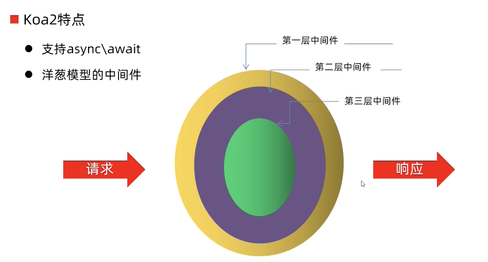

# Koa2
Koa 是现在最流行的基于Node.js平台的web开发框架 

koa 是由 Express 原班人马打造的致力于成为一个更小、更富有表现力、更健壮的 Web 框架 koa 不在内核方法中绑定任何中间件, 它仅仅提供了一个轻量优雅的函数库, 使得编写 Web 应用变得得心应手 

<br><br>

## Express Koa Koa2的问题:
Express它处理异步逻辑需要通过回调函数 一旦使用回调函数处理异步任务就有可能造成回调地狱的问题

为了解决这个问题 这个开发团队开发了 Koa

Koa确实解决了回调地狱的问题 它是通过生成器 和 yield 来进行处理的 而使用 生成器 和 yield的方式 也不是那么好用

所以在node7.6版本发布之后 Koa的作者随之也发布了**支持async await的Koa2**

<br>

|框架名|作用|异步处理|
|:--|:--|:--|
|Express|web框架|回调函数|
|Koa|web框架|Generator + yield|
|Koa2|web框架|async / await|

<br>

### Koa2的特点:
1. 支持 async / await
2. 支持洋葱模型的中间件

<br>

### 支持洋葱模型的中间件:
对于web服务器而言它就是用来处理一个一个的请求 对这些请求做出一个一个的响应 

当web服务器接收到由浏览器发送过来的请求之后 它会形成一个个的响应返回给浏览器

而请求到达服务器是需要通过程序处理的 经过程序处理之后才会形成相应 返回给浏览器

服务器处理请求的程序 在框架中就叫做中间件, 中间件可能不是只有一个 而是有多个

```
- 请求 ->  

      ↓
    中间件1
     
      ↓
    中间件2

      ↓
    中间件3
      ↘
        响应 
```


<br>



<br>

当请求到达服务器的时候 会有中间件来进行处理 
- 最先处理请求的是 第一层中间件

当第一层中间件处理完请求之后 
- 请求会到第二层的中间件

第二层中间件会对请求再次的处理 处理完成后 
- 请求会到第三层的中间件

第三层中间件会对请求进行再次的处理 **重点**  
当第三层中间件处理完成后 
- 会回到第二层中间件 

第二层中间件在处理完成后
- 请求会再次回到第一层中间件

第一层中间件在处理完成后 就会响应给前端

<br><br>

## Koa2 快速上手

### 安装
```s
npm init -y

# 安装的不是koa2 因为会下载最新版本的koa
npm i koa
```

<br>

### 创建 app.js 入口文件
1. 创建 koa 对象
2. 编写响应函数(中间件)
3. 监听端口 3000

<br>

### ctx对象
ctx 的全称是 context 上下文, 一个请求过来 先执行哪个函数 再执行哪个函数 再执行哪个函数 它们之间是有联系的 这个联系称之为上下文

<br>

- ctx
  - request
    - method
    - url
    - header

  - response
    - status
    - message
    - header

  - app: { subdomainOffset: 2, proxy: false, env: 'development' },
  - originalUrl: '/favicon.ico',
  - req: '``<original node req>``',
  - res: '``<original node res>``',
  -  socket: '``<original node socket>``'

<br>

**注意:**  
ctx.req 是Node.js原生的HTTP请求对象, 它是由Node.js的http模块创建的原始HTTP请求对象, **没有被Koa进行过任何封装或修改**

ctx.req 对象是用于与原生Node.js模块交互时使用的, 例如在某些情况下需要使用Node.js提供的底层API

```js
{
  request: {
    method: 'GET',
    url: '/',
    header: {
      host: 'localhost:3000',
      connection: 'keep-alive',
      'sec-ch-ua': '"Chromium";v="112", "Google Chrome";v="112", "Not:A-Brand";v="99"',
      'sec-ch-ua-mobile': '?0',
      'sec-ch-ua-platform': '"macOS"',
      'upgrade-insecure-requests': '1',
      'user-agent': 'Mozilla/5.0 (Macintosh; Intel Mac OS X 10_15_7) AppleWebKit/537.36 (KHTML, like Gecko) Chrome/112.0.0.0 Safari/537.36',
      accept: 'text/html,application/xhtml+xml,application/xml;q=0.9,image/avif,image/webp,image/apng,*/*;q=0.8,application/signed-exchange;v=b3;q=0.7',
      'sec-fetch-site': 'none',
      'sec-fetch-mode': 'navigate',
      'sec-fetch-user': '?1',
      'sec-fetch-dest': 'document',
      'accept-encoding': 'gzip, deflate, br',
      'accept-language': 'zh-CN,zh;q=0.9',
      cookie: 'Webstorm-8a26b71a=85c6292a-3725-450d-8b1e-458a7178f880'
    }
  },
  response: {
    status: 404,
    message: 'Not Found',
    header: [Object: null prototype] {}
  },
  app: { subdomainOffset: 2, proxy: false, env: 'development' },
  originalUrl: '/',
  req: '<original node req>',
  res: '<original node res>',
  socket: '<original node socket>'
}
{
  request: {
    method: 'GET',
    url: '/favicon.ico',
    header: {
      host: 'localhost:3000',
      connection: 'keep-alive',
      'sec-ch-ua': '"Chromium";v="112", "Google Chrome";v="112", "Not:A-Brand";v="99"',
      'sec-ch-ua-mobile': '?0',
      'user-agent': 'Mozilla/5.0 (Macintosh; Intel Mac OS X 10_15_7) AppleWebKit/537.36 (KHTML, like Gecko) Chrome/112.0.0.0 Safari/537.36',
      'sec-ch-ua-platform': '"macOS"',
      accept: 'image/avif,image/webp,image/apng,image/svg+xml,image/*,*/*;q=0.8',
      'sec-fetch-site': 'same-origin',
      'sec-fetch-mode': 'no-cors',
      'sec-fetch-dest': 'image',
      referer: 'http://localhost:3000/',
      'accept-encoding': 'gzip, deflate, br',
      'accept-language': 'zh-CN,zh;q=0.9',
      cookie: 'Webstorm-8a26b71a=85c6292a-3725-450d-8b1e-458a7178f880'
    }
  },
  response: {
    status: 404,
    message: 'Not Found',
    header: [Object: null prototype] {}
  },
  app: { subdomainOffset: 2, proxy: false, env: 'development' },
  originalUrl: '/favicon.ico',
  req: '<original node req>',
  res: '<original node res>',
  socket: '<original node socket>'
}
```

<br><br>

## ctx身上的常用API

### ctx.request:

**ctx.request.url:**  
获取请求的URL

<br>

**ctx.request.method:**  
获取请求的方法

<br>

**ctx.request.header:**  
获取请求头

<br>

**ctx.request.headers:**  
获取请求头对象

<br>

**ctx.request.query:**  
获取URL中的查询参数

<br>

**ctx.request.body:**  
获取请求体

<br>

**ctx.request.get(field):**  
获取指定请求头的值

<br>

### ctx.response:

**ctx.response.body:**   
设置响应体

<br>

**ctx.response.status:**   
设置响应状态码

<br>

**ctx.response.message:**   
设置响应状态消息

<br>

**ctx.response.type:**   
设置响应的Content-Type

<br>

**ctx.response.set(field, value)**   
设置响应头

<br>

**ctx.response.redirect(url, [alt]):**   
重定向到指定URL

<br>

**ctx.response.attachment([filename]):**   
设置响应头

Content-Disposition为attachment，指定下载的文件名

<br>

除了上述方法，ctx.request 和 ctx.response 还提供了许多其他的方法和属性，例如 ctx.request.accepts、ctx.response.length 等，具体使用时可以参考Koa的文档进行查阅。

总体来说，ctx.request 和 ctx.response 是Koa封装的请求对象和响应对象，它们提供了方便的方法和属性，帮助我们更加方便地处理请求和响应。


<br>

### Koa2的简单使用

**要点:**  
app.use方法 不管请求哪个接口都会走该中间件, 要指定接口请求的话 必须使用 router

```js 
// 导入koa
const Koa = require("koa")

// 创建 koa 对象
const app = new Koa()

// 编写处理请求的响应函数
app.use((ctx, next) => {
  /*
     ctx: 上下文对象, web容器
     next: 执行下一个中间件
  */

  const { request, response } = ctx
  // 响应数据
  response.body = "hello koa2"
})

// 监听3000端口
app.listen(3000, () => {
  console.log("服务器监听 3000 端口")
})
```

<br><br>

## 中间件的特点
1. koa是通过use方法加入一个中间件 一个中间件就是一个函数 该函数有 ctx next 参数

2. 中间件的执行顺序是符合洋葱模型的

3. 调用next函数得到的是promise对象
```js
app.use(async (ctx, next) => {
    // 刚进入中间件想做的事

    await next()

    // 内层所有中间件结束之后想做的事儿
})
```

<br>

### 示例1:
```js
// 第一层中间件
app.use((ctx, next) => {
  const { request, response } = ctx
  console.log("第一层中间件")
  response.body = "hello 中间件1的响应"
  next()
  console.log("第一层中间件 - next后续逻辑")
})

// 第二层中间件
app.use((ctx, next) => {
  const { request, response } = ctx
  console.log("第二层中间件")
  next()
  console.log("第二层中间件 - next后续逻辑")
})

// 第三层中间件
app.use((ctx, next) => {
  const { request, response } = ctx
  console.log("第三层中间件")
  // 没有下一个中间件了 就没有必要调用next了
  // next()
})

第一层中间件
第二层中间件
第三层中间件
第二层中间件 - next后续逻辑
第一层中间件 - next后续逻辑

1 - 2 - 3 - 2 - 1
```

<br>

**要点:**  
1. 如果还有下一个中间件的话 需要调用 next() 让其进入下一个中间件

2. 到达最后一个中间件 其后面没有其他的中间件时 可以不用调用 next()

3. 当达到最后一个中间件后 **会回到**第二个中间件 **并执行第二个中间件中next()后面的逻辑**

4. 当第二层next()后面的逻辑执行完毕后 会回到第一个中间件 **并执行第一个中间件中next()后面的逻辑**

<br>

### next()方法
上面的代码中 每一个中间件我们都使用了 next() 方法来进行放行

这像不像我们在调用下一个中间件 难道next就是下一个中间件函数么?

```js
// 第二层中间件
app.use((ctx, next) => {
  const { request, response } = ctx

  // 接收 第三层中间件的返回值
  const ret = next()
  console.log(ret)  // Promise { "我是返回值" }
})
// 第三层中间件
app.use((ctx, next) => {
  const { request, response } = ctx
  console.log("第三层中间件")

  // 指定一个返回值 交由第三层中间件
  return "我是返回值"
})
```

<br>

在我们第三层中间件结束后 我们回到了第二层中间件 在第二层中间件中我们拿到了 第三层中间件的返回值是一个Promise

所以next不仅仅是下一层中间件的指向 它内部还做了一些封装 它把内层中间件return的字符串 给它包装成了Promise

既然是promise对象 那我们是不是可以通过 async 和 await 获取 第三层中间件的返回值(promise对象中的值)

<br>

### 使用async await接受中间件中的返回值
```js
// 第一层中间件
app.use((ctx, next) => {
  const { request, response } = ctx
  console.log("第一层中间件")
  response.body = "hello 中间件1的响应"
  next()
  console.log("第一层中间件 - next后续逻辑")
})

// 第二层中间件
app.use(async (ctx, next) => {
  const { request, response } = ctx
  console.log("第二层中间件")

  const ret = await next()
  console.log(ret)
  console.log("第二层中间件 - next后续逻辑")
})

// 第三层中间件
app.use((ctx, next) => {
  const { request, response } = ctx
  console.log("第三层中间件")
  
  // 这里 return 了
  return "我是返回值"
})
```

<br>

**问题:**  
上面代码我的理解是 按照洋葱模型的逻辑走 会有下面的输出
```
第一层中间件
第二层中间件
第三层中间件
我是返回值
第二层中间件 - next后续逻辑
第一层中间件 - next后续逻辑
```

结果却不是 而是
```
第一层中间件
第二层中间件
第三层中间件
第一层中间件 - next后续逻辑
我是返回值
第二层中间件 - next后续逻辑
```

可能是由于第三个中间件中有return了 所以不是按照上面的洋葱模式逻辑走了 

而是return后直接到第一个中间件的next后续逻辑 然后第二个中间件的next后续逻辑

<br><br>

### 安装koa路由中间件
```
npm i koa-router
```

<br>

### 引入 创建路由对象
```js
const Router = require('koa-router')
let router = new Router()
```

<br>

### 使用router
```js
router.get('/', (req, res) => { ctx.body = 'hello' })
router.post('/', (req, res) => { ctx.body = 'hello' })
```

<br>

### 在app中注册 通过 router.routes() 方法注册
app.use(router.routes());

<br>

### 完整代码
```js 
  const Koa = require('koa');
  const Router = require('koa-router');

  const app = new Koa();
  const router = new Router();

  router.get('/', async ctx => {
      ctx.body = 'hello'
  })

  app.use(router.routes());

  app.listen(3000, () => {
      console.log('3000端口已监听')
  })
```

<br><br>

### koa的数据库操作
在使用koa查询数据库的时候 我们还是可以使用handleDB来操作
别忘了把db文件夹整体的拿过来, 里面还有我们的一些配置

同时因为 await 需要 async 所以我们在 ctx 的前面加上了 async

```js 
  const Koa = require('koa');
  const Router = require('koa-router');

  const app = new Koa();
  const router = new Router();


  // 注意async的位置
  router.get('/', async ctx => {
      
      我们在这里查询数据库的操作

      let result = await handleDB(ctx.res, ...)
      ctx.body = result

  })

  app.use(router.routes());

  app.listen(3000, () => {
      console.log('3000端口已监听')
  })
```

<br><br>

