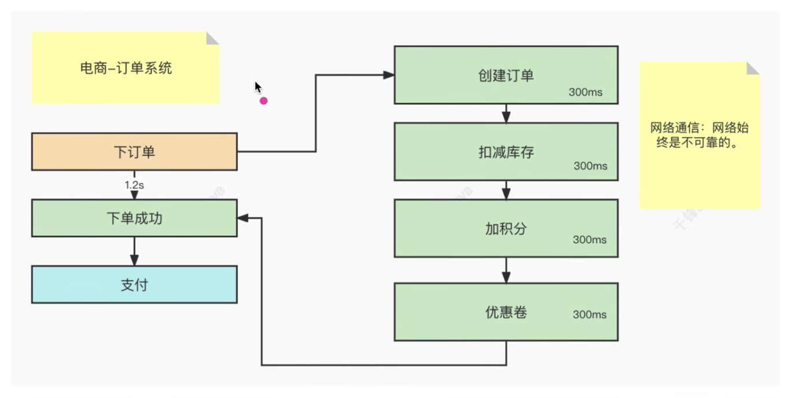
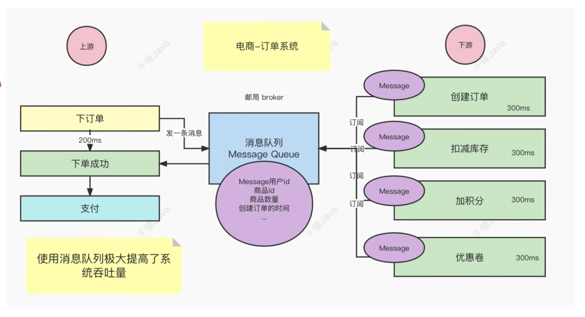
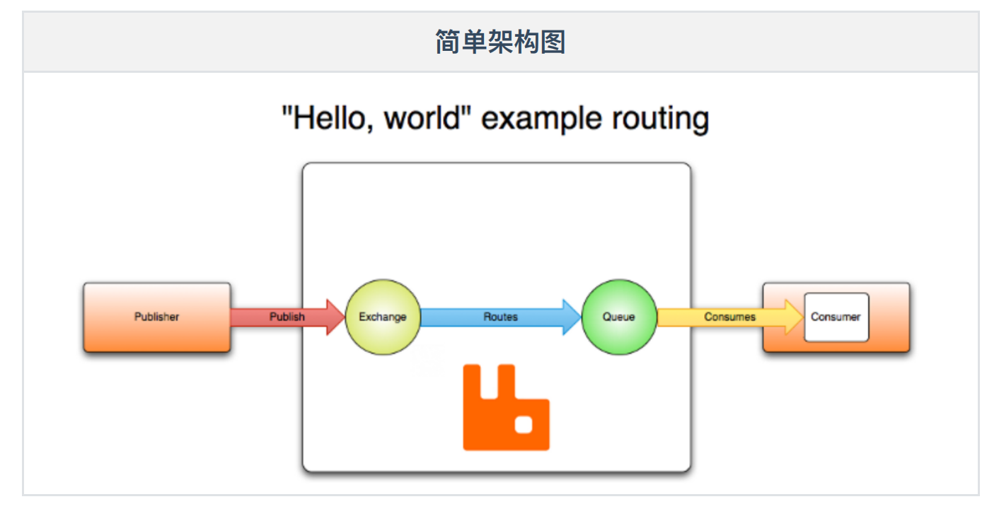
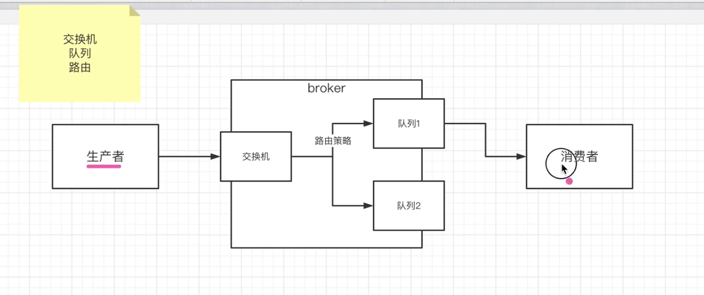
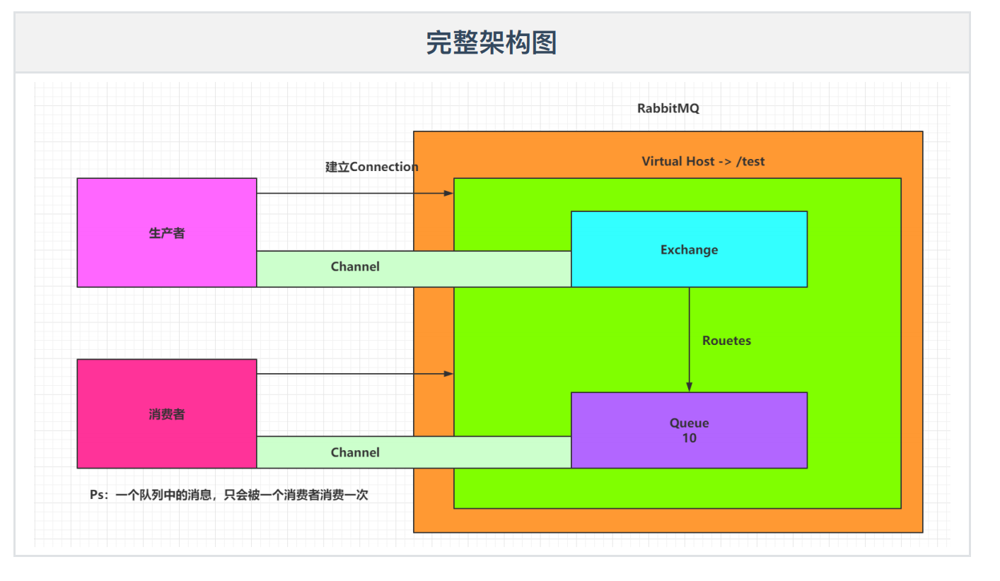
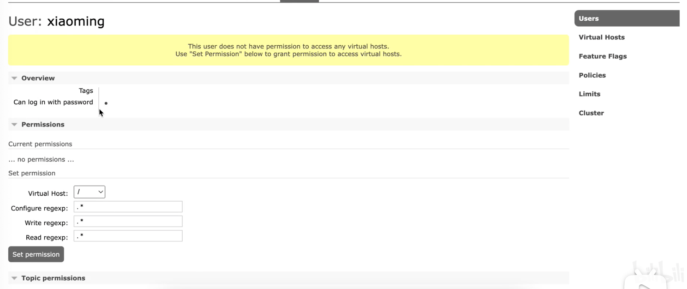
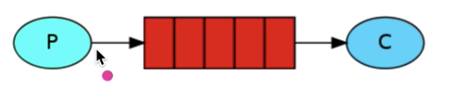

# MQ引言
Message Queue(消息队列), 它是一个队列, FIFO先进先出的数据结构, 消息队列就是所谓的存放消息的队列

消息队列解决的不是存放消息的队列的目的, **它解决的是通信的问题**

<br>



<br>

### 同步通信带来的弊端:
比如上面的电商 - 订单系统, 当用户做了一个 [下订单] 的动作, 在系统的后端 会发生很多的业务逻辑 和 流程的转变
1. 创建订单
2. 扣减库存
3. 加积分
4. 优惠卷

如果上面的流程转换是一个同步的逻辑, 从 1 - 4 依次前一个完成后 再执行下一个 当这4个步骤都完成以后 下单才会成功

而在分布式 或 微服务中, 上面的 1 - 4 不应该放在一个项目里面, 而是存放在不同的项目里

1. 创建订单 -> 项目1
2. 扣减库存 -> 项目2
3. 加积分 -> 项目3
4. 优惠卷 -> 项目4

当我们完成创建订单后 就会调用项目2中的逻辑, 这时两个项目之间就**会发生网络通信**

也就是在调用 项目1 项目2 的时候 需要借助网络 来实现调用, 上面的图中有4个业务 那就是说需要完成4次的网络通信

<br>

**网络通信始终是不可靠的**, 比如流量洪峰一过来网速就会变的极不稳定

<br>

也就意味着很有可能在调用某一个业务的时候(比如优惠卷的业务)失败了

那也就意味着整个调用的链路 1 - 4 就失败了, 也就意味着下单就失败了

**也就是同步的逻辑**, 不仅耗时较久, 且过程中收到网络波动的影响 不能保证高成功率

<br>

### 消息队列帮我们解决的问题



<br>

**消息队列的目的: 解决通信问题**

<br>

既然同步的逻辑不合理, 我们可以改为异步通信的方式, 比如用户在 [下订单] 的时候只需要 **向某一个中转站(MQ)** 发送一条消息

我们直接将这条消息存在消息队列中, 这时对于用户下订单这个动作 它就不需要关心后端的各种繁杂业务

- 创建订单
- 扣减库存
- 加积分
- 优惠卷

用户不需要关系我下订单后端就需要创建订单 - 扣减库存 - 加积分 - 优惠卷 这些动作用户不需要关心

对于用户这边下订单这个程序来讲 只要发送完消息 就能马上得到一个下单是否成功的结论

而且用户发送这条消息只需要200ms的时间, 也就是说只需要消耗一个下单的200ms的时候 就能得到一个下单是否成功的结论

<br>

[下订单] 涉及到的繁杂的业务就通过订阅消息的方式来实现功能

当用户下订单将消息发送到消息队列 会携带如下的参数
```
{
  userId: 
  goodsId:
  goodsCount:
  createOrderTime:
}
```

后端的 1 - 4 业务都在订阅这个消息队列, 也就是说 1 - 4 都能收到用户发送的消息(数据)

当它们拿到消息后就会做自己的业务处理
- 创建订单业务 拿着消息数据 会开始处理创建订单的流程
- 扣减库存业务 拿着消息数据 会开始处理扣减库存的流程
- 加积分 同样
- 优惠卷 同样

这些业务是解耦的 也就是说不需要等着1执行结束后再开始2, 它们之间都是各自独立的 各自在完成自己的事情

只要让 1 - 4 能够拿到消息 它们就能够干我们给它设计好的事情

但是 1 - 4 在整个工作当中对于上游的业务场景是不会受下游的工作时间 是否完成 是否出故障的影响的

**上游 不受 下游 的影响**

<br>

上游在 [下订单] 操作发送消息后 上游就已经 [下单成功] 成功了

下游再逐一的拿到消息各自做自己的业务, 即使下游有失败的业务 但是对于上游来说 上游不受下游的影响 上游再发送消息后 就能得到 下单成功 的结果
```
下游业务中有失败的场景 -> 移动到分布式事务的时候再说
```

<br>

**总结:**  
当使用了消息队列后 对于上游来说 极大的提升了接口的吞吐量 提升了性能 上游发个消息 业务就执行完了 它就能处理下一次的请求

对下游来说 它跟上游之间不是一个同步的关系 不是上游等下游做完后才成功 

对于下游来说就没有那么追求实时性 下游可以在相隔100ms后才成功也都是ok的

<br>

在整个异步通信的过程中 对于整个业务进行了一次充分的解耦, 在上图的过程中最重要的部分就是消息队列

<br>

使用异步的通信方式对模块间的调用进行解耦, 可以快速的提升系统的吞吐量

上游执行完消息的发送业务后立即获得结果, 下游多个服务订阅到消息后各自消费

通过消息队列 **屏蔽底层的通信协议**, 使得解耦和并行消息得以实现

<br><br>

# RabbitMQ介绍
市面上比较火爆的几款MQ:
1. ActiveMQ
2. RocketMQ
3. Kafaka
4. RabbitMQ

**语言的支持:**  
- ActiveMQ RocketMQ 只支持Java语言
- Kafaka RabbitMQ 可以支持多门语言

<br>

**效率方面:**  
- ActiveMQ RocketMQ Kafaka 效率都是毫秒级别
- RabbitMQ是微秒级别

<br>

**消息丢失 & 消息重复消费:**  
RabbitMQ针对消息的持久化 和 重复问题都有比较成熟的解决方案

<br>

**学习成本:**  
RabbitMQ非常简单

<br><br>

# RabbitMQ安装
```s
rabbitmq.com

https://rabbitmq.com/download.html
```

<br>

## 安装方式1: Docker安装 (使用的该方式)
```s
# latest RabbitMQ 3.11
docker run -it --rm --name rabbitmq -p 5672:5672 -p 15672:15672 rabbitmq:3.11-management


# -it: 创建一个交互式的终端，并绑定到容器的标准输入、输出和错误输出。

# --rm: 在容器停止运行后自动删除容器。

# --name rabbitmq: 将容器命名为 "rabbitmq"。

# -p 5672:5672: 将容器的 5672 端口映射到主机的 5672 端口，这是 RabbitMQ 默认的 AMQP 端口。

# -p 15672:15672: 将容器的 15672 端口映射到主机的 15672 端口，这是 RabbitMQ 管理控制台的 Web 界面端口。

# rabbitmq:3.11-management: 指定要运行的 Docker 镜像及其版本号，这里是 RabbitMQ 官方提供的带有管理控制台的 3.11 版本。
```

<br>

执行这条命令后, 你应该可以通过 RabbitMQ Web 界面管理工具访问 **http://localhost:15672** 并查看 RabbitMQ 的状态和配置信息

也可以通过 RabbitMQ 客户端连接到 localhost:5672 来使用 RabbitMQ 服务。

- username : guest
- password : guest

<br>

## 安装方式2: docker-compose 方式
该方式要求 Linux虚拟机上要装有docker 和 docker-compose环境 (测试了下 在centos容器中安装docker是 systemctl 是不能使用的)

<br>

### 在CentOS:7容器中安装Docker 和 Docker-Compose

**前置操作:**
1. 根据centos:7镜像启动容器
```s
docker run -id --name=c1 centos:7
```

2. 进入到容器 开始安装docker

<br>

**进入到centos:7容器后的操作:**
1. 更新系统和安装依赖软件包
```
yum update

yum install -y yum-utils device-mapper-persistent-data lvm2
```

2. 添加 Docker 的 Yum 源
```
yum-config-manager --add-repo https://download.docker.com/linux/centos/docker-ce.repo
```

3. 安装 Docker
```
yum install -y docker-ce
```

4. 启动 Docker 服务
```
systemctl start docker
```

5. 安装 Docker Compose
```
curl -L "https://github.com/docker/compose/releases/download/1.29.2/docker-compose-$(uname -s)-$(uname -m)" -o /usr/local/bin/docker-compose
```

6. 授予 Docker Compose 可执行权限
```
chmod +x /usr/local/bin/docker-compose
```

7. 验证 Docker 和 Docker Compose 是否安装成功
```
docker --version
docker-compose --version
```

<br>

### 当虚拟机中已经配置好环境后 安装MQ的步骤:
1. 启动虚拟机

2. 查看ip地址 

```s
# 查看 inet addr 的位置 查看ip地址
ifconfig

# 如果 ifconfig 不好用则需要安装
yum install -y net-tools

# 如果 ip addr 不好用则需要安装
yum install -y net-tools
```

3. 使用finalshell链接虚拟机

4. 进入到 /usr/local 文件夹中 创建目录
```
cd /usr/local

cd docker

mkdir rabbitmq
```

5. 进入到rabbitmq目录 创建docker-compose.yml文件

```yml
# 指明docker-compose的版本
version: "3.1"
services:
  rabbitmq:
  # 镜像
  image: daocloud.io/library/rabbitmq:management
  # 虚拟机重启后 mq也会重启
  restart: always
  # 容器的名称
  container_name: rabbitmq
  ports:
    - 5672:5672 # 服务通信
    - 15672:15672 # 客户端界面访问
  volumes:
    - ./data:/var/lib/rabbitmq
```

6. docker-compose up -d 运行镜像创建容器

7. 使用 docker ps 查看容器的运行状态

<br><br>

# RabbitMQ: 管理界面
```s
http://localhost:15672/
```

<br><br>

# RabbitMQ: 核心组件
我们进入到 http://localhost:15672/ 页面上看 可以看到有如下的几个导航栏

```
|Overview|Connections|Channels|Exchanges|Queues|Admin|
```

- Connections: 当前连接
- Channels: 当前通道
- Exchanges: 交换机
- Queues: 队列
- Admin: 当前管理界面的管理员身份设置

<br>

### MQ简单的架构图


<br>



- Publisher - ⽣产者: 发布消息到RabbitMQ中的Exchange

- Consumer - 消费者: 监听RabbitMQ中的Queue中的消息

- Exchange - 交换机: 和⽣产者建⽴连接, **并接收⽣产者的消息**

- Queue - 队列: Exchange会将消息分发到指定的Queue，**Queue和消费者进⾏交互(消费者是从队列中得到消息的)**

- Routes - 路由：交换机以什么样的策略将消息发布到Queue

<br>

### MQ完整的架构图 


<br>

### 虚拟主机:
虚拟主机就是用来讲一个RabbitMQ内部划分成多个主机 给不同的用户来使用 而不会冲突


<br>

有这样的一个场景 我们有一个MQ服务器(Broker), 我们有两个项目组, 两个项目组都可以使用MQ服务器

- 项目组1
- 项目组2

<br>

服务器只有一台
- 项目组1 创建了一个 生产者1 发送了一条消息 给项目组1对应的 消费者
  - 生产者1发送消息会发送到 exchange1 交换机
  - exchange1 - queue1 - 消费者1

- 项目组2 创建了一个 生产者2 也要发送消息 只想发送给 项目组2对应的 消费者2

<br>

项目组2的生产者 想将消息发送到 一个新的它能独自使用的交换机 而不是 项目组1对应的exchange1

因为如果发送到exchange1, 那么消息也会被项目组1的消费者接收到

<br>

这两个项目应该是独立的环境, 其实上述的场景MQ也能做到, 因为MQ内部提供了虚拟主机的概念

它将MQ服务器内部分成了多个虚拟的主机, 比如上面的例子 
- 项目组1会使用一套虚拟主机
- 项目组2会使用另一套虚拟主机

两个虚拟主机互相不会干扰

<br>

### RabbitMQ虚拟主机的设置
```
| - RabbitMQ管理界面 
  | - Admin选项卡 
    | - 右侧边栏
      - Users: 用户管理
      - Virtual Hosts: 虚拟主机的管理
```

<br>

### 添加虚拟主机
**Virtual Hosts:**  
|Name|Users|State|Ready|Unacked|Total|From client|To client|publish|deliver / get|
|:--|:--|:--|:--|:--|:--|:--|:--|:--|:--|
|/|guest|running|NaN|NaN|NaN|||||

<br>

**/:**  
表示当前的虚拟主机的作用域是 整个MQ的范围(它的作用域是最大的), 它也是默认的虚拟主机

<br>

**Add a new virtual host:**  
添加一个新的虚拟主机

```
Name: /test1
Description: _ _ _ _ _ 
Tags: _ _ _ _ _ 
```

当我们点击 [Add virtual host] 按钮后 上方的表格就变为 多出了 /test1 虚拟主机

<br>

|Name|Users|State|Ready|Unacked|Total|From client|To client|publish|deliver / get|
|:--|:--|:--|:--|:--|:--|:--|:--|:--|:--|
|/|guest|running|NaN|NaN|NaN|||||
|/test1|guest|running|NaN|NaN|NaN|||||

<br>

当我们添加了一个虚拟主机后 我们回调 [Users] 页面下 我们观察下面的表格

|Name|Tags|Can access virtual hosts|Has password|
|:--|:--|:--|:--|
|guest|adminstartor|/, /test1|.|

我们能看到 guest 用户 可以访问到 默认的虚拟主机/ 之外 还能 访问 /test1 虚拟主机

<br>

### 添加用户
我们在 Users 选项卡的页面下 可以点击 [Add a user] 按钮添加一个用户

```
username: _ _ _ _ _
password: _ _ _ _ _
Tags: _ _ _ _ _ 
```

我们会发现 我们新建的xiaoming用户 是无法访问任何虚拟主机的

<br>

|Name|Tags|Can access virtual hosts|Has password|
|:--|:--|:--|:--|
|guest|adminstartor|/, /test1|.|
|xiaoming||No access|.|

<br>

我们可以点击 xiaoming 那列, 进入到 xiaoming 对应的管理页面



我们可以点击 [Set permission] 按钮 来设置xiaoming的权限 设置xiaoming可以访问哪台虚拟主机

<br>

上面我通过 Virtual Hosts 选项 和 Users 选项, 进行了不同用户之间的作用域划分

<br>

比如我们要是将 xiaoming 设置为 /test1 那么xiaoming就只能访问 /test1 虚拟主机中完整的内容(一套完整的生产者 消费者 交换机 队列 路由策略)

<br>

简而言之就是用虚拟主机划分不同的空间 给不同的项目使用

<br><br>

# HelloWorld模式 (极简模式)



- P: Producer - 生产者
- C: consumer - 消费者
- 红色的格子: 队列

<br>

在这个简单的队列模式里面 它没有体现
1. 交换机
2. 路由

而只是重点的体现了3个部分 生产者 - 队列 - 消费者

我们只需要将队列建立出来 消息往队里里面发 消息就会推送给消费者

<br><br>

## 创建 生产者 项目:
因为生产者 和 消费者 是独立的两个项目 所以我们先创建生产者项目

<br>

### 1. 创建 Maven工程 并导入依赖
```xml
<dependency>
  <groupId>com.rabbitmq</groupId>
  <artifactId>amqp-client</artifactId>
  <version>5.10.0</version>
</dependency>
```

<br>

### 2. 编写 生产者程序
生产者只管发送消息可以, 我们发送消息后 可以在管理页面中查看 [Overview] 总览页面观察 整体情况

[Queues] 页面我们能够看到表格中 我们创建的队列

<br>


|Virtual host|Name|Type|Features|State|Ready|Unacked|Total|incoming|deliver / get|ack|
|:--|:--|:--|:--|:--|:--|:--|:--|:--|:--|:--|
|/test1|my_queue|classic|Args|idle|1|0|1|0.00/s|||

<br>

该表格中Ready表示准备好了一条消息, 还没有被消费

```java
package com.qf.producer;


import com.rabbitmq.client.Channel;
import com.rabbitmq.client.Connection;
import com.rabbitmq.client.ConnectionFactory;

import java.io.IOException;
import java.nio.charset.StandardCharsets;
import java.util.concurrent.TimeoutException;

public class MyProducer {


  // 定义队列的名称
  public static final String QUEUE_NAME = "my_queue";


  // 主程序: 连接到RabbitMQ
  public static void main(String[] args) throws IOException, TimeoutException {

    // 连接 RabbitMQ 服务器
    // 1. 获取链接工厂 该对象是由 RabbitMQ 提供, 创建的对象就是连接MQ服务器的
    ConnectionFactory factory = new ConnectionFactory();


    // 2. 设置服务器的具体信息
    factory.setHost("localhost");
    // 端口写的MQ服务器的端口 不是客户端的端口
    factory.setPort(5672);
    // 设置虚拟主机, 我们会在设置的虚拟主机中做逻辑 (下面的 主机 用户 密码 已经在管理页面上已经创建了)
    factory.setVirtualHost("/test1");
    factory.setUsername("sam");
    factory.setPassword("123456");


    // 3. 从链接工厂获取链接对象, 连接MQ的对象里封装了上面的信息 需要抛出异常(IOException)
    Connection connection = factory.newConnection();


    // 4. 获取通道 (用于之后发送消息的对象)
    Channel channel = connection.createChannel();


    // 5. 声明队列, 我们的消息要往队列中发 (如果队列不存在则创建, 如果队列存在则使用队列)
    /*
      String queue: 队列名称
      boolean durable: 是否是持久化的
      boolean exclusive: 是否是独占 (只给当前客户端使用, 也就是是否只是这次的Java程序能够使用)
      boolean autoDelete: 是否自动删除 (没有被使用的时候 自动删除)
      Map<String, Object> arguments: 用于封装描述队列的其他数据
    */
    channel.queueDeclare(QUEUE_NAME, false, false, false, null);


    // 6. 定义消息
    String message = "hello, rabbitmq!";


    // 7. 发送消息
    /*
      String exchange: 交换机, hello world模式中一定是空字符串 不能是null
      String routingKey: 路由键(路由策略), 当exchange是空串的时候 routingKey等于队列的名称
      boolean mandatory: 强制的
      boolean immediate: 立即的 (一般不用)
      BasicProperties props: 存放描述消息的参数
      byte[] body: 消息内容
    */
    channel.basicPublish("", QUEUE_NAME, null, message.getBytes(StandardCharsets.UTF_8));
    System.out.println("发送完毕");

    // 8. 断开连接
    channel.close();
    connection.close();

  }
}
```

<br><br>

## 创建 消费者 项目:
上面我们已经推了一条消息在队列中, 消息在队列中就会推给消费者

<br>

### 1. 创建 Maven工程 并导入依赖
```xml
<dependency>
  <groupId>com.rabbitmq</groupId>
  <artifactId>amqp-client</artifactId>
  <version>5.10.0</version>
</dependency>
```

<br>

### 2. 编写 生产者程序
生产者只管发送消息可以, 我们发送消息后 可以在管理页面中查看 [Overview] 总览页面观察 整体情况

[Queues] 页面我们能够看到表格中 我们创建的队列

<br>

当运行消费者程序后 RabbitMQ就会将消息推送给消费者 它就会拿到队列中的消息 然后进行消费

<br>

我们查看 管理页面 在 [Connections] 页面中 我们能观察到没有断开连接的消费者信息

然后再 [Queues] 页面中我们能看到 有一条消息被消费了

- Ready: 变为0
- Unacked: 变为1

(没有被签收, 因为程序中channal.basicConsumer()方法的参数中 没有设置自动签收)

<br>

**注意:**  
只有自动签收的消息, 才会从队列中出队列, 当我们没有设置自动签收的时候 Unacked 就会为1

我们再次重启消费者程序 仍然可以接受到消息, 当我们设置了自动签收后 Unacked 就会为0 **表示队列中没有消息了**

<br>

```java
package com.qf.consumer;

import com.rabbitmq.client.*;

import java.io.IOException;
import java.util.concurrent.TimeoutException;

public class MyConsumer {

  // 声明要消费的队列名称 (从哪个队列中消费, 和生产者创建的队列保持一致)
  public static final String QUEUE_NAME = "my_queue";

  public static void main(String[] args) throws IOException, TimeoutException {

    // 1. 获取链接工厂
    ConnectionFactory factory = new ConnectionFactory();


    // 2. 设置服务器的具体信息
    factory.setHost("localhost");
    // 端口写的MQ服务器的端口 不是客户端的端口
    factory.setPort(5672);
    // 设置虚拟主机, 我们会在设置的虚拟主机中做逻辑 (下面的 主机 用户 密码 已经在管理页面上已经创建了)
    factory.setVirtualHost("/test1");
    factory.setUsername("sam");
    factory.setPassword("123456");


    // 3. 从连接工厂获取链接对象
    Connection connection = factory.newConnection();


    // 4. 获取通道
    Channel channel = connection.createChannel();


    // 参数准备: 创建一个Consumer对象 指明具体处理消息的程序
    /*
      参数: 通道 (Consumer需要基于通道来做具体的处理, 因为channel里面可以拿一些数据)

      注意:
        Consumer对象是rabbitmq里面提供的 不要使用错了
        Consumer是接口 我们使用它的实现类DefaultConsumer来穿管对象

        DefaultConsumer中要求重新 handlerDelivery 方法
          该方法用于定义 消息具体应该怎么处理
    */
    Consumer consumer = new DefaultConsumer(channel) {
      @Override
      public void handleDelivery(String consumerTag, Envelope envelope, AMQP.BasicProperties properties, byte[] body) throws IOException {
        // 参数: byte[] body 就是消息, 直接打印 算是处理消息了
        System.out.println(new String(body));

      }
    };

    // 5. 设置消费者 监听 某个队列
    /*
      有很多重载的方法 我们拿两个参数的举例:

      String queue: 要消费的队列名称

      Consumer callback:
        当消息队列中有消息的时候会将消息推送给消费者
        消费者中会定义具体怎么处理数据的程序
        当有消息过来的时候 Consumer对象就开始工作

      boolean autoAck: 
        自动签收, 自动签收后的消息表示消费 该消息会出队列
    */
    channel.basicConsume(QUEUE_NAME, true, consumer);


    // 注意: 消费者不需要关闭 它要一直的接收消息
  }

}
```

<br>

**Lambda方式:**  
我们使用basicConsume()另外一个重载方法 也可以定义如何消费消息


```java
DeliverCallback deliverCallback = ((consumerTag, delivery) -> {
  // 处理消息的逻辑
  // delivery: 消息封装在这个对象中
  System.out.println(new String(delivery.getBody()));
});


/*
  String queue:
  boolean autoAck:
  DeliverCallback deliverCallback:
  CancelCallback cancelCallback:
*/
channel.basicConsume(QUEUE_NAME, true, deliverCallback, consumerTag -> {});
```
