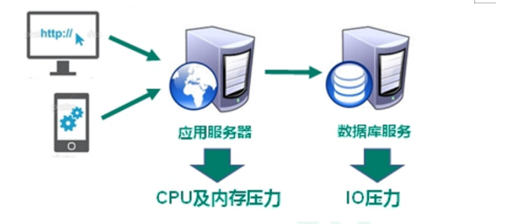
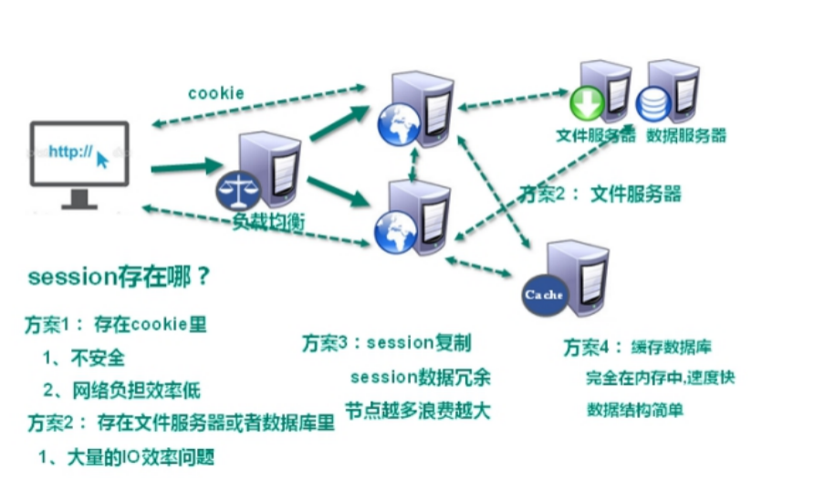
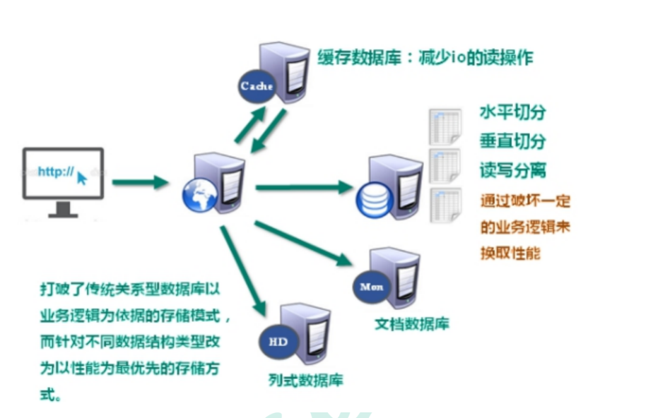
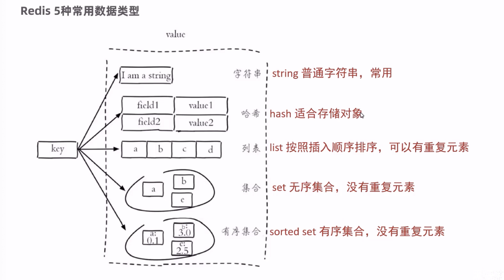
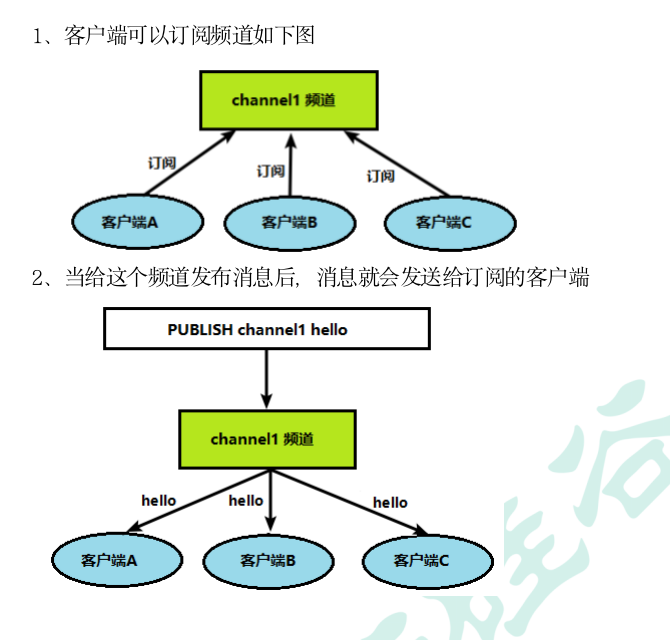

# Redis6
它会将数据存储在内存中, 这样读写性能会高很多

<br>

**中文网:**
```
https://www.redis.net.cn
```

<br>

### 适用场景
适合存储热点数据 (热点商品 资讯 新闻 秒杀等)

**热点数据:**  
短时间内会有大量用户频繁的访问 读取, 这一些的数据如果存在mysql中 会对它的压力会很大

- 缓存
- 任务队列
- 消息队列
- 分布式锁

<br>

## 技术的分类:

### 解决功能性的问题：
我们的基本功能一般都是CRUD, 如下的技术就是来解决CRUD的
```
Java, Jsp, RDBMS, Tomcat, HTML, Linux, JDBC, SVN
```

<br>

### 解决扩展性的问题：
添加新的功能 删除某些功能, 使用上面的原生技术实现比较复杂
```
Struts, Spring, SpringMVC, Hibernate, Mybatis
```

<br>

### 解决性能的问题：
随着用户量的不断增加 就会产生性能问题
```
NoSQL, Java多线程, Hadoop(大数据), Nginx, MQ, ElasticSearch
```

**我们的redis就是为了解决性能的问题**

<br>

## 互联网的发展过程

## web1.0时代
web1.0的时代 数据访问量很有限, 用一夫当关的高性能的单点服务器可以解决大部分问题

```s
用户 -> web服务器 -> 数据库服务器
```

<br><br>

## web2.0时代
随着Web2.0的时代的到来, 用户访问量大幅度提升, 同时产生了大量的用户数据 加上后来的智能移动设备的普及, 所有的互联网平台都面临了巨大的性能挑战 

<br>

### web2.0产生的问题:
服务器的产生了CPU以及内存的压力 和 数据库方面的IO压力



<br>

### web2.0解决问题的方式:**  
**1. 解决CPU和内存压力**


为了解决服务器的压力 我们会在服务器的集群 在服务器集群前我们会加入nginx来使用负载均衡, 这样会将请求平均的分担到不同的服务器中

也就是我们会用集群或分布式架构来解决

```s
                  服务器1
用户 -> nginx ->    服务器2   数据库
                  服务器3
```

<br>

**集群的问题: session的共享问题**

用户登录后我们的用户信息要放在session中, 比如

我们第一次登录到了服务器1, 在服务器1中就产生了session对象 里面有我们的登录信息

当我们第二次访问服务器可能被负载均衡到服务器2, 因为session对象在服务器1中, 服务器2中并没有session对象

这样我们在服务器2中就不是登录状态, 后续的操作就没有办法执行了

<br>

**解决session的共享问题:**  
1. 将用户信息存在cookie里, 每次请求都带着cookie 里面有用户信息
```
1. 不安全
2. 网络负担效率低
```

2. 存在文件服务器或者数据库里
```
大量的IO效率问题
```

3. session复制, 将session复制到不同的服务器对象中, 来保证session的同步
```
session数据冗余, 节点越多浪费越大
```

4. 缓存数据库, 第一次访问服务器将用户信息存到缓存数据库, 第二次访问查看缓存数据库中有没有信息, 有的话就是登录 没有的话就不是登录 类似 temp
```
不需要IO操作, 完全在内存中, 速度快, 数据结构简单, 这样就解决了服务器的压力
```

<br>

**2. 解决IO压力**  
用noSql也解决了数据库的io压力, 我们的项目经过日积月累里面的数据急剧增加, 这时访问效率就会很低



<br>

**原始的解决方案:**  
1. 将数据库和表进行拆分
```
对它们进行分库分表
1. 水平切分
2. 垂直切分
3. 读写分离
```

<br>

**解决方式:**  
上述方案的问题: 它会破坏一部分的业务逻辑来换取性能

我们假如缓存数据库 **我们将频繁进行查询的数据 可以放在缓存数据库中** 每次从缓存数据库中查询 能够极大的提高我们查询的数据

<br>

2. 将专门的数据用特定的方式来进行存储
- 文档数据库
- 列式数据库

<br><br>

## NoSql的特点

### NoSQL数据库概述
NoSQL(NoSQL = Not Only SQL), 意即"不仅仅是SQL", 泛指非关系型的数据库  

NoSQL 不依赖业务逻辑方式存储, 而以简单的key-value模式存储 这样的好处是增加了数据库的扩展能力 

<br>

### 特点:
1. 不遵循SQL标准 
2. 不支持ACID(事务的4个特性)
3. 远超于SQL的性能
4. 支持持久化 主要用作备份恢复
5. 除了支持简单的k-v模式 还支持多种数据结构的存储
6. 一般是作为缓存数据库和关系型数据库 辅助持久化的数据库

<br>

### NoSQL适用场景:
1. 对数据高并发的读写 (秒杀)
2. 海量数据的读写
3. 对数据高可扩展性的

<br>

### NoSQL不适用场景
1. 需要事务支持
2. 基于sql的结构化查询存储, 处理复杂的关系,需要 即席查询 

**（用不着sql的和用了sql也不行的情况, 请考虑用NoSql）**

<br><br>

## 大数据时代常见的存储方式

### 行式数据库
我们传统的数据库就是mysql的数据表, 是一张表

|id|姓名|地点|年龄|
|:--|:--|:--|:--|
|1|张三|北京|20|
|2|李四|上海|18|

<br>

这种存储方式如果我们用大数据的操作方式会有很大的性能问题 我们可以**将上面的数据进行行式存储**  

我们将表中的每一行作为一部分的数据结构进行存储
```js
index1: [张三, 北京, 20]
index2: [李四, 上海, 18]
```

**这么存储的好处:**  
我们现在进行查询 ``select * from users where id = 3`` 这么查询的效率很高

但是统计年龄的时候效率会低

<br>

### 列式数据库

|id|姓名|地点|年龄|
|:--|:--|:--|:--|
|1|张三|北京|20|
|2|李四|上海|18|


我们将表中的每一列作为一部分的数据结构进行存储
```s
[张三, 李四]
[北京, 上海]
[20, 18]
```

**这么存储的优势:**  
当查询年龄的平均值时 我们只需要查询年龄的数据结构就可以了

同样缺点就是当我们想查询id为3的数据时, 我们就需要查询多个部分的数据 才能拿到结果

<br><br>

## Redis的特点:
- Redis是一个开源的key-value存储系统 

- 和Memcached类似, 它支持存储的value类型相对更多, 包括string(字符串), list(链表), set(集合), zset(sorted set --有序集合)和hash（哈希类型） 

- 这些数据类型都支持push/pop, add/remove及取交集并集和差集及更丰富的操作, 而且这些**操作都是原子性的**

- 在此基础上, Redis支持各种不同方式的排序 

- 与memcached一样, 为了保证效率, 数据都是缓存在内存中 

- 区别的是Redis会周期性的把更新的数据写入磁盘或者把修改操作写入追加的记录文件 并且在此基础上实现了master-slave(主从)同步 

- Redis可以配合关系型数据库做高速缓存
- Redis可以做session的共享

<br>

# Redis安装启动

## 安装

### 安装到本机(macbook)

1. 下载redis压缩包
```s
https://redis.io/download/

# 查看各个版本
https://download.redis.io/releases/
```

2. 将下载的解压包 放到了 HD/资源库/Redis7 中
```s
/Library/Redis7
```

3. 进入Redis7, 终端中输入命令: 
```s
# make命令用来编译redis中的文件
make
```

4. 终端中输入命令: 
```s
# 编译后进行安装
sudo make install
```

<br>

### 安装到Linux (虚拟机)
SpringBoot的Demo中下载的是 4.0.0 版本

1. 将 Redis安装包 上面到 Linux 系统
2. 解压安装包, ``tar -zxvf redis-4.0.0.tar.gz -C /usr/local``
3. 安装redis的依赖环境gcc,  ``yum install gcc-c++``
4. 进入 /usr/local/redis-4.0.0 进行编译 ``make``
5. 进入redis的src目录 进行安装 ``make install``

<br>

### Redis的工具
我们安装Redis后会在 /usr/local/bin 下多了很多的工具 我们看看它们的作用

<br>

```s
# 性能测试工具
redis-benchmark

# 修复有问题的AOF文件
redis-check-aof

# 修复有问题的 dump.rab
redis-check-dump

# Redis集群使用
redis-sentinel

# Redis服务器启动命令
redis-server

# Redis客户端
redis-cli
```

<br>

**扩展命令:**  
```s
# 启动
redis-server start

# 停止
redis-server stop

# 重启
redis-server restart

# 查看
ps -ef | grep redis

# 关闭
kill -9 pid
```


<br><br>

## 启动Redis服务器: 方式1 前台启动
前台启动redis服务器, 启动后该终端不能关闭

1. cd ./src (这步不用, 在哪都可以通过下面的命令启动redis)

2. 启动 redis 终端中输入命令: 
```s
sudo redis-server

port: 6379
PID: 56260
```

<br><br>

## 启动Redis服务器: 方式1 后台启动
相比较前台启动的方式 我们更推荐后台启动, 后台启动redis会在后台运行 不会占用一个终端

<br>

### 后台启动的方式:
在Reids7目录下 有 redis.conf 配置文件

1. 使用下面的命令将 redis.conf 文件复制到 /etc 目录下 (不是必须复制到etc 但是该目录里面存放的都是配置文件)
```
cp redis.conf /etc/redis.conf
```

2. 修改 redis.conf 配置文件 修改如下的值, 支持后台启动
```
daemonize no -> yes
```

3. 启动redis服务器, 指定我们修改后的配置文件
```s
redis-server /etc/redis.conf
```

<br><br>

## 启动Redis客户端:
我们要新开一个终端, 上个终端在开启redis服务器, 新的终端中我们要进入Reids的客户端

相当于我们启动了mysql服务器, 还要mysql -uroot -p进入客户端操作数据库是一样的

**也就是说现在我们要通过客户端来连接 redis服务器**

```s
sudo redis-cli

# 这样启动中文就不是序列化后的显示了
sudo redis-cli --raw

# 显示下列的样式后代表进入到客户端
127.0.0.1:6379>
```

<br>

**扩展:**  
redis-cli 默认连接的是本地的redis服务器, 我们可以指定连接其它机器中的redis
```s
redis-cli -h 主机 -p 端口 -a 密码
```

<br>

### 关闭Redis服务器

**方式1:**  
```s
shutdown

quit # 我用这个好用
```

<br>

**方式2:**  
```
kill -9 pid
```

<br><br>

# Redis设置密码
Redis默认是没有开启密码校验的 也就是说我们客户端不需要密码就可以连接redis服务器

<br>

### 设置密码:
1. vim redis.conf
2. /requirepass 查找到 requirepass部分 ``requirepass 123456`` 

```s
# 这样登录客户端的时候指定密码也是可以的
redis-cli -h 主机 -p 端口 -a 密码
```

<br>

### 输入密码:
1. 登录到reids客户端 ``redis-cli``
2. 在客户端上输入 ``auth 密码``

<br><br>

# 设置Redis远程连接
Redis是默认不支持远程连接的 也就是说默认情况下我们只能本机链接本机的redis

所以我们要设置开启远程连接

<br>

### 解决方式:
修改 redis.conf 将 bind 项注释掉, 启动redis服务器的时候指定 redis.conf
```s
# bind限定我们只能本地连接 当我们将 bind 这行注释掉后 就支持远程连接了
### bind 127.0.0.1 -::1
```

<br><br>

# Redis扩展知识
Redis默认提供了16个数据库, 类似数组下标从0开始, 初始默认使用0号库, 这些库的密码都是相同的

<br>

### 切换数据库
```s
select <dbid>

# 例如
select 8
127.0.0.1:6379[7]>
```

<br>

### 串行 vs 多线程 + 锁 (Memecached) vs 单线程 + 多路IO复用(Redis)
这里也是在说 Redis 和 Memecached 的区别

Redis中使用的是单线程的操作 但是能实现多线程的效果 它使用到的技术是 单线程 + 多路IO复用 它的效率要比Memecached更高

<br>

**单线程 + 多路IO复用:**  
```
用户1   ↘

用户2   →   黄牛  →   火车站

用户3   ↗
```

我们很多人去买票, 但是买票的这个动作是通过黄牛来完成的, 当黄牛买到票后 就会通知各个用户过来取票

用户在等待票的过程中 不会处于一直等待的状态 他也会干别的事情, 用户不会等待一直要做事这点提现了多路复用 (用户相当于CPU)

黄牛就是单线程

<br><br>

# Redis的数据类型
Redis中提供了5大数据类型

Redis存储的是key-value结构的数据, 其中key是字符串类型的, value有5种常用的数据类型, 所以我们说的数据类型**指的value这个部分的数据类型**

<br>



<br>

1. 字符串型 String: 普通字符串
```r
"str": "i am a string"
```

2. 列表 List: 按照插入顺序排序 可以有重复元素, 比如使用列表可以完成任务队列, 从列表的左侧进行插入 列表的右侧进行取出, 先进入列表的先处理
```r
"arr": [1,2,3,4]
```
3. 集合 Set: 没有重复元素, 无序的集合

4. 哈希 Hash: 适合存储对象
```r
# 比如用户id作为key, value的部分是一个对象, 类似
"2143412321": {
  name: "sam",
  age: 18
}
```

5. 有序集合 Zset: 没有重复元素 的 有序集合(利用分值进行排序)

<br><br>

## Redis中针对 key 的操作
Redis中我们的数据是通过 key value 的形式存储的 下面我们就先了解下针对 key 的操作

<br>

我们下面的操作要在
1. 开启Redis数据库后
2. 使用客户端连接数据库 在客户端中进行操作

<br>

### 查看当前库的所有key
Redis中有16个库, 默认使用的是0号库

我们通过下面的命令查看当前库中有哪些key, 相当于 keys()

```s
keys *

# 返回值
1) "k1"
2) "k2"
```

<br>

### 判断key是否存在 
- 1: 返回1表示存在
- 0: 返回0表示不存在

```s
exists [key]

exists name # 返回值: 1
```

<br>

### 查看key的类型
```s
type [key]

type name # 返回值: string
```

<br>

### 删除指定的key
直接删掉了
```s
del [key]
```

<br>

### 删除指定的key: 根据value选择非阻塞删除
仅将keys从keyspace元数据中删除 **真正的删除会在后续异步操作**
```s
unlink [key]
```

<br>

### 设置key的过期时间: 秒为单位
```s
# 10秒后过期
expire [key] 10 
```

<br>

### 查看还有多少秒过期
- 返回剩余秒数
- 返回-1: 永不过期
- 返回-2: 已经过期

```s
ttl [key]
```

<br>

### 切换库

```s
select [dbid]

# 切换到2号库
select 1
```

<br>

### 查看当前数据库的key的数量
```s
dbsize # 返回值: 1
```

<br>

### 清空当前库
```s
flushdb
```

<br>

### 清空所有库
```s
flushall
```

<br><br>

# Reids类型: 字符串 String
String是Reids最基本的类型, 一个key 对应一个value

<br>

### String类型的特点
String类型是二进制安全的, 也就是只要是内容可以用字符串表示, 都可以使用String类型 如jpg图片 或 序列化对象(视频也可以变成字符串, 字符串还能转换回视频)

**它的value最多可以是 512M**

<br><br>

## 常用命令
我们使用set命令存储到redis中的值都是字符串类型

<br>

### 向Redis中添加 key-value
如果key已经存在 我们再次使用set命令时 会覆盖掉原先key对应的value

<br>

**注意:**
新建操作, 已有则是修改
```s
set [key] [value]

set name sam
```

<br>

### 只有在key不存在的时候 设置key的值
它不能做覆盖和替换, 只有新建

**命令行显示结果:**  
integer:  
- 0表示没有设置成功
- 1表示设置成功

```s
# nx: not exists
setnx [key] [value]

setnx name sam
```

<br>

**场景:**  
分布式锁

<br>

### 设置kv的同时 设置过期时间
单位: 秒  
过了指定秒数后 key对应的值会被自动的清理掉

```s
# ex: expire
setex [key] [过期时间] [value]
```

<br>

**场景:**  
手机验证码, 因为手机验证码是在某段时间内有效 过了时间后 再输入正确的验证码也一样不能登录

这时候我们就可以将服务器端生成的验证码存到redis中, 然后我们设置验证码的有效期

5分钟到了之后会自动的清理掉验证码

<br>

### 根据key获取对应的值
获取不到时会返回 (nil) 空
```s
get [key]

get name # sam
```

<br>

### 在原有的value后面追加字符串

**命令行显示结果:**  
integer: 追加后字符串的长度
```s
append [key] [追加的字符串]

# 返回追加后的字符串长度
append name erin # 7

get name # "samerin"
```

<br>

### 获取key所对应的value的长度

**命令行显示结果:**  
integer: 7
```s
strlen [key]

strlen name # 7
```

<br>

### 将key中存储的数字值增1
**只能对数字值操作**, 如果为空 新增值为 1

**命令行显示结果:**  
修改后的值

```s
incr [key]
```

<br>

**inrc的原子性: 原子操作**  
所谓的原子操作是指不会被线程调度机制打断的操作

这种操作一旦开始 就一直运行到结束, 中间不会有任何 context switch(切换到另一个线程)

<br>

1. 单线程中 **能够在单条指令中完成的操作都可以认为是原子操作** 因为中断只能发生于指令之间  
比如两个线程操作同一个数据, 这时候一个线程的操作是不会被打断的

2. 在多线程中, 不能被其他进程(线程) 打断的操作就叫做原子操作 Redis单命令的原子性主要得益于Redis的单线程

<br>

### 将key中存储的数字值减1
**只能对数字值操作**, 如果为空 新增值为 -1

```s
decr [key]
```

<br>

### 将key中存储的数字值 增加/减少 指定的值
```s
incrby/decrby [key] [步长]

# age增加10
incrby age 10
```

<br>

### 同时设置一个或多个kv键值对
```s
mset [key1] [value1] [key2] [value2]

mset name sam age 18 sex 男
```

<br>

### 同时获取一个或多个k对应的v
```s
mget [key1] [key2]

mget name age sex
# 获取汉字的时候是编码格式呀
1) "sam"
2) "18"
3) "\xe7\x94\xb7"
```

<br>

### 当所有给定的key都不存在的时候 设置一个或多个kv键值对
这里有原子性, 如果其中的一个key值之前已经存在了 那么所有的设置操作都会失败

**命令行显示结果:**  
-1: 表示设置失败

```s
msetnx [key1] [value1] [key2] [value2]
```

<br>

### 根据范围 提取字符串中的子串

**要点:**  
1. 索引从0开始
2. 包括start 包括end  

```s
getrange [key] [start] [end]

# sam
getrange name 0 1   # sa
```

<br>

### 向指定的索引位 设置子串
会将指定索引位原有的值删除 插入我们指定的子串

```s
setrange [key] [offset] [value]

# teststr: abc123def
setrange teststr 1 xx  # "axx123def"
```

<br>

### 设置新值的同时获取旧值
取到的是设置之间的值, 但是新值已经设置上了 
```s
getset [key] [value]
```

<br><br>

## String的底层数据结构
String的数据结构为简单动态字符串, 是可以修改的字符串 内部结构实现上类似Java的ArrayList 采用预分配冗余空间的方式来减少内存的频繁分配

```
_ _ _ _ _ _ _ _ _ _ <- 实际配置的空间 capacity

x x x x x _ _ _ _ _ <- xxxxx为实际的字符串长度
```

如上所示, 内部当当前字符串实际分配的空间capacity 一般要高于实际字符串的长度len

当字符串长度小于1m的时候 扩容都是加倍现有的空间

当字符串长度超过1m的时候 扩容时一次只会多扩1m的空间

需要注意的是字符串最大长度为512m

<br><br>

# Reids类型: 列表 List
redis中的列表是简单的字符串列表 按照插入顺序排序

```s
"name" : sam erin nn
```

上面多值的部分我们会使用列表来进行存储, 有点类似
```js
key: [val, val, val]
```

<br><br>

## 概念:
Redis列表式简单的字符串列表, 按照插入的顺序排序 也就是说列表中的内容是有序的

我们可以添加一个元素到 列表的头部 或者 列表的尾部

**它的底层实际是一个双向的链表**, 对两端的操作性能很高, 通过索引下标的操作中间的节点性能会比较差

我们用链表的时候查询效率是比较低的

<br>

**场景:**  
任务队列的实现就是通过 lpush - rpop / brpop 来实现

<br><br>

## 常用命令: 命令前缀 l

### 从列表左边(头部) 插入多个值
每个值**都是从列表的左侧添加到列表中**, 已有数据会后移有点像 **入栈的性质**


```
key: [val1]
key: [val2, val1]
key: [val3, val2, val1]
```

```s
lpush [key] [val1] [val2] [val3]

# 新建列表:
lpush family sam erin nn  # 3
lpush family laoye liubo  # 5

# 结果类似
family: [liubo, laoye, nn, erin, sam]
1) "liubo"
2) "laoye"
3) "nn"
4) "erin"
5) "sam"
```

<br>

**注意:**  
1. lpush: 有新建列表 和 让列表中追加数据的作用
2. 左边插入新值, 旧值会右移 新值在列表头部

<br>

**命令行显示结果:**  
integer: 3, 显示的列表的长度

<br>

### 有列表右边 插入多个值:
右边插入新值, 旧值往左移, 新值在列表尾部
```s
rpush [key] [val1] [val2] [val3]

# 从列表右侧放数据
rpush family sam erin nn

# 取值操作: 
lrange family 0 -1
1) "sam"
2) "erin"
3) "nn"
```

<br>

### 根据指定的范围从列表中 取值操作
按照索引下标获取元素 从左到右, 索引从0开始 包含start 包含end

**取值操作不会影响原列表**, 范围取值只有lrange
```s
lrange [key] [start] [end]

# 取列表中所有的值
lrange family 0 -1
```

<br>

**注意:**   
-1表示右边第一个, 也就是 -1 代表查所有

<br>

### 取值操作: 相当于弹栈
从 左边 或 右边 吐出一个值, **值在键在, 值光键亡**

相当于中左边/右边 让一个元素弹出栈, **弹出后列表中就少了一个元素哦**

```s
lpop/rpop [key]

# 取出一个元素
lpop family

# 查看列表: sam被取出来了, 
lrange family 0 -1
1) "erin"
2) "nn"
```

<br>

### 移出并获取列表的最后一个元素, 如果列表没有元素会阻塞列表知道等待超时 或 发现可弹出元素为止

它的作用和 rpop 非常的相似 都是将列表中最后一个元素取出(删除), 并且返回这个元素的值

但它是一个阻塞的 比如当我们执行这个命令的时候 如果这个列表是空的 它就会一直阻塞

阻塞到timeoue指定的时长之后 该命令才会结束, 或者阻塞到列表中有元素删除掉该元素的时候

```s
brpop key1 [key2] timeout
```

<br>

### 从列表1的右边吐出一个值, 插入到列表2的左边
会影响原列表
```s
rpoplpush [key1] [key2]
```

<br>

### 根据下表获取列表中指定位置的元素
**相当于 arr[index]**

从左到右 索引从0开始
```s
index [key] [index]
```

<br>

### 获取列表的长度
**相当于 arr.lenth**  

```s
llen [key]
```

<br>

### 插入操作: 向列表中 指定元素 的前面/后面 插入新元素
如果指定的value不存在则添加失败
```s
# 在列表中value的前面 添加newvalue
linsert [key] before/after [value] [newvalue]

# 创建一个列表
rpush list 1 2 3

# 展示结果
1) "1"
2) "2"
3) "3"

# 向 3 的前面添加 abc
linsert list before 3 abc

# 结果
1) "1"
2) "2"
3) "abc"
4) "3"
```

<br>

### 删除操作: 从左边删除n个value
从左边删除 指定列表中的 指定数量的指定value

**命令行显示结果:**  
integer: 删除了几个

当指定的n的值大于要删除元素的实际个数时, 不会报错, 仅会将仅存的指定的所有元素删掉
```s
lrem [key] [n] [value]

# 删除列表中 5个2, 实际只有2个2 那就删除2个2
lrem list 5 2
```

<br>

### 修改操作: 将指定列表下表位index的值替换成value
```s
lset [key] [index] [value]
```

<br><br>

## List的底层数据结构
List的数据结构为快速链表 quicklist

首先在列表元素较少的情况下**会使用一块连续的内存存储**, 这个结构是ziplist 也就是压缩列表
 
它将所有的元素紧挨着一起存储 分配的是一块连续的内存

<br>

当数据量比较多的时候会将多个ziplist形成链表的结构 才会改成quicklist

```
ziplist <-> ziplist <-> ziplist
```

因为普通的链表需要的附加指针空间太大, 会比较浪费空间 比如这个列表里存的只是int类型的数据 结构上还需要两个额外的指针prev 和 next

redis将链表和ziplist结合起来组成了quicklist, 也就是将多个ziplist使用双向指针串起来使用

这样既满足了快速的插入删除性能 又不会出现太大的空间冗余

<br><br>

# Reids类型: 集合 Set
Redis Set对外提供的功能和list类似, 是一个列表的功能

特殊之处在于set是**可以自动去重**的

当我们需要存储一个列表数据, 又不希望出现重复数据时, set是一个很好的选择

并且Set提供了判断某个成员是否在一个set集合内的重要接口, 这个也是list所不能提供的

<br>

### Set特点:
1. 元素无序
2. 元素不重复

<br>

Redis的Set是String类型的无序集合 它底层其实是一个value为null的hash表, 所以添加删除查找的复杂度都是o(1)

一个算法随着数据的增加 执行时间的长短 如果是o(1) 数据增加 查找数据的时间不变

<br><br>

## 常用命令: 命令前缀 s

### 将一个或多个元素加入到集合key中, 已经存在的元素将被忽略
值被放入集合中是没有顺序的, 它应该是按照hash值来放的, 取值的时候顺序不会发生变化
```s
sadd [key] [val1] [val2]
```

<br>

### 取出该集合的所有值
```s
smembers [key]
```

<br>

### 判断指定集合中是否有value的存在
- 1: 有
- 0: 没有

```s
sismember [key]
```

<br>

### 返回该集合的元素个数
```s
scard [key]
```

<br>

### 删除集合中的某个元素
```s
srem [key] [val1] [val2]
```

<br>

### 随机从该集合中吐出(删除)一个值 
值光了 key就没了
```s
spop [key]
```

<br>

### 随机从集合中取出n个值 不会从集合中删除
```s
srandmember [key] [n]
```

<br>

### 把集合1中的指定值移动到集合2中
集合1中的值会被删除
```s
smove [source] [destination] [value]
```

<br>

### 返回两个集合的 **交集** 元素
你有我也有
```s
sinter [key1] [key2]
```

<br>

### 返回两个集合的 **并集** 元素
集合1 + 集合2 的元素(去重)
```s
sunion [key1] [key2]
```

<br>

### 返回两个集合的 **差集** 元素
集合1中有 集合2中没有, 也就是 谁 - 谁, 从前一个集合中取元素
```s
sdiff [key1] [key2]
```

<br><br>

## Set的底层数据结构
set数据结构是dict字典, 字典是用哈希表实现的

<br><br>

# Reids类型: 哈希 Hash (对象)
Redis中的hash是一个键值对的集合, 类似Java中的Map

<br>

**Java中的Map:**  
```java
HashMap<String, Object> map = new HashMap<>();

map.put("name", "sam");
map.put("age", 18);
map.put("sex", "男");

"key": {
  name: "sam",
  age: 18,
  sex: "男"
}
```

<br>

Redis中的Hash也差不多, 它的value的部分分为 **field 和 value 的映射表**

```s
key: {
  field: value
}

user: {
  id: 1,
  name: "张三",
  sex: "男"
}
```

<br>

### 举例:
我们想在redis中存一个对象 对象的结构类似如下
```s
{id: 1, name: "张三", age: 18}
```

<br>

**思考:**  
如何将一个对象存储到redis中呢?

<br>

**方式1:**  
我们将对象作为一个序列化的字符串, 这样我们可以以如下的形式存储这个对象
```js
user: '{id: 1, name: "张三", age: 18}'
```

<br>

**缺点:**   
操作value的部分比较困难

<br>

**方式2:**  
我们将数据分开进行存储

```js
user: id - 1
user: name - 张三
user: age - 20
```

**缺点:**  
这么存储数据太分散了

<br>

**方式3: Hash -- 引出**  
key的部分是就"user", value部分是一个对象
```js
"user": {
  id: 1,
  name: "张三",
  age: 18
}
```

<br><br>

## 常用命令: 命令前缀 h

### 添加操作: 向redis中存一个给定key的对象 添加数据  
**相当于对象**  
将key对象中添加 field : value

可以往hash中添加多个 field : value
```s
hset [key] [field] [value]

hset obj id 1
hset obj name sam
hset obj age 18
```

```s
hset [key] [field] [value]
    ↙         ↓     ↙
|key| -> |field1|value1|
         |field2|value2|
```

<br>

### 从指定key的对象中 获取数据
```s
hget [key] [field]

hget obj name
```

<br>

### 从指定key的对象中 删除指定属性
相当于删除对象中的一个属性, 可以删除多个字段
```s
hdel [key] [field] [field2]

hdel obj name
```

<br>

### 添加操作: 一次性的向指定key的对象中添加多个 field - value

```s
hmset [key] [field1] [value1] [field2] [value2]

hmset obj id 1 name sam age 18
```

<br>

### 添加操作: 当指定key的对象中 没有指定的field的时候再添加  field - value
```s
hsetnx [key] [field] [nums]
```

<br>

### 查看指定key的对象中 给定field是否存在
```s
hexists [key] [field]
```

<br>

### 获取指定key的对象中 所有field   

```s
hkeys [key]
```
 
<br>

### 获取指定key的对象中 所有value
```s
hvals [key]
```

<br>

### 获取指定key的对象中 所有 field - value
```s
hgetall [key]
```

<br>

### 为hash中指定field的值 +nums / -nums
```s
hincrby [key] [field] [nums]
```

<br><br>

## Hash的底层数据结构
Hash类型对应的数据结构是两种
1. ziplist(压缩列表)
2. hashtable(哈希表)

当field-value长度较短且个数较少的时候, 使用ziplist 否则使用hashtable

<br><br>

# Reids类型: 有序集合 Zset(sorted set)
Redis有序集合zset与普通集合set非常相似, 是一个没有重复元素的字符串集合

不同之处是 **zset是有序集合** 

**它的每个成员都关联了一个评分(double类型的 score)**, 这个评分被用来 **按照最低分到最高分的方式排序** 集合中的成员

集合的成员是唯一的 **但是评分可以重复的**

因为元素是有序的 所以你也可以很快的根据评分或者次序来获取一个范围的元素

访问有序集合的中间元素也是非常快的, 因此你能够使用有序集合作为一个没有重复成员的智能列表

<br><br>

## 常用命令: 命令前缀 z

### 向有序集合中添加内容 (创建 & 追加)
每个成员是 [评分] + [值]

某种程度上 我们也可以理解为也是往集合中添加kv, 只不过k是评分, k的部分是可以重复的

```s
zadd [key] [score1] [value1] [score2] [value2]

# 依次添加 sam erin nn, 且它们各自都有自己的评分 [100, sam] [200, erin] [300, nn]
zadd orderset 100 sam 200 erin 300 nn
```

<br>

### 取值操作: 根据指定的下标, 获取集合中范围内的元素
取值操作时, 结果集中会默认为从小到大的排序

包含start, 包含end

获取到的是value的部分的列表
```s
zrange [key] [start] [end]

# 获取有序集合中所有的元素
zrange orderset 0 -1

1) "sam"
2) "erin"
3) "nn"
```

<br>

**获取每个元素以及它对应的评分:**  
```s
zrange orderset 0 -1 withscores

1) "sam"
2) "100"
3) "erin"
4) "200"
5) "nn"
6) "300"
```

<br>

### 取值操作: 根据评分范围, 获取集合中的元素
取值操作时, 结果集中会默认为从小到大的排序

返回有序集合中 所有score值介于min和max之间(包括min或max)的成员

```s
zrangebyscore [key] [min] [max]

# 获取评分在100 ~ 200之间的元素 包含两端
zrangebyscore orderset 100 200
```

<br>

**获取每个元素以及它对应的评分:**  
```s
zrangebyscore orderset 100 200 withscores

1) "sam"
2) "100"
3) "erin"
4) "200"
```

<br>

### 指定排序: 默认是从小到大, 指定为从大到小
我们从有序集合中获取到的结果集的元素 是根据评分从小到大的排序结果

我们可以通过如下的命令, 让获取到的结果集中的元素是从大到小的排列顺序

```s
# 根据下标 获取集合中的指定范围内的元素, 如果也想展示评分就添加可选部分
zrevrange [key] [start] [end] [可选: withscores]


# 根据评分 获取集合中指定范围内的元素, 如果也想展示评分就添加可选部分
zrevrangebyscore [key] [min] [max] [可选: withscores]
```

<br>

### 给集合中指定的元素的score, 做增加操作
**相当于 ++ +=**

增量后元素的顺序可能会发生变化

```s
# 在哪个元素的score上加上nums
zincrby [key] [nums] [value]

# 给sam对应的评分增加100
zincrby orderset 100 sam
```

<br>

### 删除操作: 从结合中删除指定的value

```s
zrem [key] [value]
```

<br>

### 求length操作: 根据评分的区间 获取区间内元素的个数

```s
zcount [key] [min] [max]
```

<br>

### 获取元素在集合中的排名

返回的是元素在集合中的排名(下标)
```s
zrank [key] [value]

# 添加元素
zadd set 100 sam 200 erin 300 nn 400 laoye 500 liubo

# 获取sam在集合中的排名
zrank orderset sam    # 0
```

<br><br>

## zset的底层数据结构
SortedSet是Redis提供的一个非常特别的数据结构

一方面它等价于Java的数据结构Map, 可以给每一个元素value赋予一个权重score

另一方面它又类似于TreeSet 内部的元素会按照权重score进行排序, 可以得到每个元素的名次

还可以通过score的范围来获取元素的列表

<br>

**zset底层使用了两个数据结构:**  
1. hash:  
hash的作用就是关联元素value和权重score, 保障元素value的唯一性 可以通过元素value找到响应的score值

2. 跳跃表:  
跳跃表的目的在于给元素value排序, 根据score的范围获取元素列表

<br><br>

# Redis配置文件详解
Redis配置文件中会使用如下的形式分为不同的部分
```s
##### INCLUDES #####
```

我们下面根据这些不同的部分进行相关的说明

<br>

### Redis的单位
配置文件中开头定义一些基本的度量单位 只支持bytes 不支持bit 大小写不敏感
```s
# 1k => 1000 bytes
# 1kb => 1024 bytes
# 1m => 1000000 bytes
# 1mb => 1024*1024 bytes
# 1g => 1000000000 bytes
# 1gb => 1024*1024*1024 bytes
```

<br>

### INCLUDES 部分
redis的配置文件中 可以包含其他配置文件的内容 类似jsp中的include, 一个页面中可以包含另一个页面中的内容

我们可以使用下面的配置包含另一个配置文件
```s
include /path/to/local.conf
```

<br>

### NETWORK 部分

```s
# 作用:
# 限定连接redis数据库的ip地址, 注销掉bind这行则表示支持远程连接

# 如:
# bind的值如果是 127.0.0.1, 表示目前访问redis时只能通过本机进行访问 如果我们想通过其它电脑远程连接redis是办不到的

# bind限定我们只能本地连接 当我们将 bind 这行注释掉后 就支持远程连接了
bind 127.0.0.1 -::1


# 作用:
# 开启保护模式, 只能本地访问 不能远程访问

# 修改为no, 则支持远程访问
protected-mode yes


# 作用:
# Redis服务器的端口号
port 6379


# 作用:
# 设置tcp的backlog

# backlog是一个连接队列, backlog队列总和 = 未完成三次握手队列 + 已经完成三次握手队列

# 在高并发环境下你需要一个高backlog值来避免慢客户端连接问题
tcp-backlog 511


# 作用:
# 设置连接Redis的超时时间 0为永不超时, 秒为单位

# 比如我们一段时间没有操作redis, 则超时了, 要想操作则必须重新连接
timeout 0


# 作用:
# 检测redis是否连接的时间间隔, 秒为单位, 每隔300秒检测一次连接是否还活着

# 如果活着则继续提供服务 如果没有或者则释放连接
tcp-keepalive 300
```

<br>

### GENERAL 部分

```s
# 作用:
# 是否支持后台运行 
daemonize no


# 作用:
# Redis每次启动都会有进程号, 它会将进程号设置到 redis_6379.pid 文件中 
pidfile /var/run/redis_6379.pid


# 作用:
# Redis内部的日志级别
# 级别有: 1. debug, 2. verbose, 3. notice, 4. warning

# debug: 当我们在开发环境中使用此级别 我们可以看到更加详细的信息
# verbose: 仅显示有用的信息
# notice: 如果在生产环境中使用此级别 它只显示重要的信息
loglevel notice


# 作用:
# 设置日志的输出路径
logfile ""


# 作用:
# redis默认使用的16个库
databases 16


always-show-logo no

set-proc-title yes

proc-title-template "{title} {listen-addr} {server-mode}"

stop-writes-on-bgsave-error yes

rdbcompression yes

rdbchecksum yes

dbfilename dump.rdb

rdb-del-sync-files no

dir ./
```

<br>

### REPLICATION 部分
```s
replica-serve-stale-data yes

replica-read-only yes

repl-diskless-sync yes

repl-diskless-sync-delay 5

repl-diskless-sync-max-replicas 0

repl-diskless-load disabled

repl-disable-tcp-nodelay no
```

<br>

### SECURITY 部分
Redis中密码默认是没有做设置的 我们可以直接进行访问

**设置密码方式1:**  
通过命令的方式设置密码, 临时生效 重启服务器后密码失效  
使用 redis-cli 链接上redis, 指定如下的命令
```s
config set requirepass "密码"
```

执行完毕无需重启, 退出客户端重新登录就要输入密码了

<br>

**设置密码方式2:**  
修改配置文件 永久生效

```s
# 找到该位置 开启注解 后面设置密码
requirepass 密码
```

<br>

**客户端连接服务器时输入密码:**  
```s
# 连接时输入密码：
[root@localhost bin] ./redis-cli -a 123456


# 先连接再输入密码：
[root@localhost bin] ./redis-cli
127.0.0.1:6379> auth 123456


# 关闭方法:
[root@localhost bin] ./redis-cli -a 123456 shutdown
```

<br>

```s
replica-priority 100

acllog-max-len 128
```

<br>

### LAZY FREEING 部分
```s
lazyfree-lazy-eviction no
lazyfree-lazy-expire no
lazyfree-lazy-server-del no

replica-lazy-flush no

lazyfree-lazy-user-del no

lazyfree-lazy-user-flush no
```

<br>

### KERNEL OOM CONTROL 部分
```s
oom-score-adj no

oom-score-adj-values 0 200 800
```

<br>

### KERNEL transparent hugepage CONTROL 部分
```s
disable-thp yes
```

<br>

### APPEND ONLY MODE 部分
```s

appendonly no

appendfilename "appendonly.aof"

appenddirname "appendonlydir"

appendfsync everysec

no-appendfsync-on-rewrite no


auto-aof-rewrite-percentage 100
auto-aof-rewrite-min-size 64mb

aof-load-truncated yes

aof-use-rdb-preamble yes

aof-timestamp-enabled no
```

<br>

### SLOW LOG 部分
```s
slowlog-log-slower-than 10000

slowlog-max-len 128
```

<br>

### LATENCY MONITOR 部分
```s
latency-monitor-threshold 0
```

<br>

### EVENT NOTIFICATION 部分
```s
notify-keyspace-events ""
```

<br>

### ADVANCED CONFIG 部分
```s
hash-max-listpack-entries 512
hash-max-listpack-value 64

list-max-listpack-size -2

list-compress-depth 0

set-max-intset-entries 512

zset-max-listpack-entries 128
zset-max-listpack-value 64

hll-sparse-max-bytes 3000

stream-node-max-bytes 4096
stream-node-max-entries 100

activerehashing yes

client-output-buffer-limit normal 0 0 0
client-output-buffer-limit replica 256mb 64mb 60
client-output-buffer-limit pubsub 32mb 8mb 60

hz 10

dynamic-hz yes

aof-rewrite-incremental-fsync yes

rdb-save-incremental-fsync yes

jemalloc-bg-thread yes
```

<br>

### CLIENTS 部分
```s
# 设置redis同时可以与多少个客户端进行连接 默认是10000个

# 如果达到了此限制, redis则会拒绝新的链接请求 并且想这些链接请求发出 max number of clients readched 做为回应
maxclients 10000
```

<br>

### MEMORY MANAGEMENT 部分
Redis是内存数据库
建议必须设置, 否则, 将内存占满, 造成服务器宕机

设置redis可以使用的内存量。

一旦到达内存使用上限, redis将会试图移除内部数据, 移除规则可以通过``maxmemory-policy``来指定。

如果redis无法根据移除规则来移除内存中的数据, 或者设置了"不允许移除", 那么redis则会针对那些需要申请内存的指令返回错误信息, 比如SET, LPUSH等。

但是对于无内存申请的指令, 仍然会正常响应, 比如GET等。如果你的redis是主redis（说明你的redis有从redis）, 那么在设置内存使用上限时, 需要在系统中留出一些内存空间给同步队列缓存, 只有在你设置的是"不移除"的情况下, 才不用考虑这个因素。

```s
# 必须设置: 否则, 将内存占满, 造成服务器宕机
maxmemory <bytes>


# 可选值:
# volatile-lru: 使用LRU算法移除key, 只对设置了过期时间的键；（最近最少使用）

# allkeys-lru: 在所有集合key中, 使用LRU算法移除key

# volatile-random: 在过期集合中移除随机的key, 只对设置了过期时间的键

# allkeys-random: 在所有集合key中, 移除随机的key

# volatile-ttl：移除那些TTL值最小的key, 即那些最近要过期的key

# noeviction: 不进行移除。针对写操作, 只是返回错误信息
maxmemory-policy noeviction


# 设置样本数量
# 抽样操作 一般设置3到7的数字, 数值越小样本越不准确, 但性能消耗越小。
maxmemory-samples 5

maxmemory-eviction-tenacity 10

replica-ignore-maxmemory yes
```

<br>

# Redis发布与订阅

## 什么是发布订阅
就是一种消息的通信模式
- 发送者: 发送消息(pub)
- 订阅者: 接收消息(sub): 

Redis客户端可以订阅任意数量的频道, 发布者可能会发布很多消息, 它发布消息时会以频道的方式来进行发布

比如发布者往频道1 频道2 频道3发布了消息, 而订阅者只订阅了频道1的消息, 那么他只能接收到频道1内发布的消息 频道2 3里发布的消息 订阅者是得不到的

**订阅哪个频道才能接收到哪个频道中的信息**

<br>
 


<br>

## 实现发布订阅
每一个客户端都可以作为发布或订阅的角色, **实现两个客户端之间的通信**

<br>

### 客户端1向频道1发布消息

**控制台显示结果:**  
integer: 1, 表示该频道订阅者的数量

```s
publish [频道] [数据]
```

<br>

### 客户端2订阅频道1中的消息
```s
subscribe [频道]
```

<br><br>

# Redis新数据类型
我们会介绍3种新的数据类型
1. Bitmaps
2. HyperLogLog
3. Geospatial

这个部分没有看 等着跟Redis7一起看吧

<br><br>

# Jedis
它是Redis的一个客户端工具 也就是通过Java来操作Redis

我们之前学过jdbc是通过Java来操作数据库, 而Jedis是用Java来操作Redis

**之前我们通过命令行的方式操作Redis现在都可以通过Java来进行操作**

<br>

## Jedis的使用方式:
1. 创建Maven工程

2. 下载Jedis的相关依赖
```xml
<dependency>
  <groupId>redis.clients</groupId>
  <artifactId>jedis</artifactId>
  <version>3.2.0</version>
</dependency>
```

3. 编写测试类测试Jedis的使用方式

<br>

### 前置工作:
我们要修改redis的配置文件使其可以远程连接, 如果不修改则只能本机链接

1. bind的地方要注释掉
2. protected-mode 设置为 no

<br>

### 创建Jedis对象
### **<font color="#C2185B">new Jedis(redis的ip地址, 端口号)</font>** 
```java
Jedis jedis = new Jedis("127.0.0.1", 6379);
```

<br>

### 测试是否连接成功
### **<font color="#C2185B">jedis.ping()</font>** 

**返回值:**  
String类型
- pong: 说明链接成功
- 报错: 则说明连接失败

<br>

### 扩展问题:
一般情况下我们的redis是需要放在虚拟机中, 我们需要连接虚拟机中的redis, 这时虚拟机的防火墙需要关闭

```s
# 检查虚拟机中的防火墙的运行状态
systemctl status firewalld


# 关闭 防火墙
systemctl stop firewalld
```

<br>

**使用方式演示:**
```java
package com.sam.jedistest;

import org.junit.Test;
import redis.clients.jedis.Jedis;

import java.util.List;
import java.util.Set;

public class JedisTest {

  @Test
  public void test() {

    // 创建 Jedis 对象
    Jedis jedis = new Jedis("127.0.0.1", 6379);

    // 清空redis数据库
    jedis.flushDB();


    // 往数据库添加数据
    jedis.set("name", "sam");


    // 同时往redis中添加多个kv
    jedis.mset("hobby", "Java", "Javascript", "Go");
    List<String> hobby = jedis.mget("hobby");
    System.out.println("hobby = " + hobby);


    // 根据key获取对应的数据
    String name = jedis.get("name");
    System.out.println("name = " + name);


    // 获取redis数据库中所有的key, 返回值set
    Set<String> keys = jedis.keys("*");
    // 遍历集合, 输出redis中的所有key
    for(String key: keys) {
      System.out.println("key = " + key);
    }


    // 清空redis数据库
    jedis.flushDB();


    // 关闭连接对象
    jedis.close();
  }
}
```

<br>

### String相关操作:
```java
// 添加数据
jedis.set("k1", "v1");

// 获取所有的key
Set<String> keys = jedis.keys("*");

// 返回的是集合 所有我们可以看下 集合元素的长度
System.out.println(keys.size());

// 遍历集合进行输出
for (String key : keys) {
System.out.println(key);
}

// 判断指定的key是否存在
System.out.println(jedis.exists("k1"));

// 查看指定的key的过期时间
System.out.println(jedis.ttl("k1"));                

// 获取指定key对应的值
System.out.println(jedis.get("k1"));

// 添加多个kv
jedis.mset("str1","v1","str2","v2","str3","v3");

// 获取获取key对应的值
System.out.println(jedis.mget("str1","str2","str3"));
```

<br>

### List相关操作:
```java
List<String> list = jedis.lrange("mylist",0,-1);

for (String element : list) {
  System.out.println(element);
}
```

<br>

### Set相关操作:
```java
jedis.sadd("orders", "order01");
jedis.sadd("orders", "order02");
jedis.sadd("orders", "order03");
jedis.sadd("orders", "order04");

Set<String> smembers = jedis.smembers("orders");

for (String order : smembers) {
  System.out.println(order);
}
jedis.srem("orders", "order02");
```

<br>

### Hash相关操作:
```java
jedis.hset("hash1","userName","lisi");

System.out.println(jedis.hget("hash1","userName"));

Map<String,String> map = new HashMap<String,String>();
map.put("telphone","13810169999");
map.put("address","atguigu");
map.put("email","abc@163.com");

jedis.hmset("hash2",map);

List<String> result = jedis.hmget("hash2", "telphone","email");

for (String element : result) {
  System.out.println(element);
}
```

<br>

### zset相关操作:
```java
jedis.zadd("zset01", 100d, "z3");
jedis.zadd("zset01", 90d, "l4");
jedis.zadd("zset01", 80d, "w5");
jedis.zadd("zset01", 70d, "z6");
 
Set<String> zrange = jedis.zrange("zset01", 0, -1);
for (String e : zrange) {
  System.out.println(e);
}
```

<br><br>

## 案例: 手机验证码的操作

### 要求：
1. 输入手机号, 点击发送后随机生成6位数字码, 2分钟有效
2. 输入验证码, 点击验证, 返回成功或失败
3. 每个手机号每天只能输入3次

<br>

### 分析:
**1. 要生成随机的6位的数字的验证码:**  
使用 Random

<br>

**2. 验证码在2分钟内有效:**   
我们可以将验证码放入到redis中 同时设置它的过期时间, 设置为120秒

<br>

**3. 输入验证码, 点击验证, 返回成功或失败**  
我们从redis中将验证码取出来 我们判断看取出来的数据 和 输入的数据是否一致 一样返回成功 不一样返回失败

<br>

**4. 每个手机号每天只能输入3次**  
当手机发送第四次的时候 就不能发送了

redis中有incr操作 每次发送验证码的时候我们将该值+1, 如果该值大于2的时候 就提示不能再继续发送了

<br>

### Java实现
```java
package com.sam.jedis;

import redis.clients.jedis.Jedis;

import java.util.Random;

public class PhoneCode {
  public static void main(String[] args) {

    // 模拟验证码的发送
    verifyCode("18698712060");
    
    getRedisCode("18698712060", "982422");
  }


  // 验证码的校验方法
  public static void getRedisCode(String phoneNum, String code) {
    // 获取redis链接
    Jedis jedis = new Jedis("192.168.3.3", 6379);

    // 获取验证码
    String codeKey = "VerifyCode" + phoneNum + "codeKey";
    String redisCode = jedis.get(codeKey);

    if(redisCode.equals(code)) {
      System.out.println("成功");
    } else {
      System.out.println("失败");
    }

    jedis.close();
  }


  /*
    该方法主要完成的逻辑:
      每个手机每天只能发送三次 验证码放到Redis中 设置过期时间

    先判断redis中的发送次数
      - 如果超过则断开连接
      - 如果没有超过则发送验证码
  */
  public static void verifyCode(String phoneNum) {
    // 创建Jedis对象, 连接redis
    Jedis jedis = new Jedis("192.168.3.3", 6379);

    /*
      我们要将 验证码 和 记录手机发送的次数 存放在Redis中
      - 对于手机号的key的命名尽可能要唯一
      - 对于验证码的key的命名尽可能要和手机对应上, 每个手机号都会对应一个验证码
    */
    //  记录手机发送验证码次数的 key:
    String countKey = "VerifyCode" + phoneNum + "countKey";

    // 保存验证码的 key:
    String codeKey = "VerifyCode" + phoneNum + "codeKey";


    /*
      每个手机每天只能发送3次验证码 的逻辑

      首先先从redis中获取 [记录手机发送验证码次数的 key]
      - 如果获取的为null, 则说明之前没有发送过验证码
    */
    String count = jedis.get(countKey);
    if(count == null) {
      // 如果为null说明redis中没有发送次数 证明是第一次发送, 如果是第一次发送我们将count设置为1, 同时设置过期时间
      jedis.setex(countKey, 24*60*60, "1");

    } else if(Integer.parseInt(count) <= 2) {
      // 证明现在可能是第2次
      // 发送次数+1
      jedis.incr(countKey);

    } else if(Integer.parseInt(count) > 2) {
      // 发送三次 则不能再发送
      System.out.println("今天的发送次数已经超过3次了");
      jedis.close();

      return;
    }


    // 发送的验证码放到redis里面, 并设置过期时间
    String vcode = getCode();
    jedis.setex(codeKey, 120, vcode);

    jedis.close();
  }


  // 生成6位数字的验证码:
  public static String getCode() {
    Random random = new Random();

    String code = "";

    for(int i = 0; i < 6; i++) {
      // 每次获取的数字为 0-9
      int num = random.nextInt(10);
      code += num;
    }

    return code;
  }
}
```

<br><br>

# SpringBoot整合Redis

1. 创建SpringBoot工程
2. 添加Redis依赖 (这里使用了两个依赖)
```xml
<!-- redis -->
<dependency>
  <groupId>org.springframework.boot</groupId>
  <artifactId>spring-boot-starter-data-redis</artifactId>
</dependency>

<!-- spring2.X集成redis所需common-pool2-->
<dependency>
  <groupId>org.apache.commons</groupId>
  <artifactId>commons-pool2</artifactId>
  <version>2.6.0</version>
</dependency>
```

3. application.properties配置redis配置
```s
#Redis服务器地址
spring.redis.host=192.168.140.136
#Redis服务器连接端口
spring.redis.port=6379
#Redis数据库索引（默认为0）
spring.redis.database= 0
#连接超时时间（毫秒）
spring.redis.timeout=1800000
#连接池最大连接数（使用负值表示没有限制）
spring.redis.lettuce.pool.max-active=20
#最大阻塞等待时间(负数表示没限制)
spring.redis.lettuce.pool.max-wait=-1
#连接池中的最大空闲连接
spring.redis.lettuce.pool.max-idle=5
#连接池中的最小空闲连接
spring.redis.lettuce.pool.min-idle=0
```

4. 添加redis配置类, 通过配置类 配置redis的相关内容
```java
// 开启缓存
@EnableCaching
@Configuration
public class RedisConfig extends CachingConfigurerSupport {

  @Bean
  public RedisTemplate<String, Object> redisTemplate(RedisConnectionFactory factory) {

    // 创建 RedisTemplate 对象
    RedisTemplate<String, Object> template = new RedisTemplate<>();


    // 序列化的对象
    RedisSerializer<String> redisSerializer = new StringRedisSerializer();

    Jackson2JsonRedisSerializer jackson2JsonRedisSerializer = new Jackson2JsonRedisSerializer(Object.class);


    ObjectMapper om = new ObjectMapper();

    om.setVisibility(PropertyAccessor.ALL, JsonAutoDetect.Visibility.ANY);

    om.enableDefaultTyping(ObjectMapper.DefaultTyping.NON_FINAL);

    jackson2JsonRedisSerializer.setObjectMapper(om);

    template.setConnectionFactory(factory);

    //key序列化方式
    template.setKeySerializer(redisSerializer);

    //value序列化
    template.setValueSerializer(jackson2JsonRedisSerializer);

    //value hashmap序列化
    template.setHashValueSerializer(jackson2JsonRedisSerializer);
    return template;
  }


  // 缓存管理
  @Bean
  public CacheManager cacheManager(RedisConnectionFactory factory) {

      RedisSerializer<String> redisSerializer = new StringRedisSerializer();

      Jackson2JsonRedisSerializer jackson2JsonRedisSerializer = new Jackson2JsonRedisSerializer(Object.class);

      //解决查询缓存转换异常的问题
      ObjectMapper om = new ObjectMapper();

      om.setVisibility(PropertyAccessor.ALL, JsonAutoDetect.Visibility.ANY);

      om.enableDefaultTyping(ObjectMapper.DefaultTyping.NON_FINAL);

      jackson2JsonRedisSerializer.setObjectMapper(om);

      // 配置序列化（解决乱码的问题）,过期时间600秒
      RedisCacheConfiguration config = RedisCacheConfiguration.defaultCacheConfig()
              .entryTtl(Duration.ofSeconds(600))
              .serializeKeysWith(RedisSerializationContext.SerializationPair.fromSerializer(redisSerializer))
              .serializeValuesWith(RedisSerializationContext.SerializationPair.fromSerializer(jackson2JsonRedisSerializer))
              .disableCachingNullValues();
      RedisCacheManager cacheManager = RedisCacheManager.builder(factory)
              .cacheDefaults(config)
              .build();
      return cacheManager;
  }
}
```

5. 
```java
@RestController
@RequestMapping("/redisTest")
public class RedisTestController {
  @Autowired
  private RedisTemplate redisTemplate;

  @GetMapping
  public String testRedis() {
    //设置值到redis
    redisTemplate.opsForValue().set("name","lucy");
    //从redis获取值
    String name = (String)redisTemplate.opsForValue().get("name");
    return name;
  }
}
```

<br><br>

# Redis 事务


