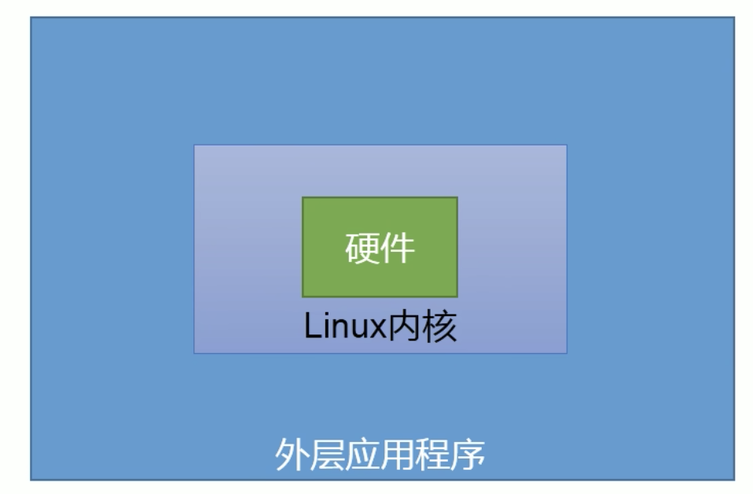

# Shell概述
机器的硬件需要软件来进行驱动它才能工作, 在Linux中需要Linux内核来驱动硬件

而我们要想操作 Linux内核 必须通过 外层的应用程序, 而外层应用程序 和 内核之间 还有一层shell

也就是说我们的 外层应用程序必须通过 shell 才能操作Linux内核 从而控制硬件

<br>



<br>

### shell作用:
shell是一个命令行解析器, 它接收 应用程序/用户命令, 然后调用操作系统内核

还他是一门编程语言 (pythen是它的对手)

<br><br>

## 为什么要学习 Shell
1. 需要看懂运维人员编写的shell程序
2. 偶尔会编写一些简单的shell程序来管理集群, 提高开发效率

<br><br>

## Shell解析器

### 查看系统下有哪些shell解析器
可以解析shell脚本的一共有6种解析器

我们常用的解析器:
- sh
- bash

```s
# 查看系统的解析器
sudo cat /etc/shells

# /bin/bash
# /bin/csh
# /bin/dash
# /bin/ksh
# /bin/sh
# /bin/tcsh
# /bin/zsh


# 查看系统默认的解析器 bash
echo $SHELL
```

<br>

### sh 和 bash 之间的关系
他们之间是软连接的关系, 调用sh, 其实调用的就是bash

- sh: sh 是 Unix 系统中最早的命令行解释器, 提供了基本的命令行功能。sh 不具有很多高级特性

- bash: bash 是 sh 的扩展, 同时还包含了很多其他功能和特性, 例如命令补全、命令历史、别名等, bash 是 Unix 和 Linux 系统中最常用的命令行解释器之一, 通常被用作默认的 Shell。

- zsh: zsh 通常被认为是对 bash 的改进和扩展, 它在功能上比 bash 更加强大和灵活, 提供了更多的功能, 例如更强大的命令行历史管理、更灵活的配置选项、更丰富的插件支持等。

<br><br>

# Shell脚本

### Shell脚本声明格式
以下面的#开头, bash的部分是指定解析器, #不是注释它是命令的一部分
```shell
#!/bin/bash

#!/bin/zsh
```

/bin/bash 是 Bash 解释器的路径, 意味着系统应该使用 Bash 来解释执行这个脚本。

如果你直接运行脚本(例如 ./script.sh), 系统会查找脚本的 Shebang 行, 然后根据其中指定的解释器来执行脚本。这样你就不需要在命令行中显式地指定解释器了。

<br>

### echo语句
相当于输出 console.log

**扩展:**  
输出多个变量时 需要将多个变量引起来, 多个变量之间使用 空格

<br>

### 执行shell脚本
执行脚本有两种方式
```s
# 方式1:
sh 脚本名称

# 方式2:
./helloworld.sh 

# 示例
sh helloworld.sh
```

<br>

### 注意: 权限问题
使用``./``方式执行的时候 会报出没有执行脚本的权限, 我们可以修改文件的权限后, 再去执行它
```s
# 修改权限
sudo chmod 777 helloworld.sh

# 执行脚本
./helloworld.sh
```

<br>

**原因:**  
我们使用 sh 或者 bash 命令, 来执行脚本的时候 是由bash解析器来执行的 所以脚本本身不需要执行权限

而``./``的方式是脚本自己要执行 所以需要执行权限

<br>

### 示例: 创建一个shell脚本, 输出 helloworld
我们在 Linux/shells 创建 shell脚本
```s
pwd
# Linux/shells


# 创建一个文件
touch helloworld.sh

# 编辑 shell 脚本
vim helloworld.sh
```

```sh
#!/bin/bash
echo "helloworld"
```

<br>

### 技巧: 将打印输出到控制台的内容 重定向到 文件里
```s
echo "内容" >> text.txt
```

<br>

### 示例: 使用脚本完成下面的逻辑
1. 进入到指定目录
2. 在当前目录下创建一个 test.txt 文件
3. 在test.txt文件中添加 i love erin 文本

```shell
#!/bin/bash

cd /Users/liulin/Desktop/Sam/Exer/Linux
touch test.txt
echo "i love erin" >> test.txt
```

<br><br>

# shell: 变量

## 系统变量
系统中预定义了一些变量 供我们以后使用

<br>

- $HOME: 存储当前用户的家目录
```s
# 查看 $HOME 变量中保存的值
echo $HOME
```

- $PWD: 存储当前目录
- $SHELL: 存储系统中使用的默认的解析器
- $USER: 存储当前用户

<br>

## 自定义变量

### 定义变量
直接声明变量赋值就可以 类似python, 环境变量名建议大写
```shell
变量名=值

# 我们在shell界面直接定义变量和值
A=1
```

<br>

### 使用(引用)变量
```sh
$变量

echo $A
```

<br>

### 回收变量 (取消变量)
将上面定义的A变量收回
```sh
unset A
```

<br>

### 声明静态变量(只读变量)
```sh
readonly A=3

echo $A

unset A
# 报错: 只读变量不能取消, 虚拟机重新启动A才会收回 不然就一直有
```

<br>

### 注意:
1. **操作符前后不能有空格**, 如果有空格需要使用双引号括起来

2. 在bash中 变量默认类型都是字符串类型 **无法直接进行数值的运算**

<br>

### 将变量提升为全局变量: export
提升为全局变量之后 可供其他shell程序使用

**比如:**  
我们在终端中设置了一个变量A, 那在helloworld.sh脚本中可以使用终端中定义的变量A么?

终端中声明变量A
```s
A=1
```

helloworld.sh脚本中使用变量A
```sh
#!/bin/bash
echo "hello world"
echo $A
```

终端执行 helloworld.sh脚本 发现并没有输出 变量A的值

<br>

**将变量提升为全局变量:**  
我们上面在终端上声明的变量A 相当于一个局部变量 (不在一个进程中)

提升到全局后, 任何位置的shell脚本都可以使用该变量了

```s
# 将变量提升为全局变量
export A
```

<br><br>

## 向脚本中传递参数:
```s
sh 脚本.sh 参数1 参数2
```

使用场景 在我们执行 ``sh 脚本.sh`` 脚本的时候, 可以往脚本中传递参数

<br>

### 脚本中接收参数
- $0: **代表该脚本名称**
- $1-9代表第一个到第九个参数
- $10: 10以上的参数, 使用{10} 

```s
$n

$0
$1-9
${10}
```

<br>

### 示例:
执行脚本时传入参数, 我们在脚本获取参数进行输出

**编辑脚本**
```sh
#!/bin/bash

# 输出 脚本文件名 和 参数
echo "$0 $1 $2"
```

<br>

**执行脚本:**  
```s
# 执行脚本时我们传入了两个参数
sh param_test.sh 1 2
```

<br><br>

## 特殊变量: ``$#`` (相当于v-for中的index)
我们在执行脚本的时候 会给脚本文件传入参数, ``$#``的作用就是**获取所有输入参数个数**, length

就是 一共输入了多少个参数, 常用于循环

<br>

**编辑脚本**
```sh
#!/bin/bash

# 输出传入脚本的参数个数
echo $#
```

<br><br>

## 特殊变量: ``$*``, ``$@``
相当于 ...args 把参数收集成为了一个整体

<br>

- $*: 代表命令行中所有的参数, ($*把所有的参数看成一个整体)

- $@: 代表命令行中所有的参数, ($@把每个参数区分对待, 获取到的还是一个一个的)

<br>

**编辑脚本**
```sh
#!/bin/bash

# 输出传入脚本的参数个数
echo $*
```

<br><br>

## 特殊变量: ``$?``
它用来判断上一条命令是否正确的执行, 查看最后一次执行的命令的返回状态

- 返回0: 表示正确执行
- 返回非0: 表示没有正确执行

<br>

**控制台输出该变量查看最后一次执行的命令的返回状态**
```sh
sh helloworld.sh
# 输出: hello world

echo $?
# 输出: 0
```

<br>

# 运算符
运算有两种格式, 两种格式都可以进行运算

<br>

### 运算格式1:
使用该方式需要定义变量接收值, 不能直接输出 ``$(())`` 表达式

<br>

**运算符:**
该方式中的 运算符为正常的运算符 + - * /
```sh
A=$((运算式))

B=$[运算式]
```

<br>

### 运算格式2:
通过 expr 命令
```sh
expr 数字 运算符 数字

exprt 2 + 2
```

<br>

### 注意:
expr运算符之间要有空格 (回顾: 赋值的时候=前后无空格)

<br>

**运算符:**  
该方式的运算符 乘 的时候比较特殊
- +
- - 
- \*   -- 乘, 比较特殊
- /
- %

<br>

### 示例:
```sh
expr 2 + 3
```

<br>

### 示例2: 计算 (2 + 3) * 4

```s
# 错误示例:
expr (2 + 3) \* 4
```

<br>

**着重号括起来的部分的表达式 相当于()的作用**
```sh
# 正确的做法:
expr `expr 2 + 3` \* 4
```

<br><br>

# 条件判断
我们会使用 echo ``$?`` 来查看条件的结果, 非0就是false 

<br>

### 格式:
条件前后 必须有空格
```sh
[ 条件 ]
```

<br>

**注意:**  
1. 条件前后 必须有空格
2. 条件非空即为 true, 如 [ sam ] 返回true, [] 返回false

<br>

### 常用的判断条件
**1. 两个整数之间比较**
- = 字符串比较
- -lt 小于
- -gt 大于
- -le 小于等于
- -ge 大于等于
- -eq 等于
- -ne 不等于

<br>

**2. 按照文件权限进行判断**
- -r 读的权限
- -w 写的权限
- -x 执行的权限

<br>

**3. 按照文件类型进行判断**  
- -f 我呢间存在 且是一个常规文件 (file)
- -e 文件存在
- -d 文件存在 且是一个目录

<br>

### 示例: 23 是否大于等于 22
```sh
[ 23 -ge 22 ]

# 查看上面命令返回的执行状态 0为正确执行
echo $?
```

<br>

### 示例2: 查看 helloworld.sh 是否有读权限
```sh
[ -r batch.sh ]

echo $?
```

<br>

### 示例3: 判断目录中的文件是否存在
```sh
# 当前目录下helloworld.sh是否存在
[ -e helloworld.sh ]

echo $?
```

<br>

### 多条件判断
- && 表示当一条命令执行 **成功时**, 才执行后一条命令
- || 表示上一条命令执行 **失败后**, 才执行下一条命令

就是逻辑与和或之间的关系

<br>

**示例:**  
这个部分类似3元表达式哈
```sh
# 输出为: ok
# []中非空即为true 所以执行了后面的 echo ok
[ condition ] && echo ok || echo notok


# 输出为: notok
[ condition ] && [] || echo notok
```

<br><br>

# 流程控制

## if else if判断

### 格式:
1. 注意 条件前后有空格
2. if的后面有空格
3. 格式1中 then的前面有;号, 格式2中then换行的话前面就没有分号

4. else if 的写法为 elif
5. 注意输出字符串的时候要加上""
```sh
# 格式1
if [ 条件判断式 ];then
  程序体
fi


# 格式2: then换行后就不用;号了
if [ 条件判断式 ]
  then 
    程序体
fi


# elif 的写法
if [ 条件判断式 ];then
  程序体
elif [ 条件判断式 ];then
  程序体
fi
```

<br>

### 示例:
输入一个数字
- 如果是1, 输出 班长真帅
- 如果是2, 输出 sam真帅
- 如果是其他, 什么也不输出

```sh
#!/bin/bash

if [ $1 -eq 1 ];then
  echo "班长真帅"
elif [$1 -eq 2 ];then
  echo "sam真帅"
fi


# 执行
sh if_test.sh 1
```

<br><br>

## case语句
相当于 switch case
- ;;相当于break
- *)相当于default
- esac 就是 case 的反写

### 格式:
```sh
case $变量名 in
  "值1")
    如果变量的值等于值1 则执行程序1
    ;;
  "值2")
    如果变量的值等于值2 则执行程序2
    ;;
  *)
    如果变量的值不是以上的值, 则执行此程序
    ;;
esac
```

<br>

**示例:**  
```sh
case $1 in
  "1")
    echo "我要月薪100万"
    ;;
  "2")
    echo "我要月薪80万"
    ;;
  *)
    echo "我要月薪60万"
    ;;
esac
```

<br><br>

## for循环

### 基本语法1
- do 和 done 相当于 { }
- () 变成了 (())
```sh
for (( 初始值; 循环控制条件; 变量变化))
  do
    循环体
  done
```

<br>

### 示例: 从1加到100
取值都是$变量 所以
- $res 就是取 res 的值
- $i 就是取 i 的只

- shell中也有++
- shell中没有+=, 实现+=的话 需要使用 ``res=$[$res+$i]``
```sh
#!/bin/bash

res=0
for(( i=0; i<100; i++))
  do
    res=$[$res+$i]
  done

echo $res
```

<br>

### 基本语法2
变量的值 是 值1 值2 值3 赋值过去的
```sh
for 变量 in 值1 值2 值3
  do
    循环体
  done
```

<br>

### 示例: 输出所有的输入参数
- $item 取变量

```sh
#!/bin/bash


# 该写法的使用 $@ 和 $* 都一样
for item in $@
do
  echo "sam 喜欢 $item"
done


# 该写法的时候 $@ 和 $* 有区别
# "$@": 相当于 [参数1, 参数2, 参数3], 整个循环执行3次
for item in "$@"
do
  echo "sam 喜欢 $item"
done
# 输出: 参数1
# 输出: 参数2
# 输出: 参数3


# "$*": 相当于 ["参数1 参数2 参数3"], 整个循环执行1次
for item in "$*"
do
  echo "sam 喜欢 $item"
done

# 输出 参数1 参数2 参数3
```

<br><br>

## while循环

### 基本语法
```sh
while [ 条件判断式 ]
  do  
    循环体
  done
```

<br>

### 示例: 从1加到100
```sh
#!/bin/bash

res=0
index=0
# 变量的值<100
while [ $index -le 100]
do
  res=$[$res+$index]
  index=$[$index+1]
done

echo $res
```

<br><br>

# read读取控制台的输入

### 基本语法
**选项:**  
- -p: 指定读取值时的提示符
- -t: 指定读取值时等待的时间(秒), 过时程序结束

**参数:**  
- 变量: 将用户在控制台输入的值 存放在变量中
```sh
read(选项)(参数)
```

<br>

### 示例: 提示7秒内, 读取控制台输入的名称
```sh
read -t 7 -p "请输入你的名字 在7秒内" NAME
echo $NAME
```

<br>

# 函数

## 系统函数

### basename函数
**返回文件名**

<br>

**格式1:**  
```sh
basename 路径
```

它可以将我们传入的路径中的 最后一个部分 拿到

比如 /home/test/learning.md

```sh
basename /home/test/learning.md


# 输出 learning.md
```

<br>

**格式2:**  
```sh
basename 路径 后缀
```

```sh
basename /home/test/learning.md .md
# 输出 learning
```

<br>

### dirname函数
在路径中 **获取目录的部分**

```sh
dirname /home/test/learning.md

# 输出: /home/test
```

<br><br>

## 自定义函数

### 格式:
```sh
function 函数名() {

}

# 调用 传入参数
函数名 参数1 参数2
```

<br>

### 案例:
```sh
#!/bin/bash

funciton sum() {
  res=0
  res=$[$1+$2]
  echo $res
}

read -p "请输入第一个参数: " p1
read -p "请输入第二个参数: " p2

# 因为要取出p1 p2中的值 所以使用$
sum $p1 $p2
```

<br><br>

## shell工具: cut
从数据中提取我们想要的部分 

从文件的每一个行剪切字节, 字符 和 字段 并将这些字节 字符 字段输出

<br><br>

## shell工具: sed
sed是一种流编辑器, 它一次处理一行内容。处理时, 把当前处理的行存储在临时缓冲区中, 称为“模式空间”, 接着用sed命令处理缓冲区中的内容, 处理完成后, 把缓冲区的内容送往屏幕。接着处理下一行, 这样不断重复, 直到文件末尾。文件内容并没有改变, 除非你使用重定向存储输出。

<br><br>

## shell工具: awk
一个强大的文本分析工具, 把文件逐行的读入, 以空格为默认分隔符将每行切片, 切开的部分再进行分析处理。

<br><br>

## shell工具: sort
它将文件进行排序, 并将排序结果标准输出。


```s
https://www.bilibili.com/video/BV1hW41167NW/?p=21&spm_id_from=pageDriver&vd_source=66d9d28ceb1490c7b37726323336322b
```