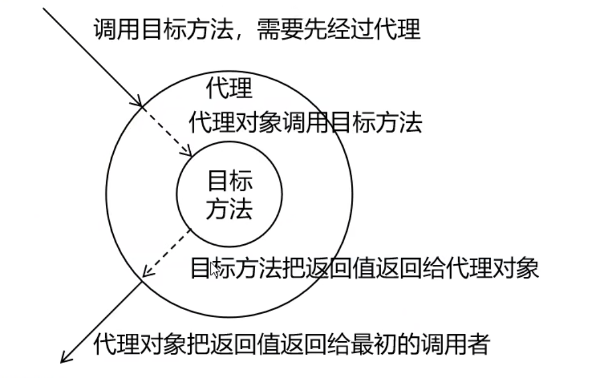
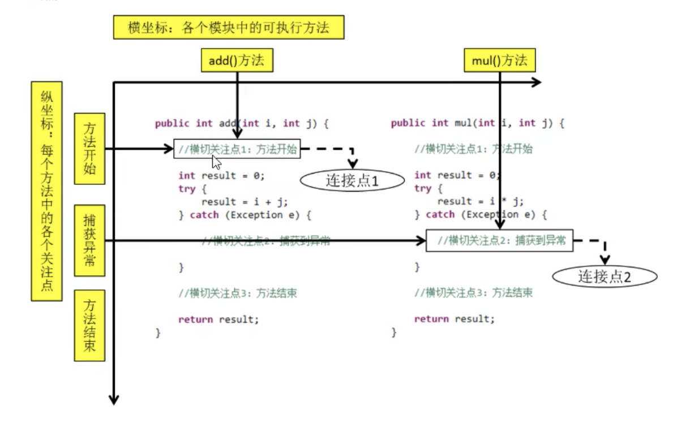

# Spring
```
https://spring.io/
```

<br>

## Spring家族
它里面有实现各种功能 它是由框架组成的家族, 我们以后可能会接触到各种Spring的框架

<br>

### 为什么要学习Spring
它会使我们的Java程序变的更简单, 更快, 更安全

Spring 是最受欢迎的企业级 Java 应用程序开发框架, 数以百万的来自世界各地的开发人员使用

Spring 框架来创建性能好、易于测试、可重用的代码。

Spring是轻量级框架 它的基础版本只有2MB左右

Spring框架的核心特性是可以用于开发任何Java应用程序 但是在JavaEE平台上构建Web应用程序是需要扩展的

<br>

### Spring的优点

**性能好:**  
Spring里面有两个核心的概念
- IOC: 控制反转
- AOP: 切片

它可以将我们当前对象的控制权 反转给程序本身 也就是**交给Spring来管理**, 比如我们之前要是想使用一个对象 我们需要new一个对象 

我们最经典的三层架构, controller要访问service, service要访问DAO, 我们之前在controller里面获取service的时候, 就是通过new一个service的实现类对象 写死的

现在有了Spring之后 我们就可以将这些对象的控制权反转给程序本身也就是交给Spring来管理


我们从资源获取的角度来说, 原来我们想要获取一个对象需要自己创建 现在我们要用到一个对象的时候 因为对象现在是由Spring管理的 所以我们就可以被动接受Spring提供给我们的对象

这样的话我们就不用写死了 我们只需要等着Spring给我们提供一个对象 它给我们提供的什么 我们就使用什么 不用写死了

第二点如果我们service的实现类发生了变化 那么我们所有用到该实现类的地方都需要手动修改

但是我们有了Spring之后 我们就可以由Spring给我们提供这个对象 它提供的是什么我们就用什么

<br>

**易于测试:**  
我们写完代码后 都要对代码进行测试 测试功能是否有问题 Spring就整合了Junit, 我们在Spring的环境中就可以直接只用Junit来测试功能

<br>

**可重用的代码:**  
我们学习Java的面向对象 其实最核心的就是提供代码的可重用性 但是我们要达到可重用性 以我们之前学过的知识可能做不到

比如之前学过的事务管理 它是mysql中的内容 如果我们在jdbc中实现事务 代码是非常的麻烦的 不好封装

因为它不是像我们平常封装的代码那样 这段代码是连续执行的代码 所以我们可以将这段代码封装到一个方法中

等到我们需要使用的时候 我们可以创建对象 调用方法就可以了

但是事务管理的代码 它是分散在我们实现功能的过程中
- 我们需要功能实现之前来关闭事务的自动提交
- 我们需要将要实现的功能加上try catch 
  - 在try中提交事务 
  - 在catch中回滚事务 
  - 在finally里面关闭资源

这样零散的代码 我们使用面向对象可能不能将其封装起来 因为面向对象是纵向继承的机制 它能封装的只有一段连续执行的代码 而我们的事务不是这样

这时候我们就可以使用Spring中的另外一个核心AOP 面相切面编程

我们就可以将事务的代码放在一个切面中 我们再将当前的切面作用于我们需要被事务管理的方法中就可以了

这时注意我们的事务的代码只需要写一次将其放在切面中 就可以通过AOP的技术 把切面作用于所有需要被事务管理的地方

这就是提供代码的重用性

<br><br>

# Spring Framework
我们在它的官方网站上能找到这个页面, Spring Framework是Spring家族的基础设施
```
https://spring.io/projects
```

<br>

Spring家族中的所有框架 如
- Spring Boot
- Spring Data
- Spring Cloud

它们都是以Spring Framework为基础的, 我们学习的Spring就是Spring Framework里面的内部

<br>

### Spring Boot
它是我们以后使用最多的一个框架 它可以帮我们更加的快速 方便的开发一个企业级的项目

<br>

### Spring Data
我们对一些非关系型的数据库的操作就可以通过这个框架来实现

<br>

### Spring Cloud
分布式架构

<br>

### Spring Security
Spring的安全框架

<br>

### Spring Session
对当前会话对象的统一管理

<br>

比如我们市面上的分布式架构就是使用 Spring Boot + Spring Cloud 来实现的

<br>

## Spring Framework
Spring基础框架 可以视为Spring基础设施

基本上任何其他Spring项目都是以Spring Framework为基础的

<br>

### Spring Framework的五大核心模块:
|功能模块|功能介绍|
|:--|:--|
|Core Container|核心容器, 在 Spring 环境下使用任何功能都必须基于 **IOC容器**|
|AOP&Aspects|面向切面编程|
|Testing|提供了对 junit 或 TestNG 测试框架的整合|
|Data Access/Integration|提供了对数据访问/集成的功能, 对JDBC的封装|
|Spring MVC|提供了面向Web应用程序的集成功能|

<br>

### Spring Framework特性:
**非侵入式:**  
它对原生的技术是0污染的 它是不造成任何影响的 我们完全可以在使用Spring Framework的同时 我们也可以使用原生的技术实现功能

使用 Spring Framework 开发应用程序时, Spring 对应用程序本身的结构影响非常
小。对领域模型可以做到零污染; 

对功能性组件也只需要使用几个简单的注解进行标记, 完全不会破坏原有结构, 反而能将组件结构进一步简化。

这就使得基于 Spring Framework 开发应用程序时结构清晰、简洁优雅。

<br>

**控制反转:**   
IOC——Inversion of Control, 它是我们Spring里面的两大核心之一

它是翻转资源获取方向。也就是将对象的控制权反转给程序本身 也就是自愿获取的方向进行了反转

把我们主动获取对象的动作 变成了被动的接受框架的注入 也就是框架给我们提供对象

Spring中的对象是配置在XML文件中的 我们配置的是什么对象 Spring给我们提供的就是什么对象

这样就可以降低程序之间的耦合性 降低对象与对象之间的依赖关系

<br>

**面向切面编程:**   
AOP——Aspect Oriented Programming, 在不修改源代码的基础上增强代码功能。

<br>

**面向切面 和 面向对象 之间的关系:**  
面向切面是对面向对象的一种补充, 比如之前我们介绍Spring概述的时候 

面相对象是纵向继承机制 我们当前能够封装的是一段连续的代码, 比如我们的事务管理它不是一段连续执行的代码 这时我们想对其进行封装 我们使用面向对象的理念是实现不了的

我们可以使用面向切面 它叫做横向抽取 比如我们可以将事务管理的代码 我们可以将其横向抽取出来 抽取到切面中

我们在不改变源代码的基础上 把我们实现了事务管理的切面 作用于我们需要被事务管理的方法中 这就不就是在不修改源代码的基础上去增强了代码的功能

<br>

**容器:**  
在程序中的容器是一个非常复杂的对象 比如我们之前学习Tomcat的时候 它就有两个功能
- Servlet容器
- Web服务器

Servlet容器 它就是一个非常复杂的容器 它可以帮助我们管理servlet 管理servlet的生命周期

它帮助我们管理servlet之后 servlet中各个方法的调用 包括servlet的创建初始化实例化到当前servlet各个方法的调用 都是容器帮助我们来管理的

我们就不需要关注它所管理的对象是怎么被创建的 什么时候被创建的 它的方法在什么时候被调用的

所以组件创建的过程中大量的细节被屏蔽掉了 我们只需要关注我们怎么来实现功能就可以了

<br>

Spring IOC 是一个容器, 因为它包含我们交给Spring所管理的对象 它不单能够帮助我们存储这些对象 还可以管理组件对象的完整的生命周期。

组件享受到了容器化的管理, 替程序员屏蔽了组件创建过程中的大量细节, 极大的降低了使用门槛, 大幅度提高了开发效率。

<br>

**组件化:**   
我们交给ioc容器管理的对象 在ioc容器中就叫做组件 原来我们需要手动的管理各个对象之间的关系

当我们把这些对象交给了IOC容器管理之后 我们现在管理的就是各个组件之间的关系

Spring将这些关系进行了简单化 它把它所管理的组件组合起来完成一个完整的功能

Spring 中可以使用 XML 和 注解组合这些对象。这使得我们可以基于一个个功能明确、边界清晰的组件有条不紊的搭建超大型复杂应用系统。

<br>

**声明式:**   
很多以前需要编写代码才能实现的功能, 现在只需要声明需求即可由框架代为实现。

声明式和编程式是相对应的

- 编程式:    
我想干什么 这个过程是由我们自己来实现的

- 声明式:    
它是我们框架中最大的特点 干什么我们不需要自己实现 我只需要告诉框架 我要实现什么功能 具体的功能由当前的框架来实现

<br>

**一站式:**  
在 IOC 和 AOP 的基础上可以整合各种企业应用的开源框架和优秀的第三方类库。

我们可以利用 IOC 和 AOP 整合第三方的框架 比如SSM就是拿着Spring整合MyBatis

而且Spring 旗下的项目已经覆盖了广泛领域, 很多方面的功能性需求可以在 Spring Framework 的基础上全部使用 Spring 来实现。

<br><br>

# 创建 Spring 工程

<br>

## 步骤:

### 1. 创建Maven工程:
```s
new Module - 选择Maven - 下一步 - 输入项目名
```

<br>

### 2. pom.xml 引入Spring需要的依赖
1. packaging 修改为 jar

2. spring需要的依赖, 我们只需要安装 spring-context 依赖就可以了 剩下的关联依赖会自动安装

```xml
<dependencies>
  <!-- 
    基于Maven依赖传递性, 导入spring-context依赖后 它所依赖的jar包也会被导入
  -->
  <dependency>
    <groupId>org.springframework</groupId>
    <artifactId>spring-context</artifactId>
    <version>5.3.1</version>
  </dependency>
  
  <!-- junit测试 -->
  <dependency>
    <groupId>junit</groupId>
    <artifactId>junit</artifactId>
    <version>4.12</version>
    <scope>test</scope>
  </dependency>
</dependencies>
```

<br>

我们可以在 Maven选项卡 找到当前的项目 打开 Dependencies 看看 spring-context 间接引入的依赖
```
| - spring-context
  | - spring-aop: 面向切面编程
  | - spring-beans: 管理bean的
  | - spring-core: 核心
    | - spring-jcl: spring日志框架
  | - spring-expression: spring表达式框架
```

<br><br>

# IOC

## IOC容器
IOC: Inversion of Control 控制反转

容器的特点就是它可以帮助我们管理对象的整个生命周期

<br>

### IOC思想:
反转控制说的就是资源获取的方式 之前我们需要获取某个对象的时候 我们需要手动创建 手动的访问它内部的各种方法

有了Spring之后我们就可以将对象的管理权和控制权 完全的交给IOC容器 由原来的主动获取变为被动的接受Spring为我们提供的对象

<br>

**获取资源的传统方式:**  
自己做饭: 买菜 洗菜 择菜 改刀 炒菜 全过程参与 费时费力 必须了解做饭的整个过程 我们才能将饭做好

比如我们要用到一个对象 那么我们就要知道这个对象怎么创建 如何使用 这样我们才能真正的使用这个对象
<br>

**反转控制方式获取资源:**  
这里我们不再需要自己创建对象

点外卖: 下单 等 吃 省时省力 

最重要的是我们不需要知道这个对象怎么创建 我们只需要知道它能帮助我们提供这个对象 我们直接来使用就可以

就像我们知道点完外卖后 饭已经做好了 我们直接吃就可以 我们点外卖拿到的饭 就不一定比我们自己做的饭难吃 甚至比我们自己做的饭要更加的好吃

就像我们通过反转控制方式获取的资源 也就是Spring为我们提供的对象 有可能比我们自己创建的对象还要好

比如我们将一个对象交给Spring之后 它所帮助我们管理的对象默认就是单例的 不像我们之前想要实现单例 我们需要自己实现单例模式的代码

而且我们要想实现多例 我们只需要通过一个属性 来进行配置就可以 非常的方便

<br>

### DI:
Dependency injection 依赖注入

DI是IOC的另一种表述方式, 即组件以一些预定义好的方法(例如 setter方法) 接受来自于容器的资源注入 相当于IOC而言 这种表述更直接

比如controller层面要访问service, 那也就是说controller里面要有一个service的对象, 传统方式会在controller里面new一个service对象

而有了反转控制 有了依赖注入后 就不需要我们手动的new这个对象 我们可以提前以一些设置好的方式 被动的接受Spring的注入

也就是controller依赖什么对象 Spring就帮助我们注入什么对象 注入就是给controller所依赖的对象进行赋值的过程

所以结论是: IOC就是一种反转控制的思想, 而DI是对IOC的一种具体的实现 

<br><br>

## IOC容器的获取方式
实现就是Spring相关的一系列API

我们将对象交给IOC容器管理之后 我们要是想获取IOC容器管理的对象 (IOC容器中管理的组件也叫做Bean), 那么首先我们就要获取IOC容器, Spring提供了获取IOC容器的**两种实现方式**

<br>

### 实现方式1: BeanFactory (不对外提供使用)
这是IOC容器的最基本的实现, 是Spring内部使用的接口, 面向Spring本身 **不提供给开发人员使用**

BeanFactory工厂模式, 它可以将创建对象的过程进行隐藏 直接为我们提供我们所需要用到的对象

<br>

### 实现方式2: ApplicationContext
它是BeanFactory的**子接口** 它提供了更多的高级特性 几乎所有场合都使用ApplicationContext

```
| - Interface BeanFactory
  | - Interface ApplicationContext
    | - Interface ConfiguableApplicationContext
      | - Java AbstracApplicationContext

        | - Java FileSystemXmlApplicationContext

        | - Java ClassPathXmlApplicationContext
```

<br>

|类型名|简介|
|:--|:--|
|**ClassPathXmlApplicationContext**|通过读取类路径下的XML格式的配置文件创建IOC容器对象|
|FileSystemXmlApplicationContext|通过文件系统路径读取XML格式的配置文件创建IOC容器对象|
|ConfigurableApplicationContext|ApplicationContext的子接口, 包含一些扩展方法 refresh() 和 close(), 让ApplicationContext具有启动 关闭 和 刷新上下文的能力|
|WebApplicationContxt|专门为Web应用准备 基于Web环境创建IOC容器对象, 并将对象引入存入ServletContext域中|

<br>

### ApplicationContext的主要实现类:
我们最终要使用的实现类主要有两个, 它们就是IOC容器的实现类

- ClassPathXmlApplicationContext
- FileSystemXmlApplicationContext

<br>

### FileSystemXmlApplicationContext:
通过文件系统中的XML来 获取IOC容器

文件系统就是从磁盘上开始访问, 比如D盘下的某目录中的XML文件

我们以后项目 Java工程要打成Jar包 Web工程要打成War包 Jar包是要放在其他的工程中引用使用的 jar包可能不是只在我们当前的电脑上使用 有可能会在别的电脑上使用

那上面的磁盘路径仅仅是在我们的电脑上有这个文件 其它电脑上可能没有这个文件

**所以这个实现类用的比较少**

<br>

### ClassPathXmlApplicationContext
从类路径下的XML来 获取IOC容器

我们使用它比较多, 因为配置文件对于当前的工程来说一般都是写在类路径下的 

因为Maven工程不管是Java目录还是resource目录 最终它们两个目录中的内容 都会被加载到类路径下

**所以它使用的比较多**

<br>

### WebApplicationContxt
如果我们当前创建的是Web应用, 那我们创建的IOC容器 它就是 WebApplicationContext

<br><br>

# Spring的使用
Spring管理的对象都叫做 **组件**, 这个组件也叫做 **Bean**

我们接下来就学习下Spring管理Bean, Spring管理Bean有两种方式:
1. 基于XML的方式
2. 基于注解的方式:

<br><br>

## 基于XML管理Bean
我们创建Spring来管理对象 非常的简单 我们只需要创建Spring的配置文件就可以了

**Spring管理的对象默认就是单例的**

<br>

### 准备工作
Spring是管理对象的, 那我们就先创建一个类, 然后我们将这个类交给Spring来管理

```java
package com.sam.spring.pojo;

public class HelloWorld {
  public void sayHello() {
    System.out.println("hello, spring");
  }
}

```

<br>

### 创建 Spring 配置文件: 
我们在resources下创建一个xml文件, 我们可以在new xml文件的时候 选择 Spring config 选项
```s
| - resources
  - applicationContext.xml

# xml文件的创建方式: new - XML Configuration File - Spring config
```

<br>

**Spirng配置文件名: 配置文件名有两种情况**  

1. 我们学习Spring Framework的时候 Spring配置文件的名字是任意的, 因为我们是自己通过 ``ClassPathXmlApplicationContext`` 来获取的, 要获取哪一个XML我们是可以自己指定的

2. 我们在使用SSM的时候, 是一个WEB工程, 这时IOC容器是Spring自动获取的 所以Web工程下**Spring的配置文件的名字和位置都是固定的**

<br><br>

## Spring配置文件: applicationContext.xml
```xml
<beans>
  <bean></bean>
  <bean></bean>
<beans>
```

它的根标签是 ``<beans>``, 我们在会写一个个``<bean>``, 每一个``<bean>``就是一个组件, 它也是Spring管理的一个对象

<br>

### ``<beans 约束>``
**beans根标签**里面的标签属性也叫做约束, 它规定了beans标签内可以写什么标签

也就是说后续我们可能会写一些其他的标签, 能写其他的标签的前提是要有对应的约束 所以后续我们可能会在beans标签内写相关的约束

```xml
<beans 
  xmlns="http://www.springframework.org/schema/beans"
  xmlns:xsi="http://www.w3.org/2001/XMLSchema-instance"
  xsi:schemaLocation="http://www.springframework.org/schema/beans http://www.springframework.org/schema/beans/spring-beans.xsd">
```

- xmlns: 这是XML命名空间（Namespace）的定义，它告诉解析器将使用Spring框架的XML命名空间。

- xmlns:xsi: 这是XML Schema实例命名空间的定义，它允许你在XML文档中使用XSI属性，通常用于指定XML Schema的位置。

- xsi:schemaLocation: 这个属性指定了XML Schema的位置。在这里，它告诉解析器将使用Spring Beans的XML Schema，并且这个Schema可以在以下URL找

<br>

### ``<bean 标签属性>``
它里面的标签属性很多 我们看看都有什么

<br>

**标签属性 id:**  
每个对象的唯一标识, 保证id不重复

我们在IOC容器中可以管理N个对象, 我们通过id来区别每一个对象, 通过id来获取指定的一个对象

<br>

**标签属性 class:**  
对应类的全类名(对象的类型), 我们通过class设置bean对应的对象的类型

以后我们都是面向接口编程, 所以大多数情况下 我们都是传入当前类型所实现的接口去匹配某一个Bean
```java
// Pojo
ioc.getBean(Student.class)

// Pojo 的 接口
ioc.getBean(Person.class)
```

<br>

*扩展:*  
- 如果组件类实现了接口 根据接口类型可以获取bean么?  
可以 前提是bean是唯一的

- 如果一个接口有多个实现类, 这些实现类都配置了bean, 根据接口类型可以获取bean么?  不行 因为bean 不唯一

<br>

*结论:*  
根据类型来获取bean的时候, 在满足bean唯一性的前提下 其实只看 ``对象 instanceof 指定的类型`` 返回的结果是true就可以认定为何类型匹配 就能获取到

<br>

*总结:*    
我们可以在class中传入
- Bean本身的类型(POJO的类型)
- Bean所继承的类的类型
- Bean所实现的接口的类型

<br>

**标签属性 scope:**  
Spring中管理的对象默认是单例的 但是我们可以通过该标签属性, 设置该对象是单例模式 还是多例模式 可选值:

- prototype: 多例
- singleton: 单例

<br>

### 示例:
这个XML配置文件的目的是告诉Spring容器如何创建和管理一个名为 "helloworld" 的bean，以及如何找到Spring Beans的XML Schema来验证配置文件的结构。

这是Spring框架中配置bean的一种方式，允许你将对象的创建和配置从应用程序代码中分离出来，并由Spring容器进行管理。这使得应用程序更加灵活、可维护和可测试。
```xml
<?xml version="1.0" encoding="UTF-8"?>
<beans 
  xmlns="http://www.springframework.org/schema/beans"
  xmlns:xsi="http://www.w3.org/2001/XMLSchema-instance"
  xsi:schemaLocation="http://www.springframework.org/schema/beans http://www.springframework.org/schema/beans/spring-beans.xsd">

  <!-- 
    bean: 配置一个bean对象 将该对象交给IOC容器来管理

    id: bean的唯一标识 不能重复
    class: 设置bean对象所对应的类型
   -->
  <bean 
    id="helloworld" 
    class="com.sam.spring.pojo.HelloWorld"
  ></bean>
</beans>
```

<br>

### 通过IOC获取我们配置好的对象
1. 获取 IOC容器
2. 获取 IOC容器管理的对象

<br>

### 获取IOC容器:
### **<font color="#C2185B">new ClassPathXmlApplicationContext("Spring配置文件路径")</font>**  

<br>

**参数:**  
配置文件的路径  

resources目录和java目录最终会被加载到同一个目录下(类路径下), 所以我们可以直接使用相对路径来访问

<br>

**返回值:**  
ClassPathXmlApplicationContext 我们也可以写接口 ApplicationContext

```java
ApplicationContext ioc = new ClassPathXmlApplicationContext("applicationContext.xml");
```

<br>

### 获取IOC容器中的对象
ioc获取容器中的对象的方法一共有5个重载方法 参数不同, 我们主要讲3个

``String name``: 就是 ``<bean id>`` 标签中的 id 值

1. **(``Class<T>`` requiredType)**: 根据类型来获取对象, **常用**
2. (String name, ``Class<T>`` requiredType): 根据name和类型来获取对象 
3. (String name): 根据name来获取
4. (String name, Object ... args)
5. (``Class<T>`` requiredType, Object ... args)

<br>

### **<font color="#C2185B">ioc.getBean(参数);</font>**  
获取IOC容器中的对象

<br>

**方式1: 参数 - 目标类的类型(根据Bean的类型来获取)**  
我们传入对象的类型, IOC就会匹配一个类型匹配的Bean 将其返回

根据类型的这种获取方式, 当配置文件中有多个类型相同的Bean的时候 **会抛出异常: NoUniqueBeanDefinitionException**

<br>

这时要求IOC容器中有且只有一个类型匹配的Bean, 若没有任何一个类型匹配的Bean, 此时**会抛出异常: NoSuchBeanDefinitionException**
```java
HelloWorld helloworld = ioc.getBean(HelloWorld.class);
```

<br>

**这种方式常用**, 我们在一个配置文件中写多个重复的类型的Bean是几乎不会发生的 一个类型的Bean我们只会配置一个, 因为这个Bean既可以单例 也可以多例

<br>

**方式2: 参数 - 根据xml中Bean标签的id值 和 它对应的类型来获取:**   
返回值, 因为我们传入了对象的类型, 所以返回值就是对应的类型
```java
HelloWorld helloworld = ioc.getBean("helloworld", HelloWorld.class);
```

<br>

**方式3: 参数 - 根据Bean的id值获取:**  
因为我们是通过name(id值)来获取的 不知道类型 所以返回值是Object类型, 但是我们可以强转
```java
HelloWorld helloworld = (HelloWorld) ioc.getBean("helloworld");
```

<br>

**演示:**  
```java
@Test
public void test1() {

  // 获取IOC容器
  ApplicationContext ioc = new ClassPathXmlApplicationContext("applicationContext.xml");

  // 获取IOC容器中的Bean对象
  HelloWorld helloworld = (HelloWorld) ioc.getBean("helloworld");

  // 调用对象中的方法:
  helloworld.sayHello();
}
```

<br>

### Spring获取对象的解析:
我们获取IOC容器的时候是通过 xml配置文件获取的, 它会根据我们在配置文件中配置的``<bean>``标签 在解析该标签的时候 获取class的属性值 然后利用反射创建的对象

```java
Class.forName("全类名");
```

因为是通过反射功能, 所以我们在创建类的时候一定要注意的是**要有无参构造器**

<br><br>

# 依赖注入: DI
依赖注入是IOC的一种具体的实现方式, IOC是从资源获取的角度来说 原来需要主动获取现在是被动接受

<br>

### 依赖注入定义: 
所谓的依赖注入, 就是为当前类中的属性进行赋值的过程

比如我们的Student类中有属性, 我们就说 Student 依赖于 sid sname age gender

既然Student依赖这些属性, 我们就可以在IOC容器中为该对象依赖的属性进行赋值
```java
public class Student {
  private Integer sid;
  private String sname;
  private Integer age;
  private String gender;
}
```

<br>

### 依赖注入的方式:
依赖注入的方式有很多, 但是做常用的就是set注入 和 构造器注入

<br><br>

## 依赖注入: set注入
通过set方法为当前类中的属性进行赋值 set注入并不是写代码 **而是配置 applicationContext.xml 文件**


所以我们需要提前为属性提供 get set 方法

<br>

### 配置 applicationContext.xml 文件
我们在 ``<bean>``标签内部使用``<property>``子标签为该bean中的属性进行赋值

```xml
<bean>
  <property></property>
</bean>
```

<br>

只要我们在配置文件中看到Bean的**子标签property**, 那这里使用的就是依赖注入, 通过set方法为该Bean的成员变量进行赋值

**``<property>``的使用相当于调用类中属性的set方法, 我们写哪个就相当于调用了哪个属性的set**

<br>

**``<property name value ref>``**  
它是通过成员变量的set方法进行赋值

```xml
<property
  name: 成员变量名
  value: 成员变量要赋的值
  ref: 成员变量的值是某个Bean
>
```

<br>

**标签属性 name:**  
填写类中的属性, 设置需要赋值的属性名
```
属性: 找到类中的set方法去掉set, 剩余部分的首字母改为小写就是属性
```

<br>

**标签属性 vlaue:**  
设置为属性所赋的值, 给name指向的属性进行赋值

<br>

**标签属性 ref:**  
给指定属性赋值的时候 是引用外部的Bean, 它的值为当前IOC容器中的**某个Bean的id值**

<br>

**示例:**  
为 Student 类中的属性进行赋值
```xml
<bean
    id="student"
    class="com.sam.spring.pojo.Student">
  <property name="sid" value="1001" />
  <property name="sname" value="张三" />
  <property name="age" value="18" />
  <property name="gender" value="男" />
</bean>
```

<br>

当我们在xml文件中为类中的属性进行赋值后, 我们再获取对象的时候 对象就有值了
```java
@Test
public void test2() {
  // 获取ioc容器
  ApplicationContext ioc = new ClassPathXmlApplicationContext("applicationContext.xml");

  // 获取ioc容器中的对象
  Student student = ioc.getBean(Student.class);

  // 输出对象
  System.out.println(student);
}

/*
  Student{sid=1001, sname='张三', age=18, gender='男'}
*/
```

<br><br>

## 依赖注入: 构造器注入
构造器注入就是通过有参构造 为当前类中的成员变量进行赋值

通过构造器方法为当前类中的属性进行赋值 构造器注入不是写代码 **而是配置 applicationContext.xml 文件**

<br>

### 配置 applicationContext.xml 文件
我们在 ``<bean>``标签 内部使用 ``<constructor-arg>`` 

<br>

**``<constructor-arg name value index ref type>``**  
该标签对应的是类中的有参构造器的一个参数, 构造器中有几个参数就要使用几个标签

<br>

**标签属性 name:**  
设置给构造器中的哪个参数名进行赋值

例: 给参数age 赋值为18
```xml
<bean
    id="student"
    class="com.sam.spring.pojo.Student">
  <constructor-arg
    name="age"
    value="18"
  ></constructor-arg>
</bean>
```

<br>

**标签属性 value:**  
为name对应的参数, 进行赋值

**当类中只有一个有参构造器的时候, 我们可以省略name属性**, 只用value依次按顺序为构造器中的参数进行赋值

我们写了4个constructor-arg标签 所以它匹配了类中的有4个参数的有参构造器

<br>

**注意:**  
如果类中有多个构造器 我们赋值的数据想给指定的参数时 可以搭配name属性使用
```xml
<bean
    id="student"
    class="com.sam.spring.pojo.Student">
  <constructor-arg value="1002"></constructor-arg>
  <constructor-arg value="李四"></constructor-arg>
  <constructor-arg value="18"></constructor-arg>
  <constructor-arg value="男"></constructor-arg>
</bean>
```

<br>

**标签属性 type:**  
设置当前参数的类型

<br>

**标签属性 index:**  
索引

<br>

**示例:**  
```java
@Test
public void test2() {
  ApplicationContext ioc = new ClassPathXmlApplicationContext("applicationContext.xml");
  Student student = ioc.getBean(Student.class);
  System.out.println(student);
}
```

<br><br>

# 依赖注入: 特殊值处理 (类中成员变量的属性值如果是特殊类型的值)
特殊值指的是如下的情况, 我们看看如下的情况该如何处理
1. 要给类中的属性赋值为null
2. 要赋值的属性中包含特殊字符
3. 要赋值的属性的类型是 类类型 或 接口类型
4. 要赋值的属性是 数组, 集合, Map

我们说的都是在配置文件中的赋值方式

<br><br>

## 为字面量类型的属性进行赋值
字面量类型: 基本数据类型 或者 它们对应的包装类, String类型

<br>

**该情况: 使用 标签属性value 进行赋值**  
value里面写的就是字面量类型所赋的值, 我们在value里面写的是什么 为当前属性赋的就是什么, 比如我们在value里面写null 则赋值的就是字符串null

```xml
<bean
    id="student"
    class="com.sam.spring.pojo.Student">
  <property name="sid" value="1001" />
  <property name="sname" value="张三" />
  <property name="age" value="18" />
  <property name="gender" value="男" />
</bean>
```

<br><br>

## 特殊值处理: 为属性赋 null 值:

### 需求:
比如我们要给 gender属性设置 null 值

<br>

### 解决方式:
我们在property的标签体位置 写 ``<null>`` 子标签
```xml
<bean
    id="student"
    class="com.sam.spring.pojo.Student">
  <property name="sid" value="1001" />
  <property name="sname" value="张三" />
  <property name="age" value="18" />

  <!-- 为 gender属性 赋 null 值 -->
  <property name="gender">
    <null />
  </property>
</bean>
```

```java
@Test
public void test2() {
  ApplicationContext ioc = new ClassPathXmlApplicationContext("applicationContext.xml");
  Student student = ioc.getBean(Student.class);

  // 输出查看 gender 的结果 我们能看到gender对应的值是带''引号的
  System.out.println(student);
  // Student{sid=1001, sname='sam', age=18, gender='null'}


  // 验证gender的值是否为null, 结果是, 因为报空指针异常了
  System.out.println(student.getGender().toString());
}
```

<br><br>

## 特殊值处理: 为属性赋包含 特殊符号 值 (特殊符号要转成对应的实体)
我们在写xml标签的时候, 一些特殊字符我们是不能直接用的 我们需要使用它们对应的实体

比如我们要给类中的sname属性赋值为 ``<张三>``, 这样写的时候编译器直接报错了, 因为 < > 它们就是一个特殊字符

```xml
<bean
    id="student"
    class="com.sam.spring.pojo.Student">

  <!-- 报错！ -->
  <property name="sname" value="<张三>" />

</bean>
```

<br>

### 解决方式1: 我们要使用 > 所对应的 实体  
- ``>`` -> ``&gt;``
- ``<`` -> ``&lt;``

<br>

### 解决方式2: CDATA区(这个应该xml中特有的解决方式)
CDATA: C表示Character, 是文本 字符的意思, CDATA就表示纯文本数据 我们放在这里的内容都会被原样解析

XML解析器在看到CDATA就知道里面是纯文本 就不会当做xml标签或属性来解析, 所以我们在CDATA里面写什么符号都可以

<br>

**``<value>``子标签:**
我们可以使用 ``<value>``子标签, **在标签体中使用 CDATA区**

上面我们为属性赋值的时候使用的是value标签属性 我也可以将value标签属性的方式改写为 value子标签的方式 也是可以的
```xml
<property name="sname">
  <value>张三</value>
</property>
```

<br>

**CDATA区的格式: ``<![CDATA[内容...]]>``**   
CDATA区在xml中属于一个特殊的标签, 写在这里的内容为纯文本字符串

注意里面的空格也会被当成文本, 所以空格什么的要注意删掉

```xml
<property name="sname">
  <value><![CDATA[<sam>]]></value>
</property>
```

**快捷键: 输入大写CD**

<br><br>

## 特殊值处理: 为 类类型 属性进行赋值 (例如多对一关系)
类中的属性是类的类型 或者 接口类型, 我们为这样的属性进行赋值

就像是我们的Controller中会有Service层的成员变量, 如果我们将这些对象交给IOC来管理, 那怎么为这些属性进行赋值呢

<br>

### 准备工作
我们创建 Student 和 Clazz 类, 它们之间应该是多对一的关系

我们要是使用实体类表示两个学生和班级之间的关系的话
- 对一 对应对象
- 对多 对应集合

<br>

所以
- 我们要表示学生对应班级, 那就在学生类中设置班级类型的成员变量
- 我们要表示班级包含多个学生, 那就在班级类中创建一个学生类型的集合

<br>

**学生类:**  
```java
public class Student {

  private Integer sid;
  private String sname;
  private Integer age;
  private String gender;

  private Clazz clazz;

  ...

}
```

<br>

**思考:**  
我们想想如何给这个Clazz类型的属性进行赋值?

<br>

### 赋值方式1: 引用外部的Bean
引用外部的Bean的要点在于使用的是 子标签 ``<property ref>``

<br>

**标签属性 ref:**  
给指定属性赋值的时候 是引用外部的Bean, 它的值为当前IOC容器中的**某个Bean的id值** 来为属性进行赋值

<br>

比如我们要为 Student类中的Clazz类型的属性进行赋值 那么我们是不是找到一个Clazz的对象就可以给它赋值了

那既然IOC容器本来就是管理对象的 我们就可以在 applicationContext.xml 中找到一个Bean 引用它的id值

```xml
<bean
    id="student"
    class="com.sam.spring.pojo.Student">
  <property name="sid" value="1001" />
  <property name="sname" value="sam" />
  <property name="age" value="18" />
  <property name="gender" value="男" />

  <!-- 该属性的值为: 引用类型的值 -->
  <property name="clazz" ref="clazz" />
</bean>

<!-- ref将引用这个bean的id值, 为clazz属性进行赋值 -->
<bean
  id="clazz"
  class="com.sam.spring.pojo.Clazz">
  <property name="cid" value="1111" />
  <property name="cname" value="最强王者班" />
</bean>
```

<br>

**测试:**  
```java
@Test
public void test1() {
  ClassPathXmlApplicationContext ioc = new ClassPathXmlApplicationContext("applicationContext.xml");

  Student student = ioc.getBean(Student.class);

  System.out.println(student);
}

// Student{sid=1001, sname='sam', age=18, gender='男', clazz=Clazz{cid=1111, cname='最强王者班'}}

```

<br>

### 赋值方式2: 级联的方式 (使用的不多)
Student类中有clazz属性, 我们要为clazz属性进行赋值

<br>

**赋值的前提:**  
使用级联方式的前提是, 要先对 clazz 进行赋值

1. 或者在Student类中为其实例化
```java
private Clazz clazz = new Clazz()
```

2. 在xml配置文件使用使用ref引用IOC容器中的Bean的id, 为clazz属性进行赋值
```xml
<property name="clazz" ref="clazz" />
```

<br>

完成上面的赋值操作后, 我们才可以使用级联的方式为clazz中的属性进行赋值, **这里与其说是赋值 不如说是修改**

我们通过clazz.属性的方式 对它内部属性的值进行修改

也就是说在bean标签的标签体中使用property子标签对 clazz 做了实例化 和 赋值的操作

```xml
<bean
  id="student"
  class="com.sam.spring.pojo.Student"
>
  <property name="sid" value="1001" />
  <property name="sname" value="sam" />
  <property name="age" value="18" />
  <property name="gender" value="男" />


  <!-- 先为clazz属性进行赋值 -->
  <property name="clazz" ref="clazz" />


  <!-- 
    这里的操作相当于对clazz中属性的值进行修改 
    将原来clazz中的
      cid: 1111 -> 2222
      cname: 最强王者班 -> 远大前程班
  -->
  <property name="clazz.cid" value="2222" />
  <property name="clazz.cname" value="远大前程班" />
</bean>
```

<br>

### 赋值方式3: 内部Bean
我们使用 ``<property>`` 标签的子标签 ``<bean>``

内部Bean相当于在 clazz 的property标签的内部 创建了一个对象, 专门为当前的clazz属性进行赋值

```xml
<bean
    id="student"
    class="com.sam.spring.pojo.Student">
  <property name="sid" value="1001" />
  <property name="sname" value="sam" />
  <property name="age" value="18" />
  <property name="gender" value="男" />

  <!-- 
    我们为Student中的clazz属性进行赋值
    使用 bean子标签, 相当于为clazz属性创建了一个对象
   -->
  <property name="clazz">
    <!-- 内部bean的id为 clazzInner -->
    <bean id="clazzInner" class="com.sam.spring.pojo.Clazz">
      <property name="cid" value="2222" />
      <property name="cname" value="远大前程班" />
    </bean>
  </property>

</bean>
```

<br>

**注意:**  
内部bean就跟内部类一样, 内部bean只能在当前bean的内部使用 

我们不能通过IOC直接获取内部bean
```java
// 获取 bean id: student 的 内部bean id: clazzInner
Clazz clazz = ioc.getBean("clazzInner", Clazz.class);

// 报错: NoSuchBeanDefinitionException
System.out.println(clazz);
```

<br><br>

## 特殊值处理: 为 数组类型 属性进行赋值
我们再在Student类中设置一个属性 
```java
private String[] hobby;
```

<br>

### 赋值方式:
我们使用 ``<property>``的子标签``<array>``

```xml
<property name>
  <array>
    <!-- 基本数据类型时 -->
    <value></value>

    <!-- 引用数据类型时 -->
    <ref bean>
  </array>
</property>
```

<br>

**``<array>``:**  
它专门是为当前数组类型的属性进行赋值

<br>

- ``<property name>``: 指明为哪一个属性进行赋值

- ``<array>``: 指明该属性的值的类型是一个数组

  - ``<value>``: array标签的子标签, 每一个成员需要用一个value标签来表示, 当数组的成员是基本数据类型或对应的包装类的时候 我们使用该标签

  - ``<ref bean>``: array标签的子标签, 当数组的成员是类类型的时候 我们使用该标签, 每一个成员需要用一个ref标签来表示, **bean标签属性的值为要引用bean的id**

<br>

**使用示例:**  
```xml
<bean
    id="student"
    class="com.sam.spring.pojo.Student">
  <property name="sid" value="1001" />
  <property name="sname" value="sam" />
  <property name="age" value="18" />
  <property name="gender" value="男" />

  
  <!-- 
    Stirng[] hobby 使用的是 <value> 标签
  -->
  <property name="hobby">
    <array>
      <value>抽烟</value>
      <value>喝酒</value>
      <value>烫头</value>
    </array>
  </property>

   <!-- 
    Clazz[] clazzes 使用的是 <ref> 标签
  -->
  <property name="clazzes">
    <array>
      <!-- 
        引用的是IOC容器中的某个bean的id 
      -->
      <ref bean="clazz" />
    </array>
  </property>

</bean>
```

<br><br>

## 特殊值处理: 为 list 属性进行赋值:
我们常用的集合就是 list 和 map

<br>

### 准备工作
学生对班级是多对一, 班级对学生就是一对多

我们在班级的实体类中表示当前班级中的所有学生 我们需要在Clazz类中声明一个 ``List<Student> students`` 的属性

```java
private List<Student> students;
```

<br>

### 赋值方式1:
我们使用 ``<property>``的子标签``<list>``

```xml
<property name>
  <list>
    <!-- 基本数据类型时 -->
    <value></value>

    <!-- 引用数据类型时 -->
    <ref bean>
  </list>
</property>
```

<br>

**``<list>``:**  
它专门是为当前集合类型的属性进行赋值

<br>

- ``<property name>``: 指明为哪一个属性进行赋值

- ``<list>``: 指明该属性的值的类型是一个集合

  - ``<value>``: list标签的子标签, 每一个成员需要用一个value标签来表示, 当集合的成员是基本数据类型或对应的包装类的时候 我们使用该标签

  - ``<ref bean>``: list标签的子标签, 每一个成员需要用一个ref标签来表示, 当集合的成员是类类型的时候 我们使用该标签, **bean标签属性的值为要引用bean的id**

<br>

**使用示例:**  
```xml
<bean
  id="clazz"
  class="com.sam.spring.pojo.Clazz">
  <property name="cid" value="1111" />
  <property name="cname" value="最强王者班" />

  <!-- 
    List<Student> students: 所以我们选择 list标签为集合赋值, ref子标签引用IOC容器中的一个bean
   -->
  <property name="students">
    <list>
      <ref bean="student" />
    </list>
  </property>
</bean>
```

<br>

**注意:**  
这里可能要涉及到多例的问题, 单例的时候我们互相引入会爆栈溢出的错误 (猜测)

<br>

### 赋值方式2: 

**思考:**  
Clazz类中的students属性的类型是 ``List<Student>``集合类型, 那假如有IOC容器(xml配置文件)中有一个集合类型的bean, 那我们使用``<property name="students" ref="引用IOC中某个集合类型的bean">`` ref标签属性 引用IOC中某个集合类型的bean是不是就可以了?

<br>

**如何在IOC(xml配置文件)中创建 集合类型的bean?**  
我们要在``<beans>``根标签中添加新的约束

当我们要在xml配置文件中配置一个集合类型的bean的时候 需要使用 **<font color="#C2185B">util的约束</font>**

<br>

ioc配置文件中可以引入好多约束 所以我们在使用各个约束中的标签的时候 要写上约束前缀, 来指明我们使用的是某约束中的某标签

<br>

**添加 util约束:**  
我们直接使用约束, 利用编辑器的自动导入来导入约束(或者在报错的位置使用 alt+enter引入约束)

约束:
```
xmlns:util="http://www.springframework.org/schema/util"
```

```xml
<!-- 
  util: 是约束的前缀, 用来解决标签重名的问题 
-->
<util:list>
```

<br>

**``<util:list>``标签的使用:**  
作用: 在xml配置文件中创建一个list集合

<br>

**标签属性 id:**  
指明当前 集合的bean的id值, 唯一标识

<br>

**``<ref bean>``**  
引用IOC容器中的一个bean, bean标签属性填写那个bean的id值

<br>

**示例:**  
我们在xml配置文件中创建一个 ``List<Student>`` 集合

```xml
<util:list>
  <ref bean="student2" />
  <ref bean="student3" />
</util:list>
```

<br>

当我们在配置文件设置一个List集合后, 我们再为Clazz类中的students属性进行赋值时, 可以使用 ``<property ref>`` 直接引用我们上面创建的 list就可以

```xml
<?xml version="1.0" encoding="UTF-8"?>
<beans 
  xmlns="http://www.springframework.org/schema/beans"
       
  xmlns:xsi="http://www.w3.org/2001/XMLSchema-instance" 
  
  新约束 <-
  xmlns:util="http://www.springframework.org/schema/util"
       
  xsi:schemaLocation="http://www.springframework.org/schema/beans http://www.springframework.org/schema/beans/spring-beans.xsd http://www.springframework.org/schema/util https://www.springframework.org/schema/util/spring-util.xsd">

  <bean
      id="student"
      class="com.sam.spring.pojo.Student">
    <property name="sid" value="1001" />
    <property name="sname" value="sam" />
    <property name="age" value="18" />
    <property name="gender" value="男" />
    <property name="clazz" ref="clazz" />

    <property name="hobby">
      <array>
        <value>抽烟</value>
        <value>喝酒</value>
        <value>烫头</value>
      </array>
    </property>
  </bean>


  <!-- 
    为 students 属性进行赋值时 引用了下面创建的 util:list 
  -->
  <bean
    id="clazz"
    class="com.sam.spring.pojo.Clazz">
    <property name="cid" value="1111" />
    <property name="cname" value="最强王者班" />

    <!-- 班级类中的集合成员, 使用ref引用了ioc容器中的list -->
    <property name="students" ref="student_list" />
  </bean>

<!--
  创建一个List<Student>
    我们需要使用 util约束中提供的<list>标签

   id: 给这个list进行唯一的标识
   ref子标签: 写元素项, 每一个元素项为一个bean
-->
  <util:list id="student_list">
    <ref bean="student2" />
    <ref bean="student3" />
  </util:list>
</beans>
```

<br><br>

## 特殊值处理: 为 map 属性进行赋值:
map的是使用场景很多, 比如如下场景
- 当查询结果没有实体类承装的时候
- 向前端响应一个json数据的时候

<br>

### 准备工作

**1. 声明一个 Teacher类:**  
```java
public class Teacher {
  private Integer tid;
  private String tname;

  ...
}
```

<br>

**2. 在Student中添加一个Map类型的属性:**  
我们会以老师的id为key, 老师的对象做为值
```java
private Map<String, Teacher> teacherMap;
```

<br>

### 为Map属性进行赋值:
我们的Student类多了一个属性, 当我们将Student类交给IOC容器管理的时候, 我们也需要给Map属性进行赋值

<br>

### 赋值方式1:
我们使用 ``<property>``的子标签``<map>``, 它专门是为当前Map类型的属性进行赋值

```xml
<property name>
  <map>
    <entry key />
    <entry value />
  </map>
</property>
```


<br>

- ``<property name>``: 指明为哪一个属性进行赋值

- ``<map>``: 指明该属性的值的类型是一个Map

  - ``<entry>``: java中entry是一个类型 它表明的是map的key和value, 我们使用一个entry表明map中的一个键值对

    - ``<entry key>``: 为map中的key赋值
    - ``<entry value>``: 为map中的value赋值
    - ``<entry key-ref>``: 为map中的key赋值, 引用某个bean 作为key的值
    - ``<entry value-ref>``: 为map中的value赋值, 引用某个bean 作为value的值

<br>

**使用示例:**  
```xml
<bean
    id="student"
    class="com.sam.spring.pojo.Student">
  <property name="sid" value="1001" />
  <property name="sname" value="sam" />
  <property name="age" value="18" />
  <property name="gender" value="男" />
  <property name="clazz" ref="clazz" />
  <property name="hobby">
    <array>
      <value>抽烟</value>
      <value>喝酒</value>
      <value>烫头</value>
    </array>
  </property>

  <!-- 为Map类型的属性赋值 -->
  <property name="teacherMap">
    <map>
      <!-- map中有一个kv -->
      <entry 
        key="3333" 
        value-ref="teacher1"></entry>
    </map>
  </property>
</bean>


<!-- 老师对象 -->
<bean id="teacher1" class="com.sam.spring.pojo.Teacher">
  <property name="tid" value="3333" />
  <property name="tname" value="李海珠" />
</bean>
```

<br>

### 赋值方式2:
使用 util:map 标签, 在ioc容器中预先设置Map类型的数据

**使用util的约束**, 在配置文件中创建一个map对象, 然后 ``<property name="teacherMap" ref="">`` teacherMap的值可以使用ref引用我们创建的map对象

<br>

```xml
<bean
  id="student"
  class="com.sam.spring.pojo.Student">

  <!-- 
    使用ref引用下面创建的map数据, 为 teacherMap 属性进行赋值
  -->
  <property 
    name="teacherMap" 
    ref="teacher_map" />
</bean>

<!-- 配置文件中创建一个 map 类型的数据 -->
<util:map id="teacher_map">
  <entry 
    key="3335" 
    value-ref="teacher1" />
</util:map>
```

<br><br>

## 依赖注入: 使用 p:约束 为类中属性进行赋值 (使用的不多)
我们上面使用都是 ``<property>`` 也就是调用属性的set方法为属性来进行赋值

这里我们将一种使用 ``p:约束`` 的方式为属性进行赋值

<br>

### p: 约束的引入
我们还是通过IDEA的智能提示 引入 p:约束, 我们直接使用 自动引入

<br>

### p: 使用位置
我们在``<bean p:属性>`` 标签内, p:约束作为标签属性的方式 为属性进行赋值

- p:sid: sid为基本数据类型或对应的包装类的时候 我们选择该方式

- p:sid-ref: sid为引用数据类型的时候我们选择ref的方式

<br>

### 使用示例:

```xml
xmlns:p="http://www.springframework.org/schema/p"
```

<br>

p:teacherMap-ref="teacher_map" teacherMap是用util:map创建的map
```xml
<bean 
  id="student1" 
  class="com.sam.spring.pojo.Student" 
  p:sid="2001"
  p:sname="小明"
  p:age="18"
  p:gender="男"
  p:teacherMap-ref="teacher_map"
></bean>
```

<br><br>

# IOC管理第三方依赖中的对象 与 IOC配置文件中引入外部的配置文件

<br>

## IOC管理第三方依赖中的对象

### 思考:
IOC其实就是帮助我们管理对象 我们之前实现功能的时候我们用到的对象可以交给IOC来管理么

比如我们在JDBC的时候接触过的数据源DataSource接口 我们后面也接触了它的实现德鲁伊

我们的DataSource本身就是一个对象 那我们可不可以将它交给IOC容器来管理呢

**可以的**

<br><br>

### 实现步骤
我们要将DataSource交给IOC来管理, 因为DataSource就是管理数据库的 所以必须要有mysql的驱动

<br>

### 1. 将我们要交给IOC管理的对象的依赖加入项目

```xml
<!-- mysql驱动 -->
<dependency>
  <groupId>mysql</groupId>
  <artifactId>mysql-connector-java</artifactId>
  <version>5.1.37</version>
</dependency>

<!-- 德鲁伊 -->
<dependency>
  <groupId>com.alibaba</groupId>
  <artifactId>druid</artifactId>
  <version>1.1.10</version>
</dependency>
```

<br>

### 2. 创建 spring-datasource: spring config配置文件
我们在resources目录下创建 spring config 配置文件, 因为我们是通过api来读取文件的所以文件名任意 比如 spring-datasource

```s
new - xml configuration file - spring config
```

我们要管理datasource的对象, 那我们就在配置文件中创建一个``<bean>``标签 就可以了

<br>

**标签属性 class:**  
DataSource是接口, IOC容器会根据class的全类名找到对应的类, 根据类中的无参构造 通过反射来创建对象

所以我们不能写接口的全类名, 而是要写它的实现类的 所以我们写Druid的全类名

<br>

```xml
<?xml version="1.0" encoding="UTF-8"?>
<beans xmlns="http://www.springframework.org/schema/beans"
       xmlns:xsi="http://www.w3.org/2001/XMLSchema-instance"
       xsi:schemaLocation="http://www.springframework.org/schema/beans http://www.springframework.org/schema/beans/spring-beans.xsd">
  
  <!-- 创建一个Druid的对象 -->
  <bean id="dataSource" class="com.alibaba.druid.pool.DruidDataSource">

    <property name="driverClassName"  value="com.mysql.jdbc.Driver" />
    <property name="url"  value="jdbc:mysql://localhost:3306/ssm" />
    <property name="username"  value="root" />

    <!-- 配置数据库连接池相关配置 -->
    <!--
      <property name="maxActive" value="8" />
    -->
  </bean>
</beans> 
```

<br>

**测试:**  
我们通过IOC管理的Druid数据库连接池 获取了数据库连接

```java
@Test
  public void test3() throws SQLException {
  // 获取我们管理德鲁伊对象的配置文件
  ClassPathXmlApplicationContext ioc = new ClassPathXmlApplicationContext("spring-datasource.xml");


  /*
    我们可以通过
    1. 本身的类型  DruidDataSource.class
    2. 它继承父类的类型
    3. 它接口的类型 Datasource.class
  */
  DataSource dataSource = ioc.getBean(DataSource.class);


  Connection connection = dataSource.getConnection();
  System.out.println(connection);

  connection.close();
}
```

<br>

### IOC配置文件中引入别的配置文件
我们上面关于链接数据库的4个属性写在了配置文件中, 我们想将其提取到外部的 ``.properties`` 配置文件中, 然后在IOC配置文件中引入数据库信息的配置文件

<br>

**1. 创建 jdbc.properties 配置文件:**  
属性名前面最好加上前缀 ``jdbc.``
```
jdbc.driverClassName=com.mysql.jdbc.Driver
jdbc.url=jdbc:mysql://localhost:3306/ssm
jdbc.username=root
```

<br>

**2. 使用 ``<context:property-placeholder>`` 约束引入外部的配置文件:**  

**标签属性 location:**  
指向配置文件的路径

之后我们可以通过 ${key} 的方式访问properties配置文件中的key对应的value

```xml
<?xml version="1.0" encoding="UTF-8"?>
<beans 
  xmlns="http://www.springframework.org/schema/beans"
       
  xmlns:xsi="http://www.w3.org/2001/XMLSchema-instance"
       
  xmlns:context="http://www.springframework.org/schema/context"

  xsi:schemaLocation="http://www.springframework.org/schema/beans http://www.springframework.org/schema/beans/spring-beans.xsd http://www.springframework.org/schema/context https://www.springframework.org/schema/context/spring-context.xsd">

  <!-- 引入 jdbc.properties, 之后我们可以通过 ${key} 的方式访问properties配置文件中的key对应的value-->
  <context:property-placeholder location="jdbc.properties"></context:property-placeholder>

  <bean id="dataSource" class="com.alibaba.druid.pool.DruidDataSource">
    <property name="driverClassName"  value="${jdbc.driverClassName}" />
    <property name="url"  value="${jdbc.url}" />
    <property name="username"  value="${jdbc.username}" />

    <!-- 配置数据库连接池相关配置 -->
    <!--
      <property name="maxActive" value="8" />
    -->
  </bean>
</beans>
```

<br>

以后我们需要拿着spring整合mybatis的 mybatis的核心配置文件中就要配置, 现在spring有数据源, mybatis就可以直接使用

<br><br>

# bean的作用域 (对象的 单例 和 多例)
作用域指的就是作用范围的意思, IOC容器中管理的每一个bean, 它的作用域都有一个默认的值

我们这里的作用域, 指的是可以指定该bean是单例还是多例的

<br>

我们在聊IOC思想的时候, 举过例子
1. 传统方式吃饭: 买菜 切菜 做饭
2. IOC之后: 点外卖的方式

<br>

我们上面还说过通过点外卖方式得到的饭 比我们自己做的饭更好吃 也就是IOC管理的对象比我们自己创建的对象要更好

就是因为bean的作用域, 我们在java基础的时候学过单例模式 如果我们想获取一个类的唯一实例 

我们需要手动的写单例的代码 将当前类的构造器私有化 然后提供一个方法将唯一的实例对象进行返回

但是在IOC管理的bean中 我们在获取bean的时候 这个bean默认就是单例模式

也就是说我们通过IOC容器来获取一个bean的时候 我们获取的对象都是同一个对象

<br>

## ``<bean scope>`` scope标签属性
在spring中可以通过配置bean标签的scope属性来指定bean的作用域范围

<br>

### scope的取值范围:

|取值|含义|创建对象的时机|
|:--|:--|:--|
|singleton(默认)|在IOC容器中, 这个bean的对象始终为单实例|IOC容器初始化时|
|prototype|这个bean在IOC容器中有多个实例|获取bean时|

<br>

**如果是在WebApplicationContext环境下 还会有另外两个作用域 (但不常用)**

|取值|含义|
|:--|:--|:--|
|request|在一个请求范围内有效|
|session|在一个会话范围内有效|

<br>

### 验证: IOC管理的对象是单例
**1. 我们创建一个新的 spring配置文件:**  
```xml
<?xml version="1.0" encoding="UTF-8"?>
<beans xmlns="http://www.springframework.org/schema/beans"
       xmlns:xsi="http://www.w3.org/2001/XMLSchema-instance"
       xsi:schemaLocation="http://www.springframework.org/schema/beans http://www.springframework.org/schema/beans/spring-beans.xsd">

  <!-- 创建一个 student 对象 -->
  <bean id="student" class="com.sam.spring.pojo.Student">
    <property name="sid" value="1001" />
    <property name="sname" value="张三" />
  </bean>
</beans>
```

<br>

**2. 创建测试类进行测试**  
我们通过IOC获取了两个Student实例对象, 来比较地址值, 能看到结果为true 说明我们不管创建几个Student对象 都是同一个
```java
@Test
public void test5() {
  // 获取我们管理德鲁伊对象的配置文件
  ApplicationContext ioc = new ClassPathXmlApplicationContext("spring-scope.xml");
  // 获取IOC管理的Student对象 获取两个
  Student student1 = ioc.getBean(Student.class);
  Student student2 = ioc.getBean(Student.class);

  // 比较内存地址
  System.out.println(student1 == student2);
  // true
}
```

<br>

### 修改spring配置文件 将bean设置为多例
我们使用 **scope标签属性** 将其修改为 prototype

我们常用的还是单例, 只有在一些场景中我们才会将其设置为多例

```xml
<bean 
  id="student" 
  class="com.sam.spring.pojo.Student" 
  scope="prototype"
>
    <property name="sid" value="1001" />
    <property name="sname" value="张三" />
</bean>
```

<br>

**测试:**  
当我们再次进行测试时 创建两个student对象, 通过比较地址值发现返回false

我们每次获取获取的都是新的对象

```java
@Test
public void test5() {
  // 获取我们管理德鲁伊对象的配置文件
  ApplicationContext ioc = new ClassPathXmlApplicationContext("spring-scope.xml");

  // 获取IOC管理的Student对象 获取两个
  Student student1 = ioc.getBean(Student.class);
  Student student2 = ioc.getBean(Student.class);

  // 比较内存地址
  System.out.println(student1 == student2);
  // false
}
```

<br><br>

# bean 的 生命周期
我们之前在说web的时候讲过servlet的生命周期 像这些服务器组件我们都是交给servlet容器来管理的

我们不需要创建对象 我们也不需要调用其方法 它的创建对象的过程和方法的调用 都是servlet容器来管理的

这个对象不是由我们来管理的 但是我们要知道这个对象在什么时候被创建的 什么时候进行的初始化 什么时候进行的销毁

同样 在spring中我们的对象是交给IOC容器来管理的 所以我们也要知道 对象是什么时候创建的 什么时候初始化 什么时候销毁 又是什么时候为我们的属性进行赋值

<br><br>

## 具体的生命周期过程
1. bean对象创建(调用无参构造器)
2. 给bean对象设置属性
3. bean对象初始化之前操作(由bean的后置处理器负责)
4. bean对象初始化(需在配置bean时指通过标签属性定初始化方法)
5. bean对象初始化之后操作(由bean的后置处理器负责)
6. bean对象就绪可以使用
7. bean对象销毁(需在配置bean时通过标签属性指定销毁方法)
8. IOC容器关闭

<br><br>

## 准备工作

### 1. 我们创建一个User类
```java
public class User {

  private Integer id;
  private String username;
  private String password;
  private Integer age;

  ...
}
```

<br>

### 2. 创建一个新的spring配置文件
```xml
<?xml version="1.0" encoding="UTF-8"?>
<beans xmlns="http://www.springframework.org/schema/beans"
       xmlns:xsi="http://www.w3.org/2001/XMLSchema-instance"
       xsi:schemaLocation="http://www.springframework.org/schema/beans http://www.springframework.org/schema/beans/spring-beans.xsd">


  <!-- 将实例化的User对象 交给IOC容器来管理 -->
  <bean id="user" class="com.sam.spring.pojo.User">
    <property name="id" value="1" />
    <property name="username" value="admin" />
    <property name="password" value="admin" />
    <property name="age" value="18" />
  </bean>
</beans>
```

<br>

### 3. 我们在User类中使用输出 来验证生命周期的执行过程
我们要观察 bean的初始化 和 销毁的方式 需要通过 bean标签的标签属性 指定初始化方法 和 销毁方法 (指定回调)

<br>

**``<bean init-method>``**  
指定该bean的初始化方法

<br>

**``<bean destroy-method>``**  
指定该bean的销毁方法, IOC容器关闭的时候 才会执行销毁的方法  

<br>

**<font color="#C2185B">ioc.close()</font>**   
关闭IOC容器

<br>

### 注意:
只有使用 ApplicationContext 的子接口 才有关闭IOC容器的方法
- ClassPathXmlApplicationContext
- ConfigurableApplicationContext

子接口中扩展了刷新 和 关闭IOC容器的方法

<br>

### 示例代码: 

```xml
<!-- 指定了类中初始化 和 销毁的方法 -->
<bean 
  id="user" 
  class="com.sam.spring.pojo.User"

  - 指定了类中的方法作为回调
  init-method="initMethod"
  destroy-method="destroyMethod"
>
  <property name="id" value="1" />
  <property name="username" value="admin" />
  <property name="password" value="admin" />
  <property name="age" value="18" />
</bean>
```

```java
package com.sam.spring.pojo;

public class User {

  private Integer id;
  private String username;
  private String password;
  private Integer age;

  public User() {
    // IOC是通过工厂模式 + 反射 来创建对象 通过反射创建对象的时候 默认使用无参构造
    System.out.println("生命周期1: 实例化");
  }

  public Integer getId() {
    return id;
  }

  public void setId(Integer id) {
    System.out.println("生命周期2: 依赖注入 - 为属性赋值");
    this.id = id;
  }

  public User(Integer id, String username, String password, Integer age) {
    this.id = id;
    this.username = username;
    this.password = password;
    this.age = age;
  }

  public void initMethod() {
    System.out.println("生命周期3: 初始化");
  }

  public void destroyMethod() {
    System.out.println("生命周期4: 销毁");
  }

  ...
}

```

<br>

**测试:**  
```java
@Test
public void test() {
  // 获取ioc容器
  ClassPathXmlApplicationContext ioc = new ClassPathXmlApplicationContext("spring-lifecycle.xml");
  User user = ioc.getBean(User.class);
  System.out.println(user);

  /*
    只有使用 ApplicationContext 的子接口 才有关闭IOC容器的方法
      - ClassPathXmlApplicationContext
      - ConfigurableApplicationContext
  */
  // 关闭IOC容器
  ioc.close();
}

/*
  生命周期1: 实例化
  生命周期2: 依赖注入 - 为属性赋值
  生命周期3: 初始化

  // 这就是使用过程
  User{id=1, username='admin', password='admin', age=18}

  生命周期4: 销毁
*/
```

<br>

bean的生命周期和当前bean的作用域有关系的 当前bean的作用域不同 那生命周期中各个方法的执行时机也不同

<br><br>

# bean的作用域对生命周期的影响 和 后置处理器

## bean 单例情况下
当我们执行下面的代码的时候 我们发现当我们 **获取IOC容器的时候** 如下的生命周期就已经执行了

1. 生命周期1: 实例化
2. 生命周期2: 依赖注入
3. 生命周期3: 初始化

```java
@Test
public void test() {
  // 获取ioc容器
  ClassPathXmlApplicationContext ioc = new ClassPathXmlApplicationContext("spring-lifecycle.xml");
}
```

上面的生命周期**并不是**在我们 ``ioc.getBean()`` 的时候执行的 因为我们IOC容器中 bean的作用域默认是单例的

```xml
<bean
  id="user"
  class="com.sam.spring.pojo.User"
  init-method="initMethod"
  destroy-method="destroyMethod"
>
  <property name="id" value="1" />
  <property name="username" value="admin" />
  <property name="password" value="admin" />
  <property name="age" value="18" />
</bean>
```

也就是说我们通过IOC容器 获取这个bean的时候 永远获取的都是一个唯一的对象 所以我们没有必要在获取它的时候创建

我们在获取ioc容器的时候就将该对象创建好 我们以后用的直接就是这同一个了

<br><br>

## bean 多例的情况下
我们将下面的bean的作用域修改为多例的

```xml
<bean
  id="user"
  class="com.sam.spring.pojo.User"
  init-method="initMethod"
  destroy-method="destroyMethod"

  scope="prototype"
>
  <property name="id" value="1" />
  <property name="username" value="admin" />
  <property name="password" value="admin" />
  <property name="age" value="18" />
</bean>
```

然后我们再次的执行如下的代码

```java
@Test
public void test() {
  // 获取ioc容器
  ClassPathXmlApplicationContext ioc = new ClassPathXmlApplicationContext("spring-lifecycle.xml");
}
```

这个时候我们发现当我们获取ioc容器的时候 一个生命周期都没有执行

当我们将bean的作用域设置为多例的时候 因为每一次我们通过bean获取的对象都是一个新的对象 所以它没有必要在获取ioc容器的时候就将对象创建好

```java
@Test
public void test() {
  // 获取ioc容器
  ClassPathXmlApplicationContext ioc = new ClassPathXmlApplicationContext("spring-lifecycle.xml");

  User user = ioc.getBean(User.class)
}
```

我们发现当我们将bean的作用域改为多例之后, 会在我们 **获取bean对象的时候** 执行如下的生命周期

1. 生命周期1: 实例化
2. 生命周期2: 依赖注入
3. 生命周期3: 初始化

<br>

**注意:**  
当我们将bean的作用域 修改为多例的时候, 即使我们手动执行了 ``ioc.close()`` 它也没有执行 销毁的方法

也就是说 bean的作用域为多例的时候, **销毁的方法就不是由ioc容器来管理了**

<br>

### 总结:
- 若 bean的作用域为单例 的时候, 生命周期的前三个步骤会在 **获取IOC容器的时候执行**
- 若 bean的作用域为多例 的时候, 生命周期的前三个步骤会在 **获取bean的时候执行**

bean的作用域不同 它对我们的生命周期也是有影响的

<br><br>

## 后置处理器
我们发现生命周期中还有两个部分我们没有说
- bean对象初始化之前的操作
- bean对象初始化之后的操作

这两个操作是由 **bean的后置处理器** 来完成的, 它可以在bean的生命周期中的**初始化的前后** 加上的额外操作

<br>

### bean的后置处理器:
bean的后置处理器会在生命周期的初始化前后 添加额外的操作

<br>

### bean的后置处理器的实现
创建一个后置处理器类, 让其实现 BeanPostProcessor接口

<br>

**com.sam.spring.process**
```java
package com.sam.spring.process;

import org.springframework.beans.BeansException;
import org.springframework.beans.factory.config.BeanPostProcessor;

public class MyBeanPostProcessor implements BeanPostProcessor {
  // BeanPostProcessor该接口中有两个抽象方法 是 default 修饰的

  // 生命周期初始化之前执行的回调, bean: IOC容器中管理的Bean, beanName: Bean的id
  @Override
  public Object postProcessBeforeInitialization(Object bean, String beanName) throws BeansException {

    // 我们可以在这个方法中对IOC容器中的Bean加一些操作 然后我们将操作后的Bean返回
    System.out.println("before:" + bean + " - : - " + beanName);
    // 没有操作啥 直接返回了bean
    return bean;
  }

  // 生命周期初始化之后执行的回调
  @Override
  public Object postProcessAfterInitialization(Object bean, String beanName) throws BeansException {
    System.out.println("after:" + bean + " - : - " + beanName);
    return bean;
  }
}
```

<br>

**该类中需要重写两个抽象方法:**
- public Object postProcessBeforeInitialization(Object bean, String beanName)

- public Object postProcessAfterInitialization(Object bean, String beanName)

<br>

**参数:**  
- bean: IOC容器中管理的Bean
- beanName: IOC容器中bean的id值

<br>

**返回值:**  
Object: 我们可以在这个方法中对IOC容器中的Bean加一些操作 然后我们将操作后的Bean返回

<br>

### 配置spring配置文件
我们也要将 这个后置处理器的类配置到 spring的配置文件中

使用 ``<bean id class>`` 就可以

```xml
<bean
  id="myBeanPostProcessor"
  class="com.sam.spring.process.MyBeanPostProcessor"></bean>
```

<br>

### 测试:
```java
package com.sam.spring.test;

import com.sam.spring.pojo.User;
import org.junit.Test;
import org.springframework.context.support.ClassPathXmlApplicationContext;

public class LifecycleTest {
  @Test
  public void test() {
    // 获取ioc容器
    ClassPathXmlApplicationContext ioc = new ClassPathXmlApplicationContext("spring-lifecycle.xml");
    User user = ioc.getBean(User.class);
    System.out.println(user);

    ioc.close();
  }
}

/*
生命周期1: 实例化

生命周期2: 依赖注入 - 为属性赋值

// 初始化之前的回调
before:User{id=1, username='admin', password='admin', age=18} - : - user


生命周期3: 初始化

// 初始化之后的回调
after:User{id=1, username='admin', password='admin', age=18} - : - user


User{id=1, username='admin', password='admin', age=18}


生命周期4: 销毁
*/
```

<br>

### 注意:
bean的后置处理器不是单独针对某一个bean生效 而是针对IOC容器中所有bean都会执行

因为我们是将后置处理器配置成了一个bean单独的放在IOC容器中 它是针对当前IOC容器中的每一个bean都会起作用

<br><br>

# FactoryBean
FactoryBean是Spring提供的一种整合第三方框架的常用机制

和普通的bean不同 配置一个FactoryBean类型的bean, 在获取bean的时候得到的并不是class属性中配置的这个类的对象 而是getObject()方法的返回值

通过这种机制, Spring可以帮我们把复杂组件创建的详细过程和繁琐细节都屏蔽起来, 只把最简洁的使用界面展示给我们

将来我们整合MyBatis的时候, Spring就是通过FactoryBean机制来帮我们创建SqlSessionFactory对象的

<br>

### BeanFactory
上面我们讲了一个IOC的最基本的实现 BeanFactory, 它的作用就是帮我们管理Bean的

<br>

### FactoryBean
FactoryBean则是一个工厂bean, 它是专门作为一个bean交给IOC容器来管理的

<br>

### 普通工厂 和 FactoryBean的区别:
比如我们有两个 
- UserFactory 用户工厂, 它是用来创建用户对象的
- UserFactoryBean


UserFactory是普通工厂, 我们怎么管理这个普通的工厂? 既然我们用到了IOC那么我们就要将这个工厂交给IOC容器来管理

我们要是想用到工厂的功能 我们就需要
1. 获取IOC容器
2. 获取IOC容器中的这个工厂bean所对应的对象
3. 我们就可以通过工厂对象获取到工厂创建的对象

<br>

但是我们使用 UserFactoryBean 的时候, 它就可以将中间获取工厂的过程省略掉

也就是说我们当前将FactoryBean 配置到了IOC容器中 虽然我们配置的类型是FactoryBean的类型

但是当我们去获取它的时候 我们可以直接获取当前工厂所提供的对象 

它比普通的工厂少了一个步骤 我们不需要先获取工厂再获取对象

<br><br>

## FactoryBean的使用:

### 介绍:
```java
public interface FactoryBean<T> { ... }
```

FactoryBean是一个接口, 所以我们在要创建它的实现类 实现该接口, 我们会将该实现类配置到Spring配置文件中 泛型T就是工厂所提供的类型 

<br>

### 抽象方法:

### **<font color="#C2185B">T getObject() throws Exception</font>**
获取对象

<br>

### **<font color="#C2185B">Class<?> getObjectType()</font>**
获取对象的类型

<br>

### **<font color="#C2185B">boolean isSingleton()</font>**
是否使用单例

<br>

### 使用步骤:
**1. 创建包: com.sam.spring.factory**

<br>

**2. 创建 UserFactoryBean Java类**  
- 让它实现 FactoryBean 接口
- 指明泛型, 也就是它提供什么类型的对象 ``<User>``
- 重写两个getXxx()方法
  - getObject()指明返回什么对象
  - getObjectType()指明返回对象的类型 

```java
package com.sam.spring.factory;

import com.sam.spring.pojo.User;
import org.springframework.beans.factory.FactoryBean;

public class UserFactoryBean implements FactoryBean<User> {

  @Override
  public User getObject() throws Exception {

    // 指定该Factory返回一个User
    return new User();
  }

  @Override
  public Class<?> getObjectType() {

    // 指定该Factory返回的对象的类型
    return User.class;
  }
}

```

<br>

**3. 创建Spring配置文件**  
我们看到的是将 UserFactoryBean配置到了IOC容器中, 我们并没有将User配置进来

当配置文件加载class 获取ioc容器的时候 **它其实是将 UserFactoryBean 类中 getObject()方法返回的User 交给了IOC容器来管理**

```xml
<?xml version="1.0" encoding="UTF-8"?>
<beans xmlns="http://www.springframework.org/schema/beans"
       xmlns:xsi="http://www.w3.org/2001/XMLSchema-instance"
       xsi:schemaLocation="http://www.springframework.org/schema/beans http://www.springframework.org/schema/beans/spring-beans.xsd">


  <!-- 
    这里我们配置UserFactory, 不需要配置User类 
  -->
  <bean class="com.sam.spring.factory.UserFactoryBean" />
</beans>
```

<br>

### 测试:
```java
@Test
public void test1() {
  // 获取ioc容器
  ApplicationContext ioc = new ClassPathXmlApplicationContext("spring-factory.xml");

  // 我们还是获取User类型的bean, 因为虽然我们配置的是UserFactoryBean类型的bean 但实际上配置的是它的getObject()方法的返回值 也就是还是User的bean
  User user = ioc.getBean(User.class);
  System.out.println(user);
}

/*
  User{id=null, username='null', password='null', age=null}
*/
```

<br><br>

# 基于XML的自动装配

## 概念:
根据指定的策略, 在IOC容器中匹配某一个bean, **自动为指定的bean中所依赖的类类型或接口类型属性赋值**

之前我们在说依赖注入的时候 我们为不同的属性进行了赋值
- 类类型的属性: 我们使用的 ref引用bean的id
- 字面量类型的属性: 我们使用的 value

而我们说的自动装配, 上述的内容都不用写了 我们不需要写property标签来指定一个属性 通过ref来引用某一个bean的id

我们只要设置自动装配之后, 该bean中所有类类型的属性都会在IOC容器中找到所匹配的bean 自动为当前的属性进行赋值

<br><br>

## 场景模拟: 3层架构
控制层 业务层 和 持久层

<br>

**controller:**  
UserController类中会有一个service接口类型的属性, 以前的话我们会这么写

```java
private UserService userService = new UserServiceImpl();
```

<br>

这是硬编码, 是我们将其写死了 如果我们以后UserService接口有一个新的实现类 因为我们以后的功能不会是一层不变的

如果我们当前的实现类以后要进行更新 维护 一般我们很少会在原有的代码上改 我们一般都是扩展一个新的实现类

现在是写死的 如果以后有了新的实现类 我们怎么办?

我们只能去源代码中改 改完后我们还需要重新编译和打包 我们修改后的内容才会有效果 这就是硬编码内伤

<br>

我们现在学了Spring的IOC 我们知道IOC是用来管理对象 和 对象之间的依赖关系

我们可以将UserController交给IOC容器来管理 将UserSeriveImpl 和 UserDaoImpl(注意不是接口 接口是不能交给IOC管理的) 也交给IOC管理

当它们都被IOC管理后, 我们就可以在 UserController 中设置 UserSerive的成员变量 同时设置get set方法

这样UserController 中设置 UserSerive的成员变量就会被动的接受IOC容器的注入

我们在配置文件中可以通过set注入为当前的UserSerive接口进行赋值

我们给它赋值的是什么对象 它用的就是什么, 也就是说后续有新的实现类的话 我们只需要改配置文件就可以了

```java
package com.sam.spring.controller;

public class UserController {

  // controller层有service层的依赖
  private UserService userService;

  public UserService getUserService() {
    return userService;
  }

  public void setUserService(UserService userService) {
    this.userService = userService;
  }

  public void saveUser() {
    userService.saveUser();
  }
}

```

<br>

**service:**  
```java
package com.sam.spring.service.impl;

public class UserServiceImpl implements UserService {

  // serive层有dao层的依赖
  private UserDao userDao;


  public UserDao getUserDao() {
    return userDao;
  }

  public void setUserDao(UserDao userDao) {
    this.userDao = userDao;
  }

  @Override
  public void saveUser() {
    userDao.saveUser();
  }

}

```

<br>

**dao:**  
```java
package com.sam.spring.dao.impl;

public class UserDaoImpl implements UserDao {
  @Override
  public void saveUser() {
    System.out.println("保存用户成功");
  }
}
```

<br>

### Spring: 配置三层架构之间的关系 - 不用自动装配
```xml
<?xml version="1.0" encoding="UTF-8"?>
<beans xmlns="http://www.springframework.org/schema/beans"
       xmlns:xsi="http://www.w3.org/2001/XMLSchema-instance"
       xsi:schemaLocation="http://www.springframework.org/schema/beans http://www.springframework.org/schema/beans/spring-beans.xsd">

  <!-- 将 UserController 交给IOC容器管理 -->
  <bean id="userController" class="com.sam.spring.controller.UserController">
    <property name="userService" ref="userService" />
  </bean>

  <!-- 将 UserServiceImpl 交给IOC容器管理 -->
  <bean id="userService" class="com.sam.spring.service.impl.UserServiceImpl">
    <property name="userDao" ref ="userDao" />
  </bean>

  <!-- 将 UserDaoImpl 交给IOC容器管理 -->
  <bean id="userDao" class="com.sam.spring.dao.impl.UserDaoImpl"></bean>
</beans>
```

<br>

**测试:**  
```java
@Test
public void test() {
  ApplicationContext ioc = new ClassPathXmlApplicationContext("spring-autowrite.xml");

  // 获取controller 手动调用它的方法 验证我们手动配置的依赖
  UserController controller = ioc.getBean(UserController.class);
  controller.saveUser();
}
```

<br><br>

## Spring: 配置三层架构之间的关系 - 自动装配

<br>

### 自动装配:
根据指定的策略, 在IOC容器中匹配某个bean **自动**为bean中的 **类类型的属性** 或 **接口类型的属性** 赋值

- byType
- byName
- ...

<br>

**注意:**  
自动装配只能针对 类类型属性 和 接口属性, 字面类类型的属性不行

<br>

当没有开启自动装配的时候, 属性的值为默认值 或 显式定义的值, 比如
- 默认值: userService = null
- 显式定义的值: userService = new UserServiceImpl()

<br>

当我们设置了自动装配之后 如下的 userService 类类型的属性的``<property>``就不用写了

```xml
<bean id="userController" class="com.sam.spring.controller.UserController">

  <!-- 自动装配后 下面的标签就不用写了 -->
  <!-- <property 
    name="userService" 
    ref="userService" /> -->
</bean>
```

我们就不需要手动的进行赋值了, 我们只要配置了自动装配 就会自动的为 userService 属性进行赋值

<br>

### 配置自动装配的策略:
我们使用 ``<bean autowire>`` **autowire标签属性** 来开启自动装配

<br>

### 标签属性 autowire:  
指明自动装配的策略, 可选值如下, 根据什么来进行自动装配

- default
- no
- constructor
- byType
- byName

<br>

### 可选值: default & no
表示不自动装配, 即bean中的属性不会自动匹配某个bean为属性赋值, 此时属性使用默认值

<br>

### 可选值: byType
根据要赋值的属性的类型 在IOC容器中匹配某个bean 为属性赋值

也就是说它会在IOC容器中自动匹配 看看哪个bean的类型 和我们的 类类型属性 或 接口类型属性 一致, 如果类型一致则自动为属性进行赋值

```xml
<!-- UserController -->
<bean
    id="userController"
    class="com.sam.spring.controller.UserController"
    autowire="byType" />

<!-- UserServiceImpl -->
<bean
    id="userService"
    class="com.sam.spring.service.impl.UserServiceImpl"
    autowire="byType" />

<!-- 将 UserDaoImpl 交给IOC容器管理 -->
<bean id="userDao" class="com.sam.spring.dao.impl.UserDaoImpl"></bean>
```

<br>

比如上面 我们要给 UserController 中的类类型属性 userService 赋值

因为我们开启了自动装配 byType 它就会在当前的IOC容器中找到了 类型一致的UserServiceImpl 

然后自动的为 userService 属性 赋值为 UserServiceImpl 

<br>

**特殊情况1:**  
我们根据byType使用自动装配, 可在IOC容器中没有匹配的类型的时候 

此时不会装配 属性使用的默认值(因为默认值是null 则可能会报空指针异常的错误)

<font color="#C2185B">也就是说我们使用 byType 进行匹配的时候, 能匹配就匹配 匹配不到则使用默认值</font>
  
注解方式配置的时候 报的错不一样

<br>

**特殊情况2:**  
若通过类型找到了多个类型匹配的bean 此时抛出异常: NoUniqueBeanDefinitionException

也就是说 当使用 byType 实现自动装配的时候 IOC容器中**有且只有一个类型匹配的bean**能够为属性赋值

也就是说 只有有一个匹配的 有多个则不行

<br>

### 可选值: byName (自动装配 会将 类中成员变量的属性名 当成bean的id值 进行匹配)
根据我们要赋值的属性名(如: name="userSerive"), 它会将属性名当做的bean的id, 看看哪个bean的id跟属性名一致, 则使用那个bean为类类型属性 或 接口类型属性进行赋值

<br>

**开启自动装配: byName**  
UserController类中有一个属性是 userService, 我们使用byName后

它就会拿着userService这个属性名在IOC容器中看bean的id, 找到id名和属性名一致的时候, 就使用这个bean为userService属性进行赋值
```xml
<!-- UserController中有成员变量 userService -->
 <bean
  id="userController"
  class="com.sam.spring.controller.UserController"
  autowire="byName" />

<!-- 根据上述的 userService 作为 id 找到了这个bean -->
<bean
  id="userService"
  class="com.sam.spring.service.impl.UserServiceImpl"
  autowire="byName" />
```

<br>

**示例:**  
- UserController类中的属性名为 userService
- UserServiceImpl类中的属性名为 userDao
```xml
<?xml version="1.0" encoding="UTF-8"?>
<beans xmlns="http://www.springframework.org/schema/beans"
       xmlns:xsi="http://www.w3.org/2001/XMLSchema-instance"
       xsi:schemaLocation="http://www.springframework.org/schema/beans http://www.springframework.org/schema/beans/spring-beans.xsd">

  <bean
      id="userController"
      class="com.sam.spring.controller.UserController"
      autowire="byName" />

  <bean
      id="userService"
      class="com.sam.spring.service.impl.UserServiceImpl"
      autowire="byName" />

  <bean id="userDao" class="com.sam.spring.dao.impl.UserDaoImpl"></bean>
</beans>
```

<br>

**byName的使用场景:**  
很少用到, 因为一个类型对应的bean IOC容器中不会有多个, 一般情况下我们根据byType就可以

如果byType不行(比如IOC容器中同类型的bean有多个), 这个时候我们可以通过byName来实现

<font color="#C2185B">也就是说我们以后配置文件中 bean的id值可以取 当前三层架构的时候 我们就取接口名</font>

<br>

**特殊情况:**  
我们使用byName的时候, 我们没有办法根据属性名在IOC容器中找到匹配的bean 这时它能匹配上就装配, 匹配不上则属性使用默认值

<br>

### 总结:
我们使用自动装配的场景很多, 但是一般都是使用基于注解的自动装配

<br><br>

# 基于 注解 管理bean
在管理IOC的时候, 不是说我们以后都会使用注解的方式 基于XML的方式管理Bean的方式也是很多的

我们要管理bean, bean就是一个对象, 我们要是使用注解管理bean, 那注解需要加在当前对象所对应的类上的

如果我们让IOC容器管理的是第三方jar包里提供的类 这个时候就不能用注解了 因为这个类不是我们自己写的 我们不可能去修改第三方jar包里面的类的源码

<br><br>

## 注解
基于注解的方式管理Bean要比XML文件简单一些, 我们不用使用XML配置文件了

我们只需要在相对应的类上加上注解, 然后经过spring扫描后 就可以将加上注解的类 自动的配置它相对应的bean标签 自动将我们加上注解并扫描的类交给了IOC容器来管理

也就是说我们光加注解不行, **我们还要扫描**, 也就是让Spring知道哪些类加上了注解

<br>

### 标记
和XML配置文件一样, 注解本身并不能执行, 注解本身仅仅只是一个标记, 具体的功能是框架检测到注解标记的位置, 然后针对这个位置 按照注解标记的功能来执行具体的操作

<br>

**本质上:**  
所有一切的操作都是Java代码完成的, XML和注解只是告诉框架中的Java代码如何执行

<br>

### 扫描
Spring为了知道程序员在哪些地方标记了什么注解 就需要通过扫描的方式来完成检测, 然后根据注解进行后续的操作

我们在开发中并不是所有的类都要交给IOC容器来管理, 而是有的需要 有的不需要

比如我们的实体类一般情况下是不会交给IOC容器来管理的, 所以我们不但要加注解 还要进行扫描

<br>

### 准备工作: 

**1. 新建Maven Module**
```xml
<!--
  基于Maven依赖传递性, 导入spring-context依赖即可导入当前所需所有jar包
-->
<dependency>
  <groupId>org.springframework</groupId>
  <artifactId>spring-context</artifactId>
  <version>5.3.1</version>
</dependency>

<!-- junit测试 -->
<dependency>
  <groupId>junit</groupId>
  <artifactId>junit</artifactId>
  <version>4.12</version>
  <scope>test</scope>
</dependency>
```

<br>

**2. 创建3层架构:**
```
| - com.sam.spring.controller
  - UserController

| - com.sam.spring.service
  - UserService interface

  | - impl
    - UserServiceImpl

| - com.sam.spring.dao
  - UserDao interface

  | - impl
    - UserDaoImpl
```

<br>

**3. 创建 Spring 的配置文件: spring-ico-annotation**
```xml
```

<br><br>

## 配置 注解(标识)
我们想将一个类交给IOC来管理 我们需要用到什么注解?

我们使用的注解一共有4个, **且注解是要加在实现类上的**

<br>

### <font color="#C2185B">@Component</font>
将类标识为普通组件

普通组件相当于XML配置文件中的一个个``<bean>``, 也就是说我们在类上加上该注解并扫描后, 就可以将该类作为一个``<bean>``, 被IOC容器来管理

<br>

### <font color="#C2185B">@Controller</font>
将类标识为控制层组件

<br>

### <font color="#C2185B">@Service</font>
将类标识为业务层组件

<br>

### <font color="#C2185B">@Repository</font>
将类标识为持久层组件

<br>

### 4个注解的value属性值:
@Component等4个注解是有value属性值的

value属性用于指定当前类所对应的 bean的id。

当我们不写时, 它的**默认值是当前类名首字母改小写**。当然一般情况下是不写的。

<br>

### 注意:
上面的**4个注解功能都是一样的, 都是将一个类标识为一个组件 经过扫描后, 该组件会被IOC容器进行管理**

只不过就是这4个注解的各自的含义不一样, **程序在执行的过程中没有区别**

<br>

但是对程序员是有意义的 见名知义的意义, 比如一个类上加上了 @Controller, 那我们一看就知道这个类是一个控制层组件

我们查看源码后得知
- @Controller
- @Service
- @Repository

这三个注解只是在@Component注解的基础上新起了3个新的名字

<br>

对于Spring使用IOC容器管理这些组件来说没有区别, 所以它们3个注解只是给开发人员看的 让我们能够便于分辨组件的使用

虽然他们本质上一样, 但是为了代码的可读性 为了程序结构严谨我们肯定不能随便的胡乱标记

<br>

### 将我们的 控制层 业务层 DAO层 交给IOC来管理

**Controller层:**  
```java
package com.sam.controller;

import org.springframework.stereotype.Controller;

// 添加注解
@Controller
public class UserController {
}
```

**Service层:**
```java
package com.sam.service.impl;

import com.sam.service.UserService;
import org.springframework.stereotype.Service;

// 添加注解
@Service
public class UserServiceImpl implements UserService {
}
```

**Dao层:**  
```java
package com.sam.dao.impl;

import com.sam.dao.UserDao;
import org.springframework.stereotype.Repository;

// 添加注解
@Repository
public class UserDaoImpl implements UserDao {
}
```

<br><br>

## 配置扫描
扫描的操作是需要让spring知道我们在哪些类上添加了注解, 加了什么注解

同时扫描的配置需要添加在spring的xml配置文件中

<br>

### 使用``<context:component-scan>``约束标签 来配置扫描

<br>

**标签属性: base-package**  
通过指定的包进行扫描, 它会对我们指定的包下所有的类进行扫描

比如我们要扫描控制层组件 那我们就指明它的值为: ``com.sam.controller``

当我们需要扫描多个包的时候, 中间使用``,``隔开

```xml
<?xml 
  version="1.0" 
  encoding="UTF-8"?>

<beans 
  xmlns="http://www.springframework.org/schema/beans"

  xmlns:xsi="http://www.w3.org/2001/XMLSchema-instance"

  xmlns:context="http://www.springframework.org/schema/context"

  xsi:schemaLocation="http://www.springframework.org/schema/beans http://www.springframework.org/schema/beans/spring-beans.xsd http://www.springframework.org/schema/context https://www.springframework.org/schema/context/spring-context.xsd">

  <!-- 使用约束来配置扫描目标, 多个包中间使用,分割 -->
  <context:component-scan   
  base-package="com.sam.controller, com.sam.service, com.sam.dao" />


  <!-- 
    技巧:
      我们可以将三个包合并写在一起, 写这三个包的上层目录结构

    这样只要是在sam下的所有类都会被扫描
   -->
  <context:component-scan   
  base-package="com.sam" />
</beans>
```

<br>

以上的操作后, 我们就配置完毕了, 注解的方式里我们只需要在xml配置文件中配置扫描的目标

在类上添加注解, 就不需要再像xml配置文件的方式要配置一个个的``<bean>``标签了

<br>

### 测试:
```java
@Test
public void test1() {
  ApplicationContext ioc = new ClassPathXmlApplicationContext("spring-ioc-annotation.xml");

  // 传入类的接口类型也可以哦
  UserController controller = ioc.getBean(UserController.class);

  UserService service = ioc.getBean(UserService.class);

  UserDao dao = ioc.getBean(UserDao.class);
}
```

<br><br>

## XML配置文件中的: 扫描组件
这节我们说说 XML配置文件中 扫描组件这块的细节点

<br>

### 问题:
比如我们以后进行SSM整合的时候 Spring 和 SpringMVC 它们是要放在一起使用的

我们的SpringMVC它要扫描控制层, Spring要扫描的是除了控制层以外的所有组件 

如果SpringMVC将控制层扫描了, Spring也将控制层扫描了, **这样一个组件就被扫描了多次**

<br>

### 组件被扫描多次的问题:
**性能问题:**  
每次扫描都会增加应用程序启动时间和内存占用，因为Spring需要为每个扫描到的组件创建一个实例并进行管理。

如果同一个组件被多次扫描，就会创建多个实例，这可能会导致内存占用增加，并且在大型应用程序中可能会显著影响性能。

<br>

**不一致性问题:**  
如果同一个组件在不同的上下文中被多次扫描，这些扫描到的组件可能具有不同的配置或状态。这可能导致应用程序的行为变得不一致，因为不同的组件实例可能具有不同的属性或依赖关系。

<br>

**潜在的问题:**  
如果一个组件被多次注册到Spring容器中，可能会引发潜在的问题，例如依赖注入时的歧义性或冲突。

<br>

**解决方式:**  
为了避免这些问题，通常建议在整合Spring和Spring MVC时进行组件扫描时要小心。

一种常见的做法是:   
将Spring和Spring MVC的扫描包路径配置为互不重叠的范围，以确保每个组件只会被扫描一次。

例如，你可以将Spring扫描的包路径设置为应用程序中除了控制层以外的所有包，而将Spring MVC的扫描路径设置为控制层包及其子包。这样可以确保每个组件只会在一个上下文中注册一次。

<br>

另一种方法是在Spring MVC配置中禁用对控制层的自动扫描，然后手动将控制层组件注册到Spring容器中，以确保完全控制扫描过程。这可以通过在Spring MVC配置中使用``<context:component-scan>``元素时设置use-default-filters="false"来实现。然后，你可以使用``<context:component-scan>``元素的``<context:include-filter>``来显式指定要扫描的控制层组件。

<br>

总之，**确保在整合Spring和Spring MVC时，组件扫描的范围不重叠**，以避免组件被多次扫描引发的问题。

<br>

我们想要完成的就是
- SpringMVC扫描 - 控制层
- Spring扫描 - 其余的层

<br>

### ``<context:component-scan>``的子标签
```xml
<context:component-scan 
  base-package="com.sam.controller, com.sam.service, com.sam.dao">

    <context:exclude-filter type="" expression=""/>

    <context:include-filter type="" expression=""/>

</context:component-scan>
```

<br>

**``<context:exclude-filter>``**  
**排除**对指定组件的扫描 (不扫描谁) -- 使用的比较多

在base-package指定的包下面, 将哪一些组件排除掉

<br>

**标签属性: type**
指明排除组件的类型, 可选值如下

- annotation: 根据注解的类型进行排除, 比如我们选择它的时候, 就根据根据某一种注解所标识的类的扫描全部排除掉

- assignable: 根据类的类型进行排除, 比如我们选择它的时候, 就根据某一个类, 将这个类的扫描排除掉

<br>

**标签属性: expression**  
写上 注解 或者 类 的全类名
- 注解的全类名: 注解上右键 copy reference
- 类的全类名: 类上右键 copy reference

<br>

**``<context:include-filter>``**  
**包含**对指定组件的扫描 (只扫描谁)

标签属性和上面的一致

<br>

### 举例: 排除控制层
扫描的时候 **排除控制层**

我们配置扫描的时候, 会扫描sam目录下的所有类, 现在我们想排除控制层的扫描

我们就可以使用``context:exclude-filter``子标签, 使用``type``指明排除的方式是根据注解, 使用``expression``指明排除的是哪种注解所标识的类
```xml
<context:component-scan base-package="com.sam">

  <context:exclude-filter
    type="annotation" 
    expression="org.springframework.stereotype.Controller"/>

</context:component-scan>
```

<br>

### 举例: 只扫描控制层
当我们想使用``<context:include-filter>``配置只扫描谁的时候 我们需要额外的操作

我们现在是对 sam目录下的所有目录都进行扫描
```xml
<context:component-scan base-package="com.sam">
```

而这时我们再配置只扫描对指定包下的某个目录是不行的

<br>

**``<context:component-scan use-default-filters>``:**  
use-default-filters属性的默认值为: true

表示它默认就扫描base-package指定的目录下的所有类都进行扫描, **此时可以使用排除扫描**

<br>

而现在我们想使用只扫描谁, 我们需要将该标签属性的值修改为false, 这时才可以使用包含扫描

这样base-package指定的目录下的所有类都不会进行扫描, 这时我们在设置子标签的只扫描谁才有用

<br>

**<font color="#C2185B">也就是说我们想使用``<context:include-filter>``这个标签的时候, 我们还需要将父标签的属性的值修改为false: ``<context:component-scan use-default-filters="false">``</font>**

```xml
<context:component-scan
    base-package="com.sam"
    use-default-filters="false"
>
  <context:include-filter type="annotation" expression="org.springframework.stereotype.Controller"/>
</context:component-scan>
```

<br>

**测试:**  
这样我们就是只扫描sam目录下的Controller组件
```java
@Test
public void test1() {
  ApplicationContext ioc = new ClassPathXmlApplicationContext("spring-ioc-annotation.xml");

  // 传入类的接口类型也可以哦
  UserController controller = ioc.getBean(UserController.class);
  UserService service = ioc.getBean(UserService.class);
  UserDao dao = ioc.getBean(UserDao.class);


  // 输出报错: NoSuchBeanDefinitionException
  
  // 因为我们只扫描了Controller没有扫描Dao所以相当于没有dao对应<bean>
  System.out.println(dao);
}
```

<br>

### 注意:
我们可以设置多个排除子标签 或 多个包含子标签 但是不能即设置 包含子标签 又设置 排除子标签

<br><br>

## 注解 + 扫描 得到的bean的id值
我们上面通过注解和扫描的方式, 将注解所标识的类交给IOC容器来管理

其实就是将注解所标识的类经过扫描之后在IOC容器中自动配置了一个相对应的``<bean>`` 这个bean不需要我们配置

我们现在通过注解和扫描的方式配置的bean 我们能想象出它长的什么样子, 它是一个bean标签, 它的class是我们加上注解的类的全类名

但是bean都有id值, **可我们通过注解和扫描方式配置的bean的id是什么呢?**

<br>

### 注解 + 扫描 生成的bean的id值:
我们通过注解和扫描方式配置的bean的id是有默认值的

**id的默认值: 类的小驼峰(类名首字母小写)**  
```java
@Controller
public class UserController {
}
```

比如UserController类, 我们通过注解和扫描后它会自动创建一个bean 该bean的id值为 ``<bean id="userController">``

<br>

**测试:**  
```java
@Test
public void test1() {
  ApplicationContext ioc = new ClassPathXmlApplicationContext("spring-ioc-annotation.xml");

  // 我们验证下可否可以通过 id值 来获取bean
  UserController controller = ioc.getBean("userController", UserController.class);
  System.out.println(controller);


  // 注意: service层的对象在交给ioc容器管理的时候, 它的id值是userServiceImpl
  UserService service = ioc.getBean("userServiceImpl", UserService.class);
  System.out.println(service);
}
```

<br>

### 自定义: 注解生成的bean的id值

**<font color="#C2185B">@Controller("id值")</font>**  
我们给 ``@Controller("id值")`` 进行传参, 我们设置的就是id值

```java
@Controller("controller")
public class UserController {
}
```

<br>

**总结:**  
一般我们不用设置id值, 因为我们在获取一个bean的时候, 一般都是通过类型来获取的

<br><br>

# 基于注解的自动装配
我们在基于XML配置自动装配的时候 使用的是 ``<bean autowire>`` 来开启自动装配的

我们现在是使用 注解+扫描 的方式管理bean, 所以我们也是通过注解的方式来实现自动装配的功能的

<br>

### 准备工作
我们在 UserCtroller 类中定义一个UserService的属性

```java
@Controller
public class UserController {

  // 创建一个UserService类型的属性
  private UserService userService;
}
```

<br>

### 注解: 自动装配
自动装配就是通过我们指定的策略, 来为当前IOC容器所管理的bean中的成员变量进行赋值的操作

<br>

**注解添加方式: @Autowired**  
它是来实现自动装配功能的注解

<br>

**注解可以标记的位置:**  
1. 标识在成员变量上, 此时不需要设置该成员变量的set方法 **(官方不推荐它, 但老师喜欢用)**

2. 标识在成员变量对应的set方法上(相当于set方法复制)

3. 标识在为成员变量赋值的有参构造上

<br>

```java
@Controller
public class UserController {

  // 可以标识在成员变量上
  @Autowired
  private UserService userService;


  // 可以标识在userService成员变量的set方法上
  @Autowired
  public void setUserService(UserService userService) {
    this.userService = userService;
  }


  // 可以标识在为userService赋值的构造器上
  public UserController(UserService userService) {
    this.userService = userService;
  }
}
```

<br>

### 测试:
**Controller:**  
```java
@Controller
public class UserController {
  @Autowired
  private UserService userService;

  public void saveUser() {
    userService.saveUser();
  }
}
```

**Service:**  
```java
@Service
public class UserServiceImpl implements UserService {
  @Autowired
  private UserDao userDao;

  @Override
  public void saveUser() {
    userDao.saveUser();
  }
}
```

<br>

**Dao:**  
```java
@Repository
public class UserDaoImpl implements UserDao {
  @Override
  public void saveUser() {
    System.out.println("保存用户成功");
  }
}
```

<br>

**Test:**  
我们发现我们没有使用配置xml的方式 配置组件之间的依赖关系

但是我们通过注解的方式开启了自动装配, 一样能成功的调用下一层的方法
```java
@Test
  public void test1() {
    ApplicationContext ioc = new ClassPathXmlApplicationContext("spring-ioc-annotation.xml");

    UserController controller = ioc.getBean(UserController.class);
    controller.saveUser();
    // 正常输出
  }
```

<br>

## @Autowired注解 自动装配的原理:
xml配置的时候我们可以设置自动装配的策略
- byType: 根据类型在IOC中找到一个类型匹配的bean为当前的属性自动进行赋值

- byName: 将我们要赋值的属性名作为bean的id, 在IOC容器中匹配某一个bean为当前的属性自动进行赋值

但是我们通过注解的方式设置自动装配的时候, 并没有指明应该使用哪种策略

<br>

### 原理:
@Autowired默认使用的byType的方式, 在IOC容器中通过类型匹配某个bean为成员变量赋值

<br>

### 特殊情况1:
当IOC容器有多个类型相同的bean, 它不会使用byType来进行自动装配, 而是**会自动转换为使用byName进行自动装配**

它会将要赋值的属性的属性名作为bean的id, 它会去IOC容器中去匹配某一个bean 来为当前的属性进行赋值

<br>

**注意:**  
这时 IOC容器中的bean的id值要和属性名一致 才能匹配上

<br>

### 特殊情况2:
若byType和byName的方式都无法实现自动装配, 即IOC容器中有多个类型匹配的bean 且这些bean的id和要赋值的属性的属性名都不一致, 此时报错:

```
NoUniqueBeanDefinitionException
```

<br>

**解决方式:**  
此时可以在要赋值的属性上 添加 ``@Qualifier("id")`` 注解

<br>

**``@Qualifier("指定一个id")``**  
通过该注解的value属性值, 指定某个bean的id, 将这个bean为该属性赋值

```java
@Autowired
@Qualifier("指明IOC容器中某个bean的id")
private UserService userService;
```

<br>

### 总结:
上述的特殊情况很难遇到, 因为真实开发场景中一个类型的bean我们在IOC容器中只会配置一次 这时我们使用默认的byType就可以了

以后我们只需要在类上加@Component系列注解, 标识该类要配置在IOC容器中

然后在类中的需要依赖关系的属性上使用@Autowired注解进行自动装配就可以了

<br>

## 注解 @Autowired 的注意事项
之前我们在xml配置自动装配的时候, 原则上是能装配就装配 如果装配不了 则使用默认值

但是我们在使用注解的时候遇到同样的情况下 它会报错, ``NoSuchBeanDeinitionException`` 没有足够的bean被发现的异常

我们可以修改注解的行为 ``@Autowired(required=false)`` 这样的话 上述情况下不会报错, 而是和xml配置自动装配的时候行为一样, 能装配就装配 装配不了则使用默认值

<br>

**``@Autowired(required=true)``**  
该注解中的required的默认值为true, 意思是必须完成自动装配

<br>

**没啥意义**

<br><br>

# AOP

## 场景模式:

### 声明接口:
我们声明一个计算器接口 Calculator, 包含加减乘除的抽象方法

```java
package com.sam.spring.proxy;

public interface Calculator {
  int add(int i, int j);
  int sub(int i, int j);
  int mul(int i, int j);
  int div(int i, int j);
}
```

<br>

### 创建接口的实现类
该实现类中的功能是核心的功能
```java
package com.sam.spring.proxy;

public class CalculatorImpl implements Calculator {
  @Override
  public int add(int i, int j) {
    int result = i + j;
    System.out.println("方法内部, result: " + result);
    return result;
  }

  @Override
  public int sub(int i, int j) {
    int result = i - j;
    System.out.println("方法内部, result: " + result);
    return result;
  }

  @Override
  public int mul(int i, int j) {
    int result = i * j;
    System.out.println("方法内部, result: " + result);
    return result;
  }

  @Override
  public int div(int i, int j) {
    int result = i / j;
    System.out.println("方法内部, result: " + result);
    return result;
  }
}
```

<br>

### 添加日志功能
我们要添加的日志功能对于CalculatorImpl类来说 它不算是核心功能

因为CalculatorImpl类中的核心功能是计算, 加减乘除, 我们现在要加入日志功能 但是我们又没有别的办法 我们只能在各个加减乘除的方法中 手动的添加日志代码

<br>

**比如:**  
```java
@Override
public int add(int i, int j) {

  // 手动添加日志功能
  System.out.println("日志, 方法: add, 参数:" + i + ", " + j);


  int result = i + j;
  System.out.println("方法内部, result: " + result);


  // 手动添加日志功能
  System.out.println("日志, 结果: result:" result);

  return result;
}
```

<br>

### 问题1: 冗余
我们上面仅仅是一个方法中添加了日志功能, 我们还需要在减乘除中添加一样的代码

<br>

### 问题2: 核心代码和非核心代码混杂
同时我们也能发现, 日志的功能从核心功能代码的角度上说是多余的, 现在是核心代码和非核心代码是混在一块的

对核心业务功能有干扰, 导致程序员在开发核心业务功能时分散了精力

<br>


### 问题3: 难以封装, 不利于维护
我们当前的日志代码夹着核心代码, 它不像之前JDBC的代码是连续执行的 只有一些参数是不一样的 所以我们可以直接封装, 我们可以将不一样的参数提取成形参, 将方法体放到父类中 这样我们在子类中就可以进行调用

附加功能分散在各个方法中, 不利于维护

```
- 日志代码
  <- 核心代码
- 日志代码
```

<br>

### 解决思路: 解耦
解决上面问题的核心就是解耦, 我们需要把附加功能从业务功能的代码中抽离出来

然后将附加功能套在核心功能(加减乘除)上

<br>

### 困难
解决问题的困难, 要抽取的代码在方法内部, 靠以前把子类中的重复代码抽取到父类的方式没法解决, 所以需要引入新的技术

<br>

**原因:**  
因为我们的面向对象是纵向继承机制, 我们只能将一段连续的执行的代码进行封装

<br><br>

# 代理模式:

## 概念:
23种设计模式中的一种, 属于结构性模式

它的作用就是通过提供一个代理类, 让我们在调用目标方法的时候, 不再是直接对目标方法进行调用, 而是通过代理类间接的调用目标方法

让不属于目标方法核心逻辑的代码从目标方法中剥离出来(剥离到代理类中) **解耦**

调用目标方法时, 先调用代理对象的方法 减少对目标方法的调用和打扰 同时让附加功能能够集中在一起也有利于统一的维护

<br>

### 使用代理模式后的方法调用


- 调用目标方法的时候 需要先经过代理
- 代理对象来调用目标方法, 目标方法将返回值返回给代理对象
- 代理对象把返回值返回给最初的调用者

<br>

也就是不改变目标对象的方法的基础上 **通过代理对象添加一些额外的操作**

<br>

### 生活中的代理
1. 广告商找大明星拍广告 需要经过经过人
2. 合作伙伴找大老板谈合作要约见面时间 需要经过秘书
3. 房产中介是买卖双方的代理

<br>

### 相关术语:
**代理:**  
将非核心逻辑剥离出来以后, 封装这些非核心逻辑的类, 对象, 方法

<br>

**目标:**  
被代理是指 套用了非核心逻辑代码的类, 对象, 方法

<br><br>

# 静态代理
静态代理是一对一的 一个目标对象对应一个代理对象

当前的代理类只能给目标类做代理 是一对一的

<br>

### 创建 CalculatorImpl类 的静态代理类
因为目标类中有的方法 代理类中也要有, 所以代理类也要实现同一个接口

```java
package com.sam.spring.proxy;

public class CalculatorStaticProxy implements Calculator {

  // 声明目标对象(被代理类)
  private CalculatorImpl target;

  // 为目标对象进行赋值的有参构造
  public CalculatorStaticProxy(CalculatorImpl target) {
    this.target = target;
  }

  @Override
  public int add(int i, int j) {

    // 添加日志功能:
    System.out.println("日志, 方法: add, 参数: " + i + ", " + j);

    // 获取目标对象方法的返回值, 并返回给外部调用者
    int result = target.add(i, j);

    // 添加日志功能:
    System.out.println("日志, 方法: add, 结果: " + result);

    return result;

  }

  @Override
  public int sub(int i, int j) {
    return 0;
  }

  @Override
  public int mul(int i, int j) {
    return 0;
  }

  @Override
  public int div(int i, int j) {
    return 0;
  }
}
```

<br>

所以我们每一次通过代理对象间接方法目标对象, 就可以将当前的日志功能 和 核心代码分开

我们就可以在不改变目标对象的代码的前提下 加入一些额外的操作 **进行一个功能的增强**

这样我们就可以不用将核心业务代码和非核心业务代码混杂在一起了

<br>

**测试:**  
```java
@Test
public void test() {
  // 创建被代理类对象
  CalculatorImpl calculator = new CalculatorImpl();
  
  // 创建代理类对象
  CalculatorStaticProxy staticProxy = new CalculatorStaticProxy(calculator);

  // 通过代理类对象调用方法, 查看代理类中额外扩展的日志功能
  int result = staticProxy.add(3, 3);
}
```

<br>

### 扩展:
上述的类似日志的扩展功能不光光可以在目标对象的方法前后添加

还可以在出现异常的时候 添加什么样的额外操作 或者说在 finally里面添加一些额外的操作

我们都可以通过代理模式来实现

```java
@Override
public int add(int i, int j) {

  int result = 0;
  try {
    // 添加日志功能:
    System.out.println("日志, 方法: add, 参数: " + i + ", " + j);

    // 获取目标对象方法的返回值, 并返回给外部调用者
    result = target.add(i, j);

    // 添加日志功能:
    System.out.println("日志, 方法: add, 结果: " + result);
  } catch (Exception e) {
    e.printStackTrace();

    // 有异常的时候执行的额外逻辑

  } finally {
    
    // 不管有没有异常都要执行的额外逻辑
    
  }

  return result;

}
```

<br>

### AOP概念中的4种通知
上面的示例也是在AOP概念中的4种通知
1. 前置通知
2. 后置通知
3. 返回通知
4. 异常通知

<br>

### 静态代理的缺点
静态代理确实实现了解耦, 但是由于代码都写死了, 完全不具备任何的灵活性, 就拿日志功能来说

将来其他地方需要附加日志, 那还得再声明更多个静态代理类 那就产生了大量重复的代码 日志功能还是分散的 没有统一管理

下面我们提出进一步的需求, 将日志功能集中到一个代理类中, 将来有任何日志需求, 都通过这一个代理类来实现

这就需要使用动态代理的技术了

<br><br>

# 动态代理
我们实现动态代理的时候, 我们并不会创建动态代理类 而是通过JDK中给我们提供的方法 动态为每一个目标类所对应的动态代理类

**动态的地方就是动态的生成目标类对应的代理类**

<br>

### 动态代理的实现方式:
实现方式有两种:

1. JDK实现代理, 要求必须有接口, 最终生成的代理类和目标类实现相同的接口, 在com.sun.proxy包下, 类名为$proxy2 (JDK实现代理也就是利用了原生的API, 但是我们以后会通过AOP来实现功能)

<br>

2. cglib动态代理, 它所生成的动态代理类会继承目标类 并且和目标类在相同的包下 (百度上搜下老师没有讲, 它没有要求必须有接口, 所以没有接口的时候我们可以选择使用这种方式)

<br>

JDK实现代理最终的代理类会在Proxy包下 而且类名也特殊

cglib动态代理最终生成的代理类会和目标类 在相同的包下 会继承目标类

<br>

**区别使用场景:**  
我们有时候会将service层使用注解@Service标识为一个服务组件 

这时候我们就不能使用JDK动态代理 我们就必须将其转化为cglib动态代理

因为跟我们扫描包的时候有关 比如我们设置了一个要扫描的包 com.sam.spring.xxx

如果我们使用JDK动态代理, 它最终生成的代理类在com.sun.proxy包下, 不在我们扫描的包下

当我们使用cglib动态代理的时候 它就没有这个问题 因为我们生成的代理类和目标类是在相同包下的 这时候它就会扫描到

<br><br>

## JDK实现代理: 动态代理的实现步骤
该方式中, 比如有2个角色, 目标类, 目标类实现的接口

<br>

### 1. 创建 获取代理类的工厂类
我们创建的这个类不是代理类, 而是为了动态生成目标类所对应的代理类的工厂(工具类)

这个类本身是没有什么功能的 它就是帮助我们动态的生成目标类所对应的代理类

```java
package com.sam.spring.proxy;

// 专门生产代理类的工厂
public class ProxyFactory {

  // 创建目标对象(被代理类)
  private Object target;

  // 创建有参构造为目标对象(被代理类)进行赋值
  public ProxyFactory(Object target) {
    this.target = target;
  }

  // 创建获取代理类的方法
  public Object getProxyInstance() {
    return null;
  }
}

```

<br>

### 要点:
1. 工厂类的作用: 动态的帮助我们创建目标类对应的代理类

2. 工厂类中要声明一个 目标类(被代理类) 的属性 类型定位Object

3. 创建有参构造为 目标类属性进行赋值

4. 定义返回目标类对应的代理类的方法

5. 我生成的代理类最终会在 com.sun.proxy 包下 类名为 $proxy2

<br>

### **<font color="#C2185B">Object getProxyInstance()</font>**  
获取目标类对应的代理类

该方法内部需要调用Proxy身上的API, 来获取代理类

<br>

**返回值:**  
Object: 我们也不知道代理对象应该是什么类型 因为是代码的运行过程中动态的生成的类

<br>

**参数:**   

<br>

### **<font color="#C2185B">Proxy.newProxyInstance(ClassLoader loader, Class<?>[] interfaces, InvocationHandler h)</font>**  
根据指定的对象, 返回它的代理类

```
指定的对象:
我们会根据通过一个对象 来获取该对象的类加载器, 获取该对象实现的接口

所以我们创建的 返回的 就是该对象的代理类

这个对象就是工厂类中的 target属性
```

<br>

**返回值:**  
目标对象的动态代理类

<br>

**参数:**  
1. loader: 指定加载动态生成的代理类的加载器 (应用类加载器, 获取方式: 随便找一个类获取它的加载器都是应用类加载器)

```
我们的代理类中通过该方法动态生成的 在该方法执行之后它会帮助我们动态的生成一个类 也就是代理类 类要是想被执行一定需要先被加载 而类的加载就必须通过类的加载器 所以我们需要指定一个类加载器加载这个类 我们才能够使用它

类的加载器一共有4种
1. 根类加载器: 底层C实现, 主要用来加载核心的类库

2. 扩展类加载器: 主要用来加载扩展的类库

3. 应用类加载器: 主要用来加载 自己写的类 或 引入的第三方jar包的类

4. 自定义类加载器: ...
```

<br>

2. interfaces: 获取目标对象实现的所有接口的class对象的数组

```
我们动态生成的代理类必须和目标类(被代理类)实现相同的接口

这样我们才能保证 代理对象 和 目标对象 实现的功能是一致的
```

<br>

3. InvocationHandler h: 设置代理类中的抽象方法该如何重写 **它是一个接口**
```
我们的代理类是动态生成的, 我们生成的代理类长什么样 我们通过参数2就能够看出来 因为它和目标对象实现了相同的接口

我们实现了接口后 我们需要实现接口中的抽象方法 我们在当前动态生成的代理类里面 当它和目标对象实现了相同的接口之后 接口中的抽象方法怎么重写呢？

动态代理类中add()内部一定要调用目标对象的add() 这样才能在目标对象实现功能的前后 或 有异常时 加入一些额外的操作
```

<br>

**使用 有名实现类 的方式创建 InvocationHandler接口的实现类对象:**  
```java
InvocationHandler h = new InvocationHandler() {
  @Override
  public Object invoke(Object proxy, Method method, Object[] args) throws Throwable {
    return null;
  }
};
```

<br>

我们在 invoke() 方法中设置 代理类中如何重写抽象方法

<br>

### **<font color="#C2185B">Object invoke(Object proxy, Method method, Object[] args)</font>**  
invoke表示执行的意思, 它表示的就是当前代理类中的方法该如何去重写

当我们通过代理类对象调用接口中的方法时, 它就会触发invoke()方法的执行

invoke()方法里面会调用目标对象的接口中的同名方法

invoke()方法相当于在里面扩展功能, 我们在核心的位置上 调用目标对象中的同名方法

```
- 扩展功能
  - 目标对象的核心功能
- 扩展功能
```

<br>

**参数:**  
- proxy: 表示代理对象

- method: 它是反射对象 Method类型的 表示要执行的方法, 比如目标对象中的同名方法
```
Method method
method就表示 我们要执行的核心方法(目标对象的同名方法)

它是反射对象, 要执行反射对象的方法 需要使用

method.invoke(调用哪个对象身上的方法, 参数列表)

所以我们需要在参数1的位置传入目标对象
```

- args: 表示要执行的方法的参数列表 []

<br>

**返回值:**  
目标对象执行核心方法时的返回值 这个返回值需要通过代理对象传递给调用者
```
- 目标对象的add()的返回值
  - 交给代理对象, 代理对象将返回值拿到后, 再传给外面的调用者
```

<br>

**创建动态代理类的工厂的完整代码:**  

```java
// 专门生产代理类的工厂
public class ProxyFactory {

  // 创建目标对象(被代理类)
  private Object target;

  // 创建有参构造为目标对象(被代理类)进行赋值
  public ProxyFactory(Object target) {
    this.target = target;
  }

  // 创建获取代理类的方法
  public Object getProxyInstance() {

    // 参数1: 应用类的加载器:
    ClassLoader loader = this.getClass().getClassLoader();

    // 参数2: 获取目标对象实现的所有接口的Class[]
    Class<?>[] interfaces = target.getClass().getInterfaces();

    // 参数3:
    InvocationHandler h = new InvocationHandler() {
      @Override
      public Object invoke(Object proxy, Method method, Object[] args) throws Throwable {

        // 核心功能实现之前 扩展日志功能
        System.out.println("日志, 方法: " + method.getName() + ", 参数: " + Arrays.toString(args));


        // 这里最重要的一步就是调用目标对象的实现过程
        Object result = method.invoke(target, args);


        // 核心功能实现之后 扩展日志功能
        System.out.println("日志, 方法: " + method.getName() + ", 结果: " + result);

        return result;
      }

    // 返回动态创建的代理类
    return Proxy.newProxyInstance(loader, interfaces, h);
  }
}
```

<br>

我们可以通过这个工厂类生成任意类型的 任意目标类所对应的代理类 

<br>

### 测试:

**目标对象(被代理类):**
```java
package com.sam.spring.proxy;

public class CalculatorImpl implements Calculator {
  @Override
  public int add(int i, int j) {
    int result = i + j;
    System.out.println("方法内部: 结果: " + result);
    return result;
  }
}
```

<br>

**创建动态代理类的工厂:** 
```java
package com.sam.spring.proxy;

import java.lang.reflect.InvocationHandler;
import java.lang.reflect.Method;
import java.lang.reflect.Proxy;
import java.util.Arrays;

// 专门生产代理类的工厂
public class ProxyFactory {

  // 创建目标对象(被代理类)
  private Object target;

  // 创建有参构造为目标对象(被代理类)进行赋值
  public ProxyFactory(Object target) {
    this.target = target;
  }

  // 创建获取代理类的方法
  public Object getProxyInstance() {

    // 参数1: 应用类的加载器:
    ClassLoader loader = this.getClass().getClassLoader();

    // 参数2: 获取目标对象实现的所有接口的Class[]
    Class<?>[] interfaces = target.getClass().getInterfaces();

    // 参数3:
    InvocationHandler h = new InvocationHandler() {
      @Override
      public Object invoke(Object proxy, Method method, Object[] args) throws Throwable {
        Object result = null;

        try {
          // 核心功能实现之前 扩展日志功能
          System.out.println("日志, 方法: " + method.getName() + ", 参数: " + Arrays.toString(args));


          // 这里最重要的一步就是调用目标对象的实现过程
          result = method.invoke(target, args);


          // 核心功能实现之后 扩展日志功能
          System.out.println("日志, 方法: " + method.getName() + ", 结果: " + result);

        } catch (Exception e) {

          e.printStackTrace();

          // 目标对象的执行过程中出现了异常
          System.out.println("日志, 方法: " + method.getName() + ", 异常: " + e);

        } finally {

          // 我们可以在这里填写关闭资源的代码
          System.out.println("日志, 方法: " + method.getName() + ", 方法执行完毕");

        }

        return result;
      }
    };

    // 返回动态创建的代理类
    return Proxy.newProxyInstance(loader, interfaces, h);
  }
}
```

<br>

**测试类:**  
```java
@Test
public void test() {

  // 创建目标类(被代理类)
  CalculatorImpl calculator = new CalculatorImpl();

  // 通过工厂创建目标类的代理类
  ProxyFactory proxyFactory = new ProxyFactory(calculator);

  // 强转为同接口的类型 !!!
  Calculator proxyInstance = (Calculator) proxyFactory.getProxyInstance();

  proxyInstance.add(3,3);
}

/*
  结果:
    日志, 方法: add, 参数: [3, 3]
    方法内部: 结果: 6
    日志, 方法: add, 结果: 6
    日志, 方法: add, 方法执行完毕
*/
```

<br><br>

# AOP

## 概念:
AOP是一种设计思想 是软件设计领域中的面向切面编程 

它是面向对象编程(OOP)的一种补充和完善, 它以通过预编译方式和运行期动态代理方式实现在不修改源代码的情况下给程序动态统一添加额外功能的一种技术

比如上面我们说的日志功能, 类似的还有事务功能

我们都需要在功能执行之前关闭事务的自动提交,通过try catch我们判断当前功能执行的过程中有没有异常 没有异常则提交 有异常则回滚 最后在finally里面关闭资源

这样的事务功能也抽离不出来 因为它不是一段连续的代码 这时我们就可以使用AOP(OOP纵向继承) 它属于横向抽取机制 

我们可以通过AOP将一些非核心代码抽取出来, 我们将非核心的代码抽离出来之后会交给切面类还管理

但是我们要注意 我们从最开始讲代理模式的时候 我们不是只是抽取出来这么简单的

我们还需要将其套到我们要实现功能的位置 比如我们的日志功能我们会将其抽取到代理类中 最终我们还会将代理类中的日志功能 套到目标对象上

<br>

**1. 抽的动作**
所以我们的AOP就是将非核心的业务代码 封装到当前的切面类中进行管理

<br>

**2. 套的动作**  
抽取之后我们还要套 将我们抽取出来的代码 套用到原来我们抽离出来的位置上

<br>

**要点:**  
在不修改源代码的基础上扩展功能

<br>

## 相关术语
- 横切关注点
- 通知
- **切面类**
- **目标**
- 代理
- 连接点
- 切入点

<br>

### 横切关注点:
它就是我们从目标对象中抽离出来的非核心业务, 比如我们上面案例中的日志功能 这部分非核心业务 就是横切关注点 

我们的一个方法中可以有多个横切关注点 我们可以抽取出来的东西非常的多

从每个方法中抽取出来的同一类非核心业务, 在同一个项目中 我们可以使用多个横切关注点 对相关方法进行多个不同方面的增强

<br>

### 通知: (横切关注点不同层面的叫法)
我们的非核心业务代码在目标对象中叫做横切关注点 我们将其抽取出来之后 我们将其放到切面类中来进行封装

我们的横切关注点在切面类中就就表示为一个通知方法

<br>

**横切关注点:**   
是针对目标对象来说的 是我们抽出的非核心的业务代码

<br>

**通知:**  
是针对切面来说的 我们要将这些横切关注点封装到切面类中 在这个切面类中每一个横切关注点都是一个通知方法

每一个横切关注点上要做的事情都需要写一个方法来实现 这样的方法就叫通知方法

<br>

**通知一共有5种:**
1. 前置通知: 在被代理类的目标方法 **执行之前** 要执行的内容

2. 返回通知: 在被代理类的目标方法 **拿到返回值之后** 执行的内容

3. 异常通知: 在被代理类的目标方法 **出现异常时** 执行的内容

4. 后置通知: 在被代理类的目标方法 执行的**finally**中 执行的内容

5. 环绕通知: 使用 try catch finally 结构 **围绕整个被代理的目标方法** , 包含上述的所有通知

<br>

### 切面 (封装横切关注点的类):
用来封装横切关注点的类, 其一个横切关注点在切面类中都有对应的一个通知方法

为什么AOP叫做面向切面编程, 就是因为在面向切面编程中就是切面类和其内容的通知最重要 因为这些东西就是我们从核心业务方法中抽离出来的非核心业务代码

<br>

### 目标:
它指被代理对象 也是目标对象, 或者说我们**要进行功能增强的对象**

<br>

### 代理:
就是我们为当前的目标对象所创建出来的代理对象

在AOP中代理对象不需要我们自己创建 因为它封装的是代理模式 所以我们不需要手动的创建代理对象 我们也不需要创建一个代理工厂

这个代理对象是AOP帮助我们创建的 所以面向切面编程中切面最重要 我们只要找到目标对象 我们要干什么 我们直接抽取横切关注点

将其封装到一个类中 这个类就叫做切面

<br>

### 连接点:
连接点就是我们 **抽取横切关注点的位置**

<br>



<br>

```java
public int add(int i, int j) {

  // 横切关注点1: 方法开始之前  --- 连接点1

  int result = 0;

  try {

    result = i + j;

  } catch(e) {

    // 横切关注点2: 捕获到异常  --- 连接点2

  }

  // 横切关注点3: 方法结束  --- 连接点3

  return result
}
```

<br>

**就是我们的横切关注点是从哪抽出来的,** 比如我们是从add()方法里面抽取出来的

<br>

比如:  
我们是从方法执行之前(横切关注点1)抽离出来的 这就是一个连接点 

或者是有异常的时候(横切关注点2)抽离出来的 这就是第二个连接点

**连接点就是抽取横切关注点的位置**  

<br>

**我们为什么要知道连接点?**  
我们的AOP面向切面编程 不光光只是抽 最终还需要套到 我们从哪抽的就要套回到哪

这才是不改变源代码的基础上进行的功能的增强

<br>

### 切入点
切入点的本质就是一个表达式

**切入点是从代码层面定位连接点的方式**, 因为我们还要套对吧

每个类的方法中都包含多个连接点, 所以连接点是类中客观存在的事物(从逻辑上来说)

如果把连接点看做数据库中的记录, 那么切入点就是查询记录的sql语句

spring的AOP技术可以通过切入点定位到特定的连接点

<br>

切入点通过 org.springframework.aop.Pointcut 接口进行描述, **它使用类和方法作为连接点的查询条件**  

<br>

### 实现AOP的思考
我们上面介绍了概念的东西, 我们想想AOP我们该如何做

目标, 目标肯定是提前就有的, 也就是我们有了目标对象才会使用AOP对其功能进行增强

代理, AOP中代理对象是不需要我们自己创建的

我们在AOP中需要做的事情就是 从目标对象中把非核心业务代码抽离出来 这个非核心的业务代码叫做横切关注点 

我们将抽离出来的代码要放到一个类中 该类叫做切面, 我们在切面中应该如何封装我们的横切关注点呢? 每一个横切关注点都是一个方法 这个方法就叫做通知

我们切面有了之后 切面中有了通知 通知就是横切关注点 也是非核心业务代码

我们不仅仅只能是抽, 只是抽了的话 目标对象中就没有抽出来的功能了 我们不光是要抽, 还需要套到目标对象上 我们从哪抽出来的就要套回到哪里 我们从目标方法执行之前抽离出来的 就要套回目标方法执行之前 

如果我们是目标对象执行之后 那我们就要将其套回抽取横切关注点的位置 这个位置就叫做连接点

但是连接点就是一个概念 我们怎么从代码层面定位到这个连接点呢 我们就要使用到切入点

<br>

所以AOP中我们主要是为了完成 抽 和 套

<br>

### AOP作用:
1. 简化代码:  
把方法中固定位置的重复代码抽取出来 让被抽取的方法更专注于自己的核心功能提高内聚性

2. 代码增强:  
把特定的功能封装到切面类中, 看哪里有需要 就往上套, 被套用了切面逻辑的方法就被切面给增强了

<br><br>

# AOP的实现
我们AOP的实现有两种方式
1. 基于注解的AOP
2. 基于XML的AOP

<br><br>

## 基于注解的AOP
我们这里使用的是 AspectJ的注解, 它是AOP思想的重要实现

AOP是一种思想 AspectJ是AOP思想的一种具体的方式

<br>

动态代理的部分也分为两种情况, 我们根据是否有接口, 从而选择不同的动态代理的实现方式
1. JDK动态代理
2. cglib动态代理

```
    Spring基于注解的AOP
--------------------------
  
  +---------------------+
  |    AspectJ注解层     |
  +---------------------+
  
  +---------------------+
  |     具体的实现层      |
  |                     |
     动态代理 or cglib   
  |     ↓          ↓    |
  |   有接口      没接口  |
  |                     |
  +---------------------+

--------------------------
```

<br>

**动态代理:**  
JDK原生的实现方式, 需要被代理的目标类必须实现接口 因为这个技术要求 代理对象和目标对象实现同样的接口

<br>

**cglib:**  
**通过继承被代理的目标类**, 实现代理, 所以不需要目标类实现接口

<br>

**AspectJ:**  
本质上是静态代理, 因为它不会动态的生成代理类

**将代理逻辑 '织入' 被代理的目标类编译得到的字节码文件中** 所以最终效果是动态的 weaver就是织入器, Spring只是借用了AspectJ中的注解

<br><br>

## 注解AOP: AOP的实现

### 添加依赖
我们当前所要实现的AOP 也是在IOC容器的基础上实现的
```xml
<dependencies>
  <!--  IOC具体的依赖  -->
  <dependency>
    <groupId>org.springframework</groupId>
    <artifactId>spring-context</artifactId>
    <version>5.3.1</version>
  </dependency>

  <!-- 
    AOP的依赖 
    aspects是管理切面的jar包, 该jar包又会依赖于aspectjweaver

    依赖具有传递性 所以间接的也会将aspectjweaver进行下载
  -->
  <dependency>
    <groupId>org.springframework</groupId>
    <artifactId>spring-aspects</artifactId>
    <version>5.3.1</version>
  </dependency>

  <!-- junit测试 -->
  <dependency>
    <groupId>junit</groupId>
    <artifactId>junit</artifactId>
    <version>4.12</version>
    <scope>test</scope>
  </dependency>
</dependencies>
```

<br>

### 准备工作

**准备计器案例中的接口 和 接口的实现类**
```
| - com.sam.spring.aop.annotation
  - interface Calculator
  - java CalculatorImpl
```

<br>

### AOP中我们需要完成的逻辑
1. 创建 切面(抽横切关注点 封装到切面中)
2. 创建 通知(将横切关注点 封装为通知方法)
3. 将通知方法通过切入点表达式作用到连接点上

<br>

### 创建 切面类 并 配置 (目标对象 和 切面交给IOC)
我们创建一个管理日志功能的切面类

```
| - com.sam.spring.aop.annotation
  - java LoggerAspect
```

我们要实现AOP的话 我们也是在IOC容器的基础上实现的 所以我们要将

1. 创建的切面类 
2. 目标对象

以上的两个类交给IOC容器来管理, 交给IOC容器进行管理 方式有2种
1. 自己在xml配置文件中配置bean
2. 注解 + 扫描

我们这里选择 注解 + 扫描 因为类是我们自己创建的

<br>

### AOP的准备步骤:
1. 使用 @Component注解 将 **目标对象** 和 **切面类** 交给IOC管理 

2. 创建spring-ioc配置文件, **配置扫描方式**

3. **必须使用 @Aspect注解** 将切面类标识为一个切面组件

4. 在spring-ioc配置文件, **开启基于注解的AOP功能: ``<aop:aspectj-autoproxy />``**

<br>

因为我们的 切面类 和 目标对象 不是三层架构中的任何一层 所以我们使用``@Component``注解来标识

<br>

我们的切面类使用的是``@Component``注解来标识的 对于我们的IOC容器来说 我们的切面类 它就是一个普通的组件

我们需要告诉IOC容器 它是一个**切面组件**, 这时我们需要在切面类上加上另一个注解

<br>

**<font color="#C2185B">切面注解: @Aspect</font>**  

所在包: org.aspectj.lang.annotation

通过@Aspect注解将当前组件标识为切面组件

<br>

**目标对象:**  
```java
package com.sam.spring.aop.annotation;

import org.springframework.stereotype.Component;

@Component
public class CalculatorImpl implements Calculator {
  @Override
  public int add(int i, int j) {
    int result = i + j;
    System.out.println("方法内部: 结果: " + result);
    return result;
  }

  @Override
  public int sub(int i, int j) {
    int result = i - j;
    return result;
  }

  @Override
  public int mul(int i, int j) {
    int result = i * j;
    return result;
  }

  @Override
  public int div(int i, int j) {
    int result = i / j;
    return result;
  }
}
```

<br>

**切面类:**
```java
package com.sam.spring.aop.annotation;

import org.aspectj.lang.annotation.Aspect;
import org.springframework.stereotype.Component;

@Component
@Aspect
public class LoggerAspect {
}

```

<br>

**创建 spring ioc 配置文件:**  
```xml
<?xml 
  version="1.0" 
  encoding="UTF-8"?>

<beans 
  xmlns="http://www.springframework.org/schema/beans"
       
  xmlns:xsi="http://www.w3.org/2001/XMLSchema-instance"
       
  xmlns:context="http://www.springframework.org/schema/context"
       
  xsi:schemaLocation="http://www.springframework.org/schema/beans http://www.springframework.org/schema/beans/spring-beans.xsd http://www.springframework.org/schema/context https://www.springframework.org/schema/context/spring-context.xsd">

<!--
  我们将 切面类 和 目标对象 都交给IOC容器进行管理 方式有2种
  1. 自己在xml配置文件中配置bean
  2. 注解 + 扫描

  我们这里选择 注解 + 扫描 因为类是我们自己创建的
-->
  <context:component-scan 
    base-package="com.sam.spring.aop.annotation" />
</beans>
```

<br>

### 配置文件中开启基于注解的AOP的功能
我们在spring-ioc配置文件中使用aop约束的 aspectj-autoproxy标签

<br>

**``<aop:aspectj-autoproxy />``**  
开启基于注解的AOP功能, 目前不用设置它的标签属性

我们要使用基于注解的AOP的话, 该标签是必须设置的 否则实现不了

```xml
<?xml version="1.0" encoding="UTF-8"?>
<beans xmlns="http://www.springframework.org/schema/beans"
       xmlns:xsi="http://www.w3.org/2001/XMLSchema-instance"
       xmlns:context="http://www.springframework.org/schema/context"
       xmlns:aop="http://www.springframework.org/schema/aop"
       xsi:schemaLocation="http://www.springframework.org/schema/beans http://www.springframework.org/schema/beans/spring-beans.xsd http://www.springframework.org/schema/context https://www.springframework.org/schema/context/spring-context.xsd http://www.springframework.org/schema/aop https://www.springframework.org/schema/aop/spring-aop.xsd">

  <context:component-scan base-package="com.sam.spring.aop.annotation" />

  <!-- 开启基于注解的AOP功能 -->
  <aop:aspectj-autoproxy />
</beans>
```

<br>

### 切面类中的逻辑
1. 抽取横切关注点
2. 将横切关注点封装为通知方法

每一个通知方法都对应了不同的连接点的位置, 连接点就是我们抽取横切关注点的地方

<br>

**通知的4个位置:**  
1. 前置通知: 目标方法执行之前 执行
2. 返回通知: 目标方法执行之后 执行
3. 异常通知: 目标方法有异常时 执行
4. 后置通知: 目标方法finally 执行

<br>

**AOP中我们需要完成的逻辑**  
1. 创建 切面(抽横切关注点 封装到切面中)
2. 创建 通知(将横切关注点 封装为通知方法)
3. 将通知方法通过切入点表达式作用到连接点上

<br>

我们会在切面类中定义通知方法, 那定义的方法跟方法名无关, 我们 **需要在方法上使用注解来标识** 该方法是哪种通知方法, 前置 返回 异常 后置

<br>

- @Before(): 前置通知注解
- @AfterReturning(): 返回通知注解
- @AfterThrowing(): 异常通知注解
- @After(): 后置通知注解
- @Around(): 环绕通知注解

<br>

### **<font color="#C2185B">@Before(切入点表达式)</font>**  
该注解是将当前的方法标识为前置通知的方法

<br>

**参数: execution()**  
切入点表达式的作用, 将该通知方法通过切入点表达式作用在连接点上

需要传入如下的结构来精确的定位到某个包下的某个类的某个方法

注意: 切入点表达式外侧的双引号
```java
execution("execution(方法的权限修饰符 + 方法的返回值 + 方法所在的包.方法所在的类.方法名(参数类型, 参数类型))")
```

<br>

**切入点表达式:**  
切入点表达式是为了定位到连接点 连接点就是抽取横切关注点的地方 **也就是通知方法要作用到的目标对象中的某一个方法**

**我们需要通过该表达式定位到目标对象中的某个方法上**

比如我们要将前置通知作用在 CalculatorImpl 类中的 add() 方法上

<br>

```java
@Component
@Aspect
public class LoggerAspect {

  // 前置通知的方法
  @Before("execution(public int com.sam.spring.aop.annotation.CalculatorImpl.add(int, int))")
  public void beforeAdviceMethod() {
    System.out.println("LoggerAspect: 前置通知");
  }
}
```

<br>

### 测试:
我们通过IOC容器获取的代理对象, AOP底层使用的是代理模式 所以我们要获取的是代理对象

代理模式告诉我们只要为目标对象创建代理对象之后 我们每一次对目标对象的访问 都是通过代理对象间接的访问的

**所以我们无法通过IOC直接获取目标对象(ioc.getBean(目标对象.class)) 会报错**

当我们使用了AOP之后 我们无法从IOC容器中获取目标对象

<br>

```java
@Test
public void test() {
  // 获取IOC容器
  ClassPathXmlApplicationContext ioc = new ClassPathXmlApplicationContext("aop-annotation.xml");


  // 获取代理对象, 通过目标对象的接口类型获取代理对象
  Calculator calculator = ioc.getBean(Calculator.class);


  // 通过代理对象调用目标类中的add()
  calculator.add(1,1);

/*
  LoggerAspect: 前置通知
  方法内部: 结果: 2
*/
}
```

<br>

### 总结: AOP前置通知的过程
我们要在目标类中的add()方法执行前输出日志的功能, 换句话就是给add()方法扩展了功能

我们使用了Spring 的 AOP, 要实现AOP我们需要完成如下的逻辑

1. Maven加载spring 和 aop的相关依赖

2. 定义目标类

3. 定义切面类, 将扩展的功能封装在通知方法中

4. 使用@Component注解将 目标类 和 切面类交给IOC容器管理

5. 使用@Aspect注解 将切面类标识为切面组件

6. 在spring-ioc配置文件中, 配置扫描 + 开启AOP功能

7. 在切面类中使用@Before()注解标识通知方法的执行位置 (是前置?返回?异常?后置?) 也就是表示通知方法在目标方法的哪个位置来执行

<br><br>

# 注解AOP: 切入表达式的语法
上面我们通过切入点表达式将通知方法作用在CalulatorImpl.add()连接点上

但我们设置的还不够好, 因为这个前置通知方法只能作用在add()方法上, 不能作用于其它的方法, 因为上面的切入点表达式是写死的, 它就是指定到add()方法上的

<br>

那如果我们想将前置通知方法加在CalulatorImpl目标对象中的每一个方法上

<br><br>

## 使用位置:
写在标识通知的注解的value属性中

```java
@Before("execution(public int com.sam.spring.aop.annotation.CalculatorImpl.add(int, int))")

execution("execution(方法的权限修饰符 + 方法的返回值 + 方法所在的包.方法所在的类.方法名(参数类型, 参数类型))")

- 方法的权限修饰符
- 方法的返回值
- 方法所在的包.方法所在的类.方法名(参数类型, 参数类型)
```

<br>

## 切入点表达式语法:

### *号 的使用:
**<font color="#C2185B">使用 *号 代替 "权限修饰符" 和 "返回值" 部分</font>**  
表示 "权限修饰符" 和 "返回值" 不限

<br>

**注意: 返回值部分**
在方法返回值部分, 如果想要明确指定一个返回值类型, **那么必须同时写明权限修饰符**

<br>

**<font color="#C2185B">包名部分使用 *号:</font>**  
一个``"*"``号只能代表包的层次结构中的一层, 表示这一层是任意的

比如:  
*.Hello 匹配 com.Hello, 不能匹配 com.sam.Hello

<br>

**<font color="#C2185B">包名部分使用 *..号:</font>**  
表示包名任意, 包的层次深度任意

<br>

**<font color="#C2185B">类名部分使用 *号:</font>**  
类名部分整体用*号代替, 表示类名任意

<br>

**<font color="#C2185B">类名部分使用 *号:</font>**  
- 类名部分 **整体** 用*号代替, 表示类名任意
- 类名部分 **部分** 用*号代替, 比如: *Service 匹配所有名称 **以Service结尾的类或接口** UserService

<br>

**<font color="#C2185B">方法名部分使用 *号:</font>**  
- 方法名部分 **整体** 用*号代替, 表示方法名任意
- 方法名部分 **部分** 用*号代替, 比如: *Operation 匹配所有方法名 **以Operation结尾的方法**

<br>

**<font color="#C2185B">参数名部分使用 (..):</font>**  
- 形参列表 **整体** 使用.. 表示参数列表任意
- 参数列表 **部分** 使用.. (int,..)表示参数列表以一个int类型的参数开头

<br>

**注意:**  
在方法参数列表部分, 基本数据类型和对应的包装类型是不一样的  比如 int 和 Integer 是不匹配的

<br>

### 图解:
```java
execution(public int com.sam.spring.Calculator.add(int, int))
--------- ---------- -------------- ---------- --- ---------
    ↓         ↓             ↓            ↓      ↓      ↓      
    A         B             C            D      E      F
```

- A: 固定格式
- B: 权限修饰符 & 方法的返回值, 这里写 * 表示权限修饰符和返回值任意
- C: 方法所在的包名
  - 写 * 表示包名任意
  - 写 *.. 表示包名任意的同时包的层次深度任意

- D: 类名
  - 类名全部写 * 表示类名任意
  - 类名部分写 * 比如: *Service 表示匹配以Service结尾的类或接口

- E: 方法名
  - 方法名全部写 * 表示方法名任意
  - 方法名部分写 * 比如: get* 表示匹配以get开头的方法

- F: 形参列表, 使用..表示形参列表任意

<br>

### 常用方式:
1. 当我们不在乎权限修饰符 和 返回值类型 只要是个方法都要将前置通知作用于它 写 *

2. 包名+类名要精确指明, 因为不同的包下可能有相同的类

3. 方法名 写*

4. 如果我们不关注重载, 形参列表可以写..

```java
@Before("execution(* com.sam.spring.aop.annotation.CalculatorImpl.*(..))")
```

<br>

**扩展:**  
类名的部分写 *, 表示作用于当前包下所有的类 这里我们以后就会用到

我们讲完AOP后我们会将声明式事务 **事务我们一般都是加到Service层上** 

所以我们可以写一个事务切面 将我们的事务代码封装为一个通知方法 再将通知作用于当前被需要被事务管理的方法上 也就是Service层的所有方法上

所以我们可以将包定位到Service层的实现类的包, 这时候我们 service.*, 表示当前包下所有的类

<br><br>

## 复用切入点表达式
我们上面是在 @Befor() 里面使用了切入点表达式, 找到了要作用于的目标对象中的方法

那其它注解是不是也需要同样的切入点表达式, 我们怎么复用呢?

<br>

### 切入点表达式的复用
我们只需要将切入点表达式设置一次 我们就可以直接使用我们当前准备好的切入点表达式了

<br>

### 切入点表达式的复用的实现方式: @Pointcut

**1. 创建pointCut()方法**  
该方法没有返回值 没有参数列表, 这个方法名只是起到标识的作用

<br>

**2. 我们在刚创建的方法上添加 @Pointcut(切入点表达式) 注解**  
我们在该注解的参数中传入 我们要准备 或者说 要复用的切入点表达式

```java
// 声明公共的切入点表达式

// 准备pointCut方法 和 @Pointcut注解 并将要复用的切入点表达式传入注解中
@Pointcut("execution(* com.sam.spring.aop.annotation.CalculatorImpl.*(..))")
public void pointCut() {}
```

<br>

**3. 在别的注解中使用我们声明好的公共的切入点表达式**  
我们在别的注解中 传入 我们设置的公共切入点表达式注解所对应的方法名, 调用该方法
```java
@Before("pointCut()")
public void beforeAdviceMethod(JoinPoint joinPoint) {
```

<br>

### 在B切面中也可以引用A切面中的公共切入点表达式
因为我们在访问公共切入点表达式的时候 我们是访问的pointCut()方法 

所以我们要知道该方法是哪一个包中的哪一个类里面的 也就是说我们可以通过全类名的方法在别的切面中 调用公共切入点表达式的方法

<br>

**B切面引入A切面中定义的公共切入点表达式**

```java
@Component
@Aspect
public class ValidateAspect {

  // 我们在该类中定义的通知方法也是需要套在 CalculatorImpl类中的方法上的, 所以我们引入LoggerAspect中定义的公共切入点表达式, 通过全类名
  @Before("com.sam.spring.aop.annotation.LoggerAspect.pointCut()")
  public void beforeMethod() {

  }
}
```

<br>

### 完整演示:
```java
package com.sam.spring.aop.annotation;

@Component
@Aspect
public class LoggerAspect {

  // 声明公共的切入点表达式
  // 准备pointCut方法 和 @Pointcut注解 并将要复用的切入点表达式传入注解中
  @Pointcut("execution(* com.sam.spring.aop.annotation.CalculatorImpl.*(..))")
  public void pointCut() {}


  // 前置通知使用公共切入点表达式
  @Before("pointCut()")
  public void beforeAdviceMethod(JoinPoint joinPoint) {
    System.out.println("LoggerAspect: 前置通知");
  }


  // 后置通知使用公共切入点表达式
  @After("pointCut()")
  public void afterAdviceMethod() {
    System.out.println("LoggerAspect: 后置通知");
  }
}

```

<br><br>

# 注解AOP: 获取连接点的信息
我们切面类中的通知方法中 如何获取 连接点 的数据

<br>

## 获取连接点数据的方式
我们在通知方法的参数里面声明 JoinPoint类型参数

```java
@Before("execution(* com.sam.spring.aop.annotation.CalculatorImpl.*(..))")
public void beforeAdviceMethod(JoinPoint joinPoint) {
  // 添加了参数 JoinPoint joinPoint
  System.out.println("LoggerAspect: 前置通知");
}
```

<br>

### JoinPoint joinPoint参数:
**作用:**  
帮助我们获取连接点的信息, 我们切入点表达式定位的是哪个方法 那joinPoint表示的就是哪个方法的信息

<br>

**获取连接点的方法名:**  
```java
// 获取当前的签名信息(方法的声明信息)
Signature signature = joinPoint.getSignature();

// 获取连接点对应方法的方法名:
String methodName = signature.getName();
```

<br>

**获取连接点的方法的形参列表:**  
```java
// 获取连接点对应方法的参数
Object[] args = joinPoint.getArgs();
```

<br>

**获取连接点的方法的返回值:**  
```java
// 获取连接点对应方法的参数
Object[] args = joinPoint.getArgs();
```

<br>

**完整代码:**  
```java
// 前置通知的方法
@Before("execution(* com.sam.spring.aop.annotation.CalculatorImpl.*(..))")
public void beforeAdviceMethod(JoinPoint joinPoint) {
  System.out.println("LoggerAspect: 前置通知");

  // 获取当前的签名信息
  Signature signature = joinPoint.getSignature();

  // 获取连接点对应方法的方法名:
  String methodName = signature.getName();

  // 获取连接点对应方法的参数
  Object[] args = joinPoint.getArgs();

  System.out.println("LoggerAspect, 方法:" + methodName + ", 参数: " + Arrays.toString(args));

/*
  LoggerAspect: 前置通知
  LoggerAspect, 方法:add, 参数: [1, 1]
  方法内部: 结果: 2
*/
}
```

<br><br>

# 注解AOP: 通知

### 前置通知: @Before(切入点表达式)
目标对象方法执行之前 执行的逻辑

<br>

### 后置通知: @After(切入点表达式)
会在 目标对象方法 的finally结构中 执行的逻辑

一般会在里面关闭资源

```java
// 复用了上面声明好的切入点表达式
@After("pointCut()")
public void afterAdviceMethod(JoinPoint joinPoint) {

  Signature signature = joinPoint.getSignature();

  String methodName = signature.getName();

  System.out.println("LoggerAspect: 后置通知, 方法: " + methodName + " 执行完毕");
}
```

<br>

### 返回通知: @AfterReturning(切入点表达式, [returning = "变量名"])
在目标对象方法 返回值之后 执行的逻辑 (不一定要求有返回值)

<br>

**参数:**  
returning, 用来定义接收目标对象方法的返回值的参数名

该参数名还要求写在 返回通知的形参列表中, 比如
- returning = "result"
- (Object result)

returning指定了接收目标方法的返回值的参数名为result

那么该参数名要配置到返回通知的形参列表中 Object result, 我们在返回通知的方法中就使用使用 result参数 接收目标方法的返回值

<br>

**注意:**  
当方法有异常的时候 它是不会执行的

<br>

returning类似声明变量要接收返回值, 形参列表中的result表示举手接收返回值
```java
// 返回通知: 目标方法执行之后 执行的逻辑
@AfterReturning(
  value = "pointCut()", 
  returning = "result"
)
public void afterReturnAdviceMethod(JoinPoint joinPoint, Object result) {

  Signature signature = joinPoint.getSignature();

  String methodName = signature.getName();

  System.out.println("LoggerAspect: 返回通知方法: " + methodName + ", 其返回值为: " + result);
}
```

<br>

### 异常通知: @AfterThrowing(切入点表达式, [throwing = "变量名"])
在目标对象方法 发生异常的时候 执行的逻辑 在catch子句中执行

异常通知中一般记录 出现的什么异常

<br>

**参数:**  
throwing, 用来定义接收目标对象方法的异常对象的参数名

该参数名还要求写在 异常通知的形参列表中, 比如
- throwing = "ex"
- (Throwable | Exception ex)

throwing指定了接收目标方法在发生异常时产生的异常对象的参数名为ex

那么该参数名要配置到异常通知的形参列表中 Exception ex, 我们在异常通知的方法中就使用使用 ex参数 接收目标方法的异常信息

```java
@AfterThrowing(value = "pointCut()", throwing = "ex")
public void afterThrowingAdviceMethod(JoinPoint joinPoint, Exception ex) {

  Signature signature = joinPoint.getSignature();

  String methodName = signature.getName();

  System.out.println("LoggerAspect: 异常通知方法, 方法: " + methodName + " , 异常为: " + ex);
}

/*
LoggerAspect: 前置通知

LoggerAspect, 方法:div, 参数: [1, 0]

LoggerAspect: 异常通知方法, 方法: div , 异常为: java.lang.ArithmeticException: / by zero

LoggerAspect: 后置通知, 方法: div 执行完毕
*/
```

<br>

### 环绕通知: @Around(切入点表达式)
相当于上述四种普通通知组合到一起的效果, 也就是说我们可以在环绕通知方法中 自定义目标对象方法的 前, 后, 异常, 返回 的逻辑

```java
环绕通知方法() {

  try {

      // 自定义前置逻辑

      目标方法的调用 (需要)

      // 自定义返回逻辑

    } catch (Throwable e) {

      e.printStackTrace();
      // 自定义异常逻辑

    } finally {

      // 自定义后置逻辑

    }
}
```

<br>

我们发现在环绕通知方法中, 我们需要一个方法, **能够手动的调用目标对象的方法是么**

它需要在环绕通知方法中定义一个特殊的参数

<br>

**<font color="#C2185B">环绕通知方法的参数: ProceedingJoinPoint joinPoint</font>**  

```java
Object result = joinPoint.proceed();
```

**joinPoint.proceed()就表示目标对象方法的调用**  

<br>

**要点:**  
1. 环绕通知方法的返回值 必须和 ``joinPoint.proceed()`` 方法的返回值类型一致

2. 环绕通知方法必须有返回值

3. joinPoint对象身上也可以获取连接点的信息, 如方法名 参数列表等

4. ``joinPoint.proceed()``会抛出异常 我们最好使用try catch包裹, 这样可以指定通知方法执行的位置

<br>

**演示:**  
```java
@Around("pointCut()")
// 环绕通知方法的返回值类型和joinPoint.proceed()方法的返回值类型一致
public Object aroundAdviceMethod(ProceedingJoinPoint joinPoint) {

  // 环绕通知方法最后需要返回值
  Object result = null;
  try {

    System.out.println("LoggerAspect: 环绕前置通知");

    result = joinPoint.proceed();

    System.out.println("LoggerAspect: 环绕返回通知, 方法: " + joinPoint.getSignature().getName() + " ,返回值为: " + result);

  } catch (Throwable e) {

    e.printStackTrace();
    System.out.println("LoggerAspect: 环绕异常通知");

  } finally {

    System.out.println("LoggerAspect: 环绕后置通知");

  }

  return result;
}
```

<br>

**总结:**  
环绕通知更像是完成了动态代理的完整逻辑 如果我们设置了环绕通知 那么我们就是通过环绕通知方法 代替 目标对象方法的执行

所以我们一定要保证 当前目标对象的方法的返回值是什么 我们环绕通知方法的返回值也要是什么

<br>

**环绕通知方法就相当于代理对象方法, 我们要通过代理对象方法拿到目标对象的返回值**

<br>

### 通知方法的执行顺序
通知方法的执行顺序是跟Spring的版本有关系的

<br>

**Spring版本5.3.x以前:**  
- 前置通知
- 目标操作
- 后置通知
- 返回通知或异常通知

<br>

**Spring版本5.3.x以后:**  
- 前置通知
- 目标操作
- 返回通知或异常通知
- 后置通知

<br><br>

# 注解AOP: 切面的优先级
我们上面创建了一个 LoggerAspect 日志功能的切面 我们以后还会有其它功能的切面 如事务功能的切面 验证功能的切面

比如我们再创建一个验证功能的切面
```java
// 验证的切面: 对计算器功能中的参数 i j 进行验证
public class ValidateAspect {
}
```

这时我们是不是就有两个切面了
- 日志切面
- 验证切面

它们都是作用于同一个目标对象方法的执行过程中, 这时切面中的各个通知方法 会按照什么顺序来执行呢？

<br>

## 准备工作
我们将 验证切面类 交给IOC容器管理 和 将 ValidateAspect类标识为一个切面类

当我们把ValidateAspect类标识为一个切面后 我们就可以在该类中
- 封装横切关注点 将其封装为一个方法
- 再通过注解将方法标识为通知方法
- 再通过切入点表达式作用于连接点上

```java
package com.sam.spring.aop.annotation;

// 验证的切面: 对计算器功能中的参数 i j 进行验证
@Component
@Aspect
public class ValidateAspect {

  // 前置通知
  // 我们在该类中定义的通知方法也是需要套在 CalculatorImpl类中的方法上的, 所以我们引入LoggerAspect中定义的公共切入点表达式, 通过全类名
  @Before("com.sam.spring.aop.annotation.LoggerAspect.pointCut()")
  public void beforeMethod() {
    System.out.println("ValidateAspect: 前置通知");
  }
}
```

<br>

### 使用 @Order(int num) 注解 设置当前切面的优先级
我们每一个切面都有一个优先级, 优先级是通过Order注解的value属性设置的

<br>

**要点:**
- value属性为int类型
- 设置的数字越小 优先级越高
- 默认值为: 2147483647(Integer.MAX_VALUE)
- 使用位置: 类上方

<br>

```java
@Component
@Aspect
@Order(1)  // ← 通过@Order注解设置优先级
public class ValidateAspect {

  // 使用 A切面 的公共切入点
  @Before("com.sam.spring.aop.annotation.LoggerAspect.pointCut()")
  public void beforeMethod() {
    System.out.println("ValidateAspect: 前置通知");
  }
}
```

<br><br>

# 基于XML的AOP
我们这个章节主要以了解为主, 我们日后开发会以注解为主

<br><br>

## 基于XML 和 基于注解 的思路
它们的思路有是一样的
1. 封装横切关注点
2. 将其封装到切面中
3. 将横切关注点封装为一个方法 
4. 将该方法设置为一个通知方法
5. 通过切入点表达式定位到连接点

我们在基于注解中使用的**AOP注解**修改为使用XML配置文件进行配置就可以
```
IOC的注解不用删哈 它跟AOP没有太多关系
```

<br>

### 要点:
通知方法中 使用 JoinPoint对象 获取连接点的信息 在xml中也是一样的做法

<br><br>

## 基于XML实现AOP的步骤

<br><br>

## 1. 创建spring-ioc配置文件
我们将上面AOP注解的功能 通过 XML配置标签的方式实现就可以

<br>

### 扫描组件配置:
因为我们切面类和目标类都是用 @Component 注解来标识的 所以我们要扫描组件

<br>

### 使用 ``<aop:config>`` 标签:
进行AOP的配置标签

<br>

### ``<aop:config>``的子标签: ``<aop:aspect>`` 
将一个组件设置为切面, 有多个切面就使用多个标签

```xml
<aop:config>
  <aop:aspect>
  </aop:aspect>
</aop:config>
```

<br>

**标签属性:**  
- ref: 引用IOC容器中的一个bean 将其设置为切面   
```
直接输入切面类名 因为我们的切面类通过注解+扫描的方法配置到了IOC容器中

注解+扫描方式配置的bean的id就是类名首字母小写小驼峰

虽然我们在IOC中没有配置bean 但是经过注解+扫描是有这个bean的 所以说我们直接直接写
```

- order: 设置切面的优先级

- id: 切面的唯一标识

<br>

**子标签:**  
用于配置切面中的各个通知方法
```xml
<aop:aspect ref="loggerAspect">

  <aop:before method pointcut pointcut-ref arg-name />

  <aop:after-returning method pointcut pointcut-ref arg-name />
  <aop:after-throwing method pointcut pointcut-ref arg-name />
  <aop:after method pointcut pointcut-ref arg-name />
  <aop:around method pointcut pointcut-ref arg-name />
  <aop:pointcut id="" expression=""/>
</aop:aspect>
```

<br>

- aop:before: 将某个方法设置为前置通知方法
- aop:after-returning: 返回通知
- aop:after-throwing: 异常通知
- aop:after: 后置通知
- aop:around: 环绕通知
- aop:pointcut 设置切入点表达式

<br>

**上面通知方法的子标签的标签属性:**  
- method: 指向切面类中的一个方法 将其设置为对应的通知方法

- pointcut: 自己定义切入点表达式 值为:
```java
pointcut="exection(...)"
```

- pointcut-ref: 引入公共切入点表达式

- returning: 指定一个参数用做接收目标对象方法执行之后返回值的参数 (参数名IOC容器自动提供 依据的是类中的形参名)

- throwing: 指定一个参数用做接收目标对象方法抛出异常的参数 (参数名IOC容器自动提供 依据的是类中的形参名)

<br>

### ``<aop:config>``的子标签: ``<aop:advisor>``
设置当前的通知 (声明式事务中会使用到)

```xml
<aop:config>
  <aop:advisor>
  </aop:advisor>
</aop:config>
```

<br>

<br>

### ``<aop:config>``的子标签: ``<aop:pointcut>``
设置公共切入点表达式

**标签属性:**  
- id: 该公共切入点表达式的唯一标识
- expression: 值为:
```java
expression="exection(...)"
```

<br>

**注意:**  
它配置在最上方

```xml
<aop:config>
  <aop:pointcut id expression>
  </aop:pointcut>
</aop:config>
```

<br>

### 配置完成示例:
```xml
<beans ... >
  <!-- 扫描组件 扫到包 -->
  <context:component-scan base-package="com.sam.spring.aop.xml" />

  <!-- AOP的配置标签 -->
  <aop:config>
    <!-- 设置公共切入点表达式: 配置在上方 -->
    <aop:pointcut id="pointcut" expression="execution(* com.sam.spring.aop.xml.CalculatorImpl.*(..))"/>

    <!-- 将IOC容器中某个bean设置为切面 -->
    <aop:aspect ref="loggerAspect">
      <aop:before  method="beforeAdviceMethod" pointcut-ref="pointcut" />
      <aop:after method="afterAdviceMethod" pointcut-ref="pointcut" />
      <aop:after-returning method="afterReturnAdviceMethod" pointcut-ref="pointcut" returning="result"/>
      <aop:after-throwing method="afterThrowingAdviceMethod" pointcut-ref="pointcut" throwing="ex"/>
      <aop:around method="aroundAdviceMethod" pointcut-ref="pointcut" />
    </aop:aspect>
  </aop:config>
</beans>
```

<br>

**测试:**  
```java
@Test
public void test() {
  ClassPathXmlApplicationContext ioc = new ClassPathXmlApplicationContext("aop-xml.xml");
  Calculator calculator = ioc.getBean(Calculator.class);
  calculator.add(1, 1);
}
```

<br><br>

# SpringJDBC: JDBCTemplate
它就是一个封装了JDBC的 为我们提供操作数据库的数据层解决方案

同类的数据层解决方案还有
- mybatis

<br><br>

## JDBCTemplate概述
事务是mysql中的内容 我们需要在执行sql的时候测试事务功能的

Spring框架对JDBC进行了封装, 封装后的框架叫做 SpringJDBC 它为我们提供了一个类叫做JDBCTemplate

**JDBCTemplate中有各种对数据的增删改查的方法**

我们下面使用 JDBCTemplate操作数据库中的数据 来实现下当前声明式事务的功能

<br><br>

## 准备工作:

### 安装依赖:
```xml
<dependencies>
  <!-- IOC具体的依赖 -->
  <dependency>
    <groupId>org.springframework</groupId>
    <artifactId>spring-context</artifactId>
    <version>5.3.1</version>
  </dependency>

  <!-- 
    Spring 持久化层依赖的jar包 

    Spring 在执行持久化层操作、与持久化层技术进行整合过程中, 需要使用三个 jar包
      - orm
      - jdbc: jdbc的核心jar包
      - tx: 操作事务的jar包 

    导入 orm 包就可以通过 Maven 的依赖传递性把其他两个也导入
  -->
  <dependency>
    <groupId>org.springframework</groupId>
    <artifactId>spring-orm</artifactId>
    <version>5.3.1</version>
  </dependency>

  <!-- 
    Spring的测试功能
      它整合了junit, 这样junit就可以在Spring的测试环境中执行了
   -->
  <dependency>
    <groupId>org.springframework</groupId>
    <artifactId>spring-test</artifactId>
    <version>5.3.1</version>
  </dependency>

  <!-- junit测试 -->
  <dependency>
    <groupId>junit</groupId>
    <artifactId>junit</artifactId>
    <version>4.12</version>
    <scope>test</scope>
  </dependency>

  <!-- mysql驱动 -->
  <dependency>
    <groupId>mysql</groupId>
    <artifactId>mysql-connector-java</artifactId>
    <version>5.1.37</version>
  </dependency> 

  <!-- 德鲁伊数据库连接池 -->
  <dependency> 
    <groupId>com.alibaba</groupId> 
    <artifactId>druid</artifactId> 
    <version>1.0.31</version> 
  </dependency>
</dependencies>
```

<br>

### 创建Spring的配置文件
将 JDBCTemplate 类交给IOC容器管理

<br>

JDBCTemplate它是Spring框架给我们提供的一个类 专门用来执行增删改查的sql语句的

我们要想使用SpringJDBC框架 我们只需要获取JDBCTemplate这个对象就可以了 既然是一个对象 我们就交给IOC容器来管理

<br>

因为JDBCTemplate不是我们自己创建的 所以我们**采用XML配置文件的方式将其交给IOC**

<br>

**要点1:**  
我们将 JdbcTemplate 交给IOC容器管理 使用bean标签来配置   

<br>

**要点2:**  
为JdbcTemplate的dataSource属性进行赋值 

该对象是用来操作数据库 所以我们就要链接数据库 在JdbcTemplate类中就为我们提供了一个属性 dataSource

它是用来管理链接的 如果我们想使用JdbcTemplate操作数据库 所以我们必须要为dataSource属性进行赋值 用来连接数据库

<br>

**要点3:**  
创建德鲁伊数据源为JdbcTemplate的dataSource属性进行赋值  

数据源也是通过bean标签来配置, class为com.alibaba.druid.pool.DruidDataSource实现类

它也有4个关键的属性 我们使用 properties 文件来读取

<br>

**要点4:**  
创建jdbc.properties文件 用来配置数据库的连接信息

<br>

**要点5:**  
5. 使用``<context:property-placeholder location/>`` 标签引入jdbc.properties文件  

<br>

**标签属性: location**
location的值是资源的路径, 资源路径的前面可以添加 **<font color="#C2185B">classpath:</font>** 前缀

<br>

**classpath:**  
类路径 我们在不是web工程的工程下可以不写该前缀

如果我们在web工程下 web工程是有两个路径的
- 类路径: 存放文件 和 类的
- web资源路径

当我们在web应用中就必须设置该前缀 指定我们访问的资源文件是类路径下的还是web资源路径下的

```xml
<?xml version="1.0" encoding="UTF-8"?>
<beans 
  xmlns="http://www.springframework.org/schema/beans"
       
  xmlns:xsi="http://www.w3.org/2001/XMLSchema-instance"
       
  xmlns:context="http://www.springframework.org/schema/context"
       
  xsi:schemaLocation="http://www.springframework.org/schema/beans http://www.springframework.org/schema/beans/spring-beans.xsd http://www.springframework.org/schema/context https://www.springframework.org/schema/context/spring-context.xsd">

  <!-- 引入jdbc.properties 文件 -->
  <context:property-placeholder location="classpath:jdbc.properties" />

  <!-- 设置数据源 -->
  <bean
    id="dataSource"
    class="com.alibaba.druid.pool.DruidDataSource">
    <property name="driverClassName" value="${jdbc.driverClassName}" />
    <property name="url" value="${jdbc.url}" />
    <property name="username" value="${jdbc.username}" />
  </bean>

  <!-- 将JdbcTemplate交给IOC管理 并为它的dataSource属性进行赋值-->
  <bean class="org.springframework.jdbc.core.JdbcTemplate">
    <property name="dataSource" ref="dataSource"></property>
  </bean>
</beans>
```

<br>

### 总结:
我们**这里就是将JDBCTemplate交给IOC容器来管理**

因为JDBCTemplate需要DataSource所以我们又在IOC容器里面配置了德鲁伊的bean 来连接数据库

就这么简单

<br><br>

## Spring整合Junit
我们在创建项目的时候添加了 ``spring-test`` 依赖, 这个依赖的作用就是spring整合junit的依赖

<br>

### 作用:
整合后 它可以让测试类在spring的测试环境下来执行 这时我们就不需要每次在新的测试方法中 获取ioc容器中的bean了

<br>

**什么意思?**  
我们将对象交给了spring来管理, 那么我们创建对象的时候 就不再是new的方式, 而是通过IOC容器来获取bean
```java
// 获取IOC容器
ApplicationContext ioc = new ClassPathXmlApplicationContext("spring-ioc.xml")

// 从IOC容器中获取bean
ioc.getBean(接口.class)
```

之前是不是我们每创建一个测试方式都需要这么操作, 我们现在要测试 jdbcTemplate对象 也是如此

那能不能将 jdbcTemplate对象 声明为类中的属性, 这样我们所有测试类使用这个属性就可以了? **可以**

<br>

我们spring-test就将spring和junit整合在一起了, 当junit测试类在spring的环境中执行的时候 我们就可以不用获取ioc了, 而是让声明为类中属性的 jdbcTemplate对象 被动的接受IOC的依赖注入, 这样我们就可以直接使用该对象了

不用new创建jdbcTemplate的对象, 而是IOC容器帮我们创建了

```java
public class JdbcTemplateTest {

  // 声明一个成员变量 期望自动接收IOC容器的依赖注入
  private JdbcTemplate jdbcTemplate;

}
```

<br>

### spring整合junit的环境下, 类中属性接收IOC容器依赖注入的方式:
要想让上面的 jdbcTemplate 完成依赖注入 我们需要使用如下的两个注解:

<br>

**<font color="#C2185B">@RunWith(SpringJUnit4ClassRunner.class)</font>**  
作用: 当前测试类在spring的测试环境中执行, 我们这样做的好处是 我们可以通过注入的方式 直接获取IOC容器中的bean

<br>

**使用位置:**  
测试类名上

<br>

**参数:**  
SpringJUnit4ClassRunner.class, 设置测试类的运行环境

<br>

**<font color="#C2185B">@ContextConfiguration("classpath:spring-jdbc.xml")</font>**  
指明spring的配置文件, 注意要写上 **classpath:前缀**   

我们上面的注解是通过注入的方式获取ioc容器中的bean 那ioc容器怎么获取 必须要有配置文件吧

<br>

**使用位置:**  
测试类名上

<br>

```java
@RunWith(SpringJUnit4ClassRunner.class)
@ContextConfiguration("classpath:spring-jdbc.xml")
public class JdbcTemplateTest {

  // 使用自动装配 接收IOC容器的依赖注入
  @Autowired
  private JdbcTemplate jdbcTemplate;

  ...
}
```

<br>

### 注意:
我们这个Demo中使用的 Junit的依赖版本是 4.2.1 也就是我们整合的是Junit4, 我们还可以整合Junit5, 只不过就是上面使用的注解不同 最终的效果都是一样的

Junit5中我们设置Junit的测试运行环境的注解不是 ``@RunWith`` 而是 ``@ExtendWith(SpringExtension.class)``

<br>

同时 Junit5 中为我们提供了复合注解, 我们可以使用一个注解使用上面 ``@RunWith + @ContextConfiguration`` 这两个注解的功能 复合注解为: ``@SpringJUnitConfig(locations="classpath:applicationContext.xml")``

<br><br>

## JdbcTemplate对象的使用:
上面的配置后, 我们就可以直接在测试方法中使用 JdbcTemplate 对象了, 该对象的作用就是帮助我们操作数据库的 它身上有增删改查的方法

<br>

### **<font color="#C2185B">jdbcTemplate.update(String sql, Object ... args)</font>**  
增删改的操作方法

<br>

**参数:**  
- sql: 有占位符
- args: 多个形参 为占位符进行赋值

```java
package com.sam.spring.test;

@RunWith(SpringJUnit4ClassRunner.class)
@ContextConfiguration("classpath:spring-jdbc.xml")
public class JdbcTemplateTest {
  
  @Autowired
  private JdbcTemplate jdbcTemplate;

  @Test
  public void testInsert() {

    String sql = "insert into t_user values(null, ?, ?, ?, ?, ?)";
    jdbcTemplate.update(sql, "sam", "123", 18, "男", "sam@gmail.com");
  }
}
```

<br>

### 查询功能

### 情况1: 查询一条记录
### **<font color="#C2185B">jdbcTemplate.queryForObject(String sql, ``RowMapper<T>`` rowMapper, Object ... args)</font>**  
将查询出来的一条数据 封装到实体类中

<br>

**参数:**  
- sql: 可以有占位符
- args: 为占位符赋值的参数
- ``RowMapper<T> rowMapper``: 它是一个接口我们需要传入它的实现类 ``new BeanPropertyRowMapper<>(实体类的类型)``

```
我们要想将一条数据查询为实体类对象 我们需要设置我们要转换为什么样的实体类对象

它就是用来设置 我们要查询的数据 和 实体类之间的映射关系的

new BeanPropertyRowMapper<>(映射数据到哪个实体类中 我们传入实体类的类型)

我们要将查询出来的字段和实体类中的属性进行映射 它们具有默认的映射关系
字段名和属性名一致 就能够进行赋值
```

<br>

```java
User user = jdbcTemplate.queryForObject(sql, new BeanPropertyRowMapper<>(User.class), 1);

System.out.println("user = " + user);
```

<br>

### 情况2: 查询多条记录
### **<font color="#C2185B">jdbcTemplate.query(String sql, ``RowMapper<T> rowMapper``)</font>**  
返回多条数据的集合

```java
String sql2 = "select * from t_user";

List<User> users = jdbcTemplate.query(sql2, new BeanPropertyRowMapper<>(User.class));

users.forEach(System.out::println);
```

<br>

### 情况2: 查询单行单列
**<font color="#C2185B">jdbcTemplate.queryForObject(String sql, ``Class<T> requiredType``)</font>**  
返回单行单列的数据

<br>

**参数:**  
查询出来的单行单列的数据 要转换为什么类型

```java
// 返回单行单列的数据
String sql3 = "select count(*) from t_user";

/*
  参数2: 
    Class<T> requiredType: 查询出来的单行单列的数据 要转换为什么类型

  参数3: 
    可选 如果sql中有占位符的时候 使用Object ... args
*/
Integer ret = jdbcTemplate.queryForObject(sql3, Integer.class);
System.out.println(ret);
```

<br><br>

# Spring声明式事务

## 编程式事务
我们在学习声明式事务之前, 我们先看看编程式事务

我们要是想实现事务的功能, 就需要自己编写代码来实现

比如我们在三层架构的时候, 我们会将事务的代码加到Service层上 所以我们会在Service层里面写关于事务的代码

我们会在核心操作之前关闭事务的提交, 如果有异常则回滚 没有异常则手动提交 最后在finally中释放资源

```java
Connection conn = ...

try {
  // 开启事务: 关闭事务的自动提交
  conn.setAutoCommit(false)

  // 核心操作...

  // 手动提交事务
  conn.commit()

} catch(Exception e) {

  // 回滚事务
  conn.rollback()

} finally {

  // 关闭连接
  conn.close()
}
```

<br>

### 编程式的实现方式存在缺陷:
1. 细节没有被屏蔽: 具体的操作过程中, 所有的细节都需要程序员自己来完成, 比较繁琐

2. 代码复用性不高: 如果没有有效抽取出来 每次实现功能都需要自己编写代码 代码就没有得到复用

<br><br>

## 声明式事务
声明式这个词 其实就是指的框架, 在没有框架之前我们实现功能就是编程式 代码由我们自己编写

声明式的功能 不是有我们来写的 而是由框架来完成的, 就像声明式事务一样 我们只需要简单的配置就可以实现事务管理 这个具体的过程是由框架来实现的

<br>

既然事务控制的代码都有规律可寻, 代码的结构基本是确定的 所以框架就可以将固定模式的代码抽取出来, 进行相关的封装

<br>

**利用AOP封装一个事务功能:**  
事务的代码都是一样的 所以我们就可以创建一个切面, 将我们的事务相关的代码抽取到切面中

我们可以使用4种通知 或者 环绕通知, 这样我们就可以将事务的代码添加到核心逻辑的执行的过程中

<br>

Spring中有事务的功能 不需要我们自己写事务管理的切面 以及 切面中的通知的, 也就是说它直接就给我们将切面 和 通知写好了

我们只需要将事务管理中的切面的通知 直接定位到连接点(需要事务管理的方法上就可以了)

<br>

### 声明式事务的优点:
Spring将事务封装起来后, **我们只需要在配置文件中进行简单的配置即可完成操作**

**优点1:**  
提高开发效率

<br>

**优点2:**  
消除了冗余的代码

<br>

**优点3:**  
框架会综合考虑相关领域中在实际开发环境下有可能遇到的各种问题 进行了健壮性 性能等各个方面的优化

<br>

所以我们可以总结两个概念:
1. 编程式: 自己写代码实现功能
2. 声明式: 通过配置让框架实现功能

<br>

# 基于注解的 声明式事务

## 准备工作:

### 依赖部分:
```xml
<dependencies>
  <!-- IOC具体的依赖 -->
  <dependency>
    <groupId>org.springframework</groupId>
    <artifactId>spring-context</artifactId>
    <version>5.3.1</version>
  </dependency>

  <!-- 
    Spring 持久化层依赖的jar包 

    Spring 在执行持久化层操作、与持久化层技术进行整合过程中, 需要使用三个 jar包
      - orm
      - jdbc: jdbc的核心jar包
      - tx: 操作事务的jar包 

    导入 orm 包就可以通过 Maven 的依赖传递性把其他两个也导入
  -->
  <dependency>
    <groupId>org.springframework</groupId>
    <artifactId>spring-orm</artifactId>
    <version>5.3.1</version>
  </dependency>

  <!-- 
    Spring的测试功能
      它整合了junit, 这样junit就可以在Spring的测试环境中执行了
   -->
  <dependency>
    <groupId>org.springframework</groupId>
    <artifactId>spring-test</artifactId>
    <version>5.3.1</version>
  </dependency>

  <!-- junit测试 -->
  <dependency>
    <groupId>junit</groupId>
    <artifactId>junit</artifactId>
    <version>4.12</version>
    <scope>test</scope>
  </dependency>

  <!-- mysql驱动 -->
  <dependency>
    <groupId>mysql</groupId>
    <artifactId>mysql-connector-java</artifactId>
    <version>5.1.37</version>
  </dependency> 

  <!-- 德鲁伊数据库连接池 -->
  <dependency> 
    <groupId>com.alibaba</groupId> 
    <artifactId>druid</artifactId> 
    <version>1.0.31</version> 
  </dependency>
</dependencies>
```

<br>

### spring配置文件
需要引入 jdbc.properties 文件

1. 将 JdbcTemplate 交给IOC容器管理
2. 给 JdbcTemplate 的 dataSource 属性赋值
3. 创建 DruidDataSource 的bean 供JdbcTemplate 的 dataSource 属性 使用
4. 使用 context 约束引入 jdbc.properties 文件

```xml
<?xml version="1.0" encoding="UTF-8"?>
<beans xmlns="http://www.springframework.org/schema/beans"
       xmlns:xsi="http://www.w3.org/2001/XMLSchema-instance"
       xmlns:context="http://www.springframework.org/schema/context"
       xsi:schemaLocation="http://www.springframework.org/schema/beans http://www.springframework.org/schema/beans/spring-beans.xsd http://www.springframework.org/schema/context https://www.springframework.org/schema/context/spring-context.xsd">

  <context:property-placeholder location="classpath:jdbc.properties" />

  <bean id="dataSource" class="com.alibaba.druid.pool.DruidDataSource">
    <property name="driverClassName" value="${jdbc.driverClassName}" />
    <property name="url" value="${jdbc.url}" />
    <property name="username" value="${jdbc.username}" />
  </bean>

  <bean class="org.springframework.jdbc.core.JdbcTemplate">
    <property name="dataSource" ref="dataSource" />
  </bean>
</beans>
```

<br>

### 创建 图书表 和 用户表
我们要模拟的场景是用户买书, 我们会先将书的价格查询出来, 然后更新图书的库存 最后更新用户的余额

那这时我们就有一种可能就是图书库存不够 或者 用户余额不够的情况

下面我们会模拟在买书的时候余额不够的时候 使用声明式事务

事务的提交还是回滚我们主要看是否有异常, 我们在日常开发中很少是因为sql写错了 然后出现异常 进行回滚 

我们一般都是因为业务逻辑的问题 然后才会进行回滚的 比如库存 或 余额不够的情况

<br>

### 疑问:
图书库存不够 或者 用户余额不足 这种情况不会一定有异常
- 如果库存为0 我们还能买这本图书么
- 如果用户余额不足(余额没有图书的价格多) 我们还能买这本图书么

库存和余额是负数不会报错 只不过不符合我们的业务逻辑

我们在提交或回滚事务的时候 需要确定是否有异常的 但是大部分情况都是因为我们的业务逻辑的问题最终需要回滚 就如上面库存和余额是负数的情况从代码的角度上来说 是没有异常的

<br>

**这时候我们怎么解决这个问题呢？**  
我们可以从两个方面解决这个问题

<br>

### 1. 数据库层面解决
我们的库存 和 余额 必须是 >=0 的, 这时我们可以直接<font color="#C2185B">为字段设置关键字 unsigned(无符号)</font> 

当我们设置了这个无符号后 它的最小值就会从0开始, 设置了之后这个字段就不能出现负数的情况

这样当我们的余额或库存不够的时候 就能从mysql的层面直接抛出一个异常

这样我们就是以业务逻辑的问题产生了一个异常最终实现一个回滚或提交的效果

<br>

### 2. Java代码层面解决
我们可以在更新库存的时候 判断库存够不够 如果够直接操作更新库存 如果不够则<font color="#C2185B">手动抛出异常</font>

```sql
create table t_book (
	book_id int(11) not null auto_increment comment '主键',
	book_name varchar(20) default null comment '图书名称',
	price int(11) default null comment '价格',
	stock int(10) unsigned default null comment '库存(无符号)',
	
	primary key(book_id)
)

insert into t_book 
	(book_id, book_name, price, stock)
values 
	(1, '斗破苍穹', 80, 100),
	(2, '斗罗大陆', 50, 100)
	


create table t_user (
	user_id int(11) not null auto_increment comment '主键',
	username varchar(20) default null comment '用户名',
	balance int(10) unsigned default null comment '余额(无符号)',
	
	primary key(user_id)
)

insert into t_user
	(user_id, username, balance)
values 
	(1, 'admin', 50)
```

<br>

### 创建 controller service dao
我们在创建3层架构的时候, 会**在对应的组件上加上注解**, @Repository @Service @Controller, 然后对当前需要赋值的**属性进行自动装配**就可以

将三层交给IOC容器管理后, 就可以使用自动装配的功能为类中引用类型的属性进行被动的依赖注入 实现解耦

<br>

然后我们会在spring-ioc配置文件中**配置扫描**, 我们的dao service controller包都需要扫描 所以base-package的位置配置到它们的上一层

<br>

**controller: BookController**  
```java
package com.sam.spring.controller;

@Controller
public class BookController {
  // 自动装配
  @Autowired
  private BookService bookService;

  /*
    userId: 我们需要知道谁买书
    bookId: 我们需要知道买的什么书
  */
  public void buyBook(Integer userId, Integer bookId) {
    bookService.buyBook(userId, bookId);
  }

}
```

<br>

**service: BookService**
```java
package com.sam.spring.service.impl;

@Service
public class BookServiceImpl implements BookService {
  @Autowired
  private BookDao bookDao;

  @Override
  public void buyBook(Integer userId, Integer bookId) {
    // 买书的步骤:

    // 1. 查询图书的价格
    Integer price = bookDao.getPriceByBookId(bookId);

    // 2. 更新图书的库存: 更新哪本图书
    bookDao.updateStock(bookId);

    // 3. 更新用户的余额: 更新谁的余额 更新为多少
    bookDao.updateBalance(userId, price);
  }
}
```

<br>

**dao: BookDao**  
```java
package com.sam.spring.dao.impl;

import java.awt.print.Book;

@Repository
public class BookDaoImpl implements BookDao {
  // 我们测试事务功能的时候 使用的就是 JdbcTemplate

  @Autowired
  private JdbcTemplate jdbcTemplate;

  @Override
  public Integer getPriceByBookId(Integer bookId) {
    String sql = "select price from t_book where book_id = ?";
    return jdbcTemplate.queryForObject(sql, Integer.class, bookId);
  }

  @Override
  public void updateStock(Integer bookId) {
    String sql = "update  t_book set stock = stock - 1 where book_id = ?";
    jdbcTemplate.update(sql, bookId);
  }

  @Override
  public void updateBalance(Integer userId, Integer price) {
    String sql = "update t_user set balance = balance - ? where user_id = ?";
    jdbcTemplate.update(sql, price, userId);
  }
}
```

<br>

### 测试: 没有事务的情况
我们让用户id为1的用户 购买 图书id为1的图书

现在的状态就是图书的库存是够的(库存100), 当时用户的余额不够(图书价格:80, 用户余额: 50)

```java
package com.sam.spring.test;

// 使用spring整合junit 所以我们可以让IOC容器给测试类中的属性进行依赖注入
@RunWith(SpringJUnit4ClassRunner.class)
@ContextConfiguration("classpath:tx-annotation.xml")
public class TxByAnnotationTest {

  // 自动装配
  @Autowired
  private BookController bookController;

  @Test
  public void test() {
    bookController.buyBook(1, 1);
  }
}
```

用于的余额是50 图书价格是80 执行结果我们发现报错了 数据库层面的数值超出的范围

```
nested exception is com.mysql.jdbc.MysqlDataTruncation: Data truncation: BIGINT UNSIGNED value is out of range in '(`ssm`.`t_user`.`balance` - 80)'
```

我们现在是没有事务的情况 但现在mysql层面出错了, **<font color="#C2185B">mysql默认是一个sql语句独占一个事务 且自动提交</font>**

当我们没有设置事务的时候 3个sql语句是各自独占一个事务且自动提交

我们现在一共是3个sql语句的操作

- 查询图书价格的sql - 执行成功
- 更新图书库存的sql - 执行成功
- 更新用户余额的sql - 执行失败

因为 更新用户余额的sql 是独自的一个事务 它虽然执行失败了 但是对上面的两个事物不会产生影响

因为上面的两个执行成功的事务已经提交过了, 所以我们在实现事务的时候一定要将事务的自动提交关闭掉

因为如果我们不关闭 那么每一个sql是独占一个事务的

<br>

所以 图书的库存更新成功了 用户的余额更新失败了, 该成功的成功该失败的失败

所以我们要想保证完成性 必须将上面的3个sql放在一个事务中 我们才能通过事务的代码操作它 如果有异常我们就将整个的事务进行回滚 让它达到要么都成功要么都失败的状态

<br><br>

## 基于注解: 添加事务功能
声明式事务中我们不需要手动创建事务的切面 不需要写通知 因为在spring中为我们已经提供了事务的管理和通知 叫做事务管理器

<br>

### 1. spring-ioc配置文件: 进行事务的相关配置

**1. 配置事务管理器**  
事务管理器就是一个bean, class为 ``org.springframework.jdbc.datasource.DataSourceTransactionManager`` (数据源管理器)

因为我们要处理事务必须要有数据源 因为数据源是管理链接的 我们事务的所有代码都是通过链接对象来设置的 比如关闭事务的自动提交 比如提交事务 比如回滚事务

所以我们的事务管理是必须依赖数据源的, **<font color="#C2185B">所以该bean下必须设置一个属性 就是dataSource</font>**

因为所有的事务操作都是基于连接对象操作的

```xml
<!-- 配置事务管理器: 配置 id 和 class -->
<bean 
  id="transactionManager"

  class="org.springframework.jdbc.datasource.DataSourceTransactionManager">
    <property name="dataSource" ref="dataSource" />
</bean>

<!-- 
  引用的是德鲁伊的数据源
 -->
```

<br>

**2. 开启事务的注解驱动**  
**作用:**  
- 将事务管理器(切面)中的通知作用到当前的连接点 (@Transactional加到了哪个方法上 哪一个方法就是连接点)
- **将使用 <font class="#C2185B">@Transactional</font> 注解所标识的方法 或 类中所有的方法使用事务进行管理**

```xml
xmlns:tx="http://www.springframework.org/schema/tx"

<!-- 开启事务的注解驱动: 选择 http:// ~ /tx 的命名空间 -->
<tx:annotation-driven transaction-manager="transactionManager"/>
```

<br>

- 事务管理器: 它是切面
- 开启事务的注解驱动: 它是开启了环绕通知

<br>

**注意:**  
使用 ``transaction-manager`` 标签属性 赋上事务管理器的id值, 将驱动和事务管理器关联起来

若事务管理的bean的id默认为 transactionManager, 则该属性可以不写 

<br>

### 2. 使用注解管理事务

**<font class="#C2185B">@Transactional:</font>**  
它可以添加到 类中的方法 或 类上

它所标识的方法就是连接点, 我们的事务功能就是作用到该连接点上

如果我们将该注解加到类上, 那么类中所有的方法都是连接点, **类中所有的方法都会被事务管理**

<br>

我们在3层架构中 会在service层设置事务管理 所以我们在service层的实现类中在方法上加上该注解

<br>

### 测试:

**spring-ioc配置文件:**  
```xml
<?xml version="1.0" encoding="UTF-8"?>
<beans 
  xmlns="http://www.springframework.org/schema/beans"
       
  xmlns:xsi="http://www.w3.org/2001/XMLSchema-instance"
       
  xmlns:context="http://www.springframework.org/schema/context" xmlns:tx="http://www.springframework.org/schema/tx"
       
  xsi:schemaLocation="http://www.springframework.org/schema/beans http://www.springframework.org/schema/beans/spring-beans.xsd http://www.springframework.org/schema/context https://www.springframework.org/schema/context/spring-context.xsd http://www.springframework.org/schema/tx http://www.springframework.org/schema/tx/spring-tx.xsd">
  
  <context:component-scan base-package="com.sam.spring" />
  <context:property-placeholder location="classpath:jdbc.properties"/>

  <bean id="dataSource" class="com.alibaba.druid.pool.DruidDataSource">
    <property name="driverClassName" value="${jdbc.driverClassName}"/>
    <property name="url" value="${jdbc.url}"/>
    <property name="username" value="${jdbc.username}"/>
  </bean>

  <bean class="org.springframework.jdbc.core.JdbcTemplate">
    <property name="dataSource" ref="dataSource"/>
  </bean>

  <!-- 配置事务管理器: -->
  <bean
      id="transactionManager"
      class="org.springframework.jdbc.datasource.DataSourceTransactionManager">
    <property name="dataSource" ref="dataSource" />
  </bean>

  <!-- 开启事务的注解驱动: 选择 http:// ~ /tx 的命名空间 -->
  <tx:annotation-driven transaction-manager="transactionManager"/>

</beans>
```

<br>

**sercive层的实现类:**  
我们在buyBook方法上添加注解
```java
@Override
@Transactional
public void buyBook(Integer userId, Integer bookId) {
  // 买书的步骤:

  // 1. 查询图书的价格
  Integer price = bookDao.getPriceByBookId(bookId);

  // 2. 更新图书的库存: 更新哪本图书
  bookDao.updateStock(bookId);

  // 3. 更新用户的余额: 更新谁的余额 更新为多少
  bookDao.updateBalance(userId, price);
}
```

<br>

**测试类:**  
```java
@RunWith(SpringJUnit4ClassRunner.class)
@ContextConfiguration("classpath:tx-annotation.xml")
public class TxByAnnotationTest {

  @Autowired
  private BookController bookController;

  @Test
  public void test() {
    bookController.buyBook(1, 1);
  }
}
```

我们看下是不是都成功 或者 都失败, 我们发现余额不足购买失败了 但是图书的库存没有更新

<br>

### 总结:
声明事务的配置步骤 
1. 在spring配置文件中 配置事务的管理器
2. 开启事务的注解驱动
3. 使用@Transactional注解, 在需要被事务管理的方法中添加该注解, 该方法就会被事务管理

<br><br>

## 声明式事务的属性设置:
声明式事务中 它不单单能帮助我们实现简单的事务管理 它还可以帮助我们从数据库层面来优化我们当前的事务

**我们可以设置事务的相关属性, 通过 @Transactional 的value来设置**

<br>

### @Transactional(readOnly = true): 只读
如果我们一个事务中 **全部都是查询操作** 这样我们就可以设置事务的只读

我们设置只读的目的就是告诉数据库 我们这次的事务中没有写操作 这时我们就可以从数据库的层面优化当前的操作 比如
- 不加锁: 来保证数据的一致性

<br>

**默认值: false**

<br>

**注意:**  
如果事务中包含增删改操作时, 我们给方法设置只读会抛出下面异常:
```
Caused by: java.sql.SQLException: 
  Connection is read-only. Queries leading to data modification are not allowed
```

<br>

### @Transactional(timeout = 3): 超时
事务在执行过程中 有可能因为遇到某些问题, 导致程序卡住, 从而长时间占用数据库资源

而长时间占用资源大概率是因为程序运行出现了问题(可能是Java程序或mysql数据库或网络连接等等)

这样的事务不能让其一直执行下去 不能 因为它会一直浪费我们数据库中的资源 所以我们就可以通过超时属性来设置超时时间 **在规定的时间中当前的事务没有执行完的话 它就是强制回滚 并抛出异常**

**此时这个很可能出现问题的程序应该被回滚**, 撤销它已做的操作, 事务结束, 把资源让出来 让其他正常程序可以执行

<br>


**<font color="#C2185B">概括一句话: 超时回滚, 抛出异常, 释放资源</font>**

<br>

**默认值: 单位(秒)**    
-1: 表示一直等待, 也就是说事务卡住的话 会一直等待, 直到等待事务执行完成 或 报错为止

<br>

**异常:**  
当到了我们指定的超时时间后 就会抛出异常
```
org.springframework.transaction.TransactionTimedOutException: Transaction timed out:
deadline was Fri Jun 04 16:25:39 CST 2022
```

<br>

### @Transactional(propagation = Propagation.REQUIRED)
这是事务传播行为的一种设置。

它表示如果当前存在事务，则加入该事务，如果没有事务，则新建一个事务。

这是最常用的事务传播行为，**它确保方法总是在一个事务内运行**，如果当前没有事务，则创建一个新事务。

```java
@Transactional(propagation = Propagation.REQUIRED, timeout = 3000)
```

<br><br>

## 事务属性: 回滚策略

**声明式事务默认只针对运行时异常进行回滚, 编译时异常不回滚**

<br>

回滚策略是指, 我们的事务在遇到什么异常的时候会回滚 遇到什么异常的时候不会回滚

我们也是在 @Transactional(属性名=属性值) 注解中进行设置

<br>

我们可以通过注解设置回滚策略, 以下它的属性名的可选值和属性值的要求如下
```
属性值的部分要求是一个数组, 也就是说我们传参的时候多个数据需要通过 {数据1, 数据2} 的格式传递, 但是我们如果只传入一个数据时, 可以省略{}
```

<br>

**rollbackFor:**  
需要设置一个异常所对应的Class类型的对象

设置会造成回滚的异常, 也就是因为什么而回滚

<br>

**rollbackForClassName:**  
需要设置一个字符串类型的全类名

设置会造成回滚的异常, 也就是因为什么而回滚

<br>

**noRollbackFor:**  
需要设置一个异常所对应的Class类型的对象

设置不会造成回滚的异常, 也就是不因为什么而回滚

<br>

**noRollbackForClassName:**  
需要设置一个字符串类型的全类名

设置不会造成回滚的异常, 也就是不因为什么而回滚

<br>

**什么情况下使用:**  
我们一般是不会设置 rollbackFor & rollbackForClassName 的

因为这两个是设置因为什么而回滚 我们的声明式的事务中是针对于所有的运行时异常 都是会进行回滚的

<br>

我们可能会设置 noRollbackFor & noRollbackForClassName 设置不因为什么而回滚, 相当于我们排除哪些异常

<br>

**我们设置当数字运算异常的时候, 事务不进行回滚**
```java
// 写法1: 
@Transactional(noRollbackFor = ArithmeticException.class) 

// 写法2:
@Transactional(noRollbackForClassName = "java.lang.ArithmeticException") 

public void buyBook(Integer bookId, Integer userId) { 
  //查询图书的价格 
  Integer price = bookDao.getPriceByBookId(bookId); 
  
  //更新图书的库存 
  bookDao.updateStock(bookId); 
  
  //更新用户的余额, 1 / 0 是会报异常的
  bookDao.updateBalance(userId, price); System.out.println(1/0); 
}
```

我们的事务在运行时异常的情况下 默认是会回滚的 但是我们通过设置了回滚策略 排除了算数异常, 所以出现上面的异常时, 我们还是会购买成功的

<br><br>

## 事务属性: 事务的隔离级别
我们在学习mysql的时候 说过事务有4大特性
1. 原子性
2. 一致性
3. 隔离性
4. 持久性

我们这里说到的隔离级别就跟持久性有关, 比如现在我们有并发的多个事务要同时进行处理 

我们每一个事务之间都不会相互影响 它们之前的隔离程度 我们就需要通过事务的隔离级别来设置

<br>

数据库系统必须具有隔离并发运行各个事务的能力, 使它们不会相互影响, 避免各种并发问题。

**一个事务与其他事务隔离的程度称为隔离级别**

SQL标准中规定了多种事务隔离级别, 不同隔离级别对应不同的干扰程度, 隔离级别越高, 数据一致性就越好, 但并发性越弱。

<br>

### 事务的隔离级别:
**1. 读,未提交: READ UNCOMMITTED**  
比如我们现在有两个并发的事务 A B, 相当于两个线程

- A事务的隔离级别: 读,未提交
- B事务的隔离级别: 没有设置它的隔离级别 (数据库默认的隔离级别, mysql的默认隔离级别是可重复读)

也就是说现在A事务中能够读取到B事务中没有提交的数据

比如B中我们添加了一条id为10的记录, 但是B还没有提交事务, 但是这条信息在A中是可以读到的

<br>

读,未提交就容易出现一些问题, 比如B中回滚了事务 那A中读到的id为10的数据是没有意义的

**所以读未提交出现的问题就是脏读(读取出来的数据没有任何意义)**

<br>

允许Transaction01读取Transaction02未提交的修改。

<br>

**2. 读,已提交: READ COMMITTED**  
同样是并发的两个事务 A 和 B

- A事务的隔离级别: 读已提交
- B事务的隔离级别: 默认隔离级别

那也就是说A中只能读到B中已经提交的数据

要求Transaction01只能读取Transaction02已提交的修改。

<br>

读已提交是MySQL事务隔离级别中的一种。在读已提交的隔离级别下，一个事务只能看到已经提交的事务所做的改变。也就是说，一个事务只能读取其他事务已经提交的数据，而不能读取其他事务还未提交的数据。

读已提交的隔离级别可以保证数据的一致性。因为一个事务只能看到已经提交的数据，所以不会出现脏读、不可重复读和幻读等问题。

<br>

读已提交能够带来的问题是**不可重复读 和 幻读**, A中读取到的数据可能和上一次读取到的数据是不一样的

也就是在B没有提交事务的时候读取出来和B已经提交事务的时候我们读取出来的数据是不一样的

<br>

不可重复读是指在**同一个事务中**，由于其他事务的干扰，导致同一查询语句返回的结果不同。 (同一行数据在事务执行期间被其他事务修改，导致同一事务中的两次读取操作得到了不同的结果)

事务A从表t1中读取数据：
```sql
select * from t1 where id=1;
```

在A事务还未提交之前，事务B修改了表t1中的数据：
```sql
begin;
update t1 set name='bbb' where id=1;
commit;
```

当事务A再次执行相同的查询语句时，得到的结果已经不同了。

<br>

**这个问题通常发生在多个并发事务同时访问数据库时，其中一个事务修改了另一个事务正在读取的数据。**

<br>

幻读是指在同一个事务中，由于其他事务的干扰，导致同一查询条件下返回的行集合不同。

```sql
select * from t1 where name like '%a%';
```

在A事务还未提交之前，事务B向表t1中插入了一些数据：

```sql
begin;
insert into t1 (name) values ('abc'), ('def');
commit;
```

当事务A再次执行相同的查询语句时，得到的结果已经不同了。

<br>

**3. 可重复读: REPEATABLE READ**    
它解决就是不可重复读的问题

同样是并发的两个事务 A 和 B

- A事务的隔离级别: 可重复读
- B事务的隔离级别: 可重复读

当A操作某一条数据的时候 比如我们操作的是id为1的数据 A就会对这条数据进行加锁, 这时别的事务是无法进行操作的

B也想操作id为1的数据 它就会一直处于阻塞状态 直到A提交了事务之后, B才可以接着处理

注意我们只对id为1的数据进行了加锁我们没有对其它数据和表进行加锁 B仍然是可以操作其他数据的 或者说往表中添加新的数据

如果B往表中添加了新的数据 那A就能读到 虽然它明明将数据加了锁, 但是A读取出来的数据可能还是有区别

<br>

**所以可重复读带来的问题就是幻读**  

但是**mysql的数据库比较特殊 它避免了幻读的情况** 它在两个可重复读的事务中 只能在每一个事务中读到当前事务的操作

它就能保证我们在一次事务中我们读取到的数据一定是当前事务中操作之后的结果 **mysql中默认的隔离级别就是可重复读, 因为它解决了幻读的问题** 它是mysql中最理想的一种隔离级别

<br>

确保Transaction01可以多次从一个字段中读取到相同的值, 即Transaction01执行期间禁止其它事务对这个字段进行更新。

<br>

**4. 串行化: SERIALIZABLE**  
确保Transaction01可以多次从一个表中读取到相同的行, 在Transaction01执行期间

禁止其它事务对这个表进行添加、更新、删除操作。可以避免任何并发问题, 但性能十分低下。

比如我们的A事务的隔离级别是串行化, A就可以对当前的表进行加锁 其它的事务就不能对该表进行操作 其他表要是操作就会处于阻塞状态

等待A操作完之后其他的事务才能继续操作 串行化它虽然能避免任何的并发问题 但是它的性能非常的低

<br>

**总结:**  
除了特殊的情况下我们会使用串行化 一般都是使用默认的隔离级别 可重复读

<br>

### 各个级别解决并发问题的能力

|隔离级别|脏读|不可重复读|幻读|
|:--|:--|:--|:--|
|READ UNCOMMITTED|有|有|有|
|READ COMMITTED|无|有|有|
|REPEATABLE READ|无|无|有|
|SERIALIZABLE|无|无|无|

<br>

### 各个数据库对事务隔离级别的支持程度

|隔离级别|Oracle|Mysql|
|:--|:--|:--|
|READ UNCOMMITTED|×|√|
|READ COMMITTED|√(默认)|√|
|REPEATABLE READ|×|√(默认)|
|SERIALIZABLE|√|√|

<br>

### 声明式事务设置隔离级别
我们也是在 @Transactional(属性名=属性值) 注解中进行设置

**一般都是设置默认的隔离级别**

<br>

```java
//使用数据库默认的隔离级别 
@Transactional(isolation = Isolation.DEFAULT)


//读未提交
@Transactional(isolation = Isolation.READ_UNCOMMITTED) 


//读已提交
@Transactional(isolation = Isolation.READ_COMMITTED) 


//可重复读
@Transactional(isolation = Isolation.REPEATABLE_READ) 


//串行化
@Transactional(isolation = Isolation.SERIALIZABLE)
```

<br><br>

# 事务的传播行为

## 事务的传播行为的描述
比如我们现在有两个事务方法上都有@Transactional注解

我们现在要在A中调用B方法, A本身有事务 B本身也有事务 当我们A去调用B的时候, 就会把A中的事务传播到B中

B该如何使用事务 就是事务的传播行为, 在B中可以有
1. 我们可以使用A中的事务
2. 我们可以使用B中的事务

上述的两个选择是不一样的

<br>

比如我们有一个checkout的结账的方法 结账的方法中我们需要买两本书

我们每一次买书的操作都是一个buyBook的方法, 那就是说 checkout里面要执行两次buyBook

```java
public void checkout() {

  buyBook() 

  buyBook() 

}
```

我们的checkout有事务的注解, buyBook也有事务的注解, 这时我们就有一个问题 buyBook方法应该用谁的注解呢?

是该用checkout的事务 还是应该用buyBook本身的事务呢?

<br>

**如果我们用checkout的事务的话**  
我们的整个结账算是一个事务 如果它内部的两个buyBook方法

```java
public void checkout() {

  buyBook()   成功

  buyBook()   失败

}
```

我们第一本购买成功了 第二本没有购买成功, 这买两本书是同一个事务么? 如果我们有一本购买不成功 那么当前结账的功能都会进行回滚

也就是说只要有一本买不了 那就一本也买不了

<br>

**如果我们用buyBook的事务的话**  
如果我们使用的是bugBook本身的事务的话, 如果哪一本书买不成功 那也就是那一本报错的书进行回滚

<br>

这就是事务的传播行为, 我们设置的方式不同最终的效果也不同

<br><br>

### 事务的传播行为的设置
我们使用的也是 ``@Transactional()`` 注解

在事务嵌套的时候, 就拿上面来说, 我们是使用checkout的事务 还是使用buyBook的事务

我们想使用谁的事务 就在buyBook的方法上使用 ``@Transactional()`` 注解

<br>

**要点: 想使用谁的事务 就设置谁的注解属性**

<br>

**<font color="#C2185B">@Transactional(propagation = 参照可选值)</font>:**  

**propagation:**  
它的类型是一个枚举类, **可选值为**:

- Propagation.REQUIRED: 默认值, **使用调用者的事务**, 谁调用的使用谁的事务, 上面的例子中我们使用的就是 checkout 的事务

```
默认情况，表示如果当前线程上有已经开启的事务可用，那么就在这个事务中运行。
```

- Propagation.REQUIRES_NEW: 不使用当前checkout的事务 而是执行buyBook的时候开启一个新的事务, 就是使用它自己的事务, 也就是被调用的方法本身的事务

```
表示不管当前线程上是否有已经开启的事务，都要开启新事务。
```

<br><br>

# 基于XML的声明式事务

<br>

### 添加依赖:
基于xml的配置声明式事务, 我们要引入下面的jar包, 注意版本号要和spring的版本一致吧
```xml
<dependency>
  <groupId>org.springframework</groupId>
  <artifactId>spring-aspects</artifactId>
  <version>5.3.1</version>
</dependency>
```

<br>

### 要点:
``<tx:annotation-driven>`` 在基于xml的注解中, 我们这个**开启事务的注解驱动就不用了** 

因为它的作用是将事务切面中的通知通过注解定位到连接点上 连接点我们是通过 ``@Transactional`` 注解来标识的 但是我们现在不用注解了 所以这个标签我们也不用了

<br>

### 配置方式:
```xml
<?xml version="1.0" encoding="UTF-8"?>
<beans 
  xmlns="http://www.springframework.org/schema/beans"
       
  xmlns:xsi="http://www.w3.org/2001/XMLSchema-instance"
       
  xmlns:context="http://www.springframework.org/schema/context" xmlns:tx="http://www.springframework.org/schema/tx"
       
  xmlns:aop="http://www.springframework.org/schema/aop"
       
  xsi:schemaLocation="http://www.springframework.org/schema/beans http://www.springframework.org/schema/beans/spring-beans.xsd http://www.springframework.org/schema/context https://www.springframework.org/schema/context/spring-context.xsd http://www.springframework.org/schema/tx http://www.springframework.org/schema/tx/spring-tx.xsd http://www.springframework.org/schema/aop https://www.springframework.org/schema/aop/spring-aop.xsd">
  

  <!-- 配置扫描 -->
  <context:component-scan base-package="com.sam.spring" />

  <!-- 引入 properties文件 -->
  <context:property-placeholder location="classpath:jdbc.properties"/>

  <!-- 配置德鲁伊的bean -->
  <bean id="dataSource" class="com.alibaba.druid.pool.DruidDataSource">
    <property name="driverClassName" value="${jdbc.driverClassName}"/>
    <property name="url" value="${jdbc.url}"/>
    <property name="username" value="${jdbc.username}"/>
  </bean>

  <bean class="org.springframework.jdbc.core.JdbcTemplate">
    <property name="dataSource" ref="dataSource"/>
  </bean>


  <!-- 配置事务管理器: -->
  <bean
      id="transactionManager"
      class="org.springframework.jdbc.datasource.DataSourceTransactionManager">
    <property name="dataSource" ref="dataSource" />
  </bean>


  <!--
    配置事务管理器是切面, 我们在基于XML事务中只需要将切面中的通知作用在连接点上就可以了

    配置事务通知(配置事务的细节 如事务属性等):

      id: 事务通知的唯一标识
      transaction-manager: 
        用于关联事务管理器, 写入事务管理器的id, 引入后我们就可以将事务管理器通过切入点表达式定位到连接点了
  -->
  <tx:advice
    id="tx"
    transaction-manager="transactionManager"
  >
    <!--
      针对切入点表达式 所定位到的连接点的buyBook方法 我们设置该事务具体的属性
      可选的标签属性
        read-only
        isolation
        no-rollback-for
        propagation
        timeout
     -->
    <tx:attributes>
      <tx:method name="buyBook"/>
    </tx:attributes>
  </tx:advice>


  
  <!-- 进行AOP的配置标签 -->
  <aop:config>
    <!--
      aop:advisor设置通知的

        advice-ref: 引用某一个事物通知 我们写入事务通知的id

        pointcut: 将事务通知 通过切入点表达式 作用到连接点上 我们要作用到 impl包下
    -->
    <aop:advisor advice-ref="tx" pointcut="execution(* com.sam.spring.service.impl.*.*(..))"></aop:advisor>
  </aop:config>
</beans>
```

<br>

**注意:**  
我们使用xml配置声明式事务时, 必须要配置事务通知 也就是说必须要配置如下的结构

我们必须指明要被事务管理的方法, 如果没有指明则方法不会被事务管理

```xml
<tx:advice>
  <tx:attributes>
    <tx:method name="方法名" />
```

也就是我们必须使用 tx:method 指明要被事务管理的方法, 如果要管理全部的方法 则可以在方法名处使用 *


```xml
<aop:config> 
  <!-- 配置事务通知和切入点表达式 -->
  <aop:advisor 
    advice-ref="txAdvice"
    pointcut="execution(* com.atguigu.spring.tx.xml.service.impl.*.*(..))"
  ></aop:advisor>
</aop:config> 


<!-- tx:advice标签：配置事务通知 --> 

<!-- 
  id属性：给事务通知标签设置唯一标识，便于引用 
  transaction-manager属性：关联事务管理器
-->
<tx:advice 
  id="txAdvice"
  transaction-manager="transactionManager"
  >
  <tx:attributes>
  <!--
    tx:method标签：配置具体的事务方法 
    name属性：指定方法名，可以使用星号代表多个字符
  --> 
    <tx:method 
      name="get*" read-only="true"/>

    <tx:method 
      name="query*" read-only="true"/>
    
    <tx:method 
      name="find*" read-only="true"/>
      
      <!-- 
        read-only属性：设置只读属性 
        rollback-for属性：设置回滚的异常
        no-rollback-for属性：设置不回滚的异常
        solation属性：设置事务的隔离级别 
        timeout属性：设置事务的超时属性
        propagation属性：设置事务的传播行为
      --> 
      
    <tx:method 
      name="save*" 
      read-only="false" 
      rollback-for="java.lang.Exception" 
      propagation="REQUIRES_NEW"/> 
      
    <tx:method 
      name="update*" 
      read-only="false" 
      rollback-for="java.lang.Exception" 
      propagation="REQUIRES_NEW"/> 
      
    <tx:method 
      name="delete*" 
      read-only="false" 
      rollback-for="java.lang.Exception"
      propagation="REQUIRES_NEW"/>


    <!-- 

      我们可以写* 就表示当前的连接点的所有方法都要被事务进行管理
     -->
    <tx:method name="*" />
  </tx:attributes>
</tx:advice>
```

<br><br>


