## 扩展:

### SpringBoot 获取 Resources目录下的资源
比如我们再 resources目录下 创建了如下的目录
```s
| - ModuleName
  | - src
    | - main
      | - java
      | - resources
        | - upload
```

我们要知道 java目录 和 resources目录 在编译后 都会被放在 target/classes/目录下 比如上面的upload则会是
```s
| - target
  | - classes
    | - upload
```

那如何获取 target/classes/ 目录呢?

<br>

**方式1:**  
我们在 controller层 的控制器方法中 通过如下的方式获取
```java
@RestController
@CrossOrigin
public class UploadController {

  @PostMapping("/upload")
  public String uploadFile(MultipartFile file, HttpServletRequest req) {
    String path = getClass().getResource("/").getPath();
    System.out.println("path = " + path);
    // /Users/sam/Desktop/Sam/Demo/SpringBootDemo/springboot_review_web_0421/target/classes/
    return "";
  }
}
```

**方式2: 通过classLoader**  
```java
@RestController
@CrossOrigin
public class UploadController {

  @PostMapping("/upload")
  public String uploadFile(MultipartFile file, HttpServletRequest req) {
    String path = getClass().getClassLoader().getResource("").getPath();
    System.out.println("path = " + path);
    return "";
  }
}
```

<br>

### 创建SpringBoot项目后, 图标不是SpringBoot特有的时候的处理方式:
```s
- 找到 pom.xml
  - 右键 Add as maven project
```

<br>

### 隐藏文件 或 文件夹
```s
- ctrl + ,
  - 搜索 File Types
  - 选择 Ignored Files and Folders 忽略文件或目录, 在里面填上不想看的文件名或目录
```

<br>

### 比对两个文件
```s
- 选中两个文件 
- 右键 compare files
```

<br>

### 快速复制模块(工程)

**原则:**   
1. 保留工程的基础结构
2. 抹掉原始工程的痕迹 (前工程做的东西删掉 不要对后面的工程产生影响)

<br>

**步骤:**  
最终我们剩个src 和 pom.xml 就可以了, 我们先用vscode等**除了IDEA**的编辑器 做如下的修改

<br>

1. 在真实模块存放的文件夹中, 复制一份旧模块 (旧模块叫做模版模块)

2. 在 模版模块 中打开 pom.xml 文件, 将该模块的GAV中的A修改掉(改成和我们的文件夹名一致)
```xml
<artifactId>springboot_01</artifactId>
↓
<artifactId>xxxxxx</artifactId>
```

3. 删掉 pom.xml 文件中的 ``<name>`` ``<description>`` 标签

4. target目录 和 *.iml文件 删掉

5. 在IDEA中的模块管理 Modules/+

<br>

### 新版本 IDEA 创建 SpringBoot 项目 无法选择 Java17之前的版本
我们当前的jdk版本为11, 但是在 ``Spring Initializr`` 面板中 的 Java配置项位置, 无法选择11版本, 下拉列表只有 ``17, 21, 22``

<br>

**解决方式1: 简单**  
我们将 ServerUrl 替换为 阿里云的服务器, 替换后我们就可以选择11版本的java了
```s
https://start.spring.io

https://start.aliyun.com
```  

<br>

**解决方式2:**  
升级JDK

升级jdk创建17或21的项目之后, 我们修改pom.xml文件
1. 修改 java 版本
2. 修改 springboot 版本 (可能是1.8的时候, springboot的版本必须是3.0以下)

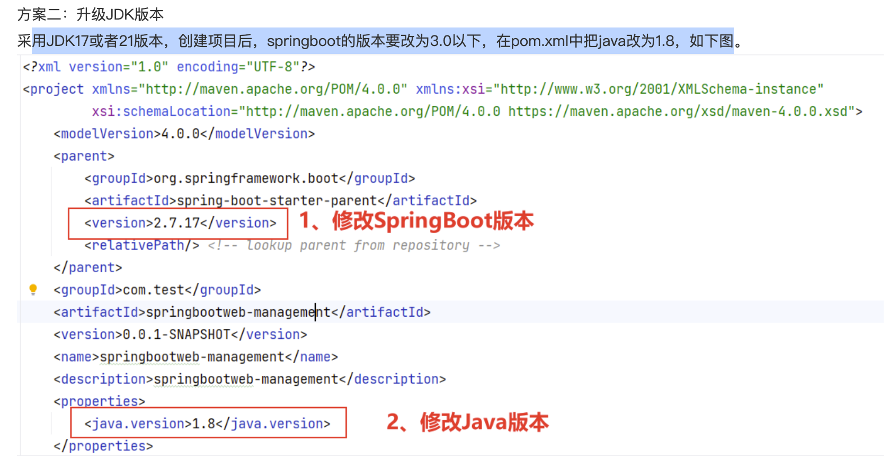

<br><br>

# SpringBoot
```s
- Spring版本: 5.3.1
- SpringBoot版本: 2.7.6
```

```s
3.0.4版本 会导致报错

java: 无法访问 org.springframework.boot.SpringApplication

错误的类文件: /C:/Users/11848/.m2/repository/org/springframework/boot/spring-boot/3.0.0/spring-boot-3.0.0.jar!/org/springframework/boot/SpringApplication.class

类文件具有错误的版本 61.0, 应为 52.0
请删除该文件或确保该文件位于正确的类路径子目录中
```

<br><br>

# SpringBoot基础篇
SpringBoot的设计目的是用来 **简化** Spring应用的 **初始搭建** 以及 **开发过程**   

<br>

## 原始Spring程序的缺点
- 依赖设置繁琐
- 配置繁琐

因为Spring, SpringMVC都需要使用大量的配置文件(xml文件) 还需要配置各种对象, 要将使用的对象放入到Spring容器中才能使用对象

那我们就需要了解其他框架的配置规则, 非常的麻烦

<br><br>

## SpringBoot程序的优点
- 起步依赖 (简化依赖配置)
- 自动配置 (简化常见工程相关配置)
- 辅助功能 (内置服务器)

当我们使用了SpringBoot之后 它相当于不需要配置文件的 ``Spring + SpringMVC``

常用的框架和第三方的库都已经配置好了 拿来就可以使用, 开发效果好

SpringBoot不是一个新的框架, 它还是 ``Spring + SpringMVC``, 只不过更改了它们的使用方法 简化了配置

**SpringBoot它仍然是一个容器的概念, SpringBoot中会使用大量的注解**   

<br><br>

## 准备工作: 

### 联网: 快速创建SpringBoot工程演示
学习SpringBoot前我们要做一些准备工作

**确认Maven版本**
```s
Build Tools / Maven (3.6.3)
```

<br>

**创建SpringBoot Web项目**

1. 选择 Spring Initializr 选项卡
2. Spring Boot的版本选择的 2.7.6
3. 选择 项目需要用到的依赖

4. 编写controller
5. 运行主启动类
6. 访问 localhost:8080/ (默认工程路径名为'', 所以我们直接访问该网址即可)

<br>

**pom.xml:**  
```xml
<?xml version="1.0" encoding="UTF-8"?>
<project xmlns="http://maven.apache.org/POM/4.0.0" xmlns:xsi="http://www.w3.org/2001/XMLSchema-instance"
         xsi:schemaLocation="http://maven.apache.org/POM/4.0.0 https://maven.apache.org/xsd/maven-4.0.0.xsd">
  <modelVersion>4.0.0</modelVersion>
  <groupId>com.sam</groupId>
  <artifactId>springboot_review_web_0421</artifactId>
  <version>0.0.1-SNAPSHOT</version>
  <packaging>war</packaging>
  <name>springboot_review_web_0421</name>

  <description>springboot_review_web_0421</description>
  <properties>
    <java.version>11</java.version>
    <project.build.sourceEncoding>UTF-8</project.build.sourceEncoding>
    <project.reporting.outputEncoding>UTF-8</project.reporting.outputEncoding>
    <spring-boot.version>2.7.6</spring-boot.version>
  </properties>

  <dependencies>
    <dependency>
      <groupId>org.springframework.boot</groupId>
      <artifactId>spring-boot-starter-web</artifactId>
    </dependency>

    <dependency>
      <groupId>org.springframework.boot</groupId>
      <artifactId>spring-boot-starter-tomcat</artifactId>
      <scope>provided</scope>
    </dependency>
    <dependency>
      <groupId>org.springframework.boot</groupId>
      <artifactId>spring-boot-starter-test</artifactId>
      <scope>test</scope>
    </dependency>
  </dependencies>
  <dependencyManagement>
    <dependencies>
      <dependency>
        <groupId>org.springframework.boot</groupId>
        <artifactId>spring-boot-dependencies</artifactId>
        <version>${spring-boot.version}</version>
        <type>pom</type>
        <scope>import</scope>
      </dependency>
    </dependencies>
  </dependencyManagement>

  <build>
    <plugins>
      <plugin>
        <groupId>org.apache.maven.plugins</groupId>
        <artifactId>maven-compiler-plugin</artifactId>
        <version>3.8.1</version>
        <configuration>
          <source>11</source>
          <target>11</target>
          <encoding>UTF-8</encoding>
        </configuration>
      </plugin>
      <plugin>
        <groupId>org.springframework.boot</groupId>
        <artifactId>spring-boot-maven-plugin</artifactId>
        <version>${spring-boot.version}</version>
        <configuration>
          <mainClass>com.sam.springboot_review.SpringbootReviewWeb0421Application</mainClass>
          <skip>true</skip>
        </configuration>
        <executions>
          <execution>
            <id>repackage</id>
            <goals>
              <goal>repackage</goal>
            </goals>
          </execution>
        </executions>
      </plugin>
    </plugins>
  </build>

</project>
```

<br>

**controller:**  
```java
package com.sam.springboot_review.controller;

import org.springframework.web.bind.annotation.GetMapping;
import org.springframework.web.bind.annotation.RestController;

// @Controller + @ResponseBody 复合注解: 返回值为向前端响应的字符串
@RestController
public class LoginController {
  @GetMapping("/")
  public String homePage() {
    return "首页欢迎你";
  }
}
```

<br>

**主启动类:**  
```java
@SpringBootApplication
public class SpringbootReviewWeb0421Application {

  public static void main(String[] args) {
    SpringApplication.run(SpringbootReviewWeb0421Application.class, args);
  }

}
```

<br>

### 手工: 创建SpringBoot工程
1. 创建普通的Maven工程

2. 创建pom.xml文件, 在pom中配置
  - 继承关系
  - 依赖关系 (手动添加如下依赖)
```xml
<!-- 要点1: parent -->
<parent>
  <groupId>org.springframework.boot</groupId>
  <artifactId>spring-boot-starter-parent</artifactId>
  <version>2.7.11</version>
  <relativePath/>
</parent>


<!-- 要点2: 依赖 -->
<dependencies>
  <dependency>
    <groupId>org.springframework.boot</groupId>
    <artifactId>spring-boot-starter-web</artifactId>
  </dependency>

  <dependency>
    <groupId>org.springframework.boot</groupId>
    <artifactId>spring-boot-starter-test</artifactId>
    <scope>test</scope>
  </dependency>
</dependencies>


<!-- 要点3: 工程打包时需要的配置 -->
<build>
  <plugins>
    <plugin>
      <groupId>org.springframework.boot</groupId>
      <artifactId>spring-boot-maven-plugin</artifactId>
    </plugin>
  </plugins>
</build>
```

3. 创建主启动类
```java
package com.sam;

import org.springframework.boot.SpringApplication;
import org.springframework.boot.autoconfigure.SpringBootApplication;

@SpringBootApplication
public class Springboot01Application {

  public static void main(String[] args) {
    SpringApplication.run(Springboot01Application.class, args);
  }

}
```

<br><br>

## 运行项目后, 观察发现:
我们的具有SpringMVC功能的Web项目 就做好了, 我们并 **没有做如下的操作**   

- 配置Spring配置文件
- 配置类
- 配置服务器

几乎是什么都不用管直接写控制器

<br><br>

## 解析: 快速创建的SpringBoot工程
最简单的SpringBoot程序包含的基础文件

- pom.xml
- Application主启动类

<br>

### Spring程序 和 SpringBoot程序 对比
|类/配置文件|Spring|SpringBoot|
|:--|:--|:--|
|pom文件中的坐标|手动添加|勾选添加|
|web3.0配置类|手动制作|无|
|Spring/SpringMVC配置类|手动制作|无|
|控制器|手动制作|手动制作|

<br><br>

## 解析: pom.xml中的 parent标签
我们在开发的时候避免不了需要导入相同的坐标, 比如如下的两个工程

- project-a: pom.xml
- project-b: pom.xml

这两个工程都需要如下的3个坐标 (依赖)
- druid
- mybatis
- mysql-connector-java

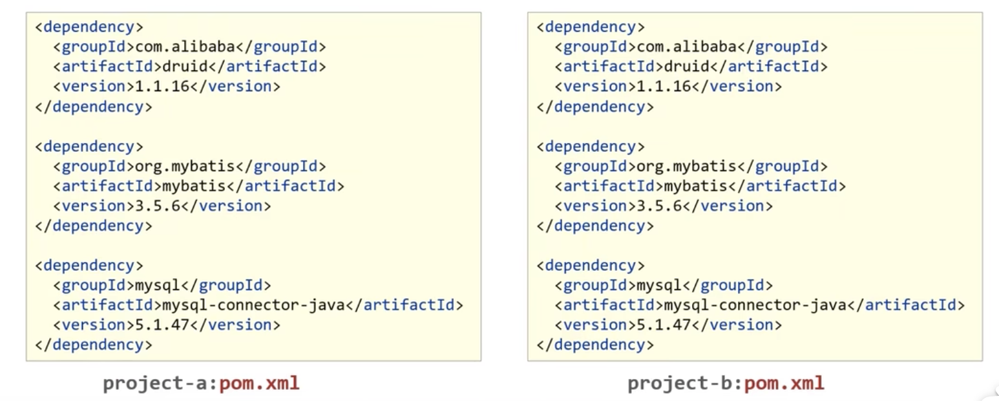

<br>

上面发现每个新工作既然都要引入这些依赖 那么我们能不能将上面的三个依赖抽取出来 比如抽离成project-dependencies

然后 project-a 和 project-b 使用 project-dependencies 就可以了 (类似继承)

- project-dependencies: pom.xml

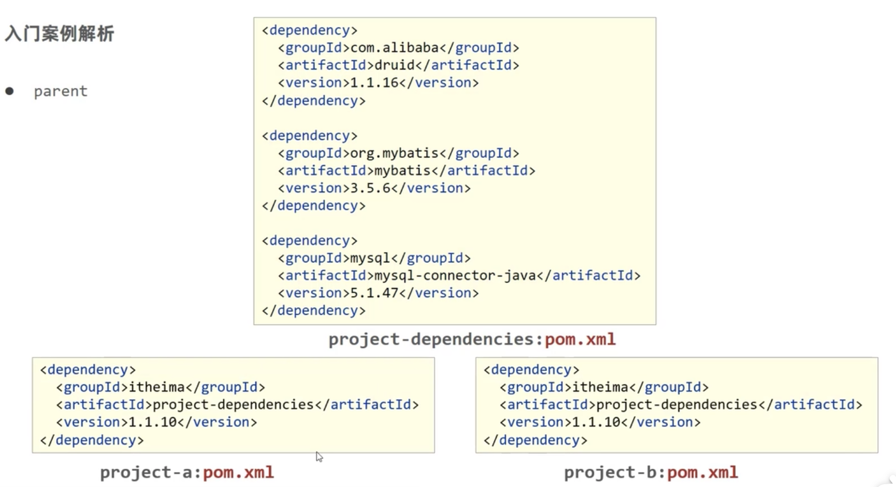

<br>
 
上面还可以优化, 我们可以对 project-dependencies: pom.xml 文件中出现的如下两项做集中管理
- 版本
- 坐标

将 project-dependencies: pom.xml 分为了两个文件

- project-parent: pom.xml  
```
保存了常用的版本信息 进行统一管理写到一起 配置成Maven的属性 (properties标签)
```

- project-dependencies: pom.xml  
```
引用了 project-parent 配置的版本号, 该文件只做坐标管理 不做版本管理 

版本管理放在了 parent 中, 也就是parent中将开发中常用到的坐标版本 统统的列了一遍
```

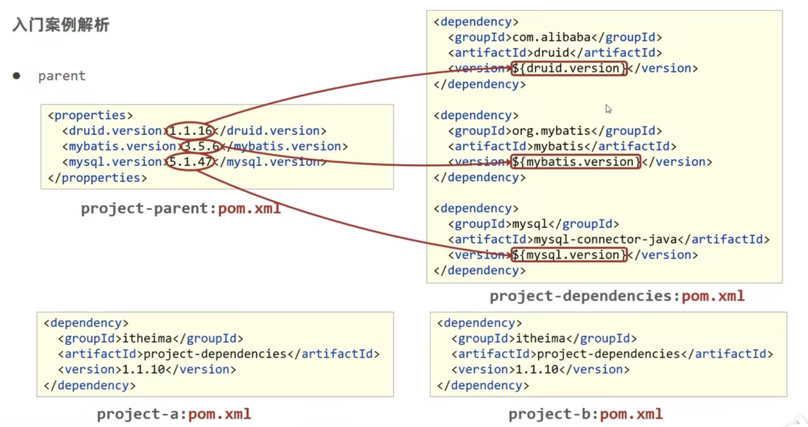

<br>

这样的好处就是 我们以后不用管坐标版本的问题了 坐标的版本都是 ``project-parent: pom.xml`` 帮我们管理

当我们指定一个 SpringBoot的 version 时候, springboot在该版本中 管理了一系列开发中可能用到的依赖

```xml
<parent>
  ...
  <version>2.7.11</version>
  ...
</parent>
```

它帮我们测试过了 2.7.11 版本中 融合性是最好, 稳定性最高的依赖版本, 版本的事儿就不用不管了

<br>

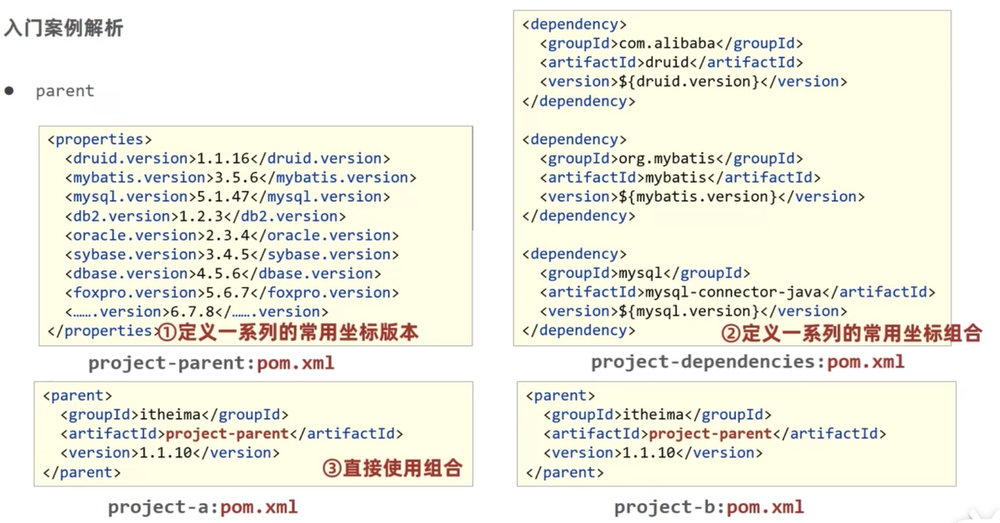

<br>

### 要点:
而实现上面的功能最重要的一点就是我们在pom.xml文件中写了继承关系

```xml
<parent>
  <groupId>org.springframework.boot</groupId>
  <artifactId>spring-boot-starter-parent</artifactId>

  <!-- SpringBoot的版本号 -->
  <version>2.7.11</version>
  <relativePath/> <!-- lookup parent from repository -->
</parent>
```

一个SpringBoot的版本号不用, 它内部定义的一系列依赖版本也是不同的

<br>

### 总结:
1. 开发SpringBoot程序要继承spring-boot-starter-parent, 就是要有 ``<parent />``

2. spring-boot-starter-parent中定义了若干个依赖管理

3. **继承parent模块可以避免多个依赖使用相同技术时出现依赖版本冲突**   

4. 不使用继承parent的形式, 也可以采用引入依赖的形式实现效果

<br><br>

## 解析: starter
我们的项目中使用了 ``spring-boot-starter-web`` 依赖, 我们看看这个starter中有什么

当我们导入了spring-boot-starter-web 它自己又导入了很多依赖

- spring-webmvc: SpringMVC能够工作的坐标
- spring-web: Spring整合web技术必须用的坐标

```xml
<dependencies>
  <dependency>
    <groupId>org.springframework.boot</groupId>
    <artifactId>spring-boot-starter</artifactId>
    <version>2.7.11</version>
    <scope>compile</scope>
  </dependency>

  <dependency>
    <groupId>org.springframework.boot</groupId>
    <artifactId>spring-boot-starter-json</artifactId>
    <version>2.7.11</version>
    <scope>compile</scope>
  </dependency>

  <dependency>
    <groupId>org.springframework.boot</groupId>
    <artifactId>spring-boot-starter-tomcat</artifactId>
    <version>2.7.11</version>
    <scope>compile</scope>
  </dependency>

  <dependency>
    <groupId>org.springframework</groupId>
    <artifactId>spring-web</artifactId>
    <version>5.3.27</version>
    <scope>compile</scope>
  </dependency>


  <dependency>
    <groupId>org.springframework</groupId>
    <artifactId>spring-webmvc</artifactId>
    <version>5.3.27</version>
    <scope>compile</scope>
  </dependency>
</dependencies>
```

也就是说我们发现一个问题因为我们导入了 ``spring-boot-starter-web`` 而该starter中又导入了一系列的依赖 所以我们的项目中就不需要再导入 ``spring-boot-starter-web`` 所依赖的依赖了

**这就是依赖传递**, 也就是说当有starter字样的依赖都会包含着其他的依赖

一个starter加入了后 就代表着加入了很多的东西, 也就是**如果我们使用A技术开发 那么我们只需要导入A技术对应的starter**

springboot之所以好用就是因为有无数个starter, 供我们使用

<br>

### 要点:
一个starter就是对应的一个包含了若干个坐标的定义的pom管理文件

所以我们可以通过starter来实现快速的配置, 比如以前我们要使用A技术, 那么就需要导入A技术对应的 1-9 个坐标

但现在不用了 我们**只需要导入A技术对应的starter就可以了**

<br>

### starter 的作用:
它定义了当前项目使用的所有依赖坐标, 以达到**减少依赖配置**的目的

<br>

### parent标签的作用:
它是所有springboot项目要继承的项目, 定义了若干个坐标版本号(依赖管理, 而非依赖 也就是用依赖的时候指明用哪个版本), 以达到**减少依赖冲突**的目的

spring-boot-starter-parent 各个版本存在着诸多坐标版本不同

<br>

### 使用场景
- 使用任意坐标时 仅书写GAV中的GA, V由SpringBoot提供 除非SpringBoot未提供对应的版本V(引入的依赖中不用写``<version>``标签)

- **如发生坐标错误的时候 再指定Version** (要小心版本冲突)

<br><br>

## 解析: 主启动类 (引导类)
我们不管是做Spring也好 还是做SpringMVC的程序也好 最终都会运行出来一个Spring容器对象

我们的所有对象都会以Bean的形式交给Spring容器来管理, 我们做SpringBoot程序 同样有Spring容器

<br>

下面 ``SpringApplication.run()`` 方法的返回值为 ``ConfigurableApplicationContext context`` 它就是容器对象 

我们可以通过该容器对象来获取 容器中的Bean, 比如
```java
context.getBean(BookController.class);
```

```java
package com.sam;

import org.springframework.boot.SpringApplication;
import org.springframework.boot.autoconfigure.SpringBootApplication;

@SpringBootApplication
public class Springboot01Application {

  public static void main(String[] args) {

    ConfigurableApplicationContext context = SpringApplication.run(Springboot01Application.class, args);


    // context就是容器对象, 尝试获取容器中的 Bean
    BookController bean = context.getBean(BookController.class);

  }

}

```

<br>

### SpringApplication.run() 要点:
作用: 调用该方法后启动了一个Spring的容器, 之后我们使用注解形式定义的Bean就可以加载到容器中

<br>

### 使用场景: 测试 通过 context 获取IOC容器中的对象
手动获取IOC容器中的对象的场景 可以是测试的时候 我们不希望将整个项目跑起来只是想运行其中的一个部分 看看它好不好用 我们就可以通过该方式

```java
@SpringBootApplication
public class Application {

  public static void main(String[] args) {

    // 通过 run() 方法的返回值获取 IOC 容器
    ConfigurableApplicationContext IOC = SpringApplication.run(Application.class, args);

    // 从IOC容器中获取service对象 调用service的某个方法查询输出结果
    UserService userService = IOC.getBean(UserService.class);

    userService.sayHello("sam");
  }

}
```

<br>

### @SpringBootApplication 注解:
该注解如果进入源码后 会发现它包含了若干个注解 比如

1. @Configuration: 配置类注解
2. @ComponentScan: 扫描Bean的注解 

如果没有指明的话 会扫描当前主启动类所在包 和 它的子包下的所有包

<br>

### 总结:
SpringBoot的引导类是Boot工程的执行入口, 运行main方法就可以启动项目

SpringBoot工程运行后初始化Spring容器, 扫描引导类所在的包 加载Bean

<br><br>

## 解析: 内嵌tomcat
我们打开 ``spring-boot-starter-web`` 依赖包后 能发现它内部还依赖了 ``spring-boot-starter-tomcat``

我们的SpringBoot能启动起来并且带Tomcat的功能就是因为有它 ``spring-boot-starter-tomcat`` 才能够完成的

<br>

**spring-boot-starter-tomcat内部包含:**  
tomcat-embed-core: 内嵌的tomcat核心

我们启动项目后 之所以tomcat可以使用 就是因为里面内嵌了tomcat服务器, 程序里面有一个服务器

它将tomcat的执行过程抽取出来 变成一个对象 将该对象交给spring管理

<br>

### 扩展: SpringBoot默认支持3款服务器
- Tomcat (默认), 应用面广, 负载了若干较重的组件
- Jetty: 更轻量级 负载性能远不及Tomcat
- Undertow: 负载性测试方法勉强能跑赢Tomcat

<br>

比如我们可以不使用Tomcat而 **转为使用Jetty**   

```xml
<dependency>
  <groupId>org.springframework.boot</groupId>
  <artifactId>spring-boot-starter-web</artifactId>
  <!-- 使用exclusions排除依赖 -->
  <exclusions>
    <exclusion>
      <groupId>org.springframework.boot</groupId>
      <artifactId>spring-boot-starter-tomcat</artifactId>
    </exclusion>
  </exclusions>
</dependency>

<!-- 添加 jetty, 添加它对应的 starter 它相关的依赖就会被导入 -->
<dependency>
  <groupId>org.springframework.boot</groupId>
  <artifactId>spring-boot-starter-jetty</artifactId>
</dependency>
```

<br><br>

# SpringBoot配置文件: application.properties
SpringBoot的配置文件在resources目录下的 **application.properties** 文件

<br>

**内置属性:**  
SpringBoot中导入了对应的starter后, 提供对应的配置属性
```s
https://docs.spring.io/spring-boot/docs/current/reference/html/application-properties.html#appendix.application-properties
``` 

<br>

**框架对应的属性:**  
我们导入技术对应的starter后, 才可以在application配置文件中 进行对应的配置

比如我们导入了 mybatis的starter后, 才可以配置mybatis的配置

<br><br>

### 服务器相关配置: server
```s
# 配置 服务器 端口号:
server.port
```

<br>

### 日志相关: logging
```s
loggin.level.root=
  - debug: 调试的时候选择该项, 初始化过程中所有信息都加载了
  - error: 报错级别, 该级别只在出错之后才有日志
  - info: 默认级别


# 指定包下的日志输出级别
loggin.level.com.sam=info
```

<br>

### Banner相关配置: banner
```s
spring.main.banner-mode=
  - off: 关闭
  - console: 输出在控制台
  - log: 输出到日志中

spring.banner.image.bitdepth=
spring.banner.image.width=
spring.banner.image.location=
  # 图片要在resources目录下
  - text.png
```

<br>

### SpringBoot的三种配置文件类型
1. properties 传统格式/默认格式
2. yml 主流格式
3. yaml

<br>

**properties:**  
```s
server.port=81
```


<br>

**yml:**  
```yml
server: 
  port: 81
```


<br>

**yaml:**  
```yml
server: 
  port: 81
```

<br>

### 3种配置文件的优先级:
当多个配置文件同时存在的时候 它们当中的属性共存叠加, 并相互覆盖

- 相同属性名覆盖
- 不同属性名叠加

```
properties > yml > yaml
```

<br>

### yaml / yml 书写格式:
yaml文件 和 xml properties 一样都是一种数据存储的格式

<br>

**优点:**  
- 容易阅读
- 容易与脚本语言交互
- 以数据为核心 重数据轻格式

<br>

**语法规则:**  
- 大小写敏感: A 和 a 是两个词

- 属性层级关系使用多行描述, 每个属性单独占一行, 每行结尾使用 **冒号** 结束

- 使用缩进表示层级关系, 同层级左侧对齐, 只允许使用空格(**不允许使用Tab键**)  

- 属性值前添加空格(属性名与属性值之间使用 **冒号 + 空格** 作为分隔符)

```yml
# yml的单一数据
port: 8080


# yml中的对象
enterprise: 
  name: itcast
  age: 16
  tel: 18998989898


# yml中的数组 方式1
likes:
  - game
  - music
  - sleep

# yml中的数组 方式2
likes: [game, music, sleep]


# yml中的对象数组 方式1
users: 
  - name: zhangsan
    age: 18
  - name: lisi
    age: 19

# yml中的对象数组 方式2
users: 
  - 
    name: zhangsan
    age: 18
  - 
    name: lisi
    age: 19

# yml中的对象数组 方式3
users: [{name:zhangsan, age: 18}, {name:lisi, age: 19}]
```

<br>

**字面值的表示:**   
```yml
# TRUE true True均可
boolean: TRUE 

# 支持科学计数法
float: 3.14 

# 支持2 8 16进制
int: 123 

# 使用 ~ 表示 null
null: ~ 

# 字符串可以直接书写, 有特殊字符或空格的时候加引号
string: HelloWorld 

# 日期必须使用 yyyy-MM-dd 格式
data: 2018-02-17 

# 时间和日期之间使用T连接, 最后使用+代表时区
datetime: 2018-02-17T15:02:31+08:00 
```

<br><br>

## 读取 yml 配置文件中的数据
这个章节中 我们在 application.properties 配置文件中设置 自定义的kv 在程序中进行读取

<br>

```yml
username: sam

student:
  name: erin
  age: 18

likes:
  - game
  - music
  - sleep
```

<br>

### 读取yml配置文件中的 **单一属性的** 数据:

1. 在类中定义属性(成员变量), 使用 ``@Value`` 注解 给属性(成员变量)注入值
2. 在 ``@Value("${key}")`` 注解中使用 ``${key}`` 的形式, 指定要读取配置文件中定义的 key对应的值

<br>

- 读取字符串: ``@Value("${username}")``
- 读取对象中的属性: ``@Value("${user.age}")``
- 读取数组中的元素: ``@Value("${likes[1]}")``

```java
package com.sam.controller;

@RestController
// /books模块名 通用的访问前缀
@RequestMapping("/books")
public class BookController {

  // 读取配置文件中定义的 字符串
  @Value("${username}")
  private String username;

  // 读取配置文件中定义的某个属性
  @Value("${student.age}")
  private String age;

  // 读取配置文件中数组中的一个元素
  @Value("${likes[1]}")
  private String like;

  @GetMapping
  public String home() {

    // 输出基本数据类型的数据
    System.out.println("username = " + username);

    // 输出对象中的属性 age
    System.out.println("student.age = " + age);

    // 输出数组中的成员
    System.out.println("likes[1] = " + like);

    return "SpringBoot is Running...";
  }
}

```

<br>

### yml配置文件中的 变量引用
yml文件中可以定义变量, 同文件中可以使用已定义好的变量 如
```yml
# 定义一个变量
baseDir: /Users/liulin/Desktop/Pic

# 引用上面定义的变量
imgs:
  - ${baseDir}/Xss1.png
  - ${baseDir}/Xss2.png
```

<br>

**注意:**  
使用 **双引号** 包裹的字符串 其中的 转义字符(``'/'``) 可以会被解析 (生效)

```yml
# 一般的书写格式: /temp就是一个普通的字符串 /t不会被当做是制表符被解析
str: /temp

# 加上引号后, 引号内部的内容 有特殊字符的时候 会被解析, 如 /t会被解析为制表符
str: "/temp"
```

<br>

```java
package com.sam.controller;

@RestController
// /books模块名 通用的访问前缀
@RequestMapping("/books")
public class BookController {

  @Value("${imgs[0]}")
  private String picUrl1;

  @GetMapping
  public String home() {

    // 输出 imgs[0] 位置的元素
    System.out.println("pic_url1 = " + picUrl1);
    // url1 = /Users/liulin/Desktop/Pic/Xss1.png

    return "SpringBoot is Running...";
  }
}
```

<br>

### 读取yml配置文件的 全部属性
我们在yml配置文件中定义的数据特别多, 需要读取的也特别多的时候 怎么处理?

上面我们每读取一个属性 都对应使用了一个@Value注解来处理

<br>

**如果我想读取全部的属性 怎么处理?**   
```yml
username: sam

student:
  name: erin
  age: 18

likes:
  - game
  - music
  - sleep

# 定义一个变量
baseDir: /Users/liulin/Desktop/Pic

# 引用上面定义的变量
imgs:
  - ${baseDir}/Xss1.png
  - ${baseDir}/Xss2.png
```

<br>

SpringBoot中给我们提供了一个对象 **<font color="#C2185B">Environment env</font>** 使用 @Autowired 标识该对象, 就可以将配置对象中的所有属性 封装到该对象中
```java
@RestController
@RequestMapping("/books")
public class BookController {
  @Autowired
  private Environment env;
}
```

<br>

**获取env对象中封装的属性:**  
**<font color="#C2185B">env.getProperty("属性名")</font>**   

```java
env.getProperty("username")
```

<br>

**注意:**  
该方式只能获取基本数据类型的数据, 引用类型的对象 和 数组 获取不到, 获取到的值为null

```java
package com.sam.controller;

@RestController
// /books模块名 通用的访问前缀
@RequestMapping("/books")
public class BookController {


  // 使用自动装配将所有的数据封装到env中
  @Autowired
  private Environment env;


  @GetMapping
  public String home() {

    // 获取字符串 OK
    System.out.println(env.getProperty("username"));    // sam

    // 获取对象, 数组 都为 null
    System.out.println(env.getProperty("student"));
    System.out.println(env.getProperty("likes"));

    return "SpringBoot is Running...";
  }
}
```

<br>

### 将yml配置文件的一组数据 封装到一个对象中 (主流开发方式)
我们先在配置文件中定义一组数据 也就是yml格式的对象
```yml
student:
  name: erin
  age: 18
```

<br>

**需求:**  
现在我们希望有一个Java对象 将上面指定的数据封装起来, 也就是封装上面的yml对象, 其它的数据不要

<br>

**思路:**  
1. 创建一个JaveBean类 专门用于封装上面的yml文件中定义的对象, 该Bean需要使用@Component注解标识
2. 使用 ``@ConfigurationProperties("yml配置文件中的对象名")`` 注解标识该JavaBean 告诉Spring加载yml配置文件中的哪组信息 封装到Java对象中
3. 使用的时候从Spring中直接获取信息使用

<br>

**步骤1:**  
创建一个带有set get 的JavaBean类 用于封装yml文件中对应的数据

<br>

**步骤2:**  
将该Java类(JavaBean)交由Spring管理, 使用 ``@Component`` 注解, 这样Spring可以将数据封装到它管理的Bean中

<br>

**步骤3:**  
使用 <font color="#C2185B">@ConfigurationProperties("yml配置文件中的对象名")</font> 注解标识JavaBean

告诉Spring将yml文件中哪组数据封装到Java对象上, 把要封装的属性的上一层的名称写上, 如果有多层则为 ``student.xxx``

<br>

**@ConfigurationProperties注解属性:**  
- value属性 
- prefix属性

<br>

上面的两个属性的作用是一样的, 属性值有要求: prefix的值有如下要求
- 小写字母
- 数字
- 中划线

不能使用 大写字母 特殊字符

比如, 如果配置文件中为驼峰 dataSource 时, 我们要将dataSource转换为
- 小写模式: datasource
- 烤肉串模式 data-source

<br>

**4. 使用我们定义Java对象 里面封装的配置文件中的数据**

<br>

**示例:**  
```java
// JavaBean
package com.sam.configdata;

import org.springframework.boot.context.properties.ConfigurationProperties;
import org.springframework.context.annotation.Configuration;
import org.springframework.stereotype.Component;


// 1. 将Bean交由Spring管理
@Component
// 2. 告诉Spring将配置文件中的哪组数据封装到该Bean中
@ConfigurationProperties("student")
// 类中提供 get set
public class Student {
  private String name;
  private String age;

  @Override
  public String toString() {
    return "Student{" +
        "name='" + name + '\'' +
        ", age='" + age + '\'' +
        '}';
  }

  public String getName() {
    return name;
  }

  public void setName(String name) {
    this.name = name;
  }

  public String getAge() {
    return age;
  }

  public void setAge(String age) {
    this.age = age;
  }
}


package com.sam.controller;

@RestController
@RequestMapping("/books")
public class BookController {

  // 自动装配Student
  @Autowired
  private Student student;

  @GetMapping
  public String home() {

    System.out.println("student = " + student.getName());

    return "SpringBoot is Running...";
  }
}
```

<br>

### 扩展:
我们使用 ``@ConfigurationProperties(prefix = "school")`` 注解后 控制上会报提示

```s
Spring Boot Configuration Annotation Processor not configured
```

它是说最好给我们的项目添加一个 Spring Boot Configuration Annotation Processor 的依赖项 用来处理我们的 @ConfigurationProperties

<br>

我们在properties配置文件中使用预定义的属性的时候, 是有提示信息的 之所以是有元数据信息 是因为有一个 configuration-metadata 的一个json文件

<br>

但是我们自己写的 school.name 是没有提示信息的, 如果我们想要达到在输入我们自定义的数据时也有提示自动补全的功能

我们就需要在pom.xml文件中添加一个依赖

```xml
<!-- 
  处理 和 @ConfigurationProperties 注解 有关的元数据的信息的
 -->
<dependency>
  <groupId>org.springframework.boot</groupId>
  <artifactId>spring-boot-configuration-processor</artifactId>
  <optional>true</optional>
</dependency>
```

<br>

### @ConfigurationProperties注解相关
```s
https://www.bilibili.com/video/BV15b4y1a7yG/?p=74&spm_id_from=pageDriver&vd_source=66d9d28ceb1490c7b37726323336322b
```

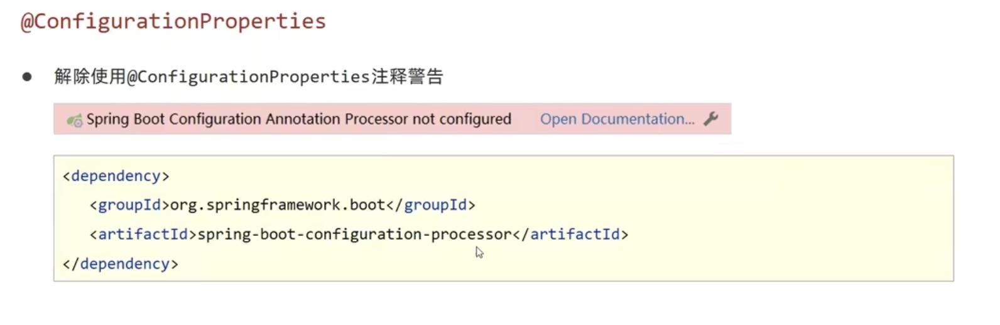


<br><br>

### 扩展: 配置文件属性提示消失 解决方案
之所以写配置有提示 是因为SpringBoot在IDEA环境下给我们提供的功能失效了

弹提示是IDEA工具带来的, 失效的原因是它不认为 application.yaml 是一个配置文件

<br>

**解决方式:**  
我们将 application.yaml 文件, 设置为配置文件

```s
- ctrl + ;
  - Facets - 找到对应的工程
    - 点击工具栏部分的 **绿叶子标志**   
      - 点击 + 添加文件成为配置文件
```

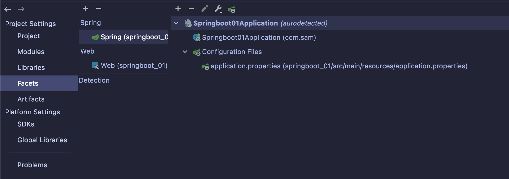

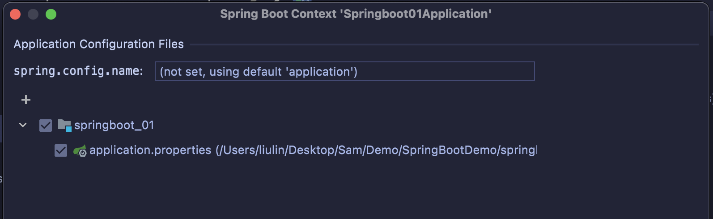

<br><br>

# 配置文件: 常用计量单位应用

**问题:**  
我们会在配置文件中 定义一些数据 在java类中使用 如果我们进行如下的定义 serverTimeout值对应的3 但它的单位是什么?
```yml
servers:
  ipAddress: 192.168.0.1
  port: 3333
  timeout: -1
  serverTimeout: 3
```

<br>

JDK8之后出现了很多跟数据单位相关的类型 有一个Duration类是专门用来描述时间范围的

```java
// 定义JavaBean用于封装配置文件中的信息
@Data
@ConfigurationProperties(prefix="servers")
public class ServerConfig {
  private String ipAddress;
  private int port;
  private long timeout;

  private Duration serverTimeout;
}
```

<br>

我们使用 Duration 类型变量 serverTimeout 接收配置文件中的定义的3的单位 默认为 3毫秒
```java
serverTimeout=PT0.003S
```

<br>

### 定义Duration类型修饰的变量的 单位种类: DurationUnit
我们使用 注解 来修饰 Duration修饰的变量 规定该变量的单位是什么

<br>

**@DurationUnit(ChronoUnit.HOURS)注解:**  

```java
@Data
@ConfigurationProperties(prefix="servers")
public class ServerConfig {
  private String ipAddress;
  private int port;
  private long timeout;


  // 这样我们接收到的值的单位就是 小时
  @DurationUnit(ChronoUnit.HOURS)
  private Duration serverTimeout;
}
```

<br>

### 配置存储容量时用到的类型: DataSize
默认DataSize修饰的变量的值为 byte

```yml
servers:
  ipAddress: 192.168.0.1
  port: 3333
  timeout: -1
  serverTimeout: 3
  dataSize: 10
``` 

<br>

**@DataSizeUnit(DataUinit.MEGABYTES):**   
我们使用 注解 来修饰 DataSize修饰的变量 规定该变量的单位是什么

```java
@Data
@ConfigurationProperties(prefix="servers")
public class ServerConfig {
  private String ipAddress;
  private int port;
  private long timeout;

  @DurationUnit(ChronoUnit.HOURS)
  private Duration serverTimeout;

  // 这样修饰的值的单位 MB
  @DataSizeUnit(DataUinit.MEGABYTES)
  private DataSize dataSize;
}
```

<br>

**注意:**  
使用DataSize类型修饰变量的时候 **该变量的单位有两种指定方式**
1. 直接在配置文件中使用单位 ``dataSize: 10MB``
2. 不在配置文件中使用单位 而是通过 ``@DataSizeUnit`` 注解指明单位

<br>

### 常用计量单位


<br><br>

# Bean属性校验
我们经常会定义一个JavaBean用来承装数据 但是很有可能有如下的情况

我们定义了一个 int类型的属性, 但是在封装的时候 很有可能接收到一个 字符串 这样的话就会报错

<br>

比如 我们要使用JavaBean来接收定义在yml配置文件中的自定义属性 port属性的类型是int 意味着它只能接受int类型的值

```java
@Data
@ConfigurationProperties(prefix="servers")
public class ServerConfig {
  private String ipAddress;

  // 只能接收 int类型 的数据
  private int port;
  private long timeout;
}
```

```yml
servers:
  ipAddress: 192.168.0.1

  # 我们手误写了一个a上去
  port: a
  timeout: -1
```

但是我们手动输入了一个a 那么当我们封装port的时候 就会报错 所以我们**希望有数据校验功能**

<br><br>

## 数据校验

### 1. 引入依赖 (推荐: 直接导入spring-boot-starter-validation)
导入JSR303规范 它是专门用来做数据校验的

```s
https://mvnrepository.com/artifact/javax.validation/validation-api
```

```xml
<!-- 
  validation校验接口 
    理解: 相当于JBDC接口
-->
<dependency>
  <groupId>javax.validation</groupId>
  <artifactId>validation-api</artifactId>
</dependency>


<!-- 
  使用hibernate提供的校验器创建 做validation校验框架的实现类 
    理解: 相当于JDBC接口的实现类 Mysql驱动
-->
<dependency>
  <groupId>org.hibernate.validator</groupId>
  <artifactId>hibernate-validator</artifactId>
</dependency>

<!-- 
  处理 @ConfigurationProperties("obj") 注解警告的
  Spring Boot Configuration Annotation Processor not configured
 -->
<dependency>
  <groupId>org.springframework.boot</groupId>
  <artifactId>spring-boot-configuration-processor</artifactId>
</dependency>


---

<!-- 
  还可以直接使用这套starter
 -->
<dependency>
  <groupId>org.springframework.boot</groupId>
  <artifactId>spring-boot-starter-validation</artifactId>
</dependency>
```

<br>

### 2. 开启对哪个类进行属性注入校验
我们在JavaBean上使用 <font color="#C2185B">@Validated系列注解</font>

<br>

**注意:**  
引入如下包下的功能
```java
import org.springframework.validation.annotation.Validated;
```

<br>

### 3. 对JavaBean中的某个属性做具体的校验规则
我们在类中属性上使用 对应的注解

<br>

**最大 / 最小值 校验:**  
- value: 最大值
- message: 超过最大值时的提示信息

```java
@Max(value=888, message = "最大值不能超过888")
@Min(value=111, message = "最小值不能小于111")
private int port;
```

<br>

**扩展:**  
- @AssertFalse: 是否是假
- @AssertTrue: 是否是真
```java
@AssertTrue
private boolean isActivated;
```

- @DecimalMax: 标记数值类型字段的最大值，可以包含小数
- @DecimalMin: 标记数值类型字段的最小值，可以包含小数
```java
@DecimalMax(value = "999.99")
private BigDecimal price;
```

- @Pattern: 标记字符串字段必须符合指定的正则表达式
```java
@Pattern(regexp = "[a-zA-Z0-9]*")
private String username;
```

- @Digits: 是否是数字
- @Email: 用于验证一个字符串是否符合电子邮件地址的格式。它会检查字符串是否具有电子邮件地址的基本结构，例如是否包含 "@" 符号以及是否包含域名等。

- @Future: 用于验证一个日期或时间是否在当前时间之后。通常用于验证未来的日期或时间是否有效。
- @FutureOrPresent: 用于验证一个日期或时间是否在当前时间之后或与当前时间相同。它可以用来验证未来的日期或时间以及当前的日期或时间是否有效。

- @Max: 标记数值类型字段的最大值
- @Min: 标记数值类型字段的最小值

- @Negative: 标记数值类型字段必须为负数
- @NegativeOrZero: 标记数值类型字段必须为负数或者零

- @Positive: 用于验证一个数值是否为正数
- @PositiveOrZero: 用于验证一个数值是否为正数或零
```java
@PositiveOrZero
private BigDecimal balance;
```

- @NotEmpty: 表示被注解的元素不能为 null 且必须至少包含一个非空元素
```java
@NotEmpty
private List<String> roles;
```

- @NotBlank: 标记字符串不能为空且长度必须大于0
```java
@NotBlank
private String firstName;
```

- @NotNull: 注解只检查字段或参数是否为 null, 而**不会检查它们是否为空字符串**
```java
public class User {
  @NotNull
  private String username;

  // Getter and setter methods
}
```
- @Past: 用于验证一个日期或时间是否在当前时间之前
```java
@Past
private Date eventDate;
```
- @PastOrPresent: 用于验证一个日期或时间是否在当前时间之前或与当前时间相同。
```java
@PastOrPresent
private LocalDateTime eventDateTime;
```

- @Size: 标记集合或者数组字段的大小范围 注解可以用于标记集合或数组字段的大小范围。它可以指定集合或数组的最小和最大长度，以确保数据的合法性
```java
@Size(min = 2, max = 50)
private String address;

// @Size(min = 1, max = 5) 指定了 hobbies 字段的长度范围，它必须至少包含 1 个元素，最多包含 5 个元素。
@Size(min = 1, max = 5)
private List<String> hobbies;
```

- @Length
- @Range

- @URL: 用于验证一个字符串是否为合法的 URL。
```java
@URL
private String url
```

<br>

### 测试:
```java
@Autowired
private Obj obj; 

@Test
void test() {
  System.out.println(obj);
}
```

<br><br>

# 配置类: @Configuration
JavaConfig也就是java类形式的配置文件, 它是Spring框架中提供的使用Java类配置容器, 用来配置Spring IOC容器的 纯Java方法

之前我们在配置Spring的时候 会使用 xml配置文件, 而JavaConfig就是用来代替Spring的xml配置文件的, 来配置我们的Spring容器

<br>

在这个Java类中可以创建Java对象, 把对象放入Spring容器中(注入)

<br>

### 优点:
1. 可以使用面向对象的方式, 一个配置类可以继承配置类, 可以重写方法
2. 避免繁琐的xml配置

<br>

### 要点:
使用JavaConfig需要两个注解的支持

<br>

### **<font color="#C2185B">@Configuration</font>**   
标识这个类是作为配置文件使用的 相当于将该类标识为Spring的配置类 

主启动类所在包 或 子包内 @Configuration所标识的类都会被扫描到

这里相当于以前的spring-config.xml配置文件

<br>

**位置:**  
类上方

<br>

### **<font color="#C2185B">@Bean</font>**   
声明对象, 把该对象注入到容器中

<br>

### 演示: 准备工作
1. 创建一个新的工程: 
  - create new project
    - empty project

2. 空工程下 创建Maven模块, 创建项目

3. 项目下pom.xml添加依赖
```xml
<?xml version="1.0" encoding="UTF-8"?>
<project xmlns="http://maven.apache.org/POM/4.0.0"
         xmlns:xsi="http://www.w3.org/2001/XMLSchema-instance"
         xsi:schemaLocation="http://maven.apache.org/POM/4.0.0 http://maven.apache.org/xsd/maven-4.0.0.xsd">
  <modelVersion>4.0.0</modelVersion>

  <groupId>com.sam</groupId>
  <artifactId>001-springboot-pre</artifactId>
  <version>1.0.0</version>

  <properties>
    <!-- spring版本: 统一管理相当于定义变量 -->
    <spring.version>5.3.1</spring.version>
  </properties>

  <dependencies>
    <!-- Spring依赖 -->
    <dependency>
      <groupId>org.springframework</groupId>
      <artifactId>spring-context</artifactId>
      <version>${spring.version}</version>
    </dependency>

    <dependency>
      <groupId>junit</groupId>
      <artifactId>junit</artifactId>
      <version>4.12</version>
      <scope>test</scope>
    </dependency>
  </dependencies>

  <build>
    <plugins>
      <!-- 编译插件 -->
      <plugin>
        <artifactId>maven-compiler-plugin</artifactId>
        <!-- 插件的版本 -->
        <version>3.5.1</version>
        <!-- 编译级别 -->
        <configuration>
          <source>1.8</source>
          <target>1.8</target>
          <!-- 编码格式 -->
          <encoding>UTF-8</encoding>
        </configuration>
      </plugin>
    </plugins>
  </build>

</project>
```

<br>

4. 创建Student(JavaBean): 
```
| - java
  | - com.sam.vo.Student
```

<br>

### 演示: Spring原始xml格式配置文件方式: 
``/resources/beans.xml``

演示如何将 Student对象 放入容器中
```xml
<?xml version="1.0" encoding="UTF-8"?>
<beans xmlns="http://www.springframework.org/schema/beans"
       xmlns:xsi="http://www.w3.org/2001/XMLSchema-instance"
       xsi:schemaLocation="http://www.springframework.org/schema/beans http://www.springframework.org/schema/beans/spring-beans.xsd">


  <!-- 声明 Bean 对象 -->
  <bean id="student" class="com.sam.vo.Student">
    <property name="name" value="sam" />
    <property name="age" value="18" />
    <property name="sex" value="男" />
  </bean>
  
</beans>
```

<br>

### 测试: 创建IOC容器, 获取IOC容器中的对象
```s
| - test
  | - java
    | - com.sam.test.StudentTest
```

<br>

**要点:**  

我们需要 **<font color="#C2185B">使用 ClassPathXmlApplicationContext 来读取spring的配置文件</font>** 来创建IOC容器

```java
@Test
public void test() {

  // 读取配置文件
  ClassPathXmlApplicationContext applicationContext = new ClassPathXmlApplicationContext("beans.xml");

  // 获取IOC容器中配置的对象
  Student student = applicationContext.getBean(Student.class);

  // 使用对象
  System.out.println("student = " + student);
}
```

<br><br>

### 演示: 使用 JavaConfig方式 代替 spring-config.xml配置文件

**1. 创建自定义的类**   
```s
/com.sam.config.SpringConfig
```

<br>

**2. 在自定义类上加上 <font color="#C2185B">@Configuration</font> 注解**   
将自定义标识为一个配置类, 用来配置容器的 

这里相当于spring-config.xml配置文件

<br>

**位置:**  
类的上方

<br>

**3. 使用 @Bean注解 标识配置类中的方法(该方法会返回对象) 我们将对象放入IOC容器中**  
类中定义方法, **方法上方使用@Bean注解**, 方法的返回值就是往IOC容器中放的对象, 相当于``<bean>``标签
```java
@Bean(name = "bean的id值")
```

第2步中相当于配置spring容器, 我们在学spring的时候, 我们都会往spring的ioc容器中配置对象, 这里的操作就是在配置对象

<br>

**位置:**  
方法上方使用

<br>

**参数:**  
可以直接使用 ``@Bean`` 注解, name属性用于指定``<bean id>`` id的值

<br>

**返回值:**  
方法的返回值为, 往IOC容器中注入的对象

当@Bean不指定name属性值时, 默认它所标识的方法名就是bean的id

<br>

**权限修饰符:**   
public 

<br>

- 返回值: 
- 权限修饰符: public
- 方法上方使用: @Bean 注解

<br>

**配置类代码:**  
```java
package com.sam.config;

import com.sam.vo.Student;
import org.springframework.context.annotation.Bean;
import org.springframework.context.annotation.Configuration;

@Configuration
public class JavaConfig {

  // 将 Student 交由IOC来管理
  @Bean
  @Bean(name = "student")  // bean id 为 student
  public Student createStudent() {
    // 将s1放入到IOC容器中
    Student s1 = Student("sam", 18, "男");
    return s1;
  }
}

```

<br>

### 测试: 创建IOC容器, 获取IOC容器中的对象

**要点:**  

我们需要 **使用 AnnotationConfigApplicationContext类 来读取spring的配置类** 来创建IOC容器

<br>

**<font color="#C2185B"> new AnnotationConfigApplicationContext(参数)</font>**   
创建IOC容器

<br>

**参数:**  
参数有两种形式, 任选一种即可
1. 传入bean的id, 默认是方法名
2. 传入Student.class

<br>

**返回值:**  
AnnotationConfigApplicationContext or ApplicationContext

```java
@Test
public void test2() {
  // 创建IOC的容器的实现类对象
  // 参数: Class<?> componentClasses, 组件的类
  ApplicationContext context = new AnnotationConfigApplicationContext(JavaConfig.class);

  // 获取对象
  /*
    参数形式1: 
      @Bean标识类的方法的方法名: 相当于我们传入的是bean的id, 返回值为Object, 需要强转

    参数形式2: 
      @Bean标识类.class: 不用强转
  */
  Student bean = context.getBean(Student.class);

  System.out.println("bean = " + bean);

}
```

<br>

### @Configuration的使用场景
我们要是想将一个Bean (或者是第三方的Bean)交给Spring容器来管理的话 就是可以用@Configuration 配置类

<br>

**使用方式:**  
1. 使用 ``@Configuration`` 注解标识一个Java类 为配置类
2. 在该类中定义方法 方法上使用 ``@Bean`` 注解 
3. 该方法的返回值对象 会被Spring来管理

```java
@Configuration
public class MPConfig {

  // 创建 MybatisPlus 拦截器 并将该对象交由Spring管理
  @Bean
  public MybatisPlusInterceptor mybatisPlusInterceptor() {

    MybatisPlusInterceptor mybatisPlusInterceptor = new MybatisPlusInterceptor();

    // 添加分页的拦截器
    mybatisPlusInterceptor.addInnerInterceptor(new PaginationInnerInterceptor());

    return mybatisPlusInterceptor;
  }
}
```

<br><br>

## @ImportResource 注解
该注解使用在 Java配置类 上

<br>

### 使用方式:  
写上配置文件在类路径下的位置, ``classpath:`` 为固定部分
```java
@ImportResource("classpath:配置文件名");
```

<br>

**引入多个配置文件:**  
```java
@ImportResource({"classpath:配置文件名1", "classpath:配置文件名2"});
```

<br>

### 位置:
类上方

<br>

### @ImportResource 作用:
项目中使用java配置类的同时, 再导入其它的xml配置文件

等同于在xml文件中的 ``<import resource="指定其他的xml配置文件">``
```xml
<!-- 
  在配置文件中引入其他的配置文件, 
  两个配置文件的配置和在一起
 -->
<import resource="指定其他的xml配置文件">  
```

<br>

比如我们有一些bean的配置是在配置文件中的时候, 然后我们还想使用JavaConfig这种方式配置容器, 我们可以**使用 @ImportResource 利用已经存在的配置文件**   

<br>

### 测试:
1. ``com.sam.vo.Cat``: 有一个JavaBean
2. ``/resources/applicationContext.xml``: 资源目录下有一个spring的配置文件 里面配置了Cat的``<bean>``
```xml
<bean id="cat" class="com.sam.vo.Cat">
  <property name="name" value="tom" />
  <property name="age" value="2" />
  <property name="cardId" value="9736" />
</bean>
```

<br>

我们创建IOC容器时, 会读取JavaConfig类作为配置文件, 但是JavaConfig类中并没有将Cat对象放入到IOC容器中, 我们只是往IOC容器中放了Student

```java
@Configuration
public class JavaConfig {

  // 只放了Student
  @Bean
  public Student createStudent() {
    return new Student("sam", 18, "男");
  }
}
```

<br>

我们也想将Cat对象放入IOC中, 这时我们就可以利用已有的xml配置文件, 我们可以使用``@ImportResource("配置文件名")``注解 **将已有的配置文件 和 现在的配置进行合并**

```java
@Configuration
// 引入已有的配置文件, 注意关键字 classpath:
@ImportResource("classpath:applicationContext.xml")
public class JavaConfig {
  @Bean
  public Student createStudent() {
    return new Student("sam", 18, "男");
  }
}
```

<br><br>

## @PropertyResource 注解

### 作用:
读取 ``.properties`` 配置文件的, 它可以找到该配置文件, 从而读取 ``.properties``配置文件 的数据

使用属性配置文件可以实现外部化配置 **在程序代码之外提供数据**   

<br>

它可以将 application.yml 或 application.properties 主配置文件中的属性值与 JavaBean 对应属性进行注入

<br>

### 格式:  
value属性值为类路径下的配置文件路径, 让spring框架读到该配置文件
```java
@PropertySource("classpath:tiger-config.properties")
```

<br>

### 属性:
我们还可以指定encoding属性 来设置读取的编码格式吧
```java
@PropertySource(
  value="classpath:tiger-config.properties",
  encoding="UTF-8"
)
```

<br>

### 读取.properties配置文件的数据:
**<font color="#C2185B">@Value("${key}")</font>**  
在类中的属性上方使用该注解, 将从配置文件中读到的值 注入到属性中

```java
public class Tiger {
  // tiger.name 就是 properties配置文件中的key
  @Value("${tiger.name}")
  private String name;
}
```

<br>

### 测试: @PropertyResource读取.properties配置文件

**1. 创建tiger-config.properties文件**  
```
tiger.name=东北老虎
tiger.age=3
```

<br>

**2. 在JavaConfig类上使用``@PropertyResource``注解读取properties配置文件**  

<br>

**3. 在JavaConfig类上使用@ComponentScan扫描组件**  
我们下面的代码, 相当于在xml配置文件中使用``<bean>``的方式将对象配置到IOC容器中

我们在学习spring的时候还有一种方式, 也可以将对象交由spring来管理就是 ``注解 + 扫描``

我们会在JavaBean上使用``@Component``等注解 将其标识为一个组件

然后我们会在配置文件中配置扫描, 只不过这个配置扫描的步骤当我们使用的是JavaConfig类的时候

我们就可以使用 **<font color="#C2185B">@ComponentScan("包路径")</font>** 的方式扫描指定包下的组件

```java
@Configuration
// 引入别的xml配置文件
@ImportResource("classpath:applicationContext.xml")
// 读取properties配置文件
@PropertySource("classpath:tiger-config.properties")
// 扫描指定包下的组件
@ComponentScan("com.sam.vo")
public class JavaConfig {
  @Bean
  public Student createStudent() {
    return new Student("sam", 18, "男");
  }
}
```

<br>

**4. 在Tiger类上方使用@Component 将该类交由IOC来管理**   

<br>

**5. 在属性上方使用@Value("${key}")的方式读取配置文件中的数据 赋值给属性**   

```java
@Component
public class Tiger {

  @Value("${tiger.name}")
  private String name;

  @Value("${tiger.age}")
  private Integer age;

}
```

<br><br>

## 读取 springboot配置文件中的自定义属性
上面我们在配置类上使用 ``@PropertyResource`` 注解 指明了 ``.properties`` 文件所在的位置

然后我们使用 ``@Value`` 注解 读取到我们在 ``.properties`` 文件中声明的数据

<br>

这里我们不利用别的.properties文件, 而是将我们自定义的数据直接放到 application.properties 或者 application.yml 文件中 

**application.yml**  
我们在配置文件声明了自定义的属性 和 值
```s
# 自定义属性:
reggie:
  path: /Users/liulin/Desktop/pic
```

<br>

**任意类:**  
任意类中都可以通过 @Value 注解获取到我们声明在 application.yml 文件中定义的kv
```java
public class CommonController {

  @Value("${reggie.path}")
  private String basePath;

}
```

<br><br>

# SpringBoot入门
SpringBoot就是简化SpringMVC和Spring的配置, 所以它们的思想是一样的就是IOC容器

容器无外乎就是将对象交给IOC去创建的 我们需要从容器中拿对象来用 所以思想就是先将对象交给容器 我们再考虑使用的问题

<br>

## 特点:
### 1. 创建一个独立的Spring应用

<br>

### 2. 内嵌Tomcat(默认) and Undertow and jetty 服务器, 就意味着我们不用单独的安装Tomcat

<br>

### 3. 提供了starter起步依赖, 简化应用的配置

<br>

比如我们要使用mybatis框架, 需要在Spring项目中 配置MyBatis对象SqlSessionFactory, Dao的代理对象 

现在在SpringBoot的项目中, 在pom.xml里面加入 <font color="#C2185B">mybatis-spring-boot-starter</font> 依赖

加入之后SqlSessionFactory, Dao的代理对象相关的配置就自动配置好了, 也就是说将我们要用到的技术所需要的依赖都会自动配置好

<br>

### 4. 自动配置: 尽可能去配置spring和第三方库  
我们在SpringBoot项目中我们就可以直接使用Spring

一样我们在做Web的时候 我们需要配置前端控制器, 在SpringBoot中前端控制器也配置好了

例如MyBatis这样的第三方库也会尽可能的配置好, 放入容器中我们直接使用就可以

<br>

### 5. 提供了健康检查 统计 和 外部化配置
SpringBoot项目中自动了检查的功能 检查我们的项目是否正常的运转

<br>

### 6. 不用生成代码, 也不用使用xml做配置

<br><br>

# 创建SpringBoot项目
我们有很多种方式来创建SpringBoot项目
1. 使用SpringBoot的初始化器 以向导的方式一步步创建项目
2. 直接创建Maven项目, 它也可以当做是SpringBoot项目来用 

<br><br>

## 使用SpringBoot的初始化器: 创建SpringBoot项目

1. 新建Module时选择: Spring Initializr

2. 选择向导对应的url地址, 选择默认 点击next
```s
choose initializr service url
- default: https://start.spring.io
- custom: 国内可以选择 http://start.springboot.io 比较快
```

3. 配置如下的信息 点击next
```s
Group:     com.sam

Artifact:  项目名: springboot-first (不能以数字开头)

Type: 项目的构建工具 (默认选项 Maven)

Language:  _____

Packaging: jar or war

Java Version: 8

Name: 它只是一个标识会在pom里面显示一样而已, 无知的我填写和Artifact一样的

Package: 包名
```

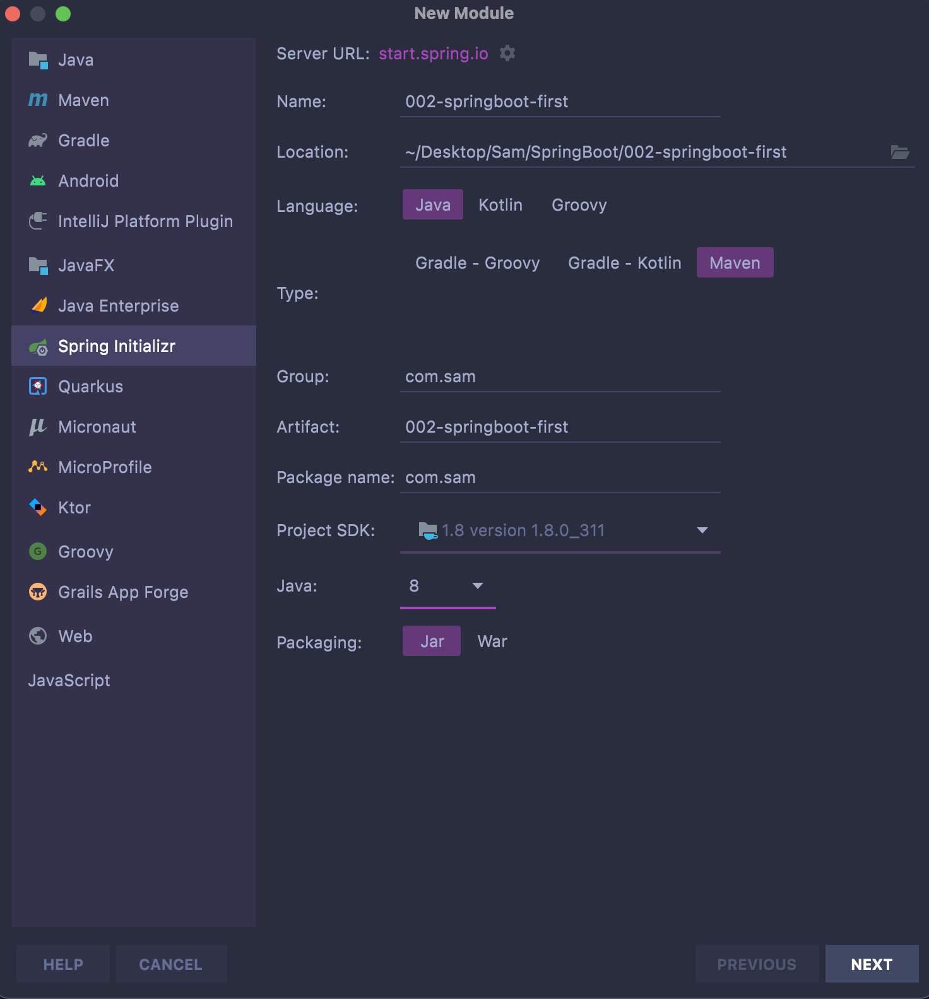

4. 这个界面选择我们要用到的Maven依赖项
```s
- 选择SpringBoot的版本
- web选项卡: 
  - ✅Spring Web - web工程, 就会有SpringMVC了
  - Spring Reactive Web - 异步编程依赖
  - Spring Session - 会话的

- Template Engines选项卡: 模版引擎

- Security: 安全框架
  - Spring Security
  - oAuth2

- Sql: 数据库
  - MyBatis
  - Mysql Dirver
```

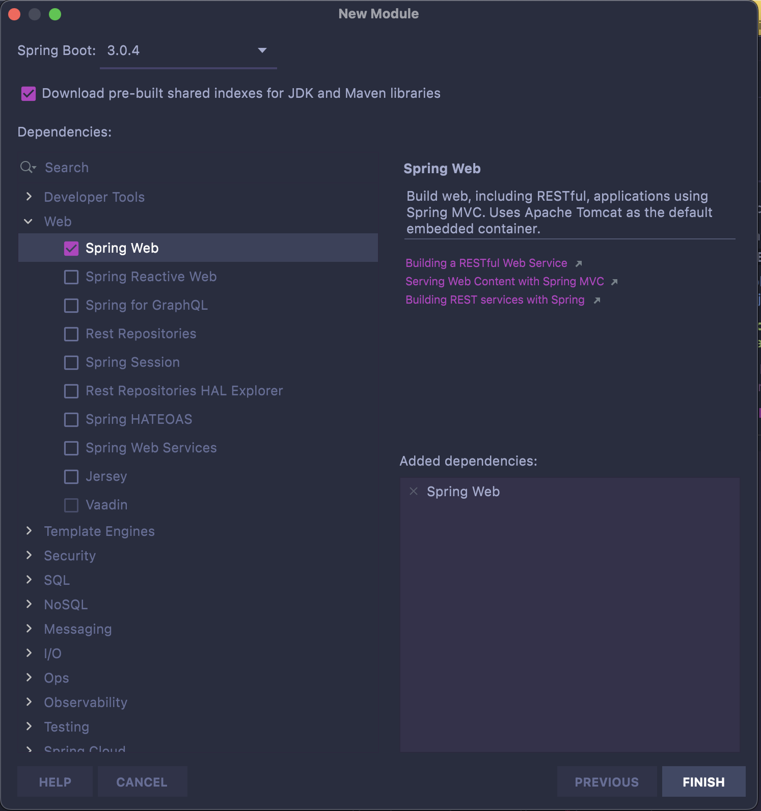

5. 点击finish就ok了

<br><br>

## SpringBoot项目的结构
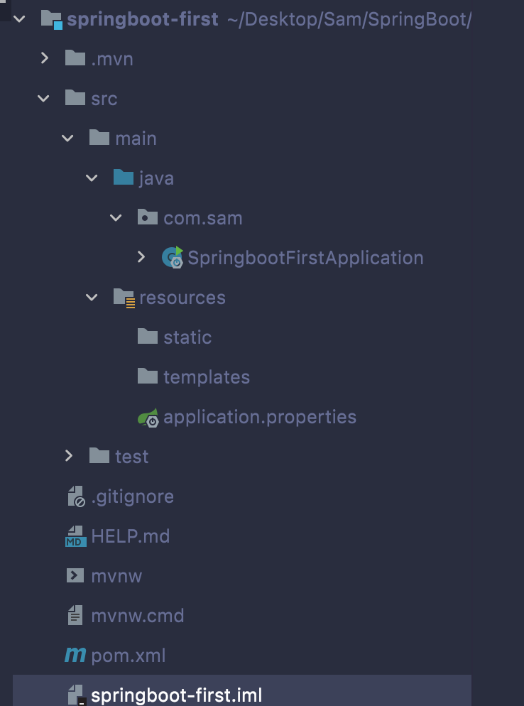

```s
| - .mvn
| - src
  | - main
    | - java

    # 资源文件目录
    | - resources

      # 静态资源目录如: js css
      | - static

      # 模版文件: index.html
      | - templates

      # SpringBoot的配置文件
      - application.properties

  | - test

- .gitignore

# 描述文件
- HELP.md
- mvnw
- mvnw.cmd

- pom.xml
```

<br>

**mvnw:**  
带有mvn相关的都是Maven的工具, 如果我们使用 mvnw执行Maven命令时, 如果我们没有相关的命令它会帮我们自动安装

.mvn mvnw HELP.md mvnw.cmd 都是可以删掉的

<br>

### Pom.xml
```xml
<?xml version="1.0" encoding="UTF-8"?>
<project 
  xmlns="http://maven.apache.org/POM/4.0.0"
  xmlns:xsi="http://www.w3.org/2001/XMLSchema-instance"
  xsi:schemaLocation="http://maven.apache.org/POM/4.0.0 https://maven.apache.org/xsd/maven-4.0.0.xsd"
>
  <modelVersion>4.0.0</modelVersion>


  <!-- 

    SpringBoot项目的父项目:
      它负责管理依赖 和 版本
      跟SpringBoot项目有关的依赖和版本 都在父项目中加以定义和声明
   -->
  <parent>
    <groupId>org.springframework.boot</groupId>
    <artifactId>spring-boot-starter-parent</artifactId>
    <!-- 
      当前版本为 3.0.4
      可以改成和老师一样的 2.4.2
     -->
    <version>3.0.4</version>
    <relativePath/>
  </parent>


  <!-- 当前项目自己的坐标 -->
  <groupId>com.sam</groupId>
  <artifactId>springboot-first</artifactId>
  <version>0.0.1-SNAPSHOT</version>
  <name>springboot-first</name>
  <description>springboot-first</description>


  <!-- JDK版本 -->
  <properties>
    <java.version>1.8</java.version>
  </properties>


  <dependencies>
    <!-- web的起步依赖: (具有SpringMVC的功能) -->
    <dependency>
      <groupId>org.springframework.boot</groupId>
      <artifactId>spring-boot-starter-web</artifactId>
      <!-- 这里没有加版本号就是继承parent的 -->
    </dependency>
    
    <!-- 测试的 -->
    <dependency>
      <groupId>org.springframework.boot</groupId>
      <artifactId>spring-boot-starter-test</artifactId>
      <scope>test</scope>
    </dependency>
  </dependencies>

  <build>
    <plugins>
      <plugin>
        <!-- SpringBoot项目要使用的Maven插件 -->
        <groupId>org.springframework.boot</groupId>
        <artifactId>spring-boot-maven-plugin</artifactId>
      </plugin>
    </plugins>

    <!-- 
      spring-boot-maven-plugin
      这里爆红了 解决方式
      1. 在 <plugins> 外围加上了 <pluginManagement>

      2. 加上了 <version> 和 parent一致就可以
    -->
  </build>

</project>

```

<br><br>

## 创建普通Maven项目: 创建SpringBoot项目
1. 创建Module 选择Maven

2. pom.xml中配置 ``<parent>``, 添加后我们这个项目的开发就是基于SpringBoot的了
```xml
<parent>
  <groupId>org.springframework.boot</groupId>
  <artifactId>spring-boot-starter-parent</artifactId>
  <version>3.0.4</version>
  <relativePath/>
</parent>
```

3. 添加依赖
```xml
<dependencies>
  <!-- weby依赖 -->
  <dependency>
    <groupId>org.springframework.boot</groupId>
    <artifactId>spring-boot-starter-web</artifactId>
    <!-- 这里没有加版本号就是继承parent的 -->
  </dependency>
  
  <!-- 测试的 -->
  <dependency>
    <groupId>org.springframework.boot</groupId>
    <artifactId>spring-boot-starter-test</artifactId>
    <scope>test</scope>
  </dependency>
</dependencies>
```

4. 目录结构要个SpringBoot的一致 所以我们自己在/resources/ 下创建欠缺的目录和文件 
```s
| - resources
  | - static
  | - template
  - application.properties
```
  

<br><br>

## 基于SpringBoot的Web案例
SpringBoot内置了Tomcat我们不用配置Tomcat了, 而是通过入口文件的 ``main()`` 方法来启动项目

<br>

**1. 创建一个Controller**   
```java
// 响应数据
@RestController
public class HelloSpringBoot {
  // 映射接口
  @GetMapping("/hello")
  public String helloSpringBoot() {
    return "欢迎使用SpringBoot框架";
  }
}
```

<br>

**2. SpringbootFirstApplication.java中执行main()**  
我们自动生成的SpringBoot项目中的com.sam包下 自动创建了这样的一个类 当中有main方法
```java
package com.sam;

import org.springframework.boot.SpringApplication;
import org.springframework.boot.autoconfigure.SpringBootApplication;

// 入口文件使用的注解
@SpringBootApplication
public class SpringbootFirstApplication {

  public static void main(String[] args) {
    SpringApplication.run(SpringbootFirstApplication.class, args);
  }

}
```

<br>

**3. <font color="#C2185B">项目的管理:</font>**  
当我们执行main()方法后, 右下角会弹出一个窗口
```
Services
  Multiple Spring Boot run configurations were detected ...
```

我们点这个窗口, 找到 ``show run configurations in servies`` 

点击后 会在终端的位置出现一个services的tab页签, 里面可以控制我们的项目的
- 启动
- 调试
- 停止

<br>

**注意:**  
没有窗口弹出的话, 找到窗口 View/Tool Windows/Services 点击

<br>

### 总结:
比较SpringMVC真的方便了很多, 我们没有配置web.xml中的前端控制器等, 没有配置tomcat, 直接启动了main()

<br><br>

## @SpringBootApplication注解

### 位置:
我们在创建一个SpringBoot的项目后, 默认就会在 com.sam 这个包下创建一个这样的类(主启动类)

该类中包含一个main()方法, 不管是我们开发什么应用 我们的SpringBoot应用都是通过main()方法来启动的

<br>

### 作用:
``@SpringBootApplication``注解是一个复合注解 是有多个注解功能组成的, **如下的注解的功能就是该注解的功能**   

- @SpringBootConfiguration
- @EnableAutoConfiguration
- @ComponentScan: 能够扫描程序中的所有注解

<br>

1. 使用@SpringBootConfiguration注解标注的类, 可以做为配置文件使用的 可以使用@Bean声明对象 将其注入到容器

2. @EnableAutoConfiguration开启自动配置

3. @ComponentScan扫描主启动类下级目录中所有的组件

<br>

### 复合注解中的: @SpringBootConfiguration: 
该注解的作用和 ``@Configuration`` 注解的作用一致, 也就是说 有了 **@SpringBootConfiguration** 注解的类, **它所标识的类就可以当做配置文件来使用**   

比如我们可以在该类中定义Bean将其注入到容器中

```java
// 我们可以在启动类中 将某个对象注入到容器中
@SpringBootApplication(scanBasePackages="controller")
public class SpringbootFirstApplication {

  public static void main(String[] args) {
    SpringApplication.run(SpringbootFirstApplication.class, args);
  }


  // 在主启动类中将Student放入到IOC容器中
  @Bean
  public Student createStudent() {
    return new Student()
  }
}
```

<br>

**@SpringBootApplication注解源码:**  
我们观察该注解的原码发现, 它身上还有如下的几个注解
```java
@SpringBootConfiguration
@EnableAutoConfiguration
@ComponentScan(
  excludeFilters = {
    @Filter(type = FilterType.CUSTOM, classes = {TypeExcludeFilter.class}),
    @Filter(type = FilterType.CUSTOM, classes = {AutoConfigurationExcludeFilter.class})
  }
)
public @interface SpringBootApplication { ... }
```

<br>

### 复合注解中的: @EnableAutoConfiguration: 
启用自动配置, 把Java对象配置好注入到Spring容器中

例如通过启动该注解就可以自动把mybatis之类对象创建好 放入到容器中

<br>

### 复合注解中的: @ComponentScan:
组件扫描器, 通过它扫描包下的组件 来创建对象 给属性赋值等

<br>

### 主启动类的位置关系
```s
| - java
  | - com.sam

    | - controller
      - HelloSpringBoot

    | - vo
      - Student

    - Application
```

我们发现主启动器和其它的子包是同一级目录, **Application所处的位置是在 controller 和 service 包的上层目录**   

<br>

**作用:**  
这样的位置关系的作用是, ``@ComponentScan``它会默认扫描是 它所在的类 所在的包 它 的子包下的所有类

@SpringBootApplication 也有和 @ComponentScan 同样的作用

SpringBoot这样的配置 不用我们再自己配置组件扫描了 简化了操作, 也就是说 主启动类的层级如果不对 是起不到扫描组件的作用的

<br><br>

## 主启动类的格式:

1. 在主包下创建该类, controller包在该类的下层子包下

2. 使用 @SpringBootApplication 标识该类

3. 类中有main()方法

4. main()方法中要有 ``SpringApplication.run()`` 方法

5. run()方法的两个参数为:
  - 当前类的 Application.class
  - args 参数

```java
@SpringBootApplication
public class Application {

  public static void main(String[] args) {
    SpringApplication.run(Application.class, args);
  }

}
```

<br><br>

## 主启动类: @ServletComponentScan 注解
当我们在主启动类上使用该注解后 如下的组件可以直接通过如下的注解自动注册, 无需其他的代码, **该注解相当于一个开关** 
- Servlet (@WebServlet)
- Filter (@WebFilter)
- Listener (@WebListener)

```java
@SpringBootApplication
@ServletComponentScan
public class Application {

  public static void main(String[] args) {
    SpringApplication.run(Application.class, args);
  }

}

```

<br><br>

# SpringBoot的配置文件: 

### 位置:
```s
/resources/application.properties
```

<br>

### SpringBoot的配置文件格式
SpringBoot的配置文件的配置文件有两种格式的扩展名, **文件名必须是 application 开始**   

1. ``.properties 结尾的文件`` (key=value)
2. ``.yml`` 结尾的文件 (key: value)

它们所表达的内容是一样的 就是格式上的区别 早期的时候使用的是properties, 后面使用的是yml(主推)

<br>

**默认采用的是 properties文件**   

<br><br>

## 使用properties格式的配置文件 配置项目
设置服务器相关的配置都是 ``server.`` 开始的, 在官网的手册里是有各种配置的说明的

1. 设置访问应用的端口号
2. 设置访问应用的工程路径

```s
# 设置端口号
server.port=8081

# 设置访问应用上下文路径
server.servlet.context-path=/gwes

# 当程序出错的时候会执行error.path指定接口中的逻辑
server.error.path=/error
```

<br><br>

## SpringBoot项目中的测试
我们可以在测试类上添加 ``@SpringBootTest`` 注解 

<br>

### @SpringBootTest注解的作用:
使用后在测试类中就可以对IOC容器所管理的组件来进行自动装配了

```java
@SpringBootTest
@RunWith(SpringRunner.class)
public class MyBatisTest {
}
```

<br>

### @RunWith(SpringRunner.class) 注解
@RunWith是JUnit的一个注解, 用来告诉JUnit不要使用内置的方式进行单元测试, 而应该使用指定的类做单元测试 对于Spring单元测试总是要使用 SpringRunner.class

``@RunWith`` 就是一个运行器, Test测试类需要使用Spring注入的类, 例如@Autowired注入的类, 使用``@RunWith(SpringRunner.class)``注解, 注入的类才能实例化到Spring容器中, 自动注入方能生效, 否则会返回NullPointerExecption

<br><br>

# 整合: JUnit
SpringBoot整合Junit不需要我们做任何事情

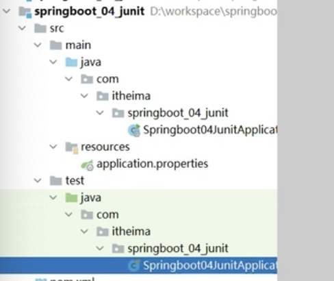

<br>

### Junit测试依赖:
该依赖是自动导入的, SpringBoot工程仍然是一个Maven工程 Maven在执行它的生命周期的过程中 有一个环节是跳不过去的

**它必须要执行测试** 否则所有的操作我们都无法预计它的正确性 所以测试相关的模块是默认导入的

```xml
<dependency>
  <groupId>org.springframework.boot</groupId>
  <artifactId>spring-boot-starter-test</artifactId>
  <scope>test</scope>
</dependency>
```

<br>

### Junit自动生成的测试类:
1. 注入我们要测试的对象
2. 执行要测试对象的方法

```java
package com.sam;

import org.junit.jupiter.api.Test;
import org.springframework.boot.test.context.SpringBootTest;

// @SpringBootTest作用: 表示该类是一个测试类, 内部支持注入对象
@SpringBootTest
class Sprintboot02JunitApplicationTests {

  @Autowired
  private BookDao bookDao

	@Test
	void contextLoads() {
    bookDao.save()
	}

}
```

<br>

### 注意:
当我们的测试类Sprintboot02JunitApplicationTests 移动位置后, 会报错

**原因:**  
当我们的测试类所处的位置 和 主启动类所处的位置 一致的使用 我们是不用管任何事情的

```s
# 主启动类
| - main
  | - java
    | - com.sam
      - 主启动类.java

# 测试类
| - test
  | - java
    | - com.sam # 测试类在com.sam包下
      - 测试类.java
```

<br>

如果 测试类所在的位置 和 主启动类 的层级不一致的时候就会出现问题, **它们的所在位置不一致**   

```s
# 主启动类
| - main
  | - java
    | - com.sam
      - 主启动类.java

# 测试类
| - test
  | - java
    | - com # 测试类在com包下
      - 测试类.java
```

<br>

**解决方式:**  
因为测试类找不到引导类了 所以我们要显式的指明引导类是谁

我们在测试类上方的 ``@SpringBootTest(classes = 填写主启动类的类名.class)`` 修改注解的属性

```java
@SpringBootTest(classes = Sprintboot02JunitApplication.class)
class Sprintboot02JunitApplicationTests {

  @Autowired
  private BookDao bookDao

	@Test
	void contextLoads() {
    bookDao.save()
	}

}
```

<br>

**原因:**  
spring整合junit的时候 它会进行两个设定
1. @RunWith(设置运行器)
2. @ContextConfiguration() 该注解的作用是指定对应的配置文件或配置类

我们的测试的整个工作, 在测试类中我们使用 @Autowired 注入的对象 是在spring容器中的

所以我们需要获取spring的容器 但是现在获取不到 因为我们没有按照要求放测试类(测试类和引导类的层级要一致) 所以获取不到spring容器

因此我们要告诉它 配置类 或者 配置文件在哪里 我们是使用该方式告诉spring的 ``@SpringBootTest(classes = Sprintboot02JunitApplication.class)``

<br>

**另一种告诉spring配置类 或 配置文件的方式:**  
@ContextConfiguration(classes = Sprintboot02JunitApplication.class)

<br><br>

# 整合: MyBatis (sql注解版)

### 整合技术的基本流程
1. 导入对应的starter(整合 mybatis就导入mybatis的starter)
```xml
 <dependency>
  <groupId>org.mybatis.spring.boot</groupId>
  <artifactId>mybatis-spring-boot-starter</artifactId>
  <version>3.0.0</version>
</dependency>

<dependency>
  <groupId>com.mysql</groupId>
  <artifactId>mysql-connector-j</artifactId>
  <scope>runtime</scope>
</dependency>
```

2. 在application配置文件中 配置要整合技术的相关配置
```s
# 数据源
spring.datasource.driver-class-name=com.mysql.cj.jdbc.Driver
spring.datasource.url=jdbc:mysql://localhost:3306/book?serverTimezone=UTC
spring.datasource.username=root
spring.datasource.password=admin666

# mybatis:
# resultType: 类型别名
mybatis.type-aliases-package=com.sam.springboot_review.bean
# 指明mapper映射文件.xml的路径
mybatis.mapper-locations=classpath:com/sam/springboot_review/mapper/*.xml
```

<br>

### 回顾MyBatis工作需要什么

1. 核心配置: 数据库连接相关信息 (连什么? 连谁? 什么权限(用户名, 密码))

2. 映射配置: sql映射(xml / 注解)

有了如上的两个东西后 mybatis才能正常的工作

<br>

### 创建模块时的要点
每勾选一个依赖 就相当于我们自己写了一个坐标是一样的

- 勾选 sql / mybatis framework
- 勾选 mysql driver

<br>

### pom.xml 依赖

**规范:**  
1. 所有springboot自带的starter的书写格式为: spring-boot-starter-xxx

2. 第三方的技术 在命名starter的时候 书写格式为: xxx-spring-boot-starter

```xml
<dependency>
  <groupId>org.springframework.boot</groupId>
  <artifactId>spring-boot-starter-web</artifactId>
</dependency>

<dependency>
  <groupId>org.mybatis.spring.boot</groupId>
  <artifactId>mybatis-spring-boot-starter</artifactId>
  <!-- 如果pom.xml文件中没有指明 parent 的话, 我们是必须要写version的 -->
  <version>3.0.0</version>
</dependency>

<dependency>
  <groupId>com.mysql</groupId>
  <artifactId>mysql-connector-j</artifactId>
  <scope>runtime</scope>
</dependency>

<dependency>
  <groupId>org.springframework.boot</groupId>
  <artifactId>spring-boot-starter-test</artifactId>
  <scope>test</scope>
</dependency>
```

<br>

### 配置mybatis
在 application.yml 配置文件中 配置数据库连接相关信息

```yml
spring:
  datasource:
    driver-class-name: com.mysql.cj.jdbc.Driver
    url: jdbc:mysql://localhost:3306/demo?serverTimezone=UTC
    username: root
```

mybatis会自动探测存在的DataSource

<br>

不用配置: 
- 类型别名
- 扫描 

等配置了, 因为springboot整合mybatis就是为了简化开发

<br>

### 测试:

**pojo:** 
```java
package com.sam.pojo;

public class User {
  private Integer id;
  private String username;
  private String password;
  private String realname;

  @Override
  public String toString() {
    return "User{" +
        "username='" + username + '\'' +
        ", password='" + password + '\'' +
        ", realname='" + realname + '\'' +
        '}';
  }

  public String getUsername() {
    return username;
  }

  public void setUsername(String username) {
    this.username = username;
  }

  public String getPassword() {
    return password;
  }

  public void setPassword(String password) {
    this.password = password;
  }

  public String getRealname() {
    return realname;
  }

  public void setRealname(String realname) {
    this.realname = realname;
  }
}

``` 

<br>

**mapper:**  
```java
package com.sam.mapper;

@Mapper
public interface UserMapper {
  @Select("select * from sys_users where id = #{id}")
  public User getById(Integer id);
}
```

<br>

**测试:**   
```java
package com.sam;

@SpringBootTest
class Springboot03MybatisApplicationTests {

  @Autowired
  private UserMapper userMapper;

  @Test
  void userMapperTest() {
    User user = userMapper.getById(2);
    System.out.println("user = " + user);
  }

}
```

<br>

### 常见问题:
我们使用的springboot版本为 2.7 以上, 这时我们配置数据库的url时 是没有添加 ?serverTimezone=UTC 参数的

当我们将 springboot版本 修改为 2.4.1 的时候, 如果我们还是不加?serverTimezone=UTC 参数 则会报如下的错误

```s
The server time zone value xxx is unrecognized ...
```

<br>

在mysql8中对应服务器的时区设定是必选的操作 这个有两种解决方案
1. 给mysql数据库设置时区
2. 在设置url的时候追加时区的参数

<br>

### 分页插件
```s
https://blog.csdn.net/weixin_43890267/article/details/91866803

https://blog.csdn.net/qq_53701704/article/details/135822449
```

<br><br>

## 整合Mybatis: @Mapper注解
我们需要在**每一个接口的上方使用** @Mapper 注解

接口多的时候 每个接口都需要加上该注解比较繁琐

<br>

### 作用
使用该注解标识后 Mybatis就会自动创建该接口的代理实现类对象 该对象是在容器中的 

这样我们就可以在Service中使用自动装配使用该Mapper接口的代理对象

<br><br>

# 整合Mybatis: (sql xml版)

### 1. pom.xml 中引入相关依赖
```xml
<?xml version="1.0" encoding="UTF-8"?>
<project xmlns="http://maven.apache.org/POM/4.0.0" xmlns:xsi="http://www.w3.org/2001/XMLSchema-instance"
         xsi:schemaLocation="http://maven.apache.org/POM/4.0.0 https://maven.apache.org/xsd/maven-4.0.0.xsd">
  <modelVersion>4.0.0</modelVersion>

  <groupId>com.sam</groupId>
  <artifactId>springboot_review_web_0421</artifactId>
  <version>0.0.1-SNAPSHOT</version>
  <packaging>war</packaging>
  <name>springboot_review_web_0421</name>

  <description>springboot_review_web_0421</description>
  <properties>
    <java.version>11</java.version>
    <project.build.sourceEncoding>UTF-8</project.build.sourceEncoding>
    <project.reporting.outputEncoding>UTF-8</project.reporting.outputEncoding>
    <spring-boot.version>2.7.6</spring-boot.version>
  </properties>

  <dependencies>
    <dependency>
      <groupId>org.springframework.boot</groupId>
      <artifactId>spring-boot-starter-web</artifactId>
    </dependency>

    <dependency>
      <groupId>org.mybatis.spring.boot</groupId>
      <artifactId>mybatis-spring-boot-starter</artifactId>
      <version>3.0.0</version>
    </dependency>

    <dependency>
      <groupId>com.mysql</groupId>
      <artifactId>mysql-connector-j</artifactId>
      <scope>runtime</scope>
    </dependency>

    <dependency>
      <groupId>org.springframework.boot</groupId>
      <artifactId>spring-boot-starter-tomcat</artifactId>
      <scope>provided</scope>
    </dependency>
    <dependency>
      <groupId>org.springframework.boot</groupId>
      <artifactId>spring-boot-starter-test</artifactId>
      <scope>test</scope>
    </dependency>
  </dependencies>

  <dependencyManagement>
    <dependencies>
      <dependency>
        <groupId>org.springframework.boot</groupId>
        <artifactId>spring-boot-dependencies</artifactId>
        <version>${spring-boot.version}</version>
        <type>pom</type>
        <scope>import</scope>
      </dependency>
    </dependencies>
  </dependencyManagement>

  <build>
    <resources>
      <resource>
        <directory>src/main/resources</directory>
        <includes>
          <include>**/*.*</include>
        </includes>
      </resource>
    </resources>

    <plugins>
      <plugin>
        <groupId>org.apache.maven.plugins</groupId>
        <artifactId>maven-compiler-plugin</artifactId>
        <version>3.8.1</version>
        <configuration>
          <source>11</source>
          <target>11</target>
          <encoding>UTF-8</encoding>
        </configuration>
      </plugin>
      <plugin>
        <groupId>org.springframework.boot</groupId>
        <artifactId>spring-boot-maven-plugin</artifactId>
        <version>${spring-boot.version}</version>
        <configuration>
          <mainClass>com.sam.springboot_review.SpringbootReviewWeb0421Application</mainClass>
          <skip>true</skip>
        </configuration>
        <executions>
          <execution>
            <id>repackage</id>
            <goals>
              <goal>repackage</goal>
            </goals>
          </execution>
        </executions>
      </plugin>
    </plugins>
  </build>

</project>
```

<br>

### 2. 配置pom.xml, 将 resources 目录下的资源编译到target文件夹中
```xml
<build>
  <resources>
    <resource>
      <directory>src/main/resources</directory>
      <includes>
        <include>**/*.*</include>
      </includes>
    </resource>
  </resources>
</build>
```

**还可以这么写**  
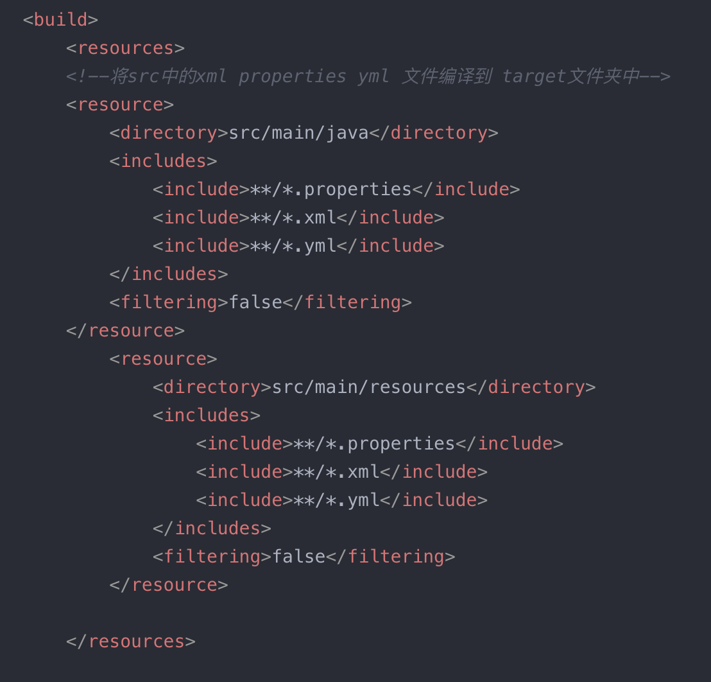

<br>

### 3. 编写 Mapper接口
使用 @Mapper 注解 进行标识
```s
| - java
  | - com.sam.springboot_review
    | - mapper
      - UserMapper
```
```java
package com.sam.springboot_review.mapper;

import com.sam.springboot_review.bean.User;
import org.apache.ibatis.annotations.Mapper;
import org.apache.ibatis.annotations.Param;
import org.apache.ibatis.annotations.Select;

@Mapper
public interface UserMapper {
  User getUser(@Param("id") Integer id);
}
```

<br>

### 4. 创建 sql 映射文件
```s
| - resources
  | - com/sam/springboot_review
    - UserMapper.xml
```
```xml
<?xml version="1.0" encoding="UTF-8" ?>
<!DOCTYPE mapper
    PUBLIC "-//mybatis.org//DTD Mapper 3.0//EN"
    "http://mybatis.org/dtd/mybatis-3-mapper.dtd">

<mapper
  namespace="com.sam.springboot_review.mapper.UserMapper"
>
  <select
    id="getUser"
    resultType="User"
  >
    select * from t_user where id = #{id}
  </select>
</mapper>
```

<br>

### 5. 配置 application.yml
```s
server.port=8080

spring.datasource.driver-class-name=com.mysql.cj.jdbc.Driver
spring.datasource.url=jdbc:mysql://localhost:3306/book?serverTimezone=UTC
spring.datasource.username=root
spring.datasource.password=admin666

# 如果不配置类型别名的话, 步骤4中的resultType位置会报错
mybatis.type-aliases-package=com.sam.springboot_review.bean

# 指明mapper映射文件的位置
mybatis.mapper-locations=classpath:com/sam/springboot_review/mapper/*.xml
```

<br>

### 6. 测试
```java
package com.sam.springboot_review;

import com.sam.springboot_review.bean.User;
import com.sam.springboot_review.mapper.UserMapper;
import org.junit.jupiter.api.Test;
import org.springframework.beans.factory.annotation.Autowired;
import org.springframework.boot.test.context.SpringBootTest;

@SpringBootTest
class SpringbootReviewWeb0421ApplicationTests {

  @Autowired
  private UserMapper userMapper;

  @Test
  void testGetUser() {
    User user = userMapper.getUser(1);
    System.out.println("user = " + user);
  }

}
```

<br>

### 扩展: @MapperScan注解

**使用位置:**  
主启动类之上, 并提供mapper接口所在的包名

<br>

**作用:**  
在主启动类上使用 @MapperScan注解后, 我们每一个mapper接口上就不用再使用 @Mapper 注解了

<br>

**格式:** 
值是数组 我们也可以指定多个包

```java
@MapperScan("mapper接口所在的包名")

@MapperScan(basePackages="com.sam.springbootmybatis.mapper")
```

<br>

**示例:**
```java
@SpringBootApplication
// 在这使用扫描Mapper接口
@MapperScan(basePackages="com.sam.springbootmybatis.mapper")
public class Application {

  public static void main(String[] args) {
    SpringApplication.run(Application.class, args);
  }

}
```

<br>

**扩展: Resoureces目录 不被识别的问题**  
Resoureces目录默认上面是有小图标的, 如果没有说明它没有被识别为一个资源文件夹

**我们在该文件夹上右键 Mark Directory as 选择 Resources Root**   

<br><br>

## Mapper接口和Mapper映射文件分开
我们上面的案例中 我们将 Mapper接口 和 Mapper的映射文件 都放在了mapper包下

```s
| - com.sam.mapper
  - StudentMapper
  - StudentMapper.xml
```

<br>

我们已经做的方式Java目录下只有Java文件 没有xml文件, 我们**希望将xml映射文件和Java文件分开存储**   

```
| - java
  | - com.sam.mapper
    - StudentMapper


| - resources
  | - mapper
    - StudentMapper.xml
```

<br>

### 方式:
1. 我们在 /Resources/mapper 目录下创建一个任意的文件夹

2. 将xml映射文件放在/Resources/mapper文件夹中

3. 告诉框架接口对应的mapper映射文件在哪, 如下

<br>

### application.properties 配置文件中指定mapper映射文件的位置
我们在配置文件中输入 mybatis. 后我们能看到很多关于mybatis的配置项


/Resources目录下的内容在编译后会在 /target/classes/下 所以mapper目录页会在classes/下

我们使用关键字 classpath: 表示类路径
```s
mybatis.mapper-locations=classpath:mapper/*.xml
```

<br>

### 扩展:
有的时候我们编译后类似 application.properties 文件并没有被编译到 target目录下

我们可以修改pom.xml的如下位置

```xml
<resources>
  <resource>
    <directory>src/main/resources</directory>
    <!-- 将resouces下的所有文件放入类路径下 -->
    <includes>
      <include>**/*.*</include>
    </includes>
  </resource>
</resources>
```

<br>

### application.properties: 配置sql日志信息
```s
# 配置mybatis的mapper映射文件的路径
mybatis.mapper-locations=classpath:mapper/*.xml

# 后面有很多选择, 我们选择一个日志输出在控制台上的
mybatis.configuration.log-impl=org.apache.ibatis.logging.stdout.StdOutImpl
```

<br><br>


# 整合: Mybatis 操作数据库
我们看看怎么让SpringBoot集成MyBatis操作数据库

<br>

## SpringBoot中使用MyBatis
SpringBoot自己提供的依赖的话, 都是以spring-boot-starter开头的

第三方依赖的话, 第三方的名字会在签名 如:
- spring-boot-starter-web
- mybatis-spring-boot-starter

<br>

我们创建新的SpringBoot项目的时候 勾选上
- web
- mysql drive
- mybatis

这样pom.xml文件中就会自动配置``<dependency>``标签了

<br>

### 1. 添加MyBatis的起步依赖
安装依赖后就可以自动完成MyBatis的配置工作了, 对象就在容器中我们就可以直接使用了
```xml
<!-- web的启动依赖 -->
<dependency>
  <groupId>org.springframework.boot</groupId>
  <artifactId>spring-boot-starter-web</artifactId>
</dependency>


<!-- MyBatis的起步依赖 -->
<dependency>
  <groupId>org.mybatis.spring.boot</groupId>
  <artifactId>mybatis-spring-boot-starter</artifactId>
  <version>2.1.4</version>
</dependency>


<!-- mysql的驱动 -->
<dependency>
  <groupId>mysql</groupId>
  <artifactId>mysql-connector-java</artifactId>
  <!-- 我们需要指定驱动 -->
  <version>5.1.37</version>
  <scope>runtime</scope>
</dependency>
```

<br>

**注意:**  
框架中默认提供的mysql驱动是8版本的
```xml
<dependency>
  <groupId>com.mysql</groupId>
  <artifactId>mysql-connector-j</artifactId>
  <scope>runtime</scope>
</dependency>
```

<br>

我现在自己换成5版本的试试, **可以**   
```xml
<dependency>
  <groupId>mysql</groupId>
  <artifactId>mysql-connector-java</artifactId>
  <version>5.1.37</version>
</dependency>
```

<br>

### 2. pom.xml指定把mapper.xml映射文件的打包到类路径中
我们以前学的是在resources目录下创建和mapper接口层级一样的xml文件存放

**1. src/main/java目录中的 **.xml 文件包含到classpath中**  
此方式的mapper.xml文件和mapper接口写在一起
```
| - java
  | - com.sam.mapper
    - StudentMapper
    - StudentMapper.xml
```

```xml
<build>
  <resources>
    <resource>
      <directory>src/main/java</directory>
      <!-- 将java目录下的任意子目录下的任意xml文件输出到target下的classes里面 -->
      <includes>
        <include>**/*.xml</include>
      </includes>
    </resource>
  </resources>
<build>
```

<br>

**2. mapper.xml文件的位置在resources目录下**  
注意此时mapper.xml文件的目录和mapper接口的目录层级要一致

```s
| - java
  | - com.sam.mapper
    - StudentMapper

| - resources
  | - com/sam/mapper
    - StudentMapper.xml
```

```xml
<build>
  <resources>
    <resource>
      <directory>src/main/resources</directory>
      <!-- 排除properties配置文件 -->
      <excludes>
        <exclude>*.properties</exclude>
      </excludes>
    </resource>
  </resources>
</build>
```

<br>

### 3. 创建数据表所对应的实体类
我们创建了一张Student表, 那么对应就应该有一个Student实体类

就是一个JavaBean, 每一个对象代表表中的一条数据

<br>

### 4. 创建Mapper接口, 创建操作数据库的方法
创建StudentMapper接口

<br>

**要点:**  
SpringBoot框架中 mapper接口上方要使用 <font color="#C2185B">@Mapper</font> 注解

告诉mybatis这是mapper接口 会自动创建此接口的代理实现类的对象

```java
@Mapper
public interface StudentMapper {
  // 根据主键获取学生对象
  public Student getStudentById(@Param("id") Integer id);
}
```

<br>

### 5. 创建Mapper接口对应的Mapper.xml文件, 写sql语句
位置:
```
| - java
  | - com.sam.mapper
    - StudentMapp
    - StudentMapp.xml
```

```xml
<?xml version="1.0" encoding="UTF-8" ?>
<!DOCTYPE mapper
    PUBLIC "-//mybatis.org//DTD Mapper 3.0//EN"
    "http://mybatis.org/dtd/mybatis-3-mapper.dtd">

<mapper
    namespace="com.sam.springbootmybatis.mapper.StudentMapper">

  <select
      id="getStudentById"
      resultType="com.sam.springbootmybatis.pojo.Student"
  >
   select * from student where id = #{id}
  </select>
</mapper>
```

<br>

### 6. 创建service层和impl, 去调用Mapper中的方法 完成操作

**接口**   
```java
public interface StudentService {
  public Student getStudentById(Integer id);
}
```

<br>

**实现类:**   
```java
@Service
public class StudentServiceImpl implements StudentService {

  // 使用Mapper对象操作数据库
  @Autowired
  StudentMapper studentMapper;

  @Override
  public Student getStudentById(Integer id) {
    return studentMapper.getStudentById(id);
  }
}

```

<br>

### 7. 创建Controller访问Service
```java
@Controller
public class StudentController {

  // 获取service对象
  @Autowired
  StudentService service;

  @GetMapping("/student/{id}")
  @ResponseBody
  public String getStudentById(@PathVariable("id") Integer id) {
    Student student = service.getStudentById(id);
    return student.toString();
  }
}
```

<br>

### 8. 在application.properties文件中配置连接数据库的信息

```s
spring.datasource.driver-class-name=com.mysql.jdbc.Driver
spring.datasource.url=jdbc:mysql://localhost:3306/spring_boot
spring.datasource.username=root
```

<br>

### 完整的pox.xml
```xml
<?xml version="1.0" encoding="UTF-8"?>
<project xmlns="http://maven.apache.org/POM/4.0.0" xmlns:xsi="http://www.w3.org/2001/XMLSchema-instance"
         xsi:schemaLocation="http://maven.apache.org/POM/4.0.0 https://maven.apache.org/xsd/maven-4.0.0.xsd">
  <modelVersion>4.0.0</modelVersion>
  <parent>
    <groupId>org.springframework.boot</groupId>
    <artifactId>spring-boot-starter-parent</artifactId>
    <version>2.7.9</version>
    <relativePath/> <!-- lookup parent from repository -->
  </parent>
  <groupId>com.sam</groupId>
  <artifactId>springboot-mybatis</artifactId>
  <version>0.0.1-SNAPSHOT</version>


  <properties>
    <java.version>1.8</java.version>
  </properties>

  <dependencies>
    <dependency>
      <groupId>org.springframework.boot</groupId>
      <artifactId>spring-boot-starter-web</artifactId>
    </dependency>
    <dependency>
      <groupId>org.mybatis.spring.boot</groupId>
      <artifactId>mybatis-spring-boot-starter</artifactId>
      <version>2.3.0</version>
    </dependency>

    <dependency>
      <groupId>mysql</groupId>
      <artifactId>mysql-connector-java</artifactId>
      <version>5.1.37</version>
    </dependency>
    <dependency>
      <groupId>org.springframework.boot</groupId>
      <artifactId>spring-boot-starter-test</artifactId>
      <scope>test</scope>
    </dependency>
  </dependencies>

  <build>
    <resources>
      <resource>
        <directory>src/main/java</directory>
        <includes>
          <include>**/*.xml</include>
        </includes>
      </resource>
    </resources>
    <plugins>
      <plugin>
        <groupId>org.springframework.boot</groupId>
        <artifactId>spring-boot-maven-plugin</artifactId>
      </plugin>
    </plugins>
  </build>

</project>

```

<br><br>

# 整合: MyBatis-Plus
正常我们要是整合一门技术 会有两步
1. 导入对应技术的starter依赖
  - 创建springboot工程的时候 可以勾选
  - 手动添加

2. 配置文件中对对应技术进行配置

<br>

但是mybatis-plus比较特殊, 它是国人开发的 所以并没有收录到springboot中

<br>

**对于这点我们有两种解决方案:**  
1. Spring Intiailzr 中选择 Custom 输入阿里云的地址 ``https://start.aliyun.com`` 但是阿里云中springboot的版本比较低

2. ``https://mvnrepository.com/`` 中搜索 mybatis-plus, 复制3.4.3版本的坐标 添加到pom.xml中

<br>

### 1. 添加 mybatis-plus坐标
```xml
<dependency>
  <groupId>com.baomidou</groupId>
  <artifactId>mybatis-plus-boot-starter</artifactId>
  <version>3.4.3</version>
</dependency>
```

<br>

### 2. 配置application文件
```yml
spring:
  datasource:
    driver-class-name: com.mysql.cj.jdbc.Driver
    url: jdbc:mysql:///demo?serverTimezone=UTC
    username: root
    password: admin666
```

<br>

### 测试:

**User实体类:**   
```java
package com.sam.pojo;

@TableName("users")
public class User {
  private Integer id;
  private String username;
  private String password;
  private String address;

  ...
}
```

<br>

**Mapper:**   
```java
package com.sam.mapper;

@Mapper
public interface UserMapper extends BaseMapper<User> {
}
```

<br>

**测试类:**  
```java
@Test
void testUserMapper() {
  User user = userMapper.selectById(1);
  System.out.println("user = " + user);
}
```

<br><br>

# 整合: Druid
druid技术也没有收录到springboot中, 所以我们没有办法在创建springboot项目的时候通过勾选的方式 将它添加到项目中

所以我们使用手动导入依赖的方式

<br>

### 1. 导入 druid依赖
我们也是在 ``https://mvnrepository.com/`` 网站中查找坐标

注意我们添加的是 druid-spring-boot-starter 的坐标
```xml
<dependency>
  <groupId>com.alibaba</groupId>
  <artifactId>druid-spring-boot-starter</artifactId>
  <version>1.2.16</version>
</dependency>
```

<br>

**druid:**  
它是数据源技术 是给我们数据库技术使用的 比如Mybatis等技术

<br>

### 2. 配置 druid的配置

**数据源的配置方式有两种:**   
1. datasource.type属性指明 druid数据源
2. datasource.druid下配置数据库的链接信息
```yml
#spring:
#  datasource:
#    driver-class-name: com.mysql.cj.jdbc.Driver
#    url: jdbc:mysql:///demo?serverTimezone=UTC
#    username: root
#    password: admin666
#    type: com.alibaba.druid.pool.DruidDataSource


# 推荐: 这样配置的就是 德鲁伊专用的配置
spring:
  datasource:
    druid:
      driver-class-name: com.mysql.cj.jdbc.Driver
      url: jdbc:mysql:///demo?serverTimezone=UTC
      username: root
      password: admin666
```

<br>

**type 和 druid配置的区别:**  
- 如果我们只导入了 druid的坐标 那么使用type的方式
- 如果我们导入了 druid-starter 那么使用druid的方式

<br>

### 测试:
**Mapper:**   
```java
package com.sam.mapper;

@Mapper
public interface UserMapper {
  @Select("select * from users where id = #{id}")
  public User getUserById(Integer id);
}
```

<br>

**测试:**   
```java
@Test
void testUserMapper() {
  User user = userMapper.getUserById(1);
  System.out.println("user = " + user);
}
```

<br>

### 扩展:
上面我们使用的是 druid数据源 但如果我们不指定数据源的话 默认为 HikariDataSource (轻量级中超快)

SpringBoot提供了三种内嵌的数据源对象供开发者选择
- HikariCP
- Tomcat提供DataSource
- Commons DBCP

<br><br>

# 整合: Redis
Redis常用作缓存使用, 它算是一个中间件也是一个独立的服务器

<br>

## Java操作Redis的常用方式
比如 用户访问会先访问Redis 如果Redis中有数据就将数据直接发给客户 如果Redis没有数据 我们再去查数据库, 这时我们就需要通过我们的Java程序来操作Redis

<br>

从数据库查询到数据后 我们通常会做两件事情
1. 将查询到的数据放在redis中
2. 将查询到的数据返回给用户

这样用户下次再访问相同的数据的时候, redis中已经都有了, 从而减轻了与数据库的交互频率

<br><br>

## 整合Redis步骤:

### 1. 添加Redis-starter依赖
可以在创建SpringBoot项目的时候勾选
- spring data reids (access+driver)

Spring 对 Redis客户端进行了整合, 在SpringBoot的项目中一般都是使用 Spring Data Redis, 它是, 同时SpringBoot项目中还提供了对应的Starter, 即: ``spring-boot-starter-data-redis``

```xml
<dependency>
  <groupId>org.springframework.boot</groupId>
  <artifactId>spring-boot-starter-data-redis</artifactId>
</dependency>
```

<br>

### 2. 配置redis项目配置
```yml
# 指定redis (ip, port, password(如果有))
spring.redis.host=localhost
spring.redis.port=6379
# spring.redis.password=


#Redis数据库索引（默认为0）
spring.redis.database= 0

#连接超时时间（毫秒）
spring.redis.timeout=1800000

#连接池最大连接数（使用负值表示没有限制）
spring.redis.lettuce.pool.max-active=20

#最大阻塞等待时间(负数表示没限制)
spring.redis.lettuce.pool.max-wait=-1

#连接池中的最大空闲连接
spring.redis.lettuce.pool.max-idle=5

#连接池中的最小空闲连接
spring.redis.lettuce.pool.min-idle=0


# yml配置: 注意缩进
spring:
  application:
    name: springdataredis_demo

  # redis相关的配置
  redis:
    host: localhost
    port: 6379
    # password: 123456
    database: 0 # 操作0号数据库
    jedis:
      # 配置Redis连接池
      pool:
        max-active: 8 # 最大连接数
        max-wait: 1ms # 连接池最大阻塞等待监视
        max-idle: 4 # 连接池中的最大空闲连接
        min-idle: 0 # 连接池中的最小空闲连接
```

<br><br>

## 操作Redis的客户端
Redis的Java客户端有很多 官方推荐的有三种

1. Jedis

2. Lettuce: 它是一个线程安全的第三方的库, 这个客户端在国外使用的很多

3. Redisson

<br><br>

## 使用 Jedis 操作 Redis

### 导入依赖:
```xml
<dependency>
  <groupId>redis.clients</groupId>
  <artifactId>jedis</artifactId>
  <version>2.8.0</version>
</dependency>
```

<br>

### 使用Jedis操作Redis的步骤
1. 获取链接
2. 执行操作
3. 关闭连接

<br>

### 演示:
我们创建一个 Maven 工程, 来演示使用 Jedis 操作 Redis

```java
import redis.clients.jedis.Jedis;

@Test
public void testRedis() {
  // 1. 获取链接
  /*
    实现化 jedis 
    
    参数: 
      1. host
      2. port
  */
  // 参数: host Redis服务器的ip地址, port
  Jedis jedis = new Jedis("localhost", 6379);

  // 2. 执行操作
  jedis.set("java-username", "sam");
  String str = jedis.get("java-username");
  System.out.println("str = " + str);

  // 3. 关闭连接
  jedis.close();
}
```

<br><br>

## 使用 RedisTemplate 操作 Redis
SpringDataRedis是在Springboot项目中使用的 用来简化Redis的操作

当我们导入了redis-starter之后 我们在项目中就可以直接使用 RedisTemplate(StringRedisTemplate) 对象了

<br>

SpringBoot中默认使用的不是Jedis而是**lettuce客户端**

**也就是说我们在程序中需要使用RedisTemplate类的方法操作redis**, 它实际上调用的就是 lettuce客户端 中的方法

<br>

### RedisTemplate | StringRedisTemplate
它们是Spring框架提供的工具类, 处理和Redis交互

它针对jedis客户端中大量的api进行了归类封装 将同一类型操作封装为**operation接口**, 具体分类如下

1. ValueOperations: 简单 k-v 操作
2. SetOperations: set类型数据操作
3. ZSetOperations: zset类型数据操作
4. HashOperations: 针对map类型的数据操作
5. ListOperations: 针对list类型的数据操作

<br>

**RedisTemplate:**  
它有泛型 如果我们没有传入泛型则默认泛型的位置是Object  
它是以对象为操作的基本单元

通过它操作redis key部分会被序列化

<br>

**StringRedisTemplate (可能会常用些):**  
以字符串为单位的操作的基本单元

我们通过redis客户端(小黑屏)操作redis数据库的时候 其实就是以字符串为单位的操作的基本单元

如果我们要想和小黑瓶客户端保持一样的操作 我们要使用StringRedisTemplate **这样不会有key被序列化的问题**

<br>

### RedisTemplate 的使用方式: 
**1. 通过自动注入的方式获取 redisTemplate**   
```java
@Resource
RedisTemplate redisTemplate
```

<br>

**2. 通过 redisTemplate 对象调用如下的方法 返回操作对应数据类型的接口的实现类对象**   
redisTemplate是用来操作各种数据类型 所以我们拿到该对象后 第一件事情就是告诉它我们要操作哪种数据类型

我们会调用下面的方法 返回要操作的类型

<br>

1. redisTemplate.opsForValue(): 返回的对象是操作 String
2. redisTemplate.opsForList(): 返回的对象是操作 List
3. redisTemplate.opsForSet(): 返回的对象是操作 Set
4. redisTemplate.opsForZSet(): 返回的对象是操作 Zset
5. redisTemplate.opsForHash(): 返回的对象是操作 Hash

<br>

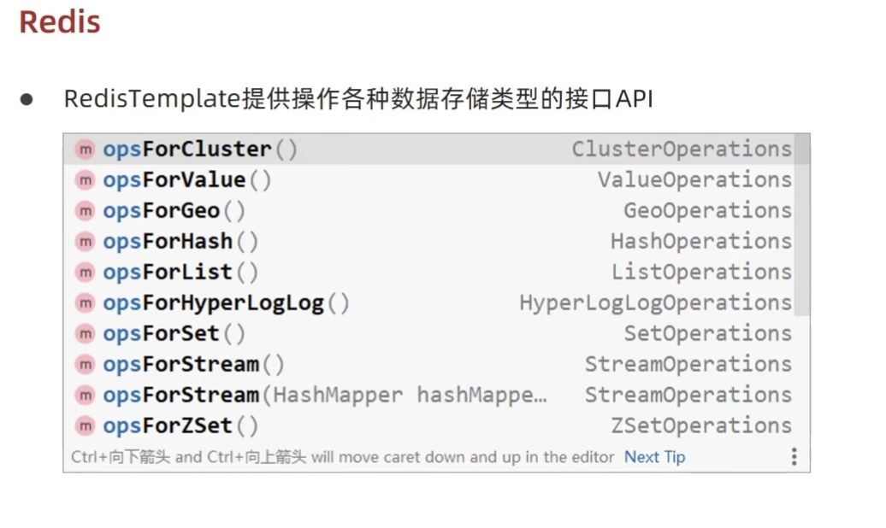

<br>

### 操作Redis
**简单的演示:**  
我们在测试类下做演示
```java
package com.sam;

import org.junit.Test;
import org.junit.runner.RunWith;
import org.springframework.beans.factory.annotation.Autowired;
import org.springframework.boot.test.context.SpringBootTest;
import org.springframework.data.redis.connection.DataType;
import org.springframework.data.redis.core.*;
import org.springframework.test.context.junit4.SpringRunner;

import java.util.List;
import java.util.Set;
import java.util.concurrent.TimeUnit;

@SpringBootTest
// 为了让测试在Spring容器环境下执行
@RunWith(SpringRunner.class)
public class RedisTest {

  // 报红了也可以使用
  // 1. 注入 redisTemplate
  @Autowired
  private RedisTemplate redisTemplate;

  @Test
  public void testRedis() {

    // 2. 获取操作String类型的对象
    ValueOperations so = redisTemplate.opsForValue();

    // 3. 通过对象来操作redis

    /*
      字符串类型相关: 存储key 并设置过期时间
      重载set方法, 参数
        1. key
        2. value
        3. long timeout
        4. TimeUnit unit 单位
    */
    so.set("name", "erin", 10L, TimeUnit.SECONDS);

    /*
      字符串类型相关: setnx
      返回值 boolean, 当成功存储的时候返回true
    */
    Boolean age = so.setIfAbsent("age", "18");


    /*
      Hash类型相关:
    */
    HashOperations ho = redisTemplate.opsForHash();
    // 存
    ho.put("user", "name", "sam");
    ho.put("user", "age", "18");

    // 取
    String name = (String) ho.get("user", "name");
    System.out.println("name = " + name);

    // 获取 hash 中的所有 key
    Set userKyes = ho.keys("user");
    for (Object userKye : userKyes) {
      System.out.println("userKye = " + userKye);
    }

    // 获取 hash 中的所有 vlaue
    List<String> userVals = ho.values("user");


    /*
      List类型相关:
    */
    ListOperations lo = redisTemplate.opsForList();
    // 存一个值:
    lo.leftPush("arr", 0);

    // 存多个值: 元素存到 redis 的 list 之后 会转成字符串
    lo.leftPushAll("arr", 1,2,3,4,5);

    // 取:
    List arr = lo.range("arr", 0, -1);

    // 弹栈:
    String el = (String) lo.leftPop("arr");

    // 获取列表长度, 将Long修改为int, 循环弹栈
    int length = lo.size("arr").intValue();
    for(int i = 0; i < length; i++) {
      String val = (String) lo.leftPop("arr");
      System.out.println("val = " + val);
    }


    /*
      Set类型相关:
    */
    SetOperations setOperations = redisTemplate.opsForSet();
    // 存
    setOperations.add("myset", "1", "a", "c");
    // 取
    Set myset = setOperations.members("myset");
    // 删
    setOperations.remove("myset", "a", "b");


    /*
      ZSet类型相关: 通过分数由小到大进行排序
    */
    ZSetOperations zSetOperations = redisTemplate.opsForZSet();
    // 存: 分值是double类型
    zSetOperations.add("myzset", "a", 10.0);

    // 取
    Set myzset = zSetOperations.range("myzset", 0, -1);

    // 修改分数
    zSetOperations.incrementScore("myzset", "a", 20.0);

    // 删除成员
    zSetOperations.remove("myzset", "a");


    /*
    通用操作:
    */
    // 获取redis中所有的key
    Set keys = redisTemplate.keys("*");

    // 判断某个key是否存在
    Boolean flag = redisTemplate.hasKey("myzset");

    // 删除某个key
    redisTemplate.delete("myzset");

    // 获取指定的key对应value的数据类型: 
    DataType myzset1 = redisTemplate.type("myzset");
    System.out.println("myzset1.name() = " + myzset1.name());

  }
}
```

<br>

**我们在Controller接口中做演示:**   
```java
package com.sam.redis.controller;

@RestController
public class RedisController {
  /*
    注入RedisTemplate
    RedisTemplate可以指定泛型 名字固定！！

    泛型情况:
      1. RedisTemplate<String, String>
      2. RedisTemplate<String, Object>
      3. 不写
  */
  @Resource
  private RedisTemplate redisTemplate;


  // 添加数据到Redis
  @PostMapping("/redis/addString")
  public String addToRedis(String key, String value) {

    /*
      RedisTemplate 的使用方式:
        使用它操作Redis中不同的数据类型时, 需要调用opsXxx()方法返回一个操作指定数据类型的对象后 才可以操作该类型的对象
        1. opsForValue(): 返回的对象是操作 String
        2. opsForList(): 返回的对象是操作 List
        3. opsForSet(): 返回的对象是操作 Set
        4. opsForZSet(): 返回的对象是操作 Zset
        4. opsForHash(): 返回的对象是操作 Hash
    */

    // 获取操作String类型的对象
    ValueOperations valueOperations = redisTemplate.opsForValue();

    // 向Redis中保存一组kv
    valueOperations.set(key, value);

    // 获取所有的keys
    Set keys = redisTemplate.keys("*");

    keys.forEach(System.out::println);

    return "向Redis添加String类型的数据";
  }

  // 从Redis中获取数据
  @GetMapping("/redis/getString")
  public String getData(String key) {

    // 存取数据要通过redisTemplate获取存取数据的对象
    ValueOperations valueOperations = redisTemplate.opsForValue();

    Object o = valueOperations.get(key);
    System.out.println(o);

    return "key: " + key + ", value: " + o;
  }

  @GetMapping("/home")
  public String home() {
    return "hello";
  }
}
```

<br>

### 注意: key被序列化的问题
我们在使用 redisTemplate 往 redis 中添加数据的时候, 它会对key做序列化处理

如我们往redis中存了一个 key 为: java-redis 它的序列化结果为: ``\xac\xed\x00\x05t\x00\njava-redis``

<br>

这时我们在 redis客户端里面, 直接get未序列化的key的时候 是获取不到对应的值的
```s
# 这样获取不到值
get java-redis
```

<br>

如果我们不想将 key 序列化后的结果 存到redis中 **<font color="#C2185B">就要额外的添加配置类</font>**   

<br>

Java中的 redisTemplate 会对

- key
- value

都做序列化处理, 一般我们会在配置类中只对key做配置, value的部分一般不做 因为在java中获取对应的值的时候会自动做返序列化处理

<br>

### 创建: RedisConfig配置类
用于解决Java中往Reids中存储数据时, 会将key进行序列化后存储到Reids中的问题 

在配置类中我们主要是对 RedisTemplate 做设置, 设置它对应的数据结构的序列化处理器

这样后续我们在使用 RedisTemplate 的时候, 获取的就是我们设置序列化处理后的对象

<br>

**黑马视频SpringBoot项目中使用的简单配置类:**   
```java
package com.itheima.config;

import org.springframework.cache.annotation.CachingConfigurerSupport;
import org.springframework.context.annotation.Bean;
import org.springframework.context.annotation.Configuration;
import org.springframework.data.redis.connection.RedisConnectionFactory;
import org.springframework.data.redis.core.RedisTemplate;
import org.springframework.data.redis.serializer.StringRedisSerializer;

/**   
 * Redis配置类
 */

@Configuration
public class RedisConfig extends CachingConfigurerSupport {

  @Bean
  public RedisTemplate<Object, Object> redisTemplate(RedisConnectionFactory connectionFactory) {

    RedisTemplate<Object, Object> redisTemplate = new RedisTemplate<>();

    //默认的Key序列化器为: JdkSerializationRedisSerializer 修改为如下
    redisTemplate.setKeySerializer(new StringRedisSerializer());

    // 针对hash结构 设置hash的序列化器
    redisTemplate.setHashKeySerializer(new StringRedisSerializer());

    redisTemplate.setConnectionFactory(connectionFactory);

    return redisTemplate;
  }

}
```

<br>

**Redis6教学视频中使用的配置类:**   
```java
package com.atguigu.redis_springboot.config;

import com.fasterxml.jackson.annotation.JsonAutoDetect;
import com.fasterxml.jackson.annotation.PropertyAccessor;
import com.fasterxml.jackson.databind.ObjectMapper;
import org.springframework.cache.CacheManager;
import org.springframework.cache.annotation.CachingConfigurerSupport;
import org.springframework.cache.annotation.EnableCaching;
import org.springframework.context.annotation.Bean;
import org.springframework.context.annotation.Configuration;
import org.springframework.data.redis.cache.RedisCacheConfiguration;
import org.springframework.data.redis.cache.RedisCacheManager;
import org.springframework.data.redis.connection.RedisConnectionFactory;
import org.springframework.data.redis.core.RedisTemplate;
import org.springframework.data.redis.serializer.Jackson2JsonRedisSerializer;
import org.springframework.data.redis.serializer.RedisSerializationContext;
import org.springframework.data.redis.serializer.RedisSerializer;
import org.springframework.data.redis.serializer.StringRedisSerializer;

import java.time.Duration;

@EnableCaching
@Configuration
public class RedisConfig extends CachingConfigurerSupport {

  @Bean
  public RedisTemplate<String, Object> redisTemplate(RedisConnectionFactory factory) {

    RedisTemplate<String, Object> template = new RedisTemplate<>();

    RedisSerializer<String> redisSerializer = new StringRedisSerializer();

    Jackson2JsonRedisSerializer jackson2JsonRedisSerializer = new Jackson2JsonRedisSerializer(Object.class);

    ObjectMapper om = new ObjectMapper();
    om.setVisibility(PropertyAccessor.ALL, JsonAutoDetect.Visibility.ANY);

    om.enableDefaultTyping(ObjectMapper.DefaultTyping.NON_FINAL);

    jackson2JsonRedisSerializer.setObjectMapper(om);

    template.setConnectionFactory(factory);
//key序列化方式
    template.setKeySerializer(redisSerializer);
//value序列化
    template.setValueSerializer(jackson2JsonRedisSerializer);
//value hashmap序列化
    template.setHashValueSerializer(jackson2JsonRedisSerializer);
    return template;
  }

  @Bean
  public CacheManager cacheManager(RedisConnectionFactory factory) {
    RedisSerializer<String> redisSerializer = new StringRedisSerializer();
    Jackson2JsonRedisSerializer jackson2JsonRedisSerializer = new Jackson2JsonRedisSerializer(Object.class);
    //解决查询缓存转换异常的问题
    ObjectMapper om = new ObjectMapper();
    om.setVisibility(PropertyAccessor.ALL, JsonAutoDetect.Visibility.ANY);
    om.enableDefaultTyping(ObjectMapper.DefaultTyping.NON_FINAL);
    jackson2JsonRedisSerializer.setObjectMapper(om);
    // 配置序列化（解决乱码的问题）,过期时间600秒
    RedisCacheConfiguration config = RedisCacheConfiguration.defaultCacheConfig()
      .entryTtl(Duration.ofSeconds(600))
      .serializeKeysWith(RedisSerializationContext.SerializationPair.fromSerializer(redisSerializer))
      .serializeValuesWith(RedisSerializationContext.SerializationPair.fromSerializer(jackson2JsonRedisSerializer))
      .disableCachingNullValues();
    RedisCacheManager cacheManager = RedisCacheManager.builder(factory)
      .cacheDefaults(config)
      .build();
    return cacheManager;
  }
}
```

<br>

**三更视频中使用的配置类:**  
```java
@Configuration
public class MyRedisConfig {
  @Resource
  private RedisConnectionFactory factory;

  @Bean
  public RedisTemplate redisTemplate(){
    RedisTemplate<String, Object> redisTemplate = new RedisTemplate<>();
    redisTemplate.setConnectionFactory(factory);
    redisTemplate.setKeySerializer(new StringRedisSerializer());

    Jackson2JsonRedisSerializer<Object> serializer = new Jackson2JsonRedisSerializer<>(Object.class);
    redisTemplate.setValueSerializer(serializer);


    // 这个部分针对不同的数据类型 分别做了序列化处理
    ObjectMapper om = new ObjectMapper();
    om.setVisibility(PropertyAccessor.ALL, JsonAutoDetect.Visibility.ANY);
    om.setDateFormat(new SimpleDateFormat("yyyy-MM-dd HH:mm:ss"));
    om.setTimeZone(TimeZone.getDefault());
    om.configure(MapperFeature.USE_ANNOTATIONS, false);
    om.configure(DeserializationFeature.FAIL_ON_UNKNOWN_PROPERTIES, false);
    om.configure(SerializationFeature.FAIL_ON_EMPTY_BEANS, false);
    om.activateDefaultTyping(LaissezFaireSubTypeValidator.instance ,ObjectMapper.DefaultTyping.NON_FINAL, JsonTypeInfo.As.PROPERTY);
    om.setSerializationInclusion(JsonInclude.Include.NON_NULL);
    serializer.setObjectMapper(om);

    return redisTemplate;
  }
}
```

<br><br>

## 序列化相关扩展:

### StringRedisTemplate 序列化: 
这里说的也是如下两个对象的使用上的区别
- StringRedisTemplate
- RedisTemplate

<br>

### StringRedisTemplate
它会将 key 和 value 都作为String处理, 使用的是String的序列化 它的可读性比较好

**它使用的是字符串的序列化**   

我们要是想存Java对象 使用RedisTemplate比较好

<br>

### RedisTemplate
它会将 key 和 value 经过了序列化存到redis中, key 和 value因为经过了序列化 所以在redis中查看的结果会难以阅读, 不能直接识别

**它默认使用的是JDK的序列化机制**   

<br>

### 序列化:
把对象转换为可传输的字节序列过程

<br>

### 反序列化:
把字节序列还原为对象的过程

<br>

### 为什么需要序列化
**序列化最终的目的是为了对象可以跨平台存储和进行网络传输** 而我们践行跨平台存储和网络传输的方式就是IO

而我们的IO支持的数据格式就是字节数组, 我们必须把对象转成字节数组的时候就指定一种规则(序列化)

那么我们从IO流里面读初数据的时候再以这种规则把对象还原回来(反序列化)

<br>

**序列化的方式:**  
序列化值是一种拆装组装对象的规则, 那么这种规则肯定也可能有多种多样 比如现在常见的序列化方式有
- JDK(不支持跨语言, 比如redis里面存的/xa c/x00, Java语言序列化的对象只能由Java语言解开)
- JSON
- XML
- Hessian
- Kryo(不支持跨语言, 性能最好)
- Thrift
- Protofbuff

<br>

**Java的序列化:**  
把Java对象转为byte[], 二进制数据

<br>

**Json序列化:**  
Json序列化功能将对象转换JSON格式或从Json格式转换为对象 "{"name": "sam"}"

<br>

### 扩展: IDEA 给JavaBean生成对应的版本号
我们要将一个JavaBean 进行序列化操作的时候 需要如下两步
1. 首先 JavaBean 要实现 Serializable接口
2. 类中要定义 serialVersionUID属性

<br>

这个serialVersionUID属性可以由IDEA来生成, 我们需要如下的配置IDEA

我们在IDEA中 ctrl + , 然后找到 /Editor/Inspections/ 面板

然后搜索 serializable 找到 ``Serializable class without 'serialVersionUID'`` 后面打上对号

<br>

然后在类的上面右键 选择, ``Add "serialVersionUID" field``

<br><br>

## 修改 RedisTemplate 的序列化机制
当我们添加 spring-boot-starter-data-redis 依赖后Spring就会创建 RedisTemplate对象 并放入容器中

注意我们能使用 RedisTemplate对象 就是因为我们加入了依赖框架自动创建的对象

<br>

### 设置RedisTemplate的序列化机制
我们可以设置key的序列化 也可以设置value的序列化, 也可以同时设置

通过 redisTemplate对象的api

<br>

### **<font color="#C2185B">redisTemplate.set(Key|value)Serializer(RedisSerializer<?> serializer)</font>**   
单独设置key或者value的序列化

```java
// 设置key为字符串的序列化格式
redisTemplate.setKeySerializer(new StringRedisSerializer())


// 如果value的值是String: 设置value为字符串的序列化格式
redisTemplate.setValueSerializer(new StringRedisSerializer())

// 如果value的值是Object: 设置value为Json的序列化格式
redisTemplate.setValueSerializer(new Jackson2JsonRedisSerializer(Student.class))


// 序列化后再传值
redisTemplate.opsForValue().set(key, value);
```

<br>

### **<font color="#C2185B">redisTemplate.setHashKeySerializer(RedisSerializer<?> hashKeySerializer)</font>**   
设置map的序列化

<br>

### 扩展:
如果我们要序列化的对象 仅仅是个简单的Json对象 那么只设置setValueSerializer的序列化就可以了  
但是如果json对象中还有日期 集合等数据格式的话 要调用对不同格式的序列化处理

<br><br>

## FastJson
它是阿里巴巴的开源JSON解析库

它可以解析JSON格式的字符串 支持将JavaBean序列化为JSON字符串 也可以从JSON字符串反序列化为JavaBean

<br>

### 添加依赖
```xml
<dependency>
  <groupId>com.alibaba</groupId>
  <artifactId>fastjson</artifactId>
  <version>1.2.51</version>
</dependency>
```

<br>

### 使用方式:
- ``parseObject(String text, Class<T> clazz)``
- ``parseArray(String text, Class<T> clazz)``
- ``toJSONString(Object object)``

```java
// 序列化
String text = JSON.toJSONString(obj);


// 反序列化成对象 数据以key-value形式出现, 实际是map
Student student =  JSON.parseObject(text, Student.class)
```

<br>

**<font color="#C2185B">toJSONString(Object object, [第二个参数])</font>**  
正常我们传递第一个参数就可以, 但它还有第二个参数  
第二个参数的类型是SerializerFeature枚举类型的只 它用于控制序列化的时候一些特性

- SerializerFeature.PrettyFormat: 输出格式化的 JSON 字符串, 使其更易读

- SerializerFeature.WriteMapNullValue: 序列化时输出 null 值属性

- SerializerFeature.WriteNullStringAsEmpty: 序列化时将 null 值属性输出为空字符串

- SerializerFeature.WriteNullListAsEmpty: 序列化时将 null 值属性输出为空数组

- SerializerFeature.WriteNullBooleanAsFalse: 序列化时将 null 值属性输出为 false

- SerializerFeature.WriteBigDecimalAsPlain: 序列化 BigDecimal 时输出数字, 而不是科学计数法

```java
List<Book> list = bookService.list();
String jsonString = JSON.toJSONString(list, SerializerFeature.PrettyFormat);
```

<br><br>

# 整合: MongoDB
```s
https://www.bilibili.com/video/BV15b4y1a7yG/?p=96&spm_id_from=pageDriver&vd_source=66d9d28ceb1490c7b37726323336322b
```

<br><br>

# 整合: ES(Elasticsearch 分布式全文搜索引擎)
有点像搜索引擎

```s
https://www.bilibili.com/video/BV15b4y1a7yG/?p=100&spm_id_from=pageDriver&vd_source=66d9d28ceb1490c7b37726323336322b
```

<br>

它会将数据库中字段的信息 进行拆分 如 spring实战第5版 拆分成
- spring
- 实战
- 第5版

上面的动作叫做分词 当我们之后使用拆分后的词进行搜索的时候 它可以得到对应数据的id 和 它还会加载当前id指向行中的**部分数据**

在展示数据到页面的时候 会将id和对应的部分数据 读取出来进行展示

<br>

**总结:**  
它是根据 分词 查id 再根据 id 查询部分数据

<br><br>

# 整合: 缓存
```s
bilibili.com/video/BV15b4y1a7yG/?p=107&spm_id_from=pageDriver&vd_source=66d9d28ceb1490c7b37726323336322b
```

<br><br>

# 整合: 定时任务
```s
https://www.bilibili.com/video/BV15b4y1a7yG/?p=121&spm_id_from=pageDriver&vd_source=66d9d28ceb1490c7b37726323336322b
```

<br><br>

# 整合: JavaMail
```s
https://www.bilibili.com/video/BV15b4y1a7yG/?p=123&spm_id_from=pageDriver&vd_source=66d9d28ceb1490c7b37726323336322b
```

<br><br>

# 整合: JSP
使用SpringBoot的时候并不推荐使用JSP, 它默认也不支持JSP, 我们需要经过一系列的配置后才可以使用

<br>

### 1. 添加依赖
处理JSP的依赖, 它负责编译JSP文件

如果我们需要使用servlet, jsp, jstl等功能 我们要添加对应的依赖

```xml
<!-- 处理jsp的依赖 -->
<dependency>
  <groupId>org.apache.tomcat.embed</groupId>
  <artifactId>tomcat-embed-jasper</artifactId>
</dependency>

<dependency>
  <groupId>javax.servlet</groupId>
  <artifactId>javax.servlet-api</artifactId>
</dependency>

<dependency>
  <groupId>javax.servlet.jsp</groupId>
  <artifactId>javax.servlet.jsp-api</artifactId>
  <version>2.3.1</version>
</dependency>

<dependency>
  <groupId>javax.servlet</groupId>
 <artifactId>jstl</artifactId>
</dependency>
```

<br>

### 2. 创建一个存放jsp的目录 一般叫做webapp
我们现在的项目是普通的一个Java项目, jsp需要存放在webapp目录下

所以我们手动创建了webapp目录, 但是这时webapp只是一个普通的目标 我们要改变该目录的性质, 让其变成web资源目录

```s
| - ctrl + ;
  | - 找到模块下的web目录 点击web 选择 webapp
    | - 在web resource directories 的位置, 选择webapp作为web资源目录
```

当我们的webapp文件夹上**有蓝色的小点时** 它才是web资源目录

<br>

### (不用) 3. 在 pom.xml 的 build 标签中要配置以下信息
指定jsp文件的编译后存放目录

SpringBoot 要求 jsp 文件必须编译到指定的 **<font color="#C2185B">META-INF/resources</font>** 目录下才能访问, 否则访问不到

```xml
<build>

<resources>
  <resource>
    <!--jsp原来的目录-->
    <directory>src/main/webapp</directory>
    <!--
      指定编译到META-INF/resource, 该目录不能随便写
    -->
    <targetPath>META-INF/resources</targetPath>

    <!--
      指定要处理的目录和文件
        把哪些文件 和 任意子目录中的文件编译到 META-INF/resources下
    -->
    <includes>
      <include>**/*.*</include>
    </includes>
  </resource>
</resources>

</build>
```

<br>

### 3. jsp存放路径
```s
/webapp/WEB-INF/index.jsp
```

<br>

### 4. 创建Controller 访问jsp页面
```java
@Controller
@RequestMapping("/")
public class HomeController {
  // 请求方法上具体写上 请求地址
  @GetMapping("/")
  public ModelAndView home() {
    return new ModelAndView("/index");
  }
}
```

<br>

### 5. 在application.properties文件中 配置视图解析器
因为我们现在使用的视图技术是jsp
```s
# 配置端口号
server.port=8081

# 配置视图解析器
# 配置前缀: /表示 src/main/webapp
spring.mvc.view.prefix=/
# 配置后缀: 
spring.mvc.view.suffix=.jsp


# 测试成功版
spring.mvc.view.prefix=/WEB-INF
spring.mvc.view.suffix=.jsp
```

<br><br>

# 整合: SSMP
Spring + SpringMVC + MybatisPlus 我们来完成一个模块的增删改查

<br><br>

## Demo部分的介绍:
1. 实体类 - 使用 Lombok
2. Dao - 使用 MybatisPlus
3. Controller - 基于Restful 使用 postman
4. View - 使用 Vue + ElementUI
5. 项目的异常处理 按条件查询 等

<br><br>

## SSMP的准备工作:

### pom.xml 依赖部分
```xml
<dependencies>

  <dependency>
    <groupId>com.baomidou</groupId>
    <artifactId>mybatis-plus-boot-starter</artifactId>
    <version>3.4.3</version>
  </dependency>

  <dependency>
    <groupId>com.alibaba</groupId>
    <artifactId>druid-spring-boot-starter</artifactId>
    <version>1.2.16</version>
  </dependency>

  <dependency>
    <groupId>org.springframework.boot</groupId>
    <artifactId>spring-boot-starter-web</artifactId>
  </dependency>

  <dependency>
    <groupId>com.mysql</groupId>
    <artifactId>mysql-connector-j</artifactId>
    <scope>runtime</scope>
  </dependency>

  <!-- lombok系列注解依赖 -->
  <dependency>
    <groupId>org.projectlombok</groupId>
    <artifactId>lombok</artifactId>
  </dependency>

  <dependency>
    <groupId>org.springframework.boot</groupId>
    <artifactId>spring-boot-starter-test</artifactId>
    <scope>test</scope>
  </dependency>
</dependencies>
```

<br>

### Lombok系列注解: SSMP 实体类部分:
使用 Lombok 的注解来快速开发pojo

**@Data:**  
它唯独没有提供构造方法, 一般使用@Data就可以了 它包括了
- get set
- toString
- hashCode
- equals

```java
package com.sam.pojo;

import lombok.Data;

@Data
public class Book {
  private Integer id;
  private String type;
  private String name;
  private String descript;
}
```

<br>

### SSMP 配置文件: 
1. 配置表格前缀 不然跟实体类对不上
2. 配置id生成策略
3. 配置日志功能

```yml
spring:
  datasource:
    druid:
      driver-class-name: com.mysql.cj.jdbc.Driver
      url: jdbc:mysql:///demo?serverTimezone=UTC
      username: root
      password: admin666

# 配置表前缀 & 数据库表中数据的自增策略 & 开启mp的日志
mybatis-plus:
  global-config:
    db-config:
      table-prefix: tb1_
      id-type: auto
  # 日志输出到控制台
  configuration:
    log-impl: org.apache.ibatis.logging.stdout.StdOutImpl
```

<br>

### SSMP Mapper层:
```java
package com.sam;

import com.baomidou.mybatisplus.core.mapper.BaseMapper;
import com.sam.pojo.Book;
import org.apache.ibatis.annotations.Mapper;

@Mapper
public interface BookMapper extends BaseMapper<Book> {
}
```

<br>

### SSMP测试: Mapper层
```java
@Test
void bookMapperTest() {
  Book book = bookMapper.selectById(1);
  System.out.println("book = " + book);
}
```

<br>

### SSMP Mybatis-Plus分页的使用方式:
分页操作就是在原始查询操作的后面 拼接上 limit 关键字

```sql
select * from books limit 0, 5
```

但是往sql的后面追加 limit的操作 mp并不是默认支持的, 我们要手动的告诉mp我们是否要使用 追加 limit的分页功能

<br>

我们分页功能需要追加的是 limit部分, 回头还有可能别的功能追加别的sql语句 

所以mp在对于不同的功能追加的不同的sql语句的处理方式就是使用 拦截器 实现的, 所以分页功能要想使用的话必须使用 mp提供的拦截器

<br>

**使用分页功能的步骤:**   

1. com.sam.config包下创建 MpConfig配置类 创建MybatisPlus拦截器对象 并将其交由Spring来管理
```java
package com.sam.config;

/*
  不管我们做什么 我们做的还是Spring的程序 我们配置的所有东西都要受Spring管理
  Spring就是用来管Bean的

  所以我们在该类中就要使用Spring管理第三方Bean的方式 将Bean初始化出来 并加载给Spring环境
*/
@Configuration // 该注解标识的配置类 主启动类所在的包和子包会被扫描到
public class MPConfig {

  // 创建 MybatisPlus 拦截器 并将该对象交由Spring管理
  @Bean
  public MybatisPlusInterceptor mybatisPlusInterceptor() {

    MybatisPlusInterceptor mybatisPlusInterceptor = new MybatisPlusInterceptor();

    // 添加分页的拦截器
    mybatisPlusInterceptor.addInnerInterceptor(new PaginationInnerInterceptor());
    
    return mybatisPlusInterceptor;
  }
}

```

<br>

2. 使用mybatis-plus提供的API进行分页查询
```java
@Test
public void pageTest() {

  Page page = new Page(1, 5);
  // 查询到的数据会被封装到 page 对象中
  bookMapper.selectPage(page, null);

  System.out.println("page = " + page);
}
```

<br>

**Page对象的属性:**   
- List``<T>`` getRecords(): 所以分页数据

- boolean hasNext(): 是否有下一页

- boolean hasPrevious(): 是否有上一页

- long getPages(): 获取总页数

- long getTotal(): 获取总记录数

- long getSize(): 获取每页显示的条数

- long getCurrent(): 获取当前页的页码

- Page``<T>`` addOrder(OrderItem ... items)
- String countId()
- Long maxLimit()
- boolean optimaizeCountSql()

<br>

### SSMP 业务层开发:
Service层接口定义与数据层接口定义具有较大的区别 不要混用

- 业务层的接口关注的是业务名称
- 数据层的接口关注的是数据库相关的操作

比如 同一个业务逻辑在两层中的方法名是不一样的

- 业务层中的方法名为 login(String username, String password)

- 而到了数据层中则为 selectByUsernameAndPassword(String username, String password)

到了数据层中它会定义为让所有开发人员看一眼就明白的操作数据库的方法

<br>

**业务层中方法名的定义方式:**  
- 如果是业务方法 就根据它的业务名称来定义
- 如果是非业务方法 比如基本的增删改查 就直接 save等名字就可以了

<br>

**注意:**  
业务层的方法必须全部进行测试 写测试用例

<br>

**BookService:**  

MybatisPlus提供业务层通用的接口 ``IService<T>`` 与 业务层通用的实现类 ``ServiceImpl<M, T>``

在通用类基础上 定义自己的方法时, 注意不要让自己的方法覆盖掉mybatis给我们提供的方法

```java
package com.sam.service;

import com.baomidou.mybatisplus.extension.service.IService;
import com.sam.pojo.Book;

import java.util.List;

public interface BookService extends IService<Book> {

}

```

<br>

**BookServiceImpl:**  
我们使用 mybatis-puls 为我们提供的api才实现业务层的逻辑

```java
package com.sam.service.impl;

import com.baomidou.mybatisplus.extension.service.impl.ServiceImpl;
import com.sam.mapper.BookMapper;
import com.sam.pojo.Book;
import com.sam.service.BookService;
import org.springframework.beans.factory.annotation.Autowired;
import org.springframework.stereotype.Service;

import java.util.List;

@Service
public class BookServiceImpl extends ServiceImpl<BookMapper, Book> implements BookService {

}
```

<br>

**测试:**  
```java
// 查询操作
@Test
public void testGetById() {
  Book book = bookService.getById(1);
  System.out.println("book = " + book);
}


// 修改操作
@Test
public void testUpdate() {
  Book book = new Book(11, null, null, "一部超级恐怖的动画片啊啊啊啊！");
  boolean b = bookService.updateById(book);
  System.out.println("b = " + b);
}


// 分页操作
@Test
public void testPage() {
  Page page = new Page(1, 5);
  bookService.page(page);
  System.out.println("page = " + page.getRecords());
}
```

<br>

### SSMP 表现层开发:
这个章节我们完成
- 基于Restful进行表现层接口开发
- 使用 Postman测试表现层接口功能

```java
package com.sam.controller;

import com.sam.pojo.Book;
import com.sam.service.BookService;
import org.springframework.beans.factory.annotation.Autowired;
import org.springframework.web.bind.annotation.*;

import java.util.List;

@RestController
@RequestMapping("/books")
public class BookController {

  @Autowired
  private BookService bookService;

  @GetMapping
  public List<Book> list() {
    List<Book> list = bookService.list();
    return list;
  }

  @PostMapping
  public Boolean save(@RequestBody Book book) {
    return bookService.save(book);
  }

  @PutMapping
  public Boolean update(@RequestBody Book book) {
    return bookService.updateById(book);
  }

  @DeleteMapping("/{id}")
  public Boolean delete(@PathVariable Integer id) {
    return bookService.removeById(id);
  }

  @GetMapping("/{id}")
  public Book getById(@PathVariable Integer id) {
    return bookService.getById(id);
  }

  // 分页接口
  @GetMapping("/{pageNum}/{pageSize}")
  public IPage<Book> page(@PathVariable Integer pageNum, @PathVariable Integer pageSize) {
    Page page = new Page(pageNum, pageSize);
    bookService.page(page, null);
    return page;
  }
}
```

<br><br>

## SSMP 封装Result类, 进行返回数据的一致性处理:
我们发现一个问题, 我们上面在BookController接口中开发了一系列的接口 但每个接口的返回值都是不一样的
- Page
- List
- Boolean

这样前台在接受参数的时候 就会很难受 乱七八糟的, 因为不同数据的解析方式是不一样的 

所以我们最好将数据封装到一个Result类中做数据格式的统一格式处理

<br>

### Result类中应该有哪些属性?

**1. data属性:**  
用于存放后台返回的数据

<br>

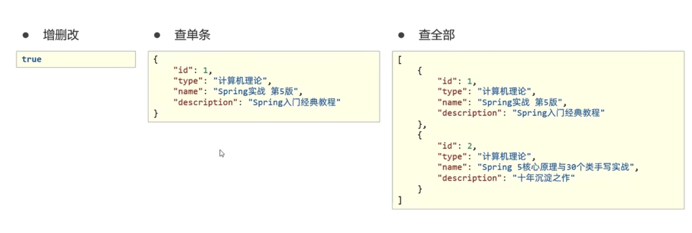

<br>

我们将数据封装到 data属性 中, 这样数据都统一了 前端都是从data属性中 取数据

<br>

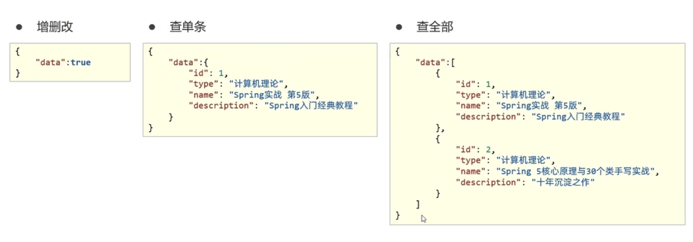

<br>

**2. flag / code:**  
用于通知前端查询数据库的情况 是成功 还是失败

<br>

**问题: 这个null是不是后台返回的数据?**  
```java
{
  data: null
}
```

<br>

可能是 可能不是

- 如果我们查询id不存在的数据 这时候返回 null 是ok的
- 如果我们在查询的过程中抛出异常 catch中返回null, 这是我们return null 这个null就不是数据了 仅仅是查询失败了 我们返回了一个null

<br>

这是我们就可以通过 flag 属性来进行标识
```java
// true表示查询操作是成功的 data: null 表示没有查询到数据
{
  flag: true,
  data: null
}


// false表示查询操作中抛异常了, 这是一个失败的查询
{
  flag: false,
  data: null
}
```

<br>

**设计返回结果的模型类:**  
用于后台 和 前端进行数据格式的统一, **也成为前后端数据协议**   

```java
package com.sam.common;

import lombok.AllArgsConstructor;
import lombok.Data;
import lombok.NoArgsConstructor;

@Data
@NoArgsConstructor
@AllArgsConstructor
public class Result {

  private Boolean flag;
  // 就定义Object更加的通用
  private Object data;

  public Result(Boolean flag) {
    this.flag = flag;
  }
  
}

```

<br>

**修改Contoller:**   
```java
package com.sam.controller;

@RestController
@RequestMapping("/books")
public class BookController {

  @Autowired
  private BookService bookService;

  @GetMapping
  public Result list() {
    return new Result(true, bookService.list());
  }

  @PostMapping
  public Result save(@RequestBody Book book) {
    return new Result(bookService.save(book));
  }

  @PutMapping
  public Result update(@RequestBody Book book) {
    return new Result(bookService.updateById(book));
  }

  @DeleteMapping("/{id}")
  public Result delete(@PathVariable Integer id) {
    return new Result(bookService.removeById(id));
  }

  @GetMapping("/{id}")
  public Result getById(@PathVariable Integer id) {
    return new Result(true, bookService.getById(id));
  }

  @GetMapping("/{pageNum}/{pageSize}")
  public Result page(@PathVariable Integer pageNum, @PathVariable Integer pageSize) {
    Page page = new Page(pageNum, pageSize);
    return new Result(true, bookService.page(page, null));
  }
}
```

<br>

### SSMP 前端页面
**前端页面的存放位置:**  
我们会将前端页面放在 /resources/static 目录中
```s
# 要点: 出问题了 先使用 maven clean package 重新编译一遍
| - resources
  | - static
    | - css
    | - js
    | - pages
      - books.html
    | - plugin  # element ui相关的东西
```

<br>

**添加逻辑:**  
```js
//添加
async handleAdd () {
  const { data: res } = await axios({
    url: "/books",
    method: "post",
    data: this.formData
  })

  // 判断添加操作是否成功, 如果未成功 用户输入的消息不能删
  if(res.flag) {
    this.dialogFormVisible = false
    this.$message.success("添加成功")
  } else {
    this.$message.error("添加失败")
  }

  // 不管添加操作是否成功 都需要刷新列表
  this.getAll()
},
```

<br>

**删除逻辑:**  
```js
// 删除
handleDelete(row) {

  // 删除前的提示操作
  this.$confirm("此操作永久删除当前信息 是否继续", "提示", {type: "info"})
    .then(async () => {
      const { data: res } = await axios({
        url: `/books/${row.id}`,
        method: "delete"
      })

      if(res.flag) {
        this.$message.success("删除成功")
      } else {
        this.$message.error("删除失败")
      }

      this.getAll()
    })
    .catch(() => {
      this.$message.info("取消操作")
    })
},
```

<br>

**修改逻辑:**  
这里可以打开两个页面
- a页面 删除id为1的数据
- b页面 删除id为1的数据 -- 这时b页面会出现问题

这里我们可以判断后台返回的 flag 如果b页面删除了一个a页面已经删除的数据 则 flag 为false

所以我们要判断 flag 看看该操作是否成功 给用户对应的反馈
```js
//弹出编辑窗口
async handleUpdate(row) {
  // 点击 编辑 按钮 请求该行数据 填充到 弹出层中
  const { data: res } = await axios({
    url: `/books/${row.id}`, 
  })
  // 当请求成功 且 data不等于null
  if(res.flag && res.data) {
    this.formData = res.data
  } else {
    this.$message.error("数据同步失败 自动刷新")
  }

  // 不管成功还是失败都要刷新数据
  this.getAll()
  this.dialogFormVisible4Edit = true
},

//修改
async handleEdit() {
  // 点击 修改确定 才发送修改的请求
  const { data: res } = await axios({
    url: `/books`,
    method: "put",
    data: this.formData
  })

  if(res.flag) {
    this.$message.success("修改成功")
    this.dialogFormVisible4Edit = false
  } else {
    this.$message.error("修改失败")
  }

  this.getAll()
},
```

<br>

### SSMP 异常处理:
我们上面开发都是基于一切都正常的情况 但是在真实开发中可能会出现各种问题 比如我们请求数据库 数据库服务器超时

最终数据库肯定会抛出一个异常的

<br>

**问题:**  
我们定义了 Result通用的结果类, 里面封装了请求成功时的数据格式

<br>

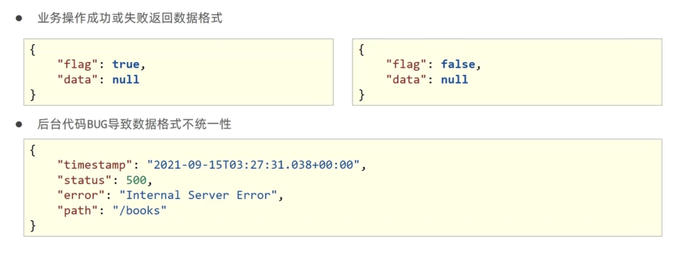

<br>

但是当我们的后台抛出异常的时候 它返回的数据格式可能会如下
```java
{
  "timestamp": "2021-09-15T03:27:31",
  "status": 500,
  "error": "Internal Server Error",
  "path": "/books"
}
```

<br>

这样的格式的数据 最好也统一起来 这样前端处理起来会比较容易, 也就是尽管后台出现异常了 **我们也要保证数据格式的统一**   

<br>

**解决方式:**  
对所有的异常进行统一格式的处理, **在SpringMVC中给我们提供了专门的异常处理器**   

```java
package com.sam.common;

import org.springframework.web.bind.annotation.ControllerAdvice;
import org.springframework.web.bind.annotation.ExceptionHandler;

/*
  ProjectExceptionAdvice:
    作用:
      作为springmvc的异常处理器(service mapper层的异常最终都会抛到controller层)
      所以我们在表现层做异常处理就可以了
*/

// 将异常处理器定义为 Controller层的异常处理器  @RestControllerAdvice 和 @ControllerAdvice 一致, 只不过多了 ResponseBody 的功能
@ControllerAdvice
public class ProjectExceptionAdvice {

  // 拦截所有的异常信息
  @ExceptionHandler
  // 自定义方法中会有默认参数 就是 Exception (它是拦截到的异常对象)
  public Result doException(Exception ex) {
    // 抛异常的时候 异常需要照样的打印
    ex.printStackTrace();

    return new Result(false, "服务器故障 请联系管理员");
  }
}

```

<br>

### SSMP 分页逻辑:
```js
//列表 (分页查询)
async getAll() {
  const { data: res } = await axios({
    url: `/books/${this.pagination.currentPage}/${this.pagination.pageSize}`,
    method: "get"
  })

/*
{
  "flag": true,
  "data": {
    "records": [数据],
    "total": 12,
    "size": 10,
    "current": 1,
    "orders": [],
    "optimizeCountSql": true,
    "searchCount": true,
    "countId": null,
    "maxLimit": null,
    "pages": 2
  },
  "msg": null
  }
*/
if(res.flag) {
  this.dataList = res.data.records
  this.pagination.currentPage = res.data.current
  this.pagination.pageSize = res.data.size
  this.pagination.total = res.data.total
} else {
  this.dataList = []
  this.pagination.currentPage = 1
  this.pagination.pageSize = 5
  this.pagination.total = 0
}
},

//切换页码
handleCurrentChange(currentPage) {
  // 修改完页码值后 执行查询
  this.pagination.currentPage = currentPage
  this.getAll()
},
```

<br>

### SSMP 分页bug
**描述:**  
当表格中有3页的时候 我们删除最后一页的数据时 页面会停留在最后一页 且没有数据

因为数据总页数就是2, 但是我们非要看第3页 所以出现了这样的问题

<br>

**解决方式: (该方式还是有问题比如并发量特别大的时候, 直接返回第一页也行)**  
我们在 controller 中进行处理

```java
@GetMapping("/{pageNum}/{pageSize}")
public Result page(@PathVariable Integer pageNum, @PathVariable Integer pageSize) {

  Page page = null;
  page = new Page(pageNum, pageSize);
  bookService.page(page, null);

  // 如果 当前页码值 > 总页码值 那么重新执行查询操作时 使用最大页码值作为当前页码值
  if(pageNum > page.getPages()) {
    page = new Page(page.getPages(), pageSize);
    // 当符合条件的时候让查询重新执行一次
    page = bookService.page(page, null);
  }

  return new Result(true, page);
}
```

<br>

### SSMP 按条件查询
按条件查询的方式 就是在查询的时候 将条件也带到后台就可以了

也就是在做条件查询的时候 将条件当做分页查询中需要携带的数据就可以了

<br>

**Controller代码:**  
最好放在 service 层来处理
```java
@GetMapping("/{pageNum}/{pageSize}")
public Result page(
    @PathVariable Integer pageNum,
    @PathVariable Integer pageSize,
    Book book
) {

  Page page = null;
  page = new Page(pageNum, pageSize);
  LambdaQueryWrapper<Book> queryWrapper = new LambdaQueryWrapper<Book>();
  queryWrapper.like(Strings.isNotEmpty(book.getName()) ,Book::getName, book.getName());
  queryWrapper.like(Strings.isNotEmpty(book.getType()) ,Book::getType, book.getType());
  queryWrapper.like(Strings.isNotEmpty(book.getDescript()) ,Book::getDescript, book.getDescript());

  bookService.page(page, queryWrapper);

  // 如果 当前页码值 > 总页码值 那么重新执行查询操作时 使用最大页码值作为当前页码值
  if(pageNum > page.getPages()) {
    page = new Page(page.getPages(), pageSize);
    queryWrapper = new LambdaQueryWrapper<Book>();
    queryWrapper.like(Strings.isNotEmpty(book.getName()) ,Book::getName, book.getName());
    queryWrapper.like(Strings.isNotEmpty(book.getType()) ,Book::getType, book.getType());
    queryWrapper.like(Strings.isNotEmpty(book.getDescript()) ,Book::getDescript, book.getDescript());
    // 当符合条件的时候让查询重新执行一次
    page = bookService.page(page, queryWrapper);
  }
  return new Result(true, page);
}
```

<br>

**前端代码:**  
```js
//列表 (分页查询)
async getAll() {

  // 组织参数 拼接url请求地址进行传递
  const param = `?type=${this.pagination.type}&name=${this.pagination.name}&descript=${this.pagination.descript}`

  const { data: res } = await axios({
      url: `/books/${this.pagination.currentPage}/${this.pagination.pageSize}${param}`,
      method: "get"
  })

  if(res.flag) {
    this.dataList = res.data.records
    this.pagination.currentPage = res.data.current
    this.pagination.pageSize = res.data.size
    this.pagination.total = res.data.total
  } else {
    this.dataList = []
    this.pagination.currentPage = 1
    this.pagination.pageSize = 5
    this.pagination.total = 0
  }
},
```

<br><br>

## CommanLineRunner 接口
开发中可能会有这样的情况, 需要在容器启动后执行一些内容, 比如读取配置文件 数据库连接之类的 

SpringBoot给我们提供了两个接口来帮助我们实现这种需求

- CommandLineRunner
- ApplicationRunner

它们的**执行时机为容器启动完成的时候**, 这两个接口中有一个run()方法 我们只需要实现这个方法即可

<br>

**<font color="#C2185B">当容器对象创建好后 会自动执行run()方法中的逻辑</font>**, 这两个接口使用哪个都可以

这里的容器指的就是IOC容器

<br>

### CommandLineRunner接口
```java
@FunctionalInterface
public interface CommandLineRunner {
  void run(String ... args) throws Exception;
}
```

<br>

### ApplicationRunner接口
```java
@FunctionalInterface
public interface ApplicationRunner {
  void run(ApplicationArguments args) throws Exception;
}
```

<br>

### 两个接口的区别
ApplicationRunner 中的 run方法的参数为 ApplicationArguments

CommandLineRunner 中的run方法的参数为 String数组

<br>


### CommandLineRunner 使用方式:
1. 入口启动类实现CommandLineRunner接口 实现run()方法

2. 输出顺序为: 当IOC容器创建好后紧接着就是执行抽象方法run()中的逻辑, 最后才是容器对象创建之后
```
容器对象创建之前
接口中的run()方法中的逻辑
容器对象创建之后
```

```java
@SpringBootApplication
public class Application implements CommandLineRunner {

  // 自动注入
  @Resource
  private HelloService hellService;


  public static void main(String[] args) {

    System.out.println("容器对象创建之前");
    // 创建容器对象
    ConfigurableApplicationContext IOC = SpringApplication.run(Application.class, args);
    System.out.println("容器对象创建之后");
  }


  @Override
  // args参数就是main()方法中的args
  public void run(String... args) throws Exception {
    System.out.println("我是容器对象创建好后执行的方法, 比如读取文件 读取数据库等操作");

    // 调用service对象的方法
    hellService.sayHello();
  }
}
```

<br>

因为 抽象方法run()是在容器创建之后执行的 所以在run()方法中是可以获取到IOC容器中的对象的

<br><br>

# SpringBoot: 拦截器
SpringMVC中我们讲过, 它可以拦截对Controller的请求

框架中有系统的拦截器, 我们还可以自定义拦截器, 实现对请求的预先处理

SpringMVC中的拦截器是拦截控制器方法的 它会在控制前方法的之前 之后 和 渲染视图后执行对应的逻辑

<br><br>

## 自定义拦截器的实现 (配置类的使用)

### 1. 创建拦截器类, 实现HandlerInterceptor接口
该类中用于定义拦截器的处理逻辑

创建类实现SpringMVC框架中的 HandlerInterceptor接口

- preHandle
- postHandle
- afterCompletion

<br>

比如我们可以使用 preHandle **来实现对请求的拦截和处理** 它的返回值为boolean
- true: 通过拦截 请求可以被Controller处理
- false: 请求截断

<br>

```s
com.sam.springbootenvironment.interceptor.LoginInterceptor
```

```java
public class LoginInterceptor implements HandlerInterceptor {
  // 重写 preHandle
  @Override
  public boolean preHandle(HttpServletRequest request, HttpServletResponse response, Object handler) throws Exception {
    System.out.println("拦截登录请求");
    return true;
  }
}
```

<br>

### 2. 创建配置类, 将拦截器类注册到容器中: @Configuration
这里我们使用的方式类似我们在SpringMVC中接触到的配置类一样

<br>

**1. 创建一个配置类, 让其实现 WebMvcConfigurer 接口**   
WebMvcConfigurer接口中有很多跟SpringMVC相关的功能

比如之前在SpringMVC中要是注册拦截器需要写xml配置文件, 现在是将xml文件的配置移到了 WebMvcConfigurer 接口的方法中

**注意:**  
因为是配置类 所以 **<font color="#C2185B">要加上 @Configuration 注解</font>**   

<br>

**接口中的方法**   
- addInterceptors(): 添加拦截器对象的
- addResourceHandlers(): **处理静态资源的, 比如处理静态资源存放目录的**   
- addViewControllers(): 添加视图控制器
- extendHandlerExceptionResolvers(): 异常解析器

<br>

**2. 配置拦截器, 重写addInterceptors()方法** 
利用该方法将拦截器进行注册, 这样框架就知道有拦截器了

<br>

**registry身上的api:**  
- addPathPatterns(string ... patterns): 设置拦截路径 参数是一个数组
- excludePathPatterns(tring ... patterns): 不拦截谁
- order(int order): 多个拦截器时, 指定优先级

<br>

com.sam.springbootenvironment.config;
```java
// 配置类要加上该注解
@Configuration
public class JavaConfig implements WebMvcConfigurer {
  @Override
  public void addInterceptors(InterceptorRegistry registry) {
    // 创建一个拦截器对象
    LoginInterceptor loginInterceptor = new LoginInterceptor();

    // 注册该拦截器对象 并指定拦截路径
    registry.addInterceptor(loginInterceptor).addPathPatterns("/login");
  }
}
```

<br>

**注意:**  
这里创建拦截器对象只能用new创建, 不能使用@Component 和 @Resource 注解和自动装配

因为@Resource只能修饰成员变量(或构造方法 或 set方法) 这里要么写在方法外用注解注入, 要么写在方法内用new创建

<br>

### 处理静态资源存放目录
一般情况下 我们的静态资源必须要放在如下的目录下
- static
- templates

如果静态资源不在这两个目录下就会报错 404, 这里我们也可以通过配置类来解决这个问题

<br>

### 解决方式:
我们要**通过配置类的方式 解决静态资源的映射问题**   

告诉我们的mvc框架, backend 和 front 目录下存放的是静态资源

设置静态资源映射 我们通过浏览器发送的请求 比如我们请求的是 /backend/index.html 它就会映射到 /backend目录下的index.html
```java
package com.sam.reggie.config;

import lombok.extern.slf4j.Slf4j;
import org.springframework.context.annotation.Configuration;
import org.springframework.web.servlet.config.annotation.ResourceHandlerRegistry;
import org.springframework.web.servlet.config.annotation.WebMvcConfigurationSupport;
import org.springframework.web.servlet.config.annotation.WebMvcConfigurer;

@Slf4j
@Configuration
public class WebMvcConfig implements WebMvcConfigurer {
  @Override
  public void addResourceHandlers(ResourceHandlerRegistry registry) {
    log.info("开始进行静态资源映射");
    // 设置 请求资源 映射到 哪个目录下 addResourceHandler资源处理器, 主要路径中 backend 就会映射到
    registry.addResourceHandler("/backend/**").addResourceLocations("classpath:/backend/");
    registry.addResourceHandler("/front/**").addResourceLocations("classpath:/front/");
  }
}
```

<br>

1. 我们实现addResourceHandlers()方法 通过该方法来设置 请求资源 映射到 哪个目录下
2. registry.addResourceHandler("/backend/**"): 如果请求路径中含有 backend 则映射到 指定的目录
3. addResourceLocations("classpath:/backend/"): 映射到classpath下的某个目录


<br><br>

# SpringBoot: Servlet
在SpringBoot中使用servlet对象

<br><br>

## 使用步骤
1. 创建Servlet类, 创建类继承HttpServlet
2. 注册Servlet, 让框架找到Servlet

<br><br>

### 1. 创建Servlet类

```java
public class MyServlet extends HttpServlet {

  @Override
  protected void doGet(HttpServletRequest req, HttpServletResponse resp) throws ServletException, IOException {
    doPost(req, resp);
  }

  @Override
  protected void doPost(HttpServletRequest req, HttpServletResponse resp) throws ServletException, IOException {

    // 设置响应数据编码格式
    // resp.setContentType("text/html;charset=utf-8");

    // resp.getWriter().write("hi, servlet");
    PrintWriter out = resp.getWriter();
    out.println("hi, servlet");
    out.flush();
    out.close();
  }
}
```

<br>

### 2. 注册Servlet, 创建配置类
servlet要想能被访问 必须让框架能够找到servlet对象, 所以我们要注册servlet

1. 创建配置类, 使用@Configuration
2. 将servlet对象放入ServletRegistrationBean对象(承装servlet的容器), 再将ServletRegistrationBean对象交由IOC容器管理(@Bean + 方法返回值)

<br>

**<font color="#C2185B">new ServletRegistrationBean(servlet, url-pattern)</font>**  
它是用来承装servlet的容器

它有两个构造方法, 无参和二参

<br>

**参数:**  
1. servlet对象
2. 访问servlet的地址

<br>

```java
@Configuration
public class JavaConfig implements WebMvcConfigurer {

  // 定义方法, 注册servlet对象, 使用@Bean哦
  @Bean
  public ServletRegistrationBean servletRegistrationBean() {

    // 使用有参构造的方式:
    // 创建servlet的容器 将servlet 和 访问servlet的地址放进去
    ServletRegistrationBean registrationBean = new ServletRegistrationBean(new MyServlet(), "/myservlet");

    // 返回该对象 交由IOC容器管理
    return registrationBean;


    --- 

    // 使用无参构造的方式:
    ServletRegistrationBean registrationBean = new ServletRegistrationBean();

    registrationBean.set(new MyServlet());

    // <url-pattern> 一样的作用
    registrationBean.addUrlMappings("/login", "/test");
  }
}
```

<br><br>

# SpringBoot: Filter
它的使用方式和Servlet十分的类似

请求会先经过过滤器 我们可以对请求的参数 属性 响应等做一些逻辑处理, 该过滤器是servlet规范中的过滤器

<br>

### 使用场景:
在过滤器中处理字符编码 (SpringBoot的项目中默认响应中文就是utf-8)

<br>

## 实现方式
1. 创建Filter对象, 创建一个类实现Filter接口
2. 创建配置类, 使用@Configuration
3. 将filter对象放入FilterRegistrationBean对象(承装servlet的容器), 再将FilterRegistrationBean对象交由IOC容器管理(@Bean + 方法返回值)

<br>

### 1. 创建Filter对象
注意我们选择的包
```java
public class MyFilter implements Filter {
  @Override
  public void doFilter(ServletRequest servletRequest, ServletResponse servletResponse, FilterChain filterChain) throws IOException, ServletException {

    System.out.println("执行了 myFilter");

    // 放行
    filterChain.doFilter(servletRequest, servletResponse);
  }
}
```

<br>

### 2. 注册Filter, 创建配置类
1. 创建配置类, 使用@Configuration
2. 将filter对象放入ServletRegistrationBean对象(承装servlet的容器), 再将ServletRegistrationBean对象交由IOC容器管理(@Bean + 方法返回值)

<br>

**<font color="#C2185B">new FilterRegistrationBean()</font>**  
它是用来承装filter的容器

我们使用无参的

<br>

**方法:**  
1. registrationBean.setFilter()
2. registrationBean.addUrlPatterns()

```java
@Configuration
public class JavaConfig implements WebMvcConfigurer {

  // 将过滤器的容器交由ioc管理 注意@Bean和方法的返回值
  @Bean
  public FilterRegistrationBean filterRegistrationBean() {

    // 创建过滤器的容器
    FilterRegistrationBean registrationBean = new FilterRegistrationBean();


    // 添加过滤器 和 拦截路径
    registrationBean.setFilter(new MyFilter());
    registrationBean.addUrlPatterns("/user/*");

    return registrationBean;
  }
}

```

<br>

**测试:**  
```java
@Controller
public class FilterController {

  @RequestMapping("/user/account")
  @ResponseBody
  public String userAccount() {
    return "user/account";
  }
}
```

<br><br>

## 字符集过滤器的应用
我们在SpringMVC中我们也会在web.xml文件配置CharacterEncodingFilter编码的过滤器 用于处理请求和响应的编码格式

<br>

**响应体的默认编码格式:**  
ISO-8859-1

<br>

**场景回顾:**  
当我们使用servlet的时候, 想在服务器向浏览器响应中文数据的时候, 如果不设置编码格式 响应回去的中文会出现乱码的问题

1. 通过res.setContentType()来设置响应体的编码格式
2. 通过过滤器来解决响应和请求的编码问题

<br>

而我们上面说的SpringMVC中的**CharacterEncodingFilter过滤器是SpringMVC框架中提供的**   

<br>

### CharacterEncodingFilter过滤器中的属性
1. String encoding: 当前使用的编码方式
2. boolean forceRequestEncoding: 默认值 false
3. boolean forceResponseEncoding: 默认值 false

<br>

### 注册CharacterEncodingFilter
我们需要使用框架提供的CharacterEncodingFilter过滤器来解决请求和响应的编码问题

因为该过滤器是框架给我们提供的所以我们只需要考虑怎么注册该过滤器就可以

<br>

**注册的步骤:**  
和注册我们自定义的过滤器步骤一样

**<font color="#C2185B">1. application配置文件中设置</font>**  
在SpringBoot中默认已经配置了CharacterEncodingFilter默认使用的ISO-8859-1, 所以设置false关闭框架使用的编码格式
```s
server.servlet.encoding.enabled=false
```

<br>

2. 使用@Configuration注解, 创建JavaConfig类

<br>

3. 将filterRegistrationBean对象放入到IOC容器中, 需要利用
  - @Bean + 自定义方法 + 返回值指定为filterRegistrationBean对象
  - filterRegistrationBean对象是过滤器的容器
  - 创建CharacterEncodingFilter对象, 该类是框架提供好的, 直接new就可以

```java
@Configuration
public class JavaConfig implements WebMvcConfigurer {

  @Bean
  public FilterRegistrationBean filterRegistrationBean() {
    FilterRegistrationBean filterRegistrationBean = new FilterRegistrationBean();
    
    // 创建过滤器对象: 使用框架中的过滤器类
    CharacterEncodingFilter filter = new CharacterEncodingFilter();

    // 配置过滤器: 指定使用的编码方法
    filter.setEncoding("utf-8");

    // 配置过滤器: 指定请求和响应都使用utf-8
    filter.setForceEncoding(true);
      

    // 注册过滤器
    filterRegistrationBean.setFilter(filter);
    // 指定过滤器的过滤地址
    filterRegistrationBean.addUrlPatterns("/*");
    
    return filterRegistrationBean;
  }
}
```

<br><br>

## application配置文件中设置编码格式
上面我们使用的是通过配置类配置过滤器的方式 来设置编码格式

在SpringBoot中可以通过application配置文件的方式配置编码格式

```s
server.servlet.encoding.enabled=true
server.servlet.encoding.charset=utf-8

# 请求和响应都使用utf-8
server.servlet.encoding.force=true
```

<br><br>

# SpringBoot: 事务

## 回顾: Sring框架中的事务

### 1. 管理事务的对象: 事务管理器(接口, 接口有很多的实现类)  
使用JDBC或Mybatis访问数据库, 使用的事务管理器: DataSourceTransactionManager

<br>

### 2. 声明式事务: 已在xml配置文件或使用注解说明事物控制的内容  
控制事物的3个方面: 隔离级别, 传播行为, 超时时间

<br>

### 3. 事务处理的方式:
1. Spring框架中的　``@Transactional``
2. aspectj框架可以在xml配置文件中, 声明事务控制的内容

<br><br>

## SpringBoot: 使用事务方式1
SpringBoot中我们使用事务的时候, Spring的两种使用事务的方式都可以使用 

需要做如下的两个步骤

<br>

### 1. 在业务方法的上面使用 @Transactional
加入注解后 方法就具有事务的功能了

<br>

### 2. 在住启动类的上方使用 @EnableTransactionManagement  
步骤2不加事务功能也会开启, 老师推荐加上, 加上就清晰


<br><br>

## @Transactional注解方式事务测试: Mybatis逆向工程
我们要使用Mybatis逆向工程需要在pom.xml中配置插件

<br>

### 在pom.xml中配置mybatis逆向功能
我们这个Demo会使用Mybatis的逆向工程的功能

该插件需要 GeneratorMapper.xml 配置文件, 该配置文件在项目的根目录下, 和pom.xml平级

```xml
<build>

  <!--处理资源目录-->
  <resources>
    <resource>
      <directory>src/main/resources</directory>
      <includes>
        <include>**/*.*</include>
      </includes>
    </resource>
  </resources>


  <plugins>
    <!--mybatis逆向工程插件-->
    <plugin>
      <groupId>org.mybatis.generator</groupId>
      <artifactId>mybatis-generator-maven-plugin</artifactId>
      <!-- 弹幕说遇到问题可以降低版本 -->
      <version>1.3.6</version>
      <configuration>
        <!--
          配置文件的位置: 在项目的根目录下, 和src平级的
        -->
        <configurationFile>GeneratorMapper.xml</configurationFile>
        <verbose>true</verbose>
        <overwrite>true</overwrite>
      </configuration>
    </plugin>

    <plugin>
      <groupId>org.springframework.boot</groupId>
      <artifactId>spring-boot-maven-plugin</artifactId>
    </plugin>
  </plugins>
</build>
```

<br>

**GeneratorMapper.xml**   
```xml
<?xml version="1.0" encoding="UTF-8"?>
<!DOCTYPE generatorConfiguration
        PUBLIC "-//mybatis.org//DTD MyBatis Generator Configuration 1.0//EN"
        "http://mybatis.org/dtd/mybatis-generator-config_1_0.dtd">

<generatorConfiguration>

    <!-- 
      location: 
        指定mysql驱动.jar在本地的位置, 我们可以从本机的maven仓库中找
    -->
    <classPathEntry location="D:\tools\mysql-connector-java-8.0.22.jar"/>

    <!-- 
      配置table表信息内容体
        targetRuntime指定采用MyBatis3的版本 
    -->
    <context id="tables" targetRuntime="MyBatis3">

        <!-- 抑制生成注释, 由于生成的注释都是英文的, 可以不让它生成 -->
        <commentGenerator>
            <property name="suppressAllComments" value="true" />
        </commentGenerator>

        <!-- 配置数据库连接信息 -->
        <jdbcConnection driverClass="com.mysql.cj.jdbc.Driver"
                        connectionURL="jdbc:mysql://localhost:3306/springdb?useUnicode=true&amp;characterEncoding=UTF-8&amp;serverTimezone=GMT%2B8"
                        userId="root"
                        password="123">
        </jdbcConnection>

        <!-- 
          生成pojo类:

            targetPackage: 实体类的包名

            targetProject: 当前要生成到哪个项目中, 生成到当前工程的src下的main下的java
        -->
        <javaModelGenerator
           targetPackage="com.sam.pojo"
                            
          targetProject="D:\course\25-SpringBoot\springboot-prj\019-springboot-transactional\src\main\java">
            <property name="enableSubPackages" value="false" />
            <property name="trimStrings" value="false" />
        </javaModelGenerator>

        <!-- 
          生成MyBatis的Mapper.xml文件
          
          targetPackage指定mapper.xml文件的包名
          targetProject指定生成的mapper.xml放在eclipse的哪个工程下面 
        -->
        <sqlMapGenerator 
          targetPackage="com.atguigu.mybatis.mapper" 
          targetProject="src/main/resources">
            <property name="enableSubPackages" value="false" />
        </sqlMapGenerator>

        <!-- 生成MyBatis的Mapper接口类文件,targetPackage指定Mapper接口类的包名,  targetProject指定生成的Mapper接口放在eclipse的哪个工程下面 -->
        <javaClientGenerator type="XMLMAPPER" targetPackage="com.bjpowernode.dao" targetProject="src/main/java">
            <property name="enableSubPackages" value="false" />
        </javaClientGenerator>

        <!-- 数据库表名及对应的Java模型类名 -->
        <table tableName="student" domainObjectName="Student"
               enableCountByExample="false"
               enableUpdateByExample="false"
               enableDeleteByExample="false"
               enableSelectByExample="false"
               selectByExampleQueryId="false"/>


    </context>

</generatorConfiguration>
```

<br>

### 配置 application.properties
```s
# 设置端口
server.port=9002

# 设置工程路径
server.servlet.context-path=/mytrans

# 配置数据源连接信息, &可能要换成对应的实体符号
spring.datasource.driver-class-name=com.mysql.cj.jdbc.Driver
spring.datasource.url=jdbc:mysql://localhost:3306/springdb?useUnicode=true&characterEncoding=UTF-8&serverTimezone=GMT%2B8
spring.datasource.username=root
spring.datasource.password=123


# 配置mybatis
mybatis.mapper-locations=classpath:mapper/*.xml

# 开启sql日志
mybatis.configuration.log-impl=org.apache.ibatis.logging.stdout.StdOutImpl
```

<br>

### 业务层的方法中添加事务 @Transactional
默认情况下只要我们的sql语句执行完毕了, 事务就会提交, 我们下面的方法中模拟算术异常 当有异常的时候该事物应该会回滚

```java
@Service
public class StudentServiceImpl { 

  @Resource
  private StudentMapper mapper;

  // 该方法使用事务管理
  @Transactional
  public int addStudent(Student student) {

    System.out.println("业务方法addStudent")

    int rows = mapper.insert(student)

    System.out.println("执行sql")

    // 模拟异常: 目的回滚事务
    int m = 10 / 0;

    return rows
  }
}
```

<br>

**@Transactional:**  
当我们不设置该注解的属性时
- 隔离级别: 使用数据库默认的
- 传播行为: required
- 超时时间: -1

<br>

### 注意:
Mapper接口上要使用``@Mapper``注解, 或者 主启动类上加``@MapperScan("mapper包名")``

<br><br>

# Restful风格要点总结:
我们这里只是关注下有没有遗漏的知识点

<br>

### Restful风格不是只能是如下的格式
```s
localhost:8080/student/1
```

它仅仅是对操作的资源会以 ``请求方式 + url`` 的形式标识, 当有分页 排序等参数需要携带的时候 仍然是?k=v的形式

也就是说跟资源紧密相关的我们放在url中, 剩余的还是要通过?k=v的形式传递

```s
localhost:8080/student/1?pageNo=10
```

<br>

### 非视图类型的页面放在static文件夹中
``/resources/index.html``

我们访问 ``http://localhost:8080/`` 的时候展示的默认就是 index.html 页面

<br>

### HiddenHttpMethodFilter: put 和 delete 请求的处理方式
我们知道浏览器只支持两种请求 
- get
- post

其它的请求浏览器是没有办法支持的, 我们在SpringMVC中会通过web.xml配置 **HiddenHttpMethodFilter** 过滤器的方式, 对post请求转成我们期望的put等请求方式 


**使用HiddenHttpMethodFilter过滤器:**  
如果我们要发送 put 等请求, 需要做下面的两个操作
1. 将表单的请求方式修改为post
2. 使用隐藏域表单项, name="_method" value="实际请求方式"
```html
<form th:action="@{/user/1}" method="post">
  <input type="hidden" name="_method" value="put">
  <input type="submit" value="修改用户信息">
</form>
```

<br>

### 我们看看SpringBoot中如何配置

**SpringBoot的使用方式:**  
SpringBoot中**该过滤器属于启动的状态**, 我们只需要告诉框架我们要使用它就可以

1. 在 application.properties配置文件中开启: HiddenHttpMethodFilter
```s
spring.mvc.hiddenmethod.filter.enabled=true
```

2. 在请求页面中 ``<form method="post" />``form表单的method标签属性的值必须是post

3. 在请求页面中 使用 ``<input type="hidden" name="_method" value="put">`` 隐藏域**表单项中** 通过 name 和 value 标签属性, 指明该表单的请求方式
```html
<form method="post" action="/your-endpoint">
  <input type="hidden" name="_method" value="put">
  <!-- 其他表单项 -->
  <button type="submit">Submit</button>
</form>
```

<br>

**注意:**  
- 使用ajax好像不用配置该过滤器哦
- 使用原生的方式好像需要配置
- 注意restful风格要注意 请求方式 + 请求地址, 要保证唯一

<br>

### SpringBoot中接收前端参数的的三种方式
- @RequestBody: 使用在控制方法形参的前面
- @RequestParam: 使用在控制方法形参的前面
- @PathVariable: 将路径url变量占位符所标识的值 和 控制器方法的形参进行绑定

<br>

**区别:**  
- @RequestParam: 用于接收url地址传参 或 表单传参, 或者处理前端请求参数 和 控制器方法形参 之间的映射关系
- @RequestBody: **前台传递的json数据, 使用该注解将接收到数据, 转成对应的**   
- @PatVariable: 用于接收路径参数, 使用 {参数名称} 描述路径参数

<br>

**应用:**  
后期开发中 发送请求参数操作1个时, 以json格式为主, @RequestBody应用较广

如果发送非JSON格式的数据, 选用@RequestParam接收请求参数

采用RestFul进行开发, 当参数数量较少的时候 比如1个, 可以采用@PathVariable接收请求路径变量, 常用于传递id值

<br><br>

# SpringBoot打包:
打包可以将应用的所有资源放在一个压缩包中
- Java项目会打成 jar包
- Web项目会打成 war包

<br>

## 打war包
war包需要服务器的支持 我们的项目是放到服务器里面的

<br>

### 1. 配置pom.xml文件
1. 将打包方式设置为 war
```xml
<packaging>war</packaging>
```

<br>

2. 配置build标签, 该标签应该是配置构建相关的, 并指定打包后的名称

3. 使用 ``<resources>`` 对各个资源进行处理
  - targetPath: 是用来处理web资源的 所以指定编译到webapp下

  - 没有写targetPath的默认编译的classpath下

```xml
<build>
  <!--打包后的文件名称-->
  <finalName>myboot</finalName>

  <!--
    处理 <directory> 指定的目录下的文件

    打包后将其放入到 <targetPath> 指定的目录

    处理 <includes> 所包含的文件, webapp下的任意子包下的任意文件
  -->
  <resources>
    <resource>
      <directory>src/main/webapp</directory>
  
      <targetPath>META-INF/resources</targetPath>

      <includes>
        <include>**/*.*</include>
      </includes>
    </resource>

    <!--
      如果 使用了mybatis , 而且mapper文件放在src/main/java目录
    -->
    <resource>
      <directory>src/main/java</directory>
      <includes>
        <include>**/*.xml</include>
      </includes>
    </resource>

    <!--
      这个最好也配置下
      把src/main/resources下面的所有文件, 都包含到classes目录
    -->
    <resource>
      <directory>src/main/resources</directory>
      <includes>
        <include>**/*.*</include>
      </includes>
    </resource>
  </resources>

  <plugins>
    <plugin>
      <groupId>org.springframework.boot</groupId>
      <artifactId>spring-boot-maven-plugin</artifactId>
    </plugin>
  </plugins>
</build>
```

<br>

**注意:**  
弹幕说SpringBoot中resources目录下的资源不会自动打包到target下, 如果是这样我们上面配置的最后一个resource标签就是有意义的

<br>

### 2. 配置主启动类
我们的项目打包后 需要部署到tomcat上, 注意这里不是SpringBoot内置的Tomcat 而是真正的Tomcat服务器

如果是这样, **<font color="#C2185B">我们的主启动类就必须继承 SpringBootServletInitializer</font>**, 只有继承后才能使用外部的Tomcat

<br>

SpringBootServletInitializer就相当于原有的web.xml文件的代替, 使用了嵌入式Servlet 默认是不支持JSP的

<br>

继承了该类后我们要重写 **configure()**, 在方法内部我们要调用 **builder.sources()**   

```java
/**   
 * SpringBootServletInitializer: 继承这个类,  才能使用独立tomcat服务器
 */
@SpringBootApplication
public class JspApplication  extends SpringBootServletInitializer  {

	public static void main(String[] args) {
		SpringApplication.run(JspApplication.class, args);
	}

	@Override
	protected SpringApplicationBuilder configure(SpringApplicationBuilder builder) {
		return builder.sources(JspApplication.class);
	}
}

```

<br>

### 3. 打包处理: Maven
clear - package - target中找到 war 包

打包后的结果文件在 target目录下

我们把war直接放到Tomcat服务器的webapps目录下即可

<br><br>

## 打jar包

### 1. 配置pom.xml文件
1. 将打包方式设置为 jar
2. 如果我们打包的项目中有jsp的话 我们需要指定spring-boot-maven-plugin插件的版本
3. 指定打包后的文件名称

```xml
<packaging>jar</packaging>
```

```xml
<build>
  <!--打包后的文件名称-->
  <finalName>myboot</finalName>


  <!--加入resources插件 -->
  <!--指定编译jsp到META-INF/resources-->
  <resources>
    <resource>
      <directory>src/main/webapp</directory>
      <targetPath>META-INF/resources</targetPath>
      <includes>
        <include>**/*.*</include>
      </includes>
    </resource>

    <!--如果使用mybatis, 同时把xml文件放在了src/main/java目录-->
    <resource>
      <directory>src/main/java</directory>
      <includes>
        <include>**/*.xml</include>
      </includes>
    </resource>


    <!--把src/main/resources中的所有文件编译到classpath目录中-->
    <resource>
      <directory>src/main/resources</directory>
      <includes>
        <include>**/*.*</include>
      </includes>
    </resource>
  </resources>

  <plugins>
    <plugin>
      <groupId>org.springframework.boot</groupId>
      <artifactId>spring-boot-maven-plugin</artifactId>
      <!--
        打包jar,  有jsp文件时, 必须指定maven-plugin插件的版本是 1.4.2.RELEASE
      -->
      <version>1.4.2.RELEASE</version>
    </plugin>
  </plugins>
</build>
```

<br>


### 3. 打包处理: Maven
clear - package - target中找到 jar 包

打包后的结果文件在 target目录下

<br>

### 执行jar包
终端: 独立启动应用 不依赖于tomcat, 我们可以将jar给别人
```
java -jar myboot.jar
```

<br><br>

# Thymeleaf
我们使用的模版都会放在 /resources/templates 目录下

<br>

## 要点:
1. 创建项目时, 向导中添加Thymeleaf模版引擎
```xml
<dependency>
  <groupId>org.springframework.boot</groupId>
  <artifactId>spring-boot-starter-thymeleaf</artifactId>
</dependency>
```

2. 配置application.properties
```s
#开发阶段设置为 false , 上线后设置为 true
spring.thymeleaf.cache=false

#编码格式
spring.thymeleaf.encoding=utf-8

#设置模版的类型
spring.thymeleaf.mode=HTML

#设置模版文件的路径, 前缀
spring.thymeleaf.prefix=classpath:/templates/

#设置后缀
spring.thymeleaf.suffix=.html
```

<br><br>

# 注解的总结:

### SpringBoot相关注解:
1. @Controller
2. @RestController
3. @Repository

4. @Value: 简单类型的赋值, 我们在类中属性上方使用 ``@Value("sam")`` 通过注解给成员变量进行赋值, 还可以是用@Value获取配置文件中的数据 ``@Value("${key}")``

5. @Autowired: 引用类型赋值自动注入 支持byName byType 默认是byType, 放在属性的上面, 也可以放在构造器方法的上面, 推荐放在构造方法上面

6. @Qualifer: 引用类型赋值自动注入 默认是byName

7. @Resources: 它是JDK中定义的, 实现引用类型的自动注入 支持byName byType 默认是byName, 一般放在属性的上面

- @Configuration
- @Bean
- @ImportResource
- @PropertyResource
- @ComponentScan
- ResponseBody
- @RequestBody: 把请求体中的数据 读取出来 转为java对象

- @ControllerAdvice: 控制器增强, 放在类的上面 表示此类提供了方法 可以对Controller增强功能 一般使用该注解做异常处理

- @ExceptionHandler: 处理异常, 放在方法上面
- @Transcational: 处理事务
- @SpringBootApplication: 放在启动类的上面

<br>

**注意:**  
- @ControllerAdvice是放在类上的
- @ExceptionHandler是放在方法上

它们是搭配使用的

<br>

### Mybatis相关注解:
- @Mapper: 放在接口的上面, 让MyBatis找到该接口创建代理对象
- @MapperScan: 放在主启动类上面
- @Param: 放在方法的形参前面

<br><br>

# 响应数据的公共类
```java
@Data
@NoArgsConstructor
@AllArgsConstructor
public class Result<T> {
  private Integer code;
  private String message;
  private T data;

  public static<T>  Result<T> success(){
      return new Result<>(20000,"success",null);
  }

  public static<T>  Result<T> success(T data){
      return new Result<>(20000,"success",data);
  }

  public static<T>  Result<T> success(T data, String message){
      return new Result<>(20000,message,data);
  }

  public static<T>  Result<T> success(String message){
      return new Result<>(20000,message,null);
  }

  public static<T>  Result<T> fail(){
      return new Result<>(20001,"fail",null);
  }

  public static<T>  Result<T> fail(Integer code){
      return new Result<>(code,"fail",null);
  }

  public static<T>  Result<T> fail(Integer code, String message){
      return new Result<>(code,message,null);
  }

  public static<T>  Result<T> fail( String message){
      return new Result<>(20001,message,null);
  }

}
```

<br><br>

# SpringBoot: 跨域问题
我们有两种方式解决跨域

1. Controller类上添加注解, 那么该类中的所有的方法都允许跨域
2. Filter全局配置

<br>

### 解决方式1: 使用 @CrossOrigin
**位置:**  
在Controller类上添加注解

<br>

**作用:**  
该类中的所有控制器方法都将允许跨域

<br>

```java
@RestController
@CrossOrigin  // 允许跨域
public class LoginController {

  @PostMapping("/")
  // 使用 @RequestBody 将前端发送的json数据 封装到 Emp 对象中
  public Emp login(@RequestBody Emp emp) {
    System.out.println("emp = " + emp);
    return emp;
  }

}
```

```js
import { ref, onMounted } from 'vue'
import axios from 'axios'

defineOptions({
  name: 'HomePage'
})

// 请求体为 JSON 对象
const data = ref({
  empName: 'sam',
  empAge: 18
})

const initApi = (): void => {
  return axios({
    url: 'http://localhost:8080',
    method: 'post',
    data: data.value
  })
}

const init = async (): Promise<void> => {
  const { data: res } = await initApi()
  console.log('res: ', res)
}

onMounted(() => {
  init()
})
```

<br>

### 解决方式2: Filter全局配置
```java
@Configuration
public class CorsConfig {
  @Bean
  public CorsFilter corsFilter(){
    //1.添加CORS配置信息
    CorsConfiguration config = new CorsConfiguration();
    //1) 允许的域,不要写*, 否则cookie就无法使用了
    config.addAllowedOrigin("http://localhost:8888"); //这里填写请求的前端服务器
    //2) 是否发送Cookie信息
    config.setAllowCredentials(true);
    //3) 允许的请求方式
    config.addAllowedMethod("OPTIONS");
    config.addAllowedMethod("HEAD");
    config.addAllowedMethod("GET");
    config.addAllowedMethod("PUT");
    config.addAllowedMethod("POST");
    config.addAllowedMethod("DELETE");
    config.addAllowedMethod("PATCH");
    // 4）允许的头信息
    config.addAllowedHeader("*");

    //2.添加映射路径, 我们拦截一切请求
    UrlBasedCorsConfigurationSource configSource = new UrlBasedCorsConfigurationSource();
    configSource.registerCorsConfiguration("/**", config);

    //3.返回新的CorsFilter.
    return new CorsFilter(configSource);
  }
}
```

<br><br>

# 文件的上传
菜品管理模块中需要上传图片

<br>

### 文件上传的介绍
文件上传 也称为upload 是指将本地图片 视频 音频等文件上传到服务器上

可以供其他用户浏览货下载的过程 文件上传在项目中应用非常广泛 我们经常发微博 发微信朋友圈都用到了文件上传功能

<br>

### 文件上传 对前端表单的要求
一般都是使用UI框架 但是底层确实是基于原生的html来实现的

- method: post
- enctype: multipart/form-data
- type: file

<br>

### 前端相关:
文件上传的表单项触发 onchange 的时候 触发的回调中 主要做了两件事情

1. 获取文件名的后缀 做文件类型判断
2. 获取文件大小 做上传文件的大小判断

然后表单提交的时候 发起真正的请求
```js
onChange (file) {
  if(file){
    const suffix = file.name.split('.')[1]
    const size = file.size / 1024 / 1024 < 2
    if(['png','jpeg','jpg'].indexOf(suffix) < 0){
      this.$message.error('上传图片只支持 png、jpeg、jpg 格式！')
      this.$refs.upload.clearFiles()
      return false
    }
    if(!size){
      this.$message.error('上传文件大小不能超过 2MB!')
      return false
    }
    return file
  }
},
```

<br>

### 后台相关: 

### 控制器方法接受前端上传的文件 声明 MultipartFile类型 形参
服务器接收客户端页面上传的文件, 我们通常会使用Apache的两个组件

- commons-fileupload
- commons-io

<br>

Spring框架在spring-web包中对文件上传进行了封装 大大简化了服务端代码

我们 **只需要在Controller的方法中声明一个 MultipartFile 类型的参数即可接受上传的文件**   

```java
public Result<String> upload(MultipartFile file) { ... }
```

<br><br>

## 文件上传代码部分
这里我们使用的就是demo演示 跟项目无关

<br>

### 请求参数:
- 请求地址: /common/upload
- 请求方式: post
- 请求参数: file

<br>

### 文件上传的演示:
这里我们先使用一个Demo来测试下文件上传的功能 跟项目本身无关

<br>

**要点:**  
前端上传图片, 后台肯定要接收前端上传的文件, 后台如何接收呢? 就比如nodejs中我们配置了依赖后 可以使用req.files来接收上传的文件数据

<br>

### SpringBoot接收上传的文件
SpringBoot中我们可以直接在控制器方法中声明参数即可

<br>

**方式1: 声明 (MultipartFile file) 参数**  
1. 参数类型 必须是 MultipartFile
2. 参数名 必须和前端file表单项的name值一致

<br>

**方式2: 使用该注解 <font color="#C2185B">(@RequestPart("文件表单项中的name值一致") MultipartFile 自定义形参名)</font>**  
将接收到的文件数据 交给我们自己定义的形参, 该方式我们可以自定义形参名

<br>

### @RequestPart 注解
用于处理multipart/form-data类型的请求通常用于上传文件等场景

@RequestPart注解还支持更广泛的类型, 包括JSON和XML

- @RequestParam注解: 用于从请求参数中获取单个值
- @RequestPart注解: 用于从multipart/form-data类型的请求中 获取一个 或 多个部分

```java
@PostMapping("/upload")
public void uploadFile(@RequestPart("file") MultipartFile file, @RequestPart("metadata") String metadata) {
    // 处理文件上传逻辑
}
```

<br>

**与@Multipart注解相比**  
@RequestPart注解更加灵活, 可以处理更多类型的请求

@Multipart注解只能处理multipart/form-data类型的请求, 而@RequestPart注解可以处理更多类型的请求, 包括JSON和XML

另外, @Multipart注解不支持多部分请求, 而@RequestPart注解可以处理多个部分

<br>

**注意:**  
在使用@RequestPart注解时, 如果您指定了一个部分的名称, 那么Spring Boot将会尝试从multipart/form-data类型的请求中获取这个指定的部分数据, 如果请求中不包含该部分, 则会抛出异常

@RequestPart注解中指定了"file"作为参数名, 表示我们要获取请求中名为"file"的文件部分数据如果请求中不包含名为"file"的文件部分数据, 则会抛出异常

<br>

此外, 当使用@RequestPart注解处理文件上传时, 必须确保请求中包含文件部分, 否则将抛出异常

个异常通常是MissingServletRequestPartException类型的异常, 它会告诉您请求中缺少了指定的部分因此, 在使用@RequestPart注解时, 一定要确保请求中包含了指定的部分数据, 否则您的代码将无法正常工作

<br>

### MultipartFile file 接收的文件是临时文件
我们在控制器方法中接收到的file是临时文件 如果我们没有做转存的处理 那么该次请求结束后 临时文件就会从内存中消失

<br>

**<font color="#C2185B">file对象.transferTo()</font>**  
调用file对象身上的方法, 将文件转存到一个指定的位置

**参数:**  
File file, 通过File对象指定我们的转存的位置

<br>

**注意:**  
我们指定的位置 必须要存在(但是可以通过判断目录是否存在 不存在则创建一个目录)

<br>

### 实现功能:

**@Value注解读取application.yml中定义的数据**  
我们可以通过该注解读取 项目配置文件中定义的自定义数据, 比如我们可以将 文件上传后保存路径 定义在配置文件中 供整个项目读取使用

1. 在application.yml中定义数据:
```s
# 自定义属性:
reggie:
  path: /Users/liulin/Desktop/test/
```

2. 使用 ``@Value("${reggie.path}")`` 读取数据 并将其放入到注解所标识的变量中
```java
public class CommonController {

  @Value("${reggie.path}")
  private String basePath;

}
```

<br>

**要点1:**  
我们会将文件上传到一个指定的目录下, 这个指定的目录必须要提前创建好 不然会报错 所以我们可以利用如下的逻辑 判断如果该目录不存在 则先创建
```java
public class CommonController {

  @Value("${reggie.path}")
  private String basePath;

  @PostMapping("/upload")
  public Result<String> upload(MultipartFile file) {

    // 创建一个目录对象
    File dir = new File(basePath);
    // 如果该目录不存在则创建该目录, 则创建该目录
    if(!dir.exists()) {
      dir.mkdirs();
    }
  }

}
```

这样能确保该目录结构一定是存在的

<br>

**要点2:**  
获取上面文件的原文件名
```java
String filename = file.getOriginalFilename();
```

<br>

**要点3:**  
为了防止上传文件名重复会覆盖的情况 我们使用uuid来自定义文件名
```java
// 获取原文件名
String originalFilename = file.getOriginalFilename();

// 获取文件名后缀
String suffix = originalFilename.substring(originalFilename.lastIndexOf("."))

// 获取新文件名: uuid要toString
String filename = UUID.randomUUID().toString() + suffix
```

<br>

**要点4:**  
上传文件成功后 一般会将上传后的新的文件名返回给前端 供前端来使用

<br>

### 代码部分:
```java
@PostMapping("/upload")
// 文件上传表单项的name名为file 所以我们的形参名为file
public Result<String> upload(MultipartFile file) {

  // 创建一个目录对象
  File dir = new File(basePath);
  // 如果该目录不存在则创建该目录
  if(!dir.exists()) {
    // 创建该目录
    dir.mkdirs();
  }
  
  // 获取原始的文件名(获取上传文件的文件名)
  String originalFilename = file.getOriginalFilename();

  // 获取文件名后缀
  String suffix = originalFilename.substring(originalFilename.lastIndexOf("."));

  // 获取新的文件名
  String fileName = UUID.randomUUID().toString() + suffix

    // 将临时文件转存到指定的位置
  try {
    file.transferTo(new File(basePath + fileName));
  } catch (IOException e) {
    e.printStackTrace();
  }

  // 文件上传的返回值最好的 filename 因为前端需要上传后的文件名, 因为dish表中的image字段存储的就是上传后的文件名
  return Result.success(fileName);
}
```

<br><br>

# 文件的下载

## 文件下载介绍
文件下载 也称为download 是指将文件从服务器传输到本地计算机的过程

<br>

**通过浏览器进行文件下载, 通常有两种表现形式:**   
1. 以附件形式下载 弹出保存对话框, 将文件保存到指定的磁盘目录
2. 直接在浏览器中打开

通过浏览器进行文件下载 本质就是服务端将文件以流的形式写回浏览器的过程

<br><br>

## 梳理流程
文件下载是需要客户端先发起请求, 然后后台通过输出流的方式将文件数据写回到浏览器

比如前端可以通过 ````标签来发起请求
```html

```

<br>

**向/common/download接口发起请求**  
```js
// 上传完成后的回调
handleAvatarSuccess(res, file, fileList) {
  this.imgUrl = `/common/download?name=${res.data}`
}
```

<br>

### 实现逻辑
1. 文件下载要通过 输入流 和 输出流 配置完成
  - 输入流: 将文件读取到内存中
  - 输出流: 将文件写回浏览器

2. 获取输出流的方式: ``res.getOutputStream()``

```java
// 文件下载:
// 通过输出流向浏览器页面写数据就可以了 不需要返回值
@GetMapping("/download")
// name: 接收url上的name参数 要下载的文件名
public void download(String name, HttpServletResponse res) {


  // 通过输入流: 根据文件名 将文件读取到内存中
  try {
    FileInputStream fis = new FileInputStream(new File(basePath + name));

    // 通过输出流: 将文件写回浏览器 在浏览器展示图片
    ServletOutputStream outputStream = res.getOutputStream();


    // 设置响应回去的文件类型
    res.setContentType("image/jpeg");

    byte[] bytes = new byte[1024];
    int len = 0;
    while((len = fis.read(bytes)) != -1) {
      outputStream.write(bytes, 0, len);
      outputStream.flush();
    }


    // 关闭资源
    outputStream.close();
    fis.close();

  } catch (Exception e) {
    e.printStackTrace();
  }
}
```

<br><br>

# 打包 与 运行

## 程序为什么要打包?
我们整个项目是在本地电脑上开发的 测试的时候 也是通过浏览器访问本地的服务器程序 但这个过程不正确

正确的是我们会有一个专门的服务器, 我们会将本机上开发好的程序 独立的抽取出来 也就是打成一个 jar包 再将jar包放到服务器上

并且运行这台服务器 这台服务器是长期运行的 这样用户才能始终访问我们的程序

<br>

也就是说 我们上面的步骤可以总结为两块
1. 程序打包
2. 程序在服务器上运行

<br>

### 打包
Maven -> Lifecycle -> clean & package

打包后会在 target 目录中有如下的两个jar包
- springboot_03_ssmp.jar
- springboot_03_ssmp.jar.original

<br>

**注意:**  
sprintboot程序在打包之前会执行Test过程, 在测试环节中会有如下的两个环节 
- setup
- teardown

这两个环节是比较重要的 但本章节中 只是做了跳过测试环节的操作 如上的两个重要环节 可以找找视频  

<br>

**跳过测试:**  
Lifecycle -> 找到test项 选中它 -> 点击 蓝色小闪电

<br>

### 运行jar包
在jar包所在的目录下 进入终端
```s
java -jar 工程名.jar
```

<br>

**注意:**  
jar指令的启动 需要依赖maven插件的支持, 一定要确认打包的时候是否具有 SpringBoot对应的maven插件
```xml
<build>
  <plugins>
    <plugin>
      <groupId>org.springframework.boot</groupId>
      <artifactId>spring-boot-maven-plugin</artifactId>
    </plugin>
  </plugins>
</build>
```

<br>

### spring-boot-maven-plugin打包插件的作用
我们在启动打包后的jar包时 有可能会出现 如下的报错信息
```s
xxxx.jar中没有主清单属性
```
 
**原因:**  
就是我们没有配置 springboot的打包插件

<br>

**实验:**  
- 结果A: 我们使用 maven的打包插件 打包项目
```s
大小: 30MB

结构:
  | - BOOT-INF

  | - META-INF
    | - maven
    - MANIFEST.MF

  | - org # 它里面包含了springboot对于设定的特定要求 里面包含了类加载器等相关设置
```

- 结果B: 我们注释掉 maven的打包插件插件 打包项目
```s
大小: 1MB

结构:
  | - com

  | - META-INF
    | - maven
    - MANIFEST.MF

  | - static
  - application.yml
```

<br>

- 我们使用Maven来打包 打包结果为 B
- 我们追加上SpringBoot插件后 使用Maven打包结果为 A

<br>

当我们对 结果B的jar包 执行 java -jar 命令的时候 就会出现开头我们说的报错

<br>

**观察 MANIFEST.MF 文件:**  
我们打包结果A和结果B中的 MANIFEST.MF 文件 观察其内容 有两个核心信息的差别

<br>

- 结果A的内容为:
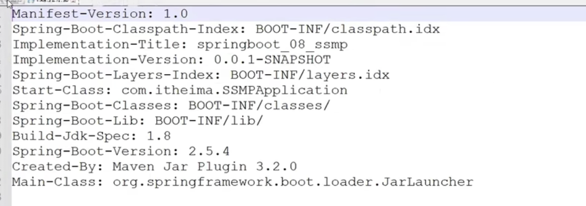

- 结果B的内容为:
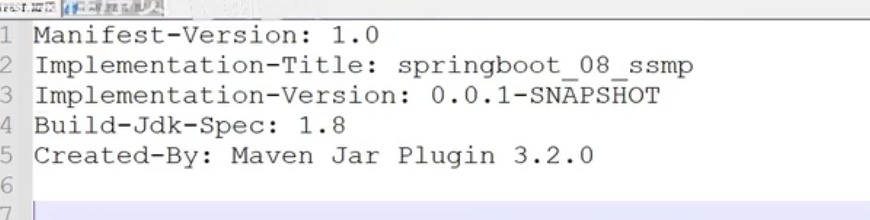

<br>

**差别核心信息1:**  
```s
Start-Class: com.sam.SSMPApplication
```

<br>

**差别核心信息2:**  
```s
# jar启动器
Main-Class: org.springframework.boot.loader.JarLauncher
```

它指向SpringBoot程序中的一个类 该类执行后 它会调用 ``Start-Class: com.sam.SSMPApplication`` 启动类

<br>

只有有了这两行的功能 才能保证我们的SpringBoot是一个可运行的程序 而结果B中没有这些信息

<br>

**目录结构上的差别:**  
结果B中的目录结构 如
- com
- static
- application.yml

等文件会在结果A中的如下目录中
```s
| - BOOT-INF
  | - classes
    | - com
    | - static
    - application.yml
  | - lib
```

同时 lib 文件夹中有很多jar, Boot为了让打包后的jar独立运行 它会将功成中所使用的jar都打包lib下

<br>

**spring-boot-maven-plugin插件的作用:**  
它的作用就是打出一个 可以让SpringBoot项目独立运行的jar包 里面包含了3部分东西

1. 我们的程序
2. 程序依赖的所有jar包
3. 为了支持boot工程能够运行起来 它又打入了一个工具包JarLauncher

<br><br>

## Linux: SpringBoot程序的快速启动

### 上传文件的存放位置
我们要上传到 Linux服务器上的 文件 一般会放到 如下的两个目录内

- /usr/local
- /Users/sam (家目录 ~)

<br>

### 后台启动程序命令
当我们后台启动程序的时候 日志就不会打印在面板上了 我们需要将日志输入到一个文件中
```s
nohup java -jar 程序名.jar > server.log 2?&1 &
```

<br>

**2>&1:**  
是一个 shell 重定向操作符, 用于将标准错误输出流（stderr）重定向到与标准输出输出流（stdout）相同的位置

在命令 nohup java -jar 程序名.jar > server.log 2>&1 & 中, 这个操作符的作用是将程序运行时的错误信息也输出到 server.log 文件中, 便于查看和分析

而 nohup 是一个命令, 用于在后台运行程序, 即使终端关闭或者退出登录也不会影响程序的运行在这个命令中, nohup 将程序运行在一个新的会话中, 并将标准输出和标准错误输出都重定向到一个文件中, 从而保证程序在后台运行, 并且不会受到终端关闭的影响

<br>

### 关闭后台启动的程序
```s
ps -ef | grep "java -jar"

kill -9 pid
```

<br><br>

# 高级配置


## java -jar: 临时属性设置
假如我们的程序已经上传到服务器上了 使用的是80端口 这时我们的80端口可能需要启动一个更加重要的服务 

我们要将 ssmp 项目的端口号恢复成8080, 我们程序中的端口是在 application.yml 配置文件中配置的

<br>

### 这时我又想快速的换一个端口启动怎么操作?临时属性设置
我们可以在 java -jar 的命令后面 追加参数 

我们这样设置的属性是临时属性 用于覆盖application.yml文件中已经设置的值

<br>

**参数格式:**  
--properties配置文件中的写法, 多个属性以空格隔开

```s
java -jar 程序名.jar --属性1 --属性2

# 将参数恢复成properties中的写法 前面追加--
java -jar 程序名.jar --server.port=8080
```

<br>

**注意:**  
临时属性必须是当前boot工程支持的属性 否则设置无效

<br>

### 配置文件的属性加载的优先顺序
1-14 下面的优先级更高

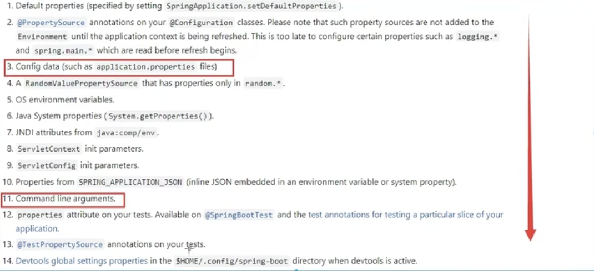

<br>

### IDEA 测试临时属性 是否生效
上述的 命令行 后面追加临时属性的工作是运维人员干的 有些情况下 运维人员在追加临时属性的时候 发现临时属性并没有生效

我们开发人员要协助运维人员解决这个问题 **也就是怎么在idea下测试临时属性是否能生效**   

<br>

**工具栏 启动项目那块:**  
- 选择下拉菜单 选择 Edit Configurations
  - 选中当前的程序 我们可以看到配置属性的位置 Program arguments

我们在这里选项中输入的属性 就相当于在命令行的后面追加临时属性

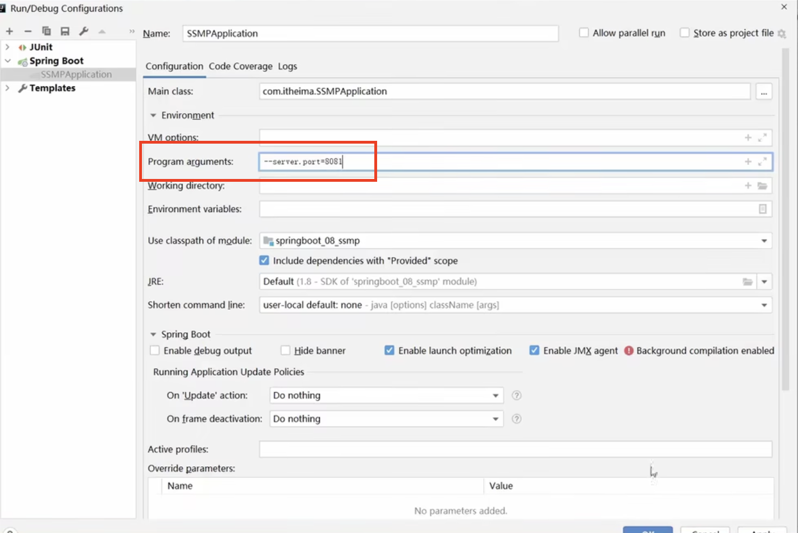

这时我们再启动项目后 就携带了我们设置的临时属性了

<br>

同时我们也要知道 我们在Program arguments选项中写的参数 通过主启动类中 args形参 看到我们设置的参数

<br>

**如下我们说了3种情况:**   
1. 外部临时配置 会通过 args 传入Boot程序中
2. 自定义形参列表(自定义临时属性)
3. 拒绝外部配置

```java
@SpringBootApplication
public class Springboot03SmmpApplication {

	public static void main(String[] args) {

    // 外部临时配置 会通过 args 传入Boot程序中
    system.out.println(Arrays.toString(args))

    /*
    自定义形参列表(自定义临时属性)
      在这里我们也可以往Boot程序中传入我们自己设置的参数 如
    */
    String[] arg = new String[1]
    arg[0] = "--server.port=8081"

		// SpringApplication.run(Springboot03SmmpApplication.class, args);

    // 传入我们自定义的参数列表
    SpringApplication.run(Springboot03SmmpApplication.class, arg);


    // 拒绝外部配置: 同理我们要是不希望 有人通过临时参数修改我们的配置的话 我们可以不传args
    SpringApplication.run(Springboot03SmmpApplication.class);
	}

}
```

<br><br>

## 配置文件分类

### 级别1:
SpringBoot的相关配置我们会放在resources目录下, 程序启动时会读取这里的配置
```s
| - resources
  - application.yml
```

<br>

### 级别2:
我们开发的程序员为了在开发时本地测试 自己写了一套 application.yml 配置

而我们的项目经理在上线的时候 肯定要修改这些配置 因为本地配置 和 线上的配置肯定不一致

**这时我们怎么处理这两套 application.yml？**, 于是SpringBoot给我们提供了一种机制 让我们在现有的配置上 再增加新的配置, 而我们新的配置可以覆盖上一个配置

<br>

**实现步骤:**   

```s
| - resources
  | - config
    - application.yml (项目经理用 最终上线前的统一配置管理)

  | - static
  | - templates
  - application.yml (程序员用)
```

1. 在resources目录下创建config目录
2. 在config目录下 创建一个新的 application.yml

**这时我们的服务器一启动就会采用 /config/application.yml 配置文件**   

<br>

**总结:**  
我们的配置文件有两个级别
1. 程序员使用的配置文件
2. 提供给项目经理做最终的配置 /config/application.yml

<br>

**两个配置文件有合作的原则:**  
有则覆盖 无则追加

<br>

### 级别3:
上面我们知道了 

```
/resources/config/application.yml > 
  /resources/application.yml
```

也就是config目录下的配置文件会覆盖(追加)resources目录下的配置文件

<br>

我们还可以对 config目录 下的配置文件 进行 覆盖(追加)操作

<br>

**实现步骤:**  
我们将 application.yml 放在和 打包文件同级 (不一定非要在target目录下 只要跟打包文件同级就可以)
```s
| - target
  - springboot_03_smmp-0.0.1-SNAPSHOT.jar
  - application.yml
```

这种情况下 配置文件的级别为

```
同级配置文件 > 
  /resources/config/application.yml > 
    /resources/application.yml
```

<br>

**使用场景:**  
银行的数据库保密级别更高 它不会给我们密码相关的信息 所以我们会将jar包打好后 发给银行 

银行只要在jar包同级别目录下放一个application.yml配置文件 则该配置文件会覆盖掉我们jar包中的配置文件

<br>

**总结:**  
到了项目运维阶段 我们的配置文件 又有一个级别 只要是和打包文件同级的配置文件 它会覆盖掉我们开发时的所有配置

<br>

### 级别4:
在同级配置文件之上还有一个级别

<br>

**实现步骤:**  
我们在 打包jar文件的目录下 创建一个config目录, 该目录下放的配置文件 级别最高

```s
| - target
  | - config
    - application.yml (级别最高)

  - springboot_03_smmp-0.0.1-SNAPSHOT.jar
  - application.yml
```

<br>

### 总结:
SpringBoot中4级配置文件
- 1级: jar包同级目录下 config/application.yml (最高)

- 2级: jar包同级目录下 application.yml

- 3级: classpath: config/application.yml

- 4级: classpath: application.yml (最低)


<br>

1级和2级 留作系统打包后设置通用属性 1级常用于运维经理进行线上整体项目部署方案调控

3级和4级 用于系统开发阶段设置通用属性 3级常用于项目经理进行整体项目属性调控

<br>

### 注意:
上面说的命令行追加临时属性的方案可以忘记了 因为它有很强的风险性 我们还是需**要通过4种级别的配置文件来管理**   

<br><br>

## 自定义配置文件
默认我们的SpringBoot项目的配置文件名称是固定的 application 

有的时候 我们会将配置文件的名字进行修改 比如
```
application.yml -> ebank.yml
```

这时候我们修改后的配置文件是不生效的, 我们有如下的方式让更改名称后的配置文件生效

<br>

### 通过 启动命令后面追加参数
我们在 java -jar 的后面追加如下的参数

在 idea 中我们可以在 Edit Configurations - Program arguments 选项中追加如下参数

```s
# 指定配置文件名
--spring.config.name=ebank

# 通过指定路径 也可以
--spring.config.location=classpath:/ebank.yml

# 指定多个配置文件, 后面指定的配置文件生效
--spring.config.location=classpath:/ebank.yml, classpath:/ebank-server.yml
```

<br>

### 说明:
单服务器项目 使用自定义配置文件的需求比较低

多服务器项目 使用自定义配置文件的需求比较高 将所有配置放在一个目录中 统一管理

基于SpringCloud技术 所有的服务器将不再设置配置文件 而是通过配置中心进行设定 动态加载配置信息

<br>

1. 配置文件可以修改名称 通过启动参数设置
2. 配置文件可以修改路径 通过启动参数设置
3. 微服务开发中配置文件通过配置中心进行设置


<br><br>

# 多环境开发
在实际开发过程中, 我们的项目会经历很多的阶段 (开发 - 测试 - 上线), 每个环境的配置也会不同

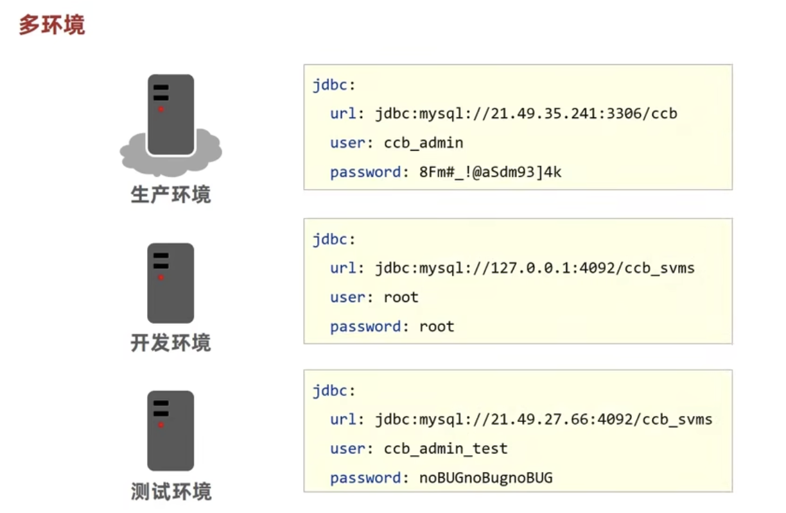

例如 端口 上下文 数据库等 那么这个使用为了方便在不同的环境之间切换 SpringBoot提供了多环境配置

<br>

### 描述
我们在开发阶段写程序写代码 就是开发环境, 当我们自测后会交给测试人员来进行整体的测试

那么测试人员所用到的数据库 服务器ip port 肯定和我们自己的计算机是不一样的 这个就是测试环境

最后我们的项目上线了给用户使用了, 用户使用的服务器 端口号 数据库 跟我们本机和公司测试的环境 都是不一样的

那我们怎么方便的切换到开发环境 测试环境呢? 怎么保证我们的程序在开发阶段是一种环境 在测试阶段又是另外一种环境呢

<br>

**这就是多环境, 根据不同的环境配置不同的值**   

<br>

### 解决方式:   
我们可以通过一个简单的方式 将项目的配置信息由开发环境变成测试环境, 相当于我们修改了配置数据, **这3个环境的数据库 端口号 路径都是不同的我们要方便切换**   

多环境的配置 就是要对每一种环境配置一个配置文件 因为每个环境有不同的配置信息 如

- 端口号
- 上下文
- 数据库url
- 用户名
- 密码等

<br>


<br>

### 多环境配置方式1: 同一文件中配置多环境
多环境的配置主要分为下面的两个步骤
1. 设置环境
2. 应用环境 (我们将所有的环境在设置出来 然后再说用哪一个)

<br>

**实现方式:**  
1. 我们在同一个配置文件中 使用 ``---`` 来区分不同的环境
2. 我们给每一个环境通过 spring.profiles 指定名字
3. 应用环境 使用spring.profiles.active 来指定使用哪个环境

```yml
# 应用环境
# 该环境属于默认环境 我们通常会在这里设置默认的配置 (公共配置 下面的环境使用)
spring:
  profiles:
    active: pro

---

# 设置环境
# 生产环境: 生产环境中是80端口
spring:
  profiles: pro

server:
  port: 80

---

# 开发环境
spring:
  profiles: dev

server:
  port: 81


---

# 测试环境
spring:
  profiles: test

server:
  port: 82
```

<br>

**扩展:**  
spring.profiles 的方式已经过时了 但是还可以使用 我们可以使用新方法也是一样的

```yml
spring:
  config:
    activate:
      on-profile: pro
```

<br>

**总结:**  
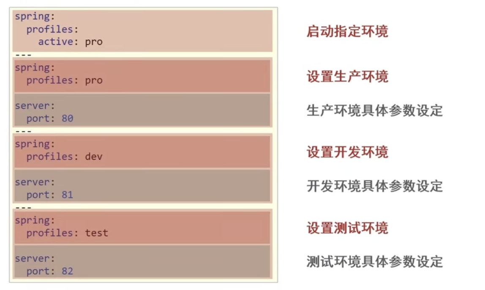

<br>

### 多环境配置方式2: 多环境分不同文件
我们将每一种环境对应的配置 单独的做成一个配置文件 

<br>

**配置文件的命名规则: application开头**  
使用多环境配置文件 可以方便的切换不同的配置

```s
application-环境标识.properties | yml
```

- 开发环境: application-dev.properties
- 测试环境: application-test.properties
- 生产环境: application-product.properties

<br>

### 使用方式:
**1. 保留 application.properties 文件, 项目在启动时会默认读取到配置文件**   

<br>

**2. 另为不同环境创建不同的配置文件**   
```s
# 生产环境配置文件
server.port=8003
server.servlet.context-path=/myproduct
```

```s
# 测试环境的配置文件
server.port=8002
server.servlet.context-path=/mytest
```

```s
# 开发环境的配置文件
server.port=8001
server.servlet.context-path=/mydev
```

<br>

**3. 在默认的配置文件中(application.properties) 配置激活哪一个文件**  
我们配置spring.profiles.active的值就可以实现多环境的切换

```s
# 配置使用哪个环境的配置文件
spring.profiles.active=dev
```

我们只需要写 **环境标识符** 的部分, 这样项目在启动时就会激活开发环境的配置文件了, application.properties配置文件感觉有点像分发

<br>

**注意:**  
环境配置文件中主要设置 **冲突属性** 公共属性要配置在主配置文件中

<br>

### 多环境开发独立配置文件书写技巧
我们会根据功能对配置文件中的信息进行拆分, 并制作成独立的配置文件

比如我们会将跟数据库相关的配置整理成一个配置文件 跟redis缓存相关的配置整理成一个配置文件 如:
- application-devDB.yml
- application-devRedis.yml
- application-devMVC.yml

<br>

**使用方式:**
然后我们可以通过 ``spring.profiles.active.include`` 属性在激活指定环境的情况下 

同时对多个配置文件进行加载使其生效 多个环境(配置文件)之间使用逗号分隔

```yml
spring:
  profiles:
    active: dev
      include: devDB, devRedis, devMVC
```


<br>

**注意:**
如上配置后 当我们启动项目后 加载配置文件的顺序为
```s
devDB - devRedis - devMVC - dev
```

也就是 active指定的配置文件的优先级是最高的(在最后面)

<br>

**SpringBoot2.4版本之后 include -> group:**  
它将各个功能的配置文件进行了分组, 我们可以通过 active 指定哪个分组内的配置文件生效
```yml
spring:
  profiles:
    active: dev
      group: 
        "dev": devDB, devRedis, devMVC
        "pro": proDB, proRedis, proMVC
```

<br>

**注意:**
使用group属性之后 当我们启动项目后 加载配置文件的顺序为
```s
dev - devDB - devRedis - devMVC
```

我们active指明的配置文件跑到最前面了, 所以它的优先级为最低

<br>

### 总结:
多环境开发使用 group属性 设置配置文件分组 便于线上维护管理

<br>

### 多环境开发控制
很多技术都有多环境的开发控制 比如 我们在maven中设置的是生产环境 在SpringBoot中设置的是开发环境 哪一个有效呢?

maven中配置的多环境 和 SpringBoot中配置的多环境发生冲突的时候 **哪个有效呢?**

<br>

我们要思考一个问题 是spring依赖maven运行 还是maven依赖spring运行?

<br>

spring在工作的时候是基于maven坐标的配置才能工作 没有mavenSpringBoot就不用玩了

所以maven一定在前面运行 SpringBoot是基于maven运行的, 所以当maven和SpringBoot都配置了环境的情况下

**一定是以Maven为主, SpringBoot为辅**, 所以我们是主配Maven让SpringBoot读取Maven的配置

<br>

**配置方式:**  
1. 在 pom.xml 文件中配置多环境开发
```xml
<profiles>
  <!-- 
    每个profile标签必须有id标签 用来区分该profile标签代表哪个环境
   -->
  <profile>
    <id>env_dev</id>
    <properties>
      <!-- 
        properties标签下 是自定义属性 相当于在 pom.xml文件中设置了一个变量
        
        properties标签下下面的标签的标签名是自定义的 就是声明一个变量
        
        比如 我们将标签名起名为profile.active

        表示当前到底是哪一个profile在运行
          - 在开发环境中该值为dev 
          - 生产环境中该值为pro
       -->
      <profile.active>dev</profile.active>

      <!-- 
        activation的意思是将该组<profile>设置为默认启动

        也就是我们默认启动dev环境
       -->
      <activation>
        <activeByDefault>true</activeByDefault>
      </activation>
    <properties>
  <profile>
  <profile>
    <id>env_pro</id>
    <properties>
      <profile.active>pro</profile.active>
    <properties>
    <!-- 
      如果我将该组标签写在这里 表示默认启动的是 pro 环境
      <activation>
        <activeByDefault>true</activeByDefault>
      </activation>
     -->
  <profile>
</profiles>
```

<br>

2. SpringBoot的配置文件中读取我们在 pom.xml 文件中设置的环境变量 ``<profile.active>dev</profile.active>``
```yml
spring:
  profiles:
    # 读取 pom.xml 文件中声明的环境变量
    active: @profile.active@
      group: 
        "dev": devDB, devRedis, devMVC
        "pro": proDB, proRedis, proMVC
```

<br>

3. 重新打包项目 clean package 周期

<br>

这样操作后 我们打包后的文件就沿用了maven中的环境设置, 这样maven和springboot的环境就统一了

maven中定义变量, springboot配置文件中 读取maven的变量 通过该变量动态的决定读取哪个环境的配置

<br>

**问题:**  
我们使用如下的标签在pom.xml文件中 决定启动哪个环境下的配置文件
```xml
<activation>
  <activeByDefault>true</activeByDefault>
</activation>
```

但是 我们将其移动到 pro环境下的时候 发现不好用 这是因为idea的bug 缓存问题 我们使用如下的方式进行解决

<br>

我们在使用上面的标签切换环境的时候 **要使用 maven - lifecycle - compile**

<br>

### 总结:
1. 当maven与springboot同时对多环境进行控制时, 以Maven为主 springboot使用 @变量@ 读取maven对应的配置属性值

2. 基于springboot读取Maven配置属性的前提是 **如果在idea下测试工程时pom.xml每次更新需要手动compile才能生效**

<br><br>

# 日志

## 日志基础配置
日志有如下的两个作用

1. 在编程器 调试代码

2. 运行期记录信息
  - 记录 日常运行的重要信息(峰值流量 平局响应时长)
  - 记录 应用报错信息(错误堆栈)
  - 记录 运维过程数据(扩容 宕机 报警)

<br>

### 记录日志的方式 (相当于console.log)
我们的日志分成两个部分来记录

1. 创建记录日志的对象
2. 手动的记录日志

<br>

### 使用示例:
我们在 controller 类中记录日志

**在controller类中创建 日志对象:**  
注意使用的包 
```java
import org.slf4j.Logger;
import org.slf4j.LoggerFactory;

@RestController
@RequestMapping("/books")
public class BookController {
  
  // 创建记录日志的对象, 传入当前类的对象.class
  private static final Logger log = LoggerFactory.getLogger(BookController.class);


  @GetMapping
  public Result list() {

    // 记录(输出)日志
    log.info("hello logger")

    return new Result(true, bookService.list());
  }
}
```

<br>

### 日志API
- log.info()
- log.warn()
- log.debug()
- log.trace(): 打印堆栈信息 级别过低 一般没人用
- log.error()
- log.fatal(): 系统处于崩溃的情况的级别 springboot中默认没有提供此api 和 error级别合并在一起了

<br>

### 日志输出格式控制
默认我们系统在启动起来在控制台输出的就是 info级别的日志
目前我们能看到的都是info级别以上的信息 debug级别的信息是看不到的

<br>

### 配置文件中设置日志级别:
```yml
loggin: 
  level: 
    # 当前项目根路径下的日志级别
    root: debug / info ...
```

<br>

**单独打开debug级别的日志:**  
我们开启debug级别的日志有2种方式, 启动debug都是程序员在线上调试程序的时候使用的

1. Program arguments 下追加 --debug 参数

2. 在application.yml配置文件中 输入如下配置
```yml
debug: true # 默认为false
```

<br>

### 日志不同级别的输出信息量
- debug: 信息量最多
- info: 信息量是我们最常见的
- warn: 信息量最少 只展示警告类的信息
- error: 信息量最少 只展示error类的信息

<br>

### 设置日志级别的粒度控制
比如我们设置debug级别的时候 会展示框架内部的大量信息 我们想屏蔽这些系统级别的信息 就需要配置 粒度控制

<br>

**设置某个包的日志级别制:**  
```yml
loggin: 
  level: 
    # 整体上是info级别
    root: info
    # 指定包下的日志级别
    com.sam.controller: debug
```

<br>

**设置分组, 对某个组设置日志级别:**  
就是说将若干个包打成一个组 这个组的日志是什么级别 分两步

1. 设置分组 (root就相当于一个大的分组)
2. 对组设置级别

```yml
loggin: 
  group: 
    # 自定义分组名, 如下的3个包归属一个组
    ebank: com.sam.controller, com.sam.service, com.sam.mapper
    # 分组2
    eshop: com.alibaba

  level: 
    # 整体的日志级别
    root: info

    # 设置每个包的日志级别 (设置分组后 单个包的可能会有冲突 注释掉)
    # com.sam.controller: debug

    # 对某个分组设置日志级别
    ebank: warn
```

<br>

### 快速创建日志对象
```java
private static final Logger log = LoggerFactory.getLogger(BookController.class);
```

我们在是想在一个类中使用 log日志对象输出日志 那么每个类都要声明日志对象, 那我们能不能简单点 不写这句代码

<br>

**思路:**  
我们可以使用继承的方式 我们可以创建一个工具类 让我们的controller类继承该工具类
```java
@RestController
@RequestMapping("/books")
public class BookController extends BaseClass {
  
  @GetMapping
  public Result list() {

    // 记录(输出)日志
    log.info("hello logger")

    return new Result(true, bookService.list());
  }
}


// BaseClass 工具类
import org.slf4j.Logger;
import org.slf4j.LoggerFactory;

public class BaseClass {

  private Class clazz;
  public Logger log;

  public BaseClass() {
    clazz = this.getClass();
    log = LoggerFactory.getLogger(clazz)
  }
  
}
```

<br>

### 使用 lombok 代替 上述声明的log对象
1. 添加依赖
```xml
<dependency>
  <groupId>org.projectlombok</groupId>
  <artifactId>lombok</artifactId>
</dependency>
```

2. 类上使用 @Slf4j 注解
3. 使用 log对象 调用日志api log.info()

<br><br>

## 日志信息相关
控制台上输出的日志的格式如下
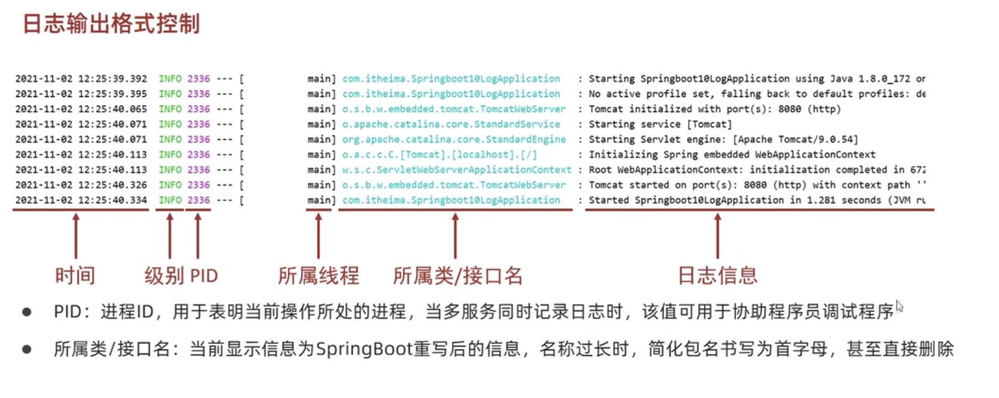

<br>

### 日志输出格式设置:
我们在 application.yml 可以设置日志在控制台上输出的格式

```yml
logging:
  pattern: 
    console: "%d - %m%n"
```

- %d: 日期

- %p: 日志级别  
%5p 日志级别这个部分一共占几个字符长度 方便对齐

- %clr(其它占位符): 给给定的占位符上颜色 如  
%clr(%5p){cyan}, {颜色单词}部分可选 默认是绿色

- %t: 线程名

- %c: 类名: 日志所处位置

- %m: 消息

- %n: 换行

<br>

### 文件记录日志
我们现在的程序中 日志都是输出在控制台的, 我们这个章节说说日志怎么记录到文件中

<br>

### 配置application.yml
```yml
loggin:
  file:
    name: server.log
  # 为了防止日志文件在一个文件中记录 文件太大的问题 我们要进行分文件设置
  logback: 
    rollingpolicy: 
      # 单个文件上限
      max-file-size: 5MB
      # 单个文件的文件名 server.2020-01-01.0.log
      file-name-pattern: server.%d{yyyy-MM-dd}.%i.log

      # %i: 相当于循环变量中的 index
```

<br>

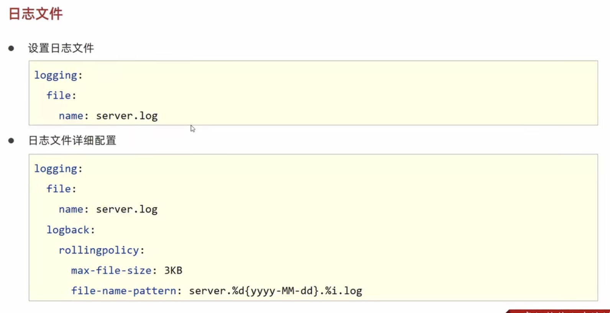

<br><br>

# 热部署
我们在项目中修改后的逻辑 页面可以马上看到效果 而不是重新服务器的方式 这就叫做热部署

<br>

### 思路:
当我们启动的服务器发现了我们的程序发生变化了 它自己做一个内部的重启 

我们原来的服务器是独立的 是通过配置的方式加载了我们的项目 而我们现在的服务器是SpringBoot内置的 我们现在的服务器受SpringBoot管控

所以我们的服务器没有办法发现我们的程序发生了变化, 因为我们的服务器自身就是程序的一部分 所以感知不到

要想让服务器感知到我们的代码发生了变化 必须在spring容器上做文章

<br>

spring容器中有tomcat的对象 还有一组东西帮助我们监控程序变化的 如果变了我们让tomcat服务器重启 也就是要添加热部署的功能 必须在容器中添加新的设置

<br>

SpringBoot帮我们开发了一个工具帮助我们做这件事情

<br>

### 实现方式:
1. 在 pom.xml 文件中 添加开发者工具依赖(启动热部署的工具)
```xml
<dependency>
  <groupId>org.springframework.boot</groupId>
  <artifactId>spring-boot-devtools</artifactId>
</dependency>
```

2. 然后使用 Build - Build Project 更新项目 快捷键 ctrl + f9

<br>

### 概念:
- 重启: 重启时 加载的东西 是自定义开发代码 包含类 页面 配置文件等 加载位置 restart类加载器

- 重载: jar包 加载位置base类加载器

<br>

**我们热部署的功能仅仅是restart的过程 并不包含reload的过程 它仅仅加载当前开发者自定义的开发资源 不加载jar包**

而我们重启服务器是 restart + reload

<br>

### 自动热部署配置
上面我们进行热部署的配置后 每次还需要进行 ctrl + f9, 那怎么能达到自动热部署

**1. 配置1:**  
- ctrl + ,
 - Build
  - Compiler
    - 勾选 Build project automatically

<br>

**2. 配置2:**  
当idea工具 **失去焦点5秒后** 发生自动的构建

- ctrl + ,
 - Advanced Settings
  - Compiler
    - 勾选 Allow auto-make to start ...

<br>

### 设置热部署的范围
上面我们观察到 当我们的java类发生变化的时候 它就会在下一次的热部署中体现

而我们的 /static/pages/book.html 中的文件发生变化了 它并不会影响热部署 它并不参与热部署(因为页面一刷新就能看到效果)

<br>

**那什么原因造成一个文件参与还是不参与热部署呢?**

<br>

**规则:**  
默认不触发重启的目录列表
- /META-INF/maven
- /META-INF/resources
- /resources
- /static
- /public
- /templates

<br>

**设置不参与热部署的文件目录 或 文件:**  
```yml
spring:
  devtools:
    restart:
      exclude: static/**, public/**, config/application.yml
```

<br>

### 关闭热部署:
热部署的功能只在开发环境下有帮助 对于线上来说一点用处都没有 在开发环境下我们也可以关闭热部署功能
 
```yml
spring:
  devtools:
    restart:
      # 启动 / 不启动
      enabled: true
```

<br>

**问题:**  
我们的配置文件我们知道的就是4级 假如我们最低级中设置了关闭热部署 但是高级文件中又开启了热部署

那有什么办法能确保一定关闭热部署呢?

我们前面将了 配置文件加载的优先级 官网上有1-14个级别 我们做的所有的配置都是走的 第3级 properties文件

<br>

我们可以从 5 和 6 来入手
5. OS environment variables
6. Java System properties (System.getProperties())

<br>

**当我们的程序有配置上的冲突的时候可以选择6哦~**

<br>

**实现:**  
我们在主启动类中设置 当程序启动的时候我们设置一个属性
```java
@SpringBootApplication
public class Springboot03SmmpApplication {

	public static void main(String[] args) {

    // 我们通过它设置配置 可以保证绝对覆盖我们的application.yml 配置文件
		System.setProperty("spring.devtools.restart.enabled", "false");

		SpringApplication.run(Springboot03SmmpApplication.class, args);
	}

}
```

<br><br>

# yml中int数字 支持进制的问题

**场景:**  
链接数据库 提示密码错误, 但是数据库的密码是正确的 这时有可能是SpringBoot的问题

```yml
# 数据库密码
dataSource:
  password: 0127
  password: "0127" # 加上引号
```

我们的密码是以 0 开头的, 我们在Java测试类中读取password打印后 发现 ``password = 87``

<br>

### 解决方式:
直接引号包裹, 也就是如果是纯字符串的话 我们最好使用""包裹起来

<br>

### 原因:
我们在yml配置文件中写的int值 它支持2进制 8进制 16进制

- 8进制的格式为 0开头 1-7的字符
- 16进制的格式为 0x开头 0-9, a-f的字符

而我们上面写的 0127 则为8进制 对应的10进制就是87

<br>

yaml文件中对于数字的定义支持进制的书写格式 如需要使用字符串请使用引号明确标注

<br><br>

# 测试

## 加载测试临时 配置属性
我们一般属性都是配置在 application.yml 配置文件中 有些时候我们想在测试类中 **临时添加属性 或 修改属性**  

该临时属性要求只在 某个测试类中有效 并不影响别的测试类 怎么做?

<br>

### 解决方式: @SpringBootTest(properties = {properties格式添加或修改属性})
我们在 @SpringBootTest 注解中 指明 properties属性 它对应的值是一个 {} 数组

<br>

**配置文件中定义属性:**  
```yml

test:
  props: "temp value"
```

<br>

**测试类中使用:**  
```java
package com.sam;

import org.junit.jupiter.api.Test;

import org.springframework.beans.factory.annotation.Value;

import org.springframework.boot.test.context.SpringBootTest;


@SpringBootTest
class Springboot04TestApplicationTests {

  @Value("${test.props}")
  private String msg;

  @Test
  void propertiesTest() {
    System.out.println("msg = " + msg);
    // msg = temp value
  }

}
```

<br>

**使用 @SpringBootTest(properties = {"", "", ""}) 添加临时属性:**
我们添加临时属性的时候要使用 properties 格式 添加属性

```java
// 临时修改 yml配置文件中的属性
@SpringBootTest(properties = {"test.props = tempVal"})
class Springboot04TestApplicationTests {

  @Value("${test.props}")
  private String msg;

  @Test
  void propertiesTest() {
    System.out.println("msg = " + msg);
  }

}
```

<br>

临时属性是程序先加载yml配置文件后 再加载我们在测试类中的临时操作 所以临时操作会覆盖掉之前的配置信息

<br>

**使用 @SpringBootTest(args = { "--参数", "", ""}) 添加临时属性:**
我们使用 args 属性也可以添加临时属性 args是命令行参数的方式 所以书写格式不一样

```java
@SpringBootTest(args = { "--test.props=testVal2"})
```

<br>

### 注意:
**args 的方式**设置的临时属性 比 properties 的方式 **优先级要高**

<br><br>

## 加载测试 临时Bean
上面我们在ssmp的项目中使用了分页拦截器 这是配置了一个第三方bean 加入到了容器中

那我们要是在本次测试的环境中加一个外部的Bean辅助我们测试 可以么?

<br>

注意我们的需求是 加入一个Bean但是这个Bean仅服务于我们这次测试的过程 不服务于其它的 所以它绝对不能定义到源码级别 (定义到 main 目录下就是源码级别)

所以我们的Bean要定义在 /test/java目录的某个包下 如
```
| - test
  | - java
    | - com.sam
      | - com.sam.config.MsgConfig
```

<br>

我们在测试目录下创建一个Bean
```java
package com.sam.config;

import org.springframework.context.annotation.Bean;
import org.springframework.context.annotation.Configuration;

// 先做成一个配置类 将一个Bean放入到容器中
@Configuration
public class MsgConfig {
  // 测试用的为了简单我们定义一个String类型的Bean, 我们创建一个Bean 这个Bean的类型是String类型的
  @Bean
  public String msg() {
    return "bean msg";
  }
}
```

<br>

接下来我们要在测试类中使用我们上面定义的Bean, 我们当前的测试类它实际上是模拟了一套Spring运行的环境

这套环境不仅要加载 main目录下的信息 我们还要加载 我们定义在 /test目录下的Bean的信息

<br>

### 我们怎么加载 /test目录下的Bean的信息?
Spring中提供了 @Import 注解 用于导入配置类

<br>

**@Import(配置类名称.class)**  
一个的话直接写 多个的话写数组  
该注解的用处就是为当前的测试类导入专用的配置, 不会对其他的测试类产生影响

```java
@SpringBootTest
// 导入测试目录下的Bean
@Import(MsgConfig.class)
class Springboot04TestApplicationTests {

  // 注入Bean
  @Autowired
  private String msg;

  @Test
  public void testBean() {
    System.out.println("msg = " + msg);
  }

}
```
 
<br><br>

## web环境模拟测试
我们的java程序在进行maven打包的时候 会经过test环节, 当我们平时会对数据层 业务层进行单元测试

但是一般表现层都没写过, 如果我们要写表现层的单元测试 该怎么做呢?

因为有的经理要求必须将mvc三层都跑过测试 才说明程序是安全的

<br>

### 思路:
我们要想在测试类中测试Web环境 那么就需要在测试类中启动Web环境

<br>

### 1. 测试类中启动Web环境的方式: 
**<font color="#C2185B">@SpringBootTest(webEnvironment = SpringBootTest.WebEnvironment.枚举类值)</font>**  
该注解使用在测试类的上方, 当我们设置该属性后 

**测试类在启动的时候 就会以Web环境来启动**(会启动Tomcat可以访问8080端口)

注意我们在这套环境下执行的操作 并不是真正的请求 仅仅是在测试环境下默认一次请求操作

<br>

**参数详解:**  
**SpringBootTest.WebEnvironment.DEFINED_PORT:**  
以我们定义的端口来启动服务器(8080)

<br>

**SpringBootTest.WebEnvironment.MOCK:**  
表示以模拟 Servlet 环境的方式创建一个 Web 应用程序上下文, 即使用 Spring 的 MockMvc 进行测试

MockMvc 是 Spring Framework 提供的一个用于测试 Spring MVC 应用程序的工具类

<br>

**SpringBootTest.WebEnvironment.NONE:**  
**默认值** 表示不带web环境

<br>

**SpringBootTest.WebEnvironment.RANDOM_PORT:**  
**随机端口**, 以后程序上线端口不一定是我们开发时配置的端口

<br>

### 2. 开启虚拟MVC调用模式
**<font color="#C2185B">@AutoConfigureMockMvc</font>**  
在测试类上方使用该注解, 当我们开启后 它会提供 MockMvc对象 帮助我们发起模拟请求

它相关于开关

<br>

### 3. 在测试方法中发起虚拟请求
我们要是想发起虚拟请求(调用) 必须通过MockMvc虚拟调用的对象

<br>

我们要想使用该对象有两种方式:
1. 自动装配
2. 形参声明

```java
@Test
// 形参声明
public void test1(@Autowired MockMvc mvc) {

}
```

<br>

### 4. 通过MockMvc发起模拟请求
**<font color="#C2185B">mvc.perform(RequestBuilder builder)</font>**  
该方法为执行虚拟请求

<br>

**参数:**  
RequestBuilder builder

我们会通过MockMvcRequestBuilders工具类创建builder对象, 在创建对象的时候指明如下两点
1. 模拟什么请求 get post 还是 delete
2. 向哪个uri发起请求

```java
package com.sam;

import org.junit.jupiter.api.Test;
import org.springframework.beans.factory.annotation.Autowired;
import org.springframework.boot.test.autoconfigure.web.servlet.AutoConfigureMockMvc;
import org.springframework.boot.test.context.SpringBootTest;
import org.springframework.test.web.servlet.MockMvc;
import org.springframework.test.web.servlet.request.MockHttpServletRequestBuilder;
import org.springframework.test.web.servlet.request.MockMvcRequestBuilders;

// 1. 以随机端口的方式 在启动测试类的时候开启Web环境(Tomcat)
@SpringBootTest(webEnvironment = SpringBootTest.WebEnvironment.RANDOM_PORT)
// 2. 开启虚拟调用模式(开启后就可以虚拟调用Controller)
@AutoConfigureMockMvc
public class WebTest {

  // 在该测试中 测试web的调用
  @Test
  // 3. 声明MockMvc虚拟调用对象 完成虚拟调用
  public void test1(@Autowired MockMvc mvc) throws Exception {
    // 4. 通过MockMvc执行操作 虚拟调用 http://localhost:8080/books 的操作
    /*
      mvc.perform() 执行调用的方法(发起请求)
        参数: RequestBuilder接口 也可以声明它的实现类类型 MockHttpServletRequestBuilder
        异常: 直接抛出去

      MockMvcRequestBuilders工具类来创建一个builder对象
      MockMvcRequestBuilders
        .get(String uri) 创建get请求对象
        .post(String uri) 创建post请求对象

    */
    // 模拟了一个向 /books 接口发起的 get http请求
    MockHttpServletRequestBuilder builder = MockMvcRequestBuilders.get("/books");
    // 执行这个请求
    mvc.perform(builder);
  }

}
```

<br>

### 5. 设置预期值 根据模拟请求的结果 判断测试是否通过
我们上面可以在测试环境中发送请求了 接下来我们就要做验证了 我们需要验证我们当前的运行结果和预期值之间到底是不是真的匹配
- 匹配则验证通过
- 不匹配则验证失败

<br>

**内部逻辑:** 
1. 设定预期值
2. 与真实值进行比较 

<br>

**预期值的设置: MockMvcResultMatchers**  
我们会通过 MockMvcResultMatchers 结果匹配器 设置预期值

MockMvcResultMatchers对象中有很多的方法 我们通过调用对应的方法拿到对应的对象, 根据对象设置对应的预期值 如

- MockMvcResultMatchers.status(): 根据本地请求的运行状态 设置预期值

- MockMvcResultMatchers.content(): 响应体是否包含指定信息

- MockMvcResultMatchers.header()
- MockMvcResultMatchers.request()
- MockMvcResultMatchers.cookie()

<br>

```java
// 定义本地调用的预期值: status表示当前模拟运行的状态
StatusResultMatchers status = MockMvcResultMatchers.status();

// 预计本次调用是成功的状态: isOk当前模拟运行是否成功 ok就是我们具体的预期值
ResultMatcher ok = status.isOk();
```

<br>

**与真实值进行比较:**  
```java
ResultActions resultActions = mvc.perform(builder);
```

mvc.perform()方法的返回值就是本次调用的结果 也就是真实值 我们会通过 resultActions 对象来调用 andExpect() 方法 并传入上面设置的预期值

然后我们会观察测试的执行结果 
- 匹配成功没有任何输出
- 匹配失败会有如下输出

```java
// 本地发送请求的所有参数
MockHttpServletRequest:
    HTTP Method = GET
    Request URI = /books1
      Parameters = {}   // 有没有携带参数
        Headers = []    // 有没有携带头信息
            Body = null // 有没有请求体
  Session Attrs = {}

// 谁执行的
Handler:
  Type = org.springframework.web.servlet.resource.ResourceHttpRequestHandler

// 异步调用相关信息
Async:
    Async started = false
      Async result = null

Resolved Exception:
              Type = null

ModelAndView:
        View name = null
              View = null
            Model = null

FlashMap:
        Attributes = null


/// 本地模拟调用的结果
MockHttpServletResponse:
            Status = 404
    Error message = null
          Headers = [Vary:"Origin", "Access-Control-Request-Method", "Access-Control-Request-Headers"]
      Content type = null
              Body =
    Forwarded URL = null
    Redirected URL = null
          Cookies = []

// 预计200 但是 结果为404
java.lang.AssertionError: Status expected:<200> but was:<404>
Expected :200
Actual   :404
```

<br>

### 测试 响应状态码 是否符合预期
```java
package com.sam;

import org.junit.jupiter.api.Test;
import org.springframework.beans.factory.annotation.Autowired;
import org.springframework.boot.test.autoconfigure.web.servlet.AutoConfigureMockMvc;
import org.springframework.boot.test.context.SpringBootTest;
import org.springframework.test.web.servlet.MockMvc;
import org.springframework.test.web.servlet.ResultActions;
import org.springframework.test.web.servlet.ResultMatcher;
import org.springframework.test.web.servlet.request.MockHttpServletRequestBuilder;
import org.springframework.test.web.servlet.request.MockMvcRequestBuilders;
import org.springframework.test.web.servlet.result.MockMvcResultMatchers;
import org.springframework.test.web.servlet.result.StatusResultMatchers;

// 1. 以随机端口的方式 在启动测试类的时候开启Web环境(Tomcat)
@SpringBootTest(webEnvironment = SpringBootTest.WebEnvironment.RANDOM_PORT)

// 2. 开启虚拟调用模式(开启后就可以虚拟调用Controller)
@AutoConfigureMockMvc
public class WebTest {

  @Test
  public void test1(@Autowired MockMvc mvc) throws Exception {

    // 模拟发送get请求
    MockHttpServletRequestBuilder builder = MockMvcRequestBuilders.get("/books1");
    // perform()的返回值就是本次调用的结果 也就是真实值
    ResultActions resultActions = mvc.perform(builder);
    

    // 定义本地调用的预期值: status表示当前模拟运行的状态
    StatusResultMatchers status = MockMvcResultMatchers.status();
    // 预计本次调用是成功的状态: isOk当前模拟运行是否成功 ok就是我们具体的预期值
    ResultMatcher ok = status.isOk();

    // 2. 添加预期值到本次调用过程中进行匹配 与真实值进行比较
    /*
      真实值: resultActions 也就是上面 mvc.perform() 方法的返回值
      andExpect() 用来指定本次模拟调用的预期值, 我们将预期值传入 它会自动将本次调用的结果和预期值进行匹配
    */
    resultActions.andExpect(ok);
  }

}

```

<br>

### 测试 响应体内容 是否符合预期

使用的是 **content.string()** 方法

```java
@Test
public void test1(@Autowired MockMvc mvc) throws Exception {
  // 模拟发送get请求
  MockHttpServletRequestBuilder builder = MockMvcRequestBuilders.get("/books");
  // perform()的返回值就是本次调用的结果 也就是真实值
  ResultActions resultActions = mvc.perform(builder);


  // 定义本地调用的预期值: content表示响应体相关
  ContentResultMatchers content = MockMvcResultMatchers.content();

  // string()传入我们预期的响应体内容
  ResultMatcher body = content.string("hello home page...");

  // 2. 添加预期值到本次调用过程中进行匹配 与真实值进行比较
  resultActions.andExpect(body);
}
```

<br>

### 测试 响应体JSON内容 是否符合预期
我们的响应体一般都是JSON对象

使用的是 **content.json()** 方法
```java
@RestController
@RequestMapping("/books")
public class BookController {

  @GetMapping
  public Book home() {
    System.out.println("访问了home接口");

    // return了一个Json对象
    return new Book(1, "小说");
  }
}


@Test
public void test1(@Autowired MockMvc mvc) throws Exception {
  // 模拟发送get请求
  MockHttpServletRequestBuilder builder = MockMvcRequestBuilders.get("/books");
  // perform()的返回值就是本次调用的结果 也就是真实值
  ResultActions resultActions = mvc.perform(builder);


  // 定义本地调用的预期值: content表示响应体相关
  ContentResultMatchers content = MockMvcResultMatchers.content();

  //json()传入我们预期的JSON对象内容
  ResultMatcher body = content.json("{\"id\":1,\"name\":\"小说\"}");

  // 2. 添加预期值到本次调用过程中进行匹配 与真实值进行比较
  resultActions.andExpect(body);
}
```

<br>

### 测试 响应头 是否符合预期
```java
@Test
public void test1(@Autowired MockMvc mvc) throws Exception {
  // 模拟发送get请求
  MockHttpServletRequestBuilder builder = MockMvcRequestBuilders.get("/books");
  // perform()的返回值就是本次调用的结果 也就是真实值
  ResultActions resultActions = mvc.perform(builder);


  // 定义本地调用的预期值: header表示响应头相关
  HeaderResultMatchers header = MockMvcResultMatchers.header();

  // string()传入我们预期的响应头kv
  ResultMatcher contentType = header.string("Content-Type", "application/json");

  // 2. 添加预期值到本次调用过程中进行匹配 与真实值进行比较
  resultActions.andExpect(contentType);
}
```

<br><br>

## 数据层测试回滚
我们会在测试类中测试操作数据库的功能 那在未来打包的时候 避免不了会将我们的测试数据装入到数据库

我们期望的是 测试方法该执行执行 但是最终不要将数据装入到数据库

所以我们思考 是不是可以将数据库的事务关掉 这样就不会进行提交

<br>

### 解决方式:
在测试类的上方 使用 **@Transactional注解**

当Spring发现我们在测试类上加了该注解 它就知道这是测试环境 不要进行提交

<br>

**扩展:**  
如果在测试类已经添加了@Transactional注解 但还想在测试用例中提交事务 可以通过 @Rollback(false) 注解设置

<br>

**不生效的环境:**  
如果我们发现上面的功能不生效可以考虑下是否是InnoDB引擎, **InnoDB引擎支持事务** 

<br><br>

## 测试用例数据设定
我们在application.yml配置文件中创建随机数据 格式如下
```yml
testcase: 
  book:
    id: ${random.uuid}
    name: ${random.value} # md5加密字符串
    time: ${random.long}

    id: ${random.int(10)} # 10以内的整数
    id: ${random.int(5,10)} # 5-10以内的整数
```

<br>

创建一个实体类进行封装上面的数据
```java
@Data
@Component
@ConfigurationProperties("testcase.book")
public class Book {
  private String id;
  private String name;
  private long time;
}
```

<br><br>


