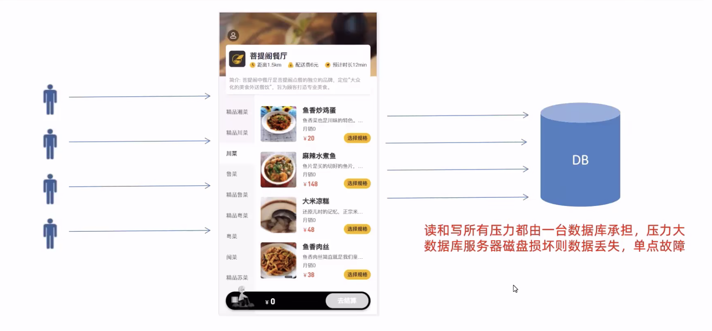
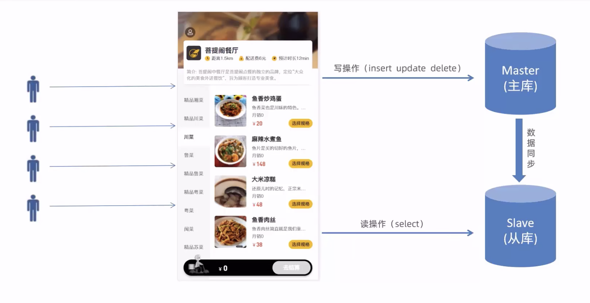
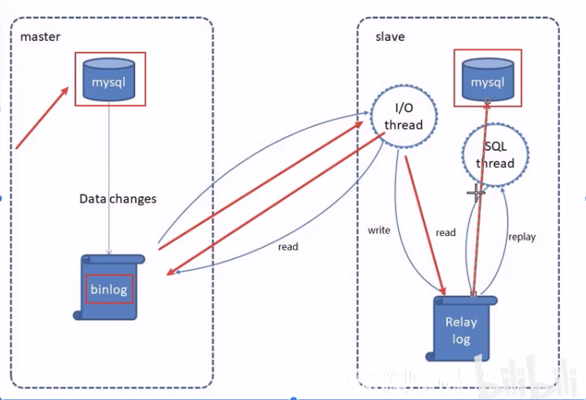
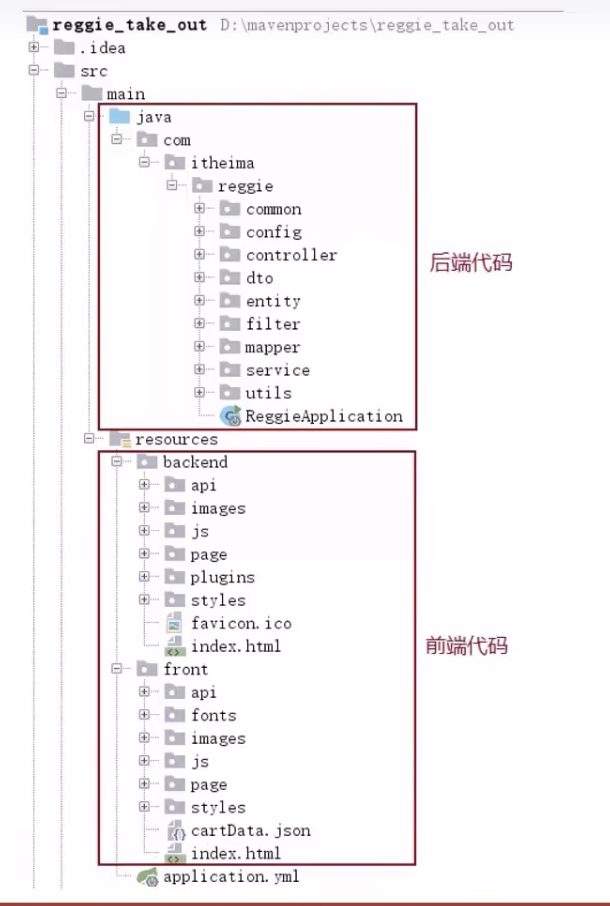
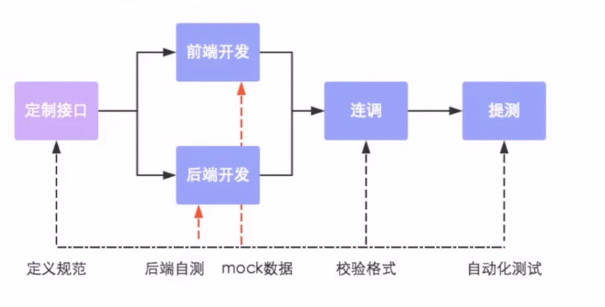
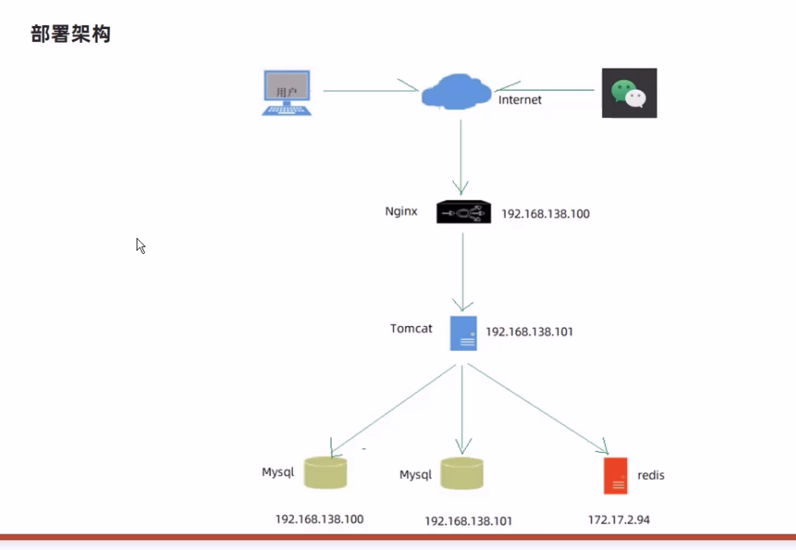

# 软件开发流程
一般我们开发软件都会遵循这个流程

```s
| - 需求分析
| - 设计
| - 编码
| - 测试
| - 上线运维
```

<br>

### 需求分析:
这个部分主要完成产品原型 和 需求规格说明书的编写

<br>

**产品原型:**  
通过网页的形式展现下当前我们要开发的项目大体的结构 比如
- 有哪些页面
- 每个页面的结构是什么样子的 列表页面? 表单页面?
- 点击某个按钮之后需要查询什么数据 有什么样的效果

<br>

它就是一款产品在成型之前的一个简单的框架, 就是将页面的排版布局展现出来 使产品的初步构思有一个可视化的展示

通过原型展示 可以更加直观的了解项目的需求和提供的功能

<br>

**需求规格说明书:**  
一般是一个word文档 通过它展现当前的项目有哪些功能 会有文字的说明

<br>

### 设计:
- 产品文档设计
- 概要设计
- 详细设计

<br>

**UI界面设计:**  
它需要将当前项目页面效果展现出来 最终的开发效果基本上和UI设计一直

<br>

**数据库设计:**   
包含当前的项目有几个数据库 每个数据库中的表, 具体表的字段是什么样的

<br>

### 编码:
该阶段只要有开发来完成 编写项目代码 做单元测试

<br>

### 测试:
由测试人员编写测试用例, 最终给出测试报告, 测试报告没有问题后 就可以上线了

<br>

### 上线运维:
一般会有专门的运维人员来负责 软件环境安装 和 配置

<br><br>

# 角色分工

### 项目经理:
负责对整个项目的把控, 任务分配 把控进度

<br>

### 产品经理:
进行需求调研, 输出需求调研文档 设计产品原型等

<br>

### UI设计师:
根据产品原型输出界面效果图

<br>

### 架构师:
从技术层面整体把控项目 技术架构的设计, 技术选型等

<br>

### 开发工程师:
代码实现

<br>

### 测试工程师:
编写测试用例 输出测试报告

<br>

### 运维工程师:
软件环境搭建 项目上线

<br><br>

# 软件环境

### 开发环境(development)
开发人员在开发阶段使用的环境 一般外部用户无法访问

<br>

### 测试环境(testing):
专门给测试人员使用的环境 用于测试项目 一般外部用户无法访问

<br>

### 生产环境(production):
即上线环境, 正式提供对外服务的环境

<br><br>

# 项目介绍
本项目(瑞吉外卖)是专门为餐饮企业定制的一款软件产品, 包括系统管理后台和移动端应用两部分

其中系统管理后台提供给餐饮企业内部员工使用, 可以对餐厅的菜品 套餐 订单等进行管理维护

移动端应用主要提供给消费者使用 可以在线浏览菜品 添加购物车 下单等

<br>

### 本项目共分为3期开发
1. 主要实现基本需求 其中移动端应用通过h5实现 用户可以通过手机浏览器访问

2. 主要针对移动端应用进行改进 使用微信小程序实现, 用户使用起来更加的方便

3. 主要针对系统进行优化升级 提供系统的访问性能

<br><br>

# 前端相关

<br>

## 功能架构:
- 手机号登录
- 微信登录
- 地址管理
- 历史订单
- 菜品规格
- 购物车
- 下单
- 菜品浏览

<br><br>

# 后台相关

<br>

## 功能架构:
- 分类管理
- 菜品管理
- 套餐管理
- 菜品口味管理
- 员工登录
- 员工退出
- 员工管理
- 订单管理

<br><br>

# 数据库相关
我们整个项目一共涉及到了11张表

|序号|表名|说明|
|:--:|:--:|:--|
|1|employee|员工表|
|2|category|菜品和套餐分类表|
|3|dish|菜品表|
|4|setmeal|套餐表|
|5|setmeal_dish|套餐菜品关系表|
|6|dish_flavor|菜品口味关系表|
|7|user|用户表(c端)|
|8|address_book|地址簿表|
|9|shopping_cart|购物车表|
|10|orders|订单表|
|11|order_detail|订单明细表|


<br>

**员工表:**  
存储员工的登录账号信息 

<br>

**菜品和套餐分类表:**  
前端展示页面的时候都会按照菜品的分类来展示

<br><br>

# 开发环境的搭建

## 创建Maven项目

**要点:**  
创建完项目后, 注意检查项目的编码, maven仓库配置 jdk配置等

<br>  

### 检查Maven
ctrl + , -> 搜索 maven
1. 查看是否使用的本地仓库
2. 点击runner选项卡, 查看jre版本是否为jdk1.8

<br>

### 检查JDK
ctrl + ; -> Project选项卡
1. 查看Project SDK部分是否是1.8

<br><br>

## 配置pom.xml

### 导入依赖
这里使用的依赖都是老师提供的在 资料/项目配置文件 下
```xml
<?xml version="1.0" encoding="UTF-8"?>
<project xmlns="http://maven.apache.org/POM/4.0.0"
         xmlns:xsi="http://www.w3.org/2001/XMLSchema-instance"
         xsi:schemaLocation="http://maven.apache.org/POM/4.0.0 http://maven.apache.org/xsd/maven-4.0.0.xsd">
  <modelVersion>4.0.0</modelVersion>

  <parent>
    <groupId>org.springframework.boot</groupId>
    <artifactId>spring-boot-starter-parent</artifactId>
    <version>2.4.5</version>
    <relativePath/> <!-- lookup parent from repository -->
  </parent>

  <groupId>com.sam</groupId>
  <artifactId>reggie</artifactId>
  <version>1.0</version>

  <properties>
    <!-- 指定了项目源代码的 Java 版本 -->
    <maven.compiler.source>8</maven.compiler.source>
    <!-- 指定了项目编译后生成的字节码的 Java 版本 -->
    <maven.compiler.target>8</maven.compiler.target>
  </properties>

  <dependencies>
    <dependency>
      <groupId>org.springframework.boot</groupId>
      <artifactId>spring-boot-starter</artifactId>
    </dependency>

    <dependency>
      <groupId>org.springframework.boot</groupId>
      <artifactId>spring-boot-starter-test</artifactId>
      <scope>test</scope>
    </dependency>

    <dependency>
      <groupId>org.springframework.boot</groupId>
      <artifactId>spring-boot-starter-web</artifactId>
      <scope>compile</scope>
    </dependency>

    <dependency>
      <groupId>com.baomidou</groupId>
      <artifactId>mybatis-plus-boot-starter</artifactId>
      <version>3.4.2</version>
    </dependency>

    <dependency>
      <groupId>org.projectlombok</groupId>
      <artifactId>lombok</artifactId>
      <version>1.18.20</version>
    </dependency>

    <dependency>
      <groupId>com.alibaba</groupId>
      <artifactId>fastjson</artifactId>
      <version>1.2.76</version>
    </dependency>

    <dependency>
      <groupId>commons-lang</groupId>
      <artifactId>commons-lang</artifactId>
      <version>2.6</version>
    </dependency>

    <dependency>
      <groupId>mysql</groupId>
      <artifactId>mysql-connector-java</artifactId>
      <scope>runtime</scope>
    </dependency>

    <dependency>
      <groupId>com.alibaba</groupId>
      <artifactId>druid-spring-boot-starter</artifactId>
      <version>1.1.23</version>
    </dependency>
  </dependencies>

  <build>
    <plugins>
      <plugin>
        <groupId>org.springframework.boot</groupId>
        <artifactId>spring-boot-maven-plugin</artifactId>
        <version>2.4.5</version>
      </plugin>
    </plugins>
  </build>

</project>
```

<br><br>

## 配置 applicatiom.yml
```yml
server:
  port: 8080


spring:
  application:
    # 可选: 我们可以配置项目名称 如果不配置则默认使用工程名
    name: reggie_take_out
  datasource:

    # 这里使用 druid 报错 我们把druid删掉 4要素前移到datasource下就可以了
    druid:
      driver-class-name: com.mysql.cj.jdbc.Driver
      url: jdbc:mysql://localhost:3306/reggie?serverTimezone=Asia/Shanghai&useUnicode=true&characterEncoding=utf-8&zeroDateTimeBehavior=convertToNull&useSSL=false&allowPublicKeyRetrieval=true
      username: root
      password: root


mybatis-plus:
  configuration:
    #在映射实体或者属性时, 将数据库中表名和字段名中的下划线去掉, 按照驼峰命名法映射
    map-underscore-to-camel-case: true
    log-impl: org.apache.ibatis.logging.stdout.StdOutImpl
  global-config:
    db-config:
      id-type: ASSIGN_ID
```

<br><br>

## 上述问题:
SpringBoot+Druid启动报错 ``Failed to configure a DataSource: 'url' attribute is not specified``

<br>

### 错误报告:
```
Description:

Failed to configure a DataSource: 'url' attribute is not specified and no embedded datasource could be configured.

Reason: Failed to determine a suitable driver class


Action:

Consider the following:
	If you want an embedded database (H2, HSQL or Derby), please put it on the classpath.
	If you have database settings to be loaded from a particular profile you may need to activate it (no profiles are currently active).
```

<br>

查遍了所有可能的原因, 最后是因为springboot数据源用了Druid, SpringBoot默认是不支持Druid数据源的, 需要手动初始化DruidDataSource对象
```java
@Configuration
public class DataSourceConfig {

  @Autowired
  private Environment env;

  @Bean
  public DataSource getDataSource() {
    DruidDataSource dataSource = new DruidDataSource();
    dataSource.setUrl(env.getProperty("spring.datasource.main.url"));
    dataSource.setUsername(env.getProperty("spring.datasource.main.username"));
    dataSource.setPassword(env.getProperty("spring.datasource.main.password"));
    return dataSource;
  }
}
```

<br><br>

## 编写启动类
因为我们创建的是Maven工程 所以目录结构 需要我们自己组织 同时我们需要自己编写启动类

<br>

### 要点:
**@Slf4j注解:**  
输出日志 方便我们调试, 它是lombok提供的注解  
使用该注解后 我们可以使用 ``log.info("输出日志")``  相当于在项目中 ``console.log``

```java
package com.itheima.reggie;

import lombok.extern.slf4j.Slf4j;
import org.springframework.boot.SpringApplication;
import org.springframework.boot.autoconfigure.SpringBootApplication;

@Slf4j
@SpringBootApplication
public class ReggieApplication {
  public static void main(String[] args) {
    SpringApplication.run(ReggieApplication.class,args);
    log.info("项目启动成功...");
  }
}

```

<br><br>

## 静态资源问题: 前面页面的存放
这个项目中的页面都是写好的 我们直接导入使用就可以
- front: 前台页面
- backend: 后台管理页面

<br>

我们将它们两个放入到如下的目录下
```s
| - resources
  | - backend
  | - front
```

<br>

### 要点:
我们讲pringBoot的时候说 对于我们引入的静态资源 我们会要求放在如下的两个目录下
```s
| - resources
  | - static
  | - templates
```


而现在我们的静态资源分别在 backend 和 front 下, 这样就存在一个问题, 默认情况下我们直接访问这些页面是访问不到的

**默认只能访问到 static or templates 下的资源**

<br>

比如我们访问如下的资源时, 会报404错误, 也就是说我们访问tomcat服务器的时候没有找到对应的页面
```s
localhost:8080/backend/index.html
```

<br>

### 解决方式:
我们要**通过配置类的方式 解决静态资源的映射问题**

告诉我们的mvc框架, backend 和 front 目录下存放的是静态资源

设置静态资源映射 我们通过浏览器发送的请求 比如我们请求的是 ``/backend/index.html`` 它就会映射到 ``/backend目录下的index.html``


```java
package com.sam.reggie.config;

import lombok.extern.slf4j.Slf4j;
import org.springframework.context.annotation.Configuration;
import org.springframework.web.servlet.config.annotation.ResourceHandlerRegistry;
import org.springframework.web.servlet.config.annotation.WebMvcConfigurationSupport;
import org.springframework.web.servlet.config.annotation.WebMvcConfigurer;

@Slf4j
@Configuration
public class WebMvcConfig implements WebMvcConfigurer {
  @Override
  public void addResourceHandlers(ResourceHandlerRegistry registry) {
    log.info("开始进行静态资源映射");
    // 设置 请求资源 映射到 哪个目录下 addResourceHandler资源处理器, 主要路径中 backend 就会映射到
    registry.addResourceHandler("/backend/**").addResourceLocations("classpath:/backend/");
    registry.addResourceHandler("/front/**").addResourceLocations("classpath:/front/");
  }
}
```

<br>

1. 我们实现addResourceHandlers()方法 通过该方法来设置 请求资源 映射到 哪个目录下
2. registry.addResourceHandler("/backend/**"): 如果请求路径中含有 backend 则映射到 指定的目录
3. addResourceLocations("classpath:/backend/"): 映射到classpath下的某个目录

<br>

# 登录功能

## 需求分析
需求分析一般都是从页面原型说起, 我们可以先找到 登录页面 的原型 **登录.html**

我们在页面上输入 用户名 和 密码 点击登录 就会发送请求 请求就会到服务端的组件

```s
请求 -> Controller -> Service -> Mapper -> DB
```

<br>

### 服务器处理前台请求后 响应的数据格式: 
我们观察前端代码, 可以观察到 后台返回的数据里面应该有 这样前端才能取出使用
```js
{
  code:
  data: 
  msg:
}
```

<br><br>

## 登录: 准备工作

### 创建实体类 Employee 和 employee表进行映射
数据库中的一张表 映射为 一个实体类

```s
com.sam.reggie.entity
```

<br>

**要点:**  
1. 实体类实现Serializable
2. @TableField注解

```java
/**
 * 员工实体
 */
@Data
public class Employee implements Serializable {

  private static final long serialVersionUID = 1L;

  private Long id;

  private String username;

  private String name;

  private String password;

  private String phone;

  private String sex;

  //身份证号码
  private String idNumber;

  private Integer status;

  private LocalDateTime createTime;

  private LocalDateTime updateTime;

  @TableField(fill = FieldFill.INSERT)
  private Long createUser;

  @TableField(fill = FieldFill.INSERT_UPDATE)
  private Long updateUser;

}
```

<br>

### 扩展: @TableField注解
@TableField注解 是 MyBatis-Plus 框架中的注解之一, 用于标记实体类字段与数据库表字段的映射关系。

具体来说, @TableField 注解有以下作用:

**作用1: 指定字段映射关系**  
通过 value 属性可以指定实体类中的字段与数据库表中的字段的映射关系  
```java
// 表示该注解标识的属性映射到数据库表的 create_user 字段上
@TableField(value = "create_user")
```

<br>

**作用2: 设置字段填充策略**  
通过 fill 属性可以设置字段填充策略, 即在插入或更新记录时, 自动填充相应字段的值。

常见的填充策略有
- FieldFill.INSERT（插入时填充）
- FieldFill.UPDATE（更新时填充）
- FieldFill.INSERT_UPDATE（插入和更新时填充）

<br>

### 创建 Controller
1. 使用 ``@RestController`` 注解进行标识
2. 使用 ``@RequestMapping("/employee")`` 注解 设置匹配请求uri的前缀
3. 注入service

```java
package com.sam.reggie.controller;

import com.sam.reggie.service.EmployeeService;
import lombok.extern.slf4j.Slf4j;
import org.springframework.beans.factory.annotation.Autowired;
import org.springframework.web.bind.annotation.RequestMapping;
import org.springframework.web.bind.annotation.RestController;

@RestController
@Slf4j
@RequestMapping("/employee")
public class EmployeeController {

  // 注入service
  @Autowired
  private EmployeeService employeeService;
}

```


<br>

### 创建 EmployeeService
1. 自定义service接口 继承 父接口IService并传入泛型
2. 自定义service接口 继承 ServiceImpl并传入mapper和对应实体类 并 实现我们自己定义的service接口
3. service实现类要使用 @Service 注解

<br>

**EmployeeService接口:**
```java
package com.sam.reggie.service;

import com.baomidou.mybatisplus.extension.service.IService;
import com.sam.reggie.entity.Employee;

public interface EmployeeService extends IService<Employee> {
}

```

<br>

**EmployeeServiceImpl:**  
```java
package com.sam.reggie.service.impl;

import com.baomidou.mybatisplus.extension.service.impl.ServiceImpl;
import com.sam.reggie.entity.Employee;
import com.sam.reggie.mapper.EmployeeMapper;
import com.sam.reggie.service.EmployeeService;
import org.springframework.stereotype.Service;

@Service
public class EmployeeServiceImpl extends ServiceImpl<EmployeeMapper, Employee> implements EmployeeService {

}

```

<br>

### 创建 EmployeeMapper接口
1. 让它继承BaseMapper并传入泛型 也就是我们要操作的表
2. 使用 @Mapper 注解 
```java
package com.sam.reggie.mapper;

import com.baomidou.mybatisplus.core.mapper.BaseMapper;
import com.sam.reggie.entity.Employee;
import org.apache.ibatis.annotations.Mapper;

@Mapper
public interface EmployeeMapper extends BaseMapper<Employee> {
}

```

<br><br>

## 设置: 通用的结果类 Result
此类事一个通用的结果类, 服务端响应的所有结果最终都会包装成此种类型返回给前端页面

一个项目中我们会编写很多的Controller 每个控制器方式又都是响应数据, 而一般情况下 我们给前端返回的数据都是一样的格式

我们就将数据封装到这个结果类中

<br>

### 封装方式1:
1. 定义了属性
2. 创建了
  - 成功 对应的 结果对象
  - 失败 对应的 结果对象
  - 往结果对象中追加 kv 的方法
  
```java
package com.sam.reggie.common;

import lombok.Data;
import java.util.HashMap;
import java.util.Map;

@Data
public class R<T> {

  //编码: 1成功, 0和其它数字为失败
  private Integer code; 

  //错误信息
  private String msg; 

  //数据
  private T data; 

  //动态数据
  private Map map = new HashMap(); 

  // 响应成功时返回的数据
  public static <T> R<T> success(T object) {
      // 返回的就是当前这个泛型类
      R<T> r = new R<T>();
      r.data = object;
      r.code = 1;
      return r;
  }

  // 响应失败时返回的数据
  public static <T> R<T> error(String msg) {
      R r = new R();
      // 失败的时候 的 错误信息
      r.msg = msg;
      r.code = 0;
      return r;
  }


  // 要点: 类中有一个map属性, 此方法并不是静态方法
  public R<T> add(String key, Object value) {
      this.map.put(key, value);
      return this;
  }
}
```

<br>

### 封装方式2:
```java
package com.lantu.common.vo;


import lombok.AllArgsConstructor;
import lombok.Data;
import lombok.NoArgsConstructor;

@Data
@NoArgsConstructor
@AllArgsConstructor
public class Result<T> {
    private Integer code;
    private String message;
    private T data;

    public static <T> Result<T> success(){
        return new Result<>(20000,"success",null);
    }

    public static <T> Result<T> success(T data){
        return new Result<>(20000,"success",data);
    }

    public static <T> Result<T> success(T data,String message){
        return new Result<>(20000,message,data);
    }

    public static <T> Result<T> success(String message){
        return new Result<>(20000,message,null);
    }

    public static<T>  Result<T> fail(){
        return new Result<>(20001,"fail",null);
    }

    public static<T>  Result<T> fail(Integer code){
        return new Result<>(code,"fail",null);
    }

    public static<T>  Result<T> fail(Integer code, String message){
        return new Result<>(code,message,null);
    }

    public static<T>  Result<T> fail( String message){
        return new Result<>(20001,message,null);
    }

}
```

<br>

### 封装方式3: 企业级封装
GWES项目中, 就是设置了3个属性, 并为这3个属性提供了get 和 set方法
```java
public class ResultCommon {

    private int code;
    private String message;
    private Object data;

    public ResultCommon setCode(ResultCodeCommon resultCode) {
        this.code = resultCode.code;
        return this;
    }

    public int getCode() {
        return code;
    }

    public ResultCommon setCode(int code) {
        this.code = code;
        return this;
    }

    public String getMessage() {
        return message;
    }

    public ResultCommon setMessage(String message) {
        this.message = message;
        return this;
    }

    public Object getData() {
        return data;
    }

    public ResultCommon setData(Object data) {
        this.data = data;
        return this;
    }

    @Override
    public String toString() {
        return JSON.toJSONString(this);
    }

}
```

<br><br>

## 登录: 功能实现

<br>

### 控制器方法: 参数说明
1. Result里面要存放Employee

2. 前端做登录请求的时候会携带 username password 请求参数, 我们使用Employee 的JavaBean来承装, 虽然它里面有很多属性

3. 前端发送post请求(数据格式是JSON), 所以我们使用 ``@RequestBody`` 注解来接收前端发送的JSON个是的数据 并将其关联到 指定Employee类型的形参中

4. 参数req, 在登录成功后 我们会将 用户id存到session中一份, 这样我们只要想获取当前登录用户的话 可以随时获取到

5. 最终我们要将查询出来的用户记录 返回给前端

```java
// 处理登录请求
@PostMapping("/login")
public Result<Employee> login(@RequestBody Employee employee, HttpServletRequest req) {
  return null;
}
```

<br>

### 逻辑梳理
1. 将页面提交的密码 password 进行 md加密 处理
2. 根据页面提交的用户名 username 查询数据库
3. 如果没有查询到则返回 登录失败 (因为用户名不存在)
4. 密码比对, 如果不一致则返回 登录失败
5. 查看员工状态, 如果为已禁用状态 则返回员工已禁用结果
6. 登录成功, 将员工id存入session并返回成功结果, 结果为查询出来的用户记录

<br>

### md加密的工具类:
```s
org.springframework.util.D
```

<br>

### **<font color="#C2185B">DigestUtils.md5DigestAsHex(byte[] bytes)</font>**  
进行md5加密

<br>

### 处理登录请求的逻辑部分:
```java
// 处理登录请求
@PostMapping("/login")
public Result<Employee> login(@RequestBody Employee employee, HttpServletRequest req) {
  // 前端发送的表单数据封装到了 employee 中

  // 1. 将页面提交的密码 password 进行 md加密 处理
  String password = employee.getPassword();
  // 参数: byte[] bytes
  password = DigestUtils.md5DigestAsHex(password.getBytes());


  // 2. 根据页面提交的用户名 username 查询数据库
  // 参数: queryWrapper
  LambdaQueryWrapper<Employee> queryWrapper = new LambdaQueryWrapper<>();
  queryWrapper.eq(Employee::getUsername, employee.getUsername());

  // 用户表中用户名字段唯一 所以可以通过用户名来获取用户
  Employee emp = employeeService.getOne(queryWrapper);


  // 3. 如果没有查询到则返回 登录失败 (因为用户名不存在)
  if(emp == null) {
    // 如果没有查询到结果 直接返回登录失败
    return Result.error("登录失败");
  }


  // 4. 密码比对, 如果不一致则返回 登录失败
  // emp是从数据库查询出来的结果, 里面的密码是加密后的
  if(!emp.getPassword().equals(password)) {
    return Result.error("登录失败");
  }


  // 5. 查看员工状态, 如果为已禁用状态 则返回员工已禁用结果
  // 到这里就是密码比对成功, 0为禁用状态
  if(emp.getStatus() == 0) {
    return Result.error("账号已经禁用");
  }


  // 6. 登录成功, 将员工id存入session并返回成功结果
  req.getSession().setAttribute("employee", emp.getId());
  return Result.success(emp);
}
```

<br>

### 测试: 登录功能
我们使用断点的方式来进行验证, 比如我们将断点设置在 控制器方法的方法体的第一行

然后访问 登录页面
```s
http://localhost:8080/backend/page/login/login.html
```

<br>

### 扩展: 数据库存储时间格式的问题
这个项目中时间在数据库中存储的格式如下: 
```s
2021-05-06 17:20:07
```

但是我们返回给前端的时候, 它的格式变成了, 带了一个T
```
2021-05-06T17:20:07
```

所以前台在展示的时候 可以进行下格式化
```js
let obj = localStorage.getItem("userInfo")
obj = JSON.parse(obj);

let date = obj.createTime
date.toLocaleString().replace(/T/g, " ").replace(/\.d{3}Z/, "")
```

<br>

### 扩展: 数据库存储时间的格式 和 查询出来的格式
这个项目中时间在数据库中存储的格式如下: 
```
2021-05-06 17:20:07
```

但是我们使用MyBatis来查询数据的时候 查询到的结果却变成了
```
2021-05-06T17:20:07
```

<br>

**原因:**  
这是因为MyBatis会将Mysql中的 dateTime类型 转换成 Java中的LocalDateTime类型造成的

这个时候我们就可以添加一个方法 用于进行时间的转换

```java
public String toTimestamp(LocalDateTime localDateTime, String formatter) {
    if (localDateTime == null) return "";

    if (formatter == null) {
      formatter = "yyyy-MM-dd hh:mm";
    }

    DateTimeFormatter pattern = DateTimeFormatter.ofPattern(formatter);
    String format = pattern.format(localDateTime);

    return format;
  }
```

<br>

**ChatGPT给出的答案:**  
这是因为 MyBatis 在将数据库中的 datetime 类型字段映射到 Java 对象时, 将其转换为了 Java 中的 java.util.Date 或者 java.time.LocalDateTime 类型。

而这些 Java 类型的默认格式与数据库中的 datetime 类型的格式不同。

**在 java.util.Date 类型中**  
日期和时间都被存储在单个 long 类型变量中, 表示自 1970 年 1 月 1 日 00:00:00 GMT 以来的毫秒数。

**在 java.time.LocalDateTime 类型中:**  
则以 ISO 8601 格式表示, 即日期和时间之间使用 T 分隔符。

<br>

如果您想在查询结果中使用数据库中的格式, 可以在查询语句中使用 DATE_FORMAT 函数将其转换为所需的格式, 例如: 

这将返回一个名为 formatted_datetime 的列, 其中包含格式为 yyyy-MM-dd HH:mm:ss 的日期时间字符串。
```sql
SELECT DATE_FORMAT(datetime_column, '%Y-%m-%d %H:%i:%s') AS formatted_datetime FROM my_table;
```

<br>

**T的含义:**  
在 ISO 8601 格式中, 字母 "T" **是日期和时间的分隔符**, 用于区分日期和时间。

这个字母代表着 "time", 因此 ISO 8601 中的日期时间格式可以写成这样: 
```
YYYY-MM-DDThh:mm:ss
```

需要注意的是, 在不同的编程语言和应用程序中, 日期时间格式的表示方式可能会略有不同。有些编程语言和库可能使用其他的分隔符, 或者可能会包含更多或更少的时间信息。因此, 需要根据具体情况来确定日期时间格式的具体表示方式。

<br><br>

# 退出功能

<br>

### 需求分析:
员工登录成功后, 页面跳转到后台系统首页页面(backend/index.html) **此时会显示当前登录用户的姓名(userInfo.name)**

如果员工需要退出系统 直接点击右侧的退出按钮即可退出系统, 退出系统后页面应跳转回登录页面

<br>

点击 ``[退出]`` 按钮后, 会发起请求 ``/employee/logout`` post请求

<br>

### 逻辑分析:
1. 清理session中的用户id
2. 返回结果

<br><br>

## 功能实现:

### 后台逻辑:
1. 前台退出登录需要发起请求(post请求)
2. 后台响应回退出登录成功的字样
```java
// 处理退出登录请求
@PostMapping("/logout")
public Result<String> logout(HttpServletRequest req) {

  // 1. 清理session中保存的当前登录员工的id
  req.getSession().removeAttribute("employee");

  // 2. 返回 退出成功 的msg
  return Result.success("退出成功");
}
```

<br>

### 前台逻辑:
自己看下源码 我们这里做文字陈述
1. 拿到后台返回的code进行判断 
2. 如果退出登录成功后 **我们需要删除本地存储中的userInfo**
3. 跳转的指定的页面

<br><br>

## 完善: 登录功能

<br>

### 问题分析:
前面我们已经完成了后台系统的员工登录功能的开发 但是还存在一个问题

用户如果不登录 直接通过url的方式也能进入到后台系统的首页页面, 照样可以访问

<br>

### 解决方式: 
使用 过滤器 或者 拦截器

1. 过滤器: 是web的一个组件 Filter
2. 拦截器: 是SpringMVC为我们提供的拦截器

在过滤器或者拦截器中判断用户是否已经完成登录, 如果没有登录则跳转到登录页面, 我们的目的就是拦截用户的请求 来判断用户是否已经登录

<br>

**过滤器:**  
它是在 浏览器 和 目标资源 之间进行过滤 

<br>

**拦截器:**  
拦截器有3个方法, 它们都是执行在 控制器方法 的前后的

- PreHandle: 控制器方法 执行之前 执行的
- PostHandle: 控制器方法 执行之后 执行的
- afterCompletion: 渲染视图后 执行的

<br>

本案例中使用过滤器来实现该效果

<br>

### 过滤器逻辑梳理:
**1. 创建自定义过滤器 LoginCheckFilter**

<br>

**2. 在启动类上加入注解 @ServletComponentScan, 开启组件扫描**

当我们在主启动类上使用该注解后
- Servlet
- Filter
- Listener

如上的组件可以直接通过如下的注解自动注册, 无需其他的代码
- @WebServlet
- @WebFilter
- @WebListener

```java
@SpringBootApplication
@ServletComponentScan
public class Application {

  public static void main(String[] args) {
    SpringApplication.run(Application.class, args);
  }
}
```

<br>

**3. 完善过滤器的处理逻辑**

<br>

### 过滤器的定义
这里我们看下过滤器如何配置

1. 使用 ``@WebFilter`` 注解标识该类

2. 使用 filterName 和 urlPatterns 注解属性指明 **过滤器名** 和 **拦截uri**

3. 该类要继承 Filter 接口

4. 重写 ``doFilter()`` 方法

5. ``log.info("内容: {}", 变量)``, 这是Slf4j语法中特有的书写方式 {} 相当于占位符, 变量会被拼接到占位符里面

6. **主启动类上添加 @ServletComponentScan**, 加上后我们就可以使用@WebFilter注解来**自动注册过滤器**

```java
package com.sam.reggie.filter;

import lombok.extern.slf4j.Slf4j;

import javax.servlet.*;
import javax.servlet.annotation.WebFilter;
import javax.servlet.http.HttpServletRequest;
import javax.servlet.http.HttpServletResponse;
import java.io.IOException;

@Slf4j
@WebFilter(filterName = "LoginCheckFilter", urlPatterns = "/*")
public class LoginCheckFilter implements Filter {
  @Override
  public void doFilter(ServletRequest servletRequest, ServletResponse servletResponse, FilterChain filterChain) throws IOException, ServletException {
    
    // 强转下 req res 之后会用到
    HttpServletRequest req = (HttpServletRequest) servletRequest;

    HttpServletResponse res = (HttpServletResponse) servletResponse;

    // Slf4j 特有的拼接变量的方式
    log.info("拦截到请求: {}", req.getRequestURI());

    // 放行
    filterChain.doFilter(req, res);
  }
}
```

<br>

### 功能实现:
**过滤器中的逻辑:** 
1. 获取本次请求的uri
2. 判断本次请求是否需要处理, 因为并不是访问所有的请求 都需要检查用户是登录状态
3. 如果不需要处理 则直接放行
4. 判断登录状态, 如果已登录 则直接放行
5. 如果未登录则返回未登录结果

<br>

**拦截目标:**  
我们只拦截对Controller的请求, 其它的页面请求 和 静态资源(css, js)等可以直接放行 页面想看就看 只要看不到数据就可以

<br>

### AntPathMatcher 的使用:
路径在很多地方都会使用到, 比如 文件名 url地址

**Spring** 为 PathMatcher 接口提供了一个默认实现 AntPathMatcher, 支持 Ant 风格的路径匹配, 它支持 ``? * **``

<br>

**使用场景:**  
路径有通配符的时候, 我们想让路径中的通配符产生作用的情况下 判断两个路径是否能匹配 我们就可以使用它

<br>

**<font color="#C2185B">new AntPathMatcher()</font>**  
实例化路径匹配器

<br>

**<font color="#C2185B">实例对象.match(String pattern, String path)</font>**  
```java
// url: "/backend/**", requestURI: /backend/index.html
boolean match = PATH_MATCHER.match(url, requestURI);
```

<br>

### 要点:
在过滤器中我们没有办法使用``@RestController``注解给我们提供的便利的功能, 如果在过滤器中我们想 响应前端一个数据 我们需要使用 ``FastJson + res.getWriter()`` 方法
```java
String json = JSON.toJSONString(Result.error("NOTLOGIN"));
res.getWriter().write(json);
```

<br>

### 过滤器部分的代码逻辑:
```java
package com.sam.reggie.filter;

import com.alibaba.fastjson.JSON;
import com.sam.reggie.common.Result;
import lombok.extern.slf4j.Slf4j;
import org.springframework.util.AntPathMatcher;

import javax.servlet.*;
import javax.servlet.annotation.WebFilter;
import javax.servlet.http.HttpServletRequest;
import javax.servlet.http.HttpServletResponse;
import java.io.IOException;

@Slf4j
@WebFilter(filterName = "LoginCheckFilter", urlPatterns = "/*")
public class LoginCheckFilter implements Filter {

  // Spring-Core提供的一个类 路径匹配器: 专门用来比对路径的工具类, 支持通配符的写法
  public static final AntPathMatcher PATH_MATCHER = new AntPathMatcher();


  @Override
  public void doFilter(ServletRequest servletRequest, ServletResponse servletResponse, FilterChain filterChain) throws IOException, ServletException {

    HttpServletRequest req = (HttpServletRequest) servletRequest;
    HttpServletResponse res = (HttpServletResponse) servletResponse;

    log.info("拦截到请求: {}", req.getRequestURI());


    // 1. 获取本次请求的uri
    String uri = req.getRequestURI();


    // 2. 判断本次请求是否需要处理(是否需要检查用户的登录状态), 因为并不是访问所有的请求都需要用户是登录状态

    // 定义白名单(不需要处理的请求)
    String[] urls = new String[] {
        "/employee/login",
        "/employee/logout",
        "/backend/**",
        "/front/**",
    };
    /*
      如: 我们的请求路径为 /backend/index.html 时, 我们的 "/backend/** 是不一致的, 我们希望 /backend/** 能够匹配上 /backend/index.html 这里就需要使用 AntPathMatcher 路径匹配器
    */
    boolean check = check(uri, urls);


    // 3. 如果不需要处理 则直接放行
    // 档次请求在白名单中的话, 我们直接放行
    if(check) {
      filterChain.doFilter(req, res);
      return;
    }


    // 4. 判断登录状态, 如果已登录 则直接放行
    // 需要处理, 判断用户是否登录
    Object empId = req.getSession().getAttribute("employee");
    if(empId != null) {
      // 已经登录 则放行
      filterChain.doFilter(req, res);
      return;
    }


    // 5. 如果未登录则返回未登录结果
    /*
      前端的响应拦截器中 会根据code是否为0 和 msg是否为 NOTLOGIN 来判断用户在未登录的情况下需要跳转到登录页(同时会删除本地存储中的userInfo)

      后台只需要返回数据, 前端来控制页面跳转
      因为这里是Filter不是Controller 我们响应数据的时候需要使用输出流
    */
    // alibaba-fastJson
    String json = JSON.toJSONString(Result.error("NOTLOGIN"));
    res.getWriter().write(json);
    return;
  }

  // 封装一个方法: 检查当前请求是否在白名单中(放行)
  // urls: 白名单
  public boolean check(String requestURI, String[] urls) {
    for (String url : urls) {
      boolean match = PATH_MATCHER.match(url, requestURI);
      // 如果返回true 说明匹配上了
      if(match) return true;
    }

    return false;
  }
}
```

<br>

**要点:**  
如果请求路径不在白名单中 就会验证用户的登录状态, 如果用户没有登录则返回 ``code = 0 && msg = NOTLOGIN``, 这时前端的 **响应拦截器** 中就会判断  

如果命中则跳转会登录页

```js
if (res.data.code === 0 && res.data.msg === 'NOTLOGIN') {// 返回登录页面
  console.log('---/backend/page/login/login.html---')
  localStorage.removeItem('userInfo')
  window.top.location.href = '/backend/page/login/login.html'
} else {
  return res.data
}
```

<br>

### 扩展: 测试类的问题
SpringBoot中 测试类所在的包好像要和要测试的类所在的包一致

当我们想定义一个跟项目无关的测试类时需要在 ``@SpringBootTest(classes = FeatureTest.class)`` 注解

表示该测试类就是个普通的测试类

```java
@SpringBootTest(classes = FeatureTest.class)
public class FeatureTest {
  @Test
  public void test01() {
    AntPathMatcher matcher = new AntPathMatcher();
    String url = "/backend/**";
    boolean match = matcher.match(url, "/backend/index.html");
    System.out.println("match = " + match);
  }
}
```

<br><br>

# 功能: 新增员工

## 需求分析:
后台系统中可以管理员工信息, 通过 ``新增员工`` 来添加后台系统用户 点击 ``[添加员工]`` 按钮跳转到新增页面

```s
账号: _ _ _ _ _
员工姓名: _ _ _ _ _
手机号: _ _ _ _ _
性别: _ _ _ _ _
身份证号: _ _ _ _ _

[取消] [保存] [保存并继续添加]
```

<br>

**username字段:**  
**新增页面录入的员工数据插入到 employee表**  

需要注意的是 employee表中对username字段加入了唯一约束, 因为username是员工登录的账号 **必须是唯一的**

<br>

**status字段:**  
它的默认值是 ``1``, ``0`` 表示账号被禁用

<br><br>

## 功能流程分析
1. 页面发送 ajax POST请求, 将新增员工页面中输入的数据以JSON的形式提交到服务器 ``/employee`` 接口
2. 服务器Controller接收页面提交的数据并调用Service将数据进行保存
3. Service调用Mapper操作数据库, 保存数据

<br><br>

## 功能实现
前端代码是现成的 我们实现Controller部分就可以

<br>

### Controller: save控制器方法
**1. 控制器方法上的 ``@PostMapping`` 注解不用指定 url**   
因为前台在发起 ``[添加员工]`` 的请求的请求地址为: ``/employee``, 由于EmployeeController类上添加了 ``@RequestMapping("/employee")`` 注解 并指定了 前缀 ``/employee``, 所以save控制方法上的 ``@PostMapping``就不用再指定路径了

<br>

**2. 控制方法的返回值设置为 ``Result<String>``**  
前端页面会根据code来判断是否添加员工成功 所以我们返回一个String就可以

<br>

**3. 我们使用 Employee实体类 来接收前台发送过来的请求参数(JSON)**

<br>

**4. 在该Demo中, 我们会给新增用户赋初始密码**   
前端新增员工页面form里没有输入初始密码的表单项, 我们在这里给员工设置初始密码

<br>

**5. 我们会为Employee实体类中的其他属性赋值, 如 createTime, updateTime 等**

<br>

6. createTime的类型是LocalDateTime, 我们在Java层面给它赋值的时候使用的是 ``LocalDateTime.now()`` api, ``2023-03-22T21:43:56.549``

<br>

```java
// 处理添加员工的请求, 请求路径是 /employee, 因为类上使用 @RequestMapping("/employee") 注解指定了, 所以@PostMapping这里不用写了接口地址了
@PostMapping
// Result<String>: 因为前端在判断用户是否添加成功的时候 使用的是 code, 所以我们回传给前端的Result里面放个String就可以
// @RequestBody: 将前台发送的请求参数(json)封装到 employee 对象中
public Result<String> save(@RequestBody Employee employee, HttpServletRequest req) {
  log.info("新增员工, 员工信息: {}", employee.toString());

  // password属性: 设置初始密码(md5加密): 前端新增员工页面form里没有输入初始密码的表单项, 我们在这里给员工设置初始密码
  String pwd = DigestUtils.md5DigestAsHex("123456".getBytes());
  employee.setPassword(pwd);

  // status属性: 数据库中有默认值 可忽略

  // createTime属性: LocalDateTime类型
  // 获取当前系统时间(Java端的时间) 2023-03-22T21:43:56.549
  employee.setCreateTime(LocalDateTime.now());

  // updateTime属性: 跟新时间
  employee.setUpdateTime(LocalDateTime.now());

  // createUser: 添加员工的人 也就是当前用户, 传入session中的id
  Long empId = (Long) req.getSession().getAttribute("employee");
  employee.setCreateUser(empId);

  // updateUser: 更新人 也是当前用户
  employee.setUpdateUser(empId);

  log.info("补充employee属性后的对象: {}", employee);

  // 调用service层的方法
  employeeService.save(employee);
  return Result.success("新增员工成功");
}
```

<br><br>

# 全局异常处理器
我们上面的逻辑还有一些不完善的地方, 比如第一次我们添加了一个``zhangsan``, 第二次我们再添加``zhangsan``的时候, 由于employee表中的username字段具有唯一约束

所以我们重复添加的时候会抛出下面的异常
```s
java.sql.SQLIntegrityConstranintViolationException: Duplicate entry 'zhangsan' for key 'username'
```

<br>

此时对于该异常的捕获 我们有两种方式
1. 在Controller方法中加入 try catch 进行异常捕获
2. 使用异常处理器进行全局异常捕获

<br>

### 解决方式1: try catch
```java
try {
  employeeService.save(employee);
} catch (Exception e) {
  Result.error("新增员工失败");
}

return Result.success("新增员工成功");
```

<br>

### 解决方式2: 全局异常处理器
我们统一进行处理, 不管哪个模块出现异常 我们统一在一个位置进行捕获

**全局异常处理器的配置方式:**  
1. ``com.sam.reggie.common.GlobalExceptionHandler`` 创建一个Java类

2. 类上使用 ``@ControllerAdvice(annotations = {RestController.class, Controller.class})`` 注解 进行标识, 将该类标识为一个异常组件, **并使用annotations属性指明 拦截 使用了@RestController 和 @Controller 注解的类**  

3. 它是统一处理异常的类 我们的demo中遇到异常后 会向前端响应数据 所以我们在该类上添加 ``@ResponseBody`` 注解, 最终将JSON数据进行返回

4. 类中定义处理 指定异常的方法, 方法上使用 ``@ExceptionHandler(SQLIntegrityConstraintViolationException.class)`` 注解 来指定该方法处理哪个异常, 处理方法中要声明该异常类型的形参(SQLIntegrityConstraintViolationException ex)

5. api: ex.getMessage() 就是异常信息

6. 我们要处理的逻辑, 如果是违反了唯一约束的异常 我们向前端返回 哪个字段违反了唯一约束 如 "zhangsan 已存在", 其它异常的话我们返回 未知错误

```java
package com.sam.reggie.common;

import lombok.extern.slf4j.Slf4j;
import org.springframework.stereotype.Controller;
import org.springframework.web.bind.annotation.ControllerAdvice;
import org.springframework.web.bind.annotation.ExceptionHandler;
import org.springframework.web.bind.annotation.ResponseBody;
import org.springframework.web.bind.annotation.RestController;

import java.sql.SQLIntegrityConstraintViolationException;

// 全局异常处理器, 使用annotations属性 拦截Controller层中使用了@RestController注解的类
@ControllerAdvice(annotations = {RestController.class, Controller.class})
// 使用该注解, 最终将JSON数据进行返回
@ResponseBody
@Slf4j
public class GlobalExceptionHandler {

  // 异常处理方法: 使用该注解 指明要对哪种异常进行处理
  @ExceptionHandler(SQLIntegrityConstraintViolationException.class)
  // 处理方法中要声明该异常类型的形参
  public Result<String> exceptionHandler(SQLIntegrityConstraintViolationException ex) {
    log.error("--- > ", ex.getMessage());

    if(ex.getMessage().contains("Duplicate entry")) {
      // 违反了唯一约束的异常
      String[] strings = ex.getMessage().split(" ");
      // 获取 "zhangsan" 部分的字符串 也就是哪个字段重复了
      String msg = strings[2] + "已存在";
      return Result.error(msg);
    }

    return Result.error("未知错误");
  }
}
```

<br>

### 扩展: SQLIntegrityConstraintViolationException
SQLIntegrityConstraintViolationException 是一个 Java 异常类, 它表示当试图在数据库中插入、更新或删除数据时违反了某些完整性约束条件, 例如主键、唯一键或外键限制, 导致操作失败的异常。

具体来说, 当你尝试在数据库表中插入一条记录, 而该记录的某些列值与表中已有记录的某些列值重复时, 就会抛出 SQLIntegrityConstraintViolationException 异常。同样地, 如果你试图更新或删除表中的某个记录, 而这个记录被其他表所引用, 或者它是一个主键或唯一键, 就会抛出这个异常。

当你捕获 SQLIntegrityConstraintViolationException 异常时, 通常可以从异常消息或根本原因中获取更多信息, 例如具体的违反约束的列和值, 从而可以进一步调试和修复你的代码逻辑或数据库架构。

<br>

SQLIntegrityConstraintViolationException里面包含了很多sql的异常异常 不一定是我们想要捕捉的 

比如我们demo中就是想要捕获 唯一约束的问题 所以我们对异常信息进行了字符串判断 和 截取

如果是唯一约束的异常会有 Duplicate entry 字样

```s
java.sql.SQLIntegrityConstranintViolationException: Duplicate entry 'zhangsan' for key 'username'
```

<br><br>

# 员工信息 分页查询
员工管理页面的数据列表

<br>

## 需求分析

### 展示列表: 分页处理
系统中的员工如果在一个页面中全部展示出来会显得比较乱, 不便于查看, **所以一般的系统中会以分页的方式来展示列表数据**

<br>

### 员工查询: 分页处理
可能我们查询到的员工太多, 所以在查询的时候我们也需要做分页的处理

<br><br>

## 梳理程序的执行过程
1. 页面发送ajax请求, 将分页需要的查询参数(page, pageSize, name) 提交到服务器, 如果我们没有输入name的值 它会是undefined, axios在发送请求的时候 会将请求参数进行``JSON.stringify()``进行处理, 如果name的值为undefined, 相当于该次请求没有携带name参数, name参数会被忽略掉

```js
// 分页查询 / 查询用户
{
  page: 1,
  pageSize: 10,
  name: 张三 | undefined
}
```

2. 服务端Controller接收页面提交的数据 并调用service查询数据

3. service调用mapper操作数据库, 查询分页数据

4. Controller将查询到的分页数据响应给页面

5. 页面接收到分页数据并通过ElementUI的Table组件展示到页面上

<br>

### 前端页面相关逻辑
后台管理页面会在 created 周期中 调用 init() 方法, 该方法中会发送 get请求, 请求地址: ``/employee/page``

<br>

**要点:**  
1. 当name的值为undefined的时候, axios在发送请求时 会忽略name参数, ``JSON.stringify``会忽略undefined类型的参数

2. 前端需要在data中获取如下的数据, 所以我们在返回数据的时候也需要组织好这些数据
```js
data: {
  code: "",
  records: "",
  records: "",
  total: ""
}
```

```js
async init () {
  // 整理请求参数
  const params = {
    page: this.page,
    pageSize: this.pageSize,
    name: this.input ? this.input : undefined
  }

  // 调用接口, 判断 code
  await getMemberList(params).then(res => {
    if (String(res.code) === '1') {
      this.tableData = res.data.records || []
      this.counts = res.data.total
    }
  }).catch(err => {
    this.$message.error('请求出错了: ' + err)
  })
}
```

<br><br>

## 逻辑实现
分页查询会使用MyBatis-Plus提供的分页插件 它可以简化分页查询的代码量

<br>

### 分页插件的配置
```java
package com.sam.reggie.config;

import com.baomidou.mybatisplus.annotation.DbType;
import com.baomidou.mybatisplus.extension.plugins.MybatisPlusInterceptor;
import com.baomidou.mybatisplus.extension.plugins.inner.PaginationInnerInterceptor;
import org.springframework.context.annotation.Bean;
import org.springframework.context.annotation.Configuration;

// 配置mp的分页插件
@Configuration
public class MyBatisPlusConfig {

  // 将 MybatisPlusInterceptor 对象交给IOC容器管理, 作用: 用于配置MyBatis的插件
  @Bean
  public MybatisPlusInterceptor mybatisPlusInterceptor() {
    // 1. 创建 MyBatis-Plus 的插件容器
    MybatisPlusInterceptor mybatisPlusInterceptor = new MybatisPlusInterceptor();

    // 2. 创建分页插件对象 传入MysqlDB
    PaginationInnerInterceptor paginationInnerInterceptor = new PaginationInnerInterceptor(DbType.MYSQL);

    // 3. 将插件添加到插件容器中
    mybatisPlusInterceptor.addInnerInterceptor(paginationInnerInterceptor);

    return mybatisPlusInterceptor;
  }
}

```

<br><br>

## Controller层: 创建控制器方法
该方法用于接收前端发送的分页请求, 从前端获取 page, pageSize, name 等参数

前端页面有两种情况会发送请求:

<br>

**1. 前端页面刷新:**  
这时前端会发起 ``/employee/page`` get请求, 请求分页数据 会携带如下的参数
1. page
2. pageSize

<br>

**2. 员工管理页面, 输入员工姓名 点击查询按钮**  
这时前端会发起 ``/employee/page`` get请求, 在按照name搜索的同时 请求分页数据 会携带如下的参数
1. page
2. pageSize
3. name

<br>

page 和 pageSize 有默认值 为1, 10

<br>

### 要点:
**1. 控制前方法的返回值泛型 我们传入什么?**  
Result``<Page<Employee>>``, 泛型不是想传递什么就是什么 我们需要查看前端需要什么数据

比如Demo中需要的数据是 code, records, total 所以我们不能放Employee

我们要传入Page对象, 该对象中封装着records 和 total 等分页相关的呃数据

<br> 

**2. 控制器方法中形参接收前端参数**  
前端发起请求是通过url携带了 page pageSize name 等参数 所以我们直接在形参中接收参数就可以

前端如果没有传递name的值, 那么Java端在接收的时候name的值就是null

<br>

**3. 返回分页数据**  
返回分页数据 我们使用的是 ``employeeService.page()`` 方法 该方法需要两个参数
1. page对象
2. queryWrapper对象

所以在使用该方法前我们需要创建这两个对象

<br>

**要点:**  
我们前端有可能会传进来name参数
- 如果传入 我们就需要在sql中拼接 ``name like "条件"`` 
- 如果没有传入则不拼接到sql中

这里我们可以使用queryWrapper对象中带有 condition 参数的方法, 当满足该条件的时候 再往sql中拼接改字段信息

<br>

**要点2:**  
- org.apache.commons.lang.StringUtils
- com.baomidou.mybatisplus.core.toolkit.StringUtils;

上面的两个包中都有判断参数是否为空的方法 我们可以使用

<br>

**要点3:**  
``employeeService.page(pageInfo, queryWrapper);``方法不需要创建返回值接收

```java
// 处理分页请求的方法
/*
  Result<>的泛型中要传什么? 我们前端需要的数据是 code, records, total, 所以我们不能放Employee, 因为Employee中没有这些属性

  我们要传入Page对象, 该对象中封装着 records 和 total 等分页相关的数据

  泛型不是随便来的 它需要跟页面配合 页面需要什么数据 我们就传入什么数据

  形参的参数: page: 1, pageSize: 10, name: undefined
*/
@GetMapping("/page")
public Result<Page<Employee>> page(int page, int pageSize, String name) {

  // 1. 构造分页构造器: 告诉MyBatis我们要查询哪页 查询几条
  Page pageInfo = new Page(page, pageSize);

  // 2. 构造条件构造器: 如果传递了name 就要拼接到sql中
  LambdaQueryWrapper<Employee> queryWrapper = new LambdaQueryWrapper<>();
  // org.apache.commons.lang.StringUtils isNotEmpty
  queryWrapper.like(StringUtils.isNotBlank(name), Employee::getName, name);

  // 添加排序条件: 根据更新时间来进行排序
  queryWrapper.orderByDesc(Employee::getUpdateTime);


  // 3. 执行查询: employeeService.page()方法不需要返回值, 当它查询完后 会直接将数据封装到pageInfo对象中 我们不用再次接受返回值
  employeeService.page(pageInfo, queryWrapper);

  return Result.success(pageInfo);
}
```

<br>

### 前端接收到的数据格式:
上面我们将 Page对象 响应回了前端, page对象中封装了分页数据 我们看看返回数据的格式是什么样的

我们能看到 page对象就是data变量的右边的部分

```js
{
  "code": 1,
  "msg": null,
  "data": {
    "records": [
      {
        "id": 1638529636642578434,
        "username": "lisi",
        "name": "李四",
        "password": "e10adc3949ba59abbe56e057f20f883e",
        "phone": "13888888888",
        "sex": "1",
        "idNumber": "202009101000110909",
        "status": 1,
        "createTime": "2023-03-22T22:14:42",
        "updateTime": "2023-03-22T22:14:42",
        "createUser": 1,
        "updateUser": 1
      }
    ],
    "total": 3,
    "size": 10,
    "current": 1,
    "orders": [],
    "optimizeCountSql": true,
    "hitCount": false,
    "countId": null,
    "maxLimit": null,
    "searchCount": true,
    "pages": 1
  },
  "map": {}
}
```

<br><br>

# 启动/禁用 员工账号

## 需求分析
在员工管理列表页面 可以对某个员工账号进行 **启动** 或者 **禁用** 操作

1. 账号禁用的员工 不能登录系统
2. 账号正常的员工 可以登录系统

<br>

### 注意:
只有管理员(admin用户)可以对其它普通用户进行 启用 禁用 等操作 所以普通用户登录系统后 启动 禁用 按钮不显示

<br><br>

## 前端逻辑
前端在展示页面的时候 如果是管理员身份 会有启动 和 禁用的按钮 这里是怎么做到的？

用户在登录成功后 会往localstorage里面存放该用户在employee表中的信息

其中username就是登录系统的账号, 我们从localstorage将userInfo取出来 查看 username 这个属性 根据这个属性是否是admin来展示对应的结构

<br><br>

## 梳理执行过程
1. 页面发送ajax请求 将参数 (id, status) 提交到服务器
2. 服务端Controller接收页面提交的数据 并调用service更新数据
3. service调用mapper操作数据库

<br>

### 请求信息
前端在点击 启用/禁用 按钮时会发起请求
- 请求地址: ``/employee``
- 请求方式: put
- 请求参数: id & status

<br><br>

## 后台逻辑:
我们在controller类中 定义 update()方法 来处理
- 启用/禁用 员工状态
- 编辑 员工信息

这里是一个控制器方法来处理两种请求, 因为两种请求都是对数据的修改操作 所以可以放在一个控制器方法中

<br>

### 要点:
1. 接收前端请求的参数 我们使用 Employee 对象来接收

2. 前端发起的是put请求, 接收参数的时候我们需要使用 ``@RequestBody注解``

3. Employee对象中没有赋值的属性会是null, 如果是null我们做更新的时候该属性对应的字段是不会被修改的

4. 我们在做更新操作的时候, 需要设置Employee实体类中的 updatTime 和 updateUser 属性的值, 设置更新时间 和 更新人

<br>

### 代码部分:
```java
// 根据员工id修改员工的信息
@PutMapping
// 返回值泛型: 前端页面需要用到code判断 不需要其它的数据
public Result<String> update(Employee employee, HttpServletRequest req) {

  // 要点: 在做更新操作的时候 我们需要为employee对象中的updateTime updateUser 这两个属性进行赋值 更新时间 和 更新人
  employee.setUpdateTime(LocalDateTime.now());

  Long id = (Long) req.getSession().getAttribute("employee");
  employee.setUpdateUser(id);

  // 调用service修改数据库数据
  employeeService.updateById(employee);

  return Result.success("员工信息修改成功");
}
```

<br>

### 问题: 雪花算法带来的问题  
我们上面的代码 没有报错 但是修改用户数据缺失败了

<br>

上面我们是根据用户的id做为sql的更新条件, 找到id指向的用户 修改该用户的信息

```sql
update employee set status = ?, update_time = ?, update_user = ? where id = ?
```

<br>

但是 id的值是由雪花算法生成的 它是一个Long类型 **19位长度**的数字
```s
# 前端 localstorage 里面存储的 李四的id为:
1638529636642578400


# 数据库 里面存储的 李四的id为
1638529636642578434
```

我们发现前后端的id值不一致, **问题出在js**

<br>

页面在**js处理long型数字只能精确到16位**, js只能保证前16位, 16位之后的它做了四舍五入的处理 

所以最终通过ajax请求提交给服务端的时候id变了

<br>

所以id既然错了, 那么当我们根据前端传送过来的id进行修改数据库的时候 就会导致匹配不上数据而修改失败

<br>

### 解决方式: 
我们可以在服务器端给页面响应json数据的时候 统一进行处理, **将long型数据统一转为字符串**

<br>

**实现步骤:**  
我们需要在配置类中扩展一个**消息转换器**, 在消息转换器中在对Java对象转成Json的时候统一进行处理

具体处理的时候又会调用**对象转换器**, 对象转换器的底层会使用jackson 我们需要进行如下的两步操作

<br>

1. 提供**对象转换器** jacksonObjectMapper, 基于jackson进行java对象到json数据的转换

2. 在WebMvcConfig配置类中扩展SpringMVC
的**消息转换器**, 在此消息转换器中使用提供的对象转换器进行java对象到json数据的转换

<br>

**步骤1: 创建 对象转换器:**  
这个类是老师提供的 我们放在了common包下, 将我们java对象转成json 在转换的过程中 我们对各种各样的数据形式做了处理

这里我们主要是 **将long型的数字 转换为字符串 这样就不会出现丢失精度的问题了**

```java
package com.sam.reggie.common;

import com.fasterxml.jackson.databind.DeserializationFeature;
import com.fasterxml.jackson.databind.ObjectMapper;
import com.fasterxml.jackson.databind.module.SimpleModule;
import com.fasterxml.jackson.databind.ser.std.ToStringSerializer;
import com.fasterxml.jackson.datatype.jsr310.deser.LocalDateDeserializer;
import com.fasterxml.jackson.datatype.jsr310.deser.LocalDateTimeDeserializer;
import com.fasterxml.jackson.datatype.jsr310.deser.LocalTimeDeserializer;
import com.fasterxml.jackson.datatype.jsr310.ser.LocalDateSerializer;
import com.fasterxml.jackson.datatype.jsr310.ser.LocalDateTimeSerializer;
import com.fasterxml.jackson.datatype.jsr310.ser.LocalTimeSerializer;
import java.math.BigInteger;
import java.time.LocalDate;
import java.time.LocalDateTime;
import java.time.LocalTime;
import java.time.format.DateTimeFormatter;
import static com.fasterxml.jackson.databind.DeserializationFeature.FAIL_ON_UNKNOWN_PROPERTIES;


/*
  对象映射器:
    基于jackson将Java对象转为json, 或者将json转为Java对象
    将JSON解析为Java对象的过程称为 [从JSON反序列化Java对象]
    从Java对象生成JSON的过程称为 [序列化Java对象到JSON]
*/
public class JacksonObjectMapper extends ObjectMapper {

  public static final String DEFAULT_DATE_FORMAT = "yyyy-MM-dd";
  public static final String DEFAULT_DATE_TIME_FORMAT = "yyyy-MM-dd HH:mm:ss";
  public static final String DEFAULT_TIME_FORMAT = "HH:mm:ss";

  public JacksonObjectMapper() {
    super();
    //收到未知属性时不报异常
    this.configure(FAIL_ON_UNKNOWN_PROPERTIES, false);

    //反序列化时, 属性不存在的兼容处理
    this.getDeserializationConfig().withoutFeatures(DeserializationFeature.FAIL_ON_UNKNOWN_PROPERTIES);


    SimpleModule simpleModule = new SimpleModule()
        .addDeserializer(LocalDateTime.class, new LocalDateTimeDeserializer(DateTimeFormatter.ofPattern(DEFAULT_DATE_TIME_FORMAT)))
        .addDeserializer(LocalDate.class, new LocalDateDeserializer(DateTimeFormatter.ofPattern(DEFAULT_DATE_FORMAT)))
        .addDeserializer(LocalTime.class, new LocalTimeDeserializer(DateTimeFormatter.ofPattern(DEFAULT_TIME_FORMAT)))

        .addSerializer(BigInteger.class, ToStringSerializer.instance)
        // 对于lang数据进行处理的时候 会使用ToStringSerializer序列化器, 作用: 将lang型数据转换为字符串
        .addSerializer(Long.class, ToStringSerializer.instance)
        // 对日期时间类型进行序列化 将其转换成响应的字符串 yyyy-MM-dd or yyyy-MM-dd HH:mm:ss or HH:mm:ss 
        .addSerializer(LocalDateTime.class, new LocalDateTimeSerializer(DateTimeFormatter.ofPattern(DEFAULT_DATE_TIME_FORMAT)))
        .addSerializer(LocalDate.class, new LocalDateSerializer(DateTimeFormatter.ofPattern(DEFAULT_DATE_FORMAT)))
        .addSerializer(LocalTime.class, new LocalTimeSerializer(DateTimeFormatter.ofPattern(DEFAULT_TIME_FORMAT)));

    //注册功能模块 例如, 可以添加自定义序列化器和反序列化器
    this.registerModule(simpleModule);
  }
}
```
 
<br>

**步骤2: 在WebMvcConfig配置类中扩展SpringMVC的消息转换器:**  
如果我们不配置就是使用的默认的消息转换器, 现在我们要对它进行扩展
```s
# MVC框架默认的消息转换器 一种有8个默认的转换器
- ByteArrayHttpMessageConverter
- StringHttpMessageConverter
- ResourceHttpMessageConverter
- ResourceRegionHttpMessageConverter
- SourceHttpMessageConverter
- AllEncompassingFormHttpMessageConverter
- Jaxb2RootElementHttpMessageConverter
- MappingJackson2HttpMessageConverter
```

<br>

在扩展的同时我们在消息转换器中使用上面创建的对象转换器, **配置类中的配置会在项目启动的时候生效**

<br>

```java
package com.sam.reggie.config;

import com.sam.reggie.common.JacksonObjectMapper;
import lombok.extern.slf4j.Slf4j;
import org.springframework.context.annotation.Configuration;
import org.springframework.http.converter.HttpMessageConverter;
import org.springframework.http.converter.cbor.MappingJackson2CborHttpMessageConverter;
import org.springframework.http.converter.json.MappingJackson2HttpMessageConverter;
import org.springframework.web.servlet.config.annotation.ResourceHandlerRegistry;
import org.springframework.web.servlet.config.annotation.WebMvcConfigurationSupport;
import org.springframework.web.servlet.config.annotation.WebMvcConfigurer;

import java.util.List;

@Slf4j
@Configuration
public class WebMvcConfig implements WebMvcConfigurer {

  // 设置 请求资源 映射到 哪个目录下 addResourceHandler资源处理器, 主要路径中 backend 就会映射到
  @Override
  public void addResourceHandlers(ResourceHandlerRegistry registry) {
    registry.addResourceHandler("/backend/**").addResourceLocations("classpath:/backend/");
    registry.addResourceHandler("/front/**").addResourceLocations("classpath:/front/");
  }


  // 重写extendMessageConverters方法: 扩展mvc框架的消息转换器
  @Override
  public void extendMessageConverters(List<HttpMessageConverter<?>> converters) {
    
    /*
      创建消息转换器对象: 

        将controller中返回的结果 转成 相对应的json, 再通过输出流响应给页面, 前端收到的json数据就是通过消息转换器传输的
    */
    MappingJackson2HttpMessageConverter messageConverter = new MappingJackson2HttpMessageConverter();

    // 设置自己配置的对象转换器
    messageConverter.setObjectMapper(new JacksonObjectMapper());

    // 将消息转换器对象追加到mvc框架中的转换器集合中, 参数1是索引, 表示转换器的顺序, 将我们自己设置的消息转换器设置为首位
    converters.add(0, messageConverter);
  }
}
```

<br>

### 扩展:
id是雪花算法传到前端, 前端提交数据时的精度损失问题可以参考下面的方式

在实体类的id属性上添加 ``@JsonFormat(shape=JsonFormat.Shape.STRING)`` 注解

<br><br>

# 编辑员工信息

## 需求分析
在员工管理列表页面点击编辑按钮, 跳转到编辑页面 **在编辑页面回显员工信息并进行修改**, 最后点击保存按钮完成编辑操作

<br><br>

## 梳理逻辑

### 思考:
在列表中的一行内 点击 ``[编辑]`` 按钮, 不可以用scope参数 传递到编辑页面么?

<br>

### Demo逻辑
1. 点击编辑按钮时, 页面跳转到 add.html 并**在url中携带员工参数(员工id)**

2. **在add.html页面获取url中的参数(员工id)**

3. **发送ajax请求, 请求服务端, 同时提交员工id参数**

4. 服务端接收请求, **根据员工id查询员工信息**, 将员工信息以JSON形式响应给页面

5. 页面接收服务器响应的json数据, 通过vue的数据绑定进行员工信息的回显

6. 点击保存按钮, 发送ajax请求, 将页面中的员工信息以json方式提交给服务器

7. 服务器端接收员工信息 并进行处理, 完成后给页面响应

8. 页面接收到服务端响应信息后进行相应的处理

<br>

**注意:**  
**add.html页面为公共页面** 新增员工 和 编辑员工 都是在此页面操作

<br>

### 页面动作
这里跟上面的Demo逻辑搭配着看

**1. 员工列表页面点击 编辑按钮 后**  
会跳转到add.html页面 并携带id
```s
localhost:8080/backend/page/member/add.html?id=68246582765
```

<br>

页面在点击 ``[添加员工]`` 的时候 会执行 ``addMemberHandle("add")``回调中会传入一个 add的标识符

回调内会对add标识符进行判断, 如果没有 add标识符跳转页面的时候就是修改 并携带id参数
```js
addMemberHandle (st) {
  if (st === 'add'){
    window.parent.menuHandle({
      id: '2',
      url: '/backend/page/member/add.html',
      name: '添加员工'
    },true)
  } else {
    window.parent.menuHandle({
      id: '2',
      url: '/backend/page/member/add.html?id='+st, 
      name: '修改员工'
    },true)
  }
},
```

<br>

2. **在add.html页面获取url中的参数(员工id) 并发送ajax请求**  
```s
请求地址: /employee/68246582765
请求方式: get
```

<br>

add页面在create周期中 会获取url上的id参数 然后根据是否有id参数来进行判断 是修改 还是 添加

```js
created() {
  this.id = requestUrlParam('id')
  this.actionType = this.id ? 'edit' : 'add'
  if (this.id) {
    this.init()
  }
}
```

<br>

如果是修改功能则发起 init 请求, 获取该id员工的数据 用户页面的回显
```js
async init () {
  queryEmployeeById(this.id).then(res => {
    console.log(res)
    if (String(res.code) === '1') {
      console.log(res.data)
      this.ruleForm = res.data
      this.ruleForm.sex = res.data.sex === '0' ? '女' : '男'
      // this.ruleForm.password = ''
    } else {
      this.$message.error(res.msg || '操作失败')
    }
  })
},
```

<br>

**3. 用户修改完用户信息点击保存按钮 再次发送ajax请求 将json方式提交给服务器端**  
修改用户数据的话 应该打向 update的控制器方法

<br><br>

## 功能实现:

### 处理根据id查询对应的用户信息的控制器方法:
1. 前端发起的请求是restful风格的接口, 所以我们要使用{}路径占位符 和 ``@PathVariable`` 注解

2. 对查询到的数据进行判空处理

```java
@GetMapping("/{id}")
public Result<Employee> getEmployeeById(@PathVariable Long id) {
  Employee employee = employeeService.getById(id);

  if(employee != null) {
    return Result.success(employee);
  }
  return Result.error("没有查询到对应的员工信息");
}
```

<br>

点击 ``[保存]`` 按钮, 发送请求 保存修改后的数据到数据库的功能已经开发完毕了 就是update()控制器方法

<br><br>

# 分类管理业务
上面是员工管理模块 这里我们要实现分类管理模块

我们在分类管理模块可以添加分类
1. 新增 菜品分类
2. 新增 套餐分类

<br>

后续还会有 如下的两个模块
1. 菜品管理 模块
2. 套餐管理 模块

当我们添加一个菜品的时候, 它必须要对应一种菜品的分类, 所以我们要提前将 分类管理模块 创建出来

<br><br>

## 公共字段自动填充
公共字段自动填充是由MyBatis-Plus框架给我们提供的一种功能 **该功能可以将公共的字段交给MyBatis-Plus来维护** 可以简化我们的开发

<br>

### 问题分析
前面我们已经开发的代码会存在如下的问题
1. 在新增员工时 需要设置 创建时间, 创建人, 修改时间, 修改人等字段

2. 在编辑员工时 需要设置 修改时间, 修改人等字段

```s
create_time  datetime
update_time  datetime
create_user  bigint
update_user  bigint
```

<br>

类似这样的字段属于公共字段 也就是很多表中都有这些字段, 那能不能对这些公共字段在某个地方统一处理 来简化开发呢

答案就是用MyBatis-Plus提供的 **公共字段自动填充** 功能

<br>

### 公共字段自动填充: 代码实现
MyBatisPlus的公共字段自动填充 也就是**在插入或者更新的时候为指定字段赋予指定的值**

使用它的好处就是可以对这些字段进行处理 避免了重复代码

<br>

### 实现步骤:
1. 在实体类的属性上加入 **@TableField** 注解, 使用 ``fill`` 注解属性 指定自动填充的策略
- DEFAULT: 默认不处理
- INSERT: 插入时 填充字段
- UPDATE: 更新时 填充字段
- INSERT_UPDATE: 插入 和 更新时 填充字段

<br>

2. **按照框架要求编写元数据对象处理器**, 在此类中统一为公共字段赋值, 此类需要实现MetaObjectHandler接口

<br>

### 步骤1:
```java
@Data
public class Employee implements Serializable {

  private static final long serialVersionUID = 1L;
  private Long id;
  private String username;
  private String name;
  private String password;
  private String phone;
  private String sex;
  private String idNumber;//身份证号码
  private Integer status;

  // 插入时 填充字段
  @TableField(fill = FieldFill.INSERT)
  private LocalDateTime createTime;

  // 插入 和 更新时 填充字段
  @TableField(fill = FieldFill.INSERT_UPDATE)
  private LocalDateTime updateTime;

  // // 插入时 填充字段
  @TableField(fill = FieldFill.INSERT)
  private Long createUser;

  // 插入 和 更新时 填充字段
  @TableField(fill = FieldFill.INSERT_UPDATE)
  private Long updateUser;

}
```

<br>

### 步骤2:
创建一个类(类名任意) **主要是需要实现 MetaObjectHandler接口**  

<br>

**要点:**  
**1. MetaObjectHandler实现类中要实现如下的两个抽象方法**
- insertFill(MetaObject metaObject)
- updateFill(MetaObject metaObject)

如上的两个方法会在
- 当执行 insert语句的时候 会调用 insertFill
- 当执行 update语句的时候 会调用 updateFill

<br>

**2. MetaObject类型形参**  
它里面封装着 我们要操作的对象, 比如我们插入员工数据的时候, 它里面封装的就是Employee实体类

```js
metaObject参数: 元数据对象
{
  originalObject: 它里面是 employee对象
  objectWrapper:
  objectFactory:
  objectWrapperFactory
  reflectorFactory:
}
```

<br>

**3. metaObject.setValue("实体类中属性名", "值")**  
我们通过setValue方法 为实体类中的属性(对应着表中的字段) 赋值

这些字段就是交给MyBatis-Plus管理的公共字段

```java
package com.sam.reggie.common;

import com.baomidou.mybatisplus.core.handlers.MetaObjectHandler;
import lombok.extern.slf4j.Slf4j;
import org.apache.ibatis.reflection.MetaObject;
import org.springframework.stereotype.Component;

import java.time.LocalDateTime;

// 自定义元数据对象处理器
@Component
@Slf4j
public class MyMetaObjectHandler implements MetaObjectHandler {

  /*
    metaObject参数: 元数据对象
    {
      originalObject: 它里面是 employee对象
      objectWrapper:
      objectFactory:
      objectWrapperFactory
      reflectorFactory:
    }
  */
  // 当执行 insert语句的时候 会调用该方法
  @Override
  public void insertFill(MetaObject metaObject) {
    log.info("公共字段自动填充 [insert]");
    System.out.println("metaObject = " + metaObject.toString());
    metaObject.setValue("createTime", LocalDateTime.now());
    metaObject.setValue("updateTime", LocalDateTime.now());
    // createUser需要添写 当前用户的Long id, 我们在控制层的时候当前用户的id是从session中获取的 但是我们在当前类中获取不到session对象 暂时我们先写死
    metaObject.setValue("createUser", new Long(1));
    metaObject.setValue("updateUser", new Long(1));
  }

  // 当执行 update语句的时候 会调用该方法
  @Override
  public void updateFill(MetaObject metaObject) {
    log.info("公共字段自动填充 [update]");
    System.out.println("metaObject = " + metaObject.toString());
    metaObject.setValue("updateTime", LocalDateTime.now());
    metaObject.setValue("updateUser", new Long(1));
  }
}

```

<br>

**自动填充的优势:**   
它不仅仅是针对Employee表的 后续的其他的表(实体类中有这些属性) 都会被自动填充

<br><br>

## 功能完善: 在元数据对象处理器中动态获取登录用户id
前面我们已经完成了公共字段自动填充功能的代码开发

但是还有一个问题没有解决, 就是我们在自动填充 createUser 和 updateUser 的时候设置的用户id是 固定值 ``new Long(1)``

**现在我们需要改成动态获取当前登录用户的id**  

但是 元数据对象处理器 中无法获取到 HttpSession 对象, 所以我们考虑使用 **ThreadLocal** 来解决该问题

<br>

### 弹幕扩展:
他们说不用 ThreadLocal 也可以 可以使用如下的方案
1. @Autowired HttpSession session
2. @Autowired HttpServletRequest request

测试了 确实可以

<br>

### ThreadLocal
ThreadLocal**可以给当前线程关联一个数据**, 这样就避免其它的线程访问这个数据

也就是说 可以给当前线程 关联一个数据, 我们可以根据当前线程名 来获取 和 设置该数据
```java
{
  当前线程: 关联的数据
}
```

简单理解: 它可以像Map一样存取数据 key为当前线程

<br>

**回顾使用方式:**  
```java
public class ThreadData {

  public static ThreadLocal<Object> threadLocal = new ThreadLocal<>();


  // 在哪个逻辑中保存数据
  threadLocal.set(i);
}


// 在别的类中获取数据
Object o = ThreadData.threadLocal.get();
```

<br>

### 知识前置:
在使用 ThreadLocal 之前, 我们要知道**客户端发送的每次Http请求 对应的在服务器端都会分配一个新的线程来处理**, 在处理过程中就会涉及到下面**类中的方法都属于相同的线程**

(可能涉及到多个类的多个调用方法 整个的调用链条 都属于同一个线程)

<br>

1. LoginCheckFilter 的 doFilter 方法
2. EmployeeController 的 update 方法
3. MyMetaObjectHandler 的 updateFill 方法

<br>

**验证上述的3个方法是否为同一个线程**
可以在上面的三个方法中分别加入下面的代码(获取当前线程的id)
```java
Long id = Thread.currentThread().getId();
log.info("线程id: {}", id)

// 输出结果: 上面的三个方法的线程id都是一致的
```

说明客户端发起的一次请求 会经过上面的方法进行处理, 而它们都属于同一个线程内的逻辑

<br>

**总结:**  
一次请求中 上述的三个方法属于一个线程中的

<br>

### TheadLocal介绍
ThreadLocal并不是Thread 而是Thread的局部变量

当使用ThreadLocal维护变量的时候, ThreadLocal为每个使用该变量的线程提供独立的变量副本

**所以每一个线程都可以独立地改变自己的副本, 而不会影响其它的线程所对应的副本**

<br>

ThreadLocal为每个线程提供单独一份存储空间 **具有线程隔离效果**, 只有在线程内才能获取到对应的值 线程外则不能方法, **它就相当于一个线程中的 vuex**

<br>

**常用方法:**  
- ``public void set(T value)`` 设置当前线程的局部变量的值
- ``public T get()`` 返回当前线程对应的线程局部变量的值
- ``public void remove()``

<br>

**逻辑:**  
我们可以在LoginCheckFilter的doFilter方法中 获取当前登录用户的id

并调用ThreadLocal的set方法来设置当前线程的线程局部变量的值

然后再MyMetaObjectHandler的updateFill方法中调用ThreadLocal的get方法获取当前线程所对应的线程局部变量的值

<br>

### 代码实现:
1. 编写BaseContext工具类, 基于ThreadLocal封装的工具类

2. 在LoginCheckFilter的doFilter方法中调用 BaseContext来**设置**当前登录的用户id

3. 在MyMetaObjectHandler的方法中调用BaseContext来**获取**当前登录的用户id

<br>

**BaseContext工具类:**  
```java
// 基于ThreadLocal封装的工具类 用于保存和获取当前登录用户的id
public class BaseContext {
  private static ThreadLocal<Long> threadLocal = new ThreadLocal<>();

  public static Long getCurrentId() {
    return threadLocal.get();
  }

  public static void setCurrentId(Long id) {
    threadLocal.set(id);
  }
}
```

<br>

**LoginCheckFilter设置用户id:**  
都是通过工具类来操作的
```java
Long empId = (Long) req.getSession().getAttribute("employee");
if(empId != null) {
  // 将用户id保存到ThreadLoal中
  BaseContext.setCurrentId(empId);
  filterChain.doFilter(req, res);
  return;
}
```

<br>

**MyMetaObjectHandler元数据对象处理器中通过ThreadLocal获取id**  
都是通过工具类来操作的
```java
@Override
public void updateFill(MetaObject metaObject) {
  log.info("公共字段自动填充 [update]");

  Long currentId = BaseContext.getCurrentId();

  metaObject.setValue("updateTime", LocalDateTime.now());

  metaObject.setValue("updateUser", currentId);
}
```

<br><br>

# 分类管理: 新增分类

## 需求分析:
后台系统中可以管理分类信息 分类包括两种类型 分别是
- 菜品分类 
- 套餐分类

<br>

### 添加分类的作用
- 当我们在后台系统中添加菜品的时候需要选择一个 菜品分类  
- 当我们在后台系统中添加套餐的时候需要选择一个 套餐分类

在移动端也会按照 菜品分类 和 套餐分类 来展示对应的菜品和套餐 (手机端 左侧菜单栏)

<br><br>

## 数据模型
分类管理 对应 category 数据表  

**数据表category的字段:**  
- id bigint
- type int: 取值1-菜品分类 取值2-套餐分类
- name varchar: 分类名称 具有唯一约束
- sort int
- create_time
- update_time
- create_user
- update_user

<br>

### 准备工作
1. 创建 实体类 Category
2. Mapper接口
3. 业务层接口 和 实现类
4. 控制层

<br>

### category数据表对应的实体类
```java
package com.sam.reggie.entity;

@Data
public class Category implements Serializable {

  private static final long serialVersionUID = 1L;

  private Long id;


  //类型 1 菜品分类 2 套餐分类
  private Integer type;


  //分类名称
  private String name;


  //顺序
  private Integer sort;


  //创建时间
  @TableField(fill = FieldFill.INSERT)
  private LocalDateTime createTime;


  //更新时间
  @TableField(fill = FieldFill.INSERT_UPDATE)
  private LocalDateTime updateTime;


  //创建人
  @TableField(fill = FieldFill.INSERT)
  private Long createUser;


  //修改人
  @TableField(fill = FieldFill.INSERT_UPDATE)
  private Long updateUser;


  //是否删除
  private Integer isDeleted;

}
```

<br>

### 新增分类 梳理执行流程:
前端页面点击 [新增菜品分类] [新增套餐分类] 按钮 会发起请求 请求地址都是一个 ``/category``

不管是 菜品 还是 套餐 都会将数据插入到 category 表中

<br>

**form内容:**
```s
分类名称: _ _ _ _ _ 
排序: _ _ _ _ _ 
```

<br>

1. 页面(backend/page/category/list.html) 发送ajax请求 将新增分类创建输入的数据以json形式提交到服务器

2. 服务器端controller接收页面提交的数据并调用service将数据进行保存

3. service调用mapper操作数据库 保存数据

<br>

**新增菜品分类 请求参数:**  
- 请求方式: post
- 请求地址: /category
- 参数:
```js
{
  name: "川菜",
  type: "1",
  sort: "2"
}
```

<br>

**新增套餐分类 请求参数:**  
- 请求方式: post
- 请求地址: /category
- 参数:
```js
{
  name: "周末超值套餐",
  type: "2",
  sort: "1"
}
```

<br>

可以看到新增菜品分类 和 新增套餐分类 请求的服务器地址 和 提交的json数据结构都是相同的, 所以服务器只需要提供一个方法统一处理就可以

<br>

### 控制方法:
1. 前端页面只使用了code 所以``Result<String>`` 传入string就可以

```java
@RestController
@RequestMapping("/category")
public class CategoryController {
  @Autowired
  private CategoryService categoryService;

  @PostMapping
  public Result<String> save(@RequestBody Category category) {
    categoryService.save(category);
    return Result.success("新增分类成功");
  }
}
```

<br><br>

# 分类信息分页查询

## 需求分析
分类管理的列表页面 要求以分页的功能来展示数据

1. 前端页面发送ajax请求 将分页查询参数(page, pageSize)提交到服务端
2. 服务器端controller接收页面提交的数据并调用service查询数据

<br><br>

## 前端相关:
1. 页面在 created 中会调用 init()方法
2. init方法中会发送ajax请求
  - 请求地址: /category/page
  - 请求方法: get
  - 请求参数: page pageSize

3. init方法中会根据返回的code 来执行相关的逻辑

<br><br>

## 后台控制层:
1. 前端会通过 url带参的方式 携带参数 我们直接定义形参来接收前端发送的参数

2. 控制器方法需要返回分页相关的数据, 返回值定义为Page对象

3. LambdaQueryWrapper定义排序sql
```java
@GetMapping("/page")
public Result<Page<Category>> page(Integer page, Integer pageSize) {

  // page对象
  Page<Category> pageInfo = new Page<>(page, pageSize);

  // 条件构造器 设置升序排序
  LambdaQueryWrapper<Category> queryWrapper = new LambdaQueryWrapper<>();

  queryWrapper.orderByAsc(Category::getSort);

  // 调用service层方法操作数据库
  categoryService.page(pageInfo, queryWrapper);

  return Result.success(pageInfo);
}
```

<br>

### 扩展:
时间戳类型可以在实体类的有关时间上加上如下的注解
```java
@JsonFormat(pattern="yyyy-MM-dd")
```

<br><br>

# 删除分类
在分类管理列表页面 可以对某个分类进行删除操作, 列表中的一行 都会有 [修改] 和 [删除] 两个按钮

**注意:**  
需要注意的是当分类关联了菜品或者套餐的时候 **此分类不允许被删除**

这里我们就需要判断 看看当前的分类下面有没有具体的菜品或者套餐, 如果关联了 则该分类不能删除 并发送提示信息 让前端提示用户

<br>

## 梳理逻辑
1. 页面发送删除的ajax请求 将参数id提交到服务器

2. 服务端Controller接收页面提交的参数id, 在删除分类之前 要检查该分类是否关联了菜品 
  - 如果没有关联 则调用 service删除数据 
  - 如果已经关联 则 不能删除 **(抛出业务异常)**

3. service调用mapper操作数据库
4. 前端根据返回的结果的code 来提示用户是否删除成功

<br>

### 请求参数
- 请求地址: /category?id=xxxx
- 请求方式: delete

<br>

### 准备工作
因为我们要在删除分类的时候 判断该菜品分类下有没有关联其他的菜品或者套餐 所以我们需要操作其他的表

既然是其他的表那么就需要定义该表的实体类 Mapper Service

- Dish(菜品实体类) 和 Setmeal(套餐实体类)
- DishMapper 和 SetmealMapper
- DishService 和 SetmealService
- DishServiceImpl 和 SetmealServiceImpl

<br>

**Dish实体类:**  
```java
package com.sam.reggie.entity;

/**
 菜品
 */
@Data
public class Dish implements Serializable {

  private static final long serialVersionUID = 1L;

  private Long id;


  //菜品名称
  private String name;


  //菜品分类id
  private Long categoryId;


  //菜品价格
  private BigDecimal price;


  //商品码
  private String code;


  //图片
  private String image;


  //描述信息
  private String description;


  //0 停售 1 起售
  private Integer status;


  //顺序
  private Integer sort;


  @TableField(fill = FieldFill.INSERT)
  private LocalDateTime createTime;


  @TableField(fill = FieldFill.INSERT_UPDATE)
  private LocalDateTime updateTime;


  @TableField(fill = FieldFill.INSERT)
  private Long createUser;


  @TableField(fill = FieldFill.INSERT_UPDATE)
  private Long updateUser;


  //是否删除
  private Integer isDeleted;

}

```

<br>

**Setmeal:**  
```java
package com.sam.reggie.entity;

/**
 * 套餐
 */
@Data
public class Setmeal implements Serializable {

  private static final long serialVersionUID = 1L;

  private Long id;


  //分类id
  private Long categoryId;


  //套餐名称
  private String name;


  //套餐价格
  private BigDecimal price;


  //状态 0:停用 1:启用
  private Integer status;


  //编码
  private String code;


  //描述信息
  private String description;


  //图片
  private String image;


  @TableField(fill = FieldFill.INSERT)
  private LocalDateTime createTime;


  @TableField(fill = FieldFill.INSERT_UPDATE)
  private LocalDateTime updateTime;


  @TableField(fill = FieldFill.INSERT)
  private Long createUser;


  @TableField(fill = FieldFill.INSERT_UPDATE)
  private Long updateUser;


  //是否删除
  private Integer isDeleted;
}

```

<br>

### 根据前端传递的id 进行判断
我们要判断当前分类下是否关联着菜品和套餐

这里我们就需要使用 Service接口 扩展我们自己的逻辑, 我们判断的逻辑 放在 CategoryServiceImpl 下进行

<br>

**CategoryService:**  
扩展我们自己的业务层逻辑, controller层接收到前端参数后 调用Service层的remove方法 在Service层的remove方法里面 

做相关的逻辑判断

```java
package com.sam.reggie.service;

public interface CategoryService extends IService<Category> {

  // 扩展的自己的业务逻辑
  public void remove(Long id);
}

```

<br>

**CategoryServiceImpl:**  
我们在Service的实现类中 做具体的业务判断

**逻辑:**  
1. 查询当前分类是否关联了**菜品** 如果已经关联 **抛出一个业务异常**, 需要自定义异常类

2. 查询当前分类是否关联了**套餐** 如果已经关联 **抛出一个业务异常**, 需要自定义异常类

3. 如果上面都没有关联 则正常删除

<br>

其实就是拿着分类的id去菜品表 和 套餐表中进行查询 看看有没有结果 如果有则说明已经关联了

其实就是**通过 dishService 和 setmealService** 中定义的方法分别查询菜品表 和 套餐表

```sql
select count(*) from dish where category_id = ?

select count(*) from setmeal where category_id = ?


setmealService.count(条件构造器)
dishService.count(条件构造器)
```

<br>

```java
package com.sam.reggie.service.impl;

@Service
public class CategoryServiceImpl extends ServiceImpl<CategoryMapper, Category> implements CategoryService {

  @Autowired
  private DishService dishService;

  @Autowired
  private SetmealService setmealService;


  // 根据id删除分类 删除之前 需要进行判断
  @Override
  public void remove(Long id) {

    // 查询当前分类是否关联了菜品 如果已经关联 抛出一个业务异常
    // 查询dish表: select count(*) from dish where category_id = ?
    LambdaQueryWrapper<Dish> dishLambdaQueryWrapper = new LambdaQueryWrapper<>();

    dishLambdaQueryWrapper.eq(Dish::getCategoryId, id);

    int dishCount = dishService.count(dishLambdaQueryWrapper);


    if(dishCount > 0) {
      // 已经关联菜品 抛出一个业务异常
    }


    // 查询当前分类是否关联了套餐 如果已经关联 抛出一个业务异常
    // 查询dish表: select count(*) from setmeal where category_id = ?
    LambdaQueryWrapper<Setmeal> setmealLambdaQueryWrapper = new LambdaQueryWrapper<>();
    setmealLambdaQueryWrapper.eq(Setmeal::getCategoryId, id);
    int setmealCount = setmealService.count(setmealLambdaQueryWrapper);


    if(setmealCount > 0) {
      // 已经关联套餐 抛出一个业务异常
    }


    // 如果上面都没有关联 则正常删除
    // 通过super调用父类的mybatis-plus中定义的方法
    super.removeById(id);

  }
}

```

<br>

### 抛出业务异常
一般我们都会在项目中定义自己的业务异常 我们在common包下定义

**目的:**  
定义自己的异常信息

```java
package com.sam.reggie.common;

// 自定义业务异常类
public class CustomException extends RuntimeException {

  // 定义构造器: 传入异常信息
  public CustomException(String message) {
    super(message);
  }
}
```

<br>

**使用方式:**  
这样我们就能定义自己的异常信息了
```java
throw new CustomException("当前分类下关联了菜品, 不能删除");
```

<br>

我们的异常信息需要传递给前端 让前端来显示 要做到这点必须 我们这里既然抛出了异常 则我们需要在 **全局异常处理器** 中统一捕获我们的自定义异常

<Br>

**全局异常处理器**  
也就是service层 抛出的异常 交给全局异常处理器来响应回前端页面

全局异常处理器中可以使用 ``@ResponseBody`` 注解, 可以使用return将数据响应回前端

```java
package com.sam.reggie.common;

import java.sql.SQLIntegrityConstraintViolationException;

// 全局异常处理器, 使用annotations属性 拦截Controller层中使用了@RestController注解的类
@ControllerAdvice(annotations = {RestController.class, Controller.class})
// 使用该注解, 最终将JSON数据进行返回
@ResponseBody
@Slf4j
public class GlobalExceptionHandler {

  // 处理 sql的异常
  @ExceptionHandler(SQLIntegrityConstraintViolationException.class)
  public Result<String> exceptionHandler(SQLIntegrityConstraintViolationException ex) {
    log.error("sql侧异常信息为: ", ex.getMessage());
    if(ex.getMessage().contains("Duplicate entry")) {
      String[] strings = ex.getMessage().split(" ");
      String msg = strings[2] + "已存在";
      return Result.error(msg);
    }

    return Result.error("未知错误");
  }


  // 全局异常处理中处理自己的定义的业务异常
  @ExceptionHandler(CustomException.class)
  // 处理方法中要声明该异常类型的形参
  public Result<String> customExceptionHandler(CustomException ex) {
    return Result.error(ex.getMessage());
  }
}

```

<br>

### 完成上面的代码:
```java
package com.sam.reggie.service.impl;

@Service
public class CategoryServiceImpl extends ServiceImpl<CategoryMapper, Category> implements CategoryService {

  @Autowired
  private DishService dishService;

  @Autowired
  private SetmealService setmealService;


  // 根据id删除分类 删除之前 需要进行判断
  @Override
  public void remove(Long id) {

    // 查询当前分类是否关联了菜品 如果已经关联 抛出一个业务异常
    LambdaQueryWrapper<Dish> dishLambdaQueryWrapper = new LambdaQueryWrapper<>();
    dishLambdaQueryWrapper.eq(Dish::getCategoryId, id);
    int dishCount = dishService.count(dishLambdaQueryWrapper);

    if(dishCount > 0) {
      // 已经关联菜品 抛出一个业务异常
      throw new CustomException("当前分类下关联了菜品, 不能删除");
    }


    // 查询当前分类是否关联了套餐 如果已经关联 抛出一个业务异常
    LambdaQueryWrapper<Setmeal> setmealLambdaQueryWrapper = new LambdaQueryWrapper<>();
    setmealLambdaQueryWrapper.eq(Setmeal::getCategoryId, id);
    int setmealCount = setmealService.count(setmealLambdaQueryWrapper);

    if(setmealCount > 0) {
      // 已经关联套餐 抛出一个业务异常
      throw new CustomException("当前分类下关联了套餐, 不能删除");
    }

    // 如果上面都没有关联 则正常删除
    // 调用父类的mybatis-plus中定义的方法
    super.removeById(id);

  }
}

```

<br>

**controller层:**  
```java
// 根据id删除分类
@DeleteMapping
// url携带的id 所以我们直接定义形参就可以, 前端判断需要的是code 所以返回值中我们传入 String 就可以
public Result<String> deleteCategory(Long id) {

  // 调用我们service层中自定义的方法 内部会处理判断逻辑
  categoryService.remove(id);

  return Result.success("删除分类成功");
}
```

<br><br>

# 修改分类:

## 需求分析
在分类管理列表页面会有 [修改] 按钮, 点击该按钮的时候 在修改窗口回显分类信息并进行修改, 最后点击确定按钮发送请求 完成修改操作

<br>

这个部分的回显操作 不是和后台交互获取数据的 而是前端在点击[修改]按钮的时候 会携带该行的参数, 通过这种方式进行回显的
```js
@click="editHandler(scope.row)"
```

<br>

### 点击按钮发送请求:
- 请求地址: /category
- 请求方式: put
- 请求参数: {id, name, sort}

<br><br>

## 后台控制层
修改方法是 update() 系列

```java
// 修改菜品的处理
@PutMapping
public Result<String> updateCategory(@RequestBody Category category) {
  categoryService.updateById(category);
  return Result.success("修改分类成功");
}
```

<br><br>

# 文件的上传
菜品管理模块中需要上传图片

<br>

### 文件上传的介绍
文件上传 也称为upload 是指将本地 图片 视频 音频 等文件**上传到服务器上**

可以供其他用户 浏览 或 下载 的过程 文件上传在项目中应用非常广泛 我们经常发微博 发微信朋友圈 都用到了文件上传功能

<br>

### 文件上传: 对前端表单的要求
一般都是使用UI框架 但是底层确实是基于原生的html来实现的

- method: post
- enctype: multipart/form-data
- type: file

<br>

### 前端相关:
文件上传的表单项触发 onchange 的时候 触发的回调中 主要做了两件事情

1. 获取文件名的后缀 做文件类型判断
2. 获取文件大小 做上传文件的大小判断

然后表单提交的时候 发起真正的请求
```js
onChange (file) {
  if(file){
    // 获取 后缀
    const suffix = file.name.split('.')[1]
    // 获取 size
    const size = file.size / 1024 / 1024 < 2

    // 只允许上传后缀数组
    if(['png','jpeg','jpg'].indexOf(suffix) < 0){
      this.$message.error('上传图片只支持 png、jpeg、jpg 格式！')
      this.$refs.upload.clearFiles()
      return false
    }

    if(!size){
      this.$message.error('上传文件大小不能超过 2MB!')
      return false
    }
    return file
  }
},
```

<br>

### 后台相关: 

### 控制器方法接收前端上传的文件: 控制器方法形参 需声明 MultipartFile类型 的参数
服务器接收客户端页面上传的文件, 我们通常会使用Apache的两个组件

- commons-fileupload
- commons-io

<br>

Spring框架在spring-web包中对文件上传进行了封装 大大简化了服务端代码

我们 **只需要在Controller的方法中声明一个 MultipartFile 类型的参数即可接受上传的文件**

```java
public Result<String> upload(MultipartFile file) { ... }
```

<br><br>

## 文件上传代码部分
这里我们使用的就是demo演示 跟项目无关

<br>

### 请求参数:
- 请求地址: /common/upload
- 请求方式: post
- 请求参数: file

<br>

### 文件上传的演示:
这里我们先使用一个Demo来测试下文件上传的功能 跟项目本身无关

<br>

**要点:**  
前端上传图片, 后台肯定要接收前端上传的文件, 后台如何接收呢? 就比如nodejs中我们配置了依赖后 可以使用req.files来接收上传的文件数据

<br>

### SpringBoot接收上传的文件
SpringBoot中我们可以直接在控制器方法中声明参数即可

<br>

**方式1: 声明 <font color="#C2185B">(MultipartFile file)</font> 参数**  
1. 参数类型 必须是 MultipartFile
2. 参数名 必须和前端file表单项的name值一致

<br>

**方式2: 使用该注解 <font color="#C2185B">(@RequestPart("文件表单项中的name值一致") MultipartFile 自定义形参名)</font>**  
将接收到的文件数据 交给我们自己定义的形参, 该方式我们可以自定义形参名

<br>

### @RequestPart 注解
用于处理``multipart/form-data``类型的请求。通常用于上传文件等场景。``@RequestPart``注解还支持更广泛的类型, 包括JSON和XML。

- @RequestParam注解: 用于从请求参数中获取单个值
- @RequestPart注解: 用于从``multipart/form-data``类型的请求中获取一个或多个部分。

```java
@PostMapping("/upload")
public void uploadFile(
  @RequestPart("file") MultipartFile file,
  @RequestPart("metadata") String metadata
) {
  // 处理文件上传逻辑
}
```

<br>

**与@Multipart注解相比**  
@RequestPart注解更加灵活, 可以处理更多类型的请求。

@Multipart注解只能处理``multipart/form-data``类型的请求, 而@RequestPart注解可以处理更多类型的请求, 包括JSON和XML。

另外, @Multipart注解不支持多部分请求, 而@RequestPart注解可以处理多个部分。

<br>

**注意:**  
在使用@RequestPart注解时, 如果您指定了一个部分的名称, 那么Spring Boot将会尝试从multipart/form-data类型的请求中获取这个指定的部分数据, 如果请求中不包含该部分, 则会抛出异常。

@RequestPart注解中指定了"file"作为参数名, 表示我们要获取请求中名为"file"的文件部分数据。如果请求中不包含名为"file"的文件部分数据, 则会抛出异常。

<br>

此外, 当使用@RequestPart注解处理文件上传时, 必须确保请求中包含文件部分, 否则将抛出异常。

个异常通常是MissingServletRequestPartException类型的异常, 它会告诉您请求中缺少了指定的部分。因此, 在使用@RequestPart注解时, 一定要确保请求中包含了指定的部分数据, 否则您的代码将无法正常工作。

<br>

### MultipartFile file 接收的文件是临时文件
我们在控制器方法中接收到的file是临时文件 如果我们没有做转存的处理 那么该次请求结束后 临时文件就会从内存中消失

<br>

**<font color="#C2185B">file对象.transferTo()</font>**  
调用file对象身上的方法, 将文件转存到一个指定的位置

**参数:**  
File file, 通过File对象指定我们的转存的位置

<br>

**注意:**  
我们指定的位置 必须要存在(但是可以通过判断目录是否存在 不存在则创建一个目录)

<br>

### 实现功能:

**@Value注解读取application.yml中定义的数据**  
我们可以通过该注解读取 项目配置文件中定义的自定义数据, 比如我们可以将 文件上传后保存路径 定义在配置文件中 供整个项目读取使用

1. 在application.yml中定义数据:
```s
# 自定义属性:
reggie:
  path: /Users/liulin/Desktop/test/
```

2. 使用 ``@Value("${reggie.path}")`` 读取数据 并将其放入到注解所标识的变量中
```java
public class CommonController {

  @Value("${reggie.path}")
  private String basePath;

}
```

<br>

**要点1:**  
我们会将文件上传到一个指定的目录下, 这个指定的目录必须要提前创建好 不然会报错 所以我们可以利用如下的逻辑 判断如果该目录不存在 则先创建
```java
public class CommonController {

  @Value("${reggie.path}")
  private String basePath;

  @PostMapping("/upload")
  public Result<String> upload(MultipartFile file) {

    // 创建一个目录对象
    File dir = new File(basePath);
    // 如果该目录不存在则创建该目录, 则创建该目录
    if(!dir.exists()) {
      dir.mkdirs();
    }
  }

}
```

这样能确保该目录结构一定是存在的

<br>

**要点2:**  
获取上面文件的原文件名
```java
String filename = file.getOriginalFilename();
```

扩展: 还可以利用 StringUtils 进行加工 移除路径中的特殊字符和序号, 以确保路径的规范化和安全性

```java
String originalFilename = file.getOriginalFilename();

/*
  cleanPath: 用于清理给定路径字符串, 移除路径中的特殊字符和序号, 以确保路径的规范化和安全性。
    示例：StringUtils.cleanPath("../uploads/test.png") 返回 "uploads/test.png"。
*/
String cleanPath = StringUtils.cleanPath(originalFilename);
System.out.println("cleanPath = " + cleanPath);
// cleanPath = あげる方向.png

/*
  getFilename(String path): 从给定的路径中提取文件名部分
    示例：StringUtils.getFilename("uploads/test.png") 返回 "test.png"。
*/
String filename = StringUtils.getFilename(cleanPath);
System.out.println("filename = " + filename);
// filename = あげる方向.png

String filenameExtension = StringUtils.getFilenameExtension(cleanPath);
System.out.println("filenameExtension = " + filenameExtension);
// filenameExtension = png
```

<br>

**要点3:**  
为了防止上传文件名重复会覆盖的情况 我们使用uuid来自定义文件名
```java
// 获取原文件名
String originalFilename = file.getOriginalFilename();

// 获取文件名后缀
String suffix = originalFilename.substring(originalFilename.lastIndexOf("."))

// 获取新文件名: uuid要toString
String filename = UUID.randomUUID().toString() + suffix
```

<br>

**要点4:**  
上传文件成功后 一般会将上传后的新的文件名返回给前端 供前端来使用

<br>

### 代码部分: 上传到 项目外的指定路径 basePath
```java
@PostMapping("/upload")
// 文件上传表单项的name名为file 所以我们的形参名为file
public Result<String> upload(MultipartFile file) {

  // 创建一个目录对象
  File dir = new File(basePath);
  // 如果该目录不存在则创建该目录
  if(!dir.exists()) {
    // 创建该目录
    dir.mkdirs();
  }
  
  // 获取原始的文件名(获取上传文件的文件名)
  String originalFilename = file.getOriginalFilename();

  // 获取文件名后缀
  String suffix = originalFilename.substring(originalFilename.lastIndexOf("."));

  // 获取新的文件名
  String fileName = UUID.randomUUID().toString() + suffix

    // 将临时文件转存到指定的位置
  try {
    file.transferTo(new File(basePath + fileName));
  } catch (IOException e) {
    e.printStackTrace();
  }

  // 文件上传的返回值最好的 filename 因为前端需要上传后的文件名, 因为dish表中的image字段存储的就是上传后的文件名
  return Result.success(fileName);
}
```

<br>

### 代码部分: 上传到 项目内的 classPath

**注意:**  
chatGpt说不能将图片上传到源代码目录 ``/src/main/resources/upload/``, 个目录是项目源代码的一部分, 通常在运行时是不可写的, 因此会导致FileNotFoundException异常

同时 也不建议将图片上传的 classPath目录下, 因为该目录是编译和构建过程中生成的 通常包含编译后的 class文件 和 可能的其它资源文件

<br>

**解答:**  
不可写性: 在典型的部署场景中 源代码目录是不可写的, 尤其是在打包成jar或war文件后, 这些文件通常会被部署到服务器上的某个目录中, 该目录是只读的

<br>

**正确的做法:**  
是将**上传的文件保存到服务器的文件系统上**的某个可写目录下, 或者使用云存储服务

```java
// 参数用 不推荐
@RestController
@CrossOrigin
public class UploadController {

  @PostMapping("/upload")
  public String uploadFile(MultipartFile file, HttpServletRequest req) {
    // 获取项目的 classPath
    String classesPath = getClass().getClassLoader().getResource("").getPath();
    String targetPath = classesPath + "/upload/";

    // 检查目录是否存在, 不存在则创建
    File uploadDir = new File(targetPath);
    System.out.println("uploadDir = " + uploadDir);

    // 如果不存在则直接创建
    if (!uploadDir.exists()) {
      uploadDir.mkdirs();
    }

    if (file != null) {
      String originalFilename = file.getOriginalFilename();
      
      try {
        file.transferTo(new File(uploadDir + File.separator + filename));
      } catch (IOException e) {
        throw new RuntimeException(e);
      }

      return "上传文件成功";
    }
    return "上传文件失败";
  }
}
```

前端代码:
```js
const fileChangeHandler = async (e): Promise<void> => {
  const files = e.target.files
  if (files.length === 0) return

  const formdata = new FormData()
  formdata.set('file', files[0])

  const res = await axios({
    url: 'http://localhost:8080/upload',
    method: 'post',
    data: formdata
  })

  console.log('fileChangeHandler: ', res)
}
```

<br><br>

# 文件的下载

## 文件下载介绍
文件下载 也称为 download 是指将文件从服务器传输到本地计算机的过程

<br>

**通过浏览器进行文件下载, 通常有两种表现形式:**
1. 以附件形式下载 弹出保存对话框, 将文件保存到指定的磁盘目录
2. 直接在浏览器中打开

通过浏览器进行文件下载 本质就是服务端将文件以流的形式写回浏览器的过程

<br><br>

## 梳理流程
文件下载是需要客户端先发起请求, 然后后台通过输出流的方式将文件数据写回到浏览器

比如前端可以通过 ````标签来发起请求
```html

```

<br>

**向/common/download接口发起请求**  
handleAvatarSuccess是 el-upload 中指定的回调, 其中参数都有各自的作用, res为服务器响应回的数据 
```js
// 上传完成后的回调
handleAvatarSuccess(res, file, fileList) {
  this.imgUrl = `/common/download?name=${res.data}`
}
```

<br>

### 实现逻辑
1. 文件下载要通过输入流 和 输出流配置完成
  - 输入流: 将文件读取到内存中
  - 输出流: 将文件写回浏览器

2. 获取输出流的方式: res.getOutputStream();

```java
// 文件下载:
// 通过输出流向浏览器页面写数据就可以了 不需要返回值
@GetMapping("/download")
// name: 接收url上的name参数 要下载的文件名
public void download(String name, HttpServletResponse res) {


  // 通过输入流: 根据文件名 将文件读取到内存中
  try {
    FileInputStream fis = new FileInputStream(new File(basePath + name));

    // 通过输出流: 将文件写回浏览器 在浏览器展示图片
    ServletOutputStream outputStream = res.getOutputStream();


    // 设置响应回去的文件类型
    res.setContentType("image/jpeg");

    byte[] bytes = new byte[1024];
    int len = 0;
    while((len = fis.read(bytes)) != -1) {
      outputStream.write(bytes, 0, len);
      outputStream.flush();
    }


    // 关闭资源
    outputStream.close();
    fis.close();

  } catch (Exception e) {
    e.printStackTrace();
  }
}
```

<br><br>

# 新增菜品

## 需求分析
后台系统中可以管理菜品信息, 通过新增功能来添加一个新的菜品 在添加菜品时需要选择当前菜品所属的菜品分类

并且需要上传菜品的图片, 在移动端会按照菜品分类来展示对应的菜品信息

<br><br>

## 数据模型
新增菜品 其实就是将新增页面录入的菜品信息插入到dish表, 如果添加了口味做法 还需要向dish_flavor表插入数据

所以在新增菜品时, 涉及到两个表

- dish: 菜品表
- dish_flavor: 菜品口味表

<br>

### 菜品口味实体类
```java
package com.sam.reggie.entity;


/**
 菜品口味
 */
@Data
public class DishFlavor implements Serializable {

  private static final long serialVersionUID = 1L;

  private Long id;


  //菜品id
  private Long dishId;


  //口味名称
  private String name;


  //口味数据list
  private String value;


  @TableField(fill = FieldFill.INSERT)
  private LocalDateTime createTime;


  @TableField(fill = FieldFill.INSERT_UPDATE)
  private LocalDateTime updateTime;


  @TableField(fill = FieldFill.INSERT)
  private Long createUser;


  @TableField(fill = FieldFill.INSERT_UPDATE)
  private Long updateUser;


  //是否删除
  private Integer isDeleted;

}
```

<br><br>

## 新增菜品: 梳理逻辑
这里我们梳理下新增菜品时 前端页面和服务端的交互过程, 也就是下面的4次请求

1. 点击 [新建菜品] 按钮后, 会进入到新建菜品的form页面(backend/page/food/add.html), 页面加载时会发送ajax请求, 请求服务器 菜品分类 数据, 并将展示到 [菜品分类] 下拉框中

2. 上传 [菜品图片] 时, 会发送请求进行图片上传, 请求服务器将图片保存到服务器

3. [菜品图片] 回显时, 会通过 ```` src地址自发请求到服务器, 请求图片路径进行回显

4. 点击 [保存] 按钮 发送ajax请求 将菜品相关数据以json形式提交到服务器

<br>

开发新增菜品功能 其实就是在服务器端编写代码去处理前端页面发送的这4次请求

<br>

**注意:**  
图片的上传 和 回显上面已经完成了 就是请求的 /common/upload

这里需要注意 文件上传 和 下载的目录指定是在 application.yml 配置文件中指定了, 尤其是图片的回显会自动向该目录请求图片资源

我们将该目录定义为桌面了

<br><br>

## 新增菜品: 请求菜品分类数据
点击 [新建菜品] 按钮后, 会进入到新建菜品的form页面(backend/page/food/add.html), 页面加载时会发送ajax请求, 请求服务器 菜品分类 数据, 并将展示到 [菜品分类] 下拉框中

<br>

### 前端页面相关
新建菜品页面在一加载的时候就会发起请求
```js
getDishList () {
  // api方法: 
  getCategoryList({ 'type': 1 }).then(res => {
    if (res.code === 1) {
      this.dishList = res.data
    } else {
      this.$message.error(res.msg || '操作失败')
    }
  })
},
```

<br>

- 请求地址: /category/list
- 请求方法: get
- 请求参数: type
- 响应数据:
  - code
  - data

<br>

### 控制器方法:
根据条件动态的查询分类的数据

1. 控制方法的返回值是 List集合

2. 控制器方法中接收前端的请求参数 最好使用实体类, 因为后期如果扩展请求参数 它更加的好一些

3. 在查询数据库的时候最好判断下参数是否为空

4. 下面的查询中填入了排序, 因为我们的分类数据表中有sort字段, 优先级高的排在上面


```java
@GetMapping("/list")
public Result<List<Category>> categoryList(Category category) {

  LambdaQueryWrapper<Category> categoryLambdaQueryWrapper = new LambdaQueryWrapper<>();

  // 判断下 type是否为空, 并添加2级排序
  categoryLambdaQueryWrapper
      .eq(category.getType() != null,  Category::getType, category.getType())
      .orderByAsc(Category::getSort)
      .orderByDesc(Category::getUpdateTime);

  // 查询分类数据集合
  List<Category> list = categoryService.list(categoryLambdaQueryWrapper);

  return Result.success(list);

}
```

<br><br>

## 新增菜品: 保存新增的菜品
当用户添加完新增菜品的数据 然后点击 [保存] 时会发请求到服务器

<br>

### 前端相关:
- 请求地址: /dish
- 请求方法: post
- 请求参数: 
```js
{
  "name":"测试菜品001",

  // 最终存到数据库是一 分 为单位, 前端自动加了两个0
  "price":10000,

  "code":"",

  "image":"441cb81e-f116-4e01-af6b-6586e40c94f5.jpg",

  "description":"hello",

  // 1起售, 0停售, 新增时肯定是起售状态
  "status":1,

  // 菜品分类id
  "categoryId":"1397844263642378242",

  // 口味
  "flavors":[{"name":"甜味","value":"[\"少糖\"]",
  "showOption":false}]
  }
```

<br><br>

## 后台相关:

### 要点1:
1. 我们保存 菜品数据 保存到 dish 数据表
  - name
  - categoryId
  - price
  - code
  - image
  - description
  - status
  - sort

2. 我们保存 口味数据 保存到 dish_flavor 数据表
  - dishId
  - name
  - value

也就是说我们在插入这两张表的时候 需要整理各个表所需要的数据

<br>

**dish数据表字段:**  
```java
private Long id;

//菜品名称
private String name;

//菜品分类id
private Long categoryId;

//菜品价格
private BigDecimal price;

//商品码
private String code;

//图片
private String image;

//描述信息
private String description;

//0 停售 1 起售
private Integer status;

//顺序
private Integer sort;

private LocalDateTime createTime;

private LocalDateTime updateTime;

private Long createUser;

private Long updateUser;

//是否删除
private Integer isDeleted;
```

<br>

**dish_flavor数据表字段:**  
```java
private Long id;

//菜品id
private Long dishId;

//口味名称
private String name;

//口味数据list
private String value;

private LocalDateTime createTime;

private LocalDateTime updateTime;

private Long createUser;

private Long updateUser;

//是否删除
private Integer isDeleted;
```

<br>

### 要点2: DTO实体类
本次前端提交的请求 提交的数据 我们使用什么来接收? 只是Dish实体类来接收参数是不行的 因为我们提交的数据中 有一个flavor属性, 该属性并不在Dish实体类中

<br>

**解决方式:**  
既然大部分的请求参数在Dish实体类中, 而有的参数不在Dish实体类中 当有这种情况发生的时候 **我们新创建一个 DTO实体类** 用于接收前端这种情况的参数

可以创建一个专门的 DTO 实体类, 其中包含了 Dish 实体类中没有的属性, 以便接收前端提交的完整数据。

<br>

**DTO使用场景:**  
之前我们没有使用过DTO, 因为前面的情况 **前端发送的参数都是和实体类** 一一对应的

当前端传送的数据 和 实体类中的属性 不是一一对应的时候, 我们就需要使用专门的DTO来传输

<br>

**DTO:**  
全称data transfer object, **即数据传输对象**, 一般用于展示层页面与服务层之间的数据传输

<br>

### DishDto实体类:
dto都会有自己的包

DishDto会继承Dish, 也就是说Dish中的属性 DishDto都有 同时扩展新的属性

```java
package com.itheima.reggie.dto;

@Data
public class DishDto extends Dish {

  // 在Dish的基础上 扩展flavors
  private List<DishFlavor> flavors = new ArrayList<>();

  private String categoryName;

  private Integer copies;
}

```

<br>

**flavors:**  
前端页面传递口味的时候是一个数组, 其中每一个数组元素都是一个对象, 每一个对象就表示一个DishFlavor的实例对象

所以在声明的时候将其声明为 ``List<DishFlavor>``
```js
"flavors":[
  {
    "name":"甜味",
    "value":"[\"少糖\"]",
    "showOption":false
  }
]
```

<br>

**categoryName:**  
暂时没有用到, 后续会使用

<br>

**copies:**  
暂时没有用到, 后续会使用

<br>

### 要点3:
我们要在该次请求中向两张表添加数据 所以我们要**在DishService接口中**扩展我们自己的方法 来处理两张表的逻辑

<br>

**DishService接口:**  
```java
package com.sam.reggie.service;

public interface DishService extends IService<Dish> {

  // 名字起的具体些
  void saveWithFlavor(DishDto dishDto);
}
```

<br>

### 要点4:
**实体类中多出来的属性 不会被保存到数据库**  

因为 DishDto实体类 继承了 Dish实体类, 意味着Dish实体类中的属性 DishDto 它都有

所以在我们向数据库保存Dish的数据的时候 可以直接使用DishDto

<br>

### 要点5:
因为我们操作了两张表 所以要在方法上加入事务功能
1. 业务层实现类中的方法上加入 ``@Transactional`` 注解
2. 主启动类要开启事务功能支持 ``@EnableTransactionManagement``

<br>

**DishServiceImpl实现类:**  
新增菜品 同时保存对应的口味数据

```java
package com.sam.reggie.service.impl;

import java.util.List;

@Service
public class DishServiceImpl extends ServiceImpl<DishMapper, Dish> implements DishService {

  @Autowired
  private DishFlavorService dishFlavorService;

  // 扩展自己的service方法 用于处理前端新增菜品时 需要往两张表中插入数据的问题
  @Override
  @Transactional
  public void saveWithFlavor(DishDto dishDto) {
    

    // 保存菜品的基本信息到菜品表 dish
    /*
      不用这么写
      Dish dish = new Dish();
      dish.setName(dishDto.getName());
      dish.setCategoryId(dishDto.getCategoryId());
      dish.setPrice(dishDto.getPrice());
      dish.setImage(dishDto.getImage());
      dish.setDescription(dishDto.getDescription());
      dish.setStatus(dishDto.getStatus());
    */
    
    // 因为实体类中多出来的属性不会被保存到数据库, 所以DishDto实体类 可以当做是Dish来用(因为继承)
    this.save(dish);


    // 保存菜品口味数据到菜品表 dish_flavor
    /*
    
      我们使用 MyBatis 的批量保存的方式
      List<DishFlavor> flavors = dishDto.getFlavors();

      for (DishFlavor flavor : flavors) {
        DishFlavor dishFlavor = new DishFlavor();
        dishFlavor.setName(flavor.getName());
        dishFlavor.setValue(flavor.getValue());
        dishFlavorService.save(dishFlavor);
      }
    */
    


    /*
      保存菜品口味数据到菜品表 dish_flavor
      dish_flavor表中有3个字段是必须的
      - dishId
      - name
      - value

      而我们前台传递的数据中只有 flavors数组 并没有 dishId 只有name和value, 所以我们要处理下 dishId的问题

      上面我们已经将新增菜品保存到数据库了, 所以我们可以拿到插入数据库后的主键

      因为 mybatis-plus 中的 insert方法不仅可以完成插入数据的操作, 还可以在插入数据后 通过实体类获取新插入数据的主键
    */
    // 通过实体类本身拿到插入数据库之后的主键
    Long dishId = dishDto.getId();

    List<DishFlavor> flavors = dishDto.getFlavors();
    for (DishFlavor flavor : flavors) {
      flavor.setDishId(dishId);
    }

    dishFlavorService.saveBatch(flavors);
  }
}
```

<br>

**控制层方法:**  
```java
@PostMapping
// 使用DishDto来接收前端的请求参数
public Result<String> save(@RequestBody DishDto dishDto) {
  // 往两张表中插入数据的逻辑 丢到service层中处理
  dishService.saveWithFlavor(dishDto);
  return Result.success("添加菜品成功");
}
```

<br><br>

# 菜品信息的分页查询

## 需求分析
系统中的菜品列表需要分页处理, 我们需要在列表上展示菜品数据表中的基本信息之外 **还要展示菜品所对应的图片 和 菜品所对应的分类名称**

<br>

### 要点:
1. 我们需要在菜品列表中展示 图片
2. 我们需要在菜品列表中展示 菜品分类

<br>

**展示 图片:**  
页面会利用 ```` 自发请求, 服务器将图片的二进制数据响应回页面 页面就会自动展示
 
<br>

**展示 菜品分类:**  
在 Dish菜品表 中 并没有Category的分类名称, 我们的菜品表中只保存了category_id

我们要展示分类的名称就需要查询分类表

<br><br>

## 梳理过程
1. 列表页面在加载的时候就会发起ajax请求 并携带 page pageSize name等参数 获取分页数据
  - 请求地址: /dish/page
  - 请求方式: get
  - 请求参数: page pageSize name

2. 列表页面还会发起图片下载的请求, 也就是列表中图片的src属性的自发请求

<br><br>

## 控制器方法:
```java
@GetMapping("/page")
public Result<Page<Dish>> list(Integer page, Integer pageSize, String name) {


  // 创建Page对象 传入分页数据
  Page<Dish> dishPage = new Page<>(page, pageSize);


  // 创建条件构造器 判断name是否为空 为空则不拼接 使用模糊查询
  LambdaQueryWrapper<Dish> dishLambdaQueryWrapper = new LambdaQueryWrapper<>();
  dishLambdaQueryWrapper
      .like(StringUtils.isNotBlank(name), Dish::getName, name)
      .orderByDesc(Dish::getUpdateTime);


  // 调用分页方法
  dishService.page(dishPage, dishLambdaQueryWrapper);


  // 我们返回的是 Page<Dish>
  return Result.success(dishPage);
}
```

<br>

### 问题:
我们上面的代码有一个问题, 就是菜品分类列表中有 [菜品分类] 这一列是空白 没有任何数据

这是因为我们返回的Page对象中包含的是Dish实体类, ``Page<Dish>``

而Dish实体类中并没有categoryName属性(dish数据表中没有category_name字段)

Dish实体类中只有categoryId属性, 也就是说我们缺少一个categorName属性

<br>

**也就是说我们返回的 ``Page<Dish>`` 中的属性不够, 我们怎么才能让其多返回一个字段呢?**

因为页面需要什么样的数据 服务端就要对应返回响应的数据, 现在页面不仅仅需要Dish中的数据, 还额外需要categoryName

<br>

### 解决方法:
我们还是需要使用 DishDto, **DishDto继承了Dish** 所以DishDto中不仅有Dish中所有的属性 还可以扩展自己的 categoryName属性

这样我们查询出来的新的字段就有存放的实体类了

<br>

**思路:**  
我们只有 ``Dish -> DishService -> DishMapper`` 也就是说我们能通过DishService查询到的只有 dish 表

**首先**, 所以我们先通过DishService查询分页数据, **这样查询到的数据就会在 dishPage 对象中**
```java
// dishPage 对象
Page<Dish> dishPage = new Page<>(page, pageSize);

// 条件
LambdaQueryWrapper<Dish> dishLambdaQueryWrapper = new LambdaQueryWrapper<>();
dishLambdaQueryWrapper
  .like(StringUtils.isNotBlank(name), Dish::getName, name)
  .orderByDesc(Dish::getUpdateTime);

// 查询
dishService.page(dishPage, dishLambdaQueryWrapper);
```

<br>

**然后**, 我们创建 DishDto Page对象
```java
Page<DishDto> dishDtoPage = new Page<>();
```
这时dishDtoPage对象中是空的, 但是它包括了页面中需要用到的categoryName属性

接下来我们就要为这个空的dishDtoPage对象进行赋值

<br>

**page对象中的属性:**  
```java
page: {
  List<T> records
  long size
  long current
  <OrderItem> orders
  boolean optimizeCountSql
  boolean isSearchCont
  boolean hitCount
  String countId
  Long maxLimit
}
```

<br>

**首先**, 我们为 dishDtoPage 中除了 records属性 之外的属性进行赋值

<br>

**<font color="#C2185B">BeanUtils.copyProperties(Object source, Object target, [String ignoreProperties])</font>**  
将source中的属性复制到target中, 如果有不想复制的属性就使用参数3来指定

```java
BeanUtils.copyProperties(dishPage, dishDtoPage, "records");
```

<br>

**然后**, 我们为 dishDtoPage 中 records 属性进行赋值

1. 从dishPage对象中获取records(它里面有除了categoryName之外的数据了)

2. 遍历该集合, 完成如下的逻辑
  1. 创建 dishDto 对象
  2. 使用 ``BeanUtils.copyProperties`` 方法将 ``List<Dish>`` 中的每一个Dish对象中过的数据 赋值给 ``List<DishDto>`` 中的每一个DishDto对象
  3. 额外处理DishDto中的categoryName属性
    1. 拿到Dish中的categoryId
    2. 根据categoryId查询数据库获取到category对象
    3. 拿到category对象中的categoryName为DishDto中的categoryName属性赋值

4. 将处理好后的``List<DishDto>`` 集合赋值给 dishDtoPage对象中的 records 属性

5. 控制器方法内最终返回dishDtoPage

<br>

**总结:**  
当返回的数据 没有办法使用一个实体类承装的时候 我们可以使用该实体类的Dto, 通过继承的方式扩展额外的属性

为DishDto实体类赋值的时候 还是可以通过Dish类使用 ``BeanUtils.copyProperties(dishPage, dishDtoPage)`` 的方式赋值

<br>

### 代码部分:
```java
@GetMapping("/page")
public Result<Page> list(Integer page, Integer pageSize, String name) {

  // 通过 dishService 查询 dish 表, 将查询结果封装在 dishPage 对象中
  Page<Dish> dishPage = new Page<>(page, pageSize);
  
  // 创建条件构造器 判断name是否为空 为空则不拼接 使用模糊查询
  LambdaQueryWrapper<Dish> dishLambdaQueryWrapper = new LambdaQueryWrapper<>();
  dishLambdaQueryWrapper
      .like(StringUtils.isNotBlank(name), Dish::getName, name)
      .orderByDesc(Dish::getUpdateTime);
  
  // 调用分页方法 将查询到的dish表中的数据 存放到dishPage中
  dishService.page(dishPage, dishLambdaQueryWrapper);
  
  
  
  // Dish对象中的属性不够, 页面中还需要使用 categoryName 属性, 我们使用Dto模式来扩展Dish实体类 扩展categoryName
  Page<DishDto> dishDtoPage = new Page<>();   // 空的page对象 我们要为它进行赋值操作
  
  // 为dishDtoPage的属性进行赋值(除了records属性) 
  BeanUtils.copyProperties(dishPage, dishDtoPage, "records");

  // 为dishDtoPage的 records 属性进行赋值
  // 1. 从 dishPage 中获取它的 records 集合(里面是有数据的)
  List<Dish> dishRecords = dishPage.getRecords();

  // 遍历dishRecords集合 拿到每一个Dish对象(item)
  List<DishDto> list = dishRecords.stream().map(item -> {

    // 创建 DishDto 对象
    DishDto dishDto = new DishDto();

    // 给dishDto中除了categoryName属性之外的属性赋值
    BeanUtils.copyProperties(item, dishDto);

    // 获取每一个菜品的分类id
    Long categoryId = item.getCategoryId();

    // 根据分类id查询category表 获取分类对象 从而拿到categoryName
    Category category = categoryService.getById(categoryId);

    // 获取分类名称
    String categoryName = category.getName();

    // 将categoryName赋值给dishDto
    dishDto.setCategoryName(categoryName);

    // 返回dishDto
    return dishDto;
    
    // 获取到有数据的 List<DishDto>
  }).collect(Collectors.toList());


  // 将处理后的 records 集合 set到 dishDtoPage 对象中
  dishDtoPage.setRecords(list);

  
  // 最后我们返回加工后的dto对象
  return Result.success(dishDtoPage);
}
```

<br><br>

# 修改菜品: 页面回显

## 需求分析:
在菜品管理页面的列表中 我们可以点击 [修改] 按钮 会跳转到修改菜品页面 用户可以编辑信息 点击 [保存] 按钮来完成操作 在 修改菜品 页面 需要回显菜品信息

<br><br>

## 梳理逻辑:
在菜品管理页面的列表中 我们可以点击 [修改] 按钮, 会携带当前行数据id 跳转到 修改菜品页面(add.html)

页面在加载的时候 会先后发起两次请求  
1. 发送get请求 请求 ``/category/list`` 接口 获取菜品分类数据 用于菜品分类下拉框中数据展示 **新增菜品时 已完成**

2. 获取url上的参数 id 调用 init() 方法, 请求该行菜品数据用于回显数据
  - 请求地址: `/dish/${id}`,
  - 请求方式: get
  - 注意该次请求中还要包含 flavors 属性(查询dish_flavor表)

3. 页面发送请求 请求服务端进行图片下载 用于页面图片回显 **文件下载时 已完成**

4. 点击 [保存] 按钮, 页面发送ajax请求将修改后的菜品相关数据以json形式提交服务端

<br><br>

## 功能实现

### 要点:
修改菜品页面要回显数据 要回显的是两张表的数据, 所以Controller中的返回值需要是 DishDto
- dish表中的数据
- dish_flavor表中的数据

<br>

**DishService:**  
```java
public interface DishService extends IService<Dish> {
  // 新增菜品 同时插入菜品对应的口味数据 需要操作两张表 dish dish_flavor
  void saveWithFlavor(DishDto dishDto);

  // 根据id查询菜品信息 和 对应的口味信息
  DishDto getDishById(Long id);
}
```

<br>

**DishServiceImpl:**  
```java
// 根据id查询菜品信息 和 对应的口味信息
@Override
public DishDto getDishById(Long id) {
  // 查询 菜品信息
  Dish dish = this.getById(id);


  // 查询 口味信息, 根据dishId获取口味
  Long dishId = dish.getId();

  LambdaQueryWrapper<DishFlavor> dishFlavorLambdaQueryWrapper = new LambdaQueryWrapper<>();
  dishFlavorLambdaQueryWrapper.eq(DishFlavor::getDishId, dishId);
  List<DishFlavor> list = dishFlavorService.list(dishFlavorLambdaQueryWrapper);

  // 创建DishDto 并为它的各个属性进行赋值
  DishDto dishDto = new DishDto();
  BeanUtils.copyProperties(dish, dishDto);

  // 为DishDto中的flavors属性进行赋值
  dishDto.setFlavors(list);

  return dishDto;
}
```

<br>

**Controller:**  
注意id的类型是Long
```java
// 根据id查询 菜品信息 和 对应的口味信息 需要的数据进行回显 要查询两张表
@GetMapping("/{id}")
public Result<DishDto> getDishById(@PathVariable Long id) {
  DishDto dishDto = dishService.getDishById(id);
  return Result.success(dishDto);
}
```

<br><br>

## 修改菜品: 保存修改数据
当用户在 修改菜品 页面点击 [保存] 按钮后可以保存数据

- 请求地址: /dish
- 请求方式: put
- 请求参数: 页面form表单项

<br>

### 要点1:
我们前端提交的修改数据 分别存储在两张表中
- dish
- dish_flavor

所以我们在保存的时候 也要将数据保存在两张表中

<br>

### 要点2:
我们要使用 DishDto 来承装前端发送过来的数据

<br>

### 要点3: 
我们要在 Service层中处理分别往两张表中添加数据的逻辑

<br>

### 要点4:
我们要使用事务的功能, 因为我们插入数据了

<br>

### 要点5:
DishDto中的flavors属性 仅仅是dish_flavor表中的 name 和 value字段 我们还需要额外的处理 dish_id 字段

<br>

**DishServiceImpl:**
```java
// 保存修改菜品信息
  @Override
  @Transactional
  public void updateDishAndDishFlavor(DishDto dishDto) {


    // 更新菜品表的信息, dishDto是Dish的子类 所以没有问题
    this.updateById(dishDto);


    // 修改口味数据的方式
    // 1. 先清理菜品对应的口味数据 -- delete操作 根据dishId
    LambdaQueryWrapper<DishFlavor> dishFlavorLambdaQueryWrapper = new LambdaQueryWrapper<>();
    dishFlavorLambdaQueryWrapper.eq(DishFlavor::getDishId, dishDto.getId());
    // 这里不能使用 removeById 它需要dishFilavor的id, 这里是根据dishId删除
    dishFlavorService.remove(dishFlavorLambdaQueryWrapper);


    // 2. 再添加新的菜品对应的口味 -- insert操作
    // 将数据保存到 dish_flavor 表, 并额外处理 dishId
    List<DishFlavor> flavors = dishDto.getFlavors();
    flavors = flavors.stream().map(item -> {
      item.setDishId(dishDto.getId());
      return item;
    }).collect(Collectors.toList());
    dishFlavorService.saveBatch(flavors);
  }
```

<br>

**Controller:**  
```java
// 保存修改菜品的数据
@PutMapping
public Result<String> save(@RequestBody DishDto dishDto) {
  dishService.saveDishAndDishFlavor(dishDto);
  return Result.success("修改菜品信息成功");
}
```

<br>

**测试:**  
```sql
-- 测试: 1639675682198351873
select d.id, d.name, d.category_id, df.id, df.dish_id, df.name, df.value 
from dish d
	inner join dish_flavor df
	on d.id = df.dish_id
where d.id = 1639675682198351873
```

<br><br>

# 套餐管理
套餐是一组菜品的组合

后台系统中可以管理套餐信息 通过新增套餐功能来添加一个新的套餐

在添加套餐的时候需要选择当前套餐所属的套餐分类 和 包含的菜品, 并且需要上传套餐对应的图片 

在移动端会按照套餐分类来展示对应的套餐

<br><br>

## 数据模型
新增套餐 就是将新增页面录入的信息插入到 setmeal 表中

还需要向 setmeal_dish 表, 插入套餐和菜品关联的数据 所以新增套餐的时候 涉及到两张表:
- setmeal: 套餐表
- setmeal_dish: 套餐菜品关系表

<br>

**setmeal套餐表字段:**  
```sql
id category_id name price status code desc img
```

<br>

**setmeal_dish套餐菜品关系表字段:**
```sql
id setmeal_id dish_id name price copies sort
```

<br><br>

## 准备工作
- 创建 SetmealDish 实体类
- 创建 SetmealDto 
- 创建 SetmealDishMapper
- 创建 SetmealDishService
- 创建 SetmealDishServiceImpl
- 创建 SetmealController

<br>

**SetmealDish实体类:**  
name 和 price 都属于冗余字段, 因为我们根据dishId查询都可以能查询到的, 类似这样的情况都属于冗余字段

这里为了方法都定义在表中

```java
package com.sam.reggie.entity;
/**
 * 套餐菜品关系
 */
@Data
public class SetmealDish implements Serializable {

  private static final long serialVersionUID = 1L;

  private Long id;

  //套餐id
  private Long setmealId;

  //菜品id
  private Long dishId;

  //菜品名称 （冗余字段）
  private String name;

  //菜品原价
  private BigDecimal price;

  //份数
  private Integer copies;

  //排序
  private Integer sort;

  @TableField(fill = FieldFill.INSERT)
  private LocalDateTime createTime;

  @TableField(fill = FieldFill.INSERT_UPDATE)
  private LocalDateTime updateTime;

  @TableField(fill = FieldFill.INSERT)
  private Long createUser;

  @TableField(fill = FieldFill.INSERT_UPDATE)
  private Long updateUser;

  //是否删除
  private Integer isDeleted;
}
```

<br>

**SetmealDto:**  
Dto是子类 它会继承某个类 为某个类来扩展属性 用于前后端交互
```java
package com.sam.reggie.dto;

@Data
public class SetmealDto extends Setmeal {

  private List<SetmealDish> setmealDishes;

  private String categoryName;
}
```

<br><br>

## 梳理交互过程
新增套餐时 前端和后端会进行如下的 请求交互

**请求1: (已实现)**  
套餐管理页面中 点击 [新建套餐] 按钮 会跳转到添加套餐页面(backend/page/combo/add.html)

在页面加载的时候页面会发起请求 响应数据会作为 **套餐分类下拉框中展示**
- 请求地址: /category/list
- 请求方法: get
- 请求参数: 
  - url携带 ?type=2 (套餐的分类)

<br>

**请求2:**  
套餐管理页面中 点击 [新建套餐] 按钮 会跳转到添加套餐页面(backend/page/combo/add.html)

在页面加载的时候页面会发起请求 响应数据会作为 点击 [添加菜品] 后 **弹出的对话框的左侧 菜品列表 使用**
- 请求地址: /category/list
- 请求方法: get
- 请求参数: 
  - url携带 ?type=1 (菜品的分类)

<br>

**该次请求在页面挂载的时候也会发起**, 这样 点击 [添加菜品] 按钮后 第一个选项对应的菜品就会有数据

<br>

**请求3:**  
添加套餐页面中 点击 [添加菜品] 按钮后, 会弹出对话框, 对话框中左侧边栏 有菜品分类按钮, 湘菜 川菜 粤菜 等

点击这些选项会发送对应的请求, 根据菜品的分类查询菜品数据 并展示到窗口中

- 请求地址: /dish/list
- 请求方法: get
- 请求参数: url携带 ?categoryId=1397844263642378242

<br>

**该次请求在页面挂着的时候也会发起**, 这样 点击 [添加菜品] 按钮后 第一个选项对应的菜品就会有数据

<br>

**请求4:**  
页面发送请求进行图片上传 请求服务器将图片保存到服务器

<br>

**请求5:**  
页面发送请求进行图片下载 将上传的图片进行回显

<br>

**请求6:**  
点击 [保存] 按钮 发送ajax请求 将套餐相关数据以json形式提交到服务器 保存到
- 套餐表
- 套餐菜品关系表

<br><br>

## 新增套餐: 根据分类查询菜品 (请求3)
添加套餐页面中 点击 [添加菜品] 按钮后, 会弹出对话框, 对话框中左侧边栏 有菜品分类按钮, 湘菜 川菜 粤菜 等

点击这些选项会发送对应的请求, 根据菜品的分类查询菜品数据 并展示到窗口中

- 请求地址: /dish/list
- 请求方法: get
- 请求参数: url携带 ?categoryId=1397844263642378242

<br>

### 要点:
1. 返回给前端多条数据的时候 控制器方法的返回值类型要定义为 List

2. 如果该控制器方法想要对接收前端参数时 使其扩展性更好 则要声明为实体类类型
  - (Dish dish): 扩展性更好
  - (Long id): 该控制器方法只能接收 Long id 参数

<br>

3. 查询数据为List并要展示到页面的话, 我们可以对数据进行排序 比如 sort字段 或者 updateTime 字段

```java
@GetMapping("/list")
public Result<List<Dish>> list(Dish dish) {

  Long categoryId = dish.getCategoryId();

  LambdaQueryWrapper<Dish> dishLambdaQueryWrapper = new LambdaQueryWrapper<>();

  // 判断请求参数是否为空 为空则不拼接sql (在这里判断我觉得不好 因为category_id为null 不拼接的话 查询的就是所有数据)
  // 查询状态为1的 停售的不要查出来
  dishLambdaQueryWrapper
      .eq(dish.getCategoryId() != null, Dish::getCategoryId, categoryId)
      .eq(Dish::getStatus, 1)
      .orderByAsc(Dish::getSort)
      .orderByDesc(Dish::getUpdateTime);
  
  // 停售餐票

  List<Dish> list = dishService.list(dishLambdaQueryWrapper);

  return Result.success(list);
}
```

<br><br>

## 新增套餐: 提交新增的套餐数据 (请求6)
当用户输入完套餐信息 需要保存的时候 会发起如下的请求
- 请求地址: /setmeal
- 请求方法: post
- 请求参数: 
```js
{
  "name": "测试套餐001",
  "categoryId": "1413342269393674242",
  "price": 9900,
  "code": "",
  "image": "d1b72915-9112-40a3-b7f7-37283cf15301.jpg",
  "description": "好吃",
  "status": 1,

  "dishList": [],

  "idType": "1413342269393674242",

  "setmealDishes": [
    {
      "copies": 1,
      "dishId": "1397849739276890114",
      "name": "辣子鸡",
      "price": 7800
    },
    {
      "copies": 1,
      "dishId": "1397850392090947585",
      "name": "组庵鱼翅",
      "price": 4800
    },
    {
      "copies": 1,
      "dishId": "1397850851245600769",
      "name": "霸王别姬",
      "price": 12800
    }
  ]
}
```

<br>

### 要点1:
虽然前端发送请求的时候传递过来上面的数据, 但是我们选择使用 SetmealDto 来接收的时候 它只能接收到 Setmeal + SetmealDto 中有的属性 如下的两个属性是接收不到的: 

- idType: 套餐分类, 它和categoryId的作用是一样的
- dishList: 不知道啥

<br>

### 要点2:
因为是要操作两张表 我们扩展自己的service层 并要在service实现类中添加 @Transactional 注解 来管理事务 保证事务的一致性

<br>

### 要点3:
如果前端没有传递的属性 但是数据表中有的话 需要我们手动赋值

<br>

**controller:**
```java
// 处理 保存添加的套餐信息
@PostMapping
// 接收前端请求参数的形参 不能是 Setmeal实体类 因为还有一个setmealDishes属性并不在Setmeal实体类中 我们要使用SetmealDto
public Result<String> save(@RequestBody SetmealDto setmealDto) {

  /*
    我们新增套餐的操作 需要向两张表中插入数据 所以我们扩展自己的service层来处理
    - setmeal
    - setmeal_dish
  */
  setmealService.saveSetmealAndSetmealDish(setmealDto);
  return Result.success("添加套餐成功");
}
```

<br>

**service:**  
```java
// 处理新增套餐 往两张表中插入数据的逻辑
@Override
@Transactional
public void saveSetmealAndSetmealDish(SetmealDto setmealDto) {
  // 向setmeal表插入数据 执行insert操作
  this.save(setmealDto);


  // 向setmeal_dish表中插入数据 执行insert操作
  /*
    前端提交过来的数据 只有
    "copies": 1,
    "dishId": "1397849739276890114",
    "name": "辣子鸡",
    "price": 7800

    还缺少 所以我们要单独处理这两个属性
    setmeal_id
    sort -> 它有默认值
  */
  List<SetmealDish> setmealDishes = setmealDto.getSetmealDishes();
  for (SetmealDish setmealDish : setmealDishes) {
    setmealDish.setSetmealId(setmealDto.getId());
  }

  setmealDishService.saveBatch(setmealDishes);
}
```

<br><br>

# 套餐管理: 列表页面分页
- 请求地址: /setmeal/page?page=1&pageSize=10
- 请求方式: get

<br>

### 要点1:
列表页面除了展示 setmeal 的数据之外, 还需要展示套餐分类(categoryName), 而 categoryName 需要从category表中获取

也就是说我们控制器方法直接返回setmealPage对象是不够的, 我们需要返回 SetmealDto 对象, 它扩展了categoryName

<br>

```java
@GetMapping("/page")
public Result<Page> page(Integer page, Integer pageSize, String name) {

  // 查询setmeal表 获取分页数据
  Page<Setmeal> setmealPage = new Page<>(page, pageSize);
  LambdaQueryWrapper<Setmeal> setmealLambdaQueryWrapper = new LambdaQueryWrapper<>();
  setmealLambdaQueryWrapper
      .like(StringUtils.isNotBlank(name), Setmeal::getName, name)
      .orderByDesc(Setmeal::getUpdateTime);
  setmealService.page(setmealPage, setmealLambdaQueryWrapper);


  // 因为查询到的分页数据中没有 套餐分类(categoryName) 所以利用dto来扩展属性categoryName
  Page<SetmealDto> setmealDtoPage = new Page<>();

  // 将查询到的数据 除了records 复制到新的setmealDtoPage对象中
  BeanUtils.copyProperties(setmealPage, setmealDtoPage, "records");

  // 获取 setmealPage 有数据的 records
  List<Setmeal> records = setmealPage.getRecords();

  // 遍历records, 拿到categoryId 查询category表获取categoryName 并将records中的每一项Setmeal转换为SetmealDto, 并给每一个SetmealDto的categoryName进行赋值
  List<SetmealDto> list = records.stream().map(item -> {
    SetmealDto setmealDto = new SetmealDto();
    BeanUtils.copyProperties(item, setmealDto);

    Long categoryId = item.getCategoryId();
    Category category = categoryService.getById(categoryId);
    String categoryName = category.getName();
    
    setmealDto.setCategoryName(categoryName);
    return setmealDto;
  }).collect(Collectors.toList());

  setmealDtoPage.setRecords(list);

  return Result.success(setmealDtoPage);
}
```

<br><br>

# 删除套餐
套餐管理列表页面 可以点击如下的两个位置 进行套餐的删除
- 点击每行 操作列 中的 [删除] 按钮
- 点击每行 第一列 中的 [x] 复选框按钮, 然后点击 [批量删除]

可以一次删除一个套餐 或 多个套餐

<br>

**注意:**  
只能删除 **停售** 套餐, 对于状态为售卖中的套餐不能删除 需要先停售 然后才能删除

<br><br>

## 梳理交互过程

### 请求1
删除单个套餐时, 页面发送ajax请求 根据套餐id删除对应的套餐

- 请求地址: /setmeal?ids=xxxxxxx
- 请求方式: delete

<br>

### 请求2:
删除多个套餐的时候 页面发送ajax请求 根据提交的多个套餐的id删除对应套餐

- 请求地址: /setmeal?ids=xxxxxxx,xxxxxxx
- 请求方式: delete

<br>

### 前端逻辑
**单删的情况:**  
点击 [删除] 按钮 会触发下面的回调 并穿入id
```js
@click="deleteHandle('单删', scope.row.id)"
```

<br>

**批量的情况:**  
点击 [单选框] 后 会触发, ``@selection-change="handleSelectionChange"`` 指定的回调

handleSelectionChange(row)回调会默认接受到该行的数据, row的是一个[{}, {}]数组, 将选中的多行数据放在其中

然后通过该回调会收集ids 放在checkList中
```js
handleSelectionChange (row){
  let checkArr = []
  row.forEach((n) => {
    checkArr.push(n.id)
  })
  this.checkList = checkArr
},
```

<br>

```js
@click="deleteHandle('批量', null)

// 发起deleteDish请求
deleteDish(type === '批量' ? this.checkList.join(',') : id)
```

<br>

观察删除 单个套餐 和 批量删除套餐的请求信息可以发现, 两种请求的 地址 和 请求方式 都是相同的, **不同的是传递的id个数**, 所以在服务端可以提供一个方法统一处理

<br><br>

## 删除套餐: 功能实现

### 要点1: 接收前端参数的问题
前端在批量删除的时候 有可能会传递 1个id, 有可能会传递多个id 
1. ids=5145474
2. ids=5145474,5145474

<br>

这时我们在控制器方法中如何定义形参来接收?

<br>

**疑惑?**  
前端发送的是字符串(5145474,5145474), 我们定义形参的时候的时候怎么办?

<br>

**方式1:**  
定义为 (String ids) 之后需要我们自己处理字符串

<br>

**方式2:**  
定义为 ``@RequestParam List<Long> ids``, 这样前端定义的()这种形式的字符串 会自动转成集合
```
5145474,5145474
↓
[1639997188262576129, 1415580119015145474]
```

<br>

注意, 声明为List接口类型的时候 前面必须使用 @RequestParam 注解, 不然会报错 因为List没有办法实例化

<br>

**方式3:**  
使用 List 的实现类来接收, ``ArrayList<Integer> ids`` List不能实例化 但是实现类可以

<br>

### 要点2:
套餐删除逻辑, 我们需要删除两张表中的关于套餐的信息, 套餐菜品关系表中的数据也要删掉
1. setmeal
2. setmeal_dish

我们扩展自己service方法, 在service层中完成操作两张表的逻辑

<br>

### 要点3:
删除逻辑的前提是 我们要删除的套餐必须处于停售状态, 启售状态的套餐是不能删除的

所以我们拿到要删除的套餐ids后, 可以查询数据库
```sql
select count(*) from setmeal where id in (1,2,3) and status = 1
``` 

来查询 1, 2, 3 这三个套餐是否有启售状态的 如果count > 0 则说明有启售状态的 我们就要抛出业务异常

<br>

### 要点4:
MyBatisPlus中提供了 根据 List ids 的方式 删除数据的方法
```java
removeByIds(ids);
```

<br>

### 要点5:
我们要删除多条数据, 不仅仅可以调用框架提供的批量删除的方法, 还可以通过sql in + remove的方式来批量删除
```java
// delete from setmeal_dish where setmeal_id in (1,2,3)
LambdaQueryWrapper<SetmealDish> setmealDishLambdaQueryWrapper = new LambdaQueryWrapper<>();

// 组织好 where setmeal_id in (1,2,3)
setmealDishLambdaQueryWrapper.in(SetmealDish::getSetmealId, ids);

// 批量删除
setmealDishService.remove(setmealDishLambdaQueryWrapper);
```


<br>

**controller代码:**  
```java
@DeleteMapping
/*
  ids参数 有两种情况
    - 163999
    - 163999,163999

  所以我们选择使用 List来承接, Spring会将 163999,163999 转换为 [163999,163999]

  使用 List 接收时 前面要加上 @RequestParam 注解
*/
public Result<String> delete(@RequestParam List<Long> ids) {
  /*
    套餐删除逻辑:
      我们需要删除两张表中的关于套餐的信息, 套餐菜品关系表中的数据也要删掉
      1. setmeal
      2. setmeal_dish

    我们扩展自己service方法, 在service层中完成操作两张表的逻辑
  */
  setmealService.deleteSetmealAndSetmealDish(ids);
  return Result.success("删除套餐成功");
}
```

<br>

**SetmealServiceImpl实现类代码:**  
```java
// 删除套餐
@Override
@Transactional
public void deleteSetmealAndSetmealDish(List<Long> ids) {
  /*
    只有停售的套餐才可以删除 启售状态中的套餐是不能删除的
    查询套餐的状态 确定是否可以删除

    ids是一个id集合, 既然要根据多个id来查询数据表 则使用 in
    select count(*) from setmeal where id in (1,2,3) and status = 1

    我们查询下 前端传递的id 有没有在启售状态的 如果有则抛出业务异常
  */
  LambdaQueryWrapper<Setmeal> setmealLambdaQueryWrapper = new LambdaQueryWrapper<>();
  setmealLambdaQueryWrapper
      .in(Setmeal::getId, ids)
      .eq(Setmeal::getStatus, 1);
  int count = this.count(setmealLambdaQueryWrapper);

  // 如果不能删除 抛出一个业务异常
  if(count > 0) {
    // >0 意味着查询出来数据 就说明前端传递的ids中有启售状态的商品 则不能删除 我们要抛出异常
    throw new CustomException("套餐正在售卖中, 不能删除");
  }

  // 如果可以删除 先删除套餐表中的数据
  this.removeByIds(ids);

  /*
    再删除套餐关系表中的数据
    ids是套餐表中的id, 套餐表中的id在setmeal_dish中作为setmeal_id字段出现

    delete from setmeal_dish where setmeal_id in (1,2,3)
  */
  LambdaQueryWrapper<SetmealDish> setmealDishLambdaQueryWrapper = new LambdaQueryWrapper<>();
  setmealDishLambdaQueryWrapper.in(SetmealDish::getSetmealId, ids);
  setmealDishService.remove(setmealDishLambdaQueryWrapper);

}
```

<br><br>

# 手机验证码登录
从这里开始 我们开始开发移动端的功能

<br><br>

## 效果展示:
```s
输入手机号: _ _ _ _ _ (获取验证码)
输入验证码: _ _ _ _ _ 
```

<br><br>

## 短信发送: 
目前市面上有很多第三方提供的短信服务, 这些第三方短信服务会和各个运营商(移动 联通 电信)对接

我们只需要注册为会员并且按照提供的开发文档进行调用就可以发送短信 需要说明的是 这些短信服务一般都是收费的

<br>

### 常用短信服务
- 阿里云
- 华为云
- 腾讯云
- 京东
- 梦网
- 乐信

<br><br>

## 阿里云短信服务
阿里云短信服务 short message service 是广大企业客户快速触达手机用户所优选使用的通信能力

调用api或用群发助手 即可发送验证码 通知类 和 营销类短信

国内验证短信秒级到达, 到达率最高可达99%, 国际/港澳台短信覆盖200多个国家和地区 安全稳定 广受出海企业选用

<br>

### 应用场景
- 验证码
- 短信通知
- 推广短信

<br>

### 阿里云官网操作步骤
1. 官网注册账号:
```s
https://aliyun.com
```

<br>

2. 注册后登录

3. 右上角选择 [控制台]

4. 左上角点击 收缩菜单栏, 找到 [云通信]/[短信服务]

5. 进来到短信服务的页面后 左侧菜单栏点击 [国内消息], 会跳转到 文本短信 页面, 在[签名管理]选项卡, 点击 [添加签名] 按钮, 设置短信签名
```
短信签名是短信发送者的书名 表示发送方的身份

个人申请很难
```

6. 点击 [模版管理] 选项卡, 设置短信内容过的模板
```
短信模版包含短信发送内容, 场景, 变量等信息

模版内容: 您的验证码为 ${code} 该验证码5分钟内有效 请勿泄露于他人
```

5. 设置AccessKey, 光标移动到用户头像上, 在弹出的窗口中点击 [AccessKey管理] 点击后 会弹出对话框 对话框中有两个按钮 [继续使用 AccessKey] 和 [开始使用子用户的Accesskey]
```
AccessKey简单的说就是一对 用户名 和 密码, 是访问阿里云的秘钥

我们在程序中访问阿里云服务的时候 需要提供用户名和密码 来进行认证鉴权

- 继续使用 AccessKey: 不建议
  该方式创建的key, 具有该账户的完全的权限

- 开始使用子用户的Accesskey: 建议
  该方式创建的key, root用户是可以控制子用户的访问权限的

  该方式需要我们创建一个用户, 这个key就挂载到某个用户下面的

  - 创建新用户✅, 设置该用户的访问方式 [控制台访问] 或者 [编程访问] (在java代码中访问)

创建新用户后 会分配一对 AccessKey ID 和 AccessKey Secret 我们存起来 后续在程序中使用
```

6. 为新用户设置权限  
点击刚才创建的用户, 找到 [权限管理] 选项卡, 选择 [添加权限] 在选择权限的位置搜索 SMS 选择短消息服务

7. 收回AccessKey, 在用户选项卡中 我们可以禁用或删除AccessKey, 让其失效
      
<br><br>

## 短信发送: 代码部分
使用阿里云短信服务发送短信, 可以参照官方提供的文档就可以

<br>

### 具体步骤:
我们使用的是Java SDK的方式

<br>

1. 导入依赖
```xml
<!--阿里云短信服务-->
<dependency>
  <groupId>com.aliyun</groupId>
  <artifactId>aliyun-java-sdk-core</artifactId>
  <version>4.5.16</version>
</dependency>
<dependency>
  <groupId>com.aliyun</groupId>
  <artifactId>aliyun-java-sdk-dysmsapi</artifactId>
  <version>2.1.0</version>
</dependency>
```

<br>

2. 调用API: (短信服务页面/左侧菜单栏/帮助文档 or 右上角头像左边的问号里)

<br>

### 创建阿里云发送短信的 工具类
我们将该类放到 utils 包下
```java
package com.itheima.reggie.utils;

import com.aliyuncs.DefaultAcsClient;
import com.aliyuncs.IAcsClient;
import com.aliyuncs.dysmsapi.model.v20170525.SendSmsRequest;
import com.aliyuncs.dysmsapi.model.v20170525.SendSmsResponse;
import com.aliyuncs.exceptions.ClientException;
import com.aliyuncs.profile.DefaultProfile;

/**
 * 短信发送工具类
 */
public class SMSUtils {

/**
 * 发送短信
 * @param signName 签名: 官网控台中审核通过的
 * @param templateCode 模板: 官网控台中审核通过的
 * @param phoneNumbers 手机号
 * @param param 参数: 官网模版中的变量的值
 */
public static void sendMessage(String signName, String templateCode,String phoneNumbers,String param){

    // 设置自己的 AccessKey
    DefaultProfile profile = DefaultProfile.getProfile("cn-hangzhou", "自己的AccessKey ID", "自己的AccessKey Secret");

    IAcsClient client = new DefaultAcsClient(profile);

    SendSmsRequest request = new SendSmsRequest();
    request.setSysRegionId("cn-hangzhou");
    request.setPhoneNumbers(phoneNumbers);
    request.setSignName(signName);
    request.setTemplateCode(templateCode);
    request.setTemplateParam("{\"code\":\""+param+"\"}");

    try {
      SendSmsResponse response = client.getAcsResponse(request);
      System.out.println("短信发送成功");
    }catch (ClientException e) {
      e.printStackTrace();
    }
  }

  // 模拟验证码
  public static String generateCode() {
    String code = "";
    for(int i = 0; i < 6; i++) {
      code += new Random().nextInt(10);
    }

    return code;
  }

}

```

<br><br>

# 手机验证码登录
为了方便用户的登录, 移动端通常都会提供通过手机验证码登录的功能

手机验证码登录的优点:
1. 方便快捷 无需注册 直接登录
2. 使用短信验证码作为登录凭证 无需记忆密码
3. 安全

<br>

### 登录流程
1. 输入手机号
2. 获取验证码
3. 输入验证码
4. 点击登录
5. 登录成功

注意, 通过手机验证码登录 不同的用户使用不同的手机号来登录

<br><br>

## 数据模型:
我们看看关于手机验证码登录的时候 涉及哪些表的操作

<br>

### user表
通过手机验证码登录的时候 涉及的表为user表

用户表中没有 用户名 和 密码 字段, 因为我们使用的是手机验证码登录, 只需要手机号就可以了

```sql
id: bigint
name: varchar
phone: varchar
sex: varchar 2
id_number: varchar 18

-- base64吧
avatar: varchar 500 
status: int
```

用户在登录的时候我们需要判断 用户所输入的手机号 是否在用户表中 

如果不在的话说明他是新用户, 这时我们自动的将他保存到用户表中 让它自动完成注册

<br><br>

## 手机验证码: 梳理交互流程
移动端登录页面 和 后台之间的请求交互

1. 在登录页面(front/page/login.html)输入手机号, 点击 [获取验证码] 按钮, 页面发送ajax请求, 在服务器调用短信服务api给指定的手机号发送验证码

2. 在登录页面输入验证码, 点击 [登录] 按钮, 发送ajax请求 在服务器端处理登录请求

<br><br>

### User实体类
```java
package com.sam.reggie.entity;

/**
 * 用户信息
 */
@Data
public class User implements Serializable {

  private static final long serialVersionUID = 1L;

  private Long id;

  //姓名
  private String name;

  //手机号
  private String phone;

  //性别 0 女 1 男
  private String sex;

  //身份证号
  private String idNumber;

  //头像
  private String avatar;

  //状态 0:禁用, 1:正常
  private Integer status;
}

```

<br>

### 生成验证码的工具类
我上面自己在SMSUtils类中创建了一个生成验证码的工具类

这里是老师提供的生成验证码的工具类 我们看看思路 也很有意思
```java
package com.itheima.reggie.common;

import java.util.Random;

/**
 * 随机生成验证码工具类
 */
public class ValidateCodeUtils {
  /**
   * 随机生成验证码
   * @param length 长度为4位或者6位
   * @return
   */
  public static Integer generateValidateCode(int length){
      Integer code =null;
      if(length == 4){
          code = new Random().nextInt(9999);//生成随机数, 最大为9999
          if(code < 1000){
              code = code + 1000;//保证随机数为4位数字
          }
      }else if(length == 6){
          code = new Random().nextInt(999999);//生成随机数, 最大为999999
          if(code < 100000){
              code = code + 100000;//保证随机数为6位数字
          }
      }else{
          throw new RuntimeException("只能生成4位或6位数字验证码");
      }
      return code;
  }

  /**
   * 随机生成指定长度字符串验证码
   * @param length 长度
   * @return
   */
  public static String generateValidateCode4String(int length){
      Random rdm = new Random();
      String hash1 = Integer.toHexString(rdm.nextInt());
      String capstr = hash1.substring(0, length);
      return capstr;
  }
}
```

<br>

### 修改 LoginCheckFilter
该过滤器是用来检查用户的登录状态 如果用户没有登录直接跳转到登录页面

<br>

**添加移动端登录 和 发送短信接口的白名单:**
我们在进行手机验证码登录的时候 发送的请求也会经过过滤器处理, 所以我们要将如下的两个请求加入白名单, 让其放行
- /user/sendMsg
- /user/login

```java
String[] urls = new String[] {
    "/employee/login",
    "/employee/logout",
    "/backend/**",
    "/front/**",
    "/common/**",
    "/user/sendMsg", // 移动端发送短信
    "/user/login",   // 移动端的登录
    "/dish/**"
};
```

<br>

**添加判断移动端用户登录状态**  
之前我们在过滤器中判断了 后台系统的员工的登录状态 我们还要添加移动端用户是否登录了的逻辑

如果没有登录也需要让其跳转到登录页面

```java
package com.sam.reggie.filter;

import com.alibaba.fastjson.JSON;
import com.sam.reggie.common.BaseContext;
import com.sam.reggie.common.Result;
import lombok.extern.slf4j.Slf4j;
import org.springframework.util.AntPathMatcher;

import javax.servlet.*;
import javax.servlet.annotation.WebFilter;
import javax.servlet.http.HttpServletRequest;
import javax.servlet.http.HttpServletResponse;
import java.io.IOException;

@Slf4j
@WebFilter(filterName = "LoginCheckFilter", urlPatterns = "/*")
public class LoginCheckFilter implements Filter {

  // Spring-Core提供的一个类 路径匹配器: 专门用来比对路径的工具类, 支持通配符的写法
  public static final AntPathMatcher PATH_MATCHER = new AntPathMatcher();

  // 定义 ThreadLocal 变量
  public static ThreadLocal<Long> threadLocal = new ThreadLocal<>();

  @Override
  public void doFilter(ServletRequest servletRequest, ServletResponse servletResponse, FilterChain filterChain) throws IOException, ServletException {

    HttpServletRequest req = (HttpServletRequest) servletRequest;
    HttpServletResponse res = (HttpServletResponse) servletResponse;

    String uri = req.getRequestURI();
    String[] urls = new String[] {
        "/employee/login",
        "/employee/logout",
        "/backend/**",
        "/front/**",
        "/common/**",
        "/user/sendMsg", // 移动端发送短信
        "/user/login",   // 移动端的登录
        "/dish/**"
    };
    boolean check = check(uri, urls);
    if(check) {
      filterChain.doFilter(req, res);
      return;
    }

    Long empId = (Long) req.getSession().getAttribute("employee");
    if(empId != null) {
      BaseContext.setCurrentId(empId);
      filterChain.doFilter(req, res);
      return;
    }


    // 移动端判断用户是否登录
    Long userId = (Long) req.getSession().getAttribute("user");
    if(userId != null) {
      // 用户已登录
      BaseContext.setCurrentId(userId);
      filterChain.doFilter(req, res);
      return;
    }
    


    String json = JSON.toJSONString(Result.error("NOTLOGIN"));
    res.getWriter().write(json);
    return;
  }

  // urls: 白名单
  public boolean check(String requestURI, String[] urls) {
    for (String url : urls) {
      boolean match = PATH_MATCHER.match(url, requestURI);
      // 如果返回true 说明匹配上了
      if(match) return true;
    }

    return false;
  }
}
```

<br><br>

## 手机验证码登录: 获取验证码
前端点击 [获取验证码] 按钮 会发起请求, 这里我是自已定义的get接口(正常的话应该是post接口, 这样携带的手机号不会体现在url中)

- 请求地址: /user/sendMsg/${phoneNum}
- 请求方式: get

<br>

### 逻辑:
1. 获取手机号
2. 判断手机号是否为空 如果为空则不发送短信
3. 生成随机的验证码 (将验证码填入到短信模版中的占位符用)
4. 发送短信
5. 将验证码保存到session, 用于一会校验前端输入的验证码是否正确, 手机号作为key
6. 响应数据

<br>

### 要点:
1. String类型的验证码方便我们进行比对, 如果是不管是什么类型调用.toString()都可以进行转换

2. 我们将验证码保存到session的时候 可以将手机号作为key, 这样我们可以通过手机号再取出来

```java
// 发送验证码:
@GetMapping("/sendMsg/{phone}")
public Result<String> code(@PathVariable String phone, HttpServletRequest req) {

  // 获取手机号
  System.out.println("phone = " + phone);

  // 判断手机号是否为空 如果为空则不发送短信
  if(StringUtils.isNotBlank(phone)) {
    // 生成随机的验证码
    String code = SMSUtils.generateCode();

    // 调用阿里云提供的短信服务 发送短信
    // SMSUtils.sendMessage("瑞吉外卖", "SMS-101012", phone, code)

    // 将验证码保存到session, 用于一会校验前端输入的验证码是否正确, 手机号作为key
    req.getSession().setAttribute(phone, code);

    // 因为我们不是通过短信的行为给用户验证码 所以我们直接将验证码送给前端
    return Result.success(code);
  }

  return Result.error("短信发送失败");
}
```

<br><br>

## 手机验证码登录: 登录请求
点击 [登录] 按钮会发起请求

- 请求地址: /user/login
- 请求方式: post
- 请求参数: 
```js
{
  code: "123456",
  phone: "13909090909"
}
```

<br>

### 逻辑:
1. 获取手机号 和 验证码
2. 根据手机号 从session中获取 验证码
3. 判断前端输入的验证码 和 session中的是否一致
  - 如果不一致 返回错误
  - 如果一致 说明登录成功
    - 登录成功后判断当前手机号是否在用户表中
      - 如果不在 说明是新用户 让其自动完成注册, 也就是**偷偷的**将他的手机号保存到用户表中
    - 登录成功后还需要将用户id存在session中 过滤器会校验


<br>

### 要点:
1. MyBatis-Plus中获取查询一个对象我们使用 getOne()
2. 登录成功后 我们需要给页面返回当前登录的用户信息 所以必须是 ``Result<User>``
3. 前端的请求参数 当不能使用一个实体类进行承装的时候 我们可以有两种选择
  - UserDto
  - Map

<br>

### 代码部分:
```java
@PostMapping("login")
/*
  接收前端参数方案:
    前端参数是 phone 和 code, 没有可以同时承装它们两个的实体类 有如下的两种方式对应
    1. UserDto, 我们额外的扩展code属性
    2. 使用 Map 来接收, Map中的key就是 phone 和 code 和前端的json是一一对应的
*/
public Result<User> login(@RequestBody Map<String, String> map, HttpSession session) {

  // 获取手机号 和 验证码
  String phone = map.get("phone").toString();
  String code = map.get("code").toString();

  // 根据手机号获取session中的验证码
  String codeInSession = (String) session.getAttribute(phone);

  // 进行验证码的比对
  if(codeInSession != null && codeInSession.equals(code)) {
    // 如果验证码比对成功 则说明登录成功, 判断当前手机号是否是新用户
    LambdaQueryWrapper<User> userLambdaQueryWrapper = new LambdaQueryWrapper<>();
    userLambdaQueryWrapper.eq(User::getPhone, phone);
    User user = userService.getOne(userLambdaQueryWrapper);

    // 说明他是一个新用户 我们偷偷的进行无感注册
    if(user == null) {
      user = new User();
      user.setPhone(phone);
      userService.save(user);
    }

    // 登录成功后将用户的id放到session中 过滤器中会校验
    session.setAttribute("user", user.getId());

    return Result.success(user);
  }

  return Result.error("登录失败");

}
```
 
<br><br>

# 导入用户地址簿 相关功能代码

## 需求分析:
地址簿指的是 移动端消费者用户的地址信息, 用户登录成功后可以维护自己的地址信息

同一个用户可以有多个地址信息 但是只能有一个 **默认地址**

<br>

比如用户的客户端有 地址管理 页面, 该页面 点击 [添加收货地址] 按钮会进入到 新增收货地址页面

```s
联系人: _ _ _ _ _ 
手机号: _ _ _ _ _ 
收货地址: _ _ _ _ _ 
标签: 无 公司 家 学校

|保存地址|
```

点击保存地址 我们就新增了一个地址, 新增之后 回到 地址管理页面 就能看到新增的地址

还可以点击 [设为默认地址] 按钮, 就可以将当前的地址设置为默认地址

<br><br>

## 数据模型
用户的地址信息回存储在address_book表 即地址簿表中

```s
id bigint --- 必填
user_id bigint --- 必填

# 联系人
consignee varchar --- 必填
sex tinyint --- 必填
phone varchar --- 必填

# 省份编码
province_code varchar
# 省份名称
province_name varchar

# 城市编码
city_code varchar
# 城市名称
city_name varchar

# 区县编码
district_code varchar
# 区县名臣
district_name varchar

# 详细地址信息
detail varchar

# 标签: 无 公司 家 学校
label varchar

# 当前地址信息是否是默认地址 1 0
is_default tinyint  --- 必填
```

<br><br>

## 准备工作
创建地址簿相关组件

<br>

### AddressBook
```java
package com.sam.reggie.entity;

import com.baomidou.mybatisplus.annotation.FieldFill;
import com.baomidou.mybatisplus.annotation.TableField;
import lombok.Data;
import java.io.Serializable;
import java.time.LocalDateTime;

/**
 * 地址簿
 */
@Data
public class AddressBook implements Serializable {

  private static final long serialVersionUID = 1L;

  private Long id;

  //用户id
  private Long userId;

  //收货人
  private String consignee;

  //手机号
  private String phone;

  //性别 0 女 1 男
  private String sex;

  //省级区划编号
  private String provinceCode;

  //省级名称
  private String provinceName;

  //市级区划编号
  private String cityCode;

  //市级名称
  private String cityName;

  //区级区划编号
  private String districtCode;

  //区级名称
  private String districtName;

  //详细地址
  private String detail;

  //标签
  private String label;

  //是否默认 0 否 1是
  private Integer isDefault;

  //创建时间
  @TableField(fill = FieldFill.INSERT)
  private LocalDateTime createTime;

  //更新时间
  @TableField(fill = FieldFill.INSERT_UPDATE)
  private LocalDateTime updateTime;

  //创建人
  @TableField(fill = FieldFill.INSERT)
  private Long createUser;

  //修改人
  @TableField(fill = FieldFill.INSERT_UPDATE)
  private Long updateUser;

  //是否删除
  private Integer isDeleted;
}

```

<br>

### AddressBookController

**要点:**  
1. 我们在往数据库保存数据的时候 需要观察哪些字段是必填项, 如果前端没有传递 **我们需要在后台想办法添加**

2. 修改数据表字段的时候 也可以使用 排他思想, 先将数据表的某个字段都修改为默认值 然后再修改其中的一个
```java
package com.sam.reggie.controller;

import java.util.List;

@Slf4j
@RestController
@RequestMapping("/addressBook")
public class AddressBookController {

  @Autowired
  private AddressBookService addressBookService;

  /**
   * 新增一个地址簿
   * 请求地址: addressBook
   * 请求方式: Post
   * 请求参数:
   *    consignee: 刘小明
   *    detail: 天河区
   *    label: 公司
   *    phone: 13090909090
   *    sex: 1
   */
  @PostMapping
  public Result<AddressBook> save(@RequestBody AddressBook addressBook) {
    // 前端请求参数中并没有 user_id 信息(这个地址是谁的) 所以我们需要手动设置, 从ThreadLocal中取出(用户登录成功后 就可以通过它来获取用户id)
    addressBook.setUserId(BaseContext.getCurrentId());
    log.info("addressBook:{}", addressBook);
    addressBookService.save(addressBook);
    return Result.success(addressBook);
  }

  /**
   * 将某个地址信息 设置默认地址
   * 请求地址: /default
   * 请求参数: id:"1641068552637526017"
   */
  @PutMapping("default")
  public Result<AddressBook> setDefault(@RequestBody AddressBook addressBook) {
    log.info("addressBook:{}", addressBook);

    /*
      用户可以有多个地址, 但只能有一个是默认地址
      所以我们的修改逻辑为: 类似js的排他思想, 循环修改为默认值 然后再修改目标值
        1. 先将该用户(user_id)下所有的地址记录的is_default字段修改为0
        2. 然后利用形参的 addressBook 的 isDefault 设置为 1
        3. 保存到数据库
    */
    LambdaUpdateWrapper<AddressBook> wrapper = new LambdaUpdateWrapper<>();
    wrapper.eq(AddressBook::getUserId, BaseContext.getCurrentId());
    wrapper.set(AddressBook::getIsDefault, 0);
    //SQL:update address_book set is_default = 0 where user_id = ?
    addressBookService.update(wrapper);

    addressBook.setIsDefault(1);
    // 根据地址簿表记录的id 修改该记录的默认地址情况
    //SQL:update address_book set is_default = 1 where id = ?
    addressBookService.updateById(addressBook);
    return Result.success(addressBook);
  }

  /**
   * 根据id查询地址
   */
  @GetMapping("/{id}")
  public Result get(@PathVariable Long id) {
    AddressBook addressBook = addressBookService.getById(id);
    if (addressBook != null) {
      return Result.success(addressBook);
    } else {
      return Result.error("没有找到该对象");
    }
  }

  /**
   * 查询默认地址
   */
  @GetMapping("default")
  public Result<AddressBook> getDefault() {
    LambdaQueryWrapper<AddressBook> queryWrapper = new LambdaQueryWrapper<>();
    queryWrapper.eq(AddressBook::getUserId, BaseContext.getCurrentId());
    queryWrapper.eq(AddressBook::getIsDefault, 1);

    //SQL:select * from address_book where user_id = ? and is_default = 1
    AddressBook addressBook = addressBookService.getOne(queryWrapper);

    if (null == addressBook) {
      return Result.error("没有找到该对象");
    } else {
      return Result.success(addressBook);
    }
  }

  /**
   * 查询指定用户的全部地址
   */
  @GetMapping("/list")
  public Result<List<AddressBook>> list(AddressBook addressBook) {
    addressBook.setUserId(BaseContext.getCurrentId());
    log.info("addressBook:{}", addressBook);

    //条件构造器
    LambdaQueryWrapper<AddressBook> queryWrapper = new LambdaQueryWrapper<>();
    queryWrapper.eq(null != addressBook.getUserId(), AddressBook::getUserId, addressBook.getUserId());
    queryWrapper.orderByDesc(AddressBook::getUpdateTime);

    //SQL:select * from address_book where user_id = ? order by update_time desc
    return Result.success(addressBookService.list(queryWrapper));
  }
}

```

<br>

# 菜品展示:
用户登录成功后就会跳转到系统首页, 在首页**需要根据分类(左侧边栏按钮区)** 展示菜品和套餐(右侧内容展示区)

如果菜品设置了口味信息 需要展示 [选择规格] 按钮, 否则显示 [+] 按钮

<br>

## 梳理交互过程
我们看看移动端首页和后台有哪些交互情况

1. /front/index.html发送ajax请求, 获取分类数据(菜品分类 和 套餐分类)
```s
# 该请求已开发完毕
请求地址: /category/list
请求方式: get
```

2. 页面发送ajax请求, 获取左侧菜单栏中的第一个分类下的菜品或者套餐
```s
# 该请求已开发完毕
请求地址: /dish/list?cateforyId=xxx&status=1
请求方法: get
```

<br>

**注意:**  
首页在挂载完成后 使用Promise.all()的方式 发送了两次请求 
1. /category/list
2. /shoppingCart/list

一次加载分类 一个加载购物车数据, 购物车接口我们还没有做 因为是Promise.all() 必须两次请求都成功 才会渲染页面 所以我们先修改下 购物车的接口 让它请求一个项目下的json文件

等后续开发购物车功能时 再修改回来
```js
// api/main.js

//获取购物车内商品的集合
function cartListApi(data) {
  return $axios({
      // 'url': '/shoppingCart/list',
      'url': '/frong/cartData.json',
      'method': 'get',
      params:{...data}
  })
}
```

<br><br>

## 菜品展示: 套餐分类
我们点击前端页面左侧的菜单栏 点击 [商务套餐] 分类按钮 会发起请求
```s
请求地址: setmeal/list?categoryId=1413342269393674242&status=1

请求方式: get
```

<br>

### 代码部分:
```java
// 请求套餐数据的接口
@GetMapping("/list")
public Result<List<Setmeal>> list(Setmeal setmeal) {

  Long categoryId = setmeal.getCategoryId();
  Integer status = setmeal.getStatus();

  LambdaQueryWrapper<Setmeal> setmealLambdaQueryWrapper = new LambdaQueryWrapper<>();
  setmealLambdaQueryWrapper
      .eq(Setmeal::getCategoryId, categoryId)
      .eq(Setmeal::getStatus, status)
      .orderByDesc(Setmeal::getUpdateTime);
  List<Setmeal> list = setmealService.list(setmealLambdaQueryWrapper);

  return Result.success(list);
}
```

<br><br>

# 购物车:
移动端用户可以将菜品或者套餐添加到购物车中

**对于菜品来说:**   
如果设置了口味信息 则需要选择规格后才能加入购物车

<br>

**对于套餐来说:**  
可以直接点击 [+] 将当前套餐加入购物车

<br>

在购物车中可以修改菜品和套餐的数量 也可以请求购物车

<br><br>

## 数据模型
购物车 在这里项目中是 保存在数据库 里面的 对应 shopping_cart表

```s
id: not null

# 购物车中某个菜品或者套餐的名称
name

# 图片
image

# 当前用户: 每个人都应该有自己的购物车 当前用户id
user_id: not null

# 购物车中装了哪一个菜品
dish_id

# 购物车中装了哪一个套餐
setmeal_id

# 菜品的口味
dish_flavor

number: not null
amount: not null
```

购物车中多个菜品 就对应多条数据 

<br><br>

## 梳理交互:
1. 点击 [加入购物车] 或者 [+] 按钮 页面会发起ajax请求, 请求服务器 将菜品或者套餐添加到购物车中

```s
请求地址: /shoppingCart/add
请求方式: post
请求参数: 
  amount: 168
  dishFlavor: "常温"
  dishId: "3132131"
  image: "xxxx.jpg"
  name: "口味蛇"
```

<br>

2. 点击购物车图标, 页面发送ajax请求 请求服务器查询购物车中的菜品或者套餐
```s
请求地址: /shoppingCart/list
请求方式: get
```

<br>

3. 点击 [清空购物车] 按钮 页面发送ajax请求 请求服务器来执行清空购物车操作
```s
请求地址: /shoppingCart/clean
请求方式: delete
```

<br>

### 准备工作
**ShoppingCart:**
```java
/**
 * 购物车
 */
@Data
public class ShoppingCart implements Serializable {

  private static final long serialVersionUID = 1L;

  private Long id;

  //名称
  private String name;

  //用户id
  private Long userId;

  //菜品id
  private Long dishId;

  //套餐id
  private Long setmealId;

  //口味
  private String dishFlavor;

  //数量
  private Integer number;

  //金额
  private BigDecimal amount;

  //图片
  private String image;

  private LocalDateTime createTime;
}
```

<br><br>

## 购物车: 加入购物车
我们点击一个菜品后 随后点击 [加入购物车] 按钮, 将该菜品加入到购物车

当我们点击 [加入购物车] 按钮后, 会发送如下的请求
- 请求地址: /shoppingCart/add
- 请求方式: Post
- 请求参数: 这些参数都可以用ShoppingCart实体类来承装
  - amount 
  - disfFlavor
  - image
  - name

<br>

### 要点:
1. 该控制器方法的返回值 需要根据前端页面的使用数据的情况 我们再决定返回什么类型的数据 我们定义为 ``Result<ShoppingCart>``

2. 形参定义为 ``@RequestBody ShoppingCart shoppingCart`` 用于接收前端页面的请求参数

3. 购物车中只需要记入点了几份菜 和 单份菜的价格, 计算总价的工作是生成订单时完成

4. 我们将数据添加到数据库的逻辑之前 要观察下哪些字段是必传项, 如果前端没有传递必传项对应的值 那么该值需要在java端设置

5. 我们每点击一次 [加入购物车] 按钮 就对应一次将数据加入购物车表的请求 

<br>

### 逻辑:
1. 设置用户id, 前端没有传递 我们需要手动从session或ThreadLocal中获取 设置
2. 如果同一个菜品 两次添加到购物车 我们将该菜品的number属性修改为2
3. 每次将该菜品添加到购物车里的时候 都要查询一次购物车表, 看看该菜品或套餐能查询到
  - 如果能查询到 则说明购物车中已存在该菜品 则它的number应该加1
  - 如果查询不到 则说明购物车中没有该菜品 则我们应该将该菜品添加到购物车表中

<br>

### 代码:
```java
/*
  控制器方法
    返回值定义为 ShoppingCart (前端页面要使用数据)
    形参定义为 ShoppingCart (用于接收前端页面的请求参数)

  添加购物车逻辑:
    1. 设置用户id: 我们观察下 购物车表 中的必传字段, 发现 userId 字段是必传项 但是前端的请求参数中 并没有该项 所以 userId 需要手动设置, 不然购物车中的数据都不知道谁点的

    2. 如果同一个菜品 两次添加到购物车 我们将该菜品的number属性修改为2
      - 查询下当前添加进来的菜品或套餐 有没有在购物车中
      - 如果已经存在 我们在number的基础上 + 1
      - 如果没有存在 则添加到购物车中 数量默认就是1
*/
@PostMapping("/add")
public Result<ShoppingCart> add(@RequestBody ShoppingCart shoppingCart) {

  // 1. 设置用户id 指定当前是哪个用户的购物车数据(ThreadLocal 或者 session获取都可以)
  Long userId = BaseContext.getCurrentId();
  shoppingCart.setUserId(userId);

  LambdaQueryWrapper<ShoppingCart> shoppingCartLambdaQueryWrapper = new LambdaQueryWrapper<>();

  // 设置通用的查询条件: userId
  shoppingCartLambdaQueryWrapper
      .eq(ShoppingCart::getUserId, userId);

  // 查询当前 菜品 或者 套餐 是否在购物车中, 动态拼接 特有 条件
  Long dishId = shoppingCart.getDishId();
  if(dishId != null) {
    // 添加到购物车的是菜品, 查询条件 userId + dishId
    shoppingCartLambdaQueryWrapper
        .eq(ShoppingCart::getDishId, dishId);

  } else {
    // 添加购物车的是套餐, 查询条件 userId + setmealId
    shoppingCartLambdaQueryWrapper
        .eq(ShoppingCart::getDishId, shoppingCart.getSetmealId());
  }


  // 统一查询: select * from shopping_cart where user_id = ? and dish_id/setmeal_id = ?
  ShoppingCart cart = shoppingCartService.getOne(shoppingCartLambdaQueryWrapper);


  // 如果能查询到 cart 则说明当前的菜品或套餐已经存在于购物车 则number加1
  if(cart != null) {
    cart.setNumber(cart.getNumber() + 1);
    // 更新操作: 该菜品或套餐的number
    shoppingCartService.updateById(cart);
  } else {
    // 添加操作: 如果不存在则将 形参封装的shoppingCart对象添加到数据表中, number第一次进库默认为1
    shoppingCart.setNumber(1);
    shoppingCartService.save(shoppingCart);

    // 当我们将shoppingCart保存到数据库后, shoppingCart对象的id就是添加到数据后的值 作用域原因我们进行如下操作后 统一返回 cart 对象, 因为进入else后 cart 肯定是空
    cart = shoppingCart;
  }

  return Result.success(cart);
}
```

<br><br>

## 购物车: 查看购物车
用于展示购物车中有哪些菜品或者套餐

<br>

### 要点:
**不同的用户 看见的购物车是不同的**, 每个人只能看到自己的购物车信息

我们查询的时候 就要通过 user_id 来查询 这样我们拿到的就是该用户的数据

<br>

### 代码:
后加入的菜品 优先展示 所以查询条件中 我们可以加入排序条件 **根据创建时间**

```java
@GetMapping("/list")
public Result<List<ShoppingCart>> list() {

  // 获取 user_id
  Long id = BaseContext.getCurrentId();
  LambdaQueryWrapper<ShoppingCart> shoppingCartLambdaQueryWrapper = new LambdaQueryWrapper<>();

  // 最后加入的菜品最先展示 createTime
  shoppingCartLambdaQueryWrapper
    .eq(ShoppingCart::getUserId, id)
    .orderByAsc(ShoppingCart::getCreateTime);

  // 查询属于 user_id 的菜品 或 套餐列表
  List<ShoppingCart> list = shoppingCartService.list(shoppingCartLambdaQueryWrapper);

  return Result.success(list);
}
```

<br><br>

## 购物车: 清空购物车
将当前用户对应的购物车表中的数据删掉

**注意:**  
删除不能使用 removeById 它是根据id主键来删除 而我们需要根据 userId 来删除 所以要构建 Wrapper

```java
@DeleteMapping("/clean")
public Result<String> clean() {
  Long userId = BaseContext.getCurrentId();

  LambdaQueryWrapper<ShoppingCart> shoppingCartLambdaQueryWrapper = new LambdaQueryWrapper<>();

  shoppingCartLambdaQueryWrapper.eq(ShoppingCart::getUserId, userId);
  shoppingCartService.remove(shoppingCartLambdaQueryWrapper);

  return Result.success("清空成功");
}
```

<br><br>

# 用户下单

## 需求分析
移动端用户将菜品或者套餐加入购物车后 可以点击购物车中的 [去结算] 按钮, 页面跳转到订单确认页面 

在订单确认页面上 点击 [去支付] 完成下单的操作

<br>

这个demo中没有开发支付功能 只是将订单保存到了数据库, 因为开发支付功能的话 是需要有对应的资质的

比如系统提供的是支付宝支付或者是微信支付 那么我们就需要申请相对应的账号

这些账号对于我们个人用户来说是无法开通支付功能的

<br><br>

## 数据模型:
用户下单业务对应的数据表为orders和order_detail
- orders: 订单表
- order_detail: 订单明细表

<br>

### 订单表
订单表 没有买的什么套餐 什么菜品 只是订单本身的信息
- 哪个用户下的单
- 一共多少钱
- 用户的手机号是多少
- 用户住在哪

```s
- id  * 

# 订单号
- number

# 订单的状态
- status  * 

# 用户id 当前的订单是哪个用户的订单
- user_id  * 

# 地址id, 给用户派送的地址的id
- address_book_id  * 

# 下单时间
- order_time  * 

# 支付完成的时间
- checkout_time  * 

# 支付方式
- pay_method  * 

# 订单金额
- amount  * 

# 备注信息
- remark
- phone

# 地址信息 详细的地址信息文字版
- address

# 用户名
- user_name

# 收货人的名字
- consignee
```

<br>

### 订单明细表
用户具体买的什么套餐 什么菜品 体现在订单明细表中

```s
- id  *

# 菜品 或 套餐 名字
- name
- image

# 订单的id
- order_id  *
- dish_id
- setmeal_id
- dish_flavor

# 数量
- number  *

# 金额
- amount  *
```

<br><br>

## 梳理交互流程
1. 在购物车中点击 [去结算] 按钮, 页面跳转到 订单确认页面

2. 在 订单确认页面 发送ajax请求 请求服务器获取当前登录用户的默认地址
```s
请求地址: /addressBook/default
请求方式: get
```

3. 在 订单确认页面 发送ajax请求 请求服务其获取当前登录用户的购物车数据
```s
请求地址: /shoppingCart/list
请求方式: get
```

4. 在 订单确认页面点击 [去支付] 按钮, 发送ajax请求 请求服务器完成下单操作
```s
请求地址: /order/submit
请求方式: post
请求参数: 
  - addressBookId
  - payMethod
  - remark
```

<br><br>

## 准备工作

### 实体类
**Orders:**  
```java
package com.sam.reggie.entity;

import lombok.Data;
import java.io.Serializable;
import java.math.BigDecimal;
import java.time.LocalDateTime;

/**
 * 订单
 */
@Data
public class Orders implements Serializable {

  private static final long serialVersionUID = 1L;

  private Long id;

  //订单号
  private String number;

  //订单状态 1待付款, 2待派送, 3已派送, 4已完成, 5已取消
  private Integer status;


  //下单用户id
  private Long userId;

  //地址id
  private Long addressBookId;


  //下单时间
  private LocalDateTime orderTime;


  //结账时间
  private LocalDateTime checkoutTime;


  //支付方式 1微信, 2支付宝
  private Integer payMethod;


  //实收金额
  private BigDecimal amount;

  //备注
  private String remark;

  //用户名
  private String userName;

  //手机号
  private String phone;

  //地址
  private String address;

  //收货人
  private String consignee;
}
```

<br>

**OrderDetail:**  
```java
package com.sam.reggie.entity;

import com.baomidou.mybatisplus.annotation.IdType;
import com.baomidou.mybatisplus.annotation.TableId;
import lombok.Data;
import java.io.Serializable;
import java.math.BigDecimal;

/**
 * 订单明细
 */
@Data
public class OrderDetail implements Serializable {

  private static final long serialVersionUID = 1L;

  private Long id;

  //名称
  private String name;

  //订单id
  private Long orderId;

  //菜品id
  private Long dishId;

  //套餐id
  private Long setmealId;

  //口味
  private String dishFlavor;

  //数量
  private Integer number;

  //金额
  private BigDecimal amount;

  //图片
  private String image;
}
```

<br><br>

## 订单功能: [去支付] 接口
我们点击 [去支付] 前端Demo提交的参数有
- addressBookId
- payMethod
- remark

还有其他的数据 并没有提交到后台
- 购物车中的菜品数据
- 当前登录用户的id

之所以不用提交的原因是因为 **当前的用户已经完成了登录**, 我们可以随时从session中 获取到当前用户 

然后拿着当前用户id查询数据库, 获取到当前用户的购物车中的数据

<br>

### 逻辑:
该逻辑比较复杂我们扩展自己的service层来处理

**完成下单:**  
本质就是向如下的两张表中插入数据
- 订单表
- 订单详情表

<br>

1. 获取当前的用户id

2. 根据用户id查询购物车表 查询当前用户的购物车数据

3. 向订单表插入一条数据(不管我们买了多少菜品)

4. 向订单明细表插入数据, 有可能是多条数据 (我们买了几个菜品 就插入几条数据)

5. 下单完成后 清空购物车数据

<br>

### 要点:
1. 因为操作了多张表 我们要加入事务控制

2. 订单号 我们可以通过 ``IdWork.getId()`` 生成一串id 该方式是MyBatisPlus中提供的方法

<br>

### 扩展: AtomicInteger的使用
Java的AtomicInteger是一个原子操作类, 它提供了一种原子操作的方式来更新整型变量。

**它的作用是在多线程环境下, 保证对整型变量的修改操作是线程安全的, 即多线程并发修改一个整型变量时, 不会出现数据不一致或者错误的情况。**


<br>

使用方式如下: 

**创建AtomicInteger对象:**
```java
AtomicInteger atomicInteger = new AtomicInteger();
```

<br>

**Api:**  
- int get(): 获取当前的值
- void set(int newValue): 设置新值
- int getAndSet(int newValue): 获取当前值, 并设置新值
- int getAndIncrement(): 获取当前值, 并加1
- int getAndDecrement(): 获取当前值, 并减1
- int getAndAdd(int delta): 获取当前值, 并加上指定的值 +=
- boolean compareAndSet(int expect, int update): 如果当前值等于expect, 则将其设置为update, 返回true, 否则返回false

<br>

**示例:**   
上面代码中, 我们创建了一个初始值为0的AtomicInteger对象, 然后对其进行了一系列操作。通过get()方法可以获取当前值, 通过set()方法可以设置新值, 通过getAndSet()方法可以获取当前值并设置新值, 通过getAndIncrement()方法可以获取当前值并加1, 通过compareAndSet()方法可以原子性地更新值

```java
AtomicInteger atomicInteger = new AtomicInteger(0);
int currentValue = atomicInteger.get();
atomicInteger.set(5);
int previousValue = atomicInteger.getAndSet(10);
int newValue = atomicInteger.getAndIncrement();
boolean updated = atomicInteger.compareAndSet(11, 20);
int updatedValue = atomicInteger.get();
```


<br>

### 代码部分:
```java
// 控制层
@RestController
@RequestMapping("/order")
public class OrdersController {

  @Autowired
  private OrdersService ordersService;

  @PostMapping("submit")
  public Result<String> submit(@RequestBody Orders orders) {
    ordersService.submit(orders);
    return Result.success("下单成功");
  }
}


// 业务层
package com.sam.reggie.service.impl;

import com.baomidou.mybatisplus.core.conditions.query.LambdaQueryWrapper;
import com.baomidou.mybatisplus.core.toolkit.IdWorker;
import com.baomidou.mybatisplus.extension.service.impl.ServiceImpl;
import com.sam.reggie.common.BaseContext;
import com.sam.reggie.common.CustomException;
import com.sam.reggie.entity.*;
import com.sam.reggie.mapper.OrdersMapper;
import com.sam.reggie.service.*;
import org.springframework.beans.factory.annotation.Autowired;
import org.springframework.stereotype.Service;
import org.springframework.transaction.annotation.Transactional;

import java.math.BigDecimal;
import java.time.LocalDateTime;
import java.util.List;
import java.util.concurrent.atomic.AtomicInteger;
import java.util.stream.Collectors;

@Service
public class OrdersServiceImpl extends ServiceImpl<OrdersMapper, Orders> implements OrdersService {

  @Autowired
  private ShoppingCartService shoppingCartService;
  @Autowired
  private UserService userService;
  @Autowired
  private AddressBookService addressBookService;
  @Autowired
  private OrderDetailService orderDetailService;

  @Override
  @Transactional
  public void submit(Orders orders) {
    // 1. 获取当前的用户id
    Long userId = BaseContext.getCurrentId();

    // 2. 根据用户id查询购物车表 查询当前用户的购物车数据
    LambdaQueryWrapper<ShoppingCart> shoppingCartLambdaQueryWrapper = new LambdaQueryWrapper<>();
    shoppingCartLambdaQueryWrapper.eq(ShoppingCart::getUserId, userId);
    // 获取购物车中的数据 是一个集合
    List<ShoppingCart> shoppingCarts = shoppingCartService.list(shoppingCartLambdaQueryWrapper);

    // 如果购物车为空 可以不用下单了
    if(shoppingCarts == null || shoppingCarts.size() == 0) {
      throw new CustomException("购物车为空 不能下单");
    }

    // 3. 向订单表插入一条数据(不管我们买了多少菜品)
    /*
      订单表 非空字段
      - status
      - user_id
      - address_book_id
      - order_time
      - checkout_time
      - pay_method
      - amount

      根据用户id
        查询用户表 获取用户信息 订单表中需要
        查询地址簿 获取用户地址信息
    */

    // 查询用户数据
    User user = userService.getById(userId);

    // 查询地址数据, 根据前端发送的 addressBookId 查询
    AddressBook addressBook = addressBookService.getById(orders.getAddressBookId());

    // 判断
    if(addressBook == null) {
      throw new CustomException("地址信息有误 不能下单");
    }

    // 装配orders对象
    // 设置用户id
    orders.setUserId(userId);
    // 生成订单号
    long orderNumber = IdWorker.getId();
    orders.setNumber(String.valueOf(orderNumber));

    // 设置订单id 我们也可以使用订单号
    orders.setId(orderNumber);

    // 设置下单订单时间
    orders.setOrderTime(LocalDateTime.now());

    // 设置结账时间
    orders.setCheckoutTime(LocalDateTime.now());

    // 设置订单状态 1待付款, 2待派送, 3已派送, 4已完成, 5已取消
    orders.setStatus(2);

    // 设置订单的总金额: 我们需要将订单明细中的一条条数据的金额汇总 自己计算
    // 使用AtomicInteger 将菜品和套餐的价格累加到amount变量上, 它可以保证在多线程的情况下 计算也不会出现问题, 如果我们使用的是普通的int 在高并发的情况下就会出现计算错误的情况
    AtomicInteger amount = new AtomicInteger(0);
    // 遍历购物车中的数据(同时也在封装订单明细表中需要的数据)
    List<OrderDetail> orderDetails = shoppingCarts.stream().map(item -> {
      // 创建 OrderDetail 对象
      OrderDetail orderDetail = new OrderDetail();
      orderDetail.setOrderId(orderNumber);
      // 设置菜品的数量
      orderDetail.setNumber(item.getNumber());
      orderDetail.setDishFlavor(item.getDishFlavor());
      orderDetail.setDishId(item.getDishId());
      orderDetail.setSetmealId(item.getSetmealId());
      orderDetail.setName(item.getName());
      orderDetail.setImage(item.getImage());
      orderDetail.setAmount(item.getAmount());

      // 使用AtomicInteger对象来计算金额 addAndGet相当于+=
      amount.addAndGet(item.getAmount().multiply(new BigDecimal(item.getNumber())).intValue());

      return orderDetail;
    }).collect(Collectors.toList());

    // 设置总金额
    orders.setAmount(new BigDecimal(amount.get()));

    // 设置用户名
    orders.setUserName(user.getName());

    // 设置收货人
    orders.setConsignee(addressBook.getConsignee());

    // 设置收货人电话
    orders.setPhone(addressBook.getPhone());

    // 添加地址
    orders.setAddress(
        (addressBook.getProvinceName() == null ? "" : addressBook.getProvinceName()) +
        (addressBook.getCityName() == null ? "" : addressBook.getCityName()) +
        (addressBook.getDistrictName() == null ? "" : addressBook.getDistrictName()) +
        (addressBook.getDetail() == null ? "" : addressBook.getDetail())
    );

    // 保存订单
    this.save(orders);


    // 4. 向订单明细表插入数据, 有可能是多条数据 (我们买了几个菜品 就插入几条数据)
    /*
      订单明细表 非空字段
      - order_id
      - number
      - amount
    */
    // 批量插入
    orderDetailService.saveBatch(orderDetails);

    // 5. 下单完成后 清空购物车数据
    // shoppingCartLambdaQueryWrapper 上面已经封装上 userId 了 直接使用就可以
    shoppingCartService.remove(shoppingCartLambdaQueryWrapper);
  }
}

```

<br><br>

## Session相关总结:
前端有JSESSIONID, 凭借这个ID我们可以找到服务器端的一块内存存储空间(session)

每个客户端 相当于 key, 存储空间 相当于 value

<br><br>

# 项目部署:
我们会将项目 部署到 Linux 服务器上

至于Linux怎么下载安装, 和Linux上如何安装jdk tomcat mysql等 在Linux.md中的最后有讲解

但是msyql5和8的方式还是有一定的区别 如果我们要自己尝试的话 还是要百度 老师的方式因为版本原因可能不适用

<br><br>

## 手工部署项目
我们自己对项目打包(比如打jar包) 然后上传到Linux系统, 自己通过命令将项目运行起来

<br>

### 步骤:
1. 在idea中开发项目 并将其打成jar包 (Maven面板 点击 package, 在target目录下)
```
发现一个问题:
我一直以为前后端项目要打成war包

但现在看打成jar包也可以哦
```

<br>

2. 将打好的包上传到Linux, 使用rz (一个上传工具) 上传到 app目录下
```s
# Linux下创建一个目录
mkdir /usr/local/app
```

<br>

3. 通过 ``java -jar jar包名称`` 启动springboot程序 (前提是完成jdk的安装)

<br>

4. 确保项目的端口号是否在Linux中是开放的
```
firewall -cmd --zone=public --list-ports
```

<br>

5. 将springboot修改为后台启动(不占用终端), 并将日志输出到日志文件  

<br>

**目前程序运行的问题:**  
1. 线上程序不会采用控制台霸屏的形式运行程序, 而是将程序放在后台运行
2. 线上程序不会将日志输出到控制台, 而是输出到日志文件, 方便运维查询信息

<br>

**nohup命令:**  
上述命令全称, no hang up(不挂起), 用于不挂断地运行指定命令 退出终端不会影响程序的运行

格式:
```s
nohup <要执行的命令> [arg ...] [&]
```

<br>

**参数:**  
- arg: 一些参数 可以指定输出文件
- &: 让命令在后台运行

<br>

**举例:**
```s
# 后台运行java -jar命令 并将日志输出到 hellp.log 文件

# hello.log 这种写法是相对路径 意味着会在当前目录下生成hello.log文件
nohup java -jar boot工程.jar &> hello.log &


# &> 的说明: https://blog.csdn.net/itworld123/article/details/125735000
```

<br>

**停止后台运行的服务:**  
通过杀进程的方式 停止
```s
# 搜索 刚才启动的springboot项目
ps -ef | java -jar

kill -9 id
```

<br><br>

## 通过shell脚本自动部署项目
从git上自己拉取代码 自动进行编译 自动打包

<br>

### 操作步骤:
这个部分可以结合 Linux.md 来一起复习, git maven的下载和配置都写在这个 md 文档里面了

<br>

1. 在Linux中安装Git, 并在Linux上克隆github上的项目(我们本地开发的项目会push到仓库中)

2. 在Linux中安装Maven

3. 编写shell脚本 (拉取代码, 编译, 打包, 启动)
```s
# 创建一个存放 shell 脚本的位置
pwd
# /usr/local/

mkdir sh

cd sh

# 创建 sh文件
vim bootStart.sh

# 这里使用的是 老师提供的 shell 脚本 <bootStart.sh>, 我们将shell脚本复制到 linux的目录中, 脚本内容我存放在 reggie 资料文件夹中了
``` 

4. 为用户授予执行shell脚本的权限 (``chmod 777 bootStart.sh``)  
默认编写的脚本是不能执行的 因为没有权限, linux是一个多用户的系统 我们当前使用的是root用户 它的权限高, 一般在企业中我们只是一个普通用户 因为我们的权限是有限的 这时我们执行shell脚本是执行不了的

5. 执行shell脚本
```
./bootStart.sh
```

```
Linux服务器 (编译, 打包, 启动)  <-  Git仓库

                                    ↑ push

                                本地开发环境
```

<br>

### shell脚本
它是在linux下运行的一段脚本, 它可以由linux解释运行(就像java脚本是由java虚拟机解释运行一样)

```shell
#!/bin/sh
echo =================================
echo 自动化部署脚本启动
echo =================================

echo 停止原来运行中的工程
APP_NAME=helloworld

tpid=`ps -ef|grep $APP_NAME|grep -v grep|grep -v kill|awk '{print $2}'`
if [ ${tpid} ]; then
    echo 'Stop Process...'
    kill -15 $tpid
fi
sleep 2
tpid=`ps -ef|grep $APP_NAME|grep -v grep|grep -v kill|awk '{print $2}'`
if [ ${tpid} ]; then
    echo 'Kill Process!'
    kill -9 $tpid
else
    echo 'Stop Success!'
fi

echo 准备从Git仓库拉取最新的代码
cd /usr/local/helloworld

echo 开始从Git仓库拉取最新的代码
git pull
echo 代码拉取完成

echo 开始打包
output=`mvn clean package -Dmaven.test.skip=true`

cd target

echo 启动项目
nohup java -jar helloworld-1.0-SNAPSHOT.jar &> helloworld.log &
echo 项目启动完成
```

<br><br>

# 优化: 缓存优化
在移动端的前台页面 用户点击左侧菜单栏中的 [菜品分类] 右侧展示区就会展示对应的菜品列表


<br>

我们现在存在的问题就是, 当用户量很大的都要点餐, 用户点击菜品分类获取菜品列表的请求都会 **压到数据库** 上


<br>

### 问题: 
造成的用户数量比较多, 系统访问量大, 频繁访问数据库, 系统性能下降, 用户体验差(页面加载速度慢)

<br>

### 解决方式: 缓存
通过缓存来解决这个问题, 因为缓存都是内存操作 相对于数据库查询操作来说 它的访问数据要快上很多

<br>

我们点击 [菜品分类] 的时候 并不是直接查询数据库 而是先看缓存中有没有相应的数据 

- 如果有数据的话 就不用再查数据库了, 直接将数据返回给页面
- 如果没有则查询数据库, 并将查询到的菜品数据放入Redis中

<br><br>

## 准备工作:

### 导入Redis依赖
```xml
<dependency>
  <groupId>org.springframework.boot</groupId>
  <artifactId>spring-boot-starter-data-redis</artifactId>
</dependency>
```

<br>

### 配置文件: 配置Redis
```yml
server:
  port: 8080
spring:
  application:
    #应用的名称, 可选
    name: reggie_take_out
  datasource:
    driver-class-name: com.mysql.cj.jdbc.Driver
    url: jdbc:mysql://localhost:3306/reggie?serverTimezone=Asia/Shanghai&useUnicode=true&characterEncoding=utf-8&zeroDateTimeBehavior=convertToNull&useSSL=false&allowPublicKeyRetrieval=true
    username: root

  # 配置Redis相关
  redis:
    host: localhost
    port: 6379
    # password:
    database: 0

mybatis-plus:
  configuration:
    #在映射实体或者属性时, 将数据库中表名和字段名中的下划线去掉, 按照驼峰命名法映射
    map-underscore-to-camel-case: true
    log-impl: org.apache.ibatis.logging.stdout.StdOutImpl
  global-config:
    db-config:
      id-type: ASSIGN_ID


# 自定义属性:
reggie:
  path: /Users/liulin/Desktop//Pic/reggie/imgs/
```

<br>

### 配置Redis的配置类
处理存储到Redis数据库中key的序列化问题

```java
package com.sam.reggie.config;

import org.springframework.cache.annotation.CachingConfigurerSupport;
import org.springframework.context.annotation.Bean;
import org.springframework.context.annotation.Configuration;
import org.springframework.data.redis.connection.RedisConnectionFactory;
import org.springframework.data.redis.core.RedisTemplate;
import org.springframework.data.redis.serializer.StringRedisSerializer;

@Configuration
public class RedisConfig extends CachingConfigurerSupport {

  // 自己创建一个设置了序列化器的RedisTemplate对象 后续我们使用的就是我们自己创建的RedisTemplate
  @Bean
  public RedisTemplate<Object, Object> redisTemplate(RedisConnectionFactory connectionFactory) {
    RedisTemplate<Object, Object> redisTemplate = new RedisTemplate<>();
    redisTemplate.setKeySerializer(new StringRedisSerializer());
    redisTemplate.setConnectionFactory(connectionFactory);
    return redisTemplate;
  }
}
```

<br><br>

## 优化: 缓存短信验证码
我们项目中的短信的验证码是存储在session中, session的有效期默认是30分钟 对于我们的短信验证码来说 它的有效期一般会设置为5分钟

我们接下来将代码的短信验证码部分放到session中进行保存, 并设置验证码的有效期为5分钟

<br>

### 回顾: 
现在的项目会在 [点击发送验证] 按钮的时候会发起请求验证码的请求 在控制器方法中 

我们会拿到验证码, 并将验证码以手机号为key放到session中, 然后再将验证码返回给前端
```java
@GetMapping("/sendMsg/{phone}")
public Result<String> code(@PathVariable String phone, HttpServletRequest req) {

  // 获取手机号
  System.out.println("phone = " + phone);

  // 判断手机号是否为空 如果为空则不发送短信
  if(StringUtils.isNotBlank(phone)) {
    // 生成随机的验证码
    String code = SMSUtils.generateCode();

    // 调用阿里云提供的短信服务 发送短信
    // SMSUtils.sendMessage("瑞吉外卖", "SMS-101012", phone, code)

    // 将验证码保存到session, 用于一会校验前端输入的验证码是否正确, 手机号作为key
    req.getSession().setAttribute(phone, code);

    return Result.success(code);
  }

  return Result.error("短信发送失败");
}
```

<br>

然后我们在登录接口中 根据手机号从session中取出验证码 再和前端提交的表单中的验证码做比对, 验证登录情况

<br>

### 实现思路:
1. 在服务端UserController中注入RedisTemplate对象, 用于操作Reids

2. 在服务端UserController的sendMsg方法中, 将随机生成的验证码缓存到Redis中, 并设置有效期为5分钟

3. 在服务端UserController的login方法中, 从Redis中获取缓存的验证码 **如果登录成功则删除Redis中的验证码**
```
因为我们登录成功了 所以缓存的验证码就没有用了, 所以直接删除掉
```

<br>

### 代码实现:
**缓存验证码:**  
我们在用户点击 [发送验证码] 请求对应的控制器方法中 写逻辑

**要点:**  
我们在调用redisTemplate的set方法时, 我们传入的时间是的类型是Long, 如5L

```java
// 发送验证码:
@GetMapping("/sendMsg/{phone}")
public Result<String> code(@PathVariable String phone, HttpServletRequest req) {

  // 获取手机号
  System.out.println("phone = " + phone);

  // 判断手机号是否为空 如果为空则不发送短信
  if(StringUtils.isNotBlank(phone)) {
    // 生成随机的验证码
    String code = SMSUtils.generateCode();

    // 调用阿里云提供的短信服务 发送短信
    // SMSUtils.sendMessage("瑞吉外卖", "SMS-101012", phone, code)

    // 将验证码保存到session, 用于一会校验前端输入的验证码是否正确, 手机号作为key
    // req.getSession().setAttribute(phone, code);

    // 将手机验证码保存到Redis中, 并且设置有效期为5分钟
    redisTemplate.opsForValue().set(phone, code, 5L, TimeUnit.MINUTES);
    return Result.success(code);
  }

  return Result.error("短信发送失败");
}
```

<br>

**验证 验证码:**  
我们在用户登录请求对应的控制器方法中写对应的判断验证码是否正确的逻辑

```java
@PostMapping("login")
public Result<User> login(@RequestBody Map<String, String> map, HttpSession session) {

  // 获取手机号 和 验证码
  String phone = map.get("phone").toString();
  String code = map.get("code").toString();

  // 根据手机号获取session中的验证码
  // String codeInSession = (String) session.getAttribute(phone);

  // 从Redis中获取我们缓存的验证码
  String codeInRedis = (String) redisTemplate.opsForValue().get(phone);


  // 进行验证码的比对
  if(codeInRedis != null && codeInRedis.equals(code)) {
    // 如果验证码比对成功 则说明登录成功, 判断当前手机号是否是新用户
    LambdaQueryWrapper<User> userLambdaQueryWrapper = new LambdaQueryWrapper<>();

    userLambdaQueryWrapper.eq(User::getPhone, phone);

    User user = userService.getOne(userLambdaQueryWrapper);

    // 说明他是一个新用户 我们偷偷的进行无感注册
    if(user == null) {
      user = new User();
      user.setPhone(phone);
      userService.save(user);
    }

    // 登录成功后将用户的id放到session中 过滤器中会校验
    session.setAttribute("user", user.getId());


    // 如果用户登录成功则删除redis中缓存的验证码
    redisTemplate.delete(phone);


    return Result.success(user);
  }

  return Result.error("登录失败");
}
```

<br><br>

## 优化: 缓存菜品数据

### 回顾:
前面我们实现了移动端菜品查看功能, 对应的服务端方法为 DishController的list方法, 此方法会根据前端提交的查询条件进行数据库查询操作

<br>

**问题:**  
在高并发的情况下, 频繁查询数据库会导致系统性能下降, 服务端相应时间增长, 现在需要对此方法进行缓存优化, 提供系统性能

<br>

### 实现思路:
1. 改造 DishController的list方法, 先从Redis中获取菜品数据
  - 如果有则直接返回, 无需查询数据库
  - 如果没有则查询数据库, 并将查询到的菜品数据放入Redis中

2. 改造 DishController 的 save 和 update 方法, 加入清理缓存的逻辑
  - 更新菜品数据的时候 需要清理缓存中的数据
  - 新增菜品数据的时候 需要清理缓存中的数据

<br>

**注意:**  
在使用缓存的过程中, 要注意保证数据库中的数据 和 缓存中的数据的 **一致性**

**如果数据库中的数据发生变化 需要及时清理缓存数据**

<br>

### 分析:
我们点击左侧菜单栏中 [湘菜] 按钮, 则右侧展示区会展示 湘菜的相关菜品, 同样我们点击 [川菜] 按钮, 则会展示川菜相关的菜品

那么我们要缓存菜品 是将所有菜品都缓存起来? 还是按照分类进行缓存 也就是 我们按照分类进行缓存?

<br>

**1. 分类缓存:**  
- 湘菜分类下的所有菜品
- 川菜分类下的所有菜品

<br>

**2. 直接缓存全部菜品**

<br>

**这里我们应该按照分类去缓存**, 因为我们点击一个分类只会展示该分类下对应的菜品就可以了 其它分类下的菜品是不需要展示的

<br>

### 代码实现:

**改造 DishController - list:**  
**要点:**  
1. 我们要将数据缓存到数据库, 选择的就是String类型的方法, set get

2. 我们要将菜品按照分类存储到Redis中, 我们的key选择: 菜品的状态 + 菜品分类的id
```java
// 设置Redis中获取菜品的key: dish_12124124_1
String key = "dish_" + categoryId + "_" + dish.getStatus();
```

3. 缓存在redis中的菜品 最好也有过期时间

<br>

**整体代码部分:**  
```java
@GetMapping("/list")
public Result<List<DishDto>> list(Dish dish) {

  Long categoryId = dish.getCategoryId();

  // 初始化返回结果
  List<DishDto> dishDtoList = null;


  // 设置Redis中获取菜品的key: dish_12124124_1
  String key = "dish_" + categoryId + "_" + dish.getStatus();


  // 1. 从redis中获取缓存数据, 该控制方法最后返回的数据类型就是 List<DishDto>
  dishDtoList = (List<DishDto>) redisTemplate.opsForValue().get(key);


  if(dishDtoList != null) {
    // 如果存在 则直接返回 无需查询数据库
    return Result.success(dishDtoList);
  }

  // 如果不存在 查询数据库 将查询到的菜品数据缓存到Redis
  LambdaQueryWrapper<Dish> dishLambdaQueryWrapper = new LambdaQueryWrapper<>();

  // 判断请求参数是否为空 为空则不拼接sql (在这里判断我觉得不好 因为category_id为null 不拼接的话 查询的就是所有数据)
  // 停售产品不需要查出来
  dishLambdaQueryWrapper
      .eq(dish.getCategoryId() != null, Dish::getCategoryId, categoryId)
      .ne(Dish::getStatus, 0)
      .orderByAsc(Dish::getSort)
      .orderByDesc(Dish::getUpdateTime);
  List<Dish> list = dishService.list(dishLambdaQueryWrapper);


  // 我们将上面查询出来的数据 移植到DishDto中, 并从Dish中获取id, 根据dish_id查询dish_flavor表获取数据
  dishDtoList = list.stream().map(item -> {
    // 创建 DishDto
    DishDto dishDto = new DishDto();

    // 给DishDto赋值
    BeanUtils.copyProperties(item, dishDto);

    Long dishCategoryId = item.getCategoryId();
    Category category = categoryService.getById(dishCategoryId);
    String categoryName = category.getName();
    dishDto.setCategoryName(categoryName);

    Long dishId = item.getId();
    LambdaQueryWrapper<DishFlavor> dishFlavorLambdaQueryWrapper = new LambdaQueryWrapper<>();
    dishFlavorLambdaQueryWrapper.eq(DishFlavor::getDishId, dishId);
    List<DishFlavor> flavors = dishFlavorService.list(dishFlavorLambdaQueryWrapper);
    dishDto.setFlavors(flavors);

    // 将 Dish -> DishDto
    return dishDto;

  }).collect(Collectors.toList());


  // 将查询到的菜品数据缓存到Redis, 设置数据的过期时间, 60分钟后也会自动清理掉
  redisTemplate.opsForValue().set(key, dishDtoList, 60L, TimeUnit.MINUTES);


  return Result.success(dishDtoList);
}
```

<br>

### 清理数据的逻辑:
我们有两种清理方案:
1. 全部清理, 我们将redis中的数据 不管什么分类 一次性的清理掉

2. 精确清理, 比如我们修改或新增的是饮品, 那么我们就清理饮品下面的数据, 其它的缓存数据我们不清理

两种方式都是可以的 

<br>

**改造 DishController - update:**  
为了保证数据库中的数据和缓存中的数据的一致性 在新增 和 更新操作的时候 **要清理掉缓存**

让进行获取操作的时候从redis中获取最新的数据

<br>

**要点:**  
1. 清理缓存方案1: 清理所有菜品的缓存数据
  - 先获取所有的菜品的key 
  - 调用 delete() 方法 可以传入一个keys集合清理所有

2. 清理缓存方案2: 精确清理
  - 拿到指定的key
  - 调用delete()方法

```java
 @PutMapping
public Result<String> update(@RequestBody DishDto dishDto) {
  dishService.updateDishAndDishFlavor(dishDto);


  // 清理方案1: 清理所有菜品的缓存数据
  Set keys = redisTemplate.keys("dish_*");
  // redisTemplate.delete()方法 可以传入一个keys集合
  redisTemplate.delete(keys);


  // 清理方案2: 精确清理, 我们只清理指定分类下的菜品缓存数据
  String key = "dish_" + dishDto.getCategoryId() + dishDto.getStatus();
  redisTemplate.delete(key);


  return Result.success("修改菜品信息成功");
}
```

<br>

**改造 DishController - save:**  
为了保证数据库中的数据和缓存中的数据的一致性 在新增 和 更新操作的时候 **要清理掉缓存**

让进行获取操作的时候从redis中获取最新的数据

```java
@PostMapping
// 使用DishDto来接收前端的请求参数
public Result<String> saveWithFlavor(@RequestBody DishDto dishDto) {
  // 往两张表中插入数据的逻辑 丢到service层中处理
  dishService.saveWithFlavor(dishDto);

  Set keys = redisTemplate.keys("dish_*");
  redisTemplate.delete(keys);
  
  return Result.success("添加菜品成功");
}
```

<br><br>

# 优化: 缓存套餐数据 - SpringCache + Redis
上面我们对高并发场景下的用户点击 [菜品分类] 展示对应菜品的部分 使用 Redis来做了缓存处理

因为在高并发的情况下 频繁查询数据库会导致系统性能下降, 服务端响应时间增长

我们优化的部分就是 当用户点击 [菜品分类] 的按钮后 就会将请求到的菜品对应的数据 缓存到Redis中

当下一次我们再次点击 [菜品分类] 的时候, 如果Redis中有对应的数据 则直接从Redis中返回, 如果Redis中没有对应的数据的时候 则与数据库进行交互 查询到数据库后 再将数据保存到Redis中

<br>

这个部分我们也要使用同样的逻辑来缓存套餐的数据, 只不过我们使用的是SpringCache + Redis

<br>

### 引入依赖:
```xml
<dependency>
  <groupId>org.springframework.boot</groupId>
  <artifactId>spring-boot-starter-cache</artifactId>
</dependency>

<dependency>
  <groupId>org.springframework.boot</groupId>
  <artifactId>spring-boot-starter-data-redis</artifactId>
</dependency>
```

<br>

### 主启动类添加注解
```java
@EnableCaching
public class ReggieApplication {
  public static void main(String[] args) {
    SpringApplication.run(ReggieApplication.class,args);
    log.info("项目启动成功...");
  }
}
```

<br>

### 配置文件中设置缓存数据的过期时间
```yml
server:
  port: 8080
spring:
  application:
    name: reggie_take_out
  datasource:
    driver-class-name: com.mysql.cj.jdbc.Driver
    url: jdbc:mysql://localhost:3306/reggie?serverTimezone=Asia/Shanghai&useUnicode=true&characterEncoding=utf-8&zeroDateTimeBehavior=convertToNull&useSSL=false&allowPublicKeyRetrieval=true
    username: root
  # 配置Redis相关
  redis:
    host: localhost
    port: 6379
    # password:
    database: 0
  # 缓存数据的过期时间设置
  cache: 
    redis:
      time-to-live: 1800000

mybatis-plus:
  configuration:
    map-underscore-to-camel-case: true
    log-impl: org.apache.ibatis.logging.stdout.StdOutImpl
  global-config:
    db-config:
      id-type: ASSIGN_ID


# 自定义属性:
reggie:
  path: /Users/liulin/Desktop//Pic/reggie/imgs/
```

<br>

### 实现思路:
目标Controller: SetmealController

1. 查询功能相关的控制器方法上 添加 @Cacheable 注解 (list)

2. 新增 和 修改 功能相关的控制器方法上 添加 @CacheEvict 注解 (save / delete)

<br>

### 将 Result 结果类 实现 Serializable
只有实现Serializable的类 才可以被缓存到Redis中
```java
public class Result<T> implements Serializable { }
```

<br>

### 修改部分:

**list控制方法:**  
将套餐数据缓存在 ``setmealCache`` 区域, 数据以categoryId + status 为key存储

```java
@GetMapping("/list")
@Cacheable(value = "setmealCache", key = "#setmeal.categoryId + '_' + #setmeal.status")
public Result<List<Setmeal>> list(Setmeal setmeal) {
}
```

<br>

**delete / save控制器方法:**  
删除缓存中的数据有两种方式
1. 全部删除, 比如我们删除一个套餐的数据的时候 就将整个套餐的相关缓存全部删除 
```java
@CacheEvict(value = "setmealCache", allEntries = true)
```

2. 精确删除, 指定 value 和 key 属性

```java
@DeleteMapping
// 全部删除
@CacheEvict(value = "setmealCache", allEntries = true)
public Result<String> delete(@RequestParam List<Long> ids) {
  setmealService.deleteSetmealAndSetmealDish(ids);
  return Result.success("删除套餐成功");
}
```

<br><br>

# 优化: 读写分离 (mysql的主从复制)
mysql的主从复制是mysql提供的一种模式, 主从复制就是将主库中的数据同步到从库的一个过程

通过主从复制就可以保证从库中的数据和主库中的数据保持一致

mysql的主从复制是mysql底层就支持的 我们只需要创建多个数据库 然后进行配置就可以了

<br>

### 问题描述:
我们的项目中还有一个问题

当用户特别大 高并发的情况下, 很多用户会对菜品进行查询 下单等操作 这些操作最终都会反应成一个sql 来操作我们的数据库

我们的关注点在数据库这个地方, 我们的Demo中对应的只有一台数据库 也就是说我们所有的操作 都会将压力压到这一台数据库上

- 读: 指的是查询的操作
- 写: 指的是增删改的操作

这样用户量特别大的时候 所有的压力都会有一台服务器来承担, 这样这台数据库服务器的压力就很大

另外这台数据库一旦损坏 那么数据就丢失了 因为所有的数据都在这一台服务器上

<br>

### 我们从如下的两点来进行优化:
1. 读和写所有压力都由一台数据库承担, 压力大
2. 数据库服务器磁盘损坏会导致数据丢失

<br>

**问题说明:**  


<br>

### 解决方案:


<br>

解决方案中我们的数据库发生了变化 从单台数据库变成了两台数据库
- 主库: master - 写操作
- 从库: slave - 读操作

<br>

我们用户要浏览菜品会对应的发送查询的sql, 如果是查询的话 就会查询从库, **也就是查询操作是由从库来分担的**

我们用户要下单也就是增删改的操作, 向某个表中插入数据 操作的是主库, **也就是写操作是由主库来分担的**

<br>

**要点:**  
我们写入主库中的数据 同时我们会将主库的数据同步到从库上, 这样我们从从库中查询出来的数据 也是最新的

<br>

我们上面就实现了读写分离, 读从库 - 写主库

<br>

### 读写分离的优势:
降低单台数据库的访问压力, 原先所有的工作是一个人来承担 现在是所有的工作由几个人来分担 从而减轻压力

同时

我们的从库的数据和主库一致, 所以当主库损毁的情况下 我们从库中的数据相当于备份

<br>

### 实现目标
1. mysql层面的主从复制
2. 程序层面的读写分离

<br><br>

## Mysql主从复制

### 概述
Mysql的主从复制是一个异步的复制过程, 底层是基于Mysql数据库自带的二进制日志功能

就是一台或多台Mysql数据库(从库 slave) 从另一台Mysql数据库(主库 master) **进行日志的复制**后再解析日志并应用到自身

我们对数据库的增删改查的操作 Mysql会以日志的方式记录下来

从库会从主库 对主库的日志进行复制, 这样我们就知道主库做了哪些操作 然后解析日志, 将解析之后的sql在从库中也执行一遍

**最终实现从库的数据和主库的数据保持一致**

<br>

Mysql的主从复制是Mysql数据库自带功能 **无需借助第三方工具**

<br>

### Mysql复制过程分成三步:
1. master将 改变 记录到二进制日志 (binary log)
2. slave将master的binary log拷贝到它的中继日志 (relay log)
3. slave重做中继日志中的事件, 将改变应用到自己的数据库中

<br>



图片中有两个线程 
- 一个来负责读取binlog中的日志 和 写入relay log中继日志中
- 一个负责从中继日志中重放记录的操作

<br><br>

## 配置:
从库可以有多个的

<br>

### 前置条件:
提前准备好多台服务器(虚拟机 / 电脑), 分别安装Mysql并启动服务成功, 如

- 主库Master: 192.168.138.100
- 从库Slave: 192.168.138.101

<br>

### 配置主库: Master

**1. 修改主库Master 的 Mysql数据库的配置文件**
/etc/my.cnf, 在 [mysqld] 下面追加如下的两行配置
```s
# [必须] 开启二进制日志
log-bin=mysql-bin 

# [必须] 给服务器唯一ID, 主从复制涉及到多台服务器 每一台服务器应该有自己的唯一标识 (值随便保证每一台服务器的id唯一就可以)
server-id=100 
```

<br>

开启后我们对主库进行增删改操作的时候 对应的它都会记录响应的日志

<br>

**2. 重启Mysql服务**
```s
systemctl restart mysqld
```

<br>

**3. 登录Mysql数据库, 执行下面的sql**  
用户名 和 密码 可以随意起
```sql
grant replication slave on *.* to 'xiaoming'@'%' identified by 'Root@123456';
```

<br>

**sql作用:**  
创建了一个用户, 用户为 xiaoming, 密码为 Root@123456

并且给 xiaoming 用户授予了 ``replication slave`` 权限

为什么要创建 xiaoming 用户, 因为主从复制中涉及到从库从主库中获取日志的操作

也就是说从库和主库之间是要通信的, 既然是通信则需要认证, 也就是说 **slave从库需要有相对应的身份和权限**

然后主库才可以跟从库正常的进行通信, 才会同意从库去拷贝日志

所以我们创建了xiaoming用户 就是从库需要使用xiaoming的身份和权限和主库进行通信

常用于建立复制时所需要用到的用户权限, 也就是slave必须被master授权具有该权限的用户 才能通过该用户复制

<br>

**注意:**  
mysql8中要先创建用户再分配权限
```sql
create user xiaoming identfified by 'root@123456'

grant replication slave on *.* to xiaoming
```

<br>

**4. 登录Mysql数据库 并执行下面的sql, 记录下结果中的file 和 position 的值**

```sql
show master status;

| File | Postion |
| mysql-bin.00001 | 439 |

- File: 日志文件名称
- Position: 当前日志记录下什么位置
```

这两个值会在从库中使用

<br>

### 配置从库: Slave

**1. 修改Mysql数据库的配置文件**  
/etc/my.cnf, 在 [mysqlId] 下追加下面的内容
```s
server-id=101 # [必须] 服务器唯一的ID
```

<br>

**2. 重启mysql服务**  
```s
systemctl restart mysqld
```

<br>

**3. 登录到mysql数据库 执行下面的sql**  
```sql
change master to
-- 对应主库的ip
master_host='192.168.138.100', master_user='xiaoming', master_password="Root@123456", master_log_file='mysql-bin.00001',master_log_pos=439

start slave;
```

<br>

**扩展:**  
```sql
-- 关闭 slave
stop slave

-- 启动slave
start slave;

-- 查看是否配置成功 查看从库的状态
show slave status;
```

<br>

### 测试:
我们在主库写入数据, 在从库查看数据

<br><br>

# 读写分离 案例:
面对日益增加的系统访问量, 数据库的吞吐量面临着巨大的瓶颈, 对于同一时刻有大量并发读操作 和 较少写操作 类型的应用系统来说 

将数据库拆分为主库和从库, 主库负责处理事务性的增删改操作, 从库负责处理查询操作 能过有效的避免由数据更新导致的行锁 使得整个系统的查询性能得到极大的改善

<br>

## 程序中实现读写分离
程序是怎么判断当前的sql是查询还是插入, 根据sql是如何找到从库而不是主库呢

<br>

**读写分离特别简单, 导入依赖 配置配置文件 没有写java代码 只需要配置**

<br><br>

## Sharding-JDBC
它的定位为轻量级java框架, 在java的jdbc层提供的额外的服务

它使用客户端直连数据库, 以jar包形式提供服务(依赖), 无需额外的部署和依赖 可以把它理解为增强版的jdbc驱动 完全兼容jdbc和各种orm框架

使用Sharding-JDBC可以在程序中轻松的实现数据库读写分离

1. 适用于任何基于jdbc的orm框架, 如: jpa hibernate mybatis spring jdbc template或直接使用jdbc

2. 支持任何第三方的数据库连接池, 如 dbcp c3p0

3. 支持任意实现jdbc规范的数据库, 目前支持 mysql oracle postgresql

<br>

### Sharding-JDBC作用:
它会充当JDBC层的框架, **并额外的提供了读写分离的功能**

<br>

### 依赖:
```xml
<dependency>
  <groupId>org.apache.shardingsphere</groupId>
  <artifactId>sharding-jdbc-spring-boot-starter</artifactId>
  <version>4.0.0-RC1</version>
</dependency>
```

<br>

**rw-demo中的pom.xml**  
```xml
<?xml version="1.0" encoding="UTF-8"?>
<project xmlns="http://maven.apache.org/POM/4.0.0"
         xmlns:xsi="http://www.w3.org/2001/XMLSchema-instance"
         xsi:schemaLocation="http://maven.apache.org/POM/4.0.0 http://maven.apache.org/xsd/maven-4.0.0.xsd">
    <modelVersion>4.0.0</modelVersion>
    <parent>
        <groupId>org.springframework.boot</groupId>
        <artifactId>spring-boot-starter-parent</artifactId>
        <version>2.4.5</version>
        <relativePath/>
    </parent>
    <groupId>com.itheima</groupId>
    <artifactId>rw_demo</artifactId>
    <version>1.0-SNAPSHOT</version>
    <properties>
        <java.version>1.8</java.version>
    </properties>
    <dependencies>
        <dependency>
            <groupId>org.apache.shardingsphere</groupId>
            <artifactId>sharding-jdbc-spring-boot-starter</artifactId>
            <version>4.0.0-RC1</version>
        </dependency>
        <dependency>
            <groupId>org.springframework.boot</groupId>
            <artifactId>spring-boot-starter-web</artifactId>
            <scope>compile</scope>
        </dependency>
        <dependency>
            <groupId>org.projectlombok</groupId>
            <artifactId>lombok</artifactId>
            <version>1.18.20</version>
        </dependency>
        <dependency>
            <groupId>com.alibaba</groupId>
            <artifactId>fastjson</artifactId>
            <version>1.2.76</version>
        </dependency>
        <dependency>
            <groupId>commons-lang</groupId>
            <artifactId>commons-lang</artifactId>
            <version>2.6</version>
        </dependency>
        <dependency>
            <groupId>mysql</groupId>
            <artifactId>mysql-connector-java</artifactId>
            <scope>runtime</scope>
        </dependency>
        <dependency>
            <groupId>com.baomidou</groupId>
            <artifactId>mybatis-plus-boot-starter</artifactId>
            <version>3.4.2</version>
        </dependency>
        <dependency>
            <groupId>com.alibaba</groupId>
            <artifactId>druid-spring-boot-starter</artifactId>
            <version>1.1.23</version>
        </dependency>
    </dependencies>
    <build>
        <plugins>
            <plugin>
                <groupId>org.springframework.boot</groupId>
                <artifactId>spring-boot-maven-plugin</artifactId>
                <version>2.4.5</version>
            </plugin>
        </plugins>
    </build>
</project>
```

<br>

### 实体类:
```java
package com.itheima.entity;

import lombok.Data;
import java.io.Serializable;

@Data
public class User implements Serializable {

    private static final long serialVersionUID = 1L;

    private Long id;

    private String name;

    private int age;

    private String address;

}
```

<br>

### Controller
```java
package com.itheima.controller;

import com.baomidou.mybatisplus.core.conditions.query.LambdaQueryWrapper;
import com.itheima.entity.User;
import com.itheima.service.UserService;
import lombok.extern.slf4j.Slf4j;
import org.springframework.beans.factory.annotation.Autowired;
import org.springframework.web.bind.annotation.*;
import javax.sql.DataSource;
import java.util.List;

@RestController
@RequestMapping("/user")
@Slf4j
public class UserController {

  @Autowired
  private DataSource dataSource;

  @Autowired
  private UserService userService;

  @PostMapping
  public User save(User user){
      userService.save(user);
      return user;
  }

  @DeleteMapping("/{id}")
  public void delete(@PathVariable Long id){
      userService.removeById(id);
  }

  @PutMapping
  public User update(User user){
      userService.updateById(user);
      return user;
  }

  @GetMapping("/{id}")
  public User getById(@PathVariable Long id){
      User user = userService.getById(id);
      return user;
  }

  @GetMapping("/list")
  public List<User> list(User user){
      LambdaQueryWrapper<User> queryWrapper = new LambdaQueryWrapper<>();
      queryWrapper.eq(user.getId() != null,User::getId,user.getId());
      queryWrapper.eq(user.getName() != null,User::getName,user.getName());
      List<User> list = userService.list(queryWrapper);
      return list;
  }
}
```

<br>

### 读写分离的实现步骤:
**1. 导入依赖**
```xml
<dependency>
  <groupId>org.apache.shardingsphere</groupId>
  <artifactId>sharding-jdbc-spring-boot-starter</artifactId>
  <version>4.0.0-RC1</version>
</dependency>
```

<br>

**2. 配置文件中配置读写分离规则 和 允许bean定义覆盖配置项**  
当我们配置好后, 我们就不用管了 框架就会自动判断 
- 如果是查询的sql 就会使用我们定义的从库数据源slave 来操作ip为101定义的数据库

- 如果是增删改的sql, 就会使用我们定义的主库数据源master来操作ip为100定义的数据库

```yml
server:
  port: 8080
mybatis-plus:
  configuration:
    #在映射实体或者属性时, 将数据库中表名和字段名中的下划线去掉, 按照驼峰命名法映射
    map-underscore-to-camel-case: true
    log-impl: org.apache.ibatis.logging.stdout.StdOutImpl
  global-config:
    db-config:
      id-type: ASSIGN_ID

# 配置 读写分离
spring:
  shardingsphere:
    datasource:
      # 两个数据库 就会有两个数据源
      names:
        master,slave
      # 主数据源
      master:
        type: com.alibaba.druid.pool.DruidDataSource
        driver-class-name: com.mysql.cj.jdbc.Driver
        url: jdbc:mysql://192.168.138.100:3306/rw?characterEncoding=utf-8
        username: root
        password: root
      # 从数据源
      slave:
        type: com.alibaba.druid.pool.DruidDataSource
        driver-class-name: com.mysql.cj.jdbc.Driver
        url: jdbc:mysql://192.168.138.101:3306/rw?characterEncoding=utf-8
        username: root
        password: root
    masterslave:
      # 配置从库的负载均衡策略: 读写分离配置
      load-balance-algorithm-type: round_robin #轮询

      # 最终的数据源名称: Bean的名称
      name: dataSource
      # 主库数据源名称
      master-data-source-name: master
      # 从库数据源名称列表, 多个逗号分隔
      slave-data-source-names: slave
    props:
      sql:
        show: true #开启SQL显示, 默认false
  # 允许bean定义覆盖配置项
  main:
    allow-bean-definition-overriding: true
```

<br><br>

# 前后端分离开发



<br>

我们当前的Reggie项目中 既有后台代码 又有前端代码, 前后端代码都是混合在一起的

<br>

这种方式会有一些问题

<br>

### 问题:
1. 开发人员需要同时负责前后端的代码开发 分工不明确
2. 效率低
3. 前后端代码在一个工程中 不便于管理
4. 对开发人员要求高

<br>

### 解决方式:
前后端分离开发, 我们的一个项目会分为 前端工程 和 后端工程

<br>

### 打包
前后端未分离的时候, 我们直接将项目打成jar包, 然后给Tomcat去原型

<br>

前后端分离开发的时候
- 后端工程 -> 打包 -> 部署到Tomcat
- 前端工程 -> 打包 -> 部署到Nginx

<br>

### 前后端分离开发流程



<br>

1. 定制api接口 (定义规范)  
主要定义 请求路径 请求方式 请求参数 响应数据等内容

2. 后端开发
  - 自测

3. 前端开发
  - mock数据

4. 联调: 校验格式

5. 提测: 自动化测试

<br><br>

# YApi
我们上面说了前后端的分离开发流程, 第一步就是定制api接口

而YApi就是一个api接口的管理平台, 我们就可以在上面定制api接口供前后端人员查看

可以帮助开发者轻松
- 创建
- 发布
- 维护 api

<br>

YApi让接口开发更简单高效, 让接口的管理更具可读性 可维护性 让团队协作

<br>

```s
https://github.com/YMFE/yapi
```

<br>

### YApi的使用
它本质就是一个web服务, 我们**需要自己下载它的原码 然后自己对它进行部署**, 然后我们就可以访问它的平台

我们就可以在平台上创建接口, 供前后端人员来查看

<br>

```s
https://blog.csdn.net/hxj0323/article/details/121160198
```

<br><br>

# Swagger
它是前后台分离开发中 后台人员经常使用的技术, 使用Swagger就可以帮助我们生成接口文档 并且 通过生成的接口文档还可以做测试

<br>

### 介绍
使用Swagger只需要按照它的规范去定义接口以及接口相关的信息, 再通过Swagger衍生出来的一系列项目和工具 就可以做到生成各种格式的接口文档 以及在线接口调试页面等

<br>

**官网:**  
```s
https://swagger.io/
```

<br>

### 引入knife4依赖
我们使用 knife4 它对Swagger做了增强

knife4j是为java mvc框架集成Swagger生成api文档的增强解决方案

```xml
<dependency>
  <groupId>com.github.xiaoymin</groupId>
  <artifactId>knife4j-spring-boot-starter</artifactId>
  <version>3.0.2</version>
</dependency>
```

<br>

### 使用步骤:
1. 导入knife4的依赖
2. 导入knife4相关配置类
3. 设置静态资源映射 否则接口文档页面无法访问
4. 在LoginCheckFilter设置不需要处理的请求路径, 设置白名单

<br>

### 将knife4配置 写入配置类中

**要点:**   
配置类上添加如下的两个注解
- @EnableSwagger2
- @EnableKnife4j

```java
package com.itheima.reggie.config;

@Slf4j
@Configuration
@EnableSwagger2
@EnableKnife4j
public class WebMvcConfig extends WebMvcConfigurationSupport {

    /**
     * 设置静态资源映射
     * @param registry
     */
    @Override
    protected void addResourceHandlers(ResourceHandlerRegistry registry) {
        log.info("开始进行静态资源映射...");
        registry.addResourceHandler("doc.html").addResourceLocations("classpath:/META-INF/resources/");
        registry.addResourceHandler("/webjars/**").addResourceLocations("classpath:/META-INF/resources/webjars/");
        registry.addResourceHandler("/backend/**").addResourceLocations("classpath:/backend/");
        registry.addResourceHandler("/front/**").addResourceLocations("classpath:/front/");
    }

    /**
     * 扩展mvc框架的消息转换器
     * @param converters
     */
    @Override
    protected void extendMessageConverters(List<HttpMessageConverter<?>> converters) {
        log.info("扩展消息转换器...");
        //创建消息转换器对象
        MappingJackson2HttpMessageConverter messageConverter = new MappingJackson2HttpMessageConverter();
        //设置对象转换器, 底层使用Jackson将Java对象转为json
        messageConverter.setObjectMapper(new JacksonObjectMapper());
        //将上面的消息转换器对象追加到mvc框架的转换器集合中
        converters.add(0,messageConverter);
    }


    // Docket通过该对象描述接口文档的信息
    @Bean
    public Docket createRestApi() {
        // 文档类型
        return new Docket(DocumentationType.SWAGGER_2)
                .apiInfo(apiInfo())
                .select()
                // 生成接口需要扫描controller包
                .apis(RequestHandlerSelectors.basePackage("com.itheima.reggie.controller"))
                .paths(PathSelectors.any())
                .build();
    }

    // 描述项目信息
    private ApiInfo apiInfo() {
        return new ApiInfoBuilder()
                .title("瑞吉外卖")
                .version("1.0")
                .description("瑞吉外卖接口文档")
                .build();
    }
}

```

<br>

### 设置登录过滤器中的白名单
```java
@WebFilter(filterName = "loginCheckFilter",urlPatterns = "/*")
@Slf4j
public class LoginCheckFilter implements Filter{
  //路径匹配器, 支持通配符
  public static final AntPathMatcher PATH_MATCHER = new AntPathMatcher();

  @Override
  public void doFilter(ServletRequest servletRequest, ServletResponse servletResponse, FilterChain filterChain) throws IOException, ServletException {
    HttpServletRequest request = (HttpServletRequest) servletRequest;
    HttpServletResponse response = (HttpServletResponse) servletResponse;

    String requestURI = request.getRequestURI();// /backend/index.html

    log.info("拦截到请求：{}",requestURI);


    //定义不需要处理的请求路径
    String[] urls = new String[]{
      "/employee/login",
      "/employee/logout",
      "/backend/**",
      "/front/**",
      "/common/**",
      "/user/sendMsg",
      "/user/login",

      // Swagger相关
      "/doc.html",
      "/webjars/**",
      "/swagger-resources",
      "/v2/api-docs"
    };

  ... 
}
```

<br>

### 配置后我们访问接口文档
```s
localhost:8080/doc.html
```

<br><br>

## Swagger的常用注解
我们使用注解 是用来更好的描述我们的接口文档, 最终让我们生成的接口文档的可读性更好

<br>

|注解|说明|
|:--|:--|
|@Api|用在Controller的类上, 对Controller类的说明, 在接口文档中 左侧菜单里的分类名就是我们指定的信息|
|@ApiModel|用在实体类上 对实体类进行说明, 在接口文档中实体类的部分就是我们指定的title|
|@ApiModelProperty|用在实体类的属性上 对属性来进行说明, 在接口文档中 实体类属性的**说明栏**里 会出现我们指定的说明|
|@ApiOperation|用在Controller请求的方法上, 在接口文档中 每个接口的名称|
|@ApiImplicitParams|用在Controller请求的方法上 表示一组参数说明|
|@ApiImplicitParam|用在Controller请求的方法上 指定一个请求参数的各个方面|

<br>

### 示例:

**实体类:**
```java
/**
 * 套餐
 */
@Data
@ApiModel("套餐")
public class Setmeal implements Serializable {

    private static final long serialVersionUID = 1L;

    @ApiModelProperty("主键")
    private Long id;


    //分类id
    @ApiModelProperty("分类id")
    private Long categoryId;


    //套餐名称
    @ApiModelProperty("套餐名称")
    private String name;


    //套餐价格
    @ApiModelProperty("套餐价格")
    private BigDecimal price;


    //状态 0:停用 1:启用
    @ApiModelProperty("状态")
    private Integer status;


    //编码
    @ApiModelProperty("套餐编号")
    private String code;


    //描述信息
    @ApiModelProperty("描述信息")
    private String description;


    //图片
    @ApiModelProperty("图片")
    private String image;


    @TableField(fill = FieldFill.INSERT)
    private LocalDateTime createTime;


    @TableField(fill = FieldFill.INSERT_UPDATE)
    private LocalDateTime updateTime;


    @TableField(fill = FieldFill.INSERT)
    private Long createUser;


    @TableField(fill = FieldFill.INSERT_UPDATE)
    private Long updateUser;

}

```

<br>

**Result实体类:**
```java
package com.itheima.reggie.common;

import io.swagger.annotations.ApiModel;
import io.swagger.annotations.ApiModelProperty;
import lombok.Data;

import java.io.Serializable;
import java.util.HashMap;
import java.util.Map;

/**
 * 通用返回结果, 服务端响应的数据最终都会封装成此对象
 * @param <T>
 */
@Data
@ApiModel("返回结果")
public class R<T> implements Serializable{

    @ApiModelProperty("编码")
    private Integer code; //编码：1成功, 0和其它数字为失败

    @ApiModelProperty("错误信息")
    private String msg; //错误信息

    @ApiModelProperty("数据")
    private T data; //数据

    @ApiModelProperty("动态数据")
    private Map map = new HashMap(); //动态数据

    public static <T> R<T> success(T object) {
        R<T> r = new R<T>();
        r.data = object;
        r.code = 1;
        return r;
    }

    public static <T> R<T> error(String msg) {
        R r = new R();
        r.msg = msg;
        r.code = 0;
        return r;
    }

    public R<T> add(String key, Object value) {
        this.map.put(key, value);
        return this;
    }

}

```

<br>

**Controller:**  
```java
package com.itheima.reggie.controller;

/**
 * 套餐管理
 */

@RestController
@RequestMapping("/setmeal")
@Slf4j
@Api(tags = "套餐相关接口")
public class SetmealController {

    @Autowired
    private SetmealService setmealService;

    @Autowired
    private CategoryService categoryService;

    @Autowired
    private SetmealDishService setmealDishService;

    /**
     * 新增套餐
     * @param setmealDto
     * @return
     */
    @PostMapping
    @CacheEvict(value = "setmealCache",allEntries = true)
    @ApiOperation(value = "新增套餐接口")
    public R<String> save(@RequestBody SetmealDto setmealDto){
        log.info("套餐信息：{}",setmealDto);

        setmealService.saveWithDish(setmealDto);

        return R.success("新增套餐成功");
    }

    /**
     * 套餐分页查询
     * @param page
     * @param pageSize
     * @param name
     * @return
     */
    @GetMapping("/page")
    @ApiOperation(value = "套餐分页查询接口")
    @ApiImplicitParams({
            @ApiImplicitParam(name = "page",value = "页码",required = true),
            @ApiImplicitParam(name = "pageSize",value = "每页记录数",required = true),
            @ApiImplicitParam(name = "name",value = "套餐名称",required = false)
    })
    public R<Page> page(int page,int pageSize,String name){
        //分页构造器对象
        Page<Setmeal> pageInfo = new Page<>(page,pageSize);
        Page<SetmealDto> dtoPage = new Page<>();

        LambdaQueryWrapper<Setmeal> queryWrapper = new LambdaQueryWrapper<>();
        //添加查询条件, 根据name进行like模糊查询
        queryWrapper.like(name != null,Setmeal::getName,name);
        //添加排序条件, 根据更新时间降序排列
        queryWrapper.orderByDesc(Setmeal::getUpdateTime);

        setmealService.page(pageInfo,queryWrapper);

        //对象拷贝
        BeanUtils.copyProperties(pageInfo,dtoPage,"records");
        List<Setmeal> records = pageInfo.getRecords();

        List<SetmealDto> list = records.stream().map((item) -> {
            SetmealDto setmealDto = new SetmealDto();
            //对象拷贝
            BeanUtils.copyProperties(item,setmealDto);
            //分类id
            Long categoryId = item.getCategoryId();
            //根据分类id查询分类对象
            Category category = categoryService.getById(categoryId);
            if(category != null){
                //分类名称
                String categoryName = category.getName();
                setmealDto.setCategoryName(categoryName);
            }
            return setmealDto;
        }).collect(Collectors.toList());

        dtoPage.setRecords(list);
        return R.success(dtoPage);
    }

    /**
     * 删除套餐
     * @param ids
     * @return
     */
    @DeleteMapping
    @CacheEvict(value = "setmealCache",allEntries = true)
    @ApiOperation(value = "套餐删除接口")
    public R<String> delete(@RequestParam List<Long> ids){
        log.info("ids:{}",ids);

        setmealService.removeWithDish(ids);

        return R.success("套餐数据删除成功");
    }

    /**
     * 根据条件查询套餐数据
     * @param setmeal
     * @return
     */
    @GetMapping("/list")
    @Cacheable(value = "setmealCache",key = "#setmeal.categoryId + '_' + #setmeal.status")
    @ApiOperation(value = "套餐条件查询接口")
    public R<List<Setmeal>> list(Setmeal setmeal){
        LambdaQueryWrapper<Setmeal> queryWrapper = new LambdaQueryWrapper<>();
        queryWrapper.eq(setmeal.getCategoryId() != null,Setmeal::getCategoryId,setmeal.getCategoryId());
        queryWrapper.eq(setmeal.getStatus() != null,Setmeal::getStatus,setmeal.getStatus());
        queryWrapper.orderByDesc(Setmeal::getUpdateTime);

        List<Setmeal> list = setmealService.list(queryWrapper);

        return R.success(list);
    }
}
```

<br><br>

# 项目部署

## 部署架构


<br>

### 描述
后台系统的用户登录管理系统, 前台消费者用户登录前台页面, 这两端的用户都是通过网络首先请求到 Nginx服务器

Nginx上主要部署的就是页面, 我们会在Nginx上配置反向代理, 将请求转发到后台服务 Tomcat 上

数据库层面做了主从复制, 还有额外的redis服务器

<br>

### 服务器准备
**192.168.138.100(服务器A)**  
- Nginx: 部署前端项目 配置反向代理
- Mysql: 主从复制结构中的主库

<br>

**192.168.138.101(服务器B)**  
- jdk: 运行java项目
- git: 版本控制工具
- maven: 项目构建工具
- jar: SpringBoot项目打成jar包基于内置的Tomcat运行
- Mysql: 主从复制结构中的从库

<br>

**172.17.2.94(服务器C)**  
- Redis: 缓存中间件

<br><br>

## 部署前端项目
1. 在服务器A中安装Nginx **将dist目录** 上传到Nginx的html目录下

2. 配置nginx
  - 指明项目根目录为 html/dist
  - 配置反向代理
```s
server {
  listen 80;
  server_name localhost;

  location / {
    # 指定根目录为dist目录
    root html/dist;
    index index.html;
  }

  # 配置反向代理
  location ^~ /api/ {
    rewirte ^/api/(.*)$ /$1 break;
    proxy_pass http://192.168.138.101:8080;
  }
}
```

<br><br>

## 部署后端项目
1. 在服务器B中安装JDK, git maven mysql 使用git clone 将git远程仓库中的代码克隆下来

2. 将脚本文件上传到服务器B, 通过chmod命令设置执行权限 (chmod 777 sh脚本)
  - 拉取最新代码
  - 将代码进行打包
  - 使用 jar 命令运行项目
```s
#!/bin/sh
echo =================================
echo  自动化部署脚本启动
echo =================================

echo 停止原来运行中的工程
APP_NAME=reggie_take_out

tpid=`ps -ef|grep $APP_NAME|grep -v grep|grep -v kill|awk '{print $2}'`
if [ ${tpid} ]; then
    echo 'Stop Process...'
    kill -15 $tpid
fi
sleep 2
tpid=`ps -ef|grep $APP_NAME|grep -v grep|grep -v kill|awk '{print $2}'`
if [ ${tpid} ]; then
    echo 'Kill Process!'
    kill -9 $tpid
else
    echo 'Stop Success!'
fi

echo 准备从Git仓库拉取最新代码
cd /usr/local/javaapp/reggie_take_out

echo 开始从Git仓库拉取最新代码
git pull
echo 代码拉取完成

echo 开始打包
output=`mvn clean package -Dmaven.test.skip=true`

cd target

echo 启动项目
nohup java -jar reggie_take_out-1.0-SNAPSHOT.jar &> reggie_take_out.log &
echo 项目启动完成
```

<br>

### 图片问题:
我们将path指定为服务器上的一个目录
```yml
reggie:
  path: /usr/local/img/
```

<br><br>
