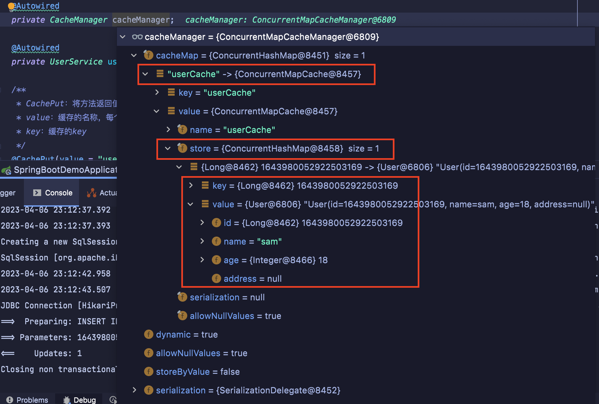

# Spring Cache
我们在Reggie项目中使用过如下的代码, 将查询出来的数据缓存到数据库中

而是我们在将数据存到Redis之前还进行了判断 判断Redis中有没有数据 如果有则直接返回 如果没有查询数据库 返回数据, 将数据再存到Redis中
```java
dishDtoList = (List<DishDto>) edisTemplate.opsForValue().get(key)

if(dishDtoList != null) {
  return Result.success(dishDtoList)
}

// 如果没有 则查询数据库 ...

// 最后将数据存入Redis中
redisTemplate.opsForValue().set(key, dishDtoList, 60, TimeUnit.MINUTES)
```

<br>

以上的代码相当于我们自己来实现缓存的逻辑, 当我们使用了SpringCache后 我们就不用写如上的代码了

我们可以通过在Controller方法上通过注解的方式, 它就可以实现缓存的功能

所以我们通过SpringCache框架就可以大大的提高我们的开发效率

<br>

## SpringCache
它是一个框架 实现了基于注解的缓存功能 只需要简单的加一个注解 就能实现缓存功能

SpringCache提供了一层抽象, 底层可以切换不同的cache实现 **具体的就是通过 CacheManager接口 来统一不同的缓存技术**

CacheManager是Spring提供的各种缓存技术的抽象接口

<br>

### 针对不同的缓存技术需要实现不同的CacheManager
|CacheManager|描述|
|:--|:--|
|EhCacheManager|使用EhCache作为缓存技术|
|GuavaCacheManager|使用Google的GuavaCache作为缓存技术|
|RedisCacheManager|使用Redis作为缓存技术|

<br>

RedisCacheManager框架中给我们提供好了 我们直接使用就可以

<br>

### 常用的注解
|注解|说明|
|:--|:--|
|@EnableCaching|开启缓存注解功能, **<font color="#C2185B">放在启动类上</font>**|
|@Cacheable|在方法执行前, Spring先查看缓存中是否有数据, 如果有数据 则直接返回缓存数据, 若没有数据, 调用方法并将方法返回值放到缓存中, **<font color="#C2185B">放在控制器方法上</font>**|
|@CachePut|将方法的返回值放到缓存中, **<font color="#C2185B">放在控制器方法上</font>**|
|@CacheEvict|将一条或多条数据从缓存中删除, **<font color="#C2185B">放在控制器方法上</font>**|

<br>

### 使用方式: 极其简单
我们具体只用哪种缓存技术, 就看我们导入的是什么依赖 也就是说我们只需要导入相关缓存技术的依赖 + 注解就可以了

<br>

在SpringBoot项目中, 使用缓存技术只需要在项目中导入相关缓存技术的依赖包 **并在启动类上使用 @EnableCaching 开启缓存支持即可**

<br>

例如我们使用 Redis作为缓存技术, 只需要导入``spring-boot-starter-data-redis``的Maven坐标即可, **它会自动进行整合**

<br><br>

# Spring Cache 的使用
SpringCache只是一个框架, 底层使用什么缓存技术就看我们安装的什么依赖包

我们这里先不使用Redis来进行缓存 而是使用基本的Map就缓存 显示一下SpringCache的使用

<br>

**注意:**  
SpringCache中提供的基本的API 已经在 spring-boot-starter-web 中了 具体是在它的子依赖 spring-context依赖中

当我们导入 spring-boot-starter-web 依赖后我们就可以使用SpringCache的基础功能了

<br>

当我们后续使用 Redis 做为缓存的时候 我们再额外导入如下的依赖就好了
```xml
<dependency>
  <groupId>org.springframework.boot</groupId>
  <artifactId>spring-boot-starter-cache</artifactId>
</dependency>

<dependency>
  <groupId>org.springframework.boot</groupId>
  <artifactId>spring-boot-starter-data-redis</artifactId>
</dependency>
```

<br>

我们先验证下SpringCache的基本功能就可以了, 基本功能是当我们使用SpringCache的时候会将数据缓存到Map中

<br>

## 基础配置

### pom.xml
这是我们测试SpringCache所需要的基础依赖

```xml
<?xml version="1.0" encoding="UTF-8"?>
<project xmlns="http://maven.apache.org/POM/4.0.0" xmlns:xsi="http://www.w3.org/2001/XMLSchema-instance"
         xsi:schemaLocation="http://maven.apache.org/POM/4.0.0 https://maven.apache.org/xsd/maven-4.0.0.xsd">
  <modelVersion>4.0.0</modelVersion>
  <parent>
    <groupId>org.springframework.boot</groupId>
    <artifactId>spring-boot-starter-parent</artifactId>
    <version>2.4.5</version>
    <relativePath/> <!-- lookup parent from repository -->
  </parent>
  <groupId>com.sam</groupId>
  <artifactId>demo</artifactId>
  <version>0.0.1-SNAPSHOT</version>

  <properties>
    <java.version>1.8</java.version>
  </properties>

  <dependencies>
    <dependency>
      <groupId>org.springframework.boot</groupId>
      <artifactId>spring-boot-starter-web</artifactId>
      <scope>compile</scope>
    </dependency>

    <dependency>
      <groupId>org.projectlombok</groupId>
      <artifactId>lombok</artifactId>
    </dependency>

    <dependency>
      <groupId>com.alibaba</groupId>
      <artifactId>fastjson</artifactId>
      <version>1.2.76</version>
    </dependency>

    <dependency>
      <groupId>commons-lang</groupId>
      <artifactId>commons-lang</artifactId>
      <version>2.6</version>
    </dependency>

    <dependency>
      <groupId>mysql</groupId>
      <artifactId>mysql-connector-java</artifactId>
      <scope>runtime</scope>
    </dependency>

    <dependency>
      <groupId>com.baomidou</groupId>
      <artifactId>mybatis-plus-boot-starter</artifactId>
      <version>3.4.2</version>
    </dependency>

    <dependency>
      <groupId>org.springframework.boot</groupId>
      <artifactId>spring-boot-starter-test</artifactId>
      <scope>test</scope>
    </dependency>
  </dependencies>

  <build>
    <plugins>
      <plugin>
        <groupId>org.springframework.boot</groupId>
        <artifactId>spring-boot-maven-plugin</artifactId>
      </plugin>
    </plugins>
  </build>

</project>
```

<br>

### application.yml
```yml
server:
  port: 8080
spring:
  application:
    #应用的名称, 可选
    name: demo
  datasource:
    driver-class-name: com.mysql.cj.jdbc.Driver
    url: jdbc:mysql://localhost:3306/demo?serverTimezone=Asia/Shanghai&useUnicode=true&characterEncoding=utf-8&zeroDateTimeBehavior=convertToNull&useSSL=false&allowPublicKeyRetrieval=true
    username: root
    password: root
  redis:
    host: localhost
    port: 6379
    # password: root@123456
    database: 0
  cache:
    redis:
      time-to-live: 1800000 #设置缓存过期时间, 可选
      
mybatis-plus:
  configuration:
    #在映射实体或者属性时, 将数据库中表名和字段名中的下划线去掉, 按照驼峰命名法映射
    map-underscore-to-camel-case: true
    log-impl: org.apache.ibatis.logging.stdout.StdOutImpl
  global-config:
    db-config:
      id-type: ASSIGN_ID
```

<br>

### 数据表
```sql
create table user (
	id int primary key,
	name varchar(255),
	age int,
	address varchar(255)
)
```

<br>

### User实体类
```java
package com.sam.com.sam.entity;
import lombok.Data;
import java.io.Serializable;

@Data
public class User implements Serializable {
  private static final long serialVersionUID = 1L;
  private Integer id;
  private String name;
  private Integer age;
  private String address;
}
```

<br>

### UserController
```java
package com.sam.controller;

import com.baomidou.mybatisplus.core.conditions.query.LambdaQueryWrapper;
import com.sam.entity.User;
import com.sam.service.UserService;
import lombok.extern.slf4j.Slf4j;
import org.springframework.beans.factory.annotation.Autowired;
import org.springframework.cache.CacheManager;
import org.springframework.cache.annotation.CacheEvict;
import org.springframework.cache.annotation.CachePut;
import org.springframework.cache.annotation.Cacheable;
import org.springframework.web.bind.annotation.*;

import java.util.List;

@RestController
@RequestMapping("/user")
@Slf4j
public class UserController {

  @Autowired
  private CacheManager cacheManager;

  @Autowired
  private UserService userService;

  /**
   * CachePut: 将方法返回值放入缓存
   * value: 缓存的名称, 每个缓存名称下面可以有多个key
   * key: 缓存的key
   */
  @CachePut(value = "userCache",key = "#user.id")
  @PostMapping
  public User save(User user){
    userService.save(user);
    return user;
  }

  /**
   * CacheEvict: 清理指定缓存
   * value: 缓存的名称, 每个缓存名称下面可以有多个key
   * key: 缓存的key
   */
  @CacheEvict(value = "userCache",key = "#p0")
  //@CacheEvict(value = "userCache",key = "#root.args[0]")
  //@CacheEvict(value = "userCache",key = "#id")
  @DeleteMapping("/{id}")
  public void delete(@PathVariable Long id){
    userService.removeById(id);
  }

  //@CacheEvict(value = "userCache",key = "#p0.id")
  //@CacheEvict(value = "userCache",key = "#user.id")
  //@CacheEvict(value = "userCache",key = "#root.args[0].id")
  @CacheEvict(value = "userCache",key = "#result.id")
  @PutMapping
  public User update(User user){
    userService.updateById(user);
    return user;
  }

  /**
   * Cacheable: 在方法执行前spring先查看缓存中是否有数据, 如果有数据, 则直接返回缓存数据；若没有数据, 调用方法并将方法返回值放到缓存中
   * value: 缓存的名称, 每个缓存名称下面可以有多个key
   * key: 缓存的key
   * condition: 条件, 满足条件时才缓存数据
   * unless: 满足条件则不缓存
   */
  @Cacheable(value = "userCache",key = "#id",unless = "#result == null")
  @GetMapping("/{id}")
  public User getById(@PathVariable Long id){
    User user = userService.getById(id);
    return user;
  }

  @Cacheable(value = "userCache",key = "#user.id + '_' + #user.name")
  @GetMapping("/list")
  public List<User> list(User user){
    LambdaQueryWrapper<User> queryWrapper = new LambdaQueryWrapper<>();
    queryWrapper.eq(user.getId() != null,User::getId,user.getId());
    queryWrapper.eq(user.getName() != null,User::getName,user.getName());
    List<User> list = userService.list(queryWrapper);
    return list;
  }
}
```

<br><br>

## 主启动类上添加 @EnableCaching 注解
这是我们的第一步, 使用该注解开启缓存功能
```java
package com.sam;

import org.springframework.boot.SpringApplication;
import org.springframework.boot.autoconfigure.SpringBootApplication;
import org.springframework.cache.annotation.EnableCaching;

@SpringBootApplication
@EnableCaching
public class SpringBootDemoApplication {

  public static void main(String[] args) {
    SpringApplication.run(SpringBootDemoApplication.class, args);
  }

}

```

<br><br>

## SpringCache的基本使用: CacheManager
我们在Controller层里面注入了一个 
```java
@Autowired
private CacheManager cacheManager;
```

<br>

### 作用:
我们上面说了针对不同的缓存技术需要补同的CacheManager, 它就是用来统一不同的缓存技术的

CacheManager是一个接口, 它默认给我们提供了如下的几个实现
1. AbstractCacheManager
2. CompositeCacheManager
3. ConcurrentMapCacheManager
4. NoOpCacheManager
5. SimpleCacheManager

<br>

**默认使用的实现: ConcurrentMapCacheManager**  
它默认使用的就是ConcurrentMapCacheManager实现, 底层使用了Map来作为缓存

ConcurrentMapCacheManager实现类中用于缓存数据的属性
```java
private final ConcurrentMap<String, Cahce> cacheMap = new ConcurrenHashMap<>()
```

比如我们将user对象缓存起来的时候 最终就会放在这个Map中

<br>

**注意:**  
ConcurrentMap是基于内存的 当我们重启之后缓存中就没有数据了

<br><br>

## @CachePut: 测试将数据放入缓存中 

### @CachePut:
该注解使用在控制器方法上, **将方法的返回值放到缓存中**, 具体的缓存产品就看我们引入的是什么依赖

<br>

**该注解一般会使用在表示新增的控制器方法上**, 比如我们讲一条数据插入到user表中, 那么对应的我们就要将这条数据放入到缓存中

<br>

### @CachePut的属性:
它的结构类似redis中的hash, 一个 key: field - value, 其中上述的key的部分就相当于下面的缓存的名称

<be>

**value:**  
缓存的名称, 每个缓存名称下面可以有多个key

每一个key相当于一张表, 我们是把数据缓存到这张表里

<br>

**key:**  
缓存的key, 它支持spring中的表达式语言  

比如我们缓存user对象, 会经常将key的部分设置为user的id, 那每一个user对象的id值不一样 所以这个部分必须是动态获取的

<br>

**@CachePut的属性: key的写法**  

1. #result  
#result就是控制器方法的返回值, 下面的save控制器方法中 #result 就相当于 user
```java
// 使用 user对象的id属性作为缓存中的key
@CachePut(value = "userCache",key = "#result.id")
```

- #root, #root是内置对象
  - #root.methodName: 获取控制器方法名称
  - #root.caches: 获取缓存
  - #root.targetClass: 目标类
  - #root.args[0]: 获取控制器方法中的第一个参数

- #参数名(对象类型), 使用#参数名获取控制器方法中的实参
```java
// 使用 user对象的id属性作为缓存中的key
@CachePut(value = "userCache",key = "#user.id")
```

- #参数名(基本数据类型), 比如我们的控制器方法的形参为Long id, 我们就可以将key写成 ``key="#id"``

- #p0, 获取控制器方法中的第一个形参

<br>

```java
/**
* CachePut: 将方法返回值放入缓存
* value: 缓存的名称, 每个缓存名称下面可以有多个key
* key: 缓存的key
*/
@CachePut(value = "userCache",key = "#user.id")
@PostMapping
public User save(User user){
  userService.save(user);
  return user;
}
```

<br>

### 注意点:
我们使用SpringCache主要就是 @CachePut 中的 key 的设计 我们可能需要缓存多份数据, 这些数据不能混了 就需要根据key去区分, 这些key往往都是动态的, 所以我们设置key的时候 都会使用 ``#user.id`` 这种形式

<br>

### 测试: 
因为没有前台页面 所以我们使用PostMan来进行测试

我们发送post的请求的时候 因为save控制器方法的形参上没有使用@RequestBody注解, 所以我们不用发送json格式的数据

普通表单的数据就可以了, 我们发送个 name: sam, age: 18

然后我们观察下 UserController 中的 ``CacheManager cacheManager``

因为我们的save控制器方法中使用了 ``@CachePut(value = "userCache",key = "#user.id")`` 注解 所以我们的数据配缓存到一个叫 userCache 的里面了

<br>



<br>

**结果:**  
我们能观察到 等我们的控制器方法使用了 @CachePut 注解后, 会将控制器的方法的返回值保存在 CacheMap 中, 它的本质是一个Map, 但是我们可以将 CacheMap 理解为一个数据库, 它开辟了一个空间 userCache 来存储我们缓存的数据, 在 store 属性中

- key: userId
- value: user对象

<br><br>

## @CacheEvict: 

### 作用:
清理指定缓存, 将一条或多条数据从缓存中删除

<br>

### 位置:
使用在控制器方法中, 一般使用在delete方法上

<br>

### 场景:
比如我们Demo中的 **delete / update** 控制器方法, 它要做的事情就是删除一条数据, 当我们删除一条数据的时候 **缓存中的数据也需要清理掉**

我们这时就可以使用 @CacheEvict 注解

<br>

### @CacheEvict注解的属性

```java
/**
  * CacheEvict: 清理指定缓存
  * value: 缓存的名称, 每个缓存名称下面可以有多个key
  * key: 缓存的key
  */
@CacheEvict(value = "userCache",key = "#p0")
//@CacheEvict(value = "userCache",key = "#root.args[0]")
//@CacheEvict(value = "userCache",key = "#id")
@DeleteMapping("/{id}")
public void delete(@PathVariable Long id){
  userService.removeById(id);
}
```

<br>

**value: 缓存的名称**   
比如我们将数据缓存在 userCache 区域中的 userId 对应的值里面

这个部分就相当于redis中的 key: field - value, 我们需要通过value属性来指明我们去哪个区域找缓存数据

我们来清理userCache区域中的某个缓存数据

<br>

**key: 缓存对应的key**  
写法 @CachePut 中的key的写法一致

<br>

**allEntries:**  
如下设置可以将setmealCache下的缓存全部删除
```java
@CacheEvict(value = "setmealCache", allEntries = true)
```

<br>

### 删除缓存中的数据的两种方案:
1. 精确删除:
```java
@CacheEvict(value = "userCache",key = "#result.id")
```

2. 全部删除: 
```java
@CacheEvict(value = "setmealCache", allEntries = true)
```

<br>

```java
//@CacheEvict(value = "userCache",key = "#p0.id")
//@CacheEvict(value = "userCache",key = "#user.id")
//@CacheEvict(value = "userCache",key = "#root.args[0].id")
@CacheEvict(value = "userCache",key = "#result.id")
@PutMapping
public User update(User user){
  userService.updateById(user);
  return user;
}
```

<br><br>

## @Cacheable: 

### 作用:
在方法执行前spring先查看缓存中是否有数据
- 如果有数据, 就不再调用控制器方法, 则直接返回缓存中的数据
- 若没有数据, 则调用控制器方法并将控制器方法的返回值放到缓存中

<br>

### @Cacheable的属性:
- vlaue: 缓存的名称, 每个缓存名称下面可以有多个key
- key: 缓存的key, key的同上

- condition: 条件, 满足条件时才缓存数据 (**它不可以使用 #result**)
- unless: 满足条件则不缓存 (**它可以使用 #result**)

<br>

### 注意:  
@Cacheable注解会先检查缓存中是否有该数据
- 有不走控制器方法 直接返回缓存中的数据
- 没有走控制器方法 **并将数据进行缓存**

当我们使用 @Cacheable 最好指定条件, 当什么条件下不缓存, 比如用户传过来的id是空 我们查询数据库的结果就为空

为了避免将null值缓存 所以我们就要设置缓存的条件

<br>

### 示例:
```java
/**
* value: 缓存的名称, 每个缓存名称下面可以有多个key
* key: 缓存的key
* condition: 条件, 满足条件时才缓存数据
* unless: 满足条件则不缓存
*/
@Cacheable(value = "userCache",key = "#id",unless = "#result == null")
@GetMapping("/{id}")
public User getById(@PathVariable Long id){
  User user = userService.getById(id);
  return user;
}
```

<br><br>

### 总结:
- select类型的控制器方法: @Cacheable
- insert类型的控制器方法: @CachePut
- delete / update类型的控制器方法: @CacheEvict

<br>

**@Cacheable:**  
查询的控制器方法上使用, 如果有缓存则不会调用控制器方法 直接返回缓存中的数据, 没有再调用控制器方法

<br>

**@CachePut:**  
新增的控制器方法上使用, 用于将新增的数据放入到缓存中

<br>

**@CacheEvict:**  
修改和删除的控制器方法上使用, 用于将发生变化的指定数据从缓存中删除

<br><br>

## 完整的控制层:
```java
package com.sam.controller;

import com.baomidou.mybatisplus.core.conditions.query.LambdaQueryWrapper;
import com.sam.entity.User;
import com.sam.service.UserService;
import lombok.extern.slf4j.Slf4j;
import org.springframework.beans.factory.annotation.Autowired;
import org.springframework.cache.CacheManager;
import org.springframework.cache.annotation.CacheEvict;
import org.springframework.cache.annotation.CachePut;
import org.springframework.cache.annotation.Cacheable;
import org.springframework.web.bind.annotation.*;

import java.util.List;

@RestController
@RequestMapping("/user")
@Slf4j
public class UserController {

  @Autowired
  private CacheManager cacheManager;

  @Autowired
  private UserService userService;


  /**
   * CachePut：将方法返回值放入缓存
   * value：缓存的名称，每个缓存名称下面可以有多个key
   * key：缓存的key
   */
  @CachePut(value = "userCache",key = "#user.id")
  @PostMapping
  public User save(User user){
    userService.save(user);
    return user;
  }


  /**
   * CacheEvict：清理指定缓存
   * value：缓存的名称，每个缓存名称下面可以有多个key
   * key：缓存的key
   */
  @CacheEvict(value = "userCache",key = "#p0")
  //@CacheEvict(value = "userCache",key = "#root.args[0]")
  //@CacheEvict(value = "userCache",key = "#id")
  @DeleteMapping("/{id}")
  public void delete(@PathVariable Long id){
    userService.removeById(id);
  }


  //@CacheEvict(value = "userCache",key = "#p0.id")
  //@CacheEvict(value = "userCache",key = "#user.id")
  //@CacheEvict(value = "userCache",key = "#root.args[0].id")
  @CacheEvict(value = "userCache",key = "#result.id")
  @PutMapping
  public User update(User user){
    userService.updateById(user);
    return user;
  }


  /**
   * Cacheable：在方法执行前spring先查看缓存中是否有数据，如果有数据，则直接返回缓存数据；若没有数据，调用方法并将方法返回值放到缓存中
   * value：缓存的名称，每个缓存名称下面可以有多个key
   * key：缓存的key
   * condition：条件，满足条件时才缓存数据
   * unless：满足条件则不缓存
   */
  @Cacheable(value = "userCache",key = "#id",unless = "#result == null")
  @GetMapping("/{id}")
  public User getById(@PathVariable Long id){
    User user = userService.getById(id);
    return user;
  }


  @Cacheable(value = "userCache",key = "#user.id + '_' + #user.name")
  @GetMapping("/list")
  public List<User> list(User user){
    LambdaQueryWrapper<User> queryWrapper = new LambdaQueryWrapper<>();
    queryWrapper.eq(user.getId() != null,User::getId,user.getId());
    queryWrapper.eq(user.getName() != null,User::getName,user.getName());
    List<User> list = userService.list(queryWrapper);
    return list;
  }
}
```

<br><br>

# SpringCache + Redis
上面我们做缓存的时候底层使用的是自带的Map, 现在我们将缓存技术切换成Redis

<br>

### 导入依赖
我们要使用Redis缓存要导入两个依赖
```xml
<!-- 该依赖中扩展了对缓存技术的整合 -->
<dependency>
  <groupId>org.springframework.boot</groupId>
  <artifactId>spring-boot-starter-cache</artifactId>
</dependency>

<dependency>
  <groupId>org.springframework.boot</groupId>
  <artifactId>spring-boot-starter-data-redis</artifactId>
</dependency>
```

<br>

当我们导入了 ``spring-boot-starter-cache`` 依赖后, CacheManager接口中的实现类就不只上面我们说的5个了 有10多个

<br>

### 配置 application
主要配置cache - redis
```yml
server:
  port: 8080
spring:
  application:
    name: demo
  datasource:
    driver-class-name: com.mysql.cj.jdbc.Driver
    url: jdbc:mysql://localhost:3306/demo?serverTimezone=Asia/Shanghai&useUnicode=true&characterEncoding=utf-8&zeroDateTimeBehavior=convertToNull&useSSL=false&allowPublicKeyRetrieval=true
    username: root
  redis:
    host: localhost
    port: 6379
    database: 0
  cache:
    redis:
      # 设置缓存的有效期, 不设置的话就是永久有效, 值是任意设置的
      time-to-live: 1800000

mybatis-plus:
  configuration:
    map-underscore-to-camel-case: true
    log-impl: org.apache.ibatis.logging.stdout.StdOutImpl
  global-config:
    db-config:
      id-type: ASSIGN_ID
```

<br>

### 使用方式:
还是跟上面的一样

<br>

### 扩展
- 缓存穿透: 访问的数据既不在缓存也不在数据库中
- 缓存击穿: 当缓存过期时, 有大量请求同时建立该缓存
- 缓存雪崩: 大量缓存同一时间过期

<br>

### 注意！！！:
我们要在Redis中缓存的数据 必须是实现 Serializable 接口的类

比如我们的Reggie项目中 我们控制器方法返回的都是 Result对象, 则该对象也必须实现可序列化接口