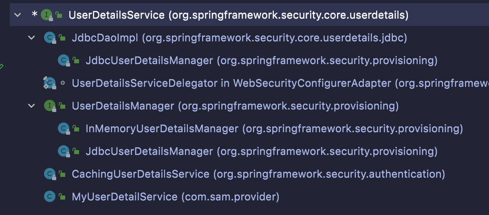

# Spring Security
它是基于Spring的安全框架, 它提供全面的安全性解决方案, 同时在web, 请求级和方法调用级处理身份确认和授权

在 spring framework 基础上, spring security 充分的利用了依赖注入 和 面相切面编程 为应用系统提供声明式的安全访问控制功能

减少了企业系统安全控制编写大量重复代码的工作 是一个轻量级的安全框架 它与spring mvc有很好的集成

<br>

spring security也可以单独使用完成身份认证 和 权限验证功能

<br>

### Spring Security 核心功能
1. 认证 (你是谁, 普通用户?管理员?)
2. 验证 (权限/授权, 验证你有什么权限, 允许你做相应权限能做的事情)

<br>

### Spring Security 原理
它是基于 Filter Servlet AOP 来实现
- 身份认证
- 权限验证 的功能

<br><br>

## Demo版本
- spring boot - 2.0.6
- spring security - 5.0.9
- maven - 3
- jdk - 8

**我使用的spring boot是2.4.5, 别用2.7以上的 因为老师讲的东西在高版本中配置过时了**

<br><br>

## 准备工作

### pom.xml 引入spring security依赖
```xml
<?xml version="1.0" encoding="UTF-8"?>
<project xmlns="http://maven.apache.org/POM/4.0.0"
         xmlns:xsi="http://www.w3.org/2001/XMLSchema-instance"
         xsi:schemaLocation="http://maven.apache.org/POM/4.0.0 http://maven.apache.org/xsd/maven-4.0.0.xsd">
  <modelVersion>4.0.0</modelVersion>

  <groupId>com.sam</groupId>
  <artifactId>ch01</artifactId>
  <version>1.0-SNAPSHOT</version>

  <!-- 加入 spring-boot -->
  <parent>
    <groupId>org.springframework.boot</groupId>
    <artifactId>spring-boot-starter-parent</artifactId>
    <version>2.4.5</version>
    <relativePath/> <!-- lookup parent from repository -->
  </parent>

  <dependencies>
    <dependency>
      <groupId>org.springframework.boot</groupId>
      <artifactId>spring-boot-starter-web</artifactId>
      <scope>compile</scope>
    </dependency>

    <!-- spring security -->
    <dependency>
      <groupId>org.springframework.boot</groupId>
      <artifactId>spring-boot-starter-security</artifactId>
    </dependency>
  </dependencies>

  <build>
    <plugins>
      <plugin>
        <groupId>org.springframework.boot</groupId>
        <artifactId>spring-boot-maven-plugin</artifactId>
        <version>2.4.5</version>
      </plugin>
    </plugins>
  </build>

</project>
```

<br>

### 创建主启动类
```java
package com.sam;

import org.springframework.boot.SpringApplication;
import org.springframework.boot.autoconfigure.SpringBootApplication;

@SpringBootApplication
public class Ch01Application {
  public static void main(String[] args) {
    SpringApplication.run(Ch01Application.class, args);
  }
}
```

<br>

### 创建 Controller
```java
package com.sam.controller;

import org.springframework.web.bind.annotation.GetMapping;
import org.springframework.web.bind.annotation.RequestMapping;
import org.springframework.web.bind.annotation.RestController;

@RestController
@RequestMapping("/security")
public class HelloSecurity {

  @GetMapping("/hello")
  public String sayHello() {
    return "hello spring security";
  }
}
```

<br>

### 基础认证: 访问项目 使用用户名 和 密码
当我们安装 **spring-boot-starter-security** 依赖后 我们观察控制台 会有如下的输出

```s
Using generated security password: 

88bf6eeb-df19-4d8c-a0a4-22c0ed558061
```

<br>

框架给我们生成了一个**临时的密码**
- 用户名: user
- 密码: 88bf6eeb-df19-4d8c-a0a4-22c0ed558061

<br>

**输入 http://localhost:8080/**  
会出现一个登录页面, 这是跟我们以往不一样的地方, 我们需要使用 用户名 和 密码 登录应用, 才可以访问系统
```
user
88bf6eeb-df19-4d8c-a0a4-22c0ed558061
```

<br>

### 原理
能达到这样的效果就是因为用到了aop, 在控制器方法之前先做了拦截, 拦截处使用的就是 security 管理框架使用的身份认证

如果用户的认证是正确的 请求才能到我们的控制器方法里

<br><br>

## 自定义访问项目的 用户名 和 密码
上面的 用户名 和 密码 是框架给我们自动生成的

<br>

### 设置方式
在 application.yml 文件中设置登录的用户名和密码

<br>

当我们配置后, 框架就不会再给我们提供临时的用户名和密码了

```yml
spring:
  security:
    user:
      name: admin
      password: admin
```

<br><br>

## 关闭访问项目的 用户验证功能
在 spring security 5.0 版本中我们的设置如下

在 主启动类 上使用 利用 @SpringBootApplication 注解 指定该注解的exclude属性 来排除Security的配置 让它不启用

```java
// 排除Security的配置, 让它不启用
@SpringBootApplication(exclude = {SecurityAutoConfiguration.class})
public class Ch01Application {
  public static void main(String[] args) {
    SpringApplication.run(Ch01Application.class, args);
  }
}
```

当我们这么设置后 安全管理框架的登录验证功能 就不启用了 

<br><br>

## 使用内存中的用户信息 进行认证
上面用户登录我们的项目所使用的 用户名 和 密码 我们是配置在 application.yml 文件中写死了

现在有一个问题 就是当用户多了的情况下 我们不可能将所有的用户名和密码都写在 application.yml 中

所以我们可以使用内存中的用户信息来进行认证管理, 也就是说我们将需要登录项目的用户信息 配置在内存中

<br>

### 使用场景:
当我们要管理的用户不多的时候 可以采取该方式

<br>

### WebSecurityConfigurerAdapter: 控制安全管理的内容
它会负责如下的一些功能
- 验证
- 登录的身份认证
- 权限管理

<br>

**扩展: 这部分可以略过 Memo用**  
它在5.7版本中已经被 deprecated 了 有一些注解也用不了 等自己做的时候要注意 新版本配置可能如下
```java
@Configuration
@EnableWebSecurity
@EnableGlobalMethodSecurity(prePostEnabled = true)
public class MyWebSecurityConfig implements WebSecurityConfigurer {

    @Autowired
    public void configureGlobal(AuthenticationManagerBuilder auth) throws Exception {

        auth.inMemoryAuthentication()
            .withUser("sam")
            .password(passwordEncoder().encode("123456"))
            .roles("normal")
            .and()
            .withUser("erin")
            .password(passwordEncoder().encode("123456"))
            .roles("normal")
            .and()
            .withUser("admin")
            .password(passwordEncoder().encode("admin"))
            .roles("admin", "normal");
    }

    @Override
    public void configure(HttpSecurity http) throws Exception {
        http.authorizeRequests()
            .antMatchers("/admin/**").hasRole("admin")
            .anyRequest().authenticated()
            .and()
            .formLogin().permitAll()
            .and()
            .logout().permitAll();
    }

    @Bean
    public PasswordEncoder passwordEncoder() {
        return new BCryptPasswordEncoder();
    }

}
```

<br>

**@EnableWebSecurity:**  
它是复合注解 自带 @Configuration 注解功能 所以写一个就可以

<br>

### 使用方式: 
**创建配置类:**  
@Configuration标识的类, 该类相当于 spring 的 xml配置文件

在这个类方法的返回值是Java对象, 这些对象会放入到Spring容器中

<br>

**类中要点:**  
- 类上使用 @EnableWebSecurity 注解, 作用: 启用Security安全功能

- 该类需要继承 WebSecurityConfigurerAdapter 类 并重写方法

<br>

**WebSecurityConfigurerAdapter 抽象类:**  
该类中会重写如下的方法来实现自定义的认证功能
```java
configure(AuthenticationManagerBuilder auth):void
```

<br>

我们会通过该方法的 **AuthenticationManagerBuilder auth 认证器对象**, 通过它来构建在内存中存储的用户信息

<br>

```java
package com.sam.config;

import org.springframework.context.annotation.Configuration;
import org.springframework.security.config.annotation.authentication.builders.AuthenticationManagerBuilder;
import org.springframework.security.config.annotation.web.configuration.EnableWebSecurity;
import org.springframework.security.config.annotation.web.configuration.WebSecurityConfigurerAdapter;


// 相当于 spring 的xml配置文件
@Configuration
// 启用spring security 安全框架的功能
@EnableWebSecurity
public class MyWebSecurityConfig extends WebSecurityConfigurerAdapter {
  // 在方法中配置 用户名 和 密码的信息 作为登录的数据
  @Override
  protected void configure(AuthenticationManagerBuilder auth) throws Exception {

      // 定义 第一个 用户的相关信息
    auth.inMemoryAuthentication().withUser("sam").password("123456").roles();

    // 定义 第二个 用户的相关信息
    auth.inMemoryAuthentication().withUser("erin").password("123456").roles();
  }
}
```

<br>

上面我们就在内存中创建了 两个用户登录项目时 需要使用的信息

<br>

### 问题:
我们像上面配置完后 访问项目 输入 sam 123456 出现了如下的报错
```java
There is no PasswordEncoder mapped for the id "null"
```

<br>

**原因:**  
Security5版本中 我们在给用户配置密码的时候 **该密码必须要进行加密**

<br>

**解决方案: 为密码进行加密** 
1. MyWebSecurityConfig类中定义passwordEncoder方法 用户创建 加密的类

2. 在configure方法中 调用passwordEncoder方法拿到加密类的对象, 为密码进行加密处理

```java
package com.sam.config;

import org.springframework.context.annotation.Bean;
import org.springframework.context.annotation.Configuration;
import org.springframework.security.config.annotation.authentication.builders.AuthenticationManagerBuilder;
import org.springframework.security.config.annotation.web.configuration.EnableWebSecurity;
import org.springframework.security.config.annotation.web.configuration.WebSecurityConfigurerAdapter;
import org.springframework.security.crypto.bcrypt.BCryptPasswordEncoder;
import org.springframework.security.crypto.password.PasswordEncoder;

@Configuration
@EnableWebSecurity
public class MyWebSecurityConfig extends WebSecurityConfigurerAdapter {
  // 在方法中配置 用户名 和 密码的信息 作为登录的数据
  @Override
  protected void configure(AuthenticationManagerBuilder auth) throws Exception {

    // 步骤2: 调用passwordEncoder()方法 拿到BCryptPasswordEncoder对象 为密码进行加密处理
    PasswordEncoder pe = passwordEncoder();


    // 定义 第一个 用户的相关信息, 密码部分要加密
    auth.inMemoryAuthentication()
        .withUser("sam")
        .password(pe.encode("123456"))
        .roles();

    // 定义 第二个 用户的相关信息, 密码部分要加密
    auth.inMemoryAuthentication()
        .withUser("erin")
        .password(pe.encode("123456"))
        .roles();
  }

  /*
  步骤1: 
    创建密码的加密类, 并将该对象放入spring容器中

    其实也不用将该类放到容器中吧 在本类创建对象直接进行加密逻辑就可以了吧

    PasswordEncoder 是一个接口, 我们要创建它对应的实现类 (实现类很多)

      - BCryptPasswordEncoder: 它是跨平台的一种加密方式
  */
  @Bean
  public PasswordEncoder passwordEncoder() {
    BCryptPasswordEncoder passwordEncoder = new BCryptPasswordEncoder();
    return passwordEncoder;
  }
}
```

<br><br>

# 身份认证: 基于角色
一个用户可以有不同的角色

**同时可以开启对方法级别的认证**, 也就是用户在访问方法时, 提供认证的功能

<br>

## 设置步骤
还是跟上面的方式差不多 只不过在链式调用.roles()方法的时候 我们指定角色

1. 创建配置类 继承 WebSecurityConfigurerAdapter

2. 类中重写 configure(AuthenticationManagerBuilder auth) 方法

3. 类中创建返回加密类的方法

4. 在configure()方法中创建加密类的对象 用于给密码加密

5. 使用configure()方法的形参 auth 对象 调用方法设置用户的
  - 用户名
  - 密码
  - **角色**

```java
// 管理员具有普通的角色 和 管理员的角色
auth.inMemoryAuthentication()
  .withUser("admin")
  .password(pe.encode("admin"))
  .roles("admin", "normal");
```

6. 类上加上 **@EnableGlobalMethodSecurity(prePostEnabled = true)** 注解, 当我们设置为true时可以使用指定注解 为方法提供验证功能
  - true: 表示可以使用如下的注解
    - @PreAuthorize: 访问控制器方法前进行角色认证
    - @PostAuthorize: 访问控制器方法后进行角色认证
  - false: 默认值

<br>

**配置类的完整内容:**  
```java
package com.sam.config;

...

@Configuration
@EnableWebSecurity
// 启用方法级别的登录认证, 验证方法是否能被访问
@EnableGlobalMethodSecurity(prePostEnabled = true)
public class MyWebSecurityConfig extends WebSecurityConfigurerAdapter {
  // 在方法中配置 用户名 和 密码的信息 作为登录的数据
  @Override
  protected void configure(AuthenticationManagerBuilder auth) throws Exception {

    PasswordEncoder pe = passwordEncoder();

    // 定义两个角色 普通橘色 normal 和 admin
    auth.inMemoryAuthentication()
        .withUser("sam")
        .password(pe.encode("123456"))
        .roles("normal");


    auth.inMemoryAuthentication()
        .withUser("erin")
        .password(pe.encode("123456"))
        .roles("normal");


    // 管理员具有普通的角色 和 管理员的角色
    auth.inMemoryAuthentication()
        .withUser("admin")
        .password(pe.encode("admin"))
        .roles("admin", "normal");
  }


  @Bean
  public PasswordEncoder passwordEncoder() {
    BCryptPasswordEncoder passwordEncoder = new BCryptPasswordEncoder();
    return passwordEncoder;
  }
}

```

<br>

### 测试: 方法级别的认证
**在控制器方法中使用注解, 使用认证功能:**  
我们可以在控制器方法上使用注解 指定什么角色可以访问控制器方法

角色符合要求 用户才能访问控制器方法 

<br>

### **<font color="#C2185B">@PreAuthorize("hasAnyRole('admin')")</font>**  
该注解使用在控制器方法上, 只有指定权限的用户才能方法它所标识的控制器方法

admin是在security配置类中设置的

<br>

```java
// 指定 normal 和 admin 角色都可以访问的方法
@GetMapping("/normal_roles")
@PreAuthorize("hasAnyRole('admin', 'normal')")
public String normalRoles() {
  return "普通权限可以让问的用户";
}


// 指定 admin 角色 专有的方法
@GetMapping("/admin_roles")
@PreAuthorize("hasAnyRole('admin')")
public String adminRoles() {
  return "管理员可以让问的用户";
}
```

<br>

当我们使用普通用户访问admin权限的控制方法时, 发现返回403, 访问被拒绝

<br><br>

# 身份角色认证: 基于数据库
上面我们是在内存中(配置类中)定义访问项目的用户的信息 (用户名 密码 角色)

这种方式对于小型项目 用户较少的时候是可以使用的 但在实际项目中用户是成万的 用户的数据应该是存在数据库中的

**我们需要从数据库加载用户的身份信息**
- 用户名称
- 密码
- 角色

<br>

### 概述:
这个章节我们主要实现, 经过我们的一系列的配置后, 当用户访问我们的项目时  
Security框架会自动查询数据库, 获取数据库中关于用户的信息, 封装成框架验证使用的User实体类然后自动进行验证

<br>

### 介绍
在 SpringSecurity 框架中对于用户信息的表示类是 UserDetails 接口  
**UserDetails是一个接口**, 它是一个高度抽象的用户信息类(相当于项目中的User类, 保存用户信息的)

```
| - UserDetails 接口
  | - User 实现类
```

User实现类就是框架验证需要使用到的实体类

<br>

**UserDetails接口的概述:**  
```java
public interface UserDetails extends Serializable {

  // 角色 集合
  Collection<? extends GrantedAuthority> getAuthorities();

  // 密码
  String getPassword();

  // 用户名
  String getUsername();

  // 判断账户 是否过期
  boolean isAccountNonExpired();

  // 判断账户 是否是锁定的
  boolean isAccountNonLocked();

  // 判断账户的密码 是否过期
  boolean isCredentialsNonExpired();

  // 判断账户是否是启用的
  boolean isEnabled();
}
```

<br>

**UserDetails接口 的实现类 User:**  
我们可以创建一个User对象来代表 用来认证的用户信息, 框架自动使用
```java
public class User implements UserDetails, CredentialsContainer {

  // 构造方法: 用户名 + 密码 + 角色集合
  public User(String username, String password, Collection<? extends GrantedAuthority> authorities) {
		this(username, password, true, true, true, true, authorities);
	}
}
```

User对象用来提供身份认证的数据, SpringSecurity框架会调用User对象来进行用户身份的认证

我们需要做的就是向SpringSecurity框架提供User对象, 对象需要的数据(用户名 密码 角色) 需要通过查询数据库

<br>

**UserDetailsService接口:**  
该接口的作用就是 当用户访问项目时, 通过输入的用户名 来查询数据库, 将根据用户名查询到的用户信息  
提取用户名 密码 和 权限部分 封装成User对象  

上面的逻辑就是通过重写loadUserByUsername方法实现的

<br>

- 参数: 用户名
- 返回值: UserDetails

```java
public interface UserDetailsService {

  // 根据用户名 访问数据库 获取我们需要的用户信息
	UserDetails loadUserByUsername(String username) throws UsernameNotFoundException;

}
```

<br>

我们会自定义类 实现该接口 并重写该接口的方法 在重写方法内查询数据库 查询用户信息 并使用用户信息 封装成 UserDetails 的实现类 User 供框架使用

<br><br>

## 准备工作:

### pom.xml
**要点:**  
我们访问数据库的框架为 jpa, 之前我们都是通过springboot自带的datasource来连接数据库的

```yml
spring:
  application:
    # 可选: 我们可以配置项目名称 如果不配置则默认使用工程名
    name: reggie_take_out
  datasource:
    driver-class-name: com.mysql.cj.jdbc.Driver
    url: jdbc:mysql://localhost:3306/reggie?serverTimezone=Asia/Shanghai&useUnicode=true&characterEncoding=utf-8&zeroDateTimeBehavior=convertToNull&useSSL=false&allowPublicKeyRetrieval=true
    username: root
    password: root
```

<br>

**扩展: JPA也是类似Mybatis的一个框架**  
```
在SSM框架中, M通常指的是MyBatis框架, 它是一种基于Java的持久层框架, 可以将SQL语句与Java代码分离, 简化了开发人员的工作。

JPA（Java Persistence API）是Java EE 5规范中定义的一种ORM框架, 它提供了一种将Java对象映射到关系型数据库中的方法。与MyBatis框架不同, JPA不需要手写SQL语句, 而是通过一系列注解来描述Java对象与数据库表之间的映射关系。

在SSM框架中, 可以使用MyBatis或者JPA来实现持久化操作。MyBatis比较适合对SQL语句进行优化和定制化, 而JPA则更加适合快速开发和维护, 因为它可以自动生成SQL语句, 同时提供了很多ORM框架常用的功能, 例如对象关系映射、持久化上下文、事务管理等。
```

```xml
<?xml version="1.0" encoding="UTF-8"?>
<project xmlns="http://maven.apache.org/POM/4.0.0"
         xmlns:xsi="http://www.w3.org/2001/XMLSchema-instance"
         xsi:schemaLocation="http://maven.apache.org/POM/4.0.0 http://maven.apache.org/xsd/maven-4.0.0.xsd">
  <modelVersion>4.0.0</modelVersion>

  <groupId>com.sam</groupId>
  <artifactId>ch02</artifactId>
  <version>1.0</version>

  <!-- 加入 spring-boot -->
  <parent>
    <groupId>org.springframework.boot</groupId>
    <artifactId>spring-boot-starter-parent</artifactId>
    <version>2.4.5</version>
    <relativePath/> <!-- lookup parent from repository -->
  </parent>

  <dependencies>
    <dependency>
      <groupId>org.springframework.boot</groupId>
      <artifactId>spring-boot-starter-web</artifactId>
      <scope>compile</scope>
    </dependency>

    <!-- spring security -->
    <dependency>
      <groupId>org.springframework.boot</groupId>
      <artifactId>spring-boot-starter-security</artifactId>
    </dependency>

    <!-- mysql驱动 -->
    <dependency>
      <groupId>mysql</groupId>
      <artifactId>mysql-connector-java</artifactId>
    </dependency>

    <!-- 数据库访问框架: jpa -->
    <dependency>
      <groupId>org.springframework.boot</groupId>
      <artifactId>spring-boot-starter-data-jpa</artifactId>
    </dependency>
  </dependencies>

  <build>
    <plugins>
      <plugin>
        <groupId>org.springframework.boot</groupId>
        <artifactId>spring-boot-maven-plugin</artifactId>
        <version>2.4.5</version>
      </plugin>
    </plugins>
  </build>
</project>
```

<br>

### 创建实体类
对应着数据库中的一张表, 该实体类是由JPA的注解实现的 主要是用来为 用户认证 使用的

```java
package com.sam.entity;

import javax.persistence.Entity;
import javax.persistence.GeneratedValue;
import javax.persistence.GenerationType;
import javax.persistence.Id;


/*
  @Entity JPA中的注解:
    用来表示当前类是实体类, 表示数据库中的表
    表名 默认和 类名一样

  @Table(name="user_info")
    该注解用于指定表名

  注意:
    实体类必须指明主键字段
    @Id
    @GeneratedValue(strategy = GenerationType.IDENTITY)
    private Long id;

  @Id
    用于指明主键字段GenerationType.IDENTITY表示数据库自动生成主键

  @GeneratedValue(strategy = GenerationType.IDENTITY)
    用来指明主键的生成策略,
*/
@Entity
public class UserInfo {
  @Id
  @GeneratedValue(strategy = GenerationType.IDENTITY)
  private Long id;
  
  // 用户名 + 密码 + 角色
  private String username;
  private String password;
  private String role;

  public Long getId() {
    return id;
  }

  public void setId(Long id) {
    this.id = id;
  }

  public String getUsername() {
    return username;
  }

  public void setUsername(String username) {
    this.username = username;
  }

  public String getPassword() {
    return password;
  }

  public void setPassword(String password) {
    this.password = password;
  }

  public String getRole() {
    return role;
  }

  public void setRole(String role) {
    this.role = role;
  }
}

```

<br>

### 定义DAO接口
用来访问数据库
```java
package com.sam.dao;

import com.sam.entity.UserInfo;
import org.springframework.data.jpa.repository.JpaRepository;

// DAO接口需要继承 JpaRepository接口 泛型指明 实体类类型 和 主键类型
public interface UserInfoDao extends JpaRepository<UserInfo, Long> {
  /*
    按照username查询数据库的信息 返回值为UserInfo

    UserInfo实体类中的属性名为 username
    所以这里的方法名要起名为findByUsername -> 错误演示: findByUserName 会报错
  */
  UserInfo findByUsername(String username);
}

```

<br>

### 定义Service部分
```java
package com.sam.service;

import com.sam.entity.UserInfo;

public interface UserInfoService {
  UserInfo findUserInfo(String username);
}
```

```java
package com.sam.service.impl;

import com.sam.dao.UserInfoDao;
import com.sam.entity.UserInfo;
import com.sam.service.UserInfoService;
import org.springframework.beans.factory.annotation.Autowired;
import org.springframework.stereotype.Service;

@Service
public class UserInfoServiceImpl implements UserInfoService {

  // 注入DAO
  @Autowired
  private UserInfoDao userInfoDao;

  @Override
  public UserInfo findUserInfo(String username) {
    UserInfo userInfo = userInfoDao.findByUserName(username);
    return userInfo;
  }
}

```

<br>

### application配置文件设置数据库访问信息
jpa的配置中我们配置的是  generate-ddl: true

该配置JPA**将自动根据实体类的定义，生成对应的DDL（数据定义语言）语句来创建数据库表结构**

在开发阶段使用这个功能可以减少手动创建表的工作量，提高开发效率。

当然，在生产环境中一般不会开启这个功能，因为这会让JPA自动对数据库表结构进行更改，可能会对数据的完整性和安全性造成风险。

在生产环境中，我们应该手动创建和维护数据库表结构，并对表结构的变化进行严格的管理和控制。


```yml
spring:
  datasource:
    driver-class-name: com.mysql.cj.jdbc.Driver
    url: jdbc:mysql://localhost:3306/security?serverTimezone=UTC&useSSL=false
    username: root
  jpa:
    generate-ddl: true
    show-sql: true
    database: mysql
```

<br>

### 配置初始化数据库的类
该类的作用就是在启动程序后 给数据库插几条初始化的数据
```java
package com.sam.init;

...

@Component
public class JdbcInit {

  @Autowired
  private UserInfoDao userInfoDao;

  @PostConstruct
  public void init() {

    // 对密码进行加密
    PasswordEncoder passwordEncoder = new BCryptPasswordEncoder();

    // 创建 UserInfo 对象
    UserInfo u = new UserInfo();
    u.setUsername("sam");
    u.setPassword(passwordEncoder.encode("123456"));
    u.setRole("normal");

    userInfoDao.save(u);

    UserInfo u2 = new UserInfo();
    u2.setUsername("admin");
    u2.setPassword(passwordEncoder.encode("admin"));
    u2.setRole("admin");

    userInfoDao.save(u2);
  }
}
```

<br>

**扩展: @PostConstruct**  
该注解可以实现在运行工程时, 自动运行该注解下的方法

​被@PostConstruct修饰的方法会在服务器加载Servle的时候运行, 并且只会被服务器执行一次。


<br>

**注意:**  
只有第一次启动的时候 需要这是初始化数据库的类 如果再次启动 就将 @Component 和 @PostConstruct 注解注释掉 

避免重复添加数据


<br>

### 使用 UserDetailsService 接口 从数据库中获取数据
1. 创建 MyUserDetailService 类
2. 该类实现 UserDetailsService 接口
3. 实现loadUserByUsername方法
4. 方法中使用 dao 查询用户信息
5. 利用用户信息封装 UserDetails 的实现类User
6. 返回User 供框架使用

```java
package com.sam.provider;

import com.sam.dao.UserInfoDao;
import com.sam.entity.UserInfo;
import org.springframework.beans.factory.annotation.Autowired;
import org.springframework.security.core.GrantedAuthority;
import org.springframework.security.core.authority.SimpleGrantedAuthority;
import org.springframework.security.core.userdetails.User;
import org.springframework.security.core.userdetails.UserDetails;
import org.springframework.security.core.userdetails.UserDetailsService;
import org.springframework.security.core.userdetails.UsernameNotFoundException;
import org.springframework.stereotype.Component;

import java.util.ArrayList;
import java.util.List;


// 将MyUserDetailService类交给IOC容器管理的同时给它一个名字
@Component("MyUserDetailService")
public class MyUserDetailService implements UserDetailsService {

  @Autowired
  private UserInfoDao userInfoDao;


  @Override
  public UserDetails loadUserByUsername(String username) throws UsernameNotFoundException {
    User user = null;

    if(username != null) {
      
      // 查看用户信息
      UserInfo userInfo = userInfoDao.findByUsername(username);
      

      if(userInfo != null) {
        /*
          创建User对象 构造方法的参数为
          1. 用户名
          2. 密码
          3. 权限集合 List<GrantedAuthority> list
        */
        List<GrantedAuthority> list =  new ArrayList<>();

        /*
          我们要往集合中添加 GrantedAuthority 对象 

          GrantedAuthority是一个接口 我们使用它的实现类 SimpleGrantedAuthority 

          SimpleGrantedAuthority的构造方法中需要我们传入 权限

          需要传入的权限格式为
          "ROLE_" + 数据库用户的权限字符串
        */
        GrantedAuthority authority = new SimpleGrantedAuthority("ROLE_" + userInfo.getRole());

        list.add(authority);


        user = new User(userInfo.getUsername(), userInfo.getPassword(), list);
      }
    }

    return user;
  }
}
```

<br>

### 创建Security配置类
我们上面 自定义了一个 UserDetailsService 的实现类 返回了一个 UserDetails接口的User实现类对象(验证用)

现在我们要让上面的实现类 生效 需要在配置类中做如下的配置

<br>

1. 注入 上面步骤中创建的 UserDetailsService 实现类

2. 调用 auth.userDetailsService() 方法传入步骤1中的实现类

3. 链式调用指明验证用户密码的方式

```java
package com.sam.config;

import com.sam.provider.MyUserDetailService;
import org.springframework.beans.factory.annotation.Autowired;
import org.springframework.beans.factory.annotation.Qualifier;
import org.springframework.context.annotation.Configuration;
import org.springframework.security.config.annotation.authentication.builders.AuthenticationManagerBuilder;
import org.springframework.security.config.annotation.method.configuration.EnableGlobalMethodSecurity;
import org.springframework.security.config.annotation.web.configuration.EnableWebSecurity;
import org.springframework.security.config.annotation.web.configuration.WebSecurityConfigurerAdapter;
import org.springframework.security.core.userdetails.UserDetailsService;
import org.springframework.security.crypto.bcrypt.BCryptPasswordEncoder;

@Configuration
@EnableWebSecurity
@EnableGlobalMethodSecurity(prePostEnabled = true)
public class MyWebSecurityConfig extends WebSecurityConfigurerAdapter {


  // UserDetailsService类型的类有多个, 我们使用@Qualifier("MyUserDetailService")注解指明我们注入的是哪一个类
  @Autowired
  @Qualifier("MyUserDetailService")
  private UserDetailsService userDetailsService;

  @Override
  protected void configure(AuthenticationManagerBuilder auth) throws Exception {

    // 指定UserService用户密码的验证方式 传入我们 我们自定义的UserDetailsService的实现类
    auth.userDetailsService(userDetailsService).passwordEncoder(new BCryptPasswordEncoder());
  }
}

```

<br>

### 创建控制层 测试用户验证情况
```java
package com.sam.controller;

import org.springframework.security.access.prepost.PreAuthorize;
import org.springframework.web.bind.annotation.GetMapping;
import org.springframework.web.bind.annotation.RequestBody;
import org.springframework.web.bind.annotation.RequestMapping;
import org.springframework.web.bind.annotation.RestController;

import java.util.Map;

@RestController
@RequestMapping("/security")
public class HelloSecurity {

  // 指定 normal 和 admin 角色都可以访问的方法
  @GetMapping("/normal_roles")
  @PreAuthorize("hasAnyRole('admin', 'normal')")
  public String normalRoles() {
    return "普通权限可以访问的用户";
  }


  // 指定 admin 角色 专有的方法
  @GetMapping("/admin_roles")
  @PreAuthorize("hasAnyRole('admin')")
  public String adminRoles() {
    return "管理员可以访问的用户";
  }

}
```

<br><br>

# 认证 和 授权

**authentication: 认证**  
判断访问者是否是系统中的有效用户, 访问者可以是用户或者是系统 用来认证访问者是谁

<br>

**authorization: 授权**  
当认证成功后 用户才能访问系统 才能看到用户能做什么 这就是授权

授权是来判断访问者它能对系统中的某些资源能做什么

<br>

认证和授权是两个部分

认证: 我们使用账号和密码登录系统了 系统要判断用户到底有没有 这是认证

授权: 之后 如果用户需要做一些操作 比如删除 更新 查询 是否能做这些事情是跟授权相关的

<br>

比如说张三用户要访问一个公司的oa系统 系统要判断是不是公司中的有效用户 这是认证过程

判断张三是否能做某些操作 如果张三是个领导 它可以批准下级的请假 或者 其它的操作 这是授权

<br>

## RBAC模型: 基于角色的访问控制
在认证和授权的过程中 会使用 RBAC模型

**RBAC是基于角色的访问控制**(Role_Based_Access_Control) 

在RBAC中 **权限 与 角色 相关联** 用户通过成为适当的角色的成员而得到这些角色的权限 这就极大地简化了权限的管理

这样管理都是层级相互依赖的 **权限赋予给角色 而把角色又赋予给用户** 这样的权限设计很清楚 管理起来很方便

<br>

- 权限: 能对资源的操作, 比如增加 修改 删除 查看
- 角色: 自定义的, 表示权限的集合, 一个角色中可以有多个权限

<br>

**其基本思想是** 对系统操作的各种权限不是直接授予具体的用户 而是**在用户集合与权限集合之间建立一个角色集合**

```
    →  →  →  →
  ↗             ↘
用户 <- 角色 <- 一组权限

User: 用户表
Role: 角色表
Pemission: 权限表
```

**每一种角色对应一组相应的权限** 一旦用户被分配了适当的角色后 该用户就拥有此角色的所有操作权限

这样的好处是 必须在每次创建用户的时候都进行分配权限的操作 只要分配用户相应的角色即可

而且角色的权限变更要比用户的权限变更要少的很多 这样将简化用户的权限管理 减少系统的开销

<br>

### 示例:
我们的公司中有员工 副经理 和 经理, 我们怎么来赋予权限呢?

在RBAC中
- 用户是属于角色的, 角色拥有权限的集合
- 用户属于某个角色, 则它就具有角色对应的权限

如:  
系统中有张三 和 李四, 他们是普通员工 只能查看数据  
系统中有经理 和 副经理, 他们能修改数据

<br>

**设计如下:**
- 定义 经理 角色: 该角色具有查看 修改 删除数据的权限

- 定义 普通用户 角色: 该角色具有查看数据的权限

<br>

**指定角色:**  
- 张三 和 李四 -> 给于普通用户的角色
- 经理 和 副经理 -> 给于经理的角色

<br>

公司以后增加新的普通员工 则加入到 普通用户角色就可以了 不需要再增加新的角色 

公司增加经理的时候也是一样的处理

<br>

在 RBAC 中我们会使用相应的表表示我们的用户 角色 和 权限

<br><br>

## RBAC中的数据表一般有哪些
RBAC设计中的表一般有如下的5张, 通过如下的5张表基本上能完成 RBAC 的设计

- 用户表
- 角色表
- 用户角色表
- 权限表
- 角色权限表

```
  用户角色    角色权限

用户      角色      权限
```

<br>

### 用户表: 用来做用户认证 (登录用到的表)
- 用户名
- 密码
- 是否启用
- 是否锁定 等信息

主要通过用户表来认证用户 是不是系统中的有效用户

<br>

### 角色表: 定义角色信息
- 角色名称
- 角色描述

一个用户可能是多种角色, 同样 一个角色可能有多个用户

<br>

### 用户 和 角色 的 关系表
用户和角色是多对多的关系

<br>

### 权限表
角色可以有哪些权限

<br>

### 权限 和 角色 的 关系表

<br>

### RBAC的特点
它不应该和我们的系统紧密关联 它应该是可以独立反复使用的

<br><br>

# SpringSecurity框架: 认证类 和 接口的说明
我们这个部分看下在认证中 需要使用到的接口和类

在上面Demo中, 当用户访问系统页面 进行登录操作的时候, 认证用户的动作, 是通过框架自动查询数据库, 然后自动进行认证的 

```java
@Component("MyUserDetailService")
public class MyUserDetailService implements UserDetailsService {

  @Autowired
  private UserInfoDao userInfoDao;


  @Override
  public UserDetails loadUserByUsername(String username) throws UsernameNotFoundException {

    User user = null;

    if(username != null) {

      UserInfo userInfo = userInfoDao.findByUsername(username);

      if(userInfo != null) {

        List<GrantedAuthority> list =  new ArrayList<>();

        GrantedAuthority authority = new SimpleGrantedAuthority("ROLE_" + userInfo.getRole());
        list.add(authority);
        user = new User(userInfo.getUsername(), userInfo.getPassword(), list);
      }
    }

    return user;
  }
}
```


在整个过程中我们使用到UserDetailsService接口, 该接口是用来获取用户的认证信息的

它是通过重写接口中的 ``loadUserByUsername`` 方法通过 username 来获取用户信息

该方法的返回值是 UserDetails

- UserDetailsService接口
- UserDetails接口

上面的这两个接口是我们在用户认证中必备的两个内容

<br>

### UserDetails接口
框架中是使用该接口表示用户信息, 它和我们当前业务是无关的 

我们只要构建出 UserDetails接口的实现类对象, Spring就可以认证这个账号是否是正确的

```java
public interface UserDetails extends Serializable {

  // 角色 集合 List<GrantedAuthority>
  Collection<? extends GrantedAuthority> getAuthorities();

  // 密码
  String getPassword();

  // 用户名
  String getUsername();

  // 判断 账户 是否过期
  boolean isAccountNonExpired();

  // 判断 账户 是否是锁定的
  boolean isAccountNonLocked();

  // 判断 账户的密码(证书) 是否过期
  boolean isCredentialsNonExpired();

  // 判断 账户 是否是启用的
  boolean isEnabled();
}
```

<br>

### UserDetails接口 实现类 User

**要点:**  
如果我们使用的构造方法2 那么只有当我们传入的boolean类型的参数的值都为真的时候 用户来能认证成功

```java
public class User implements UserDetails, CredentialsContainer {

  // 构造方法1: 用户名 + 密码 + 权限集合
  public User(String username, String password, Collection<? extends GrantedAuthority> authorities) {
		this(username, password, true, true, true, true, authorities);
	}


  // 构造方法2: 用户名 + 密码 + 账号是否启用 + 账号是否过期 + 证书是否过期 + 账号是否锁定 + 权限集合
  public User(String username, String password, boolean enabled, boolean accountNonExpired,
			boolean credentialsNonExpired, boolean accountNonLocked,
			Collection<? extends GrantedAuthority> authorities) {
		Assert.isTrue(username != null && !"".equals(username) && password != null,
				"Cannot pass null or empty values to constructor");
		this.username = username;
		this.password = password;
		this.enabled = enabled;
		this.accountNonExpired = accountNonExpired;
		this.credentialsNonExpired = credentialsNonExpired;
		this.accountNonLocked = accountNonLocked;
		this.authorities = Collections.unmodifiableSet(sortAuthorities(authorities));
	} 
}
```

<br>

**扩展:**  
我们也可以自定义类实现 UserDetails接口 作为我们系统中的用户类 这个类可以交给SpringSecurity使用

<br>

### 通过 UserDetailsService接口 获取 UserDetails接口对象

UserDetailsService接口, 该接口中就一个方法, 根据用户名称获取用户信息 

**返回值为UserDetails**

```java
public interface UserDetailsService {

	UserDetails loadUserByUsername(String username) throws UsernameNotFoundException;

}
```

<br>

**用户信息主要包括:**  
1. 用户名
2. 密码
3. 角色集合
4. 是否可用
5. 是否锁定等

<br>

**接口作用:**  
获取用户信息 得到 UserDetails 对象, 一般项目中都需要自定义类实现该接口 从数据库中获取数据

<br>

**UserDetailsService接口的实现类:**  
我们上面的Demo是使用自定义类然后实现该接口的方式, 但是本身该接口的 系统提供的实现类也很多



<br>

- InMemoryUserDetailsManager: 管理内存中的账号信息  
在内存中维护用户信息 优点使用方便 缺点数据不是持久的 系统重启后数据就恢复原样了

- JdbcUserDetailsManager: 用户信息存放在数据库中  
底层使用过的是JdbcTemplate操作数据库, 可以使用 JdbcUserDetailsManager中的方法完成用户的管理
```
- createUser: 创建用户
- updateUser: 更新用户信息
- deleteUser: 删除用户
- insertUser: 插入用户
- userExists: 判断用户是否存在
```

<br>

下面我们会完成基于JdbcUserDetailsManager来实现一个Demo

在用户量比较少的情况下 我们想持久存储信息我们只需要使用这个类 就可以实现有关于用户信息的认证的工作了

我们不用做过多的操作就可以实现基于SpringSecurity框架来实现用户的认证处理

项目规模比较大的情况下 我们还是可以使用自定义类继承UserDetailsService接口的方式, 因为该方式是我们自己创建的用户数据表

而JdbcUserDetailsManager的方式是系统自己创建的数据表

<br><br>

# UserDetailsService实现类的应用

## InMemoryUserDetailsManage实现类的使用方式
我们使用该类在内存中维护用户信息

<br>

### 实现步骤:
1. 新建maven项目
2. 加入依赖
  - spring-boot
  - spring-boot-security-starter
  - spring-boot-web-starter

3. 创建应用的配置类
  - 创建密码的处理类对象
  - 使用 InMemoryUserDetailsManage 创建用户

4. 创建类继承 WebSecurityConfigurerAdapter 自定义安全配置

5. 测试

<br>

### 创建应用配置类

```java
package com.sam.config;

import org.springframework.context.annotation.Bean;
import org.springframework.context.annotation.Configuration;
import org.springframework.security.core.userdetails.User;
import org.springframework.security.core.userdetails.UserDetailsService;
import org.springframework.security.crypto.bcrypt.BCryptPasswordEncoder;
import org.springframework.security.crypto.password.PasswordEncoder;
import org.springframework.security.provisioning.InMemoryUserDetailsManager;

@Configuration
public class ApplicationConfig {

  // 创建PasswordEncoder
  @Bean
  public PasswordEncoder passwordEncoder() {
    return new BCryptPasswordEncoder();
  }

  // 创建 UserDetailsService 实现类对象
  @Bean
  public UserDetailsService userDetailsService() {

    // 创建内存的UserDetailsService实现类对象
    InMemoryUserDetailsManager manager = new InMemoryUserDetailsManager();

    // 创建用户
    /*
      createUser()方法
        - 参数: UserDetails接口的实现类对象 - User

        - User
          .withUsername()
          .password()
          .roles()
          .build()

      设置用户的信息
    */
    PasswordEncoder encoder = passwordEncoder();
    manager.createUser(User
        .withUsername("admin")
        .password(encoder.encode("admin"))
        .roles("admin", "user")
        .build()
    );

    manager.createUser(User
        .withUsername("zhangsan")
        .password(encoder.encode("123456"))
        .roles("user")
        .build()
    );

    manager.createUser(User
        .withUsername("lisi")
        .password(encoder.encode("123456"))
        .roles("user")
        .build()
    );


    // 到此我们就在内存中维护了3个用户对象
    return manager;
  }
}

```

<br>

### 自定义类 继承 WebSecurityConfigurerAdapter 类
我们上面创建了一个配置类 在内存中维护了3个用户信息

接下来我们要告诉框架要使用 UserDetailsService 类 来完成用户信息的提供

将UserDetailsService用户信息的提供者提供给我们的框架 **让框架使用UserDetailsService来完成用户的认证**

<br>

**要点:**  
这里我们重写的的是 参数是 HttpSecurity http 的方法 它是关于Web安全要用的类

1. @EnableWebSecurity 使用该注解, 该注解为复合注解

2. configure方法中 首行 super.configure(http); 要调用它

```java
package com.sam.config;

import org.springframework.beans.factory.annotation.Autowired;
import org.springframework.security.config.annotation.web.builders.HttpSecurity;
import org.springframework.security.config.annotation.web.configuration.WebSecurityConfigurerAdapter;
import org.springframework.security.core.userdetails.UserDetailsService;


@EnableWebSecurity
public class MySecurityConfig extends WebSecurityConfigurerAdapter {

  // ApplicationConfig类中已经将创建的 UserDetailsService 对象交给容器来管理了
  @Autowired
  private UserDetailsService userDetailsService;


  @Override
  protected void configure(HttpSecurity http) throws Exception {

    // 使用系统默认的的安全配置
    super.configure(http);

    // 使用该方法中 系统认证就会使用 userDetailsService 对象了
    http.userDetailsService(userDetailsService);
  }
}
```

<br><br>

## JdbcUserDetailsManager 实现类的使用方式

### 创建表
JdbcUserDetailsManager中默认在数据库创建的表是
- users: 用户表
- authorities: 权限表

这两个表我们要先创建出来 然后我们的JdbcUserDetailsManager才能通过这两张表来获取用户账号信息

```sql
-- 这是 security 框架提供的创建表的语句 
create table users(username varchar(50) not null primary key,password varchar(500) not null,enabled boolean not null);

create table authorities (username varchar(50) not null,authority varchar(50) not null,constraint fk_authorities_users foreign key(username) references users(username));

create unique index ix_auth_username on authorities (username,authority);
```

<br>

### 实现步骤:
我们需要访问数据库 获取认证的用户信息 底层使用的是spring中的jdbcTemplate访问数据库 

1. 新建maven项目
```xml
<?xml version="1.0" encoding="UTF-8"?>
<project xmlns="http://maven.apache.org/POM/4.0.0"
         xmlns:xsi="http://www.w3.org/2001/XMLSchema-instance"
         xsi:schemaLocation="http://maven.apache.org/POM/4.0.0 http://maven.apache.org/xsd/maven-4.0.0.xsd">
  <modelVersion>4.0.0</modelVersion>

  <groupId>com.sam</groupId>
  <artifactId>ch03</artifactId>
  <version>1.0</version>

  <!-- 加入 spring-boot -->
  <parent>
    <groupId>org.springframework.boot</groupId>
    <artifactId>spring-boot-starter-parent</artifactId>
    <version>2.4.5</version>
    <relativePath/> <!-- lookup parent from repository -->
  </parent>

  <dependencies>
    <dependency>
      <groupId>org.springframework.boot</groupId>
      <artifactId>spring-boot-starter-web</artifactId>
      <scope>compile</scope>
    </dependency>

    <!-- spring security -->
    <dependency>
      <groupId>org.springframework.boot</groupId>
      <artifactId>spring-boot-starter-security</artifactId>
    </dependency>

    <!-- mysql驱动 -->
    <dependency>
      <groupId>mysql</groupId>
      <artifactId>mysql-connector-java</artifactId>
    </dependency>

    <dependency>
      <groupId>org.springframework.boot</groupId>
      <artifactId>spring-boot-starter-jdbc</artifactId>
    </dependency>

  </dependencies>

  <build>
    <plugins>
      <plugin>
        <groupId>org.springframework.boot</groupId>
        <artifactId>spring-boot-maven-plugin</artifactId>
        <version>2.4.5</version>
      </plugin>
    </plugins>
  </build>


</project>
```

2. 添加依赖
  - spring-boot
  - spring-boot-security-starter
  - spring-boot-web-starter
  - spring-jdbc
  - mysql驱动

3. 创建应用的配置类, 创建JdbcUserDetailsService对象 获取数据库中users表的数据

4. 创建一个security的配置, 自定义安全配置信息, 指定JdbcUserDetailsService类

5. 修改Application.yml文件 连接数据库配置数据源

6. 测试

<br>

### 创建应用配置类:
```java
package com.sam.config;

import org.springframework.beans.factory.annotation.Autowired;
import org.springframework.context.annotation.Bean;
import org.springframework.context.annotation.Configuration;
import org.springframework.security.core.userdetails.User;
import org.springframework.security.core.userdetails.UserDetailsService;
import org.springframework.security.crypto.bcrypt.BCryptPasswordEncoder;
import org.springframework.security.crypto.password.PasswordEncoder;
import org.springframework.security.provisioning.JdbcUserDetailsManager;

import javax.sql.DataSource;

@Configuration
public class ApplicationConfig {


  // Jdbc需要数据源
  @Autowired
  private DataSource dataSource;


  // 创建PasswordEncoder对象
  @Bean
  public PasswordEncoder passwordEncoder() {
    return new BCryptPasswordEncoder();
  }


  // 创建JdbcUserDetailsService对象
  @Bean
  public UserDetailsService userDetailsService() {

    // JdbcUserDetailsManager 是 UserDetailsService 的实现类, 参数: 传入数据源
    JdbcUserDetailsManager manager = new JdbcUserDetailsManager(dataSource);

    manager.createUser(User 
        .withUsername("admin")
        .password(passwordEncoder().encode("admin"))
        .roles("admin")
        .build());

    manager.createUser(User
        .withUsername("sam")
        .password(passwordEncoder().encode("123456"))
        .roles("user")
        .build()
  );

    return manager;
  }

}

```

<br>

### 创建关于安全框架的配置类
告诉框架我们要使用 JdbcUserDetailsManager 来管理用户认证

**要点:**  
1. @EnableWebSecurity 使用该注解, 该注解为复合注解

2. configure方法中 首行 super.configure(http); 要调用它
```
因为我们重写了 WebSecurityConfigurerAdapter 中的 configure(HttpSecurity http) 方法

当我们不加 super.configure(http); 的话, 框架默认对安全的配置就失效了

而我们只是 http.userDetailsService(userDetailsService); 改变了它认证的数据来源 

其它的配置信息还要有 所以要加上super调用
```

```java
package com.sam.config;

import org.springframework.beans.factory.annotation.Autowired;
import org.springframework.context.annotation.Configuration;
import org.springframework.security.config.annotation.web.builders.HttpSecurity;
import org.springframework.security.config.annotation.web.configuration.EnableWebSecurity;
import org.springframework.security.config.annotation.web.configuration.WebSecurityConfigurerAdapter;
import org.springframework.security.core.userdetails.UserDetailsService;

import javax.annotation.Resource;


@EnableWebSecurity
public class MySecurityConfig extends WebSecurityConfigurerAdapter {

  // ApplicationConfig类中已经将创建的 UserDetailsService 对象交给容器来管理了
  @Resource
  private UserDetailsService userDetailsService;


  @Override
  protected void configure(HttpSecurity http) throws Exception {

    // 我们没有设置安全认证的其他信息 所以我们要使用系统默认的 要调用这里的方法
    super.configure(http);

    // 使用该方法中 系统认证就会使用 userDetailsService 对象了
    http.userDetailsService(userDetailsService);
  }
}

```

<br>

### 配置application.yml 配置数据源
```yml
spring:
  datasource:
    driver-class-name: com.mysql.cj.jdbc.Driver
    url: jdbc:mysql://localhost:3306/demo?serverTimezone=UTC&useSSL=false
    username: root
```

<br><br>

# RBAC方式: 管理用户角色信息
上面我们使用了 基于内存创建用户 基于创建一个框架默认使用的数据表来管理用户信息

上面的这两种方式都不灵活 现在我们使用RBAC的方式来管理

这个章节中我们要完成自定义的用户表 和 角色表 来完成用户的信息存储

<br>

## 设计: 用户表

### 所需字段:

**用户表:**  
- 用户名
- 密码
- 是否启用
- 是否锁定

```sql
- id int
- username varchar
- password varchar
- realname varchar
- isenable int
- islock int
- iscredentials int
- createtime date
- logintime date


CREATE TABLE `sys_users` (
  `id` int(11) NOT NULL AUTO_INCREMENT,
  `username` varchar(100) DEFAULT NULL,
  `password` varchar(100) DEFAULT NULL,
  `realname` varchar(200) DEFAULT NULL,
  `isenable` int(11) DEFAULT NULL,
  `islock` int(11) DEFAULT NULL,
  `iscredentials` int(11) DEFAULT NULL,
  `createtime` date DEFAULT NULL,
  `logintime` date DEFAULT NULL,
  PRIMARY KEY (`id`)
) ENGINE=InnoDB DEFAULT CHARSET=utf8
```

<br>

**角色表:**  
- 角色名称
- 角色的描述

```sql
- id
- rolename
- rolememo


CREATE TABLE `sys_roles` (
  `id` int(11) NOT NULL AUTO_INCREMENT,
  `rolename` varchar(255) DEFAULT NULL,
  `rolememo` varchar(255) DEFAULT NULL,
  PRIMARY KEY (`id`)
) ENGINE=InnoDB DEFAULT CHARSET=utf8
```

<br>

**用户角色表:**  
用户和角色是多对多的关系 一个用户可以有多个角色 一个角色可以对应多个用户
```sql
- userid
- roleid


CREATE TABLE `sys_user_role` (
  `userid` int(11) DEFAULT NULL,
  `roleid` int(11) DEFAULT NULL
) ENGINE=InnoDB DEFAULT CHARSET=utf8
```

<br>

**权限表:**  
后期增加

<br>

**权限角色表:**  
后期增加
 
<br>

### 实现步骤:
1. 创建Maven工程
2. 引入依赖
  - spring-boot
  - spring-security
  - spring-web
  - mybatis
  - mysql驱动

3. 配置 application.yml 配置文件
  - 连接数据库 创建连接池

4. 创建自己的User类, 代替UserDetails

5. 创建自定义的UserDetailsService实现类
  - 在重写方法中 查询数据库获取用户信息 获取角色数据
  - 获取数据后构建UserDetails实现类对象

6. 创建类继承WebSecurityConfigurerAdapater 自定义安全的配置

7. 自定义登录页面
  - 演示1: 传统的表单登录
  - 演示2: ajax登录

8. 创建controller

<br>

### 添加依赖
```xml
<?xml version="1.0" encoding="UTF-8"?>
<project xmlns="http://maven.apache.org/POM/4.0.0"
         xmlns:xsi="http://www.w3.org/2001/XMLSchema-instance"
         xsi:schemaLocation="http://maven.apache.org/POM/4.0.0 http://maven.apache.org/xsd/maven-4.0.0.xsd">
  <modelVersion>4.0.0</modelVersion>

  <groupId>com.sam</groupId>
  <artifactId>ch06</artifactId>
  <version>1.0</version>

  <parent>
    <groupId>org.springframework.boot</groupId>
    <artifactId>spring-boot-starter-parent</artifactId>
    <version>2.4.5</version>
    <relativePath/> <!-- lookup parent from repository -->
  </parent>

  <dependencies>
    <dependency>
      <groupId>org.springframework.boot</groupId>
      <artifactId>spring-boot-starter-web</artifactId>
      <scope>compile</scope>
    </dependency>

    <!-- spring security -->
    <dependency>
      <groupId>org.springframework.boot</groupId>
      <artifactId>spring-boot-starter-security</artifactId>
    </dependency>

    <!-- mybatis -->
    <dependency>
      <groupId>org.mybatis.spring.boot</groupId>
      <artifactId>mybatis-spring-boot-starter</artifactId>
      <version>2.3.0</version>
    </dependency>

    <!-- mysql驱动 -->
    <dependency>
      <groupId>mysql</groupId>
      <artifactId>mysql-connector-java</artifactId>
    </dependency>

  </dependencies>

  <build>
    <plugins>
      <plugin>
        <groupId>org.springframework.boot</groupId>
        <artifactId>spring-boot-maven-plugin</artifactId>
        <version>2.4.5</version>
      </plugin>
    </plugins>
  </build>
</project>
```

<br>

### 配置 application.yml 文件
```yml
spring:
  datasource:
    driver-class-name: com.mysql.cj.jdbc.Driver
    url: jdbc:mysql://localhost:3306/demo?serverTimezone=UTC&useSSL=false
    username: root
```

<br>

### 定义sys_users表对应的User实体类
该实体类的作用就是用来承装登录系统用户的信息, 做验证使用

<br>

**要点:**  
1. User实体类要实现UserDetails接口
2. User实体类中重写UserDetails接口中的所有方法
3. 在重写的方法中返回类中的属性
4. 类中属性的定义跟数据库中的字段保持一致
5. 这里的实体类并没有和数据表名保持一致

```java
package com.sam.entity;

import org.springframework.security.core.GrantedAuthority;
import org.springframework.security.core.userdetails.UserDetails;

import java.util.Collection;
import java.util.Date;
import java.util.List;

/*
  要点:
    1. 用户表对应的实体类要实现 UserDetails 接口
    2. 实现该接口中的所有方法
    3.
*/
public class SysUser implements UserDetails {

  private Integer id;
  private String username;
  private String password;
  private String realname;
  // 导入 Util 包中的日期
  private Date createTime;
  private Date loginTime;

  // 是否过期
  private boolean isExpired;
  // 是否锁定
  private boolean isLocked;
  // 凭证是否过期
  private boolean isCredentialsExpired;
  // 是否启用
  private boolean isEnabled;

  // 权限集合
  private List<GrantedAuthority> authorities;

  @Override
  public String toString() {
    return "SysUser{" +
        "id=" + id +
        ", username='" + username + '\'' +
        ", password='" + password + '\'' +
        ", realname='" + realname + '\'' +
        ", createTime=" + createTime +
        ", loginTime=" + loginTime +
        ", isExpired=" + isExpired +
        ", isLocked=" + isLocked +
        ", isCredentialsExpired=" + isCredentialsExpired +
        ", isEnabled=" + isEnabled +
        ", authorities=" + authorities +
        '}';
  }

  public SysUser() {
  }

  public SysUser(Integer id, String username, String password, String realname, Date createTime, Date loginTime, boolean isExpired, boolean isLocked, boolean isCredentialsExpired, boolean isEnabled, List<GrantedAuthority> authorities) {
    this.id = id;
    this.username = username;
    this.password = password;
    this.realname = realname;
    this.createTime = createTime;
    this.loginTime = loginTime;
    this.isExpired = isExpired;
    this.isLocked = isLocked;
    this.isCredentialsExpired = isCredentialsExpired;
    this.isEnabled = isEnabled;
    this.authorities = authorities;
  }

  public Integer getId() {
    return id;
  }

  public void setId(Integer id) {
    this.id = id;
  }

  public String getRealname() {
    return realname;
  }

  public void setRealname(String realname) {
    this.realname = realname;
  }

  public Date getCreateTime() {
    return createTime;
  }

  public void setCreateTime(Date createTime) {
    this.createTime = createTime;
  }

  public Date getLoginTime() {
    return loginTime;
  }

  public void setLoginTime(Date loginTime) {
    this.loginTime = loginTime;
  }

  @Override
  public Collection<? extends GrantedAuthority> getAuthorities() {
    return authorities;
  }

  public void setAuthorities(List<GrantedAuthority> authorities) {
    this.authorities = authorities;
  }

  @Override
  public String getPassword() {
    return password;
  }

  @Override
  public String getUsername() {
    return username;
  }

  @Override
  public boolean isAccountNonExpired() {
    return isExpired;
  }

  @Override
  public boolean isAccountNonLocked() {
    return isLocked;
  }

  @Override
  public boolean isCredentialsNonExpired() {
    return isCredentialsExpired;
  }

  @Override
  public boolean isEnabled() {
    return isEnabled;
  }
}
```

<br>

### 定义 SysUser 对应的 Mapper接口
1. 我们要利用insertSysUser 给数据表 sys_user 初始化数据

2. 从数据库中查询数据 提供给Security进行认证

```java
package com.sam.mapper;

import com.sam.entity.SysUser;
import org.apache.ibatis.annotations.Mapper;

@Mapper
public interface SysUserMapper {
  int insertSysUser(SysUser user);

  //根据账号名称，获取用户信息
  SysUser selectSysUser(String username);
}
```

<br>

**映射文件:**  
```xml
<?xml version="1.0" encoding="UTF-8" ?>
<!DOCTYPE mapper
    PUBLIC "-//mybatis.org//DTD Mapper 3.0//EN"
    "http://mybatis.org/dtd/mybatis-3-mapper.dtd">

<mapper
    namespace="com.sam.mapper.SysUserMapper">

<!-- 定义 列 和 属性对应的关系 -->
  <resultMap id="userMapper" type="com.sam.entity.SysUser">
    <id column="id" property="id" />
    <result column="username" property="username" />
    <result column="password" property="password" />
    <result column="realname" property="realname" />
    <result column="isenable" property="isEnabled" />
    <result column="isexpire" property="isExpired" />
    <result column="islock" property="isLocked" />
    <result column="iscredentials" property="isCredentialsExpired" />
    <result column="createtime" property="createTime" />
    <result column="logintime" property="loginTime" />
  </resultMap>

  <insert id="insertSysUser">
   insert into sys_users(username,password,realname
                        isenable,islock,iscredentials,createtime,logintime)
    values (#{username},#{password},#{realname},#{isEnabled},
    #{isLocked}, #{isCredentialsExpired}, #{createTime},#{loginTime})
  </insert>

  <select id="selectSysUser" resultMap="userMapper">
    select id, username,password,realname,isexpire,
           isenable,islock,iscredentials,createtime,logintime from sys_users
    where username = #{username}
  </select>
</mapper>
```

<br>

### 配置 application.yml
```yml
spring:
  datasource:
    driver-class-name: com.mysql.cj.jdbc.Driver
    url: jdbc:mysql://localhost:3306/demo?serverTimezone=UTC&useSSL=false
    username: root

mybatis:
  mapper-locations: classpath:/mapper/*Mapper.xml
  type-aliases-package: com.sam.entity
```

<br>

### 主启动类中调用 mapper 接口为数据表中初始化数据
```java
package com.sam;

import com.sam.entity.SysUser;
import com.sam.mapper.SysUserMapper;
import org.springframework.beans.factory.annotation.Autowired;
import org.springframework.boot.SpringApplication;
import org.springframework.boot.autoconfigure.SpringBootApplication;
import org.springframework.security.core.GrantedAuthority;
import org.springframework.security.core.authority.SimpleGrantedAuthority;
import org.springframework.security.crypto.bcrypt.BCryptPasswordEncoder;
import org.springframework.security.crypto.password.PasswordEncoder;

import javax.annotation.PostConstruct;
import java.util.ArrayList;
import java.util.Date;
import java.util.List;

@SpringBootApplication
public class MainApplication {

  @Autowired
  private SysUserMapper userMapper;

  public static void main(String[] args) {
    SpringApplication.run(MainApplication.class, args);
  }


  // 该注解会在项目启动时自动执行它所标识的方法
  @PostConstruct
  public void jdbcInit() {

    List<GrantedAuthority> list =  new ArrayList<>();

    GrantedAuthority authority = new SimpleGrantedAuthority("ROLE_" + "ADMIN");

    list.add(authority);
    PasswordEncoder encoder = new BCryptPasswordEncoder();


    // 注意: list是可以不添加的 添加也追加不到表中
    SysUser user = new SysUser("admin", encoder.encode("admin"), "管理员", new Date(), new Date(), true, true, true, true, list);

    userMapper.insertSysUser(user);
  }
}
```

<br>

**角色表:**  
手动添加的, 用户表就是上面类中代码的形式添加的
```sql
1 ADMIN 管理员
2 USER 普通用户
```

**用户角色表:**  
```sql
userid roleid
2       1
3       2
``` 

<br>

### 创建角色表 对应的 实体类 和 mapper接口

**角色实体类:**  
```java
package com.sam.entity;

public class SysRole {
  private Integer id;
  private String name;
  private String memo;

  public Integer getId() {
    return id;
  }

  public void setId(Integer id) {
    this.id = id;
  }

  public String getName() {
    return name;
  }

  public void setName(String name) {
    this.name = name;
  }

  public String getMemo() {
    return memo;
  }

  public void setMemo(String memo) {
    this.memo = memo;
  }

  @Override
  public String toString() {
    return "SysRole{" +
        "id=" + id +
        ", name='" + name + '\'' +
        ", memo='" + memo + '\'' +
        '}';
  }
}
```

<br>

**角色的Mapper接口:**  
根据用户的ID返回它对应的角色信息

```java
package com.sam.mapper;

import com.sam.entity.SysRole;

import java.util.List;


// 一个用户可能有多个角色 所以返回值为List
@Mapper
public interface SysRoleMapper {
  // 根据用户id查询他拥有的角色
  List<SysRole> selectRoleByUser(Integer userId);
}
```

<br>

**Mapper接口的映射文件:**  
```sql
-- sql查询方式1:
select r.id, r.rolename, r.rolememo
from sys_user_role ur, sys_roles r 
where ur.roleid = r.id and ur.userid = 2


-- 查询结果:
id rolename rolemomo
1   ADMIN    管理员
2   USER     普通用户


-- sql查询方式2:
select * from sys_roles where id in (
	select roleid from sys_user_role where userid = 2 
)


-- 查看结果:
id  rolename  rolememo
1   ADMIN     管理员
2   USER      普通用户
```

```xml
<?xml version="1.0" encoding="UTF-8" ?>
<!DOCTYPE mapper
    PUBLIC "-//mybatis.org//DTD Mapper 3.0//EN"
    "http://mybatis.org/dtd/mybatis-3-mapper.dtd">

<mapper
    namespace="com.sam.mapper.SysRoleMapper">
  <resultMap id="roleMapper" type="com.sam.entity.SysRole">
    <id column="id" property="id" />
    <result column="rolename" property="name" />
    <result column="rolememo" property="memo" />
  </resultMap>

  <select id="selectRoleByUser" resultMap="roleMapper">
    select * from sys_roles where id in (
      select roleid from sys_user_role where userid = #{userId}
    )
  </select>
</mapper>
```

<br>

### 总结:
上面我们准备好了 如下的内容
1. 用户表 - 用户表对应的实体类 - 用户的Mapper接口 - 接口中可以根据用户名 获取 用户信息(用户 密码 账号相关信息)

2. 角色表 - 角色表对应的实体类 - 角色的Mapper接口 - 接口中可以根据用户id 获取 该用户的角色信息

<br>

上面的准备工作已经完成 接下来我们就可以将用户信息交给SpringSecurity框架来进行验证了

我们会通过实现UserDetails接口 通过查询我们自己定义的数据表 来获取框架所需要的用户的相关信息

<br>

### 步骤5: 创建自定义的UserDetailsService实现类

**要点:**  
1. 该类要实现 UserDetailsService接口

2. 该类要重写 UserDetailsService接口中的loadUserByUsername方法

3. loadUserByUsername方法是由框架自己调用的

4. loadUserByUsername方法的返回值是UserDetails, 而我们自定义的User实体类就实现了该接口 所以loadUserByUsername方法的返回值可以直接返回User类
 
5. 我们在loadUserByUsername方法中查询数据库, 需要查询如下的信息
  - user相关信息
  - user对应的权限的相关信息

6. 我们使用roleMapper来查询到该用户对应的权限列表 给User中的``List<GrantedAuthority>`` 进行赋值

7. 该类要使用 @Service 注解 将该类的对象放入容器中 供下面步骤的配置类使用

```java
package com.sam.service;

import com.sam.entity.SysRole;
import com.sam.entity.SysUser;
import com.sam.mapper.SysRoleMapper;
import com.sam.mapper.SysUserMapper;
import org.springframework.beans.factory.annotation.Autowired;
import org.springframework.security.core.GrantedAuthority;
import org.springframework.security.core.authority.SimpleGrantedAuthority;
import org.springframework.security.core.userdetails.UserDetails;
import org.springframework.security.core.userdetails.UserDetailsService;
import org.springframework.security.core.userdetails.UsernameNotFoundException;
import org.springframework.stereotype.Service;

import java.util.ArrayList;
import java.util.List;

@Service
public class JdbcUserDetailService implements UserDetailsService {

  @Autowired
  private SysUserMapper sysUserMapper;

  @Autowired
  private SysRoleMapper sysRoleMapper;

  @Override
  public UserDetails loadUserByUsername(String username) throws UsernameNotFoundException {

    // 根据 username 获取 用户信息
    SysUser user = sysUserMapper.selectSysUser(username);

    // user不为空的时候再查询用户的权限信息
    if(user != null) {
      // 根据 userid 获取 用户的权限信息
      List<SysRole> roles = sysRoleMapper.selectRoleByUser(user.getId());

      List<GrantedAuthority> authorities = new ArrayList<>();
      for (SysRole role : roles) {
        String roleName = role.getName();
        GrantedAuthority authority = new SimpleGrantedAuthority("ROLE_" + roleName);
        authorities.add(authority);
      }
      user.setAuthorities(authorities);
      return user;
    }

    // 直接可以返回User的原因是 我们自定义的User实现了 UserDetails 接口
    return user;
  }
}

```

<br>

### 定义配置类
目的让框架使用自定义的UserDetailsService(JdbcUserDetailService)来实现认证的功能

JdbcUserDetailService类实现了查询数据库 返回UserDetails对象的逻辑, 供框架来验证

```java
package com.sam.config;

import org.springframework.beans.factory.annotation.Autowired;
import org.springframework.security.config.annotation.authentication.builders.AuthenticationManagerBuilder;
import org.springframework.security.config.annotation.web.configuration.EnableWebSecurity;
import org.springframework.security.config.annotation.web.configuration.WebSecurityConfigurerAdapter;
import org.springframework.security.core.userdetails.UserDetailsService;
import org.springframework.security.crypto.bcrypt.BCryptPasswordEncoder;

@EnableWebSecurity
public class CustomSecurityConfig extends WebSecurityConfigurerAdapter {

  @Autowired
  private UserDetailsService userDetailsService;

  // 重写: configure(AuthenticationManagerBuilder auth)
  @Override
  protected void configure(AuthenticationManagerBuilder auth) throws Exception {
    super.configure(auth);

    /*
      auth.userDetailsService()
        指定我们使用的UserDetailsService对象(JdbcUserDetailService)
        该对象用户查询数据库 封装需要验证的用户信息

        指定验证密码的方式

      参数: userDetailsService的实现类对象
    */
    auth.userDetailsService(userDetailsService).passwordEncoder(new BCryptPasswordEncoder());
  }
}

```

<br>

### 创建测试Html页面

**创建测试页面:**  
resources/static/index.html

```html
<!DOCTYPE html>
<html lang="en">
<head>
  <meta charset="UTF-8">
  <title>Title</title>
</head>
<body>
  <h3>验证访问:</h3>
  <div>
    <a href="/user/normal">验证普通账号(sam)</a> <br>
    <a href="/user/admin">验证ADMIN账号(admin)</a>
  </div>
</body>
</html>
```

<br>

**然后我们controller转发到该页面:**  
1. 类中使用 @Controller 注解
2. 返回值使用 规定格式字符串 "forward:/index.html";
```java
package com.sam.controller;

import org.springframework.stereotype.Controller;
import org.springframework.web.bind.annotation.GetMapping;

@Controller
public class IndexController {

  @GetMapping("/index")
  public String toIndexHtml() {
    return "forward:/index.html";
  }
}
```

<br>

### 配置 CustomSecurityConfig 配置类:
重写 configure(HttpSecurity http) 方法 配置白名单

我们想访问html页面的时候 不要经过验证(不配置的话 访问什么都会经过验证, 验证通过后才能访问)

<br>

**要点:**  
1. configure(AuthenticationManagerBuilder auth) 重写该方法是因为 告诉框架 使用我们自定义的UserDetailsService来完成认证

2. configure(HttpSecurity http) 重写该方法是因为 我们要配置内容
  - super.configure(http); 要注释掉 因为我们指定了自己的验证规则
  - http.authorizeRequests() 对请求进行过滤 验证等配置
  - antMatchers(接口地址) 指定路径
  - permitAll() 对指定的路径放行
  - hasRole("USER") 对指定的路径进行指定权限的验证
  - anyRequest().authenticated() 除了antMatchers指定的路径之外的路径需要验证
  - formLogin() 指明 表单的登录方式 

```java
package com.sam.config;

import org.springframework.beans.factory.annotation.Autowired;
import org.springframework.security.config.annotation.authentication.builders.AuthenticationManagerBuilder;
import org.springframework.security.config.annotation.web.builders.HttpSecurity;
import org.springframework.security.config.annotation.web.configuration.EnableWebSecurity;
import org.springframework.security.config.annotation.web.configuration.WebSecurityConfigurerAdapter;
import org.springframework.security.core.userdetails.UserDetailsService;
import org.springframework.security.crypto.bcrypt.BCryptPasswordEncoder;

@EnableWebSecurity
public class CustomSecurityConfig extends WebSecurityConfigurerAdapter {

  @Autowired
  private UserDetailsService userDetailsService;

  
  // 重写: configure(AuthenticationManagerBuilder auth)
  @Override
  protected void configure(AuthenticationManagerBuilder auth) throws Exception {
    super.configure(auth);

    auth.userDetailsService(userDetailsService).passwordEncoder(new BCryptPasswordEncoder());
  }


  @Override
  protected void configure(HttpSecurity http) throws Exception {

    // 这里要删掉 因为下面我们指定了自己的配置
    // super.configure(http);


    // 我们拦截 /index 接口地址
   http.authorizeRequests()
      // permitAll的作用: antMatchers指定的路径不需要进行验证
      .antMatchers("/index").permitAll()
      // hasRole(数据库中权限的字段): antMatchers指定的路径需要指定的权限
      .antMatchers("/user/normal/**").hasRole("USER")
      .antMatchers("/user/admin/**").hasRole("ADMIN")
      .anyRequest().authenticated() // 除了antMatchers指定的路径之外的路径需要验证
      .and()
      .formLogin();  // 表单的登录方式
  }
}
```

<br>

### 创建controller:
```java
package com.sam.controller;

import org.springframework.web.bind.annotation.GetMapping;
import org.springframework.web.bind.annotation.RequestMapping;
import org.springframework.web.bind.annotation.RestController;

@RestController
@RequestMapping("/user")
public class MyController {

  @GetMapping("/normal")
  public String normal() {
    return "普通用户 - 验证成功";
  }

  @GetMapping("/admin")
  public String admin() {
    return "管理员 - 验证成功";
  }
}
```
