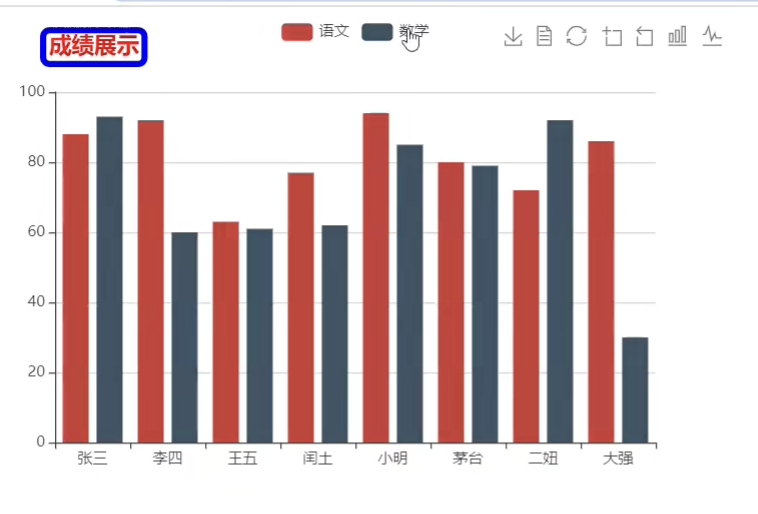
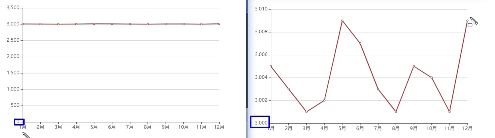
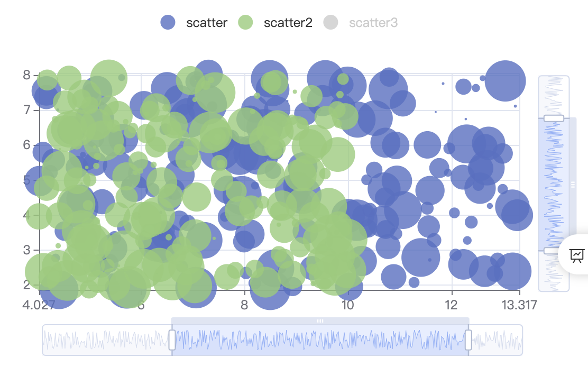
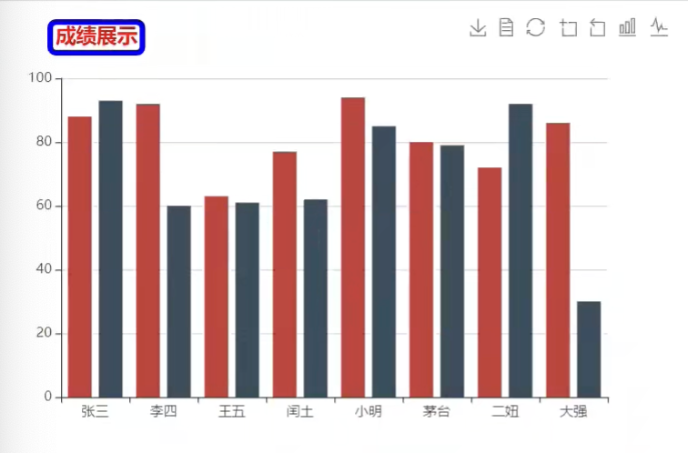
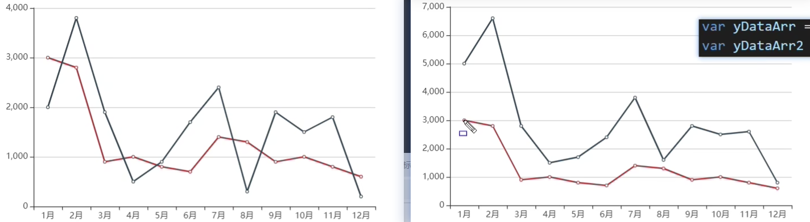
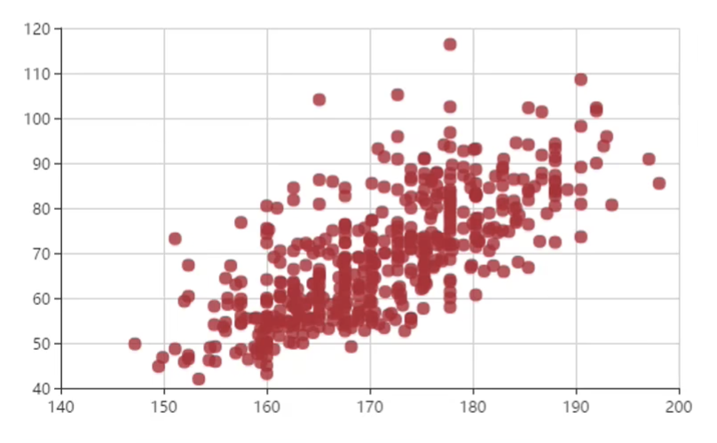
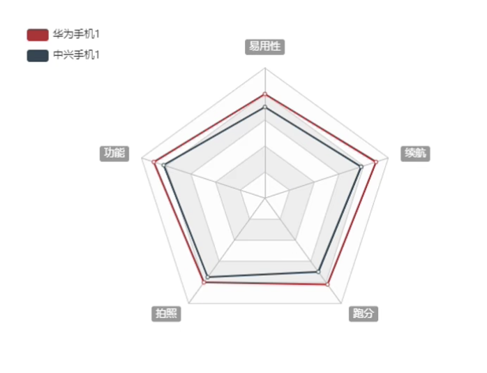
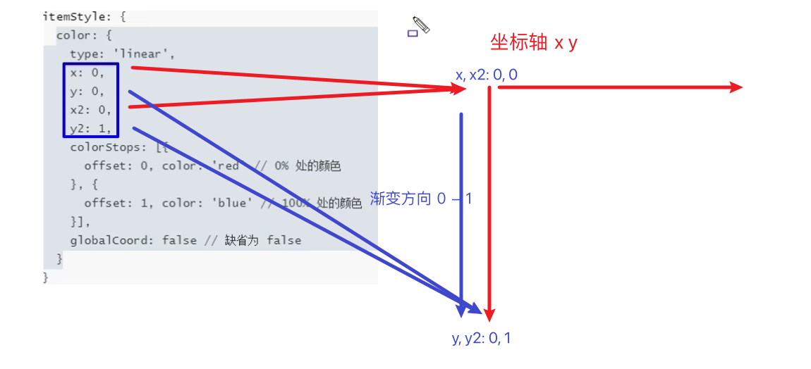

# 项目特点:
一端操作多端连用

<br><br>

# 后台代码相关:

## 目录结构:
```s
| - data
  - 里面存放着各种数据

| - middleware
  - header相关: 跨域相关的设置
  - duration相关: 计算了下程序的执行时间 将它设置到响应头中 ctx.set('X-Response-Time', duration + 'ms')
  - data相关: 读取json数据文件 做响应

| - utils
  - 定义了读取json文件的方法

| - service
  - web_socket_service.js
  - 如果客户端给服务器发送的消息是获取数据 则将对应的数据读取后交给客户端处理 如果不是获取数据 则将发送的数据 交给所有的链接服务器的客户端
```

<br><br>

# Echarts:
ECharts是百度公司开源的一个使用 Javascript 实现的开源可视化库, 兼容性强, 底层依赖矢量图形库(ZRender), 提供直观, 交互丰富, 可高度个性化定制的数据可视化图表

echarts是在ZRender的基础上再次的进行封装 让它在功能 交互等方面有很大的提高

<br>

**官网:**
```s
https://echarts.apache.org/zh/index.html
```

<br><br>

## Echarts特点:
```s
https://echarts.apache.org/zh/index.html
```

<br>

### 流数据的支持
对于超大的数据量而言的话 数据本身就会非常的耗费资源 echarts支持对流数据的动态渲染

**动态渲染:**  
加载多少数据 就渲染多少数据 可以省去漫长数据加载的等待时间

<br>

**增量渲染技术:**  
它还提供了增量渲染技术 可以让我们只渲染变化的数据 可以提供系统的资源利用

<br><br>

# Echarts基本使用

<br>

### 下载echarts
```
npm view echarts versions

npm i echarts@4
```

<br><br>

## 原生Echarts的使用:
1. 引入 echarts.js 文件
2. 准备一个呈现图表的盒子 (div该盒子决定图表呈现的位置)
3. 初始化echarts实例对象 (通过实例对象进行图表设置)
```js
const chart = echarts.init(document.querySelector("#wrap"))
```

4. 准备配置项

5. 将配置项设置给echarts实例对象
```js
chart.setOption(ops)
```

<br>

### 示例:
```html
<!DOCTYPE html>
<html lang="en">
<head>
  <meta charset="UTF-8">
  <meta http-equiv="X-UA-Compatible" content="IE=edge">
  <meta name="viewport" content="width=device-width, initial-scale=1.0">
  <title>Title</title>

  <!-- 1. 引入echarts.js文件 -->
  <script src="../node_modules/echarts/dist/echarts.js"></script>
  <style>
    #wrap {
      width: 600px;
      height: 400px;
    }
  </style>
</head>

<body>

<!-- 2. 准备一个有高度的div -->
<div id="wrap"></div>

<script>
  // 3. 初始化 echarts 实例对象 传入图表的容器
  const chart = echarts.init(document.querySelector("#wrap"))

  // 4. 准备配置项
  const ops = {
    xAxis: {
      type: "category",
      data: ["temp1", "temp2", "temp3"]
    },
    yAxis: {
      type: "value"
    },
    series: [
      {
        name: "语文",
        type: "bar",
        data: [70, 71, 72]
      }
    ]
  }

  // 5. 将配置项设置给echarts实例对象
  chart.setOption(ops)
</script>
</body>
</html>
```

<br>

### 总结:
一个图表最终呈现什么样子, **完全取决于这个配置项** 所以对于不同的图表, 除了配置项会发生改变之外 **其它的代码都是固定不变的**

<br>

**配置项的网址:**  
```s
https://echarts.apache.org/zh/option.html#title
```

<br><br>

## Vue中Echarts的使用
1. template中准备一个容器, 要求容器有具体的高度 宽度可以是100%
2. 准备一个呈现图表的盒子 (div该盒子决定图表呈现的位置)
3. 初始化echarts实例对象 (通过实例对象进行图表设置)
4. 准备配置项
5. 将配置项设置给echarts实例对象

```html
<template>
  <div class="echarts-gantt-wrap">
    <v-row>
      <v-col cols="12">
        <h2 class="title">echarts-gantt</h2>
      </v-col>
    </v-row>
    <v-row>
      <v-col cols="12">
        <div class="echarts-container" ref="echartRef"></div>
      </v-col>
    </v-row>
  </div>
</template>

<script>
import echarts from "echarts"
export default {
  name: "EchartsGanttTest",
  data() {
    return {
      instance: null,
      ops: {
        xAxis: {
          type: "category",
          data: ["temp1", "temp2", "temp3"]
        },
        yAxis: {
          type: "value"
        },
        series: [
          {
            name: "语文",
            type: "bar",
            data: [70, 71, 72]
          }
        ]
      }
    }
  },
  mounted() {
    this.init()
  },
  methods: {
    init() {
      const el = this.$refs.echartRef
      this.instance = echarts.init(el)
      this.instance.setOption(this.ops)
    }
  }
}
</script>

<style lang="scss" scoped>
.echarts-gantt-wrap {
  box-sizing: border-box;
  margin: 0;
  padding: 0;

  .title {
    padding: 0;
  }

  .echarts-container {
    width: 100%;
    height: 400px;
  }
}
</style>
```

<br><br>

# 通用配置
所有图表都可以使用的配置, 我们下面写的都是options配置项中的直接子元素

- title: 标题
- tooltip: 提示
- toolbox: 工具按钮
- legend: 图例

<br>

## title: 图表的大标题

### 类型:
```js
{
  id: 
  show: true ,
  text: '' ,
  link: '' ,
  target: 'blank' ,
  textStyle: {...} ,
  subtext: '' ,
  sublink: '' ,
  subtarget: 'blank' ,
  subtextStyle: {...} ,
  textAlign: 'auto' ,
  textVerticalAlign: 'auto' ,
  triggerEvent: false ,
  padding: 5 ,
  itemGap: 10 ,
  zlevel: 0 ,
  z: 2 ,
  left: 'auto' ,
  top: 'auto' ,
  right: 'auto' ,
  bottom: 'auto' ,
  backgroundColor: 'transparent' ,
  borderColor: '#ccc' ,
  borderWidth: 0 ,
  borderRadius: 0 ,
  shadowBlur: 
  shadowColor: 
  shadowOffsetX: 0 ,
  shadowOffsetY: 0 ,
}
```

<br>

### 属性概述:

**title.text:**  
主标题的文本, 支持使用 ``\n`` 进行换行

<br>

**title.link:**  
主标题的文本超链接

<br>

**title.textStyle:**  
对象类型, 文本样式

```js
options: {
  title: {
    textStyle: {

      // 主标题颜色
      color: "",

      // 主标题字体风格
      fontStyle: "normal | italic | oblique",

      // 主标题字体的粗细
      fontWeight: "数值 | normal | bold | bolder | lighter"

    }
  }
}
```

<br>

**title.borderWidth:**  
标题的边框


<br>

**title.borderColor:**  
标题的边框颜色

<br>

**title.borderRadius:**  
标题的边框的圆角


<br>

**title.left | right | top | bottom:**  
标题离容器的距离

<br><br>

## tooltip: 提示框组件
用于配置鼠标滑过或点击图表时的显示框, 内部会展示 series中的name值 类别名 和 数据

- trigger: 触发类型
- triggerOn: 触发时机
- formatter: 格式化

<br>

### 类型:
```js
{
  show: true ,
  trigger: 'item' ,
  axisPointer: {...} ,
  showContent: true ,
  alwaysShowContent: false ,
  triggerOn: 'mousemove|click' ,
  showDelay: 0 ,
  hideDelay: 100 ,
  enterable: false ,
  renderMode: 'html' ,
  confine: false ,
  appendToBody: false ,
  className: 
  transitionDuration: 0.4 ,
  position: 
  formatter: 
  valueFormatter: 
  backgroundColor: 'rgba(50,50,50,0.7)' ,
  borderColor: '#333' ,
  borderWidth: 0 ,
  padding: 5 ,
  textStyle: {...} ,
  extraCssText: 
  order: 'seriesAsc' ,
}
```

<br>

### 属性概述:

**tooltip.trigger:**  
怎么才能呈现提示框

```js
tooltip: {
  // item: 鼠标移入到图形内部触发
  // axis: 坐标轴触发
  trigger: "item | axis | none"
}
```

<br>

**tooltip.triggerOn:**  
什么时机展示提示框

```js
tooltip: {
  // mouseover: 鼠标移入时展示提示框
  // click: 点击时
  triggerOn: "mouseover | click"
}
```

<br>

**tooltip.formatter:**  
类型: string function

作用:   
根据它可以决定我们的提示框中的内容  

使用方式:  
```s
https://echarts.apache.org/zh/option.html#tooltip.formatter
```

```js
tooltip: {
  // 字符串模板: 字符串决定提示框中内容
  /*
    模板变量在不同的图表中含义是不同的 {a} - {e}

    柱状图:
    {a}: 表示系列名称 series数组对象中的name属性
    {b}: 类目值 xAxis中的category对应的值
    {c}: 该类别对应的数据
  */
  formatter: "{b}的成绩是{c}"


  // 回调函数:
  /*
    回调参数 params: 数组对象
    {
      name: 类目名,
      data: 该分类对应的数据
    }
  */
  formatter: () => 返回值决定展示内容,
  formatter: params => `${params[0].name}的分数是: ${params[0].data}`

}
```

<br><br>

## toolbox: 工具栏
它内置了很多的功能 如 导出图片 数据视图 动态类型切换 数据区域缩放 重置等5个工具

<br>

### 类型:
```js
{
  id: 
  show: true ,
  orient: 'horizontal' ,
  itemSize: 15 ,
  itemGap: 8 ,
  showTitle: true ,
  feature: {...} ,
  iconStyle: {...} ,
  emphasis: {...} ,
  zlevel: 0 ,
  z: 2 ,
  left: 'auto' ,
  top: 'auto' ,
  right: 'auto' ,
  bottom: 'auto' ,
  width: 'auto' ,
  height: 'auto' ,
  tooltip: 
}
```

<br>

### 属性概述:

**toolbox.feature:**  
类型对象, 各工具配置项

```js
{
  toolbox: {
    feature: {

      // 开启导出图片(只要写了即使是{}也会开启功能)
      saveAsImage: {},

      // 开启数据视图 (类似数据组成的表格 可以修改数据)
      dataView: {},

      // 开启重置
      restore: {},

      // 区域缩放 
      dataZoom: {},

      // 在不同的两种图表之间进行切换
      magicType: {
        // 在指定的图表之间进行切换
        type: ["bar", "line"]
      }
    }
  }
}
```

<br><br>

## legend: 图例
legend是用来筛选series系列中的对象的(series系列是数组对象)

**legend需要配合series来使用**, 比如我们的series格式为
```js
series: [
  {语文成绩相关},
  {数学成绩相关}
]
```

而我们的legend就是用来筛选语文成绩 或者 数据成绩的, 我们设置完图例后 会产生两个按钮 用于筛选数据的



<br>

### 类型:
```js
{
  type: 
  id: 
  show: true ,
  zlevel: 0 ,
  z: 2 ,
  left: 'auto' ,
  top: 'auto' ,
  right: 'auto' ,
  bottom: 'auto' ,
  width: 'auto' ,
  height: 'auto' ,
  orient: 'horizontal' ,
  align: 'auto' ,
  padding: 5 ,
  itemGap: 10 ,
  itemWidth: 25 ,
  itemHeight: 14 ,
  itemStyle: {...} ,
  lineStyle: {...} ,
  symbolRotate: 'inherit' ,
  formatter: 
  selectedMode: true ,
  inactiveColor: '#ccc' ,
  inactiveBorderColor: '#ccc' ,
  inactiveBorderWidth: 'auto' ,
  selected: 
  textStyle: {...} ,
  tooltip: 
  icon: 
  data: [{...}] ,
  backgroundColor: 'transparent' ,
  borderColor: '#ccc' ,
  borderWidth: 1 ,
  borderRadius: 0 ,
  shadowBlur: 
  shadowColor: 
  shadowOffsetX: 0 ,
  shadowOffsetY: 0 ,
  scrollDataIndex: 0 ,
  pageButtonItemGap: 5 ,
  pageButtonGap: 
  pageButtonPosition: 'end' ,
  pageFormatter: '{current}/{total}' ,
  pageIcons: {...} ,
  pageIconColor: '#2f4554' ,
  pageIconInactiveColor: '#aaa' ,
  pageIconSize: 15 ,
  pageTextStyle: {...} ,
  animation: 
  animationDurationUpdate: 800 ,
  emphasis: {...} ,
  selector: false ,
  selectorLabel: {...} ,
  selectorPosition: 'auto' ,
  selectorItemGap: 7 ,
  selectorButtonGap: 10 ,
}
```

<br>

### 属性概述:

**legend.data:**  
类型 数组对象 | 字符串, 图例的数据数组

数组项通常为一个字符串, 每一项代表一个系列的 name, legend中的data的值需要和series数组中某组数据的name值一致

<br>

```js
{
  legend: {
    // 数组中的元素为 series数组中每一个对象的name值
    data: ["语文", "数学"]
  }
}
```

<br>

**legend.icon:**  
图例的图表部分 可选值:
- 'circle'
- 'rect'
- 'roundRect'
- 'triangle'
- 'diamond'
- 'pin'
- 'arrow'
- 'none'

- 可以通过 'image://url' 设置为图片, 其中 URL 为图片的链接, 或者 dataURI。
```s
# URL 为图片链接例如
'image://http://example.website/a/b.png'

# URL 为 dataURI 例如
'image://data:image/gif;base64,R0lGODlhEAAQAMQAAORHHOVSKudfOulrSOp3WOyDZu6QdvCchPGolfO0o/XBs/fNwfjZ0frl3/zy7////wAAAAAAAAAAAAAAAAAAAAAAAAAAAAAAAAAAAAAAAAAAAAAAAAAAAAAAAAAAAAAAACH5BAkAABAALAAAAAAQABAAAAVVICSOZGlCQAosJ6mu7fiyZeKqNKToQGDsM8hBADgUXoGAiqhSvp5QAnQKGIgUhwFUYLCVDFCrKUE1lBavAViFIDlTImbKC5Gm2hB0SlBCBMQiB0UjIQA7'
```

<br>

**legend.itemWidth | itemHeight:**  
图表的高度 和 宽度

<br>

**legend.itemGap:**  
图例的间距 横向布局时为水平间隔, 纵向布局时为纵向间隔

<br><br>

# 配置项详解:
我们下面写的都是options配置项中的直接子元素

<br><br>

## grid: 直角坐标系的专用配置
我们学到的 散点图 折线图 和 柱形图 都是有一个特征 它们都是存在于x轴 和 y轴 我们都需要配置 xy轴

这种带有xy轴的图表我们称之为**直角坐标系**

<br>

### 作用:
grid是用来控制直角坐标系的 **布局** 和 **大小**

x轴 和 y轴 就是在grid的基础上进行绘制的

<br>

### 类型:
```js
{
  id: 
  show: false ,
  zlevel: 0 ,
  z: 2 ,
  left: '10%' ,
  top: 60 ,
  right: '10%' ,
  bottom: 60 ,
  width: 'auto' ,
  height: 'auto' ,
  containLabel: false ,
  backgroundColor: 'transparent' ,
  borderColor: '#ccc' ,
  borderWidth: 1 ,
  shadowBlur: 
  shadowColor: 
  shadowOffsetX: 0 ,
  shadowOffsetY: 0 ,
}
```

<br>

### 属性概述:

**grid.show:**  
是否显示直角坐标系网格 (图表的四周出现正方形将整个图标围起来)

类型: boolean

<br>

**grid.borderWidth:**  
网格边框的宽度

类型: number

<br>

**grid.borderColor:**  
边框的颜色

<br>

**grid.top left right bottom:**  
grid 组件离容器上侧的距离, **位置只是坐标系的位置不包括图表中的文字**

类型: number | string

- string: left: "left | center | right"
- string: top: "top | middle | bottom"

- number: 20 | "20%"

<br>

**grid.width height:**  
组件的宽度和高度 (也就是控制图表的大小 内部内容默认自适应)  

<br>

**grid.containLabel**   
类型: boolean

grid 区域是否包含坐标轴的刻度标签

- containLabel 为 false 的时候   
grid.left grid.right grid.top grid.bottom grid.width grid.height 决定的是由坐标轴形成的矩形的尺寸和位置 这比较适用于多个 grid 进行对齐的场景, 因为往往多个 grid 对齐的时候, 是依据坐标轴来对齐的

- containLabel 为 true 的时候  
grid.left grid.right grid.top grid.bottom grid.width grid.height 决定的是**包括了坐标轴标签在内的所有内容**所形成的矩形的位置。这常用于『防止标签溢出』的场景 标签溢出指的是, 标签长度动态变化时, 可能会溢出容器或者覆盖其他组件

<br><br>

## xAxis: 直角坐标系中的x轴

### 类型:
```js
{
  id: 
  show: true ,
  gridIndex: 0 ,
  alignTicks: false ,
  position: 
  offset: 0 ,
  type: 'category' ,
  name: 
  nameLocation: 'end' ,
  nameTextStyle: {...} ,
  nameGap: 15 ,
  nameRotate: 
  inverse: false ,
  boundaryGap: 
  min: 
  max: 
  scale: false ,
  splitNumber: 5 ,
  minInterval: 0 ,
  maxInterval: 
  interval: 
  logBase: 10 ,
  silent: false ,
  triggerEvent: false ,
  axisLine: {...} ,
  axisTick: {...} ,
  minorTick: {...} ,
  axisLabel: {...} ,
  splitLine: {...} ,
  minorSplitLine: {...} ,
  splitArea: {...} ,
  data: [{...}] ,
  axisPointer: {...} ,
  animation: true ,
  animationThreshold: 2000 ,
  animationDuration: 1000 ,
  animationEasing: 'cubicOut' ,
  animationDelay: 0 ,
  animationDurationUpdate: 300 ,
  animationEasingUpdate: 'cubicInOut' ,
  animationDelayUpdate: 0 ,
  zlevel: 0 ,
  z: 0 ,
}
```

<br>

### 属性概述:

**xAxis.type:**  
可选值: category | value | time | log

- category: 类目轴, 就如下图 当我们选择category的时候 可以指定 ``xAxis.data`` 为类目轴提供数据 A B C D E
```
x轴: 

___ ___ ___ ___ ___
 A   B   C   D   E
```

- value: 数值轴 (坐标轴上是数值)  
数值轴上的数据 会从 ``series[0].data`` 中获取, y轴的数值轴会针对x轴中的每一个类别 去 ``series[0].data`` 配置项中找对应的数据

- time: 时间轴

- log: 对数轴

<br>

**xAxis.boundaryGap: 折线图?**  
x轴对应的数据的点 和 y轴之间是有距离的, 如果我们想让数据点直接在y轴上 就使用这个配置

类型: boolean

- true: 有间隔
- false: 没有间隔

<br>

**xAxis.position:**   
我们xy轴默认 x轴在下方 y轴在左边, 我们可以对他们进行设置

- x轴的位置可以是 下方 或者 上方
- y轴的位置可以是 左边 或者 右边

<br>

作用:  
调整 x 轴的位置

类型: string  
可选值: "top | bottom"

注意:  
若未将 xAxis.axisLine.onZero 设为 false, 则该项无法生效

<br>

**xAxis.offset:**   
X 轴相对于默认位置的偏移, 在相同的 position 上有多个 X 轴的时候有用

注意:  
若未将 xAxis.axisLine.onZero 设为 false, 则该项无法生效

<br>

**xAxis.axisLine:**   
坐标轴轴线相关设置

```js
{
  // 是否显示坐标轴轴线
  show: true ,

  // X 轴或者 Y 轴的轴线是否在另一个轴的 0 刻度上, 只有在另一个轴为数值轴且包含 0 刻度时有效
  onZero: true ,

  // 当有双轴时, 可以用这个属性手动指定, 在哪个轴的 0 刻度上
  onZeroAxisIndex: 

  // 轴线两边的箭头可以是字符串, 表示两端使用同样的箭头；或者长度为 2 的字符串数组, 分别表示两端的箭头默认不显示箭头, 即 'none'两端都显示箭头可以设置为 'arrow', 只在末端显示箭头可以设置为 ['none', 'arrow']
  symbol: 'none' ,
  symbolSize: [10, 15] ,
  symbolOffset: [0, 0] ,
  lineStyle: {...} ,
}
```

<br><br>

## yAxis: 直角坐标系中的y轴

<br>

**yAxis.scale: 折线图?**  
脱离0值, 在数值轴上默认都是从0开始的 但有些情况下 我们希望以数据中的最小值开始

类型: boolean

- true: 支持缩放 数值轴的起点从数据中的最小值开始
- false: 默认值



<br>

### 类型:
```js
{}
```

<br>

### 扩展:
xAxis 和 yAxis 可以进行互换 达到横向柱状图的效果

<br><br>

## dataZoom: 区域缩放
它是对数据范围进行过滤 x轴 和 y轴都可以拥有区域缩放器, 从而能自由关注细节的数据信息, 或者概览数据整体, 或者去除离群点的影响

<br>

**效果:**  
x轴 和 y轴旁边会有滑动条 用于控制图表中的数据缩放 和 过滤数据



<br>

### 类型:
数组 意味着可以配置多个区域缩放器 **每一个区域缩放器就是一个对象**
```js
{
  dataZoom: [
    // 直角坐标系的
    {type: inside, ...} ,
    // 滑块的
    {type: slider, ...} 


    // 直角坐标系的属性概述
    {
      type: 'inside' ,
      id ... ,
      disabled: false ,
      xAxisIndex ... ,
      yAxisIndex ... ,
      radiusAxisIndex ... ,
      angleAxisIndex ... ,
      filterMode: 'filter' ,
      start: 0 ,
      end: 100 ,
      startValue ... ,
      endValue ... ,
      minSpan ... ,
      maxSpan ... ,
      minValueSpan ... ,
      maxValueSpan ... ,
      orient ... ,
      zoomLock: false ,
      throttle: 100 ,
      rangeMode ... ,
      zoomOnMouseWheel: true ,
      moveOnMouseMove: true ,
      moveOnMouseWheel: true ,
      preventDefaultMouseMove: true ,
    }
  ]
}
```

<br>

### 属性概述:

**dataZoom[0].type:**  
可选值: 
- slider: 滑块
- inside: 滑块消失 依靠鼠标滚轮或者双指缩放

<br>

**dataZoom[0].xAxisIndex | yAxisIndex**  
指明缩放器在哪个轴上, 一般写0即可

**注意:**  
如下的数组对象的写法是用于控制 缩放器在x轴上还是y轴上, 如果我们只需要x轴的缩放器 则可以将dataZoom的类型设置为对象
```js
{
  dataZoom: [
    // 设置x轴的缩放器
    {
      type: "slider",
      // 第0个x轴
      xAxisIndex: 0
    } ,
    // 设置y轴的缩放器
    {
      type: "slider",
      yAxisIndex: 0
    } 
  ]
}
```

<br>

**dataZoom[0].start and end**  
指明初始状态的缩放情况

- start: 数据窗口范围的 起始百分比
- end: 数据窗口范围的 结束百分比

```js
{
  dataZoom: [
    // 设置x轴的缩放器的初始缩放情况
    {
      type: "slider",
      xAxisIndex: 0,

      start: 0,
      // 50%
      end: 50
    }
  ]
}
```

<br>

**dataZoom[0].startValue and endValue**   
数据窗口范围的起始数值。如果设置了 dataZoom-inside.start 则 startValue 失效

数据窗口范围的结束数值。如果设置了 dataZoom-inside.end 则 endValue 失效。

比如柱形图中一共有20条数据 如果我们指定
- startValue: 0
- endValue: 9

则我们在柱形图表中只能看到 0 - 9, 10条数据

<br><br>

## series: 系列列表
每个列表通过 对象中的 ``type`` 属性来决定自己的图表类型

<br>

### 类型:
```js
[
  {type: line, ...} ,
  {type: bar, ...} ,
  {type: pie, ...} ,
  {type: scatter, ...} ,
  {type: effectScatter, ...} ,
  {type: radar, ...} ,
  {type: tree, ...} ,
  {type: treemap, ...} ,
  {type: sunburst, ...} ,
  {type: boxplot, ...} ,
  {type: candlestick, ...} ,
  {type: heatmap, ...} ,
  {type: map, ...} ,
  {type: parallel, ...} ,
  {type: lines, ...} ,
  {type: graph, ...} ,
  {type: sankey, ...} ,
  {type: funnel, ...} ,
  {type: gauge, ...} ,
  {type: pictorialBar, ...} ,
  {type: themeRiver, ...} ,
  {type: custom, ...} ,
]
```

<br>

### 属性概述:
series是一个数组 数组中的元素是一个对象, 每一个对象表示一个系列 一个系列是一个数据集合

包含了要展示的数据 以及 数据对应的图表类型 样式信息等

**在echarts中一个图表可以包含多个系列**, 每个系列可以使用不同的图表类型和样式 用来呈现不同的数据 或 不同的数据维度

<br>

比如当我们指定两个对象的时候 就相当于 一个分类下有两组数据, 比如张三的数学 和 语文成绩



<br>

我们说下**对象(每一个系列)中的属性**

```js
{
  name: "语文",
  type: "bar",
  data: [70, 71, 72]
}
```

**name:**  
该系列的名称, 也表示 data 中都是语文成绩

<br>

**type:**  
表示图表的类型 对于不同的图表是通过 type 属性的值 设置图表的类型, 有很多

可选值:
- bar: 柱状图
- line: 折现图
- pie: 饼图
- tree: 树图  
- scatter: 散点图
- effectScatter: 涟漪图 气泡图

<br>

```js
series: [
  {
    name: "",
    type: ""
  }
]
```

<br>

**rippleEffect: 涟漪 气泡图**  
effectScatter
控制涟漪效果造成的范围是多少

类型: 对象

<br> 

```js
series: [
  {
    // rippleEffect是 effectScatter 下的配置
    type: "effectScatter",

    rippleEffect: {
      // 涟漪的颜色 默认为散点的颜色
      color: 

      // 波纹的数量
      number: 3 ,

      // 动画的周期 秒数
      period: 4 ,

      // 动画中波纹的最大缩放比例
      scale: 2.5 ,

      // 波纹的绘制方式 可选 'stroke' 和 'fill'
      brushType: 'fill' ,
    }
  }
]
```

<br>

**showEffectOn: 涟漪 气泡图**  
控制涟漪效果何时显示特效

类型: string

- string: 
  - render: 绘制完成后显示特效
  - emphasis: 高亮(hover)的时候显示特效

<br> 

```js
series: [
  {
    // rippleEffect是 effectScatter 下的配置
    type: "effectScatter",

      showEffectOn: {
      // 涟漪的颜色 默认为散点的颜色
      color: 

      // 波纹的数量
      number: 3 ,

      // 动画的周期 秒数
      period: 4 ,

      // 动画中波纹的最大缩放比例
      scale: 2.5 ,

      // 波纹的绘制方式 可选 'stroke' 和 'fill'
      brushType: 'fill' ,
    }
  }
]
```

<br>

**coordinateSystem: 散点图**  
它可以让散点图 结合 其它图表 搭配使用 比如结合 地图 坐标系等

可选值:
- cartesian2d:  
使用二维的直角坐标系通过 xAxisIndex, yAxisIndex指定相应的坐标轴组件

- geo:  
使用地理坐标系, 通过 geoIndex 指定相应的地理坐标系组件。

- polar
- calendar

<br>

**barWidth: 柱形图**  
柱条的宽度(不设置时自适应), 类型: number | string

在同一个坐标系上 此属性会被多个 bar 系列共享

注意:  
该属性应该设置在坐标系中最后一个 bar 系列上才会生效 并且是对此坐标系中的所有 bar 系列生效

<br>

**barGap: 柱形图**  
不同系列的柱间距离 比如一个图表中有两组柱形图
为百分比(如 '30%', 表示柱子宽度的 30%)

<br>

**barCategoryGap: 柱形图**  
同一系列的柱间距离, 默认为类目间距的20%, 可设固定值

<br>

**label:**  
类型对象, 图形上的文本标签, 图形上的文本标签, 可用于说明图形的一些数据信息, 比如值, 名称等

场景:  
在每个柱子上展示对应人的分数

- label.show: 布尔值 是否显示标签文本
- label.rotate: 数值(度数) 标签文本旋转
- label.position: 标签文本的位置
```js
series: [
  {
    label: {

      // 柱形图: 语义声明位置
      position: "top / left / right / bottom / inside / insideLeft / insideRight / insideTop / insideBottom / insideTopLeft / insideBottomLeft / insideTopRight / insideBottomRight"

      // 饼图: 扇形区域外 内 中心
      position: "outside / inside / center"

      // 绝对像素值
      position: [10, 10],

      // 相对的百分比 (标签相对于图形包围盒左上角的位置)
      position: ['50%', '50%']
    }
  }
]
```

<br>

**labelLine:**  
提示文字的指向线 (例如饼图上链接提示文字的线)

类型:
```js
{
  show ... ,
  showAbove ... ,
  length ... ,
  length2 ... ,
  smooth: false ,
  minTurnAngle: 90 ,
  lineStyle: {...} ,
  maxSurfaceAngle ... ,
}
```

<br>

**markPoint:**  
作用:  
类型为对象, 对图表进行标注 

场景:  
我们常见的 标记最大值 最小值

- markPoint.data: 类型数组对象 每一个对象元素表示一个标记点的相关信息
```js
series: [
  {
    markPoint: {
      data: [
        {
          // 标记点的名字
          name: "",

          // 指明是什么的标记
          type: "max | min | average",

          // x y 指定相对容器的屏幕坐标 单位像素 支持百分比
          x: 10 | "90%",
          y: 10 | "90%",

          // 指定数据在响应坐标系上的坐标位置
          coord: [10, 20]
        }
      ]
    }
  }
]
```

<br>

**markLine:**   
类型对象, 图表标线

场景:  
我们将每一个人的分数进行累加算该班级的平均值


- markLine.data: 类型数组对象 **每一个对象元素表示一个标线的数据的相关信息**
```s
注意:
每个数组元素可以是一个 两个值的数组 分别表示线的起点 和 重点 其中每一个项是一个对象

- 正常data数组对象为:
data: [{}, {}]

- 每一个数组元素可以是一个 两个值 的数组
data: [[{}, {}]]
```

```js
series: [
  {
    markLine: {
      data: [
        {
          // 标注的名字
          name: "",
           
          // 标注的类型
          type: "min | max | average | median",
        },

        {
          // 标注的名字
          name: "",
           
          // 标注的类型
          type: "average",

          // 通过x y指定起点和终点的位置 (相对容器的屏幕坐标)
          x: 100,
          y: 100,
        }


        // 一个数组元素中 包含两个值 起点 和 终点 示例:
        [
          // 通过 coord 设置起点的位置 (数据在相应坐标系上的坐标位置)
          {
            coord: [10, 20]
          },
          {
            coord: [20, 50]
          }
        ]
      ]
    }
  }
]
```

<br>

**markArea:**   
类型对象, 用于标记图表中某个范围的数据, **效果将某个区域以阴影的方式标注出来**

- markLine.data: 区域数据数组, 类型二维数组对象 每一个元素是一个数组 该数组中有两个对象 分别代表 区域的左上角 和 右下角的位置, **一个内层数组就是一个标记区间**
```s
markLine: {
  data: [
    [
      {}, {}
    ]
  ]
}


1. 可以不设置位置 就是对全数据进行标记区间
[
  {
    name: '平均值到最大值',
    type: 'average'
  },
  {
    type: 'max'
  }
],


2. 可以使用 xAxis 来指定两个区域 x轴上类别 1-3月是一个区间, 7-9月是另外一个区间
# 区间1
[
  {
    xAxis: "1月"
  },
  {
    xAxis: "3月"
  },
],
# 区间2
[
  {
    xAxis: "7月"
  },
  {
    xAxis: "9月"
  },
],


3. 可以使用 coord: [x, y] 指定左上角 和 右下角的位置
[
  {
    name: '两个坐标之间的标域',
    coord: [10, 20]
  },
  {
    coord: [20, 30]
  }
]
 

4. 可以使用 x y 属性 指定左上角 和 右下角的位置
[
  {
    name: '两个屏幕坐标之间的标域',
    x: 100,
    y: 100
  }, 
  {
    x: '90%',
    y: '10%'
  }
]
```

<br>

```js
series: [
  {
    // 常见效果: 标记 - 标注区间
    markArea: {
      data: [
        [
          {
            name: "标注区间",
            type: "max"
          },
          {
            type: "min"
          },
        ]
      ]
    }
  }
]
    
```

<br>

**smooth: 折线图?**  
线条控制(平滑, 风格)

类型: boolean | number

- boolean: 表示是否开启平滑处理, 设置为true是相当于0.5
- number: 取值范围 0-1 表示平滑成都 越小表示越接近折线段

<br>

**lineStyle: 折线图?**  
修改线条的样式

类型: {}

```js
series: [
  {
    smooth: true,

    lineStyle: {

      // 颜色:
      color: "yellow",

      // 线条的样式: 
      type: "solid | dashed | dotted"
    }
  }
]
```

<br>

**areaStyle: 折线图?**  
将折线勾勒出来的区域 上色

类型: 对象

```js
series: [
  {
    areaStyle: {
      color: "",
      opacity: 0,

      // 图形区域的起始位置
      origin: 'auto | start | end',

      shadowBlur "rgba(0, 0, 0, 0.5)" ,
      shadowColor 10 ,
      shadowOffsetX: 0 ,
      shadowOffsetY: 0 ,
    }
  }
]
```

<br>

**stack: 折线图?**  
堆叠图

我们在series是一个数组 内部可以配置多个对象 每个对象表示一个图表数据(图形) 也就是说 我们可以在一个chart中配置不同维度的数据图形

类型: 字符串

在完成堆叠图的效果时 **我们需要在每个series元素对象中都设置 stack属性 只要他们的值都是一样的** 则就会发生堆叠 也就是第二个图形就会基于第一个图形的坐标的基础之上 往上进行数值的累加

<br>



<br>

```js
series: [
  {
    // 图形1 设置的值要和图形2一样, 两个图形才会发生堆叠
    stack: "all"
  },
  {
    // 图形2 设置的值要和图形1一样, 两个图形才会发生堆叠
    stack: "all"
  },
]
```

<br>

**symbol: 散点图&折线图?**  
标记的图形

类型: stirng | function

<br>

- string: 'circle', 'rect', 'roundRect', 'triangle', 'diamond', 'pin', 'arrow', 'none'

- string: 可以通过 'image://url' 设置为图片

<br>

**symbolSize: 散点图&折线图?**  
标记(散点)的大小, 一般我们不会将散点设置为统一大小 而是希望散点会随着数据不同 自身的大小也不一样

类型: number | array | function

<br>

- number: 直接设置数字
- array: 分开表示宽高, [20, 10],
- function: (value, params)
  - value: data中的数据值
  - params: 其它的数据项参数

<br>

```js
series: [
  {
    type: "scatter",
    data: originData,

    // 设置散点的大小
    symbolSize: (value, params) => {
      // 上述data项中的元素 [51.6, 161.2]
      // console.log(value)

      /*
      {
        dataIndex: 506, 数据在数组中的坐标,
        data: [51.6, 161.2], data项中的元素,
        value: 同data,
        color: ""
      }
      */
      // console.log(params)

      let [weight, height] = value
      // height为厘米我们要根据bmi公式将其转换为米
      height /= 100
      // 超过肥胖标准值的散点让其大一些 反之小一些, BMI = 体重kg / (身高m * 身高m) 结果如果大于28表示肥胖
      let bmi = parseInt(weight / Math.pow(height, 2))

      return bmi > 28 ? 20 : 10
    },
  }
]
```

<br>

**itemStyle:**  
图形样式

类型: 对象

<br>

```js
series: [
  {
    itemStyle: {

      // 颜色: string | function(params)
      color: 自适应 ,

      borderColor: '#000' ,
      borderWidth: 0 ,
      borderType: 'solid' ,
      borderDashOffset: 0 ,
      borderCap: 'butt' ,
      borderJoin: 'bevel' ,
      borderMiterLimit: 10 ,
      shadowBlur: 
      shadowColor: 
      shadowOffsetX: 0 ,
      shadowOffsetY: 0 ,
      opacity: 0.8 ,
    }
  }
]
```

<br>

```js
series: [
  {
    // 设置不同散点的颜色不同
    itemStyle: {
      // 散点颜色: 全部为一种颜色
      // color: "#C2185B"


      // 不同散点的颜色不一样
      color: (params) => {
        // 我们从 params.value 中获取数据
        let [weight, height] = params.value
        height /= 100
        let bmi = parseInt(weight / Math.pow(height, 2))

        return bmi > 28 ? "#C2185B" :  "#5418c2"
      }
    }
  }
]
```

<br>

**label: 饼图?**   
饼图图形上的文本标签, 可用于说明图形的一些数据信息, 比如值, 名称等

<br>

类型:  
```js
series: [
  {
    type: "pie",

    label: {
      // 显示文字 (默认值为true 展示data数据中name对应的值)
      show: false ,

      /*
        决定文字显示的内容是什么
        params.data: 数据 {name: "", value: ""}
        params.name: 数据中 name的部分
        params.value: 数据中 value的部分
        params.percent: 数据占整个饼图的百分比

        formatter: ({percent, name}) => `${name} (${percent}%)`

        \n 可以换行
      */
      formatter: string | function(params),

      position: 'outside' ,
      rotate: 
      color: '#fff' ,
      fontStyle: 'normal' ,
      fontWeight: 'normal' ,
      fontFamily: 'sans-serif' ,
      fontSize: 12 ,
      lineHeight: 
      backgroundColor: 'transparent' ,
      borderColor: 
      borderWidth: 0 ,
      borderType: 'solid' ,
      borderDashOffset: 0 ,
      borderRadius: 0 ,
      padding: 0 ,
      shadowColor: 'transparent' ,
      shadowBlur: 0 ,
      shadowOffsetX: 0 ,
      shadowOffsetY: 0 ,
      width: 
      height: 
      textBorderColor: 
      textBorderWidth: 
      textBorderType: 'solid' ,
      textBorderDashOffset: 0 ,
      textShadowColor: 'transparent' ,
      textShadowBlur: 0 ,
      textShadowOffsetX: 0 ,
      textShadowOffsetY: 0 ,
      overflow: 'none' ,
      ellipsis: '...' ,
      rich: {...} ,
      alignTo: 'none' ,
      edgeDistance: '25%' ,
      bleedMargin: 10 ,
      distanceToLabelLine: 5 
    }
  }
]
```

<br>

**radius: 饼图?**   
饼图可以设置为 圆环图◉, 我们需要设置两个半径实现圆环图的效果 

类型: number | string | array

- number: 直接指定 外半径值 (控制饼图整体的大小) px

- string: "20%" 表示外半径值 参考容器高宽中较小一项的20%的长度: 比如height为400, 半径值就是 ``(400 / 2) * 20%``

- ``array<number|string>``: 数组中的第一项是内半径 第二项是外半径 (相当于内圆大小 和 外圆大小)

```js
series: [
  {
    type: "pie",
    // [内圆半径, 外圆半径],
    radius: ["50%", "75%"],
  }
]
```

<br>

**roseType: 饼图?**   
是否展示成 南丁格尔图 通过半径区分数据大小 可选择的模式有两种

可选值:
1. "radius": 扇区圆心角展现数据的百分比, 半径展现数据的大小
2. "area": 所有扇区圆心角相同, **仅通过半径展现数据大小**

<br>

**selectedMode: 饼图?**   
当我们点击饼图中的一个部分的时候 选中的区域偏离圆点一小段距离, 默认关闭

<br>

可选值:
- string: 'single', 'multiple', 'series' 分别表示单选, 多选 以及 选择整个系列

- boolean

<br>

**selectedOffset: 饼图?**   
设置选中效果 偏离出去的距离

类型: number

<br><br>

## geo: 地图
地理坐标系组件地理坐标系组件用于地图的绘制, 支持在地理坐标系上绘制散点图, 线集


<br>

### 类型:
```js
{
  id: 
  show: true ,
  map: '' ,
  roam: false ,
  projection: {...} ,
  center: 
  aspectScale: 0.75 ,
  boundingCoords: 
  zoom: 1 ,
  scaleLimit: {...} ,
  nameMap: 
  nameProperty: 'name' ,
  selectedMode: false ,
  label: {...} ,
  itemStyle: {...} ,
  emphasis: {...} ,
  select: {...} ,
  blur: {...} ,
  zlevel: 0 ,
  z: 2 ,
  left: 'auto' ,
  top: 'auto' ,
  right: 'auto' ,
  bottom: 'auto' ,
  layoutCenter: 
  layoutSize: 
  regions: [{...}] ,
  silent: false ,
  tooltip: {...} ,
}
```

<br>

### 属性概述:

**geo.map:**  
string, 使用 registerMap事件中的第一个参数 注册的地图名称 保持一致

<br>

**geo.roam:**  
是否开启鼠标对地图的缩放和拖拽 默认为不开启

类型: string | boolean

- boolean: 设置为 true 则都开启
- string: 
  - scale: 启用缩放
  - move: 启用平移

<br>

**geo.zoom:**  
设置初始化 地图缩放比例

类型: number

<br>

**geo.center:**  
设置地图的中心点 配置经度和纬度的坐标

类型: []

```js
// 将新疆作为整个地图的中心点
center: [87.617733, 43.792818]
```

<br>

**geo.top | bottom | left | right:**  
控制地图的位置

<br>

**geo.itemStyle:**  
控制地图中每一个部分的样式 比如
```js
itemStyle: {
  areaColor: "#2172BF"
}
```

<br>

**geo.label:**  
展示省份的名称

类型:
```js
{
  # 展示省份的名称
  show: false ,
  position: 
  distance: 5 ,
  rotate: 
  offset: 
  formatter: 
  color: '#fff' ,
  fontStyle: 'normal' ,
  fontWeight: 'normal' ,
  fontFamily: 'sans-serif' ,
  fontSize: 12 ,
  align: 
  verticalAlign: 
  lineHeight: 
  backgroundColor: 'transparent' ,
  borderColor: 
  borderWidth: 0 ,
  borderType: 'solid' ,
  borderDashOffset: 0 ,
  borderRadius: 0 ,
  padding: 0 ,
  shadowColor: 'transparent' ,
  shadowBlur: 0 ,
  shadowOffsetX: 0 ,
  shadowOffsetY: 0 ,
  width: 
  height: 
  textBorderColor: 
  textBorderWidth: 
  textBorderType: 'solid' ,
  textBorderDashOffset: 0 ,
  textShadowColor: 'transparent' ,
  textShadowBlur: 0 ,
  textShadowOffsetX: 0 ,
  textShadowOffsetY: 0 ,
  overflow: 'none' ,
  ellipsis: '...' ,
  rich: {...} ,
}
```

<br><br>

# Echarts: 事件

### <font color="#C2185B">echarts.registerMap("地图数据名称", json地图数据)</font>  
注册可用的地图, 只在 geo 组件或者 map 图表类型中使用


<br><br>

# Echarts: 常用图表
常用图表一共有7个

1. 柱状图: 描述的是分类数据 呈现的是每一个分类中有多少 通过柱状图 可以清晰的看出每个分类数据的排名情况

2. 折线图
3. 散点图
4. 饼图
5. 地图
6. 雷达图
7. 仪表盘图

<br><br>

## 柱状图练习: bar

### 要点:
1. xAxis.data 指明x轴分类的数据
2. yAxis.type 指明y轴的类型是什么 值为value的话, 则对应y轴的数据会去series.data中获取

<br>


<br>

### 代码部分
```js
const ops = {
  xAxis: {
    type: "category",
    data: ["张三", "李四", "王五", "闰土", "小明", "小红", "二姐", "大强"]
  },
  yAxis: {
    type: "value"
  },
  series: [
    {
      name: "语文",
      type: "bar",
      data: [88, 92, 63, 77, 94, 80, 72, 86]
    }
  ]
}
```

<br><br>

## 折线图练习: line
折线图常用来分析 **数据随时间的变化趋势**
```js
const months = []
for(let i = 1; i <= 12; i++) {
  let content = `${i}月`
  months.push(content)
}
const chart = echarts.init(document.querySelector("#wrap"))
const ops = {
    xAxis: {
      type: "category",
      data: months,
      boundaryGap: false
    },
  yAxis: {
    // 当为数值轴的时候 数据会自动去series[0].data中获取
    type: "value",

    // 脱离0值 从数值轴对应的数据的最小值开始
    scale: true
  },
  series: [
    {
      name: "康师傅销量",
      type: "line",
      data: [3000, 2800, 900, 1000, 800, 700, 1400, 1300, 900, 1000, 800, 600],

      // 常见效果: 标记 - 最大值
      markPoint: {
        data: [
          {
            name: "max",
            type: "max"
          },
          {
            name: "min",
            type: "min"
          }
        ]
      },

      // 常见效果: 标记 - 平均值
      markLine: {
        data: [
          {
            name: "平均值",
            type: "average"
          }
        ]
      },

      // 常见效果: 标记 - 标注区间
      markArea: {
        data: [
          // 区间1
          [
            {
              xAxis: "1月"
            },
            {
              xAxis: "3月"
            },
          ],
          // 区间2
          [
            {
              xAxis: "7月"
            },
            {
              xAxis: "9月"
            },
          ],
        ]
      },

      // 线段平滑
      smooth: true,
      areaStyle: {
        // 图形区域的起始位置
        origin: 'start'
      },

      // 图形1 设置的值要和图形2一样, 两个图形才会发生堆叠
      stack: "all"
    },
    {
      name: "统一销量",
      type: "line",
      data: [2000, 3800, 1900, 500, 900, 1700, 2400, 300, 1900, 1500, 1800, 200],
      smooth: true,
      areaStyle: {
        // 图形区域的起始位置
        origin: 'start'
      },

      // 图形1 设置的值要和图形2一样, 两个图形才会发生堆叠
      stack: "all"
    }
  ]
}
chart.setOption(ops)
```

<br><br>

## 散点图练习: scatter
散点图可以帮助我们推断出变量间的相关性  
比如身高 和 体重的关系(正相关) 一般身高越高体重越重

比如我们有500组数据 每一个对象就代表一个人的相关信息
```js
{
 gender: "female", height: 161.2, weight: 51
},
{
 gender: "female", height: 167.2, weight: 59
},
{
 gender: "female", height: 159.2, weight: 49
},
```

如果我们将这组数据通过散点图的方式表示出来就会如下, 能体现出身高和体重是正相关的关系 数据往右上角的方向延伸



<br>

### 特点:
1. 散点图的 x y 轴 **都是数值轴 type: value**

2. x轴 和 y轴的数据为: 二维数组, 该数据会供x y轴一同使用
```js
[
  [身高1, 体重1],
  [身高2, 体重2],
]
```

3. 散点图 很有可能需要设置脱离0值的设定

<br>

### 散点图的数据结构:
**1. 二维数组**  
```js
series: [
  {
    type: "scatter",
    data: [
      [],
      [],
    ]
  }
]
```

<br>

**2. 对象数组**
```js
series: [
  {
    type: "scatter",
    data: [
      {
        // 数据项的名称
        name: "",
        // 数据项的值
        value: [],

        ... 

        // 扩展
        groupId ... ,
        symbol ... ,
        symbolSize ... ,
        symbolRotate ... ,
        symbolKeepAspect: false ,
        symbolOffset: [0, 0] ,
        label: {...} ,
        labelLine: {...} ,
        itemStyle: {...} ,
        emphasis: {...} ,
        blur: {...} ,
        select: {...} ,
        tooltip: {...} ,
      },
      {}
    ]
  }
]
```

<br>

### 场景:
1. 散点图可以帮助我们推断出不同维度数据之间的**相关性**(相关性的程度)
- 正相关
- 负相关
- 不相关

2. 散点图也会和地图结合在一起 **在地图上进行标注**

<br>

### 散点图: 气泡图效果
散点图要是想实现气泡图的效果就要满足两个条件

1. 散点的大小不同
2. 散点的颜色不同

<br>

**气泡图的效果:**  
就是控制散点的 大小 和 颜色

- 散点大小: series[0].symbolSize
- 散点颜色: series[0].itemStyle.color

<br>

### 散点图: 涟漪动画效果
该效果实现比较简单 ``series[0].type: "effectScatter"``

<br>

### 代码部分:
```js
// 整理散点图需要的数据(二维数组)
/*
[
  {
    "gender": "female",
    "height": 161.2,
    "weight": 51.6
    }
    ...
  ]
*/

let originData = [];

(async () => {
  const { data: res } = await axios({
    url: "./data/scatter.json"
  })
  originData = res.map(item => ([ item.weight, item.height ]))

  const chart = echarts.init(document.querySelector("#wrap"))
  
  const ops = {
    xAxis: {
      // 散点图的x y轴都是value 数值轴
      type: "value",
      // 身高和体重是没有必要从0开始的, 所以脱离0值
      scale: true
    },
    yAxis: {
      // 散点图的x y轴都是value 数值轴
      type: "value",
      // 身高和体重是没有必要从0开始的, 所以脱离0值
      scale: true
    },
    series: [
      {
        // 普通散点图
        // type: "scatter",
        // 涟漪图
        type: "effectScatter",
        data: originData,
        // 设置涟漪的效果
        rippleEffect: {
          number: 3,
          brushType: "stroke"
        },

        // 设置散点的大小
        symbolSize: (value, params) => {
          // 上述data项中的元素 [51.6, 161.2]
          // console.log(value)

          /*
          {
            dataIndex: 506, 数据在数组中的坐标,
            data: [51.6, 161.2], data项中的元素,
            value: 同data,
            color: ""
          }
          */
          // console.log(params)

          let [weight, height] = value
          // height为厘米我们要根据bmi公式将其转换为米
          height /= 100
          // 超过肥胖标准值的散点让其大一些 反之小一些, BMI = 体重kg / (身高m * 身高m) 结果如果大于28表示肥胖
          let bmi = parseInt(weight / Math.pow(height, 2))

          return bmi > 28 ? 16 : 8
        },

        itemStyle: {
          // 散点颜色 不同散点的颜色不一样
          // color: "#C2185B"
          color: (params) => {
            let [weight, height] = params.value
            height /= 100
            let bmi = parseInt(weight / Math.pow(height, 2))

            return bmi > 28 ? "#C2185B" :  "#5418c2"
          }
        }
      }
    ]
  }
  chart.setOption(ops)
})()
```

<br><br>

## 饼图练习: pie
小明今年在各个网购平台的消费金额为

```js
[
  {name: "淘宝", value: 11231},
  {name: "京东", value: 22673},
  {name: "唯品会", value: 6123},
  {name: "聚美优品", value: 6700},
  {name: "1号店", value: 8989},
]
```

我们通过饼图可以一目了然的看出 在哪一个平台上花费花的最多 它可以非常直观的看出来每一个数值的占比情况

<br>

### 饼图所需要的数据类型: 

**数组对象:**
```js
[
  {
    // 数据项名称
    name: 

    // 数据项值
    value: 

    // 数据项id 会被用于分类数据 并在全局过渡动画中决定如何进行合并和分裂动画
    groupId: 

    // 该数据项是否被选中
    selected: false ,

    // 单个扇区的标签配置
    label: {...} ,
    labelLine: {...} ,

    // 图形样式
    itemStyle: {...} ,
    emphasis: {...} ,
    blur: {...} ,
    select: {...} ,

    // 本系列每个数据项中特定的 tooltip 设定
    tooltip: {...} ,
  }, 
  {}
]
```

<br>

**数值数组:**  
系列中的数据内容数组数组项可以为单个数值, 如：
```js
[12, 34, 56, 10, 23]
```

如果需要在数据中加入其它维度给 visualMap 组件用来映射到颜色等其它图形属性每个数据项也可以是数组, 如
```js
[[12, 14], [34, 50], [56, 30], [10, 15], [23, 10]]
```

这时候可以将每项数组中的第二个值指定给 visualMap 组件

<br>

### 要点:
基本实现只需要一个配置, 数据格式如下 对象属性有 name 和 value

```js
// 需要设置给饼图的数据
const data = [
  { name: "淘宝", value: 11231 },
  { name: "京东", value: 22673 },
  { name: "唯品会", value: 6123 },
  { name: "聚美优品", value: 6700 },
  { name: "1号店", value: 8989 },
]

const ops = {
  series: [
    {
      type: "pie",
      data
    }
  ]
}
```

<br>

### 常见效果:
**1. 显示数值: label.formatter**

<br>

**2. 圆环: radius: ["50%", "70%"]**

<br>

**3. 南丁格尔图: roseType: "radius"**  

实现原理:  
饼图中的每一个部分的半径都是不一样的

<br>

### 代码部分:
```js
<!DOCTYPE html>
<html lang="en">
<head>
    <meta charset="UTF-8">
    <meta http-equiv="X-UA-Compatible" content="IE=edge">
    <meta name="viewport" content="width=device-width, initial-scale=1.0">
    <title>Title</title>
    <script src="../public/static/lib/echarts.min.js"></>
    <style>
        #wrap {
            width: 600px;
            height: 400px;
        }
    </style>
</head>
<body>

<div id="wrap"></div>

<script>
  const data = [
    {name: "淘宝", value: 11231},
    {name: "京东", value: 22673},
    {name: "唯品会", value: 6123},
    {name: "聚美优品", value: 6700},
    {name: "1号店", value: 8989},
  ]

  const chart = echarts.init(document.querySelector("#wrap"))
  const ops = {
      color: {
          // 线性渐变
          type: 'linear',

          // 决定线性渐变的方向
          x: 0,   // x起始点
          y: 0,   // y起始点
          x2: 0,  // x结束点
          y2: 1,  // y结束点

          // 不同位置的颜色值
          colorStops: [
              {
                  // 0% 处的颜色
                  offset: 0, color: 'red'
              },
              {
                  // 100% 处的颜色
                  offset: 1, color: 'blue'
              }
          ],
          global: false // 缺省为 false
      },
    series: [
      {
        type: "pie",
        data,
        // radius: ["50%", "75%"],
        roseType: "area",
        label: {
          formatter: ({percent, data}) => `${data.name} (${percent}%)`
        },
        selectedMode: "single",
      }
    ]
  }
  chart.setOption(ops)
</script>
</body>
</html>
```

<br><br>

## 地图练习: 
有些数据带有地区属性 如果我们想宏观的观察数据在不同地区的对比情况 我们就要使用地图

<br>

### 地图图表的使用方式:
1. 使用百度地图api 它可以在线联网进行展示 需要申请百度地图的ak 具备更加强大的功能

2. 矢量地图, 需要准备矢量地图的数据

<br>

### 实现步骤:
1. echarts最基本的代码结构
 - 引入js文件 
 - 准备DOM容器
 - 初始化chart对象
 - 设置option

2. 准备中国的矢量地图JSON文件 china.json

3. 使用 axios 获取json文件
```js
// 数据格式是{} 里面包含了如下内容 
{
  UTF8Encoding: true,
  features: [{}],
  type: "FeatureCollection"
}
```

4. 使用 echarts.registerMap("地图名任意", 地图数据)
```js
echarts.registerMap("chinaMap", chinaJson)
```

5. 地图不是配置 series 配置 **而是配置geo**, 在它的下面设置 ``type: "map", map: "chinaMap"``

<br>

### 基础使用:
```js
// 请求地图数据 保存在mapJson数组中
let mapJson = {};
(async () => {
  const { data: res } = await axios({
    url: "./data/map_data/china.json"
  })
  /*
  {
    UTF8Encoding: true,
    features: [{}],
    type: "FeatureCollection"
  }
  */
  mapJson = res

  // 将地图数据注册给echarts 设置地图数据的名称为 chinaMap
  echarts.registerMap("chinaMap", mapJson)

  // 创建实例
  const chart = echarts.init(document.querySelector("#wrap"))
  // 进行配置
  const ops = {
    // 地图配置 和 数据的指定在 geo配置项中
    geo: {
      // 该属性没有了 不写也没有问题
      // type: "map",

      // 值为上面注册的地图数据名
      map: "chinaMap"
    }
  }
  chart.setOption(ops)
})()
```

<br>

### 常见效果: 显示某个省
比如中国地图的一个省市, 展示安徽省下的详情

1. 加载该区域的矢量地图数据
2. 将安徽省的数据 通过 registerMap 注册到echarts全局对象中
3. 指明geo.type 和 geo.map属性
4. 通过zoom放大该区域
5. 通过center定位中心点

```js
// 请求地图数据 保存在mapJson数组中
let mapJson = {};
(async () => {
  const { data: res } = await axios({
    url: "./data/map_data/province/anhui.json"
  })
  mapJson = res

  // 查找六安市的对象
  const centerTarget = mapJson.features.find(item => item.properties.name.includes("六安市"))

  // 将地图数据注册给echarts 设置地图数据的名称为 chinaMap
  echarts.registerMap("anhuiMap", mapJson)

  // 创建实例
  const chart = echarts.init(document.querySelector("#wrap"))
  // 进行配置
  const ops = {
    // 地图配置 和 数据的指定在 geo配置项中
    geo: {
      map: "anhuiMap",
      // 设置鼠标 缩放地图
      roam: "scale",
      // 设置初始化地图比例 默认值为1
      zoom: 1,
      label: {
        show: true
      },
      // 将 六安市 作为中心点 经纬度在res[12].properties.cp下
      center: centerTarget.cp
    }
  }
  chart.setOption(ops)
})()
```

<br>

### 常见效果: 不同的城市展示不同的颜色

**1. 显示基本的中国地图**

<br>

**2. 将城市的空气质量数据设置给series**

<br>

**3. 因为 series 和 geo 没有任何关系 是两个独立的配置 所以我们需要将series下的数据 和 geo关联在一起**

<br>

**4. 结合visualMap配合使用**  
之前我们使用过 dataZoom 它会在 x轴 和 y轴 上创建一个缩放器 用来缩放区域 和 筛选数据的功能

现在在 **饼图** 或者 **地图** 中我们经常会使用 visualMap 这个和dataZoom类似的功能

<br>

### 相关配置详解:
1. 中国地图本身的数据 在请求回来后要进行注册
```js
echarts.registerMap("chinaMap", mapJson)
```

2. 地图的相关数据 比如中国各个城市的空气质量数据 
  - 在请求回来后 配置到series[0].data中
  - series[0].type的值 设置为 map
  - series[0].geoIndex 指明该配置中的data供哪个geo使用
```js
series: [
  {
    type: "map",

    // 该数据是供map使用的 数据数组中的每一个对象 跟 地图中的properties.name保持一致
    data: airJson,

    // 将空气数据 关联到哪一个geo配置当中
    geoIndex: 0,
  }
],
```

3. visualMap的作用类似 dataZoom 上述的动作必须配合visualMap才有用

<br>

### 代码部分:
```js
// 请求地图数据 保存在mapJson数组中
let mapJson = {};
/*
  各个城市的空气污染数据
  [{ "name": "上海", "value": 31.22 }]

  注意: 每个对象的name值 需要和地图数据的 properties.name 值保持一致
*/
let airJson = []
;(async () => {
  // 请求中国地图
  const { data: res } = await axios({
    url: "./data/map_data/china.json"
  })
  mapJson = res

  // 请求各城市的污染数据
  const { data: ret } = await axios({
    url: "./data/map_data/airData.json"
  })
  airJson = ret

  // 将地图数据注册给echarts 设置地图数据的名称为 chinaMap
  echarts.registerMap("chinaMap", mapJson)

  // 创建实例
  const chart = echarts.init(document.querySelector("#wrap"))
  // 进行配置
  const ops = {
    // 将空气数据设置给 series 配置项
    series: [
      {
        // 设置为map系列
        type: "map",

        // 该数据是供map使用的 数据数组中的每一个对象 跟 地图中的properties.name保持一致
        data: airJson,

        // 将空气数据 关联到哪一个geo配置当中
        geoIndex: 0,
      }
    ],

    // 配置地图相关
    geo: {
      map: "chinaMap",
    },

    visualMap: {
      // 空气质量数据中的设置最小值, 它会自动将某一个颜色配置给空气质量最小值对应的城市
      min: 0,
      // 空气质量数据中的设置最大值
      max: 300,
      // 设置颜色变化范围 控制颜色渐变的范围
      inRange: {
        // 颜色会从白色 慢慢的 过渡到红色
        color: ["white", "#C2185B"]
      },
      // 在visualMap组件上提供 可以数据筛选的按钮
      calculable: true
    }
  }
  chart.setOption(ops)
})()
```

<br>

### 常见效果: 地图和散点图结合使用

1. 给series下增加新的对象(一个容器是可以有多个图表的)  
因为我们增加了一个新的图表 (散点图) 也就是我们现在有两个图表 地图 + 散点图

2. 散点数据 给series新增对象的data

3. 配置新对象的 type属性值为 effectScatter

4. 让散点图使用地图坐标系统  
之前我们在使用散点图的时候 某一个点展示在哪里要看xy轴的坐标值 但是地图中并没有xy坐标 **但是有经纬度数据**, 我们使用 ``coordinateSystem: "geo"`` 配置

5. 让涟漪的效果更加的明显

<br>

### 相关配置详解:
地图属于 geo, 地图的相关数据(空气质量)使用一个series, 散点图也需要一个series

<br>

### 代码部分:
```js
let mapJson = {}
let airJson = []

// 散点的值为 经纬度
const scatterData = [
  {
    value: [117.283042, 31.86119]
  }
]
;(async () => {
  // 请求中国地图
  const { data: res } = await axios({
    url: "./data/map_data/china.json"
  })
  mapJson = res

  // 请求各城市的污染数据
  const { data: ret } = await axios({
    url: "./data/map_data/airData.json"
  })
  airJson = ret

  // 将地图数据注册给echarts 设置地图数据的名称为 chinaMap
  echarts.registerMap("chinaMap", mapJson)

  // 创建实例
  const chart = echarts.init(document.querySelector("#wrap"))
  // 进行配置
  const ops = {
    // 将空气数据设置给 series 配置项
    series: [
      {
        // 设置为map系列
        type: "map",

        // 该数据是供map使用的 数据数组中的每一个对象 跟 地图中的properties.name保持一致
        data: airJson,

        // 将空气数据 关联到哪一个geo配置当中
        geoIndex: 0,
      },
      // 散点图系列
      {
        type: "effectScatter",
        data: scatterData,
        // 指明散点使用的坐标系统  geo的坐标系统
        coordinateSystem: 'geo',
        // 设置涟漪效果
        rippleEffect: {
          number: 3,
          brushType: "stroke",
          scale: 10
        },
      }
    ],

    // 配置地图相关
    geo: {
      map: "chinaMap",
    },

    visualMap: {
      // 空气质量数据中的设置最小值, 它会自动将某一个颜色配置给空气质量最小值对应的城市
      min: 0,
      // 空气质量数据中的设置最大值
      max: 300,
      // 设置颜色变化范围 控制颜色渐变的范围
      inRange: {
        // 颜色会从白色 慢慢的 过渡到红色
        color: ["white", "#C2185B"]
      },
      // 在visualMap组件上提供 可以数据筛选的按钮
      calculable: true
    }
  }
  chart.setOption(ops)
})()
```

<br><br>

## 雷达图练习: 
我们使用雷达图会表示某一个物体在多个维度下的综合信息

比如我们有两部手机在如下的5个维度上都有对应的分数, 我们会使用雷达图将两部手机的综合信息通过图表的形式进行呈现

- 华为: 
  - 易用性: 80
  - 功能: 90
  - 拍照: 80
  - 跑分: 82
  - 续航: 90

- 中兴
  - 易用性: 70
  - 功能: 82
  - 拍照: 75
  - 跑分: 70
  - 续航: 78

<br>

**示例图:**  


<br>

### 实现步骤:
1. echarts最基本的代码结构

2. 定义各个维度的**最大值** 也就是定义标准 我们在options直接配置项 radar配置项中设置
```js
{
  series:[],
  radar: {
    // 通过indicator配置项进行配置
    indicator: [
      // 每一个对象表示一个维度 name max 为固定
      {name: "易用性", max: 100}
    ]
  }
}


```

3. 准备具体产品的数据
4. 在series下设置图表类型为 radar
```js
// series配置项下的data 数据结构和key如下
{
  series: [
    {
      type: "radar",
      data: [
        { name: "华为", value: [80, 90, 80, 82, 92] }
      ]
    }
  ]
}
```

<br>

### options配置项: radar
雷达图坐标系组件, 只适用于雷达图 

雷达图的数据在 series[0].data 中 当时雷达图的相关配置在 radar配置项中

<br>

**类型:**
```js
radar: {
  id: 
  zlevel: 0 ,
  z: 2 ,
  center: ['50%', '50%'] ,
  radius: 75% ,
  startAngle: 90 ,
  axisName: {...} ,
  nameGap: 15 ,
  splitNumber: 5 ,

  // 雷达图绘制类型, 支持 'polygon' 和 'circle'
  shape: 'polygon' ,
  scale: false ,
  silent: false ,
  triggerEvent: false ,
  axisLine: {...} ,
  axisTick: {...} ,
  axisLabel: {...} ,
  splitLine: {...} ,
  splitArea: {...} ,

  // 用来指定雷达图中的多个变量（维度）
  indicator: [{...}] ,
}
```

<br>

### 代码部分:
```js
// 设置各个维度的最大值
const dataMax = [
  { name: "易用性", max: 100 },
  { name: "功能", max: 100 },
  { name: "拍照", max: 100 },
  { name: "跑分", max: 100 },
  { name: "续航", max: 100 },
]

// 设置产品数据
const productData = [
  { name: "华为手机", value: [80, 90, 80, 82, 90] },
  { name: "中兴手机", value: [70, 82, 75, 70, 78] }
]

const chart = echarts.init(document.querySelector(("#wrap")))
const ops = {
  radar: {
    // 配置几个维度 和 各自的最大值是什么
    indicator: dataMax,

    // 配置雷达图最外层的图形 默认值为polygon
    shape: "polygon" // circle
  },
  series: [
    {
      type: "radar",
      data: productData,

      // 显示数值 设置标签的样式 每个产品在每个维度上的分数就展示出来了
      label: {
        show: true
      },

      // 区域面试 空对象即可 将每一个产品的雷达图形成阴影的面积区域
      areaStyle: {
        color: "#c03b6c"
      },

      // 图例
      legend: {
        // 数组中的元素为 series数组中每一个对象的name值
        data: ["华为手机", "中兴手机"]
      }
    }
  ]
}
chart.setOption(ops)
```

<br><br>

## 仪表盘练习: 
仪表盘主要用在进度把控以及数据范围的监测 (仪表板的效果类似汽车的仪表盘)

<br>

### 实现步骤:
1. echarts的基本结构

2. 准备数据 设置为 series[0].data
```js
// value属性就是仪表盘中的指针指向的值, 数据结构既然是数组对象 就意味着我们可能有多个指针
data: [ {value: 97} ]
```

3. series[0].type指明为仪表盘型 gauge

<br>

### 代码部分:
```js
const chart = echarts.init(document.querySelector(("#wrap")))
const ops = {
  series: [
    {
      type: "gauge",
      data: [
        // 每一个对象代表一个指针
        {
          value: 97
        },
        // 配置多个指针
        {
          value: 80,
          // 配置指针的样式
          itemStyle: {
            color: "#C2185B"
          }
        }
      ],
      // 配置仪表盘的最大值和最小值 默认 0-100
      min: 0,
      max: 100
    }
  ]
}
chart.setOption(ops)
```


<br><br>

# echarts主题

## 内置主题:
echarts中默认内置了两套主题: 
- lignt
- dark

<br><br>

### 设置主题:
### **<font color="#C2185B">echarts.init(DOM节点, "主题")</font>**
我们可以通过 echarts.init()方法的第二个参数来设置主题

<br>

**参数2:**  
类型字符串 "lignt | dark", 指明我们主要使用哪一套主题

<br>

```js
echarts.init(document.querySelector("#wrap"), "dark")
```

<br><br>

## 自定义主题:

### 实现方式: JS版本
js版本的主题文件是在 html 中通过 script 引入使用的

1. 我们可以在主题编辑器中(echarts给我们提供的一个网页), **编辑主题**
```s
https://echarts.apache.org/zh/theme-builder.html
```

2. 下载编辑好的主题 (下载js文件)

3. 引入主题js文件

4. 在init方法中使用主题   
这时使用主题的方式和内置主题是一样的 在init方法的第二个参数中传入 我们在步骤1中设置好的主题名(默认和js文件名一致)

```js
// 主题js文件 中的部分代码 它其实就是通过如下的方法定制主题的 参数2传入什么名称取决于 下面注册时传入的名字
echarts.registerTheme('theme-starter', {
  "color": [
    "#516b91",
    "#59c4e6",
    "#edafda",
    "#93b7e3",
    "#a5e7f0",
    "#cbb0e3"
  ],
  ...
}
```

<br>

```html
<!-- 引入主题文件 -->
<script src="./data/theme/theme-starter.js"></script>
<script>
  // 配置主题
  const chart = echarts.init(document.querySelector("#wrap"), "theme-starter")
</script>
```

<br>

### 实现方式: JSON版本
1. 在官网上定义主题后复制 json内
2. 在vue中创建一个 主题.js 文件 将json内容复制进去 然后使用 export default 暴露
3. 在vue组件中引入 使用
```js
import chalk from "../assets/theme/chalk"
this.chart = this.$echarts.init(this.$refs.chart, chalk)
```

<br><br>

# 调色盘
我们的饼图 饼图中的各个部分的颜色都是不同的 我们没有在代码中设置过饼图颜色进行控制 而各个部分的颜色就是取决于调色盘

所以调色盘是一组颜色 图形, 系列会自动从其中选择颜色

<br>

## 调色盘的位置
1. 主题的调色盘
2. 全局的调色盘
3. 局部的调色盘

<br>

### 1. 主题的调色盘
我们上面在自定义主题的时候 在下载下来配置好的js文件中的``echarts.registerTheme()``方法的第二个参数是一个对象

对象中的color属性就是 **主题的调色盘** 它是数组的类型, 图表中的各个元素就会从如下的数组中选取对应的颜色值来进行设置

```js
echarts.registerTheme('theme-starter', {
  // 主题的调色盘
  "color": [
    "#516b91",
    "#59c4e6",
    "#edafda",
    "#93b7e3",
    "#a5e7f0",
    "#cbb0e3"
  ],
  ...
}
```

<br>

### 2. 全局的调色盘
我们在 ``chart.setOption(ops)`` 使用该方法传入配置的时候 在ops下有color配置项 它就是全局的调色盘

```js
const ops = {
  // 默认值
  color: ['#5470c6', '#91cc75', '#fac858', '#ee6666', '#73c0de', '#3ba272', '#fc8452', '#9a60b4', '#ea7ccc']
}
```

如果系列中没有设置颜色 则会依次循环从该列表中取颜色作为系列颜色

<br>

**注意:**  
当我们设置了全局调色盘后 它会覆盖主题的调色盘

<br>

### 3. 局部的调色盘
局部的调色盘设置在 series配置项下的一个个系列 专属于这个系列的调色盘

```js
const ops = {
  series: [
    {
      type: "pie",
      color: ['#5470c6', '#91cc75', '#fac858', '#ee6666', '#73c0de', '#3ba272', '#fc8452', '#9a60b4', '#ea7ccc']
    }
  ]
}
```

<br>

**注意:**  
它的级别最高

<br><br>

## 调色盘: 颜色渐变
上面我们是直接指定了某些颜色 我们的图形就会循环利用这些颜色, 我们还可以不指定具体的颜色 而是将其配置成渐变色

同样我们需要在 **color配置项中设置 此时的color配置项为一个对象**

<br>

### 线性渐变
```js
color: {
  // 线性渐变
  type: 'linear',

  // 决定线性渐变的方向
  x: 0,   // x起始点
  y: 0,   // y起始点
  x2: 0,  // x结束点
  y2: 1,  // y结束点

  // 不同位置的颜色值
  colorStops: [
    {
      // 0% 处的颜色
      offset: 0, color: 'red' 
    }, 
    {
      // 100% 处的颜色
      offset: 1, color: 'blue' 
    }
  ],
  global: false // 缺省为 false
}
```

<br>

**方向:**  
直角坐标系是一个封闭的正方向 我们4个角的坐标如下

```js
0,0    1,0

0,1    1,1
```

- 纵向: 0 0 0 1
- 横向: 0 0 1 0
- 45度: 0 0 0.5 0.5

<br>

**渐变方向:**  


<br>

### 径向渐变

```js
color: {
  // 径向渐变, 前三个参数分别是圆心 x, y 和半径, 取值同线性渐变
  {
    type: 'radial',

    // 指明径向渐变的圆心坐标
    x: 0.5,
    y: 0.5,
    // 指明径向渐变的半径
    r: 0.5,

    colorStops: [
      {
        // 0% 处的颜色
        offset: 0, color: 'red' 
      }, 
      {
        // 100% 处的颜色
        offset: 1, color: 'blue' 
      }
    ],
    global: false // 缺省为 false
  }
}
```

<br>

### 示例:
柱状图 每个bar的颜色调节为渐变色
```js
const ops = {
  color: {
    type: 'linear',
    x: 0,
    y: 0,
    x2: 0,
    y2: 1,
    colorStops: [
      {
        offset: 0, color: 'red'
      }, 
      {
        offset: 1, color: 'blue'
      }
    ],
    global: false
  },
  series: []
}
```

<br>

### 扩展:
4.9版本中 除了通过调色盘的方式 设置渐变颜色外 我们还可以通过 渐变颜色生成器来解决这个问题

我们在 series[0].itemStyle.color 进行设置 它的值为 颜色渐变生成器

<br>

**颜色渐变生成器:**   
**<font color="#C2185B">new this.$echarts.graphic.linearGradient()</font>**  

内置的渐变颜色生成器, 它可以生成一个渐变色, 来控制图形的颜色

<br>

**参数:**  
x1, y1, x2, y2 这是两个点 两个点可以组织成一条线 也就是方向 这两个点是相对值 正方向的4个点
```
0,0    1,0

0,1    1,1
```

<br>

数组对象, 配置不同百分比之下颜色的具体值

```js
new this.$echarts.graphic.LinearGradient(0, 0, 1, 0, [
  // 0%的状态
  { offset: 0, color: "#5052EE" },
  // 100%的状态
  { offset: 1, color: "#AB6EE5" }
], false)
```

<br>

**类似的对象还有:**  
- echarts.graphic.Rect: 用于绘制矩形
- echarts.graphic.Circle: 用于绘制圆形
- echarts.graphic.Polygon: 用于绘制多边形
- echarts.graphic.Sector: 用于绘制扇形
- echarts.graphic.LinearGradient: 用于创建线性渐变色
- echarts.graphic.RadialGradient: 用于创建径向渐变色
- echarts.graphic.Shadow: 用于添加阴影效果
- echarts.graphic.Image: 用于绘制图片

<br><br>

# 样式控制
echarts中有两种样式的控制

<br>

## 直接样式: 
图表在正常的情况下的表现

- itemStyle: 修改图形样式
- textStyle: 文本样式 比如 title
- lineStyle: 折线图 或 雷达图 线的样式
- areaStyle: 折线图 或 雷达图 区域的样式
- label: 修改提示文字相关

<br>

### itemStyle:
它属于series配置项下的配置 用于配置图形中item的颜色

比如饼图中 淘宝所属的部分 它现在呈现的是红色 我们可以对该部分的颜色进行改变

<br>

**饼图的数据结构:**  
饼图的每一个部分都在 data 配置项下, 而是每个对象就是饼图的每一个部分 我们在该对象下配置 itemStyle 来控制这个部分的颜色
```js
const data = [
  {name: "淘宝", value: 11231, itemStyle: {}},
  {name: "京东", value: 22673, itemStyle: {}},
  {name: "唯品会", value: 6123, itemStyle: {}},
  {name: "聚美优品", value: 6700, itemStyle: {}},
  {name: "1号店", value: 8989, itemStyle: {}},
]
```

<br>

```js
const data = [
  // 单独修正了 淘宝区域的颜色
  {name: "淘宝", value: 11231, itemStyle: { color: "yellow"}},
  {name: "京东", value: 22673},
  {name: "唯品会", value: 6123},
  {name: "聚美优品", value: 6700},
  {name: "1号店", value: 8989},
]

const chart = echarts.init(document.querySelector("#wrap"))
const ops = {
  series: [
    {
      type: "pie",
      data,
      // radius: ["50%", "75%"],
      roseType: "area",
      label: {
        formatter: ({percent, data}) => `${data.name} (${percent}%)`
      },
      selectedMode: "single"
    }
  ]
}
chart.setOption(ops)
```


<br><br>

## 高亮样式: 
鼠标滑过某块区域的时候 该区域会进行高亮展示, 默认高亮效果和普通状态下的颜色是一样的

<br>

### 设置方式: emphasis配置
高亮样式的设置需要在 emphasis配置项下 包裹
- itemStyle
- textStyle
- lineStyle
- areaStyle
- label

**emphasis配置就是设置高亮时的状态**

<br>

### 示例:
比如我们设置饼图的一个部分图形的高亮状态

```js
const ops = {
  series: [
    {
      type: "pie",
      data: [
        // 正常状态时的样式: 饼图中淘宝部分的样式 使用的 itemStyle配置
        {
          name: "淘宝",
          value: 11231,
          itemStyle: { color: "#C2185B" }
        },
        {name: "京东", value: 22673},
        {name: "唯品会", value: 6123},
        {name: "聚美优品", value: 6700},
        {name: "1号店", value: 8989},
      ],
      // radius: ["50%", "75%"],
      roseType: "area",
      label: {
        formatter: ({percent, data}) => `${data.name} (${percent}%)`
      },
      selectedMode: "single",

      // 配置提示文字样式
      label: {
        color: "green"
      }

      // emphasis配置项用于配置高亮时的状态: 高亮状态时的样式 类似hover
      emphasis: {
        // 包裹: itemStyle
        itemStyle: { color: "#18aec2" },

        // 包裹 label配置 修改高亮时的颜色
        label: {
          color: "red"
        }
      }
    }
  ]
}
```

<br><br>

# 自适应
当浏览器的大小发生变化的时候 如果想让图表也能随之适配变化

<br>

### 说明:
我们将图表的容器的宽度设置为屏幕的100%, 当我们我们调整浏览器的窗口的时候 发现容器是自适应的 但是图标却没有自适应
```css
#wrap {
  /* 让图表的宽度不再是 600px 而是屏幕的宽度 */
  width: 100%;
  height: 400px;
  border: #1892c2 1px solid;
}
```

<br>

### 实现适配的方式:
1. 监听窗口大小变化的事件 onresize
2. 在onresize的回调中调用 echarts实例身上的resize()方法

```js
window.onresize = function() {
  chart.resize()
}
```

<br>

**示例:**
```js
const chart = echarts.init(document.querySelector("#wrap"))

const ops = {
  grid: {
    show: true
  },
  xAxis: {
    type: "category",
    data: ["张三", "李四", "王五", "闰土", "小明", "小红", "二姐", "大强"]
  },
  yAxis: {
    type: "value"
  },
  series: [
    {
      name: "语文",
      type: "bar",
      data: [88, 92, 63, 77, 94, 80, 72, 86],
      markLine: {
        data: [
          {
            name: "平均线",
            type: "average",
          }
        ]
      }
    }
  ]
}

chart.setOption(ops)


// 自适应的逻辑
window.addEventListener("resize", () => {
  chart.resize()
})


// 技巧: 函数的引用赋值 不要加()
window.onresize = chart.resize
```

<br>

**注意:**  
变化过快 渲染可能跟不上

<br><br>

# 动画
我们会介绍如下的内容

1. 加载动画: 在获取数据的过程中 怎么让echarts呈现出更好的加载动画效果

2. 增量动画: 数据可能会随时发生变化 我们的图表也需要随着数据的变化进行实时的更新

3. 动画的常用配置

<br><br>

## 加载动画
echarts在还没有数据的时候 或者说 我们正在获取数据的过程中 echarts呈现出来的更加友好的效果

数据可视化的核心在于数据 图表只是展现的形式 所以完成一个完整的可视化效果 绝大部分都是从服务器获取数据

那么只要从服务器获取数据就会涉及到网络的操作 网络的操作取决于网络的条件 也许该数据很快就能回来 也许这个数据需要花很长的时间才可以获取到

在获取数据这一段过程中 我们需要让echarts有更友好的加载动画的体现

<br>

**在echart中已经内置好了加载数据时的动画 我们只需要再合适的时机显示或者隐藏就可以了**

<br>

### 显示加载动画
### **<font color="#C2185B">实例对象.showLoading()</font>**

<br>

**参数:**  
可选, 通常就使用默认的就可以

- 参数1: type (加载动画类型, 目前只有一种'default')
- 参数2: opts 加载动画配置项, 跟type有关, 下面是默认配置项:
```js
default: {
  text: 'loading',
  color: '#c23531',
  textColor: '#000',
  maskColor: 'rgba(255, 255, 255, 0.8)',
  zlevel: 0,

  // 字体大小从 `v4.8.0` 开始支持
  fontSize: 12,
  // 是否显示旋转动画（spinner）从 `v4.8.0` 开始支持
  showSpinner: true,
  // 旋转动画（spinner）的半径从 `v4.8.0` 开始支持
  spinnerRadius: 10,
  // 旋转动画（spinner）的线宽从 `v4.8.0` 开始支持
  lineWidth: 5,
  // 字体粗细从 `v5.0.1` 开始支持
  fontWeight: 'normal',
  // 字体风格从 `v5.0.1` 开始支持
  fontStyle: 'normal',
  // 字体系列从 `v5.0.1` 开始支持
  fontFamily: 'sans-serif'
}
```

<br>

### 隐藏加载动画
### **<font color="#C2185B">实例对象.hideLoading()</font>**

<br>

### 合适的时机
- 获取数据之前 显示加载动画
- 获取数据之后 隐藏加载动画

<br>

### 示例代码:
```js
// 整理散点图需要的数据(二维数组)
/*
[
  {
    "gender": "female",
    "height": 161.2,
    "weight": 51.6
    }
    ...
  ]
*/

const chart = echarts.init(document.querySelector("#wrap"))

let originData = [];


// 定义请求数据 并 5000ms后返回的函数
async function fetchData() {
  const { data: res } = await axios({url: "./data/scatter.json"})
  return new Promise(resolve => {
    setTimeout(() => {
      resolve(res)
    }, 5000)
  })
}


// 定义立即执行函数 调用 fetchData 拿到5s后的请求结果
(async () => {

  // 展示 加载动画
  chart.showLoading()

  // 会等待5s拿到结果 它不是axios 不用 {data:res}
  const res = await fetchData()
  // 处理数据
  originData = res.map(item => ([ item.weight, item.height ]))

  // 关闭动画
  chart.hideLoading()


  // 组织配置
  const ops = {
    xAxis: {
      type: "value",
      scale: true
    },
    yAxis: {
      type: "value",
      scale: true
    },
    dataZoom: [
      { type: "inside" }
    ],
    series: [
      {
        type: "effectScatter",
        data: originData,
        rippleEffect: {
          number: 3,
          brushType: "stroke"
        },

        symbolSize: (value, params) => {
          let [weight, height] = value
          height /= 100
          let bmi = parseInt(weight / Math.pow(height, 2))
          return bmi > 28 ? 16 : 8
        },

        itemStyle: {
          color: (params) => {
            let [weight, height] = params.value
            height /= 100
            let bmi = parseInt(weight / Math.pow(height, 2))
            return bmi > 28 ? "#C2185B" :  "#5418c2"
          }
        }
      }
    ]
  }
  chart.setOption(ops)

})()

```

<br><br>

## 增量动画
当我们的图表目前已经展示出来了 但是我们的数据又发生了变化 这时图表对于数据的变动产生的动画效果 就是增量的动画

<br>

### 增量动画的实现方式
不管是修改数据 还是增加数据 都要通过 setOption() 方法, 跟react很像 我们都需要调用 setState() 方法是一样的

<br>

### **<font color="#C2185B">实例对象.setOption()</font>**
该方法可以调用多次 新的options 和 旧的option 

新旧option的关系并不是相互覆盖的关系 而是相互整合的关系 所以我们设置新的option的时候 只需要考虑到变化的部分就可以了

<br>

### 示例:
我们在图表展示出来后 对数据进行变化

```js
// 修改数据的逻辑
const btn = document.querySelector("#btn")
btn.addEventListener("click", () => {
  // 对Y轴上的数据进行变化
  const mData = [60, 92, 63, 77, 94, 80, 72, 60]

  // ops 我们直接使用上面的ops 修改其中的关键位置
  const ops = {
    series: [
      {
        // 换上新数据
        data: mData,
      }
    ]
  }
  chart.setOption(ops)
})
```

<br><br>

# 动画配置
我们看看动画都有哪些配置项, 它们都是 **option下的直接子属性和series同级**

### 开启动画:  
是否开启动画效果 默认值true
```js
const ops = {
  animation: true
}
```

<br>

### 动画时长:  
控制图表动画效果的时长, 支持回调函数, 可以通过每个数据返回不同的时长实现更戏剧的初始动画效果
```js
const ops = {

  // number ms为单位
  animationDuration: 2000,

  // callback idx: 
  animationDuration: function (idx) {
    // 越往后的数据时长越大

    /*
      柱状图的话 能产生动画效果的目标有3类
      1. bar
      2. 最大值 最小值 标注
      3. 平均线

      idx对各个部分开始编号 每个部分都是从0开始的
    */
    return idx * 100;
  }
}
```

<br>

### 缓动动画:
初始动画的缓动效果
```s
# 缓动动画的示例
https://echarts.apache.org/examples/zh/editor.html?c=line-easing
```

- bounceOut: 回弹
- linear: 线性

<br>


```js
const ops = {
  animationEasing: "cubicOut"
}
```

<br>

### 动画阈值:
是否开启动画的阈值, 当单种形式的元素数量大于这个阈值时就会**关闭动画**

比如我们的柱状图的bar, 当bar超过8个的时候 该种形式的图形就会关闭动画

```js
const ops = {
  animationThreshold: 8
}
```

<br><br>

# 全局echarts: 常用方法
全局echarts对象是指 当我们引入echarts.js文件会 全局就会有echarts对象 直接直接使用

<br>

## 常用方法:
- init: 初始化方法
- registerTheme: 注册主题
- registerMap: 注册地图
- connect: 多个图表实例实现联动
- disconnect: 解除图表实例的联动
- dispose: 销毁实例

- getInstanceByDom: 
- use: 
- getMap: 
- registerLocale: 
- setPlatformAPI: 
- graphic: {}

<br>

### init方法
### **<font color="#C2185B">echarts.init(DOM节点, "主题")</font>**
通过init方法初始化echarts实例对象 或者 指定某套主题

<br>

### init方法
### **<font color="#C2185B">echarts.registerTheme("主题名", {主题的配置项})</font>**
通过该方法我们可以注册一套主题

注册完主题后就可以在 通过init方法使用这套主题了, 也只有注册过的主题才能在init方法中使用该主题

<br>

### registerMap方法
### **<font color="#C2185B">echarts.registerMap("map名", map数据)</font>**
```js
$.get("json/china.json", function(json) {
  echarts.registerMap("china", json)
})
```

<br>

只有我们注册过的数据, geo组件才可以使用该数据
```js
{
  geo: {
    map: "china"
  }
}
```

<br>

### connect方法
### **<font color="#C2185B">echarts.connect()</font>**
一个页面找那个可以有多个独立图表, 每个图表都会有各自的实例对象

connecct方法可以实现多个图表关联

<br>

**参数形式: group的id**  
我们给不同的chart实例设置同一个id 则这些chart实例就成为了一组

```js
// id为group1的组里有两个 chart实例
chart1.group = 'group1';
chart2.group = 'group1';

// 将group传入给 connect()
echarts.connect('group1');
```

<br>

**参数形式2:**  
实例的数组
```js
echarts.connect([chart1, chart2]);
```

<br>

### 示例:
```js
// 请求地图数据 保存在mapJson数组中
let mapJson = {};
(async () => {
  const { data: res } = await axios({
    url: "./data/map_data/china.json"
  })
  mapJson = res
  echarts.registerMap("chinaMap", mapJson)

  const chart1 = echarts.init(document.querySelector("#wrap"))
  const chart2 = echarts.init(document.querySelector("#wrap2"))

  const ops1 = {
    color: {
      type: 'linear',
      x: 0,
      y: 0,
      x2: 0.5,
      y2: 0.5,
      colorStops: [{
        offset: 0, color: 'red' // 0% 处的颜色
      }, {
        offset: 1, color: 'blue' // 100% 处的颜色
      }],
      global: false // 缺省为 false
    },
    grid: {
      show: true
    },
    xAxis: {
      type: "category",
      data: ["张三", "李四", "王五", "闰土", "小明", "小红", "二姐", "大强"]
    },
    yAxis: {
      type: "value"
    },
    series: [
      {
        name: "语文",
        type: "bar",
        data: [88, 92, 63, 77, 94, 80, 72, 86],
        markLine: {
          data: [
            {
              name: "平均线",
              type: "average",
            }
          ]
        }
      }
    ]
  }
  const ops2 = {
    geo: {
      map: "chinaMap",
    }
  }

  chart1.setOption(ops1)
  chart2.setOption(ops2)


  // 关联上面的两个图标 
  echarts.connect([chart1, chart2])
})()
```

<br>

### 使用场景:
使用 connect 方法可以将多个图表对象关联在一起, 当一个图表发生交互操作（例如缩放、平移、选择等）时, 可以同时更新其他关联的图表, 以实现交互效果的联动

例如, 可以将一个时间轴图表和一个散点图表进行连接, 当用户在时间轴图表上选择一个时间段时, 散点图表会相应地更新显示该时间段内的数据点

```js
// 创建两个图表对象
var chart1 = echarts.init(document.getElementById('chart1'));
var chart2 = echarts.init(document.getElementById('chart2'));

// 将两个图表对象连接在一起
echarts.connect([chart1, chart2]);

// 给其中一个图表添加事件监听器
chart1.on('brushSelected', function(params) {
  // 根据选中区域更新另一个图表
  chart2.setOption({
    xAxis: {
      min: params.batch[0].areas[0].coordRange[0],
      max: params.batch[0].areas[0].coordRange[1]
    }
  });
});
```

<br>

**场景:**  
1. 保存图片的自动拼接 
2. 刷新按钮
3. 重置按钮
4. 提示框联动 图例选择 数据范围修改等

<br>

**示例: 保存图片的自动拼接**   
我们上面将 chart1 和 chart2 关联在一起了 当我们在chart1的ops中设置了 工具箱的保存图片按钮后

我们点击该按钮下载下来的是两张图片哦, connect将两个图表关联在一起 在下载图片的时候 将地图 和 柱状图拼接起来进行图片下载和保存

```js
const ops1 = {
  // 配置工具箱: 保存图片功能
  toolbox: {
    feature: {
      saveAsImage: {}
    }
  },

  ...
}
```

<br><br>

# echarts实例对象: 常用方法

<br>

## 常用方法:
- setOption: 设置图表实例的配置项以及数据, 万能接口, 所有参数和数据的修改都可以通过 setOption 完成, ECharts 会合并新的参数和数据, 然后刷新图表

- resize: 改变图表尺寸, 在容器大小发生改变时需要手动调用

- on: 绑定事件处理函数
- off: 解绑事件处理函数

- dispatchAction: 触发图表行为, 例如图例开关legendToggleSelect, 数据区域缩放dataZoom, 显示提示框showTip等等

- clear: 清空当前实例, 会移除实例中所有的组件和图表

- dispose: 销毁实例, 销毁后实例无法再被使用

- group: 图表的分组, 用于联动
- getWidth: 获取 ECharts 实例容器的宽度
- getHeight: 获取 ECharts 实例容器的高度
- getDom: 获取 ECharts 实例容器的 dom 节点

- getOption: 获取当前实例中维护的 option 对象, 返回的 option 对象中包含了用户多次 setOption 合并得到的配置项和数据, 也记录了用户交互的状态, 例如图例的开关, 数据区域缩放选择的范围等等所以从这份 option 可以恢复或者得到一个新的一模一样的实例

- renderToSVGString: 渲染得到 SVG 字符串在设置renderer: 'svg'使用 SVG 渲染模式有效

- convertToPixel: 转换坐标系上的点到像素坐标值

- convertFromPixel: 转换像素坐标值到逻辑坐标系上的点是 convertToPixel 的逆运算

- containPixel: 判断给定的点是否在指定的坐标系或者系列上

- showLoading: 
- hideLoading: 

- getDataURL: 导出图表图片, 返回一个 base64 的 URL, 可以设置为Image的src

- getConnectedDataURL: 导出联动的图表图片, 返回一个 base64 的 url, 可以设置为Image的src导出图片中每个图表的相对位置跟容器的相对位置有关

- appendData: 此接口用于, 在大数据量（百万以上）的渲染场景, 分片加载数据和增量渲染

- isDisposed: 当前实例是否已经被释放

<br>

### setOption方法
### **<font color="#C2185B">实例对象.setOption()</font>**
该方法可以多次被调用 合并新旧的配置, 也是之前我们说的增量动画的实现方式

<br>

### resize方法
### **<font color="#C2185B">实例对象.resize()</font>**
重新计算 和 绘制图表, 完成图表的自适应效果, 改变图表尺寸 在容器大小发生改变时需要手动调用

<br>

### on / off方法
绑定或解绑事件处理函数

<br>

**echarts中有两类事件:**
1. 鼠标事件: 在鼠标点击某个图形上会触发
2. echarts自己的事件

<br><br>

## 鼠标相关的事件: 
我们可以对图表进行鼠标事件的相关监听 我们可以通过 on方法进行事件的绑定

- click
- mousedown
- mousemove
- mouseup 等

<br>

### **<font color="#C2185B">实例对象.on()</font>**
对指定的事件进行监听

<br>

**参数:**
**1. 小写事件名**

<br>

**2. 可选参数:**   
过滤条件 类型 string | object

- string: 表示组件类型, 可以是 'mainType' 或者 'mainType.subType'
```js
chart.on('click', 'series', function () {...});

chart.on('click', 'series.line', function () {...});

chart.on('click', 'xAxis.category', function () {...});
```

- object: 包含以下一个或多个属性, 每个属性都是可选的
```s
{
  <mainType>Index: number # 组件 index
  <mainType>Name: string # 组件 name
  <mainType>Id: string # 组件 id
  dataIndex: number # 数据项 index
  name: string # 数据项 name
  dataType: string # 数据项 type, 如关系图中的 'node', 'edge'
  element: string # 自定义系列中的 el 的 name
}


chart.setOption({
    # ...
    series: [{
        name: 'uuu'
        # ...
    }]
});

# series name 为 'uuu' 的系列中的图形元素被 'mouseover' 时, 此方法被回调
chart.on('mouseover', {seriesName: 'uuu'}, function () {
    
});


# series index 1 的系列中的 name 为 'xx' 的元素被 'mouseover' 时, 此方法被回调
chart.on('mouseover', {seriesIndex: 1, name: 'xx'}, function () {
```

<br>

**3. handler**  
回调函数的参数为 我们点击区域的相关信息

<br>

**4. context**  
可选回调函数内部的context, 即this的指向

<br>

### 绑定click的示例:
```js
const chart = echarts.init(document.querySelector("#wrap"))

const ops = {
  series: [
    {
      type: "pie",
      data: [
        {name: "淘宝", value: 11231},
        {name: "京东", value: 22673},
        {name: "唯品会", value: 6123},
        {name: "聚美优品", value: 6700},
        {name: "1号店", value: 8989},
      ]
    }
  ]
}

chart.setOption(ops)

// 给图表绑定点击事件 对该指定的事件进行监听
chart.on("click", function(params) {
  console.log("图表被点击了", params)
})
```

```js
// 回调函数中的参数 params
{
  $vars: ['seriesName', 'name', 'value', 'percent']

  componentSubType: "pie"

  // 点击部分的颜色
  color: "#61a0a8"

  // 点击部分的组件
  componentType: "series"

  // 点击部分的数据
  data: {name: '唯品会', value: 6123}

  // 点击部分的直接数据
  value: 6123

  // 点击部分的index
  dataIndex: 2

  // 点击部分的数据占比
  percent: 10.99

  dataType: undefined

  // 事件对象
  event: {type: 'click', event: PointerEvent, target: Sub, topTarget: Sub, cancelBubble: false, …}
  

  marker: "<span style=\"display:inline-block;margin-right:5px;border-radius:10px;width:10px;height:10px;background-color:#61a0a8;\"></span>"
  name: "唯品会"
  
  seriesId: "\u0000series\u00000\u00000"
  seriesIndex: 0
  seriesName: "series\u00000"
  seriesType: "pie"
  type: "click"
}
```

<br><br>

## echarts自己的事件
```s
https://echarts.apache.org/zh/api.html#echarts
```

我们在官方网站上API的部分 可以看到如下的两个部分
- actions
- events

<br>

**其中 events 部分里面就包含了**
- 鼠标事件
- echarts自己定义的事件

<br>

### 内置事件:
我们可以通过 on方法 绑定下面的内置时间

<br>

- highlight: 高亮事件
- downplay: 取消高亮事件

- selectchanged: 在数据选中状态发生变化时触发的事件

- legendselectchanged: 切换图例选中状态后的事件
- legendselected: 图例选中后的事件
- legendunselected: 图例取消选中后的事件
- legendselectall: 图例全选后的事件
- legendinverseselect: 图例反选后的事件
- legendscroll: 图例滚动事件

- datazoom: 数据区域缩放后的事件
- datarangeselected: 视觉映射组件中, range 值改变后触发的事件

- graphroam: 关系图 series-graph 的缩放和平移漫游事件
- georoam: 地理坐标系 geo 的缩放和平移漫游事件
- treeroam: 树图 series-tree 的缩放和平移漫游事件

- timelinechanged: timelineChange 时间轴中的时间点改变后的事件
- timelineplaychanged: timelinePlayChange 时间轴中播放状态的切换事件

- restore: 重置 option 事件

- dataviewchanged: 工具栏中数据视图的修改事件
- magictypechanged: 工具栏中动态类型切换的切换事

- geoselectchanged: geo 中地图区域切换选中状态的事件, 用户点击选中会触发该事件
- geoselected: geo 中地图区域选中后的事件
- geounselected: geo 中地图区域取消选中后的事件

- axisareaselected: 平行坐标轴 (Parallel)范围选取事件

- brush: “选框正在添加”事件
- brushEnd: “选框添加完毕”事件
- brushselected: 对外通知当前选中了什么
- globalcursortaken: 

- rendered: 渲染结束事件注意 rendered 事件并不代表渲染动画（参见 animation 相关配置）或者渐进渲染（参见 progressive 相关配置）停止, 只代表本帧的渲染结束

- finished: 渲染完成事件当渲染动画（参见 animation 相关配置）或者渐进渲染（参见 progressive 相关配置）停止时触发

<br>

### 监听图例发生变化
```js
chart.on("legendselectchanged", function(params) {
  console.log(params)
})


params数据为:
{
  name: "唯品会",

  // false为未选中的意思
  selected: {淘宝: true, 京东: true, 唯品会: false, 聚美优品: true, 1号店: true}
  type: "legendselectchanged"
}
```

<br>

### **<font color="#C2185B">实例对象.off()</font>**
解绑事件处理函数

<br>

**参数:**  
- eventName: 事件名称
- handler: 可选, 可以传入需要解绑的处理函数, 不传的话解绑所有该类型的事件函数

<br><br>

## dispatchAction方法
触发某些行为

图表会根据用户某些行为做为反应, 比如我们鼠标移入到饼图的某个区域 该区域就会呈现高亮等效果, 该区域会方法 并且有提示框的展示

这就是饼图根据用户的行为做出的反应

<br>

**我们这里说的触发行为是指使用js的方式模拟用户的行为 好像用户真正的进行某些操作 让图表做出适当的反应**

<br>

### echarts自定义的action
- highlight: 高亮相关
- downplay: 取消高亮
- select: 选中指定的数据
- unselect: 取消选中指定的数据
- toggleSelect: 切换选中状态
- legend: {...} : 图例相关
- tooltip: {...} 
- dataZoom: {...} 
- visualMap: {...}
- timeline: {...}
- toolbox: {...}
- geo: {...}
- brush: {...} : 区域选择相关的行为

<br>

### 实现方式
```js
chart.dispatchAction({
  type: "highlight",  // 事件类型,
  seriesIndex: 0, //图表索引,
  dataIndex: 1, // 图表中哪一项高亮
})
```

<br>

### 高亮触发行为示例
```js
const chart = echarts.init(document.querySelector("#wrap"))

const ops = {
  // 配置图例
  legend: {
    data: ["淘宝", "京东", "唯品会", "聚美优品", "1号店"]
  },

  series: [
    {
      type: "pie",
      data: [
        {name: "淘宝", value: 11231},
        {name: "京东", value: 22673},
        {name: "唯品会", value: 6123},
        {name: "聚美优品", value: 6700},
        {name: "1号店", value: 8989},
      ]
    }
  ]
}

chart.setOption(ops)

const btn = document.querySelector("#btn")
btn.addEventListener("click", function() {
  // 模拟用户的触发行为
  chart.dispatchAction({
    type: "highlight",

    // 配置系列的索引 这样我们可以对饼图中某一个部分进行高亮展示 而不是全部
    seriesIndex: 0,
    // data配置项对应的数据对象 指定哪一个对应的部分就会高亮
    dataIndex: 1
  })
})
```

<br><br>

### clear方法
清空当前的实例 会移除实例中所有的组件和图表, **清空之后可以再次setOption将图标展示出来**

```js
chart.clear()
```

<br>

### dispose方法
销毁实例 **销毁后实例无法再被使用**

该方法清除图表后 不可能使用再次setOption将图标展示出来

```js
chart.dispose()
```

<br><br>

## 待整理:

### 数据集 dataset
```s
https://echarts.apache.org/handbook/zh/concepts/dataset/
```