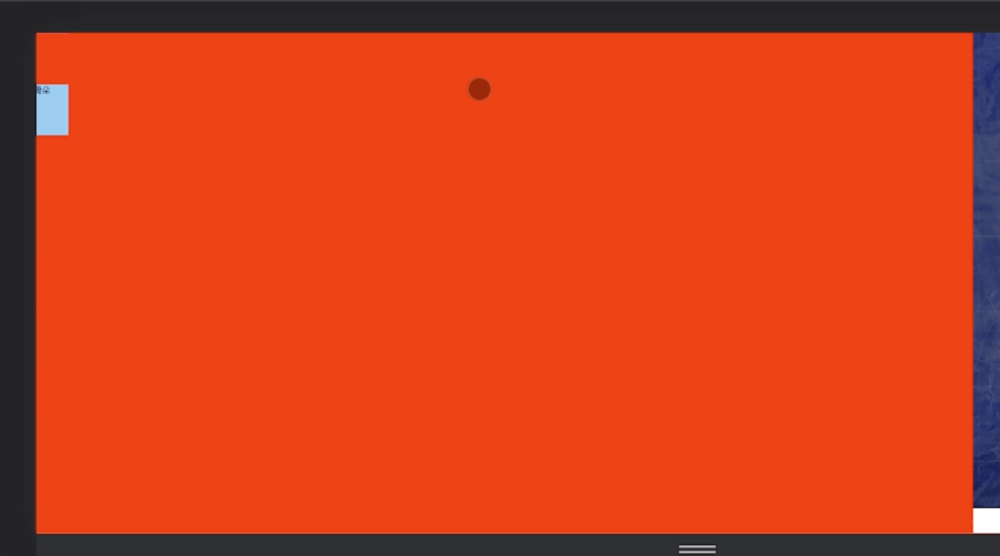

# 适配的方案

## vw / vh 解决适配
它兼容ie8以上

1. 100vw: 视口宽度 设备的宽度
2. 100vh: 视口宽度 设备的高度

<br>

### 设计稿尺寸: w: 1920 - h: 1080
比如我们有一个设计稿, 尺寸为 ``w: 1920 - h: 1080`` 比例关系为 ``16:9``


当我们要在这个尺寸下, 画一个100x100盒子的时候, 我们可以根据 vw 和 vh 来完成计算

```scss
// 目标尺寸
.box {
  width: 100px;
  height: 100px;
}

// 使用 vw 和 vh 来计算 拿到适配后的尺寸
.box {
  width: 100 / (1920 / 100);
  height: 100 / (1080 / 100);
}
```

<br>

**宽度: 100 / (1920 / 100)**  
1. 1920px的宽度, 1vw 就是 19.2px
2. 100px 是几个vw, ``100px / 19.2px``

<br>

**宽度: 100 / (1080 / 100)**  
1. 1080px的高度, 1vh 就是 10.8px
2. 100px 是几个vh, ``100px / 10.8px``

<br>

### vw 和 vh 解决适配的缺点:
1. 计算比较麻烦, w 和 h 都需要根据 设计稿 的宽高来进行计算
2. echarts中的文字 不支持 vw 和 vh, echarts只能写px和百分比

<br><br>

## scale 解决适配
它可以实现元素的放大的缩小 平移 旋转等

使用 scale 对元素进行放大缩小的时候, 元素内部的子元素也会放大缩小

<br>

当我们使用 scale 对一个元素进行缩放的时候, 它的基点是在元素的中心点的位置, **中心开始四周放大**, 这样会移动内容的位置



放大缩小的中心点 应该是设备的中心点

<br>

### 调整元素放大缩小的中心点:

```scss
| - 设备高宽 的容器: 用于 放置 背景图
  | - 元素 的容器: 用于 承装 数据大屏的内容

.元素容器 {
  width: 1920px;
  height: 1080px;
  background: red;
  transform: scale(1.1);
}
```

<br>

1. 我们将 元素缩放的基点 调整到 盒子的左上角
2. 我们将 元素 放到屏幕的正中间, 这时元素的左上角就会在屏幕的正中间, 后续我们会放大后, 再通过js将元素拉回来


```scss
.元素容器 {
  width: 1920px;
  height: 1080px;
  background: red;

  // 2. 将 元素 放到屏幕的正中间
  position: fixed;
  left: 50%;
  right: 50%;

  // 1. 元素缩放的基点 调整到左上角
  transform-origin: left top;
}
```

3. js控制放大和缩小
```js
let box = document.querySelector('.元素容器')

// 页面挂载的时候 就将元素放大后 再拽回去
box.style.transform = `scale(${getScale()}) translate(-50%, -50%)`

// 设计稿尺寸 1920 - 1080
function getScale(w = 1920, h = 1080) {
  // 计算缩放比例: 设备视口的宽度 / 设计稿的宽度
  const ratioW = window.innerWidth / w
  const ratioH = window.innerHeight / h

  // 比例我们只能使用一个值, 所以我们判断下使用哪个比例, 我们使用两个值中小的那个
  return ratioW < ratioH ? ratioW : ratioH

  /*
    什么时候 ratioW < ratioH:
      - 1920 / 1920 (ratioW)
      - 1080 / 1080 (ratioH)

      当 设备视口宽度变小 或者 视口高度变大 的时候 ratioW < ratioH, 这时候我们就是按照 ratioW 来进行放大缩小 (高度有余白)


    什么时候 ratioW > ratioH:

      当 设备视口宽度变大 或者 视口高度变小 的时候 ratioW > ratioH, 这时候我们就是按照 ratioH 来进行放大缩小 (宽度有余白)
  */
}

window.onresize(function() {
  box.style.transform = `scale(${getScale()}) translate(-50%, -50%)`
})
```

<br>

### scale实现适配的优缺点

**优点:**  
1. 我们不用计算, 原稿是多少 我们直接写多少
2. 解决文字的放大和缩小

<br>

**缺点:**  
会按照设计稿的 高宽比例 进行缩放, 所以容易出现左右 或 上下有余白的情况

<br><br>

## Vue中 scale 适配的方式:
```html
<script setup lang="ts">
import { ref, onMounted } from 'vue'
defineOptions({
  name: 'Screen'
})

// 1. 定义大屏缩放的比例, 参数wh为设计稿的宽度
const getScale = (w = 1920, h = 1080): number => {
  const ratioW = window.innerWidth / w
  const raitoH = window.innerHeight / h

  return ratioW < raitoH ? ratioW : raitoH
}

// 2. 获取 数据大屏展示内容的DOM元素
const dataTarget = ref()

// 3. 当组件一挂载 我们就将 &__wrapper 元素往初始位置拽
const adjustDataTargetPosition = () => {
  dataTarget.value.style.transform = `scale(${getScale()}) translate(-50%,-50%)`
}

// 4. 在 onMounted 中进行调用
onMounted(() => {
  // 初始化组件的时候 我们将 &__wrapper 元素往初始位置拽
  adjustDataTargetPosition()
})

// 5. 监听窗口的尺寸变化
window.addEventListener('resize', adjustDataTargetPosition)
</script>

<template>
  <!-- 外层容器: 宽高和视口一样 -->
  <div class="data-container">
    <!-- 数据大屏展示内容的区域 -->
    <div ref="dataTarget" class="data-container__wrapper">
      echarts
    </div>
  </div>
</template>

<!-- 
  适配方案: scale
  1. &__wrapper 的 中心点 调节成 左上角
  2. 将 &__wrapper 元素移动到 中心点
  3. 看 js 部分
 -->

<style scoped lang="scss">
/* 外层容器: 宽高和视口一样 */
.data-container {
  width: 100vw;
  height: 100vh;
  background: url(./images/bg.png) no-repeat;
  background-size: cover;

  /* 数据大屏展示内容的区域: scale方案 我们的设计稿是什么样的 直接写样式 */
  &__wrapper {
    width: 1920px;
    height: 1080px;
    background-color: red;

    /* 适配方案: scale */
    /* 1. 将 &__wrapper 元素移动到 中心点 */
    position: fixed;
    left: 50%;
    top: 50%;
    /* 2. &__wrapper 的 中心点 调节成 左上角 */
    transform-origin: left top;
  }
}
</style>
```

<br><br>

# echarts的使用

### 安装
```s
# "^5.4.3",
npm i echarts
```

<br>

### 引入 echarts
```js
import { ref, onMounted } from 'vue'
import * as echarts from 'echarts'
```

<br>

### 步骤:
1. 引入 echarts
2. 给chart容器指定高度
3. 给chart容器绑定ref
4. 通过 ref 获取dom节点
5. 在 onMounted 中初始化 echarts
6. 设置 options

<br>

### 示例代码:
```html
<script setup lang="ts">
import { onMounted, ref } from 'vue'
// 引入 echarts
import * as echarts from 'echarts'

defineOptions({
  name: 'DataLTourist'
})

const people = ref('216908')

// 1. 获取 echart 容器节点
const chart = ref()

// 2. 当组件挂载完毕后 初始化echarts
onMounted(() => {
  // 3. 获取 echarts 实例对象, 传入dom元素
  const chartInstance = echarts.init(chart.value)

  // 4. 设置实例的配置项
  chartInstance.setOption({
    // 标题组件:
    title: {
      text: '水球图'
    },
    // x y轴组件
    xAxis: {},
    yAxis: {},
    // 系列: 决定展示什么样的图形图标
    series: {
      type: 'bar',
      data: [10, 20, 30]
    }
    // 布局组件 grid: {}
  })
})
</script>

<template>
  <div class="tourist-container">
    ...
    <!-- echarts 容器 -->
    <div ref="chart" class="tourist__chart"></div>
  </div>
</template>

<style scoped lang="scss">
.tourist-container {
  ...

  .tourist {
    ...
    /* 给chart一个高度 */
    &__chart {
      width: 100%;
      height: 226px;
      margin-top: 10px;
    }
  }
}
</style>
```

<br><br>

# 水球图
echarts中本身不包含 水球图, 它属于echarts中的一个扩展插件

我们在echarts官网中是找不到水球图的相关api的, 我们在github中能看到它扩展的插件 如果我们想使用拓展插件的话 **需要单独安装**
```s
https://www.npmjs.com/package/echarts
```


### 安装 echarts 的水球图扩展
```s
# 有示例
https://www.npmjs.com/package/echarts-liquidfill

npm i echarts-liquidfill
```

### 使用步骤
1. 引入 echarts
2. 引入 水球图
```js
import * as echarts from 'echarts';
import 'echarts-liquidfill'
```

```js
import { onMounted, ref } from 'vue'
// 引入 echarts
import * as echarts from 'echarts'
// 引入 水球图 插件
import 'echarts-liquidfill'

defineOptions({
  name: 'DataLTourist'
})

const people = ref('216908')

// 1. 获取 echart 容器节点
const chart = ref()

// 2. 当组件挂载完毕后 初始化echarts
onMounted(() => {
  // 3. 获取 echarts 实例对象, 传入dom元素
  const chartInstance = echarts.init(chart.value)

  // 4. 设置实例的配置项
  chartInstance.setOption({
    // 系列: 决定展示什么样的图形图标
    series: {
      type: 'liquidFill',
      data: [0.6],
      // 水球图大小
      radius: '80%'
    }
  })
})
```