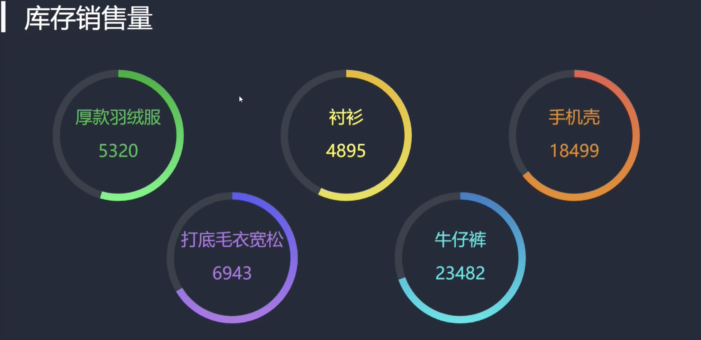

# 后台项目

## 后台项目的目标

### 1. 计算服务器处理请求的总耗时  
当一个请求到达服务器的时候 我们服务器会经过一系列的中间件进行处理 最终再把数据返回给前端 服务器对请求的总耗时是多少呢 我们在这个部分计算一下

<br>

### 2. 在响应头上加上响应内容的mime类型
指明返回前端内容的数据类型是什么 让前端更好的处理由服务器所返回的数据 如果我们响应回的是json 这时我们就在响应头中添加响应体的数据类型

<br>

### 3. 根据url读取指定目录下的文件内容
我们的数据没有存储在数据库中 数据在json文件中

<br>

所以我们会将上面的3件事情交给3个中间件来完成

<br><br>

## 后台项目的实现步骤
1. 项目准备
```s
| - data # 存放json数据
| - middleware # 存放1-3的中间件
  - koa_reponse_data.js # 业务逻辑中间件
  - koa_reponse_data.js # 总耗时中间件
  - koa_reponse_data.js # 响应头中间件
| - utils
 - file_utils.js # 读取目录中的文件
```

2. 编写 总耗时中间件
3. 编写 响应头中间件
4. 编写 业务逻辑中间件 (读取某个目录下的内容)
5. 允许跨域

<br><br>

## 总耗时中间件
该中间件必须位于第一层, 这个中间件是用来计算服务器的总耗时 那就是刚刚经过服务器处理的时候记录开始的时间 

在所有中间件结束之后 记录下结束的时间 然后将前后两个时间一对减 就可以得到服务器总消耗时长

<br>

**所以第一层中间件是最先经过请求的中间件 也是最后结束请求的中间件**

<br>

我们最后拿到的耗时时长 需要通过响应头的方式给前端浏览器 该响应头为: ``X-Response-Time: 5ms``

<br>

### 代码:
```js
// 中间件就是一个函数 我们暴露一个函数就可以
module.exports = async (ctx, next) => {

  // 记录开始时间
  const start = Date.now()

  // 让内层中间件得到执行
  await next()

  // 记录结束的时间
  const end = Date.now()

  // 设置响应头 X-Response-Time
  const duration = end - start
  
  // ctx.set 设置响应头
  ctx.set('X-Response-Time', duration + 'ms')
}
```

<br><br>

## 响应头中间件
1. 它位于第二层中间件
2. 获取响应数据的mime类型, 我们指明json格式
3. 设置响应头 Content-Type: application/json; charset=UTF-8
4. 设置跨域相关

```js
// 设置响应头的中间件
module.exports = async (ctx, next) => {
  const contentType = 'application/json; charset=utf-8'
  ctx.set('Content-Type', contentType)

  ctx.set("Access-Control-Allow-Origin", "*")
  ctx.set("Access-Control-Allow-Methods", "OPTIONS, GET, PUT, POST, DELETE")
  await next()
}
```

<br><br>

## 业务逻辑中间件
它为于第三层中间件 它专门读取文件中的内容 读取什么文件中的内容取决于浏览器中url的路径

```s
http://127.0.0.1:8081/api/seller
```

1. 获取请求的路径 根据请求路径拼接文件路径
2. 读取该路径对应的文件的内容
3. 将文件内容设置到响应体中

<br>

### 业务逻辑中间件代码部分
**要点:**  
1. 我们就三层中间件 最后一层中间件最好写上next() 因为中间件代码都是独立的 我们没有办法保证后续不扩展中间件 也不知道该中间件最后会使用到哪一层 所以我们最好加上 next

2. 一般中间件都会使用 async await 的格式

```js
// 处理业务逻辑的中间件,读取某个json文件的数据
const path = require('path')

// 读取json文件的方法
const fileUtils = require('../utils/file_utils')

module.exports = async (ctx, next) => {
  // 根据url 整理出 json数据文件的位置
  const url = ctx.request.url 
  // /api/seller

  // 去掉 /api 不分
  let filePath = url.replace('/api', '')
  // /seller
  
  // 拼接路径
  filePath = '../data' + filePath + '.json'
  // ../data/seller.json
  
  // 当前文件所在的目录 + ../ 会减少一层目录 最终实现拼接的操作
  filePath = path.join(__dirname, filePath)
  // /Users/sam/Desktop/Sam/Demo/Front/Echarts_Product/server/data/seller.json


  try {
    const ret = await fileUtils.getFileJsonData(filePath)
    ctx.response.body = ret


  // 如果请求的 uri 不对 是会报错的 比如我们请求 /haha
  } catch (error) {
    const errorMsg = {
      message: '读取文件内容失败, 文件资源不存在',
      status: 404
    }
    // 将读取的数据响应回前台
    ctx.response.body = JSON.stringify(errorMsg)
  }
 

  // 确保下一层中间件能后执行
  await next()
}
```

<br>

### 读取文件内容的工具
```js
// 读取文件的工具方法
const fs = require('fs')

module.exports.getFileJsonData = (filePath) => {
  // 根据文件的路径, 读取文件的内容
  return new Promise((resolve, reject) => {
    fs.readFile(filePath, 'utf-8', (error, data) => {
      if(error) {
        // 读取文件失败
        reject(error)
      } else {
        // 读取文件成功
        resolve(data)
      }
    })
  })
}
```

<br><br>

## 后台接口总览
1. 商家销量 /api/seller
2. 预算开销 /api/budget
3. 库存信息 /api/stock
4. 销量趋势 /api/trend
5. 销量排行 /api/rank
6. 商家分布 /api/map
7. 热销商品 /api/hotproduct

<br><br>

# 前端项目

## 准备工作
**1. 全局引入echarts**  
我们在 /public/index.html 文件中使用 script 的方式引入 我们放在 /static/lib/echarts.min.js 文件

一旦我们通过该方式引入echarts.js文件后 我们就使用通过 ``window.echarts`` 获取echarts对象

<br>

**2. 将全局的echarts对象挂载到vue的原型对象上**  
```js
import Vue from 'vue'
import App from './App.vue'
import router from './router'
import axios from "axios"

// 导入全局样式文件
import "@/assets/css/global.scss"

Vue.config.productionTip = false

// axios全局配置
axios.defaults.baseURL = "http://127.0.0.1:8081/api/"

// 将 echarts 挂载到 vue 原型对象上
Vue.prototype.$echarts = window.echarts
Vue.prototype.http = axios

new Vue({
  router,
  render: h => h(App)
}).$mount('#app')
```

<br>

**3. xxxPage.vue 和 xxx.vue的关系**  
xxxPage.vue 它里面会使用 xxx.vue 进行展示内容,我们会配置路由方便我们全屏查看该组件的效果

而最终我们会使用 xxx.vue 文件

<br><br>

## 全局样式
1. 全局样式 要是想生效需要在 main.js 文件中引入
2. chart和chart的父元素 都是100% 这样适应性比较高 我们在哪里引入chart组件 它就是根据父组件的宽度自适应的

```scss
html, body, #app {
  width: 100%;
  height: 100%;
  padding: 0;
  margin: 0;
  overflow: hidden;
}

// xxxPage的样式
.common-page {
  width: 100%;
  height: 100%;
  overflow: hidden;
}

// chart的亲父亲
.common-container {
  width: 100%;
  height: 100%;
  overflow: hidden;
}

// chart容器
.common-chart {
  width: 100%;
  height: 100%;
  overflow: hidden;
}
```

<br><br>

# 商家销售统计(横向柱状图)

## 组件基本结构

**SellerPage.vue**
```vue
<script>
import {defineComponent} from 'vue'
import Seller from "@/components/Seller.vue";

export default defineComponent({
  name: "SellerPage",
  components: {
    Seller
  }
})
</script>

<!-- 展示路径 /sellerPage -->
<template>
  <div class="common-page">
    <Seller />
  </div>

</template>

<style scoped lang="scss">

</style>
```

<br>

**Seller.vue**
```vue
<script>
import {defineComponent} from 'vue'

export default defineComponent({
  name: "Seller.vue"
})
</script>

<!-- 商家销量统计的横向柱状图 -->
<template>
  <div class="common-container">
    <div class="common-chart"></div>
  </div>
</template>

<style scoped lang="scss">

</style>
```

<br><br>

## 商家销售统计: 图表功能基本实现
1. 初始化图表 创建echarts对象
2. 获取服务器提供的数据
3. setOption() 更新图表

<br>

### 初始化图表 创建echarts对象
**1. echarts.init(DOM节点)相关**  
我们可以使用 ref 并不是只可以使用document选择器

<br>

**2. 逻辑:**  
- initChart方法
  - 负责初始化echarts实例对象
  - 组织基本的数据结构 并没有数据(类目轴数据和series中数据)
  - 数据会在请求api成功后调用updateChart方法追加相关数据
  - 因为initChart方法中并不提供数据 所以页面效果就是只有直角坐标系
```js
// 1. 获取实例
this.chart = this.$echarts.init(this.$refs.chart)
// 2. 配置没有数据的option
const ops = {}
// 3. 将option给chart
this.chart.setOption(ops)
```

<br>

**3. bar型图表的数据格式**  
数据格式如下:

```js
[{ "name": "商家1",  "value": 99}]
```

其中name是类目轴需要使用的数据 value是series.data中需要使用的数据**


<br><br>

## 商家销售统计: 动态刷新
该柱形图一共有15条数据, 但是我们并没有一次性的将15条数据 一次性的全部展示 而是类似分页的效果 每一页展示5条 

**然后通过定时刷新的方式** 使页码改变 展示对应页码的数据 从而实现在不同的页码之间进行数据的切换

<br>

### data配置项:
```js
data() {
return {
    // chart数据
    detailData: [],
    // 图表实例
    chart: null,
    // 分页处理逻辑
    limit: {
        // 当前显示的页数 (会通过定时器不断地改变它的值)
        currentPage: 1,
        // 每页显示几条
        pageSize: 5,
        // 总页数(通过计算)
        totalPage: 0
    },
    timer: null
}
```

<br>

### 逻辑:
**1. 处理请求回来的数据**  
我们会请求回来15条数据 因为分页 我们需要做数据的处理

- 排序: 从小到大
- 处理总页码: 两种方式
- 调用 updateChart 往chart中追加所需的数据
- 在请求api方法的最后 我们调用自动刷新的定时器逻辑
```js
async getData() {

    const { data: res } = await this.$http({
        url: "/api/seller"
    })

    // 处理请求回来的数据 整理为 从小到大 的顺序
    res.sort((a, b) => a.value - b.value)

    this.detailData = res
    // 每5个元素为一页 我们计算总页数
    // 方式1:
    this.limit.totalPage = Math.ceil(this.detailData.length / this.limit.pageSize)
    
    // 方式2:
    // this.totalPage = this.detailData.length % this.limit.pageSize === 0 ? this.detailData.length / this.limit.pageSize : this.detailData.length / 5 + 1
    this.updateChart()

    // 开启定时器 刷新数据
    this.startInterval()
},
```

<br>

**2. updateChart方法:**  
该方法中主要完成分页的逻辑

- 使用 slice() 方法来截取数据 获取的是新数组
- 获取 start end 的索引位置
```js
/*
如果当前页面为1 我们需要从detailData中获取 0 - 5 的数据 来进行展示
slice() 会返回新的数组

start = (pageNo - 1) * pageSize
end = pageNo * pageSize
*/
const start = (this.limit.currentPage - 1) * this.limit.pageSize

const end = this.limit.currentPage * this.limit.pageSize
```

它方法会根据当前页码 来从数据源中获取符合当前页的数据 然后追加到chart中

<br>

**3. 自动刷新:**  
startInterval方法用于 将当前页码更新 然后调用updateChart方法来刷新页面

- 定时器方法的最开始 加上
```js
if(this.timer) {
    clearInterval(this.timer)
}
```

- 方法内部逻辑为 先让页码++ 然后做边界判断 最后调用 updateChart方法

<br>

**4. 事件的绑定**  
我们会在 chart初始化的方法的最后 完成事件绑定的逻辑
```js
initChart() {
    ...

    // 监听图表的事件 需要在初始化图表的时候完成
    // 鼠标移入 关闭定时器
    this.chart.on("mouseover", () => {
        clearInterval(this.timer)
    })
    // 鼠标移出 重新启动定时器
    this.chart.on("mouseout", () => {
        this.startInterval()
    })
}
```

<br>

**5. 定时器的关闭**
在组件销毁前

<br><br>

## 商家销售统计: UI调整
- 主题的使用
- 图表的圆角
- 图表的标题
- 坐标轴的位置
- 柱状图的条目

<br>

### 主题的使用
我们将主题的js文件 在/public/index.html 中使用script标签引入, 这样我们就可以使用主题名来进行注册

<br>

### 图表的圆角
图表是使用canvas来绘制的 我们要是想将整个的图表修改为圆角 我们可以使用css来修改 canvas标签

```scss
// global.scss
canvas {
  border-radius: 20px;
}
```

<br>

### 图表的标题
我们在使用 title.textStyle.fontSize 控制标题的大小的时候 发现如果我们的标题太小 它会盖主图表

这时我们只能移动图表的位置 **我们需要调整整个图标的坐标轴** 从而调整图表的部分

```js
title: {
    text: "▎商家销售统计",
    left: "5%",
    top: "3%",
    textStyle: {
        fontSize: 30
    }
},
grid: {
    top: "13%",
    left: "5%",
    right: "5%",
    bottom: "13%",
    // left等位置的基准是包含y轴文字的 可以有效防止内容溢出!!!!!
    containLabel: true
},
```

<br>

### 柱状图条目的控制
- 宽度
- 柱状图对应的提示文字(数据)
- 右边圆角
- 颜色渐变
- 背景 (引入到一个柱条后 有背景)

<br>

### 颜色渐变
图表中的每一个项的颜色渐变的设置方式有两种
1. optiosn.color配置项 调色盘
2. 渐变颜色生成器

我们下面使用的是 渐变颜色生成器
```js
new this.$echarts.graphic.LinearGradient()
```

<br>

**注意:**  
最后一个参数false一定要传递

```js
series: [
  {
    type: "bar",
    name: "商家销量统计",
    // 调整柱的宽度
    barWidth: 66,
    // 提示文件的展示
    label: {
      show: true,
      // 提示文件的位置
      position: "right",
      // 提示文字颜色
      textStyle: {
        color: "#fff"
      }
    },
    // 每一个bar属于 每一个条目使用如下配置
    itemStyle: {
      // 控制柱状条中一个柱条的四个圆角 左上 右上 右下 左下
      // 圆角是柱宽度的一半 柱宽度上面设置了 66 这里所以是33
      barBorderRadius: [0, 33, 33, 0],
      /*
       颜色渐变:
       new this.$echarts.graphic.linearGradient()
       内置的渐变颜色生成器, 它可以生成一个渐变色, 来控制每一个bar的颜色渐变

       1. 指明颜色渐变的方向
         参数1
         x1, y1, x2, y2 这是两个点 两个点可以组织成一条线 也就是方向
         这两个点是相对值 正方向的4个点
         0,0    1,0

         0,1    1,1

       2. 指明不同百分比之下颜色的值
         参数2: 数组对象
         配置不同百分比之下颜色的具体值
      */
      color: new this.$echarts.graphic.LinearGradient(0, 0, 1, 0, [
        // 0%的状态
        { offset: 0, color: "#5052EE" },
        // 100%的状态
        { offset: 1, color: "#AB6EE5" }
      ], false)
    }
  }
]
```

<br>

### 背景
当我们移入到一个项目的时候 如下展示两个部分
1. 该条项目有浅色的带有透明度的背景 做为hover效果
2. 有提示框

```js
// 提示框
tooltip: {
    // 移入到坐标轴的时候显示提示框
    trigger: "axis",
    // 鼠标移入到坐标轴时展示的样式
    axisPointer: {
        // hover上去的时候是线条
        type: "line",
        // 线条的样式
        lineStyle: {
            width: 66,
            color: "#2D3443"
        },
        // 调整提示框的层级 将它调整为0
        z: 0
    }
},
```

<br><br>

## 商家销售统计: 拆分图表的options
我们options的中包含很多的属性
- 标题
- 坐标轴
- 坐标系的位置
- 提示框
- 系列

里面还包含了数据 比如类目轴 和 series中需要的数据, 我们的options中包含了很多部分的内容

而对于我们的updateChart而言的话 它是在得到数据之后 对图表的数据进行更新

<br>

### 拆分部分:

所以我们可以将options拆分成不同的部分 来进行维护 我们会将它拆解成
1. 初始化配置 initOption
  - 标题
  - 坐标轴类型 大小

2. 获取数据之后的配置 dataOption
  - 类目轴的数据
  - 数值轴的数据

3. 分辨率适配的配置 adapterOption
  - 标题文字的大小
  - 柱的大小
  - 背景大小

<br>

**initOption:**  
- 它里面不包含数据
- 它里面不包含需要适配的选项 比如
  - 文字大小
  - 提示框的背景大小


<br>

**dataOption:**  
在updateChart方法中

<br>

**adapterOption:**  
该配置在下一个部分

<br>

## 商家销售统计: 分辨率的适配
我们想让图表能够随着浏览器的大小可以发生自适应的变化

<br>

### 方式:
监听窗口大小变化事件 

<br>

### 逻辑:
当浏览器窗口的大小发现变化的时候 我们需要完成如下的逻辑
1. 获取图表容器的宽度
2. 设置新的option
  - 标题文字的大小
  - 柱的宽度
  - 柱的圆角
  - 阴影背景的宽度

3. 图表 实例对象.resize

当我们监听到浏览器窗口大小发现变化的时候 我们重新获取图表容器(ref="chart")的宽度 然后我们改变图表中不同区域的大小

<br>

**注意:**  
修改echarts的效果都是通过 创建option - setOption 实现的 想想react

<br>

### 代码部分:
```js
// window窗口尺寸发生变化时的回调 完成屏幕的适配
screenAdapter() {
  // 修改图标都是通过 设置option - setOption

  // 1. 获取图表容器的宽度
  if(this.$refs.chart) {
    const chartWidth = this.$refs.chart.offsetWidth

    // 定义标题的大小 分成100份 每份为3.6
    const baseSize = chartWidth / 100 * 3.6

    // 修改图标都是通过 设置option - setOption
    // 创建跟适配相关的option
    const adapterOption = {
      title: {
        textStyle: {
          fontSize: baseSize
        },
      },
      tooltip: {
        axisPointer: {
          lineStyle: {
            width: baseSize,
          },
        }
      },
      series: [
        {
          barWidth: baseSize,
          itemStyle: {
            barBorderRadius: [0, baseSize / 2, baseSize / 2, 0]
          }
        }
      ]
    }
    this.chart.setOption(adapterOption)
    // 当窗口发生变化的时候 我们需要调用resize 图表才会改变
    this.chart.resize()
  }
},
```

<br>

### 商家销售统计组件代码部分:
```vue
<script>
import {defineComponent} from 'vue'
// 引入主题
import chalk from "../assets/theme/chalk"

// 引入渐变颜色生成器
import { LinearGradient } from "echarts/lib/util/graphic"
import {windowOpen} from "echarts/lib/util/format";
// console.log(LinearGradient)

export default defineComponent({
  name: "Seller",
  data() {
    return {
      // chart数据
      detailData: [],
      // 图表实例
      chart: null,
      theme: chalk,  // vintage | chalk
      // 分页处理逻辑
      limit: {
        // 当前显示的页数 (会通过定时器不断地改变它的值)
        currentPage: 1,
        // 每页显示几条
        pageSize: 5,
        // 总页数(通过计算)
        totalPage: 0
      },
      timer: null
    }
  },
  mounted() {
    this.getData()
    this.initChart()

    // 监视窗口改变的事件
    window.addEventListener("resize", this.screenAdapter)
    // 页面加载的时候主动调用下适配的方法
    this.screenAdapter()
  },
  beforeDestroy() {
    clearInterval(this.timer)
    window.removeEventListener("resize", this.screenAdapter)
  },
  methods: {
    // window窗口尺寸发生变化时的回调 完成屏幕的适配
    screenAdapter() {
      // 修改图标都是通过 设置option - setOption

      // 1. 获取图表容器的宽度
      if(this.$refs.chart) {
        const chartWidth = this.$refs.chart.offsetWidth

        // 定义标题的大小 分成100份 每份为3.6
        const baseSize = chartWidth / 100 * 3.6

        // 修改图标都是通过 设置option - setOption
        // 创建跟适配相关的option
        const adapterOption = {
          title: {
            textStyle: {
              fontSize: baseSize
            },
          },
          tooltip: {
            axisPointer: {
              lineStyle: {
                width: baseSize,
              },
            }
          },
          series: [
            {
              barWidth: baseSize,
              itemStyle: {
                barBorderRadius: [0, baseSize / 2, baseSize / 2, 0]
              }
            }
          ]
        }
        this.chart.setOption(adapterOption)
        // 当窗口发生变化的时候 我们需要调用resize 图表才会改变
        this.chart.resize()
      }
    },
    // 初始化 echarts 实例对象
    initChart() {
      // 获取 echarts 实例对象
      this.chart = this.$echarts.init(this.$refs.chart, chalk)

      // 我们将options配置拆分成如下的几个部分来管理
      // 1. 对图表的初始化配置
      const initOption = {
        // 标题相关配置
        title: {
          text: "▎商家销售统计",
          left: "5%",
          top: "3%",
          textStyle: {
            fontSize: 30
          }
        },
        grid: {
          // 位置相关配置
          top: "13%",
          left: "5%",
          right: "5%",
          bottom: "13%",
          // left等位置的基准是包含y轴文字的 可以有效防止内容溢出
          containLabel: true
        },
        xAxis: {
          type: "value"
        },
        yAxis: {
          type: "category",
        },
        // 提示框
        tooltip: {
          // 移入到坐标轴的时候显示提示框
          trigger: "axis",
          // 鼠标移入到坐标轴时展示的样式
          axisPointer: {
            // hover上去的时候是线条
            type: "line",
            // 线条的样式
            lineStyle: {
              width: 66,
              color: "#2D3443"
            },
            // 调整提示框的层级 将它调整为0
            z: 0
          }
        },
        series: [
          {
            type: "bar",
            name: "商家销量统计",
            // 调整柱的宽度
            barWidth: 66,
            // 设置柱之间的间距
            // barCategoryGap: "30px",
            // 提示文件的展示
            label: {
              show: true,
              // 提示文件的位置
              position: "right",
              // 提示文字颜色
              textStyle: {
                color: "#fff"
              }
            },
            // 每一个bar属于 每一个条目使用如下配置
            itemStyle: {
              // 控制柱状条中一个柱条的四个圆角 左上 右上 右下 左下
              // 圆角是柱宽度的一半 柱宽度上面设置了 66 这里所以是33
              barBorderRadius: [0, 33, 33, 0],
              /*
               颜色渐变:
               new this.$echarts.graphic.linearGradient()
               内置的渐变颜色生成器, 它可以生成一个渐变色, 来控制每一个bar的颜色渐变

               1. 指明颜色渐变的方向
                 参数1
                 x1, y1, x2, y2 这是两个点 两个点可以组织成一条线 也就是方向
                 这两个点是相对值 正方向的4个点
                 0,0    1,0

                 0,1    1,1

               2. 指明不同百分比之下颜色的值
                 参数2: 数组对象
                 配置不同百分比之下颜色的具体值
              */
              color: new this.$echarts.graphic.LinearGradient(0, 0, 1, 0, [
                // 0%的状态
                { offset: 0, color: "#5052EE" },
                // 100%的状态
                { offset: 1, color: "#AB6EE5" }
              ], false)
            }
          }
        ]
      }
      // 设置基本数据
      this.chart.setOption(initOption)

      // 监听图表的事件 需要在初始化图表的时候完成
      // 鼠标移入 关闭定时器
      this.chart.on("mouseover", () => {
        clearInterval(this.timer)
      })
      // 鼠标移出 重新启动定时器
      this.chart.on("mouseout", () => {
        this.startInterval()
      })
    },

    // 获取服务器数据
    async getData() {
      const { data: res } = await this.$http({
        url: "/api/seller"
      })

      // 处理请求回来的数据 整理为 从小到大 的顺序
      res.sort((a, b) => a.value - b.value)

      this.detailData = res
      // 每5个元素为一页 我们计算总页数
      // 方式1:
      this.limit.totalPage = Math.ceil(this.detailData.length / this.limit.pageSize)

      // 方式2:
      // this.totalPage = this.detailData.length % this.limit.pageSize === 0 ? this.detailData.length / this.limit.pageSize : this.detailData.length / 5 + 1
      this.updateChart()

      // 开启定时器 刷新数据
      this.startInterval()
    },
    // 更新图表
    updateChart() {

      /*
      如果当前页面为1 我们需要从detailData中获取 0 - 5 的数据 来进行展示
      slice() 会返回新的数组

      start = (pageNo - 1) * pageSize
      end = pageNo * pageSize
      */
      const start = (this.limit.currentPage - 1) * this.limit.pageSize
      const end = this.limit.currentPage * this.limit.pageSize
      const source = this.detailData.slice(start, end)
      /*
      数据格式:
      [{ "name": "商家1",  "value": 99}]

      处理数据组织成bar需要的数据格式
      1. 类目轴需要的数据 name数据
      2. series.data 中需要的数据 value数组
      */

      const categoryData = source.map(item => item.name)
      const seriesData = source.map(item => item.value)

      // 更新echarts表中的数据 该方法起到了更新图标的作用
      this.chart.setOption({
        yAxis: { data: categoryData },
        series: [
          { data: seriesData }
        ]
      })
    },
    // 在getData方法的最后调用
    startInterval() {
      if(this.timer) {
        clearInterval(this.timer)
      }

      this.timer = setInterval(() => {
        this.limit.currentPage++

        // 边界判断
        if(this.limit.currentPage > this.limit.totalPage) {
          this.limit.currentPage = 1
        }

        // 当页码发生变化后 我们调用updateChart方法来更新图表
        this.updateChart()
      }, 5000)
    }
  }
})
</script>

<!-- 商家销量统计的横向柱状图 -->
<template>
  <div class="common-container">
    <!-- chart容器 -->
    <div class="common-chart" ref="chart"></div>
  </div>
</template>

<style scoped lang="scss">

</style>
```

<br><br>

# 销量趋势图表 (折线图)
我们需要在这个部分完成下面的逻辑

<br><br>

## 销量趋势图表: 通用的代码结构和流程

### 接口的数据结构

**要点1:**  
销量趋势图表的标题是可以点击的 点击它有类似下拉框的效果 可以切换如下的图表 从而展示对应的图表
- 地区销量趋势 map
- 商家销量趋势 seller
- 商品销量趋势 seller

上面三个数据项表示, 销量趋势图表 中的三份图表数据 后面我们会动态的切换它们


```js
{
  // 地区销量趋势 折线图
  "map": {
    "title": "地区销量趋势",
    "base": 310,
    "unit": "万",
    "data": [ 
      // 该折线图上有很多组 线条
      {
        "name": "上海",
        "data": [ "154.65", ... ]
      },
      {
        "name": "北京",
        "data": [ "154.65", ... ]
      },
    ]
  },

  // 商家销量趋势
  "seller": {
    "title": "商家销量趋势",
    "base": 120,
    "unit": "万",
    "data": [
      {
        "name": "商家1",
        "data": [ "33.00", ... ]
      },
      {
        "name": "商家2",
        "data": [ "33.00", ... ]
      },
    ]
  },

  // 商品销量趋势
  "commodity": {
    "title": "商品销量趋势",
    "base": 50,
    "unit": "万",
    "data": [
      {
        "name": "女装",
        "data": [ "33.00", ... ]
      },
      {
        "name": "手机数码",
        "data": [ "33.00", ... ]
      },
    ]
  },

  // x类目轴的数据
  "common": {
    "month": [ "一月", ... ]
  },

  // 图表标题部分的下拉框 type数组就是内部的可选项
  "type": [
    {
      "key": "map",
      "text": "地区销量趋势"
    },
    {
      "key": "seller",
      "text": "商家销量趋势"
    },
    {
      "key": "commodity",
      "text": "商品销量趋势"
    }
  ]
}
```

<br><br>

## 销量趋势图表: 图表基本功能
1. 数据的获取
2. 数据的处理
3. 图表的设置

<br>

### 数据获取:

**initChart方法:**  
它会在mounted中 进行chart的初始化 并配置基本的配置项

<br>

**getData:**  
它会在mounted中进行调用 并将请求回来的数据 挂载到实例上 detailData 

然后会调用updateChart方法来处理数据 将图标所需要的数据加载到图标中
```js
 async getData() {
    const { data: res } = await this.$http({
        url: "/api/trend"
    })
    this.detailData = res
    this.updateChart()
},
```

<br>

**updateChart方法:**  
- 拿到 折线图 类目轴需要的数据
- 拿到 折线图 中 3个图表数据其中之一进行处理
```js
updateChart() {
  // 类目轴数据: x轴上需要
  const xAxisData = this.detailData.common.month
  
  /*
  处理数据 整理出series中需要的格式
    该折线图可以切换3组数组(对应3个图表) 我们先展示 地区销量趋势 - map
    
    地区销量趋势 折线图上有很 多组 线条 它们就对应着 series数组中有很多个{}
    我们要组织出 series下的数据结构
  */
  const regionSalesData = this.detailData.map.data
  const regionSeriesData = regionSalesData.map(item => {
    // 它是series数组中的一个对象元素
    return {
      type: "line",
      name: item.name,
      data: item.data,
      // 设置堆叠图: 设置相同的 stack 值
      stack: "map",
      // 设置颜色区域: 
      areaStyle: {
        // 图形区域的起始位置
        origin: 'start'
      },
    }
  })

  // 设置图例数据: 它需要和 上面regionSeriesData中name属性的值保持一致 用于筛选
  const legendData = regionSalesData.map(item => item.name)
  
  // 设置option
  const dataOps = {
    xAxis: {
      // 类目轴中的数据
      data: xAxisData
    },
    legend: {
      data: legendData,
      top: "10%"
    },
    // 地区销量趋势[可切换] 对应图标的数据
    series: regionSeriesData
  }
  this.chart.setOption(dataOps)
},
```

<br><br>

## 销量趋势图表: UI调整
1. 主题的使用
2. 坐标轴大小设置
```js
// 坐标轴位置相关配置
grid: {
  top: "20%",
  left: "5%",
  right: "5%",
  bottom: "10%",
  // 将坐标轴上的文字 包含在grid配置内, 可以有效防止内容溢出
  containLabel: true
},
```

3. 紧挨边缘
```js
xAxis: {
  type: "category",
  boundaryGap: false
},
```

4. 工具提示
```js
tooltip: {
  trigger: "axis"
},
```

5. 图例位置和形状
```js
legend: {
  // 左边20像素
  // left: 20,
  top: "10%",
  // 设置图例的图标
  icon: "circle"
},
```

6. 区域面积
7. 颜色渐变
```js
series: [
  {
    ...
    areaStyle: {
      // 图形区域的起始位置
      // origin: 'start',
      // 区域颜色的渐变设置
      color: new this.$echarts.graphic.LinearGradient(0, 0, 0, 1, [
        // 0%的位置
        { offset: 0, color: opacityColors[index] },
        // 100%的位置
        { offset: 1, color: noOpacityColors[index] },
      ], false)
    },
  }
]
```

<br><br>

## 销量趋势图表: 切换图表
我们可以点击 title 右侧的下拉箭头 来切换条目 从而展示不同的折线图

因为该部分的标题有下拉箭头, 所以我们自己使用原生的方法创建标题部分 而不是使用echarts中的组件来完成的

<br>

### html结构部分:
该部分的图表 标题的部分是可以点击的 当我们点击标题右侧的下拉箭头后 可以展示 待切换的选项 如
```
标题1 ↓
标题2
标题3
```

该部分的时候并没有使用 echarts 中的功能 而是我们自己定义的 html 结构

<br>

**下拉项的区域逻辑:**  
下拉项的区域是一个div 我们定义变量 使用 v-show 来通过变量 控制该区域的显示 和 隐藏

<br>

**图表标题的逻辑:**  
当我们点击一个下拉项 会将该下拉项的 key 保存在 data配置项的 choiceType 变量中

我们会定义一个计算属性selectTile 在内部根据 choiceType变量中的值 去数据源中取title的部分

<br>

**点击下拉项的逻辑:**  
当我们点击一个下拉项的时候 会做以下的逻辑
1. 将该下拉项的key 保存在 data配置项中
2. 调用updateChart完成更新图标的逻辑
3. 关闭下拉框区域
```js
// computed
selectTypes() {
  if (this.detailData.type) {
    /*
    标题下拉中有3个值 如果当前选择的是1 则下拉框里面应该只有2 3
    */
    return this.detailData.type.filter(item => item.key !== this.choiceType)
  } else {
    return []
  }
},
selectTile() {
  if (!this.detailData) {
    return ""
  } else {
    return this.detailData[this.choiceType].title
  }
}


// methods
handleSelect(key) {
  this.choiceType = key
  // 修改完后 我们要手动调用 更新图片的updateChart方法
  this.updateChart()
  // 点击后隐藏div
  this.showChoice = false
}
```

```html
<template>
  <div class="common-container">
    <!-- 标题部分结构 -->
    <div class="title">
      <span>{{ selectTile }}</span>
      <span
        class="iconfont title-icon"
        @click="showChoice = !showChoice"
      >&#xe6eb;</span>
      <div v-if="showChoice" class="select-container">
        <div
          class="select-item"
          v-for="item in selectTypes"
          :key="item.key"
          @click="handleSelect(item.key)"
        >{{item.text}}</div>
      </div>
    </div>
    <!-- chart容器 -->
    <div class="common-chart" ref="chart"></div>
  </div>
</template>
```

<br>

**切换图标的逻辑:**  
我们点击一个下拉项后 会将该下拉项对应的key保存在 choiceType 变量中

然后 updateChart方法中 会根据choiceType变量的值 从请求回来的数据源中 取三个折线图对应的数据
```js
const regionSalesData = this.detailData[this.choiceType].data
```

<br><br>

## 销量趋势图表: 分辨率适配
我们需要适配
1. 标题文字的大小
2. 图例大小

<br>

### 标题文字的大小
首先我们计算出 适配比例
```js
this.baseSize = this.$refs.chart.offsetWidth / 100 * 3.6
```

然后定义计算属性
```js
// 设置给标题的样式
titleStyle() {
  return {
    fontSize: this.baseSize + "px"
  }
}
```

最后绑定给标题的html结构中
```html
<span :style="titleStyle">{{ selectTile }}</span>
```

<br>

### 图例大小
```js
legend: {
  // 图例的宽度
  itemWidth: this.baseSize,
  // 图例的高度
  itemHeight: this.baseSize,
  // 图例的间距
  itemGap: this.baseSize,
  // 图例的文字样式
  textStyle: {
    fontSize: this.baseSize / 2
  }
}
```

<br><br>

## 销量趋势图表 代码:
```vue
<script>
import {defineComponent} from 'vue'
// 引入主题
import chalk from "../assets/theme/chalk"

export default defineComponent({
  name: "Trend",
  data() {
    return {
      chart: null,
      detailData: null,
      timer: null,
      showChoice: false,
      choiceType: "map",
      // 标题的字体大小
      baseSize: 0
    }
  },
  computed: {
    selectTypes() {
      if (this.detailData.type) {
        /*
        标题下拉中有3个值 如果当前选择的是1 则下拉框里面应该只有2 3
        */
        return this.detailData.type.filter(item => item.key !== this.choiceType)
      } else {
        return []
      }
    },
    selectTile() {
      if (!this.detailData) {
        return ""
      } else {
        return this.detailData[this.choiceType].title
      }
    },
    // 设置给标题的样式
    titleStyle() {
      return {
        fontSize: this.baseSize + "px"
      }
    }
  },
  mounted() {
    this.initChart()
    this.getData()
    window.addEventListener("resize", this.screenAdapter)
    // 页面加载的时候 主动适配当前的屏幕尺寸
    this.screenAdapter()
  },
  beforeDestroy() {
    window.removeEventListener("resize", this.screenAdapter)
    clearInterval(this.timer)
  },
  methods: {
    async getData() {
      const { data: res } = await this.$http({
        url: "/api/trend"
      })
      this.detailData = res
      this.updateChart()
    },
    initChart() {
      this.chart = this.$echarts.init(this.$refs.chart, chalk)
      const initOps = {
        tooltip: {
          trigger: "axis"
        },
        legend: {
          // 左边20像素
          // left: 20,
          top: "10%",
          // 设置图例的图标
          icon: "circle"
        },
        // 坐标轴位置相关配置
        grid: {
          top: "20%",
          left: "5%",
          right: "5%",
          bottom: "10%",
          // 将坐标轴上的文字 包含在grid配置内, 可以有效防止内容溢出
          containLabel: true
        },
        xAxis: {
          type: "category",
          boundaryGap: false
        },
        yAxis: {
          type: "value"
        }
      }
      this.chart.setOption(initOps)
    },
    updateChart() {
      // 准备 区域颜色部分的 颜色数组 渐变从半透明 - 全透明
      const opacityColors = [
        "rgba(11,168,44,0.5)",
        "rgba(44,110,225,0.5)",
        "rgba(22,242,217,0.5)",
        "rgba(250,105,0,0.5)",
        "rgba(121,0,250,0.5)",
      ]
      const noOpacityColors = [
        "rgba(11,168,44,0)",
        "rgba(44,110,225,0)",
        "rgba(22,242,217,0)",
        "rgba(250,105,0,0)",
        "rgba(121,0,250,0)",
      ]
      // 类目轴数据: x轴上需要
      const xAxisData = this.detailData.common.month

      /*
      处理数据 整理出series中需要的格式
        该折线图可以切换3组数组(对应3个图表) 我们先展示 地区销量趋势 - map

        地区销量趋势 折线图上有很 多组 线条 它们就对应着 series数组中有很多个{}
        我们要组织出 series下的数据结构
      */
      const regionSalesData = this.detailData[this.choiceType].data
      const regionSeriesData = regionSalesData.map((item, index) => {
        // 它是series数组中的一个对象元素
        return {
          type: "line",
          name: item.name,
          data: item.data,
          // 设置堆叠图: 设置相同的 stack 值
          stack: this.choiceType,
          // 设置颜色区域:
          areaStyle: {
            // 图形区域的起始位置
            // origin: 'start',
            // 区域颜色的渐变设置
            color: new this.$echarts.graphic.LinearGradient(0, 0, 0, 1, [
              // 0%的位置
              { offset: 0, color: opacityColors[index] },
              // 100%的位置
              { offset: 1, color: noOpacityColors[index] },
            ], false)
          },
        }
      })

      // 设置图例数据: 它需要和 上面regionSeriesData中name属性的值保持一致 用于筛选
      const legendData = regionSalesData.map(item => item.name)

      // 设置option
      const dataOps = {
        xAxis: {
          // 类目轴中的数据
          data: xAxisData
        },
        legend: {
          data: legendData,
        },
        // 地区销量趋势[可切换] 对应图标的数据
        series: regionSeriesData
      }
      this.chart.setOption(dataOps)
    },
    screenAdapter() {
      this.baseSize = this.$refs.chart.offsetWidth / 100 * 3.6
      const adapterOps = {
        // 控制图例的 宽度 和 高度
        legend: {
          itemWidth: this.baseSize,
          itemHeight: this.baseSize,
          itemGap: this.baseSize,
          textStyle: {
            fontSize: this.baseSize / 2
          }
        }
      }
      this.chart.setOption(adapterOps)
      // 自适应后需要手动调用 resize
      this.chart.resize()
    },
    handleSelect(key) {
      this.choiceType = key
      // 修改完后 我们要手动调用 更新图片的updateChart方法
      this.updateChart()
      // 点击后隐藏div
      this.showChoice = false
    }
  }
})
</script>

<template>
  <div class="common-container">
    <!-- 标题部分结构 -->
    <div class="title">
      <span :style="titleStyle">▎{{ selectTile }}</span>
      <span
        class="iconfont title-icon"
        :style="titleStyle"
        @click="showChoice = !showChoice"
      >&#xe6eb;</span>
      <div v-if="showChoice" class="select-container">
        <div
          class="select-item"
          :style="titleStyle"
          v-for="item in selectTypes"
          :key="item.key"
          @click="handleSelect(item.key)"
        >{{item.text}}</div>
      </div>
    </div>
    <!-- chart容器 -->
    <div class="common-chart" ref="chart"></div>
  </div>
</template>

<style scoped lang="scss">
.title {
  position: absolute;
  left: 20px;
  top: 20px;
  z-index: 2;
  color: white;

  .title-icon {
    margin-left: 10px;
    cursor: pointer;
  }

  .select-item {
    margin-top: 5px;
  }

  .select-container {
    position: absolute;
    left: 12.5%;
    background: #2B3340;
  }
}
</style>
```

<br><br>

# 商家分布模块 (地图 + 散点图)

<br>

## 通用代码结构 和 流程
我们首先会将地图呈现出来 然后再呈现地图上的散点图

<br><br>

## 显示地图
1. 获取中国地图的矢量数据
2. 注册地图数据
3. 配置geo

<br>

### 获取地图矢量数据
我们的 china.json 放在 /public/static 目录下 所以
1. 使用ajax获取json数据
2. 将获取到的json数据 注册到echarts中
```js
async initChart() {
  this.chart = this.$echarts.init(this.$refs.chart, chalk)

  // 获取中国地图的矢量数据
  const { data: res } = await this.$http({
    url: "/static/map/china.json"
  })
  // 将获取的地图数据进行注册
  this.$echarts.registerMap("china", res)

  const initOps = {
    geo: {
      map: "china"
    }
  }
  this.chart.setOption(initOps)
}
```

<br><br>

## 显示散点图
我们要在中国地图之上展示散点图

1. 从后台获取散点图数据
2. 处理成符合散点图的数据结构
3. 图表的设置

<br>

### 散点图数据结构
```js
[
  {
    // 商户的类别
    name: "黄金用户",
    // 黄金商户所在的位置
    children: [
      {
        name: "武汉",
        value: [114.31, 30.52]
      }
    ]
  },
  {
    name: "白金用户",
    children: [
      {
        name: "金华",
        value: [114.31, 30.52]
      }
    ]
  }
]
```

<br>

**散点图的数据结构应该为:**
- 2维数组
- 对象数组: (我们上面的数据中就可以使用对象数组 里面有 name 和 value)

<br>

**注意:**  
此例子中的散点数据 结合的是 地图 我们使用的是地图的坐标 所以不用设置 xy轴

<br>

### 处理散点图数据
从散点图的数据结构上看 应该是有三组数据 分别是
1. 黄金用户
2. 白金用户
3. 钻石用户

也就是说 每个级别的用户 对应series数组下的一个对象

<br>

**让散点使用地图坐标:**  
只有让散点使用地图坐标后 才能在地图成呈现散点

<br>

**图例相关:**  
要点 图例中的数据要和 series数组下的name值保持一致

```js
updateChart() {
  // 处理散点图数据
  const scatterData = this.detailData.map(item => {
    // series数组下的每一个元素对象 一个类别的多个散点
    return {
      type: "effectScatter",
      // 商户的类别 黄金 等
      name: item.name,
      // 散点图数据结构要求是二维数据或者对象数据{name: "", value: []}
      data: item.children,
      // 让散点使用地图坐标 在地图上呈现散点
      coordinateSystem: "geo",
      // 设置涟漪效果
      rippleEffect: {
        number: 3,
        brushType: "stroke"
      },
    }
  })

  // 获取图例的数据
  const legendData = this.detailData.map(item => item.name)

  const dataOps = {
    legend: {
      data: legendData
    },
    series: scatterData
  }
  this.chart.setOption(dataOps)
}
```

<br><br>

## UI调整
1. 主题的使用
2. 标题的显示
3. 地图位置和颜色
4. 图例的位置和方向
5. 涟漪效果

<br>

### 标题的显示
我们在 initOps 中设置 title

```js
title: {
    text: "▎商家分布",
    left: "5%",
    top: "3%",
    textStyle: {
        fontSize: 30
    }
},
```

<br>

### 地图位置和颜色
```js
geo: {
  map: "china",

  // 配置地图的位置
  top: "5%",
  bottom: "5%",

  // 控制地图中的颜色
  itemStyle: {
    // 区域的颜色
    areaColor: "#2172BF",
    // 区域的边框
    borderColor: "#333"
  }
}
```

<br>

### 图例的位置和方向
```js
// 配置图例
legend: {
    left: "5%",
    bottom: "5%",
    // 改变图例的方向
    orient: "vertical",
    // 图例间隔
    itemGap: 20
}
```

<br><br>

## 分辨率适配
1. 标题文字的大小
2. 图例的大小

```js
screenAdapter() {
  const baseSize = this.$refs.chart.offsetWidth / 100 * 3.6
  const adapterOps = {
    title: {
      fontSize: baseSize
    },
    legend: {
      // 图例文字的大小
      textStyle: {
        fontSize: baseSize / 2
      },
      // 图例的宽度
      itemWidth: baseSize / 2,
      itemHeight: baseSize / 2,
      // 图例间隔
      itemGap: baseSize / 3,
    }
  }
  this.chart.setOption(adapterOps)
  this.chart.resize()
}
```

<br><br>

## 地图点击事件
1. 我们点击地图中的某一个省份的时候 可以将该省份展示出来
2. 双击图表 可以将中国地图再次的展现出来

<br>

### 逻辑:
1. 点击事件的监听
2. 获取所点击省份的矢量地图数据
3. 显示省份
4. 回到中国地图 (将geo配置项的map指明为china)

<br>

### 点击事件的监听
我们在initChart方法中 也就是初始化的方法中做监听
```js
async initChart() {
  this.chart = this.$echarts.init(this.$refs.chart, chalk)

  ...

  const initOps = {
    ...
  }
  this.chart.setOption(initOps)


  // 监听点击事件
  this.chart.on("click", param => {
    console.log("param", param)
  })
},


// param数据结构
{
  componentIndex: 0,
  componentType: "geo",
  geoIndex: 0,
  name: "内蒙古",
  type: "click",
  region: {
    name: "内蒙古",
  },
  event: 事件对象
}
```

<br>

**回调中的内部逻辑:**  
1. 通过 param.name 获取所点击的省份 **中文**, 而我们 /map/privince/ 目录下的json文件的文件名都是 **拼音**

2. 将 中文 -> 拼音  
老师将数据整理到一个json文件中 我们可以根据 param.name 获取数据中 省份对应的拼音 没有技术含量 就是kv映射

3. 根据 param.name 请求json文件中的数据 

4. 将请求回来的数据注册到echarts中

5. setOption更新地图数据

<br>

### 代码部分
```js
async initChart() {

  ... 

  // 监听点击事件
  this.chart.on("click", async param => {
    // 根据 param.name 获取中文对应的拼音和json文件的path
    const { key, path } = getProvinceMapInfo(param.name)
    /*
      {
        key: xinjiang,
        path: /static/map/province/xinjiang.json
      }
    */
    // 点击省市地图无效果
    if (!key) {
      return
    }

    // 缓存逻辑: 发送请求前先判断 当前点击的这个省份的数据是否在selectedMapData中
    // 只有当地图的矢量数据不存在selectedMapData中我们才发送ajax请求 注册地图数据
    if (!this.selectedMapData[key]) {
      // 根据 param.name 获取对应省份的数据 res为geo数据
      const { data: res } = await this.$http({
        url: path
      })

      // 缓存用: 将获取到的地图数据保存到data的属性上
      this.selectedMapData[key] = res

      // 将请求回来的数据注册到echarts中
      this.$echarts.registerMap(key, res)
    }

    // 更新地图数据
    const mapOps = {
      geo: {
        map: key
      }
    }
    this.chart.setOption(mapOps)
    this.chart.resize()
  })
},
```

<br>

### 双击回调中国地图:
给chart容器绑定双击事件 回到中国地图
```js
backChinaMap() {
   const ops = {
     geo: {
       map: "china"
     }
   }
   this.chart.setOption(ops)
}
```

<br><br>

## 完整代码部分:
```vue
<script>
import {defineComponent} from 'vue'
import chalk from "../assets/theme/chalk"
// 引入拼音映射文件
import { getProvinceMapInfo } from "@/utils/map_utils"

export default defineComponent({
  name: "Map",
  data() {
    return {
      chart: null,
      detailData: null,
      mapData: null,
      // 缓存用: 所获取的缓存数据
      selectedMapData: {},
      // 判断请求重复标识
      isRequesting: false
    }
  },
  mounted() {
    this.initChart()
    this.getData()

    window.addEventListener("resize", this.screenAdapter)
    this.screenAdapter()
  },
  beforeDestroy() {
    window.removeEventListener("resize", this.screenAdapter)
  },
  methods: {
    async initChart() {
      this.chart = this.$echarts.init(this.$refs.chart, chalk)

      // 获取中国地图的矢量数据
      const { data: res } = await this.$http({
        url: "/static/map/china.json"
      })
      // 将获取的地图数据进行注册
      this.$echarts.registerMap("china", res)

      const initOps = {
        // 设置标题
        title: {
          text: "▎商家分布",
          left: "5%",
          top: "3%",
          textStyle: {
            fontSize: 30
          }
        },
        geo: {
          map: "china",

          // 配置地图的位置
          top: "5%",
          bottom: "5%",

          // 控制地图中的颜色
          itemStyle: {
            // 区域的颜色
            areaColor: "#2172BF",
            // 区域的边框
            borderColor: "#333"
          }
        },
        // 配置图例
        legend: {
          left: "5%",
          bottom: "5%",
          // 改变图例的方向
          orient: "vertical",
        }
      }
      this.chart.setOption(initOps)


      // 监听点击事件
      this.chart.on("click", async param => {
        // 根据 param.name 获取中文对应的拼音和json文件的path
        const { key, path } = getProvinceMapInfo(param.name)
        /*
          {
            key: xinjiang,
            path: /static/map/province/xinjiang.json
          }
        */
        // 点击省市地图无效果
        if (!key) {
          return
        }

        // 缓存逻辑: 发送请求前先判断 当前点击的这个省份的数据是否在selectedMapData中
        // 只有当地图的矢量数据不存在selectedMapData中我们才发送ajax请求 注册地图数据
        if (!this.selectedMapData[key]) {
          // 根据 param.name 获取对应省份的数据 res为geo数据
          const { data: res } = await this.$http({
            url: path
          })

          // 缓存用: 将获取到的地图数据保存到data的属性上
          this.selectedMapData[key] = res

          // 将请求回来的数据注册到echarts中
          this.$echarts.registerMap(key, res)
        }

        // 更新地图数据
        const mapOps = {
          geo: {
            map: key
          }
        }
        this.chart.setOption(mapOps)
        this.chart.resize()
      })
    },
    async getData() {
      if (this.isRequesting) {
        return
      }
      const { data: res } = await this.$http({
        url: "/api/map"
      })

      this.isRequesting = false

      this.detailData = res
      this.updateChart()
    },
    updateChart() {
      // 处理散点图数据
      const scatterData = this.detailData.map(item => {
        // series数组下的每一个元素对象 一个类别的多个散点
        return {
          type: "effectScatter",
          // 商户的类别 黄金 等
          name: item.name,
          // 散点图数据结构要求是二维数据或者对象数据{name: "", value: []}
          data: item.children,
          // 让散点使用地图坐标 在地图上呈现散点
          coordinateSystem: "geo",
          // 设置涟漪效果
          rippleEffect: {
            scale: 3,
            number: 3,
            brushType: "stroke"
          },
        }
      })

      // 获取图例的数据
      const legendData = this.detailData.map(item => item.name)

      const dataOps = {
        legend: {
          data: legendData
        },
        series: scatterData
      }
      this.chart.setOption(dataOps)
    },
    screenAdapter() {
      const baseSize = this.$refs.chart.offsetWidth / 100 * 3.6
      const adapterOps = {
        title: {
          fontSize: baseSize
        },
        legend: {
          // 图例文字的大小
          textStyle: {
            fontSize: baseSize / 2
          },
          // 图例的宽度
          itemWidth: baseSize / 2,
          itemHeight: baseSize / 2,
          // 图例间隔
          itemGap: baseSize / 3,
        }
      }
      this.chart.setOption(adapterOps)
      this.chart.resize()
    },
    backChinaMap() {
       const ops = {
         geo: {
           map: "china"
         }
       }
       this.chart.setOption(ops)
    }
  }
})
</script>

<template>
  <div class="common-container" @dblclick="backChinaMap">
    <!-- chart容器 -->
    <div class="common-chart" ref="chart"></div>
  </div>
</template>

<style scoped lang="scss">

</style>
```

<br><br>

# 销售排行 (正常柱形图)
该柱状图带有平移切换数据的动态效果 该效果和上面分页展示数据的逻辑是不一样的

1. 通用的代码结果 和 流程
2. 图表基本功能实现
3. UI调整
4. 平移动画的实现
5. 分辨率适配

<br><br>

## 图表基本功能实现:
1. 数据的获取
2. 数据的处理
3. 图表的设置

<br>

### 数据的获取
我们看看返回的数据结构是什么
```js
[
  { name: "广东", value: 230 },
  { name: "福建", value: 213 },
]
```

<br>

### 数据的处理:
```js
updateChart() {
  // name组成的数组 做为 类目轴 的数据
  const xAxisData = this.detailData.map(item => item.name)
  // value组成的数组 做为 series.data(省份对应的销售金额) 的数据
  const seriesData = this.detailData.map(item => item.value)

  // 追加数据到chart
  const dataOps = {
    xAxis: {
      data: xAxisData
    },
    series: [
      {
        data: seriesData
      }
    ]
  }
  this.chart.setOption(dataOps)
}
```

<br><br>

## UI调整
1. 主题的使用
2. 标题的设置
3. 坐标轴大小和位置
4. 工具提示
5. 颜色设置
  - 不同数值显示不同的颜色(每一个柱的颜色)
  - 颜色渐变

<br>

### 颜色渐变 (js技巧)
每个阶段的数据的颜色不一样 则该阶段的颜色是渐变色
```js
const dataOps = {
  xAxis: {
    data: xAxisData
  },
  series: [
    {
      data: seriesData,
      // 控制每个bar的颜色
      itemStyle: {
        color: param => {
          /*
          param: {
            borderColor:
            color:
            data:
            value:
            dataIndex:
            name:
          }
          */
          // 不同阶段的数值呈现不同的颜色
          const colors = [
            ["#a8930b", "#4fdef7"],
            ["#2E72BF", "#23E5E5"],
            ["#5052EE", "#23E5E5"],
          ]

          let targetColors = null
          if (param.value > 300) {
            targetColors = colors[0]

          // 相当于 value > 200 && value <= 300
          } else if (param.value > 200) {
            targetColors = colors[1]
          } else {
            targetColors = colors[2]
          }


          // 最后只return一次 上面做核心值的判断 和 赋值
          return new this.$echarts.graphic.LinearGradient(0,0,0,1, [
            { offset: 0, color: targetColors[0] },
            { offset: 1, color: targetColors[1] }
          ],false)
        }
      }
    }
  ]
}
```

<br><br>

## 平移动画的实现
每个2s会将柱状图向左进行平移 每次平移就将一个新的柱状图进行展示

之前我们的商家销售量统计的横向柱状图是分页 **根据当前页码显示对应的一屏的数据**

而地区销售排行**则是一个元素一个元素的向左进行移动**

<br>

### 核心逻辑: dataZoom
我们要利用 区域缩放 dataZoom 的功能

**dataZoom效果:**  
区域缩放的效果就是 在x轴下面出现一个进度条 我们拖动进度条的时候 会对数据进行筛选

**<font color="#C2185B">也就是说我们可以每隔一段时间 移动dataZoom上的滑块</font>**

**我们可以通过 startValue 和 endValue 来控制区域缩放的起点值 和 终止值**

然后再通过定时器不断地改变起点值 和 终点值 就可以实现平移的动画效果了

```js
// 属性示例
{
  dataZoom: {
    // 展示缩放器
    show: true,
    // 在20条数据中展示 0 - 9, 10条数据
    startValue: 0,
    endValue: 9
  },
}

/*
比如柱形图中一共有20条数据 如果我们指定
- startValue: 0
- endValue: 9

则我们在柱形图表中只能看到 0 - 9, 10条数据
*/
```

也我们的平移效果也很简单, 我们可以将 startValue 和 endValue 设置为
- startValue: 1
- endValue: 10

这样整体还是展示10条数据 但是向后移动了一条

<br>

### 逻辑梳理
1. 在data配置项中定义好 startValue 和 endValue 的初始值
```js
dataZoom: {
  // 区域缩放的起点值
  startValue: 0,
  // 区域缩放的终点值
  endValue: 9
},
```

2. 在updateChart方法中配置 dataZoom配置项
```js
dataZoom: {
  // 展示缩放器
  show: false,
  // 在20条数据中展示 0 - 9, 10条数据
  startValue: this.dataZoom.startValue,
  endValue: this.dataZoom.endValue
},
```

3. 创建定义器方法 动态修改 startValue 和 endValue
```js
// 处理bar的平移效果的回调
startInterval() {
  if(this.timer) clearInterval(this.timer)
  this.timer = setInterval(() => {
    this.dataZoom.startValue++
    this.dataZoom.endValue++

    // 边界判断
    if (this.dataZoom.endValue > this.detailData.length - 1) {
      // 设置为初始值
      this.dataZoom.startValue = 0
      this.dataZoom.endValue = 9
    }

    // 修改数据后 我们要修改图表让它发生变化
    this.updateChart()
  }, 5000)
},
```

4. 我们在获取完数据getData 后调用该定时器方法
```js
// 获取数据
async getData() {
  
  ...

  // 在获取数据之后我们再开始bar的平移效果
  this.startInterval()
},
```

<br><br>

## 分辨率适配
1. 标题文字的大小
2. 柱的宽度
3. 柱的圆角

<br>

### 整体代码:
```vue
<script>
import {defineComponent} from 'vue'
// 引入主题
import chalk from "../assets/theme/chalk"
export default defineComponent({
  name: "Rank",
  data() {
    return {
      chart: null,
      detailData: null,
      dataZoom: {
        // 区域缩放的起点值
        startValue: 0,
        // 区域缩放的终点值
        endValue: 9
      },
      timer: null
    }
  },
  mounted() {
    this.initChart()
    this.getData()
    window.addEventListener("resize", this.screenAdapter)
    this.screenAdapter()
  },
  beforeDestroy() {
    clearInterval(this.timer)
    window.removeEventListener("resize", this.screenAdapter)
  },
  methods: {
    initChart() {
      this.chart = this.$echarts.init(this.$refs.chart, chalk)
      const initOps = {
        // 标题相关
        title: {
          text: "▎地区销售排行",
          left: "5%",
          top: "3%",
          textStyle: {
            fontSize: 30
          }
        },
        // 坐标轴相关
        grid: {
          // 位置相关配置
          top: "20%",
          left: "5%",
          right: "5%",
          bottom: "13%",
          // left等位置的基准是包含y轴文字的 可以有效防止内容溢出
          containLabel: true
        },
        // 提示框
        tooltip: {
          show: true,
          // 移入到坐标轴的时候显示提示框
          trigger: "axis",
          // 鼠标移入到坐标轴时展示的样式
          axisPointer: {
            // hover上去的时候是线条
            type: "line",
            // 线条的样式
            lineStyle: {
              width: 66,
              color: "#2D3443"
            },
            // 调整提示框的层级 将它调整为0
            z: 0
          }
        },
        xAxis: {
          type: "category"
        },
        yAxis: {
          type: "value"
        },
        series: [
          {
            type: "bar",
          }
        ]
      }
      this.chart.setOption(initOps)

      // 给图表绑定移入 移出事件 停止定时器 和 开启定时器
      this.chart.on("mouseover", () => {
        clearInterval(this.timer)
      })
      this.chart.on("mouseout", () => {
        this.startInterval()
      })
    },
    // 获取数据
    async getData() {
      const { data: res } = await this.$http({
        url: "/api/rank"
      })
      // 对返回的数据进行排序
      res.sort((a, b) => b.value - a.value)
      this.detailData = res
      /*
        [
          { name: "广东", value: 230 },
          { name: "福建", value: 213 },
        ]
      */
      this.updateChart()

      // 在获取数据之后我们再开始bar的平移效果
      this.startInterval()
    },
    // 处理bar的平移效果的回调
    startInterval() {
      if(this.timer) clearInterval(this.timer)
      this.timer = setInterval(() => {
        this.dataZoom.startValue++
        this.dataZoom.endValue++

        // 边界判断
        if (this.dataZoom.endValue > this.detailData.length - 1) {
          // 设置为初始值
          this.dataZoom.startValue = 0
          this.dataZoom.endValue = 9
        }

        // 修改数据后 我们要修改图表让它发生变化
        this.updateChart()
      }, 5000)
    },
    updateChart() {
      // name组成的数组 做为 类目轴 的数据
      const xAxisData = this.detailData.map(item => item.name)
      // value组成的数组 做为 series.data 的数据
      const seriesData = this.detailData.map(item => item.value)

      // 追加数据到chart
      const dataOps = {
        xAxis: {
          data: xAxisData
        },
        // 配置数据缩放 dataZoom
        dataZoom: {
          // 展示缩放器
          show: false,
          // 在20条数据中展示 0 - 9, 10条数据
          startValue: this.dataZoom.startValue,
          endValue: this.dataZoom.endValue
        },
        series: [
          {
            data: seriesData,
            // 控制每个bar的颜色
            itemStyle: {
              color: param => {
                /*
                param: {
                  borderColor:
                  color:
                  data:
                  value:
                  dataIndex:
                  name:
                }
                */
                // 不同阶段的数值呈现不同的颜色
                const colors = [
                  ["#a8930b", "#4fdef7"],
                  ["#2E72BF", "#23E5E5"],
                  ["#5052EE", "#23E5E5"],
                ]

                let targetColors = null
                if (param.value > 300) {
                  targetColors = colors[0]

                // 相当于 value > 200 && value <= 300
                } else if (param.value > 200) {
                  targetColors = colors[1]
                } else {
                  targetColors = colors[2]
                }

                return new this.$echarts.graphic.LinearGradient(0,0,0,1, [
                  { offset: 0, color: targetColors[0] },
                  { offset: 1, color: targetColors[1] }
                ],false)
              }
            }
          }
        ]
      }
      this.chart.setOption(dataOps)
    },
    screenAdapter() {
      const baseSize = this.$refs.chart.offsetWidth / 100 * 3.6
      const adapterOps = {
        title: {
          textStyle: {
            fontSize: baseSize
          },
        },
        series: [
          {
            barWidth: baseSize,
            itemStyle: {
              barBorderRadius: [baseSize / 2, baseSize / 2, 0, 0],
            }
          }
        ]
      }
      this.chart.setOption(adapterOps)
      this.chart.resize()
    }
  }
})
</script>

<template>
  <div class="common-container">
    <!-- chart容器 -->
    <div class="common-chart" ref="chart"></div>
  </div>
</template>

<style scoped lang="scss">

</style>
```

<br><br>

# 热销商品占比 (饼图)
1. 我们可以点击饼图的 < > 箭头按钮 来达到类别的切换
2. 当我们移入到饼图上的一个部分的时候 提示框中呈现出 该分类的子类分的数据占比情况 比如
  - 裤装分类
    - 工装裤: 40%
    - 阔腿裤: 20%
    - 牛仔裤: 10%

3. 饼图的模块会呈现出3级分类的数据
  - 点击 < > 箭头按钮达到一级分类的切换
  - 二级分类在图例的位置做呈现
  - 三级分类在饼图的提示框中做呈现


<br>

## 图表基本功能实现

### 饼图所需要的数据结构为
```js
const data = [
  { name: "淘宝", value: 11231 },
  { name: "京东", value: 22673 },
  { name: "唯品会", value: 6123 },
  { name: "聚美优品", value: 6700 },
  { name: "1号店", value: 8989 },
]
```

<br>

### 数据的获取
从下面的数据结构中能看到
1. 整个数据结构是一个数组
2. 数组中有3个对象 每一对象都是
```js
{
  name: "一级类别",
  children: []  // 子类别(二级类别)
}
```

3. 承装子类别的是一个 children数组 里面是一个个对象 每个对象就是一个子类别 它的数据结构为
```js
{
  children: [
    name: "二级类别",
    value: "二级类别的值",
    children: [  // 三级类别
      name: "三级类别",
      value: "三级类别的值",
    ] 
  ]
}
```

<br>

**数据结构:**
```js
[
  {
    "name": "女装",
    "children": [
      {
        "name": "裙装",
        "value": 56202,
        "children": [
          {
            "name": "套装裙",
            "value": 10281
          },
          ...
        ]
      },
    ]
  },
  {
    "name": "手机数码",
    "children": [
      {
        "name": "手机",
        "value": 201023,
        "children": [
          {
            "name": "拍照手机",
            "value": 1023
          },
          ...
        ]
      },
    ]
  },
  {
    "name": "美妆护肤",
    "children": [
      {
        "name": "面部护肤",
        "value": 430291,
        "children": [
          {
            "name": "乳液/面霜",
            "value": 30291
          },
          ...
        ]
      },
      ...
    ]
  }
]
```

<br>

**动作分析:**
1. 我们会使用 < > 按钮 对一级分类进行切换
2. 饼图的各个部分展示的是根据二级分类的数据进行展示的
2. 我们鼠标移入到饼图的一个部分的时候 会在提示框里展示三级分类数据

<br>

我们会将三个分类数据中的一个数据 以饼图的方式先进行呈现 然后我们在通过按钮来切换 一级分类数据

<br>

### 数据的处理 & 图表的设置
```js
updateChart() {
  // 获取一级分类数据
  const firstCategory = this.detailData[this.currentIndex]

  // 一级类别的标题
  this.firstCategoryTitle = firstCategory.name

  // 饼图需要的数据: 一级类别 下的 用户展现饼图的二级类别的数据
  let secondCategory = firstCategory.children

  // 提示框内需要的数据: 二级类别 对应的 三级类别的数据
  let tertiaryCategory = []

  // 组织图例需要的数据 (图例的中的数据 要和饼图的数据的name值保持一致)
  let legendData = []

  // 处理数据 我们将 元素对象中的 children 拿掉 整理成饼图需要的数据结构
  secondCategory = secondCategory.map((item, index) => {
    // 组织提示框内需要的数据
    tertiaryCategory.push({
      name: item.name,
      data: item.children
    })
    // 组织图例需要的数据
    legendData.push(item.name)

    // 组织饼图需要的数据 (即使多了别的数据 对于呈现饼图不会有影响 但是可以传入给类似formatter的param.data中)
    return {
      name: item.name,
      value: item.value,
      // 多点别的不会有影响
      haha: "hehe"
    }
  })

  // 饼图只需要配饰series就可以了好像
  const updateOps = {
    // 配置平涂需要的需要
    series: [
      {
        data: secondCategory
      }
    ],
    // 配置图例
    legend: {
      data: legendData
    },
    // 提示框:
    tooltip: {
      show: true,
      trigger: "item",
      formatter: param => {
        // param.name 就是二级类别中的名字 比如 裤装
        // param.percent 是百分比
        const { data } = tertiaryCategory.find(item => param.name === item.name)
        let template = ""
        data.forEach(item => {
          template += `
            ${item.name}: ${item.value * 0.01} %
          `
        })

        return template
      }
    }
  }

  this.chart.setOption(updateOps)
},
```

<br><br>

## 切换数据的实现
我们会在实例上定义 currentIndex: 0 我们通过点击按钮动态的切换这个值 就可以实现不同类别的数据展示

```js
// 因为我们在处理数据的时候 直接使用的 0
const firstCategory = this.detailData[0]
↓
const firstCategory = this.detailData[动态]
↓
const firstCategory = this.detailData[currentIndex]
```

<br>

**html结构:**
```html
<template>
  <div class="common-container">
    <!-- chart容器 -->
    <div class="common-chart" ref="chart"></div>
    <!-- 两个箭头 -->
    <span
      class="iconfont arrow arrow-left"
      @click="moveHandler(false)"
    >&#xe6ef;</span>
    <span
      class="iconfont arrow arrow-right"
      @click="moveHandler(true)"
    >&#xe6ed;</span>
    <h3 class="first-category-title">{{firstCategoryTitle}}</h3>
  </div>
</template>

<style scoped lang="scss">
.arrow {
  position: absolute;
  transform: translateY(-50%);
  font-size: 50px;
  color: #fff;
  cursor: pointer;
}

.arrow-left {
  left: 8%;
  top: 50%;
}
.arrow-right {
  right: 8%;
  top: 50%;
}

.first-category-title {
  position: absolute;
  bottom: 8%;
  right: 10%;
  color: #fff;
  font-size: 30px;
}
</style>
```

<br>

**箭头的点击事件:**  
```js
// 箭头的点击事件: 对currentIndex来进行操作
moveHandler(flag) {
  if (flag) {
    this.currentIndex++
    if(this.currentIndex > this.detailData.length - 1) {
      this.currentIndex = 0
    }
  } else {
    this.currentIndex--
    if(this.currentIndex < 0) {
      this.currentIndex = this.detailData.length - 1
    }
  }

  // 调用下 updateChart 因为图表需要使用最新的index 变更内容
  this.updateChart()

  // 技巧: (++this.currentIndex) % this.detailData.length
}
```


<br><br>

## UI调整
1. 箭头和分类名称的颜色
2. 高亮状态显示文字
```js
// 饼图的位置控制
series: [
  {
    type: "pie",
    top: "25%",
    // 默认不展示提示文字
    label: {
      show: false
    },
    // 类似设置hover: 当饼图在高亮情况下使用的样式
    emphasis: {
      label: {
        show: true
      },
      labelLine: {
        show: false
      }
    } 
  }
],
```

3. 图例的形状和位置
```js
legend: {
  top: "15%",
  icon: "circle"
}
```

4. 工具框的提示 (展示3级分类数据 各自占比) (提示框中的换行使用的是 br)
```js
updateChart() {
  // 获取一级分类数据
  const firstCategory = this.detailData[this.currentIndex]

  // 一级类别的标题
  this.firstCategoryTitle = firstCategory.name

  // 饼图需要的数据: 一级类别 下的 用户展现饼图的二级类别的数据
  let secondCategory = firstCategory.children

  /*
  提示框内需要的数据: 二级类别 对应的 三级类别的数据
  let tertiaryCategory = []

  本意是遍历secondCategory数组 来将三级数据拿出来给提示框组件使用
  而提示框组件中我们会使用 formatter函数 它内部的参数 param

  param.data 就能拿到我们交给 series.data 中的数据 而它里面的children就是三级分类需要的数据
  */


  // 组织图例需要的数据 (图例的中的数据 要和饼图的数据的name值保持一致)
  let legendData = secondCategory.map(item => item.name)

  /*
  原来以为饼图要是想显示 只能是如下格式
  {
    name: "",
    value: ""
  }

  但是现在才知道 饼图需要的数据只要有 name 和 value 就可以 但也不限制多了其它的数据
  {
    name: "",
    value: "",
    children: []
  }

  所以 就不用如下的组织数据的方法了 本意是将 元素对象中的 children 拿掉 整理成饼图需要的数据结构
  但是发现不需要

  secondCategory = secondCategory.map((item, index) => {
    console.log(item)
    // 组织提示框内需要的数据 (这里不用这么做)
    tertiaryCategory.push({
      name: item.name,
      data: item.children
    })
    // 组织图例需要的数据
    legendData.push(item.name)

    // 组织饼图需要的数据
    return {
      name: item.name,
      value: item.value,
    }
  })
  */


  // 饼图只需要配饰series就可以了好像
  const updateOps = {
    // 配置平涂需要的需要
    series: [
      {
        data: secondCategory
      }
    ],
    // 配置图例
    legend: {
      data: legendData
    },
    // 提示框:
    tooltip: {
      show: true,
      trigger: "item",
      formatter: param => {
        console.log(param)
        // param.name 就是二级类别中的名字 比如 裤装
        // param.percent 是百分比

        /*
        我们通过 param.data 获取3集分类的数据
        const { data } = tertiaryCategory.find(item => param.name === item.name)
        */

        // 获取三级分类的数据
        const tertiaryCategory = param.data.children

        // 计算出所有三级分类数值的总和才能计算出百分比
        const total = tertiaryCategory.reduce((pre, curr) => pre + curr.value, 0)
        let template = ""

        tertiaryCategory.forEach(item => {
          template += `
            ${item.name}: ${ parseInt(item.value / total * 100) } % <br>
          `
        })

        return template
      }
    }
  }

  this.chart.setOption(updateOps)
},
```

<br><br>

## 分辨率适配
1. 标题文字的大小
2. 饼图的大小 (饼图的大小是通过 半径 raduis 来控制的)
```js
// 适配回调
screenAdapter() {
  this.baseSize = this.$refs.chart.offsetWidth / 100 * 3.6
  const adapterOps = {
    title: {
      textStyle: {
        fontSize: this.baseSize
      }
    },
    series: [
      {
        // 控制饼图的大小
        radius: this.baseSize * 5,
        // 饼图的位置 是根据圆心点设置的
        center: ["50%", "53%"]
      }
    ],
    legend: {
      // 控制图例的宽度
      itemWidth: this.baseSize / 2,
      itemHeight: this.baseSize / 2,
      // 间隔
      itemGap: this.baseSize / 2,
      // 文字大小
      textStyle: {
        fontSize: this.baseSize / 2
      }
    }
  }
  this.chart.setOption(adapterOps)
  this.chart.resize()
}
```

3. 图例的大小
4. 箭头和分类名称的大小
```html
<template>
  <div class="common-container">
    <!-- chart容器 -->
    <div class="common-chart" ref="chart"></div>
    <!-- 两个箭头 -->
    <span
      class="iconfont arrow arrow-left"
      :style="{fontSize: baseSize * 1.5 + 'px'}"
      @click="moveHandler(false)"
    >&#xe6ef;</span>
    <span
      class="iconfont arrow arrow-right"
      :style="{fontSize: baseSize * 1.5 + 'px'}"
      @click="moveHandler(true)"
    >&#xe6ed;</span>
    <h3
      class="first-category-title"
      :style="{fontSize: baseSize + 'px'}"
    >{{firstCategoryTitle}}</h3>
  </div>
</template>
```

<br><br>

# 库存与销量 (环形饼图)



<br>

1. 环形饼图上的颜色分为两个部分 有颜色的是商品的销量信息 灰色部分表示商品的库存信息

2. 圆环的正中心会呈现出商品名称 和 它对应的销量值

3. 该模块一共有10个商品 还是采用分页形式 一次性的展示出5个商品的信息 然后过指定时间后 展示下一组的信息

<br><br>

## 需要做的为
1. 通用的代码结构 和 流程
2. 图表基本功能的实现
3. UI调整
4. 切换动画
5. 分辨率适配

<br><br>

## 数据结构
一共10条数据
```js
[
  // stock: 库存, sales: 销量
  { name: "iphone11", stock: 2310, sales: 2103 },
  { name: "iphone12", stock: 1100, sales: 2200 },
]
```

<br><br>

## 图表基本功能的实现
1. 数据的获取 
2. 数据的处理
3. 图表的设置

<br>

### 数据的处理

**1. 数据结构相关**  
我们页面上有5个圆环图, 这5个圆环图是通过饼图实现的 既然有5个饼图 那么在series.data数组中就需要有5个对象 

每一个对象都是一个饼图

饼图的所需要的数据结构可以是如下 并不需要name属性
```js
[
  {
    // name: 也可以不需要 但name是提示文字的值 所以有时候是需要加上的
    value: 
  }
]
```

<br>

**2. 分屏展示相关**  
既然我们一屏要展示5个数据 那么我们先展示前5个数据

<br>

**3. 圆环图的设置**  
我们在series的每个对象下 配置 radius 属性 如果我们给该属性两个值 则可以指明 外圆 和 内圆的半径


<br>

**4. 饼图的位置**  
我们屏幕上看到的是5环的形状 说明每个饼图的中心点的坐标都不一样

```js
series: [
  {
    type: "pie",
    // 原型图配置
    radius: [内圆半径, 外圆半径],
    // 控制中心点坐标
    center: [x轴坐标, y轴坐标]
  }
]
```

<br>

**代码部分:**
```js
updateChart() {
  // 获取前5条数据
  const partialData = this.detailData.slice(0, 5)

  // 5个环形图的中心点坐标
  const centers = [
    ["18%", "40%"],
    ["50%", "40%"],
    ["82%", "40%"],
    ["34%", "75%"],
    ["66%", "75%"],
  ]

  // 5个饼图 每个饼图都是一个对象 组织每个饼图的series.data
  const pieData = partialData.map((item, index) => {
    return {
      type: "pie",
        // 环形配置 配置内外圆半径
      radius: [110, 100],
      // 控制中心点坐标
      center: centers[index],

      label: {
        show: false
      },

      /*
        饼图数据包含两部分 一部分是库存 一部分是销量
        data中有两个对象 一个代表销量 一个代表库存
      */
      data: [
        // 饼图所需要的数据结构中可以没有name
        {
          value: item.sales
        },
        {
          value: item.stock
        },
      ]
    }
  })
  const dataOps = {
    series: pieData
  }
  this.chart.setOption(dataOps)
  this.chart.resize()
},
```

<br><br>

## UI调整
### 1. 主题的使用

<br>

### 2. 标题的位置
```js
// 标题相关配置
title: {
  text: "▎库存和销量分析",
  left: "5%",
  top: "3%",
  textStyle: {
    fontSize: 30
  }
},
```

<br>

### 3. 鼠标动画的移除 : hoverAnimation
当我们鼠标移入到环上的时候 圆环有一个过渡效果 这个过渡效果是我们不想要的

<br>

### 4. 指示线移除
```js
const pieData = partialData.map((item, index) => {
  return {
    type: "pie",

    ...

    // 取消鼠标移入到饼图时的动画效果
    hoverAnimation: false,

    // 指示线的移除
    labelLine: {
      show: false
    },

    ... 
  }
})
```

<br>

### 5. 圆环内文字的提示
圆环内部会显示商品的名称 和 对应的销量数据

<br>

**圆环内的文字:**  
它其实就是饼图的提示文字 也就是label 只不过我们需要改变label的位置而已

**注意:**  
饼图中的数据格式为 其中name部分就是 提示文字的值
```js
{
  name: 
  value:
}
```

1. series.data配置项中指明name的值
2. 配置label配置项 让提示文字在圆中展示

```js
const pieData = partialData.map((item, index) => {
  return {
    type: "pie",

    ... 

    // 提示文字相关: 改变其位置到圆环中心
    label: {
      // center 饼图专属值
      position: "center"
    },

    data: [
      {
        // 销量的部分是需要提示文字的(也就是name的值)
        name: item.name + "\n" + item.sales,
        value: item.sales
      },
      {
        value: item.stock
      },
    ]
  }
})
```

<br>

### 6. 颜色设置
这个部分设置两个区域的颜色
- 库存环形部分的颜色 - 灰颜色
- 销量环形部分的颜色 - 渐变性的颜色 (五个圆 五种渐变)

我们在 series.data 数组的对象中 配置 itemStyle 

```js
series: [
  data: [
    // 饼图所需要的数据结构中可以没有name
    {
      // 销量的部分是需要提示文字的(也就是name的值)
      name: item.name + "\n" + item.sales,

      value: item.sales,

      itemStyle: {
        color: new this.$echarts.graphic.LinearGradient(0,1,0,0, [
          {offset: 0, color: pieLinearColors[index][0]}, {offset: 1, color: pieLinearColors[index][1]}
        ], false)
      }
    },
    {
      value: item.stock,

      itemStyle: {
        color: "#333843"
      }
    },
  ]
]
```

<br><br>

## 切换动画
我们的数据一共有10个 也就是10个圆环 我们现在只展示了其中的5个圆环, 我们要分成两屏来展示

1. data配置项中声明 currentIndex: 0
2. updateChart中定义 start 和 end 索引, 用于截取数据源中的数据
```js
 updateChart() {

  const start = this.currentIndex * 5
  const end = (this.currentIndex + 1) * 5

  // 获取前5条数据
  const partialData = this.detailData.slice(start, end)

  ...

 }
```

3. 然后我们循环控制 currentIndex
4. startInterval要调用updateChart
```js
startInterval() {
  if(this.timer) clearInterval(this.timer)
  this.timer = setInterval(() => {
    this.currentIndex++
    if (this.currentIndex > 1) {
      this.currentIndex = 0
    }

    // 更改完currentIndex之后 我们需要调用updateChart()
    this.updateChart()
    }, 5000)
},
```

5. 请求回来数据后 getData 的最后调用 startInterval
6. 组件销毁前 关闭定时器

7. 给图表绑定鼠标移入移出事件

<br><br>

## 分辨率适配
1. 标题文字的大小
2. 圆环半径
3. 圆环文字

```html
<script>
import {defineComponent} from 'vue'
// 引入主题
import chalk from "../assets/theme/chalk"

export default defineComponent({
  name: "Stock",
  data() {
    return {
      chart: null,
      detailData: null,
      timer: null,
      // 分屏显示: 当前显示数据的页数
      currentIndex: 0
    }
  },
  mounted() {
    this.initChart()
    this.getData()
    window.addEventListener("resize", this.screenAdapter)
    this.screenAdapter()
  },
  beforeDestroy() {
    window.removeEventListener("resize", this.screenAdapter)
    clearInterval(this.timer)
  },
  methods: {
    initChart() {
      this.chart = this.$echarts.init(this.$refs.chart, chalk)
      const initOps = {
        // 标题相关配置
        title: {
          text: "▎库存和销量分析",
          left: "5%",
          top: "3%",
        },
      }
      this.chart.setOption(initOps)

      // 给图表绑定 鼠标移入移出的事件
      this.chart.on("mouseover", () => {
        clearInterval(this.timer)
      })

      this.chart.on("mouseout", () => {
        this.startInterval()
      })
    },
    async getData() {
      const { data: res } = await this.$http({
        url: "/api/stock"
      })
      this.detailData = res
      this.updateChart()

      // 有数据之后 就要调用定时器方法
      this.startInterval()
    },
    updateChart() {

      const start = this.currentIndex * 5
      const end = (this.currentIndex + 1) * 5

      // 获取前5条数据
      const partialData = this.detailData.slice(start, end)

      // 5个环形图的中心点坐标
      const centers = [
        ["18%", "40%"],
        ["50%", "40%"],
        ["82%", "40%"],
        ["34%", "75%"],
        ["66%", "75%"],
      ]

      const pieLinearColors = [
        ["#4FF778", "#0BA82C"],
        ["#E5DD45", "#E8811C"],
        ["#E8821C", "#E55455"],
        ["#5052EE", "#AB6EE5"],
        ["#23E5E5", "#2E728F"],
      ]

      // 5个饼图 每个饼图都是一个对象 组织每个饼图的series.data
      const pieData = partialData.map((item, index) => {
        return {
          type: "pie",
          // 环形配置 配置内外圆半径 !!!!!!!!!! 注释调这行比较好 让屏幕尺寸适配的时候 跟着adapterData中的设置来
          // radius: [100, 110],
          
          // 控制中心点坐标
          center: centers[index],

          // 取消鼠标移入到饼图时的动画效果
          hoverAnimation: false,

          // 提示线相关
          labelLine: {
            show: false
          },

          // 提示文字相关: 改变其位置到圆环中心
          label: {
            // center 饼图专属值
            position: "center",
            // 调节标签文本的颜色,
            color: pieLinearColors[index][0]
          },

          /*
            饼图数据包含两部分 一部分是库存 一部分是销量
            data中有两个对象 一个代表销量 一个代表库存
          */
          data: [
            // 饼图所需要的数据结构中可以没有name
            {
              // 销量的部分是需要提示文字的(也就是name的值)
              name: item.name + "\n\n" + item.sales,
              value: item.sales,
              itemStyle: {
                color: new this.$echarts.graphic.LinearGradient(0,1,0,0, [
                  {offset: 0, color: pieLinearColors[index][0]}, {offset: 1, color: pieLinearColors[index][1]}
                ])
              }
            },
            {
              // 第二个数组对象不要设置name 如果设置了name该值也会被当做这标签本文展示在圆环中
              // name: "haha",
              value: item.stock,
              itemStyle: {
                color: "#333843"
              }
            },
          ]
        }
      })
      const dataOps = {
        series: pieData
      }
      this.chart.setOption(dataOps)
    },
    startInterval() {
      if(this.timer) clearInterval(this.timer)
      this.timer = setInterval(() => {
        this.currentIndex++
        if (this.currentIndex > 1) {
          this.currentIndex = 0
        }

        // 更改完currentIndex之后 我们需要调用updateChart()
        this.updateChart()
       }, 5000)
    },
    screenAdapter() {
      const baseSize = this.$refs.chart.offsetWidth / 100 * 3.6

      // 内外圆半径
      const innerRadius = baseSize * 3
      const outerRadius = baseSize * 2.75

      const adapterOps = {
        title: {
          textStyle: {
            fontSize: baseSize
          }
        },
        series: [
          // 5个对象就表示5个圆环
          { type: "pie", radius: [outerRadius, innerRadius], label: { fontSize: baseSize / 2 } },
          { type: "pie", radius: [outerRadius, innerRadius], label: { fontSize: baseSize / 2 } },
          { type: "pie", radius: [outerRadius, innerRadius], label: { fontSize: baseSize / 2 } },
          { type: "pie", radius: [outerRadius, innerRadius], label: { fontSize: baseSize / 2 } },
          { type: "pie", radius: [outerRadius, innerRadius], label: { fontSize: baseSize / 2 } },
        ],
      }

      this.chart.setOption(adapterOps)
      this.chart.resize()
    }
  }
})
</script>

<template>
  <div class="common-container">
    <!-- chart容器 -->
    <div class="common-chart" ref="chart"></div>
  </div>
</template>

<style scoped lang="scss">

</style>
```

<br><br>

# WebSocket
上面我们实现的是 前台向后台请求数据 展示图表

但是上面的操作有一定的问题 就是一旦数据在后台发生变化, 这种变化不能够及时通知给前端 让前端进行图表的更新

**所以使用http的方式并不能保证数据更新的实时性**

<br>