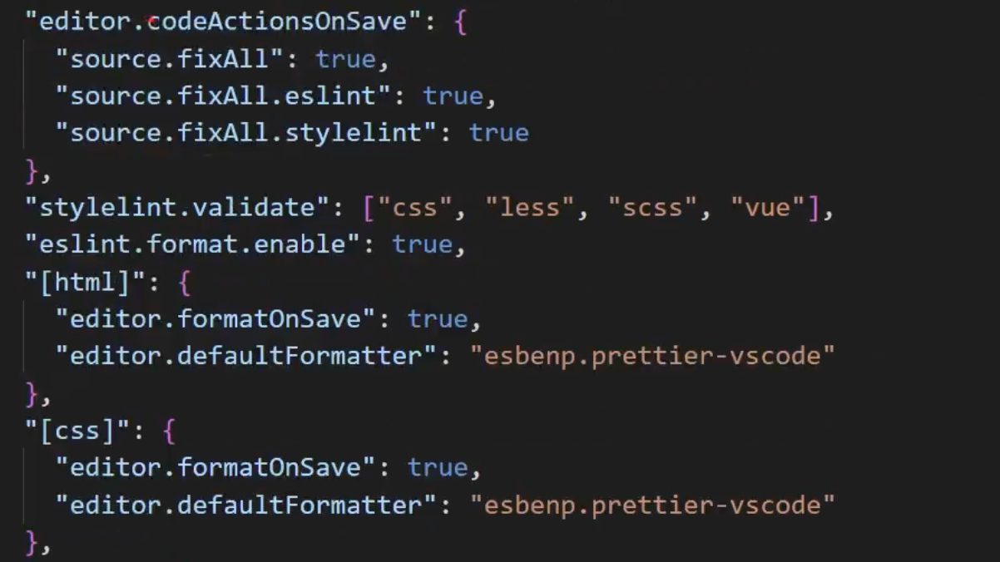
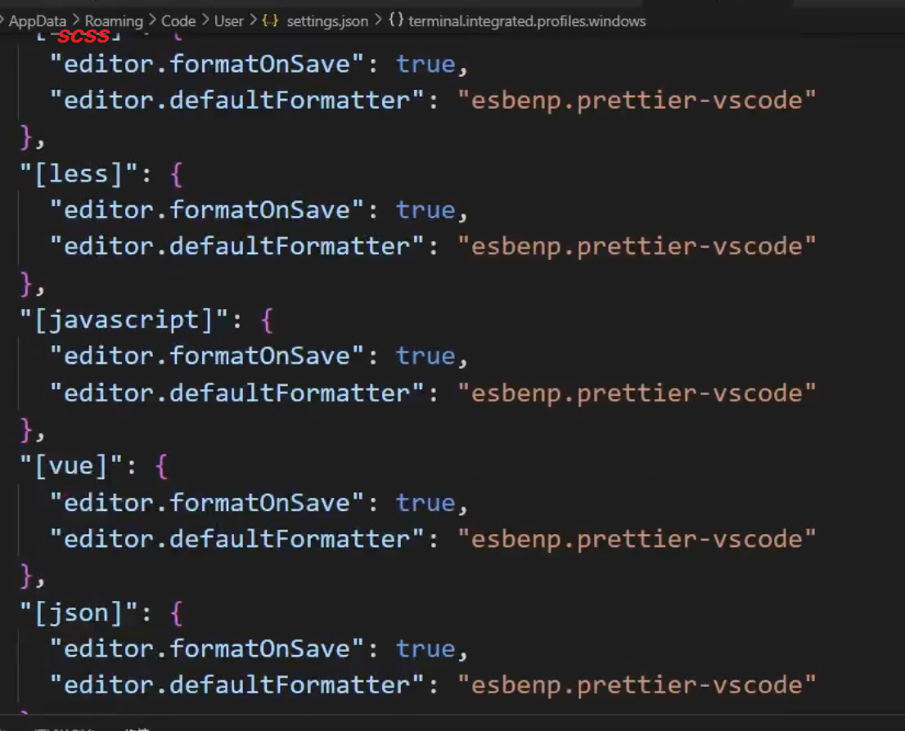
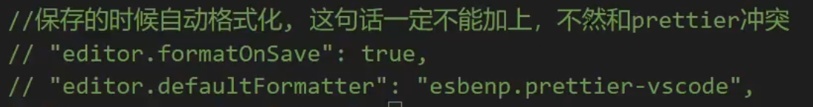
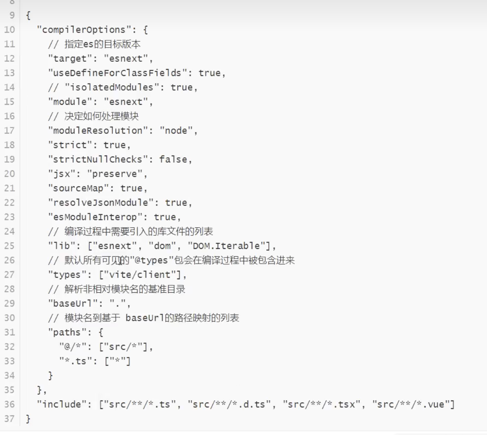

### Eslint的作用
它是在我们的代码在运行前 检查语法错误和潜在的bug, 目标是保证团队代码的一致性和避免错误

<br>

### Prettier的作用
它是代码格式化工具, 用于检测代码中的格式问题, 比如代码的长度 tab长度, 空格 逗号等

<br>

### 区别:
eslint偏向于把控项目的代码质量 而Prettier更偏向于统一项目的编码风格

<br><br>

### 初始化 Vite 项目
node的版本要求14+ 或 16+

```s
# 问答式 框架搭建方式
npm create vite@latest
```

<br><br>

### 安装 eslint 的相关依赖

```s
npm install
  eslint
  eslint-plugin-vue
  eslint-config-prettier
  prettier
  eslint-plugin-import
  eslint-plugin-prettier
  # 还有什么规范?
  eslint-config-airbnb-base -D

npm install eslint eslint-plugin-vue eslint-config-prettier prettier eslint-plugin-import eslint-plugin-prettier eslint-config-airbnb-base -D
```

- eslint: eslint的核心代码库
- prettier: prettier格式化代码的核心库
- eslint-config-airbnb-base: airbnb的代码规范(依赖plugin-import)
- eslint-config-prettier: eslint结合prettier的格式化
- eslint-plugin-vue: eslint在vue里的代码规范
- eslint-plugin-import: 项目里面支持eslint
- eslint-plugin-prettier: 将prettier结合进eslint的插件

<br>

**扩展:StandardJS 和 AirbnbJs**  
- 如果你需要更多的灵活性，并且你的项目需要一个详尽的规范来指导开发，那么Airbnb规范可能更适合你。

- 如果你喜欢简单和一致性，并且你的团队更注重快速开发和代码的可读性，那么StandardJS规范可能更适合你。

<br><br>

### 初始化 eslint
```s
npx eslint --init
```

它是一个交互式的命令, 问答结束后会根据我们选择的内容 创建 .eslintrc.cjs 文件, 下面我们将老师的选项填在下面
- to check syntax and find problems (2) - 选择第2项 
- commonJs
- ts
- browser + node
- javascript

<br>

**eslintrc配置文件:**
```js
module.exports = {
  // 环境: 浏览器 最新es语法 node
  env: {
    broswer: true,
    es2021: true,
    node: true
  },
  /*
    扩展eslint规范语法, 可以被继承的规则
    字符串数组, 从右向左, 每个配置会继承他前面的配置
    eslint-config- 这个部门可以省略
  */
  extends: ['plugin:vue/vue3-strongly-recommended', 'airbnb', 'prettier'],
  // eslint会对我们的代码进行校验, 而parse的作用是将我们写的代码转换为 estree eslint会对estree进行校验
  parser: 'vue-eslint-parser',
  // 解析器的配置项
  parserOptions: {
    // es的版本好 或年份都可以
    ecmaVersion: 13,
    parser: '@typescript-eslint/parser',
    // 源码类型 默认是script es模块使用module
    sourceType: 'module',
    // 额外的语言类型
    ecmaFeatures: {
      tsx: true,
      jsx: true
    },
    // 全局自定义的宏, 这样在源文件中使用全局变量就不用回报错或警告
    globals: {
      defineProps: 'readonly',
      defineEmits: 'readonly',
      defineExpose: 'readonly',
      withDefaults: 'readonly',
    },
    // 插件:
    // eslint-plugin-vue 我们省略了前缀, 它提供了parser和rules
    plugins; ['vue', '@typescript-eslint'],
    settings: {
      // 设置项目内的别名
      'import/resolver': {
        alias: {
          map: [['@', './src']]
        }
      },
      // 允许的扩展名
      'import/extensions': ['.js', '.jsx', '.ts', '.tsx', '.mjs']
    },
    // 自定义规则, 覆盖上面extends继承的第三方库的规则, 根据组内成员灵活定义
    rules: {
      'import/no-extraneous-dependencies': 0,
      'no-param-reassign': 0,
      'vue-multi-word-component-names': 0,
      'vue/attribute-hyphenation': 0,
      'vue-v-on-event-hyphenation': 0
    }
  }
}
```

<br>

**安装eslintrc所需要的额外依赖:**  
上面的 eslintrc 配置文件中需要使用了一些额外的依赖 这里我们安装下
```s
npm install 
  typescript
  @typescript-eslint/parser
  @typescript-eslint/eslint-plugin
  eslint-import-resolver-alias
  @types/eslint
  @types/node -D

npm install typescript @typescript-eslint/parser @typescript-eslint/eslint-plugin eslint-import-resolver-alias @types/eslint @types/node -D
```

- typescript
- @typescript-eslint/parser: eslint的解析器 用于解析ts 从而检查和规范ts代码
- @typescript-eslint/eslint-plugin: eslint插件, 包含了各类定义好的检测ts的代码规范
- eslint-import-resolver-alias: 让我们使用import的时候 可以使用别名 
- @types/eslint
- @types/node

<br>

**使用 eslint 命令对代码进行检查:**  
```s
eslint \"src/**/*.{js,vue,ts}\" --fix
```  

<br><br>

### node_modules里面找代码规范

**vue3规则:**
```s
/node_module/eslint-plugin-vue/lib/config/
```

该目录下有如下的文件
- base.js
- essential.js
- strongly-recommended.js
- vue3-essential.js
- vue3-recommended.js
- vue3-strongly-recommended.js

这里写的规则, 我们就可以在 eslintrc 配置文件中的 extends 配置项中使用
```js
                      ↓
extends: ['plugin:vue/vue3-strongly-recommended', 'airbnb', 'prettier'],
```

<br>

**airbnb规则:**  
es6的规则
```s
/node_module/eslint-config-airbnb-base/rules/
```

<br>

**prettier规则:**  
```s
/node_module/eslint-config-prettier/
```

- standard.js

<br><br>

### 修改 vite.config.ts 文件
```s
npm i vite-plugin-eslint -D
```

它是vite的一个插件 让项目可以方便的得到eslint的支持, 完成eslint配置后 可以快速的将其集成进vite中 **便于在代码不符合eslint规范的第一时间看到提示**

```js
import eslintPlugin from 'vite-plugin-eslint'

plugins: [vue(), eslintPlugin()]
```

<br><br>

### 根目录添加 .eslintrcignore 文件
```s
*.sh
node_modules
*.md
*.woff
*.ttf
.vscode
.idea
dist
/public
/docs
/.husky
/bin
.eslintrc.js
prettier.config.js
/src/mock/*

# logs
logs
*.log
npm-debug.log*
yarn-debug.log*
yarn-error.log*
pnpm-debug.log*
lerna-debug.log*

.DS_Store
dist-ssr
*.local

/cypress/videos/
/cypress/screenshots/

# editor
.vscode
!.vscode/extensions.json
.idea
*.suo
*.ntvs*
*.njsproj
*.sln
*.sw?

components.d.ts
```

<br><br>

### 根目录添加 .prettierrc.cjs 文件
风格配置文件
```js
module.exports = { 
  // 一行最多100字符
  printWidth: 80,
  // 使用 2 个空格缩进
  tabWidth: 2,
  // 不使用缩进符, 而使用空格
  useTabs: false,
  // 行位需要有分号
  semi: true,
  // 使用单引号
  singleQuote: true,
  // 对象的key仅在必要的时候使用引号
  quoteProps: 'as-needed',
  // jsx不使用单引号, 而使用双引号
  jsxSingleQuote: false,
  // 尾随逗号
  trailingComma: 'es5',
  // 大括号内的首尾需要空格
  bracketSpacing: true,
  // 箭头函数, 只有一个参数的时候, 也需要括号
  arrowParens: 'always',
  // 每个文件格式化的范围是文件的全部内容
  rangeStart: 0,
  rangeEnd: infinity,
  // 不需要写文件开头的@prettier
  requirePragma: false,
  // 使用默认的折行标准
  proseWrap: 'always',
  // 根据现实样式决定 html 要不要折行
  htmlWhitespaceSensitivity: 'css',
  // 换行符使用 1f
  endOfLine: '1f'
}
```

<br><br>

### 根目录添加 .prettierignore 文件
```s
/dist/*
.local
.output.js
/node_modules/**
src/.DS_Store

**/*.svg
**/*.sh

/public/*
components.d.ts
```

<br><br>

### 修改 vscode 插件 settings.json




<br>

```js
// 保存的时候自动格式化 这句话一定不能加上 不然和prettier冲突
// "editor.formatOnSave": true
// "editor.defaultFormatter": "esbenp.prettier-vscode"
// 代码在保存的时候 开启自动根据eslint修复
"editor.codeActionsOnSave": {
  "source.fixAll": true,
  "source.fixAll.eslint": true,
  "source.fixAll.stylelint": true
},
"eslint.format.enable": true,
"[html]": {
  "editor.formatOnSave": true
  "editor.defaultFormatter": "esbenp.prettier-vscode"
},
"[css]": {
  "editor.formatOnSave": true
  "editor.defaultFormatter": "esbenp.prettier-vscode"
},
"[scss]": {
  "editor.formatOnSave": true
  "editor.defaultFormatter": "esbenp.prettier-vscode"
},
"[javascript]": {
  "editor.formatOnSave": true
  "editor.defaultFormatter": "esbenp.prettier-vscode"
},
"[vue]": {
  "editor.formatOnSave": true
  "editor.defaultFormatter": "esbenp.prettier-vscode"
},
"[json]": {
  // 保存的时候进行格式化, 使用vscode里面的插件
  "editor.formatOnSave": true
  "editor.defaultFormatter": "esbenp.prettier-vscode"
}
```

<br>

### 利用prettier命令来自动修改样式
使用命令来格式化src下的所有目录
```s
"prettier --config .prettierrc.cjs \"src/**/8.{vue,js,ts}\" --write"
```

<br><br>

### 编辑 tsconfig 文件 
```s
# 官方文档
https://www.typescriptlang.org/zh/docs/
```



<br><br><br><br>

# Gwes项目: Vue3 整合 Eslint + Prettier

## vscode 安装 eslint 和 prettier 插件

<br><br>

## vscode settings 设置
```js
"eslint.format.enable": true,
"vetur.format.enable": false,
"[vue]": {
  "editor.defaultFormatter": "esbenp.prettier-vscode"
},
"[jsonc]": {
  "editor.defaultFormatter": "esbenp.prettier-vscode"
},
"[javascript]": {
  "editor.defaultFormatter": "dbaeumer.vscode-eslint"
},


// 好用的设置
"editor.codeActionsOnSave": {
  "source.fixAll": true,
  "source.fixAll.eslint": true,
  "source.fixAll.stylelint": true
},
"eslint.format.enable": true,
"[html]": {
  "editor.defaultFormatter": "esbenp.prettier-vscode"
},
"[css]": {
  "editor.defaultFormatter": "esbenp.prettier-vscode"
},
"[scss]": {
  "editor.defaultFormatter": "esbenp.prettier-vscode"
},
"[javascript]": {
  "editor.defaultFormatter": "esbenp.prettier-vscode"
},
"[vue]": {
  "editor.defaultFormatter": "esbenp.prettier-vscode"
},
"[json]": {
  "editor.defaultFormatter": "esbenp.prettier-vscode"
}
```

<br><br>

## 根目录添加忽略文件
**根目录添加 .eslintrcignore 文件**
```s
*.sh
node_modules
*.md
*.woff
*.ttf
.vscode
.idea
dist
/public
/docs
/.husky
/bin
.eslintrc.js
prettier.config.js
/src/mock/*

# logs
logs
*.log
npm-debug.log*
yarn-debug.log*
yarn-error.log*
pnpm-debug.log*
lerna-debug.log*

.DS_Store
dist-ssr
*.local

/cypress/videos/
/cypress/screenshots/

# editor
.vscode
!.vscode/extensions.json
.idea
*.suo
*.ntvs*
*.njsproj
*.sln
*.sw?

components.d.ts
```

<br>

**根目录添加 .prettierignore 文件**
```s
/dist/*
.local
.output.js
/node_modules/**
src/.DS_Store

**/*.svg
**/*.sh

/public/*
components.d.ts
```

<br><br>

## Prettier的配置内容

### 根目录添加 .prettierrc.cjs
```js
module.exports = {
  semi: false,
  singleQuote: true,
  trailingComma: 'none',
  bracketSpacing: true
}
```

<br><br>

## Eslint的配置内容

## 安装插件
eslint中会提供很多的插件, 有些插件是针对html js css进行校验的 有些插件是vue提供的专门针对vue的文件里面的语法进行校验

**这里直接看下面安装的依赖**
```s
npm i @rushstack/eslint-patch @vue/eslint-config-prettier @vue/eslint-config-standard -D
```

<br>

### 配置 .eslintrc.cjs

```js
require("@rushstack/eslint-patch/modern-module-resolution");
module.exports = {
  root: true,
  extends: [
    // vue语法的eslint插件 对vue进行语法校验的插件
    "plugin:vue/vue3-recommended",
    // 继承vue官方提供的eslint prettier 标准配置
    "@vue/eslint-config-prettier",
    // 继承vue官方提供的eslint标准配置 这个不用了 因为有ts
    "@vue/eslint-config-standard"
  ],
};
```

<br><br>

## 重新安装依赖: 观察 package.json
1. 添加 prettier 命令
2. 添加 eslint 命令
3. 追加下载 关于ts的依赖 npm i 下
  - "@vue/eslint-config-standard-with-typescript": "^8.0.0",
  - "@vue/tsconfig": "^0.4.0",

<br>

**总结: 需要下载的依赖**
```s
npm i @rushstack/eslint-patch @vue/eslint-config-prettier @vue/eslint-config-standard-with-typescript @vue/tsconfig -D

# 备用
npm i @vue/eslint-config-standard-with-typescript @vue/tsconfig -D
```

```js
"scripts": {
  "dev": "vite",
  "build": "vue-tsc && vite build",
  "preview": "vite preview",
  // 自动调整代码风格
  "format": "prettier --write .",
  // eslint检查
  "lint": "eslint . --ext .vue,.js,.jsx,.cjs,.ts,.tsx,.cts,.mts --fix --ignore-path .gitignore"
},
"devDependencies": {
    "@rushstack/eslint-patch": "^1.5.1",
    "@vitejs/plugin-vue": "^4.2.3",
    "@vue/eslint-config-prettier": "^8.0.0",

    // 追加依赖: 关于ts的依赖 2个
    // 替换掉了 "@vue/eslint-config-standard"
    "@vue/eslint-config-standard-with-typescript": "^8.0.0",
    "@vue/tsconfig": "^0.4.0",
    
    // 好像下面这个是可以删掉的 因为在 tsconfig 里面集成了
    // "typescript": "^5.0.2",
    "vite": "^4.4.5",
    "vue-tsc": "^1.8.5"
  }
```

<br>

### 修改 .eslintrc.cjs 配置文件
```js
require("@rushstack/eslint-patch/modern-module-resolution");
module.exports = {
  root: true,
  extends: [
    // vue语法的eslint插件
    "plugin:vue/vue3-recommended",
    "@vue/eslint-config-prettier",
    "@vue/eslint-config-standard-with-typescript"
  ],
};
```

<br><br>

## 修改 tsconfig.json
因为我们下载了 @vue/tsconfig 所以 ts的相关配置 我们就可以不用配置了
```js
{
  "extends": "@vue/tsconfig/tsconfig.dom.json"
}
```

<br><br>

### 修改 vite.config.ts 文件
```s
npm i vite-plugin-eslint -D
```

它是vite的一个插件 让项目可以方便的得到eslint的支持, 完成eslint配置后 可以快速的将其集成进vite中 **便于在代码不符合eslint规范的第一时间看到提示**  

安装了它 我们eslint检查出来的语法错了的话, 会报错

```js
import { defineConfig } from 'vite'
import vue from '@vitejs/plugin-vue'
import eslintPlugin from 'vite-plugin-eslint'

// https://vitejs.dev/config/
export default defineConfig({
  plugins: [
    vue(),
    eslintPlugin({
      include: ['src/**/*.js', 'src/**/*.vue', 'src/*.js', 'src/**/*.ts', 'src/*.ts', 'src/*.vue']
    })
  ]
})
```

<br>

### 如果报了 eslintPlugin 的声明文件无法找到

**方式1: 不太可取**
1. 去vite-plugin-eslint包下将 index.d.ts 文件拿出来 复制到自己的项目根目录 并改名 ``vite-plugin-eslint.d.ts``
2. 修改 ts.config.json 文件
```js
{
  "extends": "@vue/tsconfig/tsconfig.dom.json",
  // "compilerOptions": {
  //   // 其他选项...
  //   "declaration": false,
  //   "declarationMap": false
  // },
  "include": ["src", "./src/types"]
}
```

<br>

**方式2: 推荐**  
修改 tsconfig.json 文件, 告诉它从哪找配置文件
```js
{
  "extends": "@vue/tsconfig/tsconfig.dom.json",
  "compilerOptions": {
    // 解决: elementPlus 因为ts版本从4 -> 5找不到类型文件的问题 修改为element-plus/global.d.ts
    "types": ["element-plus/global.d.ts"],
    "baseUrl": ".",
    "paths": {
      "@/*": ["src/*"],
      "vuex": ["./node_modules/vuex/types"],
      // 这里 ↓
      "vite-plugin-eslint": ["./node_modules/vite-plugin-eslint/"]
    }
  }
}
```

### 注意:
我们写的代码
- 如果eslint 检查出来了错误 保存后项目会报错
- 如果ts检查出来了错误, 在开发环境下不会报错, 但是打包的时候会报错

<br>

**package.json 修改 build 的命令:**  
这部分命令使用了 vue-tsc，它是 Vue.js 3.x 的模板编译器，用于编译 Vue 模板文件（.vue 文件）。--noEmit 是 TypeScript 的编译器选项，它告诉 TypeScript 不要生成 JavaScript 文件，只进行类型检查。

当类型检查OK之后 再去执行 vite build
```js
// --noEmit: 不生成 JavaScript 文件，只进行类型检查
"build": "vue-tsc --noEmit && vite build",
```

<br>

### package.json
```js
{
  "name": "vue3-eslint-demo",
  "private": true,
  "version": "0.0.0",
  "type": "module",
  "scripts": {
    "dev": "vite",
    "build": "vue-tsc --noEmit && vite build",
    "preview": "vite preview"
  },
  "dependencies": {
    "vue": "^3.3.4"
  },
  "devDependencies": {
    "@rushstack/eslint-patch": "^1.5.1",
    "@vitejs/plugin-vue": "^4.2.3",
    "@vue/eslint-config-prettier": "^8.0.0",
    "@vue/eslint-config-standard-with-typescript": "^8.0.0",
    "@vue/tsconfig": "^0.4.0",
    "vite": "^4.4.5",
    "vite-plugin-eslint": "^1.8.1",
    "vue-tsc": "^1.8.5"
  }
}
```