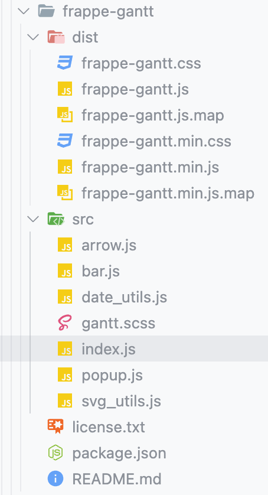

# 甘特图
这个md中将记录下 gantt npm库 的使用方式

<br>

### 资料:
```s
# 15个开源项目
https://baijiahao.baidu.com/s?id=1763026164305167835&wfr=spider&for=pc

# 使用资料
https://www.w3cways.com/2513.html

# 表格 + 甘特图
https://blog.csdn.net/weixin_44244924/article/details/130147529

# 自己实现的
https://blog.csdn.net/Andrew_Chenwq/article/details/130212987

# 别的框架
https://www.jianshu.com/p/b2c75bd0e86f

# echarts实现甘特图
https://www.jb51.net/article/262053.htm
https://www.jb51.net/article/266501.htm
```

<br>

### github
它最小只支持day
```s
https://github.com/frappe/gantt
```

<br>

### 下载:
2023/08/03 我下载的版本是 ``"frappe-gantt": "^0.6.1",``
```s
npm install frappe-gantt
```

<br>

**目录结构:**  


<br>

### 引入(亲测):
在资料中说是要修改frappe-gantt源码 但是我测试的时候其实是不用这么做的 直接引入就可以

```js
import Gantt from "frappe-gantt"
import "frappe-gantt/dist/frappe-gantt.min.css"
```

<br>

### 引入(资料):
1. 修改 node_modules 源码中的 frappe-gantt.js 文件 在末尾导出Gantt 这样才可以在Vue界面中使用
```js
// ...
  function generate_id(task) {
    return task.name + '_' + Math.random().toString(36).slice(2, 12)
  }
  return Gantt
})();

export default Gantt
```

2. 在组件中引入 js 和 css
```js
import Gantt from "../assets/dist/frappe-gantt.js"

<style lang="scss">
@import "../assets/dist/frappe-gantt.css"
</style>
```

<br>

### 使用:
```html
<template>
  <div class="gantt-container">
    <el-row>
      <el-col :span="24">
        <div class="gantt-target"></div>
      </el-col>
    </el-row>
  </div>
</template>
```
```js
import { reactive, toRefs, onMounted } from "vue";
import Gantt from "../assets/dist/frappe-gantt";
export default {
  setup() {
    const vueConfig = reactive({
      tasks: [ //甘特图数据
        {
          start: "2023-04-01",
          end: "2023-04-08",
          name: "测试任务1",
          id: "1",
          progress: 26, // 任务进度
          task: "50%",
          date: 3,
          children: []
        },
        {
          start: "2023-04-03",
          end: "2023-04-06",
          name: "测试任务2",
          id: "2",
          progress: 0,
          task: "50%",
          date: 3,
          children: []
          // dependencies: '1'        },
        {
          start: "2023-04-04",
          end: "2023-04-08",
          name: "测试任务3",
          id: "3",
          progress: 0,
          task: "50%",
          date: 3,
          children: []
          // dependencies: '1'
        },
        {
          start: "2023-04-08",
          end: "2023-04-09",
          name: "测试任务4",
          id: "4",
          progress: 0,
          task: "50%",
          date: 3,
          children: []
          // dependencies: '2'
        },
        {
          start: "2023-04-08",
          end: "2023-04-10",
          name: "测试任务5",
          id: "5",
          progress: 50,
          task: "50%",
          date: 3,
          children: []
          // dependencies: '2'
        }
      ],
      gantt: null,
    });
    let createGantt = () => { // 创建甘特图方法，在onMounted钩子函数执行
      const gantt = new Gantt(".gantt-target", vueConfig.tasks, {
        on_click: function(task) { // 双击事件
          console.log("双击事件", task); // task是任务对象
        },
        on_date_change: function(task, start, end) { // task是任务对象 start是条形图拖拽结束之后的开始时间 end是条形图拖拽结束之后的截至时间
        // 这里可以结合表格对某一行的数据进行操作
        },
        on_progress_change: function(task, progress) {// 进度发生改变事件
          console.log(task, progress);
        },
        on_view_change: function(mode) {
          console.log(mode);
        },
        language: "zh", // 语言
        header_height: 70, // header_height + 10 就是头部的高度 比如header_height：70 那header的高度是80px
        column_width: 90, // 列宽度
        step: 24,
        view_modes: ["Quarter Day", "Half Day", "Day", "Week", "Month"],
        bar_height: 62, //  bar_height + padding 就是每一行的高度
        bar_corner_radius: 5, // bar 的圆角度
        arrow_curve: 20, //连接子任务的线条曲线度
        padding: 18,
        view_mode: "Day", // header的日期类型
        date_format: "YYYY-MM-DD", // 日期格式
        custom_popup_html: function(task) { // 自定义内容  
          // the task object will contain the updated
          // dates and progress value
          console.log(task);
          return `
          <div class="details-container">
            <h5>${task.name}</h5>
            <p>Expected to finish by ${task.end}</p>
            <p>${task.progress}% completed!</p>
          </div>
          `;
        }
      });
    };
    onMounted(() => {
      createGantt ();
    });
    return {
      ...toRefs(vueConfig),
      createGantt ,
    };
  }
};
```