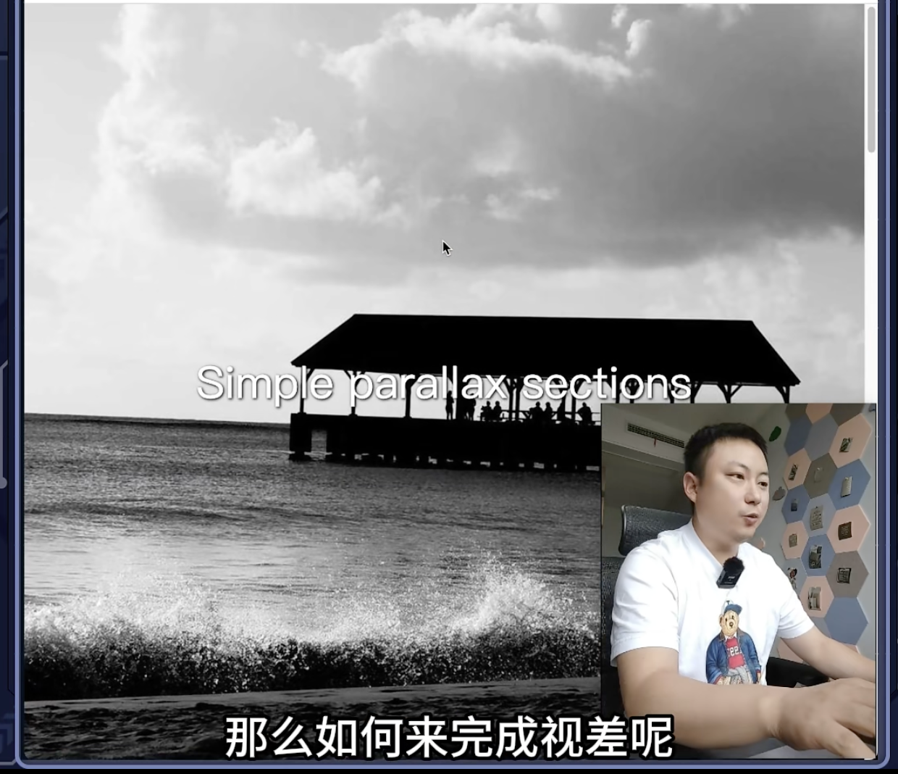
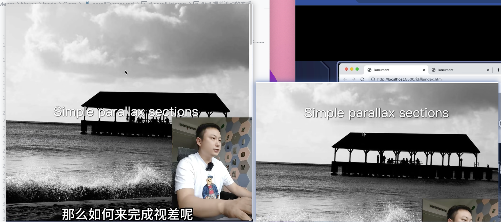
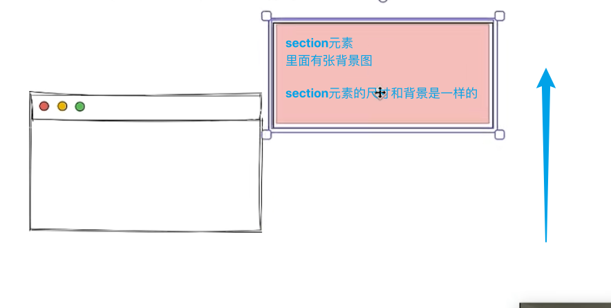
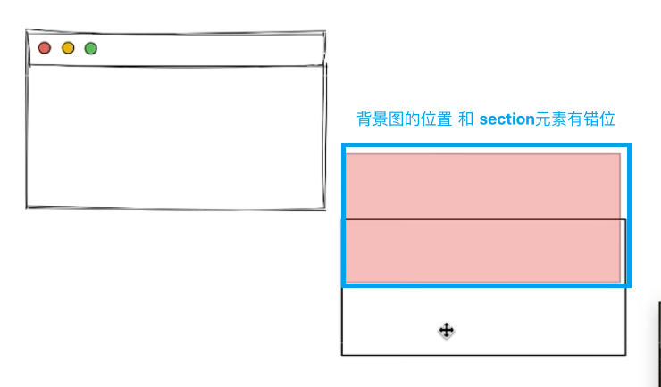
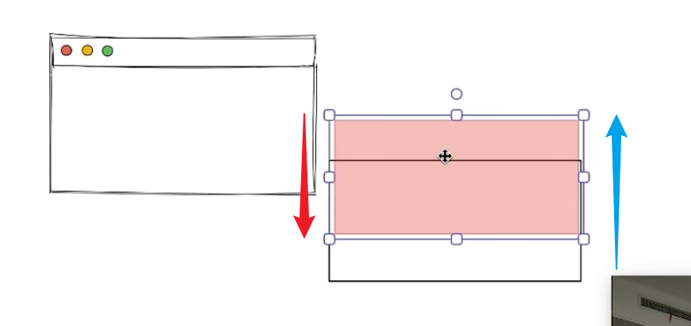
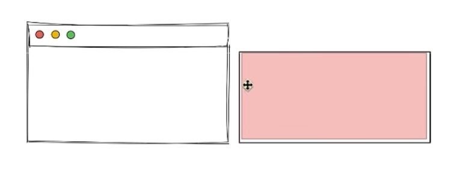
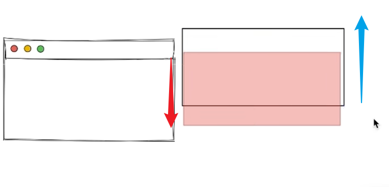
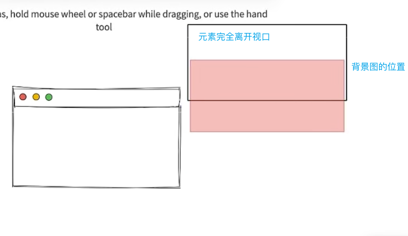
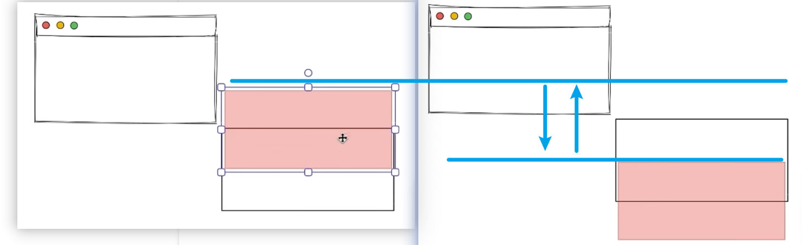
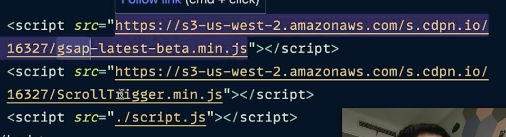

# scroll trigger
它是做 视差滚动效果 属于 gsap动画库的插件

### html结构
每一个section有一个背景图
```html
<style>
  section:nth-child(1 - 5) {
    background-image: url('./assets/1.jpg');
  }
</style>

<section>
  <h1> xxxxx </h1>
</section>
<section>
  <h1> xxxxx </h1>
</section>
<section>
  <h1> xxxxx </h1>
</section>
<section>
  <h1> xxxxx </h1>
</section>
<section>
  <h1> xxxxx </h1>
</section>
```

<br>

### 效果:



<br>

### 视差滚动的本质
视差滚动的本质是一个动画, 其实就是背景图位置在变化 

我们一旦发现有动画 那么一定要知道它是什么状态在变化, **是背景图的位置在发生变化**



<br>

右侧是section元素 里面有张背景图, section元素的尺寸和视口是一样的, 当我们什么都不处理 并进行滚动的时候, section元素就滚动上去了 就没有视差效果了



如果我们要做视差效果的时候 **就要控制它背景图的位置**

最开始的时候 我们将背景图的位置 和 section元素 有错位 错位多少我们可以自己看 只要有错位就会形成视差

因为是背景超出的部分是看不见的 目前元素也没有进入视口 所以section元素也看不见



接下来section元素往上滚动 section元素往上滚动一点, 背景图就下来一点, 当section元素完全进入视口后, 背景图也会来到正确的位置




section继续往上滚动, 背景图就下来一点, 当元素完全离开视口后, 背景图的位置如下




只要这样做了就会产生视差效果, 由于元素往上跑, 它将背景带着往上跑 但是背景本身 又有一个向下的动作 所以我们会感觉到背景滑动的比较慢 这样视差就出来了

<br>

**本质:**  
实际上就是背景图的位置 从 A 变到 B



<br>

### 使用方式:
1. 引入 gsap
2. 引入 scrollTrigger 插件
3. 引入 我们的js文件



<br>

**JS代码:**  
当我们引入gsap库的时候 全局就有 gsap 对象

``gsap.fromTo(section, {}, {})``, 将section从{}状态 变化到{}状态

动画是在一定的时间内从一个状态 过渡到 另外一个状态, 但是不仅仅可以是时间 也可以是滚动条, 状态的变化可以和滚动距离挂钩

要跟滚动条挂钩 就要使用scrollTrigger 插件

```js
// ScrollTrigger 引入js插件后 全局多出来的对象
gasp.registerPlugin(ScrollTrigger)

const $ = document.querySelectorAll.bind(document)
// 1. 获取所有的目标元素 (section)
const sections = $('section')

sections.forEach(section => {
  // gsap.fromTo(section, {}, {}), 将section从{}状态 变化到{}状态
  gsap.fromTo(
    // 元素
    section,
    // 开始的状态
    {
      // 背景图开始的状态: 往上移动元素高度的一半
      bcakgroundPositionY: `-${window.innerHeight / 2}px`
    },
    // 过渡到什么状态
    {
      bcakgroundPositionY: `${window.innerHeight / 2}px`,
      // 动画是在一定的时间内从一个状态 过渡到 另外一个状态, 但是不仅仅可以是时间 也可以是滚动条, 状态的变化可以和滚动距离挂钩
      // dutation: 3,
      ease: 'none', // 匀速

      // 使用 ScrollTrigger 插件
      scrollTrigger: {
        // 触发的元素 就是我们要针对哪个元素来做处理 section
        trigger: section,
        // section元素的动画变化不再根据时间变化了 跟时间脱钩而跟滚动条进行绑定
        scrub: true
      }
    }
  )
})
```

<br>

### 动画开始的时机
上section元素的顶边触及到视口的底边的时候, 动画开始

当section元素的底边触及到视口的顶边的时候, 动画结束