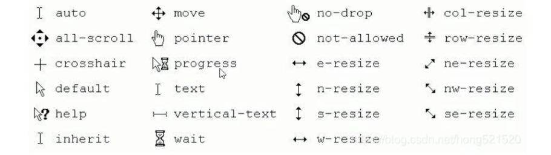

# Konva
适用于桌面 / 移动端应用的 HTML5 2D 画布库

Konva 是一个HTML5 Canvas JavaScript 框架，它通过对 2d context 的扩展实现了在桌面端和移动端的可交互性。

Konva 提供了高性能的动画，补间，节点嵌套，布局，滤镜，缓存，事件绑定（桌面/移动端）等等功能。你可以使用 Konva 在舞台上绘制图形，给图形添加事件，移动、缩放和旋转图形并且支持高性能的动画即使包含数千个图形。

使用 Konva 可以让我们快速的画出图形

<br>

## 官网:
```s
konvajs-doc.bluehymn.com
```

<br>

## 安装:
```
npm install konva

<script src="https://unpkg.com/konva@4.0.0/konva.min.js"></script>
```

<br><br>

## 工作原理:
```
              Stage
                |
         +------+------+
         |             |
       Layer         Layer
         |             |
   +-----+-----+     Shape
   |           |
 Group       Group
   |           |
   +       +---+---+
   |       |       |
Shape   Group    Shape
           |
           +
           |
         Shape
```

Konva 的对象是以一颗树的形式保存的，

- Stage 是树的根节点
- Layer 是 Stage 的子节点, 相当于用户创建的图层

<br>

- Stage（舞台）
- layers（图层）
- groups（组）
- shapes（图形） 

它们都是虚拟节点，类似于 HTML 的 DOM 节点。

<br>

### 使用 Konva 绘制图形的流程
要想使用 Konva 的话 我们首先要创建一个舞台, 然后用同步思想完成下面的逻辑

1. 创建舞台, Stage
2. 创建图层, Layer
3. 创建图形, Shape
4. 将 图形 添加到 图层 里
5. 将 图层 添加到 舞台 中

我们可以在 Layer 上直接绘制各种图形, 也可以在 Layer 上创建组 在组里创建各种图形, 也可以在 Group里面嵌套组, 你可以对所有节点修改样式和变换。

<br><br>

## 舞台 Stage:

### 实例化: new Konva.Stage({config})
用来创建一个舞台:

**参数:**  
```js
{
  container: HTML容器传入id,
  width: 指定容器的宽度,
  height: 指定容器的高度
}
```

<br><br>

## 图层 Layer:

### 实例化: new Konva.Layer()
创建一个Layer

<br>

### 概念:
每一个 layer 有两个 ``<canvas>`` 渲染器： 
- 场景渲染器
- 图像命中检测渲染器

图层可以包含图形、嵌套图形的组、嵌套组的组。

<br>

### 场景渲染器:
输出你所看见的内容，比如各种图形

<br>

### 图像命中渲染器:
它隐藏在的 canvas 里, 用于高性能的检测事件

<br><br>

## 图形 Shape:
Konva **内建了** 很多图形，例如：
- rectangles
- circles
- images
- sprites
- text
- lines
- polygons
- regular p
- paths
- stars等

<br>

Konva执行上述的基本图形的绘制 我们可以
- 修改图形的样式
- 给图形绑定事件 点击 双击 鼠标移动等
- 对图形的拖拽
- 为图形增加滤镜
- 通过动画操作图形
- 通过选择器查找想要的元素
- 支持序列化和反序列化

创建好了stage、layers 和 shapes 后，**你就能进行绑定事件，变换节点，运行动画，添加滤镜等等操作了**。

<br>

### 实例化: 内置Rect 的创建
### new Konva.Rect({config})
创建一个矩形

**参数:**  
```js
{
  x: 矩形的位置 x,
  y: 矩形的位置 y,
  width: 矩形的宽度,
  height: 矩形的高度,
  file: 填充色,
  stroke: 描边颜色,
  strokeWidth: 线粗
}
```

<br><br>

### 目标对象.add(对象)
将给定对象添加到目录对象里面, 比如将图形添加到图层中

<br>

## 简单的Demo
```html
<!DOCTYPE html>
<html lang="en">
<head>
  <meta charset="UTF-8">
  <meta http-equiv="X-UA-Compatible" content="IE=edge">
  <meta name="viewport" content="width=device-width, initial-scale=1.0">
  <title>Document</title>
  <script src="https://unpkg.com/konva@4.0.0/konva.min.js"></script>
  <style>
    body {
      margin: 0;
      padding: 0;
      overflow: hidden;
      background-color: #eee;
    }
  </style>
</head>
<body>
  <div id="container"></div>

  <script>
    // 全屏的高宽
    let width = window.innerWidth
    let height = window.innerHeight


    // 1. 创建一个 stage 舞台
    let stage = new Konva.Stage({
      // 指定容器
      container: "container",
      width,
      height
    })


    // 2. 创建一个 Layer 图层
    let layer = new Konva.Layer()


    // 3. 创建一个Rect矩形
    let rect = new Konva.Rect({
      x:100,
      y:100,
      width: 100,
      height: 50,
      fill: "#C2185B",
      stroke: "black",
      strokeWidth: 1 
    })


    // 4. 将矩形添加到图形中
    layer.add(rect)


    // 5. 将图形放到舞台中
    stage.add(layer)
  </script>
</body>
</html>
```

<br>

**Vue版:**
```html
<script setup lang="ts">
import { onMounted, ref } from 'vue'

import Konva from 'konva'

defineOptions({
  name: 'Konva'
})

const canvasRef = ref()
const init = (): void => {
  console.log('init')
  // 1. 获取画布
  const el = canvasRef.value
  // 2. 获取画布的宽高
  const { clientWidth, clientHeight } = el
  // 3. 创建 舞台
  const stage = new Konva.Stage({
    container: '.canvas',
    width: clientWidth,
    height: clientHeight
  })
  // 4. 创建图层
  const layer = new Konva.Layer()
  // 5. 创建元素
  const width = 400
  const height = 200
  const x = clientWidth / 2 - width / 2
  const y = clientHeight / 2 - height / 2
  const rect = new Konva.Rect({
    width,
    height,
    x,
    y,
    fill: '#c2185b',
    stroke: '#333',
    strokeWidth: 1
  })
  // 6. 将图形添加到图层中 将图层添加到舞台中
  layer.add(rect)
  stage.add(layer)
}

onMounted(() => {
  init()
})
</script>

<template>
  <div class="konva-bar ctn">
    <!-- 1. 创建画布 -->
    <div ref="canvasRef" class="canvas"></div>
  </div>
</template>

<style scoped lang="scss">
.konva-bar {
  padding: 20px;
  box-sizing: border-box;

  .canvas {
    background-color: #eee;
    border: 1px solid #ddd;
    height: 100%;
  }
}
</style>
```  

<br><br>

# 图形详解:

## 属性详解:
```js
{ 
  // 公共属性:
  x: 矩形的位置 x,
  y: 矩形的位置 y,
  width: 矩形的宽度,
  height: 矩形的高度,
  file: 填充色,
  stroke: 描边颜色,
  strokeWidth: 线粗,
  shdowBlur: 10: 阴影羽化,

  cornerRadius:10: 圆角半径,
  /*
  1. 写一个数值是控制4个角
  2. [10,20,30,40], 写一个数组可以控制每一个角, 顺序左上 右上 右下 左下
  */

  // 旋转角度
  rotation: 默认值:0 90 -90

  // 圆形属性:
  radius: 半径.

  // 椭圆属性:
  radiusX: 100,
  radiusY: 50,

  // 扇形属性:
  radius: 
  angle: 90: 角度
  rotation: 90

  // 线条属性:
  lineCap: 
    "butt: 默认值 正常",
    "round: 圆形",
    "square: 矩形",

  lineJoin: 线段的相交处样式
    "miter: 默认值 尖角",
    "round: 圆角",
    "bevel: 平角",

  dash: [33, 10]: 断线 [长度, 间隔, 长度, 间隔]

  // 多边形属性: 
  closed: true: 封闭路径

  // 曲线的属性
  tension: 默认值0: 可以是负数或正数, 值越大线越弯曲, 0.3 就能看到效果 1 就太过了


  // 文字属性:
  text: "文本内容",
  fontSize: 字体大小, 13,
  fontFamily: "字体",
  x:
  y: 文字的绘制位置,
  padding:
  align: "center, left, right",
  verticalAlign: "top, middle, bottom"


  // 环形属性:
  innerRadius: 40,  内外圆半径
  outerRadius: 70,


  // 星形属性:
  numPoints: 角个数,
  innerRadius: 40,  内外径
  outerRadius: 70,

  // 弧形属性:
  innerRadius: 40,  内外径
  outerRadius: 70,
  angle: 90: 角度


  // label属性:
  pointerDirection: "down": 箭头方向
  pointerWidth: 10: 箭头的高度和宽度
  pointerHeight: 10


  // 箭头属性
  // 起始点 和 终点 坐标, 箭头是在终点坐标处绘制
  points: [0, 0, width / 2, height / 2],
  pointerLength: 20, 箭头的长度宽度
  pointerWidth: 20, 


  // 图形的偏移量: 基于原定位点(原点), 原定位点不动, 相当于图形移动了, 负数定位点往右下移动, 正数定位点往左上移动
  offset: {
  /*
    矩形的定位点(圆点)在左上角
    圆形的定位点(圆点)在圆心


    x是负数: 定位点向右移
    x是正数: 定位点向左移

    y是负数: 定义点向下移
    y是正数: 定位点向上移
  */
  }


  // 可拖拽
  draggable: true,


  // 线性渐变
  // 线性渐变开始点
  fillLinearGradientStartPoint: { x: -50, y: -50 },

  // 线性渐变结束点
  fillLinearGradientEndPoint: { x: 50, y: 50 },

  // 线性渐变的梯度颜色数组: 0开始 1结束 开始红色结束黄色
  fillLinearGradientColorStops: [0, 'red', 1, 'yellow'],


  // 径向渐变
  // 径向渐变开始圆心点
  fillRadialGradientStartPoint: { x: 0, y: 0 },
  // 径向渐变结束的圆心点
  fillRadialGradientEndPoint: { x: 0, y: 0 },

  // 径向渐变开始圆的半径
  fillRadialGradientStartRadius: 0,
  // 径向渐变结束圆的半径
  fillRadialGradientEndRadius: 70,

  // 径向渐变的梯度颜色数组
  // 开始圆内全是红色 开始圆到结束圆的圆弧是颜色煎饼, 结束圆外全是蓝色
  fillRadialGradientColorStops: [0, 'red', 0.5, 'yellow', 1, 'blue'],
}
```

<br><br>

## 内置图形: 

### 矩形
```js
new Konva.Rect({配置对象}) 
```

```js
 var rect2 = new Konva.Rect({
  x: 150,
  y: 40,
  width: 100,
  height: 50,
  fill: 'red',
  shadowBlur: 10,
  cornerRadius: 10
});
layer.add(rect2);
```

<br>

### 圆形
```js
new Konva.Circle({配置对象}) 
```

```js
var circle = new Konva.Circle({
  x: stage.width() / 2,
  y: stage.height() / 2,
  radius: 70,
  fill: 'red',
  stroke: 'black',
  strokeWidth: 4
});
```

<br>

### 椭圆
```js
new Konva.Ellipse({配置对象}) 
```

```js
 var oval = new Konva.Ellipse({
  x: stage.width() / 2,
  y: stage.height() / 2,
  // 半径
  radiusX: 100,
  radiusY: 50,
  fill: 'yellow',
  stroke: 'black',
  strokeWidth: 4
});
```

<br>

### 扇形
```js
new Konva.Wedge({配置对象}) 
```

```js
 var wedge = new Konva.Wedge({
  x: stage.width() / 2,
  y: stage.height() / 2,
  radius: 70,
  angle: 60,
  fill: 'red',
  stroke: 'black',
  strokeWidth: 4,
  rotation: -120
});
```

<br>

### 简单线条
```js
new Konva.Line({配置对象}) 
```

我们使用 points 属性创建线的路径，如果线包含三个点（坐标：x, y），你需要这样定义 points 属性: [x1, y1, x2, y2, x3, y3]。

```js
let layer = new Konva.Layer()

var redLine = new Konva.Line({
  points: [5, 70, 140, 23, 250, 60, 300, 20],
  stroke: 'red',
  strokeWidth: 15,
  lineCap: 'round',
  lineJoin: 'round'
});

// dashed line
var greenLine = new Konva.Line({
  points: [5, 70, 140, 23, 250, 60, 300, 20],
  stroke: 'green',
  strokeWidth: 2,
  lineJoin: 'round',
  /*
    * 长度为33px的线段
    * 间距为10px
    */
  dash: [33, 10]
});
```

<br>

### 多边形
```js
new Konva.Line({配置对象}) 
```

**要点:**  
使用 ``closed: true属性`` 来封闭路径

我们使用 points 属性创建线的路径，如果线包含三个点（坐标：x, y），你需要这样定义 points 属性: [x1, y1, x2, y2, x3, y3]。

```js
var poly = new Konva.Line({
  points: [23, 20, 23, 160, 70, 93, 150, 109, 290, 139, 270, 93],
  fill: '#00D2FF',
  stroke: 'black',
  strokeWidth: 5,
  closed: true
});
```

<br>

### 样条曲线
```js
new Konva.Line({配置对象}) 
```

**要点:**  
设置 ``tension: 1`` 属性值


我们使用 points 属性创建线的路径，如果线包含三个点（坐标：x, y），你需要这样定义 points 属性: [x1, y1, x2, y2, x3, y3]。

```js
var redLine = new Konva.Line({
  points: [5, 70, 140, 23, 250, 60, 300, 20],
  stroke: 'red',
  strokeWidth: 15,
  lineCap: 'round',
  lineJoin: 'round',
  // 值越大 就越弯曲
  tension: 1
});
```

<br>

### Blob图形
```js
new Konva.Line -({配置对象}) 
```

**要点:**  
同时设置属性 ``closed = true`` 和``tension`` 值。

我们使用 points 属性创建线的路径，如果线包含三个点（坐标：x, y），你需要这样定义 points 属性: [x1, y1, x2, y2, x3, y3]。

```js
var blob = new Konva.Line({
  points: [23, 20, 23, 160, 70, 93, 150, 109, 290, 139, 270, 93],
  fill: '#00D2FF',
  stroke: 'black',
  strokeWidth: 5,
  closed: true,
  tension: 0.3
});
```

<br>

### 精灵图
```s
http://konvajs-doc.bluehymn.com/docs/shapes/Sprite.html
```

```js
new Konva.Sprite({配置对象}) 
```

<br>

### 图片
图形的 image 属性值可以下面的3种

- window.Image 实例
- document.createElement('image')
- canvas 对象
- video 对象

```js
new Konva.Image({配置对象}) 
```

<br>

**创建图片方式1:**  
```js
// 1. 创建image对象
var imageObj = new Image();

// 2. 设置图片的src
imageObj.src = '/assets/yoda.jpg';

// 3. 当imgObj 加载完毕后触发事件
imageObj.onload = function() {

  // 4. 创建 Konva图片, 将img对象传入 config 中的 image属性里 
  var yoda = new Konva.Image({
    x: 50,
    y: 50,
    image: imageObj,
    width: 106,
    height: 118
  });

  // 5. 将Konva图片添加到图形
  layer.add(yoda);

  // 6. 重绘图层, 调用 draw() 或 batchDraw()
  layer.batchDraw();
};
```

<br>

**创建图片方式2:**  
```js
// 通过Konva提供的方法 传入图片路径, 形参darthNode就是图片的实例
Konva.Image.fromURL(
  '/assets/darth-vader.jpg', 
  function(image: Konva.Image) {
    // 给图片实例设置属性
    image.setAttrs({
      x: 200,
      y: 50,
      scaleX: 0.5,
      scaleY: 0.5
    });

    // 添加到图层中 重绘图层
    layer.add(image);
    // 不一定需要
    layer.batchDraw();
  }
);
```

<br>

### 添加动画
接着上面的示例完成
```js
Konva.Image.fromURL(
  '/assets/darth-vader.jpg', 
  function(image: Konva.Image) {
    // 给图片实例设置属性
    image.setAttrs({
      x: 200,
      y: 50,
      scaleX: 0.5,
      scaleY: 0.5
    });

    // 添加到图层中 重绘图层
    layer.add(image);
    // 不一定需要
    layer.batchDraw();

    const amplitude = 10
    const period = 1000  // 时间
    const y = image.y() - 10
    const animation = new Konva.Animation((frame) => {
      if (!frame) return
      image.y(amplitude * Math.sin(frame.time * 2 * Math.PI / period) + y)
    }, layer)  // 最后一个参数是图形 相当于将动画添加到图层中

    // 开启动画
    animation.start()
  }
);
```

<br>

### 文字
```js
new Konva.Text({配置对象}) 
```

```js
var simpleText = new Konva.Text({
  x: stage.width() / 2,
  y: 15,

  // 文字内容
  text: 'Simple Text',

  fontSize: 30,
  fontFamily: 'Calibri',
  fill: 'green'
});
```

<br>

### 路径文字
```js
new Konva.TextPath({配置对象}) 
```

```js
 var textpath = new Konva.TextPath({
  x: 0,
  y: 50,
  fill: '#333',
  fontSize: 16,
  fontFamily: 'Arial',
  text:
    "All the world's a stage, and all the men and women merely players.",

  // svg数据的属性
  data: 'M10,10 C0,0 10,150 100,100 S300,150 4.0.180'
});
```

<br>

### 星形
```js
new Konva.Star({配置对象}) 
```

```js
 var star = new Konva.Star({
  x: stage.width() / 2,
  y: stage.height() / 2,
  numPoints: 6,
  innerRadius: 40,
  outerRadius: 70,
  fill: 'yellow',
  stroke: 'black',
  strokeWidth: 4
});
```

<br>

### 环形
```js
new Konva.Ring({配置对象}) 
```

```js
 var ring = new Konva.Ring({
  x: stage.width() / 2,
  y: stage.height() / 2,
  innerRadius: 40,
  outerRadius: 70,
  fill: 'yellow',
  stroke: 'black',
  strokeWidth: 4
});

```

<br>

### 弧形
```js
new Konva.Arc({配置对象}) 
```

```js
 var arc = new Konva.Arc({
  x: stage.width() / 2,
  y: stage.height() / 2,
  innerRadius: 40,
  outerRadius: 70,
  angle: 60,    // 这个重要
  fill: 'yellow',
  stroke: 'black',
  strokeWidth: 4
});
```

<br>

### 标签
标签可以用于创建带背景的文字、简单的tooltips、带指向箭头的tooltips。

tag 和 text 必须成对添加

```js
new Konva.Label({配置对象}) 
```

**步骤:**  
1. 创建 label
2. 往 label 中添加 tag 和 text

```js
var layer = new Konva.Layer();

// 创建 label
var tooltip = new Konva.Label({
  x: 170,
  y: 75,
  opacity: 0.75
});


// 向 label 中 添加 tag 相当于添加背景
tooltip.add(
  new Konva.Tag({
    fill: 'black',
    // 箭头方向
    pointerDirection: 'down',
    // 箭头的宽高
    pointerWidth: 10,
    pointerHeight: 10,
    lineJoin: 'round',
    shadowColor: 'black',
    // 阴影
    shadowBlur: 10,
    shadowOffsetX: 10,
    shadowOffsetY: 10,
    shadowOpacity: 0.5
  })
);

// 向 label 中 添加 文字
tooltip.add(
  new Konva.Text({
    text: 'Tooltip pointing down',
    fontFamily: 'Calibri',
    fontSize: 18,
    padding: 5,
    fill: 'white'
  })
);

```

<br>

### 路径
我们经常会用到路径，比方说导入 SVG Path 到 canvas，使用字符串数据绘制复杂的图形而不需要创建一个自定义图形。
```js
new Konva.Path({配置对象}) 
```

```js
var path = new Konva.Path({
  x: 50,
  y: 40,
  data:
    'M12.582,9.551C3.251,16.237,0.921,29.021,7.08,38.564l-2.36,1.689l4.893,2.262l4.893,2.262l-0.568-5.36l-0.567-5.359l-2.365,1.694c-4.657-7.375-2.83-17.185,4.352-22.33c7.451-5.338,17.817-3.625,23.156,3.824c5.337,7.449,3.625,17.813-3.821,23.152l2.857,3.988c9.617-6.893,11.827-20.277,4.935-29.896C35.591,4.87,22.204,2.658,12.582,9.551z',
  fill: 'green',
  scale: {
    x: 2,
    y: 2
  }
});
```

<br>

### 等边多边形
```js
new Konva.RegularPolygon({配置对象}) 
```

```js
var hexagon = new Konva.RegularPolygon({
  x: 100,
  y: 150,
  // 边
  sides: 6,
  radius: 70,
  fill: 'red',
  stroke: 'black',
  strokeWidth: 4
});   
```

<br>

### 箭头
```js
new Konva.Arrow({配置对象}) 
```

```js
var arrow = new Konva.Arrow({
  x: stage.width() / 4,
  y: stage.height() / 4,
  points: [0, 0, width / 2, height / 2],
  pointerLength: 20,
  pointerWidth: 20,
  fill: 'black',
  stroke: 'black',
  strokeWidth: 4
});
```

<br>

### 自定义图形

**首先, 实例化 Shape** 
示例话的 Shape的配置项中 有绘制图形的方法
```js
new Konva.Shape({
  // 绘制图形的方法:
  sceneFunc: function(context, shape) {

  },
  ... 其它属性
})
```

<br>

**绘制图形的方法:**

**参数:**  
- Konva.Context:  
Konva.Context 是对原生 2d canvas context 的包装，它除了和原生 context 有相同的属性和方法外还增加了一些额外的 API。

我们可以通过 Konva.Context 使用 HTML5 Canvas context，还可以使用一些特殊的方法，

**例如：使用 context.fillStrokeShape(shape) 自动填充、描边、添加阴影。**

- shape: 图形实例

<br>

这里提供了**两个方法来绘制自定义图形：**
- sceneFunc 
- hitFunc

<br>

**sceneFunc:**  
用来定义图形可视的外观，Konva 使用 sceneFunc 绘制用于图形事件检测的图像。因此通常你只需要定义 sceneFunc。
<br>

**关于 sceneFunc 和 hitFunc 的最佳实践:**  
1. 因为这个方法每秒钟会调用很多次，所以优化很重要。 在方法里不要创建 Image ``(document.createElement('image')`` or ``new window.Image())`` 或者其它大型对象。

<br>

2. 方法里面不应该包含一些副作用，像移动图形，绑定事件或者改变应用状态等等。

3. 如果你想要手动添加复杂的样式或者绘制图片，记得定义自定义 hitFunc。

4. 在 sceneFunc 里不要手动改变图形位置或者缩放图形，因为只要你设置图形相关属性 Konva 将自动处理，例如： shape.x(10)。

5. **尽可能不要在 sceneFunc 里面手动添加样式**，你只需要绘制一些路径，然后使用 context.fillStrokeShape(shape) 处理样式问题。


```js
new Konva.Custom({配置对象}) 
```

```js
// 首先定义 Shape 图形实例化
var rect = new Konva.Shape({
  x: 10,
  y: 20,
  fill: '#00D2FF',
  width: 100,
  height: 50,


  // 绘制图形的方法
  sceneFunc: function (context, shape) {

    // 1. 绘制一些路径
    context.beginPath();
    context.moveTo(20, 50);
    context.lineTo(220, 80);
    context.quadraticCurveTo(150, 100, 260, 170)
    context.closePath();

    // 2. 调用 fillStrokeShape() 这是Konva特有的方法 这一步很重要没有该方法是不生效的 作用自动填充 描边 添加阴影
    context.fillStrokeShape(shape)
  }
});
```

<br><br>

## 查找 展示 和 隐藏
我们需要在图形的配置项中给图层添加 id 和 name 配置, 我们会通过它们来查找图形

- stage.findOne('#testId') 返回值为图形的对象

```html
<script setup lang="ts">
import { onMounted, ref } from 'vue'

import Konva from 'konva'

defineOptions({
  name: 'Konva'
})

// 将图层和舞台定义到外部
let stage: Konva.Stage | null = null
let layer: Konva.Layer = new Konva.Layer()

const canvasRef = ref()

const init = (): void => {
  // 1. 获取画布
  const el = canvasRef.value
  // 2. 获取画布的宽高
  const { clientWidth, clientHeight } = el
  // 3. 创建 舞台
  stage = new Konva.Stage({
    container: '.canvas',
    width: clientWidth,
    height: clientHeight
  })
  // 4. 创建图层 它在外面创建好了
  // const layer = new Konva.Layer()
  
  // 5. 创建元素
  const width = 400
  const height = 200
  const x = clientWidth / 2 - width / 2
  const y = clientHeight / 2 - height / 2
  const rect = new Konva.Rect({
    // 添加 id 和 name
    id: 'testId',
    name: 'testName',


    width,
    height,
    x,
    y,
    fill: '#c2185b',
    stroke: '#333',
    strokeWidth: 1,

    // 不透明度:
    opacity: 0.5
  })
  // 6. 将图形添加到图层中 将图层添加到舞台中
  layer.add(rect)
  stage.add(layer)
}

// 展示的按钮回调
const show = (): void => {
  // 通过 id 来查找
  const shapes = stage.findOne('#testId')
  // 通过名称来查找
  const shapes = stage.findOne('#testName')
  // 通过图形的类别来查找
  const shapes = stage.findOne('#Rect')

  // 图形展示
  shapes.show()
  shapes.hide()
}
// 隐藏的按钮回调
const hide = (): void => {

}

onMounted(() => {
  init()
})
</script>

<template>
  <div class="konva-bar ctn">
    <!-- 1. 创建画布 -->
    <div ref="canvasRef" class="canvas"></div>
  </div>
</template>

<style scoped lang="scss">
.konva-bar {
  padding: 20px;
  box-sizing: border-box;

  .canvas {
    background-color: #eee;
    border: 1px solid #ddd;
    height: 100%;
  }
}
</style>
```

<br><br>

## 定位 与 偏移 的区别

定位和偏移有许多相似的属性，看起来容易混淆，但是它们对图形有不同的影响和作用。

本文将来解释
- 定位 (x and y coordinates)
- 偏移 (offsetX and offsetY)

<br>

### x y 定义了节点在画布的位置
如果你设置了 draggable = true 并且开始拖拽，Konva 将修改节点的 x 和 y 属性，这个逻辑适用于所有节点（包括 Konva.Line）。


**矩形的定位原点定义在它的左上角，圆形的定位原点在它的圆心。**

<br>

### 为什么我们还需要偏移这个属性？
当你修改偏移属性时看起来和修改位置效果时一样的，但是**实际上你在修改图形的原点**。

什么是原点呢，你可以把它当作“绘制图形的起始点”或者“图形的中心”或者“旋转图形时的轴点”。

Konva 有两种主要的方法定义图形的原点，类似圆形的图形 (Circle, Ellipse, Wedge, Star, Ring 等等) 的原点在它们的中心，当你设置圆形的 {x, y} 时实际上就是设置的它们中心的位置。

类似矩形的图形 (Rectangle, Sprite, Text, Image 等等)，当你设置图形的 {x, y} 时实际上时设置的它们左上角的位置。

一个图形将围绕它的原点旋转，因此你设置星形旋转45度，它将绕着它的中心旋转。

如果你让一个矩形旋转45度，它将绕着左上角旋转。但是有些需求实现起来就不太方便了，比方说你想绕着它的中心旋转，这时你就可以设置 offset 属性，它将告诉 Konva 将这个位置作为图形新的原点。

<br><br>

# 样式:

## 填充:
我们可以在创建图形时设置 fill 属性填充一个图形或者在创建后使用 fill() 方法修改。

- fill 属性
- fill()

Konva 支持的填充类型有：
- 颜色
- 纹理、
- 线性渐变
- 径向渐变

<br>

**fill()使用方式:**  
```js
colorPentagon.on('mouseout touchend', function() {
  this.fill('red');
  layer.draw();
});
```

```js
// 定义图片路径对象: 图片变量名: 图片路径
let sources = {
  darthVader: "../assets/darth-vader.jpg",
  yoda: "../assets/yoda.jpg"
}

// 图片加载完开始画图形
loadImages(sources, function(images) {
  draw(images)
})


// 加载图片: 所有图片加载完成后执行回调函数
function loadImages(sources, cb) {
  let images = {}
  let loadedImage = 0;
  let numImages = 0;

  for(src in sources) {
    images[src] = new Images();
    images[src].onload = function() {
      if(++loadedImages > numImages) {
        cb(images)
      }
    }

    images[src].src = sources[src]
  }
}


// 画图形
function draw(images) {
  let width = window.innerWidth
  let height = winodw.innerHeight
   
  let stage = new Konva.Stage({
    container: "container",
    width,
    height
  })

  let layer = new Konva.Layer()

  // 颜色五边形
  let colorPentagon = new Konva.RegularPolygon({
    x: 88,
    y: stage.height() / 2,
    sides: 5,
    radius: 70,
    fill: "red",
    stroke: "black",
    stroleWidth: 3,
    draggable: true
  })


  var patternPentagon = new Konva.RegularPolygon({
    x: 220,
    y: stage.height() / 2,
    sides: 5,
    radius: 70,
    fillPatternImage: images.darthVader,
    fillPatternOffset: { x: -220, y: 70 },
    stroke: 'black',
    strokeWidth: 4,
    draggable: true
  });


  var linearGradPentagon = new Konva.RegularPolygon({
    x: 360,
    y: stage.height() / 2,
    sides: 5,
    radius: 70,
    fillLinearGradientStartPoint: { x: -50, y: -50 },
    fillLinearGradientEndPoint: { x: 50, y: 50 },
    fillLinearGradientColorStops: [0, 'red', 1, 'yellow'],
    stroke: 'black',
    strokeWidth: 4,
    draggable: true
  });


  var radialGradPentagon = new Konva.RegularPolygon({
    x: 500,
    y: stage.height() / 2,
    sides: 5,
    radius: 70,
    fillRadialGradientStartPoint: { x: 0, y: 0 },
    fillRadialGradientStartRadius: 0,
    fillRadialGradientEndPoint: { x: 0, y: 0 },
    fillRadialGradientEndRadius: 70,
    fillRadialGradientColorStops: [0, 'red', 0.5, 'yellow', 1, 'blue'],
    stroke: 'black',
    strokeWidth: 4,
    draggable: true
  });
}

/*
  * bind listeners
  */
colorPentagon.on('mouseover touchstart', function() {
  this.fill('blue');
  layer.draw();
});

colorPentagon.on('mouseout touchend', function() {
  this.fill('red');
  layer.draw();
});

patternPentagon.on('mouseover touchstart', function() {
  this.fillPatternImage(images.yoda);
  this.fillPatternOffset({ x: -100, y: 70 });
  layer.draw();
});

patternPentagon.on('mouseout touchend', function() {
  this.fillPatternImage(images.darthVader);
  this.fillPatternOffset({ x: -220, y: 70 });
  layer.draw();
});

linearGradPentagon.on('mouseover touchstart', function() {
  this.fillLinearGradientStartPoint({ x: -50 });
  this.fillLinearGradientEndPoint({ x: 50 });
  this.fillLinearGradientColorStops([0, 'green', 1, 'yellow']);
  layer.draw();
});

linearGradPentagon.on('mouseout touchend', function() {
  // set multiple properties at once with setAttrs
  this.setAttrs({
    fillLinearGradientStartPoint: { x: -50, y: -50 },
    fillLinearGradientEndPoint: { x: 50, y: 50 },
    fillLinearGradientColorStops: [0, 'red', 1, 'yellow']
  });
  layer.draw();
});

radialGradPentagon.on('mouseover touchstart', function() {
  this.fillRadialGradientColorStops([
    0,
    'red',
    0.5,
    'yellow',
    1,
    'green'
  ]);
  layer.draw();
});

radialGradPentagon.on('mouseout touchend', function() {
  // set multiple properties at once with setAttrs
  this.setAttrs({
    fillRadialGradientStartPoint: 0,
    fillRadialGradientStartRadius: 0,
    fillRadialGradientEndPoint: 0,
    fillRadialGradientEndRadius: 70,
    fillRadialGradientColorStops: [0, 'red', 0.5, 'yellow', 1, 'blue']
  });
  layer.draw();
});

layer.add(colorPentagon);
layer.add(patternPentagon);
layer.add(linearGradPentagon);
layer.add(radialGradPentagon);
stage.add(layer);
```

<br>

## 笔画
我们可以在创建图形时设置 stroke 和 strokeWidth 属性设置图形的笔画颜色和笔画宽度
- stroke
- strokeWidth

<br>

图形创建后也可以使用 stroke() 和 strokeWidth() 方法来修改。
- stroke()
- strokeWidth()

```js
 var pentagon = new Konva.RegularPolygon({
  x: stage.width() / 2,
  y: stage.height() / 2,
  sides: 5,
  radius: 70,
  fill: 'red',
  stroke: 'black',
  strokeWidth: 4
});

pentagon.on('mouseover', function() {
  // 修改属性
  this.stroke('blue');
  this.strokeWidth(20);
  layer.draw();
});

pentagon.on('mouseout', function() {
  // 修改属性
  this.stroke('black');
  this.strokeWidth(4);
  layer.draw();
});
```

<br>

## 透明度
我们可以在创建图形时设置 opacity 属性设置图形的透明度，图形创建后也可以使用 opacity() 方法来修改。

- opacity
- opacity()

图形透明度的范围为0 ~ 1，0 的时候为完全透明，1的时候则是不透明。所有图形透明度默认值为1。

```js
var pentagon = new Konva.RegularPolygon({
  x: stage.width() / 2,
  y: stage.height() / 2,
  sides: 5,
  radius: 70,
  fill: 'red',
  stroke: 'black',
  strokeWidth: 4,
  opacity: 0.5
});

pentagon.on('mouseover', function() {
  this.opacity(1);
  layer.draw();
});

pentagon.on('mouseout', function() {
  this.opacity(0.5);
  layer.draw();
});
```

<br>

## 阴影
在创建图形时我们可以通过 shadowColor, shadowOffset, shadowBlur, 和 shadowOpacity 属性来设置阴影。

- shadowColor
- shadowOffset
- shadowBlur
- shadowOpacity

<br>

我们可以在图形创建后使用 shadowColor(), shadowOffset(), shadowBlur(), 和 shadowOpacity() 方法修改阴影。

- shadowColor()
- shadowOffset()
- shadowBlur()
- shadowOpacity()

```js
 var text = new Konva.Text({
  text: 'Text Shadow!',
  fontFamily: 'Calibri',
  fontSize: 40,
  x: 20,
  y: 20,
  stroke: 'red',
  strokeWidth: 2,
  shadowColor: 'black',
  // 值越大越模糊
  shadowBlur: 0,
  shadowOffset: { x: 10, y: 10 },
  // 0-1
  shadowOpacity: 0.5
});

var line = new Konva.Line({
  stroke: 'green',
  strokeWidth: 10,
  lineJoin: 'round',
  lineCap: 'round',
  points: [50, 140, 250, 160],
  shadowColor: 'black',
  shadowBlur: 10,
  shadowOffset: { x: 10, y: 10 },
  shadowOpacity: 0.5
});

var rect = new Konva.Rect({
  x: 100,
  y: 120,
  width: 100,
  height: 50,
  fill: '#00D2FF',
  stroke: 'black',
  strokeWidth: 4,
  shadowColor: 'black',
  shadowBlur: 10,
  shadowOffset: { x: 10, y: 10 },
  shadowOpacity: 0.5
});
```

<br>

## 边角
在创建图形时我们可以通过 lineJoin 设置边角，或者创建后通过 lineJoin() 方法修改。

- lineJoin
- lineJoin()

lineJoin 可选值为：miter（默认）, bevel, 和 round。

```js
 var triangle = new Konva.RegularPolygon({
  x: stage.width() / 2,
  y: stage.height() / 2,
  sides: 3,
  radius: 70,
  fill: 'red',
  stroke: 'black',
  strokeWidth: 20,
  lineJoin: 'bevel'
});

triangle.on('mouseover', function() {
  this.lineJoin('round');
  layer.draw();
});

triangle.on('mouseout', function() {
  this.lineJoin('bevel');
  layer.draw();
});
```

<br>

## 显示和隐藏图形
在创建图形时我们可以使用 visible 属性设置图形的显示或隐藏，创建后可以使用 hide() 和 show() 方法修改。

- visible
- hide()
- show()

```js
 var pentagon = new Konva.RegularPolygon({
  x: stage.width() / 2,
  y: stage.height() / 2,
  sides: 5,
  radius: 70,
  fill: 'red',
  stroke: 'black',
  strokeWidth: 4,
  visible: false
});

// add the shape to the layer
layer.add(pentagon);

// add the layer to the stage
stage.add(layer);

// add button event bindings
document.getElementById('show').addEventListener(
  'click',
  function() {
    pentagon.show();
    layer.draw();
  },
  false
);
```

<br>

## 鼠标样式
我们可以通过监听事件然后给 Stage container 设置样式来改变鼠标指针的样式。

**鼠标样式:**  


```js
 var stage = new Konva.Stage({
  container: 'container',
  width: width,
  height: height
});
var layer = new Konva.Layer();

var shape1 = new Konva.RegularPolygon({
  x: 80,
  y: stage.height() / 2,
  sides: 5,
  radius: 70,
  fill: 'red',
  stroke: 'black',
  strokeWidth: 4,
  draggable: true
});


shape1.on('mouseenter', function() {
  stage.container().style.cursor = 'pointer';
  stage.container().style.cursor = 'default';
  stage.container().style.cursor = 'crosshair';
  stage.container().style.cursor = 'wait';
});

```

<br>

## 混合模式
两个图像相交的时候 显示情况

在 Konva 里你可以通过 globalCompositeOperation 属性来设置 globalCompositeOperation 和 混合模式。

```s
https://developer.mozilla.org/en-US/docs/Web/API/CanvasRenderingContext2D/globalCompositeOperation
```

<br>

- 旧图形, 画布上上一个图形
- 新图形, 画布上刚刚创建的图形

```js
let rectOld = new Konva.Rect({
  x,
  y,
  width,
  height,
  fill: "red",
  draggable: true
})

let rectNew = new Konva.Rect({
  x,
  y,
  width,
  height,
  fill: "blue",
  draggable: true,

  /*
    默认值: source-over

    source: 新图形
    destination: 旧图形
    over: 相交的部分谁在上面
    in: 相交的部分
    out: 未相交的部分
  */
  globalCompositeOperation: "source-over"
  globalCompositeOperation: "source-in"
  globalCompositeOperation: "source-out"


  // 新图形只在旧内容相交的地方绘制
  globalCompositeOperation: "source-atop"

  globalCompositeOperation: "destination-over"
  globalCompositeOperation: "destination-in"
  globalCompositeOperation: "destination-out"


  // 旧图形只保留与新图形相交的部分
  globalCompositeOperation: "destination-atop"

  // 重叠部分的颜色 是新旧图形的颜色相加
  globalCompositeOperation: "lighter"
  // 只显示新图形
  globalCompositeOperation: "copy"
  // 相交的部分是透明的
  globalCompositeOperation: "xor"

  // 新图形 和 旧图形 的像素相乘 结果是一副更黑暗的图片
  globalCompositeOperation: "multiply"

  // 像素被倒转 相乘 再倒转 结果是更明亮的图片
  globalCompositeOperation: "screen"

  globalCompositeOperation: "overlay" 

  globalCompositeOperation: "darken" 

  globalCompositeOperation: "lighten" 
})
```

<br><br>

# 事件:

## 事件绑定:
我们可以用 on() 给节点绑定事件。

Konva 支持的事件类型有 
- mouseover
- mouseout
- mouseenter
- mouseleave
- mousemove
- mousedown
- mouseup
- wheel
- click
- dblclick
- dragstart
- dragmove
- dragend
- transformstart
- transform
- transformend

<br>

### on(事件类型, 回调函数):

```js
triangle.on('mouseout', function() {
  writeMessage('Mouseout triangle');
});
```

<br>

## 图片事件:

### drawHitFromCache()
检测图片非透明像素区域触发的事件, 默认情况下图片的任何像素都会促发事件，也包括透明的像素。

drawHitFromCache() 方法可以传入一个回调函数，当检测区域被创建后会执行这个函数。

**注意:**  
drawHitFromCache() 方法需要图片和当前执行的代码在同一个域下。

**说明:**  
鼠标滑过猴子和狮子图片，观察 mouseover 事件的绑定。你可以发现在猴子图片上，所有区域包括透明像素都触发了事件。而狮子图片我们创建了一个事件检测区域，忽略了透明像素，因此事件检测可以精确到非透明像素。

```js
 function writeMessage(message) {
  text.text(message);
  layer.draw();
}
function loadImages(sources, callback) {
  var images = {};
  var loadedImages = 0;
  var numImages = 0;
  for (var src in sources) {
    numImages++;
  }
  for (var src in sources) {
    images[src] = new Image();
    images[src].onload = function() {
      if (++loadedImages >= numImages) {
        callback(images);
      }
    };
    images[src].src = sources[src];
  }
}
function buildStage(images) {
  var monkey = new Konva.Image({
    image: images.monkey,
    x: 120,
    y: 50
  });

  var lion = new Konva.Image({
    image: images.lion,
    x: 280,
    y: 30
  });

  monkey.on('mouseover', function() {
    writeMessage('mouseover monkey');
  });

  monkey.on('mouseout', function() {
    writeMessage('');
  });

  lion.on('mouseover', function() {
    writeMessage('mouseover lion');
  });

  lion.on('mouseout', function() {
    writeMessage('');
  });


  lion.cache();
  lion.drawHitFromCache();

  layer.add(monkey);
  layer.add(lion);
  layer.add(text);
  stage.add(layer);
}
var stage = new Konva.Stage({
  container: 'container',
  width: 578,
  height: 200
});

var layer = new Konva.Layer();

var text = new Konva.Text({
  x: 10,
  y: 10,
  fontFamily: 'Calibri',
  fontSize: 24,
  text: '',
  fill: 'black'
});

var sources = {
  lion: '/assets/lion.png',
  monkey: '/assets/monkey.png'
};

loadImages(sources, buildStage);
```

<br>

## 移动端事件:
Konva 支持的移动端事件类型有 
- touchstart 
- touchmove 
- touchend 
- tap 
- dbltap 
- dragstart 
- dragmove 
- dragend

**注意:**  
因为下面例子使用了 touch events ，所以只能在 iOS 和 Android 设备查看。

**说明:**  
手指滑过三角形会显示触摸点的坐标，手指按住圆形然后松开。

```js
function writeMessage(message) {
  text.text(message);
  layer.draw();
}

var stage = new Konva.Stage({
  container: 'container',
  width: window.innerWidth,
  height: window.innerHeight
});

var layer = new Konva.Layer();

var triangle = new Konva.RegularPolygon({
  x: 80,
  y: 120,
  sides: 3,
  radius: 80,
  fill: '#00D2FF',
  stroke: 'black',
  strokeWidth: 4
});

var text = new Konva.Text({
  x: 10,
  y: 10,
  fontFamily: 'Calibri',
  fontSize: 24,
  text: '',
  fill: 'black'
});

var circle = new Konva.Circle({
  x: 230,
  y: 100,
  radius: 60,
  fill: 'red',
  stroke: 'black',
  strokeWidth: 4
});

triangle.on('touchmove', function() {
  var touchPos = stage.getPointerPosition();
  var x = touchPos.x - 190;
  var y = touchPos.y - 40;
  writeMessage('x: ' + x + ', y: ' + y);
});

circle.on('touchstart', function() {
  writeMessage('Touchstart circle');
});
circle.on('touchend', function() {
  writeMessage('Touchend circle');
});

layer.add(triangle);
layer.add(circle);
layer.add(text);

// add the layer to the stage
stage.add(layer);
```

<br>

## 移动端滚动:
为了防止拖放图形时发送意外页面滚动，Konva 默认禁止了所有与舞台交互的浏览器默认行为。如果你想保持浏览器的默认行为，可以给图形设置 

**图形属性:**  
preventDefault = false。

**说明:**  
如果你在移动设备上查看，你可以分别在两个矩形上滑动手指试试滚动页面看看。在绿色矩形上面页面不会滚动，红色的页面会发生滚动。


```js
var width = window.innerWidth;
var height = window.innerHeight;

var stage = new Konva.Stage({
  container: 'container',
  width: width,
  height: height
});

var layer = new Konva.Layer();

var defaultBehaviourRect = new Konva.Rect({
  width: 100,
  height: 100,
  fill: 'green'
});
layer.add(defaultBehaviourRect);

var noPreventDefaultRect = new Konva.Rect({
  x: 200,
  y: 50,
  width: 100,
  height: 100,
  fill: 'red',
  preventDefault: false
});

layer.add(noPreventDefaultRect);

// add the layer to the stage
stage.add(layer);
```

<br>

## 多重事件:
我们可以使用 on() 绑定多重事件，事件类型用空格分隔。

```js
 function writeMessage(message) {
  text.text(message);
  layer.draw();
}

var stage = new Konva.Stage({
  container: 'container',
  width: window.innerWidth,
  height: window.innerHeight
});

var layer = new Konva.Layer();

var text = new Konva.Text({
  x: 10,
  y: 10,
  fontFamily: 'Calibri',
  fontSize: 20,
  text: '',
  fill: 'black'
});

var numEvents = 0;

var circle = new Konva.Circle({
  x: stage.width() / 2,
  y: stage.height() / 2 + 10,
  radius: 70,
  fill: 'red',
  stroke: 'black',
  strokeWidth: 4
});

circle.on('mouseover mousedown mouseup', function() {
  writeMessage('Multi-event binding!  Events: ' + ++numEvents);
});
circle.on('mouseout', function() {
  writeMessage('');
});

layer.add(circle);
layer.add(text);

// add the layer to the stage
stage.add(layer);
```

<br>

## 桌面端和移动端:
我们可以使用 on() 方法给图形添加桌面/移动端事件。

**例如:**   
我们可以使用 “mousedown touchstart” 的事件组合，同时在桌面端和移动端绑定mousedown事件，同理 mouseup 可以使用 “mouseup touchend” 事件组合，双击可以使用 “dblclick dbltap” 事件组合。

```js
 function writeMessage(message) {
  text.text(message);
  layer.draw();
}

var stage = new Konva.Stage({
  container: 'container',
  width: window.innerWidth,
  height: window.innerHeight
});

var layer = new Konva.Layer();

var text = new Konva.Text({
  x: 10,
  y: 10,
  fontFamily: 'Calibri',
  fontSize: 20,
  text: '',
  fill: 'black'
});

var circle = new Konva.Circle({
  x: stage.width() / 2,
  y: stage.height() / 2 + 10,
  radius: 70,
  fill: 'red',
  stroke: 'black',
  strokeWidth: 4
});

/*
  * mousedown and touchstart are desktop and
  * mobile equivalents so they are often times
  * used together
  */
circle.on('mousedown touchstart', function() {
  writeMessage('Mousedown or touchstart');
});
/*
  * mouseup and touchend are desktop and
  * mobile equivalents so they are often times
  * used together
  */
circle.on('mouseup touchend', function() {
  writeMessage('Mouseup or touchend');
});

layer.add(circle);
layer.add(text);

// add the layer to the stage
stage.add(layer);
```

<br>

## 移除:
我们可以使用 off() 方法从图形移除事件，方法需要传入一个事件类型例如：click、mousedown。


```js
function writeMessage(message) {
  text.text(message);
  layer.draw();
}

var stage = new Konva.Stage({
  container: 'container',
  width: window.innerWidth,
  height: window.innerHeight
});

var layer = new Konva.Layer();

var circle = new Konva.Circle({
  x: stage.width() / 2,
  y: stage.height() / 2 + 10,
  radius: 70,
  fill: 'red',
  stroke: 'black',
  strokeWidth: 4
});

circle.on('click', function() {
  alert('You clicked on the circle');
});

layer.add(circle);
stage.add(layer);

document.getElementById('removeClick').addEventListener(
  'click',
  function() {
    circle.off('click');
    alert('onclick removed');
  },
  false
);
```

<br>

## 通过名称移除:
需要通过名称移除事件时，我们可以使用 on() 时给事件设置命名空间，之后可以使用 off() 方法设置的命名空间移除事件。

说明：点击下面的圆形可以看到两个事件绑定的 alert 弹出，点击左边的按钮移除事件监听，然后再次点击圆形观察变化。

**click.event1**   
我们给click添加了一个名字 后续可以通过这个名字移除事件

```js
function writeMessage(message) {
  text.text(message);
  layer.draw();
}

var stage = new Konva.Stage({
  container: 'container',
  width: window.innerWidth,
  height: window.innerHeight
});

var layer = new Konva.Layer();

var circle = new Konva.Circle({
  x: stage.width() / 2,
  y: stage.height() / 2 + 10,
  radius: 70,
  fill: 'red',
  stroke: 'black',
  strokeWidth: 4
});

circle.on('click.event1', function() {
  alert('First Listener');
});
circle.on('click.event2', function() {
  alert('Second Listener');
});

layer.add(circle);
stage.add(layer);

document.getElementById('remove1').addEventListener(
  'click',
  function() {
    circle.off('click.event1');
    alert('First onclick removed');
  },
  false
);

document.getElementById('remove2').addEventListener(
  'click',
  function() {
    circle.off('click.event2');
    alert('Second onclick removed');
  },
  false
);

document.getElementById('removeAll').addEventListener(
  'click',
  function() {
    circle.off('click');
    alert('All onclicks removed');
  },
  false
);
```

<br>

## 自定义响应区域:
我们可以使用 hitFunc 和 hitStrokeWidth 改变事件响应区域

### 什么是 hitFunc?
我们可以通过设置 hitFunc 属性来**创建一个定义事件响应区域函数。**

Konva 通过这个函数绘制一个区域用于监听事件被响应。使用自定义的函数的好处有很多

比方说：扩大一个图形交互的响应区域、让一个图形的局部相应事件而其它部分不能、或者运用简单的函数提高渲染性能。

**hitFunc(Konva.Context, shope)**

<br>

### 什么是 hitStrokeWidth?
对于某些图形，像 Konva.Line 重写它的 hitFunc 会比较困难。某些情况下你仅仅知识像让事件响应的区域更粗一点。

这种情况更适合使用 hitStrokeWidth。
```js
function writeMessage(message) {
  text.text(message);
  layer.draw();
}

var stage = new Konva.Stage({
  container: 'container',
  width: window.innerWidth,
  height: window.innerHeight
});

var layer = new Konva.Layer();
stage.add(layer);

var text = new Konva.Text({
  x: 10,
  y: 30,
  fontSize: 24,
  fill: 'black'
});
layer.add(text);

var star = new Konva.Star({
  x: stage.width() / 2,
  y: stage.height() / 2,
  numPoints: 7,
  innerRadius: 50,
  outerRadius: 70,
  fill: 'red',
  stroke: 'black',
  strokeWidth: 4,

  // 通过该方法设置了指定的事件响应区域 通过绘制圆 这个圆就是事件的响应区域
  hitFunc: function(context) {
    context.beginPath();
    context.arc(0, 0, this.outerRadius() + 10, 0, Math.PI * 2, true);
    context.closePath();
    context.fillStrokeShape(this);
  }
});
layer.add(star);

var line = new Konva.Line({
  x: 50,
  y: 100,
  points: [0, 0, 50, 0, 50, 100, 0, 100],
  tension: 1,
  strokeWidth: 1,

  // 增加了线的事件响应区域
  hitStrokeWidth: 20,

  stroke: 'black'
});
layer.add(line);

layer.draw();

star.on('mouseover', function() {
  writeMessage('Mouseover star');
});
star.on('mouseout', function() {
  writeMessage('Mouseout star');
});
star.on('mousedown', function() {
  writeMessage('Mousedown star');
});
star.on('mouseup', function() {
  writeMessage('Mouseup star');
});

line.on('mouseover', function() {
  writeMessage('Mouseover line');
});
line.on('mouseout', function() {
  writeMessage('Mouseout line');
});
line.on('mousedown', function() {
  writeMessage('Mousedown line');
});
line.on('mouseup', function() {
  writeMessage('Mouseup line');
});

document.getElementById('toggle').addEventListener('click', function() {
  layer.toggleHitCanvas();
});
```

<br>

## 监听事件:
我们可以通过设置 **listening 属性**在对象实例化时控制对象是被监听事件，

也可以通过 **setListening()** 方法设置；

当我们给节点设置了 listening 属性，我们将重绘所有受影响 layer 的事件响应区域。

```js
document.getElementById("listen").addEventListener("click", function() {
  // 设置监听
  circle.setListening(true)

  // 设置不监听
  circle.setListening(false)
})
```

<br>

## 停止传播:
我们可以通过设置 Event 的 cancelBubble 属性为 true，来取消事件冒泡

```js
ar stage = new Konva.Stage({
  container: 'container',
  width: window.innerWidth,
  height: window.innerHeight
});

var layer = new Konva.Layer();


// 创建了一个组
var group = new Konva.Group();

var circle = new Konva.Circle({
  x: stage.width() / 2,
  y: stage.height() / 2,
  radius: 70,
  fill: 'red',
  stroke: 'black',
  strokeWidth: 4
});

circle.on('click', function(evt) {
  alert('You clicked the circle!');
  evt.cancelBubble = true;
});

group.on('click', function() {
  alert('You clicked on the group!');
});

layer.on('click', function() {
  alert('You clicked on the layer!');
});

group.add(circle);
layer.add(group);

// add the layer to the stage
stage.add(layer);
```

<br>

## 事件委托:
我们可以通过 Event 对象的 target 属性获取触发事件的对象。

当我们使用事件委托将事件处理绑定在父节点时，可以通过 target 监听子节点触发的事件；

```js
var stage = new Konva.Stage({
  container: 'container',
  width: window.innerWidth,
  height: window.innerHeight
});

var layer = new Konva.Layer();

var star = new Konva.Star({
  x: stage.width() / 2,
  y: stage.height() / 2,
  numPoints: 15,
  innerRadius: 40,
  outerRadius: 70,
  fill: 'blue',
  scale: {
    x: 2,
    y: 0.5
  },
  name: 'my star'
});

// 我们没有在 图形Star上绑定事件 而是在 Layer 上绑定的事件
layer.on('click', function(evt) {
  // get the shape that was clicked on
  var shape = evt.target;
  alert('you clicked on "' + shape.name() + '"');
});

layer.add(star);

// add the layer to the stage
stage.add(layer);
```

<br>

## 触发事件: 相当于 click()
我们可以通过 fire() 方法触发事件，这个方法允许我们通过程序触发各种事件，例如： click, mouseover, mousemove 等等，包括自定义事件。

```js
  var stage = new Konva.Stage({
  container: 'container',
  width: window.innerWidth,
  height: window.innerHeight
});

var layer = new Konva.Layer();

var circle = new Konva.Circle({
  x: stage.width() / 2,
  y: stage.height() / 2 + 10,
  radius: 70,
  fill: 'red',
  stroke: 'black',
  strokeWidth: 4
});

var text = new Konva.Text({
  text: '',
  fontFamily: 'Calibri',
  fontSize: 24,
  fill: 'black',
  x: 10,
  y: 10
});

circle.on('click', function(evt) {
  text.text('you clicked on the circle!');
  layer.draw();
});

layer.add(circle).add(text);
stage.add(layer);

// simulate click on circle
circle.fire('click');
```

<br>

## 舞台事件:
所有事件都时从 Shapes 触发，因此如果点击空的 layer, layer 上的事件将不会被触发。但是将会触发 Stage 的事件。

**stage.getPointerPosition()**    
获取点击舞台时的坐标

```js
var width = window.innerWidth;
var height = window.innerHeight;

var stage = new Konva.Stage({
  container: 'container',
  width: width,
  height: height
});

var layer = new Konva.Layer();
// add the layer to the stage
stage.add(layer);

var circle = new Konva.Circle({
  x: stage.width() / 2,
  y: stage.height() / 2,
  fill: 'blue',
  radius: 30
});

layer.add(circle).draw();

stage.on('click', function(e) {
  // e.target is a clicked Konva.Shape or current stage if you clicked on empty space
  console.log('clicked on', e.target);
  console.log(
    'usual click on ' + JSON.stringify(stage.getPointerPosition())
  );
});
```

<br>

## 键盘事件:
我们没有内建像 keydown 或者 keyup 这些键盘事件

你可以通过两种很简单的方法监听它们：

- 全局监听 window 对象的事件
- 给 stage container 设置 tabIndex 属性使它可以被 focus, 然后监听它上面的事件。

```js
var stage = new Konva.Stage({
  container: 'container',
  width: window.innerWidth,
  height: window.innerHeight
});

var layer = new Konva.Layer();
stage.add(layer);

var circle = new Konva.Circle({
  x: stage.width() / 2,
  y: stage.height() / 2 + 10,
  radius: 70,
  fill: 'red',
  stroke: 'black',
  strokeWidth: 4
});

layer.add(circle);
layer.draw();

var container = stage.container();

// 设置 tableIndex 属性 它可以被focus
container.tabIndex = 1;
// 需要被点击才可以
container.focus();

const DELTA = 4;

container.addEventListener('keydown', function(e) {
  if (e.keyCode === 37) {
    circle.x(circle.x() - DELTA);
  } else if (e.keyCode === 38) {
    circle.y(circle.y() - DELTA);
  } else if (e.keyCode === 39) {
    circle.x(circle.x() + DELTA);
  } else if (e.keyCode === 40) {
    circle.y(circle.y() + DELTA);
  } else {
    return;
  }
  e.preventDefault();

  // 改变位置后要重新绘制图层
  layer.batchDraw();
});
```

<br>

### 要点:
获取舞台容器, 给整个舞台绑定事件
```js
var container = stage.container();

// 设置 tableIndex 属性 它可以被focus
container.tabIndex = 1;
// 需要被点击才可以
container.focus();
container.addEventListener('keydown', () => {})
```

<br><br>

# 组 和 图层的上下移动

### 创建 组对象
group本身没有高度, 它是包裹容器, 所以高度和宽度 位置都是随着包裹的容器来的
```js
const group: Konva.Group = new Konva.Group()
```

<br>

```html
<script setup lang="ts">
import { onMounted, ref } from 'vue'

import Konva from 'konva'

defineOptions({
  name: 'Konva'
})

// 将图层和舞台定义到外部
let stage: Konva.Stage | null = null
let layer: Konva.Layer = new Konva.Layer()
const group: Konva.Group = new Konva.Group()

const canvasRef = ref()

const init = (): void => {
  // 1. 获取画布
  const el = canvasRef.value
  // 2. 获取画布的宽高
  const { clientWidth, clientHeight } = el
  // 3. 创建 舞台
  stage = new Konva.Stage({
    container: '.canvas',
    width: clientWidth,
    height: clientHeight
  })
  
  // 4. 设置 组的属性 如 起始坐标
  group.setAttrs({
    x: clientWidth / 2,
    y: clientHeight / 2,
    draggable: true
  })

  // 5. 创建 多个元素
  const colors = ['red', 'black', '...']
  for (let i = 0; i < 5; i++) {
    const rect = new Konva.Rect({
      // 添加 id 和 name
      id: `rect${i}`,
      width: 100,
      height: 50,
      x: i * 20,
      y: i * 20,
      fill: colors[i],
      stroke: '#333',
      strokeWidth: 1,
      draggable: false
    })
    // 6. 将图形添加到组里面
    group.add(rect)
  }

  // 7. 将 组 添加到图层中
  layer.add(group)
  stage.add(layer)
}

// 置顶
const moveToTop = () => {
  if (!stage) return
  // 1. 通过 id 查找到对应的图形
  const shapes = stage.fineOne('#rect0')
  // 2. 调用图形的方法
  shapes.moveToTop()
}
// 置底
const moveToBotton = () => {
  if (!stage) return
  // 1. 通过 id 查找到对应的图形
  const shapes = stage.fineOne('#rect0')
  // 2. 调用图形的方法
  shapes.moveToBotton()
}
// 上移
const moveUp = () => {
  if (!stage) return
  // 1. 通过 id 查找到对应的图形
  const shapes = stage.fineOne('#rect0')
  // 2. 调用图形的方法
  shapes.moveUp()
}
// 下移
const moveDown = () => {
  if (!stage) return
  // 1. 通过 id 查找到对应的图形
  const shapes = stage.fineOne('#rect0')
  // 2. 调用图形的方法
  shapes.moveDown()
}

onMounted(() => {
  init()
})
</script>

<template>
  <div class="konva-bar ctn">
    <!-- 1. 创建画布 -->
    <div ref="canvasRef" class="canvas"></div>
  </div>
</template>

<style scoped lang="scss">
.konva-bar {
  padding: 20px;
  box-sizing: border-box;

  .canvas {
    background-color: #eee;
    border: 1px solid #ddd;
    height: 100%;
  }
}
</style>
```

<br><br>

# 拖拽 释放

## 拖拽
我们可以设置 draggable 为 true 或者使用 draggable() 方法使图形可以被拖拽。

draggable() 方法会自动适配桌面端和移动端。

我们通过 on() 方法监听节点的 
- dragstart 开始拖拽
- dragmove 拖拽中
- dragend 结束拖拽 

on() 方法需要传入事件类型和事件发生时执行的函数。

```js
var width = window.innerWidth;
var height = window.innerHeight;

var stage = new Konva.Stage({
  container: 'container',
  width: width,
  height: height
});

var layer = new Konva.Layer();
var rectX = stage.width() / 2 - 50;
var rectY = stage.height() / 2 - 25;

var box = new Konva.Rect({
  x: rectX,
  y: rectY,
  width: 100,
  height: 50,
  fill: '#00D2FF',
  stroke: 'black',
  strokeWidth: 4,

  // 可拖拽
  draggable: true
});

// add cursor styling
box.on('mouseover', function() {
  document.body.style.cursor = 'pointer';
});
box.on('mouseout', function() {
  document.body.style.cursor = 'default';
});

layer.add(box);
stage.add(layer);
```

<br>

**技巧: 保持y不变**
```js
const init = (): void => {
  console.log('init')
  // 1. 获取画布
  const el = canvasRef.value

  // 2. 获取画布的宽高
  const { clientWidth, clientHeight } = el

  // 3. 创建 舞台
  const stage = new Konva.Stage({
    container: '.canvas',
    width: clientWidth,
    height: clientHeight
  })

  // 4. 创建图层
  const layer = new Konva.Layer()

  // 5. 创建元素
  const width = 300
  const height = 30
  const x = clientWidth / 2 - width / 2
  const y = clientHeight / 2 - height / 2
  const rect = new Konva.Rect({
    width,
    height,
    x,
    y,
    fill: '#c2185b',
    stroke: '#333',
    strokeWidth: 1,

    // 可拖拽
    draggable: true,

    // 方式1:
    dragBoundFunc: function (pos) {
      return {
        x: pos.x,
        y: this.absolutePosition().y
      }
    }
  })

  // 6. 将图形添加到图层中 将图层添加到舞台中
  layer.add(rect)
  stage.add(layer)

  // 方式2: 监听 dragmove 事件
  rect.on('dragmove', () => {
    console.log('dragmove')
    rect.y(y) // 保持y坐标不变
  })
}
```  

<br>

## 拖拽图片
图片也支持拖拽，我们只需要设置图片的 draggable 属性为 true, 或者使用 draggable() 方法设置。

```js
 var width = window.innerWidth;
var height = window.innerHeight;

function drawImage(imageObj) {
  var stage = new Konva.Stage({
    container: 'container',
    width: width,
    height: height
  });

  var layer = new Konva.Layer();
  // darth vader
  var darthVaderImg = new Konva.Image({
    image: imageObj,
    x: stage.width() / 2 - 200 / 2,
    y: stage.height() / 2 - 137 / 2,
    width: 200,
    height: 137,
    draggable: true
  });

  // add cursor styling
  darthVaderImg.on('mouseover', function() {
    document.body.style.cursor = 'pointer';
  });
  darthVaderImg.on('mouseout', function() {
    document.body.style.cursor = 'default';
  });

  layer.add(darthVaderImg);
  stage.add(layer);
}
var imageObj = new Image();
imageObj.onload = function() {
  drawImage(this);
};
imageObj.src = '/assets/darth-vader.jpg';
```

<br>

## 拖拽组
组也支持拖拽，我们只需要设置组的 draggable 属性为 true, 或者使用 draggable() 方法设置。

```js
var width = window.innerWidth;
var height = window.innerHeight;

var stage = new Konva.Stage({
  container: 'container',
  width: width,
  height: height
});

var shapesLayer = new Konva.Layer();
var group = new Konva.Group({
  draggable: true
});
var colors = ['red', 'orange', 'yellow', 'green', 'blue', 'purple'];

for (var i = 0; i < 6; i++) {
  var box = new Konva.Rect({
    x: i * 30 + 10,
    y: i * 18 + 40,
    width: 100,
    height: 50,
    name: colors[i],
    fill: colors[i],
    stroke: 'black',
    strokeWidth: 4
  });
  group.add(box);
}

group.on('mouseover', function() {
  document.body.style.cursor = 'pointer';
});
group.on('mouseout', function() {
  document.body.style.cursor = 'default';
});

shapesLayer.add(group);
stage.add(shapesLayer);
```

<br>

## 拖拽线条
线也支持拖拽，我们只需要设置线的 draggable 属性为 true, 或者使用 draggable() 方法设置。

```js
var width = window.innerWidth;
var height = window.innerHeight;

var stage = new Konva.Stage({
  container: 'container',
  width: width,
  height: height
});

var layer = new Konva.Layer();

// complex dashed and dotted line
var blueLine = new Konva.Line({
  y: 50,
  points: [10, 70, 40, 23, 150, 60, 250, 20],
  stroke: 'blue',
  strokeWidth: 10,
  lineCap: 'round',
  lineJoin: 'round',
  /*
    * line segments with a length of 29px with a gap
    * of 20px followed by a line segment of 0.001px (a dot)
    * followed by a gap of 20px
    */
  dash: [29, 20, 0.001, 20],
  draggable: true
});

layer.add(blueLine);
stage.add(layer);
```

<br>

## 拖拽舞台
舞台也支持拖拽，我们只需要设置舞台的 draggable 属性为 true, 或者使用 draggable() 方法设置。

舞台与图形、组和图层不同，我们可以在舞台的任何区域拖动它。
```js
 var width = window.innerWidth;
var height = window.innerHeight;

var stage = new Konva.Stage({
  container: 'container',
  width: width,
  height: height,
  draggable: true
});

var layer = new Konva.Layer();

var circle = new Konva.Circle({
  x: stage.width() / 2,
  y: stage.height() / 2,
  radius: 70,
  fill: 'red',
  stroke: 'black',
  strokeWidth: 4
});

// add the shape to the layer
layer.add(circle);

// add the layer to the stage
stage.add(layer);
```

<br>

## 拖动事件
我们通过 on() 方法监听节点的 dragstart、 dragmove、 dragend 等拖拽事件，on() 方法需要传入事件类型和事件发生时执行的函数。


```js
function writeMessage(message) {
  text.text(message);
  layer.draw();
}
var width = window.innerWidth;
var height = window.innerHeight;

var stage = new Konva.Stage({
  container: 'container',
  width: width,
  height: height
});

var layer = new Konva.Layer();

var text = new Konva.Text({
  x: 10,
  y: 10,
  fontFamily: 'Calibri',
  fontSize: 24,
  text: '',
  fill: 'black'
});

var box = new Konva.Rect({
  x: 20,
  y: 100,
  offset: [50, 25],
  width: 100,
  height: 50,
  fill: '#00D2FF',
  stroke: 'black',
  strokeWidth: 4,
  draggable: true
});

// write out drag and drop events
box.on('dragstart', function() {
  writeMessage('dragstart');
});
box.on('dragend', function() {
  writeMessage('dragend');
});

layer.add(text);
layer.add(box);

// add the layer to the stage
stage.add(layer);
```

<br>

## 简单的拖拽区域
可以自定义 dragBoundsFunc 函数来覆盖拖动、释放的位置来约束形状的移动。

这个函数可以从各方面约束形状的移动，可以将形状的移动约束为
- 水平方向、
- 垂直方向、
- 斜角方向、
- 径向，
- 甚至可以将形状约束在方形、
- 圆形
- 其他路径区域内。

**注意：**  
dragBoundsFunc 是以节点的绝对位置工作的。因此它的参数和返回值都是绝对定位的坐标。如果你想使用相对位置操作，可以尝试配合 dragmove 事件。

说明：下面例子水平方向的文字只能水平方向拖动，垂直方向的文字则相反。
```js
var width = window.innerWidth;
var height = window.innerHeight;

var stage = new Konva.Stage({
  container: 'container',
  width: width,
  height: height
});

var layer = new Konva.Layer();

var rectHeight = 50;
var rectWidth = 100;
var rectY = (stage.height() - rectHeight) / 2;

var hbox = new Konva.Text({
  x: 20,
  y: 70,
  fontSize: 24,
  fontFamily: 'Calibri',
  text: 'horizontal',
  fill: 'black',
  padding: 15,
  draggable: true,

  // 约束为水平移动, 取原来坐标的y和现在坐标的x
  dragBoundFunc: function(pos) {
    return {
      x: pos.x,
      y: this.absolutePosition().y
    };
  }
});

var vbox = new Konva.Text({
  x: 150,
  y: 70,
  draggable: true,
  fontSize: 24,
  fontFamily: 'Calibri',
  text: 'vertical',
  fill: 'black',
  padding: 15,

  // 约束为垂直移动 取原来坐标的x和现在坐标的y
  dragBoundFunc: function(pos) {
    return {
      x: this.absolutePosition().x,
      y: pos.y
    };
  }
});

layer.add(hbox);
layer.add(vbox);
stage.add(layer);
```

<br>

## 复杂的拖拽区域
我们可以使用 dragBoundFunc 属性定义一个区域，限制节点只能在这个区域内拖拽。

提示：dragBoundsFunc 使用的是绝对坐标，所以你必须返回绝对坐标。如果你想使用相对坐标可以配合使用 dragmove 事件。

说明：拖拽蓝色矩形，观察它的 y 坐标被限制在大于50；拖拽黄色矩形，观察它的拖拽区域被限制在一个圆形区域内。

```js
var width = window.innerWidth;
var height = window.innerHeight;

var stage = new Konva.Stage({
  container: 'container',
  width: width,
  height: height
});

var layer = new Konva.Layer();

// bound below y=50
var blueGroup = new Konva.Group({
  x: 30,
  y: 70,
  draggable: true,
  dragBoundFunc: function(pos) {

    // Y坐标被限制在大于50
    var newY = pos.y < 50 ? 50 : pos.y;
    return {
      x: pos.x,
      y: newY
    };
  }
});

// bound inside a circle
var yellowGroup = new Konva.Group({
  x: stage.width() / 2,
  y: 70,
  draggable: true,
  dragBoundFunc: function(pos) {

    // 拖拽被限制在一个圆形区域内
    var x = stage.width() / 2;
    var y = 70;
    var radius = 50;
    var scale =
      radius / Math.sqrt(Math.pow(pos.x - x, 2) + Math.pow(pos.y - y, 2));
    if (scale < 1)
      return {
        y: Math.round((pos.y - y) * scale + y),
        x: Math.round((pos.x - x) * scale + x)
      };
    else return pos;
  }
});

var blueText = new Konva.Text({
  fontSize: 26,
  fontFamily: 'Calibri',
  text: 'bound below',
  fill: 'black',
  padding: 10
});

var blueRect = new Konva.Rect({
  width: blueText.width(),
  height: blueText.height(),
  fill: '#aaf',
  stroke: 'black',
  strokeWidth: 4
});

var yellowText = new Konva.Text({
  fontSize: 26,
  fontFamily: 'Calibri',
  text: 'bound in circle',
  fill: 'black',
  padding: 10
});

var yellowRect = new Konva.Rect({
  width: yellowText.width(),
  height: yellowText.height(),
  fill: 'yellow',
  stroke: 'black',
  strokeWidth: 4
});

blueGroup.add(blueRect).add(blueText);
yellowGroup.add(yellowRect).add(yellowText);

layer.add(blueGroup);
layer.add(yellowGroup);

// add the layer to the stage
stage.add(layer);
```

<br><br>

## 释放事件
Konva 不支持 drop 事件，但是你可以编写自己释放事件。

监听释放事件的对时，你需要先将拖动的对象移动到其它的图层。

下面的例子展示了 drop, dragenter, dragleave, dragover 等事件的实现。

说明：尝试拖动一个图形到另外一个上面然后释放。

```js
 var width = window.innerWidth;
var height = window.innerHeight;

var stage = new Konva.Stage({
  container: 'container',
  width: width,
  height: height
});

var layer = new Konva.Layer();

stage.add(layer);

var tempLayer = new Konva.Layer();
stage.add(tempLayer);

var text = new Konva.Text({
  fill: 'black'
});
layer.add(text);

var star;
for (var i = 0; i < 10; i++) {
  star = new Konva.Star({
    x: stage.width() * Math.random(),
    y: stage.height() * Math.random(),
    fill: 'blue',
    numPoints: 10,
    innerRadius: 20,
    outerRadius: 25,
    draggable: true,
    name: 'star ' + i,
    shadowOffsetX: 5,
    shadowOffsetY: 5
  });
  layer.add(star);
}
layer.draw();

stage.on('dragstart', function(e) {
  e.target.moveTo(tempLayer);
  text.text('Moving ' + e.target.name());
  layer.draw();
});

var previousShape;
stage.on('dragmove', function(evt) {
  var pos = stage.getPointerPosition();
  var shape = layer.getIntersection(pos);
  if (previousShape && shape) {
    if (previousShape !== shape) {
      // leave from old targer
      previousShape.fire(
        'dragleave',
        {
          type: 'dragleave',
          target: previousShape,
          evt: evt.evt
        },
        true
      );

      // enter new targer
      shape.fire(
        'dragenter',
        {
          type: 'dragenter',
          target: shape,
          evt: evt.evt
        },
        true
      );
      previousShape = shape;
    } else {
      previousShape.fire(
        'dragover',
        {
          type: 'dragover',
          target: previousShape,
          evt: evt.evt
        },
        true
      );
    }
  } else if (!previousShape && shape) {
    previousShape = shape;
    shape.fire(
      'dragenter',
      {
        type: 'dragenter',
        target: shape,
        evt: evt.evt
      },
      true
    );
  } else if (previousShape && !shape) {
    previousShape.fire(
      'dragleave',
      {
        type: 'dragleave',
        target: previousShape,
        evt: evt.evt
      },
      true
    );
    previousShape = undefined;
  }
});
stage.on('dragend', function(e) {
  var pos = stage.getPointerPosition();
  var shape = layer.getIntersection(pos);
  if (shape) {
    previousShape.fire(
      'drop',
      {
        type: 'drop',
        target: previousShape,
        evt: e.evt
      },
      true
    );
  }
  previousShape = undefined;
  e.target.moveTo(layer);
  layer.draw();
  tempLayer.draw();
});

stage.on('dragenter', function(e) {
  e.target.fill('green');
  text.text('dragenter ' + e.target.name());
  layer.draw();
});

stage.on('dragleave', function(e) {
  e.target.fill('blue');
  text.text('dragleave ' + e.target.name());
  layer.draw();
});

stage.on('dragover', function(e) {
  text.text('dragover ' + e.target.name());
  layer.draw();
});

stage.on('drop', function(e) {
  e.target.fill('red');
  text.text('drop ' + e.target.name());
  layer.draw();
});
```

<br><br>

# 裁剪

## 简单裁剪
我们可以设置组或者图层的 clip 属性，从而能够在裁切区域内绘制图形。

裁切区域通过 x, y, width, and height 设置。在本文里，我们将在一个矩形区域内绘制一个图形。

相当于将组当成了蒙版

```js
var width = window.innerWidth;
var height = window.innerHeight;

var stage = new Konva.Stage({
  container: 'container',
  width: width,
  height: height
});

var layer = new Konva.Layer();

var group = new Konva.Group({
  // 在组中设置剪裁区域
  clip: {
    x: 100,
    y: 40,
    width: 200,
    height: 100
  },
  draggable: true
});

var blueBlob = new Konva.Line({
  points: [73, 140, 340, 23, 500, 109, 300, 170],
  stroke: 'blue',
  strokeWidth: 10,
  fill: '#aaf',
  tension: 0.8,
  closed: true
});

var redBlob = new Konva.Line({
  points: [73, 140, 340, 23, 500, 109],
  stroke: 'red',
  strokeWidth: 10,
  fill: '#faa',
  tension: 1.2,
  scale: { x: 0.5, y: 0.5 },
  x: 100,
  y: 50,
  closed: true
});

group.add(blueBlob);
group.add(redBlob);
layer.add(group);

// add the layer to the stage
stage.add(layer);
```

<br>

## 复杂裁剪
我们可以使用 clipFunc 属性来给组或图层设置复杂的裁切区域。

```js
var width = window.innerWidth;
var height = window.innerHeight;

var stage = new Konva.Stage({
  container: 'container',
  width: width,
  height: height
});

var layer = new Konva.Layer();

var group = new Konva.Group({
  clipFunc: function(ctx) {
    ctx.arc(250, 120, 50, 0, Math.PI * 2, false);
    ctx.arc(150, 120, 60, 0, Math.PI * 2, false);
  },
  draggable: true
});

var blueBlob = new Konva.Line({
  points: [73, 140, 340, 23, 500, 109, 300, 170],
  stroke: 'blue',
  strokeWidth: 10,
  fill: '#aaf',
  tension: 0.8,
  closed: true
});

var redBlob = new Konva.Line({
  points: [73, 140, 340, 23, 500, 109],
  stroke: 'red',
  strokeWidth: 10,
  fill: '#faa',
  tension: 1.2,
  scale: { x: 0.5, y: 0.5 },
  x: 100,
  y: 50,
  closed: true
});

group.add(blueBlob);
group.add(redBlob);
layer.add(group);

// add the layer to the stage
stage.add(layer);
```

<br><br>

# 选择和变换图形:

## 基础示例
Transformer 是一种特殊的 Konva.Group。 它就是一个特殊的组, 比如我们将 Bar + Text 放到一个 transformer 中 那么这个变换就只控制这一个Bar

它可以方便的调整节点尺寸和旋转节点，它可以操作一个或者一组节点。

<br>

**使用步骤:**  
- 新建一个new Konva.Transformer()的实例

- 将它添加到 Layer

- 将节点附加到 transformer 变换对象中, transformer.nodes([shape]);

- 通过 layer.batchDraw() 更新图层


当你调整尺寸时变形工具没有改变节点的 width 和 height 属性，而是改变了 scaleX 和 scaleY属性。

```js
var width = window.innerWidth;
var height = window.innerHeight;

var stage = new Konva.Stage({
  container: 'container',
  width: width,
  height: height
});

var layer = new Konva.Layer();
stage.add(layer);

var rect1 = new Konva.Rect({
  x: 60,
  y: 60,
  width: 100,
  height: 90,
  fill: 'red',
  name: 'rect',
  draggable: true
});
layer.add(rect1);

var rect2 = new Konva.Rect({
  x: 250,
  y: 100,
  width: 150,
  height: 90,
  fill: 'green',
  name: 'rect',
  draggable: true
});
layer.add(rect2);
layer.draw();


// 给stage设置了点击事件
stage.on('click tap', function(e) {
  // 如果点击图形外的区域 移除掉所有的 transformer
  if (e.target === stage) {

    // 移除 transformer
    stage.find('Transformer').destroy();
    layer.draw();
    return;
  }
  // 如果不是点击的name属性为 rect 的图形 直接返回
  if (!e.target.hasName('rect')) {
    return;
  }
  // 移除掉所有的transformer
  stage.find('Transformer').destroy();

  // 创建一个新的transformer
  /*
    1. 新建一个 new Konva.Transformer();
    2. 将它添加到 Layer
    3. 将节点附加到 transformer transformer.nodes([shape])
    4. 通过 layer.batchDraw() 更新图层
  */
  var tr = new Konva.Transformer();
  layer.add(tr);
  // 将想要的图形添加到 transformer 上
  tr.attachTo(e.target);
  layer.draw();
});
```

<br><br>

## 基于中心缩放: 
怎样调整图形各边的尺寸?

当我们设置 centeredScaling 为 true 或者按住 ALT 键移动一个控制点（即使 centeredScaling 是 false），就可以同时调整图形的各边的尺寸。

**centeredScaling:true**  
基于中心缩放

```js
var width = window.innerWidth;
var height = window.innerHeight;

var stage = new Konva.Stage({
  container: 'container',
  width: width,
  height: height
});

var layer = new Konva.Layer();
stage.add(layer);

var text1 = new Konva.Text({
  x: 50,
  y: 70,
  fontSize: 30,
  text: 'centeredScaling = true',
  draggable: true
});
layer.add(text1);

var tr1 = new Konva.Transformer({
  node: text1,
  centeredScaling: true
});
layer.add(tr1);

var text2 = new Konva.Text({
  x: 50,
  y: 200,
  fontSize: 30,
  text: 'centeredScaling = false',
  draggable: true
});
layer.add(text2);

var tr2 = new Konva.Transformer({
  node: text2,
  centeredScaling: false
});
layer.add(tr2);

layer.draw();
```

<br>

## 保持宽高比
怎么等比缩放图形?

默认情况下拖动控件四个角上的控制点缩放是等比例的，如果你不想拖动它们时等比缩放，可以设置 keepRatio 属性为 false来关闭此特性。

同时即使设置了 keepRatio 属性为 false,也可以在拖动控制点时按住 SHIFT 保持等比缩放。

**keepRatio:false**  
不保持宽高比

```js
var width = window.innerWidth;
var height = window.innerHeight;

var stage = new Konva.Stage({
  container: 'container',
  width: width,
  height: height
});

var layer = new Konva.Layer();
stage.add(layer);

var text1 = new Konva.Text({
  x: 50,
  y: 70,
  fontSize: 30,
  text: 'keepRatio = true',
  draggable: true
});
layer.add(text1);

var tr1 = new Konva.Transformer({
  node: text1,
  keepRatio: true,
  enabledAnchors: ['top-left', 'top-right', 'bottom-left', 'bottom-right']
});
layer.add(tr1);

var text2 = new Konva.Text({
  x: 50,
  y: 200,
  fontSize: 30,
  text: 'keepRatio = false',
  draggable: true
});
layer.add(text2);

var tr2 = new Konva.Transformer({
  node: text2,
  keepRatio: false,
  enabledAnchors: ['top-left', 'top-right', 'bottom-left', 'bottom-right']
});
layer.add(tr2);

layer.draw();
```

<br><br>

## 变换控件样式
你可以调整 Konva.Transformer 控件的样式，像控制锚点的描边、大小、填充色等等。同时也可以调整边框的描边颜色和宽度。

```js
var width = window.innerWidth;
var height = window.innerHeight;

var stage = new Konva.Stage({
  container: 'container',
  width: width,
  height: height
});

var layer = new Konva.Layer();
stage.add(layer);

var circle = new Konva.Circle({
  x: 150,
  y: 150,
  radius: 70,
  fill: 'red',
  draggable: true
});
layer.add(circle);

// create new transformer
var tr = new Konva.Transformer({
  anchorStroke: 'red',
  anchorFill: 'yellow',
  anchorSize: 20,
  borderStroke: 'green',
  borderDash: [3, 3]
});
layer.add(tr);
tr.attachTo(circle);
layer.draw();
```

<br><br>

## 图形变换事件
Konva.Transformer 对象有三个事件
- transformstart: 开始调整大小的时候, 1次
- transform: 调整中
- transformen: 调整结束的时候, 1次

这些事件也将在附加的图形上被触发。

```js
var width = window.innerWidth;
var height = window.innerHeight;

var stage = new Konva.Stage({
  container: 'container',
  width: width,
  height: height
});

var layer = new Konva.Layer();
stage.add(layer);

var rect = new Konva.Rect({
  x: 160,
  y: 60,
  width: 100,
  height: 90,
  fill: 'red',
  name: 'rect',
  stroke: 'black',
  draggable: true
});
layer.add(rect);

var text = new Konva.Text({
  x: 5,
  y: 5
});
layer.add(text);
updateText();

// create new transformer
var tr = new Konva.Transformer();
layer.add(tr);
tr.attachTo(rect);
layer.draw();

rect.on('transformstart', function() {
  console.log('transform start');
});

rect.on('dragmove', function() {
  updateText();
});
rect.on('transform', function() {
  updateText();
  console.log('transform');
});

rect.on('transformend', function() {
  console.log('transform end');
});

function updateText() {
  var lines = [
    'x: ' + rect.x(),
    'y: ' + rect.y(),
    'rotation: ' + rect.rotation(),
    'width: ' + rect.width(),
    'height: ' + rect.height(),
    'scaleX: ' + rect.scaleX(),
    'scaleY: ' + rect.scaleY()
  ];
  text.text(lines.join('\n'));
  layer.batchDraw();
}
```

<br><br>

## 调整尺寸限制
怎样限制图形的缩放尺寸?

你可以通过设置 boundBoxFunc 属性来限制图形缩放尺寸。
它有点类似 dragBoundFunc。

**boundBoxFunc: (oldBox, newBox) => {}**

```js
var width = window.innerWidth;
var height = window.innerHeight;

var stage = new Konva.Stage({
  container: 'container',
  width: width,
  height: height
});

var layer = new Konva.Layer();
stage.add(layer);

var rect = new Konva.Rect({
  x: 160,
  y: 60,
  width: 100,
  height: 90,
  fill: 'red',
  name: 'rect',
  stroke: 'black',
  draggable: true
});
layer.add(rect);

var MAX_WIDTH = 200;
// create new transformer
var tr = new Konva.Transformer({
  boundBoxFunc: function(oldBoundBox, newBoundBox) {
    // "boundBox" is an object with
    // x, y, width, height and rotation properties
    // transformer tool will try to fit node into that box
    // "width" property here is a visible width of the object
    // so it equals to rect.width() * rect.scaleX()

    // the logic is simple, if new width is too big
    // we will return previous state
    if (Math.abs(newBoundBox.width) > MAX_WIDTH) {
      return oldBoundBox;
    }

    return newBoundBox;
  }
});
layer.add(tr);
tr.attachTo(rect);
layer.draw();
```

<br><br>

## 旋转吸附
在一些应用里面，你可能想旋转接近到某些特定角度时吸附上去。吸附功能可以让图形旋转时黏在你设定的角度就像对旋转角度四舍五入一样。

吸附的角度通常我们会设置为0, 45, 90, 135, 180 等等，同时也可以限制图形只能旋转到这些角度。

例如，如果你设置吸附角度为45°，那么用户就不能将它旋转到43°，但是他可以旋转到35°，因为离45°还有一些距离。

说明：试试旋转下面图形，它会吸附到 0°, 90°, 180°, 270°。

```js
var width = window.innerWidth;
var height = window.innerHeight;

var stage = new Konva.Stage({
  container: 'container',
  width: width,
  height: height
});

var layer = new Konva.Layer();
stage.add(layer);

var text = new Konva.Text({
  x: 50,
  y: 70,
  fontSize: 30,
  text: 'Rotate me',
  draggable: true
});
layer.add(text);

var tr1 = new Konva.Transformer({
  node: text,
  centeredScaling: true,
  rotationSnaps: [0, 90, 180, 270],
  resizeEnabled: false
});
layer.add(tr1);

layer.draw();
```

<br><br>

## 禁用变换
如果你想阻止图形变换，可以执行 Konva.Transformer 实例的 stopTransform 方法。

说明：试试变换下面图形，当图形宽度大于 200 时图形将不会再变化。

**transform改变的事 scale 不是图形的width**
```js
var width = window.innerWidth;
var height = window.innerHeight;

var stage = new Konva.Stage({
  container: 'container',
  width: width,
  height: height
});

var layer = new Konva.Layer();
stage.add(layer);

var rect = new Konva.Rect({
  x: 160,
  y: 60,
  width: 100,
  height: 90,
  fill: 'red',
  name: 'rect',
  stroke: 'black',
  draggable: true
});
layer.add(rect);

// create new transformer
var tr = new Konva.Transformer();
layer.add(tr);
tr.attachTo(rect);
layer.draw();

tr.on('transform', function() {
  // 当前矩形的宽度 = 矩形的width * 矩形的scaleX
  var width = rect.width() * rect.scaleX();
  if (width > 200) {
    // width大于200就不再变化
    tr.stopTransform();
    // 重置矩形的x缩放倍数
    var scaleX = 200 / rect.width();
    rect.scaleX(scaleX);
  }
});
```

<br><br>

## 强制更新
Konva.Transformer 会自动追踪被附加的节点属性，因此会自动根据属性的变化适配尺寸。

但是有些情况例外。Konva.Transformer 目前不能追踪 Konva.Group 内的变化。此时你应该使用 forceUpdate 重置变换工具尺寸。

说明：点击按钮，查看变换工具的变化。

```js
var width = window.innerWidth;
var height = window.innerHeight;

var stage = new Konva.Stage({
  container: 'container',
  width: width,
  height: height
});

var layer = new Konva.Layer();
stage.add(layer);

var group = new Konva.Group({
  x: 50,
  y: 50,
  draggable: true
});
layer.add(group);

// create new transformer
var tr = new Konva.Transformer();
layer.add(tr);
tr.attachTo(group);
layer.draw();

document.getElementById('button').addEventListener('click', addShape);
addShape();

function addShape() {
  group.add(
    new Konva.Circle({
      x: Math.random() * 100,
      y: Math.random() * 100,
      radius: Math.random() * 100,
      fill: Konva.Util.getRandomColor(),
      stroke: 'black',
      strokeWidth: Math.random() * 10
    })
  );
  // force update manually
  tr.forceUpdate();
  layer.draw();
}
```

<br><br>

## 调整图形的锚点
Konva.Transformer身上的属性

**enabledAnchors: ['middle-left', 'middle-right'],**  
top-left, top-rigth 等

<br><br>

## 调整文字尺寸
怎样使用变换工具调整文字宽度?

首先，Konva.Transformer 改变的是节点的 scaleX 和 scaleY 属性。如果你想改变文字的宽度，不需要修改它的大小，你应该将文字的缩放比例重置为1并且相应的调整 width。

你可以通过 transform 事件更新文字的属性。

说明：试试缩放下面文字
```js
var width = window.innerWidth;
var height = window.innerHeight;

var stage = new Konva.Stage({
  container: 'container',
  width: width,
  height: height,
});

var layer = new Konva.Layer();
stage.add(layer);

var text = new Konva.Text({
  x: 50,
  y: 60,
  fontSize: 20,
  text: 'Hello from the Konva framework. Try to resize me.',
  draggable: true,
});
layer.add(text);

var MIN_WIDTH = 20;
var tr = new Konva.Transformer({
  nodes: [text],
  // 变换框和图形的间距
  padding: 5,
  // 该属性可以设置图形上哪个位置有锚点
  enabledAnchors: ['middle-left', 'middle-right'],
  // limit transformer size
  boundBoxFunc: (oldBox, newBox) => {
    if (newBox.width < MIN_WIDTH) {
      return oldBox;
    }
    return newBox;
  },
});
layer.add(tr);
layer.draw();

text.on('transform', () => {
  // with enabled anchors we can only change scaleX
  // so we don't need to reset height
  // just width
  text.setAttrs({
    width: Math.max(text.width() * text.scaleX(), MIN_WIDTH),
    scaleX: 1,
    scaleY: 1,
  });
});
```

<br><br>

## 忽略描边
想要改变图形尺寸时不改变它的描边宽度？

首先要明确的是，Konva.Transformer 是改变节点的 scaleX 和 scaleY 属性。

默认情况下，变换图形时，它的描边也会相应的变化。某些场景下这不是我们想要的结果。

这里有两张方法避免描边的缩放：（1）重置图形的 scale 或者 （2）结合使用 shape.strokeScaleEnabled(false) 和 transformer.ignoreStroke(true)

说明：下面两个矩形，绿色的缩放时重置了 scale，红色的关闭了描边的缩放。

```js
var width = window.innerWidth;
var height = window.innerHeight;

var stage = new Konva.Stage({
  container: 'container',
  width: width,
  height: height,
});

var layer = new Konva.Layer();
stage.add(layer);

var rect1 = new Konva.Rect({
  x: 50,
  y: 60,
  width: 100,
  height: 100,
  draggable: true,
  fill: 'green',
  stroke: 'black',
  strokeWidth: 5,
});
layer.add(rect1);

var tr1 = new Konva.Transformer({
  nodes: [rect1],
  // ignore stroke in size calculations
  ignoreStroke: true,
  // manually adjust size of transformer
  padding: 5,
});
layer.add(tr1);

// first way to skip stroke resize, is just by resetting scale
// and setting width/height instead
rect1.on('transform', () => {
  rect1.setAttrs({
    width: Math.max(rect1.width() * rect1.scaleX(), 5),
    height: Math.max(rect1.height() * rect1.scaleY(), 5),
    scaleX: 1,
    scaleY: 1,
  });
});

// another solution is to use combination of strokeScaleEnabled and ignoreStroke
var rect2 = new Konva.Rect({
  x: 250,
  y: 60,
  width: 100,
  height: 100,
  draggable: true,
  fill: 'red',
  stroke: 'black',
  strokeWidth: 5,
  // do not scale strokes
  strokeScaleEnabled: false,
});
layer.add(rect2);

var tr2 = new Konva.Transformer({
  nodes: [rect2],
  // ignore stroke in size calculations
  ignoreStroke: true,
  // manually adjust size of transformer
  padding: 5,
});
layer.add(tr2);

layer.draw();
```

<br><br>

## transformer 变换示例
```html
<script>
  import Konva from 'konva'
  
  let stage: Konva.Stage | null = null
  let layer: Konva.Layer = new Konva.Layer()

  // 创建一个变换对象 相当于创建了一个组
  let tr: Konva.Transformer = new Konva.Transformer()

  const init = () => {
    const el = document.querySelector('.canvas')
    if (!el) return 
    const { clientWidth, clientHeight } = el

    // 创建 stage
    stage = new Konva.State({
      container: '.canvas',
      width: clientWidth,
      height: clientHeight
    })

    // 将图层添加到 stage 中
    stage.add(layer)

    // 创建一个图形
    const rect = new Konva.Rect({
      id: 'rect01',
      x,
      y,
      width,
      height,
      fill,
      stroke,
      strokeWidth,
      draggable: true
    })

    // 将图形添加到图层中
    layer.add(rect)
    // 将图形添加到 变换对象中
    tr.nodes([rect])
    // 再把tr添加到图层中
    layer.add(tr)
  }

  // 给画布添加点击事件
  stage.on('click tap', e => {
    // 点击画布 取消变换图形
    const dom = e.target
    if (dom.getType() === 'Shape') {
      tr.nodes([dom])
    } else {
      tr.nodes([])
    }
  })

  onMounted(() => {
    init()
  })
</script>
```


<br><br>

## transformer 框选示例
```html
<script>
  import Konva from 'konva'
  
  let stage: Konva.Stage | null = null
  let layer: Konva.Layer = new Konva.Layer()

  // 创建一个变换对象 相当于创建了一个组
  let tr: Konva.Transformer = new Konva.Transformer()

  const init = () => {
    const el = document.querySelector('.canvas')
    if (!el) return 
    const { clientWidth, clientHeight } = el

    // 创建 stage
    stage = new Konva.State({
      container: '.canvas',
      width: clientWidth,
      height: clientHeight
    })

    // 将图层添加到 stage 中
    stage.add(layer)

    // 创建一个图形
    const rect = new Konva.Rect({
      id: 'rect01',
      x,
      y,
      width,
      height,
      fill,
      stroke,
      strokeWidth,
      draggable: true
    })

    // 将图形添加到图层中
    layer.add(rect)
    // 将图形添加到 变换对象中
    tr.nodes([rect])


    // 新增一个 矩形 定义框选框
    // 当鼠标按下的时候 获取当前的坐标点 并监听鼠标移动的过程 实时更新矩形的坐标点以及长宽 从而达到框选效果
    const selectionRect = new Konva.Rect({
      fill: 'rgba(0,0,255,0.3)',
      // 框选矩形 默认是隐藏的 点击拖拽的时候再展示出来
      visible: false,
      stroke: 'rgba(0,0,255,0.7)',
      strokeWidth: 1
    })

    // 将框选矩形添加到layer中
    layer.add(selectionRect)
     


    // 再把tr添加到图层中
    layer.add(tr)

    // 给画布添加点击事件
    stage.on('click tap', e => {
      // 点击画布 取消变换图形
      const dom = e.target
      if (dom.getType() === 'Shape') {
        tr.nodes([dom])
      } else {
        tr.nodes([])
      }
    })


    // 框选: 给画布添加点击事件
    let x1 = 0, y1 = 0, x2 = 0, y2 = 0
    stage.on('mousedown, touchstart', (e) => {
      if (e.target !== stage) return

      e.evt.preventDefault()

      // 获取鼠标当前的位置
      const { x, y } = stage.getPointerPosition() as Konva.Vector2d
      // 给对角坐标设置起始值
      x1 = x
      x2 = x
      y1 = y
      y2 = y

      // 显示框选的矩形
      selectionRect.visible(true)
      // 设置框选框的宽高
      selectionRect.width(0)
      selectionRect.height(0)
    })

    // 框选: 给画布添加鼠标移动事件
    stage.on('mousemove touchmove', e => {
      if (!selectionRect.visible()) return

      // 获取当前的坐标
      const { x, y } = stage.getPointerPosition() as Konva.Vector2d

      x2 = x
      y2 = y

      // 设置框选矩形的x y 和 w h
      selectionRect.setAttrs({
        x: Math.min(x1, x2),
        y: Math.min(y1, y2),
        width: Math.abs(x1 - x2)
        height: Math.abs(y1 - y2)
      })
    })

    // 框选: 给画布添加鼠标松开事件
    // 当鼠标松开后 先判断框选矩形内是否包含其他图形 如果包含的话 则添加到 变化对象中 然后再隐藏框选矩形
    stage.on('mouseup touchend', e => {
      if (!stage) return
      if (!selectionRect.visible()) return

      setTimeout(() => {
        selectionRect.visible(false)
      })

      // 查找所有的图形
      const shapes = stage.find('.rect')
      // 获取框选图形的x y
      const box = selectionRect.getClientRect()
      // 使用过滤过滤框选的图形
      let selectd = shapes.filter((shape) => {
        // 判断两个图形是否存在交集
        return Konva.Util.haveIntersection(box, shape.getClientRect())
      })

      // 将过滤后的图形添加到变换对象中
      tr.nodes(selectd)
    })
  }


  onMounted(() => {
    init()
  })
</script>
```

<br><br>

# 以鼠标中中心点 画布的缩放
```s
https://www.bilibili.com/video/BV1Da4y1T729?p=14&spm_id_from=pageDriver&vd_source=66d9d28ceb1490c7b37726323336322b
```

基于上面的代码我们接着写
```js
const init = () => {
    const el = document.querySelector('.canvas')
    if (!el) return 
    const { clientWidth, clientHeight } = el

    // 创建 stage
    stage = new Konva.State({
      container: '.canvas',
      width: clientWidth,
      height: clientHeight
    })

    // 将图层添加到 stage 中
    stage.add(layer)

    // 创建一个图形
    const rect = new Konva.Rect({
      id: 'rect01',
      x,
      y,
      width,
      height,
      fill,
      stroke,
      strokeWidth,
      draggable: true
    })

    // 将图形添加到图层中
    layer.add(rect)
    // 将图形添加到 变换对象中
    tr.nodes([rect])


    // 新增一个 矩形 定义框选框
    // 当鼠标按下的时候 获取当前的坐标点 并监听鼠标移动的过程 实时更新矩形的坐标点以及长宽 从而达到框选效果
    const selectionRect = new Konva.Rect({
      fill: 'rgba(0,0,255,0.3)',
      // 框选矩形 默认是隐藏的 点击拖拽的时候再展示出来
      visible: false,
      stroke: 'rgba(0,0,255,0.7)',
      strokeWidth: 1
    })

    // 将框选矩形添加到layer中
    layer.add(selectionRect)
     


    // 再把tr添加到图层中
    layer.add(tr)

    // 给画布添加点击事件
    stage.on('click tap', e => {
      // 点击画布 取消变换图形
      const dom = e.target
      if (dom.getType() === 'Shape') {
        tr.nodes([dom])
      } else {
        tr.nodes([])
      }
    })


    // 框选: 给画布添加点击事件
    let x1 = 0, y1 = 0, x2 = 0, y2 = 0
    stage.on('mousedown, touchstart', (e) => {
      if (e.target !== stage) return

      e.evt.preventDefault()

      // 获取鼠标当前的位置
      // 换下api
      // const { x, y } = stage.getPointerPosition() as Konva.Vector2d
      const { x, y } = stage.getRelativePointerPosition() as Konva.Vector2d
      // 给对角坐标设置起始值
      x1 = x
      x2 = x
      y1 = y
      y2 = y

      // 显示框选的矩形
      selectionRect.visible(true)
      // 设置框选框的宽高
      selectionRect.width(0)
      selectionRect.height(0)
    })

    // 框选: 给画布添加鼠标移动事件
    stage.on('mousemove touchmove', e => {
      if (!selectionRect.visible()) return

      // 获取当前的坐标
      // const { x, y } = stage.getPointerPosition() as Konva.Vector2d
      const { x, y } = stage.getRelativePointerPosition() as Konva.Vector2d

      x2 = x
      y2 = y

      // 设置框选矩形的x y 和 w h
      selectionRect.setAttrs({
        x: Math.min(x1, x2),
        y: Math.min(y1, y2),
        width: Math.abs(x1 - x2)
        height: Math.abs(y1 - y2)
      })
    })

    // 框选: 给画布添加鼠标松开事件
    // 当鼠标松开后 先判断框选矩形内是否包含其他图形 如果包含的话 则添加到 变化对象中 然后再隐藏框选矩形
    stage.on('mouseup touchend', e => {
      if (!stage) return
      if (!selectionRect.visible()) return

      setTimeout(() => {
        selectionRect.visible(false)
      })

      // 查找所有的图形
      const shapes = stage.find('.rect')
      // 获取框选图形的x y
      const box = selectionRect.getClientRect()
      // 使用过滤过滤框选的图形
      let selectd = shapes.filter((shape) => {
        // 判断两个图形是否存在交集
        return Konva.Util.haveIntersection(box, shape.getClientRect())
      })

      // 将过滤后的图形添加到变换对象中
      tr.nodes(selectd)
    })


    // 缩放画布
    const SCALE_BY = 1.1
    stage.on('wheel', e => {
      if (!stage) return

      const oldScale = stage.scaleX()
      const pointer = stage.getPointerPosition() as Konva.Vector2d
      // 计算鼠标指向的xy坐标 画布就是基于该坐标进行缩放
      // 使用鼠标位置 - 画布的xy / 旧的缩放比例 = 鼠标指向的x y坐标
      const mousePointTo = {
        x: (pointer.x - stage.x()) / oldScale,
        y: (pointer.y - stage.y()) / oldScale,
      }
      // 获取鼠标滚轮滚动的方向
      let direction = e.evt.deltaY > 0 ? -1 : 1
      if (e.evt.ctrlKey) {
        direction = -direction
      }
      // 根据滚动方向设置缩放比例
      const newScale = direction > 0 ? oldScale * SCALE_BY : oldScale / SCALE_BY

      stage.scale({x: newScale, y: newScale})

      // 再根据鼠标位置 鼠标指向的坐标 和 新的缩放比例 算出画布新的xy坐标
      const newPos = {
        x: pointer.x - mousePointTo.x * newScale,
        y: pointer.y - mousePointTo.y * newScale,
      }

      // 更新画布的位置
      stage.position(newPos)
    })
  }
```


<br><br>

# 预览
```s
https://www.bilibili.com/video/BV1Da4y1T729?p=15&spm_id_from=pageDriver&vd_source=66d9d28ceb1490c7b37726323336322b
```

<br><br>

# 属性 方法 API

## new Stage(config)

### 参数:
|姓名|类型|可选|描述|
|:--|:--|:--|:--|
|container|字符串 元素||容器选择器或 DOM 元素|
|x|Number|<可选>|
|y|Number|<可选>|
|width|Number|<可选>|
|height|Number|<可选>|
|visible|Boolean|<可选>|
|listening|Boolean|<可选>|节点是否正在监听事件|
|id|String|<可选>|唯一身份|
|name|String|<可选>|非唯一名称|
|opacity|Number|<可选>|确定节点不透明度。可以是 0 到 1 之间的任何数字|
|scale|Object|<可选>|设置比例|
|scaleX|Number|<可选>|设置比例 x|
|scaleY|Number|<可选>|设置比例 y|
|rotation|Number|<可选>|旋转角度|
|offset|Object|<可选>|从中心点和旋转点偏移|
|offsetX|Number|<可选>|设置偏移量 x|
|offsetY|Number|<可选>|设置偏移量 y|
|draggable|Boolean|<可选>|使节点可拖动。当舞台可拖动时，您可以通过拖动舞台的任何部分来拖放整个舞台|
|dragDistance|Number|<可选>|
|dragBoundFunc|function|<可选>|

 
<br>

## 方法:
**<font color="#C2185B">absolutePosition(pos)</font>**  
可以获取 和 设置 节点的绝对位置

**参数:**  
```js
pos: {x,y}
```

```js
// get position
var position = node.absolutePosition();

// set position
node.absolutePosition({
  x: 5,
  y: 10
});
```

<br>

**<font color="#C2185B">addName(name)</font>**  
给节点添加一个名字

<br>

**<font color="#C2185B">cache([config])</font>**  
缓存节点，以提高绘图性能，应用过滤器，或创建更准确的
的区域。对于所有的基本形状，缓存画布的大小将被自动检测。

<br>

**<font color="#C2185B">container()</font>**  
获取/设置容器DOM元素

<br>

**<font color="#C2185B">destroy()</font>**  
移除和销毁节点。杀了它，永远删除!不应该在destroy()之后重用节点。
如果节点是一个容器(组，阶段或层)，它也会销毁所有的子节点。

<br>

**<font color="#C2185B">destroyChildren()</font>**  
销毁所有的子节点

<br>

**<font color="#C2185B">draw()</font>**  
绘制场景图和命中图。如果正在绘制的节点是舞台，那么所有的层都将被清除并重新绘制

<br>

**<font color="#C2185B">find(selector)</font>**  
返回一个Konva。匹配选择器的节点集合。
您可以为id选择和'提供一个带有'#'的字符串。的名称选择。
或者当节点通过时返回true/false的函数。

```js
// select node with id foo
var node = stage.find('#foo');

// select nodes with name bar inside layer
var nodes = layer.find('.bar');

// select all groups inside layer
var nodes = layer.find('Group');

// select all rectangles inside layer
var nodes = layer.find('Rect');

// select node with an id of foo or a name of bar inside layer
var nodes = layer.find('#foo, .bar');

Passing a function as a selector

// get all groups with a function
var groups = stage.find(node => {
 return node.getType() === 'Group';
});

// get only Nodes with partial opacity
var alphaNodes = layer.find(node => {
 return node.getType() === 'Node' && node.getAbsoluteOpacity() < 1;
});
```

<br>

**<font color="#C2185B">getLayer()</font>**  
获取层祖先

<br>

**<font color="#C2185B">getLayers()</font>**  
返回一个Konva。图层的集合

<br>

**<font color="#C2185B">getParent()</font>**  
获取父容器

<br>

**<font color="#C2185B">getStage()</font>**  
获取祖先舞台

<br>

**<font color="#C2185B">move(change)</font>**  
移动节点相对于其当前位置的数量

```js
// move node in x direction by 1px and y direction by 2px
node.move({
  x: 1,
  y: 2
});
```

<br>

**<font color="#C2185B">position(pos)</font>**  
获取/设置节点相对于父节点的位置

<br>

**<font color="#C2185B">setAttr(attr, val)</font>**  
设置属性

<br>

**<font color="#C2185B">setAttrs(config)</font>**  
设置多个属性

```js
node.setAttrs({
  x: 5,
  fill: 'red'
});
```

<br>

**<font color="#C2185B">width()</font>**  
获取 设置 宽度

<br>

**<font color="#C2185B">x/y()</font>**  
获取 设置 位置

<br><br>

## new Layer(config)

<br>

**<font color="#C2185B">clear([bounds])</font>**  
清除场景并点击绑定到图层的画布上下文。
这个函数不删除任何节点。它只是清除画布元素。

```js
layer.clear();
layer.clear({
  x : 0,
  y : 0,
  width : 100,
  height : 100
});
```

<br>

**<font color="#C2185B">draw()</font>**  
制场景图和命中图。如果正在绘制的节点是舞台，那么所有的层都将被清除并重新绘制

<br>

### batchDraw() 和 draw() 的区别
batchDraw 方法用于批量绘制，它会收集在其调用期间发生的所有图形操作，然后一次性应用这些操作，最后进行一次绘制。

这个方法在处理大量图形对象时，特别是有复杂交互和动画时，性能更好，因为它减少了多次绘制引起的性能开销。

draw 方法是立即执行绘制的方法，它会立即应用当前的图形操作并绘制。这个方法适用于在操作之间没有太多交互或者更新频率不是很高的场景。

如果只是进行简单的更新，也可以使用 layer.value?.draw()，但在频繁更新的情况下，batchDraw 通常更有效。

<br><br>

# 事件对象:
```js
rect1.on("dragmove", e => {
  console.log(e)
})
```
```js
{
  type: "dragmove",
  target: 拖拽的元素
    attrs: {
      draggable: true
      fill: "red"
      height: 90
      name: "rect"
      offsetX: 0
      offsetY: 0
      rotation: 0
      scaleX: 1
      scaleY: 1
      skewX: 0
      skewY: 0
      width: 100
      x: 78
      y: 61
    },
    children: {},
    index: 0,
  evt: 原始的事件对象 clientX layerX pageX offsetX 等
}
```

<br>

### Backup
```html
<script setup lang="ts">
import { onMounted, reactive, ref } from 'vue'
import Konva from 'konva'

defineOptions({
  name: 'KonvaPage'
})

const canvasRef = ref()
// stage
const stage = ref<Konva.Stage>()
// layer
const layer = ref<Konva.Layer>()
// transformer
const tr = ref<Konva.Transformer>()
const tr2 = ref<Konva.Transformer>()

const rectConfig = reactive<Konva.NodeConfig>({
  width: 0,
  height: 0,
  x: 0,
  y: 0,
  fill: '#c2185b',
  cornerRadius: 5
  // draggable: true,
  // dragBoundFunc(pos) {
  //   const _x = Math.max(0, Math.min(stage.value!.width() - this.width(), pos.x))
  //   return {
  //     x: _x,
  //     y: this.absolutePosition().y
  //   }
  // }
})

const rectConfig2 = reactive<Konva.NodeConfig>({
  width: 0,
  height: 0,
  x: 0,
  y: 0,
  fill: 'origin',
  cornerRadius: 5
})

const textConfig = reactive<Konva.NodeConfig>({
  text: 'メーカー仕入',
  fontSize: 14,
  fontFamily:
    '"游ゴシック体", "Yu Gothic", YuGothic, "Hiragino Kaku Gothic ProN", "Hiragino Sans", "sans-serif"',
  fill: '#333',
  align: 'center',
  verticalAlign: 'middle'
})

const textConfig2 = reactive<Konva.NodeConfig>({
  text: '休憩',
  fontSize: 14,
  fontFamily:
    '"游ゴシック体", "Yu Gothic", YuGothic, "Hiragino Kaku Gothic ProN", "Hiragino Sans", "sans-serif"',
  fill: '#333',
  align: 'center',
  verticalAlign: 'middle'
})

const BAR_MIN_WIDTH = 20
const init = (): void => {
  // 获取画布DOM的高宽, 根据此数据创建stage
  const { clientWidth, clientHeight } = canvasRef.value
  // 创建 stage
  stage.value = new Konva.Stage({
    container: '.canvas',
    width: clientWidth,
    height: clientHeight
  })

  // 创建 layer
  layer.value = new Konva.Layer()

  // 创建 Bar 元素
  const rectInfo = {
    width: 150,
    height: 30,
    x: 0,
    y: clientHeight / 2 - 15
  }

  Object.assign(rectConfig, rectInfo)
  const rect = new Konva.Rect(rectConfig)

  const rectInfo2 = {
    width: 150,
    height: 30,
    x: 160,
    y: clientHeight / 2 - 15
  }

  Object.assign(rectConfig2, rectInfo2)
  const rect2 = new Konva.Rect(rectConfig2)

  // 创建文本节点
  const textInfo = {
    width: rectInfo.width,
    height: 30,
    x: rectConfig.x,
    y: rectConfig.y
  }
  Object.assign(textConfig, textInfo)
  const text = new Konva.Text(textConfig)
  const textInfo2 = {
    width: rectInfo.width,
    height: 30,
    x: rectConfig2.x,
    y: rectConfig2.y
  }
  Object.assign(textConfig2, textInfo2)
  const text2 = new Konva.Text(textConfig2)

  // 创建 tr
  tr.value = new Konva.Transformer()
  tr2.value = new Konva.Transformer({
    // 变换框和图形的间距
    // padding: 5,
    // ignoreStroke: true,
    // 该属性可以设置图形上哪个位置有锚点
    enabledAnchors: ['middle-left', 'middle-right'],
    boundBoxFunc: (oldBox, newBox) => {
      console.log(oldBox)

      // TODO: 在我们进行变换图形的时候 可能需要实时更新Bar的宽度
      if (newBox.width < BAR_MIN_WIDTH) {
        return oldBox
      }
      return newBox
    }
  })

  // 创建一个组, 将 矩形 和 文本节点包裹起来
  const group = new Konva.Group()
  const group2 = new Konva.Group()
  const groupConfig: Konva.NodeConfig = {
    x: 0,
    y: 0,
    draggable: true,
    dragBoundFunc(pos) {
      const _x = Math.max(
        0,
        Math.min(stage.value!.width() - rectInfo.width, pos.x)
      )
      return {
        x: _x,
        y: this.absolutePosition().y
      }
    }
  }
  group.setAttrs(groupConfig)

  const groupConfig2: Konva.NodeConfig = {
    x: rectInfo2.width,
    y: 0,
    draggable: true,
    dragBoundFunc(pos) {
      const _x = Math.max(
        0,
        Math.min(stage.value!.width() - rectInfo2.width, pos.x)
      )
      return {
        x: _x,
        y: this.absolutePosition().y
      }
    }
  }
  group2.setAttrs(groupConfig2)

  group.add(rect)
  group.add(text)

  group2.add(rect2)
  group2.add(text2)

  tr.value.nodes([group])
  tr2.value.nodes([group2])

  layer.value.add(group)
  layer.value.add(group2)
  layer.value.add(tr.value)
  layer.value.add(tr2.value)
  stage.value.add(layer.value)

  group.on('transform', () => {
    console.log(text)
    text.setAttrs({
      scaleX: 1,
      scaleY: 1
    })
  })
}

onMounted(() => {
  init()
})
</script>

<template>
  <div class="stage-container">
    <!-- 画布 -->
    <div ref="canvasRef" class="canvas"></div>
  </div>
</template>

<style scoped lang="scss">
.stage-container {
  box-sizing: border-box;
  width: calc(80px * 13);
  height: 50px;
  margin: 50px auto 0px;
  border: 1px solid #eee;

  .canvas {
    width: 100%;
    height: 100%;
  }
}
</style>

```