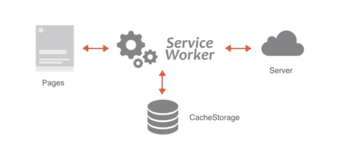
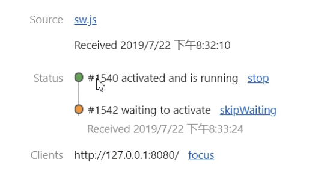

### PWA
其实 Vue 也好 还是 React 也好都内置了 PWA的配置 里面的很多配置我们都没有管

PWA并不是一个技术 而是一系列的技术的综合使用

- web app manifest:  
允许在手机端把我们的网站当成应用一样 添加到主屏幕上

- service worker:  
它可以让网页在离线的情况下 或者说网速特别慢的情况下仍然可以访问

- ccache storage:  
pwa可以让网页离线访问主要就是通过 cache storage 将我们的资源缓存下来

- 常见的缓存策略:
- notification:  
做通知的

<br><br>

# PWA是什么?
### **pwa:**  
渐进式web应用(progressive web app), mdn网站如下:
```
https://developer.mozilla.org/zh-CN/docs/Web/Progressive_web_apps
```

它是提升web app体验的一种方式 能给用户原生应用的体验

pwa运用现代的web api以及传统的渐进式增强策略来创建跨平台web应用程序

pwa能做到原生应用的体验 不是靠特指的一项技术 而是经过应用一些新技术进行改进 只要拥有一个web app (网页) 那么pwa的旅程就开始了

现在 vue 和 react的脚手架都已经集成了pwa的功能

pwa加工过的网页会有应用的效果 跟普通的往桌面添加快捷方式是不一样的 看不出来是一个网页

<br>

### **PWA的优势:**
- 渐进式:  
不会影响网页的原有功能 之前有什么功能现在仍然有什么功能 pwa适用于所有的浏览器 因为它是以渐进式增强作为宗旨开发的

- 流畅:  
能够借助 service worker在离线或者网络较差的情况下正常访问

- 可安装:  
用户可以添加常用的 webapp 到桌面 免去去应用商店下载的麻烦

- 原生体验:  
可以和app一样 拥有首屏加载动画 可以隐藏地址栏等沉浸式体验

- 粘性:  
通过推送离线通知等 可以让用户回流

<br><br>

# Web App Manifest
应用程序清单列表, 它其实就是一个 JSON 文件, 我们需要在 json文件里面添加一些配置 引入该改配置文件后 就可以实现网页添加到桌面上的效果

<br>

**优势:**  
只要我们的项目多了 Manifest 就说明我们的网页是可以添加到桌面上去的 同时比没有它的项目 我们的项目入口多了点 因为可以从桌面的应用进入

<br>

### **基本介绍:**  
Web App Manifest是PWA技术集合中的一个部分 

它可以让<font color="#C2185B">网站安装到设备的主屏幕</font> 而不需要用户通过应用商店进行下载

Web App Manifest在一个json文本文件中提供有关应用程序的信息(如名称 作者 图标 和 描述)

以后我们的网站只要引入这一个文件(Web App Manifest) 我们就可以将网站添加到桌面上 而且不需要下载 点进来还能看到首屏的加载 

<br>

**传统的web app入口:**  
- 网址
- 书签
- 收藏夹
- 直接搜索

<br>

**Web App Manifest:**   
- 可以添加到哦桌面 有唯一的图标和名称
- 有启动时界面 避免生硬的过渡
- 隐藏浏览器相关的UI 比如地址栏等 

<br>

### **Manifest的使用方式:**
**1. 在项目根目录下创建 manifest.json 文件**

<br>

**2. 在 index.html 中引入 manifest.json 文件**
注意: rel属性要指定为: manifest
```html
<link rel="manifest" href="manifest.json">
```

<br>

**3. 在 manifest.json 文件中写配置**

<br>

**4. 需要在 https协议 或者 http://localhost 下访问项目**  
pwa的项目必须在 https 协议下才能访问 这是为了安全性考虑的  

它也支持 http 但是http协议中只支持 localhost 主机 方便本地进行调试

<br>

**5. 我们使用serve包来启动项目:**
```
npm i serve
```

目标目录的前一层目录使用如下命令:
```
serve -s 目标目录
```

<br>

### **Manifest的配置方式:**
**name:**  
用于指定应用的名称 用户安装横幅提示的名称 和 启动画面中的文字
```
用户安装横幅提示的名称:
屏幕下方提示你是否将应用添加到桌面
```

<br>

**short_name:**  
应用的短名称 用于主屏幕显示 不会超过5 6个

<br>

**description:**  
描述

<br>

**start_url:**  
指定用户从设备启动应用程序时加载的url 可以是绝对路径和相对路径
```
绝对路径可以配置到百度
```

打开应用后第一个启动的页面是什么 一般会配置成index.html首页

<br>

**icons:**  
用于指定可在各种环境中用作应用程序图标的图像 对象数组 144x144
```js
// 可配置多个 不同屏幕的设备使用
icons: [
  {
    "src": ".png",
    "sizes": "48x48",
    "type": "image/png"
  }
]
```

<br>

**background_color:**  
用户指定启动动画的背景颜色

<br>

**theme_color:**  
用于指定应用程序的主题颜色(比如应用上方的一小条)

<br>

**display:**  
用于指定app的显示模式:

- fullscreen:  
全屏显示 所有可用的显示区域都被使用 并且不显示状态栏(没有信号电池的栏)

- <font color="#C3285B">standalone:</font>  
让这个应用看起来像一个独立的应用程序(正常的应用模式) 包括具有不同的窗口 在应用程序启动器中拥有自己的图标等

- minimal-ui:  
该应用程序将看起来像一个独立的应用程序 但会有浏览器地址栏

<br>

**name:**  
用于指定应用的名称 用户安装横幅提示的名称 和 启动画面中的文字

<br>

**name:**  
用于指定应用的名称 用户安装横幅提示的名称 和 启动画面中的文字

<br>

**name:**  
用于指定应用的名称 用户安装横幅提示的名称 和 启动画面中的文字

<br>

### **示例:**
```json
{
  "name": "Sam・APP",
  "short_name": "Sam",
  "start_url": "/index.html",
  "icons": [
    {
      "src": "./imgs/logo192.png",
      "sizes": "192x192",
      "type": "image/png"
    }
  ],
  "backgrount-color": "#fff",
  "theme_color": "#CDDC39",
  "display": "standalone"
}
```

虽然我们这个部分配置好了 但是在浏览器中还是看不到效果 现阶段的效果
- 在 PC 端访问是没有效果的 这就是渐进式的 在pc端不会影响原本的功能

- 点击 谷歌x下面的...也没有添加到屏幕的选项 因为pwa要能够添加到屏幕上 除了配置上述的内容还要能够支持离线访问 但是由于我们没有配置service worker所以离线访问是看不到的

<br>

我们可以在手机模拟器上查看效果, 老师使用的是一个软件 android virtual device manager 安卓的模拟器 + 控制台...选择 more -- remote devices 查看安卓虚拟机是否连接成功

<br>

### 查看 Manifest:
```
Application - Manifest
```

这里可以查看我们配置的 manifest.json


<br><br>

# Serive Worker
Manifest让我们的网页可以添加到桌面 多了一个入口 但是还不能完成离线访问的功能

### 基本介绍:
一个标准的 pwa 程序 必须包含的 **3个部分**:

- 必须是 https服务器 或者 http://localhost
- 必须有 manifest.json
- 必须有 service worker

w3c组织早在2014年就提出过 service worker 这样的一个 html5 api <font color="#C2185B">主要用来做持久的离线缓存</font>, 当断网离线的时候我们可以从缓存中加载

前端有很多性能优化的手段:
- cdn
- css sprite(精灵图)
- 文件的合并压缩
- 异步加载
- 资源缓存 等

这些手段是用来做性能优化的 **但是如果断网了 上述的优化都是凉凉**

即使在线的话也可以让不怎么变化的资源优先走缓存

<br>

**service worker:** 允许web应用在网络环境比较差或者是离线的环境下依旧可以使用

**service worker:** 可以极大的提升web app的用户体验

**service worker:** 是一个独立于js线程之外的 worker 线程 独立于当前网页的进程 是一种特殊的 web worker

<br><br>

# Web Worker
浏览器中的 js 都是运行在一个单一的主线程上的 在同一时间内只能做一件事情

随着web业务不断地复杂 我们逐渐在js中加了很多耗资源 耗时间的复杂运算 如果在主线程中计算 就会造成性能问题

w3c提供了 web work 的api web work是脱离在主线程之外的 将一些复杂的耗时的活交给它干 完成后通过 postMessage 方法告诉主线程

webwork是一个独立的运行环境 不能操作 dom 和 bom

<br>

### **WebWorker的使用方式:**

**1. 创建WebWorker:**  
```js
let worker = new Worker("work.js")
```

<br>

**2. 在 WebWorker 中进行复杂的计算:**  

<br>

**3. WebWork计算结束, 通过 self.postMessage(msg) 给主线程发消息:**  

<br>

**4. 主线程通过 worker.onmessage = function() {} 监听消息:**  

<br>

**5. 主线程也可以用同样的方式给 webworker 进行通讯:**  

<br>

**示例:**  
我们把 1 - 1亿 运算过程放到 webwork 中 运行
```js
// 主线程:
console.log("start")

// 创建 webworker
const worker = new Worker("./js/demo.js")

// 监听 worker 线程的事件
worker.addEventListener("message", (e) => {
  console.log("收到的数据:", e.data)
})

console.log("end")
```

```js
// work线程:
// 计算 1-1亿之间的所有数的和
let total = 0
for(let i = 0; i < 100000000; i++) {
  total += i
}

console.log("this:", this)
console.log("self:", self)
console.log("judge:", this == self)

this.postMessage({total})
```

在 work线程 往 主线程发送消息的时候  
使用 this == self == 不写 这三种写法都是一样的 也就是说: 

- work线程中 this self 代表 主线程
- 主线程中 worker实例对象代表 worker线程

**注意: webwork也需要使用 https http 的协议下才能运行**

<br><br>

# Service Worker

### 基本介绍:

### **WebWorker的问题:**  
**作用:**  
WebWorker主要做一些复杂的运算

WebWorker还是有些缺点的 虽然它可以每次开一个单独的线程做一些事情 但是在 webworker里面是没有办法缓存的 也就是说我们算的结果 也没有办法存下来的 是临时的 

每次做的事情的结果还不能被持久存下来 如果下次有同样的复杂操作 还得费时间重来一遍

<br>

### **ServiceWorkerer的优势:**  

**作用:**  


```
front                    backend
  ↓                         ↓
pages -> ServiceWorkerer -> Server

              ↓

        CacheStorage
```

从图上看 前端要请求一个pages页面 正常的话我们会去 server 要该数据的 但是如果我们配置了 ServiceWorkerer 的话 

我们的请求会先被 ServiceWorkerer 拦截住

ServiceWorkerer有些像代理服务器在ServiceWorkerer中我们可以做一些选择

ServiceWorkerer可以操作 CacheStorage(缓存的api)  
也可以操作发送请求到server(放行请求)

那这就意味着有了ServiceWorkerer我们可以对有些不需要经常改变的数据 我们可以直接从 CacheStorage 中读取数据 返送给前端

如果有些数据要从网络中重新加载 也可以去server去请求

而且还可以做到 当server回来数据后 ServiceWorkerer还可以把结果放入到CacheStorage中一份 它真的像代理服务器 它可以

- 操作缓存
- 拦截请求 和 响应
- 发送请求

<br>

### **ServiceWorkerer的特征:**
1. ServiceWorkerer一旦被 install(安装) 就永远存在 除非被手动 unregister (清楚掉)

2. ServiceWorkerer被用到的时候可以直接唤醒 不用的时候自动睡眠(不用担心被占太多的资源)  
而且它是独立于主线程之外运行的

3. ServiceWorkerer可以通过代码拦截代理请求和响应 从而决定是走缓存还是去请求服务器  
缓存的文件可以被网页进程取到(说白就是网页离线了也可以读取缓存)

4. 离线内容开发者可控要缓存什么不缓存什么都是我们决定的
```
如果网络不好 走缓存
如果网络挺好 走server
```

5. ServiceWorkerer必须在 https 环境下才能工作

6. ServiceWorkerer内部大部分都是 promise 实现

<br>

### **ServiceWorkerer的使用步骤:**
ServiceWorkerer是 navigator 身上的属性

**1. 注册ServiceWorkerer**  
window.onload中注册 也就是等页面加载完毕再去注册 没必要一上来就注册 防止与其他资源竞争  

<br>

**2. ServiceWorkerer在老版本浏览器中不支持**  
```js
if("ServiceWorkerer" in navigator) { ... }
```

<br>

**3. 注册 service worker**  
```js
navigator.ServiceWorker.register("./sw.js")
```

**要点:**  
- 1. 我们要像 实例化 WebWorker 那样传递一个 js文件
- 2. 注册后返回值为 promise对象

<br>

### 注册ServiceWorker部分的代码:
- 准备 注册ServiceWorkerer的参数js文件
- 判断浏览器是否支持ServiceWorkerer
- 注册成功后返回的是 promise
```js
// swp 就是返回的promise对象
swp.then(
  registration => {
    console.log("注册成功的对象:", registration)
  }
).catch(err => {
  console.log("注册失败的对象:", err)
})


// 注册成功后 registration 就是注册成功后的对象
ServiceWorkererRegistration: {
  active:
  backgroundFetch:
  cookies:
  installing:
  navigationPreload:
  onupdatefound:
  paymentManager:
  periodicSync:
  pushManager:
  scope:
  sync:
  updateViaCache:
  waiting:
}
```

**要点: 这两种捕获错误方式的去呗**  
```js
// 方式1:
swp.then(
  registration => {
    console.log("注册成功的对象:", registration)
  }
).catch(err => {
  console.log("注册失败的对象:", err)
})

// 方式2:
swp.then(
  registration => {
    console.log("注册成功的对象:", registration)
  },
  err => {
    console.log("注册失败的对象:", err)
  }
)
``` 

方式1:  
catch是用来兜底的 上面then任何一个出现了错误 都会到catch

方式2:  
then第2个参数, 则是捕获当前then的错误 

有些情景下我们要考虑 方式1 方式2 使用哪个更好

```js
 // 1. 需要在网页加载完成的时候 注册ServiceWorkerer, 这样优势在于不会跟别人产生竞争
window.addEventListener("load", () => {

  // 判断浏览器是否支持 ServiceWorkerer
  if("ServiceWorkerer" in navigator) {

    // 参数: js文件, 返回值是promise对象
    let swp = navigator.ServiceWorkerer.register("./js/sw.js")

    // then() 拿成功的结果, catch() 拿失败的结果
    swp.then(
      registration => {
        console.log("注册成功的对象:", registration)
      }
    ).catch(err => {
      console.log("注册失败的对象:", err)
    })
   
  // 没有注册成功的情况
  } else {
    console.log("该浏览器不支持 ServiceWorkerer")
  }
})
```

<br>

### 参数js文件 sw.js 中的逻辑:
上面我们完成了 ServiceWorkerer 的注册逻辑 接下来就是要明确我们要在 ServiceWorkerer 重做什么了 

ServiceWorkerer要做的重要的事儿就是 因为只有在该js文件中写了逻辑 才可以在离线的时候进行访问 
- 操作缓存
- 网络请求

<br>

### 查看 ServiceWorker:
```
Application - ServiceWorkers
```

我们可以先在 界面上 unregist 掉 然后再刷新 能看到最新的serviceworker

<br>

### ServiceWorker中的this self
他们是 ServiceWorker 中的全局对象

<br>

### ServiceWorker生命周期事件:
ServiceWorker也类似 Vue 有一些生命周期事件 它主要有3个生命周期

<br>

**<font color="#C2185B">install</font>**  
该事件会在 ServiceWorker 注册成功的时候触发  
主要用于缓存资源

比如, ServiceWorker刚注册好的时候我们可以在内部缓存一些静态资源 将来一旦断网了我们就可以从缓存中读取了

```js
// self this 是 ServiceWorker 的全局对象
self.addEventListener("install", (e) => {
  console.log("install", e)
})

InstallEvent: {
  isTrusted: true,
  bubbles: false,
  cancelBubble: false,
  cancelable: false,
  composed: false,
  currentTarget: ServiceWorkerGlobalScope{},
  defaultPrevented: false,
  eventPhase: 0,
  path: [],
  returnValue: true,
  srcElement: ServiceWorkerGlobalScope{},
  target: ServiceWorkerGlobalScope{},
  timeStamp: 0,
  type: "install"
}
```


<br>

**<font color="#C2185B">activate</font>**  
该事件会在 ServiceWorker 激活的时候触发   
主要用于删除旧的资源

ServiceWorker会在 install 成功之后 ServiceWorker就会激活 也就是该周期在install之后  

在该周期中主要会把之前无用的缓存给删掉 如果我们不清理缓存的话 可能会导致缓存越来越多 直到最后就装不下了 

所以我们会在 install 中缓存一些项目会用到的 在 activate中删除之前没用的缓存

```js
self.addEventListener("activate", (e) => {
  console.log("activate", e)
})

ExtendableEvent: {
  isTrusted: true,
  bubbles: false,
  cancelBubble: false,
  cancelable: false,
  composed: false,
  currentTarget: ServiceWorkerGlobalScope{},
  defaultPrevented: false,
  eventPhase: 0,
  path: [],
  returnValue: true,
  srcElement: ServiceWorkerGlobalScope{},
  target: ServiceWorkerGlobalScope{},
  timeStamp: 0,
  type: "activate"
}
```

<br>

**<font color="#C2185B">fetch</font>**  
该周期中会接收到所有的网络请求 只要接收到网络请求就会触发该事件

主要用于操作缓存或者读取网络资源 或者等读取网络资源失败了再去操作缓存 

<br>

**注意:**  
比如 我们把 sw.js 文件 放在了 /js/sw.js 文件夹下 那么worker线程只能看到网址以 /js/开头的页面的fetch事件

所以说 fetch也是有 scope限制的, 如果你把 service-wokrker.js 放在 /js 目录下，那么只能拦截到 这个域名 js/ 请求 path 下的资源。

所以解决这样的问题，**建议 service-worker.js 文件 放在跟目录下**

```js
self.addEventListener("fetch", (e) => {
  console.log("fetch", e)
}) 


FetchEvent: {
  isTrusted: true,
  bubbles: false,
  cancelBubble: false,
  cancelable: true,
  clientId: 
"ed39182e-d714-4c8f-83d5-8253e276476c",
  composed: false,
  currentTarget: ServiceWorkerGlobalScope{},
  defaultPrevented: false,
  eventPhase: 0,
  handled: Promise,
  isReload: false,
  path: [],
  preloadResponse: Promise,


  request:Request{
    body:null,
    bodyUsed: false,
    cache: "reload",
    credentials: "script",
    headers: {},
    integrity: "",
    isHistoryNavigation: false,
    keepalive: false,
    method:"get",
    mode: "no-cors",
    redirect: "follow",
    referrer: "http://localhost:8080/",
    referrerPolicy: "strict-origin-when-cross-origin",
    signal: AbortSignal{},
    url: "chrome-extension://gppongmhjkpfnbhagpmjfkannfbllamg/js/js.js"
  }

  resultingClientId: ""
  returnValue: true,
  srcElement: ServiceWorkerGlobalScope{},
  target: ServiceWorkerGlobalScope{},
  timeStamp: 0,
  type: "activate"
}
```

<br>

### 要点:
1. 当我们第二次刷新页面的时候 虽然再次注册了serviceworker 但是 install activate 事件不会再次执行

2. 如果 sw.js 发生了改变 install事件会重新触发 但是 activate事件不会重新触发

3. activate事件第一次在 install事件成功后会触发一次 如果我们第二次刷新页面 即便我们修改了 sw.js 文件 但因为已经存在一个ServiceWorker了 所以activate就不会再次的激活了 它会处于等待状态 等之前的ServiceWorker停止了 它才会激活触发  
也就是说它必须等到当前的 ServiceWorker 停止了 才会再次激活

<br>

那就会产生了一个问题 我们注册的新的ServiceWorker 就会触发install事件代表注册成功 但是activate事件(激活)就不执行 这样的话 我们最新的ServiceWorker就不能运行了



看上述的图片我们也能观察到 
```
#1540的serviceworker在运行  
#1542的serviceworker在等待
```

当我们修改了sw.js文件 重新刷新了页面 相当于我们又注册了一个 serviceworker 执行了一次 install事件

由于前一个serviceworker没有停止 所以activate事件在等待(等待激活)

如果我们希望第二次注册的serviceworker能够立马激活 也就是install之后我们就希望能马上的activate激活 我们可以

```
1. 在面板上点击 skipWaiting
2. 调用 <font color="#C2185B">self.skipWaiting()</font> 方法
```

就会跳过等待 执行激活最新的 serviceworker(前一个serviceworker是被覆盖了么?看面板是只有一个serviceworker)

一般我们的需求就是 install 之后能够立马的 activate 这里我们可以在代码中使用 **<font color="#C2185B">self.skipWaiting()</font>** 方法 跳过等待 返回一个 promise 对象

```js
self.addEventListener("install", (e) => {
  
  // 我们我们会在 install 回调中 无论上面写什么逻辑下面都会加上如下逻辑: 让serviceworker跳过等待直接进入到activate状态
  self.skipWaiting()
})
```

这里还有一个问题: 上述的 <font color="#C2185B">self.skipWaiting()</font> 会返回一个 promise对象 说明它是异步的操作 那就可能会导致 self.skipWaiting() 的操作还没有执行完 就立马跑下面去了
```js
self.addEventListener("install", (e) => {
  console.log("install", e)

  // 它是异步的 可能还没执行完 就立马跑下面去了
  self.skipWaiting()
})

// 下面
self.addEventListener("activate", (e) => {
  console.log("activate", e)
})
```

所以为了解决上面的问题 一般我们还会加上一个操作:  
**<font color="#C2185B">event.waitUntil()</font>**  
它的意思是等待 直到的意思  
它会接收一个 promise对象 它会等我们传入的 promise对象真正的执行结束后 它才会结束当前的事件(生命周期) 才会进入下一个事件, 防止浏览器再异步操作之前就停止了生命周期

我们做如下的修改:
```js
self.addEventListener("install", (e) => {
  console.log("install")

  // 为了防止self.skipWaiting()异步操作没走完就进入下一个生命周期 我们要加如下的操作
  e.waitUntil(self.skipWaiting())
})

```

ServiceWorker激活后 会在下一次刷新页面的时候才会生效 也就是说我们注册的serviceworker这次不会生效 要等待下一次页面刷新后才生效 才会管理页面

可以通过 <font color="#C2185B">self.clients.claim()</font> 立即获取控制权

```js
self.addEventListener("install", (e) => {
  console.log("install")
  // 为了防止self.skipWaiting()异步操作没走完就进入下一个生命周期 我们要加如下的操作
  e.waitUntil(self.skipWaiting())
})

self.addEventListener("activate", (e) => {
  console.log("activate")
  // 表示serviceworker激活后 立即获取控制权
  self.clients.claim()

  // 因为self.clients.claim()也是promise 所以我们也可以这么写
  e.waitUntil(self.clients.claim())
})
```

**e.waitUntil()还可以使用呢 await 代替**

<br>

我们利用css文件的自发请求看看 fetch 周期

<br>

### ServiceWorker的卸载:
**unregister** 方法用于取消对 service worker 的注册并返回一个 Promise。没有找到注册时，这个 promise 返回 false ，否则，不论取消成功与否都返回 true 

**语法:**  
```js
ServiceWorkerRegistration.unregister().then(function(boolean) {
});
```

<br>

**思路:**  
获取 serviceWorker 列表
```js
navigator.serviceWorker.getRegistrations()
```

遍历列表 根据sw.scope做判断 传入我们的服务器地址  
调用 unregister() 方法删除 sw

```js
btn.addEventListener("click", () => {
  navigator.serviceWorker.getRegistrations().then(function (registrations) {

    // 获取了 注册成功的 sw对象 它是一个数组[]{ServiceWorkerRegistration}
    // console.log("registrations:", registrations)

    // 遍历这个 sw列表
    for (let registration of registrations) {
      
      // registration.scope 是我们的服务器路径: http://127.0.0.1:5500/TechnologyStack/Memo/basic/PWA/pwa-sw-message/
      if (registration && registration.scope === 'http://127.0.0.1:5500/TechnologyStack/Memo/basic/PWA/pwa-sw-message/') {
        // 调用 unregister() 方法卸载
        registration.unregister().then(res => {
          console.log("res:" , res)   // true
        })
      }
    }

  })
})
```

<br><br>

# Fetch Api:
fetcn是js的一个借口 用于访问 和 操作http管道的部分 例如请求和响应

在 service worker 中 如果想要发送请求 无法使用ajax 必须使用fetch Api
``` 
XMLHttpRequest 只能在DOM中用
fetch在哪里都可以用
```

fetch api是基于 promise 实现的

<br>

**<font color="#C2185B">fetch(url, config)</font>**  
用于发送 http 请求 返回一个包含响应结果的 promise 对象

第一次fetch的结果可以获取一个流 然后我们还要通过调用其它方法将流转换为数据 如: res.json()

```js
(aysnc () => {
  let res = await fetch("url", {config})

  // res是一个二进制数据 调用json()可以得到json对象
  let data = await res.json()
})()

```

**常见参数:**   
method: 用于设置请求方式  
body: 用于设置请求体  
headers: 用于设置请求头  

```js
(async () => {
  let res = await fetch("/data.json")
  console.log("res:", res)
  let data = await res.json()
  console.log("data:", data)
})()
```

<br>

**response:**  
它是一个二进制的流 不仅仅可以fetch接口 还可以fetch文件 图片等等

```js
Response: {
  // body是我们想要的部分 但它是一个流
  body: ReadableStream
  bodyUsed: true
  headers: {},
  ok: true,
  redirected: false
  status: 200
  statusText: "OK",
  type: "basic",
  url: "http://127.0.0.1:8080/data.json"
}
```

<br>

**<font color="#C2185B">response.json()</font>**  
可以把 response.body 流中的数据转换为 json格式的数据  
服务器定义好的就要是json格式的文本文件

返回值: promise

```js
fetch("url")
  .then(res => {
    return res.json()
  })
  .then(data => {
    console.log(data)
  })
```

**ployfill: 如果fetch不支持的时候我们可以搜索一下这个关键字**

<br><br>

# CacheStorage:

CacheStorage接口标识 Cache对象的存储 
CacheStorage是专门配合 serviceworker 来实现资源的缓存

<br>

### Caches Api类似于数据库的操作:
全局下有 caches 对象

**<font color="#C2185B">caches.open(cacheName).then(cache => { ... })</font>**  
我们要使用 CacheStorage 首先就要使用 open() 用于打开缓存 

返回值:  
promise对象, 里面会提供给我们一个 cache 对象

类似于链接数据库

<br>

**<font color="#C2185B">caches.keys()</font>**  
返回所有缓存的 key
返回 promise对象

类似于获取数据库中的表

<br>

**<font color="#C2185B">caches.delete(key)</font>**  
根据 key 删除对应的缓存

类似于删除数据库中的表

<br>

### Cache对象的常用方法:
cache接口为缓存的request / response 对象提供存储机制

Cache主要就是对请求和响应进行存储的, 我们能以前使用的 localStorage只能存储字符串

**<font color="#C2185B">cache.put(req, res)</font>**  
把请求当成 key 并且把对应的响应存储起来

<br>

**<font color="#C2185B">cache.match(req)</font>**  
获取req对应的res

<br>

**<font color="#C2185B">cache.add(url)</font>**  
会根据给定的 url 自动发起请求 并且将响应结果存储起来

<br>

**<font color="#C2185B">cache.addAll(urls)</font>**  
会根据给定的 urls数组 自动发起请求并且把结果都存储起来

<br>

**示例:**  
我们在有 manifest.json 的模版中做演示

首先, 我们注册 serviceworker
```js
window.addEventListener("load", async () => {
  // 注册 serviceworker
  if("serviceWorker" in navigator) {
    try {
      const registration = await navigator.serviceWorker.register("./sw.js")
      console.log("serviceWorker注册成功...")
      
    } catch(err) {
      // 注册失败的情况
      console.log("serviceWorker注册失败:", err)
    }
  }
})
```

然后, 在 sw.js 文件中写上3个周期, 在sw.js文件中操作缓存
```js
// sw.js 文件中是需要注册3个事件的
self.addEventListener("install", async e => {
  console.log("install")
  await self.skipWaiting()
})

self.addEventListener("activate", async e => {
  console.log("activate")
  await self.clients.claim()
})

self.addEventListener("fetch", async e => {
  console.log("fetch")
})
```

然后, 我们分别看下 在 install activate fetch 中都要完成什么样的逻辑

**install:**  
主要缓存内容 页面一进来install了 就要开始缓存内容
- 打开缓存库(链接数据库), 拿到缓存对象cahce
- 调用 addAll() 将静态资源放入 cache 中
```js 
const CACHE_NAME = "cache_v2"
self.addEventListener("install", async e => {
  console.log("install")

  // 调用open()方法打开 cache_v1缓存存储库 得到 cache 对象
  const cache = await caches.open(CACHE_NAME)

  // 使用 await 等待 通过 cache.add() 将静态资源存储起来, 比如: logo192.png, manifest.json, index.html 这些都属于静态资源
  await cache.addAll([

    // 存储html避免以后离线访问不到 注意路径
    "/",
    "/imgs/logo192.png",
    "/manifest.json"
  ])

  await self.skipWaiting()
})

/*
  上步完成后 Cache Storage 中存储内容为:
  cache_v1 - http://127.0.0.1:8080
*/

```

<br>

**index.html**  
我们在写关于它的路径的时候 要写 / 因为我们访问的是 localhost:8080/

自动会找 index.html 

<br>

**activate:**  
清除旧的缓存, 因为它是激活的周期 当一个serviceworker被注册后 上一个worker中缓存的数据就应该清空

```js 
self.addEventListener("activate", async e => {
  console.log("activate")

  // 会清除掉旧的资源
  const keys = await caches.keys()
  console.log("keys:", keys)

  keys.forEach(key => {
    // 如果 我们获取到的 key 跟 我们定义 key 不一样 则说明不是我的资源 就是旧的资源
    // 比如我们拿到的是 v1 我们定义的是 v2 
    if(key !== CACHE_NAME) {
      caches.delete(key)
    }
  })

  // 得到控制权再传递给下一步
  await self.clients.claim()
})

/*
  上步完成后 Cache Storage 中存储内容为:
  cache_v1 - http://127.0.0.1:8080
  cache_v2 - http://127.0.0.1:8080

  等到 activate执行的时候 会删除旧的资源 剩下
  cache_v2 - http://127.0.0.1:8080
*/
```


<br>

**fetch:**  
我们会使用两种策略:  
- 网络优先:  
如果网络可以走网络 网络不好走缓存  

```js 
// 判断资源是否能请求成功 如果能够请求成功 就响应成功的结果 如果断网了请求失败 就读取cache缓存
self.addEventListener("fetch", async e => {
  // 打印资源请求对象中的 url
  console.log(e.request.url)

  // 获取请求对象
  const req = e.request

  // 调用 e.respondWith() 传入 res响应对象呢 调用该方法将响应交给浏览器
  e.respondWith(networkFirst(req))
})
```

```js
// 传入 req 我们要根据req发起请求和获取缓存库中对应的res
async function networkFirst(req) {

  /*
    使用 fetch 发起请求
    使用 try catch 来判断 网络情况

      有网的情况: 正常发起请求拿到 响应对象 返回
      没网的情况: 打开缓存库 获取cache对象(获取数据表) 通过req拿到res返回
  */

  // 先从网络读取资源
  try {
    // 使用fetch api拿到相应 注意我们传入的是请求对象
    // 先从网络中读取最新的资源
    let fresh = await fetch(req)

    // 直接返回读取的结果 不要调用json() 因为请求的可能是别的类型的资源 比如还有 res.blob()
    return fresh

  } catch(err) {

    // 没网的情况 去缓存中读取, 首先打开缓存库 获取 cache 对象
    const cache = await caches.open(CACHE_NAME)

    // 调用 match 方法 根据 req 获取 res
    const cached = await cache.match(req)
    
    return cached
  }
}
```

- 缓存优先:  
如果缓存有就先走缓存 缓存没有就走网络

<br>

上面完成 离线 也能访问的页面的功能 同时我们点击谷歌右上角的浏览器的 ... 也能安装app了

上面虽然完成了 离线可访问的功能 但是离线访问的和在线访问的内容都是一样的 复杂一些的缓存还没有实现哦

<br><br>

# notification 通知功能
我们上面使用了 离线的处理 但是对于用户来说可能是蒙圈的 用户会想我到底是有网还是没网 我看到的是最新的数据 还是缓存中的数据 用户是不知道的

所以我们可以给用户一个通知 其实通知可以不用给桌面通知 也可以给一个提示框之类的 我们只是看看新的api的使用方式

<br>

### notification api 的通知接口用于向用户配置和显示桌面通知

**<font color="#C2185B">Notification.permission:</font>**   
可以获取当前用户的授权情况 只读属性
- default:   
默认通知前会询问 未授权

- denied:   
拒绝的 如果拒绝了 无法再次的请求授权 也无法弹窗提醒 除非用户手动选择授权情况

- granted:   
授权的 可以弹窗提醒

<br>

**<font color="#C2185B">Notification.requestPermission():</font>**   
如果是 default 的情况下 我们可以使用该api请求用户 点击 允许 或者 禁止

返回值: promise

<br>

**<font color="#C2185B">new Notification("title", {body: "", icon: ""})</font>**   
等有权限了 我们可以通过 new Notification 来进行弹窗 显示通知

<br>

在授权通过的情况下 可以在serviceworker中显示通知
```js
self.registration.showNotification("你好", {
  body: "msg"
})
```

<br>

### 什么时候给用户通知呢?
```js
// 先判断用户的权限 然后请求用户点击允许还是禁止
if(Notification.permission === "default") {
  let p = Notification.requestPermission()
  p.then(res => console.log("res: ", res)) // 能输出标识符
}

// 如果页面一进来 我们发现用户没有联网 给用户一个通知 navigator.onLine判断用户是否联网
if(!navigator.onLine) {
  new Notification("提示:", {
    body: "您当前没有网络 现在访问的是缓存"
  })
}

// 由没有网变成有网了触发的事件 还有一个 offline 事件
window.addEventListener("online", () => {
  console.log("触发了 online 事件")
  new Notification("提示:", {
    body: "您已经链接上网络了 请刷新访问最新的数据"
  })
})
```

<br>

这个是个小项目:  
https://www.bilibili.com/video/BV1wt411E7QD/?p=13&spm_id_from=pageDriver&vd_source=66d9d28ceb1490c7b37726323336322b

<br><br>

# ServiceWork的全面解析:

### **navigator.serviceWorker:**
返回 serviceWorker 的容器对象, 我们可以想象成 所有的 serviceWorker 都归它来进行管理, 包括对 service worker 的注册，卸载，更新和访问 service worker 的状态

```js
let swContainer = navigator.serviceWorker
console.log(swContainer)

{
  // servicework对象
  controller: {
    onerror: null,
    onstatechange: null,
    scriptURL: "http://127.0.0.1:5500/TechnologyStack/Memo/basic/PWA/pwa-sw-message/sw.js",
    state: "activated"
  },

  ready: Promise,
  oncontrollerchange: null,
  onmessage: null,
  onmessageerror: null
}
```

<br>

### swContainer身上的属性:

**<font color="#C2185B">swContainer.controller</font>**  
当serviceWorker对象的state为active的时候 返回当前页面的 serviceWorker 

<br>

**<font color="#C2185B">swContainer.ready</font>**  
定义了一个 serviceWorker 是否准备好为一个页面服务，将返回一个 Promise，并且这个 Promise永远不会 reject，这个 Promise会在ServiceWorkerRegistration 获取到一个 active 的ServiceWorker的时候被解决。

<br>

### swContainer身上的事件:

**<font color="#C2185B">swContainer.addEventListener("message")</font>**  

```js
// 传递
navigator.serviceWorker.controller && navigator.serviceWorker.controller.postMessage("this message is from page");

// 接收
navigator.serviceWorker.addEventListener('message', function (e) {
  console.log('service worker传递的信息',e.data); 
});


self.addEventListener('message', (event)=>{
  console.log('页面传递过来的数据',event.data)  // 收到主线程传递的信息
  event.source.postMessage('this message is from sw.js to page');  // 向主线程传递信息
})

```