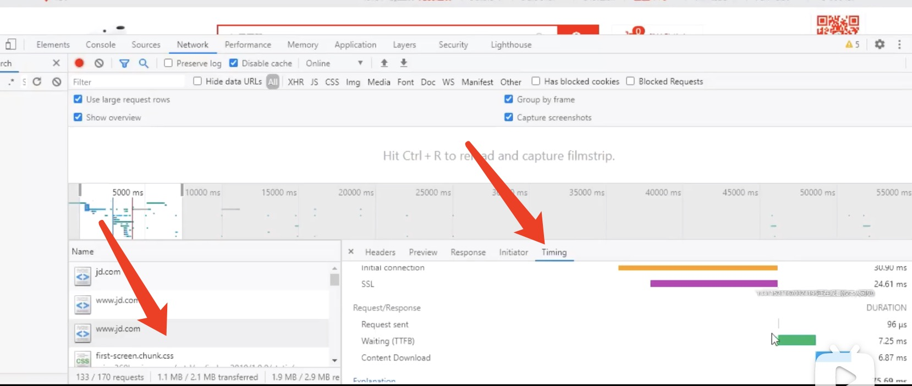
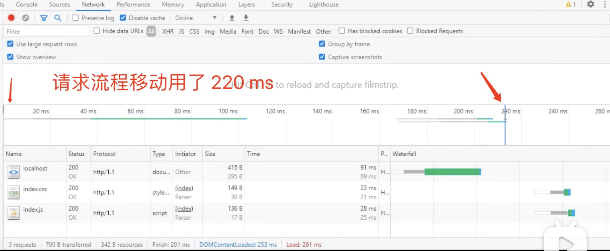
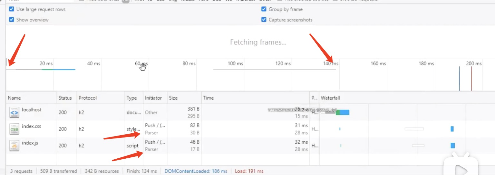
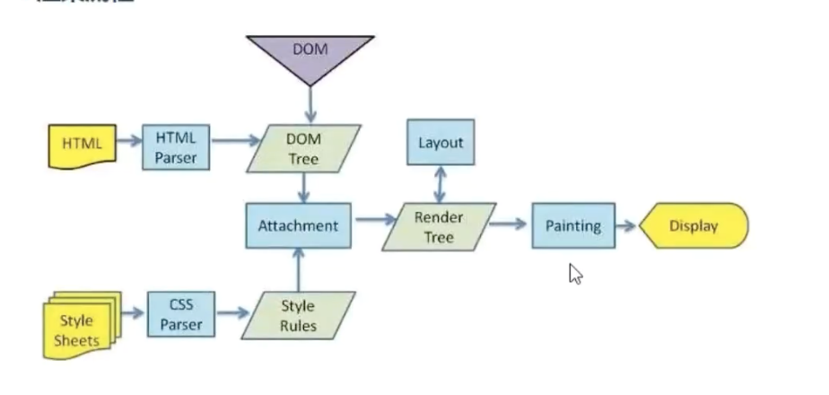
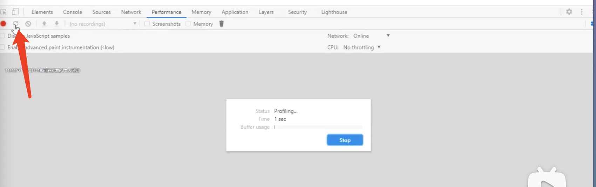
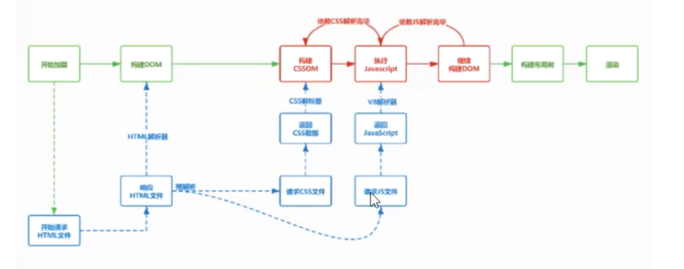
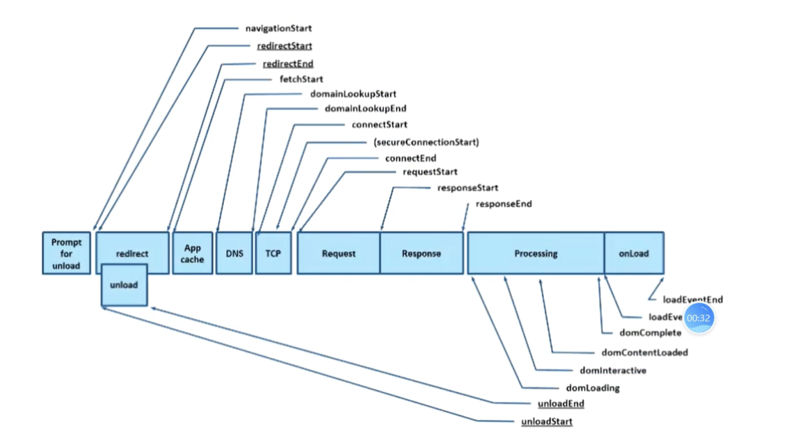
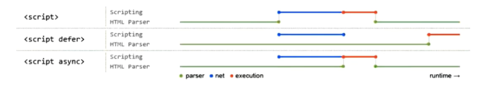
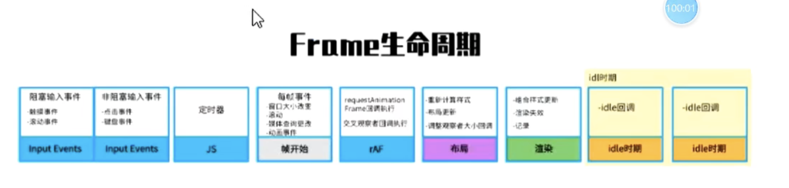

### 待总结:
- 词法分析


### 浏览器渲染原理 与 性能优化

> 进程 与 线程
- 进程:
- 是操作系统资源分配的基本单位 进程中包含线程

- 线程:
- 线程是由进程所管理的 为了提升浏览器的稳定性和安全性 浏览器采用了多进程的模型

- 浏览器是多进程的模型 因为浏览器有多个页卡 如果其中的一个页卡挂了 其它的页卡还可以使用 提高了稳定性


> 浏览器中的 5个 进程
- 进程之间可以通过 ipc 进行通信


> 浏览器进程(负责页面展示以及交互):
- 负责界面显示 用户交互 子进程管理 提供存储等
- 它可以调用其它的进程
    

> GPU进程(硬件加速 提高体验):
- 3d绘制 提高性能
    

> 插件进程(硬件加速 提高体验):
- chrome里面会有很多的插件 一个插件就是一个进程
    

> 渲染进程(渲染网页):  -- 最重要的一个进程
- 每个页卡都有单独的渲染进程 核心用于渲染页面

  - GUI渲染线程

  - JS引擎线程

  - 事件触发线程
    

> 网络进程(处理网络资源):
- 主要处理网络资源加载(html css js等)


> 流程:
- 我们在url上输入网址后 会先由 网络进程请求资源 然后交给 渲染进程来处理 渲染页面

- 在渲染的过程中 可能有动画 比如CSS动画 这时候会交由GPU进程处理(它主要做3d绘制)

------

> 从输入 url 到浏览器显示页面发生了什么
- 当我们在浏览器的地址栏直接输入 汉字(你好) 的时候 会自动用浏览器默认的搜索引擎去搜索生成地址
- 如果我们输入的是 url 会真正的发起url请求

> 进程之间的交互
- 我们输入 url 是在浏览器进程里面做的 浏览器进程这时候会准备一个渲染进程 用来渲染页面

- 渲染进程 要渲染页面的话 需要资源 所以会通过 网络进程 加载资源 最终将加载的资源交给渲染进程来处理 然后渲染完毕(进程之间的交互通过 ipc: webworker, postmessage等)


> 网络请求过程中发生了什么

- 网络的七层模型:
- (物 数) 
- (网): ip协议
- (传): tcp协议 udp协议
- (会 表 应): 应用层: http协议

- 一个括号一层 一般的会我们会将上述的7层 统称为4层

- 我们从这7层这个角度来看看 用户输入 url 后 发生了什么
- 首先 它会看当前的网址有没有被访问过 先去查找缓存(浏览器绘制的强制缓存 和 缓存策略, 浏览器会访问服务器后 将结果缓存到本地)

- 然后会检查缓存是否过期 如果没有过期直接返回结果 如果过期重新请求服务器

- 首次访问的时候 都没有缓存 所以会通过域名查找对应的服务器 这时会先看该域名是否被解析过(请求过) 也就是DNS协议 将域名解析成ip地址

- 域名只是方便我们记忆 ip地址才是能真正的找到对方 ip地址主要做了映射表 把域名和ip地址做了一个映射

- dns的解析是基于UDP的 
- dns不基于tcp的原因 因为解析的过程中 涉及到服务器的查找(因为域名涉及1级域名 2级域名) 如果使用tcp的话 每经过一个服务器就要进行3次握手

- 而udp就不会 因为udp比较快 直接发个包确认下就可以了
- tcp的好处是安全可靠 udp(视频 直播使用udp多些)有丢包的情况 但是在传输过程中希望是安全可靠的 但是对于查找域名的话 更多的是追求速度 所以采用了udp

- tcp传输的过程是 分段传输(分包)
- udp是一个包传递过去就ok了

- 解析成ip地址后 通过 ip + 端口号 找到具体的服务器
- 有了对方的地址 就可以进行传输了

- 如果请求是 https
- 这里就涉及了 ssl协商 会通过ssl协商来保证我们数据的安全性

- 当我们输入url键下回车后开始寻址(利用ip地址) 找到对方 
- 找到对方后不是立马将数据发送过去 而是会先排队等待 

- 比如一个域名下有多个请求 同一个域名在http1.1中请求是有限制的 最多会建立6个tcp连接 也就是说同一个时间最多能发送6个http请求

- 排队后开始发起请求 这时候靠的是tcp 
- tcp主要做的事就是创建连接 用于传输(经过3次握手)

- 有了这个链接之后就可以传输数据了 利用tcp传输数据 这时我们的数据可能会很大 它不是一口气的将数据传输过去 而是拆分

- 拆分成数据包 将数据一个个的传过去 传输的过程中是有序的 12345 是可靠和有序 如果有丢包会有重发机制

- 服务器收到之后会将这些数据包进行重排 服务器会按照顺序进行接收

- 数据发过去这个过程是靠 http 请求 http请求会数据的格式有要求
- 请求行
- 请求头
- 空行
- 请求体

- 当我们发送完后 tcp的链接默认是不会断开的(http1.1) 因为有一个字段 keep-alive 为了下次传输数据的时候 可以服用上次的创建的链接 

- 服务器会收到数据 当它收到数据后 会去解析 解析请求行 请求头 请求体 
- 解析后会进行响应(响应行 响应头 响应体)
- 状态码: 
- 服务器还会响应 响应码
- 301
- 302
- 304: 会查询浏览器缓存进行返回

------

> network来验证请求信息
- 我们在发起请求的时候 可以通过 network 来进行查看
- 比如 当我们访问 jd.com

- 第一行:
- jd.com 302
- 为什么是302呢 因为我们访问的时候没有加上www 所以会重定向到 www.jd.com

- 第二行:
- www.jd.com 302
- 为什么又是302呢？ 它又给我们重定向到了 https://www.jd.com

- network选项卡里面有很多的列名
- Name  |  Status  |  Type  |  Intiator  |  Time  |  Priority |Waterfall  

- Priority:
- 该项的优先级(没有该列可以右键添加) 高优先级的会提前发送


- 我们通过 时间轴 能够看到 有很多是并发的请求 很多都是2 3个是同一时间请求的 对于chrome而言 同一时间可以发送6个请求


- 当我们选中一个 Name 列中的一项的时候 会有如下选项卡
- Headers  |  Preview  |  Response  |  Intiator  |  Timing

- 我们点击 Timing 能够看到 在我们刚开始发送请求的时候 会先进行排队

Resource  (资源调度)
  Queueing    1.1ms

Connection Start (连接开始)
  Stalled (停滞不前)
    - 排队后也不是立即发送的 会先进行连接的复用 可能会处理一些代理相关的逻辑 这也有等待的时间(监测时间)

  DNS Lookup
    - 查找dns 这是查找dns的时间 通过域名解析成ip地址损耗的时间

  Intial connection
    - 创建连接
    - 也就是tcp建立的时长

  SSL
    - 因为是https所以还要有ssl协商

  Request/Response
    Request sent
      - 请求发送 
      - 发送请求的时间基本上是没有办法优化的 非常快

    Waiting(TTFB)
      - 当请求发送 到 响应回来的等待时间 (响应首字节时候的时间)
      - 这个时间体现出服务器处理的能力了

    Cotent Download
      - 文件下载的过程 文件的大小

- 如果我们进行优化的话 也会选择 Waiting(TTFB)
- 文件大小的优化 要么就是压缩 gzip 删除空白字符等方式




> network下方的状态栏上 会有 
- 133/170 requests
- 网页上一共多少个请求

- 1.1MB / 2.1MB transferred
- 资源一共多大

- 1.9MB / 2.9MB resources
- Finish: 50s

- DOMContentLoaded: 1.75s
- dom加载完毕的时长


------

> http2的相关知识
- 我们在 network选项卡 里面有很多的列名 我们还可以右键选择 Protocol 查看协议

- 上面都是说的 http1.1 现在流行的还有 http2(h2)

- h2处理静态资源更加的方便 但是h2也有一些小问题 比如丢包

> http协议的历史:
> http0.9:
- 只负责传输 html 服务端会通过字节流的方式将html返回 返回的字符串

- 但是别的资源不行(css js) 
- 最早的时候没有请求头 和 响应头 所以最早的时候 只能传输文本

> http1.0:
- 提供了 http 的 header 
- 有了头的标识后 就知道传输的是什么样的数据类型了 是图片还是js还是html
- 根据 header 的不同 来处理不同的资源

- http1.0的特点是每次请求完后会断开连接 然后重新创建连接 tcp要经过3次握手 性能不好

> http1.1:
- 默认开启了 keep-alive 长链接 好处是我们可以在一个tcp连接上可以传输多个http请求

- 这就造成了连接的复用 但是这也造成了 如果有多个请求 难道第一个发完后等第二个么 很慢

- 所以这里增加了一种机制 管线化 也就是一个域名下最多可以建立6个tcp连接 我们可以通过这6个tcp连接来传递数据

- 但是还有一个问题 服务器在处理多个请求的时候 是按顺序来进行处理 虽然有6个tcp连接 请求可以是并发的 但是服务器在处理的时候是依次的 1 2 3 4 5 6

- 响应还是按顺序依次处理的 所以会导致一个 **队头阻塞** 问题

> http2.0
- 它解决了带宽使用率的问题 一开始一个域名下可以有6个tcp连接 这6个连接要不停的去握手 而且在传输的过程中 这6个请求需要争取带宽 看谁的快 谁就会多耗一些带宽

- 2.0用同一个tcp连接来发送数据 一个域名一个tcp连接 它把多个请求按照二进制分帧曾 将数据传输给服务器 相当于一个连接搞定这个事儿

- 这样的好处就是 就没有了队头阻塞问题了 
- 这就是2.0的一个特性 多路复用 多个请求复用一个tcp连接

- h2的headers 都是以:开肉的 比如

  :accept:
  :path:

- 以冒号开头的请求头 会给这些头部信息做一个映射表 这样的压缩方式叫做 h-pack 它可以队头部进行压缩 大小会比http1.1更小

- 以前我们请求都是客户端请求服务器 现在服务器可以推送数据给客户端 


> http3.0
- tcp就是会有阻塞问题 比如在传输中一个数据丢了 后面的传输就阻塞了 它要等待这个包重新发送完 再继续发送

- http3.0解决了tcp的队头阻塞问题 因为tcp在传输的过程中丢包就会重新发送 后面就要等 所以有的时候丢包严重的时候 速度还没有http1.1快

- http3.0 废弃了tcp采用了udp 并且在udp的上一层加了 quic协议(udp的上一层自己建立的协议)

- 3.0在部署上有很大的问题

----------------

> 看下 http1 和 http2 的区别
- 我们可以观察下 network 选项卡

```js
// http1服务
const http = require("http")
const path = require("path")
const fs = require("fs")
const url = require("url")

const staticDir = path.resolve(__dirname, "public")
const server = http.createServer((req,res) => {
  let {pathname} = url.parse(req.url)

  // 当请求的路径是 / 的时候
  if(pathname == "/") {
    pathname = "/index.html"
    // 会去静态目录下查找 index.html 然后返回给前端
    fs.createReadStream(path.join(__dirname, pathname)).pipe(res) 
  } else {
    let requestUrl = path.join(staticDir, pathname)
    try {
      // 当前端页面请求 资源的时候 比如自发性的请求 css 文件 或者 js 文件等 会先检查该文件是否存在 如果存在就进行返回
      fs.accessSync(requestUrl)
      fs.createReadStream(requestUrl).pipe(res)
    } catch (err) {
      // 如果文件不存在 会走catch
      res.statusCode = 404
      res.end("Not Found")
    }
  }
})

server.listen(3001)
```


- http2必须要基于https 所以下面生成了 证书 和 秘钥
```js
//http2.0
// 引入 http2
const http2 = require("http2")
const path = require("path")
const fs = require("fs")

const {HTTP2_HEADER_PATH, HTTP2_HEADER_STATUS} = http2.constants

// 创建一个安全的服务
const server = http2.createSecureServer({
  // 证书
  cert: fs.readFileSync(path.resolve(__dirname, "./cert.crt")),
  // 秘钥
  key: fs.readFileSync(path.resolve(__dirname, "./rsa.private.key")),
})

const staticDir = path.resolve(__dirname, "public")


// 监听数据流 因为 http2是通过2进制的方式进行传输
server.on("stream", async function(stream, headers) {
  let requestPath = headers(HTTP2_HEADER_PATH)

  if(requestPath == "/") {
    requestPath = "index.html"


    // 服务器主动推送数据
    // 循环所有静态文件 将这些静态文件主动的推送给了客户端
    let dirs = fs.readdirSync(staticDir)
    dirs.forEach(dir => {
      let pushPath = path.join(staticDir, dir)
      stream.pushStream({[HTTP2_HEADER_PATH]: "/" + dir}), (err, pushStream) => {
        fs.createReadStream(pushStream).pipe(pushStream)
      }
    })


    // 如果请求路径是 / 找到对应文件进行返回
    stream.respondWithFile(path.join(__dirname, requestPath), {
      "content-type": "text/html"
    })

  } else {
    stream.respond({
      [HTTP2_HEADER_STATUS]: 404
    })

    stream.end("Not Found")
  }
})
```

- 先看看 http1 的请求情况


- 我们能看到 先返回的是 html 然后浏览器会解析 html 
- 解析了一会 并行发起了(基本上) 另外两个请求 css js 文件

--- 

- 先看看 http2 的请求情况


- 整个请求花了140ms
- 整个请求的过程了用了一个 tcp连接 一条线
- http2中的逻辑是 我们能到 pushserver 说明资源是服务器推送过来的 浏览器会将服务器推送过来的内容放在缓存中 当我们访问资源的时候 直接走的是缓存

----------------

### 渲染流程


- 服务器返回html资源后 浏览器接收到 浏览器会对html进行解析(HTML Parser)

- 浏览器会对html从上到下一个个字节进行解析(因为它不能识别字符串 js没办法操作字符串 操作的是node 所以要将html解析成dom树) 它会根据解析后的结果生成一棵dom树(document)

- 返回html的时候 可能会同时加载js css 
- css也会被解析(因为浏览器无法解析纯文本css样式) 解析成 styleSheets cssom css规则(规则树)(document.styleSheets)

- 当有了两棵树后 就开始挂载 复合的一个过程 将两棵树变成一棵渲染树 然后将这颗渲染树进行绘制

- 有了渲染树后 开始做布局 创建布局树 因为这时候节点就开始有了样式 多大多高 所以要开始布局 当计算完后 会将一些不需要显示的节点去掉 比如 display node 的 会从渲染树中删掉

- 有了这颗渲染树后 会对渲染树进行分层处理(根据定位属性 透明属性 transform属性 clip属性等) 生成图层树
<!--  
  分层的效果 我们可以通过 Layers 选项卡 看到
  一个页面会分为很多层

  类似 ps 的图层
 -->

- 将不同图层进行绘制 转交给合成线程处理(相当于 ps 中的合层) 最终生产页面 并显示到浏览器上

----------------

### 模拟 渲染

- 我们经常会说 将css放在顶端 将js放在下方 这样做是和html的渲染过程是用关系的

- html dom在解析的时候是从上到下开始解析 但是碰到了 样式列表的时候 不会马上的加载样式 不会阻塞dom的解析

- dom渲染的时候是遇到一个元素就开始渲染 遇到一个渲染一个 不是等到整个页面加载完后再开始渲染

- 所以**样式是不会阻塞html解析的**

- 当 dom 解析完毕后 会将div和样式组成一棵树(布局树) 

- parseHTML -> parseStyleSheet -> updateLayerTree -> paint

- 样式是不会阻塞html解析的 遇到样式的 link标签也会不卡主

```html
<link rel="stylesheet" href="./index.css">

<div></div>
```

------

> 控制台 Performance 选项卡的使用方式
- 我们可以通过这个 performance 能看出页面是怎么渲染的 哪个任务比较长 哪个任务比较耗时 代码写的有没有问题 看看有没有造成回流和重绘



- 我们可以点击一下左上角的 刷新按钮
- 点击刷新按钮后会将整个网页重新渲染 并且提供一个图表
- 图表中有

  NetWork
  Frames
  Timings

  Main: 主线程
    我们看主线程做了什么 可以看主线程所在的时间轴
    先解析了html 然后在解析了html后才parseStyleSheets
    样式解析完后 开始计算样式 计算布局
    然后开始更新 update layer tree
    分层后会进行 paint绘制
    最后是复合图层 composite layers

  Raster
  GPU
  Chrome
  Compositor

---

- 如果我们将 link css 放在下方会发生什么
```html
<div></div>
<link rel="stylesheet" href="./index.css">
```
- 放在下方可能会导致重绘 html解析的时候从上往下会解析元素 解析的时候link在最下方 浏览器会加载部分的dom 比如当我们解析到div的时候 就会将div先进行一次绘制

- 当 html 渲染时 会先扫描css和js 渲染的时候是从上到下边解析边渲染 当走到div的时候样式还没有加载完成 div已经绘制到页面上 这时候样式加载后 会重绘

- 稍微总结下
- 解析dom 然后等待 解析css 拿到两棵树合成后 再去渲染

------

> js 对 html解析的影响
- css是不会阻塞html解析的
- 但是js会阻塞html的解析 如果我们在页面上加上如下的脚本

```html
<!-- 解析到这里的时候 定制了 parserHTML -->
<div>hello</div>

<!-- 停止解析html 开始执行js 执行js之前会等待linkcss样式加载完毕 因为js可能会操作css样式 -->
<script>
  let s = 0
  for(let i=0; i<10000; i++) {
    s += i
  }
</script>

<!-- 脚本执行完后继续解析div  -->
<div>world</div>
```

- 所以js会要放在底部 要不会阻塞页面的渲染 也会阻塞html解析 domcontentloaded会很慢
- 但是js要等待上面的css的加载完毕 保证js可以操作css样式


------

- 看看这个情况
```html
<div>hello</div>
<script src="./js/index.js"></script>
<div>world</div>
```

- 这里和上面的情况大致一样 不同的是等js加载完毕后再执行
- 这里的js加载和css加载可以并行的 但是还是需要等待js执行完毕 继续解析下面的dom

- 页面在开始加载的时候 会先去扫描 link 和 script 浏览器会先进行预加载(预先加载下载外链) 这时候的css和js的是并行的



------

> 模拟渲染流程

> 后台代码:
- 响应一个html文件给前端 当请求 / 路径的时候 我们打印下 响应头 然后响应一个页面给前端

```js
app.get("/", (req, res) => {
  // 获取请求头
  let headers = req.headers
  console.log("请求头: ", headers)

  // 读取文件 响应回前端
  let path = resolve(__dirname, "public", "index2.html")
  let page = fs.readFileSync(path)

  res.send(page)
})
```

> 前端页面:
```html
<head>
  <meta charset="UTF-8">
  <meta name="viewport" content="width=device-width, initial-scale=1.0">
  <title>Document</title>
  <style>
    #app {
      background-color: red;
      width: 100px;
      height: 100px;
      position: absolute;
      top:0;
      left:0;
    }
  </style>
</head>
<body>
  <div id="app"></div>
</body>
```

> 使用 node 模拟发送 http请求的 客户端
- 浏览器就是一个发送http请求的一个软件 这里我们不使用 浏览器发送 而是使用 node 自带的 net 模块来进行发送
- net 模块是 tcp 用来发送 http 请求的模块

- 发起http请求 其实就是组织好 请求报文的格式 使用 tcp 发送到目标服务器
```js
// 请求行
GET / HTTP/1.1

// 请求头
name: sam
age: 18

// 空行

// 请求体
```

- 我们请求报文的组成使用的是 数组
- ["请求行","请求头"]
- 然后使用 join("\r\n") 方法连接数组中的每个元素 使用换行分割

```js
// node的 tcp 模块 用来传输 http
const tcp = require("net")


// 封装一个发送 http 请求的类
class HTTPRequest {
  constructor(options={}) {
    let {host, port, method, headers, path} = options
    this.host = host
    this.method = method || "GET",
    this.port = port || "80"
    this.headers = headers
    this.path = path || "/"
  }

  // 构建http请求
  send() {
    return new Promise((resolve, reject) => {
      // 创建数组存放请求信息
      let rows = []

      // 模拟浏览器的请求行 GET / HTTP/1.1
      rows.push(`${this.method} ${this.path} HTTP/1.1`)

      // 模拟浏览器的请求头 "content-type": "text/html"
      Object.entries(this.headers).forEach(item => {
        let [key, value] = item
        rows.push(`${key}: ${value}`)
      })

      // 没有请求体

      // 组织成请求报文: 将数组中的每一项 拼接在一起 添加换行符 + 空行
      let data = rows.join("\r\n") + "\r\n\r\n"
      console.log(data)
      /*
        GET / HTTP/1.1
        name: sam
        age: 18
      */

      // 请求报文准备好了 请求报文的传输需要利用 tcp 这里我们使用node中现成的模块 net

      // 创建 tcp 连接 传输 http 数据
      // 有了主机和端口就可以进行寻址 然后就可以拿到通道 socket
      let socket = tcp.createConnection({
        host: this.host,
        port: this.port
      })


      // 写法1: 
      // 创建 tcp 连接 传输 http 数据
      // 有了主机和端口就可以进行寻址 然后就可以拿到通道 socket
      let socket = tcp.createConnection({
        // 访问哪个主机(目标服务器 和 端口)
        host: this.host,
        port: this.port

      // 参数2: cb
      }, () => {
        console.log("参数2")
        // 将 请求报文 传递给服务器
        socket.write(data)
      })


      // 写法2: 这个是能正常得到结果的写法
      // 当
      socket.on("connect", () => {
        // 使用这个方法 将我们的 请求报文 在连接的时候 传递到目标服务器
        socket.write(data)
      })


      // 通过监听 data 事件获取 服务器的响应报文
      // tcp是分段传输的 data事件会触发多次 chunk 就是一段 如果内容比较少就会在这一个chunk里面
      socket.on("data", chunk => {
        // chunk是buf
        console.log("data:", chunk.toString())
      })
      /*
        我们得到的data是 响应报文 但是我们只需要响应体的部分
        https://www.bilibili.com/video/BV1yy4y1i7o1?spm_id_from=333.880.my_history.page.click&vd_source=66d9d28ceb1490c7b37726323336322b

        这个视频里面有 解析 chunk 的脚本 1:33:51
      */


      socket.on("error", err => {
        console.log("err: ", err)
      })


      // 响应一次后 tcp连接就关闭了
      socket.on("end", () => {
        console.log("连接关闭")
      })
    })
  }
}


// 封装的发送请求的方法
const request = async () => {
  const req = new HTTPRequest({
    // 没有 http
    host: "127.0.0.1",
    method: "GET",
    path: "/",
    port: 3005,
    headers: {
      "name": "sam",
      "age": 18
    }
  })

  // 发送请求
  // 响应行 响应头 响应体
  let res = await req.send()
  console.log(res)  
}

// 执行函数
request()
```

- 浏览器会根据响应类型来解析文件 Content-Type: "text/html"
- 将 html -> html-parser -> dom tree

- 我们在 tcp 的 data 事件中 获取的数据chunk 是字符串类型的响应报文 我们通过解析器将其中的响应体拿到 然后浏览器会根据响应头中的类型 解析成对应的文件

- 上面使用的是老师自己封装的 html-parser 来解析html 我们还可以使用现成的 npm 包
<!-- 

- npm i htmlparser2
- 只要想做html解析都会使用这个包 

- const HtmlParser = require("htmlparser2")
- 我们可以在 npm 官网上找使用方式 

-->


> 那我们解析后 怎么生产 tree 呢?
- 树结构就要创建一个 典型的栈型结构
- tree的最顶端是一个的类型是 document

  let DomTree = {type: "document", children: []}

- 上面的数据结构就构成了一棵树 当我们遇到开始标签的时候 需要将 元素 放到 children 里面去

```js
// 这里老师用的自己写的方法 解析 chunk 中的 响应报文中的 html 响应体
const parser = new HttpParse()
socket.on("data", chunk => {
  parser.parse(chunk)
  if(parser.result) {
    resolve(parser.result)
  }
})

---

npm i htmlparser2

const HtmlParser = require("htmlparser2")


const request = async () => {
  const req = new HTTPRequest({
    // 没有 http
    host: "127.0.0.1",
    method: "GET",
    path: "/",
    port: 3005,
    headers: {
      "name": "sam",
      "age": 18
    }
  })

  // 这里就能得到 解析过的数据 body就是 html 的部分
  let {body} = await req.send()


  // 这个部分浏览器会根据响应类型来解析文件 Content-Type: "text/html" 浏览器会利用 htmlParser将其解析成 domtree
  console.log(body)


  // DomTree做为一个栈 stack
  let stack = [{type:"document", children: []}]

  // 使用 htmlparser2 对html进行词法分析(解析)
  const parser = new HtmlParser.Parser({
    // 当遇到开始标签的时候 会执行该回调 解析到开始标签就会将标签名和标签属性传递进来
    onopentag(tagName, tagAttr) {
      // 参数: name 标签名 attr 标签属性 

      // 获取 domTree 栈中的最后一个元素拿过来
      let parent = stack[stack.length - 1]

      // 构建 dom 节点
      let element = {
        type: "element"
        tagName,
        attributes: tagAttr,
        children: [],
        parent
      }

      // 将该元素放在 document 的children里面
      parent.children.push(element)

      // 把当前这个元素也放入栈中
      stack.push(element)

      // 解析的时候会先解析 document 得到 html  html 是 document的儿子 我们将html也放入到栈中 

      // 当我们解析到body的时候 它会取栈顶(数组末尾的元素) 依次类推
    }

    // 当遇到文本节点的时候 将文本传递进来
    ontext(text) {
      // 拿到父亲
      let parent = stack[stack.length - 1]
      let textNode = {
        type: "text",
        text
      }

      // 文本节点应该做为父亲的儿子
      parent.children.push(textNode)
    }

    // 当遇到关闭标签的时候 将关闭标签的名字传递进来
    onclosetag(closeTagName) {
      stack.pop()
    }


    // 将 上面的 body 传递进来
    parser.end(body)
  })
}

// 执行函数
request()
```


- 上面解析了 domtree 还需要解析 css
- 解析样式的模块 可以使用 css

- npm i css
- 解析css的部分没看 没事可以看看

- 当我们有了样式 有个dom 我们就可以合成一个渲染树 根据渲染树去计算部分 得到布局树 之后会合成和渲染

----------------

### 性能优化:

> Performance API
- performance api也是从页面开始到加载完毕

- 流程图



> Prompt for unload
- 当页面要开始加载的时候会等待上一个页面卸载 先将前一个网站清空然后再去请求
- 这个一般不考虑

> Redirect
- 当请求资源后 可能会进行一些重定向的操作

> fetchStart
- 当定位到目标服务器后 开始抓取数据
- 在这个过程中可能会遇到 缓存的问题 App cache
- 如果有缓存的话 就返回缓存 如果没有开始解析DNS

> domainLookupStart
- 开始解析 DNS

> Tcp
- connectStart tcp三次握手开始
- connectEnd 三次握手结束

> secureConnectionStart
- ssl协商  

- 上面都是跟网络有关 真正请求开始是从 requestStart
> requestStart
- 请求发出后 要开始等待响应的时间 这个时间就非常的重要了 请求发出 到 响应的首字节返回 
- 这段时间叫 TTFB 首字节的返回时间 
- 请求开始 到 响应结束 这段就是整个网站的性能时间
- 服务器响应的快不快主要是靠 requestStart 和 responseStart 可以算出差值


> responseEnd
- 响应结束

> domLoading
- 响应结束后开始加载dom

> domInteractive
- dom加载完毕后 可以给dom绑定事件 这段就是domInteractive 表示可以交互的时间
- 比如我们要算页面什么时候能交互

> domContentLoading
- dom整个节点加载完毕 就会走这个

> domComplete
- dom整个加载完成 这时候会触发 onload 事件
- onload事件 就是 loadEventStart
- 这时候所有网站的资源就全部的加载完毕了
- loadEventEnd load事件加载完毕

- 利用这里我们可以计算 onload 事件的执行时机 
- 我们可以根据它做一些性能监控


> 计算
- 当我们知道上面图的各个意思后 我们就可以开始计算

- 计算DNS解析时长:
- domaniLoopupEnd - domainLoopupStart


> 目标
- 这个部分的目标是 我们要知道这些值代表什么含义 怎么优化它们


> 控制台的 performance 选项卡 
- 在这里也可以看出一些重要的指标


> DCL: DOM加载完毕的时间
- DOMContentLoaded Event 事件消耗时
- 当html文档被完全加载和解析完成之后 DOMContentLoaded 事件被触发


> FP: 第一次绘制
- first paint
- 当前只要有像素画到页面上了 第一绘制


> FCP: 第一次内容绘制的时间
- first Contentful paint
- 页面有文本或有资源 并不是空div只画了一个颜色
- 也就是说是带内容的第一次绘制


> FMP:
- first meaningful paint
- 首次有意义的绘制 页面可用性的量度标准
- 我们可以自己定义哪些内容是有意义的 可以配置


> LCP: 最大内容渲染
- largest contentful paint
- 最大的内容绘制 比如有一个div特别的大 它的绘制时间是什么样的
- 在 viewport 中最大的页面元素加载的时间


> FID:
- first input delay
- 首次输入延迟
- 用户首次和页面交互 单击链接 点击按钮等 到页面响应的交互的时间
- 比如点击按钮 事件响应的快不快 多快 都可以计算它的时间


> L
- Onload Event
- 资源完毕加载完毕
- 当依赖的资源全部加载完毕之后才触发


> TTFB:
- time to first byte
- 首字节时间 从请求到数据返回第一个字节所消耗的时间


> TTI:
- time to interactive
- 可交互时间 DOM树构建完毕 代表可以绑定事件
- 从 fetchStart 到 dom可以交互 用了多久


------

> 计算上述属性的方式
- 我们需要等待整个页面都加载完毕后(所有事件执行完毕后) 再去计算各种时间
- 比如一个空白页面 啥也没有 我们估算下3秒后 整个页面会加载完毕 然后我们计算出各种值

```html
<html lang="en">
<head>
  <style>
    div {
      width: 100px;
      height: 100px;
      background: red;
    }
  </style>
</head>
<body>

  <div >hello</div>
  <h1 elementtiming="meaningful">sam</h1>

  <script>
    // 我们 3秒后计算 各种属性
    setTimeout(() => {}, 3000)
  </script>
</body>
</html>
```

> 计算
```js
setTimeout(() => {
  // 我们从 performance 对象中的 时间轴中获取各种属性
  const {
    // 前一个页面卸载 重定向 DNS解析 我们就不管了
    // 当定位到目标服务器后 开始抓取数据
    fetchStart,
    // 什么时候开始请求的
    requestStart,
    // 什么时候偶开始响应的
    responseStart,
    // 什么时候响应结束
    responseEnd,
    // dom可以交互的时间点 可以绑定事件了
    domInteractive,
    // dom加载完毕 这时候可以绑定事件 domcontentloaded 完成的事件
    domContentLoadedEventEnd,
    // 所有资源加载完毕
    loadEventStart
  } = performance.timing


  // 有了上面的时间点 我们就可以开始计算了

  // TTFB: 首字节时间 从请求到数据返回第一个字节所消耗的时间
  // 首字节返回的时长 也代表服务器的处理能力
  let TTFB = responseStart - requestStart


  // 从 fetchStart 到 dom可以交互 用了多久
  // 整个的一个可交互的时长
  let TTI = domInteractive - fetchStart


  // DOMContentLoaded触发的事件 当HTML文档被完全加载和解析完成之后 DOMContentLoaded该事件被触发
  // DOM整个加载完毕
  let DCL = domContentLoadedEventEnd - fetchStart


  // 所有资源加载完毕所用的时长 相当于onload事件的作用
  let L = loadEventStart - fetchStart

  console.log("TTFB: ", TTFB) // TTFB:  3
  console.log("TTI: ", TTI)   // TTI:  159
  console.log("DCL: ", DCL)   // DCL:  159
  console.log("L: ", L)       // L:  168


    // 查看绘制信息
  const paint = performance.getEntriesByType("paint")
  console.log("paint: ", paint)
  /*
    [
      // PerformancePaintTiming
      {
        duration: 0
        entryType: "paint"
        name: "first-paint"
        startTime: 83.70000000298023
      },
      // PerformancePaintTiming
      {
        duration: 0
        entryType: "paint"
        name: "first-contentful-paint"
        startTime: 83.70000000298023
      },
    ]
  */

  // 首次绘制时间 只是画像素了
  let FP = paint[0].startTime

  // 带内容的第一次绘制 hello 的绘制
  let FCP = paint[1].startTime
}, 3000)


// first meaningful paint 第一次有意义的绘制
let FMP

// 比如我们认为指定h1是有意义的 那就加上标签属性 <h1 elementtiming="meaningful"></h1>
// 观测当前页面的所有元素
new PerformanceObserver((entryList, observer) => {
  /*
    duration: 0
    element: h1
    entryType: "element"
    id: ""

    // 我们标记的有意义的
    identifier: "meaningful"


    intersectionRect: DOMRectReadOnly {x: 8, y: 129.5, width: 63.5, height: 45, top: 129.5, …}
    loadTime: 0
    name: "text-paint"
    naturalHeight: 0
    naturalWidth: 0
    renderTime: 78.5

    // 拿这个时间就可以
    startTime: 78.5
    url: ""
  */

  // 获取所有的入口
  FMP = entryList.getEntries()[0].startTime
  console.log("FMP:", FMP)

  // 监控后 直接直接即可
  observer.disconnect()
}).observe({entryTypes: ["element"]})


// LCP
let LCP
new PerformanceObserver((entryList, observer) => {
  entryList = entryList.getEntries()

  // 最大的那个在数组的最后一个
  LCP = entryList[entryList.length - 1].startTime
  console.log("LCP: ", LCP)

  // 监控后 直接直接即可
  observer.disconnect()
}).observe({entryTypes: ["largest-contentful-paint"]})


// FID: 首次输入的延迟
let FID
new PerformanceObserver((entryList, observer) => {
  // 取第一个
  let firstInput = entryList.getEntries()[0]

  if(firstInput) return 

  // 处理开始 到 真正的处理
  FID = firstInput.processingStart - firstInput.startTime
  console.log("FID: ", FID)

  // 监控后 直接直接即可
  observer.disconnect()
}).observe({entryTypes: ["first-input"], buffered: true})
```

------

### 网络相关优化策略
> 1. 减少 HTTP 请求数
- 合并 js css 因为每个js css文件都会自发的请求
- 合理内嵌 css js 如果内联到html文件中 首个html也会非常的大 而且没有办法缓存 

- 比如首页想减少白屏 可以选择内嵌


> 2. 服务端合理设置服务端缓存 
- 提高服务器处理速度(强制缓存 对比缓存)
- 文件如果缓存过了 就不需要再向服务器获取了 
<!-- 
  强制缓存
  Expres/Cache-Control
  如果设置了强制缓存 就不会访问服务器了

  强制缓存设置多久合适 是根据文件来定的 比如图片这个图片会被经常访问 这个图片就可以设置缓存的时间长一些

---

  对比缓存
   (304: 比如请求到了服务器 服务器说去找本地缓存去 服务器不会返回任何内容)
  Etag/if-none-match/last-modifed/if-modified-since
 -->


> 3. 避免重定向
- 重定向会降低响应速度(301 302)
- 请求一个网站可能会有很多重定向操作 重定向操作说明要将之前做的解析重新再次的做一遍


> 4. 使用 dns-prefetch 进行 dns 预解析
- 比如 淘宝页面 里面用到了很多的域名 我们要对这些域名进行 dns-prefetch 
- 一般我们会在所有的url上加
<!-- 
  实现DNS的预解析
  <link rel="dns-prefetch" href="xxx">
 -->


> 5. 采用域名分片技术 
- 将资源放到不同的域名下 解决同一个域名最多处理6个tcp连接问题

- 之前我们说有队头阻塞的问题 我们不能等发完一个请求后再发下一个请求 这里我们就可以通过域名分片的技术

- 一个域名最多6个tcp请求 那么我们就可以将资源放在不同的域名下 这样就可以同时处理多个请求


> 6. 采用 CDN 加速加快访问速度(指派最近 高度可用)
- cdn不需要我们自己实现 有很多好的cdn网站 我们可以直接使用 好处就是最近指派


> 7. gzip压缩优化 
- 对传输资源进行体积压缩(html js css)
- 图片 视频不要做 gzip 压缩 图片做了压缩后可能会比源文件还要大
<!-- 
  Content-Encoding: gzip
 -->


> 8. 加载数据优先级: 
  preload  预先请求当前页面需要的资源
  prefetch 将来页面中使用的资源 比如路由懒加载 当前页面在空闲的时候会请求其它的资源 保证后续的速度会很快

- 将数据缓存到http缓存中
<!-- 
  <link 
    rel="preload" 
    href="style.css" 

    // style的优先级比较高
    as="style"
  >
 -->

- 首页的内容都用 preload
- 子页的内容都用 prefetch

------

### 渲染流程

> 关键渲染路径
- 比如我们点击了按钮 操作了一个DOM元素 我们就要知道关键渲染路径 只要我渲染就一定会经历的步骤

- 第一次加载
- 之后操作了界面 都会经历下面的步骤
<!-- 
  (触发视觉变化)
  Javascript  ->  
  
    样式计算  -> 

       (重排)
        布局  ->

           (重绘)
            绘制  ->

                合成(写到页面上)
 -->


> 重排(回流: Reflow):
- 添加元素 删除元素 修改大小 移动元素位置 获取位置相关信息
- 获取位置相关信息引发重排的原因:
- 先去做重排才能获取位置

> 演示代码1:
- 获取 app dom 在里面添加 h1元素
- 这时候的渲染路径和上面的路径没有变化 从头到尾的都会执行一遍

- 当我们在下面的代码里面加上console的时候

  console.log(app.offsetTop)

- 的时候 获取位置信息就会导致重排(重新布局)


- 我们能看到 当没有 console 的时候 eventload 里面没有 layout 也就是说 没有进行重排

- 我们能看到 当加上 console 获取app的位置信息后 在eventload里面有 layout 也就是说 加上console后 重新布局了

- 因为当我们取位置信息的时候 就会引发布局

- 正常的布局就是 js 的后面
- js - 样式计算 - 布局 - 绘制 - 合成

- 当我们把console 放在js中了 在js阶段就引发了布局 这种情况叫做 强制同步布局
 
```js
// 开头: console 可以调整到这里

function reflow() {
  let el = document.getElementById("app")
  let node = document.createElement("h1")
  node.innerHTML = "hello"
  app.appendChild(node)

  // 强制同步布局
  // console.log(app.offsetTop)
}


// 当页面加载完毕后我们调用了 reflow()
window.addEventListener("load", function() {
  reflow()
})
```

- 我们可以修改 console.log 的位置 放在代码的开头
- 因为开始的时候没有操作节点 所以不需要重新布局


> 强制同步布局的问题
- js强制将计算样式和布局操作提前到了当前的任务中
- 上面的代码 本来布局是在 reflow() 函数执行完毕后才开始布局 

- 函数中加上console后 表示把布局操作放到了js的阶段 函数中做了一次布局


> 布局抖动的演示代码:
- 每次reflow()执行都会做一次重新布局 因为console的问题
- 反复执行布局操作就是布局抖动

```js
// 演示代码
function reflow() {
  let el = document.getElementById("app")
  let node = document.createElement("h1")
  node.innerHTML = "hello"
  app.appendChild(node)

  // 强制同步布局 不停的再触发布局
  console.log(app.offsetTop)
}

window.addEventListener("load", function() {
  for(let i=0; i<100; i++) {
    reflow()
  }
})
```

- 也就是说 获取位置信息 的操作 要定义变量缓存好 然后通过变量使用


> 重绘(Repaint):
- 页面中元素样式的改变并不影响它在文档流中的位置

- 我们应当尽可能减少重绘和回流


> 减少回流和重绘
> 1. 脱离文档流
- 文档流脱离了就不会影响其它元素了

> 2. 渲染时给图片增加固定宽高
- 刚开始的时候浏览器是不知道图片有多大的 等图片加载完毕 每加载一个都会去影响其它人的位置 给图片增加宽高是有不要的

> 3. 尽量使用css3动画
- 不会影响布局

> 4. 可以使用 will-change 提取到单独的图层中
```html
<div style="will-change: transform">
```
- 添加这个属性后 该div会被单独的提取到一个层里面
<!-- 
  css3动画就单独的在一个层里面 控制台选项卡 laryers
 -->

- 一般也不会去用
- 图层是脱离文档流单独的一个层 opacity 的元素也有被提到单独的一个层里 这个层的变化是不会影响其它人的

------

### 静态文件优化

> 1. 图片优化
> 图片格式:
- jpg:
- 适合色彩丰富的照片 banner图 
- 不适合图形文字 图标(纹理边缘有锯齿)
- 不支持透明度

- png:
- 适合纯色 透明 图标 支持半透明 
- 不适合色彩丰富的图片 因为无损存储会导致存储体积大

- gif:
- 适合动画 可以动的图标 不支持半透明 不适合存储彩色图片

- webp:
- google发布的格式 有些网站不支持
- 适合半透明图片 可以保证图片质量和较小的体积

- svg:
- 相比于 jpg 和 png 它的体积更小 渲染成本过高 适合小且色彩单一的图标


> 图片优化:
- 1. 避免空 src 的图片
- 空的src也是会发送请求的

- 2. 减小图片尺寸 节约用户流量
- 3. img标签设置alt属性 提升图片加载失败时的用户体验

- 4. 原生的 loading:lazy 图片懒加载 图片要给固定的宽高
- 加上后只有当图片进入可视区内才会被加载 但是什么开始加载是不可控的 这个属性一般不会用 做图片的懒加载一般还是靠js
```html

``` 

- 5. 不同环境下 加载不同尺寸的像素的图片
```html

``` 

- 6. 对于较大的图片可以考虑采用渐进式图片
- 渐进式图片是设计提供的 加载图片的时候开始是低质量的 然后是清晰的 从不清晰变到清晰 渐进式图片会比正常的图片size小

- 7. 采用 base64URL 减少图片请求
- 缺陷比较大 如果图片非常大 base64后 体积比以前还要大1/3

- 8. 采用雪碧图合并图标图片等

------

> HTML 优化
- 1. 语义化 html 代码简洁清晰 利于搜索引擎 便于团队开发
- 2. 提前声明字符编码 让浏览器快速确定如何渲染网页内容
<!-- 
  <meta charset="utf-8">
 -->

- 3. 减少HTML嵌套关系 减少DOM节点数量 减少无意义的标签
- 4. 删除多余空格 空行 注释 以及无用的属性等

- 5. HTML减少 iframes 使用
- (iframe会阻塞 onload 事件可以动态加载 iframe)
- 父页面要等待子页面完全的加载完毕 这样的话 子页面不加载完 父页面就没有办法触发onload事件

- 6. 避免使用table布局

------

> css优化 
- 1. 减少伪类选择器 减少样式层数 减少使用通配符

- 2. 避免使用 css 表达式
- css表达式会频繁有值 当滚动页面 或者 移动鼠标时都会重新计算
```css
background-color: expression((new Date()).getHours() % 2 ? "red" : "yellow")
```

- 3. 删除空行 注释 减少无意义的单位 css进行压缩
- 4. 使用外链css 可以对css进行缓存
- 静态资源尽量的拆分出去 除非有首屏的特殊优化策略 抽离一个单独的文件可以缓存 不需要解析

- 5. 添加媒体字段 只加载有效的css文件
- 根据不同的分辨率 加载不同的样式
```html
<link 
  href="index.css" 
  rel="stylesheet" 
  media="screen and (min-width: 1024px)">
```

- 6. css contain 属性 将元素进行隔离
- 当前资源和其它资源是没有关系的 节约渲染性能
- 比如我们有一个列表 列表中有1000个dom 现在我们要往列表的最前面增加一个元素 这样的话 这1000个元素都要重新计算大小和位置 

- 但是我们可以给元素设置 css contain 它的意思是 将 增加的元素 和 之前的1000个元素做隔离 我们增加了一个 1000个可以不受影响

- 7. 减少 @import 使用 因为它是串行加载
- 比如我们加载一个css样式 这个样式引用了其它资源 需要再去加载其它资源
- 如果我们把样式都写成 link1 link2 link3 这样他们可以并行加载

------

> js优化
- 1. 通过 async defer 异步加载文件
- js会阻塞dom渲染 和 html解析


> 我们可以使用 async defer 来延迟js的加载 异步加载
```html
<script>: 
  先解析html 
    中间遇到js
      解析js
      执行js 
  执行完毕后再去解析html

<script defer>: 
  解析html 过程中遇到js开始异步加载js
  等html解析完毕后 再执行js脚本
  也就是说js的执行被延迟到html解析完毕

<script async>: 
  解析html 过程中遇到js开始异步加载js并解析js
  当js解析完毕后 会中断html解析 开始执行js
```

- defer async都有异步的功能 async表示js代码解析完后会立即执行(异步解析加载)

- defer有顺序 异步解析加载js 等html解析完毕后执行
- async无顺序 异步解析加载js 解析完毕后中断html解析 立即执行js 执行后继续解析html
- async执行阶段会阻塞html解析

**注意:**
- 我们使用 async 了 就表示代码里面不能有操作dom的逻辑 因为这时候dom可能没有加载完毕

> 2. 减少dom操作 缓存访问过的元素 不要重复获取
> 3. 操作不直接应用到dom上 而应用到虚拟dom上 最后一次性的应用到dom上

> 4. 使用 webworker 解决程序阻塞的问题
- webworker是不能操作dom的

> 5. IntersectionObserver
- 滚动优化:
- 上来获取所有的图片 遍历 使用IntersectionObserver监测每一张图片 当图片滚到在视口的时候 加载src
```js
const observer = new IntersectionObserver(function(changes) {
  changes.forEach(function(el, index) {
    if(el.intersectionRatio > 0) {
      // 取消观测
      observe.unobserve(el.target)
      el.target.src = el.target.dataset.src
    }
  })
})

function initObserver() {
  const listItems = document.querySelectorAll("img")
  listItems.forEach(function(item) {
    observer.observe(item)
  })
}

initObserver()
```

> 6. 虚拟滚动 vertual-scroll-list
- 只显示可视区域内的 可视区域外的隐藏掉

> 7. requestAnimationFrame requestIdleCallback
- 这两个api是做优化比较重要的api了

- 动画一般采用 requestAnimationFrame
- 每帧开始的时候执行

> 代码演示1:
- 小盒子移动使用 setInterval 性能很差
- 页面的刷新频率是 1000/60 = 16.6

- setInterval是固定10ms走一次 我们观察performance选项卡后 观察 frames 发现一帧里面触发了两次定时器 但是只绘制了一次 
- 性能不好 我们希望是匀速 在绘制的时候 有可能在中间就丢了一帧 用户看到了就觉得卡了

```js
const el = document.getElementById("box")
function move() {
  el.style.left = el.offsetLeft + 10 + "px"
  if(el.offsetLeft > 800) {
    clearInterval(timer)
  }
}

// 每10毫秒执行move
let timer = setInterval(move, 10)
```

- 针对上面的问题 提供了 requestAnimationFrame api


- 我们看下使用 requestAnimationFrame 的效果
```js
const el = document.getElementById("box")
let start

function step(timestamp) {

  if(!start) start = timestamp

  const elapsed = timestamp - start

  el.style.transform = `translateX(${Math.min(0.1 * elapsed, 800)})px`

  if(elapsed < 2000) {
    window.requestAnimationFrame(step)
  }
}

// step是函数
window.requestAnimationFrame(step)
```

> requestAnimationFrame周期图



> requestIdleCallback
- 保证代码在空闲的时候执行
- 比如我们要执行脚本 我们都知道脚本会阻塞代码的执行 这时候我们就可以使用 这个api

- 下面的 task 数组中有3个任务
- 这3个任务不是一口气执行 如果一起执行的话 会走30毫秒 代码在执行过程中 那么这一帧会变的非常的长
- 如果我们想把这3个任务拆分到不同的空闲时间内执行 我们就可以使用这个api

- 它的好处就是我们将多个任务进行拆分
```js
function sleep(d) {
  for(let t = Date.now(); Date.now() - t <= d)
}

// 任务
connst task = [
  () => {
    console.log("task1")
    sleep(10)
  },
  () => {
    console.log("task2")
    sleep(10)
  },
  () => {
    console.log("task3")
    sleep(10)
  },
]

requestIdleCallback(taskLoop, {timeout: 1000})
function taskLoop(deadline) {

  // deadline.timeRemaining() 当前这帧剩余多久
  console.log("本帧剩余时间", deadline.timeRemaining())

  // 剩余时间 > 1ms
  while((deadline.timeRemaining() > 1 || deadline.didTimeout) && task.length > 0) {
    // 将任务从 task() 中 取出执行
    performUnitWork()
  }

  // 如果里面还有任务的话 就开启requestIdleCallback 等有空闲时间的时候再执行下一个任务
  if(task.length > 0) {
    console.log(`只剩下${deadline.timeRemaining()}ms, 事件到了等待下次空闲时间的调度`)
    requestIdleCallback(taskLoop)
  }
}

function performUnitOfWork() {
  tasks.shift()()
}
```
- 该API兼容性比较差

> 8. 尽量避免使用 eval 消耗时间久
> 9. 使用事件委托 减少事件绑定个数
- 绑定的事件越多 筛查就会越慢

> 10. 尽量使用canvas动画 css动画 

------

> 字体优化
```css
@font-face {
  font-family: "a";
  src: url("./xxx.ttf");
  font-display: block;
  /*
    block 3s 内部显示 如果没有加载完毕用默认的
    swap 显示老字体 在替换
    fallback 缩短不显示事件 如果没有加载完毕用默认的
    optional 替换可能用字体 可能不替换
  */
}

body {
  font-family: "a"
}
```

- FOUT:
- 等待一段时间 如果没加载完成 先显示默认 加载后再进行切换

- FOIT: 
- 字体加载完毕后显示 加载超时降级系统字体(白屏)

------

### 优化策略
> 1. 减少资源个数
- 关键资源个数越多 首次页面加载时间就会越长

> 2. 减少资源大小
- 关键资源的大小 内容越小 下载时间越短

> 3. 优化白屏:
- 内联css和内联js移除文件下载 减小文件体积
- 内联可以减少资源个数 和 资源大小

> 4. 预渲染 打包时进行预渲染
- 静态化

> 5. 使用ssr加速首屏加载 有利于seo 首屏利用服务端渲染 后续交互采用客户端渲染

------

### 浏览器存储
> cookie:
- cookie过期时间内一直有效 存储大小4kb左右
- 同时限制字段个数 不适合大量的数据存储 每次请求会携带 cookie 主要可以利用做身份检查

- 设置cookie有效期 这样时间到了自动移除cookie
- 根据不同子域划分 cookie 减少传输

- 静态资源域名 和 cookie 域名采用不同域名 避免静态资源访问时携带cookie


> localStorage:
- chrome下最大存储 5m 除非手动清除 否则一直存在
- 利用localStorage存储静态资源

- 比如在弱网的情况下, 缓存js文件
```js
function cacheFile(url) {
  let fileContent = localStorage.getItem(url)
  if(!fileContent) {
    eval(fileContent)
  } else {
    let xhr = new XMLHttpRequest()
    xhr.open("get", url, true)
    xhr.onload = function() {
      let resText = xhr.responseText
      eval(resText)
      localStorage.setItem(url, resText)
    }
    xhr.send()
  }
}
cacheFile("/index.js")
```

> sessionStorage:
- 会话级别存储 **可用于页面间的传值**

> indexDB
- l浏览器的本地数据库(基本上无上限)
```js
let req = window.indexDB.open("myDataBase")
req.onsuccess = function(e) {
  let db = e.target.result 
  let ts = db.transaction(["student"], "readwrite")
  ts.objectStore("student").add({name: "zf"})

  let r = ts.objectStore("student").get(5)

  r.onsuccess = function(e) {
    console.log(e.target.result)
  }
}

req.onupgradeneeded = function(e) {
  let db = e.target.result
  if(!db.objectStoreNames.contains("student")) {
    let store = db.createObjctStore("student", {
      autoIncrement: ??
    })
  }
}
```

---

> 增加体验: PWA
- webapp用户体验差 不能离线访问
- 用户粘度低(无法保存入口) pwa就是Wie了解决这一系列问题 让webapp具有快速 可靠 安全等特点

- web app manifest: 
- 将网站添加到桌面 类似native体验

- service worker: 
- 离线缓存内容 配合 cache api

- push api & notification api: 
- 消息推送与提醒(服务端推送)

------

### LightHouse使用
> 安装
- npm i lighthouse -g

> 测试网站
- lighthouse --view http://www.taobao.com

- 可以通过这个工具测试网站的性能 会弹出一个网页

> 性能页面内容
- 1. performance:
- 性能指标
  - first contentful paint
  - 第一次内容绘制

  - speed index
  - 速度指标

  - largest contentful paint
  - 最大内容绘制

  - time to interactive
  - 页面可交互的时间

  - total blocking time
  - 阻塞时长

  - cumulative layout shift
  - 

- 2. accessibility
- 可访问性
- 

- 3. best practices
- 最佳事件

- 4. seo
- seo优化

- 5. progressive web app
- 是否使用了pwa


