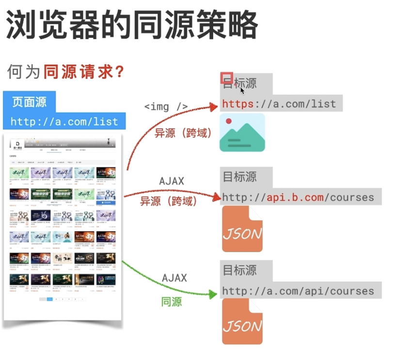
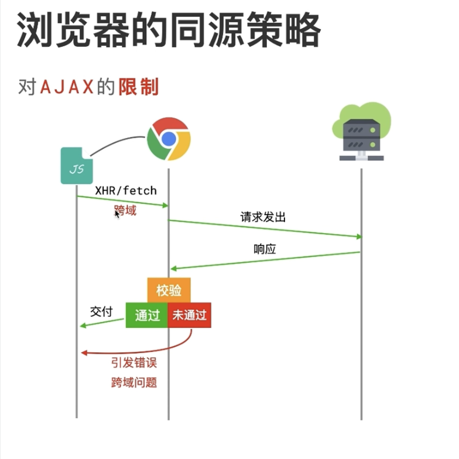
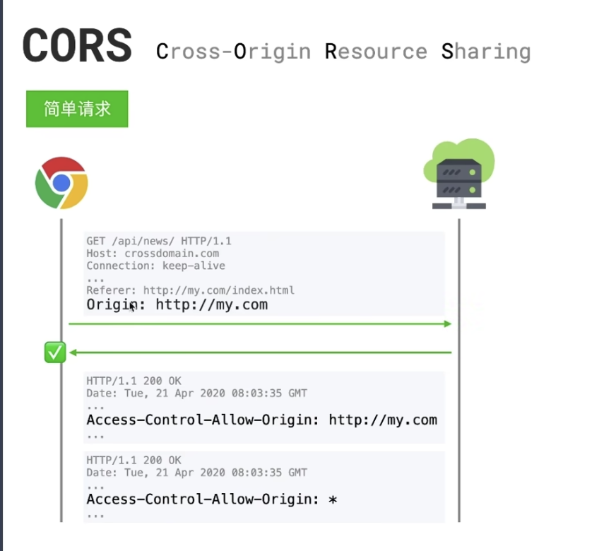
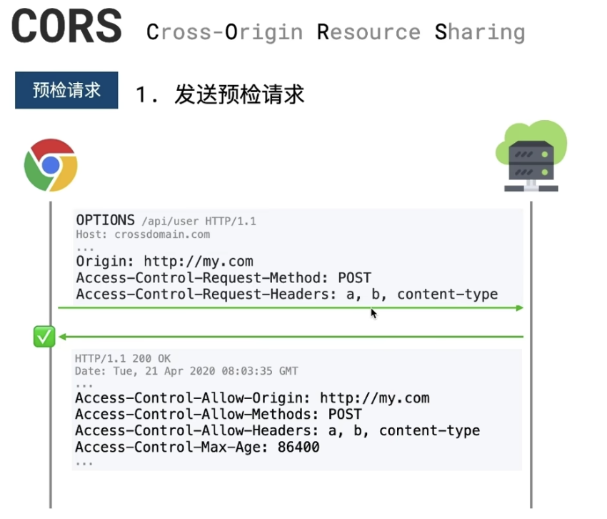
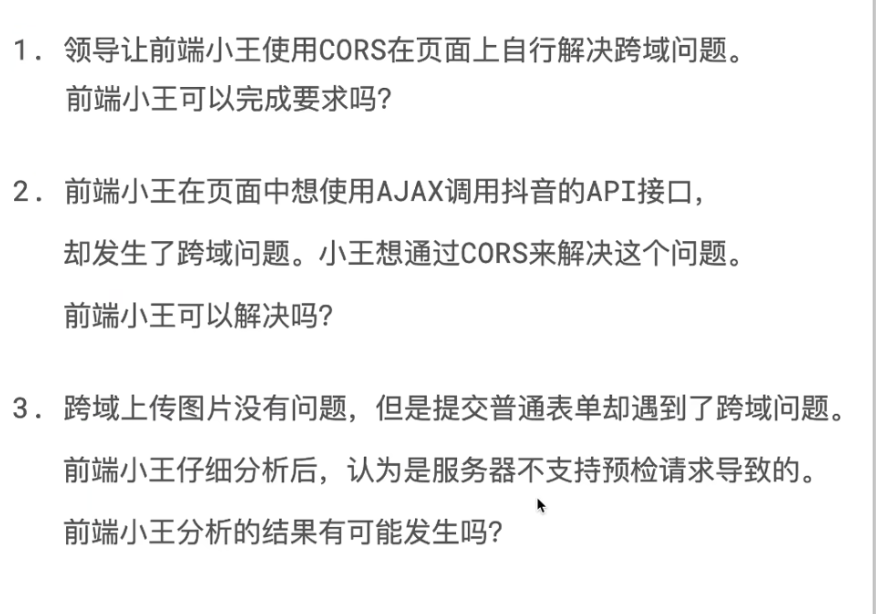
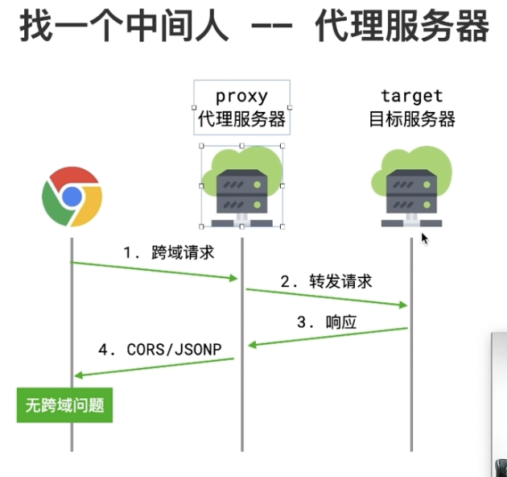
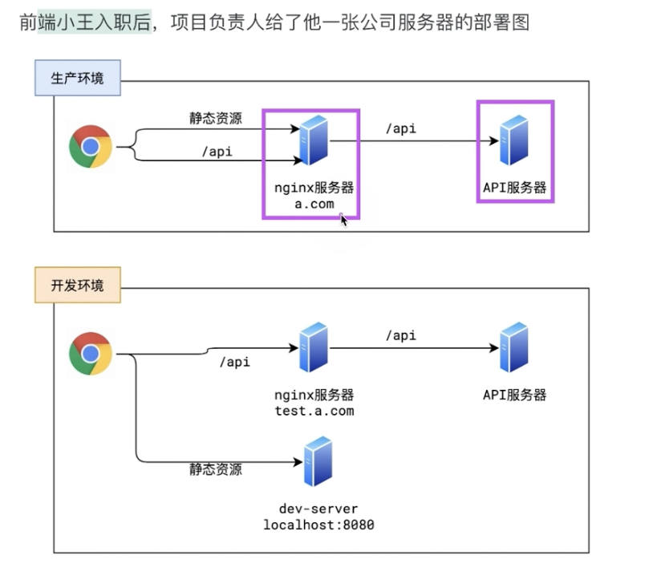

# 跨越的解决方案
1. jsonp
2. cors
3. http proxy
4. post message

5. iframe
  - window.name
  - document.domin
  - location.hash

6. nginx
7. webscoket

<br><br>


## 跨域: 

### 非同源策略请求例子
2013以前前端和后台是不分离的状态, 前端代码和服务器代码在一个服务器 这时候是不存在跨域的 因为是同源

<br>

一般我们在项目开发的时候 都会做性能优化和服务器拆分, 都会有如下的服务器

<br>

**1. web服务器**  
处理静态资源

<br>

**2. 数据服务器**  
业务逻辑 和 数据分析(数据库管理)

<br>

**3. 图片服务器**  
因为图片和音视频比较大, 一般会单独的拿出一个服务器来处理图片 音视频等资源

<br>

这样就会导致一个问题, 我们的web服务器是单独的一个域名, 数据服务器也会有一个域名, 这就出来的跨域问题

<br>

### 跨域出现的情况
1. 没有遵守同源策略
2. 项目调用第三方公共接口

<br>

### 浏览器的同源策略
浏览器出于安全考虑
1. **对 同源请求 放行** 请求的是自己人
**2. 对 异源请求 限制** 不是自己人的请求

对不是自己人的请求它会有一些限制规则, 这些限制规则统称为同源策略, 因此限制造成的开发问题 称之为 跨域(异源)问题

<br>

从上面也可以看出, 跨域是在浏览器环境下, **脱离了浏览器环境 不存在跨域问题**

<br>

### 什么叫做同源
在一个url地址中 源为如下的结构
```s
源 = 协议 + 域名 + 端口
```

<br>

而同源就是两个源进行比较 当3要素一致的时候 则为同源

|源1|源2|是否同源|
|:--|:--|:--|
|http://a.com:81/a|https://a.com:81/a|x|
|http://a.com:81/a|https://www.a.com:81/a|x|
|http://a.com:81/a|https://a.com:82/a|x|
|http://a.com:81/a|https://a.com:81/a/b|x|

1. 协议不同 (异源 / 跨域)
2. 域名不同 (异源 / 跨域)
3. 端口不同 (异源 / 跨域)
4. 路径不同 但3要素一致 为 同源

<br>

### 同源请求
我们访问页面是通过 url 地址访问的, 如 ``http://a.com/list``, 这个url叫做 **页面源**



在页面中会发出很多的请求 比如
1. 请求css js img
2. ajax请求别的资源

我们页面请求的这些资源叫做 **目标源**

<br>

当 **页面源** 和 **目标源** 不一样的时候, 就是跨域

跨域不是只有在ajax的情况下才会出现跨域 请求img css等 都会出现跨域 只不过这些跨域的现象不一定能带来问题

<br>

### 同源策略
浏览器如何限制 异源 请求的

1. 对标签发出的跨域请求 **轻微限制** (比如 link img video 的请求)
2. 对 ajax 发送的跨域请求 **严厉限制**

<br>



我们聊聊对ajax的严厉限制

当ajax发出请求的时候, 这个跨域请求会告诉浏览器请求服务器, 跨域的时候浏览器也会正常的把请求送达服务器

服务器那边也会正常的进行响应

问题出现在 **服务器响应的过后 浏览器会对响应进行校验**, 因为它知道这是跨域 如果不跨域的话 没有任何校验

由于是跨域它有一套安全的闸门, 校验会产生两种结果

1. 校验通过 -> 通过后 将服务器的响应结果 正常的交给js
2. 校验失败 -> 不通过 会抛出错误 就是跨域错误

跨域错误发生在 服务器的响应回来后, 浏览器对其进行校验 校验失败后的错误

<br>

### 浏览器的校验规则:
浏览器的校验规则就是cors规则, 而解决跨域问题就是让浏览器验证通过

cors规则很简单, 就是让服务器表个态, 服务器觉得都是自己人没有问题 服务器允许 浏览器就会放行, 而服务器没有表示或明确的拒绝 则浏览器校验失败

<br>

cors是一套机制, 用于浏览器校验跨域请求 基本理念

1. 只要服务器明确表示允许, 则 **校验通过**
2. 服务器明确拒绝或没有表示, 则 **校验不通过**

<br>

**总结:**  
使用 cors 解决跨域 主要靠服务器 它必须让服务器参与 而且主要靠服务器, 也就是我们自己的服务器

比如我们localhost页面请求www.taobao.com的资源肯定跨域, 要是使用cors处理的话, 需要让淘宝的服务器进行处理 可能么

所以使用cors处理跨域问题, 必须是我们自己的服务器

<br>

### cors具体做法
cors将请求分为两类
1. 简单请求
2. 预检请求 (复杂请求)

<br>

**简单请求:**  
1. 请求方法为: get head post
2. 头部字段满足cors安全规范 (只要我们不改请求头 就满足安全规范的)
3. 请求头的content-type为
  1. text/plain
  2. multipart/form-data
  3. application/x-www-form-urlencoded

<br>

**复杂请求:**  
不是简单请求的要求, 就是复杂请求

<br>

### 简单请求
简单请求 我们要让浏览器校验通过 我们需要怎么做



在发送请求的时候, 浏览器它发现跨域了 于是它会自动带上一个请求头 ``Origin: http://my.com``, 它的值是当前的页面源 表示从哪个源发送了这个跨域请求 让服务器去验证页面源

服务器看了页面源后, 如果发现是自己人就得告诉浏览器 让浏览器不要管了 都是自己人 请放行

<br>

**服务器怎么告诉浏览器是自己人:**  
一般有两种方案

1. 给浏览器一个响应头, 跟服务器允许的源, 只要响应头带的url和页面源保持一致 就说明服务器允许该源, 浏览器可以放行
```s
Access-Control-Allow-Origin: http://my.com
```

2. 给浏览器一个响应头, 跟服务器允许的源, 给个 *, 表示告诉浏览器我对所有源都通过
```s
Access-Control-Allow-Origin: *
```

<br>

### 复杂请求
浏览器对复杂请求是高度重视



浏览器在第一步不会真实的发送请求, 而是先来一个询问, 问下服务器, 说哥们我现在有一个页面源在跨域请求你 但是我怕这个动作有危险 所以我先问下行不行你告诉我行了后 我再真实的来请求你

所以浏览器会先发送一个 OPTIONS 的预检请求 并且携带上如下的3个请求头信息
```s
Origin: http://my.com
# 在使用什么方法 在请求
Access-Control-Request-Method: POST
# 这次请求改动了哪些请求头
Access-Control-Request-Headers: a, b, content-type
```

服务器会给出响应 或者叫给出回答
```s
# 允许的源
Origin: http://my.com
# 允许的请求方法
Access-Control-Allow-Method: POST
# 允许的请求头
Access-Control-Allow-Headers: a, b, content-type
# 只要是在 86400 以内 只要是该源的请求 你就不用重复问了, 我都是这样的回答 你可以将其缓存起来
Access-Control-Max-Age: 86400
```

<br>

当通过了预检请求后 再发送真实的请求, 这里和简单请求一样了

<br>

### 总结:
cors方案就是按照浏览器的验证规范**对相应的头部做出设置就可以了**

<br>

### 问题:


问题3是完全有可能的

上传图片没有问题 上传图片用的是post content-type为multipart/form-data 所以上传图片很有可能是一个简单请求 简单请求说明服务器是简单请求的

但是提交普通表单 这可能是一个ajax 通常我们提交表单的时候是使用json发送的 就有可能修改了content-type 就变成了一个预检请求

而预检请求遇到跨域问题 就有可能是服务器它支持简单请求不支持预检请求导致的

<br><br>

## Cors: 跨域资源共享
跨域的问题 cors是最正统的解决方案, 也是官方推荐使用的方案


当我们前台使用 axios 发送请求的时候, 会报如下的错误
```s
Access to XMLHttpRequest at 'http://localhost:3333/' from origin 'http://127.0.0.1:5500' has been blocked by CORS policy: 

No 'Access-Control-Allow-Origin' header is present on the requested resource.
```

大致意思是 我们从 5000 端口 向 3333 端口发送请求 的时候 因为没有 'Access-Control-Allow-Origin' 头部, 所以才不允许跨域的

那么 我们只需要在服务器设置 'Access-Control-Allow-Origin' 它 允许我们的 5000 端口 进行跨域 就行了

<br>

### 使用 cors 方式 处理跨域
**1. 客户端使用 axios 发送请求**
```js
axios
  .get("http://localhost:3333")
  .then(res => {
    console.log(res)
  })
```

<br>

**2. 服务器设置 cors 相关设定 来解决跨域**  

**跨域相关配置文件 config.js:**
```js
module.exports = {
  // web服务器端口号
  PORT: 3000,

  // cros跨域相关信息
  CROS: {
    ALLOW_ORIGIN: "http://127.0.0.1:3000",
    ALLOW_METHODS: "PUT, POST, GET, DELETE, OPTIONS, HEAD",
    HEADERS: "Content-Type, Content-Lenth, Authorization, Accept, X-Requested-With",
    CREDENTIALS: true
  },

  // session存储相关的信息
  SESSION: {
    secret: "ZFPX",
    saveUninitialized: false,
    resave: false,
    cookie: {
      maxAge: 1000 * 60 * 60 * 24 * 30
    }
  }
}
```

<br>

**ALLOW_ORIGIN:**   
可以指定允许源进行跨域, 也可以写*  
一旦我们配置了 * 就不允许客户端携带cookie了

<br>

**X-Requested-With:**   
它是请求头  

X-Requested-With头域就是用来判断一个请求是传统的HTTP请求, 还是Ajax请求。也就是说Ajax的请求一般都会带上X-Requested-With头域。

它通常用于AJAX请求中, 用来表明这个请求是由 JavaScript 发起的。**如果允许这个请求头, 则表示允许跨域AJAX请求**

在一些框架和库中, 比如 jQuery, 就会在发送 AJAX 请求时自动添加这个请求头。因此, 如果服务器端需要判断一个请求是否为 AJAX 请求, 就可以检查请求头中是否包含 X-Requested-With。如果包含, 就可以认为这是一个 AJAX 请求。

<br>

**NodeJs服务器程序中使用 ues中间件设置cors:**  
```js
app.use((req, res, next) => {

  // 从 config.js 配置文件中解构出 跨域相关信息
  const { ALLOW_ORIGIN, ALLOW_METHODS, HEADERS, CREDENTIALS } = config.CROS

  // 设置响应头
  
  // 设置允许哪一个源向我(服务器)发送请求 (我们允许前端5000端口访问服务器)
  res.header("Access-Control-Allow-Origin", ALLOW_ORIGIN)
  // 设置在跨域请求中是否携带 cookie
  res.header("Access-Control-Allow-Credentials", CREDENTIALS)
  // 设置允许客户端以什么方式发送请求
  res.header("Access-Control-Allow-Headers", HEADERS)
  // 设置客户端发送请求是允许的携带哪些请求头
  res.header("Access-Control-Allow-Methods", ALLOW_METHODS)

  // 处理 options请求 它需要服务器返回200
  if(req.method == "OPTIONS") {
    res.send("ok")
    return
  }

  // 别忘了 next() 放行
  next()
})
```

<br>

**OPTIONS请求:**  
所有的非常规请求 都会预先发送一个 OPTIONS预检请求, 在我们发送真正的请求之前 会默认发送该请求

服务器接收到OPTIONS请求后 可以直接返回一个成功回应 如 res.send(), 客户端这样就会知道可以跟服务器建立链接, 然后客户端会再次走真正的请求

<br><br>

## JSONP

### JSONP的实现原理:
1. script
2. img
3. link
4. iframe

如上的标签是自发请求 不存在跨域请求的问题

<br>

**script标签:**  
如下就是请求第三方网站的资源, 我们使用script的时候并没有出现跨域的现象
```js
<script src="https://cdn.bootcss.com/jquery/3.3/jquery.min.js"></script>
```

<br>

而JSONP就是利用script这样的特性 来实现的

<br>

### 实现部分:

**1. 前端利用 script 发起请求**   
因为script不存在域的限制 所以我们请求这个地址的时候 会可以将我们的请求带到该服务器
```html
<script src="http://服务器接口地址/list"></script>
```

<br>

**2. 前端定义函数用来处理服务端函数的数据**
```js
// 在前端定义
function dataHandler(data) {
  console.log(data)
}
```

<br>

**3. 前端在script标签的最后利用url参数 将函数名携带上**
```html
<script src="http://服务器接口地址/list?callback=dataHandler"></script>
```

<br>

**4. 服务器接收请求, 拿到callback指定的函数名, 组织数据, 传递给前端, 类似** 
```js
const data = { ... }

res.send(`dataHandler(${JSON.stringify(data)})`)
```  

<br>

**5. 前端会将服务器返回的字符串变成js表达式来执行**

<br>

### 要点:
1. 前端处理后台返回的数据 **这个函数必须是全局函数**
2. JSONP必须服务器来进行配合
3. vue中也支持jsonp
4. jsonp只能处理get请求
5. jsonp中我们会在url里面指定函数名, 可能会被url劫持 **不安全**

<br>

### 代码实现:
axios不支持jsonp的方法 如果有需求 我们可以研究下 (jq可以)

```js
npm i jsonp --save-dev

 jsonp(config.ajaxUrl + '路径', null, (err, data) => {
   if (err) {
     console.error(err.message);
   } else {
     if (data.list.length > 0) {
       data.list.map((item) => this.list.push(item))
       console.log(data);
     }
   }
 })
```

<br>

**前端:**  
```html
<script>
  function handler(data) {
    console.log(data)
  }
</script>
<script src="http://localhost:3333/list?callback=handler"></script>
```

<br>

**后台:**  
```js
router.get("/list", (req, res) => {
  const data = {
    msg: "ok"
  }

  res.jsonp(data)
})
```

<br><br>

## Http Proxy
一般都是在 webpack 里面进行配置



```s
https://www.bilibili.com/list/3494367331354766?sort_field=pubtime&spm_id_from=333.999.0.0&oid=828022046&bvid=BV1Ng4y1P7KH
```

### [重要]

```s
https://www.bilibili.com/list/3494367331354766?sort_field=pubtime&spm_id_from=333.999.0.0&oid=358010350&bvid=BV1ZX4y1v7mu
```

<br><br>

## Nginx 反向代理
不需要前端干啥 只需要在Nginx中配置即可

<br><br>

## PostMessage
我们利用 PostMessage 实现两个页面之间的通信
- a.html - server1
- b.html - server1 (比如b是服务端)

<br>

### server1:
访问 a.html 则为: localhost:1001/a.html
```js
const express = require("express")
const app = express()

// 以后请求都是从 当前的根目录开始进行请求
app.use(express.static("./"))

app.listen(1001, () => console.log("server1"))
```

<br>

### server2:
访问 b.html 则为: localhost:1002/b.html
```js
const express = require("express")
const app = express()

// 以后请求都是从 当前的根目录开始进行请求
app.use(express.static("./"))

app.listen(1002, () => console.log("server2"))
```

<br>

### a.html -> b.html 发送信息
**1. 我们在 a页面 使用 iframe标签 引入b页面, 并向b页面发送消息**  

**我们在使用 postMessage 发送消息的时候 都需要指明目的地的源**

```html
<!-- 
  要点:
    style="display: none;" 我们并不想在 a.html 页面 看到 b.html 所以我们给它隐藏
 -->
<iframe 
  id="iframe" 
  src="http://127.0.0.1:1002/b.html" 
  frameborder="0"
  style="display: none;"
></iframe>

<script>
  // 当 子页面 加载完成后 在执行内部的逻辑 重要
  iframe.onload = function() {
    /*
    iframe.contentWinodw:
    
      iframe
        为a页面中的 iframe标签
  
      iframe.contentWinodw 
        为iframe标签中引入的子页面 也就是 b.html
    */
    // 向 b.html 页面发送请求
    /*
      参数1: 数据
      参数2: 消息接收方的源, 向哪个源发送消息, 确保只向可信任的源发送消息
    */
    iframe.contentWinodw.postMessage("珠峰培训", "http://127.0.0.1:1002/")
  }
</script>
```

<br>

**2. b.html接收消息**
```html
<script>
  window.onmessage = function(e) {
    // 确认消息来源是 a.html（可选）
    if (e.origin !== 'http://localhost:1001') {
      return
    }

    // 在控制台中输出接收到的消息
    console.log('b.html 接收到消息：', e.data)

    // 通过 e.source 向发送方(a.html)回复消息
    // e.origin 为 a.html 的源
    e.source.postMessage("b页面的数据", e.origin)
  }
</script>
```

<br><br>

## scoket.io
客户端 和 服务器 实时通信的协议

<br><br>

## 基于 iframe + document.domain
只能实现 同一个主域, 不同子域之间的操作

比如 我们可以是 v.qq.com -> sports.qq.com 发送请求 是可以 也就是它们是 主域 和 子域 之间的关系

<br>

### 父页面: http://www.zhufengpeixun.com/a.html
```html 
<!-- 
  我们在父页面中引入的子页面 
  注意 a.html 和 b.html 的主域是一样的
-->
<iframe src="http://school.zhufengpeixun.com/b.html"></iframe>

<script>
  // 设置主域
  document.domain = "zhufengpeixun.com"
  // 设置数据
  let user = "admin"
</script> 
```

<br>

### 子页面: http://school.zhufengpeixun.com/b.html
```html
<script>
  // 设置主域: b页面也要设置主域 注意只有一个主域 所以ab设置的都是一样的
  document.domain = "zhufengpeixun.com"

  // 通过 winodw.parent 获取到挂载在它身上的信息, winodw.parent 就是 a.html 
  alert(winodw.parent.user)
</script>
```

<br><br>

## 基于 iframe + window.name
使用该方案的话 一共需要3个页面
1. a.html
2. b.html
3. proxy.html

<br>

- a 和 proxy 在一个域, 比如他们都在 localhost:1001
- b 自己在 localhost:1002

<br>

### A页面
```html
<iframe 
  id="iframe"
  src="http://127.0.0.1:1002/b.html"
/>
```
```js
// 这个函数 就是下面逻辑的总结
const proxy = function(url, callback) {
  let count = 0
  let iframe = document.createElement("iframe")
  iframe.src = url
  iframe.onload = function() {
    if(count == 0) {
      iframe.contentWindow.location = "http://www.zhufengpeixun.com/proxy.html"

      count++
      return
    }

    callback(iframe.contentWindow.name)
  }

  document.body.appendChild(iframe)
}


// 定义一个计数器
let count = 0

// 当a页面中成功加载b页面后
iframe.onload = function() {
  /*
    我们期望直接通过 iframe.contentWinodow.name 拿到b页面中的数据 
    console.log(iframe.contentWinodow.name)
     
    但是会报错:
      Uncaught DOMException: Blocked a frame with origin "http://127.0.0.1:1001" from accessing a cross-origin frame
  */

  // 我们进行如下的处理
  // 如果 count == 0 说明 onload 是第一次执行
  if(count == 0) {
    // 我们将 a页面中的iframe标签的src指向同源的proxy页面
    iframe.src = "http://127.0.0.1:1001/proxy.html"
    count++
    return
  }

  // 当第二次的时候 就可以从b.html页面中获取数据了
  console.log(iframe.contentWinodow.name)
  
}
``` 

<br>

### B页面 (充当服务器端)
b页面中将数据放在 window.name 的身上, 也就是说b页面中的数据 通过 window.name 来提供
```js
// 服务器端需要返回给A的信息都在 window.name 中存储
window.name = "珠峰培训"
``` 

<br>

### proxy页面
该页面中不写任何逻辑 就是一个空代理

<br><br>

## 基于 iframe + location.hash
该方案也需要3个页面
- a.html
- b.html
- c.html

a 和 c 是同源的, 和 b 是非同源的

a向b发送请求, b收到请求后通过hash的方式 将数据传递给c c拿到信息后调用a中的fn将获取到的数据再传递给a

<br>

**注意:**  
每个url都有最大长度的限制 所以hash传递不了太多的东西

<br>

### 页面A
a.html 中使用 iframe 嵌套 b.html
```html
<iframe
  id="iframe"
  src="http://localhost:1002/b.html"
>

<script>
  let iframe = document.getElementById("iframe")

  // 向 b.html 传 hash 值 onload方法要控制只执行一次 不然会是死循环 比如我们可以利用计数器
  iframe.onload = function() {
    // 当子页面加载成功后 再次向子页面发送请求 并携带了hash
    iframe.src = "http://localhost:1002/b.html#msg=我是数据"
  }


  // 开放给同域c.html的回调方法
  function fn(res) {
    alert(res)
  }
</script>
```

<br>

### 页面B
```html
<!-- 在b中默认访问c -->
<iframe
  id="iframe"
  src="http://localhost:1001/c.html"
>

<script>
  let iframe = document.getElementById("iframe")

  // 当b页面的hash值变化的时候 触发事件 监听a.html传来的hash值 再传给c.html
  window.onhashchange = function() {
    iframe.src = 'http://localhost:1001/c.html' + location.hash
  }


  // 开放给同域c.html的回调方法
  function fn(res) {
    alert(res)
  }
</script>
```

<br>

### 页面C
```html
<script>
  // 监听hash的变化 相当于监听b传来的hash值
  window.onhashchange = function() {
    // 在通过操作同域A的js回调 将结果传回, 将b传给c的信息 再传回给a
    window.parent.parent.fn(location.hash)
  }
</script>
```