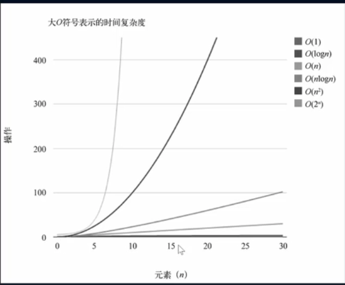

# 待总结:
各种数据结构 如何转成 扁平化成代码
比如 树结构 -> 扁平化 成数组

<br><br>

# 常见的数据结构
1. 数组
2. 栈
3. 链表
4. 图
5. 散列表
6. 队列
7. 堆
8. 树

<br><br>

# 算法


<br><br>

# 数组:
数组是一个 数据的集合, 也就是我们把一些数据放在一个盒子里面, 按照顺序排好

<br>

### 回顾操作数组的方法:
- push / pop: (插入 / 删除 - 操作数据末尾元素)
- unshift / shift: (插入 / 删除 - 操作数据前端元素)
- splice: (插入 / 删除 - 在任何的地方 )

- sort: a-b - 正序, b-a - 倒序
- concat: 数组的合并

- every: 数组中的每一项都符合条件的话 才返回true
- some: 数组中只要有一项符合条件的话 就返回true
- filter: 过滤出符合条件的项
- map: 加工
- reduce: 汇总

<br>

数组是一种线性结构 并且可以在数组的 **任意位置 插入 和 删除 数据** 但有时候 我们为了实现某些功能功能 必须**对这种任意性加以限制**  

而 栈 和 队列 就是比较常见的 受限的线性结构

<br><br>

# 栈结构 (栈顶: 数组末尾)
操作的是数组的一端

<br>

### **要点:**  
栈结构只能操作 **栈顶(数组末尾)** 的元素

```
|    Top    |   栈顶 (pop 和 push 操作栈顶元素)
|           |
|           |
|           |
|   Bottom  |
+-----------+   栈底
```

<br>

### **栈:**  
它是一种受限的线性表 其限制是仅允许在 表的一端 进行插入和删除运算 
这一端被称为栈顶(数组末端) 相对的 把另一端称为栈底(数组前端)

<br>

**进栈:**  
向一个栈插入新元素又称作进栈 入栈 压栈  
它是把新元素放到栈顶元素的上面 使之成为新的栈顶元素

<br>

**出栈:**  
从一个栈删除元素又称作出栈或退栈 它是把栈顶元素删除掉 使其相邻的元素成为新的栈顶元素

<br>

### **特点:**  
后进先出(LIFO)

LIFO(last in first out)表示就是后进入的元素 第一个弹出栈空间 类似自助餐准备的托盘架 **最后放上的托盘 往往先被拿出去使用**

<br>

### **栈结构在程序中的应用**  
1. 浏览器的历史记录
2. 函数调用栈  

<br>

### 函数调用栈

我们知道函数之间 互相调用: 
```s
a 调用 b
b 调用 c
c 调用 d 
```
    
那么在执行的过程中 会将 a 压入栈 a 没有执行完 所以不会弹出栈  
在 a 执行的过程中 调用了 b 那么会将 b 压入栈 这时候 b 在栈顶 a 在栈底

如果这个时候 b 可以执行完 那么 b 会弹出栈 但是 b 有执行完么? 没有 它调用了 c

所以 c 会压栈 并且在栈顶 而 c 调用了 d, d 会压入到栈顶 所以当前的栈顺序是

```
|   D   |
|   C   |
|   B   |
|   A   |
---------
```

d 执行完会弹出栈 c b a 依次弹出栈 所有我们有函数调用栈的称呼 就来自于他们内部的实现机制

<br>

**注意:**  
递归就是不断的在压栈 没有出口的话 会抛出栈溢出的错误

<br><br>

## 栈结构的实现:
实现栈结构有两种比较常见的方式:
1. 基于数组的实现
2. 基于链表的实现

<br>

我们下面利用数组来封装一个栈结构, **其实就是对数组的一层封装 让它有栈的特性** 其实本质来说就是一个数组

<br>

### **栈常见的操作:**  
1. push(el)  
添加一个新元素到栈顶的位置

2. pop()  
移除栈顶的元素(出栈) 同时返回被移除的元素

3. peek()  
返回栈顶的元素(查看栈顶元素) 不对栈做任何修改(这个方法不会移除栈顶元素 仅仅是返回它)

4. isEmpty()  
如果栈里没有任何元素返回 true 否则返回false

5. size()  
返回栈里的元素个数  
这个方法和数组的length属性很类似

6. toString()  
将栈结构的内容以字符串的形式返回

<br>

### **代码实现 & 要点:**  

**1. 实现栈的方法:**  
下面是采用 class 类的方式 定义的方法 在class中定义的方法会在其 原型对象 上

当我们没有使用 class(使用的function) 创建类的时候 我们在定义方法的时候 要采用下面的方式

```js
Stack.prototype.push = function(el) { ... }
```

<br>

**2. 当我们想通过pop() 循环取出栈顶的元素时, 要注意循环时 i < ? 的条件部分**  
比如 我们要循环取出栈顶元素
```js
const arr = [1,2,3,4,5]
const stack = new Stack(arr)

for(let i = 0; i < stack.size(); i++) {
  console.log(stack.pop())
}

// 5
// 4
// 3
```

为什么? 为什么我们没有拿到数组中所有的值?  

因为 length 和 size(), 栈在循环过程中可能会**动态地变化**。如果在循环中直接使用栈的长度作为循环条件，可能会导致意外的结果。

当你使用stack.pop()来移除栈顶元素时，栈的长度会随之减少，导致循环次数也减少，进而可能无法正确遍历整个栈。

为了避免循环中栈长度的动态变化影响循环次数，你可以在进入循环之前，记录下栈的初始长度（元素个数），然后在循环中使用这个固定的长度作为循环条件。这样即使栈在循环过程中变化，循环次数也会保持不变。

```js
const arr = [1,2,3,4,5]
const stack = new Stack(arr)

// 将length保存起来
let len = stack.size();
for(let i = 0; i < len; i++) {
  console.log(stack.pop())
}
```

<br>

**封装部分:**  
```js
class Stack {

  // 私有属性
  #items = []

  // 入栈
  push(el) {
    this.#items.push(el)
  }

  // 出栈
  pop() {
    return this.#items.pop()
  }

  // 查看栈顶元素
  peek() {
    return this.#items[this.#items.length - 1]
  }

  // 判断是否为空
  isEmpty() {
    return this.#items.length == 0
  }

  // 栈中元素个数
  size() {
    return this.#items.length
  }

  // toString
  toString() {
    console.log(JSON.stringify(this.#items, null, 2))
  }

  // 遍历: 我们传递回调处理数据
  forward(cb) {
    for(let i = 0; i < this.#items.length; i++) {
      let item = this.#items[i]
      cb && typeof cb == "function" && cb(item)
    }
  }

}

```

<br><br>

## 栈的应用:
- 循环pop就相当于 逆序for循环

<br>

### 从数组的末尾依次取出元素
正常我们要是取出数组中的元素都是从 0 的位置开始依次取出
利用栈结构我们可以从数组的末尾 依次取出元素
```js
let str = ""
while(!stack.isEmpty()) {
  str += stack.pop()
}

console.log(str)
```

<br>

### 10进制转为2进制
除以2取余的逆

```
20 / 2  = 商 10  余数 0
10 / 2  = 商 5   余数 0
5 / 2   = 商 2   余数 1
2 / 2   = 商 1   余数 0
1 / 2   = 商 0   余数 1
```

取余数的逆: 10100

当我们做从后往前依次取结果的时候 就跟栈的特性一致了

<br>

### **思路:**  
我们可以把每一步的余数压入栈 然后出栈 是不是就是取逆
我们要在每次循环中得到 **商 和 余数**

<br>

### **循环退出的条件:**  
商 <= 0 的时候退出循环 那么同理 一直循环的条件就是 商 > 0

```js
function dec2bin(decNum) {

  let stack = new Stack()

  // 循环停止条件 我们会在循环内部更新 decNum 的值, decNum每次都会成倍减少 所以停止循环的条件是 <= 0
  while(decNum > 0) {
    // 1. 我们将 decNum % 2 的结果 推入栈中
    stack.push(decNum % 2)

    // 2. 更新decNum的值
    decNum = Math.floor(decNum / 2)
  }

  // 出栈
  let binString = ""

  // 当栈中为空的时候 停止循环, pop相当于倒序取出数据
  while(!stack.isEmpty()) {
    binString += stack.pop()
  }

  return Number(binString)  
}

let res = dec2bin(20)
console.log(res)    // 10100
```

<br>

### 8进制:
将 / 2 修改为 / scale
```js
function dec2bin(decNum, scale) {

  let stack = new Stack()

  while(decNum > 0) {
    stack.push(decNum % scale)

    decNum = Math.floor(decNum / scale)
  }

  let binString = ""

  while(!stack.isEmpty()) {
    binString += stack.pop()
  }

  return Number(binString)  
}
```

<br>

### 16进制:
```js
function dec2bin(decNum, scale) {

  let stack = new Stack()
  let baseString = [1,2,3,4,5,6,7,8,9,A,B,C,D,E,F]

  while(decNum > 0) {
    stack.push(decNum % scale)

    decNum = Math.floor(decNum / scale)
  }

  let binString = ""

  while(!stack.isEmpty()) {
    // 我们根据存放在stack中的数据 去baseString数组中取对应的, 比如 15 就能获取到 F
    binString += baseString[stack.pop()]
  }

  return Number(binString)  
}
```

<br>

### **栈的应用: 前中后缀表达式**  
```s
https://zhuanlan.zhihu.com/p/102592396
```

<br><br>

# 队列结构 (先进先出 核酸排队) FIFO
操作的是 数组的两端

### 队列的特点:
队列只允许在
- 表的前端进行删除(元素)操作(出队列) **shift()**
- 表的后端进行插入(元素)操作(入队列) **push()**

``` 
队头                           队尾
---------------------------------

← 出队列                   ← 入队列

---------------------------------
```

<br>

### **队列的应用:**  
**1. 打印队列:**  
有5份文档需要打印 这些文档会按照次序放入到 打印队列里面 打印机会依次从队列中取出文档 优先放入的文档 优先被取出 并且对该文档进行打印 直到队列中不再有新的文档

<br>

**2. 线程队列:**  
在开发中为了让任务可以并行处理 通常会开启多个线程 但是我们不能让大量的线程同时运行处理任务(占用过多的资源) 这个时候 如果有需要开启线程处理任务的情况 我们就会使用线程队列 线程队列会依照次序来启动线程 并且处理对应的任务

<br>

### **队列的实现:**  
1. 基于数组
2. 基于链表

队列基于链表的话 性能会更高, 因为用数组实现的队列 在元素出队列也就是shift()的时候 第一个元素删除了 后面的元素都会依次的前移 那假如有几万个元素呢? 

<br>

那如果是基于链表 也就是说 我们要对链表进行限制
1. 链表前端 出队列
2. 链表后端 入队列

<br>

### **队列的常见的操作:**  
1. enqueue(el)  
向队列尾部添加一个或多个新的项

2. dequeue()  
移除队列的第一(最前面)的项 并返回被移除的元素

3. front()  
返回队列中的第一个元素(最先被添加的) 队列不做任何变动(只返回第一个元素)
也就是索引为0的元素

4. isEmpty()  
如果队列里没有任何元素返回 true 否则返回false

5. size()  
返回队列里的元素个数 这个方法和数组的length属性很类似

6. toString()  
将栈结构的内容以字符串的形式返回

<br>

### **代码实现:**  
```js
class Queue {

  #items = []

  // 入队列
  enqueue(el) {
    this.#items.push(el)
  }

  // 出队列
  dequeue() {
    return this.#items.shift()
  }

  // 队列中元素的个数
  size() {
    return this.#items.length
  }

  // 查看队列前端元素
  front() {
    return this.#items[0]
  }

  // 检查队列是否为空
  isEmpty() {
    return this.#items.length == 0
  }

  // 打印队列
  toString() {
    console.log(JSON.stringify(this.#items, null, 2))
  }
}


// 演示:
let queue = new Queue()

queue.enqueue("a")
queue.enqueue("b")
queue.enqueue("c")

let str = ""

// 使用 while 循环
while(!queue.isEmpty()) {
  str += queue.dequeue()
}

console.log(str)
```

<br>

### 基于对象模拟数组 配合 delete 来完成出队列的操作
上面我们实现了出队列的方式, 但是下面方式的效率并不高, 我们如果删除队首的元素, 则后续的元素都会往前移动

基于这点我们打算使用对象 来完成队列
```js
dequeue() {
  return this.#items.shift()
}
```

<br>

**实现:**  
```js
class Queue {
  // key: 索引, value: 数据
  #items = {}

  // 队首的下标
  #lowCount = 0

  // 不是队列的长度, 该值用于在每次往队列中加入元素的时候 count的值需要++
  #count = 0

  // 添加元素
  enqueue(data) {
    this.#items[this.#count] = data
    this.#count++
  }

  // 出队列
  dequeue() {
    if (this.isEmpty()) return

    const frontEl = this.#items[this.#lowCount]
    delete this.#items[this.#lowCount]
    // 删除后 我们需要让队首对应的索引++
    this.#lowCount++
    return frontEl
  }

  front() {
    return this.#items[this.#lowCount]
  }

  clear() {
    this.#items = {}
    this.#count = 0
    this.#lowCount = 0
  }


  // 队列的长度为, count - lowCount, 因为当我们删除队首的元素的时候 lowCount的值会++, 加入元素的时候count会++, 所以我们队列的长度就是它们的差
  size() {
    return this.#count - this.#lowCount
  }

  isEmpty() {
    return this.size() == 0
  }

  toString() {
    let str = ""

    // 队列中的有效范围是 lowCount ~ count 之间的数据
    for (let i = this.#lowCount; i < this.#count; i++) {
      ...
    }

    return str
  }
}
```

<br>

### **基于链表的队列**  
```js
// 先创建链表
class Node {
  constructor(data) {
    this.data = data
    this.next = null
  }
}

class LinkList {
  head = null
  length = 0

  append(data) {
    let node = new Node(data)
    if(this.length == 0) {
      this.head = node
    } else {
      let current = this.head
      while(current.next) {
        current = current.next
      }

      current.next = node
    }

    this.length++
  }

  // 自定义返回最前面的数据
  remove() {
    if(this.length == 0) {
      console.log("链表已为空")
      return null
    }

    let data = this.head.data
    this.head = this.head.next
    this.length--

    return data
  }

  info() {
    let str = ""
    let current = this.head
    while(current) {
      str += current.data + " -- "
      current = current.next
    }

    console.log(str)
  }
}


// 然后创建队列 以下都是基于链表的封装
class Queue {
  items = new LinkedList()

  enqueue(data) {
    this.items.append(data)
  }

  dequeue() {
    return this.items.remove()
  }
  
}
```

<br>

### **队列的应用: 击鼓传花**  
原游戏规则:
班级中玩一个游戏 所有学生围成一圈 从某位同学手里开始向旁边的同学传一束花 这个时候某个人(比如班长)在击鼓 鼓声停下的一刻 花落在谁手里 谁就出来表演节目

修改游戏规则:
几个朋友一起玩一个游戏 围成一圈 开始数数 数到某个数字(5的人自动淘汰 最后剩下的这个人会获得胜利 请问最后剩下的*是原来在哪一个位置上的人(或者是谁 name 或者剩下最后那个人所在的下标)*


### **思路: 利用队列**  
1. 从第一个人开始 让人依次加入队列里面
2. 从1开始数 数1的人去队列的尾部 依次类推 当到目标值的时候(5) 的时候 删除这个人

3. 然后再继续 数1的人去队列的尾部 以此类推
4. 当 size == 1 的时候 停掉 我们拿着这个人去原数组取它的下标值
```js

function passGame(nameList, num) {

  // 创建队列
  let queue = new Queue()

  // 将人加到队列中
  nameList.forEach(item => {
    queue.enqueue(item)
  })

  // 开始数数 不是num的时候重新加入到队列的尾部 是num的元素删掉
  /*
    i < num - 1: 
      比如 num 为 3

      ["sam", "erin", "nn", "laoye", "bobo"]

      sam erin 会移动队列的末尾 nn会被淘汰 应为从0开始所以是 num - 1
        1       2      3
      "sam", "erin", "nn"
  */

  // 条件剩最后一个人 这里不能是 == 1 因为==1的条件根本进不去while
  while(queue.size() > 1) {
    // 这个部分的逻辑要重复执行所以外层套一个while
    for(let i = 0; i < num - 1; i++) {
      // 先把这些人从前端删掉 再加到队列的尾部 把删除的元素加到队列的尾部
      queue.enqueue(queue.dequeue())
    }
    // num数字之前的人重新放到队列的末尾 然后删掉 前端的人(num对应的人)
    queue.dequeue()
  }

  // 获取剩下的那个人
  console.log(queue.front())

  let target = queue.dequeue()
  // 返回那个人的下标(位置)
  console.log(nameList.indexOf(target))
  
}

passGame(["sam", "erin", "nn", "laoye", "bobo"], 3)
```

<br><br>

# 优先级队列结构
普通的队列插入一个元素 数据会被放在*后端* 并且需要前面所有的元素都处理完成后才会处理该元素

但是优先级队列 在插入一个元素的时候会考虑*该数据的优先级 和 其它数据优先级进行比较*

比较完成后 可以*得到这个元素在队列中正确的位置* 其它的处理方式和基本队列的处理方式一样

也就是说在每个元素不再只是一个数据 而是包含数据的优先级 *在插入的时候根据优先级放入正确的位置*


### **优先级队列的应用**  
现实的例子: 机场登机的顺序
头等舱的商务舱的优先级要高于经济舱 在有些国家老年人和孕妇登机时也享有高于其他乘客的优先级

计算机中
我们可以通过优先级队列来重新排序队列中的任务的顺序
比如每个线程处理的任务重要性不同 我们可以通过优先级的大小 来决定该线程在队列中被处理的次序


**当需要考虑优先级 按照优先级的顺序依次取出执行的话 我们就要考虑优先级队列**  


### **要点:**  
当我们要往队列中插入数据的时候 需要提供两个数据
1. 准备插入的元素
2. 当前这个元素的优先级

比如, 我们以数字做为它的优先级 *数字越小, 优先级越高*
每一个数据项不仅仅要包含数据还要包含该数据的优先级

```js
// 数据项
class QueueItem {
  constructor(el, priority) {
    this.el = el
    this.priority = priority
  }
}


// 优先级队列
class priorityQueue {

  // 保存数据用的数组 数组的类型应该是 {数据项}[] 每一个数据项里面应该既包含数据也包含该数据的优先级
  items = []

  // 将元素插入队列的时候 要传入数据和该数据的优先级
  enqueue(el, priority) {
    let queueEl = new QueueItem(el, priority)
    
  }
}
```

上面的要点:
我们创建了一个类 专门用于表示 数据项
其中有 数据 和 优先级


### **接下来的部分就是 按照优先级 将数据插入队列**  
我们分为两种情况考虑
1. 原来的队列中没有任何的数据 这时候我们可以直接插入
2. 原来的队列中有数据 我们需要拿出队列中数据的优先级 和 要插入的数据的优先级 进行比较

如果发现 优先级比队列中的数据的优先级小 则放在队列中已有数据的前面(我们要将要插入的数据和队列中已有数据依次比较找到位置)

我们要将队列中的数据使用for循环一个个取出来 和 我们要插入的数据 进行比较


### **代码实现:**  
```js
// 数据项
class QueueItem {
  constructor(el, priority) {
    this.el = el
    this.priority = priority
  }
}


// 优先级队列
class priorityQueue {

  items = []

  enqueue(el, priority) {
    let queueEl = new QueueItem(el, priority)
    
    // 判断队列是否为空
    if(this.isEmpty()) {
      // 直接插入数据
      this.items.push(queueEl)
    } else {
      // 队列中有数据的情况 我们要进行比较

      let flag = false

      for(let i=0; i < this.items.length; i++) {

        if(queueEl.priority < this.items[i].priority) {
          // 使用splice()在指定元素 指定位置前面 插入元素
          this.items.splice(i, 0, queueEl)

          // 当插入后 我们将 flag 修改为true 表示已经插入了
          flag = true

          // 后面就不用继续比较了
          break

        }
      }

      // 判断 如果上面没有添加的话 说明依次比较后 要插入的数据的优先级数字最大 那就要放在队列的最后
      if(!flag) {
        this.items.push(queueEl)
      }
    }
  }

  isEmpty() {
    return this.items.length == 0
  }

  toString() {
    console.log(JSON.stringify(this.items, null, 2))
  }

  // ... 其它方法和普通队列的方法一样
}


// 验证
let pq = new PriorityQueue()
pq.enqueue("sam", 100)
pq.enqueue("erin", 2)
pq.enqueue("nn", 3)

pq.toString()
```


### **优先级队列的应用**  
场景：
比如我们有一堆的操作 都是异步的 而且每个操作都需要花费不等的时间后才能拿到结果

这时我们可以把这个操作 按照指定的执行顺序推到优先级队列中去 这样可以先推进去的会先执行 然后统一处理

```js
// 准备 异步函数
let handlerA = () => {
  return new Promise(resolve => {
    setTimeout(() => {
      resolve("初始化操作")
    }, 1000)
  })
}

let handlerB = () => {
  return new Promise(resolve => {
    setTimeout(() => {
      resolve("晋级操作")
    }, 3000)
  })
}

let handlerC = () => {
  return new Promise(resolve => {
    setTimeout(() => {
      resolve("完了操作")
    }, 1000)
  })
}


// 创建优先级队列
class Item {
  constructor(data, priority) {
    this.data = data
    this.priority = priority
  }
}

class Queue {
  // 保存数据
  items = []

  // 异步函数的结果
  res = []

  // 进队列
  enqueue(data, priority) {
    if(priority < 0 || priority > this.items.length) return false
    let item = new Item(data, priority)

    if(this.length == 0) {
      this.items.push(item)
    } else {
      let flag = false
      for(let i=0; i<this.items.length; i++) {
        if(item.priority < this.items[i].priority) {
          this.items.splice(i, 0, item)
          flag = true
          break
        }
      }

      if(!flag) this.items.push(item)
    }
  }


  // 出队列
  dequeue() {
    return this.items.shift()
  }

  // 打印队列
  info() {
    this.items.forEach(item => {
      console.log(item)
    })
  }

  // 判断队列是否为空
  isEmpty() {
    return this.items.length == 0
  }

  // sleep
  sleep(ms) {
    return new Promise(resolve => {
      setTimeout(resolve, ms)
    })
  }

  // 按照顺序 依次 执行队列 并拿到结果
  async execute() {
    while(!this.isEmpty()) {
      let {data: fn} = this.dequeue()
      let ret = await fn()
      this.res.push(ret)

      console.log(this.res)
    }
  }
}
```

<br><br>

# 链表结构
链表和数组一样 可以用于存储一系列的元素 但是链表和数组的实现机制是完全不同

链表类似对象 对象在内存中 指针负责找到内存中对象的引用
通过指针的互相指向 形成一条链

### **数组的缺陷:**  
要存储多个元素 数组(或成为列表) 可能是最常用的数据结构 但是数组也有很多的缺点

1. 数组的创建通常需要申请一段连续的内存空间(一整块的内存) 并且大小是固定的 所以当当前数组不能满足容量需求时 需要扩容(一般情况下是申请一个更大的数组 比如2倍 然后将原数组的元素复制过去)

2. 在数组开头或中间位置插入数据的成本很高 需要进行大量元素的位移 尽管我们学的js的Array封装的十分便利 但背后的原理仍然是这样


### **链表的优势**  
我们在存储多个元素的时候 还可以考虑使用链表的结构 它与数组不同 链表中的元素在内存中不必是连续的空间 

链表的每个元素由一个存储*元素本身的节点* 和一个 *指向下一个元素的引用*(有些语言成为指针或者连接)组成


### **优势:**  
1. 内存空间不是必须连续的 可以充分利用计算机的内存 实现灵活的内存动态管理
2. 链表不必在创建时就确定大小 并且大小可以无限的延伸下去
3. 链表在 *插入* 和 *删除* 数据时 *时间复杂度*可以达到O(1) 相对数组的效率高很多


### **链表的缺点 (访问元素的时候需要线性查找)**  
数组的话 在访问元素这点 十分效率 可以通过下标直接访问到 但是链表...
链表访问任何一个位置的元素的时候 都需要从头开始访问(无法跳过第一个元素访问任何一个元素)

无法通过下标直接访问元素 需要从头一个个访问 直到找到对应的元素


### **链表到底是什么?**  
链表的一个项中有两个元素 *数据 + 指针*

链表类似于火车 有一个火车头 火车头会连接一个节点(车厢) 节点上有乘客(数据) 并且这个几点会连接下一个节点 以此类推

``` 
            node              node
         ------------     ------------
head  →  item | next   →   item | next  →  null
         ------------     ------------


或者这样的图: ↓

        ------    ------
         data      data
        ------    ------
head →   next      next   →  null
        ------    ------
 ```


head 指向 第一个节点 相当于 火车头
当没有下一个节点的时候 next 指向 null

默认情况下 链表中是一个节点都没有的 那就是
head -> null


### **链表的封装**  
封装 LinkedList 的类 用于表示我们的链表结构
在 LinkedList 类中有一个Node类 用于封装每一个节点上的信息(和优先级队列的封装一样)

链表中我们保存两个属性 
    一个是链表的长度 
    一个是链表中的第一个节点

### **链表中的属性: head**  
链表类中一定会有一个属性 *head* 因为它会指向第一个节点 因为只有找到第一个节点才能依次往后找到其它的节点

### **链表中的属性: node**  
data
next (下一个节点的引用)

### **链表中的属性: length**  
用于记录链表的长度 (数组的话自带 链表我们自定义)


### **链表的基本结构**  
```js
class Node {
  constructor(data, next) {
    this.data = data
    this.next = next
  }

  /*
    还可以后期往对象中添加next 
    constructor(data) {
      this.data = data
      this.next = null
    }
  */
}

class LinkedList {

  // 属性 (指向第一个节点的指针 默认指向null)
  head = null

  // 用于记录链表的长度
  length = 0
}
```


### **链表中的常见操作**  
append(el)
向列表*尾部*添加一个新的node

insert(position, el)
向列表的*特定位置*插入一个新的node

get(position)
获取对应位置的元素

indexOf(el)
根据给定元素返回元素在列表中的索引 如果列表中没有该元素返回-1

update(position)
修改某个位置的元素

removeAt(position)
从列表的*特定位置*移除一项

remove(el)
从列表中移除一项(移除指定的数据)

isEmpty()
如果链表中不包含任何元素返回true 否则返回false(length>0)

size()
返回链表包含的元素个数 

toString()
由于列表项使用了Node 就需要重写继承自js默认的toString方法 让其只输出元素的值


### **append(data) 实现**  
向链表尾部追加数据可能有两种情况
1. 链表本身为空 新添加的数据是唯一的节点
2. 链表本身非空 需要向其它节点后面追加节点

刚开始的时候 head = null

如果我们添加第一个节点 我们需要将 head 指向 第一个节点
同时需要将新添加的节点的next指向null (next = null) 因为 append() 是在尾部添加

如果我们添加第二个节点 然后我们需要将前一个节点的next指向刚添加的节点 同时将刚添加的节点的next指向null

要点:
我们要从 head 出发一个个节点去找 找到最后一个节点 用于追加新的节点
(通过head找到第一个节点 判断该节点的next有没有下一个节点 有的话就说明该节点不是最后一个节点 继续判断知道 next == null 说明它是最后一个节点)

然后把我们的新节点加进来 并调整上面我们找到最后一个节点的next指向新的节点


### **代码部分**  
```js
append(data) {

  // 先创建一个新节点
  let node = new Node(data)

  // 判断是否添加的是第一个节点
  if(this.length == 0) {
    // 如果是第一个节点 将head指向第一个节点
    this.head = node

  } else {
    // 不是第一个节点 找到最后一个节点 从head开始找到最后一个节点 让最后一个节点的next指向新的节点
    // 因为head就是指向第一个节点 现在这个current就也指向第一个节点
    let current = this.head

    // 判断 current.next 是否为空 为空表示为最后一个
    // current.next表示下一个节点  -- 节点 节点 null
    while(current.next) {
      // 如果 current.next 不为空 那么我就让 current(第一个节点) = 下一个节点

      // 让 current 指针不断的移动 直到最后一个
      current = current.next
    }

    // while循环结束后 current 就是最后一个节点 那么我们就让最后一个节点的next指向新追加的元素
    current.next = node
  }

  // 添加新节点后 修改 length  ++ 也可以但是python就不支持++
  // 注意 因为最开始我们是根据length来判断是否往第一个节点位置添加节点的 所以这里要+1 不然只会在第一个节点的位置添加节点
  this.length += 1
}
```

**所谓的添加就是指针的引用 引用了一个对象 通过该引用就能找到内存中的对象 this.head = node 就这样**  


### **toString()**  
该方法主要是获取每一个元素 从head开头 因为获取链表的任何元素必须从第一个节点开头

循环遍历每一个节点 并且取出其中的data 拼接成字符串 将最终的字符串返回

```js
toString() {
  // 拿到第一个节点
  let current = this.head

  let str = ""
  
  // 如果有东西就一直循环 这里while 不能是current.next 不然获取不到最后一个node
  while(current) {
    str += current.data + " -- "    // 这个必须要放在上面

    // 如果有值的话 就让当前节点指向下一个节点
    current = current.next
  }

  console.log(str)
  // return str
}


// 测试代码
let ll = new LinkedList()
ll.append("sam")
ll.append("erin")

ll.toString()
console.log(ll)
```

<br>

### **insert(position, data) 实现**  
在任意位置插入数据

### **思路:**  
1. 添加到第一个位置(position = 0)
  - 添加到第一个位置 表示新添加的节点是头 就需要将原来的头节点做为新的节点的next 另外这个时候的head应该指向新节点

2. 添加到其它位置
  - 如果是添加到其它位置 就需要先找到这个节点的位置
  - 我们通过while循环 一点点向下找 并且在这个过程中 保存上一个节点 和 下一个节点
  - 找到正确的位置后 将新节点的next指向下一个节点 将上一个节点的next指向新的节点


### **分析:**  
``` 
           new node
         ------------
          item | next
         ------------

      ↗               ↘     node1
                        ------------
head                     item | next 
                        ------------
 ```


### **参数:**  
1. position (0为第一个元素)
2. data

### **实现:**  
1. 首先我们要对 position 进行越界判断(如我们传递-100可以么?)
  - position不能为负数
  - position不能大于length(链表有4个元素 我们可以往4的后面插入5)

2. 然后我们开始插入新的节点 分为两种情况
 - 1. 新节点在 position: 0 的时候
 - 2. 新节点在 position: 任意 的时候
  - 这时候我们要找到指定位置的节点 while
  - 同时我们在while中要存 当前节点和前一个节点

```js
insert(position, data) {
  // 对 position 进行越界判断
  if(position < 0 || position > this.length) return false

  // 根据 data 创建 node
  let node = new Node(data)

  // 情况1: position=0 插入第一个节点的位置 我们需要让head指向新节点 新节点的next指向原来的第一个节点
  if(position == 0) {
    /*
      伪代码: 
      this.head = node
      node.next = 原来的第一个

      原来的第一个怎么获取? 我们把上面的代码上下换下位置 原来第一个就好获取了
      node.next = 原来的第一个 原来的第一个就是head
      this.head = node

              node
            ↗     ↘
      head          原来的第一个节点
    */
    
    // 让新节点的 next 指向原来的第一个元素
    node.next = this.head

    // 让head指向新节点 这样就完成了添加操作
    this.head = node

    /*
      这样行么? 保存原来的第一个
      current = this.head
      node.next = current
      this.head = node
    */

  // 情况2: postion为任意位置 比如 positon: 2
  // 0 1 2 如果position:2 那么就应该是 0 1 new 2 原来位置2上的元素后移动 新节点添加到位置2上
  } else {

    let index = 0

    // current就是第一个节点
    let current = this.head
    
    // current的前一个节点
    let previous = null

    // 只要index<position就一直往后找 一旦 index == position while就停了 就意味着找到了
    while(index++ < position) {
      // current会移动到指定的位置 在current被赋值之前 我们将current的值保存起来
      previous = current

      // 让 current 开始移动 到指定的位置 这是current就是指定位置的节点 而previous就是它前面的节点
      current = current.next
    }

    // 到这里就说明 current 到了指定位置 将 current 移动到 新节点的后面
    node.next = current
    previous.next = node

  }

  // length + 1
  this.length += 1
  
  // 因为下标越界的时候 return的false 插入成功的时候我们return true
  return true
}


// 多考虑了一种情况
insert(position, data) {
  if(position < 0 || position > this.length) return false
  let node = new Node(data)
  if(this.length == 0) {
    this.head = node
  } else {
    if(position == 0) {
      node.next = this.head
      this.head = node

    // 这段经过测试是没有必要的
    } else if(position == this.length - 1) {
      let current = this.head
      while(current.next) {
        current = current.next
      }

      current.next = node
      
    } else {
      let current = this.head
      let previous = null
      let index = 0
      while(index++ < position) {
        previous = current
        current = current.next
      }

      previous.next = node
      node.next = current
    }
  }

  this.length++

  return true
}
```

<br>

### **get(position) 实现**  
获取对应位置的元素 找到指定位置的节点后 返回data

**注意:**  
我们获取的时候 最多获取 length - 1 位置的元素
``` 
  insert()插入的时候 我们可以插到length的位置没有问题
    length: 6
    0 1 2 3 4 5
  获取的时候不行 length的位置是没有东西的
 ```
```js
get(position) {
  // 越界判断 return null
  if(position < 0 || position >= this.length) return null

  // 从 head 开始找
  let current = this.head
  let index = 0
  
  // position:0 的时候 不满足条件 会直接到 return current.data 获取的就是第一个元素 
  while(index++ < position) {
    current = current.next
  }

  return current.data
}
```

<br>

### **总结:**  
一直往后找的话 就是 定义 current + while + current = current.next

如果要指定的循环次数 定义 index + while + index++ < position

<br>

### **indexOf(data)**  
根据给定数据, 返回该数据在列表中的索引 如果没有该元素则返回-1

思路:
我们先让 current 指向链表中的第一个元素 然后对比下 current.data 和 给定的data 是否一样 不一样的话就接着往后找 如果找到最后仍然没有找到 则返回-1

我们需要两个变量:
1. current: 当前的节点
2. index: 用于记录找到第几个了

```js
indexOf(data) {
  // 拿到第一个节点
  let current = this.head
  let index = 0

  // 开始查找 一旦current指向null(最后一个节点就是指向null)
  while(current) {

    // 进来就开始判断 是否相同
    if(current.data == data) {
      return index
    }

    current = current.next
    index += 1
  }

  // 到这里就是没有找到 应该返回 -1
  return -1
}
```

<br>

### **update(position, data)**  
根据指定位置信息 修改该位置上的元素的数据 为给定数据
跟 get() 方法很像

```js
update(position, data) {
  if(position < 0 || position >= this.length) return false

  // 查找正确的节点
  let index = 0
  let current = this.head

  while(index++ < position) {
    current = current.next
  }

  // 到这里就是目标节点 修改数据
  current.data = data

  return true
}
```

<br>

### **removeAt(position)**  
根据指定的位置 删除指定的元素

### **思路:**  
删除数据的情况
1. position: 0 的情况
head - 1 - 2 - null
我们删除第一个节点 那么我们可以让 head 指向 节点2
``` 
  head -> 节点2
        ↗
  节点1 

  虽然节点1的next属性仍然指向节点2 但是因为没有东西指向节点1(也就是节点1没有引用 过会节点1就会被回收掉)
 ```

2. position: 任意的情况
首先我们要先找到 position 位置的节点
然后找到该节点的 *前一个节点*
让 *前一个节点的next* 指向 该节点的 *下一个节点*
``` 
  节点1 节点2 节点3 节点4 节点5
                    ↑

  节点1 节点2 节点3   →  节点5

  找到前一个节点 3 让它直接指向 5

  它的前一个 = 它的下一个
 ```

```js
removeAt(position) {
  // = this.length 也是越界 因为没有这个东西 删啥 想想数组
  if(position < 0 || position >= this.length) return false

  if(position == 0) {
    // 让 head 跳过 第一个节点 指向 第二个节点
    this.head = this.head.next

  } else {

    let index = 0
    let current = this.head
    let previous = null

    // 移动到指定的位置 同时保存下前一个节点
    while(index++ < position) {
      previous = current
      current = current.next
    }

    // 出了循环就是找到正确的东西了 让 目标的前一个 指向 目标的下一个
    previous.next = current.next
  }

  // 注意: length-1
  this.length--

  // 还可以返回删除的数据 return current.data 记得把current放到公共的位置
  return true
}
```

<br>

### **remove(data)**  
根据数据 删除对应的节点
直接调用上面定义好的方法 indexOf() removeAt()
```js
remove(data) {
  let position = this.indexOf(data)
  // removeAt()里面有越界判断了
  let res = this.removeAt(position)

  // this.length--  removeAt里面已经--了
  return res
}
```

<br> 

### **isEmpty()**  
判断当前链表是否为空 为空返回 true 
```js
isEmpty() {
  return this.length == 0
}
```

<br>

### **size()**  
返回链表中的节点个数
```js
size() {
  return this.lenth
}
```


### **完整代码:**  
```js
class Node {
  constructor(data) {
    this.data = data
    this.next = null
  }
}

class LinkedList {

  head = null
  length = 0

  append(data) {
    let node = new Node(data)

    if(this.length == 0) {
      this.head = node
    } else {
      let current = this.head
      while(current.next) {
        current = current.next
      }

      current.next = node
    }

    this.length++
  }

  insert(position, data) {
    if(position < 0 || position > this.length) return false
    let node = new Node(data)

    if(position == 0) {
      node.next = this.head
      this.head = node
    } else {
      let current = this.head
      let previous = null
      let index = 0

      while(index++ < position) {
        previous = current
        current = current.next
      }

      previous.next = node
      node.next = current
    }
    this.length++
    return true
  }

  get(position) {
    if(position < 0 || position >= this.length) return null
    let index = 0
    let current = this.head
    while(index++ < position) {
      current = current.next
    }

    return current.data
  }


  update(position, data) {
    if(position < 0 || position >= this.length) return false

    // 查找正确的节点
    let index = 0
    let current = this.head

    while(index++ < position) {
      current = current.next
    }

    // 到这里就是目标节点 修改数据
    current.data = data

    return true
  }


  indexOf(data) {
    let index = 0
    let current = this.head

    while(current) {
      if(current.data == data) {
        return index
      }

      current = current.next
      index++
    }

    return -1
  }


  toString() {
    let str = ""
    let current = this.head

    while(current) {
      str += current.data + " -- "
      current = current.next
    }

    str = str.replace(/ -- $/, "")
    console.log(str)
  }

  removeAt(position) {
    if(position < 0 || position >= this.length) return false

    if(position == 0) {
      // 让 head 跳过 第一个节点 指向 第二个节点
      this.head = this.head.next

    } else {

      let index = 0
      let current = this.head
      let previous = null

      while(index++ < position) {
        previous = current
        current = current.next
      }

      // 出了循环就是找到正确的东西了 让 目标的前一个 指向 目标的下一个
      previous.next = current.next
    }

    // 注意: length-1
    this.length--
    return true
  }

  remove(data) {
    let position = this.indexOf(data)
    return this.removeAt(position)

    // 这里不用再--了 因为 removeAt 已经 - 过了
    // this.length--
    // return res
  }

  isEmpty() {
    return this.length == 0
  }

  size() {
    return this.lenth
  }
}
```

<br><br>

# 双向链表结构

### **回顾单向链表的特点:**  
1. 只能从头遍历到尾 或者 从尾遍历到头(一般头从到尾) 也就是链表相连的过程是单向的
2. 实现的原理是上一个链表项中有一个指向下一个链表项的引用


### **单向链表的缺点**  
我们可以轻松的到达下一个节点 但是回到前一个节点是很难的 但是 在实际开发中 经常会遇到需要回到上一个节点的情况


### **举例:**  
假设一个文本编辑用链表来存储文本 每一行用一个String对象存储在链表的一个节点中
当编辑器用户向下移动光标时 链表直接操作到下一个节点即可
但是当将光标向上移动呢？这个时候为了回到上一个节点 我们可能需要从head开始 依次走到想要的节点上


### **双向链表的特点**  
1. 既可以从头遍历到尾 又可以从尾遍历到头 也就是链表相连的过程是双向的 

2. 实现原理 一个节点既有向前连接的引用 也有一个向后连接的引用 双向链表可以有效的解决单向链表中提到的问题

注意： 
一定要维护两个节点的prev next 这样才能保证 我们获取到对象后 还能通过指针找到下一个元素 或者 上一个元素
```js 
let erin = ll.get(1)
console.log(erin.prev.data)   // sam
```


### **双向链表的缺点**  
每次在插入或删除某个节点的时候 需要处理4个引用 而不是两个 也就是实现可以要困难一些 并且相当于单向链表 必然*占用内存空间更大*一些 但是这些缺点和我们使用起来的方便程度相比 是微不足道的

java中的LinkedList就是一个双向链表

```      
                                   tail
                                    ↓
         -------------   -------------
  head →               →
         pre data next   pre data next → null
  null ←               ←
         -------------   -------------
 ```

### **head指针:**  
指向第一个*节点*

### **tail指针:**  
指向最后一个*节点*


### **双向链表的特点**  
1. 可以使用一个head和一个tail分别指向头部和尾部的节点
2. 每个节点都由3个部分组成
  - 前一个节点的指针 prev
  - 保存的元素      data
  - 后一个节点的指针 next

3. 双向链表的 *第一个节点* 的 *prev* 是 null
4. 双向链表的 *最后的节点* 的 *next* 是 null


*两个节点之间 通过指针是互相引用的, 指针指向的都是节点本身*


### **双向链表的封装 -- 内部的属性**  
```js
class Node {
  constructor(data) {
    this.pre = null
    this.data = data
    this.next = null
  }
}


class LinkedList {

  // 会指向第一个节点的指针
  head = null

  // 会指向最后一个节点的指针
  tail = null

  // 链表的长度
  length = 0

}
```

**为什么 head prev 要为null**  
因为要遍历吧 到空才能移动到末尾 才会退出循环


### **双向链表中的常见方法**  
append(data)
向链表的尾部添加一个新的项

insert(position, data)
向链表的特定位置插入一个新的项

get(position)
获取对应位置的元素

indexOf(data)
根据给定元素 找出该元素在链表中的索引 没有返回-1

update(position, data)
修改某个位置的元素

removeAt(position)
从链表的特定位置移除一项

remove(data)
从链表中移除一项

isEmpty()
查看链表是否为空 为空返回true

size()
返回链表包含的元素的个数

toString()
输出链表中元素的情况

forwardString()
从后往前开始进行遍历, 返回字符串形式就可以

backwordString()
从前往后开始进行遍历, 返回字符串形式就可以


### **我们要实时关注下面的5个变量的情况**  
1. head
2. tail *我们要实时更新 tail*
3. pre
4. next
5. length

<br>

### **append(data)**  
往链表的末尾添加节点

### **思路:**  
向链表尾部追加数据可能有两种情况
1. 链表本身为空 新添加的数据是唯一的节点
  - 直接让 head 和 tail 指向这个新的节点
  - head = 新节点
  - tail = 新节点

2. 链表本身非空 需要向其它节点后面追加节点
  - 首先我们要找到原链表中的最后一个节点 也就是 tail
  - 我们要将 新节点的prev 指向 tail
  - 新节点的next 指向 null

  - 同时 新节点 已经变成最后一个节点了 我们要*更新 tail 指向 新节点*

3. 最后 length++

```js
append(data) {
  let node = new Node(data)
  if(this.length == 0) {
    // 让 head指针 指向新节点
    this.head = node

    // 让 tail指针 指向新节点(既是开头也是结尾)
    this.tail = node
  } else {
    // tail 就是 最后一个节点
    // 让原链表中最后一个元素的next 指向新节点 让新节点的prev指向原链表的最后一个节点
    this.tail.next = node
    node.prev = this.tail

    // 更新 tail 指针为最后一个节点
    this.tail = node
  }

  this.length++
}
```

<br>

### **toString()**  
```js
toString() {
  let str = ""
  let current = this.head

  // 依次向后遍历
  while(current) {
    str += current.data + " -- "
    current = current.next
  }

  str = str.replace(/ -- $/, "")
  console.log(str)
}
```


### **forwardString()**  
```js
forwardString() {
  let str = ""
  let current = this.tail

  // 依次向前遍历
  while(current) {
    str += current.data + " -- "
    current = current.prev
  }

  str = str.replace(/ -- $/, "")
  console.log(str)
}
```


### **backwordString()**  
```js
backwordString() {
  this.toString()
}
```

<br>

### **insert(position, data)**  

### **思路**  
当我们插入 新节点 的时候 分为两种情况 (单向链表中没有考虑下面这面详细 这个逻辑也可以用在单向链表中)

1. 链表为空的情况 也就是原链表中没有任何节点
  - 新节点既是 第一个节点 也是 最后一个节点
  - 所以我们插入进去之后 
  - head = 新节点
  - tail = 新节点

2. 链表中已经有节点了 这个部分也需要考虑几种情况
 - 1. position: 0的情况, 也就是原来有节点了 我们还要插入0的位置
 - 新节点在0的位置
 - 旧节点后移

 - 当我们将新节点插入到0的位置上后 我们要处理下面的逻辑
 - 旧节点.prev(原来head指向的这个节点) 指向 新节点
 - 新节点.next 指向 旧节点(原来head指向的这个节点)
 - 再让 head 指向 新节点

 - 2. position: *this.length 的情况* 也就是要插入到最后一个节点的后面 也就是要插入null的位置
 - 节点1 节点2 节点3 null

 - 插入后我们要考虑
 - 原来最后一个节点.next = 新节点
 - 新节点.prev = 原来最后一个节点
 - 更新tail为新节点

 - 3. position: 任意 插入任意位置
 - 既然是插入任意位置 那么我们就要找到该位置上的节点 该节点就称之为旧节点 目标节点 

 - 节点1 节点2 节点3(旧节点)
 - 我们插入 新节点 那么原先的节点3就会变成旧节点(旧的节点3)
              *新节点*
 - 节点1 节点2          节点3(旧节点)

 - 我们插入后 就要考虑 以下的问题
 - 新节点.prev 指向 旧节点的前一个节点(节点2)
 - 新节点.next 指向 旧节点
 - 旧节点的前一个节点(节点2).next 指向 新节点
 - 旧节点.prev 指向 新节点


### **总结:**  
在插入节点的时候 一共要考虑 4 个指针
  新节点的next prev  x2
  前节点的next       x1
  旧节点的prev       x1

``` 
            新节点
    前节点           旧节点
 ```


### **代码部分**  
```js
insert(position, data) {
  // 越界判断
  if(position < 0 || position > this.length) return false

  // 创建节点
  let node = new Node(data)

  // 根据 position 找到正确的位置
  if(this.length == 0) {
    // 能进入该if证明 原先的链表为空
    this.head = node
    this.tail = node
  } else {
    // 在链表中已有节点的情况下 要插入第一个节点的位置
    if(position == 0) {
      // 旧节点.prev = node 因为是0的位置 this.head 就是0位置的节点 就是旧节点
      this.head.prev = node
      // 让新旧节点互相引用
      node.next = this.head

      // 这时再让 head 指向正确的节点 新节点
      this.head = node

      // 插入目标为 链表中最后一个元素的后面的null的位置上
    } else if(position == this.length) {
      this.tail.next = node
      node.prev = this.tail
      
      // 更新 tail 为正确的节点
      this.tail = node

      // position为任意位置
    } else {
      // 我们要找到 position 的位置的节点
      let current = this.head
      let index = 0

      while(index++ < position) {
        current = current.next
      }

      // 到这就意味着找到了目标节点(旧节点)
      // 1. 新节点.prev 指向 旧节点的前一个节点
      // 2. 新节点.next 指向 旧节点
      // 3. 旧节点的前一个节点.next 指向 新节点
      // 4. 旧节点.prev 指向 新节点
      node.next = current
      node.prev = current.prev // current.prev 就是旧节点的前一个节点 双向链表维护了前一个后一个节点
      current.prev.next = node
      current.prev = node

      // 注意上面的顺序 不能颠倒 不然指向就乱了
    }
  }

  this.length++
  return true
}
```

<br>

### **get(position)**  
获取指定位置的数据
```js
get(position) {
  if(position < 0 || position >= this.length) return null

  let index = 0
  let current = this.head

  while(index++ < position) {
    current = current.next
  }

  // 到这里就找到了
  return current.data
}
```

我们还可以考虑是从前往后 还是从后往前
```js
// 等式成立说明 position 比 一半还要小 所在从head开始查找
let flag = (this.length / 2) > position
let current = this.tail
let index = this.length -1
while(index-- ...)
```

<br> 

### **indexOf(data)**  
根据给定的元素 返回该元素在链表中的索引 没有返回-1
```js
indexOf(data) {

  let current = this.head
  let index = 0

  while(current) {

    if(data == current.data) return index

    current = current.next
    index++
  }

  return -1
}
```

<br>

### **update(position, data)**  
根据给定的position 修改该节点的数据

```js
update(position, data) {
  // 越界判断
  if(position < 0 || position >= this.length) return false
  
  // 找到正确的节点
  let current = this.head
  let index = 0

  while(index++ < position) {
    current = current.next
  }

  current.data = data
  return false
}
```

<br>

### **removeAt(position)**  
根据对应的信息将对应的节点删除掉

### **思路:**  
我们删除一个节点 也分几种情况
1. 只有一个节点的情况 我们需要做的就是 
  - head tail 指向 null
  - 我们可以根据 this.length == 1

2. 长度不为1的时候 还分3种情况
  - 1. 删除第一个节点的情况(position: 0) 
    - 我们需要做如下的操作
    - 让第二个节点.prev 指向 null (第一个节点的prev始终都会指向null)
    - 让head 指向 第二个节点

  - 2. 删除最后一个节点的情况(position: this.length - 1)
    - 拿到最后一个节点的前一个节点.next 指向 null
    - tail 指向倒数第二个节点

  - 3. 删除任意节点的情况
    - 找到指定位置的节点
    - 1. 目标位置的前一个节点.next 指向 目标位置的后一个节点
    - 2. 目标位置的后一个节点.prev 指向 目标位置的前一个节点


### **代码部分:**  
```js
removeAt(position) {
  // 这里我们设计下 将删除的信息返回 所以越界的情况下 我们返回null
  if(position < 0 || position >= this.length) return null

  let current = this.head

  // 只有一个节点的情况 判断是否只有一个节点
  if(this.length == 1) {
    this.head = null
    this.tail = null

    // 长度不为1的时候
  } else {
    
    // 判断删除的是否为第一个节点
    if(position == 0) {
      // 让第一个节点的下一个节点(第二个节点).prev指向 null
      this.head.next.prev = null
      // 让head指向第二个节点
      this.head = this.head.next

      // 删除最后一个节点
    } else if(position == this.length - 1) {
      // 我们最终要返回删除节点的数据 所以这么做 保存下未删除之前的tail
      current = this.tail


      this.tail.prev.next = null
      this.tail = this.tail.prev

      // 删除任意位置的节点
    } else {
      let index = 0

      // 我们把current提出去了 所以这里注释掉
      // let current = this.head 

      while(index++ < position) {
        current = current.next
      }

      // 找到了 目标位置(要删除的节点)
      // 1. 目标位置的前一个节点.next 指向 目标位置的后一个节点
      // 2. 目标位置的后一个节点.prev 指向 目标位置的前一个节点
      current.prev.next = current.next
      current.next.prev = current.prev
    }
  }

  this.length--
  return current.data
}
```

<br> 

### **remove(data)**  
根据指定的元素删除节点
```js
remove(data) {
  let position = this.indexOf(data)
  return this.removeAt(position)
}
```

<br>

### **isEmpty()**  
### **size()**  
### **getHead()**  
### **getTail()**  
```js
isEmpty() {
  return this.length == 0
}

size() {
  return this.length
}

getHead() {
  return this.head.data
}

getTail() {
  return this.tail.data
}
```

### **开发场景: 双向链表的应用场景比较多一些**  

<br><br>

# 集合
几乎每种编程语言中 都有集合结构
集合比较常见的实现方式是 *哈希表* 我们这里来实现一个封装的集合类

我们先使用 *Object* 类来封装一个集合类

### **集合的特点**  
集合通常是由一组 *无序的* *不能重复* 的元素构成
和数学中的集合名词比较相似 但是数学中的集合范围更大一些 也允许集合中的元素重复 在计算机中 集合通常表示的结构中元素是 不允许重复 的

在开发中 我们可以把集合 看做是一个 *特殊的数组*
特殊之处在于里面的元素 没有顺序 也不能重复 
没有顺序意味着 *不能通过下标值进行访问*
不能重复意味着 *相同的对象在集合中只会存在一份*

2015年6月份发布的set类 所以其实我们可以不封装 直接使用它 但是这里 为了明确集合的内部实现机制 我们自己封装一个 Set 类


### **封装 Set 类**  
集合和优先级队列 链表结构不一样 不用单独的创建一个内部类 
它就是直接在类中存放数据

理解方式:
我们可以把集合看做是一个特殊的数组 我们也是往集合中 单独的丢元素 但是我们集合类的内容是 *通过 对象 的形式实现的*
也就是 key 和 value 都是 我们要添加的数据 比如
```js
let items = {
  "张三": "张三"
}
```


### **集合中的属性**  
items = {}
我们在集合中创建一个对象用来保存数据


### **集合中的方法**  
add(val)
向集合中添加一个新的项

remove(val)
从集合中移除一个值

has(val)
如果值在集合中 返回ture 否则返回false

clear()
移除集合中的所有项

size()
返回集合所包含元素的数量 与数字的length属性类似

values()
返回一个包含集合中所有值的数组


### **has(val)**  
检查下该item是否在集合中

注意:
这样不能监测对象类型 因为地址值

```js
has(val) {
  // 判断一下当前集合中是否包含了该属性名(因为 key 和 value 都一样)
  return this.items.hasOwnProperty(val)
}
```


### **add(val)**  
添加一个item到集合中

要点:
我们在集合类中创建了一个对象用来保存数据
我们往对象中添加 val 的时候 key value 都是 val

注意:
集合(特殊数组 or 对象)中不能添加重复的元素 所以我们在添加的时候要进行判断

```js
add(val) {

  // 判断元素是否存在集合中 有的则添加成功
  if(this.has(val)) return false

  // 这样保存到 items 对象中的 key value 都是一样的
  this.items[val] = val
  return true
}
```

问题:
我们添加字符串2 和 添加数字2 会添加不进去 因为对象的key是string类型的问题


### **remove(val)**  
删除集合中的一个元素

注意:
要判断是否有该元素
```js
remove(val) {
  // 判断该集合中是否包含该元素 没有的话 直接返回false
  if(!this.has(val)) return false

  // 将元素从属性中删除
  delete this.items[val]
  return true
}
```


### **clear()**  
```js
clear() {
  this.items = {}
}
```


### **size() **  
```js
size() {
  return Object.keys(this.items).length
}
```


### **values()**  
返回集合中所有的数据 因为key 和 value是一样的 所以调用下面的方法

```js
values() {
  // 这里使用 values() 比较好 因为key的类型都是string
  return Object.keys(this.items)
}
```


### **toString()**  
```js
toString() {
  let content = Object.keys(this.items).join(" -- ")
  console.log(content)
}
```

<br>

### **集合和集合之间的操作**  
通常有如下的操作

### **并集:**  
给定的两个集合 返回一个*包含两个集合中所有元素的新集合*
x存在于A中 或者 x存在于B中

代码解析:
首先我们需要创建一个新的集合 代表两个集合的并集
遍历集合1中所有的值 并且添加到新集合中
遍历集合2中所有的值 并且添加到新集合中(判断新集合中是否已经包含了这个元素 如果包含就不往里面添加了)
将最终的新集合返回

### **union(otherSet)**  
this:     表示当前的集合 
otherSet: 表示另一个集合

```js
union(otherSet) {

  let unionSet = new Set()

  // 将A集合中所有的元素添加到新集合中
  let values = this.values()
  for(let i=0; i<values.length; i++) {
    unionSet.add(values[i])
  }

  // 取出B集合中的所有元素 判断是否需要添加到 新集合中
  values = otherSet.values()
  for(let i=0; i<values.length; i++) {
    // 因为add方法中已经有判断了 所以这里可以直接添加
    unionSet.add(values[i])
  }

  return unionSet

}


// 测试:
let set1 = new Set()
set1.add(1)
set1.add(2)
set1.add(3)

let set2 = new Set()
set2.add("a")
set2.add("b")
set2.add("c")

let unionSet = set1.union(set2)
unionSet.toString()
// 1 -- 2 -- 3 -- a -- b -- c
```


### **交集:**  
给定的两个集合 返回一个*包含两个集合中共有元素的新集合*
x存在A集合中 且x存在B集合中

代码解析
创建一个新的集合
遍历集合1中所有的元素 判断是否该元素在集合2中
同时在集合2中 将该元素添加到新集合中
最终将新的集合返回

```js
intersection(otherSet) {
  let intersectionSet = new Set()

  // 遍历 集合A 取出一个个元素 判断是否同时存在于集合B中 如果存在就放入新集合中
  let values = this.values()

  for(let i=0; i<values.length; i++) {
    if(otherSet.has(values[i])) {
      intersectionSet.add(values[i])
    }
  }

  return intersectionSet
}
```


### **差集:**  
给定的两个集合 返回一个*包含所有存在第一个集合且不存在第二个集合的元素的新集合*
x存在于A集合中 且x不存在于B集合中

代码解析:
创建一个新的集合
遍历集合1中所有的元素 判断是否在集合2中
不存在于集合2中的 将该元素添加到新集合中 
将集合返回

```js
difference(otherSet) {
  let differenceSet = new Set()

  let values = this.values()

  for(let i=0; i<values.length; i++) {
    // 求差集的话 取反就可以了
    if(!otherSet.has(values[i])) {
      differenceSet.add(values[i])
    }
  }

  return differenceSet
}
```


### **子集:**  
验证一个给定集合是否是另一个集合的子集(A集合包含B集合)
A集合中的每一个x元素 都在B集合中

代码解析
判断集合1 是否大于 集合2 如果大于 那么肯定不是集合2的自己
不大于的情况下
  - 判断集合1中的元素是否都在集合2中
  - 存在则是集合2的子集 有一个不存在 那么不是集合2的子集

```js
// 方式1: 优先
subSet(otherSet) {
  // 判断集合A的length是否大于集合B
  if(this.size() > otherSet.size()) return false

  let values = this.values()

  for(let i=0; i<values.length; i++) {
    if(!otherSet.has(values[i])) {
      return false
    }
  }

  // 到这里就说明是自己
  return true
}


// 方式2: 我写的
subSet(otherSet) {
  // 判断集合A的length是否大于集合B
  if(this.size() > otherSet.size()) return false

  let values = this.values()
  let flag = true

  for(let i=0; i<values.length; i++) {
    if(!otherSet.has(values[i])) {
      flag = false
      break 
    }
  }

  return flag
}
```

<br><br>

# 字典 (了解)
字典的实现 是基于 hash表 是比较常见的方式
倒是使用 {} 也可以做 只是会跟上面的集合非常的像 所以这里我们只是了解一下字典的相关概念

数组 - 集合 - 字典 几乎编程语言都会默认提供的数据类型
在js中默认提供了数组 es6中增加了集合 和 字典


### **生活中的字典**  
中文字典我们可以根据拼音去查找汉字 并且找到汉字对应的词以及解释
英文字典也是类似 根据英文字母找到对应的单词 再查看其翻译和应用场景


### **字典的特点**  
字典的主要特点是 一一对应的关系
比如保存一个人的信息 在合适的情况下取出这些信息

使用数组的方式 [18, "sam", 1.7] 可以通过下标取出信息
使用字典的方式 {age: 18, name: "sam", height: 1.7} 可以通过 key 取出 value

*另外字典中的key是不可以重复的 而value可以重复 并且字典中的key是无序的*


### **字典 和 map 之间的关系**  
有些编程语言中称这种映射关系为字典 因为它确实和生活中的字典比较相似 
有些编程语言中称这种映射关系为map 

字典和数组
字典和数组对比的话 字典可以非常方便的通过key来搜索对应的value key可以包含特殊含义 也更容易被人们记住

字典和对象
很多编程语言(java)中对字典和对象区分比较明显 对象通常是一种编译器就确定下来的结构 
而字典通常使用类似哈希表的数据结构去实现一种可以*动态的添加数据的结构*

但在js中 似乎对象本身就是一种字典 所有在早期的js中 没有字典这种数据类型 因为你完全可以使用对象取代替


### **代码:**  
```js
class Dictonay {
  items = {}


  // 在字典中添加键值对
  set(key, vale) {
    this.items[key] = value
  }

  // 判断字典中是否有某个key
  has(key) {
    return this.items.hasOwnProperty(key)
  }

  // 删除
  remove(key) {
    if(!this.has(key)) return false

    delete this.items[key]
    return true
  }

  // 获取
  get(key) {
    return this.has(key) ? this.items[key] : undefined
  }

  // 获取所有的keys
  keys() {
    return Object.key(this.items)
  }

  // 获取所有的values
  values() {
    return Object.values(this.items)
  }

  size() {
    return this.keys().length
  }

  clear() {
    this.items = {}
  }
}
```

<br><br>

# 哈希表(重要) -- 认识 
哈希表是一种非常重要的数据结构
几乎所有的编程语言都有直接或间接应用这种数据结构(js中的object对象就跟哈希表有关系) 


### **自我总结下**  
也就是说 hash表 还是数组 我们数据还是存在数组中
只不过会根据我们要插入数据身上的 key 计算出在数组中的位置
而真实的数据 都是以[k,v]形式存在 数组[指定位置]的数组中

当有冲突发生的时候 虽然会在数组中的同一位置上的数组中 但是形式还是 
[key, value]
[key, value2]


### **回顾数组在增删改查时候的特点**  
在基于下标查找操作的情况下 效率很高 但其它的操作的时候 效率不是那么高 比如在开头 和 中间 插入删除数据的时候 为发生位移

比如
```js
[
  {name:x, age:1}, 
  {name:y, age:2}, 
  {name:z, age:3}
]
```
加入现在有一个{name:a, age:0}对象要插入第一个位置

我们之前数组说过在前面插入的话 效率不高 因为其它的元素要先往后移动 腾出位置

### **数组进行查找的效率分为两种情况:**  
1. 如果是基于下标进行查找操作 效率非常高
2. 如果是基于内容去进行查找 这时候我们就需要从头开始查找


### **数组进行删除操作的效率:**  
因为删掉一个元素 其它的元素也会进行位移 所以效率也不是很高


### **数组进行修改操作的效率:**  
同时数组在进行修改操作的时候跟查找很像也需要挨个找到元素


既然数组存在着上面的问题 那是不是可以对这些问题进行一些变换 让数组在进行上述的操作的时候 效率变得高一点

在经过变换之后形成的新的数据结构就是hash表


### **hash表特点:**  
*哈希表通常是基于数组进行实现的* 但是相对于数组 它也有很多的优势:

1. 它可以提供非常快速的 插入 删除 查找 操作
无论多少数据 插入和删除值需要接近常量的时间, 即O(1)的时间级 实际上 只需要几个机器指令即可完成

2. 哈希表的速度比树还要快 基本可以瞬间找到想要的元素 哈希表相对于树来说编码要容易很多


### **hash表的不足**  
hash表中的数据是*没有顺序*的 所以不能以一种固定的方式 比如从小到大 来遍历其中的元素
通常情况下 hash表中的*key是不允许重复*的 不能放置相同的key 用于保存不同的元素
集合和字典的实现一般都是基于hash表的 都是没有顺序 key不允许重复


### **hash表是什么?**  
它不像数组和链表 甚至是树一样 直接画出来你就知道它的结构了 甚至原理了 

*它的结构就是数组* 但是它神奇的地方在于*对下标值的一种变换* 这种变换我们称之为hash函数 通过函数可以获取到 HashCode

下面我们看看 3个案例 还体会下 hash表

<br><br>

# Hash表案例1: 公司员工存储
### **需求:**  
假如一家公司有10000个员工 现在我们需要将这些员工的信息使用某种数据结构保存起来 会采用什么数据结构

### **方案1: 数组**  
一种方案是按照顺序将所有的员工依次存入一个长度为10000的数组中 每个员工的信息都保存在数组的某个位置上

但是我们要查看某个员工的信息怎么办 一个一个找么 不太好找 比如我们要是想看 tom 的信息 那么就需要遍历数组 拿到名字来查看

数组最大的优势是通过下标值去获取信息 所以为了可以通过数组快速定位到某个员工 最好给员工信息中添加一个员工编号(工号) 

而编号对应的就是员工的下标 当查找某个员工的信息的时候 通过员工编号可以快速的定位到员工的信息位置


### **方案2: 链表**  
链表对应插入和删除数据有一定的优势 但是对应获取员工的信息 每次必须从头到尾的遍历 这种方式显示不是特别适合这里

查找的时候效率低 删除 插入的效率高 但是并不是每天都有员工离职或假如 查看的时候会更多些


### **最终方案: Hash表**  
这样看最终方案似乎就是数组了 但是数组还是有缺点

假如我想查看一下 tom 这位员工的信息 但是我不知道 tom 的员工编号 你怎么办

当然你说我可以问他 但是你每查找一个员工都是问一下这个员工的编号么 不合适

 - 线性查找? 效率非常的低 能不能有一种办法 让 tom 的名字和他的员工编号产生直接的关系呢？

 - 也就是通过 tom 这个名字 我就能获取到它的索引值 而再通过索引值我就能获取到 tom 的信息呢？

 - 这样的方案已经存在了 就是使用 哈希函数 *让某个key的信息和索引值对应起来*

 - 比如 通过 sam 找到 sam在数组中对应的下标

<br><br>

# Hash表案例2: 联系人和电话存储

### **需求:**  
选择一个数据结构 保存联系人和电话

### **方案1: 数组**  
使用数组来存储联系人和电话不是非常合适
因为如果需要查询某个联系人 那肯定是通过姓名去查找 这样就需要从数组中一个个取出数据和查询的联系人进行比较 效率非常的低


### **方案2: 链表**  
链表和数组一样 效率非常低


### **方案3: Hash表**  
有没有一种方案 可以将联系人姓名 和 数组的下标值对应?
但是联系人的名字(字符串)可以作为下标值么? 当然不可以
所以你需要一种方案*将字符串转换成下标值* 就是 哈希函数

<br><br>

# Hash表案例3: 50000个单词的存储
使用一种数据结构存储单词信息 比如有50000个单词 找到单词后每个单词有自己的翻译 读音 应用等

### **方案1: 数组**  
这个案例更加明显能感受到数组的缺陷 我们拿到一个单词python 我想知道这个单词的翻译信息 怎么可以从数组中查找到这个单词的位置呢？

线性查找? 50000次比较？ 如果你使用数组来实现这个功能 效率会非常非常低 而且你一定没有学过数据结构


### **方案2: 链表**  
不需要考虑了吧


### **方案3: Hash表**  
有没有一种方案 可以将单词转成数组的下标值呢？
如果单词转成数组的下标 那么以后我们要查找某个单词的信息 直接按照下标值一步即可访问到想要的元素


### **总结:**  
上面的3个案例最终都指向了一个目标 将字符串转成下标值

<br><br>

# 字符编码 扩展
### **计算机概述:**  
计算机一开始发明出来的时候 是用来解决数学计算的问题 后来人们发现 计算机还可以做更多的事情 例如文本处理 图像显示 视频播放等
但是计算机只能表示二进制 所以如果你希望进行文本 图像 视频处理 就必须将这些转化成二进制的东西来存储


### **为什么是二进制:**  
我们在学习编程过程中 会经常接触到2 8 16进制 为什么不是3 7等其它的进制 其实我们最熟悉的应该是10进制 从学数学开始 就使用的一直是十进制 但是十进制本质上在计算机中是用二进制表示的

这就和计算机原理有关系了 现在的计算机用的是晶体二极管 晶体二极管一个方向通电 一个方向不供电 那么我们就说通电的时候表示1 不通电的时候表示0 这样就可以表示出很多的01 

另外计算机最基础的原理它基于布尔代数 任何的信息都可以用布尔逻辑来表示 其实也可以理解成 01


进制:
而其他进制 例如8 16进制都是2进制的整数倍 所以我们在编程时会经常使用这些进制
十进制的话是必须转成2进制进行存储的


结论:
计算机中所有的信息 最终都是以01来进行存储的


### **计算机编码:**  
编码概念:
例如我们现在想用计算机表示 a 和 b 因为只有两个 所以我拿出一个bit位来表示 并且规定0表是a 1表示b
当我们在计算机中发现所有为0的东西时 都认为它是a 所有为1的东西时都认为它是b 我就可以标识很多的a和b了 这就是编码

但问题是 怎么可能只表示a和b 我们有很多的字母 很多的符号 很多的汉字 所以一个bit位远远不够

而科学家们又识别到一个bit能做的事儿太少了 所以就规定8个bit为一个btye字节 所以计算机中通过使用的最小的单位是byte

但是一个byte就够了么 没有什么一顿烧烤不能解决的 如果有 那么就两顿 信息的表示也是这样


文字信息:
我们要讲的字符编码 就是将文字信息转化成二进制的过程 也是要深入讲解的东西


图像信息:
图像 视频呢? 图像视频方面的编码涉及到另外一个领域 包含很多的东西 rgba通道 yuy通道 一些编码算法h264 265 ffmpeg框架 这些不是我们的重点


### **字符编码的发展**  
### **Ebcdic**  
概述:
最开始出现了 ebcdic 扩展二进制编码的十进制交换码 
这是ibm在1964年为大型机操作系统而开发涉及的编码标准

问题:
在ebcdic码中 英文字母不是连续排列的 中间出现多次断续 这带来了一些困扰和麻烦 因此 ibm 的个人计算机和工作站操作系统上也没有使用该编码


### **ASC2**  
概述:
ASC2码 由美国国家标准学会ANSI制定

优势:
ASC2码去除了IBM推出编码的缺点 在此基础上进行了优化 将英文字母进行连续排列 并且ASC2编码是我们后续所有编码中最基础 最重要 也一直延续至今的编码方式

特点:
ASC2码占用一个Byte字节 并且在英文中所有的字母和符号加上一起128个就足够表示了 所以ASC2码中最前面的1位统一规定为0 后7位分别对应字母和符号


### **ISO-8859-1 (对ASC2进行了扩充)**  
概述:
如果ASC2只用来表示英语 那么128个就足够了 但是一些西方国家的语言 会在英文的基础上添加一些符号 比如法语中 字母上方有注音符号 它就无法用ASC2吗表示 于是一些欧洲国家 利用字节中闲置的最高位编入新的符号

这样一来 这些欧洲国家使用的编码体系 可以标识最多256个符号

特点:
仍然采用一个字节来表示 对于西方国家来说已经足够使用


### **GBxxxx**  
概述:
计算机发明之处以及后面很长一段时间 只应用于美国以及西方一些发达国家 ISO-8859-1 能够很好满足用户的需求 但是当天朝也有了计算机之后 为了显示中文 必须设计一套编码规则用于将汉字转换为计算机可以接受的数字系统的数


### **GB2312:**  
GB2312采用两个字节来表示所有的字符 其中大约收录了6763个汉字 这些汉字已经包含了99%常用的汉字 因此已经能满足汉字在计算机中的常用需求 GB2312编码通行于中国大陆 新加坡等地


### **GBK:**  
GB2312基本满足了汉语的需求 但是对应古汉语等方面出现的 生僻字 仍然是不能用计算机表示出来 这也是一个问题 微软利用GB2312-80未使用的编码空间 *收录了一些生僻字* 指定了GBK编码(汉字仍然占两个字节) 在中文版windows操作系统下 通常使用的编码方式都是GBK编码


### **GB18030:**  
汉字保罗万象 包含的汉字大约在10万 GBK占用两个字节就算所有都编码成汉字 也最多表示65536个汉字 因此GBK已经满足了大部分的需求但是为了将尽可能多的汉字收录到计算机中 又出现了 GB18030 编码 它采用1个或2个或4个字节来进行编码 但是实际系统中应用并不是非常的广泛


### **问题:**  
当计算机传到世界各个国家的时候 为了适合当地的语言和字符 设计和实现了各种编码方案 这样各搞一套 在本地使用没有问题 一旦出现在网络中 由于不兼容 互相访问的时候就是乱码


为了解决这个问题 一个伟大的创想产生了 -- unicode


### **Unicode**  
为表达任意语言的任意字符而设计 它使用4字节的数字来表达每个字母 符号 或者 表意文字

在计算机科学领域中 unicode(统一码 万国码)是业界的一种标准

unicode是一个很大的集合 现在规模可以容纳100多万个符号 每个符号的编码都不一样 但是需要注意的是 unicode只是一个符号集 *它只规定了符号的二进制 而没有规定这个二进制代码应该如何存储*


### **Unicode的实现**  
utf-32
utf-32就是采用 对每个字符采用4个字节来表示
问题: 非常浪费空间 空间效率很低 应用并不广泛


utf-16:
尽管unicode字符非常多 但是实际上大多数人不会用到超过65535个字符以外的字符 因此就有了另外一种unicode编码方式 utf-16 (因为16 = 2个字节) 这种编码最明显的优点就是在空间效率上比utf-32高两倍 因为每个字符只需要两个字节来存储

问题:
但是65535以外的字符难免会出现问题

应用:
java中的char类型采用的就是 utf-16 那生僻字怎么办？ 这就是设计到另外一个问题了 


utf-8
概述:
它是一种针对 unicode 的可变长度字符编码 它可以用来表示 unicode标准中的任何字符 且其编码中的第一个字节扔与ASC2兼容 这使得原来处理ASC2字符的软件无须或只须做少部分的修改 即可继续使用

编码:
解读utf-8编码非常简单 
  如果一个字节的第一位是0 则这个字节单独就是一个字节
  如果第一位是1则连续有多少个1 就表示当前字符占用多少个字节

<br><br>

# 字母 转 数字
怎么才能将一个字符串转成数组的下标值呢？
单词 / 字符串 转 下标值 
其实就是 *字母 / 文字* -> *数字*  怎么转?


现在我们需要设计一种方案 可以将单词转成适当的下标
其实计算机中很多的编码方案就是用 数字 代替 单词的字符
就是 *字符编码* 
``` 
  字符编码最终的目的是转成2进制的数字 
  但为了更好的展现 用10进制来表示 但底层存储还是二进制
 ```

比如 ASC2编码: a是97 b是98 以此类推122代表z 
比如如果是英文 我们选择了 ASC2编码那是不是每一个字母都有一个对应的数字 cat
c: 99
a: 97
t: 117

我们将这些数字结合起来 就是 *下标值: 9997117*


### **自己定义的字符编码**  
上面计算起来太麻烦还要对应去找字母对应的数字 我们设计一套自己编码 用于学习

比如a是1 b是2 c是3 以此类推 z是26
当然我们可以加上空格用0代替 就是27个字符(不考虑大写的问题) 


### **那一个单词怎么转成数字呢? 也有几种方案**  

### **1. 数字相加**  
一种将单词转换为数字的 简单方案 就是把每个单词每个字母的编码求和

如单词 cat 转成数字 3 + 1 + 20 = 24 那么 24就作为cat单词的下标存在数组中

**问题:**  
按照这种方案有一个很明显的问题就是很多单词最终的下标可能都是24 我们知道数组中一个下标值的位置只能存储一个数据 如果存入后来的数据 必然会造成数据的覆盖 一个下标存储这么多的单词显然是不合理的


### **2. 幂的连乘**  
现在我们想通过一种算法 让cat转成数字后不那么普通 (上面的方案得到的结果太小 就非常容易重复)
数字相加的方案就有些过于普通了 有一种方案就是 幂的连乘 

什么是幂的连乘
其实我们平时使用的大于10的数字 可以用一种幂的连乘来表示它的唯一性:
幂的连乘也需要一个基数

  7 6 5 4 = 
    7 * 10^3 +
    6 * 10^2 + 
    5 * 10^1 +
    4 * 10^0


那我们的单词可以使用这种方案来表示 我们这里就不使用数字相加了 而是每个数字使用 幂的连乘

  cat = 3 1 20
    3  * 27^2 + 
    1  * 27^1 +
    20 * 27^0

  结果: 2234

为什么是27呢？因为我们的自定义编码就是27个
这样得到的数字可以 基本保证他的唯一性 不会和别的单词重复

**问题:**  
如果一个单词是zzzzzzzz(一般英文单词不会超过10个字符)那么得到的数字超过70000000000
数组可以标识这么大的下标值么？ 而且就算能创建这么大的数组 事实上有很多是无效的单词 创建这么大的数组是没有意义的

幂的连乘优点是基本上*确保了下标的唯一性* 但是将数组扩展的太多了 同时*浪费了大量的空间*


### **两种方案的总结**  
第一种方案(把数字相加求和)产生的数组下标太少
第二种方案(与27的幂相乘求和)产生的数组下标又太多

上面的两个方案都有不好的地方 选择哪个呢？
我们选择 幂的连乘的形式 但是要改进 我们将 幂的连乘的方式得到的结果 将结果转成较小的数字 并且存到数组里面 

这种改进的方案就是 哈希化

<br><br>

# 哈希化
根据上面延伸出来的问题 我们现在需要一种 *压缩方法* 
把幂的连乘方案系统中得到的 *巨大整数范围* 压缩到 *可接受的数组范围*中


### **可接受数组范围**  
对于英文词典 多大的数组才合适呢？
如果只有50000个单词 可能会定义一个长度为50000的数组 

但是实际情况中 我们不能保证通过这个算法 得到的数字 能映射到数组中的每一个位置上 有些位置可能是没有的 有些位置可能是有两个的

所以一般情况下不是像我们数组 存几个东西就创建对应长度的数组 *哈希表一般情况下使用的数组往往比它需要存储数据量更大一些*

所以 往往需要 更大的空间 来存储这些单词 因为我们不能保证单词会映射到每一个位置 *比如两倍的大小* 100000


### **如何压缩**  
上面我们知道了 哈希表数组的长度要比实际数据的量要大一些 那还有一个问题 我们通过幂的连乘得到的数字很多 我们怎么把这个数字 进行压缩呢？

比如 把0到超过70000000000000范围 压缩到0到100000

有一种简单的方法就是使用 *取余操作符*
它的作用是得到 一个数 被 另外一个数 整除后的 *余数*


### **取余操作的实现**  
为了看到这个方法是如何工作 我们先来看一个 小点的数字范围 压缩到一个 小点的空间 中

假设把从 0 - 199 的数字 使用 largeNum   代表
压缩为从 0 - 9 的数字   使用 smallRange 代表

下标值的结果:
index = largeNum % smallRange

当一个数被10整除时 余数一定在 0 - 9 之间
所以就是 


### **公式:**  

  目标数据(要压缩的数) % 下标范围 = *0 ~ 下标范围 - 1*

比如:
13  % 10 = 3
157 % 10 = 7
199 % 10 = 9

当然 这中间还是会有重复 不过重复的数量明显变小了 因为我们的数组是100000 而只有50000个单词 

就好比 你在 0-199中间选5个数字 放在这个长度为10的数组中 也会重复 但是重复的概率非常小(后面我们会讲到真的发生了重复 应该怎么解决)


上面就是 哈希化的过程


### **哈希化的概念**  
上面我们是说了哈希表的原理了 我们下面看看几个概念


### **哈希化**  
将大数字转化成数组范围内下标的过程 我们称之为 哈希化


### **哈希函数:**  
函数中一般包括两个部分
首先 通常我们会将单词转成大数字
然后 大数字压缩成小数字 

这些进行哈希化的代码实现放在一个函数中 这个函数我们称之为哈希函数


### **哈希表:**  
我们上面得到下标了(小数字) 将数据按照下标插入到数组中
然后我们再封装一些增删改查的操作 最后我们封装好的数据结构 就是一个哈希表

哈希表是我们所有封装之后的统称


但是 我们还有问题需要解决
虽然 我们在一个 100000 的数组中 放50000个单词已经足够了 但是通过哈希化后的下标值仍然可能会重复 如何解决这种重复的问题呢？


### **什么是哈希化的总结:**  
1. 我们会对 一个数据 转换成 下标值(数字) *这个部分是怎么实现的可能是那个hashcode*

2. 为了确保我们转换的结果 不会重复 或者基本上保证数据不会重复 我们会使用 幂的连乘 让结果不再普通(变的很大)

3. 压缩结果, 很大的结果会使用数组变的很长 所以我们有必要压缩这个结果至我们定义数组的长度范围内 这个过程使用的就是 取余

目标数据(要压缩的数) % 下标范围 = *0 ~ 下标范围 - 1*

将一个大数字压缩成一个小数字 这个过程就是哈希化

<br><br>

# 哈希表的冲突
上面我们了解了 尽管50000个单词 我们使用了100000个位置来存储 并且通过一种相对比较好的哈希函数来完成 但是依然有可能发生冲突

比如 melioration 这个单词 通过哈希函数得到它数组的下标值后 发现那个位置上已经存在一个 demystify 单词

因为它经过哈希化后和melioration得到的下标相同
这种情况就是 *冲突*

虽然我们不希望这种情况发生 当然更希望每个下标对应一个数据项 但是通常这是不可能的 *冲突不可避免 我们只能解决*


就像之前 0 - 199 的数字选取5个放在长度为10的数组中
如果我们随机选出来的是 33 82 11 45 90 那么最终他们的位置会是 3 - 2 - 1 - 5 - 0
``` 
  33 % 5
  82 % 5
  ...
 ```

``` 
  数据: 33 82 11 45 90 

  数组: 
                   73
  ----------------------------------------------
  | 90 | 11 | 82 | 33 |   | 45 |   |   |   |   |
  ----------------------------------------------
    0     1    2    3   4    5   6   7   8   9
 ```

如果还有一个 73 呢? 还是发生了冲突
即使冲突的可能性很小 我们依然要考虑到这种情况 以便发生的时候进行对应的处理代码


### **解决方案**  
如何解决这种冲突 常见的情况有*两种方案*
1. 链地址法(拉链法)
2. 开放地址法

<br><br>

# 链地址法(拉链法)
链地址法是一种比较常见的解决冲突的方案(也叫做拉链法)
其实 如果你理解了为什么会产生冲突 看到图后就可以立马理解链地址法是什么含义了

我们会根据 数据(编码数字) % 数组长度 得到 下标位置 那么下面这些数据避免不了会出现在同一个下标位 如果直接放到下标位 后放入的就会将前面的数据覆盖掉

``` 
  数组 arr

  -------
0      -> 30 -> 110
  -------
1      
  -------
2      -> 82 -> 2 -> 142
  -------
3      -> 93 -> 123
  -------
4      -> 144 -> 64 -> 194 -> 4
  -------
5  
  -------
6  
  -------
7      -> 77 -> 167
  -------
8      -> 8 -> 28
  -------
9      -> 189 -> 29
  -------

```

为了避免这种情况 我们在数组的下标位上就不再单纯的存放一个数字 而是*在数组的每一个下标位 存放一个链表 或者 存储一个数组*

比如上面图里 arr[0] 的位置上我们放一个数组 或 链表
当数据30进来的时候它就作为  链表 或 数组 中的第一个元素
当数据110进来的时候它就作为 链表 或 数组 中的第二个元素
``` 
  每个下标位到底是放数组 还是 链表后面再说
```

当我们进行查找的时候 先拿到我们哈希化后的下标值 通过下标值获取到链表 或 数组 然后在链表 或 数组中依次查找数据

这样就解决了冲突的问题 而且冲突的情况是比较少的 一般情况下很少会产生某个冲突导致一个链表非常的长


### **图片解析**  
从图片中我们可以看出 链地址法解决冲突的办法是 每个数组单元 中存储的不再是单个数据 而是一个链条

这个链条使用什么数据结构呢? 常见的是数组或者链表 比如是链表 也就是每个数组单元中存储着一个链表 一旦发现重复 将重复的元素插入到链表的首端或者末端即可 

当查询的时候 先根据哈希化后的下标值找到对应的位置 再取出链表依次查询找到数据


### **链表还是数组?**  
数组或者链表在这里其实都可以 效率上也差不多 因为根据哈希化的index找出这个数组或者链表时 接下来通常就会使用 *线性查找* 这个时候数组和链表的效率是差不多的 

当然在某些实现中 *会将新插入的数据放在 数组 或者 链表的最前面 因为觉得新插入的数据 用于 取出的可能性更大*

*这种情况最好采用链表* 因为数组在首位插入数据是需要所有其他项目后移 链表就没有这样的问题

当然 我觉得出于这个也看业务需求 不见得新的数据就访问次数会更多 比如我们微信新添加的好友 可能是刚认识的 练习的频率不见得比我们的老朋友更多 甚至新加的只是聊一两句 

所以这里个人觉得选择数组还是链表都是可以的

<br><br>

# 开放地址法
开放地址法的主要工作方式是 *寻找空白的单元格(数组上空的位置)* 来添加重复的数据

``` 
  数组 arr

  -------
0      
  -------
1   21    
  -------
2   82    
  -------
3     
  -------
4   144  
  -------
5  
  -------
6   96
  -------
7   127 
  -------
8   198    
  -------
9      
  -------
 ```

上面我们插入一波数据了 82在下标2 那假如新插入32(如果通过取余计算的话会插入到下标2的位置) *会产生冲突*

新插入的32应该在什么位置呢?


### **开放地址法解决方案**  
新插入的32本来应该插入到82的位置 但是该位置上已经包含数据了 我们发现下标3 5 9的位置是没有任何内容的 这个时候就可以寻找到对应的空白位置 来放这个数据

也就是说一旦要插入的位置上有数据了 就去找空的位置


但是到底使用哪一个位置？ 这里又需要分一些情况了 探索这个位置的方式不同 有三种方法来寻找空白的位置


### **1. 线性探测**  
线性的查找空白的单元

\\ 插入32:
经过哈希化得到的 index = 2 但是在插入的时候 发现该位置已经有了82 怎么办?

线性探测就是从 *index+1的位置* 开始一点点查找 *合适的位置* 来放置32 什么是合适的位置呢?

*空的位置就是合适的位置* 在我们上面的例子中就是 index = 3 的位置 这个时候32就会放在该位置


\\ 查询32:
查询32和插入32的过程比较相似
首先经过哈希化得到 index = 2 
然后取出 index = 2 位置的元素 和查询的数值进行比较 看是否相同 相同那么就直接返回

不相同 从index+1的位置开始查找和32一样的

*注意:*
情况1
如果32的位置我们之前没有插入 比如数组就是个空的 
这时候是否将整个哈希表查询一遍来确定32存在不存在? 

不用! 
查询过程有一个约定就是 *查询到空位置就停止* 
因为我们根据哈希化后会得到 下标值 如果这个下标值的位置是空的 就说明你肯本没有往里面插 也就不用看其它的空位置


情况2:
如果我们根据 下标值 查看到该位置不是 要查询的数值 就会从该位置 + 1开始继续查找 如果查找到空位置还不是要查询的数值 也停止 因为也证明这个数组中没有你要找的元素

因为我们就是根据这个规律进行添加的


\\ 删除32:
``` 
  -------
0      
  -------
1   21    
  -------
2   82    -> 32本来应该在这里但是这有值 32就会插入空位 
  -------
3         -> 32 插入了空位
  -------
4   144  
  -------
5         -> 62
  -------
6   96
  -------
7   127 
  -------
8   198    
  -------
9      
  -------
 ```

我们把32插入在index=3的位置 62插入到index=5的位置
有一天我们需要将32从hash表中删除 那么 index=3 就是null 比如后续的92要插入的时候就会插入到 index=3 的位置

但是我们在删除32的时候 将该位置置为null会产生问题 有一天我要查找62的时候怎么办? 

62哈希后的结果是2 为空 那么就会停止查找 而我们62原本就是在 index=5 的位置上 所以在删除某一个数据项的时候 会进行特殊的处理 比如设置为-1

删除操作 和 插入查询比较类似 但是也有一个特别注意点 删除操作一个数据项的时候 *不可以将这个位置下标的内容设置为null*

因为将它设置为null可能会影响我们之后查询其它操作 *所以通常删除一个位置的数据时 我们可以将它进行特殊处理比如设置为-1*

当我们之后*看到-1* 位置的数据时 就知道*查询时要继续查询* 但是*插入时这个位置可以放置数据*


### **线性探测的问题**  
线性探测有一个比较严重的问题 就是聚集 什么是聚集?
比如我在没有任何数据的时候 插入的是 22 23 24 25 26 那么意味着下标值 2 3 4 5 6 位置都有元素

这种*一连串填充单元*就叫做*聚集*

聚集会影响哈希表的性能 无论是插入 查询 删除都会影响
比如我们插入一个32 *会发现连续的单元都不允许我们放置数据* 我们会发现为了插入一个元素我们会跳过很多单元格才能找到允许放入的位置 这就需要探索多次

但是二次探测可以解决一部分这个问题

<br>

### **2. 二次探测**  
上面我们说过 线性探测存在的问题 *如果之前的数据是连续插入的* 那么新插入的一个数据可能*需要探测很长的距离*

二次探测主要优化的是 *探测时的步长* 

线性探测 我们可以看成是步长为1的探测 比如从下标值x开始 那么线性探测就是依次探测
x+1, x+2, x+3

二次探测(依次平方探测) 对步长做了优化 比如从下标值x开始 
x+1^2, x+2^2, x+3^2
``` 
  3+1, 3+4, 3+9 = 4, 7, 12
```

二次探测依次可以探测很多步 这样就可以避免聚集带来的问题 将聚集的部分跳过去了以解决聚集的问题


### **二次探测的问题**  
但是二次探测依然存在问题 
比如我们的数组中已经有
  22 23 24 25 26

这时我们再插入
  32 112 82 2 192

他们哈希化后的下标值都是2 那它们在插入数组的时候 使用二次探测的步长都是一样的 

当插入32的时候 探测一两次可能就探测完了 可以插入了
但是插入112的时候 因为插入了32所以还要加一次探测 82 2 192也是一样 都需要依次加一次探测 它们探测的步骤也是慢慢的变的很多

也就是这种情况下会造成 *步长不一的一种聚集* 还是会影响效率(当然这种可能性相对于连续的数字会小一些)

怎么根本解决这个问题? 虽然要插入的数字的哈希化后的结果一样 但是让其步长不一样 接下来看 再哈希法

<br>

### **3. 再哈希法**  
为了消除线性探测和二次探测中无论步长+1 还是步长+平方中存在的问题 还一种*最常用的解决方案 再哈希法*

二次探测的算法产生的探测序列步长是固定的 1 4 9 16 以此类推已 现在需要一种方法 产生一种*依赖关键字的探测序列*
``` 
  关键字:
    我们存放在 hash表中的一项 仍然是一个数组 数组中每一个元素项为 [key, value]
    而上面和接下来说的关键字就是说的 key

    key的作用:
    - 根据 key 得到 hashCode 相当于在哈希表中的具体位置
 ```

而不是每个关键字都一样
比如
  2关键字 就决定2的步长是多少
  22关键字 就决定22的步长是多少
  112关键字 就决定112的步长是多少
``` 
  这是根据要插入的数据 再做一次哈希化么?
  第一次哈希化是为了确认该数据在数组中的位置
  第二次哈希化是为了确认该数据在使用二次探测时候的步长
 ```

那么 *不同的关键字*即使映射到相同的数组下标 也可以使用不同的探测序列

### **再哈希法的做法:**  
把关键字用另外一个哈希函数 *再做一次哈希化* 用这次哈希化的结果作为步长

对于 
  指定的关键字的步长在整个探测中是不变的 
  不过不同的关键字使用不同就是不同的步长

 
### **第二次哈希化需要具备如下特点:**  
和第一个哈希函数不同(不要再使你用上次的哈希函数 不然结果还是原来的位置)

不能输出为0(否则将没有步长 没吃探测都是原地踏步 算法就进入死循环)

总结:
1. 和确认下标值的哈希函数不能一样(取模那个)
2. 结果不能为0


那除了取模的哈希化还有什么方式??
其实我们不用费脑细胞来设计了 计算机专家 已经设计出一种工作很好的哈希函数


### **二次哈希函数**  
*stepSize = constant - (key % constant)*

stepSize:
  要求的步长

constant: 
  常量(质数 且 小于数组的容量)

key:
  [k, v]中的key

eg:
stepSize = 5 - (key % 5) 满足需求 并且结果不可能是0 最小是1

<br><br>

# 哈希化的效率
上面我们讲了 两种解决冲突的方法
1. 链地址
2. 开放地址

而开放地址法中寻找空白单元又分成了3种情况
那针对于上面的两种方案 哪个效率会比较高一些

<br>

哈希表中执行插入和搜索操作效率是非常高的
如果没有产生冲突 那么效率就会更高
如果发生冲突 存取时间就依赖后来的探测长度(找几个空白单元)
``` 
  链地址法产生冲突跟链表的长度有关系 存取时间就依赖链表的长度
 ```

所以产生冲突的情况下就依赖于后面的探测长度(链表长度)
而探测长度又跟 *填装因子* 有关系

随着填装因子变大 探测长度也越来越长 效率下降的情况 在不同开放地址方案中比链地址法更严重 所以我们来对比下他们的效率 再决定我们选取的方案


### **装填因子**  
### **装填因子 = hash表中的数据项 / 哈希表长度**  
填装因子:
  当前哈希表中已经*包含的数据项* 和 *整个哈希表长度*的 比值

比如我们有一个长度为10(数组长度)的哈希表 现在已经存放了5个元素了

5 / 10 = 0.5

0.5就是当前哈希表的填装因子


开放地址法的装填因子 最大是多少呢? 1
因为我们要寻找空白单元一旦没有空就没有办法往里填充东西了 开放地址中我们最多也就是将整个哈希表装满 所以最大为1

10 / 10 = 1 (装满不就是 10 / 10)


链地址法的装填因子 最大是多少呢? 可以大于1
链地址法就有点无限了 *因为数据是加在链表里面的 链表可以不断的往后加*
那么我们填充的个数 可能就会大于数组的长度

填装因子跟探测的长度是有关系的 
比如长度为10的数组原来里面一个元素也没有 那就不需要探测 当我们添加了一个 二个 三个 当元素越来越多的情况下 那么需要进行探测的可能性就越来越大 而且探测的长度也会越来越长 因为元素越来越满了 所以空白格越来越少了 (拉链法的话 就是i链条会变的越来越长) 空白格越来越少了 再在探测的时候需要的步长就会越来越多 需要探测次数也就越来越多了 

所以填充因子决定探测的长度(填充因子越高说明元素越多 开放地址法的话1就满了)

而探测长度又决定了哈希表的效率
那么两种解决冲突的方案 哪个效率比较高呢？


### **开放地址 二次探测和再哈希的性能**  
二次探测和再哈希比线性探测性能要好点 但是它们也会随着填充因子越来越大 最后效率变的越来越低 需要探测的次数也会越来越多


### **链地址**  
链地址法的效率也会随着填充因子的增加而增加但是不是像开放地址法那样呈指数的增加 而是平缓的增加

所以在真实开发中我们使用连地址法的情况比较多 因为它不会因为添加了某元素后性能急剧下降 比如java的hashmap中使用的就是链地址法


### **推荐: 哈希表结构建议使用 链地址法 解决冲突**  

<br><br>

# 优秀的哈希函数
讲了很久的哈希表理论知识 有没有发现在整个过程中 一个非常重要的东西 *哈希函数*

好的哈希函数应该尽可能让计算的过程变得简单 提高计算的效率 哈希表的主要优点是它的速度 所以在速度上不能满足 那么就达不到设计的目的了

提高速度的一个办法就是让哈希函数中 *尽量少的有乘法和除法* 因为它们的性能比较低的

设计好的哈希函数应该具备哪些优点呢？


### **1. 快速的计算**  
哈希表的优势就在于效率 所有快速获取到对应的hashCode非常重要 我们需要通过快速的计算来获取到元素对应的hashCode

### **霍纳法则**  
在前面 我们计算哈希值的时候使用的是幂的连乘方式
cats = 03 * 27^3 +
         01 * 27^2 +
         20 * 27^1 +
         17 
       = 60337

这种方式是直观的计算的结果 但是这种方式的效率非常的第 那么这种计算方式会进行 几次乘法 几次加法 呢？

当然 我们可能不止4项 可能有更多的项 我们抽象一下 这个表达式其实是一个多项式

  a(n)x^n + a(n-1)x^(n-1) + ... + 1 = n(n+1) / 2

乘法次数: n + (n-1) + ... + 1 = n(n+1)/2
加法次数: n次 (有几项就是有几次加法)


多项式的优化: 霍纳法则
解决这类求值为题的高效算法 -- 霍纳法则 在中国 霍纳法则也被称为 秦九韶算法(对多项式进行的优化)

其实就是对上面的公式提取x

通过如下变化我们可以得到一个 快得多 的算法 即
 Pn(x) = anx^n + a(n-1)x^(n-1) + ... + a1x + a0 = 
 ((...(((anx + an - 1)x + an -2)x + an - 3) ... )x+a1)x + a0


变换后 我们需要多少次乘法 多少次加法呢？
乘法次数: n次
加法次数: n次
有几项就有几次加法 和 几次乘法

如果使用大O表示时间复杂度的话 我们直接从O(n^2)降到了O(n)

<br>

### **2. 均匀分布**  
哈希表中 无论是链地址法还是开放地址法 当多个元素映射到同一个位置的时候 都会影响效率 所以优秀的哈希函数应该尽可能的将元素映射到不同的位置 让元素在哈希表中均匀分布

在设计哈希表的时候 我们已经有办法处理 映射到相同下标值 的情况 链地址法 或 开放地址法

但是无论哪种方案 为了提供效率 最好的情况还是让数据在哈希表中均匀分布 因此*我们需要在使用常量的地方 尽量使用质数*

哪些地方我们会使用到常量呢？


### **质数的使用**  
1. 哈希表的长度(初始长度)
2. n次幂的底数(我们之前使用的是27)

为什么使用质数 会让哈希表分布更加的均匀呢? 


### **哈希表的长度**  
上面说了 哈希表的长度最好使用质数

*开放地址法中的再哈希表中质数的重要性*
 
假设表的容量不是质数 例如 表长为15(下标值0 ~ 14) 有一个特定关键字(数据)映射到0 如果这个位置已经有数据了 那么我们需要继续探测吧 再哈希的话 会进行另外的哈希算法 

常量 - (key % 常量) = 步长

比如步长为5 探测序列是多少？
0 - 5 - 10 - 0 - 5 - 10 依次类推 循环下去 它会只探测这几个下标值的位置 如果这三个单元已经有了数据 那么会一直循环下去 直到程序崩溃

如果容量是一个质数 比如13 探测序列是多少呢？
0 - 5 - 10 - 2 - 7 - 12 - 4 - 9 - 1 - 6 -11 - 3 一直这样下去

不仅不会产生循环 而且可以让数据在哈希表中更加的均匀的分布

### **在开发地址法中 使用质数作为哈希表的长度 探测的次数会明显的减少**  

*链地址法中质数没有那么重要 甚至在java中故意是2的n次幂*

<br>

### **Java中的HashMap**  
java中的哈希表采用的是 链地址法
HashMap的初始长度是16 每次自动扩展 长度为2的n次幂
这是为了服务于从 Key 映射到 index 的算法

HashMap中为了提高效率 采用了位运算的方式
HashMap中的index的计算公式

  index = HashCode(key) & (length - 1)

比如计算book的hashCode 结果为
  十进制的302937 
  二进制的101110001110101110 1001

假定HashMap长度是默认的16 那它的 length - 1 的结果为十进制的15 15的二进制为1111

把以上两个结果做与运算 
  
  1011100011101011110 1001 & 
                      1111 = 1001

前面少的为用0补齐 找 11为1 的到 1001
 
十进制是9 index = 9

这样的方式相对于取模来说性能是高的 因为计算机直接计算二进制数据

<br>

### **问题:**  
但是我个人发现js中进行较大数据的位运算时会出问题 所以我的代码中还是使用了*取模*
另外我这里为了方便代码之后向 开放地址法中迁移 容量还是选择使用*质数*

<br><br>

# 哈希函数的实现
老师这里的哈希函数的设计
1. 哈希表的长度使用了质数
2. 用了取模运算


### **哈希函数的目的**  
1. 将字符串(关键字) 转成 HashCode (比较大的数字)
2. 将 HashCode 压缩到数组的范围内

```js
function hashFn(str, size) {

}
```

参数:
str:  要转换的字符串
size: 数组范围(数组长度)


### **要点:**  
调用 字符串.charCodeAt(index) 获取指定字符的 unicode编码
```js
let str = "cats"
let code = str.charCodeAt(str[0]) 
console.log(code) // 99
```

霍纳法则:
hashCode = 37 * hashCode + str.charCodeAt(i)


### **代码部分**  
```js
function hashFn(str, size) {

  // 1. 定义 hashCode 保存比较大的数字
  let hashCode = 0

  // 2. 使用霍纳法则 计算hashCode的值 得到的是比较大的hashCode的值
  for(let i = 0; i < str.length; i++) {

    // 幂的底数最好使用质数 一般情况下使用 37 的比较多(上面的章节中我们使用的是27)
    hashCode = 37 * hashCode + str.charCodeAt(i)
  }

  // 3. 取余操作
  let index = hashCode % size
  console.log(hashCode) 
    // abc对应的hashCode为: 136518

  return index
}


// 测试: 计算字符串abc 应该在数组中的index 数组的长度为7
console.log(hashFn("abc", 7))   // 4
```

<br><br>

# 封装哈希表
经过了前面那么多的内容学习 我们接下来自己分装hash表
下面我们采用 *链地址法* 来实现哈希表

实现哈希表(storage), 
每个index对应的是一个数组(bucket, 当然链表也是可以的)

bucket中存放的是什么? 
我们最好将 key 和 value 都放进去 我们继续使用一个数组(其实其他语言使用元组更好) 
```js
[ // hash表(数组)
  [ // hash表数组中的每一个元素 也是数组
    [ // 链表部分 或者 数组部分的每一项 使用数组存k,v
      k, v
    ]
  ]
]

/*
  - 哈希表数组 
    - 链表结构(或数组) 
      - 数组类型的元素项 k,v
*/
[[[k,v], [k,v]]] 
```

最终我们的哈希表的数据格式为:

  [
    [[k, v], [k, v], [k, v]], 
    [[k, v], [k, v]], 
    [[k, v]]
  ]

key: 
  通过哪个key放进来的 也就是关键字 
  我们往 哈希表 中放东西肯定需要关键字 通过关键字存储另外一个数据
  ``` 
    比如 英语字典 员工信息

    key: value
    python: python的相关释义
    tom: 员工的相关信息

    我们是通过key才决定放在hash表中的哪个位置的
   ```

value: 真正想保存的值


``` 
  HashTable  storage
  当我们保存元素的时候 不仅仅是保存一个东西 而是两个

  -------
0      -> [元素, 元素]
  -------
1      -> [[k,v], [k,v]]
  -------
2      -> []
  -------
3      -> []
  -------
4      -> []
  -------
5      -> []
  -------
6      -> []
  -------
7      -> []
  -------
```

上面说过 元素项是 链表 和 数组 没有那么大的差别


### **哈希表的基本结构 -- 属性**  
```js
class HashTable {

  // 主体数组: 做为主体结构 数组中存放相关的元素
  storage = []

  // 主体数组已经存多少元素了
  count = 0

  // 用于标记hash表可以存放多少个元素(总长度)
  limit = 7

}
```

### **参数:**  
### **storage:**  
主体数组

### **count:**  
主体数组(当前hash表)中已经存放了多少元素
``` 
  也就由于我们使用的是链地址法 链表中的数据的存储可以无限的长

  所以主体数组的长度 不能代表 主体数组有有多少数据了
 ```

count的作用: 计算装填因子
count为已经存放了多少元素 / hash表的总长度 = 装填因子(loadFactor)

当 loadFactor > 0.75 的时候 我们需要对数组进行扩容
``` 
  当>0.75之后性能就会变低了
```

当 loadFactor < 0.25 的时候 我们需要对数组进行减容
``` 
  如果前期我们的hash表扩容到10000了 后期我们做了很多的删除操作 hash表中没有那么多元素了 就剩5个了 这时候我们要根据它减小数组的长度
 ```


### **limit:**  
当前hash表的总长度
我们最好保证 每次扩容hash表的时候 长度都是质数

<br>

### **常见方法:**  
### **hashFn**  
```js
hashFn(str, size) {
  let hashCode = 0
  for(let i=0; i<str.length; i++) {
    hashCode = 37 * hashCode + str.charCodeAt(i)
  }

  return hashCode % size
}
```

<br>

### **put(key, value) -- 插入 和 修改 数据**  
hash表的插入 和 修改操作是同一个函数
因为 当使用者传入一个 <key, value> 的时候
  如果原来不存该key 那么就是插入操作
  如果原来存在该key 那么就是修改操作


### **参数:**  
key: 
  key决定了元素要插入在 主体数组中的哪个位置
  key的作用是索引的转换 不管是之后的查找 还是插入修改删除 key都是相当于索引的作用

value: 
  真正想保存的值


### **代码解析:**  
1. 根据传入的 key 获取对应的 hashCode 也就是数组的index 找到数组应该插入到 主体数组 中的位置

2. 主体数组的元素项为 bucket数组的初始化操作
比如我们得到的index为3 那么怎么把数据插入该index的位置呢？数组例: "age": 18
首先我们会根据 age 得到 这个数据在主体数组中的对应位置
然后为了解决冲突 主体数组中该位置要么是链表 要么是数组 我们选择的是数组
所以每个索引中并不是直接保存数据 而应该是索引值对应的另一个数组(bucket)里面

根据 index 找到 hash表中的该位置 拿出index位置的项 判断是否为null
为null说明 该位置不是一个数组 首先我们要确保hash表中的每一项都是数组 
所以进行 元素项为数组的初始化操作
```js
let bucket = this.storage[index]
if(!bucket) {
  bucket = []
  this.storage[index] = bucket
}
```

3. 上面2的操作能确保 主体数组的每一项都是一个 bucket
那么我们就可以判断 该次操作是添加操作 还是 修改操作

方式:
取出 bucket 的每一项 线性查找 根据指定的key 和 bucket的元素项[k, v]中的key做判断 找到的情况下 就进行修改 并 return

上面的修改的操作 如果到下面的逻辑 就是添加的操作
```js
bucket.push([key,value])
```

4. *hash表的长度+1*

### **代码部分:**  
```js
put(key, value) {

  // 1. 根据 key 获取 元素应该在主体数组中的正确位置
  let index = this.hashFn(key, this.limit)

  // 2. 根据 index 取出桶(为了解决冲突的数组)
  let bucket = this.storage[index]

  // 3. 判断 bucket 是否为 null
  if(!bucket) {
    // 初始化该位置为一个数组 这样保证该index的位置一定是有一个桶的
    bucket = []

    // 将bucket插入指定的位置
    this.storage[index] = bucket
  }

  // 上面做了初始化操作 到这里 index 的位置一定是有一个桶的
  // 4. 判断是否是修改数据(线性查找 根据key遍历)
  for(let i=0; i<bucket.length; i++) {
    // 每个桶里面存的元素是 [k,v]
    let tuple = bucket[i]

    // 如果 [k,v] 的k 和 参数key一样 就是修改 所以让 v = value
    if(tuple[0] == key) {  
      tuple[1] = value
      return
    }
  }

  // 5. 如果来到这个位置说明不是修改数据 进行添加操作
  bucket.push([key,value])

  // 6. 哈希表长度 + 1
  this.count++
}
```

<br>

### **get(key) 获取元素**  
参数: key
根据关键字获取对应的value

要点:
```js
let arr = []
console.log(arr[0] == undefined)  // true
console.log(arr[0] == null)       // true
```

### **思路:**  
1. 根据key获取对应的index 这样才知道去哪个位置的桶里面找
2. 根据index获取bucket
3. 判断 bucket 是否为 null 如果为 null 直接返回null
4. 如果继续往下走说明 bucket 不为null 则线性查找 bucket每一个元素的key 是否为传入的key 如果等于则返回value
5. 遍历完后依然没有找到对应的key 则直接return null

### **代码部分:**  
```js
// 获取元素
get(key) {
  // 1. 根据 key 获取 index
  let index = this.hashFn(key, this.limit)

  // 2. 根据 index 获取 bucket
  let bucket = this.storage[index]

  // 3. 判断 bucket 是否为null
  if(!bucket) return null

  // 4. 如果有 bucket 则遍历判断 
  for(let i=0; i<bucket.length; i++) {
    let tuple = bucket[i]
    if(key == tuple[0]) {
      return tuple[1]
    }
  }

  // 5. for循环都没有找到的话 则为null
  return null
}
```

<br>

### **remove(key)**  
根据 key 关键字 删除对应的 key和value

要点:
删除会使用 splice(i, 1)
``` 
   它的返回值是 删除的元素的数组
   但是返回删除的元素 我们不是利用该方法的返回值 
   而是 
   直接 return tuple[1]
 ```

### **思路:**  
1. 根据 key 获取 index
2. 根据 index 获取 bucket
3. 判断 bucket 是否为空 不存在返回 false / null
4. 线性查找bucket 寻找对应的数据 并且删除
5. 依然没有找到 那么返回null

6. *this.count--*

```js
remove(key) {
  let index = this.hashFn(key, this.limit)

  let bucket = this.storage[index]

  if(!bucket) return null

  // 线性查找 并 删除
  for(let i=0; i<bucket.length; i++) {
    let tuple = bucket[i]

    if(tuple[0] == key) {
      // 删除指定位置的元素
      bucket.splice(i, 1)
      this.count--

      // 因为进入这个判断了 说明就是一个指定的 tuple 了 直接return 这个tuple[1] !!!!
      return tuple[1]
    }
  }

  return null
}
```

<br>

### **isEmpty()**  
判断hash表是否为空
```js
isEmpty() {
  return this.count == 0
}
```

### **size()**  
获取hash表元素的个数
```js
size() {
  return this.count
}
```

### **遍历**  
```js
info() {
  this.storage.forEach(arr => {
    if(arr.length > 0) {
      arr.forEach(item => console.log(item))
    }
  })
}
```

<br><br>

# 哈希表的扩容

### **哈希表扩容的思想:**  
上面 我们是将所有的数据放在长度为7的数组中的 

因为我们使用的是*链地址法 loadFactor 可以大于1* 所以这个哈希表可以无限制的插入新的数据
``` 
  loadFactor是 主体数组 的 
    
    数据量 / 主体数组的长度
    count / limit
 ```

但是 *随着数据量的增多* 每一个index对应的bucket会越来越长 也就*造成效率的降低* 

所以在合适的情况对数组进行扩容 比如扩容两倍


### **如何进行扩容**  
扩容可以简单的将容量增大两倍(不是质数么?质数的问题后面再讨论) 

**注意:**  
一旦主体数组扩容两倍 但是这种情况下 所有的数据项一定要同时进行*重新插入和修改*(重新调用哈希函数 来获取不同的位置)

比如 
  hashCode = 12 的数据项 
    在length =  8 的时候呢 index = 4
    在length = 16 的时候呢 index = 12

这虽然是一个耗时的过程 *但是数组需要扩容 那么这个过程就是必要的*


### **什么情况下扩容?**  
比较常见的情况是 loadFactor > 0.75 的时候进行扩容
比如 java的哈希表就是在装填因子大于0.75的时候 对哈希表进行扩容

<br>

### **哈希表的扩容实现:**  
前置两个工作函数 下面也会有讲 但在这里重新写出方便于复习
```js 
isPrime(num) {
  let temp = parseInt(Math.sqrt(num))
  for(let i=2; i<temp; i++) {
    if(num % 2 == 0) return false
  }

  return true
}

getPrime(num) {
  while(!this.isPrime(num)) {
    num++
  }

  return num
}
```

### **思路:**  
当 原主体数组的装填因子 > 0.75 后 
1. 先创建一个新的变量 oldStorage 我们让 oldStorage 指向 原主体数组( oldStorage = this.storage)
``` 
  这时有两个变量指向 一个主体数组
  - 1. this.storage
  - 2. oldStorage
 ```

2. 然后我们创建一个新的主体数组(扩容后的) 我们让 this.storage 指向新的主体数组
``` 
  oldStorage 指向 原主体数组
  this.storage 指向 扩容后的新主体数组
 ```

3. 我们从 oldStorage 中
  把每一个bucket取出来 如果 取出来的 bucket 为空 那么continue 取下一个
  再把桶里的每一个元素取出来 
然后往新的桶里面插入 一旦重新插入的时候 就会根据前面实现的put方法 获取新的index 再判断index在新数组中的新位置


### **resize(newLimit)**  
传入指定长度的 新数组长度 将原有数组进行扩容 同时将旧数组中的元素添加到新数组中

参数:
newLimit: 新数组的长度

```js
resize(newLimit) {

  // 1. 保存旧的主体数组 (oldStorage指向了未扩容的数组)
  let oldStorage = this.storage

  // 2. 重置所有属性 做新主体数组的初始化
  this.storage = []
  this.count = 0
  this.limit = newLimit

  // 3. 遍历 oldStorage 中所有的 bucket
  for(let i=0; i<oldStorage.length; i++) {
    let bucket = oldStorage[i]

    // 判断bucket是否为空 为空跳过本次循环 去找下一个
    if(!bucket) continue

    // 到这的话就说明有bucket 且它里面有数据 则取出数据 重新插入
    for(let i=0; i<bucket.length; i++) {
      // 取出bucket中的 [k,v]
      let tuple = bucket[i]

      // 调用 put() 放入到扩容后的主体数组里面 this.storage
      this.put(tuple[0], tuple[1])
    }
  }

}
```

上面 扩容方法 resize() 做好了 那什么时候 调用该方法呢? 在每次调用 put() 方法的时候


### **put() 每次的添加元素 要判断下是否扩容**  
每次添加元素的时候 我们都会判断下 loadFactor 一旦 > 0.75 则调用 resize() 

```js
put(key, value) {
  let index = this.hashFn(key, this.limit)

  let bucket = this.storage[index]
  if(!bucket) {
    bucket = []
    this.storage[index] = bucket
  }

  for(let i=0; i<bucket.length; i++) {
    let tuple = bucket[i]
    if(tuple[0] == key) {
      tuple[1] = value
      return 
    }
  }

  bucket.push([key,value])
  this.count++


  // 判断是否需要扩容操作
  // 如果主体数组中的元素 大于 整体数组的0.75的情况下
  if(this.count > this.limit * 0.75) {
    this.resize(this.limit * 2)
  }
}
```


### **remove() 每次删除元素 要判断数组是否要减小**  
比如我们未来可能扩容至10000 但是有可能删除到只剩10个 这时候 10000的数组只存10个元素就太浪费空间了 所以我们不仅仅要扩容 还要减小容量

当 填充因子 < 0.25 的时候

```js
remove(key) {
  let index = this.hashFn(key, this.limit)

  let bucket = this.storage[index]

  if(!bucket) return null

  for(let i=0; i<bucket.length; i++) {
    let tuple = bucket[i]

    if(tuple[0] == key) {
      bucket.splice(i, 1)
      this.count--


      // 缩小容量 不要无限缩小 最小容量为7
      if(this.limit > 7 && this.count < this.limit * 0.25) {
        this.resize(Math.floor(this.limit / 2))
      }


      return tuple[1]
    }
  }

  return null
}
```

<br><br>

# 哈希表 -- 普通判断质数的算法
我们前面提到过 容量最好是质数
虽然在链地址法中将容量设置为质数 没有在开放地址法中重要
但是其实链地址法中质数作为容量 也更利于数据的均匀分布 所以我们还是要完成一下这个步骤

也就是我们在扩容的时候 不要把 limit * 2 的结果直接作为 newLimit 的值 而是 * 2后再判断一下 它是不是质数 如果不是质数的话 我们寻找一个最接近 *2后的数 的质数 

用这个质数做为 newLimit 

我们先想 怎么判断一个质数?


### **质数的特点**  
质数也称素数 质数表示大于1的自然数中 *只能被1和自己整除的数* 

```js
function isPrime(num) {
  // 不能被 2 ~ num - 1 之间的数整除
  for(let i=2; i<num; i++) {
    if(num % i == 0) {
      return false
    }
  }

  // 到这说明都没有能整除 num 的 说明它是一个质数
  return true
}

isPrime(num) {
  for(let i=2; i<num; i++) {
    if(num % i == 0) return false
  }

  return true
}
```

### **优化 质数算法**  
上面的做法效率并不高 因为对于每个数n 其实并不需要从2判断到n-1

一个数若可以进行因数分解 那么分解时得到的两个数一定是
  一个小于等于sqrt(n) 
  一个大于等于sqrt(n)

比如 16 那么是 2 * 8
2 < sqrt(16) (4)
8 > sqrt(16) (4)

而 4 * 4 = sqrt(n)
所以其实我们遍历到等于 sqrt(n) 就可以

```js
// 判断是否为质数
isPrime(num) {
  // 优化的方式 获取 num 的平方根
  let temp = parseInt(Math.sqrt(num))
  
  for(let i=2; i<=temp; i++) {
    if(num % i == 0) return false
  }

  return true
}
```

<br><br>

# 哈希表 -- 容量设置为质数
上面我们哈希表的容量 limit 为 * 2 的扩展
那么 开始 limit:7 

7 * 2 = 14
14 * 2 = 28

后面的容量都不再是质数了 所以我们要让 扩容后的limit仍然为质数

```js
// 获取质数的方法
getPrime(num) {
  // 不是质数就循环
  while(!this.isPrime(num)) {
    // 如果不是质数就让 num++
    num++
  }

  // 到这里 退出 while 循环了 就是一个质数了
  return num
}
```

ok 现在方法都准备好了 我们要在合适的位置 使用该方法去获取质数 并指定质数为 hash表的容量

添加的 put() 方法中 我们要指定新主体数组的容量
```js
put(key, value) {
  let index = this.hashFn(key, this.limit)

  let bucket = this.storage[index]
  if(!bucket) {
    bucket = []
    this.storage[index] = bucket
  }

  // 修改 取出桶中的每一项
  for(let i=0; i<bucket.length; i++) {
    let tuple = bucket[i]
    if(tuple[0] == key) {
      tuple[1] = value
      return 
    }
  }

  // 新增
  bucket.push([key,value])
  this.count++

  
  // 判断是否需要扩容操作
  // 将 *2 的值保存起来 调用getPrime()方法得到一个质数
  let newLimit = this.limit * 2
  newLimit = this.getPrime(newLimit)

  if(this.count > this.limit * 0.75) {
    this.resize(newLimit)
  }
}
```

删除的 remove() 方法中 我们要指定新主体数组的容量
```js
remove(key) {
  let index = this.hashFn(key, this.limit)

  let bucket = this.storage[index]

  if(!bucket) return null

  // 线性查找 并 删除
  for(let i=0; i<bucket.length; i++) {
    let tuple = bucket[i]

    if(tuple[0] == key) {
      bucket.splice(i, 1)
      this.count--


      // 缩小容量 不要无限缩小 最小容量为7
      // 将 /2 的结果保存起来 调用 getPrime() 方法得到质数
      let newLimit = Math.floor(this.limit / 2)
      newLimit = this.getPrime(newLimit)

      if(this.limit > 7 && this.count < this.limit * 0.25) {
        this.resize(newLimit)
      }

      return tuple[1]
    }
  }
```


### **哈希表的完整代码**  
```js
class HashTable {

  storage = []
  count = 0
  limit = 7

  put(key, value) {
    let index = this.hashFn(key, this.limit)

    let bucket = this.storage[index]
    if(!bucket) {
      bucket = []
      this.storage[index] = bucket
    }

    // 修改 取出桶中的每一项
    for(let i=0; i<bucket.length; i++) {
      let tuple = bucket[i]
      if(tuple[0] == key) {
        tuple[1] = value
        return 
      }
    }

    // 新增
    bucket.push([key,value])
    this.count++

    
    // 判断是否需要扩容操作
    let newLimit = this.limit * 2
    newLimit = this.getPrime(newLimit)
    if(this.count > this.limit * 0.75) {
      this.resize(newLimit)
    }
  }


  // 获取元素
  get(key) {
    // 1. 根据 key 获取 index
    let index = this.hashFn(key, this.limit)

    // 2. 根据 index 获取 bucket
    let bucket = this.storage[index]

    // 3. 判断 bucket 是否为null
    if(!bucket) return null

    // 4. 如果有 bucket 则遍历判断 
    for(let i=0; i<bucket.length; i++) {
      let tuple = bucket[i]
      if(key == tuple[0]) {
        return tuple[1]
      }
    }

    // 5. for循环都没有找到的话 则为null
    return null
  }


  remove(key) {
    let index = this.hashFn(key, this.limit)

    let bucket = this.storage[index]

    if(!bucket) return null

    // 线性查找 并 删除
    for(let i=0; i<bucket.length; i++) {
      let tuple = bucket[i]

      if(tuple[0] == key) {
        // 删除指定位置的元素
        bucket.splice(i, 1)
        this.count--

        // 缩小容量 不要无限缩小 最小容量为7
        let newLimit = Math.floor(this.limit / 2)
        newLimit = this.getPrime(newLimit)
        if(this.limit > 7 && this.count < this.limit * 0.25) {
          this.resize(newLimit)
        }

        // 因为进入这个判断了 说明就是一个指定的 tuple 了 直接return 这个tuple[1]
        return tuple[1]
      }
    }

    return null
  }

  isEmpty() {
    return this.count == 0
  }

  size() {
    return this.count
  }

  
  hashFn(str, size) {
    let hashCode = 0
    for(let i=0; i<str.length; i++) {
      hashCode = 37 * hashCode + str.charCodeAt(i)
    }

    return hashCode % size    
  }

  resize(newLimit) {

    // 1. 保存旧的主体数组 (oldStorage指向了未扩容的数组)
    let oldStorage = this.storage

    // 2. 重置所有属性 做新主体数组的初始化
    this.storage = []
    this.count = 0
    this.limit = newLimit

    // 3. 遍历 oldStorage 中所有的 bucket
    for(let i=0; i<oldStorage.length; i++) {
      let bucket = oldStorage[i]

      // 判断bucket是否为空 为空跳过本次循环 去找下一个
      if(!bucket) continue

      // 到这的话就说明有bucket 且它里面有数据 则取出数据 重新插入
      for(let i=0; i<bucket.length; i++) {
        // 取出bucket中的 [k,v]
        let tuple = bucket[i]

        // 调用 put() 放入到扩容后的主体数组里面 this.storage
        this.put(tuple[0], tuple[1])
      }
    }

  }


  // 判断是否为质数
  isPrime(num) {
    // 优化的方式 获取 num 的平方根
    let temp = parseInt(Math.sqrt(num))

    for(let i=2; i<=temp; i++) {
      if(num % i == 0) return false
    }

    return true
  }


  // 获取质数的方法
  getPrime(num) {
    // 不是质数就循环
    while(!this.isPrime(num)) {
      // 如果不是质数就让 num++
      num++
    }

    // 到这里 退出 while 循环了 就是一个质数了
    return num
  }
}

let hashTable = new HashTable()
hashTable.put("sam", "帅气")
hashTable.put("erin", "漂亮")
hashTable.put("sam", "可爱")
```

<br><br>

# 树结构的认识
我们想象下真实的树 然后想想它有什么样的特点
树通常有一个*根* 
连接着根的是*树干*
树干到上面之后进行分叉成*树枝*
树枝还会分叉成更小的树枝
在树枝的最后是*叶子*

专家们对树的结构进行了抽象 发现树可以模拟生活中很多的场景 生活中很多关系就类似于这种树结构

1. 公司组织架构
``` 
                   总经理
                ↙         ↘
        市场部               生产部
       ↙   ↘                ↙   ↘
  海外实参  国内市场     工艺编制   生产制造
 ```

2. 红楼梦的家谱
比较复杂就不画了 跟上面的结构差不多

接下来我们对上面的图进行一个抽象 我们把里面的数据移除掉 这样就仅剩结构了 这个结构就是*树结构*

``` 
                  A
              ↙   ↓   ↘
          B       C       D
        ↙ ↓ ↘     ↓      ↙ ↘
       E  F  G    H     I   J
 ```

我们能看到 
  B 分出 3个节点
  C 分出 1个节点
  D 分出 2个节点
树结构在需要的时候可以分出多个节点 一般开发中会分出 2个节点(因为分出多个节点的方式最后都可以转化为使用2个节点来表示)

也就是我们后面会学习的二叉树

*我们可以将数据放在每一个节点上 这样不仅能保存数据 还可以表示出数据之间的一种关系*

<br><br>

# 树结构的优点
之前我们已经学习了多种数据结构来保存数据 为什么要用 树结构 来保存数据呢？

比如我们上面的图里是公司的组织架构 假如我们就保存这样一份数据 我们要采用什么样的数据结构?
我们可以选择 数组 链表 哈希表 为什么我们要选择树结构呢？

树结构 和 数组 链表 哈希表 的对比有什么优点？
我们先回顾下其它的数据结构

<br>

### **数组:**  
优点:
数组的主要优点是根据下标值访问 效率会很高(一下就能定位到数据)
但是如果我们希望根据元素来查找对应的位置呢？ 比较好的方式是先对数组进行排序 然后再进行二分查找


缺点:
需要先对数组进行排序 生成有序的数组 才能提高查找效率
另外数组在插入和删除数据的时候 需要有大量的位移操作 效率很低

<br>

### **链表**  
优点:
链表的插入和删除操作效率很高


缺点:
查找效率很低 需要从头开始依次访问链表中的每个数据项 直到找到
而且即使插入和删除操作效率很高 但是如果要插入和删除中间位置的数据 还是需要重头先找到对应的数据

<br>

### **哈希表**  
优点:
哈希表的插入 查询 删除效率都是非常高的
但是哈希表也有很多缺点

缺点:
空间利用率不高 底层使用的都是数组 并且某些单元格是没有被利用的
哈希表中的元素是无序的 不能按照固定的顺序来遍历哈希表中的元素 
*不能快速的找出哈希表中的最大值或最小值* 这些特殊的值

<br>

### **树结构:**  
优点
树结构的空间利用率高
树结构中的元素是有序的 (它是按照固定的次序遍历)
树结构可以快速的查找到最值 比如最大值

我们不能说树结构其它结构都要好 因为每种数据结构都有自己特定的应用场景 但是树确实也综合了上面数据结构的优点(当然优点不足于盖过其他数据结构 比如效率一般情况下没有哈希表高)

并且也弥补了上面数据结构的缺点
为了模拟某些场景 我们使用树结构会更加方便 因为数据结构的非线性的 可以表示一对多的关系

比如文件的目录结构

<br><br>

# 树结构的术语
在描述树的各个部分的时候有很多术语
不过大部分术语都与真实世界的树相关 或者 和 家庭关系相关(如父节点和子节点) 所以还是比较容易理解的

```sql
             A
          ↙     ↘
      B             C
    ↙   ↘         ↙   ↘
  D       E     F       G
   ↘           ↙ ↘
    H         I   J
```

A: 根(root)
B: 是 D E 的父节点
D: 是B的左子节点
E: 是B的右子节点
H E I J G: 是叶子节点(没有继续分支的原因么?)


### **树的特点**  
树(Tree):
n(n>=0)个节点构成的有限集合
当 n = 0 的时候 称之为 空树

对于任一棵 非空树(n>0) 它具备以下性质
树中有一个成为 根(root) 的特殊节点 用 r 表示
其余节点可分为m(m>0)个互不相交的有限集T1 T2 ... Tm
其中每个集合本身又是一棵树 称为原来树的 子树(SubTree)


### **树的常用术语**  
### **1. 节点的度(Degree):**  
这个概念是针对某个节点 单独说的 比如我们说 A节点的度是多少
节点的 *子树个数* 我们数度就是数该节点的子节点
比如上图中 A节点 就有两个子节点 B C 所以A节点的度为2


### **2. 树的度:**  
树中所有节点中 *最大的度数*
上面我们说的是数子节点 我们上图最大的度是2 树的度就是节点的度中最大的那个度


### **3. 叶节点(Leaf)**  
*度为0的节点* (叫做叶子节点)
也就是没有子节点的节点


### **4. 父节点(parent)**  
有子树的节点是 其子树的根节点为父节点


### **5. 子节点(child)**  
若A节点是B节点的父节点 则B节点是A节点的子节点


### **6. 兄弟节点(sibling)**  
具有同一父节点的各节点彼此是兄弟节点


### **7. 路径和路径长度**  
路径
比如上图中 A - H 就有一条路径为
A - B - D - H

路径的长度
路径的长度不是经过节点的个数 而是包含边的个数 数 "-"
A - B 有一条线 这条线 就叫做边
A 到 H 一共有3条边
A - B - D - H 
这种情况下 路径的长度就位3

### **8. 节点的层次(Level)**  
规定 根节点在1层 其它任一节点的层数是其父节点的层数加1

### **9. 树的深度(Depth)**  
树中所有节点的最大层次是这棵树的深度
直接从根几点开始数有几层 上图中 树的深度就位4

<br><br>

# 树结构的表示
现在有一个树结构 用什么样的方式展示成代码 也就是我们用代码来模拟树

### **树结构中的属性**  
### **root:**  
指针 指向根节点

### **内部类Node:**  
Node节点的表现方式有两种
一种是 *最普通的表示方式*:
```sql 
            A
        ↙   ↓   ↘
      B     C     D
     ↙ ↘    ↓    ↙↓↘
    E   F   G   H I J
   ↙ ↘      ↓
  K   L     M
```

这种表示方式 每一个节点需要定义几个属性

```js 
// 我们拿A来说 我们发现 A 有3个子节点 C有1个子节点
class Node {
  constractor(data) {
    this.data = data
    this.left = 
    this.middle =
    this.right = 
  }
}
```

一个 Node 里面 我们要定义保存数据用的 data

也要定义 保存与其它节点之间的引用
但是有一个问题 就是 节点的子节点的个数是不定的
比如 A节点有3个节点 C节点有1个节点 这是一方面 
写死还有一个问题 当A节点 想要增加节点的时候 我们怎么处理呢？

所以 这里还有*另外的一种表示树结构的方式*

### **儿子 - 兄弟表示法**  
```sql 
            A
        ↙   ↓   ↘
      B     C     D
     ↙ ↘    ↓    ↙↓↘
    E   F   G   H I J
   ↙ ↘      ↓
  K   L     M
```

转换为:
```sql 

          A
         ---
         □ N
        ↙
       B           C           D
      ---         ---         ---
      □ □    →    □ □    →    □ N
     ↙            ↓          ↙
    E      F      G          H      I
   ---    ---    ---        ---    ---
   □ □  → N N    N N        □ □  → N □  → J(NN)
  ↙                         ↓
 K     L                    M
---   ---                  ---
N □ → N N                  N N
```

自我总结:
层级还是跟原图一样 如果该节点有子节点则有□ 代表指针
如果是叶子那就是NN

上面的内部类转换为代码为:

```js
class Node {
  constractor(data) {
    this.data = data

    // 用于记录左子节点
    this.leftChild = 

    // 用于记录节点的相邻兄弟节点
    this.subling = 
  }
}
```

data: 
用于记录*数据*

leftChild:
用来记录该节点的*左子节点*

subling
用来记录该节点的*右侧的兄弟节点*

比如A节点: 
A节点有 B C D
这样A节点使用 leftChild 标记左子节点B
那么 A节点的CD字节点 是通过 B来连接的
B使用 subling 来标记(体现) 与 A节点之间的关系
```js
{
  this.data = data
  this.leftChild = B
  this.subling = null
}
```

上面的表示方式的优势在于 我们的 Node 类中的属性都是确定下来的

当我们把上面的结构 右旋转45度的时候发现 竟然是一颗二叉树 也就是说不管几个节点的树 都可以使用上面的方式 将多节点的树模拟成二叉树(任何树都可以用二叉树来进行模拟)

```js
// Node 换个变量名整理如下
{
  this.data = data 
  this.left = 
  this.right = 
}
```

<br><br>

# 二叉树的概念
如果树中每个节点最多只能由两个子节点 这样的树就称为 二叉树
前面 我们已经提过二叉树的重要性 不仅仅是因为简单 也因为几乎所有的树都可以表示成二叉树的形式

### **二叉树的定义**  
二叉树可以为空 也就是没有节点
若不为空 则它是由 
  根节点   + 
  左子树TL +
  右子树TR
两个不相交的二叉树组成

二叉树有五种形态

1. 空树
``` 
    空
 ```

2. 只有一个根节点
``` 
    root
 ```

3. 只有左子节点 TL
``` 
    root
    ↙
  TL
 ```

4. 只有右子节点 TR
``` 
    root
       ↘
        TR
 ```

5. 根节点 + TL + TR
``` 
    root
   ↙   ↘
  TL   TR
 ```

**注意:** 3 4 是不同的二叉树


### **二叉树的特性**  
二叉树有几个比较重要的特性
1. 一个二叉树第i层的最大节点数: 
    2^(i-1)
``` 
  i >= 1
  一层最大的节点数为1
  二层最大的节点数为2
 ```

2. 深度为k的二叉树有最大节点总数为
    2^k-1
``` 
  k >= 1
 ```

3. 对任何非空二叉树T 若
  n0表示叶节点的个数 
  n2是度为2的非叶节点个数
两者满足关系 n0 = n2 + 1

```sql
             A
          ↙     ↘
      B             C
    ↙   ↘         ↙   
  D       E     F       
         ↙ ↘     ↘
        J   K      H
```

上面的图一共有4层
A   
BC
DEF
JKH


### **特性1: 一个二叉树第i层的最大节点数 2^(i-1)**  
A    : 第1层 = 2^0  = 1
BC   : 第2层 = 2^1  = 2
DEF  : 第3层 = 2^2  = 4
JKH  : 第4层 = 2^3  = 8


### **特性2: 深度为k的二叉树有最大节点总数为 2^k-1**  
就是 n层树的时候 *最多包含*的节点数

比如
假设 树 的深度 只有2层 深度为2
```sql 
             A
          ↙     ↘
      B             C
```
这时 这棵树 一共有 3 个节点

2^k-1 = 2^2 - 1 = 3

```sql 
             A
          ↙     ↘
      B             C
    ↙   ↘         ↙   
  D       E     F       
         ↙ ↘     ↘
        J   K      H
```

比如上面这棵树的层次为4 深度为4
2^k-1 = 2^4-1 = 9


### **特性3: 对任何非空二叉树T 若n0表示叶节点的个数 n2是度为2的非叶节点个数 满足 n0 = n2 + 1**  

叶节点个数 = 有2个子节点的节点数 + 1

```sql
             A
          ↙     ↘
      B             C
    ↙   ↘         ↙   
  D       E     F       
         ↙ ↘     ↘
        J   K      H
```

叶节点数为:  4个 (分别是 DJKH)
度为2的节点: 3个 (分别是 ABE)

公式: 4 = 3 + 1

叶子节点就是 度为0 -- n0

<br>

### **完美二叉树**  
完美二叉树 也成为*满二叉树*
在二叉树中 *除了最下一层的叶节点外* 每层节点都有2个子节点 就构成了满二叉树

<br>

### **完全二叉树**  
*除了二叉树最后一层外* 其它各层的节点数 *都达到最大个数*
且最后一层从 *左向右的叶节点连续存在* 只缺右侧若干节点

完美二叉树 是 特殊的 完全二叉树

下面不是完全二叉树 因为D节点还没有右节点 但是E节点就有了左右节点

```sql
              A
            ↙     ↘
        B             C
      ↙   ↘         ↙   ↘
    D       E     F       G
  ↙        ↙ ↘
H         J   K
```

比如
上面要是JK也缺掉的话 就是完全二叉树
或者将D的右子节点加上去 也是完全二叉树

<br><br>

# 二叉树的存储
二叉树的存储常见的方式是 数组 和 链表
二叉树最好的存储方式应该是 **链表**  

### **使用数组 (存储二叉树不合适)**  
**完全二叉树**: 按 从上至下 从左到右的顺序 存储

```sql
              A
            ↙     ↘
        B             O
      ↙   ↘         ↙   ↘
    C       S     M       Q
  ↙ ↘
W     K
```

存储方式:

  节点: A B O C S M Q W K
  序号: 1 2 3 4 5 6 7 8 9

我们在存储某些数据的时候 主要是考虑两个问题
1. 数据怎么放进去
2. 数据怎么取出来

放的时候我们按照上面的顺序放就可以
取的时候也很简单 比如我们取 S节点 那么我们先找 B(它的父节点) 观察 
  S节点是B节点的 左子节点 还是 右子节点


如果 S节点是它父节点的*左子节点* 
  只需要用 *父节点的引用 * 2 就可以了*

比如我们取C 那我们先观察B C是B的左子节点 那么B的引用是2 2*2=4 那么C的引用就应该是4

如果 S节点是它父节点的*右子节点* 
  只需要用 *父节点的引用 * 2 + 1就可以了*

比如我们取S 它是B的右子节点 那么B的引用是2 2*2+1 = 5 那么S的引用就应该是5

<br>

**非完全二叉树**: 要转成完全二叉树才可以按照上面的方案存储 但是会造成很大的空间浪费
```sql
              A
            ↙     ↘
        B             O
                    ↙ 
                   M
                    ↘
                      C

-- 要先转成 完全二叉树
              A
            ↙     ↘
        B             O
      ↙   ↘         ↙   ↘
    □       □      M     □
   ↙ ↘     ↙ ↘    ↙ ↘ 
 □     □  □   □  □   C
```

  节点: A B O X X M X X X  X  X  X C
  序号: 1 2 3 4 5 6 7 8 9 10 11 12 13

X: 为空 **造成了巨大空间的浪费**  

M的引用(序号):
M是O的左子节点 = 3 * 2 = 6 所以M的序号应该是6

<br>

上面讲的是利用 数组 完成 二叉树 时的问题 下面我们看看链表


### **二叉树最常见的方式还是使用 链表 存储**  
每个节点封装成一个Node Node中包含存储的数据 左节点的引用 和 右节点的引用

```js
{
  this.data = data
  this.left = 
  this.right = 
}
```

<br><br>
 
# 二叉搜索树 (BST)
二叉树当中使用最多的树就是二叉搜索树
二叉搜索树也叫做 *二叉排序树* 或 *二叉查找树*

它是在二叉树上加了一些限制 或者说 是特性 
普通的二叉树我们只需要保证每一个节点只需要有两个子节点就可以了 二叉树对子节点没有限制 想怎么插就怎么插 只需要保证有两个子节点就可以了

但是 二叉搜索树 在对插入子节点的时候有一些特殊的要求


### **二叉搜索树:**  
1. 二叉搜索树可以是空树
2. 当二叉搜索树为空的时候 需要满足以下的性质:

  - 1. 非空左子树的所有键值小于其根节点的键值
  - 2. 非空右子树的所有键值大于其根节点的键值
  - 3. 左右子树本身也都是二叉搜索树


下面的图中 哪些是二叉搜索树 哪些不是
下面的数字就对应着二叉树上的键值

下面的不是
```sql
        18
      ↙   ↘
    10     20
   ↙  ↘      ↘
  7    5      22
```

### **解析:**  
1 非空左子树的键值: 
左子树为 10 7 5 的部分 其键值要小于根节点 18
10 7 5 每个都小于 18 这个部分满足

2. 非空右子树的键值:
右子树为 20 22 其键值要大于根节点 18
20 22 每个都大于 18 这个部分满足

3. 左右子树本身也都是二叉搜索树:
既然10 7 5 要求也是二叉搜索树 那么这个子树也要求要满足条件
左边的要小于10 右边的要大于10
*那么其中 5 没有大于 10 所以 这棵树不是二叉搜索树*


下面的是
```sql
        30
      ↙   ↘
     15    41
          ↙  ↘
        33    50
```


下面的是
```sql
         6
      ↙    ↘
    3        9
  ↙  ↘      ↙  ↘
1     4    7    10
  ↘     ↘    ↘    ↘
    2    5    8    11
```


### **二叉搜索树的特点**  
二叉搜索树的特点就是
  相对较小的值总是保存在左节点上
  相对较大的值总是保存在右节点上

那么利用这个特点 我们查找的效率非常高 这也是二叉搜索树中搜索两个字的来源

```sql
             9
          ↙     ↘
        5        13
      ↙  ↘       ↙  ↘
    2     7     11   15
   ↙ ↘   ↙ ↘   ↙ ↘     
  1  3  6  8  10  12   
```

比如我们查找下 10 节点
假如我们上面的数据是放在数组里面的

当我们查找10的时候 先找根节点 跟节点不是10 是9
那么我们要查找的10是大于根节点的 因为是二叉搜索树所以我们的目标一定在右边 左边的所有东西我们都可以排除掉了

然后依次比较父节点 如果小就往左边找 如果大就往右边找

我们发现 如果是线性查找的话要10次才能找到目标值

  1 2 3 4 5 6 7 8 9 10 11 12 13
                     ↑

但是二叉搜索树的话4次就可以 每层一次 它相对于数组的效率非常高

但是上面的数组 也可以用2分查找 其本质就是因为2分查找就是二叉搜索树

*查找效率非常高*

<br><br>
 
# 二叉搜索树的封装
上面介绍了什么是二叉搜索树 接下来我们进行封装
BinarySearchTree

### **二叉搜索树的属性**  
它只有一个属性就可以了 就是 root
因为不管是查找还是插入还是删除 都是从根节点开始的 从根节点开始依次往下进行延伸

root: 指针 连接着 根节点 

Node: 内部类
  - 可以直接保存数据
    {
      right:
      key:
      left:
    }

  - 也可以保存键值对
    {
      right:
      key:
      value:
      left:
    }

``` 

                root
                  ↓
          --------------
          left key right
          --------------

          ↙             ↘
--------------        --------------
left key right        left key right
--------------        --------------
 ```

```js
class Node {
  constructor(key) {
    this.key = key
    this.left = null
    this.right = null
  }
}

class BinarySearchTree {

  root = null
  
}
```

我们发现没有 length 属性
那么说 怎么判断树是否为空的话 就看 root 是否为空了呗


### **二叉搜索树常见的操作**  
insert(key)
向树中插入一个新的键
``` 
  我们需要将插入的key 依次从根开始进行比较 看看是大于根还是小于根决定插入到左侧 还是右侧
 ```

search(key)
在树中查找一个键 如果节点存在 返回 true 否则返回 false

inOrderTraverse()
通过中序遍历方式遍历所有节点

preOrderTraverse()
通过先序遍历方式遍历所有节点

postOrderTraverse()
通过后序遍历方式遍历所有节点

min()
返回树中最小的值/键
树的最左边最角落的值就是最小值

max()
返回树中最大的值/键
树的最右边最角落的值就是最大值

remove(key)
从树中移除某个键

<br>

### **insert(key)**  
向树中插入数据
老师的 Node 内部类中只封装了 key 我们还可以 封装 value 所以当我们封装 value 的时候 也可以定义 这样的方法

 insert(key, value)


### **代码解析:**  
1. 根据传入的 key 创建对应的 Node 节点
2. 向树中插入数据需要分成两种情况
  - 1. 第一次插入 直接修改根节点即可(让 root 指针指向 Node节点)
  - 2. 其它次插入 需要与树中节点依次进行比较 决定插入的位置
    - 如果新插入的数据比根节点大 那么就应该在根节点的右侧 反之就应该在左侧
    - 当我们跟根节点比较过后 知道往右走了 那么紧接着就要取出根节点的右节点 继续比较
    - 直到找到 我们要插入的位置为空的时候
``` 
  先和一个节点比较 看结果 决定是取这个节点的左节点 还是 右节点继续比较 直到为空 为空的位置 就是我们插入的位置
```

为了依次比较 我们可以使用 循环 但是还可以 使用 递归 在树中我们使用递归的场景是非常多的

下面的代码分为两种情况
  - 如果 root 为空 则说明 空树 我们直接往里面插
  - 如果 root 非空 则说明 有节点 我们调用递归查找函数

```js
insert(key) {
  // 1. 创建 节点
  let node = new Node(key)

  // 2. 判断根节点是否有值 (有值说明存在根节点 我们开始跟根节点进行比较 如果没值就是第一次插入)
  if(!this.root) {
    this.root = node
  } else {
    // 说明 树中有节点 我们要从根节点开始依次比较
    // 调用递归方法 从root开始比较 直到找到 目标位置 将 node 挂在指定的位置上
    this.insertNode(this.root, node)
  }
}
```


### **递归: 查找要插入的位置**  
在我们往树中插入元素的时候 会从 根节点开始 依次比较 这个比较的过程我们选择使用递归函数来完成
```js
insertNode(treeNode, newNode) {

}
```

### **参数:**  
treeNode:
树中的节点

newNode:
我们要插入的新的节点

### **思路:**  
我们会将 newNode 和 treeNode 进行比较
如果 newNode.key < treeNode.key 成立: 说明 要取出树中节点的左子节点
  - 取出的左子节点先判断是否为空 
    - 如果为空 则直接插入 treeNode.left = newNode
    - 如果非空 则递归调用函数 将 treeNode.left 和 newNode 继续传入

如果 newNode.key < treeNode.key 不成立: 说明要取出树中节点的右子节点
  - 取出的右子节点先判断是否为空 
    - 如果为空 则直接插入 treeNode.right = newNode
    - 如果非空 则递归调用函数 将 treeNode.right 和 newNode 继续传入

代码部分:
```js
insertNode(treeNode, newNode) {
    // 这时候的 treeNode 就是 root指向的根节点
    if(newNode.key < treeNode.key) {
      // 向左查找: 往 根节点的左边 走 走到最深的位置如果为空
      if(!treeNode.left) {
        // 根节点的左边的节点为空 那么我们可以直接插入
        treeNode.left = newNode
      } else {
        // 进入这里说明 根节点左边的节点非空 那么我们就调用递归函数 将左节点传入 继续比较
        this.insertNode(treeNode.left, newNode)
      }
    } else {
      // 向右查找: 往 根节点的右边 走
      if(!treeNode.right) {
        treeNode.right = newNode
      } else {
        // 进入这里说明 根节点右边的节点非空 那么我们就调用递归函数 将右节点传入 继续比较
        this.insertNode(treeNode.right, newNode)
      }
    }
  }
}
```

还是有一个疑问
上面是从 root 开始比较 key 然后根据结果 取 root 左边的节点 还是 右边的节点 
之后在节点为空的时候 将节点插入
之后再节点非空的时候 递归接续查找

但是 上面只是 < 或者 > 那*等于的情况怎么处理?*

<br>

### **遍历二叉搜索树**  
前面 我们向树中插入了很多的数据 为了能看到测试的结果 我们先看看树的遍历
这里我们学习的是树的遍历 针对所有的二叉树都是适用的 不仅仅是二叉搜索树


### **树的遍历:**  
遍历一棵树是指访问树的每个节点(也可以对每个节点进行某些操作 我们这里就是简单的打印) 但是树和线性结构不太一样 线性结构我们通常按照 从前到后的顺序进行遍历 但是树不是

那是应该从树的顶端开始 还是从树的低端开始呢？从左开始还是从右开始呢？


### **二叉树的遍历的 *三种方式***  
先序遍历
中序遍历
后序遍历
层序遍历(这里没给, 按树的层每层左到右遍历)

<br>

### **先序遍历:**  
遍历的过程
1. 访问根节点
2. 先序遍历其左子树
3. 先序遍历其右子树

```sql
        A
      ↙   ↘
    B       C
  ↙  ↘     ↙  ↘
D     F   G    I
    ↙       ↘
    E         H
```

1 - A
2 - B
3 - D
4 - F
5 - E
6 - C
7 - G
8 - H
9 - I

从左子树开始 遍历完后 去右子树 然后去右部分


我们遍历树中数据的过程中 也会使用到 递归函数 下面的递归函数很简单 我们看下代码 然后分析下
```js
// 先序遍历方法中要使用的递归函数
preOrderTraversalNode(node) {
  // 判断该节点是否为 null
  if(node) {

    // 因为我们要将 每一个节点的key取出来 输出到控制台 所以我们在类中定义了str属性 将每次取出的key 拼接到str属性中 (处理经过的节点中的数据)
    this.str += node.key + " "

    // 处理经过节点的左子节点 然后继续传入 左子节点
    this.preOrderTraversalNode(node.left)

    // 上面处理左子节点的时候遇null出栈了 栈顶还是 node -> 3 所以接下来处理经过节点的右子节点
    this.preOrderTraversalNode(node.right)
  }
}
```


除了 str 属性之外 我们看到了 两次调用了
```js
if(node) {
  this.preOrderTraversalNode(node.left)
  this.preOrderTraversalNode(node.right)
}
```
这是为什么?

我们先回忆一下函数的调用栈
栈结构 是一个杯子的形状 只能在栈顶来操作元素 后进来的会压在上面
函数调用栈也是如此 当栈顶的函数执行完毕后 会弹出栈 
这时栈顶就是刚才压在下面的函数
``` 

栈顶:
    函数6   -> 如果函数6执行完 那么它就会出栈
    函数5   -> 函数5 为栈顶函数
    函数4
    函数3
    函数2
    函数1
 ```

什么时候算执行完? 我们上面的逻辑是 if(node) { ... } 也就是说 当node为null的时候 进不去if中的逻辑 整个函数就执行完了

这时候 该次函数就会出栈 就会轮到压在下面的函数执行
比如:
``` 
  第一次: node = 11
  第二次: node = 7
  第三次: node = 5
  第四次: node = 3
  第五次: node = null
 ```

 - 当 node 为null 的时候 本地调用就会出栈 此时栈顶的函数结果为 node = 3
 - 到 node 为 null 的时候 其实就是遍历完所有左子树左节点

 - 当回退到 node = 3 的时候 我们希望继续遍历 3 的右子节点 而不是继续回退到 
 - node = 5 

 - 所以调用了两次
 ```js
if(node) {
  this.preOrderTraversalNode(node.left)
  // 这里就是回退到3 并继续遍历该节点的呃右子节点的过程
  this.preOrderTraversalNode(node.right)
}
```


我们再看看图解
```js
/*
  - 解释下递归函数
                    11

            7                   15

      5       9         13          20

    3   6   8   10    12    14    18    25


  - 我们调用 preOrderTraversalNode(node) 递归方法的时候
  - 第一次 node -> 11 (因为我们走的是 if(node) 的逻辑 会不断的 传入左节点继续调用)
  - 第二次 node -> 7
  - 第三次 node -> 5
  - 第四次 node -> 3
  - 第五次 node -> null 3左边没有了 所以是null 
      - 当 node 为 null 的时候 if(node) { ... } 就结束了 函数就执行完了
      - 这时候 会回到上一个函数 回到 node = 3 的时候
      - 因为我们是递归进去的 压入栈的 第五次的函数 就执行完了 执行完后就会弹出 然后回到上一个函数 node = 3


  -- 下面的因为上面出栈了 下面开始回退的一个过程

  - 第四次(因为左节点为null出栈了 栈顶现在是 node -> 3 的时候)
    - 回退到 node = 3 了 说明左子节点处理完了 我们要开始处理右子节点了
    - this.preOrderTraversalNode(node.right) 我们传入右子节点

    - 第四次 node -> null 因为3没有右子节点 为空 还是null 所以还是会出栈

  - 第三次 node -> 5
    - 因为上面 node -> null 出栈所以回退了 此时栈顶的元素为5
*/
```

### **先序遍历的方法**  
内部调用了 递归方法
```js
preOrderTraversal(handler) {
  // 首先我们对 根节点进行遍历
  this.preOrderTraversalNode(this.root)

  // 这里是回调 用于打印 str
  handler && handler()
}


// 测试
let bst = new BinarySearchTree()

bst.preOrderTraversal(() => {
  console.log(bst.str)
})
```

为什么叫做先序遍历？
我们在递归方法preOrderTraversalNode()中 一上来就是处理 节点.key 

我们先处理的节点中的数据 所以叫做先序

另外一种区分叫 先序 中序 后序 的方式 是看什么时候处理 根节点A
  - 如果我们在前面处理 A节点就是 先序
    A (B D F E) (C G H I)

  - 如果我们在中间处理 A节点就是 中序
    (D B E F) A (G H C I) 

  - 如果我们在最后处理 A节点就是 后序
    (D E F B) (H G I C) A

到这个章节的完整代码
```js
class Node {
  constructor(key) {
    this.key = key
    this.left = null
    this.right = null
  }
}

class BinarySearchTree {

  root = null

  // 遍历用的字符串
  str = ""

  insert(key) {
    // 1. 创建 节点
    let node = new Node(key)

    // 2. 判断根节点是否有值 (有值说明存在根节点 我们开始跟根节点进行比较 如果没值就是第一次插入)
    if(!this.root) {
      this.root = node
    } else {
      // 说明 树中有节点 我们要从根节点开始依次比较
      // 调用递归方法 从root开始比较 直到找到 目标位置
      this.insertNode(this.root, node)
    }
  }

  // 插入的递归函数
  insertNode(treeNode, newNode) {
    // 这时候的 treeNode 就是 root指向的根节点
    if(newNode.key < treeNode.key) {
      // 向左查找: 往 根节点的左边 走
      if(!treeNode.left) {
        // 根节点的左边的节点为空 那么我们可以直接插入
        treeNode.left = newNode
      } else {
        // 进入这里说明 根节点左边的节点非空 那么我们就调用递归函数 将左节点传入 继续比较
        this.insertNode(treeNode.left, newNode)
      }
    } else {
      // 向右查找: 往 根节点的右边 走
      if(!treeNode.right) {
        treeNode.right = newNode
      } else {
        // 进入这里说明 根节点右边的节点非空 那么我们就调用递归函数 将右节点传入 继续比较
        this.insertNode(treeNode.right, newNode)
      }
    }
  }


  -- 遍历操作 如下:

  // 先序遍历
  preOrderTraversal(handler) {
    // 首先我们对 根节点进行遍历
    this.preOrderTraversalNode(this.root)

    handler && handler()
  }


  // 遍历时 使用的递归方法 对某一个节点进行遍历
  preOrderTraversalNode(node) {
    // 判断该节点是否为 null
    if(node) {
      // 将 key 拼接到 str属性中 处理经过的节点
      this.str += node.key + " "

      // 处理经过节点的左子节点 然后继续传入 左子节点
      this.preOrderTraversalNode(node.left)

      // 上面处理左子节点的时候遇null出栈了 栈顶还是 node -> 3 所以接下来处理经过节点的右子节点
      this.preOrderTraversalNode(node.right)
    }
  }
}

let bst = new BinarySearchTree()
bst.insert(11)
bst.insert(7)
bst.insert(15)
bst.insert(5)
bst.insert(3)
bst.insert(9)
bst.insert(8)
bst.insert(10)
bst.insert(13)
bst.insert(12)
bst.insert(14)
bst.insert(20)
bst.insert(18)
bst.insert(25)

bst.preOrderTraversal(() => {
  console.log(bst.str)
})

// 11 7 5 3 9 8 10 15 13 12 14 20 18 25 
```

<br>

### **中序遍历**  
遍历过程:
1. 中序遍历其左子树
2. 访问根节点
3. 中序遍历其右子树


```sql
        A
      ↙   ↘
    B       C
  ↙  ↘     ↙  ↘
D     F   G    I
    ↙       ↘
    E         H
```

1 - D
2 - B
3 - E
4 - F
5 - A
6 - G
7 - H
8 - C
9 - I

中序遍历: 
先访问左子树 然后处理节点 之后再访问右子树
代码的话只需要将 先序遍历中递归函数的第一行代码和第二行代码对调下就可以了
```js
// 中序遍历
midOrderTraversal(handler) {
  this.midOrderTraversalNode(this.root)
  handler && handler()
}


// 中序遍历的递归函数
midOrderTraversalNode(node) {
  if(node) { 
    // 和先序遍历换了一个位置
    // 处理左子树中的节点 找到左子树中最左边的节点
    this.midOrderTraversalNode(node.left)

    // 处理节点
    this.str += node.key + " "

    // 处理右子树中的节点
    this.midOrderTraversalNode(node.right)
  }
}


// 测试:
bst.midOrderTraversal(() => {
  console.log(bst.str)
})

// 3 5 7 8 9 10 11 12 13 14 15 18 20 25
```

``` 
  - 解释下中序遍历
                    11

            7                   15

      5       9         13          20

    3   6   8   10    12    14    18    25


  - 会先找到3 
    然后看3有没有左子节点(node.left) null
    然后看3有没有右子节点(node.right) null

  - 弹出栈 返回到 5 
    因为3访问完了 会找5的右边

  - 弹出栈 返回到 7
    因为 7 左边访问完了 会找右边 会先找9 但是9有左子节点 所以会先访问 8 然后再访问 9 然后 访问 10

  - 弹出栈 返回到 11
 ```

### **我发现中序遍历是 *升序* 哦**  

<br>

### **后序遍历**  
遍历过程:
1. 后序遍历其左子树
2. 后序遍历其右子树
3. 访问根节点


```sql
        A
      ↙   ↘
    B       C
  ↙  ↘     ↙  ↘
D     F   G    I
    ↙       ↘
    E         H
```

1 - D
2 - E
3 - F
4 - B
5 - H
6 - G
7 - I
8 - C
9 - A


```js
// 后序遍历
postOrderTraversal(handler) {
  this.postOrderTraversalNode(this.root)
  handler && handler()
}


// 后序遍历的递归函数
postOrderTraversalNode(node) {
  if(node) {
    this.postOrderTraversalNode(node.left)
    this.postOrderTraversalNode(node.right)
    // 换个位置
    this.str += node.key + " "
  }
}


// 测试:
bst.postOrderTraversal(() => {
  console.log(bst.str)
})

// 3 5 8 10 9 7 12 14 13 18 25 20 15 11 
```

后序遍历就是每一棵小树 最后访问小树的定点
比如 
``` 
  5

3  6
 ```
3 - 6 - 5 最后访问5

``` 
  9

8  10
 ```
8 - 10 - 9 最后访问9

最后访问顶点的样式 就叫做后序遍历


### **先序遍历应用:**  
打印一个结构化的文档

### **中序遍历应用:**  
对树进行排序操作

### **后序遍历应用:**  
计算一个目录及其子目录中所有文件所占空间的大小

<br>

### **获取 最大值 & 最小值**  
在二叉搜索树中获取最值是一件非常简单的事情 就是
  树最左下角的值为 最小值
  树最右下角的值为 最大值

```js
max() {
  // 获取 根节点
  let node = this.root

  // 依次向右不断的查找直到null
  while(node.right) {
    node = node.right
  }

  return node.key
}

min() {
  let node = this.root
  while(node.left) {
    node = node.left
  }

  return node.key
}
```

<br>

### **搜索特定的key**  
二叉搜索树不仅仅获取最值效率非常高 搜索特定的值效率也非常高

代码解析:
这里我们还是用了递归的方式 待会儿 我们来写一个非递归的实现

递归必须有退出条件 我们这里是两种情况下退出
1. node == null
也就是后面不再有节点的时候

2. 找到对应的key 
也就是 node.key == key 的时候


在其它情况下 根据 node.key 和 传入的 key 进行比较来决定向左 还是 向右查找
1. 如果 node.key > key
那么说明传入的值更小 需要向左查找

2. 如果 node.key < key
那么说明传入的值更大 需要向右查找


``` 
                      11

            7                   15

       5       9         13          20

    3   6   8   10    12    14    18    25
 ```

比如 我们要搜索 18
首先 我们会将 18 和 11 进行比较 
18 > 11 所以我们要取 根节点的右子节点 拿来继续比较
18 > 15 所以我们要去 15的右子节点 拿来继续比较
依次类推 直到为null


一般情况下 递归操作都可以转成循环操作

### **递归实现:**  
因为老师这里 Node 节点只有 key
所以我们搜搜 搜到了 返回 true 没有搜到 返回 false

```js
// 搜索特定的值
search(key) {
  return this.searchNode(this.root, key)
}

// 搜索特定的值的递归函数
searchNode(node, key) {
  // 出口: 如果传入的node为null 那么退出递归
  if(!node) return false

  // 判断node节点的值 和 传入的key大小
  if(node.key > key) {
    // 向左查找
    return this.searchNode(node.left, key)
  } else if(node.key < key) {
    // 向右查找
    return this.searchNode(node.right, key)
  } else {
    // 出口
    return true
  }
}
```


### **循环实现:**  
```js
// 循环实现搜索操作
searchWhile(key) {
  // 从根节点开始搜索 获取根节点
  let node = this.root

  // 循环搜索key 有节点一直循环 没有节点停下来
  while(node) {
    if(key < node.key) {
      node = node.left
    } else if (key > node.key) {
      node = node.right
    } else {
      // else的情况为相等
      return true
    }
  } 

  // 找到最后没有找到返回 false
  return false
}
```

<br>

### **删除操作分析:**  
二叉搜索树的删除有些复杂 我们一点点完成
删除节点要从查找要删的节点开始 找到节点后 需要考虑3种情况

要删除一个节点 就要先找到这个节点

1. 该节点是叶节点(没有子节点 比较简单 直接删除不会有影响)
2. 该节点有一个子节点(也相对简单)
3. 该节点有两个子节点(情况比较复杂)

我们先从查找要删除的节点入手


### **步骤:**  
1. 先找到要删除的节点
  如果没有找到该节点 则不需要删除
  
2. 找到要删除的节点
  - 1. 删除叶子节点
  - 2. 删除只有一个子节点的节点
  - 3. 删除有两个子节点的节点

<br>

### **remove(key) **  
我们要根据 key 删除树中对应的节点

### **remove()方法中要定义的变量:**  
1. current:
要删除的目标节点

2. parent:
要删除目标节点的父节点
因为我们要将 目标节点的父节点的 左/右子节点 = null

3. isLeftChild:
用来标记 current 是 parent 的左子节点 还是 右子节点 我们会根据这个值 设置
  parent.left = null or
  parent.right = null

```js
remove(key) {
  
  // 定义变量 保存相关信息
  // 要删除的节点
  let current = this.root


  // 要删除的节点的父节点
  // 最初(默认)current是root root没有父节点 所以 parent的初始值为null
  let parent = null


  // 标识 要删除的节点 是它父节点的 左子节点 还是 右节点
  // current节点在父节点的左边还是右边 我们要根据这个变量 决定设置 父节点.left 还是 父节点.right
  let isLeftChild = true
}
```


### **remove(key) -- 逻辑部分**  
既然要删除 所有我们要找到 目标节点 下面的部分逻辑就是找到目标节点
```js
remove(key) {
    
  // 定义变量 保存相关信息
  // 要删除的节点
  let current = this.root
  // 要删除的节点的父节点 最初(默认)current是root root没有父节点 所以 parent的初始值为null
  let parent = null
  // current节点在父节点的左边还是右边 我们要根据这个变量 决定设置 父节点.left 还是 父节点.right
  let isLeftChild = true


  // 开始循环查找要删除的节点 
  // 当前节点的key 和 我们传入的key 不等 就一直循环 就是要找到等的时候呗
  // current.key == key 的情况就意味着退出这个循环了 循环外的 current 就是目标节点
  while(current.key != key) {
    // 最开始 current = root 那么一旦 current.key != key 那么 current 就会移动到下一个节点
    // 这时 parent 就应该是 root
    parent = current

    // isLeftChild 是 true 还是 false 决定了 current 往下移动的时候 是往左下移动 还是往右下移动
    if(key < current.key) {

      isLeftChild = true

      // 往左走
      current = current.left
    } else {
      isLeftChild = false

      // 往右走
      current = current.right
    }

    // 已经找到叶子节点了 还没有找到 current.key == key
    if(current == null) return false
  }

  // 循环的外侧 就是 current.key == key 找到目标节点了
  
  !!!!!到这里就是找到了!!!!!

}
```

<br>

### **上面找到了要删除的节点 接下来我们就要开始删除节点的逻辑了 删除我们分为3种情况**  

``` 
                      11
                                    ↙ delNode
            7                   15
                                        
       5       9         13          20

    3       8   10    12    14    18    25

 ```


### **情况1: 没有子节点(查找到的都是叶子节点)**  
比如我们已经查找到了目标节点 我们将目标节点保存到 current 上

判断 current 是否为叶子节点
我们接下来判断 current 的 left 以及 right 是否都为null (叶子节点的特点就是左子节点和右子节点都是null)

都为 null 之后还要检测 current 是否就是根 如果都为null且还是根 那么相当于清空二叉树 (如果只有一个单独的根 直接删除即可)

否则就把父节点的 left 或者 right 设置为 null 即可

如果是 叶子节点 3 6 8 10 12 14 18 25 中的任何一个叶子节点(current)

那么可以拿到 current 的父节点(parent) 然后把父节点的左节点 或 右节点 设置为null就可以了

```js
// 判断是否为叶子节点
if(!current.left && !current.right) {
  // 进来的话 肯定是叶子节点
  if(current == this.root) {
    // 根节点
    this.root = null
  } else if(isLeftChild){
    // 不是根节点
    // 相对于 parent 是左子节点
    parent.left = null
  } else {
    parent.right = null
  }
}
```


### **情况2: 删除只有一个子节点的节点**  
比如: 我们要删除的是 5
```    
            11
          ↙
        7
      ↙   ↘
    5       9
  ↙       ↙   ↘
3       8       10
 ```
5节点只有一个节点(3) 并且5这个节点下的所有节点 
不管5节点下的 
    左子节点 还是
    右子节点

包括5在内的所有节点都是比7小 只要是比7小 那么我们只需要将 7 -> 3 直接指向3就可以了
``` 
  让 7 直接指向 当前要删除的节点(5) 的 唯一一个子节点就可以了
 ```

这种情况下:
parent: 7
current: 5

当我们删除 5 的话 5下面还有子节点3 伪代码就是:
parent.left = current.left


当我们 删除 5 的话 5下面还有子节点6 伪代码就是:
```    
            11
          ↙
        7
      ↙   ↘
    5       9
     ↘     ↙  ↘
      6   8   10
 ```
这时候注意 6 是 current的右子节点
parent.left = current.right


当我们 删除 9 的话 9下面还有子节点8 伪代码就是:
```    
            11
          ↙
        7
      ↙   ↘
    5       9
     ↘     ↙   
      6   8  
 ```

parent.right = current.left

当我们 删除 9 的话 9下面还有子节点10 伪代码就是:
```    
            11
          ↙
        7
      ↙   ↘
    5       9
     ↘        ↘  
      6        10  
 ```

parent.right = current.right

也就是说 我们删除一个子节点的节点的时候 都有4种情况

同时 我们还要考虑一种情况
如果我们删除的是 11
``` 
      11
    ↙
  7


      11
        ↘
          15
 ```

这时候 我们就不能调用 parent 了 因为 root节点没有parent 这时候我们可以让 
this.root = current.left
this.root = current.right

情况2的代码部分
```js
else if(!current.right) {

  // 能进来的 要删除的节点(current)的右节点为空 说明目标节点只有左子节点 current.left

  // 先判断 current 是否为 root
  if(current == this.root) {
    this.root = current.left


  } else if(isLeftChild) {
    // 相对于 parent 要删除的节点为左子节点
    // current.left 因为 current 只有左子节点
    parent.left = current.left
  } else {
    // 相对于 parent 要删除的节点为右子节点
    parent.right = current.left
  }
  
} else if(!current.left) {

  // 能进来的 要删除的节点(current)的左节点为空 说明目标节点只有→子节点 current.right

  // 进入到这里也要先判断 current 是否为 root
  if(current == this.root) {
    this.root = current.right

  } else if(isLeftChild) {
    // 相对于 parent 要删除的节点为左子节点
    parent.left = current.right
  } else {
    // 相对于 parent 要删除的节点为右子节点
    parent.right = current.right
  }
}
```


### **情况3: 删除有两个子节点的节点**  
我们要保证删除一个节点后 *后面的节点仍然能够保持二叉搜索树的特性*
``` 
              11
          ↙       ↘   
       7            15
      ↙ ↘           ↙ ↘
    5    9      13      20
   ↙    ↙ ↘     ↙ ↘     ↙ ↘
  3    8  10  12  14  18  25
                        ↘
                         19


if(successor != delNode.right) {
  successorParent.left = successor.right
  successor.right = delNode.right
}

successor: 18
successorParent: 20

18要是去15的位置了 
18的右节点应该是20 也就是 delNode.right


18去15的位置了 它身上的节点就断了 所以要保证
18的父节点要连接18身上原来的节点
20 要连接 19
successorParent.left = successor.right
 ```

看下面的几种情况 怎么处理?

### **情况1: 删除 9 节点**  
我们要考虑当删除 9 节点之后 9节点下面的两个子节点怎么处理 能保证二叉搜索树的特性

删除 9 节点 比较简单
因为 9 节点的下面 就只有两个子节点 再下面没有其它的子节点了

没有其它子节点了处理方式相对简单 将 8 或 10 *替换到* 9 的位置
(注意我们是替换 也就是 8 位置替换到 9 的时候 7 -> 8 -> 10)


### **情况2: 删除 7 节点**  
删除7节点的时候 有点复杂了 因为7节点的左右子节点下面还有其他的子节点

一种方式是将5拿到7的位置 3依然指向5 但是5有一个right需要指向9 依然是二叉搜索树 没有问题
``` 
      11
    5
  3  9
 ```

另一种方式 是在右侧找一个 找谁？ 8
也就是将8替换到7的位置 8的left指向5 right指向9 依然是二叉搜索树 没有问题
``` 
      11
    8
  5  9
3     10
 ```

### **情况3: 删除 15 节点 并且我希望也在右边找**  
你找到的是谁? 其实我们观察一下你能找到18(我们还可以提14)
18替换15的位置 20的left指向19 也是一个二叉搜索树 也没有问题
``` 
后继替换到15的位置后的图

    11
          ↘
                18
               ↙  ↘     ↙ current节点(delNode.rigth)
          13         20
         ↙  ↘       ↙  ↘
       12   14     19   25
 ```


### **规律:**  
如果我们要删除的节点有两个子节点, 甚至子节点还有子节点, 这种情况下我们需要从下面的子节点中找到一个节点, 来替换当前的节点. 用来保证二叉搜索树的特性

但是找到的这个节点有什么特征呢? *应该是current节点下面所有节点中最接近current节点的*.

要么*比current节点小*  一点点
要么*比current节点大*  一点点

要找最接近 current 节点的

总结你最接近current, 你就可以用来替换current的位置.

这个节点怎么找呢?
比current小一点点的节点, 一定是current*左子树的最大值*
比current大一点点的节点, 一定是current*右子树的最小值*

``` 
              11
          ↙       ↘   
       7            15
      ↙ ↘           ↙ ↘
    5    9      13      20
   ↙    ↙ ↘     ↙ ↘     ↙ ↘
  3    8  10  12  14  18  25
                        ↘
                         19
 ```

比如我们要删除 7 
  - 如果我们要找 比7小*一点点的* 那么就是左树中的最大值 5
  - 如果我们要找 比7大*一点点的* 那么久是右树中的最小值 8


### **前驱&后继:**  
而在二叉搜索树中, 这两个特别的节点, 有两个特别的名字
比current小一点点的节点, 称为current节点的*前驱*
比current大一点点的节点, 称为current节点的*后继*

找到了 前驱 或者 后继 那接下来我们是不是就可以直接使用 前驱 或 后继 替换掉 要删除的节点就可以了

所以, 接下来, 我们先找到这样的节点(前驱或者后继都可以, 我这里以找后继为例)


### **getSuccessor(delNode) 寻找后继的方法**  
根据要删除的节点 寻找它的后继节点

```js
// 寻找 后继 的方法, 参数: 要删除的节点
getSuccessor(delNode) {
  // 定义变量 用来保存找到的 后继 默认情况下先让它为要删除的节点
  let successor = delNode

  // 我们要找的是 后继 既然是后继那么就要去找右子树中的最小值 所以先定义current 为要删除节点的右节点 从右树出发
  let current = delNode.right

  // 定义 后继节点 的父节点 用于连接 将后继节点提上去后 后继节点的子节点的引用连接操作
  let successorParent = delNode // 默认值

  // 循环查找 当没有current的时候 停止循环
  while(current) {
    // 再保存下 successor 前面的节点
    successorParent = successor

    // 保存 每次移动的节点
    successor = current

    // 因为我们要找右树中的最小值 所以不断的往左下走
    current = current.left
  }


  // 判断寻找的后继节点是否直接就是要删除节点的right节点
  if(successor != delNode.right) {
    successorParent.left = successor.right
    successor.right = delNode.right
  }

  /*
                11
            ↙       ↘   
         7             15
        ↙ ↘           ↙ ↘
      5    9      13      20
    ↙    ↙ ↘     ↙ ↘     ↙ ↘
    3    8  10  12  14  18  25
                          ↘
                          19

    if(successor != delNode.right)
    上面的条件相当于分为了两种情况
    1. 后继节点 就是 要删除节点的右节点 
    那么就直接返回 找到了 因为右树当中要找最小是 如果是 要删除节点的右节点 那么这个右节点就是最小值

        15 (要删除的节点)
          ↘ 
          18 (后继节点)

    2. 后继节点 不是 要删除节点的右节点
    那么就需要考虑后继节点的右子节点的问题(19)
    如果后继节点还有左子节点 那就说明 该后继节点还需要继续往下找 也就是说 后继节点这种情况只有右子节点
  */

  // 到这里就找到了 后继
  return successor
}
```

上面找到后继节点后 我们需要做的情况3的需求
1. 获取后继节点
2. 接下来我们也要分几种情况
  - 1. 要删除的节点是 根节点 如果是根节点 那么我们直接让 root 指向 后继节点(就是后继替换掉根节点)
  - 2. 如果不是根节点 我们看看要删除的节点属于 左子节点 还是 右子节点
    - 如果是 左子节点 就是 parent.left(要删除节点的父节点) = 后继节点
    - 如果是 右子节点 就是 parent.right(要删除节点的父节点) = 后继节点

3. 最后我们统一操作下 因为我们找的是后继节点 后继节点是在右树找到的 所以我们要让后继节点的左子节点 和 删除节点的左子节点 相连
successor.left = current.left

```js
else {

  // 获取后继节点 将要删除的节点传递进去
  let successor = this.getSuccessor(current)

  // 判断 要删除的节点是否是根节点 如要要删除的是 根节点 那么我们直接让 root = 后继节点就可以了
  /*
      11

    8    20

    比如我们要删除的是 11 我们的后继是 20 
    那么我们只需要将 root 指向 后继20 就可以了 但是我们还要做一步操作
    就是将 后继 的 left 指向 原来要删除节点的 left

      20

    8
  */

  // 判断是否为根节点
  if(current == this.root) {
    // 我们这里是后继 所以下面只会考虑后继左子节点 和 要删除节点的左子节点的链接情况
    this.root = successor

    // 判断当前要删除的节点 是父节点的左子节点 还是 右子节点
  } else if(isLeftChild) {

    // 这步就是将 后继节点 替换掉 要删除的节点
    parent.left = successor
  } else {
    parent.right = successor
  }

  // 因为我们找的替换节点是后继  将要删除节点的左子树 也就是将后继节点.left 指向 要删掉节点的left
  successor.left = current.left
  
}
```


### **删除操作的完整代码:**  
```js
class Node {
  constructor(key) {
    this.key = key
    this.left = null
    this.right = null
  }
}

class BinarySearchTree {

  root = null

  // 遍历用的字符串
  str = ""

  


  // 先序遍历
  preOrderTraversal(handler) {
    // 首先我们对 根节点进行遍历
    this.preOrderTraversalNode(this.root)

    handler && handler()
  }


  /*
  - 解释下递归函数
                    11

            7                   15

      5       9          13          20

    3   6   8   10    12    14    18    25


  - 我们调用 preOrderTraversalNode(node) 递归方法的时候
  - 第一次 node -> 11 (因为我们走的是 if(node) 的逻辑 会不断的 传入左节点继续调用)
  - 第二次 node -> 7
  - 第三次 node -> 5
  - 第四次 node -> 3
  - 第五次 node -> null 3左边没有了 所以是null 
      - 当 node 为 null 的时候 if(node) { ... } 就结束了
      - 这时候 会回到上一个函数 回到 node = 3 的时候
      - 因为我们是递归进去的 压入栈的 第五次的函数 就执行完了 执行完后就会弹出 然后回到上一个函数 node = 3

  -- 下面的因为上面出栈了 下面开始回退的一个过程

  - 第四次(因为左节点为null出栈了 栈顶现在是 node -> 3 的时候)
    - 回退到 node = 3 了 说明左子节点处理完了 我们要开始处理右子节点了
    - this.preOrderTraversalNode(node.right) 我们传入右子节点

    - 第四次 node -> null 因为3没有右子节点 为空 还是null 所以还是会出栈

  - 第三次 node -> 5
    - 因为上面 node -> null 出栈所以回退了 此时栈顶的元素为5
  */

  // 遍历时 使用的递归方法 对某一个节点进行遍历
  preOrderTraversalNode(node) {
    // 判断该节点是否为 null
    if(node) {
      // 将 key 拼接到 str属性中 处理经过的节点
      this.str += node.key + " "

      // 处理经过节点的左子节点 然后继续传入 左子节点
      this.preOrderTraversalNode(node.left)

      // 上面处理左子节点的时候遇null出栈了 栈顶还是 node -> 3 所以接下来处理经过节点的右子节点
      this.preOrderTraversalNode(node.right)
    }
  }


  // 中序遍历
  midOrderTraversal(handler) {
    this.midOrderTraversalNode(this.root)
    handler && handler()
  }


  // 中序遍历的递归函数
  midOrderTraversalNode(node) {
    if(node) {
      this.midOrderTraversalNode(node.left)
      this.str += node.key + " "
      this.midOrderTraversalNode(node.right)
    }
  }


  // 后序遍历
  postOrderTraversal(handler) {
    this.postOrderTraversalNode(this.root)
    handler && handler()
  }


  // 后序遍历的递归函数
  postOrderTraversalNode(node) {
    if(node) {
      this.postOrderTraversalNode(node.left)
      this.postOrderTraversalNode(node.right)
      // 换个位置
      this.str += node.key + " "
    }
  }


  insert(key) {
    // 1. 创建 节点
    let node = new Node(key)

    // 2. 判断根节点是否有值 (有值说明存在根节点 我们开始跟根节点进行比较 如果没值就是第一次插入)
    if(!this.root) {
      this.root = node
    } else {
      // 说明 树中有节点 我们要从根节点开始依次比较
      // 调用递归方法 从root开始比较 直到找到 目标位置
      this.insertNode(this.root, node)
    }
  }

  // 插入的递归函数
  insertNode(treeNode, newNode) {
    // 这时候的 treeNode 就是 root指向的根节点
    if(newNode.key < treeNode.key) {
      // 向左查找: 往 根节点的左边 走
      if(!treeNode.left) {
        // 根节点的左边的节点为空 那么我们可以直接插入
        treeNode.left = newNode
      } else {
        // 进入这里说明 根节点左边的节点非空 那么我们就调用递归函数 将左节点传入 继续比较
        this.insertNode(treeNode.left, newNode)
      }
    } else {
      // 向右查找: 往 根节点的右边 走
      if(!treeNode.right) {
        treeNode.right = newNode
      } else {
        // 进入这里说明 根节点右边的节点非空 那么我们就调用递归函数 将右节点传入 继续比较
        this.insertNode(treeNode.right, newNode)
      }
    }
  }


  max() {
    // 获取 根节点
    let node = this.root

    // 依次向右不断的查找直到null
    while(node.right) {
      node = node.right
    }

    return node.key
  }

  min() {
    let node = this.root
    while(node.left) {
      node = node.left
    }

    return node.key
  }


  search(key) {
    return this.searchNode(this.root, key)
  }
  
  // 搜索特定的值的递归函数
  searchNode(node, key) {
    // 出口: 如果传入的node为null 那么退出递归
    if(!node) return false
  
    // 判断node节点的值 和 传入的key大小
    if(node.key > key) {
      // 向左查找
      return this.searchNode(node.left, key)
    } else if(node.key < key) {
      // 向右查找
      return this.searchNode(node.right, key)
    } else {
      return true
    }
  }


  // 循环实现搜索操作
  searchWhile(key) {
    // 从根节点开始搜索 获取根节点
    let node = this.root

    // 循环搜索key 有节点一直循环 没有节点停下来
    while(node) {
      if(key < node.key) {
        node = node.left
      } else if (key > node.key) {
        node = node.right
      } else {
        return true
      }
    } 

    // 找到最后没有找到返回 false
    return false
  }


  remove(key) {
    
    // 定义变量 保存相关信息
    // 要删除的节点
    let current = this.root
    // 要删除的节点的父节点 最初(默认)current是root root没有父节点 所以 parent的初始值为null
    let parent = null
    // current节点在父节点的左边还是右边 我们要根据这个变量 决定设置 父节点.left 还是 父节点.right
    let isLeftChild = true


    // 开始循环查找要删除的节点 
    // 当前节点的key 和 我们传入的key 不等 就一直循环 就是要找到等的时候呗
    // current.key == key 的情况就意味着退出这个循环了 循环外的 current 就是目标节点
    while(current.key != key) {
      // 最开始 current = root 那么一旦 current.key != key 那么 current 就会移动到下一个节点
      // 这时 parent 就应该是 root
      parent = current

      // isLeftChild 是 true 还是 false 决定了 current 往下移动的时候 是往左下移动 还是往右下移动
      if(key < current.key) {

        isLeftChild = true

        // 往左走
        current = current.left
      } else {
        isLeftChild = false

        // 往右走
        current = current.right
      }

      // 已经找到叶子节点了 还没有找到 current.key == key
      if(current == null) return false
    }

    // 循环的外侧 就是 current.key == key 找到目标节点了
    

    // 根据对应的情况删除节点
    // 情况1: 没有子节点(查找到的都是叶子节点)

    // 判断是否为叶子节点
    if(!current.left && !current.right) {
      // 进来的话 肯定是叶子节点
      if(current == this.root) {
        // 根节点
        this.root = null
      } else if(isLeftChild){
        // 不是根节点
        // 相对于 parent 要删除的节点是左子节点
        parent.left = null
      } else {
        parent.right = null
      }


    // 情况2: 删除只有一个子节点的节点
    } else if(!current.right) {

      // 能进来的 要删除的节点(current)的右节点为空 说明目标节点只有左子节点 current.left

      // 先判断 current 是否为 root
      if(current == this.root) {
        this.root = current.left


      } else if(isLeftChild) {
        // 相对于 parent 要删除的节点为左子节点
        // current.left 因为 current 只有左子节点
        parent.left = current.left
      } else {
        // 相对于 parent 要删除的节点为右子节点
        parent.right = current.left
      }
      
    } else if(!current.left) {

      // 能进来的 要删除的节点(current)的左节点为空 说明目标节点只有→子节点 current.right

      // 进入到这里也要先判断 current 是否为 root
      if(current == this.root) {
        this.root = current.right

      } else if(isLeftChild) {
        // 相对于 parent 要删除的节点为左子节点
        parent.left = current.right
      } else {
        // 相对于 parent 要删除的节点为右子节点
        parent.right = current.right
      }

      // 情况3: 删除有两个子节点的节点
    } else {

      // 获取后继节点 将要删除的节点传递进去
      let successor = this.getSuccessor(current)

      // 判断 要删除的节点是否是根节点 如要要删除的是 根节点 那么我们直接让 root = 后继节点就可以了
      /*
          11

        8    20

        比如我们要删除的是 11 我们的后继是 20 
        那么我们只需要将 root 指向 后继20 就可以了 但是我们还要做一步操作
        就是将 后继 的 left 指向 原来要删除节点的 left

          20

        8
      */

      // 判断是否为根节点
      if(current == this.root) {
        this.root = successor

        // 判断当前要删除的节点 是父节点的左子节点 还是 右子节点
      } else if(isLeftChild) {

        // 这步就是将 后继节点 替换掉 要删除的节点
        parent.left = successor
      } else {
        parent.right = successor
      }
 
      // 将后继节点.left 指向 要删掉节点的left
      successor.left = current.left
     
    }
    
  }

  // 寻找 后继 的方法, 参数: 要删除的节点
  getSuccessor(delNode) {
    // 定义变量 用来保存找到的 后继 默认情况下先让它为要删除的节点
    let successor = delNode

    // 我们要找的是 后继 既然是后继那么就要去找右子树中的最小值 所以先定义current 为要删除节点的右节点 从右树出发
    let current = delNode.right

    // 定义 后继节点 的父节点 用于连接 将后继节点提上去后 后继节点的子节点的引用连接操作
    let successorParent = delNode // 默认值

    // 循环查找 当没有current的时候 停止循环
    while(current) {
      // 再保存下 successor 前面的节点
      successorParent = successor

      // 保存 每次移动的节点
      successor = current

      // 因为我们要找右树中的最小值 所以不断的往左下走
      current = current.left
    }


    // 判断寻找的后继节点是否直接就是要删除节点的right节点
    if(successor != delNode.right) {
      successorParent.left = successor.right
      successor.right = delNode.right
    }

    // 到这里就找到了 后继
    return successor
  }

}

let bst = new BinarySearchTree()
bst.insert(11)
bst.insert(7)
bst.insert(15)
bst.insert(5)
bst.insert(3)
bst.insert(6)
bst.insert(9)
bst.insert(8)
bst.insert(10)
bst.insert(13)
bst.insert(12)
bst.insert(14)
bst.insert(20)
bst.insert(18)
bst.insert(25)

bst.preOrderTraversal(() => {
  console.log(bst.str)
})

bst.remove(7)
bst.str = ""
bst.preOrderTraversal(() => {
  console.log(bst.str)
})

```

### **删除操作的总结**  
我们会发现删除节点的操作 非常的复杂 所以一些程序员都尝试着避开删除操作

他们的做法是在 Node 类中添加一个 boolean 属性 比如 isDeleted
要删除一个节点时，将此字段设置为true
其它操作 比如 find() 在查找之前先判断这个节点是不是标记为删除 这样相对比较简单 每次删除节点不会改变原有的树结构

但是在二叉树的存储中 还保留着那些本应该已经被删除掉的节点

上面的做法看起来很聪明 其实是一种逃避 这样会造成很大空间的浪费 特别是针对数据量较大的情况 而且做为程序员要学会通过这些复杂的操作 锻炼自己的逻辑


### **自己写了一遍的总结:**  
```js

// 后继方法:
getSuccessor(delNode) {
  // 后继者
  let successor = delNode

  // 后继 在右树找
  let current = delNode.rigth

  // 后继的爸爸 
  let successorParent = delNode

  while(current) {
    // 再不断移动的过程中 我们要维护3个变量
    successorParent = successor
    successor = current
    // 后继 右树里面找最小值
    current = current.left
  } 

  /*
                        11

                7                   15

          5       9          13          20

        3   6   8   10    12    14    18    25
  */

  // 判断寻找的后继节点如果左子节点的话 要做一些特殊的操作
  if(successor != delNode.right) {
    // 比如 我们找到的后继是18 那么 18.right = delNode.right(20)
    // 20的左边要指向后继的右边(后继不会有左边 因为如果有 后继将是"如果有"的这个值)
    successorParent.left = successor.right
    successor.right = delNode.right
  }

  // 如果上面的判断没进去 就直接返回 右子节点 到这里就找到了 后继
  return successor
}


// 删除方法:
remove(key) {
  // 要删除的节点
  let current = this.root

  // 要删除节点的父节点
  let parent = null

  // 标识 要删除的节点 是它父节点的 左子节点 还是 右节点
  let isLeftChild = true

  // 找到 要删除的节点
  while(current.key != key) {
    parent = current

    if(key < current.key) {
      isLeftChild = true
      current = current.left
    } else {
      isLeftChild = false
      current = current.right
    }

    // 也是个 出口
    if(current == null) return false
  }

  // 这里 current 就是 要删除的节点

  // 删除叶子节点 我们只需要考虑 直接将父节点的某方向的子节点置为null就可以
  if(!current.left && !current.right) {
    // 叶子节点就意味着没有子节点 就一个根节点
    if(current == this.root) {
      // 既然就一个根节点 那么我们直接置为null就ok了
      this.root = null
    } else if(isLeftChild) {
        parent.left = null
    } else {
      parent.right = null
    }

  // 要删除的节点下只有一个子节点
  // 先判断一个方向是否为空 如果为空 right==null 这代表该节点只有一个left
  } else if(!current.right) {

    // 判断要删除的节点是否为 root节点 如果是则将 root 指向 要删除的节点的左节点
    if(current == this.root) {
      this.root = current.left

    // 不是 root 节点 那就说明 要删除的节点有父节点 那就要判断下 要删除节点是父节点的 左子节点 还是 右子节点
    } else if(isLeftChild) {
      parent.left = current.left  // 因为 要删除的节点左右左子节点
    } else {
      parent.right = current.left
    }

    // 要删除的节点下只有 右子节点
  } else if(!current.left) {
    if(current == this.root) {
      this.root = current.right

    // 不是 root 节点 那就说明 要删除的节点有父节点 那就要判断下 要删除的节点是父节点的左节点 还是 右子节点
    } else if(isLeftChild) {

      parent.left = current.right

    } else {
      parent.right = current.right
    }
  

  // 情况3: 要删除的节点有两个子节点 这时 我们就需要考虑 后继 的问题
  } else {

    let successor = this.getSuccessor(current)

    if(current == this.root) {
      this.root = successor

      // 说明 要删除的节点有父节点 那么就要判断下 要删除的节点是父节点的左 还是 右 子节点
    } else if(isLeftChild) {
      parent.left = successor
    } else {
      parent.right = successor
    }

    // 将后继节点.left 指向 要删掉节点的left
    successor.left = current.left
  }
}
```

<br><br>

# 平衡树 - 二叉树搜索树的缺陷
二叉搜索树作为数据存储的结构有重要的优势
可以快速的找到给定关键字的数据项 并且可以快速的插入 和 删除数据项
``` 
  查找的时候 是根据树的层级或者深度有关系 深度越小 查找的就越快
 ```

### **缺陷**  
如果插入的数据是 有序的数据 比如
有一颗初始化为 9 8 12 的二叉树
插入下面的数据 7 6 5 4 3 (递减)
``` 
            9
          8   12
        7
      6
    5
  4
3
 ```

假如我们插入的是 递增 的过程 又会在树的最右侧连续的插入

上面我们说了 二叉搜索树查找效率高 是跟深度有关系 如果我们的数据是均匀分布的话 深度不会像上面图里那么夸张

也就是说 一旦我们插入的数据是连续的 那么这棵树的深度就会非常的深


### **非平衡树**  
这种连续插入数据造成的深度非常深的树 也叫做 非平衡树
比较好的二叉搜索树数据应该是左右分布均匀的 但是连续插入数据后 分布的不均匀 就是非平衡树
对于一棵平衡二叉树来说 插入 查找等操作的效率是 O(logN)
对于一棵非平衡二叉树 相当于编写了一个链表(二叉搜索树在极端的情况下变成链表了 链表在查找的时候是线性的) 查找效率成了O(N)


### **树的平衡性**  
为了能以较快的时间O(logN)来操作一棵树 *我们需要保证树总是平衡的*
至少大部分是平衡的 那么时间复杂度也是接近O(logN)的
也就是说树中*每个节点左边的子孙节点的个数* 应该尽可能的*等于右边的子孙节点的个数*

常见的平衡术有哪些？为了这种平衡树 会有很多的解决方式 这么方式被称之为很多其它的树 但本质仍然是二叉搜索树

只不过在二叉搜索树的基础上保证了插入元素和删除元素的时候 保证树的平衡性 


### **常见的平衡树:**  

### **AVL树**  
AVL树是最早的一种平衡树 他有些办法保证树的平衡(每个节点多了存储了一个额外的数据 通过这个数据保持平衡)
因为 AVL树是 平衡的 所以时间复杂度也是O(logN)
但是每次插入 删除操作相对于红黑树效率都不高 所以*整体效率不如红黑树*


### **红黑树**  
红黑树也通过一些特性来保持树的平衡 因为平衡术 所以时间复杂度也是在 O(logN) 另外 插入 删除等操作 红黑树的性能要优于 AVL 树 所以现在树的应用都是红黑树

<br><br>

# 平衡树 - 红黑树
红黑树很难 难到什么程度 基本上跟别人聊数据结构的时候 他不会和你聊红黑树 因为它是数据结构中一个难点中的难点

数据结构的学习本来就比较难了 红黑树又将难度上升了一个档次的知识点
``` 
  李明杰据说讲红黑树很好
 ```

<br><br>

# 红黑树的 *规则*
红黑树 除了符合二叉搜索树的基本规则外 还添加了特性

### **1. 节点是 红色 或 黑色 的**  
``` 
  二叉搜索树中包含了很多的节点 以前就是一个普通的节点 
  红黑树的话 在节点上加上了颜色 (加了一个属性 color)
 ```
红黑树的节点 每一个要么是红色 要么是黑色 不可以没有颜色

### **2. 根节点是黑色的(根节点只能是黑色)**  

### **3. 每个叶子节点都是黑色的空节点 (NIL节点)**  
在红黑树中 *任何一个包含数据的项 都不会做为叶子节点*
``` 
二叉搜索树中 我们含有数据的项 可以是叶子节点
6 11 15 22 27 

               13
            ↙      ↘
        8             17
      ↙   ↘          ↙   ↘
    1      11     15        25
      ↘                   ↙   ↘
        6               22      27


但是在红黑树中 包含数据的项 6 11 15 22 27 不可以作为叶子节点 必须加上黑色的空节点(NIL)

                 13
            ↙         ↘
        8                  17
      ↙   ↘              ↙    ↘
    1         11      15        25
  ↙  ↘      ↙  ↘    ↙  ↘      ↙    ↘
NIL   6   NIL NIL NIL NIL   22     27
    ↙  ↘                   ↙  ↘   ↙  ↘
  NIL  NIL               NIL NIL NIL NIL
 ```

也就是说 在红黑树中每个叶子节点都是黑色的NIL节点 如果有的数据节点没有左右子节点 就会使用黑色NIL节点来补齐(少哪个补哪个)


### **4. **  
  每个红色节点的两个子节点都是黑色
  每个黑色节点的两个子节点既可以是红色 也可以是黑色
  (*从每个叶子到根的所有路径上不能由两个连续的红色节点*)

### **5. 从任一节点到每个叶子节点的所有路径都包含相同数目的黑色节点**  

◇
□
○

<br><br>

# 红黑树 - 相对平衡
前面的约束 确保了红黑树的关键特性：

从*根节点到叶子节点*的*最长可能路径* 不会超过*最短可能路径*的*两倍长* 

结果就是这个树*基本是平衡的*
虽然没有做到绝对的平衡 但是可以保证在最坏的情况下 依然是高效的


### **为什么可以做到 *最长路径不超过最短路径的两倍* 呢**  
1. 性质4决定了路径不能由两个相连的红色节点
  - 最短的可能路径都是黑色节点
  - 最长的可能路径是红色和黑色交替

2. 性质5所有路径都有相同数目的黑色节点 这就表明了没有路径能多余任何其它路径的两倍长 

<br><br>

# 红黑树 - 变色
插入一个新节点 有可能树不再平衡 可以通过三种方式的变换 让树保持平衡

就像我们前面演示二叉搜索树的缺陷的时候 连续插入了数字 当我们插入数据的时候 就可能会让树不再平衡了(比如不断的向左插入)

红黑树也是一样的 当我们插入一个新的数据的时候 可能导致树不再平衡了

它有3种方式来保持树的平衡
当我们插入新的节点 导致不符合红黑树的规则了 我们都可以利用下面的三个方式 使其达到规则


### **1. 变色**  
比如我们插入了一个节点 颜色不符合红黑树的规则了 这时候我们需要进行的第一步操作就是变色

为了重新符合红黑树的规则 尝试把红色节点变为黑色 或者 把黑色节点变为红色


### **变色的要点:**  
首先知道插入的 新节点 通常都是 红色节点
``` 
  比如我们插入一个节点 那这个节点应该有color的属性 
  一般来说 新插入的节点的 颜色属性是红色
 ```  

原因:
因为在插入节点为红色的时候 有可能插入一次是不违反红黑树任何规则的
``` 
不违反红黑树的规则的 红色节点插入

      黑13
            ↘
              红17
             ↙
          黑16
          ↙
新插入 红15
      ↙ ↘
    NIL NIL
 ```

而插入黑色节点 必然会导致有一条路径上多了黑色节点 这是很难调整的

红色节点可能导致出现红红相连的情况 但是这种情况可以通过颜色调换和旋转来调整

<br>

### **在旋转的时候要考虑以谁为 根 进行左旋转**  

### **2. 左旋转**  
逆时针🔄 右 -> 左 的旋转 看下面的图 就是 右下到左上的处理
但是有一个问题 这两个节点的子节点怎么处理
我的理解 因为 Y 逆时针旋转 Y成了X父节点(X是Y的左子节点) 那么原先Y的左子节点 就到了X的右子节点


旋转红黑树的两个节点 使得父节点(X)被自己的 右孩子(Y) 取代 而自己成为Y的 左孩子

``` 
        X
     ↙    ↘ 
    a       Y 🔄
          ↙  ↘
         b    c


        Y
      ↙   ↘
     X     c
   ↙  ↘    
  a    b   
```

那 Y 的 子节点 b 怎么办?
*当 左旋转 的时候*, b节点进行*向左平移* 作为 X 的右子节点

<br>

### **3. 右旋转**  
顺时针🔃 旋转红黑树的两个节点 使得父节点被自己的左孩子取代 而自己成为自己的右孩子

图中 身为左孩子的Y取代了X的位置 而X变成了Y的右孩子

``` 
        X
     ↙    ↘ 
🔃  Y       a
  ↙  ↘
 b    c


        Y
      ↙   ↘
     b     X
         ↙  ↘    
        c    a   
```

那 Y 的 子节点 c 怎么办?
*当 右旋转 的时候*, c节点进行*向右平移* 作为 X 的左子节点


### **总结:**  
对 某一节点进行 左右 旋转 都是看一棵小的子树

<br><br>

# 红黑树 - 插入操作 (几种情况)
接下来 我们说下插入的情况 

### **设:**  
要插入的节点为    N 
(红色节点)

其父节点为        P 
(N节点会插入到P节点下面 作为P的子节点)

其祖父节点为      G 
(P节点的父节点)

与P节点同级的节点  U 
(N节点的叔叔)

``` 
            G

        P       U

    N
 ```


### **情况1: 新插入的节点是 根节点 (root)**  
这种情况下 我们直接*将红色变换成黑色*即可 这样满足性质2
``` 
  规则2: 根节点必须是黑色节点
 ```

``` 
          N
        ↙   ↘
      NIL   NIL
 ```
 
<br>

### **情况2: 新插入节点的父节点是 黑色节点(P黑)**  
新节点的父节点P的是黑色
性质4没有失效(新节点是红色的) 性质5也没有任何问题
因为黑色节点的子节点可以是 黑色 或 红色

尽管新节点N有两个黑色的叶子节点nil 但是新节点N是红色的 所以通过它的路径中黑色节点的个数依然相同 满足性质5

``` 
          GB

      PB

  NR
 ```

<br>

### **新插入节点的父节点也是红色 这里分 3 种情况**  
这时候就出现了 红红相连的情况 这个红红相连的情况 分为3种 

### **情况3: P红 U红 G黑  - (变色)**  
*父红 叔红 祖黑*
当在 父红 叔红 的情况下 G节点一定是黑色

一旦遇到上面的情况 就要将 父红 叔红 祖黑 *转换为*
*父黑 叔黑 祖红*

``` 
              GB

          PR      UR

      NR


---

              GR

          PB      UB

      NR
 ```


### **操作方案:**  
将 P 和 U 变换成黑色 并且将 G 变换成红色
现在 新节点N 有了一个黑色的父节点P 所以每条路径上黑色节点的数目没有改变
而从更高的路径上 必然都会经过G 所以那些路径的 黑色节点数目也是不变的 符合性质5

可能出现的问题:
当经过上面的转换后 变成了 父黑叔黑组红 的话 
``` 
            XR

                GR

            PB      UB

        NR
 ```

如果G节点的父节点也是红色 变成了红红相连 这就违反了性质3 可以递归的调整颜色

也就是说我们情况3的变换没有问题 但是还有可能产生 和 上一层的节点 发生冲突的问题

如果产生了问题 我们要使用递归的方案来解决 递归调整颜色到了根节点 就需要进行旋转了 待会我们的例子中会遇到这个问题

<br>

### **情况4: P红 U黑 G黑 N左**  
*父红 叔黑 祖黑 N是左儿子(P节点的左子节点)*
当在 父红 叔黑 的情况下 G节点一定是黑色

一旦遇到上面的情况 就要将 父红 叔黑 祖黑 N是左儿子 *转换为*
*父黑 叔黑(不用变) 祖红 + 右旋转(旋转G)*
一共3个步骤 2个变色(叔不用变) 一个旋转

``` 

        GB
      ↙   ↘
    PR      UB
  ↙   ↘
NR      BB


先变色

        GR  🔃
      ↙   ↘
    PB      UB
  ↙   ↘
NR      BB


再右旋转

        PB
      ↙   ↘
    NR      GR
          ↙   ↘
        BB     UB

 ```


### **操作方案:**  
先按照情况进行变色 然后对祖父节点G 进行依次右旋转


<br>

### **情况5: P红 U黑 G黑 N右**  
``` 
  如果我们新插入节点的父节点是黑色 根本不需要懂
 ```
*父红 叔黑 祖黑 N是右儿子(P节点的右子节点)*
当在 父红 叔黑 的情况下 G节点一定是黑色

一旦遇到上面的情况 
1. 先以*P节点为根节点进行左旋转* 变成情况4
``` 
  旋转的时候看一棵小的子树
 ```

``` 
          GB
        ↙   ↘
    🔄 PR      UB
    ↙   ↘
  BB     NR

  - 以 P 为根 进行左旋转

            GB
          ↙   ↘
        NR      UB
      ↙ 
    PR
  ↙
 BB    
 ```

2. 我们把 (PR BB) 整体当做是 新插入节点N(R) 来考虑
这时候 上面的模式就是情况4 父红 叔黑 祖黑
``` 
            GB
          ↙   ↘
        NR      UB
      ↙ 
  (PR+BB)R
 ```

既然是情况4那么我们就先变颜色(变成父黑祖红) 然后以G为根进行右旋转
``` 
先变色
            GR
          ↙   ↘
        NB      UB
      ↙ 
  (PR+BB)R

--- 再解开

            GR 🔃
          ↙   ↘
        NB      UB
      ↙ 
    PR
  ↙
BB 

再右旋转

            NB
          ↙   ↘
        PR     GR
      ↙          ↘
    BB           UB
 ```


### **变色作为标记 旋转作为实现**  

<br><br>

# 红黑树 - 插入操作 练习

### **需求:**  
依次插入 10 9 8 7 6 5 4 3 2 1

如果我们是一个普通的 二叉搜索树 上面的连续插入最终树的样子是如下的相当于一个链表 所以我们要利用 红黑树的特性
``` 
                  10
                9
              8
            7 
          6
        5
      4
    3
  2
1
 ```


### **插入 10R: 新插入的都是红色**  
符合情况1
因为插入的是根节点 所以非常的简单

调整:
规则2中要求根节点必须是黑色 我们新插入的节点是红色 所以我们要变色

  10R -> 10B


### **插入 9R:**  
因为有10B了 新节点作为红色9R 
然后我们要将9R插入到树中 一样需要判断节点的大小 然后确定在左边还是右边
``` 
      10B

  9R
 ```

符合情况2
不需要任何变化


### **插入 8R:**  
创建 8R 并插入到指定的位置
``` 
        10B
      
    9R      NIL

8R
 ```

父红叔黑祖红插入节点为P的左子节点的情况4
P红 U黑 G黑 N左

先变色 P黑 G红 右旋转(G)

``` 
        10B
      
    9R      NIL

8R


先变色

        10R
      
    9B      NIL

8R


G为根进行右旋转

        9B 
      
    8R     10R

 ```


### **插入 7R:**  
现在的树是这样
``` 
        9B 
      
    8R     10R
 ```

新节点都是红色节点 我们找到正确的位置并插入

``` 
        9B 
      
    8R     10R

7R
 ```


我们出现了 情况3 
变色:
父红叔红祖黑 -> 父黑叔黑组红
``` 
        9R
      
    8B     10B

7R
 ```

问题: 
规则2中说明 根节点只能是黑色节点 上面的图并不符合

当出现这种情况的时候我们可以把 (GPU) 整体当做一个红色节点 插入到新的红黑树中

当然我们上面的问题 仅仅修改 9R -> 9B 就可以了
``` 
        9B
      
    8B     10B

7R
 ```


### **插入 6R:**  
树成这样了
``` 
        9B
      
    8B     10B

7R
 ```

创建红色节点6 插入正确位置
``` 
            9B
          
        8B     10B

    7R

6R
 ```

出现了 父红叔黑祖黑 左子节点 的 情况4
变色: 父黑 + 祖红
旋转: G为根 右旋

变色
``` 
            9B
          
        8R     10B

    7B      NIL

6R
 ```


旋转 8R 为根 旋转 7 8 NIL
```    
             9B
          ↙     ↘
      7B           10B
    ↙    ↘
  6R      8R
             ↘
              NIL
 ```


### **插入 5R**  
```    
             9B
          ↙     ↘
      7B           10B
    ↙    ↘
  6R      8R
             ↘
              NIL
 ```

找到 5R 插入的位置
```    
              9B
            ↙     ↘
        7B           10B
      ↙    ↘
    6R      8R
  ↙
5R
 ```

变成了 情况3 
变色:
父红 叔红 祖黑 -> 父黑 叔黑 祖红
```    
              9B
            ↙     ↘
        7R           10B
      ↙    ↘
    6B      8B
  ↙
5R
 ```


### **插入 4R**  
```    
              9B
            ↙     ↘
        7R           10B
      ↙    ↘
    6B      8B
  ↙
5R
 ```

找到 4R 插入的位置
```    
                  9B
                ↙     ↘
            7R           10B
          ↙    ↘
        6B      8B
      ↙   ↘
    5R    NIL
  ↙
4R
 ```


插入后变成了 P红 U黑 G黑 N左 符合情况4 先变色 后G为根右旋转
```   
// 变色
                  9B
                ↙     ↘
            7R           10B
          ↙    ↘
        6R      8B
      ↙   ↘
    5B    NIL
  ↙
4R


// 旋转
                  9B
                ↙     ↘
            7R           10B
          ↙    ↘
        5B      8B
      ↙   ↘
    4R    6R
 ```


### **插入 3R**  
``` 
                  9B
                ↙     ↘
            7R           10B
          ↙    ↘
        5B      8B
      ↙   ↘
    4R    6R
 ```

找到 3R 插入的位置
``` 
                  9B
                ↙     ↘
            7R           10B
          ↙    ↘
        5B      8B
      ↙   ↘
    4R    6R
  ↙
3R
 ```

P红 U红 G黑 符合情况3 -> 变色 PU黑 G红
``` 
// 变色
                  9B
                ↙     ↘
            7R           10B
          ↙    ↘
        5R      8B
      ↙   ↘
    4B    6B
  ↙
3R
 ```

发现 变色后 7R 和 5R 出现红红相连的情况 
这时候我们要递归来做 将 *5R* 看做一个红色节点 和 上面的节点 再整体看符合红黑树的规则与否

假如 5R 没有子节点
``` 
                  9B
                ↙     ↘
            7R           10B
          ↙    ↘
        5R      8B
 ```

 - 是不是就是 P红 U黑 G黑 N左 -- 情况4
 - 情况4的话就是 变色(P黑 U黑 G红) + G为根右旋转
 ``` 
 // 变色
                  9R 🔃
                ↙     ↘
            7B           10B
          ↙    ↘
        5R      8B


// 右旋转
                  7B
                ↙     ↘
            5R          9R
                      ↙    ↘
                   8B       10B
 ```


然后 5R 还有子节点吧 再原封不动的添加上去就好
``` 
                  7B
                ↙     ↘
            5R          9R
          ↙    ↘      ↙    ↘
         4B    6B    8B    10B
        ↙
      3R
 ```


### **插入 2R**  
``` 
               7B
            ↙     ↘
        5R          9R
      ↙    ↘      ↙    ↘
    4B     6B    8B    10B
  ↙
3R
 ```

找到 2R 插入的位置
``` 
                  7B
                ↙     ↘
            5R          9R
          ↙    ↘      ↙    ↘
        4B     6B    8B    10B
      ↙
    3R
  ↙
2R
 ```

P红 U黑 G黑 N左 -> 情况4
变色: P黑 + G红
右旋: G为根
```
// 变色
                  7B
                ↙     ↘
            5R          9R
          ↙    ↘      ↙    ↘
        4R     6B    8B    10B
      ↙
    3B
  ↙
2R


// 以G 4R 为根 右旋转
                  7B
                ↙     ↘
            5R          9R
          ↙    ↘      ↙    ↘
        3B     6B    8B    10B
      ↙   ↘
    2R    4R
 ```


### **插入 1R**  
``` 
                  7B
                ↙     ↘
            5R          9R
          ↙    ↘      ↙    ↘
        3B     6B    8B    10B
      ↙   ↘
    2R    4R
 ```

找到 1R 插入的位置
``` 
                  7B
                ↙     ↘
            5R          9R
          ↙    ↘      ↙    ↘
        3B     6B    8B    10B
      ↙   ↘
    2R    4R
  ↙
1R
 ```

P红 U红 G黑 符合情况3 -> 变色处理
``` 
// 变色
                  7B
                ↙     ↘
            5R          9R
          ↙    ↘      ↙    ↘
        3R     6B    8B    10B
      ↙   ↘
    2B    4B
  ↙
1R
 ```

我们发现 变色后 出现 3R 和 5R 红红相连的情况 这时我们把 3R 单独来看
``` 
           7B
        ↙     ↘
    5R          9R
  ↙    ↘      ↙    ↘
3R     6B    8B    10B
 ```

P红 U红 G黑 符合情况3 -> 变色处理
``` 
           7R
        ↙     ↘
    5B          9B
  ↙    ↘      ↙    ↘
3R     6B    8B    10B
 ```

因为根节点应该是黑色 所以再次变换
``` 
                  7B
                ↙     ↘
            5B          9B
          ↙    ↘      ↙    ↘
        3R     6B    8B    10B
 ```

然后加上 3R 下的子节点
``` 
                  7B
                ↙     ↘
            5B          9B
          ↙    ↘      ↙    ↘
        3R     6B    8B    10B
      ↙   ↘
    2B    4B
  ↙
1R
 ```

<br><br>

# 红黑树的 插入 & 删除 的代码实现 竟然没有!!!!

<br><br>

# 图 概述
在计算机程序设计中 图结构 也是一种非常常见的数据结构


### **什么是图**  
图结构是一种与树结构有些相似的数据结构
图论是数学的一个分支 并且在数学的概念上 *树是图的一种* 它以图为研究对象 研究 *顶点* 和 *边* 组成的图形的数学理论和方法
主要研究的目的是 事物之间的关系, 
  *顶点代表事务* 
  *边代表两个事物间的关系*


我们知道树可以用来模拟很多现实的数据结构
比如: 家谱 / 公司组织架构等
那么图长什么样子? 或者什么样的数据使用图来模拟更合适呢？

<br><br>

# 图 现实案例

### **人与人之间的关系网**  
甚至科学家们在观察人与人之间的关系网时 还发现了 *六度空间理论*

六度空间理论:
理论上认为世界上任何两个互相不认识的两人 只需要很少的中间人就可以建立起练习 并非一定要经过6步 只是需要很少的步骤


### **北京地铁图**  
乱糟糟互相穿插的图
这就是图结构的应用场景 比如我们可以把车站点堪称图中的顶点 顶点和顶点(站点之间)的连线 互相通信

百度地方 谷歌地方我们查路线的时候 就是图的一种应用场景
比如时间最短
比如距离最短


### **村庄之间的关系**  
羊村 牛村 猫村 之间的关系
村子之间怎么走


### **互联网**  
互联网连接的是一个个电脑终端

<br>

# 图结构 特点
上面的场景中 有很多的顶点(Vertex)之间的关系 是不能使用树来表示的 使用几叉树都不行 这个时候我们就可以使用图来模拟他们


### **图的特点**  
### **1. 一组顶点:**  
通常用 V (Vertex) 来表示顶点的集合

### **2. 一组边:**  
通常用 E (Edge) 表示边的集合

边是顶点和顶点之间的连线
边可以是有向的 也可以是无向的
比如 A --- B  通常表示无向 相互的
比如 A ``` B  通常表示有向 定向的

如果边都是无向的话 这个图叫做 无向图
如果边都是有向的话 这个图叫做 有向图

<br>

# 欧拉 七桥

18世纪著名古典数学问题之一
在哥尼斯堡的一个公园 有七座桥将普雷格尔河中两个岛以及岛与河岸连接起来

有人提出问题:
一个人怎么才能不重复 不遗漏的一次走完7座桥 最后回到出发点

``` 
      岸
      ------------------
        ↖   ↗       ↑
          □    ←→   □
        ↙   ↘       ↓
      ------------------
      岸
 ```


1735年 有几名大学生写信给当时正在俄罗斯的彼得斯堡科学院任职的瑞典天才数学家 欧拉 请他帮忙解决这一问题

欧拉在亲自观察了哥伦斯堡的7桥后认真思考走法 但是最终没有成功 于是他怀疑七桥问题是不是无解的

1736年29岁的欧拉向圣彼得堡科学院递交了 哥尼斯堡七桥 的论文 在解答问题的同时 开创了数学的一个新的分支

**图论 与 几何拓扑** 也由此展开了数学史上的新历程


### **欧拉的解决方式:**  
他把每一个岛和每一个岸 抽象成一个点
他不仅解决了此问题 且给出了连通图可以以笔画的充要条件是:
奇点的数目不是0个就是2个
连接一点的边的数目如是奇数条 就成为奇点
如果是偶数条就称为偶点
要想一笔画成 必须中间点均是偶点

也就是说有来路必有另一条去路 奇点只可能在两端 因此任何图能一笔画成 奇点要么没有 要么在两端

``` 
        D

    A               C

        B 
 ```

<br><br>

# 图的术语
图的术语特别的多 我们这里先介绍下常用的术语

``` 
下图中 数字与数字之间 都会有一条线 互相连接

      0             2
    ↗
  3       ↘      ↗      ↘
        ↘
            1       ↑      4
               ↘       ↗    ↘
   ↓  ↘             5
                ↗        →      9
            6       ↑
        ↗      ↖          ↗
    7               8

 ```


### **顶点:**  
图中的某一个节点 比如上面的数字


### **边:**  
顶点和顶点之间的连线
比如上面的图中 
  0 - 1 有一条边
  1 - 2 有一条边
  0 - 2 没有边 


### **相邻顶点:**  
由一条边连接在一起的顶点成为相邻顶点
  0 - 1 是相邻的
  0 - 3 是相邻的
  0 - 2 不是相邻的


### **度:**  
一个顶点的度是相邻顶点的数量(该顶点有几个相连顶点)
  0顶点 和 其它两个顶点相连 0顶点的度是2
  1顶点 和 其它四个顶点相连 1顶点的度是4 (0325)


### **路径:**  
0顶点 - 9顶点 会经过 0 - 1 - 5 - 9 这个就是 0 - 9 的一条路径
因为图是相互关联的 所以路径不只一个

简单路径:
简单路径要求不包含重复的顶点 比如 0 1 5 9 就是简单路径
``` 
  0 1 5 2 4 5 9 有重复的顶点的路径就不是简单路径
 ``` 

回路:
第一个顶点和最后一个顶点相同的路径叫做回路
*0* 3 7 6 5 1 *0*
形成一个环的路径


### **无向图:**  
上面的图就是一张无向图 因为所有的边都没有方向


### **有向图:**  
有向图表示图中的边是有方向的


### **无权图 (边没有意义):**  
上面的图就是一张无权图(边没有携带权重)
上面的图中边是没有任何意义的 不能说 0-1的边 比 4-9的边更远或者用的时间更长


### **带权图 (边有意义) :**  
带权图表示边有一定的权重
这里的权重可以是任意你希望表示的数据 比如距离 或者 花费的时间 或者 票价

<br><br>

# 图的表示
上面我们学习了图的一些相关的概念 但是图最终一定会在程序中表示 那怎么在程序中表示图呢？

我们知道一个图包含很多顶点 另外包含顶点和顶点之间的连线(边) 这两个都是非常重要的图信息 因此都需要在程序中体现出来

比如 hash表的数据是放在数组中 链表的数据是在对象中 那图的数据用什么来承装呢


### **顶点的表示:**  
上面的部分中 我们将村庄抽象成了1234 也可以抽象成ABCD(ABCD就表示了村庄的名字) 在后面的案例中 我们使用 ABCD 这些顶点我们使用*数组(还可以使用链表)*来存储

如果顶点包含的信息多 我们还可以将顶点封装成一个节点(Node)来承装更多的信息


### **边的表示:**  
因为边是两个顶点之间的关系 所以表示起来会稍微麻烦一些
比如 A - B 之间有一条边 这条边怎么表示 用什么存储

边的常见表示方法:

### **1. 邻接矩阵:**  
邻接矩阵让*每个节点和一个整数相关联* 该*整数作为数组的下标值*
我们使用一个*二维数组来表示顶点之间的链接*
邻接矩阵中存了很多的 0 1 
0: 表示不存在边
1: 表示存在边

``` 
  看图 相邻矩阵

              2

              ↓

      A   B   C

  A   0   1   1     -> 0

  B   1   0   0

  C   1   0   0

 ``` 

图片的解释:
通过二维数组 我们可以很快的找到一个顶点和哪些顶点有连线
另外 A - A， B - B (这种顶点到自己的连线)通常使用0表示
这种情况叫做自回路

如果是无向图的话 这个矩阵会以对角线对称 ↘
无向图的话 A - C 为1 C - A 之间也为1

比如上面的图如果是一个二维数组的话 arr[0][2] 意思就是 A-C之间存在边么

上面是 1 表示有边 我们还可以将1改成别的数字 比如10 来表示边的意义(权重)

比如我们改成10后表示 A - C 之间要花费 10 分钟


邻接矩阵的问题:
如果是稀疏图(顶点与顶点之间的边是非常少的) 这就意味着矩阵中的1非常的少 就意味着我们需要用很多的 0 来存储 这意味着我们造成了大量的空间浪费

<br>

### **2. 邻接表表示法:**  
邻接表由图中 *每个顶点 和 它的相邻顶点 组成的顶点列表*
这个列表有很多种方式来存储: 数组 链表 *哈希表* *字典*都可以

``` 
  看图 邻接表

  // 这就相当于一个字典

  A | B C D
  B | A E F
  C | A D G
  D | A C G H
  E | B I
  F | B
  G | C D
  H | D
  I | E


  // 存储下面的关系
          A
      ↙     ↘       ↘
   B          C   →   D
 ↙   ↘           ↘  ↗     ↘
E     F           G        H
↓
I
 ```

比如我们就哈希表表示上面的关系 我们通过 key 来取对应的数据
A 就相当于 Key

我们通过 key 取出的是一个链表 或者 数组
比如: 找到A的位置后 我们取出了一个数组 
比如: A 到 B C D 右边 那么上面我们存的数组中就是 [B,C,D]

邻接表和哈希表非常的相似
也就是我们会用主体数组承装顶点 在对应的顶点位置上我们使用数组或链表存储和A顶点相连的其它顶点

``` 
  
  -----

    A   ->  | B C D |

    B   ->  | A E F |

  -----

 ```

比如我们想获取和A相关联的顶点的话(哪些有边) 我们只需要取出A 然后遍历下 我们就知道哪些是和A有联系的


### **图的解析:**  
其实图片比较容易理解 比如我们要表示和A顶点有关联的顶点(边) 
A 和 B C D 有边
那么我们可以通过A找到对应的数组 链表 字典 再取出其中的内容就可以啦


### **邻接表的问题:**  
### **出度: 指向别的数量 比如 A 指向别人的数量**  
### **入度: 指向自己的数量**  

邻接表计算 出度 是比较简单的
邻接表如果需要计算有向图的 入度 那么是一件非常麻烦的事情
``` 
  (比如 如果是一个有向图的话 我们想计算有多少边是指向自己的)

  我们需要遍历整个的邻接表 看看B里面有没有A C里面有没有A D里面有没有包含A
  然后再获取总个数
 ```

它必须构造一个 逆邻接表(邻接表相反的结构) 才能有效的计算 入度 但是开发中 入度 一般是用不上的

<br><br>

# 图结构的封装

### **属性:**  
1. 顶点:
顶点的相关信息我们使用 数组[] 来存储

2. 边:
边的相关信息 使用老师封装的字典来存储

```js
const Dictonay = require("./dictonay")

class Graph {

  // 属性: 顶点(数组) / 边(字典)
  // 顶点:
  vertexs = []

  // 边: 使用字典类型封装边相关信息
  edges = new Dictonay()


  // 方法: 

}
```

**注意:**  
1. 下面的演示中仅仅是抽象成一个 A 简单的数据 如果我们要在顶点或者边中封装数据的话 我们可以使用节点的方式
2. 因为 我们的顶点会作为 key 存在字典结构中便于通过key来获取边的信息 当我们的顶点是节点有数据的情况下 最好用 Map结构 来做吧

### **方法:**  
### **添加 顶点 和 添加 边 的方法**  

### **addVertex(vertex)**  
我们将顶点保存在顶点数组中

参数:
顶点

注意:
我们添加的顶点会对应一组边 这组边会放在保存边的信息的字典结构中 的对应的key的val部分
所以在添加 顶点的方法中 还要初始化 保存边的字典结构 key为顶点 val为[]

<br>

### **addEdge(vertex1, vertex2)**  
我们将 顶点1 和 顶点2 之间有边 的情况 放在 字典结构中

参数:
两个顶点
比如 顶点1 和 顶点2 有边 我们先通过 顶点1 取出它位置上的数组 将顶点2push到里面
注意有向图 和 无向图的问题

代码部分:
```js
const Dictonay = require("./dictonay")

class Graph {

  // 属性: 顶点(数组) / 边(字典)
  // 顶点:
  vertexs = []

  // 边: 使用字典类型封装边相关信息
  edges = new Dictonay()


  // 方法: 
  // 添加顶点的方法
  addVertex(v) {
    // 将 顶点 的信息保存到 vertexs 数组中
    this.vertexs.push(v)

    // 添加顶点所对应的边 我们要添加到 字典中 key 就是顶点 value 是[边1, 边2]
    // 第一次添加的时候是没有边的 默认为空
    this.edges.set(v, [])
  }

  // 添加边的方法
  // v1 v2都是顶点 代表这两个顶点之间是有边的
  addEdge(v1, v2) {
    // 如果是有向图 那么就意味着 v1 -> v2 之间有边
    // 先 根据v1 取出字典中对应的 数组 往里面添加v2
    this.edges.get(v1).push(v2)

    // 如果是无向图 那么就是说 v1 -> v2 之间有边 v2 -> v1 之间也有边
    // 也就是说 A 位置对应的数组 里面有 B, 同时 B 位置对应的数组 里面有 A
    this.edges.get(v2).push(v1)
  }
}


// 测试代码:
// 1. 创建 图 结构
let graph = new Graph()

// 添加顶点
let vertexs = ["A", "B", "C", "D", "E", "F", "G", "H", "I"]
vertexs.forEach(vertex => graph.addVertex(vertex))

// 添加边
// a b 之间有边
graph.addEdge("A", "B")
graph.addEdge("A", "C")
graph.addEdge("A", "D")
graph.addEdge("C", "D")
graph.addEdge("C", "G")
graph.addEdge("D", "G")
graph.addEdge("D", "H")
graph.addEdge("B", "E")
graph.addEdge("E", "I")
```

<br> 

### **toString()**  
输出图中的信息
最终我们输出的信息应该是打印邻接表的方式: A -> B C D
``` 
  A连接哪些顶点或者说 A和哪些顶点之间有边
 ```

思路:
1. 我们先要遍历 顶点数组中的所有顶点 
2. 然后拿到这个顶点 去边的字典中 根据顶点 取出边的数组
3. 遍历边的数组 拼接成字符串

```js
info() {
  // 保存最终的结果
  let str = ""

  // 先获取所有顶点 只有获取顶点后 才能知道这个顶点和哪些边是相连的 遍历所有的顶点 以及顶点所对应的边
  for(let i = 0; i < this.vertexs.length; i++) {

    // 取出顶点 
    str += this.vertexs[i] + " -> "

    // 取出字典中 this.vertexs[i] 所对应的数组
    let vEdges = this.edges.get(this.vertexs[i])

    // 遍历这个数组 然后继续拼接 str
    for(let i = 0; i < vEdges.length; i++) {
      str += vEdges[i] + " "
    }

    // 一行结束后 来一个换行符
    str += "\n"
  }

  console.log(str)
}

// 输出:
A -> B C D 
B -> A E F 
C -> A D G 
D -> A C G H 
E -> B I 
F -> B 
G -> C D 
H -> D 
I -> E
```

<br>

### **图的遍历**  
### **思路:**  
图的遍历思想和树的遍历思想是一样的 图的遍历意味着需要将图中的*每个顶点访问一遍 并且不能由重复的访问*

图对应的遍历方式一般有两种:
1. 广度优先搜索(Breadth-First Search, 简称BFS)
2. 深度优先搜索(Depth-First Search,   简称DFS)

两种遍历算法 都需要*明确指定第一个被访问的顶点*


### **两种方法的遍历过程分别是怎么样？**  
我们以一个迷宫中关灯为例, 现在需要你进入迷宫 将迷宫中的灯一个个关掉 你会怎么关？

看图: 迷宫中的灯

### **1. 深度优先搜索(DFS): 一黑到底**  
我们可以沿着一条路径走到头 并关闭沿途的所有灯 但是不能直接出去 而是*依次回退* 回退到上一个路口看看有没有没关的灯 如果没有继续回退到上一个路口 如果有则按照新的路径继续走到头 关闭沿途所有的灯


### **2. 广度优先搜索(BFS):**  
我们先走第一个节点 看看与第一个节点关联的灯 有哪些去关掉 然后 走第二个节点 看看与第二个节点关联的灯 有哪些去关掉 依次走所有的节点 去关灯

一直往后走 直到所有的节点不再有子节点的时候(或者叫做 与它关联的相关节点) 当所有的节点都被访问完了 就意味着所有的灯 都被关掉了


**BFS**: 基于队列 
入队列的顶点先被探索

**DFS**: 基于栈或使用递归
通过将顶点存入栈汇总 顶点是沿着路径被探索的 存在新的相邻顶点就去访问


### **前置：**  
为了记录顶点是否被访问过 我们**使用三种颜色来反应他们所对应的3种状态**  

**白色(初始化的颜色)**:
表示该顶点还没有被访问过

**灰色**:
表示该顶点被访问过 但并未被探索过 
比如: A 和 B C D 相连 如果我们把 BCD的灯都灭掉 就意味着该顶点被探测过

**黑色**:
表示该顶点被访问过 且 被完全探索过

### **初始化颜色的代码**  
要点:
```js
let arr = []

arr["A"] = "white"
arr["B"] = "black"

// [ A: 'white', B: 'black' ]
```

上面的形式 可以说不是数组了 是另一种对象的形式
因为我们不能通过 下标来获取 val 而是要通过 key
还有上面的数组的length 为0

```js
// 初始化顶点的状态颜色
initColor() {

  // 创建数组 保存每个顶点对应的颜色
  let colors = []

  for(let i=0; i<this.vertexs.length;  i++) {
    
    // 每一个顶点 this.vertexs[i] 
    // 将所以顶点的颜色设置为白色
    colors[this.vertexs[i]] = "white"
  }

  return colors
}
```


### **广度优先搜索:**  
广度优先算法会从指定的第一个顶点开始遍历图 先访问其所有的相邻点 就像一次访问图的一层 换句话说先宽后深的访问顶点
``` 
            A
      ↙     ↘       ↘
   B          C   →   D
 ↙   ↘           ↘  ↗     ↘
E     F           G        H
↓
I

先是第一层 A 
然后第二层 左到右 BCD
然后第三层 左到右 EFGH
最后第四层 左到右 I

分别访问每一层顶点相关联的顶点
 ```

先访问和 A 顶点相关联的 BCD
然后再访问 和 B 顶点相关联的 EF
然后再访问 和 C 顶点相关联的 G
然后再访问 和 D 顶点相关联的 GH (我们发现 G 已经访问完了 如果G访问过了 就不再访问 直接去访问H)
最后访问 和 E 顶点相关联的 I

直到把所有顶点全部访问完为止


### **步骤:**  
广度优先搜索和程序遍历是基于队列来完成的 因为基于队列完成会非常的简单

队列: 从一端进入 从另一端出来

我们会先将A顶点加入到队列中 
``` 
    --------------------
      A 
    --------------------
 ```

然后取出和A顶点相关联的元素 然后把BCD依次的加入到队列中(这里相当于访问过A了)
``` 
  // A 取出来了
    --------------------
      B C D 
    --------------------
 ```

然后取出 B 顶点 将和B顶点相关联的元素加入到队列中(这里相当于访问过B了)
``` 
  // B 取出来了
    --------------------
      C D E F
    --------------------
 ```

判断队列是否为空 非空取出C元素 将C元素相关联的顶点访问队列中(这里相当于访问过C了)
``` 
  // C 取出来了
    --------------------
      D E F G
    --------------------
 ```


然后是 D顶点
``` 
  // 这里 G 被添加了 两次 代码中有判断 如果探测过的话 就不会再添加到队列中了 所以 不会出现两个 G 的情况
    --------------------
      E F G G H
    --------------------
 ```

最后是 E
``` 
    --------------------
     F G G H I
    --------------------
 ```

到G的时候 我们判断下元素是否被访问过 如果被访问过 就不需要处理了


先创建一个队列 Q
将 V 标注为被发现的(灰色) 并将 V 加入队列 Q
如果 Q非空 执行下面的步骤
  - 将 V 从Q中取出队列
  - 将 V 标记成被发现的灰色
  - 将 V 所有的未被访问过的邻接点(白色) 加入到队列中
  - 将 V 标记成黑色


### **bfs(initVertex, handler)**  
遍历: 广度优先搜索

参数:
1. initVertex: 初始化顶点
2. handler: 处理数据的方式

```js
// 广度优先搜索 BFS
bfs(initV, handler) {
  // 给每一个顶点初始化颜色 默认都是白色
  let colors = this.initColor()
  console.log(colors)

  // 创建队列
  let queue = new Queue()

  // 将第一个顶点压入队列中
  queue.enqueue(initV)

  // 循环从队列中 取出元素 队列不为空就一直循环
  while(!queue.isEmpty()) {

    // 从队列中取出一个顶点
    let v = queue.dequeue()

    // 获取和该顶点相邻的另外顶点
    let vList = this.edges.get(v)

    // 从队列中取出的 顶点V 设置为灰色 访问了 但是还没探测
    colors[v] = "gray"

    // 遍历所有的顶点vList 并加入到队列中
    for(let i=0; i<vList.length; i++) {
      // e: edge v: vertex 相邻的顶点
      let ev = vList[i]

      // 判断下 如果vList中的顶点的颜色为白色 意味着重来都没有探索过
      if(colors[ev] == "white") {
        // 如果是白色的话 将该顶点的颜色设置为灰色: 当探测过的话 将 ev 设置为 灰色 这样的话可以避免 添加都个 G
        colors[ev] = "gray"

        // 将vList中的顶点加入到队列中(灰色的不加)
        queue.enqueue(ev)
      }
    }

    // 变量 v 已经被探测 可以访问了(拿V顶点中的数据 通过 handler())
    handler && handler(v)

    // 将 v 顶点设置为 黑色
    colors[v] = "black"

  }
}


// 测试 bfs
// 取出第一个顶点
let ret = ""
graph.bfs(graph.vertexs[0], (v) => {
  ret += v + " -- "
})

console.log(ret)
// A -- B -- C -- D -- E -- G -- H -- I -- 
```

<br>

### **深度优先搜索**  
深度优先搜索看图的话 跟树结构中的先序遍历非常的相似

深度优先搜索算法将会从第一个指定的顶点开始遍历图 沿着路径直到这条路径最后被访问了 接着原路回退(依次返回到上一个节点看看有没有新的路径) 并探索下一条路径 

深度优先搜索算法的实现:
广度优先搜索算法我们使用的是队列 这里可以使用栈来完成 也可以使用递归(递归本质就是函数栈的调用)


### **dfs(initV, handler)**  
遍历: 深度优先搜索

参数:
1. initV: 初始化顶点
2. handler: 处理数据的方式

```js
// 深度优先搜索: DFS
dfs(initV, handler) {
  // 初始化颜色
  let colors = this.initColor()

  // 从某个顶点开始依次递归访问
  this.dfsVisit(initV, colors, handler)
}

// 递归访问函数
dfsVisit(v, colors, handler) {
  // v: 当前访问的顶点
  // colors: 颜色状态
  // handler: 处理方式

  // 因为访问到顶点了 所以将颜色设置为灰色
  colors[v] = "gray"

  // 访问顶点(处理顶点上的数据)
  handler(v)

  // 访问跟 v 相连的顶点
  let vList = this.edges.get(v)
  for(let i=0; i < vList.length; i++) {
    // 取出 vList 中的顶点
    let ev = vList[i]

    if(colors[ev] == "white") {
      // 白色说明从来没有探测过 所以我们递归探测
      this.dfsVisit(ev, colors, handler)
    }
  }

  // 将 v 顶点的颜色设置为 黑色
  colors[v] = "black"
}

// 测试 dfs
let res = ""
graph.dfs(graph.vertexs[0], (v) => {
  res += v + " -- "
})
console.log(res)
// A -- B -- E -- I -- C -- D -- G -- H --
```


### **图部分的完整代码:**  
```js
const Dictonay = require("./dictonay")
const Queue = require("./queue")

class Graph {

  vertexs = []
  edges = new Dictonay()


  addVertex(vertex) {
    for(let i=0; i<this.vertexs.length; i++) {
      let item = this.vertexs[i]
      if(item == vertex) return
    }

    this.vertexs.push(vertex)
    this.edges.set(vertex, [])
  }

  addEdge(vertex1, vertex2) {
    this.edges.get(vertex1).push(vertex2)
    this.edges.get(vertex2).push(vertex1)
  }

  info() {
    let str = ""
    for(let i=0; i<this.vertexs.length; i++) {
      let vertex = this.vertexs[i]
      str += vertex + " -> "

      let edges = this.edges.get(vertex)
      for(let i=0; i<edges.length; i++) {
        str += edges[i] + " "
      }

      str += "\n"
    }
    
    console.log(str)
  }


  // 初始化顶点的状态颜色
  initColor() {

    // 创建数组 保存每个顶点对应的颜色
    let colors = []

    for(let i=0; i<this.vertexs.length;  i++) {
      
      // 每一个顶点 this.vertexs[i] 下面的方式相当于另一种形式的对象 [ A: 'white', B: 'black' ] 这样也不能叫做数组了 因为不能通过下标获取值 而是只能通过key来获取 长度为0
      // 将所以顶点的颜色设置为白色
      colors[this.vertexs[i]] = "white"
    }

    return colors
  }


  // 广度优先搜索 BFS
  bfs(initV, handler) {
    // 给每一个顶点初始化颜色 默认都是白色
    let colors = this.initColor()
    console.log(colors)

    // 创建队列
    let queue = new Queue()

    // 将第一个顶点压入队列中
    queue.enqueue(initV)

    // 循环从队列中 取出元素 队列不为空就一直循环
    while(!queue.isEmpty()) {

      // 从队列中取出一个顶点
      let v = queue.dequeue()

      // 获取和该顶点相邻的另外顶点
      let vList = this.edges.get(v)

      // 从队列中取出的 顶点V 设置为灰色 访问了 但是还没探测
      colors[v] = "gray"

      // 遍历所有的顶点vList 并加入到队列中
      for(let i=0; i<vList.length; i++) {
        // e: edge v: vertex 相邻的顶点
        let ev = vList[i]

        // 判断下 如果vList中的顶点的颜色为白色 意味着重来都没有探索过
        if(colors[ev] == "white") {
          // 如果是白色的话 将该顶点的颜色设置为灰色: 当探测过的话 将 ev 设置为 灰色 这样的话可以避免 添加都个 G
          colors[ev] = "gray"

          // 将vList中的顶点加入到队列中(灰色的不加)
          queue.enqueue(ev)
        }
      }

      // 变量 v 已经被探测 可以访问了(拿V顶点中的数据 通过 handler())
      handler && handler(v)

      // 将 v 顶点设置为 黑色
      colors[v] = "black"

    }
  }


  // 深度优先搜索: DFS
  dfs(initV, handler) {
    // 初始化颜色
    let colors = this.initColor()

    // 从某个顶点开始依次递归访问
    this.dfsVisit(initV, colors, handler)
  }

  // 递归访问函数
  dfsVisit(v, colors, handler) {
    // v: 当前访问的顶点
    // colors: 颜色状态
    // handler: 处理方式

    // 因为访问到顶点了 所以将颜色设置为灰色
    colors[v] = "gray"

    // 访问顶点(处理顶点上的数据)
    handler(v)

    // 访问跟 v 相连的顶点
    let vList = this.edges.get(v)
    for(let i=0; i < vList.length; i++) {
      // 取出 vList 中的顶点
      let ev = vList[i]

      if(colors[ev] == "white") {
        // 白色说明从来没有探测过 所以我们递归探测
        this.dfsVisit(ev, colors, handler)
      }
    }

    // 将 v 顶点的颜色设置为 黑色
    colors[v] = "black"
  }

}

let graph = new Graph()

let vertexs = ["A", "B", "C", "D", "E", "F", "G", "H", "I"]
vertexs.forEach(vertex => graph.addVertex(vertex))

// 添加边
// a b 之间有边
graph.addEdge("A", "B")
graph.addEdge("A", "C")
graph.addEdge("A", "D")
graph.addEdge("C", "D")
graph.addEdge("C", "G")
graph.addEdge("D", "G")
graph.addEdge("D", "H")
graph.addEdge("B", "E")
graph.addEdge("E", "I")

graph.info()


// 测试 bfs
// 取出第一个顶点
let ret = ""
graph.bfs(graph.vertexs[0], (v) => {
  ret += v + " -- "
})

console.log(ret)
// A -- B -- C -- D -- E -- G -- H -- I -- 


// 测试 dfs
let res = ""
graph.dfs(graph.vertexs[0], (v) => {
  res += v + " -- "
})
console.log(res)
// A -- B -- E -- I -- C -- D -- G -- H --
```

<br><br>

# 大O

企业规模的概述:
在公司可以按照规模分为:
小型企业 / 中型企业 / 大型企业

在不说明具体员工人数 或者 占地面积的情况下 我们可以通过这样大概的概念 来描述企业的规模


### **大O表示法:**  
在算法的描述中 我们也可以通过类似的快捷方式来描述计算机算法的效率 在计算机中 这种 粗略的度量 被称作 **大O表示法**  

在算法比较的过程中 我们可能更喜欢说: 
算法A比算法B快两倍, 但是这样的比较有时候没有意义

在**数据项个数**发生变化时 **算法的效率**会跟着发生改变 所以我们通常使用一种 **算法的速度** 会如何跟随着 **数据量的变化** 的

比如 当 数据项是10的时候 a算法和b算法的效率 和 当数据项是10000的时候 a算法和b算法的效率 可能是不一样的


### **常见的 大O 表示函数**  

### **O(1) 常数的**  
不管有多少的数据项 算法最终不会随着数据项的变化而变化 一直都是一样的

### **O(log(n)) 对数的**  
log(n) 是对数函数
比如2分查找的效率就是log(n) 它跟上面的常数级的比较起来 效率较低 但是和下面的其它 大O函数比较起来 效率是很高的

### **O(n) 线性的**  
线性级增长的 随着数据量的越来越大 算法的效率也是线性增长的 没有增长的非常快 也没有增长的非常慢

### **O(nlog(n)) 线性和对数的乘积**  

### **O(n²) 平方**  

### **O(2^n) 指数的**  

大O符号表示的时间复杂度



<br>

### **推导 大O 表示法的方式:**  
比如我们的冒泡排序 的比较次数
2N² + 3N + 1
最终我们计算出来的次数是这样的 我们计算次数的时候可能最终的结果是一个多项式 

我们在获取上面的多项式后我们需要做一个转化 根据这个多项式最终推断出来大O的表现形式

推导过程:
1. 用常量1取代运行时间中所有的加法常量
``` 
  比如我们得到的结果是 76 次 那么这个76常量我们就可以使用 1 来代替

  这个算法的效率就是 O(1)
 ```

2. 在修改后的运行次数函数中 只保留最高阶顶
``` 
  比如我们得到的是一个多项式 2N² + 3N + 1
  我们只保留最高项 2N²

  这个算法的效率就是 O(2N²)
 ```

3. 如果最高存在且不为1 则去除与这个项相乘的常数
``` 
  我们上面2的结果中得到的结果是  O(2N²) 这时我们要去除这个常量 就是 O(N²)
 ```