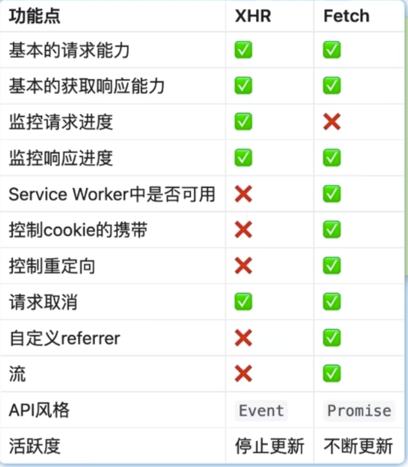

# XHR 和 Fetch 的区别



从上面的图上能看出, xhr有的功能fetch几乎都有, 但是**fetch无法实现请求进度的监控**, 因为fetch是基于promise, promise只有成功和失败 没有成功多少 所以从api设计的角度来说 它是难以处理的

<br> 

## 进度监控
```s
https://www.bilibili.com/list/666759136?tid=0&sort_field=pubtime&spm_id_from=333.999.0.0&oid=359627272&bvid=BV1WX4y1j7BB
```

<br>

进度监控分为两种
1. 请求进度的监控
2. 响应进度的监控


### XHR实现响应的进度监控
