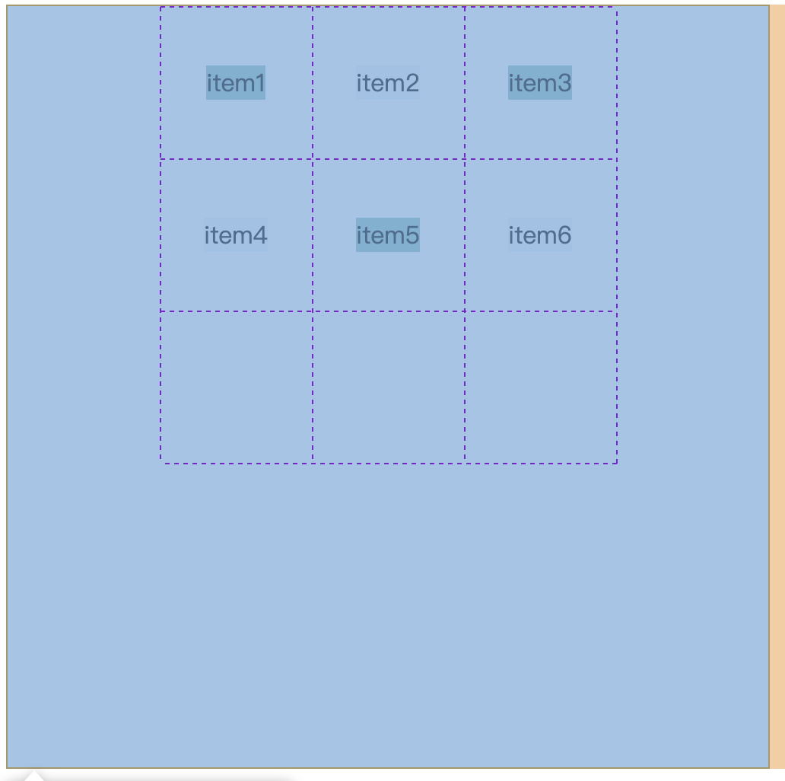
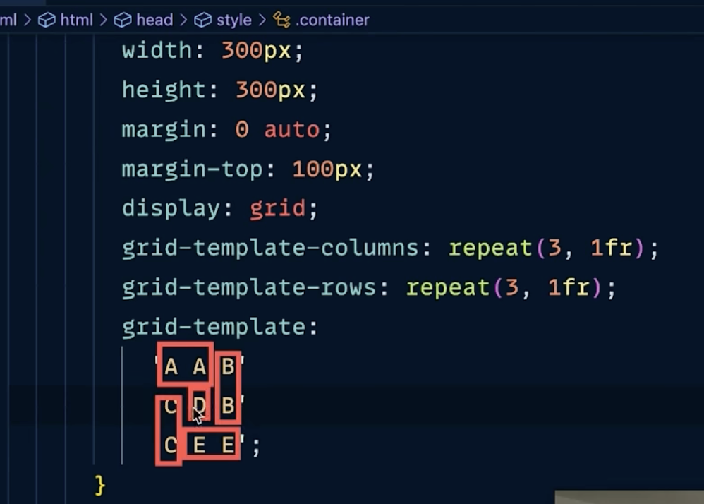
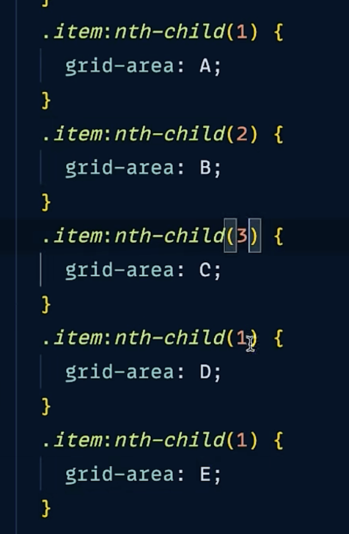
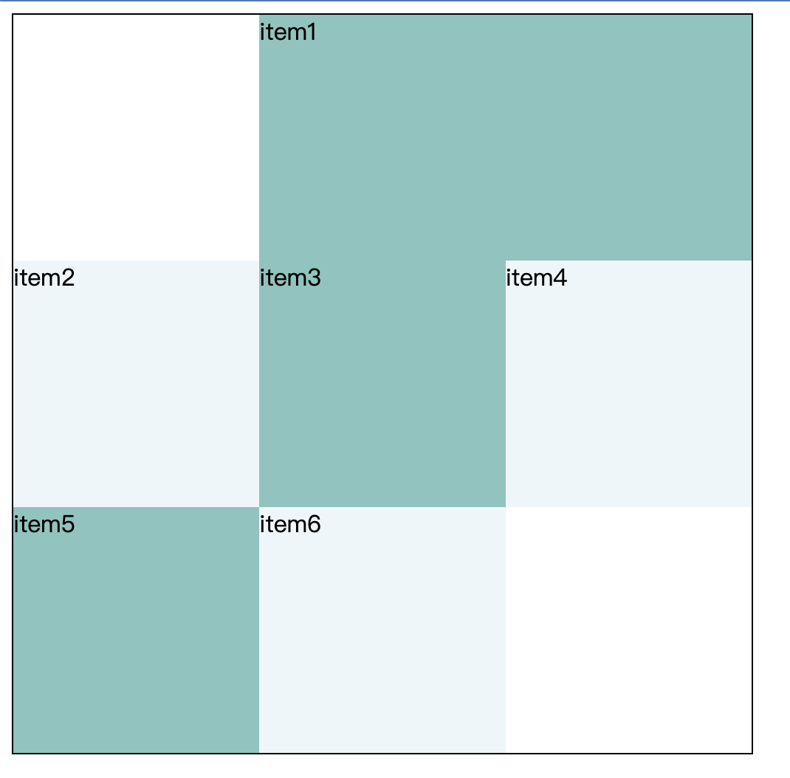

# Grid布局 和 flex布局的区别
Flex 布局是轴线布局, 只能指定"项目"针对轴线的位置, 可以看作是一维布局 
Grid 布局则是将容器划分成"行"和"列", 产生单元格, 然后指定"项目所在"的单元格, 可以看作是二维布局 

<br><br>

# Grid的基本概念
采用网格布局的区域, 称为"容器"(container)
容器内部的子元素, 称为"项目"(item) 项目只能是容器的顶层子元素

<br>

### Grid的行和列
容器里面的水平区域称为"行"(row), 垂直区域称为"列"(column) 
行和列的交叉区域, 称为"单元格"(cell)  我的理解是这个就是用 线 来切割区域 形成单元格

<br>

- n行有n + 1根水平网格线
- m列有m + 1根垂直网格线

<br><br>

## Grid的容器属性

### display: grid
指定一个容器采用网格布局 

<br>

### display: inline-grid;
div是一个行内元素, 该元素内部采用网格布局 

<br>

**注意:**  
设为网格布局以后, 容器子元素(项目)的float、display: inline-block、display: table-cell、vertical-align和column-*等设置都将失效 

<br>

### 容器指定了网格布局以后, 接着就要划分行和列

<br>

### grid-template-columns / grid-template-rows 
- grid-template-columns属性定义每一列的列宽
- grid-template-rows属性定义每一行的行高

```css 
.container {
  display: grid;
  grid-template-columns: 33.33% 33.33% 33.33%;
  grid-template-rows: 33.33% 33.33% 33.33%;
}
```

<br>

**可选值 - repeat():**
有时候, 重复写同样的值非常麻烦, 尤其网格很多时 这时, 可以使用repeat()函数, 简化重复的值 

**格式:**  
```css
.container {
  display: grid;
  grid-template-columns: repeat(重复的次数, 重复的值);
  grid-template-rows: repeat(3, 33.33%);
}
```

按照排列顺序依次重复
```css 
.container {
  display: grid;
  grid-template-columns: repeat(3, 33.33%);
  grid-template-rows: repeat(3, 33.33%);
}
```

<br>

**repeat()的参数: auto-fill**
有时, 单元格的大小是固定的, 但是容器的大小不确定 如果希望每一行(或每一列)容纳尽可能多的单元格, 这时可以使用auto-fill关键字表示自动填充 
```css
/* 
每列宽度100px, 然后自动填充, 直到容器不能放置更多的列
*/
.container {
  display: grid;
  grid-template-columns: repeat(auto-fill, 100px);
}
```

<br>


**可选值 - fr 关键字:**
为了方便表示比例关系, 网格布局提供了fr关键字(fraction 的缩写, 意为"片段") 如果两列的宽度分别为1fr和2fr, 就表示后者是前者的两倍 
```css 
.container {
  display: grid;
  /* 表示两个相同宽度的列 */
  grid-template-columns: 1fr 1fr;
}
```

fr可以与绝对长度的单位结合使用, 这时会非常方便 
```css 
.container {
  display: grid;
  /* 第一列的宽度为150像素, 第二列的宽度是第三列的一半 */
  grid-template-columns: 150px 1fr 2fr;
}
```

<br>

**可选值 - minmax():**
函数产生一个长度范围, 表示长度就在这个范围之中 它接受两个参数, 分别为最小值和最大值 
```css 
.container {
  display: grid;
  /* minmax(100px, 1fr)表示列宽不小于100px, 不大于1fr  */
  grid-template-columns: 1fr 1fr minmax(100px, 1fr);
}
```

<br>

**可选值 - auto:**
关键字表示由浏览器自己决定长度 
```css 
.container {
  display: grid;
  /* 第二列的宽度, 基本上等于该列单元格的最大宽度, 除非单元格内容设置了min-width, 且这个值大于最大宽度 */
  grid-template-columns: 100px auto 100px;
}
```

<br>

### 布局示例:
```css 
/* 上面代码将左边栏设为70%, 右边栏设为30%  */
.wrapper {
  display: grid;
  grid-template-columns: 70% 30%;
}
```

 
```css 
.wrapper {
  display: grid;
  /* 传统的十二网格布局, 写起来也很容易 */
  grid-template-columns: repeat(12, 1fr);
}
```

<br><br>

### 行 列 之间的间距

### grid-row-gap / grid-column-gap
设置行与行的间隔(行间距) / 设置列与列的间隔(列间距)

<br>

### grid-gap
grid-gap属性是grid-column-gap和grid-row-gap的合并简写形式, 语法如下 
如果grid-gap省略了第二个值, 浏览器认为第二个值等于第一个值 
```css 
.container {
  grid-gap: 20px 20px;
}
```

<br><br>

### 区域内元素的排列方式

### grid-auto-flow
划分网格以后, 容器的子元素会按照顺序, 自动放置在每一个网格 默认的放置顺序是"先行后列", 即先填满第一行, 再开始放入第二行

这个顺序由grid-auto-flow属性决定, 默认值是row, 即"先行后列" 也可以将它设成column, 变成"先列后行" 

```css 
.container {
  grid-auto-flow: row / column;
}
```

<br>

**可选值:**
- row:  即"先行后列"
- column: "先列后行"
- row dense: 表示"先行后列", 但是会尽可能填充空缺的网格单元, 以减少空白空间
- column dense: 表示"先列后行", 但是会尽可能填充空缺的网格单元, 以减少空白空间

<br>

### grid-auto-columns / grid-auto-rows
这两个属性通常与 grid-auto-flow 一起使用，以控制网格项目的自动布局方式和尺寸。

- grid-auto-columns 用于设置 **自动生成的列的宽度**
- grid-auto-rows 用于设置 **自动生成的行的高度**

<br>

- 当 grid-auto-flow 的值为 row 时  
grid-auto-columns 用于设置自动布局的**列宽度**。当项目无法放入指定的行时，会自动换行到下一行。

- 当 grid-auto-flow 的值为 column 时  
grid-auto-rows 用于设置自动布局的行高度。当项目无法放入指定的列时，会自动换列到下一列

<br><br>

### 被切出来的区域里面 的 **元素 的对齐方式**

### justify-items
设置单元格内容的水平位置(左中右)
```css 

.container {
  display: grid;
  grid-template-columns: repeat(3, 1fr);
  grid-template-rows: repeat(3, 1fr);
  border: 1px solid black;
  
  /* 容器尺寸 */
  width: 500px;
  height: 500px;

  /* 单元格内元素的对齐方式 */
  justify-items: start | end | center | stretch(默认值)
}
```

- start: 对齐单元格的起始边缘 
- end: 对齐单元格的结束边缘 
- center: 单元格内部居中 
- stretch: 拉伸, 占满单元格的整个宽度(默认值) 

<br>

**注意:**  
- 如果没有给 项目 指定宽高时 则项目默认会占满单元格 因为默认值为 stretch

- 如果没有给 项目 指定宽高时 设置 justify-items: start 则项目的宽度同元素的内容同宽

<br>

### align-items
设置单元格内容的垂直位置(上中下)

```css
.container {
  display: grid;
  grid-template-columns: repeat(3, 1fr);
  grid-template-rows: repeat(3, 1fr);
  border: 1px solid black;
  
  /* 容器尺寸 */
  width: 500px;
  height: 500px;

  /* 单元格内元素的对齐方式 */
  align-items: start | end | center | stretch(默认值)
}
```

<br>

**注意:**  
- 如果没有给 项目 指定宽高时 则项目默认会占满单元格 因为默认值为 stretch

- 如果没有给 项目 指定宽高时 设置 align-items: start 则项目的高度同元素的内容同高

<br>

### place-items
align-items属性和justify-items属性的合并简写形式 
```css
.container {
  display: grid;
  grid-template-columns: repeat(3, 1fr);
  grid-template-rows: repeat(3, 1fr);
  border: 1px solid black;
  
  width: 500px;
  height: 500px;

  /* 简写属性 */
  place-items: center center;
}
```

<br>

### 网格在容器中的位置


<br>

### justify-content / align-content / place-content
整个网格区域在容器里面的水平位置(左中右)  
整个网格区域在容器里面的垂直位置(上中下)

<br>

**可选值:**  
- start: 对齐容器的起始边框 
- end: 对齐容器的结束边框 
- center: 容器内部居中 
- stretch: 项目大小没有指定时, 拉伸占据整个网格容器 
- space-around: 每个项目两侧的间隔相等 所以, 项目之间的间隔比项目与容器边框的间隔大一倍 
- space-between: 项目与项目的间隔相等, 项目与容器边框之间没有间隔 
- space-evenly: 项目与项目的间隔相等, 项目与容器边框之间也是同样长度的间隔 

<br>

```css
.container {
  display: grid;
  grid-template-columns: repeat(3, 100px);
  grid-template-rows: repeat(3, 100px);
  border: 1px solid black;
  
  width: 500px;
  height: 500px;
  place-items: center center;

  /* 网格位于容器中水平的位置 */
  justify-content: center;
}
```

```css 
.container {
  justify-content: start | end | center | stretch | space-around | space-between | space-evenly;
  align-content: start | end | center | stretch | space-around | space-between | space-evenly;  
}
```

<br>

### grid-template 
使用字母规划网格  


<br>

然后我们要将css知道A是谁 B是谁, 所以我们需要给每一个子元素设置它的对应关系  


<br><br>

## 项目的属性

### grid-column-start | grid-column-end | grid-row-start | grid-row-end
项目的位置是可以指定的, 具体方法就是指定项目的四个边框, 分别定位在哪根网格线 

- grid-column-start: 左边框所在的垂直网格线
- grid-column-end: 右边框所在的垂直网格线
- grid-row-start: 上边框所在的水平网格线
- grid-row-end: 下边框所在的水平网格线

<br>



```css 
/* 
  1号项目的左边框是第二根垂直网格线, 右边框是第四根垂直网格线 其余的项目会依次往后串
*/
.item1 {
  grid-column-start: 2;
  grid-column-end: 4;
}
```

<br>

**grid-column-start 的 span关键字:**  
这四个属性的值还可以使用span关键字, 表示"跨越", 即左右边框(上下边框)之间跨越多少个网格 
```css 
.item1 {
  /* 横跨两列, 有点像合并单元格 */
  grid-column-start: span 2;
}
```

<br>

### 简写属性:
- grid-column: grid-column-start 和 grid-column-end
- grid-row: grid-row-start 和 grid-row-end

```css 
.item {
  grid-column: <start-line> / <end-line>;
  grid-row: <start-line> / <end-line>;
}
```

<br>

### 单独设置某一个项目的对齐方式
元素不按统一的样式排列 自己单独的排列方式

- justify-self: 设置单元格内容的水平位置(左中右)
- align-self: 设置单元格内容的垂直位置(上中下)
- place-self: ``place-self: <align-self> <justify-self>``

<br>

- start: 对齐单元格的起始边缘 
- end: 对齐单元格的结束边缘 
- center: 单元格内部居中 
- stretch: 拉伸, 占满单元格的整个宽度(默认值)

<br><br>

# 总结

### 外部容器不用给规定的宽度和高度就是自适应布局