# 知识整理

## 所有伪类选择器


- :hover - 鼠标悬停在元素上时应用的样式。
- :active - 元素被点击时应用的样式。
- :focus - 元素获得焦点时应用的样式（例如，通过键盘导航到元素）。
- :link - 选择未访问过的链接的样式。
- :visited - 选择已访问过的链接的样式。
- :first-child - 选择作为其父元素的第一个子元素的样式。
- :last-child - 选择作为其父元素的最后一个子元素的样式。
- :nth-child(n) - 选择作为其父元素的第 n 个子元素的样式。
- :nth-last-child(n) - 选择作为其父元素的倒数第 n 个子元素的样式。
- :first-of-type - 选择作为其父元素的特定类型的第一个子元素的样式。
- :last-of-type - 选择作为其父元素的特定类型的最后一个子元素的样式。
- :nth-of-type(n) - 选择作为其父元素的特定类型的第 n 个子元素的样式。
- :nth-last-of-type(n) - 选择作为其父元素的特定类型的倒数第 n 个子元素的样式。

- :not(selector) - 选择与给定选择器不匹配的元素的样式。
- :empty - 选择没有子元素的元素的样式。
- :checked - 选择被选中（例如，复选框或单选按钮）的元素的样式。
- :disabled - 选择被禁用的元素的样式。
- :enabled - 选择处于启用状态的元素的样式。
- :target - 选择当前 URL 锚点指向的元素的样式。
- :blank - 设置未输入字段的情况
- :required - 针对必填输入字段时
- :valid - 匹配有效的输入字段时
- :invalid - 匹配无效的输入字段时
- :playing - 针对播放的音频或视频元素

- :first-line - 选择元素的第一行的样式。
- :first-letter - 选择元素的第一个字母的样式。
```s
https://www.bilibili.com/list/3494367331354766?sort_field=pubtime&spm_id_from=333.999.0.0&oid=491461841&bvid=BV1xN411n7uG
```
- :before - 在元素内容之前插入样式化内容。
- :after - 在元素内容之后插入样式化内容。

- :fullscreen - 全屏
- ::placeholder - 提示文字

- ::selection - 选中的文本样式

<br><br>

## 样式计算: 层叠样式表
它的作用就是为了解决样式冲突的问题, 比如多个选择器选中了同一个元素, 哪个选择器中的样式生效
```scss
#nav a.link {
    color: blue;
}

#nav a.link.active {
    color: green;
}
```

### 层叠样式表的过程
它就是为了解决样式冲突的 一共分为3步

1. 比较重要性 (优先级)

2. 比较特殊性 (比较权重)

3. 比较原次序 (代码靠后的 覆盖 代码靠前的)

<br>

### 优先级
从高到低为
1. 作者样式表 带有!important 样式
2. 默认样式表 带有!important 样式
3. 作者样式表 普通样式
4. 默认样式表 普通样式

```scss
* {
    color: red;
}

a:-webkit-any-link {
    color: --webkit-link-- /* 横线划死了 */
}
```

为什么 * 的样式 会覆盖 a 的样式, 因为 ``a:-webkit-any-link`` 是浏览器的默认样式表 所以浏览器不会看权重什么的 按照顺序第一只看优先级

作者样式表的优先级高于浏览器的默认样式表, 所以 * 将 a 覆盖掉了

<br>

### 比较特殊性 (?,?,?,?)
如果第一步解决不了 才会到第二步 也就是看特殊性(权重) 特殊性算出来的是4个数字

比较冲突的时候 会依次从左高位开始 看每个元素的特殊性 只有相同才会往后比较
```scss
(?,?,?,?)
(?,?,?,?)
```

<br>

**第一个数字: 只能是0和1**  
我们的样式不是写到选择器里面的 而是写到style内联样式里面的 第一个位置的数字就是1 后面全是0
```scss
(1,?,?,?)
```

这就意味着我们一旦将样式写到style里面 它的特殊性就是最高的

<br>

**第二个数字: 表示选择器中id的数量**  
没有就是0

```scss
(0, 1, ?, ?)
#nav a.link {}
```

<br>

**第三个数字: 表示选择器中类选择器, 伪类选择器 和 属性选择器的数量**  
没有就是0
```scss
(0, 1, 3, 1)
// .link 是 1
// [href] 是 1
// :hover 是 1
#nav a.link[href]:hover {}
```

<br>

**第四个数字: 表示选择器中元素选择器 和 伪元素选择器的数量** 
```scss
(0, 1, 3, 2)
#nav a.link[href]:hover::after {}
```

<br><br>

## 属性值的计算过程
我们先思考下 下面的 a 的颜色为什么不是红色
```html
<div class="container">
    <a href="">百度</a>
</div>
<style>
    .conatiner {
        /* 为什么 a 元素的颜色 不是红色呢? */
        color: red;

        /* 为什么我们在这里给 a 清除下划线 清除不了 必须要在 a 元素上使用下面的属性呢? */
        text-decoration: none;
    }
</style>
```

<br>

### 原因
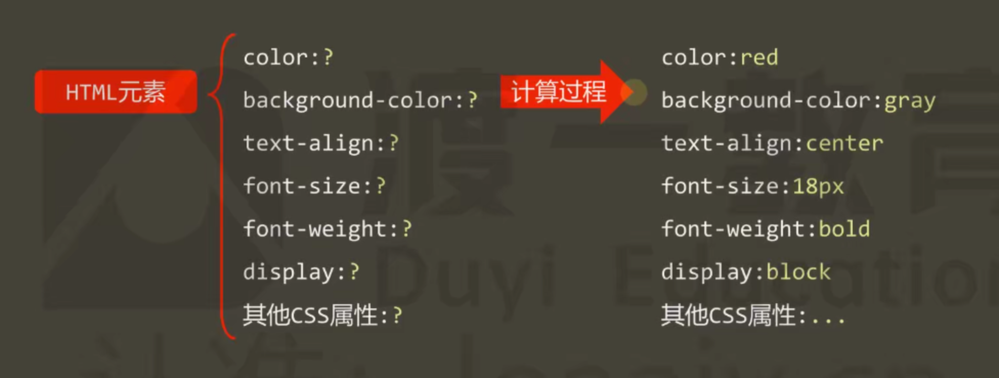

我们每一个html元素上都有很多的css属性, **这些css属性都必须有值** 浏览器才知道如何显示它

而从没有值 到 有值 的过程 就是计算过程, 而属性的计算过程分为下面的4个阶段

页面上元素显示的什么, 由最终的计算结果(Computed)来决定, 而不是我们在style里面写的css决定的 我们写的css, 只是会影响到显示的最终结果, 最终结果是要算的

<br>

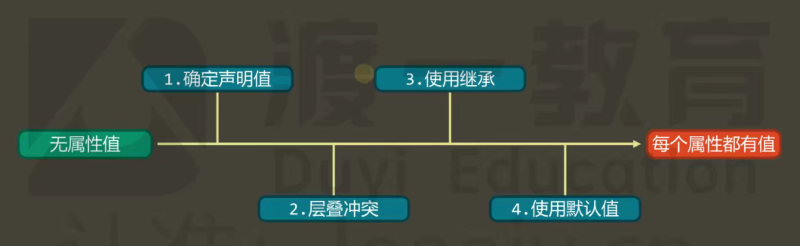

<br>

### 计算属性的4个步骤
4个步骤 从前到后 只要在一个步骤中 能够确定值 后续的步骤就不会看了

1. 确定声明值
2. 解决层叠冲突
3. 使用继承
4. 使用默认值

```html
<h1 class="red">Lorem</h1>
```

上面的元素 最开始的时候 没有任何的css属性值

<br>

### 1. 确定声明值
参考样式表中没有冲突(两个选择器声明了同属性)的声明, 作为css属性值

我们这里看的是没有冲突的声明, 直接拿来作为属性值

比如上面的 h1 元素 它有如下的两个样式表
- 作者样式表
```scss
.red {
    color: red;
    font-size: 40px;
}
div h1.red {
    font-size: 3em;
    font-size: 30px;
}
```
- 浏览器默认样式表
```scss
h1 {
    display: block;
    font-size: 2em;
    font-weight: bold;
}
```

上面的两个样式表中, font-size 的属性是有冲突的, color 和 font-weight 和 display 是没有冲突的

所以第一步要做的就是将没有冲突的声明 直接拿出来 作为最终的计算结果

<br>

### 2. 解决层叠冲突
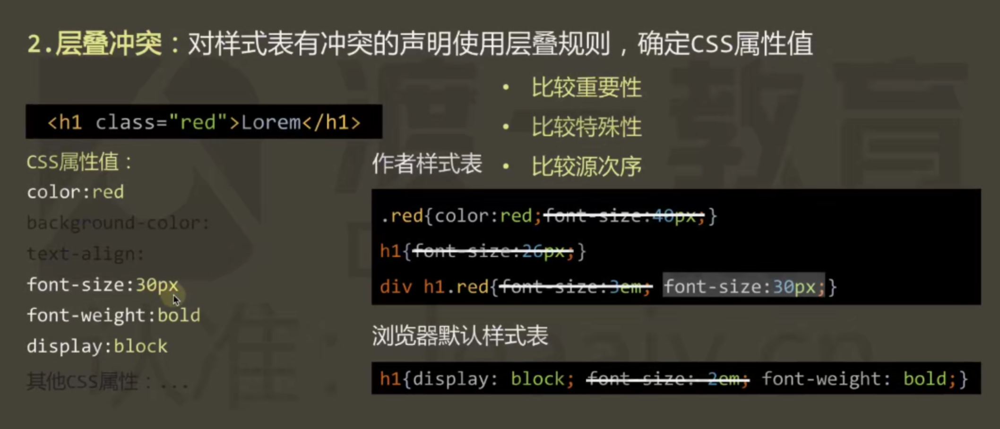

一个元素 被多个选择器选择的时候, 这就是层叠冲突 (我们之前说的权重就是层叠冲突中的一种)

比如上面的 h1 元素 font-size 属性就是冲突的状态 但是最终只能有一个值, 那哪些被淘汰呢? 这里会经过3个步骤

1. 比较重要性
    - 简单的理解就是 **作者样式表 覆盖 浏览器样式表** 经过这步浏览器的默认样式就会被淘汰
2. 比较特殊性
    - 比较权重
3. 比较原次序
    - 代码靠后的 覆盖 代码靠前的

<br>

### 3. 使用继承
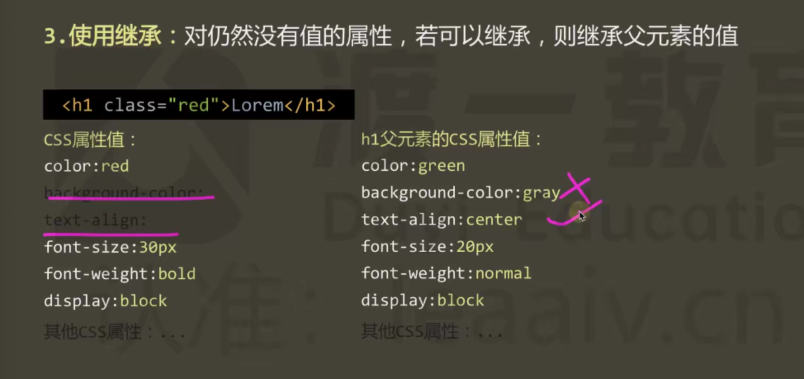

对仍然没有值的属性 若可以继承, 则继承父元素的值

<br>

### 4. 使用默认值
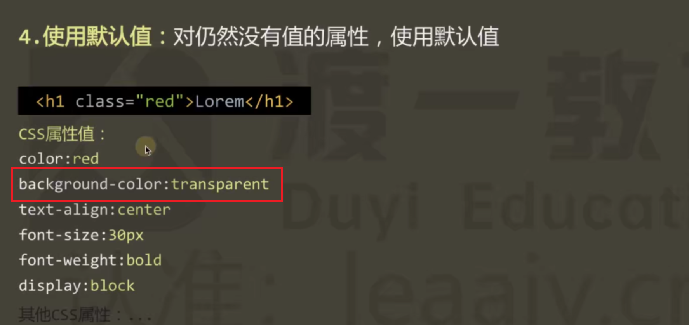

对仍然没有值的属性 使用默认值 

<br>

### 再说回之前的 a 的问题
```html
<div class="container">
    <!-- 不是红色 -->
    <a href="">百度</a>
    <!-- 红色 -->
    <p>一个段落</p>
</div>
<style>
    .conatiner {
        /* 为什么 a 元素的颜色 不是红色呢? p元素就是红色呢 */
        color: red;

        /* 为什么我们在这里给 a 清除下划线 清除不了 必须要在 a 元素上使用下面的属性呢? */
        text-decoration: none;
    }
</style>
```

<br>

**p元素:**  
使用 f12 查看 p 元素的样式

1. 确定声明值: 作者样式表 和 浏览器样式表 都没有给p元素设置颜色值 所以看下一步
2. 层叠冲突: 没有冲突 所以看下一步
3. 使用继承: 继承了红色 不看下一步

<br>

**a元素:**  
使用 f12 查看 a 元素的样式

1. 确定声明值: 作者样式表 没有设置a的样式, 浏览器样式表 **有默认值**: -webkit-link (谷歌浏览器的样式)

由于第一步确认了样式 所以后面就不看了, 所以就没有了继承 所以a元素不会是红色, 在a元素上没有发生继承

<br>

### 技巧
因为 a 元素有这样的问题, 我们希望的是 a元素的样式 可以继承父元素 所以最好写上
```scss
a {
    text-decoration: none;
    color: inherit;
}
```

<br><br>

## 色彩空间
```s
https://www.bilibili.com/list/3494367522195464?tid=0&sort_field=pubtime&spm_id_from=333.999.0.0&oid=493394188&bvid=BV1DN411M7b3
```

<br><br>

## 文字连续光影特效
```s
https://www.bilibili.com/list/3494367522195464?tid=0&sort_field=pubtime&spm_id_from=333.999.0.0&oid=706186465&bvid=BV19Q4y1b7ib
```

<br><br>

## transform 多重变形的顺序问题
```scss
.item {
    transform: translate(100px, 100px) rotate(45deg);
}
```

1. 多个变形的时候 顺序是 **从右到左(由数学的规则决定的)** 上面的代码也就是先旋转再平移
2. 元素是以坐标系原点旋转(而不是元素的中心点旋转)
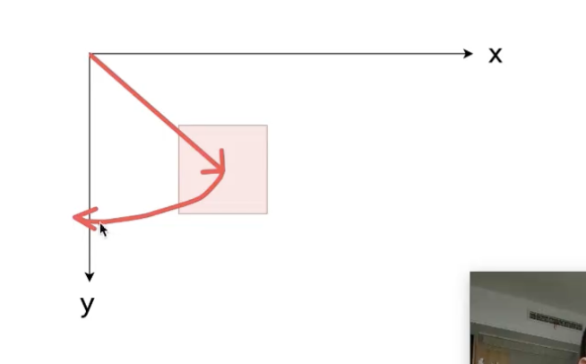

<br>

### 变形的本质
是针对某一个元素 将它当中的每一个像素点进行变换 上图中的矩形区域中有很多的像素点 每个像素点都有一个xy轴的坐标

变形就是经过一套算法(矩阵变换) 从原来的xy坐标 变成一个新的xy坐标 这就是变形的本质

我们上面写的translate 和 rotate 本质上都是矩阵

css的transform本质就是矩阵的变换, 多个变形其实就是多个矩阵相乘 再乘以一个坐标 而它的数学规则就决定了它运算过后呈现的效果就是从右往左 

通知因为矩阵的乘法不满足交换律, 所以我们的transform中的变形的顺序一旦发生变化 就不是之前的效果了

<br><br>

## 动画时间函数
linear就是时间函数
```s
https://www.bilibili.com/list/3494367522195464?tid=0&sort_field=pubtime&spm_id_from=333.999.0.0&oid=833685289&bvid=BV1F34y1w7ng
```

```scss
img {
    animation: rotate 5s linear;

    // animation-timing-function: linear;
}
```

我们在控制台中能发现 时间函数前面有一个可以点的按钮

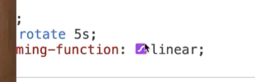

<br>

动画的本质就是将**一个数值** 在一定的时间内 变到**另一个数值**

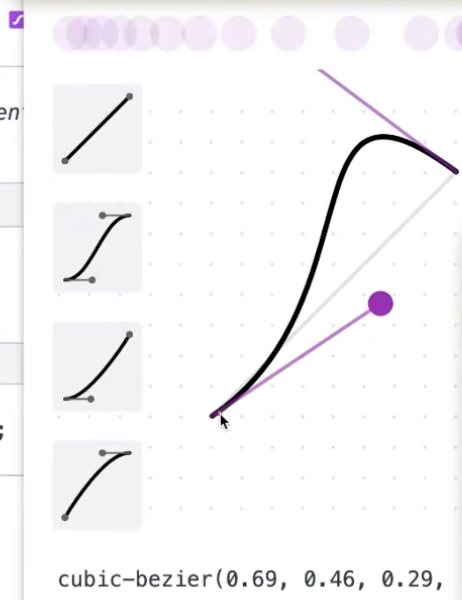

而我们点击按钮展示出来的控制页面, 它实际上是一个坐标系, x轴表示时间 y轴表示数值的变化

整个坐标系中的曲线就描述了一件事 当给定的时间是 0 ~ 1, 如何让一个数字从0变到1

<br><br>

## 资源提示符 prefetch 和 preload
我们的vue项目在打包后, 在index.html文件中 会有很多的link连接, 当中就使用到了rel, prefetch 和 preload 就被称之为资源提示符
```html
<link href='/js/xxxx.js' rel="prefetch" />
<link href='/js/xxxx.js' rel="preload" />
```

<br>

### 常见的资源提示符
- prefetch
- preload
- defer
- async

<br>

### defer 和 async
它们是应用于script元素的

**script元素上没有任何标记的情况: 该情况浏览器会有一段加载js的事件**   
在普通情况下, 整个浏览器在解析页面的时候, 流程如下

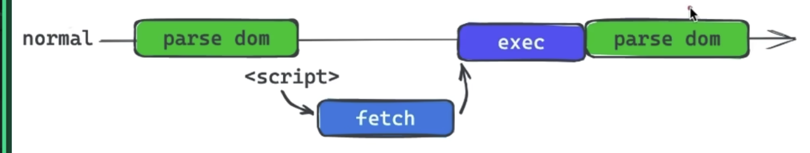

1. 解析 dom 元素, 当解析到script的时候, 它会开启另外一个网络线程去下载响应的js文件 或者 加载js文件, 与此同时浏览器的渲染主线程会等待, **它会等待js下载完成**

2. js加载或下载完成后, 会执行js脚本

3. 解析dom

<br>

**script元素上 使用 async:**  
该方式可以优化, 主线程加载js文件的那部分等待时间 

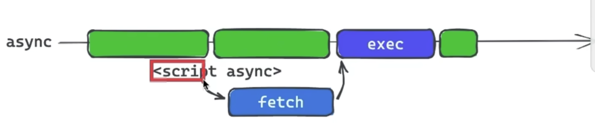

解析dom元素 当解析到script的时候, 发现有async标记, 浏览器同样会下载js, 但是与此同时会继续解析dom, **等到js下载完成之后 这时有可能dom解析还没有结束, 但是要插入脚本执行**

当脚本执行完毕后 继续解析dom元素

async为异步, 下载完js后立马执行, 比如我们往页面上插入5000个p元素, 当浏览器解析到2000个的时候 js加载完毕了, js中的逻辑是获取p元素的个数, 我们会发现只获取到了2000个, 应为后面的还有没有解析呢

<br>

**script元素上 使用 defer:**  

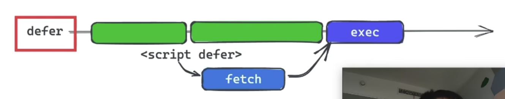

它跟async就一个区别, async是js下载完毕后马上执行, 而defer是等js下载完成后, 如果dom没有完全的解析完毕 那defer会等待, 等待解析完毕后再执行js

<br>

defer脚本的执行是在触发, contentLoaded事件之前


<br>

### prefetch 和 preload
它们是用于 link 标记的, 使用在标签属性rel中, 它们都表示预先加载资源 都不会影响dom的解析 **它们的区别主要在优先级**

如果我们使用的是 preload 它的优先级比较高 相当于告诉浏览器你要尽快的把它下载完成

如果我们使用的是 prefetch 它的优先级是比较低的 相当于告诉浏览器资源需要你去下载 你有空的时候慢慢下 不着急

这两个资源提示符, 只做下载不做运行, 我们使用这两个标记告诉浏览器下载link指向的资源的优先级

当资源下载完毕后, 浏览器会将其缓存起来 我们将来要使用这个资源的时候 发现之前已经下载过了 就不用再次的经过网络请求了 

比如 prefetch指向的是别的页面的js和css 意思这些页面的资源目前用不到 有空的时候你先下载下来 将来我们切换页面的时候能快一些

有些资源是本页需要用的 那么我们就使用preload 告诉浏览器我们很快就要用, 你要快点下载

<br><br>

## 浏览器指纹
它是一种技术, 它可以在用户没有登录的情况下 仍然能够知道你是谁 比如我们进入了一个网站 我们登录了 做了一些操作

接下来我们打开一个无痕窗口 还是进入同样的网站 由于是无痕窗口 没有登录 但是网站仍然知道你是谁

再比如我们去购物网站没有登录浏览的商品 但是我们切换到另外一个网站的时候 另一个网站知道我们之前浏览了哪些商品 并且会推送相应的广告

这些都要得益于浏览器指纹技术 尽管它侵犯了用户隐私 还是有很多的公司在大量的使用这些技术

<br>

### 理念
这个世界上很难出现两个完全一样的浏览器环境 在一个客户端上有很多很多的信息 比如
1. ip 地址
2. js代码

不同环境下浏览器的版本不一样 环境不一样 操作系统不一样 api或多或少都有些差异

比如canvas哪怕我们使用同样的api绘制图形 也会有一些差异

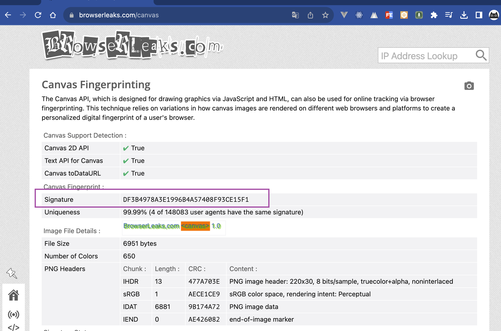

这个指纹在 148083个浏览器中只有4个浏览器是一模一样的, 但是如果canvas的指纹在结合其它的指纹, 那可想而知, 重复的概率有多低

我们能看到canvas的指纹, 这时我们使用无痕浏览器打开我们观察这个指纹也是一模一样的

哪怕我们进入别的网站 读出来的指纹也是一模一样的 这一切可以不用登录就可以发生 这些信息不需要登录就可以获取的到

<br>

### 原理
我们以canvas指纹为例

```js
function getCanvasFingerprint() {
    const canvas = document.createElement('canvas')
    canvas.width = 200
    canvas.height = 200

    const ctx = canvas.getContext('2d')
    ctx.fillStyle = 'rgb(128,0,0)'
    ctx.fillRect(10, 10, 100, 100)

    // 对数据url进行哈希处理 以生成更短且已知的浏览器指纹
    const dataUrl = canvas.toDataURL()
    const hash = hashCode(dataUrl)
}

function hashCode(str) {
    let hash = 0
    for (let i = 0; i < string.length; i++) {
        const char = str.charCodeAt(i)
        hash = (hash << 5) - hash + char
        hash |= 0  // 将hash值转换为32位整数
    }

    return hash 
}
```

我们用户在浏览谷歌正常浏览器 和 无痕浏览器的时候, 我们输出的hash值是一样的

当我们使用火狐的时候hash值不一样了 为什么? 我们不都是画同样的东西么 

因为不同的浏览器不同的浏览器设置 不同的图像引擎 不同的操作系统 都会导致里面的文字, 颜色 产生一些或多或少的细微差别 这些差别人眼是很难看清楚的 但是到了数据层面就能看出差异

这就是文件指纹的原理

<br>

### 应用
**广告:**   
比如广告联盟 它们会在不同的网站去投放一些广告 它就会收集浏览器的用户指纹 你喜欢看什么东西 它把那些东西跟你的文件指纹进行绑定 这样就知道你的喜好了

然后再其他的站点 它就可以给你推送相关的你更加感兴趣的广告信息

<br>

**防刷:**   
有些刷票的行为 我们可以通过文件指纹进行限制 通过注册机不断的去切换用户进行刷票 但是不管怎么样去切换用户 我们的环境是没有变化的 你的文件指纹没有发生变化 

所以通过文件指纹我们能知道换这么多的账号其实就是一个人

<br>

### 对策
上面说了指纹能干什么, 这里说的就是防指纹浏览器 它可以通过一些设置不断的去切换浏览器指纹 比如它可以改变浏览器中的一些功能 

文件指纹读的是哪些内容(我们上面的按钮读的是canvas), 那么指纹浏览器就会改那些内容 让我们产生不一样的文件指纹

<br>

### 获取指纹的库
```s
https://github.com/fingerprintjs/fingerprintjs
```

<br><br>

## :where() 伪类选择器
```s
https://blog.csdn.net/p1967914901/article/details/129000514
```

<br>

### 语法:
```scss
header a:hover,
main a:hover,
footer a:hover {
  color: green;
  text-decoration: underline;
}


:where(header, main, footer) a:hover {
  color: red;
  text-decoration: underline;
}
```

它的作用是对一组选择器进行分组，类似于用逗号 , 分隔的多个选择器。然而，与逗号 , 不同的是，:where 不会增加权重。

:where 可以用于包裹多个选择器，不增加这些选择器的权重，这在一些特定的场景中很有用，特别是在需要复杂选择器时，可以提高代码的可读性。

<br><br>

## :is() 伪类选择器

### 语法:
它的作用是选择匹配括号中任何一个选择器的元素


```scss
:is(selector1, selector2, ...) {
  /* styles applied if the element matches any of the specified selectors */
}
```

``:is(article, section, :is(nav, aside))`` - 这部分选择器使用 :is() 伪类，**它会选择匹配括号中任何一个选择器的元素**。

<br>

### 示例:
``<p>``段落文本默认为黑色，但当它出现在``<article>``、``<section>``或``<aside>``中时，则为灰色

我们使用 scss 的时候 会使用如下的写法

```scss
article, section, aside {
  p {
    color: #444;
  }
}
```

但是上面的写法毕竟是scss 要想使用scss还是比较麻烦的, 而 ``:is()`` 就是一个原生css的解决方案 

```scss
:is(article, section, aside) p {
  color: #444;
}
```


<br><br>

## :has() 伪类选择器
```s
https://www.bilibili.com/list/666759136?tid=0&sort_field=pubtime&spm_id_from=333.999.0.0&oid=705253839&bvid=BV17Q4y1H7v9
```

下面是找container元素的, 但是使用has进行了约束, 也就是container必须满足has才会被选中

或者说 container 里面必须有某一个东西

```scss
// container中必须有第一个子元素比鼠标移入这个东西
// 它选中的是父元素 它里面有第一个元素被鼠标移入的时候的父元素
.container:has(.item:nth-child(1):hover) {
    ...
}
```

<br><br>

## HTML标签属性

### inputmode
该属性写在 input 标签中, 它在移动端会影响我们在input中输入的时候会唤起键盘, 它指明弹出键盘的格式

```html
<input type="text" inputmode="text" />
```
- tel: 弹出的键盘为 拨号模式
- numeric: 数字选择的模式

<br>

### poster
该属性使用在 video 标签中 为预览图
```html
<video src="" poster="cover.png" />
```

<br>

### accesskey
可以为元素设置快捷键, 当按下快捷键后, 可以聚焦元素
```html
<input type="text" accesskey="b" />
```

<br>

### tabindex
用户可以使用 tab 键切换聚焦的元素, 默认情况下 切换的顺序和元素的顺序一致, 如果希望不一致的时候 可以通过 tabindex 属性进行手动干预

```html
<input type="text" tabindex="2" />
<input type="text" tabindex="1" />
```

<br>

### download
通常用于超链接中 使用该属性后 打开连接会触发浏览器的下载行为 而不是显示连接内容
```html
<a href="dog.jpg" download />
<a href="dog.jpg" download="puppy.jpg" />
```

<br>

### translate
使用它可以指定某个元素的内容是否应该触发翻译, 具体如何翻译取决于浏览器的设置
```html
<!-- 开启翻译 -->
<div translate="yes">how are you</div>
<!-- 关闭翻译 -->
<div translate="no">how are you</div>
```

<br><br>

### ``./ ../ /`` 路径的书写方式
- ./  代表 当前目录
- ../ 代表 父级目录
- /   代表 根目录

<br>

在前端页面上 ./ 和 不写 是一样的 可以省略 都是当前目录 在node端上 不能省略 因为不写./ 就表示引用node-modules里面的模块

<br>

### 使用 content 属性 修改该元素身上的标签属性的值
content属性代表标签体内容

```html

```

```css
/* content属性就代表上面 img标签的标签体内容 */
.logo {
    /* 比如我们修改 src  */
    content: url(../img/img2.png)
}
```

<br>

### 语义化标签: 
在网页中HTML用来负责网页的结构 所以在使用html标签时 应该关注的是标签的语义而不是它的样式
```html
<hgroup>
  标题组 可以将一组 相关 的标题同时放入hgroup标签中
</hgroup>

<em>            语音语调加重
<strong>        表示强调 内容重要！

<blockquote>    块元素      长引用 引用的内容比较多的时候
<q>             行内元素    短引用
```

ç

### 网页的头部: 
一个网页中可以有很多头部 定义文档或节的页眉
```html
<header></header>
```

<br>

### 网页的主体: 
一个页面中只有一个
```html
<main></main>
```

<br>

### 网页的底部: 

```html
<footer></footer>
```

<br>

### 网页的导航
```html
<nav></nav>
```

<br>
    
### 网页中独立的区块
```html
<section></section>
```

<br>

### 网页中的独立的文章

用于定义一个独立的内容区块 比如一篇文章 一篇博客 一个帖子 论坛的一段用户评论 一篇新闻消息等
article元素内可以嵌套其他元素 它可以有自己的头、尾、主体等内容。

使用时要特别注意内容的独立性 一般对于独立完整的内容才使用article元素 如果只是一段内容的话应该使用section元素。

```html
<article></article>
```

<br>

### 网页的边栏: 
用作文章的侧栏, 跟主体相关又不属于主体的内容 侧边栏
```html
<aside></aside>
```

aside 的内容应该与 article 的内容相关。通常用来表现侧边栏或者标注框。以是与当前文章有关的相关资料、名词解释 等等

<br>

### 点击查看详情: 
用来对显示在页面的内容做进一步骤解释

首先是`<details>`标签 里面接着是标题`<summary>` 这里面的内容一般简短 具有总结性 会展示在页面。

```html
<details>
  <summary>详细内容(点击后才能看到下面的结构)</summary>
  <h3>我是内容部分</h3>
  <p>我是内容部分的段落</p>
</details>
```
    
接着可以跟任意类型的HTML元素作为详情内容 这些内容需要在点击`<summary>`才会呈现。

<br>

**属性: ``<details open>``**  
当然 你也可以通过给`<details open>`标签设置open属性让它默认为展开状态。

<br><br>

# 表格

### 合并列
合并 第二列 和 第三列

在前一列的标签中写 `colspan='2'` 属性, 删除后一列的标签

```html
<table>
  <tr>
    <td>第一列</td>
    <td colspan="2">合并后的列</td>
    <td>第四列</td>
  </tr>
  <tr>
    <td>第一列</td>
    <td>第二列</td>
    <td>第三列</td>
    <td>第四列</td>
  </tr>
</table>

```

<br>

### 合并行
将第一行的单元格1 和 第二行的单元格1 进行合并  
在第一行的td标签中写 `rowspan="2"` 属性, 然后删除第二行的单元格1

```html
<style>
  table {
    border-collapse: collapse;
    border: 1px solid black;
  }

  td {
    border: 1px solid black;
    padding: 10px;
  }
</style>

<table>
  <tr>
    <td rowspan="2">单元格 1</td>
    <td>单元格 2</td>
    <td>单元格 3</td>
  </tr>
  <tr>
    <!-- <td>单元格 4</td> -->
    <td>单元格 5</td>
    <td>单元格 6</td>
  </tr>
</table>
```

<br>

### 表格样式
默认情况下 表格的外框 和 单元格的外框 都有各自的 border 属性 而且是不显示的, 当我们给 表格 和 单元格 都设置成 border 属性后 会出现双重线的样式

<br>

**border-spacing: 10px**  
指定表格的外框线 和 单元格的外框线 之间的距离

<br>

**border-collapse: collapse**  
折叠 表格的外框线 和 单元格的外框线(只有一条线了) 

<br>

**技巧: 表格隔行变色**  
```css
tr:nth-child(odd) {
  background-color:red;
}
```

<br>

### table的标签属性: table-layout: fixed;
table-layout: fixed; 是一个 CSS 样式规则，用于设置表格的布局算法。具体来说，它是用于定义 HTML 表格中 ``<table>`` 元素的布局方式。

```scss
table {
    width: 100%;
    border-collapse: collapse;
    table-layout: fixed / auto;
}
```

当你设置 table-layout: fixed; 时，表格的布局将会采用固定布局算法。这意味着**表格的列宽将由第一行的单元格内容决定**，而**不会根据表格中的内容动态调整列宽。**

<br>

**使用 table-layout: fixed; 有以下一些特点: **  
1. 列宽固定:  列宽将被设置为由列中最长的单元格内容决定的宽度。这样，所有的列都会有相同的宽度。
2. 忽略内容:  表格布局不会根据内容的多少来动态调整列宽。即使某一列中的内容很多，也不会影响其他列的宽度。


<br><br>

# 内联框架 ``<iframe>``
用于向当前页面中引入其它页面, **相当于插了一张图片一样**  

**注意:**  
内联框架不会被搜索引擎去检查

<br>

### iframe相关属性
- frameborder:值为 0 / 1  没有边框 / 有边框
```html
<iframe 
  src="" 
  frameborder="0"
  width="number"
  height="number"
></iframe>  
```

<br>

**应用场景:**  
创建导航菜单 点击按钮让内联框架里面展示不同的页面 相当于创建了一个内容区

<br>

### 练习: iframe标签 和 a标签组合使用步骤
当我们点击 ``<a>`` 链接的时候 链接的页面会在 iframe区域展示

1. 在``<iframe name="view">``标签中 **使用name属性**  
2. 在 ``<a target="view" href>`` 标签中利用 target属性指向iframe的name值

```html
<section class="app">
<section class="nav-area">
    <ul>
    <li>
        <!-- 在a标签上定义 target 属性 -->
        <a target="view" href="./Hover.html">Hover页面</a>
    </li>
    <li>
        <a target="view" href="./model.html">Model页面</a>
    </li>
    </ul>
</section>

<!-- a点击的链接 会在 iframe 里面呈现 -->
<section class="content-area">
    <!-- 指定 name 属性 -->
    <iframe frameborder="0" name="view"></iframe>
</section>
</section>
```

<br><br>

# textarea标签

### css属性:
```scss
.text {
    // 设置多行文本是否可以被用户拖动改变尺寸
    resize: none;
}
```

<br><br>

# 音频 & 视频
音频兼容格式比较好的就是mp3

音视频文件引入时 默认情况下不允许用户自己控制播放停止的

<br>

## audio音频标签
**替换元素** 用来引入音频

<br>

### audio标签属性:
- 属性controls: 是否允许用户播放

- 属性autoplay: 音频文件是否自动播放 但是目前大部分浏览器都不会自动播放

- loop: 音乐是否循环播放

<br>

### audio的子标签 source
``<source src>`` 是位于 ``<audio>`` 内部的一个标签

除了通过``<audio src>``来引入文件外 还可以通过子标签source 来指定文件的路径

通过这种方式引入的文件 可以加提示语句 也就是说支持这个标签的会显示播放器 不支持的会显示提示文字

可以支持多个文件 可以传入多种格式的文件 最终只会显示一个播放器 看哪个格式能用

```html
<audio controls>
    对不起您的浏览器不支持播放音频 请升级浏览器
    <source src='.mp3'>
    <source src='.ogg'>
    <source src='.wav'>
</audio>
```

<br>

ie8中可以使用下面的标签引入音视频文件 会自动播放 (这个标签非常不好用)
```html
<embed src="" type="">
```

<br>

### 要点:
1. embed标签必须指定 width height
2. type 用来指定文件格式的   **type="audio/video/mp3"**  
3. 该标签写在 ``<audio>`` 标签的内部

解决兼容性问题 ie8中用embed 其他浏览器使用 audio
```html
<audio controls>
    <!-- 可以支持多个文件 可以传入多种格式的文件 最终只会显示一个播放器 看哪个格式能用 -->
    <source src='.mp3'>      
    <source src='.ogg'>

    <!-- 前面有支持了到不到这里 -->
    <embed src="" type="">      
</audio>
```

<br>

## video视频标签
```html
<video src=""></video>
```

<br>

### 扩展: css属性 object-fit
该属性指定 **元素的内容** 应该如何去适应指定 **容器的高度与宽度**  

一般用于 img 和 video 标签, 一般可以对这些元素进行保留原始比例的剪切、缩放或者直接进行拉伸等。

<br>

**使用方式:**  
做css样式中使用 object-fit 属性, **同时 img 要有 宽高 相当于设置了img的边界** 然后使用 object-fit 控制图像
```html
<style>
  div {
    width: 100px;
    height: 100px;
    border: 1px solid black;
    position: relative;
  }

  div img {
    width: 100%;
    height: 100%;

    object-fit: contain;
  }
</style>

<div>
  
</div>
```

<br>

### object-fit属性的值:
- fill: 默认, 不保证保持原有的比例, 内容拉伸填充整个内容容器。
- contain: 保持原有尺寸比例。内容被缩放。
- cover: 保持原有尺寸比例。但部分内容可能被剪切。
- none: 保留原有元素内容的长度和宽度, 也就是说内容不会被重置。
- scale-down: 保持原有尺寸比例 内容的尺寸与 none 或 contain 中的一个相同, 取决于它们两个之间谁得到的对象尺寸会更小一些。

<br>

### 扩展: css属性 object-position
object-position 属性一般与 object-fit一起使用, 用来设置元素的位置。
```css
img {
    object-position: 50% 50%;
    object-position: right top;
    object-position: left bottom;
    object-position: 250px 125px;
}
```

<br><br>

# 常用的选择器: 

<br>

### 元素选择器: 
可以根据标签名选择指定元素

```css
标签 { }
p{ } h1{ } div{ }
```

<br>

### id选择器: 
根据我们元素的id属性值选择一个元素 因为id不能重复 只能选择一个元素
```css
#选择器的名字 { }

#red{ }
#name{ }
```
    
<br>

### 类选择器: 
class是所有标签中的一个属性 作用和id一样 不同的是同一页面 它可以用很多次可以重复使用 通过它来选择一组标签

```css
.选择器的名字 { }
.red { }
.name { }
```

class还可以为同一元素使用多个class也可以 用空格来隔开
```html
<p class="red color"></p>
```

<br>

### 通配选择器
选中页面中所有元素
```css
* { }
```

<br><br>

## 复合选择器

### 交集选择器
交集选择器有 且 的关系  
写css的时候 将两个选择器 紧紧 的挨在一起 它们就是且的关系  
写html的时候 当元素身上同时这些类名的时候 对应的样式才会生效

比如: ``p.container#id`` 我们要找的元素身上 比如有id 类名必须是container 并且 必须是p元素 只有在这种情况下才能应用上样式

选中同时符合多个条件的元素 希望元素满足多个条件的时候用它
```css
.selector1.selector2.selector3 {

}
```

```html
<style>
.content.bg {
    font-size: 20px;
}
</style>

<!-- 只有当元素身上同时有交集选择器的时候 交集选择器的样式才会生效 -->
<div class="content bg">
    hello
</div>
```

<br>

**注意:**  
复合选择器中 如果有元素选择器 必须元素选择器开头
```css
/* div必须先开头 */
div.red{
    font-size:30px;
}
```

<br>

### 选择器分组(并集选择器)
简单的说就是 或 的条件

出现在并集选择器中的元素 将格外拥有它所指定的样式

```css
selector1, selector2 {

}
```

<br>

```css
.rich {
    color: gold;
}

.dog {
    color: red;
}

.rich,
.pig {
    /* 当类名为rich或pig的时候 还可以拥有额外的样式 */
    font-size: 20px;
}
```

比如我们有这样的一个结构
```html
<h2 class="rich">标题1</h2>
<h2 class="dog">标题2</h2>
```

<br><br>

## 关系选择器

### 子元素选择器: 
选择指定父元素的指定子元素

```css
父元素 > 子元素

div > span {}
div > p >span {}
```

<br>

### 后代元素选择器:    
选中指定元素内的指定后代元素
```css
祖先 后代 { }
div span { }
```

<br>

### 兄弟元素选择器: 
无论是 + 还是 ~ 都是 选择下一个兄弟 选择的都是后面的

- +选择的是 紧紧相邻的下一个兄弟
- ~选择的是 后面的所有兄弟

```css
/* 
前一个 + 下一个 
选择p后面的span 是紧挨着的一个
*/
p + span {}    //

/* 
前一个 ~ 后边的 
选择p后面的span 所有的
*/
p ~ span {}     
```

```html
<!-- 注意: 它们的关系是兄弟元素 -->
<p>p元素</p>
<span>1</span>
<span>2</span>
<span>3</span>
```

<br><br>

## 属性选择器: 
是根据 **标签属性** 来筛选内容 比如id class name title等等 任何属性都可以

<br>

### [属性名] { }                 
选择标签内部含有指定    属性名  的所有元素
```css
/* 单独使用可以 一般情况下 还可以复合使用 */
p[title] {
    color: red;
}
```

<br>

### [属性名="属性值"]{ }
选择 指定属性名 和 属性值的所有元素
```css
[title="hello"] {
    color: red;
}
```

<br>

### [属性名^="属性值"]{ }
^是对 属性值 位置的筛选 前面的意思
指定属性名之后 选择 *以指定属性值开头的元素*
```css
[href^="http"] {
    color: red;
}
```

<br>

### [属性名*=属性值]{ }
*是对属性值位置的筛选 任意的意思
指定属性名之后 选择 *指定属性值任意位置 的所有元素*

<br>

### [属性名$="属性值"]{ } 
``$``是对 属性值 位置 的筛选 后面的意思
指定属性名之后 选择 *指定属性值结尾abc的元素* 

<br>

### [属性名~="属性值"]{ } 
指定属性名之后 选择 *指定属性值前是空格* 的所有元素

<br>

### [属性名|="属性值"]{ } 
指定属性名之后 选择 *指定属性值 或 指定属性值作为前缀* 的所有元素
```
name='value'   或   name='value-a'
```

<br><br>

## 伪类选择器(前面带一个:) 和 伪元素选择器(前面带一个::) 

<br>

### 伪类选择器: 
伪类用来描述一个元素的状态 比如第一个元素 被点击等等 它们的状态是什么 伪类一般情况下都是以冒号开头, 查找的是子元素

```html
<ul>
    <li>第一行</li>
    <li>第二行</li>
    <li>第三行</li>
    <li>第四行</li>
    <li>第五行</li>
</ul>
```

<br>

### :first-child { }
查找的是子元素 作为第一个的子元素 在当前的选择器中 查找第一个子元素为xx的元素  
```css
/* 第一个为li的子元素 */
ul li:first-child {
    background-color: red;
}
```

<br>

### :last-child { }
查找的是子元素 作为最后一个的子元素 在当前的选择器中 查找最后一个子元素为xx的元素  
```css
/* 最后一个为li元素 */
ul li:last-child {
    background-color: red;
}
```

<br>

**对 p:first-clild 的理解**  
- 正确理解: 第一个为p的子元素
- 错误理解: p下的第一个子元素

<br>

### :nth-child() { }
在子元素中查找 查找指定的子元素
```css
/* n全选  偶数位  奇数位 */
ul>li:nth-child(n, 2n/even, 2n+1/odd)
```

<br>

- -n+5: 从开始到第5个标签包括5
- n+5: 从第5个标签开始后续的所有标签(包括5)

1. :nth-child(1) 选择第一个子元素
2. :nth-child(-n+2) 选择前两个子元素
3. :nth-child(n+2) 选择后两个子元素
4. :nth-child(2n) 选择列表中为偶数的元素
5. :nth-child(2n-1) 选择列表中为奇数的元素
6. :nth-child(n+6):nth-child(-n+9) 结合使用，选择一列元素中的中间几个举例为从第六个到第九个


<br>

### :first-of-type {}
在同类型的元素中 查找第一个
在 同类型的子元素中 查找
```html
<ul>
    <span>我是新加进来的</span>
    <li>第一行</li>
    <li>第二行</li>
    <li>第三行</li>
    <li>第四行</li>
    <li>第五行</li>
</ul>
```

<br>

### :last-of-type {}
在同类型的元素中 查找最后一个

<br>

### :nth-of-type() {}
在同类型的元素中 查找任意位置的元素

<br>

### :not()
否定伪类 不包括指定的元素 将剩下的元素选中
```css
ul>li:not(:nth-child(3)) {
    color:red;
}
```

<br>

### :checked(选中状态伪类选择器)
匹配选中的复选按钮或者单选按钮表单元素

<br>

### :enabled(启用状态伪类选择器 )
匹配所有启用的表单元素

<br>

### :disabled(不可用状态伪类选择器)
匹配所有禁用的表单元素

<br><br>

## 伪元素选择器: 
伪元素表示页面中特殊的并不存在的元素(特殊的位置) 伪元素选择器用::开头

<br>

### ::first-letter  第一个字母

<br>

### ::first-line    第一行

<br>

### ::selection     选中状态
```css
p::selection {
    background-color: red；
}
```

<br>

### ::before / ::after
开始的位置 缝 那里 / 最后的位置 缝 那里 

**用上面两个伪元素选择器要结合content使用**

<br>

### :focus
**在元素获得焦点时** 向元素添加特殊的样式。
```html
<input type="text" id='inp' name='testFocus'>

<style>
input[name^=test]:focus {
    background-color: #ff9292;
}
</style>
```

<br>

### :focus-within
比如我们有一个表单项 它的结构是这样的
```html
<div>
    <input />
</div>
```

我们希望的是当input聚焦的时候, div可以有一个背景色的变化, 我们可能会写出下面的css代码
```scss
input:focus {
    border-color: #c2185b;
}

div:focus {
    backgroud: #c2185b;
}
```

我们发现没有任何的效果, 因为div是不可能发生聚焦的, 因为聚焦只有表单元素, 这时我们就可以使用  ``:focus-within``

<br>

**作用:**  
**当该元素自己被聚焦或者它的后代元素被聚焦的时候** 被选中

<br>

### :disabled
选择禁用状态的元素

<br>

### 父元素:has(.子元素选择器)
选择的是父元素, 但是当父元素包含某个子元素的时候 才会选择该父元素

<br>

**技巧: 添加必填项**  
不一定是父子关系, **兄弟关系也可以**, 其实它的意思是 ``元素:has(条件)`` 只有满足has指明的条件的时候, 才会选择元素 比如

```html
<label>
    <span></span>
    <input required />
</label>
```

我们想选择 只有当span下面的input有required的时候 我们才选择span

```scss
span:has(+input[required]) {

}
```

<br>

### 超链接的伪类: 
伪类是描述一些元素的状态 超链接的话都有什么样的状态?

1. 访问过
2. 未访问  访问过 和 没有访问过是由用户的历史记录来决定的

<br>

### 超链接的4种状态: 
写的时候 就按照下面的顺序写

- :link: 正常的链接  没访问过的链接
- :visited: 用来表示访问过的链接
- :hover: 鼠标移入特效   
- :active: 鼠标点击的状态 点住别松手 看看 

<br>

### 思考: 
假如我想给没访问过的链接加个红色怎么办? 可以用类选择器 

但是这么加上了 链接的状态还跟颜色有关系么?  一会访问过了后还是回是红色
```css
a:link {
    color:red;
}
```

<br><br>

# 继承
样式的继承 我们现实生活中 都有继承的情况 比如我们的富二代 富三代 在css中其实也有继承的现象

### 那什么叫做继承呢?   
我们给p元素 设置一个color 我们看看

```css
p {
    color: red
}
```

```html
<P>
    我是一个p元素

    <!-- 这个span的颜色变成红色了 -->
    <span>我是p元素中的span元素</span>
</P>

<span>看看这个元素的颜色变化了么? </span>
```

<br>

这就是样式的继承 我们为一个元素设置样式 也会应用在它的后代元素中, **继承只会发生在后代元素中**

<br>

我们再举个例子
```css
p {
    color: red
}
```

```html
<div>
    我是div
    <span>
        我是div中的span元素
            <em>我是div中的span的em元素</em>
    </span>
</div>
```

我们给div设置颜色看看 发现div中的元素都发生了变化

<br>

### 继承的设置是为了方便我们的开发 假如没有继承会发生什么样的情况? 
利用继承我们可以把共同的样式 设置到祖先元素中 这样我们设置一次就可以让所有的元素都具有该样式

<br>

**注意: 背景相关的 布局相关的 都不会被继承**  


<br><br>
    
## 选择器的权重
我们先举个例子
```html
<style>
    div {
        color:red;
    }

    .box1 {
        color:bule;
    }
</style>

<div  class="box1">我是一个div</div>
```

发生样式冲突时 应用哪个样式 是根据选择器的优先级决定的

<br>

### 优先级顺序
|选择器|优先级|
|:--|:--|
|内联|1000|
|id|100|
|class和伪类|10|
|元素选择器|1|
|通配选择器的样式是|0|
|继承的样式没有优先级|none|

<br>

### 计算优先级的规则
**需要将所有的选择器的优先级进行相加计算** 最后看再看谁高

分组选择器是单独计算的 选择器的累加不会超过其最大的数量级

可以在某个样式后添加 *!important* 则该样式将获得最高的优先级 设置超过内联样式 最高优先级 但在开发中一定要慎用 尽量不用

<br><br>

## 单位

### 像素: 
像素其实就是屏幕上的一个个小点  
不同屏幕的像素大小是不同的 像素越小的屏幕 显示效果越清晰 所以同样的200px在不同的设备下显示的效果是不一样的

<br>

### 百分比: 
也可以将属性值设置为**相对于其父元素属性的百分比** 设置百分比可以使子元素跟随父元素的改变而改变

<br>

### em (相对路径)
是相对于元素的字体大小来计算的
可以使用在任何地方 比如 div 的 width 和 height
```
1em = 一个fontsize 一般默认是16px 那10em就是160像素
```

<br>

em会根据字体大小的改变而改变

当元素身上有 font-size 属性的时候 会根据元素自身的font-size来决定em的大小
当元素身上没有 font-size 属性的时候 会默认使用 16px 做为em的大小

<br>

### rem (绝对路径)
rem是相对于根元素的字体大小计算的 em是相对于自身的字体大小 rem是相对于html的字体大小计算的 根元素也就是 html 的font-size属性

<br><br>
        
# 文档流
网页是一个多层的结构 一层落着一层 通过css可以为每一层设置样式 作为用户来讲 只能看到最上面的一层 最低层就叫做文档流 

文档流就是网页的基础 我们所创建的元素 默认都是在文档流中排列的

```s
# 类似图层

------

------

------ 文档流
```

<br>

### 元素的两个状态
1. 一个是在文档流中
2. 一个不在文档流中 叫做脱离文档流

<br>

### 元素在文档流中的特点: 

### 块元素: 
独占一行 如: div
- *默认宽度*是父元素的全部 会把父元素撑满
- *默认高度*是被内容撑开 或者说被子元素撑开   

<br>

### 行内元素: 
行内元素不会独占一行 *只占自身大小*

- 行内元素在页面中左向右水平排列
- 它的高度和宽度是有多少字就是多高多宽

<br><br>

## 盒模型
非常重要的东西 跟布局相关 你要理解了盒模型后才能更好的布局

假如我的页面中有一个div 就意味着我要开始布局了 也就意味着 我要把我的div放到想放的位置
   
将元素设置为矩形的盒子后 布局就相当于摆盒子 我们的观念就是 每一个元素都是个盒子 每一个都有以下的几个部分组成

<br>

**1. 内容区  content**    
元素中的所有子元素和文本内容都在内容区中 内容区大小由width和height两个属性决定

<br>

**2. 内边距  padding**

<br>

**3. 边框  border**   
属于盒子边缘 设置边框至少要设置三个样式, 边框的大小会影响到盒子的大小
```css
border-width
border-color
border-style
```

**4. 外边距  margin**

<br>

### 边框 
我们先弄出个盒子 然后给它加上边框 上面说过吧 *边框是用来区分盒子里面和盒子外面的*
```css
/* 四个方向边框的宽度 */
border-width:10px;       
border-width:10px 20px 30px 40px;
border-width:10px 20px;
``` 

<br>

### border - 方向 - width
```css
border-[top/bottom/left/right]-width:10px;
```

**注意:**  
其中 border-width可以不写 因为它有一个默认值 3个像素的样子

<br>

### 外边距 margin
外边距不会影响盒子的可见框的大小 **但是外边距会影响盒子的位置**    
我们元素在页面中是按照自左向右排列 默认情况下

- 如果设置 左和上的外边距 会移动自身
- 如果设置 下和右的外边距 会移动其他元素

<br>

### 水平方向的布局       
元素水平方向的位置 元素在其父元素中水平方向的位置由以下几个属性共同决定
```
margin-left + border-left + padding-left + width + padding-right + border-right + margin-right
```

<br>

**一个元素在其父元素中 水平布局必须要满足以下的等式:**  
```s
margin-left + border-left + padding-left 
                    +
                  width
                    +
padding-right + border-right + margin-right
                    =
           其父元素内容区的宽度
```

<br>

### 说明:
```
0 + 0 + 0 + 200 + 0 + 0 + 0 = 800
```

以上必须满足 如果相加结果使等式不成立 则成为过渡约束 则等式会自动调成

<br>

**没有为auto的情况:**  
则浏览器会 **自动调整margin-right** 的值使等式满足

<br>

**这7个值中有三个值可以设置为auto:**
- width
- margin-left
- margin-right

<br>

**如果这几个值中有auto:**  
则会 **自动调整auto的那个值** 以使等式成立

<br>

**如果一个宽度和一个外边距设置为auto:**  
则宽度width会调整到最大 **设置为auto的外边距会自动为0**

<br>

**<font color="#C2185B">优先满足宽度</font>** 调整外边距auto


<br>

### 技巧: 元素水平居中
如果将
- **两个外边距设置为auto** 
- **宽度固定** 

则会将外边距设置为相同的值 所以我们经常利用这个特点 来是一个元素在其父元素中水平居中

```css
div{
    width:100px;
    margin:0 auto;
}
```
   
<br><br>

## 垂直方向的布局     
默认情况下 **父元素的高度被内容撑开**

在父元素中设置overflow属性 来解决元素高度溢出的问题

<br>

### overflow的属性值:
- visible: 默认值 子元素会从父元素中溢出 在父元素外部显示
- hidden: 溢出的部分 将会被裁剪
- scroll: 生成两个滚动条 通过滚动条来查看完成的内容
- auto: 根据需要生成滚动条
- overflow-x / overflow-y: 这可以试验一下

<br>

### 外边距的折叠 
相邻的垂直方向的外边距会发生重叠现象

<br>

### 规则

**兄弟元素:**  
兄弟元素之间的相邻垂直外边距 会取两者之间的较大值

**特殊情况:**  
- 相邻的外边距一正一负 取和
- 相邻的外边距都是负值 取绝对值 大的

兄弟元素之间的外边距重叠 对于开发是有利的 不需要处理
                        
<br>

**父子元素:**  
父子元素之间的相邻外边距 子元素的会传递给父元素(上外边距)

子元素设置了上外边距 其实也是给父元素设置了上外边距 所以会同时发生变化

父子外边距的折叠 我们必须要处理 会影响到布局

<br>

**解决方式:**
1. 可以不用margin改成padding 然后再减去父元素的高度
```css
/* 父盒子 */
.box1 {
    width: 400px;
    height: 200px;
    background-color: #bfa;
}

/* 子盒子 */
.box2 {
    /* 修改子盒子的高度 */
    width: 180px;
    height: 200px;
    background-color: red;

    /* 使用padding-top让子盒子上部 和 父盒子之间空出距离 这样子盒子的高度就会多出来20px 那么我们将子盒子的高度-20px*/
    padding-top: 20px;

    /* box-sizing: border-box; */
}

/* 
    或者可以在 子盒子中 使用 box-sizing: border-box; 这样就不用减少子盒子的height了
*/
```

<br>

2. 发生外边距折叠 是因为父盒子和子盒子重叠   
所以我们可以让它不重叠 可以在父盒子上添加``border-top: 1px solid transparent;`` 注意: 这个时候子盒子会溢出哦

<br>

### 行内元素的盒模型
我们的行内元素 不支持设置 width 和 height 它不能通过宽高设置大小 它就是由元素来决定的

- 行内元素可以设置padding **垂直方向** padding不会影响页面的布局
- 行内元素可以设置border **垂直方向** border不会影响到页面的布局
- 行内元素可以设置margin **垂直方向** margin不会影响布局

<br>

### display: 用来设置元素的显示类型

**可选值:** 
- inline: 将元素设置为行内元素

- block: 将元素设置为块元素

- inline-block: 将元素设置为行内块元素 **宽高生效还没有独占一行**

- table: 将元素设置为一个表格

- none: 元素不在页面中显示 用来隐藏一个东西

<br>

**技巧: 让元素的内容根据内容来调整宽度**  
display: inline-block; 可以让元素以行内块级元素的形式进行布局, 这意味着它既具有块级元素的盒模型特性, 又具有行内元素的流动特性。

当你将一个元素设置为 display: inline-block; 时, 它会根据其内容的大小来自动调整宽度, 而不需要显式地设置固定宽度。这使得元素可以根据其内部内容的大小自动伸缩。

行内块级元素会根据其内容的宽度自动调整, 但仍保留了块级元素的特点, 可以设置宽度、高度、内外边距等属性。

因此, 使用 display: inline-block; 可以让元素根据内容自适应宽度, 不需要固定宽度值。

请注意, 使用 display: inline-block; 时, 还需要注意元素之间的空白字符（空格、换行符等）, 这些空白字符会在渲染时占据一定的空间, 可能会影响布局。可以通过调整HTML结构或使用CSS的技巧来解决这个问题, 例如消除空白字符或使用负的margin来抵消空白字符带来的影响。
    
<br>

### visibility:  用来设置元素的显示状态
**可选值:** 
- visible: 元素在页面中正常显示
- hidden: 元素在页面中隐藏 位置保留

<br>

### 盒子的大小
默认的情况下 盒子的可见框大小是由 如下3点共同决定的
- 内容区 width
- 内边距 padding
- 边框 border

<br>

### box-sizing
用来设置盒子尺寸的计算方式(width 和 height的作用)

**可选值:** 
- content-box: 默认值 宽度和高度用来设置内容区的大小
- border-box: **宽度 和 高度 用来设置整个盒子可见框的大小**

也就是说 border-box 设置后, 元素的 width 和 height 指的是内容区 和 内边距 和 边框的总大小 自动调整内容区的空间 说白了就是往里挤 

<br><br>

# css 兼容前缀

- -webkit-: 兼容谷歌
- -moz-: 兼容火狐
- -o-: 兼容欧朋
- -ms-: 兼容IE

<br><br>

# 轮廓 圆角 阴影

### outline 
轮廓 用来设置元素的轮廓线 用法和border一模一样

轮廓和边框不同的点 **就是轮廓不会影响到可见框的大小**

一般不会这么写 一般都是 鼠标移入时 加的效果

<br>

### box-shadow:
用来设置元素的阴影效果 **阴影不会影响页面布局** 默认情况下 在元素的正下方 跟元素一边大

- 1. x偏移量: 设置阴影的水平位置 正值 负值
- 2. y偏移量: 设置阴影的垂直位置 正值 负值
- 3. 阴影的模糊半径: 
- 4. 阴影颜色 rgba(0,0,0,alpha)
- 5. inset outset

<br>

### border-radius
用来设置圆角的 圆角设置的是圆的半径大小 圆角一般都有4个方向
```css
border-top-left-radius
boeder-top-right-radius
border-bottom-left-radius
border-bottom-right-radius 
```

<br>

圆角 现实生活中 圆角 不单单是正圆**还有椭圆** 所以一个属性中可以设置两个属性值
```css
border-bottom-right-radius:10px 20px;
/* 第一个是水平 第二个是垂直 */
```

<br>

border-radius 可以分别指定四个角的圆角
```
    左上 右上 右下 左下
    左上 右上/左下 右下
    左下/右下 右上/左下
```

<br>

**技巧:**  
元素设置一个圆形: border-radius: 50%;

<br>

**技巧2:**  
我们在元素上添加, filter滤镜 这样阴影就可以按照元素的实际形状添加阴影了
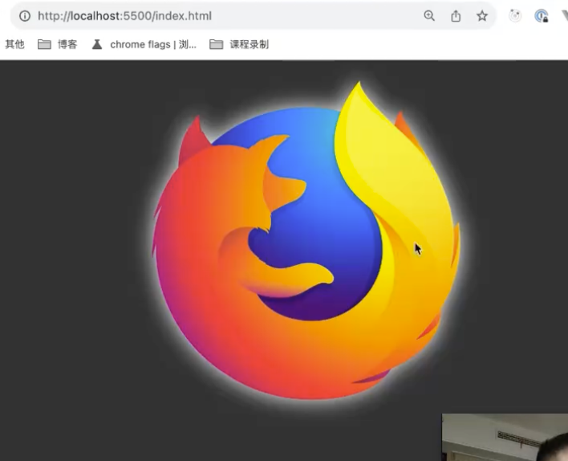
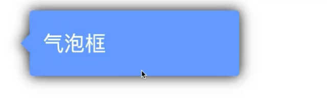

```scss
{
    filter: drop-shadow(阴影)
}
```

<br><br>

# 浮动的简介
通过浮动 可以使一个元素向其父元素的左侧或者右侧移动

<br>

### float
当我们设置float后 可以把元素想象成气球 可以让气球往父元素的左侧或者右侧飘
**它只会在它的父元素内飘 不会飘出父元素**

<br>

**可选值:**  
- none
- left
- right

<br>

**注意:**   
元素设置浮动以后 水平布局的等式 就失效了

<br>

### 浮动的特点1: 
1. 浮动元素会完全脱离文档流 不再占据文档流中的位置
2. 设置浮动以后 元素会向父元素的左侧或者右侧移动 
3. 浮动元素默认不会从父元素中移出 父元素就相当于浮动元素的*一堵墙*没办法逾越的
4. 浮动元素向左向右移动时 不会超过它前边的其它浮动元素
如果浮动元素的上边是一个没有浮动的块元素

5. 浮动元素不会超过它上边的浮动的兄弟元素 最多最多就是和它一样高

<br>

### 浮动的特点2:
1. 我们的浮动元素不会盖住我们的文字 文字会自动环绕在盒子的周围 所以我们可以利用浮动来设置文字的环绕图片效果
2. 没设置宽度所有默认全屏
3. 没设置高度所以默认被里面的元素撑开
4. 元素设置浮动以后 将会从文档流中脱离 从文档流中脱离后 元素的一些特点也会发生变化

<br>

### 脱离文档流后有什么样的特点呢? 
1. 块元素不在独占一行 
2. 脱离文档流以后 块元素的高度和宽度都被内容撑开 脱离之后就没有全屏一说的
3. 行内元素 脱离文档流以后 会变成块块元素 和块元素一样
4. 脱离文档以后 就不需要区分块和行内了

<br>

### 浮动的高度塌陷
一般我们在写pc端的代码时 一般宽度都是写死的 或者宽度会指定一个范围

但是高度呢? 假如一个页面没太多的变化 都是固定的 那无所谓, 很多时候父元素的是不会写死的  它根据内容会变的

```html
<div class="outer">
    <div class="inner"></div>
</div>
```

一个inner还好 可以撑开父元素 但有些情况 一个outer里有很多的inner 而且还需要这些inner 浮动 **inner浮动后 outer高度没了 这就是高度塌陷的问题**
    
<br>

在浮动的布局中 父元素的高度是被子元素撑开的 当子元素浮动以后其会完全脱离文档流 子元素从文档流中脱离

将会无法撑起父元素的高度 导致父元素的高度丢失 父元素高度丢失以后  其下的元素会自动上移 导致页面的布局混乱 高度塌陷是浮动布局中比较常见的一个问题 这个问题我们必须要处理

<br>

### BFC
是css中一个隐藏的属性 可以为一个元素开启bfc 开启bfc该元素会变成一个独立布局的区域 和 其他的块 不同

**元素开启bfc后的特点:**    
1. 开启bfc的元素 不会被浮动元素覆盖
2. 开启bfc的元素的子元素 和 父元素的外边距不会重叠 
3. 开启bfc的元素可以包含浮动的子元素

<br>

### 怎么开启bfc
**1. 设置父元素浮动 float 开启bfc**   
高度不塌了 但是它会从文档流中脱离 宽度丢失

<br>

**2. 将元素设置为行内块元素**
```css
display:inline-block;
```

<br>

**3. 将父元素的overflow设置为一个非默认值**
```vss
overflow:scroll / auto / hidden(常用)
```

<br>

### clear 清除浮动元素对其的影响
不是给浮动元素加的 而是给**被影响的元素**加的 clear 属性

```html
<div class="box1"></div>
<div class="box3"></div>
```

假如box1浮动 box3会上移 也就是说box3受到了box1浮动的影响 位置发生了改变 如果我们不希望某个元素因为其它元素浮动的影响而改变位置 则可以 通过clear属性来清除浮动元素对当前元素所产生的影响

<br>

### css属性: clear 
清除 浮动元素 对 当前元素所产生的影响

- left / right:  清除左侧浮动元素对当前元素的影响
- both: 清除两侧中 影响最大的那个, 相当于该元素排列在父元元素的后面


<br>

原理 设置清除浮动以后 浏览器会自动为元素添加一个上外边距 使其位置不受其他元素的影响

<br>

### 高度塌陷的最终解决方案

**方式一:**  
在元素的最后面加一个空的标签 然后让这个标签 clear both 然后就能撑起父元素的高度了
```html
<div class="outer">
    <div class="inner">内容</div>
    <!-- tools 没有用 只是解决高度塌陷的一个问题 -->
    <div class="tools"></div>
</div>
```

```css
.tools {
    clear: both；
}
```

<br>

**方式二: clearfix - 推荐**  
```css
.clearfix::before,
.clearfix::after {
    content:'';

    /* 
    inline-block 也可以但是inline-block即使是空串 也会占一行 把inline-block当做一个字就好了 所以最好的办法是table 没有内容也能分开 
    */
    display:table;
    clear:both;
}
```

- clearfix 这个样式可以同时解决高度塌陷 和 外边距重叠的问题 当你再遇到这些问题时 直接使用clearfix 这个类即可

*给父元素添加 clearfix 哦~*

<br><br>

# 定位

### position 
是一种更加高级的布局手段 通过定位可以把元素摆在页面中的任意位置

**可选值:** 
- static: 默认值   没有开启定位
- relative: 相对定位
- absolute: 绝对定位
- fixed: 固定定位
- sticky: 黏性定位

<br>

### 相对定位 relative

**特点:** 
1. 定位位置 元素左上角的坐标原点为元素在文档流中原先的位置

2. 相对定位会提升元素的层级

3. 相对定位不会脱离文档流 不会改变元素的性质 块还是块 行内还是行内

4. 不设置偏移量不会发生任何变化 通过偏移量可以移动元素的位置 上下左右只会影响自己
```css
div {
    position: relative;
    /* 定位元素 和 定位位置 上边的距离 */
    top:

    /* 
        定位元素 和 定位位置 下边的距离
        定位元素 垂直方向的距离 由 top 和 bottom 来控制 通常情况下 只会用一个
    */
    bottom:

    /* 定位元素 和 定位位置 左边的距离 */
    left:

    /*
        定位元素 和 定位位置 右边的距离
        定位元素 水平方向的距离 由 left 和 right 来控制
    */
    rigth:
}
```

<br>

### 绝对定位 absolute
**特点:** 
1. 定位位置 元素左上角的坐标原点为: 
    - 父元素没有开启定位时 在窗口的左上角
    - 父元素开启定位后 绝对定位元素是相对于包含块进行定位的
    
2. 绝对定位后 元素的位置不会发生变化
3. 绝对定位后 元素会脱离文档流 绝对定位会改变元素的性质 行内变成块 块的宽高被内容撑开
4. 绝对定位后 元素会提升层级

<br>

### 包含块: 
正常情况下也就是在文档流中的情况时 包含块就是 当前元素 最近的 祖先 块元素

开启绝对定位元素的包含块是当前元素 最近的 **开启定位的** 祖先元素

<br>

### 固定定位 fixed
固定定位也是一种绝对定位 大部分特质跟绝对定位一样

**不同点:**   
固定定位的位置 永远 参照于 **浏览器的视口** 进行定位

<br>

### 黏性定位 sticky
黏性定位 和 相对定位 的特点基本一致 不同的是 当元素到达某个位置时将其固定, **它是相对于视口来进行定位的**, 当元素到达我们指定的位置后 会被粘住

设置为黏性行为的元素的位置受如下的两个因素影响
1. 包含块
2. 最近可滚动元素: 一个元素它的overflow不是visible 它就是可滚动元素, 都找不到的时候就是整个视口

比如我们要将dt设置为黏性定位 它的结构是
```html
<dl>
    <dt></dt>
    <dd></dd>
</dl>
```

```scss
dt {
    ...
    
    position: sticky;
    top: 0px;
}
```

<br>

### 解释为什么受两个因素的影响
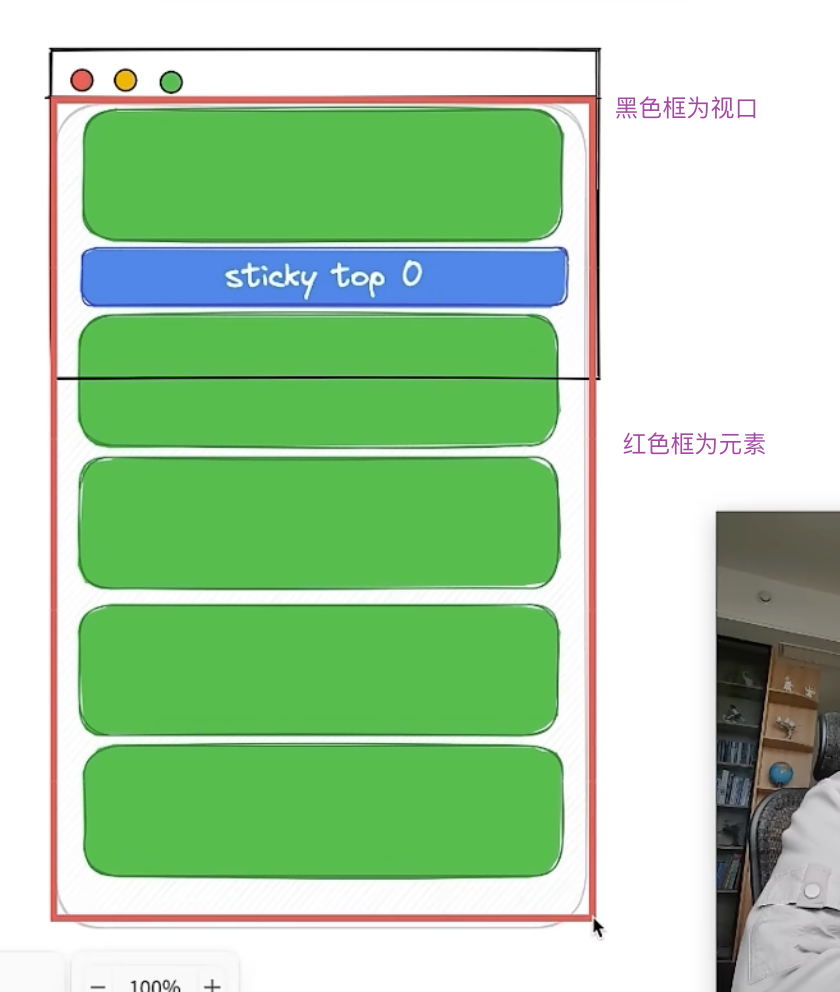

- 黑色框框为视口
- 红色框框是元素
- 蓝色框框为黏性定位元素

在普通情况下, 黏性定位元素和其他元素没有什么区别, 它就正常定位就完事了, 当我们滚动视口的滚动条的时候, **它会随着其它元素一起滚动是没有问题的**

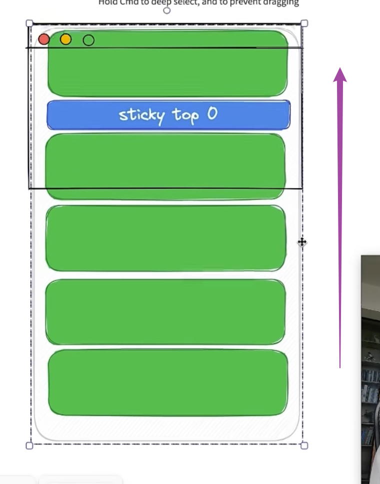

但是到了一个点的时候就会出现差异了 比如到达下面的这个点

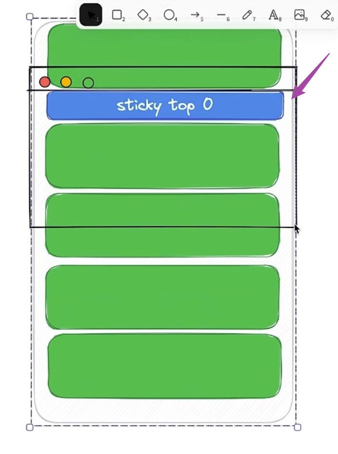

黏性定位元素的top设置为0, 指的是它跟最近的可滚动元素(视口) 在视口里面达到了top0的时候 就出现差异了

当我们继续往上滚动的时候 它就定位在top0的位置了

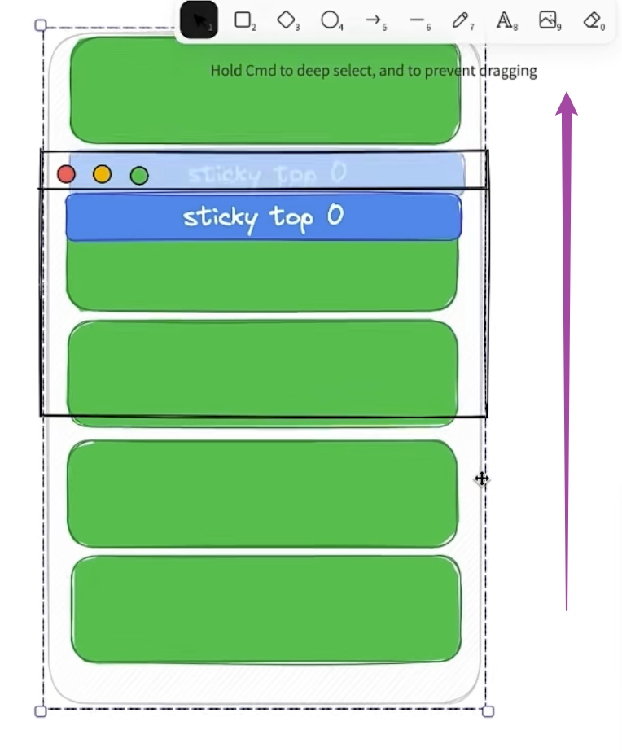

所以吸附位置的top0 **是相当于最近可滚动元素的位置**, 它不是相对于父元素的, 其它的正常元素不会因为它的吸附受到影响

其它元素在排列的时候还当成黏性元素仍然在原先的位置, 所以不会影响到其它元素的布局  

当黏性元素触碰到了它的父元素(包含块)的边缘 这个时候如果继续往上滚动的话 它就不再吸附了 它会被这个父元素带走

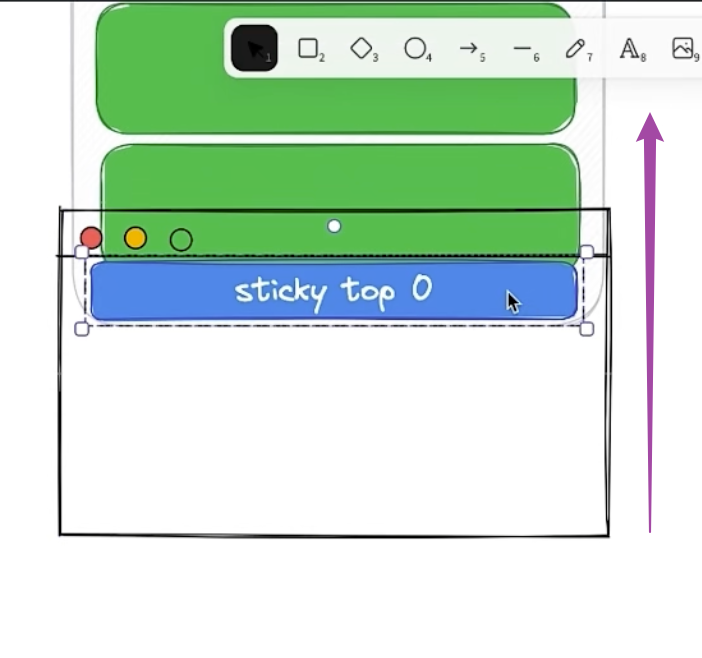
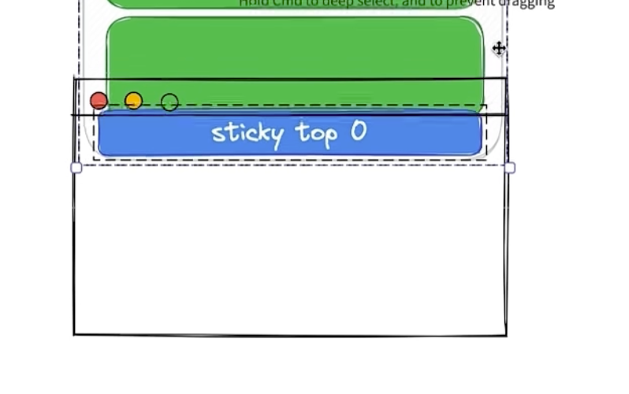
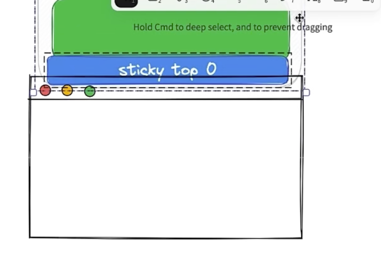

<br>

比如:  
我们元素在 Y500px 的位置 现在我们设置top值为0 那么我们滚动滚动条 当元素到达0的位置后 会被粘住 也就是 top 设置的是 当元素到达什么位置的时候开始粘住

```css
/* 目标元素 */
.box1 {
    height: 100px; 
    background-color: #bfa;

    /* 元素和视口有100px的距离 */
    margin-top: 100px;
    
    position: sticky;
    /* 当元素到达0px的时候 会被粘住 */
    top: 0px;
}
```

兼容性不太好 尤其是IE 所以一样的效果还是要搭配JS去做

<br>

### 效果: 滚轮 + 推入 退出
```s
https://www.bilibili.com/list/3494367331354766?sort_field=pubtime&spm_id_from=333.999.0.0&oid=788685282&bvid=BV1Wy4y1F7yU
```

<br>

### 要点: 
一般我们会给开启 absolute的元素的父元素 开启relative

<br>

### 绝对定位的元素的布局
正常情况下的水平布局 要满足
```
7个属性相加 = 父元素的宽度
```

当开启绝对定位以后 就变了 当到了绝对定位后 我们水平方向的布局等式中 要添加 **left & right** 此时的规则和之前的一样

```
left + 以前的7个属性 + right = 包含块的内容区的宽度
```

当发生过度约束时
- 如果9个值中没有auto 则自动调整right值 以使等式满足
- 如果有auto 则自动调整auto的值 以使等式满足

<br>

margin width left right 可以设置auto

<br>

### 技巧: 
将 top bottom left right 设置为0
- 当 width 有固定宽度的时候 会居中
- 当 width 没有固定宽度的时候 会铺满

<br>

**水平方向居中:**
```css
{
    margin-left:0;
    margin-right:0;
    left:0;
    right:0;
}
```
    
<br>

垂直方向的等式 也要满足9个值的高度 等于 包含块的高度

<br>

**垂直方向居中:** 
```css
{
    margin-top: auto;
    margin-bottom: auto;
    top:0;
    bottom:0;
}
```

<br><br>

## 什么使用使用绝对定位
当我们满足下面的三个条件之一的时候 使用绝对定位
1. 元素出现在一个天马行空的位置
2. 元素是否存在, 不影响其他的元素的排列
3. 单个元素在某个区域内水平垂直居中

<br>

### fixed 和 absolute 的区别
1. fixed 参考视口
2. absolute 参考定位的父元素

<br><br>

# 元素的层级
对于开启了定位的元素 可以通过z-index来调整元素的层级

<br>

### z-index
```css
{
    z-index:1-9999;
}
```
    
元素的层级一样时 优先显示靠下的 指的是结构上的 祖先元素的层级再高也不会盖住后代元素

<br><br>

# 行高

### line-height属性:
行高是指 **文字占有的实际高度** 我们可以通过使用line-height来设置div的高度

行高的单位 px em 也可以设置一个整数 整数是字体大小的倍数 

**默认行高为1.33**

<br>

### 字体框: 
字体存在的格子 设置font-size就是在设置文字框的大小

<br>

### 行高的分配: 
行高会在字体框的上下平均分配 (100-50)/2

<br>

### 行间距: 
行间距 = 行高 - 字体大小

<br>

### 技巧: 单行文字垂直方向居中
```css
{
    font-size:50px;
    line-height:50px;
}
```

<br>

### 技巧: 多行文字 或 元素 在父元素内居中
将父元素的显示模式设置为 table-cell
```css
.outer {
    width:300px;
    height:300px;
    background-color:red;

    /* 将元素设置为成 单元格 td */
    display:table-cell;
    vertical-align:middle;
}

.inner {
    width:100px;
    height:100px;
    background-color:blue;

    /* td有的属性 对td好用的效果都好用  如果是文字的话好用 框体的话还是要用 margin:0 auto */
    text-align:center;
}
```

<br><br>

# 表单
表单用来提交数据 将本地数据提交给服务器

### ``<form action="">``

**属性: action**   
form表单中必须要有的一个属性 表单要提交服务器的地址
```html
<form action="target.html"></form>
```

<br>

### 文本框
数据要提交给服务器 必须要为元素指定一个name值 name的值根据你文本框填写的内容来定
```html
<input type="text" name='username'>
```

**属性:**   
- autocomplete="on/off": 根据我们历史输入 *自动补全* 开启 关闭
- readonly: 将表单项设置为只读 跟value配合使用 数据会提交
- disabled: 将表单项设置为禁用
- autofocus: 自动获取焦点

<br>

### 密码框
密码框要想提交也必须要指定一个name值
```html
<input type="password" name='password'>
```

<br>

### 提交按钮
```html
<input type="submit" value='btnname'>
```
    
<br>

### 单选按钮
单选按钮也必须要指定name属性 用来进行分组 **所以一组的东西必须有相同的name属性**

单选按钮还必须要指定value属性 value值最终会作为用户填写的值传递给服务器

<br>

**属性:**  
checked 默认选中
```html
<input type="radio" name="sex" value='men' id="" checked>
<input type="radio" name="sex" value='women' id="">
```

<br>

### 多选按钮
多选按钮也必须要name属性 一组的元素name属性应该一样

多选按钮也必须要value属性

```html
<input type="checkbox" name="aihao" value='xx' id="">
<input type="checkbox" name="aihao" value='yy' id="">
<input type="checkbox" name="aihao" value='zz' id="">
```

<br>

**原生js获取表单内部数据的方式:**  
```js
btn.addEventListener("click", () => {
    // 这要是不使用 formData 是不是很痛苦
    let xxVal = xx.checked ? xx.value : ""
    let yyVal = yy.checked ? yy.value : ""
    let zzVal = zz.checked ? zz.value : ""

    let arr = []
    if(xxVal) arr.push(xxVal)
    if(yyVal) arr.push(yyVal)
    if(zzVal) arr.push(zzVal)

    console.log(arr)

    let data = new FormData(form)
    console.log(data.getAll("aihao"))
})
```

<br>

### 下拉列表
也需要指定name属性 option标签内部 可以写 selected 代表默认选中

```html
<select name="" id="">
    <option value="" selected></option>
</select>
```

<br>

**要点: 下拉框的默认值指定方式**  
1. 正常写法 下拉框的值默认展示第一个option对应的 **标签体内容**
```html
<select name="" id="">
    <option value="1">--1</option>
    <option value="2">--2</option>
    <option value="3">--3</option>
</select>
```

2. 通过 ``<option selected>`` 来指定默认展示哪个option

3. 通过 ``<select value="1">`` select的value属性指定展示哪个option, 当 value 的值 和 option的value的值一致的时候 就会默认展示对应的option的标签体内容
```html
<select value="2">
    <option value="1">--1</option>
    <option value="2">--2</option>
    <option value="3">--3</option>
</select>
```

<br>

**注意:**  
上面的第 3 条
- 如果您使用纯 HTML, 则必须在``<option>``标签中使用selected属性 来展示对应的默认值

- 但是react中允许我们在 select标签上使用value属性 来控制默认显示的值 使用这种方法，通常您会希望在 state 中指定值，以便它是可更新的。

<br>

### 重置按钮
```html
<input type="reset" value="">
```

<br>

### 按钮
按钮默认的类型就是 submit
```html
<!-- 默认 -->
<button type='submit'></button>
<!-- 普通按钮 -->
<button type='button'></button>
<button type='reset'></button>
```

<br>

### 移动端: 
移动端使用这两个标签会多一些 *因为会弹出对应的键盘*
```html
<input type="tel" name="" id="">
<input type="email" name="" id="">
```

<br>

### 字体的简写属性
最好写在最前面

**顺序:**  
```css
{
    font: [字体粗细(bold) 字体样式(italic)] 字体大小(倒数2)/行高 字体族(倒数1)
}
```

<br>

**注意:**  
字体大小 和 字体族 是必写属性 而且 **必须在最后面**

行高 不写不是没有 而是使用了行高的默认值 所以可能会用默认值 覆盖掉 上面的line-height

字体粗细 字体样式 不写不是没有 而是相当于设置了默认值 normal 写在下面有可能会覆盖掉上面的样式

```css
{
    font: bold italic 50px/2 中华正楷

    font-style: 
    font-weight: 
}    
```

<br>

### 字体族
特殊字体 怎么才能让客户使用服务器上的字体 可以将服务器中的字体直接提供给用户去使用
```css
@font-face{        
    /* 指定字体的名字 我给这个字起的名字 myFont  */
    font-family:;     

    /* 服务器上字体的路径 */
    src:url();          
}
```

<br><br>

# 图标字体
在网页中经常要使用一些图标 可以通过引入图片 但是图片本身会大 也不灵活
所以在使用图标时 我们还可以将图标直接设置为字体 然后通过font-face的形式来对字体进行引入 我们就可以通过使用字体的形式来使用图标了 我们可以把图标做成字体文件 然后通过font-face的形式 发回来使用

网上有很多图标字体库 
1. 国内比较多的是 iconfont 阿里的图标库
2. 国外的是 font Awesome 英文的比较新

<br>

### font Awesome
1. 下载
2. 解压
3. css 和 webfonts 移动到项目中 它俩必须在一起
4. 将css文件引入到网页中 ``<link rel="stylesheet" href="">``

5. 使用图标字体
直接通过类名来使用图标字体 fas或者fab是固定的 ``<i class="fas 图标名字"></i>``

```css 
li::before {
    content:'\编码';
    font-family:      去css文件中看看这个图标使用的哪款字体;
    font-weight:900;  这个是css中字体下面带的 一起粘贴过来
}
```

通过实体使用来使用图标字体 ``<i class="fas">&#x图标的编码;</i>``

<br>

### 阿里图标的使用方式
1. 引入iconfont.css
2. 创建一个``<i class="iconfont classname">去复制实体</i>``标签

<br><br>

# 文本的对齐方式

### 水平方向的对齐方式 text-align:
文字在元素内部的时候 使用

<br>

### 垂直方向的对齐方式 vertical-align:
**属性:**   
- baseline: 基线对齐 默认值

- middele: 子元素的中线和X的中线对齐 并不是严格意义上的垂直居中

- 数值: 可以通过数值来调整位置 正数往上 负数往下

```html
<style>
    p {font-size:50px}
    span {font-size:15px; vertical:top}
</style>

<p>今天天气<span>真不错</span></p>
```
        

垂直对齐 文字默认都是在基线上排列的 ``vertical-align: bottom`` 子元素底部和父元素底部对齐

<br>

### 引入图片后 图片会与边框有一个缝隙 图片缝隙 解决方案
原因 img是 **替换元素 相当于一个文字** 文字是沿着基线去对齐的 图片也一样

<br>

**解决方案:**   
*在img中设置* vertical-align: bottom/top 只要不是默认值baseline就可以

<br>

### 文本的一些属性; text-decoration: underline overline line-through
文本修饰

还是可以指定完线的样式后添加颜色属性 跟边框的写法差不多 但是ie不支持  
text-decoration:underline red soild;


### 省略文字... 效果
```css 
.box2 {

    width:200px;

    /* 必要的3个条件 */
    white-space:nowrap;
    overflow:hidden;
    text-overflow:ellipsis;

    /* 设置网页如果处理空白 normal  nowrap 不换行  pre 保留*/
    white-space:nowrap;
}
```
    
<br>

### 案例: 京东页面点击按钮 出现下拉框
先做个框 然后放在北京的祖先盒子里 这个下拉框 一上来应该是隐藏的display:none;
也就是鼠标移入到北京时 下拉框就显示出来了

是绑定给北京的超链接么? 

<br>

### :hover
当鼠标移入一个div时 让它下面的兄弟元素显示出来
也就是说 要给current-city绑定hover
```css
.current-city:hover + .city-list{
    display:block;
}
```

<br>

但是绑定给current-city后 鼠标再移出后 下拉框又消失了 到底要绑定给谁? 
应该绑定给他们的共同的父元素 这样的范围最大
```css
.location:hover  .city-list{
    display:block;
}
```

<br>

```html
<div class="location">
    <div class="current-city">
        <i class="fas "></i>
        <a href="">北京</a>
    </div>
    <div class="city-list"></div>
</div>
```

<br><br>

# 背景相关

### background-color:
背景颜色

<br>

### background-image: url('links/1.jpg');
背景图片

背景图片默认在元素的左上角

- 如果背景图片 小于 元素 背景图片会自动在元素中铺满
- 如果背景图片 大于 元素 背景图片将有一部分无法显示

可以同时给背景设置 背景颜色 和 背景图片 背景颜色将成为背景图片的背景色

<br>

### background-repeat:
背景图片重复方式

可选值: 
- repeat: 默认值
- repeat-x: 沿着x轴重复
- repeat-y: 沿着y轴重复
- no-repeat: 不重复

<br>

### background-position:
背景图片位置

可用通过left right top bottom center几个方位的词来设置背景图片的位置

```
top left      top center      top right

left center   center center   right center

bottom left   bottom center   bottom right
```

使用方位名词的时候 至少需要两个词 如果只写一个词的话 第二个值默认就是center
还可以通过偏移量设置 图片 的位置 至少需要两个值

```css
background-position:10px 10px;
```

<br>

### background-origin:
设置背景图片的原点 设置背景图图片偏移量计算的圆点

**可选值:** 
- padding-box 默认值: background-position从内边距处开始计算 就是说图片的原点在内边距的左上角

- centent-box 背景图片的偏移量从内容区处开始计算 也就是图片的原点在内容区的左上角

- border-box 背景图片的额偏移量从边框处开始计算 也就是图片的原点在边框处的左上角

<br>

### background-clip:
设置背景图片的范围      ie8不支持

边框的下面有背景的 当我们想设置背景图片的范围时可用这个属性

<br>

**可选值:** 
- border-box 默认值:  背景会出现在边框的下面

- padding-box 背景只会延伸到内边距 不会再出现在border的下方

- content-box 背景只会延伸到内容区

<br>

### background-size:
设置背景图片的尺寸

```css
background-size: 100px 100px;  
```

第一个值是宽度 第二个值是高度 如果只写一个 第二个值为auto

<br>

**可选值:**  
- cover: 图片比例不变 将元素铺满 以框体为主
- contain: 图片比例不变 将图片在元素中完整显示 以图片为主


### background-attachment:
设置背景图片是否跟元素移动

**可选值:**   
- scroll: 默认值  背景图片跟着元素一起移动
- fixed: 背景图片会固定在页面中 不会随着元素一起移动

这个时候再进行定位 就是按照 视口 来定位了

```css
background-color:
background-image: url('links/1.jpg');
background-repeat: repeat;
background-position:
background-size:

background-origin:  它在前
background-clip:    它在后

background-attachment: 
```

<br>

### 简写属性:  
可以把背景相关的属性都用background来书写 而且没有顺序要求
```css
background:red url('') center center ....
```

<br>

**注意:**  
如果有background-size属性的话 要写在position的后面 用 / 隔开
```css
background:red url('') center center/cover ....
```

如果有background-origin 和 background-clip 的话, **background-origin必须在前面**
```css
background:red url('') center center/cover border-box content-box
```

```css
background: [background-color] [background-image] [background-repeat]
            [background-attachment] [background-position] / [ background-size]
            [background-origin] [background-clip];
```

```css
.example {
  background: aquamarine url(img.png)
              no-repeat
              scroll
              center center / 50%
              content-box content-box;
}
```

<br>

# 渐变
渐变是图片 需要通过background-image来设置 它的很多特点是跟背景图片一样的 跟color属性相距甚远  
它属于一种颜色 特质跟图片一样 对老版本的ie兼容性不是很好

<br>

### 线性渐变 background-image: linear-gradient();
第一个参数可以传递方向
```
to right / to top left / 45deg(度数) / 1turn(一圈 .5turn .25turn)
```

颜色可以传递多个 默认情况下平均分配 也可以手动分配颜色分布情况 颜色的起始位置 颜色和数值之间用空格链接

红色从50px开始发生过渡渐变
```css
{
    background-image: linear-gradient(red 50px, yellow 70px);
    background-image: linear-gradient(to left, red, yellow, blue);
}
```

<br>

### 重复线性渐变:  background-image: repeating-linear-gradient();
可以平铺的线性渐变 上面设置数值后 空白区域都是纯色平铺的 如果希望渐变平铺用这个属性

当传递两个值时 和linear-gradient没有区别
```css
background-image: repeating-linear-gradient(red, yellow);
```

当在颜色后面设置数值 也就是起始位置时 会有区别
```css
background-image: repeating-linear-gradient(red 50px, yellow 100px);
```

高度为200px 渐变范围是50px 200/50=4个部分开始重复渐变

<br>

### 径向渐变: background-image:radial-gradient()
第一个值在最中心 第二个值在外围 默认情况下 径向渐变的形状根据元素的形状计算的

指定径向渐变的范围 在第一个参数的位置

可以指定数值 还有预定义的语句: 
- circle  正圆 
- ellipse 椭圆

```css
background-image:radial-gradient(100px 100px, red, yellow)
/* 径向渐变的范围是100px x 100px */
```

<br>

指定渐变范围延伸到哪里
- closest-side 延伸到离圆心最近的两条边
- farthest-side 延伸到离圆心最远的两条边
- closest-corner 延伸到离圆心最近的角
- farthest-corner 延伸到离圆心最远的角

```css
background-image:radial-gradient(closest-side at 100px 100px, red, yellow)
<!-- 渐变延伸到离圆心最近的两条边 -->
```

<br>

可以指定渐变圆心的位置 在第一个参数的位置里传递 at 0 0
```css
background-image:radial-gradient(100px 100px at 0 0, red, yellow)
```

### 重复径向渐变:  background-image: repeating-radial-gradient(red, yellow);

<br><br>

# 显示 与 隐藏
加过渡效果 hover时 结构上要关系

通常我们都是通过display来把元素进行 显示 和 隐藏的设置
```css
{
    display:none;
}
```

这样再加动画效果的时候 并不好处理 一般可以通过 *设置height来隐藏元素*
```css
{
    height:0;

    /* 高度没有了 文本会移除 隐藏移除部分 */
    overflow:hidden;
}
```

然后通过设置高度来显示元素
```css
{
    height:100px;
}
```

<br><br>

# 动画 - 过渡效果

### transition: 属性 时间
用于为样式设置过渡效果 样式改变时 必须是具体的数值

```css
/* 
    0 - 55 
    不能是 auto - 55 
    所以在移动偏移量时 要手动设置left:0 
*/
.xx {
    height:0;
    overflow:hidden;

    /* 当高度属性发生变化时 我要花3秒钟的时间去切换 */
    transition:height 3s;
}

.xx:hover {
    height:55px;
}
```

<br>
    
### 图片横向切换效果
有点像轮播图 鼠标移入后 切换了左边的图片

**1. 图片如果是链接的话 可以用a标签 a标签用css样式设置背景图片**
```html
<div class="wrapper">
    <div class="img1">图片1</div>
    <div class="img2">图片2</div>
</div>
```

<br>

设计好结构之后 剩下的就是整体的移动两个元素 像移动轮播图的ul
```css
.wrapper {
    width: 100px;
    height: 100px;
    position: relative;
    overflow: hidden;
}


.img1, .img2 {
    width: 100px;
    height: 100px;
    background-color: #f2a154;
    text-align:center;
    line-height:100px;
    color:#314e52;
    position: absolute;
    left:0;

}

.img1 {
    transition:left .5s;
}

.img2 {
    background-color: #f7f6e7;
    left:-100px;
    transition:left .5s;
}

/* hover效果要添加给他们的父元素 */
.wrapper:hover .img1 {
    left:100px;
}

/* 这里left的值并不是移动多少距离 而是移动到哪里 原先它的 left值为-100px, 我要移动到0px的位置 */
.wrapper:hover .img2 {
    left:0px;
}
```

<br><br>

# 固定定位 调整浏览器窗口 水平位置也不会变的技巧
在此之前先复习下 定位之后 我们水平方向的布局 要满足的等式
```
    left + margin-left + border-left + padding-left 
    + width + 
    padding-right + border-right + margin-right 
    
    = 包含块的宽度
```

这里我们先直说 固定定位(它是相对于视口来计算偏移量的)
```
    left + margin-left + width + margin-right + right = 视口
```

<br>

### 需求: 
空白 + 页面宽度 + 空白  
空白 + 页面宽度 紧挨 目标div + 空白

不管怎么拖动浏览器水平的大小 我们的div都紧紧的挨着页面宽度

```css
div {
    position:fixed;
    right:50%;
    margin-right: 父容器的一半 + div的宽度
}
```

<br>

### 原理: 
right:50% 让它到页面的中间 div右侧就是中线
left就是auto 那现在的等式就是
```
left + margin-left + width + margin-right + right = 视口
auto + 0 + div宽度 + 0 + 50% = 视口
```

我们不能给left指定固定值 还是因为浏览器窗口可能会改变 但我们可以减小margin-right的值 left的值为了使等式满足就会自动增大  
然后通过left的值将我们的目标顶到目标位置 这样都是自动计算的 不管再怎么改变浏览器的水平窗口 目标位置也不会发生改变

```css
.targetBox {
    width:50px;
    height: 100px;
    background-color: aquamarine;

    /* 经常会用到 这么写是利用了等式的原理 */
    position:fixed;
    right:50%;
    margin-right:-550px;
    bottom:270px;
}
```
<br>

### 设置网站的图标 会在标题栏和收藏栏里显示
head标签里
```html
<link rel="icon" href="图片地址">
```

网站图片一般都在网站的根目录下 名字一般都叫做 favicon.ico
可以去百度下 制作 ico图片

<br>

### 网站上线时 压缩代码
VSCode里的插件: JS & CSS Minifier (Minify)

**用法:** 
F1 --- minify:document

删除一些:  空格 换行 注释等
目的:  加载速度快 用户体验好 

<br>

### 项目练习: 
body的真实大小 要通过border来查看 直接给body设置背景颜色 其实是给html设置的

index.html  作为首页

index.css   开发时 样式写在外部样式表中链接进来 名字和html文件起成一样的

创建base.css文件用来放一些公共样式 内部比如整个网站要用的字体是什么 clearfix等等

引入图标字体库

主要区域的宽度是多少 一般是1200 1000

min-width:1200px;

最小宽度1200px 这样防止拖动浏览器 视口变小时影响布局

有的时候发现 上面元素虽然设置了 margin-bottom: 17px 明明有地方 但是下面的文字上不去 看看是不是父元素里共同设置了line-height 下面的那行文字可能继承了line height属性 所以上不去 重置下就好了

以前会认为img之类的标签也属于行内元素 但设置text-align center 却没有生效 因为img属于行内块元素

想让一个对象不在父元素中占据位置 可以设置position:absolute


1. LOGO属于网页中最重要的部分 所以 logo 应该放在h1标签中   

2. 相对路径指的是 你写在哪里就相对于当前文件 去找图片

3. 背景图片居中 用background-position

4. logo h1等 上面要加上title

5. 在h1中 最好写上文字 方便搜索引擎能爬到 但写上文字后 会出现在屏幕上 所以 这时候我们 text-indent:-9999px;

6. 使用display:none 隐藏元素 隐藏的元素不会占页面的位置 会影响布局 这时候我们可以用 visibility:hidden

7. 弹出层的问题 ul li a 结构是这样的 现在我给li绑定的hover 这样我离开li后 弹出层会消失 所以 还要给弹出层绑定hover
```css
.nav li:hover ~ .goods-info,
.goods-info:hover {}
```

8. 接上 在所有li中 刨除第一个和最后两个 也可以要把 显示的东西 加上共同的类
```css
.nav li:not(:first-of-type):not(:nth-child(10):not(:nth-child(9))):hover ~ .goods-info
```

9. 下拉层 应该有很好的层级 不要让别的元素盖住

10. button里的提示文字也可以是一图标字体 来完成 放大镜按钮
```html
<button class="search-btn">
    <i class="fas fa-search"></i>
</button>
```

11. input设置高度 不会太准 因为 内部有些默认的padding导致的 所以在设置input样式时 里面的padding去掉 可能要有边框的问题 border:none

12. button 里 有个默认属性 是box-sizing:border-box 这里的设置button的大小 会设置整个可见框的大小

13. 搜索框中的 div 文字 加 背景 点击的时候 消失 移出的时候显示 有字的时候也没有 只有没字的时候才会出现 这就是两个div 通过绝对定位 定到这里就可以

14. 输入框 点进去后发生 样式的改变 :Focus 

15. 结构要分析好 比如 一个div放哪

16. 垂直方向的问题 我们第一个想想行高的问题

17. 固定定位 垂直方向好调 bottom就可以 但是水平方向不行 窗口一拖动 水平方向就变了 布局等式 只针对这里: 
```css
left+margin-left+width+margin-right+right = 视口的宽度

刚才的做法是 auto + 0 + 26 + 0 + 60 = 视口的宽度

解决方案:
{
    position:fixed;
    right:50%;

    /* 将right值设置为视口宽度的50% 效果就是不管浏览器怎么放大或者缩小 它的位置都在视口的一半 图形右边是中线 */
}

auto + 0 + 26 + 0 + 50% = 视口的宽度

这时候 我们想让图形左边的距离增大 那么只能减小marginleft或者marginright的值
因为减小marginleft的值 auto为了使等式满足就会增大 但是我们要减小marginright的距离
```

18. 用正方形等做线 横线用width:70px height:1px 竖线用width:1px height:70px;

19. 媒体查询

<br><br>

# animation -- 过渡
过渡效果 是一种交互效果 是鼠标移入的时候 开始进行过渡效果

通过过渡可以指定当一个属性发生变化时的切换方式 可以提升用户体验

大部分属性都可以进行过渡 只要它的值是可以计算的 所以必须是 一个有效数值 向 另一个有效数值进行过渡

<br>

### 注意:
1. margin:auto 就不能过渡 因为auto不是数字 没办法实现过渡
2. transform中使用100%, 是相对于元素自身

<br>

### 执行过渡效果 有两个属性是必须的
1. 过渡的属性
2. 过渡花费的时间

<br>

### 用法: 
**1. 在目标元素中 设置属性**
```css
transition: [name] [ms / .2s];   /  transition: all [ms / .2s];
```

<br>

**2. 给 目标元素 添加 :hover 来改变目标元素的 目标尺寸**


### 属性: 
过渡属性如果有多个 用逗号隔开 如果全部要发生改变 那就填写all

**transition-property: 要执行过渡的属性**
```css
transition-property: width;
```

<br>

**transition-duration: 指定过渡效果持续的时间**
```css
transition-duration: 2s / .2s = 20ms;
```

<br>

**transition-timing-function: 过渡的时序函数 (指定过渡的执行方式)**

可选值: 
- ease 默认值      慢速开始 先加速 再减速 停的时候感觉很好
- ease-in 加速运动
- ease-out 减速运动
- ease-in-out 先加速 再减速
- linear 匀速
- cubic-bezier()  通过贝塞尔曲线指定时序函数
```css
/* 
https://cubic-bezier.com/#.17,.67,.83,.67
网站中可以查询数值 #.17,.67,.83,.67      手柄的两个坐标
*/
transition-timing-function: cubic-bezier(0,0,1,1); 
```

- steps(2, end / start): 分步执行过渡效果 (当num为12时, 整个动画最好有13帧)
  - 参数: 分几步 steps(3) 
  - 参数: end默认值 假如我们的总时长是2s 分2步 每步就是1s
    - end 看不见最后一帧
    - start 看不见第一帧
```css
transition-timing-function: steps(2, end / start) ;
```

<br>

**transition-delay: 过渡效果的延迟**
等待一段时间后再执行过渡效果
```css
transition-delay: 2s;
```

<br>

### 简写属性: 
可以同时设置过渡相关的所有属性 只有一个要求 要是写延迟 第一个时间是持续时间 第二个时间是延迟时间
```css
transition: left 2s 2s ease;
```

<br>

### 技巧: 
- margin-right等 也是可以过渡的 效果就是移动
- 属性也可以分别设置过渡时间: 
```css
    transition-property: width, height;
    transition-duration: 1s, 2s
```

<br>

### 过渡 - 相关技巧
传统使用hover去移动 只能移动一次
这里我们可以用 时序函数来分几步进行操作
```css
transition-timing-function: steps(3)
```

<br><br>

## 注意点

### 没有过渡效果的属性:
在过渡效果中 有一些属性是不会产生过渡效果的 比如如下的属性:
- display (所以d开头的属性都不能被动画)

<br>

### 过渡中的问题
1. 在元素首次渲染还没有完成的情况下, 是不会触发过渡的
2. 在绝大部分变换样式切换时, 如果变换函数的位置, 个数不相同 也不会触发过渡

<br>

**注意:**  
在变换组合中 要使过渡效果不出现错误, 那它们的顺序和个数要保持一致 上次的transform的状态要带着, 之后会定义组件 专门用来对付transform

<br>

### 过渡完成事件: transitionend
检查过渡是否完成, 当过渡完成后会触发该事件, **每一个拥有过渡的属性完成时 都会触发一次transitionend事件**  
比如 width height 的过渡完成时会触发两次alert事件

```js
el.addEvenetListener('transitionend', function(){},false);
```

<br>

**注意:**  
在transition完成前 设置display:none 是不会触发该事件了

<br><br>

# 动画 - animation
动画 和 过渡 类似都是可以实现一些动态效果

**不同的是** 过渡是在某个属性发生变化的时候才会触发 而动画 自动触发动态效果

设置动画效果 必须要设置一个关键帧 一副图片就是一帧(题外fps就是帧数)

<br>

### 关键帧: 
设置了动画执行的每一个步骤
```css
@keyframes identifier {
    /* 动画开始的位置 from 也可以使用 0% 表示 */
    from{
        margin-left:0;
    }

    /* 动画结束的位置 to 也可以使用 100% 表示 */
    to{
        margin-left:700px;
    }
}
```

<br>

不光只能指定开始 和 结束位置 还可以指定中间位置
```css
@keyframes identifier {
    from{
        margin-left:0;
    }

    33% {

    }

    66% {


    }

    to{
        margin-left:700px;
    }
}
```

<br>

- from: 开始时候是什么样子
- to: 最终时候变成什么样子

例如: 从元素一上来的位置, 瞬间到-100px 从-100px 到 100px 移动 动画执行完回到元素一上来的位置

```css
keyframes identifier {
  from{ transform:translateY(-100px); }     
  to{transform:translateY(100px); }
}
```

<br><br>

## animation 属性: 

### animation-fill-mode:  
动画的填充模式, 它是用来控制元素在动画外的状态 (那什么时候是在动画外 from之前 to之后就是动画外)

<br>

**可选值:**  
- none: 默认值  
动画执行完毕元素回到初始位置 原来位置

- forwards:   
to之后的状态 和 to的状态保持一致, 动画会在to的位置上停

- backwards:   
from之前的状态 和 from的状态保持一致, 动画开始时在from(也就是在from处延时) 最终回到元素本身的位置

- both:  
结合了forwards 和 backwards两个属性的特点 动画开始时就在from 结束时在to

<br>

### animation-name:
要对当前元素生效的名字

<br>

### animation-duration: 
动画执行的时间

<br>

### animation-delay: 
动画的延时

<br>

### animation-timing-function: 
动画的方式

它的速度作用于一个关键帧周期
- 0% - 50% 就算一个关键帧周期
- 50% - 100% 又是另一个关键帧周期

<br>

### animation-iteration-count: 
动画执行的重复次数 (重复的是关键帧 from - to from - to)
```css
{
    animation-iteration-count: 3 / infinite 无限
}
```

<br>

### animation-direction: 
动画执行的方向

**可选值:**  
- normal: 从from - to 运行
- reverse: 从to - from 运行 (反转的也是关键帧 和 动画内的属性)
- alternate: 来回运行
  - 去: from - to 
  - 回来: to - from

- alternate-reverse: 回来运行
  - 去: to - from 
  - 回来: from - to

<br>

### animation-play-state: 
动画执行的状态

**可选值:**   
- running 默认值 动画执行
- paused 动画暂停  比如 当鼠标移入时暂停

<br>

### 简写属性: 
没有特别的顺序要求 只需要注意时间 第一个是duration 第二个是delay
```css
{
    animation: test 2s 2 1s alternate;
}
```

<br>

### 操作步骤: 
1. 设置关键帧
2. 把关键帧的名字添加给目标元素
3. 在元素中写 关于动画的各种属性

```css
keyframes identifier {
    0% { transform:translateY(-100px); }     
    50% {transform:translateY(-50px); }
    100% {transform:translateY(100px); }
}

/* 
0% - 50% 代表的是时间 也就是说 平分的是时间 
    前一半时间走的距离比较短 
    后一半时间走的距离比较长 
    
那前一半的时间就慢一点, 后一半时间就快一点 因为走的路是不一样的 但时间被平分的一样
*/
```

<br><br>

# 变形
开启视距后 页面就会有透视效果

<br>

**注意:**  
想做3D效果一定要html写上 perspective
```css
html {
    /* 
        设置当前网页的视距为800px 人眼距离网页的距离 也就是说我眼睛和屏幕之间的距离是800px 

        设置的不宜过小 600 - 1200 / 800 - 1000 这个区间范围
    */
    perspective:800px;      
}
```

<br>

### 是否显示元素的背面
```css
{
    backface-visibility:hidden / visible
}
```

<br>

### 2D - 3D
transform 变形的默认效果 是2D效果 假如需要显示3D效果 则元素上需要开启
```css
{
    transform-style: preserve-3d;
}
```

<br>

- X轴: 水平方向叫X轴
- Y轴: 垂直方向叫Y轴
- Z轴: 想象成屏幕有一根箭 扎向眼睛 元素里我们人的距离叫做Z轴 Z轴越大离我们就越近

<br>

### 变形
变形就是指通过CSS来改变元素的形状或位置 变形不会影响页面的布局 只会影响自己 不会影响别的元素

可以写多个变形 多个变形中间 用空格隔开
```css
transform:translateX() translateY()
```

<br>

### 平移: transform
用来设置元素变形的效果 里面怎么变还是要通过函数来指定

**可选值:**  

**translate():**  
平移

<br>

**translateX():**  
沿着X轴方向平移 可以指定具体数值 也可以指定百分比

<br>

**translateY():**  
沿着Y轴方向平移

**在指定百分比时 偏移量是相对于自己进行计算的**

```css
{
    /* 向右移动自身宽度的50% */
    transform:translateX(50%);

    /* 元素向右移动100px的距离 有点像margin但是不会影响别的元素 */
    transform:translateX(100px);
}
```

<br>

**translateZ()**      
沿着Z轴方向平移

Z轴平移 调整元素在Z轴的位置 正常情况下就是调整元素和人眼之间的距离 直接开启的话没有效果

Z轴平移属于立体效果(近大远小) 默认情况下网页是不支持透视的 如果需要看见效果

<br>

**注意: 要想z轴生效**  
必须要设置网页的视距
```css
html {
    perspective:800px;
}

/* 然后再开启 */
box {
    transform:translateZ(100px);
}
/* 这个不是改变元素的大小 大小没有变 而是离我们近了或者远了 */
```

<br><br>

# 技巧: 
块元素 垂直 水平 双方向居中 利用 变形效果中的平移属性 ``transform:translateX()``

之前我们可以 要设置水平 垂直方向居中的话 都是通过定位后 那个布局等式来操作的

<br>

### 方式一: 元素高度 宽度确定
有局限性 这个方向 元素的大小是确定的 **width height 都有固定的值时可以** 但是假如我希望元素的高度和宽度是不确定的 也就是被内容撑开的 也就是大小不确定 我还希望这个元素在屏幕中居中
```css
{
    position:absolute;
    left:0;
    right:0;
    top:0;
    bottom:0;
    margin:auto;
}
```

### 方式二: 
```css
{
    position:absolute;

    left:50%;
    /* 这时候元素会在屏幕中间 但是中线是div的左边缘 也就是说元素在整个屏幕的中间偏右 */
    transform:translateX(-50%);

    /* 上面是在中间偏右 偏了一个div的宽度 这时候这么设置 再往左拉会div宽度一半的距离就是水平方向居中 */
    position:absolute;
    left:50%;
    top:50%;
    transform: translate(-50%, -50%);
}
```

<br>

### 效果
元素浮出效果 利用transform:translateY() 来实现的

```css
.testBox {
    width:200px;
    height: 200px;
    background-color: #FFA000;

    margin:100px auto;

    /* 给平移添加过渡效果 */
    transition:transform .3s;
}

.testBox:hover {
    transform: translateY(-3px);
    box-shadow: 0 5px 5px rgba(0,0,0,.5);
}
```

<br><br>

# 旋转
开启视距后 更加的明显

通过旋转可以让元素沿着 XYZ轴 旋转到指定的角度

<br>

### transform:rotate()
参数单位为 turn deg

- rotateX() 往后仰
- rotateY()
- rotateZ(45deg) Z轴在中心 围着中心旋转45度 平面旋转

中心点的设置

<br><br>

## 练习: 钟表

### 秒针的思路: 
正常我们给元素设置 rotateZ(360deg)的话 中心在下面 但是秒针的话 应该是沿着根部旋转
```
----- 中心 ----
```

<br>

### 解决方案:
我们把做好的秒针 放在外面容器的div中 秒针的高度是div高度的一半 然后把div设置旋转 然后去掉div的背景色

```css
.testBox {
    width: 400px;
    height: 400px;
    /* background-color: #FFA000; */

    margin:50px auto;
    position:relative;

    /* 开启动画 */
    animation: run 60s;
}

.targetBox {
    height:200px;
    width:3px;
    background-color: #212121;
    margin:0 auto;
}

.en {
    width:10px;
    height: 10px;
    background-color: tomato;

    /* 设置水平垂直双方向居中 */
    position:absolute;
    left:50%;
    top:50%;
    transform:translateX(-50%) translateY(-50%);

    /* 圆角 */
    border-radius:50%;
    
}

/* 设置关键帧 */
@keyframes run {
    from{
        transform:rotateZ(0);
    }
    to {
        transform: rotateZ(360deg);
    }
}
```

<br><br>

## 练习: 立方体 复仇者联盟

**1. 给图片设置透明效果**
可以给装图片的容器设置透明效果: 
```css
div {
    opacity:0.5;
}
```

<br>

**2. transform 变形的默认效果 是2D效果 假如需要显示3D效果 则需要开启**
```css
transform-style: preserve-3d;
```

<br><br>

# 缩放

### transform: scale()
对元素进行缩放 缩放的原理是把对应的轴给延长 所以Z轴是没有用的
要想看到Z轴的效果 必须要开启3D效果
```css
transform-style:preserve-3d;
```

<br>

- scaleX(); 参数: 整数: 放大倍数, 小数: 缩小

<br>

### 变形的圆点: transform-origin:
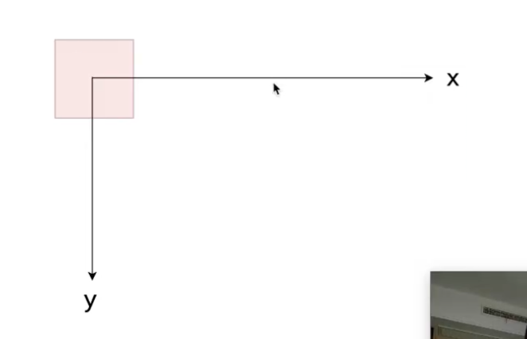
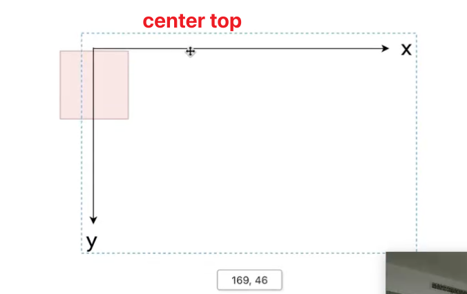

我们修改原点的时候 其实就是在修改 坐标系的原点

<br>

**可选值:** 
- center: 默认值
- 0 0: 元素的左上角

<br><br>

# flex 弹性盒子
是CSS中又一种布局手段 它主要是用来代替浮动来完成页面的布局   
**它是为了解决浮动的问题的又一种布局方式**

比如: 子元素浮动 父元素高度塌陷的问题

如果是不用兼容老的浏览器 做的移动端的项目就可以用flex flex可以使元素具有弹性 让元素可以跟随页面的大小的改变而改变

<br><br>

## 弹性容器的设置: 

### 弹性容器: 
要使用弹性盒 必须要将一个元素设置为弹性容器 我们通过display来设置弹性容器  
当一个容器开启flex后 该容器就称之为flex容器 它的所有子元素自动成为容器成员 子元素也叫做"项目"

<br>

```css
{
    /* 块级弹性容器 */
    display:flex;           
    /* 行内的弹性容器 */
    display:inline-flex;    
}

```

<br>

### 弹性元素: 
弹性容器的直接子元素是弹性元素(弹性项) 一个元素可以同时是弹性容器 和 弹性元素

```html
<!-- 弹性容器 -->
<ul>
    <!-- 弹性元素 -->
    <li></li> 
    <li></li>
    <li></li>
</ul>
```
```css
ul {
    width:800px;
    border:10px solid black;

    display:flex;
}

li {
    /* 这时候li既是弹性容器 又是弹性元素 */
    display:flex;   
}
```

<br>

### flex的属性
弹性容器 和 弹性元素 各有自己的样式

<br>

### 弹性容器的属性: flex-direction
指定容器中弹性元素的排列方式  也可以说是指定主轴, 决定主轴的方向（即项目的排列方向）

<br>

**可选值:**  
```css
.box {
  flex-direction: row | row-reverse | column | column-reverse;
}
```

- row: 默认值  
弹性元素在容器中水平排列 左向右(主轴: 自左向右) 跟国家的书写习惯有关 中国就是 左 → 右  日本可能就是 上 ↓ 下

- row-reverse:  
弹性元素在容器中反向水平排列 右向左 主轴: 自右向左

- column: 弹性元素纵向排列 自上向下 主轴: 自上向下

- column-reverse: 弹性元素反向纵向排列 自下向上 主轴:  自下向上

<br>

### 主轴 和 侧轴
- 主轴: 弹性元素的排列方向 称为 主轴
- 侧轴: 与主轴 垂直方向的 称为 侧轴

<br>

### 弹性容器的属性: flex-wrap
默认情况下, 项目都排在一条线（又称"轴线"）上。如果一条轴线排不下 盒子本身的宽度不足以容纳盒子内部的元素时是否换行

**可选值:**   
```css
.box{
  flex-wrap: nowrap | wrap | wrap-reverse;
}
```

- nowrap: 默认值 所有的项目自动减少宽度 以至于容纳在一行
- wrap: 换行, 第一行在上方
- wrap-reverse: 换行, 第一行在下方

<br>

### 弹性容器的属性: flex-flow
wrap 和 direction的简写属性
```css
/* 横向排列 换行 */
flex-flow: row wrap;    
```

<br>

### 弹性容器的属性: justify-content
如何分配主轴上的空白空间  也可以理解为项目在主轴上的对齐方式

<br>

**可选值:**  
```css
.box {
  justify-content: flex-start | flex-end | center | space-between | space-around;
}
```

- flex-start: 元素沿着主轴起边排列 意味着如果有空白 空白应该在最后
- flex-end: 元素沿着主轴终边排列 意味着如果有空白 空白应该在开始
- center: 元素居中排列 空白就会分部在两边
- space-around: 空白分布到元素两侧
- space-evenly: 空白分布到元素的单侧    浏览器的兼容性不太好
- space-between: 空白均匀分布到元素间

<br>

**应用:** 
元素这时候想水平居中的话 直接 justify-content:center

<br>

**技巧:**   
看到justify都是主轴的属性 看到align-items都是侧轴上的属性

<br>

### 弹性容器的属性: align-items
元素在侧轴上如何对齐 它设置的是元素间的关系

**可选值:**  
```css
.box {
  align-items: flex-start | flex-end | center | baseline | stretch;
}
```

- stretch: 默认值 指定项目在侧轴上拉伸以填充剩余空间
- flex-start: 元素不会拉伸 沿着侧轴起边对齐
- flex-end: 元素不会拉伸 沿着侧轴终边对齐
- center: 居中对齐
- baesline: 基线对齐

<br>

### 弹性容器的属性: align-content (侧轴上的空白空间的分布)
跟justify-content的可选值 的 效果是一样的

定义了多根轴线的对齐方式。如果项目只有一根轴线, 该属性不起作用

<br>

**穿插一个弹性元素的样式:**    
align-self: 用来覆盖当前弹性元素上的align-items

<br>

### 弹性元素的样式: flex-grow
指定 弹性元素 **伸展的系数** **默认值为0** 不伸展  
当父元素有多余的空间时 子元素如何伸展 父元素的剩余空间 会按照比例进行分配

```css
/*  平均分配剩余空间 */
flex-grow: 1
```

<br>

**默认效果:**   
存在剩余空间, 也不放大

<br>

**假如父元素剩余空间为600**
```css
li:nth-child(1){ flex-grow:1 }  100
li:nth-child(2){ flex-grow:2 }  200
li:nth-child(3){ flex-grow:3 }  300
```

- 如果所有项目的flex-grow属性都为1, 则它们将等分剩余空间
- 如果一个项目的flex-grow属性为2, 其他项目都为1, 则前者占据的剩余空间将比其他项多一倍。

<br>

### 弹性元素的样式: flex-shrink
指定弹性元素收缩的系数 收缩系数: **默认值为1**

当父元素中的空间不足以容纳所有的子元素时 如何对子元素进行收缩 **默认值是1 等比例进行收缩** 0就是不收缩 也就是元素会溢出

<br>

**默认效果:**  
如果空间不足, 该项目将缩小。

<br>

缩减系数的计算方式比较复杂 缩减多少主要是根据缩减系数 和 元素大小来计算的
基本的理论就是元素越大缩减越多

假如父元素为500 每个li为200 父元素差了100
```css
li:nth-child(1){ flex-shrink:1 }  
li:nth-child(2){ flex-shrink:2 }  
/* 值越大收缩的越多 */
li:nth-child(3){ flex-shrink:3 }  
```

- 如果所有项目的flex-shrink属性都为1, 当空间不足时, 都将等比例缩小。
- 如果一个项目的flex-shrink属性为0, 其他项目都为1, 则空间不足时, 前者不缩小

<br>

### 弹性元素的样式: flex-basis
元素的基础长度 跟width一样 **用它来指定元素的基础长度** width就没有用了, 

元素在主轴上的基础长度
- 如果主轴是横向的 该值指定的就是元素的 宽度
- 如果主轴是纵向的 该值指定的就是元素的 高度

<br>

**默认值是auto**   
表示参考元素自身的高度 或 宽度 如果传递了具体的数值 就以该值为准

- flex-grow: 弹簧能伸多长
- flex-shrink: 弹簧能缩多短
- flex-basis: 弹簧静止时的状态

这三个就像弹簧的三个状态

<br>

### 简写属性 flex: 
简写属性 可以设置弹性元素的所有三个样式

顺序:  增长 缩减 基础

<br>

**预定义值:** 
- initial 相当于      flex: 0 1 auto; 
- auto    相当于      flex: 1 1 auto;
- none    相当于      flex: 0 0 auto;     弹性元素没有弹性

<br>

**技巧:**
```css
/* 等分布局 */
{
    flex: 1 1 auto;
    /* flex:1  (flex-basis:0% flex-grow:1 flex-shrink:1); */
}
```

<br><br>

# 弹性元素的样式: order
决定弹性元素的排列顺序  
有了它以后 就不用再通过结构去改变元素的顺序了 直接可以指定

```css
box1 box2 box3

box1 {order:3}
box2 {order:1}
box3 {order:2}

box2 box3 box1
```

<br>

### flex 属性的解析:

**如果flex的属性值只有一个值, 则:**
- 如果是数值, 例如flex: 1, 则这个1表示flex-grow, 此时flex-shrink和flex-basis的值分别是1和0%

- 如果是长度值, 例如flex: 100px, 则这个100px显然指flex-basis, 因为3个缩写CSS属性中只有flex-basis的属性值是长度值。此时flex-grow和flex-shrink都是1


**如果flex的属性值有2个值, 则:**   
则第1个值一定指flex-grow, 第2个值根据值的类型不同表示不同的CSS属性

- 如果第2个值是数值, 例如flex: 1 2, 则这个2表示flex-shrink, 此时flex-basis计算值是0%
- 如果第2个值是长度值, 例如flex: 1 100px, 则这个100px指flex-basis, 此时flex-shrink使用默认值0。


**如果flex的属性值有3个值, 则:**   
如果flex的属性值有3个值, 则这长度值表示flex-basis, 其余2个数值分别表示flex-grow和flex-shrink。

<br>

### flex: initial
等同于设置"flex: 0 1 auto"
- 不会增长变大占据flex容器中额外的剩余空间
- 会收缩变小以适合容器
- 尺寸根据自身宽高属性进行调整

<br>

### flex: auto
等同于设置"flex: 1 1 auto"
- 子项会增长变大占据flex容器中额外的剩余空间
- 会收缩变小以适合容器
- 尺寸根据自身宽高属性进行调整

<br>

### flex: none
等同于设置"flex: 0 0 auto"
- 子项会不会增长变大占据flex容器中额外的剩余空间
- 不会收缩变小以适合容器
- 尺寸根据自身宽高属性进行调整

<br><br>

# flex + margin 布局
```s
https://www.bilibili.com/list/3494367331354766?sort_field=pubtime&spm_id_from=333.999.0.0&oid=276427977&bvid=BV1YF411m7Yv
```

### 元素垂直水平居中
1. 父元素 flex 
2. 子元素 margin: auto

在弹性项中设置margin:auto, 就是用margin去吃掉剩余空间

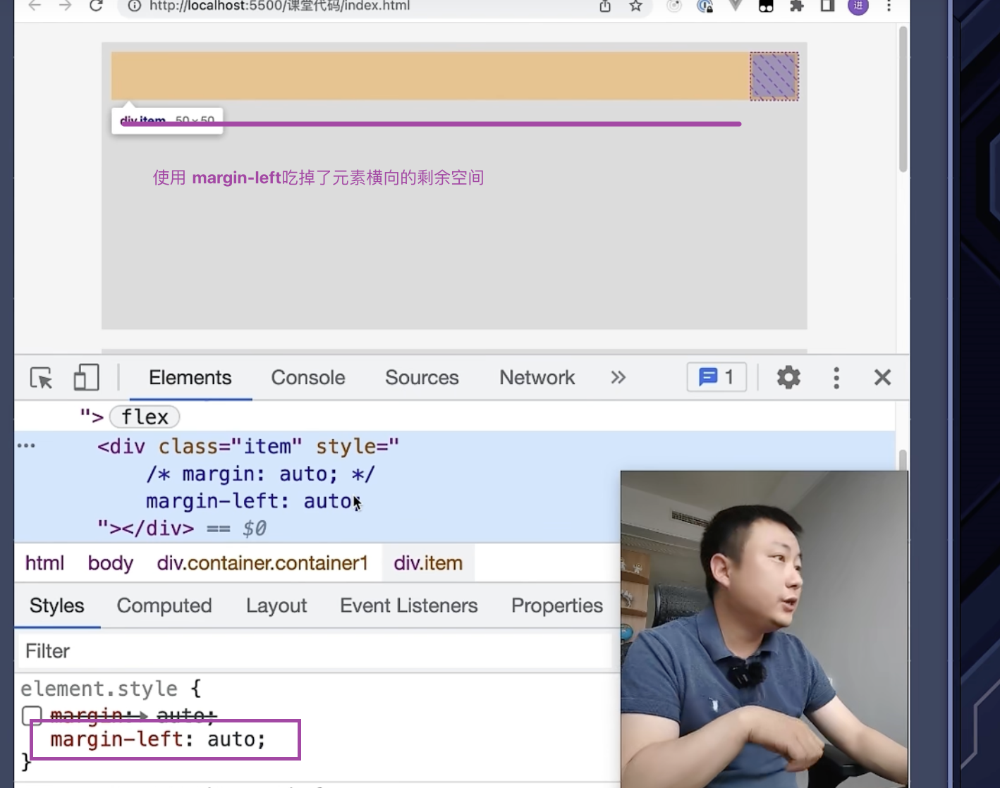
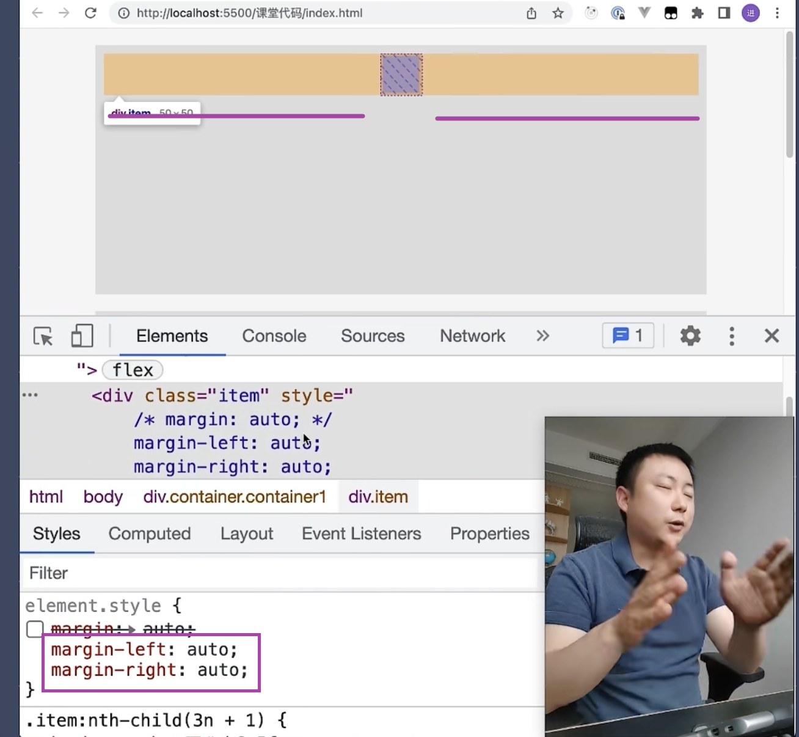

<br>

**基于这样的逻辑我们可以实现很多的布局**     
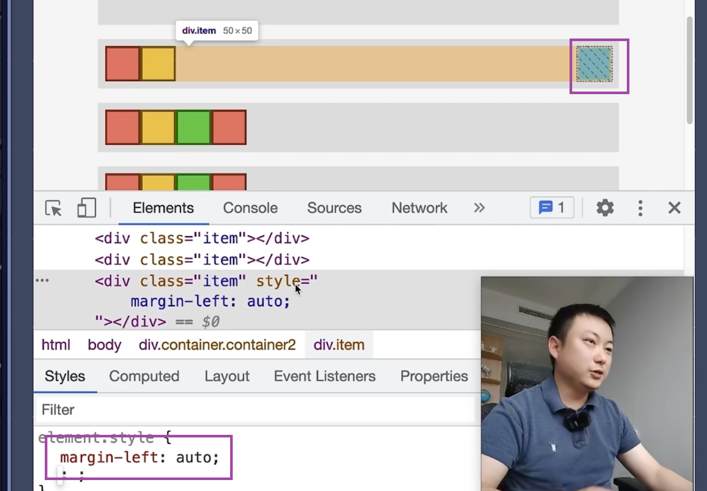

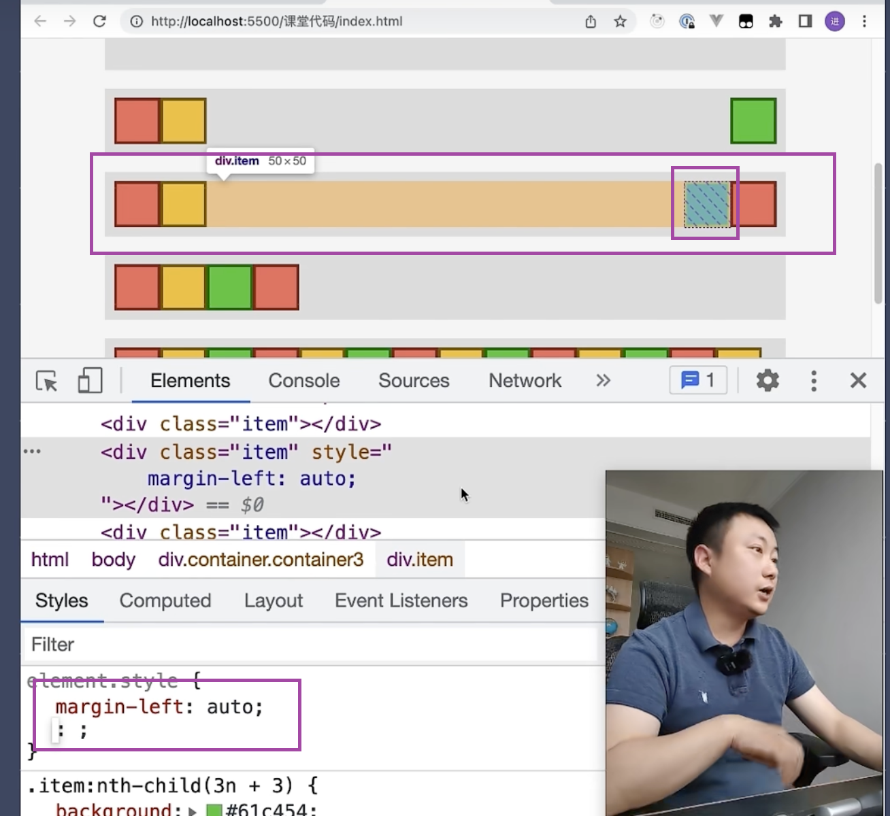

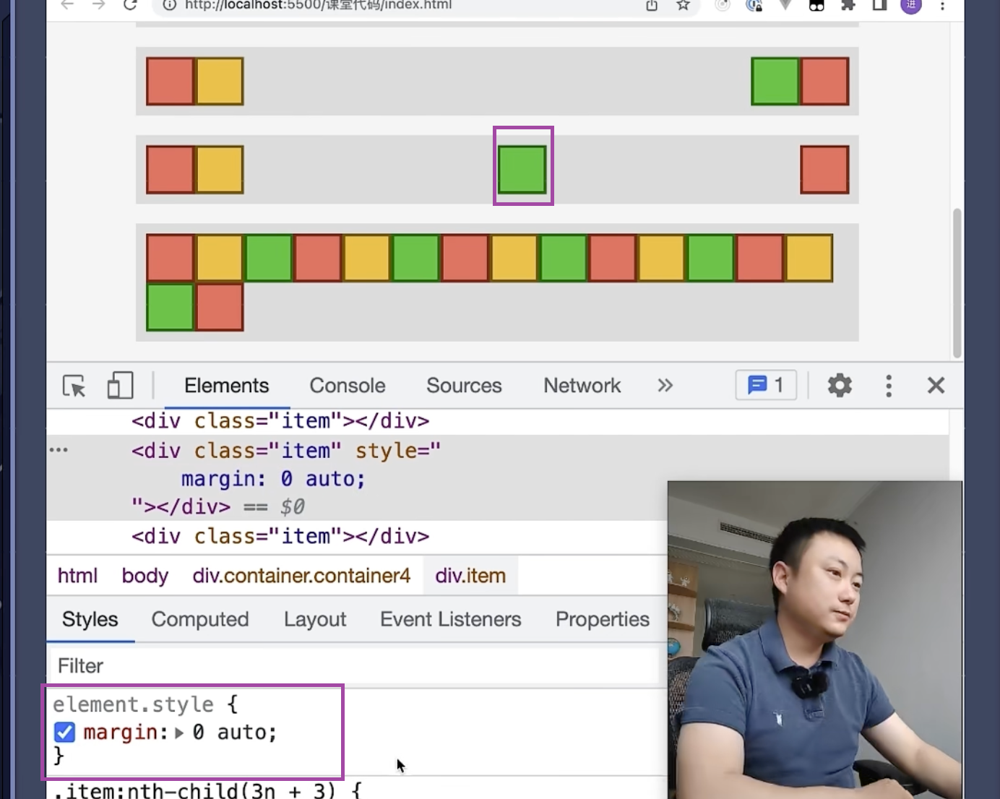

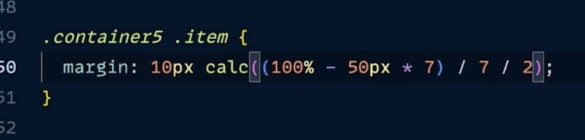

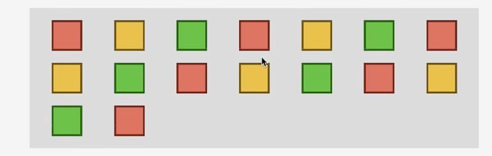

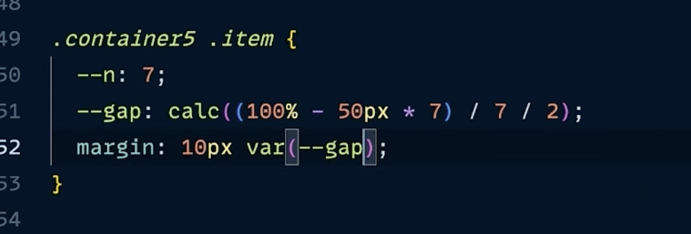

<br><br>

# 像素
屏幕是由一个个发光的小点构成的 一个点就是我们的像素

分辨率 就是屏幕中小点的数量

在前端开发中 像素要分两种情况谈论 CSS像素 和 物理像素

- 物理像素:  上述的分辨率就是物理
- CSS像素:   编写网页时 我们所用的像素都是CSS像素

```css
width:100px;
```

浏览器在显示网页时 需要将CSS像素转换为物理像素然后再呈现 一个CSS像素 最终 有几个物理像素显示 有浏览器决定

默认情况下 PC端: 一个CSS像素 = 一个物理像素

<br><br>

# 视口(viewport)
视口就是屏幕中用来显示网页的区域

我们可以通过查看视口的大小 来观察CSS像素 和 物理像素的比值 一般看视口的时候 我们只看 宽度 不看 高度

<br>

### 原理: 
网页中一个块元素的宽度 是 父元素的100% 所以只需要找到视口的子元素就可以了

视口的子元素就是html

先把浏览器的缩放功能重置到100% 直接点html标签 看右侧的盒模型

默认情况下 视口宽度 1920px 像素 这时候 视口宽度 和 物理像素 是一样的

此时 CSS像素 和 物理像素 是1:1

我们的浏览器 按钮ctrl + 滚轮 可以缩放大小 放大网页 视口的可视区域就变小了

<br>

放大两倍的情况下
- 视口宽度是 960px (CSS像素)
- 物理像素是1920px 物理像素是不会变的

此时CSS像素 和 物理像素 是1:2

```css
{
    width:100px;
    height:100px;
    background-color:#bfa;
}
```

此时CSS像素是100px 物理像素是200px 怎么确认 用截图工具去量 截图工具量到的都是物理像素

我们可以通过改变视口大小 来改变CSS像素和物理像素的比值

<br>

### 总结
我们可以先观察下 物理像素 然后再检查下开发者管理工具html的宽度 是否和物理像素一样  
然后我们可以在显示设置中查看 显示比例是不是100% 这时候就能知道 物理像素 和 CSS像素的比值关系了

<br><br>

# 移动端
在不同的屏幕 单位像素的大小是不同的 像素越小屏幕会越清晰
```s
# 查询一部分手机的分辨率
https://material.io/resources/devices/
```

<br>

智能手机像素点 远远小于 计算机的像素点 视网膜屏像素点不能被肉眼察觉 特别的小

**举个例子:** 
- 24寸的显示屏    1920X1080
- i6 4.7寸屏      750X1334

<br>

### 问题: 
一个宽度为900像素的网页 在i6中要如何显示呢? 

```css
/* PC端的尺寸 */
.box1 {
    width:900px;
    height:100px;
    background-color: tomato;
}
```

然后在页面中打开 查看i6屏幕的情况 发现900px竟然还没有把i6的750 撑满

<br>

**因为:**  
i6的750像素 是物理像素 而900px是CSS像素 所以不能直接看900 和 750这两个数值 比值不一样
我们应该看的是 视口大小 我们看下 控制台里 Computed里现实的宽度 是980px

<br>

默认情况下 移动端的网页都会将视口设置为980像素(CSS像素)

以确保PC端的网站可以在移动端正常访问 如果网页大小超过980 移动端的浏览器会自动对网页进行缩放以完整的显示网页 其实就是当网页过宽的时候 视口会自动调整

以前比较早的时候 网页的宽度都不会超过1000px 一般都是980 960的宽度 所以移动端把视口设置为980 这样就可以达到一个效果 我随便打开一个网页 就能看到网页的全貌

所以大部分的PC端网站都可以在移动端正常浏览 但是往往都不会有一个好的体验

<br>

**比如:**  
我们将网页的宽度设置为了980像素(CSS像素) 但是物理像素是750 (131%)
网页过小 没办法看

为了解决这个问题大部分网站都会为移动端设计一个网站 PC端访问是一个 移动端是一个
如果你的网站也要给移动端浏览 必须为移动端再设计一个网页

<br><br>

## 开发移动端页面
将网页的视口设置为完美视口 开发移动端 先写这句话
```html
<meta name="viewport" content="width=device-width, initial-scale=1.0">
```

先说一个问题 比如 我写一个100px x 100px的盒子 在PC端看 和 在移动端看 大小不一样 移动端的小了 为什么? 

移动端默认视口是980px(CSS像素)默认情况下 

移动端的像素比:  980 / 移动端宽度 (eg:  i6   980 / 750 = 1.31)   
如果在网页中直接编写移动端代码 这样在980的视口下 像素比是非常不好的 导致网页中的内容非常非常的小

<br>

所以在编写移动页面时 必须要确保有一个比较合理的像素比:  
- 1个CSS像素 对应 2个物理像素   相当于 比PC端放大两倍    有的时候还可以 
- 1个CSS像素 对应 3个物理像素 

<br>

我们要写移动端页面时 第一件事就是调整网页的像素比 把像素比调整到一个比较合理的范围

<br>

### 调整像素比:
我们可以通过改变视口大小 来改变CSS像素和物理像素的比值 比如i6 物理像素是750 那我把视口调成375 那是不是就是1 :  2了

我们可以通过meta标签来设置视口的大小 设置视口大小 将网页的视口设置为完美视口
```html
<meta name="viewport" content="width=device-width, initial-scale=1.0">
```

- name:  设置数据的名字 viewport视口
- content: 是设置多少 我们只考虑宽度 视口的宽度是width 高度不用考虑

```html
<!-- 把视口的大小设置为100px -->
<meta name='viewport' content='width=100px' >
```

那现在的像素比是多少  
100 / 750 等于 1 / 7.5 一个像素 等于 7.5个像素

假如调整成200px 那像素比为  
200 / 750 等于 1 / 3.25 一个像素 等于 3.25个像素

每一款移动设备在设计时 都会有一个最佳的像素比 一般我们只需要将像素比设置为该值即可得到一个最佳的效果

比如:  我们看那个网站 ``https://material.io/resources/devices/`` 的最后一列  
i6 最后一列是 2.0 也就是 1个css像素 对应 2个物理像素 xx / 750 = 1 / 2

``<meta name='viewport' content='width=375px' >``  这时候就能达到i6的最佳像素比

将像素比设置为最佳像素比的视口大小我们称其为完美视口 但是不同设备中完美视口的大小并不一样
上面那个网站 dpi那列就是完美视口的尺寸  

所以 content中不能写固定的数值 要写上width=device-width  
device-width是一个网页中提供的一个变量 表示设备的宽度 也就是设备的完美视口
```html
<!-- initial-scale=1.0 是初始化缩放是1倍 -->
<meta name="viewport" content="width=device-width>
```

<br>

### 移动端的单位
不同设备的完美视口是不一样的 比如

- iphone6     完美视口是375
- iphoneX     完美视口是414

```css
box1 {
    width:375px;
    height:100px;
}
```

在i6中中能完美全屏 但是在ix中就缺了一块 由于不同设备视口和像素比不同 所以同样的375个像素在不同设备下意义是不一样的 所以在移动端开发时 就不能再使用 px 来进行布局了

<br>

### vw
表示视口的宽度(viewport width)

100vw = 一个视口宽度   /   1vw = 1%视口宽度

vw这个单位永远相当于视口宽度进行计算的

<br>

### vw的换算
设计图的宽度 750px 1125px 一般常见的移动端设计图宽度是这两个 最早都是参考苹果的屏幕去计算的 i6 的完美视口就是375 也就是说i6中一个css像素 对应 两个物理像素

- 750  称之为 2倍图
- 1125 称之为 3倍图

<br>

**为什么是倍数呢 正好是375不好么?**   
如果我的图就是375的话 在移动端显示时放大2倍就是750 就会失真 

所以我们的设计图干脆就是750 这样拿到的所有图都是2倍效果 这再拿到移动端里看时 就不会失真

<br>

**为什么现在都是3倍图呢?**  
因为现在的屏幕越来越清晰了 现在可能3倍图才能满足一个大部分的情况

<br>

设计图是750px 使用vw作为单位 那100vw是750px

100vw = 750px


那假如我的需求是创建一个 48px x 35px 大小的元素 

注意 这只是图片的单位 这种设计图 放在移动端的网页里不能要求像素了 只能要求比例

```
100vw = 750px 
↓
1vw = 7.5px 
↓
问: 50px 等于 ? vw 
↓
50px / 7.5px = ? vw
```

<br>

### 还有一种简单的算法:
元素大小 / 设计稿宽度 * 100vw

<br>

### vw的适配: 
网页中字体大小最小是12px 不能设置一个比12px还要小的字体 0可以 其它的都不行

如果我们设置了一个小于12px的字体 则浏览器自动修正为12px

<br>

上面讲到 如果设计图是750px 100vw是视口的宽度 也就是750px

我们首先得知道1px = 0.1333333333333333vw    算法 100vw / 750px = 0.1333333333333333vw

假如我想创建 50px x 50px的框体 那么就需要用 0.1333333333333333px x 50 比较麻烦

<br>

所谓的vw的适配 就是指 让整个计算的过程并不那么麻烦

首先我们要回忆下 rem 这个单位

<br>

**rem:**   
1rem = 1html的字体大小

```css
html {
    font-size:50px;
}

/* 这里就是50 x 50的大小的盒子 */
box1 {
    width:1rem;         
    height:1rem;
}

/* 那假如:  */
html {
    font-size: 0.1333333333333333vw
     
}

/* 那么我接下来 创建 50 x 50的盒子 是不是可以? */
box {
    width:50rem;
    height:50rem;
    /* 不行 因为网页中最小的字体就是12px 不够12px 会重置为12px */
}


/* 那我在这里再扩大40倍      那1rem = 40px */
html {
    font-size: 5.3333vw
    /* 相当于font-size:40px;  */
}

/* 接下来 创建一个 48 X 35 的盒子 */

box {
    width:48 / 40 = 1.2rem
    height:35 / 40 = 0.845rem
}

/* 换句话说 就是代替0.133333 用了整数 去进行计算 */
```

<br>

### 总结: 
- 首先: 要知道1px 等于 多少vw 100 / 设计图宽度(750) = 单位结果
- 然后: 设置html标签内部的 font-size: font-size: 单位结果 X 40
- 最后: 计算实际尺寸时 用 xx px / 40 得出rem 

那40也不好计算啊 好算 我们可以用less来写

<br><br>

## 移动端页面的练习
重置样式表在移动端的意义不是那么大

**1. 搭建项目**
- 1.1 创建style.less 在页面中link上 style.css
- 1.2 在style.less中编写代码

<br>

**2. vw的适配**
```css
html {
    // less中可以写公式  100 / 750 X 40
    font-size:100vw / 750 * 40;
}

/* 也可以把设计图的宽度定义成变量 */
@total-width:750;
html {
    font-size:100vw / @total-width * 40;
}
```

<br>

**3. 移动端没有hover**

<br><br>

# 响应式布局
我们的网页根据不同的设备 或者 窗口大小呈现不同效果 使用响应式布局 可以使一个网页适用于所有设备

大公司很少用 但是响应式设计并没有我们想象的那么完美 我们再移动端看一个网页 和 在pc端的习惯是不一样的

沿用一个设计 没有两个设计体验好

现在网页像活了一样 好像知道浏览器窗口有多大
响应式布局的关键就是 媒体查询

<br>

### @媒体查询
通过媒体查询 可以为不同的设备 或 设备不同状态来分别设置样式

- 不同设备: 比如手机 计算机 打印机 在媒体查询这有屏幕的算一同一种设备
- 不同状态: 同一种设备有不同的状态 比如一个屏幕大 一个屏幕小 有的屏幕横着的 有的屏幕是竖着的

媒体查询 是CSS3里的一个特性

<br>

### 用法: 
```css
@media 查询规则{}
```

**关键字:**  
- only: 让老的浏览器失效 处理兼容的问题
- and: 同时满足多条规则
- ,: 满足a生效 或者 满足b也生效
- not: 取反

<br>

### 媒体属性: 
```css
/* 浏览器的窗口尺寸 */
width (max min)

/* 设备独立尺寸 */
device-width (max min)

/* 像素比 */
device-pixel-ratio(必须加-webkit-前缀) (max min)
```

- orientation     portrait竖屏
- landscape横屏 横竖屏切换

<br>

### 媒体类型:     指的就是设备类型
- all: 所有设备
- print: 打印设备
- screen: 带屏幕的设备
- speech: 屏幕阅读器
- projection: 手持设备
- tv: 电视
- braille: 盲文触觉设备
- embossed: 盲文打印机
- speech: "听觉"类似的媒体设备
- tty: 不适用像素的设备

```css
/* 无论在什么设备 背景颜色都是bfa 我的样式会对所有设备都生效 */
@media all{        
    /* print 在打印的时候才会打印出绿色 还可以写多个设备 print, screen */
    body {
        backgroud-color:#bfa
    }
}
```

<br>

可以在媒体类型前添加一个only 表示只有。 only的使用主要是为了兼容一些老版本的浏览器
```css
@media only screen {            
    body {
        background-color:#bfa;
    }
}
```

<br>

### @媒体的特性: 
- width:    视口的宽度      一般情况下不管宽度只管高度
- height:   视口的高度

- min-width     视口的最小宽度  >500 样式生效
- max-width     视口的最大宽度  <500 样式生效

```css
/* 当视口是500px时 样式生效 */
@media (width:500px){ 
    background-color:#bfa;
}


/* 当视口 > 500px时 样式生效 */
@media (min-width:500px){
    background-color:#bfa;
}
```

<br>

样式切换的分界点 我们称之为断点 也就是网页的样式会在这个点时发生变化

布局上大的变化 需要满足某一个点的(横向排列 纵向排列)

一般比较常用的断点

- 小于768     (max-width:768)     超小屏幕    一般都是手机
- 大于768     (min-width:768)     小屏幕      
- 大于992     (min-width:992)     中型屏幕    ipad       
- 大于1200    (min-width:1200)    大型屏幕    电脑 

<br>

- 用 , 号连接   表示或
- 用 and 连接   表示与  要求同时满足 在 a and b之间的范围
- 用 not 连接   表示非  除了后面匹配的

```css
/* 大于500px 或者 小于700px 样式就会生效 */
@media (min-width:500px),(max-width:700px) {
    background-color:#bfa;
}      

/* > 500px  和  <700px  同时要求满足  */
@media (min-width:500px) and (max-width:700px) {
    background-color:#bfa;
}

/* 必须是屏幕 在500-700之间  */
@media only screen and (min-width:500px) and (max-width:700px) {
    background-color:#bfa;
}
```

<br>

### 注意点:
按照从大到小的 或者 从小到大的思路 注意我们有最大值 max-width 和 min-width 都是包含等于的

**推荐: 使用从小到大的顺序**

```css
@media only screen and (max-width:539px) {
    body {
        background:green;
    }
}
@media only screen and (min-width:540px) and (max-width:969px) {
    body {
        background:blue;
    }
}
```

<br><br>

# 响应式网站的练习   --- 美图网站
用响应式设计网站的时候 有两个原则: 
1. 移动端优先 因为是响应式设计 就要有屏幕比较宽的情况 和 屏幕比较窄的情况 在写代码的时候 可以先把移动端的情况写出来 然后再写pc端的

2. 渐进增强 先写移动端的东西 然后确保在移动端内可以正常显示 然后一点点的增强pc端的功能
所以在写这种布局的代码时 先以最小的情况作为参照去写代码

<br>

### 技巧: 
定位元素布局 背景撑满视口
- left:0
- right:0
- top:0
- bottom:0

假如width 或者 height为auto就是优先调整它们 背景就是撑满全屏

做完移动端的东西时 找断点 看看什么时候布局发生改变的 768px
然后 直接在上面的代码 下面写 媒体查询
```css
@media only srceen {
    /* 当大于768时发生变化 */
    @media (min-width:768px){

    }
}
```

<br><br>

# 技巧

### 隐藏一个元素
开启绝对定位 使用偏移量 使其移出父元素 父元素overflow:hidden 移出可视区域

<br>

### 禁止屏幕滚动条
```css
html, body{
    height:100%; 
    overflow:hidden
}
```

<br>

### body也是个容器 需要被内容撑开
当这么写时,是先将body的高度设定为100% 然后靠body撑开html元素一层一层向上撑开
```css
html, body {
    height:100%; 
}
```

<br>

### 图片垂直水平居中
水平方向:
```css
.test {
    text-align:center;
}
img {
    display:inline-block;
}
```

<br>

### 垂直水平方向:
eg(或者position 0000 margin auto):
```css
.test {
    text-align:center;
    height:100%;
}

.test:after {
    content:'';
    display:inline-block;
    height:100%;
    vertical-align: middle;
}

img {
    vertical-align: middle;
}
```

<br>

**原理:**  
我们在div里添加了一个添加了一个伪元素 其实这个伪元素没有宽度

高度是100%的 这个伪元素相当于是img的兄弟元素 然后把它们两个的verticalalign全都设置为middle

伪元素为inline-black img也是个替换元素相当于inline-black 相当于两个文字; img就会垂直居中

<br><br>

# IE6下 fixed失效 绝对定位模拟固定定位

### 初始包含块

**绝对定位为什么会跟着滚动条跑?**
fixed在移动端的问题很大 因为移动端的浏览器都比较老 所以经常会用到 使用绝对定位来模拟固定定位

html身上永远不会出现滚动条, 如果html body当中只有一个元素身上有overflow属性 滚动条出现在html的上一层 可以理解为document

html 和 body 身上同时有overflow auto属性滚动条才会在body身上

那我们延伸下 怎么禁掉html上一层的滚动条, 很简单 html 和 body两个元素的身上 任意一个元素身上有overflow:hidden就可以

```css
/* 先让html的高度为100% body继承html的高度 */
html, body {
    height: 100%;        
    overflow:hidden
}
```

既然现在document(html上一层,也可以理解为视口), html, body身上都没有滚动条了 我们拿div进行下模拟

```html
<!-- 全局包裹器 -->
<div class='wrap'> 
    <!-- 当子元素高出父元素的高度 父元素身上就会有滚动条 -->
    <div class="test" style='height:3000'></div>
</div>
```

### 初始包含块: 是一个视窗大小的矩形
```css
box {
    开启绝对定位
}
```

```html
<body style='height:3000'>
    <div class='box'></div>
</body>
```

思考一下 为什么绝对定位的元素 在拖动滚动条的时候 它的位置会跑

绝对定位的元素需要找包含块 需要找离它最近开启定位的祖先元素,没有的话找到初始包含块,初始包含块是一个视窗大小的矩形 位置和视窗位置一样

那为什么现在拖动滚动条的时候 box会跟着一起走?说明初始包含块的位置变了
因为初始包含块跑了 它才跟着跑 初始包含块已经跑到上面去了

所以初始包含块 和 视口 不是同一个东西 只是开始默认情况下 它们的大小位置相同
一旦滑动系统滚动条 动的是初始包含块,视口始终在一个位置 所有的元素都要跟着初始包含一块跑

返回来说说这个
```css
html, body {
    height:100%;        
    overflow:hidden
}

.wrap {
    height:100%;
    /* 让滚动条出现在wrap身上 */
    overflow:auto;
}
```

```html
<body>
    <div class='box'></div>
</body>
```

禁用了系统的滚动条, 滚动条出现在wrap身上, 现在我拖动滚动条的时候, 初始包含块动不动? 不动因为现在视口和初始包含块在一起啊 影响不到初始包含块

```css
.test {
    开始绝对定位
}
```

```html
<body style='height:3000'>
    <!-- 我添加一个元素 -->
    <div class='test'></div>
    <div class='box'></div>
</body>
```

这时候test div就是一个模拟的固定定位, 因为这时候它参考的是初始包含块 而我们让初始包含块不再移动了

<br>

### 总结:
```css
/* 1. 禁用系统滚动条 */
html, body {
    height:100%;
    overflow:hidden;
}

/* 2. 让滚动条出现在全局包裹器上 */
/* 3. 给全局包裹器一个高度 */
.wrap {
    overflow: auto;
    border:1px solid;
    height:100%;
}

/* 给要固定元素的身上 开启 绝对定位 */
.test1 {
    position: absolute;
    left:100px;
    top:100px;
    width:200px;
    height:200px;
    background-color:cadetblue;
}
```

```html
<div class='wrap'>
    <div class="test1"></div>
    <!-- 5. 子元素撑开wrap高度(溢出才有滚动条不是) -->
    <div class="test" style='height:3000px'></div>  
</div>
```

<br><br>

### 控制隐藏 和 显示
```css
{
    visibility:visible / hidden;
    display:none; (占位置,下面的元素会上来 注意  重绘重排)
    opacity:1 / 0; (性能更好, 但是还是有些问题)
}

```

<br>

**文本等行内元素要设置居中的话 在他们的父元素上设置关于居中的属性 而不是这个行内元素本身**

<br>

### h1标签
在网页中的重要性 仅次于title 一般情况下一个页面只有一个h1 跟seo有关系
一般情况下 标题标签只会使用h1 - h3, h4-6搜索引擎不太会关注它

把一些重要的东西放在 h1 标签中是一个很好的选择

<br>

### 注意点:
浏览器在渲染html元素的时候 会把html节点自上而下解析成一个DOM树 而伪类 伪元素不存在于DOM树里面 DOM树里是一个个的节点 而伪类是一种状态

CSS设计伪类和伪元素 就是为了让CSS能够选择上DOM树以外的元素

:visited 是访问过的链接 它判断链接是否访问过很简单 就是看 href='地址' 和 浏览器地址栏上的地址一样不一样 一样就代码访问过

**注意:**   
```html
<a href="javascript:;"></a> 和 :visited 会有冲突
```

<br>

### label显式关联:
放入label标签中的 会被关联到一起  label标签本身是一个行内元素
```html
<label for=""></label>
```

<br>

### label隐式关联:
这是个单选表单正常效果只能点击按钮时才会被选中 现在文本和表单被放入到label标签中 点击文本按钮也会被选中
```html
<label>
    <input type="radio" name='sex'>
    测试文字
</label>
```

<br>

### 关于float脱离文档流 提升层级的问题
**浮动float分为背景与内容, 属于"半层"飘出。**

给一个元素浮动就相当于将它的背景浮动起来了

我们想象一下 左边是蛋糕坯  右边是有厚厚奶油的蛋糕坯 浮动就是指左边的蛋糕坯浮动到了奶油层的位置 它跟奶油是一层 也就是说的半层飘出

- float: 提升半层,一半在文档流中 一半提升
- relative: 提一层, 只不过在文档流中有一模一样的副本在文档流中占据位置 这个位置我要占住
其它元素不能把我挤掉,但是我不在文档流中渲染 我在上一层中渲染
- z-index: 为1的时候比上面的层级都多

<br>

### 浏览器 读取 选择器的顺序: 从右往左
如果从左往右 浏览器不能只匹配一次就把元素成功匹配到

如果从右往左 就可能一次成功匹配到元素

```css
div ul li .test {}
```
- 如果从左往右 就要把页面中的li全部拿到
- 如果从右往左 只要找.test上层的li

<br>

### 声明的优先级
优先级不是选择器的 css里的优先级都是声明的优先级 只不过选择器会对声明的优先级产生影响
选择器的特殊性最终都会授予给其对应的声明 如果多个规则与同一个元素匹配 而且有些声明互相冲突时 特殊性越大的越占优势

<br>

**选择器的特殊性:**   
选择器的特殊性由选择器本身的组件确定 特殊性值表述为4个部分 如    0,0,0,0

<br>

**一个选择器的具体特殊性如下特性:** 
1. 对于选择器中给定的ID属性值 加 0,1,0,0
2. 对于选择器中给定的各个类属性 属性选择 或伪类 加 0,0,1,0
3. 对于选择器中的给定的各个元素和伪元素 加0,0,0,1
4. 通配符选择器的特殊性为0,0,0,0
5. 结合符对选择器特殊性没有一点贡献
6. 内联声明的特殊性都是1,0,0,0
7. 继承没有特殊性

特殊性 1,0,0,0 大于所有以0开头的特殊性(不进位)

<br>
    
### 注意: 
id选择器和属性选择器
```css
div[id="test"](0,0,1,1)

#test(0,1,0,0)
```

可以在某个样式后添加 !important 则该样式将获得最高的优先级 设置超过内联样式 最高优先级 但在开发中一定要慎用 尽量不用

<br>

### 继承
继承没有特殊性 甚至连0特殊性都没有, 0特殊性要比无特殊性来的强

<br>

### css样式的来源大致有三种
- 创作人员
- 读者
- 用户代理   
    
<br>

### 权重: 
- 读者的重要声明
- 创作人员的重要声明
- 创作人员的正常声明
- 读者的正常声明
- 用户代理的声明

<br>

### 层叠
1. 找出所有相关的规则 这些规则都包含一个选择器
2. 计算声明的优先级
    - 先按来源排序
    - 在按选择器的特殊性排序
    - 最终按顺序

<br>

### 文本新增样式
- opacity: 非继承属性 - 改变透明度
- rgba

<br>

### text-shadow
非继承属性 - 文字阴影 - 默认值:none

可以添加多层阴影 一层阴影 和 一层阴影之间用逗号隔开, 第一层阴影在最上面
```css
    text-shadow:color x y blur, color x y blur(另一层阴影)
```

<br>

### -webkit-text-stroke: 文本描边
使用的时候要加前缀, 这只是webkit内核里才有的东西
```css
    -webkit-text-stroke:4px pink;
```

<br>

### direction: 文本方向
默认值 ltr (需要配合unicode-bidi:bidi-override使用)
```css
direction:rtl;
unicode-bidi:bidi-overrdie;
```

<br>

### text-overflow:ellipsis;
文本溢出怎么处理属性

<br>

### filter 过滤器
整个元素模糊
```css
#wrap {
    /* 模糊函数 */
    filter:blur(10px);      
}
```

<br>

### 盒模型新增属性

### box-shadow:x y b(模糊程度) f(阴影面积) c inset outset
阴影也也可以有多个

<br>

### -webkit-box-reflect: (倒影的方向)(倒影和图片之间的距离)(渐变)
倒影的方向: above below left right

倒影的距离:长度单位

渐变:第三个值

只能在谷歌里面用...

<br>

### resize:   配合overflow:auto配合使用;
- both:       允许用户在水平和垂直方向上调整元素的大小
- vertical:   允许用户在垂直方向上调整元素的大小
- horizontal: 允许用户在水平方向上调整元素的大小

<br>

### box-sizing:border-box
用来设置盒子尺寸的计算方式(width 和 height的作用)
跟ui的设计稿有关 一样的话就改成box-sizing:border-box;


<br>

### 新增的UI样式
### border-radius
圆角 不可继承 一个椭圆要定义两个半径,长半轴 短半轴

**椭圆:**
```css
/* 椭圆的x 和 y的值 定义了一个椭圆 */
border-radius:40px/60px
```

<br>

### 移动端的开发圆角用px, 百分比的话 旧版本可能不支持(ios5 webkit532)

<br>

### 边框图片
配合 border:10px solid 要先指定线粗 和 样式

<br>

### border-image-source:url()
定义使用一张图片来代替边框样式,如果为none 仍然使用border-style
默认图片在四个角

<br>

### border-image-slice
将 border-image-source链接的图片明确的分割为9个区域
4个角, 4边, 中心区域并可指定偏移量 值的百分比参照于图片本身 默认值为100%
使用fill关键词时将会被作为background-image
```css
/* 统一一个数值 */
border-image-slice:33.33%
/* 使用四个数值, 按照上右下左的顺序 分别切图片的4个边的指定百分比 */
border-image-slice:10% 20% 30% 40%;
```

<br>

### border-image-repeat
可选值:
- repeat 平铺
- round  完整平铺

<br>

### border-image-width
边框整体的大小是border-width来决定, border-image-width是控制图片边框的大小

<br>

### border-image-outset
边框在原位置, 可以通过这个属性来往外扩展边框的位置

<br>

### 响应式图像
````标签是用来插入图像的 

```html

```

这种情况下默认pc sp端插入的都是同一张图片 这样做有3大弊端:

**1. 体积:**  
- pc端显示的是大尺寸的图片 文件体积就会大
- sp端显示的是小尺寸的图片 文件体系就会小

如果能分开处理的话可以节约带宽 加速网页渲染

<br>

**2. 像素密度:**
- 1x: pc端一般都是*单倍的像素密度*
- 2x: sp端一般都是*多倍的像素密度*, 即多个像素合成为一个像素 称为 Retina 屏幕。

同一张图片的话 图像文件很可能在桌面端很清晰 放到手机上会有点模糊 因为1个像素被扩大为多个像素了。

<br>

**3. 视觉风格:**
桌面显示器的面积较大 图像可以容纳更多细节。手机的屏幕较小 许多细节是看不清的 需要突出重点。
手机图片经过裁剪以后 更突出图像重点 明显效果更好。

<br>

### ```` srcset属性
用来指定多张图像 适应不同像素密度的屏幕。浏览器根据当前设备的像素密度 选择需要加载的图像。
srcset = "图片路径 + 像素密度描述符" 多个值的情况下 中间使用 , 进行分隔

```html

```

srcset属性给出了三个图像 URL 适应三种不同的像素密度。
当都没有匹配的情况下 使用 src 指向的url 默认的图片

<br>

**要点:**  
1x 表示单倍像素密度 可以省略。

<br>

上面分别解决了 像素密度 和 屏幕大小的适配 但是如果要同时适配不同像素密度、不同大小的屏幕 应该怎么办呢? 

<br>

### ``<picture>``
它是一个容器标签 内部使用``<source>``和`` ``指定不同情况下加载的图像。

```html
<picture>
  <source media="(max-width: 500px)" srcset="cat-vertical.jpg">
  <source media="(min-width: 501px)" srcset="cat-horizontal.jpg">
  
</picture>
```

<br>

上面代码中 ``<picture>``标签内部有两个``<source>``标签和一个````标签

<br>

### ``<source>``标签
- media属性: 给出媒体查询表达式
- srcset属性: 就是````标签的srcset属性 给出加载的图像文件。sizes属性其实这里也可以用 但由于有了media属性 就没有必要了。

浏览器按照``<source>``标签出现的顺序 依次判断当前设备是否满足media属性的媒体查询表达式 
如果满足就加载srcset属性指定的图片文件 并且不再执行后面的``<source>``标签和````标签。

````标签是默认情况下加载的图像 用来满足上面所有``<source>``都不匹配的情况。
上面例子中 设备宽度如果不超过500px 就加载竖屏的图像 否则加载横屏的图像。

<br>

### ``<figure>``
使用 ``<figure>`` 元素标记文档中的一个图像: 

标签规定独立的流内容(图像、图表、照片、代码等等)

元素的内容应该与主内容相关 同时元素的位置相对于主内容是独立的。如果被删除 则不应对文档流产生影响。

``<figcaption>`` 元素被用来为 ``<figure>``元素定义标题。

<br>

### 格式
```html
<figure>
    <figcaption>figure元素标题</figcaption>
    内容
  </figure>

<figure>
    内容
    <figcaption>figure元素标题</figcaption>
</figure>
```

```html
    <figure class="calc-pic">
        <figcaption>＜ ご利用期間 ＞</figcaption>
        
        <p class="calc-caption">
            <strong>3年/5年/7年</strong><br class="u-show--pc">から選択
        </p>
    </figure>
```
  
<br>

### CSS属性
### -webkit-font-smoothing: antialiased;  /*chrome、safari*/
### -moz-osx-font-smoothing: grayscale;   /*firefox*/
这个属性可以使页面上的字体抗锯齿,使用后字体看起来会更清晰舒服。

<br>

**它有三个属性:**  
- none: 对低像素的文本比较好 
- subpixel-antialiased: 默认值 
- antialiased: 抗锯齿很好 

<br><br>

# clip-path
它可以把一个元素裁剪成任意想要的形状, 它支持如下的几种基本的裁剪方式
1. inset(): 矩形, 参数如下图, 黄色的4段距离  
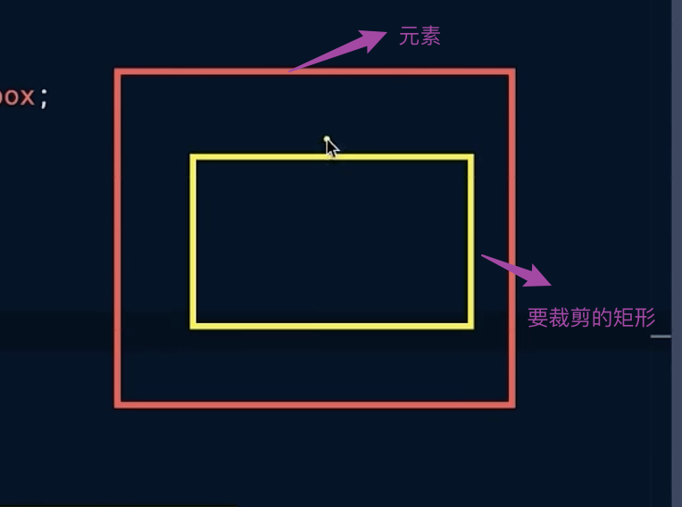
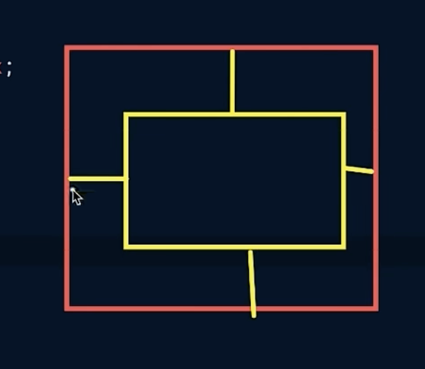

2. circle(): 圆形
    - 半径: 建议百分比(可以随着元素的尺寸的变化而变化) 百分比 和 绝对数字都可以
    - at 圆心坐标 x y

3. ellipse(): 椭圆
4. polygon(): 多边形

<br>

工具: 
```s
https://bennettfeely.com/clippy/
```

<br>

```html


<style>
    img {
        width: 400px;
        display: block;
        margin: 0 auto;
        /* 圆形 裁剪 */
        clip-path: circle(50% at 50% 50%);
        /* 矩形 裁剪 */
        clip-path: inset(10%, 20%, 30%, 40%);
    }
</style>
```

<br><br>

# Css变量
css变量可以理解为就是css属性, 它的很多特点都跟css属性是一样的, 比如

1. 变量可以继承, 比如我们定义在body选择器中的变量, 其它的选择器里也是可以使用变量的 所有body中的后代元素都可以使用这个变量 (比如 html 中 和 :root 中定义变量的含义都是一样的 整个网页都可以使用), **同理父元素中定义的变量子元素中是可以直接使用的**

2. 局部定义的css变量 会覆盖 全局css变量

3. 内联样式style中也可以定义变量, 它优先级最高

4. 变量可以参与计算 ``padding: calc(var(--size) * 0.1)``

<br>

### 定义变量:
```scss
--变量名: 值;
```

<br>

### 使用变量:
```scss
var(--变量名)
```

<br>

```scss
.container {
    width: 300px;
    height: 300px;
    background: #c2185b;
    padding: 30px;
    margin: 30px
}

.container .item {
    width: 150px;
    height: 150px;
    background: #c1186b;
}


// 使用变量: 定义局部变量
.container {
    --size: 300px;

    width: var(--size);
    height: var(--size);

    background: #c2185b;
    padding: 30px;
    margin: 30px
}

.container .item {
    width: 150px;
    height: 150px;
    background: #c1186b;
}
```

<br><br>

# Css中的常用滤镜 fliter
```s
https://www.bilibili.com/list/3494367331354766?sort_field=pubtime&spm_id_from=333.999.0.0&oid=491214660&bvid=BV1kN411H7Ne
```

<br>

它是针对元素中的像素点进行计算 就是将原来的像素点给它, 它通过一些算法转换成一些新的像素点

而算法如何指定就是通过如下的方式
- drop-shadow(): 阴影函数
- blur(): 高斯模糊函数
- hue-rorate(度数): 表示色相环的旋转度数
- contrast(1): 默认为1, 对比度, 值越小颜色与颜色之间的对比 就越不明显 为0的时候全黑
- grayscale(1): 默认为0, 设置为1的时候整个网页就为黑白了, **比如特殊纪念日的时候**

<br>

### drop-shadow(): 人像阴影
box-shadow属性是针对整个盒子的阴影 它要计算盒子的位置和尺寸 我们想给人像加阴影 不是针对盒子的 而是针对元素里面的像素点的阴影

**filter: drop-shadow(css阴影属性的参数):**
```scss
.avater {
    ...
    filter: drop-shadow(10px 10px 10px rgba(0,0,0,0.5));
}
```  

<br>

### blur(像素)
参数为模糊半径
```scss
{
    filter: blur(0px)
}
```

它的值越大 元素就越模糊

<br>

### 毛玻璃
```scss
.item {
    // 1. 将背景颜色设置为半透明
    background: rgba(255,255,255,0.2);
    // 2. 设置 backdrop-filter 将元素背后的内容变的模糊, 它不会对元素本身照成影响, 它转换的是元素背后
    backdrop-filter: blur(5px);
}
```

<br>

### 水化文字

<br><br>

