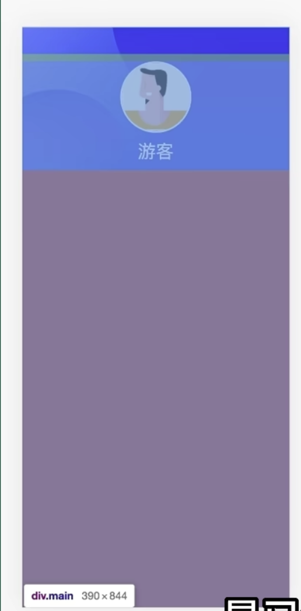
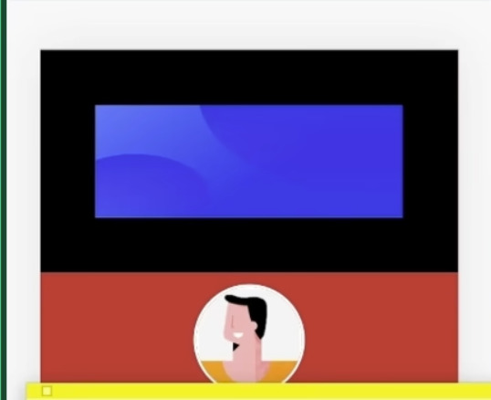

# 基于css变量的主题切换
我们需要提供两套css变量

如果我们的html带了一个自定义属性 ``data-theme="drak"`` 就使用暗色主题
```scss
// 亮色主题(默认主题) :root 等效与 html
:root {
  --text-color: #333;
}


// 暗色主题
html[data-theme="drak"] {
  --text-color: #fff;
}
```

<br>

### 组件内使用
1. main.js 中我们引入 上面的scss文件
```js
import './style.css'
```

2. 组件中如果要使用颜色的话, 就使用我们定义好的主题变量 两套主题的变量名字完全一样

3. 使用js往html上添加自定义 ``data-theme="drak"``
```js
// useTheme.ts 作用跟pinia一样 将 theme 定义到公共区域
import { ref, watchEffect } from 'vue'
// const theme = ref('dark')
const theme = ref(localStorage.getItem('theme'))

watchEffect(() => {
  document.documentElement.dataset.theme = theme.value

  // 借助本地存储 防止刷新页面后重置
  localStorage.setItem('theme', theme.value)
})

export function useTheme() {
  return {
    theme
  }
}
```
```js
// 组件内使用 滑块切换 theme的值
@click="theme = theme ==='dark' ? 'light' : 'dark'"
```

<br><br>

# 元素的绘制顺序
我们的元素结构如下


```html
<!-- 背景图 -->

<!-- 红色区域 -->
<div>
  <!-- 头像 -->
  
  <!-- 文本: 游客 -->
  <div />
</div>
```

现在我们要将 红色区域div 往上移动 我们可以使用 margin-top 将它的值修改为负数 ``margin-top: -27rem``


我们发现 红色的div感觉并没有上去, 只有头像上去了, 页面上显示的是往上移动了 但为什么背景没有了



<br>

### 现象原因
我们要知道原因要知道两个知识
1. 可替换元素
2. 堆叠上下文

<br>

**可替换元素:**  
元素的内容就由它的属性来决定的 比如 img 它就是典型的可替换元素 这个图片中显示啥 由它的src属性值决定, 类似的元素还有 input(显示什么由value属性决定)

可替换元素的绘制分为两块, 它是分开绘制的
1. 元素本身
2. 元素内容

比如我们的 ```` 我们看到的是只有一个元素 但是它绘制的时候是分为两块绘制的, 比如我们给img加一个border, 这个border是加到元素本身上的 我们是不可能改变元素内容的 我们只能改变元素本身



比如我们再加一个padding 它是也控制元素本身, 只有那个图片内容才是元素内容

浏览器就像画师一样 它在画这个页面的时候 它也是分开进行绘制的
 
<br>

**堆叠上下文: stack context**  
它就是页面的层次, 类似很多的图层

<br>


我们现在有突变的盒子和图片的内容 是分开的 div.main中有div本身的背景颜色

接下来就开始绘制了 它是一层一层的往上刷的

1. 首先绘制盒子本身

2. 然后绘制div盒子 然后div的margin-top为负数 于是盖上去了


3. 然后第二层再绘制图片的内容 背景图片后绘制的 所以将div.main盖住了


4. 然后再绘制头像div的内容


**这就是这个现象的原因**

<br>

### 解决问题
要解决问题很简单就是一行代码的事情 我们要关注为什么会出现这样的现象

我们可以让 div.main 和 背景图片盒子不处于同一个层次 也就是说我们要将div单独的弄一个层出来

我们可以让某一个元素在内容创建一个堆叠上下文 如果说页面上有100个元素都没有去创建堆叠上下文的话 那么这100个元素都在同一层

如果创建了堆叠上下文的话 它就跟其它的层次隔离了

<br>

**创建堆叠上下文的方式:**  
1. 设置它的 z-index
2. 设置它的 transform

都会导致这个元素在内部创建一个崭新的堆叠上下文

我们给 div.main 设置如下的样式
```scss
.main {
  margin-top: -366rem;

  // 方式1
  position: relative;
  z-index: 1;


  // 方式2
  transform: scale(1);
  // 方式3:
  transform: translateY(-136rem);
}
```

<br><br>

# 卡片翻动
```s
https://www.bilibili.com/list/666759136?tid=0&sort_field=pubtime&spm_id_from=333.999.0.0&oid=361941574&bvid=BV1U94y1C7v8
```

<br><br>

# 轮播图item的强制吸附 & 隐藏滚动条
```scss
.container {
  width: 100%
  height: 300px;
  display: flex;
  overflow-x: scroll;

  // x轴吸附 x: 滚动方向, mandatory: 吸附方式 - 强制吸附 (没有中间状态)
  scroll-snap-type: x mandatory;

  // y轴吸附
  // scroll-snap-type: y proximity;
}

// 隐藏滚动条
.container::-webkit-scrollbar {
  width: 0;
}

// 子元素 也要添加配置
.item {
  // 吸附的对齐方式: 放手的时候 元素的左边和父元素的左边对齐
  scroll-snap-align: start;
  // 不能跳过元素 我们永远停留在下一个元素上, 避免从1直接滑到5
  scroll-snap-stop: always;
}
```

<br><br>

# Js给css设置变量

```scss
@keyframes move {
  50% {
    transform: translateX(calc(父元素的宽度 - 自身宽度));
  }
}
```
```html
<div class="container">
  <div class="item"></div>
</div>
```

我们想求的就是
1. 父元素的宽度
2. 自身的宽度

<br>

### 自身的宽度
很简单 在transform中自身的宽度就是100%

<br>

### 父元素的宽度
css不知道, js知道, 我们让js告诉css item的父元素的宽度, **我们使用js代码给父元素设置一个css变量**

这样它的子元素就可以使用该变量
```js
const container = document.querySelector('.container')
const w = container.clientWidth

// 给container设置一个css变量 值为js中的w
container.style.setProperty('--w', w + 'px')
```

```scss
@keyframes move {
  50% {
    transform: translateX(calc(var(--w) - 100%));
  }
}
```

<br><br>

# html fs设置为 62.5%
就是为了px -> rem 好换算

一般的, 各大主流浏览器的font-size默认值为 16px, 此时 

```html
<style>
    html {
      /* rem好换算 */
      font-size: 62.5%;
    }
    div {
      /* 62.5%的情况下 我们使用rem单位则它会是16px */
      font-size: 1.6rem;
    }
  </style>
</head>
<body>
  <!-- html fs 设置为 62.5% 的时候 它是 12px -->
  <div>浏览器默认就是16px</div>
</body>
```

<br><br>

# vmin 和 xmax
移动端开发的时候 某一个东西是全屏展示的 而且是不能出现滚动条的 这就要求这个全屏的东西 **它的宽高必须是视口的最短的那条边**

- vmin: 取视口最短边
- vmax: 取视口的最长边

所以我们可以给这个东西的宽高设置为 vmin
```scss
img {
  width: 100vmin;
  height: 100vmin;
}
```

<br><br>

# 文字环形环绕
```scss
.img {
  width: 150px;
  height: 150px;
  float: left;
  margin-right: 1em;
  border-radius: 50%;
  object-fit: cover;

  // 控制环绕该元素的形状
  shape-outside: circle(50% at 50% 50%);
}
```

<br><br>

# 图片重叠(故障风格)图样
```s
https://www.bilibili.com/list/666759136?tid=0&sort_field=pubtime&spm_id_from=333.999.0.0&oid=960888503&bvid=BV1eH4y1D7kz
```

<br><br>

# 弧形选项卡
弧形可以使用径向渐变
```s
https://www.bilibili.com/list/666759136?tid=0&sort_field=pubtime&spm_id_from=333.999.0.0&oid=276246790&bvid=BV18F411S7cL
```

<br><br>

# 文字自动适配背景色


文字色默认设置为白色, 我们只需要给文字加上一行css就可以
```scss
.title {
  mix-blend-mode: diffenrence;
}
```

该属性的作用是将当前的元素的每个像素点颜色和它的父元素进行混合从而产生一种新的颜色

<br><br>

# 3d卡片移入效果
```s
https://www.bilibili.com/list/666759136?tid=0&sort_field=pubtime&spm_id_from=333.999.0.0&oid=620925797&bvid=BV11b4y1g7hE
```

<br><br>

# 下划线效果
```s
https://www.bilibili.com/list/666759136?tid=0&sort_field=pubtime&spm_id_from=333.999.0.0&oid=620960073&bvid=BV1Rb4y1g7bp
```

<br><br>

# 复用动画技巧


<br><br>

# 元素宽度自动适应内容
没有兼容性问题
```scss
// 目标元素
.target {
  width: fit-content;
}
```

<br><br>

# 文字交融展开效果
```s
https://www.bilibili.com/list/666759136?tid=0&sort_field=pubtime&spm_id_from=333.999.0.0&oid=959401977&bvid=BV1Pp4y1F79g
```

<br><br>

# 元素的抛物线动画
抛物线是两个方向上的运动
1. 横向的均匀运动
2. 纵向的自由落体运动

元素的抛物线要注意html结构
```html
<div class="container"> 
  <div class="ball"></div>
</div>
```

- 外层div控制横向匀速移动
- 内层div控制纵向变速移动

```css
.container {
  position: fixed;
  width: 50px;
  height: 50px;
  border-radius: 50%;
  border: 1px dashed #aaa;
  left: 100px;
  top: 300px;
  /* 父元素横向移动 */
  animation: moveX 2s linear infinite;
  
  /* transition: 1s linear; */
}

.ball {
  background: red;
  width: 100%;
  height: 100%;
  border-radius: 50%;
  /* 子元素纵向移动 */
  animation: moveY 1s cubic-bezier(0.5, -0.5) infinite;

  /* transition: 1s cubic-bezier(0.5, -0.5); */
}

@keyframes moveX {
  to {
    transform: translateX(100px);
  }
}
@keyframes moveY {
  to {
    transform: translateX(500px);
  }
}
```

<br>

### js部分
```js
// 强行渲染
div.clientWidth

div.style.transform = `translateX(${this.jumpTarget.x}px)`

i.style.transform = `translateY(${this.jumpTarget.y}px)`
``` 

<br><br>

# 三角函数 勾股定理 角度转弧度 弧度转角度
长度等于半径长的弧  所对的圆心角  称为1弧度的角    
它的单位是rad 读作弧度, 这种用"弧度"做单位来度量角的制度叫做弧度制．

<br><br>

# 弧长公式: l = r * |a| | l = n * PI / 180
即弧长等于弧所对的圆心角(的弧度数)的绝对值与半径的积

<br>

### 正弦函数: 邻边b, 对边a, 斜边c
```
sin = 对边 / 斜边  a / c
```

<br>

#### 余弦函数:
```
cos = 邻边 / 斜边  b / c
```

<br>

### 正切函数:
```
tan = 对边 / 邻边  a / b
```

<br>

### 余切函数:
```
cot = 邻边 / 对边  b / a
```

<br>

### 正割函数:
```
sec = 斜边 / 邻边  c / b
```

<br>

### 余割函数:
```
csc = 斜边 / 对边  c / a
```

<br>

### 角度 ---> 弧度
```
deg(角度) * 2PI / 360   =   deg * PI / 180
```

<br><br>

# inline-block遇到vertical-align的问题

### inline-block: 
行内块元素, 相当于强制转换  

把一个标签设置为 行内的块元素 既有块元素的部分特性 (支持 width height magin-top margin-bottom) 又有行内元素的部分特性(不换行)

<br>

### vertical-align:
设置元素的垂直对齐方式

**该属性定义行内元素的基线**, 相对于该元素所在行的基线的垂直对齐方式

**可选值:**  
- baseline: 默认 元素放置在父元素的基线上
- top: 把元素的顶端 与 行中最高元素的顶端对齐
- text-top: 把元素的顶端 与 父元素字体的顶端对齐
- middle: 把此元素放置在父元素的中部
- bottom: 把元素的顶端与行中最低的元素的顶端对齐
- text-bottom: 把元素的地段 与 父元素字体的低端对齐

<br>

### 问题:
当我们对一个元素转换位 inline-block 之后 可能会出现下述的问题
- 元素之间多了莫名其妙的边距
- 当我们在元素内部添加文字 元素位置发生偏移

<br>

### 解决方式:
这么说吧 将一个元素转换为 inline-block 后 如果遇到怪怪的问题 我们就要使用 vertical-align 来解决

<br>

### 原因:
inline-block的默认对齐方式是vertical-block: baseline, 由上面可知 就是inline-block元素要根据父元素的基线对齐

<br>

### 什么是基线?

如果一个inline-block元素里面是空的, 或者它本身有overflow属性, 这种情况下基线是它margin的底边缘。

如果一个inline-block元素里面不是空的(比如里面有文字或者图像), 则它的基线由正常流中最后一个line box的基线决定。

<br><br>

# 去除 inline-block 元素间 间距的N种方式
当我们行内元素在转换为 inline-block之后 标签之间如果有空格 和 换行的话 呈现在页面的时候 它们之间就会有间距

同时我们使用非 inline-block 的元素也会有同样的问题 比如

```css
div>a*3{文字描述}
```

这类间距有的时候会我们的布局是有影响的 如果我们要去除它的话 可以采用下面的方式

<br>

### 1. 移除空格
元素间留白间距出现的原因就是标签段之间的空格, 因此, 去掉HTML中的空格, 自然间距就木有了。考虑到代码可读性, 显然连成一行的写法是不可取的, 我们可以: 

```html
<div class="space">
    <a href="##">
    惆怅</a><a href="##">
    淡定</a><a href="##">
    热血</a>
</div>

<div class="space">
    <a href="##">惆怅</a
    ><a href="##">淡定</a
    ><a href="##">热血</a>
</div>
```

<br>

### 2. margin负值
至于负多少我们可以观察下面的网站
```css
.space a {
    display: inline-block;
    margin-right: -3px;
}

/* 
https://www.zhangxinxu.com/wordpress/2010/11/%e6%8b%9c%e6%8b%9c%e4%ba%86%e6%b5%ae%e5%8a%a8%e5%b8%83%e5%b1%80-%e5%9f%ba%e4%ba%8edisplayinline-block%e7%9a%84%e5%88%97%e8%a1%a8%e5%b8%83%e5%b1%80/
*/
```

<br>

### 3. font-size: 0
这个方法, 基本上可以解决大部分浏览器下inline-block元素之间的间距(IE7等浏览器有时候会有1像素的间距)。
```css
.space {
    font-size: 0;
}
.space a {
    font-size: 12px;
}
```

不过有个浏览器, 就是Chrome, 其默认有最小字体大小限制, 因为, 考虑到兼容性, 我们还需要添加: 
类似下面的代码
```css
.space {
    font-size: 0;
    -webkit-text-size-adjust:none;
}
```

<br><br>

# cover contain 区别
### 相同点:
background-size中的cover与contain都是将图片以相同的宽高比缩放以适应容易的宽高

<br>

### 不同点:
**cover:**  
会缩放至图片能够铺满整个容器, **可能会有部分图片区域被裁剪**

**contain:**  
则是图片会缩放至整个图片都能显示完全, **但是容易可能会有留白**

<br>

```css
{
    background: url(/assets/img/ic_pdf_001.svg) no-repeat center top;

    background: url('/assets/img/triangle.svg') 0 0 no-repeat;

    background: url(/toyota_jp/yaris/assets/img/kv_yaris_sp@2x.jpg) top left no-repeat;
    background-size: 100% auto;

      @include g.mq {
        background: url(/toyota_jp/yaris/assets/img/kv_yaris@2x.jpg) top left no-repeat;
        background-size: cover;
      }
    }


    background: url(/toyota_jp/common/assets/img/text_01.svg) center center no-repeat;
    background-size: contain;
}
```

<br><br>

# flex space-between 的情况下 第二行 左对齐
要想第2行实现左对齐的效果 我们可以在开启flex的容器上添加一个::after 让它的width(::after)等于一个item的宽度就可以
```css
.wrap {
  display: flex;
  justify-content: space-between;
}

.wrap::after {
  content: "",
  width: 30%;
}
```

```html
<style>
  .wrap {
    width: 300px;
    height: 300px;
    border: 1px solid black;

    display: flex;
    justify-content: space-between;
    flex-wrap: wrap;
  }

  .wrap::after {
    content: "";
    width: 100px
  }

  .item {
    width: 100px;
    height: 100px;
    background-color: red;
  }
</style>

<body>
  <div class="wrap">
    <div class="item item1">内容1</div>
    <div class="item item2">内容2</div>
    <div class="item item3">内容3</div>
    <div class="item item4">内容4</div>
    <div class="item item5">内容5</div>
  </div>
</body>
```

<br>


<br><br>

# 关于图片的对齐方式
**图片就属于行内块**  

**图片是和文字的基线对齐的** 所以 可以选择使用 text-align 和 line-height 让图片垂直水平居中  
有的时候图片并没有垂直居中 可以选择让它 vertical-align:middle 还是由于图片是和文字基线对齐的原因

<br><br>

# 禁止某元素内部选中元素
```css
{
  user-select: none;
}
```

<br><br>

# 边框使用文本的颜色
通常情况下都需要手动给边框设置一个颜色, 有没有办法能够使用当前元素的文本颜色来充当盒子边框颜色呢？

**技巧:**  
在设置边框时不设置边框颜色, 只设置边框宽度(粗细度)和边框的样式 **没有设置边框颜色的边, 边框颜色就是当前盒子的文本色**

这种方法在所有浏览器中都能够得到支持, 不存在兼容性问题。

<br><br>

# 盒子宽度双方向变化 向左变化

### 盒子宽度双方向变化:
实现双向变化的关键是给要变化的dom元素, 加一个父元素, 并设置样式text-align: center; 

此时width由80px伸长为200px, 虽然还是往右伸长, 但由于子元素始终保持居中, 所以在视觉上看上去就呈现双向变化了。

```html
<style>
  .parent {
    text-align: center;
  }
  .child {
    display: inline-block;
    width: 80px;
    height: 6px;
    background-color: #01AAED;
    transition: width .5s;
  }
  .child:hover {
    width: 200px;
  }
</style>

<body>
  <div class="parent">
    <div class="child"></div>
  </div>
</body>
```

<br>

### 向左变化(向左伸长以及向右缩短):
1. 类似于双向变化, 只要让子元素始终保持右对齐, 就可以实现向左变化(向左伸长以及向右缩短)。
```css
.parent {
  text-align: right;
}
```

<br>

2. 或者用相对定位 和 绝对定位 来解决
```html
<style>
  .parent {
    position: relative;
    width: 200px; /* 初始宽度 */
    height: 100px;
    background-color: lightgray;
  }

  .child {
    position: absolute;
    /* 要点在这里 */
    right: 0;
    top: 0;
    width: 100px;
    height: 100px;
    background-color: gray;
    transition: width 0.5s;
  }

  .parent:hover .child {
    width: 200px;
  }
</style>

<div class="parent">
  <div class="child"></div>
</div>
```

<br><br>

# favicon的引入方式:
```html
<link rel="icon" href="./images/favicon.ico">
```

<br><br>

# input的提示信息: placeholder属性
该提示会在输入字段为空时显示, 并会在字段获得焦点时消失。

**注释:**   
placeholder 属性适用于以下的 ``<input>`` 类型: 
- text
- search
- url
- telephon

<br>

**修改 placeholder 属性:**  
使用 input::placeholder 用伪类

<br><br>

# 当父盒子已经被完全分完(100% = 50% 25% 25%) 这时还要要求父元素右侧有空白
我们可以在父元素上加上 padding-right 来解决

```html
<style>
  html, body {
    background-color: #eee;
  }

  .parent {
    width: 300px;
    height: 300px;
    background-color: #1976D2;
    display: flex;

    /* 要点在这里 */
    padding-right: 5%;
  }

  .item {
    background-color: #fff;
    width: 33.333%;
    height: 100px;
  }
</style>

<div class="parent">
  <div class="item item1">内容1</div>
  <div class="item item2">内容2</div>
  <div class="item item3">内容3</div>
</div>
```

<br><br>

# 如果想利用 margin:0 auto 来实现居中
则盒子必须有宽度

<br><br>

# 盒子不给宽度, 再加上margin的话本身区域是往里挤的

<br><br>

# ``<input type="search">`` type的可选值还有search

<br><br>

# :nth-child(n+2) 后几个
从第二个元素开始向后

<br><br>

# :nth-child(-n+2) 前几个
从第二个元素开始向前

<br><br>

# 当加完padding后元素掉下来后 可以设置box-sizing

<br><br>

# DPG
京东自主研发的图片压缩技术, 可直接节省用户近50%的浏览量, 提高用户网页打开的速度, 能够兼容jpeg, 实现全平台 去阿奴浏览器的兼容支持, 和webp的清晰度对比没有差距

<br><br>

# webp
谷歌开发的一种加快图片加载速度的图片格式, 图片压缩体积大约只有jpeg的2/3, 并能节省大量的服务器带宽资源和数据空间

<br><br>

# 加了fixed的盒子一定要有宽度 可以加上最大宽度和最小宽度

<br><br>

# 在图片里使用background-size不是图片的百分比 而是盒子的百分比

<br><br>

# 出现行内块的地方一般都有vertical-align:middle

<br><br>

# 光标闪烁效果
```css
.guangbiao {
  animation:blink 1s steps(2, start) infinite;
}

@keyframes blink {
  to {
    visibility: hidden;
  }
}
```

<br><br>

# 私有前缀
- Trident内核: 前缀为-ms
- Gecko内核: 前缀为-moz
- Presto内核: 前缀为-o
- Webkit内核: 前缀为-webkit

<br><br>

# 三角形的做法
利用 border 来完成 所以不用给目标设置 width 和 height
```css
.box {
    width:0px;
    height:0px;
    border:10px red solid;

    /* 
        下面是个尖朝上的三角 接下来这么操作   
        尖朝哪个方向 哪个方向的属性就设置为none
        剩下保留左右两边 和 下边
    */
    border-top:none;

    /*
        除了目标边 剩下的三边的颜色 换成透明色
        这里和上面的正好相反 尖朝上 颜色就设定在下
    */
    border-color:transparent transparent white transparent
}
```

<br>

不想加结构的话 可以通过伪元素来设置
```css
.app::after {
    content:'';
    /* 变成块元素 才能设置 width 和 height */
    display:block;

    width:0;
    height:0;

    /* 写在下面的样式 都是相当于围绕content里面的内容添加样式 */
    border:10px solid transparent;
    border-bottom-color:white;

    /* 这个放到最后吧 */
    border-top:none;

    position:absolute;
    left:0;
    right:0;
    margin-left:auto;
    margin-right:auto;
    margin-top:-10px;
}
```

<br>

**总结下:**  
::after before 里面的样式都是对content的值的设定

<br>

### 另一种做法: 
```css
.test {
  width:0;
  height:0;
  border-width:40px;
  border-style:dashed soild dashed dashed;
  
  /* 虚线起始为空阶段 */
  border-color:transparent red transparent transparent;
  overflow:hidden;
}
```

<br>

### 要点: 
1. 没有宽度 高度 三角形的大小是border决定的
2. 尖朝哪个方向 哪个方向的属性就设置为none
3. 剩下的三边的颜色 换成透明色 尖朝上 颜色就设定在下

<br>

### 扇形:

```css
.sector-item {
    width: 0;
    height: 0;
    /* 都是100px? */
    border: 100px solid transparent;
    border-radius: 100px;
    border-top-color: #C2185B;
    position: absolute;
}

.sector-item::after {
    content:'';
    display: block;
    width: 0;
    height: 0;
    border:10px solid transparent;
    border-bottom-color:#eee;
    border-top:none;
    position: absolute;
    top:-85px;
    left: -9px;
}
```


<br><br>

# vw/vh 和 100% 的区别

### %单位
%(百分比)是一个相对长度单位, 相对于包含块(containing block)的高宽或字体大小来取值。

<br>

关于包含块(containing block)的概念, 不能简单地理解成是父元素。

- 如果是静态定位和相对定位, 包含块一般就是其父元素。
- 如果是绝对定位的元素, 包含块应该是离它最近的 position为非static属性的祖先元素。
- 如果是固定定位的元素, 它的包含块是视口(viewport)。

<br>

### vw单位
vw、vh、vmin、vmax是一种视窗单位, 也是相对单位。

它相对的不是父节点或者页面的根节点。**而是由视窗(Viewport)大小来决定的**, 单位 1, 代表类似于 1%。 

视窗(Viewport)是你的浏览器实际显示内容的区域, 换句话说是你的**不包括工具栏和按钮的网页浏览器**。

<br>

### 具体描述如下: 

- vw: 视窗宽度的百分比(1vw 代表视窗的宽度为 1%)
- vh: 视窗高度的百分比
- vmin: 取当前Vw和Vh中较小的那一个值
- vmax: 取当前Vw和Vh中较大的那一个值

vh和vw相对于视口的高度和宽度,  1vh 等于1/100的视口高度, 1vw 等于1/100的视口宽度 比如: 浏览器高度900px, 宽度为750px, 1vh = 900px/100 = 9px, 1vw = 750px/100 = 7.5px,  很容易实现与同屏幕等高的框。

<br><br>

# clip:rect()
我自己的理解 当中间两个值为元素大小时 此时显示的是全部区域, 在这个基础上 设定 上 右 下 左 就是往里压 挤压元素 减小为挤压哦

如果left >= right或者bottom <= top, 则元素会被完全裁掉而不可见, 即"隐藏"。

<br><br>

# 动态添加class 并不一定要加在元素本身上
当期望效果为, 达到某样条件时再出发效果 比如hover上 或者 js到什么样的条件在调用动画等

可以设定好 对目标元素的样式 然后利用后代选择器的方式添加

比如 当祖先元素有这个class时 后代元素出现某种效果
```css
.is-animate .ef-border:after {
  content: '';
  height: 10%;
  display: inline-block;
  position: absolute;
  left: 0;
  top: 50%;
  right: 0;
  bottom: 0;
  background-color: #fff;
  -webkit-transform: translateY(-50%);
  transform: translateY(-50%);
  animation-name: borderInOut;
  animation-duration: 0.8s;
  animation-fill-mode: forwards; 
} 
```

<br><br>

# 另类的显示和隐藏
之前我们想要隐藏一个元素的时候 会利用如下的方式
- display: block | none
- height: 0 | 100

<br>

还有新的隐藏方式:
- transform:scale(0)  transform:scale(1);

配合transform:origin使用有不同的效果 bottom下拉, right消失

<br><br>

# 直线从左滑动到右侧然后在右侧消失
1. 使用 transform:scale(0)  transform:scale(1) 来实现 隐藏 和 显示
2. 使用 transform-origin 控制元素变化起点的方向

- 关键点 在49%时的原点在left, 50%的时候改变原点right 向反反向变化
- 关键点 开始的时候透明度0 scale 0 最后的时候透明度1 scale 0

关键点: animation-fill-mode: forwards
```css
@keyframes borderInout {
  0% {
      opacity: 0;
      transform:scale(0);
      transform-origin: left;
  }
  5% {
      opacity: 1;
      transform:scale(0);
      transform-origin: left;
  }
  100% {
      opacity: 1;
      transform:scale(1);
      transform-origin: left;
  }
  50% {
      opacity: 1;
      transform:scale(1);
      transform-origin: right;
  }
  100% {
      opacity: 1;
      transform:scale(0);
      transform-origin: right;
  }
}
```

<br><br>

# ::before伪类在最底层, ::after 伪元素在最上层, 其子元素在中间层

<br><br>

# 描边属性 -webkit-text-stroke: 描边颜色 描边粗细
配合 ``color: transparent;`` 既可以做到字体镂空的效果

<br><br>

# ::before 中的 content
css3里面的 content 的值 可以从标签属性的 data-text 上获取 例如
```html
<div data-text="data-内容">benshen</div>

<style>
  div::before {
    content: attr(data-text);

    display: block;
    width: 100px;
    height: 100px;
    background-color: #FBC02D;
  }
</style>

```

<br><br>

# 裁切显示区域

### clip-path
裁剪方式创建元素的可显示区域。区域内的部分显示, 区域外的隐藏。圆的大小 和 圆心的位置
```css
clip-path: circle(300px at 40% 10%)


clip-path: circle(40%);
clip-path: ellipse(130px 140px at 10% 20%);
clip-path: polygon(50% 0, 100% 50%, 50% 100%, 0 50%);
clip-path: path('M 0 200 L 0,75 A 5,5 0,0,1 150,75 L 200 200 z');
```

<br><br>

# 毛玻璃效果
```css
{
  background:rgba(0,0,0,.1);
  backdrop-filter: blur(4px);    
}
```

这个属性可以让你为一个元素后面区域添加图形效果(如模糊或颜色偏移)。  
因为它适用于元素背后的所有元素, 为了看到效果, 必须使元素或其背景至少部分透明。

不能对元素直接使用 ``filter: blur()`` 会将其内容全部模糊掉 为了保证文字不会模糊掉需要多一个层单独应用模糊效果 模糊效果并不会应用到其背后的元素上, 所以需要使用 content 区域有和背景相同的背景图并进行模糊。

<br>

多一个层级的方法不通过添加元素, 而通过伪元素。
```css
.content {
  z-index: 1;
}
.content:after {
  content: '';
  position: absolute;
  top: 0;
  left: 0;
  right: 0;
  bottom: 0;
  background-color: rgba(255,255,255,0.8);
  z-index: -1;
}
```

<br>

### 注意:
由于伪元素不能通过 width:100% 和 height:100% 来继承宿主元素的尺寸, 所以通过上述方式来继承 content 的尺寸；为了使伪元素位于 content 的下面这里给其设置 z-index:-1, 为不使其隐藏到背景图的后面, 这里给 content 设置 z-index:1。

<br>

# Top banner 位置 视频

### 视频的自动循环播放 muted loop autoplay
```html
<section id='wrap'>
  <video src="./source/nuan.mp4" muted loop autoplay></video>
</section>
```

<br>

### 控制视频的显示区域 和 显示位置
```css
object-fit: fill|contain|cover|scale-down|none|initial|inherit;
object-position: 50% 50%;right top;
```

- contain: 保持原有尺寸比例。内容被缩放。
- cover: 保持原有尺寸比例。但部分内容可能被剪切。
- none: 保留原有元素内容的长度和宽度, 也就是说内容不会被重置。
- scale-down: 保持原有尺寸比例。内容的尺寸与 none 或 contain 中的一个相同, 取决于它们两个之间谁得到的对象尺寸会更小一些。

<br>

### 视频上有文字的话
首先注意html结构, 然后让视频的容器开启定位, index:-1
```css
#wrap {
  width:100vw;
  height:70vh;
  overflow: hidden;
  margin:0 auto;
  background:cadetblue;
  text-align:right;
  position: absolute;
  top:0;
  left:0;
  z-index:-1;

  video {
    width:100%;
    height:100%;
    object-fit: cover;
    object-position: 50% 0;
  }
}
```

<br><br>

# 垂直水平居中

### 当不知道元素高宽的时候:
```css
{
  position:absolute;
  left:50%;
  top:50%;
  transform: translate3d(-50%, -50%, 0);
}
```

<br>

### 当知道高 和 宽时
```css
{
  position:absolute;
  left:0;
  top:0;
  right:0;
  bottom:0;
  margin:auto;
}
```

<br><br>

# width: auto / 100% 区别
- auto 加 padding的时候, 是在内容区里往里扣的, width包含padding
```
| padding width padding |
```

- 100% 加 padding的时候, 是加在内容区外面的
```
padding | width | padding
```

<br><br>

# 父元素设置opacity的时候 子元素会继承到opacity

### 解决方案1: 
父元素不使用opacity 使用rgba控制a的值, 兼容性不好ie6不行

<br>

### 解决方案2:
给子元素(child), 创建一个兄弟元素结构(opacity-bg), 在opacity-bg上设置opacity, 然后绝对定位调整child和opacity-bg层级, 让opacity-bg在child的下面

```html
<style>
  .child {
    position:absolute;
    top:0;
    bottom:0;
    left:0;
    right:0;
    margin:auto;

    z-index: 1;
  }

  .opacity-bg {

    position:absolute;
    top:0;
    bottom:0;
    left:0;
    right:0;
    margin:auto;

    opacity: .5;
    z-index: 0;
  }
</style>

<div class='parent'>
  <div class="child"></div>
  <div class="opacity-bg"></div>
</div>
```