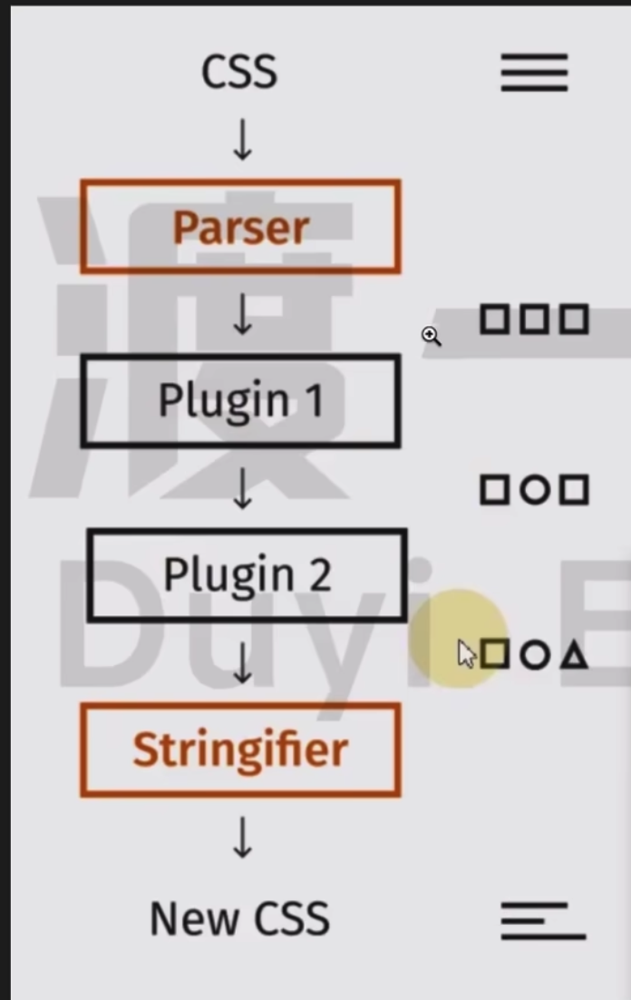

# postCSS
它的作用:
1. 处理兼容性等问题, 比如自动添加各种厂商的css3的前缀 压缩等事情
2. 避免类名冲突, 我们在写类名的时候 会担心重复, 使用postcss后不会担心, 它会自动将重复类名编译为唯一的类名

上面的两个问题都是postcss的插件做的
- postcss-preset-env
- postcss-modules

<br>

### 官方网址:
```s
postcss.org
```

<br>

### postcss的原理图


它认为在前端众多的css工具里面 绝大部分的工具都在做一件事情 就是把原有的css代码 转换为 一种新的css代码 比如 less 处理兼容性 解决类名冲突 都是在做这些事

我们给它一段css代码 它给我们转换成一个新的css代码

而postcss就是将这个过程抽离了出来 它负责将我们写的css代码解析出来 它解析的结果是一个抽象语法树, 然后需要交给它一个个的插件 经过这些插件将这些css代码进行处理之后, postcss再将处理后的(抽象语法树)变成css

<br>

### Postcss的作用
它负责解析css源代码 将其转换为抽象语法树, 然后交给插件完成各种功能 最后负责将抽象语法树还原为css文本

几乎我们耳熟能详的所有css的东西都在postcss插件中

<br>

### Postcss 的使用

**1. 安装**
```s
# autoprefixer 用于自动添加 CSS 前缀
npm install postcss postcss-cli autoprefixer
```

<br>

**2. 创建配置文件**  
在项目根目录下创建一个名为 postcss.config.js 的配置文件。这个配置文件用于指定 PostCSS 的插件和其它配置选项。
```js
module.exports = {
  plugins: [
    require('autoprefixer') // 添加 CSS 前缀的插件
  ]
}
```

<br>

**3. 在项目中创建一个 CSS 文件例如 styles.css**    

<br>

**4. 使用 postcss-cli 命令行工具运行 PostCSS。你可以将它添加到你的构建脚本中或者直接在命令行中运行。**

```js
npx postcss styles.css -o output.css

postcss src/main/css -o dist/demo.demo.css
postcss src/main/css -w dist/demo.demo.css  //实时监听文件的变化
```

<br>

### 常用插件

**autoprefixer:**   
这是一个非常常用的插件它可以根据你指定的浏览器兼容性要求自动为 CSS 添加相应的浏览器前缀以确保在不同浏览器中都能正常运行。
```js
const autoprefixer = require('autoprefixer');

module.exports = {
  plugins: [
    autoprefixer(
      {
        //适配的浏览器 如果适配所有浏览器就是写成0
        browsers:['>1%']
      }
    )
  ]
};
```

<br>

**CSS Nano:**  
这个插件可以帮助你压缩 CSS 代码减小文件体积提升加载速度。
```js
const cssnano = require('cssnano');

module.exports = {
  plugins: [
    cssnano()
  ]
};

```

<br>

**PostCSS Import:**  
这个插件可以让你在 CSS 中使用 @import 导入其他 CSS 文件并将其合并到一个文件中以减少 HTTP 请求。
```js
const postcssImport = require('postcss-import');

module.exports = {
  plugins: [
    postcssImport()
  ]
};

```


<br>

**PostCSS Mixins:**  
这个插件提供了类似编程语言中的函数或者混合的功能可以帮助你重用 CSS 代码块。
```js
const postcssMixins = require('postcss-mixins');

module.exports = {
  plugins: [
    postcssMixins()
  ]
};

```

<br>

**PostCSS Preset Env:**  
这个插件根据目标环境自动启用适当的插件和特性以确保你的 CSS 在目标环境中正常工作。
```js
const postcssPresetEnv = require('postcss-preset-env');

module.exports = {
  plugins: [
    postcssPresetEnv()
  ]
};
```

<br>

### postcss.config.js
```js
module.exports = {
  map: false,
  plugins: {
    tailwindcss: {},
    'postcss-preset-env': {},
    // cssModules
    'postcss-modules': {}
  }
}
```