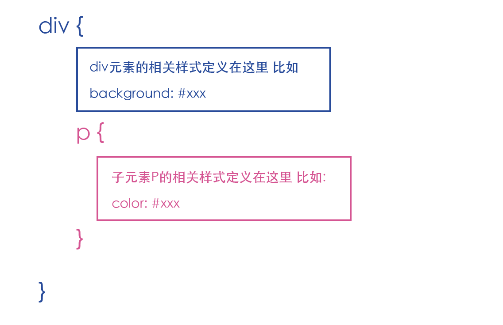
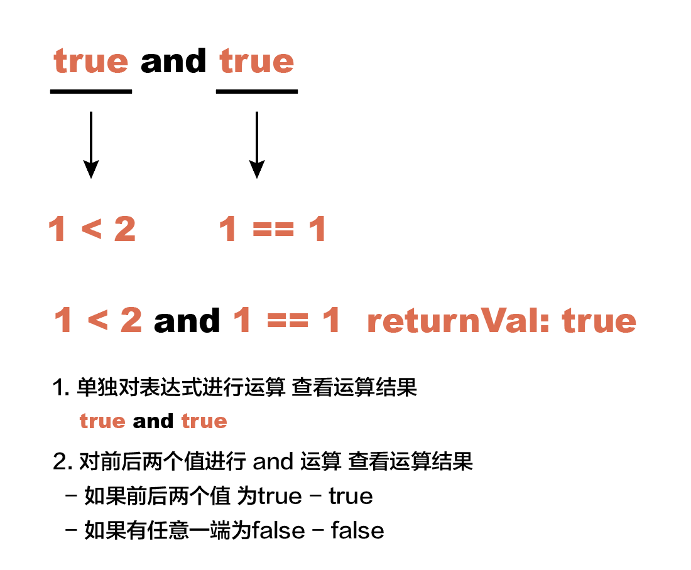
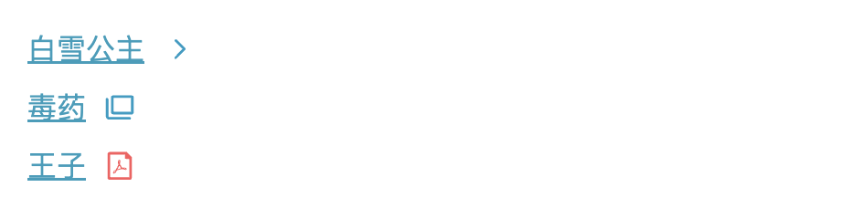
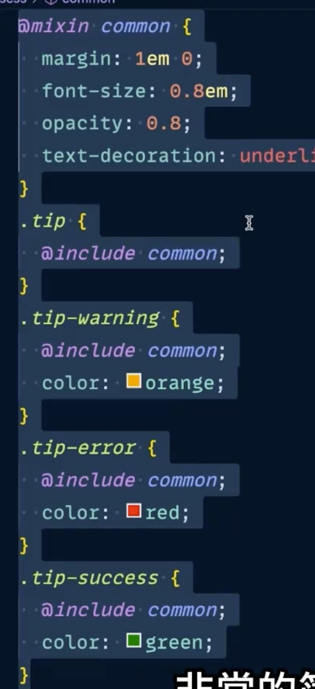
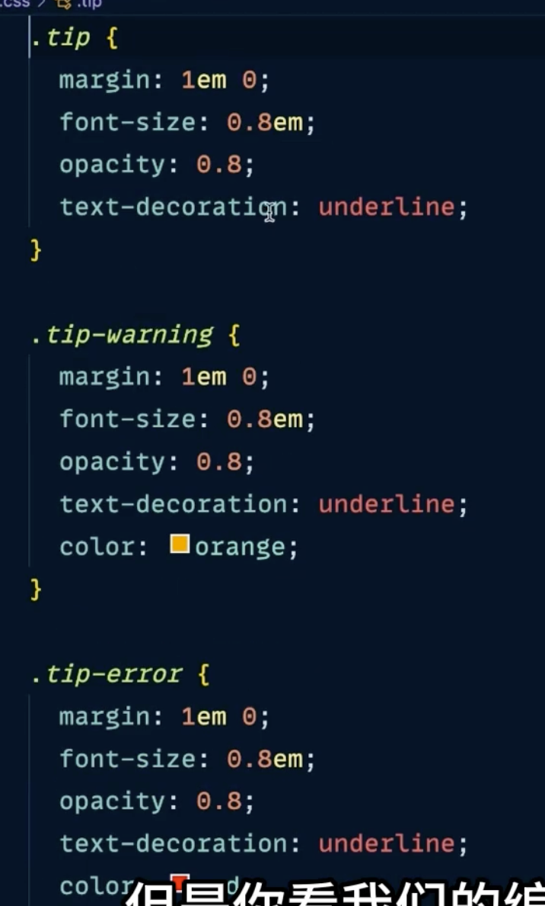
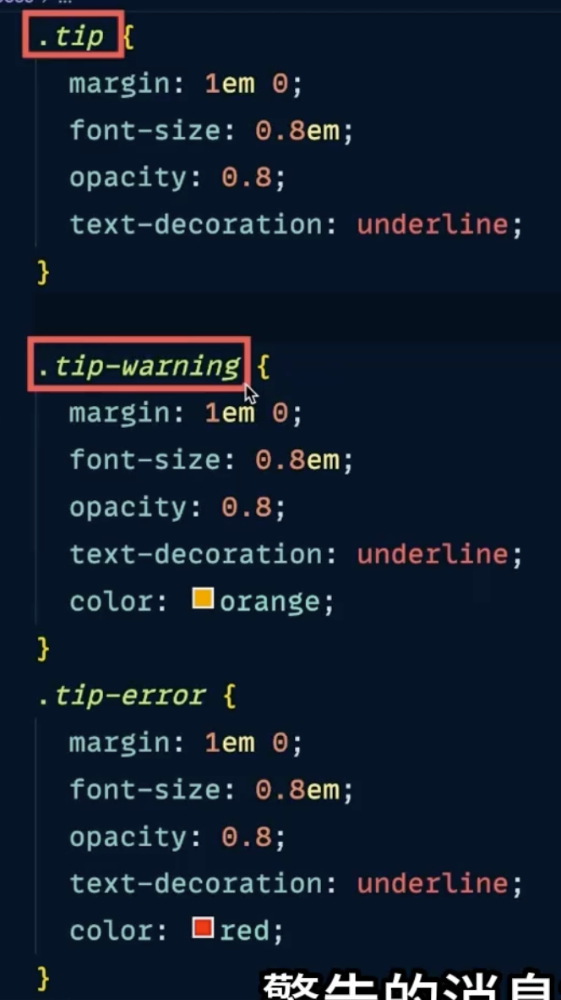
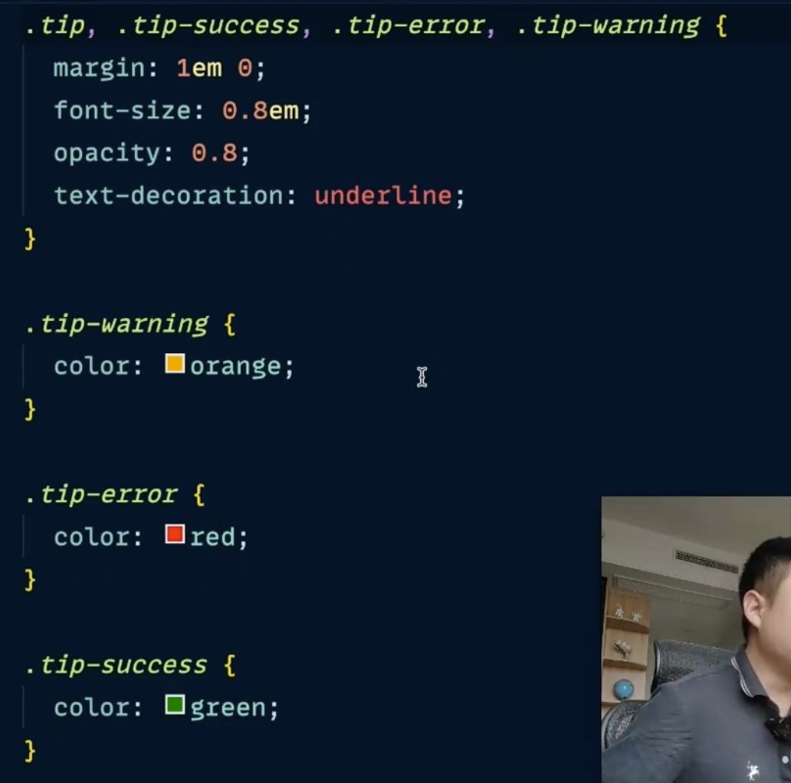
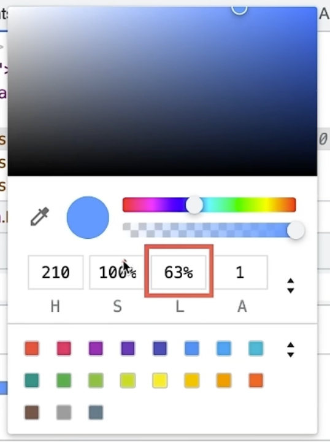

# 要点:
如果 样式名中 要使用 : 的话 我们要使用 \ 来进行转义 ``\:``

```scss
.heading {
  &\:1 {
    @extend %hdg1;
  }
}

background: hsl($i * 40%, 100%, 74%)
```

<br>

### 推荐vscode插件
```s
Sass/Less/Stylus/Pug/Jade/
```

<br><br>

# 自我简介: 
hello, 大家好, 大家可以叫我 书包

在未来的一段时间里 我给大家带来一套scss教学视频 希望大家能够喜欢  

网上的scss视频不少 你说为什么我又出一套   
因为每一套视频 讲课的风格 和 角度 都是不一样的 希望我的这套课程可以给大家带来不一样的体验

<br>

本套课程中 大概分为两部分

- scss的基础语法
- scss的实战教程

最后的实战教程是一是为了巩固我们前面所学的知识, 二是我们看看在实战中会使用到哪些技巧

好啦 最后希望这套课程大家能够喜欢, 开心学scss, 悄悄变强大

<br><br>

# Sass的简介:
上节课中我们简单的说了下scss这门课程今后的安排 同时也做了一个简单到不能再简单的自我介绍

这节课本来想带大家快速的进入到scss的语法阶段, 但是想了下还是不要, 要知道我们在新接触一门语言的时候
避免不了我们需要在网上查找该门语言的相关资料对吧

小伙伴在搜索的过程中可能会搜到 sass scss 的相关字样
小伙伴在看到的时候有没有觉得懵逼的 你说他们长的这么像 它们之间是什么关系 需要我先学其中的哪一门么?

我觉得可能有小伙伴会有这方面的疑惑 所以这节课 先带着大家了解一个sass的由来

当然在开始的时候 我还会先介绍一下 haml 这门语言

有小伙伴会说 兄弟你不是想介绍sass么 它又是个什么鬼啊 haml 对于我来说 叫做 前戏

我好歹得先铺垫下吧

<br>

我觉得啊 现在的小伙伴很少能体会到 当初那个年代 程序员在写html时候的那种痛苦
你说 这写html有什么痛苦的 很简单啊 编辑器里面 div -> tab 不就出来了么

要知道啊 当初那个年代是没有智能提示的, 所以我们不得不手敲 开闭合标签比如
```html
<div></div>
```

``https://s2.kingtime.jp/independent/recorder/personal/#``

我也没体会过, 但是确实在当初那个年代 写html的时候 就需要这样 你想一个html页面这html标签是不是海了去了 每个都这么搞 想想就很难受

于是乎就有那么一群大大 牛逼的人 受不了了, 觉得 html 太麻烦了 又尖括号 要开始又要管闭合 费劲 这要是能怎么舒服怎么来多好 

于是呢 他们就按照自己的编码习惯 开发一门语言 就是haml 它就是用来解决我们上面所说到的问题 

<br>

我们简单的体会下 haml 的书写格式 不是真写哈 咱就看看 haml 样子  

因为写haml需要在电脑上安装 ruby环境 还要有 haml解释器 我们也不是想研究这门语言

仅仅是给大家演示下 haml的样式 看看怎么就在当年能解决掉些html时的痛点

1. 缩进代替了标签的嵌套
2. 简化了标签的声明方式
3. 简化了类和id选择器的使用方式

```html
<!-- 首先我们看看普通标签 -->
<p>hello world</p>

%p
  hello world


<!-- 添加标签属性 -->
<p id="name">sam</p>

%p#name
  sam

<section class="layout-container">
  <div class="layout-content">
    <div class="layout-column:12">
      <h2 class="heading">
        <span>我是标题<span>
      </h2>
    </div>
  </div>
</section>

%section
  %div.layout-content
    %div.layout-column:12
      %h2.heading
        %span
          我是标题
``` 

怎么样 除了看的不太习惯 确实让html代码简洁了很多 层级关系是不是也一目了然

其实要真写多了你也会觉得haml写起来很舒服, 大大他们又说新语言不能仅仅是简化html的写法呀 再添点功能吧 于是乎他们又扩展了如下的功能
- html可以做到条件渲染啊
- html可以做到循环渲染结构啊
- html可以定义变量 和 在魔板中进行插值啊
- html还可以利用混合到达组件的效果 减少重复编写相同代码 直接服用
- html还可以继承啊 等等等 

这就是 haml 语言 很牛逼哈

<br>

我们再把话题拉回来 拉到sass 上面说了大大们解决了 写html非常麻烦的问题 很开心是吧 他们又觉得写css也很麻烦 麻烦在哪里呢?

比如有一个dom结构嵌套层级特别深的div 我想给h2添加样式 我们能直接使用 .title 进行添加么? 可以啊 有什么不可以的
但是会出现两种情况
1. 有title的类名的dom结果的文字样式 都变成了红色
2. 可能目标没有加上样式

为什么?

比如

```html
<style>
    .container .content .title {
      color: #c2185b;
    }

    .title {
      color: #222;
    }
  </style>
</head>
<body>
  <section class="container">
    <div class="content">
      <h2 class="title">我是标题</h2>
    </div>
  </section>
</body>
```

权重不够啊, 也就是说当我们写个复杂的页面的时候 肯定会遇到 嵌套层级很深的结构 同时我们在写css选择器的时候 还要考虑权重的问题 不然很有可能我们写的样式 元素却没有添加上

也就是说 为了准确 精确的找到目标元素 不会影响到其它的元素 我们会写很长的选择器是么? 

这是一点 同时啊 他们也觉得写 ; 号 和 {} 也太麻烦了, 于是乎 大大用同样风格的 又开发出了 可以简写css的语言也出来了 就是sass

<br>

sass 则是 css 的预处理语言 咱们也简单的理解为 让css写起来结构更清晰 更舒服 同时扩展了css的种种功能

<br>

```css
p {
  color: red;
}

p
  color: red
```

```html
<div>
  <h1>你好呀, <span>sam</span></h1>
</div>
```

需求 div的颜色为红色, h1的颜色为黄色 span的颜色为蓝色
```css
div {
  background: red;
}

div h1 {
  color: green;
}

div h1 span {
  font-size: 20px;
}
```

```scss
div
  color: red
  h1
    color: green
    span
      font-size: 20px
```


有没有发现 简洁了很多 这种缩进的形式 显得结构也清晰了很多是吧

<br>

但是有没有觉得怪怪的 对于我们写这些用css用久了的人来说 还是有点别扭 没括号 没分号啊 感觉还是有点生

<br>

因为这 sass 又想了 为了让熟悉css的人能够更加的平稳的过渡到 sass

在sass3.0之后将 将 .sass 结尾的文件 改成 .scss 结尾

<br>

那有人说了 只改了一个后缀名么? 

不是 语法规则也不一样了 它把 {} 和 ; 给你加回来了 这样就熟悉了吧

3.0版本的scss和css的写法更加的贴近 更加的舒服

```scss
div {
  color: red;

  h1 {
    color: green;

    span {
      font-size: 20px;
    }
  }
}
```

<br>

scss 是彻底和 css 兼容的, 这意味着学习scss几乎是零成本。或者说scss就是增加了一些功能的css。

而且它额外的提供了很多编程语言才有的特性 比如变量 函数 逻辑控制等等 让css的功能更加的强大了 

<br>

这里有一点要注意啊 我们用scss写出来的代码 浏览器不认识啊 浏览器只认识html css啊 所以我们写完的scss文件还要编译成css文件 后才能被浏览器所识别

<br>

### 总结下:
sass 和 scss 它俩是一个东西都是css的预处理器, 只是在sass3.0之后 写sass的风格发生了变化 本套课程也毋庸置疑以scss为主

<br><br>

# Css预编译器 & 前处理器 / Css后处理器
处理器 和 编译器 都是一个意思 就将一块代码 经过一个东西 将其变成另一块代码 这个过程就叫做编译

完成这个编译过程的东西就叫做编译器(处理器)

<br>

### 前处理器 和 后处理器
它们都是相对于css代码 
- 将 别的代码 转换为 css代码 -> **前处理器**
  - sass
  - less
  - stylus

- 将 css代码 转换为 新的css代码 -> **后处理器**
  - 这里一般都是将css代码放到 PostCss 生态里面去的
  - cssnano: css代码压缩
  - purgecss: 去掉页面中没用的css的
  - autoprefix: 给css代码加上厂商前缀 兼容更多的浏览器

<br><br>

# Vscode 下安装 Sass
上节课分享了下 emmet语法中比较常用的一部分, 如果小伙伴觉得这门语法很有趣, 还想继续学习剩余的知识

这里有官方示例, 因为比较简单 大家快速的过一遍就可以了哈

<br>

接下来我们进入到正题 大家也能看到我们今天的主题是什么了, 本套课程使用的vscode编辑器 来讲解sass语法

<br>

### 1. 首先 我们要先下载 vscode编辑器, 它的 下载 和 安装都很简单
```s
https://code.visualstudio.com/Download
```

### 2. 在vscode中下载插件, 它就相当于翻译官 用来将scss文件翻译成css
在第二节的最后 我简单说了下 我们使用scss写完的东西 浏览器不认识是吧 浏览器只认为 html 和 css  
那它不认识scss怎么, 简单呀 找个翻译么 我们要将写好的scss文件 翻译成 css文件 这样浏览器才能识别  
就好像出去玩, 遇到个日本人 日本人跟你讲日语 你能听懂么 听不懂啊 这个时候咱是不是就需要个翻译啊 对吧 一个意思
```s
左侧侧边栏 扩展按钮 - 搜索 easy sass - 安装
```

### 3. 配置 easy sass 插件
```s
左侧侧边栏 扩展按钮 - 找到下载好的 esay sass 插件 - 右侧齿轮按钮 - 点击扩展设置 - 在 settings.json 中编辑
```

在这里我们主要配置两个功能
1. 配置保存后自动编译功能
2. 配置编译后的css文件的存放目录
3. [可选] 配置编译后的css文件的格式, 是压缩过的 还是没压缩的

```json
// 配置编译后的css文件的格式, 是压缩过的 还是没压缩的 css代码会成为一行 减少css文件的大小
"easysass.formats": [
    {
        "format": "expanded",
        "extension": ".css"
    },
    {
        "format": "compressed",
        "extension": ".min.css"
    }
],
// 配置编译后的css文件的存放目录 相对路径为 当前基于vscode打开的文件夹
"easysass.targetDir": "./css/",
// 配置保存后自动编译功能
"easysass.compileAfterSave": true
```

<br>

**easysass.excludeRegex:**    
提供文件名正则表达式, 匹配到的文件会被排除, 不会编译为css, 默认为空, 则功能关闭
```js
"easysass.excludeRegex": "^_+"
```

<br>

我们这套课程专注scss语法部分, 懂了语法之后 不管在哪个框架当中都能使用

未来真等我们使用scss写样式的时候, 并不是像我们上面这样 下个vscode 下个插件 再配置插件 太繁琐

未来我们都在框架内部使用scss
- vue
- react

至于怎么在vue和react里面安装scss 这里就不讲了, 等大家去学习对应框架的时候 课程里面都会提到怎么安装的

<br>

# 嵌套规则:
ok上面我们配置好了插件 接下来我们就开始正式的学习scss的语法, 我们接触到的第一个语法就是 嵌套规则

比如我们有这样的一个html结构, 需求很简单
- div: 有背景颜色 四周有padding
- p: 文件颜色白色

```html
<div>
  <p>我是p标签的内容</p>
</div>
```

我们首先想想如果我们要是使用css的写法 怎么添加样式 
简单啊 我们使用 选择器 来找到对应的html结构就可以了是么
```css
div {
  background: #C2185B;
  padding: 20px;
}

div p {
  color: #fff;
}
```

<br>

现在呢我想使用scss语法 为这个结构添加样式, 怎么添加?  

<br>

### 嵌套语法:
scss的嵌套语法更加的简单, 只需要看着这个dom结构 写样式就可以了哈 什么意思

我们先使用选择器来找到外层div, p标签是div的子元素吧, 子元素的选择器 我们就写在div选择器的里面就可以了

是不是跟html的结构一样的?

将子元素的选择器嵌套在父元素的选择器内部


```scss
// 父元素对应的选择器
div {
  // 子元素对应的选择器
  p {

  }
}
```

<br>



这就是scss的写法
```scss
div {
  background: #c2185B;
  padding: 20px;

  p {
    color: #fff;
  }
}
```

编译后的样子
```scss
div {
  background: #c2185B;
  padding: 20px;
}

div p {
  color: #fff;
}
```

<br>

### 练习:
让a链接的颜色文字变成红色

```html
.container>p.content{我是内容:}>a[href=""]{点我领取优惠卷}

<div class="container">
  <p class="content">我是内容<a href="">点击领取优惠卷</a><p>
</div>
```

我们就照着html的结构写哈

```scss
// 外层div元素对应的选择器使用 类选择器 div的子元素对应的选择器都嵌套写在父元素对应的选择器内部是么 所以.content写在哪里呀?
.container {

  // a标签在哪里呀? p的内部是么
  .content {
    // 这里使用元素选择吧
    a:visited {
      color: #c2185b;
    }
  }
}
```

我们再看看编译后的样子
```css
.container .content a:visited {
  color: #c2185b;
}
```

比如我们还可以对这个结构对应的样式 稍微再扩展一下
```scss
.container {
  border: 1px solid #c2185b;
  padding: 20px;
  height: 100px;

  line-height: 100px;

  position: fixed;
  bottom: 5%;
  right: 5%;

  .content {
    a:visited {
      color: #c2185b;
    }
  }
}
```

```js
const a = document.querySelector("a")
a.addEventListener("click", e => {
  e.preventDefault()
  alert("已植入病毒")
})
```

是吧 深夜慎点哈, 有没有发现是不是就是在写css啊 没两样吧 这也就是说学习scss成本 几乎是0

<br>

### 总结:
使用嵌套语法 可以使样式结构更加的清晰 同时避免了重复输入父选择器 写起来更加的舒服

<br>

# 自引用符号 &
在我们使用scss写样式的时候 会经常使用到这个符号

它表示 引用它自己, 有点蒙圈哈 我们来看下例子立马就明白了 

比如我们有如下的DOM结构

```html
<div>
  <h2>
    <span>我是标题</span><span>--副标题</span>
  </h2>
</div>
```

OK接下来我们给上面的DOM结构添加样式

如果我在div的花括号中使用 & 它表示谁? 这里有两种理解方式哈
1. 自引用: 自己引用自己被
2. 它表示花括号外层的选择器
```scss
// &是写在嵌套规则中的 用来引用父选择器 父选择器是谁 div 呗
div {
  &
}
```

```scss
div {
  // 那要是写在这里呢? 它代表谁 父选择器是谁 它就是谁呗 h2
  h2 {
    &
  }
}
```

我们来验证一下, 我们给上面的dom结构稍微添加点样式
```scss
div {
  padding: 20px;
  background-color: #00afb9;

  h2 {
    background-color: #fdfcdc;
    padding: 10px;
  }
}
```

现在呀 我们有个需求, 当我们移动到div上的时候 修改div背景颜色怎么写?

<br>

我们先想想css怎么写? 但是写在这里不太好 因为我们修改的是div的样式 所以div相关的修改最好放在div规则快里面
比如我们的scss文件可能很大, 几百行 我要找的时候 可能还需要滚动滚动条 不方便 写在一起还方便修改维护
```css
div:hover {
  background-color: #0081a7;
}
```

但是我们要是在 scss 中怎么写呀 也就是我们要在嵌套规则中使用hover 怎么写?
```scss
div {
  padding: 20px;
  background-color: #00afb9;

  // 这么写? 这是我们的本意对么? 我们想使用的是它外层的选择器是么
  div:hover {
    background-color: #0081a7;
  }

  // 所以在scss中我们可以使用 &自引用符号 引用父选择器
  &:hover {
    background-color: #0081a7;
  }

  h2 {
    background-color: #fdfcdc;
    padding: 10px;
  }
}
```

<br>

### 场景:
ok 我们知道了 & 怎么用 那它都什么时候用呢?

当我们在嵌套规则中需要使用到外层选择器的时候 就使用这个&符号

比如:
1. :hover
2. :last-child
3. 交集选择器
4. >
5. +

只要是想在嵌套规则中使用到 外层选择器 的时候, 咱就用它

<br>

### 需求:
我想让 副标题 字号小一点
```scss
* {
  padding: 0;
  margin: 0;
}


div {
  padding: 20px;
  background-color: #00afb9;

  h2 {
    background-color: #fdfcdc;
    padding: 10px;

    // 有两个span 我们想给最后一个span上样式 所以我们选择使用 last-child 选择器
    span {
      span:last-child {
        font-size: 12px;
      }

      &:last-child {
        font-size: 12px;
      }
    }
  }
}
```

<br>

# 注释
大家晚上好哈 你们的书包又回来了 上节课里啊 学到了 自引用符号的使用方式, 还记得么 也是比较简单是吧

两种理解方式:
1. 
2. 

这节课呀 我们的内部更加的简单 我们说说在scss中的注释的使用, 因为注释的内容太简单了哈 这样我们基于上节课的内容做个练习 
1. 先是回顾下 自引用符号 的使用方式
2. 再看看注释的使用

<br>

### 练习:
ul>li*6>a>{链接$}

```html
<ul>
  <li><a href="">链接1</a></li>
  <li><a href="">链接2</a></li>
  <li><a href="">链接3</a></li>
  <li><a href="">链接4</a></li>
  <li><a href="">链接5</a></li>
  <li><a href="">链接6</a></li>
</ul>
```

我们接下来呢 稍微给它添加些样式 让它看起来像一个导航栏

```scss
* {
  padding: 0;
  margin: 0;
  list-style: none;
}

ul {
  // 让所有的li横向排列
  display: flex;

  li {
    // 宽度均分
    flex: 1;

    padding: 10px 20px;
    background: #00afb9;
    text-align: center;

    a {
      color: #fff;
      text-decoration: none;
    }
  }
}
```

<br>

### 需求:
接下来我们一点点的说下需求

**1. 当我们鼠标移入到li上的时候 li的背景色要发生变化**  
hover到li上 那就是给li写样式 找到li呗

```scss
ul {
  display: flex;

  li {
    padding: 10px 20px;
    background: #00afb9;

    flex: 1;
    text-align: center;

    li:hover {
      
    }
    &:hover {
      // 在这里我们要写 hover 状态下的样式是么

      background: #fdfcdc;
      
      // 这时候我们发现 链接的颜色 太浅了 看不清 我们还要修改当hover到li上的时候, 修改子元素a的样式 a是不是li的子元素 所以我们可以直接在这里写 最终会编译成 li:hover a
      a {
        color: #222;
      }
    }

    a {
      color: #fff;
      text-decoration: none;
    }
  }
}
```

**2. 有点不好, 哪里不好呢 我希望 li之间最好有点间距 挨在一起不好 所以我希望每个li有一个margin-left 10px 或者是 有条小竖线 那我们选择小竖线吧**

直接加??? 可以是可以 但是第一个li也有左外边距 不好, 我们可以排除第一个li 所以使用兄弟选择器

```scss
ul {
  display: flex;

  li {
    padding: 10px 20px;
    background: #00afb9;

    flex: 1;
    text-align: center;

    & + li {
      margin-left: 10px;
    }

    & ~ li {
      margin-left: 10px;
    }

    // 给所有的li加上margin-right 但是刨除去最后一个元素
    &:not(:last-child) {
      margin-right: 10px;
    }

    &:hover {
      background: #fdfcdc;
      
      a {
        color: #222;
      }
    }

    a {
      color: #fff;
      text-decoration: none;
    }
  }
}
```

兄弟选择器 + 选择的是紧紧相邻的下一个兄弟
- 对于链接1来说 它的紧紧相邻的兄弟是谁 连接2
- 以此类推

我们还可以改成 ~ 这样可能更好理解一些, 除了第一个li后面的所有兄弟

所以就是当你写着写着 突然发现我们需要用到外层选择器了 你就可以使用 &

<br>

### 注释的使用方式:
1. 单行注释
```scss
// 内容
```
2. 多行注释:
```scss
/*
  一行
  一行
  一行
  一行
  一行
*/
```
<br>

### 注释是什么? 
我的理解呀 注释可以用在如下的情况中

- 比如一个页面中有很多的模块, 轮播图呀 侧边栏呀 导航条呀 列表呀
- 对某行特殊的代码进行标注
```css
.article {
  border: 1px solid #ccc;
  padding: 20px;
  /* 不加上margin会引起布局错乱 */
  margin: 20px;
  width: 400px;
}
```
- 让别人和自己都能读懂代码


<br>

### 注意: 
多行注释会被编译到css文件里面 单行注释不会哦

<br><br>

# 变量
这节课我们说说 scss中的变量的使用方式

<br><br>

## Css中定义变量的方式:
root和body中定义变量 该变量的作用域范围是一样的, **css的变量是可以参与运行的**

<br>

### 定义变量:
```css
:root {
  --color: red;
}

body {
  --broder-color: #fff;
}

.header {
  /* 局部变量 */
  --bgcolor: #222;
}
```

<br>

### 使用变量:
```css
p {
  color: var(--color);
}
```

<br>

## Scss中的变量
变量这个概念在css中也有哈, 差不多只是定义的方式不一样

我们接下来看看scss中如何使用变量, 说到变量啊 有一部分人说, 你看我也没用变量 我就这么写不也挺high么, 你看 没问题
```scss
div {
  width: 100px;
  padding: 10px 20px;
  border: 1px solid #222;
  background-color: #c2185b;
  color: #fff;
  text-align: center;
  box-shadow: 3px 3px 5px 2px rgba(0,0,0,.3);
}
```

非得用变量么? 我们在说这个话题前先说说字面量

<br>

### 字面量:
字面量其实就是一个值, 它没有什么特别的含义, 或者说它所代表的含义就是它字面的意思

比如上面我们写的值都是字面值, 写的是什么 表示的就是什么, 没有特殊的意思

这就是字面值

<br>

### 变量:
但是直接使用字面量不方便, 哪里不方便呢?

1. 字面值因为它没有特殊的含义, 就是一个值 比如 #c2185b 如果我们页面当中同时border 和 background 都使用了这个颜色 现在我只想修改border的颜色, 那我怎么查找呀, 你说要是可以给  #c2185b 起名字多好, a-border b-backgroud

2. 复用的问题:  
就比如我就很喜欢 #c2185b 这个颜色 我就想在多个位置使用

假如页面中使用了1万次 那我是不是得写一万次呀

```scss
div {
  width: 100px;
  padding: 10px 20px;
  border: 1px solid #c2185b;
  color: #c2185b;
  text-align: center;
  box-shadow: 3px 3px 5px 2px rgba(#c2185b,.3);
}
```

<br>

这个值它要是再长点呢? 比如 box-shadow 

或者说我们再在想个恐怖点的事情, 我页面中用了这个值 用了10000, ok现在我要改这个值 或者说有个地方要改 有的地方不需要改 怎么办?

<br>

### 使用变量:
如果我们出现了上面的问题的时候, 我们就可以使用变量

变量就是用来存储数据的, 或者说用来存储字面量的

我们将变量想象成一个盒子 我们将值放到盒子里, 们还可以给这个盒子起个名字 这样我们就赋予变量某种意义了对么

同理我们是不是可以将 字面值 #c2185b 放在变量里面呀 然后我们给这个变量起个名字 就要做主题色

```scss
主题色: #c2185b
```

这样我们的字面值#c2185b就有了特别的含义, 我们也知道了当我们要使用主题色的时候 就去找这个叫主题色的变量是不是就可以了

接下来我们看看变量的定义和使用

<br>

### Scss: 定义变量
**<font color='#C2185B'>$变量名: 值</font>**  
我们可以在规则块 和 文件最外层定义变量

值的类型: 
- 颜色
- 数值
- 字符串
- 列表等

你说这个变量的值可以有什么类型 或者说什么是列表 等咱后续在聊 数据类型 的时候 就知道了哈

```scss
$primary-color: #409EFF !default;

$success-color: #67C23A !default;
$warning-color: #E6A23C !default;
$danger-color: #F56C6C !default;
$info-color: #909399 !default;
```

<br>

### 使用变量: 
**<font color="#C2185B">变量使用 $变量名</font>**   
直接使用 ``$变量名`` 即可调用变量

<br>

**注意:**  
变量需要先声明 再使用

<br>

### 好处:
再回过头来说说变量的好处, OK现在我就不怕最开始出现的问题了, 我页面上10000个地方使用了 #c2185b 未来修改的时候怎么办

我们是不是可以直接修改变量中的值呀

<br>

### 变量名的命名规范:
1. 不能以数字开头
2. 变量名可以包含字母 数字 下划线 短划线

<br>

### 变量的作用域
啥叫作用域, 就是指变量的有效范围, 比如我们要是在一个{}声明的变量, 那我们只能在这个{}内访问它, {}外部是访问不到的, 这个{}就相当于它的有效范围

```scss
div {
  $bg-color: red;

  background-color: $bg-color;
}

h2 {
  // Undefined variable 编译期报错了 说未定义的一个变量
  background-color: $bg-color;
}
```

这里面就有了两个概念
1. 全局变量
2. 局部变量

<br>

### 局部变量
类似上面我们将变量单独的声明在一个 规则块 中的时候, 该变量就是局部变量

局部变量只能在定义它的规则块中使用, 外部访问不了

<br>

### 全局变量
我们将变量定义在最外层, 也就是所有规则块的外部, 这种情况就是全局变量

全局中的变量 任何地方都可以使用的

<br>

### 全局变量的两种定义方式:
1. 定义在文件最外层 (不在任何一个规则块中)
2. 使用 !global 关键字: ``$bg-color: red !global;`` 位置和!important一致

```scss
div {
  $bg-color: red;

  background-color: $bg-color;
}

// Undefined variable: "$bg-color".
h2 {
  background-color: $bg-color;
}
```

我们使用 !global 的方式修饰的局部变量 将 提升为 全局变量

<br>

### 变量的默认值 !default
什么叫做默认值, 顾名思义 就是该变量没有被赋值的使用 它会有个默认值

**变量默认值的定义方式:**  
使用 ``!default`` 关键字, 位置与!important一致

```scss
$primary-color: #409EFF !default;
$success-color: #67C23A !default;
$warning-color: #E6A23C !default;
$danger-color: #F56C6C !default;
$info-color: #909399 !default;
```

<br>

**使用变量的时候** 
比如我们定义了这样的一个变量
```scss
$primary-color: #409EFF !default;
```

- 如果变量该变量被重新赋值 则该变量的值为新值
- 如果变量该变量没有被重新赋值 则该变量的值为默认值

说白了 它就是一个备胎

<br>

### 默认值的使用场景:
比如我们以后牛逼了 我们想开发一个UI库, UI库都有一个默认配色对么, 后续用户还可以通过配置来修改UI库的主题风格

比如Vuetify默认配置就是蓝色, 后续我就觉得紫色好看 那我就将它的主题风格修改为紫色就可以了

那我们就可以 在我们最初创建这个ui库的时候 默认主题的相关变量 就使用 变量默认值 的方式来定义

后续如果用户重新给我们的变量赋值 那就使用用户定义的 如果没有那就使用我们的默认值


```scss
// 如果变量之前被赋值了 就使用这个值 即使下面再定义默认值也没用
$content: "你好";

// 但是如果我们上面的变量注释掉 之前没有声明过 $content 那么则使用默认值
$content: "hello" !default;

.target {
  background-color: palevioletred;
  padding: 30px;

  &::before {
    content: "#{$content}";
    display: block;
    padding: 30px;
    background-color: papayawhip;
  }
}
```

<br><br>

# 数据类型
上面我们讲了变量 我们说可以将值装入到这个盒子里是么 那么我们可以装哪些值  
或者说我们在写样式的时候, 总是写出来各种各样的字面量 有没有人好奇过 它们都是什么类型

接下来我们就说说数据类型问题

scss在css的基础上提供了一些scssscript的新功能 听听这个词哈 script scss脚本语言 或者说有点更贴近编程语言了 

我们的编程语言 js java 就有一些如下的概念

- 变量
- 运算符
- 条件判断
- 循环语句

等等

我们既然叫做 scssscript scss脚本语言, 它里面也可以使用变量 算数运算 函数 判断等功能

这节课我们就来接触下 scss 数据类型

<br>

### 7种数据类型:

1. 字符串
2. 数字类型
3. 颜色类型
4. 布尔类型
5. 列表
6. 映射
7. 空值


### 字符串类型:
scss支持两种字符串类型

1. 有引号的字符串
2. 无引号的字符串

有什么区别呢? 比如我们的字符串中需要包含一些空格 或者 特殊字符的时候 我们就使用有引号 其它时候使用无引号的就可以

<br>

什么叫做特殊字符: 就是可能被解析为其他用途的字符, 比如 空格(在scss中会被认为是分隔符) 括号 逗号 冒号 等等 它们可能被解析器解释为 语法元素 而不是普通的字符

这时候就会导致语法错误或者是解析问题

我们的字符串中如果需要包含这些的时候 咱们就使用""

```scss
// 我们定义一个变量 里面存放字体, 
$main-font: "Helvetica Neue", Arial, sans-serif;
```

<br>

# 扩展: 插值语法 和 类型检查
我们这里先扩展两个语法 方便我们后续做演示

<br>

### 类型检查:
它比较简单先说它, 我们可以通过scss中内置的 type-of() 方法来检查一个变量的类型

**<font color='#C2185B'>type-of($变量)</font>**
```scss
$name: "小敏";
$content: "#{$name}, 我喜欢你很久了 能做我的女朋友么?";

$num1: 3.14;
$num2: 3;
$num3: 16px;

$type: type-of($content);

.area {
  background-color: #355070;
  padding: 20px;

  &::before {
    content: "#{$type}";
    display: block;
    padding: 20px;
    background-color: #6d597a;
    color: #fff;
  }
}
```

<br>

### 插值语法:
我们上面定义了变量, 也使用了变量
```scss
$main-font: "Helvetica Neue", Arial, sans-serif;
$main-width: 100%;

div {
  font-family: $main-font;
  width: $main-width;
}
```

上面这里是变量的一种使用方式, 那变量还可以在哪里使用么? 有呀
1. 字符串中
2. 选择器中
3. 规则块中的属性名位置

这有什么呀? 我们可以让固定死的值动态起来

<br>

### 插值语法:
```scss
#{变量名}
```

<br>

### 演示: 在字符串中插入变量
现在有个小伙要脱单, 于是他决定广撒网捞大鱼, 挨个发微信 xxx, 我喜欢你很久了 能做我的女朋友么?

小伙挺聪明 决定这么干 我定义个变量, 然后将我要说的话, 放到变量里, 这样就不用每次都打很多字了

于是乎 就定义了个 content变量
```scss
$content: "小张, 我喜欢你很久了 能做我的女朋友么?";

  小张: 滚！ 完了 没戏了

// 小伙再接再厉 又定义了一个变量
$content: "小王, 我喜欢你很久了 能做我的女朋友么?";

  小王: 滚！ 完了 又没戏了
```

小伙虽然失败了两次 决定总结经验, 他发现啊 仅仅是名字的地方不一样, 但其它都一样 那是不是可以将名字的地方提出来 比如这样

```scss
$name: "小张";

// 那现在是不是需要将 $name 放入到坑里 这样以后我们只需要修改name的值就可以了
$content: "{挖坑}, 我喜欢你很久了 能做我的女朋友么?";

// 这里我们就可以使用 变量的插值语法 将变量插入到字符串中, 这样scss在编译的时候 就会看到这个地儿有个变量 它就会将变量指向的值放入到这个坑中
$content: "#{$name}, 我喜欢你很久了 能做我的女朋友么?";
```

```scss
$name: "小敏";
$content: "#{$name}, 我喜欢你很久了 能做我的女朋友么?";

.area {
  background-color: #355070;
  padding: 20px;

  &::before {
    content: "#{$content}";
    display: block;
    padding: 20px;
    background-color: #6d597a;
    color: #fff;
  }
}
```

<br>

### 演示: 选择器名 和 属性名 的位置使用变量
字符串的形式有两种 一种是带引号的 一种是不带引号的字符串
其实不带引号的字符串就是为了将变量插在 选择器 和 属性名 的位置上用的

```scss
$selector-name: div;
$attr-name: width;

#{$selector-name} {
  #{$attr-name}: 100px;
  height: 100px;
  background: red;
}
```

这里我们知道可以这么使用就可以了 也就是说我们的插值语法能够应用到的位置很多 后续我们在讲项目的时候 会给大家介绍下 BEM命名规范, 到时候我们还会聊这部分的插值语法的

是BEM不是BGM哈

<br><br>

# 数字类型: number
上节课我们将了String类型 同时 还扩展了两个方法

String类型, 正常啊 只要是我们使用""包裹起来的字符 就叫做字符串 但是Scss中支持两种String类型的写法
1. 有引号的字符串
2. 无引号的字符串

区别就是看你在字符串中是否使用了特殊字符 如果有则就用引号包裹起来

<br>

然后上节课里我们还扩展了两个语法
1. 插值语法: 我们可以将变量插入到各种地方使用 我们说了3个位置举了一个例子 将变量插入到字符串中 规则块中属性名的位置 和 选择器中 还有其它的位置都可以使用 后续我们再说

2. 类型检查: scss中提供了工具函数 专门还检查一下变量的类型, 比如我们往变量中放了一个字符串 它会返回string对么

OK 简单的回顾了下, 接下来我们看看今天的安排 我们讲讲剩下的数据类型, 因为比较简单 看时间 能讲几个就讲几个, 我们从 数字类型 开始

<br>

scss中的数字相关类型有 分为
- 整数
- 浮点数

<br>

**整数有什么?**  
- 1
- 10
- 7

<br>

**浮点数有什么?**  
浮点数就是带小数的 比如: 3.14

<br>

一般纯数字的这种我们使用的地方好像不是那么多哈, 比如持续时间 透明度 放大缩小的比例等 我们用的最多的还是数字后面跟着单位的是么

<br>

对scss中我们将数字和单位连在一起使用的时候 它也算是数字类型
- 16px
- 20rem
- 30%
- 10.5px

可以简单的理解 只要有数字出现就是 数字类型
我们验证一下 1, 1px 1em 1rem 100% 1.5

```scss
$num: 1a;
$type: type-of($num);

.target {
  background-color: palevioletred;
  padding: 30px;

  &::before {
    content: "#{$str}";
    display: block;
    padding: 30px;
    background-color: papayawhip;
  }
}
```

<br><br>

# 颜色类型: color
在scss中所有表示颜色的值 都属于颜色类型
比如 blue, #004961, rgba(255,0,0,0.5)

```scss
// 以下的值都是 color
$bg-color: #004961;
$bg-color: red;
$bg-color: rgba(255,0,0,0.5)

$type: type-of($bg-color);

&::before {
  content: "#{$type}";   // color
}
```

<br>

颜色类型之间也是可以计算的 用的不多 比如一个16进制的数
它会分成3段
11 | 11 | 11
+
22 | 22 | 22
得到
33 | 33 | 33

但一般没有对颜色进行运算的 即使有也是使用 scss提供的函数 比如

**<font color="#C2185B">mix(color1, color2, 比例(0-1))</font>**  
将两个颜色按照一定的比例 混合在一起
比例的默认值是50%
```scss
$color1: #F7AD25;
$color2: #EF5A40;

background: mix($color1, $color2, 20%);
```

<br><br>

# 布尔类型: bool
这个类型主要就是用来进行逻辑判断的

boolean类型中只有两个值
- true: 代表 真的
- false: 代表 假的

也就是比如两个结果在进行比较 判断等情况下, 返回的值就是一个布尔值

比如: 1 等于 1? 如果是真 表达式应该返回 true 如果结果为假 表达式应该返回false  
比如: 1 大于 2?  
比如: #c2185b 是 string 么?

<br>

我们来验证一下:
```scss
$num: 1.5;
$result: $num == 1.5;
$type: type-of($result);    // true  --  bool


$num: 1.5;
$result: $num == 2;
$type: type-of($result);    // false  --  bool
```

<br>

### 布尔值的使用场景:
它的使用场景还是很多的 尤其是在函数中 我们通过条件判断结果 是true 还是false 最终我们返回一个值

我们举个例子哈, 比如我们有这样的一个结构 
然后我这么想的, 
```scss
$type: 2;

// 当type为1的时候 有左外边距

.container {

  @if $type == 1 {
    display: flex;
  }

  // display: flex;

  .item {
    // @if $type == 1 {
    //   flex: 1;
    // }
    // flex: 1;
    background-color: #355070;
    padding: 20px;

    h2, div {
      padding: 10px;
      color: #fff;
    }

    h2 {
      background-color: #6d597a;
      margin-bottom: 20px;
    }

    div {
      background-color: #b56576;
    }


    @if $type == 1 {
      & + .item {
        margin-left: 20px;
      }
    } @else {
      & + .item {
        margin-top: 20px;
      }
    }
  }
}
```

```html
<section class="container">
  <div class="item">
    <h2>我是标题</h2>
    <div>我是内容1</div>
  </div>

  <div class="item">
    <h2>我是标题</h2>
    <div>我是内容1</div>
  </div>
</section>
```

<br><br>

## 列表: list
其实我们经常在使用列表这个数据结构, 也没有感觉而已, 比如我们是不是经常写如下的样式
```scss
div {
  font-family: 'Courier New', Courier, monospace;
  border: 1px solid black;
  padding: 1px 2px 3px 4px;
}
```

上面我们写的 value的部分就是 列表结构, ok 列表结构学完了, 是不是很简单

<br>

### 列表定义:
在scss中我们使用 ``空格`` 或 ``逗号`` 作为分隔符的结构 都属于列表, 被分割的每一项叫做列表中的 **元素**

```scss
$列表名: 元素, 元素, 元素, 元素, 元素
```

其中元素的类型可以是任何数据类型, 比如
```scss
// 数字类型的列表
$nums: 1,2,3,4,5;
// 带单位的数字类型的列表
$vals: 10px 20px;
// 列表中元素的类型可以是各种数据类型
$list: 1, true, #c2185b, "hello scss";

$type: type-of($nums);

.area {
  background-color: #355070;
  padding: 20px;

  &::before {
    content: "#{$nums} 的类型是: #{$type}";
    color: #fff;
    background-color: #6d597a;
    display: block;
    padding: 20px;
  }
}
```

<br>

列表的定义很简单, 只需要使用 空格 和 逗号 将元素分割开就可以了对吧, 我们平时在写样式的时候不知不觉间也在经常使用

那它有什么特别之处么? 或者说 为什么要有列表这种数据类型呢?

<br>

### 认识列表:
列表是一种存储数据的容器, 数据是什么? 我们这个部分一直在讲数据类型, 我们讲过的东西都可以往这个容器里面放

<br>

### 列表的特点1: 有序
1. 我们在列表中存储的数据 是有序的, 比如我们往列表中存储了5个颜色值
```scss
#c2185b, #c2185c, #c2185d, #c2185e, #c2185f
-------  -------  -------  -------  -------
   1        2        3        4        5
```

我们可以想象成 列表是一个容器 我们将5个颜色值放进入了是么, 其中的每一项就相当于放在了一个个的小格子里面, 而且呢每个小格子都会有一个编号 这个编号就叫做 **下标(索引)**

<br>

**注意:**  
下标是从1开始的

<br>

### 列表的使用:
我们除了整体使用之外(整体使用是什么意思, 就像以前一样的呗, 比如我们有一个padding值 要在多个位置使用
```scss
// 定义一个列表
$benz-padding: 20px 30px 40px 50px;
padding: $benz-padding;
```

<br>

**通过下标操作列表中的元素:**  
上面说了 列表是一种数据的容器, 那么我将数据放在容器中了 那是不是还可以将数据从容器中取出来呢, 或者说是 是否可以操作容器中的元素呢? 我先介绍几个常用的操作数据的方法哈

在scss中给我们提供了一些工具函数, 我们通过这些工具来操作列表中的数据

<br>

**注意:**  
当我们指定的下标超过列表的长度的时候 就会报错

<br>

### 获取列表的长度
### **<font color='#C2185B'>length($列表)</font>**
```scss
$list: 1, true, #c2185b, "hello scss";
$list: length($list);
```

<br>

### 获取列表中的元素
### **<font color='#C2185B'>nth($列表, 下标)</font>**  
获取 列表中 指定下标位置的 元素

**返回值:**  
下标对应的元素

```scss
$list: 1, true, #c2185b, "hello scss";
$el: nth($list, 5);
```

<br>

### 修改列表中指定位置的元素
### **<font color='#C2185B'>set-nth($列表, 下标, 新值)</font>**  
```scss
$list: 1, true, #c2185b, "hello scss";
$list: set-nth($list, 1, 2);
```

<br>

### 向列表中末尾追加一个元素
我们说过列表的特性是 它里面存数据的时候是有序的是么 
```scss
#c2185b, #c2185c, #c2185d, #c2185e, #c2185f
-------  -------  -------  -------  -------
   1        2        3        4        5
```

那我们往里面追加数据的时候 默认就是向数组的尾部进行添加

<br>

### **<font color='#C2185B'>append($列表, 元素)</font>**

**返回值:**  
追加元素后的新列表

```scss
$list: 1, true, #c2185b, "hello scss";
$list: append($list, "new vals");
```

<br>

### 获取指定值所在的下标
### **<font color='#C2185B'>index($列表, 值)</font>**
```scss
$list: 1, true, #c2185b, "hello scss";
$list: index($list, #c2185b);
```

<br>

### 验证: 元素 和 下标值
```scss
$list: 1, true, #c2185b, "hello scss";
$index: index($list, #c2185b);
$el: map-get($list, #c2185b)
```

<br>

### 练习:
这个例子中使用到了 列表的遍历 关于列表的遍历我想单独的开一节课, 所以这个练习我们只需要关注下 列表中的应用 让大家看看区别于我们平时写列表类型的形式 所以遍历部分的代码不懂 不要紧

```html
<ul>
  <li>
    <h2>我是标题1</h2>
    <div>我是内容1</div>
  </li>
  <li>
    <h2>我是标题2</h2>
    <div>我是内容2</div>
  </li>
  <li>
    <h2>我是标题3</h2>
    <div>我是内容3</div>
  </li>
</ul>
```

```scss
* {
  padding: 0;
  margin: 0;
  list-style: none;
}

ul {
  li {

    // 1. li之间需要添加外边距
    & + li {
      margin-top: 50px;
    }

    // 2. h2 和 div 要有padding 和 border
    h2, div {
      padding: 10px;
      border: 1px solid #ddd;
    }

    // 内容区 border-top 设置为none 同时设置一个具体的高度
    div {
      border-top: none;
      height: 100px;
    }

    // 3. 分别给h2添加背景色
    &:nth-child(1) {
      h2 {
        background-color: #d8e2dc;
      }
    }

    &:nth-child(2) {
      h2 {
        background-color: #ffe5d9;
      }
    }

    &:nth-child(3) {
      h2 {
        background-color: #ffcad4;
      }
    }
  }
}
```

<br>

### 需求:
我们看看有什么需要调整的地方
1. 每个标题的背景色, 都定义在了对应的样式规则块的内部, 这有什么问题呀? 问题是我要是哪天想换一个主题的话我需要去找, 要知道未来的scss文件中的代码不可能只有46行, 可能上百行 这要找起来的话 有点费劲, 我希望能够统一管理

2. 有重复代码, 这部分代码是不是重复性太大了

<br>

怎么改呢? 我们将颜色方案放入到列表中 进行管理

1. 定义颜色方案的列表, 这样我们将标题的背景色放在了列表中进行统一管理 未来我想修改配色方案了 那么是不是直接找到列表修改里面的值就可以了?

2. 遍历颜色列表 生成多个css样式, 遍历的内容我们后续在详细了解, 简单的说下, 遍历就是指获取到列表中的每一个元素, 说白了就是将每一个元素取出来使用

```scss
/*
  

  @each $变量 in $列表 {

    // 逻辑 ...

  }

  遍历:
    为了将列表中的元素一个个的取出来使用, 为了确保元素都会被获取到, 所以呀列表中有几个元素 就会遍历几次, 就会执行几遍 花括号中的逻辑

  比如
    上面的列表会遍历几遍呀? 3遍呗, 因为有3个元素么

   每次遍历的时候 会依次取出列表中的元素, 放到变量中, 供我们使用
      
      第一次执行我们会取出 #d8e2dc 将它放入到 $color 然后我们就可以通过 $color 在花括号内来使用我们取出来的值了是么 注意啊 我们的遍历会执行3次, 那么本次执行的时候 $color 是谁呀 #d8e2dc

      第二次执行我们会取出 #ffe5d9 将它放入到 $color 第二次的时候 $color 是谁 #ffe5d9

      第三次执行我们会取出 #ffe5d9 将它放入到 $color 第三次的时候 $color 是谁 #ffe5d9

    我们看个例子哈
    <h1 class="school">我是景色标题</h1>
    <h1 class="hospital">我是标题2</h1>
    <h1 class="post-office">我是标题3</h1>

    $nums: school hospital post-office;
    @each $el in $nums {
      .#{$el} {
        background-color: #c2185b;
      }
    }

    Ok 通过上面的例子我们知道了 $el 是谁 也知道了 花括号内部的逻辑会执行几遍对么 接下来我们回过头来看看我们的练习


    那我们需要再花括号中做什么呢?
      我们先观察 
        第一次取出来的 颜色 是给 第一个li的h2使用的吧

        第二次取出来的 颜色 是给 第二个li的h2使用的吧

        第三次取出来的 颜色 是给 第三个li的h2使用的吧

    那现在我们拿到了每次的颜色值, 还缺什么?

    我们在花括号里 怎么找到对应的li呢 我们这么写
    
    &:nth-child(1) ??? 不行 这样写 3次执行 都是在修改第一个li的背景色

    我们需要让 1 动态起来, 有没有观察到个问题, 我们说列表中的数据都会有一个下标值

    我们看看每个颜色的下标值是多少?
    #d8e2dc - 1
    #ffe5d9 - 2
    #ffcad4 - 3

    是不是就是对应着第几个li

    所以在花括号里面光有颜色值不够 还需要颜色值对应的下标值
*/
@each $变量 in $列表 {

  // 逻辑 ...

}
```

<br>

### 代表部分:
```scss
$bg-color-list: #d8e2dc, #ffe5d9, #ffcad4;

@each $color in $bg-color-list {

}

* {
  padding: 0;
  margin: 0;
  list-style: none;
}

ul {
  li {

    // 1. li之间需要添加外边距
    & + li {
      margin-top: 50px;
    }

    // 2. h2 和 div 要有padding 和 border
    h2, div {
      padding: 10px;
      border: 1px solid #ddd;
    }

    // 内容区 border-top 设置为none 同时设置一个具体的高度
    div {
      border-top: none;
      height: 100px;
    }

    // 3. 分别给h2添加背景色
    // &:nth-child(1) {
    //   h2 {
    //     background-color: #d8e2dc;
    //   }
    // }

    // &:nth-child(2) {
    //   h2 {
    //     background-color: #ffe5d9;
    //   }
    // }

    // &:nth-child(3) {
    //   h2 {
    //     background-color: #ffcad4;
    //   }
    // }

    @each $color in $bg-color-list {
      // 思考 第一次获取到的颜色是给h1用的 对么, 也就是说 颜色和每一个h2结构是一一对应的
      $index: index($bg-color-list, $color);

      &:nth-child(#{$index}) {
        h2 {
          background-color: $color;
        }
      }
    }
    
  }
}
```

<br><br>

## 映射: map (字典 或者 对象)
如果咱们小伙伴们有编程语言的基础, 那么maps这个类型就相当于 js中的对象, java中的hashMap, python中的字典 可以理解为一个东西

我还是喜欢叫它对象, 后面我就不说是map了 我直接说对象了, 没有编程经验的小伙伴也没有 咱们从下面开始重新介绍

<br>

首先我们先回顾一下 list, 上面说了 list 是一种存放数据的容器 它有什么样的特点呢

1. list容器中存放的数据 是有顺序
2. list容器中的元素都对应有一个下标值, 我们在操作列表中的数据的时候, 都是通过下标值来找到容器中的元素的, 也就是说 ``下标 <-> 数据``

<br>

今天我们要接触的这个对象类型, 它也是一种数据的容器, 不同的是 它是通过 ``key: value`` 这种形式保存数据的, 一个key对应着一个value, 这里十分像我们在写样式 ``color: #c2185b``

<br>

### 介绍Map
我们上面学了什么数据类型
- 字符串
- 数字
- 颜色
- 布尔

它们都是单一的值, 值和值之间没有联系 对么? 举个来讲, 我现在想定义一组变量, 来表示 页面中 学校的信息, 我们怎么定义

```html
<ul>
  <li>学校名: 第八中学</li>
  <li>学校地址: 中国吉林省</li>
  <li>学校描述: 一所美女如云的学校</li>
</ul>
```

```scss
$school-name: "第八中学";
$school-address: "中国吉林省";
$school-desc: "一所美女如云的学校";
```

你看上面 我们使用单一的值也能定义出来描述 学校信息 的各个变量, 但是 它们 值和值 之间没有联系

现在我们想描述是学校的信息, 不管是学校名也好 还是地址 还是描述, 它们应该是一个整体, 而不是一个一个不相关的变量, 也就是说 我们的 name address desc 都应该作为学校这个事物身上的属性出现

而不是上面分别定义了三个变量来描述学校, 那怎么将零散的变量让它们关联起来 成为一个整体呢? 很简单 你现在不是零散的么, 我给你们这些零散的东西 装到一个塑料袋里 是不是就是一体的了

怎么放呢?

我们可以先定义一个塑料袋, 然后呢 我们再给这个塑料袋起个名字, 然后我们上面信息装入到塑料袋中

<br>

### 语法:
```scss
$对象名: (
  属性名: 属性值,
);


$school: (
  name: "第八中学",
  address: "中国吉林省",
  desc: "一所美女如云的学校"
);
```

这样我们的name address desc就做为了对象中的属性出现对么? 这个对象的定义方式, 未来我们在使用对象容器中的数据的时候, 是不是就通过$school来获取, 而不是直接使用, 我们将这些变量装在一起的好处就是关系明确 方便操作 

<br>

### 好处:
我们将一组相关的变量定义到一个对象中, 可以方便我们管理 和 操作, 比如 我这个人有点花, 我们3个女朋友, 我现在要做时间管理大师 但是我怕我记不住 我得定义变量将女朋友们的信息保存起来

```scss
// 青青
$name: "青青";
$age: 18;
$address: "江南";

// 小兰
$name2: "小兰";
$ag2e: 18;
$address2: "江苏";
```

你看我上面的变量名, 这才两个 这要是10个 我整个name10是不是早晚点翻车, 而是乱, 那简单啊 我定义个对象啊

```scss
$qingqing: (
  name: "青青",
  age: 18,
  address: "江南"
);

$xiaolan: (
  name: "小兰",
  ag: 18,
  address: "江苏"
);
```

<br>

### map类型的使用方式
上面我们学会了如何定义对象, 那对象怎么使用呢? 比如我怎么使用里面的值啊

这里跟list一样, 为了方便我们操作map, scss中也给我们提供了很多的工具函数, 其中就有操作map的方法

下面我们简单的说些常用的, 那些不常用的后续我们碰到了 在进行补充

<br>

### 获取对象中的数据:
list是通过下标来获取下标对应的数据的对么, 而我们存放在map中的数据形式是什么 key: value 这种格式, 所以我们可以通过key来获取对应的数据, 比如上面的例子中我们要获取青青的名字 就是通过key -> name 来获取的

<br>

### **<font color="#C2185B">map-get($map, $key)</font>**  
根据key获取存放在map中的数据

**返回值: 数据呗**

<br>

### **<font color="#C2185B">map-has-key($map, $key)</font>**  
判断map中有没有key

**返回值: 布尔类型**

<br>

还有一些api比如, 我们等到以后碰到了再讲
- keys
- values
- remove
- merge

<br><br>

## 空值
null 代表空, 就是啥也没有, 我们也不太使用 sass中是没有说直接给一个变量设置空值

当sass遇到null值的时候 在编译时就会将该清除掉

<br>

### 常见的场景:
1. 字符串当中拼接了null值
2. 对象中获取没有的属性
3. 函数参数中

<br>

### 使用场景:
比如我们定义一个对象, 里面只有name, 没有age, 但是我就想取个age, 取出来的就是一个空, 我们检查下取来的这个值的类型 发现是null

```scss
$school: (
  name: "第八中学",
  address: "中国吉林省",
  desc: "一所美女如云的学校"
);

$type: type-of($school);

$val: map-get($school, age);
$val-type: type-of($val);
```

<br>

还有我们在后续的函数中也会通过判断参数是否为null, 如果为null 它是一个空值 是没有办法进行运算 和 赋值的对象, 你想啊 你给一个属性赋值一个null 没有意义啊 对么

所以我们会进行判断 如果一个变量的值不为null的时候 我们再对其操作

<br><br>

# 运算
OK 终于结束了 数据类型相关的概念, 内容上来讲还是比较多的

尤其是list和map, 在编程语言中可以说离开它们不能活, 但是在样式相关的语言 也就是scss中 应用的不是那么多, 但是这种特性, scss给到了 未来就看你的想象力了, 人有多大胆就有多大产

接下来我们聊聊运算符

<br>

运算符是一种特殊符号, 它通常用于 数据的 运算 比较 判断 等, 运算符前后都会连接数哈, 我们就先说数吧
```scss
// +: 运算符 / 操作符
// 前后的数: 操作数
1 + 1
```

<br>

scss中的运算符包括
1. 比较运算符
  - 判断是否相等 是否不等 谁大谁小
2. 算术运算符
  - 加减乘除
3. 逻辑运算符
  - 进行逻辑运算 and or not

<br><br>

## 相等运算符 和 不相等运算符
这两个运算符适用于所有类型的比较

<br>

### 语法:
```scss
A == B;

A != B;
```

相等运算符 和 不相等运算符用作对运算符两边的值进行判断, 判断两边的值是否相等

<br>

**返回值:**  
bool

<br><br>

## 比较运算符
比较运算符 用作 对运算符两边的值进行比较

<br>

**返回值:**  
bool

```scss
$res: 2px > 1px;    // true
```

<br><br>

## 算术操作符
``+ - * / %``, 对运算符两端的值进行运算, 返回值为运算结果

我们来几个简单的例子回顾下
```scss
$result: 1 + 2;
```

<br>

### 要点 & 推荐:
那你说都这么简单了还有什么要讲的么?

有哇, 上面我们在使用算术运算符的时候都是在纯数字之间进行的运算, 我们现在写的是样式吧, 1px是不是也是数字类型吧, 所以在运算的时候带上单位很合理吧

scss中当我们对两个带单位的数字进行运算的时候, 情况还比较多 我是这么想的 以往啊 我都是先铺垫最后给大家总结, 今天我换种讲法

我先将在运算时使用的要点告诉给大家, 然后再推荐的写法告诉给大家, 最后我们再去做验证 可以吧

OK咱就这么干

<br>

### 单位:
其实啊在css中单位的种类还挺多的 什么角度 长度 时间 分辨率等等 我们就拿经常使用的 表示大小的常用单位都有哪些?

- px / in / pt
- %
- em
- rem
- vh / vw 等等

px是web应用 也就是我们的网页里面常用的单位, 类似的单位还有 in pt, 英寸和点, in pt不太常用 什么时候用呢 在打印设备的时候, 也就是当我们要为打印准备样式的时候 使用 in pt 好一些

我们将 in 和 pt 放在这个位置, 因为他们之间是可以换算的
```scss
1 英寸 = 96 像素
1 英寸 = 72 点
1 像素 ≈ 0.01041667 英寸 ≈ 0.01388889 点
1 点 ≈ 0.01388889 英寸 ≈ 0.01041667 像素
```

<br>

### 要点:
1. 在做算术运算的时候 
- 如果符号两端的操作数都没有单位 则运算结果也不带单位
- 如果操作数带单位的话结果也带单位 (以第一个操作数的单位为准)
```scss
$num: 1 + 2;  // 3
```

2. 当我们要对带单位的数字进行运算的时候 要保证单位一致, 能换算的单位scss帮你换算了 但是换算不了的 就报错了
```scss
// Incompatible units: 'em' and 'px'.
$num: 1px + 2em;
$num: 1px + 2%;
```

3. 乘法的时候, 当两个操作数都有单位的时候 会报错 (除法不会, 但会直接编译)

4. 除法的时候, 第二个操作数后面不能加单位 (变量里面进行运算的时候不会)

<br>

**推荐:**  
1. 在对有单位的数字类型进行运算时, 第一个操作数我们带单位, 第二个就不要带了
```scss
$result: 10px + 2;
```

2. 除法稍微记一下, 我们将除法的算式使用()包裹起来 (算式中如果有变量的情况下 可以不包)
```scss
$result: (10px / 2);

// 因为有变量的参与所以可以不使用()括号
$div-w: 100px;
$result: $div-w / 2;
```

<br>

### 加法运算:
1 + 1 等于多少我们就不教了, 我这里说下使用要点
```scss
// 两个数字没有单位 结果也不带单位
1 + 2   // 3 

// 两个数字有单位 结果也带单位 单位也一样
1 + 2px   // 3px
1px + 2   // 3px
1px + 2px // 3px

// 需要注意的是: 如果两个数字带的单位不一样会报错
1px + 2em // 编译期就报错了
```

<br>

### 减法运算:
跟加法一样
```scss
10 - 1     // 9
10px - 1   // 9px
10 - 1px   // 9px
10px - 1px // 9px

10px - 1em  // 编译器报错
```

<br>

### 乘法运算:
```scss
10 * 2    // 20
10px * 2  // 20px
10 * 2px  // 20px

// 注意: 两个数字都带单位的话 会报错
10px * 2px  // 报错
10px * 1em  // 单位不一致报错
```

<br>

### 除法运算:
``/`` 操作符 本身就是css简写语法的一部分 
比如
```scss
font-size: 16px / 24px  // 代表字号/行高
```

所以我们要进行除法计算的时候 要区别于上面的情况的是么 不然就被当做是简写语法是么

```scss
10 / 2  // 5
10 / 3  // 3.3333333333


$num: 100px
width: (100px / 2);   // 50px 
width: $num / 2       // 50px


width: 100px / 200px  // 会被直译为 100px / 200px
```

<br>

**注意:**  
如果我们直接将运算结果保存到变量中的话 我们上面说的 第二个操作符后面不能接单位的规则 可以忽视

但是直接写在样式规则中的时候就要注意了

<br>

### 取模运算: %
两个数字相除 取余数部分

```scss
10px % 7      // 3px
10 % 7px      // 3px
10px % 7px    // 3px

// 单位不同会报错
10em % 7px
```

<br>

## 加法运算:
这节课里 我们聊聊 加法运算, 你说加法运算有啥聊的 有些特殊的用法:

### 拼串: 
操作数中如果有 字符串 类型参与的话, 结果会拼串, 也就是字符串会和任意类型在做+运算的时候 连在一起

什么叫拼串, 就是将 + 运算符两侧的操作数连在一起了 就叫拼串

```scss
"你好" + "中国"     // "你好中国"
"你好" + 2         // 你好2
true + "你好"      // true你好
```

<br>

其实里面还有一些细节, 比如说我们在前面讲解了字符串有两种类型 
- 一个是带引号的 
- 一个是不带引号

那么不带引号 和 带引号的字符串进行拼串的时候 结果是什么样的呢?

简单的说句就是
- 开始的字符串带引号 结果就带引号
- 开始的字符串不带引号 结果就不带引号 

我就不带大家验证了哈, 我是觉得没有太多的用处

<br>

### 扩展: sass的交互模式:
上面在做演示的时候 我们都是通过 ::before content 属性来在页面上显示的, 接下来我们使用另一种方式

<br>

**全局安装: sass**
```s
# 安装
npm i sass -g

# 卸载
npm uninstall sass -g
```

<br>

**进入sass交互模式:**  
```s
sass -i
```

<br>

```s
>> "你好" + 1
>> "你好1"

>> "你好" + "小花"
>> "你好小花"

>> 你好 + "小花"
>> 你好小花   # 看到了么 这种情况的字符串结果就不带 ""
```

<br>

**退出交互模式:**
```s
ctrl + c
```

<br>

### 颜色值:
除了字符串和任意类型之间的加运算之外, 我们的颜色值也可以运算, 用的不多 简单了解下就可以

比如我们有这样的两个颜色值, 了解一下就可以 用的实在是不多
```scss
$color1: #112233;
$color1: #223311;

|11|22|33|
|22|33|11| +

|11|22|33|
          *2

|11|22|33|
 *2 *2 *2
```

<br><br>

## 逻辑操作符:

<br>

### 扩展: 表达式的概念
它是由 
1. 操作数 和 操作符 够成的一种结构
2. 这个结构都会有一个结果

表达式中可以包含数字 变量 常量 运算符等等 用来计算或者描述某个结果

```scss
1 + 1 // 返回的是2

3 < 5 // 返回的bool
```

<br>

上面我们学了两种运算符 算术运算符 和 比较运算符
- 算术运算符: 对运算符前后的两个 **数值类型** 的值 进行运算 
- 比较运算符: 对运算符前后的两个 **数值类型** 的值 进行比较

逻辑运算符是对 前后的两个 **布尔类型** 的值 进行运算的, 逻辑运算符的运算结果 也是布尔类型的值

```scss
bool类型的值 逻辑运算符 bool类型的值;
```

**返回值:**  
布尔类型的值

<br>

而我们的逻辑操作符是对布尔值运算, 也就是说 要求前后的两个值是bool类型的
```scss
bool 逻辑操作符 bool
```

既然上面的叫做表达式, 表达式一定会有返回值, 它的返回值也是bool类型

<br>

### 种类
逻辑操作符有3种, 分别是, 他们3个代表什么意思呢?
- and: 且(同时)
- or: 或(或者)
- not: 取反

<br>

### 运算符的作用:
**and:**  
and理解为 且 的关系, 或者理解为同时

and运算符两端的值
- 如果都是true, 运算结果则为 true
- 两端任意一段为false, 则运算结果为 false

```scss
// $result: 布尔类型的值
$result: true and true;  // true

$result: true and false;  // false
```

<br>

**or:**  
or理解为 或者

or运算符两端的值
- 只要是有一端为 true, 结果就是true
- 当两端都为false的时候, 结果才是false

<br>

**not:**  
对bool类型的值进行取反操作, true 变 false, false 变 true

<br>

### 运算符的理解:
有啥用啊, 这么看作用确实不大
```scss
true and true;
true and false;
not true;
```

但是, 逻辑运算符两端的值要求是布尔类型的值, 我们想想上面讲的内容中 是不是 比较运算符 和 相等 / 不相等 运算符的返回结果就是bool类型的值啊

那我们是不是可以将 比较运算符 和 相等 / 不相等运算符 那个表达式放在操作数的部分呀 也就是说我们可以将上面的式子修改为

```scss
// 要求 表达式要返回bool类型的值
表达式 and 表达式;
```



<br>

### 举例:
我们举个例子哈, 还记得我有3个女朋友的事了么? 现在我要开始谈婚论嫁了, 想取媳妇 我就跟我的对象们说 我想跟你结婚

- 小燕说: 你跟我求婚可以, 但是必须在 30岁前就要定下来 同时 你还要有100万存款
```scss
年龄 小于 30 同时 存款 > 100

// 改写成代码: dɪˈpɒzɪt
$age < 30 and $deposit > 100,0000
```

- 小雪说: 你跟我求婚可以, 但是你要有300万彩礼 或者 市区有房
```scss
彩礼 大于等于 300 或者 有房么?

$money >= 300 or $house == "有"
```

- 小琳说: 你跟我求婚可以, 我就问你两个问题 两个问题都答对了 我就嫁给你, 你爱我么? 明天领证可以么
```scss
你爱我么 且 明天领证可以么

$love == "爱" and $time == "可以"
```

OK上面我们将问题翻译成代码了, 我们看看 逻辑运算后的结果是什么?

<br>

### 验证:
逻辑运算符的使用场景为 对 多个条件进行判断(运算) 返回值布尔类型的值

```scss
// 年龄 小于 30 同时 存款 > 100万
$age: 30;
$money: 100000;
$house: false;
$love: true;
$time: true;

// 小燕没了
$result: $age < 30 and $money > 1000000;   // false

// 彩礼 大于 300万 或者 有房么?
// 小雪也没了
$result: $money > 3000000 or $house == true;  // false

// 你爱我么 同时(且) 明天领证可以么?
// 小琳OK了 我有媳妇了
$result: $love == true and $time == true;  // true
```

<br><br>

# 控制指令 @if
我们这节课了解下流程控制, 流程控制一般分为3类
- 顺序结构
- 分支结构
- 循环结构

我们今天从 分支结构 开始聊起, 为什么不是从开头的 顺序结构 开始呢? 因为啊 我们从开始到现在写的代码都是属于顺序结构中的

顺序结构指的是代码按照编写的顺序一步一步地执行，每条语句都会在前一条语句执行完毕后才会被执行。它也是编程中最基本也是最常见的控制结构之一

从上到下，按照指定的顺序逐步进行。

比如
```scss
$result: 1;
$result: 2;
```

如上的顺序结构实在是太常见了 所以我们跳过, 不讲了 我们直接说说分支结构, @if @else if @else 指令 它就是流程控制中的分支结构

<br>

### 什么是分支结构呢?
刚才说了一般来说我们的代码都是顺序执行的, 而分支结构可以改变我们代码的执行顺序 它可以根据不同的条件, 执行不同路径的代码 路径不同得到的结果也不同

<br>

比如, 很经典的问题, 妈妈和老婆掉水里了 先救谁
<!-- 
    老婆    妈妈

        ↖ ↗
        条件
         ↓

         你
 -->

这时候我们就在岸上想, 想什么? 我的判断下啊
- 如果 老婆会游泳 救妈妈
- 如果 妈妈会游泳 救老婆

先救谁取决于条件 也就是说根据不同的条件 执行不同的操作, 是不是也验证了上面说的根据不同的条件, 做了不同的选择, 因为路径不同 结果也不同 在这个示例中 结果是什么? 都是死

<br>

### 语法结构1: 
接下来我们就看看 分支结构 的语法, 分支结构给我们提供了3种语法, 我们先看看 @if指令 
```scss
@if 条件表达式 {
  ...
}
```

在执行 { } 内的逻辑之前需要对条件进行判断 查看判断条件的结果- 
- 如果条件返回的结果为 true 则执行 { ... } 内的逻辑
- 如果条件返回的结果为 false 则会跳过 { ... } 内的逻辑, 执行@if语句后面的代码

<br>

### 举例:
我们有个需求, 我们页面中的主题色 需要根据针对不同的受众人群决定适合他们的主题色
```html
<div class="container">
  <div class="item">1</div>
  <div class="item">2</div>
  <div class="item">3</div>
  <div class="item">4</div>
  <div class="item">5</div>
  <div class="item">6</div>
</div>
```
```scss
$main-color: #a2d2ff;
$target: boy;

@if $target == girl {
  $main-color: #ffafcc;
}

.container {
  display: flex;

  .item {
    flex: 1;
    height: 100px;
    background-color: $main-color;
    text-align: center;
    line-height: 100px;

    & + .item {
      margin-left: 10px;
    }
  }
}
```

再次总结下哈 我们的分支语句是根据条件的不同 我们可以有选择性的决定是否执行 { ... } 内的逻辑, **也有满足条件我们才执行 { ... } 内的逻辑** 

<br>

### 语法结构2: 
我们看看第二个语法结构, 叫 if else

```scss
@if 条件表达式 {
  ...
}
@else {
  ...
}
```

```scss
$info: 我今天晚上吃蛋炒饭;

$egg: 0;

@if $egg < 1 {
  $info: 我今天晚上吃白米饭;
}
```

跟@if指令比较起来 if-else 指令多了一种选择, if-else它是一个 **2选1** 的过程

- 如果条件为真的话 那我就执行逻辑1
- 如果条件为假的话 那我就执行逻辑2

只要是执行完其中的一条路径, 则整个的if-else结构就完执行完毕了

@else部分就相当于一个备胎

```scss
@if 条件表达式 {
  ...
}
@else {
  ...
}
```

@else的部分就相当于是一个兜底的, 备胎

<br>

### @if ... @else 的执行逻辑
还是先会对条件进行判断 
- 如果结果为true 则执行if后面的逻辑
- 如果结果为false 则执行else后面的逻辑

<br>

### 示例1:
```scss
$info: null;

$egg: 0;

@if $egg > 0 {
  $info: 我今天晚上吃蛋炒饭;
} @else {
  $info: 我今天晚上吃白米饭;
}

// 后续代码
```

<br>

### 练习:
模拟天色, 如果现在是晚上19点 天黑了, 否则的话 就是亮天的状态

```scss
$time: 20;

.container {
  width: 100vw;
  height: 100vh;

  @if $time > 19 {
    background: #1d3557;
  } @else {
    background: #f4a261;
  }
}
```

<br>

### 总结:
1. 我们的if对应的语句 和 else对应的语句 最终只能有一个语句被执行
2. else后面没有()了哈
3. else部分就相当于是备胎 在没有合适的时候 才用的
  
<br>

### 语法结构3: 
我们接着往下降 它也是分支结构中给我们提供的最后一种指令 我们先看看语法结构

```scss
@if 表达式 {
  ...
} @else if 表达式 {
  ...
} @else {
  ...
}
```

上面的结果是连续的哈, 比如我们有一个条件了 还想追加另外一个条件的时候 我们就要使用 else if 的形式来追加

比如前面我们举的老婆和妈妈掉水里了 我们要选择救谁, 现在又有新情况了, 爸爸 宠物狗 都掉水了 我们要救谁

这是不是就相当于又要多追加条件了, 这时我们就使用 else if 来追加, 所以else if不单单只能写一个 它可以写很多

if else if else 是一个多选1的过程, 上面说的 if - else 是 2选1 而现在我们的这个指令 它是一个多选1的

就上面有5条路径可以走, 但是不行 我们只能选择其中的一条路径走, 那到底选择哪条路径走呢?

我们下面就说说它的执行逻辑

<br>

### 执行逻辑
@if @else if @else 当执行到这个结构的时候 会从上到下依次对 条件表达式进行求值判断
- 如果当前的条件表达式返回的是true 则执行对应的逻辑, 执行后则退出整个结构
- 如果求值的结果为false 则继续向下判断
- 如果所有的条件都不满足则执行最后的else语句(备胎) 

**多选一 当一个{}逻辑被执行之后 后面的语句判断都不会进行下去了**

```scss
/*
- 如果是上午 17点之前 天空颜色为 蓝色
- 如果是傍晚 17点之后到19点之前 天空颜色为 黄色
- 如果是晚上 19点之后 天空颜色为 黄色
*/

$bg: null;
$time: 18;

@if $time <= 17 {
  $bg: #a8dadc;
} @else if $time > 17 and $time < 19 {
  $bg: #fb8500;
} @else {
  $bg: #1d3557;
}


.sky {
  width: 100vw;
  height: 100vh;
  background-color: $bg;
}
```

首先会从if开始进行判断 如果不符合 则继续向下判断 直到匹配上为止 一旦其中的任意一条匹配后 整体的逻辑就结束了

多选1 只会选择一个

主题色的案例

<br><br>

## 扩展: 三元运算符:
### **<font color="#C2185B">if(条件, value1, value2)</font>**  
会根据条件返回的布尔值 决定返回的是value1 还是value2

如果表达式是true 那么会返回value1 否则返回 value2

<br>

它和 if-else 还是有区别的, 它返回的是一个值, 而if-else是执行一段逻辑

那返回值和执行一段逻辑有什么区别么?
```scss
// 如果使用 if-else
@if 表达式 {
  background: red;
}

{
  background: if(表达式, red, blue);
}
```

<br>

比如, 我们有这样的一个场景, 我们都知道页面布局的时候 会将网页分割成几个大块
这种大的部分之间的间距 往往外边距都是很大的 而利用元素之间的间距 可能就没有那么大 比如标题和正文之间的间距对么

所以呢 我们可以利用变量 动态的设置margin-top的值
section就意味着大块 如果 template 的值是section则间距就是60px 如果不是就是20px

是不是跟 if else 一样

```scss
$template: "section";

.test {
  width: 200px;
  height: 100px;
  border: 1px solid black;

  margin-top: if($template == "element", 60px, 20px);
}
```

<br><br>

# 循环结构: @for 循环指令
接下来我们就看看最后一种流程控制的方式, 循环结构它可以让我们反复的的执行一段逻辑

我们上面都在说逻辑, 在编程语言中我们说逻辑没有问题, 但在scss中总是感觉不那么明确, scss是一门样式语言, 所以啊我们这里说的逻辑 指的就是样式

比如我们上面说的if else, 这里的逻辑是什么? 逻辑也可以是每条具体的规则 或者 样式规则块呗
```scss
@if {
  ...逻辑
} @else {
  ...逻辑
}
```

比如我们可以
- 通过if 根据条件 决定是否添加一条规则
- 通过 if-else 决定添加那一条规则

类似这都是逻辑, 当然我们还可以控制某一个规则块是否编译到最终的css文件中
```scss
div {
  width: 100px;
  height: 100px;
  @if true {
    background-color: #355070;
  }
}


@if false {
  div {
    width: 100px;
    height: 100px;
    background-color: #355070;
  }
}
```
所以我们说的逻辑都是跟样式相关的哈, 回过来我们再说说 循环结构, 上面我们说了循环结构可以让我们重复或者说循环的执行一段逻辑 那也就是说它可以让我们循环的生成样式

OK 我知道了 循环结构就是可以重复性的生成样式 它在我们心里大概可能长成这个样子

```scss
@循环指令 {
  循环生成的东西...
}
```

那你说它不能循环到老吧, 所以它肯定有停止条件, 它的停止条件是需要我们给它指定循环次数(范围), 比如你呀 只能循环5次 怎么写呢

```scss
// 不是写个5, 而是我们要指定一个范围
@循环指令 从 1 到 5{
  循环生成的东西...
}
```

大致理解了吧, 我要是这么写 它编译后会生成如下的结果, 循环结构就是用来循环生成东西的对吧
```scss
循环生成的东西...
循环生成的东西...
循环生成的东西...
循环生成的东西...
循环生成的东西...
```

OK 大致了解了之后我们看看 循环指令的语法

<br>

### 语法:
```scss
@for $变量 from begin through end {
  循环体...
}
```

1. ``from begin through end`` 表示一个范围, 意味着从几到几, 用于控制循环的次数, 从哪开始循环, 到指定的end值后结束, from 1 through 5, 从1开始到5结束, 这里注意我们需要指定一个 整数值
```scss
1 2 3 4 5
```

2. 变量我们先不看 

先简单的尝试使用下 @for 循环

```scss
@for $xxx from 2 through 5 {
  div {
    width: 100px;
    height: 100px;
  }
}


div {
  width: 100px;
  height: 100px;

  @for $xxx from 2 through 5 {
    background-color: #355070;
  }
}
```

从编译结果上看知道 @for 是用来干什么的了吧 就是循环的帮我们生成一段代码, 但是吧 你要是这么看的话, 我觉得没有啥用, 我用得着你可以重复生成上面的这些东西么, 不用吧, 而且后面的样式会覆盖掉前面的样式是么 没用

我们是不是还有一个东西没讲啊 就是这个 $xxx 我们先看看它是啥 

<br>

**<font color="#C2185B">变量</font>**  
变量名是随便起的 你起什么都可以 比如我们起一个 $index

它呀可以理解为一个计数的, 我们上面不是指定了一个范围么, 从这个范围的起始点开始执行循环体, 每执行完一遍后就开始执行下一遍 直到执行完终点 循环结构就算完事了是么

这个$index呀 是用来跟踪当前循环的状态的, 比如 我们指定了 1 - 5 那么

- 循环第一次的时候 index的值就是1 
- 循环第二次的时候 index的值就是2
- 循环第三次的时候 index的值就是3

如果我们指定的是 2 - 6 呢
- 循环第一次的时候 index的值就是2 

**一般我们使用@for指令 更多的是想使用 这个$index, 也就是我想使用 1 2 3 4 5 这一串数字**

<br>

回过头来, 这个变量供我们在循环体内部使用, 那有什么用呢? 我们再回顾下, 变量可以用到哪里啊
- 可以用到属性名的部分
- 可以用到属性值的部分
- 可以用到类名的部分

只用使用插值语法, 大部分的位置我们都可以插入变量对么, 那我们就有的玩了

<br>

### 使用场景:
1. 利用循环给不同的li添加背景色 比如我们有6个li 我们希望每个li有不同的背景色
```scss
// 正常来说我们需要这么做是么
div {
  width: 100px;
  height: 100px;
  &:nth-child(1) {

  }
}
```

但是有了循环后 我们可以利用循环来完成
```scss
div {
  width: 100px;
  height: 100px;
  // 我们需要写6次这个结构, 同时看到这个1 2 3 4 5了么, 它是不是就是@for指令中的$index啊 所以我们可以使用@for来做
  &:nth-child(1) {

  }
}


div {
  width: 100px;
  height: 100px;
  // 我们需要写6次这个结构, 是不是需要重复的生成这个结构6次 那就可以用到循环
  @for $index from 1 through 5 {
    &:nth-child(#{$index}) {
      // $index用来记录当前的循环状态, 从 1 - 5 第一次的时候 $index就是1

      // 这么写颜色值不都固定了 没关系, 颜色值不是能计算么 我们让颜色值 * $index 这样颜色值不就有变化了么
      background-color: #03045e * $index;
    }
  }
}
```

2. 遍历, 也就是取出列表存储的数据
```scss
/*
  我们之前也说过 什么叫做遍历
  遍历就是为了取出我们保存在容器中的数据

  列表还记得吧, 我们可以将数据保存到列表中
*/

$colors: #ef476f #ffd166 #06d6a0 #118ab2 #073b4c;

// 遍历就是为了将列表中的数据 一个个的全部拿出来使用 
// 我们再想想 我要是想获取列表中的数据 需要通过下标来获取吧 下标是从 1开始 到 列表的长度结束
// 那我要获取第一个元素怎么获取: nth($colos, 1)
// 那我要获取第一个元素怎么获取: nth($colos, 2)
// 那我要获取第一个元素怎么获取: nth($colos, 3)
// 看到 1 2 3 4 5 了么 是不是又想到for了 所以啊 我们的循环也可以用来遍历列表

// 还是老样子 我们看看是否获取到了所有的颜色值 我们定义一个content为null, 我想将所有的颜色值输出到页面上 看看是否获取到了列表中的颜色值

// 我们写个for指令, 然后再来指定范围, 这个范围不能随意指定吧, 我们是需要获取列表中的所有数据, 获取所有 那是不是要从1到最后啊 那从1到几 1 - 5 是么
$content: "";
$color: null;
@for $index from 1 through 5 {
  // 每次循环的时候 将列表中的元素获取到
  $color: nth($colors, $index);
  
  // 然后我们再拼接到 content字符串中
  $content: $content + " " + $color
}
```

3. 修改第一个练习, 第一个练习中 背景色不好, 相当于不是我们控制的 它是根据$index值算出来的 那我们是不是可以这样
```scss
$colors: #ef476f #ffd166 #06d6a0 #118ab2 #073b4c;

div {
  width: 100px;
  height: 100px;
  @for $index from 1 through 5 {
    &:nth-child(#{$index}) {
      
      // 颜色值我们从列表中获取
      background-color: nth($colors, $index);
    }
  }
}
```

4. 还可以利用循环给li添加不同的背景图片
```scss
@for $index from 1 through 3 {
  div {
    width: 300px;
    height: 300px;
    
    // position 和 size 同时出现的时候 要使用 center / cover 分开是吧
    &:nth-child(#{$index}) {
      background: url(../imgs/img-#{$index}.jpg) no-repeat center / cover;
    }
  }
}
```

还有一些技巧我们后续在做实战项目的时候 给大家演示

<br><br>

## @while指令
这节里呀 我们简单的介绍下 while指令, 它在scss中使用的场景并不是那么的多 所以简单的介绍一下

while指令也和for指令一样 它也是循环结构中的一种, 用来重复执行一段逻辑(反复的生成样式), 与for不同的是, for循环几次我们是通过给它指定一个范围 from 1 through 2 来实现的

而 while 是需要根据条件来决定是否继续循环

<br>

我们先看下它的语法结构, 又看到条件表达式了是么, 它就是控制循环是否停止的条件

```scss
@while 条件表达式 {
  循环体
}
```

<br>

### 执行逻辑:
每次循环执行时, 都会对条件表达式进行判断

- 当条件表达式返回true的时候 则执行循环
- 当条件表达式返回false的时候则退出循环, 它是根据条件表达式来控制是否执行循环的

```scss
@while true {
  height: 100px;
}
```

这时我们是不是需要加入什么时候退出循环的逻辑呀 什么时候退出循环是通过 条件表达式来决定的, 那一般我们会怎么做呢

```scss
// 我们会在 while指令的外部 设置一个 $index 变量
$index: 5;

// 我们怎么写呢 我们写 $index > 1 会返回true 会进入循环 每执行一次之后会重新的判断条件表达式的返回值
@while $index > 1 {
  
  div {
    width: 100px;
    height: 100px;
  }

  // 所以内部必须更新index的值, 手动的控制$index这个变量
  $index: $index - 1
}
```


<br><br>

# @each 指令
@each指令我们其实并不陌生, 因为上面我们在做案例的时候 使用过 那是我们第一次了解遍历的概念是么

<br>

### 回顾: 遍历的意思
遍历就是为了取出保存在容器中的数据, 我们的容器有两种
1. 列表
2. 对象

遍历就是为了将容器中的数据 全部的 一个个的 拿出来使用 的一种方式

比如上面我们是不是也利用了 for指令 来获取颜色列表中的数据呀

<br>

Scss中呀给我们提供了一种指令 让我们可以方便的获取到 容器中的数据 这个质量就是 @each 指令, 我们先看看它的语法结构

使用 @each指令 可以遍历
- 列表
- 数组

<br>

### 语法结构
```scss
@each $元素 in $列表 {
  ...
}


@each $key, $val in $对象 {
  ...
}
```

<br>

### 遍历列表的结构:
```scss
@each $元素 in $列表 {
  ...
}
```

列表中有多少个元素 就会执行几次 花括号中的逻辑 这是为了确保所有的元素都能被获取到是么?

这点比我们在使用for指令遍历列表的时候要好一些, 因为使用for指令的时候需要手动的指定一个范围是么, 而我们的each指令不用 列表有多长它就会遍历几次

每次取出的元素会装在 $元素 中, 供我们在 花括号中使用

```scss
$colors: #f4f1de #e07a5f #3d405b #81b29a #f2cc8f;
```

```scss
$colors: #d8e2dc #ffe5d9 #ffcad4;

@each $元素 in $列表 {
  ...逻辑
}
```

1. 列表中有多少个元素 花括号中的逻辑就会自动执行几次, 遍历一圈后退出整个的结构 执行后续代码

2. 每次遍历时会从列表中获取元素 会将其放入到 ``$元素``变量中 供我们在花括号中使用

<br>

**验证:**  
```scss
$colors: #f4f1de #e07a5f #3d405b #81b29a #f2cc8f;

$content: "";
@each $color in $colors {
  $content: $content + " " + $color;
}

.area {
  background-color: #355070;
  padding: 20px;

  &::before {
    content: "#{$content}";
    color: #fff;
    background-color: #6d597a;
    display: block;
    padding: 20px;
  }
}
```

<br>

### 遍历对象结构:
```scss
@each $key, $val in $对象 {
  ...
}
```

我们先回忆下 map 的结构哈 它是由 key: value 组成的是么
```scss
$person: (
  name: "sam",
  age: 18,
  address: "china"
);
```

<br>

同样对象中有多少组key: value 就会执行几次, 因为它要确保将 这些key: value全部的获取到是么

每次在执行花括号中的逻辑的时候啊, 都会将从对象中取出的key放入$key中, 取出的val放在$val中, 供我们在 花括号中使用

<br>

### 验证:
这次啊我们做个小案例, 比如我们页面上有不同型号的标题
- h1: 80px
- h2: 60px
- h3: 30px

<br>

正常我们要是写样式的时候 会这么写是么
```scss
h1 {
  font-size: 80px;
}

h2 {
  font-size: 60px;
}

h3 {
  font-size: 30px;
}
```

那我们这么写行不行, 我们将 标题的信息啊 封装到一个对象中 这样各个型号的标题信息都可以被统一的管理起来

```scss
$title-fs: (
  h1: 80px,
  h2: 60px,
  h3: 30px,
);
```

然后我们使用的时候就可以通过遍历来循环的生成样式 怎么写呢 大概感觉下哈

```scss
$title-fs: (
  h1: 80px,
  h2: 60px,
  h3: 30px,
);

@each $key, $val in $title-fs {
  #{$key} {
    font-size: $val;
  }
}
```

<br>

# @extend 继承
制作3个按钮, 在不同的场景下使用
1. 正常情况下使用的 按钮
2. 危险情况下使用的 按钮
3. 具有警告意义的 按钮


html结构如下
```html
<button class="base-button primary">主要的</button>
<button class="base-button danger">危险的</button>
<button class="base-button warning">警告的</button>
```
```scss
.primary {
  border: none;
  border-radius: 5px;
  width: 100px;
  height: 40px;
  color: #fff;

  background-color: #00b4d8;
}

.danger {
  border: none;
  border-radius: 5px;
  width: 100px;
  height: 40px;
  color: #fff;

  background-color: #db3a34;
}

.warning {
  border: none;
  border-radius: 5px;
  width: 100px;
  height: 40px;
  color: #fff;

  background-color: #ffc857;
}
```

看到效果了吧, 但是有没有发现我们的样式代码中有一部分是重复的, 要解决这部分重复代码的问题时我们就可以使用继承

继承其实也很好理解, 我爸有一笔财产, 当我继承了这笔财产后 这笔财产是不是就是我的了 

那要是将刚才说的话翻译成伪代码的话就是
```scss
父 {
  财产...
  财产...
  财产...
}

子 {
  继承 父
}

// 那是不是相当于 子里面有了父的财产啊
子 {
  财产...
  财产...
  财产...
}
```

那我们了解了继承关系后, 就可以使用 @extend 来解决上面的代码重复的问题了, 我们将共同的代码抽离出去, 让它成为一个父样式(基本样式)

然后我们在子样式中使用 @extend指令来继承 基本样式, 这个过程就相当于 复制粘贴 的过程

```scss
.base-button {
  border: none;
  border-radius: 5px;
  width: 100px;
  height: 40px;
  color: #fff;
}

.primary {
  @extend .base-button;
  background-color: #00b4d8;
}

.danger {
  @extend .base-button;
  background-color: #db3a34;
}

.warning {
  @extend .base-button;
  background-color: #ffc857;
}
```

<br>

### 语法:
**<font color="#C2185B">@extend 目标选择器;</font>**  
在{ }使用 @extend 选择器 记住就*相当于*将目标选择器里面的css内容复制一份 到元素里面

<br>

### 特点:
1. 可以继承多个;
```scss
.box1 {
  width: 500px;
  height: 300px;
  background: #F7AD25;
}

.error {
  background: red;
}

.box2 {
  @extend .box1;
  @extend .error;
}
```

2. 可以连锁继承
box2继承了box1和error里面的内容 box3继承了box2
```scss
.box1 {
  width: 500px;
  height: 300px;
  background: #F7AD25;
}

.error {
  background: red;
}

.box2 {
  @extend .box1;
  @extend .error;
}

.box3 {
  @extend .box2;
  background: #4493B1;
}
```

<br>

### % 占位符选择器:
我们上面介绍了 @extend 继承的使用方式 但实际上我们不太会直接继承一个元素的样式
更多的是 @extend 和 % 配合使用

我们先看看怎么定义 占位符选择器
我们定义class id的时候 都是这样是么
```scss
// id
#content { ... }

// class
.item { ... }

// 定义占位符选择器
%base { ... }
```

<br>

### 那占位符选择器有什么样的用处呢?

```scss
.tip { ... }
.tip-warning { ... }
.tip-error { ... }
.tip-success { ... }
```

我们最终生成的选择器只有这3个 而tip在最终编译结果中是应该不存在的 这有点像java中面向对象的抽象父类

父类的存在只是为了提取公共代码, 而最终的结果里面是不能使用抽象父类的 因为我们最终只会使用 3种类名

这个时候我们就要使用占位符选择器, 如果不使用的话 tip 会被编译到最终文件中

<br>

**占位符选择器里面的内容 不会被编译到 css 文件中**  
有种情况 被继承的css类并没有被实际应用, 也就是说html代码中没有使用该类, 它的唯一目的就是给别人继承的

对于这样的类, 我们不希望被编译输出到最终的css文件中, 编译过去只会增加CSS文件的大小, 永远不会被使用。这时候我们就会选择用占位符选择器
```scss
%content-base {
  width: 500px;
  height: 100px;
  border: 1px solid black;
}

.box1 {
  @extend %content-base;
  background: #F7AD25;
}
.box2 {
  @extend %content-base;
  background: #00A65E;
}
```

<br>

### 案例:
接下来我们看看 @extend 和 %占位符选择器 的使用练习

这次的练习不像上面, 上面做的练习的主要目的都是在通过练习告诉大家这个语法或者是api怎么使用, 而这节课的练习是实实在在的开发中的应用场景, 希望能给大家一些启发


### 需求:
我们页面的a标签 有三种形态, 它们分别在不同的场景下应用
每个场景下的链接后要带有icon 小图标

1. 正常链接 后面带 >
2. 新窗口打开的链接 后面带 新窗口
3. pdf的链接 带pdf的图标



每个样式的使用场景不同
1. 正常的链接
2. 点击该链接后 新页面会在别的窗口打开
3. 一看就是 pdf 的链接

我们思考一下 如果是你会怎么做, 有人可能会说 我可以定义三个样式在不同的场景下使用
1. link:normal
2. link:blank
3. link:pdf

也可以是么, 也很清晰, 我觉得挺好, 尤其是样式这种东西没有说绝对的对错, 你是对 我这么写就错了 没有啊 
但是啊 当我们看好一些好玩的写法的时候 我们可以吸取借鉴, 丰富下自己对么

这里啊 我们可以这么写

思路是什么 我呢还可以想给这三种选择器添加统一的一个样式, 就叫 link

这样我不用管 我不用特意去记 在什么情况下我需要写什么样的类名对么, 一个link类名全部搞定, 那怎么做呢 这毕竟是三个样式啊

我们可以结合属性选择器来说

1. .link - 正常
2. .link[target=_blank] - 新窗口打开
3. .link[href*=.pdf] - href其值是以.pdf结尾的

因为属性选择器是检查元素是否含有某个属性 从而进行匹配的 不用我们指定其它的类名么

ok我们先来实现下


```html
<div class="container">
    <div class="content">
      从前，有一个王后生下了一个小公主，她的皮肤白得像雪一样，人们都叫她“白雪公主”。

      不久，王后死了，国王又娶了一位十分漂亮的王后。

      新王后有一面会说话的魔镜，她总是对着魔镜问: “魔镜魔镜，快告诉我，谁是这世界上最漂亮的人？”

      魔镜说: “您就是世界上最漂亮的人啊，王后！”

      白雪公主长大后，王后再问魔镜同样的问题时，魔镜却回答: “白雪公主比您漂亮一千倍！”

      一听这话，王后又气又急: “没有一个人可以比我漂亮！”于是，她让一个猎人去杀掉白雪公主。

      猎人把白雪公主带到森林里，可是不忍心杀她，就让她快逃走。

      白雪公主拼命地向森林深处跑去。她跑啊跑，跑得满头大汗，傍晚的时候，一座小木屋出现在她眼前。

      白雪公主轻轻地推开门，发现小木屋里排着七张小小的床，还有一张桌子，桌子上有七块小面包和七个小杯子。

      跑了一天，她饿得全身没力，就抓起一块面包咽下去。“咳咳！”面包太干了，白雪公主又端起一个小杯子喝水。

      白雪公主在森林里跑了一天，实在是太累了，就在一张小小的床上睡着了。

      这座小屋是七个小矮人的家。天黑的时候，七个小矮人回到了小木屋，坐在桌子旁开始吃晚餐。

      突然，一个小矮人说: “有人吃了我的面包。”一个小矮人说: “有人喝了我杯子里的水。”

      一个小矮人说: “有人正睡在我的床上。”七个小矮人发现了床上的白雪公主。

      “这个漂亮的姑娘是谁呀？”

      “她睡得好香啊！”

      “她长得真美丽！”

      白雪公主醒后，把事情的经过告诉了小矮人们。小矮人们非常同情白雪公主，就把她留了下来。
    </div>
    <div class="content">
      一天，新王后又问魔镜: “魔镜魔镜，谁是世界上最美丽的人？”魔镜回答: “森林里的白雪公主比您更美丽。”

      王后听了这个回答气愤极了，她大叫: “白雪公主居然还没有死！我一定要让她从这个世界上消失！”

      坏心肠的王后想到了一个办法: 她给苹果涂上毒药，然后打扮成老太婆的样子，来到森林里。

      王后找到了森林里的小木屋，她看见白雪公主就叫道: “可爱的姑娘，买苹果吗？又红又香的苹果呢！拿一个先尝尝吧。”

      白雪公主看到又大又红的苹果，高兴得叫起来: “哇，这红红的苹果真可爱，一定很好吃。”

      白雪公主拿起一个苹果，才咬了一口就倒在了地上。王后大笑: “哈哈！我才是世界上最美丽的人！”

      小矮人们回来后发现白雪公主死了，非常伤心。他们把白雪公主放进玻璃棺材里，安放在山坡上。

      这时，一位从这里经过的王子发现了玻璃棺材里的白雪公主。

      “她太美丽了！”王子说，“我父亲的王宫里，有一座用白石头砌成的大厅，我可以把她带到那里去吗？”小矮人们答应了。

      王子让仆人们抬起玻璃棺材往王宫走去。在路上，一个仆人不小心跌倒了，把棺材摔到了地上。

      没想到，那块毒苹果从白雪公主的嘴里掉了出来。奇迹出现了，白雪公主坐了起来。她醒过来啦！

      “你醒过来了！真是太好了！”王子握着白雪公主的双手，温柔地说，“你愿意做我的王妃吗？”白雪公主害羞地答应了。

      王后害死白雪公主后，得意地问魔镜: “魔镜魔镜，世界上最漂亮的人应该是我吧？”

      魔镜回答: “马上要和王子结婚的白雪公主比您漂亮千万倍。”王后听了，一下就气死了。

      最后，王子和白雪公主举行了盛大的婚礼，从此快乐地生活在一起。
      <br><br>
      <div class="footer">
        <a href="" class="link">白雪公主</a>
        <br>
        <a href="" target="_blank" class="link">毒药</a>
        <br>
        <a href="./imgs/xxx.pdf" class="link">王子</a>
      </div>
    </div>
  </div>
```

```scss
* {
  padding: 0;
  margin: 0;
}

.container {
  padding: 20px;
  font-size: 16px;
  line-height: 2;
  background-color: #e9c46a;
  color: #222;

  .content {
    background-color: #fff;
    border-radius: 10px;
    padding: 20px;
    
    & + .content {
      margin-top: 20px;
    }

    .link {
      position: relative;      
      padding-right: calc(1em + 12px);

      &:visited, &:link {
        color: #219ebc;
      }

      &:hover {
        opacity: 0.8;
      }

      &::after {
        content: "";
        display: block;
        width: 1.2em;
        height: 1.2em;
        background-image: url(../imgs/ic_arrow.svg);
        background-repeat: no-repeat;
        background-size: 1.2em;

        position: absolute;
        right: 0;
        top: 50%;
        transform: translateY(-50%);
      }

      &[target="_blank"] {
        &::after {
          content: "";
          display: block;
          width: 1.2em;
          height: 1.2em;
          background-image: url(../imgs/ic_blank_001.svg);
          background-repeat: no-repeat;
          background-size: 1.2em;
  
          position: absolute;
          right: 0;
          top: 50%;
          transform: translateY(-50%);
        }
      }

      &[href*=".pdf"] {
        &::after {
          content: "";
          display: block;
          width: 1.2em;
          height: 1.2em;
          background-image: url(../imgs/ic_pdf.svg);
          background-repeat: no-repeat;
          background-size: 1.2em;
  
          position: absolute;
          right: 0;
          top: 50%;
          transform: translateY(-50%);
        }
      }
    }
  }
}
```

```scss
* {
  padding: 0;
  margin: 0;
}

// 提取link的基本样式
%link-base {
  position: relative;      
  padding-right: calc(1em + 12px);

  &:visited, &:link {
    color: #219ebc;
  }

  &:hover {
    opacity: 0.8;
  }

  // 提取关于after的通用样式
  &::after {
    content: "";
    display: block;
    position: absolute;
    right: 0;
    top: 50%;
    transform: translateY(-50%);

    background-repeat: no-repeat;
  }
}

// 定义 > 链接的样式
%arrow {
  width: 1.2em;
  height: 1.2em;
  background-image: url(../imgs/ic_arrow.svg);
  background-size: 1.2em;
}

%blank {
  width: 1.2em;
  height: 1.2em;
  background-image: url(../imgs/ic_blank_001.svg);
  background-size: 1.2em;
}

%pdf {
  width: 1.2em;
  height: 1.2em;
  background-image: url(../imgs/ic_pdf.svg);
  background-size: 1.2em;
}

.container {
  padding: 20px;
  font-size: 16px;
  line-height: 2;
  background-color: #e9c46a;
  color: #222;

  .content {
    background-color: #fff;
    border-radius: 10px;
    padding: 20px;
    
    & + .content {
      margin-top: 20px;
    }

    .link {
      
      @extend %link-base;

      &::after {
        @extend %arrow;
      }

      &[target="_blank"] {
        &::after {
          @extend %blank;
        }
      }

      &[href*=".pdf"] {
        &::after {
          @extend %pdf;
        }
      }
    }
  }
}
```

<br><br>

# Mixin 和 Extend 的区别
@extend 和 @mixin 都是用来解决复用代码的问题，但它们有不同的工作原理和用途。

### @extend: 

@extend 是 Sass（Syntactically Awesome Style Sheets）中的一个特性，用于创建基于现有CSS选择器的样式继承。

当你使用 @extend 时，你可以将一个选择器的样式继承到另一个选择器中，这意味着一个选择器可以继承另一个选择器的所有样式规则，从而减少了代码重复。
@extend 生成的CSS代码通常更加干净，因为它合并了样式，避免了重复的样式规则。

<br>

### @mixin: 

@mixin 允许你创建可重用的样式块，而不是继承现有的样式。

你可以将 @mixin 中的样式规则包装在一个函数或块中，然后在需要的地方通过 @include 调用它们。

@mixin 提供更大的灵活性，因为你可以在不同的选择器中多次调用它，并传递参数以自定义样式块的输出。

<br>

### 区别:
我们使用混合和继承最重要的区别就是

- 使用混合提取通用代码: sass代码层面确实很简洁 但是编译后的代码仍然是重复的, 我们最终要运行的是编译结果 这里面的重复代码太多了 重复代码多了 就会导致这个文件的体积变大 网络传输的两是不是也会变多



- 使用继承提取通用代码: 下面的图片中 有tip和 tip-warning, 而tip-warning也属于消息提示, 它们之间的关系是 tip-warning 是 tip 中的一种情况 在软件开发中当一个东西是另外一个东西的一种情况的时候 它们的关系应该称之为继承 比如猫和波斯猫, 我们看看编译结果会清爽很多



继承跟混合很像, 但是表示的关系是不一样的, 混合相当于类组合 而扩展相当于类继承

<br>

### 什么时候使用混合 继承
我们能开出明显的继承关系的 我们就使用继承 否则的话使用混合

<br><br>

# 混合指令 Mixin
下来我们介绍一个scss中可以说用的最多的一个指令 它也可能是scss当中最重要的一个知识点 里面涉及到了挺多内容

从今天开始我们就逐一的进行讲解

<br>

## @mixin的基本使用:

### 举例:
```html
<div class="container">
  <div class="content">我是内容</div>
</div>
```

比如我们有这样的一个结构, 我想让里面的元素在父元素中水平垂直居中 怎么写? 简单吧

```scss
.container {
  width: 350px;
  height: 350px;
  background-color: #219ebc;
  padding: 20px;

  position: relative;

  .content {
    width: 150px;
    height: 150px;
    background-color: #fff;
    padding: 20px;
    text-align: center;

    position: absolute;
    top: 0;
    bottom: 0;
    left: 0;
    right: 0;
    margin: auto;
  }
}
```

那假如页面上还有很多元素 都需要居中 是不是说每一个想要居中的元素里面都要写上这段代码

这时候我们就可以考虑使用 mixin 来解决

我们可以将这段经常使用的代码封装起来 哪里需要哪里用是不是就可以了

相当于

我们将经常要使用的东西装到一个塑料袋里, 我们就带着这个塑料袋满哪走

当要用这些东西的时候 我们将塑料袋里面的东西倒出来是不是就可以了

那我将上面的话写成伪代码就是

```scss
@mixin 塑料袋 {
  经常使用的东西...
  经常使用的东西...
  经常使用的东西...
}


目的地 {
  @倒 塑料袋
}
```
    
<br>

### 语法格式:
### 将样式装进塑料袋的操作 (定义mixin): 
```scss
@mixin 容器名 {
  ...要被封装起来的样式
}
```

封装什么呢? 封装什么都可以 你是封装一条条的规则 还是封装一个 规则块 都可以

甚至啊 这里写scss代码都可以 比如我们上面学的流程控制啊 循环结构啊 api方法都可以

它也相当于 复制粘贴的一个过程

<br>

### 倒塑料袋 (调用mixin)
那封装起来怎么调用呢?
```scss
@include 容器名;
```

```scss
// 定义 mixin
@mixin item-center {
  position: absolute;
  top:0;
  bottom: 0;
  left: 0;
  right: 0;
  margin: auto;
}

.container {
  width: 500px;
  height: 300px;
  background-color: palevioletred;
  padding: 30px;
  margin: 0 auto;
  position: relative;

  .inner {
    width: 100px;
    height: 100px;
    background-color: papayawhip;
    
    // 调用mixin
    @include item-center();
  }
}
```

<br>

### mixin的作用
它跟前面说到的继承指令功能差不多, 都是用来解决代码复用的问题

@extend需要继承现有的一个样式, 但是mixin指令不需要 我们可以直接将要复用的代码声明在塑料袋(花括号里面)

<br>

### 带参数的mixin
上面我们将一些代码封装到mixin里面了, 然后再需要的地方进行调用

我们再往塑料袋里面多装点东西哈 我们把这个子元素的背景色也装进去

这样确实解决了代码复用的问题, 省事了 但是吧 它现在不管在哪调用 都一个样

我希望什么 我希望灵活一些, 塑料袋里面的值啊 不要固定死 现在的状态就是固定死的

我希望某些值动态起来, 让调用混合指令的人决定 这个值是什么 比如 还是居中 有的地方居中的时候 我希望 content 的背景色是红色 有些地方我希望content的背景色是蓝色的


```scss
@mixin item-center {
  position: absolute;
  top:0;
  bottom: 0;
  left: 0;
  right: 0;
  margin: auto;

  backgroud: #fff;
}
```

也就是说在调用的时候 调用者自己能够决定背景色 怎么办呢? 

首先我们里面的值不能写死 写死不就固定了 我们这么干

<br>

### 语法结构:
**声明参数**
```scss
@mixin 容器名($color) {
  position: absolute;
  top:0;
  bottom: 0;
  left: 0;
  right: 0;
  margin: auto;

  backgroud: $color;
}

@include 容器名(实参, 实参n)
```

我们啊在定义mixin的时候 可以在容器名的后面追加一个小括号, 小括号里我们声明变量(形参)

然后我将backgroud的值替换为变量, 变量 变量就是可以变化的值, 但是目前为止变量有值么? 没有 没有值就意味着它是null

那我们在什么时候给这个变量赋值呢? 在调用混合指令的时候 我们可以给这个变量赋值

这样的话 使用形参的位置的值 是不是就不是写死的了, 它动态起来了吧

- 我在div里面调用混合指令的时候 我传入一种颜色
- 我在li里面调用混合指令的时候 再传入另一种颜色

是不是装在塑料袋里面的代码就动态起来了 可以在调用混合指令的时候指明形参的值是么

<br>

**传递参数:**
```scss
@include 容器名(实参, 实参n)
```

<br>

**示例:**
```scss
// 定义一个 带参数的 mixin  参数就相当于一个变量 那么我们就可以在 { } 里面使用这个变量是么
@mixin bg($color) {

  // 未来我在调用 mixin 的时候 会给这个变量赋值
  background-color: $color;
}

div {
  // 这个 red 会传递到形参 相当于给变量进行了赋值 $color 有值了 那是不是就意味着有背景色了
  @include bg(red);
}
```

<br>

**要点:**  
1. 在声明参数的时候 我们可以声明任意个参数, 多个参数之间使用 , 号进行分割

2. 声明的参数 会在调用的时候进行赋值

3. 当声明多个参数的时候, 在赋值的时候要注意顺序

<br>

### 参数的默认值:
还是上面的例子, 有一个位置我觉得有些不好, 我们定义了带参数的mixin后啊 就变的在调用的时候 必须赋值

不赋值的话会报错 因为定义的变量 没有赋值的话 变量是没有办法使用的

那怎么办?

我们定义的形参是可以赋上默认值的 当我们没有传递默认值的时候 该变量的值就会是默认的值

<br>

### 默认值的定义方式:
```scss
@mixin 容器名($形参: 默认值) {
  ... 样式里面就可以使用 $形参
}
```


设置了默认值之后 我们再调用 mixin 也不会报错
```scss
@mixin bg($color: red) {
  background-color: $color;
}

div {
  // 即使我们没有传递实参也不会报错
  @include bg();
}
```

<br>

### 命名传参:
有没有这样一个现象, 你说定义mixin的时候可以传入多个参数 

```scss
@mixin demo($x, $y, $blur, $color) {
  box-shadow: $x $y $blur $color;
}
```

那我传的时候是不是需要按顺序传递的, 也就是传递的顺序要和形参的声明顺序一一匹配上 不然就会错乱是吧

我得小心点 记得点顺序 别错了

其实我们在传递参数的时候, 还可以指定该实参是传递给哪个形参的

<br>

```scss
@include demo($x: , $y, $blur, $color)
```

<br>

### 可变形参:
### 可变形参的声明方式:
就是在变量的后面追加了...
```scss
@mixin demo($args...) {
  // $args
}

@include demo(实参)
```

### 作用:
可变形参就是一个变量, 它是一个**列表**, 当我们声明了可变形参后, 后续我们在调用混合指令传入实参的时候, 实参就会被收纳到列表中

<br>

### 验证:
1. $args是不是一个列表
2. 验证实参是不是被加入到了列表中
3. 使用列表的方式
```scss
@mixin demo($args...) {

  // 1. $args是不是一个列表
  // $type: type-of($args);  // arglist

  // 2. 验证实参是不是被加入到了列表中
  // 3. 使用列表的方式
  // 4. 可变形参的使用方式
  background-color: nth($args, 1);
  padding: nth($args, 2);
  border: nth($args, 3);

  &::before {
    content: "";
    color: #fff;
    background-color: #6d597a;
    display: block;
    padding: 20px;
  }
}

.area {
  // 参数1: 背景色
  // 参数2: padding
  @include demo(#b56576, 20px, 1px solid #222);
}
```

<br>

### 可变形参的使用方式2
1. 可变形参只能声明一个
2. 可变形参和其它正常形参混合使用的时候 一定要处于整个形参列表的最后
```scss
@mixin demo($bg-color, $args...) {

  background-color: $bg-color;
  padding: nth($args, 1);
  border: nth($args, 2);

  &::before {
    content: "";
    color: #fff;
    background-color: #6d597a;
    display: block;
    padding: 20px;
  }
}

.area {
  // 参数1: 背景色
  // 参数2: padding
  @include demo(#b56576, 20px, 1px solid #222);
}
```

<br><br>

### 插槽
前面我们介绍了混合指令的两部分内容
1. 为了解决代码复用的问题 我们使用了混合
2. 为了解决**灵活性的问题**, 我们传递了参数, 让调用者决定在调用混合指令的时候 指明某条规则的具体的一个值, 关于第二点我们还介绍了
  - 形参
  - 形参的默认值
  - 命名实参
  - 可变形参: 剩余参数
    - 当我们形参列表中只声明了剩余形参的时候, 我们传入的参数都会被收纳到剩余形参中
    - 当我们形参列表中 剩余形参和正常形参混用的时候
      1. 剩余形参必须声明在最后
      2. 当我们的形参列表中有正常形参 和 剩余参数的时候, 我定义了一个$bg-color 它的意思就是这个变量用于接收背景色的实参, 其它你传递进来的实参我不管了, 谁管? 剩余参数

上面的内容我们说明了混合指令比继承要灵活, 但是啊 灵活的程度还不够, 不够在哪里呢, 我们通过形参和实参 是将某一个值动态起来 background-color

但是目前为止我们没有办法让调用者在调用的时候 添加一条条规则, 也就是我想对外暴露一整块的区域

调用者在调用混合指令的时候可以根据自己的需要 随便写规则, 不单单的局限于一个值

box-shadow: ;
transition: ;
animation: ;

那怎么搞定? 诶! 就是插槽

<br>

### 插槽的使用方式
我们在混合指令的塑料袋里面使用 @content关键字 挖一个坑

@content 相当于 [  坑  ], 将坑位暴露出去了 后面调用混合的人 根据自己的需求 在坑里随便写什么都行, 这下够灵活了吧, 我给你提供了一个区域
- 你是写个 w100px
- 还是写个 padding
- 还是写个过渡效果 都行随你 

这样不单单的局限于某一个值的灵活性了吧 这下灵活一整块

```scss
@mixin 容器名($形参) {
  background: $color;

  // { } 这个花括号是我想形容一个坑 没有具体的意思 
  @content;
}

```

怎么填坑呢 也简单 我们在调用的时候填坑
```scss
div {
  // 在指定的位置调用混合指令 - 普通的方式是么
  @include bg(red);

  // 填坑的方式:
  @include bg(red) {
    这里就是我们的填坑区
  }
}
```

我们写在坑里的代码 最终会被scss解析到 坑位里, 


### 注意:
使用代码片段必须和 @content 一起配合使用, 你没挖坑 咋能填坑呢


<br>

### 示例:
```scss
@mixin custom-btn($w: 100px, $h: 30px) {
  width: $w;
  height: $h;
  border: none;
  border-radius: 5px;
  font-size: 12px;
  color: #fff;

  @content;

  &:hover {
    opacity: 0.8;
    cursor: pointer;
  }
}

.success {
  @include custom-btn {
    background-color: #8ac926;

    // 这里虽然填 比如我们来个边框 随便我们扩展
    border: 1px solid #222;
  }
}

.warning {
  @include custom-btn(200px, 80px) {
    background-color: #ffca3a;
    font-size: 20px;
  }
}
```

<br><br>

# @media 媒体查询
上面我们将混合指令的部分讲解完毕了 里面涉及到的点还是非常多的 如果各位小伙伴是处于工作状态 那就最好了 你借着你手里面的项目 好好的使用下sass 反复巩固下我们上面学到的知识点 只有你手里有真实的工作项目 你的成长才是最快的

如果没有工作的小伙伴也不用慌 毕竟你正处于学习阶段 还可以慢慢的成长, 但是我们也可以在网上去找一些前端项目 不管你是学到 html css js 三件套 还是vue react框架 网上都对应有前端的练习项目

你可以在项目中使用sass 别看sass挺简单的 但是我们从开始到现在学了也挺多的

知识这个东西 只要你不用 它忘的特别的快 就这个sass10天半个月 你不用100%忘 只有多用 形成记忆 它才能变成你自己的东西, 不然你慢慢的就还给我了

所以小伙伴还是要多练

<br>

我们接着往下聊 聊聊这个媒体查询 但是这部分内容我不会讲的特别详细 为什么?

因为它本身就是css中的内容 我们就简单的聊聊它 回顾下 为了我们后续使用混合指令封装媒体查询做下铺垫 这么一节课

那我们从哪开始讲呢? 一般我们都什么时候会使用到媒体查询呢?

我使用媒体查询的场景不是那么多 一般来讲我们会在 在以前UI框架不是很多的时候 我们会用媒体查询来做响应式布局

什么叫做响应式布局? 就是说啊 我们就一套页面 比如我们经常用的色板网站

这个网站不管我们使用什么设备打开 页面的布局都非常的舒服

比如 电脑 你看我这个显示屏的宽度还行 所以你看这些色卡 一排是5个

当我们用笔记本打开的时候 一排三个

当我们使用手机打开的时候 一排一个

也就是说我们一套页面可以适配不同的设备 这就叫做响应式不同

比如一会我们做个小练习

使用媒体查询的场景
1. 响应式布局
  - 屏幕的宽度 < 600px: 手机端
  - 屏幕的宽度 600px < 笔记本端 < 1240px
  - 屏幕的宽度 > 1240px: 台式端

2. 打印设备
3. 横屏 和 竖屏

一般的场景就这些 横屏 竖屏 用的都少, 但是现在有各种各样的ui框架 

现在我们开发页面的时候大部分都是使用UI框架中给我们提供好的响应式系统 也叫栅格布局

所以我们使用媒体查询来完成响应式布局的场景是越来越少了 但是知识么 我们平时对储备些 以后我们遇到某些场景了 我们的方法也就越多 

<br>

### 语法格式
我们将的不会很细 因为大部分都是css中的内容 我们看看它会怎么写
```scss
@media 设备 and (条件) {
  样式规则
}
```

- print
- screen
- tv
- all


**条件: 媒体特征**
- min-width: 600px: 当是屏幕设备 同时 屏幕宽度 > 600px
- max-width: 600px: 当是屏幕设备 同时 屏幕宽度 < 600px

<br>

**逻辑运算符:**  
- and: 且
- ,: 或
- not: 取反

```scss
@media only screen and (min-width: 600px) {
  ...样式
}
```

<br>

```css
@media only screen and (min-width: 500px) {
  选择器 {
    样式
  }
}
```

<br>

### CSS示例:
我们拿媒体查询完成一个简单的例子

比如我们的页面要适配3端
1. 手机端: < 600px
2. 笔记本: 600px < 笔记本 < 1240px
3. 台式: > 1240px

<br>

当我们要对3端进行适配的时候 我们要先完成一端的样式, 然后我们再去考虑到屏幕尺寸处于哪个断点的情况下 哪些结构需要放生变化

一般来讲我们首先会完成手机端的布局吗, 我们会先写手机端的页面 应该是简单演示对吧, 所以咱就 三端 每端的颜色不一样就完事了 简单点

```scss
.demo {
  width: 100vw;
  height: 100vh;

  // 手机端: \ 0 ~ 599px \ 的样式是么
  background-color: #e76f51;
}

// 笔记本端
@media only screen and (min-width: 600px) {
  .demo {
    // 笔记本端: \ > 600px \ 的样式是么 下面的是不是将上面的覆盖掉呀, 我们完成适配的要点也是 在某个断点下 修改目标的样式结构, 让新的样式覆盖掉旧的样式
    // \ 600px > x > 1239px \ 
    background-color: #2a9d8f;
  }
}


// 台式
@media only screen and (min-width: 1240px) {
  .demo {
    // 台式: \ > 1240px \ 
    background-color: #ffafcc;
  }
}
```

<br>

### scss中的媒体查询
那同样的例子我们scss中是怎么使用媒体查询的呢?

css中的媒体查询肯定是包裹着选择器的 当符合规则的时候里面的样式就会执行对么

scss中的 @media 用法和css一样 但它允许写在 嵌套规则的里面

也就是说我们可以将上面的代码修改为如下的样式

```scss
.demo {
  width: 100vw;
  height: 100vh;

  // 手机端: \ 0 ~ 599px \ 的样式是么
  background-color: #e76f51;


  // 当屏幕尺寸为如下情况下 该demo的样式为
  @media only screen and (min-width: 600px) {
    background-color: #2a9d8f;
  }


  // 是不是更舒服些 更直观些
  @media only screen and (min-width: 1240px) {
    background-color: #ffafcc;
  }
}
```

好处就是 demo的样式 还是在demo的嵌套规则里对么 我们写在谁对应的规则块里 对应的就是修改的谁的样式

而且下媒体查询的代码和demo并没有分开

<br><br>

### 练习:
上面我们做了个小练习, 我们将 媒体查询 写在嵌套规则中, 当满足条件的时候应用里面的样式, 其实这里是不是很像 @if (true) 是么

<br>

接下来开始重头戏, 咱就参考下这个配色的网站 完成它里面的响应式布局
```html
<div class="container">
  <div class="item"></div>
  <div class="item"></div>
  <div class="item"></div>
  <div class="item"></div>
</div>
```

```scss
* {
  margin: 0;
  padding: 0;
  box-sizing: border-box;
}

.container {
  display: grid;
  grid-template-rows: repeat(4, 100px);
  grid-template-columns: repeat(1, 1f);
  grid-gap: 20px;

  .item {
    background: #3a86ff;
    width: 100%;
    height: 100%;
  }
}

@media screen and (min-width: 600px) {
  .container {
    grid-template-rows: repeat(2, 100px);
    grid-template-columns: repeat(2, 50%);
  }
}

@media screen and (min-width: 1240px) {
  .container {
    grid-template-rows: repeat(1, 100px);
    grid-template-columns: repeat(4, 25%);
  }
}


* {
  margin: 0;
  padding: 0;
  box-sizing: border-box;
}

$colors: #fb5607, #ff006e, #8338ec, #3a86ff;

.container {
  display: grid;
  grid-template-rows: repeat(4, 100px);
  grid-template-columns: repeat(1, 1f);
  grid-gap: 20px;

  .item {
    width: 100%;
    height: 100%;
  }

  @for $index from 1 through length($colors) {
    .item:nth-child(#{$index}) {
      background: nth($colors, $index);
    }
  }
}

@media screen and (min-width: 600px) {
  .container {
    grid-template-rows: repeat(2, 100px);
    grid-template-columns: repeat(2, 50%);
  }
}

@media screen and (min-width: 1240px) {
  .container {
    grid-template-rows: repeat(1, 100px);
    grid-template-columns: repeat(4, 25%);
  }
}
```


```scss
* {
  margin: 0;
  padding: 0;
  box-sizing: border-box;
}

.container {
  height: 100vh;

  .row {
    display: flex;
    justify-content: space-between;
    flex-wrap: wrap;
    
    .item {
      background: #8338ec;
      width: 100%;
      height: calc(100px - 10px);

      &:nth-child(n+2) {
        margin-top: 15px;
      }
    }
  }
}

// 当屏幕宽度 > 600px
@media screen and (min-width: 600px) {
  .container {
    .row {
      .item {
        width: calc(100% / 2 - 10px);

        &:nth-child(n+2) {
          margin-top: 0;
        }

        &:nth-child(n+3) {
          margin-top: 15px;
        }
      }
    }
  }
}

// 当屏幕宽度 > 1240px
@media screen and (min-width: 1240px) {
  .container {
    .row {
      .item {
        width: calc(100% / 4 - 10px);

        &:nth-child(n+3) {
          margin-top: 0px;
        }
      }
    }
  }
}
```

<br>

### 封装 媒体查询
```scss
// 声明 断点 的对象
$breakpoints: (
  md: "screen and (min-width: 600px)",
  lg: "screen and (min-width: 1240px)"
);

// 封装混合指令
@mixin mq($bp) {
  @media #{map-get($breakpoints, $bp)} {
    @content;
  }
}

// 调用混合指令
@include mq(key) {
  样式
}
```

<br>

```html
<div class="container">
  <div class="item"></div>
  <div class="item"></div>
  <div class="item"></div>
  <div class="item"></div>
</div>
```
```scss
* {
  padding: 0;
  margin: 0;
  box-sizing: border-box;
}

$colors: #fb5607, #ff006e, #8338ec, #3a86ff;

/*
  手机: 0 - 599
  笔记本: 600 - 1239
  台式: 1240

  先写手机端布局
*/

/*
  封装媒体查询

  痛点
  1. 太长
  2. 得记得断点
*/


$breakpoints: (
  md: "screen and (min-width: 600px)",
  lg: "screen and (min-width: 1240px)"
);

// 混合指令
@mixin mq($bp) {
  @media #{map-get($breakpoints, $bp)} {
    @content;
  }
}


.container {
  display: grid;

  // 手机端
  grid-template-rows: repeat(4, 100px);
  grid-template-columns: repeat(1, 100%);
  grid-gap: 20px;


  // 笔记本 - md:
  @include mq(md) {
    grid-template-rows: repeat(2, 100px);
    grid-template-columns: repeat(2, 50%);
  }

  // 台式 - lg
  @include mq(lg) {
    grid-template-rows: repeat(1, 100px);
    grid-template-columns: repeat(4, 25%);
  }

  .item {
    width: 100%;
    height: 100%;

    @for $index from 1 through 4 {
      &:nth-child(#{$index}) {
        background-color: nth($colors, $index);
      }
    }
  }

  
}
```

<br>

# 自定义函数
上面我们也使用过函数, 比如我们使用过
- ntn()
- map-get()

这些函数都是scss中给我们提供好的函数, 这个部分呢 我们聊聊如何去定义一个函数 也就是自定义函数

<br>

这个部分的内容非常的简单哈, 因为函数也可以声明形参, 形参部分的相关知识点 和 混合指令中的形参是一模一样的

函数中也有
- 定义形参
- 传递实参 传递实参的顺序, 传递命名实参
- 定义可变形参 等等

<br>

混合指令 和 自定义函数很像 但是目的完全不同

<br>

### mixin的目的是:
css代码的复用 我们把一些需要多个地方使用的代码放在mixin里面 在合适的地方进行调用 这样我们就实现了 复用的目的是么, 当中的特性可以让我们在封装css样式的时候 更加的灵活

<br>

### 函数的目的是:
屏蔽复杂的计算过程 或者 屏蔽复杂的执行逻辑

我们在使用函数的时候通常都是为了直接拿到一个结果, 这个结果的计算过程 我是不关心的

其实也使用 比如我们使用电饭煲 我们只需要用来做好饭, 按一个按钮就ok了 我们不需要知道它的工作原理不是么

函数也一样 我们调用函数只关心拿到一个最终的结果

比如 1+2+3+4+5+6 我们只需要最终的结果 计算过程我不关心, 我们将计算过程封装到函数里面

在未来我们调用函数的时候拿到一个最终的值就可以了

<br>

### 函数的定义方式
我们使用 @function 指令来声明一个函数, 函数体的最后我们使用@return 指令 将结果返回
```scss
@function 函数名() {
  ... 函数体

  @return 一个我们需要的值
}
```

<br>

### 函数的调用:
因为函数中会返回一个值, 所以我们调用函数之后, 可以声明一个变量用来接收函数中返回的结果
```scss
$result: 函数名();
```

<br>

### 函数的简单使用:
```scss
@function finalFontSize() {
  @return 1px + 2 + 3 + 4 + 5
};

$result: finalFontSize();
```

<br>

### 带参数的函数:
参数的作用在于动态, 我们可以根据调用者的需求 完成不同的逻辑是么

比如我们的主题色, 如果面向男生的网站我们是蓝色 如果是面向女生的网站我们是粉色

```scss
@function primay-color($type) {
  $rv: null;

  @if ($type == 'boy') {
    $rv: blue;
  } @else {
    $rv: pink;
  }

  @return $rv;
};
```

<br>

### 稍微有意义点的示例:
根据我传递进来的条件 动态设置背景图片
```scss
@function bg($type: "white") {
  @if $type == "white" {
    @return url(../img/img-1.png);
  }
  @else {
    @return url(../img/img-2.png);
  }
};


div {
  width: 200px;
  height: 100px;
  border: 1px solid black;
  
  background-image: #{bg()};
}
```

<br>

页面中有两个盒子, 要求盒子之间的间距 必须是盒子宽度的 1/10

```html
<div></div>
<div></div>
```
```scss
$box-width: 200px;

@function getGutter($width) {
  @return $width / 10
}


html, body {
  height: 100%;
  display: flex;
}

div {
  width: $box-width;
  height: 100px;
  border: 1px solid black;

  &:nth-child(1) {
    margin-right: getGutter($box-width);
  }
}
```

<br>

### 案例: 适配
从上面的例子也能看出来 写法和我们接触过的mixin一样吧
只是函数注重的是 通过函数体内的逻辑执行 最终会返回一个结果

这个结果可以插入到 我们要用的地儿 

还可以干什么呢?
作为前端选手 他不光光要会pc端的布局 还要会移动端的布局

你想啊 当有一个漂亮的UI小姐姐给了你一份 375px 的移动端设计稿的时候
我们第一个想法是什么? 小姐姐真好看 中午带她去哪吃呢? 

适配吧? 为了呢? 那我们能按照这份设计稿中标记的尺寸直接吃css么?
能不能试试呗? 我们会发现呀 很多设备上的尺寸不一样 那你说 ui小姐姐给你的设计稿不能只让你实现 iphone6 吧

所以呢 我们直接写px是不行的 那怎么办?
我们思考一个问题哈 你说我们要写一个 占页面宽度一半的盒子 怎么写?
```scss
div {
  width: 50%;
}
```
那这个盒子是不是到任何屏幕尺寸下 宽度都是一样的 因为都是屏幕的一半嘛
那这种写法的核心是什么 比例吧

其实啊 人家ui小姐姐给我们的设计稿 虽然是 375px 的 但是人家核心的意思也是让你考虑元素与设计稿之间的比例关系 我们拿着这个比例关系 去布局页面 是不是就ok了

这就是适配
由于移动端设备的屏幕尺寸大小不一 会出现同一个元素 在两个不同的手机上显示效果不一样(比例不同) 要想让同一个元素在不同设备上 显示效果一样 就需要适配

无论采用何种适配方式 中心原则永远是 *等比*

适配的方案有很多 比如 vw rem viewport呀 我们这里拿vm举例

vw / vh
这两个单位是相对单位

1vw = 等于布局视口宽度的 1%
1vh = 等于布局视口高度的 1%

兄弟啊 什么是布局视口? 这个属于移动端的知识哈 你说我要是在这里解释 移动端的知识打底就得一小时 我要解释布局视口 肯定也要解释 视觉视口 理想视口 还要说设备独立像素 css像素 物理像素 dpr 你看看这些概念对吧

所以呢 我们这里就简单的理解为 vw呢相当于你把设备宽度分割成了100份 其中一份就是 1vw = 1%

既然vw是比例 那参照的是谁呢? 
vw / vh 参照的是 375px * 667px 
比如 1vw 就是3.75px 1vh 就是6.67px

那它俩又是谁呢 它俩又叫做 设备独立像素 诶老师不对啊 你上面不说 1vw 等于 布局视口宽度的1%么 这里又说是参照 设备独立像素 这多打脸啊

当我们网页中写上 ``<meta name="viewport" content="width=device-width">`` 的时候 这时候的 布局视口 = 设备独立像素 这个标签是 是移动端必须写的一个

这里我们就知道 vw / vh 就是参照它俩的就可以了 至于什么设备独立像素之类的 感兴趣的去看看其它的一些相关资料

这节课里啊 我们了解到 参照谁就可以了

思考
比如我们现在有ui小姐姐给我们提供的 移动端的设计稿 宽度为 375px
现在呢
设计稿上有一个 搜索框 + 搜索按钮
搜索框为300px 搜索按钮是50px

那请问 这个搜索框 和 按钮 各占 设计稿的百分比是多少?

300px 占 设计稿 375px 的百分比多少?

  300 / 375 * 100 就是百分比呗

那我们看看 直接写px的效果
我们会发现 不同设备下的效果是不一样的 有的多 有的少

但是我们使用vw适配之后 是不是所有的设备下 效果都是一样的
这就是适配 所以呢 我们不能再写px了 而是要写 vw

问题来了 终于要回到scss身上了 每个属性我们都要计算
 width
 height
 padding
 margin

没个属性的值我们都要计算 累不累 是scss支持计算 但写的多不多 你不就是想要个值么 @function 是不是就是计算值的 那我们就用函数被

```scss
* {
  margin: 0;
  padding: 0;
}

// $size: 设计稿上的px $type: 设计稿尺寸 给个默认值
@function getVw($size, $type: 375) {
  // 前面的公式 没毛病吧
  @return $size / $type * 100vw
};


// #container {
//   display: flex;

//   #search {
//     width: getVw(300);
//     height: getVw(50);
//     background-color: palevioletred;
//   }
//   #btn {
//     width: getVw(75);
//     height: getVw(50);
//     background-color: papayawhip;
//   }
// }

#container {
  display: flex;

  #search {
    width: 300px;
    height: 50px;
    background-color: palevioletred;
    flex: none;
  }
  #btn {
    width: 75px;
    height: 50px;
    background-color: papayawhip;
    flex: none;
  }
}
```

上面我们总说比例 有人肯定会说 为啥不用 100% 百分比 我怎么觉得百分比 跟vw能一样呢
试试呗
```scss
html, body {
  height: 100%;
}

#container {
  display: flex;
  // 这也要加
  height: 100%;

  #search {
    width: (300 / 375) * 100%;
    height: (50 / 375) * 100%;
    background-color: palevioletred;
    flex: none;
  }
  #btn {
    width: (75 / 375) * 100%;
    height: (50 / 375) * 100%;
    background-color: papayawhip;
    flex: none;
  }
}
```

首先 发现盒子都没有出来 因为少了 html 的高度 height %的话 是参照html的高度吧
其次 发现盒子的高度不像是正常的高度 有点高

为什么呀? 宽度的时候我们用 % 没有问题就是屏幕的宽度的百分之多少
高度我们是通过设计稿的尺寸计算出来的比例对吧 但是 height: 40% 这时候参照的不是我们设计稿的比例了 而是 html 的高度

参照物出现了问题 所以百分比就不能做适配了呗

函数的应用场景还有很多哈 开动你们智慧的小脑袋瓜 好好想想

<br><br>

# 内置函数
scss到这里 整个语法部分就算是结束了

后续还会给大家介绍关于 scss文件管理 相关的指令 import use forward 等

但是scss语法真的就结束了, 后续的话大家只能靠自己了, 一定要多用, 积累经验

<br>

这节课我们不打算内容 仅仅是给大家做一些介绍, 介绍下scss中有这些东西, 后续小伙伴在工作中需要用到 或者是 看别人用到的时候

大概知道是什么 在哪查就可以了

<br>

回到正题, 前面我们学习自定义函数, 自定义函数就是我们自己封装逻辑, 将运算过程 或者是 执行逻辑封装到函数里面

后续我们直接调用函数就可以拿到运算结果了对么

<br>

这节要介绍下内置函数, 内置函数其实我们已经用过很多了, 最起码我们在介绍
- map
- list

的时候 我们就讲过 操作这些数据容器时 需要使用到的函数, 这些函数就是scss给我们提供好的内置函数

<br>

内置函数还有很多, 我们的数据类型 除了map list 还有什么来着
- string
- number
- color

等等是吧, map 和 list 都有相关的api, 上面的数据类型也有, 只不过不常用

<br>

这节课里我将它们相关api, 大致整理了下 给大家看看 后续大家要使用的话 具体可以去官网上看 都有哪些呢

<br>

### stirng: 相关函数
- quote(字符串): 将传入的字符串添加上引号, 返回带引号的字符串
- unquote(字符串): 将传入的带引号的字符串去掉 返回没不引号的字符串
- to-lower-case(字符串): 将字符串转为小写
- to-upper-case(字符串): 将字符串转为大写
- str-length(字符串): 返回字符串的长度
- str-index(字符串, 字符): 获取给定字符在字符串中的索引
- str-insert(字符串, 新字符, 位置): 在字符串中指定的位置的**前面** 插入新字符 返回的是 插入新字符后的字符串
- str-slice(字符串, 起始位置, 结束位置): 截取字符串, 包括两端

<br>

### number: 相关函数
- percentage(数字): 返回带%的数字 ``0.3 -> 30%``
- round(数字): 四舍五入
- ceil(数字): 向上取整
- floor(数字): 向下取整
- abs(数字): 绝对值
- min(数字列表): 取最小值
- max(数字列表): 取最大值
- random(n | 不传): 不传: 获得0-1的随机数, 传: 0-n随机整数

<br>

### color: 相关函数
- lighten($color, $amount): 使颜色变亮。
- darken($color, $amount): 使颜色变暗。
- saturate($color, $amount): 增加颜色的饱和度。
- desaturate($color, $amount): 减少颜色的饱和度。
- adjust-hue($color, $degrees): 调整颜色的色相。
- complement($color): 返回颜色的互补色。
- mix($color1, $color2, $weight): 混合两种颜色。
- rgba($color, $alpha): 设置颜色的透明度。
- invert($color): 反转颜色。

<br>

**根据主要色生成颜色:**  
```s
https://www.bilibili.com/list/3494367331354766?sort_field=pubtime&spm_id_from=333.999.0.0&oid=833059043&bvid=BV1Rg4y1R7Qr
```

<br>

比如ElementPlus中按钮有5种基准颜色, primary ...

而 primary 中还有不同程度深浅颜色, 我们期望的就是根据这个基准颜色来自行调整

```scss
.btn.type-1 {
  // 蓝色 类似 primary 的颜色
  background: #409eff;
  color: #fff;

  &:hover {
    background: #73b8ff;
  }
  &:active {
    background: #0d84ff;
  }
  &:disabled {
    background: #a6d2ff;
  }
}


// 实现: 根据基准色 自动生成 不同程度的颜色
// @use "sass:color"; // lighten 变量变暗是全局函数 没有放入到命名空间中 其它函数可能还是在命名空间中

.btn.type-1 {
  // 定义基准色
  $color: #409eff;

  background: $color;
  color: #fff;

  // 鼠标移入的时候 亮一点
  &:hover {
    // 参数1: 基准色, 参数2: 要变淡多少 百分比
    background: lighten($color, 10%);
  }
  &:active {
    // 变暗点
    background: darken($color, 10%);
  }
  &:disabled {
    // 变的再淡点
    background: lighten($color, 20%);
  }
}
```

<br>

**通用点的代码**
```scss
// 将要调整的基准颜色放入到数组中
$btnColors: (颜色1, 颜色2, 颜色3);

@for $i from 1 through length($btnColors) {
  .btn.type-#{$i} {
    // 从数组中取出基准色
    $color: nth($btnColors, $i);

    background: $color;
    color: #fff;

    // 鼠标移入的时候 亮一点
    &:hover {
      // 参数1: 基准色, 参数2: 要变淡多少 百分比
      background: lighten($color, 10%);
    }
    &:active {
      // 变暗点
      background: darken($color, 10%);
    }
    &:disabled {
      // 变的再淡点
      background: lighten($color, 20%);
    }
  }
}
```

<br>

**什么叫做颜色变淡:**  
颜色有多种表示方式, 我们这里使用色相环表示 hsl

变淡就是调整 HSL 中的L的值



<br>

### 相关模块
上面的函数 有可能被封装为sass模块了 以前函数在全局都是可用的, 但是随着sass的功能越来越多, 有一些工具就被sass封装为模块了 所以要是使用的话 需要使用如下的方式导入模块
```scss
@use 'sass:math';

$r: 120px;
// @debug: 相当于 console.log 不会对代码进行编译
@debug $r * math.sin(45deg);
```

<br><br>

# Scss的文件管理

## 文件结构
foundation - 这个文件夹可能包含一些用于定义项目的基础样式规则的 SCSS 文件。这些规则通常包括字体样式、颜色、边距、内边距、按钮样式等。这些样式规则可以被项目的其他部分引用和继承，以确保整个项目的一致性。

"foundation" 文件夹中可能包含一些用于创建可重用样式的 SCSS 混合器和函数。这些混合器和函数可以被项目中的其他 SCSS 文件引用，以简化样式的定义和维护。

通常，"foundation" 文件夹中会包含一些用于存储项目的全局变量的 SCSS 文件。这些变量可以用于在整个项目中控制颜色、尺寸和其他样式属性的值。

有时，"foundation" 文件夹还可能包含一些用于快速调整样式的工具类。这些类通常包含一些常见的样式规则，可以在需要时直接应用于 HTML 元素。

总之，"foundation" 文件夹的作用是为项目提供一个组织基础样式和功能的地方，以便于维护和管理。具体的内容和作用取决于项目的需求和开发者的设计决策。通常，它有助于保持项目的结构化和可维护性。


```s
| - style
  | - contents # 页面样式的样式写在这里
  | - foundation # 基础样式规则
    - _all.scss
    - _animations.scss
    - _mixin.scss
    - _variable.scss

  | - layout
    - _all.scss
    - _container.scss # 外层容器相关的样式
    - _footer.scss
    - _header.scss

  | - module
  | - parts
  | - system
  | - utility

  - style.scss # 使用 @use 来进行汇总
```

<br><br>

## 模块化
之前啊 我们在做练习的时候, 都是将所有的样式写在了一个文件里面, 因为我们做的都是教学的小案例, 所以代码量少 没有问题

但是如果我们做的是一个项目 比如我们有一个网站, 这个网站呢有10个页面, 按照我们这样的逻辑 我们每一个页面对应有一个样式文件, 比如
- 首页 - index.scss
- 关于 - about.scss
- 新闻 - news.scss

<br>

如果一个页面结构挺复杂, 那想必我们一个样式文件中的代码量就很多, 有什么问题呢? 这不也挺好么, 我们简单想想

1. 样式代码不能重用:  
比如按钮的样式, 整个网站 首页 关于 新闻 中的按钮样式风格应该差不多吧, 如果我们是这种模式, 同样的按钮的代码需要在每一个页面对应的css文件中都写一遍

2. 维护性不是很好:  
比如我们要是想改按钮的风格的话, 是不是需要调整每个页面按钮的部分的样式代码呀

3. 团队协作可能会有冲突:  
未来我们进项目组, 但凡大点的公司不会让你一个人开发一个网站 开发20个页面, 一般都是a开发一个, b开发一个, c开发一个

这样每个人在写样式的时候, 如果没有统一规范, 会导致一个组件 或者还是按钮吧, 样式风格 或 代码不统一, 好家伙一个网站开发完了 代码风格奇奇怪怪的

4. 性能问题:  
不说别的 真要是像我上面说的这个样子开发网站, 那么无效 或者说 无用的样式代码一定很多, 冗余代码多 css文件的体积就会大 是不是会降低性能呀

<br>

### 解决方式:
样式代码的模块化, 什么叫做模块化

比如我们玩乐高, 拼高达, 我们是从头整体的开始拼 拼到最后么, 不是吧, 我们是不是可以
- 先拼左腿
- 再拼右腿
- 左胳膊
- 右胳膊
- 胸部
- 头

当然还可以继续划分下, 我是先拼武器, 再拼助推器 等等, 我们最后完成组装啊

<br>

说回我们的样式代码也一样, 我们以前啊 样式代码可能会被写在一个大文件中, 一个页面的样式代码干了上千行, 这就使得我们的样式代码难以理解和修改

我们可以怎么做呢?

我们可以按照功能将其拆分成小块, 每一块都有自己的功能, 比如
1. 将定义变量的部分 拆出来
2. 将混合的部分 拆出来
3. 将函数的部分 拆出来

4. 将按钮的样式 拆出来一个文件
5. 将导航条的样式
6. 将一个card的样式
7. 对话框的样式

反正按区域 按功能 按多个页面通用部分 我们拆分出来一些小块, 这些小块就是一个个的模块, 那有什么好处呢?

<br>

### 优点:
将样式代码 分解为独立的、可维护的模块或者说部分，这样可以更好地组织、重用和管理样式代码。

这种方式的主要目的是提高代码的可维护性和可读性，减少重复性代码，促进团队协作，以及 开发更加高效。

<br>

如果我们使用模块化思想 开发了网站 是不是就能 避免上面提到的问题

1. 样式代码不能重用:  
我们将变量 混合 函数 按钮等样式 定义为一个个的模块 这样可以在项目中的不同地方重复使用它们，而不必在每一个样式文件中编写重复相同的代码。减少了代码量，降低错误的风险，以及提高代码的一致性。


2. 维护性不是很好:  
我们将变量定义到变量的模块里了, 未来我们修改背景色 是不是直接定位到变量的模块 进行修改就可以了, 一处修改 全站适用

而且我们修改特定的代码 直接找到该模块就可以了, 不用像以前那样浏览整个页面的样式表是么


3. 团队协作可能会有冲突:  
我们有了定义好的模块 b在开发b页面的时候, 使用定义好的模块就可以了, 这样全站的风格会统一对么


4. 性能问题:  
我们定义了很多模块, 定义了100个, 我们可以选择性的使用其中的30个, 不用的就不会被编译 这有助于减小生成的CSS文件的大小，提高性能。

<br>

当然还有很多好处, 我们只是简单的聊聊是吧, 下节课我们就开始正式的进入到scss的文件管理的部分了哈

<br>

### 补充:
sass里面也是有模块化的, css本身也可以分成多个模块 在css中我们使用的是 ``@import``将css代码分成多个文件, 再导入进来

但是sass的模块化跟css还不太一样, 因为css是会参与到运行时的 就是运行的过程中我有多个css文件 我通过import指令把它导入进来

但是sass不是运行时的 它是编译时态的 它是在编译的时候 在运行前 把它切分成多个模块 **编译后就变成一个文件了**

这是sass的模块化 跟css最大的不同

在sass中要使用模块化有两种方式
1. @import
2. @use

<br><br>

# @import
上面我们说了 要将项目中的样式代码模块化是吧, 什么是模块化, 简单的说就是按照功能将代码封装到一个scss文件中 这个文件可以理解成一个模块

我们封装一堆的模块, 每个模块都有自己的作用
- 模块1: 导航条
- 模块2: 按钮
- 模块3: 工具函数
- 模块4: 混合
- 模块5: 标题

这样在页面上如果需要完成什么样式的话, 我们就拿现成的模块来使用 就OK了吧

比如, 我的A页面的样式中需要使用
- 模块1: 导航条
- 模块2: 按钮
- 模块3: 工具函数

那就把它们3个拿过来, 直接用, 等以后A页面的样式打包后, 里面是不是只有这3个模块的内容啊

<br>

OK简单的说了下 模块化的概念, 接下来我就看看怎么完成模块化, 它的核心是不是就是

1. 封装: 按照功能 将样式代码封装到一个scss文件中
2. 导入: 在需要的文件中导入模块

<br>

### 封装: 按钮演示
我们将按钮的相关样式 封装到 button.scss 文件中, 我们就可以叫它模块

我们下面只封装一个按钮的样式哈, 我们还可以封装什么
- 变量
- 混合
- 函数 等 是不是都可以封装成一个模块啊

<br>

我们使用 %占位符选择器 + @extend 做遍哈 顺便复习下
1. 我们将通用的样式抽离出来
2. 我们使用@extend指令在规则块中继承base样式

```html
<button class="btn-info">按钮</button>
<button class="btn-primary">按钮</button>
<button class="btn-success">按钮</button>
```

```scss
%base-btn {
  width: 100px;
  height: 35px;
  border: 1px solid #222;
  border-radius: 5px;
  color: #222;
  background: none;

  &:hover {
    cursor: pointer;
    opacity: 0.7;
  }
}

.btn-info {
  @extend %base-btn;
}

.btn-primary {
  @extend %base-btn;
  background-color: #a3c4f3;
  color: #fff;
  border: none;
}

.btn-success {
  @extend %base-btn;
  background-color: #b9fbc0;
  color: #fff;
  border: none;
}
```

<br>

### 导入
按钮样式模块创建好了 接下来我们就该使用了是吧

我们要在哪里使用 index.scss 文件中呗, 所以我们就要在index.scss文件中导入 按钮模块

使用什么命令导入? 我们先介绍一个 @import

<br>

### @import的语法
它有两种的使用方式 (这个部分是补充 讲课不用讲)
1. 运行时
```scss
@import url("xxxx.css");

// 运行时 就是将上面的代码原封不动的编译到最终结果中, 因为我们使用这种语法写的就是css 因为css就是运行时的

// 即使我们写个不存在的路径它也是可以的, 因为它就不是编译时的 所以它根本就不管我们在这里写的是什么
```

2. 编译时
```scss
@import "./common.scss";

// 这中语法就是编译时, 会将我们导入的文件, 和 下方的scss代码一起编译
```

<br>

不需要 .scss 后缀, scss会自己找的哈

比如它会先匹配文件名 匹配不上会查看你是不是局部文件, 再没有它会去指定的文件夹中找 等等哈, 所以我们只需要注意 你别起整两个模块 名字都一样 就OK了
```scss
@import "模块文件名(不需要后缀)";

@import './button';
```

<br>

### 变量模块: 演示
我们再把变量封装起来哈, 看看使用 @import 导入变量的模块 应该怎么使用
```scss
// variable.scss
$primary-color: #a3c4f3;
$success-color: #b9fbc0;


// index.scss
@import './variable';

div {
  width: 100px;
  height: 100px;
  background-color: $primary-color;
}
```

我们使用@import 导入的变量模块 还是混合 函数模块 就是相当于 将模块中的代码直接贴到当前文件

可以直接使用

<br>

### 要点:
@import 这个指令scss和css都有

比如我们在一个css文件中需要导入另外一个css文件 是不是也使用的是

```css
@import url('style.css')
```

或者我们网站的页面上需要使用 谷歌字体 我们是不是也是使用 ``@import url()`` 来去引入谷歌字体
```css
@import url('https://fonts.googleapis.com/css2?family=Roboto:wght@100&display=swap');

font-family: 'Roboto', sans-serif;
```

那这时候的 @import 指令是不是css语法, css的话 是不是scss文件在编译的时候 会将css语法原封不动的输出到编译后的文件中啊

我们看看 上面的谷歌字体的部分是不是原封不动的被编译到最终的文件中了

<br>

诶? 好的 那就有一个问题了 什么时候 @import 会被当成scss语法来编译, 什么时候它会被当做是css语法来编译

<br>

### 总结:
咱们简单点记哈, 除了 ``@import './button';`` 这种引入scss模块的方式 剩下@import的使用方式都是css语法 比如

- import url()
- import 'style.css'
- import 'http//xxx'

类似上面这些情况都会被当成css语法, 会被原封不动的编译到最终的文件中

<br>

### 经验:
开发中不会使用 @import 去导入一个scss模块, 哈哈哈, 经典白学

**问题:**  
1. 容器混淆 sass中的@import分为 运行时 和 编译时, 那我在使用的时候是运行时还是编译时 脑袋里面要过一遍

2. 污染问题, 我们在工程化中会定义很多的模块, 不同的模块会定义不同的变量, 这些变量就极其容易得导致名称冲突

3. 私有问题, 比如我们要写个混合 变量等 我们不希望给别的文件使用 就内部自己使用

<br>

因为我们使用 @import 指令导入模块 会出现重复导入的情况

```scss
@import './button';
@import './button';
```

我们看下最终的编译后的文件 会发现 button模块中的代码 会导入了2次

也就是说 如果同一个文件被多次导入，其内容将会被多次包含在最终的编译结果中。

这可能会导致样式的重复定义和其他问题。

为了避免这种情况 在3.5版本以上 它推荐使用 @use 指令, 该指令具有更严格的作用域规则，可以避免模块被重复导入的问题。

<br><br>

### _文件名.scss的作用
Sass中文件名以下划线（_）开头的文件被称为"局部文件"（partial files）。这是Sass的一种功能，用于组织和管理样式代码。

<br>

### 局部文件具有以下特点：
1. 不会被单独编译： Sass编译器会忽略以下划线开头的文件，不会单独编译它们成CSS文件。它们通常用于包含在其他Sass文件中，而不是作为独立的样式表。

2. 模块化： 局部文件通常包含一些相关的样式规则，可以根据需要在其他Sass文件中导入它们。这有助于将样式代码分成小模块，使代码更易于维护和重用。

3. 通过@use或@import导入： 在其他Sass文件中，你可以使用@use或@import指令来导入局部文件。导入时不需要包含下划线和文件扩展名，Sass会自动查找匹配的局部文件。

这个功能有助于将样式代码组织成模块化、可重用的部分，并提高了代码的可维护性。

<br>

我们的 变量文件 是没有必要编译的, 它仅仅需要被其它的文件引入使用就可乐 所以这时我们的变量文件的前面可以加上  "_public.scss"

文件名加了_ 但是引入的时候不用加_

使用位置: 在选择器内使用它也可以

<br><br>

# @use
上面说了 @import 会有重复导入的问题, 为了解决这个问题, 我们在导入某个模块的时候 使用@use

<br>

### 语法:
不需要写后缀, scss会按照规则自己去找的
```scss
@use "scss文件路径(不需要后缀)" [as 别名];
```

<br>

### 注意: 编译问题
我们在vscode中使用 @use 引入其他文件的时候 sass并不会将@use进行编译

<br>

**npx的使用:**  
npx可以帮助你执行项目中安装的本地依赖包中的可执行文件，而无需手动指定可执行文件的路径。这是因为 npx 会自动查找并执行本地安装的 npm 包中的命令。

当你运行 npx sass xxx 时，npx 会在你的项目目录中查找可执行文件 sass，而不仅仅是全局的环境变量或者手动指定的文件路径。这允许你轻松地使用项目中安装的本地 Sass 包，而无需关心其具体位置。

<br>

**步骤:**  
1. 删除easy sass
2. 删除settings关于easy sass的配置
3. 使用命令行的形式

<br>

1. 我们可以使用命令 对其进行编译
```scss
sass --watch sass:css

./sass ../../scss/index.scss ../../css/index.css

// 编译单个文件
npx sass test.scss test.css

// 编译到指定目录
npx sass test.scss dist/test.css

// 监视文件的改变
npx sass --watch test.scss dist/test.css

// 不需要 source-map
npx sass --watch test.scss dist/test.css --no-source-map

// 监听整个文件目录
sass --watch app/sass:public/stylesheets
```

2. 插件

<br>

### 模块的使用
使用 @use 指令导入的模块, 默认是带有命名空间的

默认状态下 我们引入的文件名会被作为模块名, 我们通过 ``.`` 语法 来访问模块中的 属性

```scss
@use "user/common"

font-size: common.$fs
```

这里区别于 @import 导入模块后的使用方式, @import是将代码cv到当前文件 所以我们可以直接使用是么

<br>

### 模块的别名 as
如果命名空间有冲突的时候 我们可以自定义命名空间
```scss
@use './common';
@use './a/common';  // 两个命名空间冲突了 使用 as

@use "scss文件路径(不需要后缀)" [as 别名];
```

<br>

### 取消命名空间
@use可通过 ``as *`` 的方式取消命名空间, 那就相当于将这个模块中的东西都作为全局导出来了

当你取消命名空间时，有可能会引发变量覆盖的问题。如果多个模块中具有相同名称的变量，并且这些变量被取消了命名空间，那么它们可能会发生冲突，导致变量被覆盖，从而影响样式的输出结果。

```scss
// _module1.scss
$primary-color: #ff0000;

// _module2.scss
$primary-color: #00ff00;

// 取消命名空间
@use 'module1' as *;
@use 'module2' as *;
```

在这种情况下，$primary-color 变量的值将会是 #00ff00，因为后面的模块的定义会覆盖前面的定义。这可能不是你所期望的结果。

<br>

### 模块中的私有属性
这些私有属性只能在定义它们的模块内部使用，无法被外部文件所访问。比如我们模块中定义的混合 和 变量 我们并不想提供给外部使用

我们在变量名的前面追加 ``-`` 或者 ``_`` _就是前端默认的私有标识
```scss
$-fs: 10px;
```

<br>

### 导入模块时修改模块中的是变量的默认值
比如我们的scss文件中有默认值
```scss
$fs: 10px !default;
```

我们在导入上面的文件的时候 可以修改fs的默认值
```scss
@import "user/common" with($fs: 30px);

@import "user/common" with($fs: 30px, $bg-color: #ccc, $primary-color: #ff0000);
```

<br>

### 模块的默认加载
/user/index.scss

我们在导入它的时候 可以直接导入到 /user 会默认优先加载 index.scss


### 要点:
1. @use引入同一个文件多次 不会重复引入 而@import会重复引入
2. @use引入的文件都是一个模块 默认以文件名作为模块名 可通过as来取别名
3. @use引入多个文件的时候 每个文件都是单独的模块 相同变量名不会覆盖 通过模块名访问 而@import变量会被覆盖
4. @use可通过 as * 的方式取消命名空间
5. @use模块内可通过 $- 或 $_ 来定义私有属性
6. with 修改 变量的默认值
7. _index.scss合并多个scss文件

<br><br>

## @forward
别的教程的话
通过它加载一个模块的成员, 并将这些成员当做自己的成员对外暴露出去, 类似于es6的export

通常用于跨多个文件组织sass库

<br>

我们也是使用 @forward 来导入scss组件, 它也能起到合并组件的作用

使用它之后, 就突破了上面问题描述部分说明的问题 我们在role中也可以使用 mixin了

<br>

### 选择性转发功能
我们使用show关键字来决定转发什么内容
```scss
// 将想转发的内容写在show的后面
@forward "users/common" show $fs, $f2;

// 将不想转发的内容写在hide的后面
@forward "users/common" hide $fs, $f2;
```

<br>

### 转发时前缀
当我们转发的多个文件中有同名变量的时候 我们可以给转发的文件起个前缀
```scss
@forward "users/common" as c-* hide $fs, $f2;
@forward "users/common2" as g-*;
```

加上前缀后我们使用变量的前面要加上前缀 ``$c-fs``

注意 我们使用了前缀的话 hide 和 show的后面也要使用 前缀-

<br>

### 注意:
转发文件中想要使用转发文件中的内容 也要使用use
```scss
// _all.scss
@forward "users/common"

// 如果我们想在all.scss 中使用 common 中的内容的话 是不行的 我们仍然需要在该文件中使用 @use "users/common"
@use "users/common"
```

<br>

# @forward
@forward语句可以引入另一个模块的所有变量、mixins和函数，将它们直接作为当前模块的API暴露出去，不会真的在当前模块增加代码。不同于 @use， @forward不能给变量添加命名空间

<br>

我们在将样式组织成组件的时候 通常都会将所有的样式组件导入到_index.scss文件中

然后我们在页面中要使用的时候会引入 _index.css 文件

<br>

但是有个问题, 如果我们在 _index.css 汇总的文件中 其中某一个文件使用了 mixin, 那么该mixin只能在 _index.css 文件中使用

也就是说 哪个文件引入了 mixin 的文件 只能在那个文件中使用 mixin 

如果我们在 Role.scss 文件中 引入了 _index.css 则 mixin不能再role.scss文件中使用 因为mixin只在 _index.css 文件中引入了

<br><br>

**<font color="#C2185B">@forward:</font>**  
@forward 和 @use 使用方式相同, 但作用却完全不一样。  
使用 @forward 的文件 更像是一个公共的文件 将不同的scss文件引入到这个公共的文件内 通过这个公共的文件 可以实现在不同的scss文件中访问公共文件使用 @forward 引入的scss文件

一个scss文件使用 使用 @forward 引入了其它文件的情况下

类式 Vuex
```scss
// global.scss 公共文件 该文件引入了 variable.scss mixin.scss
@forward "variable.scss";
@forward "mixin.scss";


// 别的文件 可以引入 公共文件(global.scss) 通过公共文件来访问 forward 指定的文件 这样实现了 不同样式组件内部可以使用公共文件中定义的多个scss功能
// index.scss
@use "../global" as g
g.$red
g.get()
```

<br><br>

# @at-root
它可以是被嵌套的选择器或属性跳出嵌套
```scss
@at-root 选择器 { ... }


.parent {
  font-size: 12px;
  @at-root .child {
    font-size: 14px;
    @at-root .son {
      font-size: 16px;
    }
  }
}

// 没有加@at-root的编译结果
.parent {
  font-size: 12px;
}

.parent .child {
  font-size: 14px;
}

.parent .child .son {
  font-size: 16px;
}

// 加@at-root的编译结果
.parent {
  font-size: 12px;
}

.child {
  font-size: 14px;
}

.parent .child .son {
  font-size: 16px;
}
```

<br><br>


# node环境下的安装

node-sass 安装:　　

  npm i -g node-sass

检查是否安装成功: node-sass -v  

      安装的时候可能会出现版本上的错误 我使用的是node17 sass不知道 应该是最新吧
      经过测试这种搭配在 node: 14版本下可以正常的运行

<br>

### vue环境下
1. 首先运行命令:  
  npm install --save-dev node-sass sass-loader

2. 指定各个版本
```js
"node-sass": "^4.14.1",
"sass-loader": "^8.0.2",

"sass": "1.32.13",  // 这个并没有指定 没写这行 备忘用
```

**注意:**
在指定上方的软件版本的情况下 还要注意对应的 node 的版本 
比如: 上面的版本在 node -v 14 的时候不会报错 但是 node -v 16 的时候就报错

<br>

### 编译文件
#### 单文件编译 语法格式:  
```
node-sass 原有的scss文件 生成的css文件  
node-sass 原有的scss文件 -o 生成目录

node-sass a.scss b.css
nod-sass a.scss -o css_file
```

<br>

#### 多文件编译 语法格式:  
node-sass 原有的scss文件目录 -o 生成的css文件目录
node-sass c -o d

<br>

#### 文件监听模式
当文件改变的时候 自动编译 在 单 和 多 的基础上添加 -w 命令行参数即可  
```
node-sass -w 原有的scss文件 -o 生成目录
node-sass -w 原有的scss文件目录 -o 生成的css文件目录
```

<br>

### dart-sass 安装
npm i -g sass
该模块为第三方库 所以可以考虑使用 npm i sass -D(-D == --save-dev)


**<font color="#C2185B">dart-sass 使用</font>**  
需要手动的调用dart语言的api 来去执行一些命令
```js
  let sass = require("sass")
  sass.render({file: scss_filename}, function(err, res) { ... })

  // or

  let res = sass.renderSync({file: scss_filename})

  // 默认情况下 renderSync的速度是render的两倍以上 这是由于异步回调所带来的开销导致的
```

<br>

### node-sass 和 dart-sass 的区别
node-sass 和 dart-sass 都是将 sass 文件编译为css文件的工具

通过 npm i sass -g 安装的是 dart-sass

**<font color="#C2185B">区别:</font>**  
node-sass 是用 node(调用 cpp 编写的 libsass)来编译 sass, 而dart-sass 是用 drat VM 来编译 sass。
node-sass是自动编译实时的, dart-sass需要保存后才会生效。
node-sass不包含最新语法, 而dart-sass包含。

**<font color="#C2185B">Easy Sass</font>**  
VScode的一款插件, 可以自动编译SASS/SCSS文件生成.css和.min.css(去空格注释的压缩文件)保存。您还可以快速编译项目中的所有SCSS/SASS文件。

**注意:**
使用easy sass自动编译产生的文件不支持sass的最新语法(可能是该插件支持的是node-sass, 是不包含最新语法, 而我们下载的是dart-sass是包含最新语法的), 例如下面语法介绍中的模块化(@use)语法就不支持。出现如下提示: 

<br>

# node-sass sass 版本的问题
vue中欲想使用sass, 需要下载sass-loader, sass-loader需要依托于node-sass运行, node-sass的运行环境是node, 所以说需要下载sass-loader和node-sass两个包, 同时node-sass要兼容node版本。

**<font color="#C2185B">以当前node版本为起点, 寻找兼容的node-sass, 根据node-sass版本寻找兼容的sass-loader版本, 依次安装即可安然使用。(为啥以node为起点呢?因为如果sass是项目开发中途加入的话, 肯定以项目为基础)</font>**  

node-sass版本库: 
```s
https://github.com/sass/node-sass/tags
```
  
sass-loader版本库: 
```s
https://github.com/webpack-contrib/sass-loader/releases/tag
```

参考链接
```s
https://blog.csdn.net/weixin_43193877/article/details/122221052
```

<br><br>

# 技巧:

### Sass简化媒体查询
```scss
// 组织一个对象
{
  phone: [320, 480],
  pad: [481, 768],
}

// 定义断点列表
$breakpoints: (
  phone: (320px, 480px),
  pad: (481px, 768px),
  // 大屏
  tv: 1201px
);

@mixin respond-to($breakname) {
  $bp: map-get($breakpoints, $breakname)

  // 判断取出的值是数组 还是 数字
  @if type-of($bp) == 'list' {
    $min: nth($bp, 1);
    $max: nth($bp, 2);
    @media (min-width: $min) and (max-width: $max) {
      @content;
    }
  } @else {
    @media (min-width: $bp) {
      @content;
    }
  }
}

// 参数: 适配什么端
@include respond-to('phone') {
  height: 50px;
};
```

<br>

### 利用 box-shadow 生成多个图形(星星)
- random(100): 生成 1 - 100 的随机数
- unquote('#{random(100)}px'): 去掉", ``'#{random(100)}px'``拿到的结果是 "36px" 有引号, 我们利用该函数去掉引号

```scss
@function getShadows($n) {
  // 生成 1 - 100 的字符串
  $shadows: '#{random(100)}vw #{random(100)}vh #fff';

  @for $i from 2 through $n {
    // 为 $shadows 重新赋值, 之前的值 在加上 新的值, 类似与 += 的逻辑
    $shadows: '#{$shadows}, #{random(100)}vw #{random(100)}vh #fff';
  }

  @return unquote($shadows);
}

// 星星样式
.layer1 {
  $size: 1px;
  position: fixed;
  width: $size;
  height: $size;
  border-radius: 50%;
  background: #f40;
  left: 0;
  right: 0;

  // 利用 box-shadow 生成多个 .layer1
  box-shadow: getShadows(1000);

  animation: moveUp 100s linear infinite;

  // 类似轮播: 复制一屏 当第一屏向上移动一屏后 复制的屏继续向上移动
  &::after {
    content: '',
    width: $size;
    height: $size;
    position: fixed;
    left: 0;
    // 下一屏
    top: 100vh;
    border-radius: inherit; // 继承  
    box-shadow: inherit;
  }
}
```

### 向上移动一屏
```scss
// 元素向上移动一个视口
@keyframes moveUp {
  100% {
    transform: translateY(-100vh);
  }
}
```

<br><br>

# Demo: 星空效果
```s
https://www.bilibili.com/list/3494367331354766?sort_field=pubtime&spm_id_from=333.999.0.0&oid=747514948&bvid=BV14C4y1375J
```

<br><br>

# Demo: 主题切换
主题切换 前端有两种解决方案
1. css变量
2. 预编译器 sass / less (如果页面要考虑兼容性的问题, 我们就要使用这种)

我们切换主题的时候修改的就是 html 上的 ``data-theme="dark"``
```html
<html data-theme="dark" />
```

根据它的不同我们书写不同的样式

<br>

**我们使用scss的目的是生成两套主题样式, 然后通过js同时html的自定义属性**

```scss
// 将两套主题的样式 定义为map结构
$themes: (
  light: (
    bgColor: #fff;
    textColor: #000;
  ),
  dark: (
    bgColor: #000;
    textColor: #fff;
  )
);

// 定义混合
$curTheme: light; // 表示当前主题 默认为light
@mixin useTheme($theme) {
  // $key: 主题名
  // $val: 主题配置部分的子对象
  @each $key, $val in $themes {

    // 在循环中重新为 $curTheme 赋值 为了修改全局中的 $curTheme 要提升为全局
    $curTheme: $key !global;

    // &符号就代表调用混合指令时 外层的选择器(当前选择器)
    html[data-theme="#{$key}"] & {
      @content;
    }
  }
}

@function getVar($key) {
  // 先取到 $themes 对应的主题 对应的对象, 然后根据$key去主题对象中找对应的属性
  @return map-get(map-get($themes, $curTheme), $key);
}

// item 跟主题无关的样式, 主题相关的样式抽离到上面的map中
.item {
  width: 100px;
  height: 100px;

  @include useTheme("dark") {
    background: getVar('bgColor');
    color: getVar('textColor');
  };
}
```

<br><br>

# Demo: 环形菜单
```s
https://www.bilibili.com/list/3494367331354766?sort_field=pubtime&spm_id_from=333.999.0.0&oid=920356225&bvid=BV1su4y1J77Z
```

<br>

