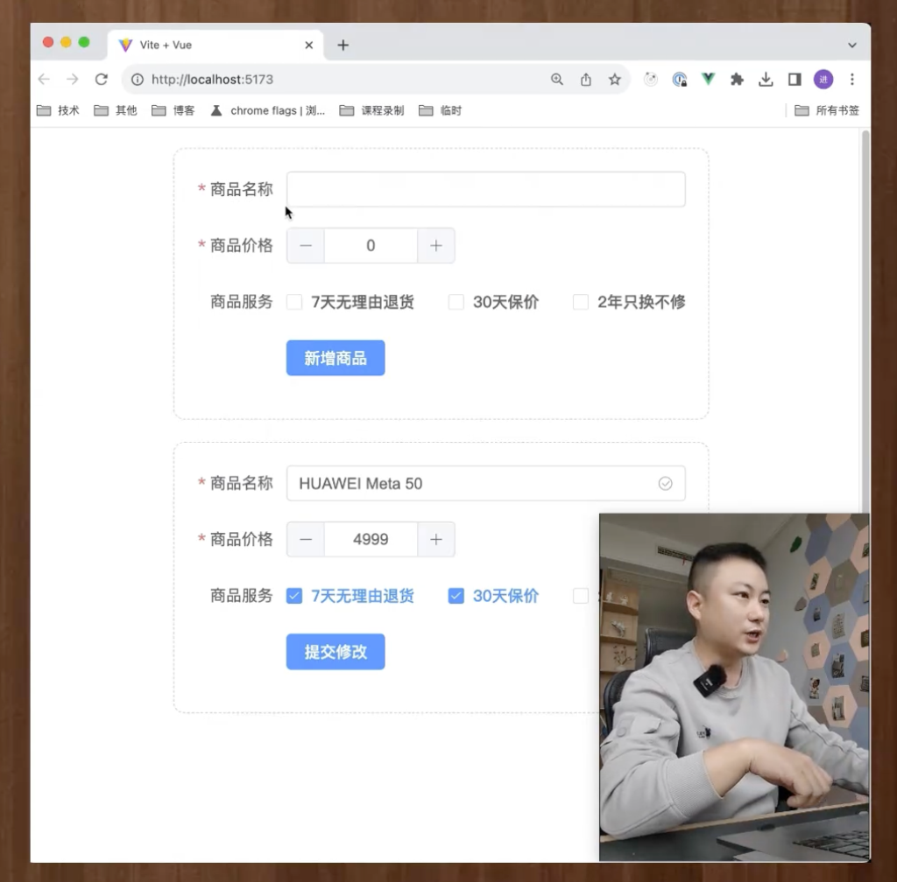
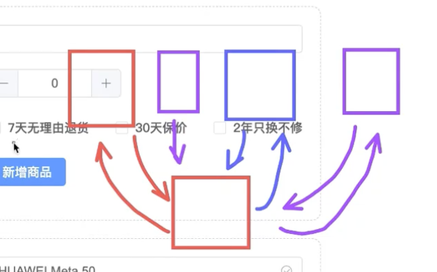
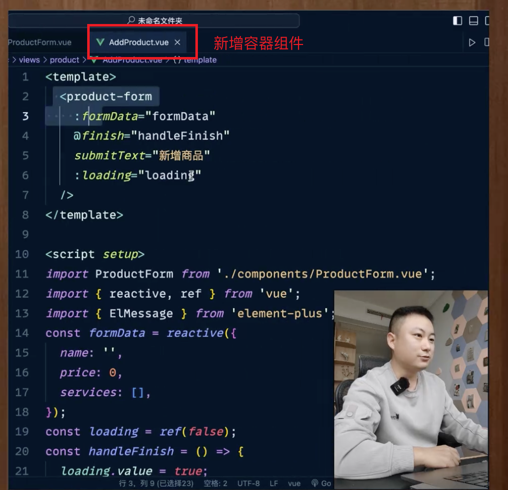

# 组件化开发思想
展示组件 和 容器组件 的分离是一种组件化的开发模式

我们可以将组件分为两大类
1. 展示组件
2. 容器组件

容器组件 和 展示组件 之间是调用关系, 我们会在容器组件中使用展示组件

容器组件是数据的提供者 和 数据逻辑的处理者, 至于展示什么样的界面有多花哨 那是展示组件要搞的事儿

<br>

### 展示组件
我们将数据传递给展示组件, 展示组件只负责根据数据展示页面, **它不会处理数据的逻辑**

比如我们点击了按钮, 要做什么不归展示组件负责, 它只会抛出事件, 展示组件它就做纯展示

<br>

### 容器组件
它负责处理数据逻辑
1. 它负责根据不同的场景给 展示组件 提供对应的数据
2. 它负责处理展示组件抛出的事件
3. 当数据变化后要做什么 都是容器组件来负责


<br>

### 好处:
好处就是将数据的逻辑 和 展示的逻辑彻底的进行分离, 减少了组件之间的耦合 使组件的边界更加的清晰 代码更容易维护

<br>

### 不分离的问题:



比如上面的表单场景 我们往往会有两种情况
1. 新增表单
2. 修改表单

我们一般都会将上面的两种情况放在一个组件里面 这个组件中会根据
1. 有没有id
2. 地址栏参数

还确定到底是做新增还是做修改 然后用各种的if判断去写不同的逻辑 并且这个逻辑中同时包含展示逻辑和数据处理逻辑

<br>

这样就有两个直观的后果
1. 将来维护的时候 我们要找哪一部分是新增的代码 哪一部分是修改的代码
2. 当我们修改新增的代码的时候 我们会不会担心会影响到更新的逻辑, 因为它们耦合在一起了
3. 将来需求一旦发生变化 比如我们要根据不同人的权限来决定 每个表单项到底要不要禁用 我们还要揉进去一部分代码

<br>

### 正确做法:
也就是说不要将 数据处理的逻辑 和 页面展示的逻辑 柔和在一个组件中

我们将上面图里的 新增 和 更新 看成一个展示组件, 这个组件不处理任何的新增逻辑和修改逻辑 就做纯展示

需要展示成什么样子, 让容器组件传给展示组件 它就做展示

<br>

写完展示组件后, 我们在去写容器组件

因为我们两 新增功能 和 更新功能 所以我们创建两个容器组件
- 新增的容器组件
- 修改的容器组件

<br>

新增的容器组件会提供给展示组件类似如下的内容, 新增容器组件用来处理新增的相关逻辑
1. 新增页面上显示的数据
2. 新增页面上显示的html结构 对应的flag
3. 做展示组件抛出的事件的处理

修改的容器组件也会同样交给展示组件一些跟修改相关的逻辑

比如将来我们再有查看的逻辑 比如全部禁用表单项, 那我们就给展示组件提供新的展示信息 告诉它哪些地方要禁用

这样当以后我们新增的逻辑有变动的时候 我们只需要改写新增的容器组件就可以了 这样不会影响另外两个



<br>

**也就是说展示组件就一个 将多种html结构柔和在一起, 根据容器组件传递过来的数据 决定渲染什么结构** 

<br>

### 页面结构
```s
| - components
  - ProductForm.vue  # 展示组件

| - views
  - AddProduct.vue # 新增的容器组件
  - UpdProduct.vue # 修改的容器组件
```



