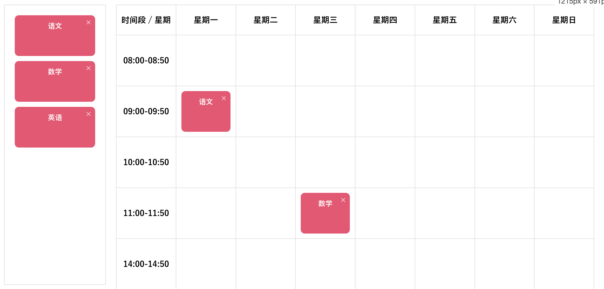

# Drag
html5提供专门的拖拽与拖放的API

<br>

### 兼容性：
IE9以下不支持 Opera不支持 大部分浏览器都支持

<br>

### draggable 标签属性
用于开启对应元素的拖拽功能
```html
<div title="拖拽" draggable="true">
```

<br>

**注意:**  
图片和链接默认是可拖动的 不需要 draggable属性

<br><br>

```s
  被拖拽            目标对象(目的地)

+-------+           +-------+   
|       |           |       |
|       |           |       |
|       |           |       |
|       |           |       |
+-------+           +-------+
```

<br>

## 源元素的事件: 事件发生在被拖拽的元素身上
在拖动目标上触发的事件, 作用在被拖拽元素上

<br>

### ondragstart
用户开始拖动元素时触发

<br>

### ondrag
元素正在拖动时触发

<br>

### ondragend
用户完成元素拖动后触发

该事件是在目标元素外部触发的, 也就是说 我拖动到一半了 不想拖进去 直接松手的时候触发的事件

<br><br>

## 目标元素的事件: 释放目标时触发的事件 作用在目标元素(目的地上)
把被拖拽的元素放到哪个目标容器里面去 这个容器就是目标元素

<br>

### ondragenter
进入其容器范围内触发, 当鼠标拖动的对象进入其容器范围内时触发此事件

<br>

### ondragover
被拖动的对象在另一个对象容器范围内拖动, 当某被拖动的对象在另一对象容器范围内拖动时触发此事件

**注意:**  
阻止默认事件方法等执行  
在ondragover中一定要执行preventDefault 否则 ondrop事件 不会被触发  ！！！
```js
evenet.preventDefault()
```

<br>

### ondragleave
拖动的对象离开其容器范围内时触发此事件, 当鼠标拖动的对象离开其容器范围内时触发此事件

<br>

### ondrop
释放鼠标键时触发 在一个拖动过程中 释放鼠标键时触发此事件

阻止默认事件方法等执行
```js
evenet.preventDefault()
```

<br><br>

## 区别:
ondrop 和 ondragend 都涉及到拖拽的结束阶段，但它们在用途和触发时机上存在一些区别。

<br>

### ondrop 事件：
ondrop 事件在拖拽操作结束时发生，且发生在被拖拽的元素被释放到一个有效的拖放目标（通常是另一个元素）上时。

它通常用于处理在目标区域释放拖拽元素时的操作，如文件上传、元素移动等。

<br>

**触发时机：**  
在被拖拽的元素（``<div>``, ````, 等等）被释放时，且释放位置是一个有效的拖放目标时触发。

<br>

### ondragend 事件：
ondragend 事件在拖拽操作结束时发生，不论拖拽元素是否成功被释放到有效目标，它都会触发。通常用于在拖拽操作结束时执行一些清理工作。

<br>

**触发时机：**  
在拖拽操作结束时触发，不论释放位置是否是有效的拖放目标。

<br>

### 总结:
- ondrop 用于处理拖拽元素在有效拖放目标上的释放操作。
- ondragend 用于在拖拽操作结束时执行一些清理工作，不论释放位置是否是有效目标。

<br>

### 有效拖放目标
在拖放操作中，"有效的拖放目标" 指的是 在拖放元素释放时能够接受该元素的容器或区域。在这个上下文中，一个有效的拖放目标必须满足以下条件：

<br>

**允许拖放的元素类型：**  
拖动的元素的类型必须与目标容器所期望的类型匹配。例如，如果目标容器期望是一个能够接受图片的容器，那么拖动的元素应该是一个图片。

<br>

**拖放元素与目标容器的相互兼容性：**   
拖动的元素必须与目标容器兼容。这通常涉及到拖拽元素的数据格式是否与目标容器所能理解和处理的格式相匹配。

<br>

**目标容器的拖拽事件处理：**  
目标容器必须正确处理拖拽相关的事件，如 dragover 事件，以指示它允许在其上进行拖放操作。通常，在 dragover 事件中，你需要调用 event.preventDefault() 来允许拖拽元素在目标容器上释放。


<br><br>

## 案例 从一个div将目标传入另一个div
```html
<div class="wrap">
    <!-- 被拖动元素的区域 -->
    <div class="target">
        <ul>
            <li><div draggable="true">1. HTML</div></li>
            <li><div draggable="true">2. JS</div></li>
            <li><div draggable="true">3. Vue</div></li>
            <li><div draggable="true">4. React</div></li></li>
        </ul>
    </div>

    <!-- 目标容器: 目的地 -->
    <div class="target-wrap">
    </div>
</div>
<script>
    // 被拖拽的对象有很多个 获取全部的拖被动元素
    let targets = $(".target ul li div")

    // 目标容器
    let wrap = $(".target-wrap")[0]

    // 在全局定义一个被拖动的元素对象 因为要把当前拖动的元素插入到目标容器 目标容器要使用这个元素
    let targetDom = null;

    // 给所有被拖拽元素绑定 ondragstart 事件
    targets.forEach((item, index) => {
        item.ondragstart = function() {
            // 将被选中的 被拖动元素 赋值给全局变量
            targetDom = this
        }
    })

    // 给目标容器绑定 ondragover事件 在这里首先阻止默认行为 让drop能够起到作用
    wrap.ondragover = function(e) {
        e.preventDefault()
    }

    // 在这里当 被拖拽元素在目标容器内松手的时候 我们就能在下面的事件中监听到
    wrap.ondrop = function() {
        console.log(targetDom)

        // 将当前被拖动的元素 插入到目标对象
        this.appendChild(targetDom)
    }


    function $(el) {
        return document.querySelectorAll(el)
    }
</script>
```

<br><br>

# DataTransfer对象: event.dataTransfer
拖拽对象用来传递的媒介 使用一般为 ``event.dataTransfer``

**该对象用于保存拖动并放下过程中的数据** 它可以保存一项或多项数据 这些数据可以是一种或者多种数据类型

dataTransfer对象提供了一些方法用于在 源元素(被拖动元素) 与 目标元素(目的地) 中共享数据

简单的说就是 想将 ``<被拖拽元素的数据>`` 传递给 ``<目标对象>`` 的时候,可以使用这个对象

<br>

### dataTransfer对象 的 属性
- **e.dataTransfet.files**: 通过该对象能够获取到拖拽文件的类型, 比如我们是上传图片我们就能从这个 files 属性中得到上传图片的信息 它是一个数组
```js
files[0]
lastModified: 1636690826904
lastModifiedDate: Fri Nov 12 2021 13:20:26 GMT+0900 (日本標準時) {}
name: "51636690825_.pic_hd.jpg"
size: 18267
type: "image/jpeg"
webkitRelativePath: ""
```

- **dataTransfer.items**: items 属性提供了一个 DataTransferItemList 对象，该对象表示拖动操作中的数据项。每个数据项都是一个 DataTransferItem 对象。
```js
// 你可以通过遍历 dataTransfer.items 获取拖拽操作中包含的所有数据项，并进一步处理这些数据。
const items = e.dataTransfer.items;
for (let i = 0; i < items.length; i++) {
  const item = items[i];
  console.log(item.kind, item.type); // 处理每个数据项的类型和其他信息
}
```

- **dataTransfer.types**: types 属性返回一个数组，包含了拖拽操作中的所有数据类型（MIME 类型）。这些类型可以是文件、文本等。
```js
// 使用场景： 你可以通过遍历 dataTransfer.types 获取拖拽操作中包含的所有数据类型，然后根据类型执行相应的操作。
const types = e.dataTransfer.types;
for (let i = 0; i < types.length; i++) {
  const type = types[i];
  console.log(type); // 处理每个数据类型
}
```

在处理拖拽操作时，这两个属性的使用可以根据具体的需求进行。它们提供了更灵活的方式来处理拖拽中的多个数据项和数据类型。

<br>

### event.dataTransfer.setData(type, data)
用于声明所发送的数据与类型

该方法用于定义要传递数据的 变量名 和 具体数据 相当于定义了 ``key: value``

```js
// 比如我们传递个 name: "sam"
event.dataTransfer.setData("name", "sam")
e.dataTransfer.setData("txt", e.target.innerHTML)

// 获取数据的时候 就要通过指定的type值
event.dataTransfer.getData("name")


const data = "Hello, World!";
const type = "text/plain";
// type参数可以是任意字符串 也可以是 MIME 类型 类型
```

<br>

**注意：**  
当我们设置了要传输的数据的时候 但是没有到达目标容器就松手了, 这时我们要删除设置的key value数据

我们还要给 被拖拽对象绑定 未到位目标元素松手的事件 ondragend 在内部调用删除数据的逻辑

<br>

### event.dataTransfer.getData(type)
返回指定的type的数据

<br>

### event.dataTransfer.clearData(type)
删除指定类型的数据

<br>

### event.dataTransfet.setDragImage(图片对象, 坐标x, 坐标y)
setDragImage方法用于在拖放操作过程中 修改鼠标指针所指向的图像

当我们拖拽某个元素的时候 这个元素肯定是跟着这个鼠标  
当我们想把这个元素修改为某个图片的时候 也就是最终效果是图片跟着鼠标移动 那么就使用这个api
```js
// 第一个参数不能直接写路径 要使用图片对象
let img = new Image()
img.src = "./xxx"
event.dataTransfet.setDragImage(img, 坐标x, 坐标y)

// 再进行拖拽的时候就会显示一张图片在跟随鼠标
```

<br><br>

## 案例 拖拽删除列表项
### ondragstart 事件中的处理逻辑
**1. 可以设置传递数据**  
通过 ``e.dataTransfer.setData("txt", e.target.innerHTML)`` 的方式 该数据可以在 传递到 目标容器的时候生效 没有到达目标容器的时候要删除

**2. 还可以设置跟随鼠标移动的是图片还是元素本身**

**3. 将被拖动元素赋值给全局变量**

<br>

### ondragend 事件中的处理逻辑
**1. 删除 设置的数据**

**2. 将全局变量赋值为空**

```js
// 1. 找到所有可拖拽的对象
let targets = $(".target ul li div")

// 2. 目标容器 (垃圾箱)
let wrap = $(".target-wrap")[0]

// 在全局定义一个被拖动的元素对象 其它的地方要使用
let targetDom = null;

// 给所有被拖拽元素绑定 ondragstart 事件
targets.forEach((item, index) => {

    item.ondragstart = function(e) {
        // 当我们想在 被拖拽元素 和 目标元素之间传递数据的时候 我们可以使用 事件对象身上的 dataTransfer 对象身上的方法
        
        // 首先先定义 我们要传递数据的变量名 和 具体数据
        // e.dataTransfer.setData 方法用于定义 key value

        e.dataTransfer.setData("txt", e.target.innerHTML)
        let msg = e.dataTransfer.getData("txt")
        console.log(msg)

        // 我们还可以设置 图片代替元素本身跟随鼠标移动的效果
        let img = new Image()
        img.src = "./img/51636690825_.pic_hd.jpg"
        e.dataTransfer.setDragImage(img, 0, 0)

        // 当我们开始拖拽一个元素的时候 就把这个元素赋值给全局变量
        targetDom = this
    }

    // 当 被拖拽元素 未到达目标容器的情况下 我们要清楚我们定义的要传输的数据
    item.ondragend = function(e) {
        e.dataTransfer.clearData("txt")

        // 当我们未到达目标容器的时候 就想全局变量置为空
        targetDom = null
    }
})


// 目标容器对象 我们要监听什么事件呢？
// 比如一进入目标容器事件 垃圾箱就换个背景 我们就可以监听 ondragenter 事件
wrap.ondragenter = function(e) {
    this.style.backgroundColor = "pink"
}


// 给目标容器绑定 ondragover事件 在这里首先阻止默认行为 让drop能够起到作用
wrap.ondragover = function(e) {
    e.preventDefault()
}

// 当目标元素进入到垃圾箱后我们要进行删除的操作
wrap.ondrop = function(e) {

    // 这里我们判断一下是不是有目标元素的存在
    if(targetDom) {
        let msg = e.dataTransfer.getData("txt")
        $(".info")[0].innerHTML = msg + "被删除了"
        】
        // 或者先找到该节点的父亲再删除
        targetDom.remove()
        // targetDom.preventNode.removeChild(targetDom)
    }
    this.style.backgroundColor = ""
} 


function $(el) {
    return document.querySelectorAll(el)
}
```

<br><br>

## 案例: 拖拽文件进行上传 并以base64文件格式上传后端服务器
1. 文件拖拽上传并以base64传给后台
2. 可以有缩略图显示
3. 可删除缩略图 同时更新传给后台的数据

<br>

### 要点1：
1. 要是想监听 ondrop 事件的时候 必须要在 ondragover 事件中阻止默认行为
2. 在图片拖拽上传的案例中 当把图片拖拽到目标区域后(也就是当把图片拖拽到浏览器上的时候) 浏览器会将图片打开 这时也需要在 ondrop 事件中阻止浏览器的默认打开图片的行为

3. 拖拽元素的信息都在 e.dataTransfer对象 中该对象中的 files 属性就包含了 我们拖拽元素的信息
```js
e.dataTransfet.files
// 通过该对象能够获取到拖拽文件的类型 比如我们是上传图片我们就能从这个 files 属性中得到上传图片的信息 它是一个数组

files[0]
    lastModified: 1636690826904
    lastModifiedDate: Fri Nov 12 2021 13:20:26 GMT+0900 (日本標準時) {}
    name: "51636690825_.pic_hd.jpg"
    size: 18267
    type: "image/jpeg"
    webkitRelativePath: ""
```

4. 这个案例中 我们关心的是 图片的大小 
```js
e.dataTransfer.files[0].size
// 当大于400k的时候 就不让上传了
```

5. 将图片转为base64的逻辑 需要用 FileReader API 它当中有很多的方法
```s
readAsDataURL 方法可以将目标转为base64格式

readAsArrayBuffer
  可以做缓存 缓存数据

readAsBinaryString

readAsDataURL
  通过这个方法将图片转换为base64

readAsText
readAsState

注意: 
readAsDataURL方法转换的结果是异步的 所以要搭配 reader.onload 来使用 我们可以在回调中 通过e.target.result 拿到结果
```

6. base64的字符长度就是文件的大小 e.target.result.length 就是图片的大小
```html
<div class="main">
    <div class="upload-area">
        或者将文件拖动到此处
    </div>
    <button id="btn">上传</button>
</div>
<ul class="preview"></ul>

<script>
    // 目标对象 也就是上传区域
    let wrap = $(".upload-area")[0]

    // 以数组的形式 需要给到后台的图片数据 当点击上传按钮的时候 要使用的数据
    let allBaseImage = []

    // 定义允许上传最大图片的尺寸 超过400k上传失败 我们可以跟base64字符串的长度进行对比
    let allowImgFileSize = 1024 * 400

    let preview = $(".preview")[0]

    // 因为图片都在文件夹里面所以不用监听被拖拽元素的一系列方法 但是需要监听目标容器身上的事件 比如当图片在目标容器上放下的时候
    wrap.ondragover = function(e) {
        e.preventDefault()
    }

    // 主要的逻辑就在这个在目标容器内放下被拖拽元素的时候触发的事件里
    wrap.ondrop = function(e) {

        // 当我们把一个图片拖动到浏览器上的时候 效果会是图片在浏览器上打开 这也是默认行为要阻止
        e.preventDefault()

        // e.dataTransfer就是拖拽元素的信息对象
        // console.log(e.dataTransfer)

        // e.dataTransfer的files属性 是我们拖动元素的信息
        // console.log(e.dataTransfer.files)

        // 我们要将图片转为base64格式 首先要拿到所有的上传图片 多个文件
        let imgFiles = e.dataTransfer.files

        // 转换成base64
        transferDataToBase64(imgFiles)
    }


    // 转为base64的逻辑
    function transferDataToBase64(files) {
        // console.log(typeof files)  // 对象 所以不能使用forEach

        for(let i=0; i<files.length; i++) {
            let img = files[i]
            // 使用FileReader将文件转为base64格式
            let reader = new FileReader()
            reader.readAsDataURL(img)

            // reader对象的操作是异步的 不能马上得到结果 所以使用onload事件
            reader.onload = function(e) {

                // 通过e.target.result得到转换的结果
                let base64Img = e.target.result

                // 在往 allBaseImage数组里push之前 我们还要对其进行判断
                // 判断数组中是否已经包含了该图片

                // 还可以使用 includes 方法 我们先获取index 如果不等于-1说明数组中已存在该图片
                let index = allBaseImage.indexOf(base64Img)

                if(index != -1) {
                    return
                }

                // 我们还要判断该图片转换后结果的大小 超过400k就不让上传了
                // 这里注意当我们将图片转为base64格式后 会是一堆的字符  该字符的长度越长代表图片越大 同时该字符的长度也是图片的大小
                // e.target.result.length 就是图片的大小

                if(base64Img.length > allowImgFileSize) {
                    alert("图片上传失败 尺寸不符")
                    return
                }
                // 都没有问题推到数组里面去
                allBaseImage.push(base64Img)

                // 文件解析成base64后 在缩略图区域展示图片
                let str = `
                    <li><i class="close">x</li>
                `
                // 因为有很多的图片都要放入ul中 所以我们要用 +=
                preview.innerHTML += str
            }
        }
    }

    // 监听缩略图的删除事件 因为 x 是后面动态添加的 所以这里要使用事件委托
    preview.onclick = function(e) {
        if(e.target.className == "close") {
            // 如果点击的是x的话 我们要进行删除逻辑 我们怎么能找到对应的图片呢？ 这里是用过 e.target 就是x 找到它前一个兄弟 就是对应的图片
            let thisImg = e.target.previousElementSibling
            // console.log(thisImg)
            
            // 更新数组中的数据
            // 在数组中还要删除图片 那我是不是要知道 我现在的这张图片在数组中的位置
            let imgIndex = allBaseImage.indexOf(thisImg)
            allBaseImage.splice(imgIndex, 1)

            // 删除li标签
            e.target.parentNode.remove()
        }
    }

    function $(el) {
        return document.querySelectorAll(el)
    }
</script>
```

<br><br>

## 案例: 课程表


这里完成一个将左侧的卡片 拖拽到右侧表格单元格中的案例

<br>

### 代码部分:
**主要页面:**  
```html
<script setup lang="ts">
import { reactive } from 'vue'

// data 文件中 有页面的布局
import data from './utils/data'
import CoursePanel from './components/CoursePanel.vue'

defineOptions({
  name: 'DragPage'
})

// 初始的渲染逻辑:
/*
  我们的卡片 怎么确定在哪个单元格中?
  列: weekday
  行: timeSlot

  假如我们组织下面的数据结构 是不是就可以将一个卡片对应的某个单元格中了
  1: 对应 weekday 数组中的下标 index
  5: 对应 timeSlot 数组中的下标 index

  我们利用下标来做为单元格的坐标
  {
    // 星期2 - '15:00-15:50': 某个课程
    1-5: chinese | english | mathmatics
  }

  相当于 坐标 和 课程名
*/
// 这是一种策略
const cellData = reactive<Record<string, string>>({
  '1-1': 'chinese',
  '2-5': 'english',
  '3-3': 'mathmatics'
})

/*
  卡片组件的自定义事件
  当我们拖动卡片 结束拖动后 会触发这个事件

  我们需要将这个 el 放入到 右侧表格区域

  我们放入 el 的时候, 实际上不是让卡片区域对应的元素消失, 而是希望在表格中增加跟卡片一模一样的数据

  所以我们还要给 right 元素绑定 进入 | 滑过目的地 的事件
*/
let targetCell: HTMLElement | null = null

// 目的地: 滑过事件
const dragoverProcess = (e: DragEvent): void => {
  // console.log(e.target)
  // 取消默认行为: 被拖动元素本来存在于左侧的卡片栏中, 如果不取消默认行为的话, 卡片栏中的元素就会被拖走, 我们不希望卡片栏中的卡片被移动, 而是希望在表格中增加和卡片一模一样的数据
  e.preventDefault()
}
// 目的地: 进入事件
const dragenterProcess = (e: DragEvent): void => {
  // 这里的 e.target 就是动态的 我进入哪个元素 e.target就是哪个元素
  // console.log(e.target)
  e.preventDefault()

  // 当我们在进入到某个 目的地 的时候 判断下 是不是我们要放的目的地, 比如 right区域 有 table tr th td, 我们的卡片只需要放入到td中 所以我们在该事件中 完成 目的地 的判断操作

  const target = e.target as HTMLElement
  const targetName = target.tagName.toLocaleLowerCase()
  // targetCell 就是目的地了
  targetCell = targetName !== 'td' ? null : target
}

const dragendProcess = (el: HTMLDivElement): void => {
  // console.log(el)
  // 结束拖动的事件 我们是否要将卡片放到 这里需要判断
  /*
    1. 目的地是否为null
    2. 目的地是否已经有卡片了 这里我们可以 这么判断
    在初期渲染的时候 我们使用了 cellData 它当中的 '1-1': 'chinese' key 就说明初期渲染时 哪个'坐标'中 渲染了数据

    所以我们只需要拿到 每个td的坐标就可以了 所以我们使用 data- 自定义属性来标识 坐标
    <tr v-for="(timeSlot, index) of data.timeSlot">
      <td
        v-for="weekday in 7"
        :key="weekday"
        :data-weekday="weekday"
        :data-time-slot="index"
      >
    </tr>
  */
  const weekday = targetCell?.dataset.weekday
  const timeSlot = targetCell?.dataset.timeSlot
  // 组织出来key 1-1 这种格式
  const prop = `${weekday}-${timeSlot}`
  if (targetCell && !cellData[prop]) {
    // 该情况下我们就可以将 卡片放入 目的地
    console.log('targetCell', targetCell)

    /*
    放到目的地 其实就是在 cellData 数组中添加一组数据

    const cellData = reactive<Record<string, string>>({
      '1-1': 'chinese',
      '2-5': 'english',
      '3-3': 'mathmatics'
    })

    我们将一组数据 x-x: chinese 追加到 cellData 中 

    我们是通过数据来进行渲染的, 我们通过坐标 组织成策略 然后通过策略 找data数据中的数据
    */
    const key = el.dataset.key
    cellData[prop] = key as string
  }
}
</script>

<template>
  <div class="board ctn pa:10">
    <div class="left">
      <!-- 遍历: data.courses 对象 参数1是value部分 -->
      <CoursePanel
        v-for="({ name }, key) in data.courses"
        :key="key"
        :courseName="name"
        :courseKey="key"
        @dragendHandler="dragendProcess"
      ></CoursePanel>
    </div>
    <div
      class="right"
      @dragover="dragoverProcess"
      @dragenter="dragenterProcess"
    >
      <table border="1">
        <tr>
          <th>时间段 / 星期</th>
          <th v-for="(weekday, index) of data.weekday" :key="index">
            {{ weekday }}
          </th>
        </tr>
        <tr v-for="(timeSlot, index) of data.timeSlot" :key="index">
          <th>{{ timeSlot }}</th>
          <!-- 补一下 td -->
          <td
            v-for="weekday in 7"
            :key="weekday"
            :data-weekday="weekday"
            :data-time-slot="index"
          >
            <template v-if="cellData[`${weekday}-${index}`]">
              <!-- 拿着从 cellData 中取出的 chinese 取 data.courses 中取对应的name -->
              <CoursePanel
                :courseName="
                  (data.courses as any)[cellData[`${weekday}-${index}`]].name
                "
                :courseKey="cellData[`${weekday}-${index}`]"
              />
            </template>
          </td>
        </tr>
      </table>
    </div>
  </div>
</template>

<style scoped lang="scss">
.board {
  display: flex;

  .left {
    width: 200px;
    height: 100%;
    margin-right: 20px;
    border: 1px solid #ddd;
    padding: 20px;
  }
  .right {
    flex: 1;
    height: 100%;

    table {
      width: 100%;
      border-collapse: collapse;
      // 固定 列宽, 单元格的宽度不会随着内容而变化
      table-layout: fixed;
      border: 1px solid #ddd;

      th,
      td {
        padding: 5px 10px;
        border: 1px solid #ddd;
      }

      th {
        padding: 20px 0px;
      }

      td {
        height: 100px;
      }
    }
  }
}
</style>
```

<br>

**卡片组件:**  
```html
<script setup lang="ts">
defineOptions({
  name: 'CoursePanel'
})

type propsType = {
  courseName: string
  courseKey: string
}

defineProps<propsType>()

// 我们松手后, 需要将 卡片 放入到表格中
const emit = defineEmits(['dragendHandler'])

// 开始拖动
const dragstart = (e: DragEvent): void => {
  // 拖动的元素
  const el = e.target as HTMLDivElement
  // 设置元素样式 在开始拖动的时候 元素的透明度要发生变化
  el.style.opacity = '0.5'
}
// 拖动结束
const dragend = (e: DragEvent): void => {
  const el = e.target as HTMLDivElement
  el.style.opacity = '1'

  // 当我们拖动结束的时候 发射 事件 将当前的 html 元素传递进去 发送给父组件
  emit('dragendHandler', el)
}
</script>

<template>
  <!--
    1. 设置元素可被拖动
    我们在组件根标签上 使用 draggable 标签属性 让它可以拖动

    2. 绑定开始 拖动 和 放下 的事件
  -->
  <div
    class="course-panel"
    draggable="true"
    :data-key="courseKey"
    @dragstart="dragstart"
    @dragend="dragend"
  >
    <h1 class="heading heading--center">{{ courseName }}</h1>
    <span>×</span>
  </div>
</template>

<style scoped lang="scss">
.course-panel {
  // width: 150px;
  height: 80px;
  background-color: #ef476f;
  box-sizing: border-box;
  padding: 10px;
  cursor: move;
  border-radius: 8px;
  position: relative;

  h1 {
    color: #fff;
  }

  span {
    position: absolute;
    top: 5px;
    right: 5px;
    color: #fff;
    cursor: pointer;
  }

  & + .course-panel {
    margin-top: 10px;
  }
}
</style>
```  

<br>

**数据:**  
```js
/*
布局:

board:
  left
    课程卡片列表

  right
    课程表
      表头: 周几 时间段
      卡片的单元格

表格的单元格中可以放入, 课程卡片
*/

type dataType = {
  weekday: string[]
  timeSlot: string[]
  courses: {
    chinese: {
      name: string
      teachers: string[]
    }
    mathmatics: {
      name: string
      teachers: string[]
    }
    english: {
      name: string
      teachers: string[]
    }
  }
}
const data: dataType = {
  weekday: [
    '星期一',
    '星期二',
    '星期三',
    '星期四',
    '星期五',
    '星期六',
    '星期日'
  ],
  timeSlot: [
    '08:00-08:50',
    '09:00-09:50',
    '10:00-10:50',
    '11:00-11:50',
    '14:00-14:50',
    '15:00-15:50',
    '16:00-16:50',
    '17:00-17:50'
  ],
  courses: {
    chinese: {
      name: '语文',
      teachers: ['张三', '李四']
    },
    mathmatics: {
      name: '数学',
      teachers: ['王五', '赵六']
    },
    english: {
      name: '英语',
      teachers: ['erin', 'nn']
    }
  }
}

export default data
```

<br>

### 表格的刻画
1. data.weekday 用来渲染行
2. data.timeSlot 用来渲染列

这样相当于形成了一个坐标系

<br>

### 数据源
这是我们的数据源
```js
  courses: {
    chinese: {
      name: string
      teachers: string[]
    }
    mathmatics: {
      name: string
      teachers: string[]
    }
    english: {
      name: string
      teachers: string[]
    }
  }
```

<br>

我们使用 如下的格式 来刻画初始渲染的数据 key 为坐标系, value对应着数据源中的key
```js
const cellData = reactive<Record<string, string>>({
  '1-1': 'chinese',
  '2-5': 'english',
  '3-3': 'mathmatics'
})
```

<br>

### 思路:
1. 将 要拖动的元素 封装成组件, 并在根节点上 设置 ``draggable="true"`` 这样该组件就可以被拖动了

2. 给 要拖动的 组件, 绑定开始拖动 和 结束拖动的事件
    - dragstart
        - 在开始拖动的时候 设置元素的样式等
    - dragend
        - 派发自定义事件, 将该组件对应的html元素 传递到父组件 ``emit('dragendHandler', el)``
        
3. 渲染 左侧 卡片列表, 给列表中的卡片 绑定子组件发送过来的 ``dragendHandler``自定义事件, 当结束拖动的时候 该做什么 (表格中的卡片组件不用绑定``dragendHandler``)
    - e.target 为动态的, 我们进入哪个元素 则它就是哪个元素
    - 组织出来 1-1 格式的key
    - 判断 目的地 是否合法
    - 向 cellData 数组中 追加要渲染的数据 (**Vue通过数据渲染视图**)

4. 给 目的地区域 .right 绑定 拖拽进入 和 拖拽移动 事件
    - dragoverProcess: 取消默认行为
    - dragenterProcess: 取消默认行为
        - 在进入目标区域的时候 我们判断目的地是否 合法

<br>

### 要点:
目的地元素上的事件, 都需要阻止默认执行, 这里阻止默认行为的意义在于
- @dragover="dragoverProcess"
- @dragenter="dragenterProcess"

被拖动元素本来存在于左侧的卡片栏中, 如果不取消默认行为的话, 卡片栏中的元素就会被拖走, 我们不希望卡片栏中的卡片被移动, 而是希望在表格中增加和卡片一模一样的数据

