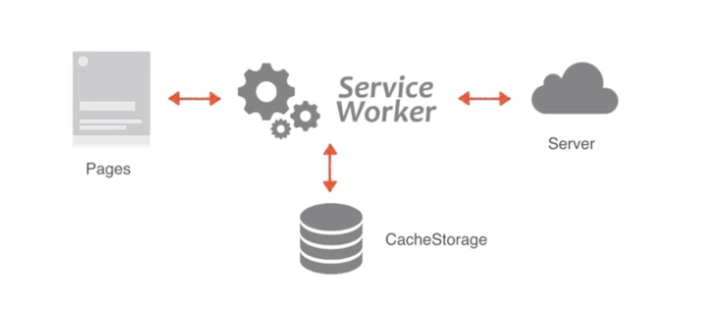

# WebWorker
JavaScript 语言采用的是单线程模型，也就是说，所有任务只能在一个线程上完成，一次只能做一件事。前面的任务没做完，后面的任务只能等着。随着电脑计算能力的增强，尤其是多核 CPU 的出现，单线程带来很大的不便，无法充分发挥计算机的计算能力。

Web Worker 的作用，就是为 JavaScript 创造多线程环境，允许主线程创建 Worker 线程，将一些任务分配给后者运行。在主线程运行的同时，Worker 线程在后台运行，两者互不干扰。

等到 Worker 线程完成计算任务，再把结果返回给主线程。这样的好处是，一些计算密集型或高延迟的任务，被 Worker 线程负担了，主线程（通常负责 UI 交互）就会很流畅，不会被阻塞或拖慢。

Worker 线程一旦新建成功，就会始终运行，不会被主线程上的活动（比如用户点击按钮、提交表单）打断。这样有利于随时响应主线程的通信。

但是，这也造成了 Worker 比较耗费资源，不应该过度使用，**<font color="#C2185B">而且一旦使用完毕，就应该关闭</font>**。

<br>

### **注意:**  
Worker 线程所在的全局对象，与主线程不一样，无法读取主线程所在网页的 DOM 对象，也无法使用document、window、parent这些对象。

**但是，Worker线程可以navigator对象和location对象。**  


<br>

### **通信:**  
Worker 线程和主线程不在同一个上下文环境，它们不能直接通信，必须通过消息完成。

<br>

### **脚本限制:**  
Worker线程不能执行alert()方法和confirm()方法，**但可以使用 XMLHttpRequest 对象发出 AJAX 请求。**  

<br><br>

# 主线程:

### **创建worker:**  
主线程采用new命令，调用Worker()构造函数，新建一个 Worker 线程。

```js
var worker = new Worker('work.js');
```

<br>

**参数1:**   
脚本文件的路径(可以是网址但是要注意同源策略)  只能是加载js脚本 否则会报错 该文件就是 Worker 线程所要执行的任务。

**参数2:**  
配置对象
```js
{
  name: "worker线程的名字"
}

// 线程可以通过 self.name 来获取
```

<br>

**返回值:**  
返回worker线程对象 供主线程使用

<br>

### **注意:**  
由于 Worker 不能读取本地文件，所以这个脚本必须来自网络。如果下载没有成功（比如404错误），Worker 就会默默地失败。

所以 WebWorker 必须要在服务器环境下运行

<br><br>

# WebWorker线程
Web Worker 有自己的全局对象，不是主线程的window，而是一个专门为 Worker 定制的全局对象。因此定义在window上面的对象和方法不是全部都可以使用。

Worker 线程有一些自己的全局属性和方法。

### **<font color="#C2185B">self.name</font>**   
Worker 的名字。该属性只读，由构造函数指定。

<br>

### **<font color="#C2185B">self.onmessage</font>**   
指定message事件的监听函数。

<br>

### **<font color="#C2185B">self.onmessageerror</font>**   
指定 messageerror 事件的监听函数。发送的数据无法序列化成字符串时，会触发这个事件。

<br>

### **<font color="#C2185B">self.close()</font>**   
关闭 Worker 线程。

<br>

### **<font color="#C2185B">self.postMessage()</font>**   
向产生这个 Worker 线程发送消息。

<br>

### **<font color="#C2185B">self.importScripts()</font>**   
加载 JS 脚本。

<br><br>

# 主线程与worker之间的通信:

### **<font color="#C2185B">线程.postMessage()</font>**  
给主线程发送 利用 <font color="#C2185B">self关键字</font>  
给子线程发送 利用 <font color="#C2185B">worker实例对象</font>

```js
// 主 —> 子
worker.postMessage('Hello World');
worker.postMessage({method: 'echo', args: ['Work']});


// 子 —> 主
this.postMessage('Hello World');
self.postMessage({method: 'echo', args: ['Work']});
```

<br>

**参数:**  
可以是各种数据类型，包括二进制数据。

<br>

### **<font color="#C2185B">线程.onmessage</font>**  
- 监听主线程的发送 利用 <font color="#C2185B">self关键字</font>  
- 监听子线程的发送 利用 <font color="#C2185B">worker实例对象</font>

```js
// 监听子线程过来的数据
worker.onmessage = function (event) {
  console.log('Received message ' + event.data);
  doSomething();
}

function doSomething() {
  // 执行任务
  worker.postMessage('Work done!');
}


// 监听主线程过来的数据
this.onmessage
self.onmessage
```

<br>

**<font color="#C2185B">event事件对象:</font>**  
event.data 就是接收到的数据

```js
event: {
  isTrusted: true
  bubbles: false
  cancelBubble: false
  cancelable: false
  composed: false


  currentTarget: DedicatedWorkerGlobalScope {name: '', onmessage: null, onmessageerror: null, cancelAnimationFrame: ƒ, close: ƒ, …}

  
  data: {msg: '我是主线程发送的数据'}


  defaultPrevented: false
  eventPhase: 0
  lastEventId: ""
  origin: ""
  path: []
  ports: []
  returnValue: true
  source: null


  srcElement: DedicatedWorkerGlobalScope {name: '', onmessage: null, onmessageerror: null, cancelAnimationFrame: ƒ, close: ƒ, …}


  target: DedicatedWorkerGlobalScope {name: '', onmessage: null, onmessageerror: null, cancelAnimationFrame: ƒ, close: ƒ, …}

  timeStamp: 0
  type: "message"
  userActivation: null
}
```

<br>

### **关闭 worker:**  
**<font color="#C2185B">**worker.terminate()**</font>**  

<br>

**<font color="#C2185B">**self.close()**</font>**  
子线程中还可以通过 self 来关闭当前的worker

<br><br>

# Worker 线程: 
Worker 线程内部需要有一个监听函数，监听message事件。
```js
self.addEventListener('message', function (e) {
  self.postMessage('You said: ' + e.data);
}, false);
```

<br>

### **<font color="#C2185B">self:</font>**  
即子线程的全局对象。因此，等同于下面两种写法。
```js
// 写法一
this.addEventListener('message', function (e) {
  this.postMessage('You said: ' + e.data);
}, false);

// 写法二
addEventListener('message', function (e) {
  postMessage('You said: ' + e.data);
}, false);
```

除了使用``self.addEventListener()``指定监听函数，也可以使用``self.onmessage``指定。

监听函数的参数是一个事件对象，它的data属性包含主线程发来的数据。``self.postMessage()``方法用来向主线程发送消息。

根据主线程发来的数据，Worker 线程可以调用不同的方法，下面是一个例子。

```js
self.addEventListener('message', function (e) {
  var data = e.data;
  switch (data.cmd) {
    case 'start':
      self.postMessage('WORKER STARTED: ' + data.msg);
      break;
    case 'stop':
      self.postMessage('WORKER STOPPED: ' + data.msg);
      self.close(); // Terminates the worker.
      break;
    default:
      self.postMessage('Unknown command: ' + data.msg);
  };
}, false);
```

<br>

### **<font color="#C2185B">**self.close()**</font>**  
用于在 Worker 内部关闭自身。

<br><br>

# Worker线程中 加载脚本:

### **<font color="#C2185B">**importScripts()**</font>**  

Worker 内部如果要加载其他脚本，有一个专门的方法importScripts()。

```js
importScripts('script1.js');

// 该方法可以同时加载多个脚本。
importScripts('script1.js', 'script2.js');
```

<br><br>

# 错误处理:
主线程可以监听 Worker 是否发生错误。如果发生错误，Worker 会触发主线程的error事件。
```js
worker.onerror(function (event) {
  console.log([
    'ERROR: Line ', e.lineno, ' in ', e.filename, ': ', e.message
  ].join(''));
});

// 或者
worker.addEventListener('error', function (event) {
  // ...
});
```

<br>

### **关闭 worker:**  
```js
// 主线程
worker.terminate();

// Worker 线程
self.close();
```

<br><br>

# 数据通信:
前面说过，主线程与 Worker 之间的通信内容，可以是文本，也可以是对象。需要注意的是，这种通信是拷贝关系，<font color="#C2185C">即是传值而不是传址，Worker 对通信内容的修改，不会影响到主线程。</font>

主线程与 Worker 之间也可以交换二进制数据，比如 File、Blob、ArrayBuffer 等类型，也可以在线程之间发送。下面是一个例子。

<br>

### **示例:**  
```js
// 主线程
var uInt8Array = new Uint8Array(new ArrayBuffer(10));
for (var i = 0; i < uInt8Array.length; ++i) {
  uInt8Array[i] = i * 2; // [0, 2, 4, 6, 8,...]
}
worker.postMessage(uInt8Array);


// Worker 线程
self.onmessage = function (e) {
  var uInt8Array = e.data;
  postMessage('Inside worker.js: uInt8Array.toString() = ' + uInt8Array.toString());
  postMessage('Inside worker.js: uInt8Array.byteLength = ' + uInt8Array.byteLength);
};
```

但是，拷贝方式发送二进制数据，会造成性能问题。

比如，主线程向 Worker 发送一个 500MB 文件，默认情况下浏览器会生成一个原文件的拷贝。

为了解决这个问题，JavaScript 允许主线程把二进制数据直接转移给子线程，但是一旦转移，主线程就无法再使用这些二进制数据了，这是为了防止出现多个线程同时修改数据的麻烦局面。

这种转移数据的方法，叫做 <font color="#C2185C">Transferable Objects</font>。

这使得主线程可以快速把数据交给 Worker，对于影像处理、声音处理、3D 运算等就非常方便了，不会产生性能负担。

如果要直接转移数据的控制权，就要使用下面的写法。

```js
// Transferable Objects 格式
worker.postMessage(arrayBuffer, [arrayBuffer]);

// 例子
var ab = new ArrayBuffer(1);
worker.postMessage(ab, [ab]);
```

<br><br>

# 同页面的 Web Worker
通常情况下，Worker 载入的是一个单独的 JavaScript 脚本文件，但是也可以载入与主线程(页面)的代码。

### **1. 定义页面中的脚本:**  
注意: ``type="app/worker"`` script标签中必须使用浏览器不认识的type类型
```js
<body>
  <script id="worker" type="app/worker">
    addEventListener('message', function () {
      postMessage('some message');
    }, false);
  </script>


  <script>

  </script>
</body>
```

<br>

### **2. 接下来要完成以下的步骤**  
- 在正常的script标签中 获取 ``type="app/worker"``中的内容
- 并将其转成 Blob类型的数据
- 通过 createObjectURL()将其转换成 url
- 传入 构造函数 中的参数部分

```js
// 下面两种方式的获取节点内容是一样的 具体还是有区别的 可以另行查找
console.log(dom.innerHTML)
console.log(dom.textContent)


let content = document.querySelector("#worker").textContent
    

let blob = new Blob([content])
console.log("blob:", blob)
// Blob {size: 141, type: ''}


let url = URL.createObjectURL(blob)
console.log("url:", url)
// url: blob:http://127.0.0.1:5500/653d306b-5da4-40ff-b3e3-1d6014dc4a21


let worker = new Worker(url)
```

<br><br>


# 实例：Worker 线程完成轮询:
有时，浏览器需要轮询服务器状态，以便第一时间得知状态改变。这个工作可以放在 Worker 里面。

```js
// 创建 worker 的函数
// 传递了一个回调
function createWorker(f) {
  var blob = new Blob(['(' + f.toString() +')()']);
  var url = window.URL.createObjectURL(blob);
  var worker = new Worker(url);
  return worker;
}

var pollingWorker = createWorker(function (e) {
  var cache;

  function compare(new, old) { ... };

  setInterval(function () {
    fetch('/my-api-endpoint').then(function (res) {
      var data = res.json();

      if (!compare(data, cache)) {
        cache = data;
        self.postMessage(data);
      }
    })
  }, 1000)
});

pollingWorker.onmessage = function () {
  // render data
}

pollingWorker.postMessage('init');
```

上面代码中，Worker 每秒钟轮询一次数据，然后跟缓存做比较。如果不一致，就说明服务端有了新的变化，因此就要通知主线程。

<br>

### **实例：Worker 新建 Worker:**  
```
https://www.ruanyifeng.com/blog/2018/07/web-worker.html
```

<br><br>

# Web Worker 
html5的新特性 要完成一个web worker的功能代码就3行

### **程序:**  
指可以被cpu执行的代码 **通常程序存储在磁盘上**  
电脑中大概得执行步骤如下:

``` 
CPU              磁盘 (程序)

                (如下的都是程序 程序会方法磁盘上)
        ↖       1.html
                  2.css
                  3.js
```

我们的程序必须放在 cpu 上执行

但是有个问题 磁盘跑的太慢 cpu跑的太快 比如 cpu相当于飞机, 磁盘相当于爬着走 磁盘太慢了 cpu太快了 从磁盘直接拿到cpu中这个过程太慢了不现实

所以计算机中还有个部件叫内存 内存比磁盘快 比cpu慢 相当于高铁 因为内存的速度足够快 所以我们会**将程序先放到内存中 从内存中再送给cpu**  

<br>

### **进程:**  
将程序调用到内存中 并且分配指定的空间 在内存中的程序就叫做进程 **搁到内存中的程序就叫做进程**  

<br>

### **线程:**  
进程的内部是由多个线程组成的(线程也在内存中)

<br>

### **线程 和 进程之间的关系:**  
高科技开发区买了一块地 有一个工厂 
工厂中有4条生产线 生产线上有很多的工人
``` 
X
|    |    |    | 
|o   |o   |o   |o
|    |    |    | 
|o   |o   |o   |o
|    |    |    | 
|o   |o   |o   |o
|    |    |    | 
|o   |o   |o   |o
|    |    |    | 
|o   |o   |o   |o
|    |    |    | 
```

**生产线有什么优点?**   
万一有一天一条生产线停止工作了 不会影响整个工厂的运行 一个进程当中可以由多个线程组成

```
工厂: 进程  
生产线: 线程
```

<br>

### **chrome浏览器:**  
一个chrome浏览器进程内部 

*至少*有6个线程负责向服务器发送请求获取资源(资源请求线程) **请求线程**  

一个线程负责 *绘制* 所有的资源并且执行js程序(上面的线程将资源拿到了 这个线程负责将资源画出来) **UI主线程**  

一个人负责两件事情的时候就容易出问题 UI主线程要绘制图片 又要执行js代码

它一定会等到js执行完后 再绘制其下面的dom元素 如果js执行要花5秒钟时间 那么就会阻塞5秒 会类似白屏或卡顿5秒钟时间

```js
let start = new Date().getTime()
do {
  let end = new Date().getTime()
} while((end - start) < 5000)
```

上面的原因在于 一个人做了两件事 所以出现了上述的问题

<br>

### **解决方案: 创建 webworker**  
创建新线程 帮助UI主线程执行耗时的js任务 UI主线程只负责绘制网页的工作

```js
let worker = new Worker("要执行的js任务(文件)的路径")
```

创建一个 worker 对象 创建一个新线程来指定指定js任务

<br>

### **示例:**  
原本要等5秒才会显示余下dom结构的问题 通过worker解决了

```html
<body>
  <button>按钮1</button>

  <!-- 
    <script src="./src/assets/js/demo_worker.js"></script> 
  -->
  <script>
    // 创建worker对象 创建新线程执行耗时js文件
    let worker = new Worker("./src/assets/js/demo_worker.js")
  </script>

  <button>按钮2</button>
</body>
```

<br>

### **可能出现的错误:**  
```
Uncaught DOMException; Failed to construct "worker": scriot at
```

我们运行的时候可能不是通过服务器而是 file:// 直接运行的文件 worker只能运行在服务器下

<br>

### **worker程序实现数据传递:**  
```html
<body>
  <button>按钮1</button>
  <!-- 
    <script src="./src/assets/js/demo_worker.js"></script> 
  -->
  <script>
    // 创建worker对象 创建新线程执行耗时js文件
    let worker = new Worker("./src/assets/js/demo_worker.js")

    // 向 worker 发送数据
    worker.postMessage("123")


    // 接收 worker 的数据
    worker.onmessage = function(e) {
      console.log("接收worker的数据", e.data)
    }
  </script>
  <button>按钮2</button>
</body>
```

/src/assets/js/demo_worker.js
```js
// 接收主线程过来的数据
onmessage = function(e) {
  console.log("接收主线程过来的数据", e.data)
}

// 向主线程发送数据
postMessage("456")
```

打印的话:   
```
主线程先打印   
主线程先拿到 worker 发送过来的数据 456  
worker后打印 123  
```

<br>

**注意事项:**  
- worker中不能获取主线程的dom结构
- worker线程执行代码中不能包含任何 DOM/BOM 元素
- 操作网页中 DOM / BOM 只能交给UI主线程 其它的线程不能操作 因为担心混乱

<br>

### **使用场景:**  
计算用户输入数值的累加和

html部分:
```html
<body>
  <div>
    请输入数值: <input type="text">
  </div>
  <div>
    <button>
      计算
    </button>
  </div>
  <div>
    计算结果: <span></span>
  </div>

  <script>
    let inp = document.querySelector("input")
    let btn = document.querySelector("button")
    let span = document.querySelector("span")

    let worker = new Worker("./src/assets/js/demo_worker.js")

    btn.addEventListener("click", function() {
      // 将用户输入的值发送给worker
      worker.postMessage(+inp.value)
    })

    // 接收 worker 发送回来的数据
    worker.onmessage = function(e) {
      span.innerHTML = e.data
    }
  </script>
</body>
```

js部分:
```js
let res = 0
onmessage = function(e) {
  let num = e.data
  for(let i=0; i<=num; i++) {
    res += i
  }
  postMessage(res)
}
```

<br>

### **总结:**
在 work线程 往 主线程发送消息的时候  
使用 this == self == 不写 这三种写法都是一样的 也就是说:   

work线程中 this self 代表 主线程  
主线程中 worker实例对象代表 worker线程

<br>

### **场景:**  
```html
<script>
  // setTimeout本身是同步代码 但会回调会异步执行
  setTimeout(() => {
    console.log("今晚吃点啥")
  })


  // 做 50000 * 50000 的运算
  let a = 0
  for(let i = 0; i < 50000; i++) {
    for(let j = 0; j < 50000; j++) {
      a++
    }
  }
</script>
```

我们要将 计算 放到子线程执行

<br>

**1. web worker是通过 文件 启动分线程的:**  
建立js文件 也就是这个文件就是分线程  
myworker.js
```js
function fn(num) {
  let a = 0
  for(let i = 0; i < num; i++) {
    for(let j = 0; j < num; j++) {
      a++
    }
  }

  return a
}
```

<br>

**2. 主线程文件(html)中创建worker**  
```js
// 字符串文件路径 文件选谁 谁就是分线程
let worker = new Worker("./js/myworker.js")


// 传递数据给分线程
worker.postMessage(50000)
```

<br>

**3. 分线程接收数据**  
```js
function fn(num) {
  let a = 0
  for(let i = 0; i < num; i++) {
    for(let j = 0; j < num; j++) {
      a++
    }
  }

  return a
}


// 接收主线程的数据 事件会自动执行
self.onmessage = function(e) {
  // 调用上方的函数
  let res = fn(e.data)

  self.postMessage(res)
}
```

<br>

**4. 主线程接受worker的数据**  
```js
// 字符串文件路径 文件选谁 谁就是分线程
let worker = new Worker("./js/myworker.js")


// 传递数据给分线程
worker.postMessage(50000)

// 接收worker的数据
worker.onmessage = function(e) {
  console.log(e.data)
}
```

<br><br>

# Service Worker
Service workers是Progressive Web Apps的核心部分，允许缓存资源和Web推送通知等，以创建良好的离线体验。

它们充当 <font color="#C2185B">Web应用程序，浏览器和网络之间的代理</font>，允许开发人员拦截和缓存网络请求，并基于网络的可用性采取适当的操作。

一个service worker在单独的线程上运行，因此它是非阻塞的。这也意味着它无法访问主JavaScript线程中可用的DOM和其他API，比如cookie，XHR，Web存储API（本地存储和会话存储）等。由于它们被设计为完全异步，因此它们重度依赖promise来等待网络请求的响应。

<br>

### **注意:**  
出于安全考虑，service workers仅使用 <font color="#C2185B">HTTPS</font> 和 <font color="#C2185B">localhost</font> 运行，且不能在隐私浏览模式下使用。

因为很多代理都可以拦截网络请求

<br>

### **浏览器支持:**  
Service Workers是一种相对较新的API，仅受现代浏览器的支持。因此，我们首先需要检查浏览器是否支持该API
```js
if('serviceWorker' in navigator) {
    // Supported  
} else {
    // Not supported  
}
```

<br>

### **ServiceWorkerer的优势:**  

**作用:**  


```
front                    backend
  ↓                         ↓
pages -> ServiceWorkerer -> Server

              ↓

        CacheStorage
```

从图上看 前端要请求一个pages页面 正常的话我们会去 server 要该数据的 但是如果我们配置了 ServiceWorkerer 的话 

我们的请求会先被 ServiceWorkerer 拦截住

ServiceWorkerer有些像代理服务器在ServiceWorkerer中我们可以做一些选择

ServiceWorkerer可以操作 CacheStorage(缓存的api)  
也可以操作发送请求到server(放行请求)

那这就意味着有了ServiceWorkerer我们可以对有些不需要经常改变的数据 我们可以直接从 CacheStorage 中读取数据 返送给前端

如果有些数据要从网络中重新加载 也可以去server去请求

而且还可以做到 当server回来数据后 ServiceWorkerer还可以把结果放入到CacheStorage中一份 它真的像代理服务器 它可以

- 操作缓存
- 拦截请求 和 响应
- 发送请求

<br>

### **Service Worker 注册:**  
在我们开始缓存资源或拦截网络请求之前，我们必须在浏览器中安装service worker。由于service worker本质上是一个JavaScript文件，因此可以通过指定文件的路径来注册它。该文件必须可以通过网络访问，并且只应包含service worker代码。

你应该等待页面加载完成，然后将service worker文件路径传给 navigator.serviceWorker.register()方法

<br>

### **<font color="#C2185B">navigator.serviceWorker</font>**  
返回 serviceWorker 的容器对象, 我们可以想象成 所有的 serviceWorker 都归它来进行管理, 包括对 service worker 的注册，卸载，更新和访问 service worker 的状态

**返回值:swContainer**  
```js
let swContainer = navigator.serviceWorker
console.log("swContainer", swContainer)


// swContainer
{
  // servicework对象
  controller: {
    onerror: null,
    onstatechange: null,
    scriptURL: "http://127.0.0.1:5500/TechnologyStack/Memo/basic/PWA/pwa-sw-message/sw.js",
    state: "activated"
  },

  ready: Promise,
  oncontrollerchange: null,
  onmessage: null,
  onmessageerror: null
}

// swContainer的原型对象上有
{
  getRegistration: f,
  getRegistrations: f,
  register: f,
  startMessages: f
}
```

<br>

### **swContainer的属性:**
**<font color="#C2185B">swContainer.controller:</font>**  
前提回顾: 当我们注册 sw 成功后 then成功回调中会有一个 registration 参数

当 swContainer.controller.state 是 activated 的时候 会<font color="#C2185B">返回 sw对象</font>    
该 sw对象 和 registration.active 返回的结果是一样的

当页面强制刷新 (Shift + refresh) 或不存在 active worder 时，该属性返回 null 。

<br>

**<font color="#C2185B">swContainer.ready:</font>**  
会返回一个promise 当 registration.active 的时候 会被resolve 出来
```js
window.addEventListener("load", async () => {
  if("serviceWorker" in navigator) {
    let swContainer = navigator.serviceWorker

    let registoration = await swContainer.register("./sw.js")

    let ready = await swContainer.ready
    console.log("ready: ", ready)
    console.log("registoration: ", registoration)
  }
})

// 上面是说 registoration.active == ready == sw
```

<br>

### **swContainer的方法:**
**<font color="#C2185B">navigator.serviceWorker.register()</font>**  
该方法用来注册 serviceworker 

**参数:**  
sw.js文件的存放路径 **一般存放在项目的根目录**  

<br>

**注意:**  
比如 我们把 sw.js 文件 放在了 /js/sw.js 文件夹下 那么worker线程只能看到网址以 /js/开头的页面的fetch事件

所以说 fetch也是有 scope限制的, 如果你把 service-wokrker.js 放在 /js 目录下，那么只能拦截到 这个域名 js/ 请求 path 下的资源。

所以解决这样的问题，**建议 service-worker.js 文件 放在跟目录下**  

<br>

**返回值:**  
该方法的调用会返回 promise 对象  
当注册成功后 会返回一个 registration 对象
```js
ServiceWorkererRegistration: {
  active:
  backgroundFetch:
  cookies:
  installing:
  navigationPreload:
  onupdatefound:
  paymentManager:
  periodicSync:
  pushManager:
  scope:
  sync:
  updateViaCache:
  waiting:
}
```

**示例:**  
```js
if("serviceWorker" in navigator) {

  let swContainer = navigator.serviceWorker
  console.log("swContainer", swContainer)

  
  swContainer.register("./webworker.js")
    .then(registration => {
      console.log("registration: ", registration)
    })
    .catch(err => {
      console.log("err:", err)
    })

}
```

<br>

**<font color="#C2185B">navigator.serviceWorker.getRegistration(clientURL)</font>**  
我们传入一个 url 返回和该URL匹配已经注册过的 sw对象 它是一个promise

```js
navigator.serviceWorker.getRegistration('/app').then((registration) => {
  if (registration) {
    document.querySelector('#status').textContent = 'ServiceWorkerRegistration found.';
  }
});
```

<br>

**<font color="#C2185B">navigator.serviceWorker.getRegistrations()</font>**  
promise结构 获取的是 sw对象数组

```js
navigator.serviceWorker.getRegistrations().then((registrations) => {
  document.querySelector('#status').textContent = 'ServiceWorkerRegistrations found.';
});


// 示例2
navigator.serviceWorker.getRegistrations().then(function(registrations) {
  return resolve(Promise.all(registrations.map(function(v) { return v.unregister() })))
})
```

<br>

### **registration对象:**  
```js
ServiceWorkererRegistration: {
  // 默认值为null 当swContainer.state 为 activated 的时候 返回sw对象
  active:

  backgroundFetch:
  cookies:
  installing:
  navigationPreload:
  onupdatefound:
  paymentManager:
  periodicSync:
  pushManager:
  scope:
  sync:
  updateViaCache:
  waiting:
}
```

**<font color="#C2185B">registration对象.unregister()</font>**  
卸载servicework 并返回一个promise 无论成功与否都会返回true(可以验证下)

<br>

**<font color="#C2185B">registration对象.update()</font>**  
更新 serviceworker 

获得 worker 脚本的 URL，逐字节匹配新获取的 worker 和当前的 worker，存在差异的时候安装新的 worker。获取 worker 脚本的更新操作会忽略浏览器缓存的 24 小时前的内容。


<br><br>

# Service Worker 线程中的生命周期:

当用户访问我们的网站的时候 会先开始注册 Service Worker 

当 Service Worker 注册成功后 会自动调用 install 进行安装

当 Service Worker install 成功后 会自动调用 activate

一旦service worker被安装并激活了，它就可以开始拦截网络请求和缓存资源。

这可以通过监听service worker文件中浏览器发出的事件来完成。也就是说 我们监听的是主线程(浏览器)发出的事件


```js
self.addEventListener("install", e => {
  // 当安装service worker程序时将发出install


  // event
  ExtendableEvent: {
    isTrusted: true,
    bubbles: false,
    cancelBubble: false,
    cancelable: false,
    composed: false,
    currentTarget: ServiceWorkerGlobalScope{},
    defaultPrevented: false,
    eventPhase: 0,
    path: [],
    returnValue: true,
    srcElement: ServiceWorkerGlobalScope{},
    target: ServiceWorkerGlobalScope{},
    timeStamp: 0,
    type: "activate"
  }
})

self.addEventListener("activate", e => {
  // 成功注册和安装service worker程序后将发送active。
})

self.addEventListener("fetch", e => {
  // 只要网页请求网络资源，就会发出fetch。


  // event
  FetchEvent: {
    isTrusted: true,
    bubbles: false,
    cancelBubble: false,
    cancelable: true,
    clientId: 
  "ed39182e-d714-4c8f-83d5-8253e276476c",
    composed: false,
    currentTarget: ServiceWorkerGlobalScope{},
    defaultPrevented: false,
    eventPhase: 0,
    handled: Promise,
    isReload: false,
    path: [],
    preloadResponse: Promise,


    request:Request{
      body:null,
      bodyUsed: false,
      cache: "reload",
      credentials: "script",
      headers: {},
      integrity: "",
      isHistoryNavigation: false,
      keepalive: false,
      method:"get",
      mode: "no-cors",
      redirect: "follow",
      referrer: "http://localhost:8080/",
      referrerPolicy: "strict-origin-when-cross-origin",
      signal: AbortSignal{},
      url: "chrome-extension://gppongmhjkpfnbhagpmjfkannfbllamg/js/js.js"
    }

    resultingClientId: ""
    returnValue: true,
    srcElement: ServiceWorkerGlobalScope{},
    target: ServiceWorkerGlobalScope{},
    timeStamp: 0,
    type: "activate"
  }
})

self.addEventListener("push", e => {
  // 当收到新的推送通知时，push由Push API发送。
})

self.addEventListener("sync", e => {
  // 当浏览器在连接丢失后检测到网络可用性时 会调用 sync
})
```

<br>

### **<font color="#C2185B">install:</font>**  
主要用于缓存资源  

比如, ServiceWorker刚注册好的时候我们可以在内部缓存一些静态资源 将来一旦断网了我们就可以从缓存中读取了

<br>

### **<font color="#C2185B">activate:</font>**  
主要用于删除旧的资源  

ServiceWorker会在 install 成功之后 ServiceWorker就会激活 也就是该周期在install之后    
在该周期中主要会把之前无用的缓存给删掉 如果我们不清理缓存的话 可能会导致缓存越来越多 直到最后就装不下了所以我们会在 install 中缓存一些项目会用到的 在 activate中删除之前没用的缓存

<br>

### **<font color="#C2185B">fetch:</font>**  
该周期中会接收到所有的网络请求 只要网页请求网络资源 就会触发该事件

资源可以是任何东西：新的HTML文档，图像，JSON API，样式表或者JavaScript文件，以及远程位置上可用的任何内容。

主要用于操作缓存或者读取网络资源 或者等读取网络资源失败了再去操作缓存  

<br>

### **<font color="#C2185B">push :</font>**  
当收到新的推送通知时，push由Push API发送。你可以使用此事件向用户显示通知。

<br>

### **<font color="#C2185B">sync:</font>**  
当浏览器在连接丢失后检测到网络可用性时，将调用 sync。


<br>

### 要点:
1. 当我们第二次刷新页面的时候 虽然再次注册了serviceworker 但是 install activate 事件不会再次执行

2. 如果 sw.js 发生了改变 install事件会重新触发 但是 activate事件不会重新触发

3. activate事件第一次在 install事件成功后会触发一次 如果我们第二次刷新页面 即便我们修改了 sw.js 文件 但因为已经存在一个ServiceWorker了 所以activate就不会再次的激活了 它会处于等待状态 等之前的ServiceWorker停止了 它才会激活触发  
也就是说它必须等到当前的 ServiceWorker 停止了 才会再次激活

<br>

**我们的期望:**  
我们希望的是 

<font color="#C2185B">install:</font>  
我们新注册的 Service Worker 能够马上激活 也就是跳过等待 马上激活 这样我们可以删除旧资源 

<br>

<font color="#C2185B">activate:</font>
然后 又因为ServiceWorker激活后 会在下一次刷新页面的时候才会生效 也就是说我们注册的  serviceworker这次不会生效 要等待下一次页面刷新后才生效 才会管理页面 所以我们还需要 让我们的sw在激活后立即获取控制权

<br>

**解决方式:**  
一般我们会在生命周期里面这么写

```js
self.addEventListener("install", async (e) => {
  
  // 逻辑的最后调用 让 serviceworker 跳过等待直接进入到 activate 状态
  await self.skipWaiting()
})


self.addEventListener("activate", async (e) => {
  // 逻辑的最后调用 让 serviceworker 激活后 立即获取控制权
  await self.clients.claim()
})
```

<br>

### **<font color="#C2185B">event.waitUntil()</font>**  
它的意思是等待 直到的意思  
它会接收一个 promise对象 它会等我们传入的 promise对象真正的执行结束后 它才会结束当前的事件(生命周期) 才会进入下一个事件, 防止浏览器再异步操作之前就停止了生命周期

**使用方式:**  
```js
event.waitUntil(self.skipWaiting())

event.waitUntil(self.clients.claim())
```

由于 self.skipWaiting() 和 self.clients.claim() 这两个方法返回的是 promise 属于异步 有可能在还没有执行完这两个方法的时候 会执行之后的逻辑了 

为了防止这样的事情发生 我们会使用 该方法对上述的两个方法进行包裹 其实既然是promise所以我们也可以使用 async await 来解决上面阐述的现象


<br>

### ServiceWorker的卸载:
**<font color="#C2185B>"registration.unregister()</font>**  

**registration:**  
该值是在 注册 serviceworker 成功后 then中第一个回调函数的参数

该方法用于卸载 serviceworker 的注册并返回一个 Promise。
没有找到注册时，这个 promise 返回 false ，否则，不论取消成功与否都返回 true 

<br>

**思路:**  
先获取 serviceWorker 列表
```js
navigator.serviceWorker.getRegistrations()
```

遍历列表 根据sw.scope做判断 传入我们的服务器地址 之后调用 unregister() 方法删除 sw

```js
btn.addEventListener("click", () => {
  navigator.serviceWorker.getRegistrations().then(function (registrations) {

    // 获取了 注册成功的 sw对象 它是一个数组[]{ServiceWorkerRegistration}
    // console.log("registrations:", registrations)

    // 遍历这个 sw列表
    for (let registration of registrations) {
      
      // registration.scope 是我们的服务器路径: http://127.0.0.1:5500/TechnologyStack/Memo/basic/PWA/pwa-sw-message/
      if (registration && registration.scope === 'http://127.0.0.1:5500/TechnologyStack/Memo/basic/PWA/pwa-sw-message/') {
        // 调用 unregister() 方法卸载
        registration.unregister().then(res => {
          console.log("res:" , res)   // true
        })
      }
    }

  })
})
```

<br><br>

# CacheStorage:

CacheStorage接口标识 Cache对象的存储 
CacheStorage是专门配合 serviceworker 来实现资源的缓存

<br>

### Caches Api类似于数据库的操作:
全局下有 caches 对象

**<font color="#C2185B">caches.open(cacheName).then(cache => { ... })</font>**  
我们要使用 CacheStorage 首先就要使用 open() 用于打开缓存 

**返回值:**  
promise对象, 里面会提供给我们一个 cache 对象

类似于链接数据库 没有就会创建

<br>

**<font color="#C2185B">caches.keys()</font>**  
返回所有缓存的 key 类似于获取数据库中的表

**返回值:**  
promise对象

<br>

**<font color="#C2185B">caches.delete(key)</font>**  
根据 key 删除对应的缓存  类似于删除数据库中的表

<br>

**<font color="#C2185B">caches.has(key)</font>**  
判断数据库中是否有我们给定的表

<br>

**<font color="#C2185B">caches.match(req)</font>**  
整个数据库中检索 我们是否存储了 req 如果有则能找到 req对应的res 并返回 如果没有则是 undefind

caches.match(req)方法是一个便捷的方法 等同于我们在每个 cache 对象上调用 match()方法

<br>

### Cache对象的常用方法:
cache接口为缓存的 request / response 对象提供存储机制
Cache主要就是对请求和响应进行存储的, 我们能以前使用的 localStorage只能存储字符串

<br>

**<font color="#C2185B">cache.put(req, res)</font>**  
把请求当成 key 并且把对应的响应存储起来

<br>

**<font color="#C2185B">cache.match(req)</font>**  
获取req对应的res

<br>

**<font color="#C2185B">cache.add(url)</font>**  
会根据给定的 url 自动发起请求 并且将响应结果存储起来

<br>

**<font color="#C2185B">cache.addAll(urls)</font>**  
会根据给定的 urls数组 自动发起请求并且把结果都存储起来

<br><br>

# 案例: serviceworker 的使用
结合 servicework 和 caches API 我们来完成下 PWA 中的主要逻辑 使用 serviceworker 来缓存数据 在断网的情况下使其仍然可用

### **1. 注册 serviceworker:**
```js
window.addEventListener("load", async () => {
  if("serviceWorker" in navigator) {
    let swContainer = navigator.serviceWorker

    try {
      let registration = await swContainer.register("./sw.js")
      console.log("注册serviceworker成功")
      
    } catch(err) {
      console.log("注册serviceworker失败:", err)
    }

  } else {
    console.log("您的浏览器不支持 serviceworker")
  }
})
```

<br>

### **2. sw.js: install周期:**
**逻辑:**  
该周期中主要用于缓存静态资源 供类似断网的情况下使用  

页面一进来我们就要开始缓存内容 打开缓存库(链接数据库), 拿到缓存对象(获取数据表) 调用方法将获取到的响应结果以下面的形式保存在 缓存库 里面
```
req: res
```

```js
// 定义 缓存库 的名称
const CACHE_NAME = "cache_v1"

self.addEventListener("install", async e => {
  
  // 打开数据库 获取数据表
  const cache = await caches.open(CACHE_NAME)

  // 将要缓存的静态资源 保存在数据表中
  await cache.addAll([
    "/",  // index.html
    "/imgs/logo192.png",
    "/manifest.json"
  ])
  
  await self.skipWaiting()
})
```

**注意:**  
我们在对 index.html 自发请求的时候 不能写 /index.html 也是要写 / 

<br>

### **3. sw.js: activate周期:**
**逻辑:**  
清除旧的缓存, 因为它是激活的周期 当一个serviceworker被注册后 上一个worker中缓存的数据就应该清空

上面我们定义了 CACHE_NAME 变量 用于标识当前缓存库的名字 每当我们重新注册并激活新的serverworker的时候应该让 缓存库的名字发生变化 v1 - v2 这样才能标识出哪个版本是最新的
```js
const CACHE_NAME = "cache_v1"

// 类似:
`cache_v${version}`
```

```js
self.addEventListener("activate", async e => {
  
  console.log("activate")
  
  // 清楚掉旧的资源 拿到的数据库名称 和 我们自己定义的名称不一致的话 说明就是以前的
  const keys = await caches.keys()
  keys.forEach(key => {
    if(key != CACHE_NAME) caches.delete(key)
  })

  await self.clients.claim()
})
```

上步完成后 Cache Storage 中存储内容为:
```js
cache_v1 - http://127.0.0.1:8080
cache_v2 - http://127.0.0.1:8080

// 等到 activate执行的时候 会删除旧的资源 剩下
cache_v2 - http://127.0.0.1:8080
```

<br>

### **4. sw.js: fetch周期:**
该周期中我们会使用两种策略:
- 网络优先: 如果网络可以走网络 网络不好走缓存  
- 缓存优先: 如果缓存有就先走缓存 缓存没有就走网络


**API:**  
**<font color="#C2185B">e.respondWith(res)</font>**  
fetch代理人将响应响应到客户端

<br>

**网络优先逻辑:**  
封装网络优先的方法, 方法内部首先会根据 req 来发起请求 如果成功拿到结果 直接将相应对象返回 如果请求出现err则从缓存库中根据req拿到res 然后返回给前端

```js

// 封装方法: 根据 请求对象 返回网络中的响应对象 还是 缓存中的响应对象
async function netWorkFirst(req) {

  try {

    let res = await fetch(req)
    return res

  } catch(err) {

    const cache = caches.open(CACHE_NAME)
    const cached = await cache.match(req)

    return cached
  }
  
} 

self.addEventListener("fetch", e => {
  console.log("fetch")

  // 获取 req  将从 netWorkFirst() 中返回的结果发送到前端
  e.respondWith(networkFirst(req))
})
```

<br>

**缓存优先逻辑:**  
```js
self.addEventListener('fetch', event => {
  event.respondWith(
    caches.match(event.request).then(response => {
      if (response) {
        // 判断是否 res 对象已经被缓存过 如果缓存过则 返回缓存中的res对象
        return response;
      }

      // 如果没有缓存错 则发起请求 然后将请求回来的res对象 返回
      return fetch(event.request)
        .then(response => {
          // check if the response is valid
          if (!response.ok) {
            return response;
          }

          // 将 res 克隆一份后 保存到缓存库中
          const newResponse = response.clone();

          // add it to cache
          caches.open(CACHE_NAME)
            .then(cache =>
                cache.put(event.request, newResponse)
            );

          // return response
          return response;
        });
    })
  );
});
```

<br><br>

# SW 的 Clients接口
sw的接口就意味着 sw实现了该接口 那么该接口中定义的属性和方法 sw身上应该都会有 
```js
self.clients
```

<br>

### **Clients是什么?**  
一个serviceworker可以管理很多的页面 比如一个tab标签页也就是一个页面, clients 就是获取每一个被sw管理的页面 它是一个数组 数组里每一个成员就是一个client(标签页面)

<br>

**注意:**  
- clients是已经被 sw管理的页面 
- 当我们<font color="#C2185B">想获取 clients 对应的 client 的时候</font>(sw管理的标签页面的时候) 我们<font color="#C2185B">需要在 activate 里面获取</font>

```
因为调用了 skipWaiting 之后当前的sw在install以后会立刻的 activate 并接管上一个sw 这样就能在新sw中拿到标签页了 

postMessage 的时候也一样 如果我们想给页面传递数据 那么也要保证 client 不为空的时候传递
```

```js
// 没有在 activate 周期里面 使用下面的方式获取 client 
self.clients.matchAll()
  .then(function (clients) {
    clients.forEach(client => {
      client.postMessage('这条消息不会被收到');
    })
  });


// 在 activate 周期里面 使用下面的方式获取 client
self.skipWaiting()
self.addEventListener('activate', () => {
  self.clients.matchAll()
    .then(function (clients) {
      clients.forEach(client => {
        client.postMessage('skipWaiting让新的sw接管了页面，这样就可以收到');
      })
    });
})
```

<br>

### **Clients接口的API:**
**<font color="#C2185B">self.clients.get(id)</font>**  
根据给定的 client id 返回对应的client 返回值为promise

<br>

**<font color="#C2185B">self.clients.matchAll()</font>**  
返回一个 client 列表 注意在 activate 周期中使用

<br>

**<font color="#C2185B">self.clients.claim()</font>**  
在 activate 周期中使用 当sw激活后 强制获取控制权

<br><br>

# SW 的 Client接口
上面说 我们可以在 activate 周期中 使用 self.clients.matchAll() 来获取 clients 数组 当中的每一个成员就是 sw管理的标签页 client (每一个页面)

<br>

### **client对象中的内容:**
```js
{
  frameType: "top-level",
  id: "333dd71f-1bf6-42a4-9ed3-46915f96a0f2",
  type: "window",
  url: "http://127.0.0.1:5500/Exer/Frontend_exer/webworker.html",
  visibilityState: "visible",
}

```

<br>

### **client的属性:**
**<font color="#C2185B">client.id</font>**  
标签页面 或者称之为一个客户端的 id

<br>

**<font color="#C2185B">client.type</font>**  
客户端的类型

可选值:
- window
- worker
- shareworker

<br>

**<font color="#C2185B">client.url</font>**  
客户端的url

<br>

### **client的方法**  
**<font color="#C2185B">client.postMessage()</font>**  
向客户端(页面)发送信息

```js
// sw.js 文件中向页面发送信息
self.addEventListener("fetch", async (e) => {
  if(!event.cliendId) return

  // 找到该页面
  const client = await clients.get(event.cliendId)

  // 向该页面发送信息
  if(!client) return
  client.postMessage({
    msg:"",
    url: e.request.url
  })
})


// 页面接收信息
swContainer.addEventListener("message", (e) => {
  console.log(e.data)
})
```


