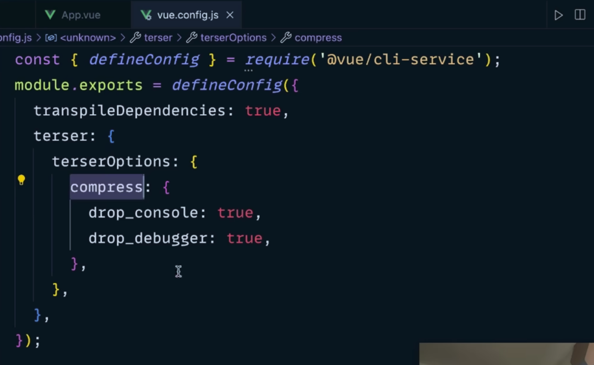
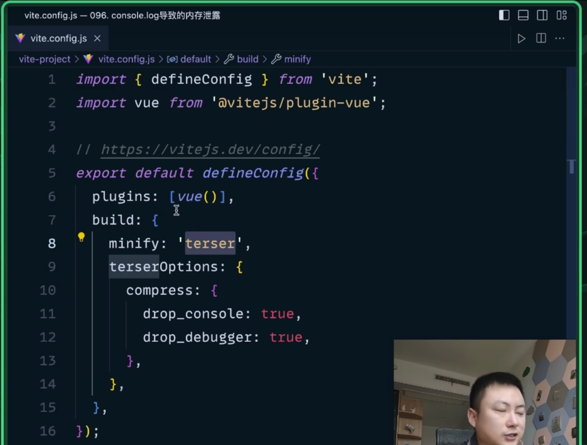

## forEach中的return没有返回值

<br><br>

## document.getElementBy... 获取的是动态集合 & document.querySelector 获取的是静态集合

当使用如下的方法的时候 获取元素时, **返回的是一个动态的** HTMLCollection 或 NodeList 对象。
- document.getElementById
- document.getElementsByClassName 

**这意味着当文档中的元素发生变化时, 这个集合也会相应地更新。**

<br>

而我们使用如下的方法 获取元素时 **返回的是一个静态的** NodeList 对象
- document.querySelector
- document.querySelectorAll 

**这意味着它们只会在查询时一次性地获取匹配的元素, 之后即使文档中的元素发生变化, 这个 NodeList 对象也不会更新。**

<br>

### 因此
- 在需要动态获取集合的场景下, 应该使用 document.getElementBy... 等方法

- 在需要静态获取集合的场景下, 应该使用 document.querySelector 等方法。


<br><br>

# console.log容易引发内存泄露
该命令是用于调试 不适于使用在生产环境中 容易引发内存泄露

```js
handler() {
  const arr = new Array(100000).fill(0)
  console.log(arr)
}
```

正常我们执行完回调后 arr就会被销毁, 但是由于我们将arr进行了输出, 所以不能销毁arr了, 因为一旦销毁了arr就没有办法进行调试了

<br>

### 内存泄露:
谷歌中需要打开控制台后 才会造成内存泄露, safari就不一样了

<br>

### 清除console.log的工具
 使用 vue-cli 的时候 由于 terser 是内置的 所以只需要简单的配置
- vue-cli
  - webpack
    - terser (内置)



<br>

使用 vite 的话 
1. 安装 terser
2. 进行配置



<br><br>