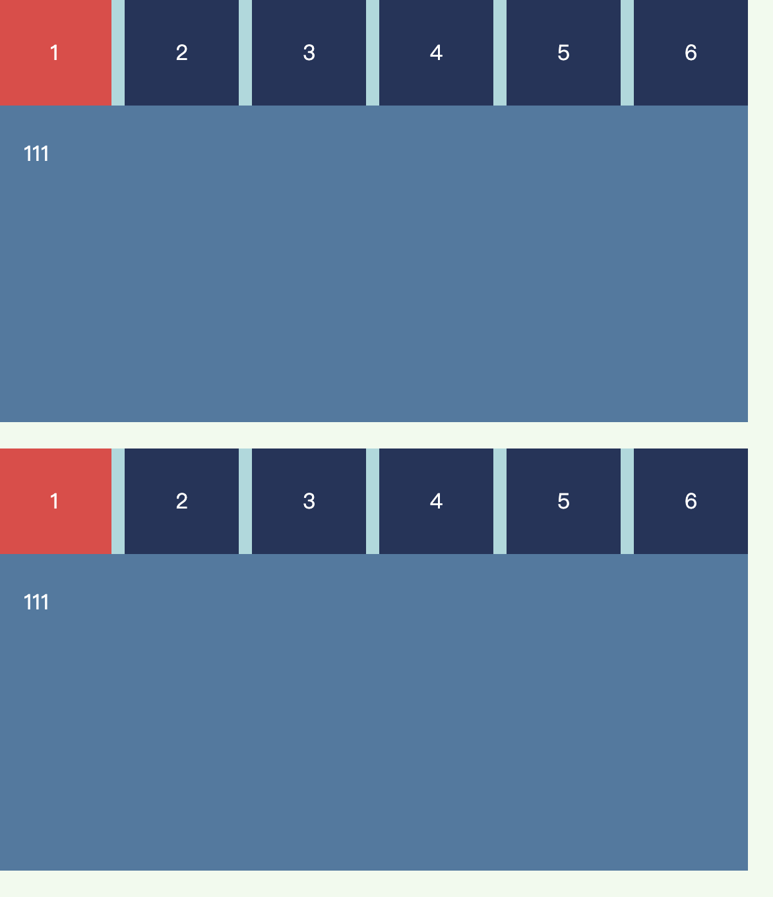
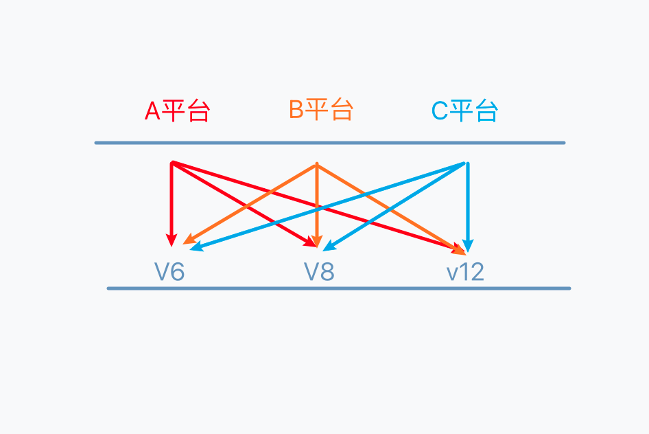

# 设计模式: 
一种书写代码的方法 为了解决特定的问题给出的简洁而优化的解决方案

设计模式主要是针对面向对象编程模式  
面向对象可以理解为 划分了一个单独的命名空间 并将属性和方法组织在一起的一种方式

<br><br>

# 构造器模式
该模式也是面向对象的编程中 使用构造函数来创建对象的模式

<br>

### 场景:
我们我们要将公司的员工信息 添加到数据库中 那我们就要为每一个员工来创建一个对象 如果我们只是通过手动创建全公司的对象的话 那我们的代码的冗余程度可想而知

```js
const emp1 = {
  name: "sam",
  age: 18
}

const emp2 = {
  name: "erin",
  age: 18
}
```

所以为了解决上面的问题 我们就可以通过构造器模式 通过传入参数来生成对象

<br>

### 实现方式: es5
```js
function Emp(name, age) {
  this.name = name
  this.age = age

  this.say = function() {
    console.log("say")
  }
}

const emp1 = new Emp("sam", 18)
```

<br>

### 实现方式: es6
```js
class Emp {
  constructor(name, age) {
    this.name = name
    this.age = age
  }

  // 方法会在类的原型对象上
  say() {
    console.log("say")
  }
}
```

<br><br>

# 原型模式
上面的构造器模式有一些缺点 上面我们使用构造器模式创建对象的时候 有如下的问题

1. name age 放在实例身上可以 因为每个对象都要有不同的name age 确实在创建的对象的时候需要新申请一块内存空间

2. say方法 每次我们new一个新的对象的时候 say方法都是一样的 都会随着new关键字重新开辟一个空间 来存储这个函数 但是这就没有必要了

<br>

### 解决方式:
我们会将公共方法拿出来放到函数的原型中 这样say方法在内存中只占一个空间 我们可以共用这个say

<br>

```js
function Emp(name, age) {
  this.name = name
  this.age = age
}

// 将 say 方法提到原型对象上
Emp.prototype.say = function() {
  console.log(say)
}
```

<br><br>

## 案例: 面向对象开发选项卡
比如我们的页面 有多个地方需要使用到选项卡的功能 但是如果我们每一个地方都需要复制结构和js代码来实现的话 那就太冗余了

所以类似的效果我们可以通过面向对象的方式来开发



<br>

### 期望:
我们html结构在固定的前提下 我们通过 ``new Tabs(".container1")`` 的方式传入 html选项卡的外层容器则该html结构就具备了点击按钮 切换功能
```html
<!DOCTYPE html>
<html lang="en">
<head>
  <meta charset="UTF-8">
  <meta http-equiv="X-UA-Compatible" content="IE=edge">
  <meta name="viewport" content="width=device-width, initial-scale=1.0">
  <title>Scss</title>
  <style>
    html, body {
      padding: 0;
      margin: 0;
      background-color: #f1faee;
      height: 100vh;
    }
    ul {
      list-style: none;
      padding: 0;
      margin: 0;
    }
    .container1, .container2 {
      width: 70%;
      background-color: #a8dadc;
    }
    .container2 {
      margin-top: 20px;
    }

    .header {
      display: flex;
    }

    .header li {
      flex: 1;
      height: 80px;
      line-height: 80px;
      text-align: center;
      background-color: #1d3557;
      cursor: pointer;
      color: #fff;
    }
    .header li + li {
      margin-left: 10px;
    }

    .box {
      height: 100%;
      background-color: #457b9d;
      padding: 20px;
      height: 200px;
    }

    .box li {
      margin-top: 5px;
      color: #fff;
      display: none;

    }
    .header .active {
      background-color: #e63946;
    }
    .box .active {
      display: block;
    }
  </style>
</head>
<body>
  
  <div class="container1">
    <ul class="header">
      <li class="active">1</li>
      <li>2</li>
      <li>3</li>
      <li>4</li>
      <li>5</li>
      <li>6</li>
    </ul>
    <ul class="box">
      <li class="active">111</li>
      <li>222</li>
      <li>333</li>
      <li>444</li>
      <li>555</li>
      <li>666</li>
    </ul>
  </div>
  <div class="container2">
    <ul class="header">
      <li class="active">1</li>
      <li>2</li>
      <li>3</li>
      <li>4</li>
      <li>5</li>
      <li>6</li>
    </ul>
    <ul class="box">
      <li class="active">111</li>
      <li>222</li>
      <li>333</li>
      <li>444</li>
      <li>555</li>
      <li>666</li>
    </ul>
  </div>
  
  
<script>
  class Tabs {

    constructor(options = {}) {
      const { el } = options
      this.el = el
      
      // 获取所有按钮节点
      this.btns = this.el.querySelectorAll(".header li")
      // 获取对应的所有内容区的节点
      this.contents = this.el.querySelectorAll(".box li")
      this.bindEvent()
    }

    // 给所有的按钮绑定点击事件
    bindEvent() {
      // 因为使用了 function 形式的回调 外层保存下实例
      const instance = this

      // index: 为当前点击的按钮的 index
      this.btns.forEach((btn, index) => {
        btn.addEventListener("click", function() {

          // 排他
          instance.btns.forEach((btn, i) => {
            // 清除按钮身上的active
            btn.classList.remove("active")
            // 清除内容区身上的active
            instance.contents[i].classList.remove("active")
          })
          
          // 独有
          this.classList.add("active")
          instance.contents[index].classList.add("active")
        })
      })
    }

  }

  const wrap = document.querySelector(".container1")
  new Tabs({
    el: wrap
  })
</script>
</body>
</html>
```

<br><br>

# 简单工厂模式
工厂模式指的是通过一个固定的函数 返回某一类对象的实例 比如鞋子工厂就返回鞋子实例 牙膏工厂就返回牙膏实例

但是如果我们一个工厂只返回一个类别的实例对象 就没有太多的意思 所以一般我们会配合参数来动态的决定返回哪一种类型的实例

<br>

### 需求:
一般我们的后台管理系统界面左侧都有侧边栏 里面都是一些按钮 比如
- 用户管理
- 权限管理
- 新闻管理

<br>

我们的后台管理系统一般都会有角色 不同的角色可以看到的侧边栏内的内容也不一样 比如
- 超级管理员: 可以看到全部内容 
- 管理员: 只能看到 用户管理 和 新闻管理
- 普通用户: 只能看到 新闻管理

<br>

我们就想设置一个对象 分别映射不管角色进入到管理系统后 侧边栏区域展示什么内容 也就是说不同的用户看到的内容也是不一样的

我们期望我们创建一个对象 对象中包含角色信息和对应的路由, 这个对象的创建就可以使用简单工厂模式

根据传入的权限不同 可以动态的生成对象(内部包含路由列表) 

<br>

### 实现:
UserFactory工厂专门用来创建User的实例对象  
内部通过往静态方法中传入角色来动态的 生成对应的预设好的对象
```js
// 创建User对象
class User {
  // role: 角色
  // views: 角色对应的可见页面
  constructor(role, views) {
    this.role = role
    this.views = views
  }

}


// User类的工厂
class UserFactory {

  static generator(role) {
    switch(role) {
      
      case "superadmin":
        return new User("superadmin", ["home", "userManage", "newsManage", "roleManage"])

      case "admin":
        return new User("admin", ["home", "userManage", "newsManage"])

      case "editor":
        return new User("editor", ["home"])
      
      default:
        throw new Error("参数错误")
    }
  }
}

const admin = UserFactory.generator("admin")
console.log(admin)
```

<br>

我们可以将上面的两个类整合为一个类 如下: 我们将generator静态方法放入到了User类的内容

静态方法中生成User类的实例
```js
// 创建User对象
class User {
  // role: 角色
  // views: 角色对应的可见页面
  constructor(role, views) {
    this.role = role
    this.views = views
  }

  static generator(role) {
    switch(role) {
      
      case "superadmin":
        return new User("superadmin", ["home", "userManage", "newsManage", "roleManage"])

      case "admin":
        return new User("admin", ["home", "userManage", "newsManage"])

      case "editor":
        return new User("editor", ["home"])
      
      default:
        throw new Error("参数错误")
    }
  }

}

const admin = User.generator("admin")
console.log(admin)
```

<br>

### 简单工厂模式的优点:
我们只需要一个正确的参数 就可以获取到你所需要的对象 **而无需知道其创建的具体细节**

<br>

### 简单工厂模式的缺点:
但是在函数内包含了所有对象的创建和判断逻辑的代码 每增加新的构造函数还需要修改判断逻辑

当我们的对象不是上面的3个而是10的时候 这个函数会成为一个庞大的超级函数 变得难以维护

<br>

### 简单工厂模式的使用场景:
所以简单工厂适合创建的对象数量较少 对象的创建逻辑不复杂的时候使用

<br><br>

# 抽象工厂模式:
我们不会通过抽象工厂来创建实例对象 它更多的类似于抽象类

父类只负责提取共性 **而子类在继承共性的同时 再扩展自己的特性 这不就是抽象类的概念么**

```
          Person
      ↙      ↓      ↘
Student   Teacher   Policeman
```

<br>

### 要点:
1. 通过父类提取共性 相当于创建了模板
2. 子类扩展自己独有的特性
3. 工厂类管理所有的子类 获取给定的子类 比如我们想要获取学生类 则通过工厂类获取

<br>

### 实现:
```js
// 创建父类
class Person {
  constructor(name, age) {
    this.name = name
    this.age = age
  }

  // 通用方法
  creatingValue() {
    console.log("人总要创造自己的价值")
  }

  // 职业方向: 每一类人的职业都是不一样的
  specialisations() {
    // 如果直接调用父类中的该方法会抛出异常
    throw new Error("抽象方法需要被实现后使用")
  }
}


// 学生子类:
class Student extends Person {
  constructor(name, age) {
    super(name, age)
  }

  // 重写父类中的职业方向的方法 该方法为子类独有
  specialisations() {
    console.log("学生的任务就是好好学习")
  }
}


// 教师子类:
class Teacher extends Person {
  constructor(name, age) {
    super(name, age)
  }

  // 重写父类中的职业方向的方法 该方法为子类独有
  specialisations() {
    console.log("老师的任务就是教书育人")
  }
}


// 创建抽象工厂: 抽象工厂不直接创建具体的子类对象 而是通过该方法来统一管理子类
class Human {
  static generator(career) {

    switch(career) {
      case "Student":
        return Student

      case "Teacher":
        return Teacher

      case "Policeman":
        return Policeman

      default:
        throw new Error("参数异常")
    }
  }
}


// 通过工厂我们获取想要创建的类
const StudentClazz = Human.generator("Student")

// 创建学生类的实例对象
const student = new StudentClazz("学生", 18)
student.specialisations()
```

<br><br>

### 总结:
当一个对象身上的 属性 和 方法 足够多的情况下, 我们可以考虑将公共的属性和方法 **抽成父类** 让子类继承父类上面公共的方法

每一个子类能够实现自己关于实例的创建过程 也就是说父类解决的是一般性的问题 **子类解决的是独立的自己的问题**

<br>

### 优点:
弱化代码之间的耦合 如果以前的工厂函数中的逻辑太多的话 我们可以通过该方法来减少代码之间的耦合 防止代码的重复  

复杂的代码放在父类中, 子类去做自己的业务逻辑

解耦就是说我们可以管理各自的子类 扩展不同的功能

<br><br>

## 练习:
比如我们想创建一个 商品对象 该对象有
- 获取 售卖的商品名(getter属性)
- 售卖 商品 方法
- 制造 商品 方法(得到商品对象(实例))

那我们应该怎么做？

```js
class Adi {

  constructor(name) {
    this.name = name
  }

  // 获取 售卖商品 名称
  get goodName() {
    return this.name ? this.name : "未设置商品名称"
  }

  // 售卖的方法
  sellAdi() {
    console.log("售卖阿迪")
  }

  // 促销的方法
  salesPromotion() {
    console.log("现在开始促销活动开始了")
  }

  // 告罄的方法
  ranOut() {
    console.log("现在已经告罄了")
  }
}

let adi = new Adi("阿迪")
console.log(`售卖的商品是: ${adi.goodName}`)

adi.sellAdi()
adi.salesPromotion()
adi.ranOut()
```

<br>

上面我们创建了一个 Adi 的对象 里面有获取售卖的商品名称 和 不同的方法  

但是我们思考下 如果我们还想创建 耐克对象 乔丹对象 等不同对象 应该怎么做? 再创建不同的类么?

不好吧! 可以使用抽象工厂模式

<br>

### 父类负责:  
父类作为 抽象类 不可以通过父类实例化

- 售卖商品对象
- 创建商品对象 (让子类去重写该方法 父类不负责实例化对象)

父类中定义好这些方法后 是不是子类就可以继承到 也就是说 将公共的方法 和 属性定义在父类中 子类就可以只专注自己的逻辑就可以了

<br>

### 创建 Shop 父类 :
 
**注意:**  
当子类继承父类中 父类中的this还是指向子类的实例对象

<br>

**要点:**  
在继承的关系下 当子类继承了父类后 使用了 父类中的方法 这时当我们通过 子类实例对象调用父类中的方法时 

<font color="#C2185B">父类方法中的this 其实就是子类对象 (是不是谁调用方法 this就是谁)</font>

<br>

**技巧:**  
那也就是说 在父类的方法中 <font color="#C2185B">我们可以通过 this 间接的调用子类中的方法</font>

因为最后是 子类的实例对象调用父类中的方法

<br>

我们在 父类中的 售卖 sell() 方法中 通过this可以调用子类的属性和逻辑 子类可以通过继承 调用父类中的sell()方法

而 sell() 方法中的this还是子类的实例对象 **所以通过this可以完成子类写的特有的逻辑**

<br>

```js
// 举例: 父类通过this调用子类独有的方法
class Person {
  constructor(name, age) {
    this.name = name
    this.age = age
  }

  speak() {
    console.log(this.name + " -- " + this.age)

    // 通过this 调用子类中的方法
    this.study()
  }
}

class Student extends Person {
  constructor(name, age) {
    super(name, age)
  }

  // 子类独有的方法
  study() {
    console.log("我要学习了")
  }
}

const student = new Student("sam", 18)
student.speak()
```

<br>

### 实现:
**逻辑:**  
我们把共同的方法放在父类中  

子类定义自己的独特的专属的方法 这样 父类的方法中可以通过this来调用这些独特的方法

```js
class Shop {
  constructor(name) {
    this.name = name
  }

  // sell是定义在父类中的通用方法 我们在这个方法中 会通过this调用各个子类的特有逻辑
  sell() {
    // 这样 子类通过继承可以调用sell() 同时sell()方法中的this 还是子类的实例对象 我们可以通过this调用子类中的方法
    console.log(this)
    console.log("售卖的商品是: " + this.goodName)

    // 执行 子类特有的逻辑
    this.salesPromotion()
    this.ranOut()
  }

  get goodName() {
    return this.name
  }
}
```

<br>

**创建子类:** 
```js
// 创建 Adi 子类
class Adi extends Shop {

  constructor(name) {
    super(name)
  }

  // 封装 Adi 特有的逻辑
  // 促销的方法
  salesPromotion() {
    console.log("adi现在开始促销活动开始了")
  }

  // 告罄的方法
  ranOut() {
    console.log("adi现在已经告罄了")
  }
}


// 创建 Nick 子类
class Nick extends Shop {

  constructor(name) {
    super(name)
  }

  salesPromotion() {
    console.log("nick现在开始促销活动开始了")
  }

  // 告罄的方法
  ranOut() {
    console.log("nick现在已经告罄了")
  }
}


let adi = new Adi("阿迪")
// 调用继承来的 sell()
adi.sell()

let nick = new Nick("Nick")
nick.sell()
```

<br>

这样 我们将通用的方法 定义在父类中 当有不同的商品的时候 我们创建不同的子类来继承父类就可以了

<br>

**优化:**  
我们可以将子类中特有的方法 封装成一个对象 方便调用 这里我们可以利用 子类重写父类中的方法 的逻辑来完成

<br>

**要点:**   
我们在父类中 定义一个方法 但是该方法 父类不能调用 必须通过子类来调用

```js
class Shop {
  constructor(name) {
    this.name = name
  }


  sell() {
    console.log("售卖的商品是: " + this.goodName)

    // 子类中 将 特有逻辑 封装在一个对象中 我们通过this找到子类 然后获取子类中封装好的特有逻辑对象
    let logic = this.getInstanceMethod()
    logic.salesPromotion()
    logic.ranOut()
    
  }

  get goodName() {
    return this.name
  }


  // 子类需要重写该方法
  getInstanceMethod() {
    // 如果通过父类的实例对象调用则抛出错误
    throw new Error("该方法不能通过父类实例调用")
  }
}
```

<br>

**子类:**
```js
class Adi extends Shop {

  constructor(name) {
    super(name)
  }

  // 重写父类中的 getInstanceMethod 方法
  getInstanceMethod() {

    return {
      // 促销的方法
      salesPromotion() {
        console.log("adi现在开始促销活动开始了")
      },
      // 告罄的方法
      ranOut() {
        console.log("adi现在已经告罄了")
      }
    }
  }
}

let adi = new Adi("阿迪")
adi.sell()
```

<br><br>

# 建造者模式
工厂模式关心的是输出的结果 我们传入了参数 得到的是哪个对象 比如我们传入了 student 拿到的是不是学生实例

我们只关心到手的学生实例 但并不关心实现的过程

<br>

而建造者模式关心的是整个的创建过程 它甚至关注的是里面的每一个细节 拿到每一个过程的结果 建造者模式属于更加的细致

<br>

## 场景:
比如我们要创建一个 navBar 

```
|电脑|鼠标|配件|周边|
```

但是这个 navBar 并不是写死的 一般我们创建一个 navBar 都会有如下的过程

1. init: 初始化 navBar 的容器节点(ul)
2. ajax: 获取每一项 然后进行渲染(li)

<br>

同样如果我们要创建一个菜单列表 是不是也需要如下的过程

```
| 川菜 |
| 粤菜 |
| 湘菜 |
```

1. init: 初始化 菜单列表 的容器节点(ul)
2. ajax: 获取每一项 然后进行渲染(li)

<br>

所以我们要说创建类似的组件的都 都会经历如上的过程

1. init
2. ajax
3. render

<br>

### 举例:
- 我们要完成上面的 NavBar 的创建 于是我们创建了如下的类
```js
class NavBar {

  init() {
    console.log("navBar-init")
  }

  getData() {
    console.log("navBar-getData")
  }

  render() {
    console.log("navBar-render")
  }
}
```

- 我们要完成上面的 List 的创建 于是我们创建了如下的类
```js
class List {

  init() {
    console.log("list-init")
  }

  getData() {
    console.log("list-getData")
  }

  render() {
    console.log("list-render")
  }
}
```

<br>

然后我们需要调用类中的方法来创建出 navBar 组件 和 list组件对么

- 创建 NavBar 组件 需要调用如下的方法
```js
const list = new List()
list.init()
list.getData()
list.render()
```

- 创建 List 组件 需要调用如下的方法
```js
const list = new List()
list.init()
list.getData()
list.render()
```

<br>

我们有没有发现一个问题, 就是很多情况下 我们创建组件的过程都是固定的 就像上面一样

那我们能不能设计一个类 让这个类来完成上面具体的创建过程 而不是通过每一个NavBar的实例对象来调用方法

我们将这些调用过程都交给另外一个类来完成 **这个类就是建造者**

<br>

### 建造者的简单实现:
我们将NavBar的实例对象传入 将具体的创建组件的过程封装在建造者类中的方法中
```js
class Creator {

  // 传入对象 它就是NavBar的实例 我们在这里依次调用通用的过程
  build(builder) {
    builder.init()
    builder.getData()
    builder.render()
  }
}

const creator = new Creator()
creator.build(new NavBar())
```

<br>

**要点:**  
建造者 的类关注的是一步一步具体的过程

<br>

### 注意:
我们在没有建造者模式的时候可以会这么写逻辑
```js
class List {

  init() {
    console.log("list-init")

    // 会在这里调用getData来获取数据
    this.getData()
  }

  getData() {
    console.log("list-getData")

    // 获取数据后再调用render来渲染结构
    this.render()
  }

  render() {
    console.log("list-render")
  }
}
```

但是有没有发现上面的方法互相嵌套 耦合的太紧了, 我们的建造者模式还可以解决上面的细节问题

上面的问题不就是异步么 我们可以使用await async来解决 这样这3个同级别的方法可以依次调用

看起来结构仍然会很清晰的同时保证异步的执行

```js
class Creator {

  async build(builder) {
    await builder.init()
    await builder.getData()
    await builder.render()
  }
}

const creator = new Creator()
creator.build(new NavBar())
```

<br>

### 总结:
建造者模式将一个复杂对象的构建层和表示层相互分离 同样的构建过程可采用不同的表示

工厂模式主要是为了创建对象实例 关心的是最终产出的是什么 而不关心创建的过程 而建造者模式关心的是创建这个对象的整个过程 甚至于创建对象的每一个细节

<br><br>

# 单例模式:
一个构造函数一生只能有一个实例 不管new多少次都是这一个实例

也就是保证一个类只有一个实例 并提供一个访问它的全局访问点 只要解决一个全局使用的类频繁的创建和销毁 占用内存

<br>

### 特点:
**单例模式只有第一次赋的参数是有用的** 再次调用获取实例时即使我们传入了新的参数 也不会生效

<br>

### ES5: 闭包的单例模式创建
这里构建闭包的原因就是保证我们再次调用的时候 instance 还在 要不就会被垃圾回收机制回收了 
```js
// 函数内部返回函数 返回的函数被外界的变量所引用 导致外层函数中的变量无法被释放
const Singleton = (function() {
  const instance = null
  return function(name, age) {
    // 如果 instance 没值 则赋值
    if(!instance) instance = new User(name, age)

    // 如果 instance 有值 则返回
    return instance
  }
})()


// User类
function User(name, age) {
  this.name = name
  this.age = age
}


// Singleton变量接收到的是返回的内部函数 我们要传参
const user = Singleton("sam", 18)
```

<br>

### ES6: 单例模式创建
```js
class User {
  constructor(name, age) {
    this.name = name
    this.age = age
  }
}

class Singleton {
  static instance = null
  
  // 通过静态方法的参数 给User类进行赋值
  static create(name, age) {
    if(!this.instance) this.instance = new User(name, age)
    
    return this.instance
  }

}


const user1 = Singleton.create("sam", 18)
console.log(user1)
// User { name: 'sam', age: 18 }

const user2 = Singleton.create("erin", 17)
console.log(user2)
// User { name: 'sam', age: 18 }
```

我们发现创建的两个对象都是sam 这就是单例模式

<br>

### 扩展: 单例模式中利用构造器传入参数
上面我们是通过 static 关键字 定义了静态属性保证全局只有一个 同时通过静态方法 来创建单例

在静态方法中我们传入了参数 该参数会为User类进行初始化的时候使用

<br>

其实我们还可以通过constructor来传参, **<font color="#C2185B">该方式可以做到如下的几点 比较推荐:</font>**
1. 类本身在实例化的时候就是单例
2. 类中的传参也是符合正常创建对象时 通过new User来传参
3. 传递的参数保存在this上还可以供类中的其它方法使用

```js
class User {
  
  // 静态属性只能通过类来访问
  static instance = null

  constructor(name, age) {

    if(!User.instance) {
      
      // 我们传入的name和age还可以挂载到this上 供类中的方法使用
      this.name = name
      this.age = age

      // this就是实例对象 相当于 new User(name, age) 很强大的方式
      User.instance = this
    }

    return User.instance
  }


  // 扩展单例中的方法
  speak() {
    console.log(`我叫: ${this.name}, 我的年龄: ${this.age}`)
  }
}


const user1 = new User("sam", 18)
const user2 = new User("erin", 18)

user1.speak()
// 我叫: sam, 我的年龄: 18
user2.speak()
// 我叫: sam, 我的年龄: 18
```

<br>

也可以在静态方法中完成创建实例的过程
```js
class SingleTon {

  static instance = null

  // 定义 constructor 赋值用 和 供类中其它方法使用
  constructor(name, age) {
    this.name = name
    this.age = age
  }

  static createInstance(name, age) {
    if(!SingleTon.instance) {
      SingleTon.instance = new SingleTon(name, age)
    }

    return SingleTon.instance
  }
}


// 调用静态方法的时候传递参数
let s1 = SingleTon.createInstance("sam", 18)
```

<br>

### 扩展: 饿汉式单例
```js 
  class Person {
    static instance = new Person()

    static createInstance() {
      return Person.instance
    }

  }

  const p1 = Person.createInstance()
  const p2 = Person.createInstance()

  console.log(p1 == p2)
```

<br>

### 扩展: getter创建单例
```js
export default class SocketService {
  // 单例设计模式
  static instance = null

  // getter属性
  static get Instance() {
    if(!this.instance) {
      this.instance = new SocketService()
    }

    return this.instance
  }
}
```

<br>

### 应用场景: 自定义弹出层
我们alert的弹出层很丑 不适合我们高大上的页面 这时候我们就自己写一个弹出层 那这个弹出层每次显示都是一个新的div 还是一个div来回来去的显示

应该是一个div来回显示 只是里面的内容不一样 这时候我们就可以使用单例模式 不管是new多少次 我们只是改里面的文本内容

<br>

**要点:**
1. 单例(实例对象)是对话框的根节点div
2. 之所以不先在代码中定义好对话框的html结构通过display来控制显示和隐藏 是因为我们不想一开始就创建好对话框的html结构

```html
<!DOCTYPE html>
<html lang="en">

<head>
  <meta charset="UTF-8">
</head>
<style>
  .kerwin-modal{
    height: 200px;
    width: 200px;
    line-height: 200px;
    position: fixed;
    left: 50%;
    top: 50%;
    transform: translate(-50%, -50%);
    background-color: yellow;
    text-align: center;
  }
</style>


<body>
  <button id='open'>打开弹框</button>
  <button id='close'>关闭弹框</button>
  <div class="wrap"></div>
</body>
<script>
  class Dialog {
    // 静态属性只能通过类本身访问
    static instance = null

    constructor(options = {}) {
      const { content, cssSelector, el } = options

      // 将new Dialog时传入的参数保存在实例上 供类中的方法使用
      this.el = el
      this.content = content
      this.cssSelector = cssSelector

      // 在构造器中创建单例 
      if(!Dialog.instance) {
        // 实例对象就是 div
        Dialog.instance = this.createDialog()
        return Dialog.instance
      }

      return Dialog.instance
    }

    // 创建对话框 并将根节点返回
    createDialog() {
      const wrap = document.querySelector(this.el)
      const div = document.createElement("div")

      div.innerHTML = this.content
      div.classList.add(this.cssSelector)
      div.style.display = "none"
      wrap.appendChild(div)

      return div
    }
  }
  const open = document.querySelector("#open")
  const close = document.querySelector("#close")

  open.addEventListener("click", function() {

    // 实例对象是div所以可以使用 style 属性操作样式
    new Dialog({
      el: ".wrap",
      content: "提示框中的内容",
      cssSelector: "kerwin-modal"
    }).style.display = "block"
  })
  close.addEventListener("click", function() {
    // 因为是单例的 所以我们再次new也是之前的那个实例
    new Dialog().style.display = "none"
  })
</script>


</html>
```

<br>

### 总结:
1. 保证一个类仅有一个实例 并提供一个访问它的全局访问点
2. 主要解决一个全局使用的类 频繁地创建和销毁 占用内存
3. vuex redux就是单例模式

<br><br>

# 装饰器模式:
装饰器模式的应用是对已有的功能进行扩展 这样不会改变原有的代码结构

比如我们有一个模块已经工作的很好了 但是我要对这个模块的基础上增加一个功能 那我们就要尽可能保证源代码在不动的情况下来扩展功能

<br>

### 优点:
我们尽可能的用到切片似的编程方式 我们可以将与核心功能业务无关的抽离出来 比如
- 异常处理
- 数据统计
- 数据上报

那核心功能业务无关的代码抽离出来 我们采用动态注入的方式 加入到我们的核心业务中

这样例如上面的数据统计功能还可以跟其他的功能进行组合 从而降低耦合度 也提高了代码的复用程度

<br>

### 扩展:
我们js中有 ``Function`` 构造函数 我们平时很少使用 如下的方式创建函数
```js
new Function() 
``` 

我们平时创建函数方式都是如下的方式
```js
function fn() {}
```

但是我们要知道 我们写 function 关键字来创建函数的时候 它的本质就是
```js
fn = new Function()
```

### 要点:
**1. 我们通过 ``function`` 关键字 创建的函数就是 Function构造函数的实例对象**

**2. Function.prototype.before 中this的指向**

```js
function coreFn() {
  console.log("我是核心逻辑")
}

Function.prototype.before = function() {
  // 这里的 this 指向的就是 coreFn
  console.log(this)
}

// 理解为: 谁调用的 before this就指向谁 因为是coreFn调用的before所以 before函数中的this就指向了coreFn
coreFn.before(function() {
  console.log("前置方法")
})
```

<br>

我们可以在 Function.prototype 的原型对象上增加如下的方法
- before
- after

在java中对于装饰器模式相当于前置方法 和 后置方法 在目标方法执行之前之后执行的方法

然后我们就可以通过切片动态注入的方式 来给核心逻辑扩展功能

<br>

### 装饰器模式: 前置函数
**1. 我们在 Function 的原型对象上扩展了 before 方法**

<br>

**2. before方法接收一个回调函数作为参数**

<br>

**3. this问题的解析**
1. 外层函数中的this 也就是before方法中的this 是看谁调用的before方法 比如我们这个案例中的before方法会由 coreFn.before() 的形式调用 则外层函数中的this就是 coreFn 也就是核心函数
```js
Function.prototype.before = function(callback) {
  const _this = this
  console.log("外层函数", this)

  return function() {
    console.log("内层函数", this)
  }
}
```

2. 内层函数中的this 它也是在运行时确定的 具体取决于调用的方式 我们调用before方法后 ``const _coreFn = coreFn.before()`` 会返回一个新的函数_coreFn, 而内层函数的this取决于_coreFn的调用方式
```js
const beforeCoreFn = coreFn.before(function() {
  console.log("我是前置逻辑")
})

beforeCoreFn(); // 这里的 `this` 指向全局对象（例如浏览器环境中的 `window` 对象）

const obj = {
  method: beforeCoreFn
};

obj.method(); // 这里的 `this` 指向 `obj` 对象

class MyClass {
  constructor() {
    this.method = beforeCoreFn;
  }

  execute() {
    this.method(); // 这里的 `this` 指向 `MyClass` 的实例
  }
}
```

<br>

### 前置方法的实现:
```js
// 在 Function 的原型对象上扩展 前置方法
Function.prototype.before = function(callback) {

  // 保存this: this看谁调用的before方法 before方法是通过coreFn调用的 coreFn.before() 所以this指向coreFn 也就是核心函数
  const _this = this


  // 调用完before方法后会 返回一个新的函数 _coreFn 内层函数中的this需要看 _coreFn 是谁调用的 
  return function() {
    
    // 1. 先执行 前置函数 并向前置函数传入参数
    callback.apply(this, arguments)

    // 2. 再执行核心函数 并返回核心函数的返回值
    return _this.apply(this, arguments)
  }
}

function coreFn() {
  console.log("我是核心逻辑")
}

const _coreFn = coreFn.before(function() {
  console.log("前置方法")
})
// 当我们调用 _coreFn 的时候 就会执行内层函数中的逻辑 先执行前置函数 再执行原来的函数
const returnVal = _coreFn()
```

<br>

### 后置方法的实现:
```js
// 后置函数:
Function.prototype.after = function(callback) {
  const _this = this

  return function() {

    // 执行核心函数
    const res = _this.apply(this, arguments)

    // 执行后置函数
    callback.apply(this, arguments)

    // 返回核心函数的返回值
    return res
  }
}

const _coreFn = coreFn.after(() => {
  console.log("后置函数")
})

const returnVal = _coreFn()
console.log(returnVal)
```

<br>

**链式调用:**
```js
const _coreFn = coreFn
  .before(() => {
    console.log("前置函数")
  })
  .after(() => {
    console.log("后置函数")
  })

const returnVal = _coreFn()
console.log(returnVal)

- 前置函数
- 核心逻辑
- 后置函数
- 核心逻辑的返回值
```

<br>

**注意:**  
before 和 after 的定义最好在上方 定义后再使用

<br><br>

## 应用场景:
我们在开发中经常会遇到需要将 点击量(收集数据) 发送到后台 比如 ``maizuo.com`` 这个网站 

当我们点击一个电影的时候 它会往后台发送 ajax 请求 ``pv?stm=21351231``

也就是说我们点击的时候 该网站在收集用户的记录行为, 就会向后台发送一个pv的ajax请求 该次请求就收集了数据统计
- 在哪点的
- 点击的什么

那样我们就能知道谁对哪个电影感兴趣 我们可以调整排片量

<br>

也就是说我们每点击一个电影 都会完成如下的逻辑
1. 点击 电影 后, 处理页面跳转的功能
2. 点击 电影 后, 发送pv统计 发送当前登录用户 或者是 电影的id 发送请求给后台

上面的两个行为并没有关系 尤其是数据统计功能它本身就属于一个附加的功能 我们就可以将数据统计这个部分的功能抽离出来

这时我们就可以通过装饰器模式 在需要的时候注入不需要的时候就不注入

<br>

### 实现: 不使用装饰器模式的情况下
```html
<body>
  <button id='btn'>电影</button>
</body>
<script>

  const btn = document.querySelector("#btn")
  btn.addEventListener("click", function() {
    pv()
    render()
  })


  // 跳转页面的函数
  function render() {
    console.log("前往指定的页面 渲染页面")
  }

  // 发送数据统计的函数
  function pv() {
    console.log("调用ajax发送pv请求, 上传pv数据")
  }
</script>
```

<br>

因为pv函数是异步函数 我们会在pv函数里面调用render函数 因为需要在异步状态完事后 再跳转页面 这就更乱套了
```html
<script>

  const btn = document.querySelector("#btn")
  btn.addEventListener("click", function() {
    pv()
  })


  // 跳转页面的函数
  function render() {
    console.log("前往指定的页面")
  }

  // 发送数据统计的函数
  function pv() {
    console.log("调用ajax发送pv请求, 上传pv数据")
    // 因为异步我们需要在上传成功后 再渲染页面
    render()
  }
</script>
```

<br>

我们看到的就是 在btn的回调中我们直接pv 在pv中调用了render 这是什么鬼 这样就非常不符合我们的理念了

**我们函数的设计叫做高内聚 一个函数只负责处理一个功能的单一职责** 我们在pv中调用render就乱套了

<br>

我们的核心逻辑是render 而pv则是可以抽离到前置方法中的逻辑 所以我们可以修改为  组装成可插拔式的 装饰器模式

<br>

### 实现: 使用装饰器模式
```html
<body>
  <button id='btn'>电影</button>
</body>
<script>
  // 装饰器模式: 切片
  Function.prototype.before = function(callback) {
    const _this = this

    return function() {

      // 调用前置方法
      callback.apply(this, arguments)

      // 调用核心逻辑
      return _this.apply(this, arguments)
    }
  }

  Function.prototype.after = function(callback) {
    const _this = this

    return function() {
      // 调用核心逻辑
      const returnVal = _this.apply(this, arguments)

      // 调用后置方法
      callback.apply(this, arguments)

      // 返回核心方法的返回值
      return returnVal
    }
  }

  const btn = document.querySelector("#btn")
  btn.addEventListener("click", function() {
    // 将pv作为前置方法
    render = render.before(pv)
    render()
  })


  // 跳转页面的函数
  function render() {
    console.log("前往指定的页面 渲染页面")
  }

  // 发送数据统计的函数
  function pv() {
    console.log("调用ajax发送pv请求, 上传pv数据")
  }
</script>
```

<br><br>

## 场景2:
我们在往后台发送请求的时候 一般都是发送token 我们在使用 jq 和 axios 发送请求的时候 这两个框架都会有对应的方法 让我们提供在发送请求前我们需要做的事情

- jq的before方法
- axios的interceptor

这就利用到了装饰器模式, 我们下面自己**模拟在原生ajax发送请求时的前置操作利用装饰器模式怎么完成**

<br>

```js
function ajax(options = {}) {
  const { url, method, param } = options
  console.log(url, method, param)
}

ajax({
  url: "localhost:3333",
  method: "get",
  param: "hello"
})
```

现在我们要完成在发送请求前在请求参数中添加token的逻辑

```html
<script>

  const btn = document.querySelector("#btn")
  btn.addEventListener("click", function() {
    
  })


  

  // 先定义
  Function.prototype.before = function(callback) {
    const _this = this

    return function() {

      // 调用前置方法
      callback.apply(this, arguments)

      // 调用核心逻辑
      return _this.apply(this, arguments)
    }
  }

  Function.prototype.after = function(callback) {
    const _this = this

    return function() {
      // 调用核心逻辑
      const returnVal = _this.apply(this, arguments)

      // 调用后置方法
      callback.apply(this, arguments)

      // 返回核心方法的返回值
      return returnVal
    }
  }

  // 后使用
  function ajax(options = {}) {
    console.log(options)
  }


  // 这里能接收到 options 是因为 callback.apply(this, arguments)
  ajax = ajax.before((options) => {
    options.token = "asdfa123123adsfads"
  })

  ajax({
    url: "localhost:3333",
    method: "get",
    param: "hello"
  })
</script>
```

<br><br>

# 适配器模式:
将一个类的接口 转换成 客户希望的另一个接口, **适配器模式让那些接口不兼容的类可以一起工作**

比如一个类在当前环境下无法工作 我们通过适配器让那些接口不兼容的类能够工作

将原来不能工作的 转成 能工作的

<br>

比如我们买了一个日本手机 韩国手机的充电器 是两头的 我们中国的插座是三头的 这样就出现了一个问题

韩国手机的充电器没有办法在中国使用 所以我们会买一个转换头 我们买的韩国手机的充电器 插入到 转换头 | 转换头 插入到家用的插座上 这就是适配器

```s
韩国手机充电器 -> 转换头 -> | 墙上的插座
```

比如还有笔记本的适配器 我们家用电是220v 而笔记本充电只需要20v 我们通过适配器将220v适配到笔记本对应的电压

<br><br>

## 场景:
比如我们的网站上有地图功能 我们有一个弹出框可以让用户选择使用腾讯地图 还是百度地图

1. 腾讯地图的开发是A同学
2. 百度地图的开发是B同学

它们开发地图的时候 都需要调用百度或者腾讯提供的api 比如要是想展示地图的话

```js
class TencentMap {
  show() {
    console.log("开始渲染腾讯地图)
  }
}


class BaiduMap {
  display() {
    console.log("开始渲染百度地图)
  }
}
```

<br>

当我们点击按钮展示地图的时候 操作会如下
```js
// 点击 百度地图 按钮 的回调
new BaiduMap().display()

// 点击 腾讯地图 按钮 的回调
new TencentMap().show()
```

<br>

虽然我们分别调用是没有问题的 但是 当我们想使用一套方法可以操作上面的两个地图的展示的时候 就可以考虑适配器模式

<br>

### 思考:
比如我们就固定以后展示地图的时候 就使用 display 方法, name我们就需要给腾讯地图添加一个适配器

```js
// 统一渲染地图的方法
function renderMap(map) {
  map.display()
}
```

如果我们传入的是 腾讯地图 该地图的实例没有display方法 调用的时候会报错的

<br>

### 给腾讯地图创建适配器
我们为不能工作的类创建一个适配器, 适配器需要继承

```js
class TencentMapAdapter extends TencentMap {
  constructor() { }

  // 我们创建 display 方法 内部调用腾讯自己的展示地图的方法
  display() {
    this.show()
  }
}
```

<br>

### 整体代码:
```js
class BaiduMap {
    show() {
      console.log("展示 百度地图")
    }
  }

  class TencentMap {
    display() {
      console.log("展示 腾讯地图")
    }
  }

  // 创建百度地图的适配器
  class BaiduMapAdapater extends BaiduMap {
    display() {
      this.show()
    }
  }


  // 渲染地图的方法
  function renderMap(map) {
    map.display()
  }

  // 通过适配器来创建百度的实例对象
  renderMap(new BaiduMapAdapater())
  renderMap(new TencentMap())
```

<br>

### 场景2:
我们渲染页面结构的时候 都会根据接口数据 来进行渲染, 那接口数据会有不同的数据结构 比如北京的数据结构
```js
// 数据结构1
let beijingData = [
  {
    id: 1,
    name: "朝阳"
  },
  {
    id: 2,
    name: "海淀"
  }
]


// 数据结构2
let beijingData = {
  "朝阳": 11,
  "海淀": 22
}
```

上面的 数据结构1 是根据函数的调用 返回数据

上面的 数据结构2 直接是个对象 ``地点: id`` 的格式

<br>

比如我们项目中的代码 固定的代码内容为 render函数需要传入一个 fn 执行fn后 渲染页面
```js
let render = fn => {
  console.log("渲染北京地图")
  console.log(JSON.stringify(fn(), null, 2))
}
```

那假如我们需要 我们将 数据结构1 转成 数据结构2 后传入 render 函数怎么操作

这时候我们就可以创建一个适配器 让 
```
不合适的数据结构1 -> 经过适配器 -> 转化为合适的数据结构2
```

<br>

既然 render() 函数需要传入一个 fn 作为参数 那么我们的适配器也让它是一个函数

```js
let addressAdapter = (oldDataFn) => {
  // oldDataFn是生成数据结构1的函数 拿到旧的数据结构 在适配器的内部 转换为 合适的数据结构2
  let oldData = oldDataFn()
  let newObj = {}

  // 加工成数据结构2
  oldAddress.forEach(item => {
    newObj[item.name] = item.id
  })

  // 适配器的后面 render函数的参数最终需要一个函数 所以我们就return一个函数
  return () => {
    return newObj
  }
}

// 验证
let render = fn => {
  console.log("渲染北京地图")
  console.log(JSON.stringify(fn(), null, 2))
}


render(addressAdapter(getBeijingCity))
```

<br>

### 要点:
我们发现适配器模式 前后的结构都没有改变 我们只是在适配器中做适配的逻辑处理 **目的就是找平**

<br><br>

# 策略模式:
策略模式定义了一系列的算法 并将每个算法封装起来 使它们可以相互替换 且算法的变化不会影响使用算法的客户

策略模式属于对象行为模式 它通过对算法进行封装 把使用算法的责任和算法的实现分割开来 并委派给不同的对象对这些算法进行管理

<br>

该模式主要解决有多种算法相似的情况下 可以避免多重 if...else 判断 且具有良好的扩展性

<br>

### 总结:
使用策略模式可以代替 if...else 判断

<br>

### 需求:
公司会考核每一个员工并会根据他们的评级来颁发年终奖
- A级别: 年终奖为 4倍月薪
- B级别: 年终奖为 3倍月薪
- C级别: 年终奖为 2倍月薪
- D级别: 年终奖为 1倍月薪

<br>

### 不使用策略模式 实现需求:
```js
// salary: 某员工的基本薪资
// level: 某员工的评级
function calcBonus(level, salary) {
  if(level == "A") return salary * 4
  if(level == "B") return salary * 3
  if(level == "C") return salary * 2
  if(level == "D") return salary * 1
}

const resA = calcBonus("A", 10000)
const resB = calcBonus("B", 8000)
console.log(resA)
console.log(resB)
```

上面我们是通过 if 来写的 如果条件增加 那么if逻辑就会变多 同时还要修改函数内的代码

上面的代码我们能看出来它是一个胖函数 也就是说我们如果往函数的内部添加分支的话 函数的体积会越来越大

也会违反设计原则中的开放 封闭原则  

<br>

**对扩展开放 对修改封闭**   
也就是说上面的代码中 如果我们想新增分支都要修改原函数 所以上面的方式并不是太友好 我们要进行优化

<br>

**策略:**  
指的就是 ``salary * 4`` 的部分

<br>

### 使用策略模式 实现需求:
核心就是将算法封装出来 组织成一个对象方便管理 如果我们要扩展条件的话 只需要修改 策略管理对象 就可以了

不用修改函数内部的代码
```js
// 设置 策略管理对象 
const strategry = {
  "A": salary => salary * 4,
  "B": salary => salary * 3,
  "C": salary => salary * 2,
  "D": salary => salary * 1
}

// salary: 某员工的基本薪资
// level: 某员工的评级
function calcBonus(level, salary) {
  return strategry[level](salary)
}

const resA = calcBonus("A", 10000)
const resB = calcBonus("B", 8000)
console.log(resA)
console.log(resB)
```

<br>

### 面向对象的方式:
首先我们是要根据 不同的等级 算出不同的奖金 那么我们可以封装一个 奖金类 奖金类中有设置奖金 和 操作奖金的方法  

其次我们要抽取策略(算法) 抽取成一个一个的策略类

<br>

**要点:**  
1. 我们将每一种策略封装成了一个类
2. Bouns类中没有定义构造器 通过get set方法来给类中的成员属性赋值

```js
// 抽取策略类 3个 每个策略类中都有一个计算方法 传入工资算出该策略对应的奖金
class PerformanceS {

  // 计算年终奖的方法
  calc(salary) {
    return salary * 5
  }
}

class PerformanceA {
  calc(salary) {
    return salary * 3
  }
}

class PerformanceB {
  calc(salary) {
    return salary * 2
  }
}


// 封装一个 Bouns 奖金类
class Bouns {

  // 奖金
  salary = null

  // strategy会存储策略类的实例对象
  strategy = null


  // 设置奖金
  setSalary(salary) {
    this.salary = salary
  }

  // 设置绩效等级
  setStrategy(strategy) {
    // 将策略类赋值给该属性
    this.strategy = strategy
  }

  // 根据不同的级别 获取奖金
  getBouns() {
    // this.strategy 是一个 策略类 我们通过传入奖金 得到对应策略的奖金
    return this.strategy.calc(this.salary)
  }
}


// 测试
let bouns = new Bouns()
bouns.setSalary(10000)
bouns.setStrategy(new PerformanceS())
console.log(bouns.getBouns())
```

<br>

上面 当我们在有策略需要添加的时候 可以添加策略类就可以了  
上面有两个类一个是策略类 和 一个控制流程的类(获取奖金的流程类 奖金类)  

我们发现我们并不需要更新流程类中的代码 要做的只不过是增加对应的策略

<br><br>

## 场景1:
后台返回了 list 列表 用户数据渲染
```js
// type: 文章是否通过审核 1 - 审核中 2 - 已通过 3 - 被驳回
let list = [
  { title: "男人看了沉默", type: 1 },
  { title: "震惊",  type: 2 },
  { title: "kerwin来了", type: 3 },
  { title: "tiechui离开了", type: 2 }
]
```

<br>

我们会将上面的信息渲染在页面中 结构如下

```html
<ul id="mylist">
  <li>
    <div> title部分 </div>
    <div class="样式部分"> 审核状态 </div>
  </li>
</ul>
```

<br>

### 不使用 策略模式 实现:
内部使用了大量的if判断
```html
<style>
  ul {
    width: 300px;
  }

  li {
    display: flex;
    justify-content: space-between;
  }

  .reditem {
    background-color: red;
  }

  .yellowitem {
    background-color: yellow;
  }

  .greenitem {
    background-color: green;
  }
  </style>
</head>

<body>
  <ul id="mylist"></ul>
<script>
// type: 文章是否通过审核 1 - 审核中
let list = [
  { title: "男人看了沉默", type: 1 },
  { title: "震惊",  type: 2 },
  { title: "kerwin来了", type: 3 },
  { title: "tiechui离开了", type: 2 }
]

const ul = document.querySelector("ul")
ul.innerHTML = list.map(item => {
  if(item.type == 1) {
    return `
    <li>
      <h3>${item.title}<h3>
      <div class="yellowitem"> 审核中 </div>
    </li>
    `
  }
  if(item.type == 2) {
    return `
    <li>
      <h3>${item.title}<h3>
      <div class="greenitem"> 已通过 </div>
    </li>
    `
  }
  if(item.type == 3) {
    return `
    <li>
      <h3>${item.title}<h3>
      <div class="reditem"> 被驳回 </div>
    </li>
    `
  }
}).join("")
</script>
</body>

</html>
```

<br>

### 使用 策略模式 实现:
```html
<script>
let list = [
  { title: "男人看了沉默", type: 1 },
  { title: "震惊",  type: 2 },
  { title: "kerwin来了", type: 3 },
  { title: "tiechui离开了", type: 2 }
]


// 组织一个策略管理对象
let detail = {
  1: { content: "审核中", className: "yellowitem" },
  2: { content: "已通过", className: "greenitem" },
  3: { content: "被驳回", className: "reditem" }
}

const ul = document.querySelector("ul")
ul.innerHTML = data.map(item => {
  return `
    <li>
      <h3>${item.title}<h3>
      <div class="${detail[item.type].className}"> ${detail[item.type].content} </div>
    </li>
  `
}).join("")
// 最后使用join()拼接数组中的元素
</script>
</body>

</html>
```

<br>

### 优点:
未来我们想修改 内容 或 样式 或 扩展状态的时候 直接修改 策略对象就可以了

<br><br>


<br>

### 面向对象编程的修改方式:
我们这里使用 面向对象编程 思维来进行修改

首先我们是要根据 不同的等级 算出不同的奖金 那么我们可以封装一个 奖金类 奖金类中有设置奖金 和 操作奖金的方法  

其次我们要抽取策略(算法) 抽取成一个一个的策略类
```js
// 抽取策略类 3个 每个策略类中都有一个计算方法 传入工资算出该策略对应的奖金
class PerformanceS {

  // 计算年终奖的方法
  calc(salary) {
    return salary * 5
  }
}

class PerformanceA {
  calc(salary) {
    return salary * 3
  }
}

class PerformanceB {
  calc(salary) {
    return salary * 2
  }
}


// 封装一个 Bouns 奖金类
class Bouns {

  // 奖金
  salary = null

  // 绩效 strategy应该存放 策略类 类似 strategy = new PerformanceB()
  strategy = null

  // 设置奖金
  setSalary(salary) {
    this.salary = salary
  }

  // 设置绩效等级
  setStrategy(strategy) {
    // 将策略类赋值给该属性
    this.strategy = strategy
  }

  // 根据不同的级别 获取奖金
  getBouns() {
    // this.strategy 是一个 策略类 我们通过传入奖金 得到对应策略的奖金
    return this.strategy.calc(this.salary)
  }
}


// 测试
let bouns = new Bouns()
bouns.setSalary(10000)
bouns.setStrategy(new PerformanceS())
console.log(bouns.getBouns())
```

上面 当我们在有策略需要添加的时候 可以添加策略类就可以了  
上面有两个类一个是策略类 和 一个控制流程的类(获取奖金的流程类 奖金类)  

我们发现我们并不需要更新流程类中的代码 要做的只不过是增加对应的策略

<br><br>

## 场景2:
购物车结算 我们有好多种结算方式  
1. 满100减10元
2. 满200减25元
3. 纯8折
4. 有一天可能突然打7折
5. 突然有一天还取消7折

<br>

### 逻辑代码
```js
// price: 商品原价格
// type: 折扣活动种类 因为什么活动打折
function calcPrice(price, type) {

  if(type == "100_10") {
    price -= 10

  } else if(type == "200_25") {
    price -= 25

  } else if(typeof == "80%") {
    price *= 0.8

  } else {
    console.log("没有这种折扣")
  }

  return price
}


// 商品原价格为320元 折扣活动为 满100减10元
const res = calcPrice(320, "100_10")
console.log(res)
```

上面的代码完成基本的逻辑是没有问题的 但是一旦加一种折扣或者删除一种折扣 就需要回程序中改写源代码

<br>

### 扩展: 立即执行函数 闭包
下面两种方式的结果是一样 在调用的时候都是 calcPrice() 只不过第一种自执行函数**可以利用闭包保存数据**

```js
// 方式1
const calcPrice = (function() {

    let 这里可以定义外层函数数据 供内层使用

    return 内部函数
  }
)()


// 方式2
const calcPrice = () => {}
```

<br>

### 使用 策略模式 的实现思路:
把我们的多种方案 以闭包的形式保存起来 按照传递进来的折扣和价格计算最终价格返回

对外留一个接口 可以添加和减少 折扣种类
```js 
// 1. 自执行函数 得到的结果就是内部的return fn
const calcPrice = (function() {

    // 折扣方案放在这里

    return function() {

    }
  }
)()
```

<br>

**阶段1:**    
下面的逻辑实现了一部分 但是并没有对外提供添加折扣种类 和 删除折扣种类的接口
```js 
const calcPrice = (function() {

  const sale = {
    // 满100减10
    "100_10": price => price -= 10,
    "200_25": price => price -= 25,
    "80%": price => price *= 0.8,
  }

  // 被return出去的函数 才是calcPrice本体 闭包只是为了存放数据
  return function(price, type) {

    // 判断对象中有没有这个折扣类型
    if(!sale[type]) return '没有这个折扣'

    // 如果有就执行对象中对应的逻辑 找到sale里面指定的哪个函数执行计算出结果 返回给外边
    const ret = sale[type](price)
    return ret
  }
})()

const res = calcPrice(320, "100_10")
```

<br>

**阶段2:**    
留下添加 删除折扣种类的接口 我们要知道函数也是一个对象 向里面添加一些成员
```js  
const calcPrice = (function() {

  const sale = {
    "100_10": price => price -= 10,
    "200_25": price => price -= 25,
    "80%": price => price *= 0.8,
  }

  function calcPrice(price, type) {
    if(!sale[type]) return '没有这个折扣'
    return sale[type](price)
  }

  // 把函数当做一个对象 向里面添加一些成员
  // 专门添加折扣的方法 使用的时候 calcPrice.add("70%", (price) => {return price *= 0.7})
  calcPrice.add = function(type, fn) {
    // 判断折扣是否存在
    if(sale[type]) return "该折扣已存在"

    // 代码来到这里 表示折扣不存在 因为是闭包 数据会存在这里面
    sale[type] = fn
    return "添加成功"
  }

  calcPrice.del = function(type) {
    // 把对应的折扣删除调
    delete sale[type]
  }

  return calcPrice
})()

const res = calcPrice(320, "100_10")
```

<br>

### 使用面向对象的方式 实现
```js 
  class SaleCampaign {
    static sale = {
      "100_10": price => price -= 10,
      "200_25": price => price -= 25,
      "80%": price => price *= 0.8,
    }

    static add(type, fn) {
      if(SaleCampaign.sale[type]) return "该折扣已存在"
      SaleCampaign.sale[type] = fn
      console.log("折扣添加成功")
    }

    static del(type) {
      delete SaleCampaign[type]
    }

    static showCampaign() {
      console.log(SaleCampaign.sale)
    }

    calc(price, type) {
      if(!SaleCampaign.sale[type]) {
        console.log("没有这个折扣")
        return
      }

      return SaleCampaign.sale[type](price)
    }
  }

  // SaleCampaign.add("70%", price => price *= 0.7)
  // SaleCampaign.showCampaign()
  
  const instance = new SaleCampaign()
  let res = instance.calc(320, "100_10")
  console.log(res);
```

<br>

### 使用函数式编程的方式 实现:
上面的方式很好 还提供了对外操作 映射对应的接口 
```js
let priceMap = {
  "100_10": price => price -= 10,
  "200_25": price => price -= 25,
  "80%": price => price *= 0.8
}

let calc = (type, price) => {
  return priceMap[type](price)
}

console.log(calc("100_10", 1000))
```

<br><br>

# 代理模式:
Proxy为其他对象提供一种代理 以控制对这个对象的访问

代理模式使得代理对象控制具体对象的引用 代理可以是任何东西 比如 对象 文件 资源 内存中的对象 或者 是一些难以复制的东西

<br>

### 解析:
**明星:**  
明星就是一个对象(源对象) 明星是不能自己接戏的 必须通过经纪人来接戏

<br>

**经济人:**  
经纪人就是代理对象, 为明星办事

<br><br>

### 使用 Class 实现:
类似java中的代理模式

<br>

### 要点:*  
我们在代理类中 定义了明星的实例变量

```js
// 明星
class Star {
  play() {
    console.log("演戏")
  }
}


// 明星的代理人
class StarProxy {

  // 定义star实例变量
  star = null

  // 构造器中为 成员对象 进行赋值
  constructor() {
    this.star = new Star()
  }

  // 根据 价格 谈合同
  talk(price) {
    if(price >= 10000) {
      // 满足条件 则调用 star 的演戏的方法
      this.star.play()
    } else {
      throw new Error("价钱不合适")
    }
  }
}

new StarProxy().talk(100000)
```

<br>

### 扩展: Proxy:
我们通过代理对象实现对 操作源对象(获取 和 修改)的操作
```js
const star = {
  name: "sam",
  workPrice: 10000
}


// 拦截对源对象的访问
const proxy = new Proxy(star, {
  // 访问源对象中的任何属性都会被调用
  get(target, key) {
    if(key == "workPrice") {
      console.log("被访问了价格")
    }

    // 访问 任何值 都要返回出去
    return target[key]
  },
  set(target, key, val) {
    if(key == "workPrice") {
      if(val >= 10000) {
        console.log("可以合作")
        target[key] = val
      } else {
        console.log("价格不合适")
      }
    }
  }
})

proxy.workPrice = 11000
console.log(proxy.workPrice)
```

<br>

### 扩展: 使用Proxy来完成Vue中的数据驱动(代理模式)
以前我们要是修改box 需要先获取box节点 然后通过节点调用innerHTML方法 来修改box的内容

代理模式完成如上的需求 我们**通过修改代理对象中的content属性** 则自动就会修改box节点中的内容
```html
<div id="box"></div>

<script>
const source = {
  content: "基础内容"
}

const box = document.querySelector("#box")
box.innerHTML = source.content


// 设置代理对象
const proxy = new Proxy(source, {
  get(target, key) {
    // 不进行拦截
    return target[key]
  },
  set(target, key, val) {
    // 对 content 属性进行拦截 其它的属性放行
    if(key == "content") {
      // 修改dom节点的内容
      box.innerHTML = val
    }
    target[key] = val
  }
})
</script>
```

<br><br>

# 观察者模式:
观察者模式使用场景很多 比如 Vue框架 React组件之间的通信, 我们都会接触到观察者模式 和 发布订阅模式

<br>

观察者模式包含两个对象:

1. 观察目标
2. 观察者

```js
// 被观察的目标类
class Target {

}


// 观察者
class Observer {

}
```

<br>

之后我们会将 观察者 都放入到 实例化后的 观察目标 身上 只要Target一发生变化 就会通知 Observer 中的更新方法 进而进行执行

**当一个对象的状态发生改变的时候 所有依赖于它的对象都得到通知并自动更新**

<br>

解决了 主体对象(观察目标) 与 观察者 之间功能的耦合 即一个对象状态改变会通知其他对象, 其它对象在自己的更新方法中处理相对应的状态

<br>

### 理解要点:
**1. 什么叫 观察者(Observer) 会放入到 观察目标类(Target)中?**  
比如我们贷款买了一辆车, 然后我们又将车抵押给了银行, 我们的车上就会被装很多的 **监听器**

这个监听器就相当于是观察者

<br>

### 简单实现:
1. 在 观察目标(Target) 上声明观察者数组
2. 使用notify方法在合适的位置通知每一位观察者 调用观察者身上的方法

```js
// 被观察的目标类
class Target {

  // 监听器: 观察者数组 用于收集所有的观察者
  observers = []

  // 定义添加 观察者 到数组中的方法
  add(observer) {
    this.observers.push(observer)
  }

  // 移除 观察者 的方法
  remove(observer) {
    // 还可以通过地址值来过滤 不用.name 如 o !== observer
    this.observers = this.observers.filter(o => (o.name != observer.name))
  }

  // 通知所有观察者的方法
  notify() {
    this.observers.forEach(observer => {
      // 调用每一个观察者的更新方法
      observer.update()
    })
  }

}


// 观察者
class Observer {

  name = ""

  constructor(name) {
    this.name = name
  }

  // 更新方法
  update() {
    console.log(`${this.name}的内部的更新逻辑`)
  }
}


// 创建被观察对象
const target = new Target()

// 创建 观察者
const observer1 = new Observer("Sam")
const observer2 = new Observer("Erin")

// 将观察者添加到Target的 观察者数组中
target.add(observer1)
target.add(observer2)

// 主体对象调用 notify 的时候 就会通知观察者们
target.notify()

// 删除sam观察者
target.remove(observer1)
console.log(target)
```

<br><br>

## 场景1:
比如后台管理系统页面中的面包屑导航 面包屑导航标识着当前页面所处的路径 点击面包屑导航中的一环的话 也能切换到对应的页面

当我们点击侧边栏上的按钮的时候 就会呈现对应的面包屑导航

```
首页

用户管理
  - 添加用户
    - 添加新闻用户

权限管理

商品管理
```

```
用户管理 > 添加用户 > 添加新闻用户
```

<br>

我们在使用框架开发的时候 面包屑导航组件 和 侧边栏组件 是两个各自独立的组件 相互隔离

而且在使用框架的时候我们一般也不会直接操作DOM 所以我们这时就需要使用观察者模式

<br>

### 实现:
1. 我们设置了 Target类(观察目标) 但是并没有把Target和侧边栏绑定在一起的逻辑 仅仅是利用了 Target类中的 add 和 notify 方法 用户添加观察者 和 通知观察者的api

2. 在点击li的时候 我们调用了 target.notify() 方法
```html
<style>
  * {
    padding: 0;
    margin: 0;
  }

  ul {
    list-style: none;
  }

  .box {
    width: 100vw;
    height: 100vh;
    background-color: #f1faee;
    display: flex;
  }

  .left {
    flex: 1;
    background-color: #457b9d;
    padding: 50px 20px;
  }

  .right {
    flex: 3;
    background-color: #fff;
    padding: 50px 20px;
  }

  ul > li {
    margin-top: 10px;
    background-color: #1d3557;
    color: #fff;
    padding: 10px 15px;
    cursor: pointer;
  }

  ul > li:first-child {
    margin-top: 0;
  }

  li:hover {
    background-color: #f1faee;
    color: #212121;
  }

  .bread {
    height: 45px;
    background-color: #edede9;
    padding-left: 20px;
    line-height: 45px;
    color: #212121;
    font-size: 12px;
  }
</style>
</head>

<body>
  <div class="box">
    <!-- 侧边栏组件 -->
    <div class="left">
      <ul>
        <li>首页</li>
        <li>用户管理</li>
        <li>权限管理</li>
      </ul>
    </div>
    <!-- 内容区组件 -->
    <div class="right">
      <!-- 面包屑导航 -->
      <div class="bread">首页</div>
      <div class="content"></div>
    </div>
  </div>
<script>

// 1. 观察目标 - 侧边栏中的按钮

// 2. 观察者 - 面包屑导航 当我们点击侧边栏中的按钮时, notify到观察者 让观察者进行更新处理

// 创建 观察目标
class Target {

  observers = []

  add(observer) {
    this.observers.push(observer)
  }

  remove(observer) {
    this.observers.filter(item => (item !== observer))
  }

  notify(data) {
    this.observers.forEach(observer => {
      observer.update(data)
    })
  }
}


// 创建 观察者
class Observer {

  name = ""
  el = null

  contents = []

  constructor(options = {}) {
    const { name, el } = options
    this.name = name
    this.el = document.querySelector(el)
  }

  update(data) {
    const flag = this.contents.find(item => (item.content == data.content))

    if(!flag) {
      this.contents.push(data)
    }
    
    // 更新 面包屑 的内容
    const temp = this.contents.map(item => item.content).join(" > ")

    this.el.innerHTML = temp
  }

}

// 创建 观察者(面包屑)
const observer = new Observer({
  el: ".bread",
  name: "bread"
})

// 创建 观察目标
const target = new Target()
// 给观察目标添加观察者
target.add(observer)


// 当我们点击 li 的时候 调用notify方法通知观察者执行update
const lis = document.querySelectorAll("ul li")
lis.forEach((li, index) => {
  li.addEventListener("click", function() {
    // 获取 li 的文本信息
    const content = li.innerHTML
    target.notify({
      index,
      content
    })
  })
})

</script>
</body>

</html>
```

<br><br>

## 场景2:
跟上面的案例不同 上面的案例中并没有将 观察目标(侧边栏) 绑定到我们定义的Target类中 仅仅是利用了里面的notify等方法

而这个小Demo将 state状态(数据) 定义到了Target类中 这样在改变数据的时候 我们通知观察者们

```js 
class Subject {

  // state: 数据
  constructor(state) {
    // 记录自己的状态
    this.state = state

    // 这个数组用来保存观察着我们的人
    this.observers = []
  }

  // 修改状态的方法
  setState(state) {
    this.state = state

    // 一旦状态改变 那么我们就触发所有观察者的技能 遍历 this.oobservers 依次触发技能
    this.observers.forEach(item => {

      // 并且把我改变的状态传回去 告诉他我改变了什么状态
      item.fn(this.state)
    })
  }

  // 添加观察者
  addObserver(obs) {
    // some只要有一个是true就返回true
    const res = this.observers.some(item => item == obs)
    if(!res) {
      this.observers.push(obs)
    }
  }

  delObservere(obs) {
    // 把obs观察者删除就可以了
    this.observers = this.observers.filter(item => item !== obs)
  }
}
```

<br>

### 优点:
目标 和 观察者 功能耦合度降低 专注自身的功能逻辑 观察者被动接受更新 时间上解耦 实时接收目标者的更新状态

<br>

### 缺点:
观察者模式虽然实现了对象间依赖关系的低耦合 但却不能对事件通知进行细分管控 比如
- 筛选通知
- 指定主题事件通知

也就是说我们想要触发通知观察者只有一个notify 并不像事件绑定那样 我们可以给元素绑定
- click
- mouseover 等事件

在指定事件类型的时候才触发回调 做不到这么细致

也就是说 目标对象身上有 3个观察者 a b c, 目前没有办法做到当目标对象发生变化的时候 只给a发送通知

<br>

为了解决上面说的缺点 就有了发布订阅模式, 订阅发布模式就是为了解决观察者模式缺点 而迭代出来的模式

<br><br>

# 发布订阅模式
上面我们再说观察者模式的时候 观察者 和 观察目标是互相知道的 我们降低了耦合度 但是没有完全的解耦

而我们的发布订阅模式中 发布者 和 订阅者 不用相互知道 而是通过第三方的调度 在调度的时候我们可以理解为有不同的信号频道

比如我们定报纸 报社有半岛晨报 和 中国日报 如果我们只订阅了 半岛晨报 那么当报社有半岛晨报之后 就会通知我们

而由于我们没有订阅中国日报 那报社有新的中国日报的时候就不会通知我们 因为我们没有订阅

我们可以认为在 订阅者 和 发布者 之间有一个 中央调度中心, 它会根据不同的事件类型 触发不同的订阅者

所以发布订阅模式就是多了一个第三方实现了调度的行为 所以发布订阅模式也叫做解耦之后的观察者模式

<br>

### 简单版的订阅发布实现:
下面的数据形式中 订阅者 和 发布者 是互相不知道的 因为都是通过 中央调度中心 进行管理

观察者模式是需要将 观察者 放入到 观察目标 中, 所以观察目标是知道观察者的
```js
// 中央调度中心
const PubSub = {
  // 回调数组: 存储 订阅者 的回调
  list: [],
  // 发布: 遍历订阅者的回调数组 执行内部的回调
  publish() {
    this.list.forEach(cb => cb())
  },
  // 订阅: 将订阅者的回调 添加到回调数组中
  subscribe(cb) {
    this.list.push(cb)
  }
}


// subscribeA subscribeB 订阅处理事件: 相当于两个订阅者对象中的方法
function subscribeA() {
  console.log("subscribeA")
}

function subscribeB() {
  console.log("subscribeB")
} 


// 中央调度中心: 将订阅处理事件放在中央调度中心的list中进行存储
PubSub.subscribe(subscribeA)
PubSub.subscribe(subscribeB)


// 中央调度中心 执行发布
PubSub.publish()
```

<br>

上面简单版的发布订阅没有办法做到事件筛选, 因为上面一publish发布 还是通知了所有的订阅者 指定了所有订阅者的回调

我们期望的是 我们可以指明我们订阅的是什么 当中央调度中心发布AAA的时候 只有订阅了AAA的回调才会被执行
```js
// 订阅AAA
PubSub.subscribe("AAA", subscribeA)

// 订阅BBB
PubSub.subscribe("BBB", subscribeB)


// 中央调度中心只发布了AAA
PubSub.publish("AAA")

// 这时应该只执行 subscribeA
```

这样才能实现事件的细分

<br>

### 完整版的发布订阅模式:
可以实现事件筛选的能力, 具有了频道管理的能力, 我们在存的时候按照不同的频道进行存储 发布的时候也会按频道来进行发布
```js
// 中央调度中
const PubSub = {
  // 存储 事件类型 和 回调数组 的对象 事件类型: [回调数组]
  message: {},

  // publish: 发布指定事件类型的方法
  publish(type, data) {
    if(!this.message[type]) return
    this.message[type].forEach(cb => cb(data))
  },

  // subscribe: 订阅方法
  subscribe(type, cb) {
    // 第一次的初始化处理
    if(!this.message[type]) {
      this.message[type] = [cb]
    } else {
      this.message[type].push(cb)
    }
  },

  // 取消订阅
  unsubscribe(type, cb) {
    if(!this.message[type]) return
    
    // 如果没有传入第二个参数cb则取消所有当前type的事件
    if(!cb) {
      this.message[type] = []
      return
    }

    // 过滤掉当前type的指定事件
    this.message[type] = this.message[type].filter(fn => (fn != cb))
  }
}

// 订阅者的订阅处理事件
function testA(data) {
  console.log("testA", data)
}

function testB(data) {
  console.log("testB", data)
}

PubSub.subscribe("A", testA)
PubSub.subscribe("B", testB)


// 只有订阅了A事件的订阅者收到了消息, 传递了数据
PubSub.publish("A", "数据")
```

<br>

### 使用 订阅发布 模式 完成上面面包屑案例
我们能发现 订阅发布 模式可以做到让 侧边栏组件 和 面包屑组件 完全解耦

我们没有 观察者 这个层 观察者类中并没有记录面包屑的节点 我们只关心订阅和发布 只需要发布消息就好 至于订阅者怎么使用是什么样的逻辑是它自己的事儿

```html
<div class="box">
  <!-- 侧边栏组件 -->
  <div class="left">
    <ul>
      <li>首页</li>
      <li>用户管理</li>
      <li>权限管理</li>
    </ul>
  </div>
  <!-- 内容区组件 -->
  <div class="right">
    <!-- 面包屑导航 -->
    <div class="bread">首页</div>
    <div class="content"></div>
  </div>
</div>
<script>

// 中央调度中心
const PubSub = {
  // 存储 事件类型 和 回调数组 的对象 事件类型: [回调数组]
  message: {},

  // publish: 发布指定事件类型的方法
  publish(type, data) {
    if(!this.message[type]) return
    this.message[type].forEach(cb => cb(data))
  },

  // subscribe: 订阅方法
  subscribe(type, cb) {
    // 第一次的初始化处理
    if(!this.message[type]) {
      this.message[type] = [cb]
    } else {
      this.message[type].push(cb)
    }
  },

  // 取消订阅
  unsubscribe(type, cb) {
    if(!this.message[type]) return
    
    // 如果没有传入第二个参数cb则取消所有当前type的事件
    if(!cb) {
      this.message[type] = []
      return
    }

    this.message[type] = this.message[type].filter(fn => (fn != cb))
  }
}


// 面包屑订阅
PubSub.subscribe("updateBread", (content) => {
  const bread = document.querySelector(".bread")
  bread.innerHTML = content
})


// 当我们点击 li 的时候 发布消息
const lis = document.querySelectorAll("ul li")
lis.forEach((li, index) => {
  li.addEventListener("click", function() {
    const content = this.innerHTML
    PubSub.publish("updateBread", content)
  })
})

</script>
```

<br><br>

## 场景2:
买房: 房源不足 客户登记 等有房子的时候 卖房子的地方再去通知他们

<br>

### 发布订阅的步骤:
1. 主题是谁? (谁是发布者 谁要发布消息)
售楼处

2. 缓存列表
用来绑定监听器对应的回调函数

3. 当事件要触发的时候(状态发生变化) 要依次执行缓存列表中的函数

<br>

```js
let salesOffices = {

  eventList: {
    area88: []
  },

  // 绑定事件的方法 调用该方法的时候 将回调推到 事件列表中
  subscribe(eventName, callback) {
    if(!this.eventList[eventName]) {
      this.eventList[eventName] = []
    } 

    this.eventList[eventName].push(callback)
  },

  // 当状态发生变化的时候触发 
  publish(eventName, ...args) {
    for(let i=0; i<this.eventList[eventName].length; i++) {
      let fn = this.eventList[eventName][i]
      fn.apply(this, args)
    }
  }

}

// 张三对88感兴趣 订阅了售楼处的通知回调
salesOffices.subscribe("area88", (price) => {
  console.log("area88 - 房子单价为: " + price)
})

// 李四对60感兴趣 订阅了售楼处的通知回调
salesOffices.subscribe("area60", (price) => {
  console.log("area60 - 房子单价为: " + price)
})

// 王五对88感兴趣 订阅了售楼处的通知回调
salesOffices.subscribe("area88", (price) => {
  console.log("area88 - 房子单价为: " + price)
})


// 售楼处开始通知 88 平房子的信息
salesOffices.publish("area88", 10000)
salesOffices.publish("area60", 12000)
```

<br>

### 扩展:

A
```js 
if(!this.message[type]) {
  this.message[type].push(fn)
} else {
  this.message[type] = []

  // 我们可以在这里添加这样的逻辑就可以了
  this.message[type].push(fn)
}
```

<br>

B
 ```js 
if(!this.message[type]) {
  this.message[type] = []
} 
this.message[type].push(fn)
```

<br>

**上面两块代码的区别是什么?**  
A的逻辑咋一看没有问题 第一次走else进行初始化 第二次往数组里push元素

但实际操作的时候 发现 调用两次 o.on("click", fn1) o.on("click", fn2) 只push进去一个fn2  

原因第一次走的确实是初始化的逻辑 但是 if else 整体就会执行一次 既然走了else的逻辑 就没有push的操作 所以第二次调用的时候 才会push元素进去

而B是 可以看做两条语句 先执行if判断确实没有click 设置[] 然后下一行就是push

<br><br>

# 模块化模式
模块化模式就是指如何在js中写模块化的一种形式 该模式是为类提供私有和公共封装的一种方法

能够使一个单独的对象拥有公共 / 私有的方法和变量 从而屏蔽来自全局作用域的特殊部分 这可以减少我们的函数名在页面中其它脚本区域内定义的函数名冲突的可能性

我们可以通过该模式管理私有属性 和 私有方法 公有属性 和 公有方法 

<br>

### 扩展: ES6 Class定义类中的 私有属性 和 私有方法
```js
class Person {
  // 成员变量
  name = "sam"

  // 私有变量
  #age = 18

  say() {
    console.log(this.#age)
  }
}

console.log(new Person().name) // sam
console.log(new Person().age)  // undefined
console.log(new Person().#age)  // 访问私有变量Private field '#age' must be declared in an enclosing class


const person = new Person()
person.say()  // 这样可以
```

<br><br>

### 闭包 实现 模块化
moduleTest是一个对象 但是里面缓存或者说保存了一个局部变量count 我们无法通过 moduleTest.count 直接访问

它是函数内部的一个临时变量 我们没有办法直接访问 只能通过我们对外暴露的两个方法来修改count
```js
// 没有模块化之前 使用闭包模拟
const moduleTest = (function() {

  let count = 0


  // 返回一个对象
  return {
    increment() {
      return ++count
    },
    reset() {
      count = 0
    },
    decrement() {
      return --count
    }
  }

})()
```

<br>

### 浏览器环境下 引入ES6格式暴露的js文件
这种方式在 我们在html文件中也没有办法直接访问 count 只能通过js文件暴露出来的方法 间接操作

1. 创建js文件 直接这么写文件就可以 不用配置什么
```js
let count = 0
function increment() {
  return ++count
}
function reset() {
  count = 0
}
function decrement() {
  return --count
}

export default {
  increment,
  decrement
}
```

2. 在 ``<script type="module">`` 内使用es6导入语法导入js文件
```html
<script type="module">
  import test from "./exer.js"
  const res = test.increment()
  console.log(res)
</script>
```

<br><br>

# 桥接模式:
桥接模式应该使用抽象类 和 抽象方法 来进行实现 但是js中没有 我们在js中只能模拟这种设计模式

它是将抽象部分 与 它的实现部分 分离 使它们都可以独立地变化

<br>

比如有一个车企 但是该车企不可能为每一辆车都研发一个发动机 比如该车企有3款发动机
- V6
- V8
- V12

在开发汽车的时候会有几个平台 每一个平台都会有低中高三个发动机版本的组合



<br>

在组装发动机的时候 我们分成了两个平台
- 发送机平台
- 制造车平台

我们让两个平台相互对接

- A平台有3个维度的变化 到底组装哪一台发动机 其它的也一样

这样平台和平台间是相互独立的 可以管理各自的平台

<br>

### 优点:
把抽象 与 实现 隔离开 有助于独立地管理各组成部分

<br>

### 缺点:
每使用一个桥接元素都要增加一次函数调用 这对应用程序的性能会有一些负面影响 **提高了系统的复杂程度**

<br><br>

### 桥接模式 简单实现
我们发现发动机平台不光能和Audi1平台对接 我们还可以扩展Audi2平台 ...

几个平台可以任意的组合 我们将具体的实现分离在animation中 我们将动画效果的部分交由 Animations 来完成

```js
// 奥迪1平台
class Audi1 {

  // 保存发动机实例变量
  engine = null


  constructor(engine) {
    this.engine = engine
  }


  // 平台1
  platform() {
    console.log("Audi1 平台")
  }


  // 组装发动机: 车出厂的时候搭载的是什么发动机 就看我们传入的哪个发动机实例
  loadEngine() {
    this.engine.run()
  }
}


// 发动机平台类
class V6 {
  run() {
    console.log("V6发动机")
  }
}

class V8 {
  run() {
    console.log("V8发动机")
  }
}


// 奥迪车1 装载V6发动机
const audi1 = new Audi1(new V6())
audi1.loadEngine() 

// 奥迪车2 装载V8发动机
const audi2 = new Audi1(new V8())
audi2.loadEngine() 
```

<br><br>

## 场景:
开发页面的时候 有的时候会有各种的弹出框

**model:**  
模态框(类似dialog)

<br>

**message:**  
消息组件用于在用户界面中展示一段文本或者富文本, 它可以承载更多的内容和样式, 相对于 Toast 更加灵活。消息组件可以用于显示通知、警告、错误消息等, 并可以包含交互元素, 例如按钮或链接, 以供用户点击。

<br>

**toast:**  
在用户界面中短暂显示的消息提示框, 通常以弹出、渐隐等动画效果呈现。例如显示一条成功保存的消息或者错误提示。Toast 通常以浮动在屏幕上方或者下方的小窗口形式出现, 持续几秒钟后自动消失。

<br>

每种弹出框的动画效果也不同
- bounce: 弹跳
- slide: 滑动
- rotate: 旋转

<br>

比如我们有一个动画库 内部是可供选择的动画效果 (类似上面例子中的发动机)

```js
const Animations = {
  bounce: {
    // el: 让谁显示
    show(el) {
      console.log(el, "弹跳显示")
    },
    hide(el) {
      console.log(el, "弹跳隐藏")
    }
  },
  slide: {
    // el: 让谁显示
    show(el) {
      console.log(el, "滑动显示")
    },
    hide(el) {
      console.log(el, "滑动隐藏")
    }
  },
  rotate: {
    // el: 让谁显示
    show(el) {
      console.log(el, "旋转显示")
    },
    hide(el) {
      console.log(el, "旋转隐藏")
    }
  },
}
```

<br>

将来我们上面的3种弹出框 可以跟 动画库中的任意动画效果进行组合 这种场景下就比较适合桥接模式

我们在弹出框的类中不实现弹出动画效果 而是利用动画库中的三种不同的效果 也就是 弹出框 和 动画库 分开了

我们可以让 弹出框 和 动画库进行对接和选择 让某一个弹出框 来使用某一个动画效果 这就是桥接

<br>

### 实现:
```js
// 动画库: 内部是可供选择的动画效果 (类似上面例子中的发动机)
const Animations = {
  bounce: {
    // el: 让谁显示
    show(el) {
      console.log(el, "弹跳显示")
    },
    hide(el) {
      console.log(el, "弹跳隐藏")
    }
  },
  slide: {
    // el: 让谁显示
    show(el) {
      console.log(el, "滑动显示")
    },
    hide(el) {
      console.log(el, "滑动隐藏")
    }
  },
  rotate: {
    // el: 让谁显示
    show(el) {
      console.log(el, "旋转显示")
    },
    hide(el) {
      console.log(el, "旋转隐藏")
    }
  },
}


// Toast组件
class Toast {

  animation = null
  el = null

  constructor(el, animation) {
    this.el = el
    this.animation = animation
  }

  show() {
    // 调用具体的animations中的某一个动画效果 做展示
    this.animation.show(this.el)
  }

  hide() {
    // 调用具体的animations中的某一个动画效果 做隐藏
    this.animation.hide(this.el)
  }
}


// 实例化Toast的时候 传入它桥接的动画效果
const toast = new Toast("div", Animations.bounce)
toast.show()
```

<br><br>

# 组合模式:
组合模式在我们树形结构的问题中 模糊了简单元素和复杂元素的概念 客户程序可以像处理简单元素一样来处理复杂元素 从而使得客户程序与复杂元素的内部结构解耦

<br>

### 优点:
- 组合模式可以让对象之间形成树形结构
- 组合模式中可以将基本对象和组合对象被一致对待
- 无需关心对象有多少层 调用时只需在根部进行调用一次 枝叶处的节点就可以迭代触发调用

<br>

### 场景:
1. 后台管理系统页面中动态创建侧边栏菜单的时候很有用

<br>

### 简单实现: 组合模式
js遍历文件夹 以及 内部文件的小程序

<br>

**要点: 怎么理解下面的话?**
调用时只需在根部进行调用一次 枝叶处的节点就可以迭代触发调用

<br>

我们下面的代码中 Folder类中有这样的一个scan方法
```js
// 扫描文件夹的方法
scan() {
  console.log("扫描文件夹", this.folder)
  for(let i = 0; i < this.list.length; i++) {
    // 调用 每一个子文件夹 的 scan方法
    this.list[i].scan()
  }
}
```

这是不是就是一种递归调用, **我们将子文件夹依次push到类中的list数组中**, 然后通过 scan方法 产生了如上的递归式的调用

<br>

**只有子文件夹的部分演示:**
```js
class Folder {
  // 文件夹名
  folder = ""

  // 保存 子文件夹 或者是 文件
  list = []

  constructor(folder) {
    this.folder = folder
  }

  // 添加方法
  add(res) {
    this.list.push(res)
  }

  // 扫描文件夹的方法
  scan() {
    console.log("扫描文件夹", this.folder)
    for(let i = 0; i < this.list.length; i++) {
      // 调用 每一个子文件夹 的 scan方法
      this.list[i].scan()
    }
  }
}


// 创建 根文件夹 
// (组合模式就是在最顶层的根部进行调用 里面(枝叶)就会依次迭代进行调用) 这样调用复杂的时候也像对于基本类型一样对待了
const rootFolder = new Folder("root")

// 创建 子文件夹
const htmlFolder = new Folder("html")
const cssFolder = new Folder("css")
const jsFolder = new Folder("js")


// 向根文件夹中添加子文件夹
rootFolder.add(htmlFolder)
rootFolder.add(cssFolder)
rootFolder.add(jsFolder)


// 在根(顶层)调用 scan() 方法
rootFolder.scan()


// 说明: 首先会扫描当前的root文件夹 然后它又会将子文件夹(html css js)进行扫描 就是子文件夹也会调用scan方法
- 扫描文件夹 root
- 扫描文件夹 html
- 扫描文件夹 css
- 扫描文件夹 js
```

<br>

**子文件夹 和 文件的 完整演示:**
```js
class Folder {
  // 文件夹名
  folder = ""

  // 保存 子文件夹 或者是 文件
  list = []

  constructor(folder) {
    this.folder = folder
  }

  // 添加方法
  add(res) {
    this.list.push(res)
  }

  // 扫描文件夹的方法
  scan() {
    console.log("扫描文件夹", this.folder)
    for(let i = 0; i < this.list.length; i++) {
      // 调用 每一个子文件夹 的 scan方法
      this.list[i].scan()
    }
  }
}


// 我们要往文件夹中添加文件就会有 File 类
class File {
  // 文件名
  file = ""

  constructor(file) {
    this.file = file
  }

  // 文件的扫描方法
  scan() {
    console.log("开始扫描文件", this.file)
  }
}


// 创建 根文件夹 
const rootFolder = new Folder("root")

// 子文件夹
const htmlFolder = new Folder("html")
const cssFolder = new Folder("css")
const jsFolder = new Folder("js")

// 向根文件夹中添加子文件夹
rootFolder.add(htmlFolder)
rootFolder.add(cssFolder)
rootFolder.add(jsFolder)


// 创建文件 分别添加到 html css js 文件夹中
const htmlFile1 = new File("htmlFile1")
const htmlFile2 = new File("htmlFile2")
const css2 = new File("css2")
const es5 = new File("es5")
const es6 = new File("es6")


// 将文件添加到对应的文件夹中
htmlFolder.add(htmlFile1)
htmlFolder.add(htmlFile2)
cssFolder.add(css2)
jsFolder.add(es5)
jsFolder.add(es6)

// 在根(顶层)调用 scan() 方法
rootFolder.scan()

// 当我们这时调用顶层的scan方法时 它会先对文件夹进行遍历 当我们遍历到 html文件夹的时候 由于html文件夹中的list收集了文件 所以 this.list[i].scan() 就是调用的 文件类 的scan方法扫描的就是文件
- 扫描文件夹 root
- 扫描文件夹 html
  - 开始扫描文件 htmlFile1
  - 开始扫描文件 htmlFile2

- 扫描文件夹 css
  - 开始扫描文件 css2
   
- 扫描文件夹 js
  - 开始扫描文件 es5
  - 开始扫描文件 es6
```

<br>

### 总结:
那组合模式是需要自己手动的调用方法 组装成树形结构么?

组合模式就是让对象形成树形结构 而树一定会有一个根 所以通过根来调用 会依次迭代递归调用里面的子文件夹 和 文件

所以模糊了简单元素 和 复杂元素的概念 让我们处理起来就比较方便了

<br><br>

## 场景:
后台管理界面的侧边栏有如下的选项 而一级菜单下可能还有二级菜单和三级菜单

- 首页

- 用户管理
  - 添加用户
  - 修改用户
  - 删除用户

- 权限管理
  - 添加权限
  - 修改权限
  - 删除权限

- 新闻管理
  - 添加新闻
  - 修改新闻
  - 删除新闻

这些菜单不是写死的 因为不同的用户的权限不一样 对应展示的侧边栏也不一样 未来我们会根据权限来使用js动态渲染 该权限能够看到的侧边栏信息

**侧边栏就是典型的树形结构** 我们可以借用组合模式来完成这样的需求

<br>

### 实现:
这样我们根据用户的权限 观察组织成什么样的树形结构 比如该用户没有权限管理 那么我们将权限管理的相关逻辑从下面的代码注释掉 渲染出来的侧边栏中就没有权限管理的相关信息了

```html
<div id="root"></div>

<script>
class Folder {
  // 文件夹名
  folder = ""

  // 保存 子文件夹 或者是 文件
  list = []

  // 侧边栏的容器节点
  rootEl = null

  constructor(folder) {
    this.rootEl = document.querySelector("#root")
    console.log(this.rootEl)
    this.folder = folder
  }

  // 添加方法
  add(res) {
    this.list.push(res)
  }

  // 扫描方法
  scan() {

    let childUl = null

    // 判断是否是根节点 根节点不需要创建对应的菜单项
    if(this.folder == "root") {
      console.log("根节点不创建 菜单项")
    } else {
      // 不是根节点 我们要创建菜单项 创建 li 和 li 内部的空ul

      // 1. 创建 ul li 节点
      const ul= document.createElement("ul")
      const li = document.createElement("li")

      // li的内容为 用户管理 之类的
      li.innerHTML = this.folder

      // 2. 创建二级菜单的容器 ul 添加到li下
      childUl = document.createElement("ul")
      li.appendChild(childUl)
      
      ul.appendChild(li)
      this.rootEl.appendChild(ul)
    }

    for(let i = 0; i < this.list.length; i++) {
      // 我们要将一级菜单下的 空ul (二级菜单的容器传入到File类中)
      this.list[i].scan(childUl)
    }
  }
}


// 我们要往文件夹中添加文件就会有 File 类
class File {
  // 文件名
  file = ""

  constructor(file) {
    this.file = file
  }

  // 文件的扫描方法
  scan(childUl) {
    if(childUl) {
      // 创建li 并添加到 childUl 中
      const li = document.createElement("li")
      li.innerHTML = this.file
      childUl.appendChild(li)
    }
  }
}


// 类似通过调用方法来组织好树形结构

// 创建 根
const root = new Folder("root", "#root")

// 创建一级菜单
const userManage = new Folder("用户管理")
const roleManage = new Folder("权限管理")
const newsManage = new Folder("新闻管理")

// 向根文件夹中添加子文件夹
root.add(userManage)
root.add(roleManage)
root.add(newsManage)


// 创建二级菜单 并添加到 对应的一级菜单中
const addUser = new File("添加用户")
const delUser = new File("删除用户")
const updUser = new File("修改用户")

userManage.add(addUser)
userManage.add(delUser)
userManage.add(updUser)

const addRole = new File("添加权限")
const delRole = new File("删除权限")
const updRole = new File("修改权限")

roleManage.add(addRole)
roleManage.add(delRole)
roleManage.add(updRole)

const addNews = new File("添加新闻")
const delNews = new File("删除新闻")
const updNews = new File("修改新闻")

newsManage.add(addNews)
newsManage.add(delNews)
newsManage.add(updNews)

console.log(root)

// 从根节点开始调用
root.scan()

</script>
```

<br><br>

# 命令模式:
有的时候我们想某些对象发送请求 但是并不知道请求的接收者是谁 也不知道被请求的操作是什么 这时需要一种松耦合的方式设计程序 **使得发送者和接收者能够消除彼此之间的耦合关系**

<br>

### 命令模式的三种角色:
1. 发布者 invoker: 发出命令 调用命令对象 它不知道如何执行 与 谁执行

2. 接收者 receiver: 提供对应接口处理请求 不知道谁发起请求

3. 命令对象 command: 接收命令 调用接收者对应接口处理发布者的请求

我们的发布者 和 接收者之间是互相不知道的 这就是松耦合

<br>

我们可以将 命令模式 想象成如下的感觉

客户(发出命令, 调用命令对象)下订单, 订单需要让谁去执行 怎么执行不知道 但是将订单下完了 

命令对象接收到命令后 它来调和接收者怎么处理发布者的请求 它会说从仓库中调多少东西 仓库就是接收者 最终将相应的东西给到发布者

```
客户(发布者)          仓库(接收者)


         订单(命令对象)
```

<br>

但是该模式在前端使用的场景不多

<br>

### 简单实现 命令模式
```
客户(发布者) -> 下订单 -> 命令类 -> 接收者
```

客户会下订单 然后 命令对象 调用接收者 通知它让其处理订单 **所以我们的 Invoker发布类中 必须要有 命令对象的实例 同理命令类中也要有 接收类的实例**

<br>

**要点:**  
将三个类串联起来的方式 就是发布者发送请求到命令对象, 该次的发送方法中会调用命令对象中的方法

然后命令对象中的方法 会调用接收者中的方法 这样属于一个 **方法的陆续调用**

```js
// 发布类
class Invoker {

  // 命令对象的实例
  command = null

  constructor(command) {
    this.command = command
  }

  // 发布请求
  execute() {
    console.log("发布请求")

    // 发送请求 时机上是调用命令对象中的方法
    this.command.execute()
  }

}


// 命令类
class Command {

  // 接收者实例
  receiver = null

  constructor(receiver) {
    this.receiver = receiver
  }

  // 通过 命令对象 告诉 接收者 如何处理请求
  execute() {
    console.log("命令对象 -> 接收者如何处理请求")

    // 命令对象中的方法 会通知接收者 也就是调用接收者中的方法
    this.receiver.execute()
  }
}


// 接收类
class Receiver {

  // 执行请求
  execute() {
    console.log("接收者执行请求")
  }
}


// 创建命令对象(订单)
const order = new Command(new Receiver())
const client = new Invoker(order)

// 串联调用 或者 理解为 陆续调用
client.execute()
```

<br>

### 宏命令模式
有了 命令模式 和 组合模式 后 就有了宏命令模式 宏命令模式对于前端来说 会有一定的场景

宏命令模式是一组命令的集合, 感觉可以使用的场景就是我们的前端项目中 一启动就会加载什么的框架 比如初始化滚动 初始化swiper 初始化选项卡 

以往这些都是我们在合适的位置上开始挨个调用的 现在可以通过宏命令模式 调用一次即可完成

<br>

**举例:**  
我们的页面上有 左侧有选项卡功能 右侧有轮播功能 我期望的是在我们的页面一加载的时候 就执行一个命令 这个命令会遍历页面功能 依次执行 选项卡功能 - 轮播功能 - 瀑布流功能

我们先利用组合模式 将想要依次执行的功能都收集起来 然后再利用命令模式发布一个命令 让组合模式中的每一个对象执行他们自己该执行的东西

发布者只要发一个请求 命令对象会遍历命令集合下每一个子命令进行执行 完成多任务的操作

**本来我们可以分别初始化 我们的选项卡 和 轮播 瀑布流 我们通过命令集合做的话 立马显的高大上了**

其实性能也没有多好 只是一个应用

<br>

**实现:**  
```js
// 该类会将所有的命令对象(子命令)收集起来
class MacroCommand {
  // 承装子命令的数组
  list = []

  add(command) {
    this.list.push(command)
  }

  execute() {
    this.list.forEach(command => {
      command.execute()
    })
  }
}


// 选项卡功能
const Tabs = {
  execute() {
    console.log("选项卡执行")
  }
}
// 轮播功能
const Swiper = {
  execute() {
    console.log("轮播执行")
  }
}

// 将这些功能添加到 宏命令 集合中
const macroCommand = new MacroCommand()
macroCommand.add(Tabs)
macroCommand.add(Swiper)

// 组合模式就是顶层调用一下, 当我们的项目启动后 一个宏命令的发布 这样每个子命令都会开始执行
macroCommand.execute()
```

<br><br>

# 模版方法模式
我们会根据一套模版来创造出两套相似的页面 或者是 实现功能的方法

模版方法模式由两部分组成
1. 抽象父类: 父类中的一些方法没有具体实现
2. 具体实现子类

<br>

通常在抽象父类中封装了子类的算法框架 包括实现一些公共方法以及封装子类中所有方法的执行顺序

子类通过继承这个抽象类 也继承了整个算法结构 并且可以选择重写父类的方法

<br>

### 理解:
比如我们要冲一杯柠檬茶 我们会选择

1. 把水烧开
2. 把 茶 倒进入
3. 加入 柠檬

我们要是冲一杯咖啡的话 我们也会

1. 把水烧开
2. 把 咖啡 到进入
3. 加入 牛奶

<br>

这两个过程中都有 把水烧开 我们就可以将把水烧开这个部分理解为 可以这个部分抽离成一个一套理论 或者是 一套算法框架 这个部分就是一个公共的

剩下我们我们是 倒入茶还是咖啡 加入牛奶还是柠檬 我们将这两个步骤做成抽象的(需要子类实现)

比如抽象成
2. 倒入 主体产品
3. 倒入 副产品

<br>

这样父类中就有一个 公共的烧水的方法 已经有具体的实现了 但是 2 3 的步骤是抽象的 让子类去具体的实现

<br>

### 实现:
我们有两个页面长的太像了 两个页面的数据不一样 我们就可以将取数据的 getData 方法设计成抽象的

```
 A页面         B页面
------       -------
 轮播          轮播

 列表          列表
```

<br>

```js
// 抽象父类
class Template {

  // 初始化方法
  init() {
    // 1. 指定 getData 方法
    this.getData()

    // 2. 执行 render 方法 渲染 轮播 和 列表
    this.render()
  }


  // 抽象方法: 需要子类重写
  getData() {
    throw new Error("该方法需要被重写")
  }

  render() {
    console.log("渲染轮播 和 列表")
  }
}


// 子类
class PageA extends Template {

  getData() {
    console.log("A页面获取的数据")
  }

}

class PageB extends Template {

  // 重写父类中的getData方法
  getData() {
    console.log("B页面获取的数据")
  }

}

const pageB = new PageB()
pageB.init()
```

<br>

**es5的写法:**
```js
let Container = function (param) {
    let render = function(list){
      console.log("render-list",list)
    }
    let getData = param.getData || function () {
      throw new Error('必须传递getData方法');
    }

    let F = function () {}; //对象 类
    F.prototype.init =async function () {
      let list = await getData()
      render(list)
    };
    return F;
}
// 传对象
let Nowplaying = Container({
    getData(){
      console.log("nowplaying")
      return [1,2,3]
    }
})
let nowplaying = new Nowplaying();
nowplaying.init();
let Comingsoon = Container({
  getData(){
    console.log("comingsoon")
    return [4,5,6]
  }
})
let comingsoon = new Comingsoon();
comingsoon.init();
```

<br><br>

# 迭代器模式:
迭代器模式是指提供一种方法能够顺序访问一个聚合对象中的各个元素, 而又不需要暴露该对象的内部表示。

也就是使用迭代器就可以顺序的访问每一个元素了

迭代器模式可以把迭代的过程从业务逻辑中分离出来, 在使用迭代器模式之后, **即使不关心对象的内部构造, 也可以按顺序访问其中的每个元素。**

1. 为遍历不同数据结构的 “集合” 提供统一的接口
2. 能遍历访问 “集合” 数据中的项, 不关心项的数据结构

<br>

### 简单实现迭代器模式
1. 我们会定义一个函数fn

2. 我们会向该函数中传入一个复杂的数据结构, 和回调
```js
[1,2,3,4,5,6]
```

3. fn函数中会使用普通for循环遍历 拿到 key(index) 和 value 的部分, 每循环一次都会将 key 和 value的部分传递给 fn函数的参数回调

4. 参数回调中会完成具体的业务逻辑

<br>

```js
// 迭代逻辑放在这里
const iteratorFn = (data, cb) => {
  // 遍历传入的data数据结构 拿到 key 和 val 不分
  for(let i = 0; i < data.length; i++) {
    const index = i
    const value = data[i]

    // 执行参数回调 将 key 和 value 回传
    cb && cb(index, value)
  }
}


// 业务逻辑放在这里
iteratorFn([1,2,3,4,5], (index, value) => {
  console.log(index, value)
})
```

<br>

**总结:**  
将迭代逻辑 和 业务逻辑分离的一种模式

<br>

### 扩展: ES6 iterator
数组 Map Set String arguments NodeList 这些对象都内置了ES6的iterator迭代器了

```js
const arr = [1,2,3]
console.log(arr) // 我们在arr的原型上能看到 Symbol.iterator


// 或者这么去验证 它会返回一个迭代器对象
const it = arr[Symbol.iterator]()
console.log(it.next())
console.log(it.next())
console.log(it.next())
console.log(it.next())
```

<br>

我们可以对拥有迭代器接口的对象 直接使用 for...of 等方法

<br>


### 为对象添加 iterator 接口
同理我们可以为没有迭代器接口的对象 自己部署上迭代器接口后 那么该对象也可以实现 for...of 的遍历方式

<br>

```js
// 正常对象是不支持 for...of 方法遍历的 因为没有迭代器接口
const obj = {
  name: "sam",
  age: 18,
}


/*
  我们要将上面的对象改造成
  1. key: value -> index: value
  2. 对象中有length属性
  3. 对象中要部署 iterator 接口
*/
const obj = {
  name: "sam",
  age: 18,
  length: 2,
  [Symbol.iterator] = Array.prototype[Symbol.iterator]
}

// 这样的对象就可以使用 for...of 来进行遍历了
```

<br>

### 扩展: 让obj支持 for...of
后期我们使用一些对象结构的时候 比如一些库 或者就拿下面的 obj 来说, obj中的属性都是不可见的 也就是说我们根本就不知道obj中有什么 属性名是什么

该库只给我们提供了一个 for...of 的方法 让我们拿出来里面(list)的每一项, 要想完成这样的需求 我们就要给对象添加迭代器接口

<br>

我们上面将对象改造成
1. key: value -> index: value
2. 对象中有length属性
3. 对象中要部署 iterator 接口

但是正常对象哪有这么改的 我们看看如下的方式 

```js
const obj = {
  name: "sam",
  age: 18,
  list: [1,2,3,4,5],

  [Symbol.iterator]: function() {
    // console.log(this) obj本身
    let index = 0
    return {
      // 这里必须是箭头函数
      next: () => {
        if(index < this.list.length) {
          return {
            value: this.list[index++],
            done: false
          }
        } else {
          return {
            value: undefined,
            done: true
          }
        }
      }
    }
  }
}

for(let val of obj) {
  console.log(val)
}
```

<br><br>

# 状态模式: 
状态模式 和 状态机 都是用于解决状态的流转 它可以清晰的描绘出 当前状态要触发什么事件 转换到下一个状态 然后处理什么样的逻辑

在开发过程中可能会经常遇到这样的情况 比如我们做一个商城的页面我们可能会完成从下单到发货 从发货到派件 **这些都是不同状态的流转** 我们可以通过状态机来描述整个的链路流程

<br><br>

## 场景1: 
我们模拟一个开关灯的场景  

<br>

**需求1:**  
点击电灯的按钮 控制电灯展示 第一次点击按钮展示 开灯 再次点击展示关灯

<br>

**需求2:**  
点击电灯的按钮 控制电灯展示 第一次点击按钮展示 弱光 - 强光 - 关灯

```html
<button>开关</button>
```

我们先看看很惨的实现方式:
```js
const btn = document.querySelector("button")
let flag = true
btn.addEventListener("click", function() {
  if(flag) {
    console.log("开灯")
    flag = false
  } else {
    console.log("关灯")
    flag = true
  }
})
```

<br>
  
### 优化:   
类中维护的实例属性:
- state: 表示 灯 的状态
- button: 通过 实参传递进来

<br>

类中维护的方法:
- init(): 给 button 绑定点击事件 点击的时候触发 处理函数

- buttonWasPressed(): 根据 对应的状态 做对应的逻辑

```js
class Light {
  // 电灯的状态 初始值为 off 表示电灯是关闭的
  state = "off"
  
  // 将页面中的 button 元素 放到实例上
  constructor(button) {
    this.button = button
    this.init()
  }


  init() {
    // 这里使用箭头函数 如果使用 function 的形式 内部的this会指向 button
    this.button.addEventListener("click", () => {
      // 如果写function的话 this是button 箭头函数的话是实例

      // 当按钮被点击的时候触发该事件
      this.buttonWasPressed()
    })
  }


  // 该方法会判断 state 状态 不同的状态做不同的事情
  buttonWasPressed() {

    if(this.state == "off") {
      console.log("开灯")
      this.state = "on"

    } else if(this.state == "on") {
      console.log("关灯")
      this.state = "off"
    }

  }
}

// 实例化 传入 button
new Light(document.querySelector("button"))
```

<br>

我们发现上面的操作后我们就完成了 需求1 逻辑为判断 初始状态 是否为 off 如果是 进行想要处理的逻辑 然后更新为下一个状态 

然后再次判断是否是 下一个状态 进行想要处理的逻辑 然后更新为再一下状态 **最后成为一个闭环**

但是 当我们完成需求2的时候 又会扩展 buttonWasPressed() 方法中的 if else 逻辑
```js
buttonWasPressed() {
  /*
    if(this.state == "off") {
      console.log("开灯")
      this.state = "on"

    } else if(this.state == "on") {
      console.log("关灯")
      this.state = "off"
    }
  */

  // 先判断是否为初始状态
  if(this.state == "off") {

    // 进行逻辑
    console.log("弱光")

    // 更新为下一个状态
    this.state = "weakLight"

  // 先判断是否为 对应的状态
  } else if(this.state == "weakLight") {

    // 处理逻辑
    console.log("强光")

    // 更新为再下一个状态
    this.state = "strongLigt"

  // 闭环
  } else if(this.state == "strongLigt") {
    console.log("关灯")
    this.state = "off"
  }
} 
```

也就是说每次我们想 增加状态的时候 都会添加大量的 if else 
这样的写法 代码的局限性就非常的大 会有如下的不足

- 违背了 开闭原则: 没有办法拓展 和 修改 

- 它是一个胖函数: 这个类封装了所有的状态在里面 每一次新增状态的话 就意味着这个函数会越变越大

- 状态切换不明显: 如果我们在if体里面写多的逻辑代码 可能会在最后忘记更新状态

- 切换关系不明显: 都是 弱光 - 强光 - 关灯 都是这一个顺序 我们没有办法从代码上直接能看到状态的变化(切换)

<br>

### 解决方式: 状态模式
状态模式是将当前的 **每一个状态封装为一个单独的类** 比如上面的代码是关灯 开灯两个个状态 所以我们就需要封装2个类

对于上面的需求2的话 我们就可以再扩展一个类 封装3个类 分别是 
- 关灯状态的类
- 弱光状态的类
- 强光状态的类

上面我们之所以说它是一个胖函数 就是因为状态都放在了一个函数中 更改状态的逻辑也在一个函数中  

所以我们能想到的就是更改状态的逻辑能不能不放在一个函数中 而是放在对应的状态类中  

下面我们对不同的状态封装了不同的类 那么是不是说 修改状态的方法也应该在该类中

也就是说 
- **状态要单独封装成一个类**
- **状态类中也要有操作状态的方法**


<br>

### 思路:  
- Light类中定义 3种状态的属性 值为 状态类的实例对象 同时定义 currentState 为当前是何种状态 状态的流转也是在状态类中完成
```js 
offLightState = new OffLightState(this)
weakLightState = new WeakLightState(this)
strongLigtState = new StrongLigtState(this)

currentState = this.offLightState
```

- 我们会调用 状态类中修改状态的方法 在内部做逻辑处理 和 修改 Light 的状态 

- 我们会将 Light 实例传入到状态类中 方法状态类操作 Light 类

<br>

将所有的状态分别封装成各自的类
```js
// 关灯状态的类
class OffLightState {

  // 将 Light 类的实例对象传递进来 通过它修改 Light 类中的状态
  constructor(light) {
    this.light = light
  }


  // 修改状态的方法
  buttonWasPressed() {
    // 做逻辑处理
    console.log("弱光")

    // 修改 Light 类中的状态 做状态的更新
    this.light.currentState = this.light.weakLightState
  }
}

// 弱光状态的类
class WeakLightState {
  constructor(light) {
    this.light = light
  }

  buttonWasPressed() {
    console.log("强光")
    this.light.currentState = this.light.strongLigtState
  }
}

// 强光状态的类
class StrongLigtState {
  constructor(light) { 
    this.light = light
  }

  buttonWasPressed() {
    console.log("关闭")
    this.light.currentState = this.light.offLightState
  }
}
```

- 在 Light 类中初始化 状态信息: 创建 currentState 初始状态变量指向 3种状态中的一种 我们会通过该变量控制当前类的状态

- 灯 和 3个状态之间是从属关系

<br>

### 总结:
- 将状态和Light类关联起来
- 每个状态对应的逻辑分别放在了3个状态类中的 将胖函数中的每个状态单独的提取出来封装成了状态类

- 在状态类中调用父类的setState()方法 设置状态

```js
// 灯里会有3个状态
class Light {

  // 每个状态作为 Light 身上的属性

  // 获取3种状态 初始化3种状态 传递this
  offLightState = new OffLightState(this)
  weakLightState = new WeakLightState(this)
  strongLigtState = new StrongLigtState(this)

  // 初始状态
  currentState = this.offLightState
  

  // 将页面中的 button 元素 放到实例上
  constructor(button) {
    this.button = button
    this.init()
  }

  init() {
    this.button.addEventListener("click", () => {
      // currentState指向了 OffLightState类 所以有 buttonWasPressed() 方法
      // 调用对应类中的改变状态的方法
      this.currentState.buttonWasPressed()
    })
  }
}

new Light(document.querySelector("button"))
```

上面我们是相当于在子类中更改了父类中的状态(我们在new子类的对象的时候传入了代表父类实例的this 然后在子类中拿到父类的实例对象 修改父类中的状态)

但是这种方法并不推荐(vue react<font color="#C2185B">都不会在子类中修改父类的状态</font>)

<br>

### 最终方案:
我们在 Light类中 定义 setState() 方法  

状态类中在修改状态的逻辑中 会调用 Light 的修改状态的方法 我们将新状态传入 相当于修改状态的方法定义在父类中 子类只是传递新的状态而已

Light类中 定义修改 本类状态的方法 

该方法让子类通过 父类的实例(this.light = light)的light 调用setState()方法 将最新的状态传递过去即可

```js
// Light类
setState(newState) {
  this.currentState = newState
}
```

```js
// 关灯状态的类
class OffLightState {

  // 将 Light 类传递进来 因为要更改light中的状态
  constructor(light) {
    this.light = light
  }

  // 每个类中会有改变 本状态 的方法
  buttonWasPressed() {
    console.log("弱光")

    // 更新状态 调用"父类"中的更新状态的方法 将我们要更新为的state传递进去
    this.light.setState(this.light.weakLightState)
  }
}
```

这样就是我们修改父类中的状态 调用的是父类中的方法 传递的是父类中的属性

<br>

### 完成代码:
当我们想添加状态的时候 我们只需要添加一个新的类就可以了

```js
// 关灯状态的类
class OffLightState {

  // 将 Light 类传递进来 因为要更改light中的状态
  constructor(light) {
    this.light = light
  }

  // 每个类中会有改变 本状态 的方法
  buttonWasPressed() {
    console.log("弱光")

    // 更新状态 调用"父类"中的更新状态的方法 将我们要更新为的state传递进去
    this.light.setState(this.light.weakLightState)
  }
}

// 弱光状态的类
class WeakLightState {
  constructor(light) {
    this.light = light
  }

  buttonWasPressed() {
    console.log("强光")
    this.light.setState(this.light.strongLigtState)
  }
}

// 强光状态的类
class StrongLigtState {
  constructor(light) { 
    this.light = light
  }

  buttonWasPressed() {
    console.log("关闭")
    this.light.setState(this.light.offLightState)
  }
}


class Light {
  
  // 获取3种状态
  offLightState = new OffLightState(this)
  weakLightState = new WeakLightState(this)
  strongLigtState = new StrongLigtState(this)

  // 初始状态
  currentState = this.offLightState
  

  // 将页面中的 button 元素 放到实例上
  constructor(button) {
    this.button = button
    this.init()
  }

  init() {
    this.button.addEventListener("click", () => {
      this.currentState.buttonWasPressed()
    })
  }

  // 
  setState(newState) {
    this.currentState = newState
  }
}

new Light(document.querySelector("button"))
```

<br>

### 使用 状态机 的方式对上进行再次修改:
第二版的代码有点零散   
<font color="#C2185B">状态机就是将所有的状态整合到一个对象中 状态机也叫做 FSM</font>

```js
// 将 3 种状态 整合到一个对象里面
let FSM = {
  // 下面对象中的this 应该指向 Light 类 因为调用的是 Light 类中的 setState 方法 所以这个this要通过 在Light类中 通过 call(this) 传递过来
  off: {
    buttonClick() {
      console.log("弱光")
      this.setState(this.weakLightState)
    }
  },
  weakLightState: {
    buttonClick() {
      console.log("强光")
      this.setState(this.strongLigtState)
    }
  },
  strongLigtState: {
    buttonClick() {
      console.log("关灯")
      this.setState(this.offLightState)
    }
  },
}


class Light {
  
  // 获取3种状态
  offLightState = FSM.off
  weakLightState = FSM.weakLightState
  strongLigtState = FSM.strongLigtState

  // 初始状态
  currentState = this.offLightState
  
  constructor(button) {
    this.button = button
    this.init()
  }

  init() {
    this.button.addEventListener("click", () => {
      // 调用方法 这里要注意将 this 传递过去 因为状态对象中要使用this
      this.currentState.buttonClick.call(this)
    })
  }

  setState(newState) {
    this.currentState = newState
  }
}

new Light(document.querySelector("button"))
```

<br><br>

# 责任链模式:
js中不管是作用域链 还是 原型链 还是DOM中的事件冒泡机制 我们都能找到责任链的影子

责任链模式可以避免请求的发送者 和 接收者之间耦合 出现复杂的关系 **它将接收者串成一个链条 顺着链条来传递请求 找到能够处理该请求的对象**

它在执行功能上像极了原型链和作用域链, 在代码的实现上就是链表的调用 有了责任链后我们可以非常轻松的扩展出新的接收者

<br>

### 场景:
处理表单验证 验证一个输入框不能为空 内容必须是6位数字 

<br>

### 没有使用责任链模式的表单验证:
```js
const btn = document.querySelector("#btn")
const input = document.querySelector("#input")

btn.addEventListener("click", function() {

  // 验证:
  if(input.value,length === 0) {
    console.log("这里不能为空")
  } else {
    // 检验是否是数字
    if(Number.isNaN(+input.value)) {
      console.log("这里必须是数字")
    } else {
      if(input.value.length < 6) {
        console.log("这里必须大于6个数字")
      }
    }
  }
})
```

上面的代码中验证是否顺序关系的
1. 验证是否为空
2. 验证内容是否为数字
3. 验证内容长度

如果我们再加上别的验证规则的话 那不得不继续的嵌套if else 所以上面的扩展性非常的不好 而且代码看起来 越来越乱 各种if else

<br>

### 使用责任链模式的表单验证
我们将上面的每个if验证的分支 封装成一个方法(接收者) 然后我们让发送者发送 让其一条一条的开始过 直到能找到能处理请求的对象

**验证规则的函数最后 要返回 next 标识符**

```html
<input type="text" id="input"> <button id="btn">注册</button>

<script>
  const btn = document.querySelector("#btn")
  const input = document.querySelector("#input")

  // 构建责任链类 我们要通过链头 依次的 找到下一个节点 依次将校验过一遍
  class Chain {

    // 接收一个函数 作为校验规则
    checkRuleFnFn = null

    // 下一个校验规则 值为Chain的实例
    nextRule = null

    constructor(fn) {
      this.checkRuleFn = fn
    }


    // 开始验证
    check() {
      // checkRuleFn的返回值为 next or done
      return this.checkRuleFn() === "next"
        ? this.nextRule.check()
        : null
    }

    // 添加校验规则 用于串成链条
    addRule(fn) {
      this.nextRule = new Chain(fn)

      // 方便链式调用 this.nextRule 就是实例对象
      return this.nextRule
    }

    end() {
      this.nextRule = {
        check: () => "done"
      }
    }
  }


  // 实例化责任链 传入第一个验证函数 做为链头
  const checks = new Chain(checkEmpty)
  checks.addRule(checkNumber).addRule(checkLength).end()
  


  // 按钮的回调
  btn.addEventListener("click", function() {
    const res = checks.check()

    if(res == "done") {
      console.log("执行发送")
    }
  })


  // 将各个验证规则封装成一个个的方法
  function checkEmpty() {
    if(input.value.length === 0) {
      console.log("这里不能为空")
      return false
    }

    // 通过的情况下
    return "next"
  }
  function checkNumber() {
    if(Number.isNaN(+input.value)) {
      console.log("这里必须是数字")
      return false
    }

    return "next"
  }
  function checkLength() {
    if(input.value.length < 6) {
      console.log("这里必须大于6个数字")
      return false
    }

    return "next"
  }

</script>
```

<br><br>